SACS

Dynamic Response

Version 24.00

Trademark Notice

Bentley and the "B" Bentley logo are either registered or unregistered trademarks or service marks of Bentley Systems, Incorporated. All other marks are the property of their respective owners.

Copyright Notice

Copyright © 2024, Bentley Systems, Incorporated. All Rights Reserved.

TABLE OF CONTENTS

1 INTRODUCTION . .... 8

## 1.1 OVERVIEW.. . 8

## 1.2 PROGRAM FEATURES.. . 8

1.2.1 Earthquake/Base Driven Analysis . . 8

1.2.1.1 Spectral Earthquake.. .. 8   
1.2.1.2 Time History Earthquake.. 8

1.2.2 Force Driven Analysis . 9

1.2.2.1 Force Time History .... 9   
1.2.2.2 Periodic Vibration..... 9   
1.2.2.3 Engine/Compressor Vibration.. 9

1.2.3 Spectral Wind Analysis.. . 10

1.2.3.1 Extreme Wind .. .. 10   
1.2.3.2 Wind Fatigue .... . 10

1.2.4 Ice Force Analysis . . 10

1.2.4.1 Ice Vibration .... .10

1.2.5 Dynamic Impact Analysis . 11

## 1.3 PROGRAM STRUCTURE . 11

1.3.1 Base Driven Systems ... 11   
1.3.2 Force Driven Systems.... 11   
1.3.3 Impact Analysis . 11

2 ANALYSIS PROCEDURE . 12

## 2.1 BASIC ANALYSIS OPTIONS ... .. 12

2.1.1 Analysis Type.... 12   
2.1.2 Damping.... .12

2.1.2.1 Structural Damping ..... . 12   
2.1.2.2 Fluid Damping .. . 13

2.1.2.2.1 Calculating Fluid Damping Automatically . .. 13   
2.1.2.2.2 Specifying Fluid Damping Directly . .. 13

2.1.3 Mode Selection .... . 13

2.1.4 Vertical Coordinate .... .14

## 2.2 BASE DRIVEN ANALYSIS... .. 14

2.2.1 Spectral Earthquake.. 14

2.2.1.1 Analysis Type.... .14   
2.2.1.2 Seismic Load Data . .. 14

2.2.1.2.1 Automated API Spectral Analysis.. .. 14   
2.2.1.2.2 General Spectral Response Analysis . ... 15   
2.2.1.2.3 API Spectrum.... .. 15   
2.2.1.2.4 User Defined Spectra . .. 15

2.2.1.3 Output Options . .. 16

2.2.1.3.1 Static + Seismic Combinations ..... .17   
2.2.1.3.2 Equivalent Static Loads . .17   
2.2.1.3.3 Response Functions ..... .. 18

2.2.1.3.4 Joint Results ... .. 18   
2.2.1.3.5 Low Level Earthquake Analysis .. .. 18

2.2.1.4 Combining with Static Results.. .. 19

2.2.2 Time History Earthquake. 19

2.2.2.1 Analysis Type.... .. 19   
2.2.2.2 Load Options .. ... 19

2.2.2.2.1 Damping Method.. .. 19   
2.2.2.2.2 Interpolation Scheme... .. 20

2.2.2.2.3 Directionality Factors .... .. 20   
2.2.2.2.4 Integration Parameters... .. 20

2.2.2.3 Time History Input.. .. 20

2.2.2.3.1 Input Parameters ... .. 20   
2.2.2.3.2 Time History Load Data.. .. 21

2.2.2.4 Output Options .... .. 22

2.2.2.4.1 Load Case Creation .. .. 22   
2.2.2.4.2 Modal Response Data ... .. 23   
2.2.2.4.3 Base Shear and Overturning Moment Plots . .. 23   
2.2.2.4.4 Joint Results ... .. 23

## 2.3 FORCE DRIVEN ANALYSIS .. .. 24

2.3.1 Force Time History .... . 24

2.3.1.1 Analysis Type.... .. 24   
2.3.1.2 Load Options ... .. 24

2.3.1.2.1 Damping Method.. .. 24

2.3.1.2.2 Interpolation Scheme... .. 24   
2.3.1.2.3 Integration Parameters.... .. 25

2.3.1.3 Time History Input.. .. 25

2.3.1.3.1 Input Parameters .... .. 25   
2.3.1.3.2 Time History Data .... .. 25   
2.3.1.3.3 Scaling Load Data .... .. 26   
2.3.1.3.4 Load Case Time History Data . .. 26   
2.3.1.3.5 Time History Collapse Analysis . .. 26

2.3.1.4 Output Options .... .27

2.3.1.4.1 Load Case Creation . .. 27   
2.3.1.4.2 Modal Response Data .... .. 27   
2.3.1.4.3 Base Shear and Overturning Moment Plots .. .. 27   
2.3.1.4.4 Joint Results ... .. 27

2.3.2 Periodic Vibration .... .28

2.3.2.1 Analysis Type... .. 28   
2.3.2.2 Load Options .. .. 29

2.3.2.2.1 Damping Method. .. 29   
2.3.2.2.2 Time Parameters.... .. 29

2.3.2.3 Periodic Input .... .. 29

2.3.2.3.1 Periodic Load Data . .. 29   
2.3.2.3.2 Scaling Load Data. .. 30

2.3.2.4 Output Options . .. 30

2.3.2.4.1 Load Case Creation . .. 30   
2.3.2.4.2 Modal Response Data ... .. 30   
2.3.2.4.3 Base Shear and Overturning Moment Plots . .. 30   
2.3.2.4.4 Joint Displacements .... .. 30

2.3.3 Engine/Compressor Vibration... . 31

2.3.3.1 Analysis Type.... . 31   
2.3.3.2 Load Options .... .31

2.3.3.2.1 Damping Method. .. 31   
2.3.3.2.2 Engine Speed Parameters .. .. 31   
2.3.3.2.3 Nonlinear Interpolation Power ..... .. 32   
2.3.3.2.4 Calculation Points per Cycle.. .. 32   
2.3.3.2.5 Allowable Option .. .. 32   
2.3.3.2.6 Joint Selection .... .. 33

2.3.3.3 Unbalanced Force Input.. . 33

2.3.3.3.1 Gas Torque Loading ... .. 33   
2.3.3.3.2 Mechanical Unbalanced Forces .... .. 34   
2.3.3.3.3 General Unbalanced Periodic Forces... .. 35

2.3.3.4 Output Options .... .. 36

2.3.3.4.1 Generalized Forces.. .. 36   
2.3.3.4.2 Joint Results ... .. 36   
2.3.3.4.3 Plot Options .. .. 37

## 2.4 SPECTRAL WIND ANALYSIS... .. 37

2.4.1 Extreme Wind . .37

2.4.1.1 General Model Options.... . 37   
2.4.1.2 Aerodynamic and Wind Data ... . 38   
2.4.1.3 Dynamic Response Options . . 38

2.4.1.3.1 Analysis Type.... .. 38   
2.4.1.3.2 Damping Method.. .. 38   
2.4.1.3.3 Spectral Wind Data . .. 38

2.4.1.4 Output Options . . 39   
2.4.1.4.1 Static + Wind Combinations... .. 39   
2.4.1.5 Combining with Static Results Manually.. .. 40

2.4.2 Wind Fatigue .... .. 40

2.4.2.1 Aerodynamic and Wind Data .... .. 40   
2.4.2.2 Dynamic Response Options . .41

2.4.2.2.1 Analysis Type.... .. 41   
2.4.2.2.2 Damping Method.. ... 41   
2.4.2.2.3 Spectral Wind Data . ... 41   
2.4.2.2.4 Output Options . .. 42   
2.4.2.2.5 Fatigue Input Data . .. 42

## 2.5 ICE FORCE ANALYSIS . ... 43

2.5.1 Ice Fatigue .... .43   
2.5.1.1 Analysis Type.... .. 43

2.5.1.2 Load Options ... . 43

2.5.1.2.1 Damping Method.. .. 43   
2.5.1.2.2 Effective Diameter Overrides... ... 43   
2.5.1.2.3 Integration Parameters... .. 44

2.5.1.3 Fatigue Input Data.... .. 44

2.5.1.4 Ice Data .... .. 44   
2.5.1.5 Output Options ... .. 45

2.5.1.5.1 Modal Response Data .... .. 45

## 2.6 DYNAMIC IMPACT ANALYSIS.. ... 45

2.6.1 Analysis Type... .. 45   
2.6.2 Load Options ... .. 45   
2.6.3 Ship Impact Analysis... .. 46   
2.6.4 Dropped Object Analysis.. .. 46   
2.6.5 Damping Method . .. 46   
2.6.6 Interpolation Scheme.... .. 46   
2.6.7 Integration Parameters.... .. 46   
2.6.8 Output Options . .47   
2.6.9 Load Case Creation..... . 47   
2.6.10 Modal Response Data ... .. 47   
2.6.11 Base Shear and Overturning Moment Plots . . 47   
2.6.12 Joint Results ... .47

3 COMMENTARY . .. 49

## 3.1 BASE DRIVEN SYSTEM ... ... 49

3.1.1 Responses Due to Sinusoidal Input.. .. 51   
3.1.2 Responses Due to Time History Base Motion..... .. 51   
3.1.3 Responses Due to Spectral Input ... . 52   
3.1.4 Equivalent Static Load Generation..... .. 53

## 3.2 Force Driven System . .. 54
3.2.1 Allowable Displacement for Reciprocating Machinery... .. 55   
## 3.3 Ice Vibration ..... .. 56
## 3.4 Spectral Wind.... .. 58

3.4.1 Generalized Force Spectrum.. .. 58   
3.4.2 Mean Wind Velocity Variation Function Ja ... .. 58   
3.4.3 Gust Effects Spatial Correlation Function Jr ... .59   
3.4.4 Modal Response Spectrum Rq.. .. 59   
3.4.5 Modal Response... .59   
3.4.6 Dynamic Amplification Factor and Peak Member Forces... ... 60

4 SAMPLE PROBLEMS.. .. 61

## 4.1 RESPONSE SPECTRUM SEISMIC ANALYSIS .. ... 63
## 4.2 TIME HISTORY SEISMIC ANALYSIS.. ... 68
## 4.3 ENGINE/COMPRESSOR VIBRATION.. .... 72
## 4.4 FORCE TIME HISTORY ANALYSIS .. .. 77
## 4.5 EXTREME SPECTRAL WIND ANALYSIS . .. 82
## 4.6 SPECTRAL WIND FATIGUE ANALYSIS.. ... 84

## 4.7 ICE VIBRATION FATIGUE ANALYSIS . .. 88
5 INPUT LINES... .. 91

1 INTRODUCTION

## 1.1 OVERVIEW

The Dynamic Response program is designed to compute the dynamic responses of a structure subjected to dynamic excitation due to base motion such as in an earthquake, or dynamic forces due to periodic vibration or impact loads. The program can analyze base driven systems with input described either as a spectral input or as a time history input, and force driven systems with input described by a set of period forces or time history forces.

## 1.2 PROGRAM FEATURES

Dynamic Response analysis requires dynamic mode shape and mass files in addition to a Dynamic Response input file.

Some general features and capabilities of the program module are:

1. Ability to use a full structural model for use in Dynamic Response analysis.   
2. Nonlinear fluid damping effects included automatically.

1.2.1 Earthquake/Base Driven Analysis

Both spectral earthquake and time history earthquake analyses are supported. Some of the seismic analysis capabilities follow:

1.2.1.1 Spectral Earthquake

1. API response spectra are built into the program.   
2. Supports user defined response spectra.   
3. Spectral motion can be described as acceleration, velocity, or displacement.   
4. Modal combinations using linear, SRSS, peak plus SRSS, or CQC methods.   
5. Ability to use a different response spectrum for each direction.   
6. Combines seismic results with static results automatically.   
7. Supports user defined power spectral densities.   
8. Ability to generate response function for any joint degree of freedom.

1.2.1.2 Time History Earthquake

1. Includes earthquake time history libraries.   
2. User defined input time histories.   
3. Linear, quadratic, or cubic interpolation available for the time history input.   
4. Variable time step integration procedure.

5. Automatic load case selection based on overturning moment, base shear, etc.   
6. Graphical representation of output variables.   
7. Create a force time-history file for the combined seismic and wave response analysis.

1.2.2 Force Driven Analysis

Force time history, Periodic and Engine vibration analyses are supported. The main capabilities and features for force driven analysis are detailed below:

1.2.2.1 Force Time History

1. Linear, quadratic, or cubic interpolation available for the time history input.   
2. Input time histories may be saved to a file.   
3. Automatic load case selection based on overturning moment, base shear, joint displacement, etc.   
4. Variable time step integration procedure.   
5. Time history plots including modal responses, overturning moments, base shear, etc.   
6. Generation of equivalent static loads.   
7. Generation of incremental loads for Collapse analysis

1.2.2.2 Periodic Vibration

1. Supports input forces and moments applied to any point at various frequencies and phase angles.   
2. Automatic load case selection based on maximum joint displacement at a specific joint or at all joints.   
3. Full plot capabilities including modal responses, overturning moments, base shear, etc.

1.2.2.3 Engine/Compressor Vibration

1. Supports mechanical unbalanced forces and gas torques in addition to reciprocating loads.   
2. Linear and/or nonlinear interpolation of forces between running speeds.   
3. User can select specific joints to monitor or monitor all joints.   
4. Joint displacements can be compared and plotted versus D-line, SNAME and/or Military Specification allowables.   
5. Allows user defined phasing of forces and moments within a load case.   
6. Can automatically combine maximum response of various load cases.   
7. Generates plots of input data versus time for any load case.

8. Calculates periodic forces amplitudes and periods from force versus time input.

1.2.3 Spectral Wind Analysis

The wind spectral fatigue and extreme wind analyses are supported. Some of the spectral wind analysis capabilities are as follows:

1.2.3.1 Extreme Wind

1. Determines dynamic amplification factors automatically.   
2. Generates common solution file containing internal loads, stresses, reactions and displacements multiplied by its own dynamic amplification factor.   
3. Includes cross correlation of modal responses using the Complete Quadratic Combination (CQC) modal combination technique.   
4. Plots generalized force spectrum and response spectrum for each wind speed.   
5. Uses Harris Wind spectrum.

1.2.3.2 Wind Fatigue

1. Uses Harris Wind spectrum.   
2. Optionally creates Fatigue input file automatically.   
3. Distributes wind speed utilizing a Weibull distribution.   
4. Assumes Rayleigh distribution of RMS stresses.   
5. Handles multiple wind directions in same analysis execution.

1.2.4 Ice Force Analysis

1.2.4.1 Ice Vibration

The ice vibration analysis capability includes the following features:

1. Automatically includes ice stiffness.   
2. Maximum and minimum peak selection.   
3. Automatic cycle count for fatigue analyses.   
4. Creates fatigue input data automatically.   
5. Full plot capabilities including ice forces, modal responses, overturning moments, base shear, etc.   
6. Variable time step integration procedure.

1.2.5 Dynamic Impact Analysis

The dynamic impact analysis capability includes the following features:

1. Dynamic ship impact and dropped object analysis capabilities   
2. Time history plots including modal responses   
3. Generation of equivalent static loads for static analysis   
4. Generation of incremental loads for Collapse analysis

## 1.3 PROGRAM STRUCTURE

The Dynamic Response program can be used to solve base motion time history or force driven systems.

1.3.1 Base Driven Systems

The base motion time history solution utilizes a variable step integration procedure that determines the largest time step size allowed for each situation such that results are within a specified accuracy while analysis execution time is optimized. This procedure allows the program to use small time steps only where required such as at points of rapid changes. The process can also account for fluid damping for submerged structures by using an equivalent fluid damping as an alternative to calculating the actual fluid forces at each step during the integration process.

1.3.2 Force Driven Systems

For force driven systems, the Dynamic Response program can predict the responses due to a set of periodic forces and moments applied to multiple points on the structure. These forces can be at different frequencies and phases with respect to each other. For time history force input, the same variable step integration procedure utilized for base driven systems is used to calculate the responses.

1.3.3 Impact Analysis

The Dynamic Response module can predict the response of structure resulting from an impact from a vessel or a dropped object. The process can also account for fluid damping for a submerged portion of the structure by using either an equivalent fluid damping or alternatively the program can calculate the actual fluid forces at each step during the integration process.

2 ANALYSIS PROCEDURE

The Dynamic Response program is generally used to modal responses in the form of velocity, acceleration, displacement or stress. This section details the analysis procedure used to determine the modal responses for the following:

A. Base Driven Systems   
B. Force Driven Systems   
C. Spectral Wind   
D. Ice Force   
E. Dynamic Impact Analysis

The Dynamic Response program requires a Dynpac mode shape file, Dynpac mass file and a Dynamic Response input file. The following details the input for the various types of dynamic analyses.

## 2.1 BASIC ANALYSIS OPTIONS

Regardless of the analysis type, basic analysis options must be specified in the Dynamic Response input file.

2.1.1 Analysis Type

The analysis type is entered in columns 7-10 on the DROPT line. Enter ‘SPEC’, ‘TIME’, ‘VIBR’, ‘WIND’ or ‘ENGV’ for spectral earthquake, time history earthquake, force driven periodic or time history, spectral wind or engine vibration analysis, respectively. Enter 'TCLP' to generate incremental loads for force/time history collapse analysis, enter 'SHIP' for dynamic ship impact analysis or enter 'DROP' for dynamic dropped object analysis.

2.1.2 Damping

Damping factors can have a profound effect on analysis results. The program has the ability to consider both structural and fluid damping.

2.1.2.1 Structural Damping

Structural damping input is required for any response analysis and is input using the SDAMP line. For single pass analyses, the structural damping value input on the SDAMP line should include all sources of damping including fluid damping if applicable.

Note: Fluid damping may optionally be specified or may be calculated automatically using the FDAMP line. When fluid damping is either specified or calculated by the program, the damping values on the SDAMP line should not include any damping due to the fluid.

If all modes have the same damping, the overall damping as a percent of critical is input in columns 11- 15 on the SDAMP line and columns 21-70 should be left blank. The following shows total critical damping of 3.0% for all modes:

```txt
1 2 3 4 5 6 7 8 1234567890123456789012345678901234567890123456789012345678901234567890 1 DROPT SPEC 15 +Z 2 SDAMP 3.0 
```

If the damping value is different for various modes, the damping value for each mode must be specified in the appropriate columns. Damping values must be specified for each mode and must be expressed as a nonzero positive number. The sample below shows various damping values for the 15 modes to be included in the analysis.

```txt
1 2 3 4 5 6 7 8 1 2345678901234567890123456789012345678901234567890123456789012345678901234567890123456789012345678901234567890   
1 DROPT SPEC 15 +Z   
2 SDAMP 3.0 3.0 3.0 3.0 2.8 2.8 2.8 2.8 2.8   
3 SDAMP 2.5 2.5 2.5 2.5 2.5 
```

2.1.2.2 Fluid Damping

Fluid damping may be optionally considered during most dynamic response analysis. The program has the ability to calculate fluid modal damping automatically or to use damping values input by the user. Fluid damping options are specified on the FDAMP line following the SDAMP line.

2.1.2.2.1 Calculating Fluid Damping Automatically

When fluid damping is calculated by the program, the values are based on the nonlinear forces on the structure. For spectral analysis, an equivalent damping ratio is determined based on a particular amplitude.

Enter ‘PC’ in columns 7-8 if the program is to calculate fluid damping automatically. If nonlinear damping is to be used, enter ‘NL’ in columns 9-10. For time history analyses, enter the amplitude in columns 16- 20 if a specific amplitude is to be used to calculate fluid damping.

2.1.2.2.2 Specifying Fluid Damping Directly

Fluid damping values may be specified directly by the user. If all modes have the same fluid damping, the overall damping as a percent of critical is input in columns 11-15 on the FDAMP line and columns 21- 70 should be left blank. The following shows fluid damping of 2.0% for all modes:

```txt
1 2 3 4 5 6 7 8 123456789012345678901234567890123456789012345678901234567890123456789012345678901234567890123456789012345678910 SDAMP 3.0 FDAMP 2.0 
```

If the damping value is different for various modes, the damping value for each mode must be specified in the appropriate columns. Damping values must be specified for each mode and must be expressed as a nonzero positive number.

Note: For single pass analysis, fluid damping must be included in the value specified for structural damping on the SDAMP line.

2.1.3 Mode Selection

By default, the response of all modes is considered in the dynamic response analysis. If the response of some modes is to be ignored, the number of modes to consider should be stipulated in columns 11-14

on the DROPT line. When the number of modes ‘n’ is specified, the program assumes that the first ‘n’ modes are to be considered unless mode numbers are designated using the MODSEL input line. For example, the following designates that modes 1-10 and modes 16-20 are to be considered in the analysis.

Note: The number of modes specified on the MODSEL line must be equal to the number of modes designated on the DROPT line.

```txt
1 2 3 4 5 6 7 8  
1234567890123456789012345678901234567890123456789012345678901234567890  
1 DROPT SPEC 15 +Z  
# 2 SDAMP 3.0
3 MODSEL 1 2 3 4 5 6 7 8 9 10 16 17 18 19 20 
```

2.1.4 Vertical Coordinate

The positive vertical coordinate axis (-X, +X, -Y, +Y, -Z or +Z) is entered in columns 17-18 on the DROPT line.

## 2.2 BASE DRIVEN ANALYSIS

The Dynamic Response program can be used to determine stresses, joint velocities, joint accelerations and joint displacements for both spectral and time history earthquake.

2.2.1 Spectral Earthquake

The Dynamic Response program can be used to determine response due to a response spectrum. Seismic analysis type, seismic load data and analysis output options are designated in the Dynamic Response input file in addition to the basic analysis options.

2.2.1.1 Analysis Type

Enter ‘SPEC’ in columns 7-10 on the DROPT line to designate a spectral earthquake analysis.

2.2.1.2 Seismic Load Data

For spectral earthquake analysis, the seismic load data is input after the LOAD header line in the form of a response spectrum or a power spectral density function. The program contains an automated API spectral analysis facility designated by the SPLAPI line along with a general response spectral analysis facility designated by the SPLOAD line.

Note: Each seismic input load requires either a SPLAPI or a SPLOAD line.

2.2.1.2.1 Automated API Spectral Analysis

The automated facility contains API Soil Type A, B and C response spectra in addition to supporting user defined normalized response spectra. Each seismic load to be defined by one of the API spectra is input using a SPLAPI line as follows:

Enter the response factor or ‘G’ factor which defines the ratio of effective horizontal ground acceleration to gravitational acceleration in columns 11-15. The soil type or the ID of the user defined response spectrum and the Directionality factor to be applied to the ‘G’ factor must be specified for the X, Y and Z directions in columns 16-36. The method used to combine modal results is designated in

columns 38-41. Enter ‘SRSS’, ‘PEAK’, ‘PRMS’ or ‘CQC’ for square root of the sum of the squares, linear addition of absolute values, peak plus SRSS or complete quadratic combination, respectively.

Note: Structural damping only is assumed when using the automated API spectral analysis. Also, the ID of the user defined normalized response spectrum may be input in place of the soil type.

2.2.1.2.2 General Spectral Response Analysis

The general spectral analysis capabilities allow seismic loading to be defined using API or user defined input spectrum. API spectra may be referenced or response spectrum or power spectral density function data may be specified. Regardless of whether API spectra or user defined data is used, general load options and load data must be specified on the SPLOAD line as follows:

Specify the damping type ‘SDO’ structural damping only, ‘FDS’ equivalent fluid damping at specified amplitude or ‘FDA’ equivalent fluid damping at actual amplitude in columns 21-23. For ‘FDS’ damping, enter the damping amplitude in columns 39-44 if different from the value specified on the FDAMP line.

Note: Options ‘FDA’ and ‘FDS’ require that fluid damping input be specified using the FDAMP line.

The method used to combine modal results is designated in columns 25-28. Enter ‘SRSS’, ‘PEAK’, ‘PRMS’ or ‘CQC’ for square root of the sum of the squares, linear addition of absolute values, peak plus SRSS or complete quadratic combination, respectively.

Enter the response factor or ‘G’ factor which defines the ratio of effective horizontal ground acceleration to gravitational acceleration in columns 45-50. The directionality factor to be applied to the ‘G’ factor must be specified for the X, Y and Z directions in columns 51-56, 57-62 and 63-68, respectively.

2.2.1.2.3 API Spectrum

Enter the spectrum source, either ‘API’, ‘APIA’, ‘APIB’, or ‘APIC’ for API spectra in columns 9-12 on the SPLOAD line. Leave columns 15-18 blank.

2.2.1.2.4 User Defined Spectra

User defined data may be specified in the form of a normalized response spectrum, a general response spectrum or a power spectral density function.

Normalized response spectra are used in conjunction with the SPLAPI line by specifying the ID of the spectrum instead of a soil type in columns 22, 29 or 36.

Normalized user defined response spectrum data may be used to define additional soil types to be used in conjunction with the API spectral earthquake options. The spectrum data is specified using RSPU1 and RSPU2 lines immediately before the SPLAPI line. The first RSPU1 line requires the number of damping values (maximum of 3) in column 10 along with the ID of the spectrum in column 8. The spectrum data is entered on the RSPU2 line and includes the damping ratio as a percent of critical damping in columns 9- 14, then the period and normalized spectrum value of each point of the spectrum in columns 21-80.

Note: Up to fifteen spectrum points may be defined by repeating the RSPU2 line with the same damping ratio specified on each line.

The following describes a user defined response spectrum to be used as soil type ‘F’ in the X direction with 5 percent critical damping and is defined by 5 sets of periods and values.


|  | 1 | 2 | 3 | 4 | 5 | 6 | 7 | 8 |
| --- | --- | --- | --- | --- | --- | --- | --- | --- |
| 1 | 12345678901 | 12345678901 | 12345678901 | 12345678901 | 12345678901 | 12345678901 | 12345678901 | 1234567890 |
| 2 | RSPU1 F 1 |  |  |  |  |  |  |  |
| 3 | RSPU2 | 5.0 | 0.04 | 1.0 | 0.05 | 1.0 | 0.13 | 2.0 |
|  | SPLAPI | 0.2 | 1.0F | 1.0A | 0.5A | CQC |  | N |


The general response spectrum and the power spectral density function are used with the SPLOAD line by entering the spectrum source in columns 9-12 on the SPLOAD line as ‘LINE’ if the spectrum data is defined on subsequent input lines, or ‘PREV’ if the spectrum is to be used from the previous seismic load case. Enter the spectrum type, ‘RSP’ for response spectrum or ‘PSD’ for power spectral density in columns 15-17 on the SPLOAD line. Acceleration ‘A’, velocity ‘V’ and displacement ‘D’ spectra are supported. Specify the spectrum form by entering the appropriate letter in column 18 if the user defined data is in the form of a response spectrum.

User defined response spectrum data is specified using RSPSPC lines immediately following the SPLOAD line. The first RSPSPC line requires the number of damping values in columns 7-10. Enter the number of points defined on the curve in columns 7-10 on the second RSPSPC line along with the critical damping for the curve in columns 11-16. The first two points on the curve, defined by a period and a response value are entered in columns 21-60. Additional points on the curve are defined in pairs in columns 21- 60 on subsequent RSPSPC lines.

For example, the following describes a user defined response spectrum defined by 5 sets of periods and accelerations (acceleration form) with 5 percent critical damping.


|  | 1 | 1 | 2 | 2 | 3 | 4 | 5 | 6 | 7 | 8 |
| --- | --- | --- | --- | --- | --- | --- | --- | --- | --- | --- |
|  | 1234567890123456789012345678901234567890123456789012345678901234567890 | 1234567890123456789012345678901234567890123456789012345678901234567890 | 1234567890123456789012345678901234567890123456789012345678901234567890 | 1234567890123456789012345678901234567890123456789012345678901234567890 | 1234567890123456789012345678901234567890123456789012345678901234567890 | 1234567890123456789012345678901234567890123456789012345678901234567890 | 1234567890123456789012345678901234567890123456789012345678901234567890 | 1234567890123456789012345678901234567890123456789012345678901234567890 | 1234567890123456789012345678901234567890123456789012345678901234567890 | 1234567890123456789012345678901234567890123456789012345678901234567890 |
| 1 | SPLOAD | LINE | RSPA | SDO | CQC |  | 0.2 | 1.0 | 1.0 | 0.5 N |
| 2 | RSPSPC | 1 |  |  |  |  |  |  |  |  |
| 3 | RSPSPC | 5 | 5.0 |  | 0.04 | 1.0 | 0.05 |  | 1.0 |  |
| 4 | RSPSPC |  |  |  | 0.13 | 2.5 | 0.50 |  | 2.5 |  |
| 5 | RSPSPC |  |  |  | 5.0 | 0.275 |  |  |  |  |


User defined power spectral density data is specified using PSDSPC lines immediately following the SPLOAD line. The first PSDSPC line requires the number of frequency values in columns 7-10. The first two points on the curve, defined by a frequency and a spectral density value are entered in columns 21- 60. Additional points on the curve are defined in pairs in columns 21- 60 on subsequent PSDSPC lines.

For example, the following describes a user defined power spectral density function defined by 5 sets of frequencies and spectral density values.


|  | 1 | 1 | 2 | 2 | 3 | 3 | 4 | 4 | 5 | 5 | 6 | 6 | 7 | 7 | 8 | 8 |
| --- | --- | --- | --- | --- | --- | --- | --- | --- | --- | --- | --- | --- | --- | --- | --- | --- |
|  | 12345678 | 12345678 | 12345678 | 12345678 | 9012345678 | 9012345678 | 9012345678 | 9012345678 | 9012345678 | 9012345678 | 9012345678 | 9012345678 | 9012345678 | 9012345678 | 9012345678 | 9012345678 |
| 1 | SPLOAD | LINE | PSD | SDO | CQC |  |  |  |  |  | 0.2 | 1.0 | 1.0 | 0.5 | N |  |
| 2 | PSDSPC | 5 |  |  |  |  |  |  |  |  |  |  |  |  |  |  |
| 3 | PSDSPC |  |  |  |  | 0.1 |  | 0.00005 |  |  | 1.00 | 0.0005 |  |  |  |  |
| 4 | PSDSPC |  |  |  |  | 1.50 |  | 0.001 |  |  | 2.00 | 0.0012 |  |  |  |  |
| 5 | PSDSPC |  |  |  |  | 5.00 |  | 0.0025 |  |  |  |  |  |  |  |  |


2.2.1.3 Output Options

By default, seismic load cases are created when performing a spectral earthquake analysis. The program also has the ability to output load combinations consisting of seismic and static results, equivalent static

loads for nonlinear analysis, response functions and joint data including displacement, velocity and acceleration.

2.2.1.3.1 Static + Seismic Combinations

The Dynamic Response has the ability to optionally combine seismic results with static results as part of the earthquake analysis. When using this feature, the program creates four seismic+static load combinations, two for element check and two for joint can check, for each seismic load case as follows:


| LC | Combine Type | Description |
| --- | --- | --- |
| 1 | PRST | Element code check case, seismic axial tension |
| 2 | PRSC | Element code check case, seismic axial compression |
| 3 | PRST | Joint can check case, seismic axial tension |
| 4 | PRSC | Joint can check case, seismic axial compression |


Note: This feature requires that the static solution file exist prior to execution of the seismic analysis. It also requires that all seismic load cases are full seismic load cases containing the responses for all directions (i.e. X, Y and Z responses). When using seismic load cases containing only part of the seismic response, these load cases must be combined (using ‘SRSS’) by the user prior to manually combining with static solutions.

The seismic and static combination information is input using the STCMB line. Enter the factor to be applied to the seismic loads when combined with the static loads for the purpose of member and plate element check in columns 8-12. The factor to be applied to seismic loads when combined with static loads for joint check is input in columns 13-17. Enter each of the static load cases to be combined with the seismic load cases and the load factor to be applied. Since spectral earthquake results are valid only at the joints of the structure, it is recommended that the JO option is used in columns 27-28 of the OPTIONS line when generating the static solution file.

For example, 105% of load cases 8 and 9 contained in the static solution file are to be combined with the seismic solution. For element check and joint can check, seismic stresses are to be factored by 1.0 and 2.0, respectively.

```txt
1 2 3 4 5 6 7 8 1234567890123456789012345678901234567890123456789012345678901234567890123456789012345678901234567890123456789  
1 DROPT SPEC 15 +Z SDAMP 5.0 3 STCMB 1.0 2.0 8 1.05 9 1.05 LOAD 5 SPLOAD APIA SDO CQC 0.2 1.0 1.0 0.5 N 
```

Note: The STCMB line should follow the SDAMP, FDAMP and MODSEL lines in the input file.

2.2.1.3.2 Equivalent Static Loads

Equivalent static loads used to simulate earthquake loads for nonlinear analysis may be created using the EQKLOD line. The load case can be created to represent either the actual base or actual overturning moment by designating ‘S’ or ‘M’ in column 8.

By default, modal results are added together such that the corresponding load represents either base shear or overturning moment. The load case may also be generated with the sign reversed to simulate load reversal by specifying ‘R’ in column 10. To obtain one load case corresponding to the standard loading and an additional loading representing the reversal, enter ‘B’ in column 10. To obtain one load case corresponding to loading in "all" directions, enter ‘A’ in column 10. In this case the number of directions must be specified in columns 14-16, with a default value of 20 and a maximum of 100.

The load cases created may be appended to an existing model or structural data file. If the existing file contains loading to be used by the subsequent nonlinear analysis, the load case to assign to the generated loads may be assigned by designating the number of existing load cases to skip in columns 11- 13.

The program prints the response in the X (0.0 degree) and Y (90.0 degree) directions. When the structure is responding primarily in the X direction, these responses do not occur at the same time. The equivalent static load procedure assumes that the primary structure response may occur in any direction during the earthquake event (not only along the X or Y axes). The response of the structure is therefore calculated for 20 directions (every 18 degrees). For each of these twenty directions, the base shear in that direction and the moment about that direction are determined. Equivalent static loads are then generated for the highest base shear.

A separate load case may be output for each mode by entering 'M' in column 17 of the EQKLOD input line.

The seismic load cases created have the earthquake EQS loading plus the load cases specified on the STCMB line included in each load case created. The load cases on the STCMB line are factored by the appropriate load factor indicated on the STCMB line. The joint and member load cases factors on the STCMB line are ignored.

2.2.1.3.3 Response Functions

A frequency or period response functions may be generated at specific locations on the structure using the RSFUNC line. Up to six functions may be generated for each RSFUNC line designated. Enter the joint name, the degree of freedom and the damping to be used in columns 7-16. Additional functions may be generated by specifying the joint, DOF and damping in columns 17-66. The number of points used to define the functions is designated in columns 67-69 while the function type is designated by ‘P’ (period) or ‘F’ (frequency) in column 70. Plots options are specified in columns 73-77.

As many RSFUNC lines as required to designate the desired number of functions may be used.

2.2.1.3.4 Joint Results

Joint results such as velocity, acceleration and displacement may be reported for a particular seismic load case by entering ‘V’, ‘A’ or ‘D’ in columns 29-31 on the corresponding SPLOAD line. Results may also be reported for all seismic load cases by specifying the print selections in columns 25-27 on the DROPT line.

2.2.1.3.5 Low Level Earthquake Analysis

Low level earthquake analysis based on API-WSD or API-LRFD may be accomplished using the methods from the previous paragraphs. To specify low level earthquake analysis, the API code requires description of a rare, intense earthquake for analysis. The following sample specifies conditions for a rare, intense earthquake and the proper load combinations for use in low seismic activity zones per API.


|  | 1 | 1 | 2 | 2 | 3 | 3 | 4 | 4 | 5 | 5 | 6 | 6 | 7 | 7 | 8 | 8 |  |
| --- | --- | --- | --- | --- | --- | --- | --- | --- | --- | --- | --- | --- | --- | --- | --- | --- | --- |
|  | 12345678901 | 12345678901 | 12345678901 | 12345678901 | 12345678901 | 12345678901 | 12345678901 | 12345678901 | 12345678901 | 12345678901 | 12345678901 | 12345678901 | 12345678901 | 12345678901 | 1234567890 | 1234567890 |  |
| 1 | DROPT | SPEC | 15 | +Z |  |  |  |  |  |  |  |  |  |  |  |  |  |
| 2 | SDAMP | 5.0 |  |  |  |  |  |  |  |  |  |  |  |  |  |  |  |
| 3 | STCMB | 1.0 | 0.0001 | 1 | 1.0 |  |  |  |  |  |  |  |  |  |  |  |  |
| 4 | LOAD |  |  |  |  |  |  |  |  |  |  |  |  |  |  |  |  |
| 5 | RSPU1 | X | 1 |  |  |  |  |  |  |  |  |  |  |  |  |  |  |
| 6 | RSPU2 | 5.0 |  | 0.04 | 1.0 | 0.05 | 1.0 | 0.13 | 2.5 | 0.3 | 2.5 | 5.0 | 0.16 |  |  |  |  |
| 7 | RSPU1 | Y | 1 |  |  |  |  |  |  |  |  |  |  |  |  |  |  |
| 8 | RSPU2 | 5.0 |  | 0.04 | 1.0 | 0.05 | 1.0 | 0.13 | 2.5 | 0.49 | 2.5 | 5.0 | 0.23 |  |  |  |  |
| 9 | RSPU1 | Z | 1 |  |  |  |  |  |  |  |  |  |  |  |  |  |  |
| 10 | RSPU2 | 5.0 |  | 0.04 | 1.0 | 0.05 | 1.0 | 0.13 | 2.5 | 0.61 | 2.5 | 5.0 | 0.36 |  |  |  |  |
| 11 | SPLAPI | 0.25 | 1.0X | 1.0Y | 0.5Z | CQC |  |  |  |  | N |  |  |  |  |  |  |


The STCMB line specifies an element load case factor of 1.0 and a punching shear factor of .0001. This effectively eliminates seismic loads from load cases 3 and 4 generated by the SPLAPI line. Load case 3, which is effectively a dead load case, will be used subsequently in joint can low level earthquake analysis. See Joint Can manual for implementation of low level earthquake analysis in joint strength check.

2.2.1.4 Combining with Static Results

The program creates a common solution file containing end forces, stresses, reactions, and displacements for each seismic load set specified in the Dynamic Response input file. Because these results are obtained by combining modal results using RMS techniques, end forces, stresses, etc. could have either positive or negative values. Therefore, when manually combining spectral earthquake results with static results, the PRST and PRSC combine options must be used to ensure that the maximum response is considered.

2.2.2 Time History Earthquake

The Dynamic Response program can be used to determine response due to a base driven time history. Up to three separate time histories may be used for any analysis. Analysis type, seismic load data and analysis output options are designated in the Dynamic Response input file in addition to the basic analysis options.

2.2.2.1 Analysis Type

Enter ‘TIME’ in columns 7-10 on the DROPT line to designate a time history earthquake analysis.

2.2.2.2 Load Options

For time history earthquake analysis, input loading and load options are input after the LOAD header line using the THLOAD, THFACT, TIME and THBEGIN input lines.

Note: Each time history load is defined by using a separate set of these lines.

2.2.2.2.1 Damping Method

General time history options are designated on the THLOAD line immediately following the LOAD header. Specify the damping type ‘SDO’ structural damping only, ‘LFD’ linearized fluid damping or ‘NFD’ for nonlinear fluid damping in columns 18-20.

Note: For nonlinear fluid damping, the fluid forces are calculated at every time step during the integration. This option requires the program calculated fluid damping option ‘PC’ on the FDAMP line.

For linearized fluid damping, the damping amplitude used to calculate the equivalent linear fluid damping may be overridden by specifying a value in columns 21-28.

2.2.2.2.2 Interpolation Scheme

The method used to interpolate between time history input values is designated in columns 29-30. Enter ‘LN’, ‘QD’ or ‘CU’ for linear, quadratic or cubic interpolation, respectively.

2.2.2.2.3 Directionality Factors

The directionality factor to be applied to the time history value is specified for the X, Y and Z directions in columns 11-15, 16-20 and 21-25 of the THFACT line, respectively. If more than one time history is to be used, the directionality factors for each time history must be specified in columns 26-55.

2.2.2.2.4 Integration Parameters

Integration parameters are stipulated on the TIME line. Enter the start for the beginning of the time history integration in columns 11-20. If the analysis is to terminate before the end of the time history input, enter the end time in columns 21-30. The output time interval, minimum integration step and the tolerance factor are designated in columns 31-40, 41-50 and 51-60, respectively.

For example, the following describes a time history function specified in the input file. Structural damping only is used in conjunction with linear interpolation as designated on the THLOAD line. One time history function is used with directionality factors of 1.0, 1.0 and 0.5 applied to it for the X, Y and Z directions, respectively. The start time is 0 seconds and end time 25 seconds. Output is requested at every 0.25 seconds.

```txt
1 2 3 4 5 6 7 8 123456789012345678901234567890123456789012345678901234567890123456789012345678901234567890123456789012345678910
LOAD THLOAD LINE SDO LN 2 3 4 TIME 0.0 25.0 0.25 
```

2.2.2.3 Time History Input

Time history data may be specified in the Dynamic response file or may be read from an external data file. The source of the time history data is designated in columns 9-12 on the THLOAD line. Enter ‘LINE’ if the time history data is defined on subsequent input lines, ‘FILE’ if the data is defined in an external file or ‘PREV’ if the time history data is to be used from the previous seismic load case.

2.2.2.3.1 Input Parameters

Specifying data in the input file requires that overall parameters be specified on the THBEGIN line. Up to 3 separate time histories may be defined for a particular input load. Enter the number of time histories to be defined in the file in columns 8-10 and the name identifying the time history in columns 22-25. The

type, either acceleration, velocity, displacement or gravity acceleration is designated by ‘A’, ‘V’, ‘D’ or ‘G’ in column 30, respectively.

2.2.2.3.2 Time History Load Data

The time history data may be entered in standard format, compressed format or via an external input file.

Standard Format

Specify ‘STD’ in columns 14-20 on the THBEGIN line for standard input format.

Time history load data is specified using a THDATA line for each time point. For any time point, enter the time in columns 11-20 and the value in columns 21-30. If more than one time history is to be defined, enter the value for the second function corresponding to this time in column 31-40. The value for the third function is input in columns 41-50. The following illustrates one acceleration time history input using standard format.


|  | 1 | 1 | 2 | 2 | 3 | 4 | 5 | 6 | 7 | 8 |
| --- | --- | --- | --- | --- | --- | --- | --- | --- | --- | --- |
|  | 123456789012345678901234567890123456789012345678901234567890 | 123456789012345678901234567890123456789012345678901234567890 | 123456789012345678901234567890123456789012345678901234567890 | 123456789012345678901234567890123456789012345678901234567890 | 123456789012345678901234567890123456789012345678901234567890 | 123456789012345678901234567890123456789012345678901234567890 | 123456789012345678901234567890123456789012345678901234567890 | 123456789012345678901234567890123456789012345678901234567890 | 123456789012345678901234567890123456789012345678901234567890 | 123456789012345678901234567890123456789012345678901234567890 |
| 1 | LOAD | LOAD | LOAD | LOAD | LOAD | LOAD | LOAD | LOAD | LOAD | LOAD |
| 2 | THLOAD | LINE | SDO | SDO | LN | LN | LN | LN | LN | LN |
| 3 | THFACT | 1.0 | 1.0 | 0.5 |  |  |  |  |  |  |
| 4 | TIME | 0.0 |  | 25.0 | 0.25 | 0.25 | 0.25 | 0.25 | 0.25 | 0.25 |
| 5 | THBEGIN | 1STD |  | TH1 | A | A | A | A | A | A |
| 6 | THDATA |  | 1.0 |  | 0.0 | 0.0 | 0.0 | 0.0 | 0.0 | 0.0 |
| 7 | THDATA |  | 2.0 |  | 40.0 | 40.0 | 40.0 | 40.0 | 40.0 | 40.0 |
| 8 | THDATA |  | 2.5 |  | 0.0 | 0.0 | 0.0 | 0.0 | 0.0 | 0.0 |
| 9 | THDATA |  |  |  |  |  |  |  |  |  |


Note: The first time point of the time history function is assumed to be zero. The first time point entered by the user must be greater than zero. The time history is terminated by using a THDATA line with all field left blank.

Compressed Format

The time history data may be entered in compressed format by specifying ‘CMP’ in columns 14-20 on the THBEGIN line.

Time history load data is specified using a THCOMP line for each time point. Compressed data is assumed to be specified with the constant time interval specified in columns 14-20 on the THBEGIN line. Enter the time history value in columns 11-70. The THCOMP line with ‘END’ designated in columns 8-10 signifies the end of the input data.

The following illustrates one acceleration time history input using compressed format. The constant time interval is 0.25 seconds as designated on the THBEGIN line.


|  | 1 | 1 | 2 | 3 | 4 | 5 | 6 | 7 | 8 |
| --- | --- | --- | --- | --- | --- | --- | --- | --- | --- |
|  | 123456789012345678901234567890123456789012345678901234567890 | 123456789012345678901234567890123456789012345678901234567890 | 123456789012345678901234567890123456789012345678901234567890 | 123456789012345678901234567890123456789012345678901234567890 | 123456789012345678901234567890123456789012345678901234567890 | 123456789012345678901234567890123456789012345678901234567890 | 123456789012345678901234567890123456789012345678901234567890 | 123456789012345678901234567890123456789012345678901234567890 | 123456789012345678901234567890123456789012345678901234567890 |
| 1 | LOAD | LOAD |  |  |  |  |  |  |  |
| 2 | THLOAD | LINE | SDO | LN |  |  |  |  |  |
| 3 | THFACT | 1.0 | 1.0 | 0.5 |  |  |  |  |  |
| 4 | TIME | 0.0 | 25.0 | 25.0 | 0.25 |  |  |  |  |
| 5 | THBEGIN | 1CMP | 0.25 | TH2 | A |  |  |  |  |
| 6 | THCOMP | 0.0 | 40.0 | 40.0 | 0.0 |  |  |  |  |
| 7 | THCOMP |  |  |  |  |  |  |  |  |


External File Input

When specifying time history load data for time history earthquake, data which would normally be specified using THDATA lines is input in an external input file without data labels. The external file begins with a single record. This record begins with a four-character name as specified on the THLOAD data record. The next four columns, columns 5-8, specify the number of time history functions as specified in columns 8-10 of the THBEGIN data record. The type, either acceleration, velocity, displacement or gravity acceleration is designated by ‘A’, ‘V’, ‘D’ or ‘G’ in column 10, respectively. The input units inches, feet, centimeters, millimeters and meters are input by specifying 'IN', 'FT', 'CM', 'MM' and 'ME' in columns 12-13 respectively.

The following records are the equivalent of THDATA records in standard format, but are input with specific field widths and no data labels. Columns 1-12 specify the time point; this is equivalent to columns 11-20 of the THDATA record. Columns 13-24, 25-36 and 37-48 consist of the time history values for the first, second and third function, respectively. The number of time history function values specified must correspond to the value in columns 5-8 of the first record. Subsequent records specify other time history points. All time history points specified must have time points greater than zero. The final record has a time point of 0.0.

The following is an example of external file input. In order for this file to be used, the dynamic response input file must have a THLOAD record with time history input source field (columns 9-12) of ‘MXCT’. The input specifies three time history function values are specified in the forthcoming records. The input time values of 0.00, 0.02, 0.04, 0.06, 0.08 and 0.10 are data in the first twelve columns; the three time history function values are specified in columns 13-24, 25-36 and 37-48. Typical data input would consist of many more records. The last data record has a time point of 0.0.

```txt
1 2 3 4 5 6 7 8   
1 1234567890123456789012345678901234567890123456789012345678901234567890   
1 MXCT 3
2 0.000000E+00-.551180E+000.118110E+000.944880E+00   
3 0.200000E-01-.425196E+010.748030E+00-.905510E+01   
4 0.400000E-01-.397637E+010.267716E+01-.108267E+02   
5 0.600000E-01-.346456E+010.114173E+01-.156299E+02   
6 0.800000E-01-.374015E+010.114173E+01-.153543E+02   
7 0.100000E+00-.472440E+010.212598E+01-.236220E+01   
8 0.000000E+000.000000E+000.000000E+000.000000E+ 
```

2.2.2.4 Output Options

The time history earthquake analysis creates load cases, prints and plots modal responses, base shear and overturning moment in addition to joint accelerations, velocities and displacements. Analysis output options are designated in the output options fields in columns 33-59 on the THLOAD line.

2.2.2.4.1 Load Case Creation

The Dynamic Response program has the ability to create a load case corresponding to the time point having maximum overturning moment and/or maximum base shear by specifying ‘MXM’ or ‘MXS’ in the output options fields on the THLOAD line, respectively. Enter ‘ALL’ if load cases are to be created at for all time points.

2.2.2.4.2 Create Wave Response Force Time-History Input File

The Dynamic Response program can create the time-history input file for the Wave Response program to analyze the combined effects of the seismic loads and the wave loads on the model. To create the time-history input file for all time steps, enter ‘ALL’ and ‘WVR’ in the output options fields on the THLOAD line. The base-driven joint loads are printed to the Wave Response time-history input file (wvrthi.*) which can be imported for the wave time-history analysis.

2.2.2.4.3 Modal Response Data

Modal responses versus time may be printed and/or plotted by specifying ‘PRT’ and ‘PLT’, respectively, in the output options fields on the THLOAD line.

2.2.2.4.4 Base Shear and Overturning Moment Plots

Base shear and overturning moment plots may be generated by entering ‘PLM’ and ‘PLS’ in one of the output option fields located on the THLOAD line.

2.2.2.4.5 Joint Results

Joint results including acceleration, velocity and displacement may be plotted and listed for up to sixteen joints. Joint plot options are specified in the output options fields on the THLOAD line.

Joint acceleration options include:

‘JMA’ Prints maximum and minimum values for joint acceleration for each direction.   
‘JPA’ Same as JMA plus plots acceleration time history   
‘JTA’ Same as JPA plus prints acceleration time history data

Note: Joint acceleration options are mutually exclusive. Only one of the options may be selected.

Joint velocity options include:

‘JMV’ Prints maximum and minimum values for joint velocity for each direction.   
‘JPV’ Same as JMV plus plots velocity time history   
‘JTV’ Same as JPV plus prints velocity time history data

Note: Joint velocity options are mutually exclusive. Only one of the options may be selected.

Joint displacement options include:

‘JMD’ Prints maximum and minimum values for joint displacement for each direction.   
‘JPD’ Same as JMD plus plots displacement time history   
‘JTD’ Same as JPD plus prints displacement time history data

Note: Joint displacement options are mutually exclusive. Only one of the options may be selected.

Any number of joints may be designated for plots and reports. Joints to be output are specified using JTNUM lines immediately following the THLOAD line.

The following input illustrates some of the output options. Two load cases, one corresponding to the time of maximum base shear and one corresponding to the time of maximum overturning moment, are created. Base and overturning moment time histories are to be plotted in addition to joint acceleration and displacement plots for joints 601, 603, 605 and 607.

```txt
1 2 3 4 5 6 7 8 123456789012345678901234567890123456789012345678901234567890 1LOAD   
2 THLOAD LINE SDO LN MXMMXS PLMPLS JPAJPD   
3 JTNUM 601 603 605 607 
```

## 2.3 FORCE DRIVEN ANALYSIS

The Dynamic Response program can be used to determine stresses, joint velocities, joint accelerations and joint displacements for structures subjected to periodic forces, force time history or engine/compressor vibration.

For periodic, time history or engine/compressor vibration analysis, the analysis type, load data and analysis output options are designated in the Dynamic Response input file in addition to the basic analysis options.

2.3.1 Force Time History

2.3.1.1 Analysis Type

The analysis label ‘VIBR’ must be entered in columns 7-10 on the DROPT line for any forced response analysis. For force time history analysis, enter ‘THIS’ in columns 7-10 on the FVIB line.

2.3.1.2 Load Options

Load options and input loading is specified following the LOAD header line using the FVIB, TIME, THFORCE and LOAD lines. Basic load options are designated on the FVIB line while integration parameters are specified on the TIME line.

Note: Each time history load requires a separate set of FVIB, TIME, THFORCE and LOAD lines.

2.3.1.2.1 Damping Method

Specify the damping type ‘SDO’ structural damping only, ‘LFD’ linearized fluid damping or ‘NFD’ for nonlinear fluid damping in columns 17-19 of the FVIB line.

Note: For nonlinear fluid damping, the fluid forces are calculated at every time step during the integration. This option requires the program calculated fluid damping option ‘PC’ on the FDAMP line.

For linearized fluid damping, the damping amplitude used to calculate the equivalent linear fluid damping may be overridden by specifying a value in columns 20-27.

2.3.1.2.2 Interpolation Scheme

The method used to interpolate between input values is designated in columns 28-39 on the FVIB line. Enter ‘LN’ for linear, ‘QD’ for quadratic or ‘CU’ for cubic.

Note: In general, linear interpolation is applicable for step, ramp or spike functions. The quadratic and cubic interpolation methods smooths out the input function.

For example, the following describes a time history function specified in the input file. Structural damping only is used in conjunction with linear interpolation of the force time history input as designated on the FVIB line.

```txt
1 2 3 4 5 6 7 8 123456789012345678901234567890123456789012345678901234567890 1LOAD FVIB THIS LINE SDO LN 
```

2.3.1.2.3 Integration Parameters

Integration parameters are stipulated on the TIME line. Enter the start for the beginning of the time history integration in columns 11-20. If the analysis is to terminate before the end of the time history input, enter the end time in columns 21-30. The output time interval, minimum integration step and the tolerance factor are designated in columns 31-40, 41-50 and 51-60, respectively.

For example, the following describes a time history function specified in the input file. Structural damping only is used in conjunction with linear interpolation as designated on the FVIB line. The start time is 0 seconds and end time 25 seconds. Output is requested at every 0.25 seconds.

```txt
1 2 3 4 5 6 7 8  
123456789012345678901234567890123456789012345678901234567890  
1 LOAD
2 FVIB THIS LINE SDO LN  
3 TIME 0.0 25.0 0.25 
```

2.3.1.3 Time History Input

Time history input data must be specified in the Dynamic response file. The source of the time history data is designated in columns 9-12 on the FVIB line. Enter ‘LINE’ if the data is defined on subsequent input lines or ‘PREV’ if the data is to be used from the previous load case.

2.3.1.3.1 Input Parameters

When specifying force time history data in the input file, time history input parameters must be specified on the THFORCE line. Enter the total number of joints that force is applied in columns 8-10. Time history data may be input using a uniform time interval between points or may be specified for various time points spaced non-uniformly. The input format, either uniform or non-uniform must be designated by ‘UNI’ or ‘NON’ in columns 11-13 respectively. For uniform input, specify the time interval in columns 14-20. The time history name is input in columns 22-25. The following illustrates the input required for the non-uniform time history input named ‘TEST’ applied at one joint.

```txt
1 2 3 4 5 6 7 8  
123456789012345678901234567890123456789012345678901234567890  
1 LOAD
2 FVIB THIS LINE SDO LN  
3 TIME 1.0 1.5 0.10  
4 THFORCE 1NON TEST
```

2.3.1.3.2 Time History Data

The time history input data is specified using LOAD lines located after the THFORCE line. If joint displacements are to be entered use the DISP and THDISP lines instead. Enter the joint to which the load

is applied in columns 8-11. The time that the load is to be applied is entered in columns 12-16. If several times are specified in consecutive LOAD lines, the times must be in ascending order. The forces and moments acting on the joint at the specified time are designated in columns 17-59.

For example, a load of 10.0 is applied in the global X direction to joint 107 at time 1.0 seconds. The load remains constant for 0.25 seconds after which it is removed.


|  | 1 | 2 | 3 | 4 | 5 | 6 | 7 | 8 |
| --- | --- | --- | --- | --- | --- | --- | --- | --- |
|  | 12345678901234567890123456789012345678901234567890123456789012345678901234567890 | 12345678901234567890123456789012345678901234567890123456789012345678901234567890 | 12345678901234567890123456789012345678901234567890123456789012345678901234567890 | 12345678901234567890123456789012345678901234567890123456789012345678901234567890 | 12345678901234567890123456789012345678901234567890123456789012345678901234567890 | 12345678901234567890123456789012345678901234567890123456789012345678901234567890 | 12345678901234567890123456789012345678901234567890123456789012345678901234567890 | 12345678901234567890123456789012345678901234567890123456789012345678901234567890 |
| 1 | LOAD |  |  |  |  |  |  |  |
| 2 | FVIB THIS LINE SDO | FVIB THIS LINE SDO | FVIB THIS LINE SDO | LN |  |  |  |  |
| 3 | TIME 1.0 | TIME 1.0 | 1.5 | 0.10 |  |  |  |  |
| 4 | THFORCE 1NON | THFORCE 1NON | TEST |  |  |  |  |  |
| 5 | LOAD 107 1.0 | LOAD 107 1.0 | 0.0 |  |  |  |  |  |
| 6 | LOAD 1071.001 | LOAD 1071.001 | 10.0 |  |  |  |  |  |
| 7 | LOAD 107 1.25 | LOAD 107 1.25 | 10.0 |  |  |  |  |  |
| 8 | LOAD 1071.251 | LOAD 1071.251 | 0.0 |  |  |  |  |  |
| 9 | LOAD 107 10.0 | LOAD 107 10.0 | 0.0 |  |  |  |  |  |


Note: Notice that the third time point is defined at 1.001 seconds instead of 1.00 seconds so that the force is applied over a small time period rather than applied instantaneously.

2.3.1.3.3 Scaling Load Data

Load data may be factored by specifying a load factor in columns 59-65 on the FVIB line.

2.3.1.3.4 Load Case Time History Data

Time history input data may also be specified using LOADC lines. These lines are located after the THFORCE line. In this case, rather than specifying joints at which the load applies and supplying a time history, the loads from the SACS IV load case specified in columns 8-11 on the LOADC line will be applied at the time specified in columns 12-16. If several times are specified in consecutive LOADC lines, the times must be in ascending order. The scaling factor to be applied to the loads is specified in columns 17-23. This method is very useful for applying similar time-varying loads to many positions, as in blast loading. Notice also that this loading is not limited to joint loads only; distributed and pressure loads may be applied in this manner as well.

For example, load case B01 is applied with a scaling factor of 0.0 at time 1.0 seconds, a factor of 1.0 at time 1.001 seconds, a factor of 1.0 at time 1.25 seconds, a factor of 0.0 at time 1.251 seconds and a factor of 0.0 at time 10.0 seconds. If load case B01 specified a load at joint 107 of 10.0 in the global X direction, then this example would result in the same loading at joint 107 as the previous ‘LOAD’ example.


|  | 1 | 2 | 3 | 4 | 5 | 6 | 7 | 8 |
| --- | --- | --- | --- | --- | --- | --- | --- | --- |
|  | 12345678901234567890123456789012345678901234567890123456789012345678901234567890 | 12345678901234567890123456789012345678901234567890123456789012345678901234567890 | 12345678901234567890123456789012345678901234567890123456789012345678901234567890 | 12345678901234567890123456789012345678901234567890123456789012345678901234567890 | 12345678901234567890123456789012345678901234567890123456789012345678901234567890 | 12345678901234567890123456789012345678901234567890123456789012345678901234567890 | 12345678901234567890123456789012345678901234567890123456789012345678901234567890 | 12345678901234567890123456789012345678901234567890123456789012345678901234567890 |
| 1 | LOAD |  |  |  |  |  |  |  |
| 2 | FVIB THIS LINE SDO | FVIB THIS LINE SDO | FVIB THIS LINE SDO | LN |  |  |  |  |
| 3 | TIME 1.0 | TIME 1.0 | 1.5 | 0.10 |  |  |  |  |
| 4 | THFORCE 1NON TEST | THFORCE 1NON TEST | THFORCE 1NON TEST | THFORCE 1NON TEST |  |  |  |  |
| 5 | LOADC B01 1.0 | 0.0 |  |  |  |  |  |  |
| 6 | LOADC B011.001 | 1.0 |  |  |  |  |  |  |
| 7 | LOADC B01 1.25 | 1.0 |  |  |  |  |  |  |
| 8 | LOADC B011.251 | 0.0 |  |  |  |  |  |  |
| 9 | LOADC B01 10.0 | 0.0 |  |  |  |  |  |  |


2.3.1.3.5 Time History Collapse Analysis

Incremental loads for force time history Collapse analysis can be generated by specifying TCLP in columns 7-10 on the DROPT input line. Also, incremental loads from a dynamic ship impact Collapse analysis can be generated by specifying 'SHIP' in columns 7-10 on the DROPT line together with ’CLP' in columns 33-35 on the THLOAD input line. Alternatively, equivalent static loads can be generated by specifying 'ESL' in columns 33-35 on the THLOAD input line. The user will need to add additional information in the next selection of the card. Load cases corresponding to the time point having maximum overturning moment, maximum base shear or both by specifying ‘MXM’, ‘MXS’ or ‘MMS’ in the output options fields on the THLOAD line, respectively, may be created. Enter ‘ALL’ to have a load case created at each time point of the analysis.

The example below refers to a dynamic ship impact analysis with incremental loads being generated for a subsequent Collapse analysis. The weight, speed and direction of impact is defined on the SHIP input line together with impacted joint name.

```txt
1 2 3 4 5 6 7 8  
1234567890123456789012345678901234567890123456789012345678901234567890123456789012345678901234567890123456789  
1 DROPT SHIP EC+Z  
# 2 SDAMP 5.0
3 LOAD
4 SHIP 1250. 6.0 180.0 1.0 31P7  
5 THLOAD SDO
6 JTNUM 31P7 701  
7 TIME 2.00000 0.0100 1.0E-9 1.0000 
```

2.3.1.4 Output Options

The force time history analysis creates load cases, prints and plots modal responses, base shear and overturning moment in addition to joint accelerations, velocities and displacements. Analysis output options are designated in the output options fields in columns 32-58 on the FVIB line.

2.3.1.4.1 Load Case Creation

Load cases corresponding to each time point or the critical time points may be generated by the forced response analysis. Load cases corresponding to the time point having maximum overturning moment, maximum base shear or both by specifying ‘MXM’, ‘MXS’ or ‘MMS’ in the output options fields on the FVIB line, respectively, may be created. Enter ‘ALL’ to have a load case created at each time point of the analysis.

Note: Load options are mutually exclusive. Only one of the options may be designated.

2.3.1.4.2 Modal Response Data

Modal responses versus time may be printed and/or plotted by specifying ‘PRT’ and ‘PLT’, respectively, in the output options fields on the FVIB line. Enter ‘PPT’ to have modal responses printed and plotted.

Note: Modal response options are mutually exclusive. Only one of the options may be designated.

2.3.1.4.3 Base Shear and Overturning Moment Plots

Base shear and overturning moment plots may be generated by entering ‘PLM’ and ‘PLS’, respectively, in one of the output option fields located on the FVIB line.

2.3.1.4.4 Joint Results

Joint results including acceleration, velocity and displacement may be plotted and listed for up to sixteen joints. Joint plot options are specified in the output options fields on the FVIB line.

Joint acceleration options include:

‘JMA’ Prints maximum and minimum values for joint acceleration for each direction.

‘JPA’ Same as JMA plus plots acceleration time history

‘JTA’ Same as JPA plus prints acceleration time history data

Note: Joint acceleration options are mutually exclusive. Only one of the options may be selected.

Joint velocity options include:

‘JMV’ Prints maximum and minimum values for joint velocity for each direction.

‘JPV’ Same as JMV plus plots velocity time history

‘JTV’ Same as JPV plus prints velocity time history data

Note: Joint velocity options are mutually exclusive. Only one of the options may be selected.

Joint displacement options include:

‘JMD’ Prints maximum and minimum values for joint displacement for each direction.

‘JPD’ Same as JMD plus plots displacement time history

‘JTD’ Same as JPD plus prints displacement time history data

Note: Joint displacement options are mutually exclusive. Only one of the options may be selected.

Up to sixteen joints may be designated for plots and reports. Joints to be output are specified using the JTNUM line immediately following the THLOAD line.

The following input illustrates some of the output options. Two load cases, one corresponding to the time of maximum base shear and one corresponding to the time of maximum overturning moment, are created. Base and overturning moment time histories are to be plotted in addition to joint acceleration and displacement plots for joints 601, 603, 605 and 607.

```txt
1 2 3 4 5 6 7 8 123456789012345678901234567890123456789012345678901234567890  
1 LOAD
2 FVIB THIS LINE SDO LN MXMMXS PLMPLS JPAJPD  
3JTNUM 601 603 605 607 
```

2.3.2 Periodic Vibration

2.3.2.1 Analysis Type

The analysis label ‘VIBR’ must be entered in columns 7-10 on the DROPT line for any forced response analysis. For periodic vibration analysis, enter ‘PERI’ in columns 7-10 on the FVIB line.

2.3.2.2 Load Options

Periodic loading and options for that loading is defined using the FVIB and LOAD input lines specified after the LOAD header line. General load options are specified on the FVIB line.

Note: Each periodic loading defined requires a separate set of FVIB and LOAD input lines.

2.3.2.2.1 Damping Method

Specify the damping type ‘SDO’ structural damping only, ‘LFD’ linearized fluid damping or ‘NFD’ for nonlinear fluid damping in columns 17-19 on the FVIB line.

Note: For nonlinear fluid damping, the fluid forces are calculated at every time step during the integration. This option requires the program calculated fluid damping option ‘PC’ on the FDAMP line.

For linearized fluid damping, the damping amplitude used to calculate the equivalent linear fluid damping may be overridden by specifying a value in columns 20-27.

2.3.2.2.2 Time Parameters

For periodic vibration the time span that the vibration is to be monitored is input in columns 72-77 on the FVIB line. In general, this time span is the shortest time that the vibration is repeatable. The number of time points that the time span is to be divided is specified in columns 78-80.

Note: The number of time points should be sufficient to pick up the highest frequency of interest.

For example, the following describes a periodic function specified in the input file. Structural damping only is used in conjunction with quadratic interpolation of the periodic input. The analysis time span is 1.0 second and the analysis is to be broken up into 50 time points.


|  | 1 | 2 | 3 | 4 | 5 | 6 | 7 | 8 |
| --- | --- | --- | --- | --- | --- | --- | --- | --- |
| 1 | 1234567890123456789012345678901234567890123456789012345678901234567890123456789012345678901234567890123456789 | LOAD |  |  |  |  |  |  |
| 2 | FVIB PERI SDO 603DX 1.0 50 | FVIB PERI SDO 603DX 1.0 50 | FVIB PERI SDO 603DX 1.0 50 | FVIB PERI SDO 603DX 1.0 50 | FVIB PERI SDO 603DX 1.0 50 | FVIB PERI SDO 603DX 1.0 50 | FVIB PERI SDO 603DX 1.0 50 | FVIB PERI SDO 603DX 1.0 50 |


2.3.2.3 Periodic Input

Periodic load data must be specified in the Dynamic Response input file using LOAD lines located after the FVIB line. Input load data may be scaled automatically by entering a load scaling factor.

2.3.2.3.1 Periodic Load Data

Enter the joint to which the load is applied in columns 8-11. The forces and moments acting on the joint are designated in columns 17-59.

Enter the period that the set of forces is acting in columns 69-74 along with the phase angle in columns 75-80.

Note: Forces are applied as F*cos(2pT/(T+a)) where T is the period and a is the phase angle.

For example, a periodic force of 10.0 is applied in the global X direction to joint 107. The period is 0.20 seconds and the phase angle is 90 degrees.


| 1 | 2 | 3 | 4 | 5 | 6 | 7 | 8 |
| --- | --- | --- | --- | --- | --- | --- | --- |
| 12345678901 | 12345678901 | 12345678901 | 12345678901 | 12345678901 | 12345678901 | 12345678901 | 12345678901 |


```csv
1 LOAD 603DX 1.050   
2 FVIB PERI SDO   
3LOAD 107 10.0 0.2 90.0 
```

2.3.2.3.2 Scaling Load Data

Load data may be factored by specifying a load factor in columns 59-65 on the FVIB line.

2.3.2.4 Output Options

The periodic vibration analysis creates load cases, prints and plots modal responses, base shear and overturning moment in addition to determining maximum absolute displacements. Analysis output options are designated in the output options fields in columns 32-58 on the FVIB line.

2.3.2.4.1 Load Case Creation

Load cases corresponding to each time point or the critical time points may be generated by the periodic vibration analysis. Load cases corresponding to the time point having maximum overturning moment, maximum base shear or both by specifying ‘MXM’, ‘MXS’ or ‘MMS’ in the output options fields on the FVIB line, respectively, may be created. Enter ‘ALL’ to have a load case created at each time point of the analysis.

Note: The above load options are mutually exclusive. Only one of the options may be designated.

The program also has the ability to create a load case corresponding to the time of maximum displacement or rotation for a particular joint. Enter the joint name in columns 66-69 and the degree of freedom to monitor in columns 70-71 on the FVIB line.

Note: When creating a load case for a maximum joint displacement or rotation, no other load cases are created. Therefore, the ‘MXM’, ‘MXS’ and ‘MMS’ may not be used when using this feature.

2.3.2.4.2 Modal Response Data

Modal responses versus time may be printed and/or plotted by specifying ‘PRT’ and ‘PLT’, respectively, in the output options fields on the FVIB line. Enter ‘PPT’ to have modal responses printed and plotted.

Note: Modal response options are mutually exclusive. Only one of the options may be designated.

2.3.2.4.3 Base Shear and Overturning Moment Plots

Base shear and overturning moment plots may be generated by entering ‘PLM’ and ‘PLS’ in one of the output option fields located on the FVIB line.

2.3.2.4.4 Joint Displacements

Joint maximum displacement results may be printed using one of the following options:

‘MXD’ - prints max. X, Y and Z displacement of each joint in the structure

‘SMD’ - selects max. displacement for all periodic load cases for each joint.

‘DSM’ - prints max. absolute sum of X, Y and Z displacement for each periodic load case to produce a maximum possible displacement.

Note: Joint displacement options are mutually exclusive. Only one of the options may be selected.

The following input illustrates some of the output options. Two load cases, one corresponding to the time of maximum base shear and one corresponding to the time of maximum overturning moment, are created. Base and overturning moment time histories are to be plotted in addition to reporting the maximum X, Y and Z joint displacements.


|  | 1 | 2 | 3 | 4 | 5 | 6 | 7 | 8 |
| --- | --- | --- | --- | --- | --- | --- | --- | --- |
| 1 | 123456789012345678901234567890123456789012345678901234567890 | 123456789012345678901234567890123456789012345678901234567890 | 123456789012345678901234567890123456789012345678901234567890 | 123456789012345678901234567890123456789012345678901234567890 | 123456789012345678901234567890123456789012345678901234567890 | 123456789012345678901234567890123456789012345678901234567890 | 123456789012345678901234567890123456789012345678901234567890 | 123456789012345678901234567890123456789012345678901234567890 |
| 2 | LOAD | LOAD | LOAD | LOAD | LOAD | LOAD | LOAD | LOAD |
| 2 | FVIB | THIS | LINE | SDO | LN | MXMMXS | PLMPLS | MXD |


2.3.3 Engine/Compressor Vibration

The engine or compressor vibration analysis determines joint displacement due to unbalanced forces. Joint displacements can be compared versus various allowable deflection specifications and expressed as displacement unity check ratios.

2.3.3.1 Analysis Type

The analysis label ‘ENGV’ must be entered in columns 7-10 on the DROPT line for engine or compressor vibration analysis.

2.3.3.2 Load Options

Engine unbalanced loading is entered in the form of mechanical unbalanced forces, gas torques or general unbalanced forces. Loading and load options are defined using the ENGVIB, RSPEED and UNBAL lines following the LOAD header line.

Note: Each set of loading requires a separate set of RSPEED and UNBAL lines.

2.3.3.2.1 Damping Method

Only structural damping input on the SDAMP line is considered for engine vibration analysis.

Note: Because fluid damping is not supported, the FDAMP line should not be used for engine vibration.

2.3.3.2.2 Engine Speed Parameters

Engine speed parameters are designated on the ENGVIB line. The beginning speed (the lowest speed) and the ending speed (the highest speed) are specified in columns 7-13 and 14-20, respectively.

The running speed range is defined by the beginning and ending speeds. The program divides the speed range into increments for the purpose of the analysis using either constant increments or varying increments based on modal frequencies. Specify one of the following incrementation methods in columns 21-23:

‘CON’ - Constant incrementation

‘MOD’ - Increments varied so each modal frequency is included as an analysis speed

‘MAH’ - Same as ‘MOD’ except that each harmonic frequency is also included

‘USR’ - Analysis speeds defined by the user using USRSP lines

For constant increments, the speed increment value entered in columns 24-28 is the total number of speed points to analyze. For varying increments on the other hand, the value entered in these columns is used to determine the smallest speed increment allowed between modes.

The following shows the input for a begin speed of 100 rpm and ending speed of 500 rpm using constant speed increments.

```txt
1 2 3 4 5 6 7 8 123456789012345678901234567890123456789012345678901234567890  
1LOAD 2ENGVIB 100. 500.CON DL PT 
```

User defined running speeds are specified using the USR speed option on the ENGVIB line and USRSP lines immediately following the ENGVIB line. For example, the following input designates analysis running speeds of 120, 150, 200, 300, and 400 rpm.

```txt
1 2 3 4 5 6 7 8 12345678901234567890123456789012345678901234567890  
1LOAD
2ENGVIB 100. 500.USR DL PT  
3USRSP 120. 150. 200. 300.  
4USRSP 400.
```

2.3.3.2.3 Nonlinear Interpolation Power

By default, 2.0 is used as the nonlinear interpolation power. Enter the nonlinear interpolation power override to be used for any mechanical unbalanced forces interpolated nonlinearly between running speeds in columns 29-33. If the interpolation power is p, then the interpolation is accomplished as follows:

$$\frac{F - F_{1}}{F_{2} - F_{1}} = \frac{\omega^{p} - \omega_{1}^{p}}{\omega_{2}^{p} - \omega_{1}^{p}}$$

where F are the forces and  are the running speeds. This field may be left blank if linear interpolation is used for all unbalanced forces.

2.3.3.2.4 Calculation Points per Cycle

By default, 10 points are calculated for the highest harmonic determined. This value may be overridden by specifying the maximum number of points calculated for the highest harmonic in columns 37-39 on the ENGVIB line.

Twenty points are calculated for one cycle of the fundamental frequency by default. Enter the minimum number of points to be calculated per cycle in columns 34-36 if this value is to be overridden.

Note: If harmonics are encountered, the number of points calculated per cycle is the maximum of the number of points per fundamental and the number of points calculated per harmonic.

2.3.3.2.5 Allowable Option

The deflections determined by the program can be compared to published allowable deflections and expressed as displacement unity check ratios. The allowable option is specified in columns 40-41 as follows:

‘DL’ - D Line Allowable

‘SN’ - SNAME

‘ML’ - US Military Specification

‘VE’ - Maximum Velocity

‘AC’ - Maximum Acceleration

The following illustrates the input required for displacement unity check ratios to be determined using the D Line allowables.

```txt
1 2 3 4 5 6 7 8 123456789012345678901234567890123456789012345678901234567890  
1 LOAD
2ENGVIB 100. 500.CON DL PT 
```

If the allowable option is ‘VE’ (maximum velocity), the maximum velocity allowed is entered in columns 42-46. Enter the maximum acceleration allowed if the allowable option is ‘AC’ (maximum acceleration).

2.3.3.2.6 Joint Selection

By default, all joints are monitored in the engine vibration analysis. Joints may be optionally selected to be included using the JNTSEL line. For example, the following designates that only joints 101, 103, 105, 107, 109 and 111 are to be monitored in the analysis.

```txt
1 2 3 4 5 6 7 8 123456789012345678901234567890123456789012345678901234567890  
1LOAD
2ENGVIB 100. 500.CON DL PT  
3JNTSEL 101 103 105 107 109 111 
```

Note: As many JNTSEL lines as required may be used. If JNTSEL lines are specified, only joints specified are monitored during the analysis.

2.3.3.3 Unbalanced Force Input

Engine unbalanced forces may be expressed in terms of gas torques, mechanical unbalanced forces and/or general unbalanced periodic forces at various running speeds.

For a particular running speed, unbalanced forces can be input as separate load conditions where maximum response from each is added and/or may be specified in the same load condition if phase angles between unbalanced forces is known.

Each load condition that unbalanced forces are to be defined is designated by a RSPEED line with the running speed designated in columns 9-15.

2.3.3.3.1 Gas Torque Loading

Unbalanced forces due to gas torque may be expressed as maximum gas torque at various harmonics or in the form of a total gas torque curve.

When unbalanced forces due to gas torque are known for various harmonics, loading is specified in the form of a periodic loading using UNBAL lines specified immediately after the RSPEED line.

The joint to which the load is applied is designated in columns 8-11. The force type ‘SIN’ is used for load described by a single sine wave (amplitude and phase angle) and must be designated in columns 12-14. The forces acting on the joint are designated in columns 17-58.

Enter the phase angle in columns 59-65, the interpolation type, either ‘LN’ or ‘NL’, in columns 66-67 and the harmonic number in columns 68-69.

The program allows loading to be grouped and considers each load group to act independently. The maximum displacements resulting from each load group are summed together to determine the total displacement. The load group to which this force is assigned is stipulated in columns 70-71.

For example, a gas torque about the global X axis at joint 107 is known for the first 3 harmonics at a running speed of 300 rpm. Since phasing is known, each value is to be assigned to the same load group, load group 1. Linear interpolation is to be used between running speeds.


|  | 1 | 2 | 3 | 4 | 5 | 6 | 7 | 8 |
| --- | --- | --- | --- | --- | --- | --- | --- | --- |
|  | 123456789012345678901234567890123456789012345678901234567890 | 123456789012345678901234567890123456789012345678901234567890 | 123456789012345678901234567890123456789012345678901234567890 | 123456789012345678901234567890123456789012345678901234567890 | 123456789012345678901234567890123456789012345678901234567890 | 123456789012345678901234567890123456789012345678901234567890 | 123456789012345678901234567890123456789012345678901234567890 | 123456789012345678901234567890123456789012345678901234567890 |
| 1 | LOAD |  |  |  |  |  |  |  |
| 2 | ENGVIB | 250. | 720.CON | DL | PT |  |  |  |
| 3 | RSPEED | 300.0 |  |  |  |  |  |  |
| 4 | UNBAL | 107SIN |  | 100. |  | 90.0LN | 0 | 1 |
| 5 | UNBAL | 107SIN |  | 62. |  | 180.0LN | 1 | 1 |
| 6 | UNBAL | 107SIN |  | 90. |  | 290.0LN | 2 | 1 |


A total gas torque curve may be input as a series of equally spaced points in time using an UNBAL line and LDFACT lines immediately after the RSPEED line.

The joint to which the load is applied is designated in columns 8-11. The force option ‘TIM’, designating force input by a series of equally spaced time points, must be designated in columns 12-14. The applied forces acting on the joint are designated in columns 17-58.

Enter the interpolation type, either ‘LN’ or ‘NL’, in columns 66-67 and the highest harmonic number to be used from the Fourier series in columns 72-73. The load group to which this force is assigned is stipulated in columns 70-71.

Note: The harmonic number and phase angle fields must be left blank when inputting load described by equally spaced time points as designated by the ‘TIM’ force option.

The following example shows a total gas torque curve for moment about the global X axis at joint 107 defined at 300 rpm. The curve will be defined at 18 degree increments (20 points). Each value on the curve is to be assigned to the same load group, load group 1. Linear interpolation is to be used between running speeds and the highest harmonic number to be used is 10.


|  | 1 | 2 | 3 | 4 | 5 | 6 | 7 | 8 |
| --- | --- | --- | --- | --- | --- | --- | --- | --- |
| 1 | 1234567890123456789012345678901234567890123456789012345678901234567890123456789012345678901234567890123456789 | 12345678901234567890123456789012345678901234567890123456789012345678901234567890123456789012345678 | 720.CON | DL | PT |  |  |  |
| 2 | ENGVIB | 250. | 720.CON | DL | PT |  |  |  |
| 3 | RSPEED | 300.0 | 720.CON | DL | PT |  |  |  |
| 4 | UNBAL | 107TIM |  | 100. |  |  | LN | 110 |
| 5 | LDFACT | -0.587 | 0.0 | 0.587 | 0.951 | 0.951 | 0.587 | 0.0 -0.587 -0.951 -0.951 |
| 6 | LDFACT | -0.887 | 0.0 | 0.887 | 0.951 | 0.951 | 0.887 | 0.0 -0.887 -0.951 -0.951 |


2.3.3.3.2 Mechanical Unbalanced Forces

Mechanical unbalanced forces are specified in the form of a periodic loading using UNBAL lines specified immediately after the RSPEED line.

The joint to which the forces are applied is designated in columns 8-11. The force type ‘SIN’ is used for load described by a single sine wave (amplitude and phase angle) and must be designated in columns 12-14. The forces acting on the joint are designated in columns 17-58.

Enter the phase angle in columns 59-65, the interpolation type, either ‘LN’ or ‘NL’, in columns 66-67 and the harmonic number in columns 68-69.

The program allows loading to be grouped and considers each load group to act independently. The maximum displacements resulting from each load group are summed together to determine the total displacement. The load group to which this force is assigned is stipulated in columns 70-71.

For example, a compressor has primary and secondary mechanical unbalanced forces that create moments about the global Y and Z axes which are phased 90 degrees apart. At 300 rpms, the primary and secondary unbalanced forces create 16000 in-kip and 2600 in-kip moments about the Y axis and 2400 in-kip and 750 in-kip moments about the Z axis respectively, applied at joint 107. Because the unbalanced forces are assumed to vary with the square of the running speed, nonlinear interpolation with a power of 2 is to be used.


|  | 1 | 2 | 3 | 4 | 5 | 6 | 7 | 8 |
| --- | --- | --- | --- | --- | --- | --- | --- | --- |
| 1 | 1234567890123456789012345678901234567890123456789012345678901234567890123456789012345678901234567890123456789 | 12345678901234567890123456789012345678901234567890123456789012345678901234567890123456789012345678 | 12345678901234567890123456789012345678901234567890123456789012345678901234567890123456789012345678 |  |  |  |  |  |
| 2 | LOAD |  |  |  |  |  |  |  |
| 3 | ENGVIB | 250. | 720.CON | 2 | DL | PT |  |  |
| 4 | RSPEED | 300.0 |  |  |  |  |  |  |
| 5 | UNBAL | 107SIN |  |  | 16000. |  | 0.0NL | 1 |
| 6 | UNBAL | 107SIN |  |  | 2600. |  | 90.0NL | 1 1 |
| 7 | UNBAL | 107SIN |  |  |  | 2400. | 0.0NL |  |


2.3.3.3.3 General Unbalanced Periodic Forces

General unbalanced forces may be input in the form of time history or periodic loading.

When unbalanced forces are known for various harmonics, loading is specified in the form sine waves of a known amplitude and phase angle using UNBAL lines specified immediately after the RSPEED line. Unbalanced forces may also be input in the form of a time history with equally spaced time points using an UNBAL line and LDFACT lines.

In either case, the joint to which the load is applied is designated in columns 8-11. The force type, either ‘SIN’ for single sine wave or ‘TIM’ for time history, must be designated in columns 12-14. The forces acting on the joint are designated in columns 17-58.

Single sine wave type loading requires the phase angle in columns 59-65 and the harmonic number in columns 68-69 while the time history type requires only the highest harmonic to be used from the Fourier series in columns 72-73.

The interpolation type, either ‘LN’ or ‘NL’, must be designated in columns 66-67. The load group to which this force is assigned is stipulated in columns 70-71.

Note: The program allows loading to be grouped and considers each load group to act independently. The maximum displacements resulting from each load group are summed together to determine the total displacement.

The following illustrates an unbalanced force along the global Z and about the global X axis at joint 107. The force is known for the first 3 harmonics at a running speed of 300 rpm and each value is to be assigned to the same load group, load group 1. Linear interpolation is to be used between running speeds.


|  | 1 | 2 | 3 | 4 | 5 | 6 | 7 | 8 |
| --- | --- | --- | --- | --- | --- | --- | --- | --- |
|  | 123456789012345678901234567890123456789012345678901234567890 | 123456789012345678901234567890123456789012345678901234567890 | 123456789012345678901234567890123456789012345678901234567890 | 123456789012345678901234567890123456789012345678901234567890 | 123456789012345678901234567890123456789012345678901234567890 | 123456789012345678901234567890123456789012345678901234567890 | 123456789012345678901234567890123456789012345678901234567890 | 123456789012345678901234567890123456789012345678901234567890 |
| 1 | LOAD |  |  |  |  |  |  |  |
| 2 | ENGVIB | 250. | 720.CON | DL | PT |  |  |  |
| 3 | RSPEED | 300.0 |  |  |  |  |  |  |
| 4 | UNBAL | 107SIN |  | 10.0 | 100. |  | 90.0LN | 1 |
| 5 | UNBAL | 107SIN |  | 6.2 | 62. |  | 180.0LN | 1 1 |
| 6 | UNBAL | 107SIN |  | 9.0 | 90. |  | 290.0LN | 2 1 |


The following example shows a force time history input for moment about the global X axis at joint 107 defined at 300 rpm. The curve will be defined at 18 degree increments (20 points). Each value on the curve is to be assigned to the same load group, load group 1. Linear interpolation is to be used between running speeds and the highest harmonic number to be used is 10.


|  | 1 | 2 | 3 | 4 | 5 | 6 | 7 | 8 |
| --- | --- | --- | --- | --- | --- | --- | --- | --- |
| 1 | 1234567890123456789012345678901234567890123456789012345678901234567890123456789012345678901234567890123456789 | 12345678901234567890123456789012345678901234567890123456789012345678901234567890123456789012345678 | 720.CON | DL | PT |  |  |  |
| 2 | ENGVIB | 250. | 720.CON | DL | PT |  |  |  |
| 3 | RSPEED | 300.0 | 720.CON | DL | PT |  |  |  |
| 4 | UNBAL | 107TIM |  | 100. |  |  | LN | 110 |
| 5 | LDFACT | -0.587 | 0.0 | 0.587 | 0.951 | 0.951 | 0.587 | 0.0 -0.587 -0.951 -0.951 |
| 6 | LDFACT | -0.887 | 0.0 | 0.887 | 0.951 | 0.951 | 0.887 | 0.0 -0.887 -0.951 -0.951 |


2.3.3.4 Output Options

The engine vibration analysis calculates generalized forces and joint displacements for the various conditions defined. Joint displacements may be compared to allowable displacement curves and expressed in terms of a displacement unity check ratio.

2.3.3.4.1 Generalized Forces

Generalized force print options are designated in columns 53-54 on the ENGVIB line. Enter ‘PT’ for the standard generalized force print or ‘FL’ for a full print.

2.3.3.4.2 Joint Results

Joint results for all joints that exceed the allowable displacement at any running speed may be printed by specifying ‘PT’ in columns 57-58 on the ENGVIB line.

Joint displacements may also be plotted by specifying ‘PL’ in columns 55-56. Be default, all joints are plotted when the joint plot feature is instigated. Joints to be plotted may be designated using the JNTPLT line following the ENGVIB line.

For example, the following designates that joint results are to be plotted for joints 101, 103, 105 and 107.


|  | 1 | 2 | 3 | 4 | 5 | 6 | 7 | 8 |
| --- | --- | --- | --- | --- | --- | --- | --- | --- |
|  | 123456789012345678901234567890123456789012345678901234567890 | 123456789012345678901234567890123456789012345678901234567890 | 123456789012345678901234567890123456789012345678901234567890 | 123456789012345678901234567890123456789012345678901234567890 | 123456789012345678901234567890123456789012345678901234567890 | 123456789012345678901234567890123456789012345678901234567890 | 123456789012345678901234567890123456789012345678901234567890 | 123456789012345678901234567890123456789012345678901234567890 |
| 1 | LOAD |  |  |  |  |  |  |  |
| 2 | ENGVIB | 250. | 720.CON |  | DL | PT |  |  |
| 3 | JNTPLT | 101 | 103 | 105 | 107 |  |  |  |
| 4 | RSPEED | 300.0 |  |  |  |  |  |  |
| 5 | UNBAL | 107TIM |  |  | 100. |  | LN | 110 |


2.3.3.4.3 Plot Options

Optional plot options may be designated using the PLTOPT line. Up to three allowable curves may be plotted on the joint displacement plots. Designate the allowable curves to be plotted in columns 11-16 as follows:

‘DL’ - D-Line Allowable

‘SN’ - SNAME

‘ML’ - US Military Specification

Enter ‘GR’ in columns 35-36 if grid lines are to be included on the plots. Plot size and character sizes may also be specified in columns 17-34.

The following illustrates the input to plot joint results for joints 101, 103, 105 and 107. D-Line and SNAME allowable curves are to be shown along with grid lines.

```txt
1 2 3 4 5 6 7 8  
123456789012345678901234567890123456789012345678901234567890  
1LOAD
2ENGVIB 250. 720.CON DL PT  
3JNTPLT 101 103 105 107  
4PLTOPT DLSN  
5RSPEED 300.0  
6UNBAL 107TIM 100. LN 110 
```

## 2.4 SPECTRAL WIND ANALYSIS

The Dynamic Response program has the ability to perform spectral wind analyses. The program has specialized features that generate solution files for extreme wind analysis and wind fatigue analysis.

2.4.1 Extreme Wind

The program can be used to analyze wind dynamically utilizing a Harris wind spectrum and create a solution file containing end forces, stresses, reactions and displacements for each wind velocity to be analyzed. These results contain dynamic amplification and can be combined with the static results due to self-weight, etc.

Generating the dynamic results requires that aerodynamic data and the wind velocities to be analyzed be specified in the Seastate input (or SACS model file) while all other data including analysis, spectrum and plot options are designated in the Dynamic Response input file.

2.4.1.1 General Model Options

The ‘JO’ option which designates that only stresses at the joints are to be contained in the solution file should be designated in columns 27-28 on the OPTIONS line in the SACS model file. For each element, the dynamic amplification factor is based on the stress in the element and is a function of the dynamic RMS stress and the static stress. Because each member internal load will be factored by a unique dynamic amplification factor applicable only to that particular internal load, internal loads are not consistent with each other nor are they consistent with the applied loading along the member. Therefore, stresses and unity check calculations are only valid at the member ends.

2.4.1.2 Aerodynamic and Wind Data

Aerodynamic and wind data must be specified in the Seastate input or SACS model file.

The ‘WIN’ Seastate option must be specified in columns 56-58 on the LDOPT line. Wind load data is specified after the LOAD line. Each load case defined should contain only wind loading with the mean wind velocity specified as the wind speed.

Note: Each wind should be specified as a separate load case. As many wind speeds and directions as desired may be specified.

The following sample input shows two wind cases with a mean velocity of 100 for the 0 degree and 90 degree directions.

```txt
1 1 2 3 4 5 6 7 8  
123456789012345678901234567890123456789012345678901234567890  
1 Dynamic Spectral Wind  
2 LDOPT +Z 1.03 7.85 -50.0 50.0GLOBME WIN NPNP K  
# 3 FILE S
# 4 CDM
# 5 CDM AP
# 6 GRPOV
7 GRPOV PL2NN 0.001 0.001 0.001  
# 8 LOAD
# 9 LOADCN 1
# 10 WIND
11 WIND D 100.0 0.0 AP08  
# 12 LOADCN 2
# 13 WIND
14 WIND 100.0 90.0 AP08  
# 15 END
```

2.4.1.3 Dynamic Response Options

Dynamic response options including analysis and plot options are designates in the Dynamic Response input file.

2.4.1.3.1 Analysis Type

The analysis label ‘WIND’ must be entered in columns 7-10 on the DROPT line for spectral wind analysis.

2.4.1.3.2 Damping Method

Only structural damping input on the SDAMP line is considered for spectral wind analysis.

Note: Because fluid damping is not supported, the FDAMP line should not be used for spectral wind analysis.

2.4.1.3.3 Spectral Wind Data

Spectral wind data is specified on the SPCWIN line immediately following the LOAD header. Designate the extreme wind analysis option ‘EX’ in columns 8-9.

By default, 600 seconds is used as the mean wind speed averaging time used to calculate the dynamic amplification factors. This value may be overridden by entering an averaging time override in columns 39-44.

For each wind speed to be analyzed, a Harris wind spectrum is created based on the wind velocity at the reference height along with the spectrum reference length and surface roughness parameters input by the user. The spectrum to be used can be specified by using WINSPC lines for each direction. If no WINSPC lines are provided, then Harris spectrum will be used. The program uses this generated spectrum to determine model responses. Enter the reference length and surface roughness to be used for the Harris spectrum in columns 45-50 and 51-56, respectively.

By default, the program calculates the spatial correlation constant, enter ‘SK’ in columns 35-36 if a spatial correlation constant is not to be used.

The following shows the input for a spectral extreme wind analysis. Default values for wind averaging time, Harris spectrum reference length and roughness coefficient are to be used.

```txt
1 2 3 4 5 6 7 8 123456789012345678901234567890123456789012345678901234567890   
# 1 DROPT WIND
# 2 SDAMP 2.0
# 3 LOAD
4 SPCWIN EX MN PL   
# 5 END
```

2.4.1.4 Output Options

By default, the program creates a common solution file containing end forces, stresses, reactions and displacements for each wind load case specified in the Seastate input file.

The program also has the ability to plot a generalized force spectrum and/or a response spectrum for each wind speed. Enter ‘PL’ in columns 14-15 and 17-18 respectively to output generalized force and response spectra.

Enter the print level desired in columns 11-12 as follows:

‘MN’ - Minimum print containing one line of output for each wind speed analyzed

‘MD’- Moderate print level containing one page of output for each wind analyzed

‘MX’ - Maximum print containing detailed output including spectrum for each wind analyzed.

2.4.1.4.1 Static + Wind Combinations

The Dynamic Response has the ability to optionally combine spectral wind results with static results as part of the extreme wind analysis. When using this feature, the program creates a wind + static combination for each wind load case. If a different joint check and member check factors are specified however, two combinations are created for each wind load case.

Note: This feature requires that the static solution file exist prior to execution of the spectral wind analysis.

The wind and static combination information is input using the STCMB line. Enter the factor to be applied to the wind loads when combined with the static loads for the purpose of member and plate element check in columns 8-12. The factor to be applied to wind loads when combined with static loads for joint check is input in columns 13-17. Enter each of the static load cases to be combined with the seismic load cases and the load factor to be applied.

For example, 105% of load cases 8 and 9 contained in the static solution file are to be combined with the wind solution. For same factor wind load case factor is used for element check and joint can check.


|  | 1 | 2 | 3 | 4 | 5 | 6 | 7 | 8 |
| --- | --- | --- | --- | --- | --- | --- | --- | --- |
|  | 12345678901 | 12345678901 | 12345678901 | 12345678901 | 12345678901 | 12345678901 | 12345678901 | 1234567890 |
| 1 | DROPT | WIND | 15 | +Z |  |  |  |  |
| 2 | SDAMP | 5.0 |  |  |  |  |  |  |
| 3 | STCMB | 1.0 | 1.0 | 8 | 1.05 | 9 | 1.05 |  |


Note: The STCMB line should follow the SDAMP, FDAMP and MODSEL lines in the input file.

2.4.1.5 Combining with Static Results Manually

The program creates a common solution file containing end forces, stresses, reactions and displacements for each wind load case specified in the Seastate input file. Because these results are obtained by combining modal results using RMS techniques, end forces, stresses, etc. have no sign associated and are taken as all positive values. Therefore, when combining spectral wind results with static results manually, the PRST and PRSC combine options must be used.

2.4.2 Wind Fatigue

The Dynamic Response program can be used to perform spectral wind fatigue analysis utilizing a Harris wind spectrum. The program creates a Fatigue input file containing fatigue load data in conjunction with the mode participation factors and executes the Fatigue module automatically.

Generating the dynamic results requires that aerodynamic and wind information be specified in the Seastate input (or SACS model file) while all other data including analysis, spectrum, fatigue and plot options are designated in the Dynamic Response input file.

2.4.2.1 Aerodynamic and Wind Data

Aerodynamic and wind data must be specified in the Seastate input or SACS model file.

The ‘WIN’ Seastate option must be specified in columns 56-58 on the LDOPT line. Wind load data is specified after the LOAD line. Each load case defined should contain only wind loading with the mean wind velocity specified as the wind speed. Wind load cases should be specified in order of increasing wind speed, with all wind cases for a particular direction specified followed by all wind load cases for the next direction.

The wind loads specified are used to determine the fatigue damage. A stress range is calculated for each wind speed specified. The Harris spectrum is then used to determine the probability of occurrence of that speed.

Note: Each wind should be specified as a separate load case. As many wind speeds and directions as desired may be specified.

The following sample input shows wind load cases with speed ranging from 2 to 20 for two different directions.


|  | 1 | 2 | 3 | 4 | 5 | 6 | 7 | 8 |
| --- | --- | --- | --- | --- | --- | --- | --- | --- |
|  | 12345678901 | 12345678901 | 12345678901 | 12345678901 | 12345678901 | 12345678901 | 12345678901 | 1234567890 |
| 1 | * Dynamic Spectral Wind | * Dynamic Spectral Wind | * Dynamic Spectral Wind | * Dynamic Spectral Wind | * Dynamic Spectral Wind | * Dynamic Spectral Wind | * Dynamic Spectral Wind | * Dynamic Spectral Wind |
| 2 | LDOPT | +Z | 1.03 | 7.85 | -50.0 | 50.0GLOBME WIN | NPNP | K |
| 3 | FILE S | FILE S | FILE S | FILE S | FILE S | FILE S | FILE S | FILE S |
| 4 | CDM | CDM | CDM | CDM | CDM | CDM | CDM | CDM |


| 5 | CDM AP |  |  |  |  |
| --- | --- | --- | --- | --- | --- |
| 6 | GRPOV |  |  |  |  |
| 7 | GRPOV | PL2NN | PL2NN | 0.001 0.001 0.001 |  |
| 8 | LOAD |  |  |  |  |
| 9 | LOADCN 1 |  |  |  |  |
| 10 | WIND |  |  |  |  |
| 11 | WIND D | 2.0 | 0.0 | AP08 |  |
| 12 | LOADCN 2 |  |  |  |  |
| 13 | WIND |  |  |  |  |
| 14 | WIND D | 5.0 | 0.0 | AP08 |  |
| 15 | LOADCN 3 |  |  |  |  |
| 16 | WIND |  |  |  |  |
| 17 | WIND D | 10.0 | 0.0 | AP08 |  |
| 18 | LOADCN 4 |  |  |  |  |
| 19 | WIND |  |  |  |  |
| 20 | WIND D | 15.0 | 0.0 | AP08 |  |
| 21 | LOADCN 5 |  |  |  |  |
| 22 | WIND |  |  |  |  |
| 23 | WIND D | 20.0 | 0.0 | AP08 |  |
| 24 | LOADCN 6 |  |  |  |  |
| 25 | WIND |  |  |  |  |
| 26 | WIND | 2.0 | 90.0 | AP08 |  |
| 27 | LOADCN 7 |  |  |  |  |
| 28 | WIND |  |  |  |  |
| 29 | WIND | 5.0 | 90.0 | AP08 |  |
| 30 | LOADCN 8 |  |  |  |  |
| 31 | WIND |  |  |  |  |
| 32 | WIND | 10.0 | 90.0 | AP08 |  |
| 33 | LOADCN 9 |  |  |  |  |
| 34 | WIND |  |  |  |  |
| 35 | WIND | 15.0 | 90.0 | AP08 |  |
| 36 | LOADCN 10 |  |  |  |  |
| 37 | WIND |  |  |  |  |
| 38 | WIND | 20.0 | 90.0 | AP08 |  |
| 39 | END |  |  |  |  |


Note: All wind cases are specified in the 0 degree direction before the 90 degree wind cases are input.

2.4.2.2 Dynamic Response Options

Dynamic response options including analysis, fatigue and plot options are designated in the Dynamic Response input file.

2.4.2.2.1 Analysis Type

The analysis label ‘WIND’ must be entered in columns 7-10 on the DROPT line for spectral wind analysis.

2.4.2.2.2 Damping Method

Only structural damping input on the SDAMP line is considered for spectral wind analysis.

Note: Because fluid damping is not supported, the FDAMP line should not be used for spectral wind analysis.

2.4.2.2.3 Spectral Wind Data

Spectral wind data is specified on the SPCWIN line immediately following the LOAD header. Designate the wind fatigue analysis option ‘FT’ in columns 8-9.

By default, 600 seconds is used as the mean wind speed averaging time used to calculate the dynamic amplification factors. This value may be overridden by entering an averaging time override in columns 39-44. The spectrum to be used can be specified by using WINSPC lines for each direction. If no WINSPC lines are provided, then Harris spectrum will be used. The program uses this generated spectrum to

determine model responses. Enter the reference length and surface roughness to be used for the Harris spectrum in columns 45-50 and 51-56, respectively.

The following shows the input for a spectral wind fatigue analysis. Default values for wind averaging time, Harris spectrum reference length and roughness coefficient are to be used.

```txt
1 2 3 4 5 6 7 8  
1234567890123456789012345678901234567890123456789012345678901234567890  
# 1 DROPT WIND
# 2 SDAMP 2.0
# 3 LOAD
4 SPCWIN FT MN PL 
```

2.4.2.2.4 Output Options

The program creates a Fatigue input file containing fatigue load data for each wind direction specified in the Seastate input file.

The program also has the ability to plot a generalized force spectrum and/or a response spectrum for each wind speed. Enter ‘PL’ in columns 14-15 and 17-18 respectively to output generalized force and response spectra.

Enter the print level desired in columns 11-12 as follows:

‘MN’ - Minimum print containing one line of output for each wind speed analyzed

‘MD’- Moderate print level containing one page of output for each wind analyzed

‘MX’ - Maximum print containing detailed output including spectrum for each wind analyzed.

2.4.2.2.5 Fatigue Input Data

The Dynamic Response program creates the input file required by the Fatigue program module. Fatigue input options are specified directly in the Dynamic Response input file following the SPCWIN line. All Fatigue input is supported and may be specified up to the point of defining fatigue load case data. Fatigue load case data is created by the program automatically based on wind spectrum options specified by the user on the WINSPC lines.

For each wind direction, wind spectrum data used to create the modal participation input and the fatigue load case input is specified on the corresponding WINSPC line. The wind direction is designated in columns 7-13 along with the fraction of time that wind from this direction occurs specified in columns 14-20.

The Weibull spectrum label ‘WEI’ is entered in columns 22-24 along with the distribution parameters ‘K’ and ‘A’ in columns 26-32 and 33-39, respectively.

The following illustrates the input required to generate the Fatigue input for two wind directions, 0 and 90 degrees. Winds from 0 degrees occur 45% and winds from 90 degrees occur 55% as designated on the WINSPC lines.

```txt
1 2 3 4 5 6 7 8   
123456789012345678901234567890123456789012345678901234567890   
# 1 DROPT WIND
# 2 SDAMP 2.0
3 LOAD
```

```txt
4 SPCWIN FT MN PL  
5 FTOPTG 20.0 2.0 SMUSR EX 2.0 KAW  
6 FTOPT2 PT
7 GRPSCF 0.0 ST1 ST2  
8 S-N 87.0 1000. 3.33200.E6 3.33800.E6  
9 JSLC 107 105 201 115 251 117  
10 WINSPC 0.0 0.45 WEI 2.0 32.8HR  
11 WINSPC 90.0 0.55 WEI 2.0 32.8HR  
12 END
```

Note: Each wind direction is treated as a separate fatigue load condition and must be designated with a WINSPC line.

## 2.5 ICE FORCE ANALYSIS

2.5.1 Ice Fatigue

The Dynamic Response program can be used to determine fatigue due to vibrations caused by ice forces. The program creates a Fatigue input file containing fatigue load data in conjunction with the mode participation factors and executes the Fatigue module automatically.

2.5.1.1 Analysis Type

The analysis label ‘VIBR’ must be entered in columns 7-10 on the DROPT. For ice vibration analysis, enter ‘ICE’ in columns 7-10 on the FVIB line.

2.5.1.2 Load Options

Ice loading and load options are defined using the FVIB and ICE input lines specified after the LOAD header line. Effective diameter overrides used to calculate ice loading may be specified using GRPMD and MEMMD lines.

2.5.1.2.1 Damping Method

Specify the damping type ‘SDO’ structural damping only, ‘LFD’ linearized fluid damping or ‘NFD’ for nonlinear fluid damping in columns 17-19 on the FVIB line.

Note: For nonlinear fluid damping, the fluid forces are calculated at every time step during the integration. This option requires the program calculated fluid damping option ‘PC’ on the FDAMP line.

For linearized fluid damping, the damping amplitude used to calculate the equivalent linear fluid damping may be overridden by specifying a value in columns 20-27.

2.5.1.2.2 Effective Diameter Overrides

The effective diameter of members that penetrate the ice sheet may be overridden using the MEMMD or the GRPMD lines following the FVIB line.

For member groups, enter the group name and the effective diameter on the GRPMD line. For members to be modified, enter the start joint, end joint and effective diameter on the MEMMD line.

For example, group PL1, PL2 and PL3 represent piles inside of the jacket leg that penetrate the ice sheet. The effective diameter is modified to 0.001 so that no ice loading is applied to members assigned to these groups.

1 2 3 4 5 6 7 8

```csv
1 123456789012345678901234567890123456789012345678901234567890  
1 LOAD
2 FVIB ICE SDO  
3 GRPMD PL1 0.001PL2 0.001PL3 0.001 
```

2.5.1.2.3 Integration Parameters

Integration parameters are stipulated on the TIME line. Enter the start for the beginning of the time integration in columns 11-20 and the end time in columns 21-30. The output time interval, minimum integration step and the tolerance factor are designated in columns 31-40, 41-50 and 51-60, respectively.

For example, the following describes an ice function specified in the input file. The start time is 0 seconds and end time 25 seconds. Output is requested at every 0.25 seconds.

```txt
1 2 3 4 5 6 7 8 1 23456789012345678901234567890123456789012345678901234567890 1 12345678901234567890123456789012345678901234567890 2 FVIB ICE SDO 3 TIME 0.0 25.0 0.25 
```

2.5.1.3 Fatigue Input Data

The Dynamic Response program creates the input file required by the Fatigue program module. Fatigue input options are specified directly in the Dynamic Response input file following the FVIB or TIME line. All Fatigue input is supported and may be specified up to the point of defining fatigue load case data. Fatigue load case data is created by the program automatically based on ice data specified by the user on the ICE lines.

The following shows fatigue input options copied into the Fatigue input file created by the program.

```txt
1 2 3 4 5 6 7 8  
1234567890123456789012345678901234567890123456789012345678901234567890  
1 DROPT VIBR
# 2 SDAMP 2.0
3 LOAD
4 FVIB ICE SDO  
5 TIME 0.0 25.0 0.25  
6 FTOPTG 20.0 2.0 SMUSR EX 2.0 KAW  
7 FTOPT2 PT
8 GRPSCF 0.0 ST1 ST2  
9 S-N 87.0 1000. 3.33200.E6 3.33800.E6  
10 JSLC 107 105 201 115 251 117 
```

2.5.1.4 Ice Data

For each ice floe, the ice data used to create the modal participation input and the fatigue load case input is specified on the corresponding ICE line. Each ice floe is treated as an individual fatigue load case. The ice thickness, elastic modulus, static crushing strength and top of ice elevation are specified in columns 8-13, 14-19, 20-25 and 32-37, respectively.

The ratio of total length to elastic length must be designated in columns 26-31 while the floe density is designated in columns 50-55. The ice stiffness parameter used to estimate the stiffness of the ice is input in columns 56-61. The default value 0.0315 represents an infinite sheet of ice flowing past a vertical cylinder. Enter the ice velocity or the velocity of the first step if using multiple steps, in columns 44-49. If using multiple steps to obtain a variation of results with ice velocity, enter the velocity step size in columns 62-67. The number of steps should be stipulated in columns 68-70. The time duration

entered in columns 71-76 is the duration of the floe and is used to determine the number of cycles for damage calculations.

The following example, shows 5.0 thick ice floe in the -40.0 degree direction with velocities ranging from 0.10 to 0.35.


|  | 1 | 2 | 3 | 4 | 5 | 6 | 7 | 8 |
| --- | --- | --- | --- | --- | --- | --- | --- | --- |
| 1 | 1234567890123456789012345678901234567890123456789012345678901234567890 | 1234567890123456789012345678901234567890123456789012345678901234567890 | 1234567890123456789012345678901234567890123456789012345678901234567890 | 1234567890123456789012345678901234567890123456789012345678901234567890 | 1234567890123456789012345678901234567890123456789012345678901234567890 | 1234567890123456789012345678901234567890123456789012345678901234567890 | 1234567890123456789012345678901234567890123456789012345678901234567890 | 1234567890123456789012345678901234567890123456789012345678901234567890 |
| 2 | DROPT VIBR | DROPT VIBR | DROPT VIBR | DROPT VIBR | DROPT VIBR | DROPT VIBR | DROPT VIBR | DROPT VIBR |
| 3 | SDAMP | 2.0 | 2.0 | 2.0 | 2.0 | 2.0 | 2.0 | 2.0 |
| 4 | LOAD | LOAD | LOAD | LOAD | LOAD | LOAD | LOAD | LOAD |
| 5 | FVIB ICE SDO | FVIB ICE SDO | FVIB ICE SDO | FVIB ICE SDO | FVIB ICE SDO | FVIB ICE SDO | FVIB ICE SDO | FVIB ICE SDO |
| 6 | MEMMD 501 601 | MEMMD 501 601 | MEMMD 501 601 | MEMMD 501 601 | MEMMD 501 601 | MEMMD 501 601 | MEMMD 501 601 | MEMMD 501 601 |
| 7 | TIME 0.0 | 15.0 | 0.05 | 1.0 | E-81000. | E-81000. | E-81000. | E-81000. |
| 8 | FTOPT 30.0 | 1.0 2.0 | SMAPI | EX | EX | EX | 2.0 | KAW |
| 9 | ICE 5.0 | .2040.01854 | 28.16 0.00 | -40. | 0.10 56.0 | .00051 | 0.084 |  |
| 10 | ICE 5.0 | .2040.01854 | 28.16 0.00 | -40. | 0.20 56.0 | .00051 | 0.084 |  |
| 11 | ICE 5.0 | .2040.01854 | 28.16 0.00 | -40. | 0.25 56.0 | .00051 | 0.084 |  |
| 12 | ICE 5.0 | .2040.01854 | 28.16 0.00 | -40. | 0.30 56.0 | .00051 | 0.084 |  |
| 13 | END |  |  |  |  |  |  |  |


2.5.1.5 Output Options

The ice vibration analysis creates a Fatigue input file in addition to optional modal response output. Optional output options are designated in columns 32-58 on the FVIB line.

2.5.1.5.1 Modal Response Data

Modal responses versus time may be printed and/or plotted by specifying ‘PRT’ and ‘PLT’, respectively, in the output options fields on the FVIB line. Enter ‘PPT’ to have modal responses printed and plotted.

Note: Modal response options are mutually exclusive. Only one of the options may be designated.

## 2.6 DYNAMIC IMPACT ANALYSIS

The Dynamic Response program can be used to determine the transient response of a structure resulting from accidental impact loading. Accidental impact loading resulting from a floating vessel and dropped objects are considered. The program can output equivalent static loads at discreet time steps to be used for a subsequent static analysis or incremental loads for a subsequent Collapse analysis. Analysis type and analysis output options are designated in the Dynamic input file in addition to the basic analysis options.

2.6.1 Analysis Type

Enter 'SHIP' in columns 7-10 on the DROPT line to designate a ship impact analysis or enter 'DROP' to designate a dropped object analysis.

2.6.2 Load Options

For s ship impact or a dropped object analysis the input loading and load options are input following the LOAD header line using the SHIP, DRPOBJ and THLOAD input lines.

2.6.3 Ship Impact Analysis

For a ship impact analysis, enter the ship parameters including the ship weight, initial velocity, direction, distance before impact, impact angle, coefficient of friction between the ship and the structure and the impact joint number on the SHIP input line together with 'SHIP' in columns 9-12 of the THLOAD line to designate a time history ship impact analysis.

2.6.4 Dropped Object Analysis

To conduct a dropped object analysis, enter the object weight, initial velocity, distance before impact and the impact joint name on the DRPOBJ input line together with 'DROP' in columns 9-12 of the THLOAD line to designate time history dropped object analysis.

2.6.5 Damping Method

General time history options are designated on the THLOAD line immediately following the LOAD header. Specify the damping type ‘SDO’ structural damping only, ‘LFD’ linearized fluid damping or ‘NFD’ for nonlinear fluid damping in columns 18-20.

Note: For nonlinear fluid damping, the fluid forces are calculated at every time step during the integration. This option requires the program calculated fluid damping option ‘PC’ on the FDAMP line.

For linearized fluid damping, the damping amplitude used to calculate the equivalent linear fluid damping may be overridden by specifying a value in columns 21-28.

2.6.6 Interpolation Scheme

The method used to interpolate between time history input values is designated in columns 29-30 on the THLOAD input line. Enter ‘LN’, ‘QD’ or ‘CU’ for linear, quadratic or cubic interpolation, respectively.

2.6.7 Integration Parameters

Integration parameters are stipulated on the TIME line. Enter the start for the beginning of the time history integration in columns 11-20. If the analysis is to terminate before the end of the time history input, enter the end time in columns 21-30. The output time interval, minimum integration step and the tolerance factor are designated in columns 31-40, 41-50 and 51-60, respectively.

For example, the following describes a time history function specified in the input file. Structural damping only is used in conjunction with linear interpolation as designated on the THLOAD line. One time history function is used with directionality factors of 1.0, 1.0 and 0.5 applied to it for the X, Y and Z directions, respectively. The start time is 0 seconds and end time 25 seconds. Output is requested at every 0.25 seconds.

```txt
1 2 3 4 5 6 7 8 1234567890123456789012345678901234567890123456789012345678901234567890123456789012345678901234567890123456789  
1 LOAD 2 DROPOBJ 5. 0.0 5.0 3218 3 THLOAD DROP SDO PLTPLMPLSPRTALLMXSCLPJPD 4THFACT 1.0 1.0 0.5 5 TIME 0.0 25.0 0.25 
```

2.6.8 Output Options

The time history earthquake analysis creates load cases, prints and plots modal responses, base shear and overturning moment in addition to joint accelerations, velocities and displacements. Analysis output options are designated in the output options fields in columns 33-59 on the THLOAD line.

2.6.9 Load Case Creation

The Dynamic Response program has the ability to create a load case corresponding to the time point having maximum overturning moment and/or maximum base shear by specifying ‘MXM’ or ‘MXS’ in the output options fields on the THLOAD line, respectively. Enter ‘ALL’ if load cases are to be created at for all time points, enter 'ESL' to generate equivalent static loads for a subsequent static analysis, enter 'CLP' to generate incremental loads for a Collapse analysis.

Note: the 'ESL' and the 'CLP' options are mutually exclusive. Only one of the options may be designated.

2.6.10 Modal Response Data

Modal responses versus time may be printed and/or plotted by specifying ‘PRT’ and ‘PLT’, respectively, in the output options fields on the THLOAD line.

2.6.11 Base Shear and Overturning Moment Plots

Base shear and overturning moment plots may be generated by entering ‘PLM’ and ‘PLS’ in one of the output option fields located on the THLOAD line.

2.6.12 Joint Results

Joint results including acceleration, velocity and displacement may be plotted and listed for up to sixteen joints. Joint plot options are specified in the output options fields on the THLOAD line.

Joint acceleration options include:

‘JMA’ Prints maximum and minimum values for joint acceleration for each direction.

‘JPA’ Same as JMA plus plots acceleration time history

‘JTA’ Same as JPA plus prints acceleration time history data

Note: Joint acceleration options are mutually exclusive. Only one of the options may be selected.

Joint velocity options include:

‘JMV’ Prints maximum and minimum values for joint velocity for each direction.

‘JPV’ Same as JMV plus plots velocity time history

‘JTV’ Same as JPV plus prints velocity time history data

Note: Joint velocity options are mutually exclusive. Only one of the options may be selected.

Joint displacement options include:

‘JMD’ Prints maximum and minimum values for joint displacement for each direction.

‘JPD’ Same as JMD plus plots displacement time history

‘JTD’ Same as JPD plus prints displacement time history data

Note: Joint displacement options are mutually exclusive. Only one of the options may be selected.

Any number of joints may be designated for plots and reports. Joints to be output are specified using JTNUM lines immediately following the THLOAD line.

The following illustrates a typical dynamic response input for a ship impact analysis. The analysis option is set to 'SHIP' on the DROPT line. Structural damping of 5 percent is assigned on the SDAMP input line. The SHIP line describes a 1250 tonne ship with an initial velocity of 6 knots travelling in a 180 degree direction. The distance between the ship and the structure is given as 1 meter. The output load option on the THLOAD line is set to generate incremental loading for a Collapse analysis. The results are output for joints 31P7 and 701 on the JTNUM line. The analysis start time is set to 0 seconds and the end time is set to 2.0 seconds on the TIME input line. The results are output at every 0.01 seconds.

```txt
1 2 3 4 5 6 7 8  
1234567890123456789012345678901234567890123456789012345678901234567890  
1 DROPT SHIP EC+Z  
# 2 SDAMP 5.0
# 3 LOAD
4 SHIP 1250. 6.0 180. 1.0 31P7  
5 THLOAD SHIP SDO PLTPLMPLSPRTALLMXSCLPJPD  
6 JTNUM 31P7 701  
7 TIME 2.00000 0.0100 1.0E-9 1.0000  
# 8 END
```

The following example illustrates a typical dropped object analysis. The analysis option is set to 'DROP' on the DROPT line. Structural damping of 5 % is assigned on the SDAMP input line. The weight of the object is defined as 5 tonnes on the DRPOBJ line. The initial velocity of the object is defined as 0 meters per seconds and the distance before impact is assigned as 5 meters. The impact joint is defined as 3218.

The output load option is set to generate incremental loading for a Collapse analysis by entering 'CLP' in columns 51-53 of the THLOAD line. Results are output for joint 3218 on the JTNUM line.

```txt
1 2 3 4 5 6 7 8  
1234567890123456789012345678901234567890123456789012345678901234567890  
1 DROPT DROP EC+Z  
# 2 SDAMP 5.0
# 3 LOAD
4 DROPOBJ 5.0 0.0 5.0 3218  
5 THLOAD DROP SDO PLTPLMPLSPRTALLMXSCLPJPD  
# 6 JTNUM 3218
7 TIME 2.00000 0.0100 1.0E-9 1.0000  
# 8 END
```

# 3 COMMENTARY

## 3.1 BASE DRIVEN SYSTEM

The primary purpose of the deflection driven system is to calculate the structural response due to earthquakes. For this purpose, all support points are assumed to be moving with the ground. Since a modal analysis is being used, each mode can be considered to act independently of the other modes and can be shown to act as a single degree of freedom system as follows:

The force - deflection relation for an elastic linear structure can be expressed as:

$$\{F \} = [ K ] \{d \} \tag{1}$$

where {F} is the force vector, [K] is linear stiffness matrix and {d}is the deformation vector.

Separating the free and the reaction degrees of freedom, the force - deflection relation can be expressed as:

$$\left\{ \begin{array}{l} F_{F} \\ F_{R} \end{array} \right\} = \left[ \begin{array}{l l} K_{F F} & K_{F R} \\ K_{R F} & K_{R R} \end{array} \right] \left\{ \begin{array}{l} d_{F} \\ d_{R} \end{array} \right\} \tag{2}$$

where the F and R subscripts differentiate the free and reaction degrees of freedom.

For a base driven system, the loading in the free degrees of freedom is due to the inertia and can be expressed as:

$$\left\{F_{F} \right\} = - \left[ M_{F F} \right] \left\{\ddot{d}_{F} \right\} \tag{3}$$

where dF are the accelerations of the free degrees of freedom and $\mathsf{ M }_{ \mathsf{ F F } }$ is the mass matrix.

From equation (2),

$$\left\{F_{F} \right\} = \left[ K_{F F} \right] \left\{d_{F} \right\} + \left[ K_{F R} \right] \left\{d_{R} \right\} \tag{4}$$

which becomes:

$$- \left[ M_{F F} \right] \left\{\ddot{d}_{F} \right\} = \left[ K_{F F} \right] \left\{d_{F} \right\} + \left[ K_{F R} \right] \left\{d_{R} \right\} \tag{5}$$

The deformation of a free degree of freedom can be expressed in terms of deformation due to external loads and deformation due to movement of the supports, so that

$$\left\{d_{F} \right\} = \left\{d_{F E} \right\} + \left\{d_{F S} \right\} \tag{6}$$

where ${ \mathsf{ d } }_{ \mathsf{ F E } }$ is due to external loads and ${ \mathsf{ d } }_{ \mathsf{ F S } }$ is due to movement of the supports. Equation (4) becomes

$$\left\{F_{F} \right\} = \left[ K_{F F} \right] \left\{d_{F E} \right\} + \left[ K_{F F} \right] \left\{d_{F S} \right\} + \left[ K_{F R} \right] \left\{d_{R} \right\} \tag{7}$$

by definition

$$\left\{d_{F E} \right\} = \left[ K_{F F} \right]^{-1} \left\{F_{F} \right\} \tag{8}$$

so that

$$\left[ K_{F F} \right] \left\{d_{F S} \right\} + \left[ K_{F R} \right] \left\{d_{R} \right\} = 0 \tag{9}$$

or

$$\left\{d_{F S} \right\} = - \left[ K_{F F} \right]^{-1} \left[ K_{F R} \right] \left\{d_{R} \right\} \tag{10}$$

Substituting (10) into (6) yields the following:

$$\left\{d_{F} \right\} = \left\{d_{F E} \right\} - \left[ K_{F F} \right]^{-1} \left[ K_{F R} \right] \left\{d_{R} \right\} \tag{11}$$

Differentiating both sides twice with respect to time, produces

$$\left\{\ddot{d}_{F} \right\} = \left\{\ddot{d}_{F E} \right\} - \left[ K_{F F} \right]^{-1} \left[ K_{F R} \right] \left\{\ddot{d}_{R} \right\} \tag{12}$$

Substituting equation (11) and (12) into equation (5),

$$\left[ M_{F F} \right] \left\{\ddot{d}_{F E} \right\} + \left[ K_{F F} \right] \left\{d_{F E} \right\} = \left[ M_{F F} \right] \left[ K_{F F} \right]^{-1} \left[ K_{F R} \right] \left\{\ddot{d}_{R} \right\} \tag{13}$$

The deformation of the free degrees of freedom with the base fixed can be expressed in terms of the normal vibration modes of the restrained structure such that;

$$\left\{d_{F E} \right\} = \left[ \theta_{F F} \right] \left\{\xi \right\} \tag{14}$$

where θFF are mode shapes and ξ represents modal coordinates. Substituting equation (14) into equation (13) yields the following:

$$\left[ M_{F F} \right] \left[ \theta_{F F} \right] \{\ddot{\xi} \} + \left[ K_{F F} \right] \left[ \theta_{F F} \right] \{\xi \} = \left[ M_{F F} \right] \left[ K_{F F} \right]^{-1} \left[ K_{F R} \right] \left\{\ddot{d}_{R} \right\} \tag{15}$$

Noting that the eigenvalues/vector relation of the mass matrix,

$$\left[ M_{F F} \right]^{-1} \left[ K_{F F} \right] \left[ \theta_{F F} \right] = \left[ \theta_{F F} \right] \omega_{n}^{2} \tag{16}$$

where n are the natural frequencies of the restrained structure, substituting (16) into (15) and multiplying by the mode shapes,

$$\begin{array}{l} \left[ \boldsymbol{\theta}_{F F} \right]^{T} \left[ M_{F F} \right] \left[ \boldsymbol{\theta}_{F F} \right] \{\ddot{\xi} \} + \left[ \boldsymbol{\theta}_{F F} \right]^{T} \left[ M_{F F} \right] \left[ \boldsymbol{\theta}_{F F} \right] \{\xi \} \omega_{n}^{2} = \tag{17} \\ \left[ \theta_{F F} \right]^{T} \left[ M_{F F} \right] \left[ K_{F F} \right]^{-1} \left[ K_{F R} \right] \left\{\ddot{d}_{R} \right\} \\ \end{array}$$

Noting that the generalized mass is expressed as:

$$\left[ \bar{M} \right] = \left[ \theta_{F F} \right]^{T} \left[ M_{F F} \right] \left[ \theta_{F F} \right] \tag{18}$$

equation (17) becomes:

$$\left[ \bar{M} \right] \left\{\ddot{\xi} \right\} + \left[ \bar{M} \right] \left[ \omega_{n}^{2} \right] \left\{\xi \right\} = \left[ \theta_{F F} \right]^{T} \left[ M_{F F} \right] \left[ K_{F F} \right]^{-1} \left[ K_{F R} \right] \left\{\ddot{d}_{R} \right\} \tag{19}$$

or

$$\{\ddot{\xi} \} + \left[ \omega_{n}^{2} \right] \{\xi \} = [ \bar{M} ]^{-1} \left[ \theta_{F F} \right]^{T} \left[ M_{F F} \right] \left[ K_{F F} \right]^{-1} \left[ K_{F R} \right] \{\ddot{d}_{R} \} \tag{20}$$

Defining the parameter R as

$$[ R ] = - [ \bar{M} ]^{-1} \left[ \theta_{F F} \right]^{T} \left[ M_{F F} \right] \left[ K_{F F} \right]^{-1} \left[ K_{F R} \right] \tag{21}$$

equation (20) may be expressed as:

$$\{\ddot{\xi} \} + \left[ \omega_{n}^{2} \right] \{\xi \} = - [ R ] \{\ddot{d}_{R} \} \tag{22}$$

Modal damping can be added so that

$$\{\ddot{\xi} \} + [ 2 c \omega_{n} ] \{\dot{\xi} \} + \left[ \omega_{n}^{2} \right] \{\xi \} = - [ R ] \{\ddot{d}_{R} \} \tag{23}$$

where c is the modal critical damping ratio. Equation (23) then represents the modal equation of motion for a structure subjected to base driven excitation. Each of the modes on the left side of the equation are uncoupled so that each mode can be analyzed as an equivalent single degree of freedom system.

3.1.1 Responses Due to Sinusoidal Input

If the base motion can be described by sinusoidal input such that

$$\left\{d_{R} \right\} = \left\{d_{R O} \right\} \sin \omega t \tag{24}$$

then the equation of motion becomes

$$\{\ddot{\xi} \} + [ 2 c \omega_{n} ] \{\dot{\xi} \} + [ \omega_{n}^{2} ] \{\xi \} = [ R ] \left\{d_{R O} \right\} \omega^{2} \sin \omega t \tag{25}$$

Note that the R matrix is an NM x NR matrix where NM is the number of modes and NR is the number of reaction degrees of freedom. If the reaction degrees of freedom are not moving together as if rigidly connected, there will be stresses induced due to the relative support point motions. These effects can be accounted for by using equation (10) and substituting into the elemental stress-deformation relations. For the purpose of earthquake response, it is assumed that there is no significant relative motion between supports and that those resulting stresses would be insignificant.

The response of the modal degrees of freedom in equation (25) can be obtained by similarity with single degree of freedom systems such that the maximum steady state response amplitude can be expressed as:

$$\xi_{\max } = \frac{R d_{R O} \Omega^{2}}{\sqrt{(1 - \Omega^{2})^{2} + (2 c \Omega)^{2}}} \quad \text{w h e r e} \quad \Omega = \frac{\omega}{\omega_{n}} \tag{26}$$

3.1.2 Responses Due to Time History Base Motion

If the base motion consists of a history of accelerations versus time, then the equation of motion becomes:

$$\{\ddot{\xi} \} + [ 2 c \omega_{n} ] \{\dot{\xi} \} + \left[ \omega_{n}^{2} \right] \{\xi \} = - [ R ] \{\ddot{d}_{R} (t) \} \tag{27}$$

where the base motion is represented by dR(t).

In this case, the results are obtained by integrating each of the equivalent single degree of freedom modal equations in the time domain to obtain the deflections, velocities, and accelerations versus time. This approach is very useful when measured data is available.

The effective modal damping is extremely important in computing the dynamic response of a structure. In the case of a structure immersed in a fluid, the effects of the fluid on the structure can be to effectively increase the modal damping in addition to the effective increase in mass. There are two options available in the Dynamic Response program for this type of fluid damping consideration. The first is to assume a value of effective fluid damping and compute the responses accordingly. This approach requires less computer time, but requires more knowledge about the effects of fluid on the structure than is normally available. In the other case, the program will calculate the fluid forces on the structure at each integration time step and use these forces in the equations of motion.

3.1.3 Responses Due to Spectral Input

The output power spectral density (PSD) is related to the input PSD by the mechanical admittance function as follows:

$$\Psi = H^{2} \Phi \tag{28}$$

where Ψ is output the power spectral density, φ is the input power spectral density and H is the mechanical admittance function. For a single degree of freedom system, the H function is:

$$| H | = \frac{1}{\sqrt{\left(1 - \Omega^{2}\right)^{2} + \left(2 c \Omega\right)^{2}}} \tag{29}$$

Extending the single degree of freedom system results to a multi-degree of freedom system, the mechanical admittance function becomes:

$$\left| H \right| = R \left| H_{S} \right| \tag{30}$$

The mean squared response of a single degree of freedom system due to spectral input is:

$$\ddot{\xi}_{S}^{2} = \int_{0}^{\infty} \Psi d \omega = \int_{0}^{\infty} H_{S}^{2} \Phi d \omega \tag{31}$$

For most structural applications, the damping is large enough to result in a narrow banded transfer function. In that case, the input PSD can be considered constant (white noise) in the vicinity of the natural frequency resulting in a response of:

$$\xi_{S} = \sqrt{\frac{\omega_{n} \Phi}{8 c}} \tag{32}$$

For multi-degree of freedom systems, the response becomes:

$$\ddot{\xi}^{2} = \int_{0}^{\infty} \Psi d \omega = \int_{0}^{\infty} R^{2} H_{S}^{2} \Phi d \omega \tag{33}$$

Therefore:

$$\ddot{\xi} = | R | \ddot{\xi}_{S} \tag{34}$$

In some cases, the input PSD is not supplied, but the response of a single degree of freedom system versus frequency (response spectrum) is supplied. In that case, the R matrix can be used as shown in equation (34) to compute the response of each mode.

Equation (34) gives the response of a mode for base motion input in a particular direction. The next consideration is how to combine the modes to obtain the total response for excitation in one direction and how to combine the results for multi-directional driving motions. Normally, the modes are assumed to have sufficient frequency separation such that the responses can be considered to be uncorrelated. If that assumption is valid, then the modes can be combined using the SRSS (Square Root of the Sum of the Squares) method. In the case where there is insufficient separation, it may be necessary to consider correlation between modal responses. In that case, the modes can be combined using the CQC (Complete Quadratic Combination) method.

In either case, the base driving input from different directions are assumed uncorrelated so that the combination of responses for the different directions are done using the SRSS approach.

As in the case of the time history analysis, damping effects are very important and in the case where the structure is immersed in a fluid, the damping due to fluid is a nonlinear effect. For the spectral analysis, the Dynamic Response program has three approaches to the fluid damping calculations. The first and most simplistic is to assume a linear modal damping value and proceed with the normal response calculations. Since the fluid forces are nonlinear and the basis for the spectral approach is linear, the Dynamic Response program has two additional options for calculating the nonlinear damping. The basic approach is to calculate an equivalent linear damping ratio that will dissipate the same amount of energy in one cycle as the actual nonlinear fluid damping. The amount of energy dissipated depends on the amplitude of the response. One option allows the user to specify the response amplitude to be used in the equivalent linear damping calculations. The next option is to allow the program to calculate the amplitude through an iteration technique as follows: First the response is calculated using the fluid damping based on an assumed amplitude. Then based on that response, the equivalent fluid damping is recalculated for the next response calculation. This process is repeated until the response amplitude agrees with the amplitude used in the equivalent fluid damping calculation. This iteration procedure does not use a large amount of computer time since the response calculations only involve a few modal degrees of freedom.

3.1.4 Equivalent Static Load Generation

The program has the ability to generate a set of equivalent static loads for the earthquake event.

The equivalent static load procedure assumes that the primary structure response may occur in any direction during the earthquake event (not only along the X or Y axis). The response of the structure is therefore calculated for 20 directions (every 18 degrees). For each of these twenty directions, the base shear in that direction and the moment about that direction are determined. Equivalent static loads are then generated using the direction with highest base shear or overturning moment, based on the output option selected.

Note: The program prints the response in the X (0.0 degree) and Y (90.0 degree) directions. Because these responses do not occur at the same time, the equivalent static load may be generated for a different direction.

## 3.2 Force Driven System

There are many applications for force driven systems such as vibrations due to operating machinery, impact loadings, wind gust loadings, etc. The equation to describe the force driven system is simpler than the base driven system. In generalized coordinates (modal form), the equation is:

$$[ M ] \{\ddot{\xi} \} + [ C ] \{\dot{\xi} \} + [ K ] \{\xi \} = \{F (t) \} \tag{35}$$

where [M] is the generalized mass, [C] is generalized damping, [K] is generalized stiffness, {F} is the generalized force vector and {ξ} is modal displacement.

Since these equations are uncoupled, each mode can be analyzed separately and the results then combined in a linear manner as required. The calculation of the generalized forces consists simply of summing the force multiplied by the normalized modal displacements for all the forces applied. This results in an analysis directly comparable to a single degree of freedom analysis.

Basically, the force driven applications can be divided into two categories, periodic loadings and time history loadings. In the case of periodic loadings, the equation describing these applications can be expressed as:

$$\ddot{\xi} + 2 c \omega_{n} \dot{\xi} + \omega_{n}^{2} \xi = \frac{F}{M} \sin (\omega t) \tag{36}$$

where ω is the driving frequency, ωn is the natural frequency and c is the damping ratio.

The steady state response can be expressed as:

$$\xi = \xi_{\max } \sin (\omega t + \phi) \tag{37}$$

(Amplitude)

$$\xi_{M A X} = \frac{F}{\omega_{n}^{2} M} \left(\frac{1}{\sqrt{\left(1 - \Omega^{2}\right)^{2} + \left(2 c \Omega\right)^{2}}}\right) \tag{38}$$

(Phase Angle)

$$\Omega = \frac{\omega}{\omega_{n}} \tag{39}$$

$$\psi = \tan^{-1} \left(\frac{2 c \Omega}{1 - \Omega^{2}}\right) \tag{40}$$

The response frequency is the same as the driving frequency.

The program allows any number of forces and moments to be applied at any number of joints. The modal responses are calculated for all modes and for all forcing functions. The resulting deflections, internal loads, stresses, etc. are then available for any subsequent post-processing.

One of the most common applications for the periodic vibration analysis capability is to prevent machinery from causing unacceptable vibration levels in living quarters. In this case, the governing criterion is that deflection or acceleration does not exceed a maximum allowable for any translation degree of freedom for the engine/compressor operating speed range. The program searches through all the translation degrees of freedom and determine the maximum period specified for all conditions.

For time history analyses, the generalized force is calculated as a function of time based on the input load time histories supplied by the user. Any number of load time histories can be input which the program will use to calculate accelerations, velocities, and displacements by integration techniques. The program uses a variable step integration procedure which efficiently changes step size to maintain error control regardless of how slow or fast the variables are changing in value.

The input loading is described at time points throughout the complete time history. For the intermediate time points, the program must use some form of interpolation scheme. This is an option for the user which can be very significant. The options available are linear, quadratic, and cubic interpolations. Linear interpolation allows the user to represent sudden changes in loading such as step functions, ramps, impulses, etc. without having the interpolation function smoothing out the desired changes. On the other hand, the user can represent a smooth function with fewer points and without introducing any roughness by using higher order interpolation schemes.

3.2.1 Allowable Displacement for Reciprocating Machinery

The following is what we have found for allowable displacement in mils (mil = one thousandth of an inch):

SNAME (The Society of Naval Architects and Marine Engineers):

$$A (\mathrm{m i l s}) = \frac{V_{\max}}{2 \pi f}$$

where Vmax=293 mils/sec

Reference:

Technical and Research Bulletin 2-25

Ship Vibration and Noise Guidelines

Prepared by Panel HS-7 of the Hull Structure Committee

Published by The Society of Naval Architects and Marine Engineers

One World Trade Center, Suite 1369, New York, N.Y. 10048

January 1980

D-Line is from CDG "D" Line from Shell:

$$A (\mathrm{m i l s}) = \frac{V_{\max}}{2 \pi f}$$

where Vmax=149 mils/sec

Military Spec is from "L-Exp" Military Long Exposure Allowable:

For f <= 1200cpm

$$A (\mathrm{m i l s}) = 762. 645 \left(\frac{60}{f}\right)^{2}$$

For 5400 >= f > 1200cpm

$$A (\mathrm{m i l s}) = 3. 625 \left(\frac{60}{f}\right)^{0. 21447}$$

For f > 5400cpm

$$A (\mathrm{m i l s}) = 11185 \left(\frac{60}{f}\right)^{2}$$

## 3.3 Ice Vibration

When a sheet of ice moves past a structure, the ice breaks as it encounters the structural members that penetrate the ice sheet. After breaking, the ice builds up to breaking load and breaks again. This breaking and buildup cycle is shown in the figure on the following page where Q is the buildup distance and P is the overall breaking distance. The deflection is the relative deflection between the ice and the structure at the point of contact. The slope of the buildup is based on the ice deflection as analyzed by the model of a simulated infinite ice sheet. From this analysis, the ice stiffness has been parameterized to be a function of ice thickness, ice modulus of elasticity, and the width of penetration.

Since the ice force is a function of relative displacement, a time history analysis is performed. The relative displacement is calculated by:

$$U = V_{\text{i c e}} \times t - d_{\text{s t r u c t}} - d_{\text{c r u s h}}$$

where U is the relative displacement, $\mathsf{ V }_{ \mathrm{ i c e } }$ is the ice velocity, t is time, $\mathsf{ d }_{ \mathsf{ s t r u c t } }$ is the structural deflection in ice floe direction and ${ \mathsf{ d } }_{ \mathsf{ c r u s h } }$ is the crushed ice distance from start of analysis.

The time history analysis should be conducted until the startup transients have dissipated. For the fatigue analysis, the program uses the mode having the largest response to monitor the cycles. It uses the last half of the time history and calculates the maximum and minimum values. It then counts the number of times that the mode crosses the average of the maximum and minimum, and divides by two to calculate the number of cycles. This value is then divided into one half of the time span to get an effective period.

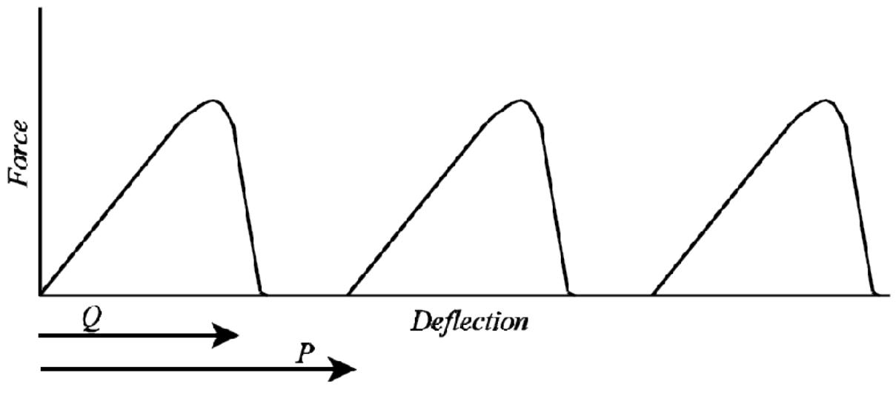

## 3.4 Spectral Wind

3.4.1 Generalized Force Spectrum

The generalized force spectrum used for wind spectral analysis is a Harris wind spectrum with gust effects spatial correlation and mean wind velocity variation. For any mode, the generalized force spectrum $S_{ q i } ( f )$ is taken as:

$$S_{q i} (f) = \frac{4}{f} F_{i}^{2} J_{a i} (f) J_{r i}^{2} (f) S_{V} (f)$$

where $\mathsf{ F }_{ \mathrm{ i } }$ is the generalized force and $S_{ v } ( f )$ is the Harris spectrum given by:

$$S_{V} (f) = \frac{4 k \eta_{1} (f)}{\left(2 + \eta_{1}^{2} (f)\right)^{\frac{5}{6}}}$$

In which

$$\eta_{1} = f \left(\frac{L_{H}}{v_{10}}\right)$$

Where k is the roughness parameter (default 0.0025) $L_{ H }$ is the Harris spectrum reference length (default 1800 m) and $v_{ 10 }$ is the velocity at the reference height (10m). The terms $J_{ a i }$ and $J_{ r i }$ are the mean wind velocity variation function and the gust effects spatial correlation function, respectively.

3.4.2 Mean Wind Velocity Variation Function $J_{ a }$

The mean wind variation models the mean wind speed variation with height. It is expressed as:

$$J_{a i} = \left[ \frac{\int_{0}^{z_{0}} \gamma_{i} (z) d z}{\int_{0}^{z_{0}} \gamma_{i} (z) \frac{V (z)}{V_{10}} d z} \right]^{2}$$

Where $z_{ 0 }$ is the distance to the top of the structure

$V ( z )$ is the wind velocity variation with height given by:

$$V (z) = V_{10} \left[ 1. 0 + 0. 137 \ln \left(\frac{z}{z_{0}}\right) \right]$$

In which $z_{ O }$ is the reference height in meters (10m) and

$$\gamma (z) = V (z) [ C_{d} b ] \mu_{i} (z)$$

Where

Cd is the drag coefficient

b is the cross-sectional dimension (OD for a tubular)

and $\mu_{ i } ( z )$ is the $\mathsf{ i }^{ \mathsf{ t h } }$ mode shape

3.4.3 Gust Effects Spatial Correlation Function Jr

The $J_{ r }$ function expresses the correlation of gust effects over the structure and is given by:

$$J_{r i} (n)^{2} = \frac{\int_{0}^{z_{0}} \int_{0}^{z_{0}} \gamma_{i} (z) \gamma_{i} (z^{\prime}) C o h (r , n) d z d z^{\prime}}{\left[ \int_{0}^{z_{0}} \lambda_{i} (z) d z \right]^{2}}$$

Where $z^{ \prime }$ is used to differentiate z and $z^{ \prime }$ as being two separate points in space and r is the separation difference.

The spatial correlation of the wind velocity is modeled by the Davenport coherence function taken as:

$$C o h (r, n) = \exp \left[ \frac{- n}{V_{10}} \big (C_{z}^{2} d_{z}^{2} + C_{y}^{2} d_{y}^{2} \big)^{1 / 2} \right]$$

Where:

$d_{ y } ,$ dz are the horizontal and vertical coordinate differences between the two points normal to the direction of the mean wind.

$C_{ y } ,$ Cz are decay factors usually taken as 12 and 8 respectively.

3.4.4 Modal Response Spectrum $\scriptstyle R_{ q }$

The modal response spectrum is given by:

$$R_{q i} (f) = S_{q i} (f) H_{i} (f)^{2}$$

where

$$H_{i} (f) = \frac{1}{K_{i}} \left(\left[ 1 - \left(\frac{f}{f_{n}}\right)^{2} \right]^{2} + \left[ 2 c \left(\frac{f}{f_{n}}\right)^{2} \right]\right)^{\frac{1}{2}}$$

$H_{ i } ( \mathsf{ f } )$ is known as the mechanical transfer function in which $K_{ i }$ is the generalized stiffness matrix:

$$K_{i} = (2 \pi f_{n})^{2} M_{i}$$

$f_{ \mathbf{ n } }$ is the natural frequency and c is the percent critical damping.

3.4.5 Modal Response

The RMS response for the $\boldsymbol{ i }^{ t h }$ mode may be expressed as follows:

$$\sigma_{R M S_{i}} = \sqrt{\int_{0}^{\infty} H_{i}^{2} (f) S_{i} (f) d f}$$

The response of each mode is then combined using the CQC (complete quadratic combination) method to obtain the total response $\sigma_{ j t o t }$ using the expression below:

$$\sigma_{j t o t} (f) = \sqrt{\sum_{i} \sum_{k} P_{i k} \sigma (\mathrm{f})_{i j} \sigma (\mathrm{f})_{k j}}$$

where $i , k = 1$ ..number of modes and $P_{ j k }$ is the modal correlation coefficient:

$$P_{i k} = \frac{2 \sqrt{c_{i} c_{k}} \left[ (w_{i} + w_{k})^{2} (c_{i} + c_{k}) + (w_{i}^{2} - w_{k}^{2}) (c_{i} - c_{k}) \right]}{4 (w_{i} - w_{k})^{2} + (c_{i} + c_{k})^{2} (w_{i} + w_{k})^{2}}$$

where ci and wi are respectively damping factor and frequency for mode i

In the case of spectral wind fatigue, the modal responses are passed to fatigue as fatigue load cases to calculate the fatigue damage.

3.4.6 Dynamic Amplification Factor and Peak Member Forces

In the case of extreme wind, the dynamic amplification factor is calculated for all members by the following expression:

$$D A F_{j} = 1 + G_{j} \frac{\sigma_{j t o t} (f)}{F_{M j}}$$

where

$$G_{j} = \sqrt{2 \ln (T_{a} v_{j})} + \frac{0 . 577}{\sqrt{2 \ln (T_{a} v_{j})}}$$

In which

j is an iterator for each force component for each member

$T_{ a }$ is the applied averaging time

$F_{ m j }$ is the static force response due to a mean wind load

$v_{ j }$ is the resulting zero crossing frequency given by:

$$v_{j} = \frac{\sqrt{\sum_{i} \left(\sigma_{i j} (f) v_{i}\right)^{2}}}{\sigma_{j t o t} (f)}$$

The forces due to dynamic wind loading are calculated as:

$$F_{m a x j} = D A F_{j} F_{M j}$$

4 SAMPLE PROBLEMS

The structures shown in Figure below was used to illustrate various capabilities of the Dynamic Response program. Seven separate response analyses are illustrated:

1. The dynamic response of the structure due to ground motion was determined using the response spectrum approach. The responses of each mode were added using the Complete Quadratic Combination (CQC) method.   
2. The response of the structure due to ground motion was determined using the Time History approach.   
3. This problem is an engine vibration problem where the motion of the deck due to excitation from reciprocating machinery was analyzed.   
4. The dynamic response due to a step load defined using a force time history was analyzed.   
5. The structural response due to extreme wind gusts from four directions was determined.   
6. Fatigue damage due to wind fatigue was performed using the spectral wind capabilities.   
7. Fatigue damage due to vibration caused by ice floes was calculated by the program.

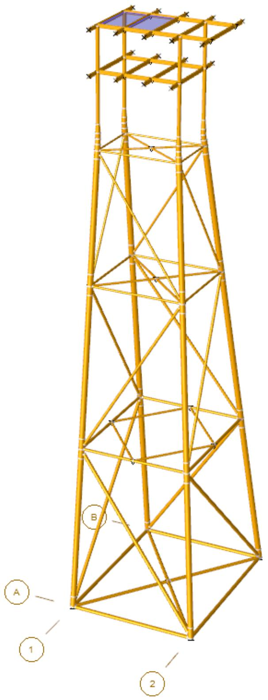

## 4.1 RESPONSE SPECTRUM SEISMIC ANALYSIS

The following is an example of a response analysis for a base driven system using the Response Spectrum approach.

The structure in Figure 1 stands in 261 feet of water. It is located in a seismic zone with stiff soil where the ratio of effective ground acceleration to gravitational acceleration is 0.20.

The response spectrum was applied equally along both principal orthogonal horizontal axes along with an acceleration spectrum equal to one-half of that applied in the vertical direction. All three spectra were applied simultaneously and the responses were combined using the complete quadratic combination (CQC) method. Five percent critical damping was assumed.

The static analysis included gravity and buoyancy loads. The stresses induced by earthquake loads were combined with the static stresses for the purpose of member strength check. For tubular joint check, the seismic stresses were doubled then combined with the static stresses. In either case, the allowable stresses were increased by 70 percent.

Note: For any dynamic analysis, a foundation super element, dummy pile or equivalent pile stub used to simulate the soil/pile interaction must be developed using the PSI or PILE program.

For this sample problem, Load Case EQKS containing the gravity and buoyancy of the structure was generated by Seastate then solved. Dynpac was used to generate the dynamic characteristics of the structure. The mass of the structure includes the mass associated with gravity, enclosed fluid and added mass.

The Dynamic Response program was used to predict the response of the structure due to the ground motion caused by an earthquake. The structure was analyzed using the response spectrum approach with an effective horizontal ground acceleration of 0.20*G.

The following is the Dynamic Response input file used in conjunction with the generalized mass file and solution file from Dynpac.

```txt
1 2 3 4 5 6 7 8  
123456789012345678901234567890123456789012345678901234567890  
1 DROPT SPEC 15 +Z -261.  
2 * USE 5.0% OVERALL DAMPING  
3 SDAMP 5.0
4 * CREATES STATIC + SEISMIC COMBINATIONS USING STATIC LOAD CASE EQKS  
5 * USE 1.0 X SEISMIC STRESS FOR ELEMENT CHECK LOAD COMBINATIONS  
6 * USE 2.0 X SEISMIC STRESS FOR CONNECTION CHECK LOAD COMBINATIONS  
7 STCMB 1.0 2.0 EQKS 1.0  
8 LOAD
9 * CREATE 1 SEISMIC LOAD CASE WITH 0.2G RESPONSE FACTOR  
10 * WITH 1.0 X AND Y DIRECTION FACTOR AND 0.5 Z DIRECTION FACTOR  
11 SPLAPI .2 1.0B 1.0B 0.5C CQC N  
12 RSFUNC 803DX 5.0 803DY 5.0 803DZ 5.0 DX DX DX PG1 OR R  
13 END
```

The following is a detailed description of the Dynamic Response input file, the results of the analysis ensue:

Line 1. The DROPT line specifies analysis options, namely:

a. A base driven spectral earthquake analysis is to be performed (‘SPEC’ in columns 7- 10).   
b. A mudline elevation of -261. is specified in columns 19-24.

Line 3. The SDAMP line specifies that the overall structural damping is 5.0 percent.

Line 7. The STCMB line is used to have seismic and static results combined automatically. The STCMB line designates the following:

a. Seismic loading is to be factored by 1.0 when combined with static loading for element check load cases.   
b. Seismic loading is to be factored by 2.0 when combined with static loading for joint check load cases as designated by 2.0 in columns 13-17.   
c. Load case EQKS from the static solution file is to be combined with the seismic load cases.

Line 8. The LOAD line specifies that loading data is to follow.

Line 11. The SPLAPI line defines the spectral analysis parameters as follows:

a. The API RP2A spectrum for soil type ‘B’ is to be used for directions X and Y as specified by ‘B’ in columns 22, 29 and soil type ‘C’ is used for the Z direction as specified by ‘C’ in column 36.   
b. Modal responses will be combined using the CQC method as designated in columns 38-41.   
c. A response or ground acceleration factor of 0.20 * G is specified in columns 11-15.   
d. The percent of the ground acceleration factor to be applied in each of the global directions is 100.0, 100.0 and 50.0 for the X, Y and Z global directions respectively as specified by 1.0, 1.0 and 0.50 in columns 16-21, 23-28 and 30-35, respectively.

Line 12. The response function for the global X, Y and Z directions for joint 803 is requested on the RSFUNC line. The response function and power spectral density for 5 percent damping plotted verse time will be generated (PG1 O R in columns 70-76).

Below are the response function and spectral density plots created in Dynamic Response followed by a portion of the output containing the directional responses.

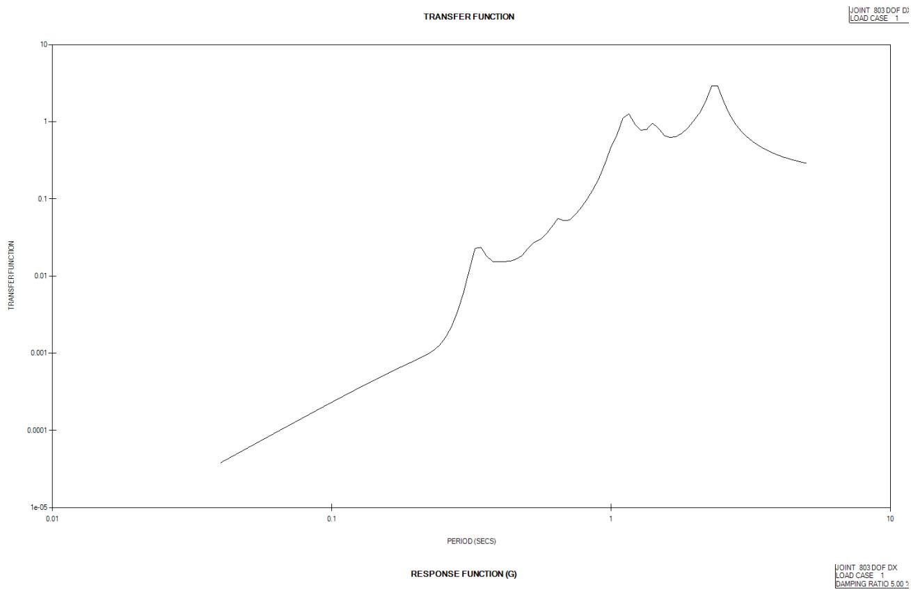

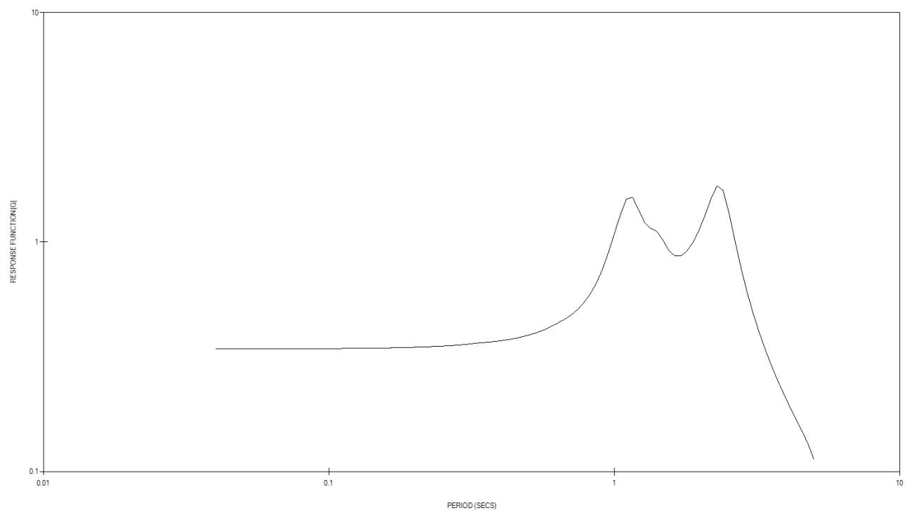


|  | 1 | 2 | 3 | 4 | 5 | 6 | 7 | 8 |
| --- | --- | --- | --- | --- | --- | --- | --- | --- |
|  | 1234567890123456789012345678901234567890123456789012345678901234567890 | 1234567890123456789012345678901234567890123456789012345678901234567890 | 1234567890123456789012345678901234567890123456789012345678901234567890 | 1234567890123456789012345678901234567890123456789012345678901234567890 | 1234567890123456789012345678901234567890123456789012345678901234567890 | 1234567890123456789012345678901234567890123456789012345678901234567890 | 1234567890123456789012345678901234567890123456789012345678901234567890 | 1234567890123456789012345678901234567890123456789012345678901234567890 |
| 1 | OPTIONS | EN | UCJO |  | PTPT | PT |  |  |
| 2 | ENGLISH TEST MODEL | ENGLISH TEST MODEL | ENGLISH TEST MODEL | ENGLISH TEST MODEL | ENGLISH TEST MODEL | ENGLISH TEST MODEL | ENGLISH TEST MODEL | ENGLISH TEST MODEL |
| 3 | 3 | 12 | 0 | 20 | 3 |  |  |  |
| 4 | 1 | 15CQC | DYNAMIC RESPONSE | DYNAMIC RESPONSE | DYNAMIC RESPONSE | DYNAMIC RESPONSE | DYNAMIC RESPONSE | DYNAMIC RESPONSE |
| 5 | P | 1 | 0.91753E+01 |  | 0.42591E+00 | 0.50000E-01 |  |  |
| 6 | P | 2 | 0.12882E+00 |  | 0.48890E+00 | 0.50000E-01 |  |  |
| 7 | P | 3 | 0.30649E+00 |  | 0.70236E+00 | 0.50000E-01 |  |  |
| 8 | P | 4 | -0.17174E+01 |  | 0.88473E+00 | 0.50000E-01 |  |  |
| 9 | P | 5 | 0.70270E-01 |  | 0.99501E+00 | 0.50000E-01 |  |  |
| 10 | P | 6 | 0.46359E-02 |  | 0.15313E+01 | 0.50000E-01 |  |  |
| 11 | P | 7 | -0.50549E-01 |  | 0.15626E+01 | 0.50000E-01 |  |  |
| 12 | P | 8 | 0.88794E-02 |  | 0.18498E+01 | 0.50000E-01 |  |  |
| 13 | P | 9 | -0.38424E-02 |  | 0.19746E+01 | 0.50000E-01 |  |  |
| 14 | P | 10 | 0.28896E-01 |  | 0.24008E+01 | 0.50000E-01 |  |  |
| 15 | P | 11 | -0.26591E-02 |  | 0.24840E+01 | 0.50000E-01 |  |  |
| 16 | P | 12 | 0.21402E-01 |  | 0.25291E+01 | 0.50000E-01 |  |  |
| 17 | P | 13 | -0.97135E-01 |  | 0.26450E+01 | 0.50000E-01 |  |  |
| 18 | P | 14 | -0.11110E+00 |  | 0.28225E+01 | 0.50000E-01 |  |  |
| 19 | P | 15 | -0.40150E+00 |  | 0.30421E+01 | 0.50000E-01 |  |  |
| 20 | 2 | 15CQC | DYNAMIC RESPONSE | DYNAMIC RESPONSE | DYNAMIC RESPONSE | DYNAMIC RESPONSE | DYNAMIC RESPONSE | DYNAMIC RESPONSE |
| 21 | P | 1 | 0.16728E-01 |  | 0.42591E+00 | 0.50000E-01 |  |  |
| 22 | P | 2 | 0.93210E+01 |  | 0.48890E+00 | 0.50000E-01 |  |  |
| 23 | P | 3 | -0.27678E+01 |  | 0.70236E+00 | 0.50000E-01 |  |  |
| 24 | P | 4 | -0.80927E-01 |  | 0.88473E+00 | 0.50000E-01 |  |  |
| 25 | P | 5 | -0.20806E+01 |  | 0.99501E+00 | 0.50000E-01 |  |  |
| 26 | P | 6 | -0.13201E+00 |  | 0.15313E+01 | 0.50000E-01 |  |  |
| 27 | P | 7 | 0.51310E-02 |  | 0.15626E+01 | 0.50000E-01 |  |  |
| 28 | P | 8 | 0.10128E-02 |  | 0.18498E+01 | 0.50000E-01 |  |  |
| 29 | P | 9 | -0.13799E+00 |  | 0.19746E+01 | 0.50000E-01 |  |  |
| 30 | P | 10 | -0.18181E-02 |  | 0.24008E+01 | 0.50000E-01 |  |  |
| 31 | P | 11 | -0.13417E-01 |  | 0.24840E+01 | 0.50000E-01 |  |  |
| 32 | P | 12 | 0.65640E-03 |  | 0.25291E+01 | 0.50000E-01 |  |  |
| 33 | P | 13 | 0.46190E-04 |  | 0.26450E+01 | 0.50000E-01 |  |  |
| 34 | P | 14 | -0.14306E-01 |  | 0.28225E+01 | 0.50000E-01 |  |  |
| 35 | P | 15 | 0.21750E+00 |  | 0.30421E+01 | 0.50000E-01 |  |  |
| 36 | 3 | 15CQC | DYNAMIC RESPONSE | DYNAMIC RESPONSE | DYNAMIC RESPONSE | DYNAMIC RESPONSE | DYNAMIC RESPONSE | DYNAMIC RESPONSE |
| 37 | P | 1 | 0.24800E+00 |  | 0.42591E+00 | 0.50000E-01 |  |  |
| 38 | P | 2 | 0.19615E-02 |  | 0.48890E+00 | 0.50000E-01 |  |  |
| 39 | P | 3 | -0.10070E-01 |  | 0.70236E+00 | 0.50000E-01 |  |  |
| 40 | P | 4 | -0.14552E+00 |  | 0.88473E+00 | 0.50000E-01 |  |  |
| 41 | P | 5 | 0.97356E-02 |  | 0.99501E+00 | 0.50000E-01 |  |  |
| 42 | P | 6 | 0.43640E-02 |  | 0.15313E+01 | 0.50000E-01 |  |  |
| 43 | P | 7 | 0.15387E+01 |  | 0.15626E+01 | 0.50000E-01 |  |  |
| 44 | P | 8 | -0.19477E-01 |  | 0.18498E+01 | 0.50000E-01 |  |  |
| 45 | P | 9 | -0.93781E-02 |  | 0.19746E+01 | 0.50000E-01 |  |  |
| 46 | P | 10 | -0.64096E-01 |  | 0.24008E+01 | 0.50000E-01 |  |  |
| 47 | P | 11 | 0.11796E-01 |  | 0.24840E+01 | 0.50000E-01 |  |  |
| 48 | P | 12 | -0.11803E+00 |  | 0.25291E+01 | 0.50000E-01 |  |  |
| 49 | P | 13 | 0.11713E+01 |  | 0.26450E+01 | 0.50000E-01 |  |  |
| 50 | P | 14 | 0.28148E+00 |  | 0.28225E+01 | 0.50000E-01 |  |  |
| 51 | P | 15 | 0.59587E-01 |  | 0.30421E+01 | 0.50000E-01 |  |  |


Note: This file created by the Dynamic Response program, contains the responses for each of the three directions. The modal responses are combined using the CQC method as specified to obtain directional responses which are then combined using the RMS or SRSS method. The combine steps are executed automatically as part of the Dynamic Response analysis.

When using the STCMB line, the program creates four seismic+static load combinations, two for element check and two for joint can check, for each seismic load case as follows:


| LC | Combine Type | Description |
| --- | --- | --- |
| 1 | PRST | Element code check case, seismic axial tension |
| 2 | PRSC | Element code check case, seismic axial compression |
| 3 | PRST | Joint can check case, seismic axial tension |
| 4 | PRSC | Joint can check case, seismic axial compression |


When using the STCMB feature, the Combine program is executed automatically to combine the seismic results and the static results. Two load cases for each member check and joint check will be created to account for the cyclic nature of the seismic loading. The following is the combine input file created by the program and used to create the combined load cases.

```csv
1 2 3 4 5 6 7 8  
1234567890123456789012345678901234567890123456789012345678901234567890  
1 ENGLISH TEST MODEL  
2 CMBOPT
3 LCOND PRST EQK + STAT MEMB  
4 COMP PEQKS 1.0000  
5 COMP S 1 1.0000  
6 LCOND PRSC EQK + STAT MEMB  
7 COMP PEQKS 1.0000  
8 COMP S 1 1.0000  
9 LCOND PRST EQK + STAT JOIN  
10 COMP PEQKS 1.0000  
11 COMP S 1 2.0000  
12 LCOND PRSC EQK + STAT JOIN  
13 COMP PEQKS 1.0000  
14 COMP S 1 2.0000  
15 END
```

Note: The STCMB feature requires that the static solution file exist prior to executing the earthquake analysis. If the STCMB feature is note used, the user must create the Combine input file and execute Combine as a separate analysis step.

The following are the Post and Joint Can input files, respectively, used for post processing:

```txt
1 2 3 4 5 6 7 8 1 2345678901234567890123456789012345678901234567890 1 2 SDUCJO 1 1 PTPT PT 2 LCSEL IN 1 2 3 AMOD 1 1.7 2 1.7 4 5 END 
```


|  | 1 | 2 | 3 | 4 | 5 | 6 | 7 | 8 |
| --- | --- | --- | --- | --- | --- | --- | --- | --- |
| 1 | JCNOPT EQK EN | 2.0 | C | NID | M | FLMX | 1.75 |  |
| 2 | LCSEL IN | 3 | 4 |  |  |  |  |  |
| 3 | AMOD |  |  |  |  |  |  |  |
| 4 | AMOD | 3 | 1.7 | 4 | 1.7 |  |  |  |
| 5 | END |  |  |  |  |  |  |  |


Note: Only load cases 1 and 2 are selected in the Post input file, while only load cases 3 and 4 are selected in the Joint Can input file. Notice also that the ‘JO’ option which designates that stresses are to be checked only at the member ends is specified in the Post input file.

## 4.2 TIME HISTORY SEISMIC ANALYSIS

Sample Problem 2 is similar to Sample Problem 1 except that the dynamic response due to ground motion was calculated using the time history approach.

The structure in Figure 1 is located in a seismic zone where site specific studies have been performed. The studies have yielded ground acceleration time history functions for each direction.

For this analysis, the time histories were applied in the respective directions separately. Five percent critical damping was assumed.

Equivalent static loading for each time point is generated by the analysis which can then be combined with gravity loading for structural code checks.

The following contains selected portions of the input and results of the analysis:

The Dynamic Response program was used to predict the response of the structure due to the ground motion caused by an earthquake. The structure was analyzed using a ground acceleration time history for each direction. The following is the Dynamic Response input file used in conjunction with the generalized mass file and solution file from Dynpac.


|  | 1 | 2 | 3 | 4 | 5 | 6 | 7 | 8 |
| --- | --- | --- | --- | --- | --- | --- | --- | --- |
|  | 12345678901 | 2345678901 | 2345678901 | 2345678901 | 2345678901 | 2345678901 | 2345678901 | 234567890 |
| 1 | DROPT TIME | 10 | +Z |  |  |  |  |  |
| 2 | SDAMP | 5.0 |  |  |  |  |  |  |
| 3 | LOAD |  |  |  |  |  |  |  |
| 4 | THLOAD FILE | SDO |  | ALLESPLTPLMPLS | ALLESPLTPLMPLS |  |  |  |
| 5 | TIME |  | 35.0 | 0.02 | 1E-10 |  |  |  |
| 6 | END |  |  |  |  |  |  |  |


The following is a detailed description of the Dynamic Response input file:

Line 1. The DROPT line specifies analysis options, namely:

a. A base driven time history analysis is to be performed (‘TIME’ in columns 7-10).

Line 2. The SDAMP line specifies that the overall structural damping is 5.0 percent.

Line 3. The LOAD line specifies that loading data is to follow.

Line 4. The THLOAD line defines the spectral analysis parameters as follows:

a. The time history functions are defined in a separate time history input file as specified by ‘FILE’ in columns 9-12.   
b. Only structural damping is to be used (‘SDO’ in columns 21-23).

c. All time points are to be saved as a load case as designated in columns 33-35 by ‘ALL’.   
d. Equivalent static load cases are to be saved as specified by ‘ESL’ in columns 36-38.   
e. Plots showing the modal responses, overturning moment and base shear versus time are requested by ‘PLT’, ‘PLM’ and ‘PLS’ respectively in columns 39-47.

Line 5. The TIME line designates the time history start and end times as 0.0 seconds and 35.0 seconds respectively with an output time interval of 0.2 seconds and a minimum time integration step of 1E-10 seconds.

The time history input file contains the ground motion information for each time step. The following is an excerpt of the time history

```csv
1 2 3 4 5 6 7 8  
123456789012345678901234567890123456789012345678901234567890  
1 ELCN 3A
2 0.000000E+00-.551180E+000.118110E+000.944880E+00  
3 0.200000E-01-.425196E+010.748030E+00-.905510E+01  
4 0.400000E-01-.397637E+010.267716E+01-.108267E+02  
5 0.600000E-01-.346456E+010.114173E+01-.156299E+02  
6 0.800000E-01-.374015E+010.114173E+01-.153543E+02  
7 0.100000E+00-.472440E+010.212598E+01-.236220E+01  
8 0.120000E+00-.559054E+010.326771E+010.161023E+02  
9 0.140000E+00-.503936E+010.208661E+010.822833E+01  
10 0.160000E+00-.433070E+010.55118O+E+O-.268897E+O2  
11 0.180000E+O-O-334645E+O1O-2O8661E+O- .254724E+O2  
12 0.2OoOOOE+O-O-334645E+O1O-527558E+O1O-358267E+O1 
```

The following is a detailed description of the Time History Earthquake input file, the results of the analysis ensue:

Line 1. The name of the time history ‘ELCN’ is entered in columns 1-4. Three time history input functions are specified with ‘3’ in columns 5-8, and acceleration is specified as the dependent variable with ‘A’ in column 9.   
Line 2. The time increment is entered in columns 1-12, the acceleration functions in the X, Y, and Z direction is entered in columns 13-24, 25-36, and 37-48 respectively.

The plots created by the analysis followed by a portion of the output containing the responses are on the following pages.

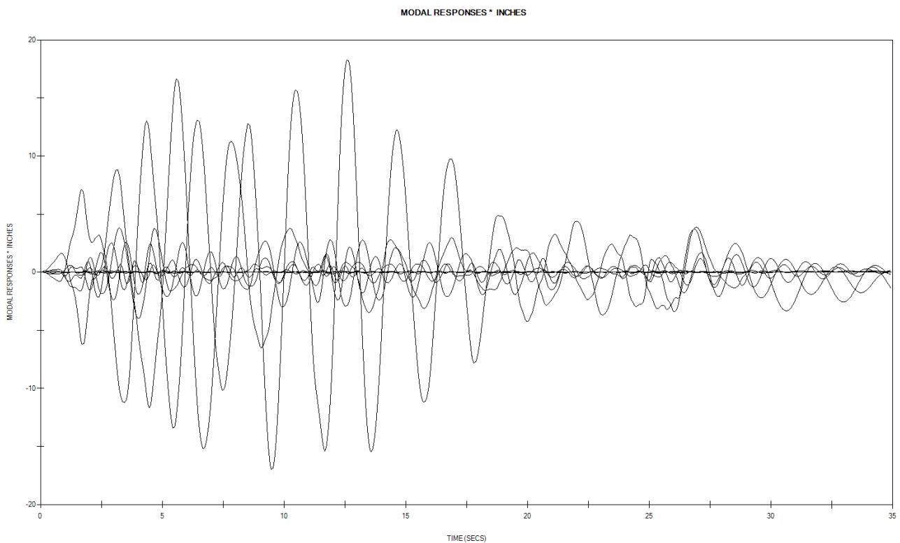

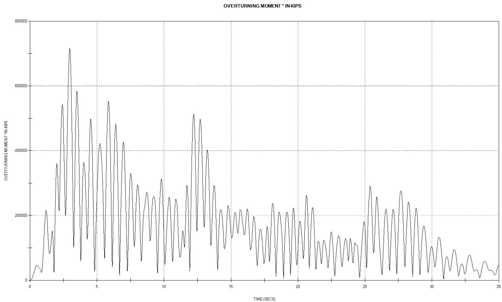

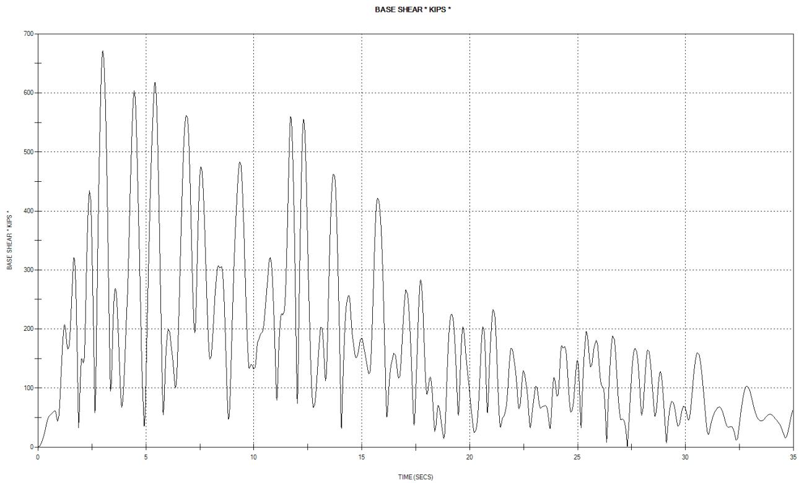

The result of the response analysis is a model file (dyroci) with equivalent static load conditions for all 1750 time points (35 seconds/0.02 seconds). The following figure depicts the equivalent static loading for load condition 149 (2.98s) which represents the maximum base shear load condition.

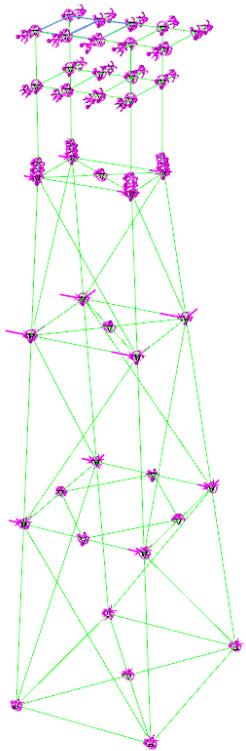

## 4.3 ENGINE/COMPRESSOR VIBRATION

Sample Problem 3 is an engine vibration problem where the motion of a deck structure due to reciprocating machinery is analyzed.

The structure in figure below contains the deck structure in conjunction with a skid containing representation of the engine and compressor.

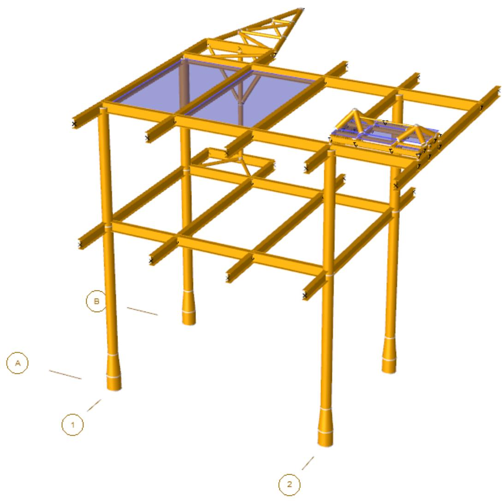

For this analysis, the Dynpac program was used to extract 80 modes. The Dynamic Response program was used to predict the response of the structure due to the machinery. Running speeds of 600 rpm and 1200 rpm were analyzed. Gas torque and unbalanced forces were input with 2% structural damping considered for modes through the top running speed and 5% damping for higher frequency modes.

The following is the Dynamic Response input file used in conjunction with the generalized mass file and solution file from Dynpac.

1 2 3 4 5 6 7 8   
123456789012345678901234567890123456789012345678901234567890   
1 DROPT ENGV 80EC 1   
2 \* DAMPING OF $2.0\%$ FOR MODES THROUGH THE TOP RUNNING SPEED   
3 SDAMP 2.0 2.0 2.0 2.0 2.0 2.0 2.0 2.0 2.0 2.0   
4 SDAMP 2.0 2.0 2.0 2.0 2.0 2.0 2.0 2.0 2.0   
5 SDAMP 2.0 2.0 2.0 2.0 2.0 2.0 2.0 2.0 2.0   
6 SDAMP 2.0 2.0 2.0 2.0 5.0 5.0 5.0 5.0 5.0 5.0   
7 \* DAMPING OF $5.0\%$ FOR MODES HIGHER THAN TOP RUNNING SPEED   
8 SDAMP 5.0 5.0 5.0 5.0 5.0 5.0 5.0 5.0 5.0 5.0   
9 SDAMP 5.0 5.0 5.0 5.0 5.0 5.0 5.0 5.0 5.0   
10 SDAMP 5.0 5.0 5.0 5.0 5.0 5.0 5.0 5.0 5.0   
11 SDAMP 5.0 5.0 5.0 5.0 5.0 5.0 5.0 5.0 5.0   
12 LOAD
13 \* THE EXPECTED RUNNING SPEED IS BETWEEN6OO RPM AND12OO RPM..   
14 ENGVIB48O.O144O.O MOD6OZ.OO2O1ODL PT PT   
15 PLTOPT SNMLDL GR   
16 JNTPLT8O38368458468478481Ooo3OOo8358368O7   
17 \* RUNPING SPEED $=$ OoO RPM   
18 \* $100\%$ GAS TORQUE LOAD(LOAD CASE WITH597 PSI SUCTION/1O43 PSI DISCHARGE)   
19 \* $100\%$ COMPRESSOR MECHANICAL UNBALANCED LOAD-NO ENGINE UNBALANCE GIVEN..   
20 \* ALL UNBALANCES ARE MULTIPLIED BT1Ooo, THEREFORE RESPONSES ARE IN "MILs"   
21 \* RESPONSES ARE CALCULATED WITH FOLLOWING ADJUSTMENTS:   
22 \*1)MECHANICAL UNBALANCE FORCESAND MOMENTSARE HELD CONSTANT FROM48O TO6OO   
23 \* RPM AND FROM12OO RPM TO144O RPM..   
24 \*2)GAS TORQUES ARE GIVENFORONEPEED BUT WILL BE ASSUMED CONSTANT   
25 \*THROUGHOUT THE SPEED RANGE..   
26   
\*LOAD GROUP#1- COMPRESSOR"A"GAS TORQUE CURVE (MX)   
\*   
29 RSPEED6OO .   
30 UNBAL1OooTIM O.oio O.o LN O15   
31 LDFACT O.oooo-323.78-756.32-1327.9-2277.6-3448.4-4491.4-6573.3-8446.4-1O145 .   
32 LDFACT-11215.-12287.-14261.-15237.-16214.-1722o.-18287.-17655.-16316 .   
33 LDFACT-14745.-12988.-11104.-9I579-7216.7-5349.5-3621.6-2O91.-1-8O5.682Oo .   
34 LDFACT9O93O131941447.O132541OOU2253758Ooo-587.25-1382.5-25229 .   
35 LDFACT-4O37.O-5866.2-7883.4-9899.9-1O432.-1O744.-1O575.-1O878.-1O816.-1O756 .   
36 LDFACT-1O77o.-1O926.-1Ooo49.-8386.8-6761.-4-5221.-5-38O6.I-2543.-8-1452.-5-4o .   
37 LDFACT19O.O749431I47.O1399415243.I54o7I467.O132o4I1IIOo .   
38 LDFACT5976630347   
\*   
\*LOAD GROUP#1-OOPPOSITE GAS TORQUE APPLIED AT THE ENGINE   
\*   
\*UNBAL3OOOTIM -o.oio O.o LN Oi I .   
\*LDFACT O.oooo-323.78-756.32-1327.9-2277.6-3448.4-4491.4-6573.3-8446.4-1O145 .   
\*LDFACT-11215.-12287.-14261.-15237.-16214.-1722o.-18287.-17655.-16316 .   
\*LDFACT-14745.-12988.-1IIOuA.-9I579-72I6.-7-5349.-362I.-6-2O9I.-I-OoI .   
\*LDFACT9O93O13194I447.OI3254IOoo-587.C-2I38Oo-.5-25229 .   
\*LDFACT-4O37.O-5866.2-7883.4-9899.9-1O432.-1O744.-1O575.-1O878.-1O8Ioo .   
\*LDFACT-1O77o.-Ioo9u.-8386.8-676I.-4-522I.-5-38O6.I-2543.-8-I452.-5-4o .   
\*LDFACT19O.O74943IIOOOHIOOOOOOOOOOOOOOOOOOOOOOOOOOOOOOOOOOOOOOOOOOOOOOOOOOOOOOOOOOOOOOOOOOOOOOOOOOOOOOOOOOOOOOOOOOOOOOOOOOOOOOOOOOOOOOOOOOOOOOOOOOOOOOOOOOOOOOOOOOOOOOOoo

65 UNBAL 1000 0.0 LN 0 4   
66 UNBAL 1000 3.6 LN 1 4   
67 \* RUNNING SPEED $=$ 1200 RPM   
68 \* $100\%$ GAS TORQUE LOAD (LOAD CASE WITH 597 PSI SUCTION / 1043 PSI DISCHARGE)   
69 \* $100\%$ COMPRESSOR MECHANICAL UNBALANCED LOAD - NO ENGINE UNBALANCE GIVEN.   
70 \* ALL UNBALANCES ARE MULTIPLIED BT 1000, THEREFORE RESPONSES ARE IN "MILS"   
71 \* RESPONSES ARE CALCULATED WITH FOLLOWING ADJUSTMENTS:   
72 \* 1) MECHANICAL UNBALANCE FORCES AND MOMENTS ARE HELD CONSTANT FROM 480 TO 600   
73 \* RPM AND FROM 1200 RPM TO 1440 RPM.   
74 \* 2) GAS TORQUES ARE GIVEN FOR ONE SPEED BUT WILL BE ASSUMED CONSTANT   
75 \* THROUGHOUT THE SPEED RANGE.   
76   
77 \* LOAD GROUP#1 - COMPRESSOR "A" GAS TORQUE UNBALANCED (MX)   
78 \*
79 RSPEED 1200.   
80 UNBAL 1000TIM 0.010 0.0 LN 0 1 5   
81 LDFACT 0.0000-323.78-756.32-1327.9-2277.6-3448.4-4491.4-6573.3-8446.4-10145.   
82 LDFACT-11215.-12287.-13271.-14261.-15237.-16214.-17220.-18287.-17655.-16316.   
83 LDFACT-14745.-12988.-11104.-9157.9-7216.7-5349.5-3621.6-2091.1-805.68 200.56   
84 LDFACT 909.30 1319.4 1447.0 1325.4 1002.2 537.58 0.00 -587.25-1382.5-2522.9   
85 LDFACT-4037.0-5866.2-7883.4-9899.9-10432.-10744.-10575.-10878.-10816.-10756.   
86 LDFACT-10770.-10926.-10049.-8386.8-6761.4-5221.5-3806.1-2543.8-1452.5-540.94   
87 LDFACT 190.80 749.43 1147.0 1399.4 1524.3 1540.7 1467.0 1320.4 1118.0 872.27   
88 LDFACT 597.66 303.47   
89 \*
90 \* LOAD GROUP#1 - OPPOSITE GAS TORQUE APPLIED AT ENGINE   
91 \*
92 UNBAL 300OTIM -0.010 0.0 LN 0 1 5   
93 LDFACT 0.0000-323.78-756.32-1327.9-2277.6-3448.4-4491.4-6573.3-8446.4-10145.   
94 LDFACT-11215.-12287.-13271.-14261.-15237.-16214.-17220.-18287.-17655.-16316.   
95 LDFACT-14745.-12988.-11104.-9157.9-7216.7-5349.5-3621.6-2091.1-805.68 200.56   
96 LDFACT 909.30 1319.4 1447.0 1325.4 1002.2 537.58 0.00 -587.25-1382.5-2522.9   
97 LDFACT-4O37.O-5866.2-7883.4-9899.9-1O432.-I O744.-I O575.-I O878.-I O816.-I O756.   
98 LDFACT-1O77O.-O926.-OoOoF-.B8386.8-676l.4-522l.5-38O6.1-2543.8-I452.5-54O .94   
99 LDFACT 19O.O 749.43 1IaT OJLHbT OJLHbT OJLHbT OJLHbT OJLHbT OJLHbT OJLHbT OJLHbT OJLHbT OJLHbT OJLHbT OJLHbT OJLHbT OJLHbT OJLHbT OJLHbT OJLHbT OJ

The following is a detailed description of the Dynamic Response input file, the results of the analysis ensue:

Line 1. The DROPT line specifies analysis options, namely:

a. A engine vibration analysis is to be performed (‘ENGV’ in columns 7-10).   
## b. 80 modes are to be used as specified in columns 13-14.
c. The input file is to be echoed as specified by ‘EC’ in columns 15-16.

Lines 3-6. The first four SDAMP lines specify that the structural damping is 2.0 percent for modes 1 through 34.

Lines 6-11. The next five SDAMP lines specify that the structural damping is 5.0 percent for modes 35 through 80.

Line 12. The LOAD line specifies that loading data is to follow.

Line 14. The ENGVIB line defines the vibration analysis parameters as follows:

a. The analysis will be performed for a lowest running speed of 480 rpm and a highest speed of 1440 rpm as defined in columns 7-11 and 14-19, respectively.   
b. Running speeds corresponding to each modal frequency will be analyzed (‘MOD’ in columns 21-23).   
## c. 60 speed increments will be used as designated in columns 27-28.
d. The nonlinear interpolation power is 2.0   
e. A minimum of 20 points are to be determined in one cycle of the fundamental frequency while a 10 points are to be calculated in the highest harmonic.   
f. A normalized force summary along with a joint exceedance print are requested by ‘PT’ in columns 53-54 and 57-58, respectively.

Line 15. The SNAME, D-Line and Military allowable curves are to be plotted as indicated on the PLTOPT line.

Line 16. The joints to be plotted are input on the JNTPLT line.

Line 29. The first input set of input data corresponds to a running speed of 600 rpm as designated by ‘600.’ in columns 12-15 on the RSPEED line.

Line 30. The first unbalanced force is a gas torque curve about the global X axis applied at the compressor joint 1000 as defined by the UNBAL line and the subsequent LDFACT lines.

a. A time history curve to be is to be applied at joint 1000 as specified by ‘1000’ in columns 8-11 and ‘TIM’ in columns 12-14.   
b. The moment factor about the X axis is 0.01. To obtain the moment at any point, this value will be factored by the values defined using subsequent LDFACT lines.   
c. The harmonic number for this force is 0 and 5 harmonics are to be used from the Fourier series.   
d. This unbalanced load is assigned to load group 1 as specified in column 71.

Lines 31-38. The LDFACT lines designate load factors for each point on the curve. Seventy-two points representing every 5 degrees are used to define the curve.

Line 42. An equal but opposite gas torque is applied at the engine joint 3000 as defined by the UNBAL line and the subsequent LDFACT lines. Notice that this unbalanced load is applied to load group 1.

Lines 43-50. The LDFACT lines designate load factors for each point on the curve for joint 3000.

Line 55. The primary unbalanced force is defined as a moment about the Y axis as follows:

d. A moment with magnitude 4.44 is applied about the Y axis as designated in columns 41- 44.   
e. Because the phase relationship between this force and the gas torque is unknown, the force is assigned to load group 2.   
f. The harmonic number for this force is 0.

Line 60. The secondary unbalanced forces are defined as a moment about the Z axis.

Line 79. The second running for which data is to be input is defined as 1200 rpm on the RSPEED line.

Some plots created by the analysis followed by a portion of the output are on the following pages.

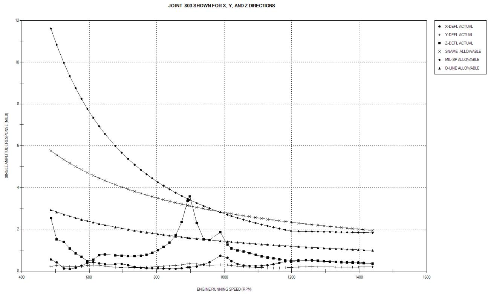

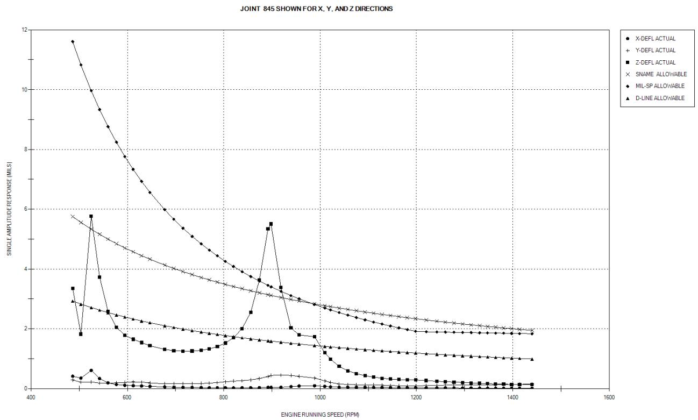

## 4.4 FORCE TIME HISTORY ANALYSIS

Sample Problem 4 is a force time history analysis where a step function is applied to the structure.

The step function F was applied at joints 803 and 805 as shown in the figure below:

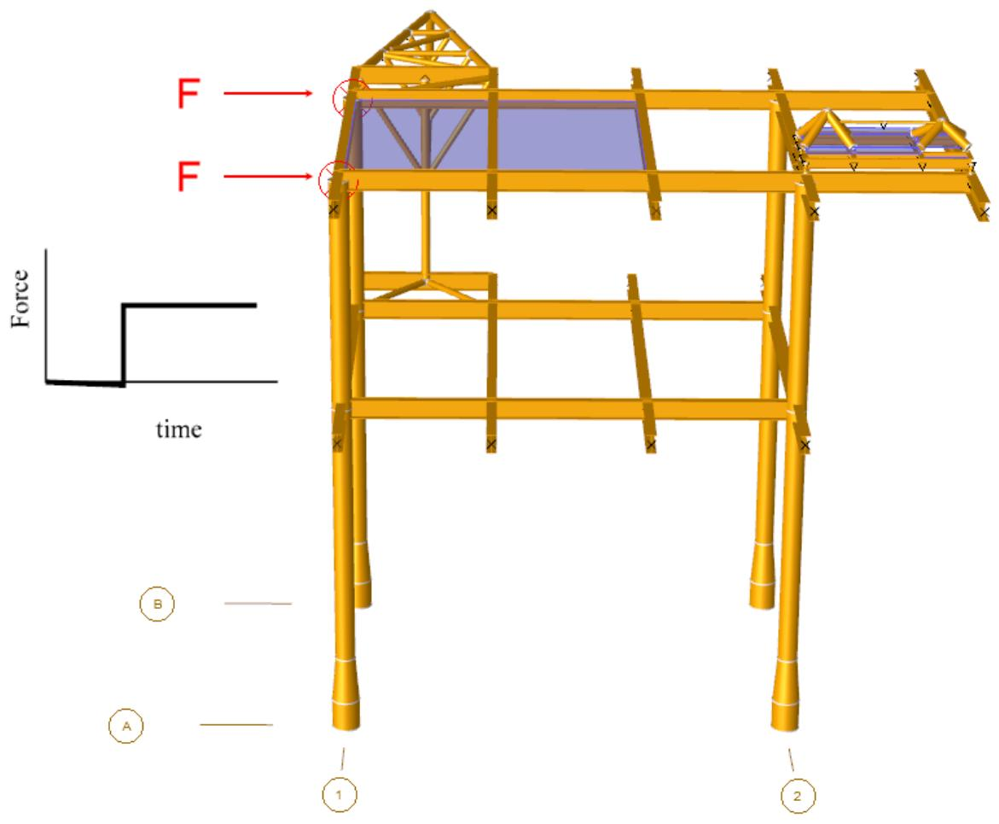

The Dynamic Response program was used to predict the response of the structure. The following is the Dynamic Response input file used in conjunction with the generalized mass file and solution file from Dynpac.

```csv
1 2 3 4 5 6 7 8  
123456789012345678901234567890123456789012345678901234567890  
1 DROPT VIBR 20EC+Z  
2 * 2 PERCENT STRUCTURAL DAMPING  
3 SDAMP 2.
# 4 LOAD
5 * STRUCTURAL DAMPING ONLY  
6 * PLOT BASE SHEAR, OTM, ACCELERATION AND DISPLACEMENT  
7 FVIB THIS LINE SDO LN PLSPLM MMS JPA JPD  
8 * MONITOR JOINTS 801 AND 805  
9 JTNUM 801 805  
10 * ANALYSIS TIME IS 20 SECONDS  
11 TIME 20. 0.02 1.0E-8 1.0  
12 * APPLY FORCE AT JOINTS 801 AND 805 AS STEP FUNCTION  
13 THFORCE 2NON ABC  
14 LOAD 801 0. 0. 
```


| 15 | LOAD | 805 | 0. | 0. |
| --- | --- | --- | --- | --- |
| 16 | LOAD | 801 | .5 | 0. |
| 17 | LOAD | 805 | .5 | 0. |
| 18 | LOAD | 801 | .51 | 15. |
| 19 | LOAD | 805 | .51 | 15. |
| 20 | LOAD | 801 | 20. | 15. |
| 21 | LOAD | 805 | 20. | 15. |
| 22 | END |  |  |  |


The following is a detailed description of the Dynamic Response input file, the results of the analysis ensue:

Line 1. The DROPT line specifies analysis options, namely:

a. A periodic vibration analysis is to be performed (‘VIBR’ in columns 7-10).   
## b. 20 modes are to be used as specified in columns 13-14.
c. The vertical axis is +Z..

Line 3. The SDAMP line specifies that the overall structural damping is 2.0 percent for all modes.

Line 4. The LOAD line specifies that loading data is to follow.

Line 7. The FVIB line defines the analysis parameters as follows:

d. The analysis type is a time history analysis as designated by ‘THIS’ with time history input specified on input lines to follow (‘LINE’ in columns 12-15).   
e. Only structural damping is to be used (‘SDO’ in columns 17-19).   
f. Linear interpolation is to be used (‘LN’ in columns 28-29).   
g. Base shear and overturning moments are to be plotted versus time as indicated by ‘PLS’ and ‘PLM’.   
h. ‘MMS’ in columns 41-43 specifies that load cases are to be created for the time points corresponding to time of maximum base shear and time of maximum overturning moment.   
i. Time history plots of joint acceleration and displacement are requested (‘JPA’ in columns 47-49 and ‘JPD’ in columns 53-55).

Line 9. Joints 801 and 805 are to be plotted as specified on the JNTNUM line.

Line 11. The analysis is to run from 0.0 to 20.0 seconds as designated on the TIME line.

Line 13. The time history force options are specified on the THFORCE line. Force is to be applied to one joint at non-uniform time increments.

Lines 14-21. The step function is defined using the LOAD lines as follows:

j. From time 0.0 to 0.5 seconds, no force is applied.   
k. At time 0.51 seconds, a 15.0 kip force in the X direction is applied. This force remains constant through 20.0 seconds.

Some plots created by the analysis followed by a portion of the output are on the following pages.

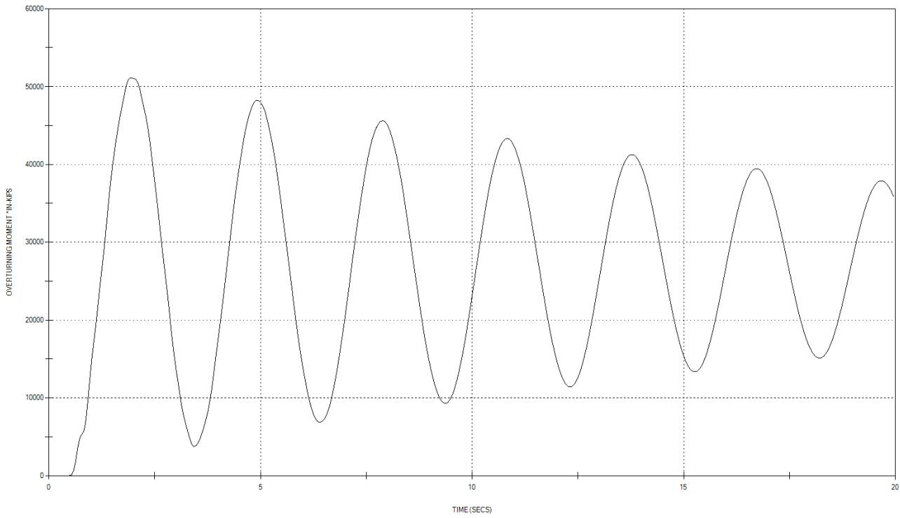  
OVERTURNING MOMENT*IN-KIPS

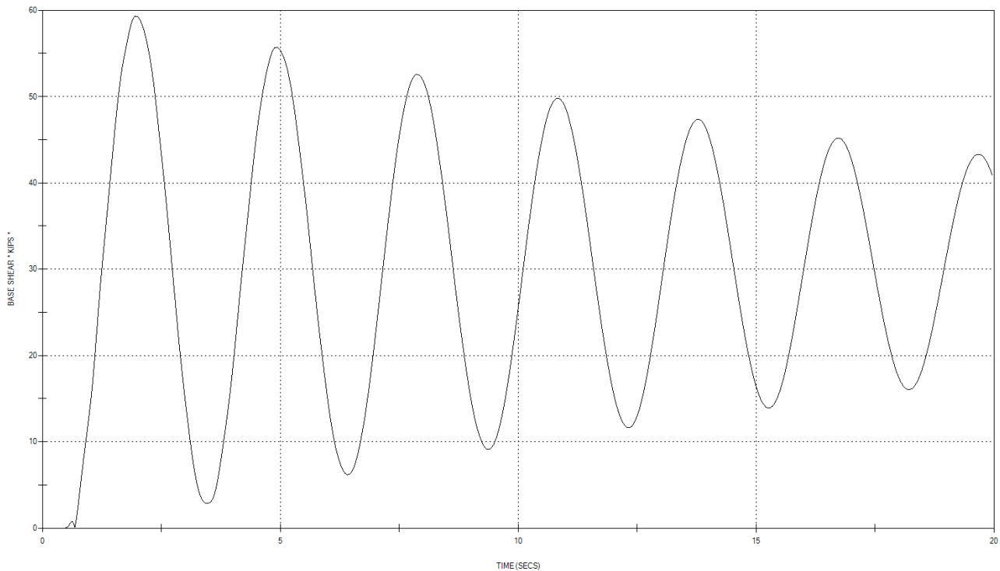  
BASE SHEAR*KIPS *

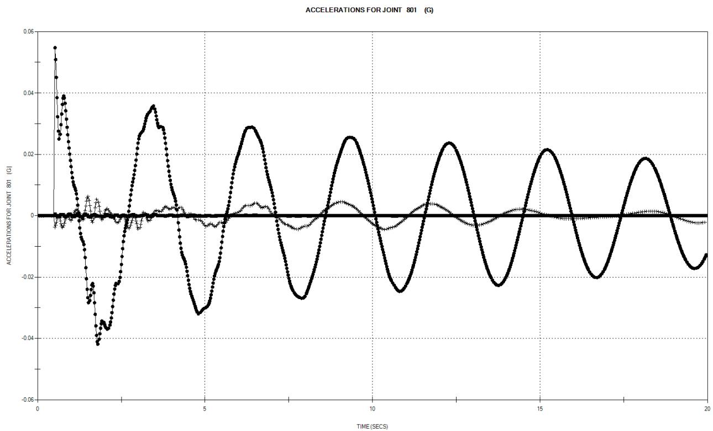

## 4.5 EXTREME SPECTRAL WIND ANALYSIS

Sample Problem 5 is an extreme spectral wind analysis.

An extreme 150 knot wind was applied to the structure along both the global X and Y directions. The wind loading was defined using the Seastate input file below:

```txt
1 2 3 4 5 6 7 8  
1234567890123456789012345678901234567890123456789012345678901234567890  
1 LDOPT +Z 64.20 490.00 GLOBEN WIN NPNP K  
2 FILE S
3 LOAD
# 4 LOADCNW000
# 5 WIND
6 WIND M 100.00 33.00 0.0 AP08  
# 7 LOADCNW045
# 8 WIND
9 WIND M 100.00 33.00 45.00 AP08  
# 10 LOADCNW090
# 11 WIND
12 WIND M 100.00 33.00 90.00 AP08  
# 13 END
```

The Dynamic Response program was used to predict the response of the structure. The following is the Dynamic Response input file used in conjunction with the generalized mass file and solution file from Dynpac.

```txt
1 2 3 4 5 6 7 8  
1234567890123456789012345678901234567890123456789012345678901234567890  
1 DROPT WIND 15 +Z  
# 2 SDAMP 2.0
3 STCMB 1. 1. DEAD1.05 MISC1.05 AREA 0.5 MACH 1.0  
# 4 LOAD
5 SPCWIN EX MN PL PL 600.0  
6 END
```

The following is a detailed description of the Dynamic Response input file, the results of the analysis ensue:

Line 1. The DROPT line specifies analysis options, namely:

a. A spectral wind analysis is to be performed (‘WIND’ in columns 7-10).   
## b. 15 modes are to be used as specified in columns 13-14.
c. The vertical axis is +Z..

Line 2. The SDAMP line specifies that the overall structural damping is 2.0 percent for all modes.

Line 4. The LOAD line specifies that loading data is to follow.

Line 5. The SPCWIN line defines the analysis parameters as follows:

a. The analysis type is an extreme wind analysis as designated by ‘EX’ in columns 8-9.   
b. Minimum print is requested along with a generalized force plot and response spectrum plot (‘MN’, ‘PL’, and ‘PL’ in columns 11-12, 14-15, and 17-18, respectively).   
c. The wind averaging time is 600 seconds.

Some plots created by the analysis followed by a portion of the output are on the following pages.

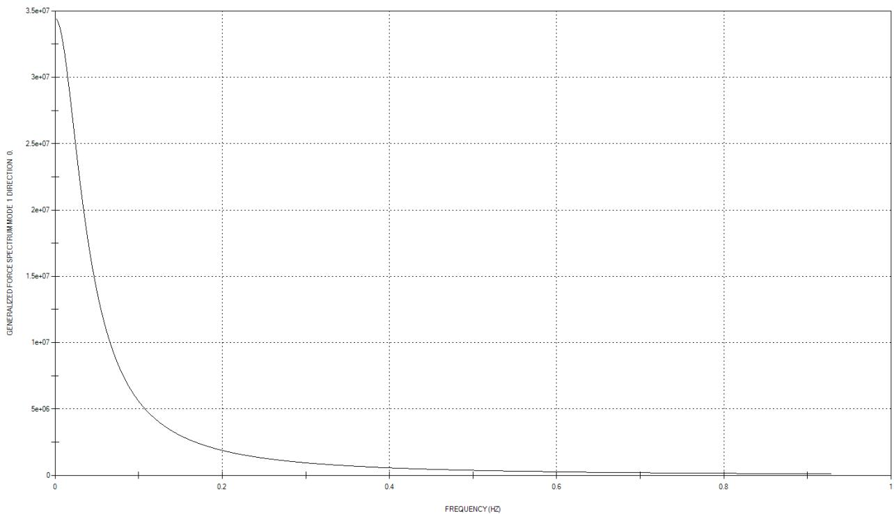  
GENERALIZED FORCE SPECTRUM MODE1DIRECTION 0.0

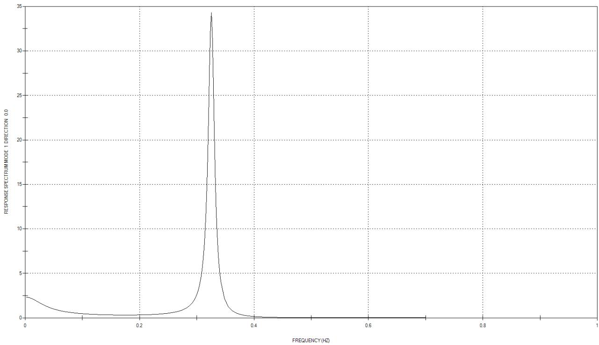  
RESPONSE SPECTRUMMODE1DIRECTION0.0

## 4.6 SPECTRAL WIND FATIGUE ANALYSIS

Sample Problem 6 illustrates the spectral wind fatigue capabilities of the Dynamic Response program. The structure contains a flare boom and was checked for fatigue damage due to winds approaching from the 0, 45, and 90 degree directions.

In order to determine fatigue damage, aerodynamic data in addition to reference wind speeds for each approach direction must be specified by the user. For each wind specified, a Harris spectrum is used to determine the damage caused by that wind speed. The aerodynamic data and wind load data was defined using the Seastate input file below:


|  | 1 | 1 | 2 | 3 | 4 | 5 | 6 | 7 | 8 |
| --- | --- | --- | --- | --- | --- | --- | --- | --- | --- |
|  | 123456789012345678901234567890123456789012345678901234567890 | 123456789012345678901234567890123456789012345678901234567890 | 123456789012345678901234567890123456789012345678901234567890 | 123456789012345678901234567890123456789012345678901234567890 | 123456789012345678901234567890123456789012345678901234567890 | 123456789012345678901234567890123456789012345678901234567890 | 123456789012345678901234567890123456789012345678901234567890 | 123456789012345678901234567890123456789012345678901234567890 | 123456789012345678901234567890123456789012345678901234567890 |
| 1 | LDOPT | +Z | 64.20 | 490.00 |  | GLOBEN WIN |  | NPNP | K |
| 2 | FILE S |  |  |  |  |  |  |  |  |
| 3 | LOAD |  |  |  |  |  |  |  |  |
| 4 | LOADCN | 1 |  |  |  |  |  |  |  |
| 5 | WIND |  |  |  |  |  |  |  |  |
| 6 | WIND D M | 10.00 | 33.00 |  | AP08 |  |  |  |  |
| 7 | LOADCN | 2 |  |  |  |  |  |  |  |
| 8 | WIND |  |  |  |  |  |  |  |  |
| 9 | WIND D M | 30.00 | 33.00 |  | AP08 |  |  |  |  |
| 10 | LOADCN | 3 |  |  |  |  |  |  |  |
| 11 | WIND |  |  |  |  |  |  |  |  |
| 12 | WIND D M | 50.00 | 33.00 |  | AP08 |  |  |  |  |
| 13 | LOADCN | 4 |  |  |  |  |  |  |  |
| 14 | WIND |  |  |  |  |  |  |  |  |
| 15 | WIND D M | 80.00 | 33.00 |  | AP08 |  |  |  |  |
| 16 | LOADCN | 5 |  |  |  |  |  |  |  |
| 17 | WIND |  |  |  |  |  |  |  |  |
| 18 | WIND D M | 100.00 | 33.00 |  | AP08 |  |  |  |  |
| 19 | LOADCN | 6 |  |  |  |  |  |  |  |
| 20 | WIND |  |  |  |  |  |  |  |  |
| 21 | WIND D M | 10.00 | 33.00 | 45.0 | AP08 |  |  |  |  |
| 22 | LOADCN | 7 |  |  |  |  |  |  |  |
| 23 | WIND |  |  |  |  |  |  |  |  |
| 24 | WIND D M | 30.00 | 33.00 | 45.0 | AP08 |  |  |  |  |
| 25 | LOADCN | 8 |  |  |  |  |  |  |  |
| 26 | WIND |  |  |  |  |  |  |  |  |
| 27 | WIND D M | 50.00 | 33.00 | 45.0 | AP08 |  |  |  |  |
| 28 | LOADCN | 9 |  |  |  |  |  |  |  |
| 29 | WIND |  |  |  |  |  |  |  |  |
| 30 | WIND D M | 80.00 | 33.00 | 45.0 | AP08 |  |  |  |  |
| 31 | LOADCN | 10 |  |  |  |  |  |  |  |
| 32 | WIND |  |  |  |  |  |  |  |  |
| 33 | WIND D M | 100.00 | 33.00 | 45.0 | AP08 |  |  |  |  |
| 34 | LOADCN | 11 |  |  |  |  |  |  |  |
| 35 | WIND |  |  |  |  |  |  |  |  |
| 36 | WIND D M | 10.00 | 33.00 | 90.0 | AP08 |  |  |  |  |
| 37 | LOADCN | 12 |  |  |  |  |  |  |  |
| 38 | WIND |  |  |  |  |  |  |  |  |
| 39 | WIND D M | 30.00 | 33.00 | 90.0 | AP08 |  |  |  |  |
| 40 | LOADCN | 13 |  |  |  |  |  |  |  |
| 41 | WIND |  |  |  |  |  |  |  |  |
| 42 | WIND D M | 50.00 | 33.00 | 90.0 | AP08 |  |  |  |  |
| 43 | LOADCN | 14 |  |  |  |  |  |  |  |
| 44 | WIND |  |  |  |  |  |  |  |  |
| 45 | WIND D M | 80.00 | 33.00 | 90.0 | AP08 |  |  |  |  |
| 46 | LOADCN | 15 |  |  |  |  |  |  |  |
| 47 | WIND |  |  |  |  |  |  |  |  |
| 48 | WIND D M | 100.00 | 33.00 | 90.0 | AP08 |  |  |  |  |
| 49 | END |  |  |  |  |  |  |  |  |


The Dynamic Response program was used to predict the response of the structure. The following is the Dynamic Response input file used in conjunction with the generalized mass file and modal solution file from Dynpac.

```txt
1 2 3 4 5 6 7 8  
123456789012345678901234567890123456789012345678901234567890  
1 DROPT WIND 15 +Z  
2 SDAMP 2.0
3 LOAD
4 SPCWIN FT MN PL PL CADR 600.0  
5 FTOPT 20.0 2.0 SMWJT SK EFT  
6 FTOPT2 PT
7 JSLC VB07VB06VB05VB04VB03VB02VB01 849 841840 VB08  
8 WINSPC .230 WEI 2.1 10.3HR  
9 WINSPC 45. .350 WEI 2.1 10.3HR  
10 WINSPC 90. .420 WEI 2.1 10.3HR  
11 END
```

The following is a detailed description of the Dynamic Response input file, the results of the analysis ensue:

Line 1. The DROPT line specifies analysis options, namely:

a. A spectral wind analysis is to be performed (‘WIND’ in columns 7-10).   
## b. 15 modes are to be used as specified in columns 13-14.
c. The vertical axis is +Z..

Line 2. The SDAMP line specifies that the overall structural damping is 2.0 percent for all modes.

Line 3. The LOAD line specifies that loading data is to follow.   
Line 4. The SPCWIN line defines the analysis parameters as follows:

a. The analysis type is a fatigue wind analysis as designated by ‘FT’ in columns 8-9.   
b. Minimum print is requested along with a generalized force plot and response spectrum plot (‘MN’, ‘PL’, and ‘PL’ in columns 11-12, 14-15, and 17-18, respectively).

Line 5. Fatigue input data is specified in the file including options, joint selection, scf overrides etc.

Line 8. Wind Harris spectrum data is specified for the 0 degree direction on the second WINSPC line as follows:

a. The approach direction is designated as 0 degrees in columns 9-12.   
b. The fraction of occurrence for winds of this direction is 23% as indicated by 0.23 in columns 15-20.   
c. The mean wind distribution type is designated as a Weibull by ‘WEI’ in columns 22-24.   
d. The Weibull K and A parameters are specified in columns 26-32 and 33-39, respectively.

Line 9. Wind Harris spectrum data is specified for the 45 degree direction on the second WINSPC line as follows:

e. The approach direction is designated as 45 degrees in columns 9-12.   
f. The fraction of occurrence for winds of this direction is 35% as indicated by 0.35 in columns 15-20.   
g. The mean wind distribution type is designated as a Weibull by ‘WEI’ in columns 22-24.   
h. The Weibull K and A parameters are specified in columns 26-32 and 33-39, respectively.

B. Wind Harris spectrum data is specified for the 90 degree direction on the third WINSPC line as follows:

a. The approach direction is designated as 90 degrees in columns 9-12.   
b. The fraction of occurrence for winds of this direction is 42% as indicated by 0.42 in columns 15-20.   
c. The mean wind distribution type is designated as a Weibull by ‘WEI’ in columns 22-24.   
d. The Weibull K and A parameters are specified in columns 26-32 and 33-39, respectively.

Some plots created by the analysis followed by a portion of the output are on the following pages.

RESPONSESPECTRUM MODE 1 DIRECTION 0.0  
RESPONSESPECTRUMMODE1DIRECTION45.0   
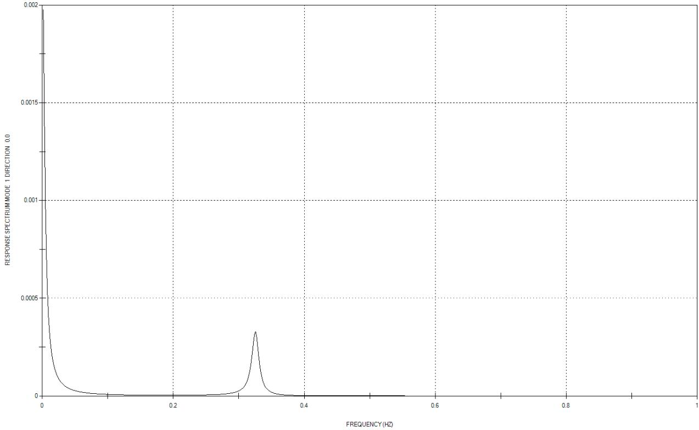  
WND SPEED = 146.7 UNIT = FT/SEC DIRECTION = 0.0

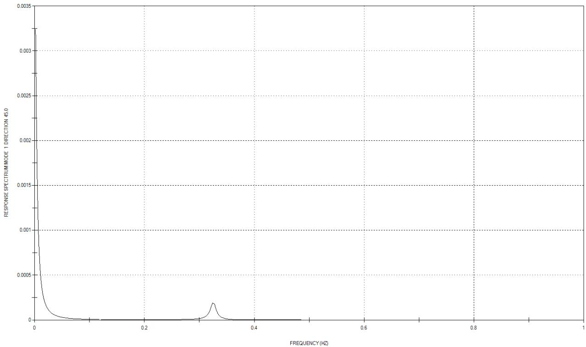

## 4.7 ICE VIBRATION FATIGUE ANALYSIS

Sample Problem 7 calculates the fatigue damage due to ice vibration.

When ice builds up and cracks, the structure tends to vibrate thus causing cyclic stresses. The fatigue damage caused by a ten inch thick ice sheet flowing along the global X axis at the water surface was determined.

The Dynamic Response program was used to predict the response of the structure. The following is the Dynamic Response input file used in conjunction with the generalized mass file and modal solution file from Dynpac.

```txt
1 2 3 4 5 6 7 8  
1234567890123456789012345678901234567890123456789012345678901234567890  
1 DROPT VIBR 15 +Z-261.0  
2 SDAMP 5.
3 LOAD
4 FVIB ICE LINE SDO LN PLSPLMIFD PLT  
5 JTNUM 401 403 405 407  
6 TIME 200. 0.025  
7 FTOPT 20. 1.0 2.0 SMAPI NE KAW  
8 GRPMD PL10.00001PL20.00001PL30.00001W.B0.00001  
9 ICE 10. 0.5 0.4 5.0 0.02 50.0 0.0315 0.05 240.  
# 10 END
```

The following is a detailed description of the Dynamic Response input file, the results of the analysis ensue:

Line 1. The DROPT line specifies analysis options, namely:

a. A vibration study is to be performed (‘VIBR’ in columns 7-10).   
## b. 15 modes are to be used as specified in columns 13-14.
c. The mudline elevation is -261.0 ft.

Line 2. The SDAMP line specifies that the overall structural damping is 5.0 percent for all modes.

Line 3. The LOAD line specifies that loading data is to follow.

Line 4. The FVIB line defines the analysis parameters as follows:

d. The analysis type is an ice fatigue analysis as designated by ‘ICE’ in columns 7-9.   
e. Structural damping only is used.   
f. Base shear and overturning moment are to be plotted versus time.   
g. Ice forces and displacements plots are requested as specified by ‘IFD’ in columns 38-40.

Line 5. Joints 401, 403, 405 and 407 are to be monitored as designated on the JNTNUM line.

Line 6. The analysis start and end time are input as 0.0 and 20.0 on the TIME line.

Line 7. Fatigue option data is specified in the file using the FTOPT line.

Line 8. The effective diameter for groups PL1, PL2, PL3 and W.B is set to 0.0 using the GRPMD line.

Line 9. Ice floe data in the X direction is specified using the ICE line as follows:

h. The ice thickness is 10.0 as specified in columns 8-13.   
i. The elastic modulus, static crushing strength and breaking length ratio are specified as 0.50, 0.4 and 5.0, respectively.   
j. The elevation of the ice floe is 0.0 and the flow direction is along the global X axis as indicated by 0.0 in columns 32-37 and 38-43, respectively.   
k. The floe velocity is 0.02 and the analysis velocity step increment is 0.05.   
l. The duration of the ice movement is 240 seconds as input in columns 71-76.

Some plots created by the analysis followed by a portion of the output follow.

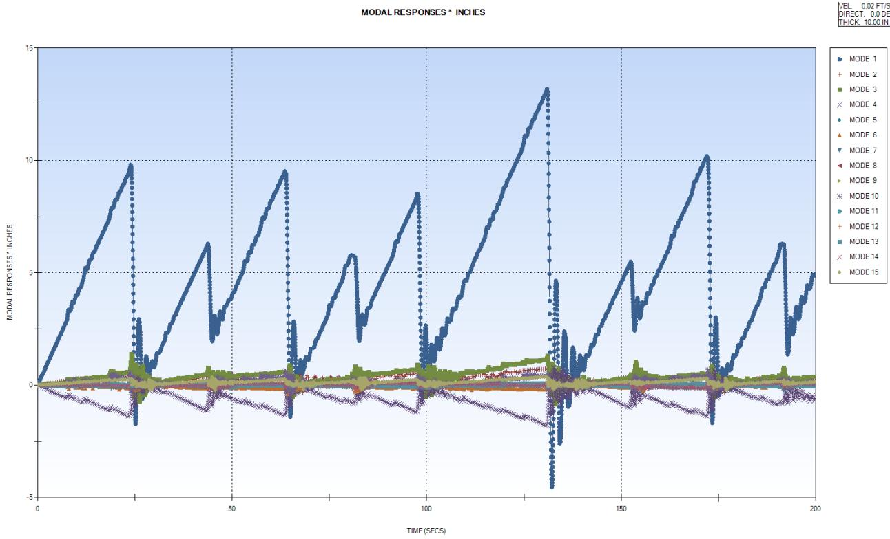

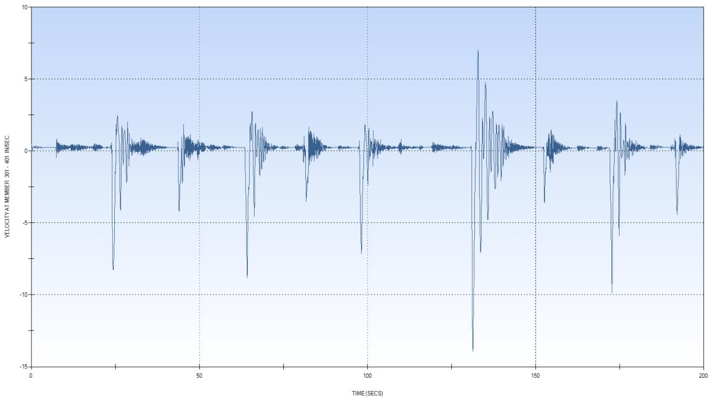

5 INPUT LINES

DYNAMIC RESPONSE OPTIONS LINE

COLUMNS

COMMENTARY

GENERAL

THIS LINE IS REQUIRED IN ANY DYNAMIC RESPONSE RUN. IT SPECIFIES OVERALL ANALYSIS PARAMETERS AND TYPE OF ANALYSIS.

( 7-10)

ENTER THE TYPE OF ANALYSIS TO BE PERFORMED FROM THE FOLLOWING OPTIONS:

'SPEC' - BASE DRIVEN SPECTRAL ANALYSIS (SPECTRAL EARTHQUAKE)

'TIME' - BASE DRIVEN TIME HISTORY ANALYSIS (TIME HISTORY EARTHQUAKE)

'VIBR' - FORCE DRIVEN ANALYSIS (PERIODIC OR TIME HISTORY)

'WIND' - WIND SPECTRAL ANALYSIS (EXTREME OR FATIGUE ANALYSIS)

'ENGV' - ENGINE VIBRATION ANALYSIS

'TRNF' - REACTION DRIVEN TRANSFER FUNCTION ANALYSIS

'TCLP' - GENERATE INCREMENTAL LOADS FOR COLLAPSE ANALYSIS

'TESL' - GENERATE EQUIVALENT STATIC LOADS FOR LINEAR ANALYSIS

'SHIP' - DYNAMIC SHIP IMPACT ANALYSIS

'DROP' - DYNAMIC DROPPED OBJECT ANALYSIS

(11-14)

ENTER THE NUMBER OF MODES TO BE USED IN THE ANALYSIS. THE DEFAULT IS THE NUMBER OF MODES COMPUTED BY THE PREVIOUS DYNPAC RUN.

(15-16)

ENTER 'EC' IF A LISTING OF THE INPUT DATA IS TO BE INCLUDED IN THE OUTPUT LISTING FILE.

(17-18)

ENTER THE VERTICAL COORDINATE (-X, Y, OR Z, OR +X, Y, OR Z)

(19-24)

ENTER THE MUDLINE ELEVATION IN THE VERTICAL COORDINATE.

(25-27)

ENTER THE SELECTIONS FOR PRINTING THE JOINT ACCELERATIONS, VELOCITIES, AND/OR DISPLACEMENTS. FOR SPECTRAL ANALYSIS ONLY.

'A' - ACCELERATIONS

'V' - VELOCITIES

'D' - DISPLACEMENTS


| LINE LABEL | ANALYSIS SELECTION OPTION | NUMBER OF MODES | INPUT ECHO OPTION | VERTICAL COORDINATE | MUDLINE ELEVATION | OUTPUT SELECTION (SPECTRAL ONLY) | OUTPUT SELECTION (SPECTRAL ONLY) | OUTPUT SELECTION (SPECTRAL ONLY) |
| --- | --- | --- | --- | --- | --- | --- | --- | --- |
| LINE LABEL | ANALYSIS SELECTION OPTION | NUMBER OF MODES | INPUT ECHO OPTION | VERTICAL COORDINATE | MUDLINE ELEVATION | FIRST SELECTION | SECOND SELECTION | THIRD SELECTION |
| DROPT |  |  |  |  |  |  |  |  |
| 1--5 | 7--10 | 11--->14 | 15--16 | 17--18 | 19<-24 | 25 | 26 | 27 |
| DEFAULT |  |  |  | '+' | 0 |  |  |  |
| ENGLISH |  |  |  |  | FT |  |  |  |
| METRIC |  |  |  |  | M |  |  |  |


END LINE

COLUMNS

COMMENTARY

GENERAL

THIS LINE IS REQUIRED AND SIGNALS THE END OF THE RESPONSE CALCULATIONS AND DIRECTS THE PROGRAM TO GENERATE THE OUTPUT FOR THE 'COMBINE' PROGRAM.


| LINE LABEL | LEAVE BLANK |
| --- | --- |
| END |  |
| 1-- 3 | 4-80 |


SIMULATED EARTHQUAKE OUTPUT LOADS DATA

COLUMNS

COMMENTARY

GENERAL THIS DATA IS USED TO REQUEST EQUIVALENT STATIC LOADS TO BE GENERATED. THIS OPTION IS ESPECIALLY USEFUL TO SIMULATE EARTHQUAKE LOADS FOR SUBSEQUENT COLLAPSE ANALYSES.

( 8 ) ENTER THE TYPE OF LOAD TO BASE THE EQUIVALENT MODAL FACTORS. ENTER 'M' FOR OVERTURNING MOMENT OR 'S' FOR BASE SHEAR. THE RESULTING EQUIVALENT STATIC LOAD SHOULD REPRESENT THE LOAD SELECTION.   
( 9 ) ENTER 'V' IF THE MAXIMUM VERTICAL LOADING IS TO BE INCLUDED IN THE EQUIVALENT STATIC LOADING.   
( 10 ) SINCE THE DYNAMIC PORTION OF THE EARTHQUAKE ANALYSIS CANREVERSE SIGN, THIS OPTION CAN BE USED TO SELECT THE OPPOSITESIGN OR CREATE TWO LOAD CASES FOR BOTH SIGNS.ENTER 'S' FOR THE STANDARD SIGN.'R' FOR THE REVERSED SIGN.'B' FOR BOTH.'A' FOR ALL DIRECTIONS.  
(11-13) THE LOAD CASES GENERATED CAN BE ADDED ON TO AN EXISTING FILE REPLACING ALL THE LOADS ON THAT FILE OR SKIPPING A NUMBER OF LOAD CASES BEFORE ADDING. IF THE DEAD LOAD CASE IS ON THE FILE, THEN IT IS USEFUL TO SKIP OVER THAT LOAD CASE BEFORE ADDING THE EARTHQUAKE LOADS. ENTER THE NUMBER OF LOAD CASES TO BE SKIPPED HERE. IF ALL THE EXISTING LOAD CASES ARE TO BE INCLUDED ON THE OUTPUT FILE, ENTER 'APP' TO APPEND THE GENERATED LOAD CASES TO THE LAST LOAD CASE ON THE EXISTING FILE.   
(14-16) ENTER THE NUMBER OF SHEAR OR MOMENT DIRECTIONS TO BE CHECKED FOR MAXIMUM SHEAR OR OVERTURNING MOMENT. MAXIMUM ALLOWED IS 100.   
( 17 ) ENTER 'M' IF EACH MODE IS OUTPUT AS A SEPARATE LOAD CASE.


| LINE LABEL | LOAD TYPE OPTION | INCLUDE MAXIMUM VERTICAL LOADS OPTION | REVERSE OPTION | NUMBER SKIPPED LOAD CASES | NUMBER OF DIRECTIONS | OPTION FOR SEPARATE MODES | LEAVE BLANK |
| --- | --- | --- | --- | --- | --- | --- | --- |
| EQKLOD |  |  |  |  |  |  |  |
| 1-- 6 | 8 | 9 | 10 | 11-->13 | 14-->16 | 17 | 18---------80 |
| DEFAULT | 'M' |  | 'S' |  | 20 |  |  |


FLUID MODAL DAMPING

COLUMNS

COMMENTARY

GENERAL THIS LINE IS REQUIRED TO SPECIFY THE FLUID MODAL DAMPING VALUES.

( 7- 8) ENTER 'PC' IF THE PROGRAM IS TO CALCULATE THE FLUID DAMPING. THE DAMPING VALUES WILL BE CALCULATED BASED ON THE NONLINEAR FORCES ON THE STRUCTURE. IN THE CASE OF THE SPECTRAL ANALYSIS, AN EQUIVALENT DAMPING RATIO IS CALCULATED BASED ON A PARTICULAR AMPLITUDE.   
( 9-10) ENTER 'NL' IF THE NONLINEAR DAMPING IS TO BE USED FOR THE TIME HISTORY ANALYSIS. OTHERWISE, A LINEAR VALUE WILL BE USED BASED ON A SPECIFIED AMPLITUDE.   
(11-15) ENTER THE MODAL DAMPING AS A PERCENT OF CRITICAL IF ALL MODES ARE TO HAVE THE SAME VALUE. OTHERWISE LEAVE THIS FIELD BLANK. IF A VALUE IS ENTERED HERE, LEAVE THE REMAINING FIELDS ON THIS LINE BLANK.   
(16-20) IF A SPECIFIED AMPLITUDE IS TO BE USED IN THE FLUID DAMPING CALCULATIONS, ENTER THAT VALUE HERE. USED FOR TIME HISTORY ONLY.   
(21-25) ENTER THE MODAL DAMPING AS A PERCENT OF CRITICAL FOR THE FIRST MODE.   
(26-70) ENTER MODAL DAMPING VALUES FOR THE REMAINING MODES. IF THE NUMBER OF MODES IS GREATER THAN TEN, USE ADDITIONAL LINES WITH THE REMAINING DAMPING VALUES ENTERED IN COLUMNS 21-70.


| LINE LABEL | FLUID DAMPING SOURCE | NONLINEAR FLUID DAMPING OPTION | OVERALL MODAL DAMPING | FLUID DAMPING AMPLITUDE | *2FLUID MODAL DAMPING VALUES (PERCENT OF CRITICAL) | *2FLUID MODAL DAMPING VALUES (PERCENT OF CRITICAL) | *2FLUID MODAL DAMPING VALUES (PERCENT OF CRITICAL) | *2FLUID MODAL DAMPING VALUES (PERCENT OF CRITICAL) | *2FLUID MODAL DAMPING VALUES (PERCENT OF CRITICAL) | *2FLUID MODAL DAMPING VALUES (PERCENT OF CRITICAL) | *2FLUID MODAL DAMPING VALUES (PERCENT OF CRITICAL) | *2FLUID MODAL DAMPING VALUES (PERCENT OF CRITICAL) | *2FLUID MODAL DAMPING VALUES (PERCENT OF CRITICAL) | *2FLUID MODAL DAMPING VALUES (PERCENT OF CRITICAL) |
| --- | --- | --- | --- | --- | --- | --- | --- | --- | --- | --- | --- | --- | --- | --- |
| LINE LABEL | FLUID DAMPING SOURCE | NONLINEAR FLUID DAMPING OPTION | OVERALL MODAL DAMPING | FLUID DAMPING AMPLITUDE | MODE 1 | MODE 2 | MODE 3 | MODE 4 | MODE 5 | MODE 6 | MODE 7 | MODE 8 | MODE 9 | MODE 10 |
| FDAMP |  |  |  |  |  |  |  |  |  |  |  |  |  |  |
| 1-- 5 | 7-- 8 | 9--10 | 11<--15 | 16<--20 | 21<--25 | 26<--30 | 31<--35 | 36<--40 | 41<--45 | 46<--50 | 51<--55 | 56<--60 | 61<--65 | 66<--70 |


LOAD HEADER

COLUMNS

COMMENTARY

GENERAL

THIS LINE IS REQUIRED AND SPECIFIES THAT LOADING DATA(SPECTRAL, TIME HISTORY, OR VIBRATION) FOLLOWS AS DESIGNATEDON THE DROPT LINE.


| LINE LABEL | LEAVE BLANK |
| --- | --- |
| LOAD |  |
| 1--4 | 5-80 |


POWER SPECTRAL DENSITY DATA

COLUMNS

COMMENTARY

GENERAL

THIS LINE IS REQUIRED ONLY IF 'LINE' IS SELECTED AS THESOURCE OF THE SPECTRAL DATA AND 'PSD' IS SELECTED AS THETYPE. THIS LINE FOLLOWS THE POWER SPECTRAL DENSITY HEADERLINE. REPEAT THIS LINE TO ENTER THE SPECIFIED NUMBER OFTABLE ENTRY POINTS.

(21-30)

ENTER THE FREQUENCY FOR THE FIRST TABLE ENTRY. FREQUENCIES ARE ENTERED IN ASCENDING ORDER.

(31-40)

ENTER THE FIRST PSD VALUE. THE UNITS FOR THIS DATA DEPENDS ON THE TYPE OF POWER SPECTRAL DENSITY BEING ENTERED AS FOLLOWS: PSD TYPE ENGLISH METRIC ACCELERATION G**2/CPS G**2/CPS VELOCITY (IN/SEC)**2/CPS (CM/SEC)**2/CPS DISPLACEMENT IN**2/CPS CM**2/CPS

(41-60)

ENTER THE SECOND FREQUENCY AND PSD FOR THE SECOND ENTRY.


| LINE LABEL | FIRST TABLE ENTRY | FIRST TABLE ENTRY | SECOND TABLE ENTRY | SECOND TABLE ENTRY | LEAVE BLANK |
| --- | --- | --- | --- | --- | --- |
| LINE LABEL | FREQUENCY | PSD VALUE | FREQUENCY | PSD VALUE | LEAVE BLANK |
| PSDSPC |  |  |  |  |  |
| 1--6 | 21<--30 | 31<--40 | 41<--50 | 51<--60 | 61--------80 |
| DEFAULT |  |  |  |  |  |
| ENGLISH | HZ | SEE COMMENTS | HZ | SEE COMMENTS |  |
| METRIC | HZ | SEE COMMENTS | HZ | SEE COMMENTS |  |


POWER SPECTRAL DENSITY HEADER

COLUMNS

COMMENTARY

GENERAL

THIS LINE IS REQUIRED ONLY IF 'LINE' IS SELECTED AS THESOURCE OF THE SPECTRAL DATA AND 'PSD' IS SELECTED AS THETYPE.

( 7-10)

INPUT THE NUMBER OF FREQUENCY VALUES TO BE USED IN CONSTRUCTING THE TABLE OF POWER SPECTRAL DENSITY VERSUS FREQUENCY. THIS TABLE IS USED WITH LINEAR LOG-LOG INTERPOLATION AND IT IS NECESSARY TO INPUT AS LEAST TWO TABLE ENTRIES.


| LINE LABEL | NUMBER OF FREQUENCY VALUES | LEAVE BLANK |
| --- | --- | --- |
| PSDSPC |  |  |
| 1-- 6 | 7-->10 | 11--------80 |


RESPONSE FUNCTION

COLUMNS

COMMENTARY

GENERAL THIS LINE IS OPTIONAL AND IS USED TO SPECIFY DATA TO GENERATE RESPONSE FUNCTIONS AT SPECIFIED LOCATIONS ON THE STRUCTURE. THIS LINE IS ONLY USED FOR SPECTRAL EARTHQUAKE ANALYSIS AND FOLLOWS THE INPUT SPECTRUM DATA DEFINITION, IF ANY, AFTER THE SPLOAD LINE. THIS LINE CAN BE REPEATED AS MANY TIMES AS DESIRED TO GET AS MANY RESPONSE FUNCTIONS AS NEEDED. THE LAST RSFUNC LINE WILL REMAIN IN EFFECT FOR ALL SUCCEEDING SPLOAD CASES.

( 7-10) ENTER THE JOINT NAME THAT THIS RESPONSE FUNCTION IS TO BE DEFINED.   
(11-12) ENTER THE DEGREE OF FREEDOM FOR THIS RESPONSE FUNCTION. THE CHOICES ARE: 'DX' - X DIRECTION. 'DY' - Y DIRECTION. 'DZ' - Z DIRECTION.   
(13-16) ENTER THE DAMPING DESIRED FOR THE RESPONSE FUNCTION IN PERCENT OF CRITICAL.   
(17-66) ENTER THE DATA FOR UP TO 6 RESPONSE FUNCTIONS. ADDITIONAL RESPONSE FUNCTIONS CAN BE CREATED USING ADDITIONAL RESPONSE FUNCTION LINES.   
(67-69) ENTER THE NUMBER OF POINTS USED IN DETERMINING THE RESPONSE FUNCTION. THE NUMBER OF POINTS NEEDED DEPENDS ON THE PERIOD SPAN OF THE INPUT SPECTRUM AND THE REQUIRED ACCURACY OF THE OUTPUT SPECTRUM. THE POINTS ARE EQUALLY SPACED ON A FREQUENCY LOG BASIS.   
( 70 ) IF THE PLOTS ARE TO BE CREATED VERSUS FREQUENCY, ENTER 'F', IF THE PLOTS ARE VERSUS PERIOD, ENTER 'P'.   
(71-72) IF A FULL GRID IS TO DRAWN INSTEAD OF TIC MARKS ON THE AXES, THEN ENTER 'G1' FOR GRID LINES ON THE MAJOR DIVISIONS AND 'G2' FOR GRID LINES ON ALL DIVISIONS. THESE GRID LINES ARE USEFUL WHEN READING NUMERICAL INFORMATION FROM THE PLOTS.   
(73-77) SELECT THE DESIRED PLOTS FROM THE FOLLOWING CHOICES: 'I' - INPUT POWER SPECTRAL DENSITY. 'O' - OUTPUT POWER SPECTRAL DENSITY. 'T' - TRANSFER FUNCTION. 'R' - RESPONSE FUNCTION. 'W' - RESPONSE FUNCTION BASED ON WHITE NOISE ASSUMPTION.


| LINE LABEL | RESPONSE FUNCTION SELECTIONS | RESPONSE FUNCTION SELECTIONS | RESPONSE FUNCTION SELECTIONS | RESPONSE FUNCTION SELECTIONS | RESPONSE FUNCTION SELECTIONS | RESPONSE FUNCTION SELECTIONS | RESPONSE FUNCTION SELECTIONS | RESPONSE FUNCTION SELECTIONS | RESPONSE FUNCTION SELECTIONS | RESPONSE FUNCTION SELECTIONS | RESPONSE FUNCTION SELECTIONS | RESPONSE FUNCTION SELECTIONS | RESPONSE FUNCTION SELECTIONS | RESPONSE FUNCTION SELECTIONS | RESPONSE FUNCTION SELECTIONS | RESPONSE FUNCTION SELECTIONS | RESPONSE FUNCTION SELECTIONS | RESPONSE FUNCTION SELECTIONS | NUMBER POINTS | INDEP. VAR. | GRID OPTION | PLOT OPTIONS | PLOT OPTIONS | PLOT OPTIONS | PLOT OPTIONS | PLOT OPTIONS | PLOT OPTIONS | LEAVE BLANK |
| --- | --- | --- | --- | --- | --- | --- | --- | --- | --- | --- | --- | --- | --- | --- | --- | --- | --- | --- | --- | --- | --- | --- | --- | --- | --- | --- | --- | --- |
| LINE LABEL | 1ST FUNCTION | 1ST FUNCTION | 1ST FUNCTION | 2ND FUNCTION | 2ND FUNCTION | 2ND FUNCTION | 3RD FUNCTION | 3RD FUNCTION | 3RD FUNCTION | 4TH FUNCTION | 4TH FUNCTION | 4TH FUNCTION | 5TH FUNCTION | 5TH FUNCTION | 5TH FUNCTION | 6TH FUNCTION | 6TH FUNCTION | 6TH FUNCTION | NUMBER POINTS | INDEP. VAR. | GRID OPTION | OP T1 | OP T2 | OP T3 | OP T4 | OP T5 |  |  |
| LINE LABEL | JOINT NAME | DOF | DAMP. RATIO | JOINT NAME | DOF | DAMP. RATIO | JOINT NAME | DOF | DAMP. RATIO | JOINT NAME | DOF | DAMP. RATIO | JOINT NAME | DOF | DAMP. RATIO | JOINT NAME | DOF | DAMP. RATIO | NUMBER POINTS | INDEP. VAR. | GRID OPTION | OP T1 | OP T2 | OP T3 | OP T4 | OP T5 |  |  |
| RSFUNC |  |  |  |  |  |  |  |  |  |  |  |  |  |  |  |  |  |  |  |  |  |  |  |  |  |  |  |  |
| 1-- 6 | 7-->10 | 11--12 | 13<--16 | 17-->20 | 21--22 | 23<--26 | 27-->30 | 31--32 | 33<--36 | 37-->40 | 41--42 | 43<--46 | 47-->50 | 51--52 | 53<--56 | 57-->60 | 61--62 | 63<--66 | 67-->69 | 70 | 71--72 | 73 | 74 | 75 | 76 | 77 | 78--80 |  |
| DEFAULT |  |  |  |  |  |  |  |  |  |  |  |  |  |  |  |  |  |  | 100 | 'F' |  |  |  |  |  |  |  |  |


INPUT SPECTRAL RESPONSE DATA

COLUMNS

COMMENTARY

GENERAL

THIS LINE IS REQUIRED ONLY IF 'LINE' IS SELECTED AS THESOURCE OF THE SPECTRAL DATA AND 'RSP' IS SELECTED AS THETYPE. THIS LINE FOLLOWS THE INPUT SPECTRAL HEADER LINE.

( 7-10)

INPUT THE NUMBER OF PERIOD VALUES TO BE USED IN CONSTRUCTING THE TWO-DIMENSIONAL TABLE OF SPECTRAL RESPONSES VERSUS DAMPING AND PERIOD. EACH SET OF RESPONSE VERSUS PERIOD VALUES NEED NOT HAVE THE SAME NUMBER OF ENTRIES FOR EACH DAMPING VALUE. THIS LINE IS REPEATED AS MANY TIMES AS REQUIRED TO INPUT THIS NUMBER OF RESPONSE VERSUS PERIOD TABLE ENTRIES WITH TWO ENTRIES PER LINE. ON THE SUCCEEDING LINES, IT IS NOT NECESSARY TO ENTER THE NUMBER OF PERIOD VALUES OR THE DAMPING RATIO.

(11-16)

ENTER THE DAMPING RATIO IN PERCENT OF CRITICAL FOR THIS SET OF RESPONSE VERSUS PERIOD VALUES. THIS TWO-DIMENSIONAL TABLE IS READ IN AS FOLLOWS: ALL RESPONSES FOR THE LOWEST DAMPING VALUE IN ASCENDING PERIOD ORDER, FOLLOWED BY (BEGINNING ON A SEPARATE LINE) ALL RESPONSES FOR THE NEXT LOWEST DAMPING VALUE, ETC.

(21-30)

ENTER THE PERIOD FOR THE FIRST TABLE ENTRY. PERIODS ARE TO BE ENTERED IN ASCENDING ORDER.

(31-40)

ENTER THE FIRST RESPONSE VALUE. THE UNITS FOR THIS DATA DEPENDS ON THE TYPE OF RESPONSE SPECTRUM BEING ENTERED AS FOLLOWS:

RESPONSE TYPE ENGLISH METRIC ACCELERATION G'S G'S VELOCITY IN/SEC CM/SEC DISPLACEMENT IN CM

(41-60)

ENTER THE SECOND PERIOD AND RESPONSE FOR THE SECOND ENTRY.


| LINE LABEL | NUMBER OF PERIODS | DAMPING RATIO (PERCENT CRITICAL) | FIRST TABLE ENTRY | FIRST TABLE ENTRY | SECOND TABLE ENTRY | SECOND TABLE ENTRY | LEAVE BLANK |
| --- | --- | --- | --- | --- | --- | --- | --- |
| LINE LABEL | NUMBER OF PERIODS | DAMPING RATIO (PERCENT CRITICAL) | PERIOD | RESPONSE VALUE | PERIOD | RESPONSE VALUE | LEAVE BLANK |
| RSPSPC |  |  |  |  |  |  |  |
| 1--6 | 7-->10 | 11<!--16 | 21<!--30 | 31<!--40 | 41<!--50 | 51<!--60 | 61--80 |
| DEFAULT |  |  |  |  |  |  |  |
| ENGLISH |  |  | SEC | SEE COMMENTS | SEC | SEE COMMENTS |  |
| METRIC |  |  | SEC | SEE COMMENTS | SEC | SEE COMMENTS |  |


INPUT SPECTRAL RESPONSE HEADER

COLUMNS

COMMENTARY

GENERAL

THIS LINE IS REQUIRED ONLY IF 'LINE' IS SELECTED AS THESOURCE OF THE SPECTRAL DATA AND 'RSP' IS SELECTED AS THE TYPE.

( 7-10)

INPUT THE NUMBER OF DAMPING VALUES TO BE USED IN CONSTRUCTING THE TWO-DIMENSIONAL TABLE OF SPECTRAL RESPONSES VERSUS DAMPING AND PERIOD. IF THIS VALUE IS ENTERED AS '1', THE DAMPING VALUE SPECIFIED SHOULD BE THE VALUE SPECIFIED AS THE DAMPING OF THE MODEL BEING ANALYZED.


| LINE LABEL | NUMBER OF DAMPING VALUES | LEAVE BLANK |
| --- | --- | --- |
| RSPSPC |  |  |
| 1-- 6 | 7-->10 | 11--------80 |


USER-DEFINED RESPONSE SPECTRUM DATA

COLUMNS

COMMENTARY

GENERAL

THIS DATA DEFINES THE RESPONSE SPECTRUM DATA FOR A SPECTRAL EARTHQUAKE ANALYSIS. THIS LINE CAN BE USED TO DEFINE NEW SOIL TYPES FOR API SPECTRAL ANALYSES USING THE SPLAPI LINE.

( 8 ) ENTER THE IDENTIFIER USED TO REFERENCE THIS SPECTRUM.   
( 10 ) SPECIFY THE NUMBER OF DAMPING VALUES USED TO DEFINE THIS RESPONSE SPECTRUM. MAXIMUM NUMBER OF DAMPING VALUES IS THREE.


| LINE LABEL | RESPONSE SPECTRUM ID | NUMBER OF DAMPING VALUES | LEAVE BLANK |
| --- | --- | --- | --- |
| RSPU1 |  |  |  |
| 1-- 5 | 8 | 10 | 11--------80 |


USER-DEFINED RESPONSE SPECTRUM DATA

COLUMNS

COMMENTARY

GENERAL THIS DATA DEFINES THE NORMALIZED RESPONSE SPECTRUM DATA FOR API SPECTRAL EARTHQUAKE ANALYSIS. THIS LINE IS REPEATED FOR NUMBER OF DAMPING VALUES SPECIFIED ON THE 'RSPU1' INPUT.

( 9-14) ENTER THE DAMPING VALUE FOR THIS RESPONSE SPECTRUM.   
(21-26) ENTER THE PERIOD FOR THE FIRST POINT IN THE RESPONSE SPECTRUM VERSUS PERIOD INPUT. THE POINTS MUST BE ENTERED IN ORDER OF ASCENDING PERIODS.   
(27-32) ENTER THE NORMALIZED RESPONSE SPECTRUM VALUE. THIS VALUE IS THE SPECTRAL ACCELERATION DIVIDED BY GRAVITY.   
(33-80) ENTER THE REMAINING POINTS. THE MAXIMUM NUMBER OF POINTS IS FIFTEEN. TO SPECIFY MORE THAN FIVE POINTS REPEAT THE 'RSPU2' LINE WITH THE SAME DAMPING RATIO.


| LINE LABEL | DAMPING RATIO (PERCENT CRITICAL) | FIRST POINT | FIRST POINT | SECOND POINT | SECOND POINT | THIRD POINT | THIRD POINT | FOURTH POINT | FOURTH POINT | FIFTH POINT | FIFTH POINT |
| --- | --- | --- | --- | --- | --- | --- | --- | --- | --- | --- | --- |
| LINE LABEL | DAMPING RATIO (PERCENT CRITICAL) | PERIOD | NORMALIZED RESPONSE SPECTRUM VALUE | PERIOD | NORMALIZED RESPONSE SPECTRUM VALUE | PERIOD | NORMALIZED RESPONSE SPECTRUM VALUE | PERIOD | NORMALIZED RESPONSE SPECTRUM VALUE | PERIOD | NORMALIZED RESPONSE SPECTRUM VALUE |
| RSPU2 |  |  |  |  |  |  |  |  |  |  |  |
| 1--5 | 9<--14 | 21<--26 | 27<--32 | 33<--38 | 39<--44 | 45<--50 | 51<--56 | 57<--62 | 63<--68 | 69<--74 | 75<--80 |
| DEFAULT |  |  |  |  |  |  |  |  |  |  |  |
| ENGLISH |  | SEC |  | SEC |  | SEC |  | SEC |  | SEC |  |
| METRIC |  | SEC |  | SEC |  | SEC |  | SEC |  | SEC |  |


STRUCTURAL MODAL DAMPING

COLUMNS

COMMENTARY

GENERAL THIS LINE IS REQUIRED TO SPECIFY THE MODAL DAMPING VALUES. THESE VALUES SHOULD INCLUDE ALL SOURCES OF DAMPING OTHER THAN THE FLUID DAMPING IF AN ITERATIVE SOLUTION IS BEING USED. IN THAT CASE THE FLUID DAMPING IS ACCOUNTED FOR BY CALCULATING THE ACTUAL FLUID FORCES DUE TO MOTION OF THE STRUCTURE AND CALCULATING AN EQUIVALENT LINEAR MODAL DAMPING VALUE WHICH IS ADDED TO THESE VALUES TO OBTAIN THE TOTAL DAMPING. IF THE FLUID DAMPING IS NOT BEING CALCULATED BY THE PROGRAM, THEN THE USER SHOULD INCLUDE THE FLUID DAMPING IN THIS DATA OR ENTER THE FLUID DAMPING ON THE FDAMP LINE.

(11-15) ENTER THE MODAL DAMPING AS A PERCENT OF CRITICAL IF ALL MODES ARE TO HAVE THE SAME VALUE, OTHERWISE LEAVE THIS FIELD BLANK. IF A VALUE IS ENTERED HERE, LEAVE THE REMAINING FIELDS ON THIS LINE BLANK.   
(21-25) ENTER THE MODAL DAMPING AS A PERCENT OF CRITICAL FOR THE FIRST MODE.   
(26-70) ENTER MODAL DAMPING VALUES FOR THE REMAINING MODES. IF THE NUMBER OF MODES IS GREATER THAN TEN, USE ADDITIONAL LINES WITH THE REMAINING DAMPING VALUES ENTERED IN COLUMNS 21-70.


| LINE LABEL | MODAL DAMPING VALUES (PERCENT OF CRITICAL) | MODAL DAMPING VALUES (PERCENT OF CRITICAL) | MODAL DAMPING VALUES (PERCENT OF CRITICAL) | MODAL DAMPING VALUES (PERCENT OF CRITICAL) | MODAL DAMPING VALUES (PERCENT OF CRITICAL) | MODAL DAMPING VALUES (PERCENT OF CRITICAL) | MODAL DAMPING VALUES (PERCENT OF CRITICAL) | MODAL DAMPING VALUES (PERCENT OF CRITICAL) | MODAL DAMPING VALUES (PERCENT OF CRITICAL) | MODAL DAMPING VALUES (PERCENT OF CRITICAL) | MODAL DAMPING VALUES (PERCENT OF CRITICAL) |
| --- | --- | --- | --- | --- | --- | --- | --- | --- | --- | --- | --- |
| LINE LABEL | OVERALL MODAL DAMPING | MODE 1 | MODE 2 | MODE 3 | MODE 4 | MODE 5 | MODE 6 | MODE 7 | MODE 8 | MODE 9 | MODE 10 |
| SDAMP |  |  |  |  |  |  |  |  |  |  |  |
| 1--5 | 11<--15 | 21<--25 | 26<--30 | 31<--35 | 36<--40 | 41<--45 | 46<--50 | 51<--55 | 56<--60 | 61<--65 | 66<--70 |


API SPECTRAL ANALYSIS LOAD

COLUMNS

COMMENTARY

GENERAL THIS DATA OR THE SPLOAD DATA IS REQUIRED FOR A SPECTRAL ANALYSIS. IT DEFINES THE RESPONSE FACTORS, SOIL TYPES AND OUTPUT FORM.

(11-15) ENTER THE RESPONSE FACTOR TO BE APPLIED ON ALL THE DIRECTIONALITY FACTORS. THIS CAN BE USED TO SPECIFY THE "G" LEVEL FOR PARTICULAR EARTHQUAKE ZONES.   
(16-21) SPECIFY THE FACTOR FOR THE X-DIRECTION FOR THE INPUT MOTIONS AT THE BASE OF THE STRUCTURE.   
( 22 ) ENTER THE SOIL TYPE FOR THE X-DIRECTION, EITHER 'A', 'B', OR 'C' FOR API OR THE ONE LETTER IDENTIFIER FROM THE USER-DEFINED RESPONSE SPECTRUM DEFINED ON THE 'RSPU1' LINE.   
(23-28) SPECIFY THE FACTOR FOR THE Y-DIRECTION FOR THE INPUT MOTIONS AT THE BASE OF THE STRUCTURE.   
( 29 ) ENTER THE SOIL TYPE FOR THE Y-DIRECTION, EITHER 'A', 'B', OR 'C' FOR API OR THE ONE LETTER IDENTIFIER FROM THE USER-DEFINED RESPONSE SPECTRUM DEFINED ON THE 'RSPU1' LINE.

COLUMNS

COMMENTARY

(30-35) SPECIFY THE FACTOR FOR THE Z-DIRECTION FOR THE INPUT MOTIONS AT THE BASE OF THE STRUCTURE.   
( 36 ) ENTER THE SOIL TYPE FOR THE Z-DIRECTION, EITHER 'A', 'B', OR 'C' FOR API OR THE ONE LETTER IDENTIFIER FROM THE USER-DEFINED RESPONSE SPECTRUM DEFINED ON THE 'RSPU1' LINE.   
(38-41) TYPE OF MODAL COMBINATIONS: 'SRSS' - SQUARE ROOT OF SUM OF THE SQUARES. 'PRMS' - PEAK PLUS THE SQUARE ROOT OF THE SUM OF THE SQUARES. 'PEAK' - LINEAR ADDITION OF ABSOLUTE VALUES. 'CQC ' - COMPLETE QUADRATIC COMBINATION.   
(42-44) ENTER 'A', 'V', OR 'D' FOR JOINT ACCELERATIONS, VELOCITIES, OR DISPLACEMENTS TO BE PRINTED.   
(45-47) ENTER 'PRS' TO CREATE SPECTRUM PLOTS   
( 48 ) ENTER 'P' IF THE CQC MATRIX IS TO BE LISTED.   
( 70 ) ENTER 'N' IF THE FACTOR 'D' IS NOT TO BE USED FOR API SPECTRUM ENTER 'D' OR LEAVE BLANK IF TO BE USED


| LINE LABEL | OVERALL RESPONSE FACTOR | DIRECTIONALITY FACTORS AND SOIL TYPES | DIRECTIONALITY FACTORS AND SOIL TYPES | DIRECTIONALITY FACTORS AND SOIL TYPES | DIRECTIONALITY FACTORS AND SOIL TYPES | DIRECTIONALITY FACTORS AND SOIL TYPES | DIRECTIONALITY FACTORS AND SOIL TYPES | OUTPUT Modal COMBINATIONS | JOINT DATA PRINT | JOINT DATA PRINT | JOINT DATA PRINT | PLOT SPECTRUM | CQC PRINT OPTION | LEAVE BLANK | FACTOR D | LEAVE BLANK |
| --- | --- | --- | --- | --- | --- | --- | --- | --- | --- | --- | --- | --- | --- | --- | --- | --- |
| LINE LABEL | OVERALL RESPONSE FACTOR | X-DIRECTION | X-DIRECTION | Y-DIRECTION | Y-DIRECTION | Z-DIRECTION | Z-DIRECTION | OUTPUT Modal COMBINATIONS | FIRST SELECTION | SECOND SELECTION | THIRD SELECTION | PLOT SPECTRUM | CQC PRINT OPTION | LEAVE BLANK | FACTOR D | LEAVE BLANK |
| LINE LABEL | OVERALL RESPONSE FACTOR | FACTOR | SOIL TYPE | FACTOR | SOIL TYPE | FACTOR | SOIL TYPE | OUTPUT Modal COMBINATIONS | FIRST SELECTION | SECOND SELECTION | THIRD SELECTION | PLOT SPECTRUM | CQC PRINT OPTION | LEAVE BLANK | FACTOR D | LEAVE BLANK |
| SPLAPI |  |  |  |  |  |  |  |  |  |  |  |  |  |  |  |  |
| 1--6 | 11<--15 | 16<--21 | 22 | 23<--28 | 29 | 30<--35 | 36 | 38--41 | 42 | 43 | 44 | 45--47 | 48 | 49--69 | 70 | 71--80 |
| DEFAULT |  |  |  |  |  |  |  | 'CQC ' |  |  |  |  |  |  | 'D' |  |


SPECTRAL ANALYSIS LOAD

COLUMNS

COMMENTARY

GENERAL THIS LINE IS REQUIRED FOR A SPECTRAL ANALYSIS. IT DEFINES THE INPUT SPECTRUM, DAMPING CONSIDERATIONS, OUTPUT FORM, AND RESPONSE FACTORS.

( 9-12) ENTER THE SPECTRUM SOURCE AS FOLLOWS:

'API ' - AS SPECIFIED IN THE API RP2A 7TH EDITION.

'APIA' - AS SPECIFIED IN THE API RP2A 15TH EDITION FOR SOIL "A".

'APIB' - AS SPECIFIED IN THE API RP2A 15TH EDITION FOR SOIL "B".

'APIC' - AS SPECIFIED IN THE API RP2A 15TH EDITION FOR SOIL "C".

'LINE' - SPECTRUM IS INPUT ON SUBSEQUENT LINES.

'PREV' - USE SPECTRUM FROM PREVIOUS LOAD CASE.

(15-17) ENTER THE SPECTRUM TYPE AS FOLLOWS:

'RSP' - RESPONSE SPECTRUM.

'PSD' - INPUT POWER SPECTRAL DENSITY.

' - LEAVE BLANK FOR API SPECTRUMS.

( 18 ) ENTER THE SPECTRUM FORM:

'A' - ACCELERATION.

'V' - VELOCITY.

'D' - DISPLACEMENT.

' ' - LEAVE BLANK FOR API SPECTRUMS.

(21-23) SPECIFY THE DAMPING TYPE:

'SDO' - STRUCTURAL DAMPING ONLY.

'FDS' - EQUIVALENT FLUID DAMPING AT A SPECIFIED AMPLITUDE.

'FDA' - EQUIVALENT FLUID DAMPING AT THE ACTUAL AMPLITUDE.

COLUMNS

COMMENTARY

(25-28) SPECIFY THE TYPE OF MODAL COMBINATIONS:

'RMS ' - SQUARE ROOT OF SUM OF THE SQUARES.

'PRMS' - PEAK PLUS THE SQUARE ROOT OF THE SUM OF THE SQUARES.

'PEAK' - LINEAR ADDITION OF ABSOLUTE VALUES.

'CQC ' - COMPLETE QUADRATIC COMBINATION.

'CQC2' - CQC WITH TWO INDEPENDENT SPECTRA. REQUIRES TWO

SPLOAD SETS. (USED WITH EQUIVALENT STATIC LOAD GENERATION)

'CQC3' - CQC WITH THREE INDEPENDENT SPECTRA. REQUIRES THREE

SPLOAD SETS. (USED WITH EQUIVALENT STATIC LOAD GENERATION)

(29-31) ENTER 'A', 'V', OR 'D' FOR JOINT ACCELERATIONS, VELOCITIES,

OR DISPLACEMENTS TO BE PRINTED.

(39-44) ENTER THE VALUE FOR THE DAMPING AMPLITUDE TO BE USED WITH THE

'FDS' OPTION.

(45-50) ENTER THE RESPONSE FACTOR TO BE APPLIED ON ALL THE

DIRECTIONALITY FACTORS. THIS CAN BE USED TO SPECIFY THE "G"

LEVEL FOR PARTICULAR EARTHQUAKE ZONES.

(51-68) SPECIFY THE FACTORS IN EACH DIRECTION FOR THE INPUT MOTIONS

AT THE BASE OF THE STRUCTURE.

( 69 ) ENTER 'P' IF THE CQC MATRIX IS TO BE LISTED.

( 70 ) ENTER 'N' IF THE FACTOR 'D' IS NOT TO BE USED FOR API SPECTRUM

ENTER 'D' OR LEAVE BLANK IF TO BE USED


| LINE LABEL | INPUT SPECTRUM SOURCE | INPUT SPECTRUM TYPE | INPUT SPECTRUM FORM | DAMPING TYPE | OUTPUT Modal COMBINATIONS | JOINT DATA PRINT | JOINT DATA PRINT | JOINT DATA PRINT | DAMPING AMOUNTURE | RESPONSE FACTOR | DIRECTIONALITY FACTORS | DIRECTIONALITY FACTORS | DIRECTIONALITY FACTORS | CQC PRINT OPTION | FACTOR D |
| --- | --- | --- | --- | --- | --- | --- | --- | --- | --- | --- | --- | --- | --- | --- | --- |
| LINE LABEL | INPUT SPECTRUM SOURCE | INPUT SPECTRUM TYPE | INPUT SPECTRUM FORM | DAMPING TYPE | OUTPUT Modal COMBINATIONS | FIRST SELECTION | SECOND SELECTION | THIRD SELECTION | DAMPING AMOUNTURE | RESPONSE FACTOR | X DIRECTION | Y DIRECTION | Z DIRECTION | CQC PRINT OPTION | FACTOR D |
| SPLOAD |  |  |  |  |  |  |  |  |  |  |  |  |  |  |  |
| 1--6 | 9--12 | 15--17 | 18 | 21--23 | 25--28 | 29 | 30 | 31 | 39<!--44 | 45<!--50 | 51<!--56 | 57<!--62 | 63<!--68 | 69 | 70 |
| DEFAULT |  |  |  |  |  |  |  |  |  |  |  |  |  |  | 'D' |
| ENGLISH |  |  |  |  |  |  |  |  | IN |  |  |  |  |  |  |
| METRIC |  |  |  |  |  |  |  |  | CM |  |  |  |  |  |  |


STATIC + DYNAMIC COMBINATION DATA

COLUMNS

COMMENTARY

GENERAL THIS DATA IS USED TO SPECIFY HOW THE STATIC LOADS ARE TO BE COMBINED WITH THE DYNAMIC LOADING.

( 7 ) ENTER 'N' IF THE LOAD COMBINATIONS OF THE STATIC LOADS AND EQUIVALENT STATIC DYNAMIC LOADS ARE NOT TO BE INCLUDED IN THE GENERATED LOAD OUTPUT FILE.   
( 8-12) ENTER THE FACTOR TO BE USED ON THE EARTHQUAKE LOADS TO BE COMBINED WITH THE STATIC LOAD CASES FOR BEAM AND PLATE ELEMENT CODE CHECKS.   
(13-17) ENTER THE FACTOR TO BE USED ON THE EARTHQUAKE LOADS TO BE COMBINED WITH THE STATIC LOAD CASES FOR PUNCHING SHEAR CODE CHECKS.   
(18-21) ENTER THE LOAD CASE NAME OF THE FIRST STATIC LOAD CASE TO BE COMBINED WITH THE EARTHQUAKE LOADS. THIS LOAD CASE IS TO BE CREATED IN A SEPARATE STATIC EXECUTION PRIOR TO THE EARTHQUAKE ANALYSIS.   
(22-26) ENTER THE LOAD CASE FACTOR FOR THE FIRST STATIC LOAD CASE.   
(27-80) ENTER THE REMAINING STATIC LOAD CASES AS REQUIRED. UP TO 50 'STCMB' LINES MAY BE USED TO CREATE STATIC COMBINATION CASES.


| LINE LABEL | LOAD COMB OPTION | ELEMENT LOAD CASE FACTOR | PUNCHING SHEAR LOAD CASE FACTOR | 1ST STATIC LOAD | 1ST STATIC LOAD | 2ND STATIC LOAD | 2ND STATIC LOAD | 3RD STATIC LOAD | 3RD STATIC LOAD | 4TH STATIC LOAD | 4TH STATIC LOAD | 5TH STATIC LOAD | 5TH STATIC LOAD | 6TH STATIC LOAD | 6TH STATIC LOAD | 7TH STATIC LOAD | 7TH STATIC LOAD |
| --- | --- | --- | --- | --- | --- | --- | --- | --- | --- | --- | --- | --- | --- | --- | --- | --- | --- |
| LINE LABEL | LOAD COMB OPTION | ELEMENT LOAD CASE FACTOR | PUNCHING SHEAR LOAD CASE FACTOR | LOAD CASE NAME | FACTOR | LOAD CASE NAME | FACTOR | LOAD CASE NAME | FACTOR | LOAD CASE NAME | FACTOR | LOAD CASE NAME | FACTOR | LOAD CASE NAME | FACTOR | LOAD CASE NAME | FACTOR |
| STCMB |  |  |  |  |  |  |  |  |  |  |  |  |  |  |  |  |  |
| 1--5 | 7 | 8<--12 | 13<--17 | 18-->21 | 22<--26 | 27-->30 | 31<--35 | 36-->39 | 40<--44 | 45-->48 | 49<--53 | 54-->57 | 58<--62 | 63-->66 | 67<--71 | 72-->75 | 76<--80 |
| DEFAULT |  |  |  |  | 1 |  | 1 |  | 1 |  | 1 |  | 1 |  | 1 |  | 1 |


DYNAMIC RESPONSE OPTIONS LINE

COLUMNS

COMMENTARY

GENERAL THIS LINE IS REQUIRED IN ANY DYNAMIC RESPONSE RUN. IT SPECIFIES OVERALL ANALYSIS PARAMETERS AND TYPE OF ANALYSIS.

( 7-10) ENTER THE TYPE OF ANALYSIS TO BE PERFORMED FROM THE FOLLOWING OPTIONS:

'SPEC' - BASE DRIVEN SPECTRAL ANALYSIS (SPECTRAL EARTHQUAKE)

'TIME' - BASE DRIVEN TIME HISTORY ANALYSIS (TIME HISTORY EARTHQUAKE)

'VIBR' - FORCE DRIVEN ANALYSIS (PERIODIC OR TIME HISTORY)

'WIND' - WIND SPECTRAL ANALYSIS (EXTREME OR FATIGUE ANALYSIS)

'ENGV' - ENGINE VIBRATION ANALYSI

'TRNF' - REACTION DRIVEN TRANSFER FUNCTION ANALYSIS

'TCLP' - GENERATE INCREMENTAL LOADS FOR COLLAPSE ANALYSIS

'TESL' - GENERATE EQUIVALENT STATIC LOADS FOR LINEAR ANALYSIS

'SHIP' - DYNAMIC SHIP IMPACT ANALYSIS

'DROP' - DYNAMIC DROPPED OBJECT ANALYSIS

(11-14) ENTER THE NUMBER OF MODES TO BE USED IN THE ANALYSIS. THE DEFAULT IS THE NUMBER OF MODES COMPUTED BY THE PREVIOUS DYNPAC RUN.   
(15-16) ENTER 'EC' IF A LISTING OF THE INPUT DATA IS TO BE INCLUDED IN THE OUTPUT LISTING FILE.   
(17-18) ENTER THE VERTICAL COORDINATE (-X, Y, OR Z, OR +X, Y, OR Z)   
(19-24) ENTER THE MUDLINE ELEVATION IN THE VERTICAL COORDINATE.   
(25-27) ENTER THE SELECTIONS FOR PRINTING THE JOINT ACCELERATIONS, VELOCITIES, AND/OR DISPLACEMENTS. FOR SPECTRAL ANALYSIS ONLY.

'A' - ACCELERATIONS   
'V' - VELOCITIES   
'D' - DISPLACEMENTS

COLUMNS

COMMENTARY

(79-80) ENTER 'NR' TO EXCLUDE ROTATIONAL DEGREES OF FREEDOM OF MASS MATRIX FROM EQUIVALENT STATIC LOADS OF THE BASE ACCELERATION.

DEFAULT: THE ROTATIONAL DOFS ARE INCLUDED.


| LINE LABEL | ANALYSIS SELECTION OPTION | NUMBER OF MODES | INPUT ECHO OPTION | VERTICAL COORDINATE | MUDLINE ELEVATION | OUTPUT SELECTION (SPECTRAL ONLY) | OUTPUT SELECTION (SPECTRAL ONLY) | OUTPUT SELECTION (SPECTRAL ONLY) | BLANK | EXCLUDE ROTATIONAL DOFS FOR ESL? |
| --- | --- | --- | --- | --- | --- | --- | --- | --- | --- | --- |
| LINE LABEL | ANALYSIS SELECTION OPTION | NUMBER OF MODES | INPUT ECHO OPTION | VERTICAL COORDINATE | MUDLINE ELEVATION | FIRST SELECTION | SECOND SELECTION | THIRD SELECTION | BLANK | EXCLUDE ROTATIONAL DOFS FOR ESL? |
| DROPT |  |  |  |  |  |  |  |  |  |  |
| 1--5 | 7--10 | 11--->14 | 15--16 | 17--18 | 19<--24 | 25 | 26 | 27 | 28--78 | 79--80 |
| DEFAULT |  |  |  | '+' | 0 |  |  |  |  |  |
| ENGLISH |  |  |  |  | FT |  |  |  |  |  |
| METRIC |  |  |  |  | M |  |  |  |  |  |


END LINE

COLUMNS

COMMENTARY

GENERAL

THIS LINE IS REQUIRED AND SIGNALS THE END OF THE RESPONSE CALCULATIONS AND DIRECTS THE PROGRAM TO GENERATE THE OUTPUT FOR THE 'COMBINE' PROGRAM.


| LINE LABEL | LEAVE BLANK |
| --- | --- |
| END |  |
| 1-- 3 | 4-80 |


FLUID MODAL DAMPING

COLUMNS

COMMENTARY

GENERAL THIS LINE IS REQUIRED TO SPECIFY THE FLUID MODAL DAMPING VALUES.

( 7- 8) ENTER 'PC' IF THE PROGRAM IS TO CALCULATE THE FLUID DAMPING. THE DAMPING VALUES WILL BE CALCULATED BASED ON THE NONLINEAR FORCES ON THE STRUCTURE. IN THE CASE OF THE SPECTRAL ANALYSIS, AN EQUIVALENT DAMPING RATIO IS CALCULATED BASED ON A PARTICULAR AMPLITUDE.   
( 9-10) ENTER 'NL' IF THE NONLINEAR DAMPING IS TO BE USED FOR THE TIME HISTORY ANALYSIS. OTHERWISE, A LINEAR VALUE WILL BE USED BASED ON A SPECIFIED AMPLITUDE.   
(11-15) ENTER THE MODAL DAMPING AS A PERCENT OF CRITICAL IF ALL MODES ARE TO HAVE THE SAME VALUE. OTHERWISE LEAVE THIS FIELD BLANK. IF A VALUE IS ENTERED HERE, LEAVE THE REMAINING FIELDS ON THIS LINE BLANK.   
(16-20) IF A SPECIFIED AMPLITUDE IS TO BE USED IN THE FLUID DAMPING CALCULATIONS, ENTER THAT VALUE HERE. USED FOR TIME HISTORY ONLY.   
(21-25) ENTER THE MODAL DAMPING AS A PERCENT OF CRITICAL FOR THE FIRST MODE.   
(26-70) ENTER MODAL DAMPING VALUES FOR THE REMAINING MODES. IF THE NUMBER OF MODES IS GREATER THAN TEN, USE ADDITIONAL LINES WITH THE REMAINING DAMPING VALUES ENTERED IN COLUMNS 21-70.


| LINE LABEL | FLUID DAMPING SOURCE | NONLINEAR FLUID DAMPING OPTION | OVERALL MODAL DAMPING | FLUID DAMPING AMPLITUDE | *2FLUID MODAL DAMPING VALUES (PERCENT OF CRITICAL) | *2FLUID MODAL DAMPING VALUES (PERCENT OF CRITICAL) | *2FLUID MODAL DAMPING VALUES (PERCENT OF CRITICAL) | *2FLUID MODAL DAMPING VALUES (PERCENT OF CRITICAL) | *2FLUID MODAL DAMPING VALUES (PERCENT OF CRITICAL) | *2FLUID MODAL DAMPING VALUES (PERCENT OF CRITICAL) | *2FLUID MODAL DAMPING VALUES (PERCENT OF CRITICAL) | *2FLUID MODAL DAMPING VALUES (PERCENT OF CRITICAL) | *2FLUID MODAL DAMPING VALUES (PERCENT OF CRITICAL) | *2FLUID MODAL DAMPING VALUES (PERCENT OF CRITICAL) |
| --- | --- | --- | --- | --- | --- | --- | --- | --- | --- | --- | --- | --- | --- | --- |
| LINE LABEL | FLUID DAMPING SOURCE | NONLINEAR FLUID DAMPING OPTION | OVERALL MODAL DAMPING | FLUID DAMPING AMPLITUDE | MODE 1 | MODE 2 | MODE 3 | MODE 4 | MODE 5 | MODE 6 | MODE 7 | MODE 8 | MODE 9 | MODE 10 |
| FDAMP |  |  |  |  |  |  |  |  |  |  |  |  |  |  |
| 1-- 5 | 7-- 8 | 9--10 | 11<--15 | 16<--20 | 21<--25 | 26<--30 | 31<--35 | 36<--40 | 41<--45 | 46<--50 | 51<--55 | 56<--60 | 61<--65 | 66<--70 |


JOINT SELECTION

COLUMNS

COMMENTARY

GENERAL

THIS LINE IS REQUIRED IF ANY OUTPUT SELECTED ON THE THLOADLINE IS FOR OUTPUT FOR SELECTED JOINTS SUCH AS 'JTA', ETC.THIS LINE FOLLOWS THE THLOAD LINE.

(11-74)

ENTER THE JOINT NAMES FOR JOINTS SELECTED FOR OUTPUT. ANY NUMBER OF JOINTS MAY BE SELECTED AND ENTERED IN ANY ORDER. MULTIPLE 'JTNUM' LINES MAY BE USED FOR INPUT WITHOUT RESTRICTIONS.


| LINE LABEL | SELECTED JOINTS FOR OUTPUT | SELECTED JOINTS FOR OUTPUT | SELECTED JOINTS FOR OUTPUT | SELECTED JOINTS FOR OUTPUT | SELECTED JOINTS FOR OUTPUT | SELECTED JOINTS FOR OUTPUT | SELECTED JOINTS FOR OUTPUT | SELECTED JOINTS FOR OUTPUT | SELECTED JOINTS FOR OUTPUT | SELECTED JOINTS FOR OUTPUT | SELECTED JOINTS FOR OUTPUT | SELECTED JOINTS FOR OUTPUT | SELECTED JOINTS FOR OUTPUT | SELECTED JOINTS FOR OUTPUT | SELECTED JOINTS FOR OUTPUT | SELECTED JOINTS FOR OUTPUT | SELECTED JOINTS FOR OUTPUT |
| --- | --- | --- | --- | --- | --- | --- | --- | --- | --- | --- | --- | --- | --- | --- | --- | --- | --- |
| LINE LABEL | JOINT 1 | JOINT 2 | JOINT 3 | JOINT 4 | JOINT 5 | JOINT 6 | JOINT 7 | JOINT 8 | JOINT 9 | JOINT 10 | JOINT 11 | JOINT 12 | JOINT 13 | JOINT 14 | JOINT 15 | JOINT 16 |  |
| JTNUM |  |  |  |  |  |  |  |  |  |  |  |  |  |  |  |  |  |
| 1-- 5 | 11-->14 | 15-->18 | 19-->22 | 23-->26 | 27-->30 | 31-->34 | 35-->38 | 39-->42 | 43-->46 | 47-->50 | 51-->54 | 55-->58 | 59-->62 | 63-->66 | 67-->70 | 71-->74 |  |


LOAD HEADER

COLUMNS

COMMENTARY

GENERAL

THIS LINE IS REQUIRED AND SPECIFIES THAT LOADING DATA(SPECTRAL, TIME HISTORY, OR VIBRATION) FOLLOWS AS DESIGNATEDON THE DROPT LINE.


| LINE LABEL | LEAVE BLANK |
| --- | --- |
| LOAD |  |
| 1--4 | 5-80 |


STRUCTURAL MODAL DAMPING

COLUMNS

COMMENTARY

GENERAL THIS LINE IS REQUIRED TO SPECIFY THE MODAL DAMPING VALUES. THESE VALUES SHOULD INCLUDE ALL SOURCES OF DAMPING OTHER THAN THE FLUID DAMPING IF AN ITERATIVE SOLUTION IS BEING USED. IN THAT CASE THE FLUID DAMPING IS ACCOUNTED FOR BY CALCULATING THE ACTUAL FLUID FORCES DUE TO MOTION OF THE STRUCTURE AND CALCULATING AN EQUIVALENT LINEAR MODAL DAMPING VALUE WHICH IS ADDED TO THESE VALUES TO OBTAIN THE TOTAL DAMPING. IF THE FLUID DAMPING IS NOT BEING CALCULATED BY THE PROGRAM, THEN THE USER SHOULD INCLUDE THE FLUID DAMPING IN THIS DATA OR ENTER THE FLUID DAMPING ON THE FDAMP LINE.

(11-15) ENTER THE MODAL DAMPING AS A PERCENT OF CRITICAL IF ALL MODES ARE TO HAVE THE SAME VALUE, OTHERWISE LEAVE THIS FIELD BLANK. IF A VALUE IS ENTERED HERE, LEAVE THE REMAINING FIELDS ON THIS LINE BLANK.   
(21-25) ENTER THE MODAL DAMPING AS A PERCENT OF CRITICAL FOR THE FIRST MODE.   
(26-70) ENTER MODAL DAMPING VALUES FOR THE REMAINING MODES. IF THE NUMBER OF MODES IS GREATER THAN TEN, USE ADDITIONAL LINES WITH THE REMAINING DAMPING VALUES ENTERED IN COLUMNS 21-70.


| LINE LABEL | MODAL DAMPING VALUES (PERCENT OF CRITICAL) | MODAL DAMPING VALUES (PERCENT OF CRITICAL) | MODAL DAMPING VALUES (PERCENT OF CRITICAL) | MODAL DAMPING VALUES (PERCENT OF CRITICAL) | MODAL DAMPING VALUES (PERCENT OF CRITICAL) | MODAL DAMPING VALUES (PERCENT OF CRITICAL) | MODAL DAMPING VALUES (PERCENT OF CRITICAL) | MODAL DAMPING VALUES (PERCENT OF CRITICAL) | MODAL DAMPING VALUES (PERCENT OF CRITICAL) | MODAL DAMPING VALUES (PERCENT OF CRITICAL) | MODAL DAMPING VALUES (PERCENT OF CRITICAL) |
| --- | --- | --- | --- | --- | --- | --- | --- | --- | --- | --- | --- |
| LINE LABEL | OVERALL MODAL DAMPING | MODE 1 | MODE 2 | MODE 3 | MODE 4 | MODE 5 | MODE 6 | MODE 7 | MODE 8 | MODE 9 | MODE 10 |
| SDAMP |  |  |  |  |  |  |  |  |  |  |  |
| 1--5 | 11<--15 | 21<--25 | 26<--30 | 31<--35 | 36<--40 | 41<--45 | 46<--50 | 51<--55 | 56<--60 | 61<--65 | 66<--70 |


TIME HISTORY DATA HEADER

COLUMNS

COMMENTARY

GENERAL THIS LINE IS REQUIRED IF THE TIME HISTORY SOURCE IS SPECIFIEDAS 'LINE' ON THE 'THLOAD' LINE. THE OVERALL PARAMETERS OF THETIME HISTORY INPUT ARE DESCRIBED HERE.

( 8-10) ENTER THE NUMBER OF TIME HISTORY FUNCTIONS TO INPUT. THIS VALUE CAN BE FROM 1 TO 3. TYPICALLY AN EARTHQUAKE INPUT WILL HAVE THE THREE VALUES FROM THE THREE DIRECTIONS. THESE DIRECTIONS CAN BE CHANGED WITH THE USE OF THE THFACT LINE TO ELIMINATE THE NECESSITY OF MODIFYING THE INPUT TIME HISTORY.   
(11-13) ENTER THE INPUT FORMAT FOR THE SUBSEQUENT DATA INPUT. THERE ARE TWO OPTIONS, 'STD' FOR THE STANDARD INPUT USING 'THDATA' LINES AND 'CMP' FOR THE COMPRESSED INPUT USING 'THCOMP' LINES.   
(14-20) ENTER THE TIME INTERVAL BETWEEN INPUT TIME POINTS FOR THE COMPRESSED INPUT FORMAT. LEAVE BLANK FOR THE STANDARD INPUT.   
(22-25) ENTER ANY FOUR CHARACTER NAME TO IDENTIFY THE TIME HISTORY INPUT IN THE OUTPUT LISTING.   
( 30 ) ENTER THE TIME HISTORY INPUT TYPE.

TYPE

ENGLISH

METRIC

'A' - ACCELERATION

IN/SEC**2

CM/SEC**2

'V' - VELOCITY

IN/SEC

CM/SEC

'D' - DISPLACEMENT

IN

CM

'G' - ACCELERATION

G'S


| LINE LABEL | NUMBER OF TIME HISTORY FUNCTIONS | INPUT FORMAT | TIME INTERVAL (SEC) - 'CMP' ONLY - | TIME HISTORY INPUT NAME | INPUT TIME HISTORY TYPE | LEAVE BLANK |
| --- | --- | --- | --- | --- | --- | --- |
| THBEGIN |  |  |  |  |  |  |
| 1-- 7 | 8-->10 | 11--13 | 14<-20 | 22--25 | 30 | 31------80 |
| DEFAULT |  | 'STD' |  |  | 'A' |  |


TIME HISTORY DATA (COMPRESSED)

COLUMNS

COMMENTARY

GENERAL

THIS LINE IS REQUIRED IF THE TIME HISTORY SOURCE IS SPECIFIEDAS 'LINE' ON THE THLOAD LINE AND 'CMP' IS SPECIFIED ON THETHBEGIN LINE.

( 8-10)

ENTER 'END' ON THE LAST LINE IN THIS INPUT.

(11-70)

ENTER THE TIME HISTORY VALUES FOR THE NUMBER OF FUNCTIONS AS ENTERED ON THE THBEGIN LINE. THE UNITS FOR THESE FUNCTIONS DEPEND ON THE TIME HISTORY TYPE AS SELECTED ON THE THBEGIN LINE.

* ENGLISH *

G

* METRIC *

ACCELERATION

G

VELOCITY

IN/SEC

CM/SEC

DISPLACEMENT

IN

CM

THE ORDER OF INPUT OF THE TIME HISTORY VARIABLES IS THAT ALL FUNCTIONS ARE ENTERED FOR EACH TIME POINT FOLLOWED BY THE NEXT TIME POINT. FOR EXAMPLE, IF THERE ARE TWO FUNCTIONS BEING INPUT, THEN THE FIRST VALUE OF THE FIRST FUNCTION IS INPUT FIRST FOLLOWED BY THE FIRST VALUE OF THE SECOND FUNCTION. THE NEXT VALUE WOULD BE THE SECOND VALUE OF THE FIRST FUNCTION, ETC.


| LINE LABEL | END OF DATA | TIME HISTORY DATA | TIME HISTORY DATA | TIME HISTORY DATA | TIME HISTORY DATA | TIME HISTORY DATA | TIME HISTORY DATA | LEAVE BLANK |
| --- | --- | --- | --- | --- | --- | --- | --- | --- |
| LINE LABEL | END OF DATA | FIRST VALUE | SECOND VALUE | THIRD VALUE | FOURTH VALUE | FIFTH VALUE | SIXTH VALUE | LEAVE BLANK |
| THCOMP |  |  |  |  |  |  |  |  |
| 1--6 | 8--10 | 11<--20 | 21<--30 | 31<--40 | 41<--50 | 51<--60 | 61<--70 | 71--80 |


TIME HISTORY DATA

COLUMNS

COMMENTARY

GENERAL

THIS LINE IS REQUIRED IF THE TIME HISTORY SOURCE IS SPECIFIEDAS 'LINE' ON THE THLOAD LINE AND 'STD' IS SPECIFIED ON THETHBEGIN LINE.

(11-20)

ENTER THE TIME IN SECONDS. THE FIRST TIME POINT IS ASSUMED TO BE ZERO AND THE ASSOCIATED TIME HISTORY FUNCTIONS ARE ALSO ASSUMED TO BE ZERO. DO NOT ENTER THE FIRST TIME POINT AS LESS THAN OR EQUAL TO ZERO. TO TERMINATE THE INPUT TIME HISTORY, THE LAST LINE WILL BE A THDATA LINE WITH ALL FIELDS LEFT BLANK.

(21-50)

ENTER THE TIME HISTORY VALUES FOR THE NUMBER OF FUNCTIONS AS ENTERED ON THE THBEGIN LINE. THE UNITS FOR THESE FUNCTIONS DEPEND ON THE TIME HISTORY TYPE AS SELECTED ON THE THBEGIN LINE.


| LINE LABEL | TIME (SEC) | TIME HISTORY DATA | TIME HISTORY DATA | TIME HISTORY DATA | LEAVE BLANK |
| --- | --- | --- | --- | --- | --- |
| LINE LABEL | TIME (SEC) | FIRST FUNCTION | SECOND FUNCTION | THIRD FUNCTION | LEAVE BLANK |
| THDATA |  |  |  |  |  |
| 1--6 | 11<--20 | 21<--30 | 31<--40 | 41<--50 | 51--80 |


TIME HISTORY DIRECTIONALITY FACTOR

COLUMNS

COMMENTARY

GENERAL

THIS LINE IS OPTIONAL AND IS USED TO MODIFY THE INPUT TIME HISTORY BY APPLYING FACTORS IN EACH OF THREE DIRECTIONS FOR EACH OF THREE INPUT FUNCTIONS. IF THIS LINE IS OMITTED, THE DEFAULT FACTORS ARE 1.0 FOR THE X-DIRECTION FOR THE FIRST FUNCTION, 1.0 FOR THE Y-DIRECTION FOR THE SECOND FUNCTION, AND 1.0 FOR THE Z-DIRECTION FOR THE THIRD FUNCTION WITH THE REMAINING FACTORS = 0.0. THIS ESSENTIALLY APPLIES THE FIRST FUNCTION TO THE X-DIRECTION, SECOND TO THE Y, AND THIRD TO THE Z. BY APPLYING DIFFERENT FACTORS TO DIFFERENT FUNCTIONS, THE USER CAN USE ANY FUNCTION FOR ANY DIRECTION OR ANY COMBINATION TO ACHIEVE THE DESIRED INPUT TIME HISTORY.

(11-15) ENTER THE FACTOR TO BE APPLIED TO THE FIRST INPUT TIME HISTORY FUNCTION FOR THE X-DIRECTION.   
(16-55) ENTER THE REMAINING FACTORS FOR THE OTHER DIRECTIONS AND FUNCTIONS.


| LINE LABEL | DIRECTIONAL TIME HISTORY FACTORS | DIRECTIONAL TIME HISTORY FACTORS | DIRECTIONAL TIME HISTORY FACTORS | DIRECTIONAL TIME HISTORY FACTORS | DIRECTIONAL TIME HISTORY FACTORS | DIRECTIONAL TIME HISTORY FACTORS | DIRECTIONAL TIME HISTORY FACTORS | DIRECTIONAL TIME HISTORY FACTORS | DIRECTIONAL TIME HISTORY FACTORS |
| --- | --- | --- | --- | --- | --- | --- | --- | --- | --- |
| LINE LABEL | FIRST TIME HISTORY | FIRST TIME HISTORY | FIRST TIME HISTORY | SECOND TIME HISTORY | SECOND TIME HISTORY | SECOND TIME HISTORY | THIRD TIME HISTORY | THIRD TIME HISTORY | THIRD TIME HISTORY |
| LINE LABEL | X FACTOR | Y FACTOR | Z FACTOR | X FACTOR | Y FACTOR | Z FACTOR | X FACTOR | Y FACTOR | Z FACTOR |
| THFACT |  |  |  |  |  |  |  |  |  |
| 1--6 | 11<--15 | 16<--20 | 21<--25 | 26<--30 | 31<--35 | 36<--40 | 41<--45 | 46<--50 | 51<--55 |


TIME HISTORY LOAD

COLUMNS

COMMENTARY

GENERAL THIS LINE IS REQUIRED FOR A TIME HISTORY ANALYSIS. IT DEFINES THE INPUT TIME HISTORY, DAMPING, AND OUTPUT OPTIONS.

( 9-12) ENTER THE TIME HISTORY INPUT SOURCE AS FOLLOWS:

'LINE' - TIME HISTORY IS INPUT ON SUBSEQUENT LINES.   
'PREV' - USE TIME HISTORY FROM PREVIOUS LOAD CASE.   
'FILE' - TIME HISTORY CONTAINED ON DATA FILE.   
'SHIP' - DYNAMIC SHIP IMPACT ANALYSIS.   
'DROP' - DYNAMIC DROPPED OBJECT ANALYSIS.

ENTER A FOUR CHARACTER NAME OF A SPECIFIC TIME HISTORY CONTAINED IN A FILE.

(18-20) SPECIFY THE DAMPING TYPE:   
'SDO' - STRUCTURAL DAMPING ONLY.   
'LFD' - LINEARIZED FLUID DAMPING AT A SPECIFIED AMPLITUDE (REQUIRES 'PC' ON FDAMP LINE).   
'NFD' - NONLINEAR FLUID DAMPING WITH FLUID FORCES CALCULATED AT EVERY TIME STEP DURING INTEGRATION (REQUIRES 'PC' ON FDAMP LINE).   
(21-28) IF THE LINEARIZED FLUID DAMPING IS SELECTED, ENTER THE AMPLITUDE TO BE USED TO COMPUTE THE EQUIVALENT LINEAR FLUID DAMPING.   
(29-30) SELECT THE INPUT INTERPOLATION SCHEME. INTERMEDIATE VALUES BETWEEN THE INPUT VALUES ARE CALCULATED USING THE FOLLOWING TECHNIQUES:

'LN' - LINEAR DEFAULT FOR ACCELERATION INPUT.   
'QD' - QUADRATIC DEFAULT FOR VELOCITY INPUT.   
'CU' - CUBIC DEFAULT FOR DISPLACEMENT INPUT.

(31-32) ENTER 'GP' IF GAP ELEMENTS ARE INCLUDED IN THIS ANALYSIS.

COLUMNS

COMMENTARY

(33-59)

SELECT ANY OF THE FOLLOWING OUTPUT OPTIONS:

(A) LOAD CASE OPTIONS   
'MXM' - CREATES LOAD CASE CORRESPONDING TO TIME POINT HAVING THE MAXIMUM OVERTURNING MOMENT.   
'MXS' - CREATES LOAD CASE CORRESPONDING TO TIME POINT HAVING THE MAXIMUM BASE SHEAR.   
'ALL' - CREATES LOAD CASE FOR ALL TIME POINTS.   
'ESL' - CREATES EQUIVALENT STATIC LOADS   
'CLP' - CREATE LOADS AND INPUT FILE FOR COLLAPSE   
'WVR' - CREATE LOADS AND TIME-HISTORY INPUT FILE FOR THE WAVE RESPONSE ANALYSIS

(B) MODAL RESPONSE OPTIONS

'PRT' - PRINTS MODAL RESPONSES FOR ALL TIME POINTS.   
'PLT' - PLOTS MODAL RESPONSES VERSUS TIME.

(C) JOINT RESULTS OPTIONS

'JMA' - OUTPUTS MAXIMUM AND MINIMUM TIME HISTORY ACCELERATIONS

OF JOINTS SELECTED ON THE JTNUM LINES IN ADDITION TO THE MAXIMUM ABSOLUTE VALUE.

'JPA' - SAME AS 'JMA' PLUS CREATES TIME HISTORY PLOTS OF JOINT

ACCELERATION.

'JTA' - SAME AS 'JMA' PLUS CREATES PRINT OF ACCELERATION TIME HISTORY.   
'JTV' - SAME AS 'JTA' EXCEPT FOR VELOCITIES.   
'JPV' - SAME AS 'JPA' EXCEPT FOR VELOCITIES.   
'JMV' - SAME AS 'JMA' EXCEPT FOR VELOCITIES.   
'JTD' - SAME AS 'JTA' EXCEPT FOR DISPLACEMENTS.   
'JPD' - SAME AS 'JPA' EXCEPT FOR DISPLACEMENTS.   
'JMD' - SAME AS 'JMA' EXCEPT FOR DISPLACEMENTS.

(D) MISCELLANEOUS PLOT OPTIONS

'PLM' - PLOTS OVERTURNING MOMENT.   
'PLS' - PLOTS BASE SHEAR.

(E) LOAD DEVIATION/COMPARE OPTION

'Cxx' - COMPARES DEVIATION OF LOAD SUMMATION WHEN 'xx' NUMBER OF OUTPUT POINTS ARE SKIPPED.


| LINE LABEL | TIME HISTORY INPUT SOURCE | ANALYSIS OPTIONS | ANALYSIS OPTIONS | ANALYSIS OPTIONS | ANALYSIS OPTIONS | OUTPUT OPTIONS | OUTPUT OPTIONS | OUTPUT OPTIONS | OUTPUT OPTIONS | OUTPUT OPTIONS | OUTPUT OPTIONS | OUTPUT OPTIONS | OUTPUT OPTIONS | OUTPUT OPTIONS |
| --- | --- | --- | --- | --- | --- | --- | --- | --- | --- | --- | --- | --- | --- | --- |
| LINE LABEL | TIME HISTORY INPUT SOURCE | DAMPING TYPE SELECTION | DAMPING AMPLITUDE | INPUT INTERPOLATION SCHEME | INCLUDE GAP ELEMENTS | FIRST SELECTION | SECOND SELECTION | THIRD SELECTION | FOURTH SELECTION | FIFTH SELECTION | SIXTH SELECTION | SEVENTH SELECTION | EIGHTH SELECTION | NINTH SELECTION |
| THLOAD |  |  |  |  |  |  |  |  |  |  |  |  |  |  |
| 1--6 | 9--12 | 18--20 | 21<--28 | 29--30 | 31--32 | 33--35 | 36--38 | 39--41 | 42--44 | 45--47 | 48--50 | 51--53 | 54--56 | 57--59 |
| DEFAULT |  |  | 1.0 ENGL | COMMENTARY |  |  |  |  |  |  |  |  |  |  |
| ENGLISH |  |  | IN |  |  |  |  |  |  |  |  |  |  |  |
| METRIC |  |  | CM |  |  |  |  |  |  |  |  |  |  |  |


INTEGRATION CONTROL

COLUMNS

COMMENTARY

GENERAL THIS LINE IS REQUIRED TO SPECIFY THE INTEGRATION PARAMETERS FOR A TIME HISTORY ANALYSIS. IF THIS LINE IS OMITTED, THE START TIME IS SET EQUAL TO THE START TIME OF THE TIME HISTORY INPUT AND THE STOP TIME TO THE END TIME OF THE INPUT TIME HISTORY. OTHER PARAMETERS WILL HAVE THEIR NORMAL DEFAULT VALUES.   
(11-20) ENTER THE START TIME FOR THE BEGINNING OF THE TIME HISTORY INTEGRATION.   
(21-30) ENTER THE END TIME FOR THE INTEGRATION. IF LEFT BLANK, THE PROGRAM WILL USE THE END OF THE INPUT TIME HISTORY.   
(31-40) OUTPUT VALUES INCLUDING OVERTURNING MOMENT AND BASE SHEAR WILL BE CALCULATED AT THIS TIME INTERVAL. IT IS RECOMMENDED THAT THIS VALUE BE NO GREATER THAN ONE FOURTH OF THE SMALLEST NATURAL STRUCTURAL PERIOD OF INTEREST. THE DEFAULT WILL BE SELECTED BY THE PROGRAM BASED ON THE MODE HAVING THE SMALLEST PERIOD.   
(41-50) ENTER THE MINIMUM INTEGRATION TIME STEP ALLOWED DURING THE INTEGRATION PROCESS. SINCE A VARIABLE TIME STEP INTEGRATION PROCEDURE IS BEING USED, A MINIMUM TIME STEP IS NECESSARY TO PREVENT THE PROGRAM FROM REDUCING THE TIME STEP TO AN INFINITESIMAL VALUE. HOWEVER, THIS VALUE SHOULD BE SUFFICIENTLY SMALL TO ALLOW THE INTEGRATION TO PROCEED PAST ANY RAPIDLY CHANGING CONDITIONS DURING THE TIME HISTORY ANALYSIS.   
(51-60) ENTER THE TOLERANCE FACTOR ALLOWED FOR CONTROLLING THE BUILDUP OF ERRORS DURING THE INTEGRATION. THIS FACTOR IS APPLIED TO THE BUILT-IN ERROR CONTROLS SUCH THAT A FACTOR OF 1.0 (DEFAULT) NORMALLY KEEPS THE ERROR BUILDUP WITHIN SATISFACTORY LIMITS. IF IT SHOULD OCCUR THAT THE MINIMUM INTEGRATION TIME STEP LIMIT IS REACHED, IT MAY BECOME NECESSARY TO INCREASE THIS TOLERANCE FACTOR OR TO DECREASE THE MINIMUM ALLOWABLE INTEGRATION TIME STEP.


| LINE LABEL | START TIME | END TIME | OUTPUT TIME INTERVAL | MINIMUM INTEGRATION TIME STEP | TOLERANCE FACTOR |
| --- | --- | --- | --- | --- | --- |
| TIME |  |  |  |  |  |
| 1-- 4 | 11<--20 | 21<--30 | 31<--40 | 41<--50 | 51<--60 |
| DEFAULT |  |  |  | 1.00E-08 | 1 |
| ENGLISH | SEC | SEC | SEC | SEC |  |
| METRIC | SEC | SEC | SEC | SEC |  |


DROPPED OBJECT IMPACT LINE

COLUMNS

COMMENTARY

GENERAL THIS LINE IS REQUIRED TO SPECIFY THE PARAMETERS ASSOCIATEDWITH A DROPPED OBJECT IMPACTING THE STRUCTURE AT ADESIGNATED LOCATION.

( 9-18) ENTER THE OBJECT'S WEIGHT.   
( 19 ) SELECT OPTION FOR OBJECT AND STRUCTURE INTERACTION AFTER' ' - OBJECT ALLOWED TO BOUNCE (COMPRESSION FORCE ONLY).'A' - OBJECT ADHERES AFTER IMPACT ( COMPRESSION ANDTENSILE FORCE).'S' - SINGLE IMPACT (USE OBJECT MASS AT JOINT IN DYNPACFOR ACCURATE POST IMPACT VIBRATION).  
( 20 ) ENTER 'O' TO OMIT THE FREE FALL DURATION OF THE OBJECT.   
(21-27) ENTER THE OBJECT'S INITIAL VELOCITY.   
(42-48) OPTIONALLY ENTER THE DISTANCE THE OBJECT TRAVELS BEFORE IMPACT. THIS IS THE DISTANCE THE OBJECT FALLS FROM TIME POINT ZERO WHERE THE INITIAL VELOCITY IS DEFINED TO THE POINT OF IMPACT.   
(63-66) ENTER THE JOINT NUMBER WHERE THIS IMPACT OCCURS.


| LINE LABEL | OBJECT WEIGHT | ADHERE OPTION | FREE FALL OPTION | INITIAL VELOCITY | DISTANCE BEFORE IMPACT | IMPACT JOINT NUMBER | LEAVE BLANK |
| --- | --- | --- | --- | --- | --- | --- | --- |
| DROP |  |  |  |  |  |  |  |
| 1-- 4 | 9<-18 | 19 | 20 | 21<-27 | 42<-48 | 63-->66 | 67--80 |
| DEFAULT |  | 0 | 0 |  | 0 |  |  |
| ENGLISH | KIPS |  |  | FPS | FT |  |  |
| METRIC | TONNES |  |  | MPS | M |  |  |


DYNAMIC RESPONSE OPTIONS LINE

COLUMNS

COMMENTARY

GENERAL

THIS LINE IS REQUIRED IN ANY DYNAMIC RESPONSE RUN. IT SPECIFIES OVERALL ANALYSIS PARAMETERS AND TYPE OF ANALYSIS.

( 7-10)

ENTER THE TYPE OF ANALYSIS TO BE PERFORMED FROM THE FOLLOWING OPTIONS:

'SPEC' - BASE DRIVEN SPECTRAL ANALYSIS (SPECTRAL EARTHQUAKE)

'TIME' - BASE DRIVEN TIME HISTORY ANALYSIS (TIME HISTORY EARTHQUAKE)

'VIBR' - FORCE DRIVEN ANALYSIS (PERIODIC OR TIME HISTORY)

'WIND' - WIND SPECTRAL ANALYSIS (EXTREME OR FATIGUE ANALYSIS)

'ENGV' - ENGINE VIBRATION ANALYSIS

'TRNF' - REACTION DRIVEN TRANSFER FUNCTION ANALYSIS

'TCLP' - GENERATE INCREMENTAL LOADS FOR COLLAPSE ANALYSIS

'TESL' - GENERATE EQUIVALENT STATIC LOADS FOR LINEAR ANALYSIS

'SHIP' - DYNAMIC SHIP IMPACT ANALYSIS

'DROP' - DYNAMIC DROPPED OBJECT ANALYSIS

(11-14)

ENTER THE NUMBER OF MODES TO BE USED IN THE ANALYSIS. THE DEFAULT IS THE NUMBER OF MODES COMPUTED BY THE PREVIOUS DYNPAC RUN.

(15-16)

ENTER 'EC' IF A LISTING OF THE INPUT DATA IS TO BE INCLUDED IN THE OUTPUT LISTING FILE.

(17-18)

ENTER THE VERTICAL COORDINATE (-X, Y, OR Z, OR +X, Y, OR Z)

(19-24)

ENTER THE MUDLINE ELEVATION IN THE VERTICAL COORDINATE.

(25-27)

ENTER THE SELECTIONS FOR PRINTING THE JOINT ACCELERATIONS, VELOCITIES, AND/OR DISPLACEMENTS. FOR SPECTRAL ANALYSIS ONLY.

'A' - ACCELERATIONS

'V' - VELOCITIES

'D' - DISPLACEMENTS


| LINE LABEL | ANALYSIS SELECTION OPTION | NUMBER OF MODES | INPUT ECHO OPTION | VERTICAL COORDINATE | MUDLINE ELEVATION | OUTPUT SELECTION (SPECTRAL ONLY) | OUTPUT SELECTION (SPECTRAL ONLY) | OUTPUT SELECTION (SPECTRAL ONLY) |
| --- | --- | --- | --- | --- | --- | --- | --- | --- |
| LINE LABEL | ANALYSIS SELECTION OPTION | NUMBER OF MODES | INPUT ECHO OPTION | VERTICAL COORDINATE | MUDLINE ELEVATION | FIRST SELECTION | SECOND SELECTION | THIRD SELECTION |
| DROPT |  |  |  |  |  |  |  |  |
| 1--5 | 7--10 | 11--->14 | 15--16 | 17--18 | 19<-24 | 25 | 26 | 27 |
| DEFAULT |  |  |  | '+' | 0 |  |  |  |
| ENGLISH |  |  |  |  | FT |  |  |  |
| METRIC |  |  |  |  | M |  |  |  |


END LINE

COLUMNS

COMMENTARY

GENERAL

THIS LINE IS REQUIRED AND SIGNALS THE END OF THE RESPONSE CALCULATIONS AND DIRECTS THE PROGRAM TO GENERATE THE OUTPUT FOR THE 'COMBINE' PROGRAM.


| LINE LABEL | LEAVE BLANK |
| --- | --- |
| END |  |
| 1-- 3 | 4-80 |


FLUID MODAL DAMPING

COLUMNS

COMMENTARY

GENERAL THIS LINE IS REQUIRED TO SPECIFY THE FLUID MODAL DAMPING VALUES.

( 7- 8) ENTER 'PC' IF THE PROGRAM IS TO CALCULATE THE FLUID DAMPING. THE DAMPING VALUES WILL BE CALCULATED BASED ON THE NONLINEAR FORCES ON THE STRUCTURE. IN THE CASE OF THE SPECTRAL ANALYSIS, AN EQUIVALENT DAMPING RATIO IS CALCULATED BASED ON A PARTICULAR AMPLITUDE.   
( 9-10) ENTER 'NL' IF THE NONLINEAR DAMPING IS TO BE USED FOR THE TIME HISTORY ANALYSIS. OTHERWISE, A LINEAR VALUE WILL BE USED BASED ON A SPECIFIED AMPLITUDE.   
(11-15) ENTER THE MODAL DAMPING AS A PERCENT OF CRITICAL IF ALL MODES ARE TO HAVE THE SAME VALUE. OTHERWISE LEAVE THIS FIELD BLANK. IF A VALUE IS ENTERED HERE, LEAVE THE REMAINING FIELDS ON THIS LINE BLANK.   
(16-20) IF A SPECIFIED AMPLITUDE IS TO BE USED IN THE FLUID DAMPING CALCULATIONS, ENTER THAT VALUE HERE. USED FOR TIME HISTORY ONLY.   
(21-25) ENTER THE MODAL DAMPING AS A PERCENT OF CRITICAL FOR THE FIRST MODE.   
(26-70) ENTER MODAL DAMPING VALUES FOR THE REMAINING MODES. IF THE NUMBER OF MODES IS GREATER THAN TEN, USE ADDITIONAL LINES WITH THE REMAINING DAMPING VALUES ENTERED IN COLUMNS 21-70.


| LINE LABEL | FLUID DAMPING SOURCE | NONLINEAR FLUID DAMPING OPTION | OVERALL MODAL DAMPING | FLUID DAMPING AMPLITUDE | *2FLUID MODAL DAMPING VALUES (PERCENT OF CRITICAL) | *2FLUID MODAL DAMPING VALUES (PERCENT OF CRITICAL) | *2FLUID MODAL DAMPING VALUES (PERCENT OF CRITICAL) | *2FLUID MODAL DAMPING VALUES (PERCENT OF CRITICAL) | *2FLUID MODAL DAMPING VALUES (PERCENT OF CRITICAL) | *2FLUID MODAL DAMPING VALUES (PERCENT OF CRITICAL) | *2FLUID MODAL DAMPING VALUES (PERCENT OF CRITICAL) | *2FLUID MODAL DAMPING VALUES (PERCENT OF CRITICAL) | *2FLUID MODAL DAMPING VALUES (PERCENT OF CRITICAL) | *2FLUID MODAL DAMPING VALUES (PERCENT OF CRITICAL) |
| --- | --- | --- | --- | --- | --- | --- | --- | --- | --- | --- | --- | --- | --- | --- |
| LINE LABEL | FLUID DAMPING SOURCE | NONLINEAR FLUID DAMPING OPTION | OVERALL MODAL DAMPING | FLUID DAMPING AMPLITUDE | MODE 1 | MODE 2 | MODE 3 | MODE 4 | MODE 5 | MODE 6 | MODE 7 | MODE 8 | MODE 9 | MODE 10 |
| FDAMP |  |  |  |  |  |  |  |  |  |  |  |  |  |  |
| 1-- 5 | 7-- 8 | 9--10 | 11<--15 | 16<--20 | 21<--25 | 26<--30 | 31<--35 | 36<--40 | 41<--45 | 46<--50 | 51<--55 | 56<--60 | 61<--65 | 66<--70 |


JOINT SELECTION

COLUMNS

COMMENTARY

GENERAL

THIS LINE IS REQUIRED IF ANY OUTPUT SELECTED ON THE THLOADLINE IS FOR OUTPUT FOR SELECTED JOINTS SUCH AS 'JTA', ETC.THIS LINE FOLLOWS THE THLOAD LINE.

(11-74)

ENTER THE JOINT NAMES FOR JOINTS SELECTED FOR OUTPUT. ANY NUMBER OF JOINTS MAY BE SELECTED AND ENTERED IN ANY ORDER. MULTIPLE 'JTNUM' LINES MAY BE USED FOR INPUT WITHOUT RESTRICTIONS.


| LINE LABEL | SELECTED JOINTS FOR OUTPUT | SELECTED JOINTS FOR OUTPUT | SELECTED JOINTS FOR OUTPUT | SELECTED JOINTS FOR OUTPUT | SELECTED JOINTS FOR OUTPUT | SELECTED JOINTS FOR OUTPUT | SELECTED JOINTS FOR OUTPUT | SELECTED JOINTS FOR OUTPUT | SELECTED JOINTS FOR OUTPUT | SELECTED JOINTS FOR OUTPUT | SELECTED JOINTS FOR OUTPUT | SELECTED JOINTS FOR OUTPUT | SELECTED JOINTS FOR OUTPUT | SELECTED JOINTS FOR OUTPUT | SELECTED JOINTS FOR OUTPUT | SELECTED JOINTS FOR OUTPUT | SELECTED JOINTS FOR OUTPUT |
| --- | --- | --- | --- | --- | --- | --- | --- | --- | --- | --- | --- | --- | --- | --- | --- | --- | --- |
| LINE LABEL | JOINT 1 | JOINT 2 | JOINT 3 | JOINT 4 | JOINT 5 | JOINT 6 | JOINT 7 | JOINT 8 | JOINT 9 | JOINT 10 | JOINT 11 | JOINT 12 | JOINT 13 | JOINT 14 | JOINT 15 | JOINT 16 |  |
| JTNUM |  |  |  |  |  |  |  |  |  |  |  |  |  |  |  |  |  |
| 1-- 5 | 11-->14 | 15-->18 | 19-->22 | 23-->26 | 27-->30 | 31-->34 | 35-->38 | 39-->42 | 43-->46 | 47-->50 | 51-->54 | 55-->58 | 59-->62 | 63-->66 | 67-->70 | 71-->74 |  |


LOAD HEADER

COLUMNS

COMMENTARY

GENERAL

THIS LINE IS REQUIRED AND SPECIFIES THAT LOADING DATA(SPECTRAL, TIME HISTORY, OR VIBRATION) FOLLOWS AS DESIGNATEDON THE DROPT LINE.


| LINE LABEL | LEAVE BLANK |
| --- | --- |
| LOAD |  |
| 1--4 | 5-80 |


STRUCTURAL MODAL DAMPING

COLUMNS

COMMENTARY

GENERAL THIS LINE IS REQUIRED TO SPECIFY THE MODAL DAMPING VALUES. THESE VALUES SHOULD INCLUDE ALL SOURCES OF DAMPING OTHER THAN THE FLUID DAMPING IF AN ITERATIVE SOLUTION IS BEING USED. IN THAT CASE THE FLUID DAMPING IS ACCOUNTED FOR BY CALCULATING THE ACTUAL FLUID FORCES DUE TO MOTION OF THE STRUCTURE AND CALCULATING AN EQUIVALENT LINEAR MODAL DAMPING VALUE WHICH IS ADDED TO THESE VALUES TO OBTAIN THE TOTAL DAMPING. IF THE FLUID DAMPING IS NOT BEING CALCULATED BY THE PROGRAM, THEN THE USER SHOULD INCLUDE THE FLUID DAMPING IN THIS DATA OR ENTER THE FLUID DAMPING ON THE FDAMP LINE.

(11-15) ENTER THE MODAL DAMPING AS A PERCENT OF CRITICAL IF ALL MODES ARE TO HAVE THE SAME VALUE, OTHERWISE LEAVE THIS FIELD BLANK. IF A VALUE IS ENTERED HERE, LEAVE THE REMAINING FIELDS ON THIS LINE BLANK.   
(21-25) ENTER THE MODAL DAMPING AS A PERCENT OF CRITICAL FOR THE FIRST MODE.   
(26-70) ENTER MODAL DAMPING VALUES FOR THE REMAINING MODES. IF THE NUMBER OF MODES IS GREATER THAN TEN, USE ADDITIONAL LINES WITH THE REMAINING DAMPING VALUES ENTERED IN COLUMNS 21-70.


| LINE LABEL | MODAL DAMPING VALUES (PERCENT OF CRITICAL) | MODAL DAMPING VALUES (PERCENT OF CRITICAL) | MODAL DAMPING VALUES (PERCENT OF CRITICAL) | MODAL DAMPING VALUES (PERCENT OF CRITICAL) | MODAL DAMPING VALUES (PERCENT OF CRITICAL) | MODAL DAMPING VALUES (PERCENT OF CRITICAL) | MODAL DAMPING VALUES (PERCENT OF CRITICAL) | MODAL DAMPING VALUES (PERCENT OF CRITICAL) | MODAL DAMPING VALUES (PERCENT OF CRITICAL) | MODAL DAMPING VALUES (PERCENT OF CRITICAL) | MODAL DAMPING VALUES (PERCENT OF CRITICAL) |
| --- | --- | --- | --- | --- | --- | --- | --- | --- | --- | --- | --- |
| LINE LABEL | OVERALL MODAL DAMPING | MODE 1 | MODE 2 | MODE 3 | MODE 4 | MODE 5 | MODE 6 | MODE 7 | MODE 8 | MODE 9 | MODE 10 |
| SDAMP |  |  |  |  |  |  |  |  |  |  |  |
| 1--5 | 11<--15 | 21<--25 | 26<--30 | 31<--35 | 36<--40 | 41<--45 | 46<--50 | 51<--55 | 56<--60 | 61<--65 | 66<--70 |


SHIP IMPACT LINE

COLUMNS

COMMENTARY

GENERAL THIS LINE IS REQUIRED TO SPECIFY THE PARAMETERS ASSOCIATED WITH A SHIP IMPACTING THE STRUCTURE AT A DESIGNATED

( 9-18) ENTER THE SHIP WEIGHT.   
(19-20) ENTER 'KN' IF THE SHIP'S INITIAL VELOCITY IS TO ENTERED IN   
(21-27) ENTER THE SHIP'S INITIAL VELOCITY.   
(28-34) ENTER THE TRAVEL DIRECTION, MEASURED FROM THE 'X' AXIS COUNTERCLOCKWISE TOWARD THE GLOBAL 'Y' AXIS.   
(42-48) OPTIONALLY ENTER THE DISTANCE THE SHIP TRAVELS BEFORE IMPACT. THIS IS THE DISTANCE THE SHIP TRAVELS FROM TIME POINT ZERO WHERE THE INITIAL VELOCITY IS DEFINED TO THE POINT OF   
(49-55) ENTER THE IMPACT ANGLE WHERE ZERO CORRESPONDS TO A HEAD ONIMPACT, 90 DEGREES IS A PORT BROADSIDE IMPACT AND -90 DEGREESIS A STARBOARD BROADSIDE IMPACT.  
(56-62) ENTER THE FRICTION COEFFICIENT. THIS IS USED TO CALCULATE THE TANGENTIAL FORCE BASED ON THE NORMAL IMPACT LOADING.   
(63-66) ENTER THE JOINT NUMBER WHERE THIS IMPACT OCCURS.

COLUMNS

COMMENTARY

(67-70) ENTER THE ADDED MASS FACTOR TO ACCOUNT FOR THE FLUID ADDED MASS. THIS FACTOR IS USED TO MULTIPLY THE SHIP'S WEIGHT TO OBTAIN THE COMBINED EFFECTIVE MASS.   
( 71 ) IF THE IMPACT MEMBER INDENTATION IS TO BE INCLUDEDPER API RP2A-WSD SECTION C18.9.2C, ENTER 'F' FOR THEFURNES OPTION EQ. C18.9.2-2 OR 'E' FOR THE ELLINASOPTION EQ. C18.9.2-3. THESE OPTIONS DEPEND ON ATUBULAR MEMBER BEING CONNECTED TO THE IMPACT JOINT.LEAVE BLANK IF MEMBER INDENTATION IS NOT TO BE INCLUDED.  
(72-75) ENTER THE "B" LIMIT (MEMBER DIAMETER/DENT DEPTH). IF ENTERED, A WARNING MESSAGE WILL ISSUED IF THE RATIO IS BELOW THE SPECIFIED LIMIT.   
(76-79) ENTER THE RATIO OF DENT ENERGY TO INITIAL SHIP'S ENERGY. IF ENTERED, A WARNING MESSAGE WILL BE ENTERED IF THIS VALUE IS EXCEEDED.   
( 80 ) ENTER SHIP INDENTATION CURVE LEAVE BLANK FOR NO SHIP INDENTATION.

1 - BOW IMPACT FROM DNV TN 202   
2 - BROADSIDE IMPACT (D=1.5 M) FROM DNV TN 202   
3 - BROADSIDE IMPACT (D=10 M) FROM DNV TN 202   
4 - STERN IMPACT (D=1.5 M) FROM DNV TN 202   
5 - STERN IMPACT (D=10 M) FROM DNV TN 202


| LINE LABEL | SHIP WEIGHT | SHIP VELOCITY IN KNOTS OPTION | INITIAL VELOCITY | DIRECTION | DISTANCE BEFORE IMPACT | IMPACT ANGLE | COEFF. OF FRICTION | IMPACT JOINT NUMBER | ADDED MASS FACTOR | DENT PARAMETERS | DENT PARAMETERS | DENT PARAMETERS | SHIP INDENTATION CURVE |
| --- | --- | --- | --- | --- | --- | --- | --- | --- | --- | --- | --- | --- | --- |
| LINE LABEL | SHIP WEIGHT | SHIP VELOCITY IN KNOTS OPTION | INITIAL VELOCITY | DIRECTION | DISTANCE BEFORE IMPACT | IMPACT ANGLE | COEFF. OF FRICTION | IMPACT JOINT NUMBER | ADDED MASS FACTOR | CALC. OPTION | B LIMIT | ENERGY RATIO LIMIT | SHIP INDENTATION CURVE |
| SHIP |  |  |  |  |  |  |  |  |  |  |  |  |  |
| 1--4 | 9<--18 | 19<--20 | 21<--27 | 28<--34 | 42<--48 | 49<--55 | 56<--62 | 63<-->66 | 67<--70 | 71 | 72--75 | 76--79 | 80 |
| DEFAULT |  |  |  |  | 0 | 0 | 0.3 |  | 1 | NONE |  |  |  |
| ENGLISH | SHORT TONS |  | >FTSEC | DEG | FT | DEG |  |  |  |  |  |  |  |
| METRIC | TONNES |  | M/SEC | DEG | M | DEG |  |  |  |  |  |  |  |


TIME HISTORY LOAD

COLUMNS

COMMENTARY

GENERAL THIS LINE IS REQUIRED FOR A TIME HISTORY ANALYSIS. IT DEFINES THE INPUT TIME HISTORY, DAMPING, AND OUTPUT OPTIONS.

( 9-12) ENTER THE TIME HISTORY INPUT SOURCE AS FOLLOWS:

'LINE' - TIME HISTORY IS INPUT ON SUBSEQUENT LINES.   
'PREV' - USE TIME HISTORY FROM PREVIOUS LOAD CASE.   
'FILE' - TIME HISTORY CONTAINED ON DATA FILE.   
'SHIP' - DYNAMIC SHIP IMPACT ANALYSIS.   
'DROP' - DYNAMIC DROPPED OBJECT ANALYSIS.

ENTER A FOUR CHARACTER NAME OF A SPECIFIC TIME HISTORY CONTAINED IN A FILE.

(18-20) SPECIFY THE DAMPING TYPE:   
'SDO' - STRUCTURAL DAMPING ONLY.   
'LFD' - LINEARIZED FLUID DAMPING AT A SPECIFIED AMPLITUDE (REQUIRES 'PC' ON FDAMP LINE).   
'NFD' - NONLINEAR FLUID DAMPING WITH FLUID FORCES CALCULATED AT EVERY TIME STEP DURING INTEGRATION (REQUIRES 'PC' ON FDAMP LINE).   
(21-28) IF THE LINEARIZED FLUID DAMPING IS SELECTED, ENTER THE AMPLITUDE TO BE USED TO COMPUTE THE EQUIVALENT LINEAR FLUID DAMPING.   
(29-30) SELECT THE INPUT INTERPOLATION SCHEME. INTERMEDIATE VALUES BETWEEN THE INPUT VALUES ARE CALCULATED USING THE FOLLOWING TECHNIQUES:

'LN' - LINEAR DEFAULT FOR ACCELERATION INPUT.   
'QD' - QUADRATIC DEFAULT FOR VELOCITY INPUT.   
'CU' - CUBIC DEFAULT FOR DISPLACEMENT INPUT.

(31-32) ENTER 'GP' IF GAP ELEMENTS ARE INCLUDED IN THIS ANALYSIS.

COLUMNS

COMMENTARY

(33-59)

SELECT ANY OF THE FOLLOWING OUTPUT OPTIONS:

(A) LOAD CASE OPTIONS   
'MXM' - CREATES LOAD CASE CORRESPONDING TO TIME POINT HAVING THE MAXIMUM OVERTURNING MOMENT.   
'MXS' - CREATES LOAD CASE CORRESPONDING TO TIME POINT HAVING THE MAXIMUM BASE SHEAR.   
'ALL' - CREATES LOAD CASE FOR ALL TIME POINTS.   
'ESL' - CREATES EQUIVALENT STATIC LOADS   
'CLP' - CREATE LOADS AND INPUT FILE FOR COLLAPSE

(B) MODAL RESPONSE OPTIONS

'PRT' - PRINTS MODAL RESPONSES FOR ALL TIME POINTS.   
'PLT' - PLOTS MODAL RESPONSES VERSUS TIME.

(C) JOINT RESULTS OPTIONS

'JMA' - OUTPUTS MAXIMUM AND MINIMUM TIME HISTORY ACCELERATIONS

OF JOINTS SELECTED ON THE JTNUM LINES IN ADDITION TO THE MAXIMUM ABSOLUTE VALUE.

'JPA' - SAME AS 'JMA' PLUS CREATES TIME HISTORY PLOTS OF JOINT

ACCELERATION.

'JTA' - SAME AS 'JMA' PLUS CREATES PRINT OF ACCELERATION TIME HISTORY.   
'JTV' - SAME AS 'JTA' EXCEPT FOR VELOCITIES.   
'JPV' - SAME AS 'JPA' EXCEPT FOR VELOCITIES.   
'JMV' - SAME AS 'JMA' EXCEPT FOR VELOCITIES.   
'JTD' - SAME AS 'JTA' EXCEPT FOR DISPLACEMENTS.   
'JPD' - SAME AS 'JPA' EXCEPT FOR DISPLACEMENTS.   
'JMD' - SAME AS 'JMA' EXCEPT FOR DISPLACEMENTS.   
(D) MISCELLANEOUS PLOT OPTIONS   
'PLM' - PLOTS OVERTURNING MOMENT.   
'PLS' - PLOTS BASE SHEAR.   
(E) LOAD DEVIATION/COMPARE OPTION   
'Cxx' - COMPARES DEVIATION OF LOAD SUMMATION WHEN 'xx' NUMBER OF OUTPUT POINTS ARE SKIPPED.


| LINE LABEL | TIME HISTORY INPUT SOURCE | ANALYSIS OPTIONS | ANALYSIS OPTIONS | ANALYSIS OPTIONS | ANALYSIS OPTIONS | OUTPUT OPTIONS | OUTPUT OPTIONS | OUTPUT OPTIONS | OUTPUT OPTIONS | OUTPUT OPTIONS | OUTPUT OPTIONS | OUTPUT OPTIONS | OUTPUT OPTIONS | OUTPUT OPTIONS |
| --- | --- | --- | --- | --- | --- | --- | --- | --- | --- | --- | --- | --- | --- | --- |
| LINE LABEL | TIME HISTORY INPUT SOURCE | DAMPING TYPE SELECTION | DAMPING AMPLITUDE | INPUT INTERPOLATION SCHEME | INCLUDE GAP ELEMENTS | FIRST SELECTION | SECOND SELECTION | THIRD SELECTION | FOURTH SELECTION | FIFTH SELECTION | SIXTH SELECTION | SEVENTH SELECTION | EIGHTH SELECTION | NINTH SELECTION |
| THLOAD |  |  |  |  |  |  |  |  |  |  |  |  |  |  |
| 1--6 | 9--12 | 18--20 | 21<--28 | 29--30 | 31--32 | 33--35 | 36--38 | 39--41 | 42--44 | 45--47 | 48--50 | 51--53 | 54--56 | 57--59 |
| DEFAULT |  |  | 1.0 ENGL | COMMENTARY |  |  |  |  |  |  |  |  |  |  |
| ENGLISH |  |  | IN |  |  |  |  |  |  |  |  |  |  |  |
| METRIC |  |  | CM |  |  |  |  |  |  |  |  |  |  |  |


INTEGRATION CONTROL

COLUMNS

COMMENTARY

GENERAL THIS LINE IS REQUIRED TO SPECIFY THE INTEGRATION PARAMETERS FOR A TIME HISTORY ANALYSIS. IF THIS LINE IS OMITTED, THE START TIME IS SET EQUAL TO THE START TIME OF THE TIME HISTORY INPUT AND THE STOP TIME TO THE END TIME OF THE INPUT TIME HISTORY. OTHER PARAMETERS WILL HAVE THEIR NORMAL DEFAULT VALUES.   
(11-20) ENTER THE START TIME FOR THE BEGINNING OF THE TIME HISTORY INTEGRATION.   
(21-30) ENTER THE END TIME FOR THE INTEGRATION. IF LEFT BLANK, THE PROGRAM WILL USE THE END OF THE INPUT TIME HISTORY.   
(31-40) OUTPUT VALUES INCLUDING OVERTURNING MOMENT AND BASE SHEAR WILL BE CALCULATED AT THIS TIME INTERVAL. IT IS RECOMMENDED THAT THIS VALUE BE NO GREATER THAN ONE FOURTH OF THE SMALLEST NATURAL STRUCTURAL PERIOD OF INTEREST. THE DEFAULT WILL BE SELECTED BY THE PROGRAM BASED ON THE MODE HAVING THE SMALLEST PERIOD.   
(41-50) ENTER THE MINIMUM INTEGRATION TIME STEP ALLOWED DURING THE INTEGRATION PROCESS. SINCE A VARIABLE TIME STEP INTEGRATION PROCEDURE IS BEING USED, A MINIMUM TIME STEP IS NECESSARY TO PREVENT THE PROGRAM FROM REDUCING THE TIME STEP TO AN INFINITESIMAL VALUE. HOWEVER, THIS VALUE SHOULD BE SUFFICIENTLY SMALL TO ALLOW THE INTEGRATION TO PROCEED PAST ANY RAPIDLY CHANGING CONDITIONS DURING THE TIME HISTORY ANALYSIS.   
(51-60) ENTER THE TOLERANCE FACTOR ALLOWED FOR CONTROLLING THE BUILDUP OF ERRORS DURING THE INTEGRATION. THIS FACTOR IS APPLIED TO THE BUILT-IN ERROR CONTROLS SUCH THAT A FACTOR OF 1.0 (DEFAULT) NORMALLY KEEPS THE ERROR BUILDUP WITHIN SATISFACTORY LIMITS. IF IT SHOULD OCCUR THAT THE MINIMUM INTEGRATION TIME STEP LIMIT IS REACHED, IT MAY BECOME NECESSARY TO INCREASE THIS TOLERANCE FACTOR OR TO DECREASE THE MINIMUM ALLOWABLE INTEGRATION TIME STEP.


| LINE LABEL | START TIME | END TIME | OUTPUT TIME INTERVAL | MINIMUM INTEGRATION TIME STEP | TOLERANCE FACTOR |
| --- | --- | --- | --- | --- | --- |
| TIME |  |  |  |  |  |
| 1-- 4 | 11<--20 | 21<--30 | 31<--40 | 41<--50 | 51<--60 |
| DEFAULT |  |  |  | 1.00E-08 | 1 |
| ENGLISH | SEC | SEC | SEC | SEC |  |
| METRIC | SEC | SEC | SEC | SEC |  |


DYNAMIC RESPONSE OPTIONS LINE

COLUMNS

COMMENTARY

GENERAL

THIS LINE IS REQUIRED IN ANY DYNAMIC RESPONSE RUN. IT SPECIFIES OVERALL ANALYSIS PARAMETERS AND TYPE OF ANALYSIS.

( 7-10)

ENTER THE TYPE OF ANALYSIS TO BE PERFORMED FROM THE FOLLOWING OPTIONS:

'SPEC' - BASE DRIVEN SPECTRAL ANALYSIS (SPECTRAL EARTHQUAKE)

'TIME' - BASE DRIVEN TIME HISTORY ANALYSIS (TIME HISTORY EARTHQUAKE)

'VIBR' - FORCE DRIVEN ANALYSIS (PERIODIC OR TIME HISTORY)

'WIND' - WIND SPECTRAL ANALYSIS (EXTREME OR FATIGUE ANALYSIS)

'ENGV' - ENGINE VIBRATION ANALYSIS

'TRNF' - REACTION DRIVEN TRANSFER FUNCTION ANALYSIS

'TCLP' - GENERATE INCREMENTAL LOADS FOR COLLAPSE ANALYSIS

'TESL' - GENERATE EQUIVALENT STATIC LOADS FOR LINEAR ANALYSIS

'SHIP' - DYNAMIC SHIP IMPACT ANALYSIS

'DROP' - DYNAMIC DROPPED OBJECT ANALYSIS

(11-14)

ENTER THE NUMBER OF MODES TO BE USED IN THE ANALYSIS. THE DEFAULT IS THE NUMBER OF MODES COMPUTED BY THE PREVIOUS DYNPAC RUN.

(15-16)

ENTER 'EC' IF A LISTING OF THE INPUT DATA IS TO BE INCLUDED IN THE OUTPUT LISTING FILE.

(17-18)

ENTER THE VERTICAL COORDINATE (-X, Y, OR Z, OR +X, Y, OR Z)

(19-24)

ENTER THE MUDLINE ELEVATION IN THE VERTICAL COORDINATE.

(25-27)

ENTER THE SELECTIONS FOR PRINTING THE JOINT ACCELERATIONS, VELOCITIES, AND/OR DISPLACEMENTS. FOR SPECTRAL ANALYSIS ONLY.

'A' - ACCELERATIONS

'V' - VELOCITIES

'D' - DISPLACEMENTS


| LINE LABEL | ANALYSIS SELECTION OPTION | NUMBER OF MODES | INPUT ECHO OPTION | VERTICAL COORDINATE | MUDLINE ELEVATION | OUTPUT SELECTION (SPECTRAL ONLY) | OUTPUT SELECTION (SPECTRAL ONLY) | OUTPUT SELECTION (SPECTRAL ONLY) |
| --- | --- | --- | --- | --- | --- | --- | --- | --- |
| LINE LABEL | ANALYSIS SELECTION OPTION | NUMBER OF MODES | INPUT ECHO OPTION | VERTICAL COORDINATE | MUDLINE ELEVATION | FIRST SELECTION | SECOND SELECTION | THIRD SELECTION |
| DROPT |  |  |  |  |  |  |  |  |
| 1--5 | 7--10 | 11--->14 | 15--16 | 17--18 | 19<-24 | 25 | 26 | 27 |
| DEFAULT |  |  |  | '+' | 0 |  |  |  |
| ENGLISH |  |  |  |  | FT |  |  |  |
| METRIC |  |  |  |  | M |  |  |  |


END LINE

COLUMNS

COMMENTARY

GENERAL

THIS LINE IS REQUIRED AND SIGNALS THE END OF THE RESPONSE CALCULATIONS AND DIRECTS THE PROGRAM TO GENERATE THE OUTPUT FOR THE 'COMBINE' PROGRAM.


| LINE LABEL | LEAVE BLANK |
| --- | --- |
| END |  |
| 1-- 3 | 4-80 |


ENGINE VIBRATION ANALYSIS OPTION

COLUMNS

COMMENTARY

GENERAL THIS LINE IS REQUIRED FOR AN ENGINE VIBRATION ANALYSIS. IT DEFINES THE OVERALL ANALYSIS PARAMETERS AND OUTPUT OPTIONS.

( 7-13) ENTER THE BEGINNING ENGINE SPEED. THIS DEFINES THE LOWEST SPEED THAT WILL BE ANALYZED.

(14-20) ENTER THE END ENGINE SPEED. RUNNING SPEEDS WILL BE ANALYZED BETWEEN THE BEGINNING AND END ENGINE SPEEDS.

(21-23) SELECT FROM THE FOLLOWING FOR THE BASIS FOR THE ENGINE SPEED INCREMENTS:

'CON' - CONSTANT INCREMENTS.

'MOD' - INCREMENTS WILL VARY TO HAVE AN ANALYSIS SPEED AT EACH

MODAL FREQUENCY. THE INCREMENTS BETWEEN MODES WILL BE SUCH THAT THE INCREMENTS WILL NOT BE LESS THAN THE CONSTANT INCREMENT SIZE.

'MAH' - SAME AS 'MOD' EXCEPT THAT ALL HARMONIC FREQUENCIES WILL ALSO BE INCLUDED.

'USR' - USER DEFINED. SEE 'USRSP' DATA RECORD.

(24-28) ENTER THE NUMBER OF ANALYSIS SPEED POINTS. THIS WILL BE THE TOTAL NUMBER OF ANALYSIS SPEED POINTS USED IN THE CASE OF THE CONSTANT SPEED INCREMENT SIZE. FOR THE MODAL INCREMENT OPTION, THIS VALUE WILL BE USED TO CALCULATE THE MINIMUM INCREMENT SIZE.

(29-33) THE FORCES ARE CALCULATED BETWEEN INPUT RUNNING SPEEDS, USING EITHER A LINEAR OR NONLINEAR INTERPOLATION. FOR THE NONLINEAR INTERPOLATION, ENTER THE POWER TO BE USED FOR THIS INTERPOLATION.

COLUMNS

COMMENTARY

(34-36) ENTER THE MINIMUM NUMBER OF POINTS TO BE CALCULATED IN ONE CYCLE OF THE FUNDAMENTAL FREQUENCY. IF HARMONICS ARE ENCOUNTERED, THEN THE NUMBER OF POINTS FOR A CYCLE WILL BE THE MAXIMUM OF THIS VALUE AND THAT CALCULATED FOR THE HARMONICS. A VALUE OF 20 WILL GIVE A MAXIMUM ERROR IN CALCULATING THE PEAK OF 1.3 PERCENT.   
(37-39) ENTER THE NUMBER OF POINTS TO BE CALCULATED FOR THE HIGHEST HARMONIC CALCULATED. A VALUE OF 10 WILL GIVE A MAXIMUM ERROR FOR THE HIGHEST HARMONIC OF 4.9 PERCENT.   
(40-41) SELECT THE ALLOWABLE TO BE USED FOR DEFLECTION UNITY CHECKS: 'DL' - D LINE ALLOWABLE. 'SN' - SNAME. 'ML' - MILITARY SPECIFICATION. 'VE' - MAXIMUM VELOCITY. 'AC' - MAXIMUM ACCELERATION.   
(42-46) IF 'VE' IS SELECTED FOR UNITY CHECKS, ENTER THE MAXIMUM VELOCITY ALLOWED. IF 'AC' IS SELECTED, ENTER THE MAXIMUM ACCELERATION ALLOWED.   
(53-54) SELECT THE GENERALIZED FORCE PRINT OPTION: 'PT' - NORMAL PRINT. 'FL' - FULL PRINT.   
(55-56) ENTER 'PL' IF ALL JOINT RESULTS ARE TO BE PLOTTED.   
(57-58) ENTER 'PT' IF ALL RUNNING SPEEDS FOR ALL JOINTS THAT EXCEED THE ALLOWABLE ARE TO BE PRINTED.


| LINE LABEL | BEGIN ENGINE SPEED | END ENGINE SPEED | SPEED INIncrement TYPE | NUMBER SPEED INCREMENTS | NONLINEAR INTERPO- LATION POWER | NUMBER POINTS PER CYCLE (FUNDA- MENTAL) | NUMBER POINTS PER CYCLE (HARMONICS) | ALLOWABLE OPTION | MAXIMUM VELOCITY/ ACCEL. ALLOWED | OUTPUT OPTION SELECTIONS | OUTPUT OPTION SELECTIONS | OUTPUT OPTION SELECTIONS | OUTPUT OPTION SELECTIONS | OUTPUT OPTION SELECTIONS | OUTPUT OPTION SELECTIONS | OUTPUT OPTION SELECTIONS |
| --- | --- | --- | --- | --- | --- | --- | --- | --- | --- | --- | --- | --- | --- | --- | --- | --- |
| LINE LABEL | BEGIN ENGINE SPEED | END ENGINE SPEED | SPEED INIncrement TYPE | NUMBER SPEED INCREMENTS | NONLINEAR INTERPO- LATION POWER | NUMBER POINTS PER CYCLE (FUNDA- MENTAL) | NUMBER POINTS PER CYCLE (HARMONICS) | ALLOWABLE OPTION | MAXIMUM VELOCITY/ ACCEL. ALLOWED | GENL. FORCE PRINT | ALL JOINTS PLOT OPTION | JOINT EXCEED PRINT OPTION | 4TH | 5TH | 6TH | 7TH |
| ENGVIB |  |  |  |  |  |  |  |  |  |  |  |  |  |  |  |  |
| 1-- 6 | 7<--13 | 14<--20 | 21--23 | 24-->28 | 29<--33 | 34-->36 | 37-->39 | 40--41 | 42<--46 | 53--54 | 55--56 | 57--58 | 59--60 | 61--62 | 63--64 | 65--66 |
| DEFAULT |  |  | 'MOD' | 2 | 2 | 20 | 10 | 'DL' | 2.5 METRIC |  |  |  |  |  |  |  |
| ENGLISH | RPM | RPM |  |  |  |  |  |  | MILS/SEC OR MILS/SEC/SEC |  |  |  |  |  |  |  |
| METRIC | RPM | RPM |  |  |  |  |  |  | MM/SEC OR MM/SEC/SEC |  |  |  |  |  |  |  |


JOINT PLOT SELECTION

COLUMNS

COMMENTARY

GENERAL THIS LINE IS OPTIONAL AND IS USED TO DESIGNATE THE JOINTS TO BE INCLUDED IN THE PLOTS. IF OMITTED, ALL JOINTS WILL BE PLOTTED IF THAT OPTION WAS SELECTED ON THE ENGVIB RECORD. OTHERWISE, NO SPECIFIC JOINTS WILL BE PLOTTED. THIS DATA CAN BE REPEATED AS MANY TIMES AS NECESSARY TO PLOT AS MANY JOINTS AS DESIRED. NOTE THAT A JOINT MUST BE INCLUDED IN THE ANALYSIS TO BE PLOTTED.

(11-79) ENTER THE JOINT NAMES FOR JOINTS SELECTED FOR PLOTTING.


| LINE LABEL | SELECTED JOINTS FOR PLOTTING | SELECTED JOINTS FOR PLOTTING | SELECTED JOINTS FOR PLOTTING | SELECTED JOINTS FOR PLOTTING | SELECTED JOINTS FOR PLOTTING | SELECTED JOINTS FOR PLOTTING | SELECTED JOINTS FOR PLOTTING | SELECTED JOINTS FOR PLOTTING | SELECTED JOINTS FOR PLOTTING | SELECTED JOINTS FOR PLOTTING | SELECTED JOINTS FOR PLOTTING | SELECTED JOINTS FOR PLOTTING | SELECTED JOINTS FOR PLOTTING | SELECTED JOINTS FOR PLOTTING |
| --- | --- | --- | --- | --- | --- | --- | --- | --- | --- | --- | --- | --- | --- | --- |
| LINE LABEL | JOINT 1 | JOINT 2 | JOINT 3 | JOINT 4 | JOINT 5 | JOINT 6 | JOINT 7 | JOINT 8 | JOINT 9 | JOINT 10 | JOINT 11 | JOINT 12 | JOINT 13 | JOINT 14 |
| JNTPLT |  |  |  |  |  |  |  |  |  |  |  |  |  |  |
| 1-- 6 | 11-->14 | 16-->19 | 21-->24 | 26-->29 | 31-->34 | 36-->39 | 41-->44 | 46-->49 | 51-->54 | 56-->59 | 61-->64 | 66-->69 | 71-->74 | 76-->79 |


JOINT SELECTION

COLUMNS

COMMENTARY

GENERAL THIS LINE IS OPTIONAL AND IS USED TO DESIGNATE THE JOINTS TO BE INCLUDED IN THE ANALYSIS. IF OMITTED, ALL JOINTS WILL BE ANALYZED. THIS DATA CAN BE REPEATED AS MANY TIMES AS NECESSARY TO INCLUDE AS MANY JOINTS AS DESIRED.

(11-79) ENTER THE JOINT NAMES FOR JOINTS SELECTED FOR ANALYSIS.


| LINE LABEL | SELECTED JOINTS FOR ANALYSIS | SELECTED JOINTS FOR ANALYSIS | SELECTED JOINTS FOR ANALYSIS | SELECTED JOINTS FOR ANALYSIS | SELECTED JOINTS FOR ANALYSIS | SELECTED JOINTS FOR ANALYSIS | SELECTED JOINTS FOR ANALYSIS | SELECTED JOINTS FOR ANALYSIS | SELECTED JOINTS FOR ANALYSIS | SELECTED JOINTS FOR ANALYSIS | SELECTED JOINTS FOR ANALYSIS | SELECTED JOINTS FOR ANALYSIS | SELECTED JOINTS FOR ANALYSIS | SELECTED JOINTS FOR ANALYSIS |
| --- | --- | --- | --- | --- | --- | --- | --- | --- | --- | --- | --- | --- | --- | --- |
| LINE LABEL | JOINT 1 | JOINT 2 | JOINT 3 | JOINT 4 | JOINT 5 | JOINT 6 | JOINT 7 | JOINT 8 | JOINT 9 | JOINT 10 | JOINT 11 | JOINT 12 | JOINT 13 | JOINT 14 |
| JNTSEL |  |  |  |  |  |  |  |  |  |  |  |  |  |  |
| 1-- 6 | 11-->14 | 16-->19 | 21-->24 | 26-->29 | 31-->34 | 36-->39 | 41-->44 | 46-->49 | 51-->54 | 56-->59 | 61-->64 | 66-->69 | 71-->74 | 76-->79 |


LOAD FACTOR DATA

COLUMNS

COMMENTARY

GENERAL

THIS LINE IS REQUIRED WHEN THE 'TIM' OPTION IS SELECTED ON THE UNBAL RECORD AND IMMEDIATELY FOLLOWS THE UNBAL RECORD. THE LOAD FACTORS ARE USED TO DESCRIBE A PERIODIC FORCE VERSUS TIME FOR ONE FORCE CYCLE ASSUMING EQUALLY SPACED POINTS. THIS DATA CAN BE REPEATED UP TO 100 TIME POINTS.

( 7-76)

ENTER THE LOAD FACTORS FOR ALL TIME POINTS. IF A FIELD IS LEFT BLANK, THAT FIELD WILL BE SKIPPED.


| LINE LABEL | LOAD FACTOR VERSUS TIME | LOAD FACTOR VERSUS TIME | LOAD FACTOR VERSUS TIME | LOAD FACTOR VERSUS TIME | LOAD FACTOR VERSUS TIME | LOAD FACTOR VERSUS TIME | LOAD FACTOR VERSUS TIME | LOAD FACTOR VERSUS TIME | LOAD FACTOR VERSUS TIME | LOAD FACTOR VERSUS TIME |
| --- | --- | --- | --- | --- | --- | --- | --- | --- | --- | --- |
| LINE LABEL | 1ST FACTOR | 2ND FACTOR | 3RD FACTOR | 4TH FACTOR | 5TH FACTOR | 6TH FACTOR | 7TH FACTOR | 8TH FACTOR | 9TH FACTOR | 10TH FACTOR |
| LDFACT |  |  |  |  |  |  |  |  |  |  |
| 1-- 6 | 7<--13 | 14<--20 | 21<--27 | 28<--34 | 35<--41 | 42<--48 | 49<--55 | 56<--62 | 63<--69 | 70<--76 |


LOAD HEADER

COLUMNS

COMMENTARY

GENERAL

THIS LINE IS REQUIRED AND SPECIFIES THAT LOADING DATA(SPECTRAL, TIME HISTORY, OR VIBRATION) FOLLOWS AS DESIGNATEDON THE DROPT LINE.


| LINE LABEL | LEAVE BLANK |
| --- | --- |
| LOAD |  |
| 1--4 | 5-80 |


MODE SELECTION LINE

COLUMNS

COMMENTARY

GENERAL

THIS LINE IS USED TO SELECT MODES TO BE USED IN THE ANALYSIS. THE NUMBER OF MODES SELECTED MUST AGREE WITH THE NUMBER ENTERED IN COLUMNS 11-14 OF THE 'DROPT' LINE. MODE SELECTION IS ONLY USED FOR ENGINE VIBRATION, PERIODIC VIBRATION, OR WIND SPECTRUM ANALYSES.

( 7- 9)

ENTER THE FIRST MODE SELECTION. THIS VALUE MUST BE GREATER THAN ZERO AND LESS THAN OR EQUAL TO THE HIGHEST MODE SELECTED IN THE DYNPAC ANALYSIS.

(10-12)

ENTER THE SECOND MODE.

(13-78)

ENTER THE REMAINING MODES DESIRED. IF THE NUMBER OF MODES DESIRED IS GREATER THAN 24, CONTINUE ON A SECOND 'MODSEL' LINE.


| LINE LABEL | MODE SELECTIONS | MODE SELECTIONS | MODE SELECTIONS | MODE SELECTIONS | MODE SELECTIONS | MODE SELECTIONS | MODE SELECTIONS | MODE SELECTIONS | MODE SELECTIONS | MODE SELECTIONS | MODE SELECTIONS | MODE SELECTIONS | MODE SELECTIONS | MODE SELECTIONS | MODE SELECTIONS | MODE SELECTIONS | MODE SELECTIONS | MODE SELECTIONS | MODE SELECTIONS | MODE SELECTIONS | MODE SELECTIONS | MODE SELECTIONS | MODE SELECTIONS | MODE SELECTIONS |
| --- | --- | --- | --- | --- | --- | --- | --- | --- | --- | --- | --- | --- | --- | --- | --- | --- | --- | --- | --- | --- | --- | --- | --- | --- |
| LINE LABEL | 1ST | 2ND | 3RD | 4TH | 5TH | 6TH | 7TH | 8TH | 9TH | 10TH | 11TH | 12TH | 13TH | 14TH | 15TH | 16TH | 17TH | 18TH | 19TH | 20TH | 21TH | 22TH | 23TH | 24TH |
| MODSEL |  |  |  |  |  |  |  |  |  |  |  |  |  |  |  |  |  |  |  |  |  |  |  |  |
| 1-- 6 | 7--> 9 | 10-->12 | 13-->15 | 16-->18 | 19-->21 | 22-->24 | 25-->27 | 28-->30 | 31-->33 | 34-->36 | 37-->39 | 40-->42 | 43-->45 | 46-->48 | 49-->51 | 52-->54 | 55-->57 | 58-->60 | 61-->63 | 64-->66 | 67-->69 | 70-->72 | 73-->75 | 76-->78 |


PLOT OPTION

COLUMNS

COMMENTARY

GENERAL

THIS LINE IS OPTIONAL AND IS ONLY USED TO CHANGE THE PLOT PARAMETERS IF DESIRED. HOWEVER, IF OMITTED NO ALLOWABLES WILL BE INCLUDED ON THE PLOTS.

(11-16)

SELECT THE ALLOWABLES TO BE SHOWN ON EACH PLOT. UP TO THREE ALLOWABLES CAN BE INCLUDED: 'DL' - D-LINE ALLOWABLE. 'SN' - SNAME. 'ML' - MILITARY SPECIFICATION. 'VE' - MAXIMUM VELOCITY.

(17-34)

ENTER THE PLOT SIZE DESIRED IF DIFFERENT FROM THE DEFAULT.

(35-36)

IF A GRID IS DESIRED ON THE PLOTS, ENTER 'GR'. OTHERWISE, LEAVE BLANK.


| LINE LABEL | ALLOWABLE SELECTIONS | ALLOWABLE SELECTIONS | ALLOWABLE SELECTIONS | PLOT SIZE | PLOT SIZE | PLOT SIZE | GRID OPTION | LEAVE BLANK |
| --- | --- | --- | --- | --- | --- | --- | --- | --- |
| LINE LABEL | 1ST | 2ND | 3RD | X-SIZE | Y-SIZE | CHARACTER SIZE | GRID OPTION | LEAVE BLANK |
| PLTOPT |  |  |  |  |  |  |  |  |
| 1--6 | 11--12 | 13--14 | 15--16 | 17<--22 | 23<--28 | 29<--34 | 35--36 | 37--80 |
| DEFAULT |  |  |  | 11.0 ENGL | 8.5 ENGL | 0.08 ENGL | NONE |  |
| ENGLISH |  |  |  | IN | IN | IN |  |  |
| METRIC |  |  |  | CM | CM | CM |  |  |


RUNNING SPEED HEADER

COLUMNS

COMMENTARY

GENERAL

THIS LINE IS REQUIRED FOR EACH ENGINE RUNNING SPEED THAT THE FORCE UNBALANCE IS DEFINED. THE RUNNING SPEEDS MUST BE INPUT IN ASCENDING ORDER. THIS RECORD IS FOLLOWED BY THE DEFINITION OF THE UNBALANCED FORCES FOR THIS SPEED.

( 9-15)

ENTER THE ENGINE RUNNING SPEED.


| LINE LABEL | RUNNING SPEED | LEAVE BLANK |
| --- | --- | --- |
| RSPEED |  |  |
| 1--6 | 9<-15 | 16-----80 |
| DEFAULT |  |  |
| ENGLISH | RPM |  |
| METRIC | RPM |  |


STRUCTURAL MODAL DAMPING

COLUMNS

COMMENTARY

GENERAL THIS LINE IS REQUIRED TO SPECIFY THE MODAL DAMPING VALUES. THESE VALUES SHOULD INCLUDE ALL SOURCES OF DAMPING OTHER THAN THE FLUID DAMPING IF AN ITERATIVE SOLUTION IS BEING USED. IN THAT CASE THE FLUID DAMPING IS ACCOUNTED FOR BY CALCULATING THE ACTUAL FLUID FORCES DUE TO MOTION OF THE STRUCTURE AND CALCULATING AN EQUIVALENT LINEAR MODAL DAMPING VALUE WHICH IS ADDED TO THESE VALUES TO OBTAIN THE TOTAL DAMPING. IF THE FLUID DAMPING IS NOT BEING CALCULATED BY THE PROGRAM, THEN THE USER SHOULD INCLUDE THE FLUID DAMPING IN THIS DATA OR ENTER THE FLUID DAMPING ON THE FDAMP LINE.

(11-15) ENTER THE MODAL DAMPING AS A PERCENT OF CRITICAL IF ALL MODES ARE TO HAVE THE SAME VALUE, OTHERWISE LEAVE THIS FIELD BLANK. IF A VALUE IS ENTERED HERE, LEAVE THE REMAINING FIELDS ON THIS LINE BLANK.   
(21-25) ENTER THE MODAL DAMPING AS A PERCENT OF CRITICAL FOR THE FIRST MODE.   
(26-70) ENTER MODAL DAMPING VALUES FOR THE REMAINING MODES. IF THE NUMBER OF MODES IS GREATER THAN TEN, USE ADDITIONAL LINES WITH THE REMAINING DAMPING VALUES ENTERED IN COLUMNS 21-70.


| LINE LABEL | MODAL DAMPING VALUES (PERCENT OF CRITICAL) | MODAL DAMPING VALUES (PERCENT OF CRITICAL) | MODAL DAMPING VALUES (PERCENT OF CRITICAL) | MODAL DAMPING VALUES (PERCENT OF CRITICAL) | MODAL DAMPING VALUES (PERCENT OF CRITICAL) | MODAL DAMPING VALUES (PERCENT OF CRITICAL) | MODAL DAMPING VALUES (PERCENT OF CRITICAL) | MODAL DAMPING VALUES (PERCENT OF CRITICAL) | MODAL DAMPING VALUES (PERCENT OF CRITICAL) | MODAL DAMPING VALUES (PERCENT OF CRITICAL) | MODAL DAMPING VALUES (PERCENT OF CRITICAL) |
| --- | --- | --- | --- | --- | --- | --- | --- | --- | --- | --- | --- |
| LINE LABEL | OVERALL MODAL DAMPING | MODE 1 | MODE 2 | MODE 3 | MODE 4 | MODE 5 | MODE 6 | MODE 7 | MODE 8 | MODE 9 | MODE 10 |
| SDAMP |  |  |  |  |  |  |  |  |  |  |  |
| 1-- 5 | 11<--15 | 21<--25 | 26<--30 | 31<--35 | 36<--40 | 41<--45 | 46<--50 | 51<--55 | 56<--60 | 61<--65 | 66<--70 |


UNBALANCED FORCE DATA

COLUMNS

COMMENTARY

GENERAL THIS LINE IS REQUIRED TO SPECIFY THE UNBALANCED TIME HISTORY OR PERIODIC LOADING FOR THE VIBRATION ANALYSIS. A SET OF THESE LINES SPECIFIES THE TIME HISTORY LOADING FOR A PARTICULAR RUNNING SPEED. IF THE 'TIM' OPTION IS SELECTED, THE 'LDFACT' DATA IMMEDIATELY FOLLOWS THIS DATA.

( 8-11) ENTER THE JOINT TO WHICH THIS LOAD IS TO BE APPLIED.   
(12-14) IF THE LOAD IS TO BE DESCRIBED BY A SINGLE SINE WAVE (AMPLITUDE AND PHASE ANGLE), ENTER 'SIN'. IF THE LOAD IS TO BE DESCRIBED BY A SERIES OF EQUALLY SPACED POINTS IN TIME, ENTER 'TIM'.   
(17-58) ENTER THE FORCES AND MOMENTS TO ACT AT THE DEFINED JOINT.   
(59-65) FOR THE SINE INPUT, ENTER THE PHASE ANGLE IN DEGREES.   
(66-67) ENTER THE TYPE OF INTERPOLATION TO USED FOR THIS LOADING: 'LN' - LINEAR. 'NL' - NONLINEAR.

IF NONLINEAR IS CHOSEN, THE NONLINEAR POWER USED IS AS ENTERED ON THE 'ENGVIB' RECORD.

(68-69) ENTER THE HARMONIC NUMBER FOR THIS FORCE. IF THE FORCE HAS THE SAME FREQUENCY AS THE RUNNING SPEED, ENTER ZERO OR LEAVE BLANK. IF THE FREQUENCY IS TWICE THE RUNNING SPEED, ENTER ONE, ETC.   
(70-71) ENTER THE LOAD GROUP NUMBER FOR THIS FORCE. LOAD GROUPS ARECONSIDERED TO ACT INDEPENDENTLY FROM OTHER LOAD GROUPS AND,ACCORDINGLY, THE MAXIMUM DEFLECTIONS RESULTING FROMDIFFERENT LOAD GROUPS ARE ADDED TOGETHER.  
(72-73) ENTER THE HIGHEST HARMONIC NUMBER TO BE USED FROM THE FOURIER SERIES REPRESENTATION OF THE 'TIM' FUNCTION.


| LINE LABEL | JOINT NAME | FORCE TYPE | JOINT FORCES AND MOMENTS IN GLOBAL COORDINATES | JOINT FORCES AND MOMENTS IN GLOBAL COORDINATES | JOINT FORCES AND MOMENTS IN GLOBAL COORDINATES | JOINT FORCES AND MOMENTS IN GLOBAL COORDINATES | JOINT FORCES AND MOMENTS IN GLOBAL COORDINATES | JOINT FORCES AND MOMENTS IN GLOBAL COORDINATES | PHASE ANGLE | INTERPO- LATION TYPE | HARMONIC NUMBER | LOAD GROUP NUMBER | HIGHEST HARMONIC |
| --- | --- | --- | --- | --- | --- | --- | --- | --- | --- | --- | --- | --- | --- |
| LINE LABEL | JOINT NAME | FORCE TYPE | FORCES | FORCES | FORCES | MOMENTS | MOMENTS | MOMENTS | PHASE ANGLE | INTERPO- LATION TYPE | HARMONIC NUMBER | LOAD GROUP NUMBER | HIGHEST HARMONIC |
| LINE LABEL | JOINT NAME | FORCE TYPE | Fx | Fy | Fz | Mx | My | Mz | PHASE ANGLE | INTERPO- LATION TYPE | HARMONIC NUMBER | LOAD GROUP NUMBER | HIGHEST HARMONIC |
| UNBAL |  |  |  |  |  |  |  |  |  |  |  |  |  |
| 1-- 5 | 8-->11 | 12--14 | 17<--23 | 24<--30 | 31<--37 | 38<--44 | 45<--51 | 52<--58 | 59<--65 | 66--67 | 68-->69 | 70-->71 | 72-->73 |
| DEFAULT |  | 'SIN' |  |  |  |  |  |  |  | 'LN' | 0 | 1 | 10 |
| ENGLISH |  |  | KIP | KIP | KIP | KIP-IN | KIP-IN | KIP-IN | DEG |  |  |  |  |
| METRIC (KN) |  |  | KN | KN | KN | KN-M | KN-M | KN-M | DEG |  |  |  |  |
| METRIC (KG) |  |  | KG | KG | KG | KG-M | KG-M | KG-M | DEG |  |  |  |  |


USER-DEFINED ANALYSIS SPEED DATA

COLUMNS

COMMENTARY

GENERAL

THIS LINE IS REQUIRED WHEN THE 'USR' OPTION IS SELECTED ON THE 'ENGVIB' RECORD (COLUMNS 21-23). THE MAXIMUM NUMBER OF USER-DEFINED SPEEDS IS 200.

(7-76)

ENTER THE USER-DEFINED ANALYSIS SPEEDS IN ASCENDING ORDER. IF A FIELD IS LEFT BLANK, THAT FIELD WILL BE SKIPPED.


| LINE LABEL | USER-DEFINED ANALYSIS SPEEDS | USER-DEFINED ANALYSIS SPEEDS | USER-DEFINED ANALYSIS SPEEDS | USER-DEFINED ANALYSIS SPEEDS | USER-DEFINED ANALYSIS SPEEDS | USER-DEFINED ANALYSIS SPEEDS | USER-DEFINED ANALYSIS SPEEDS | USER-DEFINED ANALYSIS SPEEDS | USER-DEFINED ANALYSIS SPEEDS | USER-DEFINED ANALYSIS SPEEDS |
| --- | --- | --- | --- | --- | --- | --- | --- | --- | --- | --- |
| LINE LABEL | 1ST SPEED | 2ND SPEED | 3RD SPEED | 4TH SPEED | 5TH SPEED | 6TH SPEED | 7TH SPEED | 8TH SPEED | 9TH SPEED | 10TH SPEED |
| USRSP |  |  |  |  |  |  |  |  |  |  |
| 1-- 5 | 7<--13 | 14<--20 | 21<--27 | 28<--34 | 35<--41 | 42<--48 | 49<--55 | 56<--62 | 63<--69 | 70<--76 |
| DEFAULT |  |  |  |  |  |  |  |  |  |  |
| ENGLISH | RPM | RPM | RPM | RPM | RPM | RPM | RPM | RPM | RPM | RPM |
| METRIC | RPM | RPM | RPM | RPM | RPM | RPM | RPM | RPM | RPM | RPM |


JOINT DISPLACEMENT PART 1

COLUMNS

COMMENTARY

GENERAL THIS LINE SET ENABLES THE TIME HISTORY APPLICATION OF RANSLATIONS AND ROTATIONS ON THE JOINTS.

( 1- 4) ENTER 'DISP' ON EACH LINE IN THIS SET.

( 8- 11) ENTER THE JOINT NAME TO WHICH DISPLACEMENTS/VELOCITIES / ACCELERATIONS ON THIS LINE ARE TO BE APPLIED.

(12-16) FOR TIME HISTORY INPUT, ENTER THE TIME THAT THIS LOAD IS TO BE APPLIED. LEAVE BLANK FOR PERIODIC VIBRATION. THE INTERPOLATION BETWEEN INPUT VALUES DEPENDS ON THE OPTION SELECTED ON THE FVIB LINE.

( 17-23) TRANSLATIONAL DISPLACEMENTS IN GLOBAL X DIRECTION ON THIS JOINT. A POSITIVE DISPLACEMENT IS IN THE POSITIVE X DIRECTION. UNITS ARE DETERMINED FROM PREVIOUS 'THDISP' LINE.

(24-30) TRANSLATIONAL DISPLACEMENTS IN GLOBAL Y DIRECTION ON THIS JOINT. A POSITIVE DISPLACEMENT IS IN THE POSITIVE Y DIRECTION. UNITS ARE DETERMINED FROM PREVIOUS 'THDISP' LINE.

(31-37) TRANSLATIONAL DISPLACEMENTS IN GLOBAL Z DIRECTION ON THIS JOINT. A POSITIVE DISPLACEMENT IS IN THE POSITIVE Z DIRECTION. UNITS ARE DETERMINED FROM PREVIOUS 'THDISP' LINE.

(38-44) ROTATIONAL DISPLACEMENTS IN GLOBAL X DIRECTION ON THIS JOINT. THE SIGN OF THE ROTATION IS DETERMINED USING THE RIGHT-HAND RULE. UNITS ARE DETERMINED FROM PREVIOUS 'THDISP' LINE.

(45-51) ROTATIONAL DISPLACEMENTS IN GLOBAL Y DIRECTION ON THIS JOINT. THE SIGN OF THE ROTATION IS DETERMINED USING THE RIGHT-HAND RULE. UNITS ARE DETERMINED FROM PREVIOUS 'THDISP' LINE.

(52-58) ROTATIONAL DISPLACEMENTS IN GLOBAL Z DIRECTION ON THIS JOINT. THE SIGN OF THE ROTATION IS DETERMINED USING THE RIGHT-HAND RULE. UNITS ARE DETERMINED FROM PREVIOUS 'THDISP' LINE.

(59-142) SEE DISP PART 2.


| LINE LABEL | JOINT NAME | TIME HISTORY TIME | JOINT TRANSLATION AND ROTATION DATA IN GLOBAL COORDINATES | JOINT TRANSLATION AND ROTATION DATA IN GLOBAL COORDINATES | JOINT TRANSLATION AND ROTATION DATA IN GLOBAL COORDINATES | JOINT TRANSLATION AND ROTATION DATA IN GLOBAL COORDINATES | JOINT TRANSLATION AND ROTATION DATA IN GLOBAL COORDINATES | JOINT TRANSLATION AND ROTATION DATA IN GLOBAL COORDINATES | SEE DISP LINE PART 2 |
| --- | --- | --- | --- | --- | --- | --- | --- | --- | --- |
| LINE LABEL | JOINT NAME | TIME HISTORY TIME | TRANSLATIONS | TRANSLATIONS | TRANSLATIONS | ROTATIONS | ROTATIONS | ROTATIONS | SEE DISP LINE PART 2 |
| LINE LABEL | JOINT NAME | TIME HISTORY TIME | Dx | Dy | Dz | Rdx | RDy | RDz | SEE DISP LINE PART 2 |
| DISP |  |  |  |  |  |  |  |  |  |
| 1--4 | 8<--11 | 12<--16 | 17<--23 | 24<--30 | 31<--37 | 38<--44 | 45<--51 | 52<--58 | 59<--142 |
| DEFAULT |  | SEC |  |  |  |  |  |  |  |
| ENGLISH |  | SEC | FT | FT | FT | RADIANS | RADIANS | RADIANS |  |
| METRIC (KN) |  | SEC | M | M | M | RADIANS | RADIANS | RADIANS |  |
| METRIC (KG) |  |  | M | M | M | RADIANS | RADIANS | RADIANS |  |


JOINT DISPLACEMENT PART 2

COLUMNS

COMMENTARY

GENERAL THIS LINE SET ENABLES THE TIME HISTORY APPLICATION OF TRANSLATIONS AND ROTATIONS ON THE JOINTS.

( 1- 58) SEE DISP PART 1   
(59-65) TRANSLATIONAL VELOCITIES IN GLOBAL X DIRECTION ON THIS JOINT. A POSITIVE DISPLACEMENT IS IN THE POSITIVE X DIRECTION. UNITS ARE DETERMINED FROM PREVIOUS 'THDISP' LINE.   
(66-72) TRANSLATIONAL VELOCITIES IN GLOBAL Y DIRECTION ON THIS JOINT. A POSITIVE DISPLACEMENT IS IN THE POSITIVE Y DIRECTION. UNITS ARE DETERMINED FROM PREVIOUS 'THDISP' LINE.   
(73-79) TRANSLATIONAL VELOCITIES IN GLOBAL Z DIRECTION ON THIS JOINT. A POSITIVE DISPLACEMENT IS IN THE POSITIVE Z DIRECTION. UNITS ARE DETERMINED FROM PREVIOUS 'THDISP' LINE.   
(80-86) ROTATIONALVELOCITIES IN GLOBAL X DIRECTION ON THIS JOINT. THE SIGN OF THE ROTATION IS DETERMINED USING THE RIGHT-HAND RULE. UNITS ARE DETERMINED FROM PREVIOUS 'THDISP' LINE.   
(87-93) ROTATIONAL VELOCITIES IN GLOBAL Y DIRECTION ON THIS JOINT. THE SIGN OF THE ROTATION IS DETERMINED USING THE RIGHT-HAND RULE. UNITS ARE DETERMINED FROM PREVIOUS 'THDISP' LINE.   
(94-100) ROTATIONAL VELOCITIES IN GLOBAL Z DIRECTION ON THIS JOINT. THE SIGN OF THE ROTATION IS DETERMINED USING THE RIGHT-HAND RULE. UNITS ARE DETERMINED FROM PREVIOUS 'THDISP' LINE.

(101-142) SEE DISP PART 3.


| LINE LABEL | SEE DISP LINE PART 1 | JOINT TRANSLATION AND ROTATION DATA IN GLOBAL COORDINATES | JOINT TRANSLATION AND ROTATION DATA IN GLOBAL COORDINATES | JOINT TRANSLATION AND ROTATION DATA IN GLOBAL COORDINATES | JOINT TRANSLATION AND ROTATION DATA IN GLOBAL COORDINATES | JOINT TRANSLATION AND ROTATION DATA IN GLOBAL COORDINATES | JOINT TRANSLATION AND ROTATION DATA IN GLOBAL COORDINATES | SEE DISP LINE PART 3 |
| --- | --- | --- | --- | --- | --- | --- | --- | --- |
| LINE LABEL | SEE DISP LINE PART 1 | TRANSLATIONS | TRANSLATIONS | TRANSLATIONS | ROTATIONS | ROTATIONS | ROTATIONS | SEE DISP LINE PART 3 |
| LINE LABEL | SEE DISP LINE PART 1 | Vx | Vy | Vz | RVx | RVy | RVz | SEE DISP LINE PART 3 |
| DISP |  |  |  |  |  |  |  |  |
| 1--4 | 5---> 58 | 59<--65 | 66<--72 | 73<--79 | 80<--86 | 87<--93 | 94<--100 | 101<--142 |
| DEFAULT |  |  |  |  |  |  |  |  |
| ENGLISH |  | FT | FT | FT | RADIANS | RADIANS | RADIANS |  |
| METRIC (KN) |  | M | M | M | RADIANS | RADIANS | RADIANS |  |
| METRIC (KG) |  | M | M | M | RADIANS | RADIANS | RADIANS |  |


JOINT DISPLACEMENT PART 3

COLUMNS

COMMENTARY

GENERAL THIS LINE SET ENABLES THE TIME HISTORY APPLICATION OF TRANSLATIONS AND ROTATIONS ON THE JOINTS.

( 1- 100) SEE DISP PART 2.

(101-107) TRANSLATIONAL DISP/VEL/ACC IN GLOBAL X DIRECTION ON THIS JOINT. A POSITIVE DISPLACEMENT IS IN THE POSITIVE X DIRECTION. UNITS ARE DETERMINED FROM PREVIOUS 'THDISP' LINE.   
(108-114) TRANSLATIONAL DISP/VEL/ACC IN GLOBAL Y DIRECTION ON THIS JOINT. A POSITIVE DISPLACEMENT IS IN THE POSITIVE Y DIRECTION. UNITS ARE DETERMINED FROM PREVIOUS 'THDISP' LINE.   
(115-121) TRANSLATIONAL DISP/VEL/ACC IN GLOBAL Z DIRECTION ON THIS JOINT. A POSITIVE DISPLACEMENT IS IN THE POSITIVE Z DIRECTION. UNITS ARE DETERMINED FROM PREVIOUS 'THDISP' LINE.   
(122-128) ROTATIONAL DISP/VEL/ACC IN GLOBAL X DIRECTION ON THIS JOINT. THE SIGN OF THE ROTATION IS DETERMINED USING THE RIGHT-HAND RULE. UNITS ARE DETERMINED FROM PREVIOUS 'THDISP' LINE.   
(129-135) ROTATIONAL DISP/VEL/ACC IN GLOBAL Y DIRECTION ON THIS JOINT. THE SIGN OF THE ROTATION IS DETERMINED USING THE RIGHT-HAND RULE. UNITS ARE DETERMINED FROM PREVIOUS 'THDISP' LINE.   
(136-142) ROTATIONAL DISP/VEL/ACC IN GLOBAL Z DIRECTION ON THIS JOINT. THE SIGN OF THE ROTATION IS DETERMINED USING THE RIGHT-HAND RULE. UNITS ARE DETERMINED FROM PREVIOUS 'THDISP' LINE.


| LINE LABEL | SEE JLOD LINE PART 2 | JOINT TRANSLATION AND ROTATION DATA IN GLOBAL COORDINATES | JOINT TRANSLATION AND ROTATION DATA IN GLOBAL COORDINATES | JOINT TRANSLATION AND ROTATION DATA IN GLOBAL COORDINATES | JOINT TRANSLATION AND ROTATION DATA IN GLOBAL COORDINATES | JOINT TRANSLATION AND ROTATION DATA IN GLOBAL COORDINATES | JOINT TRANSLATION AND ROTATION DATA IN GLOBAL COORDINATES |
| --- | --- | --- | --- | --- | --- | --- | --- |
| LINE LABEL | SEE JLOD LINE PART 2 | TRANSLATIONS | TRANSLATIONS | TRANSLATIONS | ROTATIONS | ROTATIONS | ROTATIONS |
| LINE LABEL | SEE JLOD LINE PART 2 | Ax | Ay | Az | RAx | RAy | RAz |
| DISP |  |  |  |  |  |  |  |
| 1--4 | 5-->100 | 101<--107 | 108<--114 | 115<--121 | 122<--128 | 129<--135 | 136<--142 |
| DEFAULT |  |  |  |  |  |  |  |
| ENGLISH |  | FT | FT | FT | RADIANS | RADIANS | RADIANS |
| METRIC (KN) |  | M | M | M | RADIANS | RADIANS | RADIANS |
| METRIC (KG) |  | M | M | M | RADIANS | RADIANS | RADIANS |


DYNAMIC RESPONSE OPTIONS LINE

COLUMNS

COMMENTARY

GENERAL

THIS LINE IS REQUIRED IN ANY DYNAMIC RESPONSE RUN. IT SPECIFIES OVERALL ANALYSIS PARAMETERS AND TYPE OF ANALYSIS.

( 7-10)

ENTER THE TYPE OF ANALYSIS TO BE PERFORMED FROM THE FOLLOWING OPTIONS:

'SPEC' - BASE DRIVEN SPECTRAL ANALYSIS (SPECTRAL EARTHQUAKE)

'TIME' - BASE DRIVEN TIME HISTORY ANALYSIS (TIME HISTORY EARTHQUAKE)

'VIBR' - FORCE DRIVEN ANALYSIS (PERIODIC OR TIME HISTORY)

'WIND' - WIND SPECTRAL ANALYSIS (EXTREME OR FATIGUE ANALYSIS)

'ENGV' - ENGINE VIBRATION ANALYSIS

'TRNF' - REACTION DRIVEN TRANSFER FUNCTION ANALYSIS

'TCLP' - GENERATE INCREMENTAL LOADS FOR COLLAPSE ANALYSIS

'TESL' - GENERATE EQUIVALENT STATIC LOADS FOR LINEAR ANALYSIS

'SHIP' - DYNAMIC SHIP IMPACT ANALYSIS

'DROP' - DYNAMIC DROPPED OBJECT ANALYSIS

(11-14)

ENTER THE NUMBER OF MODES TO BE USED IN THE ANALYSIS. THE DEFAULT IS THE NUMBER OF MODES COMPUTED BY THE PREVIOUS DYNPAC RUN.

(15-16)

ENTER 'EC' IF A LISTING OF THE INPUT DATA IS TO BE INCLUDED IN THE OUTPUT LISTING FILE.

(17-18)

ENTER THE VERTICAL COORDINATE (-X, Y, OR Z, OR +X, Y, OR Z)

(19-24)

ENTER THE MUDLINE ELEVATION IN THE VERTICAL COORDINATE.

(25-27)

ENTER THE SELECTIONS FOR PRINTING THE JOINT ACCELERATIONS, VELOCITIES, AND/OR DISPLACEMENTS. FOR SPECTRAL ANALYSIS ONLY.

'A' - ACCELERATIONS

'V' - VELOCITIES

'D' - DISPLACEMENTS


| LINE LABEL | ANALYSIS SELECTION OPTION | NUMBER OF MODES | INPUT ECHO OPTION | VERTICAL COORDINATE | MUDLINE ELEVATION | OUTPUT SELECTION (SPECTRAL ONLY) | OUTPUT SELECTION (SPECTRAL ONLY) | OUTPUT SELECTION (SPECTRAL ONLY) |
| --- | --- | --- | --- | --- | --- | --- | --- | --- |
| LINE LABEL | ANALYSIS SELECTION OPTION | NUMBER OF MODES | INPUT ECHO OPTION | VERTICAL COORDINATE | MUDLINE ELEVATION | FIRST SELECTION | SECOND SELECTION | THIRD SELECTION |
| DROPT |  |  |  |  |  |  |  |  |
| 1--5 | 7--10 | 11--->14 | 15--16 | 17--18 | 19<-24 | 25 | 26 | 27 |
| DEFAULT |  |  |  | '+' | 0 |  |  |  |
| ENGLISH |  |  |  |  | FT |  |  |  |
| METRIC |  |  |  |  | M |  |  |  |


END LINE

COLUMNS

COMMENTARY

GENERAL

THIS LINE IS REQUIRED AND SIGNALS THE END OF THE RESPONSE CALCULATIONS AND DIRECTS THE PROGRAM TO GENERATE THE OUTPUT FOR THE 'COMBINE' PROGRAM.


| LINE LABEL | LEAVE BLANK |
| --- | --- |
| END |  |
| 1-- 3 | 4-80 |


FLUID MODAL DAMPING

COLUMNS

COMMENTARY

GENERAL THIS LINE IS REQUIRED TO SPECIFY THE FLUID MODAL DAMPING VALUES.

( 7- 8) ENTER 'PC' IF THE PROGRAM IS TO CALCULATE THE FLUID DAMPING. THE DAMPING VALUES WILL BE CALCULATED BASED ON THE NONLINEAR FORCES ON THE STRUCTURE. IN THE CASE OF THE SPECTRAL ANALYSIS, AN EQUIVALENT DAMPING RATIO IS CALCULATED BASED ON A PARTICULAR AMPLITUDE.   
( 9-10) ENTER 'NL' IF THE NONLINEAR DAMPING IS TO BE USED FOR THE TIME HISTORY ANALYSIS. OTHERWISE, A LINEAR VALUE WILL BE USED BASED ON A SPECIFIED AMPLITUDE.   
(11-15) ENTER THE MODAL DAMPING AS A PERCENT OF CRITICAL IF ALL MODES ARE TO HAVE THE SAME VALUE. OTHERWISE LEAVE THIS FIELD BLANK. IF A VALUE IS ENTERED HERE, LEAVE THE REMAINING FIELDS ON THIS LINE BLANK.   
(16-20) IF A SPECIFIED AMPLITUDE IS TO BE USED IN THE FLUID DAMPING CALCULATIONS, ENTER THAT VALUE HERE. USED FOR TIME HISTORY ONLY.   
(21-25) ENTER THE MODAL DAMPING AS A PERCENT OF CRITICAL FOR THE FIRST MODE.   
(26-70) ENTER MODAL DAMPING VALUES FOR THE REMAINING MODES. IF THE NUMBER OF MODES IS GREATER THAN TEN, USE ADDITIONAL LINES WITH THE REMAINING DAMPING VALUES ENTERED IN COLUMNS 21-70.


| LINE LABEL | FLUID DAMPING SOURCE | NONLINEAR FLUID DAMPING OPTION | OVERALL MODAL DAMPING | FLUID DAMPING AMPLITUDE | *2FLUID MODAL DAMPING VALUES (PERCENT OF CRITICAL) | *2FLUID MODAL DAMPING VALUES (PERCENT OF CRITICAL) | *2FLUID MODAL DAMPING VALUES (PERCENT OF CRITICAL) | *2FLUID MODAL DAMPING VALUES (PERCENT OF CRITICAL) | *2FLUID MODAL DAMPING VALUES (PERCENT OF CRITICAL) | *2FLUID MODAL DAMPING VALUES (PERCENT OF CRITICAL) | *2FLUID MODAL DAMPING VALUES (PERCENT OF CRITICAL) | *2FLUID MODAL DAMPING VALUES (PERCENT OF CRITICAL) | *2FLUID MODAL DAMPING VALUES (PERCENT OF CRITICAL) | *2FLUID MODAL DAMPING VALUES (PERCENT OF CRITICAL) |
| --- | --- | --- | --- | --- | --- | --- | --- | --- | --- | --- | --- | --- | --- | --- |
| LINE LABEL | FLUID DAMPING SOURCE | NONLINEAR FLUID DAMPING OPTION | OVERALL MODAL DAMPING | FLUID DAMPING AMPLITUDE | MODE 1 | MODE 2 | MODE 3 | MODE 4 | MODE 5 | MODE 6 | MODE 7 | MODE 8 | MODE 9 | MODE 10 |
| FDAMP |  |  |  |  |  |  |  |  |  |  |  |  |  |  |
| 1-- 5 | 7-- 8 | 9--10 | 11<--15 | 16<--20 | 21<--25 | 26<--30 | 31<--35 | 36<--40 | 41<--45 | 46<--50 | 51<--55 | 56<--60 | 61<--65 | 66<--70 |


FORCED VIBRATION ANALYSIS LOAD

COLUMNS

COMMENTARY

GENERAL THIS LINE IS REQUIRED FOR A FORCED VIBRATION ANALYSIS. IT DEFINES THE TYPE OF VIBRATION ANALYSIS, SOURCE OF INPUT TIME HISTORY, DAMPING TYPE, LOAD CASE SELECTION, AND OUTPUT OPTIONS. IT IS NECESSARY TO SELECT AN OPTION THAT GENERATES AN OUTPUT LOAD CASE, IF ANY POST-PROCESSING ANALYSIS IS TO BE PERFORMED.

( 7-10) ENTER THE TYPE OF FORCED RESPONSE ANALYSIS:

'THIS' - TIME HISTORY INPUT.

'PERI' - PERIODIC INPUT.

'SPEC' - SPECTRAL INPUT (NOT PRESENTLY AVAILABLE).

'ICE ' - ICE VIBRATION ANALYSIS.

(12-15) LEAVE BLANK FOR PERIODIC ANALYSIS. FOR TIME HISTORY ANALYSIS, ENTER THE SOURCE OF THE INPUT DATA AS FOLLOWS:

'LINE' - TIME HISTORY IS INPUT ON SUBSEQUENT LINES.

'PREV' - USE TIME HISTORY FROM PREVIOUS LOAD CASE.

'FILE' - USE TIME HISTORY FROM EXTERNAL LOAD FILE.

(17-19) SPECIFY THE DAMPING TYPE:

'SDO' - STRUCTURAL DAMPING ONLY.

'LFD' - LINEARIZED FLUID DAMPING AT A SPECIFIED AMPLITUDE.

'NFD' - NONLINEAR FLUID DAMPING AT THE ACTUAL AMPLITUDE.

(20-27) ENTER THE DAMPING AMPLITUDE VALUE TO BE USED WITH 'LFD' OPTION.

(28-29) ENTER THE TIME HISTORY INPUT INTERPOLATION SCHEME:

'LN' - LINEAR (USE FOR STEP FUNCTIONS, RAMPS ETC.)

'QD' - QUADRATIC (SMOOTHS INPUT)

'CU' - CUBIC (PROVIDES SMOOTHER INPUT)

(32-58) OUTPUT OPTION SELECTIONS:

(A) LOAD CASE CREATION OPTIONS

'MXM' - CREATE LOAD CASE AT TIME POINT WITH THE MAX OTM.

'MXS' - CREATE LOAD CASE AT TIME POINT WITH THE MAX BASE SHEAR.

'MMS' - CREATE LOAD CASE AT TIME POINT HAVING THE MAXIMUM BASE SHEAR AND AT THE TIME POINT HAVING MAXIMUM OTM.

'ALL' - CREATE LOADS AT ALL TIME POINTS.

'ESL' - GENERATE EQUIVALENT STATIC LOADS

(B) MODAL RESPONSE OPTIONS

'PRT' - PRINTS MODAL RESPONSE AT ALL TIME POINTS.

'PLT' - PLOTS MODAL RESPONSE VERSUS TIME.

'PPT' - PRINTS AND PLOTS MODAL RESPONSE VERSUS TIME.

COLUMNS

COMMENTARY

(C) TIME HISTORY ACCELERATION OPTIONS

'JMA' - OUTPUTS MAX/MIN ACCEL. VALUES FOR EACH DIRECTION AND OUTPUTS THE MAXIMUM ABSOLUTE ACCELERATIONS.

'JPA' - SAME AS 'JMA' PLUS PLOTS TIME HISTORY ACCELERATION OF JOINTS SPECIFIED ON JTNUM INPUT LINES.

'JTA' - SAME AS 'JMA' PLUS PRINTS AND PLOTS TIME HISTORY ACCELERATION OF JOINTS SPECIFIED ON JTNUM INPUT LINES.

(D) TIME HISTORY VELOCITY OPTIONS

'JMV' - SAME AS 'JMA' EXCEPT FOR VELOCITIES INSTEAD OF ACCELERATIONS.

'JPV' - SAME AS 'JPA' EXCEPT FOR VELOCITIES INSTEAD OF ACCELERATIONS.

'JTV' - SAME AS 'JTA' EXCEPT FOR VELOCITIES INSTEAD OF ACCELERATIONS.

(E) TIME HISTORY DISPLACEMENT OPTIONS

'JMD' - SAME AS 'JMA' EXCEPT FOR DISPLACEMENTS.

'JPD' - SAME AS 'JPA' EXCEPT FOR DISPLACEMENTS.

'JTD' - SAME AS 'JTA' EXCEPT FOR DISPLACEMENTS.

(F) PERIODIC VIBRATION DEFLECTION OPTIONS

'MXD' - PRINTS MAX. ABSOLUTE X,Y, AND Z DEFLECTIONS OF EACH JOINT OF THIS PERIODIC FORCED VIBRATION ANALYSIS.

'SMD' - SELECTS MAXIMUM DEFLECTIONS FOR ALL PERIODIC FORCED VIBRATION ANALYSES FOR EACH JOINT.

'DSM' - ABSOLUTE SUM OF MXD VALUES FOR ALL PERIODIC VIBRATION ANALYSES TO PRODUCE MAXIMUM POSSIBLE DISPLACEMENTS AT EACH JOINT IN EACH DIRECTION.

(G) MISCELLANEOUS PLOT OPTIONS (ENTER ANY OF THE FOLLOWING)

'PLM' - PLOTS OVERTURNING MOMENT VERSUS TIME.

'PLS' - PLOTS BASE SHEAR VERSUS TIME.

'IFD' - PLOT ICE FORCES AND DEFLECTIONS.

(59-65) ENTER THE SCALE FACTOR FOR INPUT FORCING FUNCTION.

(66-69) ENTER THE JOINT TO BE MONITORED TO SELECT THE OUTPUT LOAD CASE.

(70-71) ENTER THE DEGREE OF FREEDOM. 'DX', 'DY', OR 'DZ' FOR X, Y, OR Z DEFLECTION OR 'RX', 'RY', OR 'RZ' FOR X, Y, OR Z ROTATIONS.

(72-77) TIME SPAN THAT THE VIBRATION SHOULD BE MONITORED. ENTER THE SHORTEST TIME THAT THE VIBRATION IS REPEATABLE.

(78-80) ENTER THE NUMBER OF TIME POINTS TO DIVIDE THE TIME SPAN INTO. THIS SHOULD BE SUFFICIENT TO PICK UP THE HIGHEST FREQUENCY OF INTEREST.


| LINE LABEL | TYPE OF ANALYSIS | TIME HISTORY INPUT SOURCE | DAMPING TYPE | DAMPING AMOUNTURE | TIME HISTORY INPUT INTERPOLATION | OUTPUT OPTION SELECTIONS | OUTPUT OPTION SELECTIONS | OUTPUT OPTION SELECTIONS | OUTPUT OPTION SELECTIONS | OUTPUT OPTION SELECTIONS | OUTPUT OPTION SELECTIONS | OUTPUT OPTION SELECTIONS | OUTPUT OPTION SELECTIONS | OUTPUT OPTION SELECTIONS | LOAD SCALE FACTOR | PERIODIC OPTIONS | PERIODIC OPTIONS | PERIODIC OPTIONS | PERIODIC OPTIONS |
| --- | --- | --- | --- | --- | --- | --- | --- | --- | --- | --- | --- | --- | --- | --- | --- | --- | --- | --- | --- |
| LINE LABEL | TYPE OF ANALYSIS | TIME HISTORY INPUT SOURCE | DAMPING TYPE | DAMPING AMOUNTURE | TIME HISTORY INPUT INTERPOLATION | 1ST | 2ND | 3RD | 4TH | 5TH | 6TH | 7TH | 8TH | 9TH | LOAD SCALE FACTOR | JOINT NAME | DEGREE OF FREEDOM | TIME SPAN | NUMBER TIME POINTS |
| FVIB |  |  |  |  |  |  |  |  |  |  |  |  |  |  |  |  |  |  |  |
| 1-- 4 | 7--10 | 12--15 | 17--19 | 20<--27 | 28--29 | 32--34 | 35--37 | 38--40 | 41--43 | 44--46 | 47--49 | 50--52 | 53--55 | 56--58 | 59<--65 | 66--69 | 70--71 | 72<--77 | 78-->80 |
| DEFAULT |  |  |  |  |  |  |  |  |  |  |  |  |  |  | 1 |  |  |  |  |
| ENGLISH |  |  |  | IN |  |  |  |  |  |  |  |  |  |  |  |  |  | SEC |  |
| METRIC |  |  |  | CM |  |  |  |  |  |  |  |  |  |  |  |  |  | SEC |  |


JOINT SELECTION

COLUMNS

COMMENTARY

GENERAL

THIS LINE IS REQUIRED IF ANY OUTPUT SELECTED ON THE THLOADLINE IS FOR OUTPUT FOR SELECTED JOINTS SUCH AS 'JTA', ETC.THIS LINE FOLLOWS THE THLOAD LINE.

(11-74)

ENTER THE JOINT NAMES FOR JOINTS SELECTED FOR OUTPUT. ANY NUMBER OF JOINTS MAY BE SELECTED AND ENTERED IN ANY ORDER. MULTIPLE 'JTNUM' LINES MAY BE USED FOR INPUT WITHOUT RESTRICTIONS.


| LINE LABEL | SELECTED JOINTS FOR OUTPUT | SELECTED JOINTS FOR OUTPUT | SELECTED JOINTS FOR OUTPUT | SELECTED JOINTS FOR OUTPUT | SELECTED JOINTS FOR OUTPUT | SELECTED JOINTS FOR OUTPUT | SELECTED JOINTS FOR OUTPUT | SELECTED JOINTS FOR OUTPUT | SELECTED JOINTS FOR OUTPUT | SELECTED JOINTS FOR OUTPUT | SELECTED JOINTS FOR OUTPUT | SELECTED JOINTS FOR OUTPUT | SELECTED JOINTS FOR OUTPUT | SELECTED JOINTS FOR OUTPUT | SELECTED JOINTS FOR OUTPUT | SELECTED JOINTS FOR OUTPUT | SELECTED JOINTS FOR OUTPUT |
| --- | --- | --- | --- | --- | --- | --- | --- | --- | --- | --- | --- | --- | --- | --- | --- | --- | --- |
| LINE LABEL | JOINT 1 | JOINT 2 | JOINT 3 | JOINT 4 | JOINT 5 | JOINT 6 | JOINT 7 | JOINT 8 | JOINT 9 | JOINT 10 | JOINT 11 | JOINT 12 | JOINT 13 | JOINT 14 | JOINT 15 | JOINT 16 |  |
| JTNUM |  |  |  |  |  |  |  |  |  |  |  |  |  |  |  |  |  |
| 1-- 5 | 11-->14 | 15-->18 | 19-->22 | 23-->26 | 27-->30 | 31-->34 | 35-->38 | 39-->42 | 43-->46 | 47-->50 | 51-->54 | 55-->58 | 59-->62 | 63-->66 | 67-->70 | 71-->74 |  |


FORCED VIBRATION LOAD LINE

COLUMNS

COMMENTARY

GENERAL THIS LINE IS REQUIRED TO SPECIFY THE TIME HISTORY OR PERIODIC LOADING FOR THE VIBRATION ANALYSIS. A SET OF THESE LINES SPECIFIES THE TIME HISTORY LOADING FOR A PARTICULAR LOAD CASE.

( 8-11) ENTER THE JOINT NAME TO WHICH THIS LOAD IS TO BE APPLIED.   
(12-16) FOR TIME HISTORY INPUT, ENTER THE TIME THAT THIS LOAD IS TO BE APPLIED. LEAVE BLANK FOR PERIODIC VIBRATION. THE INTERPOLATION BETWEEN INPUT VALUES DEPENDS ON THE OPTION SELECTED ON THE FVIB LINE.   
(17-59) ENTER THE FORCES AND MOMENTS TO ACT AT THE DEFINED JOINT.   
(69-74) FOR PERIODIC INPUT, ENTER THE PERIOD THAT THIS SET OF FORCES AND MOMENTS IS ACTING. THE FORCES AND MOMENTS WILL BE APPLIED TO THE JOINT AS F=FO*COS(2*PI*T/PERIOD+PHASE ANGLE).   
(75-80) FOR PERIODIC VIBRATION, ENTER THE PHASE ANGLE IN DEGREES.


| LINE LABEL | JOINT NAME | TIME HISTORY | JOINT FORCES AND MOMENTS IN GLOBAL COORDINATES | JOINT FORCES AND MOMENTS IN GLOBAL COORDINATES | JOINT FORCES AND MOMENTS IN GLOBAL COORDINATES | JOINT FORCES AND MOMENTS IN GLOBAL COORDINATES | JOINT FORCES AND MOMENTS IN GLOBAL COORDINATES | JOINT FORCES AND MOMENTS IN GLOBAL COORDINATES | PERIODIC | PERIODIC |
| --- | --- | --- | --- | --- | --- | --- | --- | --- | --- | --- |
| LINE LABEL | JOINT NAME | TIME | FORCES | FORCES | FORCES | MOMENTS | MOMENTS | MOMENTS | PERIOD | PHASE ANGLE |
| LINE LABEL | JOINT NAME |  | FX | FY | FZ | MX | MY | MZ | PERIOD | PHASE ANGLE |
| LOAD |  |  |  |  |  |  |  |  |  |  |
| 1--4 | 8--->11 | 12<--16 | 17<--23 | 24<--30 | 31<--37 | 38<--44 | 46<--52 | 53<--59 | 69<--74 | 75<--80 |
| DEFAULT |  | SEC |  |  |  |  |  |  |  |  |
| ENGLISH |  | SEC | KIP | KIP | KIP | KIP-IN | KIP-IN | KIP-IN | SEC | DEG |
| METRIC (KN) |  | SEC | KN | KN | KN | KN-M | KN-M | KN-M | SEC | DEG |
| METRIC (KG) |  |  | KG | KG | KG | KG-M | KG-M | KG-M | SEC | DEG |


LOAD HEADER

COLUMNS

COMMENTARY

GENERAL

THIS LINE IS REQUIRED AND SPECIFIES THAT LOADING DATA(SPECTRAL, TIME HISTORY, OR VIBRATION) FOLLOWS AS DESIGNATEDON THE DROPT LINE.


| LINE LABEL | LEAVE BLANK |
| --- | --- |
| LOAD |  |
| 1-- 4 | 5-80 |


FORCED VIBRATION LOAD CASE

COLUMNS

COMMENTARY

GENERAL THIS LINE IS USED TO SPECIFY THE TIME HISTORY LOADING USING SACS IV BASIC LOAD CASES.

( 8-11) ENTER THE SACS IV LOAD CASE IDENTIFIER.   
(12-16) ENTER THE TIME THAT THIS LOAD CASE IS TO BE APPLIED. THE INTERPOLATION BETWEEN INPUT VALUES DEPENDS ON THE OPTION SELECTED ON THE FVIB LINE.   
(17-23) ENTER THE LOAD CASE FACTOR FOR THIS TIME POINT.


| LINE LABEL | LOAD CASE ID | TIME HISTORY | LOAD CASE FACTOR | LEAVE BLANK |
| --- | --- | --- | --- | --- |
| LINE LABEL | LOAD CASE ID | TIME | LOAD CASE FACTOR | LEAVE BLANK |
| LOADC |  |  |  |  |
| 1-- 5 | 8-->11 | 12<-16 | 17<-23 | 24---------80 |
| DEFAULT |  |  |  |  |
| ENGLISH |  | SEC |  |  |
| METRIC |  | SEC |  |  |


STRUCTURAL MODAL DAMPING

COLUMNS

COMMENTARY

GENERAL THIS LINE IS REQUIRED TO SPECIFY THE MODAL DAMPING VALUES. THESE VALUES SHOULD INCLUDE ALL SOURCES OF DAMPING OTHER THAN THE FLUID DAMPING IF AN ITERATIVE SOLUTION IS BEING USED. IN THAT CASE THE FLUID DAMPING IS ACCOUNTED FOR BY CALCULATING THE ACTUAL FLUID FORCES DUE TO MOTION OF THE STRUCTURE AND CALCULATING AN EQUIVALENT LINEAR MODAL DAMPING VALUE WHICH IS ADDED TO THESE VALUES TO OBTAIN THE TOTAL DAMPING. IF THE FLUID DAMPING IS NOT BEING CALCULATED BY THE PROGRAM, THEN THE USER SHOULD INCLUDE THE FLUID DAMPING IN THIS DATA OR ENTER THE FLUID DAMPING ON THE FDAMP LINE.

(11-15) ENTER THE MODAL DAMPING AS A PERCENT OF CRITICAL IF ALL MODES ARE TO HAVE THE SAME VALUE, OTHERWISE LEAVE THIS FIELD BLANK. IF A VALUE IS ENTERED HERE, LEAVE THE REMAINING FIELDS ON THIS LINE BLANK.   
(21-25) ENTER THE MODAL DAMPING AS A PERCENT OF CRITICAL FOR THE FIRST MODE.   
(26-70) ENTER MODAL DAMPING VALUES FOR THE REMAINING MODES. IF THE NUMBER OF MODES IS GREATER THAN TEN, USE ADDITIONAL LINES WITH THE REMAINING DAMPING VALUES ENTERED IN COLUMNS 21-70.


| LINE LABEL | MODAL DAMPING VALUES (PERCENT OF CRITICAL) | MODAL DAMPING VALUES (PERCENT OF CRITICAL) | MODAL DAMPING VALUES (PERCENT OF CRITICAL) | MODAL DAMPING VALUES (PERCENT OF CRITICAL) | MODAL DAMPING VALUES (PERCENT OF CRITICAL) | MODAL DAMPING VALUES (PERCENT OF CRITICAL) | MODAL DAMPING VALUES (PERCENT OF CRITICAL) | MODAL DAMPING VALUES (PERCENT OF CRITICAL) | MODAL DAMPING VALUES (PERCENT OF CRITICAL) | MODAL DAMPING VALUES (PERCENT OF CRITICAL) | MODAL DAMPING VALUES (PERCENT OF CRITICAL) |
| --- | --- | --- | --- | --- | --- | --- | --- | --- | --- | --- | --- |
| LINE LABEL | OVERALL MODAL DAMPING | MODE 1 | MODE 2 | MODE 3 | MODE 4 | MODE 5 | MODE 6 | MODE 7 | MODE 8 | MODE 9 | MODE 10 |
| SDAMP |  |  |  |  |  |  |  |  |  |  |  |
| 1--5 | 11<--15 | 21<--25 | 26<--30 | 31<--35 | 36<--40 | 41<--45 | 46<--50 | 51<--55 | 56<--60 | 61<--65 | 66<--70 |


FORCE TIME HISTORY DATA HEADER

COLUMNS

COMMENTARY

GENERAL THIS LINE IS REQUIRED IF THE TIME HISTORY SOURCE IS SPECIFIEDAS 'LINE' ON THE FVIB LINE. THE OVERALL PARAMETERS OF THETIME HISTORY INPUT ARE DESCRIBED HERE.

( 8-10) ENTER THE NUMBER OF JOINTS THAT WILL BE LOADED WITH A TIME HISTORY INPUT.   
(11-13) ENTER THE INPUT FORMAT FOR THE SUBSEQUENT DATA INPUT. THERE ARE TWO OPTIONS, 'NON' FOR THE NONUNIFORM TIME INCREMENTS AND 'UNI' FOR THE UNIFORM TIME INCREMENTS.   
(14-20) ENTER THE TIME INTERVAL BETWEEN INPUT TIME POINTS FOR THE UNIFORM INPUT FORMAT. LEAVE BLANK FOR THE NONUNIFORM INPUT.   
(22-25) ENTER ANY FOUR CHARACTER NAME TO IDENTIFY THE TIME HISTORY INPUT IN THE OUTPUT LISTING.

(31-32) SELECT INPUT DISPLACEMENT UNITS FROM THE FOLLOWING: 'EN' - ENGLISH 'MN' - METRIC (KILONEWTON FORCE) 'ME' - METRIC (KILOGRAM FORCE)   
(33-37) ENTER TRANSLATION FACTOR. THIS FACTOR WILL APPLY TO ALL TRANSLATIONS.   
(38-42) ENTER ROTATION FACTOR. THIS FACTOR WILL APPLY TO ALL ROTATIONS.


| LINE LABEL | NUMBER OF JOINTS HAVING FORCE INPUT | INPUT FORM | TIME INTERVAL (SEC) - 'UNI' ONLY - | TIME HISTORY INPUT NAME | DISPLACEMENT INPUT UNITS | FORCE FACTOR | MOMENT FACTOR | LEAVE BLANK |
| --- | --- | --- | --- | --- | --- | --- | --- | --- |
| THDISP |  |  |  |  |  |  |  |  |
| 1-- 7 | 8-->10 | 11--13 | 14<--20 | 22--25 | 31--32 | 33--37 | 38--42 | 42--------80 |
| DEFAULT |  | 'NON' |  |  | 'EN' | 1 | 1 |  |


FORCE TIME HISTORY DATA HEADER

COLUMNS

COMMENTARY

GENERAL THIS LINE IS REQUIRED IF THE TIME HISTORY SOURCE IS SPECIFIEDAS 'LINE' ON THE FVIB LINE. THE OVERALL PARAMETERS OF THETIME HISTORY INPUT ARE DESCRIBED HERE.

( 8-10) ENTER THE NUMBER OF JOINTS THAT WILL BE LOADED WITH A TIME HISTORY INPUT.   
(11-13) ENTER THE INPUT FORMAT FOR THE SUBSEQUENT DATA INPUT. THERE ARE TWO OPTIONS, 'NON' FOR THE NONUNIFORM TIME INCREMENTS AND 'UNI' FOR THE UNIFORM TIME INCREMENTS.   
(14-20) ENTER THE TIME INTERVAL BETWEEN INPUT TIME POINTS FOR THE UNIFORM INPUT FORMAT. LEAVE BLANK FOR THE NONUNIFORM INPUT.   
(22-25) ENTER ANY FOUR CHARACTER NAME TO IDENTIFY THE TIME HISTORY INPUT IN THE OUTPUT LISTING.


| LINE LABEL | NUMBER OF JOINTS HAVING FORCE INPUT | INPUT FORM | TIME INTERVAL (SEC) - 'UNI' ONLY - | TIME HISTORY INPUT NAME | LEAVE BLANK |
| --- | --- | --- | --- | --- | --- |
| THFORCE |  |  |  |  |  |
| 1--7 | 8-->10 | 11--13 | 14<-20 | 22--25 | 26--------80 |
| DEFAULT |  | 'NON' |  |  |  |


INTEGRATION CONTROL

COLUMNS

COMMENTARY

GENERAL THIS LINE IS REQUIRED TO SPECIFY THE INTEGRATION PARAMETERS FOR A TIME HISTORY ANALYSIS. IF THIS LINE IS OMITTED, THE START TIME IS SET EQUAL TO THE START TIME OF THE TIME HISTORY INPUT AND THE STOP TIME TO THE END TIME OF THE INPUT TIME HISTORY. OTHER PARAMETERS WILL HAVE THEIR NORMAL DEFAULT VALUES.   
(11-20) ENTER THE START TIME FOR THE BEGINNING OF THE TIME HISTORY INTEGRATION.   
(21-30) ENTER THE END TIME FOR THE INTEGRATION. IF LEFT BLANK, THE PROGRAM WILL USE THE END OF THE INPUT TIME HISTORY.   
(31-40) OUTPUT VALUES INCLUDING OVERTURNING MOMENT AND BASE SHEAR WILL BE CALCULATED AT THIS TIME INTERVAL. IT IS RECOMMENDED THAT THIS VALUE BE NO GREATER THAN ONE FOURTH OF THE SMALLEST NATURAL STRUCTURAL PERIOD OF INTEREST. THE DEFAULT WILL BE SELECTED BY THE PROGRAM BASED ON THE MODE HAVING THE SMALLEST PERIOD.   
(41-50) ENTER THE MINIMUM INTEGRATION TIME STEP ALLOWED DURING THE INTEGRATION PROCESS. SINCE A VARIABLE TIME STEP INTEGRATION PROCEDURE IS BEING USED, A MINIMUM TIME STEP IS NECESSARY TO PREVENT THE PROGRAM FROM REDUCING THE TIME STEP TO AN INFINITESIMAL VALUE. HOWEVER, THIS VALUE SHOULD BE SUFFICIENTLY SMALL TO ALLOW THE INTEGRATION TO PROCEED PAST ANY RAPIDLY CHANGING CONDITIONS DURING THE TIME HISTORY ANALYSIS.   
(51-60) ENTER THE TOLERANCE FACTOR ALLOWED FOR CONTROLLING THE BUILDUP OF ERRORS DURING THE INTEGRATION. THIS FACTOR IS APPLIED TO THE BUILT-IN ERROR CONTROLS SUCH THAT A FACTOR OF 1.0 (DEFAULT) NORMALLY KEEPS THE ERROR BUILDUP WITHIN SATISFACTORY LIMITS. IF IT SHOULD OCCUR THAT THE MINIMUM INTEGRATION TIME STEP LIMIT IS REACHED, IT MAY BECOME NECESSARY TO INCREASE THIS TOLERANCE FACTOR OR TO DECREASE THE MINIMUM ALLOWABLE INTEGRATION TIME STEP.


| LINE LABEL | START TIME | END TIME | OUTPUT TIME INTERVAL | MINIMUM INTEGRATION TIME STEP | TOLERANCE FACTOR |
| --- | --- | --- | --- | --- | --- |
| TIME |  |  |  |  |  |
| 1-- 4 | 11<--20 | 21<--30 | 31<--40 | 41<--50 | 51<--60 |
| DEFAULT |  |  |  | 1.00E-08 | 1 |
| ENGLISH | SEC | SEC | SEC | SEC |  |
| METRIC | SEC | SEC | SEC | SEC |  |


DYNAMIC RESPONSE OPTIONS LINE

COLUMNS

COMMENTARY

GENERAL

THIS LINE IS REQUIRED IN ANY DYNAMIC RESPONSE RUN. IT SPECIFIES OVERALL ANALYSIS PARAMETERS AND TYPE OF ANALYSIS.

( 7-10)

ENTER THE TYPE OF ANALYSIS TO BE PERFORMED FROM THE FOLLOWING OPTIONS:

'SPEC' - BASE DRIVEN SPECTRAL ANALYSIS (SPECTRAL EARTHQUAKE)

'TIME' - BASE DRIVEN TIME HISTORY ANALYSIS (TIME HISTORY EARTHQUAKE)

'VIBR' - FORCE DRIVEN ANALYSIS (PERIODIC OR TIME HISTORY)

'WIND' - WIND SPECTRAL ANALYSIS (EXTREME OR FATIGUE ANALYSIS)

'ENGV' - ENGINE VIBRATION ANALYSIS

'TRNF' - REACTION DRIVEN TRANSFER FUNCTION ANALYSIS

'TCLP' - GENERATE INCREMENTAL LOADS FOR COLLAPSE ANALYSIS

'TESL' - GENERATE EQUIVALENT STATIC LOADS FOR LINEAR ANALYSIS

'SHIP' - DYNAMIC SHIP IMPACT ANALYSIS

'DROP' - DYNAMIC DROPPED OBJECT ANALYSIS

(11-14)

ENTER THE NUMBER OF MODES TO BE USED IN THE ANALYSIS. THE DEFAULT IS THE NUMBER OF MODES COMPUTED BY THE PREVIOUS DYNPAC RUN.

(15-16)

ENTER 'EC' IF A LISTING OF THE INPUT DATA IS TO BE INCLUDED IN THE OUTPUT LISTING FILE.

(17-18)

ENTER THE VERTICAL COORDINATE (-X, Y, OR Z, OR +X, Y, OR Z)

(19-24)

ENTER THE MUDLINE ELEVATION IN THE VERTICAL COORDINATE.

(25-27)

ENTER THE SELECTIONS FOR PRINTING THE JOINT ACCELERATIONS, VELOCITIES, AND/OR DISPLACEMENTS. FOR SPECTRAL ANALYSIS ONLY.

'A' - ACCELERATIONS

'V' - VELOCITIES

'D' - DISPLACEMENTS


| LINE LABEL | ANALYSIS SELECTION OPTION | NUMBER OF MODES | INPUT ECHO OPTION | VERTICAL COORDINATE | MUDLINE ELEVATION | OUTPUT SELECTION (SPECTRAL ONLY) | OUTPUT SELECTION (SPECTRAL ONLY) | OUTPUT SELECTION (SPECTRAL ONLY) |
| --- | --- | --- | --- | --- | --- | --- | --- | --- |
| LINE LABEL | ANALYSIS SELECTION OPTION | NUMBER OF MODES | INPUT ECHO OPTION | VERTICAL COORDINATE | MUDLINE ELEVATION | FIRST SELECTION | SECOND SELECTION | THIRD SELECTION |
| DROPT |  |  |  |  |  |  |  |  |
| 1--5 | 7--10 | 11--->14 | 15--16 | 17--18 | 19<-24 | 25 | 26 | 27 |
| DEFAULT |  |  |  | '+' | 0 |  |  |  |
| ENGLISH |  |  |  |  | FT |  |  |  |
| METRIC |  |  |  |  | M |  |  |  |


END LINE

COLUMNS

COMMENTARY

GENERAL

THIS LINE IS REQUIRED AND SIGNALS THE END OF THE RESPONSE CALCULATIONS AND DIRECTS THE PROGRAM TO GENERATE THE OUTPUT FOR THE 'COMBINE' PROGRAM.


| LINE LABEL | LEAVE BLANK |
| --- | --- |
| END |  |
| 1-- 3 | 4-80 |


FLUID MODAL DAMPING

COLUMNS

COMMENTARY

GENERAL THIS LINE IS REQUIRED TO SPECIFY THE FLUID MODAL DAMPING VALUES.

( 7- 8) ENTER 'PC' IF THE PROGRAM IS TO CALCULATE THE FLUID DAMPING. THE DAMPING VALUES WILL BE CALCULATED BASED ON THE NONLINEAR FORCES ON THE STRUCTURE. IN THE CASE OF THE SPECTRAL ANALYSIS, AN EQUIVALENT DAMPING RATIO IS CALCULATED BASED ON A PARTICULAR AMPLITUDE.   
( 9-10) ENTER 'NL' IF THE NONLINEAR DAMPING IS TO BE USED FOR THE TIME HISTORY ANALYSIS. OTHERWISE, A LINEAR VALUE WILL BE USED BASED ON A SPECIFIED AMPLITUDE.   
(11-15) ENTER THE MODAL DAMPING AS A PERCENT OF CRITICAL IF ALL MODES ARE TO HAVE THE SAME VALUE. OTHERWISE LEAVE THIS FIELD BLANK. IF A VALUE IS ENTERED HERE, LEAVE THE REMAINING FIELDS ON THIS LINE BLANK.   
(16-20) IF A SPECIFIED AMPLITUDE IS TO BE USED IN THE FLUID DAMPING CALCULATIONS, ENTER THAT VALUE HERE. USED FOR TIME HISTORY ONLY.   
(21-25) ENTER THE MODAL DAMPING AS A PERCENT OF CRITICAL FOR THE FIRST MODE.   
(26-70) ENTER MODAL DAMPING VALUES FOR THE REMAINING MODES. IF THE NUMBER OF MODES IS GREATER THAN TEN, USE ADDITIONAL LINES WITH THE REMAINING DAMPING VALUES ENTERED IN COLUMNS 21-70.


| LINE LABEL | FLUID DAMPING SOURCE | NONLINEAR FLUID DAMPING OPTION | OVERALL MODAL DAMPING | FLUID DAMPING AMPLITUDE | *2FLUID MODAL DAMPING VALUES (PERCENT OF CRITICAL) | *2FLUID MODAL DAMPING VALUES (PERCENT OF CRITICAL) | *2FLUID MODAL DAMPING VALUES (PERCENT OF CRITICAL) | *2FLUID MODAL DAMPING VALUES (PERCENT OF CRITICAL) | *2FLUID MODAL DAMPING VALUES (PERCENT OF CRITICAL) | *2FLUID MODAL DAMPING VALUES (PERCENT OF CRITICAL) | *2FLUID MODAL DAMPING VALUES (PERCENT OF CRITICAL) | *2FLUID MODAL DAMPING VALUES (PERCENT OF CRITICAL) | *2FLUID MODAL DAMPING VALUES (PERCENT OF CRITICAL) | *2FLUID MODAL DAMPING VALUES (PERCENT OF CRITICAL) |
| --- | --- | --- | --- | --- | --- | --- | --- | --- | --- | --- | --- | --- | --- | --- |
| LINE LABEL | FLUID DAMPING SOURCE | NONLINEAR FLUID DAMPING OPTION | OVERALL MODAL DAMPING | FLUID DAMPING AMPLITUDE | MODE 1 | MODE 2 | MODE 3 | MODE 4 | MODE 5 | MODE 6 | MODE 7 | MODE 8 | MODE 9 | MODE 10 |
| FDAMP |  |  |  |  |  |  |  |  |  |  |  |  |  |  |
| 1-- 5 | 7-- 8 | 9--10 | 11<--15 | 16<--20 | 21<--25 | 26<--30 | 31<--35 | 36<--40 | 41<--45 | 46<--50 | 51<--55 | 56<--60 | 61<--65 | 66<--70 |


FORCED VIBRATION ANALYSIS LOAD

COLUMNS

COMMENTARY

GENERAL THIS LINE IS REQUIRED FOR A FORCED VIBRATION ANALYSIS. IT DEFINES THE TYPE OF VIBRATION ANALYSIS, SOURCE OF INPUT TIME HISTORY, DAMPING TYPE, LOAD CASE SELECTION, AND OUTPUT OPTIONS. IT IS NECESSARY TO SELECT AN OPTION THAT GENERATES AN OUTPUT LOAD CASE, IF ANY POST-PROCESSING ANALYSIS IS TO BE PERFORMED.

( 7-10) ENTER THE TYPE OF FORCED RESPONSE ANALYSIS: 'THIS' - TIME HISTORY INPUT. 'PERI' - PERIODIC INPUT. 'SPEC' - SPECTRAL INPUT (NOT PRESENTLY AVAI 'ICE ' - ICE VIBRATION ANALYSIS.   
(12-15) LEAVE BLANK FOR PERIODIC ANALYSIS. FOR TIME HISTORY ANALYSIS, ENTER THE SOURCE OF THE INPUT DATA AS FOLLOWS: 'LINE' - TIME HISTORY IS INPUT ON SUBSEQUENT LINES. 'PREV' - USE TIME HISTORY FROM PREVIOUS LOAD CASE.   
(17-19) SPECIFY THE DAMPING TYPE: 'SDO' - STRUCTURAL DAMPING ONLY. 'LFD' - LINEARIZED FLUID DAMPING AT A SPECIFIED AMPLITUDE. 'NFD' - NONLINEAR FLUID DAMPING AT THE ACTUAL AMPLITUDE.   
(20-27) ENTER THE DAMPING AMPLITUDE VALUE TO BE USED WITH 'LFD' OPTION.   
(28-29) ENTER THE TIME HISTORY INPUT INTERPOLATION SCHEME: 'LN' - LINEAR (USE FOR STEP FUNCTIONS, RAMPS ETC.) 'QD' - QUADRATIC (SMOOTHS INPUT) 'CU' - CUBIC (PROVIDES SMOOTHER INPUT)   
(32-58) OUTPUT OPTION SELECTIONS: (A) LOAD CASE CREATION OPTIONS 'MXM' - CREATE LOAD CASE AT TIME POINT WITH THE MAX OTM. 'MXS' - CREATE LOAD CASE AT TIME POINT WITH THE MAX BASE SHEAR. 'MMS' CREATE LOAD CASE AT TIME POINT HAVING THE MAXIMUM BASE SHEAR AND AT THE TIME POINT HAVING MAXIMUM OTM. 'ALL' - CREATE LOADS AT ALL TIME POINTS. 'ESL' - GENERATE EQUIVALENT STATIC LOADS (B) MODAL RESPONSE OPTIONS 'PRT' - PRINTS MODAL RESPONSE AT ALL TIME POINTS. 'PLT' - PLOTS MODAL RESPONSE VERSUS TIME. 'PPT' - PRINTS AND PLOTS MODAL RESPONSE VERSUS TIME.

COLUMNS

COMMENTARY

(C) TIME HISTORY ACCELERATION OPTIONS 'JMA' - OUTPUTS MAX/MIN ACCEL. VALUES FOR EACH DIRECTION AND OUTPUTS THE MAXIMUM ABSOLUTE ACCELERATIONS. 'JPA' - SAME AS 'JMA' PLUS PLOTS TIME HISTORY ACCELERATION OF JOINTS SPECIFIED ON JTNUM INPUT LINES. 'JTA' - SAME AS 'JMA' PLUS PRINTS AND PLOTS TIME HISTORY ACCELERATION OF JOINTS SPECIFIED ON JTNUM INPUT LINES.   
(D) TIME HISTORY VELOCITY OPTIONS 'JMV' - SAME AS 'JMA' EXCEPT FOR VELOCITIES INSTEAD OF ACCELERATIONS. 'JPV' - SAME AS 'JPA' EXCEPT FOR VELOCITIES INSTEAD OF ACCELERATIONS. 'JTV' - SAME AS 'JTA' EXCEPT FOR VELOCITIES INSTEAD OF ACCELERATIONS.   
(E) TIME HISTORY DISPLACEMENT OPTIONS 'JMD' - SAME AS 'JMA' EXCEPT FOR DISPLACEMENTS. 'JPD' - SAME AS 'JPA' EXCEPT FOR DISPLACEMENTS. 'JTD' - SAME AS 'JTA' EXCEPT FOR DISPLACEMENTS. (F) PERIODIC VIBRATION DEFLECTION OPTIONS 'MXD' - PRINTS MAX. ABSOLUTE X,Y, AND Z DEFLECTIONS OF EACH JOINT OF THIS PERIODIC FORCED VIBRATION ANALYSIS.   
'SMD' - SELECTS MAXIMUM DEFLECTIONS FOR ALL PERIODIC FORCED VIBRATION ANALYSES FOR EACH JOINT. 'DSM' - ABSOLUTE SUM OF MXD VALUES FOR ALL PERIODIC VIBRATION ANALYSES TO PRODUCE MAXIMUM POSSIBLE DISPLACEMENTS AT EACH JOINT IN EACH DIRECTION.   
(G) MISCELLANEOUS PLOT OPTIONS (ENTER ANY OF THE FOLLOWING) 'PLM' - PLOTS OVERTURNING MOMENT VERSUS TIME. 'PLS' - PLOTS BASE SHEAR VERSUS TIME. 'IFD' - PLOT ICE FORCES AND DEFLECTIONS.   
ENTER THE SCALE FACTOR FOR INPUT FORCING FUNCTION. ENTER THE JOINT TO BE MONITORED TO SELECT THE OUTPUT LOAD CASE.   
ENTER THE DEGREE OF FREEDOM. 'DX', 'DY', OR 'DZ' FOR X, Y, OR Z DEFLECTION OR 'RX', 'RY', OR 'RZ' FOR X, Y, OR Z ROTATIONS. TIME SPAN THAT THE VIBRATION SHOULD BE MONITORED. ENTER THE SHORTEST TIME THAT THE VIBRATION IS REPEATABLE.   
(78-80) ENTER THE NUMBER OF TIME POINTS TO DIVIDE THE TIME SPAN INTO. THIS SHOULD BE SUFFICIENT TO PICK UP THE HIGHEST FREQUENCY OF INTEREST.


| LINE LABEL | TYPE OF ANALYSIS | TIME HISTORY INPUT SOURCE | DAMPING TYPE | DAMPING AMOUNTURE | TIME HISTORY INPUT INTERPOLATION | OUTPUT OPTION SELECTIONS | OUTPUT OPTION SELECTIONS | OUTPUT OPTION SELECTIONS | OUTPUT OPTION SELECTIONS | OUTPUT OPTION SELECTIONS | OUTPUT OPTION SELECTIONS | OUTPUT OPTION SELECTIONS | OUTPUT OPTION SELECTIONS | OUTPUT OPTION SELECTIONS | LOAD SCALE FACTOR | PERIODIC OPTIONS | PERIODIC OPTIONS | PERIODIC OPTIONS | PERIODIC OPTIONS |
| --- | --- | --- | --- | --- | --- | --- | --- | --- | --- | --- | --- | --- | --- | --- | --- | --- | --- | --- | --- |
| LINE LABEL | TYPE OF ANALYSIS | TIME HISTORY INPUT SOURCE | DAMPING TYPE | DAMPING AMOUNTURE | TIME HISTORY INPUT INTERPOLATION | 1ST | 2ND | 3RD | 4TH | 5TH | 6TH | 7TH | 8TH | 9TH | LOAD SCALE FACTOR | JOINT NAME | DEGREE OF FREEDOM | TIME SPAN | NUMBER TIME POINTS |
| FVIB |  |  |  |  |  |  |  |  |  |  |  |  |  |  |  |  |  |  |  |
| 1-- 4 | 7--10 | 12--15 | 17--19 | 20<--27 | 28--29 | 32--34 | 35--37 | 38--40 | 41--43 | 44--46 | 47--49 | 50--52 | 53--55 | 56--58 | 59<--65 | 66--69 | 70--71 | 72<--77 | 78-->80 |
| DEFAULT |  |  |  |  |  |  |  |  |  |  |  |  |  |  | 1 |  |  |  |  |
| ENGLISH |  |  |  | IN |  |  |  |  |  |  |  |  |  |  |  |  |  | SEC |  |
| METRIC |  |  |  | CM |  |  |  |  |  |  |  |  |  |  |  |  |  | SEC |  |


FORCED VIBRATION LOAD LINE

COLUMNS

COMMENTARY

GENERAL THIS LINE IS REQUIRED TO SPECIFY THE TIME HISTORY OR PERIODIC LOADING FOR THE VIBRATION ANALYSIS. A SET OF THESE LINES SPECIFIES THE TIME HISTORY LOADING FOR A PARTICULAR LOAD CASE.

( 8-11) ENTER THE JOINT NAME TO WHICH THIS LOAD IS TO BE APPLIED.   
(12-16) FOR TIME HISTORY INPUT, ENTER THE TIME THAT THIS LOAD IS TO BE APPLIED. LEAVE BLANK FOR PERIODIC VIBRATION. THE INTERPOLATION BETWEEN INPUT VALUES DEPENDS ON THE OPTION SELECTED ON THE FVIB LINE.   
(17-59) ENTER THE FORCES AND MOMENTS TO ACT AT THE DEFINED JOINT.   
(69-74) FOR PERIODIC INPUT, ENTER THE PERIOD THAT THIS SET OF FORCES AND MOMENTS IS ACTING. THE FORCES AND MOMENTS WILL BE APPLIED TO THE JOINT AS F=FO*COS(2*PI*T/PERIOD+PHASE ANGLE).   
(75-80) FOR PERIODIC VIBRATION, ENTER THE PHASE ANGLE IN DEGREES.


| LINE LABEL | JOINT NAME | TIME HISTORY | JOINT FORCES AND MOMENTS IN GLOBAL COORDINATES | JOINT FORCES AND MOMENTS IN GLOBAL COORDINATES | JOINT FORCES AND MOMENTS IN GLOBAL COORDINATES | JOINT FORCES AND MOMENTS IN GLOBAL COORDINATES | JOINT FORCES AND MOMENTS IN GLOBAL COORDINATES | JOINT FORCES AND MOMENTS IN GLOBAL COORDINATES | PERIODIC | PERIODIC |
| --- | --- | --- | --- | --- | --- | --- | --- | --- | --- | --- |
| LINE LABEL | JOINT NAME | TIME | FORCES | FORCES | FORCES | MOMENTS | MOMENTS | MOMENTS | PERIOD | PHASE ANGLE |
| LINE LABEL | JOINT NAME |  | FX | FY | FZ | MX | MY | MZ | PERIOD | PHASE ANGLE |
| LOAD |  |  |  |  |  |  |  |  |  |  |
| 1--4 | 8--->11 | 12<--16 | 17<--23 | 24<--30 | 31<--37 | 38<--44 | 46<--52 | 53<--59 | 69<--74 | 75<--80 |
| DEFAULT |  | SEC |  |  |  |  |  |  |  |  |
| ENGLISH |  | SEC | KIP | KIP | KIP | KIP-IN | KIP-IN | KIP-IN | SEC | DEG |
| METRIC (KN) |  | SEC | KN | KN | KN | KN-M | KN-M | KN-M | SEC | DEG |
| METRIC (KG) |  |  | KG | KG | KG | KG-M | KG-M | KG-M | SEC | DEG |


LOAD HEADER

COLUMNS

COMMENTARY

GENERAL

THIS LINE IS REQUIRED AND SPECIFIES THAT LOADING DATA(SPECTRAL, TIME HISTORY, OR VIBRATION) FOLLOWS AS DESIGNATEDON THE DROPT LINE.


| LINE LABEL | LEAVE BLANK |
| --- | --- |
| LOAD |  |
| 1--4 | 5-80 |


MODE SELECTION LINE

COLUMNS

COMMENTARY

GENERAL

THIS LINE IS USED TO SELECT MODES TO BE USED IN THE ANALYSIS. THE NUMBER OF MODES SELECTED MUST AGREE WITH THE NUMBER ENTERED IN COLUMNS 11-14 OF THE 'DROPT' LINE. MODE SELECTION IS ONLY USED FOR ENGINE VIBRATION, PERIODIC VIBRATION, OR WIND SPECTRUM ANALYSES.

( 7- 9)

ENTER THE FIRST MODE SELECTION. THIS VALUE MUST BE GREATER THAN ZERO AND LESS THAN OR EQUAL TO THE HIGHEST MODE SELECTED IN THE DYNPAC ANALYSIS.

(10-12)

ENTER THE SECOND MODE.

(13-78)

ENTER THE REMAINING MODES DESIRED. IF THE NUMBER OF MODES DESIRED IS GREATER THAN 24, CONTINUE ON A SECOND 'MODSEL' LINE.


| LINE LABEL | MODE SELECTIONS | MODE SELECTIONS | MODE SELECTIONS | MODE SELECTIONS | MODE SELECTIONS | MODE SELECTIONS | MODE SELECTIONS | MODE SELECTIONS | MODE SELECTIONS | MODE SELECTIONS | MODE SELECTIONS | MODE SELECTIONS | MODE SELECTIONS | MODE SELECTIONS | MODE SELECTIONS | MODE SELECTIONS | MODE SELECTIONS | MODE SELECTIONS | MODE SELECTIONS | MODE SELECTIONS | MODE SELECTIONS | MODE SELECTIONS | MODE SELECTIONS | MODE SELECTIONS |
| --- | --- | --- | --- | --- | --- | --- | --- | --- | --- | --- | --- | --- | --- | --- | --- | --- | --- | --- | --- | --- | --- | --- | --- | --- |
| LINE LABEL | 1ST | 2ND | 3RD | 4TH | 5TH | 6TH | 7TH | 8TH | 9TH | 10TH | 11TH | 12TH | 13TH | 14TH | 15TH | 16TH | 17TH | 18TH | 19TH | 20TH | 21TH | 22TH | 23TH | 24TH |
| MODSEL |  |  |  |  |  |  |  |  |  |  |  |  |  |  |  |  |  |  |  |  |  |  |  |  |
| 1-- 6 | 7--> 9 | 10-->12 | 13-->15 | 16-->18 | 19-->21 | 22-->24 | 25-->27 | 28-->30 | 31-->33 | 34-->36 | 37-->39 | 40-->42 | 43-->45 | 46-->48 | 49-->51 | 52-->54 | 55-->57 | 58-->60 | 61-->63 | 64-->66 | 67-->69 | 70-->72 | 73-->75 | 76-->78 |


STRUCTURAL MODAL DAMPING

COLUMNS

COMMENTARY

GENERAL THIS LINE IS REQUIRED TO SPECIFY THE MODAL DAMPING VALUES. THESE VALUES SHOULD INCLUDE ALL SOURCES OF DAMPING OTHER THAN THE FLUID DAMPING IF AN ITERATIVE SOLUTION IS BEING USED. IN THAT CASE THE FLUID DAMPING IS ACCOUNTED FOR BY CALCULATING THE ACTUAL FLUID FORCES DUE TO MOTION OF THE STRUCTURE AND CALCULATING AN EQUIVALENT LINEAR MODAL DAMPING VALUE WHICH IS ADDED TO THESE VALUES TO OBTAIN THE TOTAL DAMPING. IF THE FLUID DAMPING IS NOT BEING CALCULATED BY THE PROGRAM, THEN THE USER SHOULD INCLUDE THE FLUID DAMPING IN THIS DATA OR ENTER THE FLUID DAMPING ON THE FDAMP LINE.

(11-15) ENTER THE MODAL DAMPING AS A PERCENT OF CRITICAL IF ALL MODES ARE TO HAVE THE SAME VALUE, OTHERWISE LEAVE THIS FIELD BLANK. IF A VALUE IS ENTERED HERE, LEAVE THE REMAINING FIELDS ON THIS LINE BLANK.   
(21-25) ENTER THE MODAL DAMPING AS A PERCENT OF CRITICAL FOR THE FIRST MODE.   
(26-70) ENTER MODAL DAMPING VALUES FOR THE REMAINING MODES. IF THE NUMBER OF MODES IS GREATER THAN TEN, USE ADDITIONAL LINES WITH THE REMAINING DAMPING VALUES ENTERED IN COLUMNS 21-70.


| LINE LABEL | MODAL DAMPING VALUES (PERCENT OF CRITICAL) | MODAL DAMPING VALUES (PERCENT OF CRITICAL) | MODAL DAMPING VALUES (PERCENT OF CRITICAL) | MODAL DAMPING VALUES (PERCENT OF CRITICAL) | MODAL DAMPING VALUES (PERCENT OF CRITICAL) | MODAL DAMPING VALUES (PERCENT OF CRITICAL) | MODAL DAMPING VALUES (PERCENT OF CRITICAL) | MODAL DAMPING VALUES (PERCENT OF CRITICAL) | MODAL DAMPING VALUES (PERCENT OF CRITICAL) | MODAL DAMPING VALUES (PERCENT OF CRITICAL) | MODAL DAMPING VALUES (PERCENT OF CRITICAL) |
| --- | --- | --- | --- | --- | --- | --- | --- | --- | --- | --- | --- |
| LINE LABEL | OVERALL MODAL DAMPING | MODE 1 | MODE 2 | MODE 3 | MODE 4 | MODE 5 | MODE 6 | MODE 7 | MODE 8 | MODE 9 | MODE 10 |
| SDAMP |  |  |  |  |  |  |  |  |  |  |  |
| 1--5 | 11<--15 | 21<--25 | 26<--30 | 31<--35 | 36<--40 | 41<--45 | 46<--50 | 51<--55 | 56<--60 | 61<--65 | 66<--70 |


DYNAMIC RESPONSE OPTIONS LINE

COLUMNS

COMMENTARY

GENERAL

THIS LINE IS REQUIRED IN ANY DYNAMIC RESPONSE RUN. IT SPECIFIES OVERALL ANALYSIS PARAMETERS AND TYPE OF ANALYSIS.

( 7-10)

ENTER THE TYPE OF ANALYSIS TO BE PERFORMED FROM THE FOLLOWING OPTIONS:

'SPEC' - BASE DRIVEN SPECTRAL ANALYSIS (SPECTRAL EARTHQUAKE)

'TIME' - BASE DRIVEN TIME HISTORY ANALYSIS (TIME HISTORY EARTHQUAKE)

'VIBR' - FORCE DRIVEN ANALYSIS (PERIODIC OR TIME HISTORY)

'WIND' - WIND SPECTRAL ANALYSIS (EXTREME OR FATIGUE ANALYSIS)

'ENGV' - ENGINE VIBRATION ANALYSIS

'TRNF' - REACTION DRIVEN TRANSFER FUNCTION ANALYSIS

'TCLP' - GENERATE INCREMENTAL LOADS FOR COLLAPSE ANALYSIS

'TESL' - GENERATE EQUIVALENT STATIC LOADS FOR LINEAR ANALYSIS

'SHIP' - DYNAMIC SHIP IMPACT ANALYSIS

'DROP' - DYNAMIC DROPPED OBJECT ANALYSIS

(11-14)

ENTER THE NUMBER OF MODES TO BE USED IN THE ANALYSIS. THE DEFAULT IS THE NUMBER OF MODES COMPUTED BY THE PREVIOUS DYNPAC RUN.

(15-16)

ENTER 'EC' IF A LISTING OF THE INPUT DATA IS TO BE INCLUDED IN THE OUTPUT LISTING FILE.

(17-18)

ENTER THE VERTICAL COORDINATE (-X, Y, OR Z, OR +X, Y, OR Z)

(19-24)

ENTER THE MUDLINE ELEVATION IN THE VERTICAL COORDINATE.

(25-27)

ENTER THE SELECTIONS FOR PRINTING THE JOINT ACCELERATIONS, VELOCITIES, AND/OR DISPLACEMENTS. FOR SPECTRAL ANALYSIS ONLY.

'A' - ACCELERATIONS

'V' - VELOCITIES

'D' - DISPLACEMENTS


| LINE LABEL | ANALYSIS SELECTION OPTION | NUMBER OF MODES | INPUT ECHO OPTION | VERTICAL COORDINATE | MUDLINE ELEVATION | OUTPUT SELECTION (SPECTRAL ONLY) | OUTPUT SELECTION (SPECTRAL ONLY) | OUTPUT SELECTION (SPECTRAL ONLY) |
| --- | --- | --- | --- | --- | --- | --- | --- | --- |
| LINE LABEL | ANALYSIS SELECTION OPTION | NUMBER OF MODES | INPUT ECHO OPTION | VERTICAL COORDINATE | MUDLINE ELEVATION | FIRST SELECTION | SECOND SELECTION | THIRD SELECTION |
| DROPT |  |  |  |  |  |  |  |  |
| 1--5 | 7--10 | 11--->14 | 15--16 | 17--18 | 19<-24 | 25 | 26 | 27 |
| DEFAULT |  |  |  | '+' | 0 |  |  |  |
| ENGLISH |  |  |  |  | FT |  |  |  |
| METRIC |  |  |  |  | M |  |  |  |


END LINE

COLUMNS

COMMENTARY

GENERAL

THIS LINE IS REQUIRED AND SIGNALS THE END OF THE RESPONSE CALCULATIONS AND DIRECTS THE PROGRAM TO GENERATE THE OUTPUT FOR THE 'COMBINE' PROGRAM.


| LINE LABEL | LEAVE BLANK |
| --- | --- |
| END |  |
| 1-- 3 | 4-80 |


FORCED VIBRATION ANALYSIS LOAD

COLUMNS

COMMENTARY

GENERAL THIS LINE IS REQUIRED FOR A FORCED VIBRATION ANALYSIS. IT DEFINES THE TYPE OF VIBRATION ANALYSIS, SOURCE OF INPUT TIME HISTORY, DAMPING TYPE, LOAD CASE SELECTION, AND OUTPUT OPTIONS. IT IS NECESSARY TO SELECT AN OPTION THAT GENERATES AN OUTPUT LOAD CASE, IF ANY POST-PROCESSING ANALYSIS IS TO BE PERFORMED.

( 7-10) ENTER THE TYPE OF FORCED RESPONSE ANALYSIS:

'THIS' - TIME HISTORY INPUT.

'PERI' - PERIODIC INPUT.

'SPEC' - SPECTRAL INPUT (NOT PRESENTLY AVAILABLE).

'ICE ' - ICE VIBRATION ANALYSIS.

(12-15) LEAVE BLANK FOR PERIODIC ANALYSIS. FOR TIME HISTORY ANALYSIS, ENTER THE SOURCE OF THE INPUT DATA AS FOLLOWS:

'LINE' - TIME HISTORY IS INPUT ON SUBSEQUENT LINES.

'PREV' - USE TIME HISTORY FROM PREVIOUS LOAD CASE.

(17-19) SPECIFY THE DAMPING TYPE:

'SDO' - STRUCTURAL DAMPING ONLY.

'LFD' - LINEARIZED FLUID DAMPING AT A SPECIFIED AMPLITUDE.

'NFD' - NONLINEAR FLUID DAMPING AT THE ACTUAL AMPLITUDE.

(20-27) ENTER THE DAMPING AMPLITUDE VALUE TO BE USED WITH 'LFD' OPTION.

(28-29) ENTER THE TIME HISTORY INPUT INTERPOLATION SCHEME:

'LN' - LINEAR (USE FOR STEP FUNCTIONS, RAMPS ETC.)

'QD' - QUADRATIC (SMOOTHS INPUT)

'CU' - CUBIC (PROVIDES SMOOTHER INPUT)

(32-58) OUTPUT OPTION SELECTIONS:

(A) LOAD CASE CREATION OPTIONS

'MXM' - CREATE LOAD CASE AT TIME POINT WITH THE MAX OTM.

'MXS' - CREATE LOAD CASE AT TIME POINT WITH THE MAX BASE SHEAR.

'MMS' - CREATE LOAD CASE AT TIME POINT HAVING THE MAXIMUM BASE SHEAR AND AT THE TIME POINT HAVING MAXIMUM OTM.

'ALL' - CREATE LOADS AT ALL TIME POINTS.

'ESL' - GENERATE EQUIVALENT STATIC LOADS

(B) MODAL RESPONSE OPTIONS

'PRT' - PRINTS MODAL RESPONSE AT ALL TIME POINTS.

'PLT' - PLOTS MODAL RESPONSE VERSUS TIME.

'PPT' - PRINTS AND PLOTS MODAL RESPONSE VERSUS TIME.


| LINE LABEL | TYPE OF ANALYSIS | TIME HISTORY INPUT SOURCE | DAMPING TYPE | DAMPING AMPLITUDE | TIME HISTORY INPUT INTERPOLATION | OUTPUT OPTION SELECTIONS | OUTPUT OPTION SELECTIONS | OUTPUT OPTION SELECTIONS | OUTPUT OPTION SELECTIONS | OUTPUT OPTION SELECTIONS | OUTPUT OPTION SELECTIONS | OUTPUT OPTION SELECTIONS | OUTPUT OPTION SELECTIONS | OUTPUT OPTION SELECTIONS | OUTPUT OPTION SELECTIONS | LOAD SCALE FACTOR | PERIODIC OPTIONS | PERIODIC OPTIONS | PERIODIC OPTIONS | PERIODIC OPTIONS |
| --- | --- | --- | --- | --- | --- | --- | --- | --- | --- | --- | --- | --- | --- | --- | --- | --- | --- | --- | --- | --- |
| LINE LABEL | TYPE OF ANALYSIS | TIME HISTORY INPUT SOURCE | DAMPING TYPE | DAMPING AMPLITUDE | TIME HISTORY INPUT INTERPOLATION | 1ST | 2ND | 3RD | 4TH | 5TH | 6TH | 7TH | 8TH | 9TH |  | JOINT NAME | DEGREE OF FREEDOM | TIME SPAN | NUMBER TIME POINTS |  |
| FVIB |  |  |  |  |  |  |  |  |  |  |  |  |  |  |  |  |  |  |  |  |
| 1-- 4 | 7--10 | 12--15 | 17--19 | 20<--27 | 28--29 | 32--34 | 35--37 | 38--40 | 41--43 | 44--46 | 47--49 | 50--52 | 53--55 | 56--58 | 59<--65 | 66--69 | 70--71 | 72<--77 | 78-->80 |  |
| DEFAULT |  |  |  |  |  |  |  |  |  |  |  |  |  |  | 1 |  |  |  |  |  |
| ENGLISH |  |  |  | IN |  |  |  |  |  |  |  |  |  |  |  |  |  | SEC |  |  |
| METRIC |  |  |  | CM |  |  |  |  |  |  |  |  |  |  |  |  |  | SEC |  |  |


COLUMNS

COMMENTARY

(C) TIME HISTORY ACCELERATION OPTIONS

'JMA' - OUTPUTS MAX/MIN ACCEL. VALUES FOR EACH DIRECTION AND OUTPUTS THE MAXIMUM ABSOLUTE ACCELERATIONS.

'JPA' - SAME AS 'JMA' PLUS PLOTS TIME HISTORY ACCELERATION OF JOINTS SPECIFIED ON JTNUM INPUT LINES.

'JTA' - SAME AS 'JMA' PLUS PRINTS AND PLOTS TIME HISTORY ACCELERATION OF JOINTS SPECIFIED ON JTNUM INPUT LINES.

(D) TIME HISTORY VELOCITY OPTIONS

'JMV' - SAME AS 'JMA' EXCEPT FOR VELOCITIES INSTEAD OF ACCELERATIONS.

'JPV' - SAME AS 'JPA' EXCEPT FOR VELOCITIES INSTEAD OF ACCELERATIONS.

'JTV' - SAME AS 'JTA' EXCEPT FOR VELOCITIES INSTEAD OF ACCELERATIONS.

(E) TIME HISTORY DISPLACEMENT OPTIONS

'JMD' - SAME AS 'JMA' EXCEPT FOR DISPLACEMENTS.

'JPD' - SAME AS 'JPA' EXCEPT FOR DISPLACEMENTS.

'JTD' - SAME AS 'JTA' EXCEPT FOR DISPLACEMENTS.

(F) PERIODIC VIBRATION DEFLECTION OPTIONS

'MXD' - PRINTS MAX. ABSOLUTE X,Y, AND Z DEFLECTIONS OF EACH JOINT OF THIS PERIODIC FORCED VIBRATION ANALYSIS.

'SMD' - SELECTS MAXIMUM DEFLECTIONS FOR ALL PERIODIC FORCED VIBRATION ANALYSES FOR EACH JOINT.

'DSM' - ABSOLUTE SUM OF MXD VALUES FOR ALL PERIODIC VIBRATION ANALYSES TO PRODUCE MAXIMUM POSSIBLE DISPLACEMENTS AT EACH JOINT IN EACH DIRECTION.

(G) MISCELLANEOUS PLOT OPTIONS (ENTER ANY OF THE FOLLOWING)

'PLM' - PLOTS OVERTURNING MOMENT VERSUS TIME.

'PLS' - PLOTS BASE SHEAR VERSUS TIME.

'IFD' - PLOT ICE FORCES AND DEFLECTIONS.

(59-65) ENTER THE SCALE FACTOR FOR INPUT FORCING FUNCTION.   
(66-69) ENTER THE JOINT TO BE MONITORED TO SELECT THE OUTPUT LOAD CASE.   
(70-71) ENTER THE DEGREE OF FREEDOM. 'DX', 'DY', OR 'DZ' FOR X, Y, OR Z DEFLECTION OR 'RX', 'RY', OR 'RZ' FOR X, Y, OR Z ROTATIONS.   
(72-77) TIME SPAN THAT THE VIBRATION SHOULD BE MONITORED. ENTER THE SHORTEST TIME THAT THE VIBRATION IS REPEATABLE.   
(78-80) ENTER THE NUMBER OF TIME POINTS TO DIVIDE THE TIME SPAN INTO. THIS SHOULD BE SUFFICIENT TO PICK UP THE HIGHEST FREQUENCY OF INTEREST.

ICE LOAD GROUP MODIFICATION

COLUMNS

COMMENTARY

GENERAL THIS LINE IS USED TO MODIFY OR ELIMINATE GROUPS OF MEMBERS THAT PENETRATE THE ICE SHEET. FOR EXAMPLE, THE PILES INSIDE JACKET LEGS WOULD PENETRATE THE ICE SHEET BUT WOULD NOT BE LOADED WITH ICE.

(11-13) ENTER THE GROUP IDENTIFICATION LABEL TO BE MODIFIED.   
(14-20) ENTER THE EFFECTIVE DIAMETER. LEAVE BLANK TO REMOVE THIS GROUP FROM ICE LOADINGS.   
(21-80) ENTER ANY OTHER GROUP MODIFICATIONS. REPEAT THIS LINE FOR AS MANY GROUP MODIFICATIONS AS DESIRED.


| LINE LABEL | 1ST GROUP | 1ST GROUP | 2ND GROUP | 2ND GROUP | 3RD GROUP | 3RD GROUP | 4TH GROUP | 4TH GROUP | 5TH GROUP | 5TH GROUP | 6TH GROUP | 6TH GROUP | 7TH GROUP | 7TH GROUP |
| --- | --- | --- | --- | --- | --- | --- | --- | --- | --- | --- | --- | --- | --- | --- |
| LINE LABEL | GROUP ID | EFFECTIVE DIAMETER | GROUP ID | EFFECTIVE DIAMETER | GROUP ID | EFFECTIVE DIAMETER | GROUP ID | EFFECTIVE DIAMETER | GROUP ID | EFFECTIVE DIAMETER | GROUP ID | EFFECTIVE DIAMETER | GROUP ID | EFFECTIVE DIAMETER |
| GRPMD |  |  |  |  |  |  |  |  |  |  |  |  |  |  |
| 1-- 5 | 11--->13 | 14<--->20 | 21--->23 | 24<--->30 | 31--->33 | 34<--->40 | 41--->43 | 44<--->50 | 51--->53 | 54<--->60 | 61--->63 | 64<--->70 | 71--->73 | 74<--->80 |
| DEFAULT |  |  |  |  |  |  |  |  |  |  |  |  |  |  |
| ENGLISH |  | IN |  | IN |  | IN |  | IN |  | IN |  | IN |  | IN |
| METRIC |  | CM |  | CM |  | CM |  | CM |  | CM |  | CM |  | CM |


ICE PARAMETERS

COLUMNS

COMMENTARY

GENERAL THIS LINE IS REQUIRED TO SPECIFY THE ICE PARAMETERS AN ICE VIBRATION ANALYSIS.   
( 8-13) ENTER THE THICKNESS OF ICE.   
(14-19) ENTER THE ELASTIC MODULUS OF THE ICE.   
(20-25) ENTER THE STATIC CRUSHING STRENGTH.   
(26-31) ENTER THE RATIO OF THE TOTAL LENGTH (BREAKING+ELASTIC) TO THE ELASTIC LENGTH. THIS VALUE MUST BE GREATER THAN 1.0.   
(32-37) ENTER THE ELEVATION OF THE TOP OF THE ICE.   
(38-43) THE ICE FLOE DIRECTION IS MEASURED FROM X TOWARD Y WHEN Z IS VERTICAL. FOR OTHER VERTICAL AXES, USE THE SIMILAR RIGHT-HAND RULE.   
(44-49) ICE FLOE VELOCITY. IF USING MULTIPLE STEPS, THIS IS THE VELOCITY OF THE FIRST STEP.   
(50-55) DENSITY OF ICE.   
(56-61) THE ICE STIFFNESS PARAMETER IS USED TO ESTIMATE THE STIFFNESS OF THE ICE. THE DEFAULT REPRESENTS AN INFINITE SHEET OF ICE FLOWING PAST A VERTICAL CYLINDER.

COLUMNS

COMMENTARY

ICE VELOCITY STEP SIZE. USED WHEN MULTIPLE ANALYSES ARE BEING PERFORMED TO GET THE VARIATION OF RESULTS WITH ICE VELOCITY.

(68-70) THE NUMBER OF VELOCITY STEPS. THIS IS LEFT BLANK IF A SINGLE VELOCITY ANALYSIS IS BEING PERFORMED FOR ONE ICE LINE. THE NUMBER OF ANALYSES PERFORMED IS THE NUMBER OF STEPS PLUS ONE.   
(71-76) ENTER THE TIME DURATION THAT THIS PARTICULAR ICE FLOE WILL OCCUR. THIS TIME IS USED TO DETERMINE THE NUMBER OF CYCLES FOR FATIGUE ANALYSIS.


| LINE LABEL | THICKNESS | ELASTIC MODULUS | STATIC CRUSHING STRENGTH | BREAKING LENGTH RATIO | TOP OF ICE ELEVATION | ICE FLOE DIRECTION | VELOCITY | DENSITY | STIFFNESS PARAMETER | VELOCITY STEP SIZE | NUMBER VELOCITY STEPS | DURATION OF ICE MOVEMENT |
| --- | --- | --- | --- | --- | --- | --- | --- | --- | --- | --- | --- | --- |
| ICE |  |  |  |  |  |  |  |  |  |  |  |  |
| 1--3 | 08<--13 | 14<--19 | 20<--25 | 26<--31 | 32<--37 | 38<--43 | 44<--49 | 50<--55 | 56<--61 | 62<--67 | 68--->70 | 71<--76 |
| DEFAULT |  |  |  | 2 |  |  |  |  | 0.0315 |  |  | 1 |
| ENGLISH | IN | MPSI | KSI |  | FT | DEG | FT/SEC | LB/CU.FT |  | FT/SEC |  | HOURS |
| METRIC (KN) | CM | MN/SQ.CM | KN/SQ.CM |  | M | DEG | M/SEC | TONNE/CU.M |  | M/SEC |  | HOURS |
| METRIC (KG) | CM | MKG/SQ.CM | KG/SQ.CM |  | M | DEG | M/SEC | TONNE/CU.M |  | M/SEC |  | HOURS |


LOAD HEADER

COLUMNS

COMMENTARY

GENERAL

THIS LINE IS REQUIRED AND SPECIFIES THAT LOADING DATA(SPECTRAL, TIME HISTORY, OR VIBRATION) FOLLOWS AS DESIGNATEDON THE DROPT LINE.


| LINE LABEL | LEAVE BLANK |
| --- | --- |
| LOAD |  |
| 1--4 | 5-80 |


ICE LOAD MEMBER MODIFICATION

COLUMNS

COMMENTARY

GENERAL THIS LINE IS USED TO MODIFY OR ELIMINATE MEMBERS THAT PENETRATE THE ICE SHEET. FOR EXAMPLE, THE PILES INSIDE JACKET LEGS WOULD PENETRATE THE ICE SHEET BUT WOULD NOT BE LOADED WITH ICE.

(11-14) ENTER THE STARTING JOINT OF THE FIRST MEMBER TO BE MODIFIED.   
(15-18) ENTER THE END JOINT OF THE FIRST MEMBER TO BE MODIFIED.   
(19-24) ENTER THE EFFECTIVE DIAMETER. LEAVE BLANK TO REMOVE THIS MEMBER FROM ICE LOADINGS.   
(25-80) ENTER ANY OTHER MEMBER MODIFICATIONS. REPEAT THIS LINE FOR AS MANY MEMBER MODIFICATIONS AS DESIRED.


| LINE LABEL | 1ST MEMBER | 1ST MEMBER | 1ST MEMBER | 2ND MEMBER | 2ND MEMBER | 2ND MEMBER | 3RD MEMBER | 3RD MEMBER | 3RD MEMBER | 4TH MEMBER | 4TH MEMBER | 4TH MEMBER | 5TH MEMBER | 5TH MEMBER | 5TH MEMBER |
| --- | --- | --- | --- | --- | --- | --- | --- | --- | --- | --- | --- | --- | --- | --- | --- |
| LINE LABEL | START JOINT | END JOINT | EFFECTIVE DIAMETER | START JOINT | END JOINT | EFFECTIVE DIAMETER | START JOINT | END JOINT | EFFECTIVE DIAMETER | START JOINT | END JOINT | EFFECTIVE DIAMETER | START JOINT | END JOINT | EFFECTIVE DIAMETER |
| MEMMD |  |  |  |  |  |  |  |  |  |  |  |  |  |  |  |
| 1-- 5 | 11-->14 | 15-->18 | 19<--24 | 25-->28 | 29-->32 | 33<--38 | 39-->42 | 43-->46 | 47<--52 | 53-->56 | 57-->60 | 61<--66 | 67-->70 | 71-->74 | 75<--80 |
| DEFAULT |  |  |  |  |  |  |  |  |  |  |  |  |  |  |  |
| ENGLISH |  |  | IN |  |  | IN |  |  | IN |  |  | IN |  |  | IN |
| METRIC |  |  | CM |  |  | CM |  |  | CM |  |  | CM |  |  | CM |


STRUCTURAL MODAL DAMPING

COLUMNS

COMMENTARY

GENERAL THIS LINE IS REQUIRED TO SPECIFY THE MODAL DAMPING VALUES. THESE VALUES SHOULD INCLUDE ALL SOURCES OF DAMPING OTHER THAN THE FLUID DAMPING IF AN ITERATIVE SOLUTION IS BEING USED. IN THAT CASE THE FLUID DAMPING IS ACCOUNTED FOR BY CALCULATING THE ACTUAL FLUID FORCES DUE TO MOTION OF THE STRUCTURE AND CALCULATING AN EQUIVALENT LINEAR MODAL DAMPING VALUE WHICH IS ADDED TO THESE VALUES TO OBTAIN THE TOTAL DAMPING. IF THE FLUID DAMPING IS NOT BEING CALCULATED BY THE PROGRAM, THEN THE USER SHOULD INCLUDE THE FLUID DAMPING IN THIS DATA OR ENTER THE FLUID DAMPING ON THE FDAMP LINE.

(11-15) ENTER THE MODAL DAMPING AS A PERCENT OF CRITICAL IF ALL MODES ARE TO HAVE THE SAME VALUE, OTHERWISE LEAVE THIS FIELD BLANK. IF A VALUE IS ENTERED HERE, LEAVE THE REMAINING FIELDS ON THIS LINE BLANK.   
(21-25) ENTER THE MODAL DAMPING AS A PERCENT OF CRITICAL FOR THE FIRST MODE.   
(26-70) ENTER MODAL DAMPING VALUES FOR THE REMAINING MODES. IF THE NUMBER OF MODES IS GREATER THAN TEN, USE ADDITIONAL LINES WITH THE REMAINING DAMPING VALUES ENTERED IN COLUMNS 21-70.


| LINE LABEL | MODAL DAMPING VALUES (PERCENT OF CRITICAL) | MODAL DAMPING VALUES (PERCENT OF CRITICAL) | MODAL DAMPING VALUES (PERCENT OF CRITICAL) | MODAL DAMPING VALUES (PERCENT OF CRITICAL) | MODAL DAMPING VALUES (PERCENT OF CRITICAL) | MODAL DAMPING VALUES (PERCENT OF CRITICAL) | MODAL DAMPING VALUES (PERCENT OF CRITICAL) | MODAL DAMPING VALUES (PERCENT OF CRITICAL) | MODAL DAMPING VALUES (PERCENT OF CRITICAL) | MODAL DAMPING VALUES (PERCENT OF CRITICAL) | MODAL DAMPING VALUES (PERCENT OF CRITICAL) |
| --- | --- | --- | --- | --- | --- | --- | --- | --- | --- | --- | --- |
| LINE LABEL | OVERALL MODAL DAMPING | MODE 1 | MODE 2 | MODE 3 | MODE 4 | MODE 5 | MODE 6 | MODE 7 | MODE 8 | MODE 9 | MODE 10 |
| SDAMP |  |  |  |  |  |  |  |  |  |  |  |
| 1--5 | 11<--15 | 21<--25 | 26<--30 | 31<--35 | 36<--40 | 41<--45 | 46<--50 | 51<--55 | 56<--60 | 61<--65 | 66<--70 |


INTEGRATION CONTROL

COLUMNS

COMMENTARY

GENERAL THIS LINE IS REQUIRED TO SPECIFY THE INTEGRATION PARAMETERS FOR A TIME HISTORY ANALYSIS. IF THIS LINE IS OMITTED, THE START TIME IS SET EQUAL TO THE START TIME OF THE TIME HISTORY INPUT AND THE STOP TIME TO THE END TIME OF THE INPUT TIME HISTORY. OTHER PARAMETERS WILL HAVE THEIR NORMAL DEFAULT VALUES.   
(11-20) ENTER THE START TIME FOR THE BEGINNING OF THE TIME HISTORY INTEGRATION.   
(21-30) ENTER THE END TIME FOR THE INTEGRATION. IF LEFT BLANK, THE PROGRAM WILL USE THE END OF THE INPUT TIME HISTORY.   
(31-40) OUTPUT VALUES INCLUDING OVERTURNING MOMENT AND BASE SHEAR WILL BE CALCULATED AT THIS TIME INTERVAL. IT IS RECOMMENDED THAT THIS VALUE BE NO GREATER THAN ONE FOURTH OF THE SMALLEST NATURAL STRUCTURAL PERIOD OF INTEREST. THE DEFAULT WILL BE SELECTED BY THE PROGRAM BASED ON THE MODE HAVING THE SMALLEST PERIOD.   
(41-50) ENTER THE MINIMUM INTEGRATION TIME STEP ALLOWED DURING THE INTEGRATION PROCESS. SINCE A VARIABLE TIME STEP INTEGRATION PROCEDURE IS BEING USED, A MINIMUM TIME STEP IS NECESSARY TO PREVENT THE PROGRAM FROM REDUCING THE TIME STEP TO AN INFINITESIMAL VALUE. HOWEVER, THIS VALUE SHOULD BE SUFFICIENTLY SMALL TO ALLOW THE INTEGRATION TO PROCEED PAST ANY RAPIDLY CHANGING CONDITIONS DURING THE TIME HISTORY ANALYSIS.   
(51-60) ENTER THE TOLERANCE FACTOR ALLOWED FOR CONTROLLING THE BUILDUP OF ERRORS DURING THE INTEGRATION. THIS FACTOR IS APPLIED TO THE BUILT-IN ERROR CONTROLS SUCH THAT A FACTOR OF 1.0 (DEFAULT) NORMALLY KEEPS THE ERROR BUILDUP WITHIN SATISFACTORY LIMITS. IF IT SHOULD OCCUR THAT THE MINIMUM INTEGRATION TIME STEP LIMIT IS REACHED, IT MAY BECOME NECESSARY TO INCREASE THIS TOLERANCE FACTOR OR TO DECREASE THE MINIMUM ALLOWABLE INTEGRATION TIME STEP.


| LINE LABEL | START TIME | END TIME | OUTPUT TIME INTERVAL | MINIMUM INTEGRATION TIME STEP | TOLERANCE FACTOR |
| --- | --- | --- | --- | --- | --- |
| TIME |  |  |  |  |  |
| 1--4 | 11<--20 | 21<--30 | 31<--40 | 41<--50 | 51<--60 |
| DEFAULT |  |  |  | 1.00E-08 | 1 |
| ENGLISH | SEC | SEC | SEC | SEC |  |
| METRIC | SEC | SEC | SEC | SEC |  |


DYNAMIC RESPONSE OPTIONS LINE

COLUMNS

COMMENTARY

GENERAL

THIS LINE IS REQUIRED IN ANY DYNAMIC RESPONSE RUN. IT SPECIFIES OVERALL ANALYSIS PARAMETERS AND TYPE OF ANALYSIS.

( 7-10)

ENTER THE TYPE OF ANALYSIS TO BE PERFORMED FROM THE FOLLOWING OPTIONS:

'SPEC' - BASE DRIVEN SPECTRAL ANALYSIS (SPECTRAL EARTHQUAKE)

'TIME' - BASE DRIVEN TIME HISTORY ANALYSIS (TIME HISTORY EARTHQUAKE)

'VIBR' - FORCE DRIVEN ANALYSIS (PERIODIC OR TIME HISTORY)

'WIND' - WIND SPECTRAL ANALYSIS (EXTREME OR FATIGUE ANALYSIS)

'ENGV' - ENGINE VIBRATION ANALYSIS

'TRNF' - REACTION DRIVEN TRANSFER FUNCTION ANALYSIS

'TCLP' - GENERATE INCREMENTAL LOADS FOR COLLAPSE ANALYSIS

'TESL' - GENERATE EQUIVALENT STATIC LOADS FOR LINEAR ANALYSIS

'SHIP' - DYNAMIC SHIP IMPACT ANALYSIS

'DROP' - DYNAMIC DROPPED OBJECT ANALYSIS

(11-14)

ENTER THE NUMBER OF MODES TO BE USED IN THE ANALYSIS. THE DEFAULT IS THE NUMBER OF MODES COMPUTED BY THE PREVIOUS DYNPAC RUN.

(15-16)

ENTER 'EC' IF A LISTING OF THE INPUT DATA IS TO BE INCLUDED IN THE OUTPUT LISTING FILE.

(17-18)

ENTER THE VERTICAL COORDINATE (-X, Y, OR Z, OR +X, Y, OR Z)

(19-24)

ENTER THE MUDLINE ELEVATION IN THE VERTICAL COORDINATE.

(25-27)

ENTER THE SELECTIONS FOR PRINTING THE JOINT ACCELERATIONS, VELOCITIES, AND/OR DISPLACEMENTS. FOR SPECTRAL ANALYSIS ONLY.

'A' - ACCELERATIONS

'V' - VELOCITIES

'D' - DISPLACEMENTS


| LINE LABEL | ANALYSIS SELECTION OPTION | NUMBER OF MODES | INPUT ECHO OPTION | VERTICAL COORDINATE | MUDLINE ELEVATION | OUTPUT SELECTION (SPECTRAL ONLY) | OUTPUT SELECTION (SPECTRAL ONLY) | OUTPUT SELECTION (SPECTRAL ONLY) |
| --- | --- | --- | --- | --- | --- | --- | --- | --- |
| LINE LABEL | ANALYSIS SELECTION OPTION | NUMBER OF MODES | INPUT ECHO OPTION | VERTICAL COORDINATE | MUDLINE ELEVATION | FIRST SELECTION | SECOND SELECTION | THIRD SELECTION |
| DROPT |  |  |  |  |  |  |  |  |
| 1--5 | 7--10 | 11--->14 | 15--16 | 17--18 | 19<-24 | 25 | 26 | 27 |
| DEFAULT |  |  |  | '+' | 0 |  |  |  |
| ENGLISH |  |  |  |  | FT |  |  |  |
| METRIC |  |  |  |  | M |  |  |  |


END LINE

COLUMNS

COMMENTARY

GENERAL

THIS LINE IS REQUIRED AND SIGNALS THE END OF THE RESPONSE CALCULATIONS AND DIRECTS THE PROGRAM TO GENERATE THE OUTPUT FOR THE 'COMBINE' PROGRAM.


| LINE LABEL | LEAVE BLANK |
| --- | --- |
| END |  |
| 1-- 3 | 4-80 |


LOAD HEADER

COLUMNS

COMMENTARY

GENERAL

THIS LINE IS REQUIRED AND SPECIFIES THAT LOADING DATA(SPECTRAL, TIME HISTORY, OR VIBRATION) FOLLOWS AS DESIGNATEDON THE DROPT LINE.


| LINE LABEL | LEAVE BLANK |
| --- | --- |
| LOAD |  |
| 1--4 | 5-80 |


MODE SELECTION LINE

COLUMNS

COMMENTARY

GENERAL

THIS LINE IS USED TO SELECT MODES TO BE USED IN THE ANALYSIS. THE NUMBER OF MODES SELECTED MUST AGREE WITH THE NUMBER ENTERED IN COLUMNS 11-14 OF THE 'DROPT' LINE. MODE SELECTION IS ONLY USED FOR ENGINE VIBRATION, PERIODIC VIBRATION, OR WIND SPECTRUM ANALYSES.

( 7- 9)

ENTER THE FIRST MODE SELECTION. THIS VALUE MUST BE GREATER THAN ZERO AND LESS THAN OR EQUAL TO THE HIGHEST MODE SELECTED IN THE DYNPAC ANALYSIS.

(10-12)

ENTER THE SECOND MODE.

(13-78)

ENTER THE REMAINING MODES DESIRED. IF THE NUMBER OF MODES DESIRED IS GREATER THAN 24, CONTINUE ON A SECOND 'MODSEL' LINE.


| LINE LABEL | MODE SELECTIONS | MODE SELECTIONS | MODE SELECTIONS | MODE SELECTIONS | MODE SELECTIONS | MODE SELECTIONS | MODE SELECTIONS | MODE SELECTIONS | MODE SELECTIONS | MODE SELECTIONS | MODE SELECTIONS | MODE SELECTIONS | MODE SELECTIONS | MODE SELECTIONS | MODE SELECTIONS | MODE SELECTIONS | MODE SELECTIONS | MODE SELECTIONS | MODE SELECTIONS | MODE SELECTIONS | MODE SELECTIONS | MODE SELECTIONS | MODE SELECTIONS | MODE SELECTIONS |
| --- | --- | --- | --- | --- | --- | --- | --- | --- | --- | --- | --- | --- | --- | --- | --- | --- | --- | --- | --- | --- | --- | --- | --- | --- |
| LINE LABEL | 1ST | 2ND | 3RD | 4TH | 5TH | 6TH | 7TH | 8TH | 9TH | 10TH | 11TH | 12TH | 13TH | 14TH | 15TH | 16TH | 17TH | 18TH | 19TH | 20TH | 21TH | 22TH | 23TH | 24TH |
| MODSEL |  |  |  |  |  |  |  |  |  |  |  |  |  |  |  |  |  |  |  |  |  |  |  |  |
| 1-- 6 | 7--> 9 | 10-->12 | 13-->15 | 16-->18 | 19-->21 | 22-->24 | 25-->27 | 28-->30 | 31-->33 | 34-->36 | 37-->39 | 40-->42 | 43-->45 | 46-->48 | 49-->51 | 52-->54 | 55-->57 | 58-->60 | 61-->63 | 64-->66 | 67-->69 | 70-->72 | 73-->75 | 76-->78 |


STRUCTURAL MODAL DAMPING

COLUMNS

COMMENTARY

GENERAL THIS LINE IS REQUIRED TO SPECIFY THE MODAL DAMPING VALUES. THESE VALUES SHOULD INCLUDE ALL SOURCES OF DAMPING OTHER THAN THE FLUID DAMPING IF AN ITERATIVE SOLUTION IS BEING USED. IN THAT CASE THE FLUID DAMPING IS ACCOUNTED FOR BY CALCULATING THE ACTUAL FLUID FORCES DUE TO MOTION OF THE STRUCTURE AND CALCULATING AN EQUIVALENT LINEAR MODAL DAMPING VALUE WHICH IS ADDED TO THESE VALUES TO OBTAIN THE TOTAL DAMPING. IF THE FLUID DAMPING IS NOT BEING CALCULATED BY THE PROGRAM, THEN THE USER SHOULD INCLUDE THE FLUID DAMPING IN THIS DATA OR ENTER THE FLUID DAMPING ON THE FDAMP LINE.

(11-15) ENTER THE MODAL DAMPING AS A PERCENT OF CRITICAL IF ALL MODES ARE TO HAVE THE SAME VALUE, OTHERWISE LEAVE THIS FIELD BLANK. IF A VALUE IS ENTERED HERE, LEAVE THE REMAINING FIELDS ON THIS LINE BLANK.   
(21-25) ENTER THE MODAL DAMPING AS A PERCENT OF CRITICAL FOR THE FIRST MODE.   
(26-70) ENTER MODAL DAMPING VALUES FOR THE REMAINING MODES. IF THE NUMBER OF MODES IS GREATER THAN TEN, USE ADDITIONAL LINES WITH THE REMAINING DAMPING VALUES ENTERED IN COLUMNS 21-70.


| LINE LABEL | MODAL DAMPING VALUES (PERCENT OF CRITICAL) | MODAL DAMPING VALUES (PERCENT OF CRITICAL) | MODAL DAMPING VALUES (PERCENT OF CRITICAL) | MODAL DAMPING VALUES (PERCENT OF CRITICAL) | MODAL DAMPING VALUES (PERCENT OF CRITICAL) | MODAL DAMPING VALUES (PERCENT OF CRITICAL) | MODAL DAMPING VALUES (PERCENT OF CRITICAL) | MODAL DAMPING VALUES (PERCENT OF CRITICAL) | MODAL DAMPING VALUES (PERCENT OF CRITICAL) | MODAL DAMPING VALUES (PERCENT OF CRITICAL) | MODAL DAMPING VALUES (PERCENT OF CRITICAL) |
| --- | --- | --- | --- | --- | --- | --- | --- | --- | --- | --- | --- |
| LINE LABEL | OVERALL MODAL DAMPING | MODE 1 | MODE 2 | MODE 3 | MODE 4 | MODE 5 | MODE 6 | MODE 7 | MODE 8 | MODE 9 | MODE 10 |
| SDAMP |  |  |  |  |  |  |  |  |  |  |  |
| 1--5 | 11<--15 | 21<--25 | 26<--30 | 31<--35 | 36<--40 | 41<--45 | 46<--50 | 51<--55 | 56<--60 | 61<--65 | 66<--70 |


SPECTRAL WIND

COLUMNS

COMMENTARY

GENERAL THIS LINE IS OPTIONAL FOR A SPECTRAL WIND ANALYSIS. IF OMITTED, ALL DEFAULTS WILL BE USED.

( 8- 9) SELECT THE TYPE OF ANALYSIS: 'FT' - FATIGUE ANALYSIS (FATIGUE DATA FILE CREATED). 'EX' - EXTREME EVENT ANALYSIS (COMBINE DATA FILE CREATED).   
(11-12) SELECT THE PRINT LEVEL: 'MN' - MINIMUM PRINT (ONE LINE PER MODE PER WIND). 'MD' - MODERATE PRINT (ONE PAGE PER MODE PER WIND). 'MX' - MAXIMUM PRINT (INCLUDES SPECTRUM FOR EACH MODE).   
(14-15) ENTER 'PL' IF THE GENERALIZED FORCE SPECTRUM IS TO PLOTTED. THIS WILL GENERATE ONE PLOT FOR EACH MODE FOR EACH WIND.   
(17-18) ENTER 'PL' IF THE RESPONSE SPECTRUM IS TO PLOTTED. THIS WILL GENERATE ONE PLOT FOR EACH MODE FOR EACH WIND.   
(35-36) ENTER THE SPATIAL CORRELATION COEFFICIENT OPTION AS FOLLOWS: 'CA' - USE CALCULATED VALUE. 'SK' - DO NOT USE A SPATIAL CORRELATION COEFFICIENT FOR THE SPECTRAL WIND ANALYSIS.   
(37-38) SELECT FROM THE FOLLOWING: 'DR' - SPECIFY SPECTRUM ('WINSPC' LINE) FOR EACH DIRECTION 'VL' - SPECIFY SPECTRUM ('WINSPC' LINE) FOR EACH WIND VELOCITY   
(39-44) ENTER MEAN WIND SPEED AVERAGING TIME. THE DATA IS USED TO CALCULATE THE DYNAMIC AMPLIFICATION FACTOR FOR THE SPECTRAL WIND ANALYSIS.   
(45-50) ENTER THE REFERENCE LENGTH USED FOR THE HARRIS SPECTRUM. THIS IS USED TO CALCULATE THE MODAL RESPONSES FOR THE SPECTRAL WIND ANALYSIS.   
(51-56) ENTER THE ROUGHNESS COEFFICIENT FOR THE HARRIS WIND SPECTRUM.


| LINE LABEL | OUTPUT OPTIONS | OUTPUT OPTIONS | OUTPUT OPTIONS | OUTPUT OPTIONS | SPATIAL CORRELATION COEFF. OPTION | GUST SPECTRUM OPTION | WIND AVERAGING TIME | REFERENCE LENGTH | ROUGHNESS COEFFICIENT | LEAVE BLANK |
| --- | --- | --- | --- | --- | --- | --- | --- | --- | --- | --- |
| LINE LABEL | ANALYSIS TYPE SELECTION | PRINT LEVEL | PLOT GEN. FORCE SPECTRUM | PLOT RESPONSE SPECTRUM | SPATIAL CORRELATION COEFF. OPTION | GUST SPECTRUM OPTION | WIND AVERAGING TIME | REFERENCE LENGTH | ROUGHNESS COEFFICIENT | LEAVE BLANK |
| SPCWIN |  |  |  |  |  |  |  |  |  |  |
| 1--6 | 8--9 | 11--12 | 14--15 | 17--18 | 35--36 | 37--38 | 39<--44 | 45<--50 | 51<--56 | 57--80 |
| DEFAULT | 'FT' | 'MN' | NO | NO | 'CA' | 'DR' | 600 | 1800. METRIC | 0.0025 |  |
| ENGLISH |  |  |  |  |  |  | SEC | FT |  |  |
| METRIC |  |  |  |  |  |  | SEC | M |  |  |


STATIC + DYNAMIC COMBINATION DATA

COLUMNS

COMMENTARY

GENERAL THIS DATA IS USED TO SPECIFY HOW THE STATIC LOADS ARE TO BE COMBINED WITH THE DYNAMIC LOADING.

( 7 ) ENTER 'N' IF THE LOAD COMBINATIONS OF THE STATIC LOADS AND EQUIVALENT STATIC DYNAMIC LOADS ARE NOT TO BE INCLUDED IN THE GENERATED LOAD OUTPUT FILE.   
( 8-12) ENTER THE FACTOR TO BE USED ON THE EARTHQUAKE LOADS TO BE COMBINED WITH THE STATIC LOAD CASES FOR BEAM AND PLATE ELEMENT CODE CHECKS.   
(13-17) ENTER THE FACTOR TO BE USED ON THE EARTHQUAKE LOADS TO BE COMBINED WITH THE STATIC LOAD CASES FOR PUNCHING SHEAR CODE CHECKS.   
(18-21) ENTER THE LOAD CASE NAME OF THE FIRST STATIC LOAD CASE TO BE COMBINED WITH THE EARTHQUAKE LOADS. THIS LOAD CASE IS TO BE CREATED IN A SEPARATE STATIC EXECUTION PRIOR TO THE EARTHQUAKE ANALYSIS.   
(22-26) ENTER THE LOAD CASE FACTOR FOR THE FIRST STATIC LOAD CASE.   
(27-80) ENTER THE REMAINING STATIC LOAD CASES AS REQUIRED. UP TO 50 'STCMB' LINES MAY BE USED TO CREATE STATIC COMBINATION CASES.


| LINE LABEL | LOAD COMB OPTION | ELEMENT LOAD CASE FACTOR | PUNCHING SHEAR LOAD CASE FACTOR | 1ST STATIC LOAD | 1ST STATIC LOAD | 2ND STATIC LOAD | 2ND STATIC LOAD | 3RD STATIC LOAD | 3RD STATIC LOAD | 4TH STATIC LOAD | 4TH STATIC LOAD | 5TH STATIC LOAD | 5TH STATIC LOAD | 6TH STATIC LOAD | 6TH STATIC LOAD | 7TH STATIC LOAD | 7TH STATIC LOAD |
| --- | --- | --- | --- | --- | --- | --- | --- | --- | --- | --- | --- | --- | --- | --- | --- | --- | --- |
| LINE LABEL | LOAD COMB OPTION | ELEMENT LOAD CASE FACTOR | PUNCHING SHEAR LOAD CASE FACTOR | LOAD CASE NAME | FACTOR | LOAD CASE NAME | FACTOR | LOAD CASE NAME | FACTOR | LOAD CASE NAME | FACTOR | LOAD CASE NAME | FACTOR | LOAD CASE NAME | FACTOR | LOAD CASE NAME | FACTOR |
| STCMB |  |  |  |  |  |  |  |  |  |  |  |  |  |  |  |  |  |
| 1--5 | 7 | 8<--12 | 13<--17 | 18-->21 | 22<--26 | 27-->30 | 31<--35 | 36-->39 | 40<--44 | 45-->48 | 49<--53 | 54-->57 | 58<--62 | 63-->66 | 67<--71 | 72-->75 | 76<--80 |
| DEFAULT |  |  |  |  | 1 |  | 1 |  | 1 |  | 1 |  | 1 |  | 1 |  | 1 |


WIND DIRECTION SPECTRUM

COLUMNS

COMMENTARY

GENERAL

THIS LINE IS REQUIRED FOR A SPECTRAL WIND FATIGUE ANALYSIS AND IS OPTIONAL EXTREME WIND ANALYSIS. EACH WIND DIRECTION IN THE SEASTATE DATA MUST HAVE A CORRESPONDING 'WINSPC' DATA ENTRY.

( 7-13)

ENTER THE WIND DIRECTION. THIS ENTRY IS USED TO CROSS CHECK THE 'WINSPC' DATA WITH THE SEASTATE DATA.

(14-20)

ENTER THE FRACTION OF TIME FOR THIS WIND DIRECTION (FATIGUE ONLY).

(22-24)

SELECT THE TYPE OF MEAN WIND DISTRIBUTION. 'WEI' - WEIBULL DISTRIBUTION NOTE: WEIBULL IS THE ONLY WIND DISTRIBUTION AVAILABLE AT THIS TIME.

(26-32)

ENTER THE 'K' WEIBULL DISTRIBUTION PARAMETER.

(33-39)

ENTER THE 'A' WEIBULL DISTRIBUTION PARAMETER.

(40-41)

SELECT FROM THE FOLLOWING GUST SPECTRUM TYPES: 'HR' - HARRIS 'VK' - VON KARMAN 'FR' - FROYA/API/NORSOK/ISO19902

(42-57)

IF THE VON KARMAN SPECTRUM IS SELECTED, ENTER THE PARAMETERS REQUIRED TO CALCULATE THE TURBULENCE INTENSITY FACTOR (TIF) WHERE:

TIF = A + B * WIND VELOCITY

(58-65)

ENTER THE WIND VELOCITY. NOTE: 1 MILE PER HOUR = 0.8690 KNOTS.

( 66 )

SELECT THE WIND VELOCITY UNITS ENTER 'M' FOR MILES PER HOUR, 'F' FOR FEET PER SECOND, 'K' FOR KNOTS, OR LEAVE BLANK FOR METERS PER SECOND.


| LINE LABEL | WIND DIRECTION | FRACTION OF TIME | MEAN WIND DISTRIBUTION TYPE | WEIBULL K PARAMETER | WEIBULL A PARAMETER | GUST SPECTRUM TYPE | VON KARMAN SPECTRUM PARAMETERS | VON KARMAN SPECTRUM PARAMETERS | WIND LOAD DATA | WIND LOAD DATA | LEAVE BLANK |
| --- | --- | --- | --- | --- | --- | --- | --- | --- | --- | --- | --- |
| LINE LABEL | WIND DIRECTION | FRACTION OF TIME | MEAN WIND DISTRIBUTION TYPE | WEIBULL K PARAMETER | WEIBULL A PARAMETER | GUST SPECTRUM TYPE | A VALUE | B VALUE | VELOCITY | VELOCITY UNITS | LEAVE BLANK |
| WINSPC |  |  |  |  |  |  |  |  |  |  |  |
| 1--6 | 7<--13 | 14--20 | 22--24 | 26<--32 | 33<--39 | 40--41 | 42<--49 | 50<--57 | 58<--65 | 66 | 67--80 |
| DEFAULT |  |  | 'WEI' | 2 | 32.8 ENGL | 'HR' | 0.05 | 0.0005 |  |  |  |
| ENGLISH | DEG |  |  |  | FT/SEC |  |  | SEC/FT | SEE COLUMN 66 |  |  |
| METRIC | DEG |  |  |  | M/SEC |  |  | SEC/M | M/SEC |  |  |


DYNAMIC RESPONSE OPTIONS LINE

COLUMNS

COMMENTARY

GENERAL

THIS LINE IS REQUIRED IN ANY DYNAMIC RESPONSE RUN. IT SPECIFIES OVERALL ANALYSIS PARAMETERS AND TYPE OF ANALYSIS.

( 7-10)

ENTER THE TYPE OF ANALYSIS TO BE PERFORMED FROM THE FOLLOWING OPTIONS:

'SPEC' - BASE DRIVEN SPECTRAL ANALYSIS (SPECTRAL EARTHQUAKE)

'TIME' - BASE DRIVEN TIME HISTORY ANALYSIS (TIME HISTORY EARTHQUAKE)

'VIBR' - FORCE DRIVEN ANALYSIS (PERIODIC OR TIME HISTORY)

'WIND' - WIND SPECTRAL ANALYSIS (EXTREME OR FATIGUE ANALYSIS)

'ENGV' - ENGINE VIBRATION ANALYSIS

'TRNF' - REACTION DRIVEN TRANSFER FUNCTION ANALYSIS

'TCLP' - GENERATE INCREMENTAL LOADS FOR COLLAPSE ANALYSIS

'TESL' - GENERATE EQUIVALENT STATIC LOADS FOR LINEAR ANALYSIS

'SHIP' - DYNAMIC SHIP IMPACT ANALYSIS

'DROP' - DYNAMIC DROPPED OBJECT ANALYSIS

(11-14)

ENTER THE NUMBER OF MODES TO BE USED IN THE ANALYSIS. THE DEFAULT IS THE NUMBER OF MODES COMPUTED BY THE PREVIOUS DYNPAC RUN.

(15-16)

ENTER 'EC' IF A LISTING OF THE INPUT DATA IS TO BE INCLUDED IN THE OUTPUT LISTING FILE.

(17-18)

ENTER THE VERTICAL COORDINATE (-X, Y, OR Z, OR +X, Y, OR Z)

(19-24)

ENTER THE MUDLINE ELEVATION IN THE VERTICAL COORDINATE.

(25-27)

ENTER THE SELECTIONS FOR PRINTING THE JOINT ACCELERATIONS, VELOCITIES, AND/OR DISPLACEMENTS. FOR SPECTRAL ANALYSIS ONLY.

'A' - ACCELERATIONS

'V' - VELOCITIES

'D' - DISPLACEMENTS


| LINE LABEL | ANALYSIS SELECTION OPTION | NUMBER OF MODES | INPUT ECHO OPTION | VERTICAL COORDINATE | MUDLINE ELEVATION | OUTPUT SELECTION (SPECTRAL ONLY) | OUTPUT SELECTION (SPECTRAL ONLY) | OUTPUT SELECTION (SPECTRAL ONLY) |
| --- | --- | --- | --- | --- | --- | --- | --- | --- |
| LINE LABEL | ANALYSIS SELECTION OPTION | NUMBER OF MODES | INPUT ECHO OPTION | VERTICAL COORDINATE | MUDLINE ELEVATION | FIRST SELECTION | SECOND SELECTION | THIRD SELECTION |
| DROPT |  |  |  |  |  |  |  |  |
| 1--5 | 7--10 | 11--->14 | 15--16 | 17--18 | 19<-24 | 25 | 26 | 27 |
| DEFAULT |  |  |  | '+' | 0 |  |  |  |
| ENGLISH |  |  |  |  | FT |  |  |  |
| METRIC |  |  |  |  | M |  |  |  |


END LINE

COLUMNS

COMMENTARY

GENERAL

THIS LINE IS REQUIRED AND SIGNALS THE END OF THE RESPONSE CALCULATIONS AND DIRECTS THE PROGRAM TO GENERATE THE OUTPUT FOR THE 'COMBINE' PROGRAM.


| LINE LABEL | LEAVE BLANK |
| --- | --- |
| END |  |
| 1-- 3 | 4-80 |


LOAD HEADER

COLUMNS

COMMENTARY

GENERAL

THIS LINE IS REQUIRED AND SPECIFIES THAT LOADING DATA(SPECTRAL, TIME HISTORY, OR VIBRATION) FOLLOWS AS DESIGNATEDON THE DROPT LINE.


| LINE LABEL | LEAVE BLANK |
| --- | --- |
| LOAD |  |
| 1--4 | 5-80 |


STRUCTURAL MODAL DAMPING

COLUMNS

COMMENTARY

GENERAL THIS LINE IS REQUIRED TO SPECIFY THE MODAL DAMPING VALUES. THESE VALUES SHOULD INCLUDE ALL SOURCES OF DAMPING OTHER THAN THE FLUID DAMPING IF AN ITERATIVE SOLUTION IS BEING USED. IN THAT CASE THE FLUID DAMPING IS ACCOUNTED FOR BY CALCULATING THE ACTUAL FLUID FORCES DUE TO MOTION OF THE STRUCTURE AND CALCULATING AN EQUIVALENT LINEAR MODAL DAMPING VALUE WHICH IS ADDED TO THESE VALUES TO OBTAIN THE TOTAL DAMPING. IF THE FLUID DAMPING IS NOT BEING CALCULATED BY THE PROGRAM, THEN THE USER SHOULD INCLUDE THE FLUID DAMPING IN THIS DATA OR ENTER THE FLUID DAMPING ON THE FDAMP LINE.

(11-15) ENTER THE MODAL DAMPING AS A PERCENT OF CRITICAL IF ALL MODES ARE TO HAVE THE SAME VALUE, OTHERWISE LEAVE THIS FIELD BLANK. IF A VALUE IS ENTERED HERE, LEAVE THE REMAINING FIELDS ON THIS LINE BLANK.   
(21-25) ENTER THE MODAL DAMPING AS A PERCENT OF CRITICAL FOR THE FIRST MODE.   
(26-70) ENTER MODAL DAMPING VALUES FOR THE REMAINING MODES. IF THE NUMBER OF MODES IS GREATER THAN TEN, USE ADDITIONAL LINES WITH THE REMAINING DAMPING VALUES ENTERED IN COLUMNS 21-70.


| LINE LABEL | MODAL DAMPING VALUES (PERCENT OF CRITICAL) | MODAL DAMPING VALUES (PERCENT OF CRITICAL) | MODAL DAMPING VALUES (PERCENT OF CRITICAL) | MODAL DAMPING VALUES (PERCENT OF CRITICAL) | MODAL DAMPING VALUES (PERCENT OF CRITICAL) | MODAL DAMPING VALUES (PERCENT OF CRITICAL) | MODAL DAMPING VALUES (PERCENT OF CRITICAL) | MODAL DAMPING VALUES (PERCENT OF CRITICAL) | MODAL DAMPING VALUES (PERCENT OF CRITICAL) | MODAL DAMPING VALUES (PERCENT OF CRITICAL) | MODAL DAMPING VALUES (PERCENT OF CRITICAL) |
| --- | --- | --- | --- | --- | --- | --- | --- | --- | --- | --- | --- |
| LINE LABEL | OVERALL MODAL DAMPING | MODE 1 | MODE 2 | MODE 3 | MODE 4 | MODE 5 | MODE 6 | MODE 7 | MODE 8 | MODE 9 | MODE 10 |
| SDAMP |  |  |  |  |  |  |  |  |  |  |  |
| 1--5 | 11<--15 | 21<--25 | 26<--30 | 31<--35 | 36<--40 | 41<--45 | 46<--50 | 51<--55 | 56<--60 | 61<--65 | 66<--70 |


SPECTRAL WIND

COLUMNS

COMMENTARY

GENERAL THIS LINE IS OPTIONAL FOR A SPECTRAL WIND ANALYSIS. IF OMITTED, ALL DEFAULTS WILL BE USED.

( 8- 9) SELECT THE TYPE OF ANALYSIS: 'FT' - FATIGUE ANALYSIS (FATIGUE DATA FILE CREATED). 'EX' - EXTREME EVENT ANALYSIS (COMBINE DATA FILE CREATED).   
(11-12) SELECT THE PRINT LEVEL: 'MN' - MINIMUM PRINT (ONE LINE PER MODE PER WIND). 'MD' - MODERATE PRINT (ONE PAGE PER MODE PER WIND). 'MX' - MAXIMUM PRINT (INCLUDES SPECTRUM FOR EACH MODE).   
(14-15) ENTER 'PL' IF THE GENERALIZED FORCE SPECTRUM IS TO PLOTTED. THIS WILL GENERATE ONE PLOT FOR EACH MODE FOR EACH WIND.   
(17-18) ENTER 'PL' IF THE RESPONSE SPECTRUM IS TO PLOTTED. THIS WILL GENERATE ONE PLOT FOR EACH MODE FOR EACH WIND.   
(35-36) ENTER THE SPATIAL CORRELATION COEFFICIENT OPTION AS FOLLOWS: 'CA' - USE CALCULATED VALUE. 'SK' - DO NOT USE A SPATIAL CORRELATION COEFFICIENT FOR THE SPECTRAL WIND ANALYSIS.   
(37-38) SELECT FROM THE FOLLOWING: 'DR' - SPECIFY SPECTRUM ('WINSPC' LINE) FOR EACH DIRECTION 'VL' - SPECIFY SPECTRUM ('WINSPC' LINE) FOR EACH WIND VELOCITY   
(39-44) ENTER MEAN WIND SPEED AVERAGING TIME. THE DATA IS USED TO CALCULATE THE DYNAMIC AMPLIFICATION FACTOR FOR THE SPECTRAL WIND ANALYSIS.   
(45-50) ENTER THE REFERENCE LENGTH USED FOR THE HARRIS SPECTRUM. THIS IS USED TO CALCULATE THE MODAL RESPONSES FOR THE SPECTRAL WIND ANALYSIS.   
(51-56) ENTER THE ROUGHNESS COEFFICIENT FOR THE HARRIS WIND SPECTRUM.


| LINE LABEL | OUTPUT OPTIONS | OUTPUT OPTIONS | OUTPUT OPTIONS | OUTPUT OPTIONS | SPATIAL CORRELATION COEFF. OPTION | GUST SPECTRUM OPTION | WIND AVERAGING TIME | REFERENCE LENGTH | ROUGHNESS COEFFICIENT | LEAVE BLANK |
| --- | --- | --- | --- | --- | --- | --- | --- | --- | --- | --- |
| LINE LABEL | ANALYSIS TYPE SELECTION | PRINT LEVEL | PLOT GEN. FORCE SPECTRUM | PLOT RESPONSE SPECTRUM | SPATIAL CORRELATION COEFF. OPTION | GUST SPECTRUM OPTION | WIND AVERAGING TIME | REFERENCE LENGTH | ROUGHNESS COEFFICIENT | LEAVE BLANK |
| SPCWIN |  |  |  |  |  |  |  |  |  |  |
| 1--6 | 8--9 | 11--12 | 14--15 | 17--18 | 35--36 | 37--38 | 39<--44 | 45<--50 | 51<--56 | 57--80 |
| DEFAULT | 'FT' | 'MN' | NO | NO | 'CA' | 'DR' | 600 | 1800. METRIC | 0.0025 |  |
| ENGLISH |  |  |  |  |  |  | SEC | FT |  |  |
| METRIC |  |  |  |  |  |  | SEC | M |  |  |


WIND DIRECTION SPECTRUM

COLUMNS

COMMENTARY

GENERAL

THIS LINE IS REQUIRED FOR A SPECTRAL WIND FATIGUE ANALYSIS AND IS OPTIONAL EXTREME WIND ANALYSIS. EACH WIND DIRECTION IN THE SEASTATE DATA MUST HAVE A CORRESPONDING 'WINSPC' DATA ENTRY.

( 7-13)

ENTER THE WIND DIRECTION. THIS ENTRY IS USED TO CROSS CHECK THE 'WINSPC' DATA WITH THE SEASTATE DATA.

(14-20)

ENTER THE FRACTION OF TIME FOR THIS WIND DIRECTION (FATIGUE ONLY).

(22-24)

SELECT THE TYPE OF MEAN WIND DISTRIBUTION. 'WEI' - WEIBULL DISTRIBUTION NOTE: WEIBULL IS THE ONLY WIND DISTRIBUTION AVAILABLE AT THIS TIME.

(26-32)

ENTER THE 'K' WEIBULL DISTRIBUTION PARAMETER.

(33-39)

ENTER THE 'A' WEIBULL DISTRIBUTION PARAMETER.

(40-41)

SELECT FROM THE FOLLOWING GUST SPECTRUM TYPES: 'HR' - HARRIS 'VK' - VON KARMAN 'FR' - FROYA/API/NORSOK/ISO19902

(42-57)

IF THE VON KARMAN SPECTRUM IS SELECTED, ENTER THE PARAMETERS REQUIRED TO CALCULATE THE TURBULENCE INTENSITY FACTOR (TIF) WHERE:

TIF = A + B * WIND VELOCITY

(58-65)

ENTER THE WIND VELOCITY. NOTE: 1 MILE PER HOUR = 0.8690 KNOTS.

( 66 )

SELECT THE WIND VELOCITY UNITS ENTER 'M' FOR MILES PER HOUR, 'F' FOR FEET PER SECOND, 'K' FOR KNOTS, OR LEAVE BLANK FOR METERS PER SECOND.


| LINE LABEL | WIND DIRECTION | FRACTION OF TIME | MEAN WIND DISTRIBUTION TYPE | WEIBULL K PARAMETER | WEIBULL A PARAMETER | GUST SPECTRUM TYPE | VON KARMAN SPECTRUM PARAMETERS | VON KARMAN SPECTRUM PARAMETERS | WIND LOAD DATA | WIND LOAD DATA | LEAVE BLANK |
| --- | --- | --- | --- | --- | --- | --- | --- | --- | --- | --- | --- |
| LINE LABEL | WIND DIRECTION | FRACTION OF TIME | MEAN WIND DISTRIBUTION TYPE | WEIBULL K PARAMETER | WEIBULL A PARAMETER | GUST SPECTRUM TYPE | A VALUE | B VALUE | VELOCITY | VELOCITY UNITS | LEAVE BLANK |
| WINSPC |  |  |  |  |  |  |  |  |  |  |  |
| 1--6 | 7<--13 | 14--20 | 22--24 | 26<--32 | 33<--39 | 40--41 | 42<--49 | 50<--57 | 58<--65 | 66 | 69--80 |
| DEFAULT |  |  | 'WEI' | 2 | 32.8 ENGL | 'HR' | 0.05 | 0.0005 |  |  |  |
| ENGLISH | DEG |  |  |  | FT/SEC |  |  | SEC/FT | SEE COLUMN 66 |  |  |
| METRIC | DEG |  |  |  | M/SEC |  |  | SEC/M | M/SEC |  |  |

