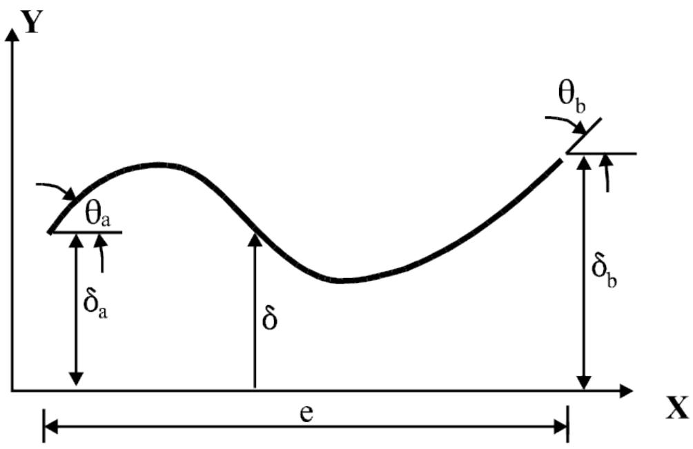
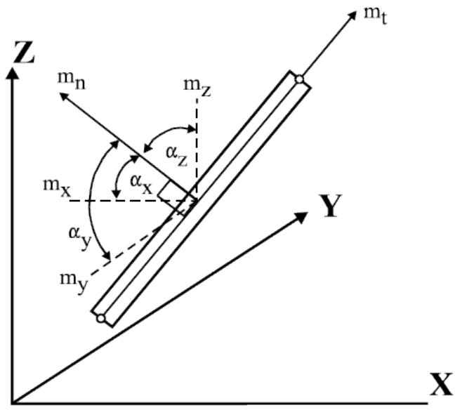
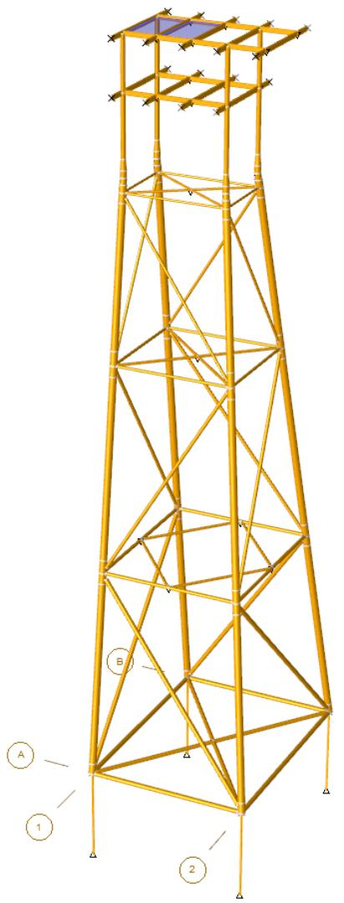
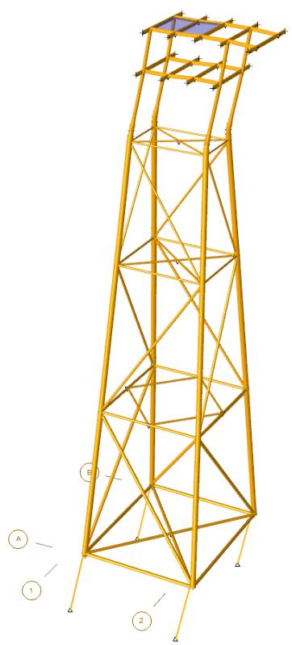
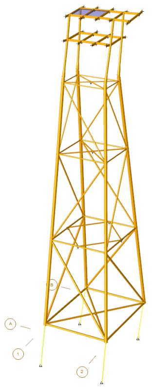
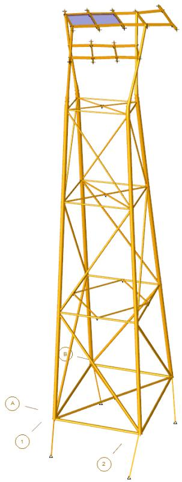
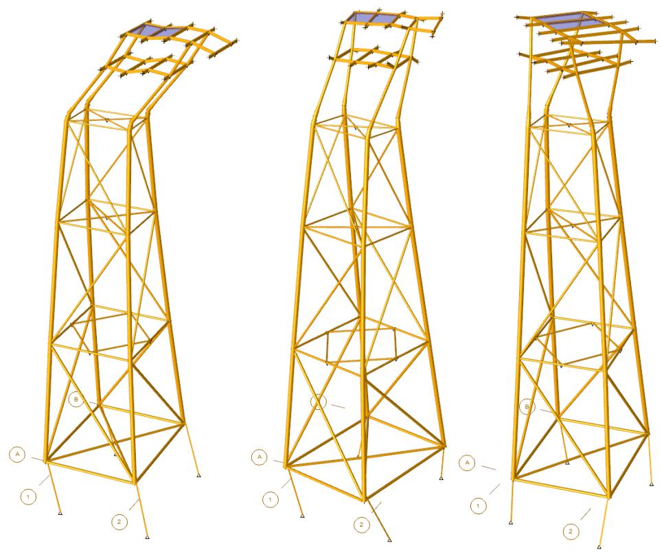
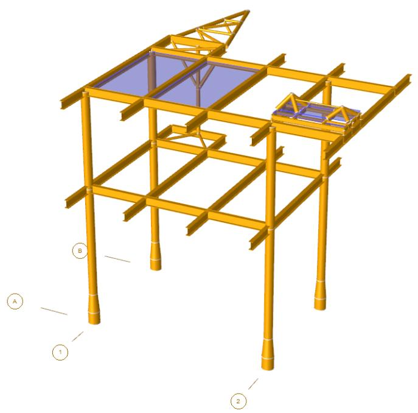
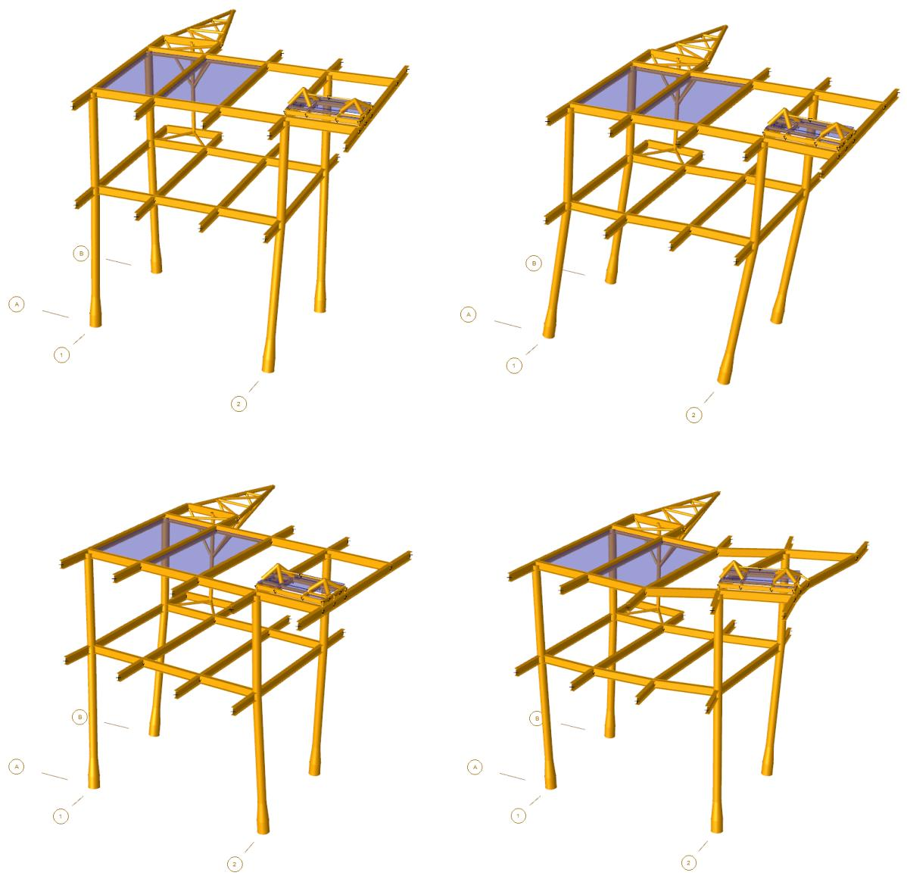

SACS

Dynpac

Version 24.00

Trademark Notice

Bentley and the "B" Bentley logo are either registered or unregistered trademarks or service marks of Bentley Systems, Incorporated. All other marks are the property of their respective owners.

Copyright Notice

Copyright © 2024, Bentley Systems, Incorporated. All Rights Reserved.

TABLES OF CONTENTS

1 INTRODUCTION .. 4

## 1.1 OVERVIEW.. . 4
## 1.2 PROGRAM FEATURES.. 4

2 DYNAMIC MODELING AND INPUT..

## 2.1 RETAINED DEGREES OF FREEDOM. 5
## 2.2 STRUCTURAL MASS. 5

2.2.1 Generating Structural Mass Automatically... 5

2.2.1.1 Default Structural Density.. . 6   
2.2.1.2 Overriding Structural Density... . 6   
2.2.1.3 Members Structural Torsional Mass.... . 6

2.2.2 Converting Loads to Mass Automatically...

2.2.2.1 Designating Load Cases to Convert to Mass .... . 8   
2.2.2.2 Factoring Load Cases.... . 8

2.2.3 User Input Joint Weight .. . 8   
2.2.4 Structural Mass Contingency Factors .... . 8

## 2.3 FLUID MASS.. 9

2.3.1 Generating Fluid Added Mass Automatically.. 9

2.3.1.1 Member Overrides for Fluid Added Mass Generation .... . 9   
2.3.1.2 Plate Overrides for Fluid Added Mass Generation . .. 10

2.3.2 Generating Fluid Entrapped Mass Automatically . . 10

2.3.2.1 Member Overrides for Fluid Entrapped Mass Generation ... .. 10

## 2.4 HYDRODYNAMIC MODELING USING SEASTATE... .... 10
## 2.5 SIMULATING NON-LINEAR FOUNDATIONS. .. 11

2.5.1 Including Linearized Foundation Automatically.. 11   
## 2.6 INCLUDING P-DELTA EFFECTS ... 11

3 DYNPAC TROUBLE SHOOTING.. 12

## 3.1 MODEL STIFFNESS MATRIX .. .12
## 3.2 MODEL MASS MATRIX .. .. 12

4 COMMENTARY . . 13

## 4.1 STIFFNESS MATRIX REDUCTION.. .. 13
## 4.2 MASS MATRIX GENERATION.. . 13

4.2.1 Consistent Mass Approach.. 13   
4.2.2 Lumped Mass Approach . . 15

## 4.3 MASS MATRIX REDUCTION. . 15
## 4.4 CALCULATING RESULTS. .15
## 4.5 FLUID ADDED OR VIRTUAL MASS... .. 16

5 SAMPLE PROBLEMS.. .. 18

## 5.1 JACKET WITH PILE STUBS . .. 19
## 5.2 JACKET WITH PILE SUPERELEMENT . .. 27
## 5.3 DECK STRUCTURE.. .. 29

6 INPUT LINES.. .. 35

1 INTRODUCTION

## 1.1 OVERVIEW

The Dynpac program module generates dynamic characteristics including eigenvectors or natural mode shapes, eigenvalues or natural periods and modal internal load and stress vectors for a structure.

Because the Dynpac module provides the mode shapes and masses required for modal dynamic analysis, its execution is required prior to execution of any of the SACS dynamic programs.

## 1.2 PROGRAM FEATURES

Dynpac requires a SACS input model file or output structural data file and a Dynpac input file for execution. The program creates a common solution file containing normalized mode shapes, frequencies, internal loads etc. and a mass file.

Some of the main features and capabilities of Dynpac program module are:

1. Full six degree of freedom modes supported.   
2. Guyan reduction of non-inertially loaded constrained degrees of freedom.   
3. Generates structural mass and fluid added or virtual mass automatically.   
4. Supports lumped or consistent mass generation.   
5. User input lumped or consistent mass capability. User-defined joint weight in the Local Axis of the selected Member.   
6. Ability to convert model input loading to mass.   
7. Utilizes hydrodynamic properties and modeling from Seastate module.   
8. Plate and beam element structural density overrides.   
9. Member and member group fluid added mass property overrides.   
10. Determines modal mass participation to allow determination of number of modes required for subsequent dynamic analyses.   
11. Ability to override plate added mass coefficient.   
12. Ability to override plate properties by plate group.   
13. Includes P-Delta capabilities in addition to cable elements.

2 DYNAMIC MODELING AND INPUT

The Dynpac program requires a SACS model file or output structural data file and a Dynpac input file. The model file must contain minimal additional dynamic modeling information in order to perform the Dynpac analysis, namely, joint retained degrees of freedom (DOF) must be specified in the joint fixity columns on the appropriate ‘JOINT’ input line(s) and a ‘LOAD’ header must exist in the model file even if no loading is specified.

## 2.1 RETAINED DEGREES OF FREEDOM

Dynpac uses a set of retained degrees of freedom, selected by the user, to extract the Eigen values (periods) and Eigen vectors (mode shapes). All stiffness and mass properties associated with the constrained (reduced) degrees of freedom are included in the Eigen extraction procedure. The stiffness matrix is reduced to the retained degrees of freedom using standard matrix condensation methods. The mass matrix is reduced to the retained degrees of freedom using the Guyan reduction method assuming that the stiffness and mass are distributed similarly. All degrees of freedom which are non-inertial (no mass value) must be constrained degrees of freedom. After modes are extracted using the retained degrees of freedom, they are expanded to include full 6 degrees of freedom for all joints in the structure. The expanded modes are used for subsequent dynamic response analysis.

Any joint degree of freedom, X, Y and Z translation and/or rotation, to be retained for extraction purposes must be designated in the model. A joint DOF may be retained by specifying a ‘2’ in the appropriate fixity column on the ‘JOINT’ input line. Specifying a ‘0’ or leaving the fixity field blank designates the DOF as a constrained degree of freedom to be reduced. For example, to retain the X and Z translation degrees of freedom, specify ‘202’ or ‘2 2’ in columns 55-57 on the ‘JOINT’ line defining the joint.

Note: Columns 55, 56 and 57 pertain to global X, Y and Z translation respectively and columns 58, 59, and 60 to X, Y and Z rotation respectively.

Support degrees of freedom require no special modeling for dynamic purposes.

Note: Specifying a ‘2’ or ‘0’ for a particular DOF, has no effect for static analysis.

In dynamic analysis, to accurately calculate the effects of a concentrated mass along the length of a member it is best to include a joint at that location. Also, if a local mode due to the concentrated mass is important to the analysis, then the model should include retained degrees of freedom at the joint at the location of the mass. In this way, the dynamic analysis will use mass which is distributed in a manner that matches the mass distribution of the model.

## 2.2 STRUCTURAL MASS

2.2.1 Generating Structural Mass Automatically

By default, Dynpac generates structural mass for modeled beam, plate and shell elements automatically. Structural masses are also generated if ‘SA’ is specified as one of the execution options in columns 63-68 on the ‘DYNOPT’ line. Structural masses are not generated if option ‘SO’ is specified in columns 63-68.

Structural mass may be calculated as lumped or consistent mass by specifying ‘LUMP’ or ‘CONS’ in columns 15-18 on the ‘DYNOPT’ line respectively. The lumped method places all element mass at the nodes to which the element is connected while the consistent approach assumes mass is distributed along the element. Although, the default method is lumped, consistent mass may be desirable for structures immersed in fluid.

The following example indicates that the mass of modeled elements is to be calculated by the program in addition to converting some load cases in the model file to mass. The consistent mass approach is to be used.


| 1 2 3 4 5 6 7 8 1234567890123456789012345678901234567890123456789012345678901234567890123456789012345678901234567890123456789 |
| --- |
| DYNOPT CONS SA-Z |


Note: Because the lumped approach does not generate mass moments of inertia, the weight moment of inertia for each rotational DOF retained must be specified in the Dynpac input file when using the lumped approach.

2.2.1.1 Default Structural Density

For a beam element, the density specified on the GRUP input line is used as the default when generating structural mass automatically, unless density is specified on the MEMBER line. If structural mass is not specified the density specified on the ‘DYNOPT’ line is used.

The density specified on the PGRUP or PLATE input lines located in the model file are used for plate elements. For shell elements on the other hand, the density specified in columns 19-25 on the DYNOPT line is used. The density specified on the ‘SHELL’ line is ignored by the Dynpac program module.

2.2.1.2 Overriding Structural Density

The density for individual members, plates, plate groups, shells and member groups may be overridden for mass generation purposes. The member, plate, shell or group name, along with the structural density override, are specified in the Dynpac input file on the MBOVR, PLOVR, PGOVR, SHOVR and GROVR override lines, respectively.

The following example specifies that the density of member 101-157, member group MM1, plate A101 and plate group PG1 is to be 100.0 for the purpose of determining the dynamic characteristics.


|  | 1 | 2 | 3 | 4 | 5 | 6 | 7 | 8 |
| --- | --- | --- | --- | --- | --- | --- | --- | --- |
|  | 12345678901 | 12345678901 | 12345678901 | 12345678901 | 12345678901 | 12345678901 | 12345678901 | 1234567890 |
| 1 | MBOVR | 101 | 157 | 100.0 |  |  |  |  |
| 2 | GROVR | MM1 |  | 100.0 |  |  |  |  |
| 3 | PLOVR | A101 |  | 100.0 |  |  |  |  |
| 4 | PGOVR | PG1 |  | 100.0 |  |  |  |  |


2.2.1.3 Members Structural Torsional Mass

Dynpac can automatically calculate torsional mass of members to be included in model mass matrix. To enable this option, the user may enter ‘MST’ option on columns 74-76 of DYNOP2 input line. Dynpac uses consistent mass matrix formulation to compute torsional mass matrix in member local coordinates systems. The torsional mass matrix is given in local coordinates system as

$$\mathbf{M}_{t o r s i o n} = I_{0} \left[ \begin{array}{l l} \frac{1}{3} & \frac{1}{6} \\ \frac{1}{6} & \frac{1}{3} \end{array} \right]$$

where $I_{ 0 }$ is polar moment of inertia of a given member with respect to its section centroid. $I_{ 0 }$ can be determined based on section properties as

$$I_{0} = \frac{m}{A} \left(I_{y y} + I_{z z}\right)$$

in which ?? is total mass of the member, ?? is cross-section area and $I_{ y y }$ and $I_{ z z }$ are second moment of the area with respect to the local axes Y and Z, respectively.

Please consider following notes for torsional mass in Dynpac:

1. Consistent mass is required to include torsional mass and this option has no effect on lumped mass calculation.   
2. This is only structural torsional mass – fluid mass is not considered in torsional mass calculation.   
3. Tapered Member: $A , I_{ y y }$ and $I_{ z z }$ values are determined by averaging their values at the member two ends.   
4. Multi-segmented Members: $A , I_{ y y }$ and $I_{ z z }$ values are computed through weighted averaging their values over all segments. The weight for a given segment is the ratio of segment length to member length.

2.2.2 Converting Loads to Mass Automatically

Loading contained in the SACS model file can be converted to structural joint or member mass automatically by specifying ‘SA’ as one of the execution options in columns 63-68 on the ‘DYNOPT’ input line.

The direction of loads to be converted and whether the same sign or the opposite sign of the load is to be used when converting to mass must also be specified in the execution options. If loading in the model file defined in the X direction is to be converted to mass, then ‘±X’ should be specified. To convert loading defined in the Y or Z directions, ‘±Y’ or ‘±Z’ should be specified as one of the execution options respectively. The sign of the load direction specified, denotes whether the mass calculated from the load line will have the same sign as the load, designated by $'_{ + } \mathrm{ \prime }$ , or the opposite sign of the load designated by ‘-‘. For example, when converting loading in the global -Z direction (such as gravity loading) to mass, the mass should have the opposite sign as the load specified (i.e. positive mass). Therefore, execution options ‘SA-Z’ (or ‘SO-Z’) should be specified on the ‘DYNOPT’ input line.

The following example indicates that the mass of modeled elements is to be calculated by the program in addition to converting load cases in the Z direction in the model file to mass. The sign of the mass will be the opposite of the sign of the load.


|  | 1 | 2 | 3 | 4 | 5 | 6 | 7 | 8 |
| --- | --- | --- | --- | --- | --- | --- | --- | --- |
|  | 1234567890123456789012345678901234567890123456789012345678901234567890123456789012345678901234567890123456789 | 12345678901234567890123456789012345678901234567890123456789012345678901234567890123456789012345678 | 12345678901234567890123456789012345678901234567890123456789012345678901234567890123456789012345678 601 | 10.0 | 10.0 | 10.0 | 10.0 |  |
| 1 | 1234567890123456789012345678901234567890123456789012345678901234567890123456789012345678901234567890123456789 | 12345678901234567890123456789012345678901234567890123456789012345678901234567890123456789012345678 | 12345678901234567890123456789012345678901234567890123456789012345678901234567890123456789012345678 601 | 10.0 | 10.0 | 10.0 | 10.0 | 10.0 |
| 2 | JTWGT 603 | 10.0 | 10.0 | 10.0 | 10.0 | 10.0 | 10.0 | 10.0 |


Note: When converting loading to mass, the sign of the net load for any load vector must be such that no negative mass is introduced.

2.2.2.1 Designating Load Cases to Convert to Mass

When loads specified in the SACS model file or Seastate input file are to be converted to mass, only load cases specified on the LCSEL line(s) designated as dynamic load cases (i.e. function ‘DY’) are converted. For example, the following designates that load cases 4 and 5 are to be converted to mass by the program.

Note: Either the ‘SA’ or ‘SO’ options must be specified on the DYNOPT line in order to convert the designated load cases to mass.

```txt
1 2 3 4 5 6 7 8 1 23456789012345678901234567890123456789012345678901234567890 1 LCSEL DY 4 5 
```

Note: It is recommended to generate structural mass of the modeled structure automatically rather than converting the gravity loading created by Precede or Seastate.

2.2.2.2 Factoring Load Cases

Load Cases may be factored when converting to mass using the LCFAC line in the Seastate or model input file. In order to factor a load case, specify the load case and factor on the LCFAC using option ‘DY’. For example, the following designates that 50% of load cases 4 and 5 are to be converted to mass.

Note: Load cases 4 and 5 are specified on the LCSEL and LCFAC lines.

```txt
1 2 3 4 5 6 7 8 1234567890123456789012345678901234567890123456789012345678901234567890123456789012345678901234567890123456789 
```

2.2.3 User Input Joint Weight

Joint weights not defined in load cases designated to be converted to mass, may be specified as user defined concentrated joint weights in the Dynpac input file. Concentrated joint weights for X, Y and Z translational degrees of freedom and weight moments of inertia for the X, Y and Z rotational degrees of freedom are specified along with the joint name on the JTWGT line and are converted to masses automatically.

The joint weight can be also entered in a local axis of a member. The selected member should be defined in columns 72-75 and 77-80 of JTGWT line input. The local joint weight is only available for Consistent Mass calculation, any entered member will be ignored for Lumped Mass Matrix.

The following designates that X,Y and Z weight of 10.0 is to be applied at joints 601 and 603.

```txt
1 2 3 4 5 6 7 8 1 2345678901234567890123456789012345678901234567890123456789012345678901234567890 1 JTWGT 601 10.0 10.0 10.0 10.0 10.0 10.0 10.0 
```

2.2.4 Structural Mass Contingency Factors

Any mass generated by Dynpac or supplied as a load case in a SACS input file may be given a "contingency factor" via the ‘DYNOP2’ line. The contingency factor is a multiplier used to increase or

decrease the effect of the mass on structural loading. The contingency factor for structural mass generated by Dynpac is entered in columns 8-13; the contingency factor for masses entered as SACS load cases is entered in columns 14-19.

The ‘DYNOPT’ line in the following example specifies that loading in the -Z direction will be converted to structural mass. The ‘DYNOP2’ line specifies that Dynpac generated mass is to be given a contingency factor of 25% (1.25) whereas mass obtained from SACS loading in the -Z direction is to be given a contingency factor of 10% (1.10).

```txt
1 2 3 4 5 6 7 8  
123456789012345678901234567890123456789012345678901234567890  
1 DYNOPT EN CONS SA-Z  
2 DYNOP2 1.25 1.10 
```

## 2.3 FLUID MASS

2.3.1 Generating Fluid Added Mass Automatically

For structures immersed in fluid, the added or virtual mass and the mass of entrapped fluid can be generated automatically. By default, the fluid mass, mudline elevation and the water depth are read from the model file or from the Seastate input data. If this data has not been previously specified in the model, it must be specified on the DYNOPT line (in the Dynpac input file) in columns 26-32, 33-39 and 40-46, respectively. The normal and axial added mass coefficients for members surrounded by fluid are input in columns 49-53 and 54-58 on the DYNOPT line.

Note: Values specified for fluid mass, mudline elevation and water depth will override any values input in the model file or in Seastate input data.

By default, the virtual mass is calculated based on the added mass coefficient in columns 49-53 on the DYNOPT line and actual member diameter unless an effective diameter is specified in columns 73-78 on the MEMBER input line. For plate elements, the virtual mass is determined using the added mass coefficient specified in columns 49-53 unless a value is indicated in columns 59-62 on the DYNOPT line.

The following specifies that the default added mass coefficient is 1.0 for beam elements and 0.01 for plate elements (i.e. effectively ignoring plate mass).

```txt
1 2 3 4 5 6 7 8 1 23456789012345678901234567890123456789012345678901234567890 1.0 0.01SA-Z 
```

2.3.1.1 Member Overrides for Fluid Added Mass Generation

The effective member diameter used for added mass calculation may be overridden for individual members or for member groups using the ‘MBOVR’ or the ‘GROVR’ lines respectively in the Dynpac input file.

The following overrides the effective diameter of member 101-157 and member group MM1 to 0.001, thus ensuring that no added mass is calculated for these members.

```txt
1 2 3 4 5 6 7 8 123456789012345678901234567890123456789012345678901234567890  
1 MBOVR 101 157 100.0  
2 GROVR MM1 100.0 
```

2.3.1.2 Plate Overrides for Fluid Added Mass Generation

The added mass coefficient for plates and plate groups may be overridden using the PLOVR and PGOVR lines, respectively in the Dynpac input file. The following specifies that the plate added mass coefficient for plate A101 and plate group PG1 is 0.001.

```txt
1 2 3 4 5 6 7 8  
1234567890123456789012345678901234567890123456789012345678901234567890  
PLOVR A101 100.0  
PGOVR PG1 100.0 
```

2.3.2 Generating Fluid Entrapped Mass Automatically

Entrapped mass is calculated for members designated as flooded in the model file based on the actual diameter of the member.

2.3.2.1 Member Overrides for Fluid Entrapped Mass Generation

The flood condition may be overridden for all members on the DYNOPT line in columns 47-48. The flood condition for individual members or member groups may be changed using the MBOVR or the GROVR line images in the Dynpac input file.

The following overrides the flood condition of member 101-157 and member group MM1 to nonflooded, thus ensuring that no entrapped mass is calculated for these members.

```txt
1 2 3 4 5 6 7 8   
1 123456789012345678901234567890123456789012345678901234567890   
1 MBOVR N 101 157 100.0   
2 GROVR MM1 N 100.0 
```

Note: The flood condition specified on the ‘DYNOPT’ line overrides any existing flood condition for all members in the model unless flood condition is changed with subsequent ‘MBOVR’ or ‘GROVR’ lines.

## 2.4 HYDRODYNAMIC MODELING USING SEASTATE

The Seastate program can be used to account for the hydrodynamic effects of unmodeled structural items and/or marine growth as well as the weight of grout in the annulus of concentric tubular sections (assuming 150 lb/ft3 grout density). Seastate updates the member lines to account for the density and effective diameter due to marine growth specified on ‘MGROV’ lines in the SACS model or in the Seastate input file. Member density is also updated to reflect the effective density based on any density and/or cross section area overrides specified in the Seastate input. The effective member diameter in columns 73-78 on the ‘MEMBER’ input line is updated to account for any local Y and Z force dimension overrides specified (in addition to effects of marine growth).

Note: Seastate must be executed with ‘DYN’ specified in columns 56-58 on the ‘LDOPT’ line in the Seastate input file or with the appropriate option specified in the Executive in order to generate hydrodynamic properties. The model updates are contained in the output structural data file created. See the Seastate User’s Manual for a detailed discussion.

## 2.5 SIMULATING NON-LINEAR FOUNDATIONS

Because the dynamic capabilities in the SACS system use linear theory (i.e. modal superposition), nonlinear foundations must be represented with a linearly equivalent system. The equivalent linear foundation model must be incorporated into the SACS model for the purposes of dynamic analysis.

Note: The Pile program module can be used to determine the length, properties and offsets for equivalent pile stub elements used to represent the soil-pile interaction. See the PSI/Pile program user’s manual for a detailed discussion.

2.5.1 Including Linearized Foundation Automatically

The PSI program may be used to generate an equivalent foundation stiffness matrix or super-element to be used to represent the foundation for dynamic analysis. The equivalent foundation super-element may be included as part of the model by specifying ‘I’ in column 9 of the OPTIONS line in the model file or by selecting the appropriate superelement option in the Executive.

## 2.6 INCLUDING P-DELTA EFFECTS

The Dynpac program can include the effects of P-Delta on the dynamic characteristics of the structure. This feature allows the user to designate reference load case(s) representing static dead loading on the structure.

To include P-delta effects, the p-delta effects option must be designated in the model file using the OPTIONS line. The reference load cases must then be designated in the model file or the Seastate input file using the LCSEL line with the ‘PD’ option. For example, the following shows that dead loading defined by load cases DEAD, EQPT and AREA are to be used to determine the P-delta effects on the beam elements.

```txt
1 2 3 4 5 6 7 8 1 23456789012345678901234567890123456789012345678901234567890 1 234567890123456789012345678901234567890 2 LCSEL PD DEAD EQPT AREA 
```

Load factors may be applied to the reference load cases using the LCFAC line. For example, in the following, 50% of load cases DEAD EQPT and AREA are used to obtain the reference axial load.

```txt
1 2 3 4 5 6 7 8 1234567890123456789012345678901234567890123456789012345678901234567890  
1 LCSEL PD DEAD EQPT AREA  
2 LCFAC PD 0.5 DEAD EQPT AREA 
```

Note: Dead loads are typically used as P-Delta loads. For cable elements, the pre-tension load should be designated as the P-Delta load.

3 DYNPAC TROUBLE SHOOTING

## 3.1 MODEL STIFFNESS MATRIX

As part of the dynamic characteristic analysis, the Solve module is used to generate the stiffness matrix properties of the structure. The structural model matrix created by Solve must be ‘Positive Definite’ in order to determine the dynamic characteristics of the structure. In general, if a degree of freedom for any joint or portion of the structure is not restrained by fixity or by stiffness from other elements, the matrix will be ‘Non’-Positive Definite’. For further discussion on matrix ‘Non-Positive Definite’, see the section titled ‘SACS IV Trouble Shooting’ in the SACS IV user’s manual.

The Solve module also determines the accuracy of the solution and reports it as the ‘Maximum Number of Significant Digits Lost’. In general, solutions with six or fewer significant digits lost are sufficiently accurate while solutions with twelve or more lost are not. The SACS IV user’s manual addresses possible causes for excessive numbers of lost significant digits.

## 3.2 MODEL MASS MATRIX

The structural mass matrix is developed by the Dynpac program module. Like the stiffness matrix, the structural mass matrix must be ‘Positive Definite’ in order for it to be inverted. When the mass matrix cannot be inverted, the message ‘Non-Positive Definite Mass Matrix’ is printed in the listing file. Some common reasons for the structural mass matrix becoming ‘Non-Positive Definite’ are as follows:

1. No degrees of freedom in the model are retained DOFs. The error message will normally refer to a degree of freedom for joint name 0.   
2. All degrees of freedom are retained DOFs so that there are no constrained DOFs.   
3. The mass for a particular degree of freedom is negative. This can occur when converting loads specified in the model file to mass using the ‘SA’ or ‘SO’ option on the DYNOPT line. When negative loads in the model file are to be converted, i.e. gravity loads, the ‘-X’, ‘-Y’ or ‘-Z’ option should be specified so that the sign of the mass generated will be positive (opposite to that of the load).   
4. A rotational degree of freedom is a retained DOF but no mass moment of inertia was generated (i.e. lumped approach) or no weight moment of inertia was specified in the input file for that DOF.

When a matrix ‘Non-Positive Definite’ occurs, the critical degree of freedom and the joint name are reported in the Dynpac listing file. For additional information on debugging the model, see the SACS IV user’s manual.

# 4 COMMENTARY

## 4.1 STIFFNESS MATRIX REDUCTION

The purpose of the Dynpac program module is to generate dynamic characteristics (mode shapes and frequencies) of a structure. A Guyan reduction is performed to reduce the structural stiffness matrix K created by SACS IV as follows:

$$K = \left[ \begin{array}{l l} K_{r r} & K_{r c} \\ K_{c r} & K_{c c} \end{array} \right]$$

where the subscript r designates retained degrees of freedom and the subscript c designates constrained degrees of freedom. Knowing that F = K or

$$\left\{ \begin{array}{c} F_{r} \\ F_{c} \end{array} \right\} = \left[ \begin{array}{c c} K_{r r} & K_{r c} \\ K_{c r} & K_{c c} \end{array} \right] \left\{ \begin{array}{c} \delta_{r} \\ \delta_{c} \end{array} \right\}$$

the following relationships can be made.

$$F_{r} = K_{r r} \delta_{r} + K_{r c} \delta_{c} \tag{1}$$

$$F_{c} = K_{c r} \delta_{r} + K_{c c} \delta_{c}$$

${ \sf I f } ,$ by definition, no external forces are applied directly to the constrained degrees of freedom such that $\mathsf{ F }_{ \mathsf{ c } } { = } 0 , \delta_{ \mathsf{ c } }$ can be expressed as follows:

$$\delta_{s} = - \frac{K_{c r}}{K_{c c}} \delta_{r_{o}} \tag{2}$$

Substituting for $\delta_{ \mathsf{ c } }$ in equation (1) yields a relation that can be used to calculate the external forces on retained degrees of freedom, namely,

$$F_{r} = K_{r r} \delta_{r} + K_{r c} \left(- \frac{K_{c r}}{K_{c c}} \delta_{r}\right) = \left(K_{r r} - K_{r c} \frac{K_{c r}}{K_{c c}}\right) \delta_{r} \tag{3}$$

Or

$$F_{r} = \left[ K_{r r}^{\prime} \right] \delta_{r} \tag{4}$$

where ${ \sf K }_{ \sf r r }^{ \prime }$ is the reduced stiffness matrix. Once the retained degrees of freedom are calculated, relation (2) may be used to determine the constrained degrees of freedom.

## 4.2 MASS MATRIX GENERATION

4.2.1 Consistent Mass Approach

The mass matrix may be generated based on the lumped or consistent mass approach. The consistent mass generation approach represents the kinetic energy of the distorted element by the element joint velocities, as represented by the velocities of all degrees of freedom at the joint. The deflection  and velocity $\delta^{ \prime }$ along a member may be expressed as follows:

$$\delta = f \left(x, \delta_{a}, \theta_{a}, \delta_{b}, \theta_{b}\right) \quad \dot{\delta} = f \left(x, \dot{\delta}_{a}, \dot{\theta}_{a}, \dot{\delta}_{b}, \dot{\theta}_{b}\right)$$

  
Figure 1. Beam element deflection model

The kinetic energy is defined as:

$$K E = \frac{1}{2} \int M \dot{\delta}^{2} d x$$

where M is the mass per unit length. Taking

$$\frac{d}{d t} \left(\frac{d K E}{d \dot{q}}\right) \quad \text{f o r} \quad \dot{q} = \dot{\delta}_{a}, \dot{\delta}_{b}, \dot{\theta}_{a}, \dot{\theta}_{b}$$

results in

$$\left[ \begin{array}{c} M \end{array} \right] \left\{ \begin{array}{c} \ddot{\delta}_{a} \\ \ddot{\theta}_{a} \\ \ddot{\delta}_{b} \\ \ddot{\theta}_{b} \end{array} \right\}$$

where [M] is the elemental mass matrix for the element. The elemental mass matrix is then transformed into the global coordinate system and added to the overall structural mass matrix.

Note: Because the consistent approach takes into account the distribution of mass along the element, the mass matrix created includes off-diagonal coupling terms between all degrees of freedom, including rotational DOFs.

4.2.2 Lumped Mass Approach

In the lumped approach, a diagonal mass matrix is created by dividing each element mass into equal components along the global X, Y and Z directions and concentrating these masses at the end joints. Rotational mass or mass moments of inertia are neglected along with any off diagonal terms of the mass matrix.

Note: Because off diagonal terms are assumed to be zero in the lumped mass approach, it is not recommended when the element mass is not the same in all three directions such as when including effects of fluid added or virtual mass acting normal but not tangential to the element.

## 4.3 MASS MATRIX REDUCTION

After the overall mass matrix has been generated by either the consistent or lumped mass approach, it is partitioned into the same form as the stiffness matrix such that:

$$K E = \frac{1}{2} \left\{ \begin{array}{c c} \dot{\delta}_{m}^{\prime} & \dot{\delta}_{s}^{\prime} \end{array} \right\} \left[ \begin{array}{c c} M_{m m} & M_{m s} \\ M_{s m} & M_{s s} \end{array} \right] \left\{ \begin{array}{c} \dot{\delta}_{m} \\ \dot{\delta}_{s} \end{array} \right\}$$

Note: The terms $M_{ m s }$ and $M_{ s m } = 0$ and $M_{ m m }$ and Mss are diagonal matrices for the lumped approach.

Differentiating equation (2) with respect to time yields,

$$\dot{\delta}_{s} = - K_{s s}^{-1} K_{s m} \dot{\delta}_{m}$$

therefore, the equation for kinetic energy becomes

$$K E = \frac{1}{2} \left\{\dot{\delta}_{m}^{\prime} \right\} \left[ \begin{array}{l l} I & - K_{m s} K_{s s}^{-1} \end{array} \right] \left[ \begin{array}{l l} M_{m m} & M_{m s} \\ M_{s m} & M_{s s} \end{array} \right] \left[ \begin{array}{l} I \\ - K_{s s}^{-1} K_{s m} \end{array} \right] \left\{\dot{\delta}_{m} \right\}$$

which is a standard Guyan reduction resulting in

$$K E = \frac{1}{2} \left\{\dot{\delta}_{m}^{\prime} \right\} \left[ M_{m m}^{\prime} \right] \left\{\dot{\delta}_{m} \right\}$$

where $\mathsf{ M }_{ \mathsf{ m m } }^{ \prime }$ is the reduced mass matrix.

## 4.4 CALCULATING RESULTS

Once the reduced stiffness and reduced mass matrices are generated, the eigenvalues/eigenvectors for the retained degrees of freedom are extracted using the standard Householder-Givens extraction technique. The resulting eigenvectors at the retained degrees of freedom are expanded to obtain results for the reduced or constrained degrees of freedom which allows the calculation of modal reactions and modal elemental internal loads.

## 4.5 FLUID ADDED OR VIRTUAL MASS

Morrison’s equation is used to determine the hydrodynamic loading due to fluid added or virtual mass. The resultant force per unit length, F, has a component normal to the element, Fn, and a component tangential or along the cylinder axis, $\mathsf{ F }_{ \mathsf{ t } } .$

$$\overline{{F}} = \overline{{F}}_{n} + \overline{{F}}_{t}$$

where $\mathsf{ F }_{ \mathsf{ n } }$ and $\mathsf{ F }_{ \mathrm{ t } }$ are functions of the fluid relative velocity $\mathsf{ V }_{ \mathsf{ r e l } } ,$ fluid acceleration V' and the acceleration of the structure $\mathsf{ V }_{ \mathsf{ S } }^{ \prime } ,$ , and are given by the following for tubular elements:

$$\bar{F}_{n} = \frac{1}{2} C_{D n} D \rho_{s} \bar{V}_{r e l_{n}} | \bar{V}_{r e l_{n}} | + \frac{1}{4} \pi C_{M n} D^{2} \rho_{s} \bar{\dot{V}}_{n} + (C_{M n} - 1) \frac{\pi D^{2}}{4} \rho \bar{\dot{V}}_{s_{n}}$$

$$\bar{F}_{t} = \frac{1}{2} C_{D t} D \rho_{s} \bar{V}_{r e l_{t}} | \bar{V}_{r e l_{t}} | + \frac{1}{4} \pi C_{M t} D^{2} \rho_{s} \bar{\dot{V}}_{t} + (C_{M t} - 1) \frac{\pi D^{2}}{4} \rho \bar{\dot{V}}_{s_{t}}$$

where the term （$\mathsf{ C }_{ \mathsf{ m }^{ - 1 } } ) ( \pi \mathsf{ D }^{ 2 } / 4 ) \rho$ is the fluid added mass term. The normal added mass, ${ \mathsf{ m } }_{ \mathsf{ n } } ,$ , and axial or tangential added mass, $\mathsf{ m }_{ \mathrm{ t } } ,$ may be rewritten as follows:

$$m_{n} = \left(C_{M n} - 1\right) \frac{\pi D^{2}}{4} \rho = C_{v_{n}} \frac{\pi D^{2}}{4} \rho$$

$$m_{t} = \left(C_{M t} - 1\right) \frac{\pi D^{2}}{4} \rho = C_{v_{t}} \frac{\pi D^{2}}{4} \rho$$

where $\mathsf{ C }_{ \mathsf{ v } \mathsf{ n } }$ and $\complement_{ \mathsf{ v t } }$ are the normal and axial added mass coefficients input into the Dynpac program, respectively.

Note: Because the default tangential mass coefficient, $C_{ v t }$ is zero, tangential added mass is ignored by default unless the coefficient is overridden by the user.

The added mass normal to the member and the mass tangential, if applicable, are broken into global $\mathsf{ X } ,$ Y and Z direction masses then added to the elemental mass matrix. Including the hydrodynamic inertial terms due to structural acceleration in the mass matrix, results in the automatic inclusion of acceleration dependent hydrodynamic forces including relative acceleration effects.

The global X, Y and Z components, $\mathbf{ m }_{ \mathbf{ n } \mathbf{ x } } , \mathbf{ m }_{ \mathbf{ n } \mathbf{ y } }$ and $\mathsf{ m }_{ \mathsf{ n } z } ,$ of the normal fluid added or virtual mass and the X, Y and Z components of the tangential fluid added mass, $\mathsf{ m }_{ \mathsf{ t x } } , \mathsf{ m }_{ \mathsf{ t y } }$ and $_{ \mathsf{ m }_{ \mathsf{ t } z } , \mathsf{ a r e } }$ taken as:

$$m_{n x} = m_{n} \cos \alpha_{x} \quad m_{n y} = m_{n} \cos \alpha_{y} \quad m_{n z} = m_{n} \cos \alpha_{z}$$

$$m_{t x} = m_{t} \sin \alpha_{x} \quad m_{t y} = m_{y} \sin \alpha_{y} \quad m_{t z} = m_{t} \sin \alpha_{z}$$

where $\alpha_{ \mathrm{ x } } , \alpha_{ \mathrm{ y } }$ and $\mathtt{ Q }_{ \mathtt{ Z } }$ are the angle between the plane normal to the element and the global $\tt X , Y$ and Z axes respectively. See the following figure.

  
Figure 2. Beam element mass model

5 SAMPLE PROBLEMS

The structure shown in Figure 1 was used to illustrate various capabilities of the Dynpac program. Three separate Dynpac analyses are illustrated:

1. The dynamic characteristics of the structure submerged in water were determined using the consistent mass approach. Seastate override lines were used for the hydrodynamic modeling. The linearized foundation elements were included in the model file.   
2. Sample Problem 2 is the same as Sample Problem 1 except that instead of modeling linearized pile stubs, a linearized foundation superelement was used. The ability to convert loads from any load case to mass without copying the load into LC 1 is also illustrated.   
3. The natural modes of the deck in Figure 3 were determined using the lumped mass approach. Additional joint weight was added in the Dynpac input file.

  
Figure 3. Jacket model with pile stubs

## 5.1 JACKET WITH PILE STUBS

The following example illustrates the use of the Seastate and Dynpac programs to determine the dynamic characteristics of a structure submerged in a fluid.

The structure in Figure 1 stands in 261.0 feet of salt water (density 64.2 lb/ft3). The member mass, mass of marine growth, mass of entrapped water and virtual or added mass were calculated automatically using the consistent mass approach. The Seastate program was used to determine the effective member properties including diameter, density, etc. to account for the hydrodynamic properties of the members.

Load cases consisting of equipment, area, and miscellaneous loads were specified in the SAC input file to account for unmodeled members and equipment weights that could affect the dynamic characteristics of the structure. Additional joint weights were specified in the Dynpac input file.

Dummy piles used to simulate the soil/pile interaction were developed using the Pile program and were added to the model. The degrees of freedom to be retained for determining the generalized masses and the eigenvectors were designated (using Precede) by specifying a ‘2’ for the joint DOF.

A Seastate input file containing override lines to account for the hydrodynamics of unmodeled members and appurtenances was used as the SACS input file. 85% of load case EQPT and 75% of load case AREA in the model file were used to calculate the converted mass for the mode shape extraction.

The following is a portion of the Seastate input file:

```txt
1 2 3 4 5 6 7 8  
1234567890123456789012345678901234567890123456789012345678901234567890  
1 LDOPT NF+Z 64.30 490.05 -261.0 261.00GLOB DYN NPNP K  
2 \* SELECTS LOAD CASES TO BE CONVERTED TO MASS  
3 LCSEL DY MISC EQPT AREA  
4 \* DESIGNATES FACTOR ON LOAD CASES TO BE CONVERTED IF NOT 1.0  
5 LCFAC DY 0.85 EQPT  
6 LCFAC DY 0.75 AREA  
7 \* USE LOADING IN MODEL FILE ONLY  
8 FILE J
9 CDM
10 CDM 1.0 0.600 1.200 0.600 1.200  
11 CDM 100.0 0.600 1.200 0.600 1.200  
12 MGROV
13 MGROV 0.00 200.000 1.000  
14 MGROV 200.0 261.000 2.000  
15 GRPOV
16 GRPOVAL LG1 F  
17 GRPOVAL LG2 F  
18 GRPOVAL LG3 F  
19 GRPOV LG4 F  
20 GRPOV PL1NF 0.001 0.001  
21 GRPOV PL2NF 0.001 0.001  
22 GRPOV PL3NF 0.001 0.001  
23 GRPOV PL4NF 0.001 0.001  
24 GRPOV W.BNF 0.001 0.001  
25 LOAD
26 END
```

The following is a description of the Seastate input file:

Line 1. The LDOPT line specifies the physical parameters of the structure such as water depth, water and steel density etc. ‘DYN’ in columns 56-58 specifies that a SACS hydrodynamic model is to be created for use by Dynpac.

Line 3. The LCSEL line designates that if the convert load case to mass option is specified in the Dynpac input file, only load cases MISC, EQPT, and AREA are to be converted.

Lines 5-6. The LCFAC line indicates that load case EQPT is to be factored by 0.85 and load case AREA is to be factored by 0.75 when converted to mass.

Line 8. The FILE line indicates that only loading in the jacket geometry file is to be considered for this analysis (i.e. ‘J’ in column 6).

Lines 9-24. The CDM, MGROV and GRPOV lines ensure that entrapped water mass and added or virtual mass are generated accurately.

The following is a portion of the model file used for this sample followed by a description of the input:

```proteindb
1 2 3 4 5 6 7 8  
1234567890123456789012345678901234567890123456789012345678901234567890  
1 SAMPLE 08 ENGLISH UNITS MODEL  
2 OPTIONS EN SDUC 2 1 PTPT PT  
3 SECT
4 SECT CONE CON 36.0000.75026.000  
5 SECT PILSTUB PRI165.1824786.0 24786.0 24786.0 10.0 10.0  
6 GRUP
7**********ADDITIONAL SACS GROUP LINES**********  
8 GRUP STB PILSTUB  
9**********ADDITIONAL SACS GROUP LINES**********  
10 MEMBER
11 MEMBER2102S 102 STBSK  
12 MEMBER OFFSETS 76.9  
13MEMBER2104S 104 STBSK  
14MEMBER OFFSETS 76.9  
15MEMBER2106S 106 STBSK  
16MEMBER OFFSETS 76.9  
17MEMBER2108S 108 STBSK  
18MEMBER OFFSETS 76.9  
19**********ADDITIONAL SACS MEMBER LINES**********  
20 JOINT
21JOINT 101 -24. -50. -261. -3.000  
22JOINT 102 -24. -50. -261. -525.8 111111  
23JOINT 102S -24. -50. -261. -525.8 111111  
24JOINT 103 51. -50. -261. 4.800 -3.000  
25JOINT 104 51. -50. -261. 4.800 -3.000  
26JOINT 104S 51. -50. -261. 4.800 -3.000 -525.8 111111  
27JOINT 105 -24. 50. -261. 3.000  
28JOINT 106 -24. 50. -261. 3.000  
29JOINT 106S -24. 50. -261. 3.000 -525.8 111111  
30JOINT 107 51. 50. -261. 4.800 3.000  
31JOINT 108 51. 50. -261. 4.800 3.000  
32JOINT 108S 51. 50. -261. 4.800 3.000 -525.8 111111  
33JOINT 109 13. 0. -261. 8.400 222000  
34JOINT 201 -24. -38. -164. -1.500 222000  
35JOINT 202 -24. -38. -164. -1.500  
36JOINT 203 41. -38. -164. 8.400 -1.500 222000  
37JOINT 204 41. -38. -164. 8.400 -1.500  
38JOINT 205 -24. 38. -164. 1.500 222000  
39JOINT 206 -24. 38. -164. 1.500  
4OJOINT 2O7 4I. 38. -164. 8.4Oo 222OoO  
4IJOINT 2O8 4I. 38. -164. 8.OoO 2OoO  
4OJOINT 2O9 -24. O-164.. 222OoO  
4OJOINT 2IO .8.. O-164.. O-164.. O-164.. O-164.. O-
```


| 45 | JOINT 212 | 8. | -38. | -164. | 10.296 | -1.500 | 222000 |  |  |
| --- | --- | --- | --- | --- | --- | --- | --- | --- | --- |
| 46 | JOINT 301 | -24. | -26. | -69. |  | -3.000 | 222000 |  |  |
| 47 | **********ADDITIONAL SACS JOINT LINES********** | **********ADDITIONAL SACS JOINT LINES********** | **********ADDITIONAL SACS JOINT LINES********** | **********ADDITIONAL SACS JOINT LINES********** | **********ADDITIONAL SACS JOINT LINES********** | **********ADDITIONAL SACS JOINT LINES********** | **********ADDITIONAL SACS JOINT LINES********** | **********ADDITIONAL SACS JOINT LINES********** | **********ADDITIONAL SACS JOINT LINES********** |
| 48 | LOAD |  |  |  |  |  |  |  |  |
| 49 | **********ADDITIONAL SACS LOAD LINES********** | **********ADDITIONAL SACS LOAD LINES********** | **********ADDITIONAL SACS LOAD LINES********** | **********ADDITIONAL SACS LOAD LINES********** | **********ADDITIONAL SACS LOAD LINES********** | **********ADDITIONAL SACS LOAD LINES********** | **********ADDITIONAL SACS LOAD LINES********** | **********ADDITIONAL SACS LOAD LINES********** | **********ADDITIONAL SACS LOAD LINES********** |
| 50 | LOADCNMISC |  |  |  |  |  |  |  |  |
| 51 | LOAD Z 712 703 |  | -0.1900 |  | -0.1900 |  | GLOB UNIF | WALK1 |  |
| 52 | LOAD Z 703 707 |  | -0.1900 |  | -0.1900 |  | GLOB UNIF | WALK1 |  |
| 53 | LOAD Z 707 723 |  | -0.1900 |  | -0.1900 |  | GLOB UNIF | WALK1 |  |
| 54 | LOAD Z 833 836 |  | -0.1900 |  | -0.1900 |  | GLOB UNIF | WALK2 |  |
| 55 | LOAD Z 836 839 |  | -0.1900 |  | -0.1900 |  | GLOB UNIF | WALK2 |  |
| 56 | LOAD Z 839 844 |  | -0.1900 |  | -0.1900 |  | GLOB UNIF | WALK2 |  |
| 57 | LOAD 807 |  |  | -20.000 |  |  | GLOB JOIN | CRANE |  |
| 58 | * |  |  |  |  |  |  |  |  |
| 59 | ***LDS1** | -8.000 |  | 20.000 | 50.000 | -8.000 | 20.000 | 50.000 |  |
| 60 | ***LDS2** |  | -10.000 |  |  |  |  | 34.000 | 0.100 |
| 61 | ***LDS3** | 0.100 | 1 | 2 | 2 | 0 | OMISC | -1EQUPSKIDFIREWALLX |  |
| 62 | LOAD Z 705 720 | 3.95000-1.6667 |  |  |  |  |  | GLOB CONC | FIREWALL |
| 63 | LOAD Z 705 720 | 4.05000-1.6667 |  |  |  |  |  | GLOB CONC | FIREWALL |
| 64 | LOAD Z 717 721 | 3.95000-1.6667 |  |  |  |  |  | GLOB CONC | FIREWALL |
| 65 | LOAD Z 717 721 | 4.05000-1.6667 |  |  |  |  |  | GLOB CONC | FIREWALL |
| 66 | LOAD Z 718 722 | 3.95000-1.6667 |  |  |  |  |  | GLOB CONC | FIREWALL |
| 67 | LOAD Z 718 722 | 4.05000-1.6667 |  |  |  |  |  | GLOB CONC | FIREWALL |
| 68 | END |  |  |  |  |  |  |  |  |


The following is a description of the SACS input file:

Line 5. The dummy pile section properties are defined using section PILSTUB.

Line 8. The dummy pile group PST is defined.

Lines 36-43. Dummy pile members 102S-102, 104S-104, 106S-106 and 108S-108 are defined.

Lines 23-32. The dummy pile bottom joints 102S, 104S, 106S and 108S are fixed (joint fixity ‘111111’).

Lines 33-46. The retained degrees of freedom are specified by ‘2’ in columns 55-60 on the appropriate JOINT lines. For example, Joint 109 is retained for translation in the X, Y, and Z directions as designated by ‘222000’ in columns 55-60.

Lines 48-65. The loads of Load Condition ‘MISC’ account for the weight of unmodeled members and equipment and will be converted to masses by Dynpac.

Seastate and Dynpac were executed in succession to determine the dynamic characteristics of the structure. The output structural data file created by Seastate containing the effective member properties was used as the model input file for Dynpac.

Note: Seastate and Dynpac can be run as separate analysis steps or together as a single step. When executing separately, specify the Seastate output structural data file as the SACS input file for the Dynpac execution.

The following is the Dynpac input file used for this sample followed by a description of the input:


|  | 1 | 2 | 3 | 4 | 5 | 6 | 7 | 8 |
| --- | --- | --- | --- | --- | --- | --- | --- | --- |
|  | 123456789012345678901234567890123456789012345678901234567890 | 123456789012345678901234567890123456789012345678901234567890 | 123456789012345678901234567890123456789012345678901234567890 | 123456789012345678901234567890123456789012345678901234567890 | 123456789012345678901234567890123456789012345678901234567890 | 123456789012345678901234567890123456789012345678901234567890 | 123456789012345678901234567890123456789012345678901234567890 | 123456789012345678901234567890123456789012345678901234567890 |
| 1 | ENGLISH TEST MODEL | ENGLISH TEST MODEL | ENGLISH TEST MODEL | ENGLISH TEST MODEL | ENGLISH TEST MODEL | ENGLISH TEST MODEL | ENGLISH TEST MODEL | ENGLISH TEST MODEL |
| 2 | * SA-Z DESIGNATES Z LOADS TO BE CONVERTED TO MASS WITH OPPOSITE SIGN | * SA-Z DESIGNATES Z LOADS TO BE CONVERTED TO MASS WITH OPPOSITE SIGN | * SA-Z DESIGNATES Z LOADS TO BE CONVERTED TO MASS WITH OPPOSITE SIGN | * SA-Z DESIGNATES Z LOADS TO BE CONVERTED TO MASS WITH OPPOSITE SIGN | * SA-Z DESIGNATES Z LOADS TO BE CONVERTED TO MASS WITH OPPOSITE SIGN | * SA-Z DESIGNATES Z LOADS TO BE CONVERTED TO MASS WITH OPPOSITE SIGN | * SA-Z DESIGNATES Z LOADS TO BE CONVERTED TO MASS WITH OPPOSITE SIGN | * SA-Z DESIGNATES Z LOADS TO BE CONVERTED TO MASS WITH OPPOSITE SIGN |
| 3 | DYNOPT +ZEN 15CONS490.0 | DYNOPT +ZEN 15CONS490.0 | DYNOPT +ZEN 15CONS490.0 | -261.0 | 261.0 | 1.0 | SA-Z | SA-Z |
| 4 | * WEIGHTS NOT DEFINED IN THE MODEL | * WEIGHTS NOT DEFINED IN THE MODEL | * WEIGHTS NOT DEFINED IN THE MODEL | * WEIGHTS NOT DEFINED IN THE MODEL | * WEIGHTS NOT DEFINED IN THE MODEL | * WEIGHTS NOT DEFINED IN THE MODEL | * WEIGHTS NOT DEFINED IN THE MODEL | * WEIGHTS NOT DEFINED IN THE MODEL |


| 5 | JTWGT | 801 2.0 | 2.0 | 2.0 |
| --- | --- | --- | --- | --- |
| 6 | JTWGT | 803 2.0 | 2.0 | 2.0 |
| 7 | JTWGT | 805 2.0 | 2.0 | 2.0 |
| 8 | JTWGT | 807 2.0 | 2.0 | 2.0 |
| 9 | END |  |  |  |


Line 3. The DYNOPT line specifies the following:

a. The vertical coordinate is the +Z direction and English units are to be used as specified in columns 8-9 and 10-11 respectively.   
## b. 15 modes are desired (columns 12-14).
c. The consistent mass approach is specified by ‘CONS’ in columns 15-18.   
d. The structure and fluid density are 490.0 and default (64.2 lb/ft3) respectively.   
e. The mudline elevation (-261.0) and the water depth (261.0) are specified in columns 33-39 and 40-46 respectively.   
g. Loads from the SACS data are to be used as masses and the Z direction masses will be opposite sign of the specified Z direction load (‘SA-Z’ in columns 63-66).

Lines 5-8. The JTWGT lines specify that four additional joint weights of 2 kips will be added to joints 801, 803, 805, and 807.

Six of the modes are displayed below. Excerpts from the output file follows.







  
Figure 4. Jacket mode shapes

ENGLISH TEST MODEL

DATE 20-AUG-2020 TIME 16:46:25 DYN PAGE 1

DYN VERSION 14.3.0.27

 DYNAMIC ANALYSIS PARAMETERS 

NO. JOINTS 87

NO. MEMBERS. 153

NO. PLATES 2

NO. SHELL ELEMENTS.. 0

NO. REDUCED DOF. 387

NO. RETAINED DOF.. 135

NO. NULL DOF.. 0

NO. MODES 15

NO. VECTORS. 15

DYNPAC WEIGHT CONTINGENCY.. 1.000

SACS LOAD CONTINGENCY...... 1.000

ADDED WEIGHT CONTINGENCY... 1.000

EXPANDED MODE SHAPES REQUESTED

MASS PASSED FROM SACS DATA - ADDITIONAL

DIRECTION - -Z

AUTOMATIC CONSISTENT MASS OPTION SELECTED

STRUCTURAL DENSITY .. 490.000 LB/FT3

FLUID DENSITY 64.300 LB/FT3

ADDED MASS COEFFICIENTS

MEMBER NORMAL .... 1.000

MEMBER zV 0.000

PLATE 1.000

MUDLINE ELEVATION = -261.00 FT

WATER DEPTH = 261.00 FT

ALL TUBULAR MEMBERS CONSIDERED NON-BUOYANT UNLESS OTHERWISE SPECIFIED


| ENGLISH TEST MODEL SACS IV-FREQUENCIES AND GENERALIZED MASS | ENGLISH TEST MODEL SACS IV-FREQUENCIES AND GENERALIZED MASS | ENGLISH TEST MODEL SACS IV-FREQUENCIES AND GENERALIZED MASS | ENGLISH TEST MODEL SACS IV-FREQUENCIES AND GENERALIZED MASS | ENGLISH TEST MODEL SACS IV-FREQUENCIES AND GENERALIZED MASS | ENGLISH TEST MODEL SACS IV-FREQUENCIES AND GENERALIZED MASS |
| --- | --- | --- | --- | --- | --- |
| MODE | FREQ. (CPS) | GEN. MASS | EIGENVALUE | PERIOD (SECS) |  |
| 1 | 0.309762 | 3.9727042E+03 | 2.6398845E-01 | 3.2282885 |  |
| 2 | 0.350484 | 3.6786831E+03 | 2.0620775E-01 | 2.8532010 |  |
| 3 | 0.568959 | 1.1307374E+03 | 7.8248940E-02 | 1.7575962 |  |
| 4 | 0.661552 | 2.8052165E+03 | 5.7877871E-02 | 1.5115975 |  |
| 5 | 0.666882 | 3.2945772E+03 | 5.6956442E-02 | 1.4995167 |  |
| 6 | 0.801626 | 1.1774440E+03 | 3.9418196E-02 | 1.2474647 |  |
| 7 | 1.351897 | 5.1110953E+03 | 1.3859681E-02 | 0.7397015 |  |
| 8 | 1.522383 | 3.3594363E+02 | 1.0929308E-02 | 0.6568651 |  |
| 9 | 1.535375 | 1.2470120E+02 | 1.0745127E-02 | 0.6513069 |  |
| 10 | 1.617849 | 2.3150009E+03 | 9.6775203E-03 | 0.6181045 |  |
| 11 | 1.980603 | 2.6553749E+02 | 6.4572143E-03 | 0.5048966 |  |
| 12 | 2.400655 | 1.4746010E+02 | 4.3952215E-03 | 0.4165530 |  |
| 13 | 2.476752 | 2.6696667E+02 | 4.1292872E-03 | 0.4037545 |  |
| 14 | 2.522800 | 2.4011208E+02 | 3.9799224E-03 | 0.3963850 |  |
| 15 | 2.555514 | 8.3777613E+02 | 3.8786789E-03 | 0.3913108 |  |


| ENGLISH TEST MODEL | ENGLISH TEST MODEL | ENGLISH TEST MODEL | ENGLISH TEST MODEL | ENGLISH TEST MODEL | DATE 20-AUG-2020 | TIME 16:46:25 | DYN PAGE 25 |
| --- | --- | --- | --- | --- | --- | --- | --- |
| MASS PARTICIPATION FACTOR REPORT | MASS PARTICIPATION FACTOR REPORT | MASS PARTICIPATION FACTOR REPORT | MASS PARTICIPATION FACTOR REPORT | MASS PARTICIPATION FACTOR REPORT | MASS PARTICIPATION FACTOR REPORT | MASS PARTICIPATION FACTOR REPORT | MASS PARTICIPATION FACTOR REPORT |
| BASED ON RETAINED DEGREES OF FREEDOM | BASED ON RETAINED DEGREES OF FREEDOM | BASED ON RETAINED DEGREES OF FREEDOM | BASED ON RETAINED DEGREES OF FREEDOM | BASED ON RETAINED DEGREES OF FREEDOM | BASED ON RETAINED DEGREES OF FREEDOM | BASED ON RETAINED DEGREES OF FREEDOM | BASED ON RETAINED DEGREES OF FREEDOM |
| MODE | ********** MASS PARTICIPATION FACTORS********** | ********** MASS PARTICIPATION FACTORS********** | ********** MASS PARTICIPATION FACTORS********** | ********** CUMULATIVE FACTORS********** | ********** CUMULATIVE FACTORS********** | ********** CUMULATIVE FACTORS********** | ********** CUMULATIVE FACTORS********** |
| MODE | X | Y | Z | X | Y | Z |  |
| 1 | 0.8639823 | 0.0000434 | 0.0006117 | 0.863982 | 0.000043 | 0.000612 |  |
| 2 | 0.0000318 | 0.8898029 | 0.0000157 | 0.864014 | 0.889846 | 0.000627 |  |
| 3 | 0.0002929 | 0.0073161 | 0.0000424 | 0.864307 | 0.897162 | 0.000670 |  |
| 4 | 0.1081960 | 0.0000329 | 0.0000025 | 0.972503 | 0.897195 | 0.000672 |  |
| 5 | 0.0002384 | 0.0854844 | 0.0001220 | 0.972741 | 0.982680 | 0.000794 |  |
| 6 | 0.0000062 | 0.0041994 | 0.0002404 | 0.972748 | 0.986879 | 0.001035 |  |
| 7 | 0.0267258 | 0.0000654 | 0.0165137 | 0.999473 | 0.986944 | 0.017548 |  |
| 8 | 0.0000249 | 0.0013498 | 0.0008927 | 0.999498 | 0.988294 | 0.018441 |  |
| 9 | 0.0000124 | 0.0000020 | 0.0629689 | 0.999511 | 0.988296 | 0.081410 |  |
| 10 | 0.0000824 | 0.0112332 | 0.0003442 | 0.999593 | 0.999529 | 0.081754 |  |
| 11 | 0.0000003 | 0.0001174 | 0.0000233 | 0.999593 | 0.999647 | 0.081777 |  |
| 12 | 0.0000020 | 0.0000001 | 0.0014304 | 0.999595 | 0.999647 | 0.083208 |  |
| 13 | 0.0000001 | 0.0000014 | 0.0005705 | 0.999595 | 0.999648 | 0.083778 |  |
| 14 | 0.0000002 | 0.0000012 | 0.0287099 | 0.999596 | 0.999650 | 0.112488 |  |
| 15 | 0.0000000 | 0.0000068 | 0.1209760 | 0.999596 | 0.999656 | 0.233464 |  |


## 5.2 JACKET WITH PILE SUPERELEMENT

The following example illustrates the ability to use an equivalent foundation super-element and to convert loading in any load case to mass, therefore eliminating the need to modify the model for dynamic analysis purposes. Only the degrees of freedom to be retained for determining the generalized masses and the eigen vectors were specified in the model by inputting a ‘2’ in the appropriate joint fixity column.

Note: Because retaining DOFs has no effect on the model for static analysis, the same model file can be used for static and dynamic analyses.

The following is a portion of the model file to be sent through Seastate for hydrodynamic modeling. The differences between the model requirements for sample 1 and this sample are discussed below:

A. Unlike Sample Problem 1, pile stub members 102S-102, 104S-104, 106S-106 and 108S-108 are not included in the model. An equivalent foundation super-element is to be used instead. Therefore, pile stub section ‘PILSTUB’ and pile stub group ‘STB’ are not required in the model input file.   
B. The foundation super-element input is specified in the Dynpac analysis runfile under the Solve options. This could be entered in the OPTIONS line of the model input file but using the analysis runfile options allows us to use the same model file for both the superelement creation and mode shape extraction analyses.   
C. The pile joints at the mudline are designated with PILEHD fixity.


|  | 1 | 2 | 3 | 4 | 5 | 6 | 7 | 8 |
| --- | --- | --- | --- | --- | --- | --- | --- | --- |
|  | 1234567890123456789012345678901234567890123456789012345678901234567890 | 1234567890123456789012345678901234567890123456789012345678901234567890 | 1234567890123456789012345678901234567890123456789012345678901234567890 | 1234567890123456789012345678901234567890123456789012345678901234567890 | 1234567890123456789012345678901234567890123456789012345678901234567890 | 1234567890123456789012345678901234567890123456789012345678901234567890 | 1234567890123456789012345678901234567890123456789012345678901234567890 | 1234567890123456789012345678901234567890123456789012345678901234567890 |
| 1 | SAMPLE 08 ENGLISH UNITS MODEL | SAMPLE 08 ENGLISH UNITS MODEL | SAMPLE 08 ENGLISH UNITS MODEL | SAMPLE 08 ENGLISH UNITS MODEL | SAMPLE 08 ENGLISH UNITS MODEL | SAMPLE 08 ENGLISH UNITS MODEL | SAMPLE 08 ENGLISH UNITS MODEL | SAMPLE 08 ENGLISH UNITS MODEL |
| 2 | OPTIONS EN SDUC 2 1 | OPTIONS EN SDUC 2 1 | OPTIONS EN SDUC 2 1 | OPTIONS EN SDUC 2 1 | PTPT | PT |  |  |
| 3 | SECT | SECT | SECT | SECT | SECT | SECT | SECT | SECT |
| 4 | SECT CONE CON | SECT CONE CON | SECT CONE CON | SECT CONE CON | 36.0000.75026.000 | 36.0000.75026.000 | 36.0000.75026.000 | 36.0000.75026.000 |
| 5 | GRUP**********ADDITIONAL SACS GROUP LINES********** | GRUP**********ADDITIONAL SACS GROUP LINES********** | GRUP**********ADDITIONAL SACS GROUP LINES********** | GRUP**********ADDITIONAL SACS GROUP LINES********** | GRUP**********ADDITIONAL SACS GROUP LINES********** | GRUP**********ADDITIONAL SACS GROUP LINES********** | GRUP**********ADDITIONAL SACS GROUP LINES********** | GRUP**********ADDITIONAL SACS GROUP LINES********** |
| 6 | GRUP W02 W24X131 29.0111.2035.97 1 1.001.00 0.500 490.00 | GRUP W02 W24X131 29.0111.2035.97 1 1.001.00 0.500 490.00 | GRUP W02 W24X131 29.0111.2035.97 1 1.001.00 0.500 490.00 | GRUP W02 W24X131 29.0111.2035.97 1 1.001.00 0.500 490.00 | GRUP W02 W24X131 29.0111.2035.97 1 1.001.00 0.500 490.00 | GRUP W02 W24X131 29.0111.2035.97 1 1.001.00 0.500 490.00 | GRUP W02 W24X131 29.0111.2035.97 1 1.001.00 0.500 490.00 | GRUP W02 W24X131 29.0111.2035.97 1 1.001.00 0.500 490.00 |
| 7 | MEMBER | MEMBER | MEMBER | MEMBER | MEMBER | MEMBER | MEMBER | MEMBER |
| 8 | MEMBER 101 201 LG1 | MEMBER 101 201 LG1 | MEMBER 101 201 LG1 | MEMBER 101 201 LG1 | MEMBER 101 201 LG1 | MEMBER 101 201 LG1 | MEMBER 101 201 LG1 | MEMBER 101 201 LG1 |
| 9 | MEMBER 101 201 LG1 | MEMBER 101 201 LG1 | MEMBER 101 201 LG1 | MEMBER 101 201 LG1 | MEMBER 101 201 LG1 | MEMBER 101 201 LG1 | MEMBER 101 201 LG1 | MEMBER 101 201 LG1 |
| 10 | **********ADDITIONAL SACS MEMBER LINES********** | **********ADDITIONAL SACS MEMBER LINES********** | **********ADDITIONAL SACS MEMBER LINES********** | **********ADDITIONAL SACS MEMBER LINES********** | **********ADDITIONAL SACS MEMBER LINES********** | **********ADDITIONAL SACS MEMBER LINES********** | **********ADDITIONAL SACS MEMBER LINES********** | **********ADDITIONAL SACS MEMBER LINES********** |
| 11 | JOINT | JOINT | JOINT | JOINT | JOINT | JOINT | JOINT | JOINT |
| 12 | JOINT 101 -24. -50. -261. -3.000 | JOINT 101 -24. -50. -261. -3.000 | JOINT 101 -24. -50. -261. -3.000 | JOINT 101 -24. -50. -261. -3.000 | JOINT 101 -24. -50. -261. -3.000 | JOINT 101 -24. -50. -261. -3.000 | JOINT 101 -24. -50. -261. -3.000 | JOINT 101 -24. -50. -261. -3.000 |
| 13 | JOINT 102 -24. -50. -261. -3.000 PILEHD | JOINT 102 -24. -50. -261. -3.000 PILEHD | JOINT 102 -24. -50. -261. -3.000 PILEHD | JOINT 102 -24. -50. -261. -3.000 PILEHD | JOINT 102 -24. -50. -261. -3.000 PILEHD | JOINT 102 -24. -50. -261. -3.000 PILEHD | JOINT 102 -24. -50. -261. -3.000 PILEHD | JOINT 102 -24. -50. -261. -3.000 PILEHD |
| 14 | JOINT 103 51. -50. -261. 4.800 -3.000 | JOINT 103 51. -50. -261. 4.800 -3.000 | JOINT 103 51. -50. -261. 4.800 -3.000 | JOINT 103 51. -50. -261. 4.800 -3.000 | JOINT 103 51. -50. -261. 4.800 -3.000 | JOINT 103 51. -50. -261. 4.800 -3.000 | JOINT 103 51. -50. -261. 4.800 -3.000 | JOINT 103 51. -50. -261. 4.800 -3.000 |
| 15 | JOINT 104 51. -50. -261. 4.800 -3.000 PILEHD | JOINT 104 51. -50. -261. 4.800 -3.000 PILEHD | JOINT 104 51. -50. -261. 4.800 -3.000 PILEHD | JOINT 104 51. -50. -261. 4.800 -3.000 PILEHD | JOINT 104 51. -50. -261. 4.800 -3.000 PILEHD | JOINT 104 51. -50. -261. 4.800 -3.000 PILEHD | JOINT 104 51. -50. -261. 4.800 -3.000 PILEHD | JOINT 104 51. -50. -261. 4.800 -3.000 PILEHD |
| 16 | JOINT 105 -24. 50. -261. 3.000 | JOINT 105 -24. 50. -261. 3.000 | JOINT 105 -24. 50. -261. 3.000 | JOINT 105 -24. 50. -261. 3.000 | JOINT 105 -24. 50. -261. 3.000 | JOINT 105 -24. 50. -261. 3.000 | JOINT 105 -24. 50. -261. 3.000 | JOINT 105 -24. 50. -261. 3.000 |
| 17 | JOINT 106 -24. 50. -261. 3.000 PILEHD | JOINT 106 -24. 50. -261. 3.000 PILEHD | JOINT 106 -24. 50. -261. 3.000 PILEHD | JOINT 106 -24. 50. -261. 3.000 PILEHD | JOINT 106 -24. 50. -261. 3.000 PILEHD | JOINT 106 -24. 50. -261. 3.000 PILEHD | JOINT 106 -24. 50. -261. 3.000 PILEHD | JOINT 106 -24. 50. -261. 3.000 PILEHD |
| 18 | JOINT 107 51. 50. -261. 4.800 3.000 | JOINT 107 51. 50. -261. 4.800 3.000 | JOINT 107 51. 50. -261. 4.800 3.000 | JOINT 107 51. 50. -261. 4.800 3.000 | JOINT 107 51. 50. -261. 4.800 3.000 | JOINT 107 51. 50. -261. 4.800 3.000 | JOINT 107 51. 50. -261. 4.800 3.000 | JOINT 107 51. 50. -261. 4.800 3.000 |
| 19 | JOINT 108 51. 50. -261. 4.800 3.000 PILEHD | JOINT 108 51. 50. -261. 4.800 3.000 PILEHD | JOINT 108 51. 50. -261. 4.800 3.000 PILEHD | JOINT 108 51. 50. -261. 4.800 3.000 PILEHD | JOINT 108 51. 50. -261. 4.800 3.000 PILEHD | JOINT 108 51. 50. -261. 4.800 3.000 PILEHD | JOINT 108 51. 50. -261. 4.800 3.000 PILEHD | JOINT 108 51. 50. -261. 4.800 3.000 PILEHD |
| 20 | JOINT 109 13. 0. -261. 8.400 222000 | JOINT 109 13. 0. -261. 8.400 222000 | JOINT 109 13. 0. -261. 8.400 222000 | JOINT 109 13. 0. -261. 8.400 222000 | JOINT 109 13. 0. -261. 8.400 222000 | JOINT 109 13. 0. -261. 8.400 222000 | JOINT 109 13. 0. -261. 8.400 222000 | JOINT 109 13. 0. -261. 8.400 222000 |
| 21 | JOINT 201 -24. -38. -164. -1.500 222000 | JOINT 201 -24. -38. -164. -1.500 222000 | JOINT 201 -24. -38. -164. -1.500 222000 | JOINT 201 -24. -38. -164. -1.500 222000 | JOINT 201 -24. -38. -164. -1.500 222000 | JOINT 201 -24. -38. -164. -1.500 222000 | JOINT 201 -24. -38. -164. -1.500 222000 | JOINT 201 -24. -38. -164. -1.500 222000 |
| 22 | JOINT 202 -24. -38. -164. -1.500 | JOINT 202 -24. -38. -164. -1.500 | JOINT 202 -24. -38. -164. -1.500 | JOINT 202 -24. -38. -164. -1.500 | JOINT 202 -24. -38. -164. -1.500 | JOINT 202 -24. -38. -164. -1.500 | JOINT 202 -24. -38. -164. -1.500 | JOINT 202 -24. -38. -164. -1.500 |
| 23 | JOINT 203 41. -38. -164. 8.400 -1.500 222000 | JOINT 203 41. -38. -164. 8.400 -1.500 222000 | JOINT 203 41. -38. -164. 8.400 -1.500 222000 | JOINT 203 41. -38. -164. 8.400 -1.500 222000 | JOINT 203 41. -38. -164. 8.400 -1.500 222000 | JOINT 203 41. -38. -164. 8.400 -1.500 222000 | JOINT 203 41. -38. -164. 8.400 -1.500 222000 | JOINT 203 41. -38. -164. 8.400 -1.500 222000 |
| 24 | JOINT 204 41. -38. -164. 8.400 -1.500 | JOINT 204 41. -38. -164. 8.400 -1.500 | JOINT 204 41. -38. -164. 8.400 -1.500 | JOINT 204 41. -38. -164. 8.400 -1.500 | JOINT 204 41. -38. -164. 8.400 -1.500 | JOINT 204 41. -38. -164. 8.400 -1.500 | JOINT 204 41. -38. -164. 8.400 -1.500 | JOINT 204 41. -38. -164. 8.400 -1.500 |
| 25 | JOINT 205 -24. 38. -164. 1.500 222000 | JOINT 205 -24. 38. -164. 1.500 222000 | JOINT 205 -24. 38. -164. 1.500 222000 | JOINT 205 -24. 38. -164. 1.500 222000 | JOINT 205 -24. 38. -164. 1.500 222000 | JOINT 205 -24. 38. -164. 1.500 222000 | JOINT 205 -24. 38. -164. 1.500 222000 | JOINT 205 -24. 38. -164. 1.500 222000 |
| 26 | JOINT 206 -24. 38. -164. 1.500 | JOINT 206 -24. 38. -164. 1.500 | JOINT 206 -24. 38. -164. 1.500 | JOINT 206 -24. 38. -164. 1.500 | JOINT 206 -24. 38. -164. 1.500 | JOINT 206 -24. 38. -164. 1.500 | JOINT 206 -24. 38. -164. 1.500 | JOINT 206 -24. 38. -164. 1.500 |
| 27 | JOINT 207 41. 38. -164. 8.400 1.500 222000 | JOINT 207 41. 38. -164. 8.400 1.500 222000 | JOINT 207 41. 38. -164. 8.400 1.500 222000 | JOINT 207 41. 38. -164. 8.400 1.500 222000 | JOINT 207 41. 38. -164. 8.400 1.500 222000 | JOINT 207 41. 38. -164. 8.400 1.500 222000 | JOINT 207 41. 38. -164. 8.400 1.500 222000 | JOINT 207 41. 38. -164. 8.400 1.500 222000 |
| 28 | JOINT 208 41. 38. -164. 8.400 1.500 | JOINT 208 41. 38. -164. 8.400 1.500 | JOINT 208 41. 38. -164. 8.400 1.500 | JOINT 208 41. 38. -164. 8.400 1.500 | JOINT 208 41. 38. -164. 8.400 1.500 | JOINT 208 41. 38. -164. 8.400 1.500 | JOINT 208 41. 38. -164. 8.400 1.500 | JOINT 208 41. 38. -164. 8.400 1.500 |
| 29 | JOINT 209 -24. 0. -164. 222000 | JOINT 209 -24. 0. -164. 222000 | JOINT 209 -24. 0. -164. 222000 | JOINT 209 -24. 0. -164. 222000 | JOINT 209 -24. 0. -164. 222000 | JOINT 209 -24. 0. -164. 222000 | JOINT 209 -24. 0. -164. 222000 | JOINT 209 -24. 0. -164. 222000 |
| 30 | JOINT 210 8. 38. -164. 10.296 1.500 222000 | JOINT 210 8. 38. -164. 10.296 1.500 222000 | JOINT 210 8. 38. -164. 10.296 1.500 222000 | JOINT 210 8. 38. -164. 10.296 1.500 222000 | JOINT 210 8. 38. -164. 10.296 1.500 222000 | JOINT 210 8. 38. -164. 10.296 1.500 222000 | JOINT 210 8. 38. -164. 10.296 1.500 222000 | JOINT 210 8. 38. -164. 10.296 1.500 222000 |
| 31 | JOINT 211 41. 0. -164. 8.400 222000 | JOINT 211 41. 0. -164. 8.400 222000 | JOINT 211 41. 0. -164. 8.400 222000 | JOINT 211 41. 0. -164. 8.400 222000 | JOINT 211 41. 0. -164. 8.400 222000 | JOINT 211 41. 0. -164. 8.400 222000 | JOINT 211 41. 0. -164. 8.400 222000 | JOINT 211 41. 0. -164. 8.400 222000 |


| 32 | JOINT 212 | 8. | -38. | -164. | 10.296 | -1.500 | 222000 |  |  |
| --- | --- | --- | --- | --- | --- | --- | --- | --- | --- |
| 33 | JOINT 301 | -24. | -26. | -69. | -3.000 | 222000 |  |  |  |
| 34 | ********** | ADDITIONAL SACS JOINT LINES********** | ADDITIONAL SACS JOINT LINES********** | ADDITIONAL SACS JOINT LINES********** | ADDITIONAL SACS JOINT LINES********** | ADDITIONAL SACS JOINT LINES********** | ADDITIONAL SACS JOINT LINES********** | ADDITIONAL SACS JOINT LINES********** | ADDITIONAL SACS JOINT LINES********** |
| 35 | LOADCNMISC |  |  |  |  |  |  |  |  |
| 36 | LOAD Z 712 703 | -0.1900 | -0.1900 | -0.1900 | -0.1900 | -0.1900 | GLOB UNIF | WALK1 |  |
| 37 | LOAD Z 703 707 | -0.1900 | -0.1900 | -0.1900 | -0.1900 | -0.1900 | GLOB UNIF | WALK1 |  |
| 38 | LOAD Z 707 723 | -0.1900 | -0.1900 | -0.1900 | -0.1900 | -0.1900 | GLOB UNIF | WALK1 |  |
| 39 | LOAD Z 833 836 | -0.1900 | -0.1900 | -0.1900 | -0.1900 | -0.1900 | GLOB UNIF | WALK2 |  |
| 40 | LOAD Z 836 839 | -0.1900 | -0.1900 | -0.1900 | -0.1900 | -0.1900 | GLOB UNIF | WALK2 |  |
| 41 | LOAD Z 839 844 | -0.1900 | -0.1900 | -0.1900 | -0.1900 | -0.1900 | GLOB UNIF | WALK2 |  |
| 42 | LOAD 807 | -20.000 | -20.000 | -20.000 | -20.000 | -20.000 | GLOB JOIN | CRANE |  |
| 43 | * |  |  |  |  |  |  |  |  |
| 44 | ***LDS1** | -8.000 | -8.000 | 20.000 | 50.000 | -8.000 | 20.000 | 50.000 |  |
| 45 | ***LDS2** | -10.000 | -10.000 | -10.000 | -10.000 | -10.000 | 34.000 | 0.100 |  |
| 46 | ***LDS3** | 0.100 | 0.100 | 1 2 2 | 0 | 0MISC | -1EQUPSKIDFIREWALLX |  |  |
| 47 | LOAD Z 705 720 | 3.95000-1.6667 | 3.95000-1.6667 | 3.95000-1.6667 | 3.95000-1.6667 | 3.95000-1.6667 | GLOB CONC | FIREWALL |  |
| 48 | LOAD Z 705 720 | 4.05000-1.6667 | 4.05000-1.6667 | 4.05000-1.6667 | 4.05000-1.6667 | 4.05000-1.6667 | GLOB CONC | FIREWALL |  |
| 49 | LOAD Z 717 721 | 3.95000-1.6667 | 3.95000-1.6667 | 3.95000-1.6667 | 3.95000-1.6667 | 3.95000-1.6667 | GLOB CONC | FIREWALL |  |
| 50 | LOAD Z 717 721 | 4.05000-1.6667 | 4.05000-1.6667 | 4.05000-1.6667 | 4.05000-1.6667 | 4.05000-1.6667 | GLOB CONC | FIREWALL |  |
| 51 | LOAD Z 718 722 | 3.95000-1.6667 | 3.95000-1.6667 | 3.95000-1.6667 | 3.95000-1.6667 | 3.95000-1.6667 | GLOB CONC | FIREWALL |  |
| 52 | LOAD Z 718 722 | 4.05000-1.6667 | 4.05000-1.6667 | 4.05000-1.6667 | 4.05000-1.6667 | 4.05000-1.6667 | GLOB CONC | FIREWALL |  |
| 53 | END |  |  |  |  |  |  |  |  |


As in Sample Problem 1, Seastate and Dynpac were executed in succession to determine the dynamic characteristics of the structure. The output structural data file created by Seastate containing the effective member properties was used as the SACS input file for Dynpac.

The following is the Dynpac input file followed by a detailed explanation of the features implemented:


|  | 1 | 2 | 3 | 4 | 5 | 6 | 7 | 8 |
| --- | --- | --- | --- | --- | --- | --- | --- | --- |
|  | 123456789012345678901234567890123456789012345678901234567890 | 123456789012345678901234567890123456789012345678901234567890 | 123456789012345678901234567890123456789012345678901234567890 | 123456789012345678901234567890123456789012345678901234567890 | 123456789012345678901234567890123456789012345678901234567890 | 123456789012345678901234567890123456789012345678901234567890 | 123456789012345678901234567890123456789012345678901234567890 | 123456789012345678901234567890123456789012345678901234567890 |
| 1 | ENGLISH TEST MODEL | ENGLISH TEST MODEL | ENGLISH TEST MODEL | ENGLISH TEST MODEL | ENGLISH TEST MODEL | ENGLISH TEST MODEL | ENGLISH TEST MODEL | ENGLISH TEST MODEL |
| 2 | * SA-Z DESIGNATES Z LOADS TO BE CONVERTED TO MASS WITH OPPOSITE SIGN | * SA-Z DESIGNATES Z LOADS TO BE CONVERTED TO MASS WITH OPPOSITE SIGN | * SA-Z DESIGNATES Z LOADS TO BE CONVERTED TO MASS WITH OPPOSITE SIGN | * SA-Z DESIGNATES Z LOADS TO BE CONVERTED TO MASS WITH OPPOSITE SIGN | * SA-Z DESIGNATES Z LOADS TO BE CONVERTED TO MASS WITH OPPOSITE SIGN | * SA-Z DESIGNATES Z LOADS TO BE CONVERTED TO MASS WITH OPPOSITE SIGN | * SA-Z DESIGNATES Z LOADS TO BE CONVERTED TO MASS WITH OPPOSITE SIGN | * SA-Z DESIGNATES Z LOADS TO BE CONVERTED TO MASS WITH OPPOSITE SIGN |
| 3 | DYNOPT +ZEN 15CONS490.0 | DYNOPT +ZEN 15CONS490.0 | DYNOPT +ZEN 15CONS490.0 | -261.0 | 261.0 | 1.0 | SA-Z | SA-Z |
| 4 | * WEIGHTS NOT DEFINED IN THE MODEL | * WEIGHTS NOT DEFINED IN THE MODEL | * WEIGHTS NOT DEFINED IN THE MODEL | * WEIGHTS NOT DEFINED IN THE MODEL | * WEIGHTS NOT DEFINED IN THE MODEL | * WEIGHTS NOT DEFINED IN THE MODEL | * WEIGHTS NOT DEFINED IN THE MODEL | * WEIGHTS NOT DEFINED IN THE MODEL |
| 5 | JTWGT | 801 | 2.0 | 2.0 | 2.0 |  |  |  |
| 6 | JTWGT | 803 | 2.0 | 2.0 | 2.0 |  |  |  |
| 7 | JTWGT | 805 | 2.0 | 2.0 | 2.0 |  |  |  |
| 8 | JTWGT | 807 | 2.0 | 2.0 | 2.0 |  |  |  |
| 9 | END |  |  |  |  |  |  |  |


Line 3. The DYNOPT line specifies the following:

a. The vertical coordinate is the +Z direction and English units are to be used as specified in columns 8-9 and 10-11 respectively.   
## b. 15 modes are desired (columns 12-14).
c. The consistent mass approach is specified by ‘CONS’ in columns 15-18.   
d. The structure and fluid density are 490.0 and default (64.2 lb/ft3) respectively.   
e. The mudline elevation (-261.0) and the water depth (261.0) are specified in columns 33-39 and 40-46 respectively.   
g. Loads from the SACS data are to be used as masses and the Z direction masses will be opposite sign of the specified Z direction load (‘SA-Z’ in columns 63-66).

Lines 5-8. The JTWGT lines specify that four additional joint weights of 2 kips will be added to joints 801, 803, 805, and 807.

## 5.3 DECK STRUCTURE

The following example illustrates the use of the Dynpac program to determine the dynamic characteristics of a deck structure.

The deck of a structure modeled to the top of jacket elevation contains a piece of reciprocating machinery. The weight of the machinery was specified in Load Case MACH. Additional load cases were defined to represent the area loads, additional equipment and other unmodeled dead loads. The member mass and masses calculated from load cases will be applied as lumped masses. Figure 5 is a plot of the deck for this sample.

  
Figure 5. Deck model

The following are the steps required to execute the Dynpac analysis:

Miscellaneous loads to account for unmodeled members and equipment were will be converted to mass. The degrees of freedom to be retained for determining the generalized masses and the eigenvectors were designated (using Precede) by specifying a ‘2’ for the joint DOF.

The following is the SACS input file used for the analysis:


|  | 1 | 2 | 3 | 4 | 5 | 6 | 7 | 8 |
| --- | --- | --- | --- | --- | --- | --- | --- | --- |
|  | 1234567890123456789012345678901234567890123456789012345678901234567890 | 1234567890123456789012345678901234567890123456789012345678901234567890 | 1234567890123456789012345678901234567890123456789012345678901234567890 | 1234567890123456789012345678901234567890123456789012345678901234567890 | 1234567890123456789012345678901234567890123456789012345678901234567890 | 1234567890123456789012345678901234567890123456789012345678901234567890 | 1234567890123456789012345678901234567890123456789012345678901234567890 | 1234567890123456789012345678901234567890123456789012345678901234567890 |
| 1 | SAMPLE 12 ENGLISH UNITS MODEL | SAMPLE 12 ENGLISH UNITS MODEL | SAMPLE 12 ENGLISH UNITS MODEL | SAMPLE 12 ENGLISH UNITS MODEL | SAMPLE 12 ENGLISH UNITS MODEL | SAMPLE 12 ENGLISH UNITS MODEL | SAMPLE 12 ENGLISH UNITS MODEL | SAMPLE 12 ENGLISH UNITS MODEL |
| 2 | OPTIONS | EN | SDUC | 2 1 | PTPT | PT |  |  |
| 3 | LCSEL DY | AREA EQPT MACH MISC | AREA EQPT MACH MISC | AREA EQPT MACH MISC | AREA EQPT MACH MISC | AREA EQPT MACH MISC | AREA EQPT MACH MISC | AREA EQPT MACH MISC |
| 4 | SECT |  |  |  |  |  |  |  |
| 5 | SECT CONE | CON |  |  | 36.0000.75026.000 | 36.0000.75026.000 | 36.0000.75026.000 | 36.0000.75026.000 |
| 6 | GRUP |  |  |  |  |  |  |  |
| 7 | GRUP DUM | 12.000 | 1.000 | 29.0011.6036.00 | 9 | 1.001.00 | 0.500N490.00 | 0.500N490.00 |


8 $**********$ ADDITIONAL SACS GROUP LINES\*\*\*\*\*\*\*\*\*\*\*\*\*\*\*\*\*\*\*\*\*\*\*\*\*\*\*\*\*\*\*\*\*\*\*\*\*\*\*\*\*\*\*\*\*\*\*\*\*\*\*\*\*\*\*\*\*\*\*\*\*\*\*\*\*\*\*\*\*\*\*\*\*\*\*\*\*\*\*\*\*\*\*\*\*\*\*\*\*\*\*\*\*\*\*\*\*\*\*\*\*10 000111000000  
11 12.000MEMBER OFFSETS  
12 12.000MEMBER1938 1000 DUM 000111000000  
13 12.000MEMBER1939 3000 DUM 000111000000  
14 12.000MEMBER1940 3000 DUM 000111000000  
15 12.000MEMBER1941 1000 DUM 000111000000  
16 12.000MEMBER1942 1000 DUM 000111000000  
17 12.000MEMBER1943 3000 DUM 000111000000  
18 12.000MEMBER1944 3000 DUM 000111000000  
19 12.000MEMBER1945 300DUM 12.000MEMBER1946 3DUM 12.000MEMBER1947 3DUM 12.000MEMBER1948 3DUM 12.000MEMBER1949 3DUM 12.00

The following is a description of the SACS input file:

Lines 28-31. Joints 1, 601, 603, 605 and 607 are pinned in the global X, Y and Z directions (joint fixity 111000).

Lines 32-35 The retained degrees of freedom are specified by ‘2’ in columns 55-60 on the appropriate JOINT lines. For example, Joint 701 is retained for translation in the X, Y, and Z directions as designated by ‘222000’ in columns 55-60.

Line 39. Load case MACH accounts for the equipment and will be converted to masses by Dynpac. The weight of the reciprocating machinery for example, was modeled as joint loads at joints 1000 and 3000.

The Dynpac analysis was executed specifying the SACS input file and the following Dynpac input file:

```txt
1 2 3 4 5 6 7 8 123456789012345678901234567890123456789012345678901234567890  
1 DYNOPT +ZEN 20CONS 490. 64.2 SA-Z  
2 END
```

Line 1. The DYNOPT line specifies the following:

a. The vertical coordinate is the +Z direction and English units are to be used as specified in columns 8-9 and 10-11 respectively.   
## b. 20 modes are desired (columns 12-14).

c. The lumped mass approach is specified by ‘CONS’ in columns 15-18.   
d. The structure density is 490.0 lb/ft3.   
f. Loads from the SACS data are to be used as masses and the Z direction masses will be opposite sign of the specified Z direction load (‘SA-Z’ in columns 63-66).

Modes 1 through 4 are displayed below with excerpts of the Dynpac listing file following.

  
Figure 6. Deck mode shapes

SAMPLE 12 ENGLISH UNITS MODEL

DATE 21-AUG-2020 TIME 11:47:25 DYN PAGE 1

DYN VERSION 14.3.0.27

 DYNAMIC ANALYSIS PARAMETERS 

NO. JOINTS 75

NO. MEMBERS. 123

NO. PLATES 11

NO. SHELL ELEMENTS.. 0

NO. REDUCED DOF.. 276

NO. RETAINED DOF.. 174

NO. NULL DOF.. 0

NO. MODES 20

NO. VECTORS. 20

DYNPAC WEIGHT CONTINGENCY.. 1.000

SACS LOAD CONTINGENCY...... 1.000

ADDED WEIGHT CONTINGENCY... 1.000

EXPANDED MODE SHAPES REQUESTED

MASS PASSED FROM SACS DATA - ADDITIONAL

DIRECTION - -Z

AUTOMATIC CONSISTENT MASS OPTION SELECTED

STRUCTURAL DENSITY .. 490.000 LB/FT3


| SAMPLE 12 ENGLISH UNITS MODEL DATE 21-AUG-2020 TIME 11:47:25 DYN PAGE 13 | SAMPLE 12 ENGLISH UNITS MODEL DATE 21-AUG-2020 TIME 11:47:25 DYN PAGE 13 | SAMPLE 12 ENGLISH UNITS MODEL DATE 21-AUG-2020 TIME 11:47:25 DYN PAGE 13 | SAMPLE 12 ENGLISH UNITS MODEL DATE 21-AUG-2020 TIME 11:47:25 DYN PAGE 13 | SAMPLE 12 ENGLISH UNITS MODEL DATE 21-AUG-2020 TIME 11:47:25 DYN PAGE 13 |
| --- | --- | --- | --- | --- |
| SACS IV-FREQUENCIES AND GENERALIZED MASS | SACS IV-FREQUENCIES AND GENERALIZED MASS | SACS IV-FREQUENCIES AND GENERALIZED MASS | SACS IV-FREQUENCIES AND GENERALIZED MASS | SACS IV-FREQUENCIES AND GENERALIZED MASS |
| MODE | FREQ. (CPS) | GEN. MASS | EIGENVALUE | PERIOD (SECS) |
| 1 | 0.325660 | 9.1779700E+02 | 2.3884171E-01 | 3.0706828 |
| 2 | 0.339435 | 1.8507796E+03 | 2.1985059E-01 | 2.9460743 |
| 3 | 0.406692 | 5.9514632E+02 | 1.5314710E-01 | 2.4588626 |
| 4 | 1.407973 | 5.3890858E+02 | 1.2777667E-02 | 0.7102409 |
| 5 | 1.882999 | 2.7977317E+02 | 7.1439745E-03 | 0.5310676 |
| 6 | 2.382503 | 2.8430248E+02 | 4.4624482E-03 | 0.4197266 |
| 7 | 2.463047 | 3.2707757E+02 | 4.1753680E-03 | 0.4060011 |
| 8 | 2.618373 | 2.4380048E+02 | 3.6946829E-03 | 0.3819165 |
| 9 | 2.755919 | 5.1319270E+02 | 3.3350878E-03 | 0.3628553 |
| 10 | 2.990387 | 6.1930932E+02 | 2.8326011E-03 | 0.3344049 |
| 11 | 3.355452 | 2.8320782E+02 | 2.2497703E-03 | 0.2980224 |
| 12 | 3.551919 | 1.0954029E+02 | 2.0077704E-03 | 0.2815379 |
| 13 | 3.877866 | 2.9913966E+02 | 1.6844364E-03 | 0.2578738 |
| 14 | 4.353015 | 8.3178932E+01 | 1.3367800E-03 | 0.2297258 |
| 15 | 4.439922 | 1.0944511E+02 | 1.2849596E-03 | 0.2252292 |
| 16 | 4.864130 | 2.8356462E+01 | 1.0706068E-03 | 0.2055866 |
| 17 | 5.281648 | 1.2013413E+02 | 9.0803225E-04 | 0.1893348 |
| 18 | 5.765977 | 4.0384968E+01 | 7.6189390E-04 | 0.1734312 |
| 19 | 6.142706 | 1.6725919E+02 | 6.7130634E-04 | 0.1627947 |
| 20 | 6.418559 | 2.3899120E+02 | 6.1484437E-04 | 0.1557982 |


SAMPLE 12 ENGLISH UNITS MODEL

DATE 21-AUG-2020 TIME 11:47:25 DYN PAGE 27

MASS PARTICIPATION FACTOR REPORT   
BASED ON RETAINED DEGREES OF FREEDOM   


| MODE | ********** MASS PARTICIPATION FACTORS *** | ********** MASS PARTICIPATION FACTORS *** | ********** MASS PARTICIPATION FACTORS *** | ********** CUMULATIVE FACTORS ** | ********** CUMULATIVE FACTORS ** | ********** CUMULATIVE FACTORS ** |
| --- | --- | --- | --- | --- | --- | --- |
| MODE | X | Y | Z | X | Y | Z |
| 1 | 0.0389276 | 0.7559233 | 0.0000002 | 0.038928 | 0.755923 | 0.000000 |
| 2 | 0.9535053 | 0.0342457 | 0.0000641 | 0.992433 | 0.790169 | 0.000064 |
| 3 | 0.0004347 | 0.2034694 | 0.0000118 | 0.992868 | 0.993638 | 0.000076 |
| 4 | 0.0000922 | 0.0004339 | 0.0000047 | 0.992960 | 0.994072 | 0.000081 |
| 5 | 0.0000700 | 0.0037727 | 0.0000223 | 0.993030 | 0.997845 | 0.000103 |
| 6 | 0.0018269 | 0.0001662 | 0.0000092 | 0.994857 | 0.998011 | 0.000112 |
| 7 | 0.0000864 | 0.0000404 | 0.0004467 | 0.994943 | 0.998052 | 0.000559 |
| 8 | 0.0004744 | 0.0000195 | 0.0588480 | 0.995418 | 0.998071 | 0.059407 |
| 9 | 0.0031329 | 0.0000018 | 0.0605284 | 0.998550 | 0.998073 | 0.119935 |
| 10 | 0.0009347 | 0.0000037 | 0.0428080 | 0.999485 | 0.998077 | 0.162743 |
| 11 | 0.0000745 | 0.0000837 | 0.0230568 | 0.999560 | 0.998160 | 0.185800 |
| 12 | 0.0000447 | 0.0004144 | 0.0122426 | 0.999604 | 0.998575 | 0.198043 |
| 13 | 0.0000636 | 0.0000482 | 0.1113421 | 0.999668 | 0.998623 | 0.309385 |
| 14 | 0.0002765 | 0.0000224 | 0.1331073 | 0.999944 | 0.998645 | 0.442492 |
| 15 | 0.0000023 | 0.0008281 | 0.0096637 | 0.999947 | 0.999473 | 0.452156 |
| 16 | 0.0000007 | 0.0004011 | 0.0382295 | 0.999947 | 0.999874 | 0.490386 |
| 17 | 0.0000150 | 0.0000020 | 0.0920545 | 0.999962 | 0.999876 | 0.582440 |
| 18 | 0.0000000 | 0.0000035 | 0.0123412 | 0.999962 | 0.999880 | 0.594781 |
| 19 | 0.0000004 | 0.0000595 | 0.0203125 | 0.999963 | 0.999940 | 0.615094 |
| 20 | 0.0000004 | 0.0000592 | 0.0299106 | 0.999963 | 0.999999 | 0.645004 |


6 INPUT LINES

ADDITIONAL DYNAMIC MODAL EXTRACTION OPTIONS

COLUMNS

COMMENTARY

GENERAL THIS LINE IS OPTIONAL IN ANY DYNAMIC CHARACTERISTICS EXECUTION. IT SPECIFIES ADDITIONAL OVERALL ANALYSIS OPTIONS AND PARAMETERS.

( 8-13) ENTER THE DYNPAC WEIGHT CONTINGENCY FACTOR FOR USE IN THIS ANALYSIS. THIS FACTOR WILL BE USED TO MULTIPLY THE STRUCTURAL MASS GENERATED BY DYNPAC INCLUDING ANY DYNPAC ADDED WEIGHTS TO ACCOUNT FOR ANY CONTINGENCIES.   
(14-19) ENTER THE LOAD WEIGHT CONTINGENCY FACTOR FOR USE IN THIS ANALYSIS. THIS FACTOR WILL BE USED TO MULTIPLY THE MASSES FROM SACS IV LOADS TO ACCOUNT FOR ANY CONTINGENCIES.   
(20-25) ENTER THE INCLUDED WEIGHT CONTINGENCY FACTOR FOR USE IN THIS ANALYSIS. THIS FACTOR WILL BE USED TO MULTIPLY THE MASSES FROM SACS IV INCLUDED WEIGHTS TO ACCOUNT FOR ANY CONTINGENCIES.

NOTE: THE LOAD CASE FACTOR IS APPLIED IN ADDITION TO ANY LOAD CASE FACTOR SPECIFIED BY 'LCFAC' LINES.

(74-76) ENTER 'MST' TO INCLUDE MEMBER STRUCTURAL TORSIONAL MASS IN. MODEL MASS MATRIX.   
(78-80) ENTER 'DSE' TO GENERATE THE DATA FILE FOR DYNAMIC SUPERELEMENT.


| LINE LABEL | WEIGHT CONTINGENCY FACTORS | WEIGHT CONTINGENCY FACTORS | WEIGHT CONTINGENCY FACTORS | LEAVE BLANK | MEMBER STRUCTURAL TORSIONAL MASS | DYNAMIC SUPERELEMENT |
| --- | --- | --- | --- | --- | --- | --- |
| LINE LABEL | DYNPAC CALCULATED STRUCTURAL MASSES | SACS IV LOAD MASSES | SACS IV INCLUDED WEIGHT MASSES | LEAVE BLANK | MEMBER STRUCTURAL TORSIONAL MASS | DYNAMIC SUPERELEMENT |
| DYNOP2 |  |  |  |  |  |  |
| 1--6 | 8<--13 | 14<--19 | 20<--25 | 26--------73 | 74-76 | 78--80 |
| DEFAULT | 1 | 1 | 1 |  |  |  |


DYNAMIC MODAL EXTRACTION OPTIONS

COLUMNS

COMMENTARY

GENERAL THIS LINE IS REQUIRED IN ANY DYNAMIC CHARACTERISTICS EXECUTION. IT SPECIFIES THE OVERALL ANALYSIS OPTIONS AND PARAMETERS.

( 8- 9) ENTER THE VERTICAL COORDINATE DIRECTION SUCH AS +Z FOR THE Z COORDINATE IN THE POSITIVE VERTICAL DIRECTION.   
(10-11) ENTER THE UNITS DESIRED FOR THIS ANALYSIS. IF LEFT BLANK, THE PROGRAM WILL USE THE UNITS SPECIFIED ON THE SACS IV 'OPTIONS' LINE. 'EN' - ENGLISH UNITS (FEET, LBS, ETC.) 'MN' - METRIC UNITS (METERS, KILONEWTONS, ETC.) 'MS' - METRIC UNITS (METERS, KILOGRAMS, ETC.)   
(12-14) ENTER THE NUMBER OF MODES DESIRED.   
(15-18) ENTER THE MASS CALCULATION OPTION. 'LUMP' - LUMPED MASS (DIAGONAL MASS MATRIX) 'CONS' - CONSISTENT MASS NOTE THAT CONSISTENT MASS IS HIGHLY DESIRABLE FOR STRUCTURES THAT ARE IMMERSED IN A FLUID.   
(19-25) ENTER THE DEFAULT STRUCTURAL DENSITY FOR ALL PLATE AND SHELL ELEMENTS AND ANY BEAM ELEMENTS THAT DO NOT HAVE DENSITY SPECIFIED ON THE 'MEMBER' OR 'GRUP' LINE. THE DENSITY OF INDIVIDUAL BEAM, PLATE OR SHELL ELEMENTS CAN BE OVERRIDDEN WITH SUBSEQUENT OVERRIDE LINES.   
(26-32) IF THE STRUCTURE IS IN A FLUID, ENTER THE FLUID DENSITY IF NOT PREVIOUSLY SPECIFIED OR IF THE SPECIFIED VALUE IS TO BE OVERRIDDEN.   
(33-39) IF THE STRUCTURE IS IN A FLUID, ENTER THE MUDLINE ELEVATION IF NOT PREVIOUSLY SPECIFIED OR IF THE SPECIFIED VALUE IS TO BE OVERRIDDEN. THIS IS THE STRUCTURAL COORDINATE VALUE IN THE POSITIVE VERTICAL DIRECTION.   
(40-46) IF THE STRUCTURE IS IMMERSED IN FLUID, ENTER THE WATER DEPTH IF NOT PREVIOUSLY SPECIFIED OR IF THE VALUE IS TO BE OVERRIDDEN.

COLUMNS

COMMENTARY

(47-48) ENTER 'FL' OR 'NF' TO CONSIDER MEMBERS FLOODED OR NON-FLOODED IF IT IS NOT ALREADY SPECIFIED ON THE MEMBER GROUP INPUT LINE OR MEMBER INPUT LINE IN THE SACS MODEL FILE. LEAVING BLANK IS EQUIVALNET TO 'FL'. NOTE: THIS OPTION HAS NO EFFECT IF THE SEASTATE RUNS TO CREATE AN OCI FILE BEFORE RUNNING DYNPAC.   
(49-53) ENTER THE ADDED MASS COEFFICIENT FOR MEMBERS SURROUNDED BY FLUID. THIS VALUE IS FOR THE MOTION OF THE STRUCTURE AND IS NOT NORMALLY THE SAME AS IF THE STRUCTURE IS IMMERSED IN AN ACCELERATING FLUID.   
(54-58) ENTER THE AXIAL ADDED MASS COEFFICIENT FOR MEMBERS SURROUNDED BY FLUID. THIS VALUE IS FOR THE AXIAL MOTION OF THE STRUCTURE. THE DEFAULTS ARE 0.0 FOR CONSISTENT MASS AND 1.0 FOR LUMPED MASS OPTIONS.   
(59-62) ENTER THE DEFAULT ADDED MASS COEFFICIENT FOR PLATESSURROUNDED BY FLUID. IF LEFT BLANK, THE VALUE INPUT INCOLUMNS 49-53 IS USED.  
(63-68) ENTER THE EXECUTION OPTIONS DESIRED:

' - USE ONLY MASSES CALCULATED BY DYNPAC.   
'SA' - USE LOADS IN THE SACS IV DATA AS MASSES IN ADDITION TO MASSES CALCULATED BY DYNPAC.   
'SO' - USE LOADS IN THE SACS IV DATA AS MASSES AND DO NOT USE ANY MASSES CALCULATED BY DYNPAC.   
'+X' - THE LOADS TO BE USED FROM THE SACS IV DATA FOR MASSES ARE THE X-DIRECTION LOADS ONLY, SAME SIGN AS LOAD RECORD. USE '+Y' AND '+Z' SIMILARLY.   
'-X' - THE LOADS TO BE USED FROM THE SACS IV DATA FOR MASSES ARE THE X-DIRECTION LOADS ONLY, OPPOSITE SIGN FROM LOAD RECORD. USE '-Y' AND '-Z' SIMILARLY.

(69-80) ENTER THE OUTPUT OPTIONS DESIRED:

'MA' - PRINT MASS MATRIX.   
'ST' - PRINT STIFFNESS MATRIX.   
'OT' - PRINT ORTHOGONALITY CHECK MATRIX.   
'RM' - CREATE REACTION MATRIX OUTPUT. THIS IS USED FOR TRANSFER FUNCTION CALCULATION IN DYNAMIC RESPONSE.

THESE OPTIONS CAN BE ENTERED IN ANY ORDER.


| LINE LABEL | VERT. COORD. | UNITS | NUMBER OF MODES | MASS CALC. OPTION | STRUCT. DENSITY | FLUID DENSITY OVERRIDE | MUDLINE ELEV OVERRIDE | WATER DEPTH OVERRIDE | FLOOD OR NON-FLOOD OPTION | ADDED MASS COEFF. | AXIAL ADDED MASS COEFF. | PLATE ADDED MASS COEFF. | EXECUTION OPTIONS | EXECUTION OPTIONS | EXECUTION OPTIONS | OUTPUT OPTIONS | OUTPUT OPTIONS | OUTPUT OPTIONS | OUTPUT OPTIONS | OUTPUT OPTIONS | OUTPUT OPTIONS |
| --- | --- | --- | --- | --- | --- | --- | --- | --- | --- | --- | --- | --- | --- | --- | --- | --- | --- | --- | --- | --- | --- |
| LINE LABEL | VERT. COORD. | UNITS | NUMBER OF MODES | MASS CALC. OPTION | STRUCT. DENSITY | FLUID DENSITY OVERRIDE | MUDLINE ELEV OVERRIDE | WATER DEPTH OVERRIDE | FLOOD OR NON-FLOOD OPTION | ADDED MASS COEFF. | AXIAL ADDED MASS COEFF. | PLATE ADDED MASS COEFF. | 1ST | 2ND | 3RD | 1ST | 2ND | 3RD | 4TH | 5TH | 6TH |
| DYNAMPT |  |  |  |  |  |  |  |  |  |  |  |  |  |  |  |  |  |  |  |  |  |
| 1-- 6 | 8<-- 9 | 10<--11 | 12<->14 | 15<--18 | 19<--25 | 26<--32 | 33<--39 | 40<--46 | 47<--48 | 49<--53 | 54<--58 | 59<--62 | 63<--64 | 65<--66 | 67<--68 | 69<--70 | 71<--72 | 73<--74 | 75<--76 | 77<--78 | 79<--80 |
| DEFAULT | ' +Z' |  | 10 | 'LUMP' | 490.0 ENGL |  |  |  |  | 1 | ABOVE | ABOVE |  |  |  |  |  |  |  |  |  |
| ENGLISH |  |  |  |  | LB/CU.FT | LB/CU.FT | FT | FT |  |  |  |  |  |  |  |  |  |  |  |  |  |
| METRIC |  |  |  |  | TONNE/CU.M | TONNE/CU.M | M | M |  |  |  |  |  |  |  |  |  |  |  |  |  |


END LINE

COLUMNS

COMMENTARY

GENERAL THIS LINE IS THE LAST LINE OF THE INPUT FILE.

( 1- 3) ENTER 'END'.


| LINE LABEL | LEAVE THIS FIELD BLANK |
| --- | --- |
| END |  |
| 1--3 | 4-80 |


MEMBER GROUP MASS OVERRIDE

COLUMNS

COMMENTARY

LOCATION

THIS INPUT IS OPTIONAL AND SHOULD FOLLOW THE PLOVR DATA IF ITIS INPUT. IF IT IS NOT INPUT, THIS INPUT SHOULD FOLLOW THEDYNOPT LINE.

GENERAL

THIS INPUT IS OPTIONAL. NORMALLY SEASTATE HAS BEEN EXECUTEDBEFORE DYNPAC SO THAT ANY FLOODING STATUS, DENSITY DATA ANDEFFECTIVE DIAMETER FOR FLUID ADDED MASS CALCULATIONS AREINCLUDED ON THE MEMBER LINES IN THE SACS IV MODEL OUTPUT BYSEASTATE. DYNPAC USES THIS INFORMATION TO GENERATE MASS DATA.THIS INPUT LINE ENABLES THE USER TO SPECIFY THE WEIGHTDENSITY, BUOYANCY AND/OR OUTSIDE DIAMETER TO BE DIFFERENTTHAN THAT PREVIOUSLY DESIGNATED FOR A PARTICULAR GROUP OFMEMBERS. THE DATA SPECIFIED HERE WILL COMPLETELY REPLACE ALLPREVIOUS INPUT DATA INCLUDING SPECIFIED DEFAULTS.THIS INPUT LINE SET CONSISTS OF GROUP MASS DATA OVERRIDELINES FOR EACH GROUP WHOSE DATA IS BEING REPLACED.

( 7- 9)

ENTER GROUP IDENTIFIER CODE FOR MEMBER GROUP WHOSE DENSITY,BUOYANCY AND/OR OUTSIDE DIAMETER ARE TO BE OVERRIDDEN. ANYGROUP IDENTIFIER CODE ENTERED HERE MUST CORRESPOND TO A GROUPCODE IN THE SACS IV MODEL FILE.

( 11 )

ENTER 'N' TO INDICATE THIS GROUP OF MEMBERS IS NOT FLOODED. AN 'F' IN THESE COLUMNS WILL INDICATE THAT MEMBERS WITH THIS GROUP IDENTIFIER ARE FLOODED. IF LEFT BLANK, IT WILL NOT CHANGE THE FLOODING ON THESE MEMBERS.

(13-20)

ENTER HERE THE OUTSIDE DIAMETER FOR THE SPECIFIED MEMBER GROUP THAT IS TO BE USED IN CALCULATING FLUID ADDED MASS. IF LEFT BLANK THE DEFAULT IS THE STRUCTURAL O.D. FOR TUBULARS AND ZERO FOR PRISMATICS OR THE FLUID ADDED MASS O.D., IF SPECIFIED ON THE MEMBER LINES. THIS INPUT HAS NO EFFECT ON THE STRUCTURAL PROPERTIES OF THE MEMBERS.

(21-30)

ENTER STRUCTURAL DENSITY IN WEIGHT PER UNIT VOLUME. IF LEFT BLANK OR ZERO, THE DENSITY WILL BE UNCHANGED.


| LINE LABEL | GROUP CODE | FLOODED CRITERIA 'F' - FLOODED 'N' - NON-FLOODED | OUTSIDE DIAMETER FOR FLUID ADDED MASS CALCULATION | STRUCTURAL WEIGHT DENSITY | LEAVE BLANK |
| --- | --- | --- | --- | --- | --- |
| GROVR |  |  |  |  |  |
| 1--5 | 7--9 | 11 | 13<--20 | 21<--30 | 31-----80 |
| DEFAULT |  |  | SEE NOTE FOR COLUMN 13-20 |  |  |
| ENGLISH |  |  | IN | LB/CU.FT |  |
| METRIC |  |  | CM | TONNE/CU.M |  |


JOINT CONCENTRATED WEIGHT

COLUMNS

COMMENTARY

GENERAL

THIS OPTIONAL INPUT LINE ENABLES THE USER TO SPECIFYADDITIONAL WEIGHT AND WEIGHT MOMENT OF INERTIA DATA TO BEINPUT AS LUMPED DATA FOR SPECIFIED DEGREES OF FREEDOM. THISDATA IS ADDED TO THE SYSTEM DATA GENERATED BY THE PROGRAM. ASEPARATE LINE SHOULD BE CODED FOR EACH JOINT TO WHICH MASS ISADDED. THIS LUMPED DATA MAY BE PLACED ON EITHER RETAINED ORREDUCED FREE DEGREES OF FREEDOM.

( 7-10)

ENTER THE JOINT NAME. THIS JOINT NAME SHOULD CORRESPOND TO A JOINT NAME FOUND IN THE SACS IV MODEL. RIGHT JUSTIFY INPUT.

(11-40)

ENTER WEIGHTS FOR 'X','Y' AND 'Z' DIRECTION TRANSLATIONAL DEGREES OF FREEDOM, RESPECTIVELY, FOR THIS JOINT.

(41-70)

ENTER WEIGHT MOMENTS OF INERTIA FOR 'X','Y' AND 'Z' ROTATIONAL DEGREES OF FREEDOM, RESPECTIVELY, FOR THIS JOINT.

(72-75)

ENTER JOINT A OF A MEMBER TO DEFINE JOINT WEIGHT IN THE LOCALCOORDINATES OF A MEMBER. LEAVE BLANK TO DEFINE JOINT WEIGHT INGLOBAL COORDINATES.

(77-80)

ENTER JOINT B OF A MEMBER TO DEFINE JOINT WEIGHT IN THE LOCALCOORDINATES OF A MEMBER. LEAVE BLANK TO DEFINE JOINT WEIGHT INGLOBAL COORDINATES.


| LINE LABEL | JOINT NAME | JOINT CONCENTRATED WEIGHT DATA | JOINT CONCENTRATED WEIGHT DATA | JOINT CONCENTRATED WEIGHT DATA | JOINT CONCENTRATED WEIGHT DATA | JOINT CONCENTRATED WEIGHT DATA | JOINT CONCENTRATED WEIGHT DATA | MEMBER FOR LOCAL AXIS | MEMBER FOR LOCAL AXIS |
| --- | --- | --- | --- | --- | --- | --- | --- | --- | --- |
| LINE LABEL | JOINT NAME | WEIGHT (X DIRECTION) | WEIGHT (Y DIRECTION) | WEIGHT (Z DIRECTION) | WEIGHT MOMENT OF INERTIA (X AXIS) | WEIGHT MOMENT OF INERTIA (Y AXIS) | WEIGHT MOMENT OF INERTIA (Z AXIS) | JOINT A | JOINT B |
| JTWGT |  |  |  |  |  |  |  |  |  |
| 1--5 | 7-->10 | 11<--20 | 21<--30 | 31<--40 | 41<--50 | 51<--60 | 61<--70 | 72<--75 | 77<--80 |
| DEFAULT |  | 0 | 0 | 0 | 0 | 0 | 0 |  |  |
| ENGLISH |  | KIP | KIP | KIP | KIP-IN**2 | KIP-IN**2 | KIP-IN**2 |  |  |
| METRIC |  | TONNE | TONNE | TONNE | TONNE-CM**2 | TONNE-CM**2 | TONNE-CM**2 |  |  |


MEMBER MASS OVERRIDE

COLUMNS

COMMENTARY

GENERAL

THIS INPUT IS OPTIONAL. NORMALLY SEASTATE HAS BEEN EXECUTED BEFORE DYNPAC SO THAT ANY FLOODING STATUS, DENSITY DATA AND EFFECTIVE DIAMETER FOR FLUID ADDED MASS CALCULATIONS ARE INCLUDED ON THE MEMBER LINES IN THE SACS IV MODEL OUTPUT BY SEASTATE. DYNPAC USES THIS INFORMATION TO GENERATE MASS DATA. THIS INPUT DATA ENABLES THE USER TO SPECIFY THE WEIGHT DENSITY, BUOYANCY AND OR OUTSIDE DIAMETER TO BE DIFFERENT THAN THAT PREVIOUSLY DESIGNATED FOR PARTICULAR MEMBERS.

THIS INPUT CONSISTS OF MEMBER MASS DATA OVERRIDE LINES FOR EACH MEMBER WHOSE DATA IS BEING REPLACED.

( 7 )

ENTER 'N' TO INDICATE THAT THIS MEMBER IS NOT FLOODED. AN 'F' IN THESE COLUMNS WILL INDICATE THAT THIS MEMBER IS FLOODED. THE BUOYANT OR FLOODED CONDITION SPECIFIED ON THIS LINE FOR THIS LINE WILL OVERRIDE ANY CONDITIONS SPECIFIED IN THE 'DYNOPT' OR 'GROVR' LINES. IF LEFT BLANK, THE MEMBER FLOODED CONDITION WILL REMAIN UNCHANGED.

( 8-11)

ENTER MEMBER START JOINT. THIS JOINT SHOULD CORRESPOND TO THE MEMBER START JOINT IN SACS IV DATA FILE.

(12-15)

ENTER MEMBER END JOINT. THIS JOINT SHOULD CORRESPOND TO THE MEMBER END JOINT IN SACS IV DATA FILE.

(16-21)

ENTER HERE THE OUTSIDE DIAMETER FOR THE SPECIFIED MEMBER THAT IS TO BE USED IN CALCULATING FLUID ADDED MASS. IF LEFT BLANK THE DEFAULT IS THE STRUCTURAL O.D. FOR TUBULARS AND ZERO FOR PRISMATICS OR THE FLUID ADDED MASS O.D., IF SPECIFIED ON THE MEMBER LINES. THIS INPUT HAS NO EFFECT ON THE STRUCTURAL PROPERTIES OF THE MEMBERS.

(22-30)

ENTER STRUCTURAL DENSITY IN WEIGHT PER UNIT VOLUME. IF LEFT BLANK OR ZERO, THE DENSITY WILL REMAIN UNCHANGED.


| LINE LABEL | FLOODED CRITERIA 'F' - FLOODED 'N' - NON-FLOODED | *2MEMBER DESIGNATION | *2MEMBER DESIGNATION | OUTSIDE DIAMETER FOR FLUID ADDED MASS CALCULATION | STRUCTURAL WEIGHT DENSITY | LEAVE BLANK |
| --- | --- | --- | --- | --- | --- | --- |
| LINE LABEL | FLOODED CRITERIA 'F' - FLOODED 'N' - NON-FLOODED | START JOINT | END JOINT | OUTSIDE DIAMETER FOR FLUID ADDED MASS CALCULATION | STRUCTURAL WEIGHT DENSITY | LEAVE BLANK |
| MBOVR |  |  |  |  |  |  |
| 1--5 | 7 | 8-->11 | 12-->15 | 16<--21 | 22<--30 | 45----80 |
| DEFAULT |  |  |  | SEE NOTE FOR COLUMN 16-21 |  |  |
| ENGLISH |  |  |  | IN | LB/CU.FT |  |
| METRIC |  |  |  | CM | TONNE/CU.M |  |


PLATE GROUP OVERRIDE DATA

COLUMNS

COMMENTARY

LOCATION THIS INPUT DATA IS OPTIONAL AND SHOULD FOLLOW THE DYNOPT INPUT LINE.

GENERAL THIS OPTIONAL INPUT ENABLES THE USER TO SPECIFY FOR ANY PLATEGROUP PROPERTIES THAT ARE DIFFERENT FROM THOSE SPECIFIED ONTHE 'DYNOPT' LINE.

( 7- 9) ENTER THE PLATE GROUP IDENTIFIER OF THOSE PLATES WHOSEPROPERTIES ARE BEING SPECIFIED. THIS IDENTIFIER MUSTCORRESPOND TO A PLATE GROUP IDENTIFIER IN THE SACS IV DATAFILE.  
(21-30) ENTER STRUCTURAL WEIGHT DENSITY. IF LEFT BLANK OR ZERO, THE DEFAULT DENSITY IS THE DENSITY ENTERED ON THE 'DYNOPT' LINE.   
NOTE: THE DENSITY SPECIFIED ON THE 'DYNOPT' LINE IS USED AS THEDEFAULT DENSITY FOR PLATE ELEMENTS.  
(31-35) ENTER THE ADDED MASS COEFFICIENT IF DIFFERENT FROM THAT ENTERED ON THE 'DYNOPT' LINE. NOTE THAT A ZERO OR BLANK WILL RESULT IN NO CHANGE.


| LINE LABEL | PLATE GROUP NAME | STRUCTURAL WEIGHT DENSITY | ADDED MASS COEFF. | LEAVE BLANK |
| --- | --- | --- | --- | --- |
| PGOVR |  |  |  |  |
| 1--5 | 7--9 | 21<--30 | 31<--35 | 36--------80 |
| DEFAULT |  | DYNOPT' |  |  |
| ENGLISH |  | LB/CU.FT |  |  |
| METRIC |  | TONNE/CU.M |  |  |


PLATE OVERRIDE DATA

COLUMNS

COMMENTARY

LOCATION THIS INPUT DATA IS OPTIONAL AND SHOULD FOLLOW THE DYNOPT INPUT LINE.

GENERAL THIS OPTIONAL INPUT ENABLES THE USER TO SPECIFY FOR ANY SETOF PLATES PROPERTIES THAT ARE DIFFERENT FROM THOSE SPECIFIEDON THE DYNOPT LINE.

( 7-10) ENTER NAME OF FIRST PLATE IN RANGE OF PLATES BEING SPECIFIED. THIS NAME MUST CORRESPOND TO A PLATE NAME IN THE SACS IV DATA FILE. IF THIS DENSITY APPLIES TO ALL PLATES, THEN ENTER '****' IN COLUMNS 7-10 AND LEAVE COLUMNS 11-14 BLANK.   
(11-14) ENTER NAME OF LAST PLATE IN RANGE OF PLATES BEING SPECIFIED. THIS NAME MUST CORRESPOND TO A PLATE NAME IN THE SACS IV MODEL. ALL PLATES IN THE MODEL WHICH PHYSICALLY LIE BETWEEN THE FIRST AND LAST SPECIFIED PLATES WILL BE INCLUDED IN THIS PLATE RANGE. IF THIS FIELD IS LEFT BLANK, THE SINGLE PLATE SPECIFIED IN COLUMNS 7-10 WILL BE USED.   
(21-30) ENTER THE STRUCTURAL WEIGHT DENSITY. IF LEFT BLANK OR ZERO, THE DEFAULT DENSITY IS THE DENSITY ENTERED ON THE DYNOPT LINE.   
NOTE: THE DENSITY SPECIFIED ON THE DYNOPT LINE IS USED AS THEDEFAULT DENSITY FOR PLATE ELEMENTS.  
(31-35) ENTER THE ADDED MASS COEFFICIENT IF DIFFERENT FROM THAT ENTERED ON THE DYNOPT LINE. NOTE THAT A ZERO OR BLANK WILL RESULT IN NO CHANGE.


| LINE LABEL | PLATE RANGE | PLATE RANGE | STRUCTURAL WEIGHT DENSITY | ADDED MASS COEFF. | LEAVE BLANK |
| --- | --- | --- | --- | --- | --- |
| LINE LABEL | START NAME | END NAME | STRUCTURAL WEIGHT DENSITY | ADDED MASS COEFF. | LEAVE BLANK |
| PLOVR |  |  |  |  |  |
| 1--5 | 7--10 | 11--14 | 21<--30 | 31<--35 | 36--------80 |
| DEFAULT |  |  | DYNOPT' |  |  |
| ENGLISH |  |  | LB/CU.FT |  |  |
| METRIC |  |  | TONNE/CU.M |  |  |


SHELL MASS DENSITY

COLUMNS

COMMENTARY

GENERAL

THIS INPUT IS OPTIONAL INPUT WHICH ENABLES THE USER TOSPECIFY FOR ANY SET OF SHELLS WEIGHT DENSITIES THAT AREDIFFERENT FROM THE SYSTEM WEIGHT DENSITY. AN INPUT WEIGHTDENSITY ON THIS LINE WILL OVERRIDE THE SYSTEM WEIGHT DENSITYFOR THE SPECIFIED RANGE OF SHELLS.

( 7-10)

ENTER NAME OF FIRST SHELL IN RANGE OF SHELLS WHOSE DENSITY IS BEING SPECIFIED. THIS NAME MUST CORRESPOND TO A SHELL NAME IN THE SACS IV DATA FILE. IF THIS DENSITY APPLIES TO ALL SHELLS, THEN ENTER '****' IN COLUMNS 7-10 AND LEAVE COLUMNS 11-14 BLANK.

(11-14)

ENTER NAME OF LAST SHELL IN RANGE OF SHELLS WHOSE DENSITY IS BEING SPECIFIED. THIS NAME MUST CORRESPOND TO A SHELL NAME IN THE SACS IV DATA FILE. ALL SHELLS IN THE FILE WHICH PHYSICALLY LIE BETWEEN THE FIRST AND LAST SPECIFIED SHELLS WILL BE INCLUDED IN THIS SHELL RANGE. IF THIS FIELD IS LEFT BLANK, THE SINGLE SHELL SPECIFIED IN COLUMNS 7-10 WILL BE USED.

(21-30)

ENTER THE STRUCTURAL WEIGHT DENSITY. IF LEFT BLANK, THE DEFAULT DENSITY IS THE DENSITY ENTERED ON THE DYNOPT LINE.

NOTE:

THE DENSITY SPECIFIED ON THE DYNOPT LINE IS USED AS THEDEFAULT DENSITY FOR SHELL ELEMENTS. THE DENSITY SPECIFIED ONTHE SHELL LINE IN THE MODEL FILE IS NOT USED FOR THE PURPOSEOF DETERMINING SHELL MASS.


| LINE LABEL | SHELL RANGE | SHELL RANGE | STRUCTURAL WEIGHT DENSITY | LEAVE BLANK |
| --- | --- | --- | --- | --- |
| LINE LABEL | START NAME | END NAME | STRUCTURAL WEIGHT DENSITY | LEAVE BLANK |
| SHOVR |  |  |  |  |
| 1--5 | 7--10 | 11--14 | 21<--30 | 31--------80 |
| DEFAULT |  |  | DYNOPT' |  |
| ENGLISH |  |  | LB/CU.FT |  |
| METRIC |  |  | TONNE/CU.M |  |


DYNPAC TITLE

COLUMNS

COMMENTARY

LOCATION IF INPUT, THIS OPTIONAL LINE IS FIRST IN THE DYNPAC INPUT FILE.

GENERAL THIS LINE IS OPTIONAL AND ALLOWS THE USER TO SPECIFY A TITLEFOR DYNPAC OUTPUT OTHER THAN THE TITLE FROM THE SACS IV FILE.

( 2-80) ENTER ANY ALPHANUMERIC TITLE. THIS TITLE WILL APPEAR ON ALL PAGES OF DYNPAC OUTPUT.

WINDMILL EXECUTION OPTION

COLUMNS

COMMENTARY

GENERAL THIS LINE IS USED TO CREATE 6X6 MASS, STIFFNESS, AND DAMPING MATRICES FOR WINDMILL ANALYSIS. THE NUMBER OF RETAIND DEGREES OF FREEDOM MUST BE 6 AND FROM ONE JOINT.

( 8-13) ENTER THE DAMPING RATIO (PERCENT CRITICAL) FOR THE DAMPING MATRIX.   
(14-15) ENTER THE UNITS FOR THE OUTPUT MATRICES. LEAVE BLANK FOR OPTION ENTERED ON DYNOPT LINE. 'EN' - ENGLISH UNITS (INCHES, LBS, SLINCHES.) 'MN' - METRIC UNITS (METERS, NEWTONS, KILOGRAMS) 'MS' - METRIC UNITS (METERS, NEWTONS, KILOGRAMS)   
(16-18) ENTER THE DESIRED OUTPUT FORMAT. 'STD' - SACS STANDARD 'EU1' - EUROPEAN NO. 1


| LINE LABEL | DAMPING | UNITS | OUTPUT FORMAT OPTION | LEAVE BLANK |
| --- | --- | --- | --- | --- |
| WMILL |  |  |  |  |
| 1-- 5 | 8--13 | 14--15 | 16--18 | 19--------80 |
| DEFAULT | 1 | DYNOPT | STD |  |
| English | % |  |  |  |
| Metric | % |  |  |  |

