SACS

Enhancements

Version 24.00

LOUISIANA

Trademark Notice

Bentley and the "B" Bentley logo are either registered or unregistered trademarks or service marks of Bentley Systems, Incorporated. All other marks are the property of their respective owners.

Copyright Notice

Copyright © 2024, Bentley Systems, Incorporated. All Rights Reserved.

TABLE OF CONTENTS

SACS 2024 (24.00.0)..

## 1.1 List of Enhancements..
## 1.2 List of Fixed Defects .....

SACS 2024 (24.00.01)... . 9

## 1.3 List of Fixed Defects ..... 9

SACS 2024 . .. 10

## 1.4 List of Enhancements. ... 10
## 1.5 List of Fixed Defects ..... .. 10

SACS 2023.02 . .14

## 1.6 List of Enhancements. .. 14
## 1.7 List of Fixed Defects ..... .. 14

SACS 2023.01 .. 16

## 1.8 List of Enhancements.. .. 16
## 1.9 List of Fixed Defects ..... ... 16

SACS 2023 . .. 18

## 1.10 List of Enhancements. .. 18
## 1.11 List of fixed defects . 19

SACS CONNECT Edition V16.1 - SES .. .21

## 1.12 List of Enhancements. .. 21
## 1.13 List of Fixed Defects ... .. 21

SACS CONNECT Edition V16.0 - SES .. .. 23

## 1.14 iTwins Integration ..... .. 23
## 1.15 Executive - OWP Cloud Improvements.. .. 23
## 1.16 Joint Mesher Improvements.. .. 24
## 1.17 Solve - Elastic Modulus Reduction Factor for Direct Analysis Method.. .. 25
## 1.18 Advanced Solver..... .. 26
## 1.19 Post and Joint Can - ISO 19902 2020 Code .. ... 28
## 1.20 Pile3D Improvements..... .. 28
## 1.21 SACS Suction Bucket .. .. 30
## 1.22 Dynamic Response - Max Allowable Acceleration for Engine Vibration.... .. 33
## 1.23 Fatigue - Damage Reports around Circumference for Inline Tubular Members .... .. 34
## 1.24 Collapse Advanced Improvements . .. 34

SACS CONNECT EDITION V15.1 – SES .. .. 36

## 1.25 Implement API LRFD 2nd Edition design code . .. 36
## 1.26 Extend bottom unbraced length option to aisc codes.. .. 36
## 1.27 Introducing SACS Suction Bucket (Technology Preview) . .. 37
## 1.28 Pile 3D - Attachment of structure on top (Technical Preview) .. .. 40
## 1.29 PSI – Distributed Moment, Base Shear and Base Moment calculation using Plaxis type curves (Technical Preview).... .... 41
## 1.30 Advanced Solver (Technical Preview) . .. 42
## 1.31 Explicit Stiffeners in the Joint Mesher (Technical Preview) .. .. 43

## 1.32 SACS integration with Bentley’s iTwin Hub (Techical Preview) ↓ .. 44

SACS CONNECT EDITION V15.0 – SES .... .45

## 1.33 SACS integration with Bentley’s iTwin Services .. 45
## 1.34 SCF Extraction Nodes for Ring Stiffened Joints (Technical Preview) . .. 47
## 1.35 Curved Plate Panel Stiffeners Display in Precede . .. 51
## 1.36 Load by Volume Improvement .. ... 52
## 1.37 SACS Model Interop API (Technical Preview) . .. 53

SACS CONNECT EDITION V (14.3) SES.. .54

## 1.38 COLLAPSE ADVANCED UPDATES.. .. 54
## 1.39 Precede/Results Viewer Enhancements.... .. 54
## 1.40 Pile3D - Base Shear and Moment using Plaxis MoDeTo curves (Tech Preview).. .. 55
## 1.41 SACS LAN GRID (General Availability) .. .. 56

SACS CONNECT EDITION V (14.2) SES.. .57

## 1.42 COLLAPSE ADVANCED UPDATES.. .. 57
## 1.43 Dynamic Response .... .57
## 1.44 Precede Results View Enhancements . .. 58
## 1.45 Pile3D Distributed Moment (Tech Preview) .. .. 59

SACS CONNECT EDITION V(14.1) SES.. . 60

## 1.46 Collapse UPDATES... .. 60
## 1.47 Collapse Advanced Updates.. .. 60
## 1.48 Dynamic Response UPDATES . .. 60
## 1.49 CHARTVIEW UPDATES... ... 60
## 1.50 DATAGEN UPDATES .... 60
## 1.51 PRECEDE UPDATES.. .. 61
## 1.52 SACS LAN GRID (TECH PREVIEW) . .. 62
## 1.53 SACS EXECUTIVE UPDATES.. .. 63

SACS CONNECT EDITION V (14.0) SES.. .64

## 1.54 COLLAPSE ADVANCED UPDATES. .. 64
## 1.55 ABS Panel Checks . ... 66
## 1.56 Wave Response can now read in displacement /velocity/ acceleration time history................ 66
## 1.57 Chartview modification of Y values.. .... 66
## 1.58 Precede Enhancements . .. 67
## 1.59 GH Bladed Wind Turbine Process can now be executed on a LAN GRID (Tech Preview)...........70

SACS CONNECT EDITION V (13.2) CL. . 71

## 1.60 AISC 15th provisions code check is now available using new options 5A, 5B, and 5L ................. 71
## 1.61 SACS Collapse Advanced Updates.... ... 71
## 1.62 Wave Response can now read in force time history from FLEX5 and BHAWC input ................. 71
## 1.63 Pile 3D can now apply Base Shear and Base moment at the pile tip.. .. 71
## 1.64 Import FEMAP model into SACS . ... 71
## 1.65 Chartiview supports user defined Annotations .. ... 72

SACS CONNECT EDITION V (13.1) – CL.. .. 74

## 1.66 Bentley SACS Uncoupled Wind Turbine Cloud Process [Technical Preview].. .... 74
## 1.67 SACS Runfile Command Line Execution ... .. 74

SACS CONNECT EDITION V(13.0) – CL.. ... 75

## 1.68 SACS Combined Results Database .... ... 75
## 1.69 Generate SACS Models with corroded sections ... ... 75
## 1.70 Added Option to Include Radiation Damping for Monopiles .. ... 75
## 1.71 Added Interactive Graphs to CollapseView ..... ... 75
## 1.72 Added Plots for Member Plasticity in CollapseView... .. 77
## 1.73 Postvue can now save a model file.. ... 77
## 1.74 Dynamic Super-Element program now supports four output formats: .. .. 77
## 1.75 Views are now supported in Postvue . ... 78
## 1.76 Precede/Postvue views now have the ability to save Results Labels .. .. 79
## 1.77 SACS-AutoPIPE Interoperability using ISM (Technical Preview) .. .. 80

SACS 12.0 CONNECT Edition ... .. 82

## 1.78 Collapse Enhancements... .. 82
## 1.79 SCF Determination from Hotspot Stress extraction using FE Analysis .. .. 84
## 1.80 Add Eurocode 1993 code check for Circular Hollow Section... .. 85
## 1.81 Update dynamic response documentation . .. 85
## 1.82 Show results for multiple load sequences in Collapse View....... .... 86

SACS 11.3 CONNECT Edition ..... .. 87

## 1.83 SACS 11.3 CONNECT Edition Overview ... .. 87
## 1.84 SACS 11.2 CONNECT Edition Overview ..... .. 91
## 1.85 SACS 11.1 CONNECT Edition Overview ... .. 98
## 1.86 SACS 11.0 CONNECT Edition Overview ..... ... 98

Details of Program Enhancements and Corrections... ..105

## 1.87 Chart Viewer ..... . 105
## 1.88 Collapse.... . 105
## 1.89 Collapse View .... . 105
## 1.90 Combine ..... . 106
## 1.91 Data Generator ..... .. 106
## 1.92 Dynamic Response.. . 108
## 1.93 Dynamic Super Element.. . 109
## 1.94 Dynpac .... . 110
## 1.95 Executive .. .. 110
## 1.96 Fatigue... . 112
## 1.97 GH Bladed interface .... .. 113
## 1.98 Flotation/Upending.. . 113
## 1.99 Gap ..... .113
## 1.100 Interactive Fatigue ..... .114
## 1.101 Joint Can.... . 114
## 1.102 Joint Mesh Utility .... . 114
## 1.103 Launch... . 115
## 1.104 Material Take Off . .. 116
## 1.105 Pile 3D ... . 116
## 1.106 Motion/Stability... .. 116
## 1.107 Post .... .116

## 1.108 Postvue Legacy... .117
## 1.109 Precede . .117
## 1.110 Precede - Post Processing ... ..120
## 1.111 Precede Legacy .... . 121
## 1.112 Pre-Processor ..... . 121
## 1.113 PSI (Pile/Structure Interaction) .. . 122
## 1.114 RING .. .123
## 1.115 SACS IV .. . 123
## 1.116 SACS Reports Database... . 123
## 1.117 SACS/ANSYS .. . 123
## 1.118 SACS/DXF . . 123
## 1.119 SACS/FAST.. . 123
## 1.120 SACS/FemGV .. . 123
## 1.121 SACS GH Bladed Interface.. . 123
## 1.122 SACS Uncoupled Wind Turbine Analysis . . 123
## 1.123 SACS - Hull Modeler ... . 123
## 1.124 SACS - Stability .. . 123
## 1.125 SACS - Motions... . 123
## 1.126 Seastate... . 123
## 1.127 SESAM to SACS Convertor...... .124
## 1.128 StruCAD to SACS Convertor ... . 125
## 1.129 Super Element... . 125
## 1.130 Tow... . 125
## 1.131 Transportation .. . 125
## 1.132 Wave Response... . 125

Appendix A – Details on expected differences in WAVE RESPONSE results due to compiler upgrade....127

## 1.133 Difference in number of wAve time points.. . 127
## 1.134 Difference in number of Airy waves used. . 127
## 1.135 Difference in phase angle .. . 127
## 1.136 Difference in max modal response time.. .. 128
## 1.137 Difference in number of generalized force calculations..... .. 128
## 1.138 Difference in mudline moments ans shears .... . 129
## 1.139 References ... .129

SACS 2024 (24.00.02)

## 1.1 List of Enhancements

Dynamic Super Element

1336818 - Improved gravity force vector calculation to consider the expanded mass matrix of the structure instead of the reduced mass matrix used for mode shape extraction.

Precede

1321091 - Added Span ID to member labeling options and view visibility options. Enhanced the Span dialog to auto-increment the Span ID to improve usability for span assignment.   
1498143 - Added keyboard tooltips to Precede. Press ‘ALT’ on the keyboard to reveal tooltips with keyboard shortcut indicators.

Seastate

1496276 - Added a directional load for enclosed zone loading. Members that are not aligned with the selected local coordinate system of the enclosed zone will be automatically assigned as virtual members and excluded from the tributary area calculations and load distribution.

Solve

1502219 - Added a new dense Cholesky solver option for improved accuracy with nearindeterminant systems (Solve, Dynpac, PSI). Enhanced single-value decomposition solver to generate triangularization data necessary for some analysis workflows (PSI, Dynpac, Collapse). Also improved error handling to attempt an alternative fallback solver in the event of errors/non-convergence.

## 1.2 List of Fixed Defects

Collapse

1492665 - Added better error handling for unsupported concrete slabs in Collapse analyses.

Collapse Advanced

1304075 - Fixed an issue with Collapse Advanced base shear reporting where incorrect values were reported when mixed boundary conditions (fixity, pilehead, spring) were used.   
1398599 - Fixed an issue where Collapse Advanced could not properly process nonsymmetric soil curves with zero stiffness layers.   
1468205 - Fixed an issue where the local coordinate system in Collapse Advanced did not match the local coordinate system in SACS pre-processor leading to incorrect internal forces with near vertical members due to a stricter tolerance (sin(theta) < 1.0e-9). Collapse Advanced now uses the same criterion for identifying vertical members (sin(theta) < 0.001).

Documentation

1011721 - Added clarification to the hydrodynamic options in Dynpac Dynamic Modal Extraction (DYNOPT) line documentation.

1012142 - Fixed Floatation Plot Request (PLTRQ) line documentation errors.   
1492329 - Fixed an issue with Seastate API 2MET Option (LDAPI) line documentation.

Fatigue

1011833 - Updated DNV T SN curve to use 25 mm reference thickness for thickness correction factor with non-tubular connections. 32 mm will still be used for tubular connections and plate elements.

GH Bladed Interface

1011733 - Added error handling for GH Bladed process when the number of load conditions exceeds the limit of 36 thousand load cases.

Installation

1513753 - Fixed an issue with missing DLLs required for building FAST for modular nonintegrated wind turbine analyses.

Precede

1519144 - Fixed an issue where rendered member edge coloring did not match custom group coloring. Also added an enhancement to shift edge coloring to heighten contrast with the selected member color.   
1525816 - Fixed an issue where Collapse View could crash when opening collapse restart files with a FORTRAN rewind error code.   
1541346 - Fixed an issue where Precede could crash when creating skid loads.

#

1544855 - Fixed an issue where the reduced stiffness matrix was calculated incorrectly when the number of piles is large.

Seastate

1500094 - Fixed an issue with table of contents page references.   
1505086 - Fixed an issue with parsing enclosed zone load pressures.

Solve

1531967 - Improved error handling in solve for analyses without load conditions.

Superelement

1481132 - Fixed an issue with scaling input values when a floating-point input is expected, but an integer is entered. If users input integer values for real input fields (floating point fields), SACS Superelement would cast those integers to floats with an assumed decimal point.

Wave Response

1009371 - Fixed an issue where wave response load condition IDs were written to the wrong fields when a large number of load conditions were created.

SACS 2024 (24.00.01)

## 1.3 List of Fixed Defects

SACS Executive

1498369 – Fixed an issue with OIDC authentication for Bentley Cloud Services.

SACS 2024

## 1.4 List of Enhancements

ADINA Interop

1336849 - Added the ability to export elastoplastic material properties for non-linear analyses with ADINA. This feature currently supports pile/soil interaction elements through PSI input and SACS model data through Collapse input.

Documentation

1447460 - Added Software Validation document to SACS installer. Document available through SACS Help.

Joint Mesher

1211962 - Added the ability to re-mesh finite element mesh models generated by Joint Mesher with different mesh parameters. This feature requires a Joint Mesh restart file which is generated by Joint Mesher.   
1400734 - Joints meshed with SCF extrapolation enabled through Precede Joint Mesher now support generation of post input file extrapolation data for plate and shell elements.

Pile

1215348 - Added the ability to expand superstructure results from Pile/Soil Interaction analyses with Pile3D to a common solution file for post-processing.   
1215352 - Added the ability to generate pile common solution files for post-processing.

PostVue

1375560 - Optimized Postvue for improved performance when opening results databases.

Precede

1346518 - Added shell element support for Precede Joint Mesher.   
1346523 - Added the ability to generate post input files for SCF extraction from Joint Mesher with Precede. Previously this feature was limited to Joint Mesher with Analysis Generator.

SACS Executive

1336842 - Added SACS ADINA Interop Analysis type under the Utilities analyses in the Analysis Generator.

Seastate

1332477 - Added Support for enclosed zone lines.   
1357795 - Added the ability to generate member distributed loads from enclosed zone definitions.

## 1.5 List of Fixed Defects

Collapse Advanced

1450463 - Fixed an issue in Collapse Advanced where duplicate warning and error messages were printed with unreadable characters for the element labels.

Collapse View

1439480 - Fixed an issue where Precede would not display pile elements for Collapse View results.

Fatigue

1005215 - Updated Fatigue documentation to correct reference to fatigue load case number instead of fatigue load case name in FTCOMB input lines.   
1354173 - Fixed an issue where spectral fatigue analyses with wave spreading on very large models could cause an error in response spectrum calculations.

Joint Can

1290592 - Fixed an issue where allowable stress modifiers were not applied to RHS connections checked with CIDECT Design Guide 3 (2009).   
1319412 - Fixed an issue where the incorrect minimum can length was calculated. In some cases, the minimum can length was calculated based on the wrong side of the brace resulting in a longer minimum can length.

Post

. 994060 - Fixed an issue where Span elements could cause Post to crash.   
1270080 - Fixed an issue where jack-up leg and launch runner shear stresses were incorrectly reported as not a number (NaN).   
1304860 - Fixed an issue where using concrete cross-sections could cause Post to crash.   
1332652 - Removed a reference in the listing file to a non-existent span effective moment report.   
1373517 - Fixed an issue where single-segment members with tapered sections could cause a crash if part of a span.   
1392719 - Fixed an issue where unsymmetrical plate girder sections with very unsymmetrical cross-sections (plastic centroid in the flange) results in erroneously small allowable major axis bending stresses.   
1393563 - Added a warning message for tubular sections designed with Eurocode 3 (05) for class 4 sections (d/t > 90 eps^2) and an additional 100 to the reported UC. Previously SACS would report an infinite unity check for these sections.   
1397863 - Fixed an issue where SACS would fail to write the hotspot plate stress report in stress concentration factor extrapolation analyses.   
1419679 - Fixed an issue where SACS could crash if a member was defined with near zero-length segments. Post will now generate a warning message for these segments.

PostVue

1011719 - Fixed an issue in Postvue where the detailed report could display incorrect hydrostatic collapse results.   
1012235 - Fixed an issue where Cb, B1Y, and B1Z were incorrectly reported in Postvue detailed reports for angle sections checked in AISC 15th edition.   
1233284 - Fixed an issue where Eurocode checks on unsymmetrical plate girder sections with very large torsional moments could return incorrect unity check values. This occurred when the minor axis bending due to warping was larger than then minor axis bending and with the opposite sign.

1269329 - Fixed an issue where Fvy and Fvz allowable stresses were swapped in Postvue detailed reports plate girder sections. This was limited to a reporting error and did not affect unity check results.   
1325437 - Fixed an issue where segmented members with conical cross-sections could render results on the wrong segment.   
1381087 - Fixed an issue where Precede would exit with an error when closing mode shape extraction analysis results.   
1393531 - Fixed an issue where slender Tee sections effective properties were incorrectly calculated when designed with Eurocode 3 (2005).

Pre

1368896 - Fixed an issue where shell constant pressure loads could cause a crash.

Precede

1013306 - Fixed an issue where weight summaries would not be displayed if a Weight ID filter was selected in the Weight Summations command of the Labeling Options dialog.   
1332502 - Fixed an issue where Postvue displayed the incorrect effective shear area in detailed reports for tubular sections designed with Eurocode3:2005.   
1404739 - Fixed an issue where Precede would crash when selecting a meshed joint node in the Load by Volume dialog.   
1451453 - Fixed an issue where updating display colors in the display settings sometimes would not refresh the view.   
1451495 - Fixed an issue where Collapse View would not display the correct color contours for pile elements in compression.   
1475926 - Fixed an issue where Dented Tubular sections were rendered as Tubular sections.   
1475259 - Fixed an issue where Postvue would not render skipped members with the ‘no results’ gray color.

PSI

1317403 - Fixed an issue where the inner tubular dimensions of concentric tubular piles would not be exported to the pile common solution file.   
1332484 - Fixed an issue where printed soil depths for M-Theta curves in Pile3D analyses with metric units would be displayed in feet.

SACS Executive

1377117 - Fixed an issue where SACS Executive could crash when restoring defaults for Analysis Settings and Interactive Programs in the SACS Executive settings dialog.

Seastate

1005223 - Fixed an issue where transfer function plots were generated incorrectly when using the Transfer Function Loading ‘TRL’ option.   
1427456 - Fixed an issue where Seastate could crash when the plate group override density value was 8 characters long.

Suction Bucket

1460363 - Fixed an issue with Suction Bucket export of English unit models.

Utilities

1358269 - Fixed an issue where Ring Stiffener utility would fail to open text reports.   
1388232 - Fixed a bug in the Python API where setting stiffness overrides for member section fields raised a python attribute-not-found exception. Fixed a bug in the Python API where setting the MemberSection.Stiffness property would crash the python module.   
1409138 - Fixed an issue where Damage Center would return not a number (NaN) for effective period and height values.

Wave Response

1339224 - Fixed an issue where dummy structures were not reduced correctly for wave response analyses resulting in a mismatch between the dynamic response and the generated equivalent static load.

SACS 2023.02

## 1.6 List of Enhancements

Dynamic Response

1275837 - Optimized memory and disk use to improve performance.

Joint Can

1276378 - Added a joint can crushing option using superposition of internal ring stresses due to brace axial forces derived from Roark’s formulas for stress and strain.

## 1.7 List of Fixed Defects

Collapse Advanced

1269368 - Fixed an issue where loads defined past the end of the member would cause Collapse Advanced to crash. A warning message is now generated and the loads which extend past the end of the member are ignored.   
1275827 - Fixed an issue where Collapse Advanced would not recognize plate elements without an assigned plate group.

Data Generator

1308965 - Added grouted option to JSLC line assistant in Datagen for Joint Can analyses.

Fatigue

1228695 - Fixed an issue where Fatigue analyses could crash when a plate panel code check option was selected.

Joint Mesher

1307914 - Fixed an issue with nominal load transformation in SACS Joint Mesher for SCF extrapolation. Also fixed an issue with Joint Mesher failing to mesh shell elements.   
1310524 - Fixed an issue with reported stresses for SCF Extrapolation with shell elements and Metric units. Also fixed some minor formatting errors in the SCF Extrapolation report.

Post

1259101 - Fixed an issue with Canadian CSA-16 code check where a different design code check might be performed.

Precede

1247191 - Fixed an issue with the Load by Volume tool where some elements are not correctly cut below the minimum Z level.

SACS Executive

1299936 - Fixed an issue where SACS Offshore Structure Advanced was not used for some Seastate analyses.   
1314147 - Fixed an issue where the OpenWindPower - Fixed Foundation license required Offshore Select Entitlements.

Seastate

1234914 - Fixed an issue where Seastate would not write base shear and overturning moment plots for static transfer function cases.

1297096 - Improved Seastate load summation reporting to determine force couples from the relative magnitude of the load about the global axis instead of the total magnitude of the load. This will reduce the number of reported force couples.

Utilities

1292650 - Fixed an issue where Rigid would crash if the number of joints exceeded 9999. The upper limit for joints has been increased to 100000.

SACS 2023.01

## 1.8 List of Enhancements

#

1133904 - Added the ability to plot rotational stiffness, base shear, and base moment soil reaction curves, additional pile deflection, and internal forces for PISA method monopile foundations analyzed in Pile3D.

Post

1224843 - Implemented DNV RP C202 design code checks for tubular and conical beam elements.

PSI

1258380 - Added support for DNV RP C202/Eurocode 3 check in PSI and Pile3D. Pile elements are checked according to Eurocode 3.

## 1.9 List of Fixed Defects

Launch

1187070 - Fixed an issue where the displaced are of launch runners was not calculated in Launch for buoyancy forces.

Pile

1077207 - Improved Extended Winkler formulation of rotational stiffness curves for the analysis of Monopile structures according to PISA.   
1099207 - Fixed an issue with scaling and interpolation of rotational soil reaction curves for PISA method analysis of monopile foundations.

Post

1033446 - Fixed an issue where the API RP 2A LRFD 2nd edition combined unity check with hydrostatic pressure was calculated according to API RP 2A LRFD 1st edition instead.   
1241862 - Fixed an issue where stress concentration factors were not visible in the Postvue database when extracting from plate finite element models.

Pre

1216969 - Fixed an issue where an incorrect boundary condition was assigned to a pilehead joint when connected by a beam element to a joint with a retained condition (Retained/Constrained) in Dynpac analyses.

Precede

1205557 - Fixed an issue where Precede would not write all span definitions to the SACS model file. This affected models with span definitions in multiples of n*12+1.

PSI

1216064 - Fixed an issue where pilehead forces were incorrectly calculated when retained/constrained joints were included in the model file.

SACS Executive

1242610 - Fixed an issue where Wave Response run files would not accept PSI input file for linear static analyses of equivalent static load files with non-linear foundations.

Seastate

1202265 - Fixed an issue with DNV wake encounter effect where the CD value could be incorrectly calculated.   
1258493 - Fixed an issue where Local (Load Case Specific) member and plate group overrides could cause SACS to crash.

Solve

1183068 - Fixed an issue where partially fixed joints could cause errors in null space initialization. This bug only affects advanced iterative solver methods.

Wave Response

Fixed an issue where joint forces were written without decimal points in the output environmental load file when the applied loads were very large, which caused issues in the equivalent static load analysis.

SACS 2023

## 1.10List of Enhancements

Dynamic Response

1009301 - Added the ability to generate force time-history input files of seismic analyses.

Dynamic Super Element

1009413 - Added the ability to perform dynamic superelement analysis with Runge-Kutta time integration method for validation of Wave Response time history analyses.

Joint Mesher

1009303 - Added SCF extraction from shell elements (Quad9 shells specifically) based on DNV RP-C203 SCF extraction methodology.

Post

1009397 - Optimized memory and disk use to significantly improve performance.

Pre

1009396 - Optimized memory and disk use to significantly improve performance.

Precede

1009238 - After applying marine growth in the Marine Growth dialog in Precede, the marine growth zones will now be graphically displayed until the dialog is closed.   
1009304 - Added the ability to export section library sections definitions to the model file with the Save As dialog.   
1089513 - Added Shell Metrics and Results visualization to SACS Precede.

SACS

991289 - Added the ability to export SACS model files to ADINA input files for ADINA analyses (Tech Preview).

SACS Executive

1009343 - Added the ability to specify pile input files instead of PSI input files for analysis in Pile3D for a number of analyses. Note Pile3D analyses are intended for monopile analyses with one vertical pile.   
1009374 - The coefficients of friction in the Gap Elements analysis options in SACS Executive now accept up to four decimal places.   
1009417 - Deprecated Legacy Precede   
1077290 - Deprecated Bentley CONNECT projects.   
1089163 - Consolidated SACS Marine and SACS Fatigue licenses into SACS Marine Ultimate and SACS Fatigue Ultimate.

Utilities

1009296 - Added the ability to create simulation groups with the Wind Turbine Job Creator utility.

Seastate

1009588 - Added the ability to factor API4F wind loads using the shape factor field.

Wave Response

1008221 - Added the ability to model non-linear pile soil interaction in Wave Response analyses (Tech Preview).   
1009292 - Added support for two separate force time-history input files.   
1009402 - Optimized memory and disk use to significantly improve performance.

## 1.11List of fixed defects

Data Generator

1009561 - Added Set Color line (SETC) support to Datagen.

GAP

1011761 - Fixed an issue with partially stiffened box sections causing Gap to crash.

Pile

1011707 - Fixed an issue with interpolated lateral stiffness soil property calculations due to incorrect overbearing pressure calculations.

Post

1009327 - Fixed an issue where some joint deflections were not reported in Postvue when a large number of load conditions were defined (>150).   
1009392 - Fixed an issue where very large deflections (~10^8 in) could cause crashes in Post and Combine.   
1009414 - Fixed a reporting issue when non-tubular code checks other than Eurocode 3 were selected in ISO 19902 (2020), Post would still report the selected code check as ISO 19902:2020 / EC3:1992.

PostVue

1009377 - Fixed an issue where load diagrams would sometimes extend past the Load Diagram dialog window.   
1009587 - Fixed an issue where Postvue was displaying % of maximum units as stress units in the legend.

Pre

1011687 - Fixed an issue with corrosion of segmented elements with cone sections causing the errors in the corroded section properties.   
1096348 - Fixed an issue where corrosion on tapered elements could cause a crash.

Precede

1009353 - Fixed an issue where member release definitions were not interpreted correctly if spaces were used instead of zeros for fixed degrees of freedom.   
1009381 - Fixed an issue where wireframe elements were not displayed for members with undefined section properties in 3D rendered view.   
1009456 - Fixed an issue where Check Model would identify environmental load cases as empty load cases.   
1009458 - Fixed an issue with maximum Von Mises stress labelling for plate elements.   
1009477 - Fixed an issue where Precede was writing the incorrect weight and length units for Metric/kg Force models.

1009481 - Fixed an issue with rendering some stiffener sections on stiffened plate panels.   
1009580 - Fixed an issue where Precede was incorrectly displaying a load case selection error for analysis results including pile/soil interaction results.   
1084857 - Fixed an issue which could cause Precede to crash when a detailed report is generated from the Member Review/Redesign dialog.   
1086500 - Fixed an issue where legs which intersected the X or Y axis would not be identified as legs for row labeling and viewing.

Collapse Advanced

1088049 - Fixed an issue with incorrect reported pilehead deflection units when using metric units.

SACS Executive

1009490 - Fixed an issue where font sizes could appear very small in some cases.   
1062694 - Improved SACS multirun to allow users to interact with the SACS Executive interface during analyses.

Seastate

1009324 - Fixed an issue where some breaking waves were not identified correctly in the intermediate range between the deep and shallow water limit boundaries. The breaking wave limit is now calculated as per DNV RP C205. H/L=0.142tanh(2 PI D/L).   
1009558 - Fixed an issue where corrosion could be applied incorrectly to cone sections of segmented members where the cone section crosses the corrosion zone boundary.   
1022235 - Fixed a load summation calculation error for members subjected to rotational acceleration which span an axis in Seastate.

Utilities

1009356 - Fixed an issue in Sesam to Sacs Converter where member releases were not being converted correctly.

Wave Response

1072772 - Fixed an issue with erroneous reporting of vertical hydrodynamic forces at the initial time step in neutral chart files.

SACS CONNECT Edition V16.1 - SES

## 1.12List of Enhancements

Fatigue

1141776 - Added the ability to override SN curves independently for the brace and chord sides of a connection using multiple CONSCF lines.

Joint Can

1143079 - Implemented Eurocode EN 1993-1-8 (2005) joint can code check.

Joint Mesher

1139147 - Added SCF extraction from shell elements (Quad9 shells specifically) based on DNV-C203 SCF extraction methodology.

Post

1144518 - Optimized memory and disk use to significantly improve performance.

Precede

1057149 - After applying marine growth in the Marine Growth dialog in Precede, the marine growth zones will now be graphically displayed until the dialog is closed.   
1138307 - Added the ability to export section library sections definitions to the model file with the Save As dialog.

SACS Executive

1143391 - Deprecated Legacy Precede   
1144369 - The coefficients of friction in the Gap Elements analysis options in SACS Executive now accept up to four decimal places.

Wave Response

1141608 - Added the ability to define a wave height for constrained stream waves in conjunction with maximum crest elevation.

## 1.13List of Fixed Defects

Dynamic Response

1142625 - Fixed an issue where Harris wind spectrum results were incorrect when WINSPC lines were not included in the Dynamic Response input.

Joint Can

1144222 - Fixed an issue where AMOD factor of 2.0 denoting an ALS was not modifying the material factor for Norsok N-004 Rev 3 2013 code checks.

Post

1143369 - Fixed a reporting issue when non-tubular code checks other than Eurocode 3 were selected in ISO 19902 (2020), Post would still report the selected code check as ISO 19902:2020 / EC3:1992.   
1141509 - Fixed an issue where some joint deflections were not reported in Postvue when a large number of load conditions were defined (>150).   
1144551 - Fixed an issue where tension only cases were checked as combined tension and bending unity check in ISO 19902 (2020).

PostVue

1144617 - Fixed an issue where load diagrams would sometimes extend past the Load Diagram dialog window.   
1128950 - Fixed an issue where Postvue was displaying % of maximum units as stress units in the legend.

Pre

1141719 - Fixed an issue where plate panel stresses were calculated incorrectly for plates with offsets.

Precede

1135890 - Fixed an issue where Precede was writing the incorrect weight and length units for Metric/kg Force models.   
1143111 - Fixed an issue where CODE IS was being deleted when saving models when the ISO 19902 (2020) code check was selected.   
1141447 - Fixed an issue where Check Model would identify environmental load cases as empty load cases.   
1142211 - Fixed an issue where member release definitions were not interpreted correctly if spaces were used instead of zeros for fixed degrees of freedom.   
1144621 - Fixed an issue where wireframe elements were not displayed for members with undefined section properties in 3D rendered view.

SACS CONNECT Edition V16.0 - SES

SACS CONNECT Edition V16.0 - SES release enhancements including:

## 1.14iTwins Integration

SACS is now integrated with Bentley’s iTwin Services. iTwin Services is an open and scalable platform for managing and consuming infrastructure digital twins. SACS first offered integration with iTwin Design Review in version 15.0. SACS 15.1 enhanced this integration with iTwin Hub through the iTwin Analytical Synchronizer. Now, in SACS 16.0, the ability to add analytical results to the iTwin model have been enabled. Analytical results like internal forces, deflections, and code check results may be viewed directly in iTwin Design Review to further improve collaboration on iTwin enabled projects.

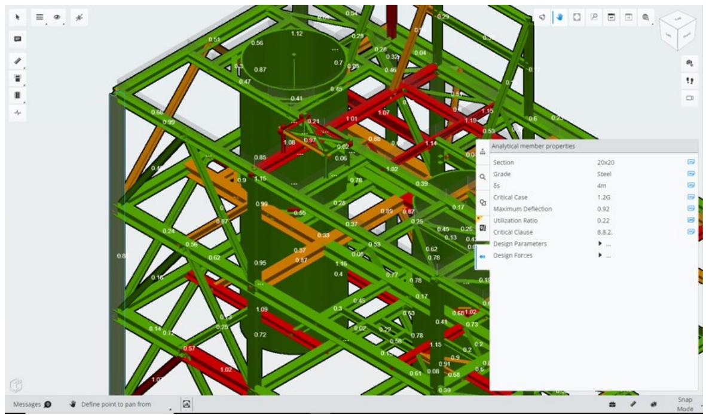

## 1.15Executive - OWP Cloud Improvements

A new user interface has been added for managing cloud analysis jobs. Users can now monitor, start, restart, cancel, and download specific results files directly from the cloud job history pane in SACS Executive.

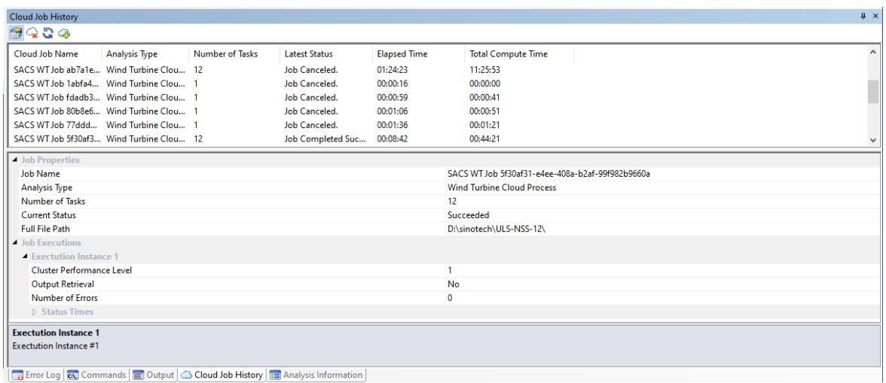

Optimizations to the Wave Response time integration analysis have been made to further improve analysis run times.

## 1.16Joint Mesher Improvements

SACS Stiffened Panel Meshing

This new feature allows the user to create explicit stiffeners for tubular members. Stiffeners are automatically added as members (beam elements) to the meshed model by Joint Mesher. The explicit stiffeners can be created individually at a general orientation using the new PLTSTF line in the Joint Mesher module. Users can also create uniform ring and longitudinal stiffener groups using the RNGSTF and LNGSTF lines, respectively. The stiffener groups can then be added to tubular members using the MEMSTF line in the Joint Mesher input file.

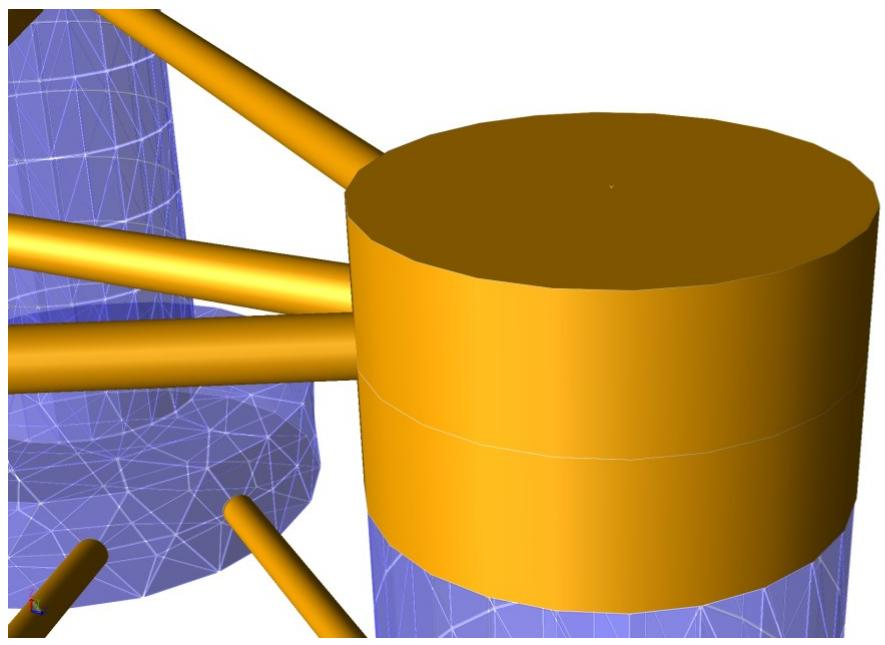

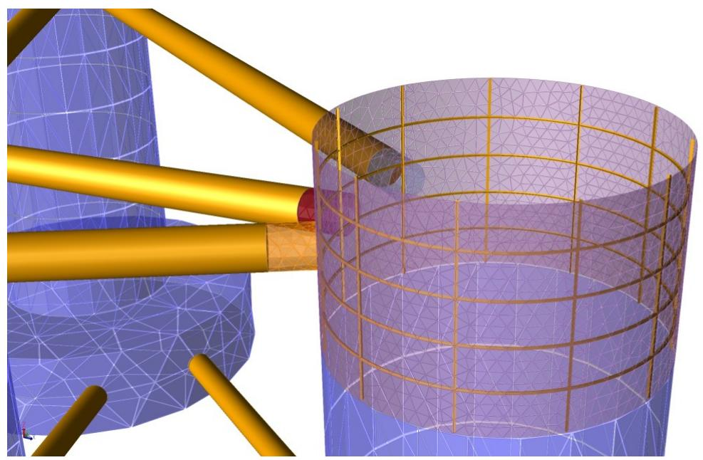

Precede Joint Mesher Integration

Joint Mesher has now been fully integrated into Precede so that joints may be meshed directly in Precede without generating a separate model. Multiple joints may now be meshed sequentially during a single modelling session without having to open a separate meshed model. This enhancement also supports both undo and redo functionality for faster development and modification of the meshed model.

## 1.17Solve - Elastic Modulus Reduction Factor for Direct Analysis Method

User-defined elastic modulus reduction factors for the stiffness matrix formulation are now available. This enhancement enables analysis of the structure using the direct analysis method according to the latest AISC design codes. The elastic modulus reduction factor may be entered on the CODE AA line when using AISC design codes.

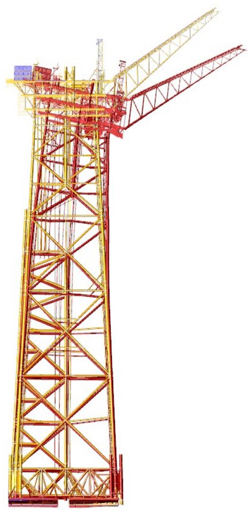

## 1.18Advanced Solver

The advanced Solver, using iterative Krylov Subspace Solvers and Singular Value Decomposition, allows automatic detection and removal of rigid-body-motion for statically indeterminate structures. Using this new feature, users can perform analyses of floating structures as well as lift and launch analyses without the need to introduce ad-hoc boundary conditions to limit rigidbody-motion. The Advanced Solver needs to be enabled via the Settings in SACS Executive under Analysis Settings. Different iterative solvers and rigid-body-motion removal can then be enabled using the SLVOPT line in the SACS input file. These options can also be accessed through the Linear Solver tab of the Analysis Options dialog in Precede.

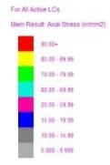

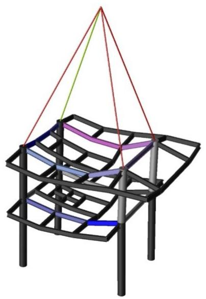

Advanced Solver Shell Elements

Enhanced MITC4 shell elements have been implemented for the advanced solver with anti-shear locking, anti-membrane locking, and drilling stiffness considerations. These more advanced shell elements are better suited for the analysis of highly curved surfaces.

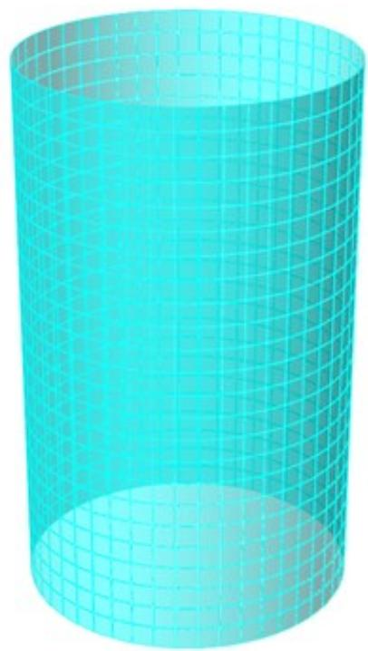

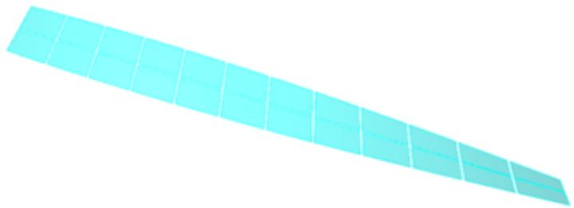

A full set of verification problems have been provided in the documentation and as a set of sample problems with this release.

## 1.19Post and Joint Can - ISO 19902 2020 Code

ISO 19902 - 2020 has been added to the list of available design codes for both member unity checks and joint can punching shear checks in Post and Joint Can respectively.

## 1.20Pile3D Improvements

Pile Structure Interaction

Pile 3D has been extended to read reactions of structure at the mudline and apply them as pilehead loading for an unlimited number of load conditions. With this feature, users can perform monopile analyses suitable for Wind turbine design. To use this feature, a new type of analysis can be chosen via the analysis generator in SACS Executive with the SACS model file and Pile3D input file as input as shown in the figure.

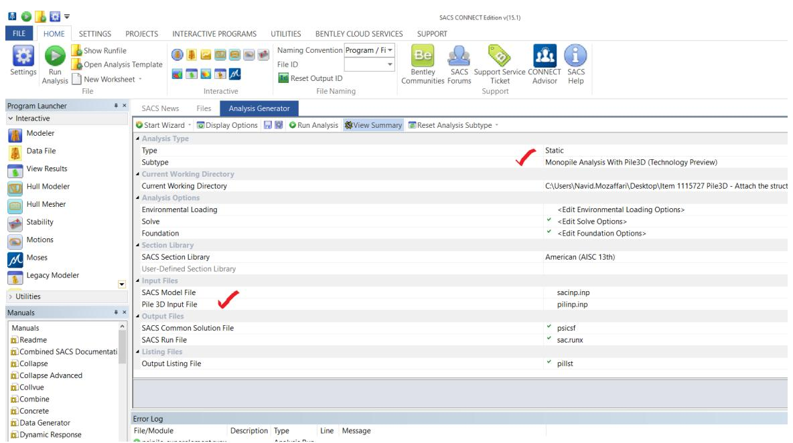

Pile Superelement

Pile superelements may now be generated with Pile3D from the loads generated by a monopile structure interaction analysis. This feature supports the additional soil reaction curves (distributed moment, base shear, and base moment) for large monopile structures used in PISA method analysis and design. Pile3D superelements may be used in any analysis where PSI superelements are used, for dynamic mode shape extractions and linear static analyses.

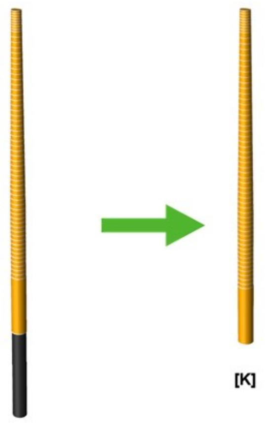

## 1.21SACS Suction Bucket

The SACS Suction Bucket program generates a SACS model for the analysis and design of offshore structures with a suction bucket foundation. The bucket model is automatically generated using plate elements and the nonlinear interaction between the suction bucket walls and surrounding soil is modeled by a series of nonlinear springs. The nonlinear springs are automatically generated through the SACS-PLAXIS Suction Bucket Analysis Interoperability functionality.

The following are the highlights of the program features:

Advanced meshing tool to automatically generate the suction bucket model. The Suction Bucket program can also automatically include the ring and longitudinal stiffeners in the suction buckets using a series of simple input lines.

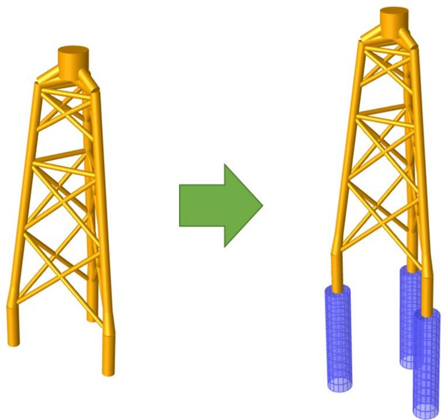

The SACS-PLAXIS Suction Bucket Analysis Interoperability automatically imports the SACS suction bucket model, the jacket stiffness, and the applied loads using superelement into the PLAXIS 3D program to analyze the soil-bucket nonlinear interaction.

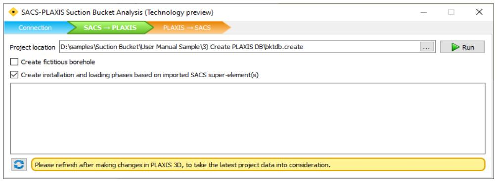

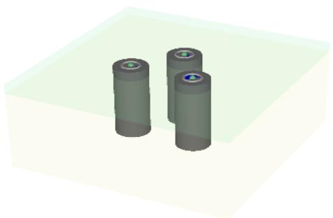

Automatically generate nonlinear soils by fitting multilinear curves on the PLAXIS 3D stress results.

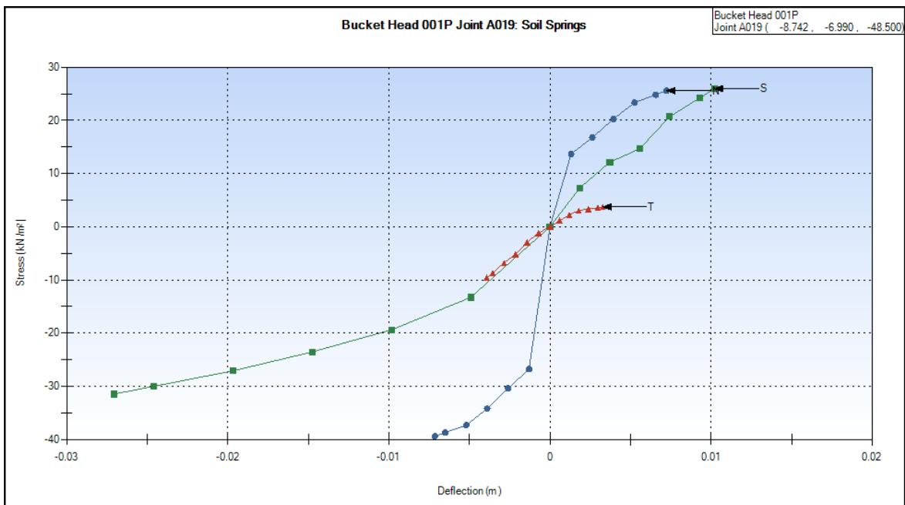

The final suction bucket model is ready to use for any type of analysis in SACS including static and dynamic analysis, and ultimately post-processing to calculate stresses and code checks.

Stress Results in the Suction Bucket plate elements:

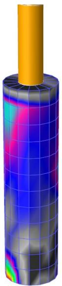

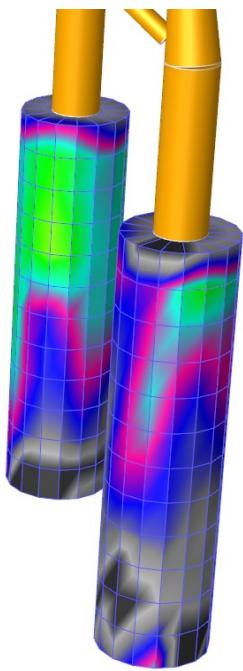

Modal Analysis:

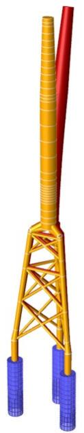  
Mode1

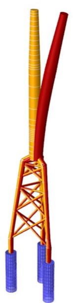  
Mode 2

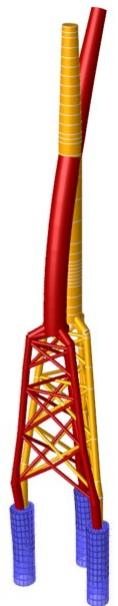  
Mode3

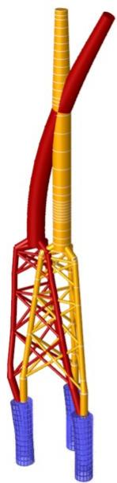  
Mode 4

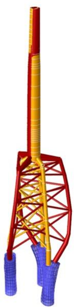  
Mode5

## 1.22Dynamic Response - Max Allowable Acceleration for Engine Vibration User-defined maxim allowable accelerations may be entered for engine vibration analyses on the ENGVIB line of the Dynamic Response input file. Both unity check reports and allowable acceleration graphs are supported for this new criterion.

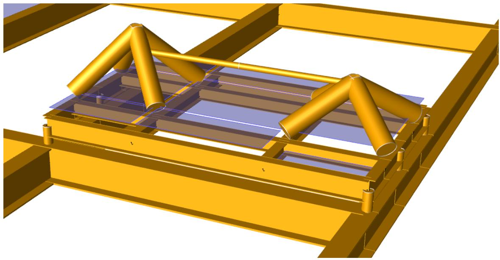

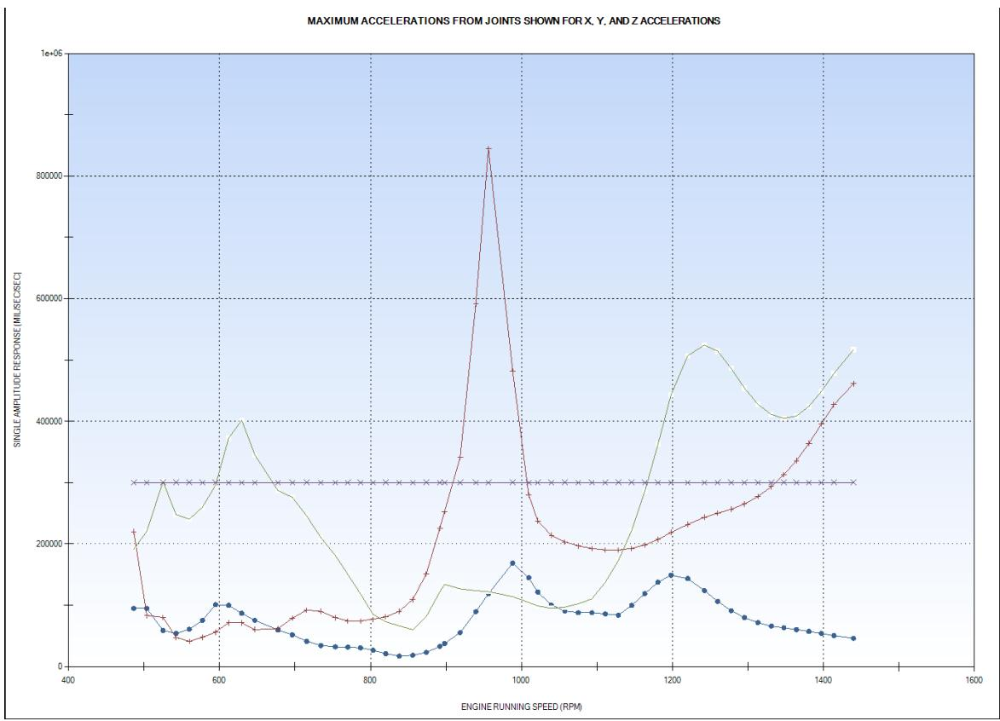

## 1.23Fatigue - Damage Reports around Circumference for Inline Tubular Members

Fatigue damage reports have been enhanced for inline tubular members to include all analysis points around the circumference of the tubular. This enhancement replaces the previous damage reports for in-line tubular members where only the critical point was reported.

## 1.24Collapse Advanced Improvements

Ductility Limits for Plates and Piles

Ductility limits have been enabled for plate and pile structures. Ductility limits may be specified at the global, element type, group, or element level. Ductility limits are enforced at each integration point for both piles and plates. If the principal in-plane strain exceeds the specified strain limit at an integration point that integration point will be considered fractured.

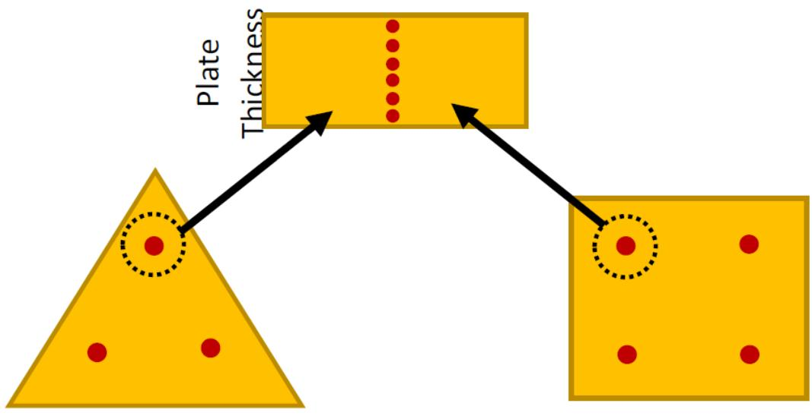

New Reports for Plate Strains, Plastic Strains, and Stresses

New report options have been added to print Von Mises plate stresses and plastic and principal plate strains at integration points. These report options may be enabled on the CLPRPT line of the Collapse Advanced input file.

SACS CONNECT EDITION V15.1 – SES

## 1.25Implement API LRFD 2nd Edition design code

Unity checks as per API LRFD 2nd edition are now available. These include updated provisions for conical and tubular strength checks. New strength checks for dented tubular sections have been added. Joint strength checks have also been updated as per the revised provisions.

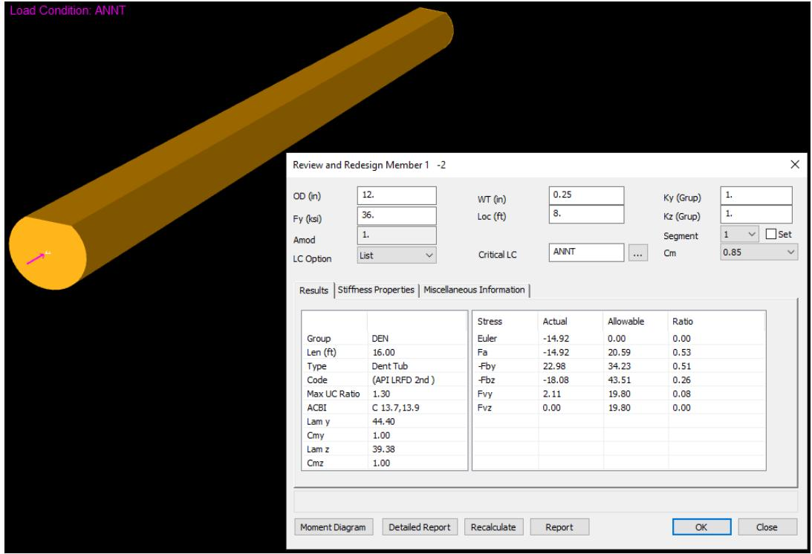

## 1.26Extend bottom unbraced length option to aisc codes

Bottom unbraced length option (Column 46) on the GRUP line can now be used with AISC codes. SACS Postprocessor will automatically use the specified bottom unbraced length in unity check calculations for AISC codes if the bottom flange is in compression.

## 1.27Introducing SACS Suction Bucket (Technology Preview)

The SACS Suction Bucket program generates a SACS model for the analysis and design of offshore structures with a suction bucket foundation. The bucket model is automatically generated using plate elements and the nonlinear interaction between the suction bucket walls and surrounding soil through a series of nonlinear springs. The nonlinear springs are automatically generated through the SACS-PLAXIS Suction Bucket Analysis Interoperability functionality.

The following are the highlights of the program features:

Advanced meshing tool to automatically generate the suction bucket model. The Suction Bucket program can also automatically include the ring and longitudinal stiffeners in the suction buckets using a series of simple input lines.

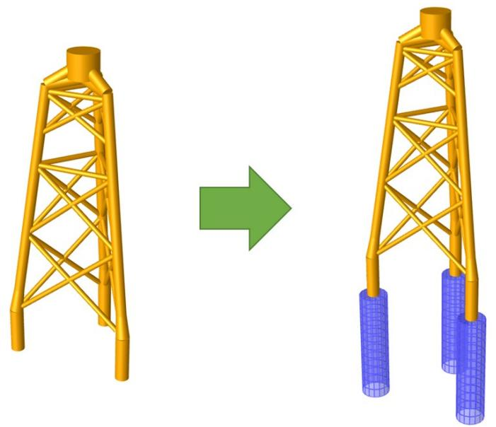

The SACS-PLAXIS Suction Bucket Analysis Interoperability automatically imports the SACS suction buckets model, the jacket stiffness, and the applied loads using superelement into the PLAXIS 3D program to analyze the soil-bucket nonlinear interaction.

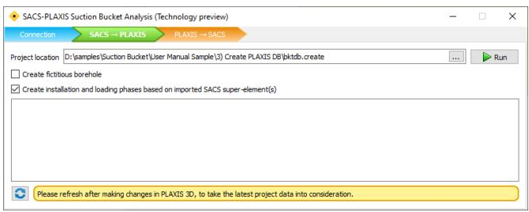

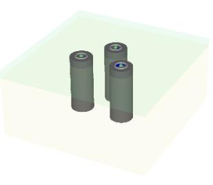

Automatically generate nonlinear soils by fitting multilinear curves on the PLAXIS 3D stress results

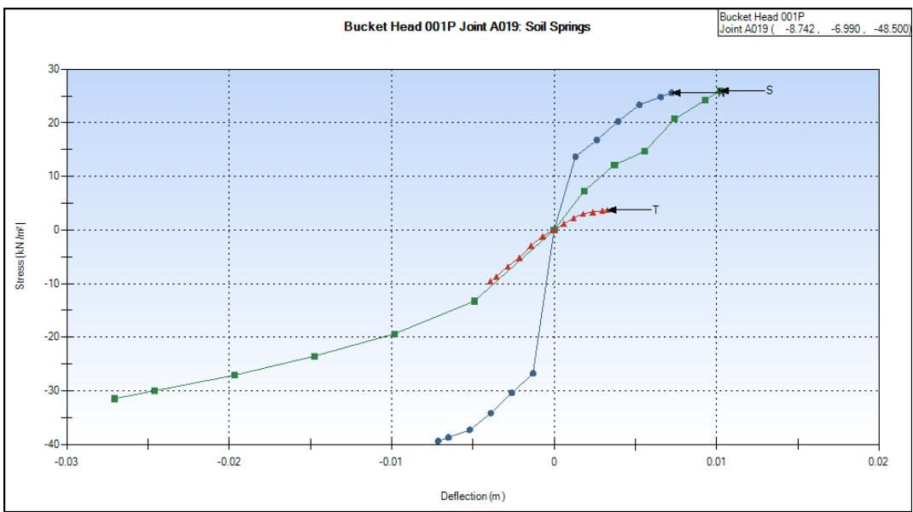

The final suction bucket model is ready to use for any type of analysis in SACS including static and dynamic analysis, and ultimately post-processing to calculate stresses and code checks.

Stress Results in the Suction Bucket plate elements:

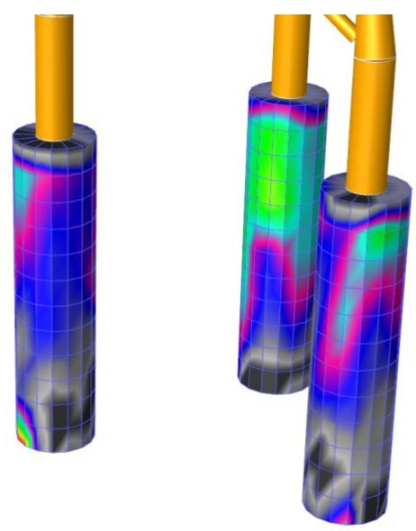

Modal Analysis:

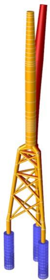  
Mode 1

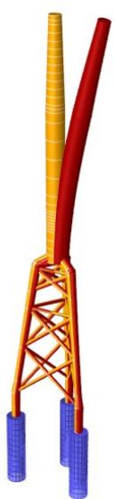  
Mode 2

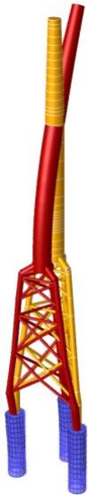  
Mode 3

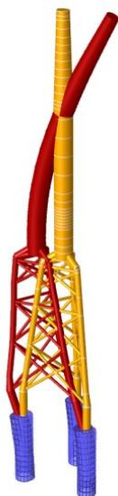  
Mode 4

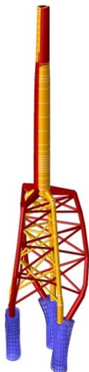  
Mode 5

## 1.28Pile 3D - Attachment of structure on top (Technical Preview)

Pile 3D module has been is extended to read reactions of structure on top and apply them as pilehead loading for unlimited number of load conditions. With this feature, users can perform Monopile analysis using SACS model file which is suitable for Wind turbine analysis. To use this feature, new type of analysis can be chosen via the analysis generator in SACS Executive along with SACS model file and Pile3D input file as shown in the figure.

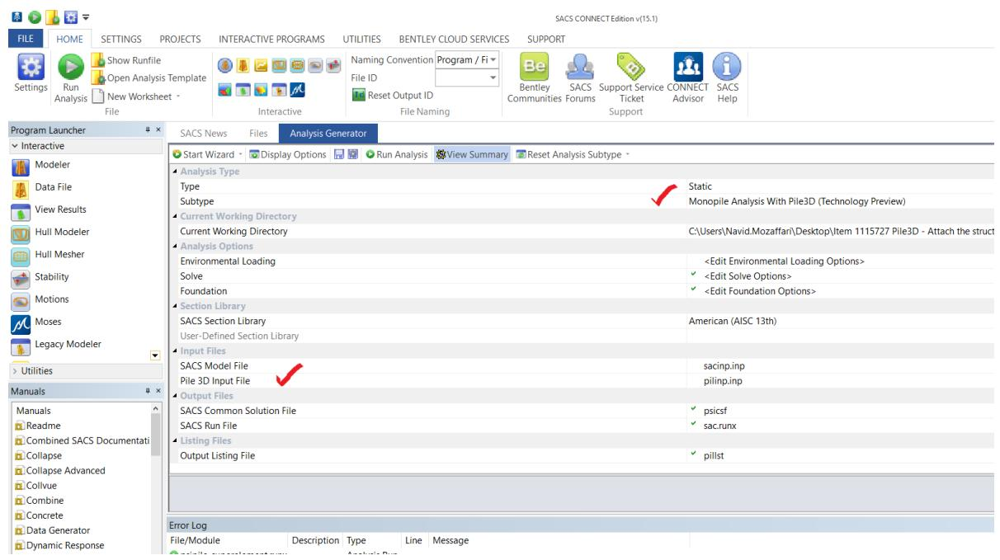

## 1.29PSI – Distributed Moment, Base Shear and Base Moment calculation using Plaxis type curves (Technical Preview)

PSI module is extended to read M-theta (Soil bending), Base shear and Base moment curves and consider these effects in pile analysis. These curves were recently introduced by PISA project for rigid monopile analysis, i.e. large diameter monopiles. Plaxis Monopile Designer is the only product capable of generating these curves and with this feature PSI can read and utilize those curves. The option to read in the curves is available in SOIL LATERAL HEADER line. As it is shown in the figure, new input lines including SOIL BENDING HEAD, SOIL M-T, SOIL BASESHR HEAD, SOIL BH-V, SOIL BASEMOM, SOIL BM-T are introduced to read the data for curves similar to lateral and axial curves. The same feature has been implemented and released in Pile 3D module.

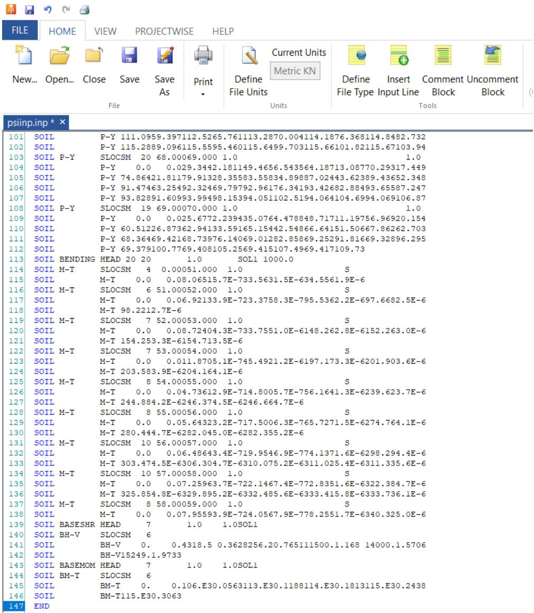

## 1.30Advanced Solver (Technical Preview)

The advanced Solver, using iterative Krylov Subspace Solvers and Singular Value Decomposition, allows automatic detection and removal of rigid-body-motion for statically undetermined structures. Using this new feature, users can perform analysis of floating structures as well as the lift launch analysis without the need to introduce ad-hoc boundary conditions to limit rigidbody-motion. The Advanced Solver needs to be enabled via the Settings in SACS Executive under Analysis Settings. Different iterative solvers and rigid-body-motion removal can then be enabled using the SLVOPT line in the SACS input file.

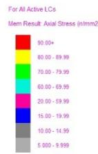

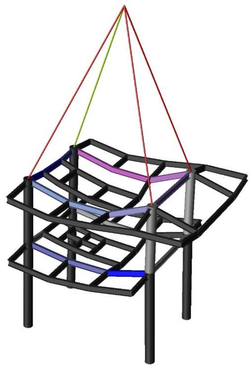

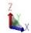

## 1.31Explicit Stiffeners in the Joint Mesher (Technical Preview)

This new feature allows the user to create explicit stiffeners for tubulars. The stiffeners are automatically added as members (beam elements) inside the Joint Mesher. The explicit stiffeners can be created individually at a general orientation using the new PLTSTF line in the Joint Mesher module. Users can also create ring and longitudinal stiffener groups using RNGSTF and LNGSTF lines, respectively. The stiffener groups can then be added to tubular members using the MEMSTF line in the Joint Mesher input file.

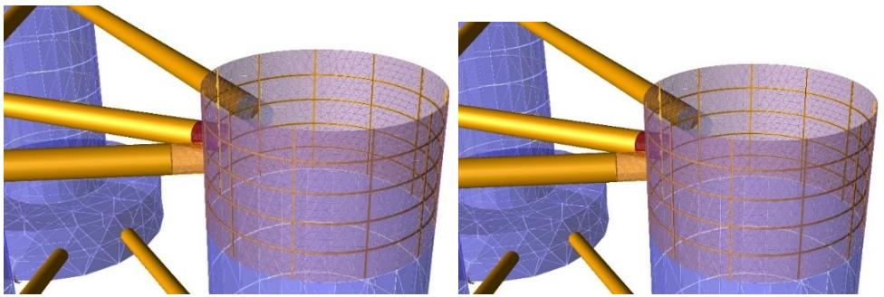

Input model (left) and meshed model with added ring and longitudinal stiffeners (right).

## 1.32SACS integration with Bentley’s iTwin Hub (Techical Preview)

SACS is now integrated with Bentley’s iTwin Services. iTwin Services is an open and scalable platform for managing and consuming infrastructure digital twins. SACS first offered integration with iTwin Design Review in version 15.0. SACS 15.1 now offers integration with iTwin Hub through the iTwin Analytical Synchronizer.

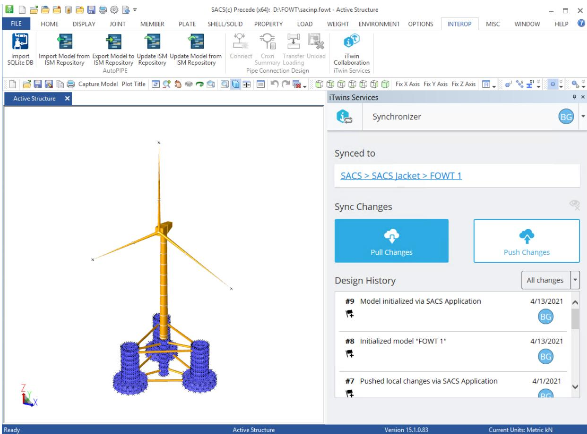

SACS CONNECT EDITION V15.0 – SES

## 1.33SACS integration with Bentley’s iTwin Services

SACS is now integrated with Bentley’s iTwin Services. iTwin Services is an open and scalable platform for managing and consuming infrastructure digital twins. The first service SACS offers is iTwin Design Review. Bentley iTwin Design Review is a collaborative service hosted on the web that allows two or more interested parties to communicate with one another in the context of a 3D model or, more accurately, an iTwin.

The iTwin Services Add-in within the desktop application publishes the analysis model to an iTwin Design Review session, and therefore into an intuitive point of collaboration that facilitates review of design work in progress. The iTwin Design Review is integrated in Precede/Postvue and the SACS Executive (see Figures 1 and 2).

The web-based interface (accessible with a web browser) of Design Review offers a set of commands for navigating, viewing from different perspectives, isolating key elements, and clipping views (see Figure 3).

Several review tools are included with the service:

Measurements, including distance, area, location, radius, and angle   
Querying elements for physical information, such as dimensions, construction materials, and coordinates   
• Querying analytical information, such as member fixities, applied loads, and reactions

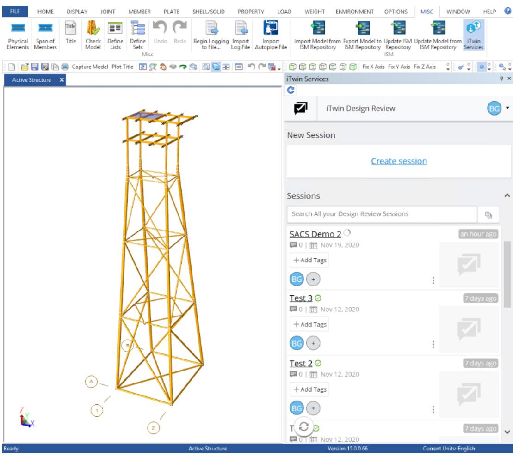

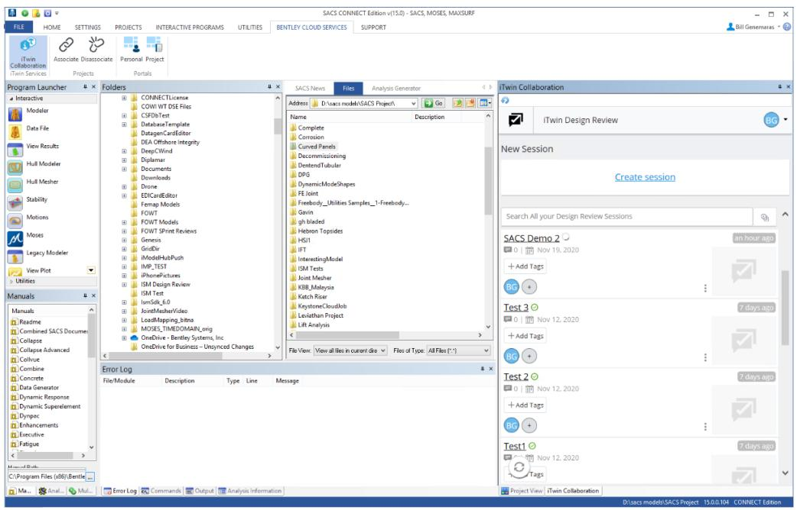  
Figure 1: In Precede/Postvue iTwin Design Review Session.   
Figure 2 : In SACS Executive iTwin Design Review Session.

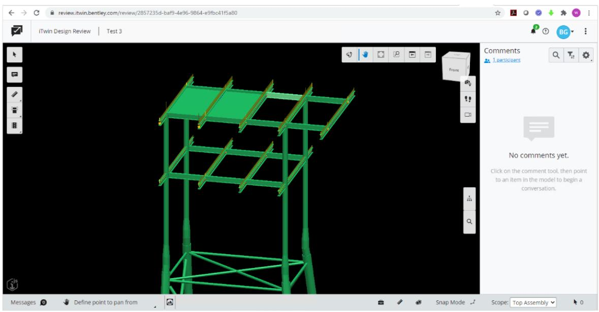  
Figure 3: Web based Design Review Session

In addition to review tools, iTwin Design Review crucially offers the ability to review and comment with your participants at points of interest in the model. Comment threads can be assigned statuses (Resolved, Open etc..) and Disciplines. Discussions can be directed specifically at a participant using @mentions. Just type @ before their name and select from the menu that appears. They receive a notification with a link, which they can go directly to the point in the conversation where they were mentioned.

For more information visit the iTwin Services for Engineering Analysis Wiki.

## 1.34SCF Extraction Nodes for Ring Stiffened Joints (Technical Preview)

The Joint Mesher program now allows for the seamless creation of three-dimensional meshes for most joints in SACS. Joint Mesher also automates the creation of extraction nodes for hot spot SCF calculation.

The new set of improvements released as a Technical Preview allows the user to create SCF extraction nodes for ring stiffened joints through the SCFPL option in the Joint Mesher's input file.

The program creates the nodes for SCF extraction according to DNV RP-203 or a user-defined setting. The program then creates the mesh and the corresponding predefined loading conditions (axial and in- and out-of-plane bending) for the static analysis and the Post Input file. These files can be used together to run the analysis and to extract the SCFs.

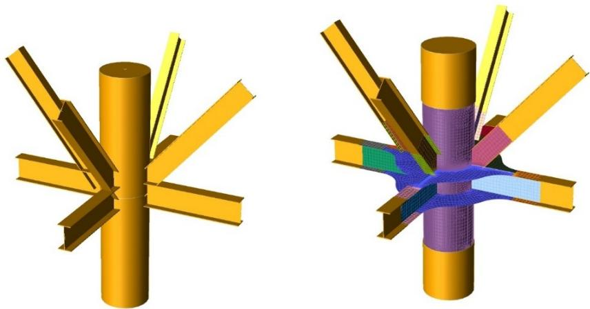

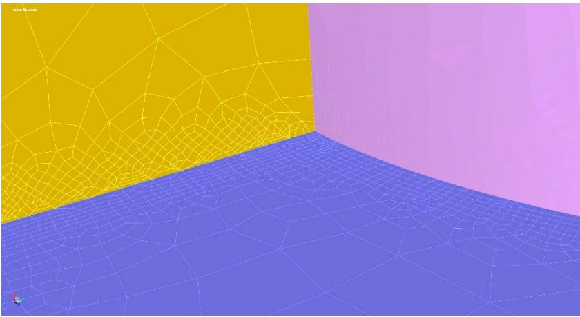  
Figure 4 : SACS input model and the resulting meshed joint   
Figure 5: Zoom-in of the meshed joint showing the SCF extraction nodes

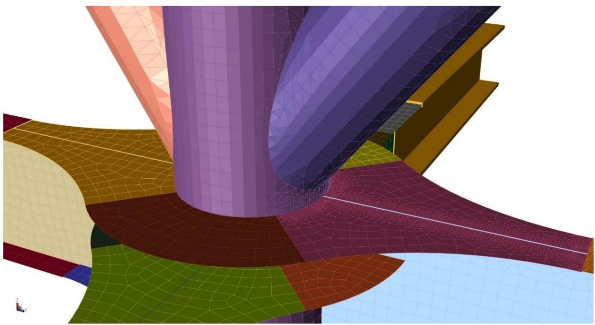  
Figure 6 : SACS Samples 23: SCF extraction from ring stiffened joints

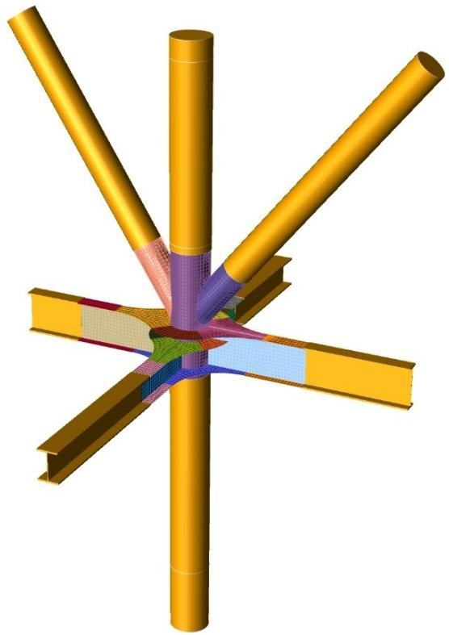  
Figure 7 : SACS sample 23: meshed joint

In addition, SACS 15.0 introduces the new Boundary Joints which allow the user to create meshes that connect to pre-existing meshes. The Boundary Joints can be selected manually via BNDPNT line or automatically via the option in JTMOPT line in the in the Joint Mesher’s input file. Finally, the user-defined Hard node creation (HRDPNT) now allows the user to set the resulting joint name.

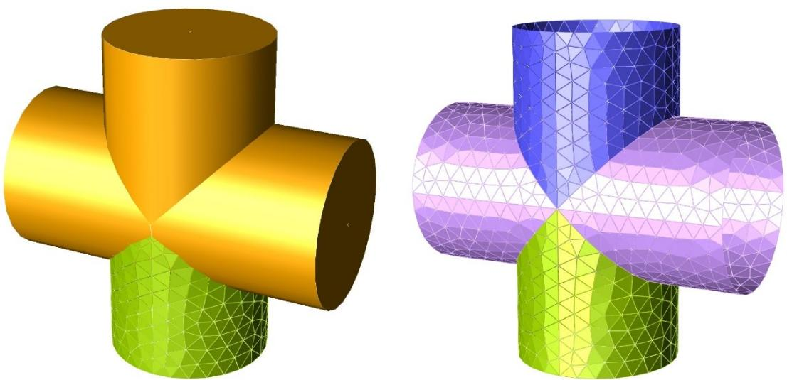  
Figure 8 : SACS model along with a pre-existing mesh in green (left), meshed model connected to the pre-existing mesh via automatic boundary joint selection

## 1.35Curved Plate Panel Stiffeners Display in Precede

• Precede can now display Curved Plate Panels Stiffeners

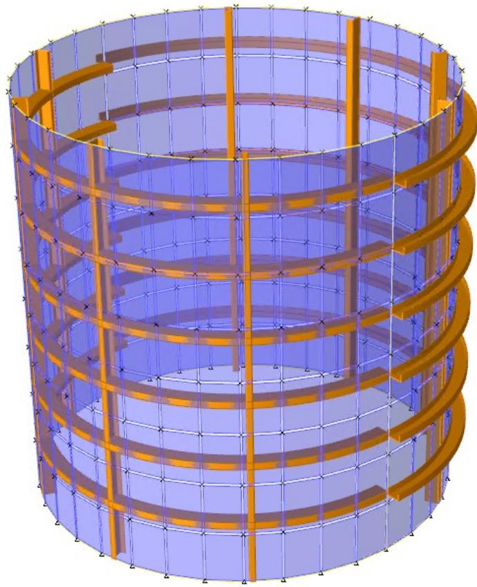  
Figure 9 : Curved Plate Panel Stiffeners in Precede

## 1.36Load by Volume Improvement

The Load by Volume feature, used for cutting sections of the structure for decommissioning and exporting to FEMAP, now automatically creates two views (see figure 10). The view on the left is the original structure, the view in the middle is the cut section, and the view in the right is the structure with the cut section removed.

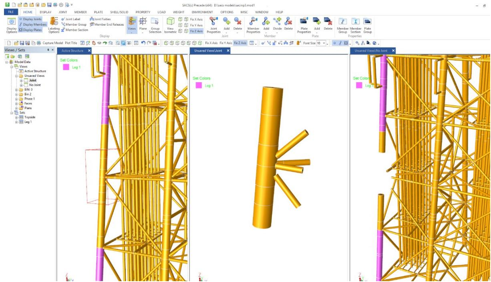  
Figure 10: Load by Volume created views

## 1.37SACS Model Interop API (Technical Preview)

The SACS Model Interop API allows users to create customized tools (scripts, macros, or applications) that manipulate SACS Model data and results. The API is exposed in three formats: C++ library, python extension, and COM server. Although the details are format specific, the API is consistent across the formats. All functionality is be available on all formats. The API is object based. With one master object used to access model load/create functions and to provide access to global data.

Demo 14 has an example of a member redesign script (MR_sacs.py). The script executes the runfile demo14.runx using the analysis engine. It then searches the result database for any members which Max UV is greater than 0.9. If any tubulars are found, it then searches the input for the member’s group. The script then increases the GRUP’s wall thickness by a 0.24 inches and executes the runfile again repeating the workflow until the no members exceed the 0.9 threshold. The API documentation can be found in:

(Installation Directory) \ SACS CONNECT Edition V15\Docs\html\Index.html

SACS CONNECT EDITION V (14.3) SES

SACS CONNECT Edition V14.3 – SES release includes enhancements including:

## 1.38COLLAPSE ADVANCED UPDATES

Torsional Adhesion Soil - Develop a feature to model adhesion soils torsional response in Collapse Advanced.

## 1.39Precede/Results Viewer Enhancements

PSI Results - Precede can now graphically display Unity Check and stresses. To include the PSI results in the Results database, check the “SACS Reports Database” option in the “Static Analysis With Pile/Soil Interaction” Runfile.

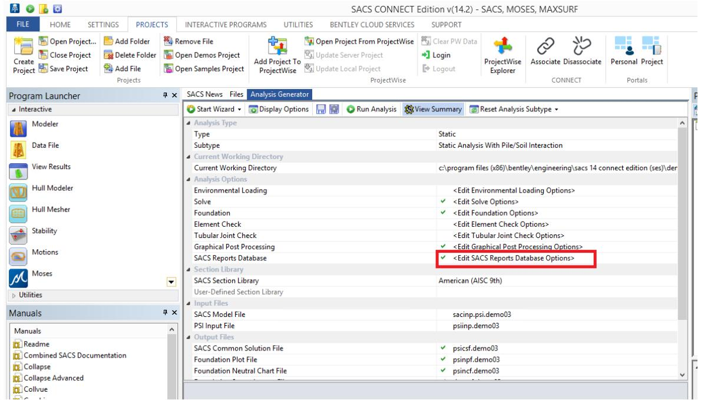

Next open Precede Results Viewer using the created database.

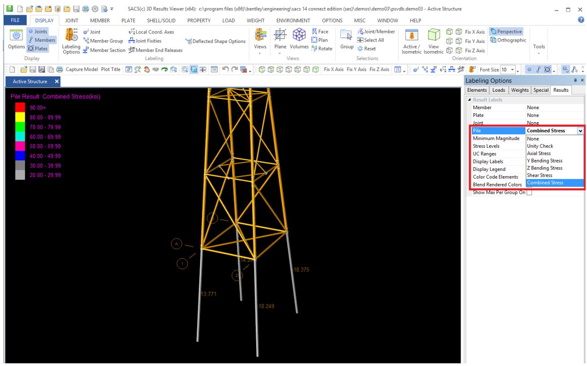

• Added a Load Condition drop-down list in the LOAD tab that improves load condition selection for display.

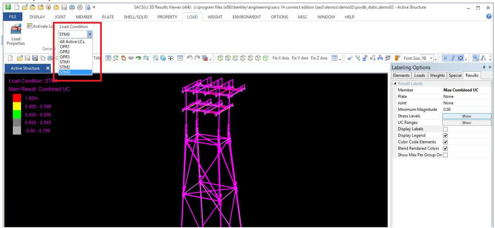

## 1.40Pile3D - Base Shear and Moment using Plaxis MoDeTo curves (Tech Preview)

This enhancement extends the capability of Pile3D program to apply Base Shear and Base Moment on pile tip to increase accuracy of the pile analysis. This feature has been implemented before using T-Z curves and P-Y curves. This enhancement will use Plaxis MoDeTo curves. This

issue is significant for Rigid piles (Heavy - Gravity type piles). This enhancement addresses this issue.

## 1.41SACS LAN GRID (General Availability)

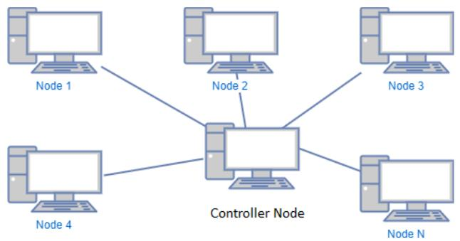

SACS LAN Grid allows the user to run multiple SACS analyses concurrently while distributing the job on computers accessible on the user’s LAN domain.

The Bentley Grid Analysis Service system consists of the SACS Executive driving the analysis process (Controller), as it communicates with other computers (Nodes) on the LAN with SACS 14.3 installed. These computers are used to run a number of concurrent processes submitted by the Executive and monitored for completion.

SACS Executive will iterate through a list of registered node machines and communicate with the Bentley Grid Analysis Windows Service to submit SACS runs to execute on the remote machine. When the analyses are finished, the Executive will download the necessary output files from the node and clean up the remote directory used to execute the analysis.

SACS CONNECT EDITION V (14.2) SES

SACS CONNECT Edition V14.2 – SES release includes enhancements including:

## 1.42COLLAPSE ADVANCED UPDATES

Soil Liquefaction   
Axial Adhesion Soil

o Both User-defined and API soils (API 22nd Edition)   
o Adhesion torsion will be added in next release

Elastoplastic Calculation for remaining sections –All SACS sections are supported in Collapse Advanced except for the Bulb section which is not required.

o Double Angles   
o Unsymmetrical Plate Girder   
o Boxed Plate Girder   
o Double Web Plate Girder   
o Rectangular Tube

## 1.43 Dynamic Response

An option to read load time history input from an external file has been added. Previously, time history loads could only be entered using the "LINE" or "PREV" option in the FVIB line. An option has been added to choose "FILE" which will cause the executive to ask for an additional file from which the loads can be read.   
An option to add multiple winds with same direction and different velocities was implemented. Dynamic Response previously required a unique wind direction for each wind input and required a least 0.2 degrees offset on the direction. Dynamic Response now allows multiple winds for the same direction. The WINSPC line now includes wind speed so the program can match the wind spectrum with the Seastate load case by direction and wind speed. If no wind speed is input, then the match is done by direction only (default behavior).

## 1.44Precede Results View Enhancements

• Precede now has autosave feature. This feature can be enabled in the Precede setting dialog. The default is NO autosaving. The settings are minutes between saves. For example, if the setting is set to “5”, Precede will autosave every five minutes. The autosave will not execute if Precede is busy with a long running process like deleting joints, members, etc. or because of a manual save by the user.

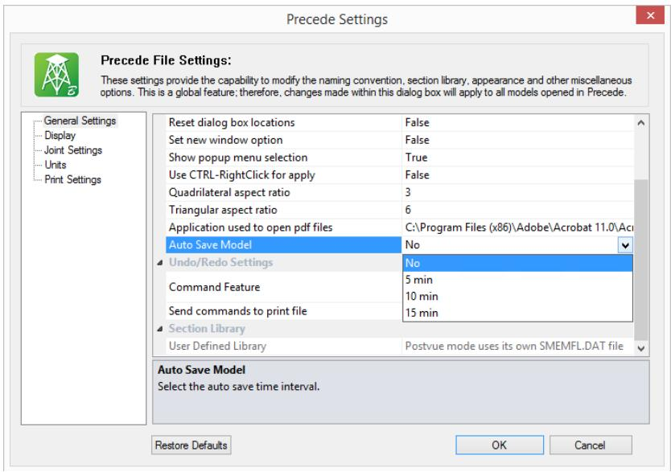

Precede can now graphically display PSI Max Unity Check. To include the PSI results in the Results database, check the “SACS Reports Database” option in the Static Analysis With Pile/Soil Interaction Runfile.

Next open Precede Results Viewer using the created database.

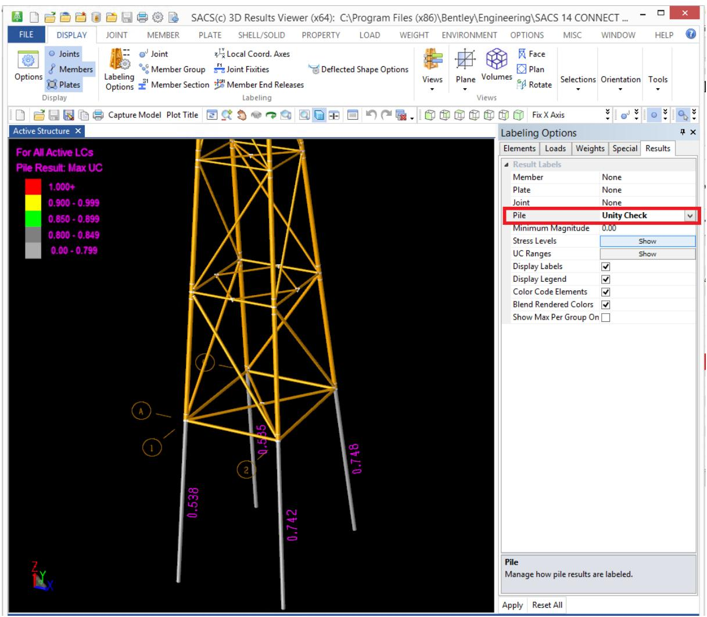

## 1.45Pile3D Distributed Moment (Tech Preview)

This enhancement allows the Pile 3D program to model the soil resistance to the rotation of the pile using a distributed moment along the length of the pile. This effect is significant for gravity type and rigid piles with large diameters and length to diameter ratios between 2 and 6. Adding this distributed moment effect can increase the overall stiffness of the system and lead to a better design. The distributed moment curves are specified with user-defined ?? − ?? curves that model the bending resistance similarly to lateral soil resistance P-Y curves.

SACS CONNECT EDITION V(14.1) SES

SACS CONNECT Edition V14.1 – SES release includes enhancements including:

## 1.46Collapse UPDATES

Collapse can now supports the SRSS method to compute effective thickness for grouted chord members in joint strength calculation.

## 1.47Collapse Advanced Updates

Collapse Advanced now supports effective thickness calculation for grouted chord members in joint strength and joint flexibility.   
Collapse Advanced now supports SRSS method to compute effective thickness for grouted chord members.   
• Collapse Advanced now supports API 2A-WSD 22nd Edition to generate soil resistance curves.   
Collapse Advanced now generates strain and plastic strain reports in the listing file. Reports for maximum strain or plastic strain can be also generated by Precede.

## 1.48Dynamic Response UPDATES

Dynamic Response can now import time history analysis using displacement input.

## 1.49CHARTVIEW UPDATES

• Chartview now allows PSI input files to be modified and saved.

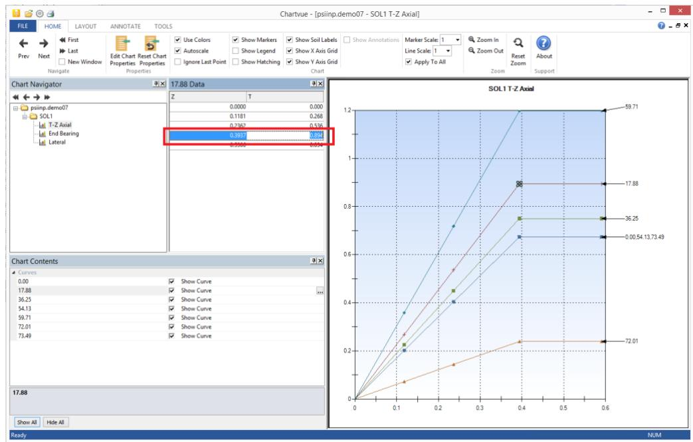

## 1.50DATAGEN UPDATES

Datagen can now send PSI soil data to Chartview for visualization and graphical modification. Soil data sent to chartview can be modified and Datagen will automatically reload the modified PSI input file.

Export PSI input file to Chartview:

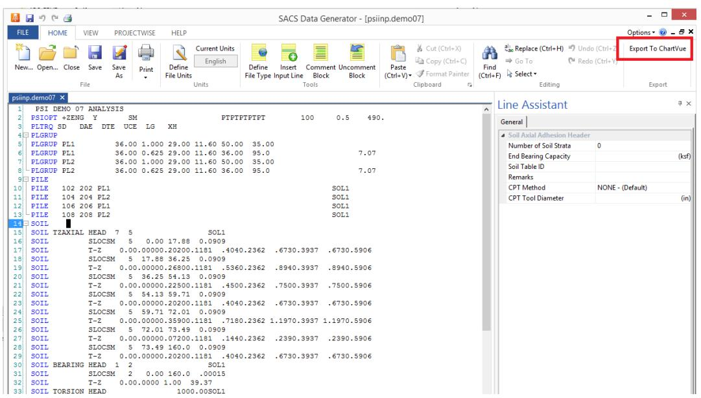  
View/Modify PSI Input file in Chartview:

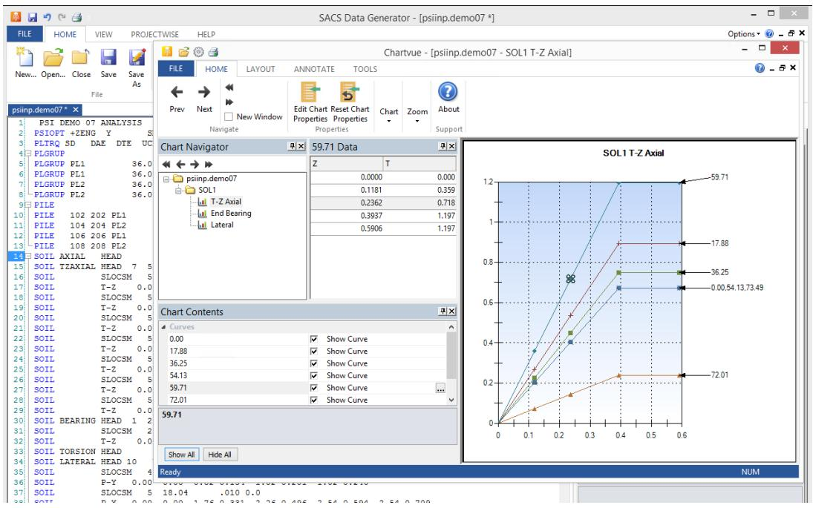

## 1.51PRECEDE UPDATES

Precede can now import shell elements from FEMAP.

• Precede can now display corrosion zones.

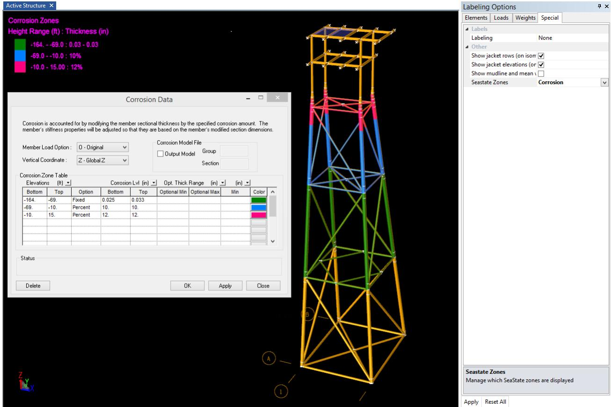

## 1.52SACS LAN GRID (TECH PREVIEW)

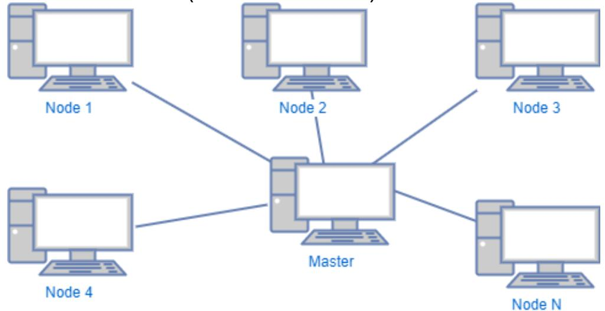

SACS LAN Grid allows the user to run multiple SACS analyses concurrently while distributing the job on computers accessible on the user’s LAN domain.

The Bentley Grid Analysis Service system consists of the SACS Executive driving the analysis process (Master), as it communicates with other computers (Nodes) on the LAN with SACS 14.1 installed. These computers are used to run a number of concurrent processes submitted by the

Executive and monitored for completion.

SACS Executive will iterate through a list of registered node machines and communicate with the Bentley Grid Analysis Windows Service to submit SACS runs to execute on the remote machine. When the analyses are finished, the Executive will download the necessary output files from the node and clean up the remote directory used to execute the analysis.

## 1.53SACS EXECUTIVE UPDATES

The SACS Executive now supports UNC paths in the form:

\\servername\path

SACS CONNECT EDITION V (14.0) SES

## 1.54 COLLAPSE ADVANCED UPDATES

Launch Runner and Special Launch Runner Sections

Collapse Advanced program now supports elastoplastic analysis of Launch Runner and Special Launch Runner sections. Using this feature large deformation elastoplastic stiffness and forces of members with Launch Runner and/or Special Launch Runner sections can be accurately included into collapse analysis. The results can be also reviewed in Collapse View.

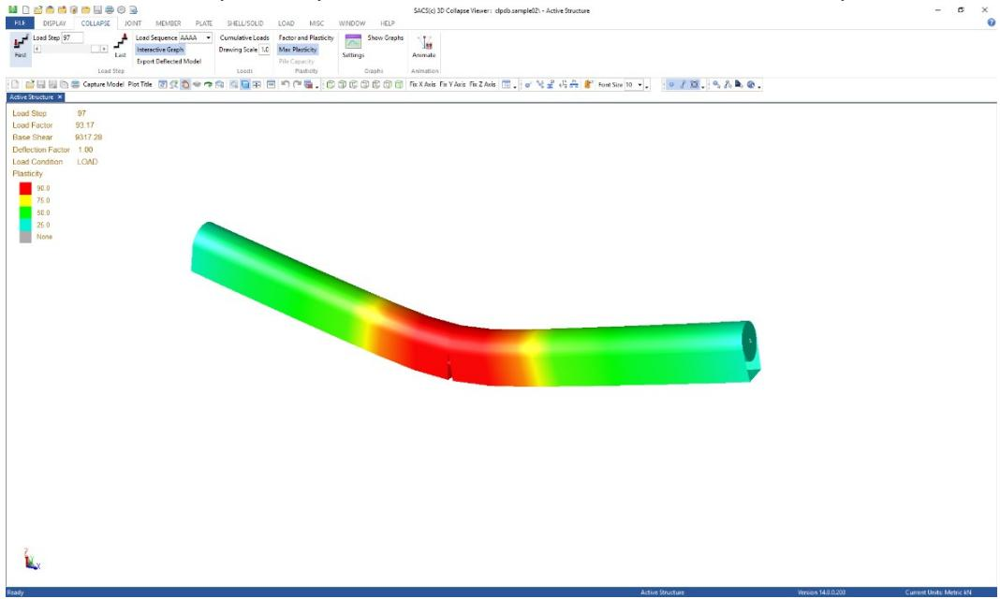

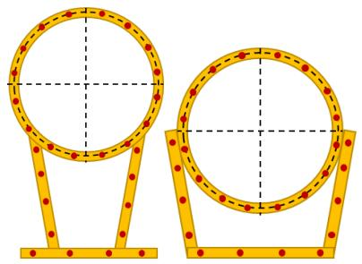

• Multilinear Plastic Material

Collapse Advanced now supports multilinear elastoplastic plastic materials in addition to standard bilinear elastoplastic model. This new feature can be used to model complex strain hardening and/or strain softening due to the material plasticity. The multilinear plastic material can be employed for members, plates, and piles using input lines MATGRP, MATPGR, and MATPLG, accordingly.

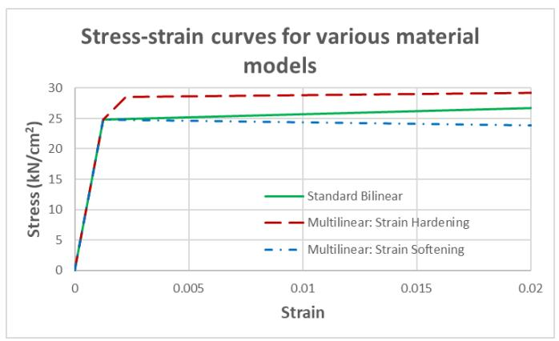

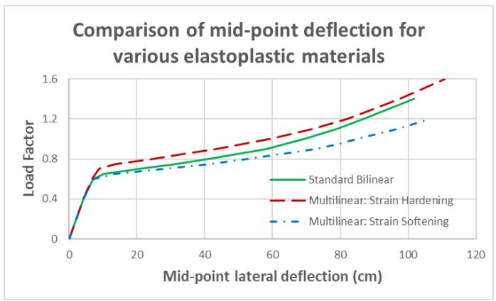

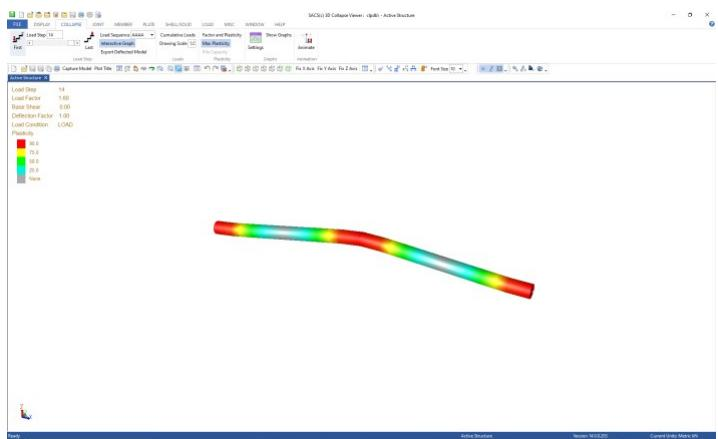

## 1.55ABS Panel Checks

Stiffened plate panel checks as per the ‘Guide for Buckling and Ultimate Strength Assessment for Offshore Structures’, ABS, Apr 2004 (Upd. Aug 2018) have been implemented. Stiffener types supported are tees, angles and flat bars. Plate panels are checked for buckling and ultimate strength limits. Checks for beam-column buckling, flexural-torsional buckling and local buckling of stiffeners have been added. Panel elements are also checked for compliance with stiffness and proportion requirements.

## 1.56Wave Response can now read in displacement /velocity/ acceleration time history

Wave Response can now read in displacement/velocity/acceleration time history input and include in analysis.

## 1.57Chartview modification of Y values

Users can now modify Y values on the chart and save them.

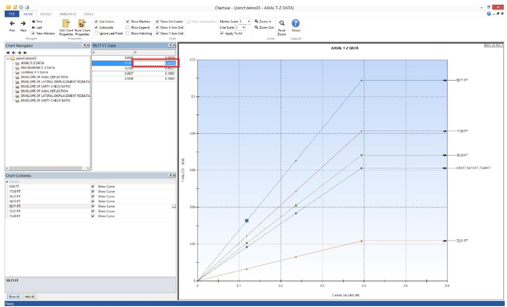

## 1.58Precede Enhancements

Updated Settings Dialog

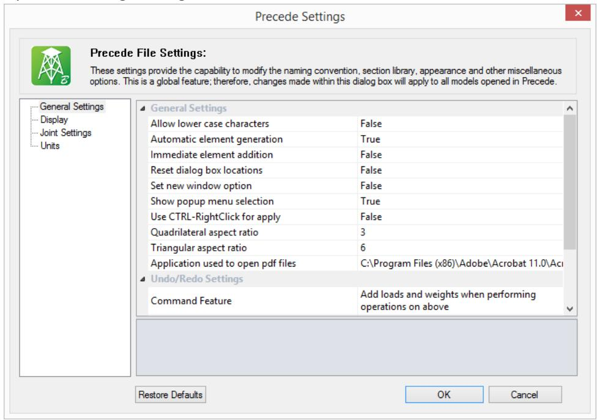

Updated Display and Labeling User Interface

Precede now has a new interface for both “Display Options” and “Labeling Options”. This interface is now in a docked window that can reside next to the graphics window for easier access and it does not interfere with the graphics.

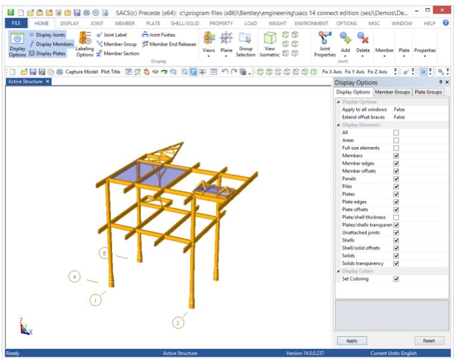

Display Marine Growth Zones

Precede can now display marine growth zones

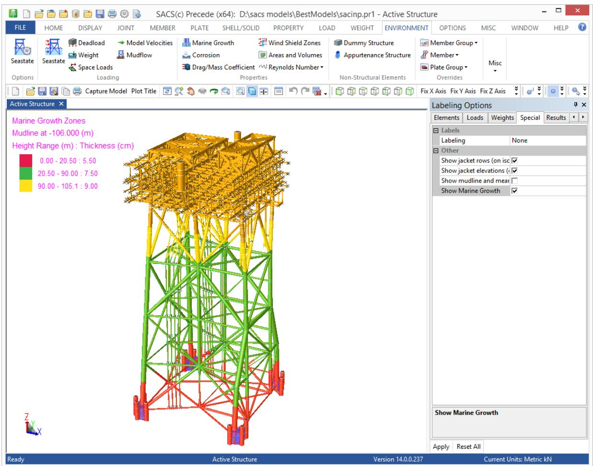

• Precede can now color sets

A Set is a way of grouping elements that can be readily identified within the whole structure with a unique ID. A Set can be created with a combination of joints, members, member groups, plates, plate groups, shells, solids, and load conditions.

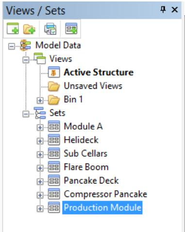

Precede now allows the user to assign a color to each set for better visual display.

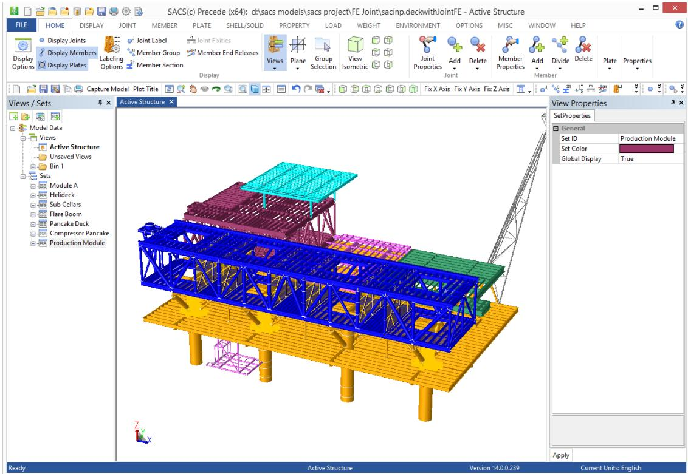

## 1.59GH Bladed Wind Turbine Process can now be executed on a LAN GRID (Tech Preview)

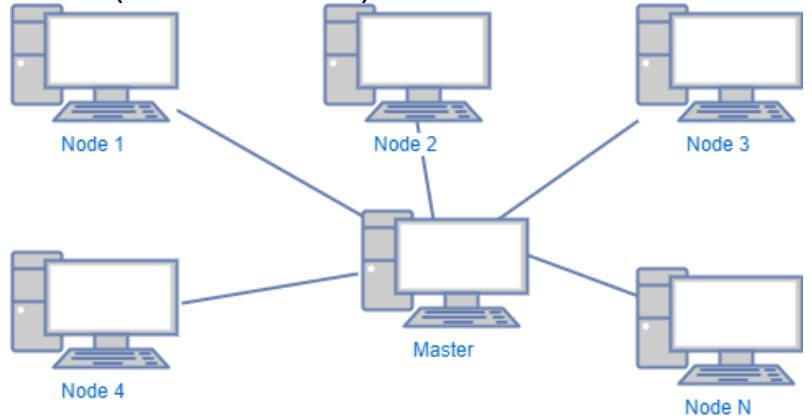

SACS GH Bladed Wind Turbine Process on Bentley Grid allows the user to run multiple simulations concurrently while distributing the job on computers accessible on the user’s LAN domain.

The Bentley Grid Analysis Service system consists of the SACS Executive driving the analysis process (Master), as it communicates with other computers (Nodes) on the LAN with SACS 14 installed. These computers are used to run a number of concurrent processes submitted by the Executive and monitored for completion.

SACS Executive will iterate through a list of registered node machines and communicate with the Bentley Grid Analysis Windows Service to submit simulations to execute on the remote machine. When the analyses are finished, the Executive will download the necessary output files from the node and clean up the remote directory used to execute the analysis.

SACS CONNECT EDITION V (13.2) CL

## 1.60AISC 15th provisions code check is now available using new options 5A, 5B, and 5L

Box, Tee, Rectangular Tube, Wide Flange, Plate Girder, Channel, Angle, Unsymmetrical Plate Girder, Double Web Plate Girder, Boxed-in Plate Girder sections have been updated with the latest AISC 15th provisions. Revised section E7 has been implemented, and new checks for lateral torsional buckling and local buckling of Box/RTB and Tee sections have been added.

## 1.61SACS Collapse Advanced Updates

Joints: The joint calculations have been improved and verified. The Collapse Advanced now supports following joint calculations:

✓ Fessler and Buitrago Joint Flexibility   
✓ API LRFD, NORSOK rev. 1,2 and 3, ISO 19902 Joint Strength   
✓ MSL Joint Flexibility and Strengths

• Members: Collapse Advanced now supports all sections supported by current Collapse

✓ Supported Sections: Tee, Channel, Angle, Box, Conical, Double-Tubular, and Jack-up Leg

Local Buckling: The local buckling checks have been improved and verified for tubular and conical sections.   
✓ Supported methods: Marshal & Gates, API Bulletin 2U, API LRFD, and ISO 19902

Impact:

✓ Ship indention, member indentation, and impact energy calculation are verified for both loading and unloading.   
✓ A new feature is added to assume ship/member dent as plastic deformation.

## 1.62Wave Response can now read in force time history from FLEX5 and BHAWC input

Wave Response can now read time history joint loads using FLEX5 and BHAWC file formats.

## 1.63Pile 3D can now apply Base Shear and Base moment at the pile tip

This enhancement allows Pile 3D program to account for Base Shear and Base Moment applied to the pile tip. This effect is significant for gravity type and rigid piles with large diameter and ratio of length to diameter between 2 and 6 and may increase lateral stiffness and lead to a better design. This enhancement enables the Pile 3D program to calculate Base Shear by interpolating the pile tip T-Z curve using pile tip displacement and calculates Base Moment by interpolating P-Y curve using the corresponding rotation. Both effects are then added to the soil stiffness at pile tip.

## 1.64Import FEMAP model into SACS

SACS can now import plates and solid elements created in FEMAP. The import is part of Precede graphic modeler. Currently, only plates, cubes, and tetrahedrons are imported.

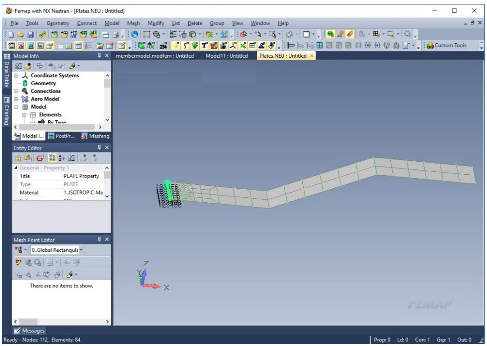

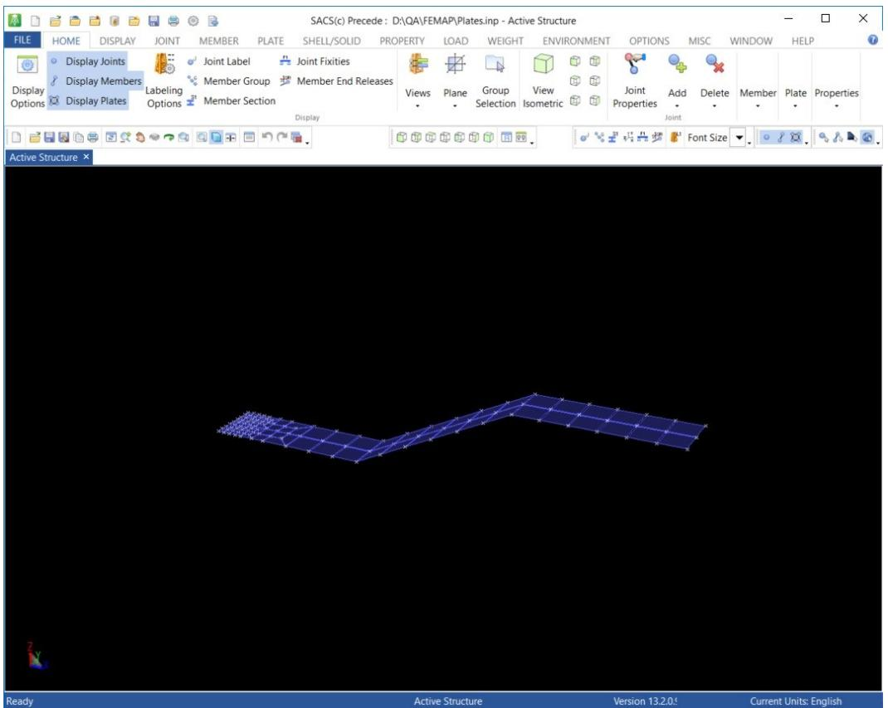

## 1.65Chartiview supports user defined Annotations

Users can now add Annotations to charts data points.

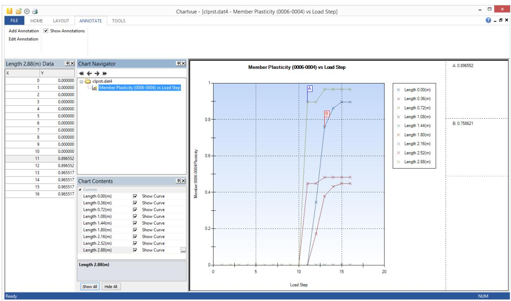  
Member Plasticity (0006-0004) vs Load Step

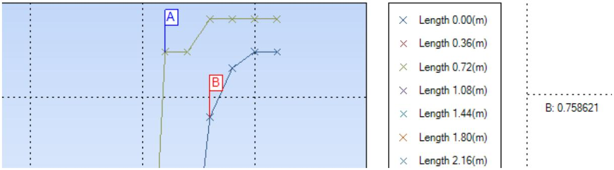

SACS CONNECT EDITION V (13.1) – CL

## 1.66Bentley SACS Uncoupled Wind Turbine Cloud Process [Technical Preview]

SACS can now execute the Uncoupled Wind Turbine Process on Bentley’s Cloud Scalable Processing Service (SPS). The process offers the advantage of the virtually unlimited computing power of Azure cloud allowing the execution of hundreds of simulations in parallel potentially reducing the total analysis time by a factor of 10.

For more information see SACS Cloud Services.

## 1.67SACS Runfile Command Line Execution

SACS now support execution of analyses (runfiles) from the command line using the SACS Analysis Engine. This functionality also allows the execution of runfiles from scripts.

The command line syntax is as follows:

AnalysisEngine.exe RunfilePath SACSInstallationDirectory

Note: SACS must be installed on the computer that executes the Analysis Engine. The AnalysisEngine.exe executable is included in the SACS installation directory

| Parameter | Description |
| --- | --- |
| RunfilePath | Path to the runfile to be executed. Runfile could be a multi-run runfile. |
| SACSInstallationDirectory | Path to the SACs installation Directory. |

Demo 14

contains an example of executing the analysis engine in a simple member redesign workflow using python. In this example, the script executes the runfile demo14.runx using the analysis engine. It then searches the result database for any members which Max UC is greater than 0.9. If any members are found, the script then searches the input file for the member’s group definition. The script then increases the GRUP’s wall thickness by 0.25 inches and executes the runfile again repeating the workflow until no members exceed the 0.9 MaxUC threshold.

SACS CONNECT EDITION V(13.0) – CL

## 1.68SACS Combined Results Database

SACS combined results database functionality stores analysis results from different design phases into a single database. This allows the engineer to instantly view which design phase governs the design of each member and each joint.

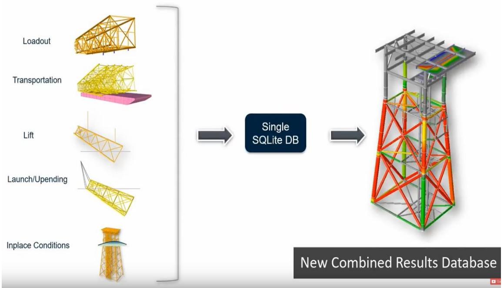  
See this video for an introduction.

## 1.69Generate SACS Models with corroded sections

SACS can now generate an output structural data (OCI) file that includes the effects of corrosion on members and plates. New member groups, sections, and plate groups will be created based on the corroded dimensions determined.

## 1.70Added Option to Include Radiation Damping for Monopiles

Radiation damping can now be accounted for in a time history analysis. The analysis uses formulation by Cook (1978) to calculate the damping which is added to the structural damping entered in the DAMP card. Note: This damping is only computed for the first mode since the formulation does not provide accurate results for higher modes.

## 1.71Added Interactive Graphs to CollapseView

CollapseView can now display interactive graphs. The user can now select a point on the graph and structure will be displayed at the corresponding load step.

Added plots for member internal loads   
Added plots for member plasticity   
Added plots for elastic equivalent stresses   
Added plots for plate stresses   
• Add option to show both current plasticity state and max plasticity state

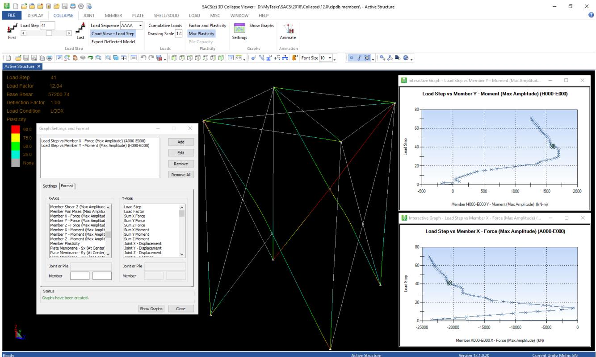

## 1.72Added Plots for Member Plasticity in CollapseView

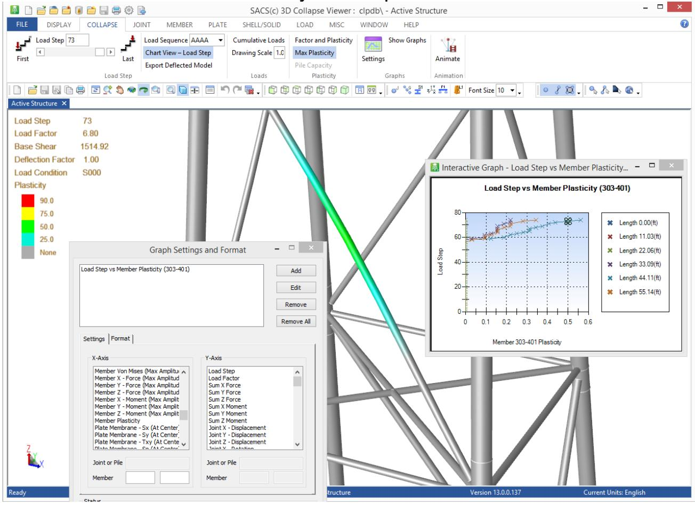

## 1.73Postvue can now save a model file

Postvue can now save a model file using the “Save As” command in the File menu.

## 1.74Dynamic Super-Element program now supports four output formats:

o Siemens BhawC (default)   
o GH Bladed   
o MHI Vestas Flex 5   
o SACS FAST

## 1.75 Views are now supported in Postvue

Any view that has been created in Precede is now saved in the Postvue database and can us used in Postvue. Views can also be added and/or modified.

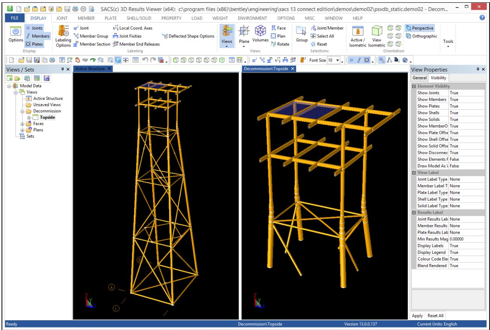

## 1.76Precede/Postvue views now have the ability to save Results Labels

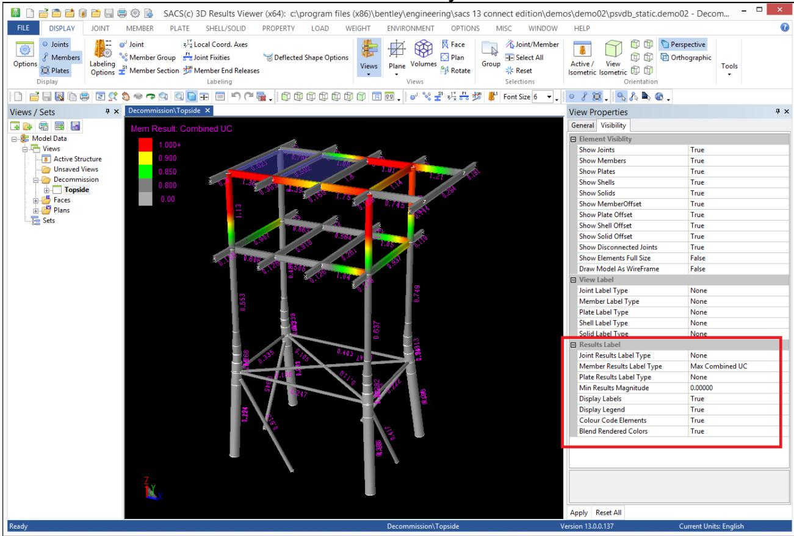

## 1.77 SACS-AutoPIPE Interoperability using ISM (Technical Preview)

SACS and AutoPIPE can now exchange piping geometry, support, reaction, and loading information through ISM (Structural Synchronizer). AutoPIPE can export piping information to the ISM file and import connection and structural information exported from SACS. This allows the engineers to manage design changes made to the 3D model, tracking revisions with optional descriptions and timestamps. At any time during the project, selected changes can be rolled back or undone. Explore multiple design scenarios, as well as recover quickly from modeling errors.

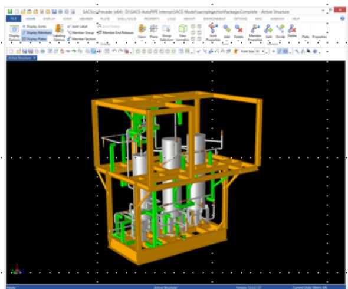

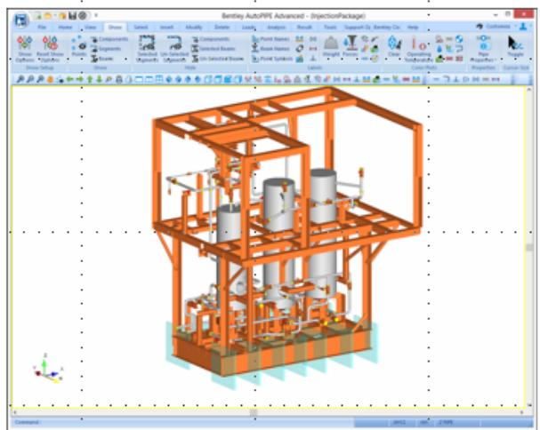

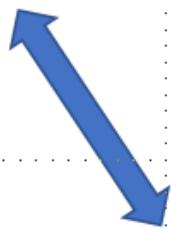  
SACS

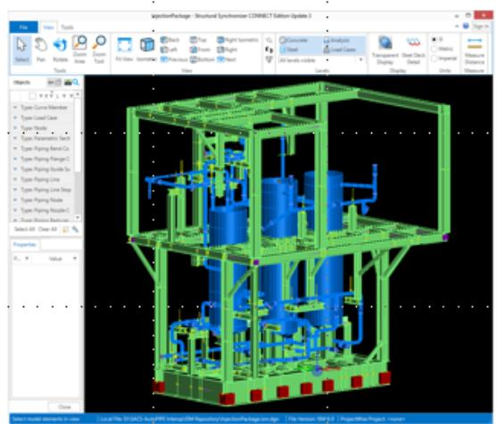

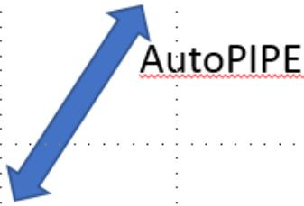  
Structural Synchronizer - ISM

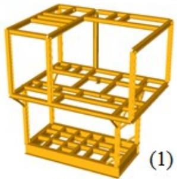  
SACS- AutoPIPE Workflow using ISM   
SACS

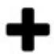

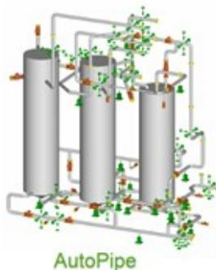  
(1a)

  
(2)

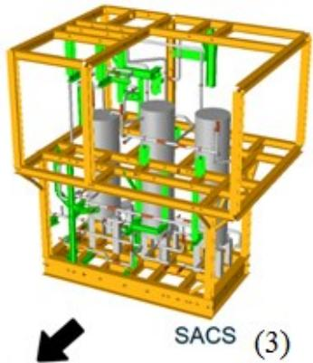

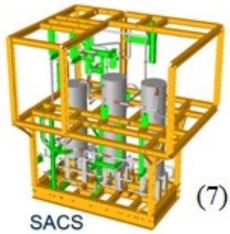

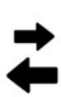  
（8）

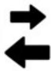  
ISM   
(6)

ISM (4)   
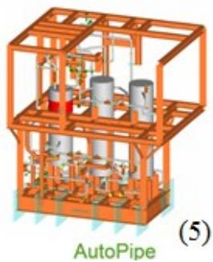  
1) Model main steel in SACS

1a) Model Piping, supports, loading and analyze in AutoPIPE

2) Export piping model to ISM and Import into SACS   
3) Model secondary steel to support piping and make connections   
4) Export Structural Model with the piping connections to ISM   
5) Import structural model with connections into AutoPIPE and perform combined structural and piping analysis.   
6) Export analyzed model with new connection reactions   
7) Import support reactions into SACS and perform the analysis   
8) Iterate. Repeat the process as necessary.

SACS 12.0 CONNECT Edition

## 1.78Collapse Enhancements

The Collapse program has been enhanced to include the effects of both large rotations and large deflections. As a result, the program is now able to predict very large deformations. The Arclength Iterative approach has been added to help predict unloading behavior at local and global limit points. An automatic sub incrementation scheme is included to improve the convergence rate and to avoid multiple runs.

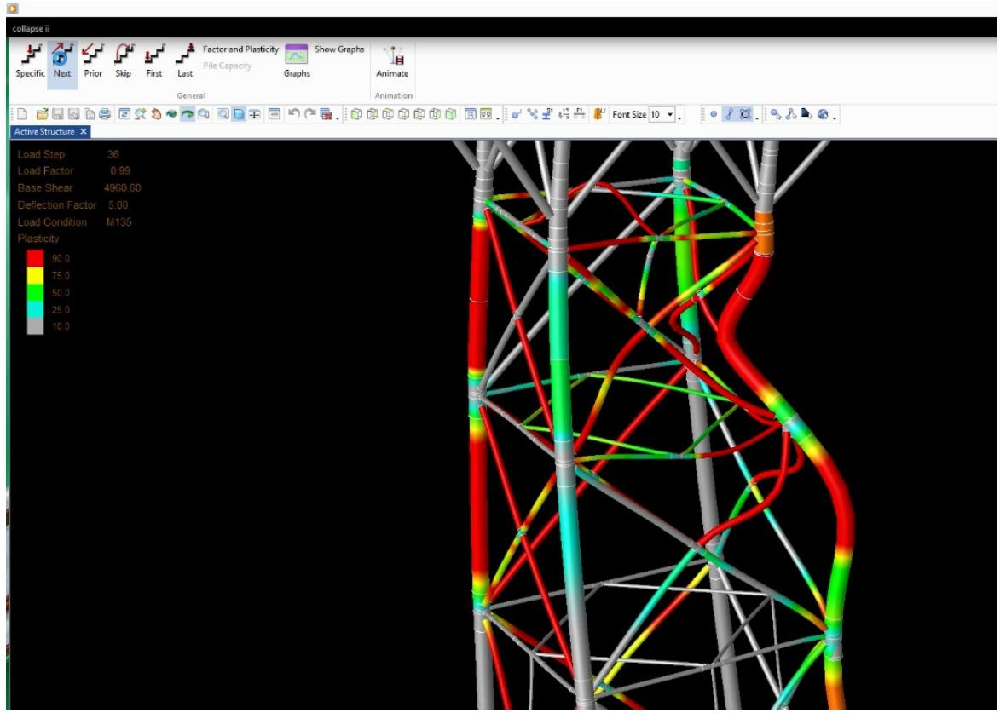

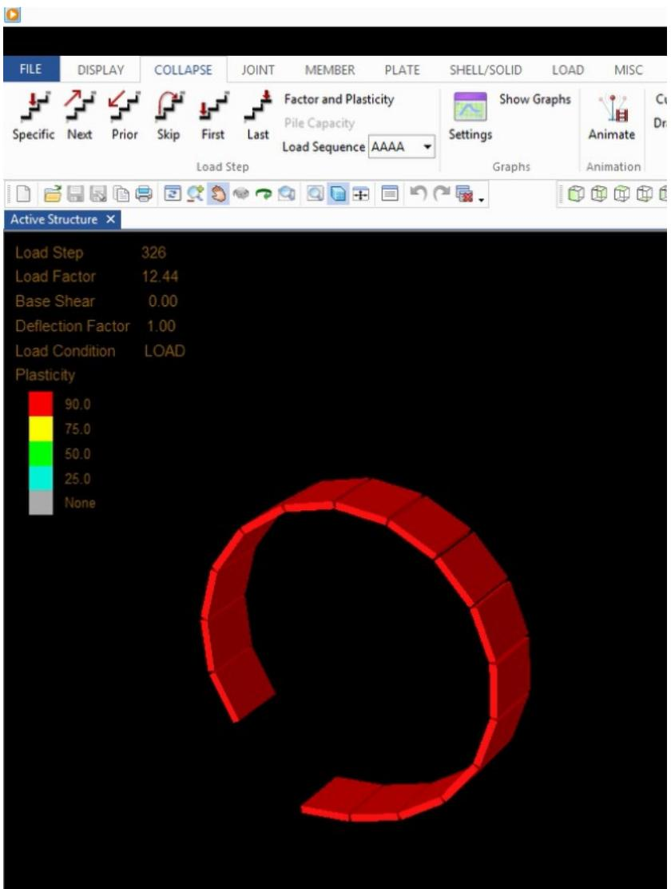

## 1.79SCF Determination from Hotspot Stress extraction using FE Analysis Automatic Stress Concentration Factor (SCF) Extraction – The Joint Mesh program has been enhanced to automatically generate a mesh and POST input file to be used to determine SCFs. The meshed joint is automatically inserted into the global SACS model which allows the user to include flexibility of the structure for SCF calculations. The SACS POST program has been enhanced to calculate the ‘Hot Spot Stress’ and SCFs. Precede has been enhanced to display ‘Hot Spot Stress’, nominal stress, and SCF labels.

Volume_1 x

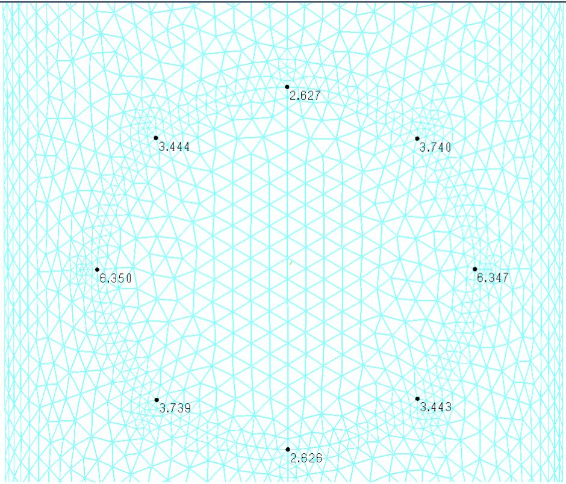

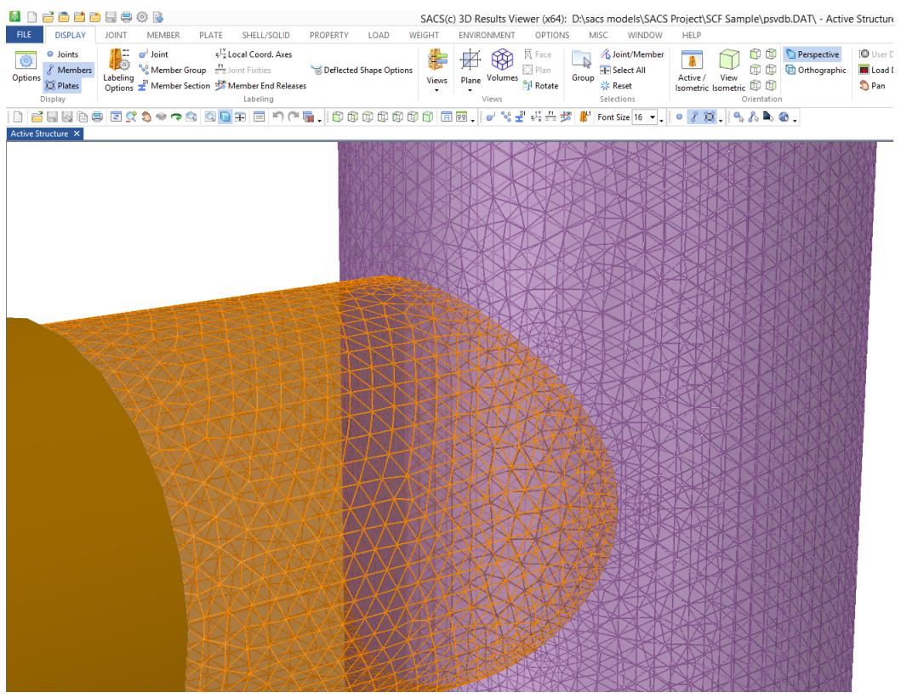

| HOTSPOT SCF REPORTBRACE 0003-0001IN ,RSI | HOTSPOT SCF REPORTBRACE 0003-0001IN ,RSI | HOTSPOT SCF REPORTBRACE 0003-0001IN ,RSI | HOTSPOT SCF REPORTBRACE 0003-0001IN ,RSI | HOTSPOT SCF REPORTBRACE 0003-0001IN ,RSI | HOTSPOT SCF REPORTBRACE 0003-0001IN ,RSI | HOTSPOT SCF REPORTBRACE 0003-0001IN ,RSI | HOTSPOT SCF REPORTBRACE 0003-0001IN ,RSI | HOTSPOT SCF REPORTBRACE 0003-0001IN ,RSI | HOTSPOT SCF REPORTBRACE 0003-0001IN ,RSI | HOTSPOT SCF REPORTBRACE 0003-0001IN ,RSI | HOTSPOT SCF REPORTBRACE 0003-0001IN ,RSI | HOTSPOT SCF REPORTBRACE 0003-0001IN ,RSI | HOTSPOT SCF REPORTBRACE 0003-0001IN ,RSI | HOTSPOT SCF REPORTBRACE 0003-0001IN ,RSI | HOTSPOT SCF REPORTBRACE 0003-0001IN ,RSI |
| --- | --- | --- | --- | --- | --- | --- | --- | --- | --- | --- | --- | --- | --- | --- | --- |
| INTJNT | ** DISTANCES ** INT- A | INT- B | LOADLOC | STRCASE | MEMBRANE | MEMBRANE | MEMBRANE | BENDING | BENDING | BENDING | BENDING | BENDING | BENDING | BENDING | BENDING |
| INTJNT | ** DISTANCES ** INT- A | INT- B | LOADLOC | STRCASE | SX | SY | TXY | SX | UPPER | SURFACE | TXY | TOP SP | SNOM | SCF |  |
| A00L | 0.600 | 1.289 | C | AX+1 | A00L | 0.0410 | 0.0238 | 0.0000 | 0.0467 | 0.0508 | -0.0114 | 0.0943 | 0.0187 | 5.0373 |  |
| A00L | 0.600 | 1.289 | C | AX+1 | A00U | 0.0399 | 0.0216 | 0.0000 | 0.0365 | 0.0387 | -0.0058 |  |  |  |  |
| A00L | 0.600 | 1.289 | C | AX+1 | A018 | 0.0385 | 0.0192 | -0.0001 | 0.0249 | 0.0248 | 0.0006 |  |  |  |  |
| A00L | 0.600 | 1.289 | C | AX+1 | AX-1 | A00L | -0.0410 | -0.0238 | 0.0000 | -0.0467 | -0.0508 | 0.0114 | -0.0943 | -0.0187 | 5.0373 |
| A00L | 0.600 | 1.289 | C | AX+1 | A00U | -0.0399 | -0.0216 | 0.0000 | -0.0365 | -0.0387 | 0.0058 |  |  |  |  |
| A00L | 0.600 | 1.289 | C | AX+1 | A018 | -0.0385 | -0.0192 | 0.0001 | -0.0249 | -0.0248 | -0.0006 |  |  |  |  |
| A00L | 0.600 | 1.289 | C | AX+1 | IP+1 | A00L | 0.0043 | 0.0045 | 0.0000 | 0.0106 | 0.0114 | -0.0024 | 0.0179 | 0.0044 | 4.0662 |
| A00L | 0.600 | 1.289 | C | AX+1 | A00U | 0.0042 | 0.0042 | 0.0000 | 0.0082 | 0.0087 | -0.0012 |  |  |  |  |
| A00L | 0.600 | 1.289 | C | AX+1 | A018 | 0.0040 | 0.0038 | 0.0000 | 0.0055 | 0.0055 | 0.0001 |  |  |  |  |
| A00L | 0.600 | 1.289 | C | AX+1 | IP-1 | A00L | -0.0043 | -0.0045 | 0.0000 | -0.0106 | -0.0114 | 0.0024 | -0.0179 | -0.0044 | 4.0662 |
| A00L | 0.600 | 1.289 | C | AX+1 | A00U | -0.0042 | -0.0042 | 0.0000 | -0.0082 | -0.0087 | 0.0012 |  |  |  |  |
| A00L | 0.600 | 1.289 | C | AX+1 | A018 | -0.0040 | -0.0038 | 0.0000 | -0.0055 | -0.0055 | -0.0001 |  |  |  |  |
| A00L | 0.600 | 1.289 | C | AX+1 | OP+1 | A00L | 0.0000 | 0.0000 | -0.0023 | -0.0006 | 0.0006 | 0.0001 | -0.0023 | 0.0000 | ----- |
| A00L | 0.600 | 1.289 | C | AX+1 | A00U | 0.0000 | 0.0000 | -0.0022 | -0.0003 | 0.0003 | 0.0001 |  |  |  |  |
| A00L | 0.600 | 1.289 | C | AX+1 | A018 | 0.0000 | 0.0000 | -0.0021 | 0.0001 | -0.0001 | 0.0000 |  |  |  |  |
| A00L | 0.600 | 1.289 | C | AX+1 | OP-1 | A00L | 0.0000 | 0.0000 | 0.0023 | 0.0006 | -0.0006 | -0.0001 | 0.0023 | 0.0000 | ----- |
| A00L | 0.600 | 1.289 | C | AX+1 | A00U | 0.0000 | 0.0000 | 0.0022 | 0.0003 | -0.0003 | -0.0001 |  |  |  |  |
| A00L | 0.600 | 1.289 | C | AX+1 | A018 | 0.0000 | 0.0000 | 0.0021 | -0.0001 | 0.0001 | 0.0000 |  |  |  |  |
| A00L | 0.600 | 1.950 | B | AX+1 | A00L | 0.0100 | 0.0156 | 0.0000 | 0.0287 | 0.0312 | -0.0050 | 0.0492 | 0.0187 | 2.6258 |  |
| A00L | 0.600 | 1.950 | B | AX+1 | A00M | 0.0104 | 0.0142 | 0.0000 | 0.0215 | 0.0231 | -0.0034 |  |  |  |  |
| A00L | 0.600 | 1.950 | B | AX+1 | A019 | 0.0114 | 0.0112 | 0.0000 | 0.0054 | 0.0048 | -0.0001 |  |  |  |  |
| A00L | 0.600 | 1.950 | B | AX+1 | AX-1 | A00L | -0.0100 | -0.0156 | 0.0000 | -0.0287 | -0.0312 | 0.0050 | -0.0492 | -0.0187 | 2.6258 |
| A00L | 0.600 | 1.950 | B | AX+1 | A00M | -0.0104 | -0.0142 | 0.0000 | -0.0215 | -0.0231 | 0.0034 |  |  |  |  |

## 1.80Add Eurocode 1993 code check for Circular Hollow Section

Added Eurocode 3: 2005 code check option for tubulars.

## 1.81Update dynamic response documentation

Update dynamic response documentation to clarify the PRST and PRSC combination method.

Current documentation states the modal responses results in all positive stresses which isn't

correct. Documentation should state that the stress could either be positive or negative, so the PRST/PRSC combinations are required. Also added documentation for Harris spectrum coherence function calculation as the reference for the equation is not easily obtained.

## 1.82Show results for multiple load sequences in Collapse View

Collapse View can now show the results for multiple load sequences.

SACS 11.3 CONNECT Edition

## 1.83SACS 11.3 CONNECT Edition Overview

Foundation Design for Large Monopile Structures

Base shear is the result of skin friction of the pile tip cross section and end moment is the result of the soil compression in one side of the pile due to rotation of pile tip. Base shear effect is significant specially for rigid piles. This effect is significant for gravity type with large diameter pile and may increase its lateral stiffness. PSI program calculates base shear using displacement of the pile tip and t-z curve. It also calculates the End Moment using the rotation of the pile tip and p-y curve and considers both effects in calculation and pile analysis.

Add stream function theory to be used in WVINS

Added stream function theory in Wave Response to be used in constrained wave.

Precede Labeling Enhancements

Better control of label visibility   
• Align text with element direction without the problem of text size altering by orientation.   
Ensure that the font is (much) the same size as other label fonts.   
• Allow for the member labels to be hidden while rotating, zooming   
Improved titles labeling   
• Add orientation markers to Fatigue   
• Add damage labels [max per joint, max per element, all] to Fatigue

Implement detailed report for PGB, PGD and PGU sections for AISC 9th edition in POSTVUE

Enhancements to Precede/Interactive Fatigue

• Added context menus for fatigue items in the graphical view window. These allow direct production of reports and charts and the isolation of a joint within a view.   
• Damage and Orientation labels are available for fatigue elements in the graphical view windows.   
Added ability to open fatigue extract summation files in the interactive fatigue module. These files are produced by the GHBladed and SACS Wind Turbine processes.   
Added support for mid-member interactive fatigue design where a fatigue extract file contains data from an EXTRACTM command.

Added ability to create Sets in Precede

Precede now can create multiple “lists” or Sets. These sets can be used to group joints, members, plates, shells, loads, etc. and save and loaded from the model file. These sets will replace “Lists” in coming releases.

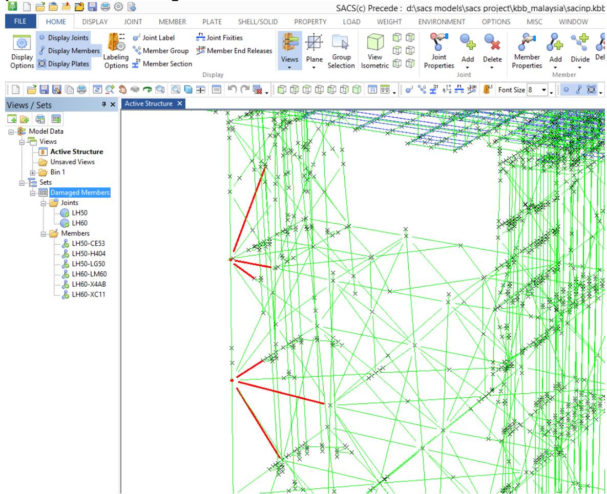

Wave Response compiler update

Wave response has been upgraded to a new compiler. This will cause some differences in some of the results. Please refer to Appendix A in the Enhancements Manual for a detailed discussion of the differences that could occur.

Added ability to export and import built-up sections in the ISM interface.

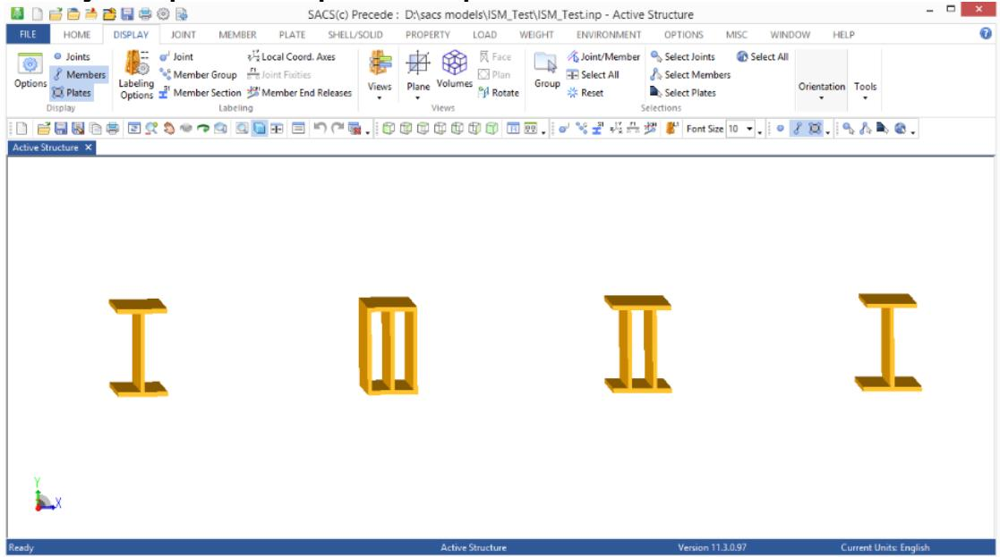

Built-up Sections in SACS

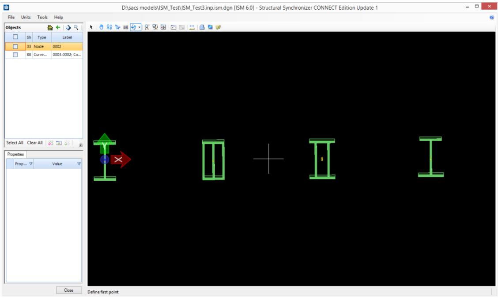

Built-up Sections in ISM

Added 3D Moment/ Shear diagrams

Precede can now display the moment/shear diagram in the 3D model.

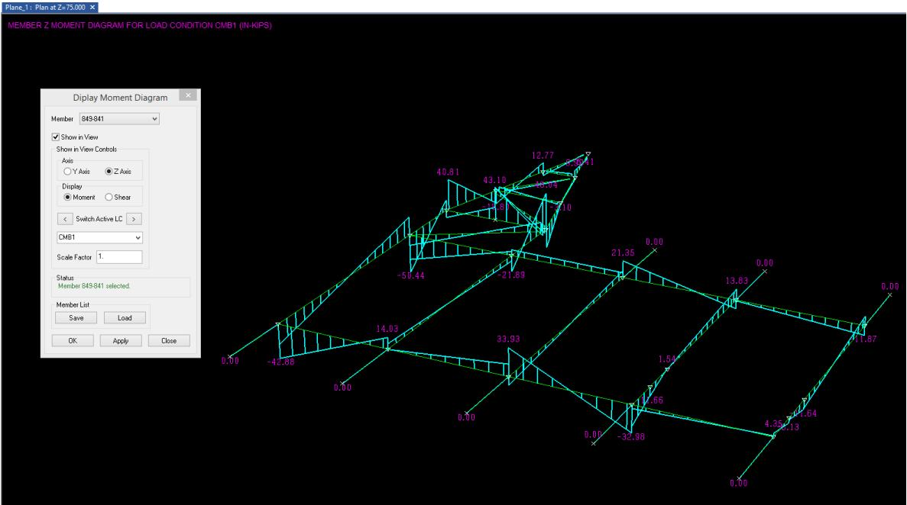

## 1.84SACS 11.2 CONNECT Edition Overview

Enhancements to SACS Decommissioning tools

Load by Volume Calculation

The SACS decommissioning tool has been enhanced to calculate the sum of forces and center of forces enclosed in a volume. The volume is user selectable by using the three axes sliders or typing the volume extents.

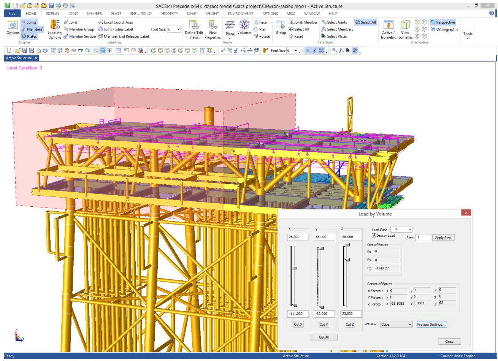

Model Sectioning by Volume

Using the load by volume tool described above, the selected volume can be used to “cut” a model and create a view or sub-model of the structure.

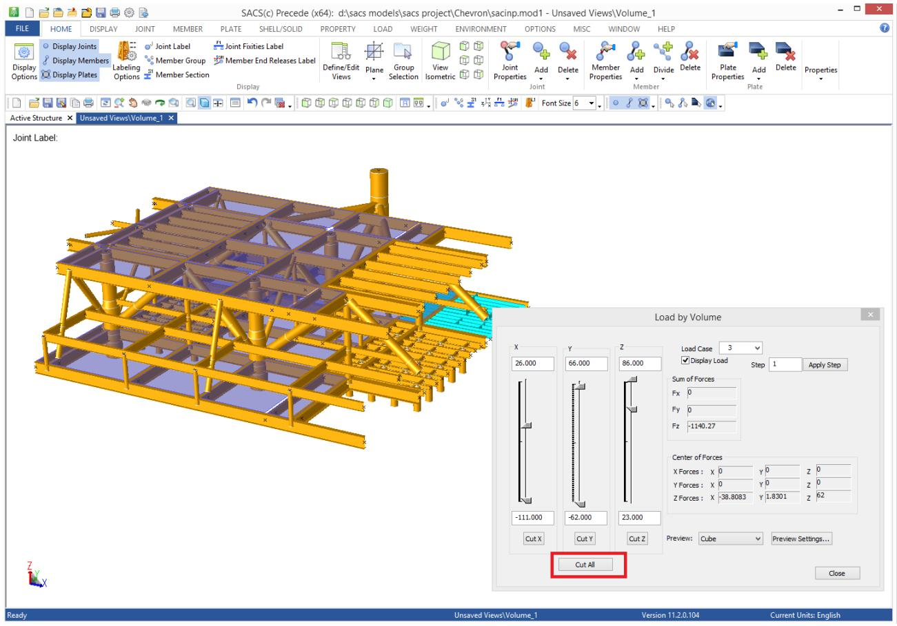

Save View as Model File

The sectioned view can be saved as self-contained model file.

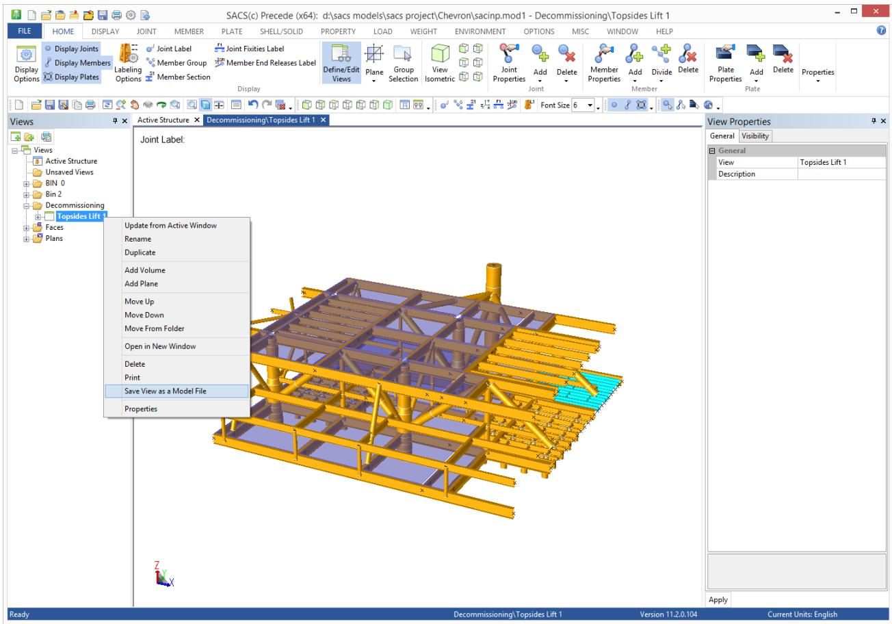

New enhanced view management in Precede

Precede now has an improve user interface to manage saved views. Now saved views are displayed on a tree control on the left side of the Precede window.

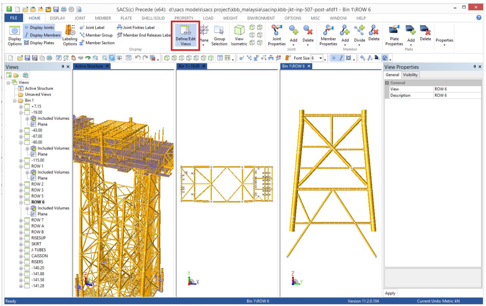

All view related actions can be accessed by mouse right-click.

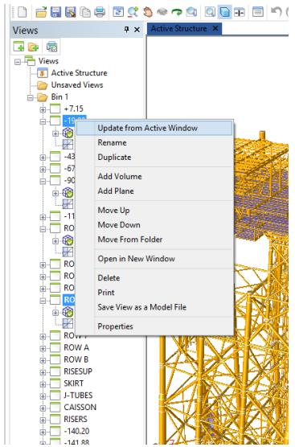

PSI can now apply torsion on each pile segment based on t-z curve data

This feature adds the nonlinear torsion analysis of the piles in PSI using T-Z curves. Previously, PSI was able to do linear Torsion analysis (not considering effect of soil) or Torsion Adhesion. With this feature, program generates Table Ranges and does full Torsion Analysis using T-Z curves that have been input in soil Axial properties. M - Theta curves will be generated based on following calculation:

Rotation (Theta) would be equal to Z/r (r: radius of the pile) and Torsion Moment (M) on each segment would be equal to $2^{ \ast } \mathsf{ p i }^{ \ast } ( \mathsf{ r }^{ \wedge } 2 )^{ \ast } \mathsf{ T }^{ \ast } \mathsf{ L }$ (L: pile segment length).

Tow Fatigue Analysis Added to the SACS Executive as an Analysis Sub-Type

This new analysis sub-type for tow fatigue prompts the user for a tow input file.

SACS Marine Modules available in 64bit version only

SACS Hull Modeler, Hull Mesher, Stability, and Motions are only available on 64bit versions. This means that they will NOT be available on SACS installation on Windows 32bit operating systems.

Added support for intra-operable launch in MOSES using the SACS Launch file and a SACS jacket model

This is a full “round-trip” capability to do MOSES Launch of a SACS jacket model without leaving the SACS executive. See sample 22.

Added ability to create model file from a Precede saved view

Added functionality to allow users to select a saved view and save the information to a separate model file. The resulting model file contains all model and load information pertinent to the view. This includes sections, groups, elements, load conditions, load combinations, and all applied loads.

Joint Mesher Enhancements

Added ability to create hard edges

Added the ability to create a hard edge between two hard points. Plate edges between the hard points will be forced to align to the hard edge.

Added hardedge report in list file for created joints

Joint Mesh Program will now create a report in the list file with the list of joints that have been created for each hardedge.

Modified user defined plate surface offsets based on chord surface locations

Joint Mesh Program will offset user defined plate surfaces based on chord surface locations.

Added more wind spectrum type to SPCWIN card to the Dynamic Response program similar to WINSPC card in Extreme Wind

Added more wind spectrums for extreme wind analysis.

Added support for ISM 6.0

SACS now can read and write ISM 6.0 file format.

## 1.85SACS 11.1 CONNECT Edition Overview

CONNECT Advisor integration

CONNECT Advisor is a CONNECT services entitlement for our users and a core offering of Adaptive Learning Services. It is designed to provide content aggregated from multiple sources in a single location and provides in-application contextual assistance, including recommendations, short feature and workflow videos and personalized learning paths and knowledge maps. CONNECT Advisor will increasingly leverage Azurebased machine learning, to further personalize its assistance for each Connected User.

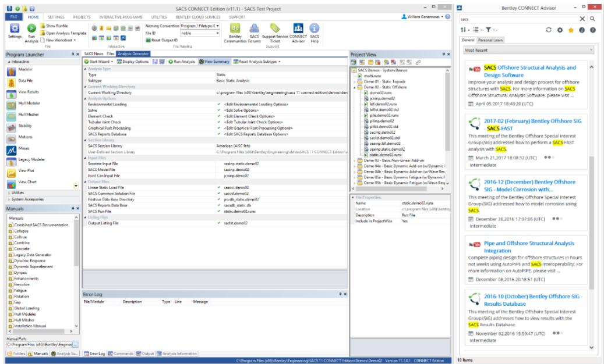

Collapse - Added the latest NORSOK -2013 joint strength check   
• Precede - Collapse View - Added Pile Capacity feature.   
• Dynamic super element - Added the ability to export stiffness, mass, and forces to a CSV file.   
• Dynpac - Added torsional mass in the generation of the mass matrix   
SACS now supports ISM 6.0   
• Joint Can - Addend Ultimate Earthquake Analysis – API-RP2A 22nd Edition   
Executive -Added support for SACS Uncoupled Wind Turbine strength design to handle all load cases for time history analysis.   
Wave Response - Added ability to write all load conditions   
• Wave Response - Changed load condition name scheme for ‘ES’ option to allow more load conditions.

## 1.86SACS 11.0 CONNECT Edition Overview

SACS 11.0 CONNECT Edition release includes major enhancements including:

• SACS-FAST Integrated Analysis - The SACS-FAST integrated analysis couples the SACS Wave Response module with the FAST wind turbine analysis program generating a fully integrated response from the wind, wave and current loading on the structure.   
The seastate program has been enhanced to included wind areas based on API 4F (4th edition Jan 2013) wind walls. With this feature, wind areas can be applied based on single, three and four sided walls following the API 4F (4th edition Jan 2013) specification automatically.   
SACS-AutoPIPE interop workflow - Added ability to import piping geometry, support information, and support reactions from AutoPIPE. Also added the ability visually connect the piping supports to the structure in Precede and export these connections and the SACS model to AutoPIPE via pipelink where a combined structure/piping analysis can be performed.

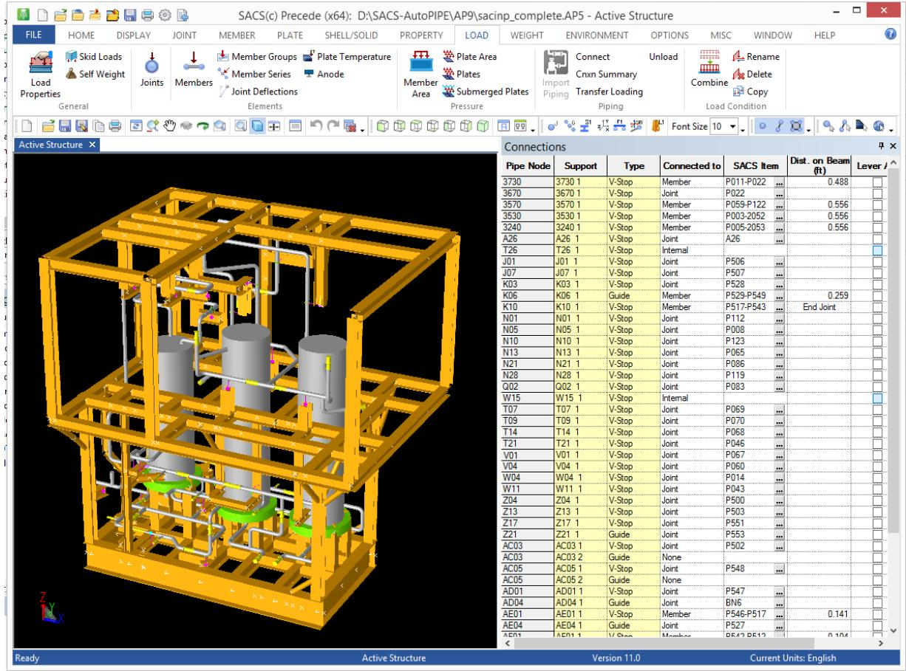

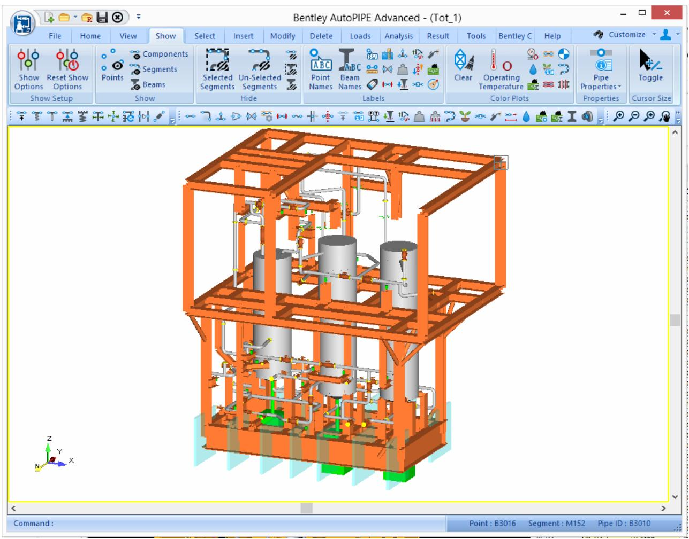

Integration of the Collapse view postprocessor functionality into Precede

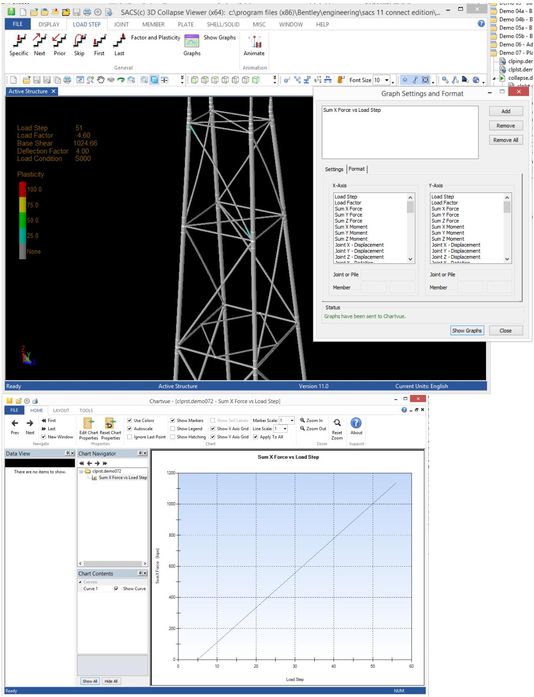

• Integration of the Interactive Fatigue postprocessor functionality into Precede

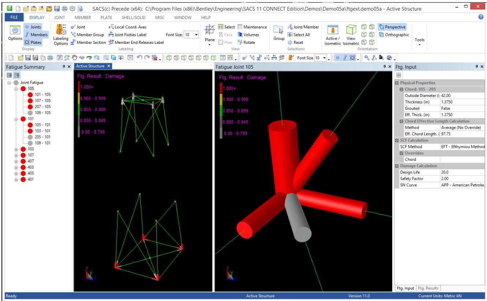

• Decommissioning tools added to Precede.

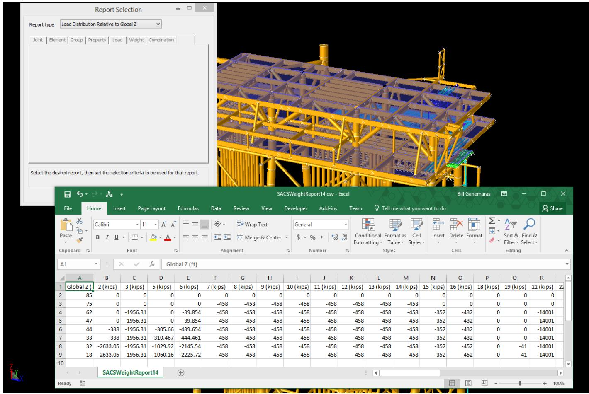

New precede interface for creating a 3D mesh of a joint connection was added. Users can now graphically create ring plates, stiffener plates, gusset plates, or any other type of plate surface to be included when meshing a joint connection.

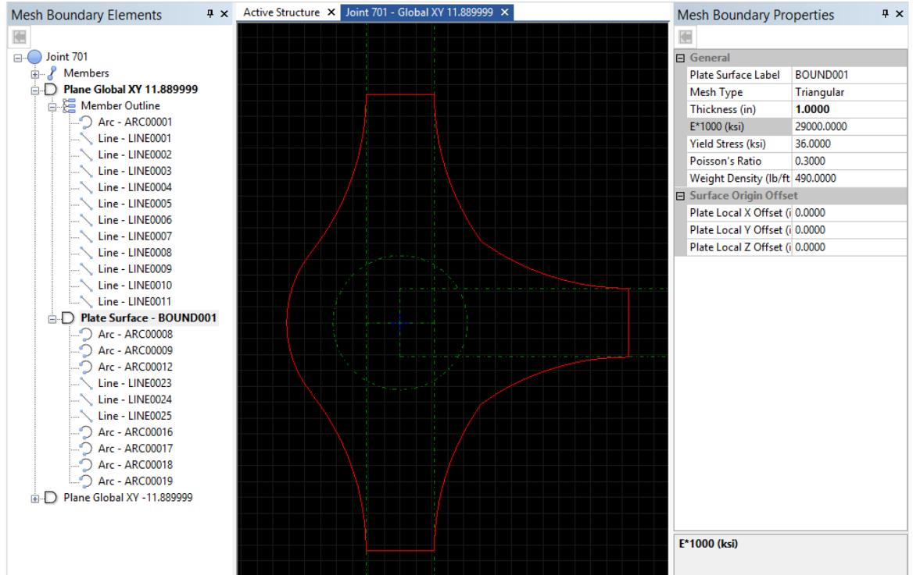

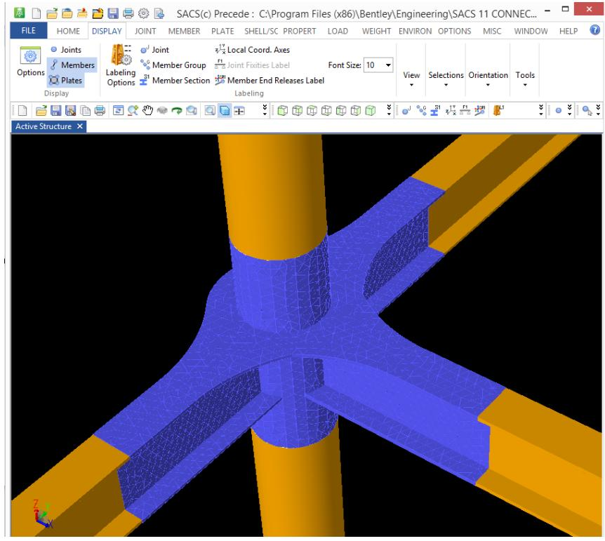

Details of Program Enhancements and Corrections

## 1.87Chart Viewer

SACS 10.0.0.1 CONNECT Edition Corrections

• Corrected chart view can to display the designated single soil layer t-z, q-z and p-y curve   
• Corrected chart view can to display the designated single soil layer t-z, q-z and p-y curve

## 1.88Collapse

SACS 13.0 CONNECT Edition - CL

• Defect: A crash has been fixed when a pile-soil super-element is input for Collapse Advanced analysis.   
Enhancement: Collapse Advanced now models the member end-releases using a special element to include large deformation of released degrees of freedom. For formulation details see Section 6.8 in Collapse Advanced User Manual.   
Enhancement: Added Sample 24. This sample contains many examples showing the collapse advanced capabilities.

SACS 12.0 CONNECT Edition

The Collapse program has been enhanced to include the effects of both large rotations and large deflections. As a result, the program is now able to predict very large deformations. The Arc-length Iterative approach has been added to help predict unloading behavior at local and global limit points. An automatic sub incrementation scheme is included to improve the convergence rate and to avoid multiple runs.

SACS 11.2 CONNECT Edition Corrections

An issue has been resolved in Common Solution File (CSF) generation in Collapse program. Collapse CSF can be now used to run Code Check.   
• Fixed issue where more than 50 PLSECT lines in PSI input file crashes the program.

SACS 11.1 CONNECT Edition Enhancements

Implement the latest NORSOK -2013 joint strength check

SACS 11.1 CONNECT Edition Corrections

• Fixed system error message when running collapse with a stiffened cylindrical section as an intermediate segment in a segmented member.

SACS 10.0.0.1 CONNECT Edition Release Corrections

• Joint strength checks in accordance to NORSOK 2013 code check

Release V8i Select Series 4 v5.7 Enhancements

Inclusion of multi linear stress-strain material behavior

## 1.89Collapse View

SACS 13.0 CONNECT Edition - CL

• Enhancement: CollapseView now reads the SACS model input file alongside of Collapse Restart file.

• Enhancement: Added ability to generate SACS input file with deformed structures for a given load step

SACS 12.0 CONNECT Edition

• Collapse View can now show the results for multiple load sequences.

SACS 11.3 CONNECT Edition

Fixed error where Joint failure is not drawn accurately. The member where the joint failure occurs does not show plasticity colors accurately, and the joint deflections are also not accurate.   
Added 'Pile Approaching' before the ‘Punch Through’ to clarify the pile hasn't reached full capacity yet.

SACS 11.1 CONNECT Edition Release Corrections

Fixed issue drawing angle, box, tee, unsymmetrical plate girder, prismatic and multisegmented members.   
• Fixed issued with plasticity contours not matching on solid and wireframe modes.   
Fixed issue that Ship impact plots could not be generated.   
Fixed issue displaying members with local offsets.

SACS 11.1 CONNECT Edition Release Enhancements

Implement pile capacity feature.   
Pile joints and its properties are now displayed.   
• Animation can now display the plasticity.   
• Plate thickness can now be displayed.

SACS 11.0.0.1 CONNECT Edition Release Enhancements

Integrated Collapse results viewing in Precede

## 1.90Combine

SACS 11.1 CONNECT Edition Release Corrections

Fixed system crash when wave height and period are left blank in LCAS card.

SACS 11.0.0.1 CONNECT Edition Release Enhancements

Added the ability to combine solutions of two Dynamic Response analyses or Wave Response simulations with same time steps into a combined Common Solution File   
Fixed issue where Combine overrides all OPTION values loaded from Common Solution File. The OPTIONS line is removed from COMBINE program and all values are set to values inside Common Solution File.

## 1.91Data Generator

SACS 12.0 CONNECT Edition

Liquefaction cards LIQHEAD And LIQSTR are now supported   
• Fixed issue the tubular member group grout units display

SACS 11.3 CONNECT Edition

Fixed issue If NB2 (NORSOK S-N-B2) option in column 33-35 of the FTOPT line is selected, Data Generator captures it as NB3 and the analysis does not recognize this selection.   
• Fixed issue when editing the RAO line on the Line Assistant, if the user clicks apply, the period will be deleted from the line.   
Fixed issue when inserting a "SECT LRN" card, data gen should automatically insert the "SECT C LRN" card.   
Fixed issue with the AREA header and all consecutive letters are showing up blue. As soon as a number or space is entered, the color will be black.

SACS 11.1 CONNECT Edition Corrections

Fixed issue that Datagen did not recognize dynamic response file types.

SACS 11.1 CONNECT Edition Corrections

Fixed issue with TAB key not moving to next input field.   
Fixed issue that Datagen was removing the Blocking Factor in the CURR card when the option is set to “None”   
Fixed issue when changing units in the OPTIONS line.   
LOADLB is highlighted correctly now.   
• Separated the two save buttons on the tool bar into two. Save and Save As...   
Uppercase letters are now used by default.   
• Default fixities are entered as blank instead of ‘0’s.   
• Upending option has been removed from Datagen.   
• Fixed issue in NORSOK 2013 were Allowable Limit was not been displayed

SACS 11.1 CONNECT Edition Enhancements

• CONNECT Advisor is now integrated in Datagen.

SACS 11.0.0.1 CONNECT Edition Release Enhancements

Removed OPTIONS line from the combine program. See COMBINE entry above.   
• Added joint can code check options in JCNOPT (FT91, FT84, FT82, NPD, NP90, NP84, DNV, DN83)   
Fixed issue where WIND line not writing out the AS01 to the line from the line assistant, writing out AU01   
• Fixed issue where JNTSEL line in a fatigue input file was allowing 5 characters for the joint entries   
• Fixed issue where the column entries for the SUPP card in flotation was not matching the manual

SACS 10.1.0.1 CONNECT Edition Release Enhancements

Enhanced Datagen to allows input beyond 80 columns

SACS 10.1.0.1 CONNECT Edition Release Corrections

• Corrected the Moment Magnification input options on the OPTIONS line.   
• Corrected a problem where Datagen was not reading the BRACE and MGRPSL input lines.

• Corrected a problem where the option on the MPLANE line was set to ‘D’ instead of ‘L’   
• Corrected a problem where the THLOAD line would automatically change on clicking ‘Apply’

SACS 10.0.0.1 CONNECT Edition Release Enhancements

Inclusion of joint mesh file input definition.   
Inclusion of surface input lines for the Joint Mesh program

SACS 10.0.0.1 CONNECT Edition Release Corrections

• Corrected issue where data past 80 columns was being deleted.   
• Corrected problem where BRACE and MGRPSL were not recognized   
• Corrected problem where datagen was not showing options for SN Curve category in FTOPT line.   
• Corrected problem where RSFAC line did not function properly for different design codes.   
Corrected problem associated with display of LOADLB input line

Release V8i Select Series 4 v5.7 Enhancements

• Input data lines for multi linear stress strain curves have been added for Collapse   
• Added the ability to read and write new corrosion lines for seastate.   
• Added the AISC 14th options for post

Release V8i Select Series 4 v5.7 Corrections

1 Corrected problem where the force time history input file was inconsistent with the wave response manual.   
2 Corrected a problem with inconsistent units in the input file   
3 Corrected problem on the PLTREQ line in floatation   
4 Corrected problem where the back space or delete line function was not working   
5 Corrected problem where the drop-down list for the 'find' dialog box was in reverse order.   
6 Corrected problem where columns 19-20 of the SHIP input lines could not be changed.   
7 Corrected the spelling of the ACCEL line in TOW   
8 Corrected the corrosion options on the GRPOV and MEMOV lines.   
9 Corrected problem where the units could not be changed on the PSIOPT input line.   
10 Corrected a problem where the ENTER key did not have the same function as the 'APPLY' button when the line assistant had focus.   
11 Corrected problem where a zero fixity was being added on the member line.

## 1.92Dynamic Response

SACS 13.0 CONNECT Edition - CL

Defect: When choosing the Velocity check option in dynamic response, the values are all zero in chartvue. The issue is fixed to transfer all the values correctly to chartvue. Also Listing file units for velocity checks are now fixed.   
• Defect: Fixed units for BS and OTM for periodic vibration analysis.

SACS 12.0 CONNECT Edition

Added more clarification on how to generate equivalent static loads for force time history analysis.

SACS 11.3 CONNECT Edition

Plot issues when omitting free fall in dropped object analysis are fixed.

Fixed issue with incorrect spectral wind decay factors.

SACS 11.2 CONNECT Edition Release Enhancements

Added more wind spectrum type to SPCWIN card to the Dynamic Response program similar to WINSPC card in Extreme Wind.

SACS 11.0.0.1 CONNECT Edition Release Enhancements

• Fixed issue with Time-history input dyrinp where it was accepting up to 1000 input lines.   
Improved program runtime performance   
Fixed issued where "Earthquake Time-History", Dynamic Response could not correctly generate load cases labels in OCI file when they more than 9999. The load case labeling are now changed to Alphanumeric.   
• Fixed issue where Lower frequencies where not accounted for in Spectral wind fatigue runs

SACS 10.0.0.1 CONNECT Edition Release Enhancements

• Added options to begin dropped object analysis from the point of contact   
• Added an option to the dropped object analysis to allow the object not to bounce.

SACS 10.0.0.1 CONNECT Edition Release Corrections

Corrected a problem where the Fourier series warning was referenced as an error   
• Corrected a problem where the program crashed for a large model.

Release V8i Select Series 4 v5.7 Corrections

Corrected an issue which caused the dynamic response module to crash

## 1.93Dynamic Super Element

SACS 13.0 CONNECT Edition – CL

Enhancement: Transient Reduction is added to omit initial transient time for Dynamic Superelement outputs.   
• Defect: Fixed a typo in the Wave Load units in additional CSV files.   
• Enhancement: Dynamic Super-element program now generated outputs in four formats:

o Siemens BhawC (default)   
o GH Bladed   
o MHI Vestas Flex 5   
o SACS FAST

• Enhancement: More analysis details are added to the Dynamic Super-element listing file.   
• Enhancement: Warning and error messages are revised for clarity.   
Enhancement: The wave elevation is added to Dynamic Super-element outputs.   
• Defect: Fixed crash when number of wave load steps are very large.

SACS 11.1 CONNECT Edition Corrections

• Fixed issue with rotational values when reordering degrees of freedom.

SACS 11.1 CONNECT Edition Enhancements

• Added the ability to export stiffness, mass, and forces to a CSV file.

SACS 11.0.0.1 CONNECT Edition Release Enhancements

• Added Gravity Acceleration and Model Gravity Direction calculation

SACS 10.0.0.1 CONNECT Edition Release Enhancements

• Added new Dynamic Super Element module based upon the Craig-Brampton approach.

## 1.94Dynpac

SACS 13.0 CONNECT Edition – CL

Enhancement: Dynpac is updated to handle footprint loads points as many as required. The 600 limit has been removed.   
• Defect: Dynpac now prevents Footprint duplicate weight at member ends.

SACS 11.1 CONNECT Edition Enhancements

• Included torsional mass in the generation of the mass matrix.

SACS 11.0.0.1 CONNECT Edition Release Enhancements

• WGTNS line (Non-structural weight) is updated to handle up to 120 distribution joints.

SACS 10.0.0.1 CONNECT Edition Release Enhancements

Added dynamic super element functionality in Dynpac

## 1.95Executive

SACS 12.0 CONNECT Edition

Fixed crash caused when clicking on filename in multirun generator   
• Precede Output Sort Option default is now 'No Sorting'

SACS 11.3 CONNECT Edition

• Added “SACS Joint Mesher” runfile template to the Utilities type.

SACS 11.2 CONNECT Edition Release Enhancements

• Tow Fatigue Analysis Added to the SACS Executive as an Analysis Sub-Type   
• Added support for intra-operable Launch in MOSES using the SACS Launch file and a SACS jacket model.

SACS 11.1 CONNECT Edition Release Enhancements

• Added support for SACS Uncoupled Wind Turbine strength design to handle all load cases for time history analysis.   
Integrated CONNECT Advisor in the Executive.

SACS 11.0.0.1 CONNECT Edition Release Enhancements

• Added the ability to Execute MOSES from the Executive   
• Fixed issue the GH Bladed analysis was not creating the correct final results database   
• Added link to SACS Samples and Demo files, which are examples of different SACS analysis types   
• Added ability to create Wind Turbine Process runfile and GH Bladed Process runfile

SACS 10.1.0.1 CONNECT Edition Release Enhancements

• Added relative path names in the SACS.IN control file for the wind turbine GH Bladed process.   
• Added a contents table to the RSS News Feeds tab.

SACS 10.1.0.1 CONNECT Edition Release Corrections

Corrected a problem where a common solution file was not being generated for an Extreme Wind analysis   
Corrected a problem where the ISO unity check file was not being generated if the ISO code check option was defined on the OPTIONS line.   
Corrected a problem where the user could not disable the creation of s Postvue database by unchecking it in the analysis generator.   
Corrected a problem where the Hull Modeler, Stability and Motions program would not launch due to a missing DLL file.   
Corrected an issue where the ProjectWise connection was not working   
Corrected a problem where the connect call to verify a project was too slow.   
• Corrected a problem where the Executive was crashing if the Connect client was exited without a logout.   
Corrected a problem where the ProjectWise CONNECT edition was not being recognized by the Executive.   
Corrected a problem where the Executive would not open the last model in Precede if it was generated from scratch.   
Corrected a problem where the Maximum Number of Cores setting in the Executive required a SACS Wind Turbine license for a multi-core analysis. It should also include the SACS Offshore Enterprise license.   
Corrected a problem where the Executive would crash if the GH Bladed input control file was entered by mistake for the SACS Wind Turbine Process.   
Corrected a problem where a “This document is not on the server” error message is displayed when logging into ProjectWise for the first time.   
• Corrected a problem where the global loading temporary file was not being deleted.

SACS 10.0.0.1 CONNECT Edition Release Enhancements

• The SACS Executive has been enhanced to include the GH Bladed auto combine process   
• The SACS Executive has been enhanced to include Dynamic Super Element analysis   
The SACS Executive has been enhanced to allow the user to input the coefficient of friction under the GAP options for a GAP analysis.

SACS 10.0.0.1 CONNECT Edition Release Corrections

• Corrected a problem where the wrong file names were being used for an extreme wave analysis.   
• Corrected a problem where postvue database was not being deleted after it has been unchecked in the analysis generator.   
Corrected a problem where the Max Number of Cores description stated the Wind Turbine License is required for this functionality.

Release V8i Select Series 4 v5.7 Enhancements

Integrate Dynamic Super element into SACS Executive   
New Input for Coefficient of Friction for Gap Elements in Executive   
• Removed the message box upon Executive startup if the structural synchronizer was not installed   
Removed the three-minute license check in delay.   
• Added the brace subdivision dialog box to the joint mesh utility.   
Added a database functionality based upon the joint can list file for GH Bladed wind turbine process.

Release V8i Select Series 4 v5.7 Enhancements

• Continued enhancements to ProjectWise integration.   
• Add the ability to perform keyboard actions under the Project View   
• Add Auto Combine feature to GH Bladed and SACS Wind Turbine process   
• Integrate Fatigue Extract Summation File into SACS Wind Turbine Process   
Added RSS Feeds to include Communities

Release V8i Select Series 4 v5.7 Corrections

Corrected a problem where temporary files were not being deleted when an analysis was being cancelled.   
• Corrected a problem where the list file convertor failed to write the list file after conversion   
• Corrected a problem where the FTOPT3 line was being deleted for the SACS GH Bladed process.   
Corrected a problem where the number of occurrences on the FTCASE line were not being generated correctly for the GH Bladed process   
Corrected a problem where the wrong version number was being displayed.   
Corrected a problem where the directory path to demo 12 was incorrect.   
• Corrected a problem where files were not being copied when dragging and dropping to another location manually.   
• Corrected a problem with the display of the default license in the settings dialog box.   
• Corrected a problem where a separate seastate input file could not be used if LDOPT line was included in the model file.

## 1.96Fatigue

SACS 13.0 CONNECT Edition – CL

Enhancement: Added option to read damage files from a particular range. Applicable to wind turbine process only.

SACS 12.0 CONNECT Edition

Fixed an error reading fatigue extract files which contain user defined, Ochi-Hubble or Double JONSWAP spectrum definitions.

SACS 11.3 CONNECT Edition

Fixed issue with the Interpolated reduction factor is not calculated correctly for IPB and OPB for 'ERD' scf option.

Fixed issue that fatigue crashes when non lpad path dependant SCF option is used in time history analysis

SACS 11.2 CONNECT Edition Release Corrections

• Fixed issue with joint SCF override when GRPSEL is used.

SACS 11.0.0.1 CONNECT Edition Release Enhancements

• Added option to print out stress vs cycle count for non-tubular members for time history analysis.   
• Added an option to override SCF for prismatic members   
Fixed an issue in spectral fatigue where the cone smaller OD in segmented members are not calculated correctly in Intermediate Member Fatigue Report.

SACS 10.0.0.1 CONNECT Edition Release Enhancements

Add option to extract all joints.   
• Include reduction factors for SCF as per DNV RP-C203 2014 rules   
• Add DNV RP-C203 2014 effective thickness option for grouted legs

SACS 10.0.0.1 CONNECT Edition Release Correction

• Corrected problem where intermediate fatigue report and detailed fatigue report options do not work

## 1.97GH Bladed interface

SACS 12.0 CONNECT Edition

Fixed issue when the fraction of the design life value is long enough (>10 digits), it will overflow into the dynamic amplification factor field and produce a very large dynamic amplification factor in the fatigue analysis.

SACS 11.2 CONNECT Edition Release Enhancements

Modified to support the latest GL Bladed file format.

SACS 11.1 CONNECT Edition Release Enhancements

• Modified program to ignore FORM line and always assume unformatted file.

SACS 11.0.0.1 CONNECT Edition Release Enhancements

• Fixed issue with incorrect beta angle during export.

## 1.98Flotation/Upending

## 1.99Gap

SACS 10.1.0.1 CONNECT Edition Release Corrections

• Corrected a problem where the CODE IS line was not being saved in the common solution file.

SACS 10.0.0.1 CONNECT Edition Release Corrections

Corrected a problem where the program crashed if the PCODE line was included in the model file.   
• Corrected a problem where CODE IS line was not being save to the common solution file.

Release V8i Select Series 4 v5.7 Corrections

• Corrected GAP element problems associated with the gap input file.

## 1.100Interactive Fatigue

SACS 13.0 CONNECT Edition – CL

• Defect: Re-enabled choice of Load for fatigue reports and plots launched from context menus.

SACS 11.0.0.1 CONNECT Edition Release Enhancements

• Added Interactive fatigue post-processing capabilities to Precede

SACS 10.0.0.1 CONNECT Edition Release Enhancements

Interactive Fatigue has been enhanced to post process fatigue damage resulting from multiple time history analysis.

SACS 10.0.0.1 CONNECT Edition Release Corrections

Corrected a problem where SCF modification was not allowed for a chord joint   
• Corrected a problem where IF was unable to open a file containing a large number of load cases

Release V8i Select Series 4 v5.7 Enhancement

Incorporated Fatigue time history results in Interactive Fatigue

## 1.101Joint Can

SACS 11.3 CONNECT Edition

As per the Norsok code, K-joints with gap greater than chord diameter D should be treated as two Y-joints. Currently SACS considers such braces as K-braces. code only for now.

SACS 11.1 CONNECT Edition Release Enhancements

• Added Ultimate Earthquake Analysis – API-RP2A 22nd Edition

SACS 11.0.0.1 CONNECT Edition Release Enhancements

Added design of RHS joints in Joint Can based on CIDECT's 'Design Guide for rectangular hollow section (RHS) joints under predominantly static loading'.

## 1.102Joint Mesh Utility

SACS 13.0 CONNECT Edition – CL

Defect: Fixed Problem finding the intersection of an intersection curve and another member when the intersection is near the start or end of the intersection curve.   
• Defect: Member section line was not being included when meshing ring.

SACS 11.3 CONNECT Edition

• Added the ability to handle negative distance from Joint A (in SACS means distance from Joint B) on the MPLANE line "D" option

SACS 11.2 CONNECT Edition Release Enhancement

Added the ability to create a hard edge between two hard points. Plate edges between the hard points will be forced to align to the hard edge.

Joint Mesh Program will now create a report in the list file with the list of joints that have been created for each hardedge.   
• Joint Mesh Program will offset user defined plate surfaces based on chord surface locations.

SACS 11.2 CONNECT Edition Release Corrections

• Fixed Issue with adjusting mesh length is causing program to crash.   
• Fixed Issue with member hard plane not dividing user defined plate surface.

SACS 11.1 CONNECT Edition Release Enhancement

Enhanced the meshing statistics report to display the member being meshed.

SACS 11.0.0.1 CONNECT Edition Release Enhancements

New precede interface for creating a 3D mesh of a joint connection was added. Users can now graphically create ring plates, stiffener plates, gusset plates, or any other type of plate surface to be included when meshing a joint connection.   
• Added new plate surface definition based on local plane 2-dimensional coordinate system.   
Added ability to define hard points in mesh

SACS 10.0.0.1 CONNECT Edition Release Enhancements

• Add ability to mesh a joint that does not contain any braces; only the chord member   
• Add ability to specify locations of hard lines   
Add ability to mesh a user defined surface

SACS 10.0.0.1 CONNECT Edition Release Corrections

• Corrected a problem where a line is being divided at the intersection of another line being removed   
• Corrected a problem where there is a missing hardline on the brace   
• Corrected a problem with meshing of internal ring stiffeners.   
• Corrected a problem where a missing intersection curve on an overlapping brace was causing an error.   
Corrected a problem associated with the automatic calculation of the arc angle of a boundary line.   
Corrected a problem where the mesh intensity was not working correctly   
• Corrected a problem where the program was not removing a hardline on a +Y member.   
• Corrected a problem where a plate surface was causing an error.   
Corrected a problem the order of the members was not being determined correctly

Release V8i Select Series 4 v5.7 Corrections

• Corrected a problem in meshing joints containing offsets.   
Corrected problem where the Joint Mesh utility did not show an error if the wrong section library was being used.

## 1.103Launch

SACS 11.0.0.1 CONNECT Edition Release Enhancements

• WGTNS line (Non-structural weight) is updated to handle up to 120 distribution joints.

## 1.104Material Take Off

SACS 11.0.0.1 CONNECT Edition Release Enhancements

• WGTNS line (Non-structural weight) is updated to handle up to 120 distribution joints.   
Fixed issue with reading members from MBRLST line. Not skipping blanks correctly, and not reading members 2-7 from MBRLST correctly

Release V8i Select Series 4 v5.7 Corrections

Corrected a surface area conversion problem with metric section library (SECM lines)

## 1.105Pile 3D

SACS 11.1 CONNECT Edition Release Enhancement

Added diagnostic to check for invalid effective length and diameter parameters when using the Kolk and van der Velde method for axial soil resistance.

SACS 10.0.0.1 CONNECT Edition Release Enhancements

• Added pile capacity calculations based upon peak capacity of each soil strata.

## 1.106Motion/Stability

SACS 11.0.0.1 CONNECT Edition Release Enhancements

• WGTNS line (Non-structural weight) is updated to handle up to 120 distribution joints.

## 1.107Post

SACS 12.0 CONNECT Edition

Fixed Cm values for dented tubular section for Eurocode 2005.

SACS 11.2 CONNECT Edition Release Corrections

• Fixed an issue for British code where section class label was not being printed properly and the UC ratios were infinite.   
• Fixed issue where LTB modification factor Cb was less than unity.   
• Fixed issue where Post crashes when analyzing wave response model with large number of load cases.

SACS 11.1 CONNECT Edition Release Corrections

Fixed issued that listing file did not display allowable with AMOD factors applied when API 21st/22nd hydrostatic collapse controls.   
• Fixed issue that Hoop compression stress FHC is reported incorrectly.   
• Fixed issue that Box plate girder results were incorrect when using AISC/API 22nd.   
• Fixed issue that Plate girder results were incorrect when using AISC/API 22nd.   
Fixed issue that Report generator crashed when no unity check is selected.   
Fixed issue that Debug info was being written to the listfile.

SACS 11.0.0.1 CONNECT Edition Release Enhancements

• Fixed issue when creating postvue database when SPAN line is in file   
Fixed issue with listing showing a warning message that cone thickness is smaller than thickness of smaller cylinder for Norsok 2013 code check

SACS 10.0.0.1 CONNECT Edition Release Enhancements

Added Angle sections to Eurocode   
• Added Channel, Tee and Angle sections to CSA S16 Canadian code check.

SACS 10.0.0.1 CONNECT Edition Release Corrections

Corrected a problem where KL/r value was not being reported correctly   
• Corrected a problem where the axial compression and shear load UC ratios were not being reported.   
• Corrected a problem where the output list files did not show the correct UC's for divided members.

Release V8i Select Series 4 v5.7 Enhancements

Implemented Tee, Channel and Prismatic sections for Eurocode 2:2005   
Implemented AISC 14th Edition code check   
Member unity check report file is generated for the ISO code to be subsequently used for ISO Joint Can checks   
• Implemented the bottom flange unbraced length to be used for AISC 13th code check for WF and PLG sections.

## 1.108Postvue Legacy

## 1.109Precede

SACS 13.0 CONNECT Edition – CL

Defect: Fixed bracing tubulars do not export correctly on update to ISM repository.   
• Defect: Fixed UC label in Precede does not match UC in listing file when using the JO option.   
• Defect: Fixed Bending moment diagram for beam with concentrated moment load is incorrect   
• Defect: Fixed printing issue when “Printing all views in Selected Bin” to PDF.   
• Defect: Fixed issue storing more than 30 views.

SACS 11.3 CONNECT Edition

• Create a report of changes to fatigue parameters made during the current IFT/Precede session.   
Improvements to the way IFT/Precede handles errors during design. Precede now categorizes the errors (Brace angle to small/large, failure to find results file, etc.). Failure reasons are recorded along with the results.   
Fixed issue with Precede not calculating the weight of the “Special Launch Runner” section.   
Fixed/Enhanced labeling   
Fixed/Enhanced screen titles   
Added ability to open fatigue extract summation files in the interactive fatigue module. These files are produced by the GHBladed and SACS Wind Turbine processes.   
Fixed issue where If member group color is assigned using Member Properties in Precede, UC color is not being display correctly in the 3D Results Viewer.   
Fixed issue where plate stress units are displayed incorrectly.   
Fixed issue with the Member local transformation matrix report where the offsets were not being included.

SACS 11.2 CONNECT Edition Release Enhancements

The SACS decommissioning tool has been enhanced to calculate the sum of forces and center of forces enclosed in a volume. The selected volume can be used to “cut” a model and create a view or sub-model of the structure. The sectioned view can be saved as self-contained model file.   
Precede now has an improve user interface to manage saved views. Now saved views are displayed on a tree control on the left side of the Precede window.

SACS 11.2 CONNECT Edition Release Corrections

Precede/Joint Mesh – Fixed issue where the coordinates shown in the joint mesh window do not change with cursor position in 64bit Precede.   
Fixed Joint mesh file reading errors for JTMOPT line when mesh intensity, target plate length, and brace intersection fields are empty.   
Fixed issue exporting to ISM where segmented members are shown as one member.   
Fixed issue where any joint in the structure is moved using translate/rotate, the whole space load moved as well.   
• Fixed issue where Member labels were not drawn for Fy, KyLy or KzLz options.   
Fixed issue where reverse cones were exported incorrectly to ISM.   
Fixed issue where Member Mesh Tubular did not accurately take into account offsets at the second joint.   
Fixed issue where tapered sections and unsymmetric plate girder were not exported correctly to ISM.

SACS 11.1 CONNECT Edition Release Corrections

Fixed issue where member divide was not creating a new group.   
Fixed issues with ISM import/export for plate girders.   
Fixed “No Braces Found” issue in Joint Can review.   
The Seastate Weight feature failed to create a new load condition. A warning message that 'Load condition 'xxx' has not been defined' is now displayed when this feature is used to create a new load condition.   
• Fixed issue that the default value for the thermal coefficient was written to the model file incorrectly.

SACS 11.1 CONNECT Edition Release Enhancements

Upgraded ISM export/import to ISM 6.0.   
Integrated CONNECT Advisor

SACS 11.0.0.1 CONNECT Edition Release Enhancements

• Added the ability to graphically define mesh boundaries for use in Joint Meshing. This will automatically create a mesh input file to be used by the Joint Mesher.   
Integrated Collapse results viewing in Precede   
Added the ability to divide all members that fall on a particular Z plane. This is used for decommissioning workflows.   
Added the ability to create report of the “Load distribution Relative to Global Z” for all load conditions in a file. This is used for decommissioning workflows

• Fixed issue where Eurocode overrides where not available with "Norsok 2013/ Eurocode 3" code check option   
• Added ability to create wind areas per the API 4F wind wall definitions   
Remove restriction of the number of distribution joints for wind areas   
Added ability to import piping geometry, support information, and support reactions from AutoPIPE. Also added the ability visually connect the piping supports to the structure in Precede and export these connections and the SACS model to AutoPIPE via pipelink where a combine structure/piping analysis can be performed.

SACS 10.1.0.1 CONNECT Edition Release Corrections

Corrected a problem for the self-weight of a concentric tubular was not based on the grout density defined on the Member line as per Seastate.   
• Corrected a problem where the wrong plate loads were being generated when the load placement was set to “On Plate” or “On Plate Group”   
• Corrected a problem where Precede would crash when trying to “Save As” after deleting a member.   
Corrected a problem where the load was being generated twice when adding a plate temperature load.   
Corrected a problem where the weight density value on the PGRUP line was being deleted when saving the model in English units.   
• Corrected a discrepancy where the wrong Von Mises stress value was being displayed.   
• Corrected a discrepancy where the wrong deflection factor was being applied for mode shapes.   
Corrected a problem where the message “please enter a value greater than 1 and less than or equal to 30” was being displayed when showing a deflected shape.   
• Corrected a problem where loads were not being deleted from the Load Property Dialog Box   
Corrected a problem where the calculated value for the cross sectional area was wrong for prismatic sections.

SACS 10.0.0.1 CONNECT Edition Release Enhancements

• Precede has been updated to include the AISC 14th Edition code check option

SACS 10.0.0.1 CONNECT Edition Release Corrections

• Corrected a problem where undo function did not work correctly with Add/Move joint operations.   
• Corrected a problem where the dialog box was still being displayed on an extended screen location after switching to a single screen mode.   
Corrected a problem where the Properties/General dialog box was showing incorrect values on changing the stress report option   
Corrected a problem where the Shell and Solid thermal coefficient values were being incorrectly assigned in the model file

Release V8i Select Series 4 v5.7 Enhancements

• Precede has been updated to include the AISC 14th Edition code check option   
• Added updates for GRPOV and MEMOVR input to account for the new corrosion option   
Included AutoPipe integration

Upgraded to ISM 4.0

Release V8i Select Series 4 v5.7 Corrections

• Corrected problem with offsets on a tapered segmented member.   
Corrected problem where the wrong error message was being displayed on launching Precede from the Executive without a valid license.   
Corrected problem where empty load cases were being deleted.   
• Corrected problem where Precede was crashing on deleting an area.   
Corrected problem where the ring spacing was missing on the Edit Member Group dialog box for tubular members.   
• Corrected problem for Chinese users where '*' entry in the input file was being changed to '?'   
Corrected problem where Precede could not handle numerous 'AREA' input lines.   
Corrected problem where manual joint design was displaying the wrong gap   
Corrected problem where loads could not be edited or deleted from the Load Properties dialog box.   
Corrected problem where deleting a segment from a group was incorrect   
Corrected problem where automatic joint design was deleting existing offsets on joints that were not affected by this operation.   
Corrected problem where stiffened plane panels were not being displayed.   
Corrected problem where Precede bug in generating plate space loads.

## 1.110Precede - Post Processing

SACS 10.1.0.1 CONNECT Edition Release Corrections

• Corrected a problem where wrong joint labeling values were being displayed for moment reactions   
• Corrected a joint display problem for some joints related to X and Y rotations.   
• Corrected a joint display direction problem related to Y reaction force.   
• Corrected a problem where a Postvue database could not be opened if the path was greater than 121 characters.   
Corrected a problem where the program was crashing when changing the current load case in the “Review and Redesign Member” dialog box.   
Corrected a runtime error when trying to open a “Member Internal Loads Summary” report.   
Corrected a discrepancy where the Member Combined and Shear Unity Check report was not being generated.   
Corrected a problem where the report dialog box was missing the “Active Load Condition” on the Load tab.   
• Corrected a problem where the “Member End Force” report was not being generated.   
Corrected a problem where the wrong values of the critical load condition were being displayed in the Member Detailed Report.

SACS 10.0.0.1 CONNECT Edition Release Enhancements

• SQLite database functionality has been added to Postvue allowing the user to handle large load data sets.   
• Added Plate Results Labeling   
• Added Joint Reaction Report

Added Joint Spring Forces Report.   
• Added Plate Maximum Stress Report   
Added Stress Detail Report   
Added Joint Max Displacement Report   
• Added Member Details Report

SACS 10.0.0.1 CONNECT Edition Release Corrections

Corrected a problem where plate stress reports were not being generated for triangular plate elements.   
Corrected a problem where the font size for member labeling was very large.   
• Corrected a problem where the wrong joint names were being displayed in the Maximum Displacements Report.

Release V8i Select Series 4 v5.7 Enhancements

• Included the ability to display displacements, rotations and reactions   
Included the AISC 14th Edition code check

Release V8i Select Series 4 v5.7 Corrections

• Corrected a problem with reported code check formulas.   
• Corrected a problem where the load condition from a post input file was not being displayed.   
Corrected a problem where the member end translational forces reported the detailed report were factored by 10^6   
• Corrected problem where the Detailed Report button was not active for PGU sections.   
Corrected problem where the section modulus was incorrect for a PGU sections when using the NORSOK 2013 code.   
Corrected problem where Postvue 3D would crash on member using the member detailed report feature if the hydrostatic code check was included.   
• Corrected problem where the brace property units were wrongly displayed for English units.   
• Corrected problem where the detailed report had missing units for joints strength parameters.   
• Corrected problem for the 64bit Postvue 3D where the allowable differed from the 32bit application.   
• Corrected problem where the brace stress values were incorrect for the Canadian code of practice.   
• Corrected problem where the 'Joint Settings' for ISO 19902 2007 code were inconsistent.   
Corrected problem where the "Improper Argument" error was being produced for the joint can review option directly after a find member operation   
Corrected problem where Precede could not handle numerous 'AREA' input lines.

## 1.111Precede Legacy

## 1.112Pre-Processor

SACS 11.1 CONNECT Edition Release Corrections

Fixed issue when a metric model has plate stiffeners defined with the SECT line, the results don’t match when the plate stiffener is defined with the PSTIF line.

SACS 11.0.0.1 CONNECT Edition Release Enhancements

12 Added ability to apply corrosion to plates   
13 Added ability skip ACDEF lines generated by seasate for wave response + gap analyses.   
14 Added a warning message if joint flexibility is out of range

SACS 10.0.0.1 CONNECT Edition Release Corrections

Corrected a problem where member local loads were being applied along the principal axis instead of the member local axis.

Release V8i Select Series 4 v5.7 Enhancements

• Added corrosion zone capability   
• Added the AISC 14th edition code check option

Release V8i Select Series 4 v5.7 Corrections

Corrected problem where space loads were not being factored in accordance to the LCFAC input line.

## 1.113PSI (Pile/Structure Interaction)

SACS 13.0 CONNECT Edition – CL

• Enhancement: Add soil liquefaction commentary to PSI manual detailing the equations and methods used.

SACS 11.3 CONNECT Edition

• Added Foundation Design for Large Monopile Structures.   
Increased the number of pile sections (PLSECT) lines that can be used for plotting soil and pile capacity from 50 to 100.

SACS 11.2 CONNECT Edition Release Enhancements

PSI can now apply torsion on each pile segment based on t-z curve data.

SACS 11.1 CONNECT Edition Release Corrections

Fixed issue reading right-justified and left-justified data on PLTRQ line.

SACS 11.1 CONNECT Edition Release Enhancements

• Added a warning when the soil properties are input with the soil bottom location not defined.

SACS 11.0.0.1 CONNECT Edition Release Enhancements

• Fixed issue where PILE program would remain in an infinite loop when using API 10th on some P-Y curves.

SACS 10.1.0.1 CONNECT Edition Release Corrections

Corrected a problem where 4-character soil ID’s were being handled correctly

SACS 10.0.0.1 CONNECT Edition Release Enhancements

• Update PSI to include API RP 2A WSD 22nd Edition 22nd recommendations

## 1.114RING
## 1.115SACS IV
## 1.116SACS Reports Database
## 1.117SACS/ANSYS
## 1.118SACS/DXF
## 1.119SACS/FAST

SACS 11.0.0.1 CONNECT Edition Release Enhancements

The SACS-FAST integrated analysis couples the SACS Wave Response module with the FAST wind turbine analysis program generating a fully integrated response from the wind, wave and current loading on the structure

Release V8i Select Series 4 v5.7 Corrections

Corrected a problem where the program would crash on outputting section data.

## 1.120SACS/FemGV

## 1.121SACS GH Bladed Interface

SACS 10.0.0.1 CONNECT Edition Release Enhancements

• Added the auto combine capability to allow user to specify different safety factors to gravity and dynamic loads.

## 1.122SACS Uncoupled Wind Turbine Analysis

## 1.123SACS - Hull Modeler
## 1.124SACS - Stability
## 1.125SACS - Motions
## 1.126Seastate

SACS 13.0 CONNECT Edition – CL

Enhancement: Added the ability to output a corroded model. New member groups, sections, and plate groups will be created for members and plates that are corroded.   
Defect: Seastate was updated to write out more significate digits to the OCI file on the MEMB line for density and effective OD when running a DYPAC analysis.   
• Defect: Fixed crash when using PGRUP2 line

SACS 12.0 CONNECT Edition

• Fixed a Seastate issue where if a Footprint weight creates a concentrated load at the member start / end, a separate concentrated load will be applied at each member framing into that point.

SACS 11.1 CONNECT Edition Release Corrections

Added ability to handle the new 'PF' option on the OPTIONS line similar to the 'P2' option

Fixed issue in report “SEASTATE CORROSION MEMBER OVERRIDE”, the density for corroded member with concentric tubular section was incorrect when load with corroded section calculation is chosen.

SACS 11.1 CONNECT Edition Release Enhancements

• Added ability to handle the new 'PF' option on the OPTIONS line similar to the 'P2' option   
Now a crest position that is around 360 degrees is reported a 0 degrees.

SACS 11.0.0.1 CONNECT Edition Release Enhancements

Added new wind areas per API 4F wind wall definitions, includes single sided, three-sided, and four-sided wind walls.   
Removed the restriction of the distribution joints for the AREA line. Now wind and drag areas are no longer restricted to 7 distribution joints   
• Add ability to apply corrosion to plates with a new option on the PGROV line   
Fixed issue converting water depth, mudline elevation, and minimum in-line current units for 2MET   
• Fixed issue where a dummy structure that has joint part of a WGTNS crashes the program   
• WGTNS line (Non-structural weight) is updated to handle up to 120 distribution joints

SACS 10.0.0.1 CONNECT Edition Release Enhancements

Seastate enhanced to generate loading on large diameter tubular sections in accordance to McCamy and Fuchs approach.

SACS 10.0.0.1 CONNECT Edition Release Corrections

Corrected a problem where the area defined on the SECT line was not being used the weight calculation of a concentric tubular section.   
Corrected a problem where the density on the MEMB line was being assigned incorrectly in the OCI file.

Release V8i Select Series 4 v5.7 Corrections

• Corrected a problem for marine growth area calculations on channel sections.   
• Corrected a problem where the wrong tangential drag was being used for current only loading.   
• Corrected a tolerance issue associated with the definition of an orientation joint.   
• Corrected a problem where SEASTATE would crash if the section label was left blank.

## 1.127SESAM to SACS Convertor

SACS 11.0.0.1 CONNECT Edition Release Enhancements

• Fixed issue where SACS changes the flange thickness into 100 cm for all channel sections   
Fixed issue where Member concentrated load is not converting properly

## 1.128StruCAD to SACS Convertor

## 1.129Super Element

## 1.130Tow

## 1.131Transportation

## 1.132Wave Response

SACS 13.0 CONNECT Edition – CL

• Defect: Fixed crash when more than 20 dummy nodes were kept.   
Enhancement: Added option to include radiation damping for monopiles.   
Enhancement: Added option to skip initial transient time in time history analysis in WAVTIM line.   
Enhancement: Added option to enter seed for wind spectrum.   
Enhancement: Added option to enter five-digit seeds for wave spectrum.   
• Enhancement: Added option to skip initial transient time in time history analysis in THIST line.

SACS 11.3 CONNECT Edition

Wave response has been upgraded to a new compiler. This will cause some differences in some of the results. Please refer to Appendix A in the Enhancements Manual for a detailed discussion of the differences that could occur.   
• Added stream function theory in to be used in constrained wave.

SACS 11.1 CONNECT Edition Release Enhancements

• Added ability to write all load conditions   
Changed load condition name scheme for ‘ES’ option to allow more load conditions.

SACS 11.0.0.1 CONNECT Edition Release Enhancements

• Added the ability to handle additional joints in the AREA and WGTNS lines.   
Fixed issue where the blending for an inserted wave is not smooth and gives sudden jump in forces

SACS 10.1.0.1 CONNECT Edition Release Corrections

Corrected an issue where different results were being generated in comparison to release 5.7.1   
• Corrected an issue related to discrepancy in result values due to an un-initialized array

SACS 10.0.0.1 CONNECT Edition Release Enhancements

Wave Response enhanced to generate loading on large diameter tubular sections in accordance to McCamy and Fuchs approach.

SACS 10.0.0.1 CONNECT Edition Release Corrections

• Corrected a problem where the random wave analysis was terminating after running the first seed.   
Corrected a problem where the number of components exceeded the value set on the WAVTIM input line.

• Corrected a problem where loads were not being generated for the MST option for multiple seeds   
Corrected a problem where only the loads resulting from the final seed were generated in the OCI file when using multiple seeds   
Corrected a problem where a constrained wave was being blended over +/-3 T range.

Release V8i Select Series 4 v5.7 Corrections

Corrected problem where Wave Response was crashing on using the default number of Fourier components.

Appendix A – Details on expected differences in WAVE RESPONSE results due to compiler upgrade

Wave response has been upgraded to a new compiler. This will cause some differences in some of the results. This upgrade was done in the SACS 11.3 Release.

## 1.133Difference in number of wAve time points

As seen below the number of analysis time points are different. This analysis was for 600 secs with a 0.2 sec time interval. The previous compile calculated this to be 2999 time points as opposed to the correct 3000.

| **** WAVE PARAMETERS **** | **** WAVE PARAMETERS **** | 190 | **** WAVE PARAMETERS **** | **** WAVE PARAMETERS **** |
| --- | --- | --- | --- | --- |
| **** WAVE PARAMETERS **** | **** WAVE PARAMETERS **** | 191 | **** WAVE PARAMETERS **** | **** WAVE PARAMETERS **** |
| **** WAVE PARAMETERS **** | **** WAVE PARAMETERS **** | 192 | **** WAVE PARAMETERS **** | **** WAVE PARAMETERS **** |
| **** WAVE PARAMETERS **** | **** WAVE PARAMETERS **** | 193 | **** WAVE PARAMETERS **** | **** WAVE PARAMETERS **** |
| NO. OF WAVE TIME POINTS 2999 | NO. OF WAVE TIME POINTS 2999 | 194 | NO. OF WAVE TIME POINTS 3000 | NO. OF WAVE TIME POINTS 3000 |
|  |  | 195 |  |  |
| MAXIMUM CREST HEIGHT 9.02 FT | MAXIMUM CREST HEIGHT 9.02 FT | 196 | MAXIMUM CREST HEIGHT 9.02 FT | MAXIMUM CREST HEIGHT 9.02 FT |
|  |  | 197 |  |  |
| AT TIME 468.20 SECS | AT TIME 468.20 SECS | 198 | AT TIME 468.20 SECS | AT TIME 468.20 SECS |
|  |  | 199 |  |  |
| MINIMUM TROUGH DEPTH -11.25 FT | MINIMUM TROUGH DEPTH -11.25 FT | 200 | MINIMUM TROUGH DEPTH -11.25 FT | MINIMUM TROUGH DEPTH -11.25 FT |
|  |  | 201 |  |  |
| AT TIME 432.00 SECS | AT TIME 432.00 SECS | 202 | AT TIME 432.00 SECS | AT TIME 432.00 SECS |
|  |  | 203 |  |  |
| MAXIMUM WAVE HEIGHT 19.25 FT | MAXIMUM WAVE HEIGHT 19.25 FT | 204 | MAXIMUM WAVE HEIGHT 19.25 FT | MAXIMUM WAVE HEIGHT 19.25 FT |
|  |  | 205 |  |  |
| AT TIME 434.90 SECS | AT TIME 434.90 SECS | 206 | AT TIME 434.90 SECS | AT TIME 434.90 SECS |
|  |  | 207 |  |  |
| ZERO UPCROSSING PERIOD 10.17 SECS | ZERO UPCROSSING PERIOD 10.17 SECS | 208 | ZERO UPCROSSING PERIOD 10.17 SECS | ZERO UPCROSSING PERIOD 10.17 SECS |
|  |  | 209 |  |  |
| MEAN VALUE 0.00 FT | MEAN VALUE 0.00 FT | 210 | MEAN VALUE 0.00 FT | MEAN VALUE 0.00 FT |
|  |  | 211 |  |  |

## 1.134Difference in number of Airy waves used

• Like above the number of airy wave components are more accurately calculated.

| DATE 22-FEB-2018 TIME | DATE 22-FEB-2018 TIME | DATE 22-FEB-2018 TIME | DATE 22-FEB-2018 TIME | DATE 22-FEB-2018 TIME | DATE 22-FEB-2018 TIME | DATE 22-FEB-2018 TIME | DATE 22-FEB-2018 TIME | DATE 22-FEB-2018 TIME | DATE 22-FEB-2018 TIME | DATE 22-FEB-2018 TIME |  |  |  |  |  |  |  |  |  |  |
| --- | --- | --- | --- | --- | --- | --- | --- | --- | --- | --- | --- | --- | --- | --- | --- | --- | --- | --- | --- | --- |
| NO. PAIRS OF FOURIER SERIES.1498 | NO. PAIRS OF FOURIER SERIES.1498 | NO. PAIRS OF FOURIER SERIES.1498 | NO. PAIRS OF FOURIER SERIES.1498 | NO. PAIRS OF FOURIER SERIES.1498 | NO. PAIRS OF FOURIER SERIES.1498 | NO. PAIRS OF FOURIER SERIES.1498 | NO. PAIRS OF FOURIER SERIES.1498 | NO. PAIRS OF FOURIER SERIES.1498 | NO. PAIRS OF FOURIER SERIES.1498 | NO. PAIRS OF FOURIER SERIES.1498 |  |  |  |  |  |  |  |  |  |  |
| NO. AIRY WAVES USED . . . . . . . . . . . . . . . . . . . . . . . . . . . . . . . . . . . . . . . . . . . . . . . . . . . . . . . . . . . . . . . . . . . . . . . . . . . . . . . . . . . . . . . . . . . . . . . . . . . . . ********** NO. HEIGHT FT PERIOD SECS LENGTH PT PHASE RAD. | NO. AIRY WAVES USED . . . . . . . . . . . . . . . . . . . . . . . . . . . . . . . . . . . . . . . . . . . . . . . . . . . . . . . . . . . . . . . . . . . . . . . . . . . . . . . . . . . . . . . . . . . . . . . . . . . . . ********** NO. HEIGHT FT PERIOD SECS LENGTH PT PHASE RAD. | NO. AIRY WAVES USED . . . . . . . . . . . . . . . . . . . . . . . . . . . . . . . . . . . . . . . . . . . . . . . . . . . . . . . . . . . . . . . . . . . . . . . . . . . . . . . . . . . . . . . . . . . . . . . . . . . . . ********** NO. HEIGHT FT PERIOD SECS LENGTH PT PHASE RAD. | NO. AIRY WAVES USED . . . . . . . . . . . . . . . . . . . . . . . . . . . . . . . . . . . . . . . . . . . . . . . . . . . . . . . . . . . . . . . . . . . . . . . . . . . . . . . . . . . . . . . . . . . . . . . . . . . . . ********** NO. HEIGHT FT PERIOD SECS LENGTH PT PHASE RAD. | NO. AIRY WAVES USED . . . . . . . . . . . . . . . . . . . . . . . . . . . . . . . . . . . . . . . . . . . . . . . . . . . . . . . . . . . . . . . . . . . . . . . . . . . . . . . . . . . . . . . . . . . . . . . . . . . . . ********** NO. HEIGHT FT PERIOD SECS LENGTH PT PHASE RAD. | NO. AIRY WAVES USED . . . . . . . . . . . . . . . . . . . . . . . . . . . . . . . . . . . . . . . . . . . . . . . . . . . . . . . . . . . . . . . . . . . . . . . . . . . . . . . . . . . . . . . . . . . . . . . . . . . . . ********** NO. HEIGHT FT PERIOD SECS LENGTH PT PHASE RAD. | NO. AIRY WAVES USED . . . . . . . . . . . . . . . . . . . . . . . . . . . . . . . . . . . . . . . . . . . . . . . . . . . . . . . . . . . . . . . . . . . . . . . . . . . . . . . . . . . . . . . . . . . . . . . . . . . . . ********** NO. HEIGHT FT PERIOD SECS LENGTH PT PHASE RAD. | NO. AIRY WAVES USED . . . . . . . . . . . . . . . . . . . . . . . . . . . . . . . . . . . . . . . . . . . . . . . . . . . . . . . . . . . . . . . . . . . . . . . . . . . . . . . . . . . . . . . . . . . . . . . . . . . . . ********** NO. HEIGHT FT PERIOD SECS LENGTH PT PHASE RAD. | NO. AIRY WAVES USED . . . . . . . . . . . . . . . . . . . . . . . . . . . . . . . . . . . . . . . . . . . . . . . . . . . . . . . . . . . . . . . . . . . . . . . . . . . . . . . . . . . . . . . . . . . . . . . . . . . . . ********** NO. HEIGHT FT PERIOD SECS LENGTH PT PHASE RAD. | NO. AIRY WAVES USED . . . . . . . . . . . . . . . . . . . . . . . . . . . . . . . . . . . . . . . . . . . . . . . . . . . . . . . . . . . . . . . . . . . . . . . . . . . . . . . . . . . . . . . . . . . . . . . . . . . . . ********** NO. HEIGHT FT PERIOD SECS LENGTH PT PHASE RAD. | NO. AIRY WAVES USED . . . . . . . . . . . . . . . . . . . . . . . . . . . . . . . . . . . . . . . . . . . . . . . . . . . . . . . . . . . . . . . . . . . . . . . . . . . . . . . . . . . . . . . . . . . . . . . . . . . . . ********** NO. HEIGHT FT PERIOD SECS LENGTH PT PHASE RAD. |  |  |  |  |  |  |  |  |  |  |
| NO. AIRY WAVES USED . . . . . . . . . . . . . . . . . . . . . . . . . . . . . . . . . . . . . . . . . . . . . . . . . . . . . . . . . . . . . . . . . . . . . . . . . . . . . . . . . . . . . . . . . . . . . . . . . . . . . ********** NO. HEIGHT FT PERIOD SECS LENGTH PT PHASE RAD. | NO. AIRY WAVES USED . . . . . . . . . . . . . . . . . . . . . . . . . . . . . . . . . . . . . . . . . . . . . . . . . . . . . . . . . . . . . . . . . . . . . . . . . . . . . . . . . . . . . . . . . . . . . . . . . . . . . ********** NO. HEIGHT FT PERIOD SECS LENGTH PT PHASE RAD. | NO. AIRY WAVES USED . . . . . . . . . . . . . . . . . . . . . . . . . . . . . . . . . . . . . . . . . . . . . . . . . . . . . . . . . . . . . . . . . . . . . . . . . . . . . . . . . . . . . . . . . . . . . . . . . . . . . ********** NO. HEIGHT FT PERIOD SECS LENGTH PT PHASE RAD. | NO. AIRY WAVES USED . . . . . . . . . . . . . . . . . . . . . . . . . . . . . . . . . . . . . . . . . . . . . . . . . . . . . . . . . . . . . . . . . . . . . . . . . . . . . . . . . . . . . . . . . . . . . . . . . . . . . ********** NO. HEIGHT FT PERIOD SECS LENGTH PT PHASE RAD. | NO. AIRY WAVES USED . . . . . . . . . . . . . . . . . . . . . . . . . . . . . . . . . . . . . . . . . . . . . . . . . . . . . . . . . . . . . . . . . . . . . . . . . . . . . . . . . . . . . . . . . . . . . . . . . . . . . ********** NO. HEIGHT FT PERIOD SECS LENGTH PT PHASE RAD. | NO. AIRY WAVES USED . . . . . . . . . . . . . . . . . . . . . . . . . . . . . . . . . . . . . . . . . . . . . . . . . . . . . . . . . . . . . . . . . . . . . . . . . . . . . . . . . . . . . . . . . . . . . . . . . . . . . ********** NO. HEIGHT FT PERIOD SECS LENGTH PT PHASE RAD. | NO. AIRY WAVES USED . . . . . . . . . . . . . . . . . . . . . . . . . . . . . . . . . . . . . . . . . . . . . . . . . . . . . . . . . . . . . . . . . . . . . . . . . . . . . . . . . . . . . . . . . . . . . . . . . . . . . ********** NO. HEIGHT FT PERIOD SECS LENGTH PT PHASE RAD. | NO. AIRY WAVES USED . . . . . . . . . . . . . . . . . . . . . . . . . . . . . . . . . . . . . . . . . . . . . . . . . . . . . . . . . . . . . . . . . . . . . . . . . . . . . . . . . . . . . . . . . . . . . . . . . . . . . ********** NO. HEIGHT FT PERIOD SECS LENGTH PT PHASE RAD. | NO. AIRY WAVES USED . . . . . . . . . . . . . . . . . . . . . . . . . . . . . . . . . . . . . . . . . . . . . . . . . . . . . . . . . . . . . . . . . . . . . . . . . . . . . . . . . . . . . . . . . . . . . . . . . . . . . ********** NO. HEIGHT FT PERIOD SECS LENGTH PT PHASE RAD. | NO. AIRY WAVES USED . . . . . . . . . . . . . . . . . . . . . . . . . . . . . . . . . . . . . . . . . . . . . . . . . . . . . . . . . . . . . . . . . . . . . . . . . . . . . . . . . . . . . . . . . . . . . . . . . . . . . ********** NO. HEIGHT FT PERIOD SECS LENGTH PT PHASE RAD. | NO. AIRY WAVES USED . . . . . . . . . . . . . . . . . . . . . . . . . . . . . . . . . . . . . . . . . . . . . . . . . . . . . . . . . . . . . . . . . . . . . . . . . . . . . . . . . . . . . . . . . . . . . . . . . . . . . ********** NO. HEIGHT FT PERIOD SECS LENGTH PT PHASE RAD. |  |  |  |  |  |  |  |  |  |  |
| NO. AIRY WAVES USED . . . . . . . . . . . . . . . . . . . . . . . . . . . . . . . . . . . . . . . . . . . . . . . . . . . . . . . . . . . . . . . . . . . . . . . . . . . . . . . . . . . . . . . . . . . . . . . . . . . . . ********** NO. HEIGHT FT PERIOD SECS LENGTH PT PHASE RAD. | NO. AIRY WAVES USED . . . . . . . . . . . . . . . . . . . . . . . . . . . . . . . . . . . . . . . . . . . . . . . . . . . . . . . . . . . . . . . . . . . . . . . . . . . . . . . . . . . . . . . . . . . . . . . . . . . . . ********** NO. HEIGHT FT PERIOD SECS LENGTH PT PHASE RAD. | NO. AIRY WAVES USED . . . . . . . . . . . . . . . . . . . . . . . . . . . . . . . . . . . . . . . . . . . . . . . . . . . . . . . . . . . . . . . . . . . . . . . . . . . . . . . . . . . . . . . . . . . . . . . . . . . . . ********** NO. HEIGHT FT PERIOD SECS LENGTH PT PHASE RAD. | NO. AIRY WAVES USED . . . . . . . . . . . . . . . . . . . . . . . . . . . . . . . . . . . . . . . . . . . . . . . . . . . . . . . . . . . . . . . . . . . . . . . . . . . . . . . . . . . . . . . . . . . . . . . . . . . . . ********** NO. HEIGHT FT PERIOD SECS LENGTH PT PHASE RAD. | NO. AIRY WAVES USED . . . . . . . . . . . . . . . . . . . . . . . . . . . . . . . . . . . . . . . . . . . . . . . . . . . . . . . . . . . . . . . . . . . . . . . . . . . . . . . . . . . . . . . . . . . . . . . . . . . . . ********** NO. HEIGHT FT PERIOD SECS LENGTH PT PHASE RAD. | NO. AIRY WAVES USED . . . . . . . . . . . . . . . . . . . . . . . . . . . . . . . . . . . . . . . . . . . . . . . . . . . . . . . . . . . . . . . . . . . . . . . . . . . . . . . . . . . . . . . . . . . . . . . . . . . . . ********** NO. HEIGHT FT PERIOD SECS LENGTH PT PHASE RAD. | NO. AIRY WAVES USED . . . . . . . . . . . . . . . . . . . . . . . . . . . . . . . . . . . . . . . . . . . . . . . . . . . . . . . . . . . . . . . . . . . . . . . . . . . . . . . . . . . . . . . . . . . . . . . . . . . . . ********** NO. HEIGHT FT PERIOD SECS LENGTH PT PHASE RAD. | NO. AIRY WAVES USED . . . . . . . . . . . . . . . . . . . . . . . . . . . . . . . . . . . . . . . . . . . . . . . . . . . . . . . . . . . . . . . . . . . . . . . . . . . . . . . . . . . . . . . . . . . . . . . . . . . . . ********** NO. HEIGHT FT PERIOD SECS LENGTH PT PHASE RAD. | NO. AIRY WAVES USED . . . . . . . . . . . . . . . . . . . . . . . . . . . . . . . . . . . . . . . . . . . . . . . . . . . . . . . . . . . . . . . . . . . . . . . . . . . . . . . . . . . . . . . . . . . . . . . . . . . . . ********** NO. HEIGHT FT PERIOD SECS LENGTH PT PHASE RAD. | NO. AIRY WAVES USED . . . . . . . . . . . . . . . . . . . . . . . . . . . . . . . . . . . . . . . . . . . . . . . . . . . . . . . . . . . . . . . . . . . . . . . . . . . . . . . . . . . . . . . . . . . . . . . . . . . . . ********** NO. HEIGHT FT PERIOD SECS LENGTH PT PHASE RAD. | NO. AIRY WAVES USED . . . . . . . . . . . . . . . . . . . . . . . . . . . . . . . . . . . . . . . . . . . . . . . . . . . . . . . . . . . . . . . . . . . . . . . . . . . . . . . . . . . . . . . . . . . . . . . . . . . . . ********** NO. HEIGHT FT PERIOD SECS LENGTH PT PHASE RAD. |  |  |  |  |  |  |  |  |  |  |
| NO. AIRY WAVES USED . . . . . . . . . . . . . . . . . . . . . . . . . . . . . . . . . . . . . . . . . . . . . . . . . . . . . . . . . . . . . . . . . . . . . . . . . . . . . . . . . . . . . . . . . . . . . . . . . . . . . ********** NO. HEIGHT FT PERIOD SECS LENGTH PT PHASE RAD. | NO. AIRY WAVES USED . . . . . . . . . . . . . . . . . . . . . . . . . . . . . . . . . . . . . . . . . . . . . . . . . . . . . . . . . . . . . . . . . . . . . . . . . . . . . . . . . . . . . . . . . . . . . . . . . . . . . ********** NO. HEIGHT FT PERIOD SECS LENGTH PT PHASE RAD. | NO. AIRY WAVES USED . . . . . . . . . . . . . . . . . . . . . . . . . . . . . . . . . . . . . . . . . . . . . . . . . . . . . . . . . . . . . . . . . . . . . . . . . . . . . . . . . . . . . . . . . . . . . . . . . . . . . ********** NO. HEIGHT FT PERIOD SECS LENGTH PT PHASE RAD. | NO. AIRY WAVES USED . . . . . . . . . . . . . . . . . . . . . . . . . . . . . . . . . . . . . . . . . . . . . . . . . . . . . . . . . . . . . . . . . . . . . . . . . . . . . . . . . . . . . . . . . . . . . . . . . . . . . ********** NO. HEIGHT FT PERIOD SECS LENGTH PT PHASE RAD. | NO. AIRY WAVES USED . . . . . . . . . . . . . . . . . . . . . . . . . . . . . . . . . . . . . . . . . . . . . . . . . . . . . . . . . . . . . . . . . . . . . . . . . . . . . . . . . . . . . . . . . . . . . . . . . . . . . ********** NO. HEIGHT FT PERIOD SECS LENGTH PT PHASE RAD. | NO. AIRY WAVES USED . . . . . . . . . . . . . . . . . . . . . . . . . . . . . . . . . . . . . . . . . . . . . . . . . . . . . . . . . . . . . . . . . . . . . . . . . . . . . . . . . . . . . . . . . . . . . . . . . . . . . ********** NO. HEIGHT FT PERIOD SECS LENGTH PT PHASE RAD. | NO. AIRY WAVES USED . . . . . . . . . . . . . . . . . . . . . . . . . . . . . . . . . . . . . . . . . . . . . . . . . . . . . . . . . . . . . . . . . . . . . . . . . . . . . . . . . . . . . . . . . . . . . . . . . . . . . ********** NO. HEIGHT FT PERIOD SECS LENGTH PT PHASE RAD. | NO. AIRY WAVES USED . . . . . . . . . . . . . . . . . . . . . . . . . . . . . . . . . . . . . . . . . . . . . . . . . . . . . . . . . . . . . . . . . . . . . . . . . . . . . . . . . . . . . . . . . . . . . . . . . . . . . ********** NO. HEIGHT FT PERIOD SECS LENGTH PT PHASE RAD. | NO. AIRY WAVES USED . . . . . . . . . . . . . . . . . . . . . . . . . . . . . . . . . . . . . . . . . . . . . . . . . . . . . . . . . . . . . . . . . . . . . . . . . . . . . . . . . . . . . . . . . . . . . . . . . . . . . ********** NO. HEIGHT FT PERIOD SECS LENGTH PT PHASE RAD. | NO. AIRY WAVES USED . . . . . . . . . . . . . . . . . . . . . . . . . . . . . . . . . . . . . . . . . . . . . . . . . . . . . . . . . . . . . . . . . . . . . . . . . . . . . . . . . . . . . . . . . . . . . . . . . . . . . ********** NO. HEIGHT FT PERIOD SECS LENGTH PT PHASE RAD. | NO. AIRY WAVES USED . . . . . . . . . . . . . . . . . . . . . . . . . . . . . . . . . . . . . . . . . . . . . . . . . . . . . . . . . . . . . . . . . . . . . . . . . . . . . . . . . . . . . . . . . . . . . . . . . . . . . ********** NO. HEIGHT FT PERIOD SECS LENGTH PT PHASE RAD. |  |  |  |  |  |  |  |  |  |  |
| NO. AIRY WAVES USED . . . . . . . . . . . . . . . . . . . . . . . . . . . . . . . . . . . . . . . . . . . . . . . . . . . . . . . . . . . . . . . . . . . . . . . . . . . . . . . . . . . . . . . . . . . . . . . . . . . . . ********** NO. HEIGHT FT PERIOD SECS LENGTH PT PHASE RAD. | NO. AIRY WAVES USED . . . . . . . . . . . . . . . . . . . . . . . . . . . . . . . . . . . . . . . . . . . . . . . . . . . . . . . . . . . . . . . . . . . . . . . . . . . . . . . . . . . . . . . . . . . . . . . . . . . . . ********** NO. HEIGHT FT PERIOD SECS LENGTH PT PHASE RAD. | NO. AIRY WAVES USED . . . . . . . . . . . . . . . . . . . . . . . . . . . . . . . . . . . . . . . . . . . . . . . . . . . . . . . . . . . . . . . . . . . . . . . . . . . . . . . . . . . . . . . . . . . . . . . . . . . . . ********** NO. HEIGHT FT PERIOD SECS LENGTH PT PHASE RAD. | NO. AIRY WAVES USED . . . . . . . . . . . . . . . . . . . . . . . . . . . . . . . . . . . . . . . . . . . . . . . . . . . . . . . . . . . . . . . . . . . . . . . . . . . . . . . . . . . . . . . . . . . . . . . . . . . . . ********** NO. HEIGHT FT PERIOD SECS LENGTH PT PHASE RAD. | NO. AIRY WAVES USED . . . . . . . . . . . . . . . . . . . . . . . . . . . . . . . . . . . . . . . . . . . . . . . . . . . . . . . . . . . . . . . . . . . . . . . . . . . . . . . . . . . . . . . . . . . . . . . . . . . . . ********** NO. HEIGHT FT PERIOD SECS LENGTH PT PHASE RAD. | NO. AIRY WAVES USED . . . . . . . . . . . . . . . . . . . . . . . . . . . . . . . . . . . . . . . . . . . . . . . . . . . . . . . . . . . . . . . . . . . . . . . . . . . . . . . . . . . . . . . . . . . . . . . . . . . . . ********** NO. HEIGHT FT PERIOD SECS LENGTH PT PHASE RAD. | NO. AIRY WAVES USED . . . . . . . . . . . . . . . . . . . . . . . . . . . . . . . . . . . . . . . . . . . . . . . . . . . . . . . . . . . . . . . . . . . . . . . . . . . . . . . . . . . . . . . . . . . . . . . . . . . . . ********** NO. HEIGHT FT PERIOD SECS LENGTH PT PHASE RAD. | NO. AIRY WAVES USED . . . . . . . . . . . . . . . . . . . . . . . . . . . . . . . . . . . . . . . . . . . . . . . . . . . . . . . . . . . . . . . . . . . . . . . . . . . . . . . . . . . . . . . . . . . . . . . . . . . . . ********** NO. HEIGHT FT PERIOD SECS LENGTH PT PHASE RAD. | NO. AIRY WAVES USED . . . . . . . . . . . . . . . . . . . . . . . . . . . . . . . . . . . . . . . . . . . . . . . . . . . . . . . . . . . . . . . . . . . . . . . . . . . . . . . . . . . . . . . . . . . . . . . . . . . . . ********** NO. HEIGHT FT PERIOD SECS LENGTH PT PHASE RAD. | NO. AIRY WAVES USED . . . . . . . . . . . . . . . . . . . . . . . . . . . . . . . . . . . . . . . . . . . . . . . . . . . . . . . . . . . . . . . . . . . . . . . . . . . . . . . . . . . . . . . . . . . . . . . . . . . . . ********** NO. HEIGHT FT PERIOD SECS LENGTH PT PHASE RAD. | NO. AIRY WAVES USED . . . . . . . . . . . . . . . . . . . . . . . . . . . . . . . . . . . . . . . . . . . . . . . . . . . . . . . . . . . . . . . . . . . . . . . . . . . . . . . . . . . . . . . . . . . . . . . . . . . . . ********** NO. HEIGHT FT PERIOD SECS LENGTH PT PHASE RAD. |  |  |  |  |  |  |  |  |  |  |
| NO. AIRY WAVES USED . . . . . . . . . . . . . . . . . . . . . . . . . . . . . . . . . . . . . . . . . . . . . . . . . . . . . . . . . . . . . . . . . . . . . . . . . . . . . . . . . . . . . . . . . . . . . . . . . . . . . ********** NO. HEIGHT FT PERIOD SECS LENGTH PT PHASE RAD. | NO. AIRY WAVES USED . . . . . . . . . . . . . . . . . . . . . . . . . . . . . . . . . . . . . . . . . . . . . . . . . . . . . . . . . . . . . . . . . . . . . . . . . . . . . . . . . . . . . . . . . . . . . . . . . . . . . ********** NO. HEIGHT FT PERIOD SECS LENGTH PT PHASE RAD. | NO. AIRY WAVES USED . . . . . . . . . . . . . . . . . . . . . . . . . . . . . . . . . . . . . . . . . . . . . . . . . . . . . . . . . . . . . . . . . . . . . . . . . . . . . . . . . . . . . . . . . . . . . . . . . . . . . ********** NO. HEIGHT FT PERIOD SECS LENGTH PT PHASE RAD. | NO. AIRY WAVES USED . . . . . . . . . . . . . . . . . . . . . . . . . . . . . . . . . . . . . . . . . . . . . . . . . . . . . . . . . . . . . . . . . . . . . . . . . . . . . . . . . . . . . . . . . . . . . . . . . . . . . ********** NO. HEIGHT FT PERIOD SECS LENGTH PT PHASE RAD. | NO. AIRY WAVES USED . . . . . . . . . . . . . . . . . . . . . . . . . . . . . . . . . . . . . . . . . . . . . . . . . . . . . . . . . . . . . . . . . . . . . . . . . . . . . . . . . . . . . . . . . . . . . . . . . . . . . ********** NO. HEIGHT FT PERIOD SECS LENGTH PT PHASE RAD. | NO. AIRY WAVES USED . . . . . . . . . . . . . . . . . . . . . . . . . . . . . . . . . . . . . . . . . . . . . . . . . . . . . . . . . . . . . . . . . . . . . . . . . . . . . . . . . . . . . . . . . . . . . . . . . . . . . ********** NO. HEIGHT FT PERIOD SECS LENGTH PT PHASE RAD. | NO. AIRY WAVES USED . . . . . . . . . . . . . . . . . . . . . . . . . . . . . . . . . . . . . . . . . . . . . . . . . . . . . . . . . . . . . . . . . . . . . . . . . . . . . . . . . . . . . . . . . . . . . . . . . . . . . ********** NO. HEIGHT FT PERIOD SECS LENGTH PT PHASE RAD. | NO. AIRY WAVES USED . . . . . . . . . . . . . . . . . . . . . . . . . . . . . . . . . . . . . . . . . . . . . . . . . . . . . . . . . . . . . . . . . . . . . . . . . . . . . . . . . . . . . . . . . . . . . . . . . . . . . ********** NO. HEIGHT FT PERIOD SECS LENGTH PT PHASE RAD. | NO. AIRY WAVES USED . . . . . . . . . . . . . . . . . . . . . . . . . . . . . . . . . . . . . . . . . . . . . . . . . . . . . . . . . . . . . . . . . . . . . . . . . . . . . . . . . . . . . . . . . . . . . . . . . . . . . ********** NO. HEIGHT FT PERIOD SECS LENGTH PT PHASE RAD. | NO. AIRY WAVES USED . . . . . . . . . . . . . . . . . . . . . . . . . . . . . . . . . . . . . . . . . . . . . . . . . . . . . . . . . . . . . . . . . . . . . . . . . . . . . . . . . . . . . . . . . . . . . . . . . . . . . ********** NO. HEIGHT FT PERIOD SECS LENGTH PT PHASE RAD. | NO. AIRY WAVES USED . . . . . . . . . . . . . . . . . . . . . . . . . . . . . . . . . . . . . . . . . . . . . . . . . . . . . . . . . . . . . . . . . . . . . . . . . . . . . . . . . . . . . . . . . . . . . . . . . . . . . ********** NO. HEIGHT FT PERIOD SECS LENGTH PT PHASE RAD. |  |  |  |  |  |  |  |  |  |  |
| NO. AIRY WAVES USED . . . . . . . . . . . . . . . . . . . . . . . . . . . . . . . . . . . . . . . . . . . . . . . . . . . . . . . . . . . . . . . . . . . . . . . . . . . . . . . . . . . . . . . . . . . . . . . . . . . . . ********** NO. HEIGHT FT PERIOD SECS LENGTH PT PHASE RAD. | NO. AIRY WAVES USED . . . . . . . . . . . . . . . . . . . . . . . . . . . . . . . . . . . . . . . . . . . . . . . . . . . . . . . . . . . . . . . . . . . . . . . . . . . . . . . . . . . . . . . . . . . . . . . . . . . . . ********** NO. HEIGHT FT PERIOD SECS LENGTH PT PHASE RAD. | NO. AIRY WAVES USED . . . . . . . . . . . . . . . . . . . . . . . . . . . . . . . . . . . . . . . . . . . . . . . . . . . . . . . . . . . . . . . . . . . . . . . . . . . . . . . . . . . . . . . . . . . . . . . . . . . . . ********** NO. HEIGHT FT PERIOD SECS LENGTH PT PHASE RAD. | NO. AIRY WAVES USED . . . . . . . . . . . . . . . . . . . . . . . . . . . . . . . . . . . . . . . . . . . . . . . . . . . . . . . . . . . . . . . . . . . . . . . . . . . . . . . . . . . . . . . . . . . . . . . . . . . . . ********** NO. HEIGHT FT PERIOD SECS LENGTH PT PHASE RAD. | NO. AIRY WAVES USED . . . . . . . . . . . . . . . . . . . . . . . . . . . . . . . . . . . . . . . . . . . . . . . . . . . . . . . . . . . . . . . . . . . . . . . . . . . . . . . . . . . . . . . . . . . . . . . . . . . . . ********** NO. HEIGHT FT PERIOD SECS LENGTH PT PHASE RAD. | NO. AIRY WAVES USED . . . . . . . . . . . . . . . . . . . . . . . . . . . . . . . . . . . . . . . . . . . . . . . . . . . . . . . . . . . . . . . . . . . . . . . . . . . . . . . . . . . . . . . . . . . . . . . . . . . . . ********** NO. HEIGHT FT PERIOD SECS LENGTH PT PHASE RAD. | NO. AIRY WAVES USED . . . . . . . . . . . . . . . . . . . . . . . . . . . . . . . . . . . . . . . . . . . . . . . . . . . . . . . . . . . . . . . . . . . . . . . . . . . . . . . . . . . . . . . . . . . . . . . . . . . . . ********** NO. HEIGHT FT PERIOD SECS LENGTH PT PHASE RAD. | NO. AIRY WAVES USED . . . . . . . . . . . . . . . . . . . . . . . . . . . . . . . . . . . . . . . . . . . . . . . . . . . . . . . . . . . . . . . . . . . . . . . . . . . . . . . . . . . . . . . . . . . . . . . . . . . . . ********** NO. HEIGHT FT PERIOD SECS LENGTH PT PHASE RAD. | NO. AIRY WAVES USED . . . . . . . . . . . . . . . . . . . . . . . . . . . . . . . . . . . . . . . . . . . . . . . . . . . . . . . . . . . . . . . . . . . . . . . . . . . . . . . . . . . . . . . . . . . . . . . . . . . . . ********** NO. HEIGHT FT PERIOD SECS LENGTH PT PHASE RAD. | NO. AIRY WAVES USED . . . . . . . . . . . . . . . . . . . . . . . . . . . . . . . . . . . . . . . . . . . . . . . . . . . . . . . . . . . . . . . . . . . . . . . . . . . . . . . . . . . . . . . . . . . . . . . . . . . . . ********** NO. HEIGHT FT PERIOD SECS LENGTH PT PHASE RAD. | NO. AIRY WAVES USED . . . . . . . . . . . . . . . . . . . . . . . . . . . . . . . . . . . . . . . . . . . . . . . . . . . . . . . . . . . . . . . . . . . . . . . . . . . . . . . . . . . . . . . . . . . . . . . . . . . . . ********** NO. HEIGHT FT PERIOD SECS LENGTH PT PHASE RAD. |  |  |  |  |  |  |  |  |  |  |
| NO. AIRY WAVES USED . . . . . . . . . . . . . . . . . . . . . . . . . . . . . . . . . . . . . . . . . . . . . . . . . . . . . . . . . . . . . . . . . . . . . . . . . . . . . . . . . . . . . . . . . . . . . . . . . . . . . ********** NO. HEIGHT FT PERIOD SECS LENGTH PT PHASE RAD. | NO. AIRY WAVES USED . . . . . . . . . . . . . . . . . . . . . . . . . . . . . . . . . . . . . . . . . . . . . . . . . . . . . . . . . . . . . . . . . . . . . . . . . . . . . . . . . . . . . . . . . . . . . . . . . . . . . ********** NO. HEIGHT FT PERIOD SECS LENGTH PT PHASE RAD. | NO. AIRY WAVES USED . . . . . . . . . . . . . . . . . . . . . . . . . . . . . . . . . . . . . . . . . . . . . . . . . . . . . . . . . . . . . . . . . . . . . . . . . . . . . . . . . . . . . . . . . . . . . . . . . . . . . ********** NO. HEIGHT FT PERIOD SECS LENGTH PT PHASE RAD. | NO. AIRY WAVES USED . . . . . . . . . . . . . . . . . . . . . . . . . . . . . . . . . . . . . . . . . . . . . . . . . . . . . . . . . . . . . . . . . . . . . . . . . . . . . . . . . . . . . . . . . . . . . . . . . . . . . ********** NO. HEIGHT FT PERIOD SECS LENGTH PT PHASE RAD. | NO. AIRY WAVES USED . . . . . . . . . . . . . . . . . . . . . . . . . . . . . . . . . . . . . . . . . . . . . . . . . . . . . . . . . . . . . . . . . . . . . . . . . . . . . . . . . . . . . . . . . . . . . . . . . . . . . ********** NO. HEIGHT FT PERIOD SECS LENGTH PT PHASE RAD. | NO. AIRY WAVES USED . . . . . . . . . . . . . . . . . . . . . . . . . . . . . . . . . . . . . . . . . . . . . . . . . . . . . . . . . . . . . . . . . . . . . . . . . . . . . . . . . . . . . . . . . . . . . . . . . . . . . ********** NO. HEIGHT FT PERIOD SECS LENGTH PT PHASE RAD. | NO. AIRY WAVES USED . . . . . . . . . . . . . . . . . . . . . . . . . . . . . . . . . . . . . . . . . . . . . . . . . . . . . . . . . . . . . . . . . . . . . . . . . . . . . . . . . . . . . . . . . . . . . . . . . . . . . ********** NO. HEIGHT FT PERIOD SECS LENGTH PT PHASE RAD. | NO. AIRY WAVES USED . . . . . . . . . . . . . . . . . . . . . . . . . . . . . . . . . . . . . . . . . . . . . . . . . . . . . . . . . . . . . . . . . . . . . . . . . . . . . . . . . . . . . . . . . . . . . . . . . . . . . ********** NO. HEIGHT FT PERIOD SECS LENGTH PT PHASE RAD. | NO. AIRY WAVES USED . . . . . . . . . . . . . . . . . . . . . . . . . . . . . . . . . . . . . . . . . . . . . . . . . . . . . . . . . . . . . . . . . . . . . . . . . . . . . . . . . . . . . . . . . . . . . . . . . . . . . ********** NO. HEIGHT FT PERIOD SECS LENGTH PT PHASE RAD. | NO. AIRY WAVES USED . . . . . . . . . . . . . . . . . . . . . . . . . . . . . . . . . . . . . . . . . . . . . . . . . . . . . . . . . . . . . . . . . . . . . . . . . . . . . . . . . . . . . . . . . . . . . . . . . . . . . ********** NO. HEIGHT FT PERIOD SECS LENGTH PT PHASE RAD. | NO. AIRY WAVES USED . . . . . . . . . . . . . . . . . . . . . . . . . . . . . . . . . . . . . . . . . . . . . . . . . . . . . . . . . . . . . . . . . . . . . . . . . . . . . . . . . . . . . . . . . . . . . . . . . . . . . ********** NO. HEIGHT FT PERIOD SECS LENGTH PT PHASE RAD. |  |  |  |  |  |  |  |  |  |  |
| NO. AIRY WAVES USED . . . . . . . . . . . . . . . . . . . . . . . . . . . . . . . . . . . . . . . . . . . . . . . . . . . . . . . . . . . . . . . . . . . . . . . . . . . . . . . . . . . . . . . . . . . . . . . . . . . . . ********** NO. HEIGHT FT PERIOD SECS LENGTH PT PHASE RAD. | NO. AIRY WAVES USED . . . . . . . . . . . . . . . . . . . . . . . . . . . . . . . . . . . . . . . . . . . . . . . . . . . . . . . . . . . . . . . . . . . . . . . . . . . . . . . . . . . . . . . . . . . . . . . . . . . . . ********** NO. HEIGHT FT PERIOD SECS LENGTH PT PHASE RAD. | NO. AIRY WAVES USED . . . . . . . . . . . . . . . . . . . . . . . . . . . . . . . . . . . . . . . . . . . . . . . . . . . . . . . . . . . . . . . . . . . . . . . . . . . . . . . . . . . . . . . . . . . . . . . . . . . . . ********** NO. HEIGHT FT PERIOD SECS LENGTH PT PHASE RAD. | NO. AIRY WAVES USED . . . . . . . . . . . . . . . . . . . . . . . . . . . . . . . . . . . . . . . . . . . . . . . . . . . . . . . . . . . . . . . . . . . . . . . . . . . . . . . . . . . . . . . . . . . . . . . . . . . . . ********** NO. HEIGHT FT PERIOD SECS LENGTH PT PHASE RAD. | NO. AIRY WAVES USED . . . . . . . . . . . . . . . . . . . . . . . . . . . . . . . . . . . . . . . . . . . . . . . . . . . . . . . . . . . . . . . . . . . . . . . . . . . . . . . . . . . . . . . . . . . . . . . . . . . . . ********** NO. HEIGHT FT PERIOD SECS LENGTH PT PHASE RAD. | NO. AIRY WAVES USED . . . . . . . . . . . . . . . . . . . . . . . . . . . . . . . . . . . . . . . . . . . . . . . . . . . . . . . . . . . . . . . . . . . . . . . . . . . . . . . . . . . . . . . . . . . . . . . . . . . . . ********** NO. HEIGHT FT PERIOD SECS LENGTH PT PHASE RAD. | NO. AIRY WAVES USED . . . . . . . . . . . . . . . . . . . . . . . . . . . . . . . . . . . . . . . . . . . . . . . . . . . . . . . . . . . . . . . . . . . . . . . . . . . . . . . . . . . . . . . . . . . . . . . . . . . . . ********** NO. HEIGHT FT PERIOD SECS LENGTH PT PHASE RAD. | NO. AIRY WAVES USED . . . . . . . . . . . . . . . . . . . . . . . . . . . . . . . . . . . . . . . . . . . . . . . . . . . . . . . . . . . . . . . . . . . . . . . . . . . . . . . . . . . . . . . . . . . . . . . . . . . . . ********** NO. HEIGHT FT PERIOD SECS LENGTH PT PHASE RAD. | NO. AIRY WAVES USED . . . . . . . . . . . . . . . . . . . . . . . . . . . . . . . . . . . . . . . . . . . . . . . . . . . . . . . . . . . . . . . . . . . . . . . . . . . . . . . . . . . . . . . . . . . . . . . . . . . . . ********** NO. HEIGHT FT PERIOD SECS LENGTH PT PHASE RAD. | NO. AIRY WAVES USED . . . . . . . . . . . . . . . . . . . . . . . . . . . . . . . . . . . . . . . . . . . . . . . . . . . . . . . . . . . . . . . . . . . . . . . . . . . . . . . . . . . . . . . . . . . . . . . . . . . . . ********** NO. HEIGHT FT PERIOD SECS LENGTH PT PHASE RAD. | NO. AIRY WAVES USED . . . . . . . . . . . . . . . . . . . . . . . . . . . . . . . . . . . . . . . . . . . . . . . . . . . . . . . . . . . . . . . . . . . . . . . . . . . . . . . . . . . . . . . . . . . . . . . . . . . . . ********** NO. HEIGHT FT PERIOD SECS LENGTH PT PHASE RAD. |  |  |  |  |  |  |  |  |  |  |
| NO. AIRY WAVES USED . . . . . . . . . . . . . . . . . . . . . . . . . . . . . . . . . . . . . . . . . . . . . . . . . . . . . . . . . . . . . . . . . . . . . . . . . . . . . . . . . . . . . . . . . . . . . . . . . . . . . ********** NO. HEIGHT FT PERIOD SECS LENGTH PT PHASE RAD. | NO. AIRY WAVES USED . . . . . . . . . . . . . . . . . . . . . . . . . . . . . . . . . . . . . . . . . . . . . . . . . . . . . . . . . . . . . . . . . . . . . . . . . . . . . . . . . . . . . . . . . . . . . . . . . . . . . ********** NO. HEIGHT FT PERIOD SECS LENGTH PT PHASE RAD. | NO. AIRY WAVES USED . . . . . . . . . . . . . . . . . . . . . . . . . . . . . . . . . . . . . . . . . . . . . . . . . . . . . . . . . . . . . . . . . . . . . . . . . . . . . . . . . . . . . . . . . . . . . . . . . . . . . ********** NO. HEIGHT FT PERIOD SECS LENGTH PT PHASE RAD. | NO. AIRY WAVES USED . . . . . . . . . . . . . . . . . . . . . . . . . . . . . . . . . . . . . . . . . . . . . . . . . . . . . . . . . . . . . . . . . . . . . . . . . . . . . . . . . . . . . . . . . . . . . . . . . . . . . ********** NO. HEIGHT FT PERIOD SECS LENGTH PT PHASE RAD. | NO. AIRY WAVES USED . . . . . . . . . . . . . . . . . . . . . . . . . . . . . . . . . . . . . . . . . . . . . . . . . . . . . . . . . . . . . . . . . . . . . . . . . . . . . . . . . . . . . . . . . . . . . . . . . . . . . ********** NO. HEIGHT FT PERIOD SECS LENGTH PT PHASE RAD. | NO. AIRY WAVES USED . . . . . . . . . . . . . . . . . . . . . . . . . . . . . . . . . . . . . . . . . . . . . . . . . . . . . . . . . . . . . . . . . . . . . . . . . . . . . . . . . . . . . . . . . . . . . . . . . . . . . ********** NO. HEIGHT FT PERIOD SECS LENGTH PT PHASE RAD. | NO. AIRY WAVES USED . . . . . . . . . . . . . . . . . . . . . . . . . . . . . . . . . . . . . . . . . . . . . . . . . . . . . . . . . . . . . . . . . . . . . . . . . . . . . . . . . . . . . . . . . . . . . . . . . . . . . ********** NO. HEIGHT FT PERIOD SECS LENGTH PT PHASE RAD. | NO. AIRY WAVES USED . . . . . . . . . . . . . . . . . . . . . . . . . . . . . . . . . . . . . . . . . . . . . . . . . . . . . . . . . . . . . . . . . . . . . . . . . . . . . . . . . . . . . . . . . . . . . . . . . . . . . ********** NO. HEIGHT FT PERIOD SECS LENGTH PT PHASE RAD. | NO. AIRY WAVES USED . . . . . . . . . . . . . . . . . . . . . . . . . . . . . . . . . . . . . . . . . . . . . . . . . . . . . . . . . . . . . . . . . . . . . . . . . . . . . . . . . . . . . . . . . . . . . . . . . . . . . ********** NO. HEIGHT FT PERIOD SECS LENGTH PT PHASE RAD. | NO. AIRY WAVES USED . . . . . . . . . . . . . . . . . . . . . . . . . . . . . . . . . . . . . . . . . . . . . . . . . . . . . . . . . . . . . . . . . . . . . . . . . . . . . . . . . . . . . . . . . . . . . . . . . . . . . ********** NO. HEIGHT FT PERIOD SECS LENGTH PT PHASE RAD. | NO. AIRY WAVES USED . . . . . . . . . . . . . . . . . . . . . . . . . . . . . . . . . . . . . . . . . . . . . . . . . . . . . . . . . . . . . . . . . . . . . . . . . . . . . . . . . . . . . . . . . . . . . . . . . . . . . ********** NO. HEIGHT FT PERIOD SECS LENGTH PT PHASE RAD. |  |  |  |  |  |  |  |  |  |  |
| NO. AIRY WAVES USED . . . . . . . . . . . . . . . . . . . . . . . . . . . . . . . . . . . . . . . . . . . . . . . . . . . . . . . . . . . . . . . . . . . . . . . . . . . . . . . . . . . . . . . . . . . . . . . . . . . . . ********** NO. HEIGHT FT PERIOD SECS LENGTH PT PHASE RAD. | NO. AIRY WAVES USED . . . . . . . . . . . . . . . . . . . . . . . . . . . . . . . . . . . . . . . . . . . . . . . . . . . . . . . . . . . . . . . . . . . . . . . . . . . . . . . . . . . . . . . . . . . . . . . . . . . . . ********** NO. HEIGHT FT PERIOD SECS LENGTH PT PHASE RAD. | NO. AIRY WAVES USED . . . . . . . . . . . . . . . . . . . . . . . . . . . . . . . . . . . . . . . . . . . . . . . . . . . . . . . . . . . . . . . . . . . . . . . . . . . . . . . . . . . . . . . . . . . . . . . . . . . . . ********** NO. HEIGHT FT PERIOD SECS LENGTH PT PHASE RAD. | NO. AIRY WAVES USED . . . . . . . . . . . . . . . . . . . . . . . . . . . . . . . . . . . . . . . . . . . . . . . . . . . . . . . . . . . . . . . . . . . . . . . . . . . . . . . . . . . . . . . . . . . . . . . . . . . . . ********** NO. HEIGHT FT PERIOD SECS LENGTH PT PHASE RAD. | NO. AIRY WAVES USED . . . . . . . . . . . . . . . . . . . . . . . . . . . . . . . . . . . . . . . . . . . . . . . . . . . . . . . . . . . . . . . . . . . . . . . . . . . . . . . . . . . . . . . . . . . . . . . . . . . . . ********** NO. HEIGHT FT PERIOD SECS LENGTH PT PHASE RAD. | NO. AIRY WAVES USED . . . . . . . . . . . . . . . . . . . . . . . . . . . . . . . . . . . . . . . . . . . . . . . . . . . . . . . . . . . . . . . . . . . . . . . . . . . . . . . . . . . . . . . . . . . . . . . . . . . . . ********** NO. HEIGHT FT PERIOD SECS LENGTH PT PHASE RAD. | NO. AIRY WAVES USED . . . . . . . . . . . . . . . . . . . . . . . . . . . . . . . . . . . . . . . . . . . . . . . . . . . . . . . . . . . . . . . . . . . . . . . . . . . . . . . . . . . . . . . . . . . . . . . . . . . . . ********** NO. HEIGHT FT PERIOD SECS LENGTH PT PHASE RAD. | NO. AIRY WAVES USED . . . . . . . . . . . . . . . . . . . . . . . . . . . . . . . . . . . . . . . . . . . . . . . . . . . . . . . . . . . . . . . . . . . . . . . . . . . . . . . . . . . . . . . . . . . . . . . . . . . . . ********** NO. HEIGHT FT PERIOD SECS LENGTH PT PHASE RAD. | NO. AIRY WAVES USED . . . . . . . . . . . . . . . . . . . . . . . . . . . . . . . . . . . . . . . . . . . . . . . . . . . . . . . . . . . . . . . . . . . . . . . . . . . . . . . . . . . . . . . . . . . . . . . . . . . . . ********** NO. HEIGHT FT PERIOD SECS LENGTH PT PHASE RAD. | NO. AIRY WAVES USED . . . . . . . . . . . . . . . . . . . . . . . . . . . . . . . . . . . . . . . . . . . . . . . . . . . . . . . . . . . . . . . . . . . . . . . . . . . . . . . . . . . . . . . . . . . . . . . . . . . . . ********** NO. HEIGHT FT PERIOD SECS LENGTH PT PHASE RAD. | NO. AIRY WAVES USED . . . . . . . . . . . . . . . . . . . . . . . . . . . . . . . . . . . . . . . . . . . . . . . . . . . . . . . . . . . . . . . . . . . . . . . . . . . . . . . . . . . . . . . . . . . . . . . . . . . . . ********** NO. HEIGHT FT PERIOD SECS LENGTH PT PHASE RAD. |  |  |  |  |  |  |  |  |  |  |
| NO. AIRY WAVES USED . . . . . . . . . . . . . . . . . . . . . . . . . . . . . . . . . . . . . . . . . . . . . . . . . . . . . . . . . . . . . . . . . . . . . . . . . . . . . . . . . . . . . . . . . . . . . . . . . . . . . ********** NO. HEIGHT FT PERIOD SECS LENGTH PT PHASE RAD. | NO. AIRY WAVES USED . . . . . . . . . . . . . . . . . . . . . . . . . . . . . . . . . . . . . . . . . . . . . . . . . . . . . . . . . . . . . . . . . . . . . . . . . . . . . . . . . . . . . . . . . . . . . . . . . . . . . ********** NO. HEIGHT FT PERIOD SECS LENGTH PT PHASE RAD. | NO. AIRY WAVES USED . . . . . . . . . . . . . . . . . . . . . . . . . . . . . . . . . . . . . . . . . . . . . . . . . . . . . . . . . . . . . . . . . . . . . . . . . . . . . . . . . . . . . . . . . . . . . . . . . . . . . ********** NO. HEIGHT FT PERIOD SECS LENGTH PT PHASE RAD. | NO. AIRY WAVES USED . . . . . . . . . . . . . . . . . . . . . . . . . . . . . . . . . . . . . . . . . . . . . . . . . . . . . . . . . . . . . . . . . . . . . . . . . . . . . . . . . . . . . . . . . . . . . . . . . . . . . ********** NO. HEIGHT FT PERIOD SECS LENGTH PT PHASE RAD. | NO. AIRY WAVES USED . . . . . . . . . . . . . . . . . . . . . . . . . . . . . . . . . . . . . . . . . . . . . . . . . . . . . . . . . . . . . . . . . . . . . . . . . . . . . . . . . . . . . . . . . . . . . . . . . . . . . ********** NO. HEIGHT FT PERIOD SECS LENGTH PT PHASE RAD. | NO. AIRY WAVES USED . . . . . . . . . . . . . . . . . . . . . . . . . . . . . . . . . . . . . . . . . . . . . . . . . . . . . . . . . . . . . . . . . . . . . . . . . . . . . . . . . . . . . . . . . . . . . . . . . . . . . ********** NO. HEIGHT FT PERIOD SECS LENGTH PT PHASE RAD. | NO. AIRY WAVES USED . . . . . . . . . . . . . . . . . . . . . . . . . . . . . . . . . . . . . . . . . . . . . . . . . . . . . . . . . . . . . . . . . . . . . . . . . . . . . . . . . . . . . . . . . . . . . . . . . . . . . ********** NO. HEIGHT FT PERIOD SECS LENGTH PT PHASE RAD. | NO. AIRY WAVES USED . . . . . . . . . . . . . . . . . . . . . . . . . . . . . . . . . . . . . . . . . . . . . . . . . . . . . . . . . . . . . . . . . . . . . . . . . . . . . . . . . . . . . . . . . . . . . . . . . . . . . ********** NO. HEIGHT FT PERIOD SECS LENGTH PT PHASE RAD. | NO. AIRY WAVES USED . . . . . . . . . . . . . . . . . . . . . . . . . . . . . . . . . . . . . . . . . . . . . . . . . . . . . . . . . . . . . . . . . . . . . . . . . . . . . . . . . . . . . . . . . . . . . . . . . . . . . ********** NO. HEIGHT FT PERIOD SECS LENGTH PT PHASE RAD. | NO. AIRY WAVES USED . . . . . . . . . . . . . . . . . . . . . . . . . . . . . . . . . . . . . . . . . . . . . . . . . . . . . . . . . . . . . . . . . . . . . . . . . . . . . . . . . . . . . . . . . . . . . . . . . . . . . ********** NO. HEIGHT FT PERIOD SECS LENGTH PT PHASE RAD. | NO. AIRY WAVES USED . . . . . . . . . . . . . . . . . . . . . . . . . . . . . . . . . . . . . . . . . . . . . . . . . . . . . . . . . . . . . . . . . . . . . . . . . . . . . . . . . . . . . . . . . . . . . . . . . . . . . ********** NO. HEIGHT FT PERIOD SECS LENGTH PT PHASE RAD. |  |  |  |  |  |  |  |  |  |  |
| NO. AIRY WAVES USED . . . . . . . . . . . . . . . . . . . . . . . . . . . . . . . . . . . . . . . . . . . . . . . . . . . . . . . . . . . . . . . . . . . . . . . . . . . . . . . . . . . . . . . . . . . . . . . . . . . . . ********** NO. HEIGHT FT PERIOD SECS LENGTH PT PHASE RAD. | NO. AIRY WAVES USED . . . . . . . . . . . . . . . . . . . . . . . . . . . . . . . . . . . . . . . . . . . . . . . . . . . . . . . . . . . . . . . . . . . . . . . . . . . . . . . . . . . . . . . . . . . . . . . . . . . . . ********** NO. HEIGHT FT PERIOD SECS LENGTH PT PHASE RAD. | NO. AIRY WAVES USED . . . . . . . . . . . . . . . . . . . . . . . . . . . . . . . . . . . . . . . . . . . . . . . . . . . . . . . . . . . . . . . . . . . . . . . . . . . . . . . . . . . . . . . . . . . . . . . . . . . . . ********** NO. HEIGHT FT PERIOD SECS LENGTH PT PHASE RAD. | NO. AIRY WAVES USED . . . . . . . . . . . . . . . . . . . . . . . . . . . . . . . . . . . . . . . . . . . . . . . . . . . . . . . . . . . . . . . . . . . . . . . . . . . . . . . . . . . . . . . . . . . . . . . . . . . . . ********** NO. HEIGHT FT PERIOD SECS LENGTH PT PHASE RAD. | NO. AIRY WAVES USED . . . . . . . . . . . . . . . . . . . . . . . . . . . . . . . . . . . . . . . . . . . . . . . . . . . . . . . . . . . . . . . . . . . . . . . . . . . . . . . . . . . . . . . . . . . . . . . . . . . . . ********** NO. HEIGHT FT PERIOD SECS LENGTH PT PHASE RAD. | NO. AIRY WAVES USED . . . . . . . . . . . . . . . . . . . . . . . . . . . . . . . . . . . . . . . . . . . . . . . . . . . . . . . . . . . . . . . . . . . . . . . . . . . . . . . . . . . . . . . . . . . . . . . . . . . . . ********** NO. HEIGHT FT PERIOD SECS LENGTH PT PHASE RAD. | NO. AIRY WAVES USED . . . . . . . . . . . . . . . . . . . . . . . . . . . . . . . . . . . . . . . . . . . . . . . . . . . . . . . . . . . . . . . . . . . . . . . . . . . . . . . . . . . . . . . . . . . . . . . . . . . . . ********** NO. HEIGHT FT PERIOD SECS LENGTH PT PHASE RAD. | NO. AIRY WAVES USED . . . . . . . . . . . . . . . . . . . . . . . . . . . . . . . . . . . . . . . . . . . . . . . . . . . . . . . . . . . . . . . . . . . . . . . . . . . . . . . . . . . . . . . . . . . . . . . . . . . . . ********** NO. HEIGHT FT PERIOD SECS LENGTH PT PHASE RAD. | NO. AIRY WAVES USED . . . . . . . . . . . . . . . . . . . . . . . . . . . . . . . . . . . . . . . . . . . . . . . . . . . . . . . . . . . . . . . . . . . . . . . . . . . . . . . . . . . . . . . . . . . . . . . . . . . . . ********** NO. HEIGHT FT PERIOD SECS LENGTH PT PHASE RAD. | NO. AIRY WAVES USED . . . . . . . . . . . . . . . . . . . . . . . . . . . . . . . . . . . . . . . . . . . . . . . . . . . . . . . . . . . . . . . . . . . . . . . . . . . . . . . . . . . . . . . . . . . . . . . . . . . . . ********** NO. HEIGHT FT PERIOD SECS LENGTH PT PHASE RAD. | NO. AIRY WAVES USED . . . . . . . . . . . . . . . . . . . . . . . . . . . . . . . . . . . . . . . . . . . . . . . . . . . . . . . . . . . . . . . . . . . . . . . . . . . . . . . . . . . . . . . . . . . . . . . . . . . . . ********** NO. HEIGHT FT PERIOD SECS LENGTH PT PHASE RAD. |  |  |  |  |  |  |  |  |  |  |
| NO. AIRY WAVES USED . . . . . . . . . . . . . . . . . . . . . . . . . . . . . . . . . . . . . . . . . . . . . . . . . . . . . . . . . . . . . . . . . . . . . . . . . . . . . . . . . . . . . . . . . . . . . . . . . . . . . ********** NO. HEIGHT FT PERIOD SECS LENGTH PT PHASE RAD. | NO. AIRY WAVES USED . . . . . . . . . . . . . . . . . . . . . . . . . . . . . . . . . . . . . . . . . . . . . . . . . . . . . . . . . . . . . . . . . . . . . . . . . . . . . . . . . . . . . . . . . . . . . . . . . . . . . ********** NO. HEIGHT FT PERIOD SECS LENGTH PT PHASE RAD. | NO. AIRY WAVES USED . . . . . . . . . . . . . . . . . . . . . . . . . . . . . . . . . . . . . . . . . . . . . . . . . . . . . . . . . . . . . . . . . . . . . . . . . . . . . . . . . . . . . . . . . . . . . . . . . . . . . ********** NO. HEIGHT FT PERIOD SECS LENGTH PT PHASE RAD. | NO. AIRY WAVES USED . . . . . . . . . . . . . . . . . . . . . . . . . . . . . . . . . . . . . . . . . . . . . . . . . . . . . . . . . . . . . . . . . . . . . . . . . . . . . . . . . . . . . . . . . . . . . . . . . . . . . ********** NO. HEIGHT FT PERIOD SECS LENGTH PT PHASE RAD. | NO. AIRY WAVES USED . . . . . . . . . . . . . . . . . . . . . . . . . . . . . . . . . . . . . . . . . . . . . . . . . . . . . . . . . . . . . . . . . . . . . . . . . . . . . . . . . . . . . . . . . . . . . . . . . . . . . ********** NO. HEIGHT FT PERIOD SECS LENGTH PT PHASE RAD. | NO. AIRY WAVES USED . . . . . . . . . . . . . . . . . . . . . . . . . . . . . . . . . . . . . . . . . . . . . . . . . . . . . . . . . . . . . . . . . . . . . . . . . . . . . . . . . . . . . . . . . . . . . . . . . . . . . ********** NO. HEIGHT FT PERIOD SECS LENGTH PT PHASE RAD. | NO. AIRY WAVES USED . . . . . . . . . . . . . . . . . . . . . . . . . . . . . . . . . . . . . . . . . . . . . . . . . . . . . . . . . . . . . . . . . . . . . . . . . . . . . . . . . . . . . . . . . . . . . . . . . . . . . ********** NO. HEIGHT FT PERIOD SECS LENGTH PT PHASE RAD. | NO. AIRY WAVES USED . . . . . . . . . . . . . . . . . . . . . . . . . . . . . . . . . . . . . . . . . . . . . . . . . . . . . . . . . . . . . . . . . . . . . . . . . . . . . . . . . . . . . . . . . . . . . . . . . . . . . ********** NO. HEIGHT FT PERIOD SECS LENGTH PT PHASE RAD. | NO. AIRY WAVES USED . . . . . . . . . . . . . . . . . . . . . . . . . . . . . . . . . . . . . . . . . . . . . . . . . . . . . . . . . . . . . . . . . . . . . . . . . . . . . . . . . . . . . . . . . . . . . . . . . . . . . ********** NO. HEIGHT FT PERIOD SECS LENGTH PT PHASE RAD. | NO. AIRY WAVES USED . . . . . . . . . . . . . . . . . . . . . . . . . . . . . . . . . . . . . . . . . . . . . . . . . . . . . . . . . . . . . . . . . . . . . . . . . . . . . . . . . . . . . . . . . . . . . . . . . . . . . ********** NO. HEIGHT FT PERIOD SECS LENGTH PT PHASE RAD. | NO. AIRY WAVES USED . . . . . . . . . . . . . . . . . . . . . . . . . . . . . . . . . . . . . . . . . . . . . . . . . . . . . . . . . . . . . . . . . . . . . . . . . . . . . . . . . . . . . . . . . . . . . . . . . . . . . ********** NO. HEIGHT FT PERIOD SECS LENGTH PT PHASE RAD. |  |  |  |  |  |  |  |  |  |  |
| NO. AIRY WAVES USED . . . . . . . . . . . . . . . . . . . . . . . . . . . . . . . . . . . . . . . . . . . . . . . . . . . . . . . . . . . . . . . . . . . . . . . . . . . . . . . . . . . . . . . . . . . . . . . . . . . . . ********** NO. HEIGHT FT PERIOD SECS LENGTH PT PHASE RAD. | NO. AIRY WAVES USED . . . . . . . . . . . . . . . . . . . . . . . . . . . . . . . . . . . . . . . . . . . . . . . . . . . . . . . . . . . . . . . . . . . . . . . . . . . . . . . . . . . . . . . . . . . . . . . . . . . . . ********** NO. HEIGHT FT PERIOD SECS LENGTH PT PHASE RAD. | NO. AIRY WAVES USED . . . . . . . . . . . . . . . . . . . . . . . . . . . . . . . . . . . . . . . . . . . . . . . . . . . . . . . . . . . . . . . . . . . . . . . . . . . . . . . . . . . . . . . . . . . . . . . . . . . . . ********** NO. HEIGHT FT PERIOD SECS LENGTH PT PHASE RAD. | NO. AIRY WAVES USED . . . . . . . . . . . . . . . . . . . . . . . . . . . . . . . . . . . . . . . . . . . . . . . . . . . . . . . . . . . . . . . . . . . . . . . . . . . . . . . . . . . . . . . . . . . . . . . . . . . . . ********** NO. HEIGHT FT PERIOD SECS LENGTH PT PHASE RAD. | NO. AIRY WAVES USED . . . . . . . . . . . . . . . . . . . . . . . . . . . . . . . . . . . . . . . . . . . . . . . . . . . . . . . . . . . . . . . . . . . . . . . . . . . . . . . . . . . . . . . . . . . . . . . . . . . . . ********** NO. HEIGHT FT PERIOD SECS LENGTH PT PHASE RAD. | NO. AIRY WAVES USED . . . . . . . . . . . . . . . . . . . . . . . . . . . . . . . . . . . . . . . . . . . . . . . . . . . . . . . . . . . . . . . . . . . . . . . . . . . . . . . . . . . . . . . . . . . . . . . . . . . . . ********** NO. HEIGHT FT PERIOD SECS LENGTH PT PHASE RAD. | NO. AIRY WAVES USED . . . . . . . . . . . . . . . . . . . . . . . . . . . . . . . . . . . . . . . . . . . . . . . . . . . . . . . . . . . . . . . . . . . . . . . . . . . . . . . . . . . . . . . . . . . . . . . . . . . . . ********** NO. HEIGHT FT PERIOD SECS LENGTH PT PHASE RAD. | NO. AIRY WAVES USED . . . . . . . . . . . . . . . . . . . . . . . . . . . . . . . . . . . . . . . . . . . . . . . . . . . . . . . . . . . . . . . . . . . . . . . . . . . . . . . . . . . . . . . . . . . . . . . . . . . . . ********** NO. HEIGHT FT PERIOD SECS LENGTH PT PHASE RAD. | NO. AIRY WAVES USED . . . . . . . . . . . . . . . . . . . . . . . . . . . . . . . . . . . . . . . . . . . . . . . . . . . . . . . . . . . . . . . . . . . . . . . . . . . . . . . . . . . . . . . . . . . . . . . . . . . . . ********** NO. HEIGHT FT PERIOD SECS LENGTH PT PHASE RAD. | NO. AIRY WAVES USED . . . . . . . . . . . . . . . . . . . . . . . . . . . . . . . . . . . . . . . . . . . . . . . . . . . . . . . . . . . . . . . . . . . . . . . . . . . . . . . . . . . . . . . . . . . . . . . . . . . . . ********** NO. HEIGHT FT PERIOD SECS LENGTH PT PHASE RAD. | NO. AIRY WAVES USED . . . . . . . . . . . . . . . . . . . . . . . . . . . . . . . . . . . . . . . . . . . . . . . . . . . . . . . . . . . . . . . . . . . . . . . . . . . . . . . . . . . . . . . . . . . . . . . . . . . . . ********** NO. HEIGHT FT PERIOD SECS LENGTH PT PHASE RAD. |  |  |  |  |  |  |  |  |  |  |
| NO. AIRY WAVES USED . . . . . . . . . . . . . . . . . . . . . . . . . . . . . . . . . . . . . . . . . . . . . . . . . . . . . . . . . . . . . . . . . . . . . . . . . . . . . . . . . . . . . . . . . . . . . . . . . . . . . ********** NO. HEIGHT FT PERIOD SECS LENGTH PT PHASE RAD. | NO. AIRY WAVES USED . . . . . . . . . . . . . . . . . . . . . . . . . . . . . . . . . . . . . . . . . . . . . . . . . . . . . . . . . . . . . . . . . . . . . . . . . . . . . . . . . . . . . . . . . . . . . . . . . . . . . ********** NO. HEIGHT FT PERIOD SECS LENGTH PT PHASE RAD. | NO. AIRY WAVES USED . . . . . . . . . . . . . . . . . . . . . . . . . . . . . . . . . . . . . . . . . . . . . . . . . . . . . . . . . . . . . . . . . . . . . . . . . . . . . . . . . . . . . . . . . . . . . . . . . . . . . ********** NO. HEIGHT FT PERIOD SECS LENGTH PT PHASE RAD. | NO. AIRY WAVES USED . . . . . . . . . . . . . . . . . . . . . . . . . . . . . . . . . . . . . . . . . . . . . . . . . . . . . . . . . . . . . . . . . . . . . . . . . . . . . . . . . . . . . . . . . . . . . . . . . . . . . ********** NO. HEIGHT FT PERIOD SECS LENGTH PT PHASE RAD. | NO. AIRY WAVES USED . . . . . . . . . . . . . . . . . . . . . . . . . . . . . . . . . . . . . . . . . . . . . . . . . . . . . . . . . . . . . . . . . . . . . . . . . . . . . . . . . . . . . . . . . . . . . . . . . . . . . ********** NO. HEIGHT FT PERIOD SECS LENGTH PT PHASE RAD. | NO. AIRY WAVES USED . . . . . . . . . . . . . . . . . . . . . . . . . . . . . . . . . . . . . . . . . . . . . . . . . . . . . . . . . . . . . . . . . . . . . . . . . . . . . . . . . . . . . . . . . . . . . . . . . . . . . ********** NO. HEIGHT FT PERIOD SECS LENGTH PT PHASE RAD. | NO. AIRY WAVES USED . . . . . . . . . . . . . . . . . . . . . . . . . . . . . . . . . . . . . . . . . . . . . . . . . . . . . . . . . . . . . . . . . . . . . . . . . . . . . . . . . . . . . . . . . . . . . . . . . . . . . ********** NO. HEIGHT FT PERIOD SECS LENGTH PT PHASE RAD. | NO. AIRY WAVES USED . . . . . . . . . . . . . . . . . . . . . . . . . . . . . . . . . . . . . . . . . . . . . . . . . . . . . . . . . . . . . . . . . . . . . . . . . . . . . . . . . . . . . . . . . . . . . . . . . . . . . ********** NO. HEIGHT FT PERIOD SECS LENGTH PT PHASE RAD. | NO. AIRY WAVES USED . . . . . . . . . . . . . . . . . . . . . . . . . . . . . . . . . . . . . . . . . . . . . . . . . . . . . . . . . . . . . . . . . . . . . . . . . . . . . . . . . . . . . . . . . . . . . . . . . . . . . ********** NO. HEIGHT FT PERIOD SECS LENGTH PT PHASE RAD. | NO. AIRY WAVES USED . . . . . . . . . . . . . . . . . . . . . . . . . . . . . . . . . . . . . . . . . . . . . . . . . . . . . . . . . . . . . . . . . . . . . . . . . . . . . . . . . . . . . . . . . . . . . . . . . . . . . ********** NO. HEIGHT FT PERIOD SECS LENGTH PT PHASE RAD. | NO. AIRY WAVES USED . . . . . . . . . . . . . . . . . . . . . . . . . . . . . . . . . . . . . . . . . . . . . . . . . . . . . . . . . . . . . . . . . . . . . . . . . . . . . . . . . . . . . . . . . . . . . . . . . . . . . ********** NO. HEIGHT FT PERIOD SECS LENGTH PT PHASE RAD. |  |  |  |  |  |  |  |  |  |  |
| NO. AIRY WAVES USED . . . . . . . . . . . . . . . . . . . . . . . . . . . . . . . . . . . . . . . . . . . . . . . . . . . . . . . . . . . . . . . . . . . . . . . . . . . . . . . . . . . . . . . . . . . . . . . . . . . . . ********** NO. HEIGHT FT PERIOD SECS LENGTH PT PHASE RAD. | NO. AIRY WAVES USED . . . . . . . . . . . . . . . . . . . . . . . . . . . . . . . . . . . . . . . . . . . . . . . . . . . . . . . . . . . . . . . . . . . . . . . . . . . . . . . . . . . . . . . . . . . . . . . . . . . . . ********** NO. HEIGHT FT PERIOD SECS LENGTH PT PHASE RAD. | NO. AIRY WAVES USED . . . . . . . . . . . . . . . . . . . . . . . . . . . . . . . . . . . . . . . . . . . . . . . . . . . . . . . . . . . . . . . . . . . . . . . . . . . . . . . . . . . . . . . . . . . . . . . . . . . . . ********** NO. HEIGHT FT PERIOD SECS LENGTH PT PHASE RAD. | NO. AIRY WAVES USED . . . . . . . . . . . . . . . . . . . . . . . . . . . . . . . . . . . . . . . . . . . . . . . . . . . . . . . . . . . . . . . . . . . . . . . . . . . . . . . . . . . . . . . . . . . . . . . . . . . . . ********** NO. HEIGHT FT PERIOD SECS LENGTH PT PHASE RAD. | NO. AIRY WAVES USED . . . . . . . . . . . . . . . . . . . . . . . . . . . . . . . . . . . . . . . . . . . . . . . . . . . . . . . . . . . . . . . . . . . . . . . . . . . . . . . . . . . . . . . . . . . . . . . . . . . . . ********** NO. HEIGHT FT PERIOD SECS LENGTH PT PHASE RAD. | NO. AIRY WAVES USED . . . . . . . . . . . . . . . . . . . . . . . . . . . . . . . . . . . . . . . . . . . . . . . . . . . . . . . . . . . . . . . . . . . . . . . . . . . . . . . . . . . . . . . . . . . . . . . . . . . . . ********** NO. HEIGHT FT PERIOD SECS LENGTH PT PHASE RAD. | NO. AIRY WAVES USED . . . . . . . . . . . . . . . . . . . . . . . . . . . . . . . . . . . . . . . . . . . . . . . . . . . . . . . . . . . . . . . . . . . . . . . . . . . . . . . . . . . . . . . . . . . . . . . . . . . . . ********** NO. HEIGHT FT PERIOD SECS LENGTH PT PHASE RAD. | NO. AIRY WAVES USED . . . . . . . . . . . . . . . . . . . . . . . . . . . . . . . . . . . . . . . . . . . . . . . . . . . . . . . . . . . . . . . . . . . . . . . . . . . . . . . . . . . . . . . . . . . . . . . . . . . . . ********** NO. HEIGHT FT PERIOD SECS LENGTH PT PHASE RAD. | NO. AIRY WAVES USED . . . . . . . . . . . . . . . . . . . . . . . . . . . . . . . . . . . . . . . . . . . . . . . . . . . . . . . . . . . . . . . . . . . . . . . . . . . . . . . . . . . . . . . . . . . . . . . . . . . . . ********** NO. HEIGHT FT PERIOD SECS LENGTH PT PHASE RAD. | NO. AIRY WAVES USED . . . . . . . . . . . . . . . . . . . . . . . . . . . . . . . . . . . . . . . . . . . . . . . . . . . . . . . . . . . . . . . . . . . . . . . . . . . . . . . . . . . . . . . . . . . . . . . . . . . . . ********** NO. HEIGHT FT PERIOD SECS LENGTH PT PHASE RAD. | NO. AIRY WAVES USED . . . . . . . . . . . . . . . . . . . . . . . . . . . . . . . . . . . . . . . . . . . . . . . . . . . . . . . . . . . . . . . . . . . . . . . . . . . . . . . . . . . . . . . . . . . . . . . . . . . . . ********** NO. HEIGHT FT PERIOD SECS LENGTH PT PHASE RAD. |  |  |  |  |  |  |  |  |  |  |
| NO. AIRY WAVES USED . . . . . . . . . . . . . . . . . . . . . . . . . . . . . . . . . . . . . . . . . . . . . . . . . . . . . . . . . . . . . . . . . . . . . . . . . . . . . . . . . . . . . . . . . . . . . . . . . . . . . ********** NO. HEIGHT FT PERIOD SECS LENGTH PT PHASE RAD. | NO. AIRY WAVES USED . . . . . . . . . . . . . . . . . . . . . . . . . . . . . . . . . . . . . . . . . . . . . . . . . . . . . . . . . . . . . . . . . . . . . . . . . . . . . . . . . . . . . . . . . . . . . . . . . . . . . ********** NO. HEIGHT FT PERIOD SECS LENGTH PT PHASE RAD. | NO. AIRY WAVES USED . . . . . . . . . . . . . . . . . . . . . . . . . . . . . . . . . . . . . . . . . . . . . . . . . . . . . . . . . . . . . . . . . . . . . . . . . . . . . . . . . . . . . . . . . . . . . . . . . . . . . ********** NO. HEIGHT FT PERIOD SECS LENGTH PT PHASE RAD. | NO. AIRY WAVES USED . . . . . . . . . . . . . . . . . . . . . . . . . . . . . . . . . . . . . . . . . . . . . . . . . . . . . . . . . . . . . . . . . . . . . . . . . . . . . . . . . . . . . . . . . . . . . . . . . . . . . ********** NO. HEIGHT FT PERIOD SECS LENGTH PT PHASE RAD. | NO. AIRY WAVES USED . . . . . . . . . . . . . . . . . . . . . . . . . . . . . . . . . . . . . . . . . . . . . . . . . . . . . . . . . . . . . . . . . . . . . . . . . . . . . . . . . . . . . . . . . . . . . . . . . . . . . ********** NO. HEIGHT FT PERIOD SECS LENGTH PT PHASE RAD. | NO. AIRY WAVES USED . . . . . . . . . . . . . . . . . . . . . . . . . . . . . . . . . . . . . . . . . . . . . . . . . . . . . . . . . . . . . . . . . . . . . . . . . . . . . . . . . . . . . . . . . . . . . . . . . . . . . ********** NO. HEIGHT FT PERIOD SECS LENGTH PT PHASE RAD. | NO. AIRY WAVES USED . . . . . . . . . . . . . . . . . . . . . . . . . . . . . . . . . . . . . . . . . . . . . . . . . . . . . . . . . . . . . . . . . . . . . . . . . . . . . . . . . . . . . . . . . . . . . . . . . . . . . ********** NO. HEIGHT FT PERIOD SECS LENGTH PT PHASE RAD. | NO. AIRY WAVES USED . . . . . . . . . . . . . . . . . . . . . . . . . . . . . . . . . . . . . . . . . . . . . . . . . . . . . . . . . . . . . . . . . . . . . . . . . . . . . . . . . . . . . . . . . . . . . . . . . . . . . ********** NO. HEIGHT FT PERIOD SECS LENGTH PT PHASE RAD. | NO. AIRY WAVES USED . . . . . . . . . . . . . . . . . . . . . . . . . . . . . . . . . . . . . . . . . . . . . . . . . . . . . . . . . . . . . . . . . . . . . . . . . . . . . . . . . . . . . . . . . . . . . . . . . . . . . ********** NO. HEIGHT FT PERIOD SECS LENGTH PT PHASE RAD. | NO. AIRY WAVES USED . . . . . . . . . . . . . . . . . . . . . . . . . . . . . . . . . . . . . . . . . . . . . . . . . . . . . . . . . . . . . . . . . . . . . . . . . . . . . . . . . . . . . . . . . . . . . . . . . . . . . ********** NO. HEIGHT FT PERIOD SECS LENGTH PT PHASE RAD. | NO. AIRY WAVES USED . . . . . . . . . . . . . . . . . . . . . . . . . . . . . . . . . . . . . . . . . . . . . . . . . . . . . . . . . . . . . . . . . . . . . . . . . . . . . . . . . . . . . . . . . . . . . . . . . . . . . ********** NO. HEIGHT FT PERIOD SECS LENGTH PT PHASE RAD. |  |  |  |  |  |  |  |  |  |  |
| NO. AIRY WAVES USED . . . . . . . . . . . . . . . . . . . . . . . . . . . . . . . . . . . . . . . . . . . . . . . . . . . . . . . . . . . . . . . . . . . . . . . . . . . . . . . . . . . . . . . . . . . . . . . . . . . . . ********** NO. HEIGHT FT PERIOD SECS LENGTH PT PHASE RAD. | NO. AIRY WAVES USED . . . . . . . . . . . . . . . . . . . . . . . . . . . . . . . . . . . . . . . . . . . . . . . . . . . . . . . . . . . . . . . . . . . . . . . . . . . . . . . . . . . . . . . . . . . . . . . . . . . . . ********** NO. HEIGHT FT PERIOD SECS LENGTH PT PHASE RAD. | NO. AIRY WAVES USED . . . . . . . . . . . . . . . . . . . . . . . . . . . . . . . . . . . . . . . . . . . . . . . . . . . . . . . . . . . . . . . . . . . . . . . . . . . . . . . . . . . . . . . . . . . . . . . . . . . . . ********** NO. HEIGHT FT PERIOD SECS LENGTH PT PHASE RAD. | NO. AIRY WAVES USED . . . . . . . . . . . . . . . . . . . . . . . . . . . . . . . . . . . . . . . . . . . . . . . . . . . . . . . . . . . . . . . . . . . . . . . . . . . . . . . . . . . . . . . . . . . . . . . . . . . . . ********** NO. HEIGHT FT PERIOD SECS LENGTH PT PHASE RAD. | NO. AIRY WAVES USED . . . . . . . . . . . . . . . . . . . . . . . . . . . . . . . . . . . . . . . . . . . . . . . . . . . . . . . . . . . . . . . . . . . . . . . . . . . . . . . . . . . . . . . . . . . . . . . . . . . . . ********** NO. HEIGHT FT PERIOD SECS LENGTH PT PHASE RAD. | NO. AIRY WAVES USED . . . . . . . . . . . . . . . . . . . . . . . . . . . . . . . . . . . . . . . . . . . . . . . . . . . . . . . . . . . . . . . . . . . . . . . . . . . . . . . . . . . . . . . . . . . . . . . . . . . . . ********** NO. HEIGHT FT PERIOD SECS LENGTH PT PHASE RAD. | NO. AIRY WAVES USED . . . . . . . . . . . . . . . . . . . . . . . . . . . . . . . . . . . . . . . . . . . . . . . . . . . . . . . . . . . . . . . . . . . . . . . . . . . . . . . . . . . . . . . . . . . . . . . . . . . . . ********** NO. HEIGHT FT PERIOD SECS LENGTH PT PHASE RAD. | NO. AIRY WAVES USED . . . . . . . . . . . . . . . . . . . . . . . . . . . . . . . . . . . . . . . . . . . . . . . . . . . . . . . . . . . . . . . . . . . . . . . . . . . . . . . . . . . . . . . . . . . . . . . . . . . . . ********** NO. HEIGHT FT PERIOD SECS LENGTH PT PHASE RAD. | NO. AIRY WAVES USED . . . . . . . . . . . . . . . . . . . . . . . . . . . . . . . . . . . . . . . . . . . . . . . . . . . . . . . . . . . . . . . . . . . . . . . . . . . . . . . . . . . . . . . . . . . . . . . . . . . . . ********** NO. HEIGHT FT PERIOD SECS LENGTH PT PHASE RAD. | NO. AIRY WAVES USED . . . . . . . . . . . . . . . . . . . . . . . . . . . . . . . . . . . . . . . . . . . . . . . . . . . . . . . . . . . . . . . . . . . . . . . . . . . . . . . . . . . . . . . . . . . . . . . . . . . . . ********** NO. HEIGHT FT PERIOD SECS LENGTH PT PHASE RAD. | NO. AIRY WAVES USED . . . . . . . . . . . . . . . . . . . . . . . . . . . . . . . . . . . . . . . . . . . . . . . . . . . . . . . . . . . . . . . . . . . . . . . . . . . . . . . . . . . . . . . . . . . . . . . . . . . . . ********** NO. HEIGHT FT PERIOD SECS LENGTH PT PHASE RAD. |  |  |  |  |  |  |  |  |  |  |
| NO. AIRY WAVES USED . . . . . . . . . . . . . . . . . . . . . . . . . . . . . . . . . . . . . . . . . . . . . . . . . . . . . . . . . . . . . . . . . . . . . . . . . . . . . . . . . . . . . . . . . . . . . . . . . . . . . ********** NO. HEIGHT FT PERIOD SECS LENGTH PT PHASE RAD. | NO. AIRY WAVES USED . . . . . . . . . . . . . . . . . . . . . . . . . . . . . . . . . . . . . . . . . . . . . . . . . . . . . . . . . . . . . . . . . . . . . . . . . . . . . . . . . . . . . . . . . . . . . . . . . . . . . ********** NO. HEIGHT FT PERIOD SECS LENGTH PT PHASE RAD. | NO. AIRY WAVES USED . . . . . . . . . . . . . . . . . . . . . . . . . . . . . . . . . . . . . . . . . . . . . . . . . . . . . . . . . . . . . . . . . . . . . . . . . . . . . . . . . . . . . . . . . . . . . . . . . . . . . ********** NO. HEIGHT FT PERIOD SECS LENGTH PT PHASE RAD. | NO. AIRY WAVES USED . . . . . . . . . . . . . . . . . . . . . . . . . . . . . . . . . . . . . . . . . . . . . . . . . . . . . . . . . . . . . . . . . . . . . . . . . . . . . . . . . . . . . . . . . . . . . . . . . . . . . ********** NO. HEIGHT FT PERIOD SECS LENGTH PT PHASE RAD. | NO. AIRY WAVES USED . . . . . . . . . . . . . . . . . . . . . . . . . . . . . . . . . . . . . . . . . . . . . . . . . . . . . . . . . . . . . . . . . . . . . . . . . . . . . . . . . . . . . . . . . . . . . . . . . . . . . ********** NO. HEIGHT FT PERIOD SECS LENGTH PT PHASE RAD. | NO. AIRY WAVES USED . . . . . . . . . . . . . . . . . . . . . . . . . . . . . . . . . . . . . . . . . . . . . . . . . . . . . . . . . . . . . . . . . . . . . . . . . . . . . . . . . . . . . . . . . . . . . . . . . . . . . ********** NO. HEIGHT FT PERIOD SECS LENGTH PT PHASE RAD. | NO. AIRY WAVES USED . . . . . . . . . . . . . . . . . . . . . . . . . . . . . . . . . . . . . . . . . . . . . . . . . . . . . . . . . . . . . . . . . . . . . . . . . . . . . . . . . . . . . . . . . . . . . . . . . . . . . ********** NO. HEIGHT FT PERIOD SECS LENGTH PT PHASE RAD. | NO. AIRY WAVES USED . . . . . . . . . . . . . . . . . . . . . . . . . . . . . . . . . . . . . . . . . . . . . . . . . . . . . . . . . . . . . . . . . . . . . . . . . . . . . . . . . . . . . . . . . . . . . . . . . . . . . ********** NO. HEIGHT FT PERIOD SECS LENGTH PT PHASE RAD. | NO. AIRY WAVES USED . . . . . . . . . . . . . . . . . . . . . . . . . . . . . . . . . . . . . . . . . . . . . . . . . . . . . . . . . . . . . . . . . . . . . . . . . . . . . . . . . . . . . . . . . . . . . . . . . . . . . ********** NO. HEIGHT FT PERIOD SECS LENGTH PT PHASE RAD. | NO. AIRY WAVES USED . . . . . . . . . . . . . . . . . . . . . . . . . . . . . . . . . . . . . . . . . . . . . . . . . . . . . . . . . . . . . . . . . . . . . . . . . . . . . . . . . . . . . . . . . . . . . . . . . . . . . ********** NO. HEIGHT FT PERIOD SECS LENGTH PT PHASE RAD. | NO. AIRY WAVES USED . . . . . . . . . . . . . . . . . . . . . . . . . . . . . . . . . . . . . . . . . . . . . . . . . . . . . . . . . . . . . . . . . . . . . . . . . . . . . . . . . . . . . . . . . . . . . . . . . . . . . ********** NO. HEIGHT FT PERIOD SECS LENGTH PT PHASE RAD. |  |  |  |  |  |  |  |  |  |  |
| NO. AIRY WAVES USED . . . . . . . . . . . . . . . . . . . . . . . . . . . . . . . . . . . . . . . . . . . . . . . . . . . . . . . . . . . . . . . . . . . . . . . . . . . . . . . . . . . . . . . . . . . . . . . . . . . . . ********** NO. HEIGHT FT PERIOD SECS LENGTH PT PHASE RAD. | NO. AIRY WAVES USED . . . . . . . . . . . . . . . . . . . . . . . . . . . . . . . . . . . . . . . . . . . . . . . . . . . . . . . . . . . . . . . . . . . . . . . . . . . . . . . . . . . . . . . . . . . . . . . . . . . . . ********** NO. HEIGHT FT PERIOD SECS LENGTH PT PHASE RAD. | NO. AIRY WAVES USED . . . . . . . . . . . . . . . . . . . . . . . . . . . . . . . . . . . . . . . . . . . . . . . . . . . . . . . . . . . . . . . . . . . . . . . . . . . . . . . . . . . . . . . . . . . . . . . . . . . . . ********** NO. HEIGHT FT PERIOD SECS LENGTH PT PHASE RAD. | NO. AIRY WAVES USED . . . . . . . . . . . . . . . . . . . . . . . . . . . . . . . . . . . . . . . . . . . . . . . . . . . . . . . . . . . . . . . . . . . . . . . . . . . . . . . . . . . . . . . . . . . . . . . . . . . . . ********** NO. HEIGHT FT PERIOD SECS LENGTH PT PHASE RAD. | NO. AIRY WAVES USED . . . . . . . . . . . . . . . . . . . . . . . . . . . . . . . . . . . . . . . . . . . . . . . . . . . . . . . . . . . . . . . . . . . . . . . . . . . . . . . . . . . . . . . . . . . . . . . . . . . . . ********** NO. HEIGHT FT PERIOD SECS LENGTH PT PHASE RAD. | NO. AIRY WAVES USED . . . . . . . . . . . . . . . . . . . . . . . . . . . . . . . . . . . . . . . . . . . . . . . . . . . . . . . . . . . . . . . . . . . . . . . . . . . . . . . . . . . . . . . . . . . . . . . . . . . . . ********** NO. HEIGHT FT PERIOD SECS LENGTH PT PHASE RAD. | NO. AIRY WAVES USED . . . . . . . . . . . . . . . . . . . . . . . . . . . . . . . . . . . . . . . . . . . . . . . . . . . . . . . . . . . . . . . . . . . . . . . . . . . . . . . . . . . . . . . . . . . . . . . . . . . . . ********** NO. HEIGHT FT PERIOD SECS LENGTH PT PHASE RAD. | NO. AIRY WAVES USED . . . . . . . . . . . . . . . . . . . . . . . . . . . . . . . . . . . . . . . . . . . . . . . . . . . . . . . . . . . . . . . . . . . . . . . . . . . . . . . . . . . . . . . . . . . . . . . . . . . . . ********** NO. HEIGHT FT PERIOD SECS LENGTH PT PHASE RAD. | NO. AIRY WAVES USED . . . . . . . . . . . . . . . . . . . . . . . . . . . . . . . . . . . . . . . . . . . . . . . . . . . . . . . . . . . . . . . . . . . . . . . . . . . . . . . . . . . . . . . . . . . . . . . . . . . . . ********** NO. HEIGHT FT PERIOD SECS LENGTH PT PHASE RAD. | NO. AIRY WAVES USED . . . . . . . . . . . . . . . . . . . . . . . . . . . . . . . . . . . . . . . . . . . . . . . . . . . . . . . . . . . . . . . . . . . . . . . . . . . . . . . . . . . . . . . . . . . . . . . . . . . . . ********** NO. HEIGHT FT PERIOD SECS LENGTH PT PHASE RAD. | NO. AIRY WAVES USED . . . . . . . . . . . . . . . . . . . . . . . . . . . . . . . . . . . . . . . . . . . . . . . . . . . . . . . . . . . . . . . . . . . . . . . . . . . . . . . . . . . . . . . . . . . . . . . . . . . . . ********** NO. HEIGHT FT PERIOD SECS LENGTH PT PHASE RAD. |  |  |  |  |  |  |  |  |  |  |
| NO. AIRY WAVES USED . . . . . . . . . . . . . . . . . . . . . . . . . . . . . . . . . . . . . . . . . . . . . . . . . . . . . . . . . . . . . . . . . . . . . . . . . . . . . . . . . . . . . . . . . . . . . . . . . . . . . ********** NO. HEIGHT FT PERIOD SECS LENGTH PT PHASE RAD. | NO. AIRY WAVES USED . . . . . . . . . . . . . . . . . . . . . . . . . . . . . . . . . . . . . . . . . . . . . . . . . . . . . . . . . . . . . . . . . . . . . . . . . . . . . . . . . . . . . . . . . . . . . . . . . . . . . ********** NO. HEIGHT FT PERIOD SECS LENGTH PT PHASE RAD. | NO. AIRY WAVES USED . . . . . . . . . . . . . . . . . . . . . . . . . . . . . . . . . . . . . . . . . . . . . . . . . . . . . . . . . . . . . . . . . . . . . . . . . . . . . . . . . . . . . . . . . . . . . . . . . . . . . ********** NO. HEIGHT FT PERIOD SECS LENGTH PT PHASE RAD. | NO. AIRY WAVES USED . . . . . . . . . . . . . . . . . . . . . . . . . . . . . . . . . . . . . . . . . . . . . . . . . . . . . . . . . . . . . . . . . . . . . . . . . . . . . . . . . . . . . . . . . . . . . . . . . . . . . ********** NO. HEIGHT FT PERIOD SECS LENGTH PT PHASE RAD. | NO. AIRY WAVES USED . . . . . . . . . . . . . . . . . . . . . . . . . . . . . . . . . . . . . . . . . . . . . . . . . . . . . . . . . . . . . . . . . . . . . . . . . . . . . . . . . . . . . . . . . . . . . . . . . . . . . ********** NO. HEIGHT FT PERIOD SECS LENGTH PT PHASE RAD. | NO. AIRY WAVES USED . . . . . . . . . . . . . . . . . . . . . . . . . . . . . . . . . . . . . . . . . . . . . . . . . . . . . . . . . . . . . . . . . . . . . . . . . . . . . . . . . . . . . . . . . . . . . . . . . . . . . ********** NO. HEIGHT FT PERIOD SECS LENGTH PT PHASE RAD. | NO. AIRY WAVES USED . . . . . . . . . . . . . . . . . . . . . . . . . . . . . . . . . . . . . . . . . . . . . . . . . . . . . . . . . . . . . . . . . . . . . . . . . . . . . . . . . . . . . . . . . . . . . . . . . . . . . ********** NO. HEIGHT FT PERIOD SECS LENGTH PT PHASE RAD. | NO. AIRY WAVES USED . . . . . . . . . . . . . . . . . . . . . . . . . . . . . . . . . . . . . . . . . . . . . . . . . . . . . . . . . . . . . . . . . . . . . . . . . . . . . . . . . . . . . . . . . . . . . . . . . . . . . ********** NO. HEIGHT FT PERIOD SECS LENGTH PT PHASE RAD. | NO. AIRY WAVES USED . . . . . . . . . . . . . . . . . . . . . . . . . . . . . . . . . . . . . . . . . . . . . . . . . . . . . . . . . . . . . . . . . . . . . . . . . . . . . . . . . . . . . . . . . . . . . . . . . . . . . ********** NO. HEIGHT FT PERIOD SECS LENGTH PT PHASE RAD. | NO. AIRY WAVES USED . . . . . . . . . . . . . . . . . . . . . . . . . . . . . . . . . . . . . . . . . . . . . . . . . . . . . . . . . . . . . . . . . . . . . . . . . . . . . . . . . . . . . . . . . . . . . . . . . . . . . ********** NO. HEIGHT FT PERIOD SECS LENGTH PT PHASE RAD. | NO. AIRY WAVES USED . . . . . . . . . . . . . . . . . . . . . . . . . . . . . . . . . . . . . . . . . . . . . . . . . . . . . . . . . . . . . . . . . . . . . . . . . . . . . . . . . . . . . . . . . . . . . . . . . . . . . ********** NO. HEIGHT FT PERIOD SECS LENGTH PT PHASE RAD. |  |  |  |  |  |  |  |  |  |  |
| NO. AIRY WAVES USED . . . . . . . . . . . . . . . . . . . . . . . . . . . . . . . . . . . . . . . . . . . . . . . . . . . . . . . . . . . . . . . . . . . . . . . . . . . . . . . . . . . . . . . . . . . . . . . . . . . . . ********** NO. HEIGHT FT PERIOD SECS LENGTH PT PHASE RAD. | NO. AIRY WAVES USED . . . . . . . . . . . . . . . . . . . . . . . . . . . . . . . . . . . . . . . . . . . . . . . . . . . . . . . . . . . . . . . . . . . . . . . . . . . . . . . . . . . . . . . . . . . . . . . . . . . . . ********** NO. HEIGHT FT PERIOD SECS LENGTH PT PHASE RAD. | NO. AIRY WAVES USED . . . . . . . . . . . . . . . . . . . . . . . . . . . . . . . . . . . . . . . . . . . . . . . . . . . . . . . . . . . . . . . . . . . . . . . . . . . . . . . . . . . . . . . . . . . . . . . . . . . . . ********** NO. HEIGHT FT PERIOD SECS LENGTH PT PHASE RAD. | NO. AIRY WAVES USED . . . . . . . . . . . . . . . . . . . . . . . . . . . . . . . . . . . . . . . . . . . . . . . . . . . . . . . . . . . . . . . . . . . . . . . . . . . . . . . . . . . . . . . . . . . . . . . . . . . . . ********** NO. HEIGHT FT PERIOD SECS LENGTH PT PHASE RAD. | NO. AIRY WAVES USED . . . . . . . . . . . . . . . . . . . . . . . . . . . . . . . . . . . . . . . . . . . . . . . . . . . . . . . . . . . . . . . . . . . . . . . . . . . . . . . . . . . . . . . . . . . . . . . . . . . . . ********** NO. HEIGHT FT PERIOD SECS LENGTH PT PHASE RAD. | NO. AIRY WAVES USED . . . . . . . . . . . . . . . . . . . . . . . . . . . . . . . . . . . . . . . . . . . . . . . . . . . . . . . . . . . . . . . . . . . . . . . . . . . . . . . . . . . . . . . . . . . . . . . . . . . . . ********** NO. HEIGHT FT PERIOD SECS LENGTH PT PHASE RAD. | NO. AIRY WAVES USED . . . . . . . . . . . . . . . . . . . . . . . . . . . . . . . . . . . . . . . . . . . . . . . . . . . . . . . . . . . . . . . . . . . . . . . . . . . . . . . . . . . . . . . . . . . . . . . . . . . . . ********** NO. HEIGHT FT PERIOD SECS LENGTH PT PHASE RAD. | NO. AIRY WAVES USED . . . . . . . . . . . . . . . . . . . . . . . . . . . . . . . . . . . . . . . . . . . . . . . . . . . . . . . . . . . . . . . . . . . . . . . . . . . . . . . . . . . . . . . . . . . . . . . . . . . . . ********** NO. HEIGHT FT PERIOD SECS LENGTH PT PHASE RAD. | NO. AIRY WAVES USED . . . . . . . . . . . . . . . . . . . . . . . . . . . . . . . . . . . . . . . . . . . . . . . . . . . . . . . . . . . . . . . . . . . . . . . . . . . . . . . . . . . . . . . . . . . . . . . . . . . . . ********** NO. HEIGHT FT PERIOD SECS LENGTH PT PHASE RAD. | NO. AIRY WAVES USED . . . . . . . . . . . . . . . . . . . . . . . . . . . . . . . . . . . . . . . . . . . . . . . . . . . . . . . . . . . . . . . . . . . . . . . . . . . . . . . . . . . . . . . . . . . . . . . . . . . . . ********** NO. HEIGHT FT PERIOD SECS LENGTH PT PHASE RAD. | NO. AIRY WAVES USED . . . . . . . . . . . . . . . . . . . . . . . . . . . . . . . . . . . . . . . . . . . . . . . . . . . . . . . . . . . . . . . . . . . . . . . . . . . . . . . . . . . . . . . . . . . . . . . . . . . . . ********** NO. HEIGHT FT PERIOD SECS LENGTH PT PHASE RAD. |  |  |  |  |  |  |  |  |  |  |
| NO. AIRY WAVES USED . . . . . . . . . . . . . . . . . . . . . . . . . . . . . . . . . . . . . . . . . . . . . . . . . . . . . . . . . . . . . . . . . . . . . . . . . . . . . . . . . . . . . . . . . . . . . . . . . . . . . ********** NO. HEIGHT FT PERIOD SECS LENGTH PT PHASE RAD. | NO. AIRY WAVES USED . . . . . . . . . . . . . . . . . . . . . . . . . . . . . . . . . . . . . . . . . . . . . . . . . . . . . . . . . . . . . . . . . . . . . . . . . . . . . . . . . . . . . . . . . . . . . . . . . . . . . ********** NO. HEIGHT FT PERIOD SECS LENGTH PT PHASE RAD. | NO. AIRY WAVES USED . . . . . . . . . . . . . . . . . . . . . . . . . . . . . . . . . . . . . . . . . . . . . . . . . . . . . . . . . . . . . . . . . . . . . . . . . . . . . . . . . . . . . . . . . . . . . . . . . . . . . ********** NO. HEIGHT FT PERIOD SECS LENGTH PT PHASE RAD. | NO. AIRY WAVES USED . . . . . . . . . . . . . . . . . . . . . . . . . . . . . . . . . . . . . . . . . . . . . . . . . . . . . . . . . . . . . . . . . . . . . . . . . . . . . . . . . . . . . . . . . . . . . . . . . . . . . ********** NO. HEIGHT FT PERIOD SECS LENGTH PT PHASE RAD. | NO. AIRY WAVES USED . . . . . . . . . . . . . . . . . . . . . . . . . . . . . . . . . . . . . . . . . . . . . . . . . . . . . . . . . . . . . . . . . . . . . . . . . . . . . . . . . . . . . . . . . . . . . . . . . . . . . ********** NO. HEIGHT FT PERIOD SECS LENGTH PT PHASE RAD. | NO. AIRY WAVES USED . . . . . . . . . . . . . . . . . . . . . . . . . . . . . . . . . . . . . . . . . . . . . . . . . . . . . . . . . . . . . . . . . . . . . . . . . . . . . . . . . . . . . . . . . . . . . . . . . . . . . ********** NO. HEIGHT FT PERIOD SECS LENGTH PT PHASE RAD. | NO. AIRY WAVES USED . . . . . . . . . . . . . . . . . . . . . . . . . . . . . . . . . . . . . . . . . . . . . . . . . . . . . . . . . . . . . . . . . . . . . . . . . . . . . . . . . . . . . . . . . . . . . . . . . . . . . ********** NO. HEIGHT FT PERIOD SECS LENGTH PT PHASE RAD. | NO. AIRY WAVES USED . . . . . . . . . . . . . . . . . . . . . . . . . . . . . . . . . . . . . . . . . . . . . . . . . . . . . . . . . . . . . . . . . . . . . . . . . . . . . . . . . . . . . . . . . . . . . . . . . . . . . ********** NO. HEIGHT FT PERIOD SECS LENGTH PT PHASE RAD. | NO. AIRY WAVES USED . . . . . . . . . . . . . . . . . . . . . . . . . . . . . . . . . . . . . . . . . . . . . . . . . . . . . . . . . . . . . . . . . . . . . . . . . . . . . . . . . . . . . . . . . . . . . . . . . . . . . ********** NO. HEIGHT FT PERIOD SECS LENGTH PT PHASE RAD. | NO. AIRY WAVES USED . . . . . . . . . . . . . . . . . . . . . . . . . . . . . . . . . . . . . . . . . . . . . . . . . . . . . . . . . . . . . . . . . . . . . . . . . . . . . . . . . . . . . . . . . . . . . . . . . . . . . ********** NO. HEIGHT FT PERIOD SECS LENGTH PT PHASE RAD. | NO. AIRY WAVES USED . . . . . . . . . . . . . . . . . . . . . . . . . . . . . . . . . . . . . . . . . . . . . . . . . . . . . . . . . . . . . . . . . . . . . . . . . . . . . . . . . . . . . . . . . . . . . . . . . . . . . ********** NO. HEIGHT FT PERIOD SECS LENGTH PT PHASE RAD. |  |  |  |  |  |  |  |  |  |  |
| NO. AIRY WAVES USED . . . . . . . . . . . . . . . . . . . . . . . . . . . . . . . . . . . . . . . . . . . . . . . . . . . . . . . . . . . . . . . . . . . . . . . . . . . . . . . . . . . . . . . . . . . . . . . . . . . . . ********** NO. HEIGHT FT PERIOD SECS LENGTH PT PHASE RAD. | NO. AIRY WAVES USED . . . . . . . . . . . . . . . . . . . . . . . . . . . . . . . . . . . . . . . . . . . . . . . . . . . . . . . . . . . . . . . . . . . . . . . . . . . . . . . . . . . . . . . . . . . . . . . . . . . . . ********** NO. HEIGHT FT PERIOD SECS LENGTH PT PHASE RAD. | NO. AIRY WAVES USED . . . . . . . . . . . . . . . . . . . . . . . . . . . . . . . . . . . . . . . . . . . . . . . . . . . . . . . . . . . . . . . . . . . . . . . . . . . . . . . . . . . . . . . . . . . . . . . . . . . . . ********** NO. HEIGHT FT PERIOD SECS LENGTH PT PHASE RAD. | NO. AIRY WAVES USED . . . . . . . . . . . . . . . . . . . . . . . . . . . . . . . . . . . . . . . . . . . . . . . . . . . . . . . . . . . . . . . . . . . . . . . . . . . . . . . . . . . . . . . . . . . . . . . . . . . . . ********** NO. HEIGHT FT PERIOD SECS LENGTH PT PHASE RAD. | NO. AIRY WAVES USED . . . . . . . . . . . . . . . . . . . . . . . . . . . . . . . . . . . . . . . . . . . . . . . . . . . . . . . . . . . . . . . . . . . . . . . . . . . . . . . . . . . . . . . . . . . . . . . . . . . . . ********** NO. HEIGHT FT PERIOD SECS LENGTH PT PHASE RAD. | NO. AIRY WAVES USED . . . . . . . . . . . . . . . . . . . . . . . . . . . . . . . . . . . . . . . . . . . . . . . . . . . . . . . . . . . . . . . . . . . . . . . . . . . . . . . . . . . . . . . . . . . . . . . . . . . . . ********** NO. HEIGHT FT PERIOD SECS LENGTH PT PHASE RAD. | NO. AIRY WAVES USED . . . . . . . . . . . . . . . . . . . . . . . . . . . . . . . . . . . . . . . . . . . . . . . . . . . . . . . . . . . . . . . . . . . . . . . . . . . . . . . . . . . . . . . . . . . . . . . . . . . . . ********** NO. HEIGHT FT PERIOD SECS LENGTH PT PHASE RAD. | NO. AIRY WAVES USED . . . . . . . . . . . . . . . . . . . . . . . . . . . . . . . . . . . . . . . . . . . . . . . . . . . . . . . . . . . . . . . . . . . . . . . . . . . . . . . . . . . . . . . . . . . . . . . . . . . . . ********** NO. HEIGHT FT PERIOD SECS LENGTH PT PHASE RAD. | NO. AIRY WAVES USED . . . . . . . . . . . . . . . . . . . . . . . . . . . . . . . . . . . . . . . . . . . . . . . . . . . . . . . . . . . . . . . . . . . . . . . . . . . . . . . . . . . . . . . . . . . . . . . . . . . . . ********** NO. HEIGHT FT PERIOD SECS LENGTH PT PHASE RAD. | NO. AIRY WAVES USED . . . . . . . . . . . . . . . . . . . . . . . . . . . . . . . . . . . . . . . . . . . . . . . . . . . . . . . . . . . . . . . . . . . . . . . . . . . . . . . . . . . . . . . . . . . . . . . . . . . . . ********** NO. HEIGHT FT PERIOD SECS LENGTH PT PHASE RAD. | NO. AIRY WAVES USED . . . . . . . . . . . . . . . . . . . . . . . . . . . . . . . . . . . . . . . . . . . . . . . . . . . . . . . . . . . . . . . . . . . . . . . . . . . . . . . . . . . . . . . . . . . . . . . . . . . . . ********** NO. HEIGHT FT PERIOD SECS LENGTH PT PHASE RAD. |  |  |  |  |  |  |  |  |  |  |
| NO. AIRY WAVES USED . . . . . . . . . . . . . . . . . . . . . . . . . . . . . . . . . . . . . . . . . . . . . . . . . . . . . . . . . . . . . . . . . . . . . . . . . . . . . . . . . . . . . . . . . . . . . . . . . . . . . ********** NO. HEIGHT FT PERIOD SECS LENGTH PT PHASE RAD. | NO. AIRY WAVES USED . . . . . . . . . . . . . . . . . . . . . . . . . . . . . . . . . . . . . . . . . . . . . . . . . . . . . . . . . . . . . . . . . . . . . . . . . . . . . . . . . . . . . . . . . . . . . . . . . . . . . ********** NO. HEIGHT FT PERIOD SECS LENGTH PT PHASE RAD. | NO. AIRY WAVES USED . . . . . . . . . . . . . . . . . . . . . . . . . . . . . . . . . . . . . . . . . . . . . . . . . . . . . . . . . . . . . . . . . . . . . . . . . . . . . . . . . . . . . . . . . . . . . . . . . . . . . ********** NO. HEIGHT FT PERIOD SECS LENGTH PT PHASE RAD. | NO. AIRY WAVES USED . . . . . . . . . . . . . . . . . . . . . . . . . . . . . . . . . . . . . . . . . . . . . . . . . . . . . . . . . . . . . . . . . . . . . . . . . . . . . . . . . . . . . . . . . . . . . . . . . . . . . ********** NO. HEIGHT FT PERIOD SECS LENGTH PT PHASE RAD. | NO. AIRY WAVES USED . . . . . . . . . . . . . . . . . . . . . . . . . . . . . . . . . . . . . . . . . . . . . . . . . . . . . . . . . . . . . . . . . . . . . . . . . . . . . . . . . . . . . . . . . . . . . . . . . . . . . ********** NO. HEIGHT FT PERIOD SECS LENGTH PT PHASE RAD. | NO. AIRY WAVES USED . . . . . . . . . . . . . . . . . . . . . . . . . . . . . . . . . . . . . . . . . . . . . . . . . . . . . . . . . . . . . . . . . . . . . . . . . . . . . . . . . . . . . . . . . . . . . . . . . . . . . ********** NO. HEIGHT FT PERIOD SECS LENGTH PT PHASE RAD. | NO. AIRY WAVES USED . . . . . . . . . . . . . . . . . . . . . . . . . . . . . . . . . . . . . . . . . . . . . . . . . . . . . . . . . . . . . . . . . . . . . . . . . . . . . . . . . . . . . . . . . . . . . . . . . . . . . ********** NO. HEIGHT FT PERIOD SECS LENGTH PT PHASE RAD. | NO. AIRY WAVES USED . . . . . . . . . . . . . . . . . . . . . . . . . . . . . . . . . . . . . . . . . . . . . . . . . . . . . . . . . . . . . . . . . . . . . . . . . . . . . . . . . . . . . . . . . . . . . . . . . . . . . ********** NO. HEIGHT FT PERIOD SECS LENGTH PT PHASE RAD. | NO. AIRY WAVES USED . . . . . . . . . . . . . . . . . . . . . . . . . . . . . . . . . . . . . . . . . . . . . . . . . . . . . . . . . . . . . . . . . . . . . . . . . . . . . . . . . . . . . . . . . . . . . . . . . . . . . ********** NO. HEIGHT FT PERIOD SECS LENGTH PT PHASE RAD. | NO. AIRY WAVES USED . . . . . . . . . . . . . . . . . . . . . . . . . . . . . . . . . . . . . . . . . . . . . . . . . . . . . . . . . . . . . . . . . . . . . . . . . . . . . . . . . . . . . . . . . . . . . . . . . . . . . ********** NO. HEIGHT FT PERIOD SECS LENGTH PT PHASE RAD. | NO. AIRY WAVES USED . . . . . . . . . . . . . . . . . . . . . . . . . . . . . . . . . . . . . . . . . . . . . . . . . . . . . . . . . . . . . . . . . . . . . . . . . . . . . . . . . . . . . . . . . . . . . . . . . . . . . ********** NO. HEIGHT FT PERIOD SECS LENGTH PT PHASE RAD. |  |  |  |  |  |  |  |  |  |  |
| NO. AIRY WAVES USED . . . . . . . . . . . . . . . . . . . . . . . . . . . . . . . . . . . . . . . . . . . . . . . . . . . . . . . . . . . . . . . . . . . . . . . . . . . . . . . . . . . . . . . . . . . . . . . . . . . . . ********** NO. HEIGHT FT PERIOD SECS LENGTH PT PHASE RAD. | NO. AIRY WAVES USED . . . . . . . . . . . . . . . . . . . . . . . . . . . . . . . . . . . . . . . . . . . . . . . . . . . . . . . . . . . . . . . . . . . . . . . . . . . . . . . . . . . . . . . . . . . . . . . . . . . . . ********** NO. HEIGHT FT PERIOD SECS LENGTH PT PHASE RAD. | NO. AIRY WAVES USED . . . . . . . . . . . . . . . . . . . . . . . . . . . . . . . . . . . . . . . . . . . . . . . . . . . . . . . . . . . . . . . . . . . . . . . . . . . . . . . . . . . . . . . . . . . . . . . . . . . . . ********** NO. HEIGHT FT PERIOD SECS LENGTH PT PHASE RAD. | NO. AIRY WAVES USED . . . . . . . . . . . . . . . . . . . . . . . . . . . . . . . . . . . . . . . . . . . . . . . . . . . . . . . . . . . . . . . . . . . . . . . . . . . . . . . . . . . . . . . . . . . . . . . . . . . . . ********** NO. HEIGHT FT PERIOD SECS LENGTH PT PHASE RAD. | NO. AIRY WAVES USED . . . . . . . . . . . . . . . . . . . . . . . . . . . . . . . . . . . . . . . . . . . . . . . . . . . . . . . . . . . . . . . . . . . . . . . . . . . . . . . . . . . . . . . . . . . . . . . . . . . . . ********** NO. HEIGHT FT PERIOD SECS LENGTH PT PHASE RAD. | NO. AIRY WAVES USED . . . . . . . . . . . . . . . . . . . . . . . . . . . . . . . . . . . . . . . . . . . . . . . . . . . . . . . . . . . . . . . . . . . . . . . . . . . . . . . . . . . . . . . . . . . . . . . . . . . . . ********** NO. HEIGHT FT PERIOD SECS LENGTH PT PHASE RAD. | NO. AIRY WAVES USED . . . . . . . . . . . . . . . . . . . . . . . . . . . . . . . . . . . . . . . . . . . . . . . . . . . . . . . . . . . . . . . . . . . . . . . . . . . . . . . . . . . . . . . . . . . . . . . . . . . . . ********** NO. HEIGHT FT PERIOD SECS LENGTH PT PHASE RAD. | NO. AIRY WAVES USED . . . . . . . . . . . . . . . . . . . . . . . . . . . . . . . . . . . . . . . . . . . . . . . . . . . . . . . . . . . . . . . . . . . . . . . . . . . . . . . . . . . . . . . . . . . . . . . . . . . . . ********** NO. HEIGHT FT PERIOD SECS LENGTH PT PHASE RAD. | NO. AIRY WAVES USED . . . . . . . . . . . . . . . . . . . . . . . . . . . . . . . . . . . . . . . . . . . . . . . . . . . . . . . . . . . . . . . . . . . . . . . . . . . . . . . . . . . . . . . . . . . . . . . . . . . . . ********** NO. HEIGHT FT PERIOD SECS LENGTH PT PHASE RAD. | NO. AIRY WAVES USED . . . . . . . . . . . . . . . . . . . . . . . . . . . . . . . . . . . . . . . . . . . . . . . . . . . . . . . . . . . . . . . . . . . . . . . . . . . . . . . . . . . . . . . . . . . . . . . . . . . . . ********** NO. HEIGHT FT PERIOD SECS LENGTH PT PHASE RAD. | NO. AIRY WAVES USED . . . . . . . . . . . . . . . . . . . . . . . . . . . . . . . . . . . . . . . . . . . . . . . . . . . . . . . . . . . . . . . . . . . . . . . . . . . . . . . . . . . . . . . . . . . . . . . . . . . . . ********** NO. HEIGHT FT PERIOD SECS LENGTH PT PHASE RAD. |  |  |  |  |  |  |  |  |  |  |
| NO. AIRY WAVES USED . . . . . . . . . . . . . . . . . . . . . . . . . . . . . . . . . . . . . . . . . . . . . . . . . . . . . . . . . . . . . . . . . . . . . . . . . . . . . . . . . . . . . . . . . . . . . . . . . . . . . ********** NO. HEIGHT FT PERIOD SECS LENGTH PT PHASE RAD. | NO. AIRY WAVES USED . . . . . . . . . . . . . . . . . . . . . . . . . . . . . . . . . . . . . . . . . . . . . . . . . . . . . . . . . . . . . . . . . . . . . . . . . . . . . . . . . . . . . . . . . . . . . . . . . . . . . ********** NO. HEIGHT FT PERIOD SECS LENGTH PT PHASE RAD. | NO. AIRY WAVES USED . . . . . . . . . . . . . . . . . . . . . . . . . . . . . . . . . . . . . . . . . . . . . . . . . . . . . . . . . . . . . . . . . . . . . . . . . . . . . . . . . . . . . . . . . . . . . . . . . . . . . ********** NO. HEIGHT FT PERIOD SECS LENGTH PT PHASE RAD. | NO. AIRY WAVES USED . . . . . . . . . . . . . . . . . . . . . . . . . . . . . . . . . . . . . . . . . . . . . . . . . . . . . . . . . . . . . . . . . . . . . . . . . . . . . . . . . . . . . . . . . . . . . . . . . . . . . ********** NO. HEIGHT FT PERIOD SECS LENGTH PT PHASE RAD. | NO. AIRY WAVES USED . . . . . . . . . . . . . . . . . . . . . . . . . . . . . . . . . . . . . . . . . . . . . . . . . . . . . . . . . . . . . . . . . . . . . . . . . . . . . . . . . . . . . . . . . . . . . . . . . . . . . ********** NO. HEIGHT FT PERIOD SECS LENGTH PT PHASE RAD. | NO. AIRY WAVES USED . . . . . . . . . . . . . . . . . . . . . . . . . . . . . . . . . . . . . . . . . . . . . . . . . . . . . . . . . . . . . . . . . . . . . . . . . . . . . . . . . . . . . . . . . . . . . . . . . . . . . ********** NO. HEIGHT FT PERIOD SECS LENGTH PT PHASE RAD. | NO. AIRY WAVES USED . . . . . . . . . . . . . . . . . . . . . . . . . . . . . . . . . . . . . . . . . . . . . . . . . . . . . . . . . . . . . . . . . . . . . . . . . . . . . . . . . . . . . . . . . . . . . . . . . . . . . ********** NO. HEIGHT FT PERIOD SECS LENGTH PT PHASE RAD. | NO. AIRY WAVES USED . . . . . . . . . . . . . . . . . . . . . . . . . . . . . . . . . . . . . . . . . . . . . . . . . . . . . . . . . . . . . . . . . . . . . . . . . . . . . . . . . . . . . . . . . . . . . . . . . . . . . ********** NO. HEIGHT FT PERIOD SECS LENGTH PT PHASE RAD. | NO. AIRY WAVES USED . . . . . . . . . . . . . . . . . . . . . . . . . . . . . . . . . . . . . . . . . . . . . . . . . . . . . . . . . . . . . . . . . . . . . . . . . . . . . . . . . . . . . . . . . . . . . . . . . . . . . ********** NO. HEIGHT FT PERIOD SECS LENGTH PT PHASE RAD. | NO. AIRY WAVES USED . . . . . . . . . . . . . . . . . . . . . . . . . . . . . . . . . . . . . . . . . . . . . . . . . . . . . . . . . . . . . . . . . . . . . . . . . . . . . . . . . . . . . . . . . . . . . . . . . . . . . ********** NO. HEIGHT FT PERIOD SECS LENGTH PT PHASE RAD. | NO. AIRY WAVES USED . . . . . . . . . . . . . . . . . . . . . . . . . . . . . . . . . . . . . . . . . . . . . . . . . . . . . . . . . . . . . . . . . . . . . . . . . . . . . . . . . . . . . . . . . . . . . . . . . . . . . ********** NO. HEIGHT FT PERIOD SECS LENGTH PT PHASE RAD. |  |  |  |  |  |  |  |  |  |  |
| NO. AIRY WAVES USED . . . . . . . . . . . . . . . . . . . . . . . . . . . . . . . . . . . . . . . . . . . . . . . . . . . . . . . . . . . . . . . . . . . . . . . . . . . . . . . . . . . . . . . . . . . . . . . . . . . . . ********** NO. HEIGHT FT PERIOD SECS LENGTH PT PHASE RAD. | NO. AIRY WAVES USED . . . . . . . . . . . . . . . . . . . . . . . . . . . . . . . . . . . . . . . . . . . . . . . . . . . . . . . . . . . . . . . . . . . . . . . . . . . . . . . . . . . . . . . . . . . . . . . . . . . . . ********** NO. HEIGHT FT PERIOD SECS LENGTH PT PHASE RAD. | NO. AIRY WAVES USED . . . . . . . . . . . . . . . . . . . . . . . . . . . . . . . . . . . . . . . . . . . . . . . . . . . . . . . . . . . . . . . . . . . . . . . . . . . . . . . . . . . . . . . . . . . . . . . . . . . . . ********** NO. HEIGHT FT PERIOD SECS LENGTH PT PHASE RAD. | NO. AIRY WAVES USED . . . . . . . . . . . . . . . . . . . . . . . . . . . . . . . . . . . . . . . . . . . . . . . . . . . . . . . . . . . . . . . . . . . . . . . . . . . . . . . . . . . . . . . . . . . . . . . . . . . . . ********** NO. HEIGHT FT PERIOD SECS LENGTH PT PHASE RAD. | NO. AIRY WAVES USED . . . . . . . . . . . . . . . . . . . . . . . . . . . . . . . . . . . . . . . . . . . . . . . . . . . . . . . . . . . . . . . . . . . . . . . . . . . . . . . . . . . . . . . . . . . . . . . . . . . . . ********** NO. HEIGHT FT PERIOD SECS LENGTH PT PHASE RAD. | NO. AIRY WAVES USED . . . . . . . . . . . . . . . . . . . . . . . . . . . . . . . . . . . . . . . . . . . . . . . . . . . . . . . . . . . . . . . . . . . . . . . . . . . . . . . . . . . . . . . . . . . . . . . . . . . . . ********** NO. HEIGHT FT PERIOD SECS LENGTH PT PHASE RAD. | NO. AIRY WAVES USED . . . . . . . . . . . . . . . . . . . . . . . . . . . . . . . . . . . . . . . . . . . . . . . . . . . . . . . . . . . . . . . . . . . . . . . . . . . . . . . . . . . . . . . . . . . . . . . . . . . . . ********** NO. HEIGHT FT PERIOD SECS LENGTH PT PHASE RAD. | NO. AIRY WAVES USED . . . . . . . . . . . . . . . . . . . . . . . . . . . . . . . . . . . . . . . . . . . . . . . . . . . . . . . . . . . . . . . . . . . . . . . . . . . . . . . . . . . . . . . . . . . . . . . . . . . . . ********** NO. HEIGHT FT PERIOD SECS LENGTH PT PHASE RAD. | NO. AIRY WAVES USED . . . . . . . . . . . . . . . . . . . . . . . . . . . . . . . . . . . . . . . . . . . . . . . . . . . . . . . . . . . . . . . . . . . . . . . . . . . . . . . . . . . . . . . . . . . . . . . . . . . . . ********** NO. HEIGHT FT PERIOD SECS LENGTH PT PHASE RAD. | NO. AIRY WAVES USED . . . . . . . . . . . . . . . . . . . . . . . . . . . . . . . . . . . . . . . . . . . . . . . . . . . . . . . . . . . . . . . . . . . . . . . . . . . . . . . . . . . . . . . . . . . . . . . . . . . . . ********** NO. HEIGHT FT PERIOD SECS LENGTH PT PHASE RAD. | NO. AIRY WAVES USED . . . . . . . . . . . . . . . . . . . . . . . . . . . . . . . . . . . . . . . . . . . . . . . . . . . . . . . . . . . . . . . . . . . . . . . . . . . . . . . . . . . . . . . . . . . . . . . . . . . . . ********** NO. HEIGHT FT PERIOD SECS LENGTH PT PHASE RAD. |  |  |  |  |  |  |  |  |  |  |
| NO. AIRY WAVES USED . . . . . . . . . . . . . . . . . . . . . . . . . . . . . . . . . . . . . . . . . . . . . . . . . . . . . . . . . . . . . . . . . . . . . . . . . . . . . . . . . . . . . . . . . . . . . . . . . . . . . ********** NO. HEIGHT FT PERIOD SECS LENGTH PT PHASE RAD. | NO. AIRY WAVES USED . . . . . . . . . . . . . . . . . . . . . . . . . . . . . . . . . . . . . . . . . . . . . . . . . . . . . . . . . . . . . . . . . . . . . . . . . . . . . . . . . . . . . . . . . . . . . . . . . . . . . ********** NO. HEIGHT FT PERIOD SECS LENGTH PT PHASE RAD. | NO. AIRY WAVES USED . . . . . . . . . . . . . . . . . . . . . . . . . . . . . . . . . . . . . . . . . . . . . . . . . . . . . . . . . . . . . . . . . . . . . . . . . . . . . . . . . . . . . . . . . . . . . . . . . . . . . ********** NO. HEIGHT FT PERIOD SECS LENGTH PT PHASE RAD. | NO. AIRY WAVES USED . . . . . . . . . . . . . . . . . . . . . . . . . . . . . . . . . . . . . . . . . . . . . . . . . . . . . . . . . . . . . . . . . . . . . . . . . . . . . . . . . . . . . . . . . . . . . . . . . . . . . ********** NO. HEIGHT FT PERIOD SECS LENGTH PT PHASE RAD. | NO. AIRY WAVES USED . . . . . . . . . . . . . . . . . . . . . . . . . . . . . . . . . . . . . . . . . . . . . . . . . . . . . . . . . . . . . . . . . . . . . . . . . . . . . . . . . . . . . . . . . . . . . . . . . . . . . ********** NO. HEIGHT FT PERIOD SECS LENGTH PT PHASE RAD. | NO. AIRY WAVES USED . . . . . . . . . . . . . . . . . . . . . . . . . . . . . . . . . . . . . . . . . . . . . . . . . . . . . . . . . . . . . . . . . . . . . . . . . . . . . . . . . . . . . . . . . . . . . . . . . . . . . ********** NO. HEIGHT FT PERIOD SECS LENGTH PT PHASE RAD. | NO. AIRY WAVES USED . . . . . . . . . . . . . . . . . . . . . . . . . . . . . . . . . . . . . . . . . . . . . . . . . . . . . . . . . . . . . . . . . . . . . . . . . . . . . . . . . . . . . . . . . . . . . . . . . . . . . ********** NO. HEIGHT FT PERIOD SECS LENGTH PT PHASE RAD. | NO. AIRY WAVES USED . . . . . . . . . . . . . . . . . . . . . . . . . . . . . . . . . . . . . . . . . . . . . . . . . . . . . . . . . . . . . . . . . . . . . . . . . . . . . . . . . . . . . . . . . . . . . . . . . . . . . ********** NO. HEIGHT FT PERIOD SECS LENGTH PT PHASE RAD. | NO. AIRY WAVES USED . . . . . . . . . . . . . . . . . . . . . . . . . . . . . . . . . . . . . . . . . . . . . . . . . . . . . . . . . . . . . . . . . . . . . . . . . . . . . . . . . . . . . . . . . . . . . . . . . . . . . ********** NO. HEIGHT FT PERIOD SECS LENGTH PT PHASE RAD. | NO. AIRY WAVES USED . . . . . . . . . . . . . . . . . . . . . . . . . . . . . . . . . . . . . . . . . . . . . . . . . . . . . . . . . . . . . . . . . . . . . . . . . . . . . . . . . . . . . . . . . . . . . . . . . . . . . ********** NO. HEIGHT FT PERIOD SECS LENGTH PT PHASE RAD. | NO. AIRY WAVES USED . . . . . . . . . . . . . . . . . . . . . . . . . . . . . . . . . . . . . . . . . . . . . . . . . . . . . . . . . . . . . . . . . . . . . . . . . . . . . . . . . . . . . . . . . . . . . . . . . . . . . ********** NO. HEIGHT FT PERIOD SECS LENGTH PT PHASE RAD. |  |  |  |  |  |  |  |  |  |  |
| NO. AIRY WAVES USED . . . . . . . . . . . . . . . . . . . . . . . . . . . . . . . . . . . . . . . . . . . . . . . . . . . . . . . . . . . . . . . . . . . . . . . . . . . . . . . . . . . . . . . . . . . . . . . . . . . . . ********** NO. HEIGHT FT PERIOD SECS LENGTH PT PHASE RAD. | NO. AIRY WAVES USED . . . . . . . . . . . . . . . . . . . . . . . . . . . . . . . . . . . . . . . . . . . . . . . . . . . . . . . . . . . . . . . . . . . . . . . . . . . . . . . . . . . . . . . . . . . . . . . . . . . . . ********** NO. HEIGHT FT PERIOD SECS LENGTH PT PHASE RAD. | NO. AIRY WAVES USED . . . . . . . . . . . . . . . . . . . . . . . . . . . . . . . . . . . . . . . . . . . . . . . . . . . . . . . . . . . . . . . . . . . . . . . . . . . . . . . . . . . . . . . . . . . . . . . . . . . . . ********** NO. HEIGHT FT PERIOD SECS LENGTH PT PHASE RAD. | NO. AIRY WAVES USED . . . . . . . . . . . . . . . . . . . . . . . . . . . . . . . . . . . . . . . . . . . . . . . . . . . . . . . . . . . . . . . . . . . . . . . . . . . . . . . . . . . . . . . . . . . . . . . . . . . . . ********** NO. HEIGHT FT PERIOD SECS LENGTH PT PHASE RAD. | NO. AIRY WAVES USED . . . . . . . . . . . . . . . . . . . . . . . . . . . . . . . . . . . . . . . . . . . . . . . . . . . . . . . . . . . . . . . . . . . . . . . . . . . . . . . . . . . . . . . . . . . . . . . . . . . . . ********** NO. HEIGHT FT PERIOD SECS LENGTH PT PHASE RAD. | NO. AIRY WAVES USED . . . . . . . . . . . . . . . . . . . . . . . . . . . . . . . . . . . . . . . . . . . . . . . . . . . . . . . . . . . . . . . . . . . . . . . . . . . . . . . . . . . . . . . . . . . . . . . . . . . . . ********** NO. HEIGHT FT PERIOD SECS LENGTH PT PHASE RAD. | NO. AIRY WAVES USED . . . . . . . . . . . . . . . . . . . . . . . . . . . . . . . . . . . . . . . . . . . . . . . . . . . . . . . . . . . . . . . . . . . . . . . . . . . . . . . . . . . . . . . . . . . . . . . . . . . . . ********** NO. HEIGHT FT PERIOD SECS LENGTH PT PHASE RAD. | NO. AIRY WAVES USED . . . . . . . . . . . . . . . . . . . . . . . . . . . . . . . . . . . . . . . . . . . . . . . . . . . . . . . . . . . . . . . . . . . . . . . . . . . . . . . . . . . . . . . . . . . . . . . . . . . . . ********** NO. HEIGHT FT PERIOD SECS LENGTH PT PHASE RAD. | NO. AIRY WAVES USED . . . . . . . . . . . . . . . . . . . . . . . . . . . . . . . . . . . . . . . . . . . . . . . . . . . . . . . . . . . . . . . . . . . . . . . . . . . . . . . . . . . . . . . . . . . . . . . . . . . . . ********** NO. HEIGHT FT PERIOD SECS LENGTH PT PHASE RAD. | NO. AIRY WAVES USED . . . . . . . . . . . . . . . . . . . . . . . . . . . . . . . . . . . . . . . . . . . . . . . . . . . . . . . . . . . . . . . . . . . . . . . . . . . . . . . . . . . . . . . . . . . . . . . . . . . . . ********** NO. HEIGHT FT PERIOD SECS LENGTH PT PHASE RAD. | NO. AIRY WAVES USED . . . . . . . . . . . . . . . . . . . . . . . . . . . . . . . . . . . . . . . . . . . . . . . . . . . . . . . . . . . . . . . . . . . . . . . . . . . . . . . . . . . . . . . . . . . . . . . . . . . . . ********** NO. HEIGHT FT PERIOD SECS LENGTH PT PHASE RAD. |  |  |  |  |  |  |  |  |  |  |
| NO. AIRY WAVES USED . . . . . . . . . . . . . . . . . . . . . . . . . . . . . . . . . . . . . . . . . . . . . . . . . . . . . . . . . . . . . . . . . . . . . . . . . . . . . . . . . . . . . . . . . . . . . . . . . . . . . ********** NO. HEIGHT FT PERIOD SECS LENGTH PT PHASE RAD. | NO. AIRY WAVES USED . . . . . . . . . . . . . . . . . . . . . . . . . . . . . . . . . . . . . . . . . . . . . . . . . . . . . . . . . . . . . . . . . . . . . . . . . . . . . . . . . . . . . . . . . . . . . . . . . . . . . ********** NO. HEIGHT FT PERIOD SECS LENGTH PT PHASE RAD. | NO. AIRY WAVES USED . . . . . . . . . . . . . . . . . . . . . . . . . . . . . . . . . . . . . . . . . . . . . . . . . . . . . . . . . . . . . . . . . . . . . . . . . . . . . . . . . . . . . . . . . . . . . . . . . . . . . ********** NO. HEIGHT FT PERIOD SECS LENGTH PT PHASE RAD. | NO. AIRY WAVES USED . . . . . . . . . . . . . . . . . . . . . . . . . . . . . . . . . . . . . . . . . . . . . . . . . . . . . . . . . . . . . . . . . . . . . . . . . . . . . . . . . . . . . . . . . . . . . . . . . . . . . ********** NO. HEIGHT FT PERIOD SECS LENGTH PT PHASE RAD. | NO. AIRY WAVES USED . . . . . . . . . . . . . . . . . . . . . . . . . . . . . . . . . . . . . . . . . . . . . . . . . . . . . . . . . . . . . . . . . . . . . . . . . . . . . . . . . . . . . . . . . . . . . . . . . . . . . ********** NO. HEIGHT FT PERIOD SECS LENGTH PT PHASE RAD. | NO. AIRY WAVES USED . . . . . . . . . . . . . . . . . . . . . . . . . . . . . . . . . . . . . . . . . . . . . . . . . . . . . . . . . . . . . . . . . . . . . . . . . . . . . . . . . . . . . . . . . . . . . . . . . . . . . ********** NO. HEIGHT FT PERIOD SECS LENGTH PT PHASE RAD. | NO. AIRY WAVES USED . . . . . . . . . . . . . . . . . . . . . . . . . . . . . . . . . . . . . . . . . . . . . . . . . . . . . . . . . . . . . . . . . . . . . . . . . . . . . . . . . . . . . . . . . . . . . . . . . . . . . ********** NO. HEIGHT FT PERIOD SECS LENGTH PT PHASE RAD. | NO. AIRY WAVES USED . . . . . . . . . . . . . . . . . . . . . . . . . . . . . . . . . . . . . . . . . . . . . . . . . . . . . . . . . . . . . . . . . . . . . . . . . . . . . . . . . . . . . . . . . . . . . . . . . . . . . ********** NO. HEIGHT FT PERIOD SECS LENGTH PT PHASE RAD. | NO. AIRY WAVES USED . . . . . . . . . . . . . . . . . . . . . . . . . . . . . . . . . . . . . . . . . . . . . . . . . . . . . . . . . . . . . . . . . . . . . . . . . . . . . . . . . . . . . . . . . . . . . . . . . . . . . ********** NO. HEIGHT FT PERIOD SECS LENGTH PT PHASE RAD. | NO. AIRY WAVES USED . . . . . . . . . . . . . . . . . . . . . . . . . . . . . . . . . . . . . . . . . . . . . . . . . . . . . . . . . . . . . . . . . . . . . . . . . . . . . . . . . . . . . . . . . . . . . . . . . . . . . ********** NO. HEIGHT FT PERIOD SECS LENGTH PT PHASE RAD. | NO. AIRY WAVES USED . . . . . . . . . . . . . . . . . . . . . . . . . . . . . . . . . . . . . . . . . . . . . . . . . . . . . . . . . . . . . . . . . . . . . . . . . . . . . . . . . . . . . . . . . . . . . . . . . . . . . ********** NO. HEIGHT FT PERIOD SECS LENGTH PT PHASE RAD. |  |  |  |  |  |  |  |  |  |  |
| NO. AIRY WAVES USED . . . . . . . . . . . . . . . . . . . . . . . . . . . . . . . . . . . . . . . . . . . . . . . . . . . . . . . . . . . . . . . . . . . . . . . . . . . . . . . . . . . . . . . . . . . . . . . . . . . . . ********** NO. HEIGHT FT PERIOD SECS LENGTH PT PHASE RAD. | NO. AIRY WAVES USED . . . . . . . . . . . . . . . . . . . . . . . . . . . . . . . . . . . . . . . . . . . . . . . . . . . . . . . . . . . . . . . . . . . . . . . . . . . . . . . . . . . . . . . . . . . . . . . . . . . . . ********** NO. HEIGHT FT PERIOD SECS LENGTH PT PHASE RAD. | NO. AIRY WAVES USED . . . . . . . . . . . . . . . . . . . . . . . . . . . . . . . . . . . . . . . . . . . . . . . . . . . . . . . . . . . . . . . . . . . . . . . . . . . . . . . . . . . . . . . . . . . . . . . . . . . . . ********** NO. HEIGHT FT PERIOD SECS LENGTH PT PHASE RAD. | NO. AIRY WAVES USED . . . . . . . . . . . . . . . . . . . . . . . . . . . . . . . . . . . . . . . . . . . . . . . . . . . . . . . . . . . . . . . . . . . . . . . . . . . . . . . . . . . . . . . . . . . . . . . . . . . . . ********** NO. HEIGHT FT PERIOD SECS LENGTH PT PHASE RAD. | NO. AIRY WAVES USED . . . . . . . . . . . . . . . . . . . . . . . . . . . . . . . . . . . . . . . . . . . . . . . . . . . . . . . . . . . . . . . . . . . . . . . . . . . . . . . . . . . . . . . . . . . . . . . . . . . . . ********** NO. HEIGHT FT PERIOD SECS LENGTH PT PHASE RAD. | NO. AIRY WAVES USED . . . . . . . . . . . . . . . . . . . . . . . . . . . . . . . . . . . . . . . . . . . . . . . . . . . . . . . . . . . . . . . . . . . . . . . . . . . . . . . . . . . . . . . . . . . . . . . . . . . . . ********** NO. HEIGHT FT PERIOD SECS LENGTH PT PHASE RAD. | NO. AIRY WAVES USED . . . . . . . . . . . . . . . . . . . . . . . . . . . . . . . . . . . . . . . . . . . . . . . . . . . . . . . . . . . . . . . . . . . . . . . . . . . . . . . . . . . . . . . . . . . . . . . . . . . . . ********** NO. HEIGHT FT PERIOD SECS LENGTH PT PHASE RAD. | NO. AIRY WAVES USED . . . . . . . . . . . . . . . . . . . . . . . . . . . . . . . . . . . . . . . . . . . . . . . . . . . . . . . . . . . . . . . . . . . . . . . . . . . . . . . . . . . . . . . . . . . . . . . . . . . . . ********** NO. HEIGHT FT PERIOD SECS LENGTH PT PHASE RAD. | NO. AIRY WAVES USED . . . . . . . . . . . . . . . . . . . . . . . . . . . . . . . . . . . . . . . . . . . . . . . . . . . . . . . . . . . . . . . . . . . . . . . . . . . . . . . . . . . . . . . . . . . . . . . . . . . . . ********** NO. HEIGHT FT PERIOD SECS LENGTH PT PHASE RAD. | NO. AIRY WAVES USED . . . . . . . . . . . . . . . . . . . . . . . . . . . . . . . . . . . . . . . . . . . . . . . . . . . . . . . . . . . . . . . . . . . . . . . . . . . . . . . . . . . . . . . . . . . . . . . . . . . . . ********** NO. HEIGHT FT PERIOD SECS LENGTH PT PHASE RAD. | NO. AIRY WAVES USED . . . . . . . . . . . . . . . . . . . . . . . . . . . . . . . . . . . . . . . . . . . . . . . . . . . . . . . . . . . . . . . . . . . . . . . . . . . . . . . . . . . . . . . . . . . . . . . . . . . . . ********** NO. HEIGHT FT PERIOD SECS LENGTH PT PHASE RAD. |  |  |  |  |  |  |  |  |  |  |
| NO. AIRY WAVES USED . . . . . . . . . . . . . . . . . . . . . . . . . . . . . . . . . . . . . . . . . . . . . . . . . . . . . . . . . . . . . . . . . . . . . . . . . . . . . . . . . . . . . . . . . . . . . . . . . . . . . ********** NO. HEIGHT FT PERIOD SECS LENGTH PT PHASE RAD. | NO. AIRY WAVES USED . . . . . . . . . . . . . . . . . . . . . . . . . . . . . . . . . . . . . . . . . . . . . . . . . . . . . . . . . . . . . . . . . . . . . . . . . . . . . . . . . . . . . . . . . . . . . . . . . . . . . ********** NO. HEIGHT FT PERIOD SECS LENGTH PT PHASE RAD. | NO. AIRY WAVES USED . . . . . . . . . . . . . . . . . . . . . . . . . . . . . . . . . . . . . . . . . . . . . . . . . . . . . . . . . . . . . . . . . . . . . . . . . . . . . . . . . . . . . . . . . . . . . . . . . . . . . ********** NO. HEIGHT FT PERIOD SECS LENGTH PT PHASE RAD. | NO. AIRY WAVES USED . . . . . . . . . . . . . . . . . . . . . . . . . . . . . . . . . . . . . . . . . . . . . . . . . . . . . . . . . . . . . . . . . . . . . . . . . . . . . . . . . . . . . . . . . . . . . . . . . . . . . ********** NO. HEIGHT FT PERIOD SECS LENGTH PT PHASE RAD. | NO. AIRY WAVES USED . . . . . . . . . . . . . . . . . . . . . . . . . . . . . . . . . . . . . . . . . . . . . . . . . . . . . . . . . . . . . . . . . . . . . . . . . . . . . . . . . . . . . . . . . . . . . . . . . . . . . ********** NO. HEIGHT FT PERIOD SECS LENGTH PT PHASE RAD. | NO. AIRY WAVES USED . . . . . . . . . . . . . . . . . . . . . . . . . . . . . . . . . . . . . . . . . . . . . . . . . . . . . . . . . . . . . . . . . . . . . . . . . . . . . . . . . . . . . . . . . . . . . . . . . . . . . ********** NO. HEIGHT FT PERIOD SECS LENGTH PT PHASE RAD. | NO. AIRY WAVES USED . . . . . . . . . . . . . . . . . . . . . . . . . . . . . . . . . . . . . . . . . . . . . . . . . . . . . . . . . . . . . . . . . . . . . . . . . . . . . . . . . . . . . . . . . . . . . . . . . . . . . ********** NO. HEIGHT FT PERIOD SECS LENGTH PT PHASE RAD. | NO. AIRY WAVES USED . . . . . . . . . . . . . . . . . . . . . . . . . . . . . . . . . . . . . . . . . . . . . . . . . . . . . . . . . . . . . . . . . . . . . . . . . . . . . . . . . . . . . . . . . . . . . . . . . . . . . ********** NO. HEIGHT FT PERIOD SECS LENGTH PT PHASE RAD. | NO. AIRY WAVES USED . . . . . . . . . . . . . . . . . . . . . . . . . . . . . . . . . . . . . . . . . . . . . . . . . . . . . . . . . . . . . . . . . . . . . . . . . . . . . . . . . . . . . . . . . . . . . . . . . . . . . ********** NO. HEIGHT FT PERIOD SECS LENGTH PT PHASE RAD. | NO. AIRY WAVES USED . . . . . . . . . . . . . . . . . . . . . . . . . . . . . . . . . . . . . . . . . . . . . . . . . . . . . . . . . . . . . . . . . . . . . . . . . . . . . . . . . . . . . . . . . . . . . . . . . . . . . ********** NO. HEIGHT FT PERIOD SECS LENGTH PT PHASE RAD. | NO. AIRY WAVES USED . . . . . . . . . . . . . . . . . . . . . . . . . . . . . . . . . . . . . . . . . . . . . . . . . . . . . . . . . . . . . . . . . . . . . . . . . . . . . . . . . . . . . . . . . . . . . . . . . . . . . ********** NO. HEIGHT FT PERIOD SECS LENGTH PT PHASE RAD. |  |  |  |  |  |  |  |  |  |  |
| NO. AIRY WAVES USED . . . . . . . . . . . . . . . . . . . . . . . . . . . . . . . . . . . . . . . . . . . . . . . . . . . . . . . . . . . . . . . . . . . . . . . . . . . . . . . . . . . . . . . . . . . . . . . . . . . . . ********** NO. HEIGHT FT PERIOD SECS LENGTH PT PHASE RAD. | NO. AIRY WAVES USED . . . . . . . . . . . . . . . . . . . . . . . . . . . . . . . . . . . . . . . . . . . . . . . . . . . . . . . . . . . . . . . . . . . . . . . . . . . . . . . . . . . . . . . . . . . . . . . . . . . . . ********** NO. HEIGHT FT PERIOD SECS LENGTH PT PHASE RAD. | NO. AIRY WAVES USED . . . . . . . . . . . . . . . . . . . . . . . . . . . . . . . . . . . . . . . . . . . . . . . . . . . . . . . . . . . . . . . . . . . . . . . . . . . . . . . . . . . . . . . . . . . . . . . . . . . . . ********** NO. HEIGHT FT PERIOD SECS LENGTH PT PHASE RAD. | NO. AIRY WAVES USED . . . . . . . . . . . . . . . . . . . . . . . . . . . . . . . . . . . . . . . . . . . . . . . . . . . . . . . . . . . . . . . . . . . . . . . . . . . . . . . . . . . . . . . . . . . . . . . . . . . . . ********** NO. HEIGHT FT PERIOD SECS LENGTH PT PHASE RAD. | NO. AIRY WAVES USED . . . . . . . . . . . . . . . . . . . . . . . . . . . . . . . . . . . . . . . . . . . . . . . . . . . . . . . . . . . . . . . . . . . . . . . . . . . . . . . . . . . . . . . . . . . . . . . . . . . . . ********** NO. HEIGHT FT PERIOD SECS LENGTH PT PHASE RAD. | NO. AIRY WAVES USED . . . . . . . . . . . . . . . . . . . . . . . . . . . . . . . . . . . . . . . . . . . . . . . . . . . . . . . . . . . . . . . . . . . . . . . . . . . . . . . . . . . . . . . . . . . . . . . . . . . . . ********** NO. HEIGHT FT PERIOD SECS LENGTH PT PHASE RAD. | NO. AIRY WAVES USED . . . . . . . . . . . . . . . . . . . . . . . . . . . . . . . . . . . . . . . . . . . . . . . . . . . . . . . . . . . . . . . . . . . . . . . . . . . . . . . . . . . . . . . . . . . . . . . . . . . . . ********** NO. HEIGHT FT PERIOD SECS LENGTH PT PHASE RAD. | NO. AIRY WAVES USED . . . . . . . . . . . . . . . . . . . . . . . . . . . . . . . . . . . . . . . . . . . . . . . . . . . . . . . . . . . . . . . . . . . . . . . . . . . . . . . . . . . . . . . . . . . . . . . . . . . . . ********** NO. HEIGHT FT PERIOD SECS LENGTH PT PHASE RAD. | NO. AIRY WAVES USED . . . . . . . . . . . . . . . . . . . . . . . . . . . . . . . . . . . . . . . . . . . . . . . . . . . . . . . . . . . . . . . . . . . . . . . . . . . . . . . . . . . . . . . . . . . . . . . . . . . . . ********** NO. HEIGHT FT PERIOD SECS LENGTH PT PHASE RAD. | NO. AIRY WAVES USED . . . . . . . . . . . . . . . . . . . . . . . . . . . . . . . . . . . . . . . . . . . . . . . . . . . . . . . . . . . . . . . . . . . . . . . . . . . . . . . . . . . . . . . . . . . . . . . . . . . . . ********** NO. HEIGHT FT PERIOD SECS LENGTH PT PHASE RAD. | NO. AIRY WAVES USED . . . . . . . . . . . . . . . . . . . . . . . . . . . . . . . . . . . . . . . . . . . . . . . . . . . . . . . . . . . . . . . . . . . . . . . . . . . . . . . . . . . . . . . . . . . . . . . . . . . . . ********** NO. HEIGHT FT PERIOD SECS LENGTH PT PHASE RAD. |  |  |  |  |  |  |  |  |  |  |
| NO. AIRY WAVES USED . . . . . . . . . . . . . . . . . . . . . . . . . . . . . . . . . . . . . . . . . . . . . . . . . . . . . . . . . . . . . . . . . . . . . . . . . . . . . . . . . . . . . . . . . . . . . . . . . . . . . ********** NO. HEIGHT FT PERIOD SECS LENGTH PT PHASE RAD. | NO. AIRY WAVES USED . . . . . . . . . . . . . . . . . . . . . . . . . . . . . . . . . . . . . . . . . . . . . . . . . . . . . . . . . . . . . . . . . . . . . . . . . . . . . . . . . . . . . . . . . . . . . . . . . . . . . ********** NO. HEIGHT FT PERIOD SECS LENGTH PT PHASE RAD. | NO. AIRY WAVES USED . . . . . . . . . . . . . . . . . . . . . . . . . . . . . . . . . . . . . . . . . . . . . . . . . . . . . . . . . . . . . . . . . . . . . . . . . . . . . . . . . . . . . . . . . . . . . . . . . . . . . ********** NO. HEIGHT FT PERIOD SECS LENGTH PT PHASE RAD. | NO. AIRY WAVES USED . . . . . . . . . . . . . . . . . . . . . . . . . . . . . . . . . . . . . . . . . . . . . . . . . . . . . . . . . . . . . . . . . . . . . . . . . . . . . . . . . . . . . . . . . . . . . . . . . . . . . ********** NO. HEIGHT FT PERIOD SECS LENGTH PT PHASE RAD. | NO. AIRY WAVES USED . . . . . . . . . . . . . . . . . . . . . . . . . . . . . . . . . . . . . . . . . . . . . . . . . . . . . . . . . . . . . . . . . . . . . . . . . . . . . . . . . . . . . . . . . . . . . . . . . . . . . ********** NO. HEIGHT FT PERIOD SECS LENGTH PT PHASE RAD. | NO. AIRY WAVES USED . . . . . . . . . . . . . . . . . . . . . . . . . . . . . . . . . . . . . . . . . . . . . . . . . . . . . . . . . . . . . . . . . . . . . . . . . . . . . . . . . . . . . . . . . . . . . . . . . . . . . ********** NO. HEIGHT FT PERIOD SECS LENGTH PT PHASE RAD. | NO. AIRY WAVES USED . . . . . . . . . . . . . . . . . . . . . . . . . . . . . . . . . . . . . . . . . . . . . . . . . . . . . . . . . . . . . . . . . . . . . . . . . . . . . . . . . . . . . . . . . . . . . . . . . . . . . ********** NO. HEIGHT FT PERIOD SECS LENGTH PT PHASE RAD. | NO. AIRY WAVES USED . . . . . . . . . . . . . . . . . . . . . . . . . . . . . . . . . . . . . . . . . . . . . . . . . . . . . . . . . . . . . . . . . . . . . . . . . . . . . . . . . . . . . . . . . . . . . . . . . . . . . ********** NO. HEIGHT FT PERIOD SECS LENGTH PT PHASE RAD. | NO. AIRY WAVES USED . . . . . . . . . . . . . . . . . . . . . . . . . . . . . . . . . . . . . . . . . . . . . . . . . . . . . . . . . . . . . . . . . . . . . . . . . . . . . . . . . . . . . . . . . . . . . . . . . . . . . ********** NO. HEIGHT FT PERIOD SECS LENGTH PT PHASE RAD. | NO. AIRY WAVES USED . . . . . . . . . . . . . . . . . . . . . . . . . . . . . . . . . . . . . . . . . . . . . . . . . . . . . . . . . . . . . . . . . . . . . . . . . . . . . . . . . . . . . . . . . . . . . . . . . . . . . ********** NO. HEIGHT FT PERIOD SECS LENGTH PT PHASE RAD. | NO. AIRY WAVES USED . . . . . . . . . . . . . . . . . . . . . . . . . . . . . . . . . . . . . . . . . . . . . . . . . . . . . . . . . . . . . . . . . . . . . . . . . . . . . . . . . . . . . . . . . . . . . . . . . . . . . ********** NO. HEIGHT FT PERIOD SECS LENGTH PT PHASE RAD. |  |  |  |  |  |  |  |  |  |  |
| NO. AIRY WAVES USED . . . . . . . . . . . . . . . . . . . . . . . . . . . . . . . . . . . . . . . . . . . . . . . . . . . . . . . . . . . . . . . . . . . . . . . . . . . . . . . . . . . . . . . . . . . . . . . . . . . . . ********** NO. HEIGHT FT PERIOD SECS LENGTH PT PHASE RAD. | NO. AIRY WAVES USED . . . . . . . . . . . . . . . . . . . . . . . . . . . . . . . . . . . . . . . . . . . . . . . . . . . . . . . . . . . . . . . . . . . . . . . . . . . . . . . . . . . . . . . . . . . . . . . . . . . . . ********** NO. HEIGHT FT PERIOD SECS LENGTH PT PHASE RAD. | NO. AIRY WAVES USED . . . . . . . . . . . . . . . . . . . . . . . . . . . . . . . . . . . . . . . . . . . . . . . . . . . . . . . . . . . . . . . . . . . . . . . . . . . . . . . . . . . . . . . . . . . . . . . . . . . . . ********** NO. HEIGHT FT PERIOD SECS LENGTH PT PHASE RAD. | NO. AIRY WAVES USED . . . . . . . . . . . . . . . . . . . . . . . . . . . . . . . . . . . . . . . . . . . . . . . . . . . . . . . . . . . . . . . . . . . . . . . . . . . . . . . . . . . . . . . . . . . . . . . . . . . . . ********** NO. HEIGHT FT PERIOD SECS LENGTH PT PHASE RAD. | NO. AIRY WAVES USED . . . . . . . . . . . . . . . . . . . . . . . . . . . . . . . . . . . . . . . . . . . . . . . . . . . . . . . . . . . . . . . . . . . . . . . . . . . . . . . . . . . . . . . . . . . . . . . . . . . . . ********** NO. HEIGHT FT PERIOD SECS LENGTH PT PHASE RAD. | NO. AIRY WAVES USED . . . . . . . . . . . . . . . . . . . . . . . . . . . . . . . . . . . . . . . . . . . . . . . . . . . . . . . . . . . . . . . . . . . . . . . . . . . . . . . . . . . . . . . . . . . . . . . . . . . . . ********** NO. HEIGHT FT PERIOD SECS LENGTH PT PHASE RAD. | NO. AIRY WAVES USED . . . . . . . . . . . . . . . . . . . . . . . . . . . . . . . . . . . . . . . . . . . . . . . . . . . . . . . . . . . . . . . . . . . . . . . . . . . . . . . . . . . . . . . . . . . . . . . . . . . . . ********** NO. HEIGHT FT PERIOD SECS LENGTH PT PHASE RAD. | NO. AIRY WAVES USED . . . . . . . . . . . . . . . . . . . . . . . . . . . . . . . . . . . . . . . . . . . . . . . . . . . . . . . . . . . . . . . . . . . . . . . . . . . . . . . . . . . . . . . . . . . . . . . . . . . . . ********** NO. HEIGHT FT PERIOD SECS LENGTH PT PHASE RAD. | NO. AIRY WAVES USED . . . . . . . . . . . . . . . . . . . . . . . . . . . . . . . . . . . . . . . . . . . . . . . . . . . . . . . . . . . . . . . . . . . . . . . . . . . . . . . . . . . . . . . . . . . . . . . . . . . . . ********** NO. HEIGHT FT PERIOD SECS LENGTH PT PHASE RAD. | NO. AIRY WAVES USED . . . . . . . . . . . . . . . . . . . . . . . . . . . . . . . . . . . . . . . . . . . . . . . . . . . . . . . . . . . . . . . . . . . . . . . . . . . . . . . . . . . . . . . . . . . . . . . . . . . . . ********** NO. HEIGHT FT PERIOD SECS LENGTH PT PHASE RAD. | NO. AIRY WAVES USED . . . . . . . . . . . . . . . . . . . . . . . . . . . . . . . . . . . . . . . . . . . . . . . . . . . . . . . . . . . . . . . . . . . . . . . . . . . . . . . . . . . . . . . . . . . . . . . . . . . . . ********** NO. HEIGHT FT PERIOD SECS LENGTH PT PHASE RAD. |  |  |  |  |  |  |  |  |  |  |
| NO. AIRY WAVES USED . . . . . . . . . . . . . . . . . . . . . . . . . . . . . . . . . . . . . . . . . . . . . . . . . . . . . . . . . . . . . . . . . . . . . . . . . . . . . . . . . . . . . . . . . . . . . . . . . . . . . ********** NO. HEIGHT FT PERIOD SECS LENGTH PT PHASE RAD. | NO. AIRY WAVES USED . . . . . . . . . . . . . . . . . . . . . . . . . . . . . . . . . . . . . . . . . . . . . . . . . . . . . . . . . . . . . . . . . . . . . . . . . . . . . . . . . . . . . . . . . . . . . . . . . . . . . ********** NO. HEIGHT FT PERIOD SECS LENGTH PT PHASE RAD. | NO. AIRY WAVES USED . . . . . . . . . . . . . . . . . . . . . . . . . . . . . . . . . . . . . . . . . . . . . . . . . . . . . . . . . . . . . . . . . . . . . . . . . . . . . . . . . . . . . . . . . . . . . . . . . . . . . ********** NO. HEIGHT FT PERIOD SECS LENGTH PT PHASE RAD. | NO. AIRY WAVES USED . . . . . . . . . . . . . . . . . . . . . . . . . . . . . . . . . . . . . . . . . . . . . . . . . . . . . . . . . . . . . . . . . . . . . . . . . . . . . . . . . . . . . . . . . . . . . . . . . . . . . ********** NO. HEIGHT FT PERIOD SECS LENGTH PT PHASE RAD. | NO. AIRY WAVES USED . . . . . . . . . . . . . . . . . . . . . . . . . . . . . . . . . . . . . . . . . . . . . . . . . . . . . . . . . . . . . . . . . . . . . . . . . . . . . . . . . . . . . . . . . . . . . . . . . . . . . ********** NO. HEIGHT FT PERIOD SECS LENGTH PT PHASE RAD. | NO. AIRY WAVES USED . . . . . . . . . . . . . . . . . . . . . . . . . . . . . . . . . . . . . . . . . . . . . . . . . . . . . . . . . . . . . . . . . . . . . . . . . . . . . . . . . . . . . . . . . . . . . . . . . . . . . ********** NO. HEIGHT FT PERIOD SECS LENGTH PT PHASE RAD. | NO. AIRY WAVES USED . . . . . . . . . . . . . . . . . . . . . . . . . . . . . . . . . . . . . . . . . . . . . . . . . . . . . . . . . . . . . . . . . . . . . . . . . . . . . . . . . . . . . . . . . . . . . . . . . . . . . ********** NO. HEIGHT FT PERIOD SECS LENGTH PT PHASE RAD. | NO. AIRY WAVES USED . . . . . . . . . . . . . . . . . . . . . . . . . . . . . . . . . . . . . . . . . . . . . . . . . . . . . . . . . . . . . . . . . . . . . . . . . . . . . . . . . . . . . . . . . . . . . . . . . . . . . ********** NO. HEIGHT FT PERIOD SECS LENGTH PT PHASE RAD. | NO. AIRY WAVES USED . . . . . . . . . . . . . . . . . . . . . . . . . . . . . . . . . . . . . . . . . . . . . . . . . . . . . . . . . . . . . . . . . . . . . . . . . . . . . . . . . . . . . . . . . . . . . . . . . . . . . ********** NO. HEIGHT FT PERIOD SECS LENGTH PT PHASE RAD. | NO. AIRY WAVES USED . . . . . . . . . . . . . . . . . . . . . . . . . . . . . . . . . . . . . . . . . . . . . . . . . . . . . . . . . . . . . . . . . . . . . . . . . . . . . . . . . . . . . . . . . . . . . . . . . . . . . ********** NO. HEIGHT FT PERIOD SECS LENGTH PT PHASE RAD. | NO. AIRY WAVES USED . . . . . . . . . . . . . . . . . . . . . . . . . . . . . . . . . . . . . . . . . . . . . . . . . . . . . . . . . . . . . . . . . . . . . . . . . . . . . . . . . . . . . . . . . . . . . . . . . . . . . ********** NO. HEIGHT FT PERIOD SECS LENGTH PT PHASE RAD. |  |  |  |  |  |  |  |  |  |  |
| NO. AIRY WAVES USED . . . . . . . . . . . . . . . . . . . . . . . . . . . . . . . . . . . . . . . . . . . . . . . . . . . . . . . . . . . . . . . . . . . . . . . . . . . . . . . . . . . . . . . . . . . . . . . . . . . . . ********** NO. HEIGHT FT PERIOD SECS LENGTH PT PHASE RAD. | NO. AIRY WAVES USED . . . . . . . . . . . . . . . . . . . . . . . . . . . . . . . . . . . . . . . . . . . . . . . . . . . . . . . . . . . . . . . . . . . . . . . . . . . . . . . . . . . . . . . . . . . . . . . . . . . . . ********** NO. HEIGHT FT PERIOD SECS LENGTH PT PHASE RAD. | NO. AIRY WAVES USED . . . . . . . . . . . . . . . . . . . . . . . . . . . . . . . . . . . . . . . . . . . . . . . . . . . . . . . . . . . . . . . . . . . . . . . . . . . . . . . . . . . . . . . . . . . . . . . . . . . . . ********** NO. HEIGHT FT PERIOD SECS LENGTH PT PHASE RAD. | NO. AIRY WAVES USED . . . . . . . . . . . . . . . . . . . . . . . . . . . . . . . . . . . . . . . . . . . . . . . . . . . . . . . . . . . . . . . . . . . . . . . . . . . . . . . . . . . . . . . . . . . . . . . . . . . . . ********** NO. HEIGHT FT PERIOD SECS LENGTH PT PHASE RAD. | NO. AIRY WAVES USED . . . . . . . . . . . . . . . . . . . . . . . . . . . . . . . . . . . . . . . . . . . . . . . . . . . . . . . . . . . . . . . . . . . . . . . . . . . . . . . . . . . . . . . . . . . . . . . . . . . . . ********** NO. HEIGHT FT PERIOD SECS LENGTH PT PHASE RAD. | NO. AIRY WAVES USED . . . . . . . . . . . . . . . . . . . . . . . . . . . . . . . . . . . . . . . . . . . . . . . . . . . . . . . . . . . . . . . . . . . . . . . . . . . . . . . . . . . . . . . . . . . . . . . . . . . . . ********** NO. HEIGHT FT PERIOD SECS LENGTH PT PHASE RAD. | NO. AIRY WAVES USED . . . . . . . . . . . . . . . . . . . . . . . . . . . . . . . . . . . . . . . . . . . . . . . . . . . . . . . . . . . . . . . . . . . . . . . . . . . . . . . . . . . . . . . . . . . . . . . . . . . . . ********** NO. HEIGHT FT PERIOD SECS LENGTH PT PHASE RAD. | NO. AIRY WAVES USED . . . . . . . . . . . . . . . . . . . . . . . . . . . . . . . . . . . . . . . . . . . . . . . . . . . . . . . . . . . . . . . . . . . . . . . . . . . . . . . . . . . . . . . . . . . . . . . . . . . . . ********** NO. HEIGHT FT PERIOD SECS LENGTH PT PHASE RAD. | NO. AIRY WAVES USED . . . . . . . . . . . . . . . . . . . . . . . . . . . . . . . . . . . . . . . . . . . . . . . . . . . . . . . . . . . . . . . . . . . . . . . . . . . . . . . . . . . . . . . . . . . . . . . . . . . . . ********** NO. HEIGHT FT PERIOD SECS LENGTH PT PHASE RAD. | NO. AIRY WAVES USED . . . . . . . . . . . . . . . . . . . . . . . . . . . . . . . . . . . . . . . . . . . . . . . . . . . . . . . . . . . . . . . . . . . . . . . . . . . . . . . . . . . . . . . . . . . . . . . . . . . . . ********** NO. HEIGHT FT PERIOD SECS LENGTH PT PHASE RAD. | NO. AIRY WAVES USED . . . . . . . . . . . . . . . . . . . . . . . . . . . . . . . . . . . . . . . . . . . . . . . . . . . . . . . . . . . . . . . . . . . . . . . . . . . . . . . . . . . . . . . . . . . . . . . . . . . . . ********** NO. HEIGHT FT PERIOD SECS LENGTH PT PHASE RAD. |  |  |  |  |  |  |  |  |  |  |
| NO. AIRY WAVES USED . . . . . . . . . . . . . . . . . . . . . . . . . . . . . . . . . . . . . . . . . . . . . . . . . . . . . . . . . . . . . . . . . . . . . . . . . . . . . . . . . . . . . . . . . . . . . . . . . . . . . ********** NO. HEIGHT FT PERIOD SECS LENGTH PT PHASE RAD. | NO. AIRY WAVES USED . . . . . . . . . . . . . . . . . . . . . . . . . . . . . . . . . . . . . . . . . . . . . . . . . . . . . . . . . . . . . . . . . . . . . . . . . . . . . . . . . . . . . . . . . . . . . . . . . . . . . ********** NO. HEIGHT FT PERIOD SECS LENGTH PT PHASE RAD. | NO. AIRY WAVES USED . . . . . . . . . . . . . . . . . . . . . . . . . . . . . . . . . . . . . . . . . . . . . . . . . . . . . . . . . . . . . . . . . . . . . . . . . . . . . . . . . . . . . . . . . . . . . . . . . . . . . ********** NO. HEIGHT FT PERIOD SECS LENGTH PT PHASE RAD. | NO. AIRY WAVES USED . . . . . . . . . . . . . . . . . . . . . . . . . . . . . . . . . . . . . . . . . . . . . . . . . . . . . . . . . . . . . . . . . . . . . . . . . . . . . . . . . . . . . . . . . . . . . . . . . . . . . ********** NO. HEIGHT FT PERIOD SECS LENGTH PT PHASE RAD. | NO. AIRY WAVES USED . . . . . . . . . . . . . . . . . . . . . . . . . . . . . . . . . . . . . . . . . . . . . . . . . . . . . . . . . . . . . . . . . . . . . . . . . . . . . . . . . . . . . . . . . . . . . . . . . . . . . ********** NO. HEIGHT FT PERIOD SECS LENGTH PT PHASE RAD. | NO. AIRY WAVES USED . . . . . . . . . . . . . . . . . . . . . . . . . . . . . . . . . . . . . . . . . . . . . . . . . . . . . . . . . . . . . . . . . . . . . . . . . . . . . . . . . . . . . . . . . . . . . . . . . . . . . ********** NO. HEIGHT FT PERIOD SECS LENGTH PT PHASE RAD. | NO. AIRY WAVES USED . . . . . . . . . . . . . . . . . . . . . . . . . . . . . . . . . . . . . . . . . . . . . . . . . . . . . . . . . . . . . . . . . . . . . . . . . . . . . . . . . . . . . . . . . . . . . . . . . . . . . ********** NO. HEIGHT FT PERIOD SECS LENGTH PT PHASE RAD. | NO. AIRY WAVES USED . . . . . . . . . . . . . . . . . . . . . . . . . . . . . . . . . . . . . . . . . . . . . . . . . . . . . . . . . . . . . . . . . . . . . . . . . . . . . . . . . . . . . . . . . . . . . . . . . . . . . ********** NO. HEIGHT FT PERIOD SECS LENGTH PT PHASE RAD. | NO. AIRY WAVES USED . . . . . . . . . . . . . . . . . . . . . . . . . . . . . . . . . . . . . . . . . . . . . . . . . . . . . . . . . . . . . . . . . . . . . . . . . . . . . . . . . . . . . . . . . . . . . . . . . . . . . ********** NO. HEIGHT FT PERIOD SECS LENGTH PT PHASE RAD. | NO. AIRY WAVES USED . . . . . . . . . . . . . . . . . . . . . . . . . . . . . . . . . . . . . . . . . . . . . . . . . . . . . . . . . . . . . . . . . . . . . . . . . . . . . . . . . . . . . . . . . . . . . . . . . . . . . ********** NO. HEIGHT FT PERIOD SECS LENGTH PT PHASE RAD. | NO. AIRY WAVES USED . . . . . . . . . . . . . . . . . . . . . . . . . . . . . . . . . . . . . . . . . . . . . . . . . . . . . . . . . . . . . . . . . . . . . . . . . . . . . . . . . . . . . . . . . . . . . . . . . . . . . ********** NO. HEIGHT FT PERIOD SECS LENGTH PT PHASE RAD. |  |  |  |  |  |  |  |  |  |  |
| NO. AIRY WAVES USED . . . . . . . . . . . . . . . . . . . . . . . . . . . . . . . . . . . . . . . . . . . . . . . . . . . . . . . . . . . . . . . . . . . . . . . . . . . . . . . . . . . . . . . . . . . . . . . . . . . . . ********** NO. HEIGHT FT PERIOD SECS LENGTH PT PHASE RAD. | NO. AIRY WAVES USED . . . . . . . . . . . . . . . . . . . . . . . . . . . . . . . . . . . . . . . . . . . . . . . . . . . . . . . . . . . . . . . . . . . . . . . . . . . . . . . . . . . . . . . . . . . . . . . . . . . . . ********** NO. HEIGHT FT PERIOD SECS LENGTH PT PHASE RAD. | NO. AIRY WAVES USED . . . . . . . . . . . . . . . . . . . . . . . . . . . . . . . . . . . . . . . . . . . . . . . . . . . . . . . . . . . . . . . . . . . . . . . . . . . . . . . . . . . . . . . . . . . . . . . . . . . . . ********** NO. HEIGHT FT PERIOD SECS LENGTH PT PHASE RAD. | NO. AIRY WAVES USED . . . . . . . . . . . . . . . . . . . . . . . . . . . . . . . . . . . . . . . . . . . . . . . . . . . . . . . . . . . . . . . . . . . . . . . . . . . . . . . . . . . . . . . . . . . . . . . . . . . . . ********** NO. HEIGHT FT PERIOD SECS LENGTH PT PHASE RAD. | NO. AIRY WAVES USED . . . . . . . . . . . . . . . . . . . . . . . . . . . . . . . . . . . . . . . . . . . . . . . . . . . . . . . . . . . . . . . . . . . . . . . . . . . . . . . . . . . . . . . . . . . . . . . . . . . . . ********** NO. HEIGHT FT PERIOD SECS LENGTH PT PHASE RAD. | NO. AIRY WAVES USED . . . . . . . . . . . . . . . . . . . . . . . . . . . . . . . . . . . . . . . . . . . . . . . . . . . . . . . . . . . . . . . . . . . . . . . . . . . . . . . . . . . . . . . . . . . . . . . . . . . . . ********** NO. HEIGHT FT PERIOD SECS LENGTH PT PHASE RAD. | NO. AIRY WAVES USED . . . . . . . . . . . . . . . . . . . . . . . . . . . . . . . . . . . . . . . . . . . . . . . . . . . . . . . . . . . . . . . . . . . . . . . . . . . . . . . . . . . . . . . . . . . . . . . . . . . . . ********** NO. HEIGHT FT PERIOD SECS LENGTH PT PHASE RAD. | NO. AIRY WAVES USED . . . . . . . . . . . . . . . . . . . . . . . . . . . . . . . . . . . . . . . . . . . . . . . . . . . . . . . . . . . . . . . . . . . . . . . . . . . . . . . . . . . . . . . . . . . . . . . . . . . . . ********** NO. HEIGHT FT PERIOD SECS LENGTH PT PHASE RAD. | NO. AIRY WAVES USED . . . . . . . . . . . . . . . . . . . . . . . . . . . . . . . . . . . . . . . . . . . . . . . . . . . . . . . . . . . . . . . . . . . . . . . . . . . . . . . . . . . . . . . . . . . . . . . . . . . . . ********** NO. HEIGHT FT PERIOD SECS LENGTH PT PHASE RAD. | NO. AIRY WAVES USED . . . . . . . . . . . . . . . . . . . . . . . . . . . . . . . . . . . . . . . . . . . . . . . . . . . . . . . . . . . . . . . . . . . . . . . . . . . . . . . . . . . . . . . . . . . . . . . . . . . . . ********** NO. HEIGHT FT PERIOD SECS LENGTH PT PHASE RAD. | NO. AIRY WAVES USED . . . . . . . . . . . . . . . . . . . . . . . . . . . . . . . . . . . . . . . . . . . . . . . . . . . . . . . . . . . . . . . . . . . . . . . . . . . . . . . . . . . . . . . . . . . . . . . . . . . . . ********** NO. HEIGHT FT PERIOD SECS LENGTH PT PHASE RAD. |  |  |  |  |  |  |  |  |  |  |
| NO. AIRY WAVES USED . . . . . . . . . . . . . . . . . . . . . . . . . . . . . . . . . . . . . . . . . . . . . . . . . . . . . . . . . . . . . . . . . . . . . . . . . . . . . . . . . . . . . . . . . . . . . . . . . . . . . ********** NO. HEIGHT FT PERIOD SECS LENGTH PT PHASE RAD. | NO. AIRY WAVES USED . . . . . . . . . . . . . . . . . . . . . . . . . . . . . . . . . . . . . . . . . . . . . . . . . . . . . . . . . . . . . . . . . . . . . . . . . . . . . . . . . . . . . . . . . . . . . . . . . . . . . ********** NO. HEIGHT FT PERIOD SECS LENGTH PT PHASE RAD. | NO. AIRY WAVES USED . . . . . . . . . . . . . . . . . . . . . . . . . . . . . . . . . . . . . . . . . . . . . . . . . . . . . . . . . . . . . . . . . . . . . . . . . . . . . . . . . . . . . . . . . . . . . . . . . . . . . ********** NO. HEIGHT FT PERIOD SECS LENGTH PT PHASE RAD. | NO. AIRY WAVES USED . . . . . . . . . . . . . . . . . . . . . . . . . . . . . . . . . . . . . . . . . . . . . . . . . . . . . . . . . . . . . . . . . . . . . . . . . . . . . . . . . . . . . . . . . . . . . . . . . . . . . ********** NO. HEIGHT FT PERIOD SECS LENGTH PT PHASE RAD. | NO. AIRY WAVES USED . . . . . . . . . . . . . . . . . . . . . . . . . . . . . . . . . . . . . . . . . . . . . . . . . . . . . . . . . . . . . . . . . . . . . . . . . . . . . . . . . . . . . . . . . . . . . . . . . . . . . ********** NO. HEIGHT FT PERIOD SECS LENGTH PT PHASE RAD. | NO. AIRY WAVES USED . . . . . . . . . . . . . . . . . . . . . . . . . . . . . . . . . . . . . . . . . . . . . . . . . . . . . . . . . . . . . . . . . . . . . . . . . . . . . . . . . . . . . . . . . . . . . . . . . . . . . ********** NO. HEIGHT FT PERIOD SECS LENGTH PT PHASE RAD. | NO. AIRY WAVES USED . . . . . . . . . . . . . . . . . . . . . . . . . . . . . . . . . . . . . . . . . . . . . . . . . . . . . . . . . . . . . . . . . . . . . . . . . . . . . . . . . . . . . . . . . . . . . . . . . . . . . ********** NO. HEIGHT FT PERIOD SECS LENGTH PT PHASE RAD. | NO. AIRY WAVES USED . . . . . . . . . . . . . . . . . . . . . . . . . . . . . . . . . . . . . . . . . . . . . . . . . . . . . . . . . . . . . . . . . . . . . . . . . . . . . . . . . . . . . . . . . . . . . . . . . . . . . ********** NO. HEIGHT FT PERIOD SECS LENGTH PT PHASE RAD. | NO. AIRY WAVES USED . . . . . . . . . . . . . . . . . . . . . . . . . . . . . . . . . . . . . . . . . . . . . . . . . . . . . . . . . . . . . . . . . . . . . . . . . . . . . . . . . . . . . . . . . . . . . . . . . . . . . ********** NO. HEIGHT FT PERIOD SECS LENGTH PT PHASE RAD. | NO. AIRY WAVES USED . . . . . . . . . . . . . . . . . . . . . . . . . . . . . . . . . . . . . . . . . . . . . . . . . . . . . . . . . . . . . . . . . . . . . . . . . . . . . . . . . . . . . . . . . . . . . . . . . . . . . ********** NO. HEIGHT FT PERIOD SECS LENGTH PT PHASE RAD. | NO. AIRY WAVES USED . . . . . . . . . . . . . . . . . . . . . . . . . . . . . . . . . . . . . . . . . . . . . . . . . . . . . . . . . . . . . . . . . . . . . . . . . . . . . . . . . . . . . . . . . . . . . . . . . . . . . ********** NO. HEIGHT FT PERIOD SECS LENGTH PT PHASE RAD. |  |  |  |  |  |  |  |  |  |  |
| NO. AIRY WAVES USED . . . . . . . . . . . . . . . . . . . . . . . . . . . . . . . . . . . . . . . . . . . . . . . . . . . . . . . . . . . . . . . . . . . . . . . . . . . . . . . . . . . . . . . . . . . . . . . . . . . . . ********** NO. HEIGHT FT PERIOD SECS LENGTH PT PHASE RAD. | NO. AIRY WAVES USED . . . . . . . . . . . . . . . . . . . . . . . . . . . . . . . . . . . . . . . . . . . . . . . . . . . . . . . . . . . . . . . . . . . . . . . . . . . . . . . . . . . . . . . . . . . . . . . . . . . . . ********** NO. HEIGHT FT PERIOD SECS LENGTH PT PHASE RAD. | NO. AIRY WAVES USED . . . . . . . . . . . . . . . . . . . . . . . . . . . . . . . . . . . . . . . . . . . . . . . . . . . . . . . . . . . . . . . . . . . . . . . . . . . . . . . . . . . . . . . . . . . . . . . . . . . . . ********** NO. HEIGHT FT PERIOD SECS LENGTH PT PHASE RAD. | NO. AIRY WAVES USED . . . . . . . . . . . . . . . . . . . . . . . . . . . . . . . . . . . . . . . . . . . . . . . . . . . . . . . . . . . . . . . . . . . . . . . . . . . . . . . . . . . . . . . . . . . . . . . . . . . . . ********** NO. HEIGHT FT PERIOD SECS LENGTH PT PHASE RAD. | NO. AIRY WAVES USED . . . . . . . . . . . . . . . . . . . . . . . . . . . . . . . . . . . . . . . . . . . . . . . . . . . . . . . . . . . . . . . . . . . . . . . . . . . . . . . . . . . . . . . . . . . . . . . . . . . . . ********** NO. HEIGHT FT PERIOD SECS LENGTH PT PHASE RAD. | NO. AIRY WAVES USED . . . . . . . . . . . . . . . . . . . . . . . . . . . . . . . . . . . . . . . . . . . . . . . . . . . . . . . . . . . . . . . . . . . . . . . . . . . . . . . . . . . . . . . . . . . . . . . . . . . . . ********** NO. HEIGHT FT PERIOD SECS LENGTH PT PHASE RAD. | NO. AIRY WAVES USED . . . . . . . . . . . . . . . . . . . . . . . . . . . . . . . . . . . . . . . . . . . . . . . . . . . . . . . . . . . . . . . . . . . . . . . . . . . . . . . . . . . . . . . . . . . . . . . . . . . . . ********** NO. HEIGHT FT PERIOD SECS LENGTH PT PHASE RAD. | NO. AIRY WAVES USED . . . . . . . . . . . . . . . . . . . . . . . . . . . . . . . . . . . . . . . . . . . . . . . . . . . . . . . . . . . . . . . . . . . . . . . . . . . . . . . . . . . . . . . . . . . . . . . . . . . . . ********** NO. HEIGHT FT PERIOD SECS LENGTH PT PHASE RAD. | NO. AIRY WAVES USED . . . . . . . . . . . . . . . . . . . . . . . . . . . . . . . . . . . . . . . . . . . . . . . . . . . . . . . . . . . . . . . . . . . . . . . . . . . . . . . . . . . . . . . . . . . . . . . . . . . . . ********** NO. HEIGHT FT PERIOD SECS LENGTH PT PHASE RAD. | NO. AIRY WAVES USED . . . . . . . . . . . . . . . . . . . . . . . . . . . . . . . . . . . . . . . . . . . . . . . . . . . . . . . . . . . . . . . . . . . . . . . . . . . . . . . . . . . . . . . . . . . . . . . . . . . . . ********** NO. HEIGHT FT PERIOD SECS LENGTH PT PHASE RAD. | NO. AIRY WAVES USED . . . . . . . . . . . . . . . . . . . . . . . . . . . . . . . . . . . . . . . . . . . . . . . . . . . . . . . . . . . . . . . . . . . . . . . . . . . . . . . . . . . . . . . . . . . . . . . . . . . . . ********** NO. HEIGHT FT PERIOD SECS LENGTH PT PHASE RAD. |  |  |  |  |  |  |  |  |  |  |
| NO. AIRY WAVES USED . . . . . . . . . . . . . . . . . . . . . . . . . . . . . . . . . . . . . . . . . . . . . . . . . . . . . . . . . . . . . . . . . . . . . . . . . . . . . . . . . . . . . . . . . . . . . . . . . . . . . ********** NO. HEIGHT FT PERIOD SECS LENGTH PT PHASE RAD. | NO. AIRY WAVES USED . . . . . . . . . . . . . . . . . . . . . . . . . . . . . . . . . . . . . . . . . . . . . . . . . . . . . . . . . . . . . . . . . . . . . . . . . . . . . . . . . . . . . . . . . . . . . . . . . . . . . ********** NO. HEIGHT FT PERIOD SECS LENGTH PT PHASE RAD. | NO. AIRY WAVES USED . . . . . . . . . . . . . . . . . . . . . . . . . . . . . . . . . . . . . . . . . . . . . . . . . . . . . . . . . . . . . . . . . . . . . . . . . . . . . . . . . . . . . . . . . . . . . . . . . . . . . ********** NO. HEIGHT FT PERIOD SECS LENGTH PT PHASE RAD. | NO. AIRY WAVES USED . . . . . . . . . . . . . . . . . . . . . . . . . . . . . . . . . . . . . . . . . . . . . . . . . . . . . . . . . . . . . . . . . . . . . . . . . . . . . . . . . . . . . . . . . . . . . . . . . . . . . ********** NO. HEIGHT FT PERIOD SECS LENGTH PT PHASE RAD. | NO. AIRY WAVES USED . . . . . . . . . . . . . . . . . . . . . . . . . . . . . . . . . . . . . . . . . . . . . . . . . . . . . . . . . . . . . . . . . . . . . . . . . . . . . . . . . . . . . . . . . . . . . . . . . . . . . ********** NO. HEIGHT FT PERIOD SECS LENGTH PT PHASE RAD. | NO. AIRY WAVES USED . . . . . . . . . . . . . . . . . . . . . . . . . . . . . . . . . . . . . . . . . . . . . . . . . . . . . . . . . . . . . . . . . . . . . . . . . . . . . . . . . . . . . . . . . . . . . . . . . . . . . ********** NO. HEIGHT FT PERIOD SECS LENGTH PT PHASE RAD. | NO. AIRY WAVES USED . . . . . . . . . . . . . . . . . . . . . . . . . . . . . . . . . . . . . . . . . . . . . . . . . . . . . . . . . . . . . . . . . . . . . . . . . . . . . . . . . . . . . . . . . . . . . . . . . . . . . ********** NO. HEIGHT FT PERIOD SECS LENGTH PT PHASE RAD. | NO. AIRY WAVES USED . . . . . . . . . . . . . . . . . . . . . . . . . . . . . . . . . . . . . . . . . . . . . . . . . . . . . . . . . . . . . . . . . . . . . . . . . . . . . . . . . . . . . . . . . . . . . . . . . . . . . ********** NO. HEIGHT FT PERIOD SECS LENGTH PT PHASE RAD. | NO. AIRY WAVES USED . . . . . . . . . . . . . . . . . . . . . . . . . . . . . . . . . . . . . . . . . . . . . . . . . . . . . . . . . . . . . . . . . . . . . . . . . . . . . . . . . . . . . . . . . . . . . . . . . . . . . ********** NO. HEIGHT FT PERIOD SECS LENGTH PT PHASE RAD. | NO. AIRY WAVES USED . . . . . . . . . . . . . . . . . . . . . . . . . . . . . . . . . . . . . . . . . . . . . . . . . . . . . . . . . . . . . . . . . . . . . . . . . . . . . . . . . . . . . . . . . . . . . . . . . . . . . ********** NO. HEIGHT FT PERIOD SECS LENGTH PT PHASE RAD. | NO. AIRY WAVES USED . . . . . . . . . . . . . . . . . . . . . . . . . . . . . . . . . . . . . . . . . . . . . . . . . . . . . . . . . . . . . . . . . . . . . . . . . . . . . . . . . . . . . . . . . . . . . . . . . . . . . ********** NO. HEIGHT FT PERIOD SECS LENGTH PT PHASE RAD. |  |  |  |  |  |  |  |  |  |  |
| NO. AIRY WAVES USED . . . . . . . . . . . . . . . . . . . . . . . . . . . . . . . . . . . . . . . . . . . . . . . . . . . . . . . . . . . . . . . . . . . . . . . . . . . . . . . . . . . . . . . . . . . . . . . . . . . . . ********** NO. HEIGHT FT PERIOD SECS LENGTH PT PHASE RAD. | NO. AIRY WAVES USED . . . . . . . . . . . . . . . . . . . . . . . . . . . . . . . . . . . . . . . . . . . . . . . . . . . . . . . . . . . . . . . . . . . . . . . . . . . . . . . . . . . . . . . . . . . . . . . . . . . . . ********** NO. HEIGHT FT PERIOD SECS LENGTH PT PHASE RAD. | NO. AIRY WAVES USED . . . . . . . . . . . . . . . . . . . . . . . . . . . . . . . . . . . . . . . . . . . . . . . . . . . . . . . . . . . . . . . . . . . . . . . . . . . . . . . . . . . . . . . . . . . . . . . . . . . . . ********** NO. HEIGHT FT PERIOD SECS LENGTH PT PHASE RAD. | NO. AIRY WAVES USED . . . . . . . . . . . . . . . . . . . . . . . . . . . . . . . . . . . . . . . . . . . . . . . . . . . . . . . . . . . . . . . . . . . . . . . . . . . . . . . . . . . . . . . . . . . . . . . . . . . . . ********** NO. HEIGHT FT PERIOD SECS LENGTH PT PHASE RAD. | NO. AIRY WAVES USED . . . . . . . . . . . . . . . . . . . . . . . . . . . . . . . . . . . . . . . . . . . . . . . . . . . . . . . . . . . . . . . . . . . . . . . . . . . . . . . . . . . . . . . . . . . . . . . . . . . . . ********** NO. HEIGHT FT PERIOD SECS LENGTH PT PHASE RAD. | NO. AIRY WAVES USED . . . . . . . . . . . . . . . . . . . . . . . . . . . . . . . . . . . . . . . . . . . . . . . . . . . . . . . . . . . . . . . . . . . . . . . . . . . . . . . . . . . . . . . . . . . . . . . . . . . . . ********** NO. HEIGHT FT PERIOD SECS LENGTH PT PHASE RAD. | NO. AIRY WAVES USED . . . . . . . . . . . . . . . . . . . . . . . . . . . . . . . . . . . . . . . . . . . . . . . . . . . . . . . . . . . . . . . . . . . . . . . . . . . . . . . . . . . . . . . . . . . . . . . . . . . . . ********** NO. HEIGHT FT PERIOD SECS LENGTH PT PHASE RAD. | NO. AIRY WAVES USED . . . . . . . . . . . . . . . . . . . . . . . . . . . . . . . . . . . . . . . . . . . . . . . . . . . . . . . . . . . . . . . . . . . . . . . . . . . . . . . . . . . . . . . . . . . . . . . . . . . . . ********** NO. HEIGHT FT PERIOD SECS LENGTH PT PHASE RAD. | NO. AIRY WAVES USED . . . . . . . . . . . . . . . . . . . . . . . . . . . . . . . . . . . . . . . . . . . . . . . . . . . . . . . . . . . . . . . . . . . . . . . . . . . . . . . . . . . . . . . . . . . . . . . . . . . . . ********** NO. HEIGHT FT PERIOD SECS LENGTH PT PHASE RAD. | NO. AIRY WAVES USED . . . . . . . . . . . . . . . . . . . . . . . . . . . . . . . . . . . . . . . . . . . . . . . . . . . . . . . . . . . . . . . . . . . . . . . . . . . . . . . . . . . . . . . . . . . . . . . . . . . . . ********** NO. HEIGHT FT PERIOD SECS LENGTH PT PHASE RAD. | NO. AIRY WAVES USED . . . . . . . . . . . . . . . . . . . . . . . . . . . . . . . . . . . . . . . . . . . . . . . . . . . . . . . . . . . . . . . . . . . . . . . . . . . . . . . . . . . . . . . . . . . . . . . . . . . . . ********** NO. HEIGHT FT PERIOD SECS LENGTH PT PHASE RAD. |  |  |  |  |  |  |  |  |  |  |
| NO. AIRY WAVES USED . . . . . . . . . . . . . . . . . . . . . . . . . . . . . . . . . . . . . . . . . . . . . . . . . . . . . . . . . . . . . . . . . . . . . . . . . . . . . . . . . . . . . . . . . . . . . . . . . . . . . ********** NO. HEIGHT FT PERIOD SECS LENGTH PT PHASE RAD. | NO. AIRY WAVES USED . . . . . . . . . . . . . . . . . . . . . . . . . . . . . . . . . . . . . . . . . . . . . . . . . . . . . . . . . . . . . . . . . . . . . . . . . . . . . . . . . . . . . . . . . . . . . . . . . . . . . ********** NO. HEIGHT FT PERIOD SECS LENGTH PT PHASE RAD. | NO. AIRY WAVES USED . . . . . . . . . . . . . . . . . . . . . . . . . . . . . . . . . . . . . . . . . . . . . . . . . . . . . . . . . . . . . . . . . . . . . . . . . . . . . . . . . . . . . . . . . . . . . . . . . . . . . ********** NO. HEIGHT FT PERIOD SECS LENGTH PT PHASE RAD. | NO. AIRY WAVES USED . . . . . . . . . . . . . . . . . . . . . . . . . . . . . . . . . . . . . . . . . . . . . . . . . . . . . . . . . . . . . . . . . . . . . . . . . . . . . . . . . . . . . . . . . . . . . . . . . . . . . ********** NO. HEIGHT FT PERIOD SECS LENGTH PT PHASE RAD. | NO. AIRY WAVES USED . . . . . . . . . . . . . . . . . . . . . . . . . . . . . . . . . . . . . . . . . . . . . . . . . . . . . . . . . . . . . . . . . . . . . . . . . . . . . . . . . . . . . . . . . . . . . . . . . . . . . ********** NO. HEIGHT FT PERIOD SECS LENGTH PT PHASE RAD. | NO. AIRY WAVES USED . . . . . . . . . . . . . . . . . . . . . . . . . . . . . . . . . . . . . . . . . . . . . . . . . . . . . . . . . . . . . . . . . . . . . . . . . . . . . . . . . . . . . . . . . . . . . . . . . . . . . ********** NO. HEIGHT FT PERIOD SECS LENGTH PT PHASE RAD. | NO. AIRY WAVES USED . . . . . . . . . . . . . . . . . . . . . . . . . . . . . . . . . . . . . . . . . . . . . . . . . . . . . . . . . . . . . . . . . . . . . . . . . . . . . . . . . . . . . . . . . . . . . . . . . . . . . ********** NO. HEIGHT FT PERIOD SECS LENGTH PT PHASE RAD. | NO. AIRY WAVES USED . . . . . . . . . . . . . . . . . . . . . . . . . . . . . . . . . . . . . . . . . . . . . . . . . . . . . . . . . . . . . . . . . . . . . . . . . . . . . . . . . . . . . . . . . . . . . . . . . . . . . ********** NO. HEIGHT FT PERIOD SECS LENGTH PT PHASE RAD. | NO. AIRY WAVES USED . . . . . . . . . . . . . . . . . . . . . . . . . . . . . . . . . . . . . . . . . . . . . . . . . . . . . . . . . . . . . . . . . . . . . . . . . . . . . . . . . . . . . . . . . . . . . . . . . . . . . ********** NO. HEIGHT FT PERIOD SECS LENGTH PT PHASE RAD. | NO. AIRY WAVES USED . . . . . . . . . . . . . . . . . . . . . . . . . . . . . . . . . . . . . . . . . . . . . . . . . . . . . . . . . . . . . . . . . . . . . . . . . . . . . . . . . . . . . . . . . . . . . . . . . . . . . ********** NO. HEIGHT FT PERIOD SECS LENGTH PT PHASE RAD. | NO. AIRY WAVES USED . . . . . . . . . . . . . . . . . . . . . . . . . . . . . . . . . . . . . . . . . . . . . . . . . . . . . . . . . . . . . . . . . . . . . . . . . . . . . . . . . . . . . . . . . . . . . . . . . . . . . ********** NO. HEIGHT FT PERIOD SECS LENGTH PT PHASE RAD. |  |  |  |  |  |  |  |  |  |  |
| NO. AIRY WAVES USED . . . . . . . . . . . . . . . . . . . . . . . . . . . . . . . . . . . . . . . . . . . . . . . . . . . . . . . . . . . . . . . . . . . . . . . . . . . . . . . . . . . . . . . . . . . . . . . . . . . . . ********** NO. HEIGHT FT PERIOD SECS LENGTH PT PHASE RAD. | NO. AIRY WAVES USED . . . . . . . . . . . . . . . . . . . . . . . . . . . . . . . . . . . . . . . . . . . . . . . . . . . . . . . . . . . . . . . . . . . . . . . . . . . . . . . . . . . . . . . . . . . . . . . . . . . . . ********** NO. HEIGHT FT PERIOD SECS LENGTH PT PHASE RAD. | NO. AIRY WAVES USED . . . . . . . . . . . . . . . . . . . . . . . . . . . . . . . . . . . . . . . . . . . . . . . . . . . . . . . . . . . . . . . . . . . . . . . . . . . . . . . . . . . . . . . . . . . . . . . . . . . . . ********** NO. HEIGHT FT PERIOD SECS LENGTH PT PHASE RAD. | NO. AIRY WAVES USED . . . . . . . . . . . . . . . . . . . . . . . . . . . . . . . . . . . . . . . . . . . . . . . . . . . . . . . . . . . . . . . . . . . . . . . . . . . . . . . . . . . . . . . . . . . . . . . . . . . . . ********** NO. HEIGHT FT PERIOD SECS LENGTH PT PHASE RAD. | NO. AIRY WAVES USED . . . . . . . . . . . . . . . . . . . . . . . . . . . . . . . . . . . . . . . . . . . . . . . . . . . . . . . . . . . . . . . . . . . . . . . . . . . . . . . . . . . . . . . . . . . . . . . . . . . . . ********** NO. HEIGHT FT PERIOD SECS LENGTH PT PHASE RAD. | NO. AIRY WAVES USED . . . . . . . . . . . . . . . . . . . . . . . . . . . . . . . . . . . . . . . . . . . . . . . . . . . . . . . . . . . . . . . . . . . . . . . . . . . . . . . . . . . . . . . . . . . . . . . . . . . . . ********** NO. HEIGHT FT PERIOD SECS LENGTH PT PHASE RAD. | NO. AIRY WAVES USED . . . . . . . . . . . . . . . . . . . . . . . . . . . . . . . . . . . . . . . . . . . . . . . . . . . . . . . . . . . . . . . . . . . . . . . . . . . . . . . . . . . . . . . . . . . . . . . . . . . . . ********** NO. HEIGHT FT PERIOD SECS LENGTH PT PHASE RAD. | NO. AIRY WAVES USED . . . . . . . . . . . . . . . . . . . . . . . . . . . . . . . . . . . . . . . . . . . . . . . . . . . . . . . . . . . . . . . . . . . . . . . . . . . . . . . . . . . . . . . . . . . . . . . . . . . . . ********** NO. HEIGHT FT PERIOD SECS LENGTH PT PHASE RAD. | NO. AIRY WAVES USED . . . . . . . . . . . . . . . . . . . . . . . . . . . . . . . . . . . . . . . . . . . . . . . . . . . . . . . . . . . . . . . . . . . . . . . . . . . . . . . . . . . . . . . . . . . . . . . . . . . . . ********** NO. HEIGHT FT PERIOD SECS LENGTH PT PHASE RAD. | NO. AIRY WAVES USED . . . . . . . . . . . . . . . . . . . . . . . . . . . . . . . . . . . . . . . . . . . . . . . . . . . . . . . . . . . . . . . . . . . . . . . . . . . . . . . . . . . . . . . . . . . . . . . . . . . . . ********** NO. HEIGHT FT PERIOD SECS LENGTH PT PHASE RAD. | NO. AIRY WAVES USED . . . . . . . . . . . . . . . . . . . . . . . . . . . . . . . . . . . . . . . . . . . . . . . . . . . . . . . . . . . . . . . . . . . . . . . . . . . . . . . . . . . . . . . . . . . . . . . . . . . . . ********** NO. HEIGHT FT PERIOD SECS LENGTH PT PHASE RAD. |  |  |  |  |  |  |  |  |  |  |
| NO. AIRY WAVES USED . . . . . . . . . . . . . . . . . . . . . . . . . . . . . . . . . . . . . . . . . . . . . . . . . . . . . . . . . . . . . . . . . . . . . . . . . . . . . . . . . . . . . . . . . . . . . . . . . . . . . ********** NO. HEIGHT FT PERIOD SECS LENGTH PT PHASE RAD. | NO. AIRY WAVES USED . . . . . . . . . . . . . . . . . . . . . . . . . . . . . . . . . . . . . . . . . . . . . . . . . . . . . . . . . . . . . . . . . . . . . . . . . . . . . . . . . . . . . . . . . . . . . . . . . . . . . ********** NO. HEIGHT FT PERIOD SECS LENGTH PT PHASE RAD. | NO. AIRY WAVES USED . . . . . . . . . . . . . . . . . . . . . . . . . . . . . . . . . . . . . . . . . . . . . . . . . . . . . . . . . . . . . . . . . . . . . . . . . . . . . . . . . . . . . . . . . . . . . . . . . . . . . ********** NO. HEIGHT FT PERIOD SECS LENGTH PT PHASE RAD. | NO. AIRY WAVES USED . . . . . . . . . . . . . . . . . . . . . . . . . . . . . . . . . . . . . . . . . . . . . . . . . . . . . . . . . . . . . . . . . . . . . . . . . . . . . . . . . . . . . . . . . . . . . . . . . . . . . ********** NO. HEIGHT FT PERIOD SECS LENGTH PT PHASE RAD. | NO. AIRY WAVES USED . . . . . . . . . . . . . . . . . . . . . . . . . . . . . . . . . . . . . . . . . . . . . . . . . . . . . . . . . . . . . . . . . . . . . . . . . . . . . . . . . . . . . . . . . . . . . . . . . . . . . ********** NO. HEIGHT FT PERIOD SECS LENGTH PT PHASE RAD. | NO. AIRY WAVES USED . . . . . . . . . . . . . . . . . . . . . . . . . . . . . . . . . . . . . . . . . . . . . . . . . . . . . . . . . . . . . . . . . . . . . . . . . . . . . . . . . . . . . . . . . . . . . . . . . . . . . ********** NO. HEIGHT FT PERIOD SECS LENGTH PT PHASE RAD. | NO. AIRY WAVES USED . . . . . . . . . . . . . . . . . . . . . . . . . . . . . . . . . . . . . . . . . . . . . . . . . . . . . . . . . . . . . . . . . . . . . . . . . . . . . . . . . . . . . . . . . . . . . . . . . . . . . ********** NO. HEIGHT FT PERIOD SECS LENGTH PT PHASE RAD. | NO. AIRY WAVES USED . . . . . . . . . . . . . . . . . . . . . . . . . . . . . . . . . . . . . . . . . . . . . . . . . . . . . . . . . . . . . . . . . . . . . . . . . . . . . . . . . . . . . . . . . . . . . . . . . . . . . ********** NO. HEIGHT FT PERIOD SECS LENGTH PT PHASE RAD. | NO. AIRY WAVES USED . . . . . . . . . . . . . . . . . . . . . . . . . . . . . . . . . . . . . . . . . . . . . . . . . . . . . . . . . . . . . . . . . . . . . . . . . . . . . . . . . . . . . . . . . . . . . . . . . . . . . ********** NO. HEIGHT FT PERIOD SECS LENGTH PT PHASE RAD. | NO. AIRY WAVES USED . . . . . . . . . . . . . . . . . . . . . . . . . . . . . . . . . . . . . . . . . . . . . . . . . . . . . . . . . . . . . . . . . . . . . . . . . . . . . . . . . . . . . . . . . . . . . . . . . . . . . ********** NO. HEIGHT FT PERIOD SECS LENGTH PT PHASE RAD. | NO. AIRY WAVES USED . . . . . . . . . . . . . . . . . . . . . . . . . . . . . . . . . . . . . . . . . . . . . . . . . . . . . . . . . . . . . . . . . . . . . . . . . . . . . . . . . . . . . . . . . . . . . . . . . . . . . ********** NO. HEIGHT FT PERIOD SECS LENGTH PT PHASE RAD. |  |  |  |  |  |  |  |  |  |  |
| NO. AIRY WAVES USED . . . . . . . . . . . . . . . . . . . . . . . . . . . . . . . . . . . . . . . . . . . . . . . . . . . . . . . . . . . . . . . . . . . . . . . . . . . . . . . . . . . . . . . . . . . . . . . . . . . . . ********** NO. HEIGHT FT PERIOD SECS LENGTH PT PHASE RAD. | NO. AIRY WAVES USED . . . . . . . . . . . . . . . . . . . . . . . . . . . . . . . . . . . . . . . . . . . . . . . . . . . . . . . . . . . . . . . . . . . . . . . . . . . . . . . . . . . . . . . . . . . . . . . . . . . . . ********** NO. HEIGHT FT PERIOD SECS LENGTH PT PHASE RAD. | NO. AIRY WAVES USED . . . . . . . . . . . . . . . . . . . . . . . . . . . . . . . . . . . . . . . . . . . . . . . . . . . . . . . . . . . . . . . . . . . . . . . . . . . . . . . . . . . . . . . . . . . . . . . . . . . . . ********** NO. HEIGHT FT PERIOD SECS LENGTH PT PHASE RAD. | NO. AIRY WAVES USED . . . . . . . . . . . . . . . . . . . . . . . . . . . . . . . . . . . . . . . . . . . . . . . . . . . . . . . . . . . . . . . . . . . . . . . . . . . . . . . . . . . . . . . . . . . . . . . . . . . . . ********** NO. HEIGHT FT PERIOD SECS LENGTH PT PHASE RAD. | NO. AIRY WAVES USED . . . . . . . . . . . . . . . . . . . . . . . . . . . . . . . . . . . . . . . . . . . . . . . . . . . . . . . . . . . . . . . . . . . . . . . . . . . . . . . . . . . . . . . . . . . . . . . . . . . . . ********** NO. HEIGHT FT PERIOD SECS LENGTH PT PHASE RAD. | NO. AIRY WAVES USED . . . . . . . . . . . . . . . . . . . . . . . . . . . . . . . . . . . . . . . . . . . . . . . . . . . . . . . . . . . . . . . . . . . . . . . . . . . . . . . . . . . . . . . . . . . . . . . . . . . . . ********** NO. HEIGHT FT PERIOD SECS LENGTH PT PHASE RAD. | NO. AIRY WAVES USED . . . . . . . . . . . . . . . . . . . . . . . . . . . . . . . . . . . . . . . . . . . . . . . . . . . . . . . . . . . . . . . . . . . . . . . . . . . . . . . . . . . . . . . . . . . . . . . . . . . . . ********** NO. HEIGHT FT PERIOD SECS LENGTH PT PHASE RAD. | NO. AIRY WAVES USED . . . . . . . . . . . . . . . . . . . . . . . . . . . . . . . . . . . . . . . . . . . . . . . . . . . . . . . . . . . . . . . . . . . . . . . . . . . . . . . . . . . . . . . . . . . . . . . . . . . . . ********** NO. HEIGHT FT PERIOD SECS LENGTH PT PHASE RAD. | NO. AIRY WAVES USED . . . . . . . . . . . . . . . . . . . . . . . . . . . . . . . . . . . . . . . . . . . . . . . . . . . . . . . . . . . . . . . . . . . . . . . . . . . . . . . . . . . . . . . . . . . . . . . . . . . . . ********** NO. HEIGHT FT PERIOD SECS LENGTH PT PHASE RAD. | NO. AIRY WAVES USED . . . . . . . . . . . . . . . . . . . . . . . . . . . . . . . . . . . . . . . . . . . . . . . . . . . . . . . . . . . . . . . . . . . . . . . . . . . . . . . . . . . . . . . . . . . . . . . . . . . . . ********** NO. HEIGHT FT PERIOD SECS LENGTH PT PHASE RAD. | NO. AIRY WAVES USED . . . . . . . . . . . . . . . . . . . . . . . . . . . . . . . . . . . . . . . . . . . . . . . . . . . . . . . . . . . . . . . . . . . . . . . . . . . . . . . . . . . . . . . . . . . . . . . . . . . . . ********** NO. HEIGHT FT PERIOD SECS LENGTH PT PHASE RAD. |  |  |  |  |  |  |  |  |  |  |

## 1.135Difference in phase angle

When calculating phase angle if the denominator is 0.0 we change it to a small number to avoid infinity. In the new compiler the denominator does not become 0.0 unless it is lesser than approximately 10E-21 while in the previous one it would be assumed to be zero for a much larger number (approximately 10E-15). This causes the difference in the phase angle. However, not much difference is seen in the results.

| ********** AIRY WAVE PARAMETERS********** | ********** AIRY WAVE PARAMETERS********** | ********** AIRY WAVE PARAMETERS********** | ********** AIRY WAVE PARAMETERS********** | ********** AIRY WAVE PARAMETERS********** |
| --- | --- | --- | --- | --- |
| NO. | HEIGHT FT | PERIOD SECS | LENGTH FT | PHASE RAD. |
| 14 | 0.00 | 21.43 | 1161.68 | 1.571 |
| 15 | 0.00 | 20.00 | 1076.70 | 1.571 |

Phase angle calculations usually deals with a lot of small numbers. Unfortunately, when dealing with such small numbers FORTRAN can give inaccurate results. These inaccuracies result in the difference. Please see reference [1] for additional details.

| ********** AIRY WAVE PARAMETERS********** | ********** AIRY WAVE PARAMETERS********** | ********** AIRY WAVE PARAMETERS********** | ********** AIRY WAVE PARAMETERS********** | ********** AIRY WAVE PARAMETERS********** | ********** AIRY WAVE PARAMETERS********** | ********** AIRY WAVE PARAMETERS********** | ********** AIRY WAVE PARAMETERS********** | ********** AIRY WAVE PARAMETERS********** | ********** AIRY WAVE PARAMETERS********** |
| --- | --- | --- | --- | --- | --- | --- | --- | --- | --- |
| NO. | HEIGHT M | PERIOD SECS | LENGTH M | PHASE RAD. |  |  |  |  |  |
| 1 | 0.00 | 60.00 | 837.52 | 1.571 |  |  | 1 | 0.00 | 60.00 |
| 162 | 0.00 | 0.37 | 0.37 | 1.009 |  |  | 162 | 0.00 | 0.37 |
| 164 | 0.00 | 0.37 | 0.36 | 2.736 |  |  | 164 | 0.00 | 0.37 |
| 166 | 0.00 | 0.36 | 0.36 | -1.054 |  |  | 166 | 0.00 | 0.36 |

## 1.136Difference in max modal response time

The previous compiler could not distinguish between 0.00 and -0.00. Both were represented as positive. Now that the new compiler can do this, some max and min values (when they are so close to zero) may be different. This is expected and would not affect the general design.

| **** MAXIMUM Modal RESPONSES FOR ITERATION 0 **** | **** MAXIMUM Modal RESPONSES FOR ITERATION 0 **** | **** MAXIMUM Modal RESPONSES FOR ITERATION 0 **** | **** MAXIMUM Modal RESPONSES FOR ITERATION 0 **** | **** MAXIMUM Modal RESPONSES FOR ITERATION 0 **** | **** MAXIMUM Modal RESPONSES FOR ITERATION 0 **** | **** MAXIMUM Modal RESPONSES FOR ITERATION 0 **** | **** MAXIMUM Modal RESPONSES FOR ITERATION 0 **** |
| --- | --- | --- | --- | --- | --- | --- | --- |
| MODE | RESPONSEIN | TIMESECS |  | MODE | RESPONSEIN | TIMESECS |  |
| 19 | 0.002 | 31.500 | 日 | 19 | 0.002 | 31.500 |  |
| 20 | 0.000 | 32.400 | ← | 20 | -0.000 | 19.900 |  |
| 21 | 0.000 | 32.200 | → | 21 | -0.000 | 32.100 |  |

This is an analysis with a cyclic input wave of period 10 secs and wave height 6m. Since its cyclic the modal responses are also cyclic. The modal responses are maximum at time approximately 8.2, 18.2, 28.2, 38.2, 48.2, and 58.2. The values at these time points are the same but may be a bit higher or lower based on the different compilers. Hence even though it seems that the maximum is occurring at a totally different point. It is capturing the correct point and the code checks and any other calculations (e.g. fatigue) should not be drastically different.

| **** MAXIMUM Modal RESPONSES FOR ITERATION 0 **** | **** MAXIMUM Modal RESPONSES FOR ITERATION 0 **** | **** MAXIMUM Modal RESPONSES FOR ITERATION 0 **** | **** MAXIMUM Modal RESPONSES FOR ITERATION 0 **** |
| --- | --- | --- | --- |
| MODE | RESPONSECM | TIMESECS |  |
| 1 | 1.472 | 8.400 | 1 |
| 2 | 0.000 | 8.300 | 2 |
| 3 | -0.342 | 58.200 | 3 |
| 4 | 0.000 | 38.500 | 4 |

## 1.137Difference in number of generalized force calculations

Generally, the number of generalized force calculations need not match. Different numbers just mean that a particular time step took a few more (or fewer) iterations to converge. If the results are similar it is fine.

| DATE 08-JAN-201 | DATE 08-JAN-201 | DATE 08-JAN-201 | DATE 08-JAN-201 | DATE 08-JAN-201 | DATE 08-JAN-201 | DATE 08-JAN-201 | DATE 08-JAN-201 | DATE 08-JAN-201 | DATE 08-JAN-201 | DATE 08-JAN-201 | DATE 08-JAN-201 | DATE 08-JAN-201 | DATE 08-JAN-201 | DATE 08-JAN-201 | DATE 08-JAN-201 | DATE 08-JAN-201 |
| --- | --- | --- | --- | --- | --- | --- | --- | --- | --- | --- | --- | --- | --- | --- | --- | --- |
| [ ] | [ ] | [ ] | [ ] | [ ] | [ ] | [ ] | [ ] | [ ] | [ ] | [ ] | [ ] | [ ] | [ ] | [ ] | [ ] | [ ] |
| ********** | ********** | ********** | ********** | ********** | ********** | ********** | ********** | ********** | ********** | ********** | ********** | ********** | ********** | ********** | ********** | ********** |
| TIME | TIME | 1ST | 2ND | 3RD | 4TH | 5TH | 6TH | 7TH | 8TH |  |  |  |  |  |  |  |
| POINT | SECS | M | M | M | M | M | M | M | M |  |  |  |  |  |  |  |
| 201 | 100.000 | -0.06 | 0.00 | 0.00 | 0.00 | 0.00 | 0.00 | 0.00 | 0.00 |  |  |  |  |  |  |  |
| 201 | 100.000 | -0.06 | 0.00 | 0.00 | 0.00 | 0.00 | 0.00 | 0.00 | 0.00 |  |  |  |  |  |  |  |
| NUMBER OF GENERALIZED FORCE CALCULATIONS = | NUMBER OF GENERALIZED FORCE CALCULATIONS = | NUMBER OF GENERALIZED FORCE CALCULATIONS = | NUMBER OF GENERALIZED FORCE CALCULATIONS = | NUMBER OF GENERALIZED FORCE CALCULATIONS = | 329454 | 329454 | 329454 | 329454 | 329454 | NUMBER OF GENERALIZED FORCE CALCULATIONS = | NUMBER OF GENERALIZED FORCE CALCULATIONS = | NUMBER OF GENERALIZED FORCE CALCULATIONS = | NUMBER OF GENERALIZED FORCE CALCULATIONS = | NUMBER OF GENERALIZED FORCE CALCULATIONS = | 83951 | 83951 |

## 1.138Difference in mudline moments ans shears

In dynamic analysis (especially time history) we iterate at each time step to achieve convergence. Since there are small difference in calculations between the new and previous compiler, convergence can occur quicker or slower based on the actual calculated values. Hence, we can see that the number of generalized force calculations are different. These slight changes also cause changes in structural velocity and acceleration calculations in each time step. Since we use the values from previous time step to calculate the results of the next time step, these differences propagate and are cumulative. Not much can be done about them as described in reference [1] and [2]. These differences should not cause huge differences in code check or fatigue damage calculations.

| STEP | TIME (SECS) | PHASE (DEG) | MOMENT(X) KN-M | MOMENT(Y) KN-M | SHEAR(X) KN | SHEAR(Y) KN | MOMENT(X) KN-M |
| --- | --- | --- | --- | --- | --- | --- | --- |
| 181 | 90.00 | 324.00 | 1.5 | -5209.7 | -122.65 | -0.04 | 0.0 |
| 181 | 90.00 | 324.00 | 1.5 | 1/FL TEREDUNES | -122.65 | -0.04 | 0.0 |
| 182 | 90.50 | 325.80 | 1.9 | -8669.4 | -195.91 | -0.05 | 0.0 |
| 182 | 90.50 | 325.80 | 1.9 | 1/FL TEREDUNES | -195.91 | -0.05 | 0.0 |
| 183 | 91.00 | 327.60 | 0.6 | -8384.6 | -199.16 | -0.01 | 0.0 |
| 183 | 91.00 | 327.60 | 0.6 | 1/FL TEREDUNES | -199.16 | -0.01 | 0.0 |
| 184 | 91.50 | 329.40 | -1.2 | -1825.1 | -41.52 | 0.03 | 0.0 |
| 184 | 91.50 | 329.40 | -1.2 | 1/FL TEREDUNES | -41.52 | 0.03 | 0.0 |
| 185 | 92.00 | 331.20 | -1.8 | 5089.6 | 110.97 | 0.04 | 0.0 |
| 185 | 92.00 | 331.20 | -1.8 | 1/FL TEREDUNES | 110.97 | 0.04 | 0.0 |
| 186 | 92.50 | 333.00 | -0.6 | 9301.5 | 221.03 | 0.02 | 0.0 |
| 186 | 92.50 | 333.00 | -0.6 | 1/FL TEREDUNES | 221.03 | 0.02 | 0.0 |
| 187 | 93.00 | 334.80 | 1.0 | 3563.4 | 71.30 | -0.03 | 0.0 |
| 187 | 93.00 | 334.80 | 1.0 | 1/FL TEREDUNES | 71.30 | -0.03 | 0.0 |
| 188 | 93.50 | 336.60 | 1.6 | 760.8 | -2.32 | -0.04 | 0.2 |
| 188 | 93.50 | 336.60 | 1.6 | 1/FL TEREDUNES | -2.32 | -0.04 | 0.2 |

| STEP | TIME (SECS) | PHASE (DEG) | MOMENT(X) KN-M | MOMENT(Y) KN-M | SHEAR(X) KN | SHEAR(Y) KN | MOMENT(X) KN-M |
| --- | --- | --- | --- | --- | --- | --- | --- |
| 181 | 90.00 | 324.00 | 1.4 | -5192.4 | -122.06 | -0.04 | -0.0 |
| 182 | 90.50 | 325.80 | 2.0 | -8630.4 | -194.71 | -0.05 | 0.0 |
| 183 | 91.00 | 327.60 | 0.6 | -8419.3 | -200.68 | -0.02 | 0.1 |
| 184 | 91.50 | 329.40 | -1.2 | -1838.2 | -42.05 | 0.03 | 0.0 |
| 185 | 92.00 | 331.20 | -1.8 | 5127.1 | 111.88 | 0.05 | 0.0 |
| 186 | 92.50 | 333.00 | -0.7 | 9289.6 | 220.64 | 0.02 | 0.0 |
| 187 | 93.00 | 334.80 | 0.9 | 3536.4 | 70.46 | -0.02 | -0.0 |
| 188 | 93.50 | 336.60 | 1.6 | 786.3 | -1.38 | -0.05 | 0.5 |

## 1.139References

[1] https://software.intel.com/en-us/articles/consistency-of-floating-point-results-using-theintel-compiler   
[2] https://software.intel.com/en-us/forums/intel-visual-fortran-compiler-forwindows/topic/279705