SACS

Fatigue

Version 24.00

Trademark Notice

Bentley and the "B" Bentley logo are either registered or unregistered trademarks or service marks of Bentley Systems, Incorporated. All other marks are the property of their respective owners.

Copyright Notice

Copyright © 2024, Bentley Systems, Incorporated. All Rights Reserved.

TABLE OF CONTENTS

1 INTRODUCTION .. . 6

## 1.1 DEFINITIONS... . 6
## 1.2 OVERVIEW... .. 6

1.2.1 Spectral Fatigue Analysis.   
1.2.2 Deterministic Fatigue Analysis .. . 8

## 1.3 PROGRAM FEATURES. . 8
## 1.4 PROGRAM STRUCTURE . .. 10

2 CREATING CYCLIC STRESSES . .. 15

## 2.1 DYNAMIC EFFECTS .. .. 15
## 2.2 CYCLIC LOADING . .. 15

2.2.1 Spectral Fatigue Analysis.. 15

2.2.1.1 Cyclic Wave Loading.. ... 16   
2.2.1.2 Cyclic Wind Loading . . 17

2.2.2 Deterministic Fatigue. . 18

2.2.2.1 Cyclic Wave Loading... .. 18   
2.2.2.2 General Cyclic Loading ... .. 19

## 2.3 CYCLIC STRESS .... .... 20
2.3.1 Spectral Wind Analysis.. .. 20

3 FATIGUE ANALYSIS DATA . . 21

## 3.1 ANALYSIS OPTIONS . .. 21

3.1.1 General Options .... .21

3.1.1.1 Designating Additional Postfiles . .. 21   
3.1.1.2 Checking Grouted Piles .... .. 22   
3.1.1.3 Norsok Axial Stress Linear Variation ..... .. 23

3.1.2 In-Line Connection Option .... . 23   
3.1.3 Report Options.... .23   
3.1.3.1 Overriding Joint Report Options . .. 24

3.1.4 Tubular Connection Redesign Options ... .24   
3.1.5 Wave Spreading Options.. . 25

## 3.2 STRESS CONCENTRATION FACTOR... ... 25

3.2.1 Program Calculated SCF Values ... .. 25

3.2.1.1 Specifying the Default SCF Method . .. 25   
3.2.1.2 Ring Stiffened Joints... .. 28   
3.2.1.3 Overriding Default Method.. .. 28   
3.2.1.4 Overriding by Joint Name.... .. 28   
3.2.1.5 Overriding by Connection Type... .. 28   
3.2.1.6 Load Path Dependence .... .. 28   
3.2.1.7 Minimum Gap ..... .. 28   
3.2.1.8 Chord Length. .. 28   
3.2.1.9 SCF Limits ... .. 29   
3.2.1.10 Plates, Shells, and Non-Tubular Members... .. 29   
3.2.2 User Defined SCFs .... .29

3.2.2.1 Specifying User Defined Default Values... .. 29   
3.2.2.2 Overriding Beam Element Default Values... .. 30   
3.2.2.3 Overriding by Joint .. .. 30   
3.2.2.4 Overriding by Group... .. 30   
3.2.2.5 Overriding by Member..... .. 30   
3.2.2.6 Overriding by Connection .. .. 30   
3.2.2.7 Overriding Plate Element Default Values.. .. 30   
3.2.2.8 Overriding by Group.. .. 31   
3.2.2.9 Overriding by Plate.. .. 31

## 3.3 S-N FAILURE CURVES.. .. 31

3.3.1 Default S-N Curve..... .31

3.3.1.1 Intrinsic Curves... .. 31   
3.3.1.2 User Defined S-N Curves .... .. 32

3.3.2 Overriding the Default S-N curve... .. 33

3.3.2.1 Beam Elements ... .. 33   
3.3.2.2 Overriding by Joint Name... .. 33   
3.3.2.3 Overriding by Connection .. .. 33   
3.3.2.4 Plate Elements .... .. 33   
3.3.2.5 Overriding by Group... .. 33   
3.3.2.6 Overriding by Plate.... .. 33

3.3.3 API Thickness Dependent Curve Parameters.. .. 34   
3.3.4 Norwegian Standards S-N Curve Parameters .. .. 34   
3.3.5 British Standards S-N Curve Parameters.... .. 34   
3.3.6 API RP2A WSD Errata and Supplement 2... .. 34

## 3.4 FATIGUE LOADING . .. 34

3.4.1 Wave Spectral Fatigue . .. 34

3.4.1.1 Fatigue Case General Parameters.... .. 35   
3.4.1.2 Cyclic Stress Option..... .. 35   
3.4.1.3 Transfer Function Options .... .. 35   
3.4.1.4 Automatic Transfer Function Option ... .. 35   
3.4.1.5 Manual Transfer Function Options ... .. 36   
3.4.1.6 Designating Wave Spectra .. .. 38   
3.4.1.7 Intrinsic Wave Spectra . .. 39   
3.4.1.8 User Defined Wave Spectra ... .. 40   
3.4.1.9 Developing Spectra from Scatter Diagrams. .. 40

3.4.2 Wind Spectral Fatigue.. .. 41

3.4.2.1 Fatigue Case General Parameters... .. 41   
3.4.2.2 Transfer Function Options .... .. 41   
3.4.2.3 Wind Spectra... ... 41

3.4.3 Direct Deterministic Fatigue .... .41

3.4.3.1 Fatigue Case General Parameters.... .. 41   
3.4.3.2 Determining the Stress Range.. .. 42

3.4.4 Interpolated Deterministic Fatigue.... .. 43

3.4.4.1 Fatigue Case General Parameters.. .. 43

3.4.4.2 Determining the Stress Range.. .. 44

3.4.5 Force-Time History Fatigue ..... .. 44

## 3.5 MISCELLANEOUS OPTIONS . ... 44

3.5.1 Selecting Joints to Analyze. .. 45   
3.5.2 Selecting Member Groups to Analyze . .. 45   
3.5.3 Selecting Plates to Analyze . .. 45   
3.5.4 Using Stresses at the Chord Face ... ... 45   
3.5.5 Extracting Joint and Transition Details for Interactive Fatigue. .. 45

3.5.5.1 Automatic Extraction ..... .. 46   
3.5.5.2 User Designated Joints... .. 46   
3.5.5.3 User Designated Members .... .. 46

3.5.6 Predicting Crack Growth .. .. 46   
3.5.7 Weld Classifications for HSE S-N Data.. .. 46   
3.5.8 Overriding Chord Properties .. ... 46   
3.5.9 Hot Spot Stress Tables .. .. 47

4 COMMENTARY . .. 48

## 4.1 S-N CURVES .. ... 48
## 4.2 Load Path Dependent SCF... ... 48

4.2.1 Joint Classification... .. 49

4.2.1.1 KT Connections.... .. 49   
4.2.1.2 Other Connections . .. 49

4.2.2 SCF Determination .... .. 50

## 4.3 SPECTRAL FATIGUE . .. 50

4.3.1 Linear Systems ... .. 50   
4.3.2 Transfer Function ..... . 52

4.3.2.1 Cyclic Wave Loading... . 52   
4.3.2.2 Cyclic Wind Loading . .. 54

4.3.3 Spectral Density ..... .54

4.3.3.1 Wave Height Spectra.... .. 54   
4.3.3.2 Wind Spectra.. .. 55

4.3.4 Fatigue Damage ...... .57

## 4.4 CRACK PROPAGATION... .. 58

5 REFERENCE . .. 61   
6 SAMPLE PROBLEMS... .. 62

## 6.1 DYNAMIC SPECTRAL WAVE FATIGUE ANALYSIS .. ... 63
## 6.2 STATIC SPECTRAL WAVE FATIGUE ANALYSIS .. ... 69
## 6.3 DYNAMIC DIRECT DETERMINISTIC ANALYSIS . .... 74
## 6.4 STATIC INTERPOLATED DETERMINISTIC ANALYSIS .. ... 81
## 6.5 STATIC DIRECT DETERMINISTIC ANALYSIS .. ... 89

7 INPUT LINES.. .. 91

1 INTRODUCTION

## 1.1 DEFINITIONS

The following terms have a specific meaning when applied to fatigue analyses and the Fatigue program:

Fatigue Environment - the aggregate of all cyclic loading (usually waves) impinging on a structure during its design life.

Fatigue Case - usually considered to be the aggregate of all cyclic load cases approaching from one direction. For direct deterministic fatigue, each approach direction or each load itself may be considered as a separate fatigue case.

SACS Load Case - a load case created by a SACS module (i.e. Seastate, Wave Response, etc.) that represents a specific load at a specific position. For example, a wave with specific height and period, at a specific wave crest position. Normally two or more SACS load cases are used for load cycle.

Hot Spot Stress - the stress at a point of discontinuity on a tubular connection, obtained by increasing the nominal stress by a stress concentration factor (SCF).

Stress Range - difference between maximum and minimum values of stress over one complete cycle of loading.

Transfer Function - a function that describes the relationship between stress range and frequency. For cyclic wave forces, the transfer function describes the ratio of structural response to wave height versus the wave frequency.

Wave Spectrum - a statistical representation of a seastate with respect to wave height and frequency content.

## 1.2 OVERVIEW

Structures subjected to large numbers of cycles of oscillating loads may fracture even at very low nominal stress levels. This mode of failure, called fatigue, has been recognized for many years and a great deal of research has been carried out to develop analysis and design procedures to minimize the likelihood of such failures. It is particularly important to have such procedures available for expensive structures in hostile environments with the presence of human life. Offshore structures involve all three of these requisites.

Fatigue failures occur when micro-cracks develop and grow until the material fractures. Such cracks are likely to occur at flaws or inclusions in the material, points of local inhomogeneity, and points of abrupt change in the geometry of the structure. In welded frame structures the joint welds may be sensitive to fatigue failure because:

1. The welding process can result in micro-cracks and/or material inhomogeneity.   
2. Local stress values can be far greater than calculated nominal values because of the relatively abrupt geometry changes.

The most common approach to estimating the ability of a structure to survive repetitive loading is based on the Palmgren-Miner accumulation of damage hypothesis. This theory rests on several assumptions:

1. Based on tests involving sinusoidally varying stresses, a unique, single-valued relation between stress range and the number of cycles to fail virgin material can be found. This relation is referred to as the "S-N" curve for the material.   
2. Oscillating stresses that are not sinusoidal have the S-N curve of a sinusoidally varying stress where the difference between the maximum and minimum stresses in a cycle is taken as the stress range.   
3. A material subject to a stress range, s, for a number of cycles, n(s), smaller than the number of cycles to failure, N(s), sustains an amount of damage, d, given by:

$$d = \frac{n (s)}{N (s)}$$

4. A material subject to a succession of different stress ranges will fail when the sum of the damages for each stress range, d=d(s), equals unity, that is:

$$\Sigma d_{i} = \Sigma \frac{n (s_{i})}{N (s_{i})} = 1. 0$$

A great deal of research has shown that the Palmgren-Miner theory can be the basis of adequate fatigue design provided due attention is given to stress concentration at the connections. Many tests and finite element analyses have shown that the stresses at critical points ("hot spot" stresses) of a connection can easily be fifteen to twenty times the nominal values computed from simple axial and bending stress formulas. Therefore, these increases of stresses at the "hot spots" must be accounted for.

Within the framework of the Palmgren-Miner theory two basic approaches to fatigue analysis are currently in use:

1. Spectral (or Statistical) fatigue analysis.   
2. Deterministic fatigue analysis.

Note: Under certain conditions, API-RP2A permits a fatigue analysis based on a simplified analysis of the joint. This Simplified Fatigue Assessment is contained in the Joint Can program.

1.2.1 Spectral Fatigue Analysis

Spectral fatigue is a statistical approach for calculating the fatigue damage to a structure. Research has shown spectral fatigue analysis to yield more realistic and reliable results than deterministic analysis.

The spectral fatigue approach utilizes wave spectra and transfer functions, thus allowing the relationship of the ratio of structural response to wave height as a function of wave frequency to be developed for the wave frequency range. Therefore, spectral fatigue accounts for the actual distribution of energy over

the entire wave frequency range. For a more detailed discussion of spectral fatigue analysis, refer to the Commentary on Spectral Fatigue.

1.2.2 Deterministic Fatigue Analysis

Deterministic analysis has been done for many years and has proven to be a reliable approach for dynamically insensitive structures, and for situations where all fatigue waves are of sufficiently long wave periods to avoid peaks and valleys of the structures transfer function.

Deterministic fatigue analysis does not use wave spectra or transfer functions, but instead performs a relatively few discrete wave analyses to determine stress range values. An appropriate number of wave heights with corresponding periods must be selected to define the relationship between wave height and stress range. The stress range for each wave and the number of occurrences are then used to determine fatigue damage.

The drawbacks of deterministic analysis are that it cannot account for the actual distribution of energy over the entire wave frequency range. Also, since the analysis is performed for only a few waves, the actual relationship between the ratio of structural responses and the wave height to the frequency (i.e. transfer function) cannot be accounted for. Therefore, the results of a deterministic analysis may be quite sensitive to the selection of waves and the corresponding periods.

## 1.3 PROGRAM FEATURES

Fatigue is a post-processing program of the SACS suite that evaluates the performance of the structure with respect to fatigue failure. It uses the common solution file as its fundamental data base supplemented by several input lines where the user selects from among the various analysis and design options available. The common solution file can be the result of a static, dynamic, or PSI analysis. Stresses for tubular, plate and shell cross sections around the welded connection are evaluated, then multiplied by the stress concentration factors (user supplied or automatically generated). Stress ranges are evaluated by one of several methods available as selected by the user. For plates and shells, the program uses principal stresses at both the upper and lower surface of the plate/shell to determine the stress range. The resulting stress ranges are then used to find the damage ratio at each of the eight points by calculating the ratio of the number of occurrences of this stress range to that which would produce failure as determined from an "S-N" curve. The user may supply his own "S-N" curve or he may use one of those built into the program. This process is repeated for each load case that makes up the total fatigue environment and a fatigue life is determined for each connection analyzed. For tubulars, automatic redesign can be performed (at the user’s option) to find the member thicknesses required for the structure to satisfy the design life requirements specified by the user.

Some of the major features and capabilities of Fatigue are:

1. Analysis may be based on deterministic or stochastic (spectral) considerations.   
2. Stress concentration factors may be automatically evaluated based on state-of-the-art theories or input by the user.

3. Program calculated stress concentration factors may be based on API or DNV recommendations.   
4. Automatic redesign of chords and braces may be done to determine required joint can and brace stub thicknesses.   
5. The user may specify fatigue analysis for selected critical joints, excluding other joints from the analysis.   
6. Upper and/or lower limits on SCF’s may be specified by the user.   
7. Non-tubular members, plates and shells can be included in or omitted from the fatigue analysis.   
8. SCF’s can be overridden at the joint, group, member, or connection levels.   
9. API, AWS, and NPD fatigue failure (S-N) curves are built into the program. The user may, however, define his own S-N curve.   
10. The program automatically determines if a connection is K, T, or Y, KT, or X and calculates the SCF’s appropriate to that type. The user may, however, force the connection to use the SCF for any specified joint type. For example, a K brace can be forced to have the SCF of an X.   
11. Stress ranges may be used based on dynamic or static analyses.   
12. The program can calculate stress ranges based on the difference between stresses for maximum and minimum base shears, overturning moment, or uplift forces.   
13. The program can calculate stress ranges based on the difference between maximum stresses for various positions of a wave as it passes through the structure.   
14. Stress ranges may be calculated for waves of arbitrary height by automatic interpolation between values for a few waves of height specified by the user.   
15. Spectral fatigue analysis may be based on either Pierson-Moskowitz, JONSWAP (Joint North Sea Wave Project), Lewis and Allos JONSWAP, Ochi-Hubble or user defined wave spectra.   
16. Wind fatigue analysis may be based on wind spectra.   
17. Interactive Fatigue extract file for joints with fatigue life less than the design life can be created automatically.   
18. Development of fatigue environment wave spectra from input scatter diagram information.   
19. Ability to predict propagation of cracks.   
20. Checks cross section changes for segmented sections as in-line members.   
21. Allows expanded user defined S-N data including thickness correction and endurance limit.   
22. Includes SCF override options for wide flanges and plate girders.

## 1.4 PROGRAM STRUCTURE

Fatigue evaluates the fatigue life of connections subject to cyclic variation of stresses and, at the user’s option, redesigns tubular joint cans and brace stubs where required. The program can analyze tubular, plate, and shell elements.

The logical structure of the program for evaluating and redesigning tubular connections consists of the following steps:

1. For each connection the program finds all members framing into it.   
2. If a connection consists of two or more tubular members, the Fatigue program determines which members will be designated as chords and braces from the following criteria:

A. The member with the largest outside diameter, and secondarily if required, the largest wall thickness is designated as the chord.   
B. If all members framing into the joint have the same diameter and thickness, the members are examined to determine if one of them is a continuation of the chord, based on its having the same outside diameter as the chord and intersecting it at an angle between 170 and 180 degrees. If the chord cannot be determined from these criteria, the program selects the first member in the SACS input list as the chord.

Note: For a cross joint with identical members, the chord can be specified as having a slightly larger diameter (e.g. D + .01 in.) or greater thickness (e.g. t + .001 in.) on its GRUP input line.

D. If the only member connecting to the chord is a continuing member, the fatigue calculation is performed using user specified SCF information.   
E. The remaining members are designated as braces.

3. For each brace-chord combination, the program determines which ones are coplanar (within a tolerance of plus or minus 22.5 degrees). Connections are then classified, based on geometry, as "T", "Y", "X", "K" or "TK". The joint classification procedure is as follows:

A. If there is only one brace, the connection is classified as a "T" or "Y".   
B. If another brace lies in the same plane and on the opposite side of the chord then the joint is classified as an "X".

C. If two and only two braces connect to the same side of the chord and no member is on the opposite side, the connection is classified as a "K".   
D. If three or more braces connect to the same side of the chord and no member is on the opposite side the connection is classified as a "TK".

4. Stress concentration factors are determined as appropriate for the connection classification and the SCF options specified by the user (see Section 4.2). Any non-tubular members at the joint are evaluated using SCF’s as provided by the user or the program defaults.   
5. See Figure 1 for points on a tubular connection. Figure 2 shows the points at which stresses are determined for non-tubular members.

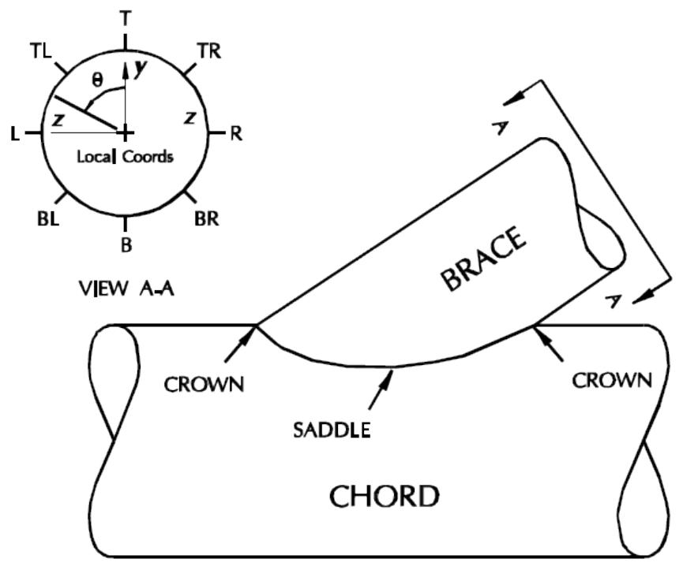

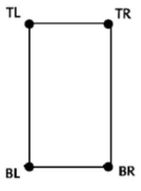  
Prismatic

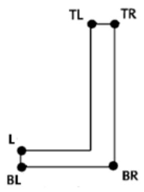  
Angle

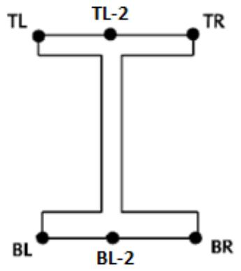  
Wide Flange

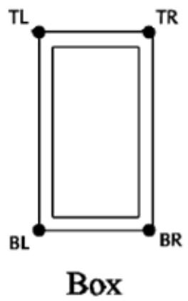

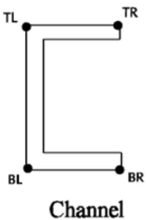

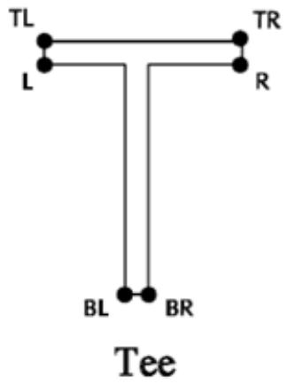

The positions (i.e. top, bottom, etc.) on the connection are determined from plane defined by the reference chord (as reported in the damage report) and the brace in question. The reference chord is the critical chord member determined based on the wall thickness of the chord members framing into the common joint. If the chord members have the same thickness, the chord member forming an acute angle with the brace is assumed to be the reference chord member. For 90-degree brace angles, the program selects the reference chord member.

The top position is determined by looking through the brace member toward the common joint while standing on the reference chord member. The other positions are determined based on the top position.

Concentrated stresses are calculated as follows:

A. For every SCF option except "DNV" input in columns 78-80 of the FTOPT input line, the concentrated stress at the eight points is calculated from the following formula:

$$f (\theta) = D A F \left(f_{a} \left[ C_{a c} \cos^{2} \theta + C_{a s} \sin^{2} \theta \right] + f_{s} C_{b s} \sin \theta + f_{c} C_{b c} \cos \theta\right)$$

B. If "DNV" is selected in columns 78-80 of the FTOPT input line the formula used to evaluate the concentrated stress is:

$$f (\theta) = D A F \left(f_{a} \left[ C_{a c} \cos^{2} \theta + C_{a s} \sin^{2} \theta \right] + f_{s} C_{b s} + f_{c} C_{b c}\right)$$

In both of the above expressions:

DAF = user specified dynamic amplification factor if any.

f() = brace or chord concentrated stress.

fa = brace nominal axial stress.

fc = brace nominal bending stress at the crown.

fs = brace nominal bending stress at the saddle.

Cac = brace or chord axial SCF at the crown.

Cas = brace or chord axial SCF at the saddle.

Cbc = brace or chord bending SCF at the crown.

Cbs = brace or chord bending SCF at the saddle.

 = angle measured around the brace from the crown

Note: SCF’s for cone/cylinder intersections when they are along the length of the segmented member are determined using in-line criteria based on API. If the cone end is at a joint then a default value of 5.0 is used for the SCF.

6. The concentrated stresses calculated for each SACS load case are combined as specified by the user to produce cyclic concentrated stress ranges. FATIGUE allows the user to approximate stress ranges by any of the following techniques:

A. For each characteristic wave (combination of height and period) that makes up the fatigue environment, a steady state dynamic analysis is performed. Brace internal end forces and moments are calculated at several time steps as the wave passes by the structure. For tubular braces, FATIGUE calculates the stresses (including stress concentration effects) at each of eight equally spaced points around the circumference of each connection, see Figure 1 previous page. For non-tubular braces these concentrated stresses are calculated at the four points most distant from the principal axes. The difference between the maximum and minimum values of concentrated stress is calculated at each point, resulting in the stress ranges. The maximum of these at each connection is selected as the "hot spot" stress range.   
B. A process identical to that described above can be followed except that a static analysis is done for each position of each wave instead of a steady state dynamic analysis. The user may account for dynamic amplification by inputting an estimated dynamic amplification factor for each wave.   
C. A commonly used approximate technique is to perform only two static analyses for each wave; one for the wave position producing the maximum base shear (or overturning moment), the other for the position resulting in the minimum. Stress ranges are then calculated as above. This approach is especially useful during the preliminary stages of the design process where greater accuracy is not required.   
D. A further approximation is to perform only one static analysis at the wave position producing the maximum base shear (or overturning moment) and to calculate the stresses as above. The stress range is then taken to be double this stress.

7. Damage resulting from the stress ranges are calculated for each fatigue case based on the Palmgren-Miner failure theory and the S-N damage curve designated by the user (see Section 4.4).

8. The calculated damages for each fatigue case making up the overall fatigue environment are added to produce the total accumulated damage.   
9. If the total damage exceeds unity and if the user has selected the automatic redesign option, the chord and/or brace members are redesigned. The automatic redesign option for FATIGUE works as follows:

A. The chord member is given an increase in thickness by an incremental amount specified by the user.   
B. The chord and brace damages are recalculated using the new chord thickness and the corresponding recalculated SCF’s.   
C. The chord thickness is reset, the brace member is then given an increase in thickness by the incremental amount specified by the user.   
D. The chord and brace damages are recalculated using the new brace thickness and the corresponding recalculated SCF’s.   
E. The chord or brace thickness modification which yields the greater change in damage is incorporated for redesign.   
F. Steps A through E are repeated until both damages are less than unity or until the user specified maximum number of iterations is reached   
G. If the limiting D/t ratio or the specified maximum number of redesign iterations is reached a conspicuous message is issued warning the user of that fact. The last member thickness tried before reaching the limiting condition is reported, the user should note, however, that this thickness is given for information purposes only and it should not be regarded as the thickness required to satisfy the code.

Note: Damage is calculated based on the member stresses at the end of the brace. Because of this, if the stress concentration factors are constant (independent of thickness), changes in the chord thickness have no influence on the calculated damage for the brace. Changes in the brace thickness will, however, reduce the damages because the brace stresses will decrease. Thus, for user specified SCF’s and/or SCF overrides the program redesigns the connection by increasing the brace thickness only.

2 CREATING CYCLIC STRESSES

Before performing the actual fatigue analysis using the Fatigue program, cyclic stresses must be developed. The following section contains the steps required to develop these stresses.

## 2.1 DYNAMIC EFFECTS

The first step of any fatigue analysis, whether spectral or deterministic, is to determine if dynamic effects should be considered. This can be determined by running the Dynpac program. A nonlinear foundation must be represented linearly using a foundation super-element, pile stub members or springs.

For an offshore fixed platform located in the Gulf of Mexico, dynamic effects should be considered if the natural period is greater than 3.0 seconds or the water depth is greater than 400 feet.

Note: For cyclic wave forces, the procedure to run a dynamic or a static fatigue analysis is the same with one exception. A static analysis utilizes the Seastate program to generate static wave loading while the dynamic analysis utilizes the Wave Response program to consider the structures dynamic characteristics when generating wave loading.

## 2.2 CYCLIC LOADING

During the life of a structure, whether it be an offshore structure, a building, a bridge, etc., it may be exposed to a variety of environmental and operating load conditions. Some of these are not cyclic in nature (e.g. gravity, buoyancy, live load) while others are (e.g. waves, current, deck mounted rotating equipment, vortex shedding, traffic, etc.).

Although a structure must be proportioned to resist the forces resulting from extreme events such as storm waves for an offshore jacket, such events are not usually significant for a fatigue analysis because they occur so seldom. Because fatigue is the result of many repeated loads, the daily action of common forces accumulates the large number of load cycles responsible for fatigue failure. The aggregate of all these every day common forces is called the total fatigue environment.

For an offshore structure, usually the most important cyclic loads for fatigue considerations are those due to wave action and current. Wind may cause the most significant fatigue damage for a tower or vent boom, while traffic may be the most important cyclic loading for a bridge.

In general, because of computer limitations, the entire fatigue environment is not used to develop stress range versus load frequency relationships. The user must determine which cyclic loads are to be used to represent the fatigue environment.

2.2.1 Spectral Fatigue Analysis

In a Spectral fatigue analysis, the stress range frequency relationship is defined by transfer functions. This requires that the user generate the cyclic loading required in order to obtain stress ranges. Typically, the user need not generate loading for all possible stress ranges. It is necessary to select only the loading required to yield an accurate and sufficiently detailed transfer function.

Note: It is important to note that for spectral analyses, the loading specified is not the actual loading causing fatigue damage (fatigue environment), but loading used to develop a relationship between stress range and load frequency.

2.2.1.1 Cyclic Wave Loading

The user must determine which waves are to be used to represent stress ranges typically occurring in the fatigue environment. The cyclic wave loading that will be used to develop the wave height-cyclic stress range relationship is typically generated using the Seastate program or Wave Response program if dynamic effects are to be considered. For dynamic wave analysis, equivalent static loads should be generated so that they may be solved statically.

For each wave, two or more SACS load cases are created depending on the technique specified by the user to calculate stress ranges. If one complete wave cycle is desired, one SACS load case per wave crest position is created. If only the maximum and minimum base shear or overturning moment is desired, 2 SACS load cases per wave are created.

The following details one method recommended to determine which frequencies should be used to develop transfer functions.

A. Starting with the operational wave period or the highest period encountered in the fatigue environment and ending with a period corresponding to a wave height of 1.0 ft (0.33 m).

Select 15 - 25 wave periods at which to create waves. The following formulas may be used to calculate the smallest period for English units:

$$L = 5. 12 \times T^{2} \quad H = L \times \text{s t e e p n e s s}$$

where T is wave period, H is wave height in feet and L is wave length in feet.

Note: In order to generate the peaks and valleys of the transfer function accurately, a group of waves with frequencies around the primary and secondary modes of the structure should be selected. For example, for a structure with a natural period of 3.5 seconds, waves with periods of 3.1, 3.3, 3.5, 3.7, and 3.9 seconds may be selected.

B. Use the Seastate program (Wave Response if dynamic effects are included) to plot the global base shear and overturning moment transfer functions.   
C. Select a sufficient number of frequencies to define all peaks and valleys inherent in the transfer function. These are the waves that should be used to represent the fatigue environment for generating cyclic stresses and transfer functions.   
D. The user can then use either Seastate or Wave Response to generate the wave loading used to generate the stress range/wave height versus frequency relationship.

Note: Although it is not required, the user may find benefit in grouping waves from the same direction together to form a fatigue case and to consider each fatigue case separately; i.e. run separate analyses for each wave direction. Thus, obtaining a common solution file for each wave direction. The Fatigue program can manage up to 10 common solution files when

performing the analysis. This procedure simplifies the procedure since each direction may require a different selection of seastates to obtain an accurate fatigue analysis.

For example, the following input generates two series of 12 waves each. The first GNTRF line creates twelve waves beginning with a period of 10.5 seconds through 5.0 seconds spaced 0.5 seconds apart while the second creates waves from 4.75 seconds through 2.0 seconds spaced 0.25 seconds apart. For each wave, 18 SACS load cases are generated.


|  | 1 | 1 | 2 | 2 | 3 | 3 | 4 | 4 | 5 | 5 | 6 | 6 | 7 | 7 | 8 |
| --- | --- | --- | --- | --- | --- | --- | --- | --- | --- | --- | --- | --- | --- | --- | --- |
|  | 1234567890123456789012345678901234567890123456789012345678901234567890 | 1234567890123456789012345678901234567890123456789012345678901234567890 | 1234567890123456789012345678901234567890123456789012345678901234567890 | 1234567890123456789012345678901234567890123456789012345678901234567890 | 1234567890123456789012345678901234567890123456789012345678901234567890 | 1234567890123456789012345678901234567890123456789012345678901234567890 | 1234567890123456789012345678901234567890123456789012345678901234567890 | 1234567890123456789012345678901234567890123456789012345678901234567890 | 1234567890123456789012345678901234567890123456789012345678901234567890 | 1234567890123456789012345678901234567890123456789012345678901234567890 | 1234567890123456789012345678901234567890123456789012345678901234567890 | 1234567890123456789012345678901234567890123456789012345678901234567890 | 1234567890123456789012345678901234567890123456789012345678901234567890 | 1234567890123456789012345678901234567890123456789012345678901234567890 | 1234567890123456789012345678901234567890123456789012345678901234567890 |
| 1 | LDOPT | +Z | 1.03 | 1.03 | 7.85 | 7.85 | -50.00 | -50.00 | 50.00GLOBME DYN | 50.00GLOBME DYN | 50.00GLOBME DYN | 50.00GLOBME DYN | NPNP | NPNP | NPNP |
| 2 | FILE S |  |  |  |  |  |  |  |  |  |  |  |  |  |  |
| 3 | CDM |  |  |  |  |  |  |  |  |  |  |  |  |  |  |
| 4 | CDM AP |  |  |  |  |  |  |  |  |  |  |  |  |  |  |
| 5 | MGROV |  |  |  |  |  |  |  |  |  |  |  |  |  |  |
| 6 | MGROV | 0.000 | 10.000 | 10.000 | 2.500 | 2.500 |  |  |  |  |  |  |  |  |  |
| 7 | MGROV | 10.000 | 45.000 | 45.000 | 5.000 | 5.000 |  |  |  |  |  |  |  |  |  |
| 8 | GRPOV |  |  |  |  |  |  |  |  |  |  |  |  |  |  |
| 9 | GRPOV |  | LG2 F | LG2 F |  |  |  |  |  |  |  |  |  |  |  |
| 10 | GRPOV |  | PL2NN | PL2NN |  |  | 0.001 | 0.001 | 0.001 | 0.001 | 0.001 | 0.001 |  |  |  |
| 11 | GRPOV |  | W.BN | 0.010 | 0.010 |  | 0.001 | 0.001 | 0.001 | 0.001 | 0.001 | 0.001 |  |  |  |
| 12 | LOAD |  |  |  |  |  |  |  |  |  |  |  |  |  |  |
| 13 | LOADCN | 1 |  |  |  |  |  |  |  |  |  |  |  |  |  |
| 14 | GNTRF | AL 12 | .05 | 10.5 | 0.5 | 0.5 | 50.0 | 50.0 | -50.0 | -50.0 | 0.00 | 18AIRY | 18AIRY | 18AIRY | 18AIRY |
| 15 | GNTRF | AL 12 | .05 | 4.75 | 0.25 | 0.25 | 50.0 | 50.0 | -50.0 | -50.0 | 0.00 | 18AIRY | 18AIRY | 18AIRY | 18AIRY |
| 16 | END |  |  |  |  |  |  |  |  |  |  |  |  |  |  |


2.2.1.2 Cyclic Wind Loading

For spectral wind analysis, wind loading must be specified to develop the Weibull distribution as shown below:

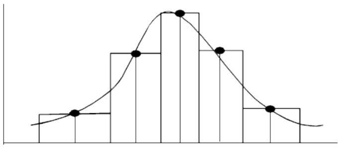

The wind velocities input are used to develop a histogram of the Weibull distribution of mean wind velocities. The user should be sure to include a sufficient number of velocities to describe the shape of the Weibull distribution function.

The Seastate program is used to specify wind velocities. Each load case defined should contain only wind loading with the mean wind velocity specified as the wind speed. Wind load cases should be specified in order of increasing wind speed, with all wind cases for a particular direction specified followed by all wind load cases for the next direction. Typically, 8-20 wind velocities per direction are required. See the Dynamic Response manual for details in specifying wind loading for spectral wind analysis.

The following sample input shows wind load cases with speed ranging from 2 to 20 for two different directions   
```txt
1 1 2 3 4 5 6 7 8 1234567890123456789012345678901234567890123456789012345678901234567890123456789012345678901234567890123456789  
1 LDOPT +Z 1.03 7.85 -50.00 50.00GLOBME WIN NPNP  
# 2 FILE S
# 3 CDM
# 4 CDM AP
# 5 GRPOV
6 GRPOV PL2NN 0.001 0.001 0.001  
# 7 LOAD
# 8 LOADCN 1
# 9WIND
10 WIND D 2.0 0.00 AP08  
# 11 LOADCN 2
# 12 WIND
13 WIND D 5.0 0.00 AP08  
# 14 LOADCN 3
# 15 WIND
16 WIND D 10.0 0.00 AP08  
# 17 LOADCN 4
# 18 WIND
19 WIND D 15.0 0.00 AP08  
# 20 LOADCN 5
# 21 WIND
22 WIND D 20.0 0.00 AP08  
# 23 LOADCN 6
# 24 WIND
25 WIND D 2.0 90.00 AP08  
# 26 LOADCN 7
# 27 WIND
28 WIND D 5.0 90.00 AP08  
# 29 LOADCN 8
# 30 WIND
31 WIND D 10.0 90.00 AP08  
# 32 LOADCN 9
# 33 WIND
34 WIND D 15.0 90.00 AP08  
# 35 LOADCN 10
# 36 WIND
37 WIND D 20.0 90.00 AP08  
# 38 END
```

Note: All wind cases are specified in the 0-degree direction before the 90-degree wind cases are input.

2.2.2 Deterministic Fatigue

Deterministic fatigue attempts to characterize the total fatigue environment by a small number of cyclic loads. The user must gauge which combinations of these cyclic loads contribute significantly to fatigue damage.

Unlike spectral approach, the loads input are not used to generate a relationship between stress range and frequency, but are the actual loads making up the fatigue environment.

2.2.2.1 Cyclic Wave Loading

For deterministic analysis, a small number of waves of definite height and period are selected by the user based on oceanographic data in the form of a scatter diagram, wave period histograms, wave height exceedance diagrams, etc. The user must gauge which combinations of wave height and period will contribute significantly to fatigue damage.

After determining the waves that will make up the fatigue environment, the user can produce the loads for each wave by executing either Seastate or Wave Response.

Typically, two or more load cases are generated for each wave. The following shows six waves used to make up the fatigue case in the 0-degree direction. For each wave, 18 load cases are to be generated.

```txt
1 1 2 3 4 5 6 7 8 123456789012345678901234567890123456789012345678901234567890  
1 LDOPT +Z 1.03 7.85 -50.00 50.00GLOBME DYN NPNP  
# 2 FILE S
# 3 CDM
# 4 CDM AP
# 5 MGROV
6 MGROV 0.000 10.000 2.500  
7 MGROV 10.000 45.000 5.000  
# 8 GRPOV
9 GRPOV LG2 F  
10 GRPOV PL2NN 0.001 0.001 0.001  
11 GRPOV W.BN 0.010 0.001 0.001 0.001  
# 12 LOAD
# 13 LOADCN 1
14 GNTRF AL 12 .05 10.5 0.5 50.0 -50.0 0.00 18AIRY  
15 GNTRF AL 12 .05 4.75 0.25 50.0 -50.0 0.00 18AIRY  
# 16 END
```

Note: For deterministic wave fatigue analysis, the fatigue case may represent all waves in a particular direction or may each wave may be considered a fatigue case.

2.2.2.2 General Cyclic Loading

General cyclic loading must be entered so that a fatigue case is denoted by a set of load cases representing the cycling of the particular loading.

For loads that are reversing, this may require two load cases per load with load magnitudes reversed. For example, the following shows two load cases used to represent the reversal of a point load:

```txt
1 2 3 4 5 6 7 8 1 23456789012345678901234567890123456789012345678901234567890  
# 1LOADCN A-5
2 LOAD 856 -1.5 GLOB JOIN  
# 3LOADCN A+5
4LOAD 856 1.5 GLOB JOIN 
```

For moving loading, such a crane on rails or traffic on a wharf or bridge, each fatigue case is characterized by a set of load cases representing the various positions of a particular load. For example, the following set of load cases (1, 2 and 3) represent the movement of load P with magnitude of -100 along member 101-102.

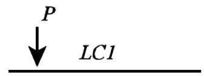

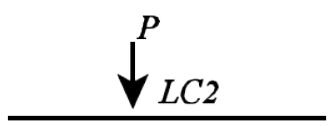

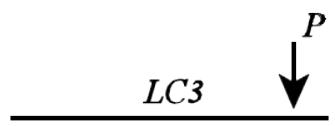

```txt
1 2 3 4 5 6 7 8  
123456789012345678901234567890123456789012345678901234567890  
# 1LOADCN 1
2 LOAD Z 101 102 2.50000 -100.0 GLOB CONC EQUIP  
# 3LOADCN 2
4LOAD Z 101 102 5.00000 -100.0 GLOB CONC EQUIP  
5LOADCN 3
6LOAD Z 101 102 7.50000 -100.0 GLOB CONC EQUIP 
```

## 2.3 CYCLIC STRESS

Once the cyclic loads (SACS load cases) have been generated, the cyclic stresses due to these loads must be calculated. Typically, for types of analyses except spectral wind fatigue, this is accomplished by executing a normal static analysis. SACS produces a binary common solution file containing among other things the internal loads at the ends of braces for each SACS load case.

Note: For a wave fatigue analysis, if each wave direction is being considered separately, then a static analysis must be performed for each direction.

2.3.1 Spectral Wind Analysis

The Dynamic Response program generates a set of responses for each wind velocity. These responses are then used to generate a Weibull distribution of stresses automatically. Therefore, solving the wind loads is not required.

3 FATIGUE ANALYSIS DATA

Fatigue is a post-processing program and requires one or more SACS common solution files as part of its input data. For a discussion on creating the appropriate SACS common solution files, see the previous section. In addition, certain other information is required and the user must select from various options available to execute a fatigue analysis. The following sections detail the information required and options available for executing Spectral, direct deterministic or interpolated deterministic fatigue analyses.

## 3.1 ANALYSIS OPTIONS

Various fatigue analysis options specified on the FTOPT, FTOPT2 and FTOPT3 input lines are available.

3.1.1 General Options

General and overall options are designated on the FTOPT input line. The design life of the structure (i.e. number of years the structure is to survive) and the life safety factor are specified in columns 8-14 and 22-28, respectively. The life safety factors can be overridden by using the JNTOVR input line to allow the user to define different safety factors at different locations as specified in Table 5.2.5-1 of Errata And Supplement 2 API RP2A WSD 21st Edition. For deterministic analysis, the time period over which the specified number of cycles occur is designated in columns 15-21.

If members and/or plates are to be omitted from the analysis, ‘SK’ should be entered in columns 36-37 and/or 38-39, respectively. Non-tubular members may be omitted from the analysis by entering ‘SK’ in columns 44-45. Tubular members may be omitted from the analysis by entering ‘SK’ in columns 24-25 of FTOPT3 line.

For example, the following designates a design life of 20 years with a safety factor of 2. Non-tubular members are to be omitted from the analysis.


|  | 1 | 2 | 3 | 4 | 5 | 6 | 7 | 8 |
| --- | --- | --- | --- | --- | --- | --- | --- | --- |
| 1 | 1234567890123456789012345678901234567890123456789012345678901234567890123456789012345678901234567890123456789 | 20.0 | 2.0 | SK |  |  |  |  |


3.1.1.1 Designating Additional Postfiles

The program supports an unlimited number of load cases used to define the transfer function. These load case may be located in as many as 16 common solution files. If more than one common solution file is to be used, the number of additional solution files should be stipulated in column 7.

The following indicates that 3 additional solution files are to be used for a total of 4 solution files.


|  | 1 | 2 | 3 | 4 | 5 | 6 | 7 | 8 |
| --- | --- | --- | --- | --- | --- | --- | --- | --- |
| 1 | 12345678901 | 12345678901 | 12345678901 | 12345678901 | 12345678901 | 12345678901 | 12345678901 | 1234567890 |
| FTOPT 3 | 20.0 |  | 2.0 |  | SK |  |  |  |


Note: Designate more than 9 additional solution files (10 total) using the letters ‘A’ for 10 additional (11 total), ‘B’ for 11 additional (12 total), ‘C’ for 12 additional (13 total), ‘D’ for 13 additional (14 total), ‘E’ for 14 additional (15 total) and ‘F’ for 15 additional (16 total).

3.1.1.2 Checking Grouted Piles

Enter $'_{ \mathsf{ G }^{ \prime } }$ in column 6 of the FTOPT line if an effective thickness is to be used when calculating fatigue damage for grouted legs. The effective thickness can be determined by specifying ‘1’, ‘2’, ‘3’, ‘4’, ‘5’ or $' 6 '$ in column 70 on the FTOPT2 line as follows:

Option 1, selected by inputting ‘1’, the effective thickness is based on the moment of inertia of the cross section of the element as follows:

$$t_{e f f} = \frac{D_{\mathrm{L e g}} - \left(D_{\mathrm{L e g}}^{4} - I_{\mathrm{c o m p}} \frac{64}{\pi}\right)^{1 / 4}}{2}$$

where: $\mathsf{ D }_{ \mathsf{ L e g } }$ is the outside diameter of the larger tube (leg)

$\mathsf{ I }_{ \mathsf{ c o m p } }$ is the moment of inertia of the composite section

$$I_{\mathrm{c o m p}} = \frac{\pi}{64} \left[ \left(D_{\mathrm{L e g}}^{4} + D_{\mathrm{P i l e}}^{4}\right) - \left(d_{\mathrm{L e g}}^{4} + d_{\mathrm{P i l e}}^{4}\right) \right]$$

where: ${ \mathsf{ d } }_{ \mathsf{ L e g } }$ and $\mathsf{ d }_{ \mathsf{ P i l e } }$ are the inside diameter of the leg and pile, respectively.

When using option ‘2’, the program uses an effective thickness based on the moment of inertias of the outer tube and the inner tube walls as follows:

$$t_{e f f} = (12 \times I_{e f f})^{1 / 3}$$

$$I_{e f f} = \frac{1}{2} \left(t_{\text{L e g}}^{3} + t_{\text{P i l e}}^{3}\right) + \left(t_{\text{L e g}} \times y_{\text{L e g}}^{2} + t_{\text{P i l e}} \times y_{\text{P i l e}}^{2}\right)$$

where t and y are defined in the figure below:

$$\begin{array}{c} \mathrm{y}_{\mathrm{L e g}} \\ \mathrm{y}_{\mathrm{P i l e}} \end{array} \boxed{ \begin{array}{c} - - - - - t_{\mathrm{L e g}} \\ - - - - - - - - \mathrm{N A} \\ - - - - - - t_{\mathrm{P i l e}} \end{array} }$$

Option 3, selected by inputting ‘3’, the effective thickness is based on the recommendation in the Norsok and ISO 19902 Standards. (ISO 19902:2007 Eqn. A.16.10-4)

Option 4, selected by inputting ‘4’, the effective thickness is based on the RMS average of leg thickness and pile thickness as follows:

$$t_{e f f} = \sqrt{t_{\mathrm{L e g}}^{2} + t_{\mathrm{P i l e}}^{2}}$$

where: $\sf t_{ L e g }$ and $\tt t_{ P i l e }$ are wall thickness of leg and pile, respectively.

By default, the chord effective thickness limit expressed as a factor of the actual chord thickness is 1.75. Enter the limit in columns 71-74 on the FTOPT2 line.

Option 5, selected by inputting ‘5’, the effective thickness on recommendations in accordance to the Errata and Supplement 2, API RP2A- WSD 21st Edition.

Option 6, selected by inputting ‘6’, the effective thickness is based on the recommendation in DNV RP-C203 where the annulus between tubular members is filled with grout.

3.1.1.3 Norsok Axial Stress Linear Variation

Enter ‘L’ in column 75 of the FTOPT2 line if the axial stress at the points between the crown and saddle are to be determined using a linear variation as stipulated by Norsok Standards.

3.1.2 In-Line Connection Option

By default, in-line connections, or joints with no braces, are checked as part of the standard fatigue check.

Fatigue damage can be calculated at points of cross-section changes on segmented tubular members (i.e. where no joint exists) by entering ‘TI’ in columns 68-69 on the FTOPT2 line. (Note: This option will be ignored if tubular members are indicated to be skipped in columns 24-25 of FTOPT3 line.)

Note: The Fatigue program calculates SCF’s using API cone SCF criteria for cone/cylinder intersections when they are defined as internal segments (not end segments). If the cone is located at either end of the member, a default SCF of 5.0 is used.

The sample below stipulates that change in cross sections for segmented tubular members are to be checked as in-line connections.

```txt
1 2 3 4 5 6 7 8 12345678901234567890123456789012345678901234567890123456789012345678901234567890123456789012345678901234567891 FTOPT 20.0 2.0 SK 2 FTOPT2 TI
```

3.1.3 Report Options

Basic report options are designated on the FTOPT line of the input file. The reporting level; summary, intermediate or full is designated by ‘SM’, ‘IN’ or ‘FL’, respectively, in columns 31-32. Enter ‘NE’ in columns 46-47 if the input data is not to be printed in the output listing file.

Additional report options may be specified on the FTOPT2 input line. Member summary reports may be generated in either joint order, where members are listed in ascending joint order, or life order, where members are listed in ascending fatigue life order, by specifying ‘PT’ in columns 10-11 or 12-13, respectively.

A member detail report, containing actual damage may be obtained by inputting ‘PT’ or percent damage by inputting ‘PC’ in columns 8-9. Damage at all points around the circumference of the connection on both the brace and chord side are reported.

Note: The member detail report can be quite voluminous. Also, the member detail report option overrides the report options input on the FTOPT input line. See Section 3.1.2.1 for member report override features.

A report containing the ranges that certain SCF parameters are valid may be output by inputting ‘VC’ in columns 14-15 on the FTOPT2 input line.

Plate summary reports may be generated in either plate order, where plate names are listed in ascending order, life order, where members are listed in ascending fatigue life order, or by both plate order and life order, by specifying ‘PO’, ‘LO’ or ‘PL’ in columns 18-19, respectively.

The following requests summary reports with connections listed in damage order. The SCF validity report is also requested.

```txt
1 2 3 4 5 6 7 8 12345678901234567890123456789012345678901234567890123456789012345678901234567890123456789012345678901234567891 FTOPT 20.0 2.0 SM SK 2 FTOPT2 PTVC TI
```

3.1.3.1 Overriding Joint Report Options

The report print options for individual joints or groups of joints may be overridden using the JNTSEL input line. The print level, ‘SM’, ‘FL’, ‘PC’ or ‘DG’ is designated in columns 11-12. If a range of joints is specified, ‘R’ is entered in column 15. The individual joint names or joint ranges to be overridden are stipulated in columns 16-75.

If the joints specified are to be removed from the analysis report, ‘RM’ is entered in columns 8-9. Any report option specified in columns 11-12 is ignored.

The report level for a joint may also be overridden using the JNTOVR line. Enter either ‘SM’, ‘FL’, ‘PC’ or ‘DG’ in columns 29-30 for a summary, full print with stress and damage, full print with damage and percent of total damage, or diagnostic print, respectively.

3.1.4 Tubular Connection Redesign Options

The program has the ability to redesign tubular connections based on fatigue damage. Redesign options are designated on the FTOPT input line. ‘EX’ is entered in columns 49-50 if tubular chords and/or braces that do not satisfy the design life requirements are to be redesigned. The chord and brace may be redesigned based on the option specified in column 29 and 30, respectively. The following options are available for both the chord and brace:

The following additional brace options are available to allow increasing diameter when the brace D/t minimum has been reached:

‘A’ Constant outside diameter

‘B’ Constant mean diameter

‘C’ Constant inside diameter

The maximum number of thickness changes to be attempted, the thickness increment and the minimum D/t ratio are designated in columns 51-53, 54-59 and 60-65, respectively.

The following designates that redesign is to be performed. The number of thickness steps is 50 and the thickness increment is 0.125.


|  | 1 | 2 | 3 | 4 | 5 | 6 | 7 | 8 |
| --- | --- | --- | --- | --- | --- | --- | --- | --- |
| 1 | 123456789012345678901234567890123456789012345678901234567890 | 123456789012345678901234567890123456789012345678901234567890 | 123456789012345678901234567890123456789012345678901234567890 | 123456789012345678901234567890123456789012345678901234567890 | 123456789012345678901234567890123456789012345678901234567890 | 123456789012345678901234567890123456789012345678901234567890 | 123456789012345678901234567890123456789012345678901234567890 | 123456789012345678901234567890123456789012345678901234567890 |
| FTOPT | 20.0 | 2.0 | SK | EX 50 | .125 |  |  |  |


A redesign progress report may be output by entering ‘RD’ in columns 16-17 on the FTOPT2 input line. If a new SACS input file is to be created reflecting the redesigned member groups, enter ‘UP’ in columns 24-25 on the FTOPT2 input line.

3.1.5 Wave Spreading Options

Wave spreading options for spectral analysis are stipulated on the FTOPT2 input line. Enter ‘WS’ in columns 26-27 to invoke wave spreading or ‘AP’ to invoke wave spreading with response function averaging (API energy approach).

If the structure is symmetrical about the XZ plane and transfer function data was developed for 0 through 180-degree approach directions only, enter ‘XZ’ in columns 28-29. Likewise, if the structure is symmetrical about the YZ plane, and the transfer function data was developed for 90 through -90- degree approach directions only, enter ‘YZ’ in columns 30-31.

Note: The wave spreading symmetry feature is an approximate method and it is recommended that a full series of transfer function load cases be used in final fatigue design calculations.

The wave spreading is assumed to be defined by the distribution cos()n. The power of the cosine distribution, n, is designated in columns 32-36.

Note: When using wave spreading, transfer functions must be developed using the same waves (i.e. Height and period) for each direction.

## 3.2 STRESS CONCENTRATION FACTOR

Local stresses at connection discontinuities "hot spot stresses" can be up to 20 times higher than the calculated nominal stresses. Several options are available in Fatigue to account for this local increase of stresses. "Hot spot" stresses are calculated as the product of nominal stresses and suitably determined stress concentration factors (SCF’s).

For tubular connections, the program can calculate SCFs automatically or can use user supplied values. User supplied values are required for non-tubular connections.

3.2.1 Program Calculated SCF Values

The program has the ability to calculate SCFs for tubular connections using various techniques and methods. The following sections detail features available to use program calculated values.

3.2.1.1 Specifying the Default SCF Method

The Fatigue program can calculate stress concentration factors for tubular connections using numerous methods including the most generally accepted methods used in the offshore industry. The default method to be used for all connection types is designated in columns 78-80 on the FTOPT input line. For tubular joints the following SCF options are available:

1. ‘PSH’ - Punching shear SCF’s do not distinguish among joint types (K, T, KT, Y, X), but are applied uniformly independent of joint classification. For this option all brace SCF’s are taken as 6.0 and chord SCF’s are given by:

$$S C F = \frac{Y \sin \theta}{K_{a} Q_{\beta}} (4. 0 + 0. 67 \gamma)$$

where:

$$Q_{\beta} = \left\{ \begin{array}{l l} 1. 0 & \text{f o r} \beta \leq 0. 6 \\ \frac{0 . 3}{\beta (1 - 0 . 833 \beta)} & \text{f o r} \beta > 0. 6 \end{array} \right.$$

Ka, , ,  and  are as defined in API-RP2A.

2. ‘PS2’ - A variation of the punching shear SCF’s discussed above with brace SCF’s equal to 5.0 instead of 6.0.   
3. ‘KAW’ - SCF’s suggested by KUANG, et al for K and KT joints and those suggested by Wordsworth and Smedley for T, Y, and X joints.   
4. ‘DNV’ - SCF’s suggested by Kuang, et al for all joint types except X joints, for which Wordsworth and Smedley SCF’s are used. Brace SCF’s are reduced by a technique suggested by Marshall (Marshall reduction factor) except that the reduction factor must be greater than or equal to 0.8. Furthermore, a minimum SCF of 2.5 is imposed on all members.   
5. ‘MSH’ - SCF’s suggested by Marshall.   
6. ‘UEG’ - SCF’s suggested by UEG.   
7. ‘EFT’ - SCF’s suggested by Efthymiou (Model C options).   
8. ‘EFR’ - SCF’s suggested by MSL for single-sided weld connections.   
9. ‘SAF’ - SCF’s suggested by Smedley and Fischer.   
10. ‘COJ’ - SCF’s calculated using COJAC methodology including joint classification.   
11. ‘ALK’ - uses Alpha Kellog SCF’s.   
12. ‘USR’ - user defined SCF’s. Requires SCF and/or SCF2 input line.   
13. ‘CA1’ - alpha will be computed with the factor before gamma in the equation of Figure C4.3.1-2(a) being 0.6 and the maximum alpha value limited to 2.4 according to Table C5.1-1 of API-RP2A 21st edition.   
14. ‘CA2’ - alpha will be computed with the factor before gamma in the equation of Figure C4.3.1-2(a) being 1.6 and the maximum alpha value limited to 3.8 according to Table C5.1-1 of API-RP2A 21st edition.

15. ‘ERD’ - SCFs for single sided welds multiplied by reduction factors derived from Table D-6 of DNV RP-C203 2014.

Note: When using the effective thickness for grouted connections, the effective thickness is used when calculating γ and the actual chord thickness is used when calculating τ.

For in-line connections or segmented tubular section changes, the default SCF method is designated in columns 51-53 on the FTOPT2 line. The following in-line SCF options are available:

1. ‘AWS’ - SCFs suggested by American Welding Society.   
2. ‘DNV’ - SCFs suggested by Det Norske Veritas.   
3. ‘DN2’ – SCFs suggested by DNV RP-C203 (2005).   
4. ‘DN3’ – SCFs suggested by DNV RP-C203 (2008).   
5. ‘BS ’ - SCFs suggested by British Standards.   
6. ‘DE ’ - SCFs suggested by Department of Energy.   
7. ‘NS1’ - SCFs suggested by Norsok Standard Equation C.2.7.   
8. ‘NS2’ - SCFs suggested by Norsok Standard Equation C.2.10.   
9. ‘MDX’ – SCFs suggested by Maddox.   
10. ‘SHL’ – SCFs suggested by Shell Hague.   
11. ‘ISO’ – SCFs suggested by ISO 19902.   
12. ‘USR’ - user defined SCFs. Requires SCF and/or SCF2 input line.

For Norsok in-line SCF methods, the percent out of roundness and maximum out of roundness are specified on the FTOPT3 line in columns 8-12 and 13-17, respectively.

The options for the ‘EFT’ SCF calculations can be assigned on the EFTOPT input line when the validity ranged do not meet the requirements as discussed in API RP2A WSD Supplement 2. This line should be defined after the FTOPT2 line in the fatigue input file. To calculate the SCF’s based upon the actual geometric parameters ‘ACT’ should be entered in columns 8-10 of the EFTOPT input line. To use the limiting geometric parameters ‘LIN’ should be entered. To use the maximum SCF’s from the ‘ACT’ and ‘LIN’ options then ‘MAX should be entered in columns 8-10 of the EFTOPT line. The short can reduction may be turned off by entering ‘NSC’ on columns 11-13 of the EFTOPT input line.

The following designates that Efthymiou Model C options is the default method to calculate SCFs for tubular connections. In-line connection SCFs will be determined using American Welding Society recommendations.


|  | 1 | 2 | 3 | 4 | 5 | 6 | 7 | 8 |
| --- | --- | --- | --- | --- | --- | --- | --- | --- |
|  | 1234567890123456789012345678901234567890123456789012345678901234567890123456789012345678901234567890123456789 | 20.0 | 2.0 | SK |  |  |  | EFT |
| 1 | FTOPT |  |  |  |  |  |  |  |
| 2 | FTOPT2 |  |  |  | AWS |  | TI |  |


3.2.1.2 Ring Stiffened Joints

The RING input line may be used to define the ring dimensions and the ring group. The ring stiffened connection input line CONRST may be used to designate a ring stiffened connection. SCF's are automatically factored using the Smedley and Fisher ring stiffened formulation to account for the effect of the ring stiffeners.

3.2.1.3 Overriding Default Method

The default method may be overridden for connection types or for particular joints. The hierarchy for SCF method overrides is as follows:

1. Program default method is overridden by method specified for the joint (JNTSCF).   
2. Joint method is overridden by method specified by connection type (SCFSEL).

3.2.1.4 Overriding by Joint Name

The default method used to calculate SCFs may also be designated for a particular joint using the JNTOVR line. Specify the joint name in columns 8-11 and the method to be used in columns 25-27.

The following stipulates that the UEG SCFs are to be used for joint 105.

```txt
1 2 3 4 5 6 7 8 1 234567890123456789012345678901234567890123456789012345678901234567890 105 UEG 
```

3.2.1.5 Overriding by Connection Type

The method to be used to calculate the default stress concentration factors may be designated for each connection type using the SCFSEL input line. Any of the available SCF options may be designated for ‘T&Y’, ‘K’, ‘KT’ and/or ‘X’ type connections individually.

The sample below indicates that the default method to be used to determine SCFs for T&Y type connections is Alpha-Kellog. All other connection types shall use the method specified on the FTOPT line.

```txt
1 2 3 4 5 6 7 8 1 23456789012345678901234567890123456789012345678901234567890 1 SCFSEL ALK 
```

3.2.1.6 Load Path Dependence

By default, SCFs are determined based on the joint geometry. If SCF’s are to be determined based on the load distribution through the connection, enter ‘LP’ in columns 76-77 on the FTOPT line.

3.2.1.7 Minimum Gap

The minimum gap to be used for SCF calculation is specified in columns 66-71 of the FTOPT line.

3.2.1.8 Chord Length

By default, the average chord length, (L1 + L2)/2, is used as the chord length for SCF calculations, where L1 and L2 are the lengths of the chord members on each side of the joint. The total length, L1 + L2, is used when ‘T’ is specified in column 75 of the FTOPT line. Enter ‘W’ in column 75 if the chord length to be used is to be taken as 4(L1 x L2)/(L1 + L2).

If lengths L1 and L2 are to be taken as the chord member effective buckling length, i.e. KL, enter ‘K’ in column 74.

3.2.1.9 SCF Limits

When having the program calculate SCFs automatically, the user may input maximum and/or minimum values for SCF’s using the SCFLM input line. When specifying SCF limits, the SCF limit flags, ‘MX’ in columns 40-41 and/or ‘MN’ in columns 42-43 on the FTOPT input line, must be designated.

The following specifies that Alpha-Kellog SCFs are to be used for tubular connections by default. The values calculated by the program shall not exceed 5. nor be less than 2.

```txt
1 2 3 4 5 6 7 8 123456789012345678901234567890123456789012345678901234567890 FTOPT 20.0 2.0 MXMNSK ALK 2 SCFLM 5.0 2.0
```

Note: The SCF limit features should not be used when the ‘DNV’ SCF option is selected.

3.2.1.10 Plates, Shells, and Non-Tubular Members

For non-tubular members, plates and shells, the program default values are 5.0 for beam elements and 1.0 for plate and shell elements. The user may specify SCF’s to be used by the program for non-tubular beam, plate, and shell elements. See user defined SCFs in the ensuing sections.

3.2.2 User Defined SCFs

The user may optionally input the stress concentration factors to be used to determine hot spot stresses.

3.2.2.1 Specifying User Defined Default Values

If no default SCF method is applicable, the user may define default SCF values using the SCF and SCF2 input lines.

Note: When using user defined SCF’s designated on the SCF and SCF2 input lines, the ‘USR’ SCF option must be specified in columns 78-80 on the FTOPT input line.

The overall SCF for tubular members may be specified in columns 6-10. If an overall value is specified, any values entered in columns 36-75 are overridden. The SCF to be used for wide flanges, compact wide flanges, prismatic sections, boxes and/or plate elements are designated in columns 11-15, 16-20, 21-25, 26-30 and 31-35, respectively.

The SCF’s to be used for angle, tee and channel type sections may be stipulated on the SCF2 input line in columns 6-10, 11-15 and 16-20, respectively.

For tubular elements, detailed stress concentration factors may be specified for axial and bending loads and for the brace or chord. The brace side SCF for axial loads in the crown and saddle may be designated independently in columns 36-40 and 41-45, respectively. The brace SCF’s for in-plane and out-of-plane bending are specified in columns 46-50 and 51-55, respectively. The chord side SCF for axial loads in the crown and saddle may also be designated independently in columns 56-60 and 61-65, respectively. The chord SCF’s for in-plane and out-of-plane bending may be specified in columns 66-70 and 71-75, respectively.

The following designates that user defined default SCF values are to be used. 4.0 is to be used for all wide flange, box, tee, angle, and channel sections. For tubular sections, the values for both brace and chord axial load crown and saddle are 3.0 and 3.5. The defaults (5.0) are applicable for bending.


|  | 1 | 2 | 3 | 4 | 5 | 6 | 7 | 8 |
| --- | --- | --- | --- | --- | --- | --- | --- | --- |
| 1 | 1234567890123456789012345678901234567890123456789012345678901234567890123456789012345678901234567890123456789 | 20.0 | 2.0 | MXMNSK |  |  |  | USR |
| 2 | SCF | 4.0 | 4.0 | 4.0 | 3.0 | 3.5 | 3.0 | 3.5 |
| 3 | SCF2 | 4.0 | 4.0 | 4.0 |  |  |  |  |


3.2.2.2 Overriding Beam Element Default Values

The user can specify an SCF value used to override any value either calculated by the program or specified as a default value using the SCF and SCF2 lines.

Beam element values can be overridden for specific joints, member groups, individual members, or specific brace-chord connections. The hierarchy of SCF overrides is as follows:

1. Program calculated or user input values are overridden by SCF overrides specified for the joint (JNTSCF).   
2. Joint SCF overrides are overridden by applicable group SCF overrides (GRPSCF).   
3. Group SCF overrides are overridden by SCF overrides designated for the member (MEMSCF).   
4. Member SCF overrides are overridden by SCF overrides designated for the connection (CONSCF or CONSWF).

Note: In all cases, the SCF’s are limited by the limiting values specified on the SCFLM input line.

3.2.2.3 Overriding by Joint

The SCF for an individual joint or range of joints may be overridden using the JNTSCF input line. The SCF is designated in columns 7-14. If a range of joints is specified, ‘R’ is entered in column 15. The individual joint names or joint ranges to be overridden are stipulated in columns 16-75.

3.2.2.4 Overriding by Group

The SCF for all members assigned to a particular member group may be overridden using the GRPSCF input line. The SCF is designated in columns 7-14. The member groups to which the SCF is to be applied are specified in columns 16-74.

3.2.2.5 Overriding by Member

The SCF for a particular member may be overridden using the MEMSCF input line. The SCF is designated in columns 7-14. The members to which the SCF is to be applied are specified in columns 15-78.

3.2.2.6 Overriding by Connection

Values may be overridden for a particular connection using the CONSCF line for tubular connections and CONSWF line for wide flange and plate girder connections.

3.2.2.7 Overriding Plate Element Default Values

The SCF for any plate or plate group may be overridden.

3.2.2.8 Overriding by Group

The SCF for all plates assigned to a particular plate group may be overridden using the PGRPOV input line. The SCF is designated in columns 9-13. The groups to which the SCF is to be applied are specified in columns 20-74.

3.2.2.9 Overriding by Plate

The SCF for a particular plate may be overridden using the PLTOVR input line. The SCF is designated in columns 19-25 and the plate name is specified in columns 8-11.

## 3.3 S-N FAILURE CURVES

For a particular stress range, there exist a theoretical number of cycles NF(s), at which fatigue failure may occur. The relationship between this number of allowable cycles and the stress range is usually expressed as an S-N curve.

Note: Because published S-N curves are for virgin material, fatigue life is determined assuming that there are no inclusions or surface cracks exceeding the allowables based on fracture mechanics analysis. The existence of cracks greater than this value will reduce the predicted life of the connection.

The user may specify S-N data or select a curve included in the program.

3.3.1 Default S-N Curve

Numerous S-N curves including ones recommended by AWS, Norwegian Standards, British Standards, and API are built into the program. The user may also define the relationship between allowable cycles and stress range by specifying a user defined curve.

3.3.1.1 Intrinsic Curves

Several S-N curves are intrinsic or built into the program. The default S-N curve option is designated in columns 33-35 on the FTOPT input line. The following S-N options are available:

1. ‘AWS’ - American Welding Society X-X Curve   
2. ‘API’ - API X Curve   
3. ‘APP’ - API X' (X Prime) Curve   
4. ‘AXX’ - API thickness dependent X Curve   
5. ‘AXP’ - API thickness dependent X' (X Prime) Curve   
6. ‘NS3’ - Norwegian Standards (NS3472E) including material thickness variations (requires SNT1 input line)   
7. ‘Baa’ - British Standard (BS6235) curves where aa is as follows:   
8. ‘HTP’ - HSE T Prime curve with thickness correction only   
9. ‘HPP’ - HSE P curve with thickness correction only

10. ‘TTP’ - HSE T Prime for tubular and P curve for other sections (with thickness correction only)   
11. ‘USR’ - User Defined S-N curve using S-N input line   
12. ‘xxx’ - Advanced user defined curve using SN-USR line where xxx is the label supplied on the SN-USR line.   
13. ‘Nbb’ - Norsok standards where bb is as follows:

‘B1’ for B1 curve ‘B2’ for B2 curve ‘C ’ for C curve ‘C1’ for C1

‘C2’ for C2 curve ‘D ’ for D curve ‘E ’ for E curve ‘F ’ for F curve

‘F1’ for F1 curve ‘F3’ for F3 curve ‘G ’ for G curve ‘W1’ for W1

‘W2’ for W2 curve ‘T ’ for T curve.

14. API-RP2A WSD Supplement 2 as follows:

WJT’ for welded joint with no weld improvement.

‘WJ1’ for welded joint with weld profile as described in section 11.1.3.d of API- RP2A WSD 21st Edition.

WJ2' for welded joint with weld toe burr grind.

‘WJ3' for welded joint with hammer peening

‘CJT’ for cast joint

Enter the mudline elevation and water depth in columns (54-67) of the FTOPT2 line for the HSE T prime and P curves and for API RP2A-WSD 21st Edition Supplement 2 'WJ_' S-N curves.

Note: Typically, brace, chord and in-line connections are adjusted when selecting thickness dependent S-N criteria. However, for APP or APX options, thickness dependency is considered for braces only (i.e. chord and in-line connections are not adjusted for thickness).

The following designates that the API X Prime curve is to be used as the default S-N curve.


|  | 1 | 2 | 3 | 4 | 5 | 6 | 7 | 8 |
| --- | --- | --- | --- | --- | --- | --- | --- | --- |
| 1 | 1234567890123456789012345678901234567890123456789012345678901234567890123456789012345678901234567890123456789 | 20.0 | 2.0 | APP | SK |  |  | EFT |


3.3.1.2 User Defined S-N Curves

The user may define an S-N curve to be used by designating ‘USR’ in columns 33-35 on the FTOPT input line. The points defining the S-N curve are specified on the S-N input line. The curve is defined by inputting stress range and number of allowable cycles for up to twelve points. If the last two points have the same stress range level, this level is assumed to be the endurance limit.

Advanced user defined curves may be defined using the SN-USR line. The points defining the S-N curve are specified in columns 25-80. The minimum thickness and thickness correction power are specified in columns 13-18 and 19-24, respectively. Enter ‘B’ in column 11 if the thickness correction applied to both the brace and chord is to be determined solely from the brace thickness.

If the last value defines the endurance limit, input ‘E’ in column 12. The name or ID of the curve is entered in columns 8-10. To make an advanced user defined curve the default, enter the curve ID in columns 33-35 on the FTOPT line.

Note: User defined S-N curve data must be input in order of increasing number of allowable cycles.

3.3.2 Overriding the Default S-N curve

The default S-N curve may be overridden for beam and plate elements.

3.3.2.1 Beam Elements

The default S-N curve may be overridden for beam elements by specifying S-N override for particular joints or connection. The hierarchy for S-N overrides is as follows:

1. Program default curve is overridden by method specified for the joint (JNTOVR).   
2. Joint curve overridden by method specified for a connection (CONSCF or CONSWF).

The default S-N curve may be overridden for tubular inline checks using the INTOVR line.

3.3.2.2 Overriding by Joint Name

The default curve used to calculate allowable cycles also be designated for a particular joint using the JNTOVR line. Specify the joint name in columns 8-11 and the curve to be used in columns 13-15.

The following stipulates that the API X curve is to be used for joint 105.

```txt
1 2 3 4 5 6 7 8 1 2345678901234567890123456789012345678901234567890123456789012345678901234567890123456789012345678901234567890 
```

3.3.2.3 Overriding by Connection

The curve to use may be overridden for a particular connection using the CONSCF line for tubular connections and CONSWF line for wide flange and plate girder connections.

3.3.2.4 Plate Elements

The S-N curve to use for any plate or plate group may be overridden.

3.3.2.5 Overriding by Group

The S-N curve for all plates assigned to a particular plate group may be overridden using the PGRPOV input line. The S-N curve is designated in columns 14-16. The groups to which the overrides are to be applied are specified in columns 20-74.

3.3.2.6 Overriding by Plate

The S-N curve to use for a particular plate may be overridden using the PLTOVR input line. The curve is designated in columns 16-18 and the plate name is specified in columns 8-11.

3.3.3 API Thickness Dependent Curve Parameters

When selecting either the API X or X' thickness dependent S-N curve, the elevations defining the lower level and upper level of the splash zone are designated on the FTOPT2 input line in columns 37-43 and 44-50, respectively. The splash zone area has no endurance limit defined.

3.3.4 Norwegian Standards S-N Curve Parameters

The Norwegian Standard (NS3472) S-N ‘T’ curve is designated by ‘NS3’ in columns 33-35 on the FTOPT input line.

In addition, the SNT1 input line is required. The waterline elevation must be specified in columns 7-14. If the ‘T’ curve thickness dependent parameters default values are to be used, no other input is required. The thickness dependent parameters may be overridden in columns 15-62. Additional curve data may be specified using up to twelve SNT2 input lines.

3.3.5 British Standards S-N Curve Parameters

When using the BS6235 curves, the dividing elevation between the air and sea water endurance limits is designated in columns 44-50 on the FTOPT2 input line.

3.3.6 API RP2A WSD Errata and Supplement 2

The API Supplement 2 S-N curves can be used by designating the following options in columns 33-35 on the FTOPT input line:

WJT: to use the S-N curve without any weld improvement

WJ1: to use the S-N curve with weld profile conforming to section 11.1.3.d in. API- RP2A WSD 21st edition code of practice.

WJ2: to use the S-N curve conforming to a weld profile with weld toe burr grind.

WJ3: to use the S-N curve for a welded joint with hammer peening

CJT: to use the S-N curve designated for cast joints.

## 3.4 FATIGUE LOADING

The fatigue environment is the accumulation of cyclic loading (i.e. waves, wind, traffic, etc.) impinging on the structure that may cause fatigue damage. The fatigue environment is made up of fatigue cases defined in the Fatigue input file. The beginning of a fatigue case definition is designated using the FTCASE input line. The procedure used to define the fatigue cases depends on the type of analysis being performed.

3.4.1 Wave Spectral Fatigue

Each fatigue case usually represents a particular wave approach direction. Each fatigue case is described by a series of wave spectra specified by the user or developed automatically from scatter diagram information input.

Note: The waves defined in the Fatigue cases are the waves for which damage will be calculated.

3.4.1.1 Fatigue Case General Parameters

Each fatigue case is initiated with a FTCASE input line with the ‘SPC’ label in columns 32-34. The fatigue case name is specified in columns 7-10 along with the fraction of the design life that this fatigue case occurs in columns 11-20. The dynamic amplification factor is specified in columns 21-30.

If wave spreading is to be considered, the wave direction must be entered in columns 50-56. If the current fatigue case consists of the same wave spectrum data as the previous fatigue case, enter ‘RPT’ in columns 35-37.

The following defines fatigue case ‘1’ which makes up 20% of the time occurring.

```txt
1 2 3 4 5 6 7 8 1234567890123456789012345678901234567890123456789012345678901234567890 1FTCASE 1 0.2 
```

3.4.1.2 Cyclic Stress Option

The cyclic stress option is specified in columns 47-49. Leave blank if the fatigue case consists of cyclic wave data. Enter ‘SIN’ if the cyclic stress data is to be formed using the SIN option. Input ‘R+I’ if the data is formed from single amplitude real and imaginary load components.

Enter ‘WAM’ or ‘MOR’ if the cyclic stress data is to be formed from response data generated by the Wamit or Mora programs, respectively.

3.4.1.3 Transfer Function Options

For each fatigue case, the damage due to each input spectrum is calculated. In order to calculate the damage for any spectrum, however, the relationship between stress range, wave height and wave frequency must be defined by a transfer function.

In order to develop the transfer function, the nominal stress due to various waves must be provided in the form of common solution files. From these nominal stresses, the Fatigue program can calculate the ‘hot spot’ stress range (HSS range) and develop the transfer function. The program can determine transfer function data automatically or use one of several manual options specified on the TRFN and WVFRF input lines.

Note: When wave spreading is used, the transfer functions for each direction must be developed using the same set of waves (i.e. Height and period).

3.4.1.4 Automatic Transfer Function Option

If the transfer function data for each of the fatigue cases (i.e. wave approach direction) was generated using the Seastate, Wave Response or Tow programs, the program can automatically determine wave height and period for each load case used to create the transfer function using the SEAS input line.

When specifying the SEAS line, the program determines the wave height and period corresponding to each load case automatically by reading the Seastate input file (or Tow input file) used to generate the loading.

Note: For a tow fatigue analysis, if the RAO data is input in the SACS model file instead of the tow input file, the Tow output structural data file (towoci) file must be specified instead.

If load cases were created for all positions of the wave crest, the number of load cases per wave can be determined automatically. If on the other hand, load cases were generated for only a portion of the crest positions, the number of load cases per wave must be specified on the SEAS line

The following illustrates the use of the SEAS input line. A load case was created at each of the eighteen crest positions.

```txt
1 2 3 4 5 6 7 8 1234567890123456789012345678901234567890123456789012345678901234567890123456789012345678901234567890123456789 
```

Note: This option eliminates the need for the user to specify the transfer function data using the TRFN and WVFRF input lines. If the SEAS option is not used, the transfer function data must be defined for the fatigue case.

The following shows the input required without using the SEAS option. Notice that load cases 1-18 were designated as belonging to wave 1, 19-36 to wave 2 and 37-54 to wave 3 on the TRFN input lines.

```c
1 2 3 4 5 6 7 8  
1234567890123456789012345678901234567890123456789012345678901234567890123456789012345678901234567890123456789  
FTCASE 1 0.35 1.0 SPC  
2 TRFN 1 2 3 4 5 6 7 1  
3 TRFN 8 9 10 11 12 13 14 1  
4 TRFN 15 16 17 18  
5 TRFN 19 20 21 22 23 24 25 2  
6 TRFN 26 27 28 29 30 31 32 2  
7 TRFN 33 34 35 36  
8 TRFN 37 38 39 40 41 42 43 3  
9 TRFN 44 45 46 47 48 49 50 3  
10 TRFN 51 52 53 54  
11 WVFRF 1 21.8 8.0 3.07 3.0 0.34 1.0
```

3.4.1.5 Manual Transfer Function Options

The following options are available when the user specifies the transfer function data in the Fatigue input file:

Option 1. Each SACS load case in the solution file(s) is the result of a wave of different period. The SACS load cases are listed on the TRFN input line along with a corresponding stress factor. The corresponding wave height and wave period for each SACS load case are designated on the WVFRF input lines immediately following the TRFN input lines.

Note: The SACS load cases must be entered in order of decreasing wave period on the TRFN input line. The wave frequencies and periods specified on the WVFRF input lines must also be specified in order of decreasing wave period. The wave number field in columns 78-80 on the TRFN input line must be left blank.

For example, for waves input in SEASTATE input file as:

```txt
1 1 2 3 4 5 6 7 8 1 2345678901234567890123456789012345678901234567890123456789012345678901234567890 1 2345678901234567890123456789012345678901234567890 1 23456789012345678901234567890 1 2345678901234567890 1 234567890 1 234567890 1 234567890 1 234567890 1 234567890 1 234567890 1 234567890 1 234567890 1 234 
```

```txt
8 WAVE 9 WAVE AIRY 0.34 1.00 45. D 0.0 20.0 18MS 1 
```

The transfer function data for this fatigue case would be specified in the Fatigue input file as follows:

```txt
1 2 3 4 5 6 7 8  
1234567890123456789012345678901234567890123456789012345678901234567890  
FTCASE 1 0.35 1.0 SPC  
2 TRFN 1 2.0 2 2.0 3 2.0  
3 WVFRF 1 21.8 8.0 3.07 3.0 0.34 1.0 
```

Using this option, the ‘hot spot’ stress range for each wave is taken as the ‘hot spot’ stress multiplied by the stress range factor (i.e. 2.0 in the example above) designated on the TRFN input line for that fatigue case. This stress range is normalized by dividing by the corresponding wave height specified on the WVFRF input line then plotted vs. wave frequency to obtain a point on the transfer function. Each fatigue case specified will correspond to a point on the transfer function.

Option 2. For each wave chosen to develop the transfer function, a separate SACS load case is created for each wave crest position step. Therefore, for a wave whose crest is stepped through n positions, n load cases are generated. The ‘hot spot’ stress is calculated for each wave crest position. Using the n ‘hot spot’ stresses, the HSS range is taken as the difference of the maximum HSS and the minimum HSS.

For example, for the following Seastate input, eighteen load cases are created for each wave:

```txt
1 1 2 3 4 5 6 7 8  
1 123456789012345678901234567890123456789012345678901234567890  
1 LOADCN 1
WAVE  
3 WAVE AIRY 21.8 8.00 45. D 0.0 20.0 18MS 1  
4 LOADCN 2
WAVE  
5 WAVE AIRY 3.07 3.00 45. D 0.0 20.0 18MS 1  
7 LOADCN 3
WAVE  
8 WAVE AIRY 0.34 1.00 45. D 0.0 20.0 18MS 1 
```

The following shows the input required. Notice that load cases 1-18 were designated as belonging to wave 1, 19-36 to wave 2 and 37-54 to wave 3 on the TRFN input lines.

```c
1 2 3 4 5 6 7 8  
123456789012345678901234567890123456789012345678901234567890  
FTCASE 1 0.35 1.0 SPC  
2 TRFN 1 2 3 4 5 6 7 1  
3 TRFN 8 9 10 11 12 13 14 1  
4 TRFN 15 16 17 18  
5 TRFN 19 20 21 22 23 24 25 2  
6 TRFN 26 27 28 29 30 31 32 2  
7 TRFN 33 34 35 36  
8 TRFN 37 38 39 40 41 42 43 3  
9 TRFN 44 45 46 47 48 49 50 3  
10 TRFN 51 52 53 54  
11 WVFRF 1 21.8 8.0 3.07 3.0 0.34 1.0
```

Note: The SEAS option can be used to replace this manual option.

Option 3. Option 3 is available only for dynamic analysis. It is similar to option 2 except that for each wave chosen to develop the transfer function, a separate SACS load case is created for a specified number of wave crest positions. The number of positions is specified in the Wave Response input file. For each wave whose crest is stepped through numerous positions, n positions may be saved, thus n load cases are generated. The ‘hot spot’ stress is calculated for each wave crest position saved. Using

the n ‘hot spot’ stresses, the HSS range is taken as the difference of the maximum HSS and the minimum HSS.

For example, for the following Seastate input, four load cases are created for each wave as designated in the Wave Response input file:


|  | 1 | 1 | 2 | 3 | 4 | 5 | 6 | 7 | 8 |  |
| --- | --- | --- | --- | --- | --- | --- | --- | --- | --- | --- |
|  | 12345678 | 8901234567890123456789012345678901234567890123456789012345678901234567890123456789012345678901234567890123456678901234567890123456789012345678901234567890123456789012345678901234567890123456789012345678901234 | 1 |  |  |  |  |  |  |  |
| 1 | LOADCN | 1 |  |  |  |  |  |  |  |  |
| 2 | WAVE |  |  |  |  |  |  |  |  |  |
| 3 | WAVE | AIRY | 21.8 | 8.00 | 45. | D | 0.0 | 20.0 | 18MS | 1 |
| 4 | LOADCN | 2 |  |  |  |  |  |  |  |  |
| 5 | WAVE |  |  |  |  |  |  |  |  |  |
| 6 | WAVE | AIRY | 3.07 | 3.00 | 45. | D | 0.0 | 20.0 | 18MS | 1 |
| 7 | LOADCN | 3 |  |  |  |  |  |  |  |  |
| 8 | WAVE |  |  |  |  |  |  |  |  |  |
| 9 | WAVE | AIRY | 0.34 | 1.00 | 45. | D | 0.0 | 20.0 | 18MS | 1 |


As in option 2, the SEAS option allows the Fatigue program to determine the wave height and period corresponding to each load case automatically. But because a load case was not created at each wave crest position, the number of load cases created for each wave must be specified on the SEAS input line in columns 8-10. The following illustrates the use of the SEAS input line for this case.


|  | 1 | 2 | 3 | 4 | 5 | 6 | 7 | 8 |
| --- | --- | --- | --- | --- | --- | --- | --- | --- |
| 1 | 1234567890123456789012345678901234567890123456789012345678901234567890123456789012345678901234567890123456789 | 4 |  |  |  |  |  |  |
| 2 | SEAS | 4 |  |  |  |  |  |  |
| 2 | FTCASE | 1 | 0.35 | 1.0 | SPC |  |  |  |


Note: If the SEAS option is not used, the transfer function data must be defined using the TRFN and WVFRF input lines.

Option 4. For each wave, two input load cases reflecting two points on a stress SINE wave are used. The two input points are assumed to be one-third wave length apart. The cyclic stress is calculated based on the maximum and minimum points on the stress SINE wave.

The following illustrates the fatigue case input for this option. Notice that ‘SIN’ must be entered in columns 47-49 on the FTCASE input line to invoke this option.


|  | 1 | 2 | 3 | 4 | 5 | 6 | 7 | 8 |
| --- | --- | --- | --- | --- | --- | --- | --- | --- |
|  | 12345678901 | 2345678901 | 2345678901 | 2345678901 | 2345678901 | 2345678901 | 2345678901 | 234567890 |
| 1 | FTCASE | 1 | 0.35 | 1.0 | SPC | SIN |  |  |
| 2 | TRFN | 1 | 2 |  |  |  |  | 1 |
| 3 | TRFN | 3 | 4 |  |  |  |  | 2 |
| 4 | TRFN | 5 | 6 |  |  |  |  | 3 |
| 5 | WVFRF | 1 | 21.8 | 8.0 | 3.07 | 3.0 | 0.34 | 1.0 |


Option 5. Two SACS load cases are used to define each wave. One load case represents the real component of the sinusoidal stress variation and is usually taken at the position of maximum load. The second load case is the same wave but shifted 90 degrees and is used to represent the imaginary component of the solution. The stress amplitude at any point is the resultant of these two components. Enter "R+I" in columns 47-49 on the FTCASE input line to invoke this procedure.

3.4.1.6 Designating Wave Spectra

The waves for which fatigue damage is to be determined, are defined by wave height spectral density functions. The wave spectra may be input by the user or may be developed by the program from scatter diagram information specified.

3.4.1.7 Intrinsic Wave Spectra

The WSPEC input line is used to specify the wave spectra. JONSWAP, Lewis and Allos JONSWAP, Simplified Double Peak [1], Pierson-Moskowitz spectra are input using the standard WSPEC input line. The fatigue case, the spectrum type and fraction of this fatigue case that the spectrum applies are designated in columns 7-9, 11-12 and 27-33, respectively. The significant wave height in columns 13-19 and the dominant (peak) period* in columns 20-26 are required. The JONSWAP ‘gamma’ and ‘c’ parameters may be optionally specified in columns 34-40 and 41-47, respectively. For the Simplified Double Peak spectrum, the ''fa' parameter is specified in columns 34-40.

The following table shows percent occurrence of wave height and period of all waves from a particular direction.


| Peak Period | Significant Wave Height | Significant Wave Height | Significant Wave Height | Significant Wave Height | Significant Wave Height |
| --- | --- | --- | --- | --- | --- |
| Peak Period | 0-2 | 2-4 | 4-6 | 6-8 | +8 |
| 0-2 | .02 | .03 | .04 | .02 | .01 |
| 2-4 | .05 | .06 | .08 | .04 | .02 |
| 4-6 | .05 | .05 | .10 | .04 | .03 |
| 6-8 | .04 | .04 | .12 | .05 | .02 |
| 8-12 | .02 | .02 | .05 | .01 | .01 |


If this direction occurs 35% of the time, the following input describes this fatigue case.


|  | 1 | 1 | 2 | 2 | 3 | 4 | 5 | 6 | 7 | 8 |
| --- | --- | --- | --- | --- | --- | --- | --- | --- | --- | --- |
|  | 1234567890123456789012345678901234567890123456789012345678901234567890123456789012345678901234567890123456789 | 1 | 0.35 |  | 1.0 | SPC |  |  |  |  |
| 1 | FTCASE | 1 |  |  |  |  |  |  |  |  |
| 2 | WSPEC | 1 | PM | 1.0 | 1.0 | 0.02 |  |  |  |  |
| 3 | WSPEC | 1 | PM | 1.0 | 3.0 | 0.05 |  |  |  |  |
| 4 | WSPEC | 1 | PM | 1.0 | 5.0 | 0.05 |  |  |  |  |
| 5 | WSPEC | 1 | PM | 1.0 | 7.0 | 0.04 |  |  |  |  |
| 6 | WSPEC | 1 | PM | 1.0 | 10.0 | 0.02 |  |  |  |  |
| 7 | WSPEC | 1 | PM | 3.0 | 1.0 | 0.03 |  |  |  |  |
| 8 | WSPEC | 1 | PM | 3.0 | 3.0 | 0.06 |  |  |  |  |
| 9 | WSPEC | 1 | PM | 3.0 | 5.0 | 0.05 |  |  |  |  |
| 10 | WSPEC | 1 | PM | 3.0 | 7.0 | 0.04 |  |  |  |  |
| 11 | WSPEC | 1 | PM | 3.0 | 10.0 | 0.02 |  |  |  |  |
| 12 | WSPEC | 1 | PM | 5.0 | 1.0 | 0.04 |  |  |  |  |
| 13 | WSPEC | 1 | PM | 5.0 | 3.0 | 0.08 |  |  |  |  |
| 14 | WSPEC | 1 | PM | 5.0 | 5.0 | 0.10 |  |  |  |  |
| 15 | WSPEC | 1 | PM | 5.0 | 7.0 | 0.12 |  |  |  |  |
| 16 | WSPEC | 1 | PM | 5.0 | 10.0 | 0.05 |  |  |  |  |
| 17 | WSPEC | 1 | PM | 7.0 | 1.0 | 0.02 |  |  |  |  |
| 18 | WSPEC | 1 | PM | 7.0 | 3.0 | 0.04 |  |  |  |  |
| 19 | WSPEC | 1 | PM | 7.0 | 5.0 | 0.04 |  |  |  |  |
| 20 | WSPEC | 1 | PM | 7.0 | 7.0 | 0.05 |  |  |  |  |
| 21 | WSPEC | 1 | PM | 7.0 | 10.0 | 0.01 |  |  |  |  |
| 22 | WSPEC | 1 | PM | 10.0 | 1.0 | 0.01 |  |  |  |  |
| 23 | WSPEC | 1 | PM | 10.0 | 3.0 | 0.02 |  |  |  |  |
| 24 | WSPEC | 1 | PM | 10.0 | 5.0 | 0.03 |  |  |  |  |
| 25 | WSPEC | 1 | PM | 10.0 | 7.0 | 0.02 |  |  |  |  |
| 26 | WSPEC | 1 | PM | 10.0 | 10.0 | 0.01 |  |  |  |  |


Note: The dominant (peak) wave period is required on the WSPEC input line. The user should consult with the wave consultant for the relationship between significant, zero crossing and dominant periods. In lieu of such information, Sarpkaya and Isaacson recommend the relationships Td = 1.06Ts and Td = 1.41Tz for Pierson-Moskowitz spectra. [Sarpkaya & Michael Isaacson, "Mechanics of Wave forces on Offshore Structures", Van Nostrand-Reinhold.]

Ochi-Hubble double peaked spectra and JONSWAP double peaked spectra are input using the WSPEC input line also. The wind generated parameters and the lambda parameters for the Ochi-Hubble double peaked spectra are specified in columns 34-61. The wind generated parameters and the gamma parameters for the JONSWAP double peaked spectra are specified in columns 34-61.

3.4.1.8 User Defined Wave Spectra

User defined spectra are defined by specifying ‘US’ in columns 11-12 on the WSPEC input line and using SPEC input lines to define the curve. Points making up the spectrum curve are defined by period and spectrum value in columns 9-72 on the SPEC input line. Up to 25 SPEC input lines may be used to define the curve.

3.4.1.9 Developing Spectra from Scatter Diagrams

The Fatigue program can develop the wave spectra from scatter diagram input using the SCATD, SCOFAC, SCWAV and SCPER input lines. These lines allow the user to build the scatter diagram in the input file.

The following table shows percent occurrence of wave height and period of all waves from a particular direction.


| Peak Period | Significant Wave Height | Significant Wave Height | Significant Wave Height | Significant Wave Height | Significant Wave Height |
| --- | --- | --- | --- | --- | --- |
| Peak Period | 0-2 | 2-4 | 4-6 | 6-8 | +8 |
| 0-2 | .02 | .03 | .04 | .02 | .01 |
| 2-4 | .05 | .06 | .08 | .04 | .02 |
| 4-6 | .05 | .05 | .10 | .04 | .03 |
| 6-8 | .04 | .04 | .12 | .05 | .02 |
| 8-12 | .02 | .02 | .05 | .01 | .01 |


If this direction occurs 35% of the time, the following input describes this fatigue case using scatter diagram input.

1 2 3 4 5 6 7 8 12345678901234567890123456789012345678901234567890123456789012345678901234567890


| 1 | FTCASE 1 | 0.35 | 0.35 | 1.0 | SPC | SPC |
| --- | --- | --- | --- | --- | --- | --- |
| 2 | SCATD D |  |  | PM | PM | PM |
| 3 | SCWAV | 1.0 | 3.0 | 5.0 | 7.0 | 10.0 |
| 4 | SCPER 1.0 | 0.02 | 0.03 | 0.04 | 0.02 | 0.01 |
| 5 | SCPER 3.0 | 0.05 | 0.06 | 0.08 | 0.04 | 0.02 |
| 6 | SCPER 5.0 | 0.05 | 0.05 | 0.10 | 0.04 | 0.03 |
| 7 | SCPER 7.0 | 0.04 | 0.04 | 0.12 | 0.05 | 0.02 |
| 8 | SCPER 10.0 | 0.02 | 0.02 | 0.05 | 0.01 | 0.01 |


Note: Compare this input with the input required when manually specifying wave spectra to define the same fatigue case.

3.4.2 Wind Spectral Fatigue

For wind spectral fatigue analysis, the fatigue environment portion of the input file is generated automatically by the Dynamic Response program. The following sections describe the information used to define the fatigue cases.

Note: Normally this information is generated automatically by the Dynamic Response module.

3.4.2.1 Fatigue Case General Parameters

Each fatigue case is initiated with a FTCASE input line with the ‘WSP’ label in columns 32-34. The fatigue case number is specified in columns 7-10 along with the fraction of the design life that this fatigue case occurs in columns 11-20. The dynamic amplification factor is specified in columns 21-30 and the wind direction in columns 50-56.

3.4.2.2 Transfer Function Options

For wind spectral fatigue, a mechanical transfer function is automatically developed by the program. No transfer function data input is required.

Note: Unlike wave spectral fatigue, the wind load cases specified in the SEASTATE input are not used to develop the transfer function.

3.4.2.3 Wind Spectra

The wind for which fatigue damage is to be determined, is defined by a set of four generalized wind force spectra. These spectra are generated automatically by the Dynamic Response program in the form of Harris wind spectra including gust effects spatial correlation and mean wind velocity variations.

3.4.3 Direct Deterministic Fatigue

Deterministic analysis may be run for any cyclic loading. The fatigue environment is characterized by either a finite number of waves of definite height and period specified by the user or other cyclic loading determined by the user. The cyclic loading defining the fatigue environment is defined inputting the cyclic loading in the Seastate for waves or a SACS input file for other cyclic loading.

3.4.3.1 Fatigue Case General Parameters

For each wave or cyclic load, an FTCASE input line with the fatigue case number specified in columns 7- 10 along with the number of occurrences columns 11-20 must be specified. The dynamic amplification factor is specified in columns 21-30.

The following designates fatigue case 4 which occurs 123,654 times over the fatigue time period specified on the FTOPT line. Ten percent dynamic amplification is applied.


|  | 1 | 2 | 3 | 4 | 5 | 6 | 7 | 8 |
| --- | --- | --- | --- | --- | --- | --- | --- | --- |
| 1 | 1234567890123456789012345678901234567890123456789012345678901234567890123456789012345678901234567890123456789 | 1.10 |  |  |  |  |  |  |


Note: An FTCASE input line must be specified for each cyclic load.

3.4.3.2 Determining the Stress Range

For direct deterministic analyses, the program allows the user several options to determine stress range. For each cyclic load, one or more SACS load cases may be created. These load cases are used to determine the stress range for that cyclic load. One of the following stress range options must be specified in columns 32-34 on the FTCASE input line:

Option 1. ‘STD’ - this option stipulates that the stress range is to be determined by linearly combining the HSS of the SACS load cases specified on the FTCOMB input line. For the example below, the stress range is determined by multiplying the HSS by 2.0 as follows:


|  | 1 | 2 | 3 | 4 | 5 | 6 | 7 | 8 |
| --- | --- | --- | --- | --- | --- | --- | --- | --- |
|  | 12345678901 | 12345678901 | 12345678901 | 12345678901 | 12345678901 | 12345678901 | 12345678901 | 1234567890 |
| 1 | FTCASE | 1 | 1.55E02 | 1.0 | STD |  |  |  |
| 2 | FTCOMB | 1 | 2.0 |  |  |  |  |  |
| 3 | FTCASE | 1 | 0.65E03 | 1.0 | STD |  |  |  |
| 4 | FTCOMB | 2 | 2.0 |  |  |  |  |  |


Option 2. ‘RMS’ - this option calculates the stress range as the ‘root-mean-square’ of the ‘hot spot’ stresses for the load cases specified on the FTCOMB input line.


|  | 1 | 2 | 3 | 4 | 5 | 6 | 7 | 8 |
| --- | --- | --- | --- | --- | --- | --- | --- | --- |
|  | 1234567890123456789012345678901234567890123456789012345678901234567890123456789012345678901234567890123456789 | 1.55E02 | 1.0 RMS |  |  |  |  |  |
| 1 | FTCASE | 1 | 1.0 RMS |  |  |  |  |  |
| 2 | FTCOMB | 1 | 1.0 2 | 1.0 |  |  |  |  |
| 3 | FTCASE | 1 | 0.65E03 | 1.0 RMS |  |  |  |  |
| 4 | FTCOMB | 3 | 1.0 4 | 1.0 |  |  |  |  |
| 5 | FTCASE | 1 | 0.44E03 | 1.0 RMS |  |  |  |  |
| 6 | FTCOMB | 5 | 1.0 6 | 1.0 |  |  |  |  |


Option 3. ‘MMN’ - this option stipulates that the stress range is to be taken as the difference of the maximum and the minimum HSS of the load cases specified on the FTCOMB input line. To use this option, a SACS analysis is performed for several positions of the load.

For example, the user may run Seastate to produce load cases for 3 positions of the wave causing maximum shear and 3 positions causing minimum shear. For each wave, the stress range is determined by the difference between the maximum and minimum stress of the load cases specified on the FTCOMB input line. For example, the following input file may be used when 3 maximum and 3 minimum wave crest positions were saved:


|  | 1 | 1 | 2 | 2 | 3 | 3 | 4 | 4 | 5 | 5 | 6 | 6 | 7 | 7 | 8 | 8 |
| --- | --- | --- | --- | --- | --- | --- | --- | --- | --- | --- | --- | --- | --- | --- | --- | --- |
|  | 12345678901 | 12345678901 | 1345678901 | 1345678901 | 12345678901 | 12345678901 | 12345678901 | 12345678901 | 12345678901 | 12345678901 | 12345678901 | 12345678901 | 12345678901 | 12345678901 | 1234567890 | 1234567890 |
| 1 | FTCASE | 1 | 1.55E02 |  | 1.0 | 1.0 | MMN |  |  |  |  |  |  |  |  |  |
| 2 | FTCOMB | 1 | 1.0 | 2 | 1.0 | 3 | 1.0 | 4 | 1.0 | 5 | 1.0 | 6 | 1.0 |  |  |  |
| 3 | FTCASE | 1 | 0.65E03 |  | 1.0 | 1.0 | MMN |  |  |  |  |  |  |  |  |  |
| 4 | FTCOMB | 7 | 1.0 | 8 | 1.0 | 9 | 1.0 | 10 | 1.0 | 11 | 1.0 | 12 | 1.0 |  |  |  |
| 5 | FTCASE | 1 | 0.44E03 |  | 1.0 | 1.0 | MMN |  |  |  |  |  |  |  |  |  |
| 6 | FTCOMB | 13 | 1.0 | 14 | 1.0 | 15 | 1.0 | 16 | 1.0 | 17 | 1.0 | 18 | 1.0 |  |  |  |


Note: For deterministic analysis, the FTCOMB, FTCONT and TRFN lines provide the same input. The use of the TRFN line in deterministic analysis is only necessary if load case identifiers contain four characters.

For alpha numeric load case labeling the TRFN line must be accompanied with the option 'A' in column 48 of the FTOPT input line. The FTCOMB (or FTCONT) line only allows three-digit load case numbers.

This option applies to any cyclic loading where the difference between the maximum and minimum hot spot stress range is to be taken. For example, for a crane on rails consisting of their fatigue cases representing a heavy lift, a medium lift, and a light lift where a SACS load case was created for six positions of each defined by the table below:


| Fatigue Case | Number of Occurrences | Load Case Numbers | Load Case Numbers | Load Case Numbers | Load Case Numbers | Load Case Numbers | Load Case Numbers |
| --- | --- | --- | --- | --- | --- | --- | --- |
| Fatigue Case | Number of Occurrences | 1 | 2 | 3 | 4 | 5 | 6 |
| Heavy Lift | 15500 | HL1 | HL2 | HL3 | HL4 | HL5 | HL6 |
| Medium Lift | 65000 | ML1 | ML2 | ML3 | ML4 | ML5 | ML6 |
| Light Lift | 440000 | LL1 | LL2 | LL3 | LL4 | LL5 | LL6 |


The input lines below define fatigue cases 1, 2 and 3 corresponding to the heavy lift, medium lift and light lift and light lift, respectively.


|  | 1 | 1 | 2 | 2 | 3 | 3 | 4 | 4 | 5 | 5 | 6 | 6 | 7 | 7 | 8 |
| --- | --- | --- | --- | --- | --- | --- | --- | --- | --- | --- | --- | --- | --- | --- | --- |
|  | 123456789012 | 123456789012 | 1.55E02 | 1.55E02 | 1.0 | 1.0 | MMN | MMN |  |  |  |  |  |  |  |
| 1 | FTCASE | 1 | 1.0 | 2 | 1.0 | 3 | 1.0 | 4 | 1.0 | 5 | 1.0 | 6 | 1.0 |  |  |
| 2 | FTCOMB | 1 | 1.0 | 2 | 1.0 | 3 | 1.0 | 4 | 1.0 | 5 | 1.0 | 6 |  |  |  |
| 3 | FTCASE | 2 | 0.65E03 | 0.65E03 | 1.0 | 1.0 | MMN | MMN |  |  |  |  |  |  |  |
| 4 | FTCOMB | 1 | 1.0 | 2 | 1.0 | 3 | 1.0 | 4 | 1.0 | 5 | 1.0 | 6 |  |  |  |
|  | 1.0 |  |  |  |  |  |  |  |  |  |  |  |  |  |  |
| 5 | FTCASE | 3 | 0.44E03 | 0.44E03 | 1.0 | 1.0 | MMN | MMN |  |  |  |  |  |  |  |
| 6 | FTCOMB | 1 | 1.0 | 2 | 1.0 | 3 | 1.0 | 4 | 1.0 | 5 | 1.0 | 6 |  |  |  |
|  | 1.0 |  |  |  |  |  |  |  |  |  |  |  |  |  |  |


Option 4. ‘SIN’ - this option applies to waves only and results in the Fatigue program using two input load cases which are assumed to be two points on a stress SINE curve. The two input points are assumed to be one-third wave length apart. The cyclic stress is calculated based on the maximum and minimum points on the stress SINE wave.

3.4.4 Interpolated Deterministic Fatigue

Interpolated deterministic fatigue applies only to cyclic loading due to waves. The waves defining the fatigue environment need not be the same waves as those used to create the SACS load cases. The user specifies wave heights, and their respective number of occurrences during the life of the structure. The program will perform a linear interpolation to determine the corresponding stress range for a wave height that was not represented by any of the SACS load cases.

3.4.4.1 Fatigue Case General Parameters

For each wave for which damage is to be calculated, an FTCASE input line with the fatigue case number specified in columns 7-10 along with the wave height in columns 40-45 must be specified. The dynamic amplification factor is specified in columns 21-30. The FTCASE input lines should be specified in order of ascending wave height.

3.4.4.2 Determining the Stress Range

For Interpolated Deterministic fatigue analysis, the user specifies which wave heights are present in each fatigue case and their respective number of occurrences during the life of the structure. These wave heights need not be those that were used in the SACS run. Fatigue will interpolate on wave height to find the stress range for the specified wave based on the stress range option designated in columns 32-34 on the FTCASE input line. For example, load cases resulting from a 5ft, a 10ft and a 15 ft wave are created. The fatigue environment might include 3ft, 5ft, 8ft and 11ft waves. The program will automatically calculate the stress ranges by linearly interpolating or extrapolating from the input load cases. The stress range determined for each wave of the fatigue environment is then used to calculate the fatigue damage. The available stress range options are the options available for direct deterministic analysis.

3.4.5 Force-Time History Fatigue

The fatigue program includes functionality to determine fatigue damage resulting from force-time history loading. The rainflow counting algorithm is used to reduce the varying stresses into a set of stress ranges and number of cycles to calculate damage at any location on a connection or splice.

In order to calculate fatigue damage due to a force time history, the resulting stresses from the time history should be created and included in one or mare SACS common solution files with each point represented as a separate sequential load case. The fatigue program reads the stress from the sequential load cases to develop a stress time history and the resulting stress ranges and cycles to determine damage.

When using the force time history approach, the THS stress calculation option and the number of occurrences should be included on the FTCASE line.

NOTE: Numerous time histories can be sequentially concatenated to create one big time history by including solution files on the FTOPT line. Regardless of the number of time histories concatenated, only one FTCASE line should be included in the Fatigue input.

The following sample input uses three solution files to define a time history of stresses for a twentyfour-hour period. The Fatigue life is designated as "1.0" since this time history occurs one time over the entire life of the structure. Two additional solution files are used to define the entire time history as denoted by '2' in column 7 on the FTOPT line. Fatigue damage will be accumulated from a previous run and a damage output file will be created for further damage accumulation for future runs as denoted by 'B' in column 76 on the FTOPT2 line. The 'THS' stress calculation option is input in columns 32-34 and the number of occurrence is designated as 1.0 in columns 11-20 on the FTCASE line.

```txt
1 2 3 4 5 6 7 8 123456789012345678901234567890123456789012345678901234567890  
FTOPT 2 1.00 SMUSR LPEFT  
FTOPT2 PTVC AWS B  
RELIEF  
FTCASE 1 1.0 1.0 THS
```

## 3.5 MISCELLANEOUS OPTIONS

The following sections detail various other options available in the Fatigue program.

3.5.1 Selecting Joints to Analyze

By default, all joints are analyzed for the analysis. The user may, however, choose specific joints to analyze using the JSLC input line. The joint names are specified in columns 7-78. As many JSLC input lines as required may be specified.

Note: If JLSC input lines are specified, only joints specified on JSLC input lines are analyzed. Also, if a joint has a zero SCF input on the JNTSCF input line, the joint is omitted from the analysis even if it is input on the JSLC input line.

Selected joints may also be removed from the analysis using the JNTSEL input line and specifying ‘RM’ in columns 8-9. The joints to be removed from the analysis are specified in columns 16-75.

3.5.2 Selecting Member Groups to Analyze

By default, all members are analyzed unless the skip member option is selected by ‘SK’ in columns 36-37 on the FTOPT line. If members are to be analyzed, the user may choose specific member groups to analyze using the GRPSEL input line. The group names are specified in columns 16-74. If ‘RM’ is specified in columns 8-9, the listed groups are removed from the analysis. As many GRPSEL input lines as required may be specified.

Note: If GRPSEL input lines are specified without the remove option, then only groups specified are analyzed.

3.5.3 Selecting Plates to Analyze

By default, all plates are analyzed unless the skip plate option is selected by ‘SK’ in columns 38-39 on the FTOPT line. If plates are to be analyzed, the user may include or exclude individual plates or groups of plates using the PLTOVR or PGRPOV lines, respectively.

For plate groups, enter ‘S’ in column 8 of the PGRPOV line if only plate groups specified are to be include in the output reports or ‘D’ if the plate groups specified are to be excluded form output reports.

For individual plates, enter ‘S’ in column 15 of the PLTOVR line if only plates specified are to be include in the output reports or ‘D’ if the plates specified are to be excluded form output reports.

3.5.4 Using Stresses at the Chord Face

By default, member hot spot stresses at the modeled end of the brace are used for fatigue calculations. For members that do not have offsets, the brace end position does not correspond to the brace chord intersection. The program can calculate the brace stresses at the brace/chord intersection automatically by specifying the RELIEF input line.

Note: This feature is only applicable when braces are not offset to the chord face.

3.5.5 Extracting Joint and Transition Details for Interactive Fatigue

Joint details for Interactive Fatigue may be extracted for joints or in-line cross section transitions whose damage exceeds the damage level designated or for any joint designated by the user using the EXTRACT input line. Fatigue data for these joints or transitions is placed in an extract file that is read by the Interactive Fatigue program.

3.5.5.1 Automatic Extraction

The program can be setup to automatically extract fatigue details for any joint or in-line transition whose damage exceeds the damage level designated using the EXTRACT HEAD input line. The automatic extract option ‘AE’ must be designated in columns 14-15 along with the damage level in columns 16-20. Alternatively all joints may be automatically extracted with the ‘AL’ option in columns 14-15.

The following stipulates that all joints (and transitions if applicable) with a damage ratio greater than 1.0 are to be extracted.

```txt
1 2 3 4 5 6 7 8 123456789012345678901234567890123456789012345678901234567890 1234567890123456789012345678901234567890 1234567890 1234567890 1234567890 1234567890 1234567890 1234567890 1234567890 1234567890 1234567890 
```

3.5.5.2 User Designated Joints

The user may specify joints for which fatigue data is to be extracted for use by the Interactive Fatigue program. The joints to be extracted are specified in columns 10-78 on the EXTRACT input line. A header input line containing only EXTRACT in columns 1-7 is required.

3.5.5.3 User Designated Members

The user may specify members with transitions for which fatigue data is to be extracted for use by the Interactive Fatigue program. The members to be extracted are specified in columns 10-78 on the EXTRACTM input line. A header input line containing only EXTRACT in columns 1-7 is required.

The following input designates that data for transitions in members 101-102 and 103-104 are to be extracted.

```txt
1 2 3 4 5 6 7 8  
123456789012345678901234567890123456789012345678901234567890  
1 EXTRACT
2 EXTRACTM 101 102 103 104 
```

3.5.6 Predicting Crack Growth

The Fatigue program may be used to predict crack propagation using the Paris equation. The ‘CRG’ S-N option on the FTOPT input line must be used in conjunction with the CRACK input line.

The variables ‘M’ and ‘C’ in the Paris equation are entered in columns 20-25 and 26-35, respectively, on the CRACK input line. The chord and brace initial crack size are designated in columns 36-42 and 43-49, respectively. The threshold stress level below which no crack growth occurs, is designated in columns 5- 56.

3.5.7 Weld Classifications for HSE S-N Data

Weld classification factors when using Health and Safety S-N curves may be optionally specified using the PCLASS line. Values for tubular, non-tubular, in-line transitions and plates may be specified.

3.5.8 Overriding Chord Properties

The thickness of the chord can of a particular joint be overridden using the JNTOVR line by specifying the thickness to be used in columns 32-37.

3.5.9 Hot Spot Stress Tables

The Fatigue program allows the user to output cyclic hot spot stresses to an external file if desired. This feature is controlled by the ‘ST-CYL’ line. The ST-CYL line specifies hot spot stresses for tubular connections be output to an external file. Each stress value is output with the number of cycles. Stress values are tabulated in a user-specified number of equal stress increments. This output is very useful as input for user crack propagation fatigue studies.

The table created is controlled by the ST-CYL line with the specification of the number of stress values (columns 9-11), the initial stress point (columns 12-18), and the stress increment (columns 19-25). The default number of stress values is 50. The default initial stress point is 1.0 ksi. The default stress increment is 0.5 ksi. The following example will generate 60 stress values with their corresponding number of cycles. The initial stress value is 25.0 with a stress increment of 0.25.

```txt
1 2 3 4 5 6 7 8 1 234567890123456789012345678901234567890123456789012345678901234567890 1ST-CYL 60 25.0 0.25 
```

Note: The ST-CYL line is an exclusive output line. A fatigue run with the ST-CYL line in it will only produce the cyclic hot spot stress versus number of cycles table. Other Fatigue output will be ignored. If it is necessary to obtain other output from the Fatigue run, comment out the ST-CYL line in the Fatigue input file.

# 4 COMMENTARY

## 4.1 S-N CURVES

Numerous S-N curves are intrinsic to the Fatigue program. The API-RP2A X and X' curves are represented mathematically as:

$$N (s) = 2 \times 10^{6} \left(\frac{\Delta \sigma}{\Delta \sigma_{r e f}}\right)^{- m}$$

where N(s) is the allowable number of cycles for stress range Ds and m is the inverse log-log slope of the S-N curve. The scale effect correction factor applied to N(s) when incorporating API thickness dependent effects is taken as:

$$N^{\prime} (s) = N (s) \left(\frac{t}{t_{0}}\right)^{- 0. 25 m}$$

where N’(s) is the reduced number of cycles for stress range Ds, to is the limiting branch thickness and t is the member thickness.

For the S-N curve from Norwegian Standards (NS3472E), the following equations allowing for material thickness variations are used:

In Air:

$$N (s) \leq 10^{7} \quad \log N (s) = 12. 16 - 0. 75 \times \log \frac{t}{32} - 3. 0 \times \log \Delta \sigma$$

$$N (s) > 10^{7} \quad \log N (s) = 15. 62 - 1. 25 \times \log \frac{t}{32} - 5. 0 \times \log \Delta \sigma$$

In Water:

$$N (s) \leq 10^{8} \quad \log N (s) = 12. 16 - 0. 75 \times \log \frac{t}{32} - 3. 0 \times \log \Delta \sigma$$

## 4.2 Load Path Dependent SCF

Load path dependent SCFs are determined using the following procedure:

For any tubular connection, all braces that lie in a plane with the chord or within 15 degrees of that plane are considered in the calculation of load paths and SCF’s. The chord member(s) are selected based on the following hierarchy:

1. Largest diameter   
2. Largest wall thickness   
3. Highest yield stress   
4. Members that are in-line with a 5-degree tolerance

4.2.1 Joint Classification

For SCF formulas that support KT connections, connections with three braces connecting on the same side of the chord are considered candidates to be a partial or total KT connection. For KT candidates, the axial force in the middle brace and the axial force in the two outside braces are checked. If the axial load from both of the two outside braces oppose the axial load in the center brace then the connection is considered a KT connection, otherwise the connection is considered to be a multiple K connection. For example, if the center brace is in compression, both outside braces must be in tension in order to be considered a KT brace, if the center brace is in tension, both outside braces must be in compression in order to be considered a KT brace.

4.2.1.1 KT Connections

For KT connections, the load to be transferred is taken as the smallest value of:

Center brace axial load component normal to the chord

Twice the smaller axial load component normal to the chord of the outside braces

The transfer load is subtracted from the normal component of the center brace while one half of the transfer load is subtracted from the normal components of the outside braces. For example, if the normal component of the center brace is less than twice the smaller outside brace component, then the one half of the center brace component is transferred to each of the outside brace components and the center brace component becomes zero.

The KT percentage for each brace is the ratio of the transferred KT normal axial load value and the original normal axial load value. The remaining axial loads in the three braces are then considered for K joint connection load transfer as discussed below.

4.2.1.2 Other Connections

If the normal loads are not balanced or the connection is not a KT connection it is then checked for K-Joint consideration. Only multiple braces on the same side of the chord are considered as part of the K-Joint. For any brace, the axial load component normal to the chord is balanced by the axial load component normal to the chord in other braces on the same side of the chord. The brace with the smallest normal axial force is considered first with the brace containing the largest opposing normal axial force. The balanced load is subtracted from the opposing brace and the process is repeated until all K-Joints are identified.

Any X or cross joint load path are considered next. Only braces on opposites sides of the chord are considered as part of the X-Joint. The remaining unbalanced K-Joint axial load component normal to the chord is balanced by the axial load component normal to the chord in an opposing brace on the opposite side of the chord. The brace with the largest opposing normal axial force is considered first. The balanced load is subtracted from the opposing brace and the process is repeated until all X-Joints are identified.

T/Y load paths are identified last. Braces with the remaining unbalanced axial load component normal to the chord are classified T/Y-Joints.

4.2.2 SCF Determination

The load path dependent SCF is calculated as a weighted average of the applicable KT, K, X, and T/Y SCFs of the joint. For example, the SCF for a connection classified as 50% KT, 30% K and 20% X would be $0 . 5^{ * } \mathsf{ S C F }_{ \mathsf{ K T } } + 0 . 3^{ * } \mathsf{ S C F }_{ \mathsf{ K } } + 0 . 2^{ * } \mathsf{ S C F }_{ \mathsf{ X } }$ .

Note: The reported values for load path dependent SCFs for a brace/chord connection is the average value of the weighted SCFs for all transfer function load cases.

The procedure in determining the load path dependent SCF can be very complicated. For example, for a KT connection with Brace A and C as outside braces and Brace B as the center brace, the following load paths can occur:

Center Brace

1. Brace B can transfer load as a KT to outside braces A and C   
2. Brace B can transfer load as a K to outside brace A   
3. Brace B can transfer load as a K to outside brace C   
4. Brace B can transfer load as an X or T/Y connection.

Outside Brace (typical)

1. Brace A can transfer load as a KT to center brace B   
2. Brace A can transfer load as a K to center brace B   
3. Brace A can transfer load as a K to opposite outside brace C   
4. Brace A can transfer load as an X or T/Y connection

## 4.3 SPECTRAL FATIGUE

The spectral approach to fatigue analysis is an attempt to account for the random nature of a confused sea in a rational manner. The method assumes that there is a definable relation between wave height and stress ranges at the connections, and that at any point the elevation of the sea above its mean value is a stationary Gaussian random process. These assumptions are most applicable for low to moderate seastates. Since these are the seastates of interest in fatigue studies, these assumptions can reasonably be accepted.

The following section gives a more detailed background on the theory of spectral fatigue. For nontubular members and plates, stress points at the extreme outer fibers are evaluated. For tubular connections, Fatigue investigates eight points on the chord and brace sides of the connection. For the purpose of this discussion, it is assumed that we are interested in calculating the total fatigue damage at one specific point of the connection.

4.3.1 Linear Systems

It is shown in standard references that linear systems whose properties do not change with time can be characterized in the frequency domain by an expression of the form:

$$Y (f) = H (f) X (f) \tag{1}$$

where: f = frequency.

X(f) = Fourier transform of the excitation.

Y(f) = Fourier transform of the response.

H(f) = Transfer function.

The transfer function (also called the frequency response function) can be thought of as the amplitude of the sinusoidal response when the excitation is a sinusoid of unit amplitude. Equation (1) can be extended to the case of many response functions to a given excitation by interpreting the terms in a matrix sense. In subscripted notation it is written as:

$$Y_{i} (f) = H_{i} (f) X (f) \tag{2}$$

In equation (2) Y and H are Nx1 matrices (or N component vectors) and X is a scalar (or a 1x1 matrix). Taking the outer product of eq.(2) with itself results in the following:

$$Y_{i} (f) Y_{j} (f) = H_{i} (f) H_{j} (f) X^{2} (f) \tag{3}$$

If the excitation, x(t), is a random function of time, then its Fourier transform, X(f), is also a random function, as are those of the responses, Yi(f). In this case equation (3) is a relation between random functions (note, however, that the transfer functions, Hi(f), are well defined and not random).

We represent the average value of a random variable, Z, by the notation Z. The average of both sides of equation (3) gives:

$$\underline{{Y_{i} Y_{j}}} = H_{i} H_{j} \underline{{X^{2}}} \tag{4}$$

For our purposes we will be interested only in the diagonal terms of this matrix equation:

$$\underline{{Y_{i}^{2}}} = H_{i}^{2} \underline{{X^{2}}} \tag{5}$$

For any random function defined in the frequency domain, Z(f), the function Z2(f) is called the power spectral density (or sometimes the mean-square spectral density) of the process and is designated by:

$$S_{Z} (f) = \underline{{Z^{2} (f)}} \tag{6}$$

It is shown in standard references that the mean-square value of a stationary random function of time, y(t), (a stationary process is one whose statistics do not change with time) is given by:

$$\underline{{y^{2} (t)}} = \int_{0}^{\infty} S_{Y} (f) d f \tag{7}$$

The square root of this is called the root-mean-square (RMS) value. Combining this definition with equations (5), (6) and (7) we get the RMS value of the response of our system:

$$Y_{\mathrm{R M S}} = \sqrt{\int_{0}^{\infty} H_{i}^{2} (f) S_{X} (f) d f} \tag{8}$$

For fatigue analysis of offshore structures, the excitation is the elevation of the sea’s surface at a point as a function of time, h(t), and the responses of interest or stationary random function are the hot spot stress ranges at the connections. Here stress range is defined as the difference between successive maximum and minimum peaks in the plot of stress vs. time.

Thus, if the spectral density of a particular seastate Sh(f), is known, and the transfer function Hi(f) for the point can be calculated, then the statistical cyclic stress range (RMS cyclic stress range) at that point for this particular seastate is:

$$\sigma_{\mathrm{R M S}_{i}} = \sqrt{\int_{0}^{\infty} H_{i}^{2} (f) S_{h} (f) d f} \tag{9}$$

4.3.2 Transfer Function

4.3.2.1 Cyclic Wave Loading

A transfer function defines the ratio of the range of cyclic stress to wave height as a function of frequency (usually for one direction of wave). If, for each frequency, the input to the system is a unit amplitude sinusoid of that frequency, then the steady state amplitude of the response is the transfer function at that frequency. In our case the input is the elevation of the sea at a point above its undisturbed position (wave height) and the responses are the brace stresses at the connections. In reality our system is not truly linear so the fundamental relationship of equation (1) is only approximately true, but the approximation is a very good one if the waves characterizing the fatigue environment are not too large. The Airy linear wave theory results in wave profiles that are pure sinusoids. All of the other theories produce waves having profiles that are not pure sinusoids, however for waves of small amplitude (as are typical in fatigue studies) the profiles are nearly sinusoidal and thus these waves can reasonably serve as transfer function generators.

To generate a transfer function for a particular fatigue case (wave direction), several waves of various heights but constant steepness are used to load the structure. These waves need not necessarily be the waves from the fatigue environment, but waves chosen based on the dynamics of the structure. The stress is calculated at various wave positions (per the user). The difference between the maximum and minimum stress, called the stress range, is determined for each wave (see figure below).

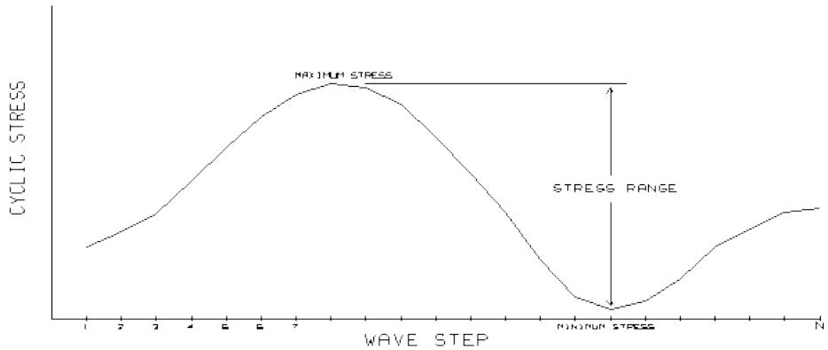

Dividing these stress ranges by one-half of the corresponding wave height produces stress ranges for waves of unit amplitude (for sinusoidal waves, wave height equals twice the wave amplitude).

$$H_{f} = \frac{\sigma_{f m a x} - \sigma_{f m i n}}{a_{f}}$$

Where:

$H_{ f }$ if the transfer function for wave frequency f.

$\sigma_{ m a x }$ is the maximum hot-spot stress for wave frequency f.

$\sigma_{ m a x }$ is the minimum hots-pot stress for wave frequency f.

$a_{ f }$ is the amplitude of the wave of frequency f (wave height divided by 2).

The relationship between the stress ranges of unit amplitude and the corresponding wave frequency for all waves considered is the transfer function (see figure below).

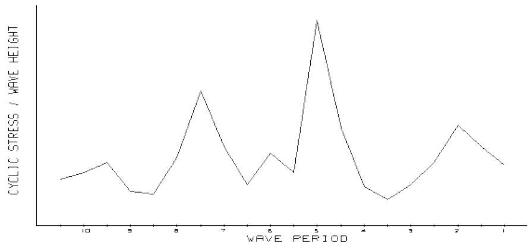

4.3.2.2 Cyclic Wind Loading

For wind spectral analysis, a mechanical transfer function for each mode is used by the program. The mechanical transfer function for any mode, H(f), defines the ratio of the range of cyclic stress as a function of the wind frequency and the mode natural frequency as follows:

$$H (f) = \frac{1}{K_{i}} \left[ \left[ 1 - \left(\frac{f}{f_{n}}\right)^{2} \right]^{2} + \left[ 2 c \left(\frac{f}{f_{n}}\right) \right]^{2} \right]^{- \frac{1}{2}}$$

where $\mathsf{ K }_{ \mathrm{ i } }$ is the generalized stiffness, $\mathsf{ f }_{ \mathsf{ n } }$ is the natural frequency and c is the percent damping.

4.3.3 Spectral Density

4.3.3.1 Wave Height Spectra

Wave height spectra are used to characterize the random behavior of waves statistically. From a wave spectrum, a wave height spectral density relating the probability distribution at various frequencies can be developed. Three forms of wave height spectral density functions are commonly used in the offshore industry, all of which are incorporated into Fatigue; they are:

Pierson-Moskowitz Spectrum (Bretschneider’s Form)

$$S_{\mathrm{P M}} \left(F^{*}\right) = \frac{5 h_{s}^{2} T_{0}}{16} \frac{1}{\left(F^{*}\right)^{5}} \exp \left[ - \frac{5}{4} \left(F^{*}\right)^{-4} \right]$$

JONSWAP (Joint North Sea Wave Project) Spectrum

$$S_{\mathrm{J}} \left(F^{*}\right) = \frac{S_{\mathrm{P M}} \left(F^{*}\right)}{C} \exp \left\{\ln \gamma \exp \left[ - \frac{\left(F^{*} - 1\right)^{2}}{2 \sigma^{2}} \right] \right\}$$

The terms in these expressions are:

hs = Significant wave height, defined as the average height of the 1/3 highest waves.

To = Dominant wave period, the period for which S(f) is a maximum.

F* = Dimensionless frequency, $\mathsf{ f } / \mathsf{ f }_{ \mathsf{ o } } ,$ where $\mathsf{ f }_{ \mathsf{ o } }$ is the frequency corresponding to ${ \sf T }_{ 0 }$ .

,  and C are parameters characterizing the JONSWAP spectrum. The following defaults are built into the program:

$$\gamma = 3. 3$$

$$\sigma = 0. 07 \text{f o r} F^{*} <   10. 09 \text{f o r} F^{*} > 1$$

$$C = 1. 525$$

Ochi-Hubble Double Peak Spectrum

$$S_{\mathrm{O H}} (f) = \frac{\pi}{2} \sum_{j = 1}^{2} \frac{[ 4 (4 \lambda_{j} + 1) \pi^{4} f_{p j}^{4} ]^{\lambda_{j}}}{\Gamma (\lambda_{j})} \frac{h_{s j}^{2}}{(2 \pi f)^{4 \lambda_{j} + 1}} \exp \left[ - \frac{4 \lambda_{j} + 1}{4} \left(\frac{f_{p j}}{f}\right)^{4} \right]$$

where f is the wave frequency, l is the peakedness, hs is significant wave height and $\mathsf{ f }_{ \mathsf{ p } }$ is the spectral peak frequency.

4.3.3.2 Wind Spectra

The generalized force spectrum used for wind spectral analysis is a Harris wind spectrum with gust effects spatial correlation and mean wind velocity variation. For any mode, the generalized force spectrum Si(f) is taken as:

$$S_{i} (f) = \frac{4}{f} F_{i}^{2} J_{a i} (f) J_{r t}^{2} (f) S_{V} (f)$$

where $\mathsf{ F }_{ \mathrm{ i } }$ is the generalized force and $\mathsf{ S }_{ \mathsf{ v } } ( \mathsf{ f } )$ is the Harris spectrum given by:

$$S_{V} (f) = \frac{4 k \eta_{1} (f)}{\left(2 + \eta_{1}^{2} (f)\right)^{\frac{5}{6}}} \quad \text{w h e r e} \quad \eta_{1} (f) = f \left(\frac{L_{H}}{v_{10}}\right)$$

where $\mathsf{ L }_{ \mathsf{ H } }$ is the Harris spectrum reference length and $\mathsf{ v }_{ 10 }$ is the velocity at the reference height. The terms $\mathsf{ J }_{ \mathsf{ a i } }$ and $\mathsf{ J }_{ \mathsf{ r t } }$ are the mean wind velocity variation function and the gust effects spatial correlation function, respectively, as recommended by DNV Gust Wind Response Analysis.

4.3.4 Wave Spreading

Wave spreading represents the tendency of a wave environment to spread about the primary direction of the wave. Wave spreading is modeled by multiplying the spectral density function of the primary direction by a directional spreading function $D ( \theta )$ .

$$S (f, \theta) = S (f) D (\theta)$$

The direction spreading function is as follows:

$$D (\theta) = \frac{\Gamma (1 + n / 2)}{\sqrt{\pi} \Gamma (1 / 2 + n / 2)} c o s^{n} (\theta)$$

where n is the spreading factor, typically 2, and ?? is the direction relative to the primary direction of the spectral environment.

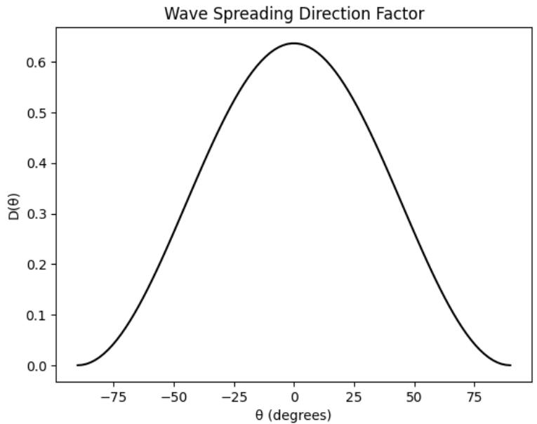

The formulation for the RMS stress range then becomes:

$$\sigma_{R M S} = \sqrt{\int_{0}^{\infty} \int_{- \pi}^{\pi} H (\theta , f)^{2} S (f) D (\theta) d \theta d f}$$

Because SACS uses discrete wave direction definitions for the transfer function, each spreading factor, $D_{ \theta . }$ , is calculated by the integrating the wave spreading function over the tributary band for the

$$D_{\theta} = \int_{\theta - \Delta \theta / 2}^{\theta + \Delta \theta / 2} D (\theta) d \theta$$

where

?? is the direction of the transfer function load case.

Δ?? is the difference in angle to the next transfer function load case direction.

The formulation for the RMS stress range then becomes:

$$\sigma_{R M S} = \sqrt{\int_{0}^{\infty} S (f) \sum H_{\theta} (f)^{2} D_{\theta} d f}$$

where $D_{ \theta }$ and $H_{ \theta }$ are the wave spreading factor and transfer function associated with each direction, ??.

4.3.4.1 Transfer Function Averaging

An alternative transfer function averaging option is provided in SACS which averages the transfer function instead of the spectral energy:

$$\sigma_{R M S} = \sqrt{\int_{0}^{\infty} \left(\sum H_{\theta} (f) D_{\theta}\right)^{2} S (f) d f}$$

4.3.5 Fatigue Damage

From equation (9), the RMS stress range for a particular spectrum I, of the fatigue environment can be calculated.

$$\sigma_{\mathrm{R M S}_{i}} = \sqrt{\int_{0}^{\infty} H^{2} (f) S_{i} (f) d f}$$

where Si(f) is the spectral density and H(f) is the transfer function for the direction being considered.

Note: While the range of frequencies over which the response spectrum is defined is theoretically infinite. Practically, the wave energy is effectively distributed over the range 0.125Td to 2.5Td. In the even that the transfer function is not defined over the full range of frequencies, it is assumed to remain constant past the last defined frequency.

For every RMS stress range there exist an average time, Tz, between zero crossings with a positive slope for a stationary Gaussian process with zero mean. This period called the Zero Crossing Period is given by:

$$T_{z} = \frac{\sigma_{\mathrm{R M S}_{i}}}{\sqrt{\int_{0}^{\infty} f^{2} H^{2} (f) S_{i} (f) d f}}$$

For a narrow band process this is the average period or the reciprocal of the average frequency of the process. The expected number of cycles, N, associated with this spectrum during the design life of the structure is:

$$N = \frac{m L}{T_{z}}$$

where L is the design life of the structure and m is the fraction of the design life that this spectrum prevails.

For a given stress range s, the number of cycles to failure, NF(s), can be found from the S-N curve used.

Thus, for a stress range between s and s+ds the amount of damage, dD, is:

$$d D = \frac{N}{N_{F} (s)} p (s) d s \tag{10}$$

where p(s) is the probability that the stress range is between s and s+ds.

Standard references show that if a linear system is excited by a Gaussian random process, then the response will also be a Gaussian process, thus in our case, having assumed system linearity and Gaussian excitation, the stress time histories are Gaussian (at least to the order of our approximations). We further assume that each response is narrow banded, that the spectral density of the response is significant only over a narrow range of frequencies. Under these conditions the stress range is a Rayleigh distributed random variable having a probability density function given by:

$$p (s) = \frac{s}{\sigma_{\mathrm{R M S}}^{2}} \exp \left[ - \frac{s^{2}}{2 \sigma_{\mathrm{R M S}}^{2}} \right] \tag{11}$$

where s = stress range and RMS =RMS value of the stress range, evaluated by eq. (9).

Substituting equation (11) into equation (10), the expected damage from the given spectrum is:

$$D = \frac{N}{\sigma_{\mathrm{R M S}_{i}}^{2}} \int_{0}^{\infty} \frac{s}{N_{F} (s)} \exp \left\{- \frac{s^{2}}{2 \sigma_{\mathrm{R M S}_{i}}^{2}} \right\} d s$$

The total expected damage for all seastates during the life of the structure is the sum of the damages for each individual seastate. The expected fatigue life is equal to the design life divided by the expected damage.

## 4.4 CRACK PROPAGATION

For crack length α subject to a cyclic stress σ(t), the increase in the crack length Δα over one cycle, can be represented by the Paris and Erdogan relationship:

$$\frac{d a}{d N} = C (\Delta K)^{m}, \quad \Delta K \rangle \Delta K_{\text{t h r}} = 0 \tag{1}$$

in which C and m are functions of the material and environment and N corresponds to the number of stress cycles, ΔK is stress intensity factor which can be defined by the following relationship:

$$\Delta K = \Delta \sigma Y (a) \sqrt{\Pi a} \tag{2}$$

where Δσ is the stress range in absence of the crack, Y(α) is a geometry function to allow for the crack geometry and stress distribution over the crack and is represented as:

$$Y (a) = Y_{\text{u n w e l d e d}} (a) \cdot M_{k} (a) \tag{3}$$

where

$$Y_{\text{u n w e l d e d}} (a) = \left[ 1. 08 - 0. 70 \left(\frac{a}{t}\right) \right] \tag{4}$$

and

$$M_{k} (a) = \left(1. 0 + 1. 24 \cdot e^{- 22. 1 \left(\frac{a}{t}\right)} + 3. 17 \cdot e^{- 357 \left(\frac{a}{t}\right)}\right) \tag{5}$$

Integrating the crack growth equation (1) yields

$$\int_{a_{0}}^{a} \frac{d x}{Y (x)^{m} (\pi x)^{\frac{m}{2}}} = C \sum_{i = 1}^{N} S_{i}^{m} \tag{6}$$

where ${ \mathtt{ a } }_{ \mathtt{ o } }$ is the initial crack depth and α is the crack depth after N stress cycles and ${ \mathsf S }_{ \mathrm{ i } }$ donates stress ranges.

Assuming failure corresponds to crack growth through the thickness, then the failure criterion can be written as:

$$\int_{a_{0}}^{a_{c}} \frac{d x}{Y (x)^{m} (\pi x)^{\frac{m}{2}}} - C \sum_{i = 1}^{N} S_{i}^{m} \leq 0 \tag{7}$$

The safety margin M can then be defined as:

$$M = \int_{a_{0}}^{a_{c}} \frac{d x}{Y (x)^{m} (\pi x)^{\frac{1}{2}}} = C \sum_{i = 1}^{N} S_{i}^{m} \tag{8}$$

The probability of failure $\mathsf{ P }_{ \mathsf{ F } }$ can then be defined as:

$$P_{F} = P (M \leq 0) \tag{9}$$

For constant amplitude loading with stress range S, the relationship between S and the number of cycles N can be written as:

$$N = \frac{1}{C} \int_{a_{0}}^{a_{c}} \frac{d x}{Y (x)^{m} (\pi x)^{\frac{m}{2}}} S^{- m} = \text{c o n s t a n t} \cdot S^{- m} \tag{10}$$

Damage D can then be expressed as:

$$D = \frac{\int_{a_{0}}^{a} \frac{d x}{Y (x)^{m} (\pi x)^{m / 2}}}{\int_{a_{0}}^{c} \frac{d x}{Y (x)^{m} (\pi x)^{m / 2}}} \tag{11}$$

The increment in D from stress cycle range Si is given by:

$$\Delta D_{i} = \frac{\Delta \left(\int_{a_{0}}^{a} \frac{d x}{Y (x)^{m} (\pi x)^{m / 2}}\right)}{\int_{a_{0}}^{a_{c}} \frac{d x}{Y (x)^{m} (\pi x)^{m / 2}}} = \frac{C S_{i}^{m}}{N \left(S_{i}\right) C S_{i}^{m}} = \frac{1}{N \left(S_{i}\right)} \tag{12}$$

5 REFERENCE

[1] "Simplified double peak spectral model for ocean waves.", Knut Torsethaugen & Sverre Haver, The Proceedings of the Fourteenth (2004) International Offshore and Polar Engineering Conference,   
[2] Toulon, France, May 23-28, 2004, ISOPE, Volume III, Pages 76-84

6 SAMPLE PROBLEMS

The structure shown in the figure below was used to illustrate various capabilities of the Fatigue program. Four separate fatigue analyses are illustrated:

1. Dynamic Spectral Fatigue where one SACS load case is created for each wave position. The SEAS line is used.   
2. Static Spectral Fatigue where each SACS load case is the result of a wave of different period.   
3. Dynamic Direct Deterministic Fatigue utilizing stresses at multiple positions of maximum and minimum base shear for each wave.   
4. Static Interpolated Deterministic using the position of maximum and minimum base shear of each wave combined linearly, also joint redesign was executed.   
5. Deterministic fatigue due to a moving load representing a crane on rails. Each lift weight is checked for four positions along the rails.

Note: The procedure to run a dynamic wave fatigue or a static wave fatigue analysis is the same with one exception. A static wave analysis utilizes the Seastate program to generate wave loading while the dynamic analysis utilizes the Wave Response program to consider the structures dynamic characteristics when generating wave loading.

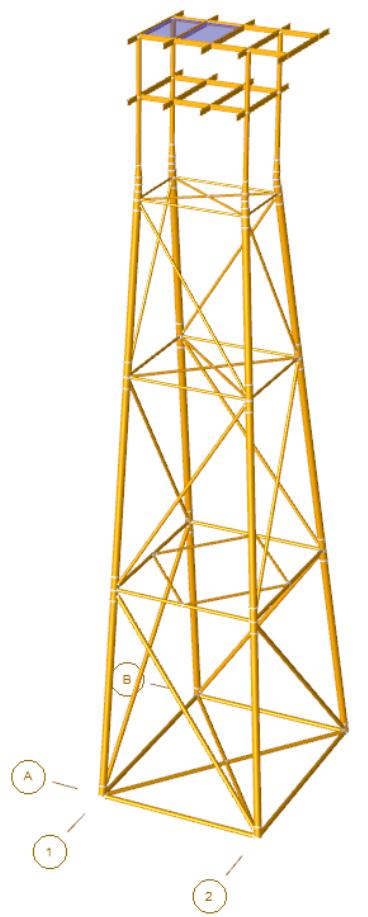

## 6.1 DYNAMIC SPECTRAL WAVE FATIGUE ANALYSIS

The following is an example of a spectral fatigue analysis where the fatigue environment was made up of seastates from three directions (0, 45, and 90 degrees) with each direction defined by twelve wave spectra. Dynamic effects were to be considered and the structure had a design life of 20 years, with a 2.0 safety factor.

Twenty-five waves from each direction were used to develop the transfer function. Each direction was considered as a separate fatigue case and was executed as one analysis, thus creating one common solution file. Because dynamic effects were to be considered, Wave Response was used to generate the SACS load cases. In this sample, a SACS load case was created for each position of each wave. The stress range for each wave was the difference between the maximum and minimum stress from the 18 wave positions.

The SEAS line was used to automatically determine the corresponding wave height and periods and to determine which SACS load cases apply to each fatigue case. The following are the steps and selected portions of the results of the analysis.

Dynpac was used to generate the dynamic characteristics of the structure. Fifteen modes were extracted.

Twenty-five Airy waves with a steepness of 1/20 starting with a period of 10 through 4.75 using a 1 second increment, from 4.75 to 3.40 using a 0.25 second increment, from 3.4 to 2.25 using a 0.10 second increment, and from 2.25 to 1.75 using a 0.25 second increment were input in the Seastate input file. Wave Response was used to plot the base shear and overturning moment transfer functions of each wave direction to determine the critical wave frequencies.

The following is the Wave Response and load portion of the Seastate input file used to develop the plots.

```txt
1 2 3 4 5 6 7 8   
123456789012345678901234567890123456789012345678901234567890   
1 WROPT ENPSL ALL ES 10   
2 PLTTF OM BS PFS   
3 DAMP 2.0
4 END 1 2 3 4 5 6 7 8   
123456789012345678901234567890123456789012345678901234567890   
1 LDOPT NF+Z 64.30 490.05 -261.0 261.00GLOB DYN NPNP K   
2 \* USE LOADING IN SEASTATE INPUT FILE ONLY   
3 FILE S
4 CDM
5 CDM 1.0 0.600 1.200 0.600 1.200   
6 CDM 100.0 0.600 1.200 0.600 1.200   
7 MGROV
8 MGROV 0.00 200.000 1.000   
9 MGROV 200.0 261.000 2.000   
10 GRPOV
11 GRPOVAL LG1 F   
12 GRPOVAL LG2 F   
13 GRPOVAL LG3 F   
14 GRPOV LG4 F   
15 GRPOV PL1NF 0.001 0.001   
16 GRPOV PL2NF 0.001 0.001   
17 GRPOV PL3NF 0.001 0.001   
18 GRPOV PL4NF 0.001 0.001   
19 GRPOV W.BNF 0.001 0.001 
```


| 20 | LOAD |  |  |  |  |  |
| --- | --- | --- | --- | --- | --- | --- |
| 21 | LOADCN 1 |  |  |  |  |  |
| 22 | * PERIODS FOR 000 DEGREE TRANSFER FUNCTION | * PERIODS FOR 000 DEGREE TRANSFER FUNCTION | * PERIODS FOR 000 DEGREE TRANSFER FUNCTION | * PERIODS FOR 000 DEGREE TRANSFER FUNCTION | * PERIODS FOR 000 DEGREE TRANSFER FUNCTION | * PERIODS FOR 000 DEGREE TRANSFER FUNCTION |
| 23 | GNTRF AL 6 .05 | 10.00 | 1.00 | 0.0 | 18AIRYPF |  |
| 24 | GNTRF AL 6 .05 | 4.75 | 0.25 | 0.0 | 18AIRYPF |  |
| 25 | GNTRF AL 11 .05 | 3.40 | 0.10 | 0.0 | 18AIRYPF |  |
| 26 | GNTRF AL 2 .05 | 2.25 | 0.25 | 0.0 | 18AIRYPF |  |
| 27 | LOADCN 2 |  |  |  |  |  |
| 28 | * PERIODS FOR 045 DEGREE TRANSFER FUNCTION | * PERIODS FOR 045 DEGREE TRANSFER FUNCTION | * PERIODS FOR 045 DEGREE TRANSFER FUNCTION | * PERIODS FOR 045 DEGREE TRANSFER FUNCTION | * PERIODS FOR 045 DEGREE TRANSFER FUNCTION | * PERIODS FOR 045 DEGREE TRANSFER FUNCTION |
| 29 | GNTRF AL 6 .05 | 10.00 | 1.00 | 45. | 18AIRYPF |  |
| 30 | GNTRF AL 6 .05 | 4.75 | 0.25 | 45. | 18AIRYPF |  |
| 31 | GNTRF AL 11 .05 | 3.40 | 0.10 | 45. | 18AIRYPF |  |
| 32 | GNTRF AL 2 .05 | 2.25 | 0.25 | 45. | 18AIRYPF |  |
| 33 | LOADCN 3 |  |  |  |  |  |
| 34 | * PERIODS FOR 090 DEGREE TRANSFER FUNCTION | * PERIODS FOR 090 DEGREE TRANSFER FUNCTION | * PERIODS FOR 090 DEGREE TRANSFER FUNCTION | * PERIODS FOR 090 DEGREE TRANSFER FUNCTION | * PERIODS FOR 090 DEGREE TRANSFER FUNCTION | * PERIODS FOR 090 DEGREE TRANSFER FUNCTION |
| 35 | GNTRF AL 6 .05 | 10.00 | 1.00 | 90. | 18AIRYPF |  |
| 36 | GNTRF AL 6 .05 | 4.75 | 0.25 | 90. | 18AIRYPF |  |
| 37 | GNTRF AL 11 .05 | 3.40 | 0.10 | 90. | 18AIRYPF |  |
| 38 | GNTRF AL 2 .05 | 2.25 | 0.25 | 90. | 18AIRYPF |  |
| 39 | END |  |  |  |  |  |


The base shear and overturning moment transfer function plots were inspected for waves approaching from the 0-degree direction to verify that a sufficient number of waves were used to generate the transfer function.

The equivalent static loads were solved to create the common solution file containing calculated stresses for each of the SACS load cases.

Note: To use the SEAS input line, the title of the common solution file must be the same as the title of the Seastate input file used to create the equivalent static loads whose results are contained in the common solution file. This feature is to prevent the use of an inappropriate Seastate input file.

Fatigue was executed utilizing the common solution file. Each fatigue case contained results for 450 SACS load cases (25 waves x 18 positions). For this sample problem, fatigue cases 1, 2, and 3 corresponded to 0, 45, and 90-degree wave direction respectively.

The fatigue environment was represented by 12 waves from each direction. The table below lists percent occurrence for various wave heights and periods for the zero-degree direction.


| Peak period | Significant Wave Height | Significant Wave Height | Significant Wave Height |
| --- | --- | --- | --- |
| Peak period | 0-2 | 2-4 | 4-8 |
| 1-2 | .15 | .10 | .10 |
| 2-4 | .10 | .19 | .11 |
| 4-8 | .05 | .08 | .05 |
| 8-12 | .02 | .03 | .02 |


Below is the Fatigue input file followed by a line by line detailed description:

```txt
1 2 3 4 5 6 7 8   
123456789012345678901234567890123456789012345678901234567890   
1 FATGIUE INPUT   
2 FTOPT 20. 1.0 2. SMAXP SK LPEFT   
3 FTOPT2 PTVC AWS TI   
4 FTOPT3
5 JNTSEL RM SM 501 503 505 507 801 803 805 807   
6 JNTOVR 401 API   
7 JNTOVR 403 API   
8 JNTOVR 405 API   
9 JNTOVR 407 API   
10 GRPSEL RM PL1 PL2 PL3 PL4 W.B   
11 SCFSEL MSH
12 RELIEF
13 SEAS
14 FTCASE 1 .47 1.0 SPC   
15 SCATD D 1.0 1.0 PM   
16 SCWAV 1.0 3.0 6.0   
17 SCPER 1.5 .15 .1   
18 SCPER 3.0 .1 .19 .11   
19 SCPER 5.0 .05 .08 .05   
20 SCPER 8.0 .02 .03 .02   
21 FTCASE 2 .20 1.0 SPC   
22 SCATD D 1.0 1.0 PM   
23 SCWAV 1.0 3.0 6.0   
24 SCPER 1.5 .10 .13 .08   
25 SCPER 3.0 .15 .13 .10   
26 SCPER 5.0 .08 .08 .07   
27 SCPER 8.0 .03 .02 .03   
28 FTCASE 3 .33 1.0 SPC   
29 SCATD D 1.0 1.0 PM   
30 SCWAV 1.0 3.0 6.0   
31 SCPER 1.5 .13 .10 .08   
32 SCPER 3.0 .13 .15 .10   
33 SCPER 5.0 .06 .09 .08   
34 SCPER 8.0 .03 .03 .02   
35 EXTRACT HEAD 1.0   
36 EXTRACT 403 407   
37 END
38 
```

The following is a line by line description of the fatigue input file, the analysis results for Sample Problem 1 ensue:

Line 1. The TITLE line is an optional input line.   
Line 2. The FTOPT line specifies analysis options, namely:

## a. 20-year design life with 2.0safety factor.
b. API X Prime S-N curve.   
c. Skip all non-tubular elements.   
d. Minimum 2.0-inch gap.   
e. Efthymiou procedure used to calculate SCF’s (EFT).

Line 3. The FTOPT2 line specifies results to be output in order of damage and a joint validity check to be performed.

Line 4. The joints to be excluded from analysis, 501, 503, 505, 507, 801, 803, 805, and 807 are designated on the JNTSEL input line.

Lines 5-8. Joints 401, 403, 405, and 407 are to use the API S-N curve instead of the API X Prime curve as specified on the JNTOVR lines.   
Line 9. Groups PL1, PL2, PL3, PL4, and W.B. are to be excluded as designated on the GRPSEL input line.   
Line 10. X-type joints SCF’s are to be calculated using Marshall equations as specified on the SCFSEL line.   
Line 11. Joint stresses are calculated at the chord face instead of the joint using the RELIEF line.   
Line 12. The SEAS line signals the program to use the Seastate input files to determine corresponding wave heights and appropriate SACS load cases. This replaces the FTCONT or TRFN and WVFRF input lines. The names of the seastate input files are specified in the run file.   
Lines 13, 20, & 27. The FTCASE input lines specifies the following:

a. Fatigue case 1, 2, and 3 occur 47%, 20%, and 33% of the fatigue life respectively.   
b. Dynamic Amplification of 1.00 is applied.

Line 14. A scatter diagram will be input so that a set of Pierson-Moskovitz spectra may be generated. Periods entered represent dominant or peak period as designated on the SCATD line.

Line 15. The wave heights of the scatter diagram are defined as 1, 3 and 6 on the SCWAV line.

Lines 17-19. The percent occurrence for each wave with a 1 second period is entered in the appropriate wave height column.

The following is portion of the output listing file.

SAMPLE 08 ENGLISH UNITS MODEL

DATE 25-AUG-2020 TIME 16:07:05 FTG PAGE 2

FTG VERSION 14.3.0.33

*** GENERAL OPTIONS

S-N DATA AXP

NUMBER OF FATIGUE CASES .. 3

DESIGN LIFE 20.000 YEARS

PERIOD FOR CYCLE DATA ... 1.000 YEARS

LIFE SAFETY FACTOR ... 2.000

TUBULAR INTERMEDIATE CHECK OPTION - ON

SPLASH ZONE BOTTOM .... 0.0 FT

SPLASH ZONE TOP 0.0 FT

SPECTRAL ANALYSIS OPTION SELECTED TOTAL LIFE RATIO = 1.000

*** OUTPUT OPTIONS

SUMMARY PRINT IN LIFE ORDER

SCF VALIDITY RANGE CHECK

*** TUBULAR JOINT OPTIONS

OVERALL SCF OPTION .. EFT PARAMETER OUTSIDE OF VALIDITY RANGE OPTION - MAX SCF SHORT CHORD CORRECTION USED - YES

GROUTED LEG/PILE OPTION .... NO

LOAD PATH DEPENDENT SCF.. ON

CHORD LENGTH USED . AVERAGE

MINIMUM GAP ALLOWED ......-1000.00 IN

INLINE TUBULAR SCF OPTION ... AWS

AXIAL STRESS INTERPOLATION .. SINUSOIDAL


| SAMPLE 08 ENGLISH UNITS MODEL | SAMPLE 08 ENGLISH UNITS MODEL | SAMPLE 08 ENGLISH UNITS MODEL | SAMPLE 08 ENGLISH UNITS MODEL | SAMPLE 08 ENGLISH UNITS MODEL | SAMPLE 08 ENGLISH UNITS MODEL | SAMPLE 08 ENGLISH UNITS MODEL | SAMPLE 08 ENGLISH UNITS MODEL | SAMPLE 08 ENGLISH UNITS MODEL | SAMPLE 08 ENGLISH UNITS MODEL | SAMPLE 08 ENGLISH UNITS MODEL | SAMPLE 08 ENGLISH UNITS MODEL | SAMPLE 08 ENGLISH UNITS MODEL | SAMPLE 08 ENGLISH UNITS MODEL | SAMPLE 08 ENGLISH UNITS MODEL | SAMPLE 08 ENGLISH UNITS MODEL | SAMPLE 08 ENGLISH UNITS MODEL | SAMPLE 08 ENGLISH UNITS MODEL | SAMPLE 08 ENGLISH UNITS MODEL |
| --- | --- | --- | --- | --- | --- | --- | --- | --- | --- | --- | --- | --- | --- | --- | --- | --- | --- | --- |
| * * * MEMBER FATIGUE REPORT * * *(DAMAGE ORDER) | * * * MEMBER FATIGUE REPORT * * *(DAMAGE ORDER) | * * * MEMBER FATIGUE REPORT * * *(DAMAGE ORDER) | * * * MEMBER FATIGUE REPORT * * *(DAMAGE ORDER) | * * * MEMBER FATIGUE REPORT * * *(DAMAGE ORDER) | * * * MEMBER FATIGUE REPORT * * *(DAMAGE ORDER) | * * * MEMBER FATIGUE REPORT * * *(DAMAGE ORDER) | * * * MEMBER FATIGUE REPORT * * *(DAMAGE ORDER) | * * * MEMBER FATIGUE REPORT * * *(DAMAGE ORDER) | * * * MEMBER FATIGUE REPORT * * *(DAMAGE ORDER) | * * * MEMBER FATIGUE REPORT * * *(DAMAGE ORDER) | * * * MEMBER FATIGUE REPORT * * *(DAMAGE ORDER) | * * * MEMBER FATIGUE REPORT * * *(DAMAGE ORDER) | * * * MEMBER FATIGUE REPORT * * *(DAMAGE ORDER) | * * * MEMBER FATIGUE REPORT * * *(DAMAGE ORDER) | * * * MEMBER FATIGUE REPORT * * *(DAMAGE ORDER) | * * * MEMBER FATIGUE REPORT * * *(DAMAGE ORDER) | * * * MEMBER FATIGUE REPORT * * *(DAMAGE ORDER) | * * * MEMBER FATIGUE REPORT * * *(DAMAGE ORDER) |
| JOINT | MEMBER GRUP ID | TYPE ID | ORIGINAL | ORIGINAL | ORIGINAL | JNT TYPE | MEM TYP | CHORD LEN. (FT) | GAP * STRESS CONC. FACTORS * | GAP * STRESS CONC. FACTORS * | GAP * STRESS CONC. FACTORS * | GAP * STRESS CONC. FACTORS * | GAP * STRESS CONC. FACTORS * | FATIGUE RESULTS | FATIGUE RESULTS | FATIGUE RESULTS | REQUIRED OD (IN) WT (IN) | REQUIRED OD (IN) WT (IN) |
| JOINT | MEMBER GRUP ID | TYPE ID | OD (IN) | WT (IN) | JNT TYPE | JNT TYPE | MEM TYP | CHORD LEN. (FT) | (GAP) AX-CR AX-SD IN-PL OU-PL | (GAP) AX-CR AX-SD IN-PL OU-PL | (GAP) AX-CR AX-SD IN-PL OU-PL | (GAP) AX-CR AX-SD IN-PL OU-PL | (GAP) AX-CR AX-SD IN-PL OU-PL | DAMAGE LOC SVC LIFE | DAMAGE LOC SVC LIFE | DAMAGE LOC SVC LIFE | REQUIRED OD (IN) WT (IN) | REQUIRED OD (IN) WT (IN) |
| 407 | 407-305 | T01 | TUB | 16.00 | 0.625 | K | BRC | 40.00 | 9.38 | 2.81 | 2.94 | 2.78 | 2.44 | .1873160 T | .1873160 T | 106.7714 |  |  |
| 407 | 307-407 | LG3 | TUB | 42.00 | 1.375 | K | CHD | 40.00 |  | 2.93 | 3.18 | 1.52 | 2.25 | .0851901 TL | .0851901 TL | 234.7690 |  |  |
| 407 | 403-407 | T03 | TUB | 12.75 | 0.500 | Y | BRC | 40.00 |  | 3.00 | 6.24 | 2.36 | 3.55 | 23.94457 BL | 23.94457 BL | .8352625 |  |  |
| 407 | 407-507 | LG4 | TUB | 42.00 | 1.375 | Y | CHD | 40.00 |  | 2.59 | 4.82 | 1.61 | 2.78 | 6.164371 BL | 6.164371 BL | 3.244451 |  |  |
| 407 | 405-407 | T03 | TUB | 12.75 | 0.500 | K | BRC | 40.00 | 9.38 | 3.99 | 5.13 | 2.36 | 3.67 | .3116165 TL | .3116165 TL | 64.18146 |  |  |
| 407 | 407-507 | LG4 | TUB | 42.00 | 1.375 | K | CHD | 40.00 |  | 3.39 | 4.17 | 1.62 | 2.87 | .0878301 TL | .0878301 TL | 227.7123 |  |  |
| 407 | 407-409 | T03 | TUB | 12.75 | 0.500 | Y | BRC | 40.00 |  | 3.00 | 6.19 | 2.36 | 3.53 | .0137392 BL | .0137392 BL | 1455.686 |  |  |
| 407 | 407-507 | LG4 | TUB | 42.00 | 1.375 | Y | CHD | 40.00 |  | 2.58 | 4.79 | 1.61 | 2.76 | .28807-3 BL | .28807-3 BL | 69426.43 |  |  |
| 403 | 307-403 | T01 | TUB | 16.00 | 0.625 | K | BRC | 40.00 | 10.99 | 2.78 | 2.84 | 2.80 | 2.29 | 5.363579 T | 5.363579 T | 3.728853 |  |  |
| 403 | 303-403 | LG3 | TUB | 42.00 | 1.375 | K | CHD | 40.00 |  | 2.90 | 3.08 | 1.48 | 2.11 | 2.633292 TL | 2.633292 TL | 7.595057 |  |  |
| 403 | 401-403 | T03 | TUB | 12.75 | 0.500 | Y | BRC | 40.00 |  | 3.00 | 6.28 | 2.36 | 3.57 | .3270818 BL | .3270818 BL | 61.14678 |  |  |
| 403 | 403-503 | LG4 | TUB | 42.00 | 1.375 | Y | CHD | 40.00 |  | 2.59 | 4.83 | 1.62 | 2.79 | .0638537 BL | .0638537 BL | 313.2159 |  |  |
| 403 | 403-407 | T03 | TUB | 12.75 | 0.500 | K | BRC | 40.00 | 10.99 | 3.84 | 5.37 | 2.36 | 3.61 | 22.14755 TL | 22.14755 TL | .9030346 |  |  |
| 403 | 403-503 | LG4 | TUB | 42.00 | 1.375 | K | CHD | 40.00 |  | 3.28 | 4.33 | 1.61 | 2.83 | 6.190855 TL | 6.190855 TL | 3.230572 |  |  |


## 6.2 STATIC SPECTRAL WAVE FATIGUE ANALYSIS

Sample Problem 2 is similar to Sample Problem 1 except that dynamic characteristics were considered to be negligible and the transfer function was developed using a more approximate method.

The fatigue environment was made up of seastates from three directions (0, 45, and 90 degrees) with each direction defined by twelve wave spectra. The structure had a design life of 20 years, with a 2.0 safety factor. Twenty-five waves from each direction were used to develop the transfer function and each direction was considered as a separate fatigue case and was executed as one analysis, thus creating one common solution file.

Seastate was used to generate the SACS load cases. In this sample, the stress range for each wave was the difference between the maximum and minimum stress from the 18 wave positions. The following pages contain the steps and selected portions of the results of the analysis.

Static analysis was used to create and solve the SACS load cases for each wave position. The wave height was calculated from the period based on a wave steepness of 1:20.

Note: Seastate was executed for each wave direction. Wave Response may be used instead of Seastate when the effects of dynamics are to be considered.

The following is the load portion of the Seastate input file.

```txt
1 1 2 3 4 5 6 7 8 1234567890123456789012345678901234567890123456789012345678901234567890123456789012345678901234567890123456789  
1 LOAD
2LOADCN 1
\* PERIODS FOR 000 DEGREE TRANSFER FUNCTION   
4 GNTRF AL 6 .05 10.00 1.00 0.0 18AIRYPF   
5 GNTRF AL 6 .05 4.75 0.25 0.0 18AIRYPF   
6 GNTRF AL 11 .05 3.40 0.10 0.0 18AIRYPF   
7 GNTRF AL 2 .05 2.25 0.25 0.0 18AIRYPF   
8 LOADCN 2
\* PERIODS FOR 045 DEGREE TRANSFER FUNCTION   
10 GNTRF AL 6 .05 10.00 1.00 45. 18AIRYPF   
11 GNTRF AL 6 .05 4.75 0.25 45. 18AIRYPF   
12 GNTRF AL 11 .05 3.40 0.10 45. 18AIRYPF   
13 GNTRF AL 2 .05 2.25 0.25 45. 18AIRYPF   
14 LOADCN 3
\* PERIODS FOR 090 DEGREE TRANSFER FUNCTION   
16 GNTRF AL 6 .05 10.00 1.00 90. 18AIRYPF   
17 GNTRF AL 6 .05 4.75 0.25 90. 18AIRYPF   
18 GNTRF AL 11 .05 3.40 0.10 90. 18AIRYPF   
19 GNTRF AL 2 .05 2.25 0.25 90. 18AIRYPF   
20 END
```

Fatigue was executed utilizing the common solution file of the static solution for all waves. The file contained results for 1350 SACS load cases (3 x 25 waves x 18 position). Fatigue cases 1, 2, and 3 corresponded to 0, 45, and 90-degree direction respectively.

The following is the Fatigue input file followed by a line by line description.

```txt
1 2 3 4 5 6 7 8 123456789012345678901234567890123456789012345678901234567890  
1 FATGIUE INPUT  
2 FTOPT 20. 1.0 2. SMAXP SK LPEFT  
3 FTOPT2 PTVC AWS TI2  
4 JNTSEL RM SM 501 503 505 507  
5 JNTOVR 401 API
```

```txt
6 JNTOVR 403 API  
7 JNTOVR 405 API  
8 JNTOVR 407 API  
9 GRPSEL RM PL1 PL2 PL3 PL4 W.B  
10 SCFSEL MSH
11 RELIEF
12 SEAS
13 FTCASE 1.47 1.0 SPC  
14 SCATD D 1.0 1.0 PM  
15 SCWAV 1.0 3.0 6.0  
16 SCPER 1.5 .15 .1  
17 SCPER 3.0 .1 .19 .11  
18 SCPER 5.0 .05 .08 .05  
19 SCPER 8.0 .02 .03 .02  
20 FTCASE 2.20 1.0 SPC  
21 SCATD D 1.0 1.0 PM  
22 SCWAV 1.0 3.0 6.0  
23 SCPER 1.5 .10 .13 .08  
24 SCPER 3.0 .15 .13 .10  
25 SCPER 5.0 .08 .08 .07  
26 SCPER 8.0 .03 .02 .03  
27 FTCASE 3.33 1.0 SPC  
28 SCATD D 1.0 1.0 PM  
29 SCWAV 1.0 3.0 6.0  
30 SCPER 1.5 .13 .10 .08  
31 SCPER 3.0 .13 .15 .10  
32 SCPER 5.0 .06 .09 .08  
33 SCPER 8.0 .03 .03 .02  
34 END
35 
```

The following is a line by line description of the input file. The analysis results follow.

Line 1. The TITLE line is an optional input line.   
Line 2. The FTOPT line specifies analysis options, namely:

## a. 20-year design life with 2.0safety factor.
b. API X Prime S-N curve.   
c. Skip all non-tubular elements.   
d. Minimum 2.0-inch gap.   
e. Efthymiou procedure used to calculate SCF’s (EFT).

Line 3. The FTOPT2 line specifies results to be output in order of damage and a joint validity check to be performed.   
Line 4. The joints to be excluded from analysis, 501, 503, 505, and 507 are designated on the JNTSEL input line.   
Lines 5-8. Joints 401, 403, 405, and 407 are to use the API S-N curve instead of the API X Prime curve as specified on the JNTOVR lines.   
Line 9. Groups PL1, PL2, PL3, PL4, and W.B. are to be excluded as designated on the GRPSEL input line.   
Line 10. X-type joints SCF’s are to be calculated using Marshall equations as specified on the SCFSEL line.

Line 11. Joint stresses are calculated at the chord face instead of the joint using the RELIEF line.

Line 12. The SEAS line signals the program to use the Seastate input files to determine corresponding wave heights and appropriate SACS load cases. This replaces the FTCONT or TRFN and WVFRF input lines. The names of the seastate input files are specified in the run file.

Lines 13, 20, & 27. The FTCASE input lines specifies the following:

a. Fatigue case 1, 2, and 3 occur 47%, 20%, and 33% of the fatigue life respectively.   
b. Dynamic Amplification of 1.00 is applied.

Line 14. A scatter diagram will be input so that a set of Pierson-Moskovitz spectra may be generated. Periods entered represent dominant or peak period as designated on the SCATD line.   
Line 15. The wave heights of the scatter diagram are defined as 1, 3 and 6 on the SCWAV line.

Lines 17-19. The percent occurrence for each wave with a 1 second period is entered in the appropriate wave height column.

The following is portion of the output listing file.

SAMPLE 07 ENGLISH UNITS MODEL DATE 18-MAR-2020 TIME 15:08:56 FTG PAGE 2 FTG VERSION 14.1.0.104   
\*\* GENERAL OPTIONS S-N DATA .AXP NUMBER OF FATIGUE CASES .3 DESIGN LIFE .20.000 YEARS PERIOD FOR CYCLE DATA .. 1.000 YEARS LIFE SAFETY FACTOR .2.000 TUBULAR INTERMEDIATE CHECK OPTION - ON SPLASH ZONE BOTTOM .0.0FT SPLASH ZONE TOP .0.0FT SPECTRAL ANALYSIS OPTION SELECTED TOTAL LIFE RATIO $= 1.000$ \*\* OUTPUT OPTIONS SUMMARY PRINT IN LIFE ORDER SCF VALIDITY RANGE CHECK   
\*\* TUBULAR JOINT OPTIONS OVERALL SCF OPTION .EFT PARAMETER OUTSIDE OF VALIDITY RANGE OPTION - MAX SCF SHORT CHORD CORRECTION USED - YES GROUTED LEG/PILE OPTION .NO LOAD PATH DEPENDENT SCF..ON CHORD LENGTH USED AVERAGE MINIMUM GAP ALLOWED .-1000.00 IN INLINE TUBULAR SCF OPTION ..AWS AXIAL STRESS INTERPOLATION .. SINUSOIDAL


| SAMPLE 07 ENGLISH UNITS MODEL DATE 18-MAR-2020 TIME 15:08:56 FTG PAGE 26 | SAMPLE 07 ENGLISH UNITS MODEL DATE 18-MAR-2020 TIME 15:08:56 FTG PAGE 26 | SAMPLE 07 ENGLISH UNITS MODEL DATE 18-MAR-2020 TIME 15:08:56 FTG PAGE 26 | SAMPLE 07 ENGLISH UNITS MODEL DATE 18-MAR-2020 TIME 15:08:56 FTG PAGE 26 | SAMPLE 07 ENGLISH UNITS MODEL DATE 18-MAR-2020 TIME 15:08:56 FTG PAGE 26 | SAMPLE 07 ENGLISH UNITS MODEL DATE 18-MAR-2020 TIME 15:08:56 FTG PAGE 26 | SAMPLE 07 ENGLISH UNITS MODEL DATE 18-MAR-2020 TIME 15:08:56 FTG PAGE 26 | SAMPLE 07 ENGLISH UNITS MODEL DATE 18-MAR-2020 TIME 15:08:56 FTG PAGE 26 | SAMPLE 07 ENGLISH UNITS MODEL DATE 18-MAR-2020 TIME 15:08:56 FTG PAGE 26 | SAMPLE 07 ENGLISH UNITS MODEL DATE 18-MAR-2020 TIME 15:08:56 FTG PAGE 26 | SAMPLE 07 ENGLISH UNITS MODEL DATE 18-MAR-2020 TIME 15:08:56 FTG PAGE 26 | SAMPLE 07 ENGLISH UNITS MODEL DATE 18-MAR-2020 TIME 15:08:56 FTG PAGE 26 | SAMPLE 07 ENGLISH UNITS MODEL DATE 18-MAR-2020 TIME 15:08:56 FTG PAGE 26 | SAMPLE 07 ENGLISH UNITS MODEL DATE 18-MAR-2020 TIME 15:08:56 FTG PAGE 26 | SAMPLE 07 ENGLISH UNITS MODEL DATE 18-MAR-2020 TIME 15:08:56 FTG PAGE 26 | SAMPLE 07 ENGLISH UNITS MODEL DATE 18-MAR-2020 TIME 15:08:56 FTG PAGE 26 | SAMPLE 07 ENGLISH UNITS MODEL DATE 18-MAR-2020 TIME 15:08:56 FTG PAGE 26 |  |
| --- | --- | --- | --- | --- | --- | --- | --- | --- | --- | --- | --- | --- | --- | --- | --- | --- | --- |
| * * * MEMBER FATIGUE REPORT * * *(DAMAGE ORDER) | * * * MEMBER FATIGUE REPORT * * *(DAMAGE ORDER) | * * * MEMBER FATIGUE REPORT * * *(DAMAGE ORDER) | * * * MEMBER FATIGUE REPORT * * *(DAMAGE ORDER) | * * * MEMBER FATIGUE REPORT * * *(DAMAGE ORDER) | * * * MEMBER FATIGUE REPORT * * *(DAMAGE ORDER) | * * * MEMBER FATIGUE REPORT * * *(DAMAGE ORDER) | * * * MEMBER FATIGUE REPORT * * *(DAMAGE ORDER) | * * * MEMBER FATIGUE REPORT * * *(DAMAGE ORDER) | * * * MEMBER FATIGUE REPORT * * *(DAMAGE ORDER) | * * * MEMBER FATIGUE REPORT * * *(DAMAGE ORDER) | * * * MEMBER FATIGUE REPORT * * *(DAMAGE ORDER) | * * * MEMBER FATIGUE REPORT * * *(DAMAGE ORDER) | * * * MEMBER FATIGUE REPORT * * *(DAMAGE ORDER) | * * * MEMBER FATIGUE REPORT * * *(DAMAGE ORDER) | * * * MEMBER FATIGUE REPORT * * *(DAMAGE ORDER) | * * * MEMBER FATIGUE REPORT * * *(DAMAGE ORDER) |  |
| JOINT | MEMBER GRUP ID | TYPE ID | ORIGINAL | ORIGINAL | ORIGINAL | JNT TYPE | MEM TYP | CHORD LEN.(FT) | GAP (IN) | * STRESS CONC. FACTORS *AX-CR AX-SD IN-PL OU-PL | * STRESS CONC. FACTORS *AX-CR AX-SD IN-PL OU-PL | * STRESS CONC. FACTORS *AX-CR AX-SD IN-PL OU-PL | FATIGUE DAMAGE LOC SVC LIFE | FATIGUE DAMAGE LOC SVC LIFE | REQUIRED OD (IN) WT (IN) | REQUIRED OD (IN) WT (IN) |  |
| JOINT | MEMBER GRUP ID | TYPE ID | OD (IN) | WT (IN) |  | JNT TYPE | MEM TYP | CHORD LEN.(FT) | GAP (IN) | * STRESS CONC. FACTORS *AX-CR AX-SD IN-PL OU-PL | * STRESS CONC. FACTORS *AX-CR AX-SD IN-PL OU-PL | * STRESS CONC. FACTORS *AX-CR AX-SD IN-PL OU-PL | FATIGUE DAMAGE LOC SVC LIFE | FATIGUE DAMAGE LOC SVC LIFE | REQUIRED OD (IN) WT (IN) | REQUIRED OD (IN) WT (IN) |  |
| 105 | 105- 109 | T04 | TUB | 24.00 | 0.750 | Y | BRC | 97.75 |  | 4.29 | 8.71 | 2.72 | 6.28 | .0000000 | T | INFINITE |  |
| 105 | 105- 205 | LG1 | TUB | 42.00 | 1.375 | Y | CHD | 97.75 |  | 7.66 | 8.66 | 2.61 | 7.10 | .0000000 | T | INFINITE |  |
| 105 | 101- 105 | T05 | TUB | 26.00 | 1.000 | Y | BRC | 97.75 |  | 5.17 | 9.65 | 2.89 | 7.26 | .0116983 | R | 1709.650 |  |
| 105 | 105- 205 | LG1 | TUB | 42.00 | 1.375 | Y | CHD | 97.75 |  | 10.72 | 11.69 | 3.30 | 9.85 | .0378081 | R | 528.9866 |  |
| 105 | 105- 107 | T05 | TUB | 26.00 | 1.000 | K | BRC | 97.75 | 2.00 | 5.13 | 9.35 | 2.89 | 7.37 | .88039-5 | L | 2271726. |  |
| 105 | 105- 205 | LG1 | TUB | 42.00 | 1.375 | K | CHD | 97.75 |  | 10.38 | 11.16 | 3.32 | 10.01 | .11149-3 | TL | 179390.4 |  |
| 105 | 105- 207 | T05 | TUB | 26.00 | 1.000 | K | BRC | 97.75 | 2.00 | 4.60 | 3.49 | 3.17 | 3.42 | .0000000 | T | INFINITE |  |
| 105 | 105- 205 | LG1 | TUB | 42.00 | 1.375 | K | CHD | 97.75 |  | 6.69 | 6.72 | 2.22 | 4.64 | .10004-5 | TL | 19993.+3 |  |
| 101 | 101- 109 | T04 | TUB | 24.00 | 0.750 | Y | BRC | 97.75 |  | 4.29 | 8.71 | 2.72 | 6.28 | .0000000 | T | INFINITE |  |
| 101 | 101- 201 | LG1 | TUB | 42.00 | 1.375 | Y | CHD | 97.75 |  | 7.66 | 8.66 | 2.61 | 7.10 | .0000000 | T | INFINITE |  |
| 101 | 101- 103 | T05 | TUB | 26.00 | 1.000 | T | BRC | 97.75 |  | 5.17 | 9.79 | 2.89 | 7.35 | .87438-6 | R | 22873.+3 |  |
| 101 | 101- 201 | LG1 | TUB | 42.00 | 1.375 | T | CHD | 97.75 |  | 10.78 | 11.63 | 3.32 | 9.98 | .28789-4 | TR | 694711.3 |  |
| 101 | 101- 105 | T05 | TUB | 26.00 | 1.000 | K | BRC | 97.75 | 2.00 | 5.04 | 8.39 | 2.89 | 7.35 | .0114356 | L | 1748.925 |  |
| 101 | 101- 201 | LG1 | TUB | 42.00 | 1.375 | K | CHD | 97.75 |  | 9.56 | 10.28 | 3.30 | 9.97 | .0367231 | L | 544.6161 |  |


## 6.3 DYNAMIC DIRECT DETERMINISTIC ANALYSIS

Sample Problem 3 is a Direct deterministic analysis accounting for dynamic effects of the structure.

The fatigue environment was made up of seastates from two directions, 0 and 45 degrees respectively. The structure had a design life of 20 years, with a 2.0 safety factor. Six waves from each direction were used to develop the relationship between the cyclic stress and wave height. Although each wave direction was considered as a separate fatigue case, all directions were run in the same analysis creating one common solution file.

Wave Response was used to generate the SACS load cases. In this sample, four SACS load cases, two positions of maximum base shear and two positions of minimum base shear, were created for each wave. The stress range for each wave was calculated using option "MMN" on the FTCASE input line. The following contains the steps and selected portions of the results of the analysis.

Dynpac was used to generate the dynamic characteristics of the structure. Twenty modes were selected.

Wave Response was used to create four SACS load cases corresponding to the positions of maximum and minimum base shear for each of the following waves:


|  | HEIGHT | PERIOD |
| --- | --- | --- |
| WAVE 1 | 6.0 | 3.00 |
| WAVE 2 | 3.0 | 6.00 |
| WAVE 3 | 3.0 | 3.00 |
| WAVE 4 | 3.0 | 1.50 |
| WAVE 5 | 1.0 | 3.00 |
| WAVE 6 | 1.0 | 1.50 |


Note: Wave Response was executed to create equivalent static loads. Seastate may be used instead when the effects of dynamics are considered negligible.

The Wave Response input file and a portion of the Seastate input file used to generate the wave loads are below.


|  | 1 | 2 | 3 | 4 | 5 | 6 | 7 | 8 |
| --- | --- | --- | --- | --- | --- | --- | --- | --- |
| 1 | 1234567890123456789012345678901234567890123456789012345678901234567890123456789012345678901234567890123456789 | ALL ES |  | 15 | -1 |  |  |  |
| 2 | WROPT EN | 2.0 |  |  |  |  |  |  |
| 3 | DAMP | 1 |  |  |  |  |  |  |
|  | LOAD | 1 | 2 | 3 | 4 | 5 | 6 | 7 |
| 1 | 1234567890123456789012345678901234567890123456789012345678901234567890123456789012345678901234 | LOADCN | 1 |  |  |  |  |  |
| 2 | LOADCN | 1 |  |  |  |  |  |  |
| 3 | WAVE |  |  |  |  |  |  |  |
| 4 | WAVE | AIRY | 6.00 | 3.0 | 0.00 | D | 0.00 | 20.0 |
| 5 | LOADCN | 2 |  |  |  |  |  |  |
| 6 | WAVE |  |  |  |  |  |  |  |
| 7 | WAVE | AIRY | 3.00 | 6.0 | 0.00 | D | 0.00 | 20.0 |
| 8 | LOADCN | 3 |  |  |  |  |  |  |
| 9 | WAVE |  |  |  |  |  |  |  |


| 10 | WAVE | AIRY | 3.00 | 3.0 | 0.00 | D | 0.00 | 20.0 | 18MS | 1 |
| --- | --- | --- | --- | --- | --- | --- | --- | --- | --- | --- |
| 11 | LOADCN | 4 |  |  |  |  |  |  |  |  |
| 12 | WAVE |  |  |  |  |  |  |  |  |  |
| 13 | WAVE | AIRY | 3.00 | 1.5 | 0.00 | D | 0.00 | 20.0 | 18MS | 1 |
| 14 | LOADCN | 5 |  |  |  |  |  |  |  |  |
| 15 | WAVE |  |  |  |  |  |  |  |  |  |
| 16 | WAVE | AIRY | 1.00 | 3.0 | 0.00 | D | 0.00 | 20.0 | 18MS | 1 |
| 17 | LOADCN | 6 |  |  |  |  |  |  |  |  |
| 18 | WAVE |  |  |  |  |  |  |  |  |  |
| 19 | WAVE | AIRY | 1.00 | 1.0 | 0.00 | D | 0.00 | 20.0 | 18MS | 1 |
| 20 | LOADCN | 7 |  |  |  |  |  |  |  |  |
| 21 | WAVE |  |  |  |  |  |  |  |  |  |
| 22 | WAVE | AIRY | 6.00 | 3.0 | 45.00 | D | 0.00 | 20.0 | 18MS | 1 |
| 23 | LOADCN | 8 |  |  |  |  |  |  |  |  |
| 24 | WAVE |  |  |  |  |  |  |  |  |  |
| 25 | WAVE | AIRY | 3.00 | 6.0 | 45.00 | D | 0.00 | 20.0 | 18MS | 1 |
| 26 | LOADCN | 9 |  |  |  |  |  |  |  |  |
| 27 | WAVE |  |  |  |  |  |  |  |  |  |
| 28 | WAVE | AIRY | 3.00 | 3.0 | 45.00 | D | 0.00 | 20.0 | 18MS | 1 |
| 29 | LOADCN | 10 |  |  |  |  |  |  |  |  |
| 30 | WAVE |  |  |  |  |  |  |  |  |  |
| 31 | WAVE | AIRY | 3.00 | 1.5 | 45.00 | D | 0.00 | 20.0 | 18MS | 1 |
| 32 | LOADCN | 11 |  |  |  |  |  |  |  |  |
| 33 | WAVE |  |  |  |  |  |  |  |  |  |
| 34 | WAVE | AIRY | 1.00 | 3.0 | 45.00 | D | 0.00 | 20.0 | 18MS | 1 |
| 35 | LOADCN | 12 |  |  |  |  |  |  |  |  |
| 36 | WAVE |  |  |  |  |  |  |  |  |  |
| 37 | WAVE | AIRY | 1.00 | 1.0 | 45.00 | D | 0.00 | 20.0 | 18MS | 1 |


A static analysis was executed to create the common solution file containing calculated stresses for each of the SACS load cases.

Fatigue was executed utilizing the common solution file of each wave direction. Each file contained results for 24 SACS load cases (6 waves x 4 positions). Fatigue cases 1 and 2 corresponded to 0 and 45- degree direction respectively.

The following is the Fatigue input file. A line by line description ensues.


|  | 1 | 2 | 3 | 4 | 5 | 6 | 7 | 8 |
| --- | --- | --- | --- | --- | --- | --- | --- | --- |
| 1 | 1234567890123456789012345678901234567890123456789012345678901234567890 | 1234567890123456789012345678901234567890123456789012345678901234567890 | 1234567890123456789012345678901234567890123456789012345678901234567890 | 1234567890123456789012345678901234567890123456789012345678901234567890 | 1234567890123456789012345678901234567890123456789012345678901234567890 | 1234567890123456789012345678901234567890123456789012345678901234567890 | 1234567890123456789012345678901234567890123456789012345678901234567890 | 1234567890123456789012345678901234567890123456789012345678901234567890 |
| 2 | FTOPT | 20. | 1.0 | 2.0 | SMUSR | SK | LPEFT | LPEFT |
| 3 | FTOPT2 | PTVC |  |  |  | AWS | TI | TI |
| 4 | S-N | 87.0 | 1000. | 3.33 | 200.E6 | 3.33800.E6 |  |  |
| 5 | JNTSEL | RM SM | 501 | 503 | 505 | 507 | 801 | 803 805 807 |
| 6 | JNTOCR | 401 | API |  |  |  |  |  |
| 7 | JNTOCR | 403 | API |  |  |  |  |  |
| 8 | JNTOCR | 405 | API |  |  |  |  |  |
| 9 | JNTOCR | 407 | API |  |  |  |  |  |
| 10 | GRPSEL | RM | PL1 | PL2 | PL3 | PL4 | W.B |  |
| 11 | RELIEF |  |  |  |  |  |  |  |
| 12 | FTCASE | 1 | 853241. |  | 1.05 | MMN |  |  |
| 13 | FTCOMB | 1 | 1.0 | 2 | 1.0 | 3 | 1.0 4 | 1.0 |
| 14 | FTCASE | 1 | 939381. |  | 1.05 | MMN |  |  |
| 15 | FTCOMB | 5 | 1.0 | 6 | 1.0 | 7 | 1.0 8 | 1.0 |
| 16 | FTCASE | 1 | 3073221. |  | 1.05 | MMN |  |  |
| 17 | FTCOMB | 9 | 1.0 | 10 | 1.0 | 11 | 1.0 12 | 1.0 |
| 18 | FTCASE | 1 | 4143009. |  | 1.05 | MMN |  |  |
| 19 | FTCOMB | 13 | 1.0 | 14 | 1.0 | 15 | 1.0 16 | 1.0 |
| 20 | FTCASE | 1 | 5940396. |  | 1.05 | MMN |  |  |
| 21 | FTCOMB | 17 | 1.0 | 18 | 1.0 | 19 | 1.0 20 | 1.0 |
| 22 | FTCASE | 1 | 6510594. |  | 1.05 | MMN |  |  |
| 23 | FTCOMB | 21 | 1.0 | 22 | 1.0 | 23 | 1.0 24 | 1.0 |
| 24 | FTCASE | 2 | 711212. |  | 1.05 | MMN |  |  |
| 25 | FTCOMB | 25 | 1.0 | 26 | 1.0 | 27 | 1.0 28 | 1.0 |
| 26 | FTCASE | 2 | 926254. |  | 1.05 | MMN |  |  |
| 27 | FTCOMB | 29 | 1.0 | 30 | 1.0 | 31 | 1.0 32 | 1.0 |
| 28 | FTCASE | 2 | 1956756. |  | 1.05 | MMN |  |  |


| 29 | FTCOMB | 33 | 1.0 34 | 1.0 35 | 1.0 36 | 1.0 |
| --- | --- | --- | --- | --- | --- | --- |
| 30 | FTCASE | 2 | 3562302. | 1.05 | MMN |  |
| 31 | FTCOMB | 37 | 1.0 38 | 1.0 39 | 1.0 40 | 1.0 |
| 32 | FTCASE | 2 | 6860264. | 1.05 | MMN |  |
| 33 | FTCOMB | 41 | 1.0 42 | 1.0 43 | 1.0 44 | 1.0 |
| 34 | FTCASE | 2 | 2934396. | 1.05 | MMN |  |
| 35 | FTCOMB | 45 | 1.0 46 | 1.0 47 | 1.0 48 | 1.0 |
| 36 | END |  |  |  |  |  |


The following is a line by line description of the input file. The fatigue analysis results ensue.

Line 1. The TITLE line is an optional input line.   
Line 2. The FTOPT line specifies analysis options, namely:

## a. 20-year design life with 2.0 safety factor.
b. User specified S-N curve.   
c. Skip all non-tubular elements as specified by ‘SK’ in columns 44-45.   
e. Efthymiou procedure used to calculate SCF’s.

Line 3. The FTOPT2 line specifies results to be output in order of damage.

Line 4. The S-N line specifies the user defined S-N curve.

Line 5. Joints 501, 503, 505, 507, 801, 803, 805, 807 are to be removed from the analysis as specified on the JNTSEL input line.

Lines 6-9. Joints 401, 403, 405, and 407 are to use the API X curve using the JNTOVR line.

Line 10. Member groups PL1, PL2, PL3, PL4 and W.B are to be excluded as designated on the GRPSEL input line.

Line 11. Joint stresses are calculated at the chord face instead of the joint using the RELIEF line.

Lines 12-35. A FTCASE and FTCOMB input line is specified for each wave. The FTCASE line denotes the following:

a. The fatigue case number in columns 7-10.   
b. The number of occurrences during the fatigue time period specified on the FTOPT input line in columns 11-20.   
c. A dynamic amplification of 1.05 is applied in columns 21-30.   
d. The load case type is "MMN" which means the maximum and minimum stresses from the FTCOMB lines will be used to determine the stress ranges.

Lines 12-35. The FTCOMB line specifies which SACS load cases apply to the preceding FTCASE line and the load factor to be applied (1.0 for this sample).

Note: In this sample, all waves from one direction made up a fatigue case. Alternatively, each wave could have been considered as a separate fatigue case.

SAMPLE 08 ENGLISH UNITS MODEL

DATE 24-AUG-2020 TIME 14:53:29 FTG PAGE 2

FTG VERSION 14.3.0.33

*** GENERAL OPTIONS

S-N DATA USER

NUMBER OF FATIGUE CASES .. 12

DESIGN LIFE 20.000 YEARS

PERIOD FOR CYCLE DATA .... 1.000 YEARS

LIFE SAFETY FACTOR .... 2.000

TUBULAR INTERMEDIATE CHECK OPTION - ON

*** OUTPUT OPTIONS

SUMMARY PRINT IN LIFE ORDER

SCF VALIDITY RANGE CHECK

*** TUBULAR JOINT OPTIONS

OVERALL SCF OPTION ... EFT

PARAMETER OUTSIDE OF VALIDITY RANGE OPTION - MAX SCF

SHORT CHORD CORRECTION USED - YES

GROUTED LEG/PILE OPTION .... NO

LOAD PATH DEPENDENT SCF.. ON

CHORD LENGTH USED AVERAGE

MINIMUM GAP ALLOWED ......-1000.00 IN

INLINE TUBULAR SCF OPTION ... AWS

AXIAL STRESS INTERPOLATION .. SINUSOIDAL

SACS CONNECT Edition V(14.3) - CL SAMPLE 08 ENGLISH UNITS MODEL

Company: Bentley Sytems DATE 24-AUG-2020 TIME 14:53:29 FTG PAGE 3

* * F A T I G U E L O A D C A S E D E S C R I P T I O N S * *   


| LOAD CASE | NUMB CYCL | DYNAMIC AMPL. FACT. | TYPE | * BASIC LOAD * CASE FACTOR | * BASIC LOAD * CASE FACTOR | * BASIC LOAD * CASE FACTOR | * BASIC LOAD * CASE FACTOR | * BASIC LOAD * CASE FACTOR |
| --- | --- | --- | --- | --- | --- | --- | --- | --- |
| 1 | 853241. | 1.050 | MMN | 1 0.10E+01 | 2 0.10E+01 | 3 0.10E+01 | 4 0.10E+01 |  |
| 2 | 939381. | 1.050 | MMN | 5 0.10E+01 | 6 0.10E+01 | 7 0.10E+01 | 8 0.10E+01 |  |
| 3 | 3073221. | 1.050 | MMN | 9 0.10E+01 | 10 0.10E+01 | 11 0.10E+01 | 12 0.10E+01 |  |
| 4 | 4143009. | 1.050 | MMN | 13 0.10E+01 | 14 0.10E+01 | 15 0.10E+01 | 16 0.10E+01 |  |
| 5 | 5940396. | 1.050 | MMN | 17 0.10E+01 | 18 0.10E+01 | 19 0.10E+01 | 20 0.10E+01 |  |
| 6 | 6510594. | 1.050 | MMN | 21 0.10E+01 | 22 0.10E+01 | 23 0.10E+01 | 24 0.10E+01 |  |
| 7 | 711212. | 1.050 | MMN | 25 0.10E+01 | 26 0.10E+01 | 27 0.10E+01 | 28 0.10E+01 |  |
| 8 | 926254. | 1.050 | MMN | 29 0.10E+01 | 30 0.10E+01 | 31 0.10E+01 | 32 0.10E+01 |  |
| 9 | 1956756. | 1.050 | MMN | 33 0.10E+01 | 34 0.10E+01 | 35 0.10E+01 | 36 0.10E+01 |  |
| 10 | 3562302. | 1.050 | MMN | 37 0.10E+01 | 38 0.10E+01 | 39 0.10E+01 | 40 0.10E+01 |  |
| 11 | 6860264. | 1.050 | MMN | 41 0.10E+01 | 42 0.10E+01 | 43 0.10E+01 | 44 0.10E+01 |  |
| 12 | 2934396. | 1.050 | MMN | 45 0.10E+01 | 46 0.10E+01 | 47 0.10E+01 | 48 0.10E+01 |  |


| SAMPLE 08 ENGLISH UNITS MODEL DATE 24-AUG-2020 TIME 14:53:29 FTG PAGE 12 | SAMPLE 08 ENGLISH UNITS MODEL DATE 24-AUG-2020 TIME 14:53:29 FTG PAGE 12 | SAMPLE 08 ENGLISH UNITS MODEL DATE 24-AUG-2020 TIME 14:53:29 FTG PAGE 12 | SAMPLE 08 ENGLISH UNITS MODEL DATE 24-AUG-2020 TIME 14:53:29 FTG PAGE 12 | SAMPLE 08 ENGLISH UNITS MODEL DATE 24-AUG-2020 TIME 14:53:29 FTG PAGE 12 | SAMPLE 08 ENGLISH UNITS MODEL DATE 24-AUG-2020 TIME 14:53:29 FTG PAGE 12 | SAMPLE 08 ENGLISH UNITS MODEL DATE 24-AUG-2020 TIME 14:53:29 FTG PAGE 12 | SAMPLE 08 ENGLISH UNITS MODEL DATE 24-AUG-2020 TIME 14:53:29 FTG PAGE 12 | SAMPLE 08 ENGLISH UNITS MODEL DATE 24-AUG-2020 TIME 14:53:29 FTG PAGE 12 | SAMPLE 08 ENGLISH UNITS MODEL DATE 24-AUG-2020 TIME 14:53:29 FTG PAGE 12 | SAMPLE 08 ENGLISH UNITS MODEL DATE 24-AUG-2020 TIME 14:53:29 FTG PAGE 12 | SAMPLE 08 ENGLISH UNITS MODEL DATE 24-AUG-2020 TIME 14:53:29 FTG PAGE 12 | SAMPLE 08 ENGLISH UNITS MODEL DATE 24-AUG-2020 TIME 14:53:29 FTG PAGE 12 | SAMPLE 08 ENGLISH UNITS MODEL DATE 24-AUG-2020 TIME 14:53:29 FTG PAGE 12 | SAMPLE 08 ENGLISH UNITS MODEL DATE 24-AUG-2020 TIME 14:53:29 FTG PAGE 12 | SAMPLE 08 ENGLISH UNITS MODEL DATE 24-AUG-2020 TIME 14:53:29 FTG PAGE 12 | SAMPLE 08 ENGLISH UNITS MODEL DATE 24-AUG-2020 TIME 14:53:29 FTG PAGE 12 |  |
| --- | --- | --- | --- | --- | --- | --- | --- | --- | --- | --- | --- | --- | --- | --- | --- | --- | --- |
| * * * MEMBER FATIGUE REPORT * * * (DAMAGE ORDER) | * * * MEMBER FATIGUE REPORT * * * (DAMAGE ORDER) | * * * MEMBER FATIGUE REPORT * * * (DAMAGE ORDER) | * * * MEMBER FATIGUE REPORT * * * (DAMAGE ORDER) | * * * MEMBER FATIGUE REPORT * * * (DAMAGE ORDER) | * * * MEMBER FATIGUE REPORT * * * (DAMAGE ORDER) | * * * MEMBER FATIGUE REPORT * * * (DAMAGE ORDER) | * * * MEMBER FATIGUE REPORT * * * (DAMAGE ORDER) | * * * MEMBER FATIGUE REPORT * * * (DAMAGE ORDER) | * * * MEMBER FATIGUE REPORT * * * (DAMAGE ORDER) | * * * MEMBER FATIGUE REPORT * * * (DAMAGE ORDER) | * * * MEMBER FATIGUE REPORT * * * (DAMAGE ORDER) | * * * MEMBER FATIGUE REPORT * * * (DAMAGE ORDER) | * * * MEMBER FATIGUE REPORT * * * (DAMAGE ORDER) | * * * MEMBER FATIGUE REPORT * * * (DAMAGE ORDER) | * * * MEMBER FATIGUE REPORT * * * (DAMAGE ORDER) | * * * MEMBER FATIGUE REPORT * * * (DAMAGE ORDER) |  |
| JOINT | MEMBER GRUP ID | TYPE ID | ORIGINAL | ORIGINAL | ORIGINAL | JNT TYP | MEM TYP | CHORD LEN. (FT) | GAP (IN) | * STRESS CONC. FACTORS * AX-CR AX-SD IN-PL OU-PL | * STRESS CONC. FACTORS * AX-CR AX-SD IN-PL OU-PL | * STRESS CONC. FACTORS * AX-CR AX-SD IN-PL OU-PL | FATIGUE DAMAGE LOC SVC LIFE | FATIGUE DAMAGE LOC SVC LIFE | REQUIRED OD (IN) WT (IN) | REQUIRED OD (IN) WT (IN) |  |
| JOINT | MEMBER GRUP ID | TYPE ID | OD (IN) | WT (IN) |  | JNT TYP | MEM TYP | CHORD LEN. (FT) | GAP (IN) | * STRESS CONC. FACTORS * AX-CR AX-SD IN-PL OU-PL | * STRESS CONC. FACTORS * AX-CR AX-SD IN-PL OU-PL | * STRESS CONC. FACTORS * AX-CR AX-SD IN-PL OU-PL | FATIGUE DAMAGE LOC SVC LIFE | FATIGUE DAMAGE LOC SVC LIFE | REQUIRED OD (IN) WT (IN) | REQUIRED OD (IN) WT (IN) |  |
| 105 | 105- 109 | T04 | TUB | 24.00 | 0.750 | Y | BRC | 97.75 |  | 4.29 | 8.71 | 2.72 | 6.28 | .0000000 | T | INFINITE |  |
| 105 | 105- 205 | LG1 | TUB | 42.00 | 1.375 | Y | CHD | 97.75 |  | 7.66 | 8.66 | 2.61 | 7.10 | .0000000 | T | INFINITE |  |
| 105 | 101- 105 | T05 | TUB | 26.00 | 1.000 | Y | BRC | 97.75 |  | 5.17 | 9.65 | 2.89 | 7.26 | 40.78421 | L | .4903859 |  |
| 105 | 105- 205 | LG1 | TUB | 42.00 | 1.375 | Y | CHD | 97.75 |  | 10.72 | 11.69 | 3.30 | 9.85 | 84.40860 | L | .2369427 |  |
| 105 | 105- 107 | T05 | TUB | 26.00 | 1.000 | K | BRC | 97.75 | 2.00 | 5.14 | 9.43 | 2.89 | 7.37 | 3.191939 | L | 6.265783 |  |
| 105 | 105- 205 | LG1 | TUB | 42.00 | 1.375 | K | CHD | 97.75 |  | 10.46 | 11.25 | 3.32 | 10.00 | 7.865076 | TL | 2.542887 |  |
| 105 | 105- 207 | T05 | TUB | 26.00 | 1.000 | K | BRC | 97.75 | 2.00 | 4.64 | 3.51 | 3.17 | 3.39 | .2991745 | T | 66.85062 |  |
| 105 | 105- 205 | LG1 | TUB | 42.00 | 1.375 | K | CHD | 97.75 |  | 6.74 | 6.77 | 2.22 | 4.60 | 4.357761 | L | 4.589512 |  |
| 101 | 101- 109 | T04 | TUB | 24.00 | 0.750 | Y | BRC | 97.75 |  | 4.29 | 8.71 | 2.72 | 6.28 | .0000000 | T | INFINITE |  |
| 101 | 101- 201 | LG1 | TUB | 42.00 | 1.375 | Y | CHD | 97.75 |  | 7.66 | 8.66 | 2.61 | 7.10 | .0000000 | T | INFINITE |  |
| 101 | 101- 103 | T05 | TUB | 26.00 | 1.000 | T | BRC | 97.75 |  | 5.17 | 9.79 | 2.89 | 7.35 | 3.999770 | R | 5.000288 |  |
| 101 | 101- 201 | LG1 | TUB | 42.00 | 1.375 | T | CHD | 97.75 |  | 10.78 | 11.63 | 3.32 | 9.98 | 9.680683 | TR | 2.065970 |  |
| 101 | 101- 105 | T05 | TUB | 26.00 | 1.000 | K | BRC | 97.75 | 2.00 | 5.04 | 8.37 | 2.89 | 7.35 | 39.38459 | R | .5078128 |  |
| 101 | 101- 201 | LG1 | TUB | 42.00 | 1.375 | K | CHD | 97.75 |  | 9.53 | 10.25 | 3.30 | 9.98 | 81.15286 | R | .2464485 |  |


| SACS CONNECT Edition V(14.3) - CL SAMPLE 08 ENGLISH UNITS MODEL Company: Bentley Sytems DATE 24-AUG-2020 TIME 14:53:29 FTG PAGE 13 | SACS CONNECT Edition V(14.3) - CL SAMPLE 08 ENGLISH UNITS MODEL Company: Bentley Sytems DATE 24-AUG-2020 TIME 14:53:29 FTG PAGE 13 | SACS CONNECT Edition V(14.3) - CL SAMPLE 08 ENGLISH UNITS MODEL Company: Bentley Sytems DATE 24-AUG-2020 TIME 14:53:29 FTG PAGE 13 | SACS CONNECT Edition V(14.3) - CL SAMPLE 08 ENGLISH UNITS MODEL Company: Bentley Sytems DATE 24-AUG-2020 TIME 14:53:29 FTG PAGE 13 | SACS CONNECT Edition V(14.3) - CL SAMPLE 08 ENGLISH UNITS MODEL Company: Bentley Sytems DATE 24-AUG-2020 TIME 14:53:29 FTG PAGE 13 | SACS CONNECT Edition V(14.3) - CL SAMPLE 08 ENGLISH UNITS MODEL Company: Bentley Sytems DATE 24-AUG-2020 TIME 14:53:29 FTG PAGE 13 | SACS CONNECT Edition V(14.3) - CL SAMPLE 08 ENGLISH UNITS MODEL Company: Bentley Sytems DATE 24-AUG-2020 TIME 14:53:29 FTG PAGE 13 | SACS CONNECT Edition V(14.3) - CL SAMPLE 08 ENGLISH UNITS MODEL Company: Bentley Sytems DATE 24-AUG-2020 TIME 14:53:29 FTG PAGE 13 | SACS CONNECT Edition V(14.3) - CL SAMPLE 08 ENGLISH UNITS MODEL Company: Bentley Sytems DATE 24-AUG-2020 TIME 14:53:29 FTG PAGE 13 | SACS CONNECT Edition V(14.3) - CL SAMPLE 08 ENGLISH UNITS MODEL Company: Bentley Sytems DATE 24-AUG-2020 TIME 14:53:29 FTG PAGE 13 | SACS CONNECT Edition V(14.3) - CL SAMPLE 08 ENGLISH UNITS MODEL Company: Bentley Sytems DATE 24-AUG-2020 TIME 14:53:29 FTG PAGE 13 | SACS CONNECT Edition V(14.3) - CL SAMPLE 08 ENGLISH UNITS MODEL Company: Bentley Sytems DATE 24-AUG-2020 TIME 14:53:29 FTG PAGE 13 | SACS CONNECT Edition V(14.3) - CL SAMPLE 08 ENGLISH UNITS MODEL Company: Bentley Sytems DATE 24-AUG-2020 TIME 14:53:29 FTG PAGE 13 | SACS CONNECT Edition V(14.3) - CL SAMPLE 08 ENGLISH UNITS MODEL Company: Bentley Sytems DATE 24-AUG-2020 TIME 14:53:29 FTG PAGE 13 | SACS CONNECT Edition V(14.3) - CL SAMPLE 08 ENGLISH UNITS MODEL Company: Bentley Sytems DATE 24-AUG-2020 TIME 14:53:29 FTG PAGE 13 | SACS CONNECT Edition V(14.3) - CL SAMPLE 08 ENGLISH UNITS MODEL Company: Bentley Sytems DATE 24-AUG-2020 TIME 14:53:29 FTG PAGE 13 | SACS CONNECT Edition V(14.3) - CL SAMPLE 08 ENGLISH UNITS MODEL Company: Bentley Sytems DATE 24-AUG-2020 TIME 14:53:29 FTG PAGE 13 |  |  |  |
| --- | --- | --- | --- | --- | --- | --- | --- | --- | --- | --- | --- | --- | --- | --- | --- | --- | --- | --- | --- |
| * * * MEMBER FATIGUE REPORT * * * (DAMAGE ORDER) | * * * MEMBER FATIGUE REPORT * * * (DAMAGE ORDER) | * * * MEMBER FATIGUE REPORT * * * (DAMAGE ORDER) | * * * MEMBER FATIGUE REPORT * * * (DAMAGE ORDER) | * * * MEMBER FATIGUE REPORT * * * (DAMAGE ORDER) | * * * MEMBER FATIGUE REPORT * * * (DAMAGE ORDER) | * * * MEMBER FATIGUE REPORT * * * (DAMAGE ORDER) | * * * MEMBER FATIGUE REPORT * * * (DAMAGE ORDER) | * * * MEMBER FATIGUE REPORT * * * (DAMAGE ORDER) | * * * MEMBER FATIGUE REPORT * * * (DAMAGE ORDER) | * * * MEMBER FATIGUE REPORT * * * (DAMAGE ORDER) | * * * MEMBER FATIGUE REPORT * * * (DAMAGE ORDER) | * * * MEMBER FATIGUE REPORT * * * (DAMAGE ORDER) | * * * MEMBER FATIGUE REPORT * * * (DAMAGE ORDER) | * * * MEMBER FATIGUE REPORT * * * (DAMAGE ORDER) | * * * MEMBER FATIGUE REPORT * * * (DAMAGE ORDER) | * * * MEMBER FATIGUE REPORT * * * (DAMAGE ORDER) |  |  |  |
| JOINT | MEMBER | GRUP | TYPE | ORIGINAL | ORIGINAL | JNT | MEM | CHORD | CHORD | GAP | * STRESS | CONC. | FACTORS | * | FATIGUE | RESULTS | RESULTS | REQUIRED | REQUIRED |
| JOINT | MEMBER | GRUP | TYPE | OD | WT | TYP | TYP | LEN. | LEN. | (IN) | AX-CR | AX-SD | IN-PL | OU-PL | DAMAGE | LOC | SVC LIFE | OD | WT |
| JOINT | MEMBER | GRUP | TYPE | (IN) | (IN) |  |  | (FT) |  |  |  |  |  |  |  |  |  | (IN) | (IN) |
| 101 | 101-205 | T05 | TUB | 26.00 | 1.000 | K | BRC | 97.75 |  | 2.00 | 4.11 | 3.39 | 3.15 | 4.03 | .0000000 | T | INFINITE |  |  |
| 101 | 101-201 | LG1 | TUB | 42.00 | 1.375 | K | CHD | 97.75 |  |  | 6.06 | 6.23 | 2.28 | 5.47 | .0000000 | T | INFINITE |  |  |
| 303 | 301-303 | T01 | TUB | 16.00 | 0.625 | TK | BRC | 86.34 | 15.37 | 4.67 | 5.12 | 2.59 | 4.86 | .2652688 | TL | 75.39523 |  |  |  |
| 303 | 303-403 | LG3 | TUB | 42.00 | 1.375 | TK | CHD | 86.34 |  | 4.66 | 4.87 | 2.12 | 4.48 | .1943655 | TL | 102.8989 |  |  |  |
| 303 | 303-307 | T01 | TUB | 16.00 | 0.625 | Y | BRC | 86.34 |  | 3.53 | 7.74 | 2.59 | 4.66 | .0000000 | T | INFINITE |  |  |  |
| 303 | 303-403 | LG3 | TUB | 42.00 | 1.375 | Y | CHD | 86.34 |  | 4.81 | 6.72 | 2.12 | 4.29 | .0000000 | T | INFINITE |  |  |  |
| 303 | 303-309 | T01 | TUB | 16.00 | 0.625 | Y | BRC | 86.34 |  | 3.53 | 7.67 | 2.59 | 4.62 | .0000000 | T | INFINITE |  |  |  |
| 303 | 303-403 | LG3 | TUB | 42.00 | 1.375 | Y | CHD | 86.34 |  | 4.80 | 6.69 | 2.11 | 4.26 | .0000000 | T | INFINITE |  |  |  |
| 303 | 303-401 | T01 | TUB | 16.00 | 0.625 | TK | BRC | 86.34 | 15.37 | 2.35 | 2.28 | 2.87 | 1.89 | 78.18356 | B | .2558083 |  |  |  |
| 303 | 303-403 | LG3 | TUB | 42.00 | 1.375 | TK | CHD | 86.34 |  | 2.50 | 2.43 | 1.33 | 1.74 | 7.912171 | B | 2.527751 |  |  |  |
| 303 | 201-303 | T02 | TUB | 20.00 | 0.750 | TK | BRC | 86.34 | 15.37 | 2.96 | 2.90 | 2.99 | 2.69 | 6.622140 | T | 3.020172 |  |  |  |
| 303 | 203-303 | LG2 | TUB | 42.00 | 1.375 | TK | CHD | 86.34 |  | 3.68 | 3.74 | 1.80 | 2.88 | 8.359202 | T | 2.392573 |  |  |  |
| 103 | 103-109 | T04 | TUB | 24.00 | 0.750 | Y | BRC | 98.23 |  | 4.31 | 8.59 | 2.72 | 6.20 | .0000000 | T | INFINITE |  |  |  |
| 103 | 103-203 | LG1 | TUB | 42.00 | 1.375 | Y | CHD | 98.23 |  | 7.65 | 8.69 | 2.60 | 7.02 | .0000000 | T | INFINITE |  |  |  |


## 6.4 STATIC INTERPOLATED DETERMINISTIC ANALYSIS

Sample Problem 4 is an Interpolated deterministic analysis where dynamic effects of the structure are considered negligible.

The structure had a design life of 20 years, with a 2.0 safety factor. The fatigue environment was made up of five seastates from each of two directions, 0 and 45 degrees. Six waves from each direction, not necessarily those of the fatigue environment, were used to develop the relationship between the cyclic stress and wave height. Each wave direction was considered as a separate fatigue case, creating one common solution file per wave direction.

Seastate was used to generate the SACS load cases. In this sample, two SACS load cases, one for position of maximum base shear and one of minimum base shear, were created for each wave. The stress range for each wave was calculated using the "STD" option on the FTCASE input line. The following contains the steps and selected portions of the results of the analysis:

Seastate and SACS were used to create and solve two SACS load cases for each of the waves below. The first load case corresponds to the position of maximum base shear and the second to the position of minimum base shear.


|  | HEIGHT | PERIOD |
| --- | --- | --- |
| WAVE 1 | 1.0 | 0.50 |
| WAVE 2 | 3.0 | 1.50 |
| WAVE 3 | 5.0 | 2.00 |
| WAVE 4 | 7.0 | 2.50 |
| WAVE 5 | 9.0 | 3.00 |
| WAVE 6 | 15.0 | 3.50 |


Note: These waves must be specified according to wave height ascending order on the FTCASE and WVFREQ input lines.

The following pages contain a partial listing of the Seastate input file for the 0-degree wave direction.


|  | 1 | 1 | 2 | 3 | 4 | 5 | 6 | 6 | 7 | 8 |
| --- | --- | --- | --- | --- | --- | --- | --- | --- | --- | --- |
|  | 1234567890123456789012345678901234567890123456789012345678901234567890 | 1234567890123456789012345678901234567890123456789012345678901234567890 | 1234567890123456789012345678901234567890123456789012345678901234567890 | 1234567890123456789012345678901234567890123456789012345678901234567890 | 1234567890123456789012345678901234567890123456789012345678901234567890 | 1234567890123456789012345678901234567890123456789012345678901234567890 | 1234567890123456789012345678901234567890123456789012345678901234567890 | 1234567890123456789012345678901234567890123456789012345678901234567890 | 1234567890123456789012345678901234567890123456789012345678901234567890 | 1234567890123456789012345678901234567890123456789012345678901234567890 |
| 1 | LOAD |  |  |  |  |  |  |  |  |  |
| 2 | LOADCN | 1 |  |  |  |  |  |  |  |  |
| 3 | WAVE |  |  |  |  |  |  |  |  |  |
| 4 | WAVE | AIRY | 1.00 | 0.5 | 0.00 | D | 0.00 | 20.0 | 18MS | 1 |
| 5 | LOADCN | 2 |  |  |  |  |  |  |  |  |
| 6 | WAVE |  |  |  |  |  |  |  |  |  |
| 7 | WAVE | AIRY | 1.00 | 0.5 | 0.00 | D | 0.00 | 20.0 | 18NS | 1 |
| 8 | LOADCN | 3 |  |  |  |  |  |  |  |  |
| 9 | WAVE |  |  |  |  |  |  |  |  |  |
| 10 | WAVE | AIRY | 3.00 | 1.5 | 0.00 | D | 0.00 | 20.0 | 18MS | 1 |
| 11 | LOADCN | 4 |  |  |  |  |  |  |  |  |
| 12 | WAVE |  |  |  |  |  |  |  |  |  |
| 13 | WAVE | AIRY | 3.00 | 1.5 | 0.00 | D | 0.00 | 20.0 | 18NS | 1 |
| 14 | LOADCN | 5 |  |  |  |  |  |  |  |  |
| 15 | WAVE |  |  |  |  |  |  |  |  |  |
| 16 | WAVE | AIRY 5.00 | AIRY 5.00 | 2.0 | 0.00 | D | 0.00 | 20.0 | 18MS | 1 |
| 17 | LOADCN 6 | LOADCN 6 | LOADCN 6 |  |  |  |  |  |  |  |
| 18 | WAVE |  |  |  |  |  |  |  |  |  |
| 19 | WAVE | AIRY 5.00 | AIRY 5.00 | 2.0 | 0.00 | D | 0.00 | 20.0 | 18NS | 1 |
| 20 | LOADCN 7 | LOADCN 7 | LOADCN 7 |  |  |  |  |  |  |  |
| 21 | WAVE |  |  |  |  |  |  |  |  |  |
| 22 | WAVE | AIRY 7.00 | AIRY 7.00 | 2.5 | 0.00 | D | 0.00 | 20.0 | 18MS | 1 |
| 23 | LOADCN 8 | LOADCN 8 | LOADCN 8 |  |  |  |  |  |  |  |
| 24 | WAVE |  |  |  |  |  |  |  |  |  |
| 25 | WAVE | AIRY 7.00 | AIRY 7.00 | 2.5 | 0.00 | D | 0.00 | 20.0 | 18NS | 1 |
| 26 | LOADCN 9 | LOADCN 9 | LOADCN 9 |  |  |  |  |  |  |  |
| 27 | WAVE |  |  |  |  |  |  |  |  |  |
| 28 | WAVE | AIRY 9.00 | AIRY 9.00 | 3.0 | 0.00 | D | 0.00 | 20.0 | 18MS | 1 |
| 29 | LOADCN 10 | LOADCN 10 | LOADCN 10 |  |  |  |  |  |  |  |
| 30 | WAVE |  |  |  |  |  |  |  |  |  |
| 31 | WAVE | AIRY 9.00 | AIRY 9.00 | 3.0 | 0.00 | D | 0.00 | 20.0 | 18NS | 1 |
| 32 | LOADCN 11 | LOADCN 11 | LOADCN 11 |  |  |  |  |  |  |  |
| 33 | WAVE |  |  |  |  |  |  |  |  |  |
| 34 | WAVE | AIRY 15.00 | AIRY 15.00 | 3.5 | 0.00 | D | 0.00 | 20.0 | 18MS | 1 |
| 35 | LOADCN 12 | LOADCN 12 | LOADCN 12 |  |  |  |  |  |  |  |
| 36 | WAVE |  |  |  |  |  |  |  |  |  |
| 37 | WAVE | AIRY 15.00 | AIRY 15.00 | 3.5 | 0.00 | D | 0.00 | 20.0 | 18NS | 1 |
| 38 | END |  |  |  |  |  |  |  |  |  |


Fatigue was executed utilizing the common solution file of each wave direction. Each file contained results for 12 SACS load cases (6 waves x 2 positions). Fatigue cases 1 and 2 corresponded to 0 and 45- degree direction respectively.

Below is the Fatigue input file followed by a line by line description and a partial listing of the output file.


|  | 1 | 2 | 3 | 4 | 5 | 6 | 7 | 8 |
| --- | --- | --- | --- | --- | --- | --- | --- | --- |
| 1 | 123456789012345678901234567890123456789012345678901234567890 | 123456789012345678901234567890123456789012345678901234567890 | 123456789012345678901234567890123456789012345678901234567890 | 123456789012345678901234567890123456789012345678901234567890 | 123456789012345678901234567890123456789012345678901234567890 | 123456789012345678901234567890123456789012345678901234567890 | 123456789012345678901234567890123456789012345678901234567890 | 123456789012345678901234567890123456789012345678901234567890 |
| 2 | FTOPT | 20. | 1.0 | 2.0 | SMUSR | SK |  | LPEFT |
| 3 | FTOPT2 | PTVC |  |  |  | AWS | TI |  |
| 4 | S-N | 50. | 1000. | 1.5200.E6 | 1.5800.E6 |  |  |  |
| 5 | JNTSEL RM SM | 501 | 503 | 505 | 507 | 801 | 803 | 805 807 |
| 6 | JNTOVR 401 API |  |  |  |  |  |  |  |
| 7 | JNTOVR 403 API |  |  |  |  |  |  |  |
| 8 | JNTOVR 405 API |  |  |  |  |  |  |  |
| 9 | JNTOVR 407 API |  |  |  |  |  |  |  |
| 10 | GRPSEL RM | PL1 | PL2 | PL3 | PL4 | W.B |  |  |
| 11 | RELIEF |  |  |  |  |  |  |  |
| 12 | FTCASE 1 |  | 1.05 |  | STD | 1.0 |  |  |
| 13 | FTCOMB 1 | 1.0 | 2 | -1.0 |  |  |  |  |
| 14 | FTCASE 1 |  | 1.05 |  | STD | 3.0 |  |  |
| 15 | FTCOMB 3 | 1.0 | 4 | -1.0 |  |  |  |  |
| 16 | FTCASE 1 |  | 1.05 |  | STD | 5.0 |  |  |
| 17 | FTCOMB 5 | 1.0 | 6 | -1.0 |  |  |  |  |
| 18 | FTCASE 1 |  | 1.05 |  | STD | 7.0 |  |  |
| 19 | FTCOMB 7 | 1.0 | 8 | -1.0 |  |  |  |  |
| 20 | FTCASE 1 |  | 1.05 |  | STD | 9.0 |  |  |
| 21 | FTCOMB 9 | 1.0 | 10 | -1.0 |  |  |  |  |
| 22 | FTCASE 1 |  | 1.05 |  | STD | 15. |  |  |
| 23 | FTCOMB 11 | 1.0 | 12 | -1.0 |  |  |  |  |
| 24 | WVFREQ 1 | 2.0 | 853241. | 4.51367924. | 4.51367924. | 6.02855611. | 7.04276465. | 13.9910594. |
| 25 | FTCASE 2 |  | 1.05 |  | STD | 1.0 |  |  |
| 26 | FTCOMB 13 | 1.0 | 14 | -1.0 |  |  |  |  |
| 27 | FTCASE 2 |  | 1.05 |  | STD | 3.0 |  |  |
| 28 | FTCOMB 15 | 1.0 | 16 | -1.0 |  |  |  |  |
| 29 | FTCASE 2 |  | 1.05 |  | STD | 5.0 |  |  |
| 30 | FTCOMB 17 | 1.0 | 18 | -1.0 |  |  |  |  |
| 31 | FTCASE 2 |  | 1.05 |  | STD | 7.0 |  |  |
| 32 | FTCOMB 19 | 1.0 | 20 | -1.0 |  |  |  |  |
| 33 | FTCASE 2 |  | 1.05 |  | STD | 9.0 |  |  |


```txt
34 FTCOMB 21 1.0 22 -1.0  
35 FTCASE 2 1.05 STD 15.  
36 FTCOMB 23 1.0 24 -1.0  
37 WVFREQ 2 2.0 711212. 4.51273376. 6.02296254. 7.02719058. 13.9194670.  
38 END
```

The following is a line by line description of the Fatigue input file. The results ensue:

Line 1. The TITLE line is an optional input line.   
Line 2. The FTOPT line specifies analysis options, namely:

## a. 20-year design life with 2.0 safety factor.
b. User specified S-N curve.   
c. Skip all non-tubular elements as specified by ‘SK’ in columns 44-45.   
e. Efthymiou procedure used to calculate SCF’s.

Line 3. The FTOPT2 line specifies results to be output in order of damage.

Line 4. The S-N line specifies the user defined S-N curve.

Line 5. Joints 501, 503, 505, 507, 801, 803, 805, 807 are to be removed from the analysis as specified on the JNTSEL input line.

Lines 6-9. Joints 401, 403, 405, and 407 are to use the API X curve using the JNTOVR line.

Line 10. Member groups PL1, PL2, PL3, PL4 and W.B are to be excluded as designated on the GRPSEL input line.

Line 11. Joint stresses are calculated at the chord face instead of the joint using the RELIEF line.

Lines 12-35. A FTCASE and FTCOMB input line is specified for each wave. The FTCASE line denotes the following:

a. The fatigue case number in columns 7-10.   
c. A dynamic amplification of 1.05 is applied in columns 21-30.   
d. The load case type is "STD".   
e. The significant height of the wave used to generate the SACS load case is specified in columns 40-45.

Lines 12-36. The FTCOMB line specifies which SACS load cases apply to the preceding FTCASE line and the load factor to be applied (1.0 for this sample).

Lines 24 & 27. The WVFREQ is used to specify the waves that make up the fatigue environment and designates the following:

a. The fatigue case number in columns 7-9.   
c. The wave height.

d. The number of occurrences during the fatigue time period specified on the FTOPT input line.

SAMPLE 08 ENGLISH UNITS MODEL

DATE 24-AUG-2020 TIME 17:32:18 FTG PAGE 2

FTG VERSION 14.3.0.33

*** GENERAL OPTIONS

S-N DATA USER

NUMBER OF FATIGUE CASES .. 12

DESIGN LIFE 20.000 YEARS

PERIOD FOR CYCLE DATA .... 1.000 YEARS

LIFE SAFETY FACTOR .... 2.000

TUBULAR INTERMEDIATE CHECK OPTION - ON

*** OUTPUT OPTIONS

SUMMARY PRINT IN LIFE ORDER

SCF VALIDITY RANGE CHECK

*** TUBULAR JOINT OPTIONS

OVERALL SCF OPTION ... EFT

PARAMETER OUTSIDE OF VALIDITY RANGE OPTION - MAX SCF

SHORT CHORD CORRECTION USED - YES

GROUTED LEG/PILE OPTION .... NO

LOAD PATH DEPENDENT SCF.. ON

CHORD LENGTH USED AVERAGE

MINIMUM GAP ALLOWED ......-1000.00 IN

INLINE TUBULAR SCF OPTION ... AWS

AXIAL STRESS INTERPOLATION .. SINUSOIDAL

SACS CONNECT Edition V(14.3) - CL SAMPLE 08 ENGLISH UNITS MODEL

Company: Bentley Sytems

DATE 24-AUG-2020 TIME 17:32:18 FTG PAGE

* * F A T I G U E L O A D C A S E D E S C R I P T I O N S * *


| LOAD CASE | WAVE HGT. | DYNAMIC AMPL. FACT. | TYPE | * BASIC LOAD * | * BASIC LOAD * | * BASIC LOAD * | * BASIC LOAD * | * BASIC LOAD * | * BASIC LOAD * | * BASIC LOAD * | * BASIC LOAD * | * BASIC LOAD * | * BASIC LOAD * |
| --- | --- | --- | --- | --- | --- | --- | --- | --- | --- | --- | --- | --- | --- |
| LOAD CASE | WAVE HGT. | DYNAMIC AMPL. FACT. | TYPE | CASE | FACTOR | CASE | FACTOR | CASE | FACTOR | CASE | FACTOR | CASE | FACTOR |
| 1 | 1.000 | 1.050 | STD | 1 | 1.00 | 2 | -1.00 |  |  |  |  |  |  |
| 1 | 3.000 | 1.050 | STD | 3 | 1.00 | 4 | -1.00 |  |  |  |  |  |  |
| 1 | 5.000 | 1.050 | STD | 5 | 1.00 | 6 | -1.00 |  |  |  |  |  |  |
| 1 | 7.000 | 1.050 | STD | 7 | 1.00 | 8 | -1.00 |  |  |  |  |  |  |
| 1 | 9.000 | 1.050 | STD | 9 | 1.00 | 10 | -1.00 |  |  |  |  |  |  |
| 1 | 15.000 | 1.050 | STD | 11 | 1.00 | 12 | -1.00 |  |  |  |  |  |  |
| 2 | 1.000 | 1.050 | STD | 13 | 1.00 | 14 | -1.00 |  |  |  |  |  |  |
| 2 | 3.000 | 1.050 | STD | 15 | 1.00 | 16 | -1.00 |  |  |  |  |  |  |
| 2 | 5.000 | 1.050 | STD | 17 | 1.00 | 18 | -1.00 |  |  |  |  |  |  |
| 2 | 7.000 | 1.050 | STD | 19 | 1.00 | 20 | -1.00 |  |  |  |  |  |  |
| 2 | 9.000 | 1.050 | STD | 21 | 1.00 | 22 | -1.00 |  |  |  |  |  |  |
| 2 | 15.000 | 1.050 | STD | 23 | 1.00 | 24 | -1.00 |  |  |  |  |  |  |


| SAMPLE 08 ENGLISH UNITS MODEL DATE 24-AUG-2020 TIME 17:32:18 FTG PAGE 14 | SAMPLE 08 ENGLISH UNITS MODEL DATE 24-AUG-2020 TIME 17:32:18 FTG PAGE 14 | SAMPLE 08 ENGLISH UNITS MODEL DATE 24-AUG-2020 TIME 17:32:18 FTG PAGE 14 | SAMPLE 08 ENGLISH UNITS MODEL DATE 24-AUG-2020 TIME 17:32:18 FTG PAGE 14 | SAMPLE 08 ENGLISH UNITS MODEL DATE 24-AUG-2020 TIME 17:32:18 FTG PAGE 14 | SAMPLE 08 ENGLISH UNITS MODEL DATE 24-AUG-2020 TIME 17:32:18 FTG PAGE 14 | SAMPLE 08 ENGLISH UNITS MODEL DATE 24-AUG-2020 TIME 17:32:18 FTG PAGE 14 | SAMPLE 08 ENGLISH UNITS MODEL DATE 24-AUG-2020 TIME 17:32:18 FTG PAGE 14 | SAMPLE 08 ENGLISH UNITS MODEL DATE 24-AUG-2020 TIME 17:32:18 FTG PAGE 14 | SAMPLE 08 ENGLISH UNITS MODEL DATE 24-AUG-2020 TIME 17:32:18 FTG PAGE 14 | SAMPLE 08 ENGLISH UNITS MODEL DATE 24-AUG-2020 TIME 17:32:18 FTG PAGE 14 | SAMPLE 08 ENGLISH UNITS MODEL DATE 24-AUG-2020 TIME 17:32:18 FTG PAGE 14 | SAMPLE 08 ENGLISH UNITS MODEL DATE 24-AUG-2020 TIME 17:32:18 FTG PAGE 14 | SAMPLE 08 ENGLISH UNITS MODEL DATE 24-AUG-2020 TIME 17:32:18 FTG PAGE 14 | SAMPLE 08 ENGLISH UNITS MODEL DATE 24-AUG-2020 TIME 17:32:18 FTG PAGE 14 | SAMPLE 08 ENGLISH UNITS MODEL DATE 24-AUG-2020 TIME 17:32:18 FTG PAGE 14 | SAMPLE 08 ENGLISH UNITS MODEL DATE 24-AUG-2020 TIME 17:32:18 FTG PAGE 14 |  |  |
| --- | --- | --- | --- | --- | --- | --- | --- | --- | --- | --- | --- | --- | --- | --- | --- | --- | --- | --- |
| * * * MEMBER FATIGUE REPORT * * *(DAMAGE ORDER) | * * * MEMBER FATIGUE REPORT * * *(DAMAGE ORDER) | * * * MEMBER FATIGUE REPORT * * *(DAMAGE ORDER) | * * * MEMBER FATIGUE REPORT * * *(DAMAGE ORDER) | * * * MEMBER FATIGUE REPORT * * *(DAMAGE ORDER) | * * * MEMBER FATIGUE REPORT * * *(DAMAGE ORDER) | * * * MEMBER FATIGUE REPORT * * *(DAMAGE ORDER) | * * * MEMBER FATIGUE REPORT * * *(DAMAGE ORDER) | * * * MEMBER FATIGUE REPORT * * *(DAMAGE ORDER) | * * * MEMBER FATIGUE REPORT * * *(DAMAGE ORDER) | * * * MEMBER FATIGUE REPORT * * *(DAMAGE ORDER) | * * * MEMBER FATIGUE REPORT * * *(DAMAGE ORDER) | * * * MEMBER FATIGUE REPORT * * *(DAMAGE ORDER) | * * * MEMBER FATIGUE REPORT * * *(DAMAGE ORDER) | * * * MEMBER FATIGUE REPORT * * *(DAMAGE ORDER) | * * * MEMBER FATIGUE REPORT * * *(DAMAGE ORDER) | * * * MEMBER FATIGUE REPORT * * *(DAMAGE ORDER) |  |  |
| JOINT | MEMBER | GRUP | TYPE | ORIGINAL | ORIGINAL | ORIGINAL | JNT | MEM | CHORD | GAP | * STRESS | CONC. | FACTORS | FATIGUE | RESULTS | REQUIRED |  |  |
| JOINT | MEMBER | GRUP | TYPE | OD | WT | IN | TYP | TYP | (FT) | (IN) | AX-CR | AX-SD | IN-PL | OU-PL | DAMAGE | LOC | SVC LIFE |  |
| 101 | 101- | 205 | TUB | 26.00 | 1.000 | K | BRC | 97.75 | 2.00 | 4.11 | 3.39 | 3.15 | 4.03 | .0000000 | T | INFINITE |  |  |
| 101 | 101- | 201 | LG1 | TUB | 42.00 | 1.375 | K | CHD | 97.75 |  | 6.06 | 6.23 | 2.28 | 5.47 | .0000000 | T | INFINITE |  |
| 103 | 103- | 109 | T04 | TUB | 24.00 | 0.750 | Y | BRC | 98.23 |  | 4.31 | 8.59 | 2.72 | 6.20 | .0000000 | T | INFINITE |  |
| 103 | 103- | 203 | LG1 | TUB | 42.00 | 1.375 | Y | CHD | 98.23 |  | 7.65 | 8.69 | 2.60 | 7.02 | .0000000 | T | INFINITE |  |
| 103 | 101- | 103 | T05 | TUB | 26.00 | 1.000 | K | BRC | 98.23 | 2.00 | 5.00 | 7.47 | 2.89 | 7.38 | .0000000 | T | INFINITE |  |
| 103 | 103- | 203 | LG1 | TUB | 42.00 | 1.375 | K | CHD | 98.23 |  | 8.74 | 9.22 | 3.31 | 10.02 | .1936072 | BR | 103.3019 |  |
| 103 | 103- | 107 | T05 | TUB | 26.00 | 1.000 | Y | BRC | 98.23 |  | 5.19 | 9.65 | 2.89 | 7.26 | 9.519787 | L | 2.100887 |  |
| 103 | 103- | 203 | LG1 | TUB | 42.00 | 1.375 | Y | CHD | 98.23 |  | 10.77 | 11.69 | 3.30 | 9.85 | 19.60603 | L | 1.020094 |  |
| 103 | 103- | 201 | T05 | TUB | 26.00 | 1.000 | K | BRC | 98.23 | 2.00 | 3.46 | 2.79 | 3.20 | 4.15 | .0000000 | T | INFINITE |  |
| 103 | 103- | 203 | LG1 | TUB | 42.00 | 1.375 | K | CHD | 98.23 |  | 4.95 | 4.84 | 2.14 | 5.63 | .0000000 | T | INFINITE |  |
| 107 | 107- | 109 | T04 | TUB | 24.00 | 0.750 | Y | BRC | 98.23 |  | 4.31 | 8.59 | 2.72 | 6.20 | .0000000 | T | INFINITE |  |
| 107 | 107- | 207 | LG1 | TUB | 42.00 | 1.375 | Y | CHD | 98.23 |  | 7.65 | 8.69 | 2.60 | 7.02 | .0000000 | T | INFINITE |  |
| 107 | 103- | 107 | T05 | TUB | 26.00 | 1.000 | K | BRC | 98.23 | 2.01 | 5.03 | 8.19 | 2.89 | 7.36 | 8.435971 | R | 2.370800 |  |
| 107 | 107- | 207 | LG1 | TUB | 42.00 | 1.375 | K | CHD | 98.23 |  | 9.40 | 10.05 | 3.30 | 9.99 | 17.27126 | R | 1.157993 |  |


SACS CONNECT Edition V(14.3) - CL SAMPLE 08 ENGLISH UNITS MODEL

Company: Bentley Sytems DATE 24-AUG-2020 TIME 17:32:18 FTG PAGE 15

* * * M E M B E R F A T I G U E R E P O R T * * *

(DAMAGE ORDER)


| JOINT | MEMBER | GRUP | TYPE | ORIGINAL | ORIGINAL | ORIGINAL | ORIGINAL | CHORD | CHORD | CHORD | CHORD | CHORD | FATIGUE | RESULTS | RESULTS | RESULTS | REQUIRED | REQUIRED |  |
| --- | --- | --- | --- | --- | --- | --- | --- | --- | --- | --- | --- | --- | --- | --- | --- | --- | --- | --- | --- |
| JOINT | MEMBER | ID | TYPE | OD(IN) | WT(IN) | JNTTYP | MEMTYP | LEN.(FT) | GAP(IN) | * STRESS | CONC. | FACTORS *AX-CR | OU-PL | DAMAGE | LOC | SVC LIFE | OD(IN) | WT(IN) |  |
| 107 | 105- | 107 | T05 | TUB | 26.00 | 1.000 | Y | BRC | 98.23 |  | 5.19 | 9.70 | 2.89 | 7.29 | .2658683 | L | 75.22522 |  |  |
| 107 | 107- | 207 | LG1 | TUB | 42.00 | 1.375 | Y | CHD | 98.23 |  | 10.79 | 11.67 | 3.31 | 9.90 | 1.151570 | BL | 17.36759 |  |  |
| 107 | 107- | 203 | T05 | TUB | 26.00 | 1.000 | K | BRC | 98.23 | 2.01 | 3.47 | 3.02 | 3.15 | 4.58 | .0000000 | T | INFINITE |  |  |
| 107 | 107- | 207 | LG1 | TUB | 42.00 | 1.375 | K | CHD | 98.23 |  | 5.07 | 5.16 | 2.27 | 6.22 | .0000000 | T | INFINITE |  |  |
| 303 | 301- | 303 | T01 | TUB | 16.00 | 0.625 | TK | BRC | 86.34 | 15.37 | 4.67 | 5.12 | 2.59 | 4.86 | .0000000 | T | INFINITE |  |  |
| 303 | 303- | 403 | LG3 | TUB | 42.00 | 1.375 | TK | CHD | 86.34 |  | 4.66 | 4.87 | 2.12 | 4.48 | .0000000 | T | INFINITE |  |  |
| 303 | 303- | 307 | T01 | TUB | 16.00 | 0.625 | Y | BRC | 86.34 |  | 3.53 | 7.74 | 2.59 | 4.66 | .0000000 | T | INFINITE |  |  |
| 303 | 303- | 403 | LG3 | TUB | 42.00 | 1.375 | Y | CHD | 86.34 |  | 4.81 | 6.72 | 2.12 | 4.29 | .0000000 | T | INFINITE |  |  |
| 303 | 303- | 309 | T01 | TUB | 16.00 | 0.625 | Y | BRC | 86.34 |  | 3.53 | 7.67 | 2.59 | 4.62 | .0000000 | T | INFINITE |  |  |
| 303 | 303- | 403 | LG3 | TUB | 42.00 | 1.375 | Y | CHD | 86.34 |  | 4.80 | 6.69 | 2.11 | 4.26 | .0000000 | T | INFINITE |  |  |
| 303 | 303- | 401 | T01 | TUB | 16.00 | 0.625 | TK | BRC | 86.34 | 15.37 | 2.35 | 2.28 | 2.87 | 1.89 | 17.00435 | B | 1.176169 |  |  |
| 303 | 303- | 403 | LG3 | TUB | 42.00 | 1.375 | TK | CHD | 86.34 |  | 2.50 | 2.43 | 1.33 | 1.74 | .9116826 | B | 21.93746 |  |  |
| 303 | 201- | 303 | T02 | TUB | 20.00 | 0.750 | TK | BRC | 86.34 | 15.37 | 2.96 | 2.90 | 2.99 | 2.69 | 1.163099 | T | 17.19544 |  |  |
| 303 | 203- | 303 | LG2 | TUB | 42.00 | 1.375 | TK | CHD | 86.34 |  | 3.68 | 3.74 | 1.80 | 2.88 | 1.329810 | T | 15.03974 |  |  |


## 6.5 STATIC DIRECT DETERMINISTIC ANALYSIS

Sample Problem 5 is a Direct deterministic static analysis. Fatigue damage is calculated for a moving load caused by a crane on rails. The crane has a capacity of 10 tons and moves along a ten-foot rail modeled as members 501-502 and 503-504.

The fatigue environment was made up several lift weights at various positions along the crane rails. The structure had a design life of 15 years, with a 1.5 safety factor. Four lift positions were used for lift weights of 1-3, 4-6 and 7-10 tons. The stress range for each lift weight was calculated using the maximum minus minimum stress (option "MMN" on the FTCASE input line). The following contains the steps and selected portions of the results of the analysis.

The stresses for each lift were determined at four positions by running a static analysis. Load cases 1-4 represent the positions for a 2-ton lift, load cases 5-8 represent positions for a 5-ton lift and load cases 9-12 an 8.5-ton lift. The following is the load portion of the SACS input file.

```txt
1 1 2 3 4 5 6 7 8 1234567890123456789012345678901234567890123456789012345678901234567890   
1 LOAD
2LOADCN 1
3 LOAD Z 801 805 8.00000-4.0000 MEMB CONC 2_TON   
4 LOAD Z 801 805 24.0000-4.0000 MEMB CONC 2_TON   
5LOADCN 2
6 LOAD Z 834 837 8.00000-4.0000 MEMB CONC 2_TON   
7LOAD Z 834 837 24.0000-4.0000 MEMB CONC 2_TON   
# 8LOADCN 3
9 LOAD Z 835 838 8.00000-4.0000 MEMB CONC 2_TON   
10 LOAD Z 835 838 24.0000-4.0000 MEMB CONC 2_TON   
# 11LOADCN 4
12 LOAD Z 847 845 3.00000-4.0000 GLOB CONC 2_TON   
13LOAD Z 845 807 14.0000-4.0000 GLOB CONC 2_TON   
# 14LOADCN 5
15LOAD Z 801 805 8.00000-10.000 MEMB CONC 5_TON   
16LOAD Z 801 805 24.0000-10.000 MEMB CONC 5_TON   
# 17LOADCN 6
18LOAD Z 834 837 8.00000-10.000 MEMB CONC 5_TON   
19LOAD Z 834 837 24.0000-10.000 MEMB CONC 5_TON   
# 2OLOADCN 7
21LOAD Z 835 838 8.00000-10.000 MEMB CONC 5_TON   
22LOAD Z 835 838 24.0000-10.000 MEMB CONC 5_TON   
# 23LOADCN 8
24LOAD Z 847 845 3.00000-10.000 GLOB CONC 5_TON   
25LOAD Z 845 807 14.0000-10.000 GLOB CONC 5_TON   
# 26LOADCN 9
27LOAD Z 801 805 8.00000-17.000 MEMB CONC 8.5_TON   
28LOAD Z 801 805 24.0000-17.000 MEMB CONC 8.5_TON   
# 29LOADCN 1O
3OLOAD Z 834 837 8.0000o-17.ooo MEMB CONC 8.5_TON   
3ILOAD Z 834 837 24.ooo-17.ooo MEMB CONC 8.5_TON   
# 32LOADCN 11
33LOAD Z 835 838 8.ooo-17.ooo MEMB CONC 8.5_TON   
34LOAD Z 835 838 24.ooo-17.ooo MEMB CONC 8.5_TON   
# 35LOADCN 12
36LOAD Z 847 845 3.ooo-17.ooo GLOB CONC 8.5_TON   
37LOAD Z 845 8O7 14.ooo-17.ooo GLOB CONC 8.5_TON   
# 38END
```

A static analysis was executed to create the common solution file containing calculated stresses for each of the SACS load cases.

The following is the Fatigue input file. A line by line description ensues.


|  | 1 | 2 | 3 | 4 | 5 | 6 | 7 | 8 |
| --- | --- | --- | --- | --- | --- | --- | --- | --- |
| 1 | 12345678901 | 12345678901 | 12345678901 | 12345678901 | 12345678901 | 12345678901 | 12345678901 | 12345678901 |
| FTOPT | 15.0 |  | 1.5 | SMWJT | SK |  |  | EFT |
| FTOPT2 | PT |  |  |  |  |  |  |  |
| JSLC | 801 | 805 | 803 | 807 | 834 | 837 | 835 | 838 |
| GRPSEL | RM | LG7 | VB2 |  |  |  |  |  |
| GRPSCF | 2.5 | W01 | W02 |  |  |  |  |  |
| CONSWF | 801 | 805 | 801 | 3.5 | 4.0 | 3.5 |  | 3.5 |
| CONSWF | 801 | 805 | 805 | 3.5 | 4.0 | 3.5 |  | 3.5 |
| FTCASE | 1 | 853241. |  | 1.05 | MMN |  |  |  |
| FTCOMB | 1 | 1.0 | 2 | 1.0 | 3 | 1.0 | 4 | 1.0 |
| FTCASE | 2 | 939381. |  | 1.05 | MMN |  |  |  |
| FTCOMB | 5 | 1.0 | 6 | 1.0 | 7 | 1.0 | 8 | 1.0 |
| FTCASE | 3 | 3073221. |  | 1.05 | MMN |  |  |  |
| FTCOMB | 9 | 1.0 | 10 | 1.0 | 11 | 1.0 | 12 | 1.0 |
| END |  |  |  |  |  |  |  |  |


The following is a line by line description of the input file. The fatigue analysis results ensue.

Line 1. The FTOPT line specifies analysis options, namely:

## a. 15-year design life with 1.5 safety factor.
b. The API welded joint with no improvement S-N curve (WJT).   
c. Skip all plate elements.   
e. Efthymiou procedure used to calculate SCF’s (EFT).

Line 2. The FTOPT2 line specifies results to be output in order of damage.

Line 3. The joints to be analyzed, 801, 805, 803, 807, 834, 837, 835, and 838 are designated on the JSLC input line.

Line 4. Groups LG7 and VB2 are to be excluded as designated on the GRPSEL input line.

Line 5. The GRPSCF specifies a SCF of 2.5 for groups W01 and W02.

Lines 6-7. The CONSWF specifies higher SCF’s for wide flange 801-805 connecting to joints 801 and 805.

Lines 8-13. A FTCASE and FTCOMB input line is specified for each wave. The FTCASE line denotes the following:

a. The fatigue case number.   
b. The number of occurrences during the fatigue time period specified on the FTOPT input line.   
c. Dynamic Amplification of 1.05 is applied.   
d. The load case type is "MMN".

J. The FTCOMB line specifies which SACS load cases apply to the preceding FTCASE line and the load factor to be applied (1.0 for this sample). The First FTCOMB specifies that load cases 1-4 make up the first fatigue case.

7 INPUT LINES

RING STIFFENED CONNECTION LINES

COLUMNS

COMMENTARY

GENERAL THIS LINE ALLOWS THE USER TO DESIGNATE THAT THIS SPECIFIC BRACE-CHORD CONNECTION IS RING STIFFENED.

THE CONNECTION IS IDENTIFIED BY INPUTTING THE JOINT NAMES DEFINING THE BRACE AND THE JOINT NAME WHERE THE CONNECTION IS MADE. OTHER CONNECTIONS AT THAT JOINT ARE NOT AFFECTED.

( 1- 6) ENTER 'CONRST'.   
( 8-15) ENTER THE JOINT NAMES THAT DEFINE THE BRACE UNDER CONSIDERATION.   
(16-19) ENTER THE JOINT NAME WHERE THE BRACE-CHORD CONNECTION UNDER CONSIDERATION IS MADE.   
(20-23) ENTER THE RING ID FOR THIS CONNECTION.   
(27-33) ENTER THE DISTANE FROM THE CENTER OF THE BRACE INTERSECTION WITH THE CHORD WALL TO THE NEAREST RING.   
(34-38) ENTER THE MINIMUM SCF FOR RING STIFFENED BRACE AXIAL AND OUT OF PLANE BENDING LOADING.   
(39-41) ENTER THE SHORT CHORD OPTION FOR EFTHYMIOU EQUATIONS IF USED. 'ESC' - EXCLUDE SHORT CHORD CORRECTION 'ISC' - INCLUDE SHORT CHORD CORRECTION   
(51-53) IF THIS CONNECTION IS TO USE A DIFFERENT SET OF S-N DATA, ENTER THE IDENTIFIER OF THE DESIRED S-N DATA. OTHERWISE, LEAVE BLANK.   
(54-55) IF THE S-N DATA FOR THIS CONNECTION IS 'HPP', THEN THE WELD CLASSIFICATION CAN BE OVERRIDDEN. ENTER 1 TO 10 FOR PCLASS P1 TO P10.


| LINE LABEL | BRACE | BRACE | JOINT THESE CHANGES APPLY TO | RING ID | RING LOCATION | SCF MIN | SHORT CHORD CORRECTION OPTION | S-N DATA | PCLASS | LEAVE BLANK |
| --- | --- | --- | --- | --- | --- | --- | --- | --- | --- | --- |
| LINE LABEL | BEGIN JOINT NAME | END JOINT NAME | JOINT THESE CHANGES APPLY TO | RING ID | RING LOCATION | SCF MIN | SHORT CHORD CORRECTION OPTION | S-N DATA | PCLASS | LEAVE BLANK |
| CONRST |  |  |  |  |  |  |  |  |  |  |
| 1-- 6 | 8-->11 | 12-->15 | 16-->19 | 20-->23 | 27-->33 | 34<--38 | 39-->41 | 51--53 | 54-->55 | 56--80 |
| DEFAULT |  |  |  |  |  | 2.5 | ESC |  |  |  |
| ENGLISH |  |  |  |  |  |  |  |  |  |  |
| METRIC |  |  |  |  |  |  |  |  |  |  |


BOX MEMBER SCF OVERRIDE DATA

COLUMNS

COMMENTARY

GENERAL THIS DATA ALLOWS THE USER TO OVERRIDE THE STRESS CONCENTRATION FACTORS FOR A SPECIFIC MEMBER END. THE S-N DATA AND PCLASS CAN ALSO BE OVERRIDDEN.

( 1- 6) ENTER 'CONSBX'.   
( 8-15) ENTER THE JOINT NAMES THAT DEFINE THE MEMBER UNDER CONSIDERATION.   
(16-19) ENTER THE JOINT NAME AT THE MEMBER END UNDER CONSIDERATION.   
(20-37) ENTER THE DESIGNATED STRESS CONCENTRATION FACTORS. IF ALL VALUES ARE LEFT BLANK THEN THE SCF'S DEFAULT TO THE ORIGINAL VALUES.   
(76-78) IF THIS CONNECTION IS TO USE A DIFFERENT SET OF S-N DATA, ENTER THE IDENTIFIER OF THE DESIRED S-N DATA. OTHERWISE, LEAVE BLANK.   
(79-80) IF THE S-N DATA FOR THIS CONNECTION IS 'HPP' OR 'TPP', THEN THE WELD CLASSIFICATION CAN BE OVERRIDDEN. ENTER 1 TO 10 FOR PCLASS P1 TO P10.


| LINE LABEL | MEMBER | MEMBER | JOINT THESE CHANGES APPLY TO | CONNECTION STRESS CONCENTRATION FACTORS | CONNECTION STRESS CONCENTRATION FACTORS | CONNECTION STRESS CONCENTRATION FACTORS | CONNECTION STRESS CONCENTRATION FACTORS | S-N DATA | PCLASS |
| --- | --- | --- | --- | --- | --- | --- | --- | --- | --- |
| LINE LABEL | BEGIN JOINT NAME | END JOINT NAME | JOINT THESE CHANGES APPLY TO | AIXAL | LOCAL Y | LOCAL Z | BLANK | S-N DATA | PCLASS |
| CONSBX |  |  |  |  |  |  |  |  |  |
| 1--6 | 8-->11 | 12-->15 | 16-->19 | 20<--25 | 26<--31 | 32<--37 | 44--55 | 76--78 | 79--80 |


CONNECTION SCF OVERRIDE LINES

COLUMNS

COMMENTARY

GENERAL THIS LINE ALLOWS THE USER TO OVERRIDE THE STRESSCONCENTRATION FACTORS FOR A SPECIFIC BRACE-CHORD CONNECTION.THE USER MAY EITHER SPECIFY STRESS CONCENTRATION FACTORS(COLUMNS 20-67) OR MAY SPECIFY THE CONNECTION BE GIVEN SCF'SCORRESPONDING TO A SPECIFIC JOINT TYPE (COLUMNS 68-75).

FOR EXAMPLE THE CONNECTION MAY BE ONE BRANCH OF A 'K' TYPE JOINT, BUT THE USER MAY WISH TO USE SCF'S FOR A 'Y' JOINT.

THE CONNECTION IS IDENTIFIED BY INPUTTING THE JOINT NAMES DEFINING THE BRACE AND THE JOINT NAME WHERE THE CONNECTION IS MADE. OTHER CONNECTIONS AT THAT JOINT ARE NOT AFFECTED.

( 1- 6) ENTER 'CONSCF'.

( 7 ) ENTER THE CONNECTION SIDE TO WHICH THE S-N DATA (COLUMNS 76-78) IS TO BE APPLIED. ENTER 'B' TO APPLY TO THE BRACE SIDE ONLY. ENTER 'C' TO APPLY TO THE CHORD SIDE ONLY. LEAVE BLANK TO APPLY TO BOTH THE BRACE AND CHORD.   
( 8-15) ENTER THE JOINT NAMES THAT DEFINE THE BRACE UNDER CONSIDERATION.   
(16-19) ENTER THE JOINT NAME WHERE THE BRACE-CHORD CONNECTION UNDER CONSIDERATION IS MADE.

COLUMNS

COMMENTARY

(20-67) ENTER THE DESIGNATED STRESS CONCENTRATION FACTORS. SEE THE ACCOMPANYING FIGURE FOR DEFINITIONS OF TERMS. COLUMNS 68-75 SHOULD BE LEFT BLANK. IF ALL VALUES ARE LEFT BLANK THEN THE SCF'S DEFAULT TO THE ORIGINAL VALUES.   
(68-69) ENTER THE GEOMETRIC CLASSIFICATION OF THIS JOINT. OPTIONS ARE T, Y, K, KT, OR X. COLUMNS 20-67 SHOULD BE LEFT BLANK.   
(70-75) IF THIS CONNECTION IS TO BE TREATED AS A 'K' ENTER THE GAP BETWEEN THE LEGS OF THE 'K'. IF IT IS TO BE TREATED AS A 'KT' ENTER THE SUM OF THE TWO GAPS BETWEEN THE 'T' BRACE AND THE TWO 'K' BRACES. IF A VALUE IS ENTERED SMALLER THAN THE MINIMUM VALUE SPECIFIED IN COLUMNS 66-71 OF THE 'FTOPT' LINE, THEN THE SPECIFIED MINIMUM VALUE WILL BE USED (DOUBLE THE MINIMUM VALUE FOR KT JOINTS). COLUMNS 20-67 SHOULD BE LEFT BLANK.   
(76-78) IF THIS CONNECTION IS TO USE A DIFFERENT SET OF S-N DATA, ENTER THE IDENTIFIER OF THE DESIRED S-N DATA. OTHERWISE, LEAVE BLANK.   
(79-80) IF THE S-N DATA FOR THIS CONNECTION IS 'HPP', THEN THE WELD CLASSIFICATION CAN BE OVERRIDDEN. ENTER 1 TO 10 FOR PCLASS P1 TO P10.


| LINE LABEL | S-N SIDE | BRACE | BRACE | JOINT THESE CHANGES APPLY TO | CONNECTION STRESS CONCENTRATION FACTORS | CONNECTION STRESS CONCENTRATION FACTORS | CONNECTION STRESS CONCENTRATION FACTORS | CONNECTION STRESS CONCENTRATION FACTORS | CONNECTION STRESS CONCENTRATION FACTORS | CONNECTION STRESS CONCENTRATION FACTORS | CONNECTION STRESS CONCENTRATION FACTORS | CONNECTION STRESS CONCENTRATION FACTORS | JOINT TYPE | GAP | S-N DATA | PCLASS |
| --- | --- | --- | --- | --- | --- | --- | --- | --- | --- | --- | --- | --- | --- | --- | --- | --- |
| LINE LABEL | S-N SIDE | BEGIN JOINT NAME | END JOINT NAME | JOINT THESE CHANGES APPLY TO | BRACE SIDE | BRACE SIDE | BRACE SIDE | BRACE SIDE | CHORD SIDE | CHORD SIDE | CHORD SIDE | CHORD SIDE | JOINT TYPE | GAP | S-N DATA | PCLASS |
| LINE LABEL | S-N SIDE | BEGIN JOINT NAME | END JOINT NAME | JOINT THESE CHANGES APPLY TO | AXIAL | AXIAL | BENDING | BENDING | AXIAL | AXIAL | BENDING | BENDING | JOINT TYPE | GAP | S-N DATA | PCLASS |
| LINE LABEL | S-N SIDE | BEGIN JOINT NAME | END JOINT NAME | JOINT THESE CHANGES APPLY TO | CROWN | SADDLE | IN PLANE | OUT OF PLANE | CROWN | SADDLE | IN PLANE | OUT OF PLANE | JOINT TYPE | GAP | S-N DATA | PCLASS |
| CONSCF |  |  |  |  |  |  |  |  |  |  |  |  |  |  |  |  |
| 1--6 | 7 | 8-->11 | 12-->15 | 16-->19 | 20<--25 | 26<--31 | 32<--37 | 38<--43 | 44<--49 | 50<--55 | 56<--61 | 62<--67 | 68-->69 | 70<--75 | 76--78 | 79-->80 |
| DEFAULT |  |  |  |  |  |  |  |  |  |  |  |  |  |  |  |  |
| ENGLISH |  |  |  |  |  |  |  |  |  |  |  |  |  | IN |  |  |
| METRIC |  |  |  |  |  |  |  |  |  |  |  |  |  | CM |  |  |


WIDE FLANGE MEMBER SCF OVERRIDE DATA

COLUMNS

COMMENTARY

GENERAL THIS DATA ALLOWS THE USER TO OVERRIDE THE STRESS CONCENTRATION FACTORS FOR A SPECIFIC MEMBER END. THE S-N DATA AND PCLASS CAN ALSO BE OVERRIDDEN.

( 1- 6) ENTER 'CONSWF'.   
( 8-15) ENTER THE JOINT NAMES THAT DEFINE THE MEMBER UNDER CONSIDERATION.   
(16-19) ENTER THE JOINT NAME AT THE MEMBER END UNDER CONSIDERATION.   
(20-55) ENTER THE DESIGNATED STRESS CONCENTRATION FACTORS. IF ALL VALUES ARE LEFT BLANK THEN THE SCF'S DEFAULT TO THE ORIGINAL VALUES.   
(76-78) IF THIS CONNECTION IS TO USE A DIFFERENT SET OF S-N DATA, ENTER THE IDENTIFIER OF THE DESIRED S-N DATA. OTHERWISE, LEAVE BLANK.   
(79-80) IF THE S-N DATA FOR THIS CONNECTION IS 'HPP' OR 'TPP', THEN THE WELD CLASSIFICATION CAN BE OVERRIDDEN. ENTER 1 TO 10 FOR PCLASS P1 TO P10.


| LINE LABEL | MEMBER | MEMBER | JOINT THESE CHANGES APPLY TO | CONNECTION STRESS CONCENTRATION FACTORS | CONNECTION STRESS CONCENTRATION FACTORS | CONNECTION STRESS CONCENTRATION FACTORS | CONNECTION STRESS CONCENTRATION FACTORS | CONNECTION STRESS CONCENTRATION FACTORS | S-N DATA | PCLASS |
| --- | --- | --- | --- | --- | --- | --- | --- | --- | --- | --- |
| LINE LABEL | BEGIN JOINT NAME | END JOINT NAME | JOINT THESE CHANGES APPLY TO | FLANGE | FLANGE | FLANGE | WEB | WEB | S-N DATA | PCLASS |
| LINE LABEL | BEGIN JOINT NAME | END JOINT NAME | JOINT THESE CHANGES APPLY TO | AXIAL | IN PLANE BENDING | OUT OF PLANE BENDING | AXIAL | IN PLANE BENDING | S-N DATA | PCLASS |
| CONSWF |  |  |  |  |  |  |  |  |  |  |
| 1--6 | 8-->11 | 12-->15 | 16-->19 | 20<--25 | 26<--31 | 32<--37 | 44<--49 | 50<--55 | 76--78 | 79--80 |


EFTHYMIOU SCF OPTIONS

COLUMNS

COMMENTARY

GENERAL THIS DATA ENABLES THE USER TO SELECT OPTIONS TO BE USED FOR THE EFTHYMIOU SCF CALCULATIONS.ENTER 'EFTOPT'.

( 8-10) SELECT THE OPTION TO BE USED WHEN THE SCF PARAMETER(S) AR OUTSIDE THE VALID RANGE. 'ACT' - USE THE ACTUAL PARAMETER VALUES 'LIM' - USE THE LIMITING PARAMETER VALUES 'MAX' - USE THE MAXIMUM SCF FROM EITHER THE ACTUAL OR LIM

(11-13) ENTER 'NSC' IF THE SHORT CHORD CORRECTION IS NOT TO BE USED.


| LINE LABEL | EXCEED VALID. CHECK OPTION | SHORT CHORD CORRECT. OPTION | LEAVE BLANK |
| --- | --- | --- | --- |
| EFTOPT |  |  |  |
| 1--6 | 8--10 | 11--13 | 14--------80 |
| DEFAULT | MAX |  |  |


END LINE

COLUMNS

COMMENTARY

GENERAL THIS LINE IS THE LAST LINE OF THE 'FATIGUE' INPUT DECK.

( 1- 3) ENTER 'END'.


| LINE LABEL | LEAVE THIS FIELD BLANK |
| --- | --- |
| END |  |
| 1--3 | 4-80 |


"DIRECT" DETERMINISTIC FATIGUE CASE LINE

COLUMNS

COMMENTARY

GENERAL THIS LINE IS USED TO SPECIFY HOW THE JOINT STRESSES ARE TO BE DETERMINED FOR FINDING FATIGUE DAMAGE IN A DETERMINISTIC FATIGUE ANALYSIS. THE STRESSES USED ARE DETERMINED "DIRECTLY" FROM THOSE PRODUCED IN A PRIOR SACS IV RUN AS OPPOSED TO "INTERPOLATED" STRESSES.

( 1- 6) ENTER 'FTCASE'.   
( 7-10) ENTER THE FATIGUE CASE NUMBER.

ANY NUMBER OF WAVES CAN MAKE UP A FATIGUE CASE AND ANY NUMBER OF CASES CAN MAKE UP A TOTAL FATIGUE ENVIRONMENT. DAMAGE IS CALCULATED FOR EACH FATIGUE CASE AND ADDED TO GET THE DAMAGE FOR THE TOTAL FATIGUE ENVIRONMENT. THE JOINT STRESS RANGES USED IN A FATIGUE ANALYSIS ARE DETERMINED FROM ONE OR MORE SACS IV BASIC LOAD CASES DESIGNATED ON THE 'FTCOMB' LINES IMMEDIATELY FOLLOWING THIS LINE IN THE INPUT. FOR EACH FATIGUE CASE THIS LINE FOLLOWED BY ONE OR MORE 'FTCOMB' LINES IS ENTERED. THE FATIGUE CASE NUMBERS MUST BE INPUT IN INCREASING ORDER.

(11-20) ENTER THE NUMBER OF TIMES THIS CASE OCCURS DURING THE REFERENCE TIME PERIOD SPECIFIED IN COLUMNS 15-21 OF THE 'FTOPT' LINE.

COLUMNS

COMMENTARY

(21-30) ENTER THE DYNAMIC AMPLIFICATION FACTOR, IF ANY, TO BE APPLIED TO THE SACS IV LOAD CASES NAMED ON THE 'FTCOMB' LINES IMMEDIATELY FOLLOWING THIS LINE.

(32-34) ENTER THE FATIGUE CASE TYPE ACCORDING TO THE FOLLOWING LIST:

'STD' - STRESSES CALCULATED DETERMINISTICALLY AS A LINEAR COMBINATION OF THE STRESSES DUE TO THE SACS IV LOAD CASES DESIGNATED ON THE FOLLOWING 'FTCOMB' LINES.   
'RMS' - SAME AS ABOVE, BUT A 'ROOT MEAN SQUARE' COMBINATION OF THE SACS IV LOAD CASES IS USED.

'MMN' - DETERMINISTIC ANALYSIS, THE STRESSES ARE THE DIFFERENCE BETWEEN THE MAXIMUM AND MINIMUM VALUES AT EACH JOINT DUE TO SEVERAL POSITIONS OF A SINGLE WAVE. EACH SACS IV LOAD CASE ON THE 'FTCOMB' LINES SHOULD BE FOR A DIFFERENT POSITION OF THE SAME WAVE.

'SIN' - DETERMINISTIC ANALYSIS, THE CYCLIC STRESS RANGE IS FORMED FROM TWO INPUT LOAD CASES WHICH FORM A SINE WAVE. INPUT STRESSES ARE ASSUMED TO BE ONE-THIRD WAVE LENGTH APART.


| LINE LABEL | FATIGUE CASE NUMBER | NUMBER OF OCCUR- RENCES | DYNAMIC AMPLIFICATION FACTOR | FATIGUE CASE TYPE | LEAVE THIS FIELD BLANK |
| --- | --- | --- | --- | --- | --- |
| FTCASE |  |  |  |  |  |
| 1--6 | 7-->10 | 11<--20 | 21<--30 | 32--34 | 35--------80 |
| DEFAULT |  |  | 1 | 'STD' |  |


"INTERPOLATED" DETERMINISTIC FATIGUE CASE LINE

COLUMNS

COMMENTARY

COLUMNS

COMMENTARY

(21-30)

ENTER THE DYNAMIC AMPLIFICATION FACTOR, IF ANY, TO BE APPLIED TO THE WAVE WHOSE HEIGHT IS SPECIFIED ON THIS LINE (COLUMNS 40-45).

GENERAL THIS LINE IN COMBINATION WITH ONE OR MORE 'FTCOMB' LINES IS USED TO ESTABLISH A POINT ON A CURVE OF STRESS RANGE VERSUS WAVE HEIGHT FOR EACH CONNECTION. AT LEAST TWO SUCH POINTS ARE NEEDED TO DEFINE THE CURVE.

(32-34)

ENTER THE FATIGUE CASE TYPE ACCORDING TO THE FOLLOWING LIST:

THE STRESS RANGE FOR EACH POINT ON THE CURVE CAN BE THAT FROM A SINGLE SACS IV LOAD CASE ('STD' IN COLUMNS 32-34), THOSE RESULTING FROM A COMBINATION OF STRESSES FOR DIFFERENT SACS IV LOAD CASES ('STD' OR 'RMS' IN COLUMNS 32-34) OR THE STRESS RANGE FOR A SINGLE WAVE PASSING BY THE STRUCTURE ('MMN' IN COLUMNS 32-34).

'STD' - STRESS RANGES CALCULATED DETERMINISTICALLY AS A LINEAR

THIS LINE FOLLOWED BY THE 'FTCOMB' LINE ESTABLISHES ONE POINTON THE CURVE. THIS PAIR OF LINE SETS IS THEN REPEATED, WITHTHE SAME FATIGUE LOAD CASE NUMBER (COLUMNS 7-10), FOR EACHPOINT ON THE CURVE. THIS PROCESS IS REPEATED AS NECESSARY TODEFINE THE CURVE.

COMBINATION OF THE STRESSES DUE TO THE SACS IV LOAD CASES DESIGNATED ON THE FOLLOWING 'FTCOMB' LINES.

'RMS' - SAME AS ABOVE, BUT A 'ROOT MEAN SQUARE' COMBINATION OF

THE 'WVFREQ' LINE IS THEN INPUT WITH A LISTING OF THE WAVE HEIGHTS THAT MAKE UP EACH FATIGUE LOAD CASE ALONG WITH THEIR FREQUENCIES OF OCCURRENCE. THESE WAVE HEIGHTS NEED NOT BE THOSE LISTED ON THIS LINE. THE PROGRAM WILL CALCULATE THE STRESS RANGES ASSOCIATED WITH EACH WAVE BY INTERPOLATION OR EXTRAPOLATION FROM THE PREVIOUSLY GENERATED CURVE.

THE SACS IV LOAD CASES IS USED.

'MMN' - DETERMINISTIC ANALYSIS, THE STRESS RANGES ARE THEDIFFERENCE BETWEEN THE MAXIMUM AND MINIMUM VALUES ATEACH JOINT DUE TO SEVERAL POSITIONS OF A SINGLE WAVE.EACH SACS IV LOAD CASE ON THE 'FTCOMB' LINES SHOULD BE

FOR A DIFFERENT POSITION OF THE SAME WAVE.

'SIN' - DETERMINISTIC ANALYSIS, THE CYCLIC STRESS RANGE IS FORMED FROM TWO INPUT LOAD CASES WHICH FORM A SINE WAVE. INPUT STRESSES ARE ASSUMED TO BE ONE-THIRD WAVE LENGTH APART.

( 1- 6) ENTER 'FTCASE'.

(40-45)

ENTER THE WAVE HEIGHT FOR THE WAVE DEFINED BY THIS LINE.

( 7-10) ENTER THE FATIGUE CASE NUMBER FOR THE SET OF WAVES THAT IS TO BE USED TO GENERATE THE STRESS RANGE VERSUS WAVE HEIGHT CURVE.

NOTE:

THE WAVE HEIGHTS ON THE FTCASE LINES SHOULD BE SPECIFIED IN ORDER OF ASCENDING HEIGHT. FOR EXAMPLE, THE FIRST FTCASE LINE SPECIFIES THE SHORTEST WAVE AND THE LAST 'FTCASE' LINE SPECIFIES THE TALLEST WAVE.


| LINE LABEL | FATIGUE CASE NUMBER | DYNAMIC AMPLIFICATION FACTOR | FATIGUE CASE TYPE | WAVE HEIGHT | LEAVE THIS FIELD BLANK |
| --- | --- | --- | --- | --- | --- |
| FTCASE |  |  |  |  |  |
| 1--6 | 7-->10 | 21<--30 | 32--34 | 40<--45 | 46--------80 |
| DEFAULT |  | 1 | 'STD' |  |  |
| ENGLISH |  |  |  | FT |  |
| METRIC |  |  |  | M |  |


BASIC LOAD CASE CONTRIBUTION LINES

COLUMNS

COMMENTARY

GENERAL

THIS LINE SET FOLLOWS THE 'FTCASE' LINE (DIRECT DETERMINISTIC OR INTERPOLATED DETERMINISTIC, WHICHEVER IS IN THE INPUT STREAM). IT IS USED TO SPECIFY WHICH SACS IV LOAD CASES PARTICIPATE IN THE MAKEUP OF EACH DETERMINISTIC FATIGUE LOAD CASE. EACH SACS IV LOAD CASE MAY BE MULTIPLIED BY A USER-SPECIFIED FACTOR TO ACHIEVE THE DESIRED EFFECT. FOR A SPECTRAL FATIGUE ANALYSIS THIS LINE SET IS NOT USED AND THE 'FTCONT' LINE SET IS USED INSTEAD.

THE ENTRIES ON THESE LINES ARE TREATED DIFFERENTLY DEPENDING ON WHAT APPEARS ON THE PRECEDING 'FTCASE' AS EXPLAINED BELOW.

'STD' OR BLANK..THE STRESSES FROM THE SACS IV LOAD CASES NAMED

ON THESE LINES ARE MULTIPLIED BY THE INDICATED FACTORS AND ADDED.

'RMS' .AS ABOVE, BUT A ROOT MEAN SQUARE COMBINATION OF THE STRESSES IS USED.

'MMN' .THE SACS IV LOAD CASES ENTERED ON THESE LINES REPRESENT DIFFERENT POSITIONS OF THE SAME WAVE. THE PROGRAM WILL USE THE DIFFERENCE BETWEEN THE MAXIMUM AND MINIMUM STRESSES AT EACH CONNECTION.

'SIN' .THE CYCLIC STRESS RANGE IS FORMED FROM TWO INPUT LOAD CASES WHICH FORM A SINE WAVE. SEE 'FTCASE' FOR DESCRIPTION.

THIS LINE MAY BE REPEATED AS NECESSARY TO ACHIEVE THE DESIREDEFFECT.

COLUMNS

COMMENTARY

( 1- 6) ENTER 'FTCOMB'.

( 8-10) ENTER THE SACS IV LOAD CASE NAME FOR THIS COMPONENT.

(11-17) ENTER THE FACTOR FOR MULTIPLYING THIS COMPONENT. ONE VERY COMMON WAY TO USE THIS LINE IS TO REFER TO TWO SACS IV LOAD CASES, ONE BEING THAT FOR THE POSITION FOR MAXIMUM BASE SHEAR, THE OTHER FOR MINIMUM BASE SHEAR FOR THE SAME WAVE. A FACTOR OF 1.0 IS USED FOR THE FIRST AND A FACTOR OF -1.0 FOR THE SECOND. THE RESULTING COMBINATION IS TAKEN AS AN APPROXIMATION FOR THE STRESS RANGE FOR THAT WAVE.

(18-77) THE REMAINING COMPONENTS ARE ENTERED SIMILARLY.


| LINE LABEL | 1ST COMPONENT | 1ST COMPONENT | 2ND COMPONENT | 2ND COMPONENT | 3RD COMPONENT | 3RD COMPONENT | 4TH COMPONENT | 4TH COMPONENT | 5TH COMPONENT | 5TH COMPONENT | 6TH COMPONENT | 6TH COMPONENT | 7TH COMPONENT | 7TH COMPONENT |
| --- | --- | --- | --- | --- | --- | --- | --- | --- | --- | --- | --- | --- | --- | --- |
| LINE LABEL | SACS BASIC LOAD CASE | FACTOR | SACS BASIC LOAD CASE | FACTOR | SACS BASIC LOAD CASE | FACTOR | SACS BASIC LOAD CASE | FACTOR | SACS BASIC LOAD CASE | FACTOR | SACS BASIC LOAD CASE | FACTOR | SACS BASIC LOAD CASE | FACTOR |
| FTCOMB |  |  |  |  |  |  |  |  |  |  |  |  |  |  |
| 1-- 6 | 8-->10 | 11<!--17 | 18-->20 | 21<!--27 | 28-->30 | 31<!--37 | 38-->40 | 41<!--47 | 48-->50 | 51<!--57 | 58-->60 | 61<!--67 | 68-->70 | 71<!--77 |
| DEFAULT |  | 1.0 |  | 1.0 |  | 1.0 |  | 1.0 |  | 1.0 |  | 1.0 |  | 1.0 |


FATIGUE OPTION LINE PART 1

COLUMNS

COMMENTARY

GENERAL THE FATIGUE PROGRAM PERFORMS AN EVALUATION OF THE TOTAL ENVIRONMENTAL FATIGUE DAMAGE FOR THE LIFE OF A STRUCTURE USING THE S-N PALMGREN-MINER ACCUMULATED DAMAGE METHOD OR THE PARIS EQUATION CRACK GROWTH METHOD. AN APPROXIMATE ANALYSIS BASED ON PUNCHING SHEAR (AS SHOWN IN THE API-RP2A) CAN BE PERFORMED USING THE "JOINT CAN" PROGRAM.   
( 1- 5) ENTER 'FTOPT'.   
( 6 ) ENTER 'G' IF THE PILE IS GROUTED, AND THE PILE DIAMETER AND WALL THICKNESS ARE CONTAINED ON THE SACS IV 'SECT' LINE.   
( 7 ) ENTER THE ADDITIONAL NUMBER OF POSTFILES THAT ARE TO BE INCLUDED IN THIS ANALYSIS. ENTER VALUES 1-9 OR A-F (FOR VALUES 10-15). ENTER Z IF NO CSF FILES ARE TO BE ADDED TO DAMAGE FILES.   
( 8-14) ENTER THE NUMBER OF YEARS THE STRUCTURE IS TO SURVIVE.   
(15-21) FOR A DETERMINISTIC ANALYSIS ENTER THE TIME PERIOD OVER WHICH THE NUMBER OF CYCLES ON THE 'FTCASE' LINES ACCUMULATES. FOR A SPECTRAL ANALYSIS THIS FIELD IS LEFT BLANK.   
(22-28) ENTER THE DESIRED FACTOR OF SAFETY ON THE LIFE OF THE STRUCTURE.   
(29-30) IF REDESIGN IS TO BE DONE, SELECT FROM THE FOLLOWING FOR REDESIGNING THE CHORD AND BRACE RESPECTIVELY: 'O' - CONSTANT OUTSIDE DIAMETER. 'M' - CONSTANT MEAN DIAMETER. 'I' - CONSTANT INSIDE DIAMETER. 'T' - CONSTANT WALL THICKNESS.

FOR THE BRACE ONLY, THE FOLLOWING ADDITIONAL OPTIONS AREAVAILABLE THAT ALLOW THE BRACE DIAMETER TO BE INCREASED WHENTHE BRACE D/T MINIMUM HAS BEEN REACHED.'A' - CONSTANT OUTSIDE DIAMETER.'B' - CONSTANT MEAN DIAMETER.'C' - CONSTANT INSIDE DIAMETER.

(31-32) ENTER 'SM' FOR A SUMMARY, 'IN' FOR INTERMEDIATE, OR 'FL' FOR A FULL REPORT.

COLUMNS

COMMENTARY

(33-35) ENTER THE SOURCE OF THE S-N (STRESS RANGE VERSUS CYCLES) CURVE:

'AWS' - AMERICAN WELDING SOCIETY X-X CURVE.  
'API' - AMERICAN PETROLEUM INSTITUTE X CURVE.  
'APP' - AMERICAN PETROLEUM INSTITUTE X PRIME CURVE.  
'USR' - SUPPLIED BY USER ON 'S-N' LINE.  
'NS3' - NS3472 THICKNESS DEPENDENT CURVE - 1984.   
'AXX' - API X CURVE WITH THICKNESS CORRECTION.   
'AXP' - API X PRIME CURVE WITH THICKNESS CORRECTION.   
'BC', 'BD', 'BE', 'BF', 'BF2', 'BG' OR 'BW' FOR THE BRITISH STANDARD (BS 6235) C, D, E, F, F2, G OR W CURVES.   
'HTP' - HSE T PRIME WITH THICKNESS CORRECTION ONLY.   
'HPP' - HSE P CURVE WITH THICKNESS CORRECTION ONLY.   
'TPP' - HSE T PRIME AND P CURVE WITH THICKNESS CORRECTION. T PRIME FOR TUBULAR INTERSECTIONS, P FOR ALL OTHERS   
'XXX' - USER-SPECIFIED LABEL FROM THE 'SN-USR' INPUT DATA. 'NB1', 'NB2', 'NC ', 'NC1', 'NC2', 'ND ', 'NE ', 'NF ', 'N 'NF3', 'NG ', 'NW1', 'NW2', 'NW3', 'NT ' FOR THE N

S-N CURVES B1, B2, C, C1, C2, D, E, F, F1, F3, G, W1, W2, W3, AND T RESPECTIVELY IN AIR AND IN SEAWATER WITH CATHODIC PROTECTION (SAME AS DNV-RP-C203, 2001).

'DB1', 'DB2' FOR THE S-N CURVE B1, B2 IN DNV-RP-C203, 2005-2011

'WJT' - API SUPP. 2 WELDED JOINT WITH NO WELD IMPROVEMENT   
'WJ1' - API SUPP. 2 WELDED JOINT WITH PROFILE PER 11.1.3D   
'WJ2' - API SUPP. 2 WELDED JOINT WITH WELD TOE BURR GRIND   
'WJ3' - API SUPP. 2 WELDED JOINT WITH HAMMER PEENING   
'CJT' - API SUPP. 2 CAST JOINT   
'ITJ','ICJ','ISB','ISC','ISD','ISE','ISF','IF2','ISG','IW1' FOR ISO 19902 SN CURVES TJ,CJ,B,C,D,E,F,F2,G,W1   
'IJ2' - ISO 19902 TJ CURVE WITH WELD IMPROVEMENT FACTOR OF 2.0   
'IJ4' - ISO 19902 TJ CURVE WITH WELD IMPROVEMENT FACTOR OF 4.0 ENTER 'CRG' TO USE THE PARIS EQUATION CRACK GROWTH DAMAGE CALCULATION METHOD (S-N DATA IS NOT REQUIRED).

(36-37) ENTER 'SK' TO SUPPRESS FATIGUE ANALYSIS OF MEMBERS AND CANS.   
(38-39) ENTER 'SK' TO SUPPRESS FATIGUE ANALYSIS OF PLATE ELEMENTS.


| LINE LABEL | GROUT FILE | POST FILES | OVERALL PARAMETERS | OVERALL PARAMETERS | OVERALL PARAMETERS | REDESIGN | REDESIGN | GENERAL OPTIONS | GENERAL OPTIONS | GENERAL OPTIONS | GENERAL OPTIONS | SEE FTOPT LINE PART 2 |
| --- | --- | --- | --- | --- | --- | --- | --- | --- | --- | --- | --- | --- |
| LINE LABEL | GROUT FILE | POST FILES | DESIGN LIFE | FATIGUE TIME PERIOD | LIFE SAFETY FACTOR | CHORD OPTION | BRACE OPTION | REPORT OPTIONS | S-N OR CRACK | FATIGUE ANALYSIS |  | SEE FTOPT LINE PART 2 |
| FTOPT |  |  |  |  |  |  |  |  |  | MEMBER | PLATE |  |
| 1--5 | 6 | 7 | 8<--14 | 15<--21 | 22<--28 | 29 | 30 | 31--32 | 33--35 | 36--37 | 38--39 | 40--------80 |
| DEFAULT |  |  |  | 1.0 | 1.0 |  |  | 'SM' | 'USR' |  |  |  |
| ENGLISH |  |  | YEARS | YEARS |  |  |  |  |  |  |  |  |
| METRIC |  |  | YEARS | YEARS |  |  |  |  |  |  |  |  |


FATIGUE OPTION LINE PART 2

COLUMNS

COMMENTARY

GENERAL THE FATIGUE PROGRAM PERFORMS AN EVALUATION OF THE TOTAL ENVIRONMENTAL FATIGUE DAMAGE FOR THE LIFE OF A STRUCTURE USING THE S-N PALMGREN-MINER ACCUMULATED DAMAGE METHOD OR THE PARIS EQUATION CRACK GROWTH METHOD. AN APPROXIMATE ANALYSIS BASED ON PUNCHING SHEAR (AS SHOWN IN THE API-RP2A) CAN BE PERFORMED USING THE "JOINT CAN" PROGRAM.   
( 1-39) SEE DESCRIPTION ON PRECEDING PAGE.   
(40-41) ENTER 'MX' IF AN UPPER LIMIT IS PRESCRIBED ON SCF'S ('SCFLM' LINE). IF 'DNV' IS ENTERED IN COLUMNS 78-80 THIS SHOULD BE LEFT BLANK.   
(42-43) ENTER 'MN' IF A LOWER LIMIT IS PRESCRIBED ON SCF'S ('SCFLM' LINE). IF 'DNV' IS ENTERED IN COLUMNS 78-80 THIS SHOULD BE LEFT BLANK.   
(44-45) ENTER 'SK' TO SUPPRESS FATIGUE ANALYSIS OF NON-TUBULAR MEMBERS.   
(46-47) ENTER 'NE' TO SUPPRESS PRINTING OF THE INPUT ECHO.   
(48-48) ENTER 'A' FOR ALPHA-NUMERIC LOAD CASE LABELING.   
(49-50) ENTER 'EX' FOR CHORD AND/OR BRACE THICKNESSES TO BE REDESIGNED IF THEY DO NOT SATISFY THE DESIGN LIFE REQUIREMENTS.   
(51-53) ENTER THE MAXIMUM NUMBER OF THICKNESS CHANGES TO BE PERMITTED IN THE REDESIGN PROCESS.   
(54-59) ENTER THE THICKNESS INCREMENT (DECREMENT) TO BE APPLIED AT EACH REDESIGN.

COLUMNS

COMMENTARY

(60-65) ENTER THE MINIMUM D/T RATIO PERMITTED IN THE REDESIGN.   
(66-71) ENTER THE MINIMUM GAP PERMITTED BETWEEN BRACES AT THE FACE OF THE CHORD (A NEGATIVE VALUE MEANS AN OVERLAP OF THAT AMOUNT). THIS ONLY AFFECTS STRESS CONCENTRATION CALCULATIONS.   
( 74 ) ENTER 'K' IF THE EFFECTIVE LENGTH FACTORS (K FACTORS) ARE TO BE USED TO CALCULATE THE CHORD LENGTHS FOR SCF CALCULATIONS.   
( 75 ) ENTER 'T' IF THE TOTAL LENGTH (JOINT TO JOINT) IS TO BE USED FOR SCF CALCULATIONS. THE DEFAULT IS THE AVERAGE LENGTH. ENTER 'W' FOR L=4*L1*L2/(L1+L2) WHERE L1 AND L2 ARE THE CHORD LENGTHS ON EITHER SIDE OF THE JOINT.   
(76-77) ENTER 'LP' TO HAVE SCF'S DETERMINED BY LOAD PATH.   
(78-80) ENTER THE BASIS ON WHICH STRESS CONCENTRATION FACTORS ARE CALCULATED FROM THE FOLLOWING OPTIONS.

'ALK' - ALPHA-KELLOGG SCF'S.   
'COJ' - COJAC METHODOLOGY INCLUDING JOINT CLASSIFICATION.   
'DNV' - DET NORSKE VERITAS CRITERION WITH KUANG SCF'S AND MODIFIED MARSHALL REDUCTION FACTORS.   
'EFR' - EFTHYMIOU SCF CORRECTED FOR SINGLE-SIDED WELDS.  
'EFT' - EFTHYMIOU (MODEL C OPTIONS) - CORRECTED.   
'KAW' - SCF'S FROM WORDSWORTH ET AL. FOR T, Y, AND X JOINTS, SCF'S FROM KUANG ET AL. FOR K AND KT JOINTS.   
'MSH' - MARSHALL SCF'S.   
'PSH' - PUNCHING SHEAR ANALYSIS WITH BRACE SCF = 6.0.   
'PS2' - PUNCHING SHEAR ANALYSIS WITH BRACE SCF = 5.0.   
'SAF' - SMEDLEY AND FISHER SCF'S.   
'UEG' - UNDERWATER ENGINEERING GROUP SCF'S.   
'USR' - SCF'S AS INPUT BY THE USER.   
'CA1' - COMPUTED ALPHA METHOD 1   
'CA2' - COMPUTED ALPHA METHOD 2   
'ERD' - DNV RP-C203 REDUCTION FACTORS FOR SCF'S OFSINGLE-SIDED WELDS.


| LINE LABEL | GROUT PILE | POST FILES | OVERALL PARAMETERS | OVERALL PARAMETERS | OVERALL PARAMETERS | REDESIGN | REDESIGN | GENERAL OPTIONS | GENERAL OPTIONS | GENERAL OPTIONS | GENERAL OPTIONS | GENERAL OPTIONS | GENERAL OPTIONS | GENERAL OPTIONS | GENERAL OPTIONS | LOAD CASE OPTIO N | TUBULAR REDESIGN PARAMETERS | TUBULAR REDESIGN PARAMETERS | TUBULAR REDESIGN PARAMETERS | TUBULAR REDESIGN PARAMETERS | TUBULAR REDESIGN PARAMETERS | SCF PARAMETERS | SCF PARAMETERS | SCF PARAMETERS | SCF PARAMETERS | SCF PARAMETERS |
| --- | --- | --- | --- | --- | --- | --- | --- | --- | --- | --- | --- | --- | --- | --- | --- | --- | --- | --- | --- | --- | --- | --- | --- | --- | --- | --- |
| LINE LABEL | GROUT PILE | POST FILES | DESIGN LIFE | FATIGUE TIME PERIOD | LIFE SAFETY FACTOR | CHORD OPTION | BRACE OPTION | REPORT OPTIONS | S-N OR CRACK | FATIGUE ANALYSIS |  | SCF LIMITS |  | NON-TUBE SKIP OPTION | NO INPUT ECHO | LOAD CASE OPTIO N | REDESIGN OPTION | THICK-NESS STEPS ALLOWED | THICK-NESS STEP | MINIMUM D/T RATIO | MINIMUM GAP | K FACTOR OPTION | SCF LENGTH OPTION | LOAD PATH SCF OPTION | SCF OPTION |  |
| FTOPT |  |  |  |  |  |  |  |  |  | MEMBER | PLATE | MAX | MIN |  |  |  |  |  |  |  |  |  |  |  |  |  |
| 1--5 | 6 | 7 | 8<--14 | 15<--21 | 22<--28 | 29 | 30 | 31--32 | 33--35 | 36--37 | 38--39 | 40--41 | 42--43 | 44--45 | 46--47 | 48--48 | 49--50 | 51-->53 | 54<--59 | 60<--65 | 66<--71 | 74 | 75 | 76--77 | 78--80 |  |
| DEFAULT |  |  |  | 1 | 1 |  |  | 'SM' | 'USR' |  |  |  |  |  |  |  |  | 100 | .125 ENGI | 20 | -1000. ENGL |  |  |  |  | 'PSH' |
| ENGLISH |  |  | YEARS | YEARS |  |  |  |  |  |  |  |  |  |  |  |  |  |  | IN |  | IN |  |  |  |  |  |
| METRIC |  |  | YEARS | YEARS |  |  |  |  |  |  |  |  |  |  |  |  |  |  | CM |  | CM |  |  |  |  |  |


FATIGUE OPTION LINE 2 PART 1

COLUMNS

COMMENTARY

GENERAL THE FATIGUE PROGRAM PERFORMS AN EVALUATION OF THE PERFORMANCE OF A STRUCTURE WITH RESPECT TO FATIGUE FAILURE BASED ON THE PALMGREN-MINER ACCUMULATED DAMAGE HYPOTHESIS.

( 1- 6) ENTER 'FTOPT2'.   
( 8- 9) MEMBER DETAIL REPORT OPTION. THIS REPORT CONTAINS THE DAMAGES AT ALL POINTS AROUND THE CIRCUMFERENCE FOR ALL BRACE/CHORD INTERSECTIONS. THE USER CAN SELECT SPECIFIC JOINTS FOR THIS REPORT (SEE JNTSEL): 'PC' - DAMAGES EXPRESSED AS A PERCENT OF THE TOTAL DAMAGE. 'PT' - ACTUAL DAMAGES ARE TO BE LISTED. NOTE: AN ENTRY INTO THIS FIELD WILL OVERRIDE THE REPORT OPTION ON THE 'FTOPT' RECORD.   
(10-11) ENTER 'PT' FOR A MEMBER SUMMARY REPORT IN JOINT ORDER. THE FATIGUE DAMAGES ARE REPORTED IN ASCENDING JOINT ORDER.   
(12-13) ENTER 'PT' FOR A MEMBER SUMMARY REPORT IN LIFE ORDER. THE FATIGUE DAMAGES ARE REPORTED IN ASCENDING LIFE ORDER.   
(14-15) ENTER 'VC' IF THE WARNING MESSAGES ABOUT THE VALID RANGES OF SCF PARAMETERS ARE TO BE LISTED.   
(16-17) ENTER 'RD' IF THE JOINT REDESIGN PROCEDURE IS TO BE INCLUDED IN THE OUTPUT LISTING. THE CHORD AND BRACE DIAMETERS AND THICKNESSES ALONG WITH THE DAMAGES ARE LISTED FOR EACH STEP DURING THE REDESIGN PROCESS.   
(18-19) PLATE SUMMARY REPORT OPTIONS: 'PO' - SUMMARY REPORT IN PLATE ORDER. 'LO' - SUMMARY REPORT IN LIFE ORDER. 'PL' - SUMMARY REPORT IN PLATE ORDER AND LIFE ORDER.   
(20-21) ENTER 'PV' FOR POSTVUE FATIGUE LIFE PLOTS. POSTVUE DATABASE MUST BE CREATED FIRST.

COLUMNS

COMMENTARY

(22-23) ENTER 'BB' IF A BROAD-BAND ANALYSIS APPROACH IS DESIRED. THIS IS DESIRABLE IF THE WAVE SPECTRUM IS NOT NARROW-BANDED, AS IS THE CASE FOR OCHI-HUBBLE OR DOUBLE JONSWAP SPECTRA. DEFAULT IS NARROW BAND.   
(24-25) THE FATIGUE PROGRAM HAS THE OPTION OF UPDATING THE SACS IV GEOMETRY FILE REFLECTING THE FATIGUE REDESIGN. TO ACTIVATE THIS OPTION, ENTER 'UP' IN THESE COLUMNS.   
(26-27) SELECT ONE OF THE FOLLOWING TO INCLUDE WAVE SPREADING: 'WS' FOR TRANSFER FUNCTION AVERAGING. 'AP' FOR RESPONSE FUNCTION AVERAGING (API ENERGY APPROACH). NOTE: THIS OPTION IS ONLY AVAILABLE FOR SPECTRAL ANALYSIS.   
(28-29) IF THE STRUCTURE IS SYMMETRICAL, AN APPROXIMATION USING SYMMETRY CAN BE SELECTED FROM THE FOLLOWING: (NOTE: ANGLES ARE MEASURED FROM X TOWARD Y)

'XZ' - STRUCTURE IS SYMMETRICAL ABOUT THE X-Z PLANE AND TRANSFER FUNCTIONS ARE INPUT ONLY FROM ZERO TO 180.0 DEGREES.   
'YZ' - STRUCTURE IS SYMMETRICAL ABOUT THE Y-Z PLANE AND TRANSFER FUNCTIONS ARE INPUT ONLY FROM -90.0 TO +90.0 DEGREES.   
'XY' - STRUCTURE IS SYMMETRICAL ABOUT THE X-Z AND X-Y PLANES AND TRANSFER FUNCTIONS ARE ONLY INPUT FROM ZERO TO 90.0 DEGREES.

(30-31) SELECT THE OPTION USED TO SELECT THE UNDEFINED TRANSFER FUNCTIONS: 'MI' - MIRRORED ABOUT THE PLANE(S) OF SYMMETRY (DEFAULT). 'OP' - USE THE OPPOSING TRANSFER FUNCTION (180 DEGREES).   
(32-36) ENTER THE POWER OF THE COSINE DISTRIBUTION FUNCTION. THE WAVE SPREADING IS A COS(THETA)**N DISTRIBUTION.   
(37-80) SEE FATIGUE OPTION LINE 2 PART 2.


| LINE LABEL | REPORT OPTIONS | REPORT OPTIONS | REPORT OPTIONS | REPORT OPTIONS | REPORT OPTIONS | REPORT OPTIONS | REPORT OPTIONS | REPORT OPTIONS | SPECTRUM ANALYSIS OPTION | UPDATE SACS FILE | WAVE SPREADINGING | WAVE SPREADINGING | WAVE SPREADINGING | WAVE SPREADINGING | SEE FTOPT2 LINE PART 2 |
| --- | --- | --- | --- | --- | --- | --- | --- | --- | --- | --- | --- | --- | --- | --- | --- |
| LINE LABEL | MEMBER DETAIL REPORT | MEMBER SUMMARY REPORT JOINT ORDER | MEMBER SUMMARY REPORT LIFE ORDER | SCF VALIDITY RANGE CHECK | JOINT REDESIGN PROGRESS | PLATE SUMMARY REPORT OPTION | PLOT RESULTS |  | SPECTRUM ANALYSIS OPTION | UPDATE SACS FILE | WAVE SPREADINGING OPTION | SYMMETRY PLANE OPTION | SYMMETRY LOADING OPTION | COSINE POWER | SEE FTOPT2 LINE PART 2 |
| FTOPT2 |  |  |  |  |  |  |  |  |  |  |  |  |  |  |  |
| 1--6 | 8--9 | 10--11 | 12--13 | 14--15 | 16--17 | 18--19 | 20--21 | 22--23 | 24--25 | 26--27 | 28--29 | 30--31 | 32<--36 | 37--80 |  |
| DEFAULT |  |  |  |  |  | 'PO' |  |  |  |  |  | 'MI' |  |  |  |
| ENGLISH |  |  |  |  |  |  |  |  |  |  |  |  |  |  |  |
| METRIC |  |  |  |  |  |  |  |  |  |  |  |  |  |  |  |


FATIGUE OPTION LINE 2 PART 2

COLUMNS

COMMENTARY

GENERAL THE FATIGUE PROGRAM PERFORMS AN EVALUATION OF THE PERFORMANCE OF A STRUCTURE WITH RESPECT TO FATIGUE FAILURE BASED ON THE PALMGREN-MINER ACCUMULATED DAMAGE HYPOTHESIS.

( 8-36) SEE FATIGUE OPTION LINE 2 PART 1.   
(37-43) ENTER THE ELEVATION FOR THE LOWER LIMIT OF THE ZONE FOR THE'AXX' AND 'AXP' S-N DATA OPTIONS. SPLASH ZONE DEFINES THEREGION WHERE NO ENDURANCE LIMIT IS ALLOWED.  
(44-50) ENTER THE ELEVATION DEFINING THE UPPER LIMIT OF THE SPLASH ZONE. THIS IS ALSO USED AS THE DIVIDING ELEVATION BETWEEN THE AIR AND SEA WATER ENDURANCE LIMITS FOR THE BS F2 S-N DATA.   
(51-53) SELECT FROM THE FOLLOWING SCF OPTION FOR TUBULAR INLINE CONNECTIONS:

'AWS' - AMERICAN WELDING SOCIETY.   
'DNV' - DET NORSKE VERITAS.   
'DN2' - DNV-RP-C203 2005.   
'DN3' - DNV-RP-C203 2010.   
'BS ' - BRITISH STANDARDS.   
'DE ' - DEPARTMENT OF ENERGY.   
'NS1' - NORSOK EQ. C.2.7.   
'NS2' - NORSOK EQ. C.2.10.   
'MDX' - MADDOX   
'SHL' - SHELL HAGUE   
'ISO' - ISO 19902   
'USR' - USER-DEFINED VALUE.

COLUMNS

COMMENTARY

(54-67) ENTER THE MUDLINE ELEVATION AND WATER DEPTH FOR THE HSE T PRIME, P, API RP2A 21 SUPPLEMENT 2 'WJ_' AND ISO 19902 S-N CURVES.   
(68-69) ENTER 'TI' IF FATIGUE ANALYSIS IS TO BE PERFORMED AT SECTION CHANGES ALONG TUBULAR MEMBERS.   
( 70 ) USE EFFECTIVE THICKNESS FOR GROUT. ENTER '1' FOR EFFECTIVE THICKNESS BASED ON THE COMPOSITE SECTION MOMENT OF INERTIA, '2' FOR EFFECTIVE THICKNESS BASED ON MOMENT OF INERTIAS OF THE TWO WALLS OR '4' FOR EFFECTIVE THICKNESS BASED ON RMS AVERAGE THICKNESS. ENTER '3' FOR EFFECTIVE THICKNESS BASED ON NORSOK AND ISO 19902 STANDARDS. ENTER '5' FOR EFFECTIVE GROUTED CHORD THICKNESS CALCULATION BASED UPON API RP2A WSD SUPPLEMENT 2 (NOTE: 'G' NEEDS TO BE DEFINED IN COLUMN 6 OF FTOPT LINE) THE EFFECTIVE THICKNESS RATIO IN COLUMNS 71-74 WILL BE IGNORED FOR THIS OPTION. THE SCF'S OF GROUTED CHORD JOINT WILL BE SET TO 1.5. ENTER '6' FOR EFFECTIVE THICKNESS BASED ON DNV RP-C203 WHERE THE ANNULUS BETWEEN TUBULAR MEMBERS IS FILLED WITH GROUT.   
(71-74) ENTER THE EFFECTIVE THICKNESS RATIO LIMIT FOR OPTIONS '1' OR '2'. THE DEFAULT RATIO LIMIT IS 1.75 IF COLUMN 70 IS '2' OR BLANK. FOR OPTION '1', A VALUE MUST BE INPUT.   
( 75 ) ENTER 'L' IF THE AXIAL STRESS AT THE POINTS BETWEEN THE CROWN AND SADDLE IS TO BE CALCULATED AS A LINEAR VARIATION AS REQUIRED BY THE NORSOK STANDARDS.   
( 76 ) ENTER 'I' TO INPUT A DAMAGE FILE FROM A PREVIOUS RUN TO BE ADDED TO THE DAMAGE CALULATED, 'O' TO OUTPUT A DAMAGE FILE OR 'B' TO INPUT DAMAGE FROM A PREVIOUS RUN AND OUT A NEW DAMAGE FILE.   
(77-80) ENTER THE NUMBER OF DAMAMGE FILES TO BE ADDED.


| LINE LABEL | SEE FTOPT2 LINE PART 1 | SPLASH ZONE | SPLASH ZONE | INLINE TUB. SCF | WATER LEVEL | WATER LEVEL | TUB INLINE CHECK | EFF. THICK | EFF. THICK | AXIAL STRESS OPTION | ACCUMULATE DAMAGE | DAMAGE FILES |
| --- | --- | --- | --- | --- | --- | --- | --- | --- | --- | --- | --- | --- |
| LINE LABEL | SEE FTOPT2 LINE PART 1 | LOWER LEVEL | UPPER LEVEL | INLINE TUB. SCF | MUDLINE ELEV. | WATER DEPTH | TUB INLINE CHECK | OPTION | RATIO LIMIT | AXIAL STRESS OPTION | ACCUMULATE DAMAGE | DAMAGE FILES |
| FTOPT2 |  |  |  |  |  |  |  |  |  |  |  |  |
| 1--6 | 8--36 | 37<--43 | 44<--50 | 51--53 | 54<--60 | 61<--67 | 68--69 | 70 | 71--74 | 75 | 76 | 77--80 |
| DEFAULT |  |  |  |  |  |  |  | 2 |  |  |  | 1 |
| ENGLISH |  | FT | FT |  | FT | FT |  |  |  |  |  |  |
| METRIC |  | M | M |  | M | M |  |  |  |  |  |  |


FATIGUE OPTION LINE 3

COLUMNS

COMMENTARY

GENERAL THE FATIGUE PROGRAM PERFORMS AN EVALUATION OF THE PERFORMANCE OF A STRUCTURE WITH RESPECT TO FATIGUE FAILURE BASED ON THE PALMGREN-MINER ACCUMULATED DAMAGE HYPOTHESIS.

( 8-12) OUT-OF-ROUNDNESS (OR MISALIGNMENT) USED TO DETERMINE THE ECCENTRICITY FOR THE SCF CALCULATION FOR INLINE TUBES. NORSOK - ENTER THE PERCENT OF DIAMETER (DEFAULT 1.0) DNV - ENTER THE PERCENT OF SMALLER THICKNESS (DEFAULT 20.0).   
(13-17) FOR NORSOK AND DNV CODES, ENTER THE MAXIMUM OUT-OF-ROUND NESS ALLOWED (DEFAULT 0.8 CM FOR NORSOK, 0.635 CM FOR DNV).   
(18-19) ENTER 'RP' IF MEMBERS CONNECTING TO A JOINT THAT HAVE BEEN DESIGNATED AS SKIPPED ARE TO REPORTED. OTHERWISE ENTER 'NR' OR LEAVE BLANK.   
(20-23) FOR DNV CODES, ENTER THE SLOPE OF THICKNESS TRANSITIONS OF INLINE TUBES (DEFAULT 2.5 FOR SLOPE 1:2.5)   
(24-25) ENTER 'SK' TO SUPPRESS FATIGUE ANALYSIS OF TUBULAR MEMBERS.


| LINE LABEL | OUT-OF-ROUNDNESS NORSOK (DNV) | OUT-OF-ROUNDNESS NORSOK (DNV) | OPTION TO REPORT SKIPPED MEMBERS | DNV | TUBULAR SKIP OPTION | LEAVE BLANK |
| --- | --- | --- | --- | --- | --- | --- |
| LINE LABEL | PERCENT OF DIAMETER (THICKNESS) | MAXIMUM | OPTION TO REPORT SKIPPED MEMBERS | TRANSITION SLOPE | TUBULAR SKIP OPTION | LEAVE BLANK |
| FTOPT3 |  |  |  |  |  |  |
| 1--6 | 8<--12 | 13<--17 | 18--19 | 20<--23 | 24--25 | 26--------80 |
| DEFAULT | 1 | 0.8 METRIC | NR | 2.5 |  |  |
| ENGLISH | PERCENT | IN |  |  |  |  |
| METRIC | PERCENT | CM |  |  |  |  |


GROUP SCF OVERRIDE LINES

COLUMNS

COMMENTARY

GENERAL THIS LINE ENABLES THE USER TO OVERRIDE THE STRESS CONCENTRATION FACTOR FOR SPECIFIC MEMBER GROUPS. IF THE SCF FIELD IS ZERO OR LEFT BLANK, THOSE MEMBERS REFERRING TO THE SPECIFIED GROUPS (COLUMNS 17-19 OF SACS IV 'MEMBER' LINES) WILL BE EXCLUDED FROM THE FATIGUE ANALYSIS.

( 1- 6) ENTER 'GRPSCF'.   
( 7-14) ENTER THE STRESS CONCENTRATION FACTOR FOR THE SPECIFIED GROUPS. IF LEFT BLANK, THE SPECIFIED GROUPS WILL BE EXCLUDED.   
(16-18) ENTER THE FIRST GROUP IDENTIFIER. THIS IDENTIFIER MUST CORRESPOND TO A GROUP IDENTIFIER ON A SACS IV 'GRUP' LINE.   
(20-74) THE REMAINING GROUP IDENTIFIER FIELDS ARE SIMILAR. THE FIRST IDENTIFIER FIELD LEFT BLANK IS CONSIDERED THE END OF DATA ON THIS LINE.

ANY NUMBER OF 'GRPSCF' LINES CAN BE USED TO ACHIEVE THEDESIRED EFFECT.


| LINE LABEL | STRESS CONCENTRATION FACTOR | GROUP IDENTIFIERS (MUST CORRESPOND TO IDENTIFIERS ON SACS IV 'GRUP' LINES) | GROUP IDENTIFIERS (MUST CORRESPOND TO IDENTIFIERS ON SACS IV 'GRUP' LINES) | GROUP IDENTIFIERS (MUST CORRESPOND TO IDENTIFIERS ON SACS IV 'GRUP' LINES) | GROUP IDENTIFIERS (MUST CORRESPOND TO IDENTIFIERS ON SACS IV 'GRUP' LINES) | GROUP IDENTIFIERS (MUST CORRESPOND TO IDENTIFIERS ON SACS IV 'GRUP' LINES) | GROUP IDENTIFIERS (MUST CORRESPOND TO IDENTIFIERS ON SACS IV 'GRUP' LINES) | GROUP IDENTIFIERS (MUST CORRESPOND TO IDENTIFIERS ON SACS IV 'GRUP' LINES) | GROUP IDENTIFIERS (MUST CORRESPOND TO IDENTIFIERS ON SACS IV 'GRUP' LINES) | GROUP IDENTIFIERS (MUST CORRESPOND TO IDENTIFIERS ON SACS IV 'GRUP' LINES) | GROUP IDENTIFIERS (MUST CORRESPOND TO IDENTIFIERS ON SACS IV 'GRUP' LINES) | GROUP IDENTIFIERS (MUST CORRESPOND TO IDENTIFIERS ON SACS IV 'GRUP' LINES) | GROUP IDENTIFIERS (MUST CORRESPOND TO IDENTIFIERS ON SACS IV 'GRUP' LINES) | GROUP IDENTIFIERS (MUST CORRESPOND TO IDENTIFIERS ON SACS IV 'GRUP' LINES) | GROUP IDENTIFIERS (MUST CORRESPOND TO IDENTIFIERS ON SACS IV 'GRUP' LINES) | GROUP IDENTIFIERS (MUST CORRESPOND TO IDENTIFIERS ON SACS IV 'GRUP' LINES) |
| --- | --- | --- | --- | --- | --- | --- | --- | --- | --- | --- | --- | --- | --- | --- | --- | --- |
| LINE LABEL | STRESS CONCENTRATION FACTOR | GROUP ID1 | GROUP ID2 | GROUP ID3 | GROUP ID4 | GROUP ID5 | GROUP ID6 | GROUP ID7 | GROUP ID8 | GROUP ID9 | GROUP ID10 | GROUP ID11 | GROUP ID12 | GROUP ID13 | GROUP ID14 | GROUP ID15 |
| GRPSCF |  |  |  |  |  |  |  |  |  |  |  |  |  |  |  |  |
| 1--6 | 7<--14 | 16--18 | 20--22 | 24--26 | 28--30 | 32--34 | 36--38 | 40--42 | 44--46 | 48--50 | 52--54 | 56--58 | 60--62 | 64--66 | 68--70 | 72--74 |
| DEFAULT | 0 |  |  |  |  |  |  |  |  |  |  |  |  |  |  |  |


GROUP SELECTION DATA

COLUMNS

COMMENTARY

GENERAL THIS LINE ENABLES THE USER TO REMOVE MEMBERS FROM THEANALYSIS FOR SPECIFIC MEMBER GROUPS.

( 1- 6) ENTER 'GRPSEL'.   
( 8- 9) ENTER 'RM' IF THESE MEMBERS ARE TO BE REMOVED AND LEAVE BLANK IF THEY ARE TO BE INCLUDED.   
(16-18) ENTER THE FIRST GROUP IDENTIFIER. THIS IDENTIFIER MUST CORRESPOND TO A GROUP IDENTIFIER ON A SACS IV 'GRUP' LINE.   
(20-74) THE REMAINING GROUP IDENTIFIER FIELDS ARE SIMILAR. THE FIRST IDENTIFIER FIELD LEFT BLANK IS CONSIDERED THE END OF DATA ON THIS LINE.

ANY NUMBER OF 'GRPSEL' LINES CAN BE USED TO ACHIEVE THEDESIRED EFFECT.


| LINE LABEL | REMOVE JOINT OPTION | GROUP IDENTIFIERS (MUST CORRESPOND TO IDENTIFIERS ON SACS IV'GRUP' LINES) | GROUP IDENTIFIERS (MUST CORRESPOND TO IDENTIFIERS ON SACS IV'GRUP' LINES) | GROUP IDENTIFIERS (MUST CORRESPOND TO IDENTIFIERS ON SACS IV'GRUP' LINES) | GROUP IDENTIFIERS (MUST CORRESPOND TO IDENTIFIERS ON SACS IV'GRUP' LINES) | GROUP IDENTIFIERS (MUST CORRESPOND TO IDENTIFIERS ON SACS IV'GRUP' LINES) | GROUP IDENTIFIERS (MUST CORRESPOND TO IDENTIFIERS ON SACS IV'GRUP' LINES) | GROUP IDENTIFIERS (MUST CORRESPOND TO IDENTIFIERS ON SACS IV'GRUP' LINES) | GROUP IDENTIFIERS (MUST CORRESPOND TO IDENTIFIERS ON SACS IV'GRUP' LINES) | GROUP IDENTIFIERS (MUST CORRESPOND TO IDENTIFIERS ON SACS IV'GRUP' LINES) | GROUP IDENTIFIERS (MUST CORRESPOND TO IDENTIFIERS ON SACS IV'GRUP' LINES) | GROUP IDENTIFIERS (MUST CORRESPOND TO IDENTIFIERS ON SACS IV'GRUP' LINES) | GROUP IDENTIFIERS (MUST CORRESPOND TO IDENTIFIERS ON SACS IV'GRUP' LINES) | GROUP IDENTIFIERS (MUST CORRESPOND TO IDENTIFIERS ON SACS IV'GRUP' LINES) | GROUP IDENTIFIERS (MUST CORRESPOND TO IDENTIFIERS ON SACS IV'GRUP' LINES) | GROUP IDENTIFIERS (MUST CORRESPOND TO IDENTIFIERS ON SACS IV'GRUP' LINES) | GROUP IDENTIFIERS (MUST CORRESPOND TO IDENTIFIERS ON SACS IV'GRUP' LINES) |
| --- | --- | --- | --- | --- | --- | --- | --- | --- | --- | --- | --- | --- | --- | --- | --- | --- | --- |
| LINE LABEL | REMOVE JOINT OPTION | GROUP ID 1 | GROUP ID 2 | GROUP ID 3 | GROUP ID 4 | GROUP ID 5 | GROUP ID 6 | GROUP ID 7 | GROUP ID 8 | GROUP ID 9 | GROUP ID 10 | GROUP ID 11 | GROUP ID 12 | GROUP ID 13 | GROUP ID 14 | GROUP ID 15 |  |
| GRPSEL |  |  |  |  |  |  |  |  |  |  |  |  |  |  |  |  |  |
| 1-- 6 | 8<-- 9 | 16--18 | 20--22 | 24--26 | 28--30 | 32--34 | 36--38 | 40--42 | 44--46 | 48--50 | 52--54 | 56--58 | 60--62 | 64--66 | 68--70 | 72--74 |  |


INLINE TUBULAR OVERRIDE DATA

COLUMNS

COMMENTARY

GENERAL THIS DATA ALLOWS THE USER TO OVERRIDE THE S-N DATA FOR TUBULAR INLINE CHECKS.

( 1- 6) ENTER 'INTOVR'.   
( 8-11) ENTER THE BEGINNING JOINT NAME THAT DEFINES THE TUBULAR MEMBER UNDER CONSIDERATION.   
(12-15) ENTER THE ENDING JOINT NAME THAT DEFINES THE TUBULAR MEMBER UNDER CONSIDERATION.   
(16-18) IF THIS TUBULAR INLINE CHECK IS TO USE A DIFFERENT SET OF S-N DATA, ENTER THE IDENTIFIER OF THE DESIRED S-N DATA. OTHERWISE, LEAVE BLANK.


| LINE LABEL | MEMBER | MEMBER | S-N DATA | LEAVE BLANK |
| --- | --- | --- | --- | --- |
| LINE LABEL | BEGIN JOINT NAME | END JOINT NAME | S-N DATA | LEAVE BLANK |
| INTOVR |  |  |  |  |
| 1--6 | 8-->11 | 12-->15 | 16--18 | 19--80 |


JOINT OVERRIDE LINES

COLUMNS

COMMENTARY

GENERAL THIS DATA ENABLES THE USER TO OVERRIDE FATIGUE PARAMETERS ON A JOINT BY JOINT BASIS. ANY ITEM LEFT BLANK WILL DEFAULT TO THE OVERALL FATIGUE INPUT PARAMETERS OR THE 'SCFSEL' INPUT. THESE RECORDS MAY BE ENTERED IN ANY ORDER.

( 1- 6) ENTER 'JNTOVR'.   
( 8-11) ENTER THE JOINT NAME FOR THIS OVERRIDE.   
(13-15) SELECT FROM THE FOLLOWING S-N DATA OPTIONS:

'AWS' - AMERICAN WELDING SOCIETY X-X CURVE.  
'API' - AMERICAN PETROLEUM INSTITUTE X CURVE.  
'APP' - AMERICAN PETROLEUM INSTITUTE X PRIME CURVE.  
'USR' - SUPPLIED BY USER ON USER-DEFINED S-N DATA.   
'NS3' - NS3472 THICKNESS DEPENDENT CURVE - 1984.   
'AXX' - API X CURVE WITH THICKNESS CORRECTION.   
'AXP' - API X PRIME CURVE WITH THICKNESS CORRECTION.   
'BC', 'BD', 'BE', 'BF', 'BF2', 'BG' OR 'BW' FOR THE BRITISH STANDARD (BS 6235) C, D, E, F, F2, G OR W CURVES.   
'HTP' - HSE T PRIME WITH THICKNESS CORRECTION.   
'HPP' - HSE P CURVE WITH THICKNESS CORRECTION ONLY.   
'TPP' - HSE T PRIME AND P CURVE WITH THICKNESS CORRECTION. T PRIME FOR TUBULAR INTERSECTIONS, P FOR ALL OTHERS

( 17 ) ENTER THE EFFECTIVE CHORD LENGTH CALCULATION OPTION:

'A' - AVERAGE LENGTHS FROM BOTH SIDES.   
'T' - TOTAL LENGTHS FROM BOTH SIDES.   
'W' - WEIGHTED AVERAGE FROM BOTH SIDES (4*L1*L2/(L1+L2)).   
'N' - NO CHORD CONSIDERED. TUBES CHECK AT ENDS ONLY.

(18-23) ENTER THE EFFECTIVE CHORD LENGTH. IF ENTERED, THIS WILL

OVERRIDE THE CALCULATED EFFECTIVE CHORD LENGTH.

COLUMNS

COMMENTARY

(25-27) ENTER THE BASIS ON WHICH STRESS CONCENTRATION FACTORS ARE CALCULATED FROM THE FOLLOWING OPTIONS:

'ALK' - ALPHA-KELLOGG SCF'S.   
'COJ' - COJAC METHODOLOGY INCLUDING JOINT CLASSIFICATION.   
'DNV' - DET NORSKE VERITAS CRITERION WITH KUANG SCF'S AND MODIFIED MARSHALL REDUCTION FACTORS.

'EFR' - EFTHYMIOU SCF CORRECTED FOR SINGLE-SIDED WELDS.  
'EFT' - EFTHYMIOU (MODEL C OPTIONS) - CORRECTED.   
'KAW' - SCF'S FROM WORDSWORTH ET AL. FOR T, Y, AND X JOINTS, SCF'S FROM KUANG ET AL. FOR K AND KT JOINTS.   
'MSH' - MARSHALL SCF'S.   
'PSH' - PUNCHING SHEAR ANALYSIS WITH BRACE SCF = 6.0.   
'PS2' - PUNCHING SHEAR ANALYSIS WITH BRACE SCF = 5.0.   
'SAF' - SMEDLEY AND FISHER SCF'S.   
'UEG' - UNDERWATER ENGINEERING GROUP SCF'S.   
'USR' - SCF'S AS INPUT BY THE USER.

(29-30) SELECT FROM THE FOLLOWING PRINT LEVELS FOR THIS JOINT:

'SM' - SUMMARY PRINT.   
'FL' - FULL PRINT WITH STRESS AND DAMAGE.   
'PC' - FULL PRINT WITH DAMAGE AND PERCENT DAMAGE.   
'DG' - DIAGNOSTIC PRINT.

(32-37) ENTER THE CHORD CAN THICKNESS OVERRIDE. THIS WILL OVERRIDE

THE THICKNESS OF THE CHORD JOINT CAN FOR FATIGUE CALCULATIONS.

(38-43) ENTER SAFETY FACTOR OVERRIDE


| LINE LABEL | JOINT NAME | S-N DATA OPTION | EFFECTIVE CHORD LENGTH CALCULATION OPTION | EFFECTIVE CHORD LENGTH | SCF OPTION | JOINT PRINT OPTION | CHORD THICKNESS OVERRIDE | SAFETY FACTOR OVERRIDE | LEAVE BLANK |
| --- | --- | --- | --- | --- | --- | --- | --- | --- | --- |
| JNTOVR |  |  |  |  |  |  |  |  |  |
| 1-- 6 | 8-->11 | 13<!--15 | 17 | 18<!--23 | 25<!--27 | 29<!--30 | 32<!--37 | 38<!--43 | 44--80 |
| DEFAULT |  |  |  |  |  |  |  |  |  |
| ENGLISH |  |  |  | FT |  |  | IN |  |  |
| METRIC |  |  |  | M |  |  | CM |  |  |


JOINT SCF OVERRIDE LINES

COLUMNS

COMMENTARY

GENERAL THIS LINE ENABLES THE USER TO OVERRIDE THE STRESS CONCENTRATION FACTORS FOR INDIVIDUAL JOINTS AND/OR GROUPS OF JOINTS NAMED SEQUENTIALLY. IT CAN ALSO BE USED TO EXCLUDE JOINTS FROM THE 'FATIGUE' ANALYSIS BY ENTERING A ZERO IN COLUMNS 7-14 OR LEAVING THAT FIELD BLANK. NOTE THAT ALL MEMBERS, REGARDLESS OF TYPE, MEETING AT A JOINT NAMED ON THIS LINE WILL BE GIVEN THE SCF SPECIFIED ON THIS LINE AT THAT JOINT.

( 1- 6) ENTER 'JNTSCF'.   
( 7-14) ENTER THE STRESS CONCENTRATION FACTOR FOR THE JOINTS SPECIFIED. IF A ZERO IS ENTERED OR THE FIELD IS LEFT BLANK, NO FATIGUE ANALYSIS WILL BE DONE FOR THE JOINTS SPECIFIED ON THIS LINE.   
( 15 ) ENTER 'R' IF THE JOINTS NAMED ON THIS LINE ARE TO BE INTERPRETED AS PAIRS OF JOINT NAMES DEFINING A RANGE OF JOINT NAMES ALL OF WHICH WILL BE GIVEN THE SCF ON THIS LINE. EVERY JOINT HAVING A NAME GREATER THAN OR EQUAL TO THE FIRST NAME OF THE PAIR AND LESS THAN OR EQUAL TO THE SECOND WILL BE GIVEN THIS SCF.

COLUMNS

COMMENTARY

IF THIS OPTION IS SELECTED THE JOINT PAIRS MUST BE ENTERED WITH THE SMALLER JOINT NAME FIRST FOLLOWED BY THE LARGER. SMALLER AND LARGER ARE DETERMINED BY ASCII CHARACTER ORDER. IF LEFT BLANK ONLY THE JOINTS NAMED EXPLICITLY ON THIS LINE WILL BE GIVEN THE SPECIFIED SCF.

(16-20) IF 'R' IS IN COLUMN 15 ENTER THE SMALLER OF THE TWO JOINT NAMES DEFINING A SEQUENCE OF JOINTS TO BE GIVEN THE SCF OF THIS LINE. IF COLUMN 15 IS BLANK ENTER THE NAME OF THE FIRST INDIVIDUAL JOINT TO BE GIVEN THIS SCF.   
(21-25) IF 'R' IS IN COLUMN 15 ENTER THE LARGER OF THE TWO JOINT NAMES DEFINING A SEQUENCE OF JOINTS TO BE GIVEN THE SCF OF THIS LINE. IF COLUMN 15 IS BLANK ENTER THE NAME OF THE SECOND INDIVIDUAL JOINT TO BE GIVEN THIS SCF.   
(26-75) ENTER JOINT NAMES OR PAIRS OF JOINT NAMES AS DESCRIBED ABOVE. THIS LINE MAY BE REPEATED AS NECESSARY TO ACHIEVE THE DESIRED EFFECT.


| LINE LABEL | STRESS CONSEN- TRATION FACTOR | JOINT NAME RANGE | RANGE OF FIRST JOINT SEQUENCE | RANGE OF FIRST JOINT SEQUENCE | RANGE OF SECOND JOINT SEQUENCE | RANGE OF SECOND JOINT SEQUENCE | RANGE OF THIRD JOINT SEQUENCE | RANGE OF THIRD JOINT SEQUENCE | RANGE OF FOURTH JOINT SEQUENCE | RANGE OF FOURTH JOINT SEQUENCE | RANGE OF FIFTH JOINT SEQUENCE | RANGE OF FIFTH JOINT SEQUENCE | RANGE OF SIXTH JOINT SEQUENCE | RANGE OF SIXTH JOINT SEQUENCE |
| --- | --- | --- | --- | --- | --- | --- | --- | --- | --- | --- | --- | --- | --- | --- |
| LINE LABEL | STRESS CONSEN- TRATION FACTOR | JOINT NAME RANGE | JOINT 1 | JOINT 2 | JOINT 3 | JOINT 4 | JOINT 5 | JOINT 6 | JOINT 7 | JOINT 8 | JOINT 9 | JOINT 10 | JOINT 11 | JOINT 12 |
| JNTSCF |  |  |  |  |  |  |  |  |  |  |  |  |  |  |
| 1-- 6 | 7<--14 | 15 | 16-->20 | 21-->25 | 26-->30 | 31-->35 | 36-->40 | 41-->45 | 46-->50 | 51-->55 | 56-->60 | 61-->65 | 66-->70 | 71-->75 |
| DEFAULT | 0 |  |  |  |  |  |  |  |  |  |  |  |  |  |


JOINT SELECTION LINES

COLUMNS

COMMENTARY

GENERAL THIS LINE ENABLES THE USER TO OVERRIDE THE PRINT OPTION FOR INDIVIDUAL JOINTS AND/OR GROUPS OF JOINTS NAMED SEQUENTIALLY. IT CAN ALSO BE USED TO EXCLUDE JOINTS FROM THE 'FATIGUE' ANALYSIS BY ENTERING AN 'RM' IN COLUMNS 8-9. THIS DATA IS EXECUTED IN THE SEQUENCE OF INPUT WHICH ALLOWS THE USER TO ELIMINATE ALL JOINTS AND THEN SELECT THE JOINTS TO BE ANALYZED.

( 1- 6) ENTER 'JNTSEL'

( 8- 9) ENTER 'RM' IF THESE JOINTS ARE TO BE REMOVED FROM THE ANALYSIS.

(11-12) SELECT FROM THE FOLLOWING PRINT LEVELS FOR THIS SET OF JOINTS: 'SM' - SUMMARY PRINT.

'FL' - FULL PRINT WITH STRESS AND DAMAGE.

'PC' - FULL PRINT WITH DAMAGE AND PERCENT DAMAGE.

'DG' - DIAGNOSTIC PRINT. A REPORT FOR EACH JOINT INCLUDES RMS STRESS VS NUMBER OF CYCLES FOR EACH WAVE SPECTRA 8 POINTS FOR THE BRACE AND CHORD. tHIS REPORT CAN USED FOR FRACTURE MECHANICS ANALYSIS.

( 15 ) ENTER 'R' IF THE JOINTS NAMED ON THIS LINE ARE TO BE INTERPRETED AS PAIRS OF JOINT NAMES DEFINING A RANGE OF JOINT NAMES ALL OF WHICH WILL BE GIVEN THE PRINT OPTIONS SPECIFIED ON THIS LINE. EVERY JOINT HAVING A NAME GREATER THAN OR EQUAL TO THE FIRST NAME OF THE PAIR AND LESS THAN OR EQUAL TO THE SECOND WILL BE GIVEN THIS PRINT OPTION.

COLUMNS

COMMENTARY

IF THIS OPTION IS SELECTED THE JOINT PAIRS MUST BE ENTERED WITH THE SMALLER JOINT NAME FIRST FOLLOWED BY THE LARGER. SMALLER AND LARGER ARE DETERMINED BY ASCII CHARACTER ORDER. IF LEFT BLANK ONLY THE JOINTS NAMED EXPLICITLY ON THIS LINE WILL BE GIVEN THE SPECIFIED PRINT OPTION.

(17-20) IF 'R' IS IN COLUMN 15 ENTER THE SMALLER OF THE TWO JOINT NAMES DEFINING A SEQUENCE OF JOINTS TO BE GIVEN THE PRINT OPTION OF THIS LINE. IF COLUMN 15 IS BLANK ENTER THE NAME OF THE FIRST INDIVIDUAL JOINT TO BE GIVEN THIS PRINT OPTION.   
(22-25) IF 'R' IS IN COLUMN 15 ENTER THE LARGER OF THE TWO JOINT NAMES DEFINING A SEQUENCE OF JOINTS TO BE GIVEN THE PRINT OPTION OF THIS LINE. IF COLUMN 15 IS BLANK ENTER THE NAME OF THE SECOND INDIVIDUAL JOINT TO BE GIVEN THIS PRINT OPTION.   
(27-75) ENTER JOINT NAMES OR PAIRS OF JOINT NAMES AS DESCRIBED ABOVE. THIS LINE MAY BE REPEATED AS NECESSARY TO ACHIEVE THE DESIRED EFFECT.


| LINE LABEL | REMOVE JOINT OPTION | JOINT PRINT OPTION | JOINT NAME RANGE | RANGE OF FIRST JOINT SEQUENCE | RANGE OF FIRST JOINT SEQUENCE | RANGE OF SECOND JOINT SEQUENCE | RANGE OF SECOND JOINT SEQUENCE | RANGE OF THIRD JOINT SEQUENCE | RANGE OF THIRD JOINT SEQUENCE | RANGE OF FOURTH JOINT SEQUENCE | RANGE OF FOURTH JOINT SEQUENCE | RANGE OF FIFTH JOINT SEQUENCE | RANGE OF FIFTH JOINT SEQUENCE | RANGE OF SIXTH JOINT SEQUENCE | RANGE OF SIXTH JOINT SEQUENCE |
| --- | --- | --- | --- | --- | --- | --- | --- | --- | --- | --- | --- | --- | --- | --- | --- |
| LINE LABEL | REMOVE JOINT OPTION | JOINT PRINT OPTION | JOINT NAME RANGE | JOINT 1 | JOINT 2 | JOINT 3 | JOINT 4 | JOINT 5 | JOINT 6 | JOINT 7 | JOINT 8 | JOINT 9 | JOINT 10 | JOINT 11 | JOINT 12 |
| JNTSEL |  |  |  |  |  |  |  |  |  |  |  |  |  |  |  |
| 1-- 6 | 8<-- 9 | 11<--12 | 15 | 17-->20 | 22-->25 | 27-->30 | 32-->35 | 37-->40 | 42-->45 | 47-->50 | 52-->55 | 57-->60 | 62-->65 | 67-->70 | 72-->75 |


JOINT SELECTION LINES

COLUMNS

COMMENTARY

GENERAL THIS LINE ENABLES THE USER TO CHOOSE SPECIFIC JOINTS FOR'FATIGUE' ANALYSIS. IF THIS LINE SET IS USED ONLY THOSEJOINTS NAMED ON THESE LINES WILL BE ANALYZED. IF, HOWEVER, AJOINT IS EXCLUDED FROM ANALYSIS BY INPUTTING A ZERO SCF ONTHE 'JNTSCF' LINE THEN IT WILL NOT BE ANALYZED EVEN IF IT ISINPUT ON THIS LINE.

( 1- 4) ENTER 'JSLC'.   
( 7-78) ENTER THE NAMES OF THE JOINTS TO BE ANALYZED. THE NAMES MAY BE ENTERED IN ANY ORDER. THIS LINE MAY BE REPEATED AS NECESSARY TO SELECT AS MANY JOINTS AS DESIRED FOR 'FATIGUE' ANALYSIS.


| LINE LABEL | JOINTS SELECTED FOR FATIGUE ANALYSIS | JOINTS SELECTED FOR FATIGUE ANALYSIS | JOINTS SELECTED FOR FATIGUE ANALYSIS | JOINTS SELECTED FOR FATIGUE ANALYSIS | JOINTS SELECTED FOR FATIGUE ANALYSIS | JOINTS SELECTED FOR FATIGUE ANALYSIS | JOINTS SELECTED FOR FATIGUE ANALYSIS | JOINTS SELECTED FOR FATIGUE ANALYSIS | JOINTS SELECTED FOR FATIGUE ANALYSIS | JOINTS SELECTED FOR FATIGUE ANALYSIS | JOINTS SELECTED FOR FATIGUE ANALYSIS | JOINTS SELECTED FOR FATIGUE ANALYSIS | JOINTS SELECTED FOR FATIGUE ANALYSIS | JOINTS SELECTED FOR FATIGUE ANALYSIS | JOINTS SELECTED FOR FATIGUE ANALYSIS | JOINTS SELECTED FOR FATIGUE ANALYSIS | JOINTS SELECTED FOR FATIGUE ANALYSIS | JOINTS SELECTED FOR FATIGUE ANALYSIS | JOINTS SELECTED FOR FATIGUE ANALYSIS |
| --- | --- | --- | --- | --- | --- | --- | --- | --- | --- | --- | --- | --- | --- | --- | --- | --- | --- | --- | --- |
| LINE LABEL | JOINT 1 | JOINT 2 | JOINT 3 | JOINT 4 | JOINT 5 | JOINT 6 | JOINT 7 | JOINT 8 | JOINT 9 | JOINT 10 | JOINT 11 | JOINT 12 | JOINT 13 | JOINT 14 | JOINT 15 | JOINT 16 | JOINT 17 | JOINT 18 |  |
| JSLC |  |  |  |  |  |  |  |  |  |  |  |  |  |  |  |  |  |  |  |
| 1-- 4 | 7-->10 | 11-->14 | 15-->18 | 19-->22 | 23-->26 | 27-->30 | 31-->34 | 35-->38 | 39-->42 | 43-->46 | 47-->50 | 51-->54 | 55-->58 | 59-->62 | 63-->66 | 67-->70 | 71-->74 | 75-->78 |  |


MEMBER SCF OVERRIDE LINES

COLUMNS

COMMENTARY

GENERAL

THIS LINE ENABLES THE USER TO OVERRIDE THE STRESS CONCENTRATION FACTOR FOR SPECIFIC MEMBERS. IF THE SCF FIELD IS ZERO OR LEFT BLANK, THOSE MEMBERS SPECIFIED WILL BE EXCLUDED FROM THE FATIGUE ANALYSIS.

( 7-14)

ENTER THE STRESS CONCENTRATION FACTOR FOR THE SPECIFIED MEMBERS. IF LEFT BLANK, THE SPECIFIED MEMBERS WILL BE EXCLUDED.

(15-18)

ENTER THE FIRST CONNECTING JOINT OF THE FIRST MEMBER.

(19-22)

ENTER THE SECOND CONNECTING JOINT OF THE FIRST MEMBER.

(23-78)

REMAINING MEMBERS ARE ENTERED IN A SIMILAR MANNER. AS MANY 'MEMSCF' LINES AS NECESSARY MAY BE ENTERED TO ACHIEVE THE DESIRED EFFECT.


| LINE LABEL | STRESS CONCENTRATION FACTOR | 1ST MEMBER | 1ST MEMBER | 2ND MEMBER | 2ND MEMBER | 3RD MEMBER | 3RD MEMBER | 4TH MEMBER | 4TH MEMBER | 5TH MEMBER | 5TH MEMBER | 6THMEMBER | 6THMEMBER | 7THMEMBER | 7THMEMBER | 8THMEMBER | 8THMEMBER |
| --- | --- | --- | --- | --- | --- | --- | --- | --- | --- | --- | --- | --- | --- | --- | --- | --- | --- |
| LINE LABEL | STRESS CONCENTRATION FACTOR | JOINT 1 | JOINT 2 | JOINT 1 | JOINT 2 | JOINT 1 | JOINT 2 | JOINT 1 | JOINT 2 | JOINT 1 | JOINT 2 | JOINT 1 | JOINT 2 | JOINT 1 | JOINT 2 | JOINT 1 | JOINT 2 |
| MEMSCF |  |  |  |  |  |  |  |  |  |  |  |  |  |  |  |  |  |
| 1--6 | 7<--14 | 15--->18 | 19--->22 | 23--->26 | 27--->30 | 31--->34 | 35--->38 | 39--->42 | 43--->46 | 47--->50 | 51--->54 | 55--->58 | 59--->62 | 63--->66 | 67--->70 | 71--->74 | 75--->78 |
| DEFAULT | 0 |  |  |  |  |  |  |  |  |  |  |  |  |  |  |  |  |


WELD CLASSIFICATION FACTORS

COLUMNS

COMMENTARY

GENERAL THIS DATA IS OPTIONAL AND IS USED TO SPECIFY THE WELD CLASSIFICATION FACTORS TO BE USED WITH THE HEALTH AND SAFETY 'P' S-N DATA ('HPP' OR 'TPP' S-N SELECTION).

( 1- 6) ENTER 'PCLASS'.   
(11-15) ENTER THE CLASSIFICATION FACTOR FOR TUBULAR INTERSECTIONS. THIS FACTOR IS USED ONLY WITH THE 'HPP' S-N SELECTION.   
(16-20) ENTER THE FACTOR FOR NON-TUBULAR JOINTS SUCH AS WIDE FLANGES, ETC.   
(21-25) ENTER FACTOR FOR IN LINE TUBES WHERE A THICKNESS CHANGE OCCURS.   
(26-30) ENTER FACTOR FOR IN LINE TUBES WHERE NO THICKNESS CHANGE OCCURS.   
(31-35) ENTER FACTOR FOR ALL PLATES AND SHELL ELEMENTS.   
(36-45) THIS SPACE IS RESERVED FOR FUTURE CATEGORIES.   
(46-60) ENTER FACTORS FOR SPECIAL CLASSES IF USED ON OVERRIDES.


| LINE LABEL | WELD CLASSIFICATION FACTORS | WELD CLASSIFICATION FACTORS | WELD CLASSIFICATION FACTORS | WELD CLASSIFICATION FACTORS | WELD CLASSIFICATION FACTORS | WELD CLASSIFICATION FACTORS | WELD CLASSIFICATION FACTORS | WELD CLASSIFICATION FACTORS | WELD CLASSIFICATION FACTORS | WELD CLASSIFICATION FACTORS | WELD CLASSIFICATION FACTORS |
| --- | --- | --- | --- | --- | --- | --- | --- | --- | --- | --- | --- |
| LINE LABEL | TUBULAR JOINTS P1 | NON-TUBULAR JOINTS P2 | IN-LINE TUBES WITH THICKNESS CHANGE P3 | IN-LINE TUBES WITH NO THICKNESS CHANGE P4 | PLATES AND SHELLS P5 | RESERVED P6 | RESERVED P7 | SPECIAL CLASS P8 | SPECIAL CLASS P9 | SPECIAL CLASS P10 |  |
| PCLASS |  |  |  |  |  |  |  |  |  |  |  |
| 1--6 | 11<--15 | 16<--20 | 21<--25 | 26<--30 | 31<--35 | 36<--40 | 41<--45 | 46<--50 | 51<--55 | 56<--60 |  |
| DEFAULT | 1 | 1 | 1 | 1 | 1 |  |  | 1 | 1 | 1 |  |


PLATE GROUP OVERRIDE RECORDS

COLUMNS

COMMENTARY

GENERAL THIS DATA ENABLES THE USER TO REMOVE PLATE GROUPS, OVERRIDETHE STRESS CONCENTRATION FACTOR FOR SPECIFIC PLATE GROUPS,AND CHANGE THE S-N DATA FOR SPECIFIC PLATES GROUPS.

( 1- 6) ENTER 'PGRPOV'.   
( 8 ) ENTER 'D' IF THE PLATES HAVING THESE GROUP IDENTIFIERS ARE NOT TO BE ANALYZED. ENTER 'S' IF ONLY THESE PLATE GROUPS ARE TO BE ANALYZED. OTHERWISE, LEAVE BLANK. NOTE: 'S' AND 'D' CANNOT BE USED IN THE SAME ANALYSIS.   
( 9-13) ENTER THE STRESS CONCENTRATION FACTOR IF DIFFERENT THAN THAN THE OVERALL VALUE.   
(14-16) IF THE S-N DATA IS TO BE CHANGED FROM THE OVERALL VALUE, THEN SELECT FROM THE FOLLOWING S-N DATA OPTIONS: 'AWS' - AMERICAN WELDING SOCIETY X-X CURVE. 'API' - AMERICAN PETROLEUM INSTITUTE X CURVE. 'APP' - AMERICAN PETROLEUM INSTITUTE X PRIME CURVE. 'USR' - SUPPLIED BY USER. 'NS3' - NS3472 THICKNESS DEPENDENT CURVE - 1984. 'AXX' - API X CURVE WITH THICKNESS CORRECTION. 'AXP' - API X PRIME CURVE WITH THICKNESS CORRECTION. 'BC', 'BD', 'BE', 'BF', 'BF2', 'BG' OR 'BW' FOR THE BRITISH STANDARD (BS 6235) C, D, E, F, F2, G OR W CURVES. 'HTP' - HSE T PRIME WITH THICKNESS CORRECTION. 'HPP' - HSE P CURVE WITH THICKNESS CORRECTION ONLY. 'TPP' - HSE T PRIME AND P CURVE WITH THICKNESS CORRECTION. T PRIME FOR TUBULAR INTERSECTIONS, P FOR ALL OTHERS.   
(20-22) ENTER THE FIRST PLATE GROUP IDENTIFIER.   
(24-74) THE REMAINING GROUP IDENTIFIER FIELDS ARE SIMILAR. ANY NUMBER OF 'PGRPOV' RECORDS CAN BE USED TO ACHIEVE THE DESIRED EFFECT.


| LINE LABEL | SELECT OR DELETE PLATE GROUP | STRESS CONCEN- TRATION FACTOR | S-N DATA OPTION | PLATE GROUP IDENTIFIERS | PLATE GROUP IDENTIFIERS | PLATE GROUP IDENTIFIERS | PLATE GROUP IDENTIFIERS | PLATE GROUP IDENTIFIERS | PLATE GROUP IDENTIFIERS | PLATE GROUP IDENTIFIERS | PLATE GROUP IDENTIFIERS | PLATE GROUP IDENTIFIERS | PLATE GROUP IDENTIFIERS | PLATE GROUP IDENTIFIERS | PLATE GROUP IDENTIFIERS | PLATE GROUP IDENTIFIERS | PLATE GROUP IDENTIFIERS |
| --- | --- | --- | --- | --- | --- | --- | --- | --- | --- | --- | --- | --- | --- | --- | --- | --- | --- |
| LINE LABEL | SELECT OR DELETE PLATE GROUP | STRESS CONCEN- TRATION FACTOR | S-N DATA OPTION | GROUP ID 1 | GROUP ID 2 | GROUP ID 3 | GROUP ID 4 | GROUP ID 5 | GROUP ID 6 | GROUP ID 7 | GROUP ID 8 | GROUP ID 9 | GROUP ID 10 | GROUP ID 11 | GROUP ID 12 | GROUP ID 13 | GROUP ID 14 |
| FGRPOV |  |  |  |  |  |  |  |  |  |  |  |  |  |  |  |  |  |
| 1-- 6 | 8 | 9<--13 | 14--16 | 20--22 | 24--26 | 28--30 | 32--34 | 36--38 | 40--42 | 44--46 | 48--50 | 52--54 | 56--58 | 60--62 | 64--66 | 68--70 | 72--74 |


PLATE OVERRIDE LINES

COLUMNS

COMMENTARY

GENERAL THIS DATA ENABLES THE USER TO OVERRIDE FATIGUE PARAMETERS ON A PLATE-BY-PLATE BASIS. ANY ITEM LEFT BLANK WILL DEFAULT TO THE OVERALL FATIGUE INPUT PARAMETER. THESE RECORDS MAY BE ENTERED IN ANY ORDER.

( 1- 6) ENTER 'PLTOVR'.   
( 8-11) ENTER THE PLATE NAME FOR THIS OVERRIDE.   
( 15 ) ENTER 'S' IF THIS PLATE IS SELECTED FOR ANALYSIS. ENTER 'D' IF THIS PLATE IS NOT TO BE ANALYZED. LEAVE BLANK IF THIS PLATE IS ONLY MODIFIED. NOTE: 'S' AND 'D' CANNOT BE USED IN THE SAME ANALYSIS.   
(16-18) SELECT FROM THE FOLLOWING S-N DATA OPTIONS: 'AWS' - AMERICAN WELDING SOCIETY X-X CURVE. 'API' - AMERICAN PETROLEUM INSTITUTE X CURVE. 'APP' - AMERICAN PETROLEUM INSTITUTE X PRIME CURVE. 'USR' - SUPPLIED BY USER ON USER-DEFINED S-N DATA. 'NS3' - NS3472 THICKNESS DEPENDENT CURVE - 1984. 'AXX' - API X CURVE WITH THICKNESS CORRECTION. 'AXP' - API X PRIME CURVE WITH THICKNESS CORRECTION. 'BC', 'BD', 'BE', 'BF', 'BF2', 'BG' OR 'BW' FOR THE BRITISH STANDARD (BS 6235) C, D, E, F, F2, G OR W CURVES. 'HTP' - HSE T PRIME WITH THICKNESS CORRECTION. 'HPP' - HSE P CURVE WITH THICKNESS CORRECTION ONLY. 'TPP' - HSE T PRIME AND P CURVE WITH THICKNESS CORRECTION. T PRIME FOR TUBULAR INTERSECTIONS, P FOR ALL OTHERS.   
(19-25) ENTER THE SCF TO BE USED FOR THIS PLATE.


| LINE LABEL | PLATE NAME | SELECT OR DELETE OPTION | S-N DATA OPTION | SCF | LEAVE BLANK |
| --- | --- | --- | --- | --- | --- |
| PLTOVR |  |  |  |  |  |
| 1--6 | 8-->11 | 15 | 16<-18 | 19<-25 | 26--------80 |


STRESS RELIEF TO SURFACE LINE

COLUMNS

COMMENTARY

GENERAL

THIS LINE IS USED TO EVALUATE THE MEMBER HOT SPOT STRESSES AT THE SURFACE OF THE CHORD INSTEAD OF THE MODELED END OF THE BRACE. THE FATIGUE PROGRAM WILL CALCULATE THE BRACE STRESSES AT THE BRACE/CHORD INTERSECTION USING THE INTERNAL LOADS AT THE INTERSECTION. THIS OPTIONAL CAPABILITY MAY BE USED WHEN THE SACS IV MODEL DOES NOT CONTAIN BRACE MEMBER OFFSETS TO THE CHORD SURFACE.


| LINE LABEL | LEAVE THIS FIELD BLANK |
| --- | --- |
| RELIEF |  |
| 1--6 | 6-80 |


RING PARAMETERS

COLUMNS

COMMENTARY

GENERAL THIS DATA ENABLES THE USER TO SPECIFY THE RING PARAMETERS FOR RING STIFFENED JOINTS.

( 1- 4) ENTER 'RING'.   
( 6- 9) ENTER THE RING ID. THIS ID WILL BE REFERENCE FOR A JOINT OVERRIDE LINE TO DESIGNATE WHICH RING APPLIES TO WHICH JOINT.   
(11-17) ENTER THE RING SPACING. IF ONLY ONE RING IS USED, ENTER TWICE THE DISTANCE FROM THE RING TO THE SADDLE.   
(18-45) ENTER THE RING DIMENSIONS. THE HEIGHT IS THE TOTAL HEIGHT INCLUDING THE FLANGE. IF A BLADE RING IS USED, ENTER ONLY THE HEIGHT AND WEB THICKNESS.


| LINE LABEL | RING ID | RING SPACING | RING DIMENSIONS | RING DIMENSIONS | RING DIMENSIONS | RING DIMENSIONS | LEAVE BLANK |
| --- | --- | --- | --- | --- | --- | --- | --- |
| LINE LABEL | RING ID | RING SPACING | HEIGHT | WEB THICKNESS | FLANGE WIDTH | FLANGE THICKNESS | LEAVE BLANK |
| RING |  |  |  |  |  |  |  |
| 1--4 | 6--9 | 11--17 | 18--24 | 25--31 | 32--38 | 39--45 | 46--------80 |
| DEFAULT |  |  |  |  |  |  |  |
| ENGLISH |  | IN | IN | IN | IN | IN |  |
| METRIC |  | CM | CM | CM | CM | CM |  |


USER-DEFINED FATIGUE FAILURE (S-N CURVE) LINES

COLUMNS

COMMENTARY

GENERAL

THIS LINE SET IS USED TO PRESCRIBE THE SHAPE OF THE FATIGUEFAILURE (S-N) CURVE IF DIFFERENT FROM THE BUILT-IN AWS OR APICURVES. TO USE THIS LINE SET 'USR' MUST BE ENTERED IN COLUMNS33-35 OF THE 'FTOPT' LINE. THE CURVE IS DEFINED BY INPUTTINGSTRESS RANGE AND THE NUMBER OF CYCLES TO FAILURE AT THATSTRESS RANGE FOR UP TO TWELVE POINTS (A SECOND LINE MAY BEUSED IF NECESSARY). THE DATA MUST BE ENTERED IN ORDER OFINCREASING NUMBER OF CYCLES, THAT IS, THE FIRST POINT IS ATTHE FEWEST NUMBER OF CYCLES TO FAILURE, THE SECOND AT ALARGER NUMBER OF CYCLES, ETC. IF THE LAST TWO STRESS LEVELSARE EQUAL THE PROGRAM ASSUMES THAT AN ENDURANCE LIMIT IS ATTHAT STRESS RANGE AND NO DAMAGE IS DONE FOR ANY STRESS RANGEEQUAL OR LESS THAN THAT ENDURANCE LIMIT. FOR STRESS RANGESBETWEEN OR BEYOND THE INPUT POINTS THE PROGRAM USES LOG-LOGINTERPOLATION OR EXTRAPOLATION TO FIND THE NUMBER OF CYCLESTO FAILURE AT THAT STRESS RANGE.

( 1- 3) ENTER 'S-N'.   
( 9-14) ENTER THE STRESS RANGE FOR THE FIRST POINT ON THE S-N CURVE.

COLUMNS

COMMENTARY

(15-20) ENTER THE NUMBER OF CYCLES TO FAILURE AT THE STRESS RANGE DEFINED IN COLUMNS 9-14. THIS NUMBER CAN BE VERY LARGE. THE USER THEREFORE MAY WISH TO ENTER IT IN EXPONENTIAL FORMAT. IN THIS CASE THE NUMBER MUST BE RIGHT JUSTIFIED, THAT IS, THE LAST DIGIT OF THE EXPONENT MUST BE IN COLUMN 20. THE TABLE BELOW ILLUSTRATES DIFFERENT WAYS TO ENTER THE SAME NUMBER.

1 2 COLUMN 567890

1000. 1.E3 1.+3 1.0 E3 1.0E+3 1.0 +3

(21-80) THE REMAINING POINTS ARE ENTERED SIMILARLY. A MAXIMUM OF 12 POINTS CAN BE DESCRIBED USING A SECOND S-N LINE.


| LINE LABEL | 1ST POINT | 1ST POINT | 2ND POINT | 2ND POINT | 3RD POINT | 3RD POINT | 4TH POINT | 4TH POINT | 5TH POINT | 5TH POINT | 6TH POINT | 6TH POINT |
| --- | --- | --- | --- | --- | --- | --- | --- | --- | --- | --- | --- | --- |
| LINE LABEL | STRESS RANGE | NUMBER OF CYCLES TO FAILURE | STRESS RANGE | NUMBER OF CYCLES TO FAILURE | STRESS RANGE | NUMBER OF CYCLES TO FAILURE | STRESS RANGE | NUMBER OF CYCLES TO FAILURE | STRESS RANGE | NUMBER OF CYCLES TO FAILURE | STRESS RANGE | NUMBER OF CYCLES TO FAILURE |
| S-N |  |  |  |  |  |  |  |  |  |  |  |  |
| 1--3 | 9<--14 | 15<--20 | 21<--26 | 27<--32 | 33<--38 | 39<--44 | 45<--50 | 51<--56 | 57<--62 | 63<--68 | 69<--74 | 75<--80 |
| DEFAULT |  |  |  |  |  |  |  |  |  |  |  |  |
| ENGLISH | KSI |  | KSI |  | KSI |  | KSI |  | KSI |  | KSI |  |
| METRIC | KN/SQ.CM |  | KN/SQ.CM |  | KN/SQ.CM |  | KN/SQ.CM |  | KN/SQ.CM |  | KN/SQ.CM |  |


USER-DEFINED STRESS CONCENTRATION FACTOR LINE

COLUMNS

COMMENTARY

GENERAL THIS LINE ALLOWS THE USER TO SPECIFY STRESS CONCENTRATION FACTORS FOR VARIOUS TYPES OF ELEMENTS. AVAILABLE TYPES ARE BEAMS WITH THOSE CROSS SECTIONS PERMITTED ON THE SACS IV 'SECT' LINE AS WELL AS PLATE ELEMENTS.

IT MAY ONLY BE USED IF COLUMNS 78-80 OF THE 'FTOPT' LINE HAS 'USR' ENTERED, IN WHICH CASE THIS LINE MAY BE INCLUDED OR OMITTED. IF OMITTED THE SCF'S WILL BE THE DEFAULT VALUES SHOWN. ANY SCF'S ENTERED ON THIS LINE MAY BE OVERRIDDEN BY THE SCF OVERRIDE LINES.

( 6-10) ENTER THE OVERALL TUBULAR SCF, IF ANY. THIS VALUE WILL OVERRIDE ANY "HOT SPOT" VALUES ENTERED IN COLUMNS 36-75 OF THIS LINE.   
(11-15) ENTER THE SCF TO BE USED FOR WIDE FLANGE BEAM ELEMENTS.   
(16-20) ENTER THE SCF TO BE USED FOR "COMPACT" WIDE FLANGE BEAM ELEMENTS.   
(21-25) ENTER THE SCF TO BE USED FOR GENERAL PRISMATIC BEAM ELEMENTS (THOSE SECTIONS DESIGNATED BY 'PRI' ON THE SACS IV 'SECT' LINES).   
(26-30) ENTER THE SCF TO BE USED FOR BOX BEAM ELEMENTS.   
(31-35) ENTER THE SCF TO BE USED FOR PLATE ELEMENTS.   
(36-75) ENTER THE DESIGNATED "HOT SPOT" STRESS CONCENTRATION FACTORS. SEE THE ACCOMPANYING FIGURE FOR DEFINITIONS OF TERMS.   
(76-80) ENTER THE SCF FOR IN LINE CONNECTIONS. THE DEFAULT VALUE IS THE VALUE IS THE VALUE FOR THE OVERALL TUBULAR SCF IN COLUMNS 6-10.


| LINE LABEL | BEAM ELEMENT STRESS CONCENTRATION FACTORS | BEAM ELEMENT STRESS CONCENTRATION FACTORS | BEAM ELEMENT STRESS CONCENTRATION FACTORS | BEAM ELEMENT STRESS CONCENTRATION FACTORS | BEAM ELEMENT STRESS CONCENTRATION FACTORS | PLATE ELEMENT SCF'S | TUBULAR "HOT SPOT" STRESS CONCENTRATION FACTORS | TUBULAR "HOT SPOT" STRESS CONCENTRATION FACTORS | TUBULAR "HOT SPOT" STRESS CONCENTRATION FACTORS | TUBULAR "HOT SPOT" STRESS CONCENTRATION FACTORS | TUBULAR "HOT SPOT" STRESS CONCENTRATION FACTORS | TUBULAR "HOT SPOT" STRESS CONCENTRATION FACTORS | TUBULAR "HOT SPOT" STRESS CONCENTRATION FACTORS | TUBULAR "HOT SPOT" STRESS CONCENTRATION FACTORS | TUBULAR "HOT SPOT" STRESS CONCENTRATION FACTORS | IN LINE |
| --- | --- | --- | --- | --- | --- | --- | --- | --- | --- | --- | --- | --- | --- | --- | --- | --- |
| LINE LABEL | TUBULAR OVERALL | WIDE FLANGE | COMPACT WIDE FLANGE | GENERAL PRIS-MATIC | BOX | PLATE ELEMENT SCF'S | BRACE SIDE | BRACE SIDE | BRACE SIDE | BRACE SIDE | CHORD SIDE | CHORD SIDE | CHORD SIDE | CHORD SIDE | CHORD SIDE | IN LINE |
| LINE LABEL | TUBULAR OVERALL | WIDE FLANGE | COMPACT WIDE FLANGE | GENERAL PRIS-MATIC | BOX | PLATE ELEMENT SCF'S | AXIAL LOADS BENDING LOADS | AXIAL LOADS BENDING LOADS | AXIAL LOADS BENDING LOADS | AXIAL LOADS BENDING LOADS | AXIAL LOADS BENDING LOADS | AXIAL LOADS BENDING LOADS | AXIAL LOADS BENDING LOADS | AXIAL LOADS BENDING LOADS | AXIAL LOADS BENDING LOADS | IN LINE |
| LINE LABEL | TUBULAR OVERALL | WIDE FLANGE | COMPACT WIDE FLANGE | GENERAL PRIS-MATIC | BOX | PLATE ELEMENT SCF'S | CROWN | SADDLE | IN PLANE | OUT OF PLANE | CROWN | SADDLE | IN PLANE | OUT OF PLANE |  |  |
| SCF |  |  |  |  |  |  | 5 |  |  |  |  |  |  |  |  |  |
| 1--3 | 6<--10 | 11<--15 | 16<--20 | 21<--25 | 26<--30 | 31<--35 | 36<--40 | 41<--45 | 46<--50 | 51<--55 | 56<--60 | 61<--65 | 66<--70 | 71<--75 | 76<--80 |  |
| DEFAULT | 5.0 | 5.0 | 5.0 | 5.0 | 5.0 | 1.0 | 5.0 | 5.0 | 5.0 | 5.0 | 5.0 | 5.0 | 5.0 | 5.0 |  |  |


USER-DEFINED STRESS CONCENTRATION FACTOR LINE

COLUMNS

COMMENTARY

GENERAL

THIS LINE ALLOWS THE USER TO SPECIFY STRESS CONCENTRATION FACTORS FOR VARIOUS TYPES OF ELEMENTS. AVAILABLE TYPES ARE BEAMS WITH THOSE CROSS SECTIONS PERMITTED ON THE SACS IV 'SECT' LINE.

IT MAY ONLY BE USED IF COLUMNS 78-80 OF THE 'FTOPT' LINE HAS 'USR' ENTERED, IN WHICH CASE THIS LINE MAY BE INCLUDED OR OMITTED. IF OMITTED THE SCF'S WILL BE THE DEFAULT VALUES SHOWN.

( 6-10) ENTER THE SCF TO BE USED FOR ANGLE BEAM ELEMENTS.   
(11-15) ENTER THE SCF TO BE USED FOR TEE BEAM ELEMENTS.   
(16-20) ENTER THE SCF TO BE USED FOR CHANNEL BEAM ELEMENTS.   
(21-80) LEAVE BLANK.


| LINE LABEL | BEAM ELEMENT STRESS CONCENTRATION FACTORS | BEAM ELEMENT STRESS CONCENTRATION FACTORS | BEAM ELEMENT STRESS CONCENTRATION FACTORS | LEAVE BLANK |
| --- | --- | --- | --- | --- |
| LINE LABEL | ANGLE OVERALL | TEE | CHANNEL | LEAVE BLANK |
| SCF2 |  |  |  |  |
| 1--4 | 6<--10 | 11<--15 | 16<--20 | 21--------80 |
| DEFAULT | 5 | 5 | 5 |  |


STRESS CONCENTRATION FACTOR LIMITS LINE

COLUMNS

COMMENTARY

GENERAL

THIS LINE IS USED TO PLACE UPPER AND/OR LOWER BOUNDS ON STRESS CONCENTRATION FACTORS. IN ORDER TO USE THIS LINE 'MX' AND/OR 'MN' MUST APPEAR IN COLUMNS 40-43 OF THE FTOPT LINE.

IF 'DNV' IS ENTERED IN COLUMNS 78-80 OF THE 'FTOPT' LINE A MINIMUM SCF OF 2.5 IS AUTOMATICALLY USED AND THIS LINE IS NOT NECESSARY UNLESS THE USER WANTS A HIGHER MINIMUM SCF. FOR THE DNV OPTION, 2.5 IS THE ABSOLUTE MINIMUM SCF. IF A SMALLER MINIMUM IS ENTERED ON THIS LINE IT WILL BE IGNORED AND A VALUE OF 2.5 WILL BE USED.

THE VALUES ENTERED ON THIS LINE WILL OVERRIDE ANY OTHER SCF OVERRIDE VALUES.

( 1- 5) ENTER 'SCFLM'.   
( 6-10) ENTER THE MAXIMUM VALUE (IF ANY) TO BE USED FOR STRESS CONCENTRATION FACTORS. THIS VALUE WILL BE USED IF THE CALCULATED OR USER-SPECIFIED VALUE IS GREATER THAN THIS MAXIMUM.   
(11-15) ENTER THE MINIMUM VALUE (IF ANY) TO BE USED FOR STRESS CONCENTRATION FACTORS. THIS VALUE WILL BE USED IF THE CALCULATED OR USER-SPECIFIED VALUE IS LESS THAN THIS MINIMUM.


| LINE LABEL | MAXIMUM STRESS CONCENTRATION FACTOR | MINIMUM STRESS CONCENTRATION FACTOR | LEAVE THIS FIELD BLANK |
| --- | --- | --- | --- |
| SCFLM |  |  |  |
| 1-- 5 | 6<-10 | 11<-15 | 16--------80 |


STRESS CONCENTRATION FACTOR SELECTION DATA

COLUMNS

COMMENTARY

GENERAL

THIS LINE ENABLES THE USER TO OVERRIDE THE STRESS CONCENTRATION FACTOR METHOD FOR EACH JOINT TYPE. IF ANY SELECTION IS LEFT BLANK, THEN THE SELECTION WILL DEFAULT TO THAT SELECTED ON THE FTOPT DATA RECORD. THE FOLLOWING IS A LIST OF CHOICES:

'ALK' - ALPHA-KELLOGG SCF'S.

'COJ' - COJAC METHODOLOGY INCLUDING JOINT CLASSIFICATION.

'DNV' - DET NORSKE VERITAS CRITERION WITH KUANG SCF'S AND MODIFIED MARSHALL REDUCTION FACTORS.

'EFR' - EFTHYMIOU SCF CORRECTED FOR SINGLE-SIDED WELDS.

'EFT' - EFTHYMIOU (MODEL C OPTIONS) - CORRECTED.

'KAW' - SCF'S FROM WORDSWORTH ET AL. FOR T, Y, AND X JOINTS, SCF'S FROM KUANG ET AL. FOR K AND KT JOINTS.

'MSH' - MARSHALL SCF'S.

'PSH' - PUNCHING SHEAR ANALYSIS WITH BRACE SCF = 6.0.

'PS2' - PUNCHING SHEAR ANALYSIS WITH BRACE SCF = 5.0.

'SAF' - SMEDLEY AND FISHER SCF'S.

'UEG' - UNDERWATER ENGINEERING GROUP SCF'S.

'USR' - SCF'S AS INPUT BY THE USER.

( 1- 6) ENTER 'SCFSEL'.   
(12-14) ENTER SELECTION FOR 'T' AND 'Y' JOINTS.   
(16-18) ENTER SELECTION FOR 'K' JOINTS.   
(20-22) ENTER SELECTION FOR 'KT' JOINTS.   
(24-26) ENTER SELECTION FOR 'X' JOINTS.


| LINE LABEL | T AND Y JOINT SCF OPTION | K JOINT SCF OPTION | KT JOINT SCF OPTION | X JOINT SCF OPTION | LEAVE BLANK |
| --- | --- | --- | --- | --- | --- |
| SCFSEL |  |  |  |  |  |
| 1--6 | 12--14 | 16--18 | 20--22 | 24--26 | 27---------80 |


USER-DEFINED S-N CURVE DATA

COLUMNS

COMMENTARY

GENERAL THIS DATA SET IS USED TO PRESCRIBE THE SHAPE OF S-N CURVES IF DIFFERENT FROM THE BUILT-IN S-N CURVES. THE CURVE IS DEFINED BY ENTERING STRESS RANGE AND CYCLE DATA FOR UP TO FOUR POINTS. THE DATA MUST BE ENTERED IN ORDER OF INCREASING NUMBER OF CYCLES, THAT IS, THE FIRST POINT IS AT THE FEWEST NUMBER OF CYCLES TO FAILURE, THE SECOND AT A LARGER NUMBER OF CYCLES, ETC. IF THE S-N DATA HAS AN ENDURANCE LIMIT, THE PROGRAM ASSUMES THE ENDURANCE LIMIT IS AT THE LAST STRESS RANGE ENTERED. FOR STRESS RANGES BETWEEN OR BEYOND THE INPUT POINTS THE PROGRAM USES LOG-LOG INTERPOLATION OR EXTRAPOLATION TO FIND THE NUMBER OF CYCLES TO FAILURE AT THAT STRESS RANGE. THE USER CAN ENTER UP TO 10 ADDITIONAL S-N CURVES.

( 1- 6) ENTER 'SN-USR'.   
( 8-10) ENTER THE THREE CHARACTER IDENTIFIER TO BE USED TO IDENTIFY THIS S-N DATA. THIS IDENTIFIER MUST BE DIFFERENT THAT ANY OTHER S-N DATA IDENTIFIER EITHER BUILT-IN OR PREVIOUSLY ENTERED.   
( 11 ) ENTER 'B' IF THE THICKNESS CORRECTION APPLIED TO THE BRACE AND CHORD IS BASED ON THE THICKNESS OF THE BRACE ONLY. THIS OPTION ONLY APPLIES TO THICKNESS-DEPENDENT CURVES.   
( 12 ) ENTER 'E' IF THE LAST STRESS RANGE ENTERED IS TO BE AN ENDURANCE LIMIT.   
(13-18) IF THIS S-N DATA IS THICKNESS DEPENDENT, ENTER THE REFERENCE THICKNESS BELOW WHICH NO THICKNESS CORRECTION OCCURS.   
(19-24) FOR THICKNESS CORRECTION, ENTER THE POWER THAT THE THICKNESS RATIO IS TO BE RAISED. STRESS(EFFECTIVE) = STRESS*(T/TREF)**POWER

COLUMNS

COMMENTARY

(25-30) ENTER THE STRESS RANGE FOR THE FIRST POINT ON THE S-N CURVE.   
(31-38) ENTER THE NUMBER OF CYCLES TO FAILURE AT THE STRESS RANGE DEFINED.   
NOTE: BECAUSE THIS VALUE CAN BE VERY LARGE, IT MAY BE BEST TO USE EXPONENTIAL FORMAT. WHEN USING EXPONENTIAL FORMAT, THE LAST DIGIT OF THE EXPONENT MUST BE IN THE RIGHTMOST COLUMN (THAT IS, COLUMN 38).   
(39-80) ENTER THE REMAINING POINTS ON THE S-N CURVE. A MAXIMUM OF FOUR POINTS CAN BE DESCRIBED.


| LINE LABEL | S-N ID | THICKNESS CORRECTION BASIS | ENDURANCE LIMIT | REFERENCE THICKNESS | THICKNESS RATIO POWER | 1ST POINT | 1ST POINT | 2ND POINT | 2ND POINT | 3RD POINT | 3RD POINT | 4TH POINT | 4TH POINT |
| --- | --- | --- | --- | --- | --- | --- | --- | --- | --- | --- | --- | --- | --- |
| LINE LABEL | S-N ID | THICKNESS CORRECTION BASIS | ENDURANCE LIMIT | REFERENCE THICKNESS | THICKNESS RATIO POWER | STRESS RANGE | NUMBER OF CYCLES TO FAILURE | STRESS RANGE | NUMBER OF CYCLES TO FAILURE | STRESS RANGE | NUMBER OF CYCLES TO FAILURE | STRESS RANGE | NUMBER OF CYCLES TO FAILURE |
| SN-USR |  |  |  |  |  |  |  |  |  |  |  |  |  |
| 1--6 | 8--10 | 11 | 12 | 13<--18 | 19<--24 | 25<--30 | 31--38 | 39<--44 | 45--52 | 53<--58 | 59--66 | 67<--72 | 73--80 |
| DEFAULT |  |  |  |  |  |  |  |  |  |  |  |  |  |
| ENGLISH |  |  |  | IN |  | KSI |  | KSI |  | KSI |  | KSI |  |
| METRIC |  |  |  | CM |  | KN/SQ.CM |  | KN/SQ.CM |  | KN/SQ.CM |  | KN/SQ.CM |  |


NS3472 S-N CURVE LINE

COLUMNS

COMMENTARY

GENERAL THIS LINE SET IS USED TO PRESCRIBE THE PARAMETERS CONTROLLING THE 1984 NS3472 THICKNESS DEPENDENT S-N CURVE. THE EQUATION FOR THE S-N CURVE IS SHOWN ON THE SAMPLE. TO USE THIS LINE SET 'NS3' MUST BE ENTERED IN COLUMNS 33-35 ON THE 'FTOPT' LINE. THE NS3472 'T' CURVE IS THE DEFAULT.

( 1- 4) ENTER 'SNT1'.   
( 7-14) ENTER THE 'Z' COORDINATE OF THE WATERLINE. THE PROGRAM WILL AUTOMATICALLY DETERMINE WHICH MEMBERS ARE SUBMERGED.   
(15-22) ENTER THE THICKNESS TO BE USED IN THE DENOMINATOR OF THE THICKNESS REDUCTION TERM FOR THE ABOVE S-N CURVE FOR TUBULAR MEMBERS. THE DEFAULT IS 3.2 CM.   
(23-30) ENTER THE MINIMUM THICKNESS LIMIT FOR THE THICKNESS REDUCTION TERM FOR TUBULAR MEMBERS. THE DEFAULT IS THE ENTRY IN COLUMNS 15-22. THE S-N CURVE WILL NOT CHANGE WITH THICKNESS BELOW THIS VALUE.   
(31-38) ENTER THE MAXIMUM THICKNESS LIMIT FOR THE THICKNESS REDUCTION TERM FOR TUBULAR MEMBERS. THE DEFAULT IS 25400.0 CM. THE S-N CURVE WILL NOT CHANGE WITH THICKNESS LARGER THAN THIS VALUE.   
(39-46) ENTER THE THICKNESS TO BE USED IN THE DENOMINATOR OF THE THICKNESS REDUCTION TERM FOR THE ABOVE S-N CURVE FOR NON-TUBULAR MEMBERS. THE DEFAULT IS 2.2 CM.   
(47-54) ENTER THE MINIMUM THICKNESS LIMIT FOR THE THICKNESS REDUCTION TERM FOR NON-TUBULAR MEMBERS. THE DEFAULT IS THE ENTRY IN COLUMNS 39-46. THE S-N CURVE WILL NOT CHANGE WITH THICKNESS BELOW THIS VALUE.   
(55-62) ENTER THE MAXIMUM THICKNESS LIMIT FOR THE THICKNESS REDUCTION TERM FOR NON-TUBULAR MEMBERS. THE DEFAULT IS 25400.0 CM. THE S-N CURVE WILL NOT CHANGE WITH THICKNESS LARGER THAN THIS VALUE.   
NOTE: LEAVE COLUMNS 15-62 BLANK TO USE THE DEFAULT CURVE.


| LINE LABEL | WATERLINE 'Z' COORDATE | TUBULARS | TUBULARS | TUBULARS | NON-TUBULARS | NON-TUBULARS | NON-TUBULARS | LEAVE BLANK |
| --- | --- | --- | --- | --- | --- | --- | --- | --- |
| LINE LABEL | WATERLINE 'Z' COORDATE | 'T' | MINIMUM THICKNESS | MAXIMUM THICKNESS | 'T' | MINIMUM THICKNESS | MAXIMUM THICKNESS | LEAVE BLANK |
| SNT1 |  |  |  |  |  |  |  |  |
| 1--4 | 7<--14 | 15<--22 | 23<--30 | 31<--38 | 39<--46 | 47<--54 | 55<--62 | 63--80 |
| DEFAULT | 0 | 3.2 CM | 'T' | 25400. CM | 2.2 CM | 'T' | 25400. CM |  |
| ENGLISH | FT | IN | IN | IN | IN | IN | IN |  |
| METRIC | M | CM | CM | CM | CM | CM | CM |  |


NS3472 S-N CURVE LINE

COLUMNS

COMMENTARY

GENERAL THIS LINE SET IS USED TO PRESCRIBE THE PARAMETERS CONTROLLING THE 1984 NS3472 THICKNESS DEPENDENT S-N CURVE. THE EQUATION FOR THE S-N CURVE IS SHOWN IN THE SAMPLE. TO USE THIS LINE SET 'NS3' MUST BE ENTERED IN COLUMNS 33-35 ON THE 'FTOPT' LINE. THE NS3472 'T' CURVE IS USED.

THIS LINE MUST BE PRECEDED BY A 'SNT1' LINE AND THE UP TOTWELVE LINES MAY BE USED TO DESCRIBE THE S-N CURVE.

IF THIS LINE SET IS OMITTED THAN THE DEFAULT CURVE SHOWN INTHE SAMPLE IS USED.

( 1- 4) ENTER 'SNT2'.

( 7-14) ENTER THE STRESS RANGE FOR THE FIRST POINT ON THE CURVE. STRESSES SHOULD BE ENTERED IN ASCENDING ORDER OF CYCLES.   
(15-22) ENTER THE NUMBER OF CYCLES TO FAILURE IN WATER AT THIS STRESS RANGE. THIS INPUT IS NORMALLY ENTERED AS AN EXPONENTIAL VALUE - SEE 'S-N' LINE FOR AN EXAMPLE.

IF THIS FIELD IS LEFT BLANK OR IS 0.0, THEN THIS DATA POINT IS IGNORED FOR THE WATER PORTION OF THE CURVE.

COLUMNS

COMMENTARY

(23-30) ENTER THE NUMBER OF CYCLES TO FAILURE IN AIR AT THIS STRESS RANGE. THIS INPUT IS NORMALLY ENTERED AS AN EXPONENTIAL VALUE - SEE 'S-N' LINE FOR AN EXAMPLE.

IF THIS FIELD IS LEFT BLANK OR IS 0.0, THEN THIS DATA POINT IS IGNORED FOR THE AIR PORTION OF THE CURVE.

(31-38) ENTER THE REDUCTION COEFFICIENT FOR THIS POINT ON THE WATER S-N CURVE. LEAVE BLANK OR ENTER 0.0 IF THIS INPUT POINT IS FOR AIR ONLY.   
(39-46) ENTER THE REDUCTION COEFFICIENT FOR THIS POINT ON THE AIR S-N CURVE. LEAVE BLANK OR ENTER 0.0 IF THIS INPUT POINT IS FOR WATER ONLY.


| LINE LABEL | S-N CURVE DATA | S-N CURVE DATA | S-N CURVE DATA | S-N CURVE DATA | S-N CURVE DATA | LEAVE BLANK |
| --- | --- | --- | --- | --- | --- | --- |
| LINE LABEL | STRESS RANGE | CYCLES WATER | CYCLES AIR | REDUCTION COEFFICIENT WATER | REDUCTION COEFFICIENT AIR | LEAVE BLANK |
| SNT2 |  |  |  |  |  |  |
| 1--4 | 7<--14 | 15->>22 | 23->>30 | 31<--38 | 39<--46 | 47--80 |
| DEFAULT |  |  |  |  |  |  |
| ENGLISH | KSI |  |  |  |  |  |
| METRIC | KN/SQ.CM |  |  |  |  |  |


TRANSFER FUNCTION DEFINITION LINES

COLUMNS

COMMENTARY

GENERAL

THIS LINE SET IS USED IF A SPECTRAL FATIGUE ANALYSIS IS BEING DONE. IT COMES IMMEDIATELY AFTER THE 'FTCASE' LINE AND IS FOLLOWED BY THE 'WVFRF' TRANSFER FUNCTION SCALING LINES. THESE TWO LINE SETS TOGETHER DETERMINE HOW THE TRANSFER FUNCTION IS TO BE EVALUATED. THIS LINE ALLOWS MORE THAN 1000 LOAD CASES TO BE INPUT FOR ONE ANALYSIS. TWO OPTIONS ARE AVAILABLE:

OPTION 1

EACH OF THE SACS IV LOAD CASES IS THE RESULT OF A WAVE OF DIFFERENT PERIOD. THE "HOT SPOT" STRESS RANGE IS CALCULATED FOR EACH WAVE. THIS IS DIVIDED BY THE WAVE HEIGHT SPECIFIED ON THE 'WVFRF' LINES IMMEDIATELY FOLLOWING THESE LINES. THIS

DEFINES A POINT ON THE TRANSFER FUNCTION. THIS IS REPEATED FOR EACH WAVE LOADING MAKING UP THE SACS IV ANALYSIS. THE SACS IV LOAD CASES MUST BE ENTERED IN ORDER OF DECREASING WAVE PERIOD. THIS LINE MAY BE REPEATED AS MANY TIMES AS NECESSARY TO DEFINE THE TRANSFER FUNCTION TO AS FINE A RESOLUTION AS DESIRED. WHEN THIS OPTION IS USED COLUMNS 78-80 OF THIS LINE ARE LEFT BLANK.

OPTION 2

WITH THIS OPTION THE PROGRAM AUTOMATICALLY CALCULATES HOT SPOT STRESS RANGES FOR EACH WAVE AS THE DIFFERENCE BETWEEN THE MAXIMUM AND MINIMUM STRESSES AT EACH JOINT PRODUCED BY

COLUMNS

COMMENTARY

THAT WAVE. THE PRIOR ANALYSIS MAY BE STATIC OR DYNAMIC. TYPICALLY SEVERAL WAVES OF DIFFERENT PERIOD WILL BE PASSED THROUGH THE STRUCTURE. EACH WAVE WILL RESULT IN SEVERAL SACS

LOAD CASES, EACH ONE FOR A DIFFERENT POSITION OF THAT WAVE. THE SACS IV LOAD CASES FOR THE SEVERAL POSITIONS OF THE WAVE

OF LONGEST PERIOD ARE INPUT ON THIS LINE (AND ADDITIONAL LINES IF NEEDED) ALONG WITH ANY MULTIPLYING FACTORS DESIRED.

A '1' IS ENTERED IN COLUMN 80. THIS IS REPEATED FOR THE WAVE

OF NEXT LONGEST PERIOD WITH A '2' IN COLUMN 80, AND SO ON FOR ALL WAVES THAT MAKE UP THIS FATIGUE LOAD CASE. THEN THE 'WVFRF' TRANSFER FUNCTION SCALING LINES ARE INPUT. THEN A 'WSPEC' LINE IS INPUT TO SPECIFY THE TYPE OF WAVE HEIGHT SPECTRAL DENSITY FUNCTION FOR THIS FATIGUE LOAD CASE. THESE FOUR LINE SETS ('FTCASE', 'FTCONT', 'WVFRF', AND 'WSPEC') ARE THEN REPEATED FOR ADDITIONAL FATIGUE LOAD CASES, IF ANY.

( 1- 4) ENTER 'TRFN'.   
( 8-77) ENTER THE SACS IV LOAD CASES AND MULTIPLYING FACTORS AS DESCRIBED ABOVE FOR EITHER OPTION 1 OR OPTION 2 AS DESIRED.   
(78-80) IF OPTION 2 IS SELECTED ENTER THE NUMBER OF THIS WAVE. IF OPTION 1 IS CHOSEN LEAVE THIS FIELD BLANK.


| LINE LABEL | 1ST POINT | 1ST POINT | 2ND POINT | 2ND POINT | 3RD POINT | 3RD POINT | 4TH POINT | 4TH POINT | 5TH POINT | 5TH POINT | 6TH POINT | 6TH POINT | 7TH POINT | 7TH POINT | WAVE NUMBER |
| --- | --- | --- | --- | --- | --- | --- | --- | --- | --- | --- | --- | --- | --- | --- | --- |
| LINE LABEL | SACS LOAD CASE | FACTOR | SACS LOAD CASE | FACTOR | SACS LOAD CASE | FACTOR | SACS LOAD CASE | FACTOR | SACS LOAD CASE | FACTOR | SACS LOAD CASE | FACTOR | SACS LOAD CASE | FACTOR | WAVE NUMBER |
| TRFN |  |  |  |  |  |  |  |  |  |  |  |  |  |  |  |
| 1-- 4 | 8-->11 | 12<!--17 | 18-->21 | 22<!--27 | 28-->31 | 32<!--37 | 38-->41 | 42<!--47 | 48-->51 | 52<!--57 | 58-->61 | 62<!--67 | 68-->71 | 72<!--77 | 78-->80 |
| DEFAULT |  | 1 |  | 1 |  | 1 |  | 1 |  | 1 |  | 1 |  | 1 |  |


"INTERPOLATED" LOAD CASE DEFINITION LINES

COLUMNS

COMMENTARY

GENERAL

THIS LINE SET IS USED IF AND ONLY IF THE "INTERPOLATED" 'FTCASE' LINE IS IN THE INPUT STREAM.

EACH FATIGUE LOAD CASE IS MADE UP OF SEVERAL WAVES. FROM A SCATTER DIAGRAM OF WAVE HEIGHT VERSUS PERIOD THE USER FIRST SELECTS TWO OR MORE REPRESENTATIVE WAVES OF DIFFERENT HEIGHT AND MOST PROBABLE PERIOD AND USES THESE TO DEFINE A CURVE OF CONNECTION STRESS RANGE VERSUS WAVE HEIGHT AS DESCRIBED ON THE 'FTCASE' LINE.

THIS LINE SPECIFIES WHAT WAVES MAKE UP THE FATIGUE LOAD CASE. THE WAVE HEIGHTS ENTERED HERE NEED NOT BE THE SAME AS THOSE ENTERED ON THE 'FTCASE' AND 'FTCOMB' LINES. THE PROGRAM ASSUMES THERE IS A CONTINUOUS SINGLE-VALUED RELATION BETWEEN WAVE HEIGHT AND STRESSES AND CALCULATES THE STRESSES DUE TO THE WAVE HEIGHTS ENTERED ON THIS LINE BY INTERPOLATION OR EXTRAPOLATION FROM THE POINTS DEFINED BY THE PRIOR 'SACS' RUN.

( 1- 6) ENTER 'WVFREQ'.   
( 7- 9) ENTER THE FATIGUE LOAD CASE NUMBER FOR THIS COMBINATION OF WAVES.   
(11-80) ENTER THE HEIGHT OF EACH WAVE AND THE NUMBER OF TIMES IT OCCURS IN THE REFERENCE TIME PERIOD SPECIFIED ON THE 'FTOPT' LINE. THE WAVES SHOULD BE SPECIFIED IN ASCENDING ORDER ACCORDING TO HEIGHT.

THIS LINE MAY BE REPEATED AS NECESSARY TO FULLY DEFINE THELOAD CASE.


| LINE LABEL | FATIGUE LOAD CASE | HEIGHTS AND OCCURRENCES OF WAVES MAKING UP THIS LOAD CASE | HEIGHTS AND OCCURRENCES OF WAVES MAKING UP THIS LOAD CASE | HEIGHTS AND OCCURRENCES OF WAVES MAKING UP THIS LOAD CASE | HEIGHTS AND OCCURRENCES OF WAVES MAKING UP THIS LOAD CASE | HEIGHTS AND OCCURRENCES OF WAVES MAKING UP THIS LOAD CASE | HEIGHTS AND OCCURRENCES OF WAVES MAKING UP THIS LOAD CASE | HEIGHTS AND OCCURRENCES OF WAVES MAKING UP THIS LOAD CASE | HEIGHTS AND OCCURRENCES OF WAVES MAKING UP THIS LOAD CASE | HEIGHTS AND OCCURRENCES OF WAVES MAKING UP THIS LOAD CASE | HEIGHTS AND OCCURRENCES OF WAVES MAKING UP THIS LOAD CASE |
| --- | --- | --- | --- | --- | --- | --- | --- | --- | --- | --- | --- |
| LINE LABEL | FATIGUE LOAD CASE | FIRST WAVE | FIRST WAVE | SECOND WAVE | SECOND WAVE | THIRD WAVE | THIRD WAVE | FOURTH WAVE | FOURTH WAVE | FIFTH WAVE | FIFTH WAVE |
| LINE LABEL | FATIGUE LOAD CASE | WAVEHEIGHT | NUMBER OF OCCURRENCES | WAVEHEIGHT | NUMBER OF OCCURRENCES | WAVEHEIGHT | NUMBER OF OCCURRENCES | WAVEHEIGHT | NUMBER OF OCCURRENCES | WAVEHEIGHT | NUMBER OF OCCURRENCES |
| WVFREQ |  |  |  |  |  |  |  |  |  |  |  |
| 1--6 | 7-->9 | 11<--16 | 17<--24 | 25<--30 | 31<--38 | 39<--44 | 45<--52 | 53<--58 | 59<--66 | 67<--72 | 73<--80 |
| DEFAULT |  |  |  |  |  |  |  |  |  |  |  |
| ENGLISH |  | FT |  | FT |  | FT |  | FT |  | FT |  |
| METRIC |  | M |  | M |  | M |  | M |  | M |  |


RING STIFFENED CONNECTION LINES

COLUMNS

COMMENTARY

GENERAL

THIS LINE ALLOWS THE USER TO DESIGNATE THAT THIS SPECIFIC BRACE-CHORD CONNECTION IS RING STIFFENED.

THE CONNECTION IS IDENTIFIED BY INPUTTING THE JOINT NAMES DEFINING THE BRACE AND THE JOINT NAME WHERE THE CONNECTION IS MADE. OTHER CONNECTIONS AT THAT JOINT ARE NOT AFFECTED.

( 1- 6) ENTER 'CONRST'.   
( 8-15) ENTER THE JOINT NAMES THAT DEFINE THE BRACE UNDER CONSIDERATION.   
(16-19) ENTER THE JOINT NAME WHERE THE BRACE-CHORD CONNECTION UNDER CONSIDERATION IS MADE.   
(20-23) ENTER THE RING ID FOR THIS CONNECTION.   
(27-33) ENTER THE DISTANE FROM THE CENTER OF THE BRACE INTERSECTION WITH THE CHORD WALL TO THE NEAREST RING.   
(34-38) ENTER THE MINIMUM SCF FOR RING STIFFENED BRACE AXIAL AND OUT OF PLANE BENDING LOADING.   
(39-41) ENTER THE SHORT CHORD OPTION FOR EFTHYMIOU EQUATIONS IF USED. 'ESC' - EXCLUDE SHORT CHORD CORRECTION 'ISC' - INCLUDE SHORT CHORD CORRECTION   
(51-53) IF THIS CONNECTION IS TO USE A DIFFERENT SET OF S-N DATA, ENTER THE IDENTIFIER OF THE DESIRED S-N DATA. OTHERWISE, LEAVE BLANK.   
(54-55) IF THE S-N DATA FOR THIS CONNECTION IS 'HPP', THEN THE WELD CLASSIFICATION CAN BE OVERRIDDEN. ENTER 1 TO 10 FOR PCLASS P1 TO P10.


| LINE LABEL | BRACE | BRACE | JOINT THESE CHANGES APPLY TO | RING ID | RING LOCATION | SCF MIN | SHORT CHORD CORRECTION OPTION | S-N DATA | PCLASS | LEAVE BLANK |
| --- | --- | --- | --- | --- | --- | --- | --- | --- | --- | --- |
| LINE LABEL | BEGIN JOINT NAME | END JOINT NAME | JOINT THESE CHANGES APPLY TO | RING ID | RING LOCATION | SCF MIN | SHORT CHORD CORRECTION OPTION | S-N DATA | PCLASS | LEAVE BLANK |
| CONRST |  |  |  |  |  |  |  |  |  |  |
| 1-- 6 | 8-->11 | 12-->15 | 16-->19 | 20-->23 | 27-->33 | 34<--38 | 39-->41 | 51--53 | 54-->55 | 56--80 |
| DEFAULT |  |  |  |  |  | 2.5 | ESC |  |  |  |
| ENGLISH |  |  |  |  |  |  |  |  |  |  |
| METRIC |  |  |  |  |  |  |  |  |  |  |


BOX MEMBER SCF OVERRIDE DATA

COLUMNS

COMMENTARY

GENERAL THIS DATA ALLOWS THE USER TO OVERRIDE THE STRESS CONCENTRATION FACTORS FOR A SPECIFIC MEMBER END. THE S-N DATA AND PCLASS CAN ALSO BE OVERRIDDEN.

( 1- 6) ENTER 'CONSBX'.   
( 8-15) ENTER THE JOINT NAMES THAT DEFINE THE MEMBER UNDER CONSIDERATION.   
(16-19) ENTER THE JOINT NAME AT THE MEMBER END UNDER CONSIDERATION.   
(20-37) ENTER THE DESIGNATED STRESS CONCENTRATION FACTORS. IF ALL VALUES ARE LEFT BLANK THEN THE SCF'S DEFAULT TO THE ORIGINAL VALUES.   
(76-78) IF THIS CONNECTION IS TO USE A DIFFERENT SET OF S-N DATA, ENTER THE IDENTIFIER OF THE DESIRED S-N DATA. OTHERWISE, LEAVE BLANK.   
(79-80) IF THE S-N DATA FOR THIS CONNECTION IS 'HPP' OR 'TPP', THEN THE WELD CLASSIFICATION CAN BE OVERRIDDEN. ENTER 1 TO 10 FOR PCLASS P1 TO P10.


| LINE LABEL | MEMBER | MEMBER | JOINT THESE CHANGES APPLY TO | CONNECTION STRESS CONCENTRATION FACTORS | CONNECTION STRESS CONCENTRATION FACTORS | CONNECTION STRESS CONCENTRATION FACTORS | CONNECTION STRESS CONCENTRATION FACTORS | S-N DATA | PCLASS |
| --- | --- | --- | --- | --- | --- | --- | --- | --- | --- |
| LINE LABEL | BEGIN JOINT NAME | END JOINT NAME | JOINT THESE CHANGES APPLY TO | AIXAL | LOCAL Y | LOCAL Z | BLANK | S-N DATA | PCLASS |
| CONSBX |  |  |  |  |  |  |  |  |  |
| 1--6 | 8-->11 | 12-->15 | 16-->19 | 20<--25 | 26<--31 | 32<--37 | 44--55 | 76--78 | 79--80 |


CONNECTION SCF OVERRIDE LINES

COLUMNS

COMMENTARY

GENERAL THIS LINE ALLOWS THE USER TO OVERRIDE THE STRESSCONCENTRATION FACTORS FOR A SPECIFIC BRACE-CHORD CONNECTION.THE USER MAY EITHER SPECIFY STRESS CONCENTRATION FACTORS(COLUMNS 20-67) OR MAY SPECIFY THE CONNECTION BE GIVEN SCF'SCORRESPONDING TO A SPECIFIC JOINT TYPE (COLUMNS 68-75).

FOR EXAMPLE THE CONNECTION MAY BE ONE BRANCH OF A 'K' TYPE JOINT, BUT THE USER MAY WISH TO USE SCF'S FOR A 'Y' JOINT.

THE CONNECTION IS IDENTIFIED BY INPUTTING THE JOINT NAMES DEFINING THE BRACE AND THE JOINT NAME WHERE THE CONNECTION IS MADE. OTHER CONNECTIONS AT THAT JOINT ARE NOT AFFECTED.

( 1- 6) ENTER 'CONSCF'.

( 7 ) ENTER THE CONNECTION SIDE TO WHICH THE S-N DATA (COLUMNS 76-78) IS TO BE APPLIED. ENTER 'B' TO APPLY TO THE BRACE SIDE ONLY. ENTER 'C' TO APPLY TO THE CHORD SIDE ONLY. LEAVE BLANK TO APPLY TO BOTH THE BRACE AND CHORD.   
( 8-15) ENTER THE JOINT NAMES THAT DEFINE THE BRACE UNDER CONSIDERATION.   
(16-19) ENTER THE JOINT NAME WHERE THE BRACE-CHORD CONNECTION UNDER CONSIDERATION IS MADE.

COLUMNS

COMMENTARY

(20-67) ENTER THE DESIGNATED STRESS CONCENTRATION FACTORS. SEE THE ACCOMPANYING FIGURE FOR DEFINITIONS OF TERMS. COLUMNS 68-75 SHOULD BE LEFT BLANK. IF ALL VALUES ARE LEFT BLANK THEN THE SCF'S DEFAULT TO THE ORIGINAL VALUES.   
(68-69) ENTER THE GEOMETRIC CLASSIFICATION OF THIS JOINT. OPTIONS ARE T, Y, K, KT, OR X. COLUMNS 20-67 SHOULD BE LEFT BLANK.   
(70-75) IF THIS CONNECTION IS TO BE TREATED AS A 'K' ENTER THE GAP BETWEEN THE LEGS OF THE 'K'. IF IT IS TO BE TREATED AS A 'KT' ENTER THE SUM OF THE TWO GAPS BETWEEN THE 'T' BRACE AND THE TWO 'K' BRACES. IF A VALUE IS ENTERED SMALLER THAN THE MINIMUM VALUE SPECIFIED IN COLUMNS 66-71 OF THE 'FTOPT' LINE, THEN THE SPECIFIED MINIMUM VALUE WILL BE USED (DOUBLE THE MINIMUM VALUE FOR KT JOINTS). COLUMNS 20-67 SHOULD BE LEFT BLANK.   
(76-78) IF THIS CONNECTION IS TO USE A DIFFERENT SET OF S-N DATA, ENTER THE IDENTIFIER OF THE DESIRED S-N DATA. OTHERWISE, LEAVE BLANK.   
(79-80) IF THE S-N DATA FOR THIS CONNECTION IS 'HPP', THEN THE WELD CLASSIFICATION CAN BE OVERRIDDEN. ENTER 1 TO 10 FOR PCLASS P1 TO P10.


| LINE LABEL | S-N SIDE | BRACE | BRACE | JOINT THESE CHANGES APPLY TO | CONNECTION STRESS CONCENTRATION FACTORS | CONNECTION STRESS CONCENTRATION FACTORS | CONNECTION STRESS CONCENTRATION FACTORS | CONNECTION STRESS CONCENTRATION FACTORS | CONNECTION STRESS CONCENTRATION FACTORS | CONNECTION STRESS CONCENTRATION FACTORS | CONNECTION STRESS CONCENTRATION FACTORS | CONNECTION STRESS CONCENTRATION FACTORS | JOINT TYPE | GAP | S-N DATA | PCLASS |
| --- | --- | --- | --- | --- | --- | --- | --- | --- | --- | --- | --- | --- | --- | --- | --- | --- |
| LINE LABEL | S-N SIDE | BEGIN JOINT NAME | END JOINT NAME | JOINT THESE CHANGES APPLY TO | BRACE SIDE | BRACE SIDE | BRACE SIDE | BRACE SIDE | CHORD SIDE | CHORD SIDE | CHORD SIDE | CHORD SIDE | JOINT TYPE | GAP | S-N DATA | PCLASS |
| LINE LABEL | S-N SIDE | BEGIN JOINT NAME | END JOINT NAME | JOINT THESE CHANGES APPLY TO | AXIAL | AXIAL | BENDING | BENDING | AXIAL | AXIAL | BENDING | BENDING | JOINT TYPE | GAP | S-N DATA | PCLASS |
| LINE LABEL | S-N SIDE | BEGIN JOINT NAME | END JOINT NAME | JOINT THESE CHANGES APPLY TO | CROWN | SADDLE | IN PLANE | OUT OF PLANE | CROWN | SADDLE | IN PLANE | OUT OF PLANE | JOINT TYPE | GAP | S-N DATA | PCLASS |
| CONSCF |  |  |  |  |  |  |  |  |  |  |  |  |  |  |  |  |
| 1--6 | 7 | 8-->11 | 12-->15 | 16-->19 | 20<!--25 | 26<!--31 | 32<!--37 | 38<!--43 | 44<!--49 | 50<!--55 | 56<!--61 | 62<!--67 | 68-->69 | 70<!--75 | 76--78 | 79-->80 |
| DEFAULT |  |  |  |  |  |  |  |  |  |  |  |  |  |  |  |  |
| ENGLISH |  |  |  |  |  |  |  |  |  |  |  |  |  | IN |  |  |
| METRIC |  |  |  |  |  |  |  |  |  |  |  |  |  | CM |  |  |


WIDE FLANGE MEMBER SCF OVERRIDE DATA

COLUMNS

COMMENTARY

GENERAL THIS DATA ALLOWS THE USER TO OVERRIDE THE STRESS CONCENTRATION FACTORS FOR A SPECIFIC MEMBER END. THE S-N DATA AND PCLASS CAN ALSO BE OVERRIDDEN.

( 1- 6) ENTER 'CONSWF'.   
( 8-15) ENTER THE JOINT NAMES THAT DEFINE THE MEMBER UNDER CONSIDERATION.   
(16-19) ENTER THE JOINT NAME AT THE MEMBER END UNDER CONSIDERATION.   
(20-55) ENTER THE DESIGNATED STRESS CONCENTRATION FACTORS. IF ALL VALUES ARE LEFT BLANK THEN THE SCF'S DEFAULT TO THE ORIGINAL VALUES.   
(76-78) IF THIS CONNECTION IS TO USE A DIFFERENT SET OF S-N DATA, ENTER THE IDENTIFIER OF THE DESIRED S-N DATA. OTHERWISE, LEAVE BLANK.   
(79-80) IF THE S-N DATA FOR THIS CONNECTION IS 'HPP' OR 'TPP', THEN THE WELD CLASSIFICATION CAN BE OVERRIDDEN. ENTER 1 TO 10 FOR PCLASS P1 TO P10.


| LINE LABEL | MEMBER | MEMBER | JOINT THESE CHANGES APPLY TO | CONNECTION STRESS CONCENTRATION FACTORS | CONNECTION STRESS CONCENTRATION FACTORS | CONNECTION STRESS CONCENTRATION FACTORS | CONNECTION STRESS CONCENTRATION FACTORS | CONNECTION STRESS CONCENTRATION FACTORS | S-N DATA | PCLASS |
| --- | --- | --- | --- | --- | --- | --- | --- | --- | --- | --- |
| LINE LABEL | BEGIN JOINT NAME | END JOINT NAME | JOINT THESE CHANGES APPLY TO | FLANGE | FLANGE | FLANGE | WEB | WEB | S-N DATA | PCLASS |
| LINE LABEL | BEGIN JOINT NAME | END JOINT NAME | JOINT THESE CHANGES APPLY TO | AXIAL | IN PLANE BENDING | OUT OF PLANE BENDING | AXIAL | IN PLANE BENDING | S-N DATA | PCLASS |
| CONSWF |  |  |  |  |  |  |  |  |  |  |
| 1--6 | 8-->11 | 12-->15 | 16-->19 | 20<--25 | 26<--31 | 32<--37 | 44<--49 | 50<--55 | 76--78 | 79--80 |


EFTHYMIOU SCF OPTIONS

COLUMNS

COMMENTARY

GENERAL THIS DATA ENABLES THE USER TO SELECT OPTIONS TO BE USED FOR THE EFTHYMIOU SCF CALCULATIONS.ENTER 'EFTOPT'.

( 8-10) SELECT THE OPTION TO BE USED WHEN THE SCF PARAMETER(S) AR OUTSIDE THE VALID RANGE. 'ACT' - USE THE ACTUAL PARAMETER VALUES 'LIM' - USE THE LIMITING PARAMETER VALUES 'MAX' - USE THE MAXIMUM SCF FROM EITHER THE ACTUAL OR LIM

(11-13) ENTER 'NSC' IF THE SHORT CHORD CORRECTION IS NOT TO BE USED.


| LINE LABEL | EXCEED VALID. CHECK OPTION | SHORT CHORD CORRECT. OPTION | LEAVE BLANK |
| --- | --- | --- | --- |
| EFTOPT |  |  |  |
| 1--6 | 8--10 | 11--13 | 14--------80 |
| DEFAULT | MAX |  |  |


END LINE

COLUMNS

COMMENTARY

GENERAL THIS LINE IS THE LAST LINE OF THE 'FATIGUE' INPUT DECK.

( 1- 3) ENTER 'END'.


| LINE LABEL | LEAVE THIS FIELD BLANK |
| --- | --- |
| END |  |
| 1--3 | 4-80 |


TIME HISTORY FATIGUE CASE LINE

COLUMNS

COMMENTARY

GENERAL THIS LINE SET IS USED IF A TIME HISTORY FATIGUE ANALYSIS ISTO BE PERFORMED.

( 1- 6) ENTER 'FTCASE'.   
( 7-10) ENTER THE FATIGUE CASE NUMBER. ANY NUMBER OF SACS IV LOAD CASES CAN MAKE UP A TIME HISTORY FATIGUE CASE AND ANY NUMBER OF FATIGUE CASES CAN MAKE UP A TOTAL FATIGUE ENVIRONMENT.   
(11-20) ENTER THE NUMBER OF TIMES THIS CASE OCCURS DURING THE REFERENCE TIME PERIOD SPECIFIED IN COLUMNS 15-21 OF THE 'FTOPT' LINE.   
(21-30) ENTER THE DYNAMIC AMPLIFICATION, IF ANY, TO BE APPLIED TO THE STRESSES FOR THIS FATIGUE CASE.   
(32-34) ENTER 'THS'.   
(36-49) SELECT THE SACS IV LOAD CASES TO BE USE AS A TIME HISTORY LOADING SEQUENCE. EITHER ENTER THE FIRST AND LAST SACS IV LOAD CASES OR, IF EACH SACS IV COMMON SOLUTION FILE REPRESENTS A TIME HISTORY, ENTER THE FILE NUMBER INSTEAD OF THE FIRST AND LAST LOAD CASES.


| LINE LABEL | FATIGUE CASE NUMBER | NUMBER OF OCCUR- RENCES | DYNAMIC AMPLIFICATION FACTOR | LINE LABEL | LOAD CASE SELECTION | LOAD CASE SELECTION | LOAD CASE SELECTION | LEAVE THIS FIELD BLANK |
| --- | --- | --- | --- | --- | --- | --- | --- | --- |
| LINE LABEL | FATIGUE CASE NUMBER | NUMBER OF OCCUR- RENCES | DYNAMIC AMPLIFICATION FACTOR | LINE LABEL | FIRST | LAST | FILE NUMBER | LEAVE THIS FIELD BLANK |
| FTCASE |  |  |  | THS |  |  |  |  |
| 1--6 | 7-->10 | 11<--20 | 21<--30 | 32--34 | 36--39 | 41--44 | 46--49 | 50--80 |
| DEFAULT |  | 1 | 1 |  |  |  |  |  |


FATIGUE OPTION LINE PART 1

COLUMNS

COMMENTARY

GENERAL THE FATIGUE PROGRAM PERFORMS AN EVALUATION OF THE TOTAL ENVIRONMENTAL FATIGUE DAMAGE FOR THE LIFE OF A STRUCTURE USING THE S-N PALMGREN-MINER ACCUMULATED DAMAGE METHOD OR THE PARIS EQUATION CRACK GROWTH METHOD. AN APPROXIMATE ANALYSIS BASED ON PUNCHING SHEAR (AS SHOWN IN THE API-RP2A) CAN BE PERFORMED USING THE "JOINT CAN" PROGRAM.   
( 1- 5) ENTER 'FTOPT'.   
( 6 ) ENTER 'G' IF THE PILE IS GROUTED, AND THE PILE DIAMETER AND WALL THICKNESS ARE CONTAINED ON THE SACS IV 'SECT' LINE.   
( 7 ) ENTER THE ADDITIONAL NUMBER OF POSTFILES THAT ARE TO BE INCLUDED IN THIS ANALYSIS. ENTER VALUES 1-9 OR A-F (FOR VALUES 10-15). ENTER Z IF NO CSF FILES ARE TO BE ADDED TO DAMAGE FILES.   
( 8-14) ENTER THE NUMBER OF YEARS THE STRUCTURE IS TO SURVIVE.   
(15-21) FOR A DETERMINISTIC ANALYSIS ENTER THE TIME PERIOD OVER WHICH THE NUMBER OF CYCLES ON THE 'FTCASE' LINES ACCUMULATES. FOR A SPECTRAL ANALYSIS THIS FIELD IS LEFT BLANK.   
(22-28) ENTER THE DESIRED FACTOR OF SAFETY ON THE LIFE OF THE STRUCTURE.   
(29-30) IF REDESIGN IS TO BE DONE, SELECT FROM THE FOLLOWING FOR REDESIGNING THE CHORD AND BRACE RESPECTIVELY: 'O' - CONSTANT OUTSIDE DIAMETER. 'M' - CONSTANT MEAN DIAMETER. 'I' - CONSTANT INSIDE DIAMETER. 'T' - CONSTANT WALL THICKNESS.

FOR THE BRACE ONLY, THE FOLLOWING ADDITIONAL OPTIONS AREAVAILABLE THAT ALLOW THE BRACE DIAMETER TO BE INCREASED WHENTHE BRACE D/T MINIMUM HAS BEEN REACHED.'A' - CONSTANT OUTSIDE DIAMETER.'B' - CONSTANT MEAN DIAMETER.'C' - CONSTANT INSIDE DIAMETER.

(31-32) ENTER 'SM' FOR A SUMMARY, 'IN' FOR INTERMEDIATE, OR 'FL' FOR A FULL REPORT.

COLUMNS

COMMENTARY

(33-35) ENTER THE SOURCE OF THE S-N (STRESS RANGE VERSUS CYCLES) CURVE:

'AWS' - AMERICAN WELDING SOCIETY X-X CURVE.

'API' - AMERICAN PETROLEUM INSTITUTE X CURVE.

'APP' - AMERICAN PETROLEUM INSTITUTE X PRIME CURVE.

'USR' - SUPPLIED BY USER ON 'S-N' LINE.

'NS3' - NS3472 THICKNESS DEPENDENT CURVE - 1984.

'AXX' - API X CURVE WITH THICKNESS CORRECTION.

'AXP' - API X PRIME CURVE WITH THICKNESS CORRECTION.

'BC', 'BD', 'BE', 'BF', 'BF2', 'BG' OR 'BW' FOR THE BRITISH STANDARD (BS 6235) C, D, E, F, F2, G OR W CURVES.

'HTP' - HSE T PRIME WITH THICKNESS CORRECTION ONLY.

'HPP' - HSE P CURVE WITH THICKNESS CORRECTION ONLY.

'TPP' - HSE T PRIME AND P CURVE WITH THICKNESS CORRECTION. T PRIME FOR TUBULAR INTERSECTIONS, P FOR ALL OTHERS

'XXX' - USER-SPECIFIED LABEL FROM THE 'SN-USR' INPUT DATA.

'NB1', 'NB2', 'NC ', 'NC1', 'NC2', 'ND ', 'NE ', 'NF ', 'NF1', 'NF3', 'NG ', 'NW1', 'NW2', 'NW3', 'NT ' FOR THE NORSOK S-N CURVES B1, B2, C, C1, C2, D, E, F, F1, F3, G, W1, W2, W3, AND T RESPECTIVELY IN AIR AND IN SEAWATER WITH CATHODIC PROTECTION (SAME AS DNV-RP-C203, 2001).

'DB1', 'DB2' FOR THE S-N CURVE B1, B2 IN DNV-RP-C203, 2005-2011

'WJT' - API SUPP. 2 WELDED JOINT WITH NO WELD IMPROVEMENT

'WJ1' - API SUPP. 2 WELDED JOINT WITH PROFILE PER 11.1.3D

'WJ2' - API SUPP. 2 WELDED JOINT WITH WELD TOE BURR GRIND

'WJ3' - API SUPP. 2 WELDED JOINT WITH HAMMER PEENING

'CJT' - API SUPP. 2 CAST JOINT

'ITJ','ICJ','ISB','ISC','ISD','ISE','ISF','IF2','ISG','IW1' FOR ISO 19902 SN CURVES TJ,CJ,B,C,D,E,F,F2,G,W1

'IJ2' - ISO 19902 TJ CURVE WITH WELD IMPROVEMENT FACTOR OF 2.0

'IJ4' - ISO 19902 TJ CURVE WITH WELD IMPROVEMENT FACTOR OF 4.0 ENTER 'CRG' TO USE THE PARIS EQUATION CRACK GROWTH DAMAGE CALCULATION METHOD (S-N DATA IS NOT REQUIRED).

ENTER 'SK' TO SUPPRESS FATIGUE ANALYSIS OF MEMBERS AND CANS.   
(38-39) ENTER 'SK' TO SUPPRESS FATIGUE ANALYSIS OF PLATE ELEMENTS.


| LINE LABEL | GROUT FILE | POST FILES | OVERALL PARAMETERS | OVERALL PARAMETERS | OVERALL PARAMETERS | REDESIGN | REDESIGN | GENERAL OPTIONS | GENERAL OPTIONS | GENERAL OPTIONS | GENERAL OPTIONS | SEE FTOPT LINE PART 2 |
| --- | --- | --- | --- | --- | --- | --- | --- | --- | --- | --- | --- | --- |
| LINE LABEL | GROUT FILE | POST FILES | DESIGN LIFE | FATIGUE TIME PERIOD | LIFE SAFETY FACTOR | CHORD OPTION | BRACE OPTION | REPORT OPTIONS | S-N OR CRACK | FATIGUE ANALYSIS |  | SEE FTOPT LINE PART 2 |
| FTOPT |  |  |  |  |  |  |  |  |  | MEMBER | PLATE |  |
| 1--5 | 6 | 7 | 8<--14 | 15<--21 | 22<--28 | 29 | 30 | 31--32 | 33--35 | 36--37 | 38--39 | 40--------80 |
| DEFAULT |  |  |  | 1.0 | 1.0 |  |  | 'SM' | 'USR' |  |  |  |
| ENGLISH |  |  | YEARS | YEARS |  |  |  |  |  |  |  |  |
| METRIC |  |  | YEARS | YEARS |  |  |  |  |  |  |  |  |


FATIGUE OPTION LINE PART 2

COLUMNS

#

GENERAL THE FATIGUE PROGRAM PERFORMS AN EVALUATION OF THE TOTAL ENVIRONMENTAL FATIGUE DAMAGE FOR THE LIFE OF A STRUCTURE USING THE S-N PALMGREN-MINER ACCUMULATED DAMAGE METHOD OR THE PARIS EQUATION CRACK GROWTH METHOD. AN APPROXIMATE ANALYSIS BASED ON PUNCHING SHEAR (AS SHOWN IN THE API-RP2A) CAN BE PERFORMED USING THE "JOINT CAN" PROGRAM.   
( 1-39) SEE DESCRIPTION ON PRECEDING PAGE.   
(40-41) ENTER 'MX' IF AN UPPER LIMIT IS PRESCRIBED ON SCF'S ('SCFLM' LINE). IF 'DNV' IS ENTERED IN COLUMNS 78-80 THIS SHOULD BE LEFT BLANK.   
(42-43) ENTER 'MN' IF A LOWER LIMIT IS PRESCRIBED ON SCF'S ('SCFLM' LINE). IF 'DNV' IS ENTERED IN COLUMNS 78-80 THIS SHOULD BE LEFT BLANK.   
(44-45) ENTER 'SK' TO SUPPRESS FATIGUE ANALYSIS OF NON-TUBULAR MEMBERS.   
(46-47) ENTER 'NE' TO SUPPRESS PRINTING OF THE INPUT ECHO.   
(49-50) ENTER 'EX' FOR CHORD AND/OR BRACE THICKNESSES TO BE REDESIGNED IF THEY DO NOT SATISFY THE DESIGN LIFE REQUIREMENTS.   
(51-53) ENTER THE MAXIMUM NUMBER OF THICKNESS CHANGES TO BE PERMITTED IN THE REDESIGN PROCESS.   
(54-59) ENTER THE THICKNESS INCREMENT (DECREMENT) TO BE APPLIED AT EACH REDESIGN.

COLUMNS

COMMENTARY

(60-65) ENTER THE MINIMUM D/T RATIO PERMITTED IN THE REDESIGN.   
(66-71) ENTER THE MINIMUM GAP PERMITTED BETWEEN BRACES AT THE FACE OF THE CHORD (A NEGATIVE VALUE MEANS AN OVERLAP OF THAT AMOUNT). THIS ONLY AFFECTS STRESS CONCENTRATION CALCULATIONS.   
( 74 ) ENTER 'K' IF THE EFFECTIVE LENGTH FACTORS (K FACTORS) ARE TO BE USED TO CALCULATE THE CHORD LENGTHS FOR SCF CALCULATIONS.   
( 75 ) ENTER 'T' IF THE TOTAL LENGTH (JOINT TO JOINT) IS TO BE USED FOR SCF CALCULATIONS. THE DEFAULT IS THE AVERAGE LENGTH. ENTER 'W' FOR L=4*L1*L2/(L1+L2) WHERE L1 AND L2 ARE THE CHORD LENGTHS ON EITHER SIDE OF THE JOINT.   
(76-77) ENTER 'LP' TO HAVE SCF'S DETERMINED BY LOAD PATH.   
(78-80) ENTER THE BASIS ON WHICH STRESS CONCENTRATION FACTORS ARE CALCULATED FROM THE FOLLOWING OPTIONS.

'ALK' - ALPHA-KELLOGG SCF'S.   
'COJ' - COJAC METHODOLOGY INCLUDING JOINT CLASSIFICATION.   
'DNV' - DET NORSKE VERITAS CRITERION WITH KUANG SCF'S AND MODIFIED MARSHALL REDUCTION FACTORS.   
'EFR' - EFTHYMIOU SCF CORRECTED FOR SINGLE-SIDED WELDS.  
'EFT' - EFTHYMIOU (MODEL C OPTIONS) - CORRECTED.   
'KAW' - SCF'S FROM WORDSWORTH ET AL. FOR T, Y, AND X JOINTS, SCF'S FROM KUANG ET AL. FOR K AND KT JOINTS.   
'MSH' - MARSHALL SCF'S.   
'PSH' - PUNCHING SHEAR ANALYSIS WITH BRACE SCF = 6.0.   
'PS2' - PUNCHING SHEAR ANALYSIS WITH BRACE SCF = 5.0.   
'SAF' - SMEDLEY AND FISHER SCF'S.   
'UEG' - UNDERWATER ENGINEERING GROUP SCF'S.   
'USR' - SCF'S AS INPUT BY THE USER.   
'CA1' - COMPUTED ALPHA METHOD 1   
'CA2' - COMPUTED ALPHA METHOD 2   
'ERD' - DNV RP-C203 REDUCTION FACTORS FOR SCF'S OFSINGLE-SIDED WELDS.


| LINE LABEL | GROUT PILE | POST FILES | OVERALL PARAMETERS | OVERALL PARAMETERS | OVERALL PARAMETERS | REDESIGN | REDESIGN | GENERAL OPTIONS | GENERAL OPTIONS | GENERAL OPTIONS | GENERAL OPTIONS | GENERAL OPTIONS | GENERAL OPTIONS | GENERAL OPTIONS | GENERAL OPTIONS | TUBULAR REDESIGN PARAMETERS | TUBULAR REDESIGN PARAMETERS | TUBULAR REDESIGN PARAMETERS | TUBULAR REDESIGN PARAMETERS | TUBULAR REDESIGN PARAMETERS | SCF PARAMETERS | SCF PARAMETERS | SCF PARAMETERS | SCF PARAMETERS | SCF PARAMETERS |
| --- | --- | --- | --- | --- | --- | --- | --- | --- | --- | --- | --- | --- | --- | --- | --- | --- | --- | --- | --- | --- | --- | --- | --- | --- | --- |
| LINE LABEL | GROUT PILE | POST FILES | DESIGN LIFE | FATIGUE TIME PERIOD | LIFE SAFETY FACTOR | CHORD OPTION | BRACE OPTION | REPORT OPTIONS | S-N OR CRACK | FATIGUE ANALYSIS |  | SCF LIMITS |  | NON- TUBE SKIP OPTION | NO INPUT ECHO | REDESIGN OPTION | THICK- NESS STEPS ALLOWED | THICK- NESS STEP | MINIMUM D/T RATIO | MINIMUM GAP | K FACTOR OPTION | SCF LENGTH OPTION | LOAD PATH SCF OPTION | SCF OPTION |  |
| FTOPT |  |  |  |  |  |  |  |  |  | MEMBER | PLATE | MAX | MIN |  |  |  |  |  |  |  |  |  |  |  |  |
| 1--5 | 6 | 7 | 8<--14 | 15<--21 | 22<--28 | 29 | 30 | 31--32 | 33--35 | 36--37 | 38--39 | 40--41 | 42--43 | 44--45 | 46--47 | 49--50 | 51-->53 | 54<--59 | 60<--65 | 66<--71 | 74 | 75 | 76--77 | 78--80 |  |
| DEFAULT |  |  |  | 1 | 1 |  |  | 'SM' | 'USR' |  |  |  |  |  |  |  | 100 | 125 ENGI | 20 | -1000. ENGL |  |  |  | 'PSH' |  |
| ENGLISH |  |  | YEARS | YEARS |  |  |  |  |  |  |  |  |  |  |  |  |  | IN |  | IN |  |  |  |  |  |
| METRIC |  |  | YEARS | YEARS |  |  |  |  |  |  |  |  |  |  |  |  |  | CM |  | CM |  |  |  |  |  |


FATIGUE OPTION LINE 2 PART 1

COLUMNS

COMMENTARY

GENERAL THE FATIGUE PROGRAM PERFORMS AN EVALUATION OF THE PERFORMANCE OF A STRUCTURE WITH RESPECT TO FATIGUE FAILURE BASED ON THE PALMGREN-MINER ACCUMULATED DAMAGE HYPOTHESIS.

( 1- 6) ENTER 'FTOPT2'.   
( 8- 9) MEMBER DETAIL REPORT OPTION. THIS REPORT CONTAINS THE DAMAGES AT ALL POINTS AROUND THE CIRCUMFERENCE FOR ALL BRACE/CHORD INTERSECTIONS. THE USER CAN SELECT SPECIFIC JOINTS FOR THIS REPORT (SEE JNTSEL): 'PC' - DAMAGES EXPRESSED AS A PERCENT OF THE TOTAL DAMAGE. 'PT' - ACTUAL DAMAGES ARE TO BE LISTED. NOTE: AN ENTRY INTO THIS FIELD WILL OVERRIDE THE REPORT OPTION ON THE 'FTOPT' RECORD.   
(10-11) ENTER 'PT' FOR A MEMBER SUMMARY REPORT IN JOINT ORDER. THE FATIGUE DAMAGES ARE REPORTED IN ASCENDING JOINT ORDER.   
(12-13) ENTER 'PT' FOR A MEMBER SUMMARY REPORT IN LIFE ORDER. THE FATIGUE DAMAGES ARE REPORTED IN ASCENDING LIFE ORDER.   
(14-15) ENTER 'VC' IF THE WARNING MESSAGES ABOUT THE VALID RANGES OF SCF PARAMETERS ARE TO BE LISTED.   
(16-17) ENTER 'RD' IF THE JOINT REDESIGN PROCEDURE IS TO BE INCLUDED IN THE OUTPUT LISTING. THE CHORD AND BRACE DIAMETERS AND THICKNESSES ALONG WITH THE DAMAGES ARE LISTED FOR EACH STEP DURING THE REDESIGN PROCESS.   
(18-19) PLATE SUMMARY REPORT OPTIONS: 'PO' - SUMMARY REPORT IN PLATE ORDER. 'LO' - SUMMARY REPORT IN LIFE ORDER. 'PL' - SUMMARY REPORT IN PLATE ORDER AND LIFE ORDER.   
(20-21) ENTER 'PV' FOR POSTVUE FATIGUE LIFE PLOTS. POSTVUE DATABASE MUST BE CREATED FIRST.

COLUMNS

COMMENTARY

(22-23) ENTER 'BB' IF A BROAD-BAND ANALYSIS APPROACH IS DESIRED. THIS IS DESIRABLE IF THE WAVE SPECTRUM IS NOT NARROW-BANDED, AS IS THE CASE FOR OCHI-HUBBLE OR DOUBLE JONSWAP SPECTRA. DEFAULT IS NARROW BAND.   
(24-25) THE FATIGUE PROGRAM HAS THE OPTION OF UPDATING THE SACS IV GEOMETRY FILE REFLECTING THE FATIGUE REDESIGN. TO ACTIVATE THIS OPTION, ENTER 'UP' IN THESE COLUMNS.   
(26-27) SELECT ONE OF THE FOLLOWING TO INCLUDE WAVE SPREADING: 'WS' FOR TRANSFER FUNCTION AVERAGING. 'AP' FOR RESPONSE FUNCTION AVERAGING (API ENERGY APPROACH). NOTE: THIS OPTION IS ONLY AVAILABLE FOR SPECTRAL ANALYSIS.   
(28-29) IF THE STRUCTURE IS SYMMETRICAL, AN APPROXIMATION USING SYMMETRY CAN BE SELECTED FROM THE FOLLOWING: (NOTE: ANGLES ARE MEASURED FROM X TOWARD Y)

'XZ' - STRUCTURE IS SYMMETRICAL ABOUT THE X-Z PLANE AND TRANSFER FUNCTIONS ARE INPUT ONLY FROM ZERO TO 180.0 DEGREES.   
'YZ' - STRUCTURE IS SYMMETRICAL ABOUT THE Y-Z PLANE AND TRANSFER FUNCTIONS ARE INPUT ONLY FROM -90.0 TO +90.0 DEGREES.   
'XY' - STRUCTURE IS SYMMETRICAL ABOUT THE X-Z AND X-Y PLANES AND TRANSFER FUNCTIONS ARE ONLY INPUT FROM ZERO TO 90.0 DEGREES.

(30-31) SELECT THE OPTION USED TO SELECT THE UNDEFINED TRANSFER FUNCTIONS: 'MI' - MIRRORED ABOUT THE PLANE(S) OF SYMMETRY (DEFAULT). 'OP' - USE THE OPPOSING TRANSFER FUNCTION (180 DEGREES).   
(32-36) ENTER THE POWER OF THE COSINE DISTRIBUTION FUNCTION. THE WAVE SPREADING IS A COS(THETA)**N DISTRIBUTION.   
(37-80) SEE FATIGUE OPTION LINE 2 PART 2.


| LINE LABEL | REPORT OPTIONS | REPORT OPTIONS | REPORT OPTIONS | REPORT OPTIONS | REPORT OPTIONS | REPORT OPTIONS | REPORT OPTIONS | REPORT OPTIONS | SPECTRUM ANALYSIS OPTION | UPDATE SACS FILE | WAVE SPREADINGING | WAVE SPREADINGING | WAVE SPREADINGING | WAVE SPREADINGING | SEE FTOPT2 LINE PART 2 |
| --- | --- | --- | --- | --- | --- | --- | --- | --- | --- | --- | --- | --- | --- | --- | --- |
| LINE LABEL | MEMBER DETAIL REPORT | MEMBER SUMMARY REPORT JOINT ORDER | MEMBER SUMMARY REPORT LIFE ORDER | SCF VALIDITY RANGE CHECK | JOINT REDESIGN PROGRESS | PLATE SUMMARY REPORT OPTION | PLOT RESULTS |  | SPECTRUM ANALYSIS OPTION | UPDATE SACS FILE | WAVE SPREADINGING OPTION | SYMMETRY PLANE OPTION | SYMMETRY LOADING OPTION | COSINE POWER | SEE FTOPT2 LINE PART 2 |
| FTOPT2 |  |  |  |  |  |  |  |  |  |  |  |  |  |  |  |
| 1--6 | 8--9 | 10--11 | 12--13 | 14--15 | 16--17 | 18--19 | 20--21 | 22--23 | 24--25 | 26--27 | 28--29 | 30--31 | 32<--36 | 37--80 |  |
| DEFAULT |  |  |  |  |  | 'PO' |  |  |  |  |  | 'MI' |  |  |  |
| ENGLISH |  |  |  |  |  |  |  |  |  |  |  |  |  |  |  |
| METRIC |  |  |  |  |  |  |  |  |  |  |  |  |  |  |  |


FATIGUE OPTION LINE 2 PART 2

COLUMNS

COMMENTARY

GENERAL THE FATIGUE PROGRAM PERFORMS AN EVALUATION OF THE PERFORMANCE OF A STRUCTURE WITH RESPECT TO FATIGUE FAILURE BASED ON THE PALMGREN-MINER ACCUMULATED DAMAGE HYPOTHESIS.

( 8-36) SEE FATIGUE OPTION LINE 2 PART 1.   
(37-43) ENTER THE ELEVATION FOR THE LOWER LIMIT OF THE ZONE FOR THE'AXX' AND 'AXP' S-N DATA OPTIONS. SPLASH ZONE DEFINES THEREGION WHERE NO ENDURANCE LIMIT IS ALLOWED.  
(44-50) ENTER THE ELEVATION DEFINING THE UPPER LIMIT OF THE SPLASH ZONE. THIS IS ALSO USED AS THE DIVIDING ELEVATION BETWEEN THE AIR AND SEA WATER ENDURANCE LIMITS FOR THE BS F2 S-N DATA.   
(51-53) SELECT FROM THE FOLLOWING SCF OPTION FOR TUBULAR INLINE CONNECTIONS:

'AWS' - AMERICAN WELDING SOCIETY.   
'DNV' - DET NORSKE VERITAS.   
'DN2' - DNV-RP-C203 2005.   
'DN3' - DNV-RP-C203 2010.   
'BS ' - BRITISH STANDARDS.   
'DE ' - DEPARTMENT OF ENERGY.   
'NS1' - NORSOK EQ. C.2.7.   
'NS2' - NORSOK EQ. C.2.10.   
'MDX' - MADDOX   
'SHL' - SHELL HAGUE   
'ISO' - ISO 19902   
'USR' - USER-DEFINED VALUE.

COLUMNS

COMMENTARY

(54-67) ENTER THE MUDLINE ELEVATION AND WATER DEPTH FOR THE HSE T PRIME, P, API RP2A 21 SUPPLEMENT 2 'WJ_' AND ISO 19902 S-N CURVES.   
(68-69) ENTER 'TI' IF FATIGUE ANALYSIS IS TO BE PERFORMED AT SECTION CHANGES ALONG TUBULAR MEMBERS.   
( 70 ) USE EFFECTIVE THICKNESS FOR GROUT. ENTER '1' FOR EFFECTIVE THICKNESS BASED ON THE COMPOSITE SECTION MOMENT OF INERTIA, '2' FOR EFFECTIVE THICKNESS BASED ON MOMENT OF INERTIAS OF THE TWO WALLS OR '4' FOR EFFECTIVE THICKNESS BASED ON RMS AVERAGE THICKNESS. ENTER '3' FOR EFFECTIVE THICKNESS BASED ON NORSOK AND ISO 19902 STANDARDS. ENTER '5' FOR EFFECTIVE GROUTED CHORD THICKNESS CALCULATION BASED UPON API RP2A WSD SUPPLEMENT 2 (NOTE: 'G' NEEDS TO BE DEFINED IN COLUMN 6 OF FTOPT LINE) THE EFFECTIVE THICKNESS RATIO IN COLUMNS 71-74 WILL BE IGNORED FOR THIS OPTION. THE SCF'S OF GROUTED CHORD JOINT WILL BE SET TO 1.5. ENTER '6' FOR EFFECTIVE THICKNESS BASED ON DNV RP-C203 WHERE THE ANNULUS BETWEEN TUBULAR MEMBERS IS FILLED WITH GROUT.   
(71-74) ENTER THE EFFECTIVE THICKNESS RATIO LIMIT FOR OPTIONS '1' OR '2'. THE DEFAULT RATIO LIMIT IS 1.75 IF COLUMN 70 IS '2' OR BLANK. FOR OPTION '1', A VALUE MUST BE INPUT.   
( 75 ) ENTER 'L' IF THE AXIAL STRESS AT THE POINTS BETWEEN THE CROWN AND SADDLE IS TO BE CALCULATED AS A LINEAR VARIATION AS REQUIRED BY THE NORSOK STANDARDS.   
( 76 ) ENTER 'I' TO INPUT A DAMAGE FILE FROM A PREVIOUS RUN TO BE ADDED TO THE DAMAGE CALULATED, 'O' TO OUTPUT A DAMAGE FILE OR 'B' TO INPUT DAMAGE FROM A PREVIOUS RUN AND OUT A NEW DAMAGE FILE.   
(77-80) ENTER THE NUMBER OF DAMAMGE FILES TO BE ADDED.


| LINE LABEL | SEE FTOPT2 LINE PART 1 | SPLASH ZONE | SPLASH ZONE | INLINE TUB. SCF | WATER LEVEL | WATER LEVEL | TUB INLINE CHECK | EFF. THICK | EFF. THICK | AXIAL STRESS OPTION | ACCUMULATE DAMAGE | DAMAGE FILES |
| --- | --- | --- | --- | --- | --- | --- | --- | --- | --- | --- | --- | --- |
| LINE LABEL | SEE FTOPT2 LINE PART 1 | LOWER LEVEL | UPPER LEVEL | INLINE TUB. SCF | MUDLINE ELEV. | WATER DEPTH | TUB INLINE CHECK | OPTION | RATIO LIMIT | AXIAL STRESS OPTION | ACCUMULATE DAMAGE | DAMAGE FILES |
| FTOPT2 |  |  |  |  |  |  |  |  |  |  |  |  |
| 1--6 | 8--36 | 37<--43 | 44<--50 | 51--53 | 54<--60 | 61<--67 | 68--69 | 70 | 71--74 | 75 | 76 | 77--80 |
| DEFAULT |  |  |  |  |  |  |  | 2 |  |  |  | 1 |
| ENGLISH |  | FT | FT |  | FT | FT |  |  |  |  |  |  |
| METRIC |  | M | M |  | M | M |  |  |  |  |  |  |


FATIGUE OPTION LINE 3

COLUMNS

COMMENTARY

GENERAL THE FATIGUE PROGRAM PERFORMS AN EVALUATION OF THE PERFORMANCE OF A STRUCTURE WITH RESPECT TO FATIGUE FAILURE BASED ON THE PALMGREN-MINER ACCUMULATED DAMAGE HYPOTHESIS.

( 8-12) OUT-OF-ROUNDNESS (OR MISALIGNMENT) USED TO DETERMINE THE ECCENTRICITY FOR THE SCF CALCULATION FOR INLINE TUBES. NORSOK - ENTER THE PERCENT OF DIAMETER (DEFAULT 1.0) DNV - ENTER THE PERCENT OF SMALLER THICKNESS (DEFAULT 20.0).   
(13-17) FOR NORSOK AND DNV CODES, ENTER THE MAXIMUM OUT-OF-ROUND NESS ALLOWED (DEFAULT 0.8 CM FOR NORSOK, 0.635 CM FOR DNV).   
(18-19) ENTER 'RP' IF MEMBERS CONNECTING TO A JOINT THAT HAVE BEEN DESIGNATED AS SKIPPED ARE TO REPORTED. OTHERWISE ENTER 'NR' OR LEAVE BLANK.   
(20-23) FOR DNV CODES, ENTER THE SLOPE OF THICKNESS TRANSITIONS OF INLINE TUBES (DEFAULT 2.5 FOR SLOPE 1:2.5)   
(24-25) ENTER 'SK' TO SUPPRESS FATIGUE ANALYSIS OF TUBULAR MEMBERS.   
(80-80) ENTER 'P' TO PRINT OUT THE STRESS VS CYCLE COUNT DATA.


| LINE LABEL | OUT-OF-ROUNDNESS NORSOK (DNV) | OUT-OF-ROUNDNESS NORSOK (DNV) | OPTION TO REPORT SKIPPED MEMBERS | DNV | TUBULAR SKIP OPTION | LEAVE BLANK | ADDITIONAL OUTPUT FOR TESTING |
| --- | --- | --- | --- | --- | --- | --- | --- |
| LINE LABEL | PERCENT OF DIAMETER (THICKNESS) | MAXIMUM | OPTION TO REPORT SKIPPED MEMBERS | TRANSITION SLOPE | TUBULAR SKIP OPTION | LEAVE BLANK | ADDITIONAL OUTPUT FOR TESTING |
| FTOPT3 |  |  |  |  |  |  |  |
| 1--6 | 8<--12 | 13<--17 | 18--19 | 20<--23 | 24--25 | 26--------79 | 80--80 |
| DEFAULT | 1 | 0.8 METRIC | NR | 2.5 |  |  |  |
| ENGLISH | PERCENT | IN |  |  |  |  |  |
| METRIC | PERCENT | CM |  |  |  |  |  |


GROUP SCF OVERRIDE LINES

COLUMNS

COMMENTARY

GENERAL THIS LINE ENABLES THE USER TO OVERRIDE THE STRESS CONCENTRATION FACTOR FOR SPECIFIC MEMBER GROUPS. IF THE SCF FIELD IS ZERO OR LEFT BLANK, THOSE MEMBERS REFERRING TO THE SPECIFIED GROUPS (COLUMNS 17-19 OF SACS IV 'MEMBER' LINES) WILL BE EXCLUDED FROM THE FATIGUE ANALYSIS.

( 1- 6) ENTER 'GRPSCF'.   
( 7-14) ENTER THE STRESS CONCENTRATION FACTOR FOR THE SPECIFIED GROUPS. IF LEFT BLANK, THE SPECIFIED GROUPS WILL BE EXCLUDED.   
(16-18) ENTER THE FIRST GROUP IDENTIFIER. THIS IDENTIFIER MUST CORRESPOND TO A GROUP IDENTIFIER ON A SACS IV 'GRUP' LINE.   
(20-74) THE REMAINING GROUP IDENTIFIER FIELDS ARE SIMILAR. THE FIRST IDENTIFIER FIELD LEFT BLANK IS CONSIDERED THE END OF DATA ON THIS LINE.

ANY NUMBER OF 'GRPSCF' LINES CAN BE USED TO ACHIEVE THEDESIRED EFFECT.


| LINE LABEL | STRESS CONCEN-TRATION FACTOR | GROUP IDENTIFIERS (MUST CORRESPOND TO IDENTIFIERS ON SACS IV 'GRUP' LINES) | GROUP IDENTIFIERS (MUST CORRESPOND TO IDENTIFIERS ON SACS IV 'GRUP' LINES) | GROUP IDENTIFIERS (MUST CORRESPOND TO IDENTIFIERS ON SACS IV 'GRUP' LINES) | GROUP IDENTIFIERS (MUST CORRESPOND TO IDENTIFIERS ON SACS IV 'GRUP' LINES) | GROUP IDENTIFIERS (MUST CORRESPOND TO IDENTIFIERS ON SACS IV 'GRUP' LINES) | GROUP IDENTIFIERS (MUST CORRESPOND TO IDENTIFIERS ON SACS IV 'GRUP' LINES) | GROUP IDENTIFIERS (MUST CORRESPOND TO IDENTIFIERS ON SACS IV 'GRUP' LINES) | GROUP IDENTIFIERS (MUST CORRESPOND TO IDENTIFIERS ON SACS IV 'GRUP' LINES) | GROUP IDENTIFIERS (MUST CORRESPOND TO IDENTIFIERS ON SACS IV 'GRUP' LINES) | GROUP IDENTIFIERS (MUST CORRESPOND TO IDENTIFIERS ON SACS IV 'GRUP' LINES) | GROUP IDENTIFIERS (MUST CORRESPOND TO IDENTIFIERS ON SACS IV 'GRUP' LINES) | GROUP IDENTIFIERS (MUST CORRESPOND TO IDENTIFIERS ON SACS IV 'GRUP' LINES) | GROUP IDENTIFIERS (MUST CORRESPOND TO IDENTIFIERS ON SACS IV 'GRUP' LINES) | GROUP IDENTIFIERS (MUST CORRESPOND TO IDENTIFIERS ON SACS IV 'GRUP' LINES) | GROUP IDENTIFIERS (MUST CORRESPOND TO IDENTIFIERS ON SACS IV 'GRUP' LINES) |
| --- | --- | --- | --- | --- | --- | --- | --- | --- | --- | --- | --- | --- | --- | --- | --- | --- |
| LINE LABEL | STRESS CONCEN-TRATION FACTOR | GROUP ID1 | GROUP ID2 | GROUP ID3 | GROUP ID4 | GROUP ID5 | GROUP ID6 | GROUP ID7 | GROUP ID8 | GROUP ID9 | GROUP ID10 | GROUP ID11 | GROUP ID12 | GROUP ID13 | GROUP ID14 | GROUP ID15 |
| GRPSCF |  |  |  |  |  |  |  |  |  |  |  |  |  |  |  |  |
| 1-- 6 | 7<--14 | 16--18 | 20--22 | 24--26 | 28--30 | 32--34 | 36--38 | 40--42 | 44--46 | 48--50 | 52--54 | 56--58 | 60--62 | 64--66 | 68--70 | 72--74 |
| DEFAULT | 0 |  |  |  |  |  |  |  |  |  |  |  |  |  |  |  |


GROUP SELECTION DATA

COLUMNS

COMMENTARY

GENERAL THIS LINE ENABLES THE USER TO REMOVE MEMBERS FROM THEANALYSIS FOR SPECIFIC MEMBER GROUPS.

( 1- 6) ENTER 'GRPSEL'.   
( 8- 9) ENTER 'RM' IF THESE MEMBERS ARE TO BE REMOVED AND LEAVE BLANK IF THEY ARE TO BE INCLUDED.   
(16-18) ENTER THE FIRST GROUP IDENTIFIER. THIS IDENTIFIER MUST CORRESPOND TO A GROUP IDENTIFIER ON A SACS IV 'GRUP' LINE.   
(20-74) THE REMAINING GROUP IDENTIFIER FIELDS ARE SIMILAR. THE FIRST IDENTIFIER FIELD LEFT BLANK IS CONSIDERED THE END OF DATA ON THIS LINE.

ANY NUMBER OF 'GRPSEL' LINES CAN BE USED TO ACHIEVE THEDESIRED EFFECT.


| LINE LABEL | REMOVE JOINT OPTION | GROUP IDENTIFIERS (MUST CORRESPOND TO IDENTIFIERS ON SACS IV'GRUP' LINES) | GROUP IDENTIFIERS (MUST CORRESPOND TO IDENTIFIERS ON SACS IV'GRUP' LINES) | GROUP IDENTIFIERS (MUST CORRESPOND TO IDENTIFIERS ON SACS IV'GRUP' LINES) | GROUP IDENTIFIERS (MUST CORRESPOND TO IDENTIFIERS ON SACS IV'GRUP' LINES) | GROUP IDENTIFIERS (MUST CORRESPOND TO IDENTIFIERS ON SACS IV'GRUP' LINES) | GROUP IDENTIFIERS (MUST CORRESPOND TO IDENTIFIERS ON SACS IV'GRUP' LINES) | GROUP IDENTIFIERS (MUST CORRESPOND TO IDENTIFIERS ON SACS IV'GRUP' LINES) | GROUP IDENTIFIERS (MUST CORRESPOND TO IDENTIFIERS ON SACS IV'GRUP' LINES) | GROUP IDENTIFIERS (MUST CORRESPOND TO IDENTIFIERS ON SACS IV'GRUP' LINES) | GROUP IDENTIFIERS (MUST CORRESPOND TO IDENTIFIERS ON SACS IV'GRUP' LINES) | GROUP IDENTIFIERS (MUST CORRESPOND TO IDENTIFIERS ON SACS IV'GRUP' LINES) | GROUP IDENTIFIERS (MUST CORRESPOND TO IDENTIFIERS ON SACS IV'GRUP' LINES) | GROUP IDENTIFIERS (MUST CORRESPOND TO IDENTIFIERS ON SACS IV'GRUP' LINES) | GROUP IDENTIFIERS (MUST CORRESPOND TO IDENTIFIERS ON SACS IV'GRUP' LINES) | GROUP IDENTIFIERS (MUST CORRESPOND TO IDENTIFIERS ON SACS IV'GRUP' LINES) | GROUP IDENTIFIERS (MUST CORRESPOND TO IDENTIFIERS ON SACS IV'GRUP' LINES) |
| --- | --- | --- | --- | --- | --- | --- | --- | --- | --- | --- | --- | --- | --- | --- | --- | --- | --- |
| LINE LABEL | REMOVE JOINT OPTION | GROUP ID 1 | GROUP ID 2 | GROUP ID 3 | GROUP ID 4 | GROUP ID 5 | GROUP ID 6 | GROUP ID 7 | GROUP ID 8 | GROUP ID 9 | GROUP ID 10 | GROUP ID 11 | GROUP ID 12 | GROUP ID 13 | GROUP ID 14 | GROUP ID 15 |  |
| GRPSEL |  |  |  |  |  |  |  |  |  |  |  |  |  |  |  |  |  |
| 1-- 6 | 8<-- 9 | 16--18 | 20--22 | 24--26 | 28--30 | 32--34 | 36--38 | 40--42 | 44--46 | 48--50 | 52--54 | 56--58 | 60--62 | 64--66 | 68--70 | 72--74 |  |


INLINE TUBULAR OVERRIDE DATA

COLUMNS

COMMENTARY

GENERAL THIS DATA ALLOWS THE USER TO OVERRIDE THE S-N DATA FOR TUBULAR INLINE CHECKS.

( 1- 6) ENTER 'INTOVR'.   
( 8-11) ENTER THE BEGINNING JOINT NAME THAT DEFINES THE TUBULAR MEMBER UNDER CONSIDERATION.   
(12-15) ENTER THE ENDING JOINT NAME THAT DEFINES THE TUBULAR MEMBER UNDER CONSIDERATION.   
(16-18) IF THIS TUBULAR INLINE CHECK IS TO USE A DIFFERENT SET OF S-N DATA, ENTER THE IDENTIFIER OF THE DESIRED S-N DATA. OTHERWISE, LEAVE BLANK.


| LINE LABEL | MEMBER | MEMBER | S-N DATA | LEAVE BLANK |
| --- | --- | --- | --- | --- |
| LINE LABEL | BEGIN JOINT NAME | END JOINT NAME | S-N DATA | LEAVE BLANK |
| INTOVR |  |  |  |  |
| 1--6 | 8-->11 | 12-->15 | 16--18 | 19--80 |


JOINT OVERRIDE LINES

COLUMNS

COMMENTARY

GENERAL THIS DATA ENABLES THE USER TO OVERRIDE FATIGUE PARAMETERS ON A JOINT BY JOINT BASIS. ANY ITEM LEFT BLANK WILL DEFAULT TO THE OVERALL FATIGUE INPUT PARAMETERS OR THE 'SCFSEL' INPUT. THESE RECORDS MAY BE ENTERED IN ANY ORDER.

( 1- 6) ENTER 'JNTOVR'.   
( 8-11) ENTER THE JOINT NAME FOR THIS OVERRIDE.   
(13-15) SELECT FROM THE FOLLOWING S-N DATA OPTIONS:

'AWS' - AMERICAN WELDING SOCIETY X-X CURVE.  
'API' - AMERICAN PETROLEUM INSTITUTE X CURVE.  
'APP' - AMERICAN PETROLEUM INSTITUTE X PRIME CURVE.  
'USR' - SUPPLIED BY USER ON USER-DEFINED S-N DATA.   
'NS3' - NS3472 THICKNESS DEPENDENT CURVE - 1984.   
'AXX' - API X CURVE WITH THICKNESS CORRECTION.   
'AXP' - API X PRIME CURVE WITH THICKNESS CORRECTION.   
'BC', 'BD', 'BE', 'BF', 'BF2', 'BG' OR 'BW' FOR THE BRITISH STANDARD (BS 6235) C, D, E, F, F2, G OR W CURVES.   
'HTP' - HSE T PRIME WITH THICKNESS CORRECTION.   
'HPP' - HSE P CURVE WITH THICKNESS CORRECTION ONLY.   
'TPP' - HSE T PRIME AND P CURVE WITH THICKNESS CORRECTION. T PRIME FOR TUBULAR INTERSECTIONS, P FOR ALL OTHERS

( 17 ) ENTER THE EFFECTIVE CHORD LENGTH CALCULATION OPTION:

'A' - AVERAGE LENGTHS FROM BOTH SIDES.   
'T' - TOTAL LENGTHS FROM BOTH SIDES.   
'W' - WEIGHTED AVERAGE FROM BOTH SIDES (4*L1*L2/(L1+L2)).   
'N' - NO CHORD CONSIDERED. TUBES CHECK AT ENDS ONLY.

(18-23) ENTER THE EFFECTIVE CHORD LENGTH. IF ENTERED, THIS WILL

OVERRIDE THE CALCULATED EFFECTIVE CHORD LENGTH.

COLUMNS

COMMENTARY

(25-27) ENTER THE BASIS ON WHICH STRESS CONCENTRATION FACTORS ARE CALCULATED FROM THE FOLLOWING OPTIONS:

'ALK' - ALPHA-KELLOGG SCF'S.   
'COJ' - COJAC METHODOLOGY INCLUDING JOINT CLASSIFICATION.   
'DNV' - DET NORSKE VERITAS CRITERION WITH KUANG SCF'S AND MODIFIED MARSHALL REDUCTION FACTORS.

'EFR' - EFTHYMIOU SCF CORRECTED FOR SINGLE-SIDED WELDS.  
'EFT' - EFTHYMIOU (MODEL C OPTIONS) - CORRECTED.   
'KAW' - SCF'S FROM WORDSWORTH ET AL. FOR T, Y, AND X JOINTS, SCF'S FROM KUANG ET AL. FOR K AND KT JOINTS.   
'MSH' - MARSHALL SCF'S.   
'PSH' - PUNCHING SHEAR ANALYSIS WITH BRACE SCF = 6.0.   
'PS2' - PUNCHING SHEAR ANALYSIS WITH BRACE SCF = 5.0.   
'SAF' - SMEDLEY AND FISHER SCF'S.   
'UEG' - UNDERWATER ENGINEERING GROUP SCF'S.   
'USR' - SCF'S AS INPUT BY THE USER.

(29-30) SELECT FROM THE FOLLOWING PRINT LEVELS FOR THIS JOINT:

'SM' - SUMMARY PRINT.   
'FL' - FULL PRINT WITH STRESS AND DAMAGE.   
'PC' - FULL PRINT WITH DAMAGE AND PERCENT DAMAGE.   
'DG' - DIAGNOSTIC PRINT.

(32-37) ENTER THE CHORD CAN THICKNESS OVERRIDE. THIS WILL OVERRIDE

THE THICKNESS OF THE CHORD JOINT CAN FOR FATIGUE CALCULATIONS.

(38-43) ENTER SAFETY FACTOR OVERRIDE


| LINE LABEL | JOINT NAME | S-N DATA OPTION | EFFECTIVE CHORD LENGTH CALCULATION OPTION | EFFECTIVE CHORD LENGTH | SCF OPTION | JOINT PRINT OPTION | CHORD THICKNESS OVERRIDE | SAFETY FACTOR OVERRIDE | LEAVE BLANK |
| --- | --- | --- | --- | --- | --- | --- | --- | --- | --- |
| JNTOVR |  |  |  |  |  |  |  |  |  |
| 1-- 6 | 8-->11 | 13<!--15 | 17 | 18<!--23 | 25<!--27 | 29<!--30 | 32<!--37 | 38<!--43 | 44--80 |
| DEFAULT |  |  |  |  |  |  |  |  |  |
| ENGLISH |  |  |  | FT |  |  | IN |  |  |
| METRIC |  |  |  | M |  |  | CM |  |  |


JOINT SCF OVERRIDE LINES

COLUMNS

COMMENTARY

GENERAL THIS LINE ENABLES THE USER TO OVERRIDE THE STRESS CONCENTRATION FACTORS FOR INDIVIDUAL JOINTS AND/OR GROUPS OF JOINTS NAMED SEQUENTIALLY. IT CAN ALSO BE USED TO EXCLUDE JOINTS FROM THE 'FATIGUE' ANALYSIS BY ENTERING A ZERO IN COLUMNS 7-14 OR LEAVING THAT FIELD BLANK. NOTE THAT ALL MEMBERS, REGARDLESS OF TYPE, MEETING AT A JOINT NAMED ON THIS LINE WILL BE GIVEN THE SCF SPECIFIED ON THIS LINE AT THAT JOINT.

( 1- 6) ENTER 'JNTSCF'.   
( 7-14) ENTER THE STRESS CONCENTRATION FACTOR FOR THE JOINTS SPECIFIED. IF A ZERO IS ENTERED OR THE FIELD IS LEFT BLANK, NO FATIGUE ANALYSIS WILL BE DONE FOR THE JOINTS SPECIFIED ON THIS LINE.   
( 15 ) ENTER 'R' IF THE JOINTS NAMED ON THIS LINE ARE TO BE INTERPRETED AS PAIRS OF JOINT NAMES DEFINING A RANGE OF JOINT NAMES ALL OF WHICH WILL BE GIVEN THE SCF ON THIS LINE. EVERY JOINT HAVING A NAME GREATER THAN OR EQUAL TO THE FIRST NAME OF THE PAIR AND LESS THAN OR EQUAL TO THE SECOND WILL BE GIVEN THIS SCF.

COLUMNS

COMMENTARY

IF THIS OPTION IS SELECTED THE JOINT PAIRS MUST BE ENTERED WITH THE SMALLER JOINT NAME FIRST FOLLOWED BY THE LARGER. SMALLER AND LARGER ARE DETERMINED BY ASCII CHARACTER ORDER. IF LEFT BLANK ONLY THE JOINTS NAMED EXPLICITLY ON THIS LINE WILL BE GIVEN THE SPECIFIED SCF.

(16-20) IF 'R' IS IN COLUMN 15 ENTER THE SMALLER OF THE TWO JOINT NAMES DEFINING A SEQUENCE OF JOINTS TO BE GIVEN THE SCF OF THIS LINE. IF COLUMN 15 IS BLANK ENTER THE NAME OF THE FIRST INDIVIDUAL JOINT TO BE GIVEN THIS SCF.   
(21-25) IF 'R' IS IN COLUMN 15 ENTER THE LARGER OF THE TWO JOINT NAMES DEFINING A SEQUENCE OF JOINTS TO BE GIVEN THE SCF OF THIS LINE. IF COLUMN 15 IS BLANK ENTER THE NAME OF THE SECOND INDIVIDUAL JOINT TO BE GIVEN THIS SCF.   
(26-75) ENTER JOINT NAMES OR PAIRS OF JOINT NAMES AS DESCRIBED ABOVE. THIS LINE MAY BE REPEATED AS NECESSARY TO ACHIEVE THE DESIRED EFFECT.


| LINE LABEL | STRESS CONCE- TRATION FACTOR | JOINT NAME RANGE | RANGE OF FIRST JOINT SEQUENCE | RANGE OF FIRST JOINT SEQUENCE | RANGE OF SECOND JOINT SEQUENCE | RANGE OF SECOND JOINT SEQUENCE | RANGE OF THIRD JOINT SEQUENCE | RANGE OF THIRD JOINT SEQUENCE | RANGE OF FOURTH JOINT SEQUENCE | RANGE OF FOURTH JOINT SEQUENCE | RANGE OF FIFTH JOINT SEQUENCE | RANGE OF FIFTH JOINT SEQUENCE | RANGE OF SIXTH JOINT SEQUENCE | RANGE OF SIXTH JOINT SEQUENCE |
| --- | --- | --- | --- | --- | --- | --- | --- | --- | --- | --- | --- | --- | --- | --- |
| LINE LABEL | STRESS CONCE- TRATION FACTOR | JOINT NAME RANGE | JOINT 1 | JOINT 2 | JOINT 3 | JOINT 4 | JOINT 5 | JOINT 6 | JOINT 7 | JOINT 8 | JOINT 9 | JOINT 10 | JOINT 11 | JOINT 12 |
| JNTSCF |  |  |  |  |  |  |  |  |  |  |  |  |  |  |
| 1-- 6 | 7<--14 | 15 | 16-->20 | 21-->25 | 26-->30 | 31-->35 | 36-->40 | 41-->45 | 46-->50 | 51-->55 | 56-->60 | 61-->65 | 66-->70 | 71-->75 |
| DEFAULT | 0 |  |  |  |  |  |  |  |  |  |  |  |  |  |


JOINT SELECTION LINES

COLUMNS

COMMENTARY

GENERAL THIS LINE ENABLES THE USER TO OVERRIDE THE PRINT OPTION FOR INDIVIDUAL JOINTS AND/OR GROUPS OF JOINTS NAMED SEQUENTIALLY. IT CAN ALSO BE USED TO EXCLUDE JOINTS FROM THE 'FATIGUE' ANALYSIS BY ENTERING AN 'RM' IN COLUMNS 8-9. THIS DATA IS EXECUTED IN THE SEQUENCE OF INPUT WHICH ALLOWS THE USER TO ELIMINATE ALL JOINTS AND THEN SELECT THE JOINTS TO BE ANALYZED.

( 1- 6) ENTER 'JNTSEL'

( 8- 9) ENTER 'RM' IF THESE JOINTS ARE TO BE REMOVED FROM THE ANALYSIS.

(11-12) SELECT FROM THE FOLLOWING PRINT LEVELS FOR THIS SET OF JOINTS: 'SM' - SUMMARY PRINT.

'FL' - FULL PRINT WITH STRESS AND DAMAGE.

'PC' - FULL PRINT WITH DAMAGE AND PERCENT DAMAGE.

'DG' - DIAGNOSTIC PRINT. A REPORT FOR EACH JOINT INCLUDES RMS STRESS VS NUMBER OF CYCLES FOR EACH WAVE SPECTRA 8 POINTS FOR THE BRACE AND CHORD. tHIS REPORT CAN USED FOR FRACTURE MECHANICS ANALYSIS.

( 15 ) ENTER 'R' IF THE JOINTS NAMED ON THIS LINE ARE TO BE INTERPRETED AS PAIRS OF JOINT NAMES DEFINING A RANGE OF JOINT NAMES ALL OF WHICH WILL BE GIVEN THE PRINT OPTIONS SPECIFIED ON THIS LINE. EVERY JOINT HAVING A NAME GREATER THAN OR EQUAL TO THE FIRST NAME OF THE PAIR AND LESS THAN OR EQUAL TO THE SECOND WILL BE GIVEN THIS PRINT OPTION.

COLUMNS

COMMENTARY

IF THIS OPTION IS SELECTED THE JOINT PAIRS MUST BE ENTERED WITH THE SMALLER JOINT NAME FIRST FOLLOWED BY THE LARGER. SMALLER AND LARGER ARE DETERMINED BY ASCII CHARACTER ORDER. IF LEFT BLANK ONLY THE JOINTS NAMED EXPLICITLY ON THIS LINE WILL BE GIVEN THE SPECIFIED PRINT OPTION.

(17-20) IF 'R' IS IN COLUMN 15 ENTER THE SMALLER OF THE TWO JOINT NAMES DEFINING A SEQUENCE OF JOINTS TO BE GIVEN THE PRINT OPTION OF THIS LINE. IF COLUMN 15 IS BLANK ENTER THE NAME OF THE FIRST INDIVIDUAL JOINT TO BE GIVEN THIS PRINT OPTION.   
(22-25) IF 'R' IS IN COLUMN 15 ENTER THE LARGER OF THE TWO JOINT NAMES DEFINING A SEQUENCE OF JOINTS TO BE GIVEN THE PRINT OPTION OF THIS LINE. IF COLUMN 15 IS BLANK ENTER THE NAME OF THE SECOND INDIVIDUAL JOINT TO BE GIVEN THIS PRINT OPTION.   
(27-75) ENTER JOINT NAMES OR PAIRS OF JOINT NAMES AS DESCRIBED ABOVE. THIS LINE MAY BE REPEATED AS NECESSARY TO ACHIEVE THE DESIRED EFFECT.


| LINE LABEL | REMOVE JOINT OPTION | JOINT PRINT OPTION | JOINT NAME RANGE | RANGE OF FIRST JOINT SEQUENCE | RANGE OF FIRST JOINT SEQUENCE | RANGE OF SECOND JOINT SEQUENCE | RANGE OF SECOND JOINT SEQUENCE | RANGE OF THIRD JOINT SEQUENCE | RANGE OF THIRD JOINT SEQUENCE | RANGE OF FOURTH JOINT SEQUENCE | RANGE OF FOURTH JOINT SEQUENCE | RANGE OF FIFTH JOINT SEQUENCE | RANGE OF FIFTH JOINT SEQUENCE | RANGE OF SIXTH JOINT SEQUENCE | RANGE OF SIXTH JOINT SEQUENCE |
| --- | --- | --- | --- | --- | --- | --- | --- | --- | --- | --- | --- | --- | --- | --- | --- |
| LINE LABEL | REMOVE JOINT OPTION | JOINT PRINT OPTION | JOINT NAME RANGE | JOINT 1 | JOINT 2 | JOINT 3 | JOINT 4 | JOINT 5 | JOINT 6 | JOINT 7 | JOINT 8 | JOINT 9 | JOINT 10 | JOINT 11 | JOINT 12 |
| JNTSEL |  |  |  |  |  |  |  |  |  |  |  |  |  |  |  |
| 1-- 6 | 8<-- 9 | 11<--12 | 15 | 17-->20 | 22-->25 | 27-->30 | 32-->35 | 37-->40 | 42-->45 | 47-->50 | 52-->55 | 57-->60 | 62-->65 | 67-->70 | 72-->75 |


JOINT SELECTION LINES

COLUMNS

COMMENTARY

GENERAL THIS LINE ENABLES THE USER TO CHOOSE SPECIFIC JOINTS FOR'FATIGUE' ANALYSIS. IF THIS LINE SET IS USED ONLY THOSEJOINTS NAMED ON THESE LINES WILL BE ANALYZED. IF, HOWEVER, AJOINT IS EXCLUDED FROM ANALYSIS BY INPUTTING A ZERO SCF ONTHE 'JNTSCF' LINE THEN IT WILL NOT BE ANALYZED EVEN IF IT ISINPUT ON THIS LINE.

( 1- 4) ENTER 'JSLC'.   
( 7-78) ENTER THE NAMES OF THE JOINTS TO BE ANALYZED. THE NAMES MAY BE ENTERED IN ANY ORDER. THIS LINE MAY BE REPEATED AS NECESSARY TO SELECT AS MANY JOINTS AS DESIRED FOR 'FATIGUE' ANALYSIS.


| LINE LABEL | JOINTS SELECTED FOR FATIGUE ANALYSIS | JOINTS SELECTED FOR FATIGUE ANALYSIS | JOINTS SELECTED FOR FATIGUE ANALYSIS | JOINTS SELECTED FOR FATIGUE ANALYSIS | JOINTS SELECTED FOR FATIGUE ANALYSIS | JOINTS SELECTED FOR FATIGUE ANALYSIS | JOINTS SELECTED FOR FATIGUE ANALYSIS | JOINTS SELECTED FOR FATIGUE ANALYSIS | JOINTS SELECTED FOR FATIGUE ANALYSIS | JOINTS SELECTED FOR FATIGUE ANALYSIS | JOINTS SELECTED FOR FATIGUE ANALYSIS | JOINTS SELECTED FOR FATIGUE ANALYSIS | JOINTS SELECTED FOR FATIGUE ANALYSIS | JOINTS SELECTED FOR FATIGUE ANALYSIS | JOINTS SELECTED FOR FATIGUE ANALYSIS | JOINTS SELECTED FOR FATIGUE ANALYSIS | JOINTS SELECTED FOR FATIGUE ANALYSIS | JOINTS SELECTED FOR FATIGUE ANALYSIS | JOINTS SELECTED FOR FATIGUE ANALYSIS |
| --- | --- | --- | --- | --- | --- | --- | --- | --- | --- | --- | --- | --- | --- | --- | --- | --- | --- | --- | --- |
| LINE LABEL | JOINT 1 | JOINT 2 | JOINT 3 | JOINT 4 | JOINT 5 | JOINT 6 | JOINT 7 | JOINT 8 | JOINT 9 | JOINT 10 | JOINT 11 | JOINT 12 | JOINT 13 | JOINT 14 | JOINT 15 | JOINT 16 | JOINT 17 | JOINT 18 |  |
| JSLC |  |  |  |  |  |  |  |  |  |  |  |  |  |  |  |  |  |  |  |
| 1-- 4 | 7-->10 | 11-->14 | 15-->18 | 19-->22 | 23-->26 | 27-->30 | 31-->34 | 35-->38 | 39-->42 | 43-->46 | 47-->50 | 51-->54 | 55-->58 | 59-->62 | 63-->66 | 67-->70 | 71-->74 | 75-->78 |  |


MEMBER SCF OVERRIDE LINES

COLUMNS

COMMENTARY

GENERAL

THIS LINE ENABLES THE USER TO OVERRIDE THE STRESS CONCENTRATION FACTOR FOR SPECIFIC MEMBERS. IF THE SCF FIELD IS ZERO OR LEFT BLANK, THOSE MEMBERS SPECIFIED WILL BE EXCLUDED FROM THE FATIGUE ANALYSIS.

( 7-14)

ENTER THE STRESS CONCENTRATION FACTOR FOR THE SPECIFIED MEMBERS. IF LEFT BLANK, THE SPECIFIED MEMBERS WILL BE EXCLUDED.

(15-18)

ENTER THE FIRST CONNECTING JOINT OF THE FIRST MEMBER.

(19-22)

ENTER THE SECOND CONNECTING JOINT OF THE FIRST MEMBER.

(23-78)

REMAINING MEMBERS ARE ENTERED IN A SIMILAR MANNER. AS MANY 'MEMSCF' LINES AS NECESSARY MAY BE ENTERED TO ACHIEVE THE DESIRED EFFECT.


| LINE LABEL | STRESS CONCEN-TRATION FACTOR | 1ST MEMBER | 1ST MEMBER | 2ND MEMBER | 2ND MEMBER | 3RD MEMBER | 3RD MEMBER | 4TH MEMBER | 4TH MEMBER | 5TH MEMBER | 5TH MEMBER | 6TH MEMBER | 6TH MEMBER | 7TH MEMBER | 7TH MEMBER | 8THMEMBER | 8THMEMBER |
| --- | --- | --- | --- | --- | --- | --- | --- | --- | --- | --- | --- | --- | --- | --- | --- | --- | --- |
| LINE LABEL | STRESS CONCEN-TRATION FACTOR | JOINT 1 | JOINT 2 | JOINT 1 | JOINT 2 | JOINT 1 | JOINT 2 | JOINT 1 | JOINT 2 | JOINT 1 | JOINT 2 | JOINT 1 | JOINT 2 | JOINT 1 | JOINT 2 | JOINT 1 | JOINT 2 |
| MEMSCF |  |  |  |  |  |  |  |  |  |  |  |  |  |  |  |  |  |
| 1--6 | 7<--14 | 15-->18 | 19-->22 | 23-->26 | 27-->30 | 31-->34 | 35-->38 | 39-->42 | 43-->46 | 47-->50 | 51-->54 | 55-->58 | 59-->62 | 63-->66 | 67-->70 | 71-->74 | 75-->78 |
| DEFAULT | 0 |  |  |  |  |  |  |  |  |  |  |  |  |  |  |  |  |


WELD CLASSIFICATION FACTORS

COLUMNS

COMMENTARY

GENERAL THIS DATA IS OPTIONAL AND IS USED TO SPECIFY THE WELD CLASSIFICATION FACTORS TO BE USED WITH THE HEALTH AND SAFETY 'P' S-N DATA ('HPP' OR 'TPP' S-N SELECTION).

( 1- 6) ENTER 'PCLASS'.   
(11-15) ENTER THE CLASSIFICATION FACTOR FOR TUBULAR INTERSECTIONS. THIS FACTOR IS USED ONLY WITH THE 'HPP' S-N SELECTION.   
(16-20) ENTER THE FACTOR FOR NON-TUBULAR JOINTS SUCH AS WIDE FLANGES, ETC.   
(21-25) ENTER FACTOR FOR IN LINE TUBES WHERE A THICKNESS CHANGE OCCURS.   
(26-30) ENTER FACTOR FOR IN LINE TUBES WHERE NO THICKNESS CHANGE OCCURS.   
(31-35) ENTER FACTOR FOR ALL PLATES AND SHELL ELEMENTS.   
(36-45) THIS SPACE IS RESERVED FOR FUTURE CATEGORIES.   
(46-60) ENTER FACTORS FOR SPECIAL CLASSES IF USED ON OVERRIDES.


| LINE LABEL | WELD CLASSIFICATION FACTORS | WELD CLASSIFICATION FACTORS | WELD CLASSIFICATION FACTORS | WELD CLASSIFICATION FACTORS | WELD CLASSIFICATION FACTORS | WELD CLASSIFICATION FACTORS | WELD CLASSIFICATION FACTORS | WELD CLASSIFICATION FACTORS | WELD CLASSIFICATION FACTORS | WELD CLASSIFICATION FACTORS | WELD CLASSIFICATION FACTORS |
| --- | --- | --- | --- | --- | --- | --- | --- | --- | --- | --- | --- |
| LINE LABEL | TUBULAR JOINTS P1 | NON-TUBULAR JOINTS P2 | IN-LINE TUBES WITH THICKNESS CHANGE P3 | IN-LINE TUBES WITH NO THICKNESS CHANGE P4 | PLATES AND SHELLS P5 | RESERVED P6 | RESERVED P7 | SPECIAL CLASS P8 | SPECIAL CLASS P9 | SPECIAL CLASS P10 |  |
| PCLASS |  |  |  |  |  |  |  |  |  |  |  |
| 1--6 | 11<--15 | 16<--20 | 21<--25 | 26<--30 | 31<--35 | 36<--40 | 41<--45 | 46<--50 | 51<--55 | 56<--60 |  |
| DEFAULT | 1 | 1 | 1 | 1 | 1 |  |  | 1 | 1 | 1 |  |


PLATE GROUP OVERRIDE RECORDS

COLUMNS

COMMENTARY

GENERAL THIS DATA ENABLES THE USER TO REMOVE PLATE GROUPS, OVERRIDETHE STRESS CONCENTRATION FACTOR FOR SPECIFIC PLATE GROUPS,AND CHANGE THE S-N DATA FOR SPECIFIC PLATES GROUPS.

( 1- 6) ENTER 'PGRPOV'.   
( 8 ) ENTER 'D' IF THE PLATES HAVING THESE GROUP IDENTIFIERS ARE NOT TO BE ANALYZED. ENTER 'S' IF ONLY THESE PLATE GROUPS ARE TO BE ANALYZED. OTHERWISE, LEAVE BLANK. NOTE: 'S' AND 'D' CANNOT BE USED IN THE SAME ANALYSIS.   
( 9-13) ENTER THE STRESS CONCENTRATION FACTOR IF DIFFERENT THAN THAN THE OVERALL VALUE.   
(14-16) IF THE S-N DATA IS TO BE CHANGED FROM THE OVERALL VALUE, THEN SELECT FROM THE FOLLOWING S-N DATA OPTIONS: 'AWS' - AMERICAN WELDING SOCIETY X-X CURVE. 'API' - AMERICAN PETROLEUM INSTITUTE X CURVE. 'APP' - AMERICAN PETROLEUM INSTITUTE X PRIME CURVE. 'USR' - SUPPLIED BY USER. 'NS3' - NS3472 THICKNESS DEPENDENT CURVE - 1984. 'AXX' - API X CURVE WITH THICKNESS CORRECTION. 'AXP' - API X PRIME CURVE WITH THICKNESS CORRECTION. 'BC', 'BD', 'BE', 'BF', 'BF2', 'BG' OR 'BW' FOR THE BRITISH STANDARD (BS 6235) C, D, E, F, F2, G OR W CURVES. 'HTP' - HSE T PRIME WITH THICKNESS CORRECTION. 'HPP' - HSE P CURVE WITH THICKNESS CORRECTION ONLY. 'TPP' - HSE T PRIME AND P CURVE WITH THICKNESS CORRECTION. T PRIME FOR TUBULAR INTERSECTIONS, P FOR ALL OTHERS.   
(20-22) ENTER THE FIRST PLATE GROUP IDENTIFIER.   
(24-74) THE REMAINING GROUP IDENTIFIER FIELDS ARE SIMILAR. ANY NUMBER OF 'PGRPOV' RECORDS CAN BE USED TO ACHIEVE THE DESIRED EFFECT.


| LINE LABEL | SELECT OR DELETE PLATE GROUP | STRESS CONCEN- TRATION FACTOR | S-N DATA OPTION | PLATE GROUP IDENTIFIERS | PLATE GROUP IDENTIFIERS | PLATE GROUP IDENTIFIERS | PLATE GROUP IDENTIFIERS | PLATE GROUP IDENTIFIERS | PLATE GROUP IDENTIFIERS | PLATE GROUP IDENTIFIERS | PLATE GROUP IDENTIFIERS | PLATE GROUP IDENTIFIERS | PLATE GROUP IDENTIFIERS | PLATE GROUP IDENTIFIERS | PLATE GROUP IDENTIFIERS | PLATE GROUP IDENTIFIERS | PLATE GROUP IDENTIFIERS |
| --- | --- | --- | --- | --- | --- | --- | --- | --- | --- | --- | --- | --- | --- | --- | --- | --- | --- |
| LINE LABEL | SELECT OR DELETE PLATE GROUP | STRESS CONCEN- TRATION FACTOR | S-N DATA OPTION | GROUP ID 1 | GROUP ID 2 | GROUP ID 3 | GROUP ID 4 | GROUP ID 5 | GROUP ID 6 | GROUP ID 7 | GROUP ID 8 | GROUP ID 9 | GROUP ID 10 | GROUP ID 11 | GROUP ID 12 | GROUP ID 13 | GROUP ID 14 |
| FGRPOV |  |  |  |  |  |  |  |  |  |  |  |  |  |  |  |  |  |
| 1-- 6 | 8 | 9<--13 | 14--16 | 20--22 | 24--26 | 28--30 | 32--34 | 36--38 | 40--42 | 44--46 | 48--50 | 52--54 | 56--58 | 60--62 | 64--66 | 68--70 | 72--74 |


PLATE OVERRIDE LINES

COLUMNS

COMMENTARY

GENERAL THIS DATA ENABLES THE USER TO OVERRIDE FATIGUE PARAMETERS ON A PLATE-BY-PLATE BASIS. ANY ITEM LEFT BLANK WILL DEFAULT TO THE OVERALL FATIGUE INPUT PARAMETER. THESE RECORDS MAY BE ENTERED IN ANY ORDER.

( 1- 6) ENTER 'PLTOVR'.   
( 8-11) ENTER THE PLATE NAME FOR THIS OVERRIDE.   
( 15 ) ENTER 'S' IF THIS PLATE IS SELECTED FOR ANALYSIS. ENTER 'D' IF THIS PLATE IS NOT TO BE ANALYZED. LEAVE BLANK IF THIS PLATE IS ONLY MODIFIED. NOTE: 'S' AND 'D' CANNOT BE USED IN THE SAME ANALYSIS.   
(16-18) SELECT FROM THE FOLLOWING S-N DATA OPTIONS: 'AWS' - AMERICAN WELDING SOCIETY X-X CURVE. 'API' - AMERICAN PETROLEUM INSTITUTE X CURVE. 'APP' - AMERICAN PETROLEUM INSTITUTE X PRIME CURVE. 'USR' - SUPPLIED BY USER ON USER-DEFINED S-N DATA. 'NS3' - NS3472 THICKNESS DEPENDENT CURVE - 1984. 'AXX' - API X CURVE WITH THICKNESS CORRECTION. 'AXP' - API X PRIME CURVE WITH THICKNESS CORRECTION. 'BC', 'BD', 'BE', 'BF', 'BF2', 'BG' OR 'BW' FOR THE BRITISH STANDARD (BS 6235) C, D, E, F, F2, G OR W CURVES. 'HTP' - HSE T PRIME WITH THICKNESS CORRECTION. 'HPP' - HSE P CURVE WITH THICKNESS CORRECTION ONLY. 'TPP' - HSE T PRIME AND P CURVE WITH THICKNESS CORRECTION. T PRIME FOR TUBULAR INTERSECTIONS, P FOR ALL OTHERS.   
(19-25) ENTER THE SCF TO BE USED FOR THIS PLATE.


| LINE LABEL | PLATE NAME | SELECT OR DELETE OPTION | S-N DATA OPTION | SCF | LEAVE BLANK |
| --- | --- | --- | --- | --- | --- |
| PLTOVR |  |  |  |  |  |
| 1--6 | 8-->11 | 15 | 16<-18 | 19<-25 | 26------80 |


STRESS RELIEF TO SURFACE LINE

COLUMNS

COMMENTARY

GENERAL

THIS LINE IS USED TO EVALUATE THE MEMBER HOT SPOT STRESSES AT THE SURFACE OF THE CHORD INSTEAD OF THE MODELED END OF THE BRACE. THE FATIGUE PROGRAM WILL CALCULATE THE BRACE STRESSES AT THE BRACE/CHORD INTERSECTION USING THE INTERNAL LOADS AT THE INTERSECTION. THIS OPTIONAL CAPABILITY MAY BE USED WHEN THE SACS IV MODEL DOES NOT CONTAIN BRACE MEMBER OFFSETS TO THE CHORD SURFACE.


| LINE LABEL | LEAVE THIS FIELD BLANK |
| --- | --- |
| RELIEF |  |
| 1--6 | 6-80 |


RING PARAMETERS

COLUMNS

COMMENTARY

GENERAL THIS DATA ENABLES THE USER TO SPECIFY THE RING PARAMETERS FOR RING STIFFENED JOINTS.

( 1- 4) ENTER 'RING'.   
( 6- 9) ENTER THE RING ID. THIS ID WILL BE REFERENCE FOR A JOINT OVERRIDE LINE TO DESIGNATE WHICH RING APPLIES TO WHICH JOINT.   
(11-17) ENTER THE RING SPACING. IF ONLY ONE RING IS USED, ENTER TWICE THE DISTANCE FROM THE RING TO THE SADDLE.   
(18-45) ENTER THE RING DIMENSIONS. THE HEIGHT IS THE TOTAL HEIGHT INCLUDING THE FLANGE. IF A BLADE RING IS USED, ENTER ONLY THE HEIGHT AND WEB THICKNESS.


| LINE LABEL | RING ID | RING SPACING | RING DIMENSIONS | RING DIMENSIONS | RING DIMENSIONS | RING DIMENSIONS | LEAVE BLANK |
| --- | --- | --- | --- | --- | --- | --- | --- |
| LINE LABEL | RING ID | RING SPACING | HEIGHT | WEB THICKNESS | FLANGE WIDTH | FLANGE THICKNESS | LEAVE BLANK |
| RING |  |  |  |  |  |  |  |
| 1--4 | 6--9 | 11--17 | 18--24 | 25--31 | 32--38 | 39--45 | 46--------80 |
| DEFAULT |  |  |  |  |  |  |  |
| ENGLISH |  | IN | IN | IN | IN | IN |  |
| METRIC |  | CM | CM | CM | CM | CM |  |


USER-DEFINED FATIGUE FAILURE (S-N CURVE) LINES

COLUMNS

COMMENTARY

GENERAL

THIS LINE SET IS USED TO PRESCRIBE THE SHAPE OF THE FATIGUEFAILURE (S-N) CURVE IF DIFFERENT FROM THE BUILT-IN AWS OR APICURVES. TO USE THIS LINE SET 'USR' MUST BE ENTERED IN COLUMNS33-35 OF THE 'FTOPT' LINE. THE CURVE IS DEFINED BY INPUTTINGSTRESS RANGE AND THE NUMBER OF CYCLES TO FAILURE AT THATSTRESS RANGE FOR UP TO TWELVE POINTS (A SECOND LINE MAY BEUSED IF NECESSARY). THE DATA MUST BE ENTERED IN ORDER OFINCREASING NUMBER OF CYCLES, THAT IS, THE FIRST POINT IS ATTHE FEWEST NUMBER OF CYCLES TO FAILURE, THE SECOND AT ALARGER NUMBER OF CYCLES, ETC. IF THE LAST TWO STRESS LEVELSARE EQUAL THE PROGRAM ASSUMES THAT AN ENDURANCE LIMIT IS ATTHAT STRESS RANGE AND NO DAMAGE IS DONE FOR ANY STRESS RANGEEQUAL OR LESS THAN THAT ENDURANCE LIMIT. FOR STRESS RANGESBETWEEN OR BEYOND THE INPUT POINTS THE PROGRAM USES LOG-LOGINTERPOLATION OR EXTRAPOLATION TO FIND THE NUMBER OF CYCLESTO FAILURE AT THAT STRESS RANGE.

( 1- 3) ENTER 'S-N'.   
( 9-14) ENTER THE STRESS RANGE FOR THE FIRST POINT ON THE S-N CURVE.

COLUMNS

COMMENTARY

(15-20) ENTER THE NUMBER OF CYCLES TO FAILURE AT THE STRESS RANGE DEFINED IN COLUMNS 9-14. THIS NUMBER CAN BE VERY LARGE. THE USER THEREFORE MAY WISH TO ENTER IT IN EXPONENTIAL FORMAT. IN THIS CASE THE NUMBER MUST BE RIGHT JUSTIFIED, THAT IS, THE LAST DIGIT OF THE EXPONENT MUST BE IN COLUMN 20. THE TABLE BELOW ILLUSTRATES DIFFERENT WAYS TO ENTER THE SAME NUMBER.

1 2 COLUMN 567890

1000. 1.E3 1.+3 1.0 E3 1.0E+3 1.0 +3

(21-80) THE REMAINING POINTS ARE ENTERED SIMILARLY. A MAXIMUM OF 12 POINTS CAN BE DESCRIBED USING A SECOND S-N LINE.


| LINE LABEL | 1ST POINT | 1ST POINT | 2ND POINT | 2ND POINT | 3RD POINT | 3RD POINT | 4TH POINT | 4TH POINT | 5TH POINT | 5TH POINT | 6TH POINT | 6TH POINT |
| --- | --- | --- | --- | --- | --- | --- | --- | --- | --- | --- | --- | --- |
| LINE LABEL | STRESS RANGE | NUMBER OF CYCLES TO FAILURE | STRESS RANGE | NUMBER OF CYCLES TO FAILURE | STRESS RANGE | NUMBER OF CYCLES TO FAILURE | STRESS RANGE | NUMBER OF CYCLES TO FAILURE | STRESS RANGE | NUMBER OF CYCLES TO FAILURE | STRESS RANGE | NUMBER OF CYCLES TO FAILURE |
| S-N |  |  |  |  |  |  |  |  |  |  |  |  |
| 1--3 | 9<--14 | 15<--20 | 21<--26 | 27<--32 | 33<--38 | 39<--44 | 45<--50 | 51<--56 | 57<--62 | 63<--68 | 69<--74 | 75<--80 |
| DEFAULT |  |  |  |  |  |  |  |  |  |  |  |  |
| ENGLISH | KSI |  | KSI |  | KSI |  | KSI |  | KSI |  | KSI |  |
| METRIC | KN/SQ.CM |  | KN/SQ.CM |  | KN/SQ.CM |  | KN/SQ.CM |  | KN/SQ.CM |  | KN/SQ.CM |  |


USER-DEFINED STRESS CONCENTRATION FACTOR LINE

COLUMNS

COMMENTARY

GENERAL THIS LINE ALLOWS THE USER TO SPECIFY STRESS CONCENTRATION FACTORS FOR VARIOUS TYPES OF ELEMENTS. AVAILABLE TYPES ARE BEAMS WITH THOSE CROSS SECTIONS PERMITTED ON THE SACS IV 'SECT' LINE AS WELL AS PLATE ELEMENTS.

IT MAY ONLY BE USED IF COLUMNS 78-80 OF THE 'FTOPT' LINE HAS 'USR' ENTERED, IN WHICH CASE THIS LINE MAY BE INCLUDED OR OMITTED. IF OMITTED THE SCF'S WILL BE THE DEFAULT VALUES SHOWN. ANY SCF'S ENTERED ON THIS LINE MAY BE OVERRIDDEN BY THE SCF OVERRIDE LINES.

( 6-10) ENTER THE OVERALL TUBULAR SCF, IF ANY. THIS VALUE WILL OVERRIDE ANY "HOT SPOT" VALUES ENTERED IN COLUMNS 36-75 OF THIS LINE.   
(11-15) ENTER THE SCF TO BE USED FOR WIDE FLANGE BEAM ELEMENTS.   
(16-20) ENTER THE SCF TO BE USED FOR "COMPACT" WIDE FLANGE BEAM ELEMENTS.   
(21-25) ENTER THE SCF TO BE USED FOR GENERAL PRISMATIC BEAM ELEMENTS (THOSE SECTIONS DESIGNATED BY 'PRI' ON THE SACS IV 'SECT' LINES).   
(26-30) ENTER THE SCF TO BE USED FOR BOX BEAM ELEMENTS.   
(31-35) ENTER THE SCF TO BE USED FOR PLATE ELEMENTS.   
(36-75) ENTER THE DESIGNATED "HOT SPOT" STRESS CONCENTRATION FACTORS. SEE THE ACCOMPANYING FIGURE FOR DEFINITIONS OF TERMS.   
(76-80) ENTER THE SCF FOR IN LINE CONNECTIONS. THE DEFAULT VALUE IS THE VALUE IS THE VALUE FOR THE OVERALL TUBULAR SCF IN COLUMNS 6-10.


| LINE LABEL | BEAM ELEMENT STRESS CONCENTRATION FACTORS | BEAM ELEMENT STRESS CONCENTRATION FACTORS | BEAM ELEMENT STRESS CONCENTRATION FACTORS | BEAM ELEMENT STRESS CONCENTRATION FACTORS | BEAM ELEMENT STRESS CONCENTRATION FACTORS | PLATE ELEMENT SCF'S | TUBULAR "HOT SPOT" STRESS CONCENTRATION FACTORS | TUBULAR "HOT SPOT" STRESS CONCENTRATION FACTORS | TUBULAR "HOT SPOT" STRESS CONCENTRATION FACTORS | TUBULAR "HOT SPOT" STRESS CONCENTRATION FACTORS | TUBULAR "HOT SPOT" STRESS CONCENTRATION FACTORS | TUBULAR "HOT SPOT" STRESS CONCENTRATION FACTORS | TUBULAR "HOT SPOT" STRESS CONCENTRATION FACTORS | TUBULAR "HOT SPOT" STRESS CONCENTRATION FACTORS | IN LINE |
| --- | --- | --- | --- | --- | --- | --- | --- | --- | --- | --- | --- | --- | --- | --- | --- |
| LINE LABEL | TUBULAR OVERALL | WIDE FLANGE | COMPACT WIDE FLANGE | GENERAL PRIS-MATIC | BOX | PLATE ELEMENT SCF'S | BRACE SIDE | BRACE SIDE | BRACE SIDE | BRACE SIDE | CHORD SIDE | CHORD SIDE | CHORD SIDE | CHORD SIDE | IN LINE |
| LINE LABEL | TUBULAR OVERALL | WIDE FLANGE | COMPACT WIDE FLANGE | GENERAL PRIS-MATIC | BOX | PLATE ELEMENT SCF'S | AXIAL LOADS BENDING LOADS | AXIAL LOADS BENDING LOADS | AXIAL LOADS BENDING LOADS | AXIAL LOADS BENDING LOADS | AXIAL LOADS BENDING LOADS | AXIAL LOADS BENDING LOADS | AXIAL LOADS BENDING LOADS | AXIAL LOADS BENDING LOADS | IN LINE |
| LINE LABEL | TUBULAR OVERALL | WIDE FLANGE | COMPACT WIDE FLANGE | GENERAL PRIS-MATIC | BOX | PLATE ELEMENT SCF'S | CROWN | SADDLE | IN PLANE | OUT OF PLANE | CROWN | SADDLE | IN PLANE | OUT OF PLANE | IN LINE |
| SCF |  |  |  |  |  |  | 5 |  |  |  |  |  |  |  |  |
| 1--3 | 6<--10 | 11<--15 | 16<--20 | 21<--25 | 26<--30 | 31<--35 | 36<--40 | 41<--45 | 46<--50 | 51<--55 | 56<--60 | 61<--65 | 66<--70 | 71<--75 | 76<--80 |
| DEFAULT | 5.0 | 5.0 | 5.0 | 5.0 | 5.0 | 1.0 | 5.0 | 5.0 | 5.0 | 5.0 | 5.0 | 5.0 | 5.0 | 5.0 |  |


USER-DEFINED STRESS CONCENTRATION FACTOR LINE

COLUMNS

COMMENTARY

GENERAL

THIS LINE ALLOWS THE USER TO SPECIFY STRESS CONCENTRATION FACTORS FOR VARIOUS TYPES OF ELEMENTS. AVAILABLE TYPES ARE BEAMS WITH THOSE CROSS SECTIONS PERMITTED ON THE SACS IV 'SECT' LINE.

IT MAY ONLY BE USED IF COLUMNS 78-80 OF THE 'FTOPT' LINE HAS 'USR' ENTERED, IN WHICH CASE THIS LINE MAY BE INCLUDED OR OMITTED. IF OMITTED THE SCF'S WILL BE THE DEFAULT VALUES SHOWN.

( 6-10) ENTER THE SCF TO BE USED FOR ANGLE BEAM ELEMENTS.   
(11-15) ENTER THE SCF TO BE USED FOR TEE BEAM ELEMENTS.   
(16-20) ENTER THE SCF TO BE USED FOR CHANNEL BEAM ELEMENTS.   
(21-80) LEAVE BLANK.


| LINE LABEL | BEAM ELEMENT STRESS CONCENTRATION FACTORS | BEAM ELEMENT STRESS CONCENTRATION FACTORS | BEAM ELEMENT STRESS CONCENTRATION FACTORS | LEAVE BLANK |
| --- | --- | --- | --- | --- |
| LINE LABEL | ANGLE OVERALL | TEE | CHANNEL | LEAVE BLANK |
| SCF2 |  |  |  |  |
| 1-- 4 | 6<-10 | 11<-15 | 16<-20 | 21--------80 |
| DEFAULT | 5 | 5 | 5 |  |


STRESS CONCENTRATION FACTOR LIMITS LINE

COLUMNS

COMMENTARY

GENERAL

THIS LINE IS USED TO PLACE UPPER AND/OR LOWER BOUNDS ON STRESS CONCENTRATION FACTORS. IN ORDER TO USE THIS LINE 'MX' AND/OR 'MN' MUST APPEAR IN COLUMNS 40-43 OF THE FTOPT LINE.

IF 'DNV' IS ENTERED IN COLUMNS 78-80 OF THE 'FTOPT' LINE A MINIMUM SCF OF 2.5 IS AUTOMATICALLY USED AND THIS LINE IS NOT NECESSARY UNLESS THE USER WANTS A HIGHER MINIMUM SCF. FOR THE DNV OPTION, 2.5 IS THE ABSOLUTE MINIMUM SCF. IF A SMALLER MINIMUM IS ENTERED ON THIS LINE IT WILL BE IGNORED AND A VALUE OF 2.5 WILL BE USED.

THE VALUES ENTERED ON THIS LINE WILL OVERRIDE ANY OTHER SCF OVERRIDE VALUES.

( 1- 5) ENTER 'SCFLM'.   
( 6-10) ENTER THE MAXIMUM VALUE (IF ANY) TO BE USED FOR STRESS CONCENTRATION FACTORS. THIS VALUE WILL BE USED IF THE CALCULATED OR USER-SPECIFIED VALUE IS GREATER THAN THIS MAXIMUM.   
(11-15) ENTER THE MINIMUM VALUE (IF ANY) TO BE USED FOR STRESS CONCENTRATION FACTORS. THIS VALUE WILL BE USED IF THE CALCULATED OR USER-SPECIFIED VALUE IS LESS THAN THIS MINIMUM.


| LINE LABEL | MAXIMUM STRESS CONCENTRATION FACTOR | MINIMUM STRESS CONCENTRATION FACTOR | LEAVE THIS FIELD BLANK |
| --- | --- | --- | --- |
| SCFLM |  |  |  |
| 1-- 5 | 6<--10 | 11<--15 | 16--------80 |


STRESS CONCENTRATION FACTOR SELECTION DATA

COLUMNS

COMMENTARY

GENERAL

THIS LINE ENABLES THE USER TO OVERRIDE THE STRESS CONCENTRATION FACTOR METHOD FOR EACH JOINT TYPE. IF ANY SELECTION IS LEFT BLANK, THEN THE SELECTION WILL DEFAULT TO THAT SELECTED ON THE FTOPT DATA RECORD. THE FOLLOWING IS A LIST OF CHOICES:

'ALK' - ALPHA-KELLOGG SCF'S.

'COJ' - COJAC METHODOLOGY INCLUDING JOINT CLASSIFICATION.

'DNV' - DET NORSKE VERITAS CRITERION WITH KUANG SCF'S AND MODIFIED MARSHALL REDUCTION FACTORS.

'EFR' - EFTHYMIOU SCF CORRECTED FOR SINGLE-SIDED WELDS.

'EFT' - EFTHYMIOU (MODEL C OPTIONS) - CORRECTED.

'KAW' - SCF'S FROM WORDSWORTH ET AL. FOR T, Y, AND X JOINTS, SCF'S FROM KUANG ET AL. FOR K AND KT JOINTS.

'MSH' - MARSHALL SCF'S.

'PSH' - PUNCHING SHEAR ANALYSIS WITH BRACE SCF = 6.0.

'PS2' - PUNCHING SHEAR ANALYSIS WITH BRACE SCF = 5.0.

'SAF' - SMEDLEY AND FISHER SCF'S.

'UEG' - UNDERWATER ENGINEERING GROUP SCF'S.

'USR' - SCF'S AS INPUT BY THE USER.

( 1- 6) ENTER 'SCFSEL'.   
(12-14) ENTER SELECTION FOR 'T' AND 'Y' JOINTS.   
(16-18) ENTER SELECTION FOR 'K' JOINTS.   
(20-22) ENTER SELECTION FOR 'KT' JOINTS.   
(24-26) ENTER SELECTION FOR 'X' JOINTS.


| LINE LABEL | T AND Y JOINT SCF OPTION | K JOINT SCF OPTION | KT JOINT SCF OPTION | X JOINT SCF OPTION | LEAVE BLANK |
| --- | --- | --- | --- | --- | --- |
| SCFSEL |  |  |  |  |  |
| 1--6 | 12--14 | 16--18 | 20--22 | 24--26 | 27---------80 |


USER-DEFINED S-N CURVE DATA

COLUMNS

COMMENTARY

GENERAL THIS DATA SET IS USED TO PRESCRIBE THE SHAPE OF S-N CURVES IF DIFFERENT FROM THE BUILT-IN S-N CURVES. THE CURVE IS DEFINED BY ENTERING STRESS RANGE AND CYCLE DATA FOR UP TO FOUR POINTS. THE DATA MUST BE ENTERED IN ORDER OF INCREASING NUMBER OF CYCLES, THAT IS, THE FIRST POINT IS AT THE FEWEST NUMBER OF CYCLES TO FAILURE, THE SECOND AT A LARGER NUMBER OF CYCLES, ETC. IF THE S-N DATA HAS AN ENDURANCE LIMIT, THE PROGRAM ASSUMES THE ENDURANCE LIMIT IS AT THE LAST STRESS RANGE ENTERED. FOR STRESS RANGES BETWEEN OR BEYOND THE INPUT POINTS THE PROGRAM USES LOG-LOG INTERPOLATION OR EXTRAPOLATION TO FIND THE NUMBER OF CYCLES TO FAILURE AT THAT STRESS RANGE. THE USER CAN ENTER UP TO 10 ADDITIONAL S-N CURVES.

( 1- 6) ENTER 'SN-USR'.   
( 8-10) ENTER THE THREE CHARACTER IDENTIFIER TO BE USED TO IDENTIFY THIS S-N DATA. THIS IDENTIFIER MUST BE DIFFERENT THAT ANY OTHER S-N DATA IDENTIFIER EITHER BUILT-IN OR PREVIOUSLY ENTERED.   
( 11 ) ENTER 'B' IF THE THICKNESS CORRECTION APPLIED TO THE BRACE AND CHORD IS BASED ON THE THICKNESS OF THE BRACE ONLY. THIS OPTION ONLY APPLIES TO THICKNESS-DEPENDENT CURVES.   
( 12 ) ENTER 'E' IF THE LAST STRESS RANGE ENTERED IS TO BE AN ENDURANCE LIMIT.   
(13-18) IF THIS S-N DATA IS THICKNESS DEPENDENT, ENTER THE REFERENCE THICKNESS BELOW WHICH NO THICKNESS CORRECTION OCCURS.   
(19-24) FOR THICKNESS CORRECTION, ENTER THE POWER THAT THE THICKNESS RATIO IS TO BE RAISED. STRESS(EFFECTIVE) = STRESS*(T/TREF)**POWER

COLUMNS

COMMENTARY

(25-30) ENTER THE STRESS RANGE FOR THE FIRST POINT ON THE S-N CURVE.   
(31-38) ENTER THE NUMBER OF CYCLES TO FAILURE AT THE STRESS RANGE DEFINED.   
NOTE: BECAUSE THIS VALUE CAN BE VERY LARGE, IT MAY BE BEST TO USE EXPONENTIAL FORMAT. WHEN USING EXPONENTIAL FORMAT, THE LAST DIGIT OF THE EXPONENT MUST BE IN THE RIGHTMOST COLUMN (THAT IS, COLUMN 38).   
(39-80) ENTER THE REMAINING POINTS ON THE S-N CURVE. A MAXIMUM OF FOUR POINTS CAN BE DESCRIBED.


| LINE LABEL | S-N ID | THICKNESS CORRECTION BASIS | ENDURANCE LIMIT | REFERENCE THICKNESS | THICKNESS RATIO POWER | 1ST POINT | 1ST POINT | 2ND POINT | 2ND POINT | 3RD POINT | 3RD POINT | 4TH POINT | 4TH POINT |
| --- | --- | --- | --- | --- | --- | --- | --- | --- | --- | --- | --- | --- | --- |
| LINE LABEL | S-N ID | THICKNESS CORRECTION BASIS | ENDURANCE LIMIT | REFERENCE THICKNESS | THICKNESS RATIO POWER | STRESS RANGE | NUMBER OF CYCLES TO FAILURE | STRESS RANGE | NUMBER OF CYCLES TO FAILURE | STRESS RANGE | NUMBER OF CYCLES TO FAILURE | STRESS RANGE | NUMBER OF CYCLES TO FAILURE |
| SN-USR |  |  |  |  |  |  |  |  |  |  |  |  |  |
| 1--6 | 8--10 | 11 | 12 | 13<--18 | 19<--24 | 25<--30 | 31--38 | 39<--44 | 45--52 | 53<--58 | 59--66 | 67<--72 | 73--80 |
| DEFAULT |  |  |  |  |  |  |  |  |  |  |  |  |  |
| ENGLISH |  |  |  | IN |  | KSI |  | KSI |  | KSI |  | KSI |  |
| METRIC |  |  |  | CM |  | KN/SQ.CM |  | KN/SQ.CM |  | KN/SQ.CM |  | KN/SQ.CM |  |


NS3472 S-N CURVE LINE

COLUMNS

COMMENTARY

GENERAL THIS LINE SET IS USED TO PRESCRIBE THE PARAMETERS CONTROLLING THE 1984 NS3472 THICKNESS DEPENDENT S-N CURVE. THE EQUATION FOR THE S-N CURVE IS SHOWN ON THE SAMPLE. TO USE THIS LINE SET 'NS3' MUST BE ENTERED IN COLUMNS 33-35 ON THE 'FTOPT' LINE. THE NS3472 'T' CURVE IS THE DEFAULT.

( 1- 4) ENTER 'SNT1'.   
( 7-14) ENTER THE 'Z' COORDINATE OF THE WATERLINE. THE PROGRAM WILL AUTOMATICALLY DETERMINE WHICH MEMBERS ARE SUBMERGED.   
(15-22) ENTER THE THICKNESS TO BE USED IN THE DENOMINATOR OF THE THICKNESS REDUCTION TERM FOR THE ABOVE S-N CURVE FOR TUBULAR MEMBERS. THE DEFAULT IS 3.2 CM.   
(23-30) ENTER THE MINIMUM THICKNESS LIMIT FOR THE THICKNESS REDUCTION TERM FOR TUBULAR MEMBERS. THE DEFAULT IS THE ENTRY IN COLUMNS 15-22. THE S-N CURVE WILL NOT CHANGE WITH THICKNESS BELOW THIS VALUE.   
(31-38) ENTER THE MAXIMUM THICKNESS LIMIT FOR THE THICKNESS REDUCTION TERM FOR TUBULAR MEMBERS. THE DEFAULT IS 25400.0 CM. THE S-N CURVE WILL NOT CHANGE WITH THICKNESS LARGER THAN THIS VALUE.   
(39-46) ENTER THE THICKNESS TO BE USED IN THE DENOMINATOR OF THE THICKNESS REDUCTION TERM FOR THE ABOVE S-N CURVE FOR NON-TUBULAR MEMBERS. THE DEFAULT IS 2.2 CM.   
(47-54) ENTER THE MINIMUM THICKNESS LIMIT FOR THE THICKNESS REDUCTION TERM FOR NON-TUBULAR MEMBERS. THE DEFAULT IS THE ENTRY IN COLUMNS 39-46. THE S-N CURVE WILL NOT CHANGE WITH THICKNESS BELOW THIS VALUE.   
(55-62) ENTER THE MAXIMUM THICKNESS LIMIT FOR THE THICKNESS REDUCTION TERM FOR NON-TUBULAR MEMBERS. THE DEFAULT IS 25400.0 CM. THE S-N CURVE WILL NOT CHANGE WITH THICKNESS LARGER THAN THIS VALUE.   
NOTE: LEAVE COLUMNS 15-62 BLANK TO USE THE DEFAULT CURVE.


| LINE LABEL | WATERLINE 'Z' COORDATE | TUBULARS | TUBULARS | TUBULARS | NON-TUBULARS | NON-TUBULARS | NON-TUBULARS | LEAVE BLANK |
| --- | --- | --- | --- | --- | --- | --- | --- | --- |
| LINE LABEL | WATERLINE 'Z' COORDATE | 'T' | MINIMUM THICKNESS | MAXIMUM THICKNESS | 'T' | MINIMUM THICKNESS | MAXIMUM THICKNESS | LEAVE BLANK |
| SNT1 |  |  |  |  |  |  |  |  |
| 1--4 | 7<--14 | 15<--22 | 23<--30 | 31<--38 | 39<--46 | 47<--54 | 55<--62 | 63--80 |
| DEFAULT | 0 | 3.2 CM | 'T' | 25400. CM | 2.2 CM | 'T' | 25400. CM |  |
| ENGLISH | FT | IN | IN | IN | IN | IN | IN |  |
| METRIC | M | CM | CM | CM | CM | CM | CM |  |


NS3472 S-N CURVE LINE

COLUMNS

COMMENTARY

GENERAL THIS LINE SET IS USED TO PRESCRIBE THE PARAMETERS CONTROLLING THE 1984 NS3472 THICKNESS DEPENDENT S-N CURVE. THE EQUATION FOR THE S-N CURVE IS SHOWN IN THE SAMPLE. TO USE THIS LINE SET 'NS3' MUST BE ENTERED IN COLUMNS 33-35 ON THE 'FTOPT' LINE. THE NS3472 'T' CURVE IS USED.

THIS LINE MUST BE PRECEDED BY A 'SNT1' LINE AND THE UP TOTWELVE LINES MAY BE USED TO DESCRIBE THE S-N CURVE.

IF THIS LINE SET IS OMITTED THAN THE DEFAULT CURVE SHOWN INTHE SAMPLE IS USED.

( 1- 4) ENTER 'SNT2'.

( 7-14) ENTER THE STRESS RANGE FOR THE FIRST POINT ON THE CURVE. STRESSES SHOULD BE ENTERED IN ASCENDING ORDER OF CYCLES.   
(15-22) ENTER THE NUMBER OF CYCLES TO FAILURE IN WATER AT THIS STRESS RANGE. THIS INPUT IS NORMALLY ENTERED AS AN EXPONENTIAL VALUE - SEE 'S-N' LINE FOR AN EXAMPLE.

IF THIS FIELD IS LEFT BLANK OR IS 0.0, THEN THIS DATA POINT IS IGNORED FOR THE WATER PORTION OF THE CURVE.

COLUMNS

COMMENTARY

(23-30) ENTER THE NUMBER OF CYCLES TO FAILURE IN AIR AT THIS STRESS RANGE. THIS INPUT IS NORMALLY ENTERED AS AN EXPONENTIAL VALUE - SEE 'S-N' LINE FOR AN EXAMPLE.

IF THIS FIELD IS LEFT BLANK OR IS 0.0, THEN THIS DATA POINT IS IGNORED FOR THE AIR PORTION OF THE CURVE.

(31-38) ENTER THE REDUCTION COEFFICIENT FOR THIS POINT ON THE WATER S-N CURVE. LEAVE BLANK OR ENTER 0.0 IF THIS INPUT POINT IS FOR AIR ONLY.   
(39-46) ENTER THE REDUCTION COEFFICIENT FOR THIS POINT ON THE AIR S-N CURVE. LEAVE BLANK OR ENTER 0.0 IF THIS INPUT POINT IS FOR WATER ONLY.


| LINE LABEL | S-N CURVE DATA | S-N CURVE DATA | S-N CURVE DATA | S-N CURVE DATA | S-N CURVE DATA | LEAVE BLANK |
| --- | --- | --- | --- | --- | --- | --- |
| LINE LABEL | STRESS RANGE | CYCLES WATER | CYCLES AIR | REDUCTION COEFFICIENT WATER | REDUCTION COEFFICIENT AIR | LEAVE BLANK |
| SNT2 |  |  |  |  |  |  |
| 1--4 | 7<--14 | 15->>22 | 23->>30 | 31<--38 | 39<--46 | 47--80 |
| DEFAULT |  |  |  |  |  |  |
| ENGLISH | KSI |  |  |  |  |  |
| METRIC | KN/SQ.CM |  |  |  |  |  |


RING STIFFENED CONNECTION LINES

COLUMNS

COMMENTARY

GENERAL THIS LINE ALLOWS THE USER TO DESIGNATE THAT THIS SPECIFIC BRACE-CHORD CONNECTION IS RING STIFFENED.

THE CONNECTION IS IDENTIFIED BY INPUTTING THE JOINT NAMES DEFINING THE BRACE AND THE JOINT NAME WHERE THE CONNECTION IS MADE. OTHER CONNECTIONS AT THAT JOINT ARE NOT AFFECTED.

( 1- 6) ENTER 'CONRST'.   
( 8-15) ENTER THE JOINT NAMES THAT DEFINE THE BRACE UNDER CONSIDERATION.   
(16-19) ENTER THE JOINT NAME WHERE THE BRACE-CHORD CONNECTION UNDER CONSIDERATION IS MADE.   
(20-23) ENTER THE RING ID FOR THIS CONNECTION.   
(27-33) ENTER THE DISTANE FROM THE CENTER OF THE BRACE INTERSECTION WITH THE CHORD WALL TO THE NEAREST RING.   
(34-38) ENTER THE MINIMUM SCF FOR RING STIFFENED BRACE AXIAL AND OUT OF PLANE BENDING LOADING.   
(39-41) ENTER THE SHORT CHORD OPTION FOR EFTHYMIOU EQUATIONS IF USED. 'ESC' - EXCLUDE SHORT CHORD CORRECTION 'ISC' - INCLUDE SHORT CHORD CORRECTION   
(51-53) IF THIS CONNECTION IS TO USE A DIFFERENT SET OF S-N DATA, ENTER THE IDENTIFIER OF THE DESIRED S-N DATA. OTHERWISE, LEAVE BLANK.   
(54-55) IF THE S-N DATA FOR THIS CONNECTION IS 'HPP', THEN THE WELD CLASSIFICATION CAN BE OVERRIDDEN. ENTER 1 TO 10 FOR PCLASS P1 TO P10.


| LINE LABEL | BRACE | BRACE | JOINT THESE CHANGES APPLY TO | RING ID | RING LOCATION | SCF MIN | SHORT CHORD CORRECTION OPTION | S-N DATA | PCLASS | LEAVE BLANK |
| --- | --- | --- | --- | --- | --- | --- | --- | --- | --- | --- |
| LINE LABEL | BEGIN JOINT NAME | END JOINT NAME | JOINT THESE CHANGES APPLY TO | RING ID | RING LOCATION | SCF MIN | SHORT CHORD CORRECTION OPTION | S-N DATA | PCLASS | LEAVE BLANK |
| CONRST |  |  |  |  |  |  |  |  |  |  |
| 1-- 6 | 8-->11 | 12-->15 | 16-->19 | 20-->23 | 27-->33 | 34<!--38 | 39-->41 | 51--53 | 54-->55 | 56--80 |
| DEFAULT |  |  |  |  |  | 2.5 | ESC |  |  |  |
| ENGLISH |  |  |  |  |  |  |  |  |  |  |
| METRIC |  |  |  |  |  |  |  |  |  |  |


BOX MEMBER SCF OVERRIDE DATA

COLUMNS

COMMENTARY

GENERAL THIS DATA ALLOWS THE USER TO OVERRIDE THE STRESS CONCENTRATION FACTORS FOR A SPECIFIC MEMBER END. THE S-N DATA AND PCLASS CAN ALSO BE OVERRIDDEN.

( 1- 6) ENTER 'CONSBX'.   
( 8-15) ENTER THE JOINT NAMES THAT DEFINE THE MEMBER UNDER CONSIDERATION.   
(16-19) ENTER THE JOINT NAME AT THE MEMBER END UNDER CONSIDERATION.   
(20-37) ENTER THE DESIGNATED STRESS CONCENTRATION FACTORS. IF ALL VALUES ARE LEFT BLANK THEN THE SCF'S DEFAULT TO THE ORIGINAL VALUES.   
(76-78) IF THIS CONNECTION IS TO USE A DIFFERENT SET OF S-N DATA, ENTER THE IDENTIFIER OF THE DESIRED S-N DATA. OTHERWISE, LEAVE BLANK.   
(79-80) IF THE S-N DATA FOR THIS CONNECTION IS 'HPP' OR 'TPP', THEN THE WELD CLASSIFICATION CAN BE OVERRIDDEN. ENTER 1 TO 10 FOR PCLASS P1 TO P10.


| LINE LABEL | MEMBER | MEMBER | JOINT THESE CHANGES APPLY TO | CONNECTION STRESS CONCENTRATION FACTORS | CONNECTION STRESS CONCENTRATION FACTORS | CONNECTION STRESS CONCENTRATION FACTORS | CONNECTION STRESS CONCENTRATION FACTORS | S-N DATA | PCLASS |
| --- | --- | --- | --- | --- | --- | --- | --- | --- | --- |
| LINE LABEL | BEGIN JOINT NAME | END JOINT NAME | JOINT THESE CHANGES APPLY TO | AIXAL | LOCAL Y | LOCAL Z | BLANK | S-N DATA | PCLASS |
| CONSBX |  |  |  |  |  |  |  |  |  |
| 1--6 | 8-->11 | 12-->15 | 16-->19 | 20<--25 | 26<--31 | 32<--37 | 44--55 | 76--78 | 79--80 |


CONNECTION SCF OVERRIDE LINES

COLUMNS

COMMENTARY

GENERAL THIS LINE ALLOWS THE USER TO OVERRIDE THE STRESSCONCENTRATION FACTORS FOR A SPECIFIC BRACE-CHORD CONNECTION.THE USER MAY EITHER SPECIFY STRESS CONCENTRATION FACTORS(COLUMNS 20-67) OR MAY SPECIFY THE CONNECTION BE GIVEN SCF'SCORRESPONDING TO A SPECIFIC JOINT TYPE (COLUMNS 68-75).

FOR EXAMPLE THE CONNECTION MAY BE ONE BRANCH OF A 'K' TYPE JOINT, BUT THE USER MAY WISH TO USE SCF'S FOR A 'Y' JOINT.

THE CONNECTION IS IDENTIFIED BY INPUTTING THE JOINT NAMES DEFINING THE BRACE AND THE JOINT NAME WHERE THE CONNECTION IS MADE. OTHER CONNECTIONS AT THAT JOINT ARE NOT AFFECTED.

( 1- 6) ENTER 'CONSCF'.

( 7 ) ENTER THE CONNECTION SIDE TO WHICH THE S-N DATA (COLUMNS 76-78) IS TO BE APPLIED. ENTER 'B' TO APPLY TO THE BRACE SIDE ONLY. ENTER 'C' TO APPLY TO THE CHORD SIDE ONLY. LEAVE BLANK TO APPLY TO BOTH THE BRACE AND CHORD.   
( 8-15) ENTER THE JOINT NAMES THAT DEFINE THE BRACE UNDER CONSIDERATION.   
(16-19) ENTER THE JOINT NAME WHERE THE BRACE-CHORD CONNECTION UNDER CONSIDERATION IS MADE.

COLUMNS

COMMENTARY

(20-67) ENTER THE DESIGNATED STRESS CONCENTRATION FACTORS. SEE THE ACCOMPANYING FIGURE FOR DEFINITIONS OF TERMS. COLUMNS 68-75 SHOULD BE LEFT BLANK. IF ALL VALUES ARE LEFT BLANK THEN THE SCF'S DEFAULT TO THE ORIGINAL VALUES.   
(68-69) ENTER THE GEOMETRIC CLASSIFICATION OF THIS JOINT. OPTIONS ARE T, Y, K, KT, OR X. COLUMNS 20-67 SHOULD BE LEFT BLANK.   
(70-75) IF THIS CONNECTION IS TO BE TREATED AS A 'K' ENTER THE GAP BETWEEN THE LEGS OF THE 'K'. IF IT IS TO BE TREATED AS A 'KT' ENTER THE SUM OF THE TWO GAPS BETWEEN THE 'T' BRACE AND THE TWO 'K' BRACES. IF A VALUE IS ENTERED SMALLER THAN THE MINIMUM VALUE SPECIFIED IN COLUMNS 66-71 OF THE 'FTOPT' LINE, THEN THE SPECIFIED MINIMUM VALUE WILL BE USED (DOUBLE THE MINIMUM VALUE FOR KT JOINTS). COLUMNS 20-67 SHOULD BE LEFT BLANK.   
(76-78) IF THIS CONNECTION IS TO USE A DIFFERENT SET OF S-N DATA, ENTER THE IDENTIFIER OF THE DESIRED S-N DATA. OTHERWISE, LEAVE BLANK.   
(79-80) IF THE S-N DATA FOR THIS CONNECTION IS 'HPP', THEN THE WELD CLASSIFICATION CAN BE OVERRIDDEN. ENTER 1 TO 10 FOR PCLASS P1 TO P10.


| LINE LABEL | S-N SIDE | BRACE | BRACE | JOINT THESE CHANGES APPLY TO | CONNECTION STRESS CONCENTRATION FACTORS | CONNECTION STRESS CONCENTRATION FACTORS | CONNECTION STRESS CONCENTRATION FACTORS | CONNECTION STRESS CONCENTRATION FACTORS | CONNECTION STRESS CONCENTRATION FACTORS | CONNECTION STRESS CONCENTRATION FACTORS | CONNECTION STRESS CONCENTRATION FACTORS | CONNECTION STRESS CONCENTRATION FACTORS | JOINT TYPE | GAP | S-N DATA | PCLASS |
| --- | --- | --- | --- | --- | --- | --- | --- | --- | --- | --- | --- | --- | --- | --- | --- | --- |
| LINE LABEL | S-N SIDE | BEGIN JOINT NAME | END JOINT NAME | JOINT THESE CHANGES APPLY TO | BRACE SIDE | BRACE SIDE | BRACE SIDE | BRACE SIDE | CHORD SIDE | CHORD SIDE | CHORD SIDE | CHORD SIDE | JOINT TYPE | GAP | S-N DATA | PCLASS |
| LINE LABEL | S-N SIDE | BEGIN JOINT NAME | END JOINT NAME | JOINT THESE CHANGES APPLY TO | AXIAL | AXIAL | BENDING | BENDING | AXIAL | AXIAL | BENDING | BENDING | JOINT TYPE | GAP | S-N DATA | PCLASS |
| LINE LABEL | S-N SIDE | BEGIN JOINT NAME | END JOINT NAME | JOINT THESE CHANGES APPLY TO | CROWN | SADDLE | IN PLANE | OUT OF PLANE | CROWN | SADDLE | IN PLANE | OUT OF PLANE | JOINT TYPE | GAP | S-N DATA | PCLASS |
| CONSCF |  |  |  |  |  |  |  |  |  |  |  |  |  |  |  |  |
| 1--6 | 7 | 8-->11 | 12-->15 | 16-->19 | 20<!--25 | 26<!--31 | 32<!--37 | 38<!--43 | 44<!--49 | 50<!--55 | 56<!--61 | 62<!--67 | 68-->69 | 70<!--75 | 76--78 | 79-->80 |
| DEFAULT |  |  |  |  |  |  |  |  |  |  |  |  |  |  |  |  |
| ENGLISH |  |  |  |  |  |  |  |  |  |  |  |  |  | IN |  |  |
| METRIC |  |  |  |  |  |  |  |  |  |  |  |  |  | CM |  |  |


WIDE FLANGE MEMBER SCF OVERRIDE DATA

COLUMNS

COMMENTARY

GENERAL THIS DATA ALLOWS THE USER TO OVERRIDE THE STRESS CONCENTRATION FACTORS FOR A SPECIFIC MEMBER END. THE S-N DATA AND PCLASS CAN ALSO BE OVERRIDDEN.

( 1- 6) ENTER 'CONSWF'.   
( 8-15) ENTER THE JOINT NAMES THAT DEFINE THE MEMBER UNDER CONSIDERATION.   
(16-19) ENTER THE JOINT NAME AT THE MEMBER END UNDER CONSIDERATION.   
(20-55) ENTER THE DESIGNATED STRESS CONCENTRATION FACTORS. IF ALL VALUES ARE LEFT BLANK THEN THE SCF'S DEFAULT TO THE ORIGINAL VALUES.   
(76-78) IF THIS CONNECTION IS TO USE A DIFFERENT SET OF S-N DATA, ENTER THE IDENTIFIER OF THE DESIRED S-N DATA. OTHERWISE, LEAVE BLANK.   
(79-80) IF THE S-N DATA FOR THIS CONNECTION IS 'HPP' OR 'TPP', THEN THE WELD CLASSIFICATION CAN BE OVERRIDDEN. ENTER 1 TO 10 FOR PCLASS P1 TO P10.


| LINE LABEL | MEMBER | MEMBER | JOINT THESE CHANGES APPLY TO | CONNECTION STRESS CONCENTRATION FACTORS | CONNECTION STRESS CONCENTRATION FACTORS | CONNECTION STRESS CONCENTRATION FACTORS | CONNECTION STRESS CONCENTRATION FACTORS | CONNECTION STRESS CONCENTRATION FACTORS | S-N DATA | PCLASS |
| --- | --- | --- | --- | --- | --- | --- | --- | --- | --- | --- |
| LINE LABEL | BEGIN JOINT NAME | END JOINT NAME | JOINT THESE CHANGES APPLY TO | FLANGE | FLANGE | FLANGE | WEB | WEB | S-N DATA | PCLASS |
| LINE LABEL | BEGIN JOINT NAME | END JOINT NAME | JOINT THESE CHANGES APPLY TO | AXIAL | IN PLANE BENDING | OUT OF PLANE BENDING | AXIAL | IN PLANE BENDING | S-N DATA | PCLASS |
| CONSWF |  |  |  |  |  |  |  |  |  |  |
| 1--6 | 8-->11 | 12-->15 | 16-->19 | 20<--25 | 26<--31 | 32<--37 | 44<--49 | 50<--55 | 76--78 | 79--80 |


CRACK GROWTH PARAMETER DATA

COLUMNS

COMMENTARY

GENERAL THIS DATA ENABLES THE USER TO SPECIFY THE CRACK GROWTH PARAMETERS USED IN THE PARIS EQUATION. REQUIRES THAT 'CRG' BE SELECTED FOR S-N OPTION ON THE FTOPT RECORD.

( 1- 5) ENTER 'CRACK'.   
(20-25) ENTER THE 'M' PARAMETER IN THE PARIS EQUATION. NOTE THAT THIS IS A FLOATING POINT NUMBER AND SHOULD BE ENTERED WITH A DECIMAL POINT.   
(26-35) ENTER THE 'C' PARAMETER IN THE PARIS EQUATION.   
(36-42) ENTER THE CHORD INITIAL CRACK SIZE.   
(43-49) ENTER THE BRACE INITIAL CRACK SIZE. THE DEFAULT IS THE CHORD INITIAL CRACK SIZE.   
(50-56) ENTER THE THRESHOLD STRESS LEVEL. NO CRACK GROWTH OCCURS BELOW THIS STRESS.


| LINE LABEL | 'M' IN PARIS EQUATION | 'C' IN PARIS EQUATION | CHORD INITIAL CRACK SIZE | BRACE INITIAL CRACK SIZE | THRESHOLD STRESS LEVEL | LEAVE BLANK |
| --- | --- | --- | --- | --- | --- | --- |
| CRACK |  |  |  |  |  |  |
| 1--5 | 20<--25 | 26<--35 | 36<--42 | 43<--49 | 50<--56 | 57--------80 |
| DEFAULT | 3 | 1.98E-10 | 0.4330711 ENGL | 0.4330711 ENGL | 0 |  |
| ENGLISH |  |  | IN | IN | KSI |  |
| METRIC |  |  | CM | CM | KN/SQ.CM |  |


EFTHYMIOU SCF OPTIONS

COLUMNS

COMMENTARY

GENERAL THIS DATA ENABLES THE USER TO SELECT OPTIONS TO BE USED FOR THE EFTHYMIOU SCF CALCULATIONS.ENTER 'EFTOPT'.

( 8-10) SELECT THE OPTION TO BE USED WHEN THE SCF PARAMETER(S) AR OUTSIDE THE VALID RANGE. 'ACT' - USE THE ACTUAL PARAMETER VALUES 'LIM' - USE THE LIMITING PARAMETER VALUES 'MAX' - USE THE MAXIMUM SCF FROM EITHER THE ACTUAL OR LIM

(11-13) ENTER 'NSC' IF THE SHORT CHORD CORRECTION IS NOT TO BE USED.


| LINE LABEL | EXCEED VALID. CHECK OPTION | SHORT CHORD CORRECT. OPTION | LEAVE BLANK |
| --- | --- | --- | --- |
| EFTOPT |  |  |  |
| 1--6 | 8--10 | 11--13 | 14--------80 |
| DEFAULT | MAX |  |  |


END LINE

COLUMNS

COMMENTARY

GENERAL THIS LINE IS THE LAST LINE OF THE 'FATIGUE' INPUT DECK.

( 1- 3) ENTER 'END'.


| LINE LABEL | LEAVE THIS FIELD BLANK |
| --- | --- |
| END |  |
| 1--3 | 4-80 |


JOINT EXTRACTION HEAD LINE

COLUMNS

COMMENTARY

GENERAL

THIS DATA ENABLES THE USER TO CHOOSE ALL JOINTS THAT EXCEED A DAMAGE LEVEL FOR AN INTERACTIVE FATIGUE ANALYSIS. THE TRANSFER FILE CONTAINS ALL THE INFORMATION NEEDED TO PERFORM A DETAILED DETERMINISTIC OR SPECTRAL INTERACTIVE FATIGUE ANALYSIS WITH USER CONTROL OF ALL FATIGUE SENSITIVE PARAMETERS.

( 1- 7) ENTER 'EXTRACT'.

( 9-12) ENTER 'HEAD'.

(14-15) ENTER 'AE' IF AUTOMATIC EXTRACTION IS DESIRED. OTHERWISE, LEAVE BLANK.

(16-20) ENTER THE DAMAGE LEVEL. ALL JOINTS THAT EXCEED THIS DAMAGE LEVEL WILL AUTOMATICALLY BE INCLUDED FOR EXTRACTION.

NOTE: THIS HEAD LINE AND OTHER FOLLOWING EXTRACT LINES MUST BE PLACED RIGHT BEFORE END LINE AND AFTER ALL FATIGUE CASES DEFINITIONS.


| LINE LABEL | LINE LABEL2 | AUTOMATIC EXTRACT OPTION | DAMAGE LEVEL | LEAVE BLANK |
| --- | --- | --- | --- | --- |
| EXTRACT | HEAD |  |  |  |
| 1-- 7 | 9--12 | 14--15 | 16<--20 | 21--------80 |
| DEFAULT |  |  | 1 |  |


JOINT EXTRACTION LINES

COLUMNS

COMMENTARY

GENERAL THIS LINE ENABLES THE USER TO CHOOSE SPECIFIC JOINTS FOR AN INTERACTIVE FATIGUE ANALYSIS. THE TRANSFER FILE CONTAINS ALL THE INFORMATION NEEDED TO PERFORM A DETAILED DETERMINISTIC OR SPECTRAL INTERACTIVE FATIGUE ANALYSIS WITH USER CONTROL OF ALL FATIGUE SENSITIVE PARAMETERS.

( 1- 7) ENTER 'EXTRACT'. A HEADER LINE IS REQUIRED.

(10-78) ENTER THE JOINT NAMES TO BE EXTRACTED. THE NAMES MAY BE ENTERED IN ANY ORDER.

THIS LINE MAY BE REPEATED AS NECESSARY TO SELECT AS MANYJOINTS AS DESIRED FOR THE INTERACTIVE FATIGUE ANALYSIS.


| LINE LABEL | JOINTS EXTRACTED FOR INTERACTIVE FATIGUE ANALYSIS | JOINTS EXTRACTED FOR INTERACTIVE FATIGUE ANALYSIS | JOINTS EXTRACTED FOR INTERACTIVE FATIGUE ANALYSIS | JOINTS EXTRACTED FOR INTERACTIVE FATIGUE ANALYSIS | JOINTS EXTRACTED FOR INTERACTIVE FATIGUE ANALYSIS | JOINTS EXTRACTED FOR INTERACTIVE FATIGUE ANALYSIS | JOINTS EXTRACTED FOR INTERACTIVE FATIGUE ANALYSIS | JOINTS EXTRACTED FOR INTERACTIVE FATIGUE ANALYSIS | JOINTS EXTRACTED FOR INTERACTIVE FATIGUE ANALYSIS | JOINTS EXTRACTED FOR INTERACTIVE FATIGUE ANALYSIS | JOINTS EXTRACTED FOR INTERACTIVE FATIGUE ANALYSIS | JOINTS EXTRACTED FOR INTERACTIVE FATIGUE ANALYSIS | JOINTS EXTRACTED FOR INTERACTIVE FATIGUE ANALYSIS | JOINTS EXTRACTED FOR INTERACTIVE FATIGUE ANALYSIS | JOINTS EXTRACTED FOR INTERACTIVE FATIGUE ANALYSIS |
| --- | --- | --- | --- | --- | --- | --- | --- | --- | --- | --- | --- | --- | --- | --- | --- |
| LINE LABEL | JOINT 1 | JOINT 2 | JOINT 3 | JOINT 4 | JOINT 5 | JOINT 6 | JOINT 7 | JOINT 8 | JOINT 9 | JOINT 10 | JOINT 11 | JOINT 12 | JOINT 13 | JOINT 14 |  |
| EXTRACT |  |  |  |  |  |  |  |  |  |  |  |  |  |  |  |
| 1-- 7 | 10--->13 | 15--->18 | 20--->23 | 25--->28 | 30--->33 | 35--->38 | 40--->43 | 45--->48 | 50--->53 | 55--->58 | 60--->63 | 65--->68 | 70--->73 | 75--->78 |  |


MEMBER EXTRACTION RECORDS

COLUMNS

COMMENTARY

GENERAL

THIS RECORD ENABLES THE USER TO CHOOSE SPECIFIC MEMBERS FOR CROSS SECTION CHANGE INTERACTIVE FATIGUE ANALYSIS. THESE MEMBERS MUST BE NON-PRISMATIC TUBULARS AND THE TUBULAR INTERMEDIATE CHECK OPTION MUST BE SELECTED. THE TRANSFER FILE CONTAINS ALL THE INFORMATION NEEDED TO PERFORM A DETAILED DETERMINISTIC OR SPECTRAL INTERACTIVE FATIGUE ANALYSIS WITH USER CONTROL OF ALL FATIGUE SENSITIVE PARAMETERS.

( 1- 8)

ENTER 'EXTRACTM'. A HEADER LINE IS REQUIRED.

(10-78)

ENTER THE JOINT NAMES DEFINING THE MEMBERS TO BE EXTRACTED. THE MEMBERS MAY BE ENTERED IN ANY ORDER.

THIS RECORD MAY BE REPEATED AS NECESSARY TO SELECT AS MANY MEMBERS AS DESIRED FOR THE INTERACTIVE FATIGUE ANALYSIS. THIS RECORD CAN BE INTERMIXED WITH THE JOINT EXTRACT RECORDS.

NOTE: THE INTERMEDIATE (CROSS SECTION CHANGE) LOCATIONS WILL BE ADDED TO THE EXTRACT FILE.

NOTE: THIS OPTION CAN BE USED WITH THE 'AE' AUTOMATIC EXTRACTOPTION.


| LINE LABEL | MEMBERS EXTRACTED FOR INTERACTIVE FATIGUE ANALYSIS | MEMBERS EXTRACTED FOR INTERACTIVE FATIGUE ANALYSIS | MEMBERS EXTRACTED FOR INTERACTIVE FATIGUE ANALYSIS | MEMBERS EXTRACTED FOR INTERACTIVE FATIGUE ANALYSIS | MEMBERS EXTRACTED FOR INTERACTIVE FATIGUE ANALYSIS | MEMBERS EXTRACTED FOR INTERACTIVE FATIGUE ANALYSIS | MEMBERS EXTRACTED FOR INTERACTIVE FATIGUE ANALYSIS | MEMBERS EXTRACTED FOR INTERACTIVE FATIGUE ANALYSIS | MEMBERS EXTRACTED FOR INTERACTIVE FATIGUE ANALYSIS | MEMBERS EXTRACTED FOR INTERACTIVE FATIGUE ANALYSIS | MEMBERS EXTRACTED FOR INTERACTIVE FATIGUE ANALYSIS | MEMBERS EXTRACTED FOR INTERACTIVE FATIGUE ANALYSIS | MEMBERS EXTRACTED FOR INTERACTIVE FATIGUE ANALYSIS | MEMBERS EXTRACTED FOR INTERACTIVE FATIGUE ANALYSIS |
| --- | --- | --- | --- | --- | --- | --- | --- | --- | --- | --- | --- | --- | --- | --- |
| LINE LABEL | 1ST MEMBER | 1ST MEMBER | 2ND MEMBER | 2ND MEMBER | 3RD MEMBER | 3RD MEMBER | 4TH MEMBER | 4TH MEMBER | 5TH MEMBER | 5TH MEMBER | 6TH MEMBER | 6TH MEMBER | 7TH MEMBER | 7TH MEMBER |
| LINE LABEL | JOINT 1 | JOINT 2 | JOINT 1 | JOINT 2 | JOINT 1 | JOINT 2 | JOINT 1 | JOINT 2 | JOINT 1 | JOINT 2 | JOINT 1 | JOINT 2 | JOINT 1 | JOINT 2 |
| EXTRACTM |  |  |  |  |  |  |  |  |  |  |  |  |  |  |
| 1-- 8 | 10--->13 | 15--->18 | 20--->23 | 25--->28 | 30--->33 | 35--->38 | 40--->43 | 45--->48 | 50--->53 | 55--->58 | 60--->63 | 65--->68 | 70--->73 | 75--->78 |


SPECTRAL FATIGUE CASE LINE

COLUMNS

COMMENTARY

GENERAL THIS LINE SET IS USED IF A SPECTRAL FATIGUE ANALYSIS IS TO BEPERFORMED.

( 1- 6) ENTER 'FTCASE'.   
( 7-10) ENTER THE FATIGUE CASE NUMBER. ANY NUMBER OF WAVES CAN MAKE UP A FATIGUE CASE AND ANY NUMBER OF FATIGUE CASES CAN MAKE UP A TOTAL FATIGUE ENVIRONMENT. TYPICALLY EACH SET OF WAVES IN A DIRECTION WILL BE A FATIGUE CASE; THE TOTAL NUMBER OF WAVES FROM ALL DIRECTIONS IS THE FATIGUE ENVIRONMENT.   
(11-20) ENTER THE FRACTION OF FATIGUE LIFE FOR THIS FATIGUE CASE. THIS NUMBER WILL BE MULTIPLIED BY THE NUMBER ENTERED IN COLUMNS 27-33 OF THE 'WSPEC' DATA TO GET THE FRACTION OF FATIGUE LIFE SPENT IN A PARTICULAR WAVE SPECTRUM.   
(21-30) ENTER THE DYNAMIC AMPLIFICATION, IF ANY, TO BE APPLIED TO THE STRESSES FOR THIS FATIGUE CASE.   
(32-34) ENTER 'SPC'.   
(35-37) ENTER 'RPT' IF THE WAVE SPECTRUM DATA FOR THE PREVIOUS FATIGUE CASE IS TO BE REPEATED FOR THIS FATIGUE CASE.   
(47-49) LEAVE BLANK IF THE CYCLIC STRESS DATA IS GENERATED USING CYCLIC WAVE DATA. ENTER 'R+I' IF THE CYCLIC STRESS DATA IS TO BE FORMED FROM SINGLE AMPLITUDE REAL AND IMAGINARY LOAD COMPONENTS. ENTER 'WAM' OR 'MOR' IF THE CYCLIC STRESS DATA IS TO BE FORMEDFROM RESPONSE DATA GENERATED BY WAMIT OR MORA,

RESPECTIVELY.

WAVENUMBER MUST BE INPUT ON THE 'FTCONT' LINE.

ENTER 'SIN' IF THE CYCLIC STRESS DATA IS TO BE FORMED FROM TWOINPUT LOAD CASES LOCATED ONE-THIRD WAVE LENGTH APART. THE

(50-56) ENTER THE WAVE DIRECTION FOR THIS FATIGUE CASE. ONLY REQUIRED FOR WAVE SPREADING.


| LINE LABEL | FATIGUE CASE NUMBER | FRACTION OF DESIGN LIFE | DYNAMIC AMPLIFICATION FACTOR | LINE LABEL | REPEAT PREVIOUS SPECTRUM OPTION | CYCLIC STRESS OPTIONS | WAVE DIRECTION | LEAVE THIS FIELD BLANK |
| --- | --- | --- | --- | --- | --- | --- | --- | --- |
| FTCASE |  |  |  | SPC |  |  |  |  |
| 1-- 6 | 7-->10 | 11<--20 | 21<--30 | 32--34 | 35--37 | 47--49 | 50<--56 | 57----80 |
| DEFAULT |  | 1 | 1 |  |  |  |  |  |
| ENGLISH |  |  |  |  |  |  | DEG |  |
| METRIC |  |  |  |  |  |  | DEG |  |


TRANSFER FUNCTION DEFINITION LINES

COLUMNS

COMMENTARY

GENERAL

THIS LINE SET IS USED IF A SPECTRAL FATIGUE ANALYSIS IS BEING DONE. IT COMES IMMEDIATELY AFTER THE 'FTCASE' LINE AND IS FOLLOWED BY THE 'WVFRF' TRANSFER FUNCTION SCALING LINES. THESE TWO LINE SETS TOGETHER DETERMINE HOW THE TRANSFER FUNCTION IS TO BE EVALUATED. THIS LINE ALLOWS MORE THAN 1000 LOAD CASES TO BE INPUT FOR ONE ANALYSIS. TWO OPTIONS ARE AVAILABLE:

OPTION 1

EACH OF THE SACS IV LOAD CASES IS THE RESULT OF A WAVE OF DIFFERENT PERIOD. THE "HOT SPOT" STRESS RANGE IS CALCULATED FOR EACH WAVE. THIS IS DIVIDED BY THE WAVE HEIGHT SPECIFIED ON THE 'WVFRF' LINES IMMEDIATELY FOLLOWING THESE LINES. THIS

DEFINES A POINT ON THE TRANSFER FUNCTION. THIS IS REPEATED FOR EACH WAVE LOADING MAKING UP THE SACS IV ANALYSIS. THE SACS IV LOAD CASES MUST BE ENTERED IN ORDER OF DECREASING WAVE PERIOD. THIS LINE MAY BE REPEATED AS MANY TIMES AS NECESSARY TO DEFINE THE TRANSFER FUNCTION TO AS FINE A RESOLUTION AS DESIRED. WHEN THIS OPTION IS USED, COLUMNS 78-80 OF THIS LINE ARE LEFT BLANK.

OPTION 2

WITH THIS OPTION THE PROGRAM AUTOMATICALLY CALCULATES HOT SPOT STRESS RANGES FOR EACH WAVE AS THE DIFFERENCE BETWEEN THE MAXIMUM AND MINIMUM STRESSES AT EACH JOINT PRODUCED BY

COLUMNS

COMMENTARY

THAT WAVE. THE PRIOR ANALYSIS MAY BE STATIC OR DYNAMIC. TYPICALLY SEVERAL WAVES OF DIFFERENT PERIOD WILL BE PASSED THROUGH THE STRUCTURE. EACH WAVE WILL RESULT IN SEVERAL SACS

LOAD CASES, EACH ONE FOR A DIFFERENT POSITION OF THAT WAVE. THE SACS IV LOAD CASES FOR THE SEVERAL POSITIONS OF THE WAVE

OF LONGEST PERIOD ARE INPUT ON THIS LINE (AND ADDITIONAL LINES IF NEEDED) ALONG WITH ANY MULTIPLYING FACTORS DESIRED.

A '1' IS ENTERED IN COLUMN 80. THIS IS REPEATED FOR THE WAVE

OF NEXT LONGEST PERIOD WITH A '2' IN COLUMN 80, AND SO ON FOR ALL WAVES THAT MAKE UP THIS FATIGUE LOAD CASE. THEN THE 'WVFRF' TRANSFER FUNCTION SCALING LINES ARE INPUT. THEN A 'WSPEC' LINE IS INPUT TO SPECIFY THE TYPE OF WAVE HEIGHT SPECTRAL DENSITY FUNCTION FOR THIS FATIGUE LOAD CASE. THESE FOUR LINE SETS ('FTCASE', 'FTCONT', 'WVFRF', AND 'WSPEC') ARE THEN REPEATED FOR ADDITIONAL FATIGUE LOAD CASES, IF ANY.

( 1- 6) ENTER 'FTCONT'.   
( 8-77) ENTER THE SACS IV LOAD CASES AND MULTIPLYING FACTORS AS DESCRIBED ABOVE FOR EITHER OPTION 1 OR OPTION 2 AS DESIRED.   
(78-80) IF OPTION 2 IS SELECTED ENTER THE NUMBER OF THIS WAVE. IF OPTION 1 IS CHOSEN LEAVE THIS FIELD BLANK.


| LINE LABEL | 1ST POINT | 1ST POINT | 2ND POINT | 2ND POINT | 3RD POINT | 3RD POINT | 4TH POINT | 4TH POINT | 5TH POINT | 5TH POINT | 6TH POINT | 6TH POINT | 7TH POINT | 7TH POINT | WAVE NUMBER |
| --- | --- | --- | --- | --- | --- | --- | --- | --- | --- | --- | --- | --- | --- | --- | --- |
| LINE LABEL | SACS IV LOAD CASE | FACTOR | SACS IV LOAD CASE | FACTOR | SACS IV LOAD CASE | FACTOR | SACS IV LOAD CASE | FACTOR | SACS IV LOAD CASE | FACTOR | SACS IV LOAD CASE | FACTOR | SACS IV LOAD CASE | FACTOR | WAVE NUMBER |
| FTCONT |  |  |  |  |  |  |  |  |  |  |  |  |  |  |  |
| 1-- 6 | 8-->10 | 11<!--17 | 18-->20 | 21<!--27 | 28-->30 | 31<!--37 | 38-->40 | 41<!--47 | 48-->50 | 51<!--57 | 58-->60 | 61<!--67 | 68-->70 | 71<!--77 | 78-->80 |
| DEFAULT |  | 1.0 |  | 1.0 |  | 1.0 |  | 1.0 |  | 1.0 |  | 1.0 |  | 1.0 |  |


FATIGUE OPTION LINE PART 1

COLUMNS

COMMENTARY

GENERAL THE FATIGUE PROGRAM PERFORMS AN EVALUATION OF THE TOTAL ENVIRONMENTAL FATIGUE DAMAGE FOR THE LIFE OF A STRUCTURE USING THE S-N PALMGREN-MINER ACCUMULATED DAMAGE METHOD OR THE PARIS EQUATION CRACK GROWTH METHOD. AN APPROXIMATE ANALYSIS BASED ON PUNCHING SHEAR (AS SHOWN IN THE API-RP2A) CAN BE PERFORMED USING THE "JOINT CAN" PROGRAM.   
( 1- 5) ENTER 'FTOPT'.   
( 6 ) ENTER 'G' IF THE PILE IS GROUTED, AND THE PILE DIAMETER AND WALL THICKNESS ARE CONTAINED ON THE SACS IV 'SECT' LINE.   
( 7 ) ENTER THE ADDITIONAL NUMBER OF POSTFILES THAT ARE TO BE INCLUDED IN THIS ANALYSIS. ENTER VALUES 1-9 OR A-F (FOR VALUES 10-15). ENTER Z IF NO CSF FILES ARE TO BE ADDED TO DAMAGE FILES.   
( 8-14) ENTER THE NUMBER OF YEARS THE STRUCTURE IS TO SURVIVE.   
(15-21) FOR A DETERMINISTIC ANALYSIS ENTER THE TIME PERIOD OVER WHICH THE NUMBER OF CYCLES ON THE 'FTCASE' LINES ACCUMULATES. FOR A SPECTRAL ANALYSIS THIS FIELD IS LEFT BLANK.   
(22-28) ENTER THE DESIRED FACTOR OF SAFETY ON THE LIFE OF THE STRUCTURE.   
(29-30) IF REDESIGN IS TO BE DONE, SELECT FROM THE FOLLOWING FOR REDESIGNING THE CHORD AND BRACE RESPECTIVELY: 'O' - CONSTANT OUTSIDE DIAMETER. 'M' - CONSTANT MEAN DIAMETER. 'I' - CONSTANT INSIDE DIAMETER. 'T' - CONSTANT WALL THICKNESS.

FOR THE BRACE ONLY, THE FOLLOWING ADDITIONAL OPTIONS AREAVAILABLE THAT ALLOW THE BRACE DIAMETER TO BE INCREASED WHENTHE BRACE D/T MINIMUM HAS BEEN REACHED.'A' - CONSTANT OUTSIDE DIAMETER.'B' - CONSTANT MEAN DIAMETER.'C' - CONSTANT INSIDE DIAMETER.

(31-32) ENTER 'SM' FOR A SUMMARY, 'IN' FOR INTERMEDIATE, OR 'FL' FOR A FULL REPORT.

COLUMNS

COMMENTARY

(33-35) ENTER THE SOURCE OF THE S-N (STRESS RANGE VERSUS CYCLES) CURVE:

'AWS' - AMERICAN WELDING SOCIETY X-X CURVE.

'API' - AMERICAN PETROLEUM INSTITUTE X CURVE.

'APP' - AMERICAN PETROLEUM INSTITUTE X PRIME CURVE.

'USR' - SUPPLIED BY USER ON 'S-N' LINE.

'NS3' - NS3472 THICKNESS DEPENDENT CURVE - 1984.

'AXX' - API X CURVE WITH THICKNESS CORRECTION.

'AXP' - API X PRIME CURVE WITH THICKNESS CORRECTION.

'BC', 'BD', 'BE', 'BF', 'BF2', 'BG' OR 'BW' FOR THE BRITISH STANDARD (BS 6235) C, D, E, F, F2, G OR W CURVES.

'HTP' - HSE T PRIME WITH THICKNESS CORRECTION ONLY.

'HPP' - HSE P CURVE WITH THICKNESS CORRECTION ONLY.

'TPP' - HSE T PRIME AND P CURVE WITH THICKNESS CORRECTION. T PRIME FOR TUBULAR INTERSECTIONS, P FOR ALL OTHERS

'XXX' - USER-SPECIFIED LABEL FROM THE 'SN-USR' INPUT DATA.

'NB1', 'NB2', 'NC ', 'NC1', 'NC2', 'ND ', 'NE ', 'NF ', 'NF1', 'NF3', 'NG ', 'NW1', 'NW2', 'NW3', 'NT ' FOR THE NORSOK S-N CURVES B1, B2, C, C1, C2, D, E, F, F1, F3, G, W1, W2, W3, AND T RESPECTIVELY IN AIR AND IN SEAWATER WITH CATHODIC PROTECTION (SAME AS DNV-RP-C203, 2001).

'DB1', 'DB2' FOR THE S-N CURVE B1, B2 IN DNV-RP-C203, 2005-2011

'WJT' - API SUPP. 2 WELDED JOINT WITH NO WELD IMPROVEMENT

'WJ1' - API SUPP. 2 WELDED JOINT WITH PROFILE PER 11.1.3D

'WJ2' - API SUPP. 2 WELDED JOINT WITH WELD TOE BURR GRIND

'WJ3' - API SUPP. 2 WELDED JOINT WITH HAMMER PEENING

'CJT' - API SUPP. 2 CAST JOINT

'ITJ','ICJ','ISB','ISC','ISD','ISE','ISF','IF2','ISG','IW1' FOR ISO 19902 SN CURVES TJ,CJ,B,C,D,E,F,F2,G,W1

'IJ2' - ISO 19902 TJ CURVE WITH WELD IMPROVEMENT FACTOR OF 2.0

'IJ4' - ISO 19902 TJ CURVE WITH WELD IMPROVEMENT FACTOR OF 4.0 ENTER 'CRG' TO USE THE PARIS EQUATION CRACK GROWTH DAMAGE CALCULATION METHOD (S-N DATA IS NOT REQUIRED).

ENTER 'SK' TO SUPPRESS FATIGUE ANALYSIS OF MEMBERS AND CANS.   
(38-39) ENTER 'SK' TO SUPPRESS FATIGUE ANALYSIS OF PLATE ELEMENTS.


| LINE LABEL | GROUT FILE | POST FILES | OVERALL PARAMETERS | OVERALL PARAMETERS | OVERALL PARAMETERS | REDESIGN | REDESIGN | GENERAL OPTIONS | GENERAL OPTIONS | GENERAL OPTIONS | GENERAL OPTIONS | SEE FTOPT LINE PART 2 |
| --- | --- | --- | --- | --- | --- | --- | --- | --- | --- | --- | --- | --- |
| LINE LABEL | GROUT FILE | POST FILES | DESIGN LIFE | FATIGUE TIME PERIOD | LIFE SAFETY FACTOR | CHORD OPTION | BRACE OPTION | REPORT OPTIONS | S-N OR CRACK | FATIGUE ANALYSIS |  | SEE FTOPT LINE PART 2 |
| FTOPT |  |  |  |  |  |  |  |  |  | MEMBER | PLATE |  |
| 1--5 | 6 | 7 | 8<--14 | 15<--21 | 22<--28 | 29 | 30 | 31--32 | 33--35 | 36--37 | 38--39 | 40--------80 |
| DEFAULT |  |  |  | 1.0 | 1.0 |  |  | 'SM' | 'USR' |  |  |  |
| ENGLISH |  |  | YEARS | YEARS |  |  |  |  |  |  |  |  |
| METRIC |  |  | YEARS | YEARS |  |  |  |  |  |  |  |  |


FATIGUE OPTION LINE PART 2

COLUMNS

#

GENERAL THE FATIGUE PROGRAM PERFORMS AN EVALUATION OF THE TOTAL ENVIRONMENTAL FATIGUE DAMAGE FOR THE LIFE OF A STRUCTURE USING THE S-N PALMGREN-MINER ACCUMULATED DAMAGE METHOD OR THE PARIS EQUATION CRACK GROWTH METHOD. AN APPROXIMATE ANALYSIS BASED ON PUNCHING SHEAR (AS SHOWN IN THE API-RP2A) CAN BE PERFORMED USING THE "JOINT CAN" PROGRAM.   
( 1-39) SEE DESCRIPTION ON PRECEDING PAGE.   
(40-41) ENTER 'MX' IF AN UPPER LIMIT IS PRESCRIBED ON SCF'S ('SCFLM' LINE). IF 'DNV' IS ENTERED IN COLUMNS 78-80 THIS SHOULD BE LEFT BLANK.   
(42-43) ENTER 'MN' IF A LOWER LIMIT IS PRESCRIBED ON SCF'S ('SCFLM' LINE). IF 'DNV' IS ENTERED IN COLUMNS 78-80 THIS SHOULD BE LEFT BLANK.   
(44-45) ENTER 'SK' TO SUPPRESS FATIGUE ANALYSIS OF NON-TUBULAR MEMBERS.   
(46-47) ENTER 'NE' TO SUPPRESS PRINTING OF THE INPUT ECHO.   
(49-50) ENTER 'EX' FOR CHORD AND/OR BRACE THICKNESSES TO BE REDESIGNED IF THEY DO NOT SATISFY THE DESIGN LIFE REQUIREMENTS.   
(51-53) ENTER THE MAXIMUM NUMBER OF THICKNESS CHANGES TO BE PERMITTED IN THE REDESIGN PROCESS.   
(54-59) ENTER THE THICKNESS INCREMENT (DECREMENT) TO BE APPLIED AT EACH REDESIGN.

COLUMNS

COMMENTARY

(60-65) ENTER THE MINIMUM D/T RATIO PERMITTED IN THE REDESIGN.   
(66-71) ENTER THE MINIMUM GAP PERMITTED BETWEEN BRACES AT THE FACE OF THE CHORD (A NEGATIVE VALUE MEANS AN OVERLAP OF THAT AMOUNT). THIS ONLY AFFECTS STRESS CONCENTRATION CALCULATIONS.   
( 74 ) ENTER 'K' IF THE EFFECTIVE LENGTH FACTORS (K FACTORS) ARE TO BE USED TO CALCULATE THE CHORD LENGTHS FOR SCF CALCULATIONS.   
( 75 ) ENTER 'T' IF THE TOTAL LENGTH (JOINT TO JOINT) IS TO BE USED FOR SCF CALCULATIONS. THE DEFAULT IS THE AVERAGE LENGTH. ENTER 'W' FOR L=4*L1*L2/(L1+L2) WHERE L1 AND L2 ARE THE CHORD LENGTHS ON EITHER SIDE OF THE JOINT.   
(76-77) ENTER 'LP' TO HAVE SCF'S DETERMINED BY LOAD PATH.   
(78-80) ENTER THE BASIS ON WHICH STRESS CONCENTRATION FACTORS ARE CALCULATED FROM THE FOLLOWING OPTIONS.

'ALK' - ALPHA-KELLOGG SCF'S.   
'COJ' - COJAC METHODOLOGY INCLUDING JOINT CLASSIFICATION.   
'DNV' - DET NORSKE VERITAS CRITERION WITH KUANG SCF'S AND MODIFIED MARSHALL REDUCTION FACTORS.   
'EFR' - EFTHYMIOU SCF CORRECTED FOR SINGLE-SIDED WELDS.  
'EFT' - EFTHYMIOU (MODEL C OPTIONS) - CORRECTED.   
'KAW' - SCF'S FROM WORDSWORTH ET AL. FOR T, Y, AND X JOINTS, SCF'S FROM KUANG ET AL. FOR K AND KT JOINTS.   
'MSH' - MARSHALL SCF'S.   
'PSH' - PUNCHING SHEAR ANALYSIS WITH BRACE SCF = 6.0.   
'PS2' - PUNCHING SHEAR ANALYSIS WITH BRACE SCF = 5.0.   
'SAF' - SMEDLEY AND FISHER SCF'S.   
'UEG' - UNDERWATER ENGINEERING GROUP SCF'S.   
'USR' - SCF'S AS INPUT BY THE USER.   
'CA1' - COMPUTED ALPHA METHOD 1   
'CA2' - COMPUTED ALPHA METHOD 2   
'ERD' - DNV RP-C203 REDUCTION FACTORS FOR SCF'S OFSINGLE-SIDED WELDS.


| LINE LABEL | GROUT PILE | POST FILES | OVERALL PARAMETERS | OVERALL PARAMETERS | OVERALL PARAMETERS | REDESIGN | REDESIGN | GENERAL OPTIONS | GENERAL OPTIONS | GENERAL OPTIONS | GENERAL OPTIONS | GENERAL OPTIONS | GENERAL OPTIONS | GENERAL OPTIONS | GENERAL OPTIONS | TUBULAR REDESIGN PARAMETERS | TUBULAR REDESIGN PARAMETERS | TUBULAR REDESIGN PARAMETERS | TUBULAR REDESIGN PARAMETERS | TUBULAR REDESIGN PARAMETERS | SCF PARAMETERS | SCF PARAMETERS | SCF PARAMETERS | SCF PARAMETERS | SCF PARAMETERS |
| --- | --- | --- | --- | --- | --- | --- | --- | --- | --- | --- | --- | --- | --- | --- | --- | --- | --- | --- | --- | --- | --- | --- | --- | --- | --- |
| LINE LABEL | GROUT PILE | POST FILES | DESIGN LIFE | FATIGUE TIME PERIOD | LIFE SAFETY FACTOR | CHORD OPTION | BRACE OPTION | REPORT OPTIONS | S-N OR CRACK | FATIGUE ANALYSIS |  | SCF LIMITS |  | NON- TUBE SKIP OPTION | NO INPUT ECHO | REDESIGN OPTION | THICK- NESS STEPS ALLOWED | THICK- NESS STEP | MINIMUM D/T RATIO | MINIMUM GAP | K FACTOR OPTION | SCF LENGTH OPTION | LOAD PATH SCF OPTION | SCF OPTION |  |
| FTOPT |  |  |  |  |  |  |  |  |  | MEMBER | PLATE | MAX | MIN |  |  |  |  |  |  |  |  |  |  |  |  |
| 1--5 | 6 | 7 | 8<--14 | 15<--21 | 22<--28 | 29 | 30 | 31--32 | 33--35 | 36--37 | 38--39 | 40--41 | 42--43 | 44--45 | 46--47 | 49--50 | 51-->53 | 54<--59 | 60<--65 | 66<--71 | 74 | 75 | 76--77 | 78--80 |  |
| DEFAULT |  |  |  | 1 | 1 |  |  | 'SM' | 'USR' |  |  |  |  |  |  |  | 100 | 125 ENGI | 20 | -1000. ENGL |  |  |  | 'PSH' |  |
| ENGLISH |  |  | YEARS | YEARS |  |  |  |  |  |  |  |  |  |  |  |  |  | IN |  | IN |  |  |  |  |  |
| METRIC |  |  | YEARS | YEARS |  |  |  |  |  |  |  |  |  |  |  |  |  | CM |  | CM |  |  |  |  |  |


FATIGUE OPTION LINE 2 PART 1

COLUMNS

COMMENTARY

GENERAL THE FATIGUE PROGRAM PERFORMS AN EVALUATION OF THE PERFORMANCE OF A STRUCTURE WITH RESPECT TO FATIGUE FAILURE BASED ON THE PALMGREN-MINER ACCUMULATED DAMAGE HYPOTHESIS.

( 1- 6) ENTER 'FTOPT2'.   
( 8- 9) MEMBER DETAIL REPORT OPTION. THIS REPORT CONTAINS THE DAMAGES AT ALL POINTS AROUND THE CIRCUMFERENCE FOR ALL BRACE/CHORD INTERSECTIONS. THE USER CAN SELECT SPECIFIC JOINTS FOR THIS REPORT (SEE JNTSEL): 'PC' - DAMAGES EXPRESSED AS A PERCENT OF THE TOTAL DAMAGE. 'PT' - ACTUAL DAMAGES ARE TO BE LISTED. NOTE: AN ENTRY INTO THIS FIELD WILL OVERRIDE THE REPORT OPTION ON THE 'FTOPT' RECORD.   
(10-11) ENTER 'PT' FOR A MEMBER SUMMARY REPORT IN JOINT ORDER. THE FATIGUE DAMAGES ARE REPORTED IN ASCENDING JOINT ORDER.   
(12-13) ENTER 'PT' FOR A MEMBER SUMMARY REPORT IN LIFE ORDER. THE FATIGUE DAMAGES ARE REPORTED IN ASCENDING LIFE ORDER.   
(14-15) ENTER 'VC' IF THE WARNING MESSAGES ABOUT THE VALID RANGES OF SCF PARAMETERS ARE TO BE LISTED.   
(16-17) ENTER 'RD' IF THE JOINT REDESIGN PROCEDURE IS TO BE INCLUDED IN THE OUTPUT LISTING. THE CHORD AND BRACE DIAMETERS AND THICKNESSES ALONG WITH THE DAMAGES ARE LISTED FOR EACH STEP DURING THE REDESIGN PROCESS.   
(18-19) PLATE SUMMARY REPORT OPTIONS: 'PO' - SUMMARY REPORT IN PLATE ORDER. 'LO' - SUMMARY REPORT IN LIFE ORDER. 'PL' - SUMMARY REPORT IN PLATE ORDER AND LIFE ORDER.   
(20-21) ENTER 'PV' FOR POSTVUE FATIGUE LIFE PLOTS. POSTVUE DATABASE MUST BE CREATED FIRST.

COLUMNS

COMMENTARY

(22-23) ENTER 'BB' IF A BROAD-BAND ANALYSIS APPROACH IS DESIRED. THIS IS DESIRABLE IF THE WAVE SPECTRUM IS NOT NARROW-BANDED, AS IS THE CASE FOR OCHI-HUBBLE OR DOUBLE JONSWAP SPECTRA. DEFAULT IS NARROW BAND.   
(24-25) THE FATIGUE PROGRAM HAS THE OPTION OF UPDATING THE SACS IV GEOMETRY FILE REFLECTING THE FATIGUE REDESIGN. TO ACTIVATE THIS OPTION, ENTER 'UP' IN THESE COLUMNS.   
(26-27) SELECT ONE OF THE FOLLOWING TO INCLUDE WAVE SPREADING: 'WS' FOR TRANSFER FUNCTION AVERAGING. 'AP' FOR RESPONSE FUNCTION AVERAGING (API ENERGY APPROACH). NOTE: THIS OPTION IS ONLY AVAILABLE FOR SPECTRAL ANALYSIS.   
(28-29) IF THE STRUCTURE IS SYMMETRICAL, AN APPROXIMATION USING SYMMETRY CAN BE SELECTED FROM THE FOLLOWING: (NOTE: ANGLES ARE MEASURED FROM X TOWARD Y)

'XZ' - STRUCTURE IS SYMMETRICAL ABOUT THE X-Z PLANE AND TRANSFER FUNCTIONS ARE INPUT ONLY FROM ZERO TO 180.0 DEGREES.   
'YZ' - STRUCTURE IS SYMMETRICAL ABOUT THE Y-Z PLANE AND TRANSFER FUNCTIONS ARE INPUT ONLY FROM -90.0 TO +90.0 DEGREES.   
'XY' - STRUCTURE IS SYMMETRICAL ABOUT THE X-Z AND X-Y PLANES AND TRANSFER FUNCTIONS ARE ONLY INPUT FROM ZERO TO 90.0 DEGREES.

(30-31) SELECT THE OPTION USED TO SELECT THE UNDEFINED TRANSFER FUNCTIONS: 'MI' - MIRRORED ABOUT THE PLANE(S) OF SYMMETRY (DEFAULT). 'OP' - USE THE OPPOSING TRANSFER FUNCTION (180 DEGREES).   
(32-36) ENTER THE POWER OF THE COSINE DISTRIBUTION FUNCTION. THE WAVE SPREADING IS A COS(THETA)**N DISTRIBUTION.   
(37-80) SEE FATIGUE OPTION LINE 2 PART 2.


| LINE LABEL | REPORT OPTIONS | REPORT OPTIONS | REPORT OPTIONS | REPORT OPTIONS | REPORT OPTIONS | REPORT OPTIONS | REPORT OPTIONS | REPORT OPTIONS | SPECTRUMANALYSISOPTION | UPDATESACSFILE | WAVE SPREADINGING | WAVE SPREADINGING | WAVE SPREADINGING | WAVE SPREADINGING | SEE FTOPT2 LINE PART 2 |
| --- | --- | --- | --- | --- | --- | --- | --- | --- | --- | --- | --- | --- | --- | --- | --- |
| LINE LABEL | MEMBERDETAILREPORT | MEMBERSUMMARYREPORTJOINT ORDER | MEMBERSUMMARYREPORTLIFE ORDER | SCFVALIDITYRANGECHECK | JOINTREDESIGNPROGRESS | PLATESUMMARYREPORTOPTION | PLOTRESULTS |  | SPECTRUMANALYSISOPTION | UPDATESACSFILE | WAVESPREADINGPTION | SYMMETRYPLANEOPTION | SYMMETRYLOADINGOPTION | COSINEPower | SEE FTOPT2 LINE PART 2 |
| FTOPT2 |  |  |  |  |  |  |  |  |  |  |  |  |  |  |  |
| 1--6 | 8--9 | 10--11 | 12--13 | 14--15 | 16--17 | 18--19 | 20--21 | 22--23 | 24--25 | 26--27 | 28--29 | 30--31 | 32<--36 | 37--80 |  |
| DEFAULT |  |  |  |  |  | 'PO' |  |  |  |  |  | 'MI' |  |  |  |
| ENGLISH |  |  |  |  |  |  |  |  |  |  |  |  |  |  |  |
| METRIC |  |  |  |  |  |  |  |  |  |  |  |  |  |  |  |


FATIGUE OPTION LINE 2 PART 2

COLUMNS

COMMENTARY

GENERAL THE FATIGUE PROGRAM PERFORMS AN EVALUATION OF THE PERFORMANCE OF A STRUCTURE WITH RESPECT TO FATIGUE FAILURE BASED ON THE PALMGREN-MINER ACCUMULATED DAMAGE HYPOTHESIS.

( 8-36) SEE FATIGUE OPTION LINE 2 PART 1.   
(37-43) ENTER THE ELEVATION FOR THE LOWER LIMIT OF THE ZONE FOR THE'AXX' AND 'AXP' S-N DATA OPTIONS. SPLASH ZONE DEFINES THEREGION WHERE NO ENDURANCE LIMIT IS ALLOWED.  
(44-50) ENTER THE ELEVATION DEFINING THE UPPER LIMIT OF THE SPLASH ZONE. THIS IS ALSO USED AS THE DIVIDING ELEVATION BETWEEN THE AIR AND SEA WATER ENDURANCE LIMITS FOR THE BS F2 S-N DATA.   
(51-53) SELECT FROM THE FOLLOWING SCF OPTION FOR TUBULAR INLINE CONNECTIONS:

'AWS' - AMERICAN WELDING SOCIETY.   
'DNV' - DET NORSKE VERITAS.   
'DN2' - DNV-RP-C203 2005.   
'DN3' - DNV-RP-C203 2010.   
'BS ' - BRITISH STANDARDS.   
'DE ' - DEPARTMENT OF ENERGY.   
'NS1' - NORSOK EQ. C.2.7.   
'NS2' - NORSOK EQ. C.2.10.   
'MDX' - MADDOX   
'SHL' - SHELL HAGUE   
'ISO' - ISO 19902   
'USR' - USER-DEFINED VALUE.

COLUMNS

COMMENTARY

(54-67) ENTER THE MUDLINE ELEVATION AND WATER DEPTH FOR THE HSE T PRIME, P, API RP2A 21 SUPPLEMENT 2 'WJ_' AND ISO 19902 S-N CURVES.   
(68-69) ENTER 'TI' IF FATIGUE ANALYSIS IS TO BE PERFORMED AT SECTION CHANGES ALONG TUBULAR MEMBERS.   
( 70 ) USE EFFECTIVE THICKNESS FOR GROUT. ENTER '1' FOR EFFECTIVE THICKNESS BASED ON THE COMPOSITE SECTION MOMENT OF INERTIA, '2' FOR EFFECTIVE THICKNESS BASED ON MOMENT OF INERTIAS OF THE TWO WALLS OR '4' FOR EFFECTIVE THICKNESS BASED ON RMS AVERAGE THICKNESS. ENTER '3' FOR EFFECTIVE THICKNESS BASED ON NORSOK AND ISO 19902 STANDARDS. ENTER '5' FOR EFFECTIVE GROUTED CHORD THICKNESS CALCULATION BASED UPON API RP2A WSD SUPPLEMENT 2 (NOTE: 'G' NEEDS TO BE DEFINED IN COLUMN 6 OF FTOPT LINE) THE EFFECTIVE THICKNESS RATIO IN COLUMNS 71-74 WILL BE IGNORED FOR THIS OPTION. THE SCF'S OF GROUTED CHORD JOINT WILL BE SET TO 1.5. ENTER '6' FOR EFFECTIVE THICKNESS BASED ON DNV RP-C203 WHERE THE ANNULUS BETWEEN TUBULAR MEMBERS IS FILLED WITH GROUT.   
(71-74) ENTER THE EFFECTIVE THICKNESS RATIO LIMIT FOR OPTIONS '1' OR '2'. THE DEFAULT RATIO LIMIT IS 1.75 IF COLUMN 70 IS '2' OR BLANK. FOR OPTION '1', A VALUE MUST BE INPUT.   
( 75 ) ENTER 'L' IF THE AXIAL STRESS AT THE POINTS BETWEEN THE CROWN AND SADDLE IS TO BE CALCULATED AS A LINEAR VARIATION AS REQUIRED BY THE NORSOK STANDARDS.   
( 76 ) ENTER 'I' TO INPUT A DAMAGE FILE FROM A PREVIOUS RUN TO BE ADDED TO THE DAMAGE CALULATED, 'O' TO OUTPUT A DAMAGE FILE OR 'B' TO INPUT DAMAGE FROM A PREVIOUS RUN AND OUT A NEW DAMAGE FILE.   
(77-80) ENTER THE NUMBER OF DAMAMGE FILES TO BE ADDED.


| LINE LABEL | SEE FTOPT2 LINE PART 1 | SPLASH ZONE | SPLASH ZONE | INLINE TUB. SCF | WATER LEVEL | WATER LEVEL | TUB INLINE CHECK | EFF. THICK | EFF. THICK | AXIAL STRESS OPTION | ACCUMULATE DAMAGE | DAMAGE FILES |
| --- | --- | --- | --- | --- | --- | --- | --- | --- | --- | --- | --- | --- |
| LINE LABEL | SEE FTOPT2 LINE PART 1 | LOWER LEVEL | UPPER LEVEL | INLINE TUB. SCF | MUDLINE ELEV. | WATER DEPTH | TUB INLINE CHECK | OPTION | RATIO LIMIT | AXIAL STRESS OPTION | ACCUMULATE DAMAGE | DAMAGE FILES |
| FTOPT2 |  |  |  |  |  |  |  |  |  |  |  |  |
| 1--6 | 8--36 | 37<--43 | 44<--50 | 51--53 | 54<--60 | 61<--67 | 68--69 | 70 | 71--74 | 75 | 76 | 77--80 |
| DEFAULT |  |  |  |  |  |  |  | 2 |  |  |  | 1 |
| ENGLISH |  | FT | FT |  | FT | FT |  |  |  |  |  |  |
| METRIC |  | M | M |  | M | M |  |  |  |  |  |  |


FATIGUE OPTION LINE 3

COLUMNS

COMMENTARY

GENERAL THE FATIGUE PROGRAM PERFORMS AN EVALUATION OF THE PERFORMANCE OF A STRUCTURE WITH RESPECT TO FATIGUE FAILURE BASED ON THE PALMGREN-MINER ACCUMULATED DAMAGE HYPOTHESIS.

( 8-12) OUT-OF-ROUNDNESS (OR MISALIGNMENT) USED TO DETERMINE THE ECCENTRICITY FOR THE SCF CALCULATION FOR INLINE TUBES. NORSOK - ENTER THE PERCENT OF DIAMETER (DEFAULT 1.0) DNV - ENTER THE PERCENT OF SMALLER THICKNESS (DEFAULT 20.0).   
(13-17) FOR NORSOK AND DNV CODES, ENTER THE MAXIMUM OUT-OF-ROUND NESS ALLOWED (DEFAULT 0.8 CM FOR NORSOK, 0.635 CM FOR DNV).   
(18-19) ENTER 'RP' IF MEMBERS CONNECTING TO A JOINT THAT HAVE BEEN DESIGNATED AS SKIPPED ARE TO REPORTED. OTHERWISE ENTER 'NR' OR LEAVE BLANK.   
(20-23) FOR DNV CODES, ENTER THE SLOPE OF THICKNESS TRANSITIONS OF INLINE TUBES (DEFAULT 2.5 FOR SLOPE 1:2.5)   
(24-25) ENTER 'SK' TO SUPPRESS FATIGUE ANALYSIS OF TUBULAR MEMBERS.   
(80-80) ENTER 'S' TO PRINT OUT THE RESPONSE SPECTRUM AND TRANSFER FUNCTION DATA.


| LINE LABEL | OUT-OF-ROUNDNESS NORSOK (DNV) | OUT-OF-ROUNDNESS NORSOK (DNV) | OPTION TO REPORT SKIPPED MEMBERS | DNV | TUBULAR SKIP OPTION | LEAVE BLANK | ADDITIONAL OUTPUT FOR TESTING |
| --- | --- | --- | --- | --- | --- | --- | --- |
| LINE LABEL | PERCENT OF DIAMETER (THICKNESS) | MAXIMUM | OPTION TO REPORT SKIPPED MEMBERS | TRANSITION SLOPE | TUBULAR SKIP OPTION | LEAVE BLANK | ADDITIONAL OUTPUT FOR TESTING |
| FTOPT3 |  |  |  |  |  |  |  |
| 1--6 | 8<--12 | 13<--17 | 18--19 | 20<--23 | 24--25 | 26--------79 | 80--80 |
| DEFAULT | 1 | 0.8 METRIC | NR | 2.5 |  |  |  |
| ENGLISH | PERCENT | IN |  |  |  |  |  |
| METRIC | PERCENT | CM |  |  |  |  |  |


GROUP SCF OVERRIDE LINES

COLUMNS

COMMENTARY

GENERAL THIS LINE ENABLES THE USER TO OVERRIDE THE STRESS CONCENTRATION FACTOR FOR SPECIFIC MEMBER GROUPS. IF THE SCF FIELD IS ZERO OR LEFT BLANK, THOSE MEMBERS REFERRING TO THE SPECIFIED GROUPS (COLUMNS 17-19 OF SACS IV 'MEMBER' LINES) WILL BE EXCLUDED FROM THE FATIGUE ANALYSIS.

( 1- 6) ENTER 'GRPSCF'.   
( 7-14) ENTER THE STRESS CONCENTRATION FACTOR FOR THE SPECIFIED GROUPS. IF LEFT BLANK, THE SPECIFIED GROUPS WILL BE EXCLUDED.   
(16-18) ENTER THE FIRST GROUP IDENTIFIER. THIS IDENTIFIER MUST CORRESPOND TO A GROUP IDENTIFIER ON A SACS IV 'GRUP' LINE.   
(20-74) THE REMAINING GROUP IDENTIFIER FIELDS ARE SIMILAR. THE FIRST IDENTIFIER FIELD LEFT BLANK IS CONSIDERED THE END OF DATA ON THIS LINE.

ANY NUMBER OF 'GRPSCF' LINES CAN BE USED TO ACHIEVE THEDESIRED EFFECT.


| LINE LABEL | STRESS CONCENTRATION FACTOR | GROUP IDENTIFIERS (MUST CORRESPOND TO IDENTIFIERS ON SACS IV 'GRUP' LINES) | GROUP IDENTIFIERS (MUST CORRESPOND TO IDENTIFIERS ON SACS IV 'GRUP' LINES) | GROUP IDENTIFIERS (MUST CORRESPOND TO IDENTIFIERS ON SACS IV 'GRUP' LINES) | GROUP IDENTIFIERS (MUST CORRESPOND TO IDENTIFIERS ON SACS IV 'GRUP' LINES) | GROUP IDENTIFIERS (MUST CORRESPOND TO IDENTIFIERS ON SACS IV 'GRUP' LINES) | GROUP IDENTIFIERS (MUST CORRESPOND TO IDENTIFIERS ON SACS IV 'GRUP' LINES) | GROUP IDENTIFIERS (MUST CORRESPOND TO IDENTIFIERS ON SACS IV 'GRUP' LINES) | GROUP IDENTIFIERS (MUST CORRESPOND TO IDENTIFIERS ON SACS IV 'GRUP' LINES) | GROUP IDENTIFIERS (MUST CORRESPOND TO IDENTIFIERS ON SACS IV 'GRUP' LINES) | GROUP IDENTIFIERS (MUST CORRESPOND TO IDENTIFIERS ON SACS IV 'GRUP' LINES) | GROUP IDENTIFIERS (MUST CORRESPOND TO IDENTIFIERS ON SACS IV 'GRUP' LINES) | GROUP IDENTIFIERS (MUST CORRESPOND TO IDENTIFIERS ON SACS IV 'GRUP' LINES) | GROUP IDENTIFIERS (MUST CORRESPOND TO IDENTIFIERS ON SACS IV 'GRUP' LINES) | GROUP IDENTIFIERS (MUST CORRESPOND TO IDENTIFIERS ON SACS IV 'GRUP' LINES) | GROUP IDENTIFIERS (MUST CORRESPOND TO IDENTIFIERS ON SACS IV 'GRUP' LINES) |
| --- | --- | --- | --- | --- | --- | --- | --- | --- | --- | --- | --- | --- | --- | --- | --- | --- |
| LINE LABEL | STRESS CONCENTRATION FACTOR | GROUP ID1 | GROUP ID2 | GROUP ID3 | GROUP ID4 | GROUP ID5 | GROUP ID6 | GROUP ID7 | GROUP ID8 | GROUP ID9 | GROUP ID10 | GROUP ID11 | GROUP ID12 | GROUP ID13 | GROUP ID14 | GROUP ID15 |
| GRPSCF |  |  |  |  |  |  |  |  |  |  |  |  |  |  |  |  |
| 1-- 6 | 7<--14 | 16--18 | 20--22 | 24--26 | 28--30 | 32--34 | 36--38 | 40--42 | 44--46 | 48--50 | 52--54 | 56--58 | 60--62 | 64--66 | 68--70 | 72--74 |
| DEFAULT | 0 |  |  |  |  |  |  |  |  |  |  |  |  |  |  |  |


GROUP SELECTION DATA

COLUMNS

COMMENTARY

GENERAL THIS LINE ENABLES THE USER TO REMOVE MEMBERS FROM THEANALYSIS FOR SPECIFIC MEMBER GROUPS.

( 1- 6) ENTER 'GRPSEL'.   
( 8- 9) ENTER 'RM' IF THESE MEMBERS ARE TO BE REMOVED AND LEAVE BLANK IF THEY ARE TO BE INCLUDED.   
(16-18) ENTER THE FIRST GROUP IDENTIFIER. THIS IDENTIFIER MUST CORRESPOND TO A GROUP IDENTIFIER ON A SACS IV 'GRUP' LINE.   
(20-74) THE REMAINING GROUP IDENTIFIER FIELDS ARE SIMILAR. THE FIRST IDENTIFIER FIELD LEFT BLANK IS CONSIDERED THE END OF DATA ON THIS LINE.

ANY NUMBER OF 'GRPSEL' LINES CAN BE USED TO ACHIEVE THEDESIRED EFFECT.


| LINE LABEL | REMOVE JOINT OPTION | GROUP IDENTIFIERS (MUST CORRESPOND TO IDENTIFIERS ON SACS IV'GRUP' LINES) | GROUP IDENTIFIERS (MUST CORRESPOND TO IDENTIFIERS ON SACS IV'GRUP' LINES) | GROUP IDENTIFIERS (MUST CORRESPOND TO IDENTIFIERS ON SACS IV'GRUP' LINES) | GROUP IDENTIFIERS (MUST CORRESPOND TO IDENTIFIERS ON SACS IV'GRUP' LINES) | GROUP IDENTIFIERS (MUST CORRESPOND TO IDENTIFIERS ON SACS IV'GRUP' LINES) | GROUP IDENTIFIERS (MUST CORRESPOND TO IDENTIFIERS ON SACS IV'GRUP' LINES) | GROUP IDENTIFIERS (MUST CORRESPOND TO IDENTIFIERS ON SACS IV'GRUP' LINES) | GROUP IDENTIFIERS (MUST CORRESPOND TO IDENTIFIERS ON SACS IV'GRUP' LINES) | GROUP IDENTIFIERS (MUST CORRESPOND TO IDENTIFIERS ON SACS IV'GRUP' LINES) | GROUP IDENTIFIERS (MUST CORRESPOND TO IDENTIFIERS ON SACS IV'GRUP' LINES) | GROUP IDENTIFIERS (MUST CORRESPOND TO IDENTIFIERS ON SACS IV'GRUP' LINES) | GROUP IDENTIFIERS (MUST CORRESPOND TO IDENTIFIERS ON SACS IV'GRUP' LINES) | GROUP IDENTIFIERS (MUST CORRESPOND TO IDENTIFIERS ON SACS IV'GRUP' LINES) | GROUP IDENTIFIERS (MUST CORRESPOND TO IDENTIFIERS ON SACS IV'GRUP' LINES) | GROUP IDENTIFIERS (MUST CORRESPOND TO IDENTIFIERS ON SACS IV'GRUP' LINES) | GROUP IDENTIFIERS (MUST CORRESPOND TO IDENTIFIERS ON SACS IV'GRUP' LINES) |
| --- | --- | --- | --- | --- | --- | --- | --- | --- | --- | --- | --- | --- | --- | --- | --- | --- | --- |
| LINE LABEL | REMOVE JOINT OPTION | GROUP ID 1 | GROUP ID 2 | GROUP ID 3 | GROUP ID 4 | GROUP ID 5 | GROUP ID 6 | GROUP ID 7 | GROUP ID 8 | GROUP ID 9 | GROUP ID 10 | GROUP ID 11 | GROUP ID 12 | GROUP ID 13 | GROUP ID 14 | GROUP ID 15 |  |
| GRPSEL |  |  |  |  |  |  |  |  |  |  |  |  |  |  |  |  |  |
| 1-- 6 | 8<-- 9 | 16--18 | 20--22 | 24--26 | 28--30 | 32--34 | 36--38 | 40--42 | 44--46 | 48--50 | 52--54 | 56--58 | 60--62 | 64--66 | 68--70 | 72--74 |  |


INLINE TUBULAR OVERRIDE DATA

COLUMNS

COMMENTARY

GENERAL THIS DATA ALLOWS THE USER TO OVERRIDE THE S-N DATA FOR TUBULAR INLINE CHECKS.

( 1- 6) ENTER 'INTOVR'.   
( 8-11) ENTER THE BEGINNING JOINT NAME THAT DEFINES THE TUBULAR MEMBER UNDER CONSIDERATION.   
(12-15) ENTER THE ENDING JOINT NAME THAT DEFINES THE TUBULAR MEMBER UNDER CONSIDERATION.   
(16-18) IF THIS TUBULAR INLINE CHECK IS TO USE A DIFFERENT SET OF S-N DATA, ENTER THE IDENTIFIER OF THE DESIRED S-N DATA. OTHERWISE, LEAVE BLANK.


| LINE LABEL | MEMBER | MEMBER | S-N DATA | LEAVE BLANK |
| --- | --- | --- | --- | --- |
| LINE LABEL | BEGIN JOINT NAME | END JOINT NAME | S-N DATA | LEAVE BLANK |
| INTOVR |  |  |  |  |
| 1--6 | 8-->11 | 12-->15 | 16--18 | 19--80 |


JOINT OVERRIDE LINES

COLUMNS

COMMENTARY

GENERAL THIS DATA ENABLES THE USER TO OVERRIDE FATIGUE PARAMETERS ON A JOINT BY JOINT BASIS. ANY ITEM LEFT BLANK WILL DEFAULT TO THE OVERALL FATIGUE INPUT PARAMETERS OR THE 'SCFSEL' INPUT. THESE RECORDS MAY BE ENTERED IN ANY ORDER.

( 1- 6) ENTER 'JNTOVR'.   
( 8-11) ENTER THE JOINT NAME FOR THIS OVERRIDE.   
(13-15) SELECT FROM THE FOLLOWING S-N DATA OPTIONS:

'AWS' - AMERICAN WELDING SOCIETY X-X CURVE.  
'API' - AMERICAN PETROLEUM INSTITUTE X CURVE.  
'APP' - AMERICAN PETROLEUM INSTITUTE X PRIME CURVE.  
'USR' - SUPPLIED BY USER ON USER-DEFINED S-N DATA.   
'NS3' - NS3472 THICKNESS DEPENDENT CURVE - 1984.   
'AXX' - API X CURVE WITH THICKNESS CORRECTION.   
'AXP' - API X PRIME CURVE WITH THICKNESS CORRECTION.   
'BC', 'BD', 'BE', 'BF', 'BF2', 'BG' OR 'BW' FOR THE BRITISH STANDARD (BS 6235) C, D, E, F, F2, G OR W CURVES.   
'HTP' - HSE T PRIME WITH THICKNESS CORRECTION.   
'HPP' - HSE P CURVE WITH THICKNESS CORRECTION ONLY.   
'TPP' - HSE T PRIME AND P CURVE WITH THICKNESS CORRECTION. T PRIME FOR TUBULAR INTERSECTIONS, P FOR ALL OTHERS

( 17 ) ENTER THE EFFECTIVE CHORD LENGTH CALCULATION OPTION:

'A' - AVERAGE LENGTHS FROM BOTH SIDES.   
'T' - TOTAL LENGTHS FROM BOTH SIDES.   
'W' - WEIGHTED AVERAGE FROM BOTH SIDES (4*L1*L2/(L1+L2)).   
'N' - NO CHORD CONSIDERED. TUBES CHECK AT ENDS ONLY.

(18-23) ENTER THE EFFECTIVE CHORD LENGTH. IF ENTERED, THIS WILL

OVERRIDE THE CALCULATED EFFECTIVE CHORD LENGTH.

COLUMNS

COMMENTARY

(25-27) ENTER THE BASIS ON WHICH STRESS CONCENTRATION FACTORS ARE CALCULATED FROM THE FOLLOWING OPTIONS:

'ALK' - ALPHA-KELLOGG SCF'S.   
'COJ' - COJAC METHODOLOGY INCLUDING JOINT CLASSIFICATION.   
'DNV' - DET NORSKE VERITAS CRITERION WITH KUANG SCF'S AND MODIFIED MARSHALL REDUCTION FACTORS.

'EFR' - EFTHYMIOU SCF CORRECTED FOR SINGLE-SIDED WELDS.  
'EFT' - EFTHYMIOU (MODEL C OPTIONS) - CORRECTED.   
'KAW' - SCF'S FROM WORDSWORTH ET AL. FOR T, Y, AND X JOINTS, SCF'S FROM KUANG ET AL. FOR K AND KT JOINTS.   
'MSH' - MARSHALL SCF'S.   
'PSH' - PUNCHING SHEAR ANALYSIS WITH BRACE SCF = 6.0.   
'PS2' - PUNCHING SHEAR ANALYSIS WITH BRACE SCF = 5.0.   
'SAF' - SMEDLEY AND FISHER SCF'S.   
'UEG' - UNDERWATER ENGINEERING GROUP SCF'S.   
'USR' - SCF'S AS INPUT BY THE USER.

(29-30) SELECT FROM THE FOLLOWING PRINT LEVELS FOR THIS JOINT:

'SM' - SUMMARY PRINT.   
'FL' - FULL PRINT WITH STRESS AND DAMAGE.   
'PC' - FULL PRINT WITH DAMAGE AND PERCENT DAMAGE.   
'DG' - DIAGNOSTIC PRINT.

(32-37) ENTER THE CHORD CAN THICKNESS OVERRIDE. THIS WILL OVERRIDE

THE THICKNESS OF THE CHORD JOINT CAN FOR FATIGUE CALCULATIONS.

(38-43) ENTER SAFETY FACTOR OVERRIDE


| LINE LABEL | JOINT NAME | S-N DATA OPTION | EFFECTIVE CHORD LENGTH CALCULATION OPTION | EFFECTIVE CHORD LENGTH | SCF OPTION | JOINT PRINT OPTION | CHORD THICKNESS OVERRIDE | SAFETY FACTOR OVERRIDE | LEAVE BLANK |
| --- | --- | --- | --- | --- | --- | --- | --- | --- | --- |
| JNTOVR |  |  |  |  |  |  |  |  |  |
| 1-- 6 | 8-->11 | 13<!--15 | 17 | 18<!--23 | 25<!--27 | 29<!--30 | 32<!--37 | 38<!--43 | 44--80 |
| DEFAULT |  |  |  |  |  |  |  |  |  |
| ENGLISH |  |  |  | FT |  |  | IN |  |  |
| METRIC |  |  |  | M |  |  | CM |  |  |


JOINT SCF OVERRIDE LINES

COLUMNS

COMMENTARY

GENERAL THIS LINE ENABLES THE USER TO OVERRIDE THE STRESS CONCENTRATION FACTORS FOR INDIVIDUAL JOINTS AND/OR GROUPS OF JOINTS NAMED SEQUENTIALLY. IT CAN ALSO BE USED TO EXCLUDE JOINTS FROM THE 'FATIGUE' ANALYSIS BY ENTERING A ZERO IN COLUMNS 7-14 OR LEAVING THAT FIELD BLANK. NOTE THAT ALL MEMBERS, REGARDLESS OF TYPE, MEETING AT A JOINT NAMED ON THIS LINE WILL BE GIVEN THE SCF SPECIFIED ON THIS LINE AT THAT JOINT.

( 1- 6) ENTER 'JNTSCF'.   
( 7-14) ENTER THE STRESS CONCENTRATION FACTOR FOR THE JOINTS SPECIFIED. IF A ZERO IS ENTERED OR THE FIELD IS LEFT BLANK, NO FATIGUE ANALYSIS WILL BE DONE FOR THE JOINTS SPECIFIED ON THIS LINE.   
( 15 ) ENTER 'R' IF THE JOINTS NAMED ON THIS LINE ARE TO BE INTERPRETED AS PAIRS OF JOINT NAMES DEFINING A RANGE OF JOINT NAMES ALL OF WHICH WILL BE GIVEN THE SCF ON THIS LINE. EVERY JOINT HAVING A NAME GREATER THAN OR EQUAL TO THE FIRST NAME OF THE PAIR AND LESS THAN OR EQUAL TO THE SECOND WILL BE GIVEN THIS SCF.

COLUMNS

COMMENTARY

IF THIS OPTION IS SELECTED THE JOINT PAIRS MUST BE ENTERED WITH THE SMALLER JOINT NAME FIRST FOLLOWED BY THE LARGER. SMALLER AND LARGER ARE DETERMINED BY ASCII CHARACTER ORDER. IF LEFT BLANK ONLY THE JOINTS NAMED EXPLICITLY ON THIS LINE WILL BE GIVEN THE SPECIFIED SCF.

(16-20) IF 'R' IS IN COLUMN 15 ENTER THE SMALLER OF THE TWO JOINT NAMES DEFINING A SEQUENCE OF JOINTS TO BE GIVEN THE SCF OF THIS LINE. IF COLUMN 15 IS BLANK ENTER THE NAME OF THE FIRST INDIVIDUAL JOINT TO BE GIVEN THIS SCF.   
(21-25) IF 'R' IS IN COLUMN 15 ENTER THE LARGER OF THE TWO JOINT NAMES DEFINING A SEQUENCE OF JOINTS TO BE GIVEN THE SCF OF THIS LINE. IF COLUMN 15 IS BLANK ENTER THE NAME OF THE SECOND INDIVIDUAL JOINT TO BE GIVEN THIS SCF.   
(26-75) ENTER JOINT NAMES OR PAIRS OF JOINT NAMES AS DESCRIBED ABOVE. THIS LINE MAY BE REPEATED AS NECESSARY TO ACHIEVE THE DESIRED EFFECT.


| LINE LABEL | STRESS CONSEN- TRATION FACTOR | JOINT NAME RANGE | RANGE OF FIRST JOINT SEQUENCE | RANGE OF FIRST JOINT SEQUENCE | RANGE OF SECOND JOINT SEQUENCE | RANGE OF SECOND JOINT SEQUENCE | RANGE OF THIRD JOINT SEQUENCE | RANGE OF THIRD JOINT SEQUENCE | RANGE OF FOURTH JOINT SEQUENCE | RANGE OF FOURTH JOINT SEQUENCE | RANGE OF FIFTH JOINT SEQUENCE | RANGE OF FIFTH JOINT SEQUENCE | RANGE OF SIXTH JOINT SEQUENCE | RANGE OF SIXTH JOINT SEQUENCE |
| --- | --- | --- | --- | --- | --- | --- | --- | --- | --- | --- | --- | --- | --- | --- |
| LINE LABEL | STRESS CONSEN- TRATION FACTOR | JOINT NAME RANGE | JOINT 1 | JOINT 2 | JOINT 3 | JOINT 4 | JOINT 5 | JOINT 6 | JOINT 7 | JOINT 8 | JOINT 9 | JOINT 10 | JOINT 11 | JOINT 12 |
| JNTSCF |  |  |  |  |  |  |  |  |  |  |  |  |  |  |
| 1-- 6 | 7<--14 | 15 | 16-->20 | 21-->25 | 26-->30 | 31-->35 | 36-->40 | 41-->45 | 46-->50 | 51-->55 | 56-->60 | 61-->65 | 66-->70 | 71-->75 |
| DEFAULT | 0 |  |  |  |  |  |  |  |  |  |  |  |  |  |


JOINT SELECTION LINES

COLUMNS

COMMENTARY

GENERAL THIS LINE ENABLES THE USER TO OVERRIDE THE PRINT OPTION FOR INDIVIDUAL JOINTS AND/OR GROUPS OF JOINTS NAMED SEQUENTIALLY. IT CAN ALSO BE USED TO EXCLUDE JOINTS FROM THE 'FATIGUE' ANALYSIS BY ENTERING AN 'RM' IN COLUMNS 8-9. THIS DATA IS EXECUTED IN THE SEQUENCE OF INPUT WHICH ALLOWS THE USER TO ELIMINATE ALL JOINTS AND THEN SELECT THE JOINTS TO BE ANALYZED.

( 1- 6) ENTER 'JNTSEL'

( 8- 9) ENTER 'RM' IF THESE JOINTS ARE TO BE REMOVED FROM THE ANALYSIS.

(11-12) SELECT FROM THE FOLLOWING PRINT LEVELS FOR THIS SET OF JOINTS: 'SM' - SUMMARY PRINT.

'FL' - FULL PRINT WITH STRESS AND DAMAGE.

'PC' - FULL PRINT WITH DAMAGE AND PERCENT DAMAGE.

'DG' - DIAGNOSTIC PRINT. A REPORT FOR EACH JOINT INCLUDES RMS STRESS VS NUMBER OF CYCLES FOR EACH WAVE SPECTRA 8 POINTS FOR THE BRACE AND CHORD. tHIS REPORT CAN USED FOR FRACTURE MECHANICS ANALYSIS.

( 15 ) ENTER 'R' IF THE JOINTS NAMED ON THIS LINE ARE TO BE INTERPRETED AS PAIRS OF JOINT NAMES DEFINING A RANGE OF JOINT NAMES ALL OF WHICH WILL BE GIVEN THE PRINT OPTIONS SPECIFIED ON THIS LINE. EVERY JOINT HAVING A NAME GREATER THAN OR EQUAL TO THE FIRST NAME OF THE PAIR AND LESS THAN OR EQUAL TO THE SECOND WILL BE GIVEN THIS PRINT OPTION.

COLUMNS

COMMENTARY

IF THIS OPTION IS SELECTED THE JOINT PAIRS MUST BE ENTERED

WITH THE SMALLER JOINT NAME FIRST FOLLOWED BY THE LARGER.

SMALLER AND LARGER ARE DETERMINED BY ASCII CHARACTER ORDER.

IF LEFT BLANK ONLY THE JOINTS NAMED EXPLICITLY ON THIS LINE WILL BE GIVEN THE SPECIFIED PRINT OPTION.

(17-20) IF 'R' IS IN COLUMN 15 ENTER THE SMALLER OF THE TWO JOINT NAMES DEFINING A SEQUENCE OF JOINTS TO BE GIVEN THE PRINT OPTION OF THIS LINE.

IF COLUMN 15 IS BLANK ENTER THE NAME OF THE FIRST INDIVIDUAL JOINT TO BE GIVEN THIS PRINT OPTION.

(22-25) IF 'R' IS IN COLUMN 15 ENTER THE LARGER OF THE TWO JOINT NAMES DEFINING A SEQUENCE OF JOINTS TO BE GIVEN THE PRINT OPTION OF THIS LINE.

IF COLUMN 15 IS BLANK ENTER THE NAME OF THE SECOND INDIVIDUAL JOINT TO BE GIVEN THIS PRINT OPTION.

(27-75) ENTER JOINT NAMES OR PAIRS OF JOINT NAMES AS DESCRIBED ABOVE. THIS LINE MAY BE REPEATED AS NECESSARY TO ACHIEVE THE DESIRED EFFECT.


| LINE LABEL | REMOVE JOINT OPTION | JOINT PRINT OPTION | JOINT NAME RANGE | RANGE OF FIRST JOINT SEQUENCE | RANGE OF FIRST JOINT SEQUENCE | RANGE OF SECOND JOINT SEQUENCE | RANGE OF SECOND JOINT SEQUENCE | RANGE OF THIRD JOINT SEQUENCE | RANGE OF THIRD JOINT SEQUENCE | RANGE OF FOURTH JOINT SEQUENCE | RANGE OF FOURTH JOINT SEQUENCE | RANGE OF FIFTH JOINT SEQUENCE | RANGE OF FIFTH JOINT SEQUENCE | RANGE OF SIXTH JOINT SEQUENCE | RANGE OF SIXTH JOINT SEQUENCE |
| --- | --- | --- | --- | --- | --- | --- | --- | --- | --- | --- | --- | --- | --- | --- | --- |
| LINE LABEL | REMOVE JOINT OPTION | JOINT PRINT OPTION | JOINT NAME RANGE | JOINT 1 | JOINT 2 | JOINT 3 | JOINT 4 | JOINT 5 | JOINT 6 | JOINT 7 | JOINT 8 | JOINT 9 | JOINT 10 | JOINT 11 | JOINT 12 |
| JNTSEL |  |  |  |  |  |  |  |  |  |  |  |  |  |  |  |
| 1-- 6 | 8<-- 9 | 11<--12 | 15 | 17-->20 | 22-->25 | 27-->30 | 32-->35 | 37-->40 | 42-->45 | 47-->50 | 52-->55 | 57-->60 | 62-->65 | 67-->70 | 72-->75 |


JOINT SELECTION LINES

COLUMNS

COMMENTARY

GENERAL

THIS LINE ENABLES THE USER TO CHOOSE SPECIFIC JOINTS FOR'FATIGUE' ANALYSIS. IF THIS LINE SET IS USED ONLY THOSEJOINTS NAMED ON THESE LINES WILL BE ANALYZED. IF, HOWEVER, AJOINT IS EXCLUDED FROM ANALYSIS BY INPUTTING A ZERO SCF ONTHE 'JNTSCF' LINE THEN IT WILL NOT BE ANALYZED EVEN IF IT ISINPUT ON THIS LINE.

( 1- 4)

ENTER 'JSLC'.

( 7-78)

ENTER THE NAMES OF THE JOINTS TO BE ANALYZED. THE NAMES MAY BE ENTERED IN ANY ORDER. THIS LINE MAY BE REPEATED AS NECESSARY TO SELECT AS MANY JOINTS AS DESIRED FOR 'FATIGUE' ANALYSIS.


| LINE LABEL | JOINTS SELECTED FOR FATIGUE ANALYSIS | JOINTS SELECTED FOR FATIGUE ANALYSIS | JOINTS SELECTED FOR FATIGUE ANALYSIS | JOINTS SELECTED FOR FATIGUE ANALYSIS | JOINTS SELECTED FOR FATIGUE ANALYSIS | JOINTS SELECTED FOR FATIGUE ANALYSIS | JOINTS SELECTED FOR FATIGUE ANALYSIS | JOINTS SELECTED FOR FATIGUE ANALYSIS | JOINTS SELECTED FOR FATIGUE ANALYSIS | JOINTS SELECTED FOR FATIGUE ANALYSIS | JOINTS SELECTED FOR FATIGUE ANALYSIS | JOINTS SELECTED FOR FATIGUE ANALYSIS | JOINTS SELECTED FOR FATIGUE ANALYSIS | JOINTS SELECTED FOR FATIGUE ANALYSIS | JOINTS SELECTED FOR FATIGUE ANALYSIS | JOINTS SELECTED FOR FATIGUE ANALYSIS | JOINTS SELECTED FOR FATIGUE ANALYSIS | JOINTS SELECTED FOR FATIGUE ANALYSIS | JOINTS SELECTED FOR FATIGUE ANALYSIS |
| --- | --- | --- | --- | --- | --- | --- | --- | --- | --- | --- | --- | --- | --- | --- | --- | --- | --- | --- | --- |
| LINE LABEL | JOINT 1 | JOINT 2 | JOINT 3 | JOINT 4 | JOINT 5 | JOINT 6 | JOINT 7 | JOINT 8 | JOINT 9 | JOINT 10 | JOINT 11 | JOINT 12 | JOINT 13 | JOINT 14 | JOINT 15 | JOINT 16 | JOINT 17 | JOINT 18 |  |
| JSLC |  |  |  |  |  |  |  |  |  |  |  |  |  |  |  |  |  |  |  |
| 1-- 4 | 7-->10 | 11-->14 | 15-->18 | 19-->22 | 23-->26 | 27-->30 | 31-->34 | 35-->38 | 39-->42 | 43-->46 | 47-->50 | 51-->54 | 55-->58 | 59-->62 | 63-->66 | 67-->70 | 71-->74 | 75-->78 |  |


MEMBER SCF OVERRIDE LINES

COLUMNS

COMMENTARY

GENERAL

THIS LINE ENABLES THE USER TO OVERRIDE THE STRESS CONCENTRATION FACTOR FOR SPECIFIC MEMBERS. IF THE SCF FIELD IS ZERO OR LEFT BLANK, THOSE MEMBERS SPECIFIED WILL BE EXCLUDED FROM THE FATIGUE ANALYSIS.

( 7-14)

ENTER THE STRESS CONCENTRATION FACTOR FOR THE SPECIFIED MEMBERS. IF LEFT BLANK, THE SPECIFIED MEMBERS WILL BE EXCLUDED.

(15-18)

ENTER THE FIRST CONNECTING JOINT OF THE FIRST MEMBER.

(19-22)

ENTER THE SECOND CONNECTING JOINT OF THE FIRST MEMBER.

(23-78)

REMAINING MEMBERS ARE ENTERED IN A SIMILAR MANNER. AS MANY 'MEMSCF' LINES AS NECESSARY MAY BE ENTERED TO ACHIEVE THE DESIRED EFFECT.


| LINE LABEL | STRESS CONCEN-TRATION FACTOR | 1ST MEMBER | 1ST MEMBER | 2ND MEMBER | 2ND MEMBER | 3RD MEMBER | 3RD MEMBER | 4TH MEMBER | 4TH MEMBER | 5TH MEMBER | 5TH MEMBER | 6TH MEMBER | 6TH MEMBER | 7TH MEMBER | 7TH MEMBER | 8THMEMBER | 8THMEMBER |
| --- | --- | --- | --- | --- | --- | --- | --- | --- | --- | --- | --- | --- | --- | --- | --- | --- | --- |
| LINE LABEL | STRESS CONCEN-TRATION FACTOR | JOINT 1 | JOINT 2 | JOINT 1 | JOINT 2 | JOINT 1 | JOINT 2 | JOINT 1 | JOINT 2 | JOINT 1 | JOINT 2 | JOINT 1 | JOINT 2 | JOINT 1 | JOINT 2 | JOINT 1 | JOINT 2 |
| MEMSCF |  |  |  |  |  |  |  |  |  |  |  |  |  |  |  |  |  |
| 1--6 | 7<--14 | 15-->18 | 19-->22 | 23-->26 | 27-->30 | 31-->34 | 35-->38 | 39-->42 | 43-->46 | 47-->50 | 51-->54 | 55-->58 | 59-->62 | 63-->66 | 67-->70 | 71-->74 | 75-->78 |
| DEFAULT | 0 |  |  |  |  |  |  |  |  |  |  |  |  |  |  |  |  |


WELD CLASSIFICATION FACTORS

COLUMNS

COMMENTARY

GENERAL THIS DATA IS OPTIONAL AND IS USED TO SPECIFY THE WELD CLASSIFICATION FACTORS TO BE USED WITH THE HEALTH AND SAFETY 'P' S-N DATA ('HPP' OR 'TPP' S-N SELECTION).

( 1- 6) ENTER 'PCLASS'.   
(11-15) ENTER THE CLASSIFICATION FACTOR FOR TUBULAR INTERSECTIONS. THIS FACTOR IS USED ONLY WITH THE 'HPP' S-N SELECTION.   
(16-20) ENTER THE FACTOR FOR NON-TUBULAR JOINTS SUCH AS WIDE FLANGES, ETC.   
(21-25) ENTER FACTOR FOR IN LINE TUBES WHERE A THICKNESS CHANGE OCCURS.   
(26-30) ENTER FACTOR FOR IN LINE TUBES WHERE NO THICKNESS CHANGE OCCURS.   
(31-35) ENTER FACTOR FOR ALL PLATES AND SHELL ELEMENTS.   
(36-45) THIS SPACE IS RESERVED FOR FUTURE CATEGORIES.   
(46-60) ENTER FACTORS FOR SPECIAL CLASSES IF USED ON OVERRIDES.


| LINE LABEL | WELD CLASSIFICATION FACTORS | WELD CLASSIFICATION FACTORS | WELD CLASSIFICATION FACTORS | WELD CLASSIFICATION FACTORS | WELD CLASSIFICATION FACTORS | WELD CLASSIFICATION FACTORS | WELD CLASSIFICATION FACTORS | WELD CLASSIFICATION FACTORS | WELD CLASSIFICATION FACTORS | WELD CLASSIFICATION FACTORS | WELD CLASSIFICATION FACTORS |
| --- | --- | --- | --- | --- | --- | --- | --- | --- | --- | --- | --- |
| LINE LABEL | TUBULAR JOINTS P1 | NON-TUBULAR JOINTS P2 | IN-LINE TUBES WITH THICKNESS CHANGE P3 | IN-LINE TUBES WITH NO THICKNESS CHANGE P4 | PLATES AND SHELLS P5 | RESERVED P6 | RESERVED P7 | SPECIAL CLASS P8 | SPECIAL CLASS P9 | SPECIAL CLASS P10 |  |
| PCLASS |  |  |  |  |  |  |  |  |  |  |  |
| 1--6 | 11<--15 | 16<--20 | 21<--25 | 26<--30 | 31<--35 | 36<--40 | 41<--45 | 46<--50 | 51<--55 | 56<--60 |  |
| DEFAULT | 1 | 1 | 1 | 1 | 1 |  |  | 1 | 1 | 1 |  |


PLATE GROUP OVERRIDE RECORDS

COLUMNS

COMMENTARY

GENERAL THIS DATA ENABLES THE USER TO REMOVE PLATE GROUPS, OVERRIDETHE STRESS CONCENTRATION FACTOR FOR SPECIFIC PLATE GROUPS,AND CHANGE THE S-N DATA FOR SPECIFIC PLATES GROUPS.

( 1- 6) ENTER 'PGRPOV'.   
( 8 ) ENTER 'D' IF THE PLATES HAVING THESE GROUP IDENTIFIERS ARE NOT TO BE ANALYZED. ENTER 'S' IF ONLY THESE PLATE GROUPS ARE TO BE ANALYZED. OTHERWISE, LEAVE BLANK. NOTE: 'S' AND 'D' CANNOT BE USED IN THE SAME ANALYSIS.   
( 9-13) ENTER THE STRESS CONCENTRATION FACTOR IF DIFFERENT THAN THAN THE OVERALL VALUE.   
(14-16) IF THE S-N DATA IS TO BE CHANGED FROM THE OVERALL VALUE, THEN SELECT FROM THE FOLLOWING S-N DATA OPTIONS: 'AWS' - AMERICAN WELDING SOCIETY X-X CURVE. 'API' - AMERICAN PETROLEUM INSTITUTE X CURVE. 'APP' - AMERICAN PETROLEUM INSTITUTE X PRIME CURVE. 'USR' - SUPPLIED BY USER. 'NS3' - NS3472 THICKNESS DEPENDENT CURVE - 1984. 'AXX' - API X CURVE WITH THICKNESS CORRECTION. 'AXP' - API X PRIME CURVE WITH THICKNESS CORRECTION. 'BC', 'BD', 'BE', 'BF', 'BF2', 'BG' OR 'BW' FOR THE BRITISH STANDARD (BS 6235) C, D, E, F, F2, G OR W CURVES. 'HTP' - HSE T PRIME WITH THICKNESS CORRECTION. 'HPP' - HSE P CURVE WITH THICKNESS CORRECTION ONLY. 'TPP' - HSE T PRIME AND P CURVE WITH THICKNESS CORRECTION. T PRIME FOR TUBULAR INTERSECTIONS, P FOR ALL OTHERS.   
(20-22) ENTER THE FIRST PLATE GROUP IDENTIFIER.   
(24-74) THE REMAINING GROUP IDENTIFIER FIELDS ARE SIMILAR. ANY NUMBER OF 'PGRPOV' RECORDS CAN BE USED TO ACHIEVE THE DESIRED EFFECT.


| LINE LABEL | SELECT OR DELETE PLATE GROUP | STRESS CONCEN- TRATION FACTOR | S-N DATA OPTION | PLATE GROUP IDENTIFIERS | PLATE GROUP IDENTIFIERS | PLATE GROUP IDENTIFIERS | PLATE GROUP IDENTIFIERS | PLATE GROUP IDENTIFIERS | PLATE GROUP IDENTIFIERS | PLATE GROUP IDENTIFIERS | PLATE GROUP IDENTIFIERS | PLATE GROUP IDENTIFIERS | PLATE GROUP IDENTIFIERS | PLATE GROUP IDENTIFIERS | PLATE GROUP IDENTIFIERS | PLATE GROUP IDENTIFIERS | PLATE GROUP IDENTIFIERS |
| --- | --- | --- | --- | --- | --- | --- | --- | --- | --- | --- | --- | --- | --- | --- | --- | --- | --- |
| LINE LABEL | SELECT OR DELETE PLATE GROUP | STRESS CONCEN- TRATION FACTOR | S-N DATA OPTION | GROUP ID 1 | GROUP ID 2 | GROUP ID 3 | GROUP ID 4 | GROUP ID 5 | GROUP ID 6 | GROUP ID 7 | GROUP ID 8 | GROUP ID 9 | GROUP ID 10 | GROUP ID 11 | GROUP ID 12 | GROUP ID 13 | GROUP ID 14 |
| FGRPOV |  |  |  |  |  |  |  |  |  |  |  |  |  |  |  |  |  |
| 1-- 6 | 8 | 9<--13 | 14--16 | 20--22 | 24--26 | 28--30 | 32--34 | 36--38 | 40--42 | 44--46 | 48--50 | 52--54 | 56--58 | 60--62 | 64--66 | 68--70 | 72--74 |


PLATE OVERRIDE LINES

COLUMNS

COMMENTARY

GENERAL THIS DATA ENABLES THE USER TO OVERRIDE FATIGUE PARAMETERS ON A PLATE-BY-PLATE BASIS. ANY ITEM LEFT BLANK WILL DEFAULT TO THE OVERALL FATIGUE INPUT PARAMETER. THESE RECORDS MAY BE ENTERED IN ANY ORDER.

( 1- 6) ENTER 'PLTOVR'.   
( 8-11) ENTER THE PLATE NAME FOR THIS OVERRIDE.   
( 15 ) ENTER 'S' IF THIS PLATE IS SELECTED FOR ANALYSIS. ENTER 'D' IF THIS PLATE IS NOT TO BE ANALYZED. LEAVE BLANK IF THIS PLATE IS ONLY MODIFIED. NOTE: 'S' AND 'D' CANNOT BE USED IN THE SAME ANALYSIS.   
(16-18) SELECT FROM THE FOLLOWING S-N DATA OPTIONS: 'AWS' - AMERICAN WELDING SOCIETY X-X CURVE. 'API' - AMERICAN PETROLEUM INSTITUTE X CURVE. 'APP' - AMERICAN PETROLEUM INSTITUTE X PRIME CURVE. 'USR' - SUPPLIED BY USER ON USER-DEFINED S-N DATA. 'NS3' - NS3472 THICKNESS DEPENDENT CURVE - 1984. 'AXX' - API X CURVE WITH THICKNESS CORRECTION. 'AXP' - API X PRIME CURVE WITH THICKNESS CORRECTION. 'BC', 'BD', 'BE', 'BF', 'BF2', 'BG' OR 'BW' FOR THE BRITISH STANDARD (BS 6235) C, D, E, F, F2, G OR W CURVES. 'HTP' - HSE T PRIME WITH THICKNESS CORRECTION. 'HPP' - HSE P CURVE WITH THICKNESS CORRECTION ONLY. 'TPP' - HSE T PRIME AND P CURVE WITH THICKNESS CORRECTION. T PRIME FOR TUBULAR INTERSECTIONS, P FOR ALL OTHERS.   
(19-25) ENTER THE SCF TO BE USED FOR THIS PLATE.


| LINE LABEL | PLATE NAME | SELECT OR DELETE OPTION | S-N DATA OPTION | SCF | LEAVE BLANK |
| --- | --- | --- | --- | --- | --- |
| PLTOVR |  |  |  |  |  |
| 1--6 | 8-->11 | 15 | 16<-18 | 19<-25 | 26------80 |


STRESS RELIEF TO SURFACE LINE

COLUMNS

COMMENTARY

GENERAL

THIS LINE IS USED TO EVALUATE THE MEMBER HOT SPOT STRESSES AT THE SURFACE OF THE CHORD INSTEAD OF THE MODELED END OF THE BRACE. THE FATIGUE PROGRAM WILL CALCULATE THE BRACE STRESSES AT THE BRACE/CHORD INTERSECTION USING THE INTERNAL LOADS AT THE INTERSECTION. THIS OPTIONAL CAPABILITY MAY BE USED WHEN THE SACS IV MODEL DOES NOT CONTAIN BRACE MEMBER OFFSETS TO THE CHORD SURFACE.


| LINE LABEL | LEAVE THIS FIELD BLANK |
| --- | --- |
| RELIEF |  |
| 1--6 | 6-80 |


RING PARAMETERS

COLUMNS

COMMENTARY

GENERAL THIS DATA ENABLES THE USER TO SPECIFY THE RING PARAMETERS FOR RING STIFFENED JOINTS.

( 1- 4) ENTER 'RING'.   
( 6- 9) ENTER THE RING ID. THIS ID WILL BE REFERENCE FOR A JOINT OVERRIDE LINE TO DESIGNATE WHICH RING APPLIES TO WHICH JOINT.   
(11-17) ENTER THE RING SPACING. IF ONLY ONE RING IS USED, ENTER TWICE THE DISTANCE FROM THE RING TO THE SADDLE.   
(18-45) ENTER THE RING DIMENSIONS. THE HEIGHT IS THE TOTAL HEIGHT INCLUDING THE FLANGE. IF A BLADE RING IS USED, ENTER ONLY THE HEIGHT AND WEB THICKNESS.


| LINE LABEL | RING ID | RING SPACING | RING DIMENSIONS | RING DIMENSIONS | RING DIMENSIONS | RING DIMENSIONS | LEAVE BLANK |
| --- | --- | --- | --- | --- | --- | --- | --- |
| LINE LABEL | RING ID | RING SPACING | HEIGHT | WEB THICKNESS | FLANGE WIDTH | FLANGE THICKNESS | LEAVE BLANK |
| RING |  |  |  |  |  |  |  |
| 1--4 | 6--9 | 11--17 | 18--24 | 25--31 | 32--38 | 39--45 | 46--------80 |
| DEFAULT |  |  |  |  |  |  |  |
| ENGLISH |  | IN | IN | IN | IN | IN |  |
| METRIC |  | CM | CM | CM | CM | CM |  |


USER-DEFINED FATIGUE FAILURE (S-N CURVE) LINES

COLUMNS

COMMENTARY

GENERAL

THIS LINE SET IS USED TO PRESCRIBE THE SHAPE OF THE FATIGUEFAILURE (S-N) CURVE IF DIFFERENT FROM THE BUILT-IN AWS OR APICURVES. TO USE THIS LINE SET 'USR' MUST BE ENTERED IN COLUMNS33-35 OF THE 'FTOPT' LINE. THE CURVE IS DEFINED BY INPUTTINGSTRESS RANGE AND THE NUMBER OF CYCLES TO FAILURE AT THATSTRESS RANGE FOR UP TO TWELVE POINTS (A SECOND LINE MAY BEUSED IF NECESSARY). THE DATA MUST BE ENTERED IN ORDER OFINCREASING NUMBER OF CYCLES, THAT IS, THE FIRST POINT IS ATTHE FEWEST NUMBER OF CYCLES TO FAILURE, THE SECOND AT ALARGER NUMBER OF CYCLES, ETC. IF THE LAST TWO STRESS LEVELSARE EQUAL THE PROGRAM ASSUMES THAT AN ENDURANCE LIMIT IS ATTHAT STRESS RANGE AND NO DAMAGE IS DONE FOR ANY STRESS RANGEEQUAL OR LESS THAN THAT ENDURANCE LIMIT. FOR STRESS RANGESBETWEEN OR BEYOND THE INPUT POINTS THE PROGRAM USES LOG-LOGINTERPOLATION OR EXTRAPOLATION TO FIND THE NUMBER OF CYCLESTO FAILURE AT THAT STRESS RANGE.

( 1- 3) ENTER 'S-N'.   
( 9-14) ENTER THE STRESS RANGE FOR THE FIRST POINT ON THE S-N CURVE.

COLUMNS

COMMENTARY

(15-20) ENTER THE NUMBER OF CYCLES TO FAILURE AT THE STRESS RANGE DEFINED IN COLUMNS 9-14. THIS NUMBER CAN BE VERY LARGE. THE USER THEREFORE MAY WISH TO ENTER IT IN EXPONENTIAL FORMAT. IN THIS CASE THE NUMBER MUST BE RIGHT JUSTIFIED, THAT IS, THE LAST DIGIT OF THE EXPONENT MUST BE IN COLUMN 20. THE TABLE BELOW ILLUSTRATES DIFFERENT WAYS TO ENTER THE SAME NUMBER.

1 2 COLUMN 567890

1000. 1.E3 1.+3 1.0 E3 1.0E+3 1.0 +3

(21-80) THE REMAINING POINTS ARE ENTERED SIMILARLY. A MAXIMUM OF 12 POINTS CAN BE DESCRIBED USING A SECOND S-N LINE.


| LINE LABEL | 1ST POINT | 1ST POINT | 2ND POINT | 2ND POINT | 3RD POINT | 3RD POINT | 4TH POINT | 4TH POINT | 5TH POINT | 5TH POINT | 6TH POINT | 6TH POINT |
| --- | --- | --- | --- | --- | --- | --- | --- | --- | --- | --- | --- | --- |
| LINE LABEL | STRESS RANGE | NUMBER OF CYCLES TO FAILURE | STRESS RANGE | NUMBER OF CYCLES TO FAILURE | STRESS RANGE | NUMBER OF CYCLES TO FAILURE | STRESS RANGE | NUMBER OF CYCLES TO FAILURE | STRESS RANGE | NUMBER OF CYCLES TO FAILURE | STRESS RANGE | NUMBER OF CYCLES TO FAILURE |
| S-N |  |  |  |  |  |  |  |  |  |  |  |  |
| 1--3 | 9<--14 | 15<--20 | 21<--26 | 27<--32 | 33<--38 | 39<--44 | 45<--50 | 51<--56 | 57<--62 | 63<--68 | 69<--74 | 75<--80 |
| DEFAULT |  |  |  |  |  |  |  |  |  |  |  |  |
| ENGLISH | KSI |  | KSI |  | KSI |  | KSI |  | KSI |  | KSI |  |
| METRIC | KN/SQ.CM |  | KN/SQ.CM |  | KN/SQ.CM |  | KN/SQ.CM |  | KN/SQ.CM |  | KN/SQ.CM |  |


SCATTER DIAGRAM HEADER LINE

COLUMNS

COMMENTARY

GENERAL THIS LINE IS USED IF AND ONLY IF A SPECTRAL FATIGUE ANALYSIS IS BEING DONE. IT IS USED IN CONJUNCTION WITH THE 'SCWAV', 'SCPER', AND 'SCOFAC' LINES TO DESIGNATE WAVE SPECTRAL ENVIRONMENT. IT COMES IMMEDIATELY AFTER THE 'WVFRF' LINES.

( 1- 5) ENTER 'SCATD'.   
( 7 ) SELECT FROM THE FOLLOWING PERIOD INPUT TYPES: 'D' - DOMINANT OR PEAK PERIOD (TD). 'S' - SIGNIFICANT PERIOD (TD = 1.10 TS). 'Z' - MEAN ZERO UP-CROSSING PERIOD. TD = (1.404 - 0.068 * GAMMA + 0.005 * GAMMA**2) * TZ NOTE: FOR 'PM' SPECTRA, GAMMA = 1.0.   
FOR A USER-SPECIFIED CONVERSION FROM 'TS' OR 'TZ' TO 'TD' USE THE DEFAULT 'D' OPTION AND INPUT THE CONVERSION FACTOR IN COLUMNS 9-14.   
( 9-14) IF THE PERIODS ARE TO BE FACTORED, ENTER THAT FACTOR HERE. OTHERWISE, LEAVE BLANK. THIS FIELD SHOULD BE LEFT BLANK IF THE 'S' OR 'Z' PERIOD TYPE IS SELECTED ABOVE.   
(15-20) IF THE WAVE HEIGHTS ARE TO BE FACTORED, ENTER THAT FACTOR HERE. OTHERWISE, LEAVE BLANK.   
(21-26) ENTER THE FRACTION LIFE FACTOR. THIS CAN BE USED TO CONVERT THE SCATTER DIAGRAM FROM PERCENTS OR PARTS PER THOUSAND BY ENTERING 0.01 OR 0.001 RESPECTIVELY.   
( 27 ) IF THE SCATTER DIAGRAM IS TO BE NORMALIZED EXCLUDING THE FRACTION LIFE FACTOR, ENTER 'N'. OTHERWISE, LEAVE BLANK. THIS OPTION IS USED WHEN TOTAL WAVE OCCURRENCES DO NOT EQUAL 1.0.   
(32-33) SELECT THE TYPE OF WAVE SPECTRA TO BE GENERATED FROM THE FOLLOWING; 'PM' - PIERSON-MOSKOWITZ SPECTRUM. 'JS' - JONSWAP SPECTRUM. 'DP' - SIMPLIFIED DOUBLE PEAK SPECTRUM   
(34-39) ENTER THE VALUE OF AF PARAMETER FOR SIMPLIFIED DOUBLE PEAK SPECTRUM IF 'DP' IS IN COLUMNS 32-33 (DEFAULT=6.6).   
(34-45) ENTER THE VALUES OF THE PARAMETERS 'GAMMA' AND 'C' REQUIRED TO FULLY DEFINE THE JONSWAP SPECTRUM IF 'JS' IS IN COLUMNS 32-33.


| LINE LABEL | PERIOD TYPE | PERIOD FACTOR | WAVE HEIGHT FACTOR | FRACTION LIFE FACTOR | NORMALIZE OPTION | WAVE SPECTRUM TYPE | PARAMETERS | PARAMETERS | LEAVE BLANK |
| --- | --- | --- | --- | --- | --- | --- | --- | --- | --- |
| LINE LABEL | PERIOD TYPE | PERIOD FACTOR | WAVE HEIGHT FACTOR | FRACTION LIFE FACTOR | NORMALIZE OPTION | WAVE SPECTRUM TYPE | "GAMMA" OR "FA" | "C" | LEAVE BLANK |
| SCATD |  |  |  |  |  |  |  |  |  |
| 1--5 | 7 | 9<--14 | 15<--20 | 21<--26 | 27 | 32--33 | 34<--39 | 40<--45 | 46--80 |
| DEFAULT | 'D' | 1 | 1 | 1 |  | 'PM' | 3.3 | 1.525 |  |
| DEFAULT | 'D' | 1 | 1 | 1 |  | 'DP' | 6.6 |  |  |


USER-DEFINED STRESS CONCENTRATION FACTOR LINE

COLUMNS

COMMENTARY

GENERAL THIS LINE ALLOWS THE USER TO SPECIFY STRESS CONCENTRATION FACTORS FOR VARIOUS TYPES OF ELEMENTS. AVAILABLE TYPES ARE BEAMS WITH THOSE CROSS SECTIONS PERMITTED ON THE SACS IV 'SECT' LINE AS WELL AS PLATE ELEMENTS.

IT MAY ONLY BE USED IF COLUMNS 78-80 OF THE 'FTOPT' LINE HAS 'USR' ENTERED, IN WHICH CASE THIS LINE MAY BE INCLUDED OR OMITTED. IF OMITTED THE SCF'S WILL BE THE DEFAULT VALUES SHOWN. ANY SCF'S ENTERED ON THIS LINE MAY BE OVERRIDDEN BY THE SCF OVERRIDE LINES.

( 6-10) ENTER THE OVERALL TUBULAR SCF, IF ANY. THIS VALUE WILL OVERRIDE ANY "HOT SPOT" VALUES ENTERED IN COLUMNS 36-75 OF THIS LINE.   
(11-15) ENTER THE SCF TO BE USED FOR WIDE FLANGE BEAM ELEMENTS.   
(16-20) ENTER THE SCF TO BE USED FOR "COMPACT" WIDE FLANGE BEAM ELEMENTS.   
(21-25) ENTER THE SCF TO BE USED FOR GENERAL PRISMATIC BEAM ELEMENTS (THOSE SECTIONS DESIGNATED BY 'PRI' ON THE SACS IV 'SECT' LINES).   
(26-30) ENTER THE SCF TO BE USED FOR BOX BEAM ELEMENTS.   
(31-35) ENTER THE SCF TO BE USED FOR PLATE ELEMENTS.   
(36-75) ENTER THE DESIGNATED "HOT SPOT" STRESS CONCENTRATION FACTORS. SEE THE ACCOMPANYING FIGURE FOR DEFINITIONS OF TERMS.   
(76-80) ENTER THE SCF FOR IN LINE CONNECTIONS. THE DEFAULT VALUE IS THE VALUE IS THE VALUE FOR THE OVERALL TUBULAR SCF IN COLUMNS 6-10.


| LINE LABEL | BEAM ELEMENT STRESS CONCENTRATION FACTORS | BEAM ELEMENT STRESS CONCENTRATION FACTORS | BEAM ELEMENT STRESS CONCENTRATION FACTORS | BEAM ELEMENT STRESS CONCENTRATION FACTORS | BEAM ELEMENT STRESS CONCENTRATION FACTORS | PLATE ELEMENT SCF'S | TUBULAR "HOT SPOT" STRESS CONCENTRATION FACTORS | TUBULAR "HOT SPOT" STRESS CONCENTRATION FACTORS | TUBULAR "HOT SPOT" STRESS CONCENTRATION FACTORS | TUBULAR "HOT SPOT" STRESS CONCENTRATION FACTORS | TUBULAR "HOT SPOT" STRESS CONCENTRATION FACTORS | TUBULAR "HOT SPOT" STRESS CONCENTRATION FACTORS | TUBULAR "HOT SPOT" STRESS CONCENTRATION FACTORS | TUBULAR "HOT SPOT" STRESS CONCENTRATION FACTORS | IN LINE |
| --- | --- | --- | --- | --- | --- | --- | --- | --- | --- | --- | --- | --- | --- | --- | --- |
| LINE LABEL | TUBULAR OVERALL | WIDE FLANGE | COMPACT WIDE FLANGE | GENERAL PRIS-MATIC | BOX | PLATE ELEMENT SCF'S | BRACE SIDE | BRACE SIDE | BRACE SIDE | BRACE SIDE | CHORD SIDE | CHORD SIDE | CHORD SIDE | CHORD SIDE | IN LINE |
| LINE LABEL | TUBULAR OVERALL | WIDE FLANGE | COMPACT WIDE FLANGE | GENERAL PRIS-MATIC | BOX | PLATE ELEMENT SCF'S | AXIAL LOADS BENDING LOADS | AXIAL LOADS BENDING LOADS | AXIAL LOADS BENDING LOADS | AXIAL LOADS BENDING LOADS | AXIAL LOADS BENDING LOADS | AXIAL LOADS BENDING LOADS | AXIAL LOADS BENDING LOADS | AXIAL LOADS BENDING LOADS | IN LINE |
| LINE LABEL | TUBULAR OVERALL | WIDE FLANGE | COMPACT WIDE FLANGE | GENERAL PRIS-MATIC | BOX | PLATE ELEMENT SCF'S | CROWN | SADDLE | IN PLANE | OUT OF PLANE | CROWN | SADDLE | IN PLANE | OUT OF PLANE | IN LINE |
| SCF |  |  |  |  |  |  | 5 |  |  |  |  |  |  |  |  |
| 1--3 | 6<--10 | 11<--15 | 16<--20 | 21<--25 | 26<--30 | 31<--35 | 36<--40 | 41<--45 | 46<--50 | 51<--55 | 56<--60 | 61<--65 | 66<--70 | 71<--75 | 76<--80 |
| DEFAULT | 5.0 | 5.0 | 5.0 | 5.0 | 5.0 | 1.0 | 5.0 | 5.0 | 5.0 | 5.0 | 5.0 | 5.0 | 5.0 | 5.0 |  |


USER-DEFINED STRESS CONCENTRATION FACTOR LINE

COLUMNS

COMMENTARY

GENERAL

THIS LINE ALLOWS THE USER TO SPECIFY STRESS CONCENTRATION FACTORS FOR VARIOUS TYPES OF ELEMENTS. AVAILABLE TYPES ARE BEAMS WITH THOSE CROSS SECTIONS PERMITTED ON THE SACS IV 'SECT' LINE.

IT MAY ONLY BE USED IF COLUMNS 78-80 OF THE 'FTOPT' LINE HAS 'USR' ENTERED, IN WHICH CASE THIS LINE MAY BE INCLUDED OR OMITTED. IF OMITTED THE SCF'S WILL BE THE DEFAULT VALUES SHOWN.

( 6-10) ENTER THE SCF TO BE USED FOR ANGLE BEAM ELEMENTS.   
(11-15) ENTER THE SCF TO BE USED FOR TEE BEAM ELEMENTS.   
(16-20) ENTER THE SCF TO BE USED FOR CHANNEL BEAM ELEMENTS.   
(21-80) LEAVE BLANK.


| LINE LABEL | BEAM ELEMENT STRESS CONCENTRATION FACTORS | BEAM ELEMENT STRESS CONCENTRATION FACTORS | BEAM ELEMENT STRESS CONCENTRATION FACTORS | LEAVE BLANK |
| --- | --- | --- | --- | --- |
| LINE LABEL | ANGLE OVERALL | TEE | CHANNEL | LEAVE BLANK |
| SCF2 |  |  |  |  |
| 1-- 4 | 6<-10 | 11<-15 | 16<-20 | 21--------80 |
| DEFAULT | 5 | 5 | 5 |  |


STRESS CONCENTRATION FACTOR LIMITS LINE

COLUMNS

COMMENTARY

GENERAL

THIS LINE IS USED TO PLACE UPPER AND/OR LOWER BOUNDS ON STRESS CONCENTRATION FACTORS. IN ORDER TO USE THIS LINE 'MX' AND/OR 'MN' MUST APPEAR IN COLUMNS 40-43 OF THE FTOPT LINE.

IF 'DNV' IS ENTERED IN COLUMNS 78-80 OF THE 'FTOPT' LINE A MINIMUM SCF OF 2.5 IS AUTOMATICALLY USED AND THIS LINE IS NOT NECESSARY UNLESS THE USER WANTS A HIGHER MINIMUM SCF. FOR THE DNV OPTION, 2.5 IS THE ABSOLUTE MINIMUM SCF. IF A SMALLER MINIMUM IS ENTERED ON THIS LINE IT WILL BE IGNORED AND A VALUE OF 2.5 WILL BE USED.

THE VALUES ENTERED ON THIS LINE WILL OVERRIDE ANY OTHER SCF OVERRIDE VALUES.

( 1- 5) ENTER 'SCFLM'.   
( 6-10) ENTER THE MAXIMUM VALUE (IF ANY) TO BE USED FOR STRESS CONCENTRATION FACTORS. THIS VALUE WILL BE USED IF THE CALCULATED OR USER-SPECIFIED VALUE IS GREATER THAN THIS MAXIMUM.   
(11-15) ENTER THE MINIMUM VALUE (IF ANY) TO BE USED FOR STRESS CONCENTRATION FACTORS. THIS VALUE WILL BE USED IF THE CALCULATED OR USER-SPECIFIED VALUE IS LESS THAN THIS MINIMUM.


| LINE LABEL | MAXIMUM STRESS CONCENTRATION FACTOR | MINIMUM STRESS CONCENTRATION FACTOR | LEAVE THIS FIELD BLANK |
| --- | --- | --- | --- |
| SCFLM |  |  |  |
| 1-- 5 | 6<--10 | 11<--15 | 16--------80 |


STRESS CONCENTRATION FACTOR SELECTION DATA

COLUMNS

COMMENTARY

GENERAL

THIS LINE ENABLES THE USER TO OVERRIDE THE STRESS CONCENTRATION FACTOR METHOD FOR EACH JOINT TYPE. IF ANY SELECTION IS LEFT BLANK, THEN THE SELECTION WILL DEFAULT TO THAT SELECTED ON THE FTOPT DATA RECORD. THE FOLLOWING IS A LIST OF CHOICES:

'ALK' - ALPHA-KELLOGG SCF'S.

'COJ' - COJAC METHODOLOGY INCLUDING JOINT CLASSIFICATION.

'DNV' - DET NORSKE VERITAS CRITERION WITH KUANG SCF'S AND MODIFIED MARSHALL REDUCTION FACTORS.

'EFR' - EFTHYMIOU SCF CORRECTED FOR SINGLE-SIDED WELDS.

'EFT' - EFTHYMIOU (MODEL C OPTIONS) - CORRECTED.

'KAW' - SCF'S FROM WORDSWORTH ET AL. FOR T, Y, AND X JOINTS, SCF'S FROM KUANG ET AL. FOR K AND KT JOINTS.

'MSH' - MARSHALL SCF'S.

'PSH' - PUNCHING SHEAR ANALYSIS WITH BRACE SCF = 6.0.

'PS2' - PUNCHING SHEAR ANALYSIS WITH BRACE SCF = 5.0.

'SAF' - SMEDLEY AND FISHER SCF'S.

'UEG' - UNDERWATER ENGINEERING GROUP SCF'S.

'USR' - SCF'S AS INPUT BY THE USER.

( 1- 6) ENTER 'SCFSEL'.   
(12-14) ENTER SELECTION FOR 'T' AND 'Y' JOINTS.   
(16-18) ENTER SELECTION FOR 'K' JOINTS.   
(20-22) ENTER SELECTION FOR 'KT' JOINTS.   
(24-26) ENTER SELECTION FOR 'X' JOINTS.


| LINE LABEL | T AND Y JOINT SCF OPTION | K JOINT SCF OPTION | KT JOINT SCF OPTION | X JOINT SCF OPTION | LEAVE BLANK |
| --- | --- | --- | --- | --- | --- |
| SCFSEL |  |  |  |  |  |
| 1--6 | 12--14 | 16--18 | 20--22 | 24--26 | 27---------80 |


SCATTER DIAGRAM FREQUENCY OF OCCURRENCE FACTORS

COLUMNS

COMMENTARY

GENERAL THIS DATA IS OPTIONAL AND IS USED TO SPECIFY THE DISTRIBUTION OF THE FREQUENCY OF OCCURRENCE BY WAVE HEIGHTS IN THE SCATTER DIAGRAM.

( 1- 5) ENTER 'SCOFAC'.   
(13-78) ENTER THE FREQUENCY OF OCCURRENCE FACTORS FOR EACH OF THE WAVE HEIGHTS FOR THIS SCATTER DIAGRAM.


| LINE LABEL | WAVE HEIGHT FREQUENCY OF OCCURRENCE FACTORS | WAVE HEIGHT FREQUENCY OF OCCURRENCE FACTORS | WAVE HEIGHT FREQUENCY OF OCCURRENCE FACTORS | WAVE HEIGHT FREQUENCY OF OCCURRENCE FACTORS | WAVE HEIGHT FREQUENCY OF OCCURRENCE FACTORS | WAVE HEIGHT FREQUENCY OF OCCURRENCE FACTORS | WAVE HEIGHT FREQUENCY OF OCCURRENCE FACTORS | WAVE HEIGHT FREQUENCY OF OCCURRENCE FACTORS | WAVE HEIGHT FREQUENCY OF OCCURRENCE FACTORS | WAVE HEIGHT FREQUENCY OF OCCURRENCE FACTORS | WAVE HEIGHT FREQUENCY OF OCCURRENCE FACTORS |
| --- | --- | --- | --- | --- | --- | --- | --- | --- | --- | --- | --- |
| LINE LABEL | 1ST | 2ND | 3RD | 4TH | 5TH | 6TH | 7TH | 8TH | 9TH | 10TH | 11TH |
| SCOFAC |  |  |  |  |  |  |  |  |  |  |  |
| 1--6 | 13--18 | 19--24 | 25--30 | 31--36 | 37--42 | 43--48 | 49--54 | 55--60 | 61--66 | 67--72 | 73--78 |


SCATTER DIAGRAM FREQUENCY OF OCCURRENCE

COLUMNS

COMMENTARY

GENERAL THIS DATA IS USED TO SPECIFY THE FREQUENCY OF OCCURRENCE OFWAVES DURING A PORTION OF THE LIFE OF THE STRUCTURE. EACHENTRY REPRESENTS THE FRACTION OF THE TIME THAT THE SEASTATEDEFINED BY THIS WAVE HEIGHT AND PERIOD COMBINATION.

( 1- 5) ENTER 'SCPER'.   
( 7-12) ENTER THE PERIOD FOR THIS ROW OF THE SCATTER DIAGRAM.   
(13-78) ENTER THE FRACTION OF THE TIME THAT THE SEASTATE DEFINED BY THE PERIOD ENTERED IN COLUMNS 7 TO 12 AND THE WAVE HEIGHTS ENTERED ON THE PRECEDING 'SCWAV' RECORD.

NOTE: FOR 'DAMAGE CENTER' CALCULATION, IF MULTIPLE 'SCWAV'LINES ARE USED, ALL PERIODS MUST BE ENTERED FOLLOWING THE 1ST'SCWAV' ALTHOUGH THE ASSOCIATED FRACTION IS 0. FOR SPECTRALFATIGUE, THE BLANK ROW IN DIAGRAM CAN BE SKIPPED.


| LINE LABEL | PERIOD | FREQUENCY OF OCCURRENCE (FRACTION) | FREQUENCY OF OCCURRENCE (FRACTION) | FREQUENCY OF OCCURRENCE (FRACTION) | FREQUENCY OF OCCURRENCE (FRACTION) | FREQUENCY OF OCCURRENCE (FRACTION) | FREQUENCY OF OCCURRENCE (FRACTION) | FREQUENCY OF OCCURRENCE (FRACTION) | FREQUENCY OF OCCURRENCE (FRACTION) | FREQUENCY OF OCCURRENCE (FRACTION) | FREQUENCY OF OCCURRENCE (FRACTION) | FREQUENCY OF OCCURRENCE (FRACTION) |
| --- | --- | --- | --- | --- | --- | --- | --- | --- | --- | --- | --- | --- |
| LINE LABEL | PERIOD | 1ST | 2ND | 3RD | 4TH | 5TH | 6TH | 7TH | 8TH | 9TH | 10TH | 11TH |
| SCPER |  |  |  |  |  |  |  |  |  |  |  |  |
| 1-- 5 | 7<--12 | 13--18 | 19--24 | 25--30 | 31--36 | 37--42 | 43--48 | 49--54 | 55--60 | 61--66 | 67--72 | 73--78 |
| DEFAULT |  |  |  |  |  |  |  |  |  |  |  |  |
| ENGLISH | SEC |  |  |  |  |  |  |  |  |  |  |  |
| METRIC | SEC |  |  |  |  |  |  |  |  |  |  |  |


SCATTER DIAGRAM WAVE HEIGHTS

COLUMNS

COMMENTARY

GENERAL THIS DATA IS USED TO SPECIFY THE WAVE HEIGHTS OF A SCATTER DIAGRAM. EACH ENTRY REPRESENTS CENTER WAVE HEIGHT OF A RANGE OF WAVE HEIGHTS.

( 1- 5) ENTER 'SCWAV'.

(13-78) ENTER THE WAVE HEIGHTS FOR THIS SCATTER DIAGRAM. THESE WAVE HEIGHTS ALONG WITH THE FOLLOWING PERIODS AND FREQUENCY OF OCCURRENCE DATA CONSTITUTE THE SCATTER DIAGRAM.

NOTE: FOR 'DAMAGE CENTER' CALCULATION, DAMAGE MODULE SUPPORTS 3 'SCWAV' LINES. NO LIMIT FOR SPECTRAL FATIGUE.


| LINE LABEL | WAVE HEIGHTS | WAVE HEIGHTS | WAVE HEIGHTS | WAVE HEIGHTS | WAVE HEIGHTS | WAVE HEIGHTS | WAVE HEIGHTS | WAVE HEIGHTS | WAVE HEIGHTS | WAVE HEIGHTS | WAVE HEIGHTS |
| --- | --- | --- | --- | --- | --- | --- | --- | --- | --- | --- | --- |
| LINE LABEL | 1ST | 2ND | 3RD | 4TH | 5TH | 6TH | 7TH | 8TH | 9TH | 10TH | 11TH |
| SCWAV |  |  |  |  |  |  |  |  |  |  |  |
| 1-- 5 | 13<--18 | 19<--24 | 25<--30 | 31<--36 | 37<--42 | 43<--48 | 49<--54 | 55<--60 | 61<--66 | 67<--72 | 73<--78 |
| DEFAULT |  |  |  |  |  |  |  |  |  |  |  |
| ENGLISH | FT | FT | FT | FT | FT | FT | FT | FT | FT | FT | FT |
| METRIC | M | M | M | M | M | M | M | M | M | M | M |


SEASTATE DATA OPTION

COLUMNS

COMMENTARY

GENERAL

THIS DATA IS USED TO SIGNAL THE PROGRAM TO READ THE SEASTATEINPUT DATA FILE(S) TO DETERMINE THE SACS IV LOAD CASE TO WAVEPERIOD AND DIRECTION CORRELATION. IF THIS OPTION IS INVOKED,THE 'TRFN', 'FTCONT', AND THE 'WVFRF' ARE NOT NECESSARY.

( 1- 4)

ENTER 'SEAS'

( 8-10)

IF THE NUMBER OF WAVE POSITIONS PER WAVE IS DIFFERENT THEN INDICATED ON THE 'WAVE' RECORDS IN SEASTATE, THEN THIS DATA IS USED TO OVERRIDE THE SEASTATE DATA. THIS WOULD NORMALLY OCCUR WHEN THE 'WAVE RESPONSE' PROGRAM IS USED AND THE NUMBER OF WAVE POSITIONS SELECTED IS LESS THAN THE TOTAL NUMBER OF WAVE STEPS.


| LINE LABEL | NUMBER OF WAVE POSITIONS PER WAVE | LEAVE THIS FIELD BLANK |
| --- | --- | --- |
| SEAS |  |  |
| 1--4 | 8-->10 | 11--------80 |


USER-DEFINED S-N CURVE DATA

COLUMNS

COMMENTARY

GENERAL THIS DATA SET IS USED TO PRESCRIBE THE SHAPE OF S-N CURVES IF DIFFERENT FROM THE BUILT-IN S-N CURVES. THE CURVE IS DEFINED BY ENTERING STRESS RANGE AND CYCLE DATA FOR UP TO FOUR POINTS. THE DATA MUST BE ENTERED IN ORDER OF INCREASING NUMBER OF CYCLES, THAT IS, THE FIRST POINT IS AT THE FEWEST NUMBER OF CYCLES TO FAILURE, THE SECOND AT A LARGER NUMBER OF CYCLES, ETC. IF THE S-N DATA HAS AN ENDURANCE LIMIT, THE PROGRAM ASSUMES THE ENDURANCE LIMIT IS AT THE LAST STRESS RANGE ENTERED. FOR STRESS RANGES BETWEEN OR BEYOND THE INPUT POINTS THE PROGRAM USES LOG-LOG INTERPOLATION OR EXTRAPOLATION TO FIND THE NUMBER OF CYCLES TO FAILURE AT THAT STRESS RANGE. THE USER CAN ENTER UP TO 10 ADDITIONAL S-N CURVES.

( 1- 6) ENTER 'SN-USR'.   
( 8-10) ENTER THE THREE CHARACTER IDENTIFIER TO BE USED TO IDENTIFY THIS S-N DATA. THIS IDENTIFIER MUST BE DIFFERENT THAT ANY OTHER S-N DATA IDENTIFIER EITHER BUILT-IN OR PREVIOUSLY ENTERED.   
( 11 ) ENTER 'B' IF THE THICKNESS CORRECTION APPLIED TO THE BRACE AND CHORD IS BASED ON THE THICKNESS OF THE BRACE ONLY. THIS OPTION ONLY APPLIES TO THICKNESS-DEPENDENT CURVES.   
( 12 ) ENTER 'E' IF THE LAST STRESS RANGE ENTERED IS TO BE AN ENDURANCE LIMIT.   
(13-18) IF THIS S-N DATA IS THICKNESS DEPENDENT, ENTER THE REFERENCE THICKNESS BELOW WHICH NO THICKNESS CORRECTION OCCURS.   
(19-24) FOR THICKNESS CORRECTION, ENTER THE POWER THAT THE THICKNESS RATIO IS TO BE RAISED. STRESS(EFFECTIVE) = STRESS*(T/TREF)**POWER

COLUMNS

COMMENTARY

(25-30) ENTER THE STRESS RANGE FOR THE FIRST POINT ON THE S-N CURVE.   
(31-38) ENTER THE NUMBER OF CYCLES TO FAILURE AT THE STRESS RANGE DEFINED.   
NOTE: BECAUSE THIS VALUE CAN BE VERY LARGE, IT MAY BE BEST TO USE EXPONENTIAL FORMAT. WHEN USING EXPONENTIAL FORMAT, THE LAST DIGIT OF THE EXPONENT MUST BE IN THE RIGHTMOST COLUMN (THAT IS, COLUMN 38).   
(39-80) ENTER THE REMAINING POINTS ON THE S-N CURVE. A MAXIMUM OF FOUR POINTS CAN BE DESCRIBED.


| LINE LABEL | S-N ID | THICKNESS CORRECTION BASIS | ENDURANCE LIMIT | REFERENCE THICKNESS | THICKNESS RATIO POWER | 1ST POINT | 1ST POINT | 2ND POINT | 2ND POINT | 3RD POINT | 3RD POINT | 4TH POINT | 4TH POINT |
| --- | --- | --- | --- | --- | --- | --- | --- | --- | --- | --- | --- | --- | --- |
| LINE LABEL | S-N ID | THICKNESS CORRECTION BASIS | ENDURANCE LIMIT | REFERENCE THICKNESS | THICKNESS RATIO POWER | STRESS RANGE | NUMBER OF CYCLES TO FAILURE | STRESS RANGE | NUMBER OF CYCLES TO FAILURE | STRESS RANGE | NUMBER OF CYCLES TO FAILURE | STRESS RANGE | NUMBER OF CYCLES TO FAILURE |
| SN-USR |  |  |  |  |  |  |  |  |  |  |  |  |  |
| 1--6 | 8--10 | 11 | 12 | 13<--18 | 19<--24 | 25<--30 | 31--38 | 39<--44 | 45--52 | 53<--58 | 59--66 | 67<--72 | 73--80 |
| DEFAULT |  |  |  |  |  |  |  |  |  |  |  |  |  |
| ENGLISH |  |  |  | IN |  | KSI |  | KSI |  | KSI |  | KSI |  |
| METRIC |  |  |  | CM |  | KN/SQ.CM |  | KN/SQ.CM |  | KN/SQ.CM |  | KN/SQ.CM |  |


NS3472 S-N CURVE LINE

COLUMNS

COMMENTARY

GENERAL THIS LINE SET IS USED TO PRESCRIBE THE PARAMETERS CONTROLLING THE 1984 NS3472 THICKNESS DEPENDENT S-N CURVE. THE EQUATION FOR THE S-N CURVE IS SHOWN ON THE SAMPLE. TO USE THIS LINE SET 'NS3' MUST BE ENTERED IN COLUMNS 33-35 ON THE 'FTOPT' LINE. THE NS3472 'T' CURVE IS THE DEFAULT.

( 1- 4) ENTER 'SNT1'.   
( 7-14) ENTER THE 'Z' COORDINATE OF THE WATERLINE. THE PROGRAM WILL AUTOMATICALLY DETERMINE WHICH MEMBERS ARE SUBMERGED.   
(15-22) ENTER THE THICKNESS TO BE USED IN THE DENOMINATOR OF THE THICKNESS REDUCTION TERM FOR THE ABOVE S-N CURVE FOR TUBULAR MEMBERS. THE DEFAULT IS 3.2 CM.   
(23-30) ENTER THE MINIMUM THICKNESS LIMIT FOR THE THICKNESS REDUCTION TERM FOR TUBULAR MEMBERS. THE DEFAULT IS THE ENTRY IN COLUMNS 15-22. THE S-N CURVE WILL NOT CHANGE WITH THICKNESS BELOW THIS VALUE.   
(31-38) ENTER THE MAXIMUM THICKNESS LIMIT FOR THE THICKNESS REDUCTION TERM FOR TUBULAR MEMBERS. THE DEFAULT IS 25400.0 CM. THE S-N CURVE WILL NOT CHANGE WITH THICKNESS LARGER THAN THIS VALUE.   
(39-46) ENTER THE THICKNESS TO BE USED IN THE DENOMINATOR OF THE THICKNESS REDUCTION TERM FOR THE ABOVE S-N CURVE FOR NON-TUBULAR MEMBERS. THE DEFAULT IS 2.2 CM.   
(47-54) ENTER THE MINIMUM THICKNESS LIMIT FOR THE THICKNESS REDUCTION TERM FOR NON-TUBULAR MEMBERS. THE DEFAULT IS THE ENTRY IN COLUMNS 39-46. THE S-N CURVE WILL NOT CHANGE WITH THICKNESS BELOW THIS VALUE.   
(55-62) ENTER THE MAXIMUM THICKNESS LIMIT FOR THE THICKNESS REDUCTION TERM FOR NON-TUBULAR MEMBERS. THE DEFAULT IS 25400.0 CM. THE S-N CURVE WILL NOT CHANGE WITH THICKNESS LARGER THAN THIS VALUE.   
NOTE: LEAVE COLUMNS 15-62 BLANK TO USE THE DEFAULT CURVE.


| LINE LABEL | WATERLINE 'Z' COORDATE | TUBULARS | TUBULARS | TUBULARS | NON-TUBULARS | NON-TUBULARS | NON-TUBULARS | LEAVE BLANK |
| --- | --- | --- | --- | --- | --- | --- | --- | --- |
| LINE LABEL | WATERLINE 'Z' COORDATE | 'T' | MINIMUM THICKNESS | MAXIMUM THICKNESS | 'T' | MINIMUM THICKNESS | MAXIMUM THICKNESS | LEAVE BLANK |
| SNT1 |  |  |  |  |  |  |  |  |
| 1--4 | 7<--14 | 15<--22 | 23<--30 | 31<--38 | 39<--46 | 47<--54 | 55<--62 | 63--80 |
| DEFAULT | 0 | 3.2 CM | 'T' | 25400. CM | 2.2 CM | 'T' | 25400. CM |  |
| ENGLISH | FT | IN | IN | IN | IN | IN | IN |  |
| METRIC | M | CM | CM | CM | CM | CM | CM |  |


NS3472 S-N CURVE LINE

COLUMNS

COMMENTARY

GENERAL THIS LINE SET IS USED TO PRESCRIBE THE PARAMETERS CONTROLLING THE 1984 NS3472 THICKNESS DEPENDENT S-N CURVE. THE EQUATION FOR THE S-N CURVE IS SHOWN IN THE SAMPLE. TO USE THIS LINE SET 'NS3' MUST BE ENTERED IN COLUMNS 33-35 ON THE 'FTOPT' LINE. THE NS3472 'T' CURVE IS USED.

THIS LINE MUST BE PRECEDED BY A 'SNT1' LINE AND THE UP TOTWELVE LINES MAY BE USED TO DESCRIBE THE S-N CURVE.

IF THIS LINE SET IS OMITTED THAN THE DEFAULT CURVE SHOWN INTHE SAMPLE IS USED.

( 1- 4) ENTER 'SNT2'.

( 7-14) ENTER THE STRESS RANGE FOR THE FIRST POINT ON THE CURVE. STRESSES SHOULD BE ENTERED IN ASCENDING ORDER OF CYCLES.   
(15-22) ENTER THE NUMBER OF CYCLES TO FAILURE IN WATER AT THIS STRESS RANGE. THIS INPUT IS NORMALLY ENTERED AS AN EXPONENTIAL VALUE - SEE 'S-N' LINE FOR AN EXAMPLE.

IF THIS FIELD IS LEFT BLANK OR IS 0.0, THEN THIS DATA POINT IS IGNORED FOR THE WATER PORTION OF THE CURVE.

COLUMNS

COMMENTARY

(23-30) ENTER THE NUMBER OF CYCLES TO FAILURE IN AIR AT THIS STRESS RANGE. THIS INPUT IS NORMALLY ENTERED AS AN EXPONENTIAL VALUE - SEE 'S-N' LINE FOR AN EXAMPLE.

IF THIS FIELD IS LEFT BLANK OR IS 0.0, THEN THIS DATA POINT IS IGNORED FOR THE AIR PORTION OF THE CURVE.

(31-38) ENTER THE REDUCTION COEFFICIENT FOR THIS POINT ON THE WATER S-N CURVE. LEAVE BLANK OR ENTER 0.0 IF THIS INPUT POINT IS FOR AIR ONLY.   
(39-46) ENTER THE REDUCTION COEFFICIENT FOR THIS POINT ON THE AIR S-N CURVE. LEAVE BLANK OR ENTER 0.0 IF THIS INPUT POINT IS FOR WATER ONLY.


| LINE LABEL | S-N CURVE DATA | S-N CURVE DATA | S-N CURVE DATA | S-N CURVE DATA | S-N CURVE DATA | LEAVE BLANK |
| --- | --- | --- | --- | --- | --- | --- |
| LINE LABEL | STRESS RANGE | CYCLES WATER | CYCLES AIR | REDUCTION COEFFICIENT WATER | REDUCTION COEFFICIENT AIR | LEAVE BLANK |
| SNT2 |  |  |  |  |  |  |
| 1--4 | 7<--14 | 15->>22 | 23->>30 | 31<--38 | 39<--46 | 47--80 |
| DEFAULT |  |  |  |  |  |  |
| ENGLISH | KSI |  |  |  |  |  |
| METRIC | KN/SQ.CM |  |  |  |  |  |


USER-DEFINED SPECTRUM

COLUMNS

COMMENTARY

GENERAL THIS LINE DEFINES THE USER SPECTRUM. FOR THOSE CASES WHERE APIERSON-MOSKOWITZ OR JONSWAP SPECTRUM DEFINITION IS NOTSATISFACTORY, THE USER CAN DEFINE A PARTICULAR SPECTRUM WITHUP TO 100 POINTS USING 4 VALUES PER RECORD AND UP TO 25RECORDS. THESE RECORDS FOLLOW THE WSPEC RECORD WITH THE 'US'OPTION.

( 1- 4) ENTER 'SPEC'   
( 9-16) ENTER THE PERIOD OF THE FIRST POINT OF THE WAVE SPECTRUM. PERIODS MUST BE ENTERED IN DESCENDING ORDER. A PERIOD OF ZERO SHOULD NEVER BE ENTERED.   
(17-24) ENTER THE WAVE SPECTRUM VALUE IN TERMS OF WAVE HEIGHT SQUARED OVER HERTZ.   
(25-40) ENTER THE SECOND POINT.   
(41-56) ENTER THE THIRD POINT.   
(57-72) ENTER THE FOURTH POINT.


| LINE LABEL | USER-DEFINED SPECTRAL DATA | USER-DEFINED SPECTRAL DATA | USER-DEFINED SPECTRAL DATA | USER-DEFINED SPECTRAL DATA | USER-DEFINED SPECTRAL DATA | USER-DEFINED SPECTRAL DATA | USER-DEFINED SPECTRAL DATA | USER-DEFINED SPECTRAL DATA | LEAVE BLANK |
| --- | --- | --- | --- | --- | --- | --- | --- | --- | --- |
| LINE LABEL | 1ST POINT | 1ST POINT | 2ND POINT | 2ND POINT | 3RD POINT | 3RD POINT | 4TH POINT | 4TH POINT | LEAVE BLANK |
| LINE LABEL | PERIOD | SPECTRUM VALUE | PERIOD | SPECTRUM VALUE | PERIOD | SPECTRUM VALUE | PERIOD | SPECTRUM VALUE | LEAVE BLANK |
| SPEC |  |  |  |  |  |  |  |  |  |
| 1-- 4 | 9<--16 | 17<--24 | 25<--32 | 33<--40 | 41<--48 | 49<--56 | 57<--64 | 65<--72 | 73--80 |
| DEFAULT |  |  |  |  |  |  |  |  |  |
| ENGLISH | SEC | FT**2/HZ | SEC | FT**2/HZ | SEC | FT**2/HZ | SEC | FT**2/HZ |  |
| METRIC | SEC | M**2/HZ | SEC | M**2/HZ | SEC | M**2/HZ | SEC | M**2/HZ |  |


STRESS VERSUS CYCLE DATA

COLUMNS

COMMENTARY

GENERAL

THIS LINE GENERATES A TABLE OF CYCLIC HOT SPOT STRESSESVERSUS THE NUMBER OF OCCURRENCES, INCLUDING ALL WAVE SPECTRAFOR EACH WAVE DIRECTION. THE TABLE IS AVAILABLE IN AFORMATTED OUTPUT FILE FOR USE IN CRACK PROPAGATION STUDIES.THE USER CONTROLS THE NUMBER OF HOT SPOT CYCLIC STRESS VALUESTO BE REPORTED. THIS ANALYSIS IS ONLY VALID FOR TUBULAR JOINTSIN SPECTRAL FATIGUE ANALYSIS.

NOTE: THIS LINE IN AN INPUT SET WILL MEAN USUAL FATIGUE OUTPUT IS IGNORED. ALL TABLE OUTPUT WILL BE MADE TO A SPECIFIED EXTERNAL FILE.

( 1- 6) ENTER 'ST-CYL'.   
( 9-11) ENTER THE NUMBER OF STRESS VALUES WHERE THE NUMBER OF CYCLES ARE TO BE CALCULATED. THE MAXIMUM ALLOWED IS 200.   
(12-18) ENTER THE FIRST STRESS VALUE.   
(19-25) ENTER THE STRESS INCREMENT.


| LINE LABEL | NUMBER STRESS RANGES | FIRST STRESS POINT | STRESS INIncrement | LEAVE BLANK |
| --- | --- | --- | --- | --- |
| ST-CYL |  |  |  |  |
| 1-- 6 | 9-->11 | 12<--18 | 19<--25 | 26--------80 |
| DEFAULT | 50 | 1.0 ENGL | 0.5 ENGL |  |
| ENGLISH |  | KSI | KSI |  |
| METRIC (KN) |  | N/MM**2 | N/MM**2 |  |
| METRIC (KG) |  | KG/MM**2 | KG/MM**2 |  |


TRANSFER FUNCTION DEFINITION LINES

COLUMNS

COMMENTARY

GENERAL

THIS LINE SET IS USED IF A SPECTRAL FATIGUE ANALYSIS IS BEING DONE. IT COMES IMMEDIATELY AFTER THE 'FTCASE' LINE AND IS FOLLOWED BY THE 'WVFRF' TRANSFER FUNCTION SCALING LINES. THESE TWO LINE SETS TOGETHER DETERMINE HOW THE TRANSFER FUNCTION IS TO BE EVALUATED. THIS LINE ALLOWS MORE THAN 1000 LOAD CASES TO BE INPUT FOR ONE ANALYSIS. TWO OPTIONS ARE AVAILABLE:

OPTION 1

EACH OF THE SACS IV LOAD CASES IS THE RESULT OF A WAVE OF DIFFERENT PERIOD. THE "HOT SPOT" STRESS RANGE IS CALCULATED FOR EACH WAVE. THIS IS DIVIDED BY THE WAVE HEIGHT SPECIFIED ON THE 'WVFRF' LINES IMMEDIATELY FOLLOWING THESE LINES. THIS

DEFINES A POINT ON THE TRANSFER FUNCTION. THIS IS REPEATED FOR EACH WAVE LOADING MAKING UP THE SACS IV ANALYSIS. THE SACS IV LOAD CASES MUST BE ENTERED IN ORDER OF DECREASING WAVE PERIOD. THIS LINE MAY BE REPEATED AS MANY TIMES AS NECESSARY TO DEFINE THE TRANSFER FUNCTION TO AS FINE A RESOLUTION AS DESIRED. WHEN THIS OPTION IS USED COLUMNS 78-80 OF THIS LINE ARE LEFT BLANK.

OPTION 2

WITH THIS OPTION THE PROGRAM AUTOMATICALLY CALCULATES HOT SPOT STRESS RANGES FOR EACH WAVE AS THE DIFFERENCE BETWEEN THE MAXIMUM AND MINIMUM STRESSES AT EACH JOINT PRODUCED BY

COLUMNS

COMMENTARY

THAT WAVE. THE PRIOR ANALYSIS MAY BE STATIC OR DYNAMIC. TYPICALLY SEVERAL WAVES OF DIFFERENT PERIOD WILL BE PASSED THROUGH THE STRUCTURE. EACH WAVE WILL RESULT IN SEVERAL SACS

LOAD CASES, EACH ONE FOR A DIFFERENT POSITION OF THAT WAVE. THE SACS IV LOAD CASES FOR THE SEVERAL POSITIONS OF THE WAVE

OF LONGEST PERIOD ARE INPUT ON THIS LINE (AND ADDITIONAL LINES IF NEEDED) ALONG WITH ANY MULTIPLYING FACTORS DESIRED.

A '1' IS ENTERED IN COLUMN 80. THIS IS REPEATED FOR THE WAVE

OF NEXT LONGEST PERIOD WITH A '2' IN COLUMN 80, AND SO ON FOR ALL WAVES THAT MAKE UP THIS FATIGUE LOAD CASE. THEN THE 'WVFRF' TRANSFER FUNCTION SCALING LINES ARE INPUT. THEN A 'WSPEC' LINE IS INPUT TO SPECIFY THE TYPE OF WAVE HEIGHT SPECTRAL DENSITY FUNCTION FOR THIS FATIGUE LOAD CASE. THESE FOUR LINE SETS ('FTCASE', 'FTCONT', 'WVFRF', AND 'WSPEC') ARE THEN REPEATED FOR ADDITIONAL FATIGUE LOAD CASES, IF ANY.

( 1- 4) ENTER 'TRFN'.   
( 8-77) ENTER THE SACS IV LOAD CASES AND MULTIPLYING FACTORS AS DESCRIBED ABOVE FOR EITHER OPTION 1 OR OPTION 2 AS DESIRED.   
(78-80) IF OPTION 2 IS SELECTED ENTER THE NUMBER OF THIS WAVE. IF OPTION 1 IS CHOSEN LEAVE THIS FIELD BLANK.


| LINE LABEL | 1ST POINT | 1ST POINT | 2ND POINT | 2ND POINT | 3RD POINT | 3RD POINT | 4TH POINT | 4TH POINT | 5TH POINT | 5TH POINT | 6TH POINT | 6TH POINT | 7TH POINT | 7TH POINT | WAVE NUMBER |
| --- | --- | --- | --- | --- | --- | --- | --- | --- | --- | --- | --- | --- | --- | --- | --- |
| LINE LABEL | SACS LOAD CASE | FACTOR | SACS LOAD CASE | FACTOR | SACS LOAD CASE | FACTOR | SACS LOAD CASE | FACTOR | SACS LOAD CASE | FACTOR | SACS LOAD CASE | FACTOR | SACS LOAD CASE | FACTOR | WAVE NUMBER |
| TRFN |  |  |  |  |  |  |  |  |  |  |  |  |  |  |  |
| 1-- 4 | 8-->11 | 12<!--17 | 18-->21 | 22<!--27 | 28-->31 | 32<!--37 | 38-->41 | 42<!--47 | 48-->51 | 52<!--57 | 58-->61 | 62<!--67 | 68-->71 | 72<!--77 | 78-->80 |
| DEFAULT |  | 1 |  | 1 |  | 1 |  | 1 |  | 1 |  | 1 |  | 1 |  |


DOUBLE JONSWAP WAVE SPECTRAL DENSITY LINE

COLUMNS

COMMENTARY

GENERAL THIS LINE IS USED IF AND ONLY IF A SPECTRAL FATIGUE ANALYSIS IS BEING DONE. IT IS USED TO DESIGNATE THE FORM OF THE WAVE HEIGHT SPECTRAL DENSITY FUNCTION. IT COMES IMMEDIATELY AFTER THE 'WVFRF' RECORDS.

( 1- 5) ENTER 'WSPEC'.   
( 7- 9) ENTER THE FATIGUE CASE NUMBER.   
(11-12) ENTER 'DJ' TO DESIGNATE THE DOUBLE JONSWAP SPECTRUM.   
(13-19) ENTER THE SIGNIFICANT WAVE HEIGHT FOR THE LOWER FREQUENCY SWELL COMPONENTS OF THIS SPECTRUM.   
(20-26) ENTER THE PEAK PERIOD FOR THE SWELL COMPONENTS OF THIS SPECTRUM.   
(27-33) ENTER THE FRACTION OF THE DESIGN LIFE THAT THE STRUCTURE WILL BE SUBJECT TO THIS SPECTRUM. THE VALUE ENTERED IN COLUMNS 11-20 OF THE FTCASE DATA WILL BE MULTIPLIED BY THIS VALUE TO CALCULATE THE ACTUAL FRACTION OF DESIGN LIFE FOR THIS SPECTRUM. THIS FEATURE ALLOWS THE USER TO USE THE SAME SET OF WAVE SPECTRA FOR DIFFERENT DIRECTIONS BY VARYING THE FRACTION OF DESIGN LIFE FOR A FATIGUE CASE (DIRECTION) ON THE 'FTCASE' DATA. A WARNING MESSAGE WILL BE PRINTED IF THE TOTAL DESIGN LIFE FRACTIONS DO NOT SUM VERY NEARLY TO UNITY.   
(34-40) ENTER THE SIGNIFICANT WAVE HEIGHT FOR THE HIGHER FREQUENCY WIND GENERATED COMPONENTS OF THIS SPECTRUM.   
(41-47) ENTER THE PEAK PERIOD FOR THE WIND GENERATED COMPONENTS OF THIS SPECTRUM.   
(48-54) ENTER THE GAMMA VALUE FOR THE SWELL PORTION OF THIS SPECTRUM.   
(55-61) ENTER THE GAMMA VALUE FOR THE WIND GENERATED PORTION OF THIS SPECTRUM.


| LINE LABEL | FATIGUE CASE NUMBER | WAVE SPECTRUM TYPE | SWELL PARAMETERS | SWELL PARAMETERS | FRACTION OF DESIGN LIFE | WIND GENERATED PARAMETERS | WIND GENERATED PARAMETERS | ADDITIONAL PARAMETERS | ADDITIONAL PARAMETERS | LEAVE BLANK |
| --- | --- | --- | --- | --- | --- | --- | --- | --- | --- | --- |
| LINE LABEL | FATIGUE CASE NUMBER | WAVE SPECTRUM TYPE | SIGNIFICANT WAVE HEIGHT | PEAK PERIOD | FRACTION OF DESIGN LIFE | SIGNIFICANT WAVE HEIGHT | PEAK PERIOD | SWELL GAMMA | WIND GENERATED GAMMA | LEAVE BLANK |
| WSPEC |  |  |  |  |  |  |  |  |  |  |
| 1--5 | 7-->9 | 11--12 | 13<--19 | 20<--26 | 27<--33 | 34<--40 | 41<--47 | 48<--54 | 55<--61 | 62--80 |
| DEFAULT |  |  |  |  |  |  |  |  |  |  |
| ENGLISH |  |  | FT | SEC |  | FT | SEC |  |  |  |
| METRIC |  |  | M | SEC |  | M | SEC |  |  |  |


OCHI-HUBBLE WAVE SPECTRAL DENSITY LINE

COLUMNS

COMMENTARY

GENERAL THIS LINE IS USED IF AND ONLY IF A SPECTRAL FATIGUE ANALYSIS IS BEING DONE. IT IS USED TO DESIGNATE THE FORM OF THE WAVE HEIGHT SPECTRAL DENSITY FUNCTION. IT COMES IMMEDIATELY AFTER THE 'WVFRF' LINES.

( 1- 5) ENTER 'WSPEC'.   
( 7- 9) ENTER THE FATIGUE CASE NUMBER.   
(11-12) ENTER 'OH' TO DESIGNATE THE OCHI-HUBBLE SPECTRUM.   
(13-19) ENTER THE SIGNIFICANT WAVE HEIGHT FOR THE LOWER FREQUENCY SWELL COMPONENTS OF THIS SPECTRUM.   
(20-26) ENTER THE PEAK PERIOD FOR THE SWELL COMPONENTS OF THIS SPECTRUM.   
(27-33) ENTER THE FRACTION OF THE DESIGN LIFE THAT THE STRUCTURE WILL BE SUBJECT TO THIS SPECTRUM. THE VALUE ENTERED IN COLUMNS 11-20 OF THE FTCASE DATA WILL BE MULTIPLIED BY THIS VALUE TO CALCULATE THE ACTUAL FRACTION OF DESIGN LIFE FOR THIS SPECTRUM. THIS FEATURE ALLOWS THE USER TO USE THE SAME SET OF WAVE SPECTRA FOR DIFFERENT DIRECTIONS BY VARYING THE FRACTION OF DESIGN LIFE FOR A FATIGUE CASE (DIRECTION) ON THE 'FTCASE' DATA. A WARNING MESSAGE WILL BE PRINTED IF THE TOTAL DESIGN LIFE FRACTIONS DO NOT SUM VERY NEARLY TO UNITY.   
(34-40) ENTER THE SIGNIFICANT WAVE HEIGHT FOR THE HIGHER FREQUENCY WIND GENERATED COMPONENTS OF THIS SPECTRUM.   
(41-47) ENTER THE PEAK PERIOD FOR THE WIND GENERATED COMPONENTS OF THIS SPECTRUM.   
(48-54) ENTER THE LAMBDA VALUE FOR THE SWELL PORTION OF THIS SPECTRUM.   
(55-61) ENTER THE LAMBDA VALUE FOR THE WIND GENERATED PORTION OF THIS SPECTRUM. THE DEFAULT IS CALCULATED BY THE PROGRAM AS FOLLOWS:

LAMBDA2=1.82*EXP(-0.027*HS) WHERE HS=SQRT(HS1**2+HS2**2) WHERE HS1 AND HS2 ARE THE SIGNIF


| LINE LABEL | FATIGUE CASE NUMBER | WAVE SPECTRUM TYPE | SWELL PARAMETERS | SWELL PARAMETERS | FRACTION OF DESIGN LIFE | WIND GENERATED PARAMETERS | WIND GENERATED PARAMETERS | ADDITIONAL PARAMETERS | ADDITIONAL PARAMETERS | LEAVE BLANK |
| --- | --- | --- | --- | --- | --- | --- | --- | --- | --- | --- |
| LINE LABEL | FATIGUE CASE NUMBER | WAVE SPECTRUM TYPE | SIGNIFICANT WAVE HEIGHT | PEAK PERIOD | FRACTION OF DESIGN LIFE | SIGNIFICANT WAVE HEIGHT | PEAK PERIOD | SWELL LAMBDA | WIND GENERATED LAMBDA | LEAVE BLANK |
| WSPEC |  |  |  |  |  |  |  |  |  |  |
| 1--5 | 7-->9 | 11--12 | 13<--19 | 20<--26 | 27<--33 | 34<--40 | 41<--47 | 48<--54 | 55<--61 | 62--80 |
| DEFAULT |  |  |  |  |  |  |  | 2.72 | CALCULATED |  |
| ENGLISH |  |  | FT | SEC |  | FT | SEC |  |  |  |
| METRIC |  |  | M | SEC |  | M | SEC |  |  |  |


SIMPLIFIED DOUBLE PEAK SPECTRUM SPECIFICATION LINE

COLUMNS

COMMENTARY

GENERAL THIS LINE IS USED IF AND ONLY IF A SPECTRAL FATIGUE ANALYSIS IS BEING DONE. IT IS USED TO DESIGNATE THE FORM OF THE WAVE HEIGHT SPECTRAL DENSITY FUNCTION. IT COMES IMMEDIATELY AFTER THE 'WVFRF' LINES.

( 1- 5) ENTER 'WSPEC'.   
( 7- 9) ENTER THE FATIGUE CASE NUMBER.   
(11-12) ENTER 'DP' TO DESIGNATE THE 'SIMPLIFIED DOUBLE PEAK' SPECTRUM AS THE WAVE SPECTRAL DENSITY FUNCTION.   
(13-19) ENTER THE 'SIGNIFICANT WAVE HEIGHT' FOR THIS SPECTRUM.   
(20-26) ENTER THE PEAK PERIOD FOR THIS SPECTRUM.

COLUMNS

COMMENTARY

(27-33) ENTER THE FRACTION OF THE DESIGN LIFE THAT THE STRUCTURE WILL BE SUBJECT TO THIS SPECTRUM. THE VALUE ENTERED IN COLUMNS 11-20 OF THE FTCASE DATA WILL BE MULTIPLIED BY THIS VALUE TO CALCULATE THE ACTUAL FRACTION OF DESIGN LIFE FOR THIS SPECTRUM. THIS FEATURE ALLOWS THE USER TO USE THE SAME SET OF WAVE SPECTRA FOR DIFFERENT DIRECTIONS BY VARYING THE FRACTION OF DESIGN LIFE FOR A FATIGUE CASE (DIRECTION) ON THE 'FTCASE' DATA. A WARNING MESSAGE WILL BE PRINTED IF THE TOTAL DESIGN LIFE FRACTIONS DO NOT SUM VERY NEARLY TO UNITY.

(34-40) ENTER THE VALUE OF THE af PARAMETER.


| LINE LABEL | FATIGUE CASE NUMBER | WAVE SPECTRUM TYPE | WAVE SPECTRUM PARAMETERS | WAVE SPECTRUM PARAMETERS | FRACTION OF DESIGN LIFE | af PARAMETER | LEAVE THIS FIELD BLANK |
| --- | --- | --- | --- | --- | --- | --- | --- |
| LINE LABEL | FATIGUE CASE NUMBER | WAVE SPECTRUM TYPE | SIGNIFICANT WAVE HEIGHT | PEAK PERIOD | FRACTION OF DESIGN LIFE | af PARAMETER | LEAVE THIS FIELD BLANK |
| WSPEC |  |  |  |  |  |  |  |
| 1--5 | 7-->9 | 11--12 | 13<--19 | 20<--26 | 27<--33 | 34<--40 | 41-----80 |
| DEFAULT |  |  |  |  |  | 6.6 |  |
| ENGLISH |  |  | FT | SEC |  |  |  |
| METRIC |  |  | M | SEC |  |  |  |


WAVE SPECTRAL DENSITY SPECIFICATION LINE

COLUMNS

COMMENTARY

GENERAL THIS LINE IS USED IF AND ONLY IF A SPECTRAL FATIGUE ANALYSIS IS BEING DONE. IT IS USED TO DESIGNATE THE FORM OF THE WAVE HEIGHT SPECTRAL DENSITY FUNCTION. IT COMES IMMEDIATELY AFTER THE 'WVFRF' LINES.

( 1- 5) ENTER 'WSPEC'.

( 7- 9) ENTER THE FATIGUE CASE NUMBER.

(11-12) ENTER THE TYPE OF SPECTRUM TO BE USED FOR THE WAVE HEIGHT SPECTRAL DENSITY FUNCTION. CHOOSE FROM THE FOLLOWING: 'PM' - PIERSON-MOSKOWITZ SPECTRUM (DEFAULT). 'JS' - JONSWAP SPECTRUM. 'JG' - JONSWAP SPECTRUM WITH C CALCULATED FROM GAMMA-SEE NOTE 'LA' - LEWIS AND ALLOS JONSWAP SPECTRUM. 'US' - USER-DEFINED SPECTRUM.

NOTE: THE 'JG' OPTION FOR JONSWAP SPECTRA REQUIRES THAT YOU ENTER A VALUE FOR 'GAMMA' AND 'C' IS CALCULATED USING

C = 1/(1 - 0.287*LN(GAMMA))

(13-19) ENTER THE 'SIGNIFICANT WAVE HEIGHT' FOR THIS SPECTRUM. FOR A USER-DEFINED SPECTRUM, THIS VALUE SQUARED WILL BE USED TO MULTIPLY THE INPUT SPECTRUM. ALSO FOR A USER-DEFINED SPECTRUM, THIS VALUE DEFAULTS TO 1.0.

(20-26) ENTER THE DOMINANT OR PEAK PERIOD FOR THIS SPECTRUM. FOR A USER-DEFINED SPECTRUM, THIS VALUE WILL BE USED TO MULTIPLY THE INPUT SPECTRUM. ALSO FOR A USER-DEFINED SPECTRUM, THIS VALUE DEFAULTS TO 1.0.

NOTE: IN LIEU OF A MORE ACCURATE CALCULATION, THE RELATIONSHIP BETWEEN DOMINANT (PEAK), ZERO CROSSING, AND SIGNIFICANT WAVE PERIOD MAY BE TAKEN AS FOLLOWS: TD = (1.404 - 0.068 * GAMMA + 0.005 * GAMMA**2) * TZ TD = 1.10 TS (GAMMA = 1.0 FOR 'PM' SPECTRA)

COLUMNS

COMMENTARY

(27-33) ENTER THE FRACTION OF THE DESIGN LIFE THAT THE STRUCTURE WILL BE SUBJECT TO THIS SPECTRUM. THE VALUE ENTERED IN COLUMNS 11-20 OF THE FTCASE DATA WILL BE MULTIPLIED BY THIS VALUE TO CALCULATE THE ACTUAL FRACTION OF DESIGN LIFE FOR THIS SPECTRUM. THIS FEATURE ALLOWS THE USER TO USE THE SAME SET OF WAVE SPECTRA FOR DIFFERENT DIRECTIONS BY VARYING THE FRACTION OF DESIGN LIFE FOR A FATIGUE CASE (DIRECTION) ON THE 'FTCASE' DATA. A WARNING MESSAGE WILL BE PRINTED IF THE TOTAL DESIGN LIFE FRACTIONS DO NOT SUM VERY NEARLY TO UNITY.

(34-47) ENTER THE VALUES OF THE PARAMETERS 'GAMMA' AND 'C' REQUIRED TO FULLY DEFINE THE JONSWAP SPECTRUM IF 'JS' IS IN COLUMNS 11-12. PARAMETERS 'GAMMA' AND 'C' ARE AUTOMATICALLY CALCULATED FOR THE 'LA' OPTION.


| LINE LABEL | FATIGUE CASE NUMBER | WAVE SPECTRUM TYPE | WAVE SPECTRUM PARAMETERS | WAVE SPECTRUM PARAMETERS | FRACTION OF DESIGN LIFE | JONSWAP PARAMETERS | JONSWAP PARAMETERS | LEAVE THIS FIELD BLANK |
| --- | --- | --- | --- | --- | --- | --- | --- | --- |
| LINE LABEL | FATIGUE CASE NUMBER | WAVE SPECTRUM TYPE | SIGNIF- ICANT WAVE HEIGHT | DOMINANT (PEAK) PERIOD | FRACTION OF DESIGN LIFE | "GAMMA" | "C" | LEAVE THIS FIELD BLANK |
| WSPEC |  |  |  |  |  |  |  |  |
| 1-- 5 | 7--> 9 | 11--12 | 13<--19 | 20<--26 | 27<--33 | 34<--40 | 41<--47 | 48----80 |
| DEFAULT |  | 'PM' |  |  |  | 3.3 | 1.525 |  |
| ENGLISH |  |  | FT | SEC |  |  |  |  |
| METRIC |  |  | M | SEC |  |  |  |  |


TRANSFER FUNCTION SCALING LINES

COLUMNS

COMMENTARY

GENERAL

THIS LINE IS USED IN A SPECTRAL FATIGUE ANALYSIS TO SPECIFY THE PERIODS AND WAVE HEIGHTS OF THE WAVES THAT PRODUCED THE SACS IV LOAD CASES. THE STRESS RANGES DUE TO THESE WAVES ARE DIVIDED BY THE WAVE HEIGHT ENTERED HERE TO PRODUCE THE TRANSFER FUNCTION, SINCE A TRANSFER FUNCTION IS DEFINED AS THE RESPONSE TO A WAVE OF UNIT HEIGHT.

THIS LINE IS USED IF AND ONLY IF AN 'FTCASE' LINE IS IN THEINPUT STREAM, THAT IS, IF A SPECTRAL FATIGUE ANALYSIS ISSPECIFIED, IN WHICH CASE THIS LINE IS PRECEDED BY 'TRFN'LINES AND IS FOLLOWED BY 'WSPEC' LINES.

THE WAVES MUST BE ENTERED IN ORDER OF DECREASING PERIOD.

( 1- 5) ENTER 'WVFRF'   
( 7- 9) ENTER THE FATIGUE LOAD CASE NUMBER.   
(11-80) ENTER THE WAVE HEIGHTS AND PERIODS FOR EACH WAVE USED TO DEFINE THIS TRANSFER FUNCTION. THIS LINE MAY BE REPEATED AS NECESSARY TO ACHIEVE AS FINE A RESOLUTION AS MAY BE DESIRED.


| LINE LABEL | FATIGUE LOAD CASE | WAVE PROPERTIES FOR CONSTRUCTING TRANSFER FUNCTION | WAVE PROPERTIES FOR CONSTRUCTING TRANSFER FUNCTION | WAVE PROPERTIES FOR CONSTRUCTING TRANSFER FUNCTION | WAVE PROPERTIES FOR CONSTRUCTING TRANSFER FUNCTION | WAVE PROPERTIES FOR CONSTRUCTING TRANSFER FUNCTION | WAVE PROPERTIES FOR CONSTRUCTING TRANSFER FUNCTION | WAVE PROPERTIES FOR CONSTRUCTING TRANSFER FUNCTION | WAVE PROPERTIES FOR CONSTRUCTING TRANSFER FUNCTION | WAVE PROPERTIES FOR CONSTRUCTING TRANSFER FUNCTION | WAVE PROPERTIES FOR CONSTRUCTING TRANSFER FUNCTION |
| --- | --- | --- | --- | --- | --- | --- | --- | --- | --- | --- | --- |
| LINE LABEL | FATIGUE LOAD CASE | FIRST WAVE | FIRST WAVE | SECOND WAVE | SECOND WAVE | THIRD WAVE | THIRD WAVE | FOURTH WAVE | FOURTH WAVE | FIFTH WAVE | FIFTH WAVE |
| LINE LABEL | FATIGUE LOAD CASE | WAVEHEIGHT | WAVEPERIOD | WAVEHEIGHT | WAVEPERIOD | WAVEHEIGHT | WAVEPERIOD | WAVEHEIGHT | WAVEPERIOD | WAVEHEIGHT | WAVEPERIOD |
| WVFREF |  |  |  |  |  |  |  |  |  |  |  |
| 1--5 | 7-->9 | 11<--16 | 17<--24 | 25<--30 | 31<--38 | 39<--44 | 45<--52 | 53<--58 | 59<--66 | 67<--72 | 73<--80 |
| DEFAULT |  |  |  |  |  |  |  |  |  |  |  |
| ENGLISH |  | FT | SEC | FT | SEC | FT | SEC | FT | SEC | FT | SEC |
| METRIC |  | M | SEC | M | SEC | M | SEC | M | SEC | M | SEC |


RING STIFFENED CONNECTION LINES

COLUMNS

COMMENTARY

GENERAL THIS LINE ALLOWS THE USER TO DESIGNATE THAT THIS SPECIFIC BRACE-CHORD CONNECTION IS RING STIFFENED.

THE CONNECTION IS IDENTIFIED BY INPUTTING THE JOINT NAMES DEFINING THE BRACE AND THE JOINT NAME WHERE THE CONNECTION IS MADE. OTHER CONNECTIONS AT THAT JOINT ARE NOT AFFECTED.

( 1- 6) ENTER 'CONRST'.   
( 8-15) ENTER THE JOINT NAMES THAT DEFINE THE BRACE UNDER CONSIDERATION.   
(16-19) ENTER THE JOINT NAME WHERE THE BRACE-CHORD CONNECTION UNDER CONSIDERATION IS MADE.   
(20-23) ENTER THE RING ID FOR THIS CONNECTION.   
(27-33) ENTER THE DISTANE FROM THE CENTER OF THE BRACE INTERSECTION WITH THE CHORD WALL TO THE NEAREST RING.   
(34-38) ENTER THE MINIMUM SCF FOR RING STIFFENED BRACE AXIAL AND OUT OF PLANE BENDING LOADING.   
(39-41) ENTER THE SHORT CHORD OPTION FOR EFTHYMIOU EQUATIONS IF USED. 'ESC' - EXCLUDE SHORT CHORD CORRECTION 'ISC' - INCLUDE SHORT CHORD CORRECTION   
(51-53) IF THIS CONNECTION IS TO USE A DIFFERENT SET OF S-N DATA, ENTER THE IDENTIFIER OF THE DESIRED S-N DATA. OTHERWISE, LEAVE BLANK.   
(54-55) IF THE S-N DATA FOR THIS CONNECTION IS 'HPP', THEN THE WELD CLASSIFICATION CAN BE OVERRIDDEN. ENTER 1 TO 10 FOR PCLASS P1 TO P10.


| LINE LABEL | BRACE | BRACE | JOINT THESE CHANGES APPLY TO | RING ID | RING LOCATION | SCF MIN | SHORT CHORD CORRECTION OPTION | S-N DATA | PCLASS | LEAVE BLANK |
| --- | --- | --- | --- | --- | --- | --- | --- | --- | --- | --- |
| LINE LABEL | BEGIN JOINT NAME | END JOINT NAME | JOINT THESE CHANGES APPLY TO | RING ID | RING LOCATION | SCF MIN | SHORT CHORD CORRECTION OPTION | S-N DATA | PCLASS | LEAVE BLANK |
| CONRST |  |  |  |  |  |  |  |  |  |  |
| 1-- 6 | 8-->11 | 12-->15 | 16-->19 | 20-->23 | 27-->33 | 34<!--38 | 39-->41 | 51--53 | 54-->55 | 56--80 |
| DEFAULT |  |  |  |  |  | 2.5 | ESC |  |  |  |
| ENGLISH |  |  |  |  |  |  |  |  |  |  |
| METRIC |  |  |  |  |  |  |  |  |  |  |


BOX MEMBER SCF OVERRIDE DATA

COLUMNS

COMMENTARY

GENERAL THIS DATA ALLOWS THE USER TO OVERRIDE THE STRESS CONCENTRATION FACTORS FOR A SPECIFIC MEMBER END. THE S-N DATA AND PCLASS CAN ALSO BE OVERRIDDEN.

( 1- 6) ENTER 'CONSBX'.   
( 8-15) ENTER THE JOINT NAMES THAT DEFINE THE MEMBER UNDER CONSIDERATION.   
(16-19) ENTER THE JOINT NAME AT THE MEMBER END UNDER CONSIDERATION.   
(20-37) ENTER THE DESIGNATED STRESS CONCENTRATION FACTORS. IF ALL VALUES ARE LEFT BLANK THEN THE SCF'S DEFAULT TO THE ORIGINAL VALUES.   
(76-78) IF THIS CONNECTION IS TO USE A DIFFERENT SET OF S-N DATA, ENTER THE IDENTIFIER OF THE DESIRED S-N DATA. OTHERWISE, LEAVE BLANK.   
(79-80) IF THE S-N DATA FOR THIS CONNECTION IS 'HPP' OR 'TPP', THEN THE WELD CLASSIFICATION CAN BE OVERRIDDEN. ENTER 1 TO 10 FOR PCLASS P1 TO P10.


| LINE LABEL | MEMBER | MEMBER | JOINT THESE CHANGES APPLY TO | CONNECTION STRESS CONCENTRATION FACTORS | CONNECTION STRESS CONCENTRATION FACTORS | CONNECTION STRESS CONCENTRATION FACTORS | CONNECTION STRESS CONCENTRATION FACTORS | S-N DATA | PCLASS |
| --- | --- | --- | --- | --- | --- | --- | --- | --- | --- |
| LINE LABEL | BEGIN JOINT NAME | END JOINT NAME | JOINT THESE CHANGES APPLY TO | AIXAL | LOCAL Y | LOCAL Z | BLANK | S-N DATA | PCLASS |
| CONSBX |  |  |  |  |  |  |  |  |  |
| 1-- 6 | 8-->11 | 12-->15 | 16-->19 | 20<!--25 | 26<!--31 | 32<!--37 | 44--55 | 76--78 | 79--80 |


CONNECTION SCF OVERRIDE LINES

COLUMNS

COMMENTARY

GENERAL THIS LINE ALLOWS THE USER TO OVERRIDE THE STRESSCONCENTRATION FACTORS FOR A SPECIFIC BRACE-CHORD CONNECTION.THE USER MAY EITHER SPECIFY STRESS CONCENTRATION FACTORS(COLUMNS 20-67) OR MAY SPECIFY THE CONNECTION BE GIVEN SCF'SCORRESPONDING TO A SPECIFIC JOINT TYPE (COLUMNS 68-75).

FOR EXAMPLE THE CONNECTION MAY BE ONE BRANCH OF A 'K' TYPE JOINT, BUT THE USER MAY WISH TO USE SCF'S FOR A 'Y' JOINT.

THE CONNECTION IS IDENTIFIED BY INPUTTING THE JOINT NAMES DEFINING THE BRACE AND THE JOINT NAME WHERE THE CONNECTION IS MADE. OTHER CONNECTIONS AT THAT JOINT ARE NOT AFFECTED.

( 1- 6) ENTER 'CONSCF'.

( 7 ) ENTER THE CONNECTION SIDE TO WHICH THE S-N DATA (COLUMNS 76-78) IS TO BE APPLIED. ENTER 'B' TO APPLY TO THE BRACE SIDE ONLY. ENTER 'C' TO APPLY TO THE CHORD SIDE ONLY. LEAVE BLANK TO APPLY TO BOTH THE BRACE AND CHORD.   
( 8-15) ENTER THE JOINT NAMES THAT DEFINE THE BRACE UNDER CONSIDERATION.   
(16-19) ENTER THE JOINT NAME WHERE THE BRACE-CHORD CONNECTION UNDER CONSIDERATION IS MADE.

COLUMNS

COMMENTARY

(20-67) ENTER THE DESIGNATED STRESS CONCENTRATION FACTORS. SEE THE ACCOMPANYING FIGURE FOR DEFINITIONS OF TERMS. COLUMNS 68-75 SHOULD BE LEFT BLANK. IF ALL VALUES ARE LEFT BLANK THEN THE SCF'S DEFAULT TO THE ORIGINAL VALUES.   
(68-69) ENTER THE GEOMETRIC CLASSIFICATION OF THIS JOINT. OPTIONS ARE T, Y, K, KT, OR X. COLUMNS 20-67 SHOULD BE LEFT BLANK.   
(70-75) IF THIS CONNECTION IS TO BE TREATED AS A 'K' ENTER THE GAP BETWEEN THE LEGS OF THE 'K'. IF IT IS TO BE TREATED AS A 'KT' ENTER THE SUM OF THE TWO GAPS BETWEEN THE 'T' BRACE AND THE TWO 'K' BRACES. IF A VALUE IS ENTERED SMALLER THAN THE MINIMUM VALUE SPECIFIED IN COLUMNS 66-71 OF THE 'FTOPT' LINE, THEN THE SPECIFIED MINIMUM VALUE WILL BE USED (DOUBLE THE MINIMUM VALUE FOR KT JOINTS). COLUMNS 20-67 SHOULD BE LEFT BLANK.   
(76-78) IF THIS CONNECTION IS TO USE A DIFFERENT SET OF S-N DATA, ENTER THE IDENTIFIER OF THE DESIRED S-N DATA. OTHERWISE, LEAVE BLANK.   
(79-80) IF THE S-N DATA FOR THIS CONNECTION IS 'HPP', THEN THE WELD CLASSIFICATION CAN BE OVERRIDDEN. ENTER 1 TO 10 FOR PCLASS P1 TO P10.


| LINE LABEL | S-N SIDE | BRACE | BRACE | JOINT THESE CHANGES APPLY TO | CONNECTION STRESS CONCENTRATION FACTORS | CONNECTION STRESS CONCENTRATION FACTORS | CONNECTION STRESS CONCENTRATION FACTORS | CONNECTION STRESS CONCENTRATION FACTORS | CONNECTION STRESS CONCENTRATION FACTORS | CONNECTION STRESS CONCENTRATION FACTORS | CONNECTION STRESS CONCENTRATION FACTORS | CONNECTION STRESS CONCENTRATION FACTORS | JOINT TYPE | GAP | S-N DATA | PCLASS |
| --- | --- | --- | --- | --- | --- | --- | --- | --- | --- | --- | --- | --- | --- | --- | --- | --- |
| LINE LABEL | S-N SIDE | BEGIN JOINT NAME | END JOINT NAME | JOINT THESE CHANGES APPLY TO | BRACE SIDE | BRACE SIDE | BRACE SIDE | BRACE SIDE | CHORD SIDE | CHORD SIDE | CHORD SIDE | CHORD SIDE | JOINT TYPE | GAP | S-N DATA | PCLASS |
| LINE LABEL | S-N SIDE | BEGIN JOINT NAME | END JOINT NAME | JOINT THESE CHANGES APPLY TO | AXIAL | AXIAL | BENDING | BENDING | AXIAL | AXIAL | BENDING | BENDING | JOINT TYPE | GAP | S-N DATA | PCLASS |
| LINE LABEL | S-N SIDE | BEGIN JOINT NAME | END JOINT NAME | JOINT THESE CHANGES APPLY TO | CROWN | SADDLE | IN PLANE | OUT OF PLANE | CROWN | SADDLE | IN PLANE | OUT OF PLANE | JOINT TYPE | GAP | S-N DATA | PCLASS |
| CONSCF |  |  |  |  |  |  |  |  |  |  |  |  |  |  |  |  |
| 1--6 | 7 | 8-->11 | 12-->15 | 16-->19 | 20<!--25 | 26<!--31 | 32<!--37 | 38<!--43 | 44<!--49 | 50<!--55 | 56<!--61 | 62<!--67 | 68-->69 | 70<!--75 | 76--78 | 79-->80 |
| DEFAULT |  |  |  |  |  |  |  |  |  |  |  |  |  |  |  |  |
| ENGLISH |  |  |  |  |  |  |  |  |  |  |  |  |  | IN |  |  |
| METRIC |  |  |  |  |  |  |  |  |  |  |  |  |  | CM |  |  |


WIDE FLANGE MEMBER SCF OVERRIDE DATA

COLUMNS

COMMENTARY

GENERAL THIS DATA ALLOWS THE USER TO OVERRIDE THE STRESS CONCENTRATION FACTORS FOR A SPECIFIC MEMBER END. THE S-N DATA AND PCLASS CAN ALSO BE OVERRIDDEN.

( 1- 6) ENTER 'CONSWF'.   
( 8-15) ENTER THE JOINT NAMES THAT DEFINE THE MEMBER UNDER CONSIDERATION.   
(16-19) ENTER THE JOINT NAME AT THE MEMBER END UNDER CONSIDERATION.   
(20-55) ENTER THE DESIGNATED STRESS CONCENTRATION FACTORS. IF ALL VALUES ARE LEFT BLANK THEN THE SCF'S DEFAULT TO THE ORIGINAL VALUES.   
(76-78) IF THIS CONNECTION IS TO USE A DIFFERENT SET OF S-N DATA, ENTER THE IDENTIFIER OF THE DESIRED S-N DATA. OTHERWISE, LEAVE BLANK.   
(79-80) IF THE S-N DATA FOR THIS CONNECTION IS 'HPP' OR 'TPP', THEN THE WELD CLASSIFICATION CAN BE OVERRIDDEN. ENTER 1 TO 10 FOR PCLASS P1 TO P10.


| LINE LABEL | MEMBER | MEMBER | JOINT THESE CHANGES APPLY TO | CONNECTION STRESS CONCENTRATION FACTORS | CONNECTION STRESS CONCENTRATION FACTORS | CONNECTION STRESS CONCENTRATION FACTORS | CONNECTION STRESS CONCENTRATION FACTORS | CONNECTION STRESS CONCENTRATION FACTORS | S-N DATA | PCLASS |
| --- | --- | --- | --- | --- | --- | --- | --- | --- | --- | --- |
| LINE LABEL | BEGIN JOINT NAME | END JOINT NAME | JOINT THESE CHANGES APPLY TO | FLANGE | FLANGE | FLANGE | WEB | WEB | S-N DATA | PCLASS |
| LINE LABEL | BEGIN JOINT NAME | END JOINT NAME | JOINT THESE CHANGES APPLY TO | AXIAL | IN PLANE BENDING | OUT OF PLANE BENDING | AXIAL | IN PLANE BENDING | S-N DATA | PCLASS |
| CONSWF |  |  |  |  |  |  |  |  |  |  |
| 1--6 | 8-->11 | 12-->15 | 16-->19 | 20<--25 | 26<--31 | 32<--37 | 44<--49 | 50<--55 | 76--78 | 79--80 |


EFTHYMIOU SCF OPTIONS

COLUMNS

COMMENTARY

GENERAL THIS DATA ENABLES THE USER TO SELECT OPTIONS TO BE USED FOR THE EFTHYMIOU SCF CALCULATIONS.ENTER 'EFTOPT'.

( 8-10) SELECT THE OPTION TO BE USED WHEN THE SCF PARAMETER(S) AR OUTSIDE THE VALID RANGE. 'ACT' - USE THE ACTUAL PARAMETER VALUES 'LIM' - USE THE LIMITING PARAMETER VALUES 'MAX' - USE THE MAXIMUM SCF FROM EITHER THE ACTUAL OR LIM

(11-13) ENTER 'NSC' IF THE SHORT CHORD CORRECTION IS NOT TO BE USED.


| LINE LABEL | EXCEED VALID. CHECK OPTION | SHORT CHORD CORRECT. OPTION | LEAVE BLANK |
| --- | --- | --- | --- |
| EFTOPT |  |  |  |
| 1--6 | 8--10 | 11--13 | 14--------80 |
| DEFAULT | MAX |  |  |


END LINE

COLUMNS

COMMENTARY

GENERAL THIS LINE IS THE LAST LINE OF THE 'FATIGUE' INPUT DECK.

( 1- 3) ENTER 'END'.


| LINE LABEL | LEAVE THIS FIELD BLANK |
| --- | --- |
| END |  |
| 1--3 | 4-80 |


JOINT EXTRACTION HEAD LINE

COLUMNS

COMMENTARY

GENERAL

THIS DATA ENABLES THE USER TO CHOOSE ALL JOINTS THAT EXCEED A DAMAGE LEVEL FOR AN INTERACTIVE FATIGUE ANALYSIS. THE TRANSFER FILE CONTAINS ALL THE INFORMATION NEEDED TO PERFORM A DETAILED DETERMINISTIC OR SPECTRAL INTERACTIVE FATIGUE ANALYSIS WITH USER CONTROL OF ALL FATIGUE SENSITIVE PARAMETERS.

( 1- 7) ENTER 'EXTRACT'.

( 9-12) ENTER 'HEAD'.

(14-15) ENTER 'AE' IF AUTOMATIC EXTRACTION IS DESIRED. OTHERWISE, LEAVE BLANK.

(16-20) ENTER THE DAMAGE LEVEL. ALL JOINTS THAT EXCEED THIS DAMAGE LEVEL WILL AUTOMATICALLY BE INCLUDED FOR EXTRACTION.

NOTE: THIS HEAD LINE AND OTHER FOLLOWING EXTRACT LINES MUST BE PLACED RIGHT BEFORE END LINE AND AFTER ALL FATIGUE CASES DEFINITIONS.


| LINE LABEL | LINE LABEL2 | AUTOMATIC EXTRACT OPTION | DAMAGE LEVEL | LEAVE BLANK |
| --- | --- | --- | --- | --- |
| EXTRACT | HEAD |  |  |  |
| 1-- 7 | 9--12 | 14--15 | 16<--20 | 21--------80 |
| DEFAULT |  |  | 1 |  |


JOINT EXTRACTION LINES

COLUMNS

COMMENTARY

GENERAL THIS LINE ENABLES THE USER TO CHOOSE SPECIFIC JOINTS FOR AN INTERACTIVE FATIGUE ANALYSIS. THE TRANSFER FILE CONTAINS ALL THE INFORMATION NEEDED TO PERFORM A DETAILED DETERMINISTIC OR SPECTRAL INTERACTIVE FATIGUE ANALYSIS WITH USER CONTROL OF ALL FATIGUE SENSITIVE PARAMETERS.

( 1- 7) ENTER 'EXTRACT'. A HEADER LINE IS REQUIRED.

(10-78) ENTER THE JOINT NAMES TO BE EXTRACTED. THE NAMES MAY BE ENTERED IN ANY ORDER.

THIS LINE MAY BE REPEATED AS NECESSARY TO SELECT AS MANYJOINTS AS DESIRED FOR THE INTERACTIVE FATIGUE ANALYSIS.


| LINE LABEL | JOINTS EXTRACTED FOR INTERACTIVE FATIGUE ANALYSIS | JOINTS EXTRACTED FOR INTERACTIVE FATIGUE ANALYSIS | JOINTS EXTRACTED FOR INTERACTIVE FATIGUE ANALYSIS | JOINTS EXTRACTED FOR INTERACTIVE FATIGUE ANALYSIS | JOINTS EXTRACTED FOR INTERACTIVE FATIGUE ANALYSIS | JOINTS EXTRACTED FOR INTERACTIVE FATIGUE ANALYSIS | JOINTS EXTRACTED FOR INTERACTIVE FATIGUE ANALYSIS | JOINTS EXTRACTED FOR INTERACTIVE FATIGUE ANALYSIS | JOINTS EXTRACTED FOR INTERACTIVE FATIGUE ANALYSIS | JOINTS EXTRACTED FOR INTERACTIVE FATIGUE ANALYSIS | JOINTS EXTRACTED FOR INTERACTIVE FATIGUE ANALYSIS | JOINTS EXTRACTED FOR INTERACTIVE FATIGUE ANALYSIS | JOINTS EXTRACTED FOR INTERACTIVE FATIGUE ANALYSIS | JOINTS EXTRACTED FOR INTERACTIVE FATIGUE ANALYSIS | JOINTS EXTRACTED FOR INTERACTIVE FATIGUE ANALYSIS |
| --- | --- | --- | --- | --- | --- | --- | --- | --- | --- | --- | --- | --- | --- | --- | --- |
| LINE LABEL | JOINT 1 | JOINT 2 | JOINT 3 | JOINT 4 | JOINT 5 | JOINT 6 | JOINT 7 | JOINT 8 | JOINT 9 | JOINT 10 | JOINT 11 | JOINT 12 | JOINT 13 | JOINT 14 |  |
| EXTRACT |  |  |  |  |  |  |  |  |  |  |  |  |  |  |  |
| 1-- 7 | 10--->13 | 15--->18 | 20--->23 | 25--->28 | 30--->33 | 35--->38 | 40--->43 | 45--->48 | 50--->53 | 55--->58 | 60--->63 | 65--->68 | 70--->73 | 75--->78 |  |


MEMBER EXTRACTION RECORDS

COLUMNS

COMMENTARY

GENERAL

THIS RECORD ENABLES THE USER TO CHOOSE SPECIFIC MEMBERS FOR CROSS SECTION CHANGE INTERACTIVE FATIGUE ANALYSIS. THESE MEMBERS MUST BE NON-PRISMATIC TUBULARS AND THE TUBULAR INTERMEDIATE CHECK OPTION MUST BE SELECTED. THE TRANSFER FILE CONTAINS ALL THE INFORMATION NEEDED TO PERFORM A DETAILED DETERMINISTIC OR SPECTRAL INTERACTIVE FATIGUE ANALYSIS WITH USER CONTROL OF ALL FATIGUE SENSITIVE PARAMETERS.

( 1- 8)

ENTER 'EXTRACTM'. A HEADER LINE IS REQUIRED.

(10-78)

ENTER THE JOINT NAMES DEFINING THE MEMBERS TO BE EXTRACTED. THE MEMBERS MAY BE ENTERED IN ANY ORDER.

THIS RECORD MAY BE REPEATED AS NECESSARY TO SELECT AS MANY MEMBERS AS DESIRED FOR THE INTERACTIVE FATIGUE ANALYSIS. THIS RECORD CAN BE INTERMIXED WITH THE JOINT EXTRACT RECORDS.

NOTE: THE INTERMEDIATE (CROSS SECTION CHANGE) LOCATIONS WILL BE ADDED TO THE EXTRACT FILE.

NOTE: THIS OPTION CAN BE USED WITH THE 'AE' AUTOMATIC EXTRACTOPTION.


| LINE LABEL | MEMBERS EXTRACTED FOR INTERACTIVE FATIGUE ANALYSIS | MEMBERS EXTRACTED FOR INTERACTIVE FATIGUE ANALYSIS | MEMBERS EXTRACTED FOR INTERACTIVE FATIGUE ANALYSIS | MEMBERS EXTRACTED FOR INTERACTIVE FATIGUE ANALYSIS | MEMBERS EXTRACTED FOR INTERACTIVE FATIGUE ANALYSIS | MEMBERS EXTRACTED FOR INTERACTIVE FATIGUE ANALYSIS | MEMBERS EXTRACTED FOR INTERACTIVE FATIGUE ANALYSIS | MEMBERS EXTRACTED FOR INTERACTIVE FATIGUE ANALYSIS | MEMBERS EXTRACTED FOR INTERACTIVE FATIGUE ANALYSIS | MEMBERS EXTRACTED FOR INTERACTIVE FATIGUE ANALYSIS | MEMBERS EXTRACTED FOR INTERACTIVE FATIGUE ANALYSIS | MEMBERS EXTRACTED FOR INTERACTIVE FATIGUE ANALYSIS | MEMBERS EXTRACTED FOR INTERACTIVE FATIGUE ANALYSIS | MEMBERS EXTRACTED FOR INTERACTIVE FATIGUE ANALYSIS |
| --- | --- | --- | --- | --- | --- | --- | --- | --- | --- | --- | --- | --- | --- | --- |
| LINE LABEL | 1ST MEMBER | 1ST MEMBER | 2ND MEMBER | 2ND MEMBER | 3RD MEMBER | 3RD MEMBER | 4TH MEMBER | 4TH MEMBER | 5TH MEMBER | 5TH MEMBER | 6TH MEMBER | 6TH MEMBER | 7TH MEMBER | 7TH MEMBER |
| LINE LABEL | JOINT 1 | JOINT 2 | JOINT 1 | JOINT 2 | JOINT 1 | JOINT 2 | JOINT 1 | JOINT 2 | JOINT 1 | JOINT 2 | JOINT 1 | JOINT 2 | JOINT 1 | JOINT 2 |
| EXTRACTM |  |  |  |  |  |  |  |  |  |  |  |  |  |  |
| 1-- 8 | 10--->13 | 15--->18 | 20--->23 | 25--->28 | 30--->33 | 35--->38 | 40--->43 | 45--->48 | 50--->53 | 55--->58 | 60--->63 | 65--->68 | 70--->73 | 75--->78 |


WIND SPECTRAL FATIGUE CASE LINE

COLUMNS

COMMENTARY

GENERAL THIS LINE SET IS USED IF A WIND SPECTRAL FATIGUE ANALYSIS IS TO BE PERFORMED.

( 1- 6) ENTER 'FTCASE'.   
( 7-10) ENTER THE FATIGUE CASE NUMBER. USUALLY A FATIGUE CASE WILL REPRESENT A PARTICULAR MEAN WIND SPEED IN A PARTICULAR DIRECTION. THE DYNAMIC RESPONSE DUE TO THE WIND GUST SPECTRUM IS THE CAUSE OF FATIGUE DAMAGE. THE DYNAMIC RESPONSE FOR EACH MODE IS SPECIFIED ON THE FOLLOWING 'FTCOMB' RECORDS.   
(11-20) ENTER THE FRACTION OF FATIGUE LIFE FOR THIS FATIGUE CASE. THIS NUMBER WILL BE MULTIPLIED BY THE DESIGN LIFE AND THE LIFE SAFETY FACTOR TO OBTAIN THE TOTAL TIME OF OCCURRENCE FOR THIS FATIGUE CASE.   
(21-30) ENTER THE DYNAMIC AMPLIFICATION, IF ANY, TO BE APPLIED TO THE STRESSES FOR THIS FATIGUE CASE.   
(32-34) ENTER 'WSP'.   
(50-56) ENTER THE WIND DIRECTION FOR THIS FATIGUE CASE.


| LINE LABEL | FATIGUE CASE NUMBER | FRACTION OF DESIGN LIFE | DYNAMIC AMPLIFICATION FACTOR | LINE LABEL | WIND DIRECTION | LEAVE THIS FIELD BLANK |
| --- | --- | --- | --- | --- | --- | --- |
| FTCASE |  |  |  | WSP |  |  |
| 1--6 | 7-->10 | 11<!--20 | 21<!--30 | 32--34 | 50<!--56 | 57--------80 |
| DEFAULT |  | 1 | 1 |  |  |  |
| ENGLISH |  |  |  |  | DEG |  |
| METRIC |  |  |  |  | DEG |  |


BASIC LOAD CASE CONTRIBUTION LINES

COLUMNS

COMMENTARY

GENERAL

THIS LINE SET FOLLOWS THE 'FTCASE' LINE (DIRECT DETERMINISTIC OR INTERPOLATED DETERMINISTIC, WHICHEVER IS IN THE INPUT STREAM). IT IS USED TO SPECIFY WHICH SACS IV LOAD CASES PARTICIPATE IN THE MAKEUP OF EACH DETERMINISTIC FATIGUE LOAD CASE. EACH SACS IV LOAD CASE MAY BE MULTIPLIED BY A USER-SPECIFIED FACTOR TO ACHIEVE THE DESIRED EFFECT. FOR A SPECTRAL FATIGUE ANALYSIS THIS LINE SET IS NOT USED AND THE 'FTCONT' LINE SET IS USED INSTEAD.

THE ENTRIES ON THESE LINES ARE TREATED DIFFERENTLY DEPENDING ON WHAT APPEARS ON THE PRECEDING 'FTCASE' AS EXPLAINED BELOW.

'STD' OR BLANK..THE STRESSES FROM THE SACS IV LOAD CASES NAMED

ON THESE LINES ARE MULTIPLIED BY THE INDICATED FACTORS AND ADDED.

'RMS' .AS ABOVE, BUT A ROOT MEAN SQUARE COMBINATION OF THE STRESSES IS USED.

'MMN' .THE SACS IV LOAD CASES ENTERED ON THESE LINES REPRESENT DIFFERENT POSITIONS OF THE SAME WAVE. THE PROGRAM WILL USE THE DIFFERENCE BETWEEN THE MAXIMUM AND MINIMUM STRESSES AT EACH CONNECTION.

'SIN' .THE CYCLIC STRESS RANGE IS FORMED FROM TWO INPUT LOAD CASES WHICH FORM A SINE WAVE. SEE 'FTCASE' FOR DESCRIPTION.

THIS LINE MAY BE REPEATED AS NECESSARY TO ACHIEVE THE DESIREDEFFECT.

COLUMNS

COMMENTARY

( 1- 6) ENTER 'FTCOMB'.

( 8-10) ENTER THE SACS IV LOAD CASE NUMBER FOR THIS COMPONENT.

(11-17) ENTER THE FACTOR FOR MULTIPLYING THIS COMPONENT. ONE VERY COMMON WAY TO USE THIS LINE IS TO REFER TO TWO SACS IV LOAD CASES, ONE BEING THAT FOR THE POSITION FOR MAXIMUM BASE SHEAR, THE OTHER FOR MINIMUM BASE SHEAR FOR THE SAME WAVE. A FACTOR OF 1.0 IS USED FOR THE FIRST AND A FACTOR OF -1.0 FOR THE SECOND. THE RESULTING COMBINATION IS TAKEN AS AN APPROXIMATION FOR THE STRESS RANGE FOR THAT WAVE.

(18-77) THE REMAINING COMPONENTS ARE ENTERED SIMILARLY.


| LINE LABEL | 1ST COMPONENT | 1ST COMPONENT | 2ND COMPONENT | 2ND COMPONENT | 3RD COMPONENT | 3RD COMPONENT | 4TH COMPONENT | 4TH COMPONENT | 5TH COMPONENT | 5TH COMPONENT | 6TH COMPONENT | 6TH COMPONENT | 7TH COMPONENT | 7TH COMPONENT |
| --- | --- | --- | --- | --- | --- | --- | --- | --- | --- | --- | --- | --- | --- | --- |
| LINE LABEL | SACS BASIC LOAD CASE | FACTOR | SACS BASIC LOAD CASE | FACTOR | SACS BASIC LOAD CASE | FACTOR | SACS BASIC LOAD CASE | FACTOR | SACS BASIC LOAD CASE | FACTOR | SACS BASIC LOAD CASE | FACTOR | SACS BASIC LOAD CASE | FACTOR |
| FTCOMB |  |  |  |  |  |  |  |  |  |  |  |  |  |  |
| 1--6 | 8-->10 | 11<!--17 | 18-->20 | 21<!--27 | 28-->30 | 31<!--37 | 38-->40 | 41<!--47 | 48-->50 | 51<!--57 | 58-->60 | 61<!--67 | 68-->70 | 71<!--77 |
| DEFAULT |  | 1.0 |  | 1.0 |  | 1.0 |  | 1.0 |  | 1.0 |  | 1.0 |  | 1.0 |


FATIGUE OPTION LINE PART 1

COLUMNS

COMMENTARY

GENERAL THE FATIGUE PROGRAM PERFORMS AN EVALUATION OF THE TOTAL ENVIRONMENTAL FATIGUE DAMAGE FOR THE LIFE OF A STRUCTURE USING THE S-N PALMGREN-MINER ACCUMULATED DAMAGE METHOD OR THE PARIS EQUATION CRACK GROWTH METHOD. AN APPROXIMATE ANALYSIS BASED ON PUNCHING SHEAR (AS SHOWN IN THE API-RP2A) CAN BE PERFORMED USING THE "JOINT CAN" PROGRAM.   
( 1- 5) ENTER 'FTOPT'.   
( 6 ) ENTER 'G' IF THE PILE IS GROUTED, AND THE PILE DIAMETER AND WALL THICKNESS ARE CONTAINED ON THE SACS IV 'SECT' LINE.   
( 7 ) ENTER THE ADDITIONAL NUMBER OF POSTFILES THAT ARE TO BE INCLUDED IN THIS ANALYSIS. ENTER VALUES 1-9 OR A-F (FOR VALUES 10-15). ENTER Z IF NO CSF FILES ARE TO BE ADDED TO DAMAGE FILES.   
( 8-14) ENTER THE NUMBER OF YEARS THE STRUCTURE IS TO SURVIVE.   
(15-21) FOR A DETERMINISTIC ANALYSIS ENTER THE TIME PERIOD OVER WHICH THE NUMBER OF CYCLES ON THE 'FTCASE' LINES ACCUMULATES. FOR A SPECTRAL ANALYSIS THIS FIELD IS LEFT BLANK.   
(22-28) ENTER THE DESIRED FACTOR OF SAFETY ON THE LIFE OF THE STRUCTURE.   
(29-30) IF REDESIGN IS TO BE DONE, SELECT FROM THE FOLLOWING FOR REDESIGNING THE CHORD AND BRACE RESPECTIVELY: 'O' - CONSTANT OUTSIDE DIAMETER. 'M' - CONSTANT MEAN DIAMETER. 'I' - CONSTANT INSIDE DIAMETER. 'T' - CONSTANT WALL THICKNESS.

FOR THE BRACE ONLY, THE FOLLOWING ADDITIONAL OPTIONS AREAVAILABLE THAT ALLOW THE BRACE DIAMETER TO BE INCREASED WHENTHE BRACE D/T MINIMUM HAS BEEN REACHED.'A' - CONSTANT OUTSIDE DIAMETER.'B' - CONSTANT MEAN DIAMETER.'C' - CONSTANT INSIDE DIAMETER.

(31-32) ENTER 'SM' FOR A SUMMARY, 'IN' FOR INTERMEDIATE, OR 'FL' FOR A FULL REPORT.

COLUMNS

COMMENTARY

(33-35) ENTER THE SOURCE OF THE S-N (STRESS RANGE VERSUS CYCLES) CURVE:

'AWS' - AMERICAN WELDING SOCIETY X-X CURVE.  
'API' - AMERICAN PETROLEUM INSTITUTE X CURVE.  
'APP' - AMERICAN PETROLEUM INSTITUTE X PRIME CURVE.  
'USR' - SUPPLIED BY USER ON 'S-N' LINE.  
'NS3' - NS3472 THICKNESS DEPENDENT CURVE - 1984.   
'AXX' - API X CURVE WITH THICKNESS CORRECTION.   
'AXP' - API X PRIME CURVE WITH THICKNESS CORRECTION.   
'BC', 'BD', 'BE', 'BF', 'BF2', 'BG' OR 'BW' FOR THE BRITISH STANDARD (BS 6235) C, D, E, F, F2, G OR W CURVES.   
'HTP' - HSE T PRIME WITH THICKNESS CORRECTION ONLY.   
'HPP' - HSE P CURVE WITH THICKNESS CORRECTION ONLY.   
'TPP' - HSE T PRIME AND P CURVE WITH THICKNESS CORRECTION. T PRIME FOR TUBULAR INTERSECTIONS, P FOR ALL OTHERS   
'XXX' - USER-SPECIFIED LABEL FROM THE 'SN-USR' INPUT DATA. 'NB1', 'NB2', 'NC ', 'NC1', 'NC2', 'ND ', 'NE ', 'NF ', 'N 'NF3', 'NG ', 'NW1', 'NW2', 'NW3', 'NT ' FOR THE N

S-N CURVES B1, B2, C, C1, C2, D, E, F, F1, F3, G, W1, W2, W3, AND T RESPECTIVELY IN AIR AND IN SEAWATER WITH CATHODIC PROTECTION (SAME AS DNV-RP-C203, 2001).

'DB1', 'DB2' FOR THE S-N CURVE B1, B2 IN DNV-RP-C203, 2005-2011

'WJT' - API SUPP. 2 WELDED JOINT WITH NO WELD IMPROVEMENT   
'WJ1' - API SUPP. 2 WELDED JOINT WITH PROFILE PER 11.1.3D   
'WJ2' - API SUPP. 2 WELDED JOINT WITH WELD TOE BURR GRIND   
'WJ3' - API SUPP. 2 WELDED JOINT WITH HAMMER PEENING   
'CJT' - API SUPP. 2 CAST JOINT   
'ITJ','ICJ','ISB','ISC','ISD','ISE','ISF','IF2','ISG','IW1' FOR ISO 19902 SN CURVES TJ,CJ,B,C,D,E,F,F2,G,W1   
'IJ2' - ISO 19902 TJ CURVE WITH WELD IMPROVEMENT FACTOR OF 2.0   
'IJ4' - ISO 19902 TJ CURVE WITH WELD IMPROVEMENT FACTOR OF 4.0 ENTER 'CRG' TO USE THE PARIS EQUATION CRACK GROWTH DAMAGE CALCULATION METHOD (S-N DATA IS NOT REQUIRED).

(36-37) ENTER 'SK' TO SUPPRESS FATIGUE ANALYSIS OF MEMBERS AND CANS.   
(38-39) ENTER 'SK' TO SUPPRESS FATIGUE ANALYSIS OF PLATE ELEMENTS.


| LINE LABEL | GROUT FILE | POST FILES | OVERALL PARAMETERS | OVERALL PARAMETERS | OVERALL PARAMETERS | REDESIGN | REDESIGN | GENERAL OPTIONS | GENERAL OPTIONS | GENERAL OPTIONS | GENERAL OPTIONS | SEE FTOPT LINE PART 2 |
| --- | --- | --- | --- | --- | --- | --- | --- | --- | --- | --- | --- | --- |
| LINE LABEL | GROUT FILE | POST FILES | DESIGN LIFE | FATIGUE TIME PERIOD | LIFE SAFETY FACTOR | CHORD OPTION | BRACE OPTION | REPORT OPTIONS | S-N OR CRACK | FATIGUE ANALYSIS |  | SEE FTOPT LINE PART 2 |
| FTOPT |  |  |  |  |  |  |  |  |  | MEMBER | PLATE |  |
| 1--5 | 6 | 7 | 8<--14 | 15<--21 | 22<--28 | 29 | 30 | 31--32 | 33--35 | 36--37 | 38--39 | 40--------80 |
| DEFAULT |  |  |  | 1.0 | 1.0 |  |  | 'SM' | 'USR' |  |  |  |
| ENGLISH |  |  | YEARS | YEARS |  |  |  |  |  |  |  |  |
| METRIC |  |  | YEARS | YEARS |  |  |  |  |  |  |  |  |


FATIGUE OPTION LINE PART 2

COLUMNS

#

GENERAL THE FATIGUE PROGRAM PERFORMS AN EVALUATION OF THE TOTAL ENVIRONMENTAL FATIGUE DAMAGE FOR THE LIFE OF A STRUCTURE USING THE S-N PALMGREN-MINER ACCUMULATED DAMAGE METHOD OR THE PARIS EQUATION CRACK GROWTH METHOD. AN APPROXIMATE ANALYSIS BASED ON PUNCHING SHEAR (AS SHOWN IN THE API-RP2A) CAN BE PERFORMED USING THE "JOINT CAN" PROGRAM.   
( 1-39) SEE DESCRIPTION ON PRECEDING PAGE.   
(40-41) ENTER 'MX' IF AN UPPER LIMIT IS PRESCRIBED ON SCF'S ('SCFLM' LINE). IF 'DNV' IS ENTERED IN COLUMNS 78-80 THIS SHOULD BE LEFT BLANK.   
(42-43) ENTER 'MN' IF A LOWER LIMIT IS PRESCRIBED ON SCF'S ('SCFLM' LINE). IF 'DNV' IS ENTERED IN COLUMNS 78-80 THIS SHOULD BE LEFT BLANK.   
(44-45) ENTER 'SK' TO SUPPRESS FATIGUE ANALYSIS OF NON-TUBULAR MEMBERS.   
(46-47) ENTER 'NE' TO SUPPRESS PRINTING OF THE INPUT ECHO.   
(49-50) ENTER 'EX' FOR CHORD AND/OR BRACE THICKNESSES TO BE REDESIGNED IF THEY DO NOT SATISFY THE DESIGN LIFE REQUIREMENTS.   
(51-53) ENTER THE MAXIMUM NUMBER OF THICKNESS CHANGES TO BE PERMITTED IN THE REDESIGN PROCESS.   
(54-59) ENTER THE THICKNESS INCREMENT (DECREMENT) TO BE APPLIED AT EACH REDESIGN.

COLUMNS

COMMENTARY

(60-65) ENTER THE MINIMUM D/T RATIO PERMITTED IN THE REDESIGN.   
(66-71) ENTER THE MINIMUM GAP PERMITTED BETWEEN BRACES AT THE FACE OF THE CHORD (A NEGATIVE VALUE MEANS AN OVERLAP OF THAT AMOUNT). THIS ONLY AFFECTS STRESS CONCENTRATION CALCULATIONS.   
( 74 ) ENTER 'K' IF THE EFFECTIVE LENGTH FACTORS (K FACTORS) ARE TO BE USED TO CALCULATE THE CHORD LENGTHS FOR SCF CALCULATIONS.   
( 75 ) ENTER 'T' IF THE TOTAL LENGTH (JOINT TO JOINT) IS TO BE USED FOR SCF CALCULATIONS. THE DEFAULT IS THE AVERAGE LENGTH. ENTER 'W' FOR L=4*L1*L2/(L1+L2) WHERE L1 AND L2 ARE THE CHORD LENGTHS ON EITHER SIDE OF THE JOINT.   
(76-77) ENTER 'LP' TO HAVE SCF'S DETERMINED BY LOAD PATH.   
(78-80) ENTER THE BASIS ON WHICH STRESS CONCENTRATION FACTORS ARE CALCULATED FROM THE FOLLOWING OPTIONS.

'ALK' - ALPHA-KELLOGG SCF'S.   
'COJ' - COJAC METHODOLOGY INCLUDING JOINT CLASSIFICATION.   
'DNV' - DET NORSKE VERITAS CRITERION WITH KUANG SCF'S AND MODIFIED MARSHALL REDUCTION FACTORS.   
'EFR' - EFTHYMIOU SCF CORRECTED FOR SINGLE-SIDED WELDS.  
'EFT' - EFTHYMIOU (MODEL C OPTIONS) - CORRECTED.   
'KAW' - SCF'S FROM WORDSWORTH ET AL. FOR T, Y, AND X JOINTS, SCF'S FROM KUANG ET AL. FOR K AND KT JOINTS.   
'MSH' - MARSHALL SCF'S.   
'PSH' - PUNCHING SHEAR ANALYSIS WITH BRACE SCF = 6.0.   
'PS2' - PUNCHING SHEAR ANALYSIS WITH BRACE SCF = 5.0.   
'SAF' - SMEDLEY AND FISHER SCF'S.   
'UEG' - UNDERWATER ENGINEERING GROUP SCF'S.   
'USR' - SCF'S AS INPUT BY THE USER.   
'CA1' - COMPUTED ALPHA METHOD 1   
'CA2' - COMPUTED ALPHA METHOD 2   
'ERD' - DNV RP-C203 REDUCTION FACTORS FOR SCF'S OFSINGLE-SIDED WELDS.


| LINE LABEL | GROUT PILE | POST FILES | OVERALL PARAMETERS | OVERALL PARAMETERS | OVERALL PARAMETERS | REDESIGN | REDESIGN | GENERAL OPTIONS | GENERAL OPTIONS | GENERAL OPTIONS | GENERAL OPTIONS | GENERAL OPTIONS | GENERAL OPTIONS | GENERAL OPTIONS | GENERAL OPTIONS | TUBULAR REDESIGN PARAMETERS | TUBULAR REDESIGN PARAMETERS | TUBULAR REDESIGN PARAMETERS | TUBULAR REDESIGN PARAMETERS | TUBULAR REDESIGN PARAMETERS | SCF PARAMETERS | SCF PARAMETERS | SCF PARAMETERS | SCF PARAMETERS | SCF PARAMETERS |
| --- | --- | --- | --- | --- | --- | --- | --- | --- | --- | --- | --- | --- | --- | --- | --- | --- | --- | --- | --- | --- | --- | --- | --- | --- | --- |
| LINE LABEL | GROUT PILE | POST FILES | DESIGN LIFE | FATIGUE TIME PERIOD | LIFE SAFETY FACTOR | CHORD OPTION | BRACE OPTION | REPORT OPTIONS | S-N OR CRACK | FATIGUE ANALYSIS |  | SCF LIMITS |  | NON- TUBE SKIP OPTION | NO INPUT ECHO | REDESIGN OPTION | THICK- NESS STEPS ALLOWED | THICK- NESS STEP | MINIMUM D/T RATIO | MINIMUM GAP | K FACTOR OPTION | SCF LENGTH OPTION | LOAD PATH SCF OPTION | SCF OPTION |  |
| FTOPT |  |  |  |  |  |  |  |  |  | MEMBER | PLATE | MAX | MIN |  |  |  |  |  |  |  |  |  |  |  |  |
| 1--5 | 6 | 7 | 8<--14 | 15<--21 | 22<--28 | 29 | 30 | 31--32 | 33--35 | 36--37 | 38--39 | 40--41 | 42--43 | 44--45 | 46--47 | 49--50 | 51-->53 | 54<--59 | 60<--65 | 66<--71 | 74 | 75 | 76--77 | 78--80 |  |
| DEFAULT |  |  |  | 1 | 1 |  |  | 'SM' | 'USR' |  |  |  |  |  |  |  | 100 | 125 ENGI | 20 | -1000. ENGL |  |  |  | 'PSH' |  |
| ENGLISH |  |  | YEARS | YEARS |  |  |  |  |  |  |  |  |  |  |  |  |  | IN |  | IN |  |  |  |  |  |
| METRIC |  |  | YEARS | YEARS |  |  |  |  |  |  |  |  |  |  |  |  |  | CM |  | CM |  |  |  |  |  |


FATIGUE OPTION LINE 2 PART 1

COLUMNS

COMMENTARY

GENERAL THE FATIGUE PROGRAM PERFORMS AN EVALUATION OF THE PERFORMANCE OF A STRUCTURE WITH RESPECT TO FATIGUE FAILURE BASED ON THE PALMGREN-MINER ACCUMULATED DAMAGE HYPOTHESIS.

( 1- 6) ENTER 'FTOPT2'.   
( 8- 9) MEMBER DETAIL REPORT OPTION. THIS REPORT CONTAINS THE DAMAGES AT ALL POINTS AROUND THE CIRCUMFERENCE FOR ALL BRACE/CHORD INTERSECTIONS. THE USER CAN SELECT SPECIFIC JOINTS FOR THIS REPORT (SEE JNTSEL): 'PC' - DAMAGES EXPRESSED AS A PERCENT OF THE TOTAL DAMAGE. 'PT' - ACTUAL DAMAGES ARE TO BE LISTED. NOTE: AN ENTRY INTO THIS FIELD WILL OVERRIDE THE REPORT OPTION ON THE 'FTOPT' RECORD.   
(10-11) ENTER 'PT' FOR A MEMBER SUMMARY REPORT IN JOINT ORDER. THE FATIGUE DAMAGES ARE REPORTED IN ASCENDING JOINT ORDER.   
(12-13) ENTER 'PT' FOR A MEMBER SUMMARY REPORT IN LIFE ORDER. THE FATIGUE DAMAGES ARE REPORTED IN ASCENDING LIFE ORDER.   
(14-15) ENTER 'VC' IF THE WARNING MESSAGES ABOUT THE VALID RANGES OF SCF PARAMETERS ARE TO BE LISTED.   
(16-17) ENTER 'RD' IF THE JOINT REDESIGN PROCEDURE IS TO BE INCLUDED IN THE OUTPUT LISTING. THE CHORD AND BRACE DIAMETERS AND THICKNESSES ALONG WITH THE DAMAGES ARE LISTED FOR EACH STEP DURING THE REDESIGN PROCESS.   
(18-19) PLATE SUMMARY REPORT OPTIONS: 'PO' - SUMMARY REPORT IN PLATE ORDER. 'LO' - SUMMARY REPORT IN LIFE ORDER. 'PL' - SUMMARY REPORT IN PLATE ORDER AND LIFE ORDER.   
(20-21) ENTER 'PV' FOR POSTVUE FATIGUE LIFE PLOTS. POSTVUE DATABASE MUST BE CREATED FIRST.

COLUMNS

COMMENTARY

(22-23) ENTER 'BB' IF A BROAD-BAND ANALYSIS APPROACH IS DESIRED. THIS IS DESIRABLE IF THE WAVE SPECTRUM IS NOT NARROW-BANDED, AS IS THE CASE FOR OCHI-HUBBLE OR DOUBLE JONSWAP SPECTRA. DEFAULT IS NARROW BAND.   
(24-25) THE FATIGUE PROGRAM HAS THE OPTION OF UPDATING THE SACS IV GEOMETRY FILE REFLECTING THE FATIGUE REDESIGN. TO ACTIVATE THIS OPTION, ENTER 'UP' IN THESE COLUMNS.   
(26-27) SELECT ONE OF THE FOLLOWING TO INCLUDE WAVE SPREADING: 'WS' FOR TRANSFER FUNCTION AVERAGING. 'AP' FOR RESPONSE FUNCTION AVERAGING (API ENERGY APPROACH). NOTE: THIS OPTION IS ONLY AVAILABLE FOR SPECTRAL ANALYSIS.   
(28-29) IF THE STRUCTURE IS SYMMETRICAL, AN APPROXIMATION USING SYMMETRY CAN BE SELECTED FROM THE FOLLOWING: (NOTE: ANGLES ARE MEASURED FROM X TOWARD Y)

'XZ' - STRUCTURE IS SYMMETRICAL ABOUT THE X-Z PLANE AND TRANSFER FUNCTIONS ARE INPUT ONLY FROM ZERO TO 180.0 DEGREES.   
'YZ' - STRUCTURE IS SYMMETRICAL ABOUT THE Y-Z PLANE AND TRANSFER FUNCTIONS ARE INPUT ONLY FROM -90.0 TO +90.0 DEGREES.   
'XY' - STRUCTURE IS SYMMETRICAL ABOUT THE X-Z AND X-Y PLANES AND TRANSFER FUNCTIONS ARE ONLY INPUT FROM ZERO TO 90.0 DEGREES.

(30-31) SELECT THE OPTION USED TO SELECT THE UNDEFINED TRANSFER FUNCTIONS: 'MI' - MIRRORED ABOUT THE PLANE(S) OF SYMMETRY (DEFAULT). 'OP' - USE THE OPPOSING TRANSFER FUNCTION (180 DEGREES).   
(32-36) ENTER THE POWER OF THE COSINE DISTRIBUTION FUNCTION. THE WAVE SPREADING IS A COS(THETA)**N DISTRIBUTION.   
(37-80) SEE FATIGUE OPTION LINE 2 PART 2.


| LINE LABEL | REPORT OPTIONS | REPORT OPTIONS | REPORT OPTIONS | REPORT OPTIONS | REPORT OPTIONS | REPORT OPTIONS | REPORT OPTIONS | REPORT OPTIONS | SPECTRUMANALYSISOPTION | UPDATESACSFILE | WAVE SPREADINGING | WAVE SPREADINGING | WAVE SPREADINGING | WAVE SPREADINGING | SEE FTOPT2 LINE PART 2 |
| --- | --- | --- | --- | --- | --- | --- | --- | --- | --- | --- | --- | --- | --- | --- | --- |
| LINE LABEL | MEMBERDETAILREPORT | MEMBERSUMMARYREPORTJOINT ORDER | MEMBERSUMMARYREPORTLIFE ORDER | SCFVALIDITYRANGECHECK | JOINTREDESIGNPROGRESS | PLATESUMMARYREPORTOPTION | PLOTRESULTS |  | SPECTRUMANALYSISOPTION | UPDATESACSFILE | WAVESPREADINGPTION | SYMMETRYPLANEOPTION | SYMMETRYLOADINGOPTION | COSINEPower | SEE FTOPT2 LINE PART 2 |
| FTOPT2 |  |  |  |  |  |  |  |  |  |  |  |  |  |  |  |
| 1--6 | 8--9 | 10--11 | 12--13 | 14--15 | 16--17 | 18--19 | 20--21 | 22--23 | 24--25 | 26--27 | 28--29 | 30--31 | 32<--36 | 37--80 |  |
| DEFAULT |  |  |  |  |  | 'PO' |  |  |  |  |  | 'MI' |  |  |  |
| ENGLISH |  |  |  |  |  |  |  |  |  |  |  |  |  |  |  |
| METRIC |  |  |  |  |  |  |  |  |  |  |  |  |  |  |  |


FATIGUE OPTION LINE 2 PART 2

COLUMNS

COMMENTARY

GENERAL THE FATIGUE PROGRAM PERFORMS AN EVALUATION OF THE PERFORMANCE OF A STRUCTURE WITH RESPECT TO FATIGUE FAILURE BASED ON THE PALMGREN-MINER ACCUMULATED DAMAGE HYPOTHESIS.

( 8-36) SEE FATIGUE OPTION LINE 2 PART 1.   
(37-43) ENTER THE ELEVATION FOR THE LOWER LIMIT OF THE ZONE FOR THE'AXX' AND 'AXP' S-N DATA OPTIONS. SPLASH ZONE DEFINES THEREGION WHERE NO ENDURANCE LIMIT IS ALLOWED.  
(44-50) ENTER THE ELEVATION DEFINING THE UPPER LIMIT OF THE SPLASH ZONE. THIS IS ALSO USED AS THE DIVIDING ELEVATION BETWEEN THE AIR AND SEA WATER ENDURANCE LIMITS FOR THE BS F2 S-N DATA.   
(51-53) SELECT FROM THE FOLLOWING SCF OPTION FOR TUBULAR INLINE CONNECTIONS:

'AWS' - AMERICAN WELDING SOCIETY.   
'DNV' - DET NORSKE VERITAS.   
'DN2' - DNV-RP-C203 2005.   
'DN3' - DNV-RP-C203 2010.   
'BS ' - BRITISH STANDARDS.   
'DE ' - DEPARTMENT OF ENERGY.   
'NS1' - NORSOK EQ. C.2.7.   
'NS2' - NORSOK EQ. C.2.10.   
'MDX' - MADDOX   
'SHL' - SHELL HAGUE   
'ISO' - ISO 19902   
'USR' - USER-DEFINED VALUE.

COLUMNS

COMMENTARY

(54-67) ENTER THE MUDLINE ELEVATION AND WATER DEPTH FOR THE HSE T PRIME, P, API RP2A 21 SUPPLEMENT 2 'WJ_' AND ISO 19902 S-N CURVES.   
(68-69) ENTER 'TI' IF FATIGUE ANALYSIS IS TO BE PERFORMED AT SECTION CHANGES ALONG TUBULAR MEMBERS.   
( 70 ) USE EFFECTIVE THICKNESS FOR GROUT. ENTER '1' FOR EFFECTIVE THICKNESS BASED ON THE COMPOSITE SECTION MOMENT OF INERTIA, '2' FOR EFFECTIVE THICKNESS BASED ON MOMENT OF INERTIAS OF THE TWO WALLS OR '4' FOR EFFECTIVE THICKNESS BASED ON RMS AVERAGE THICKNESS. ENTER '3' FOR EFFECTIVE THICKNESS BASED ON NORSOK AND ISO 19902 STANDARDS. ENTER '5' FOR EFFECTIVE GROUTED CHORD THICKNESS CALCULATION BASED UPON API RP2A WSD SUPPLEMENT 2 (NOTE: 'G' NEEDS TO BE DEFINED IN COLUMN 6 OF FTOPT LINE) THE EFFECTIVE THICKNESS RATIO IN COLUMNS 71-74 WILL BE IGNORED FOR THIS OPTION. THE SCF'S OF GROUTED CHORD JOINT WILL BE SET TO 1.5. ENTER '6' FOR EFFECTIVE THICKNESS BASED ON DNV RP-C203 WHERE THE ANNULUS BETWEEN TUBULAR MEMBERS IS FILLED WITH GROUT.   
(71-74) ENTER THE EFFECTIVE THICKNESS RATIO LIMIT FOR OPTIONS '1' OR '2'. THE DEFAULT RATIO LIMIT IS 1.75 IF COLUMN 70 IS '2' OR BLANK. FOR OPTION '1', A VALUE MUST BE INPUT.   
( 75 ) ENTER 'L' IF THE AXIAL STRESS AT THE POINTS BETWEEN THE CROWN AND SADDLE IS TO BE CALCULATED AS A LINEAR VARIATION AS REQUIRED BY THE NORSOK STANDARDS.   
( 76 ) ENTER 'I' TO INPUT A DAMAGE FILE FROM A PREVIOUS RUN TO BE ADDED TO THE DAMAGE CALULATED, 'O' TO OUTPUT A DAMAGE FILE OR 'B' TO INPUT DAMAGE FROM A PREVIOUS RUN AND OUT A NEW DAMAGE FILE.   
(77-80) ENTER THE NUMBER OF DAMAMGE FILES TO BE ADDED.


| LINE LABEL | SEE FTOPT2 LINE PART 1 | SPLASH ZONE | SPLASH ZONE | INLINE TUB. SCF | WATER LEVEL | WATER LEVEL | TUB INLINE CHECK | EFF. THICK | EFF. THICK | AXIAL STRESS OPTION | ACCUMULATE DAMAGE | DAMAGE FILES |
| --- | --- | --- | --- | --- | --- | --- | --- | --- | --- | --- | --- | --- |
| LINE LABEL | SEE FTOPT2 LINE PART 1 | LOWER LEVEL | UPPER LEVEL | INLINE TUB. SCF | MUDLINE ELEV. | WATER DEPTH | TUB INLINE CHECK | OPTION | RATIO LIMIT | AXIAL STRESS OPTION | ACCUMULATE DAMAGE | DAMAGE FILES |
| FTOPT2 |  |  |  |  |  |  |  |  |  |  |  |  |
| 1--6 | 8--36 | 37<--43 | 44<--50 | 51--53 | 54<--60 | 61<--67 | 68--69 | 70 | 71--74 | 75 | 76 | 77--80 |
| DEFAULT |  |  |  |  |  |  |  | 2 |  |  |  | 1 |
| ENGLISH |  | FT | FT |  | FT | FT |  |  |  |  |  |  |
| METRIC |  | M | M |  | M | M |  |  |  |  |  |  |


FATIGUE OPTION LINE 3

COLUMNS

COMMENTARY

GENERAL THE FATIGUE PROGRAM PERFORMS AN EVALUATION OF THE PERFORMANCE OF A STRUCTURE WITH RESPECT TO FATIGUE FAILURE BASED ON THE PALMGREN-MINER ACCUMULATED DAMAGE HYPOTHESIS.

( 8-12) OUT-OF-ROUNDNESS (OR MISALIGNMENT) USED TO DETERMINE THE ECCENTRICITY FOR THE SCF CALCULATION FOR INLINE TUBES. NORSOK - ENTER THE PERCENT OF DIAMETER (DEFAULT 1.0) DNV - ENTER THE PERCENT OF SMALLER THICKNESS (DEFAULT 20.0).   
(13-17) FOR NORSOK AND DNV CODES, ENTER THE MAXIMUM OUT-OF-ROUND NESS ALLOWED (DEFAULT 0.8 CM FOR NORSOK, 0.635 CM FOR DNV).   
(18-19) ENTER 'RP' IF MEMBERS CONNECTING TO A JOINT THAT HAVE BEEN DESIGNATED AS SKIPPED ARE TO REPORTED. OTHERWISE ENTER 'NR' OR LEAVE BLANK.   
(20-23) FOR DNV CODES, ENTER THE SLOPE OF THICKNESS TRANSITIONS OF INLINE TUBES (DEFAULT 2.5 FOR SLOPE 1:2.5)   
(24-25) ENTER 'SK' TO SUPPRESS FATIGUE ANALYSIS OF TUBULAR MEMBERS.


| LINE LABEL | OUT-OF-ROUNDNESS NORSOK (DNV) | OUT-OF-ROUNDNESS NORSOK (DNV) | OPTION TO REPORT SKIPPED MEMBERS | DNV | TUBULAR SKIP OPTION | LEAVE BLANK |
| --- | --- | --- | --- | --- | --- | --- |
| LINE LABEL | PERCENT OF DIAMETER (THICKNESS) | MAXIMUM | OPTION TO REPORT SKIPPED MEMBERS | TRANSITION SLOPE | TUBULAR SKIP OPTION | LEAVE BLANK |
| FTOPT3 |  |  |  |  |  |  |
| 1--6 | 8<--12 | 13<--17 | 18--19 | 20<--23 | 24--25 | 26--------80 |
| DEFAULT | 1 | 0.8 METRIC | NR | 2.5 |  |  |
| ENGLISH | PERCENT | IN |  |  |  |  |
| METRIC | PERCENT | CM |  |  |  |  |


GROUP SCF OVERRIDE LINES

COLUMNS

COMMENTARY

GENERAL THIS LINE ENABLES THE USER TO OVERRIDE THE STRESS CONCENTRATION FACTOR FOR SPECIFIC MEMBER GROUPS. IF THE SCF FIELD IS ZERO OR LEFT BLANK, THOSE MEMBERS REFERRING TO THE SPECIFIED GROUPS (COLUMNS 17-19 OF SACS IV 'MEMBER' LINES) WILL BE EXCLUDED FROM THE FATIGUE ANALYSIS.

( 1- 6) ENTER 'GRPSCF'.   
( 7-14) ENTER THE STRESS CONCENTRATION FACTOR FOR THE SPECIFIED GROUPS. IF LEFT BLANK, THE SPECIFIED GROUPS WILL BE EXCLUDED.   
(16-18) ENTER THE FIRST GROUP IDENTIFIER. THIS IDENTIFIER MUST CORRESPOND TO A GROUP IDENTIFIER ON A SACS IV 'GRUP' LINE.   
(20-74) THE REMAINING GROUP IDENTIFIER FIELDS ARE SIMILAR. THE FIRST IDENTIFIER FIELD LEFT BLANK IS CONSIDERED THE END OF DATA ON THIS LINE.

ANY NUMBER OF 'GRPSCF' LINES CAN BE USED TO ACHIEVE THEDESIRED EFFECT.


| LINE LABEL | STRESS CONCENTRATION FACTOR | GROUP IDENTIFIERS (MUST CORRESPOND TO IDENTIFIERS ON SACS IV 'GRUP' LINES) | GROUP IDENTIFIERS (MUST CORRESPOND TO IDENTIFIERS ON SACS IV 'GRUP' LINES) | GROUP IDENTIFIERS (MUST CORRESPOND TO IDENTIFIERS ON SACS IV 'GRUP' LINES) | GROUP IDENTIFIERS (MUST CORRESPOND TO IDENTIFIERS ON SACS IV 'GRUP' LINES) | GROUP IDENTIFIERS (MUST CORRESPOND TO IDENTIFIERS ON SACS IV 'GRUP' LINES) | GROUP IDENTIFIERS (MUST CORRESPOND TO IDENTIFIERS ON SACS IV 'GRUP' LINES) | GROUP IDENTIFIERS (MUST CORRESPOND TO IDENTIFIERS ON SACS IV 'GRUP' LINES) | GROUP IDENTIFIERS (MUST CORRESPOND TO IDENTIFIERS ON SACS IV 'GRUP' LINES) | GROUP IDENTIFIERS (MUST CORRESPOND TO IDENTIFIERS ON SACS IV 'GRUP' LINES) | GROUP IDENTIFIERS (MUST CORRESPOND TO IDENTIFIERS ON SACS IV 'GRUP' LINES) | GROUP IDENTIFIERS (MUST CORRESPOND TO IDENTIFIERS ON SACS IV 'GRUP' LINES) | GROUP IDENTIFIERS (MUST CORRESPOND TO IDENTIFIERS ON SACS IV 'GRUP' LINES) | GROUP IDENTIFIERS (MUST CORRESPOND TO IDENTIFIERS ON SACS IV 'GRUP' LINES) | GROUP IDENTIFIERS (MUST CORRESPOND TO IDENTIFIERS ON SACS IV 'GRUP' LINES) | GROUP IDENTIFIERS (MUST CORRESPOND TO IDENTIFIERS ON SACS IV 'GRUP' LINES) |
| --- | --- | --- | --- | --- | --- | --- | --- | --- | --- | --- | --- | --- | --- | --- | --- | --- |
| LINE LABEL | STRESS CONCENTRATION FACTOR | GROUP ID1 | GROUP ID2 | GROUP ID3 | GROUP ID4 | GROUP ID5 | GROUP ID6 | GROUP ID7 | GROUP ID8 | GROUP ID9 | GROUP ID10 | GROUP ID11 | GROUP ID12 | GROUP ID13 | GROUP ID14 | GROUP ID15 |
| GRPSCF |  |  |  |  |  |  |  |  |  |  |  |  |  |  |  |  |
| 1-- 6 | 7<--14 | 16--18 | 20--22 | 24--26 | 28--30 | 32--34 | 36--38 | 40--42 | 44--46 | 48--50 | 52--54 | 56--58 | 60--62 | 64--66 | 68--70 | 72--74 |
| DEFAULT | 0 |  |  |  |  |  |  |  |  |  |  |  |  |  |  |  |


GROUP SELECTION DATA

COLUMNS

COMMENTARY

GENERAL THIS LINE ENABLES THE USER TO REMOVE MEMBERS FROM THEANALYSIS FOR SPECIFIC MEMBER GROUPS.

( 1- 6) ENTER 'GRPSEL'.   
( 8- 9) ENTER 'RM' IF THESE MEMBERS ARE TO BE REMOVED AND LEAVE BLANK IF THEY ARE TO BE INCLUDED.   
(16-18) ENTER THE FIRST GROUP IDENTIFIER. THIS IDENTIFIER MUST CORRESPOND TO A GROUP IDENTIFIER ON A SACS IV 'GRUP' LINE.   
(20-74) THE REMAINING GROUP IDENTIFIER FIELDS ARE SIMILAR. THE FIRST IDENTIFIER FIELD LEFT BLANK IS CONSIDERED THE END OF DATA ON THIS LINE.

ANY NUMBER OF 'GRPSEL' LINES CAN BE USED TO ACHIEVE THEDESIRED EFFECT.


| LINE LABEL | REMOVE JOINT OPTION | GROUP IDENTIFIERS (MUST CORRESPOND TO IDENTIFIERS ON SACS IV'GRUP' LINES) | GROUP IDENTIFIERS (MUST CORRESPOND TO IDENTIFIERS ON SACS IV'GRUP' LINES) | GROUP IDENTIFIERS (MUST CORRESPOND TO IDENTIFIERS ON SACS IV'GRUP' LINES) | GROUP IDENTIFIERS (MUST CORRESPOND TO IDENTIFIERS ON SACS IV'GRUP' LINES) | GROUP IDENTIFIERS (MUST CORRESPOND TO IDENTIFIERS ON SACS IV'GRUP' LINES) | GROUP IDENTIFIERS (MUST CORRESPOND TO IDENTIFIERS ON SACS IV'GRUP' LINES) | GROUP IDENTIFIERS (MUST CORRESPOND TO IDENTIFIERS ON SACS IV'GRUP' LINES) | GROUP IDENTIFIERS (MUST CORRESPOND TO IDENTIFIERS ON SACS IV'GRUP' LINES) | GROUP IDENTIFIERS (MUST CORRESPOND TO IDENTIFIERS ON SACS IV'GRUP' LINES) | GROUP IDENTIFIERS (MUST CORRESPOND TO IDENTIFIERS ON SACS IV'GRUP' LINES) | GROUP IDENTIFIERS (MUST CORRESPOND TO IDENTIFIERS ON SACS IV'GRUP' LINES) | GROUP IDENTIFIERS (MUST CORRESPOND TO IDENTIFIERS ON SACS IV'GRUP' LINES) | GROUP IDENTIFIERS (MUST CORRESPOND TO IDENTIFIERS ON SACS IV'GRUP' LINES) | GROUP IDENTIFIERS (MUST CORRESPOND TO IDENTIFIERS ON SACS IV'GRUP' LINES) | GROUP IDENTIFIERS (MUST CORRESPOND TO IDENTIFIERS ON SACS IV'GRUP' LINES) | GROUP IDENTIFIERS (MUST CORRESPOND TO IDENTIFIERS ON SACS IV'GRUP' LINES) |
| --- | --- | --- | --- | --- | --- | --- | --- | --- | --- | --- | --- | --- | --- | --- | --- | --- | --- |
| LINE LABEL | REMOVE JOINT OPTION | GROUP ID 1 | GROUP ID 2 | GROUP ID 3 | GROUP ID 4 | GROUP ID 5 | GROUP ID 6 | GROUP ID 7 | GROUP ID 8 | GROUP ID 9 | GROUP ID 10 | GROUP ID 11 | GROUP ID 12 | GROUP ID 13 | GROUP ID 14 | GROUP ID 15 |  |
| GRPSEL |  |  |  |  |  |  |  |  |  |  |  |  |  |  |  |  |  |
| 1-- 6 | 8<-- 9 | 16--18 | 20--22 | 24--26 | 28--30 | 32--34 | 36--38 | 40--42 | 44--46 | 48--50 | 52--54 | 56--58 | 60--62 | 64--66 | 68--70 | 72--74 |  |


INLINE TUBULAR OVERRIDE DATA

COLUMNS

COMMENTARY

GENERAL THIS DATA ALLOWS THE USER TO OVERRIDE THE S-N DATA FOR TUBULAR INLINE CHECKS.

( 1- 6) ENTER 'INTOVR'.   
( 8-11) ENTER THE BEGINNING JOINT NAME THAT DEFINES THE TUBULAR MEMBER UNDER CONSIDERATION.   
(12-15) ENTER THE ENDING JOINT NAME THAT DEFINES THE TUBULAR MEMBER UNDER CONSIDERATION.   
(16-18) IF THIS TUBULAR INLINE CHECK IS TO USE A DIFFERENT SET OF S-N DATA, ENTER THE IDENTIFIER OF THE DESIRED S-N DATA. OTHERWISE, LEAVE BLANK.


| LINE LABEL | MEMBER | MEMBER | S-N DATA | LEAVE BLANK |
| --- | --- | --- | --- | --- |
| LINE LABEL | BEGIN JOINT NAME | END JOINT NAME | S-N DATA | LEAVE BLANK |
| INTOVR |  |  |  |  |
| 1--6 | 8-->11 | 12-->15 | 16--18 | 19--80 |


JOINT OVERRIDE LINES

COLUMNS

COMMENTARY

GENERAL THIS DATA ENABLES THE USER TO OVERRIDE FATIGUE PARAMETERS ON A JOINT BY JOINT BASIS. ANY ITEM LEFT BLANK WILL DEFAULT TO THE OVERALL FATIGUE INPUT PARAMETERS OR THE 'SCFSEL' INPUT. THESE RECORDS MAY BE ENTERED IN ANY ORDER.

( 1- 6) ENTER 'JNTOVR'.   
( 8-11) ENTER THE JOINT NAME FOR THIS OVERRIDE.   
(13-15) SELECT FROM THE FOLLOWING S-N DATA OPTIONS:

'AWS' - AMERICAN WELDING SOCIETY X-X CURVE.  
'API' - AMERICAN PETROLEUM INSTITUTE X CURVE.  
'APP' - AMERICAN PETROLEUM INSTITUTE X PRIME CURVE.  
'USR' - SUPPLIED BY USER ON USER-DEFINED S-N DATA.   
'NS3' - NS3472 THICKNESS DEPENDENT CURVE - 1984.   
'AXX' - API X CURVE WITH THICKNESS CORRECTION.   
'AXP' - API X PRIME CURVE WITH THICKNESS CORRECTION.   
'BC', 'BD', 'BE', 'BF', 'BF2', 'BG' OR 'BW' FOR THE BRITISH STANDARD (BS 6235) C, D, E, F, F2, G OR W CURVES.   
'HTP' - HSE T PRIME WITH THICKNESS CORRECTION.   
'HPP' - HSE P CURVE WITH THICKNESS CORRECTION ONLY.   
'TPP' - HSE T PRIME AND P CURVE WITH THICKNESS CORRECTION. T PRIME FOR TUBULAR INTERSECTIONS, P FOR ALL OTHERS

( 17 ) ENTER THE EFFECTIVE CHORD LENGTH CALCULATION OPTION:

'A' - AVERAGE LENGTHS FROM BOTH SIDES.   
'T' - TOTAL LENGTHS FROM BOTH SIDES.   
'W' - WEIGHTED AVERAGE FROM BOTH SIDES (4*L1*L2/(L1+L2)).   
'N' - NO CHORD CONSIDERED. TUBES CHECK AT ENDS ONLY.

(18-23) ENTER THE EFFECTIVE CHORD LENGTH. IF ENTERED, THIS WILL

OVERRIDE THE CALCULATED EFFECTIVE CHORD LENGTH.

COLUMNS

COMMENTARY

(25-27) ENTER THE BASIS ON WHICH STRESS CONCENTRATION FACTORS ARE CALCULATED FROM THE FOLLOWING OPTIONS:

'ALK' - ALPHA-KELLOGG SCF'S.   
'COJ' - COJAC METHODOLOGY INCLUDING JOINT CLASSIFICATION.   
'DNV' - DET NORSKE VERITAS CRITERION WITH KUANG SCF'S AND MODIFIED MARSHALL REDUCTION FACTORS.

'EFR' - EFTHYMIOU SCF CORRECTED FOR SINGLE-SIDED WELDS.  
'EFT' - EFTHYMIOU (MODEL C OPTIONS) - CORRECTED.   
'KAW' - SCF'S FROM WORDSWORTH ET AL. FOR T, Y, AND X JOINTS, SCF'S FROM KUANG ET AL. FOR K AND KT JOINTS.   
'MSH' - MARSHALL SCF'S.   
'PSH' - PUNCHING SHEAR ANALYSIS WITH BRACE SCF = 6.0.   
'PS2' - PUNCHING SHEAR ANALYSIS WITH BRACE SCF = 5.0.   
'SAF' - SMEDLEY AND FISHER SCF'S.   
'UEG' - UNDERWATER ENGINEERING GROUP SCF'S.   
'USR' - SCF'S AS INPUT BY THE USER.

(29-30) SELECT FROM THE FOLLOWING PRINT LEVELS FOR THIS JOINT:

'SM' - SUMMARY PRINT.   
'FL' - FULL PRINT WITH STRESS AND DAMAGE.   
'PC' - FULL PRINT WITH DAMAGE AND PERCENT DAMAGE.   
'DG' - DIAGNOSTIC PRINT.

(32-37) ENTER THE CHORD CAN THICKNESS OVERRIDE. THIS WILL OVERRIDE

THE THICKNESS OF THE CHORD JOINT CAN FOR FATIGUE CALCULATIONS.

(38-43) ENTER SAFETY FACTOR OVERRIDE


| LINE LABEL | JOINT NAME | S-N DATA OPTION | EFFECTIVE CHORD LENGTH CALCULATION OPTION | EFFECTIVE CHORD LENGTH | SCF OPTION | JOINT PRINT OPTION | CHORD THICKNESS OVERRIDE | SAFETY FACTOR OVERRIDE | LEAVE BLANK |
| --- | --- | --- | --- | --- | --- | --- | --- | --- | --- |
| JNTOVR |  |  |  |  |  |  |  |  |  |
| 1-- 6 | 8-->11 | 13<!--15 | 17 | 18<!--23 | 25<!--27 | 29<!--30 | 32<!--37 | 38<!--43 | 44--80 |
| DEFAULT |  |  |  |  |  |  |  |  |  |
| ENGLISH |  |  |  | FT |  |  | IN |  |  |
| METRIC |  |  |  | M |  |  | CM |  |  |


JOINT SCF OVERRIDE LINES

COLUMNS

COMMENTARY

GENERAL THIS LINE ENABLES THE USER TO OVERRIDE THE STRESS CONCENTRATION FACTORS FOR INDIVIDUAL JOINTS AND/OR GROUPS OF JOINTS NAMED SEQUENTIALLY. IT CAN ALSO BE USED TO EXCLUDE JOINTS FROM THE 'FATIGUE' ANALYSIS BY ENTERING A ZERO IN COLUMNS 7-14 OR LEAVING THAT FIELD BLANK. NOTE THAT ALL MEMBERS, REGARDLESS OF TYPE, MEETING AT A JOINT NAMED ON THIS LINE WILL BE GIVEN THE SCF SPECIFIED ON THIS LINE AT THAT JOINT.

( 1- 6) ENTER 'JNTSCF'.   
( 7-14) ENTER THE STRESS CONCENTRATION FACTOR FOR THE JOINTS SPECIFIED. IF A ZERO IS ENTERED OR THE FIELD IS LEFT BLANK, NO FATIGUE ANALYSIS WILL BE DONE FOR THE JOINTS SPECIFIED ON THIS LINE.   
( 15 ) ENTER 'R' IF THE JOINTS NAMED ON THIS LINE ARE TO BE INTERPRETED AS PAIRS OF JOINT NAMES DEFINING A RANGE OF JOINT NAMES ALL OF WHICH WILL BE GIVEN THE SCF ON THIS LINE. EVERY JOINT HAVING A NAME GREATER THAN OR EQUAL TO THE FIRST NAME OF THE PAIR AND LESS THAN OR EQUAL TO THE SECOND WILL BE GIVEN THIS SCF.

COLUMNS

COMMENTARY

IF THIS OPTION IS SELECTED THE JOINT PAIRS MUST BE ENTERED WITH THE SMALLER JOINT NAME FIRST FOLLOWED BY THE LARGER. SMALLER AND LARGER ARE DETERMINED BY ASCII CHARACTER ORDER. IF LEFT BLANK ONLY THE JOINTS NAMED EXPLICITLY ON THIS LINE WILL BE GIVEN THE SPECIFIED SCF.

(16-20) IF 'R' IS IN COLUMN 15 ENTER THE SMALLER OF THE TWO JOINT NAMES DEFINING A SEQUENCE OF JOINTS TO BE GIVEN THE SCF OF THIS LINE. IF COLUMN 15 IS BLANK ENTER THE NAME OF THE FIRST INDIVIDUAL JOINT TO BE GIVEN THIS SCF.   
(21-25) IF 'R' IS IN COLUMN 15 ENTER THE LARGER OF THE TWO JOINT NAMES DEFINING A SEQUENCE OF JOINTS TO BE GIVEN THE SCF OF THIS LINE. IF COLUMN 15 IS BLANK ENTER THE NAME OF THE SECOND INDIVIDUAL JOINT TO BE GIVEN THIS SCF.   
(26-75) ENTER JOINT NAMES OR PAIRS OF JOINT NAMES AS DESCRIBED ABOVE. THIS LINE MAY BE REPEATED AS NECESSARY TO ACHIEVE THE DESIRED EFFECT.


| LINE LABEL | STRESS CONCE- TRATION FACTOR | JOINT NAME RANGE | RANGE OF FIRST JOINT SEQUENCE | RANGE OF FIRST JOINT SEQUENCE | RANGE OF SECOND JOINT SEQUENCE | RANGE OF SECOND JOINT SEQUENCE | RANGE OF THIRD JOINT SEQUENCE | RANGE OF THIRD JOINT SEQUENCE | RANGE OF FOURTH JOINT SEQUENCE | RANGE OF FOURTH JOINT SEQUENCE | RANGE OF FIFTH JOINT SEQUENCE | RANGE OF FIFTH JOINT SEQUENCE | RANGE OF SIXTH JOINT SEQUENCE | RANGE OF SIXTH JOINT SEQUENCE |
| --- | --- | --- | --- | --- | --- | --- | --- | --- | --- | --- | --- | --- | --- | --- |
| LINE LABEL | STRESS CONCE- TRATION FACTOR | JOINT NAME RANGE | JOINT 1 | JOINT 2 | JOINT 3 | JOINT 4 | JOINT 5 | JOINT 6 | JOINT 7 | JOINT 8 | JOINT 9 | JOINT 10 | JOINT 11 | JOINT 12 |
| JNTSCF |  |  |  |  |  |  |  |  |  |  |  |  |  |  |
| 1-- 6 | 7<--14 | 15 | 16-->20 | 21-->25 | 26-->30 | 31-->35 | 36-->40 | 41-->45 | 46-->50 | 51-->55 | 56-->60 | 61-->65 | 66-->70 | 71-->75 |
| DEFAULT | 0 |  |  |  |  |  |  |  |  |  |  |  |  |  |


JOINT SELECTION LINES

COLUMNS

COMMENTARY

GENERAL THIS LINE ENABLES THE USER TO OVERRIDE THE PRINT OPTION FOR INDIVIDUAL JOINTS AND/OR GROUPS OF JOINTS NAMED SEQUENTIALLY. IT CAN ALSO BE USED TO EXCLUDE JOINTS FROM THE 'FATIGUE' ANALYSIS BY ENTERING AN 'RM' IN COLUMNS 8-9. THIS DATA IS EXECUTED IN THE SEQUENCE OF INPUT WHICH ALLOWS THE USER TO ELIMINATE ALL JOINTS AND THEN SELECT THE JOINTS TO BE ANALYZED.

( 1- 6) ENTER 'JNTSEL'

( 8- 9) ENTER 'RM' IF THESE JOINTS ARE TO BE REMOVED FROM THE ANALYSIS.

(11-12) SELECT FROM THE FOLLOWING PRINT LEVELS FOR THIS SET OF JOINTS: 'SM' - SUMMARY PRINT.

'FL' - FULL PRINT WITH STRESS AND DAMAGE.

'PC' - FULL PRINT WITH DAMAGE AND PERCENT DAMAGE.

'DG' - DIAGNOSTIC PRINT. A REPORT FOR EACH JOINT INCLUDES RMS STRESS VS NUMBER OF CYCLES FOR EACH WAVE SPECTRA 8 POINTS FOR THE BRACE AND CHORD. tHIS REPORT CAN USED FOR FRACTURE MECHANICS ANALYSIS.

( 15 ) ENTER 'R' IF THE JOINTS NAMED ON THIS LINE ARE TO BE INTERPRETED AS PAIRS OF JOINT NAMES DEFINING A RANGE OF JOINT NAMES ALL OF WHICH WILL BE GIVEN THE PRINT OPTIONS SPECIFIED ON THIS LINE. EVERY JOINT HAVING A NAME GREATER THAN OR EQUAL TO THE FIRST NAME OF THE PAIR AND LESS THAN OR EQUAL TO THE SECOND WILL BE GIVEN THIS PRINT OPTION.

COLUMNS

COMMENTARY

IF THIS OPTION IS SELECTED THE JOINT PAIRS MUST BE ENTERED

WITH THE SMALLER JOINT NAME FIRST FOLLOWED BY THE LARGER.

SMALLER AND LARGER ARE DETERMINED BY ASCII CHARACTER ORDER.

IF LEFT BLANK ONLY THE JOINTS NAMED EXPLICITLY ON THIS LINE WILL BE GIVEN THE SPECIFIED PRINT OPTION.

(17-20) IF 'R' IS IN COLUMN 15 ENTER THE SMALLER OF THE TWO JOINT NAMES DEFINING A SEQUENCE OF JOINTS TO BE GIVEN THE PRINT OPTION OF THIS LINE.

IF COLUMN 15 IS BLANK ENTER THE NAME OF THE FIRST INDIVIDUAL JOINT TO BE GIVEN THIS PRINT OPTION.

(22-25) IF 'R' IS IN COLUMN 15 ENTER THE LARGER OF THE TWO JOINT NAMES DEFINING A SEQUENCE OF JOINTS TO BE GIVEN THE PRINT OPTION OF THIS LINE.

IF COLUMN 15 IS BLANK ENTER THE NAME OF THE SECOND INDIVIDUAL JOINT TO BE GIVEN THIS PRINT OPTION.

(27-75) ENTER JOINT NAMES OR PAIRS OF JOINT NAMES AS DESCRIBED ABOVE. THIS LINE MAY BE REPEATED AS NECESSARY TO ACHIEVE THE DESIRED EFFECT.


| LINE LABEL | REMOVE JOINT OPTION | JOINT PRINT OPTION | JOINT NAME RANGE | RANGE OF FIRST JOINT SEQUENCE | RANGE OF FIRST JOINT SEQUENCE | RANGE OF SECOND JOINT SEQUENCE | RANGE OF SECOND JOINT SEQUENCE | RANGE OF THIRD JOINT SEQUENCE | RANGE OF THIRD JOINT SEQUENCE | RANGE OF FOURTH JOINT SEQUENCE | RANGE OF FOURTH JOINT SEQUENCE | RANGE OF FIFTH JOINT SEQUENCE | RANGE OF FIFTH JOINT SEQUENCE | RANGE OF SIXTH JOINT SEQUENCE | RANGE OF SIXTH JOINT SEQUENCE |
| --- | --- | --- | --- | --- | --- | --- | --- | --- | --- | --- | --- | --- | --- | --- | --- |
| LINE LABEL | REMOVE JOINT OPTION | JOINT PRINT OPTION | JOINT NAME RANGE | JOINT 1 | JOINT 2 | JOINT 3 | JOINT 4 | JOINT 5 | JOINT 6 | JOINT 7 | JOINT 8 | JOINT 9 | JOINT 10 | JOINT 11 | JOINT 12 |
| JNTSEL |  |  |  |  |  |  |  |  |  |  |  |  |  |  |  |
| 1-- 6 | 8<-- 9 | 11<--12 | 15 | 17-->20 | 22-->25 | 27-->30 | 32-->35 | 37-->40 | 42-->45 | 47-->50 | 52-->55 | 57-->60 | 62-->65 | 67-->70 | 72-->75 |


JOINT SELECTION LINES

COLUMNS

COMMENTARY

GENERAL

THIS LINE ENABLES THE USER TO CHOOSE SPECIFIC JOINTS FOR'FATIGUE' ANALYSIS. IF THIS LINE SET IS USED ONLY THOSEJOINTS NAMED ON THESE LINES WILL BE ANALYZED. IF, HOWEVER, AJOINT IS EXCLUDED FROM ANALYSIS BY INPUTTING A ZERO SCF ONTHE 'JNTSCF' LINE THEN IT WILL NOT BE ANALYZED EVEN IF IT ISINPUT ON THIS LINE.

( 1- 4)

ENTER 'JSLC'.

( 7-78)

ENTER THE NAMES OF THE JOINTS TO BE ANALYZED. THE NAMES MAY BE ENTERED IN ANY ORDER. THIS LINE MAY BE REPEATED AS NECESSARY TO SELECT AS MANY JOINTS AS DESIRED FOR 'FATIGUE' ANALYSIS.


| LINE LABEL | JOINTS SELECTED FOR FATIGUE ANALYSIS | JOINTS SELECTED FOR FATIGUE ANALYSIS | JOINTS SELECTED FOR FATIGUE ANALYSIS | JOINTS SELECTED FOR FATIGUE ANALYSIS | JOINTS SELECTED FOR FATIGUE ANALYSIS | JOINTS SELECTED FOR FATIGUE ANALYSIS | JOINTS SELECTED FOR FATIGUE ANALYSIS | JOINTS SELECTED FOR FATIGUE ANALYSIS | JOINTS SELECTED FOR FATIGUE ANALYSIS | JOINTS SELECTED FOR FATIGUE ANALYSIS | JOINTS SELECTED FOR FATIGUE ANALYSIS | JOINTS SELECTED FOR FATIGUE ANALYSIS | JOINTS SELECTED FOR FATIGUE ANALYSIS | JOINTS SELECTED FOR FATIGUE ANALYSIS | JOINTS SELECTED FOR FATIGUE ANALYSIS | JOINTS SELECTED FOR FATIGUE ANALYSIS | JOINTS SELECTED FOR FATIGUE ANALYSIS | JOINTS SELECTED FOR FATIGUE ANALYSIS | JOINTS SELECTED FOR FATIGUE ANALYSIS |
| --- | --- | --- | --- | --- | --- | --- | --- | --- | --- | --- | --- | --- | --- | --- | --- | --- | --- | --- | --- |
| LINE LABEL | JOINT 1 | JOINT 2 | JOINT 3 | JOINT 4 | JOINT 5 | JOINT 6 | JOINT 7 | JOINT 8 | JOINT 9 | JOINT 10 | JOINT 11 | JOINT 12 | JOINT 13 | JOINT 14 | JOINT 15 | JOINT 16 | JOINT 17 | JOINT 18 |  |
| JSLC |  |  |  |  |  |  |  |  |  |  |  |  |  |  |  |  |  |  |  |
| 1-- 4 | 7-->10 | 11-->14 | 15-->18 | 19-->22 | 23-->26 | 27-->30 | 31-->34 | 35-->38 | 39-->42 | 43-->46 | 47-->50 | 51-->54 | 55-->58 | 59-->62 | 63-->66 | 67-->70 | 71-->74 | 75-->78 |  |


MEMBER SCF OVERRIDE LINES

COLUMNS

COMMENTARY

GENERAL

THIS LINE ENABLES THE USER TO OVERRIDE THE STRESS CONCENTRATION FACTOR FOR SPECIFIC MEMBERS. IF THE SCF FIELD IS ZERO OR LEFT BLANK, THOSE MEMBERS SPECIFIED WILL BE EXCLUDED FROM THE FATIGUE ANALYSIS.

( 7-14)

ENTER THE STRESS CONCENTRATION FACTOR FOR THE SPECIFIED MEMBERS. IF LEFT BLANK, THE SPECIFIED MEMBERS WILL BE EXCLUDED.

(15-18)

ENTER THE FIRST CONNECTING JOINT OF THE FIRST MEMBER.

(19-22)

ENTER THE SECOND CONNECTING JOINT OF THE FIRST MEMBER.

(23-78)

REMAINING MEMBERS ARE ENTERED IN A SIMILAR MANNER. AS MANY 'MEMSCF' LINES AS NECESSARY MAY BE ENTERED TO ACHIEVE THE DESIRED EFFECT.


| LINE LABEL | STRESS CONCENTRATION FACTOR | 1ST MEMBER | 1ST MEMBER | 2ND MEMBER | 2ND MEMBER | 3RD MEMBER | 3RD MEMBER | 4TH MEMBER | 4TH MEMBER | 5TH MEMBER | 5TH MEMBER | 6THMEMBER | 6THMEMBER | 7THMEMBER | 7THMEMBER | 8THMEMBER | 8THMEMBER |
| --- | --- | --- | --- | --- | --- | --- | --- | --- | --- | --- | --- | --- | --- | --- | --- | --- | --- |
| LINE LABEL | STRESS CONCENTRATION FACTOR | JOINT 1 | JOINT 2 | JOINT 1 | JOINT 2 | JOINT 1 | JOINT 2 | JOINT 1 | JOINT 2 | JOINT 1 | JOINT 2 | JOINT 1 | JOINT 2 | JOINT 1 | JOINT 2 | JOINT 1 | JOINT 2 |
| MEMSCF |  |  |  |  |  |  |  |  |  |  |  |  |  |  |  |  |  |
| 1--6 | 7<--14 | 15--->18 | 19--->22 | 23--->26 | 27--->30 | 31--->34 | 35--->38 | 39--->42 | 43--->46 | 47--->50 | 51--->54 | 55--->58 | 59--->62 | 63--->66 | 67--->70 | 71--->74 | 75--->78 |
| DEFAULT | 0 |  |  |  |  |  |  |  |  |  |  |  |  |  |  |  |  |


MODAL DATA LINE

COLUMNS

COMMENTARY

GENERAL THIS LINE IS USED IF AND ONLY IF A WIND SPECTRAL FATIGUE ANALYSIS IS BEING DONE. IT IS USED TO SPECIFY THE MODAL PARAMETERS FOR THE COMPLETE QUADRATIC COMBINATION (CQC). VALUES FOR ALL MODES SHOULD BE ENTERED.

( 1- 4) ENTER 'MODE'.   
( 7- 9) ENTER THE MODE NUMBER.   
(10-19) ENTER THE MODAL FREQUENCY.   
(20-29) ENTER THE MODAL DAMPING RATIO IN PERCENT.   
(30-41) ENTER THE MODAL GENERALIZED MASS. THIS VALUE IS NOT PRESENTLY USED FOR THIS ANALYSIS BUT IS RESERVED FOR FUTURE USE.


| LINE LABEL | MODE NUMBER | MODAL FREQUENCY | MODAL DAMPING | GENERALIZED MASS | LEAVE THIS FIELD BLANK |
| --- | --- | --- | --- | --- | --- |
| MODE |  |  |  |  |  |
| 1-- 4 | 7--> 9 | 10<!---19 | 20<!---29 | 30<!---41 | 42---------80 |
| DEFAULT |  |  |  |  |  |
| ENGLISH |  | HZ | PERCENT | SLUG (IN) |  |
| METRIC |  | HZ | PERCENT | TONNE |  |


WELD CLASSIFICATION FACTORS

COLUMNS

COMMENTARY

GENERAL THIS DATA IS OPTIONAL AND IS USED TO SPECIFY THE WELD CLASSIFICATION FACTORS TO BE USED WITH THE HEALTH AND SAFETY 'P' S-N DATA ('HPP' OR 'TPP' S-N SELECTION).

( 1- 6) ENTER 'PCLASS'.   
(11-15) ENTER THE CLASSIFICATION FACTOR FOR TUBULAR INTERSECTIONS. THIS FACTOR IS USED ONLY WITH THE 'HPP' S-N SELECTION.   
(16-20) ENTER THE FACTOR FOR NON-TUBULAR JOINTS SUCH AS WIDE FLANGES, ETC.   
(21-25) ENTER FACTOR FOR IN LINE TUBES WHERE A THICKNESS CHANGE OCCURS.   
(26-30) ENTER FACTOR FOR IN LINE TUBES WHERE NO THICKNESS CHANGE OCCURS.   
(31-35) ENTER FACTOR FOR ALL PLATES AND SHELL ELEMENTS.   
(36-45) THIS SPACE IS RESERVED FOR FUTURE CATEGORIES.   
(46-60) ENTER FACTORS FOR SPECIAL CLASSES IF USED ON OVERRIDES.


| LINE LABEL | WELD CLASSIFICATION FACTORS | WELD CLASSIFICATION FACTORS | WELD CLASSIFICATION FACTORS | WELD CLASSIFICATION FACTORS | WELD CLASSIFICATION FACTORS | WELD CLASSIFICATION FACTORS | WELD CLASSIFICATION FACTORS | WELD CLASSIFICATION FACTORS | WELD CLASSIFICATION FACTORS | WELD CLASSIFICATION FACTORS | WELD CLASSIFICATION FACTORS |
| --- | --- | --- | --- | --- | --- | --- | --- | --- | --- | --- | --- |
| LINE LABEL | TUBULAR JOINTS P1 | NON-TUBULAR JOINTS P2 | IN-LINE TUBES WITH THICKNESS CHANGE P3 | IN-LINE TUBES WITH NO THICKNESS CHANGE P4 | PLATES AND SHELLS P5 | RESERVED P6 | RESERVED P7 | SPECIAL CLASS P8 | SPECIAL CLASS P9 | SPECIAL CLASS P10 |  |
| PCLASS |  |  |  |  |  |  |  |  |  |  |  |
| 1--6 | 11<--15 | 16<--20 | 21<--25 | 26<--30 | 31<--35 | 36<--40 | 41<--45 | 46<--50 | 51<--55 | 56<--60 |  |
| DEFAULT | 1 | 1 | 1 | 1 | 1 |  |  | 1 | 1 | 1 |  |


PLATE GROUP OVERRIDE RECORDS

COLUMNS

COMMENTARY

GENERAL THIS DATA ENABLES THE USER TO REMOVE PLATE GROUPS, OVERRIDETHE STRESS CONCENTRATION FACTOR FOR SPECIFIC PLATE GROUPS,AND CHANGE THE S-N DATA FOR SPECIFIC PLATES GROUPS.

( 1- 6) ENTER 'PGRPOV'.   
( 8 ) ENTER 'D' IF THE PLATES HAVING THESE GROUP IDENTIFIERS ARE NOT TO BE ANALYZED. ENTER 'S' IF ONLY THESE PLATE GROUPS ARE TO BE ANALYZED. OTHERWISE, LEAVE BLANK. NOTE: 'S' AND 'D' CANNOT BE USED IN THE SAME ANALYSIS.   
( 9-13) ENTER THE STRESS CONCENTRATION FACTOR IF DIFFERENT THAN THAN THE OVERALL VALUE.   
(14-16) IF THE S-N DATA IS TO BE CHANGED FROM THE OVERALL VALUE, THEN SELECT FROM THE FOLLOWING S-N DATA OPTIONS: 'AWS' - AMERICAN WELDING SOCIETY X-X CURVE. 'API' - AMERICAN PETROLEUM INSTITUTE X CURVE. 'APP' - AMERICAN PETROLEUM INSTITUTE X PRIME CURVE. 'USR' - SUPPLIED BY USER. 'NS3' - NS3472 THICKNESS DEPENDENT CURVE - 1984. 'AXX' - API X CURVE WITH THICKNESS CORRECTION. 'AXP' - API X PRIME CURVE WITH THICKNESS CORRECTION. 'BC', 'BD', 'BE', 'BF', 'BF2', 'BG' OR 'BW' FOR THE BRITISH STANDARD (BS 6235) C, D, E, F, F2, G OR W CURVES. 'HTP' - HSE T PRIME WITH THICKNESS CORRECTION. 'HPP' - HSE P CURVE WITH THICKNESS CORRECTION ONLY. 'TPP' - HSE T PRIME AND P CURVE WITH THICKNESS CORRECTION. T PRIME FOR TUBULAR INTERSECTIONS, P FOR ALL OTHERS.   
(20-22) ENTER THE FIRST PLATE GROUP IDENTIFIER.   
(24-74) THE REMAINING GROUP IDENTIFIER FIELDS ARE SIMILAR. ANY NUMBER OF 'PGRPOV' RECORDS CAN BE USED TO ACHIEVE THE DESIRED EFFECT.


| LINE LABEL | SELECT OR DELETE PLATE GROUP | STRESS CONCEN-TRATION FACTOR | S-N DATA OPTION | PLATE GROUP IDENTIFIERS | PLATE GROUP IDENTIFIERS | PLATE GROUP IDENTIFIERS | PLATE GROUP IDENTIFIERS | PLATE GROUP IDENTIFIERS | PLATE GROUP IDENTIFIERS | PLATE GROUP IDENTIFIERS | PLATE GROUP IDENTIFIERS | PLATE GROUP IDENTIFIERS | PLATE GROUP IDENTIFIERS | PLATE GROUP IDENTIFIERS | PLATE GROUP IDENTIFIERS | PLATE GROUP IDENTIFIERS | PLATE GROUP IDENTIFIERS | PLATE GROUP IDENTIFIERS |
| --- | --- | --- | --- | --- | --- | --- | --- | --- | --- | --- | --- | --- | --- | --- | --- | --- | --- | --- |
| LINE LABEL | SELECT OR DELETE PLATE GROUP | STRESS CONCEN-TRATION FACTOR | S-N DATA OPTION | GROUP ID 1 | GROUP ID 2 | GROUP ID 3 | GROUP ID 4 | GROUP ID 5 | GROUP ID 6 | GROUP ID 7 | GROUP ID 8 | GROUP ID 9 | GROUP ID 10 | GROUP ID 11 | GROUP ID 12 | GROUP ID 13 | GROUP ID 14 |  |
| PGRPOV |  |  |  |  |  |  |  |  |  |  |  |  |  |  |  |  |  |  |
| 1--6 | 8 | 9<--13 | 14--16 | 20--22 | 24--26 | 28--30 | 32--34 | 36--38 | 40--42 | 44--46 | 48--50 | 52--54 | 56--58 | 60--62 | 64--66 | 68--70 | 72--74 |  |


PLATE OVERRIDE LINES

COLUMNS

COMMENTARY

GENERAL THIS DATA ENABLES THE USER TO OVERRIDE FATIGUE PARAMETERS ON A PLATE-BY-PLATE BASIS. ANY ITEM LEFT BLANK WILL DEFAULT TO THE OVERALL FATIGUE INPUT PARAMETER. THESE RECORDS MAY BE ENTERED IN ANY ORDER.

( 1- 6) ENTER 'PLTOVR'.   
( 8-11) ENTER THE PLATE NAME FOR THIS OVERRIDE.   
( 15 ) ENTER 'S' IF THIS PLATE IS SELECTED FOR ANALYSIS. ENTER 'D' IF THIS PLATE IS NOT TO BE ANALYZED. LEAVE BLANK IF THIS PLATE IS ONLY MODIFIED. NOTE: 'S' AND 'D' CANNOT BE USED IN THE SAME ANALYSIS.   
(16-18) SELECT FROM THE FOLLOWING S-N DATA OPTIONS: 'AWS' - AMERICAN WELDING SOCIETY X-X CURVE. 'API' - AMERICAN PETROLEUM INSTITUTE X CURVE. 'APP' - AMERICAN PETROLEUM INSTITUTE X PRIME CURVE. 'USR' - SUPPLIED BY USER ON USER-DEFINED S-N DATA. 'NS3' - NS3472 THICKNESS DEPENDENT CURVE - 1984. 'AXX' - API X CURVE WITH THICKNESS CORRECTION. 'AXP' - API X PRIME CURVE WITH THICKNESS CORRECTION. 'BC', 'BD', 'BE', 'BF', 'BF2', 'BG' OR 'BW' FOR THE BRITISH STANDARD (BS 6235) C, D, E, F, F2, G OR W CURVES. 'HTP' - HSE T PRIME WITH THICKNESS CORRECTION. 'HPP' - HSE P CURVE WITH THICKNESS CORRECTION ONLY. 'TPP' - HSE T PRIME AND P CURVE WITH THICKNESS CORRECTION. T PRIME FOR TUBULAR INTERSECTIONS, P FOR ALL OTHERS.   
(19-25) ENTER THE SCF TO BE USED FOR THIS PLATE.


| LINE LABEL | PLATE NAME | SELECT OR DELETE OPTION | S-N DATA OPTION | SCF | LEAVE BLANK |
| --- | --- | --- | --- | --- | --- |
| PLTOVR |  |  |  |  |  |
| 1--6 | 8-->11 | 15 | 16<-18 | 19<-25 | 26------80 |


STRESS RELIEF TO SURFACE LINE

COLUMNS

COMMENTARY

GENERAL

THIS LINE IS USED TO EVALUATE THE MEMBER HOT SPOT STRESSES AT THE SURFACE OF THE CHORD INSTEAD OF THE MODELED END OF THE BRACE. THE FATIGUE PROGRAM WILL CALCULATE THE BRACE STRESSES AT THE BRACE/CHORD INTERSECTION USING THE INTERNAL LOADS AT THE INTERSECTION. THIS OPTIONAL CAPABILITY MAY BE USED WHEN THE SACS IV MODEL DOES NOT CONTAIN BRACE MEMBER OFFSETS TO THE CHORD SURFACE.


| LINE LABEL | LEAVE THIS FIELD BLANK |
| --- | --- |
| RELIEF |  |
| 1--6 | 6-80 |


RING PARAMETERS

COLUMNS

COMMENTARY

GENERAL THIS DATA ENABLES THE USER TO SPECIFY THE RING PARAMETERS FOR RING STIFFENED JOINTS.

( 1- 4) ENTER 'RING'.   
( 6- 9) ENTER THE RING ID. THIS ID WILL BE REFERENCE FOR A JOINT OVERRIDE LINE TO DESIGNATE WHICH RING APPLIES TO WHICH JOINT.   
(11-17) ENTER THE RING SPACING. IF ONLY ONE RING IS USED, ENTER TWICE THE DISTANCE FROM THE RING TO THE SADDLE.   
(18-45) ENTER THE RING DIMENSIONS. THE HEIGHT IS THE TOTAL HEIGHT INCLUDING THE FLANGE. IF A BLADE RING IS USED, ENTER ONLY THE HEIGHT AND WEB THICKNESS.


| LINE LABEL | RING ID | RING SPACING | RING DIMENSIONS | RING DIMENSIONS | RING DIMENSIONS | RING DIMENSIONS | LEAVE BLANK |
| --- | --- | --- | --- | --- | --- | --- | --- |
| LINE LABEL | RING ID | RING SPACING | HEIGHT | WEB THICKNESS | FLANGE WIDTH | FLANGE THICKNESS | LEAVE BLANK |
| RING |  |  |  |  |  |  |  |
| 1--4 | 6--9 | 11--17 | 18--24 | 25--31 | 32--38 | 39--45 | 46--------80 |
| DEFAULT |  |  |  |  |  |  |  |
| ENGLISH |  | IN | IN | IN | IN | IN |  |
| METRIC |  | CM | CM | CM | CM | CM |  |


USER-DEFINED FATIGUE FAILURE (S-N CURVE) LINES

COLUMNS

COMMENTARY

GENERAL

THIS LINE SET IS USED TO PRESCRIBE THE SHAPE OF THE FATIGUEFAILURE (S-N) CURVE IF DIFFERENT FROM THE BUILT-IN AWS OR APICURVES. TO USE THIS LINE SET 'USR' MUST BE ENTERED IN COLUMNS33-35 OF THE 'FTOPT' LINE. THE CURVE IS DEFINED BY INPUTTINGSTRESS RANGE AND THE NUMBER OF CYCLES TO FAILURE AT THATSTRESS RANGE FOR UP TO TWELVE POINTS (A SECOND LINE MAY BEUSED IF NECESSARY). THE DATA MUST BE ENTERED IN ORDER OFINCREASING NUMBER OF CYCLES, THAT IS, THE FIRST POINT IS ATTHE FEWEST NUMBER OF CYCLES TO FAILURE, THE SECOND AT ALARGER NUMBER OF CYCLES, ETC. IF THE LAST TWO STRESS LEVELSARE EQUAL THE PROGRAM ASSUMES THAT AN ENDURANCE LIMIT IS ATTHAT STRESS RANGE AND NO DAMAGE IS DONE FOR ANY STRESS RANGEEQUAL OR LESS THAN THAT ENDURANCE LIMIT. FOR STRESS RANGESBETWEEN OR BEYOND THE INPUT POINTS THE PROGRAM USES LOG-LOGINTERPOLATION OR EXTRAPOLATION TO FIND THE NUMBER OF CYCLESTO FAILURE AT THAT STRESS RANGE.

( 1- 3) ENTER 'S-N'.   
( 9-14) ENTER THE STRESS RANGE FOR THE FIRST POINT ON THE S-N CURVE.

COLUMNS

COMMENTARY

(15-20) ENTER THE NUMBER OF CYCLES TO FAILURE AT THE STRESS RANGE DEFINED IN COLUMNS 9-14. THIS NUMBER CAN BE VERY LARGE. THE USER THEREFORE MAY WISH TO ENTER IT IN EXPONENTIAL FORMAT. IN THIS CASE THE NUMBER MUST BE RIGHT JUSTIFIED, THAT IS, THE LAST DIGIT OF THE EXPONENT MUST BE IN COLUMN 20. THE TABLE BELOW ILLUSTRATES DIFFERENT WAYS TO ENTER THE SAME NUMBER.

1 2 COLUMN 567890

1000. 1.E3 1.+3 1.0 E3 1.0E+3 1.0 +3

(21-80) THE REMAINING POINTS ARE ENTERED SIMILARLY. A MAXIMUM OF 12 POINTS CAN BE DESCRIBED USING A SECOND S-N LINE.


| LINE LABEL | 1ST POINT | 1ST POINT | 2ND POINT | 2ND POINT | 3RD POINT | 3RD POINT | 4TH POINT | 4TH POINT | 5TH POINT | 5TH POINT | 6TH POINT | 6TH POINT |
| --- | --- | --- | --- | --- | --- | --- | --- | --- | --- | --- | --- | --- |
| LINE LABEL | STRESS RANGE | NUMBER OF CYCLES TO FAILURE | STRESS RANGE | NUMBER OF CYCLES TO FAILURE | STRESS RANGE | NUMBER OF CYCLES TO FAILURE | STRESS RANGE | NUMBER OF CYCLES TO FAILURE | STRESS RANGE | NUMBER OF CYCLES TO FAILURE | STRESS RANGE | NUMBER OF CYCLES TO FAILURE |
| S-N |  |  |  |  |  |  |  |  |  |  |  |  |
| 1--3 | 9<--14 | 15<--20 | 21<--26 | 27<--32 | 33<--38 | 39<--44 | 45<--50 | 51<--56 | 57<--62 | 63<--68 | 69<--74 | 75<--80 |
| DEFAULT |  |  |  |  |  |  |  |  |  |  |  |  |
| ENGLISH | KSI |  | KSI |  | KSI |  | KSI |  | KSI |  | KSI |  |
| METRIC | KN/SQ.CM |  | KN/SQ.CM |  | KN/SQ.CM |  | KN/SQ.CM |  | KN/SQ.CM |  | KN/SQ.CM |  |


USER-DEFINED STRESS CONCENTRATION FACTOR LINE

COLUMNS

COMMENTARY

GENERAL THIS LINE ALLOWS THE USER TO SPECIFY STRESS CONCENTRATION FACTORS FOR VARIOUS TYPES OF ELEMENTS. AVAILABLE TYPES ARE BEAMS WITH THOSE CROSS SECTIONS PERMITTED ON THE SACS IV 'SECT' LINE AS WELL AS PLATE ELEMENTS.

IT MAY ONLY BE USED IF COLUMNS 78-80 OF THE 'FTOPT' LINE HAS 'USR' ENTERED, IN WHICH CASE THIS LINE MAY BE INCLUDED OR OMITTED. IF OMITTED THE SCF'S WILL BE THE DEFAULT VALUES SHOWN. ANY SCF'S ENTERED ON THIS LINE MAY BE OVERRIDDEN BY THE SCF OVERRIDE LINES.

( 6-10) ENTER THE OVERALL TUBULAR SCF, IF ANY. THIS VALUE WILL OVERRIDE ANY "HOT SPOT" VALUES ENTERED IN COLUMNS 36-75 OF THIS LINE.   
(11-15) ENTER THE SCF TO BE USED FOR WIDE FLANGE BEAM ELEMENTS.   
(16-20) ENTER THE SCF TO BE USED FOR "COMPACT" WIDE FLANGE BEAM ELEMENTS.   
(21-25) ENTER THE SCF TO BE USED FOR GENERAL PRISMATIC BEAM ELEMENTS (THOSE SECTIONS DESIGNATED BY 'PRI' ON THE SACS IV 'SECT' LINES).   
(26-30) ENTER THE SCF TO BE USED FOR BOX BEAM ELEMENTS.   
(31-35) ENTER THE SCF TO BE USED FOR PLATE ELEMENTS.   
(36-75) ENTER THE DESIGNATED "HOT SPOT" STRESS CONCENTRATION FACTORS. SEE THE ACCOMPANYING FIGURE FOR DEFINITIONS OF TERMS.   
(76-80) ENTER THE SCF FOR IN LINE CONNECTIONS. THE DEFAULT VALUE IS THE VALUE IS THE VALUE FOR THE OVERALL TUBULAR SCF IN COLUMNS 6-10.


| LINE LABEL | BEAM ELEMENT STRESS CONCENTRATION FACTORS | BEAM ELEMENT STRESS CONCENTRATION FACTORS | BEAM ELEMENT STRESS CONCENTRATION FACTORS | BEAM ELEMENT STRESS CONCENTRATION FACTORS | BEAM ELEMENT STRESS CONCENTRATION FACTORS | PLATE ELEMENT SCF'S | TUBULAR "HOT SPOT" STRESS CONCENTRATION FACTORS | TUBULAR "HOT SPOT" STRESS CONCENTRATION FACTORS | TUBULAR "HOT SPOT" STRESS CONCENTRATION FACTORS | TUBULAR "HOT SPOT" STRESS CONCENTRATION FACTORS | TUBULAR "HOT SPOT" STRESS CONCENTRATION FACTORS | TUBULAR "HOT SPOT" STRESS CONCENTRATION FACTORS | TUBULAR "HOT SPOT" STRESS CONCENTRATION FACTORS | TUBULAR "HOT SPOT" STRESS CONCENTRATION FACTORS | IN LINE |
| --- | --- | --- | --- | --- | --- | --- | --- | --- | --- | --- | --- | --- | --- | --- | --- |
| LINE LABEL | TUBULAR OVERALL | WIDE FLANGE | COMPACT WIDE FLANGE | GENERAL PRIS-MATIC | BOX | PLATE ELEMENT SCF'S | BRACE SIDE | BRACE SIDE | BRACE SIDE | BRACE SIDE | CHORD SIDE | CHORD SIDE | CHORD SIDE | CHORD SIDE | IN LINE |
| LINE LABEL | TUBULAR OVERALL | WIDE FLANGE | COMPACT WIDE FLANGE | GENERAL PRIS-MATIC | BOX | PLATE ELEMENT SCF'S | AXIAL LOADS BENDING LOADS | AXIAL LOADS BENDING LOADS | AXIAL LOADS BENDING LOADS | AXIAL LOADS BENDING LOADS | AXIAL LOADS BENDING LOADS | AXIAL LOADS BENDING LOADS | AXIAL LOADS BENDING LOADS | AXIAL LOADS BENDING LOADS | IN LINE |
| LINE LABEL | TUBULAR OVERALL | WIDE FLANGE | COMPACT WIDE FLANGE | GENERAL PRIS-MATIC | BOX | PLATE ELEMENT SCF'S | CROWN | SADDLE | IN PLANE | OUT OF PLANE | CROWN | SADDLE | IN PLANE | OUT OF PLANE | IN LINE |
| SCF |  |  |  |  |  |  | 5 |  |  |  |  |  |  |  |  |
| 1--3 | 6<--10 | 11<--15 | 16<--20 | 21<--25 | 26<--30 | 31<--35 | 36<--40 | 41<--45 | 46<--50 | 51<--55 | 56<--60 | 61<--65 | 66<--70 | 71<--75 | 76<--80 |
| DEFAULT | 5.0 | 5.0 | 5.0 | 5.0 | 5.0 | 1.0 | 5.0 | 5.0 | 5.0 | 5.0 | 5.0 | 5.0 | 5.0 | 5.0 |  |


USER-DEFINED STRESS CONCENTRATION FACTOR LINE

COLUMNS

COMMENTARY

GENERAL

THIS LINE ALLOWS THE USER TO SPECIFY STRESS CONCENTRATION FACTORS FOR VARIOUS TYPES OF ELEMENTS. AVAILABLE TYPES ARE BEAMS WITH THOSE CROSS SECTIONS PERMITTED ON THE SACS IV 'SECT' LINE.

IT MAY ONLY BE USED IF COLUMNS 78-80 OF THE 'FTOPT' LINE HAS 'USR' ENTERED, IN WHICH CASE THIS LINE MAY BE INCLUDED OR OMITTED. IF OMITTED THE SCF'S WILL BE THE DEFAULT VALUES SHOWN.

( 6-10) ENTER THE SCF TO BE USED FOR ANGLE BEAM ELEMENTS.   
(11-15) ENTER THE SCF TO BE USED FOR TEE BEAM ELEMENTS.   
(16-20) ENTER THE SCF TO BE USED FOR CHANNEL BEAM ELEMENTS.   
(21-80) LEAVE BLANK.


| LINE LABEL | BEAM ELEMENT STRESS CONCENTRATION FACTORS | BEAM ELEMENT STRESS CONCENTRATION FACTORS | BEAM ELEMENT STRESS CONCENTRATION FACTORS | LEAVE BLANK |
| --- | --- | --- | --- | --- |
| LINE LABEL | ANGLE OVERALL | TEE | CHANNEL | LEAVE BLANK |
| SCF2 |  |  |  |  |
| 1--4 | 6<--10 | 11<--15 | 16<--20 | 21--------80 |
| DEFAULT | 5 | 5 | 5 |  |


STRESS CONCENTRATION FACTOR LIMITS LINE

COLUMNS

COMMENTARY

GENERAL

THIS LINE IS USED TO PLACE UPPER AND/OR LOWER BOUNDS ON STRESS CONCENTRATION FACTORS. IN ORDER TO USE THIS LINE 'MX' AND/OR 'MN' MUST APPEAR IN COLUMNS 40-43 OF THE FTOPT LINE.

IF 'DNV' IS ENTERED IN COLUMNS 78-80 OF THE 'FTOPT' LINE A MINIMUM SCF OF 2.5 IS AUTOMATICALLY USED AND THIS LINE IS NOT NECESSARY UNLESS THE USER WANTS A HIGHER MINIMUM SCF. FOR THE DNV OPTION, 2.5 IS THE ABSOLUTE MINIMUM SCF. IF A SMALLER MINIMUM IS ENTERED ON THIS LINE IT WILL BE IGNORED AND A VALUE OF 2.5 WILL BE USED.

THE VALUES ENTERED ON THIS LINE WILL OVERRIDE ANY OTHER SCF OVERRIDE VALUES.

( 1- 5) ENTER 'SCFLM'.   
( 6-10) ENTER THE MAXIMUM VALUE (IF ANY) TO BE USED FOR STRESS CONCENTRATION FACTORS. THIS VALUE WILL BE USED IF THE CALCULATED OR USER-SPECIFIED VALUE IS GREATER THAN THIS MAXIMUM.   
(11-15) ENTER THE MINIMUM VALUE (IF ANY) TO BE USED FOR STRESS CONCENTRATION FACTORS. THIS VALUE WILL BE USED IF THE CALCULATED OR USER-SPECIFIED VALUE IS LESS THAN THIS MINIMUM.


| LINE LABEL | MAXIMUM STRESS CONCENTRATION FACTOR | MINIMUM STRESS CONCENTRATION FACTOR | LEAVE THIS FIELD BLANK |
| --- | --- | --- | --- |
| SCFLM |  |  |  |
| 1--5 | 6<--10 | 11<--15 | 16--------80 |


STRESS CONCENTRATION FACTOR SELECTION DATA

COLUMNS

COMMENTARY

GENERAL

THIS LINE ENABLES THE USER TO OVERRIDE THE STRESS CONCENTRATION FACTOR METHOD FOR EACH JOINT TYPE. IF ANY SELECTION IS LEFT BLANK, THEN THE SELECTION WILL DEFAULT TO THAT SELECTED ON THE FTOPT DATA RECORD. THE FOLLOWING IS A LIST OF CHOICES:

'ALK' - ALPHA-KELLOGG SCF'S.

'COJ' - COJAC METHODOLOGY INCLUDING JOINT CLASSIFICATION.

'DNV' - DET NORSKE VERITAS CRITERION WITH KUANG SCF'S AND MODIFIED MARSHALL REDUCTION FACTORS.

'EFR' - EFTHYMIOU SCF CORRECTED FOR SINGLE-SIDED WELDS.

'EFT' - EFTHYMIOU (MODEL C OPTIONS) - CORRECTED.

'KAW' - SCF'S FROM WORDSWORTH ET AL. FOR T, Y, AND X JOINTS, SCF'S FROM KUANG ET AL. FOR K AND KT JOINTS.

'MSH' - MARSHALL SCF'S.

'PSH' - PUNCHING SHEAR ANALYSIS WITH BRACE SCF = 6.0.

'PS2' - PUNCHING SHEAR ANALYSIS WITH BRACE SCF = 5.0.

'SAF' - SMEDLEY AND FISHER SCF'S.

'UEG' - UNDERWATER ENGINEERING GROUP SCF'S.

'USR' - SCF'S AS INPUT BY THE USER.

( 1- 6) ENTER 'SCFSEL'.   
(12-14) ENTER SELECTION FOR 'T' AND 'Y' JOINTS.   
(16-18) ENTER SELECTION FOR 'K' JOINTS.   
(20-22) ENTER SELECTION FOR 'KT' JOINTS.   
(24-26) ENTER SELECTION FOR 'X' JOINTS.


| LINE LABEL | T AND Y JOINT SCF OPTION | K JOINT SCF OPTION | KT JOINT SCF OPTION | X JOINT SCF OPTION | LEAVE BLANK |
| --- | --- | --- | --- | --- | --- |
| SCFSEL |  |  |  |  |  |
| 1--6 | 12--14 | 16--18 | 20--22 | 24--26 | 27---------80 |


USER-DEFINED S-N CURVE DATA

COLUMNS

COMMENTARY

GENERAL THIS DATA SET IS USED TO PRESCRIBE THE SHAPE OF S-N CURVES IF DIFFERENT FROM THE BUILT-IN S-N CURVES. THE CURVE IS DEFINED BY ENTERING STRESS RANGE AND CYCLE DATA FOR UP TO FOUR POINTS. THE DATA MUST BE ENTERED IN ORDER OF INCREASING NUMBER OF CYCLES, THAT IS, THE FIRST POINT IS AT THE FEWEST NUMBER OF CYCLES TO FAILURE, THE SECOND AT A LARGER NUMBER OF CYCLES, ETC. IF THE S-N DATA HAS AN ENDURANCE LIMIT, THE PROGRAM ASSUMES THE ENDURANCE LIMIT IS AT THE LAST STRESS RANGE ENTERED. FOR STRESS RANGES BETWEEN OR BEYOND THE INPUT POINTS THE PROGRAM USES LOG-LOG INTERPOLATION OR EXTRAPOLATION TO FIND THE NUMBER OF CYCLES TO FAILURE AT THAT STRESS RANGE. THE USER CAN ENTER UP TO 10 ADDITIONAL S-N CURVES.

( 1- 6) ENTER 'SN-USR'.   
( 8-10) ENTER THE THREE CHARACTER IDENTIFIER TO BE USED TO IDENTIFY THIS S-N DATA. THIS IDENTIFIER MUST BE DIFFERENT THAT ANY OTHER S-N DATA IDENTIFIER EITHER BUILT-IN OR PREVIOUSLY ENTERED.   
( 11 ) ENTER 'B' IF THE THICKNESS CORRECTION APPLIED TO THE BRACE AND CHORD IS BASED ON THE THICKNESS OF THE BRACE ONLY. THIS OPTION ONLY APPLIES TO THICKNESS-DEPENDENT CURVES.   
( 12 ) ENTER 'E' IF THE LAST STRESS RANGE ENTERED IS TO BE AN ENDURANCE LIMIT.   
(13-18) IF THIS S-N DATA IS THICKNESS DEPENDENT, ENTER THE REFERENCE THICKNESS BELOW WHICH NO THICKNESS CORRECTION OCCURS.   
(19-24) FOR THICKNESS CORRECTION, ENTER THE POWER THAT THE THICKNESS RATIO IS TO BE RAISED. STRESS(EFFECTIVE) = STRESS*(T/TREF)**POWER

COLUMNS

COMMENTARY

(25-30) ENTER THE STRESS RANGE FOR THE FIRST POINT ON THE S-N CURVE.   
(31-38) ENTER THE NUMBER OF CYCLES TO FAILURE AT THE STRESS RANGE DEFINED.   
NOTE: BECAUSE THIS VALUE CAN BE VERY LARGE, IT MAY BE BEST TO USE EXPONENTIAL FORMAT. WHEN USING EXPONENTIAL FORMAT, THE LAST DIGIT OF THE EXPONENT MUST BE IN THE RIGHTMOST COLUMN (THAT IS, COLUMN 38).   
(39-80) ENTER THE REMAINING POINTS ON THE S-N CURVE. A MAXIMUM OF FOUR POINTS CAN BE DESCRIBED.


| LINE LABEL | S-N ID | THICKNESS CORRECTION BASIS | ENDURANCE LIMIT | REFERENCE THICKNESS | THICKNESS RATIO POWER | 1ST POINT | 1ST POINT | 2ND POINT | 2ND POINT | 3RD POINT | 3RD POINT | 4TH POINT | 4TH POINT |
| --- | --- | --- | --- | --- | --- | --- | --- | --- | --- | --- | --- | --- | --- |
| LINE LABEL | S-N ID | THICKNESS CORRECTION BASIS | ENDURANCE LIMIT | REFERENCE THICKNESS | THICKNESS RATIO POWER | STRESS RANGE | NUMBER OF CYCLES TO FAILURE | STRESS RANGE | NUMBER OF CYCLES TO FAILURE | STRESS RANGE | NUMBER OF CYCLES TO FAILURE | STRESS RANGE | NUMBER OF CYCLES TO FAILURE |
| SN-USR |  |  |  |  |  |  |  |  |  |  |  |  |  |
| 1--6 | 8--10 | 11 | 12 | 13<--18 | 19<--24 | 25<--30 | 31--38 | 39<--44 | 45--52 | 53<--58 | 59--66 | 67<--72 | 73--80 |
| DEFAULT |  |  |  |  |  |  |  |  |  |  |  |  |  |
| ENGLISH |  |  |  | IN |  | KSI |  | KSI |  | KSI |  | KSI |  |
| METRIC |  |  |  | CM |  | KN/SQ.CM |  | KN/SQ.CM |  | KN/SQ.CM |  | KN/SQ.CM |  |


NS3472 S-N CURVE LINE

COLUMNS

COMMENTARY

GENERAL THIS LINE SET IS USED TO PRESCRIBE THE PARAMETERS CONTROLLING THE 1984 NS3472 THICKNESS DEPENDENT S-N CURVE. THE EQUATION FOR THE S-N CURVE IS SHOWN ON THE SAMPLE. TO USE THIS LINE SET 'NS3' MUST BE ENTERED IN COLUMNS 33-35 ON THE 'FTOPT' LINE. THE NS3472 'T' CURVE IS THE DEFAULT.

( 1- 4) ENTER 'SNT1'.   
( 7-14) ENTER THE 'Z' COORDINATE OF THE WATERLINE. THE PROGRAM WILL AUTOMATICALLY DETERMINE WHICH MEMBERS ARE SUBMERGED.   
(15-22) ENTER THE THICKNESS TO BE USED IN THE DENOMINATOR OF THE THICKNESS REDUCTION TERM FOR THE ABOVE S-N CURVE FOR TUBULAR MEMBERS. THE DEFAULT IS 3.2 CM.   
(23-30) ENTER THE MINIMUM THICKNESS LIMIT FOR THE THICKNESS REDUCTION TERM FOR TUBULAR MEMBERS. THE DEFAULT IS THE ENTRY IN COLUMNS 15-22. THE S-N CURVE WILL NOT CHANGE WITH THICKNESS BELOW THIS VALUE.   
(31-38) ENTER THE MAXIMUM THICKNESS LIMIT FOR THE THICKNESS REDUCTION TERM FOR TUBULAR MEMBERS. THE DEFAULT IS 25400.0 CM. THE S-N CURVE WILL NOT CHANGE WITH THICKNESS LARGER THAN THIS VALUE.   
(39-46) ENTER THE THICKNESS TO BE USED IN THE DENOMINATOR OF THE THICKNESS REDUCTION TERM FOR THE ABOVE S-N CURVE FOR NON-TUBULAR MEMBERS. THE DEFAULT IS 2.2 CM.   
(47-54) ENTER THE MINIMUM THICKNESS LIMIT FOR THE THICKNESS REDUCTION TERM FOR NON-TUBULAR MEMBERS. THE DEFAULT IS THE ENTRY IN COLUMNS 39-46. THE S-N CURVE WILL NOT CHANGE WITH THICKNESS BELOW THIS VALUE.   
(55-62) ENTER THE MAXIMUM THICKNESS LIMIT FOR THE THICKNESS REDUCTION TERM FOR NON-TUBULAR MEMBERS. THE DEFAULT IS 25400.0 CM. THE S-N CURVE WILL NOT CHANGE WITH THICKNESS LARGER THAN THIS VALUE.   
NOTE: LEAVE COLUMNS 15-62 BLANK TO USE THE DEFAULT CURVE.


| LINE LABEL | WATERLINE 'Z' COORDATE | TUBULARS | TUBULARS | TUBULARS | NON-TUBULARS | NON-TUBULARS | NON-TUBULARS | LEAVE BLANK |
| --- | --- | --- | --- | --- | --- | --- | --- | --- |
| LINE LABEL | WATERLINE 'Z' COORDATE | 'T' | MINIMUM THICKNESS | MAXIMUM THICKNESS | 'T' | MINIMUM THICKNESS | MAXIMUM THICKNESS | LEAVE BLANK |
| SNT1 |  |  |  |  |  |  |  |  |
| 1--4 | 7<--14 | 15<--22 | 23<--30 | 31<--38 | 39<--46 | 47<--54 | 55<--62 | 63--80 |
| DEFAULT | 0 | 3.2 CM | 'T' | 25400. CM | 2.2 CM | 'T' | 25400. CM |  |
| ENGLISH | FT | IN | IN | IN | IN | IN | IN |  |
| METRIC | M | CM | CM | CM | CM | CM | CM |  |


NS3472 S-N CURVE LINE

COLUMNS

COMMENTARY

GENERAL THIS LINE SET IS USED TO PRESCRIBE THE PARAMETERS CONTROLLING THE 1984 NS3472 THICKNESS DEPENDENT S-N CURVE. THE EQUATION FOR THE S-N CURVE IS SHOWN IN THE SAMPLE. TO USE THIS LINE SET 'NS3' MUST BE ENTERED IN COLUMNS 33-35 ON THE 'FTOPT' LINE. THE NS3472 'T' CURVE IS USED.

THIS LINE MUST BE PRECEDED BY A 'SNT1' LINE AND THE UP TOTWELVE LINES MAY BE USED TO DESCRIBE THE S-N CURVE.

IF THIS LINE SET IS OMITTED THAN THE DEFAULT CURVE SHOWN INTHE SAMPLE IS USED.

( 1- 4) ENTER 'SNT2'.

( 7-14) ENTER THE STRESS RANGE FOR THE FIRST POINT ON THE CURVE. STRESSES SHOULD BE ENTERED IN ASCENDING ORDER OF CYCLES.   
(15-22) ENTER THE NUMBER OF CYCLES TO FAILURE IN WATER AT THIS STRESS RANGE. THIS INPUT IS NORMALLY ENTERED AS AN EXPONENTIAL VALUE - SEE 'S-N' LINE FOR AN EXAMPLE.

IF THIS FIELD IS LEFT BLANK OR IS 0.0, THEN THIS DATA POINT IS IGNORED FOR THE WATER PORTION OF THE CURVE.

COLUMNS

COMMENTARY

(23-30) ENTER THE NUMBER OF CYCLES TO FAILURE IN AIR AT THIS STRESS RANGE. THIS INPUT IS NORMALLY ENTERED AS AN EXPONENTIAL VALUE - SEE 'S-N' LINE FOR AN EXAMPLE.

IF THIS FIELD IS LEFT BLANK OR IS 0.0, THEN THIS DATA POINT IS IGNORED FOR THE AIR PORTION OF THE CURVE.

(31-38) ENTER THE REDUCTION COEFFICIENT FOR THIS POINT ON THE WATER S-N CURVE. LEAVE BLANK OR ENTER 0.0 IF THIS INPUT POINT IS FOR AIR ONLY.   
(39-46) ENTER THE REDUCTION COEFFICIENT FOR THIS POINT ON THE AIR S-N CURVE. LEAVE BLANK OR ENTER 0.0 IF THIS INPUT POINT IS FOR WATER ONLY.


| LINE LABEL | S-N CURVE DATA | S-N CURVE DATA | S-N CURVE DATA | S-N CURVE DATA | S-N CURVE DATA | LEAVE BLANK |
| --- | --- | --- | --- | --- | --- | --- |
| LINE LABEL | STRESS RANGE | CYCLES WATER | CYCLES AIR | REDUCTION COEFFICIENT WATER | REDUCTION COEFFICIENT AIR | LEAVE BLANK |
| SNT2 |  |  |  |  |  |  |
| 1--4 | 7<--14 | 15->>22 | 23->>30 | 31<--38 | 39<--46 | 47--80 |
| DEFAULT |  |  |  |  |  |  |
| ENGLISH | KSI |  |  |  |  |  |
| METRIC | KN/SQ.CM |  |  |  |  |  |

