SACS

Flotation

Version 24.00

Trademark Notice

Bentley and the "B" Bentley logo are either registered or unregistered trademarks or service marks of Bentley Systems, Incorporated. All other marks are the property of their respective owners.

Copyright Notice

Copyright © 2024, Bentley Systems, Incorporated. All Rights Reserved.

TABLE OF CONTENTS

1 INTRODUCTION .. . 5

## 1.1 OVERVIEW.. . 5
## 1.2 DEFINITIONS.. . 5
1.2.1 Program Nomenclature .... .. 6   
## 1.3 PROGRAM FEATURES.
1.3.1 Flotation Modeling..   
1.3.2 Upending Features... . 8   
1.3.3 Plot Capabilities... . 8   
1.3.4 Report Capabilities.. 9

2 FLOTATION INPUT .. .. 11

## 2.1 PREPARING THE STRUCTURAL MODEL . .11
## 2.2 BASIC OPTIONS . .11

2.2.1 Analysis Options... 11   
2.2.2 Report Options.... 11

2.2.2.1 Summary Reports... .. 11   
2.2.2.2 Detailed Reports .. .. 12

2.2.3 Plot Options 12

2.2.3.1 Structure Orientation Plots ... .. 12   
2.2.3.2 Summary Plots . ... 13

## 2.3 FLOTATION MODEL PARAMETERS. .. 14

2.3.1 Structure Orientation.... .14   
2.3.2 Weight and Buoyancy ..... . 16   
2.3.3 Excluding or Overriding Structural Elements ... 17   
2.3.4 Modeling Appurtenances.... 17

2.3.4.1 Flood Elements.... . 17   
2.3.4.2 Buoyancy Tanks... .. 18   
2.3.4.3 Hooks and Slings .... .. 18   
2.3.4.4 Valves . .. 19

3 THE UPENDING SEQUENCE . .. 20

## 3.1 DETERMINING THE INITIAL FLOATING POSITION . ... 20
## 3.2 DETERMINING THE ON BOTTOM POSITION .. .. 20
## 3.3 DEFINING UPENDING SEQUENCE STEPS. ... 20

3.3.1 Changing Hook Elevation/Load.. .21   
3.3.2 Adding Lift, Weight or Buoyancy Forces .. .21   
3.3.3 Flooding Members ... . 22   
3.3.4 Flooding Buoyancy Tanks... . 22   
3.3.5 Opening and Closing Valves .. . 23   
3.3.6 Creating Stability Curves ... .23   
3.3.7 Creating a Balanced Load Condition .. .23   
3.3.8 Overriding Default Options .... . 24   
3.3.9 Changing Sling Length .... .24

4 COMMENTARY .. ... 25

## 4.1 INTRODUCTION.... .25
## 4.2 DETERMINING A POSITION OF EQUILIBRIUM.. ... 25
## 4.3 STABILITY OF THE STRUCTURE.. ... 26
## 4.4 DETERMINING PITCH, ROLL AND YAW ANGLES... .... 26
## 4.5 FLUID MECHANICS FOR FLOODING . .. 27

5 SAMPLE PROBLEMS... .. 31

## 5.1 SAMPLE PROBLEM 1 . .. 32
## 5.2 SAMPLE PROBLEM 2 .. .. 37
## 5.3 SAMPLE PROBLEM 3 .. ... 42

6 INPUT LINES... .. 53

1 INTRODUCTION

## 1.1 OVERVIEW

The Flotation program can be used to perform a static flooding and upending operation for a floating structure. The program deals with forces and moments due to gravity and buoyancy acting on a structure in calm water.

For each step of the upending sequence, the program finds a stable state of equilibrium between gravity, buoyancy and sling loads such that the sum of the forces equals zero for all three directions. The attitude of the structure is then displayed graphically on the screen along with the structure properties and hydrostatic details for that step.

## 1.2 DEFINITIONS

The following terms have specific meaning for the discussion of the Flotation program:

Center of Buoyancy - the center of gravity of the fluid displaced by a body.

Reserve Buoyancy - the difference between submerged buoyancy and jacket weight divided by the submerged buoyancy.

Metacenter - the point of intersection between a vertical line through the center of buoyancy and the axis of symmetry of the body.

Metacentric Height - distance from center of gravity to metacenter.

Waterplane Area - the summation of the areas of the footprints of members piercing the water surface plane.

Structure or Local Coordinate System - the coordinate system in which the structure is defined in the SACS input file.

Flotation or Global Coordinate System - the global coordinate system for the purpose of the flotation and/or upending sequence. The origin of the Flotation Coordinate System is at the waterplane above the Structure Center of Gravity.

Note: The Center of Gravity, the Center of Buoyancy and Reference Joint Coordinates are defined relative to the Flotation Coordinate System.

The water surface defines the XZ plane, with the X axis the roll axis, the Y axis the yaw axis and the Z axis the pitch axis. The positive Y axis direction is vertical up. See the figure below:

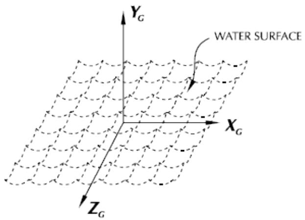

1.2.1 Program Nomenclature

The following nomenclature displayed below is used for flotation and upending analysis:

GM - Metacentric height

COB - Center of buoyancy

$\mathsf{ C O B^{ * } - C O B }$ with hook load

CG - Center of gravity

BM - distance from ${ \mathsf{ C O B } }^{ * }$ to GM

BG - distance from ${ \mathsf{ C O B } }^{ * }$ to CG

KB - distance from keel to COB*

KG - distance from keel to CG

KM - keel to metacenter distance

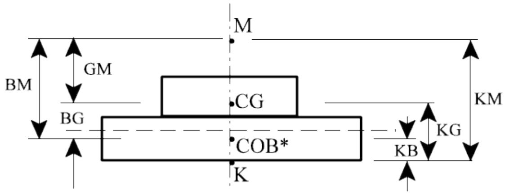

The terms I, the transverse or longitudinal waterplane moment of inertia, and X-bar, the distance from the metacenter to the center of the waterplane, are illustrated below along with GM, BM and BG.

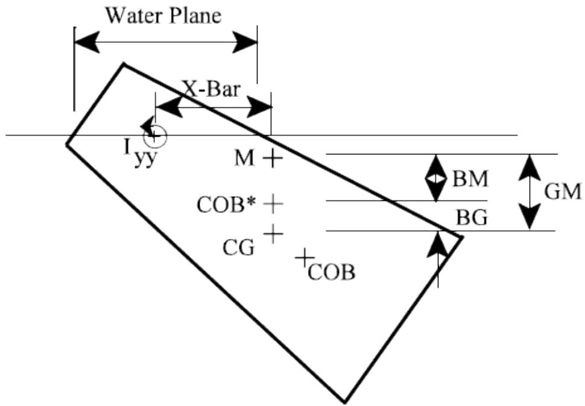

## 1.3 PROGRAM FEATURES

The Flotation program is designed to use upending sequence data specified in an input file, in conjunction with structural data specified in a SACS model input file. The following sections detail the various modeling, plotting and reporting features and capabilities of the program.

1.3.1 Flotation Modeling

Upending appurtenances and property overrides may be defined within the Flotation input file so the user is not required to modify the model. The flotation and upending program has the following modeling capabilities:

1. Single or dual hook capabilities.   
2. Ability to exclude members or groups of members.   
3. Weight, buoyancy and C.G. adjustment capabilities.   
4. Model several collinear members as one element for flooding purposes (eg. jacket legs).   
5. Buoyancy tanks implemented.   
6. Sling weight and elasticity considered including override capabilities.

7. Vented and non-vented leg ballast flooding with variable initial closed vent pressure.   
8. Weight of plate considered in analysis (eg. mudmats).   
9. Ability to model non-structural loads and buoyancy.   
10. User defined labeling for elements and appurtenances (hooks, tanks, legs etc.).

1.3.2 Upending Features

Position details and various upending conditions may be defined in the Flotation input file. The following are some of the upending features and capabilities:

1. Initial floating position provided with out requiring execution of upending sequence.   
2. Initial on bottom position provided with facilities to provide level setting on mudline without need for upending sequence.   
3. Steps may contain multiple procedures (ie. flood leg, raise hook, open valve etc.).   
4. Flood legs, members, tanks and open/close valve capabilities.   
5. Step initial condition defined by previous step final condition.   
6. Ability to create a load case, containing hydrostatic upending forces, for any step of the sequence.   
7. Ability to create stability plots for the current position of the structure.   
8. Initial hook height may be specified for any step.

1.3.3 Plot Capabilities

The Flotation program saves plots of the structure orientation for each step or designated steps. The following lists some of the plot capabilities:

1. Side (pitch) and/or front (roll) views of designated steps shown.   
2. Center of gravity, center of buoyancy and metacenter location shown.   
3. Slings shown in taut or slack positions.   
4. Step information including geometric and hydrostatic properties, sling loads etc. shown on plot.   
5. Mudline and water surface shown.

6. Water inside members, tanks and legs shown.

7. Stability representing the righting moment of the step.

8. Summary plots showing the value of the following variables vs. the step number can be generated:

a. hook load j. mudline clearance   
b. roll angle k. pitch angle   
c. longitudinal GM l. transverse GM   
d. BG m. flood ballast   
e. X-Bar n. Y-Bar   
f. waterplane area o. CG   
g. COB p. longitudinal waterplane moment of inertia   
h. buoyancy force q. transverse waterplane moment of inertia   
i. sling load

1.3.4 Report Capabilities

In addition to overall structure property reports, the program has the ability to report details for any step of the upending sequence. The user can also specify which joints or member groups are to be included in the reports. Some of the report capabilities are listed below.

1. Structure properties including summary of weight and CG for all items modeled.   
2. Structure CG and COB reported relative to the Flotation coordinate system at each step.   
3. Upending phase summary including pitch, roll and yaw angles, mudline clearance, height to surface, etc. for each step of the sequence.   
4. Hook and sling details including hook height, hook and sling loads.   
5. Flood ballast details for each step.   
6. Joint coordinates for specified joints for each phase of the upending.   
7. Group weight and buoyancy report includes CG and COB of the member group.

8. Water plane properties.   
9. Area under the righting moment curve.

2 FLOTATION INPUT

## 2.1 PREPARING THE STRUCTURAL MODEL

The Flotation program requires a structural model (usually a transportation or load out model) specified in a SACS input file.

The program has the ability to exclude members and groups from the analysis in addition to allowing user specified group overrides specified in the Flotation input file. In general, a typical jacket transportation model requires no modifications or rotation of the structure.

## 2.2 BASIC OPTIONS

Default upending analysis, plot and report options are specified in the Flotation input file.

2.2.1 Analysis Options

The upending analysis options are specified on the FLTOPT line.

The input and output units are input in columns 8-9 and 10-11, while the water depth and water density are input in columns 12-17 and 18-23, respectively.

The maximum number of iterations for any step increment is designated in columns 24-27. A step increment is assumed converged if the weight and moment difference between successive increments is less than the tolerances specified in columns 55-60 and 61-66.

The sample below designates that metric with kilonewtons force units are to be used for the double hook double crane analysis. The water depth is 52.0 and water density is 1.131. The maximum number of iterations is 200.

| 1 2 3 4 5 6 7 8 1234567890123456789012345678901234567890123456789012345678901234567890 |
| --- |
| FLTOPT MNNN52.0001.131 200 DHDC |

2.2.2 Report Options

2.2.2.1 Summary Reports

Summary report options are designated on the FLTOPT line in columns 35-50. The following reports are available:

JP - Jacket model data

EC - Input echo

GS - Group weight and buoyancy

WP - Waterplane properties

JC - Jacket center of gravity and center of buoyancy reported for each step increment.

HS - Hook force and location and sling force listed for each step increment.

RJ - Reference joint report contains the location of the reference joint for each step.

AL - All of the above summary reports are to be printed.

The following requests input echo, jacket data and all summary reports to be printed.

| 1 2 3 4 5 6 7 8 123456789012345678901234567890123456789012345678901234567890 |
| --- |
| FLTOPT MNMN52.0001.131 200 DHDC ECJPAL |

2.2.2.2 Detailed Reports

Detailed reports for desired joints containing joint location for each step increment may be selected by designating the joints using the REFJNT line.

2.2.3 Plot Options

Various plots are available including plots of the structure orientation during the upending sequence and summary plots.

2.2.3.1 Structure Orientation Plots

The orientation of the structure can be plotted for any step of the upending sequence using the PLOTH line.

The plot detail option is specified in columns 8-9 as follows:

P1 - Show only the outline of the structure   
P2 - Show only the members of designated on the plot   
P3 - Show all members on the plot   
P4 - Show all members except the designated groups

Note: Option P1 requires that the joints defining the outline to be plotted are specified using the PLTJNT line. Options P2 and P4 require the designation of member groups to be included (P2) or excluded (P4) using the PLTGRP line.

The user may designate which steps or step increments are to be plotted by default in columns 10-11 as follows:

AL - All increments of each step are plotted

SE - Only selected steps with ‘PL’ in columns 18-19 on the STEP line are plotted

LI - Only the last increment of the step is to be plotted

The view of the structure to be plotted, ie. pitch view, roll view or both views are designated by PV, RV or BV, respectively in columns 12-13.

Additional plot options such as no border, plot structure in 3D, exclude added weight symbol from plot and show member full thickness (2-line representation) may be selected by inputting NB, 3D, NE and/or MT, respectively in columns 14-21.

The following stipulates that the pitch view of the structure for the last increment of each step shall be plotted with all members plotted in full thickness (2-line).

| 1 2 3 4 5 6 7 8 1234567890123456789012345678901234567890123456789012345678901234567890 |
| --- |
| PLOTH P3LIPVMT |

Note: Plots are saved to a neutral picture file. The X-DOS and DOS systems have the ability to additionally send plots to the screen by designating ‘SC’ or ‘SP’ in columns 22-23.

2.2.3.2 Summary Plots

Summary plots showing data versus step increment may be requested using the PLTRQ line. The following summary plots are available:

HL - Hook load MC - Mudline clearance

PA - Pitch angle RA - Roll angle

FB - Flood ballast LM - Longitudinal GM

TM - Transverse GM BG - Vertical distance between CG and COB

XB – Xbar YB – Ybar

AR - Waterplane area LI - Longitudinal waterplane moment of inertia

CG - Center of gravity TI - Transverse waterplane moment of inertia

CB - Center of buoyancy BU - Buoyancy force

ST – Stability SL - Summation of sling loads

The sample line below requests hook loads, pitch angle, roll angle, flood ballast, buoyancy force and sling loads to be plotted versus step increment.

| 1 2 3 4 5 6 7 8 123456789012345678901234567890123456789012345678901234567890 |
| --- |
| PLTRQ HL PA RA FB BU SL |

## 2.3 FLOTATION MODEL PARAMETERS

The parameters required for the upending sequence such as structure orientation, structure and hydrostatic properties and flotation appurtenances are defined in the Flotation input file.

2.3.1 Structure Orientation

Three or four joints are used (on the JCKO line) to designate the orientation of the structure with respect to the flotation global coordinate system and the plane of the structure to be located at the water surface for its initial position.

Note: Flotation assumes that the plane defined by the specified joints is the "upper" surface of the structure and that the C.G. of the structure lies below this surface.

The orientation of the structure during each step of the upending sequence is reported in terms of roll, pitch and yaw angles. The program determines these angles from the relative positions of the structure coordinate axes to the flotation global axes. The order in which the joints on the JCKO line are specified determines this relationship.

The relationship between the structure coordinate axes and the flotation global axes is determined as follows:

1. The first two joints are used to determine the structure coordinate axis to be aligned in the flotation global YZ plane parallel to the global Z (pitch) axis. If the line defined is not parallel to any of the structure coordinate axes, the structure coordinate axis most nearly defined will be used.   
2. The third joint is used to determine the structure coordinate axis to be aligned in the global XY plane (or parallel to the flotation longitudinal or roll axis). A line perpendicular to the structure coordinate axis coinciding with the pitch axis and passing through the third joint is

used to determine the structure coordinate axis to be aligned with the roll axis. If the line defined is not parallel to any of the structure coordinate axes, the axis most nearly defined will be used.

View A in the figure below shows a jacket as it appears in a SACS model file. Joints J1, J2 and J3 of Row A are specified as the jacket orientation joints. Flotation will begin with the plane defined by joints J1, J2 and J3 (Row A) at the water surface. The structure coordinate axis most nearly defined by joints J1 and J2 (local X) will be aligned with the global Z (pitch) axis. The structure coordinate axis most nearly defined by a line perpendicular to the pitch axis and passing through joint J3 is the local Z axis and is aligned with the global X (roll) axis. Figure 2b shows the jacket orientation.

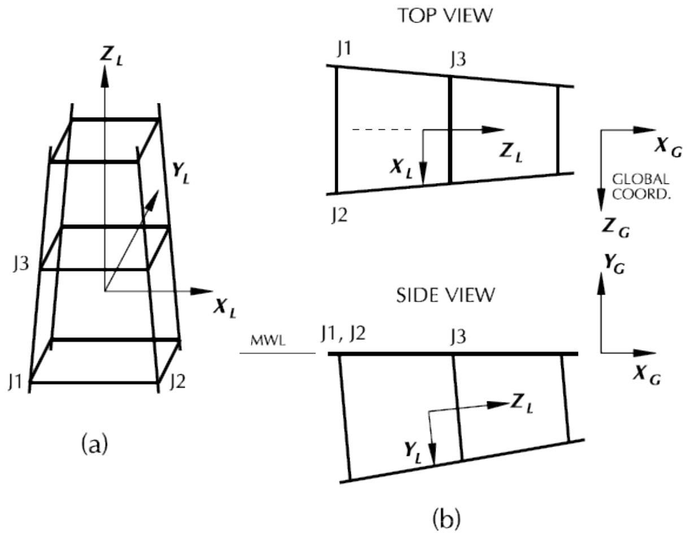

The following illustrates the designation of a structure where joints j1, j2, j3 shown above correspond to joints 101, 105 and 201, respectively. The JCKO line is used to define the orientation.

| 1 2 3 4 5 6 7 8 123456789012345678901234567890123456789012345678901234567890 | 1 2 3 4 5 6 7 8 123456789012345678901234567890123456789012345678901234567890 | 1 2 3 4 5 6 7 8 123456789012345678901234567890123456789012345678901234567890 | 1 2 3 4 5 6 7 8 123456789012345678901234567890123456789012345678901234567890 | 1 2 3 4 5 6 7 8 123456789012345678901234567890123456789012345678901234567890 | 1 2 3 4 5 6 7 8 123456789012345678901234567890123456789012345678901234567890 | 1 2 3 4 5 6 7 8 123456789012345678901234567890123456789012345678901234567890 | 1 2 3 4 5 6 7 8 123456789012345678901234567890123456789012345678901234567890 | 1 2 3 4 5 6 7 8 123456789012345678901234567890123456789012345678901234567890 |
| --- | --- | --- | --- | --- | --- | --- | --- | --- |
| JCKO | 8.478 | 101 | 105 | 605 | 1.025 |  |  |  |

2.3.2 Weight and Buoyancy

The weight, center of gravity (CG), buoyancy and center of buoyancy (COB) are calculated from the structural model in the SACS input file. The weight, buoyancy and center of gravity of the structure can be modified within the Flotation input file to account for un-modeled elements.

The weight, buoyancy or CG can be modified as follows:

1. The total weight of the structure can be factored uniformly by the weight contingency on the JCKO line. This can account for miscellaneous items that need not be modeled precisely or to increase the factor of safety for the analysis,   
2. Likewise, the center of gravity of the structure can be shifted by specifying X, Y and Z shifts with respect to the structure local coordinate system on the JCKO line.   
3. The weight and/or buoyancy of non-modeled structural items can be assigned to joints on the structure by using the WEIGHT line.   
4. Load cases can be converted to weights by specifying the load case names on the LCSEL line.

The following designates that the center of gravity is to shifted 0.5 and 0.2 in the X and Z directions, respectively. The weight of the model is also to be factored by 1.025 for contingency.

| 1 2 3 4 5 6 7 8 123456789012345678901234567890123456789012345678901234567890 | 1 2 3 4 5 6 7 8 123456789012345678901234567890123456789012345678901234567890 | 1 2 3 4 5 6 7 8 123456789012345678901234567890123456789012345678901234567890 | 1 2 3 4 5 6 7 8 123456789012345678901234567890123456789012345678901234567890 | 1 2 3 4 5 6 7 8 123456789012345678901234567890123456789012345678901234567890 | 1 2 3 4 5 6 7 8 123456789012345678901234567890123456789012345678901234567890 | 1 2 3 4 5 6 7 8 123456789012345678901234567890123456789012345678901234567890 | 1 2 3 4 5 6 7 8 123456789012345678901234567890123456789012345678901234567890 | 1 2 3 4 5 6 7 8 123456789012345678901234567890123456789012345678901234567890 | 1 2 3 4 5 6 7 8 123456789012345678901234567890123456789012345678901234567890 |
| --- | --- | --- | --- | --- | --- | --- | --- | --- | --- |
| JCKO | 8.478 | 101 | 105 | 605 | 1.025 | 0.5 | 0.2 |  |  |

This sample specifies that 0.5 tons of weight is to be added at joints 605 and 607. The buoyancy of this added weight is 0. Load cases ‘MISC’ and ‘BOAT’ are to be converted to weight.

|  | 1 | 2 | 3 | 4 | 5 | 6 | 7 | 8 |
| --- | --- | --- | --- | --- | --- | --- | --- | --- |
| 1234567890123456789012345678901234567890123456789012345678901234567890 | 1234567890123456789012345678901234567890123456789012345678901234567890 | 1234567890123456789012345678901234567890123456789012345678901234567890 | 1234567890123456789012345678901234567890123456789012345678901234567890 | 1234567890123456789012345678901234567890123456789012345678901234567890 | 1234567890123456789012345678901234567890123456789012345678901234567890 | 1234567890123456789012345678901234567890123456789012345678901234567890 | 1234567890123456789012345678901234567890123456789012345678901234567890 | 1234567890123456789012345678901234567890123456789012345678901234567890 |
| JCKO | 8.478 | 101 | 105 | 605 | 1.025 |  |  |  |
| PLOTH | P3LIPVMTSC | P3LIPVMTSC | P3LIPVMTSC | P3LIPVMTSC | P3LIPVMTSC | P3LIPVMTSC | P3LIPVMTSC | P3LIPVMTSC |
| LCSEL |  | MISC | BOAT |  |  |  |  |  |
| WEIGHT | 605 | 0.5 |  | 0.0 |  |  |  |  |
| WEIGHT | 607 | 0.5 |  | 0.0 |  |  |  |  |

2.3.3 Excluding or Overriding Structural Elements

Certain members or groups of members in the structural model, such as piles and conductors, may be excluded for the purpose of the upending analysis by specifying them on the MBRDEL or GRPDEL lines respectively.

For example, groups PL1, PL2 and PL3 and member 107-308 are excluded for the purposes of the upending analysis as follows:

| 1 2 3 4 5 6 7 8 1234567890123456789012345678901234567890123456789012345678901234567890 |
| --- |
| GRPDEL PL1 PL2 PL3 MBRDEL 107 308 |

Group geometric and hydrostatic properties including flood condition, density, cross section area (used to determine weight), displaced area (used to determine buoyancy) and effective dimension used to determine force in the local Y and local Z directions may be modified for the purpose of the upending analysis using the GRPOV line.

The following stipulates that group TRR is to be flooded and the cross section area is 20.

| 1 2 3 4 5 6 7 8 123456789012345678901234567890123456789012345678901234567890 | 1 2 3 4 5 6 7 8 123456789012345678901234567890123456789012345678901234567890 | 1 2 3 4 5 6 7 8 123456789012345678901234567890123456789012345678901234567890 | 1 2 3 4 5 6 7 8 123456789012345678901234567890123456789012345678901234567890 | 1 2 3 4 5 6 7 8 123456789012345678901234567890123456789012345678901234567890 | 1 2 3 4 5 6 7 8 123456789012345678901234567890123456789012345678901234567890 | 1 2 3 4 5 6 7 8 123456789012345678901234567890123456789012345678901234567890 |
| --- | --- | --- | --- | --- | --- | --- |
| GRPOV | TRR F | 20.0 |  |  |  |  |

2.3.4 Modeling Appurtenances

Equipment or appurtenances used specifically during the upending of the structure can be specified in the Flotation input file. Hooks, slings, buoyancy tanks, valves and flooding systems can be specified.

2.3.4.1 Flood Elements

Collinear members that will be flooded as a system by a controlled flooding sequence can be specified as a flood element or flood leg using the LEGDEF line.

Flood elements are given a name of up to eight characters long and may be called during the upending sequence using the name specified.

This sample designates that collinear members lying between joints 101 and 501, ie. jacket leg members 101-201, 201-301, 301-401 and 401-501, are to be considered as one element for the purposes of flooding and is named LEGA1.

| 1 2 3 4 5 6 7 8 123456789012345678901234567890123456789012345678901234567890 |
| --- |
| LEGDEF 101 501LEGA1 |

Note: When elements are defined as part of a flood element as in the sample above, the volume of flood element is the summation of the volume of each element making up the flood element. When flooded by name, the flood element is considered to be one single element.

2.3.4.2 Buoyancy Tanks

Buoyancy tanks may be defined in the Flotation input file. Buoyancy tank properties and location are specified using the TANKC line. The tank location is defined in the model structural coordinate system. When creating upending load cases, the structure joints to which the tank load will be applied are specified on the TANKJ line.

The sample data below defines a tank of diameter 3.0, wall thickness 0.75 and end cap thickness of 1.25. The tank, designated as TANK01, is located by specifying the coordinates of the ends. If a load case is to be created, the model joints to which the tank loads are distributed are designated as 501 and 505 on the TANKJ line.

| 1 2 3 4 5 6 7 8 123456789012345678901234567890123456789012345678901234567890 | 1 2 3 4 5 6 7 8 123456789012345678901234567890123456789012345678901234567890 | 1 2 3 4 5 6 7 8 123456789012345678901234567890123456789012345678901234567890 | 1 2 3 4 5 6 7 8 123456789012345678901234567890123456789012345678901234567890 | 1 2 3 4 5 6 7 8 123456789012345678901234567890123456789012345678901234567890 | 1 2 3 4 5 6 7 8 123456789012345678901234567890123456789012345678901234567890 | 1 2 3 4 5 6 7 8 123456789012345678901234567890123456789012345678901234567890 | 1 2 3 4 5 6 7 8 123456789012345678901234567890123456789012345678901234567890 | 1 2 3 4 5 6 7 8 123456789012345678901234567890123456789012345678901234567890 | 1 2 3 4 5 6 7 8 123456789012345678901234567890123456789012345678901234567890 |  |
| --- | --- | --- | --- | --- | --- | --- | --- | --- | --- | --- |
| TANKC TANK01 | 3.0 | 0.75 | 1.25 | 490. | -15.5 | -10.0 | 5.0 | -15.5 | 10.0 | 5.0 |
| TANKJ |  | 501 | 505 |  |  |  |  |  |  |  |

2.3.4.3 Hooks and Slings

Hooks used during the upending sequence are defined on the HOOK line. The program has the ability to simulate single or dual hook lifts.

Lift slings and their parameters including length, diameter and modules of elasticity are specified on SLING lines immediately following the HOOK line defining the hook to which they are attached. A maximum of four slings per hook may be modeled.

Note: Slings that may require length changes during the upending sequence must be assigned a sling name in columns 56-63 on the SLING line.

The following defines a main hook named MAIN and an auxiliary hook named AUX. The main hook has four 12.0 diameter slings, named ‘SL301’, ‘SL305’, ‘SL401’ and ‘SL405’, respectively, attached to the structure at joints 301, 305, 401 and 405. The slings connected to joints 301 and 305 are 26.0 long while the slings attached to joints 401 and 405 are 30.0 long. The auxiliary hook has three 10.0 diameter 20.0 long slings attached at joints 601, 603 and 605.

|  | 1 | 2 | 3 | 4 | 5 | 6 | 7 | 8 |
| --- | --- | --- | --- | --- | --- | --- | --- | --- |
| 12345678901234567890123456789012345678901234567890123456789012345678901234567890 | 12345678901234567890123456789012345678901234567890123456789012345678901234567890 | 12345678901234567890123456789012345678901234567890123456789012345678901234567890 | 12345678901234567890123456789012345678901234567890123456789012345678901234567890 | 12345678901234567890123456789012345678901234567890123456789012345678901234567890 | 12345678901234567890123456789012345678901234567890123456789012345678901234567890 | 12345678901234567890123456789012345678901234567890123456789012345678901234567890 | 12345678901234567890123456789012345678901234567890123456789012345678901234567890 | 12345678901234567890123456789012345678901234567890123456789012345678901234567890 |
| HOOK | MAIN |  |  |  |  |  |  |  |
| SLING | 301 | 26.000 | 12.000 | 7.0000 |  | SL301 | EL 3 A1 |  |
| SLING | 305 | 26.000 | 12.000 | 7.0000 |  | SL305 | EL 3 B1 |  |
| SLING | 401 | 30.000 | 12.000 | 7.0000 |  | SL401 | EL 2 A1 |  |
| SLING | 405 | 30.000 | 12.000 | 7.0000 |  | SL405 | EL 2 B1 |  |
| HOOK | AUX |  |  |  |  |  |  |  |
| SLING | 601 | 20.000 | 10.000 | 7.0000 |  | LEG A1 |  |  |
| SLING | 603 | 20.000 | 10.000 | 7.0000 |  | LEG A2 |  |  |
| SLING | 605 | 20.000 | 10.000 | 7.0000 |  | LEG B1 |  |  |

Note: Since slings attached to the auxiliary hook are not named, the length can not be changed during the upending sequence.

2.3.4.4 Valves

Vented or non-vented flow valves on a member, flood system (leg) or buoyancy tank are designated using the VALVE line.

The member containing the valve and the distance from the member end are required. For non-vented valves, the initial internal pressure must be specified.

The following defines a non-vented valve named ‘VALVE-N1’ located in member 203-303 3.75 from the end. The initial internal pressure is 25.

| 1 2 3 4 5 6 7 8 123456789012345678901234567890123456789012345678901234567890 |
| --- |
| VALVE VALVE-N1 203 303 N 3.75 25.0 |

3 THE UPENDING SEQUENCE

## 3.1 DETERMINING THE INITIAL FLOATING POSITION

The floating position of the structure can be determined without performing any steps of an upending sequence. This feature can be used to determine an initial state of equilibrium when a structure is placed in the water.

To use this feature, the complete flotation model including all appurtenances and the jacket orientation should be defined in the Flotation input file. A blank STEP line should be specified after the BEGIN line. The following illustrates the input required to obtain the initial floating position.

| 1 2 3 4 5 6 7 8 123456789012345678901234567890123456789012345678901234567890 |
| --- |
| BEGIN STEP |

Note: If no upending steps are specified, the program will determine an initial state of equilibrium automatically. Sample Problem 1 illustrates this program feature.

## 3.2 DETERMINING THE ON BOTTOM POSITION

An on bottom position can be obtained with out running the upending sequence. The final position hook elevation, member, tank and valve flood statuses etc. are input in the Flotation input file after the BEGIN line. This feature can be used to find the final parameters of the sequence in order to have the structure in a level position at the mudline. Sample Problem 2 illustrates this feature.

Note: The Flotation program does not consider the mudline as a support surface. Therefore, a hook elevation such that the structure is very nearly or just touching the bottom surface should be used.

## 3.3 DEFINING UPENDING SEQUENCE STEPS

Once the flotation model including upending appurtenances has been created, the steps of the upending sequence can be specified. The following sections describe the upending events (and the respective commands) that can be specified during any step of the sequence.

Steps of the upending sequence are specified in the Flotation input file immediately following the BEGIN line. Each step can contain several different commands (ie. HOOKEL MAIN 40.0M, FLLEG 0.50 Leg A1, OPEN 0.50 Leg A2) to allow for simultaneous events and the pitch or roll angle of the structure can be controlled for any step.

Steps can be broken into small increments by specifying the number of increments on the STEP line. This is recommended to insure convergence to realistic results and to reduce the chance of by-passing intermediate positions of equilibrium. For instance, raising the hook to elevation 10.0m (ft) in 2.0m (ft) increments (5 steps) may be done by specifying:

| 1 2 3 4 5 6 7 8 123456789012345678901234567890123456789012345678901234567890 | 1 2 3 4 5 6 7 8 123456789012345678901234567890123456789012345678901234567890 | 1 2 3 4 5 6 7 8 123456789012345678901234567890123456789012345678901234567890 | 1 2 3 4 5 6 7 8 123456789012345678901234567890123456789012345678901234567890 | 1 2 3 4 5 6 7 8 123456789012345678901234567890123456789012345678901234567890 | 1 2 3 4 5 6 7 8 123456789012345678901234567890123456789012345678901234567890 | 1 2 3 4 5 6 7 8 123456789012345678901234567890123456789012345678901234567890 |
| --- | --- | --- | --- | --- | --- | --- |
| STEP 5 HOOKEL MAIN 10.0 | STEP 5 HOOKEL MAIN 10.0 | STEP 5 HOOKEL MAIN 10.0 | STEP 5 HOOKEL MAIN 10.0 | STEP 5 HOOKEL MAIN 10.0 | STEP 5 HOOKEL MAIN 10.0 | STEP 5 HOOKEL MAIN 10.0 |

Hydrostatic, gravity and sling forces for any step can be saved as a load case for analysis, by specifying option ‘LD’ on the appropriate STEP line image and the ‘SL’ option on the FLTOPT line.

Note: When buoyancy tanks are specified and loads are to be created, the joints to which tanks loads are to be distributed, should be specified on the TANKJ line.

3.3.1 Changing Hook Elevation/Load

The hook elevation or hook load can be changed in order to raise or lower the structure during the upending sequence. The HOOK line can be specified for any hook defined in the Flotation input.

The following line positions the hook named MAIN at elevation 10. Five increments are used to move from the current elevation to elevation 10.

| 1 2 3 4 5 6 7 8 123456789012345678901234567890123456789012345678901234567890 | 1 2 3 4 5 6 7 8 123456789012345678901234567890123456789012345678901234567890 | 1 2 3 4 5 6 7 8 123456789012345678901234567890123456789012345678901234567890 | 1 2 3 4 5 6 7 8 123456789012345678901234567890123456789012345678901234567890 | 1 2 3 4 5 6 7 8 123456789012345678901234567890123456789012345678901234567890 | 1 2 3 4 5 6 7 8 123456789012345678901234567890123456789012345678901234567890 | 1 2 3 4 5 6 7 8 123456789012345678901234567890123456789012345678901234567890 |
| --- | --- | --- | --- | --- | --- | --- |
| STEP 5 HOOKEL MAIN 10.0 | STEP 5 HOOKEL MAIN 10.0 | STEP 5 HOOKEL MAIN 10.0 | STEP 5 HOOKEL MAIN 10.0 | STEP 5 HOOKEL MAIN 10.0 | STEP 5 HOOKEL MAIN 10.0 | STEP 5 HOOKEL MAIN 10.0 |

3.3.2 Adding Lift, Weight or Buoyancy Forces

Non-structural lift, weight or buoyancy force can be added to a joint during any step of the upending sequence on the FLWT line. Buoyancy forces are applied only if the joint is submerged.

In the following step, in addition to changing the hook elevation, a buoyancy force of 0.2 is added at joint 323 and 456. It is applied in 5 increments (ie. 0.04 increments).

|  | 1 | 2 | 3 | 4 | 5 | 6 | 7 | 8 |
| --- | --- | --- | --- | --- | --- | --- | --- | --- |
|  | 12345678901 | 12345678901 | 12345678901 | 12345678901 | 12345678901 | 12345678901 | 12345678901 | 1234567890 |
| STEP 5 | STEP 5 | STEP 5 | STEP 5 | STEP 5 | STEP 5 | STEP 5 | STEP 5 | STEP 5 |
| HOOKEL MAIN | HOOKEL MAIN | HOOKEL MAIN | 10.0 | 10.0 | 10.0 | 10.0 | 10.0 | 10.0 |
| FLWT | 323 | 0.2 | 456 | 0.2 |  |  |  |  |

Note: Forces on the FLWT line apply only to the step in which they are specified, whereas forces specified on the WEIGHT line apply to the entire sequence.

3.3.3 Flooding Members

There are several facilities in the program to flood or unflood members. Individual members or groups of members flood status can be changed by specifying a flood ratio on the FLMEM and FLGRP lines respectively.

Note: Members and flood legs are flooded only when they are submerged. If an element is partially submerged, only that part is available for flooding. For example, if 20% of a member is submerged, a maximum of 20% can be flooded regardless of whether a value of greater than 20% was stipulated.

The following designates that group ‘TTT’ and members 156-134 and 168-347 are to be completely flooded.

| 1 2 3 4 5 6 7 8 1234567890123456789012345678901234567890123456789012345678901234567890 |
| --- |
| STEP FLGRP 1.0 TTT FLMEM 1.0 156 134 168 347 |

The FLLEG line can be used to change the flood status of members defined or grouped as a flood element by a LEGDEF line. The following designates a flood ratio of 0.50 for the flood legs LEGA1 and LEGA2.

| 1 2 3 4 5 6 7 8 123456789012345678901234567890123456789012345678901234567890 |
| --- |
| STEP FLLEG 0.5 LEGA1 LEGA2 |

Note: The flood ratio designated on the FLLEG line applies to the defined leg as a system and not to the individual members that make up the leg. For example, flooding 50% of a submerged vertical leg will result in the bottom half of the leg to be flooded, not 50% of each member of the leg to be flooded.

3.3.4 Flooding Buoyancy Tanks

The flood status of a buoyancy tank defined in the Flotation input file can be modified on the FLTNK line.

The tank defined as TANK01 is to be 20% flooded by the following:

| 1 2 3 4 5 6 7 8 123456789012345678901234567890123456789012345678901234567890 |
| --- |
| FLTNK 0.2 TANK01 |

Note: Tanks are only flooded when they are submerged. If a tank is partially submerged, only that part is available for flooding. For example, if 20% of a tank is submerged, a maximum of 20% can be flooded regardless of whether a value of greater than 20% was stipulated.

3.3.5 Opening and Closing Valves

Valves defined by valve data in the Flotation input file can be opened by specifying the valve label and flood ratio on the OPEN line image. The flood ratio is the amount of water to be contained in the member for this step compared to the amount when filled to capacity.

Valves previously opened during the upending sequence can be closed by specifying the valve label on the CLOSE line image. Any water in the element will remain until the valve is re-opened.

3.3.6 Creating Stability Curves

Pitch or roll stability curves may be generated for any sequence step by specifying an ANGLE line as part of the step information. The pitch or roll angles are specified relative to the structures current position and must be input in ascending order.

For example, a roll stability curve is generated for the following step using angles of -15, -10, -5, 0, 5, 10 and 15 degrees.

| 1 2 3 4 5 6 7 8 123456789012345678901234567890123456789012345678901234567890 |
| --- |
| STEP FLLEG 0.5 LEGA1 LEGA2 ANGLE R -15. -10. -5. 0.0 5. 10. 15. |

Another way to enter angles is by entering the number of angles in columns 8-10 on the ANGLE line and entering the initial and final angle in columns 11-15 and 16-20, respectively. The increment between angles is equal in this case. Using this method, the previous ANGLE example may be entered as

| 1 2 3 4 5 6 7 8 1234567890123456789012345678901234567890123456789012345678901234567890 |
| --- |
| STEP FLLEG 0.5 LEGA1 LEGA2 ANGLE R 7 -15. 15. |

3.3.7 Creating a Balanced Load Condition

Hydrostatic, gravity and sling forces for any step can be saved as a load case for analysis, by specifying option ‘LD’ in columns 20-21 on the appropriate STEP line and the ‘SL’ option on the FLTOPT line.

For example, a set of balanced loads is to be created for the equilibrium position of the step defined below:

| 1 2 3 4 5 6 7 8 123456789012345678901234567890123456789012345678901234567890 | 1 2 3 4 5 6 7 8 123456789012345678901234567890123456789012345678901234567890 | 1 2 3 4 5 6 7 8 123456789012345678901234567890123456789012345678901234567890 | 1 2 3 4 5 6 7 8 123456789012345678901234567890123456789012345678901234567890 | 1 2 3 4 5 6 7 8 123456789012345678901234567890123456789012345678901234567890 | 1 2 3 4 5 6 7 8 123456789012345678901234567890123456789012345678901234567890 | 1 2 3 4 5 6 7 8 123456789012345678901234567890123456789012345678901234567890 |
| --- | --- | --- | --- | --- | --- | --- |
| STEP FLLEG 0.5 LEGA1 | LD LEGA2 |  |  |  |  |  |

3.3.8 Overriding Default Options

Plot details, plot view and general plot default data may be overridden for a particular step on the STEP line. For example, the roll view of the last increment is to be plotted for the step defined.

| 1 2 3 4 5 6 7 8 123456789012345678901234567890123456789012345678901234567890 |
| --- |
| STEP RV LI FLLEG 0.5 LEGA1 LEGA2 |

3.3.9 Changing Sling Length

The sling length may be changed during the upending sequence for any sling that has an optional sling name specified in columns 56-63 on the SLING line defining it. The hook label, sling name and the new sling length are designated on the SLLENG line.

For example, the following step indicates that the length of sling ‘SL301’ attached to hook ‘MAIN’ should be changed to 24.

| 1 2 3 4 5 6 7 8 1234567890123456789012345678901234567890123456789012345678901234567890 | 1 2 3 4 5 6 7 8 1234567890123456789012345678901234567890123456789012345678901234567890 | 1 2 3 4 5 6 7 8 1234567890123456789012345678901234567890123456789012345678901234567890 | 1 2 3 4 5 6 7 8 1234567890123456789012345678901234567890123456789012345678901234567890 | 1 2 3 4 5 6 7 8 1234567890123456789012345678901234567890123456789012345678901234567890 | 1 2 3 4 5 6 7 8 1234567890123456789012345678901234567890123456789012345678901234567890 | 1 2 3 4 5 6 7 8 1234567890123456789012345678901234567890123456789012345678901234567890 | 1 2 3 4 5 6 7 8 1234567890123456789012345678901234567890123456789012345678901234567890 |
| --- | --- | --- | --- | --- | --- | --- | --- |
| STEP RV LI SLLENG MAIN SL301 24.0 | STEP RV LI SLLENG MAIN SL301 24.0 | STEP RV LI SLLENG MAIN SL301 24.0 | STEP RV LI SLLENG MAIN SL301 24.0 | STEP RV LI SLLENG MAIN SL301 24.0 | STEP RV LI SLLENG MAIN SL301 24.0 | STEP RV LI SLLENG MAIN SL301 24.0 | STEP RV LI SLLENG MAIN SL301 24.0 |

# 4 COMMENTARY

## 4.1 INTRODUCTION

The flotation and upending program deals with forces and moments acting on a structure in calm water. The structure is considered a rigid body in a state of equilibrium when the resultant of all forces and moments acting on the body are zero.

The primary forces considered by the program are gravity forces, buoyancy forces and the vertical component of sling forces (treated as buoyancy forces). The position or orientation of a body is determined by the interaction of these forces. The body will settle to a position in which the forces of the slings and buoyancy equal the force of gravity (weight), and will rotate until the following conditions are met: the center of gravity and the center of buoyancy (including sling forces) act in the same vertical line, and any slight rotation produces a couple tending to move the body back to this position.

## 4.2 DETERMINING A POSITION OF EQUILIBRIUM

Flotation determines a position of equilibrium based on the forces and moments acting on the structure. For any step or sub-step of the upending sequence, the program considers the vertical forces acting on the structure and the moments about the global X and Z axes created by these forces. For the structure to be considered in a state of equilibrium, the following conditions must be met:

$$\left| \sum F_{w} - \sum F_{b} - \sum F_{s l i n g} \right| \leq \Delta M \tag{A}$$

where: $\mathsf{ F }_{ \mathsf{ w } }$ = Weight of member or element

$\mathsf{ F }_{ \mathsf{ b } }$ Buoyancy force of member or element

Fsling $\mathsf{ F }_{ \mathsf{ S l i n g } }$ = Sling force

$\Delta W$ = Weight tolerance specified on FLTOPT line

$$\left| \sum M_{x} \right| \leq \Delta M \tag{B}$$

$$\left| \sum M_{z} \right| \leq \Delta M \tag{C}$$

where: $\mathsf{ M }_{ \mathsf{ x } }$ = Moment at the C.G. about the global X axis

$\mathsf{ M }_{ \mathrm{ z } }$ = Moment at the C.G. about the global Z axis

$\Delta M$ = Moment tolerance specified on FLTOPT line

## 4.3 STABILITY OF THE STRUCTURE

For any position of equilibrium, certain variables relating to the degree of stability of the structure can be calculated. The transverse and longitudinal metacentric height are important indexes of stability. The greater the metacentric height, the greater the righting arm, thus the more stable the structure will be. The figure below illustrates the relationship between the CG, COB, metacentric height GM, and the righting arm BG.

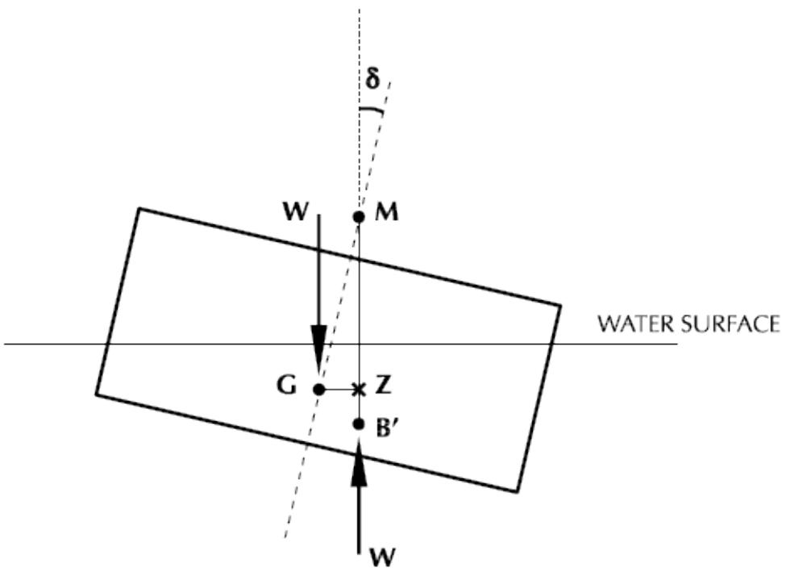

If the center of buoyancy of a body has moved from the CG as a result of a small inclination (up to about 7 degrees), the vertical line through the center of buoyancy will intersect an originally vertical line through the center of gravity at a point M, called the metacenter.

## 4.4 DETERMINING PITCH, ROLL AND YAW ANGLES

For any state of equilibrium, the orientation of the structure is specified in terms of roll, pitch and yaw angles. These angles are calculated from the orientation of the structure’s reference plane with respect to the global coordinate axes. Figure 4 shows a local coordinate system represented by X', Y' and Z', with respect to the flotation global coordinate system.

Note: The structure local coordinate system corresponding to this system is determined by the user by specifying orientation joints on the JCKO input line.

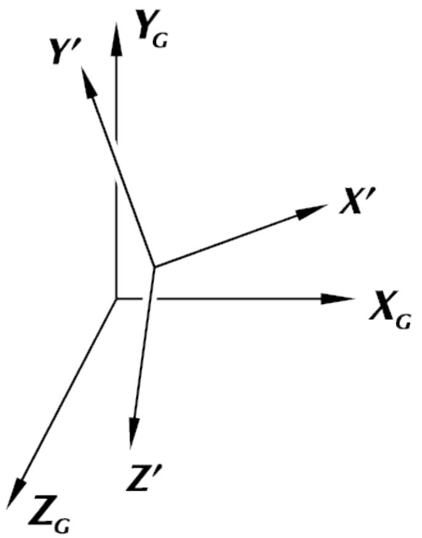

The angle between the projection of the Y' axis on the global XY plane and the global Y axis is reported as the pitch angle. The angle between the projection of the Y' axis on the global YZ plane and the global Y axis is reported as the roll angle. The reported yaw angle is the angle between the X' projection on the global XZ plane and the global X axis or the angle between the Z' projection on the global XZ plane and the global Z axis.

## 4.5 FLUID MECHANICS FOR FLOODING

The flood ratio specified by the user is the percent of the volume capacity of the member or members to be flooded. The flooding is assumed to occur instantaneously.

When flooding members, tanks and/or legs, trapped air is assumed to be vented as water enters the element. For totally submerged members or elements, the elevation of the water inside is the same as elevation of the top of the element. For partially submerged elements the elevation of the water inside the element coincides with the water surface elevation. The volume capacity V can be calculated from:

$$V = \frac{\pi D_{i}^{2}}{4} \frac{y_{w} - y_{b}}{\cos \alpha} \tag{1}$$

where: $\mathsf{ D }_{ \mathsf{ i } }$ = inside diameter of member/element

$y_{ \mathsf{ b } }$ bottom elevation of member/element

$\mathsf{ y }_{ \mathsf{ w } }$ = elevation of water inside member/element

?? angle member makes with the vertical axis

For elements with unvented valves specified, the back pressure developed by trapped air must be considered. The trapped air is assumed to be compressed at constant temperature. For isothermal conditions (constant temperature) with constant mass, the following is true:

$$p_{1} V_{1} = p_{2} V_{2} \tag{2}$$

where: $\begin{array} { r l r } { \mathsf{ p }_{ 1 } , \mathsf{ p }_{ 2 } } & { { } = } & { \mathsf{ a b s o l u t e } \mathsf{ p r e s s u r e } ( \mathsf{ c o n d i t i o n s } 1 \& 2 ) } \end{array}$

$\begin{array} { r l r } { \mathsf{ V }_{ 1 } , \mathsf{ V }_{ 2 } } & { { } = } & { \mathsf{ v o l u m e } \left( \mathsf{ c o n d i t i o n s } \ : 1 \ : \& \ : 2 \right) } \end{array}$

Figure 5 on the following page, shows air inside a tube or vessel where the diameter is constant. Therefore, the cross section area of the air for conditions 1 and 2 are the same. For this situation, equation 2 can be expressed as follows:

$$p_{1} h_{1} = p_{2} h_{2} \tag{3}$$

where: $\begin{array} { r l r } { \mathsf{ p }_{ 1 } , \mathsf{ h }_{ 1 } } & { { } = } & { \mathsf{ i n i t i a l \ p r e s s u r e \ a n d \ h e i g h t { o } f \ a i r } } \end{array}$

$\begin{array} { r l r } { \mathsf{ p }_{ 2 } , \mathsf{ h }_{ 2 } } & { { } = } & { \mathsf{ p r e s e n t \ p r e s s u r e \ a n d \ h e i g h t { o } f \mathsf{ a i r } } } \end{array}$

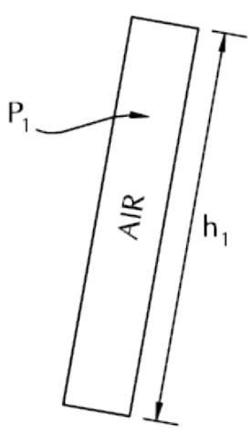  
CONDITION 1

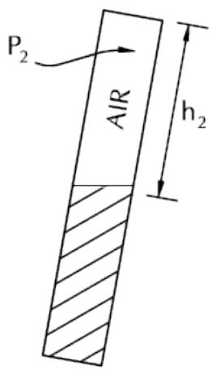  
CONDITION 2   
Figure 5

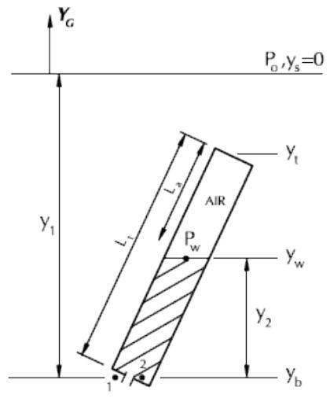  
Figure 6

Figure 6 shows a submerged member with a valve opening a distance y1 below the water surface. The total pressure at point 1 can be described by the following:

$$\frac{p_{0}}{w} + \frac{v_{1}^{2}}{2 g} + y_{1} \tag{4}$$

where: po = pressure at fluid surface

w unit weight of the fluid

v1 velocity of the fluid

g = acceleration of gravity

y1 = pressure head

Applying the Bernouli theorem for incompressible fluids at points 1 and 2 yields:

$$\frac{p_{0}}{w} + \frac{v_{1}^{2}}{2 g} + y_{1} = \frac{p_{w}}{w} + \frac{v_{2}^{2}}{2 g} + y_{2} \tag{5}$$

Using equation $^{ 3 , }$ the pressure of air at the surface of the water in the tube, can be expressed in terms of $L_{ \mathrm{ t } } , \ L_{ \mathsf{ a } }$ and atmospheric pressure $\mathsf{ P }_{ \mathsf{ o } }$ .

$$p_{w} = \frac{\left(p_{0} + \Delta p\right) L_{t}}{L_{a}} \tag{6}$$

where: p = difference between the initial pressure in the element and atmospheric pressure.

Assuming the velocities at points 1 and 2 are zero and incorporating equation 6, equation 5 can be rewritten as follows:

$$\frac{p_{0}}{w} + y_{1} = \frac{\left(p_{0} + \Delta p\right) L_{t}}{w L_{a}} + y_{2} \tag{7}$$

Applying simple geometry, Figure 6 yields the following relationships:

$$\frac{L_{t}}{L_{a}} = \frac{y_{t} - y_{b}}{y_{t} - y_{w}} \tag{a}$$

$$y_{1} = y_{s} - y_{b} \quad (\mathrm{b}) \quad y_{2} = y_{w} - y_{b} \tag{c}$$

Incorporating a, b and c into equation 7 results in the following equation:

$$\frac{p_{0}}{w} + y_{s} = \frac{\left(p_{0} + \Delta p\right)}{w} \frac{y_{t} - y_{b}}{y_{t} - y_{w}} + y_{w} \tag{8}$$

Multiplying both sides of this equation by （$\mathsf{ y }_{ \mathrm{ t } } - \mathsf{ y }_{ \mathrm{ w } } )$ and rearranging the terms, results in the following polynomial equation for calculating $\gamma_{ \mathsf{ w i } }$

$$y_{w}^{2} - y_{w} \left(\frac{p_{0}}{w} + y_{t}\right) + \left[ \frac{\left(p_{0} + \Delta p\right)}{w} y_{b} - \frac{\Delta p}{w} y_{t} \right] = y_{s} \left(y_{w} - y_{t}\right) = 0 \tag{9}$$

Using equation 1, the volume capacity of an unvented member or element can be calculated.

5 SAMPLE PROBLEMS

The tripod structure shown below was used to illustrate the various capabilities of the Flotation program. Three separate runs are illustrated:

1. The first problem demonstrates the programs ability to find the initial floating position without executing any steps.   
2. Sample Problem 2 shows the on bottom level position of the tripod.   
3. Sample Problem 3 illustrates the complete upending sequence from the initial floating position of Sample Problem 1 to the level on bottom position.

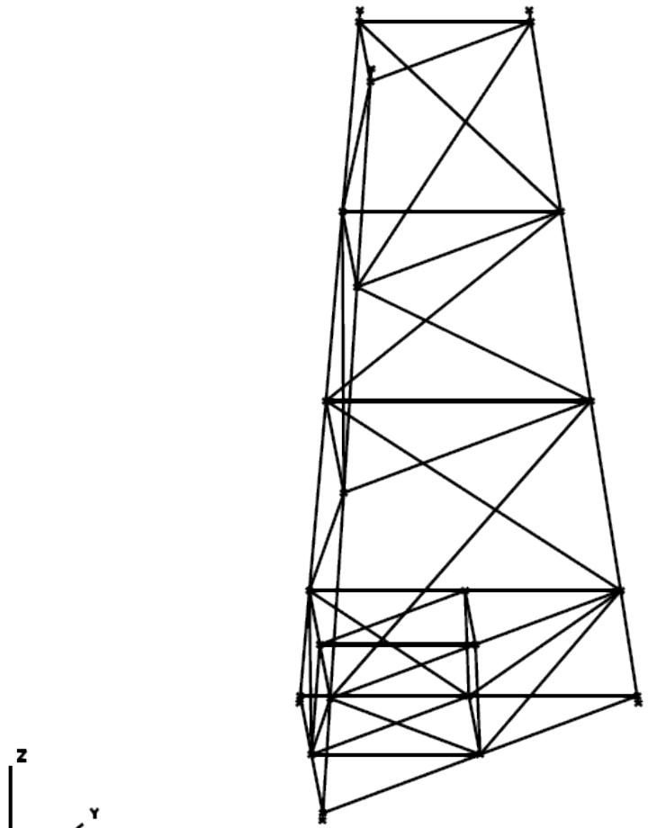  
FLOTATION SAMPLE MODEL

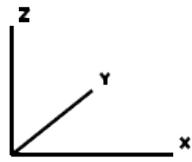

## 5.1 SAMPLE PROBLEM 1

The following sample illustrates the program’s ability to find the initial floating position of a structure without requiring any upending steps.

The tripod shown on the previous page is designed to be installed in 52.0 m of water. The structure will be lifted from the transportation barge and placed in the water such that the face or plane defined by joints 203, 205 and 703 will be at the water surface. The stable floating position that the structure will assume when removed from the main hook is desired.

The following is the Flotation input file used in Sample Problem 1, followed by a detailed discussion of the input lines.

12345678901230460000000000000000000000000000000000000000000000000000000

TRIPOD JACKET

A FLTOPT MNME52.01.078200

B JCKO 203205 703 1.02

C PLOTH P3ALPVSCMT

D REFJNT 101103105701703705

E LEGDEF 101 701LEG A1103 703LEG A2105 705LEG B1

F HOOK MAIN 7.5

G SLING701 20．10. 2.884

SLING 2.884

SLING 2.884

H BEGIN

I STEP

LEG A1

LEG A3

LEG B1

A. The FLTOPT line specifies metric units with forces expressed in kilonewtons for both input and output (col. 8-9 and 10-11). The water depth (52.0m) is specified in col. 12-17 and the density of sea water in col. 18-23. The maximum number of iterations for one step is 200.   
B. The JCKO line specifies that the plane defined by joints 203, 205 and 703 is to be at the water surface for the initial iteration. A weight contingency factor of 1.02 is specified in col. 33-38 and the CG is shifted 1.6 meters in the global Z direction.   
C. The PLOTH line requests that the pitch view containing all elements be plotted for all steps (PV, P3 and AL respectively). Each step should be plotted to the screen as well as the neutral picture file (SC) and the members are to be shown in full thickness (MT).   
D. Detailed reports for joints 101, 103, 105, 701, 703 and 705 are to be produced as designated on the REFJNT line.   
E. Collinear members between joints 101 to 701 are to be flooded as a system designated as LEG A1 on the LEGDEF line. Likewise, members between joints 103 and 703 designated LEG A2 and members between joints 105 and 705 designated as LEG B1 will be treated as single elements when flooding.

F. The hook is labeled as MAIN on the HOOK line and the initial elevation is 7.5 meters.

G. The slings attached to the hook labeled MAIN are designated on the ensuing SLING lines. The attach joint, sling length, diameter and modules of elasticity are specified in columns 8-11, 12- 18, 19-25 and 26-34 respectively.

H. The BEGIN line signals that specification of configuration data has been completed and specifies any orientation to use as a start point.

I. The STEP line designates that one step is to be performed. In this case, the determination of the initial floating position of the tripod.

The following is the output plot and a portion of the listing file for Sample Problem 1.

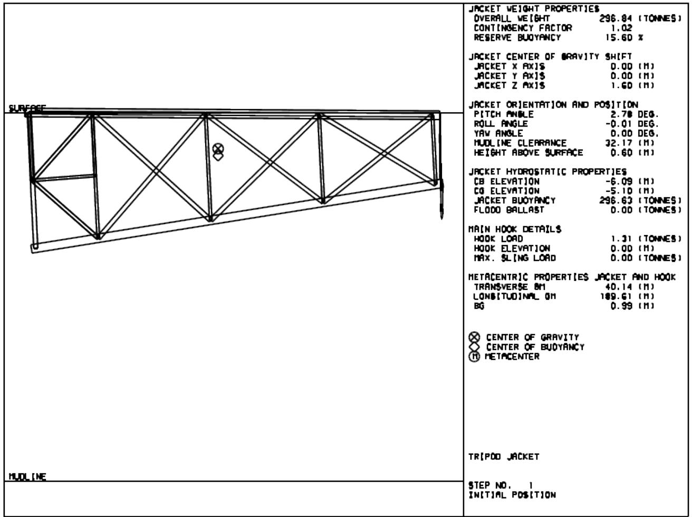

| TRIPOD JACKET | TRIPOD JACKET | TRIPOD JACKET | TRIPOD JACKET | TRIPOD JACKET | TRIPOD JACKET | TRIPOD JACKET | TRIPOD JACKET | TRIPOD JACKET | TRIPOD JACKET | TRIPOD JACKET | TRIPOD JACKET | TRIPOD JACKET | TRIPOD JACKET | TRIPOD JACKET | TRIPOD JACKET | TRIPOD JACKET | TRIPOD JACKET | TRIPOD JACKET | TRIPOD JACKET | TRIPOD JACKET | TRIPOD JACKET | TRIPOD JACKET | TRIPOD JACKET | TRIPOD JACKET | TRIPOD JACKET | TRIPOD JACKET | TRIPOD JACKET | TRIPOD JACKET | TRIPOD JACKET | TRIPOD JACKET | TRIPOD JACKET | TRIPOD JACKET | TRIPOD JACKET | TRIPOD JACKET | TRIPOD JACKET | TRIPOD JACKET | TRIPOD JACKET | TRIPOD JACKET | TRIPOD JACKET | TRIPOD JACKET | TRIPOD JACKET | TRIPOD JACKET | TRIPOD JACKET | TRIPOD JACKET | TRIPOD JACKET | TRIPOD JACKET | TRIPOD JACKET | TRIPOD JACKET | TRIPOD JACKET | TRIPOD JACKET | TRIPOD JACKET | TRIPOD JACKET | TRIPOD JACKET | TRIPOD JACKET | TRIPOD JACKET | TRIPOD JACKET | TRIPOD JACKET | TRIPOD JACKET | TRIPOD JACKET | TRIPOD JACKET | TRIPOD JACKET | TRIPOD JACKET | TRIPOD JACKET | TRIPOD JACKET | TRIPOD JACKET | TRIPOD JACKET | TRIPOD JACKET | TRIPOD JACKET | TRIPOD JACKET | TRIPOD JACKET | TRIPOD JACKET | TRIPOD JACKET | TRIPOD JACKET | TRIPOD JACKET | TRIPOD JACKET | TRIPOD JACKET | TRIPOD JACKET | TRIPOD JACKET | TRIPOD JACKET | TRIPOD JACKET | TRIPOD JACKET | TRIPOD JACKET | TRIPOD JACKET | TRIPOD JACKET | TRIPOD JACKET | TRIPOD JACKET | TRIPOD JACKET | TRIPOD JACKET | TRIPOD JACKET | TRIPOD JACKET | TRIPOD JACKET | TRIPOD JACKET | TRIPOD JACKET | TRIPOD JACKET | TRIPOD JACKET | TRIPOD JACKET | TRIPOD JACKET | TRIPOD JACKET | TRIPOD JACKET | TRIPOD JACKET |  |  |  |  |  |  |  |  |  |  |  |  |  |  |  |  |  |  |  |  |  |  |  |  |  |  |  |  |  |  |  |  |  |  |  |  |  |  |  |  |  |  |  |  |  |  |  |  |  |  |  |  |  |  |  |  |  |  |  |  |  |  |  |  |  |  |  |  |  |  |  |  |  |  |  |  |  |  |  |  |  |  |  |  |  |  |  |  |  |  |  |  |  |  |  |  |  |  |  |
| --- | --- | --- | --- | --- | --- | --- | --- | --- | --- | --- | --- | --- | --- | --- | --- | --- | --- | --- | --- | --- | --- | --- | --- | --- | --- | --- | --- | --- | --- | --- | --- | --- | --- | --- | --- | --- | --- | --- | --- | --- | --- | --- | --- | --- | --- | --- | --- | --- | --- | --- | --- | --- | --- | --- | --- | --- | --- | --- | --- | --- | --- | --- | --- | --- | --- | --- | --- | --- | --- | --- | --- | --- | --- | --- | --- | --- | --- | --- | --- | --- | --- | --- | --- | --- | --- | --- | --- | --- | --- | --- | --- | --- | --- | --- | --- | --- | --- | --- | --- | --- | --- | --- | --- | --- | --- | --- | --- | --- | --- | --- | --- | --- | --- | --- | --- | --- | --- | --- | --- | --- | --- | --- | --- | --- | --- | --- | --- | --- | --- | --- | --- | --- | --- | --- | --- | --- | --- | --- | --- | --- | --- | --- | --- | --- | --- | --- | --- | --- | --- | --- | --- | --- | --- | --- | --- | --- | --- | --- | --- | --- | --- | --- | --- | --- | --- | --- | --- | --- | --- | --- | --- | --- | --- | --- | --- | --- | --- | --- | --- | --- | --- | --- | --- | --- | --- | --- | --- | --- | --- | --- | --- | --- | --- | --- | --- | --- | --- | --- | --- |
| *** FLOATATION PARAMETERS *** | *** FLOATATION PARAMETERS *** | *** FLOATATION PARAMETERS *** | *** FLOATATION PARAMETERS *** | *** FLOATATION PARAMETERS *** | *** FLOATATION PARAMETERS *** | *** FLOATATION PARAMETERS *** | *** FLOATATION PARAMETERS *** | *** FLOATATION PARAMETERS *** | *** FLOATATION PARAMETERS *** | *** FLOATATION PARAMETERS *** | *** FLOATATION PARAMETERS *** | *** FLOATATION PARAMETERS *** | *** FLOATATION PARAMETERS *** | *** FLOATATION PARAMETERS *** | *** FLOATATION PARAMETERS *** | *** FLOATATION PARAMETERS *** | *** FLOATATION PARAMETERS *** | *** FLOATATION PARAMETERS *** | *** FLOATATION PARAMETERS *** | *** FLOATATION PARAMETERS *** | *** FLOATATION PARAMETERS *** | *** FLOATATION PARAMETERS *** | *** FLOATATION PARAMETERS *** | *** FLOATATION PARAMETERS *** | *** FLOATATION PARAMETERS *** | *** FLOATATION PARAMETERS *** | *** FLOATATION PARAMETERS *** | *** FLOATATION PARAMETERS *** | *** FLOATATION PARAMETERS *** | *** FLOATATION PARAMETERS *** | *** FLOATATION PARAMETERS *** | *** FLOATATION PARAMETERS *** | *** FLOATATION PARAMETERS *** | *** FLOATATION PARAMETERS *** | *** FLOATATION PARAMETERS *** | *** FLOATATION PARAMETERS *** | *** FLOATATION PARAMETERS *** | *** FLOATATION PARAMETERS *** | *** FLOATATION PARAMETERS *** | *** FLOATATION PARAMETERS *** | *** FLOATATION PARAMETERS *** | *** FLOATATION PARAMETERS *** | *** FLOATATION PARAMETERS *** | *** FLOATATION PARAMETERS *** | *** FLOATATION PARAMETERS *** | *** FLOATATION PARAMETERS *** | *** FLOATATION PARAMETERS *** | *** FLOATATION PARAMETERS *** | *** FLOATATION PARAMETERS *** | *** FLOATATION PARAMETERS *** | *** FLOATATION PARAMETERS *** | *** FLOATATION PARAMETERS *** | *** FLOATATION PARAMETERS *** | *** FLOATATION PARAMETERS *** | *** FLOATATION PARAMETERS *** | *** FLOATATION PARAMETERS *** | *** FLOATATION PARAMETERS *** | *** FLOATATION PARAMETERS *** | *** FLOATATION PARAMETERS *** | *** FLOATATION PARAMETERS *** | *** FLOATATION PARAMETERS *** | *** FLOATATION PARAMETERS *** | *** FLOATATION PARAMETERS *** | *** FLOATATION PARAMETERS *** | *** FLOATATION PARAMETERS *** | *** FLOATATION PARAMETERS *** | *** FLOATATION PARAMETERS *** | *** FLOATATION PARAMETERS *** | *** FLOATATION PARAMETERS *** | *** FLOATATION PARAMETERS *** | *** FLOATATION PARAMETERS *** | *** FLOATATION PARAMETERS *** | *** FLOATATION PARAMETERS *** | *** FLOATATION PARAMETERS *** | *** FLOATATION PARAMETERS *** | *** FLOATATION PARAMETERS *** | *** FLOATATION PARAMETERS *** | *** FLOATATION PARAMETERS *** | *** FLOATATION PARAMETERS *** | *** FLOATATION PARAMETERS *** | *** FLOATATION PARAMETERS *** | *** FLOATATION PARAMETERS *** | *** FLOATATION PARAMETERS *** | *** FLOATATION PARAMETERS *** | *** FLOATATION PARAMETERS *** | *** FLOATATION PARAMETERS *** | *** FLOATATION PARAMETERS *** | *** FLOATATION PARAMETERS *** | *** FLOATATION PARAMETERS *** | *** FLOATATION PARAMETERS *** | *** FLOATATION PARAMETERS *** | *** FLOATATION PARAMETERS *** | *** FLOATATION PARAMETERS *** | *** FLOATATION PARAMETERS *** | *** FLOATATION PARAMETERS *** | *** FLOATATION PARAMETERS *** | *** FLOATATION PARAMETERS *** | *** FLOATATION PARAMETERS *** | *** FLOATATION PARAMETERS *** |  |  |  |  |  |  |  |  |  |  |  |  |  |  |  |  |  |  |  |  |  |  |  |  |  |  |  |  |  |  |  |  |  |  |  |  |  |  |  |  |  |  |  |  |  |  |  |  |  |  |  |  |  |  |  |  |  |  |  |  |  |  |  |  |  |  |  |  |  |  |  |  |  |  |  |  |  |  |  |  |  |  |  |  |  |  |  |  |  |  |  |  |  |  |  |  |  |  |  |  |
| WATER DEPTH. . . . . . . . . . . . . . . . . . . . . . . . . . . . . . . . . . . . . . . . . . . . . . . . . . . . . . . . . . . . . . . . . . . . . . . . . . . . . . . . . . . . . . . . . . . . . . . . . . . . . . SEAWATER DENSITY. . . . . . . . . . . . . . . . . . . . . . . . . . . . . . . . . . . . . . . . . . . . . . . . . . . . . . . . . . . . . . . . . . . . . . . . . . . . . . . . . . . . . . . . . . . . . . . . . . . . MATERIAL DENSITY. . . . . . . . . . . . . . . . . . . . . . . . . . . . . . . . . . . . . . . . . . . . . . . . . . . . . . . . . . . . . . . . . . . . . . . . . . . . . . . . . . . . . . . . . . . . . . . . .. JACKET ORIENTATION JOINTS. . . . . . . . . . . . . . . . . . . . . . . . . . . . . . . . . . . . . . . . . . . . . . . . . . . . . . . . . . . . . . . . . . . . . . . . . . . . . . . . . . . . . . . . . . . . . . . . . . .. WEIGHT CONTINGENCY FACTOR. . . . . . . . . . . . . . . . . . . . . . . . . . . . . . . . . . . . . . . . . . . . . . . . . . .. CG CONTINGENCY SHIFTS X DIRECTION. . . . . . . . . . . . . . . . . . . . . . . . . . . . . . . . . . . . . . . . . . . . . . . . . . . . . . .. Y DIRECTION. . . . . . . . . . . . . . . . . . . . . . . . . . . . . . . . . . .. Z DIRECTION. . . . . . . . . . . . . . . . . . . . . . . . . . . . . . . .. MAIN HOOK | WATER DEPTH. . . . . . . . . . . . . . . . . . . . . . . . . . . . . . . . . . . . . . . . . . . . . . . . . . . . . . . . . . . . . . . . . . . . . . . . . . . . . . . . . . . . . . . . . . . . . . . . . . . . . . SEAWATER DENSITY. . . . . . . . . . . . . . . . . . . . . . . . . . . . . . . . . . . . . . . . . . . . . . . . . . . . . . . . . . . . . . . . . . . . . . . . . . . . . . . . . . . . . . . . . . . . . . . . . . . . MATERIAL DENSITY. . . . . . . . . . . . . . . . . . . . . . . . . . . . . . . . . . . . . . . . . . . . . . . . . . . . . . . . . . . . . . . . . . . . . . . . . . . . . . . . . . . . . . . . . . . . . . . . .. JACKET ORIENTATION JOINTS. . . . . . . . . . . . . . . . . . . . . . . . . . . . . . . . . . . . . . . . . . . . . . . . . . . . . . . . . . . . . . . . . . . . . . . . . . . . . . . . . . . . . . . . . . . . . . . . . . .. WEIGHT CONTINGENCY FACTOR. . . . . . . . . . . . . . . . . . . . . . . . . . . . . . . . . . . . . . . . . . . . . . . . . . .. CG CONTINGENCY SHIFTS X DIRECTION. . . . . . . . . . . . . . . . . . . . . . . . . . . . . . . . . . . . . . . . . . . . . . . . . . . . . . .. Y DIRECTION. . . . . . . . . . . . . . . . . . . . . . . . . . . . . . . . . . .. Z DIRECTION. . . . . . . . . . . . . . . . . . . . . . . . . . . . . . . .. MAIN HOOK | WATER DEPTH. . . . . . . . . . . . . . . . . . . . . . . . . . . . . . . . . . . . . . . . . . . . . . . . . . . . . . . . . . . . . . . . . . . . . . . . . . . . . . . . . . . . . . . . . . . . . . . . . . . . . . SEAWATER DENSITY. . . . . . . . . . . . . . . . . . . . . . . . . . . . . . . . . . . . . . . . . . . . . . . . . . . . . . . . . . . . . . . . . . . . . . . . . . . . . . . . . . . . . . . . . . . . . . . . . . . . MATERIAL DENSITY. . . . . . . . . . . . . . . . . . . . . . . . . . . . . . . . . . . . . . . . . . . . . . . . . . . . . . . . . . . . . . . . . . . . . . . . . . . . . . . . . . . . . . . . . . . . . . . . .. JACKET ORIENTATION JOINTS. . . . . . . . . . . . . . . . . . . . . . . . . . . . . . . . . . . . . . . . . . . . . . . . . . . . . . . . . . . . . . . . . . . . . . . . . . . . . . . . . . . . . . . . . . . . . . . . . . .. WEIGHT CONTINGENCY FACTOR. . . . . . . . . . . . . . . . . . . . . . . . . . . . . . . . . . . . . . . . . . . . . . . . . . .. CG CONTINGENCY SHIFTS X DIRECTION. . . . . . . . . . . . . . . . . . . . . . . . . . . . . . . . . . . . . . . . . . . . . . . . . . . . . . .. Y DIRECTION. . . . . . . . . . . . . . . . . . . . . . . . . . . . . . . . . . .. Z DIRECTION. . . . . . . . . . . . . . . . . . . . . . . . . . . . . . . .. MAIN HOOK | WATER DEPTH. . . . . . . . . . . . . . . . . . . . . . . . . . . . . . . . . . . . . . . . . . . . . . . . . . . . . . . . . . . . . . . . . . . . . . . . . . . . . . . . . . . . . . . . . . . . . . . . . . . . . . SEAWATER DENSITY. . . . . . . . . . . . . . . . . . . . . . . . . . . . . . . . . . . . . . . . . . . . . . . . . . . . . . . . . . . . . . . . . . . . . . . . . . . . . . . . . . . . . . . . . . . . . . . . . . . . MATERIAL DENSITY. . . . . . . . . . . . . . . . . . . . . . . . . . . . . . . . . . . . . . . . . . . . . . . . . . . . . . . . . . . . . . . . . . . . . . . . . . . . . . . . . . . . . . . . . . . . . . . . .. JACKET ORIENTATION JOINTS. . . . . . . . . . . . . . . . . . . . . . . . . . . . . . . . . . . . . . . . . . . . . . . . . . . . . . . . . . . . . . . . . . . . . . . . . . . . . . . . . . . . . . . . . . . . . . . . . . .. WEIGHT CONTINGENCY FACTOR. . . . . . . . . . . . . . . . . . . . . . . . . . . . . . . . . . . . . . . . . . . . . . . . . . .. CG CONTINGENCY SHIFTS X DIRECTION. . . . . . . . . . . . . . . . . . . . . . . . . . . . . . . . . . . . . . . . . . . . . . . . . . . . . . .. Y DIRECTION. . . . . . . . . . . . . . . . . . . . . . . . . . . . . . . . . . .. Z DIRECTION. . . . . . . . . . . . . . . . . . . . . . . . . . . . . . . .. MAIN HOOK | WATER DEPTH. . . . . . . . . . . . . . . . . . . . . . . . . . . . . . . . . . . . . . . . . . . . . . . . . . . . . . . . . . . . . . . . . . . . . . . . . . . . . . . . . . . . . . . . . . . . . . . . . . . . . . SEAWATER DENSITY. . . . . . . . . . . . . . . . . . . . . . . . . . . . . . . . . . . . . . . . . . . . . . . . . . . . . . . . . . . . . . . . . . . . . . . . . . . . . . . . . . . . . . . . . . . . . . . . . . . . MATERIAL DENSITY. . . . . . . . . . . . . . . . . . . . . . . . . . . . . . . . . . . . . . . . . . . . . . . . . . . . . . . . . . . . . . . . . . . . . . . . . . . . . . . . . . . . . . . . . . . . . . . . .. JACKET ORIENTATION JOINTS. . . . . . . . . . . . . . . . . . . . . . . . . . . . . . . . . . . . . . . . . . . . . . . . . . . . . . . . . . . . . . . . . . . . . . . . . . . . . . . . . . . . . . . . . . . . . . . . . . .. WEIGHT CONTINGENCY FACTOR. . . . . . . . . . . . . . . . . . . . . . . . . . . . . . . . . . . . . . . . . . . . . . . . . . .. CG CONTINGENCY SHIFTS X DIRECTION. . . . . . . . . . . . . . . . . . . . . . . . . . . . . . . . . . . . . . . . . . . . . . . . . . . . . . .. Y DIRECTION. . . . . . . . . . . . . . . . . . . . . . . . . . . . . . . . . . .. Z DIRECTION. . . . . . . . . . . . . . . . . . . . . . . . . . . . . . . .. MAIN HOOK | WATER DEPTH. . . . . . . . . . . . . . . . . . . . . . . . . . . . . . . . . . . . . . . . . . . . . . . . . . . . . . . . . . . . . . . . . . . . . . . . . . . . . . . . . . . . . . . . . . . . . . . . . . . . . . SEAWATER DENSITY. . . . . . . . . . . . . . . . . . . . . . . . . . . . . . . . . . . . . . . . . . . . . . . . . . . . . . . . . . . . . . . . . . . . . . . . . . . . . . . . . . . . . . . . . . . . . . . . . . . . MATERIAL DENSITY. . . . . . . . . . . . . . . . . . . . . . . . . . . . . . . . . . . . . . . . . . . . . . . . . . . . . . . . . . . . . . . . . . . . . . . . . . . . . . . . . . . . . . . . . . . . . . . . .. JACKET ORIENTATION JOINTS. . . . . . . . . . . . . . . . . . . . . . . . . . . . . . . . . . . . . . . . . . . . . . . . . . . . . . . . . . . . . . . . . . . . . . . . . . . . . . . . . . . . . . . . . . . . . . . . . . .. WEIGHT CONTINGENCY FACTOR. . . . . . . . . . . . . . . . . . . . . . . . . . . . . . . . . . . . . . . . . . . . . . . . . . .. CG CONTINGENCY SHIFTS X DIRECTION. . . . . . . . . . . . . . . . . . . . . . . . . . . . . . . . . . . . . . . . . . . . . . . . . . . . . . .. Y DIRECTION. . . . . . . . . . . . . . . . . . . . . . . . . . . . . . . . . . .. Z DIRECTION. . . . . . . . . . . . . . . . . . . . . . . . . . . . . . . .. MAIN HOOK | WATER DEPTH. . . . . . . . . . . . . . . . . . . . . . . . . . . . . . . . . . . . . . . . . . . . . . . . . . . . . . . . . . . . . . . . . . . . . . . . . . . . . . . . . . . . . . . . . . . . . . . . . . . . . . SEAWATER DENSITY. . . . . . . . . . . . . . . . . . . . . . . . . . . . . . . . . . . . . . . . . . . . . . . . . . . . . . . . . . . . . . . . . . . . . . . . . . . . . . . . . . . . . . . . . . . . . . . . . . . . MATERIAL DENSITY. . . . . . . . . . . . . . . . . . . . . . . . . . . . . . . . . . . . . . . . . . . . . . . . . . . . . . . . . . . . . . . . . . . . . . . . . . . . . . . . . . . . . . . . . . . . . . . . .. JACKET ORIENTATION JOINTS. . . . . . . . . . . . . . . . . . . . . . . . . . . . . . . . . . . . . . . . . . . . . . . . . . . . . . . . . . . . . . . . . . . . . . . . . . . . . . . . . . . . . . . . . . . . . . . . . . .. WEIGHT CONTINGENCY FACTOR. . . . . . . . . . . . . . . . . . . . . . . . . . . . . . . . . . . . . . . . . . . . . . . . . . .. CG CONTINGENCY SHIFTS X DIRECTION. . . . . . . . . . . . . . . . . . . . . . . . . . . . . . . . . . . . . . . . . . . . . . . . . . . . . . .. Y DIRECTION. . . . . . . . . . . . . . . . . . . . . . . . . . . . . . . . . . .. Z DIRECTION. . . . . . . . . . . . . . . . . . . . . . . . . . . . . . . .. MAIN HOOK | WATER DEPTH. . . . . . . . . . . . . . . . . . . . . . . . . . . . . . . . . . . . . . . . . . . . . . . . . . . . . . . . . . . . . . . . . . . . . . . . . . . . . . . . . . . . . . . . . . . . . . . . . . . . . . SEAWATER DENSITY. . . . . . . . . . . . . . . . . . . . . . . . . . . . . . . . . . . . . . . . . . . . . . . . . . . . . . . . . . . . . . . . . . . . . . . . . . . . . . . . . . . . . . . . . . . . . . . . . . . . MATERIAL DENSITY. . . . . . . . . . . . . . . . . . . . . . . . . . . . . . . . . . . . . . . . . . . . . . . . . . . . . . . . . . . . . . . . . . . . . . . . . . . . . . . . . . . . . . . . . . . . . . . . .. JACKET ORIENTATION JOINTS. . . . . . . . . . . . . . . . . . . . . . . . . . . . . . . . . . . . . . . . . . . . . . . . . . . . . . . . . . . . . . . . . . . . . . . . . . . . . . . . . . . . . . . . . . . . . . . . . . .. WEIGHT CONTINGENCY FACTOR. . . . . . . . . . . . . . . . . . . . . . . . . . . . . . . . . . . . . . . . . . . . . . . . . . .. CG CONTINGENCY SHIFTS X DIRECTION. . . . . . . . . . . . . . . . . . . . . . . . . . . . . . . . . . . . . . . . . . . . . . . . . . . . . . .. Y DIRECTION. . . . . . . . . . . . . . . . . . . . . . . . . . . . . . . . . . .. Z DIRECTION. . . . . . . . . . . . . . . . . . . . . . . . . . . . . . . .. MAIN HOOK | WATER DEPTH. . . . . . . . . . . . . . . . . . . . . . . . . . . . . . . . . . . . . . . . . . . . . . . . . . . . . . . . . . . . . . . . . . . . . . . . . . . . . . . . . . . . . . . . . . . . . . . . . . . . . . SEAWATER DENSITY. . . . . . . . . . . . . . . . . . . . . . . . . . . . . . . . . . . . . . . . . . . . . . . . . . . . . . . . . . . . . . . . . . . . . . . . . . . . . . . . . . . . . . . . . . . . . . . . . . . . MATERIAL DENSITY. . . . . . . . . . . . . . . . . . . . . . . . . . . . . . . . . . . . . . . . . . . . . . . . . . . . . . . . . . . . . . . . . . . . . . . . . . . . . . . . . . . . . . . . . . . . . . . . .. JACKET ORIENTATION JOINTS. . . . . . . . . . . . . . . . . . . . . . . . . . . . . . . . . . . . . . . . . . . . . . . . . . . . . . . . . . . . . . . . . . . . . . . . . . . . . . . . . . . . . . . . . . . . . . . . . . .. WEIGHT CONTINGENCY FACTOR. . . . . . . . . . . . . . . . . . . . . . . . . . . . . . . . . . . . . . . . . . . . . . . . . . .. CG CONTINGENCY SHIFTS X DIRECTION. . . . . . . . . . . . . . . . . . . . . . . . . . . . . . . . . . . . . . . . . . . . . . . . . . . . . . .. Y DIRECTION. . . . . . . . . . . . . . . . . . . . . . . . . . . . . . . . . . .. Z DIRECTION. . . . . . . . . . . . . . . . . . . . . . . . . . . . . . . .. MAIN HOOK | WATER DEPTH. . . . . . . . . . . . . . . . . . . . . . . . . . . . . . . . . . . . . . . . . . . . . . . . . . . . . . . . . . . . . . . . . . . . . . . . . . . . . . . . . . . . . . . . . . . . . . . . . . . . . . SEAWATER DENSITY. . . . . . . . . . . . . . . . . . . . . . . . . . . . . . . . . . . . . . . . . . . . . . . . . . . . . . . . . . . . . . . . . . . . . . . . . . . . . . . . . . . . . . . . . . . . . . . . . . . . MATERIAL DENSITY. . . . . . . . . . . . . . . . . . . . . . . . . . . . . . . . . . . . . . . . . . . . . . . . . . . . . . . . . . . . . . . . . . . . . . . . . . . . . . . . . . . . . . . . . . . . . . . . .. JACKET ORIENTATION JOINTS. . . . . . . . . . . . . . . . . . . . . . . . . . . . . . . . . . . . . . . . . . . . . . . . . . . . . . . . . . . . . . . . . . . . . . . . . . . . . . . . . . . . . . . . . . . . . . . . . . .. WEIGHT CONTINGENCY FACTOR. . . . . . . . . . . . . . . . . . . . . . . . . . . . . . . . . . . . . . . . . . . . . . . . . . .. CG CONTINGENCY SHIFTS X DIRECTION. . . . . . . . . . . . . . . . . . . . . . . . . . . . . . . . . . . . . . . . . . . . . . . . . . . . . . .. Y DIRECTION. . . . . . . . . . . . . . . . . . . . . . . . . . . . . . . . . . .. Z DIRECTION. . . . . . . . . . . . . . . . . . . . . . . . . . . . . . . .. MAIN HOOK | WATER DEPTH. . . . . . . . . . . . . . . . . . . . . . . . . . . . . . . . . . . . . . . . . . . . . . . . . . . . . . . . . . . . . . . . . . . . . . . . . . . . . . . . . . . . . . . . . . . . . . . . . . . . . . SEAWATER DENSITY. . . . . . . . . . . . . . . . . . . . . . . . . . . . . . . . . . . . . . . . . . . . . . . . . . . . . . . . . . . . . . . . . . . . . . . . . . . . . . . . . . . . . . . . . . . . . . . . . . . . MATERIAL DENSITY. . . . . . . . . . . . . . . . . . . . . . . . . . . . . . . . . . . . . . . . . . . . . . . . . . . . . . . . . . . . . . . . . . . . . . . . . . . . . . . . . . . . . . . . . . . . . . . . .. JACKET ORIENTATION JOINTS. . . . . . . . . . . . . . . . . . . . . . . . . . . . . . . . . . . . . . . . . . . . . . . . . . . . . . . . . . . . . . . . . . . . . . . . . . . . . . . . . . . . . . . . . . . . . . . . . . .. WEIGHT CONTINGENCY FACTOR. . . . . . . . . . . . . . . . . . . . . . . . . . . . . . . . . . . . . . . . . . . . . . . . . . .. CG CONTINGENCY SHIFTS X DIRECTION. . . . . . . . . . . . . . . . . . . . . . . . . . . . . . . . . . . . . . . . . . . . . . . . . . . . . . .. Y DIRECTION. . . . . . . . . . . . . . . . . . . . . . . . . . . . . . . . . . .. Z DIRECTION. . . . . . . . . . . . . . . . . . . . . . . . . . . . . . . .. MAIN HOOK | WATER DEPTH. . . . . . . . . . . . . . . . . . . . . . . . . . . . . . . . . . . . . . . . . . . . . . . . . . . . . . . . . . . . . . . . . . . . . . . . . . . . . . . . . . . . . . . . . . . . . . . . . . . . . . SEAWATER DENSITY. . . . . . . . . . . . . . . . . . . . . . . . . . . . . . . . . . . . . . . . . . . . . . . . . . . . . . . . . . . . . . . . . . . . . . . . . . . . . . . . . . . . . . . . . . . . . . . . . . . . MATERIAL DENSITY. . . . . . . . . . . . . . . . . . . . . . . . . . . . . . . . . . . . . . . . . . . . . . . . . . . . . . . . . . . . . . . . . . . . . . . . . . . . . . . . . . . . . . . . . . . . . . . . .. JACKET ORIENTATION JOINTS. . . . . . . . . . . . . . . . . . . . . . . . . . . . . . . . . . . . . . . . . . . . . . . . . . . . . . . . . . . . . . . . . . . . . . . . . . . . . . . . . . . . . . . . . . . . . . . . . . .. WEIGHT CONTINGENCY FACTOR. . . . . . . . . . . . . . . . . . . . . . . . . . . . . . . . . . . . . . . . . . . . . . . . . . .. CG CONTINGENCY SHIFTS X DIRECTION. . . . . . . . . . . . . . . . . . . . . . . . . . . . . . . . . . . . . . . . . . . . . . . . . . . . . . .. Y DIRECTION. . . . . . . . . . . . . . . . . . . . . . . . . . . . . . . . . . .. Z DIRECTION. . . . . . . . . . . . . . . . . . . . . . . . . . . . . . . .. MAIN HOOK | WATER DEPTH. . . . . . . . . . . . . . . . . . . . . . . . . . . . . . . . . . . . . . . . . . . . . . . . . . . . . . . . . . . . . . . . . . . . . . . . . . . . . . . . . . . . . . . . . . . . . . . . . . . . . . SEAWATER DENSITY. . . . . . . . . . . . . . . . . . . . . . . . . . . . . . . . . . . . . . . . . . . . . . . . . . . . . . . . . . . . . . . . . . . . . . . . . . . . . . . . . . . . . . . . . . . . . . . . . . . . MATERIAL DENSITY. . . . . . . . . . . . . . . . . . . . . . . . . . . . . . . . . . . . . . . . . . . . . . . . . . . . . . . . . . . . . . . . . . . . . . . . . . . . . . . . . . . . . . . . . . . . . . . . .. JACKET ORIENTATION JOINTS. . . . . . . . . . . . . . . . . . . . . . . . . . . . . . . . . . . . . . . . . . . . . . . . . . . . . . . . . . . . . . . . . . . . . . . . . . . . . . . . . . . . . . . . . . . . . . . . . . .. WEIGHT CONTINGENCY FACTOR. . . . . . . . . . . . . . . . . . . . . . . . . . . . . . . . . . . . . . . . . . . . . . . . . . .. CG CONTINGENCY SHIFTS X DIRECTION. . . . . . . . . . . . . . . . . . . . . . . . . . . . . . . . . . . . . . . . . . . . . . . . . . . . . . .. Y DIRECTION. . . . . . . . . . . . . . . . . . . . . . . . . . . . . . . . . . .. Z DIRECTION. . . . . . . . . . . . . . . . . . . . . . . . . . . . . . . .. MAIN HOOK | WATER DEPTH. . . . . . . . . . . . . . . . . . . . . . . . . . . . . . . . . . . . . . . . . . . . . . . . . . . . . . . . . . . . . . . . . . . . . . . . . . . . . . . . . . . . . . . . . . . . . . . . . . . . . . SEAWATER DENSITY. . . . . . . . . . . . . . . . . . . . . . . . . . . . . . . . . . . . . . . . . . . . . . . . . . . . . . . . . . . . . . . . . . . . . . . . . . . . . . . . . . . . . . . . . . . . . . . . . . . . MATERIAL DENSITY. . . . . . . . . . . . . . . . . . . . . . . . . . . . . . . . . . . . . . . . . . . . . . . . . . . . . . . . . . . . . . . . . . . . . . . . . . . . . . . . . . . . . . . . . . . . . . . . .. JACKET ORIENTATION JOINTS. . . . . . . . . . . . . . . . . . . . . . . . . . . . . . . . . . . . . . . . . . . . . . . . . . . . . . . . . . . . . . . . . . . . . . . . . . . . . . . . . . . . . . . . . . . . . . . . . . .. WEIGHT CONTINGENCY FACTOR. . . . . . . . . . . . . . . . . . . . . . . . . . . . . . . . . . . . . . . . . . . . . . . . . . .. CG CONTINGENCY SHIFTS X DIRECTION. . . . . . . . . . . . . . . . . . . . . . . . . . . . . . . . . . . . . . . . . . . . . . . . . . . . . . .. Y DIRECTION. . . . . . . . . . . . . . . . . . . . . . . . . . . . . . . . . . .. Z DIRECTION. . . . . . . . . . . . . . . . . . . . . . . . . . . . . . . .. MAIN HOOK | WATER DEPTH. . . . . . . . . . . . . . . . . . . . . . . . . . . . . . . . . . . . . . . . . . . . . . . . . . . . . . . . . . . . . . . . . . . . . . . . . . . . . . . . . . . . . . . . . . . . . . . . . . . . . . SEAWATER DENSITY. . . . . . . . . . . . . . . . . . . . . . . . . . . . . . . . . . . . . . . . . . . . . . . . . . . . . . . . . . . . . . . . . . . . . . . . . . . . . . . . . . . . . . . . . . . . . . . . . . . . MATERIAL DENSITY. . . . . . . . . . . . . . . . . . . . . . . . . . . . . . . . . . . . . . . . . . . . . . . . . . . . . . . . . . . . . . . . . . . . . . . . . . . . . . . . . . . . . . . . . . . . . . . . .. JACKET ORIENTATION JOINTS. . . . . . . . . . . . . . . . . . . . . . . . . . . . . . . . . . . . . . . . . . . . . . . . . . . . . . . . . . . . . . . . . . . . . . . . . . . . . . . . . . . . . . . . . . . . . . . . . . .. WEIGHT CONTINGENCY FACTOR. . . . . . . . . . . . . . . . . . . . . . . . . . . . . . . . . . . . . . . . . . . . . . . . . . .. CG CONTINGENCY SHIFTS X DIRECTION. . . . . . . . . . . . . . . . . . . . . . . . . . . . . . . . . . . . . . . . . . . . . . . . . . . . . . .. Y DIRECTION. . . . . . . . . . . . . . . . . . . . . . . . . . . . . . . . . . .. Z DIRECTION. . . . . . . . . . . . . . . . . . . . . . . . . . . . . . . .. MAIN HOOK | WATER DEPTH. . . . . . . . . . . . . . . . . . . . . . . . . . . . . . . . . . . . . . . . . . . . . . . . . . . . . . . . . . . . . . . . . . . . . . . . . . . . . . . . . . . . . . . . . . . . . . . . . . . . . . SEAWATER DENSITY. . . . . . . . . . . . . . . . . . . . . . . . . . . . . . . . . . . . . . . . . . . . . . . . . . . . . . . . . . . . . . . . . . . . . . . . . . . . . . . . . . . . . . . . . . . . . . . . . . . . MATERIAL DENSITY. . . . . . . . . . . . . . . . . . . . . . . . . . . . . . . . . . . . . . . . . . . . . . . . . . . . . . . . . . . . . . . . . . . . . . . . . . . . . . . . . . . . . . . . . . . . . . . . .. JACKET ORIENTATION JOINTS. . . . . . . . . . . . . . . . . . . . . . . . . . . . . . . . . . . . . . . . . . . . . . . . . . . . . . . . . . . . . . . . . . . . . . . . . . . . . . . . . . . . . . . . . . . . . . . . . . .. WEIGHT CONTINGENCY FACTOR. . . . . . . . . . . . . . . . . . . . . . . . . . . . . . . . . . . . . . . . . . . . . . . . . . .. CG CONTINGENCY SHIFTS X DIRECTION. . . . . . . . . . . . . . . . . . . . . . . . . . . . . . . . . . . . . . . . . . . . . . . . . . . . . . .. Y DIRECTION. . . . . . . . . . . . . . . . . . . . . . . . . . . . . . . . . . .. Z DIRECTION. . . . . . . . . . . . . . . . . . . . . . . . . . . . . . . .. MAIN HOOK | WATER DEPTH. . . . . . . . . . . . . . . . . . . . . . . . . . . . . . . . . . . . . . . . . . . . . . . . . . . . . . . . . . . . . . . . . . . . . . . . . . . . . . . . . . . . . . . . . . . . . . . . . . . . . . SEAWATER DENSITY. . . . . . . . . . . . . . . . . . . . . . . . . . . . . . . . . . . . . . . . . . . . . . . . . . . . . . . . . . . . . . . . . . . . . . . . . . . . . . . . . . . . . . . . . . . . . . . . . . . . MATERIAL DENSITY. . . . . . . . . . . . . . . . . . . . . . . . . . . . . . . . . . . . . . . . . . . . . . . . . . . . . . . . . . . . . . . . . . . . . . . . . . . . . . . . . . . . . . . . . . . . . . . . .. JACKET ORIENTATION JOINTS. . . . . . . . . . . . . . . . . . . . . . . . . . . . . . . . . . . . . . . . . . . . . . . . . . . . . . . . . . . . . . . . . . . . . . . . . . . . . . . . . . . . . . . . . . . . . . . . . . .. WEIGHT CONTINGENCY FACTOR. . . . . . . . . . . . . . . . . . . . . . . . . . . . . . . . . . . . . . . . . . . . . . . . . . .. CG CONTINGENCY SHIFTS X DIRECTION. . . . . . . . . . . . . . . . . . . . . . . . . . . . . . . . . . . . . . . . . . . . . . . . . . . . . . .. Y DIRECTION. . . . . . . . . . . . . . . . . . . . . . . . . . . . . . . . . . .. Z DIRECTION. . . . . . . . . . . . . . . . . . . . . . . . . . . . . . . .. MAIN HOOK | WATER DEPTH. . . . . . . . . . . . . . . . . . . . . . . . . . . . . . . . . . . . . . . . . . . . . . . . . . . . . . . . . . . . . . . . . . . . . . . . . . . . . . . . . . . . . . . . . . . . . . . . . . . . . . SEAWATER DENSITY. . . . . . . . . . . . . . . . . . . . . . . . . . . . . . . . . . . . . . . . . . . . . . . . . . . . . . . . . . . . . . . . . . . . . . . . . . . . . . . . . . . . . . . . . . . . . . . . . . . . MATERIAL DENSITY. . . . . . . . . . . . . . . . . . . . . . . . . . . . . . . . . . . . . . . . . . . . . . . . . . . . . . . . . . . . . . . . . . . . . . . . . . . . . . . . . . . . . . . . . . . . . . . . .. JACKET ORIENTATION JOINTS. . . . . . . . . . . . . . . . . . . . . . . . . . . . . . . . . . . . . . . . . . . . . . . . . . . . . . . . . . . . . . . . . . . . . . . . . . . . . . . . . . . . . . . . . . . . . . . . . . .. WEIGHT CONTINGENCY FACTOR. . . . . . . . . . . . . . . . . . . . . . . . . . . . . . . . . . . . . . . . . . . . . . . . . . .. CG CONTINGENCY SHIFTS X DIRECTION. . . . . . . . . . . . . . . . . . . . . . . . . . . . . . . . . . . . . . . . . . . . . . . . . . . . . . .. Y DIRECTION. . . . . . . . . . . . . . . . . . . . . . . . . . . . . . . . . . .. Z DIRECTION. . . . . . . . . . . . . . . . . . . . . . . . . . . . . . . .. MAIN HOOK | WATER DEPTH. . . . . . . . . . . . . . . . . . . . . . . . . . . . . . . . . . . . . . . . . . . . . . . . . . . . . . . . . . . . . . . . . . . . . . . . . . . . . . . . . . . . . . . . . . . . . . . . . . . . . . SEAWATER DENSITY. . . . . . . . . . . . . . . . . . . . . . . . . . . . . . . . . . . . . . . . . . . . . . . . . . . . . . . . . . . . . . . . . . . . . . . . . . . . . . . . . . . . . . . . . . . . . . . . . . . . MATERIAL DENSITY. . . . . . . . . . . . . . . . . . . . . . . . . . . . . . . . . . . . . . . . . . . . . . . . . . . . . . . . . . . . . . . . . . . . . . . . . . . . . . . . . . . . . . . . . . . . . . . . .. JACKET ORIENTATION JOINTS. . . . . . . . . . . . . . . . . . . . . . . . . . . . . . . . . . . . . . . . . . . . . . . . . . . . . . . . . . . . . . . . . . . . . . . . . . . . . . . . . . . . . . . . . . . . . . . . . . .. WEIGHT CONTINGENCY FACTOR. . . . . . . . . . . . . . . . . . . . . . . . . . . . . . . . . . . . . . . . . . . . . . . . . . .. CG CONTINGENCY SHIFTS X DIRECTION. . . . . . . . . . . . . . . . . . . . . . . . . . . . . . . . . . . . . . . . . . . . . . . . . . . . . . .. Y DIRECTION. . . . . . . . . . . . . . . . . . . . . . . . . . . . . . . . . . .. Z DIRECTION. . . . . . . . . . . . . . . . . . . . . . . . . . . . . . . .. MAIN HOOK | WATER DEPTH. . . . . . . . . . . . . . . . . . . . . . . . . . . . . . . . . . . . . . . . . . . . . . . . . . . . . . . . . . . . . . . . . . . . . . . . . . . . . . . . . . . . . . . . . . . . . . . . . . . . . . SEAWATER DENSITY. . . . . . . . . . . . . . . . . . . . . . . . . . . . . . . . . . . . . . . . . . . . . . . . . . . . . . . . . . . . . . . . . . . . . . . . . . . . . . . . . . . . . . . . . . . . . . . . . . . . MATERIAL DENSITY. . . . . . . . . . . . . . . . . . . . . . . . . . . . . . . . . . . . . . . . . . . . . . . . . . . . . . . . . . . . . . . . . . . . . . . . . . . . . . . . . . . . . . . . . . . . . . . . .. JACKET ORIENTATION JOINTS. . . . . . . . . . . . . . . . . . . . . . . . . . . . . . . . . . . . . . . . . . . . . . . . . . . . . . . . . . . . . . . . . . . . . . . . . . . . . . . . . . . . . . . . . . . . . . . . . . .. WEIGHT CONTINGENCY FACTOR. . . . . . . . . . . . . . . . . . . . . . . . . . . . . . . . . . . . . . . . . . . . . . . . . . .. CG CONTINGENCY SHIFTS X DIRECTION. . . . . . . . . . . . . . . . . . . . . . . . . . . . . . . . . . . . . . . . . . . . . . . . . . . . . . .. Y DIRECTION. . . . . . . . . . . . . . . . . . . . . . . . . . . . . . . . . . .. Z DIRECTION. . . . . . . . . . . . . . . . . . . . . . . . . . . . . . . .. MAIN HOOK | WATER DEPTH. . . . . . . . . . . . . . . . . . . . . . . . . . . . . . . . . . . . . . . . . . . . . . . . . . . . . . . . . . . . . . . . . . . . . . . . . . . . . . . . . . . . . . . . . . . . . . . . . . . . . . SEAWATER DENSITY. . . . . . . . . . . . . . . . . . . . . . . . . . . . . . . . . . . . . . . . . . . . . . . . . . . . . . . . . . . . . . . . . . . . . . . . . . . . . . . . . . . . . . . . . . . . . . . . . . . . MATERIAL DENSITY. . . . . . . . . . . . . . . . . . . . . . . . . . . . . . . . . . . . . . . . . . . . . . . . . . . . . . . . . . . . . . . . . . . . . . . . . . . . . . . . . . . . . . . . . . . . . . . . .. JACKET ORIENTATION JOINTS. . . . . . . . . . . . . . . . . . . . . . . . . . . . . . . . . . . . . . . . . . . . . . . . . . . . . . . . . . . . . . . . . . . . . . . . . . . . . . . . . . . . . . . . . . . . . . . . . . .. WEIGHT CONTINGENCY FACTOR. . . . . . . . . . . . . . . . . . . . . . . . . . . . . . . . . . . . . . . . . . . . . . . . . . .. CG CONTINGENCY SHIFTS X DIRECTION. . . . . . . . . . . . . . . . . . . . . . . . . . . . . . . . . . . . . . . . . . . . . . . . . . . . . . .. Y DIRECTION. . . . . . . . . . . . . . . . . . . . . . . . . . . . . . . . . . .. Z DIRECTION. . . . . . . . . . . . . . . . . . . . . . . . . . . . . . . .. MAIN HOOK | WATER DEPTH. . . . . . . . . . . . . . . . . . . . . . . . . . . . . . . . . . . . . . . . . . . . . . . . . . . . . . . . . . . . . . . . . . . . . . . . . . . . . . . . . . . . . . . . . . . . . . . . . . . . . . SEAWATER DENSITY. . . . . . . . . . . . . . . . . . . . . . . . . . . . . . . . . . . . . . . . . . . . . . . . . . . . . . . . . . . . . . . . . . . . . . . . . . . . . . . . . . . . . . . . . . . . . . . . . . . . MATERIAL DENSITY. . . . . . . . . . . . . . . . . . . . . . . . . . . . . . . . . . . . . . . . . . . . . . . . . . . . . . . . . . . . . . . . . . . . . . . . . . . . . . . . . . . . . . . . . . . . . . . . .. JACKET ORIENTATION JOINTS. . . . . . . . . . . . . . . . . . . . . . . . . . . . . . . . . . . . . . . . . . . . . . . . . . . . . . . . . . . . . . . . . . . . . . . . . . . . . . . . . . . . . . . . . . . . . . . . . . .. WEIGHT CONTINGENCY FACTOR. . . . . . . . . . . . . . . . . . . . . . . . . . . . . . . . . . . . . . . . . . . . . . . . . . .. CG CONTINGENCY SHIFTS X DIRECTION. . . . . . . . . . . . . . . . . . . . . . . . . . . . . . . . . . . . . . . . . . . . . . . . . . . . . . .. Y DIRECTION. . . . . . . . . . . . . . . . . . . . . . . . . . . . . . . . . . .. Z DIRECTION. . . . . . . . . . . . . . . . . . . . . . . . . . . . . . . .. MAIN HOOK | WATER DEPTH. . . . . . . . . . . . . . . . . . . . . . . . . . . . . . . . . . . . . . . . . . . . . . . . . . . . . . . . . . . . . . . . . . . . . . . . . . . . . . . . . . . . . . . . . . . . . . . . . . . . . . SEAWATER DENSITY. . . . . . . . . . . . . . . . . . . . . . . . . . . . . . . . . . . . . . . . . . . . . . . . . . . . . . . . . . . . . . . . . . . . . . . . . . . . . . . . . . . . . . . . . . . . . . . . . . . . MATERIAL DENSITY. . . . . . . . . . . . . . . . . . . . . . . . . . . . . . . . . . . . . . . . . . . . . . . . . . . . . . . . . . . . . . . . . . . . . . . . . . . . . . . . . . . . . . . . . . . . . . . . .. JACKET ORIENTATION JOINTS. . . . . . . . . . . . . . . . . . . . . . . . . . . . . . . . . . . . . . . . . . . . . . . . . . . . . . . . . . . . . . . . . . . . . . . . . . . . . . . . . . . . . . . . . . . . . . . . . . .. WEIGHT CONTINGENCY FACTOR. . . . . . . . . . . . . . . . . . . . . . . . . . . . . . . . . . . . . . . . . . . . . . . . . . .. CG CONTINGENCY SHIFTS X DIRECTION. . . . . . . . . . . . . . . . . . . . . . . . . . . . . . . . . . . . . . . . . . . . . . . . . . . . . . .. Y DIRECTION. . . . . . . . . . . . . . . . . . . . . . . . . . . . . . . . . . .. Z DIRECTION. . . . . . . . . . . . . . . . . . . . . . . . . . . . . . . .. MAIN HOOK | WATER DEPTH. . . . . . . . . . . . . . . . . . . . . . . . . . . . . . . . . . . . . . . . . . . . . . . . . . . . . . . . . . . . . . . . . . . . . . . . . . . . . . . . . . . . . . . . . . . . . . . . . . . . . . SEAWATER DENSITY. . . . . . . . . . . . . . . . . . . . . . . . . . . . . . . . . . . . . . . . . . . . . . . . . . . . . . . . . . . . . . . . . . . . . . . . . . . . . . . . . . . . . . . . . . . . . . . . . . . . MATERIAL DENSITY. . . . . . . . . . . . . . . . . . . . . . . . . . . . . . . . . . . . . . . . . . . . . . . . . . . . . . . . . . . . . . . . . . . . . . . . . . . . . . . . . . . . . . . . . . . . . . . . .. JACKET ORIENTATION JOINTS. . . . . . . . . . . . . . . . . . . . . . . . . . . . . . . . . . . . . . . . . . . . . . . . . . . . . . . . . . . . . . . . . . . . . . . . . . . . . . . . . . . . . . . . . . . . . . . . . . .. WEIGHT CONTINGENCY FACTOR. . . . . . . . . . . . . . . . . . . . . . . . . . . . . . . . . . . . . . . . . . . . . . . . . . .. CG CONTINGENCY SHIFTS X DIRECTION. . . . . . . . . . . . . . . . . . . . . . . . . . . . . . . . . . . . . . . . . . . . . . . . . . . . . . .. Y DIRECTION. . . . . . . . . . . . . . . . . . . . . . . . . . . . . . . . . . .. Z DIRECTION. . . . . . . . . . . . . . . . . . . . . . . . . . . . . . . .. MAIN HOOK | WATER DEPTH. . . . . . . . . . . . . . . . . . . . . . . . . . . . . . . . . . . . . . . . . . . . . . . . . . . . . . . . . . . . . . . . . . . . . . . . . . . . . . . . . . . . . . . . . . . . . . . . . . . . . . SEAWATER DENSITY. . . . . . . . . . . . . . . . . . . . . . . . . . . . . . . . . . . . . . . . . . . . . . . . . . . . . . . . . . . . . . . . . . . . . . . . . . . . . . . . . . . . . . . . . . . . . . . . . . . . MATERIAL DENSITY. . . . . . . . . . . . . . . . . . . . . . . . . . . . . . . . . . . . . . . . . . . . . . . . . . . . . . . . . . . . . . . . . . . . . . . . . . . . . . . . . . . . . . . . . . . . . . . . .. JACKET ORIENTATION JOINTS. . . . . . . . . . . . . . . . . . . . . . . . . . . . . . . . . . . . . . . . . . . . . . . . . . . . . . . . . . . . . . . . . . . . . . . . . . . . . . . . . . . . . . . . . . . . . . . . . . .. WEIGHT CONTINGENCY FACTOR. . . . . . . . . . . . . . . . . . . . . . . . . . . . . . . . . . . . . . . . . . . . . . . . . . .. CG CONTINGENCY SHIFTS X DIRECTION. . . . . . . . . . . . . . . . . . . . . . . . . . . . . . . . . . . . . . . . . . . . . . . . . . . . . . .. Y DIRECTION. . . . . . . . . . . . . . . . . . . . . . . . . . . . . . . . . . .. Z DIRECTION. . . . . . . . . . . . . . . . . . . . . . . . . . . . . . . .. MAIN HOOK | WATER DEPTH. . . . . . . . . . . . . . . . . . . . . . . . . . . . . . . . . . . . . . . . . . . . . . . . . . . . . . . . . . . . . . . . . . . . . . . . . . . . . . . . . . . . . . . . . . . . . . . . . . . . . . SEAWATER DENSITY. . . . . . . . . . . . . . . . . . . . . . . . . . . . . . . . . . . . . . . . . . . . . . . . . . . . . . . . . . . . . . . . . . . . . . . . . . . . . . . . . . . . . . . . . . . . . . . . . . . . MATERIAL DENSITY. . . . . . . . . . . . . . . . . . . . . . . . . . . . . . . . . . . . . . . . . . . . . . . . . . . . . . . . . . . . . . . . . . . . . . . . . . . . . . . . . . . . . . . . . . . . . . . . .. JACKET ORIENTATION JOINTS. . . . . . . . . . . . . . . . . . . . . . . . . . . . . . . . . . . . . . . . . . . . . . . . . . . . . . . . . . . . . . . . . . . . . . . . . . . . . . . . . . . . . . . . . . . . . . . . . . .. WEIGHT CONTINGENCY FACTOR. . . . . . . . . . . . . . . . . . . . . . . . . . . . . . . . . . . . . . . . . . . . . . . . . . .. CG CONTINGENCY SHIFTS X DIRECTION. . . . . . . . . . . . . . . . . . . . . . . . . . . . . . . . . . . . . . . . . . . . . . . . . . . . . . .. Y DIRECTION. . . . . . . . . . . . . . . . . . . . . . . . . . . . . . . . . . .. Z DIRECTION. . . . . . . . . . . . . . . . . . . . . . . . . . . . . . . .. MAIN HOOK | WATER DEPTH. . . . . . . . . . . . . . . . . . . . . . . . . . . . . . . . . . . . . . . . . . . . . . . . . . . . . . . . . . . . . . . . . . . . . . . . . . . . . . . . . . . . . . . . . . . . . . . . . . . . . . SEAWATER DENSITY. . . . . . . . . . . . . . . . . . . . . . . . . . . . . . . . . . . . . . . . . . . . . . . . . . . . . . . . . . . . . . . . . . . . . . . . . . . . . . . . . . . . . . . . . . . . . . . . . . . . MATERIAL DENSITY. . . . . . . . . . . . . . . . . . . . . . . . . . . . . . . . . . . . . . . . . . . . . . . . . . . . . . . . . . . . . . . . . . . . . . . . . . . . . . . . . . . . . . . . . . . . . . . . .. JACKET ORIENTATION JOINTS. . . . . . . . . . . . . . . . . . . . . . . . . . . . . . . . . . . . . . . . . . . . . . . . . . . . . . . . . . . . . . . . . . . . . . . . . . . . . . . . . . . . . . . . . . . . . . . . . . .. WEIGHT CONTINGENCY FACTOR. . . . . . . . . . . . . . . . . . . . . . . . . . . . . . . . . . . . . . . . . . . . . . . . . . .. CG CONTINGENCY SHIFTS X DIRECTION. . . . . . . . . . . . . . . . . . . . . . . . . . . . . . . . . . . . . . . . . . . . . . . . . . . . . . .. Y DIRECTION. . . . . . . . . . . . . . . . . . . . . . . . . . . . . . . . . . .. Z DIRECTION. . . . . . . . . . . . . . . . . . . . . . . . . . . . . . . .. MAIN HOOK | WATER DEPTH. . . . . . . . . . . . . . . . . . . . . . . . . . . . . . . . . . . . . . . . . . . . . . . . . . . . . . . . . . . . . . . . . . . . . . . . . . . . . . . . . . . . . . . . . . . . . . . . . . . . . . SEAWATER DENSITY. . . . . . . . . . . . . . . . . . . . . . . . . . . . . . . . . . . . . . . . . . . . . . . . . . . . . . . . . . . . . . . . . . . . . . . . . . . . . . . . . . . . . . . . . . . . . . . . . . . . MATERIAL DENSITY. . . . . . . . . . . . . . . . . . . . . . . . . . . . . . . . . . . . . . . . . . . . . . . . . . . . . . . . . . . . . . . . . . . . . . . . . . . . . . . . . . . . . . . . . . . . . . . . .. JACKET ORIENTATION JOINTS. . . . . . . . . . . . . . . . . . . . . . . . . . . . . . . . . . . . . . . . . . . . . . . . . . . . . . . . . . . . . . . . . . . . . . . . . . . . . . . . . . . . . . . . . . . . . . . . . . .. WEIGHT CONTINGENCY FACTOR. . . . . . . . . . . . . . . . . . . . . . . . . . . . . . . . . . . . . . . . . . . . . . . . . . .. CG CONTINGENCY SHIFTS X DIRECTION. . . . . . . . . . . . . . . . . . . . . . . . . . . . . . . . . . . . . . . . . . . . . . . . . . . . . . .. Y DIRECTION. . . . . . . . . . . . . . . . . . . . . . . . . . . . . . . . . . .. Z DIRECTION. . . . . . . . . . . . . . . . . . . . . . . . . . . . . . . .. MAIN HOOK | WATER DEPTH. . . . . . . . . . . . . . . . . . . . . . . . . . . . . . . . . . . . . . . . . . . . . . . . . . . . . . . . . . . . . . . . . . . . . . . . . . . . . . . . . . . . . . . . . . . . . . . . . . . . . . SEAWATER DENSITY. . . . . . . . . . . . . . . . . . . . . . . . . . . . . . . . . . . . . . . . . . . . . . . . . . . . . . . . . . . . . . . . . . . . . . . . . . . . . . . . . . . . . . . . . . . . . . . . . . . . MATERIAL DENSITY. . . . . . . . . . . . . . . . . . . . . . . . . . . . . . . . . . . . . . . . . . . . . . . . . . . . . . . . . . . . . . . . . . . . . . . . . . . . . . . . . . . . . . . . . . . . . . . . .. JACKET ORIENTATION JOINTS. . . . . . . . . . . . . . . . . . . . . . . . . . . . . . . . . . . . . . . . . . . . . . . . . . . . . . . . . . . . . . . . . . . . . . . . . . . . . . . . . . . . . . . . . . . . . . . . . . .. WEIGHT CONTINGENCY FACTOR. . . . . . . . . . . . . . . . . . . . . . . . . . . . . . . . . . . . . . . . . . . . . . . . . . .. CG CONTINGENCY SHIFTS X DIRECTION. . . . . . . . . . . . . . . . . . . . . . . . . . . . . . . . . . . . . . . . . . . . . . . . . . . . . . .. Y DIRECTION. . . . . . . . . . . . . . . . . . . . . . . . . . . . . . . . . . .. Z DIRECTION. . . . . . . . . . . . . . . . . . . . . . . . . . . . . . . .. MAIN HOOK | WATER DEPTH. . . . . . . . . . . . . . . . . . . . . . . . . . . . . . . . . . . . . . . . . . . . . . . . . . . . . . . . . . . . . . . . . . . . . . . . . . . . . . . . . . . . . . . . . . . . . . . . . . . . . . SEAWATER DENSITY. . . . . . . . . . . . . . . . . . . . . . . . . . . . . . . . . . . . . . . . . . . . . . . . . . . . . . . . . . . . . . . . . . . . . . . . . . . . . . . . . . . . . . . . . . . . . . . . . . . . MATERIAL DENSITY. . . . . . . . . . . . . . . . . . . . . . . . . . . . . . . . . . . . . . . . . . . . . . . . . . . . . . . . . . . . . . . . . . . . . . . . . . . . . . . . . . . . . . . . . . . . . . . . .. JACKET ORIENTATION JOINTS. . . . . . . . . . . . . . . . . . . . . . . . . . . . . . . . . . . . . . . . . . . . . . . . . . . . . . . . . . . . . . . . . . . . . . . . . . . . . . . . . . . . . . . . . . . . . . . . . . .. WEIGHT CONTINGENCY FACTOR. . . . . . . . . . . . . . . . . . . . . . . . . . . . . . . . . . . . . . . . . . . . . . . . . . .. CG CONTINGENCY SHIFTS X DIRECTION. . . . . . . . . . . . . . . . . . . . . . . . . . . . . . . . . . . . . . . . . . . . . . . . . . . . . . .. Y DIRECTION. . . . . . . . . . . . . . . . . . . . . . . . . . . . . . . . . . .. Z DIRECTION. . . . . . . . . . . . . . . . . . . . . . . . . . . . . . . .. MAIN HOOK | WATER DEPTH. . . . . . . . . . . . . . . . . . . . . . . . . . . . . . . . . . . . . . . . . . . . . . . . . . . . . . . . . . . . . . . . . . . . . . . . . . . . . . . . . . . . . . . . . . . . . . . . . . . . . . SEAWATER DENSITY. . . . . . . . . . . . . . . . . . . . . . . . . . . . . . . . . . . . . . . . . . . . . . . . . . . . . . . . . . . . . . . . . . . . . . . . . . . . . . . . . . . . . . . . . . . . . . . . . . . . MATERIAL DENSITY. . . . . . . . . . . . . . . . . . . . . . . . . . . . . . . . . . . . . . . . . . . . . . . . . . . . . . . . . . . . . . . . . . . . . . . . . . . . . . . . . . . . . . . . . . . . . . . . .. JACKET ORIENTATION JOINTS. . . . . . . . . . . . . . . . . . . . . . . . . . . . . . . . . . . . . . . . . . . . . . . . . . . . . . . . . . . . . . . . . . . . . . . . . . . . . . . . . . . . . . . . . . . . . . . . . . .. WEIGHT CONTINGENCY FACTOR. . . . . . . . . . . . . . . . . . . . . . . . . . . . . . . . . . . . . . . . . . . . . . . . . . .. CG CONTINGENCY SHIFTS X DIRECTION. . . . . . . . . . . . . . . . . . . . . . . . . . . . . . . . . . . . . . . . . . . . . . . . . . . . . . .. Y DIRECTION. . . . . . . . . . . . . . . . . . . . . . . . . . . . . . . . . . .. Z DIRECTION. . . . . . . . . . . . . . . . . . . . . . . . . . . . . . . .. MAIN HOOK | WATER DEPTH. . . . . . . . . . . . . . . . . . . . . . . . . . . . . . . . . . . . . . . . . . . . . . . . . . . . . . . . . . . . . . . . . . . . . . . . . . . . . . . . . . . . . . . . . . . . . . . . . . . . . . SEAWATER DENSITY. . . . . . . . . . . . . . . . . . . . . . . . . . . . . . . . . . . . . . . . . . . . . . . . . . . . . . . . . . . . . . . . . . . . . . . . . . . . . . . . . . . . . . . . . . . . . . . . . . . . MATERIAL DENSITY. . . . . . . . . . . . . . . . . . . . . . . . . . . . . . . . . . . . . . . . . . . . . . . . . . . . . . . . . . . . . . . . . . . . . . . . . . . . . . . . . . . . . . . . . . . . . . . . .. JACKET ORIENTATION JOINTS. . . . . . . . . . . . . . . . . . . . . . . . . . . . . . . . . . . . . . . . . . . . . . . . . . . . . . . . . . . . . . . . . . . . . . . . . . . . . . . . . . . . . . . . . . . . . . . . . . .. WEIGHT CONTINGENCY FACTOR. . . . . . . . . . . . . . . . . . . . . . . . . . . . . . . . . . . . . . . . . . . . . . . . . . .. CG CONTINGENCY SHIFTS X DIRECTION. . . . . . . . . . . . . . . . . . . . . . . . . . . . . . . . . . . . . . . . . . . . . . . . . . . . . . .. Y DIRECTION. . . . . . . . . . . . . . . . . . . . . . . . . . . . . . . . . . .. Z DIRECTION. . . . . . . . . . . . . . . . . . . . . . . . . . . . . . . .. MAIN HOOK | WATER DEPTH. . . . . . . . . . . . . . . . . . . . . . . . . . . . . . . . . . . . . . . . . . . . . . . . . . . . . . . . . . . . . . . . . . . . . . . . . . . . . . . . . . . . . . . . . . . . . . . . . . . . . . SEAWATER DENSITY. . . . . . . . . . . . . . . . . . . . . . . . . . . . . . . . . . . . . . . . . . . . . . . . . . . . . . . . . . . . . . . . . . . . . . . . . . . . . . . . . . . . . . . . . . . . . . . . . . . . MATERIAL DENSITY. . . . . . . . . . . . . . . . . . . . . . . . . . . . . . . . . . . . . . . . . . . . . . . . . . . . . . . . . . . . . . . . . . . . . . . . . . . . . . . . . . . . . . . . . . . . . . . . .. JACKET ORIENTATION JOINTS. . . . . . . . . . . . . . . . . . . . . . . . . . . . . . . . . . . . . . . . . . . . . . . . . . . . . . . . . . . . . . . . . . . . . . . . . . . . . . . . . . . . . . . . . . . . . . . . . . .. WEIGHT CONTINGENCY FACTOR. . . . . . . . . . . . . . . . . . . . . . . . . . . . . . . . . . . . . . . . . . . . . . . . . . .. CG CONTINGENCY SHIFTS X DIRECTION. . . . . . . . . . . . . . . . . . . . . . . . . . . . . . . . . . . . . . . . . . . . . . . . . . . . . . .. Y DIRECTION. . . . . . . . . . . . . . . . . . . . . . . . . . . . . . . . . . .. Z DIRECTION. . . . . . . . . . . . . . . . . . . . . . . . . . . . . . . .. MAIN HOOK | WATER DEPTH. . . . . . . . . . . . . . . . . . . . . . . . . . . . . . . . . . . . . . . . . . . . . . . . . . . . . . . . . . . . . . . . . . . . . . . . . . . . . . . . . . . . . . . . . . . . . . . . . . . . . . SEAWATER DENSITY. . . . . . . . . . . . . . . . . . . . . . . . . . . . . . . . . . . . . . . . . . . . . . . . . . . . . . . . . . . . . . . . . . . . . . . . . . . . . . . . . . . . . . . . . . . . . . . . . . . . MATERIAL DENSITY. . . . . . . . . . . . . . . . . . . . . . . . . . . . . . . . . . . . . . . . . . . . . . . . . . . . . . . . . . . . . . . . . . . . . . . . . . . . . . . . . . . . . . . . . . . . . . . . .. JACKET ORIENTATION JOINTS. . . . . . . . . . . . . . . . . . . . . . . . . . . . . . . . . . . . . . . . . . . . . . . . . . . . . . . . . . . . . . . . . . . . . . . . . . . . . . . . . . . . . . . . . . . . . . . . . . .. WEIGHT CONTINGENCY FACTOR. . . . . . . . . . . . . . . . . . . . . . . . . . . . . . . . . . . . . . . . . . . . . . . . . . .. CG CONTINGENCY SHIFTS X DIRECTION. . . . . . . . . . . . . . . . . . . . . . . . . . . . . . . . . . . . . . . . . . . . . . . . . . . . . . .. Y DIRECTION. . . . . . . . . . . . . . . . . . . . . . . . . . . . . . . . . . .. Z DIRECTION. . . . . . . . . . . . . . . . . . . . . . . . . . . . . . . .. MAIN HOOK | WATER DEPTH. . . . . . . . . . . . . . . . . . . . . . . . . . . . . . . . . . . . . . . . . . . . . . . . . . . . . . . . . . . . . . . . . . . . . . . . . . . . . . . . . . . . . . . . . . . . . . . . . . . . . . SEAWATER DENSITY. . . . . . . . . . . . . . . . . . . . . . . . . . . . . . . . . . . . . . . . . . . . . . . . . . . . . . . . . . . . . . . . . . . . . . . . . . . . . . . . . . . . . . . . . . . . . . . . . . . . MATERIAL DENSITY. . . . . . . . . . . . . . . . . . . . . . . . . . . . . . . . . . . . . . . . . . . . . . . . . . . . . . . . . . . . . . . . . . . . . . . . . . . . . . . . . . . . . . . . . . . . . . . . .. JACKET ORIENTATION JOINTS. . . . . . . . . . . . . . . . . . . . . . . . . . . . . . . . . . . . . . . . . . . . . . . . . . . . . . . . . . . . . . . . . . . . . . . . . . . . . . . . . . . . . . . . . . . . . . . . . . .. WEIGHT CONTINGENCY FACTOR. . . . . . . . . . . . . . . . . . . . . . . . . . . . . . . . . . . . . . . . . . . . . . . . . . .. CG CONTINGENCY SHIFTS X DIRECTION. . . . . . . . . . . . . . . . . . . . . . . . . . . . . . . . . . . . . . . . . . . . . . . . . . . . . . .. Y DIRECTION. . . . . . . . . . . . . . . . . . . . . . . . . . . . . . . . . . .. Z DIRECTION. . . . . . . . . . . . . . . . . . . . . . . . . . . . . . . .. MAIN HOOK | WATER DEPTH. . . . . . . . . . . . . . . . . . . . . . . . . . . . . . . . . . . . . . . . . . . . . . . . . . . . . . . . . . . . . . . . . . . . . . . . . . . . . . . . . . . . . . . . . . . . . . . . . . . . . . SEAWATER DENSITY. . . . . . . . . . . . . . . . . . . . . . . . . . . . . . . . . . . . . . . . . . . . . . . . . . . . . . . . . . . . . . . . . . . . . . . . . . . . . . . . . . . . . . . . . . . . . . . . . . . . MATERIAL DENSITY. . . . . . . . . . . . . . . . . . . . . . . . . . . . . . . . . . . . . . . . . . . . . . . . . . . . . . . . . . . . . . . . . . . . . . . . . . . . . . . . . . . . . . . . . . . . . . . . .. JACKET ORIENTATION JOINTS. . . . . . . . . . . . . . . . . . . . . . . . . . . . . . . . . . . . . . . . . . . . . . . . . . . . . . . . . . . . . . . . . . . . . . . . . . . . . . . . . . . . . . . . . . . . . . . . . . .. WEIGHT CONTINGENCY FACTOR. . . . . . . . . . . . . . . . . . . . . . . . . . . . . . . . . . . . . . . . . . . . . . . . . . .. CG CONTINGENCY SHIFTS X DIRECTION. . . . . . . . . . . . . . . . . . . . . . . . . . . . . . . . . . . . . . . . . . . . . . . . . . . . . . .. Y DIRECTION. . . . . . . . . . . . . . . . . . . . . . . . . . . . . . . . . . .. Z DIRECTION. . . . . . . . . . . . . . . . . . . . . . . . . . . . . . . .. MAIN HOOK | WATER DEPTH. . . . . . . . . . . . . . . . . . . . . . . . . . . . . . . . . . . . . . . . . . . . . . . . . . . . . . . . . . . . . . . . . . . . . . . . . . . . . . . . . . . . . . . . . . . . . . . . . . . . . . SEAWATER DENSITY. . . . . . . . . . . . . . . . . . . . . . . . . . . . . . . . . . . . . . . . . . . . . . . . . . . . . . . . . . . . . . . . . . . . . . . . . . . . . . . . . . . . . . . . . . . . . . . . . . . . MATERIAL DENSITY. . . . . . . . . . . . . . . . . . . . . . . . . . . . . . . . . . . . . . . . . . . . . . . . . . . . . . . . . . . . . . . . . . . . . . . . . . . . . . . . . . . . . . . . . . . . . . . . .. JACKET ORIENTATION JOINTS. . . . . . . . . . . . . . . . . . . . . . . . . . . . . . . . . . . . . . . . . . . . . . . . . . . . . . . . . . . . . . . . . . . . . . . . . . . . . . . . . . . . . . . . . . . . . . . . . . .. WEIGHT CONTINGENCY FACTOR. . . . . . . . . . . . . . . . . . . . . . . . . . . . . . . . . . . . . . . . . . . . . . . . . . .. CG CONTINGENCY SHIFTS X DIRECTION. . . . . . . . . . . . . . . . . . . . . . . . . . . . . . . . . . . . . . . . . . . . . . . . . . . . . . .. Y DIRECTION. . . . . . . . . . . . . . . . . . . . . . . . . . . . . . . . . . .. Z DIRECTION. . . . . . . . . . . . . . . . . . . . . . . . . . . . . . . .. MAIN HOOK | WATER DEPTH. . . . . . . . . . . . . . . . . . . . . . . . . . . . . . . . . . . . . . . . . . . . . . . . . . . . . . . . . . . . . . . . . . . . . . . . . . . . . . . . . . . . . . . . . . . . . . . . . . . . . . SEAWATER DENSITY. . . . . . . . . . . . . . . . . . . . . . . . . . . . . . . . . . . . . . . . . . . . . . . . . . . . . . . . . . . . . . . . . . . . . . . . . . . . . . . . . . . . . . . . . . . . . . . . . . . . MATERIAL DENSITY. . . . . . . . . . . . . . . . . . . . . . . . . . . . . . . . . . . . . . . . . . . . . . . . . . . . . . . . . . . . . . . . . . . . . . . . . . . . . . . . . . . . . . . . . . . . . . . . .. JACKET ORIENTATION JOINTS. . . . . . . . . . . . . . . . . . . . . . . . . . . . . . . . . . . . . . . . . . . . . . . . . . . . . . . . . . . . . . . . . . . . . . . . . . . . . . . . . . . . . . . . . . . . . . . . . . .. WEIGHT CONTINGENCY FACTOR. . . . . . . . . . . . . . . . . . . . . . . . . . . . . . . . . . . . . . . . . . . . . . . . . . .. CG CONTINGENCY SHIFTS X DIRECTION. . . . . . . . . . . . . . . . . . . . . . . . . . . . . . . . . . . . . . . . . . . . . . . . . . . . . . .. Y DIRECTION. . . . . . . . . . . . . . . . . . . . . . . . . . . . . . . . . . .. Z DIRECTION. . . . . . . . . . . . . . . . . . . . . . . . . . . . . . . .. MAIN HOOK | WATER DEPTH. . . . . . . . . . . . . . . . . . . . . . . . . . . . . . . . . . . . . . . . . . . . . . . . . . . . . . . . . . . . . . . . . . . . . . . . . . . . . . . . . . . . . . . . . . . . . . . . . . . . . . SEAWATER DENSITY. . . . . . . . . . . . . . . . . . . . . . . . . . . . . . . . . . . . . . . . . . . . . . . . . . . . . . . . . . . . . . . . . . . . . . . . . . . . . . . . . . . . . . . . . . . . . . . . . . . . MATERIAL DENSITY. . . . . . . . . . . . . . . . . . . . . . . . . . . . . . . . . . . . . . . . . . . . . . . . . . . . . . . . . . . . . . . . . . . . . . . . . . . . . . . . . . . . . . . . . . . . . . . . .. JACKET ORIENTATION JOINTS. . . . . . . . . . . . . . . . . . . . . . . . . . . . . . . . . . . . . . . . . . . . . . . . . . . . . . . . . . . . . . . . . . . . . . . . . . . . . . . . . . . . . . . . . . . . . . . . . . .. WEIGHT CONTINGENCY FACTOR. . . . . . . . . . . . . . . . . . . . . . . . . . . . . . . . . . . . . . . . . . . . . . . . . . .. CG CONTINGENCY SHIFTS X DIRECTION. . . . . . . . . . . . . . . . . . . . . . . . . . . . . . . . . . . . . . . . . . . . . . . . . . . . . . .. Y DIRECTION. . . . . . . . . . . . . . . . . . . . . . . . . . . . . . . . . . .. Z DIRECTION. . . . . . . . . . . . . . . . . . . . . . . . . . . . . . . .. MAIN HOOK | WATER DEPTH. . . . . . . . . . . . . . . . . . . . . . . . . . . . . . . . . . . . . . . . . . . . . . . . . . . . . . . . . . . . . . . . . . . . . . . . . . . . . . . . . . . . . . . . . . . . . . . . . . . . . . SEAWATER DENSITY. . . . . . . . . . . . . . . . . . . . . . . . . . . . . . . . . . . . . . . . . . . . . . . . . . . . . . . . . . . . . . . . . . . . . . . . . . . . . . . . . . . . . . . . . . . . . . . . . . . . MATERIAL DENSITY. . . . . . . . . . . . . . . . . . . . . . . . . . . . . . . . . . . . . . . . . . . . . . . . . . . . . . . . . . . . . . . . . . . . . . . . . . . . . . . . . . . . . . . . . . . . . . . . .. JACKET ORIENTATION JOINTS. . . . . . . . . . . . . . . . . . . . . . . . . . . . . . . . . . . . . . . . . . . . . . . . . . . . . . . . . . . . . . . . . . . . . . . . . . . . . . . . . . . . . . . . . . . . . . . . . . .. WEIGHT CONTINGENCY FACTOR. . . . . . . . . . . . . . . . . . . . . . . . . . . . . . . . . . . . . . . . . . . . . . . . . . .. CG CONTINGENCY SHIFTS X DIRECTION. . . . . . . . . . . . . . . . . . . . . . . . . . . . . . . . . . . . . . . . . . . . . . . . . . . . . . .. Y DIRECTION. . . . . . . . . . . . . . . . . . . . . . . . . . . . . . . . . . .. Z DIRECTION. . . . . . . . . . . . . . . . . . . . . . . . . . . . . . . .. MAIN HOOK | WATER DEPTH. . . . . . . . . . . . . . . . . . . . . . . . . . . . . . . . . . . . . . . . . . . . . . . . . . . . . . . . . . . . . . . . . . . . . . . . . . . . . . . . . . . . . . . . . . . . . . . . . . . . . . SEAWATER DENSITY. . . . . . . . . . . . . . . . . . . . . . . . . . . . . . . . . . . . . . . . . . . . . . . . . . . . . . . . . . . . . . . . . . . . . . . . . . . . . . . . . . . . . . . . . . . . . . . . . . . . MATERIAL DENSITY. . . . . . . . . . . . . . . . . . . . . . . . . . . . . . . . . . . . . . . . . . . . . . . . . . . . . . . . . . . . . . . . . . . . . . . . . . . . . . . . . . . . . . . . . . . . . . . . .. JACKET ORIENTATION JOINTS. . . . . . . . . . . . . . . . . . . . . . . . . . . . . . . . . . . . . . . . . . . . . . . . . . . . . . . . . . . . . . . . . . . . . . . . . . . . . . . . . . . . . . . . . . . . . . . . . . .. WEIGHT CONTINGENCY FACTOR. . . . . . . . . . . . . . . . . . . . . . . . . . . . . . . . . . . . . . . . . . . . . . . . . . .. CG CONTINGENCY SHIFTS X DIRECTION. . . . . . . . . . . . . . . . . . . . . . . . . . . . . . . . . . . . . . . . . . . . . . . . . . . . . . .. Y DIRECTION. . . . . . . . . . . . . . . . . . . . . . . . . . . . . . . . . . .. Z DIRECTION. . . . . . . . . . . . . . . . . . . . . . . . . . . . . . . .. MAIN HOOK | WATER DEPTH. . . . . . . . . . . . . . . . . . . . . . . . . . . . . . . . . . . . . . . . . . . . . . . . . . . . . . . . . . . . . . . . . . . . . . . . . . . . . . . . . . . . . . . . . . . . . . . . . . . . . . SEAWATER DENSITY. . . . . . . . . . . . . . . . . . . . . . . . . . . . . . . . . . . . . . . . . . . . . . . . . . . . . . . . . . . . . . . . . . . . . . . . . . . . . . . . . . . . . . . . . . . . . . . . . . . . MATERIAL DENSITY. . . . . . . . . . . . . . . . . . . . . . . . . . . . . . . . . . . . . . . . . . . . . . . . . . . . . . . . . . . . . . . . . . . . . . . . . . . . . . . . . . . . . . . . . . . . . . . . .. JACKET ORIENTATION JOINTS. . . . . . . . . . . . . . . . . . . . . . . . . . . . . . . . . . . . . . . . . . . . . . . . . . . . . . . . . . . . . . . . . . . . . . . . . . . . . . . . . . . . . . . . . . . . . . . . . . .. WEIGHT CONTINGENCY FACTOR. . . . . . . . . . . . . . . . . . . . . . . . . . . . . . . . . . . . . . . . . . . . . . . . . . .. CG CONTINGENCY SHIFTS X DIRECTION. . . . . . . . . . . . . . . . . . . . . . . . . . . . . . . . . . . . . . . . . . . . . . . . . . . . . . .. Y DIRECTION. . . . . . . . . . . . . . . . . . . . . . . . . . . . . . . . . . .. Z DIRECTION. . . . . . . . . . . . . . . . . . . . . . . . . . . . . . . .. MAIN HOOK | WATER DEPTH. . . . . . . . . . . . . . . . . . . . . . . . . . . . . . . . . . . . . . . . . . . . . . . . . . . . . . . . . . . . . . . . . . . . . . . . . . . . . . . . . . . . . . . . . . . . . . . . . . . . . . SEAWATER DENSITY. . . . . . . . . . . . . . . . . . . . . . . . . . . . . . . . . . . . . . . . . . . . . . . . . . . . . . . . . . . . . . . . . . . . . . . . . . . . . . . . . . . . . . . . . . . . . . . . . . . . MATERIAL DENSITY. . . . . . . . . . . . . . . . . . . . . . . . . . . . . . . . . . . . . . . . . . . . . . . . . . . . . . . . . . . . . . . . . . . . . . . . . . . . . . . . . . . . . . . . . . . . . . . . .. JACKET ORIENTATION JOINTS. . . . . . . . . . . . . . . . . . . . . . . . . . . . . . . . . . . . . . . . . . . . . . . . . . . . . . . . . . . . . . . . . . . . . . . . . . . . . . . . . . . . . . . . . . . . . . . . . . .. WEIGHT CONTINGENCY FACTOR. . . . . . . . . . . . . . . . . . . . . . . . . . . . . . . . . . . . . . . . . . . . . . . . . . .. CG CONTINGENCY SHIFTS X DIRECTION. . . . . . . . . . . . . . . . . . . . . . . . . . . . . . . . . . . . . . . . . . . . . . . . . . . . . . .. Y DIRECTION. . . . . . . . . . . . . . . . . . . . . . . . . . . . . . . . . . .. Z DIRECTION. . . . . . . . . . . . . . . . . . . . . . . . . . . . . . . .. MAIN HOOK | WATER DEPTH. . . . . . . . . . . . . . . . . . . . . . . . . . . . . . . . . . . . . . . . . . . . . . . . . . . . . . . . . . . . . . . . . . . . . . . . . . . . . . . . . . . . . . . . . . . . . . . . . . . . . . SEAWATER DENSITY. . . . . . . . . . . . . . . . . . . . . . . . . . . . . . . . . . . . . . . . . . . . . . . . . . . . . . . . . . . . . . . . . . . . . . . . . . . . . . . . . . . . . . . . . . . . . . . . . . . . MATERIAL DENSITY. . . . . . . . . . . . . . . . . . . . . . . . . . . . . . . . . . . . . . . . . . . . . . . . . . . . . . . . . . . . . . . . . . . . . . . . . . . . . . . . . . . . . . . . . . . . . . . . .. JACKET ORIENTATION JOINTS. . . . . . . . . . . . . . . . . . . . . . . . . . . . . . . . . . . . . . . . . . . . . . . . . . . . . . . . . . . . . . . . . . . . . . . . . . . . . . . . . . . . . . . . . . . . . . . . . . .. WEIGHT CONTINGENCY FACTOR. . . . . . . . . . . . . . . . . . . . . . . . . . . . . . . . . . . . . . . . . . . . . . . . . . .. CG CONTINGENCY SHIFTS X DIRECTION. . . . . . . . . . . . . . . . . . . . . . . . . . . . . . . . . . . . . . . . . . . . . . . . . . . . . . .. Y DIRECTION. . . . . . . . . . . . . . . . . . . . . . . . . . . . . . . . . . .. Z DIRECTION. . . . . . . . . . . . . . . . . . . . . . . . . . . . . . . .. MAIN HOOK | WATER DEPTH. . . . . . . . . . . . . . . . . . . . . . . . . . . . . . . . . . . . . . . . . . . . . . . . . . . . . . . . . . . . . . . . . . . . . . . . . . . . . . . . . . . . . . . . . . . . . . . . . . . . . . SEAWATER DENSITY. . . . . . . . . . . . . . . . . . . . . . . . . . . . . . . . . . . . . . . . . . . . . . . . . . . . . . . . . . . . . . . . . . . . . . . . . . . . . . . . . . . . . . . . . . . . . . . . . . . . MATERIAL DENSITY. . . . . . . . . . . . . . . . . . . . . . . . . . . . . . . . . . . . . . . . . . . . . . . . . . . . . . . . . . . . . . . . . . . . . . . . . . . . . . . . . . . . . . . . . . . . . . . . .. JACKET ORIENTATION JOINTS. . . . . . . . . . . . . . . . . . . . . . . . . . . . . . . . . . . . . . . . . . . . . . . . . . . . . . . . . . . . . . . . . . . . . . . . . . . . . . . . . . . . . . . . . . . . . . . . . . .. WEIGHT CONTINGENCY FACTOR. . . . . . . . . . . . . . . . . . . . . . . . . . . . . . . . . . . . . . . . . . . . . . . . . . .. CG CONTINGENCY SHIFTS X DIRECTION. . . . . . . . . . . . . . . . . . . . . . . . . . . . . . . . . . . . . . . . . . . . . . . . . . . . . . .. Y DIRECTION. . . . . . . . . . . . . . . . . . . . . . . . . . . . . . . . . . .. Z DIRECTION. . . . . . . . . . . . . . . . . . . . . . . . . . . . . . . .. MAIN HOOK | WATER DEPTH. . . . . . . . . . . . . . . . . . . . . . . . . . . . . . . . . . . . . . . . . . . . . . . . . . . . . . . . . . . . . . . . . . . . . . . . . . . . . . . . . . . . . . . . . . . . . . . . . . . . . . SEAWATER DENSITY. . . . . . . . . . . . . . . . . . . . . . . . . . . . . . . . . . . . . . . . . . . . . . . . . . . . . . . . . . . . . . . . . . . . . . . . . . . . . . . . . . . . . . . . . . . . . . . . . . . . MATERIAL DENSITY. . . . . . . . . . . . . . . . . . . . . . . . . . . . . . . . . . . . . . . . . . . . . . . . . . . . . . . . . . . . . . . . . . . . . . . . . . . . . . . . . . . . . . . . . . . . . . . . .. JACKET ORIENTATION JOINTS. . . . . . . . . . . . . . . . . . . . . . . . . . . . . . . . . . . . . . . . . . . . . . . . . . . . . . . . . . . . . . . . . . . . . . . . . . . . . . . . . . . . . . . . . . . . . . . . . . .. WEIGHT CONTINGENCY FACTOR. . . . . . . . . . . . . . . . . . . . . . . . . . . . . . . . . . . . . . . . . . . . . . . . . . .. CG CONTINGENCY SHIFTS X DIRECTION. . . . . . . . . . . . . . . . . . . . . . . . . . . . . . . . . . . . . . . . . . . . . . . . . . . . . . .. Y DIRECTION. . . . . . . . . . . . . . . . . . . . . . . . . . . . . . . . . . .. Z DIRECTION. . . . . . . . . . . . . . . . . . . . . . . . . . . . . . . .. MAIN HOOK | WATER DEPTH. . . . . . . . . . . . . . . . . . . . . . . . . . . . . . . . . . . . . . . . . . . . . . . . . . . . . . . . . . . . . . . . . . . . . . . . . . . . . . . . . . . . . . . . . . . . . . . . . . . . . . SEAWATER DENSITY. . . . . . . . . . . . . . . . . . . . . . . . . . . . . . . . . . . . . . . . . . . . . . . . . . . . . . . . . . . . . . . . . . . . . . . . . . . . . . . . . . . . . . . . . . . . . . . . . . . . MATERIAL DENSITY. . . . . . . . . . . . . . . . . . . . . . . . . . . . . . . . . . . . . . . . . . . . . . . . . . . . . . . . . . . . . . . . . . . . . . . . . . . . . . . . . . . . . . . . . . . . . . . . .. JACKET ORIENTATION JOINTS. . . . . . . . . . . . . . . . . . . . . . . . . . . . . . . . . . . . . . . . . . . . . . . . . . . . . . . . . . . . . . . . . . . . . . . . . . . . . . . . . . . . . . . . . . . . . . . . . . .. WEIGHT CONTINGENCY FACTOR. . . . . . . . . . . . . . . . . . . . . . . . . . . . . . . . . . . . . . . . . . . . . . . . . . .. CG CONTINGENCY SHIFTS X DIRECTION. . . . . . . . . . . . . . . . . . . . . . . . . . . . . . . . . . . . . . . . . . . . . . . . . . . . . . .. Y DIRECTION. . . . . . . . . . . . . . . . . . . . . . . . . . . . . . . . . . .. Z DIRECTION. . . . . . . . . . . . . . . . . . . . . . . . . . . . . . . .. MAIN HOOK | WATER DEPTH. . . . . . . . . . . . . . . . . . . . . . . . . . . . . . . . . . . . . . . . . . . . . . . . . . . . . . . . . . . . . . . . . . . . . . . . . . . . . . . . . . . . . . . . . . . . . . . . . . . . . . SEAWATER DENSITY. . . . . . . . . . . . . . . . . . . . . . . . . . . . . . . . . . . . . . . . . . . . . . . . . . . . . . . . . . . . . . . . . . . . . . . . . . . . . . . . . . . . . . . . . . . . . . . . . . . . MATERIAL DENSITY. . . . . . . . . . . . . . . . . . . . . . . . . . . . . . . . . . . . . . . . . . . . . . . . . . . . . . . . . . . . . . . . . . . . . . . . . . . . . . . . . . . . . . . . . . . . . . . . .. JACKET ORIENTATION JOINTS. . . . . . . . . . . . . . . . . . . . . . . . . . . . . . . . . . . . . . . . . . . . . . . . . . . . . . . . . . . . . . . . . . . . . . . . . . . . . . . . . . . . . . . . . . . . . . . . . . .. WEIGHT CONTINGENCY FACTOR. . . . . . . . . . . . . . . . . . . . . . . . . . . . . . . . . . . . . . . . . . . . . . . . . . .. CG CONTINGENCY SHIFTS X DIRECTION. . . . . . . . . . . . . . . . . . . . . . . . . . . . . . . . . . . . . . . . . . . . . . . . . . . . . . .. Y DIRECTION. . . . . . . . . . . . . . . . . . . . . . . . . . . . . . . . . . .. Z DIRECTION. . . . . . . . . . . . . . . . . . . . . . . . . . . . . . . .. MAIN HOOK | WATER DEPTH. . . . . . . . . . . . . . . . . . . . . . . . . . . . . . . . . . . . . . . . . . . . . . . . . . . . . . . . . . . . . . . . . . . . . . . . . . . . . . . . . . . . . . . . . . . . . . . . . . . . . . SEAWATER DENSITY. . . . . . . . . . . . . . . . . . . . . . . . . . . . . . . . . . . . . . . . . . . . . . . . . . . . . . . . . . . . . . . . . . . . . . . . . . . . . . . . . . . . . . . . . . . . . . . . . . . . MATERIAL DENSITY. . . . . . . . . . . . . . . . . . . . . . . . . . . . . . . . . . . . . . . . . . . . . . . . . . . . . . . . . . . . . . . . . . . . . . . . . . . . . . . . . . . . . . . . . . . . . . . . .. JACKET ORIENTATION JOINTS. . . . . . . . . . . . . . . . . . . . . . . . . . . . . . . . . . . . . . . . . . . . . . . . . . . . . . . . . . . . . . . . . . . . . . . . . . . . . . . . . . . . . . . . . . . . . . . . . . .. WEIGHT CONTINGENCY FACTOR. . . . . . . . . . . . . . . . . . . . . . . . . . . . . . . . . . . . . . . . . . . . . . . . . . .. CG CONTINGENCY SHIFTS X DIRECTION. . . . . . . . . . . . . . . . . . . . . . . . . . . . . . . . . . . . . . . . . . . . . . . . . . . . . . .. Y DIRECTION. . . . . . . . . . . . . . . . . . . . . . . . . . . . . . . . . . .. Z DIRECTION. . . . . . . . . . . . . . . . . . . . . . . . . . . . . . . .. MAIN HOOK | WATER DEPTH. . . . . . . . . . . . . . . . . . . . . . . . . . . . . . . . . . . . . . . . . . . . . . . . . . . . . . . . . . . . . . . . . . . . . . . . . . . . . . . . . . . . . . . . . . . . . . . . . . . . . . SEAWATER DENSITY. . . . . . . . . . . . . . . . . . . . . . . . . . . . . . . . . . . . . . . . . . . . . . . . . . . . . . . . . . . . . . . . . . . . . . . . . . . . . . . . . . . . . . . . . . . . . . . . . . . . MATERIAL DENSITY. . . . . . . . . . . . . . . . . . . . . . . . . . . . . . . . . . . . . . . . . . . . . . . . . . . . . . . . . . . . . . . . . . . . . . . . . . . . . . . . . . . . . . . . . . . . . . . . .. JACKET ORIENTATION JOINTS. . . . . . . . . . . . . . . . . . . . . . . . . . . . . . . . . . . . . . . . . . . . . . . . . . . . . . . . . . . . . . . . . . . . . . . . . . . . . . . . . . . . . . . . . . . . . . . . . . .. WEIGHT CONTINGENCY FACTOR. . . . . . . . . . . . . . . . . . . . . . . . . . . . . . . . . . . . . . . . . . . . . . . . . . .. CG CONTINGENCY SHIFTS X DIRECTION. . . . . . . . . . . . . . . . . . . . . . . . . . . . . . . . . . . . . . . . . . . . . . . . . . . . . . .. Y DIRECTION. . . . . . . . . . . . . . . . . . . . . . . . . . . . . . . . . . .. Z DIRECTION. . . . . . . . . . . . . . . . . . . . . . . . . . . . . . . .. MAIN HOOK | WATER DEPTH. . . . . . . . . . . . . . . . . . . . . . . . . . . . . . . . . . . . . . . . . . . . . . . . . . . . . . . . . . . . . . . . . . . . . . . . . . . . . . . . . . . . . . . . . . . . . . . . . . . . . . SEAWATER DENSITY. . . . . . . . . . . . . . . . . . . . . . . . . . . . . . . . . . . . . . . . . . . . . . . . . . . . . . . . . . . . . . . . . . . . . . . . . . . . . . . . . . . . . . . . . . . . . . . . . . . . MATERIAL DENSITY. . . . . . . . . . . . . . . . . . . . . . . . . . . . . . . . . . . . . . . . . . . . . . . . . . . . . . . . . . . . . . . . . . . . . . . . . . . . . . . . . . . . . . . . . . . . . . . . .. JACKET ORIENTATION JOINTS. . . . . . . . . . . . . . . . . . . . . . . . . . . . . . . . . . . . . . . . . . . . . . . . . . . . . . . . . . . . . . . . . . . . . . . . . . . . . . . . . . . . . . . . . . . . . . . . . . .. WEIGHT CONTINGENCY FACTOR. . . . . . . . . . . . . . . . . . . . . . . . . . . . . . . . . . . . . . . . . . . . . . . . . . .. CG CONTINGENCY SHIFTS X DIRECTION. . . . . . . . . . . . . . . . . . . . . . . . . . . . . . . . . . . . . . . . . . . . . . . . . . . . . . .. Y DIRECTION. . . . . . . . . . . . . . . . . . . . . . . . . . . . . . . . . . .. Z DIRECTION. . . . . . . . . . . . . . . . . . . . . . . . . . . . . . . .. MAIN HOOK | WATER DEPTH. . . . . . . . . . . . . . . . . . . . . . . . . . . . . . . . . . . . . . . . . . . . . . . . . . . . . . . . . . . . . . . . . . . . . . . . . . . . . . . . . . . . . . . . . . . . . . . . . . . . . . SEAWATER DENSITY. . . . . . . . . . . . . . . . . . . . . . . . . . . . . . . . . . . . . . . . . . . . . . . . . . . . . . . . . . . . . . . . . . . . . . . . . . . . . . . . . . . . . . . . . . . . . . . . . . . . MATERIAL DENSITY. . . . . . . . . . . . . . . . . . . . . . . . . . . . . . . . . . . . . . . . . . . . . . . . . . . . . . . . . . . . . . . . . . . . . . . . . . . . . . . . . . . . . . . . . . . . . . . . .. JACKET ORIENTATION JOINTS. . . . . . . . . . . . . . . . . . . . . . . . . . . . . . . . . . . . . . . . . . . . . . . . . . . . . . . . . . . . . . . . . . . . . . . . . . . . . . . . . . . . . . . . . . . . . . . . . . .. WEIGHT CONTINGENCY FACTOR. . . . . . . . . . . . . . . . . . . . . . . . . . . . . . . . . . . . . . . . . . . . . . . . . . .. CG CONTINGENCY SHIFTS X DIRECTION. . . . . . . . . . . . . . . . . . . . . . . . . . . . . . . . . . . . . . . . . . . . . . . . . . . . . . .. Y DIRECTION. . . . . . . . . . . . . . . . . . . . . . . . . . . . . . . . . . .. Z DIRECTION. . . . . . . . . . . . . . . . . . . . . . . . . . . . . . . .. MAIN HOOK | WATER DEPTH. . . . . . . . . . . . . . . . . . . . . . . . . . . . . . . . . . . . . . . . . . . . . . . . . . . . . . . . . . . . . . . . . . . . . . . . . . . . . . . . . . . . . . . . . . . . . . . . . . . . . . SEAWATER DENSITY. . . . . . . . . . . . . . . . . . . . . . . . . . . . . . . . . . . . . . . . . . . . . . . . . . . . . . . . . . . . . . . . . . . . . . . . . . . . . . . . . . . . . . . . . . . . . . . . . . . . MATERIAL DENSITY. . . . . . . . . . . . . . . . . . . . . . . . . . . . . . . . . . . . . . . . . . . . . . . . . . . . . . . . . . . . . . . . . . . . . . . . . . . . . . . . . . . . . . . . . . . . . . . . .. JACKET ORIENTATION JOINTS. . . . . . . . . . . . . . . . . . . . . . . . . . . . . . . . . . . . . . . . . . . . . . . . . . . . . . . . . . . . . . . . . . . . . . . . . . . . . . . . . . . . . . . . . . . . . . . . . . .. WEIGHT CONTINGENCY FACTOR. . . . . . . . . . . . . . . . . . . . . . . . . . . . . . . . . . . . . . . . . . . . . . . . . . .. CG CONTINGENCY SHIFTS X DIRECTION. . . . . . . . . . . . . . . . . . . . . . . . . . . . . . . . . . . . . . . . . . . . . . . . . . . . . . .. Y DIRECTION. . . . . . . . . . . . . . . . . . . . . . . . . . . . . . . . . . .. Z DIRECTION. . . . . . . . . . . . . . . . . . . . . . . . . . . . . . . .. MAIN HOOK | WATER DEPTH. . . . . . . . . . . . . . . . . . . . . . . . . . . . . . . . . . . . . . . . . . . . . . . . . . . . . . . . . . . . . . . . . . . . . . . . . . . . . . . . . . . . . . . . . . . . . . . . . . . . . . SEAWATER DENSITY. . . . . . . . . . . . . . . . . . . . . . . . . . . . . . . . . . . . . . . . . . . . . . . . . . . . . . . . . . . . . . . . . . . . . . . . . . . . . . . . . . . . . . . . . . . . . . . . . . . . MATERIAL DENSITY. . . . . . . . . . . . . . . . . . . . . . . . . . . . . . . . . . . . . . . . . . . . . . . . . . . . . . . . . . . . . . . . . . . . . . . . . . . . . . . . . . . . . . . . . . . . . . . . .. JACKET ORIENTATION JOINTS. . . . . . . . . . . . . . . . . . . . . . . . . . . . . . . . . . . . . . . . . . . . . . . . . . . . . . . . . . . . . . . . . . . . . . . . . . . . . . . . . . . . . . . . . . . . . . . . . . .. WEIGHT CONTINGENCY FACTOR. . . . . . . . . . . . . . . . . . . . . . . . . . . . . . . . . . . . . . . . . . . . . . . . . . .. CG CONTINGENCY SHIFTS X DIRECTION. . . . . . . . . . . . . . . . . . . . . . . . . . . . . . . . . . . . . . . . . . . . . . . . . . . . . . .. Y DIRECTION. . . . . . . . . . . . . . . . . . . . . . . . . . . . . . . . . . .. Z DIRECTION. . . . . . . . . . . . . . . . . . . . . . . . . . . . . . . .. MAIN HOOK | WATER DEPTH. . . . . . . . . . . . . . . . . . . . . . . . . . . . . . . . . . . . . . . . . . . . . . . . . . . . . . . . . . . . . . . . . . . . . . . . . . . . . . . . . . . . . . . . . . . . . . . . . . . . . . SEAWATER DENSITY. . . . . . . . . . . . . . . . . . . . . . . . . . . . . . . . . . . . . . . . . . . . . . . . . . . . . . . . . . . . . . . . . . . . . . . . . . . . . . . . . . . . . . . . . . . . . . . . . . . . MATERIAL DENSITY. . . . . . . . . . . . . . . . . . . . . . . . . . . . . . . . . . . . . . . . . . . . . . . . . . . . . . . . . . . . . . . . . . . . . . . . . . . . . . . . . . . . . . . . . . . . . . . . .. JACKET ORIENTATION JOINTS. . . . . . . . . . . . . . . . . . . . . . . . . . . . . . . . . . . . . . . . . . . . . . . . . . . . . . . . . . . . . . . . . . . . . . . . . . . . . . . . . . . . . . . . . . . . . . . . . . .. WEIGHT CONTINGENCY FACTOR. . . . . . . . . . . . . . . . . . . . . . . . . . . . . . . . . . . . . . . . . . . . . . . . . . .. CG CONTINGENCY SHIFTS X DIRECTION. . . . . . . . . . . . . . . . . . . . . . . . . . . . . . . . . . . . . . . . . . . . . . . . . . . . . . .. Y DIRECTION. . . . . . . . . . . . . . . . . . . . . . . . . . . . . . . . . . .. Z DIRECTION. . . . . . . . . . . . . . . . . . . . . . . . . . . . . . . .. MAIN HOOK | WATER DEPTH. . . . . . . . . . . . . . . . . . . . . . . . . . . . . . . . . . . . . . . . . . . . . . . . . . . . . . . . . . . . . . . . . . . . . . . . . . . . . . . . . . . . . . . . . . . . . . . . . . . . . . SEAWATER DENSITY. . . . . . . . . . . . . . . . . . . . . . . . . . . . . . . . . . . . . . . . . . . . . . . . . . . . . . . . . . . . . . . . . . . . . . . . . . . . . . . . . . . . . . . . . . . . . . . . . . . . MATERIAL DENSITY. . . . . . . . . . . . . . . . . . . . . . . . . . . . . . . . . . . . . . . . . . . . . . . . . . . . . . . . . . . . . . . . . . . . . . . . . . . . . . . . . . . . . . . . . . . . . . . . .. JACKET ORIENTATION JOINTS. . . . . . . . . . . . . . . . . . . . . . . . . . . . . . . . . . . . . . . . . . . . . . . . . . . . . . . . . . . . . . . . . . . . . . . . . . . . . . . . . . . . . . . . . . . . . . . . . . .. WEIGHT CONTINGENCY FACTOR. . . . . . . . . . . . . . . . . . . . . . . . . . . . . . . . . . . . . . . . . . . . . . . . . . .. CG CONTINGENCY SHIFTS X DIRECTION. . . . . . . . . . . . . . . . . . . . . . . . . . . . . . . . . . . . . . . . . . . . . . . . . . . . . . .. Y DIRECTION. . . . . . . . . . . . . . . . . . . . . . . . . . . . . . . . . . .. Z DIRECTION. . . . . . . . . . . . . . . . . . . . . . . . . . . . . . . .. MAIN HOOK | WATER DEPTH. . . . . . . . . . . . . . . . . . . . . . . . . . . . . . . . . . . . . . . . . . . . . . . . . . . . . . . . . . . . . . . . . . . . . . . . . . . . . . . . . . . . . . . . . . . . . . . . . . . . . . SEAWATER DENSITY. . . . . . . . . . . . . . . . . . . . . . . . . . . . . . . . . . . . . . . . . . . . . . . . . . . . . . . . . . . . . . . . . . . . . . . . . . . . . . . . . . . . . . . . . . . . . . . . . . . . MATERIAL DENSITY. . . . . . . . . . . . . . . . . . . . . . . . . . . . . . . . . . . . . . . . . . . . . . . . . . . . . . . . . . . . . . . . . . . . . . . . . . . . . . . . . . . . . . . . . . . . . . . . .. JACKET ORIENTATION JOINTS. . . . . . . . . . . . . . . . . . . . . . . . . . . . . . . . . . . . . . . . . . . . . . . . . . . . . . . . . . . . . . . . . . . . . . . . . . . . . . . . . . . . . . . . . . . . . . . . . . .. WEIGHT CONTINGENCY FACTOR. . . . . . . . . . . . . . . . . . . . . . . . . . . . . . . . . . . . . . . . . . . . . . . . . . .. CG CONTINGENCY SHIFTS X DIRECTION. . . . . . . . . . . . . . . . . . . . . . . . . . . . . . . . . . . . . . . . . . . . . . . . . . . . . . .. Y DIRECTION. . . . . . . . . . . . . . . . . . . . . . . . . . . . . . . . . . .. Z DIRECTION. . . . . . . . . . . . . . . . . . . . . . . . . . . . . . . .. MAIN HOOK | WATER DEPTH. . . . . . . . . . . . . . . . . . . . . . . . . . . . . . . . . . . . . . . . . . . . . . . . . . . . . . . . . . . . . . . . . . . . . . . . . . . . . . . . . . . . . . . . . . . . . . . . . . . . . . SEAWATER DENSITY. . . . . . . . . . . . . . . . . . . . . . . . . . . . . . . . . . . . . . . . . . . . . . . . . . . . . . . . . . . . . . . . . . . . . . . . . . . . . . . . . . . . . . . . . . . . . . . . . . . . MATERIAL DENSITY. . . . . . . . . . . . . . . . . . . . . . . . . . . . . . . . . . . . . . . . . . . . . . . . . . . . . . . . . . . . . . . . . . . . . . . . . . . . . . . . . . . . . . . . . . . . . . . . .. JACKET ORIENTATION JOINTS. . . . . . . . . . . . . . . . . . . . . . . . . . . . . . . . . . . . . . . . . . . . . . . . . . . . . . . . . . . . . . . . . . . . . . . . . . . . . . . . . . . . . . . . . . . . . . . . . . .. WEIGHT CONTINGENCY FACTOR. . . . . . . . . . . . . . . . . . . . . . . . . . . . . . . . . . . . . . . . . . . . . . . . . . .. CG CONTINGENCY SHIFTS X DIRECTION. . . . . . . . . . . . . . . . . . . . . . . . . . . . . . . . . . . . . . . . . . . . . . . . . . . . . . .. Y DIRECTION. . . . . . . . . . . . . . . . . . . . . . . . . . . . . . . . . . .. Z DIRECTION. . . . . . . . . . . . . . . . . . . . . . . . . . . . . . . .. MAIN HOOK | WATER DEPTH. . . . . . . . . . . . . . . . . . . . . . . . . . . . . . . . . . . . . . . . . . . . . . . . . . . . . . . . . . . . . . . . . . . . . . . . . . . . . . . . . . . . . . . . . . . . . . . . . . . . . . SEAWATER DENSITY. . . . . . . . . . . . . . . . . . . . . . . . . . . . . . . . . . . . . . . . . . . . . . . . . . . . . . . . . . . . . . . . . . . . . . . . . . . . . . . . . . . . . . . . . . . . . . . . . . . . MATERIAL DENSITY. . . . . . . . . . . . . . . . . . . . . . . . . . . . . . . . . . . . . . . . . . . . . . . . . . . . . . . . . . . . . . . . . . . . . . . . . . . . . . . . . . . . . . . . . . . . . . . . .. JACKET ORIENTATION JOINTS. . . . . . . . . . . . . . . . . . . . . . . . . . . . . . . . . . . . . . . . . . . . . . . . . . . . . . . . . . . . . . . . . . . . . . . . . . . . . . . . . . . . . . . . . . . . . . . . . . .. WEIGHT CONTINGENCY FACTOR. . . . . . . . . . . . . . . . . . . . . . . . . . . . . . . . . . . . . . . . . . . . . . . . . . .. CG CONTINGENCY SHIFTS X DIRECTION. . . . . . . . . . . . . . . . . . . . . . . . . . . . . . . . . . . . . . . . . . . . . . . . . . . . . . .. Y DIRECTION. . . . . . . . . . . . . . . . . . . . . . . . . . . . . . . . . . .. Z DIRECTION. . . . . . . . . . . . . . . . . . . . . . . . . . . . . . . .. MAIN HOOK | WATER DEPTH. . . . . . . . . . . . . . . . . . . . . . . . . . . . . . . . . . . . . . . . . . . . . . . . . . . . . . . . . . . . . . . . . . . . . . . . . . . . . . . . . . . . . . . . . . . . . . . . . . . . . . SEAWATER DENSITY. . . . . . . . . . . . . . . . . . . . . . . . . . . . . . . . . . . . . . . . . . . . . . . . . . . . . . . . . . . . . . . . . . . . . . . . . . . . . . . . . . . . . . . . . . . . . . . . . . . . MATERIAL DENSITY. . . . . . . . . . . . . . . . . . . . . . . . . . . . . . . . . . . . . . . . . . . . . . . . . . . . . . . . . . . . . . . . . . . . . . . . . . . . . . . . . . . . . . . . . . . . . . . . .. JACKET ORIENTATION JOINTS. . . . . . . . . . . . . . . . . . . . . . . . . . . . . . . . . . . . . . . . . . . . . . . . . . . . . . . . . . . . . . . . . . . . . . . . . . . . . . . . . . . . . . . . . . . . . . . . . . .. WEIGHT CONTINGENCY FACTOR. . . . . . . . . . . . . . . . . . . . . . . . . . . . . . . . . . . . . . . . . . . . . . . . . . .. CG CONTINGENCY SHIFTS X DIRECTION. . . . . . . . . . . . . . . . . . . . . . . . . . . . . . . . . . . . . . . . . . . . . . . . . . . . . . .. Y DIRECTION. . . . . . . . . . . . . . . . . . . . . . . . . . . . . . . . . . .. Z DIRECTION. . . . . . . . . . . . . . . . . . . . . . . . . . . . . . . .. MAIN HOOK | WATER DEPTH. . . . . . . . . . . . . . . . . . . . . . . . . . . . . . . . . . . . . . . . . . . . . . . . . . . . . . . . . . . . . . . . . . . . . . . . . . . . . . . . . . . . . . . . . . . . . . . . . . . . . . SEAWATER DENSITY. . . . . . . . . . . . . . . . . . . . . . . . . . . . . . . . . . . . . . . . . . . . . . . . . . . . . . . . . . . . . . . . . . . . . . . . . . . . . . . . . . . . . . . . . . . . . . . . . . . . MATERIAL DENSITY. . . . . . . . . . . . . . . . . . . . . . . . . . . . . . . . . . . . . . . . . . . . . . . . . . . . . . . . . . . . . . . . . . . . . . . . . . . . . . . . . . . . . . . . . . . . . . . . .. JACKET ORIENTATION JOINTS. . . . . . . . . . . . . . . . . . . . . . . . . . . . . . . . . . . . . . . . . . . . . . . . . . . . . . . . . . . . . . . . . . . . . . . . . . . . . . . . . . . . . . . . . . . . . . . . . . .. WEIGHT CONTINGENCY FACTOR. . . . . . . . . . . . . . . . . . . . . . . . . . . . . . . . . . . . . . . . . . . . . . . . . . .. CG CONTINGENCY SHIFTS X DIRECTION. . . . . . . . . . . . . . . . . . . . . . . . . . . . . . . . . . . . . . . . . . . . . . . . . . . . . . .. Y DIRECTION. . . . . . . . . . . . . . . . . . . . . . . . . . . . . . . . . . .. Z DIRECTION. . . . . . . . . . . . . . . . . . . . . . . . . . . . . . . .. MAIN HOOK | WATER DEPTH. . . . . . . . . . . . . . . . . . . . . . . . . . . . . . . . . . . . . . . . . . . . . . . . . . . . . . . . . . . . . . . . . . . . . . . . . . . . . . . . . . . . . . . . . . . . . . . . . . . . . . SEAWATER DENSITY. . . . . . . . . . . . . . . . . . . . . . . . . . . . . . . . . . . . . . . . . . . . . . . . . . . . . . . . . . . . . . . . . . . . . . . . . . . . . . . . . . . . . . . . . . . . . . . . . . . . MATERIAL DENSITY. . . . . . . . . . . . . . . . . . . . . . . . . . . . . . . . . . . . . . . . . . . . . . . . . . . . . . . . . . . . . . . . . . . . . . . . . . . . . . . . . . . . . . . . . . . . . . . . .. JACKET ORIENTATION JOINTS. . . . . . . . . . . . . . . . . . . . . . . . . . . . . . . . . . . . . . . . . . . . . . . . . . . . . . . . . . . . . . . . . . . . . . . . . . . . . . . . . . . . . . . . . . . . . . . . . . .. WEIGHT CONTINGENCY FACTOR. . . . . . . . . . . . . . . . . . . . . . . . . . . . . . . . . . . . . . . . . . . . . . . . . . .. CG CONTINGENCY SHIFTS X DIRECTION. . . . . . . . . . . . . . . . . . . . . . . . . . . . . . . . . . . . . . . . . . . . . . . . . . . . . . .. Y DIRECTION. . . . . . . . . . . . . . . . . . . . . . . . . . . . . . . . . . .. Z DIRECTION. . . . . . . . . . . . . . . . . . . . . . . . . . . . . . . .. MAIN HOOK | WATER DEPTH. . . . . . . . . . . . . . . . . . . . . . . . . . . . . . . . . . . . . . . . . . . . . . . . . . . . . . . . . . . . . . . . . . . . . . . . . . . . . . . . . . . . . . . . . . . . . . . . . . . . . . SEAWATER DENSITY. . . . . . . . . . . . . . . . . . . . . . . . . . . . . . . . . . . . . . . . . . . . . . . . . . . . . . . . . . . . . . . . . . . . . . . . . . . . . . . . . . . . . . . . . . . . . . . . . . . . MATERIAL DENSITY. . . . . . . . . . . . . . . . . . . . . . . . . . . . . . . . . . . . . . . . . . . . . . . . . . . . . . . . . . . . . . . . . . . . . . . . . . . . . . . . . . . . . . . . . . . . . . . . .. JACKET ORIENTATION JOINTS. . . . . . . . . . . . . . . . . . . . . . . . . . . . . . . . . . . . . . . . . . . . . . . . . . . . . . . . . . . . . . . . . . . . . . . . . . . . . . . . . . . . . . . . . . . . . . . . . . .. WEIGHT CONTINGENCY FACTOR. . . . . . . . . . . . . . . . . . . . . . . . . . . . . . . . . . . . . . . . . . . . . . . . . . .. CG CONTINGENCY SHIFTS X DIRECTION. . . . . . . . . . . . . . . . . . . . . . . . . . . . . . . . . . . . . . . . . . . . . . . . . . . . . . .. Y DIRECTION. . . . . . . . . . . . . . . . . . . . . . . . . . . . . . . . . . .. Z DIRECTION. . . . . . . . . . . . . . . . . . . . . . . . . . . . . . . .. MAIN HOOK | WATER DEPTH. . . . . . . . . . . . . . . . . . . . . . . . . . . . . . . . . . . . . . . . . . . . . . . . . . . . . . . . . . . . . . . . . . . . . . . . . . . . . . . . . . . . . . . . . . . . . . . . . . . . . . SEAWATER DENSITY. . . . . . . . . . . . . . . . . . . . . . . . . . . . . . . . . . . . . . . . . . . . . . . . . . . . . . . . . . . . . . . . . . . . . . . . . . . . . . . . . . . . . . . . . . . . . . . . . . . . MATERIAL DENSITY. . . . . . . . . . . . . . . . . . . . . . . . . . . . . . . . . . . . . . . . . . . . . . . . . . . . . . . . . . . . . . . . . . . . . . . . . . . . . . . . . . . . . . . . . . . . . . . . .. JACKET ORIENTATION JOINTS. . . . . . . . . . . . . . . . . . . . . . . . . . . . . . . . . . . . . . . . . . . . . . . . . . . . . . . . . . . . . . . . . . . . . . . . . . . . . . . . . . . . . . . . . . . . . . . . . . .. WEIGHT CONTINGENCY FACTOR. . . . . . . . . . . . . . . . . . . . . . . . . . . . . . . . . . . . . . . . . . . . . . . . . . .. CG CONTINGENCY SHIFTS X DIRECTION. . . . . . . . . . . . . . . . . . . . . . . . . . . . . . . . . . . . . . . . . . . . . . . . . . . . . . .. Y DIRECTION. . . . . . . . . . . . . . . . . . . . . . . . . . . . . . . . . . .. Z DIRECTION. . . . . . . . . . . . . . . . . . . . . . . . . . . . . . . .. MAIN HOOK | WATER DEPTH. . . . . . . . . . . . . . . . . . . . . . . . . . . . . . . . . . . . . . . . . . . . . . . . . . . . . . . . . . . . . . . . . . . . . . . . . . . . . . . . . . . . . . . . . . . . . . . . . . . . . . SEAWATER DENSITY. . . . . . . . . . . . . . . . . . . . . . . . . . . . . . . . . . . . . . . . . . . . . . . . . . . . . . . . . . . . . . . . . . . . . . . . . . . . . . . . . . . . . . . . . . . . . . . . . . . . MATERIAL DENSITY. . . . . . . . . . . . . . . . . . . . . . . . . . . . . . . . . . . . . . . . . . . . . . . . . . . . . . . . . . . . . . . . . . . . . . . . . . . . . . . . . . . . . . . . . . . . . . . . .. JACKET ORIENTATION JOINTS. . . . . . . . . . . . . . . . . . . . . . . . . . . . . . . . . . . . . . . . . . . . . . . . . . . . . . . . . . . . . . . . . . . . . . . . . . . . . . . . . . . . . . . . . . . . . . . . . . .. WEIGHT CONTINGENCY FACTOR. . . . . . . . . . . . . . . . . . . . . . . . . . . . . . . . . . . . . . . . . . . . . . . . . . .. CG CONTINGENCY SHIFTS X DIRECTION. . . . . . . . . . . . . . . . . . . . . . . . . . . . . . . . . . . . . . . . . . . . . . . . . . . . . . .. Y DIRECTION. . . . . . . . . . . . . . . . . . . . . . . . . . . . . . . . . . .. Z DIRECTION. . . . . . . . . . . . . . . . . . . . . . . . . . . . . . . .. MAIN HOOK | WATER DEPTH. . . . . . . . . . . . . . . . . . . . . . . . . . . . . . . . . . . . . . . . . . . . . . . . . . . . . . . . . . . . . . . . . . . . . . . . . . . . . . . . . . . . . . . . . . . . . . . . . . . . . . SEAWATER DENSITY. . . . . . . . . . . . . . . . . . . . . . . . . . . . . . . . . . . . . . . . . . . . . . . . . . . . . . . . . . . . . . . . . . . . . . . . . . . . . . . . . . . . . . . . . . . . . . . . . . . . MATERIAL DENSITY. . . . . . . . . . . . . . . . . . . . . . . . . . . . . . . . . . . . . . . . . . . . . . . . . . . . . . . . . . . . . . . . . . . . . . . . . . . . . . . . . . . . . . . . . . . . . . . . .. JACKET ORIENTATION JOINTS. . . . . . . . . . . . . . . . . . . . . . . . . . . . . . . . . . . . . . . . . . . . . . . . . . . . . . . . . . . . . . . . . . . . . . . . . . . . . . . . . . . . . . . . . . . . . . . . . . .. WEIGHT CONTINGENCY FACTOR. . . . . . . . . . . . . . . . . . . . . . . . . . . . . . . . . . . . . . . . . . . . . . . . . . .. CG CONTINGENCY SHIFTS X DIRECTION. . . . . . . . . . . . . . . . . . . . . . . . . . . . . . . . . . . . . . . . . . . . . . . . . . . . . . .. Y DIRECTION. . . . . . . . . . . . . . . . . . . . . . . . . . . . . . . . . . .. Z DIRECTION. . . . . . . . . . . . . . . . . . . . . . . . . . . . . . . .. MAIN HOOK | WATER DEPTH. . . . . . . . . . . . . . . . . . . . . . . . . . . . . . . . . . . . . . . . . . . . . . . . . . . . . . . . . . . . . . . . . . . . . . . . . . . . . . . . . . . . . . . . . . . . . . . . . . . . . . SEAWATER DENSITY. . . . . . . . . . . . . . . . . . . . . . . . . . . . . . . . . . . . . . . . . . . . . . . . . . . . . . . . . . . . . . . . . . . . . . . . . . . . . . . . . . . . . . . . . . . . . . . . . . . . MATERIAL DENSITY. . . . . . . . . . . . . . . . . . . . . . . . . . . . . . . . . . . . . . . . . . . . . . . . . . . . . . . . . . . . . . . . . . . . . . . . . . . . . . . . . . . . . . . . . . . . . . . . .. JACKET ORIENTATION JOINTS. . . . . . . . . . . . . . . . . . . . . . . . . . . . . . . . . . . . . . . . . . . . . . . . . . . . . . . . . . . . . . . . . . . . . . . . . . . . . . . . . . . . . . . . . . . . . . . . . . .. WEIGHT CONTINGENCY FACTOR. . . . . . . . . . . . . . . . . . . . . . . . . . . . . . . . . . . . . . . . . . . . . . . . . . .. CG CONTINGENCY SHIFTS X DIRECTION. . . . . . . . . . . . . . . . . . . . . . . . . . . . . . . . . . . . . . . . . . . . . . . . . . . . . . .. Y DIRECTION. . . . . . . . . . . . . . . . . . . . . . . . . . . . . . . . . . .. Z DIRECTION. . . . . . . . . . . . . . . . . . . . . . . . . . . . . . . .. MAIN HOOK | WATER DEPTH. . . . . . . . . . . . . . . . . . . . . . . . . . . . . . . . . . . . . . . . . . . . . . . . . . . . . . . . . . . . . . . . . . . . . . . . . . . . . . . . . . . . . . . . . . . . . . . . . . . . . . SEAWATER DENSITY. . . . . . . . . . . . . . . . . . . . . . . . . . . . . . . . . . . . . . . . . . . . . . . . . . . . . . . . . . . . . . . . . . . . . . . . . . . . . . . . . . . . . . . . . . . . . . . . . . . . MATERIAL DENSITY. . . . . . . . . . . . . . . . . . . . . . . . . . . . . . . . . . . . . . . . . . . . . . . . . . . . . . . . . . . . . . . . . . . . . . . . . . . . . . . . . . . . . . . . . . . . . . . . .. JACKET ORIENTATION JOINTS. . . . . . . . . . . . . . . . . . . . . . . . . . . . . . . . . . . . . . . . . . . . . . . . . . . . . . . . . . . . . . . . . . . . . . . . . . . . . . . . . . . . . . . . . . . . . . . . . . .. WEIGHT CONTINGENCY FACTOR. . . . . . . . . . . . . . . . . . . . . . . . . . . . . . . . . . . . . . . . . . . . . . . . . . .. CG CONTINGENCY SHIFTS X DIRECTION. . . . . . . . . . . . . . . . . . . . . . . . . . . . . . . . . . . . . . . . . . . . . . . . . . . . . . .. Y DIRECTION. . . . . . . . . . . . . . . . . . . . . . . . . . . . . . . . . . .. Z DIRECTION. . . . . . . . . . . . . . . . . . . . . . . . . . . . . . . .. MAIN HOOK | WATER DEPTH. . . . . . . . . . . . . . . . . . . . . . . . . . . . . . . . . . . . . . . . . . . . . . . . . . . . . . . . . . . . . . . . . . . . . . . . . . . . . . . . . . . . . . . . . . . . . . . . . . . . . . SEAWATER DENSITY. . . . . . . . . . . . . . . . . . . . . . . . . . . . . . . . . . . . . . . . . . . . . . . . . . . . . . . . . . . . . . . . . . . . . . . . . . . . . . . . . . . . . . . . . . . . . . . . . . . . MATERIAL DENSITY. . . . . . . . . . . . . . . . . . . . . . . . . . . . . . . . . . . . . . . . . . . . . . . . . . . . . . . . . . . . . . . . . . . . . . . . . . . . . . . . . . . . . . . . . . . . . . . . .. JACKET ORIENTATION JOINTS. . . . . . . . . . . . . . . . . . . . . . . . . . . . . . . . . . . . . . . . . . . . . . . . . . . . . . . . . . . . . . . . . . . . . . . . . . . . . . . . . . . . . . . . . . . . . . . . . . .. WEIGHT CONTINGENCY FACTOR. . . . . . . . . . . . . . . . . . . . . . . . . . . . . . . . . . . . . . . . . . . . . . . . . . .. CG CONTINGENCY SHIFTS X DIRECTION. . . . . . . . . . . . . . . . . . . . . . . . . . . . . . . . . . . . . . . . . . . . . . . . . . . . . . .. Y DIRECTION. . . . . . . . . . . . . . . . . . . . . . . . . . . . . . . . . . .. Z DIRECTION. . . . . . . . . . . . . . . . . . . . . . . . . . . . . . . .. MAIN HOOK | WATER DEPTH. . . . . . . . . . . . . . . . . . . . . . . . . . . . . . . . . . . . . . . . . . . . . . . . . . . . . . . . . . . . . . . . . . . . . . . . . . . . . . . . . . . . . . . . . . . . . . . . . . . . . . SEAWATER DENSITY. . . . . . . . . . . . . . . . . . . . . . . . . . . . . . . . . . . . . . . . . . . . . . . . . . . . . . . . . . . . . . . . . . . . . . . . . . . . . . . . . . . . . . . . . . . . . . . . . . . . MATERIAL DENSITY. . . . . . . . . . . . . . . . . . . . . . . . . . . . . . . . . . . . . . . . . . . . . . . . . . . . . . . . . . . . . . . . . . . . . . . . . . . . . . . . . . . . . . . . . . . . . . . . .. JACKET ORIENTATION JOINTS. . . . . . . . . . . . . . . . . . . . . . . . . . . . . . . . . . . . . . . . . . . . . . . . . . . . . . . . . . . . . . . . . . . . . . . . . . . . . . . . . . . . . . . . . . . . . . . . . . .. WEIGHT CONTINGENCY FACTOR. . . . . . . . . . . . . . . . . . . . . . . . . . . . . . . . . . . . . . . . . . . . . . . . . . .. CG CONTINGENCY SHIFTS X DIRECTION. . . . . . . . . . . . . . . . . . . . . . . . . . . . . . . . . . . . . . . . . . . . . . . . . . . . . . .. Y DIRECTION. . . . . . . . . . . . . . . . . . . . . . . . . . . . . . . . . . .. Z DIRECTION. . . . . . . . . . . . . . . . . . . . . . . . . . . . . . . .. MAIN HOOK | WATER DEPTH. . . . . . . . . . . . . . . . . . . . . . . . . . . . . . . . . . . . . . . . . . . . . . . . . . . . . . . . . . . . . . . . . . . . . . . . . . . . . . . . . . . . . . . . . . . . . . . . . . . . . . SEAWATER DENSITY. . . . . . . . . . . . . . . . . . . . . . . . . . . . . . . . . . . . . . . . . . . . . . . . . . . . . . . . . . . . . . . . . . . . . . . . . . . . . . . . . . . . . . . . . . . . . . . . . . . . MATERIAL DENSITY. . . . . . . . . . . . . . . . . . . . . . . . . . . . . . . . . . . . . . . . . . . . . . . . . . . . . . . . . . . . . . . . . . . . . . . . . . . . . . . . . . . . . . . . . . . . . . . . .. JACKET ORIENTATION JOINTS. . . . . . . . . . . . . . . . . . . . . . . . . . . . . . . . . . . . . . . . . . . . . . . . . . . . . . . . . . . . . . . . . . . . . . . . . . . . . . . . . . . . . . . . . . . . . . . . . . .. WEIGHT CONTINGENCY FACTOR. . . . . . . . . . . . . . . . . . . . . . . . . . . . . . . . . . . . . . . . . . . . . . . . . . .. CG CONTINGENCY SHIFTS X DIRECTION. . . . . . . . . . . . . . . . . . . . . . . . . . . . . . . . . . . . . . . . . . . . . . . . . . . . . . .. Y DIRECTION. . . . . . . . . . . . . . . . . . . . . . . . . . . . . . . . . . .. Z DIRECTION. . . . . . . . . . . . . . . . . . . . . . . . . . . . . . . .. MAIN HOOK | WATER DEPTH. . . . . . . . . . . . . . . . . . . . . . . . . . . . . . . . . . . . . . . . . . . . . . . . . . . . . . . . . . . . . . . . . . . . . . . . . . . . . . . . . . . . . . . . . . . . . . . . . . . . . . SEAWATER DENSITY. . . . . . . . . . . . . . . . . . . . . . . . . . . . . . . . . . . . . . . . . . . . . . . . . . . . . . . . . . . . . . . . . . . . . . . . . . . . . . . . . . . . . . . . . . . . . . . . . . . . MATERIAL DENSITY. . . . . . . . . . . . . . . . . . . . . . . . . . . . . . . . . . . . . . . . . . . . . . . . . . . . . . . . . . . . . . . . . . . . . . . . . . . . . . . . . . . . . . . . . . . . . . . . .. JACKET ORIENTATION JOINTS. . . . . . . . . . . . . . . . . . . . . . . . . . . . . . . . . . . . . . . . . . . . . . . . . . . . . . . . . . . . . . . . . . . . . . . . . . . . . . . . . . . . . . . . . . . . . . . . . . .. WEIGHT CONTINGENCY FACTOR. . . . . . . . . . . . . . . . . . . . . . . . . . . . . . . . . . . . . . . . . . . . . . . . . . .. CG CONTINGENCY SHIFTS X DIRECTION. . . . . . . . . . . . . . . . . . . . . . . . . . . . . . . . . . . . . . . . . . . . . . . . . . . . . . .. Y DIRECTION. . . . . . . . . . . . . . . . . . . . . . . . . . . . . . . . . . .. Z DIRECTION. . . . . . . . . . . . . . . . . . . . . . . . . . . . . . . .. MAIN HOOK | WATER DEPTH. . . . . . . . . . . . . . . . . . . . . . . . . . . . . . . . . . . . . . . . . . . . . . . . . . . . . . . . . . . . . . . . . . . . . . . . . . . . . . . . . . . . . . . . . . . . . . . . . . . . . . SEAWATER DENSITY. . . . . . . . . . . . . . . . . . . . . . . . . . . . . . . . . . . . . . . . . . . . . . . . . . . . . . . . . . . . . . . . . . . . . . . . . . . . . . . . . . . . . . . . . . . . . . . . . . . . MATERIAL DENSITY. . . . . . . . . . . . . . . . . . . . . . . . . . . . . . . . . . . . . . . . . . . . . . . . . . . . . . . . . . . . . . . . . . . . . . . . . . . . . . . . . . . . . . . . . . . . . . . . .. JACKET ORIENTATION JOINTS. . . . . . . . . . . . . . . . . . . . . . . . . . . . . . . . . . . . . . . . . . . . . . . . . . . . . . . . . . . . . . . . . . . . . . . . . . . . . . . . . . . . . . . . . . . . . . . . . . .. WEIGHT CONTINGENCY FACTOR. . . . . . . . . . . . . . . . . . . . . . . . . . . . . . . . . . . . . . . . . . . . . . . . . . .. CG CONTINGENCY SHIFTS X DIRECTION. . . . . . . . . . . . . . . . . . . . . . . . . . . . . . . . . . . . . . . . . . . . . . . . . . . . . . .. Y DIRECTION. . . . . . . . . . . . . . . . . . . . . . . . . . . . . . . . . . .. Z DIRECTION. . . . . . . . . . . . . . . . . . . . . . . . . . . . . . . .. MAIN HOOK | WATER DEPTH. . . . . . . . . . . . . . . . . . . . . . . . . . . . . . . . . . . . . . . . . . . . . . . . . . . . . . . . . . . . . . . . . . . . . . . . . . . . . . . . . . . . . . . . . . . . . . . . . . . . . . SEAWATER DENSITY. . . . . . . . . . . . . . . . . . . . . . . . . . . . . . . . . . . . . . . . . . . . . . . . . . . . . . . . . . . . . . . . . . . . . . . . . . . . . . . . . . . . . . . . . . . . . . . . . . . . MATERIAL DENSITY. . . . . . . . . . . . . . . . . . . . . . . . . . . . . . . . . . . . . . . . . . . . . . . . . . . . . . . . . . . . . . . . . . . . . . . . . . . . . . . . . . . . . . . . . . . . . . . . .. JACKET ORIENTATION JOINTS. . . . . . . . . . . . . . . . . . . . . . . . . . . . . . . . . . . . . . . . . . . . . . . . . . . . . . . . . . . . . . . . . . . . . . . . . . . . . . . . . . . . . . . . . . . . . . . . . . .. WEIGHT CONTINGENCY FACTOR. . . . . . . . . . . . . . . . . . . . . . . . . . . . . . . . . . . . . . . . . . . . . . . . . . .. CG CONTINGENCY SHIFTS X DIRECTION. . . . . . . . . . . . . . . . . . . . . . . . . . . . . . . . . . . . . . . . . . . . . . . . . . . . . . .. Y DIRECTION. . . . . . . . . . . . . . . . . . . . . . . . . . . . . . . . . . .. Z DIRECTION. . . . . . . . . . . . . . . . . . . . . . . . . . . . . . . .. MAIN HOOK | WATER DEPTH. . . . . . . . . . . . . . . . . . . . . . . . . . . . . . . . . . . . . . . . . . . . . . . . . . . . . . . . . . . . . . . . . . . . . . . . . . . . . . . . . . . . . . . . . . . . . . . . . . . . . . SEAWATER DENSITY. . . . . . . . . . . . . . . . . . . . . . . . . . . . . . . . . . . . . . . . . . . . . . . . . . . . . . . . . . . . . . . . . . . . . . . . . . . . . . . . . . . . . . . . . . . . . . . . . . . . MATERIAL DENSITY. . . . . . . . . . . . . . . . . . . . . . . . . . . . . . . . . . . . . . . . . . . . . . . . . . . . . . . . . . . . . . . . . . . . . . . . . . . . . . . . . . . . . . . . . . . . . . . . .. JACKET ORIENTATION JOINTS. . . . . . . . . . . . . . . . . . . . . . . . . . . . . . . . . . . . . . . . . . . . . . . . . . . . . . . . . . . . . . . . . . . . . . . . . . . . . . . . . . . . . . . . . . . . . . . . . . .. WEIGHT CONTINGENCY FACTOR. . . . . . . . . . . . . . . . . . . . . . . . . . . . . . . . . . . . . . . . . . . . . . . . . . .. CG CONTINGENCY SHIFTS X DIRECTION. . . . . . . . . . . . . . . . . . . . . . . . . . . . . . . . . . . . . . . . . . . . . . . . . . . . . . .. Y DIRECTION. . . . . . . . . . . . . . . . . . . . . . . . . . . . . . . . . . .. Z DIRECTION. . . . . . . . . . . . . . . . . . . . . . . . . . . . . . . .. MAIN HOOK | WATER DEPTH. . . . . . . . . . . . . . . . . . . . . . . . . . . . . . . . . . . . . . . . . . . . . . . . . . . . . . . . . . . . . . . . . . . . . . . . . . . . . . . . . . . . . . . . . . . . . . . . . . . . . . SEAWATER DENSITY. . . . . . . . . . . . . . . . . . . . . . . . . . . . . . . . . . . . . . . . . . . . . . . . . . . . . . . . . . . . . . . . . . . . . . . . . . . . . . . . . . . . . . . . . . . . . . . . . . . . MATERIAL DENSITY. . . . . . . . . . . . . . . . . . . . . . . . . . . . . . . . . . . . . . . . . . . . . . . . . . . . . . . . . . . . . . . . . . . . . . . . . . . . . . . . . . . . . . . . . . . . . . . . .. JACKET ORIENTATION JOINTS. . . . . . . . . . . . . . . . . . . . . . . . . . . . . . . . . . . . . . . . . . . . . . . . . . . . . . . . . . . . . . . . . . . . . . . . . . . . . . . . . . . . . . . . . . . . . . . . . . .. WEIGHT CONTINGENCY FACTOR. . . . . . . . . . . . . . . . . . . . . . . . . . . . . . . . . . . . . . . . . . . . . . . . . . .. CG CONTINGENCY SHIFTS X DIRECTION. . . . . . . . . . . . . . . . . . . . . . . . . . . . . . . . . . . . . . . . . . . . . . . . . . . . . . .. Y DIRECTION. . . . . . . . . . . . . . . . . . . . . . . . . . . . . . . . . . .. Z DIRECTION. . . . . . . . . . . . . . . . . . . . . . . . . . . . . . . .. MAIN HOOK | WATER DEPTH. . . . . . . . . . . . . . . . . . . . . . . . . . . . . . . . . . . . . . . . . . . . . . . . . . . . . . . . . . . . . . . . . . . . . . . . . . . . . . . . . . . . . . . . . . . . . . . . . . . . . . SEAWATER DENSITY. . . . . . . . . . . . . . . . . . . . . . . . . . . . . . . . . . . . . . . . . . . . . . . . . . . . . . . . . . . . . . . . . . . . . . . . . . . . . . . . . . . . . . . . . . . . . . . . . . . . MATERIAL DENSITY. . . . . . . . . . . . . . . . . . . . . . . . . . . . . . . . . . . . . . . . . . . . . . . . . . . . . . . . . . . . . . . . . . . . . . . . . . . . . . . . . . . . . . . . . . . . . . . . .. JACKET ORIENTATION JOINTS. . . . . . . . . . . . . . . . . . . . . . . . . . . . . . . . . . . . . . . . . . . . . . . . . . . . . . . . . . . . . . . . . . . . . . . . . . . . . . . . . . . . . . . . . . . . . . . . . . .. WEIGHT CONTINGENCY FACTOR. . . . . . . . . . . . . . . . . . . . . . . . . . . . . . . . . . . . . . . . . . . . . . . . . . .. CG CONTINGENCY SHIFTS X DIRECTION. . . . . . . . . . . . . . . . . . . . . . . . . . . . . . . . . . . . . . . . . . . . . . . . . . . . . . .. Y DIRECTION. . . . . . . . . . . . . . . . . . . . . . . . . . . . . . . . . . .. Z DIRECTION. . . . . . . . . . . . . . . . . . . . . . . . . . . . . . . .. MAIN HOOK | WATER DEPTH. . . . . . . . . . . . . . . . . . . . . . . . . . . . . . . . . . . . . . . . . . . . . . . . . . . . . . . . . . . . . . . . . . . . . . . . . . . . . . . . . . . . . . . . . . . . . . . . . . . . . . SEAWATER DENSITY. . . . . . . . . . . . . . . . . . . . . . . . . . . . . . . . . . . . . . . . . . . . . . . . . . . . . . . . . . . . . . . . . . . . . . . . . . . . . . . . . . . . . . . . . . . . . . . . . . . . MATERIAL DENSITY. . . . . . . . . . . . . . . . . . . . . . . . . . . . . . . . . . . . . . . . . . . . . . . . . . . . . . . . . . . . . . . . . . . . . . . . . . . . . . . . . . . . . . . . . . . . . . . . .. JACKET ORIENTATION JOINTS. . . . . . . . . . . . . . . . . . . . . . . . . . . . . . . . . . . . . . . . . . . . . . . . . . . . . . . . . . . . . . . . . . . . . . . . . . . . . . . . . . . . . . . . . . . . . . . . . . .. WEIGHT CONTINGENCY FACTOR. . . . . . . . . . . . . . . . . . . . . . . . . . . . . . . . . . . . . . . . . . . . . . . . . . .. CG CONTINGENCY SHIFTS X DIRECTION. . . . . . . . . . . . . . . . . . . . . . . . . . . . . . . . . . . . . . . . . . . . . . . . . . . . . . .. Y DIRECTION. . . . . . . . . . . . . . . . . . . . . . . . . . . . . . . . . . .. Z DIRECTION. . . . . . . . . . . . . . . . . . . . . . . . . . . . . . . .. MAIN HOOK | WATER DEPTH. . . . . . . . . . . . . . . . . . . . . . . . . . . . . . . . . . . . . . . . . . . . . . . . . . . . . . . . . . . . . . . . . . . . . . . . . . . . . . . . . . . . . . . . . . . . . . . . . . . . . . SEAWATER DENSITY. . . . . . . . . . . . . . . . . . . . . . . . . . . . . . . . . . . . . . . . . . . . . . . . . . . . . . . . . . . . . . . . . . . . . . . . . . . . . . . . . . . . . . . . . . . . . . . . . . . . MATERIAL DENSITY. . . . . . . . . . . . . . . . . . . . . . . . . . . . . . . . . . . . . . . . . . . . . . . . . . . . . . . . . . . . . . . . . . . . . . . . . . . . . . . . . . . . . . . . . . . . . . . . .. JACKET ORIENTATION JOINTS. . . . . . . . . . . . . . . . . . . . . . . . . . . . . . . . . . . . . . . . . . . . . . . . . . . . . . . . . . . . . . . . . . . . . . . . . . . . . . . . . . . . . . . . . . . . . . . . . . .. WEIGHT CONTINGENCY FACTOR. . . . . . . . . . . . . . . . . . . . . . . . . . . . . . . . . . . . . . . . . . . . . . . . . . .. CG CONTINGENCY SHIFTS X DIRECTION. . . . . . . . . . . . . . . . . . . . . . . . . . . . . . . . . . . . . . . . . . . . . . . . . . . . . . .. Y DIRECTION. . . . . . . . . . . . . . . . . . . . . . . . . . . . . . . . . . .. Z DIRECTION. . . . . . . . . . . . . . . . . . . . . . . . . . . . . . . .. MAIN HOOK | WATER DEPTH. . . . . . . . . . . . . . . . . . . . . . . . . . . . . . . . . . . . . . . . . . . . . . . . . . . . . . . . . . . . . . . . . . . . . . . . . . . . . . . . . . . . . . . . . . . . . . . . . . . . . . SEAWATER DENSITY. . . . . . . . . . . . . . . . . . . . . . . . . . . . . . . . . . . . . . . . . . . . . . . . . . . . . . . . . . . . . . . . . . . . . . . . . . . . . . . . . . . . . . . . . . . . . . . . . . . . MATERIAL DENSITY. . . . . . . . . . . . . . . . . . . . . . . . . . . . . . . . . . . . . . . . . . . . . . . . . . . . . . . . . . . . . . . . . . . . . . . . . . . . . . . . . . . . . . . . . . . . . . . . .. JACKET ORIENTATION JOINTS. . . . . . . . . . . . . . . . . . . . . . . . . . . . . . . . . . . . . . . . . . . . . . . . . . . . . . . . . . . . . . . . . . . . . . . . . . . . . . . . . . . . . . . . . . . . . . . . . . .. WEIGHT CONTINGENCY FACTOR. . . . . . . . . . . . . . . . . . . . . . . . . . . . . . . . . . . . . . . . . . . . . . . . . . .. CG CONTINGENCY SHIFTS X DIRECTION. . . . . . . . . . . . . . . . . . . . . . . . . . . . . . . . . . . . . . . . . . . . . . . . . . . . . . .. Y DIRECTION. . . . . . . . . . . . . . . . . . . . . . . . . . . . . . . . . . .. Z DIRECTION. . . . . . . . . . . . . . . . . . . . . . . . . . . . . . . .. MAIN HOOK | WATER DEPTH. . . . . . . . . . . . . . . . . . . . . . . . . . . . . . . . . . . . . . . . . . . . . . . . . . . . . . . . . . . . . . . . . . . . . . . . . . . . . . . . . . . . . . . . . . . . . . . . . . . . . . SEAWATER DENSITY. . . . . . . . . . . . . . . . . . . . . . . . . . . . . . . . . . . . . . . . . . . . . . . . . . . . . . . . . . . . . . . . . . . . . . . . . . . . . . . . . . . . . . . . . . . . . . . . . . . . MATERIAL DENSITY. . . . . . . . . . . . . . . . . . . . . . . . . . . . . . . . . . . . . . . . . . . . . . . . . . . . . . . . . . . . . . . . . . . . . . . . . . . . . . . . . . . . . . . . . . . . . . . . .. JACKET ORIENTATION JOINTS. . . . . . . . . . . . . . . . . . . . . . . . . . . . . . . . . . . . . . . . . . . . . . . . . . . . . . . . . . . . . . . . . . . . . . . . . . . . . . . . . . . . . . . . . . . . . . . . . . .. WEIGHT CONTINGENCY FACTOR. . . . . . . . . . . . . . . . . . . . . . . . . . . . . . . . . . . . . . . . . . . . . . . . . . .. CG CONTINGENCY SHIFTS X DIRECTION. . . . . . . . . . . . . . . . . . . . . . . . . . . . . . . . . . . . . . . . . . . . . . . . . . . . . . .. Y DIRECTION. . . . . . . . . . . . . . . . . . . . . . . . . . . . . . . . . . .. Z DIRECTION. . . . . . . . . . . . . . . . . . . . . . . . . . . . . . . .. MAIN HOOK | WATER DEPTH. . . . . . . . . . . . . . . . . . . . . . . . . . . . . . . . . . . . . . . . . . . . . . . . . . . . . . . . . . . . . . . . . . . . . . . . . . . . . . . . . . . . . . . . . . . . . . . . . . . . . . SEAWATER DENSITY. . . . . . . . . . . . . . . . . . . . . . . . . . . . . . . . . . . . . . . . . . . . . . . . . . . . . . . . . . . . . . . . . . . . . . . . . . . . . . . . . . . . . . . . . . . . . . . . . . . . MATERIAL DENSITY. . . . . . . . . . . . . . . . . . . . . . . . . . . . . . . . . . . . . . . . . . . . . . . . . . . . . . . . . . . . . . . . . . . . . . . . . . . . . . . . . . . . . . . . . . . . . . . . .. JACKET ORIENTATION JOINTS. . . . . . . . . . . . . . . . . . . . . . . . . . . . . . . . . . . . . . . . . . . . . . . . . . . . . . . . . . . . . . . . . . . . . . . . . . . . . . . . . . . . . . . . . . . . . . . . . . .. WEIGHT CONTINGENCY FACTOR. . . . . . . . . . . . . . . . . . . . . . . . . . . . . . . . . . . . . . . . . . . . . . . . . . .. CG CONTINGENCY SHIFTS X DIRECTION. . . . . . . . . . . . . . . . . . . . . . . . . . . . . . . . . . . . . . . . . . . . . . . . . . . . . . .. Y DIRECTION. . . . . . . . . . . . . . . . . . . . . . . . . . . . . . . . . . .. Z DIRECTION. . . . . . . . . . . . . . . . . . . . . . . . . . . . . . . .. MAIN HOOK | WATER DEPTH. . . . . . . . . . . . . . . . . . . . . . . . . . . . . . . . . . . . . . . . . . . . . . . . . . . . . . . . . . . . . . . . . . . . . . . . . . . . . . . . . . . . . . . . . . . . . . . . . . . . . . SEAWATER DENSITY. . . . . . . . . . . . . . . . . . . . . . . . . . . . . . . . . . . . . . . . . . . . . . . . . . . . . . . . . . . . . . . . . . . . . . . . . . . . . . . . . . . . . . . . . . . . . . . . . . . . MATERIAL DENSITY. . . . . . . . . . . . . . . . . . . . . . . . . . . . . . . . . . . . . . . . . . . . . . . . . . . . . . . . . . . . . . . . . . . . . . . . . . . . . . . . . . . . . . . . . . . . . . . . .. JACKET ORIENTATION JOINTS. . . . . . . . . . . . . . . . . . . . . . . . . . . . . . . . . . . . . . . . . . . . . . . . . . . . . . . . . . . . . . . . . . . . . . . . . . . . . . . . . . . . . . . . . . . . . . . . . . .. WEIGHT CONTINGENCY FACTOR. . . . . . . . . . . . . . . . . . . . . . . . . . . . . . . . . . . . . . . . . . . . . . . . . . .. CG CONTINGENCY SHIFTS X DIRECTION. . . . . . . . . . . . . . . . . . . . . . . . . . . . . . . . . . . . . . . . . . . . . . . . . . . . . . .. Y DIRECTION. . . . . . . . . . . . . . . . . . . . . . . . . . . . . . . . . . .. Z DIRECTION. . . . . . . . . . . . . . . . . . . . . . . . . . . . . . . .. MAIN HOOK | WATER DEPTH. . . . . . . . . . . . . . . . . . . . . . . . . . . . . . . . . . . . . . . . . . . . . . . . . . . . . . . . . . . . . . . . . . . . . . . . . . . . . . . . . . . . . . . . . . . . . . . . . . . . . . SEAWATER DENSITY. . . . . . . . . . . . . . . . . . . . . . . . . . . . . . . . . . . . . . . . . . . . . . . . . . . . . . . . . . . . . . . . . . . . . . . . . . . . . . . . . . . . . . . . . . . . . . . . . . . . MATERIAL DENSITY. . . . . . . . . . . . . . . . . . . . . . . . . . . . . . . . . . . . . . . . . . . . . . . . . . . . . . . . . . . . . . . . . . . . . . . . . . . . . . . . . . . . . . . . . . . . . . . . .. JACKET ORIENTATION JOINTS. . . . . . . . . . . . . . . . . . . . . . . . . . . . . . . . . . . . . . . . . . . . . . . . . . . . . . . . . . . . . . . . . . . . . . . . . . . . . . . . . . . . . . . . . . . . . . . . . . .. WEIGHT CONTINGENCY FACTOR. . . . . . . . . . . . . . . . . . . . . . . . . . . . . . . . . . . . . . . . . . . . . . . . . . .. CG CONTINGENCY SHIFTS X DIRECTION. . . . . . . . . . . . . . . . . . . . . . . . . . . . . . . . . . . . . . . . . . . . . . . . . . . . . . .. Y DIRECTION. . . . . . . . . . . . . . . . . . . . . . . . . . . . . . . . . . .. Z DIRECTION. . . . . . . . . . . . . . . . . . . . . . . . . . . . . . . .. MAIN HOOK | WATER DEPTH. . . . . . . . . . . . . . . . . . . . . . . . . . . . . . . . . . . . . . . . . . . . . . . . . . . . . . . . . . . . . . . . . . . . . . . . . . . . . . . . . . . . . . . . . . . . . . . . . . . . . . SEAWATER DENSITY. . . . . . . . . . . . . . . . . . . . . . . . . . . . . . . . . . . . . . . . . . . . . . . . . . . . . . . . . . . . . . . . . . . . . . . . . . . . . . . . . . . . . . . . . . . . . . . . . . . . MATERIAL DENSITY. . . . . . . . . . . . . . . . . . . . . . . . . . . . . . . . . . . . . . . . . . . . . . . . . . . . . . . . . . . . . . . . . . . . . . . . . . . . . . . . . . . . . . . . . . . . . . . . .. JACKET ORIENTATION JOINTS. . . . . . . . . . . . . . . . . . . . . . . . . . . . . . . . . . . . . . . . . . . . . . . . . . . . . . . . . . . . . . . . . . . . . . . . . . . . . . . . . . . . . . . . . . . . . . . . . . .. WEIGHT CONTINGENCY FACTOR. . . . . . . . . . . . . . . . . . . . . . . . . . . . . . . . . . . . . . . . . . . . . . . . . . .. CG CONTINGENCY SHIFTS X DIRECTION. . . . . . . . . . . . . . . . . . . . . . . . . . . . . . . . . . . . . . . . . . . . . . . . . . . . . . .. Y DIRECTION. . . . . . . . . . . . . . . . . . . . . . . . . . . . . . . . . . .. Z DIRECTION. . . . . . . . . . . . . . . . . . . . . . . . . . . . . . . .. MAIN HOOK | WATER DEPTH. . . . . . . . . . . . . . . . . . . . . . . . . . . . . . . . . . . . . . . . . . . . . . . . . . . . . . . . . . . . . . . . . . . . . . . . . . . . . . . . . . . . . . . . . . . . . . . . . . . . . . SEAWATER DENSITY. . . . . . . . . . . . . . . . . . . . . . . . . . . . . . . . . . . . . . . . . . . . . . . . . . . . . . . . . . . . . . . . . . . . . . . . . . . . . . . . . . . . . . . . . . . . . . . . . . . . MATERIAL DENSITY. . . . . . . . . . . . . . . . . . . . . . . . . . . . . . . . . . . . . . . . . . . . . . . . . . . . . . . . . . . . . . . . . . . . . . . . . . . . . . . . . . . . . . . . . . . . . . . . .. JACKET ORIENTATION JOINTS. . . . . . . . . . . . . . . . . . . . . . . . . . . . . . . . . . . . . . . . . . . . . . . . . . . . . . . . . . . . . . . . . . . . . . . . . . . . . . . . . . . . . . . . . . . . . . . . . . .. WEIGHT CONTINGENCY FACTOR. . . . . . . . . . . . . . . . . . . . . . . . . . . . . . . . . . . . . . . . . . . . . . . . . . .. CG CONTINGENCY SHIFTS X DIRECTION. . . . . . . . . . . . . . . . . . . . . . . . . . . . . . . . . . . . . . . . . . . . . . . . . . . . . . .. Y DIRECTION. . . . . . . . . . . . . . . . . . . . . . . . . . . . . . . . . . .. Z DIRECTION. . . . . . . . . . . . . . . . . . . . . . . . . . . . . . . .. MAIN HOOK | WATER DEPTH. . . . . . . . . . . . . . . . . . . . . . . . . . . . . . . . . . . . . . . . . . . . . . . . . . . . . . . . . . . . . . . . . . . . . . . . . . . . . . . . . . . . . . . . . . . . . . . . . . . . . . SEAWATER DENSITY. . . . . . . . . . . . . . . . . . . . . . . . . . . . . . . . . . . . . . . . . . . . . . . . . . . . . . . . . . . . . . . . . . . . . . . . . . . . . . . . . . . . . . . . . . . . . . . . . . . . MATERIAL DENSITY. . . . . . . . . . . . . . . . . . . . . . . . . . . . . . . . . . . . . . . . . . . . . . . . . . . . . . . . . . . . . . . . . . . . . . . . . . . . . . . . . . . . . . . . . . . . . . . . .. JACKET ORIENTATION JOINTS. . . . . . . . . . . . . . . . . . . . . . . . . . . . . . . . . . . . . . . . . . . . . . . . . . . . . . . . . . . . . . . . . . . . . . . . . . . . . . . . . . . . . . . . . . . . . . . . . . .. WEIGHT CONTINGENCY FACTOR. . . . . . . . . . . . . . . . . . . . . . . . . . . . . . . . . . . . . . . . . . . . . . . . . . .. CG CONTINGENCY SHIFTS X DIRECTION. . . . . . . . . . . . . . . . . . . . . . . . . . . . . . . . . . . . . . . . . . . . . . . . . . . . . . .. Y DIRECTION. . . . . . . . . . . . . . . . . . . . . . . . . . . . . . . . . . .. Z DIRECTION. . . . . . . . . . . . . . . . . . . . . . . . . . . . . . . .. MAIN HOOK | WATER DEPTH. . . . . . . . . . . . . . . . . . . . . . . . . . . . . . . . . . . . . . . . . . . . . . . . . . . . . . . . . . . . . . . . . . . . . . . . . . . . . . . . . . . . . . . . . . . . . . . . . . . . . . SEAWATER DENSITY. . . . . . . . . . . . . . . . . . . . . . . . . . . . . . . . . . . . . . . . . . . . . . . . . . . . . . . . . . . . . . . . . . . . . . . . . . . . . . . . . . . . . . . . . . . . . . . . . . . . MATERIAL DENSITY. . . . . . . . . . . . . . . . . . . . . . . . . . . . . . . . . . . . . . . . . . . . . . . . . . . . . . . . . . . . . . . . . . . . . . . . . . . . . . . . . . . . . . . . . . . . . . . . .. JACKET ORIENTATION JOINTS. . . . . . . . . . . . . . . . . . . . . . . . . . . . . . . . . . . . . . . . . . . . . . . . . . . . . . . . . . . . . . . . . . . . . . . . . . . . . . . . . . . . . . . . . . . . . . . . . . .. WEIGHT CONTINGENCY FACTOR. . . . . . . . . . . . . . . . . . . . . . . . . . . . . . . . . . . . . . . . . . . . . . . . . . .. CG CONTINGENCY SHIFTS X DIRECTION. . . . . . . . . . . . . . . . . . . . . . . . . . . . . . . . . . . . . . . . . . . . . . . . . . . . . . .. Y DIRECTION. . . . . . . . . . . . . . . . . . . . . . . . . . . . . . . . . . .. Z DIRECTION. . . . . . . . . . . . . . . . . . . . . . . . . . . . . . . .. MAIN HOOK | WATER DEPTH. . . . . . . . . . . . . . . . . . . . . . . . . . . . . . . . . . . . . . . . . . . . . . . . . . . . . . . . . . . . . . . . . . . . . . . . . . . . . . . . . . . . . . . . . . . . . . . . . . . . . . SEAWATER DENSITY. . . . . . . . . . . . . . . . . . . . . . . . . . . . . . . . . . . . . . . . . . . . . . . . . . . . . . . . . . . . . . . . . . . . . . . . . . . . . . . . . . . . . . . . . . . . . . . . . . . . MATERIAL DENSITY. . . . . . . . . . . . . . . . . . . . . . . . . . . . . . . . . . . . . . . . . . . . . . . . . . . . . . . . . . . . . . . . . . . . . . . . . . . . . . . . . . . . . . . . . . . . . . . . .. JACKET ORIENTATION JOINTS. . . . . . . . . . . . . . . . . . . . . . . . . . . . . . . . . . . . . . . . . . . . . . . . . . . . . . . . . . . . . . . . . . . . . . . . . . . . . . . . . . . . . . . . . . . . . . . . . . .. WEIGHT CONTINGENCY FACTOR. . . . . . . . . . . . . . . . . . . . . . . . . . . . . . . . . . . . . . . . . . . . . . . . . . .. CG CONTINGENCY SHIFTS X DIRECTION. . . . . . . . . . . . . . . . . . . . . . . . . . . . . . . . . . . . . . . . . . . . . . . . . . . . . . .. Y DIRECTION. . . . . . . . . . . . . . . . . . . . . . . . . . . . . . . . . . .. Z DIRECTION. . . . . . . . . . . . . . . . . . . . . . . . . . . . . . . .. MAIN HOOK | WATER DEPTH. . . . . . . . . . . . . . . . . . . . . . . . . . . . . . . . . . . . . . . . . . . . . . . . . . . . . . . . . . . . . . . . . . . . . . . . . . . . . . . . . . . . . . . . . . . . . . . . . . . . . . SEAWATER DENSITY. . . . . . . . . . . . . . . . . . . . . . . . . . . . . . . . . . . . . . . . . . . . . . . . . . . . . . . . . . . . . . . . . . . . . . . . . . . . . . . . . . . . . . . . . . . . . . . . . . . . MATERIAL DENSITY. . . . . . . . . . . . . . . . . . . . . . . . . . . . . . . . . . . . . . . . . . . . . . . . . . . . . . . . . . . . . . . . . . . . . . . . . . . . . . . . . . . . . . . . . . . . . . . . .. JACKET ORIENTATION JOINTS. . . . . . . . . . . . . . . . . . . . . . . . . . . . . . . . . . . . . . . . . . . . . . . . . . . . . . . . . . . . . . . . . . . . . . . . . . . . . . . . . . . . . . . . . . . . . . . . . . .. WEIGHT CONTINGENCY FACTOR. . . . . . . . . . . . . . . . . . . . . . . . . . . . . . . . . . . . . . . . . . . . . . . . . . .. CG CONTINGENCY SHIFTS X DIRECTION. . . . . . . . . . . . . . . . . . . . . . . . . . . . . . . . . . . . . . . . . . . . . . . . . . . . . . .. Y DIRECTION. . . . . . . . . . . . . . . . . . . . . . . . . . . . . . . . . . .. Z DIRECTION. . . . . . . . . . . . . . . . . . . . . . . . . . . . . . . .. MAIN HOOK | WATER DEPTH. . . . . . . . . . . . . . . . . . . . . . . . . . . . . . . . . . . . . . . . . . . . . . . . . . . . . . . . . . . . . . . . . . . . . . . . . . . . . . . . . . . . . . . . . . . . . . . . . . . . . . SEAWATER DENSITY. . . . . . . . . . . . . . . . . . . . . . . . . . . . . . . . . . . . . . . . . . . . . . . . . . . . . . . . . . . . . . . . . . . . . . . . . . . . . . . . . . . . . . . . . . . . . . . . . . . . MATERIAL DENSITY. . . . . . . . . . . . . . . . . . . . . . . . . . . . . . . . . . . . . . . . . . . . . . . . . . . . . . . . . . . . . . . . . . . . . . . . . . . . . . . . . . . . . . . . . . . . . . . . .. JACKET ORIENTATION JOINTS. . . . . . . . . . . . . . . . . . . . . . . . . . . . . . . . . . . . . . . . . . . . . . . . . . . . . . . . . . . . . . . . . . . . . . . . . . . . . . . . . . . . . . . . . . . . . . . . . . .. WEIGHT CONTINGENCY FACTOR. . . . . . . . . . . . . . . . . . . . . . . . . . . . . . . . . . . . . . . . . . . . . . . . . . .. CG CONTINGENCY SHIFTS X DIRECTION. . . . . . . . . . . . . . . . . . . . . . . . . . . . . . . . . . . . . . . . . . . . . . . . . . . . . . .. Y DIRECTION. . . . . . . . . . . . . . . . . . . . . . . . . . . . . . . . . . .. Z DIRECTION. . . . . . . . . . . . . . . . . . . . . . . . . . . . . . . .. MAIN HOOK | WATER DEPTH. . . . . . . . . . . . . . . . . . . . . . . . . . . . . . . . . . . . . . . . . . . . . . . . . . . . . . . . . . . . . . . . . . . . . . . . . . . . . . . . . . . . . . . . . . . . . . . . . . . . . . SEAWATER DENSITY. . . . . . . . . . . . . . . . . . . . . . . . . . . . . . . . . . . . . . . . . . . . . . . . . . . . . . . . . . . . . . . . . . . . . . . . . . . . . . . . . . . . . . . . . . . . . . . . . . . . MATERIAL DENSITY. . . . . . . . . . . . . . . . . . . . . . . . . . . . . . . . . . . . . . . . . . . . . . . . . . . . . . . . . . . . . . . . . . . . . . . . . . . . . . . . . . . . . . . . . . . . . . . . .. JACKET ORIENTATION JOINTS. . . . . . . . . . . . . . . . . . . . . . . . . . . . . . . . . . . . . . . . . . . . . . . . . . . . . . . . . . . . . . . . . . . . . . . . . . . . . . . . . . . . . . . . . . . . . . . . . . .. WEIGHT CONTINGENCY FACTOR. . . . . . . . . . . . . . . . . . . . . . . . . . . . . . . . . . . . . . . . . . . . . . . . . . .. CG CONTINGENCY SHIFTS X DIRECTION. . . . . . . . . . . . . . . . . . . . . . . . . . . . . . . . . . . . . . . . . . . . . . . . . . . . . . .. Y DIRECTION. . . . . . . . . . . . . . . . . . . . . . . . . . . . . . . . . . .. Z DIRECTION. . . . . . . . . . . . . . . . . . . . . . . . . . . . . . . .. MAIN HOOK | WATER DEPTH. . . . . . . . . . . . . . . . . . . . . . . . . . . . . . . . . . . . . . . . . . . . . . . . . . . . . . . . . . . . . . . . . . . . . . . . . . . . . . . . . . . . . . . . . . . . . . . . . . . . . . SEAWATER DENSITY. . . . . . . . . . . . . . . . . . . . . . . . . . . . . . . . . . . . . . . . . . . . . . . . . . . . . . . . . . . . . . . . . . . . . . . . . . . . . . . . . . . . . . . . . . . . . . . . . . . . MATERIAL DENSITY. . . . . . . . . . . . . . . . . . . . . . . . . . . . . . . . . . . . . . . . . . . . . . . . . . . . . . . . . . . . . . . . . . . . . . . . . . . . . . . . . . . . . . . . . . . . . . . . .. JACKET ORIENTATION JOINTS. . . . . . . . . . . . . . . . . . . . . . . . . . . . . . . . . . . . . . . . . . . . . . . . . . . . . . . . . . . . . . . . . . . . . . . . . . . . . . . . . . . . . . . . . . . . . . . . . . .. WEIGHT CONTINGENCY FACTOR. . . . . . . . . . . . . . . . . . . . . . . . . . . . . . . . . . . . . . . . . . . . . . . . . . .. CG CONTINGENCY SHIFTS X DIRECTION. . . . . . . . . . . . . . . . . . . . . . . . . . . . . . . . . . . . . . . . . . . . . . . . . . . . . . .. Y DIRECTION. . . . . . . . . . . . . . . . . . . . . . . . . . . . . . . . . . .. Z DIRECTION. . . . . . . . . . . . . . . . . . . . . . . . . . . . . . . .. MAIN HOOK | WATER DEPTH. . . . . . . . . . . . . . . . . . . . . . . . . . . . . . . . . . . . . . . . . . . . . . . . . . . . . . . . . . . . . . . . . . . . . . . . . . . . . . . . . . . . . . . . . . . . . . . . . . . . . . SEAWATER DENSITY. . . . . . . . . . . . . . . . . . . . . . . . . . . . . . . . . . . . . . . . . . . . . . . . . . . . . . . . . . . . . . . . . . . . . . . . . . . . . . . . . . . . . . . . . . . . . . . . . . . . MATERIAL DENSITY. . . . . . . . . . . . . . . . . . . . . . . . . . . . . . . . . . . . . . . . . . . . . . . . . . . . . . . . . . . . . . . . . . . . . . . . . . . . . . . . . . . . . . . . . . . . . . . . .. JACKET ORIENTATION JOINTS. . . . . . . . . . . . . . . . . . . . . . . . . . . . . . . . . . . . . . . . . . . . . . . . . . . . . . . . . . . . . . . . . . . . . . . . . . . . . . . . . . . . . . . . . . . . . . . . . . .. WEIGHT CONTINGENCY FACTOR. . . . . . . . . . . . . . . . . . . . . . . . . . . . . . . . . . . . . . . . . . . . . . . . . . .. CG CONTINGENCY SHIFTS X DIRECTION. . . . . . . . . . . . . . . . . . . . . . . . . . . . . . . . . . . . . . . . . . . . . . . . . . . . . . .. Y DIRECTION. . . . . . . . . . . . . . . . . . . . . . . . . . . . . . . . . . .. Z DIRECTION. . . . . . . . . . . . . . . . . . . . . . . . . . . . . . . .. MAIN HOOK | WATER DEPTH. . . . . . . . . . . . . . . . . . . . . . . . . . . . . . . . . . . . . . . . . . . . . . . . . . . . . . . . . . . . . . . . . . . . . . . . . . . . . . . . . . . . . . . . . . . . . . . . . . . . . . SEAWATER DENSITY. . . . . . . . . . . . . . . . . . . . . . . . . . . . . . . . . . . . . . . . . . . . . . . . . . . . . . . . . . . . . . . . . . . . . . . . . . . . . . . . . . . . . . . . . . . . . . . . . . . . MATERIAL DENSITY. . . . . . . . . . . . . . . . . . . . . . . . . . . . . . . . . . . . . . . . . . . . . . . . . . . . . . . . . . . . . . . . . . . . . . . . . . . . . . . . . . . . . . . . . . . . . . . . .. JACKET ORIENTATION JOINTS. . . . . . . . . . . . . . . . . . . . . . . . . . . . . . . . . . . . . . . . . . . . . . . . . . . . . . . . . . . . . . . . . . . . . . . . . . . . . . . . . . . . . . . . . . . . . . . . . . .. WEIGHT CONTINGENCY FACTOR. . . . . . . . . . . . . . . . . . . . . . . . . . . . . . . . . . . . . . . . . . . . . . . . . . .. CG CONTINGENCY SHIFTS X DIRECTION. . . . . . . . . . . . . . . . . . . . . . . . . . . . . . . . . . . . . . . . . . . . . . . . . . . . . . .. Y DIRECTION. . . . . . . . . . . . . . . . . . . . . . . . . . . . . . . . . . .. Z DIRECTION. . . . . . . . . . . . . . . . . . . . . . . . . . . . . . . .. MAIN HOOK | WATER DEPTH. . . . . . . . . . . . . . . . . . . . . . . . . . . . . . . . . . . . . . . . . . . . . . . . . . . . . . . . . . . . . . . . . . . . . . . . . . . . . . . . . . . . . . . . . . . . . . . . . . . . . . SEAWATER DENSITY. . . . . . . . . . . . . . . . . . . . . . . . . . . . . . . . . . . . . . . . . . . . . . . . . . . . . . . . . . . . . . . . . . . . . . . . . . . . . . . . . . . . . . . . . . . . . . . . . . . . MATERIAL DENSITY. . . . . . . . . . . . . . . . . . . . . . . . . . . . . . . . . . . . . . . . . . . . . . . . . . . . . . . . . . . . . . . . . . . . . . . . . . . . . . . . . . . . . . . . . . . . . . . . .. JACKET ORIENTATION JOINTS. . . . . . . . . . . . . . . . . . . . . . . . . . . . . . . . . . . . . . . . . . . . . . . . . . . . . . . . . . . . . . . . . . . . . . . . . . . . . . . . . . . . . . . . . . . . . . . . . . .. WEIGHT CONTINGENCY FACTOR. . . . . . . . . . . . . . . . . . . . . . . . . . . . . . . . . . . . . . . . . . . . . . . . . . .. CG CONTINGENCY SHIFTS X DIRECTION. . . . . . . . . . . . . . . . . . . . . . . . . . . . . . . . . . . . . . . . . . . . . . . . . . . . . . .. Y DIRECTION. . . . . . . . . . . . . . . . . . . . . . . . . . . . . . . . . . .. Z DIRECTION. . . . . . . . . . . . . . . . . . . . . . . . . . . . . . . .. MAIN HOOK | WATER DEPTH. . . . . . . . . . . . . . . . . . . . . . . . . . . . . . . . . . . . . . . . . . . . . . . . . . . . . . . . . . . . . . . . . . . . . . . . . . . . . . . . . . . . . . . . . . . . . . . . . . . . . . SEAWATER DENSITY. . . . . . . . . . . . . . . . . . . . . . . . . . . . . . . . . . . . . . . . . . . . . . . . . . . . . . . . . . . . . . . . . . . . . . . . . . . . . . . . . . . . . . . . . . . . . . . . . . . . MATERIAL DENSITY. . . . . . . . . . . . . . . . . . . . . . . . . . . . . . . . . . . . . . . . . . . . . . . . . . . . . . . . . . . . . . . . . . . . . . . . . . . . . . . . . . . . . . . . . . . . . . . . .. JACKET ORIENTATION JOINTS. . . . . . . . . . . . . . . . . . . . . . . . . . . . . . . . . . . . . . . . . . . . . . . . . . . . . . . . . . . . . . . . . . . . . . . . . . . . . . . . . . . . . . . . . . . . . . . . . . .. WEIGHT CONTINGENCY FACTOR. . . . . . . . . . . . . . . . . . . . . . . . . . . . . . . . . . . . . . . . . . . . . . . . . . .. CG CONTINGENCY SHIFTS X DIRECTION. . . . . . . . . . . . . . . . . . . . . . . . . . . . . . . . . . . . . . . . . . . . . . . . . . . . . . .. Y DIRECTION. . . . . . . . . . . . . . . . . . . . . . . . . . . . . . . . . . .. Z DIRECTION. . . . . . . . . . . . . . . . . . . . . . . . . . . . . . . .. MAIN HOOK | WATER DEPTH. . . . . . . . . . . . . . . . . . . . . . . . . . . . . . . . . . . . . . . . . . . . . . . . . . . . . . . . . . . . . . . . . . . . . . . . . . . . . . . . . . . . . . . . . . . . . . . . . . . . . . SEAWATER DENSITY. . . . . . . . . . . . . . . . . . . . . . . . . . . . . . . . . . . . . . . . . . . . . . . . . . . . . . . . . . . . . . . . . . . . . . . . . . . . . . . . . . . . . . . . . . . . . . . . . . . . MATERIAL DENSITY. . . . . . . . . . . . . . . . . . . . . . . . . . . . . . . . . . . . . . . . . . . . . . . . . . . . . . . . . . . . . . . . . . . . . . . . . . . . . . . . . . . . . . . . . . . . . . . . .. JACKET ORIENTATION JOINTS. . . . . . . . . . . . . . . . . . . . . . . . . . . . . . . . . . . . . . . . . . . . . . . . . . . . . . . . . . . . . . . . . . . . . . . . . . . . . . . . . . . . . . . . . . . . . . . . . . .. WEIGHT CONTINGENCY FACTOR. . . . . . . . . . . . . . . . . . . . . . . . . . . . . . . . . . . . . . . . . . . . . . . . . . .. CG CONTINGENCY SHIFTS X DIRECTION. . . . . . . . . . . . . . . . . . . . . . . . . . . . . . . . . . . . . . . . . . . . . . . . . . . . . . .. Y DIRECTION. . . . . . . . . . . . . . . . . . . . . . . . . . . . . . . . . . .. Z DIRECTION. . . . . . . . . . . . . . . . . . . . . . . . . . . . . . . .. MAIN HOOK | WATER DEPTH. . . . . . . . . . . . . . . . . . . . . . . . . . . . . . . . . . . . . . . . . . . . . . . . . . . . . . . . . . . . . . . . . . . . . . . . . . . . . . . . . . . . . . . . . . . . . . . . . . . . . . SEAWATER DENSITY. . . . . . . . . . . . . . . . . . . . . . . . . . . . . . . . . . . . . . . . . . . . . . . . . . . . . . . . . . . . . . . . . . . . . . . . . . . . . . . . . . . . . . . . . . . . . . . . . . . . MATERIAL DENSITY. . . . . . . . . . . . . . . . . . . . . . . . . . . . . . . . . . . . . . . . . . . . . . . . . . . . . . . . . . . . . . . . . . . . . . . . . . . . . . . . . . . . . . . . . . . . . . . . .. JACKET ORIENTATION JOINTS. . . . . . . . . . . . . . . . . . . . . . . . . . . . . . . . . . . . . . . . . . . . . . . . . . . . . . . . . . . . . . . . . . . . . . . . . . . . . . . . . . . . . . . . . . . . . . . . . . .. WEIGHT CONTINGENCY FACTOR. . . . . . . . . . . . . . . . . . . . . . . . . . . . . . . . . . . . . . . . . . . . . . . . . . .. CG CONTINGENCY SHIFTS X DIRECTION. . . . . . . . . . . . . . . . . . . . . . . . . . . . . . . . . . . . . . . . . . . . . . . . . . . . . . .. Y DIRECTION. . . . . . . . . . . . . . . . . . . . . . . . . . . . . . . . . . .. Z DIRECTION. . . . . . . . . . . . . . . . . . . . . . . . . . . . . . . .. MAIN HOOK | WATER DEPTH. . . . . . . . . . . . . . . . . . . . . . . . . . . . . . . . . . . . . . . . . . . . . . . . . . . . . . . . . . . . . . . . . . . . . . . . . . . . . . . . . . . . . . . . . . . . . . . . . . . . . . SEAWATER DENSITY. . . . . . . . . . . . . . . . . . . . . . . . . . . . . . . . . . . . . . . . . . . . . . . . . . . . . . . . . . . . . . . . . . . . . . . . . . . . . . . . . . . . . . . . . . . . . . . . . . . . MATERIAL DENSITY. . . . . . . . . . . . . . . . . . . . . . . . . . . . . . . . . . . . . . . . . . . . . . . . . . . . . . . . . . . . . . . . . . . . . . . . . . . . . . . . . . . . . . . . . . . . . . . . .. JACKET ORIENTATION JOINTS. . . . . . . . . . . . . . . . . . . . . . . . . . . . . . . . . . . . . . . . . . . . . . . . . . . . . . . . . . . . . . . . . . . . . . . . . . . . . . . . . . . . . . . . . . . . . . . . . . .. WEIGHT CONTINGENCY FACTOR. . . . . . . . . . . . . . . . . . . . . . . . . . . . . . . . . . . . . . . . . . . . . . . . . . .. CG CONTINGENCY SHIFTS X DIRECTION. . . . . . . . . . . . . . . . . . . . . . . . . . . . . . . . . . . . . . . . . . . . . . . . . . . . . . .. Y DIRECTION. . . . . . . . . . . . . . . . . . . . . . . . . . . . . . . . . . .. Z DIRECTION. . . . . . . . . . . . . . . . . . . . . . . . . . . . . . . .. MAIN HOOK | DATE 17-DEC-1992 TIME 15:18:24 FLT PAGE 1 |  |  |  |  |  |  |  |  |  |  |  |  |  |  |  |  |  |  |  |  |  |  |  |  |  |  |  |  |  |  |  |  |  |  |  |  |  |  |  |  |  |  |  |  |  |  |  |  |  |  |  |  |  |  |  |  |  |  |  |  |  |  |  |  |  |  |  |  |  |  |  |  |  |  |  |  |  |  |  |  |  |  |  |  |  |  |  |  |  |  |  |  |  |  |  |  |  |  |  |
| SLING | LENGTH (M) | DIAMETER (CM) | (DIMETER (1000 KGSCM) | (1000 KGSCM) | (1000 KGSCM) | (1000 KGSCM) | (1000 KGSCM) | (1000 KGSCM) | (1000 KGSCM) | (1000 KGSCM) | (1000 KGSCM) | (1000 KGSCM) | (1000 KGSCM) |  |  |  |  |  |  |  |  |  |  |  |  |  |  |  |  |  |  |  |  |  |  |  |  |  |  |  |  |  |  |  |  |  |  |  |  |  |  |  |  |  |  |  |  |  |  |  |  |  |  |  |  |  |  |  |  |  |  |  |  |  |  |  |  |  |  |  |  |  |  |  |  |  |  |  |  |  |  |  |  |  |  |  |  |  |  |  |  |  |  |  |  |  |  |  |  |  |  |  | XXXXXX | XXXXXX | XXXXXX | XXXXXX | XXXXXX | XXXXXX | XXXXXX | XXXXXX | XXXXXX | XXXXXX | XXXXXX | XXXXXX | XXXXXX | XXXXXX | XXXXXX | XXXXXX | XXXXXX | XXXXXX | XXXXXX | XXXXXX | XXXXXX | XXXXXX | XXXXXX | XXXXXX | XXXXXX | XXXXXX | XXXXXX | XXXXXX | XXXXXX | XXXXXX | XXXXXX | XXXXXX | XXXXXX | XXXXXX |  |  |  |  |  |  |  |  |  |  |  |  |  |  |  |  |  |  |  |  |  |  |  |  |  |  |  |  |  |  |  |  |  |  |  |  |  |  |  |  |  |  |  |  |  |  |  |  |  |  |  |  |  |
| LEG A1 | 20.00 | 10.000 | 294.086 | 701 | 0.000 | -6.417 | 7.500 | 0.87 |  |  |  |  |  |  |  |  |  |  |  |  |  |  |  |  |  |  |  |  |  |  |  |  |  |  |  |  |  |  |  |  |  |  |  |  |  |  |  |  |  |  |  |  |  |  |  |  |  |  |  |  |  |  |  |  |  |  |  |  |  |  |  |  |  |  |  |  |  |  |  |  |  |  |  |  |  |  |  |  |  |  |  |  |  |  |  |  |  |  |  |  |  |  |  |  |  |  |  |  |  |  |  |  |  |  |  |  |  |  |  |  |  |  |  |  |  |  |  |  |  |  |  |  |  |  |  |  |  |  |  |  |  |  |  |  |  |  |  |  |  |  |  |  |  |  |  |  |  |  |  |  |  |  |  |  |  |  |  |  |  |  |  |  |  |  |  |  |  |  |  |  |  |  |  |  |  |  |  |  |  |  |  |  |  |  |  |  |  |  |  |

| TRIPOD JACKET DATE 17-DEC-1992 TIME 15:18:24 FLT PAGE 2 |
| --- |
| ********** JACKET PROPERTIES (CONT)********** |
| CENTER OF GRAVITY |
| XCG 0.000 (M) |
| YCG 0.000 (M) |
| ZCG -25.578 (M) |
| ********** CONTINGENCY JACKET PROPERTIES********** |
| TOTAL WEIGHT 296.844 (TONNES) |
| TOTAL BUOYANCY 351.714 (TONNES) |
| RESERVE BUOYANCY 15.601 % |
| CENTER OF GRAVITY |
| XCG 0.000 (M) |
| YCG 0.000 (M) |
| ZCG -23.978 (M) |
| SUBMERGED CENTER OF BUOYANCY |
| XCB 0.000 (M) |
| YCB 0.000 (M) |
| ZCB -25.088 (M) |
| **** LEG DEFINITION PARAMETERS *** |
| *** AVERAGE *** |
| LEG JOINTS OUTSIDE WALL BALLAST ** CENTER OF BUOYANCY ** |
| FROM TO DIAMETER (CM) THICKNESS (CM) LENGTH CAPACITY (TONNES) X Y Z (M) |
| 1 LEG A1 101-701 118.76 1.783 58.85 66.15 0.00 -9.63 -21.75 |
| 2 LEG A2 103-703 118.76 1.783 58.85 66.15 -8.34 4.82 -21.75 |
| 3 LEG B1 105-705 118.76 1.783 58.85 66.15 8.34 4.82 -21.75 |
| *** UPENDING PHASE SUMMARY REPORT *** |
| PITCH ROLL YAW MUDLINE ABOVE FLOOD HOOK MAX.SLING |
| STEP **** PHASE DESCRIPTION **** ANGLE ANGLE ANGLE CLEARANCE SURFACE BALLAST LOAD LOAD |
| (DEG) (DEG) (DEG) (M) (M) (TONNES) (TONNES) (TONNES) |
| ZCG -25.578 (M) |
| ********** CONTINGENCY JACKET PROPERTIES********** |
| TOTAL WEIGHT 296.844 (TONNES) |
| TOTAL BUOYANCY 351.714 (TONNES) |
| RESERVE BUOYANCY 15.601 % |
| CENTER OF GRAVITY |
| XCG 0.000 (M) |
| YCG 0.000 (M) |
| ZCG -23.978 (M) |
| SUBMERGED CENTER OF BUOYANCY |
| XCB 0.000 (M) |
| YCB 0.000 (M) |
| ZCB -25.088 (M) |
| **** LEG DEFINITION PARAMETERS *** |
| *** AVERAGE *** |
| LEG JOINTS OUTSIDE WALL BALLAST ** CENTER OF BUOYANCY ** |
| FROM TO DIAMETER (CM) LENGTH CAPACITY X Y Z |
| 1 LEG A1 101-701 118.76 1.783 58.85 66.15 0.00 -9.63 -21.75 |
| 2 LEG A2 103-703 118.76 1.783 58.85 66.15 -8.34 4.82 -21.75 |
| 3 LEG B1 105-705 118.76 1.783 58.85 66.15 8.34 4.82 -21.75 |
| *** UPENDING PHASE SUMMARY REPORT *** |
| STEP **** PHASE DESCRIPTION **** PITCH ROLL YAW MUDLINE HEIGHT TOTAL MAIN MAX. |
| 1 INITIAL POSITION 2.781 -0.013 0.000 32.17 0.60 0.000 1.308 0.00 |

## 5.2 SAMPLE PROBLEM 2

Sample Problem 2 shows the tripod in a level on bottom position. Finding the level position usually involves an iterative or trial and error approach.

The following is the input file of Sample Problem 2. With the exception of the reports requested on the FLTOPT line, the input file is identical to the input file for Sample Problem 1 up to the point of initiating the upending sequence with the BEGIN line.

| 123456789012346020000000000000000000000000000000000000000000000000000000000000000000000000000000000000000000000000000 | 123456789012346020000000000000000000000000000000000000000000000000000000000000000000000000000000000000000000000000000 | 123456789012346020000000000000000000000000000000000000000000000000000000000000000000000000000000000000000000000000000 | 123456789012346020000000000000000000000000000000000000000000000000000000000000000000000000000000000000000000000000000 | 123456789012346020000000000000000000000000000000000000000000000000000000000000000000000000000000000000000000000000000 | 123456789012346020000000000000000000000000000000000000000000000000000000000000000000000000000000000000000000000000000 | 123456789012346020000000000000000000000000000000000000000000000000000000000000000000000000000000000000000000000000000 | 123456789012346020000000000000000000000000000000000000000000000000000000000000000000000000000000000000000000000000000 | 123456789012346020000000000000000000000000000000000000000000000000000000000000000000000000000000000000000000000000000 | 123456789012346020000000000000000000000000000000000000000000000000000000000000000000000000000000000000000000000000000 |
| --- | --- | --- | --- | --- | --- | --- | --- | --- | --- |
| TRIPOD JACKET | TRIPOD JACKET | TRIPOD JACKET | TRIPOD JACKET | TRIPOD JACKET | TRIPOD JACKET | TRIPOD JACKET | TRIPOD JACKET | TRIPOD JACKET | TRIPOD JACKET |
| A | FLTOPT | MNME52.0 | 1.078 | 200 | SHJF | JCHS |  |  |  |
| B | JCKO |  | 203 | 205 | 703 | 1.02 | 1.60 |  |  |
| C | PLOTH | P3ALPVSCMT |  |  |  |  |  |  |  |
| D | REFJNT | 101 | 103 | 105 | 701 | 703 | 705 |  |  |
| E | LEGDEF | 101 | 701 | LEG A1 | 103 | 703 | LEG A2 | 105 | 705 |
| F | HOOK | MAIN |  | 7.5 |  |  |  |  |  |
| G | SLING | 701 | 20. | 10. | 2.884 |  |  |  | LEG A1 |
|  | SLING | 703 | 20. | 10. | 2.884 |  |  |  | LEG A3 |
|  | SLING | 705 | 20. | 10. | 2.884 |  |  |  | LEG B1 |
| H | BEGIN |  | 90.0 |  |  |  |  |  |  |
| I | STEP 1 |  |  |  |  |  |  |  |  |
| J | HOOKEL | MAIN |  | 25.56 |  |  |  |  |  |
| K | FLLEG1.00 | LEG A1 | LEG A2 | LEG B1 |  |  |  |  |  |

A. The FLTOPT line specifies metric units with forces expressed in kilonewtons for input and output (col. 8-9 and 10-11). The water depth is 52.0m (col. 12-17) and the density of sea water in col. 18-23. The maximum number of iterations for one step is 200. The center of gravity and hook and sling reports are requested by the JC and HS in columns 35-36 and 37-38 respectively.   
B. The JCKO line specifies that the plane defined by joints 203, 205 and 703 is to be at the water surface for the initial iteration. A weight contingency factor of 1.02 is specified in col. 33-38 and the CG is shifted 1.6 meters in the global Z direction.   
C. The PLOTH line request that the pitch view containing all elements be plotted for all steps (PV, P3 and AL respectively). Each step should be plotted to the screen as well as the neutral picture file (SC) and the members are to be shown in full thickness (MT).   
D. Detailed reports for joints 101, 103, 105, 701, 703 and 705 are to be produced as designated on the REFJNT line.   
E. Collinear members between joints 101 to 701 are to be flooded as a system designated as LEG A1 on the LEGDEF line. Likewise, members between joints 103 and 703 designated LEG A2 and members between joints 105 and 705 designated as LEG B1 will be treated as single elements when flooding.

F. The hook is labeled as MAIN on the HOOK line and the initial elevation is 7.5 meters.   
G. The slings attached to the hook labeled MAIN are designated on the SLING lines. The attach joint, sling length, diameter and modules of elasticity are specified in columns 8-11, 12-18, 19- 25 and 26-34 respectively.   
H. The BEGIN line specifies that the pitch angle of the structure is to be 90.0 degrees at the outset.   
I. One sequence step is specified on the STEP input line.   
J. A final hook height of 25.56 meters for the hook labeled MAIN is specified on the HOOKEL line.   
K. Leg elements designated as LEG A1, LEG A2 and LEG B1 on the LEGDEF line, are to be completely flooded as specified by the flood ratio of 1.00 in columns 6-10 on the FLLEG line.

The following is the neutral picture file and a portion of the Flotation output listing for Sample Problem 2.

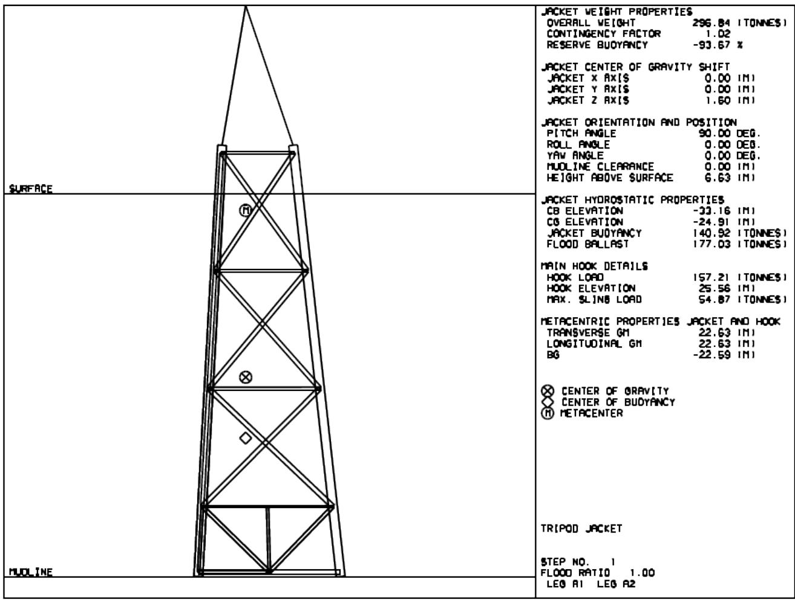

| TRIPOD JACKET | TRIPOD JACKET | TRIPOD JACKET | TRIPOD JACKET | TRIPOD JACKET | TRIPOD JACKET | TRIPOD JACKET | TRIPOD JACKET | TRIPOD JACKET | TRIPOD JACKET | TRIPOD JACKET | TRIPOD JACKET | TRIPOD JACKET | TRIPOD JACKET | TRIPOD JACKET | TRIPOD JACKET | TRIPOD JACKET | TRIPOD JACKET | TRIPOD JACKET | TRIPOD JACKET | TRIPOD JACKET | TRIPOD JACKET | TRIPOD JACKET | TRIPOD JACKET | TRIPOD JACKET | TRIPOD JACKET | TRIPOD JACKET | TRIPOD JACKET | TRIPOD JACKET | TRIPOD JACKET | TRIPOD JACKET | TRIPOD JACKET | TRIPOD JACKET | TRIPOD JACKET | TRIPOD JACKET | TRIPOD JACKET | TRIPOD JACKET | TRIPOD JACKET | TRIPOD JACKET | TRIPOD JACKET | TRIPOD JACKET | TRIPOD JACKET | TRIPOD JACKET | TRIPOD JACKET | TRIPOD JACKET | TRIPOD JACKET | TRIPOD JACKET | TRIPOD JACKET | TRIPOD JACKET | TRIPOD JACKET | TRIPOD JACKET | TRIPOD JACKET | TRIPOD JACKET | TRIPOD JACKET | TRIPOD JACKET | TRIPOD JACKET | TRIPOD JACKET | TRIPOD JACKET | TRIPOD JACKET | TRIPOD JACKET | TRIPOD JACKET | TRIPOD JACKET | TRIPOD JACKET | TRIPOD JACKET | TRIPOD JACKET | TRIPOD JACKET | TRIPOD JACKET | TRIPOD JACKET | TRIPOD JACKET | TRIPOD JACKET | TRIPOD JACKET | TRIPOD JACKET | TRIPOD JACKET | TRIPOD JACKET | TRIPOD JACKET | TRIPOD JACKET | TRIPOD JACKET | TRIPOD JACKET | TRIPOD JACKET | TRIPOD JACKET | TRIPOD JACKET | TRIPOD JACKET | TRIPOD JACKET | TRIPOD JACKET | TRIPOD JACKET | TRIPOD JACKET | TRIPOD JACKET | TRIPOD JACKET | TRIPOD JACKET | TRIPOD JACKET | TRIPOD JACKET | TRIPOD JACKET | TRIPOD JACKET | TRIPOD JACKET | TRIPOD JACKET | TRIPOD JACKET | TRIPOD JACKET | TRIPOD JACKET | TRIPOD JACKET | TRIPOD JACKET | TRIPOD JACKET |  |  |  |  |  |  |  |  |  |  |  |  |  |  |  |  |  |  |  |  |  |  |  |  |  |  |  |  |  |  |  |  |  |  |  |  |  |  |  |  |  |  |  |  |  |  |  |  |  |  |  |  |  |  |  |  |  |  |  |  |  |  |  |  |  |  |  |  |  |  |  |  |  |  |  |  |  |  |  |  |  |  |  |  |  |  |  |  |  |  |  |  |  |  |  |  |  |  |  |  |
| --- | --- | --- | --- | --- | --- | --- | --- | --- | --- | --- | --- | --- | --- | --- | --- | --- | --- | --- | --- | --- | --- | --- | --- | --- | --- | --- | --- | --- | --- | --- | --- | --- | --- | --- | --- | --- | --- | --- | --- | --- | --- | --- | --- | --- | --- | --- | --- | --- | --- | --- | --- | --- | --- | --- | --- | --- | --- | --- | --- | --- | --- | --- | --- | --- | --- | --- | --- | --- | --- | --- | --- | --- | --- | --- | --- | --- | --- | --- | --- | --- | --- | --- | --- | --- | --- | --- | --- | --- | --- | --- | --- | --- | --- | --- | --- | --- | --- | --- | --- | --- | --- | --- | --- | --- | --- | --- | --- | --- | --- | --- | --- | --- | --- | --- | --- | --- | --- | --- | --- | --- | --- | --- | --- | --- | --- | --- | --- | --- | --- | --- | --- | --- | --- | --- | --- | --- | --- | --- | --- | --- | --- | --- | --- | --- | --- | --- | --- | --- | --- | --- | --- | --- | --- | --- | --- | --- | --- | --- | --- | --- | --- | --- | --- | --- | --- | --- | --- | --- | --- | --- | --- | --- | --- | --- | --- | --- | --- | --- | --- | --- | --- | --- | --- | --- | --- | --- | --- | --- | --- | --- | --- | --- | --- | --- | --- | --- | --- | --- | --- | --- |
| *** FLOATATION PARAMETERS *** | *** FLOATATION PARAMETERS *** | *** FLOATATION PARAMETERS *** | *** FLOATATION PARAMETERS *** | *** FLOATATION PARAMETERS *** | *** FLOATATION PARAMETERS *** | *** FLOATATION PARAMETERS *** | *** FLOATATION PARAMETERS *** | *** FLOATATION PARAMETERS *** | *** FLOATATION PARAMETERS *** | *** FLOATATION PARAMETERS *** | *** FLOATATION PARAMETERS *** | *** FLOATATION PARAMETERS *** | *** FLOATATION PARAMETERS *** | *** FLOATATION PARAMETERS *** | *** FLOATATION PARAMETERS *** | *** FLOATATION PARAMETERS *** | *** FLOATATION PARAMETERS *** | *** FLOATATION PARAMETERS *** | *** FLOATATION PARAMETERS *** | *** FLOATATION PARAMETERS *** | *** FLOATATION PARAMETERS *** | *** FLOATATION PARAMETERS *** | *** FLOATATION PARAMETERS *** | *** FLOATATION PARAMETERS *** | *** FLOATATION PARAMETERS *** | *** FLOATATION PARAMETERS *** | *** FLOATATION PARAMETERS *** | *** FLOATATION PARAMETERS *** | *** FLOATATION PARAMETERS *** | *** FLOATATION PARAMETERS *** | *** FLOATATION PARAMETERS *** | *** FLOATATION PARAMETERS *** | *** FLOATATION PARAMETERS *** | *** FLOATATION PARAMETERS *** | *** FLOATATION PARAMETERS *** | *** FLOATATION PARAMETERS *** | *** FLOATATION PARAMETERS *** | *** FLOATATION PARAMETERS *** | *** FLOATATION PARAMETERS *** | *** FLOATATION PARAMETERS *** | *** FLOATATION PARAMETERS *** | *** FLOATATION PARAMETERS *** | *** FLOATATION PARAMETERS *** | *** FLOATATION PARAMETERS *** | *** FLOATATION PARAMETERS *** | *** FLOATATION PARAMETERS *** | *** FLOATATION PARAMETERS *** | *** FLOATATION PARAMETERS *** | *** FLOATATION PARAMETERS *** | *** FLOATATION PARAMETERS *** | *** FLOATATION PARAMETERS *** | *** FLOATATION PARAMETERS *** | *** FLOATATION PARAMETERS *** | *** FLOATATION PARAMETERS *** | *** FLOATATION PARAMETERS *** | *** FLOATATION PARAMETERS *** | *** FLOATATION PARAMETERS *** | *** FLOATATION PARAMETERS *** | *** FLOATATION PARAMETERS *** | *** FLOATATION PARAMETERS *** | *** FLOATATION PARAMETERS *** | *** FLOATATION PARAMETERS *** | *** FLOATATION PARAMETERS *** | *** FLOATATION PARAMETERS *** | *** FLOATATION PARAMETERS *** | *** FLOATATION PARAMETERS *** | *** FLOATATION PARAMETERS *** | *** FLOATATION PARAMETERS *** | *** FLOATATION PARAMETERS *** | *** FLOATATION PARAMETERS *** | *** FLOATATION PARAMETERS *** | *** FLOATATION PARAMETERS *** | *** FLOATATION PARAMETERS *** | *** FLOATATION PARAMETERS *** | *** FLOATATION PARAMETERS *** | *** FLOATATION PARAMETERS *** | *** FLOATATION PARAMETERS *** | *** FLOATATION PARAMETERS *** | *** FLOATATION PARAMETERS *** | *** FLOATATION PARAMETERS *** | *** FLOATATION PARAMETERS *** | *** FLOATATION PARAMETERS *** | *** FLOATATION PARAMETERS *** | *** FLOATATION PARAMETERS *** | *** FLOATATION PARAMETERS *** | *** FLOATATION PARAMETERS *** | *** FLOATATION PARAMETERS *** | *** FLOATATION PARAMETERS *** | *** FLOATATION PARAMETERS *** | *** FLOATATION PARAMETERS *** | *** FLOATATION PARAMETERS *** | *** FLOATATION PARAMETERS *** | *** FLOATATION PARAMETERS *** | *** FLOATATION PARAMETERS *** | *** FLOATATION PARAMETERS *** | *** FLOATATION PARAMETERS *** | *** FLOATATION PARAMETERS *** | *** FLOATATION PARAMETERS *** | *** FLOATATION PARAMETERS *** |  |  |  |  |  |  |  |  |  |  |  |  |  |  |  |  |  |  |  |  |  |  |  |  |  |  |  |  |  |  |  |  |  |  |  |  |  |  |  |  |  |  |  |  |  |  |  |  |  |  |  |  |  |  |  |  |  |  |  |  |  |  |  |  |  |  |  |  |  |  |  |  |  |  |  |  |  |  |  |  |  |  |  |  |  |  |  |  |  |  |  |  |  |  |  |  |  |  |  |  |  |
| WATER DEPTH | 52.00 (M) |  |  |  |  |  |  |  |  |  |  |  |  |  |  |  |  |  |  |  |  |  |  |  |  |  |  |  |  |  |  |  |  |  |  |  |  |  |  |  |  |  |  |  |  |  |  |  |  |  |  |  |  |  |  |  |  |  |  |  |  |  |  |  |  |  |  |  |  |  |  |  |  |  |  |  |  |  |  |  |  |  |  |  |  |  |  |  |  |  |  |  |  |  |  |  |  |  |  |  | 1.078 (SPG) |  |  |  |  |  |  |  |  |  |  |  |  |  |  |  |  |  |  |  |  |  |  |  |  |  |  |  |  |  |  |  |  |  |  |  |  |  |  |  |  |  |  |  |  |  |  |  |  |  |  |  |  |  |  |  |  |  |  |  |  |  |  |  |  |  |  |  |  |  |  |  |  |  |  |  |  |  |  |  |  |  |  |  |  |  |  |  |  |  |  |  |  |  |  |  |  |  |  |  |
| SEAWATER DENSITY | 1.078 (SPG) |  |  |  |  |  |  |  |  |  |  |  |  |  |  |  |  |  |  |  |  |  |  |  |  |  |  |  |  |  |  |  |  |  |  |  |  |  |  |  |  |  |  |  |  |  |  |  |  |  |  |  |  |  |  |  |  |  |  |  |  |  |  |  |  |  |  |  |  |  |  |  |  |  |  |  |  |  |  |  |  |  |  |  |  |  |  |  |  |  | 7.85 (SPG) |  |  |  |  |  |  |  |  |  |  |  |  |  |  |  |  |  |  |  |  |  |  |  |  |  |  |  |  |  |  |  |  |  |  |  |  |  |  |  |  |  |  |  |  |  |  |  |  |  |  |  |  |  |  |  |  |  |  |  |  |  |  |  |  |  |  |  |  |  |  |  |  |  |  |  |  |  |  |  |  |  |  |  |  |  |  |  |  |  |  |  |  |  |  |  |  |  |  |  |  |  |  |  |  |  |  |  |  |  |
| MATERIAL DENSITY | 1.078 (SPG) |  |  |  |  |  |  |  |  |  |  |  |  |  |  |  |  |  |  |  |  |  |  |  |  |  |  |  |  |  |  |  |  |  |  |  |  |  |  |  |  |  |  |  |  |  |  |  |  |  |  |  |  |  |  |  |  |  |  |  |  |  |  |  |  |  |  |  |  |  |  |  |  |  |  |  |  |  |  |  |  |  |  |  |  |  |  |  | 7.85 (SPG) |  |  |  |  |  |  |  |  |  |  |  |  |  |  |  |  |  |  |  |  |  |  |  |  |  |  |  |  |  |  |  |  |  |  |  |  |  |  |  |  |  |  |  |  |  |  |  |  |  |  |  |  |  |  |  |  |  |  |  |  |  |  |  |  |  |  |  |  |  |  |  |  |  |  |  |  |  |  |  |  |  |  |  |  |  |  |  |  |  |  |  |  |  |  |  |  |  |  |  |  |  |  |  |  |  |  |  |  |  |  |  |
| SLING LENGTH (M) DIAMETER (CM) MODULUS (1000 KGSCM) JOINT X (M) Y (M) Z (M) WEIGHT (TONNES) | SLING LENGTH (M) DIAMETER (CM) MODULUS (1000 KGSCM) JOINT X (M) Y (M) Z (M) WEIGHT (TONNES) | SLING LENGTH (M) DIAMETER (CM) MODULUS (1000 KGSCM) JOINT X (M) Y (M) Z (M) WEIGHT (TONNES) | SLING LENGTH (M) DIAMETER (CM) MODULUS (1000 KGSCM) JOINT X (M) Y (M) Z (M) WEIGHT (TONNES) | SLING LENGTH (M) DIAMETER (CM) MODULUS (1000 KGSCM) JOINT X (M) Y (M) Z (M) WEIGHT (TONNES) | SLING LENGTH (M) DIAMETER (CM) MODULUS (1000 KGSCM) JOINT X (M) Y (M) Z (M) WEIGHT (TONNES) | SLING LENGTH (M) DIAMETER (CM) MODULUS (1000 KGSCM) JOINT X (M) Y (M) Z (M) WEIGHT (TONNES) | SLING LENGTH (M) DIAMETER (CM) MODULUS (1000 KGSCM) JOINT X (M) Y (M) Z (M) WEIGHT (TONNES) | SLING LENGTH (M) DIAMETER (CM) MODULUS (1000 KGSCM) JOINT X (M) Y (M) Z (M) WEIGHT (TONNES) | SLING LENGTH (M) DIAMETER (CM) MODULUS (1000 KGSCM) JOINT X (M) Y (M) Z (M) WEIGHT (TONNES) | SLING LENGTH (M) DIAMETER (CM) MODULUS (1000 KGSCM) JOINT X (M) Y (M) Z (M) WEIGHT (TONNES) | SLING LENGTH (M) DIAMETER (CM) MODULUS (1000 KGSCM) JOINT X (M) Y (M) Z (M) WEIGHT (TONNES) | SLING LENGTH (M) DIAMETER (CM) MODULUS (1000 KGSCM) JOINT X (M) Y (M) Z (M) WEIGHT (TONNES) | SLING LENGTH (M) DIAMETER (CM) MODULUS (1000 KGSCM) JOINT X (M) Y (M) Z (M) WEIGHT (TONNES) | SLING LENGTH (M) DIAMETER (CM) MODULUS (1000 KGSCM) JOINT X (M) Y (M) Z (M) WEIGHT (TONNES) | SLING LENGTH (M) DIAMETER (CM) MODULUS (1000 KGSCM) JOINT X (M) Y (M) Z (M) WEIGHT (TONNES) | SLING LENGTH (M) DIAMETER (CM) MODULUS (1000 KGSCM) JOINT X (M) Y (M) Z (M) WEIGHT (TONNES) | SLING LENGTH (M) DIAMETER (CM) MODULUS (1000 KGSCM) JOINT X (M) Y (M) Z (M) WEIGHT (TONNES) | SLING LENGTH (M) DIAMETER (CM) MODULUS (1000 KGSCM) JOINT X (M) Y (M) Z (M) WEIGHT (TONNES) | SLING LENGTH (M) DIAMETER (CM) MODULUS (1000 KGSCM) JOINT X (M) Y (M) Z (M) WEIGHT (TONNES) | SLING LENGTH (M) DIAMETER (CM) MODULUS (1000 KGSCM) JOINT X (M) Y (M) Z (M) WEIGHT (TONNES) | SLING LENGTH (M) DIAMETER (CM) MODULUS (1000 KGSCM) JOINT X (M) Y (M) Z (M) WEIGHT (TONNES) | SLING LENGTH (M) DIAMETER (CM) MODULUS (1000 KGSCM) JOINT X (M) Y (M) Z (M) WEIGHT (TONNES) | SLING LENGTH (M) DIAMETER (CM) MODULUS (1000 KGSCM) JOINT X (M) Y (M) Z (M) WEIGHT (TONNES) | SLING LENGTH (M) DIAMETER (CM) MODULUS (1000 KGSCM) JOINT X (M) Y (M) Z (M) WEIGHT (TONNES) | SLING LENGTH (M) DIAMETER (CM) MODULUS (1000 KGSCM) JOINT X (M) Y (M) Z (M) WEIGHT (TONNES) | SLING LENGTH (M) DIAMETER (CM) MODULUS (1000 KGSCM) JOINT X (M) Y (M) Z (M) WEIGHT (TONNES) | SLING LENGTH (M) DIAMETER (CM) MODULUS (1000 KGSCM) JOINT X (M) Y (M) Z (M) WEIGHT (TONNES) | SLING LENGTH (M) DIAMETER (CM) MODULUS (1000 KGSCM) JOINT X (M) Y (M) Z (M) WEIGHT (TONNES) | SLING LENGTH (M) DIAMETER (CM) MODULUS (1000 KGSCM) JOINT X (M) Y (M) Z (M) WEIGHT (TONNES) | SLING LENGTH (M) DIAMETER (CM) MODULUS (1000 KGSCM) JOINT X (M) Y (M) Z (M) WEIGHT (TONNES) | SLING LENGTH (M) DIAMETER (CM) MODULUS (1000 KGSCM) JOINT X (M) Y (M) Z (M) WEIGHT (TONNES) | SLING LENGTH (M) DIAMETER (CM) MODULUS (1000 KGSCM) JOINT X (M) Y (M) Z (M) WEIGHT (TONNES) | SLING LENGTH (M) DIAMETER (CM) MODULUS (1000 KGSCM) JOINT X (M) Y (M) Z (M) WEIGHT (TONNES) | SLING LENGTH (M) DIAMETER (CM) MODULUS (1000 KGSCM) JOINT X (M) Y (M) Z (M) WEIGHT (TONNES) | SLING LENGTH (M) DIAMETER (CM) MODULUS (1000 KGSCM) JOINT X (M) Y (M) Z (M) WEIGHT (TONNES) | SLING LENGTH (M) DIAMETER (CM) MODULUS (1000 KGSCM) JOINT X (M) Y (M) Z (M) WEIGHT (TONNES) | SLING LENGTH (M) DIAMETER (CM) MODULUS (1000 KGSCM) JOINT X (M) Y (M) Z (M) WEIGHT (TONNES) | SLING LENGTH (M) DIAMETER (CM) MODULUS (1000 KGSCM) JOINT X (M) Y (M) Z (M) WEIGHT (TONNES) | SLING LENGTH (M) DIAMETER (CM) MODULUS (1000 KGSCM) JOINT X (M) Y (M) Z (M) WEIGHT (TONNES) | SLING LENGTH (M) DIAMETER (CM) MODULUS (1000 KGSCM) JOINT X (M) Y (M) Z (M) WEIGHT (TONNES) | SLING LENGTH (M) DIAMETER (CM) MODULUS (1000 KGSCM) JOINT X (M) Y (M) Z (M) WEIGHT (TONNES) | SLING LENGTH (M) DIAMETER (CM) MODULUS (1000 KGSCM) JOINT X (M) Y (M) Z (M) WEIGHT (TONNES) | SLING LENGTH (M) DIAMETER (CM) MODULUS (1000 KGSCM) JOINT X (M) Y (M) Z (M) WEIGHT (TONNES) | SLING LENGTH (M) DIAMETER (CM) MODULUS (1000 KGSCM) JOINT X (M) Y (M) Z (M) WEIGHT (TONNES) | SLING LENGTH (M) DIAMETER (CM) MODULUS (1000 KGSCM) JOINT X (M) Y (M) Z (M) WEIGHT (TONNES) | SLING LENGTH (M) DIAMETER (CM) MODULUS (1000 KGSCM) JOINT X (M) Y (M) Z (M) WEIGHT (TONNES) | SLING LENGTH (M) DIAMETER (CM) MODULUS (1000 KGSCM) JOINT X (M) Y (M) Z (M) WEIGHT (TONNES) | SLING LENGTH (M) DIAMETER (CM) MODULUS (1000 KGSCM) JOINT X (M) Y (M) Z (M) WEIGHT (TONNES) | SLING LENGTH (M) DIAMETER (CM) MODULUS (1000 KGSCM) JOINT X (M) Y (M) Z (M) WEIGHT (TONNES) | SLING LENGTH (M) DIAMETER (CM) MODULUS (1000 KGSCM) JOINT X (M) Y (M) Z (M) WEIGHT (TONNES) | SLING LENGTH (M) DIAMETER (CM) MODULUS (1000 KGSCM) JOINT X (M) Y (M) Z (M) WEIGHT (TONNES) | SLING LENGTH (M) DIAMETER (CM) MODULUS (1000 KGSCM) JOINT X (M) Y (M) Z (M) WEIGHT (TONNES) | SLING LENGTH (M) DIAMETER (CM) MODULUS (1000 KGSCM) JOINT X (M) Y (M) Z (M) WEIGHT (TONNES) | SLING LENGTH (M) DIAMETER (CM) MODULUS (1000 KGSCM) JOINT X (M) Y (M) Z (M) WEIGHT (TONNES) | SLING LENGTH (M) DIAMETER (CM) MODULUS (1000 KGSCM) JOINT X (M) Y (M) Z (M) WEIGHT (TONNES) | SLING LENGTH (M) DIAMETER (CM) MODULUS (1000 KGSCM) JOINT X (M) Y (M) Z (M) WEIGHT (TONNES) | SLING LENGTH (M) DIAMETER (CM) MODULUS (1000 KGSCM) JOINT X (M) Y (M) Z (M) WEIGHT (TONNES) | SLING LENGTH (M) DIAMETER (CM) MODULUS (1000 KGSCM) JOINT X (M) Y (M) Z (M) WEIGHT (TONNES) | SLING LENGTH (M) DIAMETER (CM) MODULUS (1000 KGSCM) JOINT X (M) Y (M) Z (M) WEIGHT (TONNES) | SLING LENGTH (M) DIAMETER (CM) MODULUS (1000 KGSCM) JOINT X (M) Y (M) Z (M) WEIGHT (TONNES) | SLING LENGTH (M) DIAMETER (CM) MODULUS (1000 KGSCM) JOINT X (M) Y (M) Z (M) WEIGHT (TONNES) | SLING LENGTH (M) DIAMETER (CM) MODULUS (1000 KGSCM) JOINT X (M) Y (M) Z (M) WEIGHT (TONNES) | SLING LENGTH (M) DIAMETER (CM) MODULUS (1000 KGSCM) JOINT X (M) Y (M) Z (M) WEIGHT (TONNES) | SLING LENGTH (M) DIAMETER (CM) MODULUS (1000 KGSCM) JOINT X (M) Y (M) Z (M) WEIGHT (TONNES) | SLING LENGTH (M) DIAMETER (CM) MODULUS (1000 KGSCM) JOINT X (M) Y (M) Z (M) WEIGHT (TONNES) | SLING LENGTH (M) DIAMETER (CM) MODULUS (1000 KGSCM) JOINT X (M) Y (M) Z (M) WEIGHT (TONNES) | SLING LENGTH (M) DIAMETER (CM) MODULUS (1000 KGSCM) JOINT X (M) Y (M) Z (M) WEIGHT (TONNES) | SLING LENGTH (M) DIAMETER (CM) MODULUS (1000 KGSCM) JOINT X (M) Y (M) Z (M) WEIGHT (TONNES) | SLING LENGTH (M) DIAMETER (CM) MODULUS (1000 KGSCM) JOINT X (M) Y (M) Z (M) WEIGHT (TONNES) | SLING LENGTH (M) DIAMETER (CM) MODULUS (1000 KGSCM) JOINT X (M) Y (M) Z (M) WEIGHT (TONNES) | SLING LENGTH (M) DIAMETER (CM) MODULUS (1000 KGSCM) JOINT X (M) Y (M) Z (M) WEIGHT (TONNES) | SLING LENGTH (M) DIAMETER (CM) MODULUS (1000 KGSCM) JOINT X (M) Y (M) Z (M) WEIGHT (TONNES) | SLING LENGTH (M) DIAMETER (CM) MODULUS (1000 KGSCM) JOINT X (M) Y (M) Z (M) WEIGHT (TONNES) | SLING LENGTH (M) DIAMETER (CM) MODULUS (1000 KGSCM) JOINT X (M) Y (M) Z (M) WEIGHT (TONNES) | SLING LENGTH (M) DIAMETER (CM) MODULUS (1000 KGSCM) JOINT X (M) Y (M) Z (M) WEIGHT (TONNES) | SLING LENGTH (M) DIAMETER (CM) MODULUS (1000 KGSCM) JOINT X (M) Y (M) Z (M) WEIGHT (TONNES) | SLING LENGTH (M) DIAMETER (CM) MODULUS (1000 KGSCM) JOINT X (M) Y (M) Z (M) WEIGHT (TONNES) | SLING LENGTH (M) DIAMETER (CM) MODULUS (1000 KGSCM) JOINT X (M) Y (M) Z (M) WEIGHT (TONNES) | SLING LENGTH (M) DIAMETER (CM) MODULUS (1000 KGSCM) JOINT X (M) Y (M) Z (M) WEIGHT (TONNES) | SLING LENGTH (M) DIAMETER (CM) MODULUS (1000 KGSCM) JOINT X (M) Y (M) Z (M) WEIGHT (TONNES) | SLING LENGTH (M) DIAMETER (CM) MODULUS (1000 KGSCM) JOINT X (M) Y (M) Z (M) WEIGHT (TONNES) | SLING LENGTH (M) DIAMETER (CM) MODULUS (1000 KGSCM) JOINT X (M) Y (M) Z (M) WEIGHT (TONNES) | SLING LENGTH (M) DIAMETER (CM) MODULUS (1000 KGSCM) JOINT X (M) Y (M) Z (M) WEIGHT (TONNES) | SLING LENGTH (M) DIAMETER (CM) MODULUS (1000 KGSCM) JOINT X (M) Y (M) Z (M) WEIGHT (TONNES) | SLING LENGTH (M) DIAMETER (CM) MODULUS (1000 KGSCM) JOINT X (M) Y (M) Z (M) WEIGHT (TONNES) | SLING LENGTH (M) DIAMETER (CM) MODULUS (1000 KGSCM) JOINT X (M) Y (M) Z (M) WEIGHT (TONNES) | SLING LENGTH (M) DIAMETER (CM) MODULUS (1000 KGSCM) JOINT X (M) Y (M) Z (M) WEIGHT (TONNES) | SLING LENGTH (M) DIAMETER (CM) MODULUS (1000 KGSCM) JOINT X (M) Y (M) Z (M) WEIGHT (TONNES) | SLING LENGTH (M) DIAMETER (CM) MODULUS (1000 KGSCM) JOINT X (M) Y (M) Z (M) WEIGHT (TONNES) | SLING LENGTH (M) DIAMETER (CM) MODULUS (1000 KGSCM) JOINT X (M) Y (M) Z (M) WEIGHT (TONNES) | SLING LENGTH (M) DIAMETER (CM) MODULUS (1000 KGSCM) JOINT X (M) Y (M) Z (M) WEIGHT (TONNES) | SLING LENGTH (M) DIAMETER (CM) MODULUS (1000 KGSCM) JOINT X (M) Y (M) Z (M) WEIGHT (TONNES) | SLING LENGTH (M) DIAMETER (CM) MODULUS (1000 KGSCM) JOINT X (M) Y (M) Z (M) WEIGHT (TONNES) | SLING LENGTH (M) DIAMETER (CM) MODULUS (1000 KGSCM) JOINT X (M) Y (M) Z (M) WEIGHT (TONNES) | SLING LENGTH (M) DIAMETER (CM) MODULUS (1000 KGSCM) JOINT X (M) Y (M) Z (M) WEIGHT (TONNES) | SLING LENGTH (M) DIAMETER (CM) MODULUS (1000 KGSCM) JOINT X (M) Y (M) Z (M) WEIGHT (TONNES) | SLING LENGTH (M) DIAMETER (CM) MODULUS (1000 KGSCM) JOINT X (M) Y (M) Z (M) WEIGHT (TONNES) | SLING LENGTH (M) DIAMETER (CM) MODULUS (1000 KGSCM) JOINT X (M) Y (M) Z (M) WEIGHT (TONNES) | SLING LENGTH (M) DIAMETER (CM) MODULUS (1000 KGSCM) JOINT X (M) Y (M) Z (M) WEIGHT (TONNES) | 1.078 (SPG) |  |  |  |  |  |  |  |  |  |  |  |  |  |  |  |  |  |  |  |  |  |  |  |  |  |  |  |  |  |  |  |  |  |  |  |  |  |  |  |  |  |  |  |  |  |  |  |  |  |  |  |  |  |  |  |  |  |  |  |  |  |  |  |  |  |  |  |  |  |  |  |  |  |  |  |  |  |  |  |  |  |  |  |  |  |  |  |  |  |  |  |  |  |  |  |  |  |  |  |  |
| LEG A1 20.00 10.000 294.086 701 0.000 -6.417 7.500 0.87 | LEG A1 20.00 10.000 294.086 701 0.000 -6.417 7.500 0.87 | LEG A1 20.00 10.000 294.086 701 0.000 -6.417 7.500 0.87 | LEG A1 20.00 10.000 294.086 701 0.000 -6.417 7.500 0.87 | LEG A1 20.00 10.000 294.086 701 0.000 -6.417 7.500 0.87 | LEG A1 20.00 10.000 294.086 701 0.000 -6.417 7.500 0.87 | LEG A1 20.00 10.000 294.086 701 0.000 -6.417 7.500 0.87 | LEG A1 20.00 10.000 294.086 701 0.000 -6.417 7.500 0.87 | LEG A1 20.00 10.000 294.086 701 0.000 -6.417 7.500 0.87 | LEG A1 20.00 10.000 294.086 701 0.000 -6.417 7.500 0.87 | LEG A1 20.00 10.000 294.086 701 0.000 -6.417 7.500 0.87 | LEG A1 20.00 10.000 294.086 701 0.000 -6.417 7.500 0.87 | LEG A1 20.00 10.000 294.086 701 0.000 -6.417 7.500 0.87 | LEG A1 20.00 10.000 294.086 701 0.000 -6.417 7.500 0.87 | LEG A1 20.00 10.000 294.086 701 0.000 -6.417 7.500 0.87 | LEG A1 20.00 10.000 294.086 701 0.000 -6.417 7.500 0.87 | LEG A1 20.00 10.000 294.086 701 0.000 -6.417 7.500 0.87 | LEG A1 20.00 10.000 294.086 701 0.000 -6.417 7.500 0.87 | LEG A1 20.00 10.000 294.086 701 0.000 -6.417 7.500 0.87 | LEG A1 20.00 10.000 294.086 701 0.000 -6.417 7.500 0.87 | LEG A1 20.00 10.000 294.086 701 0.000 -6.417 7.500 0.87 | LEG A1 20.00 10.000 294.086 701 0.000 -6.417 7.500 0.87 | LEG A1 20.00 10.000 294.086 701 0.000 -6.417 7.500 0.87 | LEG A1 20.00 10.000 294.086 701 0.000 -6.417 7.500 0.87 | LEG A1 20.00 10.000 294.086 701 0.000 -6.417 7.500 0.87 | LEG A1 20.00 10.000 294.086 701 0.000 -6.417 7.500 0.87 | LEG A1 20.00 10.000 294.086 701 0.000 -6.417 7.500 0.87 | LEG A1 20.00 10.000 294.086 701 0.000 -6.417 7.500 0.87 | LEG A1 20.00 10.000 294.086 701 0.000 -6.417 7.500 0.87 | LEG A1 20.00 10.000 294.086 701 0.000 -6.417 7.500 0.87 | LEG A1 20.00 10.000 294.086 701 0.000 -6.417 7.500 0.87 | LEG A1 20.00 10.000 294.086 701 0.000 -6.417 7.500 0.87 | LEG A1 20.00 10.000 294.086 701 0.000 -6.417 7.500 0.87 | LEG A1 20.00 10.000 294.086 701 0.000 -6.417 7.500 0.87 | LEG A1 20.00 10.000 294.086 701 0.000 -6.417 7.500 0.87 | LEG A1 20.00 10.000 294.086 701 0.000 -6.417 7.500 0.87 | LEG A1 20.00 10.000 294.086 701 0.000 -6.417 7.500 0.87 | LEG A1 20.00 10.000 294.086 701 0.000 -6.417 7.500 0.87 | LEG A1 20.00 10.000 294.086 701 0.000 -6.417 7.500 0.87 | LEG A1 20.00 10.000 294.086 701 0.000 -6.417 7.500 0.87 | LEG A1 20.00 10.000 294.086 701 0.000 -6.417 7.500 0.87 | LEG A1 20.00 10.000 294.086 701 0.000 -6.417 7.500 0.87 | LEG A1 20.00 10.000 294.086 701 0.000 -6.417 7.500 0.87 | LEG A1 20.00 10.000 294.086 701 0.000 -6.417 7.500 0.87 | LEG A1 20.00 10.000 294.086 701 0.000 -6.417 7.500 0.87 | LEG A1 20.00 10.000 294.086 701 0.000 -6.417 7.500 0.87 | LEG A1 20.00 10.000 294.086 701 0.000 -6.417 7.500 0.87 | LEG A1 20.00 10.000 294.086 701 0.000 -6.417 7.500 0.87 | LEG A1 20.00 10.000 294.086 701 0.000 -6.417 7.500 0.87 | LEG A1 20.00 10.000 294.086 701 0.000 -6.417 7.500 0.87 | LEG A1 20.00 10.000 294.086 701 0.000 -6.417 7.500 0.87 | LEG A1 20.00 10.000 294.086 701 0.000 -6.417 7.500 0.87 | LEG A1 20.00 10.000 294.086 701 0.000 -6.417 7.500 0.87 | LEG A1 20.00 10.000 294.086 701 0.000 -6.417 7.500 0.87 | LEG A1 20.00 10.000 294.086 701 0.000 -6.417 7.500 0.87 | LEG A1 20.00 10.000 294.086 701 0.000 -6.417 7.500 0.87 | LEG A1 20.00 10.000 294.086 701 0.000 -6.417 7.500 0.87 | LEG A1 20.00 10.000 294.086 701 0.000 -6.417 7.500 0.87 | LEG A1 20.00 10.000 294.086 701 0.000 -6.417 7.500 0.87 | LEG A1 20.00 10.000 294.086 701 0.000 -6.417 7.500 0.87 | LEG A1 20.00 10.000 294.086 701 0.000 -6.417 7.500 0.87 | LEG A1 20.00 10.000 294.086 701 0.000 -6.417 7.500 0.87 | LEG A1 20.00 10.000 294.086 701 0.000 -6.417 7.500 0.87 | LEG A1 20.00 10.000 294.086 701 0.000 -6.417 7.500 0.87 | LEG A1 20.00 10.000 294.086 701 0.000 -6.417 7.500 0.87 | LEG A1 20.00 10.000 294.086 701 0.000 -6.417 7.500 0.87 | LEG A1 20.00 10.000 294.086 701 0.000 -6.417 7.500 0.87 | LEG A1 20.00 10.000 294.086 701 0.000 -6.417 7.500 0.87 | LEG A1 20.00 10.000 294.086 701 0.000 -6.417 7.500 0.87 | LEG A1 20.00 10.000 294.086 701 0.000 -6.417 7.500 0.87 | LEG A1 20.00 10.000 294.086 701 0.000 -6.417 7.500 0.87 | LEG A1 20.00 10.000 294.086 701 0.000 -6.417 7.500 0.87 | LEG A1 20.00 10.000 294.086 701 0.000 -6.417 7.500 0.87 | LEG A1 20.00 10.000 294.086 701 0.000 -6.417 7.500 0.87 | LEG A1 20.00 10.000 294.086 701 0.000 -6.417 7.500 0.87 | LEG A1 20.00 10.000 294.086 701 0.000 -6.417 7.500 0.87 | LEG A1 20.00 10.000 294.086 701 0.000 -6.417 7.500 0.87 | LEG A1 20.00 10.000 294.086 701 0.000 -6.417 7.500 0.87 | LEG A1 20.00 10.000 294.086 701 0.000 -6.417 7.500 0.87 | LEG A1 20.00 10.000 294.086 701 0.000 -6.417 7.500 0.87 | LEG A1 20.00 10.000 294.086 701 0.000 -6.417 7.500 0.87 | LEG A1 20.00 10.000 294.086 701 0.000 -6.417 7.500 0.87 | LEG A1 20.00 10.000 294.086 701 0.000 -6.417 7.500 0.87 | LEG A1 20.00 10.000 294.086 701 0.000 -6.417 7.500 0.87 | LEG A1 20.00 10.000 294.086 701 0.000 -6.417 7.500 0.87 | LEG A1 20.00 10.000 294.086 701 0.000 -6.417 7.500 0.87 | LEG A1 20.00 10.000 294.086 701 0.000 -6.417 7.500 0.87 | LEG A1 20.00 10.000 294.086 701 0.000 -6.417 7.500 0.87 | LEG A1 20.00 10.000 294.086 701 0.000 -6.417 7.500 0.87 | LEG A1 20.00 10.000 294.086 701 0.000 -6.417 7.500 0.87 | LEG A1 20.00 10.000 294.086 701 0.000 -6.417 7.500 0.87 | LEG A1 20.00 10.000 294.086 701 0.000 -6.417 7.500 0.87 | LEG A1 20.00 10.000 294.086 701 0.000 -6.417 7.500 0.87 | LEG A1 20.00 10.000 294.086 701 0.000 -6.417 7.500 0.87 | LEG A1 20.00 10.000 294.086 701 0.000 -6.417 7.500 0.87 | LEG A1 20.00 10.000 294.086 701 0.000 -6.417 7.500 0.87 | LEG A1 20.00 10.000 294.086 701 0.000 -6.417 7.500 0.87 | LEG A1 20.00 10.000 294.086 701 0.000 -6.417 7.500 0.87 | LEG A1 20.00 10.000 294.086 701 0.000 -6.417 7.500 0.87 | LEG A1 20.00 10.000 294.086 701 0.000 -6.417 7.500 0.87 | 1.078 (SPG) |  |  |  |  |  |  |  |  |  |  |  |  |  |  |  |  |  |  |  |  |  |  |  |  |  |  |  |  |  |  |  |  |  |  |  |  |  |  |  |  |  |  |  |  |  |  |  |  |  |  |  |  |  |  |  |  |  |  |  |  |  |  |  |  |  |  |  |  |  |  |  |  |  |  |  |  |  |  |  |  |  |  |  |  |  |  |  |  |  |  |  |  |  |  |  |  |  |  |  |  |
| LEG A3 20.00 10.000 294.086 703 -5.557 3.208 7.500 0.87 | LEG A3 20.00 10.000 294.086 703 -5.557 3.208 7.500 0.87 | LEG A3 20.00 10.000 294.086 703 -5.557 3.208 7.500 0.87 | LEG A3 20.00 10.000 294.086 703 -5.557 3.208 7.500 0.87 | LEG A3 20.00 10.000 294.086 703 -5.557 3.208 7.500 0.87 | LEG A3 20.00 10.000 294.086 703 -5.557 3.208 7.500 0.87 | LEG A3 20.00 10.000 294.086 703 -5.557 3.208 7.500 0.87 | LEG A3 20.00 10.000 294.086 703 -5.557 3.208 7.500 0.87 | LEG A3 20.00 10.000 294.086 703 -5.557 3.208 7.500 0.87 | LEG A3 20.00 10.000 294.086 703 -5.557 3.208 7.500 0.87 | LEG A3 20.00 10.000 294.086 703 -5.557 3.208 7.500 0.87 | LEG A3 20.00 10.000 294.086 703 -5.557 3.208 7.500 0.87 | LEG A3 20.00 10.000 294.086 703 -5.557 3.208 7.500 0.87 | LEG A3 20.00 10.000 294.086 703 -5.557 3.208 7.500 0.87 | LEG A3 20.00 10.000 294.086 703 -5.557 3.208 7.500 0.87 | LEG A3 20.00 10.000 294.086 703 -5.557 3.208 7.500 0.87 | LEG A3 20.00 10.000 294.086 703 -5.557 3.208 7.500 0.87 | LEG A3 20.00 10.000 294.086 703 -5.557 3.208 7.500 0.87 | LEG A3 20.00 10.000 294.086 703 -5.557 3.208 7.500 0.87 | LEG A3 20.00 10.000 294.086 703 -5.557 3.208 7.500 0.87 | LEG A3 20.00 10.000 294.086 703 -5.557 3.208 7.500 0.87 | LEG A3 20.00 10.000 294.086 703 -5.557 3.208 7.500 0.87 | LEG A3 20.00 10.000 294.086 703 -5.557 3.208 7.500 0.87 | LEG A3 20.00 10.000 294.086 703 -5.557 3.208 7.500 0.87 | LEG A3 20.00 10.000 294.086 703 -5.557 3.208 7.500 0.87 | LEG A3 20.00 10.000 294.086 703 -5.557 3.208 7.500 0.87 | LEG A3 20.00 10.000 294.086 703 -5.557 3.208 7.500 0.87 | LEG A3 20.00 10.000 294.086 703 -5.557 3.208 7.500 0.87 | LEG A3 20.00 10.000 294.086 703 -5.557 3.208 7.500 0.87 | LEG A3 20.00 10.000 294.086 703 -5.557 3.208 7.500 0.87 | LEG A3 20.00 10.000 294.086 703 -5.557 3.208 7.500 0.87 | LEG A3 20.00 10.000 294.086 703 -5.557 3.208 7.500 0.87 | LEG A3 20.00 10.000 294.086 703 -5.557 3.208 7.500 0.87 | LEG A3 20.00 10.000 294.086 703 -5.557 3.208 7.500 0.87 | LEG A3 20.00 10.000 294.086 703 -5.557 3.208 7.500 0.87 | LEG A3 20.00 10.000 294.086 703 -5.557 3.208 7.500 0.87 | LEG A3 20.00 10.000 294.086 703 -5.557 3.208 7.500 0.87 | LEG A3 20.00 10.000 294.086 703 -5.557 3.208 7.500 0.87 | LEG A3 20.00 10.000 294.086 703 -5.557 3.208 7.500 0.87 | LEG A3 20.00 10.000 294.086 703 -5.557 3.208 7.500 0.87 | LEG A3 20.00 10.000 294.086 703 -5.557 3.208 7.500 0.87 | LEG A3 20.00 10.000 294.086 703 -5.557 3.208 7.500 0.87 | LEG A3 20.00 10.000 294.086 703 -5.557 3.208 7.500 0.87 | LEG A3 20.00 10.000 294.086 703 -5.557 3.208 7.500 0.87 | LEG A3 20.00 10.000 294.086 703 -5.557 3.208 7.500 0.87 | LEG A3 20.00 10.000 294.086 703 -5.557 3.208 7.500 0.87 | LEG A3 20.00 10.000 294.086 703 -5.557 3.208 7.500 0.87 | LEG A3 20.00 10.000 294.086 703 -5.557 3.208 7.500 0.87 | LEG A3 20.00 10.000 294.086 703 -5.557 3.208 7.500 0.87 | LEG A3 20.00 10.000 294.086 703 -5.557 3.208 7.500 0.87 | LEG A3 20.00 10.000 294.086 703 -5.557 3.208 7.500 0.87 | LEG A3 20.00 10.000 294.086 703 -5.557 3.208 7.500 0.87 | LEG A3 20.00 10.000 294.086 703 -5.557 3.208 7.500 0.87 | LEG A3 20.00 10.000 294.086 703 -5.557 3.208 7.500 0.87 | LEG A3 20.00 10.000 294.086 703 -5.557 3.208 7.500 0.87 | LEG A3 20.00 10.000 294.086 703 -5.557 3.208 7.500 0.87 | LEG A3 20.00 10.000 294.086 703 -5.557 3.208 7.500 0.87 | LEG A3 20.00 10.000 294.086 703 -5.557 3.208 7.500 0.87 | LEG A3 20.00 10.000 294.086 703 -5.557 3.208 7.500 0.87 | LEG A3 20.00 10.000 294.086 703 -5.557 3.208 7.500 0.87 | LEG A3 20.00 10.000 294.086 703 -5.557 3.208 7.500 0.87 | LEG A3 20.00 10.000 294.086 703 -5.557 3.208 7.500 0.87 | LEG A3 20.00 10.000 294.086 703 -5.557 3.208 7.500 0.87 | LEG A3 20.00 10.000 294.086 703 -5.557 3.208 7.500 0.87 | LEG A3 20.00 10.000 294.086 703 -5.557 3.208 7.500 0.87 | LEG A3 20.00 10.000 294.086 703 -5.557 3.208 7.500 0.87 | LEG A3 20.00 10.000 294.086 703 -5.557 3.208 7.500 0.87 | LEG A3 20.00 10.000 294.086 703 -5.557 3.208 7.500 0.87 | LEG A3 20.00 10.000 294.086 703 -5.557 3.208 7.500 0.87 | LEG A3 20.00 10.000 294.086 703 -5.557 3.208 7.500 0.87 | LEG A3 20.00 10.000 294.086 703 -5.557 3.208 7.500 0.87 | LEG A3 20.00 10.000 294.086 703 -5.557 3.208 7.500 0.87 | LEG A3 20.00 10.000 294.086 703 -5.557 3.208 7.500 0.87 | LEG A3 20.00 10.000 294.086 703 -5.557 3.208 7.500 0.87 | LEG A3 20.00 10.000 294.086 703 -5.557 3.208 7.500 0.87 | LEG A3 20.00 10.000 294.086 703 -5.557 3.208 7.500 0.87 | LEG A3 20.00 10.000 294.086 703 -5.557 3.208 7.500 0.87 | LEG A3 20.00 10.000 294.086 703 -5.557 3.208 7.500 0.87 | LEG A3 20.00 10.000 294.086 703 -5.557 3.208 7.500 0.87 | LEG A3 20.00 10.000 294.086 703 -5.557 3.208 7.500 0.87 | LEG A3 20.00 10.000 294.086 703 -5.557 3.208 7.500 0.87 | LEG A3 20.00 10.000 294.086 703 -5.557 3.208 7.500 0.87 | LEG A3 20.00 10.000 294.086 703 -5.557 3.208 7.500 0.87 | LEG A3 20.00 10.000 294.086 703 -5.557 3.208 7.500 0.87 | LEG A3 20.00 10.000 294.086 703 -5.557 3.208 7.500 0.87 | LEG A3 20.00 10.000 294.086 703 -5.557 3.208 7.500 0.87 | LEG A3 20.00 10.000 294.086 703 -5.557 3.208 7.500 0.87 | LEG A3 20.00 10.000 294.086 703 -5.557 3.208 7.500 0.87 | LEG A3 20.00 10.000 294.086 703 -5.557 3.208 7.500 0.87 |  |  |  |  |  |  |  |  |  |  |  |  |  |  |  |  |  |  |  |  |  |  |  |  |  |  |  |  |  |  |  |  |  |  |  |  |  |  |  |  |  |  |  |  |  |  |  |  |  |  |  |  |  |  |  |  |  |  |  |  |  |  |  |  |  |  |  |  |  |  |  |  |  |  |  |  |  |  |  |  |  |  |  |  |  |  |  |  |  |  |  |  |  |  |  |  |  |  |  |  |  |  |  |  |  |  |  |  |  |  |  |  |
| LEG B1 20.00 10.000 294.086 705 5.557 3.208 7.500 0.87 | LEG B1 20.00 10.000 294.086 705 5.557 3.208 7.500 0.87 | LEG B1 20.00 10.000 294.086 705 5.557 3.208 7.500 0.87 | LEG B1 20.00 10.000 294.086 705 5.557 3.208 7.500 0.87 | LEG B1 20.00 10.000 294.086 705 5.557 3.208 7.500 0.87 | LEG B1 20.00 10.000 294.086 705 5.557 3.208 7.500 0.87 | LEG B1 20.00 10.000 294.086 705 5.557 3.208 7.500 0.87 | LEG B1 20.00 10.000 294.086 705 5.557 3.208 7.500 0.87 | LEG B1 20.00 10.000 294.086 705 5.557 3.208 7.500 0.87 | LEG B1 20.00 10.000 294.086 705 5.557 3.208 7.500 0.87 | LEG B1 20.00 10.000 294.086 705 5.557 3.208 7.500 0.87 | LEG B1 20.00 10.000 294.086 705 5.557 3.208 7.500 0.87 | LEG B1 20.00 10.000 294.086 705 5.557 3.208 7.500 0.87 | LEG B1 20.00 10.000 294.086 705 5.557 3.208 7.500 0.87 | LEG B1 20.00 10.000 294.086 705 5.557 3.208 7.500 0.87 | LEG B1 20.00 10.000 294.086 705 5.557 3.208 7.500 0.87 | LEG B1 20.00 10.000 294.086 705 5.557 3.208 7.500 0.87 | LEG B1 20.00 10.000 294.086 705 5.557 3.208 7.500 0.87 | LEG B1 20.00 10.000 294.086 705 5.557 3.208 7.500 0.87 | LEG B1 20.00 10.000 294.086 705 5.557 3.208 7.500 0.87 | LEG B1 20.00 10.000 294.086 705 5.557 3.208 7.500 0.87 | LEG B1 20.00 10.000 294.086 705 5.557 3.208 7.500 0.87 | LEG B1 20.00 10.000 294.086 705 5.557 3.208 7.500 0.87 | LEG B1 20.00 10.000 294.086 705 5.557 3.208 7.500 0.87 | LEG B1 20.00 10.000 294.086 705 5.557 3.208 7.500 0.87 | LEG B1 20.00 10.000 294.086 705 5.557 3.208 7.500 0.87 | LEG B1 20.00 10.000 294.086 705 5.557 3.208 7.500 0.87 | LEG B1 20.00 10.000 294.086 705 5.557 3.208 7.500 0.87 | LEG B1 20.00 10.000 294.086 705 5.557 3.208 7.500 0.87 | LEG B1 20.00 10.000 294.086 705 5.557 3.208 7.500 0.87 | LEG B1 20.00 10.000 294.086 705 5.557 3.208 7.500 0.87 | LEG B1 20.00 10.000 294.086 705 5.557 3.208 7.500 0.87 | LEG B1 20.00 10.000 294.086 705 5.557 3.208 7.500 0.87 | LEG B1 20.00 10.000 294.086 705 5.557 3.208 7.500 0.87 | LEG B1 20.00 10.000 294.086 705 5.557 3.208 7.500 0.87 | LEG B1 20.00 10.000 294.086 705 5.557 3.208 7.500 0.87 | LEG B1 20.00 10.000 294.086 705 5.557 3.208 7.500 0.87 | LEG B1 20.00 10.000 294.086 705 5.557 3.208 7.500 0.87 | LEG B1 20.00 10.000 294.086 705 5.557 3.208 7.500 0.87 | LEG B1 20.00 10.000 294.086 705 5.557 3.208 7.500 0.87 | LEG B1 20.00 10.000 294.086 705 5.557 3.208 7.500 0.87 | LEG B1 20.00 10.000 294.086 705 5.557 3.208 7.500 0.87 | LEG B1 20.00 10.000 294.086 705 5.557 3.208 7.500 0.87 | LEG B1 20.00 10.000 294.086 705 5.557 3.208 7.500 0.87 | LEG B1 20.00 10.000 294.086 705 5.557 3.208 7.500 0.87 | LEG B1 20.00 10.000 294.086 705 5.557 3.208 7.500 0.87 | LEG B1 20.00 10.000 294.086 705 5.557 3.208 7.500 0.87 | LEG B1 20.00 10.000 294.086 705 5.557 3.208 7.500 0.87 | LEG B1 20.00 10.000 294.086 705 5.557 3.208 7.500 0.87 | LEG B1 20.00 10.000 294.086 705 5.557 3.208 7.500 0.87 | LEG B1 20.00 10.000 294.086 705 5.557 3.208 7.500 0.87 | LEG B1 20.00 10.000 294.086 705 5.557 3.208 7.500 0.87 | LEG B1 20.00 10.000 294.086 705 5.557 3.208 7.500 0.87 | LEG B1 20.00 10.000 294.086 705 5.557 3.208 7.500 0.87 | LEG B1 20.00 10.000 294.086 705 5.557 3.208 7.500 0.87 | LEG B1 20.00 10.000 294.086 705 5.557 3.208 7.500 0.87 | LEG B1 20.00 10.000 294.086 705 5.557 3.208 7.500 0.87 | LEG B1 20.00 10.000 294.086 705 5.557 3.208 7.500 0.87 | LEG B1 20.00 10.000 294.086 705 5.557 3.208 7.500 0.87 | LEG B1 20.00 10.000 294.086 705 5.557 3.208 7.500 0.87 | LEG B1 20.00 10.000 294.086 705 5.557 3.208 7.500 0.87 | LEG B1 20.00 10.000 294.086 705 5.557 3.208 7.500 0.87 | LEG B1 20.00 10.000 294.086 705 5.557 3.208 7.500 0.87 | LEG B1 20.00 10.000 294.086 705 5.557 3.208 7.500 0.87 | LEG B1 20.00 10.000 294.086 705 5.557 3.208 7.500 0.87 | LEG B1 20.00 10.000 294.086 705 5.557 3.208 7.500 0.87 | LEG B1 20.00 10.000 294.086 705 5.557 3.208 7.500 0.87 | LEG B1 20.00 10.000 294.086 705 5.557 3.208 7.500 0.87 | LEG B1 20.00 10.000 294.086 705 5.557 3.208 7.500 0.87 | LEG B1 20.00 10.000 294.086 705 5.557 3.208 7.500 0.87 | LEG B1 20.00 10.000 294.086 705 5.557 3.208 7.500 0.87 | LEG B1 20.00 10.000 294.086 705 5.557 3.208 7.500 0.87 | LEG B1 20.00 10.000 294.086 705 5.557 3.208 7.500 0.87 | LEG B1 20.00 10.000 294.086 705 5.557 3.208 7.500 0.87 | LEG B1 20.00 10.000 294.086 705 5.557 3.208 7.500 0.87 | LEG B1 20.00 10.000 294.086 705 5.557 3.208 7.500 0.87 | LEG B1 20.00 10.000 294.086 705 5.557 3.208 7.500 0.87 | LEG B1 20.00 10.000 294.086 705 5.557 3.208 7.500 0.87 |  |  |  |  |  |  |  |  |  |  |  |  |  |  |  |  |  |  |  |  |  |  |  |  |  |  |  |  |  |  |  |  |  |  |  |  |  |  |  |  |  |  |  |  |  |  |  |  |  |  |  |  |  |  |  |  |  |  |  |  |  |  |  |  |  |  |  |  |  |  |  |  |  |  |  |  |  |  |  |  |  |  |  |  |  |  |  |  |  |  |  |  |  |  |  |  |  |  |  |  |  |  |  |  |  |  |  |  |  |  |  |  |  |  |  |  |  |  |  |  |  |  |  |
| ********** JACKET PROPERTIES********** | ********** JACKET PROPERTIES********** | ********** JACKET PROPERTIES********** | ********** JACKET PROPERTIES********** | ********** JACKET PROPERTIES********** | ********** JACKET PROPERTIES********** | ********** JACKET PROPERTIES********** | ********** JACKET PROPERTIES********** | ********** JACKET PROPERTIES********** | ********** JACKET PROPERTIES********** | ********** JACKET PROPERTIES********** | ********** JACKET PROPERTIES********** | ********** JACKET PROPERTIES********** | ********** JACKET PROPERTIES********** | ********** JACKET PROPERTIES********** | ********** JACKET PROPERTIES********** | ********** JACKET PROPERTIES********** | ********** JACKET PROPERTIES********** | ********** JACKET PROPERTIES********** | ********** JACKET PROPERTIES********** | ********** JACKET PROPERTIES********** | ********** JACKET PROPERTIES********** | ********** JACKET PROPERTIES********** | ********** JACKET PROPERTIES********** | ********** JACKET PROPERTIES********** | ********** JACKET PROPERTIES********** | ********** JACKET PROPERTIES********** | ********** JACKET PROPERTIES********** | ********** JACKET PROPERTIES********** | ********** JACKET PROPERTIES********** | ********** JACKET PROPERTIES********** | ********** JACKET PROPERTIES********** | ********** JACKET PROPERTIES********** | ********** JACKET PROPERTIES********** | ********** JACKET PROPERTIES********** | ********** JACKET PROPERTIES********** | ********** JACKET PROPERTIES********** | ********** JACKET PROPERTIES********** | ********** JACKET PROPERTIES********** | ********** JACKET PROPERTIES********** | ********** JACKET PROPERTIES********** | ********** JACKET PROPERTIES********** | ********** JACKET PROPERTIES********** | ********** JACKET PROPERTIES********** | ********** JACKET PROPERTIES********** | ********** JACKET PROPERTIES********** | ********** JACKET PROPERTIES********** | ********** JACKET PROPERTIES********** | ********** JACKET PROPERTIES********** | ********** JACKET PROPERTIES********** | ********** JACKET PROPERTIES********** | ********** JACKET PROPERTIES********** | ********** JACKET PROPERTIES********** | ********** JACKET PROPERTIES********** | ********** JACKET PROPERTIES********** | ********** JACKET PROPERTIES********** | ********** JACKET PROPERTIES********** | ********** JACKET PROPERTIES********** | ********** JACKET PROPERTIES********** | ********** JACKET PROPERTIES********** | ********** JACKET PROPERTIES********** | ********** JACKET PROPERTIES********** | ********** JACKET PROPERTIES********** | ********** JACKET PROPERTIES********** | ********** JACKET PROPERTIES********** | ********** JACKET PROPERTIES********** | ********** JACKET PROPERTIES********** | ********** JACKET PROPERTIES********** | ********** JACKET PROPERTIES********** | ********** JACKET PROPERTIES********** | ********** JACKET PROPERTIES********** | ********** JACKET PROPERTIES********** | ********** JACKET PROPERTIES********** | ********** JACKET PROPERTIES********** | ********** JACKET PROPERTIES********** | ********** JACKET PROPERTIES********** | ********** JACKET PROPERTIES********** | ********** JACKET PROPERTIES********** | ********** JACKET PROPERTIES********** | ********** JACKET PROPERTIES********** | ********** JACKET PROPERTIES********** | ********** JACKET PROPERTIES********** | ********** JACKET PROPERTIES********** | ********** JACKET PROPERTIES********** | ********** JACKET PROPERTIES********** | ********** JACKET PROPERTIES********** | ********** JACKET PROPERTIES********** | ********** JACKET PROPERTIES********** | ********** JACKET PROPERTIES********** | ********** JACKET PROPERTIES********** | ********** JACKET PROPERTIES********** | ********** JACKET PROPERTIES********** | ********** JACKET PROPERTIES********** | ********** JACKET PROPERTIES********** | ********** JACKET PROPERTIES********** | ********** JACKET PROPERTIES********** | ********** JACKET PROPERTIES********** | ********** JACKET PROPERTIES********** | ********** JACKET PROPERTIES********** | ********** JACKET PROPERTIES********** |  | ********** JACKET PROPERTIES********** |  |  |  |  |  |  |  |  |  |  |  |  |  |  |  |  |  |  |  |  |  |  |  |  |  |  |  |  |  |  |  |  |  |  |  |  |  |  |  |  |  |  |  |  |  |  |  |  |  |  |  |  |  |  |  |  |  |  |  |  |  |  |  |  |  |  |  |  |  |  |  |  |  |  |  |  |  |  |  |  |  |  |  |  |  |  |  |  |  |  |  |  |  |  |  |  |  |  |  |
| NUMBER OF JOINTS | 28 | 28 | 28 | 28 | 28 | 28 | 28 | 28 | 28 | 28 | 28 | 28 | 28 | 28 | 28 | 28 | 28 | 28 | 28 | 28 | 28 | 28 | 28 | 28 | 28 | 28 | 28 | 28 | 28 | 28 | 28 | 28 | 28 | 28 | 28 | 28 | 28 | 28 | 28 | 28 | 28 | 28 | 28 | 28 | 28 | 28 | 28 | 28 | 28 | 28 | 28 | 28 | 28 | 28 | 28 | 28 | 28 | 28 | 28 | 28 | 28 | 28 | 28 | 28 | 28 | 28 | 28 | 28 | 28 | 28 | 28 | 28 | 28 | 28 | 28 | 28 | 28 | 28 | 28 | 28 | 28 | 28 | 28 | 28 | 28 | 28 | 28 | 28 | 28 | 28 | 28 | 28 | 28 | 28 | 28 | 28 | 28 | 28 | 28 | 28 |  |  |  |  |  |  |  |  |  |  |  |  |  |  |  |  |  |  |  |  |  |  |  |  |  |  |  |  |  |  |  |  |  |  |  |  |  |  |  |  |  |  |  |  |  |  |  |  |  |  |  |  |  |  |  |  |  |  |  |  |  |  |  |  |  |  |  |  |  |  |  |  |  |  |  |  |  |  |  |  |  |  |  |  |  |  |  |  |  |  |  |  |  |  |  |  |  |  |  |  |

| TRIPOD JACKET DATE 17-DEC-1992 TIME 15:20:13 FLT PAGE 2 | TRIPOD JACKET DATE 17-DEC-1992 TIME 15:20:13 FLT PAGE 2 | TRIPOD JACKET DATE 17-DEC-1992 TIME 15:20:13 FLT PAGE 2 | TRIPOD JACKET DATE 17-DEC-1992 TIME 15:20:13 FLT PAGE 2 | TRIPOD JACKET DATE 17-DEC-1992 TIME 15:20:13 FLT PAGE 2 | TRIPOD JACKET DATE 17-DEC-1992 TIME 15:20:13 FLT PAGE 2 | TRIPOD JACKET DATE 17-DEC-1992 TIME 15:20:13 FLT PAGE 2 | TRIPOD JACKET DATE 17-DEC-1992 TIME 15:20:13 FLT PAGE 2 | TRIPOD JACKET DATE 17-DEC-1992 TIME 15:20:13 FLT PAGE 2 | TRIPOD JACKET DATE 17-DEC-1992 TIME 15:20:13 FLT PAGE 2 | TRIPOD JACKET DATE 17-DEC-1992 TIME 15:20:13 FLT PAGE 2 | TRIPOD JACKET DATE 17-DEC-1992 TIME 15:20:13 FLT PAGE 2 |
| --- | --- | --- | --- | --- | --- | --- | --- | --- | --- | --- | --- |
| ********** JACKET PROPERTIES (CONT)********** | ********** JACKET PROPERTIES (CONT)********** | ********** JACKET PROPERTIES (CONT)********** | ********** JACKET PROPERTIES (CONT)********** | ********** JACKET PROPERTIES (CONT)********** | ********** JACKET PROPERTIES (CONT)********** | ********** JACKET PROPERTIES (CONT)********** | ********** JACKET PROPERTIES (CONT)********** | ********** JACKET PROPERTIES (CONT)********** | ********** JACKET PROPERTIES (CONT)********** | ********** JACKET PROPERTIES (CONT)********** | ********** JACKET PROPERTIES (CONT)********** |
| CENTER OF GRAVITY | CENTER OF GRAVITY | CENTER OF GRAVITY | CENTER OF GRAVITY | CENTER OF GRAVITY | CENTER OF GRAVITY | CENTER OF GRAVITY | CENTER OF GRAVITY | CENTER OF GRAVITY | CENTER OF GRAVITY | CENTER OF GRAVITY | CENTER OF GRAVITY |
| XCG | 0.000 (M) | 0.000 (M) | 0.000 (M) | 0.000 (M) | 0.000 (M) | 0.000 (M) | 0.000 (M) | 0.000 (M) | 0.000 (M) | 0.000 (M) | 0.000 (M) |
| YCG | 0.000 (M) | 0.000 (M) | 0.000 (M) | 0.000 (M) | 0.000 (M) | 0.000 (M) | 0.000 (M) | 0.000 (M) | 0.000 (M) | 0.000 (M) | 0.000 (M) |
| ZCG | -25.578 (M) | -25.578 (M) | -25.578 (M) | -25.578 (M) | -25.578 (M) | -25.578 (M) | -25.578 (M) | -25.578 (M) | -25.578 (M) | -25.578 (M) | -25.578 (M) |
| ********** CONTINGENCY JACKET PROPERTIES********** | ********** CONTINGENCY JACKET PROPERTIES********** | ********** CONTINGENCY JACKET PROPERTIES********** | ********** CONTINGENCY JACKET PROPERTIES********** | ********** CONTINGENCY JACKET PROPERTIES********** | ********** CONTINGENCY JACKET PROPERTIES********** | ********** CONTINGENCY JACKET PROPERTIES********** | ********** CONTINGENCY JACKET PROPERTIES********** | ********** CONTINGENCY JACKET PROPERTIES********** | ********** CONTINGENCY JACKET PROPERTIES********** | ********** CONTINGENCY JACKET PROPERTIES********** | ********** CONTINGENCY JACKET PROPERTIES********** |
| TOTAL WEIGHT | 296.844 (TONNES) | 296.844 (TONNES) | 296.844 (TONNES) | 296.844 (TONNES) | 296.844 (TONNES) | 296.844 (TONNES) | 296.844 (TONNES) | 296.844 (TONNES) | 296.844 (TONNES) | 296.844 (TONNES) | 296.844 (TONNES) |
| TOTAL BUOYANCY | 351.714 (TONNES) | 351.714 (TONNES) | 351.714 (TONNES) | 351.714 (TONNES) | 351.714 (TONNES) | 351.714 (TONNES) | 351.714 (TONNES) | 351.714 (TONNES) | 351.714 (TONNES) | 351.714 (TONNES) | 351.714 (TONNES) |
| RESERVE BUOYANCY | 15.601 % | 15.601 % | 15.601 % | 15.601 % | 15.601 % | 15.601 % | 15.601 % | 15.601 % | 15.601 % | 15.601 % | 15.601 % |
| CENTER OF GRAVITY | CENTER OF GRAVITY | CENTER OF GRAVITY | CENTER OF GRAVITY | CENTER OF GRAVITY | CENTER OF GRAVITY | CENTER OF GRAVITY | CENTER OF GRAVITY | CENTER OF GRAVITY | CENTER OF GRAVITY | CENTER OF GRAVITY | CENTER OF GRAVITY |
| XCG | 0.000 (M) | 0.000 (M) | 0.000 (M) | 0.000 (M) | 0.000 (M) | 0.000 (M) | 0.000 (M) | 0.000 (M) | 0.000 (M) | 0.000 (M) | 0.000 (M) |
| YCG | 0.000 (M) | 0.000 (M) | 0.000 (M) | 0.000 (M) | 0.000 (M) | 0.000 (M) | 0.000 (M) | 0.000 (M) | 0.000 (M) | 0.000 (M) | 0.000 (M) |
| ZCG | -23.978 (M) | -23.978 (M) | -23.978 (M) | -23.978 (M) | -23.978 (M) | -23.978 (M) | -23.978 (M) | -23.978 (M) | -23.978 (M) | -23.978 (M) | -23.978 (M) |
| SUBMERGED CENTER OF BUOYANCY | SUBMERGED CENTER OF BUOYANCY | SUBMERGED CENTER OF BUOYANCY | SUBMERGED CENTER OF BUOYANCY | SUBMERGED CENTER OF BUOYANCY | SUBMERGED CENTER OF BUOYANCY | SUBMERGED CENTER OF BUOYANCY | SUBMERGED CENTER OF BUOYANCY | SUBMERGED CENTER OF BUOYANCY | SUBMERGED CENTER OF BUOYANCY | SUBMERGED CENTER OF BUOYANCY | SUBMERGED CENTER OF BUOYANCY |
| XCB | 0.000 (M) | 0.000 (M) | 0.000 (M) | 0.000 (M) | 0.000 (M) | 0.000 (M) | 0.000 (M) | 0.000 (M) | 0.000 (M) | 0.000 (M) | 0.000 (M) |
| YCB | 0.000 (M) | 0.000 (M) | 0.000 (M) | 0.000 (M) | 0.000 (M) | 0.000 (M) | 0.000 (M) | 0.000 (M) | 0.000 (M) | 0.000 (M) | 0.000 (M) |
| ZCB | -25.088 (M) | -25.088 (M) | -25.088 (M) | -25.088 (M) | -25.088 (M) | -25.088 (M) | -25.088 (M) | -25.088 (M) | -25.088 (M) | -25.088 (M) | -25.088 (M) |
| *** LEG DEFINITION PARAMETERS *** | *** LEG DEFINITION PARAMETERS *** | *** LEG DEFINITION PARAMETERS *** | *** LEG DEFINITION PARAMETERS *** | *** LEG DEFINITION PARAMETERS *** | *** LEG DEFINITION PARAMETERS *** | *** LEG DEFINITION PARAMETERS *** | *** LEG DEFINITION PARAMETERS *** | *** LEG DEFINITION PARAMETERS *** | *** LEG DEFINITION PARAMETERS *** | *** LEG DEFINITION PARAMETERS *** | *** LEG DEFINITION PARAMETERS *** |
| *** AVERAGE *** | *** AVERAGE *** | *** AVERAGE *** | *** AVERAGE *** | *** AVERAGE *** | *** AVERAGE *** | *** AVERAGE *** | *** AVERAGE *** | *** AVERAGE *** | *** AVERAGE *** | *** AVERAGE *** | *** AVERAGE *** |
| LEG LABEL | JOINTS FROM TO DIAMETER (CM) | OUTSIDE THICKNESS (CM) | WALL LENGTH (M) | BALLAST CAPACITY (TONNES) | ** CENTER OF BUOYANCY ** | ** CENTER OF BUOYANCY ** | ** CENTER OF BUOYANCY ** | ** CENTER OF BUOYANCY ** | ** CENTER OF BUOYANCY ** | ** CENTER OF BUOYANCY ** | ** CENTER OF BUOYANCY ** |
| LEG LABEL | JOINTS FROM TO DIAMETER (CM) | OUTSIDE THICKNESS (CM) | WALL LENGTH (M) | BALLAST CAPACITY (TONNES) | X (M) | Y (M) | Z (M) |  |  |  |  |
| 1 LEG A1 | 101-701 | 118.76 | 1.783 | 58.85 | 66.15 | 0.00 | -9.63 | -21.75 |  |  |  |
| 2 LEG A2 | 103-703 | 118.76 | 1.783 | 58.85 | 66.15 | -8.34 | 4.82 | -21.75 |  |  |  |
| 3 LEG B1 | 105-705 | 118.76 | 1.783 | 58.85 | 66.15 | 8.34 | 4.82 | -21.75 |  |  |  |
| *** UPENDING PHASE SUMMARY REPORT *** | *** UPENDING PHASE SUMMARY REPORT *** | *** UPENDING PHASE SUMMARY REPORT *** | *** UPENDING PHASE SUMMARY REPORT *** | *** UPENDING PHASE SUMMARY REPORT *** | *** UPENDING PHASE SUMMARY REPORT *** | *** UPENDING PHASE SUMMARY REPORT *** | *** UPENDING PHASE SUMMARY REPORT *** | *** UPENDING PHASE SUMMARY REPORT *** | *** UPENDING PHASE SUMMARY REPORT *** | *** UPENDING PHASE SUMMARY REPORT *** | *** UPENDING PHASE SUMMARY REPORT *** |
| STEP **** PHASE DESCRIPTION **** | STEP **** PHASE DESCRIPTION **** | STEP **** PHASE DESCRIPTION **** | STEP **** PHASE DESCRIPTION **** | PITCH ANGLE (DEG) | ROLL ANGLE (DEG) | YAW ANGLE (DEG) | MUDLINE CLEARANCE (M) | HEIGHT ABOVE SURFACE (M) | TOTAL FLOOD BALLAST (TONNES) | MAIN HOOK LOAD (TONNES) | MAX.SLING LOAD (TONNES) |
| 1 FLOOD RATIO 1.00 LEG A1 LEG A2 | 1 FLOOD RATIO 1.00 LEG A1 LEG A2 | 1 FLOOD RATIO 1.00 LEG A1 LEG A2 | 1 FLOOD RATIO 1.00 LEG A1 LEG A2 | 90.003 | 0.001 | 0.000 | 0.00 | 6.63 | 177.026 | 157.210 | 54.87 |

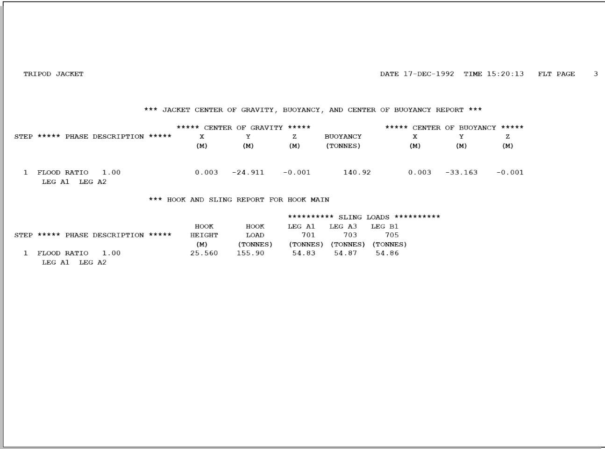

## 5.3 SAMPLE PROBLEM 3

Sample Problem 3 is a complete flotation and upending sequence for the tripod used in Sample Problems 1 and 2. The initial floating position found in Sample Problem 1 is used as the start position and the on bottom position from Sample Problem 2 is the final level resting position.

Below is the flotation input file followed by a description of the input lines.

| 123456789012346020000000000000000000000000000000000000000000000000000000000000000000000000000000000000000000000000000 | 123456789012346020000000000000000000000000000000000000000000000000000000000000000000000000000000000000000000000000000 | 123456789012346020000000000000000000000000000000000000000000000000000000000000000000000000000000000000000000000000000 | 123456789012346020000000000000000000000000000000000000000000000000000000000000000000000000000000000000000000000000000 | 123456789012346020000000000000000000000000000000000000000000000000000000000000000000000000000000000000000000000000000 | 123456789012346020000000000000000000000000000000000000000000000000000000000000000000000000000000000000000000000000000 | 123456789012346020000000000000000000000000000000000000000000000000000000000000000000000000000000000000000000000000000 | 123456789012346020000000000000000000000000000000000000000000000000000000000000000000000000000000000000000000000000000 | 123456789012346020000000000000000000000000000000000000000000000000000000000000000000000000000000000000000000000000000 |
| --- | --- | --- | --- | --- | --- | --- | --- | --- |
| TRIPOD JACKET | TRIPOD JACKET | TRIPOD JACKET | TRIPOD JACKET | TRIPOD JACKET | TRIPOD JACKET | TRIPOD JACKET | TRIPOD JACKET | TRIPOD JACKET |
| A | FLTOPT | MNME52.0 | 1.078 | 200 | SHJF | JCFBHL |  |  |
| B | JCKO |  | 203 | 205 | 703 | 1.02 | 1.60 |  |
| C | PLOTH | P3ALPVSCMT |  |  |  |  |  |  |
| D | PLTRQ | HLSL |  |  |  |  |  |  |
| E | REFJNT | 101 | 103 | 105 | 701 | 703 | 705 |  |
| F | LEGDEF | 101 | 701 | LEG A1 | 103 | 703 | LEG A2 | 105 705 |
| G | HOOK | MAIN |  | 7.5 |  |  |  |  |
| H | SLING | 701 | 20. | 10. | 2.884 |  |  | LEG A1 |
|  | SLING | 703 | 20. | 10. | 2.884 |  |  | LEG A3 |
|  | SLING | 705 | 20. | 10. | 2.884 |  |  | LEG B1 |
| I | BEGIN |  |  |  |  |  |  |  |
| J | STEP |  |  |  |  |  |  |  |
| K | HOOKEL | MAIN |  | 10.0 |  |  |  |  |
|  | STEP |  |  |  |  |  |  |  |
| L | HOOKEL | MAIN |  | 16.0 |  |  |  |  |
|  | STEP |  |  |  |  |  |  |  |
|  | HOOKEL | MAIN |  | 18.0 |  |  |  |  |
|  | STEP |  |  |  |  |  |  |  |
|  | HOOKEL | MAIN |  | 19.3 |  |  |  |  |
| M | STEP | 6 |  |  |  |  |  |  |
|  | HOOKEL | MAIN |  | 19.6 |  |  |  |  |
| N | STEP |  |  |  |  |  |  |  |
|  | HOOKEL | MAIN |  | 19.65 |  |  |  |  |
|  | STEP |  |  |  |  |  |  |  |
|  | HOOKEL | MAIN |  | 19.8 |  |  |  |  |
|  | STEP |  |  |  |  |  |  |  |
|  | HOOKEL | MAIN |  | 20.0 |  |  |  |  |
| O | STEP | 4 |  |  |  |  |  |  |
|  | HOOKEL | MAIN |  | 25.64 |  |  |  |  |
| P | STEP | 3 |  |  |  |  |  |  |
|  | FLLEGO.25 | LEG A1 |  | LEG A2 |  |  |  |  |
| Q | STEP | 3 |  |  |  |  |  |  |
|  | FLLEGO.00 | LEG A1 |  | LEG A2 |  | LEG B1 |  |  |

A. The FLTOPT line specifies metric units with forces expressed in kilonewtons for input and output (col. 8-9 and 10-11). The water depth is 52.0m (col. 12-17) and the density of sea water in col. 18-23. The maximum number of iterations for one step is 200. The center of gravity, hook load and flotation/buoyancy reports are requested by JC, HL and FB in columns 35-40.   
B. The JCKO line specifies that the plane defined by joints 203, 205 and 703 is to be at the water surface for the initial iteration. A weight contingency factor of 1.02 is specified in col. 33-38 and the CG is shifted 1.6 meters in the global Z direction.

C. The PLOTH line request that the pitch view containing all elements be plotted for all steps (PV, P3 and AL respectively). Each step should be plotted to the screen as well as the neutral picture file (SC) and the members are to be shown in full thickness (MT).   
D. The PLTRQ line request that hook load and sling load summary plots be generated.   
E. Detailed reports for joints 101, 103, 105, 701, 703 and 705 are to be produced as designated on the REFJNT line.   
F. Collinear members between joints 101 to 701 are to be flooded as a system designated as LEG A1 on the LEGDEF line. Likewise, members between joints 103 and 703 designated LEG A2 and members between joints 105 and 705 designated as LEG B1 will be treated as single elements when flooding.   
G. The hook is labeled as MAIN on the HOOK line and the initial elevation is 7.5 meters.   
H. The slings attached to the hook labeled MAIN are designated on the SLING lines. The attach joint, sling length, diameter and modules of elasticity are specified in columns 8-11, 12-18, 19- 25 and 26-34 respectively.   
I. The BEGIN line initiates the upending sequence.   
J. The STEP line specifies that the actions specified following this line will be executed in one step. Number of sequence steps is specified in Col. 5-7, default is 1.   
K. The HOOKEL line specifies that the height of hook MAIN shall be changed to 10.0 meters (in the number of steps specified on the prior STEP line).   
L. The next 3 pairs of STEP and HOOKEL lines, specify that the hook elevation be changed to 16.0, 18.0 and 19.3 meters respectively, with each done in a single step.   
M. The ensuing par of STEP and HOOKEL lines (STEP 6 and HOOKEL MAIN 19.6) stipulates that hook MAIN be raised from elevation 19.3 to elevation 19.6 in six equal steps (0.05m increments).   
N. The next 3 pairs of STEP and HOOKEL lines, specify that the hook elevation be changed to 19.65, 19.8 and 20.0 meters respectively.   
O. The following par of STEP and HOOKEL lines (STEP 4 and HOOKEL MAIN 25.64) stipulates that hook MAIN be raised from elevation 20.0 to elevation 25.64 in 1.41 meter increments (4 steps).   
P. Leg elements designated as LEG A1 and LEG A2 on the LEGDEF line, are to be flooded to 25% capacity as specified by the flood ratio of 0.25 in columns 6-10 on the FLLEG line. The STEP line specifies that this be done in 3 steps.

Q. Leg elements designated as LEG A1, LEG A2 and LEG B1 on the LEGDEF line, are to be completely flooded in 3 steps as specified by the flood ratio of 1.00 in columns 6-10 on the FLLEG line and the 3 in columns 5-7 on the STEP line.

The following are eight of the twenty five plots created by this sample problem. The first seven plots are of selected steps of the upending sequence. The final plot is a summary plot of the hook load for each of the steps of Sample Problem 3. The output listing file follows the plots.

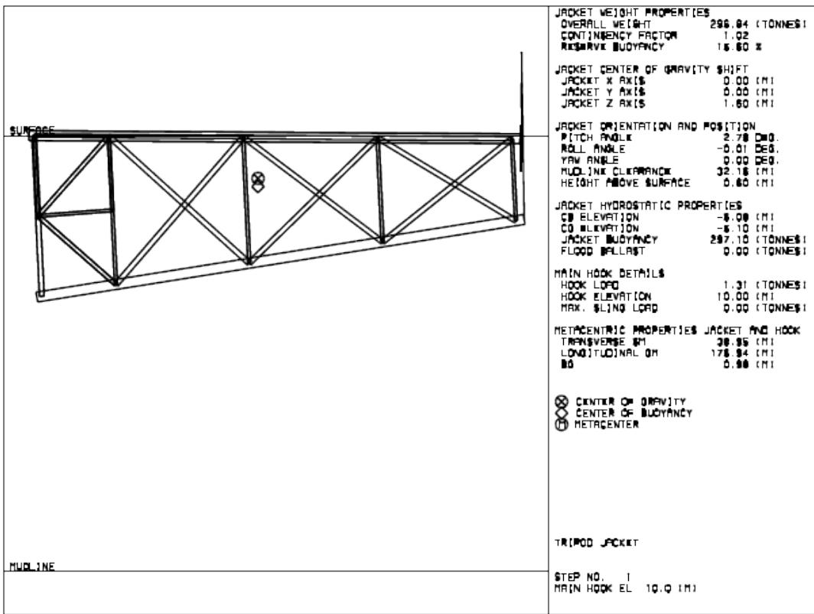

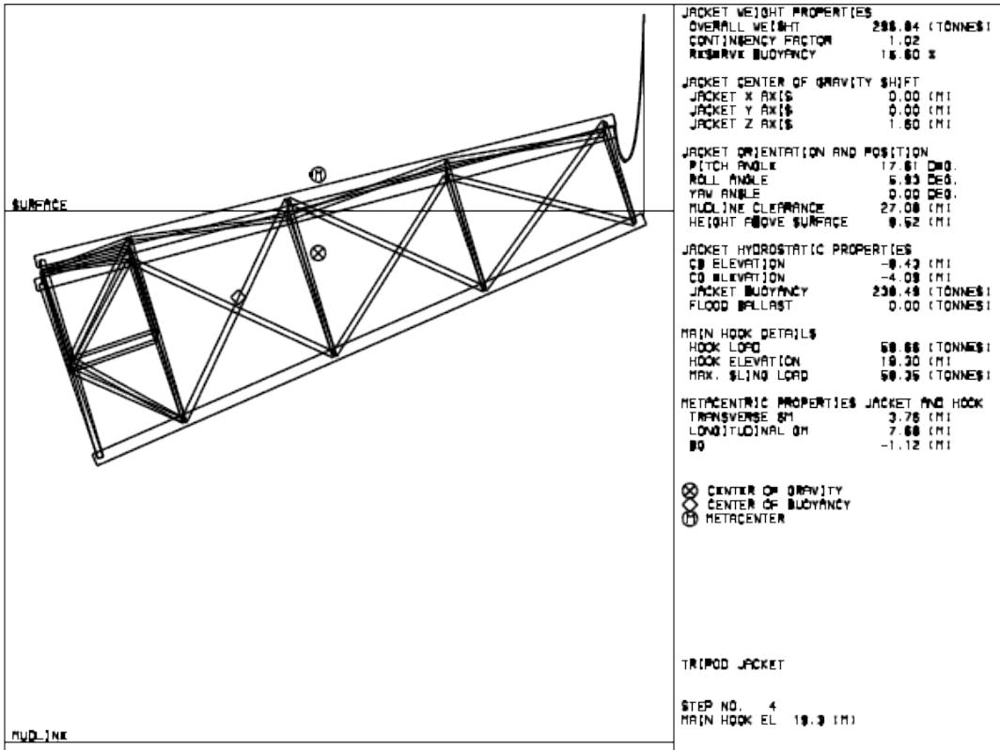

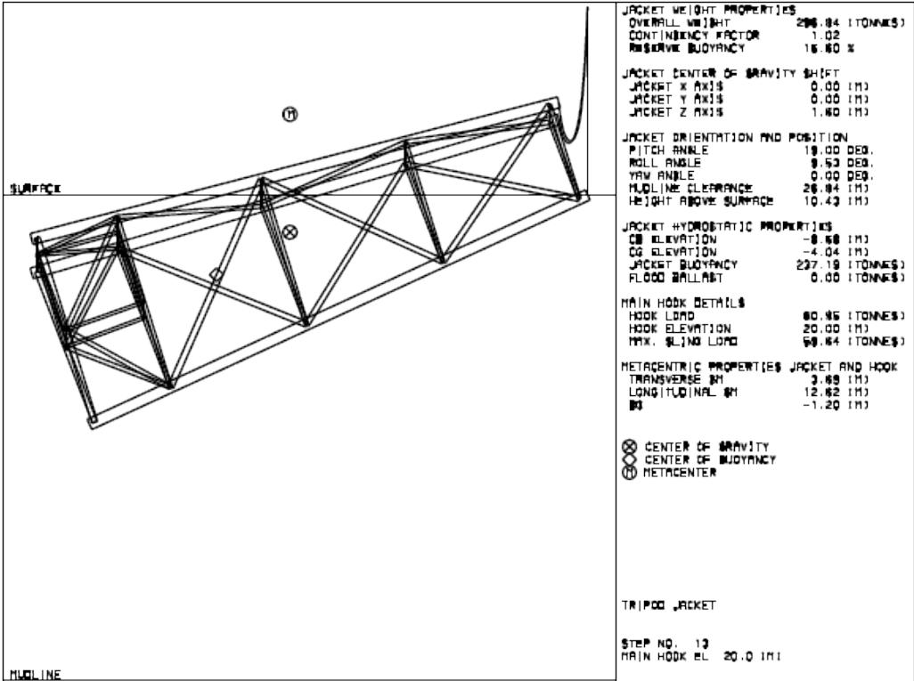

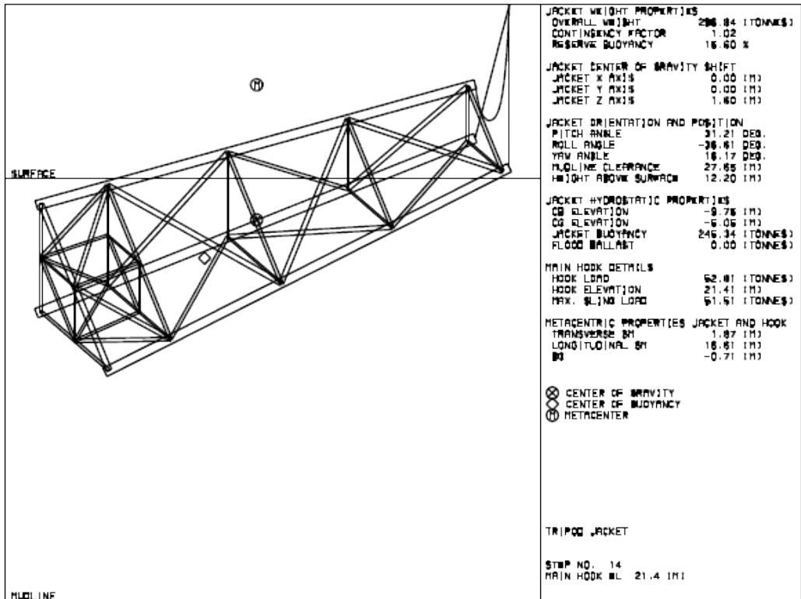

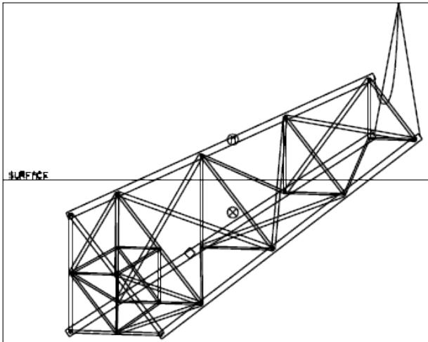

| JACKET WEIGHT PROPERTIES | JACKET WEIGHT PROPERTIES |
| --- | --- |
| OVERALL WEIGHT | 296.84 1TONNES) |
| CONTINUENCY FACTOR | 1.02 |
| RESERVE BUOTYANCE | 15.60 % |
| JACKET CENTER OF GRAVITY SHIFT | JACKET CENTER OF GRAVITY SHIFT |
| JACKET X AXIS | 0.00 IN(3) |
| JACKET Y AXIS | 0.00 IN(3) |
| JACKET Z AXIS | 1.40 IN(3) |
| JACKET ORIENTATION AND POSITION | JACKET ORIENTATION AND POSITION |
| PITCH ANGLE | 66.23 DEG. |
| ROLL ANGLE | -50.02 DEG. |
| YRM ANGLE | 36.36 DEG. |
| MULINE CLEARANCE | 28.76 IN(3) |
| HEIGHT ABOVE SURFACE | 15.57 IN(3) |
| JACKET HYDROTATIC PROPERTIES | JACKET HYDROTATIC PROPERTIES |
| CG ELEVATION | -10.66 IN(3) |
| CG ELEVATION | -4.74 IN(3) |
| JACKET BUOTYANCE | 236.11 1TONNES) |
| FLUID GLASS ALT | 0.00 1TONNES) |
| MAIN HOOK DETAILS | MAIN HOOK DETAILS |
| HOOK LOAD | 63.24 1TONNES) |
| HOOK ELEVATION | 25.64 IN(3) |
| MAX.SLING LONG | 34.21 1TONNES) |
| METACENTRIC PROPERTIES | METACENTRIC PROPERTIES |
| TRANVERSE SH | 2.67 IN(3) |
| LONG TUDINAL SH | 10.58 IN(3) |
| B3 | -1.65 IN(3) |
| ×CENTER OF GRAVITY | ×CENTER OF GRAVITY |
| CENTER OF BUOTYANCE | CENTER OF BUOTYANCE |
| METACENTER | METACENTER |
| TRIPOOD JACKET | TRIPOOD JACKET |
| STEP NO. 17 | STEP NO. 17 |
| MAIN HOOK EL | 25.6 IN(3) |

MUOLINE

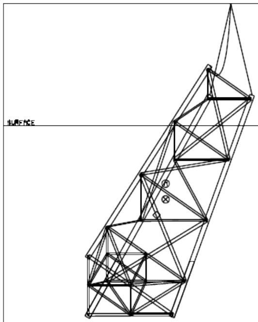

| JACKET WEIGHT PROPERTIES | JACKET WEIGHT PROPERTIES |
| --- | --- |
| OVERALL WEIGHT | 200.84 1TONN(S) |
| CONTINUANCE FACTOR | 1.02 |
| RESERVE BUOTANCY | 6.84 x |
| JACKET CENTER OF GRAVITY SHIFT | JACKET CENTER OF GRAVITY SHIFT |
| JACKET X AXIS | 0.00 1M3 |
| JACKET Y AXIS | 0.00 1M3 |
| JACKET Z AXIS | 1.60 1M3 |
| JACKET ORIENTATION AND POSITION | JACKET ORIENTATION AND POSITION |
| PITCH ANGLE | 70.73 DEG. |
| ROLL ANGLE | 34.12 DEG. |
| YRM ANGLE | 0.00 DEG. |
| FLUCINE CLEARANCE | 11.34 1M3 |
| HEIGHT ABOVE SURFACE | 13.08 1M3 |
| JACKET HYDROSTATIC PROPERTIES | JACKET HYDROSTATIC PROPERTIES |
| GB ELEVATION | -18.80 1M3 |
| GB ELEVATION | -15.52 1M3 |
| JACKET BUOTANCY | 200.50 1TONNES |
| FLOOD BALLAST | 33.07 1TONNES |
| MAIN HOOK DETAILS | MAIN HOOK DETAILS |
| HOOK LEOD | 37.57 1TONNES |
| HOOK ELEVATION | 25.84 1M3 |
| MAX. LING LEOD | 18.97 1TONNES |
| METACENTRIC PROPERTIES JACKET AND HOOK | METACENTRIC PROPERTIES JACKET AND HOOK |
| TRANSVERSE SH | 2.57 1M3 |
| LONG/TOGGLE SH | 3.32 1M3 |
| BI | -2.15 1M3 |
| CENTER OF BRAVITY | CENTER OF BRAVITY |
| CENTER OF BUOTANCY | CENTER OF BUOTANCY |
| METACENTER | METACENTER |
| TRIPOD JACKET | TRIPOD JACKET |
| STIP NO. 20 | STIP NO. 20 |
| FLOOD RATIO 0.25 | FLOOD RATIO 0.25 |
| LNG AI LNG A2 | LNG AI LNG A2 |

MUOLINE

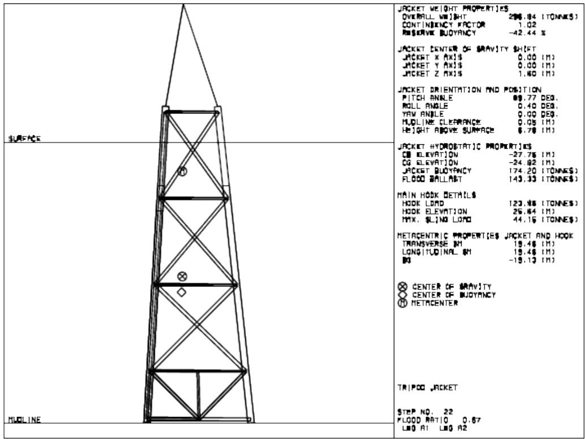

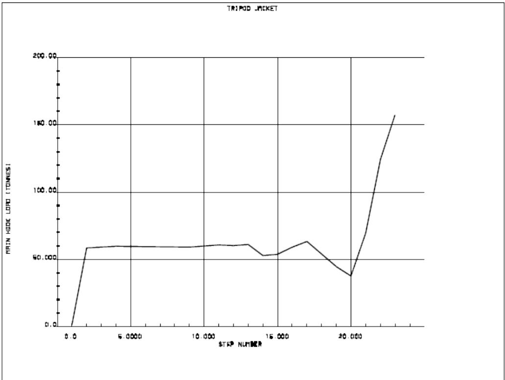

| TRIPOD JACKET DATE 17-DEC-1992 TIME 15:27:45 FLT PAGE 1 | TRIPOD JACKET DATE 17-DEC-1992 TIME 15:27:45 FLT PAGE 1 | TRIPOD JACKET DATE 17-DEC-1992 TIME 15:27:45 FLT PAGE 1 | TRIPOD JACKET DATE 17-DEC-1992 TIME 15:27:45 FLT PAGE 1 | TRIPOD JACKET DATE 17-DEC-1992 TIME 15:27:45 FLT PAGE 1 | TRIPOD JACKET DATE 17-DEC-1992 TIME 15:27:45 FLT PAGE 1 | TRIPOD JACKET DATE 17-DEC-1992 TIME 15:27:45 FLT PAGE 1 | TRIPOD JACKET DATE 17-DEC-1992 TIME 15:27:45 FLT PAGE 1 | TRIPOD JACKET DATE 17-DEC-1992 TIME 15:27:45 FLT PAGE 1 |
| --- | --- | --- | --- | --- | --- | --- | --- | --- |
| *** FLOATATION PARAMETERS *** | *** FLOATATION PARAMETERS *** | *** FLOATATION PARAMETERS *** | *** FLOATATION PARAMETERS *** | *** FLOATATION PARAMETERS *** | *** FLOATATION PARAMETERS *** | *** FLOATATION PARAMETERS *** | *** FLOATATION PARAMETERS *** | *** FLOATATION PARAMETERS *** |
| WATER DEPTH 52.00 (M) | WATER DEPTH 52.00 (M) | WATER DEPTH 52.00 (M) | WATER DEPTH 52.00 (M) | WATER DEPTH 52.00 (M) | WATER DEPTH 52.00 (M) | WATER DEPTH 52.00 (M) | WATER DEPTH 52.00 (M) | WATER DEPTH 52.00 (M) |
| SEAWATER DENSITY 1.078 (SPG) | SEAWATER DENSITY 1.078 (SPG) | SEAWATER DENSITY 1.078 (SPG) | SEAWATER DENSITY 1.078 (SPG) | SEAWATER DENSITY 1.078 (SPG) | SEAWATER DENSITY 1.078 (SPG) | SEAWATER DENSITY 1.078 (SPG) | SEAWATER DENSITY 1.078 (SPG) | SEAWATER DENSITY 1.078 (SPG) |
| MATERIAL DENSITY 7.85 (SPG) | MATERIAL DENSITY 7.85 (SPG) | MATERIAL DENSITY 7.85 (SPG) | MATERIAL DENSITY 7.85 (SPG) | MATERIAL DENSITY 7.85 (SPG) | MATERIAL DENSITY 7.85 (SPG) | MATERIAL DENSITY 7.85 (SPG) | MATERIAL DENSITY 7.85 (SPG) | MATERIAL DENSITY 7.85 (SPG) |
| JACKET ORIENTATION JOINTS 203 205 703 0 | JACKET ORIENTATION JOINTS 203 205 703 0 | JACKET ORIENTATION JOINTS 203 205 703 0 | JACKET ORIENTATION JOINTS 203 205 703 0 | JACKET ORIENTATION JOINTS 203 205 703 0 | JACKET ORIENTATION JOINTS 203 205 703 0 | JACKET ORIENTATION JOINTS 203 205 703 0 | JACKET ORIENTATION JOINTS 203 205 703 0 | JACKET ORIENTATION JOINTS 203 205 703 0 |
| WEIGHT CONTINGENCY FACTOR 1.02 | WEIGHT CONTINGENCY FACTOR 1.02 | WEIGHT CONTINGENCY FACTOR 1.02 | WEIGHT CONTINGENCY FACTOR 1.02 | WEIGHT CONTINGENCY FACTOR 1.02 | WEIGHT CONTINGENCY FACTOR 1.02 | WEIGHT CONTINGENCY FACTOR 1.02 | WEIGHT CONTINGENCY FACTOR 1.02 | WEIGHT CONTINGENCY FACTOR 1.02 |
| CG CONTINGENCY SHIFTS | CG CONTINGENCY SHIFTS | CG CONTINGENCY SHIFTS | CG CONTINGENCY SHIFTS | CG CONTINGENCY SHIFTS | CG CONTINGENCY SHIFTS | CG CONTINGENCY SHIFTS | CG CONTINGENCY SHIFTS | CG CONTINGENCY SHIFTS |
| X DIRECTION 0.000 (M) | X DIRECTION 0.000 (M) | X DIRECTION 0.000 (M) | X DIRECTION 0.000 (M) | X DIRECTION 0.000 (M) | X DIRECTION 0.000 (M) | X DIRECTION 0.000 (M) | X DIRECTION 0.000 (M) | X DIRECTION 0.000 (M) |
| Y DIRECTION 0.000 (M) | Y DIRECTION 0.000 (M) | Y DIRECTION 0.000 (M) | Y DIRECTION 0.000 (M) | Y DIRECTION 0.000 (M) | Y DIRECTION 0.000 (M) | Y DIRECTION 0.000 (M) | Y DIRECTION 0.000 (M) | Y DIRECTION 0.000 (M) |
| Z DIRECTION 1.600 (M) | Z DIRECTION 1.600 (M) | Z DIRECTION 1.600 (M) | Z DIRECTION 1.600 (M) | Z DIRECTION 1.600 (M) | Z DIRECTION 1.600 (M) | Z DIRECTION 1.600 (M) | Z DIRECTION 1.600 (M) | Z DIRECTION 1.600 (M) |
| MAIN HOOK | MAIN HOOK | MAIN HOOK | MAIN HOOK | MAIN HOOK | MAIN HOOK | MAIN HOOK | MAIN HOOK | MAIN HOOK |
| SLING LENGTH DIAMETER MODULUS JOINT X Y Z WEIGHT | SLING LENGTH DIAMETER MODULUS JOINT X Y Z WEIGHT | SLING LENGTH DIAMETER MODULUS JOINT X Y Z WEIGHT | SLING LENGTH DIAMETER MODULUS JOINT X Y Z WEIGHT | SLING LENGTH DIAMETER MODULUS JOINT X Y Z WEIGHT | SLING LENGTH DIAMETER MODULUS JOINT X Y Z WEIGHT | SLING LENGTH DIAMETER MODULUS JOINT X Y Z WEIGHT | SLING LENGTH DIAMETER MODULUS JOINT X Y Z WEIGHT | SLING LENGTH DIAMETER MODULUS JOINT X Y Z WEIGHT |
| SLING LENGTH (M) (CM) (1000 KGSCM) | SLING LENGTH (M) (CM) (1000 KGSCM) | SLING LENGTH (M) (CM) (1000 KGSCM) | SLING LENGTH (M) (CM) (1000 KGSCM) | SLING LENGTH (M) (CM) (1000 KGSCM) | SLING LENGTH (M) (CM) (1000 KGSCM) | SLING LENGTH (M) (CM) (1000 KGSCM) | SLING LENGTH (M) (CM) (1000 KGSCM) | SLING LENGTH (M) (CM) (1000 KGSCM) |
| LEG A1 20.00 10.000 294.086 701 0.000 -6.417 7.500 0.87 | LEG A1 20.00 10.000 294.086 701 0.000 -6.417 7.500 0.87 | LEG A1 20.00 10.000 294.086 701 0.000 -6.417 7.500 0.87 | LEG A1 20.00 10.000 294.086 701 0.000 -6.417 7.500 0.87 | LEG A1 20.00 10.000 294.086 701 0.000 -6.417 7.500 0.87 | LEG A1 20.00 10.000 294.086 701 0.000 -6.417 7.500 0.87 | LEG A1 20.00 10.000 294.086 701 0.000 -6.417 7.500 0.87 | LEG A1 20.00 10.000 294.086 701 0.000 -6.417 7.500 0.87 | LEG A1 20.00 10.000 294.086 701 0.000 -6.417 7.500 0.87 |
| LEG A3 20.00 10.000 294.086 703 -5.557 3.208 7.500 0.87 | LEG A3 20.00 10.000 294.086 703 -5.557 3.208 7.500 0.87 | LEG A3 20.00 10.000 294.086 703 -5.557 3.208 7.500 0.87 | LEG A3 20.00 10.000 294.086 703 -5.557 3.208 7.500 0.87 | LEG A3 20.00 10.000 294.086 703 -5.557 3.208 7.500 0.87 | LEG A3 20.00 10.000 294.086 703 -5.557 3.208 7.500 0.87 | LEG A3 20.00 10.000 294.086 703 -5.557 3.208 7.500 0.87 | LEG A3 20.00 10.000 294.086 703 -5.557 3.208 7.500 0.87 | LEG A3 20.00 10.000 294.086 703 -5.557 3.208 7.500 0.87 |
| LEG B1 20.00 10.000 294.086 705 5.557 3.208 7.500 0.87 | LEG B1 20.00 10.000 294.086 705 5.557 3.208 7.500 0.87 | LEG B1 20.00 10.000 294.086 705 5.557 3.208 7.500 0.87 | LEG B1 20.00 10.000 294.086 705 5.557 3.208 7.500 0.87 | LEG B1 20.00 10.000 294.086 705 5.557 3.208 7.500 0.87 | LEG B1 20.00 10.000 294.086 705 5.557 3.208 7.500 0.87 | LEG B1 20.00 10.000 294.086 705 5.557 3.208 7.500 0.87 | LEG B1 20.00 10.000 294.086 705 5.557 3.208 7.500 0.87 | LEG B1 20.00 10.000 294.086 705 5.557 3.208 7.500 0.87 |
| ********** JACKET PROPERTIES********** | ********** JACKET PROPERTIES********** | ********** JACKET PROPERTIES********** | ********** JACKET PROPERTIES********** | ********** JACKET PROPERTIES********** | ********** JACKET PROPERTIES********** | ********** JACKET PROPERTIES********** | ********** JACKET PROPERTIES********** | ********** JACKET PROPERTIES********** |
| NUMBER OF JOINTS 28 | NUMBER OF JOINTS 28 | NUMBER OF JOINTS 28 | NUMBER OF JOINTS 28 | NUMBER OF JOINTS 28 | NUMBER OF JOINTS 28 | NUMBER OF JOINTS 28 | NUMBER OF JOINTS 28 | NUMBER OF JOINTS 28 |
| NUMBER OF MEMBERS 63 | NUMBER OF MEMBERS 63 | NUMBER OF MEMBERS 63 | NUMBER OF MEMBERS 63 | NUMBER OF MEMBERS 63 | NUMBER OF MEMBERS 63 | NUMBER OF MEMBERS 63 | NUMBER OF MEMBERS 63 | NUMBER OF MEMBERS 63 |
| NUMBER OF PLATES 0 | NUMBER OF PLATES 0 | NUMBER OF PLATES 0 | NUMBER OF PLATES 0 | NUMBER OF PLATES 0 | NUMBER OF PLATES 0 | NUMBER OF PLATES 0 | NUMBER OF PLATES 0 | NUMBER OF PLATES 0 |
| NUMBER OF ADDITIONAL WEIGHTS 0 | NUMBER OF ADDITIONAL WEIGHTS 0 | NUMBER OF ADDITIONAL WEIGHTS 0 | NUMBER OF ADDITIONAL WEIGHTS 0 | NUMBER OF ADDITIONAL WEIGHTS 0 | NUMBER OF ADDITIONAL WEIGHTS 0 | NUMBER OF ADDITIONAL WEIGHTS 0 | NUMBER OF ADDITIONAL WEIGHTS 0 | NUMBER OF ADDITIONAL WEIGHTS 0 |
| NUMBER OF MEMBER SEGMENTS 5 | NUMBER OF MEMBER SEGMENTS 5 | NUMBER OF MEMBER SEGMENTS 5 | NUMBER OF MEMBER SEGMENTS 5 | NUMBER OF MEMBER SEGMENTS 5 | NUMBER OF MEMBER SEGMENTS 5 | NUMBER OF MEMBER SEGMENTS 5 | NUMBER OF MEMBER SEGMENTS 5 | NUMBER OF MEMBER SEGMENTS 5 |
| MATERIAL DENSITY 7.849 (SPG) | MATERIAL DENSITY 7.849 (SPG) | MATERIAL DENSITY 7.849 (SPG) | MATERIAL DENSITY 7.849 (SPG) | MATERIAL DENSITY 7.849 (SPG) | MATERIAL DENSITY 7.849 (SPG) | MATERIAL DENSITY 7.849 (SPG) | MATERIAL DENSITY 7.849 (SPG) | MATERIAL DENSITY 7.849 (SPG) |
| SEAWATER DENSITY 1.078 (SPG) | SEAWATER DENSITY 1.078 (SPG) | SEAWATER DENSITY 1.078 (SPG) | SEAWATER DENSITY 1.078 (SPG) | SEAWATER DENSITY 1.078 (SPG) | SEAWATER DENSITY 1.078 (SPG) | SEAWATER DENSITY 1.078 (SPG) | SEAWATER DENSITY 1.078 (SPG) | SEAWATER DENSITY 1.078 (SPG) |
| TOTAL WEIGHT 291.024 (TONNES) | TOTAL WEIGHT 291.024 (TONNES) | TOTAL WEIGHT 291.024 (TONNES) | TOTAL WEIGHT 291.024 (TONNES) | TOTAL WEIGHT 291.024 (TONNES) | TOTAL WEIGHT 291.024 (TONNES) | TOTAL WEIGHT 291.024 (TONNES) | TOTAL WEIGHT 291.024 (TONNES) | TOTAL WEIGHT 291.024 (TONNES) |
| MEMBER WEIGHTS 289.716 (TONNES) | MEMBER WEIGHTS 289.716 (TONNES) | MEMBER WEIGHTS 289.716 (TONNES) | MEMBER WEIGHTS 289.716 (TONNES) | MEMBER WEIGHTS 289.716 (TONNES) | MEMBER WEIGHTS 289.716 (TONNES) | MEMBER WEIGHTS 289.716 (TONNES) | MEMBER WEIGHTS 289.716 (TONNES) | MEMBER WEIGHTS 289.716 (TONNES) |
| PLATE WEIGHTS 0.000 (TONNES) | PLATE WEIGHTS 0.000 (TONNES) | PLATE WEIGHTS 0.000 (TONNES) | PLATE WEIGHTS 0.000 (TONNES) | PLATE WEIGHTS 0.000 (TONNES) | PLATE WEIGHTS 0.000 (TONNES) | PLATE WEIGHTS 0.000 (TONNES) | PLATE WEIGHTS 0.000 (TONNES) | PLATE WEIGHTS 0.000 (TONNES) |
| ADDED WEIGHTS 0.000 (TONNES) | ADDED WEIGHTS 0.000 (TONNES) | ADDED WEIGHTS 0.000 (TONNES) | ADDED WEIGHTS 0.000 (TONNES) | ADDED WEIGHTS 0.000 (TONNES) | ADDED WEIGHTS 0.000 (TONNES) | ADDED WEIGHTS 0.000 (TONNES) | ADDED WEIGHTS 0.000 (TONNES) | ADDED WEIGHTS 0.000 (TONNES) |
| TANK WEIGHTS 0.000 (TONNES) | TANK WEIGHTS 0.000 (TONNES) | TANK WEIGHTS 0.000 (TONNES) | TANK WEIGHTS 0.000 (TONNES) | TANK WEIGHTS 0.000 (TONNES) | TANK WEIGHTS 0.000 (TONNES) | TANK WEIGHTS 0.000 (TONNES) | TANK WEIGHTS 0.000 (TONNES) | TANK WEIGHTS 0.000 (TONNES) |
| SLING WEIGHTS 1.308 (TONNES) | SLING WEIGHTS 1.308 (TONNES) | SLING WEIGHTS 1.308 (TONNES) | SLING WEIGHTS 1.308 (TONNES) | SLING WEIGHTS 1.308 (TONNES) | SLING WEIGHTS 1.308 (TONNES) | SLING WEIGHTS 1.308 (TONNES) | SLING WEIGHTS 1.308 (TONNES) | SLING WEIGHTS 1.308 (TONNES) |
| TOTAL BUOYANCY 351.714 (TONNES) | TOTAL BUOYANCY 351.714 (TONNES) | TOTAL BUOYANCY 351.714 (TONNES) | TOTAL BUOYANCY 351.714 (TONNES) | TOTAL BUOYANCY 351.714 (TONNES) | TOTAL BUOYANCY 351.714 (TONNES) | TOTAL BUOYANCY 351.714 (TONNES) | TOTAL BUOYANCY 351.714 (TONNES) | TOTAL BUOYANCY 351.714 (TONNES) |
| RESERVE BUOYANCY 17.256 % | RESERVE BUOYANCY 17.256 % | RESERVE BUOYANCY 17.256 % | RESERVE BUOYANCY 17.256 % | RESERVE BUOYANCY 17.256 % | RESERVE BUOYANCY 17.256 % | RESERVE BUOYANCY 17.256 % | RESERVE BUOYANCY 17.256 % | RESERVE BUOYANCY 17.256 % |

TRIPOD JACKET

DATE 17-DEC-1992 TIME 15:27:45FLT PAGE

2

************ JACKET PROPERTIES (CONT) ************ ACK ACK ACK ACK ACK

CENTER OF GRAVITY

XCG

## 0.000 (M)

YCG

-25.578 (M) -25.578 (M) -25.578 (M)

************ CONTINGENCY JACKET PROPERTIES ************ ONT ONT ONT ONT ONT ONT

TOTAL WEIGHT

## 296.844(TO) 296.844 (TONNES)

TOTAL BUOYANCY

## 351.714 (TONNES) 351.714 (TO)

RESERVE BUOYANCY

## 15.601% 15.601%

CENTER OF GRAVITY

XCG

## 0.000 (M) 0.000 (M)

YCG

## 0.000 (M) 0.000 (M)

ZCG

-23.978 (M) -23.978 (M)

SUBMERGED CENTER OF BUOYANCY BUO BUO BUO BUOYANCY

XCB

## 0.000 (M) 0.000 (M)

YCB

## 0.000 (M) 0.000 (M)

ZCB

-25.088 (M) -25.088 (M)

** LEG DEFINITION PARAMETERS **

LEGLEG LABEL

JOINTS

OUTSIDE OUTSIDE

FROM TO

DIAMET

11 11 11

## 0.000 (M)

*AVERAGE *

DTAMETER THTCI

BALLAST BALLAST

CAPACITY CAPACITY

## 66.15 66.15

## 66.15 66.15

## 0.000 (M)

BUO BUO BUO11 11 11日日 日日 11

TRIPOD JACKET

DATE 17-DEC-1992TIME15:27:45FLT PAGE

4

*JACKET CENTER OF GRAVITY，BUOYANCY，AND CENTER OF BUOYANCY REPORT *

| STEP | ***** PHASE | DESCRIPTION | ***** | **** CENTER OF GRAVITY **** | **** CENTER OF GRAVITY **** | **** CENTER OF GRAVITY **** | **** CENTER OF GRAVITY **** | ***** CENTER OF BUOYANCY **** | ***** CENTER OF BUOYANCY **** | ***** CENTER OF BUOYANCY **** | ***** CENTER OF BUOYANCY **** |
| --- | --- | --- | --- | --- | --- | --- | --- | --- | --- | --- | --- |
| STEP | ***** PHASE | DESCRIPTION | ***** | X(M) | Y(M) | Z(M) | BUOYANCY(TONNES) | X(M) | Y(M) | Z(M) |  |
| 1 | MAIN HOOK EL | 10.0 (M) |  | -31.441 | -5.104 | 0.000 | 297.10 | -31.438 | -6.082 | 0.000 |  |
| 2 | MAIN HOOK EL | 16.0 (M) |  | -32.125 | -4.293 | -0.005 | 239.70 | -39.785 | -7.835 | -0.006 |  |
| 3 | MAIN HOOK EL | 18.0 (M) |  | -32.057 | -4.150 | -0.098 | 238.86 | -39.839 | -8.169 | -0.122 |  |
| 4 | MAIN HOOK EL | 19.3 (M) |  | -31.949 | -4.092 | -0.347 | 238.49 | -39.764 | -8.427 | -0.432 |  |
| 5 | MAIN HOOK EL | 19.4 (M) |  | -31.943 | -4.095 | -0.377 | 238.54 | -39.750 | -8.441 | -0.469 |  |
| 6 | MAIN HOOK EL | 19.4 (M) |  | -31.937 | -4.099 | -0.414 | 238.61 | -39.731 | -8.456 | -0.515 |  |
| 7 | MAIN HOOK EL | 19.5 (M) |  | -31.930 | -4.107 | -0.464 | 238.74 | -39.702 | -8.474 | -0.577 |  |
| 8 | MAIN HOOK EL | 19.5 (M) |  | -31.922 | -4.121 | -0.533 | 238.94 | -39.658 | -8.496 | -0.662 |  |
| 9 | MAIN HOOK EL | 19.6 (M) |  | -31.913 | -4.135 | -0.619 | 239.15 | -39.601 | -8.519 | -0.770 |  |
| 10 | MAIN HOOK EL | 19.6 (M) |  | -31.912 | -4.102 | -0.562 | 238.60 | -39.661 | -8.509 | -0.704 |  |
| 11 | MAIN HOOK EL | 19.6 (M) |  | -31.917 | -4.041 | -0.333 | 237.46 | -39.819 | -8.487 | -0.435 |  |
| 12 | MAIN HOOK EL | 19.8 (M) |  | -31.893 | -4.071 | -0.533 | 237.91 | -39.729 | -8.544 | -0.682 |  |
| 13 | MAIN HOOK EL | 20.0 (M) |  | -31.869 | -4.044 | -0.670 | 237.19 | -39.724 | -8.585 | -0.864 |  |
| 14 | MAIN HOOK EL | 21.4 (M) |  | -31.114 | -5.054 | 4.769 | 245.34 | -37.520 | -9.753 | 6.269 |  |
| 15 | MAIN HOOK EL | 22.8 (M) |  | -28.785 | -5.093 | 10.487 | 244.57 | -34.914 | -10.044 | 13.109 |  |
| 16 | MAIN HOOK EL | 24.2 (M) |  | -26.651 | -4.870 | 14.044 | 239.36 | -32.944 | -10.290 | 17.643 |  |
| 17 | MAIN HOOK EL | 25.6 (M) |  | -24.014 | -4.740 | 17.338 | 235.11 | -30.252 | -10.658 | 21.956 |  |
| 18 | FLOOD RATIO LEG A1 LEG A2 | 0.08 |  | -24.424 | -6.975 | 15.214 | 244.44 | -29.652 | -12.289 | 18.471 |  |
| 19 | FLOOD RATIO LEG A1 LEG A2 | 0.17 |  | -25.628 | -10.856 | 9.746 | 253.32 | -29.765 | -15.601 | 11.315 |  |
| 20 | FLOOD RATIO LEG A1 LEG A2 | 0.25 |  | -13.703 | -15.522 | -18.231 | 260.58 | -15.608 | -18.800 | -20.768 |  |
| 21 | FLOOD RATIO LEG A1 LEG A2 | 0.33 |  | -0.847 | -24.774 | -1.466 | 229.17 | -1.097 | -25.459 | -1.899 |  |
| 22 | FLOOD RATIO LEG A1 LEG A2 | 0.67 |  | -0.200 | -24.819 | -0.346 | 174.20 | -0.342 | -27.747 | -0.591 |  |
| 23 | FLOOD RATIO LEG A1 LEG A2 | 1.00 |  | 0.000 | -24.831 | 0.000 | 140.82 | -0.001 | -33.106 | 0.000 |  |

| STEP | **** PHASE | DESCRIPTION | ***** | FLOOD | FLOOD | FLOOD | FLOOD | GROUP | GROUP | GROUP | GROUP |  |
| --- | --- | --- | --- | --- | --- | --- | --- | --- | --- | --- | --- | --- |
| STEP | **** PHASE | DESCRIPTION | ***** | TOTAL FLOOD | FLOOD CENTER OF GRAVITY | FLOOD CENTER OF GRAVITY | FLOOD CENTER OF GRAVITY | CODE | BALLAST (TONNES) | X (M) | Y (M) | Z (M) |
| 1 | MAIN HOOK EL | 10.0 (M) | 0.00 | 0.000 | 0.000 | 0.000 |  |  |  |  |  |  |
| 2 | MAIN HOOK EL | 16.0 (M) | 0.00 | 0.000 | 0.000 | 0.000 |  |  |  |  |  |  |
| 3 | MAIN HOOK EL | 18.0 (M) | 0.00 | 0.000 | 0.000 | 0.000 |  |  |  |  |  |  |
| 4 | MAIN HOOK EL | 19.3 (M) | 0.00 | 0.000 | 0.000 | 0.000 |  |  |  |  |  |  |
| 5 | MAIN HOOK EL | 19.4 (M) | 0.00 | 0.000 | 0.000 | 0.000 |  |  |  |  |  |  |
| 6 | MAIN HOOK EL | 19.4 (M) | 0.00 | 0.000 | 0.000 | 0.000 |  |  |  |  |  |  |
| 7 | MAIN HOOK EL | 19.5 (M) | 0.00 | 0.000 | 0.000 | 0.000 |  |  |  |  |  |  |
| 8 | MAIN HOOK EL | 19.5 (M) | 0.00 | 0.000 | 0.000 | 0.000 |  |  |  |  |  |  |
| 9 | MAIN HOOK EL | 19.6 (M) | 0.00 | 0.000 | 0.000 | 0.000 |  |  |  |  |  |  |
| 10 | MAIN HOOK EL | 19.6 (M) | 0.00 | 0.000 | 0.000 | 0.000 |  |  |  |  |  |  |
| 11 | MAIN HOOK EL | 19.6 (M) | 0.00 | 0.000 | 0.000 | 0.000 |  |  |  |  |  |  |
| 12 | MAIN HOOK EL | 19.8 (M) | 0.00 | 0.000 | 0.000 | 0.000 |  |  |  |  |  |  |
| 13 | MAIN HOOK EL | 20.0 (M) | 0.00 | 0.000 | 0.000 | 0.000 |  |  |  |  |  |  |
| 14 | MAIN HOOK EL | 21.4 (M) | 0.00 | 0.000 | 0.000 | 0.000 |  |  |  |  |  |  |
| 15 | MAIN HOOK EL | 22.8 (M) | 0.00 | 0.000 | 0.000 | 0.000 |  |  |  |  |  |  |
| 16 | MAIN HOOK EL | 24.2 (M) | 0.00 | 0.000 | 0.000 | 0.000 |  |  |  |  |  |  |
| 17 | MAIN HOOK EL | 25.6 (M) | 0.00 | 0.000 | 0.000 | 0.000 |  |  |  |  |  |  |
| 18 | FLOOD RATIO LEG A1 LEG A2 | 0.08 | 11.02 | -15.016 | -17.439 | 17.477 |  |  |  |  |  |  |
|  |  |  |  |  |  |  | LEG A1 | 5.51 | -8.323 | -26.005 | 18.115 |  |
|  |  |  |  |  |  |  | LEG A2 | 5.51 | -21.708 | -8.873 | 16.838 |  |
| 19 | FLOOD RATIO LEG A1 LEG A2 | 0.17 | 22.05 | -12.627 | -24.232 | 13.777 |  |  |  |  |  |  |
|  |  |  |  |  |  |  | LEG A1 | 11.02 | -5.799 | -32.275 | 12.230 |  |
|  |  |  |  |  |  |  | LEG A2 | 11.02 | -19.456 | -16.189 | 15.324 |  |
| 20 | FLOOD RATIO LEG A1 LEG A2 | 0.25 | 33.07 | -4.888 | -34.435 | -6.514 |  |  |  |  |  |  |
|  |  |  |  |  |  |  | LEG A1 | 16.54 | 3.433 | -34.420 | -12.802 |  |
|  |  |  |  |  |  |  | LEG A2 | 16.54 | -13.209 | -34.450 | -0.225 |  |
| 21 | FLOOD RATIO LEG A1 LEG A2 | 0.33 | 88.22 | 0.406 | -38.455 | 0.703 |  |  |  |  |  |  |
|  |  |  |  |  |  |  | LEG A1 | 33.09 | 11.034 | -37.395 | -0.370 |  |
|  |  |  |  |  |  |  | LEG A2 | 33.09 | -5.833 | -37.395 | 9.374 |  |
|  |  |  |  |  |  |  | LEG B1 | 22.05 | -6.180 | -41.639 | -10.698 |  |
| 22 | FLOOD RATIO LEG A1 LEG A2 | 0.67 | 143.33 | 0.136 | -30.755 | 0.236 |  |  |  |  |  |  |
|  |  |  |  |  |  |  | LEG A1 | 49.61 | 10.428 | -30.052 | -0.036 |  |
|  |  |  |  |  |  |  | LEG A2 | 49.61 | -5.245 | -30.051 | 9.013 |  |
|  |  |  |  |  |  |  | LEG B1 | 44.10 | -5.388 | -32.338 | -9.332 |  |
| 23 | FLOOD RATIO LEG A1 LEG A2 | 1.00 | 176.76 | 0.000 | -25.930 | 0.000 |  |  |  |  |  |  |
|  |  |  |  |  |  |  | LEG A1 | 58.92 | 9.999 | -25.930 | 0.000 |  |
|  |  |  |  |  |  |  | LEG A2 | 58.92 | -5.000 | -25.930 | 8.659 |  |

6 INPUT LINES

STABILITY CURVE PITCH/ROLL ANGLES

COLUMNS

COMMENTARY

GENERAL THIS LINE SET IS USED TO DEVELOP STABILITY INFORMATION FORANY UPENDING STEP. THE UNBALANCED OVERTURNING MOMENT ISCALCULATED FOR EACH SPECIFIED ANGLE INCREMENT ENTERED ON THISLINE. THE USER SPECIFIES PITCH OR ROLL ANGLES. IF BOTH PITCHAND ROLL ANGLES ARE DESIRED, THEN INPUT TWO SETS OF ANGLESFOR THE CURRENT POSITION.

( 1- 5) ENTER 'ANGLE' ON ALL LINES IN THIS SET.   
( 7- 7) ENTER 'P' OR 'R' FOR PITCH OR ROLL RESPECTIVELY.   
(11-75) ENTER THE PITCH OR ROLL ANGLES IN ASCENDING ORDER. NOTE: REPEAT INPUT FOR UP TO 100 PITCH OR ROLL ANGLES.

| LINE LABEL | PITCH OR ROLL | STABILITY CURVE PITCH OR ROLL ANGLES | STABILITY CURVE PITCH OR ROLL ANGLES | STABILITY CURVE PITCH OR ROLL ANGLES | STABILITY CURVE PITCH OR ROLL ANGLES | STABILITY CURVE PITCH OR ROLL ANGLES | STABILITY CURVE PITCH OR ROLL ANGLES | STABILITY CURVE PITCH OR ROLL ANGLES | STABILITY CURVE PITCH OR ROLL ANGLES | STABILITY CURVE PITCH OR ROLL ANGLES | STABILITY CURVE PITCH OR ROLL ANGLES | STABILITY CURVE PITCH OR ROLL ANGLES | STABILITY CURVE PITCH OR ROLL ANGLES | STABILITY CURVE PITCH OR ROLL ANGLES | STABILITY CURVE PITCH OR ROLL ANGLES | LEAVE BLANK |
| --- | --- | --- | --- | --- | --- | --- | --- | --- | --- | --- | --- | --- | --- | --- | --- | --- |
| LINE LABEL | PITCH OR ROLL | 1ST ANGLE | 2ND ANGLE | 3RD ANGLE | 4TH ANGLE | 5TH ANGLE | 6TH ANGLE | 7TH ANGLE | 8TH ANGLE | 9TH ANGLE | 10TH ANGLE | 11TH ANGLE | 12TH ANGLE | 13TH ANGLE |  |  |
| ANGLE |  |  |  |  |  |  |  |  |  |  |  |  |  |  |  |  |
| 1-- 5 | 7 | 11<--15 | 16<--20 | 21<--25 | 26<--30 | 31<--35 | 36<--40 | 41<--45 | 46<--50 | 51<--55 | 56<--60 | 61<--65 | 66<--70 | 71<--75 | 76--80 |  |

STABILITY CURVE PITCH/ROLL ANGLES

COLUMNS

COMMENTARY

GENERAL

THIS LINE SET IS USED TO DEVELOP STABILITY INFORMATION FORANY UPENDING STEP. THE UNBALANCED OVERTURNING MOMENT ISCALCULATED FOR THE RANGE OF ANGLES ENTERED ON THIS LINE. THEUSER SPECIFIES PITCH OR ROLL ANGLES. IF BOTH PITCH AND ROLLANGLES ARE DESIRED, THEN INPUT TWO SETS OF ANGLES FOR THECURRENT POSITION.

( 1- 5) ENTER 'ANGLE' ON ALL LINES IN THIS SET.   
( 7- 7) ENTER 'P' OR 'R' FOR PITCH OR ROLL RESPECTIVELY.   
( 8-10) ENTER THE NUMBER OF ANGLES IN THIS RANGE (MAX 100).   
(11-15) ENTER THE INITIAL PITCH OR ROLL ANGLE.   
(16-20) ENTER THE FINAL PITCH OR ROLL ANGLE.

| LINE LABEL | PITCH OR ROLL | NUMBER OF ANGLES | INITIAL ANGLE | FINAL ANGLE | LEAVE BLANK |
| --- | --- | --- | --- | --- | --- |
| ANGLE |  |  |  |  |  |
| 1--5 | 7 | 8--10 | 11<--15 | 16<--20 | 21--------80 |
| DEFAULT |  |  | -10 | 10 |  |
| ENGLISH |  |  | DEG | DEG |  |
| METRIC |  |  | DEG | DEG |  |

BEGIN UPENDING

COLUMNS

COMMENTARY

GENERAL THIS LINE SET IS USED TO SIGNAL THAT THE CONFIGURATION DATAHAS BEEN COMPLETED AND THAT THE FLOTATION DIRECTIVES ARE TOFOLLOW.

( 1- 5) ENTER 'BEGIN'.

(13-36) THE INITIAL JACKET POSITION IS NORMALLY DETERMINED BY THE JACKET ORIENTATION JOINTS. THESE ANGLES ARE USED AFTER THE POSITION HAS FIRST BEEN DETERMINED BY THE JACKET ORIENTATION JOINTS.

| LINE LABEL | INITIAL JACKET POSITION | INITIAL JACKET POSITION | INITIAL JACKET POSITION | LEAVE BLANK |
| --- | --- | --- | --- | --- |
| LINE LABEL | PITCH | ROLL | YAW | LEAVE BLANK |
| BEGIN |  |  |  |  |
| 1--5 | 13<--20 | 21<--28 | 29<--36 | 37--80 |
| DEFAULT |  |  |  |  |
| ENGLISH | DEG | DEG | DEG |  |
| METRIC | DEG | DEG | DEG |  |

CLOSE VALVES

COLUMNS

COMMENTARY

GENERAL THIS LINE SET IS USED TO CLOSE VALVES PREVIOUSLY OPENED.

( 1- 5) ENTER 'CLOSE'.   
(11-74) ENTER THE ALPHANUMERIC IDENTIFIER FOR THE VALVES TO BE CLOSED.

| LINE LABEL | LEAVE BLANK | CLOSE VALVES | CLOSE VALVES | CLOSE VALVES | CLOSE VALVES | CLOSE VALVES | CLOSE VALVES | CLOSE VALVES | CLOSE VALVES | CLOSE VALVES | LEAVE BLANK |
| --- | --- | --- | --- | --- | --- | --- | --- | --- | --- | --- | --- |
| LINE LABEL | LEAVE BLANK | 1ST VALVE LABEL | 2ND VALVE LABEL | 3RD VALVE LABEL | 4TH VALVE LABEL | 5TH VALVE LABEL | 6TH VALVE LABEL | 7TH VALVE LABEL | 8TH VALVE LABEL |  |  |
| CLOSE |  |  |  |  |  |  |  |  |  |  |  |
| 1-- 5 | 6--10 | 11<--18 | 19<--26 | 27<--34 | 35<--42 | 43<--50 | 51<--58 | 59<--66 | 67<--74 | 75--80 |  |

END LINE

COLUMNS

COMMENTARY

GENERAL

THIS LINE SIGNALS THE END OF THE INPUT DATA.

| LINE LABEL | LEAVE BLANK |
| --- | --- |
| END |  |
| 1-- 3 | 4-80 |

FLOODED MEMBER GROUPS

COLUMNS

COMMENTARY

GENERAL THIS LINE IS USED TO CHANGE THE FLOOD STATUS OF GROUPS OF MEMBERS.

( 1- 5) ENTER 'FLGRP'.   
( 6- 9) ENTER THE FLOOD RATIO SUCH THAT 1.0 IS FULLY FLOODED AND 0.0 IS COMPLETELY EMPTY.   
(11-73) ENTER THE ALPHANUMERIC IDENTIFIER FOR THE GROUPS OF MEMBERS FOR THIS FLOOD RATIO.

| LINE LABEL | FLOOD RATIO | FLOODED GROUPS | FLOODED GROUPS | FLOODED GROUPS | FLOODED GROUPS | FLOODED GROUPS | FLOODED GROUPS | FLOODED GROUPS | FLOODED GROUPS | FLOODED GROUPS | FLOODED GROUPS | FLOODED GROUPS | FLOODED GROUPS | FLOODED GROUPS | FLOODED GROUPS | FLOODED GROUPS | FLOODED GROUPS | FLOODED GROUPS | LEAVE BLANK |
| --- | --- | --- | --- | --- | --- | --- | --- | --- | --- | --- | --- | --- | --- | --- | --- | --- | --- | --- | --- |
| LINE LABEL | FLOOD RATIO | 1ST GROUP | 2ND GROUP | 3RD GROUP | 4TH GROUP | 5TH GROUP | 6TH GROUP | 7TH GROUP | 8TH GROUP | 9TH GROUP | 10TH GROUP | 11TH GROUP | 12TH GROUP | 13TH GROUP | 14TH GROUP | 15TH GROUP | 16TH GROUP |  |  |
| FLGRP |  |  |  |  |  |  |  |  |  |  |  |  |  |  |  |  |  |  |  |
| 1-- 5 | 6<-- 9 | 11--13 | 15--17 | 18--21 | 23--25 | 27--29 | 31--33 | 35--37 | 39--41 | 43--45 | 47--49 | 51--53 | 55--57 | 59--61 | 63--65 | 67--69 | 71--73 | 74--80 |  |

FLOODED LEGS

COLUMNS

COMMENTARY

GENERAL THIS LINE SET IS USED TO CHANGE THE FLOOD STATUS OF LEGSDEFINED BY 'LEGDEF' DATA.

( 1- 5) ENTER 'FLLEG'.   
( 6-10) ENTER THE FLOOD RATIO SUCH THAT 1.0 IS FULLY FLOODED AND 0.0 IS COMPLETELY EMPTY.   
(11-74) ENTER THE ALPHANUMERIC IDENTIFIER FOR THE LEGS FOR THIS FLOOD RATIO.

| LINE LABEL | FLOOD RATIO | FLOODED LEGS | FLOODED LEGS | FLOODED LEGS | FLOODED LEGS | FLOODED LEGS | FLOODED LEGS | FLOODED LEGS | FLOODED LEGS | LEAVE BLANK |
| --- | --- | --- | --- | --- | --- | --- | --- | --- | --- | --- |
| LINE LABEL | FLOOD RATIO | 1ST LEG LABEL | 2ND LEG LABEL | 3RD LEG LABEL | 4TH LEG LABEL | 5TH LEG LABEL | 6TH LEG LABEL | 7TH LEG LABEL | 8TH LEG LABEL | LEAVE BLANK |
| FLLEG |  |  |  |  |  |  |  |  |  |  |
| 1-- 5 | 6<--10 | 11<--18 | 19<--26 | 27<--34 | 35<--42 | 43<--50 | 51<--58 | 59<--66 | 67<--74 | 75--80 |

FLOODED MEMBERS

COLUMNS

COMMENTARY

GENERAL THIS LINE SET IS USED TO CHANGE THE FLOOD STATUS OF SPECIFIED MEMBERS.

( 1- 5) ENTER 'FLMEM'.   
( 6-10) ENTER THE FLOOD RATIO SUCH THAT 1.0 IS FULLY FLOODED AND 0.0 IS COMPLETELY EMPTY.   
(11-74) ENTER THE END JOINTS OF MEMBERS TO BE FLOODED.

| LINE LABEL | FLOOD RATIO | FLOODEDMEMBERS | FLOODEDMEMBERS | FLOODEDMEMBERS | FLOODEDMEMBERS | FLOODEDMEMBERS | FLOODEDMEMBERS | FLOODEDMEMBERS | FLOODEDMEMBERS | FLOODEDMEMBERS | FLOODEDMEMBERS | FLOODEDMEMBERS | FLOODEDMEMBERS | FLOODEDMEMBERS | FLOODEDMEMBERS | FLOODEDMEMBERS | FLOODEDMEMBERS |
| --- | --- | --- | --- | --- | --- | --- | --- | --- | --- | --- | --- | --- | --- | --- | --- | --- | --- |
| LINE LABEL | FLOOD RATIO | 1ST MEMBER | 1ST MEMBER | 2ND MEMBER | 2ND MEMBER | 3RD MEMBER | 3RD MEMBER | 4TH MEMBER | 4TH MEMBER | 5TH MEMBER | 5TH MEMBER | 6TH MEMBER | 6TH MEMBER | 7TH MEMBER | 7TH MEMBER | 8THMEMBER | 8THMEMBER |
| LINE LABEL | FLOOD RATIO | 1ST JOINT | 2ND JOINT | 1ST JOINT | 2ND JOINT | 1ST JOINT | 2ND JOINT | 1ST JOINT | 2ND JOINT | 1ST JOINT | 2ND JOINT | 1ST JOINT | 2ND JOINT | 1ST JOINT | 2ND JOINT | 1ST JOINT | 2ND JOINT |
| FLMEM |  |  |  |  |  |  |  |  |  |  |  |  |  |  |  |  |  |
| 1-- 5 | 6<--10 | 11--14 | 15--18 | 19--22 | 23--26 | 27--30 | 31--34 | 35--38 | 39--42 | 43--46 | 47--50 | 51--54 | 55--58 | 59--62 | 63--66 | 67--70 | 71--74 |

FLOODED TANKS

COLUMNS

COMMENTARY

GENERAL THIS LINE SET IS USED TO CHANGE THE FLOOD STATUS OF TANKSDEFINED BY 'TANKC' DATA.

( 1- 5) ENTER 'FLTNK'.   
( 6-10) ENTER THE FLOOD RATIO SUCH THAT 1.0 IS FULLY FLOODED AND 0.0 IS COMPLETELY EMPTY.   
(11-74) ENTER THE ALPHANUMERIC IDENTIFIERS FOR THE TANKS FOR THIS FLOOD RATIO.

| LINE LABEL | FLOOD RATIO | FLOODED TANKS | FLOODED TANKS | FLOODED TANKS | FLOODED TANKS | FLOODED TANKS | FLOODED TANKS | FLOODED TANKS | FLOODED TANKS | LEAVE BLANK |
| --- | --- | --- | --- | --- | --- | --- | --- | --- | --- | --- |
| LINE LABEL | FLOOD RATIO | 1ST TANK LABEL | 2ND TANK LABEL | 3RD TANK LABEL | 4TH TANK LABEL | 5TH TANK LABEL | 6TH TANK LABEL | 7TH TANK LABEL | 8TH TANK LABEL | LEAVE BLANK |
| FLTNK |  |  |  |  |  |  |  |  |  |  |
| 1-- 5 | 6<--10 | 11<--18 | 19<--26 | 27<--34 | 35<--42 | 43<--50 | 51<--58 | 59<--66 | 67<--74 | 75--80 |

FLOTATION OPTIONS LINE

COLUMNS

COMMENTARY

GENERAL THIS LINE IS USED TO DEFINE THE OVERALL FLOTATION PARAMETERS.

( 8- 9) ENTER THE DESIRED INPUT UNITS AS FOLLOWS:'EN' - ENGLISH UNITS.'MN' - METRIC UNITS WITH FORCES IN KILONEWTONS.'ME' - METRIC UNITS WITH FORCES IN KILOGRAMS.LEAVE BLANK TO USE SAME UNITS AS JACKET FILE.  
(10-11) ENTER THE DESIRED OUTPUT UNITS AS FOLLOWS:'EN' - ENGLISH UNITS.'MN' - METRIC UNITS WITH FORCES IN KILONEWTONS.'ME' - METRIC UNITS WITH FORCES IN KILOGRAMS.LEAVE BLANK TO USE SAME UNITS AS INPUT UNITS.  
(12-17) ENTER WATER DEPTH (REQUIRED).   
(18-23) ENTER WATER DENSITY.   
(24-27) ENTER MAXIMUM NUMBER OF ITERATIONS ALLOWED TO DETERMINE ANY POSITION.   
( 28 ) ENTER 'H' IF THE SLING FORCE VERSUS DEFLECTIONS IS TO BE SOFTENED USING A HYPERBOLA WITH THE LINEAR STIFFNESS AS THE ASYMPTOTE. THIS OPTION IS USEFUL IF DIFFICULTY IN CONVERGENCE IS ENCOUNTERED.

COLUMNS

COMMENTARY

(35-54) ENTER ANY OF THE FOLLOWING REPORT OPT

'JP' - PRINT JACKET DATA.

'EC' - INPUT ECHO.

SELECT EITHER:

'AL' - ALL SUMMARY REPORTS.

OR ANY OF THE FOLLOWING:

'GS' - GROUP WEIGHT AND BUOYANCY REPORT.  
'WP' - WATERPLANE PROPERTIES REPORT.  
'JC' - JACKET CENTER OF GRAVITY/BUOYANCY REPORT.   
'HS' - HOOK AND SLING REPORT.   
'FB' - FLOOD BALLAST REPORT.   
'RJ' - REFERENCE JOINT REPORT.   
'SL' - CREATE SACS IV OUTPUT FILE FOR LOADS.   
'NV' - NON-VENTED COMPARTMENT PRESSURE.   
'SP' - SUPPORT REPORT

(55-60) ENTER THE TOLERANCE ON WEIGHT FOR THE DEPTH ITERATION CONVERGENCE FOR THE BUOYANCY TO WEIGHT BALANCE.   
(61-66) ENTER THE TOLERANCE FOR MOMENT BALANCE. THIS IS THE HORIZONTAL DISTANCE ALLOWED BETWEEN THE CENTER OF BUOYANCY AND THE CENTER OF GRAVITY.   
(67-70) IF A PARTICULAR JOINT IS TO BE USED FOR THE HEIGHT ABOVE THE SURFACE, THEN ENTER THAT JOINT NAME HERE. IF LEFT BLANK, THE MAXIMUM ELEVATION OF ALL MEMBERS INCLUDING THE MEMBER DIAMETER WILL BE USED FOR THE MAXIMUM HEIGHT ABOVE THE SURFACE.

| LINE LABEL | UNITS | UNITS | WATER DEPTH | WATER DENSITY | MAXIMUM ITERATIONS | HYPERBOLIC SLING FORCE VERSUS DEFLECTION OPTION | REPORT OPTIONS | REPORT OPTIONS | REPORT OPTIONS | REPORT OPTIONS | REPORT OPTIONS | REPORT OPTIONS | REPORT OPTIONS | REPORT OPTIONS | REPORT OPTIONS | REPORT OPTIONS | ITERATION TOLERANCES | ITERATION TOLERANCES | HEIGHT ABOVE SURFACE REFERENCE JOINT | LEAVE BLANK |
| --- | --- | --- | --- | --- | --- | --- | --- | --- | --- | --- | --- | --- | --- | --- | --- | --- | --- | --- | --- | --- |
| LINE LABEL | INPUT | OUTPUT | WATER DEPTH | WATER DENSITY | MAXIMUM ITERATIONS | HYPERBOLIC SLING FORCE VERSUS DEFLECTION OPTION | 1ST | 2ND | 3RD | 4TH | 5TH | 6TH | 7TH | 8TH | 9TH | 10TH | WEIGHT | MOMENT | HEIGHT ABOVE SURFACE REFERENCE JOINT | LEAVE BLANK |
| FLTOPT |  |  |  |  |  |  |  |  |  |  |  |  |  |  |  |  |  |  |  |  |
| 1-- 6 | 8-- 9 | 10--11 | 12<--17 | 18<--23 | 24-->27 | 28 | 35--36 | 37--38 | 39--40 | 41--42 | 43--44 | 45--46 | 47--48 | 49--50 | 51--52 | 53--54 | 55<--60 | 61<--66 | 67-->70 | 71--80 |
| DEFAULT |  |  |  | 64.04 ENGL | 100 |  |  |  |  |  |  |  |  |  |  |  | 0.001 | 0.01 ENGL |  |  |
| ENGLISH |  |  | FT | LB/CU.FT |  |  |  |  |  |  |  |  |  |  |  |  |  | FT |  |  |
| METRIC |  |  | M | TONNE/CU.M |  |  |  |  |  |  |  |  |  |  |  |  |  | M |  |  |

ADDITIONAL WEIGHT MODIFIER

COLUMNS

COMMENTARY

GENERAL

THIS LINE IS USED TO MODIFY THE ADDITIONAL WEIGHTS AND BUOYANCIES AS INPUT USING THE 'WEIGHT' DATA INPUT DURING THE UPENDING PROCEDURE. THE JOINT NAME INPUT ON THIS LINE IMAGE MUST CORRESPOND TO AN ENTRY ON A 'WEIGHT' DATA LINE.

( 6 )

IF THESE ARE LIFT FORCES INSTEAD OF BUOYANCIES, ENTER 'L' HERE. LIFT FORCES ARE APPLIED EVEN IF THE JOINT IS OUT OF THE WATER.

( 7-10)

ENTER THE JOINT NAME WHERE THE BUOYANCY IS LOCATED.

(11-16)

ENTER THE BUOYANCY/LIFT FORCE.

(17-76)

ENTER THE REMAINING BUOYANCY/LIFT DESCRIPTIONS.

| LINE LABEL | LIFT FORCE OPTION | 1ST BUOY | 1ST BUOY | 2ND BUOY | 2ND BUOY | 3RD BUOY | 3RD BUOY | 4TH BUOY | 4TH BUOY | 5TH BUOY | 5TH BUOY | 6TH BUOY | 6TH BUOY | 7TH BUOY | 7TH BUOY | LEAVE BLANK |
| --- | --- | --- | --- | --- | --- | --- | --- | --- | --- | --- | --- | --- | --- | --- | --- | --- |
| LINE LABEL | LIFT FORCE OPTION | JOINT NAME | BUOYANCY FORCE | JOINT NAME | BUOYANCY FORCE | JOINT NAME | BUOYANCY FORCE | JOINT NAME | BUOYANCY FORCE | JOINT NAME | BUOYANCY FORCE | JOINT NAME | BUOYANCY FORCE | JOINT NAME | BUOYANCY FORCE | LEAVE BLANK |
| FLWT |  |  |  |  |  |  |  |  |  |  |  |  |  |  |  |  |
| 1-- 4 | 6 | 7--->10 | 11<-->16 | 17--->20 | 21<-->26 | 27--->30 | 31<-->36 | 37--->40 | 41<-->46 | 47--->50 | 51<-->56 | 57--->60 | 61<-->66 | 67--->70 | 71<-->76 | 77-->80 |
| DEFAULT |  |  |  |  |  |  |  |  |  |  |  |  |  |  |  |  |
| ENGLISH |  |  | KIP |  | KIP |  | KIP |  | KIP |  | KIP |  | KIP |  | KIP |  |
| METRIC |  |  | TONNE |  | TONNE |  | TONNE |  | TONNE |  | TONNE |  | TONNE |  | TONNE |  |

MEMBER GROUP DELETES

COLUMNS

COMMENTARY

GENERAL

THIS LINE SET IS USED TO DELETE GROUPS OF MEMBERS FOR THE FLOTATION ANALYSIS. FOR EXAMPLE, MEMBERS REPRESENTING STRUCTURE NOT PRESENT DURING THE UPENDING CAN BE RETAINED IN THE MODEL BUT IGNORED FOR THE UPENDING ANALYSIS, SUCH AS PILES AND THE LIKE. THERE IS NO LIMIT ON THE NUMBER OF GROUPS THAT CAN BE DELETED.

( 1- 6)

ENTER 'GRPDEL' ON ALL LINES IN THIS SET.

( 9-75)

ENTER THE ALPHANUMERIC IDENTIFIER FOR THE GROUPS OF MEMBERS TO BE DELETED.

| LINE LABEL | DELETED GROUP LABELS | DELETED GROUP LABELS | DELETED GROUP LABELS | DELETED GROUP LABELS | DELETED GROUP LABELS | DELETED GROUP LABELS | DELETED GROUP LABELS | DELETED GROUP LABELS | DELETED GROUP LABELS | DELETED GROUP LABELS | DELETED GROUP LABELS | DELETED GROUP LABELS | DELETED GROUP LABELS | DELETED GROUP LABELS | DELETED GROUP LABELS | DELETED GROUP LABELS | DELETED GROUP LABELS | DELETED GROUP LABELS | LEAVE BLANK |
| --- | --- | --- | --- | --- | --- | --- | --- | --- | --- | --- | --- | --- | --- | --- | --- | --- | --- | --- | --- |
| LINE LABEL | 1ST GROUP | 2ND GROUP | 3RD GROUP | 4TH GROUP | 5TH GROUP | 6TH GROUP | 7TH GROUP | 8TH GROUP | 9TH GROUP | 10TH GROUP | 11TH GROUP | 12TH GROUP | 13TH GROUP | 14TH GROUP | 15TH GROUP | 16TH GROUP | 17TH GROUP |  |  |
| GRPDEL |  |  |  |  |  |  |  |  |  |  |  |  |  |  |  |  |  |  |  |
| 1--6 | 9--11 | 13--15 | 17--19 | 21--23 | 25--27 | 29--31 | 33--35 | 37--39 | 41--43 | 45--47 | 49--51 | 53--55 | 57--59 | 61--63 | 65--67 | 69--71 | 73--75 | 76--80 |  |

MEMBER GROUP OVERRIDES

COLUMNS

COMMENTARY

GENERAL THIS LINE SET IS USED TO OVERRIDE PREVIOUSLY DEFINED DATA FORSPECIFIC GROUPS OF MEMBERS.

FOR A SEGMENTED MEMBER THERE MUST BE A GROUP OVERRIDE LINEFOR EACH SEGMENT, THAT IS, THERE MUST BE AS MANY GROUPOVERRIDE LINES AS SACS IV 'GRUP' LINES FOR THAT GROUP.

ANY FIELD LEFT BLANK LEAVES THE STATUS OF THAT PARAMETER UNCHANGED. NOTE THAT THE PROGRAM READS A ZERO AS A BLANK, SO IF IT IS DESIRED TO HAVE A ZERO VALUE FOR A DIMENSION OR PARAMETER THEN A VERY SMALL VALUE SHOULD BE ENTERED.

( 1- 5) ENTER 'GRPOV' ON ALL LINES IN THIS SET.   
( 6- 7) ENTER 'AL' IF OVERRIDES APPLY TO ALL SEGMENTS.   
(16-18) ENTER THE ALPHANUMERIC IDENTIFIER FOR THE GROUP OF MEMBERS TO WHICH THESE OVERRIDES APPLY.   
( 19 ) ENTER 'N' TO ELIMINATE MARINE GROWTH.

COLUMNS

COMMENTARY

( 20 ) ENTER 'F' IF THIS GROUP OF MEMBERS IS TO BE FLOODED. ENTER 'N' IF THIS GROUP OF MEMBERS IS TO BE NON-FLOODED.   
(21-26) ENTER THE MATERIAL WEIGHT DENSITY FOR THIS GROUP.   
(27-33) ENTER THE CROSS SECTIONAL AREA FOR THIS GROUP. THIS IS THE AREA USED FOR CALCULATING MATERIAL WEIGHT AND FLOODED BUOYANCY.   
(34-40) ENTER THE DISPLACEMENT AREA FOR THIS GROUP. THIS IS THE AREA USED FOR CALCULATING NON-FLOODED BUOYANCY.   
(41-52) ENTER THE DIMENSIONS OF THE MEMBER WHICH RESULT IN FORCES IN THE LOCAL Y AND Z DIRECTIONS RESPECTIVELY.

| LINE LABEL | ALL SEGMENTS | GROUP IDEN. | MARINE GROWTH OPTION | FLOOD COND. | MATERIAL WEIGHT DENSITY | MEMBER DIMENSION OVERRIDEES | MEMBER DIMENSION OVERRIDEES | MEMBER DIMENSION OVERRIDEES | MEMBER DIMENSION OVERRIDEES | LEAVE BLANK |
| --- | --- | --- | --- | --- | --- | --- | --- | --- | --- | --- |
| LINE LABEL | ALL SEGMENTS | GROUP IDEN. | MARINE GROWTH OPTION | FLOOD COND. | MATERIAL WEIGHT DENSITY | CROSS SECTION AREA | DISPL. AREA | DIMENSION FOR FORCES IN: |  | LEAVE BLANK |
| GRPOV |  |  |  |  |  |  |  | LOCAL Y DIR. | LOCAL Z DIR. |  |
| 1-- 5 | 6-- 7 | 16<--18 | 19 | 20 | 21<--26 | 27<--33 | 34<--40 | 41<--46 | 47<--52 | 53--80 |
| DEFAULT |  |  |  |  |  |  |  |  |  |  |
| ENGLISH |  |  |  |  | LB/CU.FT | SQ.IN | SQ.IN | IN | IN |  |
| METRIC |  |  |  |  | TONNE/CU.M | SQ.CM | SQ.CM | CM | CM |  |

HOOK DEFINITION LINE

COLUMNS

COMMENTARY

GENERAL THIS LINE IS USED TO DEFINE THE HOOKS USED TO RAISE AND LOWER THE JACKET DURING UPENDING.

( 8-17) ENTER HOOK LABEL USED TO IDENTIFY THIS HOOK DURING UPENDING.   
(18-25) ENTER THE INITIAL HOOK ELEVATION (ZERO IS THE WATERLINE).

| LINE LABEL | HOOK LABEL | INITIAL HOOK HEIGHT | LEAVE BLANK |
| --- | --- | --- | --- |
| HOOK |  |  |  |
| 1-- 4 | 8--17 | 18<--25 | 26--------80 |
| DEFAULT |  |  |  |
| ENGLISH |  | FT |  |
| METRIC |  | M |  |

HOOK ELEVATION LINE

COLUMNS

COMMENTARY

GENERAL THIS LINE IS USED TO CHANGE THE HOOK ELEVATION TO RAISE OR LOWER THE JACKET DURING UPENDING.

( 8-17) ENTER HOOK LABEL USED TO IDENTIFY THIS HOOK DURING UPENDING.

(18-25) ENTER THE HOOK ELEVATION.

| LINE LABEL | HOOK LABEL | HOOK ELEVATION | LEAVE BLANK |
| --- | --- | --- | --- |
| HOOKEL |  |  |  |
| 1-- 6 | 8--17 | 18<--25 | 26--------80 |
| DEFAULT |  |  |  |
| ENGLISH |  | FT |  |
| METRIC |  | M |  |

HOOK LOAD LINE

COLUMNS

COMMENTARY

GENERAL THIS LINE IS USED TO CHANGE THE HOOK LOAD TO RAISE OR LOWER THE JACKET DURING UPENDING.

( 8-17) ENTER HOOK LABEL USED TO IDENTIFY THIS HOOK DURING UPENDING.

(18-25) ENTER THE HOOK LOAD.

| LINE LABEL | HOOK LABEL | HOOK LOAD | LEAVE BLANK |
| --- | --- | --- | --- |
| HOOKLD |  |  |  |
| 1-- 6 | 8--17 | 18<--25 | 26--------80 |
| DEFAULT |  |  |  |
| ENGLISH |  | TON |  |
| METRIC |  | TONNE |  |

WEIGHT SELECTION DATA LINE

COLUMNS

COMMENTARY

GENERAL THE WEIGHT SELECTION RECORD ALLOWS THE SELECTION OF WEIGHTGROUPS TO BE INCLUDED IN SPECIFIC LOAD CASES

( 1- 6) ENTER 'INCWGT'.   
( 9-12) ENTER A FOUR CHARACTER WEIGHT GROUP. THIS GROUP MUST BE THE SAME AS ENTERED ON THE WGTNS, WGTMEM, OR WGTFP LINES.   
(13-80) ENTER ADDITIONAL WEIGHT GROUPS.

| LINE LABEL | INCLUDED WEIGHT GROUP SELECTIONS | INCLUDED WEIGHT GROUP SELECTIONS | INCLUDED WEIGHT GROUP SELECTIONS | INCLUDED WEIGHT GROUP SELECTIONS | INCLUDED WEIGHT GROUP SELECTIONS | INCLUDED WEIGHT GROUP SELECTIONS | INCLUDED WEIGHT GROUP SELECTIONS | INCLUDED WEIGHT GROUP SELECTIONS | INCLUDED WEIGHT GROUP SELECTIONS | INCLUDED WEIGHT GROUP SELECTIONS | INCLUDED WEIGHT GROUP SELECTIONS | INCLUDED WEIGHT GROUP SELECTIONS | INCLUDED WEIGHT GROUP SELECTIONS | INCLUDED WEIGHT GROUP SELECTIONS | INCLUDED WEIGHT GROUP SELECTIONS | INCLUDED WEIGHT GROUP SELECTIONS | INCLUDED WEIGHT GROUP SELECTIONS | INCLUDED WEIGHT GROUP SELECTIONS |
| --- | --- | --- | --- | --- | --- | --- | --- | --- | --- | --- | --- | --- | --- | --- | --- | --- | --- | --- |
| LINE LABEL | 1ST | 2ND | 3RD | 4TH | 5TH | 6TH | 7TH | 8TH | 9TH | 10TH | 11TH | 12TH | 13TH | 14TH | 15TH | 16TH | 17TH | 18TH |
| INCWGT |  |  |  |  |  |  |  |  |  |  |  |  |  |  |  |  |  |  |
| 1-- 6 | 9<--12 | 13<--16 | 17<--20 | 21<--24 | 25<--28 | 29<--32 | 33<--36 | 37<--40 | 41<--44 | 45<--52 | 53<--56 | 57<--60 | 61<--64 | 65<--68 | 69<--72 | 73<--76 | 77<--80 |  |

JACKET ORIENTATION LINE

COLUMNS

COMMENTARY

GENERAL THIS LINE IS USED TO DEFINE THE JACKET ORIENTATION PARAMETERS.

( 7- 8) ENTER THE JACKET VERTICAL COORDINATE IN THE INSTALLED POSITION.   
( 10 ) ENTER 'F' FOR ALL MEMBERS TO BE FLOODED. OTHERWISE LEAVE BLANK.   
(11-16) ENTER MATERIAL DENSITY.   
(17-32) ENTER JOINT NAMES TO DEFINE THE INITIAL FLOTATION POSITION.   
(33-38) ENTER THE FACTOR TO ACCOUNT FOR UNKNOWNS IN TOTAL WEIGHT OF JACKET.   
(39-56) ENTER THE X, Y, AND Z CENTER OF GRAVITY SHIFTS TO ACCOUNT FOR UNCERTAINTIES IN CG LOCATION.   
(57-62) ENTER THE DENSITY TO BE USED TO CALCULATE THE VOLUME OF ADDED WEIGHTS REPRESENTED BY INPUT LOAD LINES. THIS VOLUME IS THEN USED TO CALCULATE THE BUOYANCY OF THESE WEIGHTS.

| LINE LABEL | VERTICAL COORD. | OVERALL FLOOD OPTION | MATERIAL DENSITY | JACKET ORIENTATION JOINTS | JACKET ORIENTATION JOINTS | JACKET ORIENTATION JOINTS | JACKET ORIENTATION JOINTS | WEIGHT CONTINGENCY FACTOR | CENTER OF GRAVITY SHIFTS LOCAL JACKET COORDINATES | CENTER OF GRAVITY SHIFTS LOCAL JACKET COORDINATES | CENTER OF GRAVITY SHIFTS LOCAL JACKET COORDINATES | ADDED LOAD DENSITY | LEAVE BLANK |
| --- | --- | --- | --- | --- | --- | --- | --- | --- | --- | --- | --- | --- | --- |
| LINE LABEL | VERTICAL COORD. | OVERALL FLOOD OPTION | MATERIAL DENSITY | 1ST JOINT | 2ND JOINT | 3RD JOINT | 4TH JOINT | WEIGHT CONTINGENCY FACTOR | X | Y | Z | ADDED LOAD DENSITY | LEAVE BLANK |
| JCKO |  |  |  |  |  |  |  |  |  |  |  |  |  |
| 1-- 4 | 7-- 8 | 10 | 11<!--16 | 17-->20 | 21-->24 | 25-->28 | 29-->32 | 33<!--38 | 39<!--44 | 45<!--50 | 51<!--56 | 57<!--62 | 63--80 |
| DEFAULT | '+'z' | NOT | 490.0 ENGL |  |  |  |  | 1 | 0 | 0 | 0 | 490.0 ENGL |  |
| ENGLISH |  |  | LB/CU.FT |  |  |  |  |  | FT | FT | FT | LB/CU.FT |  |
| METRIC |  |  | TONNE/CU.M |  |  |  |  |  | M | M | M | TONNE/CU.M |  |

LOAD CASE FACTOR

COLUMNS

COMMENTARY

GENERAL THIS LINE IS USED TO FACTOR LOAD CASES BASED ON ANALYSISTYPE. THIS LINE CAN BE REPEATED AS OFTEN AS NECESSARY TOFACTOR ANY OR ALL OF THE LOAD CASES. THIS LINE SHOULDFOLLOW THE LCSEL LINE.

( 7- 8) ENTER THE FUNCTION FOR THE LOAD CASE FACTORSFROM THE FOLLOWING:' ' - LEAVE BLANK FOR STANDARD AND CONVERT TO MASS'ST' - USE FOR STANDARD STATIC AND/OR PSI ANALYSIS'DY' - CONVERT TO MASS FOR DYNAMIC CHARACTERISTICS'PD' - DESIGNATES GRAVITY LOAD CASES USED TO DETERMINEP-DELTA EFFECTS FOR SECOND ORDER ANALYSIS AND/ORMOMENT MAGNIFIERS FOR CONCRETE FIRST ORDER ANALYSISLEAVE FUNCTION BLANK IF THE LOAD CASES LISTED ARE TO BE USEDFOR BOTH STANDARD 'ST' AND DYNAMIC 'DY' FUNCTIONS.

(11-16) ENTER THE LOAD CASE FACTOR FOR THESE LOAD CASES. LEAVE BLANK FOR DEFAULT OF 1.0.   
(17-75) ENTER THE LOAD CASE IDENTIFIERS FOR ALL LOAD CASES TO BE SELECTED. THE LOAD CASES CAN BE IN ANY ORDER.

| LINE LABEL | FUNCTION | LOAD CASE FACTOR | LOAD CASE SELECTIONS | LOAD CASE SELECTIONS | LOAD CASE SELECTIONS | LOAD CASE SELECTIONS | LOAD CASE SELECTIONS | LOAD CASE SELECTIONS | LOAD CASE SELECTIONS | LOAD CASE SELECTIONS | LOAD CASE SELECTIONS | LOAD CASE SELECTIONS | LOAD CASE SELECTIONS | LOAD CASE SELECTIONS |
| --- | --- | --- | --- | --- | --- | --- | --- | --- | --- | --- | --- | --- | --- | --- |
| LINE LABEL | FUNCTION | LOAD CASE FACTOR | 1ST | 2ND | 3RD | 4TH | 5TH | 6TH | 7TH | 8TH | 9TH | 10TH | 11TH | 12TH |
| LCFAC |  |  |  |  |  |  |  |  |  |  |  |  |  |  |
| 1-- 5 | 7-- 8 | 11<--16 | 17-->20 | 22-->25 | 27-->30 | 32-->35 | 37-->40 | 42-->45 | 47-->50 | 52-->55 | 57-->60 | 62-->65 | 67-->70 | 72-->75 |
| DEFAULT |  | 1 |  |  |  |  |  |  |  |  |  |  |  |  |

FLOTATION ANALYSIS LOAD CASE SELECTION

COLUMNS

COMMENTARY

GENERAL

THIS LINE IS USED TO SPECIFY THE LOAD CASES IN THE SACS IVINPUT FILE THAT ARE TO BE CONVERTED TO WEIGHT. THIS LINE CANBE REPEATED AS OFTEN AS NECESSARY TO SELECT ANY OR ALL OF THELOAD CASES.

(11-16) IF THE ADDED LOAD DENSITY IS DIFFERENT THAN ON THE 'JCKO' DATA, ENTER THE LOAD DENSITY. THIS VALUE IS USED TO CALCULATE THE BUOYANCY DUE TO LOAD DATA.   
(17-75) ENTER THE LOAD CASE NAMES FOR ALL LOAD CASES TO BE INCLUDED FOR FLOTATION ANALYSIS. THE NAMES CAN BE IN ANY ORDER.

| LINE LABEL | ADDED LOAD DENSITY | LOAD CASE SELECTION | LOAD CASE SELECTION | LOAD CASE SELECTION | LOAD CASE SELECTION | LOAD CASE SELECTION | LOAD CASE SELECTION | LOAD CASE SELECTION | LOAD CASE SELECTION | LOAD CASE SELECTION | LOAD CASE SELECTION | LOAD CASE SELECTION | LOAD CASE SELECTION |
| --- | --- | --- | --- | --- | --- | --- | --- | --- | --- | --- | --- | --- | --- |
| LINE LABEL | ADDED LOAD DENSITY | 1ST | 2ND | 3RD | 4TH | 5TH | 6TH | 7TH | 8TH | 9TH | 10TH | 11TH | 12TH |
| LCSEL |  |  |  |  |  |  |  |  |  |  |  |  |  |
| 1-- 5 | 11<--16 | 17-->20 | 22-->25 | 27-->30 | 32-->35 | 37-->40 | 42-->45 | 47-->50 | 52-->55 | 57-->60 | 62-->65 | 67-->70 | 72-->75 |
| DEFAULT | JCKO' |  |  |  |  |  |  |  |  |  |  |  |  |
| ENGLISH | LB/CU.FT |  |  |  |  |  |  |  |  |  |  |  |  |
| METRIC | TONNE/CU.M |  |  |  |  |  |  |  |  |  |  |  |  |

LEG DEFINITIONS

COLUMNS

COMMENTARY

GENERAL THIS LINE SET IS USED TO CONNECT MEMBERS TOGETHER FOR FLOODING. FOR EXAMPLE, A LEG OF A JACKET CAN BE FLOODED AS ONE MEMBER. THERE IS NO LIMIT TO THE NUMBER OF LEGS THAT CAN BE DEFINED.

( 1- 6) ENTER 'LEGDEF' ON ALL LINES IN THIS SET.   
( 8-71) ENTER THE END JOINTS OF MEMBERS TO BE CONNECTED AND A LABEL TO IDENTIFY THE DEFINED LEG. THE USER SPECIFIES THE BOTTOM AND TOP JOINTS OF A LEG, AND THE PROGRAM FINDS ALL THE INTERMEDIATE MEMBERS THAT MAKE UP THIS LEG.

| LINE LABEL | FIRST LEG | FIRST LEG | FIRST LEG | SECOND LEG | SECOND LEG | SECOND LEG | THIRD LEG | THIRD LEG | THIRD LEG | FOURTH LEG | FOURTH LEG | FOURTH LEG |
| --- | --- | --- | --- | --- | --- | --- | --- | --- | --- | --- | --- | --- |
| LINE LABEL | START JOINT | END JOINT | LEG LABEL | START JOINT | END JOINT | LEG LABEL | START JOINT | END JOINT | LEG LABEL | START JOINT | END JOINT | LEG LABEL |
| LEGDEF |  |  |  |  |  |  |  |  |  |  |  |  |
| 1--6 | 8-->11 | 12-->15 | 16<-->23 | 24-->27 | 28-->31 | 32<-->39 | 40-->43 | 44-->47 | 48<-->55 | 56-->59 | 60-->63 | 64<-->71 |

MEMBER DELETES

COLUMNS

COMMENTARY

GENERAL THIS LINE SET IS USED TO DELETE MEMBERS FOR THE FLOTATION ANALYSIS. FOR EXAMPLE, MEMBERS REPRESENTING STRUCTURE NOT PRESENT DURING THE UPENDING CAN BE RETAINED IN THE MODEL BUT IGNORED FOR THE UPENDING ANALYSIS SUCH AS PILES, ETC. THERE IS NO LIMIT ON THE NUMBER OF MEMBERS THAT CAN BE DELETED.

( 1- 6) ENTER 'MBRDEL' ON ALL LINES IN THIS SET.   
( 9-72) ENTER THE END JOINTS OF MEMBERS TO BE DELETED.

| LINE LABEL | DELETED MEMBERS | DELETED MEMBERS | DELETED MEMBERS | DELETED MEMBERS | DELETED MEMBERS | DELETED MEMBERS | DELETED MEMBERS | DELETED MEMBERS | DELETED MEMBERS | DELETED MEMBERS | DELETED MEMBERS | DELETED MEMBERS | DELETED MEMBERS | LEAVE BLANK |
| --- | --- | --- | --- | --- | --- | --- | --- | --- | --- | --- | --- | --- | --- | --- |
| LINE LABEL | 1ST MEMBER | 1ST MEMBER | 2ND MEMBER | 2ND MEMBER | 3RD MEMBER | 3RD MEMBER | 4TH MEMBER | 4TH MEMBER | 5TH MEMBER | 5TH MEMBER | 6TH MEMBER | 6TH MEMBER | 6TH MEMBER | LEAVE BLANK |
| LINE LABEL | 1ST JOINT | 2ND JOINT | 1ST JOINT | 2ND JOINT | 1ST JOINT | 2ND JOINT | 1ST JOINT | 2ND JOINT | 1ST JOINT | 2ND JOINT | 1ST JOINT | 2ND JOINT |  |  |
| MBRDEL |  |  |  |  |  |  |  |  |  |  |  |  |  |  |
| 1--6 | 9--12 | 14--17 | 20--23 | 25--28 | 31--34 | 36--39 | 42--45 | 47--50 | 53--56 | 58--61 | 64--67 | 69--72 | 73--80 |  |

MARINE GROWTH OVERRIDE LINES

COLUMNS

COMMENTARY

GENERAL

THIS LINE SET ALLOWS THE USER TO SPECIFY INCREASES OF MEMBER DIMENSIONS DUE TO MARINE GROWTH. THE GROWTH THICKNESS IS SPECIFIED AS A FUNCTION OF DEPTH. AS MANY AS 15 ZONES MAY BE INPUT, EACH HAVING DIFFERENT AMOUNTS OF MARINE GROWTH. MEMBERS PIERCING AN INTERFACE BETWEEN TWO GROWTH ZONES ARE SEGMENTED AT THAT POINT AND ARE GIVEN THE APPROPRIATE THICKNESSES OVER EACH SEGMENT. THE GROWTH ZONES MAY HAVE GAPS BUT SHOULD NOT OVERLAP. MEMBERS HAVING MARINE GROWTH ARE AUTOMATICALLY GIVEN THE DRAG AND INERTIA COEFFICIENTS FOR FOULED MEMBERS (LINE SET 'CDM'). IT IS NOT USUALLY DESIRABLE TO SPECIFY MORE THAN A FEW ZONES BECAUSE THE MEMBER SEGMENTATION PROCESS CAN CAUSE VERY LARGE NUMBERS OF LOAD LINES TO BE GENERATED.

MEMBERS THAT ARE SPECIFIED AS HAVING NO MARINE GROWTH ON THEGROUP OVERRIDE LINES ('GRPOV' LINE), WILL NOT BE MODIFIED BY THIS LINE SET.

THE HIERARCHICAL STRUCTURE OF THE OVERRIDES IS AS FOLLOWS:

1. GLOBAL GROUP OVERRIDES ARE OVERRIDDEN BY;   
2. MARINE GROWTH OVERRIDES.

MARINE GROWTH IS A GLOBAL OVERRIDE ONLY; IT MAY NOT BE SPECIFIED AS DIFFERENT FOR INDIVIDUAL LOAD CASES.

( 1- 5)

ENTER 'MGROV' ON EACH LINE OF THIS SET. THE FIRST LINE OF THIS SET IS A HEADER LINE HAVING ONLY THIS ENTRY.

COLUMNS

COMMENTARY

( 9-16) ENTER THE ELEVATION ABOVE THE MUDLINE OF THE BOTTOM OF THIS MARINE GROWTH ZONE. EACH LINE WILL SPECIFY A GROWTH ZONE, ZONES ARE INPUT IN ORDER OF INCREASING ELEVATION. UP TO 15 ZONES MAY BE INPUT.   
(17-24) ENTER THE ELEVATION OF THE TOP OF THIS ZONE IF THE MARINE GROWTH IS TO BE CONSTANT WITHIN THIS ZONE. LEAVE THIS FIELD BLANK IF THE MARINE GROWTH IS TO HAVE A LINEAR VARIATION FOR THIS ZONE.   
(25-32) ENTER THE THICKNESS OF MARINE GROWTH IN THIS ZONE. THIS THICKNESS IS DOUBLED AND ADDED TO THE OUTSIDE DIMENSIONS OF ALL MEMBERS IN THIS ZONE. IF A MEMBER HAS AN OUTSIDE DIMENSION OF LESS THAN 0.02 INCHES (0.05 CM) NO MARINE GROWTH IS ADDED TO THIS DIMENSION.   
(33-40) ENTER THE MUDLINE ELEVATION IF DIFFERENT FROM THAT ON THE 'LDOPT' LINE. THIS VALUE SHOULD ONLY BE ENTERED ON THE FIRST DATA LINE OF THIS SET (NOT THE HEADER LINE).   
(49-56) ENTER THE DRY WEIGHT DENSITY OF THE MARINE GROWTH. IF LEFT BLANK, THE WATER WEIGHT DENSITY FROM THE 'LDOPT' LINE WILL BE USED. THIS WILL RESULT IN THE MARINE GROWTH WEIGHT EQUALING THE MARINE GROWTH BUOYANCY.

| LINE LABEL | ELEVATIONS ABOVE MUDLINE | ELEVATIONS ABOVE MUDLINE | MARINE GROWTH THICKNESS | MUDLINE ELEVATION | DRY DENSITY OF MARINE GROWTH | LEAVE THIS FIELD BLANK |
| --- | --- | --- | --- | --- | --- | --- |
| LINE LABEL | BOTTOM OF ZONE | TOP OF ZONE | MARINE GROWTH THICKNESS | MUDLINE ELEVATION | DRY DENSITY OF MARINE GROWTH | LEAVE THIS FIELD BLANK |
| MGROV |  |  |  |  |  |  |
| 1--5 | 9<--16 | 17<--24 | 25<--32 | 33<--40 | 49<--56 | 57----80 |
| DEFAULT |  |  |  | 'LOOPT' |  |  |
| ENGLISH | FT | FT | IN | FT | LB/CU.FT |  |
| METRIC | M | M | CM | M | TONNE/CU.M |  |

OPENED VALVES

COLUMNS

COMMENTARY

GENERAL THIS LINE SET IS USED TO OPEN VALVES DEFINED BY 'VALVE' DATA.

( 1- 5) ENTER 'OPEN'.   
( 6-10) ENTER THE FLOOD RATIO SUCH THAT 1.0 IS FULLY FLOODED AND 0.0 IS COMPLETELY EMPTY. THIS IS A RATIO TO THE AMOUNT OF WATER THAT WILL BE CONTAINED IN A MEMBER IN THIS STEP TO THE AMOUNT THAT COULD BE CONTAINED.   
(11-74) ENTER THE ALPHANUMERIC IDENTIFIER FOR THE VALVES FOR THIS FLOOD RATIO.

| LINE LABEL | FLOOD RATIO | OPEN VALVES | OPEN VALVES | OPEN VALVES | OPEN VALVES | OPEN VALVES | OPEN VALVES | OPEN VALVES | OPEN VALVES | LEAVE BLANK |
| --- | --- | --- | --- | --- | --- | --- | --- | --- | --- | --- |
| LINE LABEL | FLOOD RATIO | 1ST VALVE LABEL | 2ND VALVE LABEL | 3RD VALVE LABEL | 4TH VALVE LABEL | 5TH VALVE LABEL | 6TH VALVE LABEL | 7TH VALVE LABEL | 8TH VALVE LABEL | LEAVE BLANK |
| OPEN |  |  |  |  |  |  |  |  |  |  |
| 1-- 4 | 6<--10 | 11<--18 | 19<--26 | 27<--34 | 35<--42 | 43<--50 | 51<--58 | 59<--66 | 67<--74 | 75--80 |

PLOT NEUTRAL PICTURE FILE PARAMETERS

COLUMNS

COMMENTARY

GENERAL THIS LINE IS USED TO DEFINE THE OPTIONS USED TO CREATE THE NEUTRAL PICTURE FILE FOR SUBSEQUENT PLOTTING.

( 8-27) SELECT FROM THE FOLLOWING LIST OF PLOT OPTIONS:

(A) PLOT DETAIL SELECTION

'SC' - PLOT TO SCREEN AND NEUTRAL PICTURE FILE (PC ONLY).   
'SP' - SAME AS 'SC' WITH PAUSE AFTER EACH STEP PLOTTED .   
'P1' - OUTLINE SHOWN ONLY.   
'P2' - SELECTED GROUPS OF MEMBERS PLOTTED.   
'P3' - ALL ELEMENTS PLOTTED.   
'P4' - ALL MEMBERS EXCEPT FOR SELECTED GROUPS.

(B) PLOT OCCURRENCE SELECTION

'AL' - ALL STEP INCREMENTS.   
'SE' - SELECTED STEPS.   
'LI' - LAST INCREMENT OF EACH STEP.

(C) PLOT VIEW SELECTION

'PV' - PITCH VIEW.   
'RV' - ROLL VIEW.   
'BV' - BOTH PITCH AND ROLL VIEW.

(D) OTHER SELECTIONS

'NB' - NO BORDER.   
'3D' - THREE DIMENSIONAL VIEW.   
'NE' - ADDITIONAL WEIGHTS NOT PLOTTED.  
'MT' - MEMBERS SHOWN IN FULL THICKNESS.

COLUMNS

COMMENTARY

(61-65) ENTER THE PAPER WIDTH.   
(66-70) ENTER THE PAPER HEIGHT.   
(71-75) ENTER THE CHARACTER HEIGHT.

| LINE LABEL | PLOT OPTIONS | PLOT OPTIONS | PLOT OPTIONS | PLOT OPTIONS | PLOT OPTIONS | PLOT OPTIONS | PLOT OPTIONS | PLOT OPTIONS | PLOT OPTIONS | PLOT OPTIONS | LEAVE BLANK | PAPER WIDTH | PAPER HEIGHT | CHARACTER HEIGHT | LEAVE BLANK |
| --- | --- | --- | --- | --- | --- | --- | --- | --- | --- | --- | --- | --- | --- | --- | --- |
| LINE LABEL | 1ST | 2ND | 3RD | 4TH | 5TH | 6TH | 7TH | 8TH | 9TH | 10TH | LEAVE BLANK | PAPER WIDTH | PAPER HEIGHT | CHARACTER HEIGHT | LEAVE BLANK |
| PLOTH |  |  |  |  |  |  |  |  |  |  |  |  |  |  |  |
| 1--5 | 8--9 | 10--11 | 12--13 | 14--15 | 16--17 | 18--19 | 20--21 | 22--23 | 24--25 | 26--27 | 28--60 | 61<--65 | 66<--70 | 71<--75 | 76--80 |
| DEFAULT |  |  |  |  |  |  |  |  |  |  |  | 11.0 ENGL | 8.5 ENGL | 0.085 ENGL |  |
| ENGLISH |  |  |  |  |  |  |  |  |  |  |  | IN | IN | IN |  |
| METRIC |  |  |  |  |  |  |  |  |  |  |  | CM | CM | CM |  |

MEMBER PLOT GROUPS

COLUMNS

COMMENTARY

GENERAL

THIS LINE SET IS USED TO SPECIFY GROUPS OF MEMBERS TO BE INCLUDED (OR EXCLUDED) IN THE JACKET PLOTS. MEMBERS BELONGING TO THESE GROUPS WILL BE INCLUDED IN THE JACKET PLOTS FOR THE PLOT OPTION 'P2' AND EXCLUDED FOR PLOT OPTION 'P4'. A MAXIMUM OF 50 GROUPS CAN BE INCLUDED.

( 1- 6) ENTER 'PLTGRP' ON ALL LINES IN THIS SET.   
( 9-75) ENTER THE ALPHANUMERIC IDENTIFIER FOR THE GROUPS OF MEMBERS TO BE PLOTTED.

| LINE LABEL | MEMBER GROUPS SELECTED | MEMBER GROUPS SELECTED | MEMBER GROUPS SELECTED | MEMBER GROUPS SELECTED | MEMBER GROUPS SELECTED | MEMBER GROUPS SELECTED | MEMBER GROUPS SELECTED | MEMBER GROUPS SELECTED | MEMBER GROUPS SELECTED | MEMBER GROUPS SELECTED | MEMBER GROUPS SELECTED | MEMBER GROUPS SELECTED | MEMBER GROUPS SELECTED | MEMBER GROUPS SELECTED | MEMBER GROUPS SELECTED | MEMBER GROUPS SELECTED | MEMBER GROUPS SELECTED | MEMBER GROUPS SELECTED | LEAVE BLANK |
| --- | --- | --- | --- | --- | --- | --- | --- | --- | --- | --- | --- | --- | --- | --- | --- | --- | --- | --- | --- |
| LINE LABEL | 1ST GROUP | 2ND GROUP | 3RD GROUP | 4TH GROUP | 5TH GROUP | 6TH GROUP | 7TH GROUP | 8TH GROUP | 9TH GROUP | 10TH GROUP | 11TH GROUP | 12TH GROUP | 13TH GROUP | 14TH GROUP | 15TH GROUP | 16TH GROUP | 17TH GROUP |  |  |
| PLTGRP |  |  |  |  |  |  |  |  |  |  |  |  |  |  |  |  |  |  |  |
| 1-- 6 | 9--11 | 13--15 | 17--19 | 21--23 | 25--27 | 29--31 | 33--35 | 37--39 | 41--43 | 45--47 | 49--51 | 53--55 | 57--59 | 61--63 | 65--67 | 69--71 | 73--75 | 76--80 |  |

OUTLINE PLOT JOINTS

COLUMNS

COMMENTARY

GENERAL THIS LINE SET IS USED TO DESIGNATE WHICH JOINTS ARE USED FOR JACKET PLOTS. THE JOINTS WILL BE CONNECTED BY STRAIGHT LINES. IF A JOINT IS LEFT BLANK, THE LINES WILL BE DISCONNECTED AT THAT POINT. A MAXIMUM OF 200 JOINTS MAY BE INPUT.

( 1- 6) ENTER 'PLTJNT'.   
(12-75) ENTER THE OUTLINE PLOT JOINT NAMES.

| LINE LABEL | OUTLINE PLOT JOINTS | OUTLINE PLOT JOINTS | OUTLINE PLOT JOINTS | OUTLINE PLOT JOINTS | OUTLINE PLOT JOINTS | OUTLINE PLOT JOINTS | OUTLINE PLOT JOINTS | OUTLINE PLOT JOINTS | OUTLINE PLOT JOINTS | OUTLINE PLOT JOINTS | OUTLINE PLOT JOINTS | OUTLINE PLOT JOINTS | OUTLINE PLOT JOINTS | OUTLINE PLOT JOINTS | LEAVE BLANK |
| --- | --- | --- | --- | --- | --- | --- | --- | --- | --- | --- | --- | --- | --- | --- | --- |
| LINE LABEL | 1ST JOINT | 2ND JOINT | 3RD JOINT | 4TH JOINT | 5TH JOINT | 6TH JOINT | 7TH JOINT | 8TH JOINT | 9TH JOINT | 10TH JOINT | 11TH JOINT | 12TH JOINT | 13TH JOINT |  |  |
| PLTJNT |  |  |  |  |  |  |  |  |  |  |  |  |  |  |  |
| 1-- 6 | 12-->15 | 17-->20 | 22-->25 | 27-->30 | 32-->35 | 37-->40 | 42-->45 | 47-->50 | 52-->55 | 57-->60 | 62-->65 | 67-->70 | 72-->75 | 76-->80 |  |

SUMMARY PLOT REQUESTS

COLUMNS

COMMENTARY

GENERAL THIS LINE IS USED TO REQUEST THE SUMMARY PLOTS DESIRED. THESE VARIABLES ARE PLOTTED VERSUS THE STEP NUMBERS.

( 8- 9) ENTER 'HL' TO GENERATE HOOK LOAD SUMMARY REPORT.   
(11-12) ENTER 'MC' TO GENERATE MUDLINE CLEARANCE SUMMARY REPORT.   
(14-15) ENTER 'PA' TO GENERATE PITCH ANGLE SUMMARY REPORT.   
(17-18) ENTER 'RA' TO GENERATE ROLL ANGLE SUMMARY REPORT.   
(20-21) ENTER 'FB' TO GENERATE FLOOD BALAST SUMMARY REPORT.   
(23-24) ENTER 'LM' TO GENERATE LONGITUDINAL GM SUMMARY REPORT.   
(26-27) ENTER 'TM' TO GENERATE TRANSVERSE GM SUMMARY REPORT.   
(29-30) ENTER 'BG' TO GENERATE BG SUMMARY REPORT.   
(32-33) ENTER 'XB' TO GENERATE XBAR SUMMARY REPORT.   
(35-36) ENTER 'YB' TO GENERATE YBAR SUMMARY REPORT.   
(38-39) ENTER 'AR' TO GENERATE WATERPLANE AREA SUMMARY REPORT.   
(41-42) ENTER 'LI ' TO GENERATE LONGITUDINALWATERPLANE AREA SUMMARY REPORT.   
(44-45) ENTER 'TI' TO GENREATE TRANSVERSE WATERPLANE AREA SUMMARY REPORT.   
(47-48) ENTER 'CG' TO GENERATE CENTER OF GRAVITY DEPTH SUMMARY REPORT.   
(50-51) ENTER 'CB' TO GENERATE CENTER OF BUOYANCY DEPTH SUMMARY REPORT.   
(53-54) ENTER 'BU' TO GENERATE BUOYANCY FORCE SUMMARY REPORT.   
(56-57) ENTER 'SL' TO GENERATE SLING LOADS SUMMARY REPORT.   
(59-60) ENTER 'ST' TO GENERATE STABILITY SUMMARY REPORT.   
(62-63) ENTER 'NV' TO GENERATE NON-VENTED COMPARTMENT PRESSURES SUMMARY REPORT.

| LINE LABEL | SUMMARY PLOT OPTIONS | SUMMARY PLOT OPTIONS | SUMMARY PLOT OPTIONS | SUMMARY PLOT OPTIONS | SUMMARY PLOT OPTIONS | SUMMARY PLOT OPTIONS | SUMMARY PLOT OPTIONS | SUMMARY PLOT OPTIONS | SUMMARY PLOT OPTIONS | SUMMARY PLOT OPTIONS | SUMMARY PLOT OPTIONS | SUMMARY PLOT OPTIONS | SUMMARY PLOT OPTIONS | SUMMARY PLOT OPTIONS | SUMMARY PLOT OPTIONS | SUMMARY PLOT OPTIONS | SUMMARY PLOT OPTIONS | SUMMARY PLOT OPTIONS | SUMMARY PLOT OPTIONS |
| --- | --- | --- | --- | --- | --- | --- | --- | --- | --- | --- | --- | --- | --- | --- | --- | --- | --- | --- | --- |
| LINE LABEL | HOOK LOAD | MUDLINE CLEAR | PITCH ANGLE | ROLL ANGLE | FLOOD BALLAST | LONG GM | TRANS GM | BG | XBAR | YBAR | WATER PLANE AREA | LONG WATER PLANE AREA | TRANS WATER PLANE AREA | COG DEPTH | COB DEPTH | BUOY FORCE | SLING LOADS | STABILITY | NON- VENT COMP PRES |
| PLTRQ |  |  |  |  |  |  |  |  |  |  |  |  |  |  |  |  |  |  |  |
| 1--5 | 8--9 | 11--12 | 14--15 | 17--18 | 20--21 | 23--24 | 26--27 | 29--30 | 32--33 | 35--36 | 38--39 | 41--42 | 44--45 | 47--48 | 50--51 | 53--54 | 56--57 | 59--60 | 62--63 |

REFERENCE JOINTS

COLUMNS

COMMENTARY

GENERAL THIS LINE SET IS USED TO DESIGNATE WHICH JOINTS ARE USED FOR DETAILED OUTPUT. THE XYZ COORDINATES OF THESE JOINT CAN BE PRINTED FOR EACH UPENDING POSITION. A MAXIMUM OF 13 REFERENCE JOINTS CAN BE USED.

( 1- 6) ENTER 'REFJNT'.   
(12-75) ENTER THE REFERENCE JOINT NAMES.

| LINE LABEL | REFERENCE JOINTS | REFERENCE JOINTS | REFERENCE JOINTS | REFERENCE JOINTS | REFERENCE JOINTS | REFERENCE JOINTS | REFERENCE JOINTS | REFERENCE JOINTS | REFERENCE JOINTS | REFERENCE JOINTS | REFERENCE JOINTS | REFERENCE JOINTS | REFERENCE JOINTS | REFERENCE JOINTS | LEAVE BLANK |
| --- | --- | --- | --- | --- | --- | --- | --- | --- | --- | --- | --- | --- | --- | --- | --- |
| LINE LABEL | 1ST JOINT | 2ND JOINT | 3RD JOINT | 4TH JOINT | 5TH JOINT | 6TH JOINT | 7TH JOINT | 8TH JOINT | 9TH JOINT | 10TH JOINT | 11TH JOINT | 12TH JOINT | 13TH JOINT |  |  |
| REFJNT |  |  |  |  |  |  |  |  |  |  |  |  |  |  |  |
| 1-- 6 | 12-->15 | 17-->20 | 22-->25 | 27-->30 | 32-->35 | 37-->40 | 42-->45 | 47-->50 | 52-->55 | 57-->60 | 62-->65 | 67-->70 | 72-->75 | 76-->80 |  |

SLING DESCRIPTION DATA

COLUMNS

COMMENTARY

GENERAL THIS LINE IS USED TO DESCRIBE THE PARAMETERS OF THE SLINGS ATTACHED TO EACH HOOK. A MAXIMUM OF FOUR SLINGS CAN BE ATTACHED TO EACH HOOK.   
( 8-11) ENTER THE JOINT ON THE JACKET THAT THIS SLING IS ATTACHED.LEAVE BLANK IF THE COORDINATES OF THE ATTACH POINT AREENTERED IN COLUMNS 35-55.  
(12-18) ENTER THE SLING LENGTH. THIS VALUE MUST BE GREATER THAN ZERO.   
(19-25) ENTER THE SLING DIAMETER. THIS VALUE MUST BE GREATER THAN ZERO.

COLUMNS

COMMENTARY

(26-34) ENTER THE EFFECTIVE ELASTIC MODULUS OF THE SLING.   
(35-55) IF THE ATTACH JOINT WAS LEFT BLANK, ENTER THE ATTACH POINT COORDINATES. THESE ARE IN THE GLOBAL STRUCTURAL SYSTEM.   
(56-63) ENTER THE SLING NAME. THIS WILL BE USED TO IDENTIFY THE SLING IF THE LENGTH NEEDS TO BE CHANGED USING THE SLLENG LINE.   
(64-69) ENTER THE WEIGHT OF THE SLING INCLUDING SPLICES, SHACKLES, ETC. IF LEFT BLANK, THE PROGRAM WILL COMPUTE THE SLING WEIGHT AS FOLLOWS:

EFFECTIVE LENGTH = INPUT LENGTH + 77.2 * SLING DIAMETER. DENSITY = 250 LB/CU.FT

WEIGHT = CROSS SECTION AREA * EFFECTIVE LENGTH * DENSITY.

| LINE LABEL | ATTACH JOINT | SLING LENGTH | SLING DIAMETER | SLING ELASTIC MODULUS | ATTACH POINT COORDINATES | ATTACH POINT COORDINATES | ATTACH POINT COORDINATES | SLING NAME | SLING WEIGHT | LEAVE BLANK |
| --- | --- | --- | --- | --- | --- | --- | --- | --- | --- | --- |
| LINE LABEL | ATTACH JOINT | SLING LENGTH | SLING DIAMETER | SLING ELASTIC MODULUS | X | Y | Z | SLING NAME | SLING WEIGHT | LEAVE BLANK |
| SLING |  |  |  |  |  |  |  |  |  |  |
| 1-- 5 | 8--->11 | 12<--18 | 19<--25 | 26<--34 | 35<--41 | 42<--48 | 49<--55 | 56<--63 | 64<--69 | 70--80 |
| DEFAULT |  |  |  | 4.18 ENGL |  |  |  |  | SEE NOTES |  |
| ENGLISH |  | FT | IN | 1000 KSI | FT | FT | FT |  | KIP |  |
| METRIC (KN) |  | M | CM | 1000 KN/SQ.CM | M | M | M |  | TONNE |  |
| METRIC (KG) |  | M | CM | 1000 KG/SQ.CM | M | M | M |  | TONNE |  |

SLING LENGTH LINE

COLUMNS

COMMENTARY

GENERAL THIS LINE IS USED TO CHANGE A PARTICULAR SLING LENGTH TO RAISE OR LOWER THE JACKET DURING UPENDING.

( 8-17) ENTER HOOK LABEL USED TO IDENTIFY THE HOOK THAT THIS SLING IS ATTACHED.

(18-25) ENTER THE SLING LABEL.   
(26-33) ENTER THE NEW SLING LENGTH. MUST BE GREATER THAN ZERO.

| LINE LABEL | HOOK LABEL | SLING LABEL | SLING LENGTH | LEAVE BLANK |
| --- | --- | --- | --- | --- |
| SLLENG |  |  |  |  |
| 1--6 | 8--17 | 18--25 | 26<-33 | 34---------80 |
| DEFAULT |  |  |  |  |
| ENGLISH |  |  | FT |  |
| METRIC |  |  | M |  |

STEP CONTROL DATA

COLUMNS

COMMENTARY

GENERAL THIS LINE IS USED TO DEFINE THE STEPS IN THE UPENDING SEQUENCE. EACH STEP LINE DEFINES ONE OR MORE UPENDING POSITIONS. THESE POSITIONS ARE SUBSEQUENTLY REFERENCED BY THE STEP NUMBER.

( 5- 7) NUMBER OF STEP INCREMENTS USED TO OBTAIN THE FINAL POSITION DEFINED BY THE DATA FOLLOWING THIS STEP INPUT LINE.   
( 8-27) SELECT FROM THE FOLLOWING LIST OF PLOT AND REPORT OPTIONS:

(A) PLOT DETAIL SELECTION

'P1' - OUTLINE SHOWN ONLY.   
'P2' - SELECTED GROUPS OF MEMBERS PLOTTED.   
'P3' - ALL ELEMENTS PLOTTED.

'P4' - ALL MEMBERS EXCEPT FOR SELECTED GROUPS.

(B) PLOT VIEW SELECTION

'PV' - PITCH VIEW.   
'RV' - ROLL VIEW.   
'BV' - BOTH PITCH AND ROLL VIEW.

(C) OTHER SELECTIONS

'NB' - NO BORDER.   
'3D' - THREE-DIMENSIONAL VIEW.   
'PL' - PLOT EACH INCREMENT OF STEP (SEE 'SE' ON PLOTH LINE).

'LI' - PLOT LAST INCREMENT OF THIS STEP.   
'LD' - CREATE LOADS FOR THIS STEP(S).  
'LA' - PRINT TRANSLATION AND ROTATION INFORMATION

FOR THIS STEP.

COLUMNS

COMMENTARY

(32-39) IF THE PITCH ANGLE IS TO SPECIFIED, ENTER 'P' IN COLUMN 32AND THE ANGLE IN COLUMNS 33-39.  
(40-47) IF THE ROLL ANGLE IS TO SPECIFIED, ENTER 'R' IN COLUMN 40 ANDTHE ANGLE IN COLUMNS 41-47.  
( 48 ) IF THE ELEVATION IS TO BE SPECIFIED, ENTER 'S' FOR A SUPPORT ELEVATION TO BE SPECIFIED.   
(49-52) ENTER THE SUPPORT NAME.

| LINE LABEL | NUMBER OF INCREMENTS | REPORT AND PLOT OPTIONS | REPORT AND PLOT OPTIONS | REPORT AND PLOT OPTIONS | REPORT AND PLOT OPTIONS | REPORT AND PLOT OPTIONS | REPORT AND PLOT OPTIONS | REPORT AND PLOT OPTIONS | REPORT AND PLOT OPTIONS | REPORT AND PLOT OPTIONS | REPORT AND PLOT OPTIONS | REPORT AND PLOT OPTIONS | PITCH ANGLE CONTROL | PITCH ANGLE CONTROL | ROLL ANGLE CONTROL | ROLL ANGLE CONTROL | ELEVATION CONTROL | ELEVATION CONTROL | LEAVE BLANK |
| --- | --- | --- | --- | --- | --- | --- | --- | --- | --- | --- | --- | --- | --- | --- | --- | --- | --- | --- | --- |
| LINE LABEL | NUMBER OF INCREMENTS | 1ST | 2ND | 3RD | 4TH | 5TH | 6TH | 7TH | 8TH | 9TH | 10TH | 'P' | ANGLE | 'R' | ANGLE | CONTROL OPTION | CONTROL NAME |  |  |
| STEP |  |  |  |  |  |  |  |  |  |  |  |  |  |  |  |  |  |  |  |
| 1-- 4 | 5--> 7 | 8-- 9 | 10--11 | 12--13 | 14--15 | 16--17 | 18--19 | 20--21 | 22--23 | 24--25 | 26--27 | 32 | 33<--39 | 40 | 41<--47 | 48 | 49--52 | 53--80 |  |
| DEFAULT | 1 |  |  |  |  |  |  |  |  |  |  |  |  |  |  |  |  |  |  |
| ENGLISH |  |  |  |  |  |  |  |  |  |  |  |  | DEG |  | DEG |  |  |  |  |
| METRIC |  |  |  |  |  |  |  |  |  |  |  |  | DEG |  | DEG |  |  |  |  |

SUPPORT CHANGE DATA

COLUMNS

COMMENTARY

GENERAL THIS LINE IS USED TO CHANGE THE SUPPORT LOCATION AND/ORACTIVITY FOR A SIMULATED QUAY LAUNCH.

( 8-11) ENTER THE SUPPORT NAME. THIS WILL BE USED TO IDENTIFY THE SUPPORT.   
(20-26) ENTER THE NEW ELEVATION ABOVE WATERLINE OF SUPPORT LOCATION. LEAVE BLANK FOR NO CHANGE.   
(27-33) ENTER THE NEW DISTANCE FROM BEGINNING JOINT IN THE SELECTED MEASUREMENT OPTION. LEAVE BLANK FOR NO CHANGE.   
( 34 ) SELECT THE NEW STATUS OF SUPPORT. LEAVE BLANK FOR NO CHANGE. 'I' - INACTIVE 'A' - ACTIVE

| LINE LABEL | SUPPORT NAME | POSITION | POSITION | POSITION | LEAVE BLANK |
| --- | --- | --- | --- | --- | --- |
| LINE LABEL | SUPPORT NAME | ELEVATION | DISTANCE FROM BEGIN JOINT | STATUS | LEAVE BLANK |
| SUPCHG |  |  |  |  |  |
| 1-- 6 | 8<--11 | 20--26 | 27--33 | 34 | 35--------80 |
| DEFAULT |  |  |  |  |  |
| ENGLISH |  | FT | FT |  |  |
| METRIC (KN) |  | M | M |  |  |
| METRIC (KG) |  | M | M |  |  |

SUPPORT DESCRIPTION DATA

COLUMNS

COMMENTARY

GENERAL THIS LINE IS USED TO DESCRIBE THE SUPPORTSFOR A SIMULATED QUAY LAUNCH.

( 8-11) ENTER THE SUPPORT NAME. THIS WILL BE USED TO IDENTIFY THE SUPPORT TO CHANGE LOCATION IN THE STEP PROCESS.   
(16-23) ENTER THE BEGINNING AND ENDING JOINT TO DEFINE THE SERIES MEMBERS THAT WILL RIDE ON THIS SUPPORT.   
(24-25) SELECT FROM THE FOLLOWING THE MEASUREMENT OPTION USE TO LOCATE THE SUPPORT FROM THE BEGINNING JOINT. 'RN' - ACTUAL DISTANCE ALONG RUNNER 'XY' - XY PROJECTION OF THE DISTANCE ALONG RUNNER 'YZ' - YZ PROJECTION OF THE DISTANCE ALONG RUNNER 'ZX' - ZX PROJECTION OF THE DISTANCE ALONG RUNNER   
(26-32) ENTER THE ELEVATION ABOVE WATERLINE OF SUPPORT LOCATION.   
(33-39) ENTER THE DISTANCE FROM BEGINNING JOINT IN THE SELECTED MEASUREMENT OPTION.   
( 40 ) SELECT THE INITIAL STATUS OF SUPPORT 'I' - INACTIVE 'A' - ACTIVE   
(41-47) ENTER THE LENGTH OF THE SUPPORT CONTACT TO THE RUNNER.LEAVE BLANK IF CONCENTRATED LOAD ARE DESIRED.

| LINE LABEL | SUPPORT NAME | LAUNCH RUNNER | LAUNCH RUNNER | DISTANCE MEASURE OPTION | INITIAL POSITION | INITIAL POSITION | INITIAL POSITION | SUPPORT LENGTH | LEAVE BLANK |
| --- | --- | --- | --- | --- | --- | --- | --- | --- | --- |
| LINE LABEL | SUPPORT NAME | BEGIN JOINT | END JOINT | DISTANCE MEASURE OPTION | ELEVATION | DISTANCE FROM BEGIN JOINT | STATUS | SUPPORT LENGTH | LEAVE BLANK |
| SUPP |  |  |  |  |  |  |  |  |  |
| 1-- 5 | 8<--11 | 16--19 | 20--23 | 24--25 | 26--32 | 33--39 | 40 | 41--47 | 48----80 |
| DEFAULT |  |  |  | RN |  |  | A |  |  |
| ENGLISH |  |  |  |  | FT | FT |  | FT |  |
| METRIC (KN) |  |  |  |  | M | M |  | M |  |
| METRIC (KG) |  |  |  |  | M | M |  | M |  |

TANK DEFINITION DATA

COLUMNS

COMMENTARY

GENERAL THIS LINE IS USED TO DEFINE THE TANK PARAMETERS. THE NUMBER OF TANKS IS UNLIMITED.

( 7-14) ENTER THE TANK LABEL. THIS WILL BE USED FOR IDENTIFYING THE TANK FOR SUBSEQUENT FLOODING.   
(15-20) ENTER THE OUTSIDE DIAMETER.   
(21-26) ENTER THE TANK WALL THICKNESS.   
(27-32) ENTER THE TANK CAP THICKNESS.   
(33-38) ENTER MATERIAL DENSITY.   
(39-80) ENTER THE STRUCTURAL COORDINATES DEFINING THE TANK BOTTOM AND TOP CENTERS.

| LINE LABEL | TANK LABEL | OUTSIDE DIAMETER | WALL THICKNESS | CAP THICKNESS | MATERIAL DENSITY | TANK BOTTOM COORDINATES | TANK BOTTOM COORDINATES | TANK BOTTOM COORDINATES | TANK TOP COORDINATES | TANK TOP COORDINATES | TANK TOP COORDINATES |
| --- | --- | --- | --- | --- | --- | --- | --- | --- | --- | --- | --- |
| LINE LABEL | TANK LABEL | OUTSIDE DIAMETER | WALL THICKNESS | CAP THICKNESS | MATERIAL DENSITY | X | Y | Z | X | Y | Z |
| TANKC |  |  |  |  |  |  |  |  |  |  |  |
| 1--5 | 7--14 | 15<--20 | 21<--26 | 27<--32 | 33<--38 | 39<--45 | 46<--52 | 53<--59 | 60<--66 | 67<--73 | 74<--80 |
| DEFAULT |  |  |  |  | 490.0 ENGL |  |  |  |  |  |  |
| ENGLISH |  | IN | IN | IN | LB/CU.FT | FT | FT | FT | FT | FT | FT |
| METRIC |  | CM | CM | CM | TONNE/CU.M | M | M | M | M | M | M |

TANK LOAD DISTRIBUTION JOINTS

COLUMNS

COMMENTARY

GENERAL THIS LINE SET IS USED TO DESIGNATE WHICH JOINTS ARE USED FOR TANK LOAD DISTRIBUTION. IT IS ONLY USED WHEN SACS IV LOADS ARE BEING CREATED. THIS LINE SET SHOULD IMMEDIATELY FOLLOW EACH 'TANKC' RECORD THAT DEFINES THE TANKS.

( 1- 5) ENTER 'TANKJ'.   
(15-53) ENTER THE TANK LOAD DISTRIBUTION JOINT NAMES.

| LINE LABEL | TANK LOAD DISTRIBUTION JOINTS | TANK LOAD DISTRIBUTION JOINTS | TANK LOAD DISTRIBUTION JOINTS | TANK LOAD DISTRIBUTION JOINTS | TANK LOAD DISTRIBUTION JOINTS | TANK LOAD DISTRIBUTION JOINTS | TANK LOAD DISTRIBUTION JOINTS | TANK LOAD DISTRIBUTION JOINTS | LEAVE BLANK |
| --- | --- | --- | --- | --- | --- | --- | --- | --- | --- |
| LINE LABEL | 1ST JOINT | 2ND JOINT | 3RD JOINT | 4TH JOINT | 5TH JOINT | 6TH JOINT | 7TH JOINT | 8TH JOINT | LEAVE BLANK |
| TANKJ |  |  |  |  |  |  |  |  |  |
| 1-- 5 | 15--->18 | 20--->23 | 25--->28 | 30--->33 | 35--->38 | 40--->43 | 45--->48 | 50--->53 | 54--80 |

VALVE DESCRIPTION DATA

COLUMNS

COMMENTARY

GENERAL THIS LINE IS USED TO DESCRIBE THE PARAMETERS OF VALVES LOCATED ON MEMBERS. UP TO 20 VALVES CAN BE INCLUDED IN ANY FLOTATION ANALYSIS.

( 7-14) ENTER THE LABEL USED FOR SUBSEQUENT VALVE IDENTIFICATION DURING THE UPENDING SEQUENCE. IF THIS VALVE IS ON A TANK OR LEG, ENTER THE TANK OR LEG IDENTIFIER HERE.   
(16-24) ENTER THE MEMBER JOINTS ON WHICH THIS VALVE IS LOCATED. THE MEMBER ENDS CAN BE REVERSED SO THAT THE DISTANCE TO THE VALVE LOCATION CAN BE DEFINED RELATIVE TO EITHER MEMBER END. IF THIS VALVE IS LOCATED ON A TANK OR LEG, LEAVE THESE FIELDS BLANK.   
( 26 ) ENTER 'V' IF THIS VALVE IS VENTED AND 'N' IF NOT VENTED.

COLUMNS

COMMENTARY

(28-34) ENTER THE DISTANCE FROM THE FIRST JOINT TO THE VALVE POSITION.   
(35-41) ENTER THE ANGLE AROUND THE MEMBER CIRCUMFERENCE TO THE VALVE'S LOCATION. THIS ANGLE IS MEASURED FROM THE LOCAL MEMBER Y-AXIS WITH POSITIVE TOWARD LOCAL Z-AXIS.   
(42-48) ENTER THE INITIAL INTERNAL PRESSURE FOR NON-VENTED TANKS OR LEGS. THIS PRESSURE IS THE DIFFERENCE BETWEEN THE INTERNAL PRESSURE AND ATMOSPHERIC PRESSURE. FOR EXAMPLE, 10.0 PSI (0.00689 KN/SQ.CM OR 0.70306 KG/SQ.CM) WOULD BE A POSITIVE INTERNAL PRESSURE AS MEASURED BY A PRESSURE GAGE ATTACHED TO THE TANK (OR LEG) BEFORE IMMERSION.

| LINE LABEL | VALVE LABEL | MEMBER | MEMBER | VENT INDICATOR | DISTANCE FROM MEMBER END | ANGLE AROUND CIRCUMFERENCE | INITIAL INTERNAL PRESSURE | LEAVE BLANK |
| --- | --- | --- | --- | --- | --- | --- | --- | --- |
| LINE LABEL | VALVE LABEL | 1ST JOINT | 2ND JOINT | VENT INDICATOR | DISTANCE FROM MEMBER END | ANGLE AROUND CIRCUMFERENCE | INITIAL INTERNAL PRESSURE | LEAVE BLANK |
| VALVE |  |  |  |  |  |  |  |  |
| 1--5 | 7<--14 | 16--19 | 21--24 | 26 | 28<--34 | 35<--41 | 42<--48 | 49--80 |
| DEFAULT |  |  |  | VENTED |  |  | 0 |  |
| ENGLISH |  |  |  |  | FT | DEG | PSI |  |
| METRIC (KN) |  |  |  |  | M | DEG | KN/SQ.CM |  |
| METRIC (KG) |  |  |  |  | M | DEG | KG/SQ.CM |  |

ADDITIONAL WEIGHTS AND BUOYANCY

COLUMNS

COMMENTARY

GENERAL THIS LINE IS USED TO ADD NON-STRUCTURAL WEIGHTS AND BUOYANCIES.

( 8-11) ENTER THE JOINT NAME WHERE THE WEIGHT/BUOYANCY IS LOCATED.   
(13-22) ENTER THE WEIGHT (IN AIR).   
(23-32) ENTER THE BUOYANCY FORCE WHEN THIS ITEM IS COMPLETELY SUBMERGED. IF 'RATIO' IS ENTERED IN COLUMNS 33-37, THEN ENTER THE RATIO OF BUOYANCY TO WEIGHT IN THESE COLUMNS.   
(33-37) ENTER 'RATIO' IF THE RATIO OF BUOYANCY TO WEIGHT IS ENTERED IN COLUMNS 23 TO 32.   
(39-46) ENTER A WEIGHT GROUP LABEL. ALL WEIGHTS WILL BE SUMMED FOREACH DIFFERENT LABEL AND REPORTED ACCORDINGLY. THIS LABELINGALLOWS THE USER TO GROUP WEIGHTS OF COMMON TYPES AND HAVE THETOTAL WEIGHT, BUOYANCY, AND CENTERS OF GRAVITY AND BUOYANCYREPORTED FOR EACH GROUP.

| LINE LABEL | JOINT NAME | WEIGHT | BUOYANCY FORCE | RATIO | WEIGHT GROUP LABEL | LEAVE BLANK |
| --- | --- | --- | --- | --- | --- | --- |
| WEIGHT |  |  |  |  |  |  |
| 1--6 | 8-->11 | 13<--22 | 23<--32 | 33--37 | 39--46 | 47-----80 |
| DEFAULT |  |  |  |  |  |  |
| ENGLISH |  | KIP | KIP |  |  |  |
| METRIC |  | TONNE | TONNE |  |  |  |

