SACS

Gap

Version 24.00

Trademark Notice

Bentley and the "B" Bentley logo are either registered or unregistered trademarks or service marks of Bentley Systems, Incorporated. All other marks are the property of their respective owners.

Copyright Notice

Copyright © 2024, Bentley Systems, Incorporated. All Rights Reserved.

TABLE OF CONTENTS

1 INTRODUCTION ... . 4

## 1.1 OVERVIEW.. 4
## 1.2 PROGRAM FEATURES. 4
## 1.3 PROGRAM STRUCTURE . 4

2 GAP MODELING AND INPUT .

## 2.1 DEFINING GAP ELEMENT DATA DIRECTLY IN THE MODEL. . 5

2.1.1 Defining Gap Elements.. 5   
2.1.2 Member End Releases .... . 6   
2.1.3 Designating Load Cases to Analyze.. . 6   
2.1.4 Simulating Compression or Tension Only Supports.   
2.1.5 Overriding Gap Type for a Load Case...   
2.1.6 Dummy Unit Load Case.... .. 8   
2.1.7 Gap Advanced Solver Options.. . 8   
2.1.8 Gap Continue Option . .. 8

## 2.2 DEFINING GAP ELEMENT DATA OUTSIDE OF THE MODEL. 9

2.2.1 Modeling Considerations .... 9   
2.2.1.1 Defining Dummy Unit Load Cases.. 9   
2.2.2 Gap Input File Requirements .... . 10   
2.2.2.1 Analysis Units .... ... 10   
2.2.2.2 Designating Basic Load Cases... .. 10   
2.2.2.3 Designating Load Cases to Analyze . .. 10   
2.2.2.4 Defining Output Load Cases... .. 10   
2.2.2.5 Designating Gap Elements . .11   
2.2.2.6 Defining Force-Deflection Curve.... .. 11   
2.2.2.7 Defining Friction Data .. .. 11

3 COMMENTARY . 12

## 3.1 GAP ELEMENT FORCES.. .12
## 3.2 Iterative Solver ... .. 13

3.2.1 Advanced Iterative Solvers..... 15   
## 3.3 DIFFERENT FRICTION COEFFICIENT IN TWO DIRECTIONS TREATMENT... .... 16

4 SAMPLE PROBLEMS... 17

## 4.1 SAMPLE PROBLEM 1 – TOWER STRUCTURE WITH TENSION ONLY GAP ELEMENTS .. .. 17
## 4.2 SAMPLE PROBLEM 2 – JACKET TYPE STRUCTURE LOAD OUT.. ... 25
## 4.3 SAMPLE PROBLEM 3 – RISER SIMULATION SUPPORTED BY GAP ELEMENTS .. .. 37
## 4.4 SAMPLE PROBLEM 4 – EQUIPMENT PLATFORM WITH FRICTION SUPPORT .. ... 44

5 INPUT LINES... .49

1 INTRODUCTION

## 1.1 OVERVIEW

The Gap program module allows for the analysis of nonlinear one-way elements. Gap uses linear combinations of gap element unit axial load cases to eliminate loading in any gap element that contradicts the element type designation (i.e. tension in a compression only element, compression in a tension only element, etc.).

## 1.2 PROGRAM FEATURES

Gap requires a SACS input model file and an optional Gap input file for execution. The program coupled with SACS IV and Combine creates a common solution file containing results of the linear combination of the designated load combinations and gap element unit axial load cases.

Some of the main features and capabilities of the Gap program module are:

1. Allows simulation of compression only, tension only and no load elements.   
2. Simulation of nonlinear springs defined by specified force/deflection curves.   
3. Multiple load combinations may be analyzed in a single execution.   
4. Ability to simulate loss of support and/or check differential settling problems when used in conjunction with specified displacements.   
5. Ability to simulate tension or compression only supports.   
6. Ability to define load combinations in the Gap input file.   
7. Ability to override gap element type for particular load cases.

## 1.3 PROGRAM STRUCTURE

When executing a Gap analysis, a static analysis is performed for output load cases. For each output load case, the following procedure is used to obtain gap analysis results:

1. The load in each gap element is checked. Any gap element having loading that contradicts the element type specified (i.e. compression only element with tension load) is flagged.   
2. A dummy unit load case corresponding to the gap element with the highest contradicting load is added to the combination then factored until the loading in that gap element is negated.   
3. The load in each gap element is rechecked. If any gap element contradicts the type specified, the procedure is repeated.   
4. The output load case then consists of the original basic load conditions and any gap dummy unit load cases factored to eliminate any contradicting gap element loading.

2 GAP MODELING AND INPUT

The Gap program requires a SACS model file. A Gap input file is optional and is not required for most gap analyses.

The model file may require some minor modeling consideration for the purpose of gap analysis. Gap element data for ‘no load’, ‘compression only’ and ‘tension only’ elements may be specified directly in the model file or can be optionally defined outside of the model in a Gap input file. Gap element data for ‘force deflection’ elements, on the other hand, must be specified in a Gap input file. 'Friction' element data can be specified only in the model file.

## 2.1 DEFINING GAP ELEMENT DATA DIRECTLY IN THE MODEL

Any element in the model may be regarded as a gap one-way element. Some minor modeling considerations may be required for execution of a gap analysis.

2.1.1 Defining Gap Elements

Elements may be designated as one of the following nonlinear gap element types; ‘compression only’, ‘tension only’, ‘no load’ or ‘friction’ element. Elements that are to be considered as one of these types of nonlinear gap elements are designated in the model file as part of the member group data on the GRUP line or member data on the MEMBER line.

Note: Compression only, tension only, and no-load gap elements may optionally be designated in a Gap input file. Force-deflection gap elements must be designated in the Gap input file. Friction elements must be designated in the model file, and different friction coefficients in two directions are defined in SACS Executive Solver Option.

When designating an entire member group as a gap element, the element type is designated in column 30 of the GRUP line by ‘C’ (compression only), ‘T’ (tension only) or ‘N’ (no load). Individual members may be defined as gap elements by specifying the element type in column 22 on the MEMBER line as ‘C’ (compression only), ‘T’ (tension only) or ‘N’ (no load).

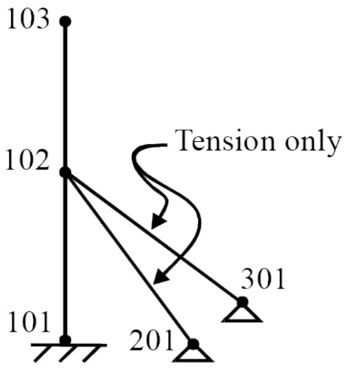

The following defines members 102-201 and 102-301 as tension only gap elements.

```txt
1 2 3 4 5 6 7 8 12345678901234567890123456789012345678901234567890123456789012345678901234567890123456789012345678901234567891 102 201 GAP T011 2MEMBER 102 301 GAP T011 
```

2.1.2 Member End Releases

Member end releases may be used to remove shear, bending and/or torsion capacity of elements that will be declared as gap elements.

For example, a guyed structure utilizing tension only gap elements may require member end releases as follows:

```txt
1 2 3 4 5 6 7 8 12345678901234567890123456789012345678901234567890123456789012345678901234567890123456789012345678901234567891 102 201 GAP T011 2MEMBER 102 301 GAP T011 
```

Note: The axial degree of freedom at the ends of an element designated as a compression or tension only element should not be released.

2.1.3 Designating Load Cases to Analyze

Load cases that are to be analyzed as part of the gap element analysis are designated on the LCSEL line in the model file or in the Seastate input file using the ‘GP’, ‘ST’ or default (ie. blank) option.

Note: If no LCSEL line with the ‘GP’ option is specified, then load cases designated for a static analysis (i.e. ‘ST’ or blank option) are used.

```txt
1 2 3 4 5 6 7 8 1 234567890123456789012345678901234567890123456789012345678901234567890 
```

2.1.4 Simulating Compression or Tension Only Supports

Gap elements may be used to simulate compression only or tension only supports by modeling two joints at the support. One joint is designated as the support joint and assigned the appropriate fixities, while the other joint is attached to the structure. A gap element is then modeled between the two joints. See the figure below.

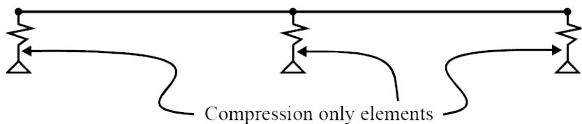

Note: The gap element must be modeled such that the length is greater than zero. This can be done by either separating the joints at the support or by defining a member offset.

2.1.5 Overriding Gap Type for a Load Case

The gap element type may be changed from load case to load case. This requires a Gap input file including a GAPOPT line and the LCGAP line.

Gap type may be overridden for individual members or for groups of members using the LCGAP with ‘MEM’ or ‘GRP’ specified in columns 19-21, respectively.

Enter the load case to which the override applies in columns 7-10 and the type of gap element in columns 16-17. Specify ‘CO’, ‘TO’ or ‘NL’ for compression only, tension only or no-load elements, respectively. Enter ‘INC’ in columns 12-14 if only the members or groups specified in columns 23-77 are to be changed as designated, or ‘EXC’ if all gap elements except the members or groups specified in columns 23-77 are to be changed.

Note: Because gap elements may be either included or excluded for a particular load case, the ‘INC’ and ‘EXC’ features are mutually exclusive and cannot be mixed within a particular load case.

The following sample designates that members 1101-2101,1103-2103 and all gap elements in member group ‘CAN’ are to be considered as no load elements for load case ‘CMB1’:

```txt
1 2 3 4 5 6 7 8   
123456789012345678901234567890123456789012345678901234567890   
1 GAOPT 4 EN
2 LCGAP CMB1 INC NL MEM 11012101 11032103   
3 LCGAP CMB1 INC NL GRP CAN   
4 END
```

Note: The LCGAP feature is only applicable for gap elements defined in the model file.

2.1.6 Dummy Unit Load Case

Dummy unit load cases are not required for gap elements defined in the model file.

2.1.7 Gap Advanced Solver Options

SACS models with a large number of gap elements (like Suction Buckets with nonlinear springs) require a more efficient numerical solver to speed up the Gap analysis. The Gap program provides new options to reduce the run-time of a Gap analysis for such models. The Advanced Numerical Solver options can be chosen on columns 77-78 of the GAPOPT input line. Two new options are available:

Advanced-1: Efficient Matrix Inversion: This is similar to the Gap standard iterative solver but the matrix inversion calculation is replaced by an efficient matrix inversion algorithm. See the Commentary Section for additional details   
o This option can be selected by entering ‘A1’ on columns 77-78 of the GAPOPT line   
Advanced-2: Efficient Linear System Solve: Using this option, the Gap iterative solver does not require a matrix inversion process and uses an efficient matrix factorization algorithm. See the Commentary Section for additional details   
o This option can be selected by entering ‘A2’ on columns 77-78 of the GAPOPT line   
Direct Solver: If the model has only no-load, tension-only, and/or compression-only gap elements with zero initial gap, the gap analysis can be performed using a direct solver instead of the default iterative solver.   
o This option can be selected by entering ‘AD’ on columns 77-78 of the GAPOPT line Note: If the gap program cannot use the direct solver for any reason, it automatically switches to Advanced-2: Efficient Linear System Solve (‘A2’) option.

The default value is a standard iterative Gap solver without a high-performance algorithm.

Note: For a model with a small number of gap elements, the speed-up gain from either of the above options is minimal. However, for a jacket with thousands of gap elements, using one of the above options is highly recommended to speed up the analysis.

2.1.8 Gap Continue Option

By default, the Gap program terminates the analysis with an error message if a given load condition does not converge within the specified number of iterations to the convergance tolerance entered on the GAPOPT line. However, under some conditions, it is desirable to continue the analysis even though convergence has not been achieved (for example, when the residual is relatively small but is not smaller than the specified tolerance).

The default non-convergance criterion can be overridden by entering ‘NE’ on columns 79-80 of the GAPOPT line allowing the Gap analysis to continue with an output warning message indicating nonconvergence of load cases.

Note: In the case of the non-convergence, the model response (displacement and internal forces) must be carefully checked to ensure the non-convergence does not lead to significant error in the analysis results.

## 2.2 DEFINING GAP ELEMENT DATA OUTSIDE OF THE MODEL

Most Gap analyses require no special input other than defining the gap elements and designated load cases to analyze in the model file. Using force-deflection elements, however, requires using a Gap input file.

Note: When defining any force deflection gap element data in a Gap input file, all other gap element data must also be defined in the Gap input file also.

2.2.1 Modeling Considerations

Certain modeling considerations must be addressed when defining gap element data in a Gap input file.

2.2.1.1 Defining Dummy Unit Load Cases

Any gap elements defined in the Gap input file require a dummy load case in the model. For each gap element defined, a dummy load case consisting of only a unit axial load for that gap element must be specified by the user.

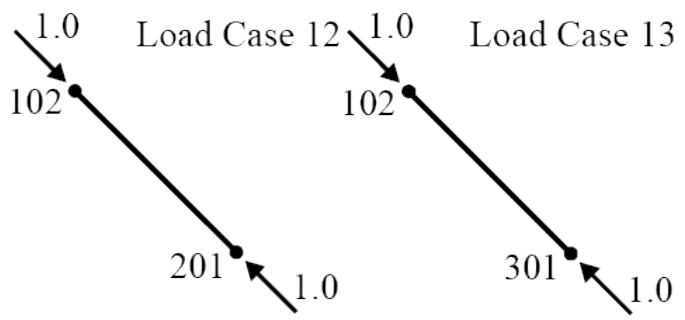

When creating a dummy load case for a gap element, the net load of the dummy unit load case must be zero. For example, load cases 12 and 13 define a unit load axial load for members 102-201 and 102-301 from the preceding figure, respectively.


|  | 1 | 1 | 2 | 3 | 4 | 5 | 6 | 7 | 8 |
| --- | --- | --- | --- | --- | --- | --- | --- | --- | --- |
|  | 12345678901 | 2345678901 | 2345678901 | 2345678901 | 2345678901 | 2345678901 | 2345678901 | 2345678901 | 234567890 |
| 1 | LOADCN | 12 |  |  |  |  |  |  |  |
| 2 | LOAD X | 102 | 201 | 0.0 | 1.0 |  | MEMB | CONC | DUMMY12 |
| 3 | LOAD X | 201 | 102 | 0.0 | -1.0 |  | MEMB | CONC | DUMMY12 |
| 4 | LOADCN | 13 |  |  |  |  |  |  |  |
| 5 | LOAD X | 102 | 301 | 0.0 | 1.0 |  | MEMB | CONC | DUMMY13 |
| 6 | LOAD X | 301 | 102 | 0.0 | -1.0 |  | MEMB | CONC | DUMMY13 |


Note: Either a tension or compression unit axial load may be defined. Dummy load cases should produce no net load on the structure.

The procedure illustrated above uses two ‘LOAD’ input lines per dummy unit load case. The first load is defined as a compressive axial load at the begin joint while the second load is defined as a compressive load at the end joint.

2.2.2 Gap Input File Requirements

When using a Gap input file to specify gap element data, all input data including input and output load cases data must be specified in the Gap input file. The following sections address the specification of this input data.

2.2.2.1 Analysis Units

Gap analysis units are designated on the GAPOPT input line in columns 21-22.

2.2.2.2 Designating Basic Load Cases

Basic load cases in the model input file that are referenced by a load combination defined in the Gap input file are called ‘Real’ load cases and must be designated as such. The total number of ‘Real’ load cases referenced must be specified in columns 7-10 on the GAPOPT input line. Each ‘Real’ load case must also be listed on the LCSEL input line in the Gap input file. For example, load cases A1, A2, A3 and A7 may be defined as ‘Real’ basic load cases as follows:

```txt
1 2 3 4 5 6 7 8 1 2345678901234567890123456789012345678901234567890123456789012345678901234567890123456789012345678901234567890 2 LCSEL A1 A2 A3 A7 
```

2.2.2.3 Designating Load Cases to Analyze

The Gap program analyzes load combinations and basic load cases designated as ‘Output’ load cases in the Gap input file.

In general, ‘Output’ load cases are load combinations consisting of ‘Real’ load cases that are defined in the model file and designated as such in the Gap input file. The number of ‘Output’ load cases must be specified in columns 11-14 on the GAPOPT line.

2.2.2.4 Defining Output Load Cases

An ‘Output’ load case or combination may consist of up to 48 ‘Real’ load cases designated on the LCSEL and is defined in the Gap input file using LCOMB input lines.

The load combination name is specified in columns 7-10. For each ‘Real’ load case, the load factor to be applied and the load case name are specified. The allowable stress modifier for the load case is specified in columns 72-76.

```txt
1 2 3 4 5 6 7 8 1 23456789012345678901234567890123456789012345678901234567890 1 LCSEL A1 A2 A3 A7 2 LCOMB CMB1 A1 1.0 A2 0.75 3 LCOMB CMB2 A1 1.0 A2 3.00 1.33 
```

2.2.2.5 Designating Gap Elements

Elements may be designated as one of the following nonlinear gap element types; compression only, tension only, no load, or force-deflection element. Elements that are to be considered nonlinear gap elements are designated in the Gap input file using the GAPELM line.

The element connecting joints are specified in columns 7-11 and 12-16. The element type is designated in columns 24-25 by ‘CO’ (compression only), ‘TO’ (tension only), ‘NL’ (no load), ‘FD’ (force-deflection) or ‘RP’ (repeat previous element type). The dummy unit load case defined in the model file that corresponds to the element being defined is specified in columns 17-21.

```txt
1 2 3 4 5 6 7 8 1 234567890123456789012345678901234567890123456789012345678901234567890 1 201 4 CO 2 GAPELM 103 203 5 NL
```

Note: Dummy load cases for any gap element defined using the GAPELM line must be added to the model by the user manually. The dummy load case corresponding to the element should contain only unit axial load at each end of the element and should add no net load to the overall structure.

2.2.2.6 Defining Force-Deflection Curve

The curve used for an element designated as force-deflection type gap element is defined on the line labeled F-DEL immediately following the GAPELM line used to designate the element as a forcedeflection gap element.

Points on the curve are entered in columns 9-80 and must be entered in order of increasing deflection. As many F-DEL lines as needed to define the curve may be used.

```txt
1 2 3 4 5 6 7 8   
123456789012345678901234567890123456789012345678901234567890   
1 GAPELM 101 201 4 CO   
2 GAPELM 103 203 5 FD   
3 F-DEL 0.0 -10.0 0.0 0.0 100.0 1.0 200. 2.0   
4 F-DEL 300.0 10.0   
5 GAPELM 105 205 6 CO 
```

Note: For deflections outside of the range of the curve, the force value is assumed to be constant.

To plot the force/deflection curve in a force-deflection type gap element, enter either ‘PFD’ or ‘PFG’ in columns 45-47 of the GAPOPT line in the Gap input file. The ‘PFD’ option produces a force/deflection curve without grid lines; the ‘PFG’ option produces the same with grid lines.

2.2.2.7 Defining Friction Data

Friction elements that are defined in the GAP input file are no longer supported. Friction elements data must be specified in the model file.

# 3 COMMENTARY

## 3.1 GAP ELEMENT FORCES

To solve various gap element types (tension-only, compression-only, force-deflection, and friction), the Gap program converts all gap elements to the force-deflection element as follows:

Tension-only: a force-deflection element with zero force in compression, linear force-deflection in the tension. The program uses member axial stiffness in the tension   
Compression-only: a force-deflection element with zero force in tension, linear force-deflection in the compression. The program uses member axial stiffness in the compression   
• No Load: zero loads and zero stiffness force-deflection   
• Force-deflection: No change, the program uses the user-defined force-deflection curves   
Friction: The program uses three gap elements: one compression-only element in local X (to model contact) and two friction elements in the Local Y and Z. The load in the friction element is set by the friction coefficient and the axial load in the local X compression-only gap element.

The following figure illustrates the force-deflection curves for different element types:

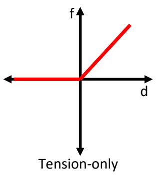

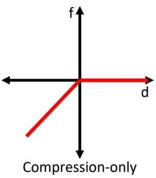

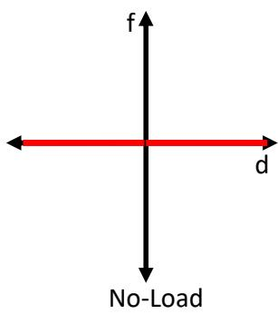

The Gap program module uses the relationship between force and load factors of elements designated as nonlinear gap elements. For any output load condition, the total force $F_{ i }$ in a gap element $i ,$ can be expressed in terms of the initial gap element force, $F_{ o_{ i } } ,$ and the force/load factor relationship of the element as follows

$$F_{i} = F_{o_{i}} + \sum_{j = 1}^{n} \left(A_{i j} P_{j}\right) \tag{1}$$

where n is the number of gap elements, $A_{ i j }$ is the force in gap element i due to a unit load factor, $P_{ j } ,$ , applied to the $j^{ \mathrm{ t h } }$ dummy load case. The $\mathrm{ j }^{ \mathrm{ t h } }$ dummy load case corresponds to a unit load case applied to the $\boldsymbol{ \mathrm{ j } }^{ \mathrm{ t h } }$ gap element. The above equation can be rewritten in a matrix form as:

$$\{F \} = \left\{F_{o} \right\} + [ A ] \{P \} \tag{2}$$

Depending on the gap element types, the above equation may be solved directly or iteratively, as presented below

1. Direct Solver: If a SACS model only has tension-only, compression-only, and/or no-load elements (not other gap element types), and the initial gap values for all elements are zero, the load factors can be determined by solving equation (2) directly. The direct solver is available by entering option $\mathbf{ \prime }_{ \mathsf{ A D }^{ \prime } }$ on the GAPOPT input line. For this option, the Gap program first checks the model to ensure the model has only compatible elements (tension-only, compression-only, and/or no-load), and all initial gap values are zero. If the program cannot use the direct solver for any reason, it automatically switches to the iterative solver with the Advanced Matrix Solver （$^{ \prime } A 2^{ \prime }$ option).   
2. Iterative Solver: if a SACS model has friction elements or force-deflection elements in addition to tension-only, compression-only, and/or no-load elements, or the initial gap values are not zero, the equation (2) must be solved iterative using Newton-Raphson algorithm – as discussed in the next section.

## 3.2 Iterative Solver

In the case of the iterative solver, the load factors {??} must be determined such that the difference between element force {??} and the force computed based on the force-deflection curves $\{ F_{ s } \}$ must be zero. In the other words:

$$\{R \} = \{F \} - \{F_{s} \} = 0 \tag{3}$$

The above equation is nonlinear and can be solved using the Newton-Raphson method. Thus, the first step is to compute the derivative of {??} (residual) with respect to the load factor {??}.

$$\frac{d \{R \}}{d \{P \}} = \frac{d \{F \}}{d \{P \}} - \frac{d \left\{F_{s} \right\}}{d \{P \}} \tag{4}$$

The first term $\frac{ d \lbrace F \rbrace } { d \lbrace P \rbrace }$ is readily available based on Equation (2) where $\{ F_{ o } \}$ is constant:

$$\frac{d \{F \}}{d \{P \}} = [ A ] \tag{5}$$

The second term can be determined as:

$$\frac{d F_{s_{i}}}{d P_{j}} = \frac{d F_{s_{i}}}{d u_{i}} \frac{d u_{i}}{d P_{j}} \tag{6}$$

in which $u_{ i }$ is the displacement vector for the gap elements. The first term $S_{ i } = \frac{ d F_{ s_{ i } } } { d u_{ i } }$ ???????? is simply the slope ?????? of the force-deflection curve. To compute the second term, the displacement of $\mathsf{ i }^{ \mathsf{ t h } }$ gap element is first written as a function of the gap force $F_{ i }$ and load factor $P_{ i }$ as:

$$u_{i} = \frac{F_{i} - P_{i} f_{i d u m m y}}{K_{i}} \tag{7}$$

where $K_{ i }$ is the element stiffness (e.g. axial stiffness) and $f_{ i d u m m y }$ is the applied dummy load at $\mathsf{ i }^{ \mathsf{ t h } }$ gap element. It is worth noting that $F_{ i }$ is also a function of load factor {??}, and its derivative with respect to the load factor $P_{ i }$ must be taken to account. Therefore:

$$\frac{d u_{i}}{d P_{j}} = \left\{ \begin{array}{c c} i = j & \frac{A_{i i} - f_{i d u m m y}}{K_{i}} \\ i \neq j & \frac{A_{i j}}{K_{i}} \end{array} \right. \tag{8}$$

Substituting Equation (8) into Equation (6):

$$\bar{A}_{i j} = \frac{d R_{i}}{d P_{j}} = \left\{ \begin{array}{l l} i = j & A_{i i} - \left(\frac{A_{i i} - f_{i d u m m y}}{K_{i}}\right) S_{i} \\ i \neq j & A_{i j} - \left(\frac{A_{i j}}{K_{i}}\right) S_{i} \end{array} \right. \tag{9}$$

Finally, following the Newton-Raphson iteration, the load factor increment can be determined as

$$\Delta \{P \} = - [ \bar{A} ]^{-1} (\{F \} - \{F_{s} \}) \tag{10}$$

Note: it can be concluded that the system does not have a unique solution when the determinant of $\bar{ A_{ i j } }$ is zero. Moreover, the instability of the system increases when the determinant approaches zero. $\bar{ A_{ i j } }$ is assumed to be a symmetric positive definite matrix, so diagonal components affect the determinant. The program returns a warning message showing the element which causes the determinant to get closer to zero.

The Gap program iterative solver can be summarized in the following steps

1. Determine force-deflection curves for all gap elements   
2. Initialize: $\{ P \} = 0$   
3. Calculate the gap elements forces: $\{ F \} = \{ F_{ o } \} + [ A ] \{ P \}$   
4. Calculate gap element displacement: $\begin{array} { r } { u_{ i } = \frac{ F_{ i } - P_{ i } f_{ i d u m m y } } { K_{ i } } } \end{array}$   
5. Update the force $F_{ s_{ i } }$ and slope $S_{ i } { \mathrm{ : } }$ Using the force-defection curves and displacements   
6. Calculate residual: $\{ R \} = \ \{ { \cal F } \} - \{ { \cal F }_{ s } \}$   
7. Check for the convergence: if the maximum error in $\{ R \}$ is less than the tolerance stop the iteration   
8. Determine the load factor increment: $\Delta \{ P \} = - [ \bar{ A } ]^{ - 1 } ( \{ F \} - \{ F_{ s } \} )$   
9. Update the load factor: $\{ P \}_{ n e w } = \{ P \}_{ p r e v i o u s } + \Delta \{ P \}$

Go to step 3 and repeat until convergence achieves

3.2.1 Advanced Iterative Solvers

As illustrated in the previous section, the Gap iterative solver relies on inverting the matrix $[ \bar{ A } ]$ in Step 8 of the algorithm. When a model has only a few numbers of the gap elements, the $[ \bar{ A } ]^{ - 1 }$ can be computed efficiently with minimal effort. However, when there are thousands of gap elements (for example in the case of suction bucket analysis), the computational cost associated with $[ \bar{ A } ]^{ - 1 }$ greatly increases and the Gap program slows down. To speed up the Gap analysis, two new advanced options have been introduced to the Gap program.

• Advanced Matrix Inversion: This option utilizes an efficient numerical algorithm to compute $[ \bar{ A } ]^{ - 1 }$ in step 8 of the above algorithm.   
Advanced Matrix Solver: This option refactors Equation (10) as a linear system of equations $[ \bar{ A } ] \Delta \{ P \} = - ( \{ F \} - \{ F_{ s } \} )$ , and it utilizes an efficient numerical solver to solve this linear system instead of inverting the matrix.

## 3.3 DIFFERENT FRICTION COEFFICIENT IN TWO DIRECTIONSTREATMENT

SACS treats friction elements with three different distinguished components in local coordinates. Local ?? coordinate shows the normal force and forces along ?? and ?? coordinates show sliding force (friction force components). For some specific structures or components, the friction coefficient might be different in two directions. SACS uses the following method to find the solution for a friction element with different friction coefficients through an iteration process.

Let’s assume that friction coefficient in ?? direction is $\mu_{ y }$ and friction coefficient in ?? direction is $\mu_{ z }$ and $\mu_{ y } \ne \mu_{ z }$ . It is obvious that for the case that $\mu_{ y } = \mu_{ z }$ , friction coefficient in any desired direction （$\mu_{ T } )$ would be $\mu_{ T } = \mu_{ y } = \mu_{ z }$ . To find the friction coefficient （$\mu_{ T } )$ in the direction with an angle of ?? with ?? direction (following figure), it has been assumed that an $\mathsf{ \Pi }^{ \prime \prime } [ \mathsf{ I } | \mathsf{ I } | \mathsf{ p } \mathsf{ s } \mathsf{ e }^{ \prime \prime }$ is passing through the value of friction coefficient along each axis.

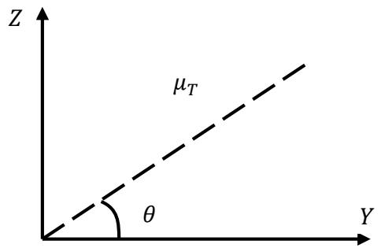

Therefore, $\mu_{ T }$ is located in an Ellipse created by $\mu_{ y }$ and $\mu_{ z }$ and can be calculated using the following relation:

$$\mu_{T} = \frac{\mu_{y} \mu_{z}}{\sqrt{\mu_{y}^{2} S i n^{2} \theta + \mu_{z}^{2} C o s^{2} \theta}}$$

With this approach, $\mu_{ T }$ will be equal to $\mu_{ y }$ and $\mu_{ z }$ when $\theta$ is equal to 0 and $\frac{ \pi } { 2 }$ respectively. The program will iterate to find components (i.e. $F_{ y }$ and $F_{ z } )$ in a way that, if one finds the angle $\theta$ and calculates $\mu_{ T }$ using the previous formula, the resultant force will follow the relation given as:

$$\sqrt{F_{y}^{2} + F_{z}^{2}} \leq \mu_{T} F_{x}$$

4 SAMPLE PROBLEMS

## 4.1 SAMPLE PROBLEM 1 – TOWER STRUCTURE WITH TENSION ONLY GAP ELEMENTS

Sample Problem 1 is a tower structure supported laterally by four wire cables as shown below. The wire cables, group ‘CBL’, are simulated using tension only gap elements with shear capacity member releases at joint 2.

Joint Label: Name

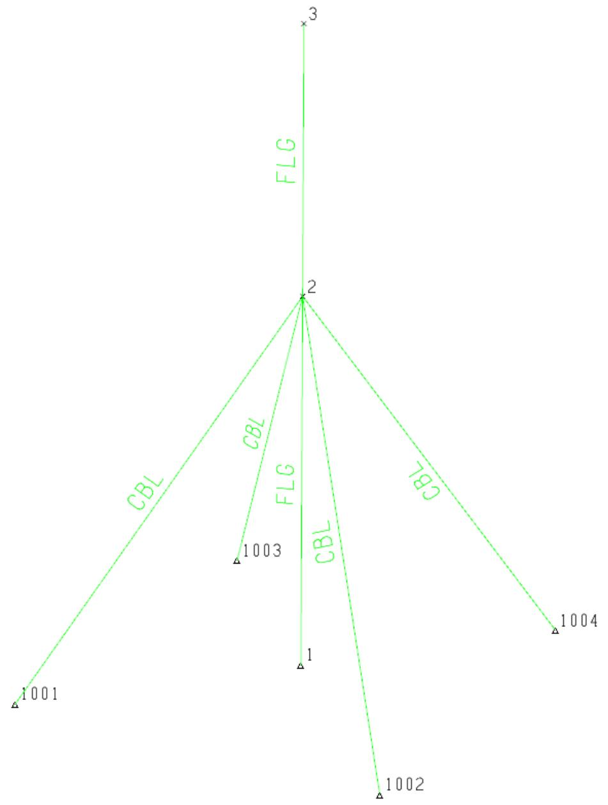

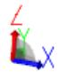

Two basic load conditions are specified; load case WGT structure self-weight and load case LAT a lateral load in the positive global X direction applied at joint 3.

No Gap input file was required for this analysis. All required gap analysis data information was specified in the model file that follows:

```proteindb
1 1 2 3 4 5 6 7 8   
123456789012345678901234567890123456789012345678901234567890   
1 OPTIONS EN SDUC 1 1 DDC C PT PTPT PT   
2 LCSEL GP CMB1 CMB2   
3 SECT
4 SECT CABLE TUB 3.75 0.10 0.10 0.10 0.010.001   
5 GRUP
6 GRUP CBL CABLE 13.0011.6036.00 1 1.001.00 0.50N490.00   
7 GRUP FLG 24.00 0.625 29.0011.6036.00 1 1.001.00 0.50N490.00   
8 MEMBER
9 MEMBER 1 2 FLG   
10 MEMBER 2 3 FLG   
11 MEMBER 1001 2 CBL T 011   
12 MEMBER 1002 2 CBL T 011   
13MEMBER 1003 2 CBL T 011   
14MEMBER 1004 2 CBL T 011   
15 JOINT
16 JOINT 1
17 JOINT 2 30.000   
18 JOINT 3 50.000   
19 JOINT 1001 -15.000-15.000 111111   
20 JOINT 1002 15.000-15.000 111000   
21 JOINT 1003 -15.000 15.000 111000   
22 JOINT 1004 15.000 15.000 111000   
23 LOAD
24 LOADCN WGT
25 LOAD Z 1 2 -0.033 -0.033 GLOB UNIF DEADWT   
26 LOAD Z 2 3 -0.033 -0.033 GLOB UNIF DEADWT   
27 LOADCN LAT
28 LOAD Z 3 25.0000 GLOB JOIN LATERAL   
29 LOAD Z 2 25.0000 GLOB JOIN LATERAL   
3O LCOMB
31 LCOMB CMB1 WGT 1.0 LAT 1.0   
32 LCOMB CMB2 WGT 1.0 LAT -1.0   
33 END
```

The structure was analyzed for the two load combinations of the self-weight and the lateral load defined as CMB1 and CMB2. Below is a description of the pertinent input data:

2 Load combinations CMB1 and CMB2 are to be analyzed as designated on the LCSEL line.

11 - 14 Members 1001-2, 1002-2, 1003-2 and 1004-2 are defined as tension only gap elements by ‘T’ in column 22.   
31 Load combination CMB1 contains 100% of load cases WGT and LAT.   
32 Load combination CMB1 contains 100% of load cases WGT and LAT but the direction of load case LAT is switched to the negative X direction by specifying a factor of -1.   
The following is a portion of the output listing file created by the GAP program module:


| SACS CONNECT Edition (v11.0) | SACS CONNECT Edition (v11.0) | SACS CONNECT Edition (v11.0) | SACS CONNECT Edition (v11.0) | SACS CONNECT Edition (v11.0) | SACS CONNECT Edition (v11.0) | Bentley Systems | Bentley Systems | Bentley Systems | Bentley Systems | Bentley Systems | Bentley Systems | ID=Ym5ng2NpaIJxrlIF8nIen | ID=Ym5ng2NpaIJxrlIF8nIen | ID=Ym5ng2NpaIJxrlIF8nIen | ID=Ym5ng2NpaIJxrlIF8nIen | ID=Ym5ng2NpaIJxrlIF8nIen |
| --- | --- | --- | --- | --- | --- | --- | --- | --- | --- | --- | --- | --- | --- | --- | --- | --- |
|  |  |  |  |  |  |  |  |  |  |  |  | DATE 15-AUG-2018 | TIME 15:19:45 | PRE PAGE 1 |  |  |
|  |  |  |  |  |  |  |  |  |  |  |  |  | PRE VERSION 12.1.0.14 |  |  |  |
| ** PROGRAM OPTIONS ** | ** PROGRAM OPTIONS ** | ** PROGRAM OPTIONS ** | ** PROGRAM OPTIONS ** | ** PROGRAM OPTIONS ** | ** PROGRAM OPTIONS ** | ** PROGRAM OPTIONS ** | ** PROGRAM OPTIONS ** | ** PROGRAM OPTIONS ** | ** PROGRAM OPTIONS ** | ** PROGRAM OPTIONS ** | ** PROGRAM OPTIONS ** | ** PROGRAM OPTIONS ** | ** PROGRAM OPTIONS ** | ** PROGRAM OPTIONS ** | ** PROGRAM OPTIONS ** |  |
| UNITS | UNITS | UNITS | UNITS | UNITS | UNITS | UNITS | UNITS | UNITS | UNITS | UNITS | UNITS | UNITS | UNITS | UNITS | UNITS |  |
| UNITS | UNITS | UNITS | UNITS | UNITS | UNITS | UNITS | UNITS | UNITS | UNITS | UNITS | UNITS | UNITS | UNITS | UNITS | UNITS |  |
| EXECUTION | EXECUTION | EXECUTION | EXECUTION | EXECUTION | EXECUTION | EXECUTION | EXECUTION | EXECUTION | EXECUTION | EXECUTION | EXECUTION | EXECUTION | EXECUTION | EXECUTION | EXECUTION |  |
| GAP ANALYSIS | GAP ANALYSIS | GAP ANALYSIS | GAP ANALYSIS | GAP ANALYSIS | GAP ANALYSIS | GAP ANALYSIS | GAP ANALYSIS | GAP ANALYSIS | GAP ANALYSIS | GAP ANALYSIS | GAP ANALYSIS | GAP ANALYSIS | GAP ANALYSIS | GAP ANALYSIS | GAP ANALYSIS |  |
| SHEAR DEFORMATION INCLUDED | SHEAR DEFORMATION INCLUDED | SHEAR DEFORMATION INCLUDED | SHEAR DEFORMATION INCLUDED | SHEAR DEFORMATION INCLUDED | SHEAR DEFORMATION INCLUDED | SHEAR DEFORMATION INCLUDED | SHEAR DEFORMATION INCLUDED | SHEAR DEFORMATION INCLUDED | SHEAR DEFORMATION INCLUDED | SHEAR DEFORMATION INCLUDED | SHEAR DEFORMATION INCLUDED | SHEAR DEFORMATION INCLUDED | SHEAR DEFORMATION INCLUDED | SHEAR DEFORMATION INCLUDED | SHEAR DEFORMATION INCLUDED |  |
| UNITY CHECK WSD AISC 9TH EDITION WITH API-RP2A 21ST EDITION FOR TUBULARS | UNITY CHECK WSD AISC 9TH EDITION WITH API-RP2A 21ST EDITION FOR TUBULARS | UNITY CHECK WSD AISC 9TH EDITION WITH API-RP2A 21ST EDITION FOR TUBULARS | UNITY CHECK WSD AISC 9TH EDITION WITH API-RP2A 21ST EDITION FOR TUBULARS | UNITY CHECK WSD AISC 9TH EDITION WITH API-RP2A 21ST EDITION FOR TUBULARS | UNITY CHECK WSD AISC 9TH EDITION WITH API-RP2A 21ST EDITION FOR TUBULARS | UNITY CHECK WSD AISC 9TH EDITION WITH API-RP2A 21ST EDITION FOR TUBULARS | UNITY CHECK WSD AISC 9TH EDITION WITH API-RP2A 21ST EDITION FOR TUBULARS | UNITY CHECK WSD AISC 9TH EDITION WITH API-RP2A 21ST EDITION FOR TUBULARS | UNITY CHECK WSD AISC 9TH EDITION WITH API-RP2A 21ST EDITION FOR TUBULARS | UNITY CHECK WSD AISC 9TH EDITION WITH API-RP2A 21ST EDITION FOR TUBULARS | UNITY CHECK WSD AISC 9TH EDITION WITH API-RP2A 21ST EDITION FOR TUBULARS | UNITY CHECK WSD AISC 9TH EDITION WITH API-RP2A 21ST EDITION FOR TUBULARS | UNITY CHECK WSD AISC 9TH EDITION WITH API-RP2A 21ST EDITION FOR TUBULARS | UNITY CHECK WSD AISC 9TH EDITION WITH API-RP2A 21ST EDITION FOR TUBULARS | UNITY CHECK WSD AISC 9TH EDITION WITH API-RP2A 21ST EDITION FOR TUBULARS |  |
| PLATE PANEL UNITY CHECK (DEFAULT) DNV-RP-C201 | PLATE PANEL UNITY CHECK (DEFAULT) DNV-RP-C201 | PLATE PANEL UNITY CHECK (DEFAULT) DNV-RP-C201 | PLATE PANEL UNITY CHECK (DEFAULT) DNV-RP-C201 | PLATE PANEL UNITY CHECK (DEFAULT) DNV-RP-C201 | PLATE PANEL UNITY CHECK (DEFAULT) DNV-RP-C201 | PLATE PANEL UNITY CHECK (DEFAULT) DNV-RP-C201 | PLATE PANEL UNITY CHECK (DEFAULT) DNV-RP-C201 | PLATE PANEL UNITY CHECK (DEFAULT) DNV-RP-C201 | PLATE PANEL UNITY CHECK (DEFAULT) DNV-RP-C201 | PLATE PANEL UNITY CHECK (DEFAULT) DNV-RP-C201 | PLATE PANEL UNITY CHECK (DEFAULT) DNV-RP-C201 | PLATE PANEL UNITY CHECK (DEFAULT) DNV-RP-C201 | PLATE PANEL UNITY CHECK (DEFAULT) DNV-RP-C201 | PLATE PANEL UNITY CHECK (DEFAULT) DNV-RP-C201 | PLATE PANEL UNITY CHECK (DEFAULT) DNV-RP-C201 |  |
| DKT PLATES SELECTED | DKT PLATES SELECTED | DKT PLATES SELECTED | DKT PLATES SELECTED | DKT PLATES SELECTED | DKT PLATES SELECTED | DKT PLATES SELECTED | DKT PLATES SELECTED | DKT PLATES SELECTED | DKT PLATES SELECTED | DKT PLATES SELECTED | DKT PLATES SELECTED | DKT PLATES SELECTED | DKT PLATES SELECTED | DKT PLATES SELECTED | DKT PLATES SELECTED |  |
| NO SEGMENTS FOR PRISMATIC MEMBERS 1 | NO SEGMENTS FOR PRISMATIC MEMBERS 1 | NO SEGMENTS FOR PRISMATIC MEMBERS 1 | NO SEGMENTS FOR PRISMATIC MEMBERS 1 | NO SEGMENTS FOR PRISMATIC MEMBERS 1 | NO SEGMENTS FOR PRISMATIC MEMBERS 1 | NO SEGMENTS FOR PRISMATIC MEMBERS 1 | NO SEGMENTS FOR PRISMATIC MEMBERS 1 | NO SEGMENTS FOR PRISMATIC MEMBERS 1 | NO SEGMENTS FOR PRISMATIC MEMBERS 1 | NO SEGMENTS FOR PRISMATIC MEMBERS 1 | NO SEGMENTS FOR PRISMATIC MEMBERS 1 | NO SEGMENTS FOR PRISMATIC MEMBERS 1 | NO SEGMENTS FOR PRISMATIC MEMBERS 1 | NO SEGMENTS FOR PRISMATIC MEMBERS 1 | NO SEGMENTS FOR PRISMATIC MEMBERS 1 |  |
| NO SEGMENTS/SECTION FOR NON-PRISMATIC MEMBERS 1 | NO SEGMENTS/SECTION FOR NON-PRISMATIC MEMBERS 1 | NO SEGMENTS/SECTION FOR NON-PRISMATIC MEMBERS 1 | NO SEGMENTS/SECTION FOR NON-PRISMATIC MEMBERS 1 | NO SEGMENTS/SECTION FOR NON-PRISMATIC MEMBERS 1 | NO SEGMENTS/SECTION FOR NON-PRISMATIC MEMBERS 1 | NO SEGMENTS/SECTION FOR NON-PRISMATIC MEMBERS 1 | NO SEGMENTS/SECTION FOR NON-PRISMATIC MEMBERS 1 | NO SEGMENTS/SECTION FOR NON-PRISMATIC MEMBERS 1 | NO SEGMENTS/SECTION FOR NON-PRISMATIC MEMBERS 1 | NO SEGMENTS/SECTION FOR NON-PRISMATIC MEMBERS 1 | NO SEGMENTS/SECTION FOR NON-PRISMATIC MEMBERS 1 | NO SEGMENTS/SECTION FOR NON-PRISMATIC MEMBERS 1 | NO SEGMENTS/SECTION FOR NON-PRISMATIC MEMBERS 1 | NO SEGMENTS/SECTION FOR NON-PRISMATIC MEMBERS 1 | NO SEGMENTS/SECTION FOR NON-PRISMATIC MEMBERS 1 |  |
| REPORTS SELECTED | REPORTS SELECTED | REPORTS SELECTED | REPORTS SELECTED | REPORTS SELECTED | REPORTS SELECTED | REPORTS SELECTED | REPORTS SELECTED | REPORTS SELECTED | REPORTS SELECTED | REPORTS SELECTED | REPORTS SELECTED | REPORTS SELECTED | REPORTS SELECTED | REPORTS SELECTED | REPORTS SELECTED |  |
| JOINT DEFLECTIONS...PRINT ELEMENT STRESS AT MAXIMUM UNITY CHECK...PRINT BEAM COMBINED AND SHEAR UNITY CHECK...PRINT ELEMENT INTERNAL LOADS...PRINT | JOINT DEFLECTIONS...PRINT ELEMENT STRESS AT MAXIMUM UNITY CHECK...PRINT BEAM COMBINED AND SHEAR UNITY CHECK...PRINT ELEMENT INTERNAL LOADS...PRINT | JOINT DEFLECTIONS...PRINT ELEMENT STRESS AT MAXIMUM UNITY CHECK...PRINT BEAM COMBINED AND SHEAR UNITY CHECK...PRINT ELEMENT INTERNAL LOADS...PRINT | JOINT DEFLECTIONS...PRINT ELEMENT STRESS AT MAXIMUM UNITY CHECK...PRINT BEAM COMBINED AND SHEAR UNITY CHECK...PRINT ELEMENT INTERNAL LOADS...PRINT | JOINT DEFLECTIONS...PRINT ELEMENT STRESS AT MAXIMUM UNITY CHECK...PRINT BEAM COMBINED AND SHEAR UNITY CHECK...PRINT ELEMENT INTERNAL LOADS...PRINT | JOINT DEFLECTIONS...PRINT ELEMENT STRESS AT MAXIMUM UNITY CHECK...PRINT BEAM COMBINED AND SHEAR UNITY CHECK...PRINT ELEMENT INTERNAL LOADS...PRINT | JOINT DEFLECTIONS...PRINT ELEMENT STRESS AT MAXIMUM UNITY CHECK...PRINT BEAM COMBINED AND SHEAR UNITY CHECK...PRINT ELEMENT INTERNAL LOADS...PRINT | JOINT DEFLECTIONS...PRINT ELEMENT STRESS AT MAXIMUM UNITY CHECK...PRINT BEAM COMBINED AND SHEAR UNITY CHECK...PRINT ELEMENT INTERNAL LOADS...PRINT | JOINT DEFLECTIONS...PRINT ELEMENT STRESS AT MAXIMUM UNITY CHECK...PRINT BEAM COMBINED AND SHEAR UNITY CHECK...PRINT ELEMENT INTERNAL LOADS...PRINT | JOINT DEFLECTIONS...PRINT ELEMENT STRESS AT MAXIMUM UNITY CHECK...PRINT BEAM COMBINED AND SHEAR UNITY CHECK...PRINT ELEMENT INTERNAL LOADS...PRINT | JOINT DEFLECTIONS...PRINT ELEMENT STRESS AT MAXIMUM UNITY CHECK...PRINT BEAM COMBINED AND SHEAR UNITY CHECK...PRINT ELEMENT INTERNAL LOADS...PRINT | JOINT DEFLECTIONS...PRINT ELEMENT STRESS AT MAXIMUM UNITY CHECK...PRINT BEAM COMBINED AND SHEAR UNITY CHECK...PRINT ELEMENT INTERNAL LOADS...PRINT | JOINT DEFLECTIONS...PRINT ELEMENT STRESS AT MAXIMUM UNITY CHECK...PRINT BEAM COMBINED AND SHEAR UNITY CHECK...PRINT ELEMENT INTERNAL LOADS...PRINT | JOINT DEFLECTIONS...PRINT ELEMENT STRESS AT MAXIMUM UNITY CHECK...PRINT BEAM COMBINED AND SHEAR UNITY CHECK...PRINT ELEMENT INTERNAL LOADS...PRINT | JOINT DEFLECTIONS...PRINT ELEMENT STRESS AT MAXIMUM UNITY CHECK...PRINT BEAM COMBINED AND SHEAR UNITY CHECK...PRINT ELEMENT INTERNAL LOADS...PRINT | JOINT DEFLECTIONS...PRINT ELEMENT STRESS AT MAXIMUM UNITY CHECK...PRINT BEAM COMBINED AND SHEAR UNITY CHECK...PRINT ELEMENT INTERNAL LOADS...PRINT |  |
| LOAD NO. BASIC LOAD COND. 2NO. COMB. LOAD COND. 2 | LOAD NO. BASIC LOAD COND. 2NO. COMB. LOAD COND. 2 | LOAD NO. BASIC LOAD COND. 2NO. COMB. LOAD COND. 2 | LOAD NO. BASIC LOAD COND. 2NO. COMB. LOAD COND. 2 | LOAD NO. BASIC LOAD COND. 2NO. COMB. LOAD COND. 2 | LOAD NO. BASIC LOAD COND. 2NO. COMB. LOAD COND. 2 | LOAD NO. BASIC LOAD COND. 2NO. COMB. LOAD COND. 2 | LOAD NO. BASIC LOAD COND. 2NO. COMB. LOAD COND. 2 | LOAD NO. BASIC LOAD COND. 2NO. COMB. LOAD COND. 2 | LOAD NO. BASIC LOAD COND. 2NO. COMB. LOAD COND. 2 | LOAD NO. BASIC LOAD COND. 2NO. COMB. LOAD COND. 2 | LOAD NO. BASIC LOAD COND. 2NO. COMB. LOAD COND. 2 | LOAD NO. BASIC LOAD COND. 2NO. COMB. LOAD COND. 2 | LOAD NO. BASIC LOAD COND. 2NO. COMB. LOAD COND. 2 | LOAD NO. BASIC LOAD COND. 2NO. COMB. LOAD COND. 2 | LOAD NO. BASIC LOAD COND. 2NO. COMB. LOAD COND. 2 |  |
| SACS CONNECT Edition (v11.0) | SACS CONNECT Edition (v11.0) | SACS CONNECT Edition (v11.0) | SACS CONNECT Edition (v11.0) | SACS CONNECT Edition (v11.0) | SACS CONNECT Edition (v11.0) | Bentley Systems | Bentley Systems | Bentley Systems | Bentley Systems | Bentley Systems | Bentley Systems | ID=Ym5ng2NpaIJxrlIF8nIen | ID=Ym5ng2NpaIJxrlIF8nIen | ID=Ym5ng2NpaIJxrlIF8nIen | ID=Ym5ng2NpaIJxrlIF8nIen |  |
|  |  |  |  |  |  |  |  |  |  |  |  | DATE 15-AUG-2018 | TIME 15:19:45 | PRE PAGE 2 |  |  |
| TUBULAR MEMBER PROPERTIES | TUBULAR MEMBER PROPERTIES | TUBULAR MEMBER PROPERTIES | TUBULAR MEMBER PROPERTIES | TUBULAR MEMBER PROPERTIES | TUBULAR MEMBER PROPERTIES | TUBULAR MEMBER PROPERTIES | TUBULAR MEMBER PROPERTIES | TUBULAR MEMBER PROPERTIES | TUBULAR MEMBER PROPERTIES | TUBULAR MEMBER PROPERTIES | TUBULAR MEMBER PROPERTIES | TUBULAR MEMBER PROPERTIES | TUBULAR MEMBER PROPERTIES | TUBULAR MEMBER PROPERTIES | TUBULAR MEMBER PROPERTIES |  |
| GRP M/S JOINT WALL OUTSIDE E G AXIAL **** MOMENTS OF INERTIA **** YIELD KY KZ SHEAR RING SECT TAPER AREA SPACES LENGTH FREQUENCY RADIUS LENGTH SACS CONNECT Edition (v11.0) | GRP M/S JOINT WALL OUTSIDE E G AXIAL **** MOMENTS OF INERTIA **** YIELD KY KZ SHEAR RING SECT TAPER AREA SPACES LENGTH FREQUENCY RADIUS LENGTH SACS CONNECT Edition (v11.0) | GRP M/S JOINT WALL OUTSIDE E G AXIAL **** MOMENTS OF INERTIA **** YIELD KY KZ SHEAR RING SECT TAPER AREA SPACES LENGTH FREQUENCY RADIUS LENGTH SACS CONNECT Edition (v11.0) | GRP M/S JOINT WALL OUTSIDE E G AXIAL **** MOMENTS OF INERTIA **** YIELD KY KZ SHEAR RING SECT TAPER AREA SPACES LENGTH FREQUENCY RADIUS LENGTH SACS CONNECT Edition (v11.0) | GRP M/S JOINT WALL OUTSIDE E G AXIAL **** MOMENTS OF INERTIA **** YIELD KY KZ SHEAR RING SECT TAPER AREA SPACES LENGTH FREQUENCY RADIUS LENGTH SACS CONNECT Edition (v11.0) | GRP M/S JOINT WALL OUTSIDE E G AXIAL **** MOMENTS OF INERTIA **** YIELD KY KZ SHEAR RING SECT TAPER AREA SPACES LENGTH FREQUENCY RADIUS LENGTH SACS CONNECT Edition (v11.0) | GRP M/S JOINT WALL OUTSIDE E G AXIAL **** MOMENTS OF INERTIA **** YIELD KY KZ SHEAR RING SECT TAPER AREA SPACES LENGTH FREQUENCY RADIUS LENGTH SACS CONNECT Edition (v11.0) | GRP M/S JOINT WALL OUTSIDE E G AXIAL **** MOMENTS OF INERTIA **** YIELD KY KZ SHEAR RING SECT TAPER AREA SPACES LENGTH FREQUENCY RADIUS LENGTH SACS CONNECT Edition (v11.0) | GRP M/S JOINT WALL OUTSIDE E G AXIAL **** MOMENTS OF INERTIA **** YIELD KY KZ SHEAR RING SECT TAPER AREA SPACES LENGTH FREQUENCY RADIUS LENGTH SACS CONNECT Edition (v11.0) | GRP M/S JOINT WALL OUTSIDE E G AXIAL **** MOMENTS OF INERTIA **** YIELD KY KZ SHEAR RING SECT TAPER AREA SPACES LENGTH FREQUENCY RADIUS LENGTH SACS CONNECT Edition (v11.0) | GRP M/S JOINT WALL OUTSIDE E G AXIAL **** MOMENTS OF INERTIA **** YIELD KY KZ SHEAR RING SECT TAPER AREA SPACES LENGTH FREQUENCY RADIUS LENGTH SACS CONNECT Edition (v11.0) | GRP M/S JOINT WALL OUTSIDE E G AXIAL **** MOMENTS OF INERTIA **** YIELD KY KZ SHEAR RING SECT TAPER AREA SPACES LENGTH FREQUENCY RADIUS LENGTH SACS CONNECT Edition (v11.0) | GRP M/S JOINT WALL OUTSIDE E G AXIAL **** MOMENTS OF INERTIA **** YIELD KY KZ SHEAR RING SECT TAPER AREA SPACES LENGTH FREQUENCY RADIUS LENGTH SACS CONNECT Edition (v11.0) | GRP M/S JOINT WALL OUTSIDE E G AXIAL **** MOMENTS OF INERTIA **** YIELD KY KZ SHEAR RING SECT TAPER AREA SPACES LENGTH FREQUENCY RADIUS LENGTH SACS CONNECT Edition (v11.0) | GRP M/S JOINT WALL OUTSIDE E G AXIAL **** MOMENTS OF INERTIA **** YIELD KY KZ SHEAR RING SECT TAPER AREA SPACES LENGTH FREQUENCY RADIUS LENGTH SACS CONNECT Edition (v11.0) | GRP M/S JOINT WALL OUTSIDE E G AXIAL **** MOMENTS OF INERTIA **** YIELD KY KZ SHEAR RING SECT TAPER AREA SPACES LENGTH FREQUENCY RADIUS LENGTH SACS CONNECT Edition (v11.0) |  |
| JHRT THICK WALL OUTSIDE E G AXIAL **** MOMENTS OF INERTIA **** YIELD KY KZ SHEAR RING SECT TAPER AREA SPACES LENGTH FREQUENCY RADIUS LENGTH FREQUENCY SACS CONNECT Edition (v11.0) | JHRT THICK WALL OUTSIDE E G AXIAL **** MOMENTS OF INERTIA **** YIELD KY KZ SHEAR RING SECT TAPER AREA SPACES LENGTH FREQUENCY RADIUS LENGTH FREQUENCY SACS CONNECT Edition (v11.0) | JHRT THICK WALL OUTSIDE E G AXIAL **** MOMENTS OF INERTIA **** YIELD KY KZ SHEAR RING SECT TAPER AREA SPACES LENGTH FREQUENCY RADIUS LENGTH FREQUENCY SACS CONNECT Edition (v11.0) | JHRT THICK WALL OUTSIDE E G AXIAL **** MOMENTS OF INERTIA **** YIELD KY KZ SHEAR RING SECT TAPER AREA SPACES LENGTH FREQUENCY RADIUS LENGTH FREQUENCY SACS CONNECT Edition (v11.0) | JHRT THICK WALL OUTSIDE E G AXIAL **** MOMENTS OF INERTIA **** YIELD KY KZ SHEAR RING SECT TAPER AREA SPACES LENGTH FREQUENCY RADIUS LENGTH FREQUENCY SACS CONNECT Edition (v11.0) | JHRT THICK WALL OUTSIDE E G AXIAL **** MOMENTS OF INERTIA **** YIELD KY KZ SHEAR RING SECT TAPER AREA SPACES LENGTH FREQUENCY RADIUS LENGTH FREQUENCY SACS CONNECT Edition (v11.0) | JHRT THICK WALL OUTSIDE E G AXIAL **** MOMENTS OF INERTIA **** YIELD KY KZ SHEAR RING SECT TAPER AREA SPACES LENGTH FREQUENCY RADIUS LENGTH FREQUENCY SACS CONNECT Edition (v11.0) | JHRT THICK WALL OUTSIDE E G AXIAL **** MOMENTS OF INERTIA **** YIELD KY KZ SHEAR RING SECT TAPER AREA SPACES LENGTH FREQUENCY RADIUS LENGTH FREQUENCY SACS CONNECT Edition (v11.0) | JHRT THICK WALL OUTSIDE E G AXIAL **** MOMENTS OF INERTIA **** YIELD KY KZ SHEAR RING SECT TAPER AREA SPACES LENGTH FREQUENCY RADIUS LENGTH FREQUENCY SACS CONNECT Edition (v11.0) | JHRT THICK WALL OUTSIDE E G AXIAL **** MOMENTS OF INERTIA **** YIELD KY KZ SHEAR RING SECT TAPER AREA SPACES LENGTH FREQUENCY RADIUS LENGTH FREQUENCY SACS CONNECT Edition (v11.0) | JHRT THICK WALL OUTSIDE E G AXIAL **** MOMENTS OF INERTIA **** YIELD KY KZ SHEAR RING SECT TAPER AREA SPACES LENGTH FREQUENCY RADIUS LENGTH FREQUENCY SACS CONNECT Edition (v11.0) | JHRT THICK WALL OUTSIDE E G AXIAL **** MOMENTS OF INERTIA **** YIELD KY KZ SHEAR RING SECT TAPER AREA SPACES LENGTH FREQUENCY RADIUS LENGTH FREQUENCY SACS CONNECT Edition (v11.0) | JHRT THICK WALL OUTSIDE E G AXIAL **** MOMENTS OF INERTIA **** YIELD KY KZ SHEAR RING SECT TAPER AREA SPACES LENGTH FREQUENCY RADIUS LENGTH FREQUENCY SACS CONNECT Edition (v11.0) | JHRT THICK WALL OUTSIDE E G AXIAL **** MOMENTS OF INERTIA **** YIELD KY KZ SHEAR RING SECT TAPER AREA SPACES LENGTH FREQUENCY RADIUS LENGTH FREQUENCY SACS CONNECT Edition (v11.0) | JHRT THICK WALL OUTSIDE E G AXIAL **** MOMENTS OF INERTIA **** YIELD KY KZ SHEAR RING SECT TAPER AREA SPACES LENGTH FREQUENCY RADIUS LENGTH FREQUENCY SACS CONNECT Edition (v11.0) | JHRT THICK WALL OUTSIDE E G AXIAL **** MOMENTS OF INERTIA **** YIELD KY KZ SHEAR RING SECT TAPER AREA SPACES LENGTH FREQUENCY RADIUS LENGTH FREQUENCY SACS CONNECT Edition (v11.0) |  |


| OPTIMIZATION DATA | OPTIMIZATION DATA | OPTIMIZATION DATA | OPTIMIZATION DATA | OPTIMIZATION DATA | OPTIMIZATION DATA | OPTIMIZATION DATA | OPTIMIZATION DATA | OPTIMIZATION DATA | OPTIMIZATION DATA | OPTIMIZATION DATA |
| --- | --- | --- | --- | --- | --- | --- | --- | --- | --- | --- |
| OPTIMIZED FINAL BANDWIDTH = 1.857 | OPTIMIZED FINAL BANDWIDTH = 1.857 | OPTIMIZED FINAL BANDWIDTH = 1.857 | OPTIMIZED FINAL BANDWIDTH = 1.857 | OPTIMIZED FINAL BANDWIDTH = 1.857 | FINAL MAXIMUM BANDWIDTH = 5 | FINAL MAXIMUM BANDWIDTH = 5 | FINAL MAXIMUM BANDWIDTH = 5 | FINAL MAXIMUM BANDWIDTH = 5 | FINAL MAXIMUM BANDWIDTH = 5 | FINAL MAXIMUM BANDWIDTH = 5 |
| SACS CONNECT Edition (v11.0) | SACS CONNECT Edition (v11.0) | SACS CONNECT Edition (v11.0) | SACS CONNECT Edition (v11.0) | SACS CONNECT Edition (v11.0) | Bentley Systems | Bentley Systems | Bentley Systems | ID=Ym5ng2NpaIJxrIF8nIen | ID=Ym5ng2NpaIJxrIF8nIen | ID=Ym5ng2NpaIJxrIF8nIen |
|  |  |  |  |  |  |  |  | DATE 15-AUG-2018 | TIME 15:19:45 | PRE PAGE 4 |
| ***** LOAD CASE STATUS REPORT ***** | ***** LOAD CASE STATUS REPORT ***** | ***** LOAD CASE STATUS REPORT ***** | ***** LOAD CASE STATUS REPORT ***** | ***** LOAD CASE STATUS REPORT ***** | ***** LOAD CASE STATUS REPORT ***** | ***** LOAD CASE STATUS REPORT ***** | ***** LOAD CASE STATUS REPORT ***** | ***** LOAD CASE STATUS REPORT ***** | ***** LOAD CASE STATUS REPORT ***** | ***** LOAD CASE STATUS REPORT ***** |
| LOAD | LOAD | PRINT | DEAD | P-DELTA | LOAD | AMOD |  |  |  |  |
| CASE | ID | OPTION | LOAD | LOAD | FACTOR | FACTOR |  |  |  |  |
| 1 | WGT | NO | NO | NO | 1.00 | 1.00 |  |  |  |  |
| 2 | LAT | NO | NO | NO | 1.00 | 1.00 |  |  |  |  |
| 3 | G001 | NO | NO | NO | 1.00 | 1.00 |  |  |  |  |
| 4 | G002 | NO | NO | NO | 1.00 | 1.00 |  |  |  |  |
| 5 | G003 | NO | NO | NO | 1.00 | 1.00 |  |  |  |  |
| 6 | G004 | NO | NO | NO | 1.00 | 1.00 |  |  |  |  |
| 7 | CMB1 | YES | NO | NO | 1.00 | 1.00 |  |  |  |  |
| 8 | CMB2 | YES | NO | NO | 1.00 | 1.00 |  |  |  |  |
| SACS CONNECT Edition (v11.0) | SACS CONNECT Edition (v11.0) | SACS CONNECT Edition (v11.0) | SACS CONNECT Edition (v11.0) | SACS CONNECT Edition (v11.0) | Bentley Systems | Bentley Systems | Bentley Systems | ID=Ym5ng2NpaIJxrIF8nIen | ID=Ym5ng2NpaIJxrIF8nIen | ID=Ym5ng2NpaIJxrIF8nIen |
|  |  |  |  |  |  |  |  | DATE 15-AUG-2018 | TIME 15:19:46 | SLV PAGE 1 |
|  |  |  |  |  |  |  |  |  | SLV VERSION 12.1.0.13 | SLV VERSION 12.1.0.13 |
| ** SACS PROBLEM DESCRIPTION ** | ** SACS PROBLEM DESCRIPTION ** | ** SACS PROBLEM DESCRIPTION ** | ** SACS PROBLEM DESCRIPTION ** | ** SACS PROBLEM DESCRIPTION ** | ** SACS PROBLEM DESCRIPTION ** | ** SACS PROBLEM DESCRIPTION ** | ** SACS PROBLEM DESCRIPTION ** | ** SACS PROBLEM DESCRIPTION ** | ** SACS PROBLEM DESCRIPTION ** | ** SACS PROBLEM DESCRIPTION ** |
| NUMBER OF JOINTS | NUMBER OF JOINTS | NUMBER OF JOINTS | NUMBER OF JOINTS | NUMBER OF JOINTS | 7 | 7 | 7 | 7 | 7 | 7 |
| NUMBER OF BEAMS | NUMBER OF BEAMS | NUMBER OF BEAMS | NUMBER OF BEAMS | NUMBER OF BEAMS | 6 | 6 | 6 | 6 | 6 | 6 |
| NUMBER OF PLATES | NUMBER OF PLATES | NUMBER OF PLATES | NUMBER OF PLATES | NUMBER OF PLATES | 0 | 0 | 0 | 0 | 0 | 0 |
| NUMBER OF SHELLS | NUMBER OF SHELLS | NUMBER OF SHELLS | NUMBER OF SHELLS | NUMBER OF SHELLS | 0 | 0 | 0 | 0 | 0 | 0 |
| NUMBER OF SOLIDS | NUMBER OF SOLIDS | NUMBER OF SOLIDS | NUMBER OF SOLIDS | NUMBER OF SOLIDS | 0 | 0 | 0 | 0 | 0 | 0 |
| NUMBER OF LOADS | NUMBER OF LOADS | NUMBER OF LOADS | NUMBER OF LOADS | NUMBER OF LOADS | 6 | 6 | 6 | 6 | 6 | 6 |
| NUMBER OF MASTER JOINTS | NUMBER OF MASTER JOINTS | NUMBER OF MASTER JOINTS | NUMBER OF MASTER JOINTS | NUMBER OF MASTER JOINTS | 0 | 0 | 0 | 0 | 0 | 0 |
| PRINT OPTION | PRINT OPTION | PRINT OPTION | PRINT OPTION | PRINT OPTION | 0 | 0 | 0 | 0 | 0 | 0 |
| SACS CONNECT Edition (v11.0) | SACS CONNECT Edition (v11.0) | SACS CONNECT Edition (v11.0) | SACS CONNECT Edition (v11.0) | SACS CONNECT Edition (v11.0) | Bentley Systems | Bentley Systems | Bentley Systems | ID=Ym5ng2NpaIJxrIF8nIen | ID=Ym5ng2NpaIJxrIF8nIen | ID=Ym5ng2NpaIJxrIF8nIen |
|  |  |  |  |  |  |  |  | DATE 15-AUG-2018 | TIME 15:19:46 | SLV PAGE 2 |


| APPLIED LOAD SUMMARY | APPLIED LOAD SUMMARY | APPLIED LOAD SUMMARY | APPLIED LOAD SUMMARY | APPLIED LOAD SUMMARY |
| --- | --- | --- | --- | --- |
| LOAD CASE NO. ID | TOTAL FORCE(X) KIPS | TOTAL FORCE(Y) KIPS | TOTAL FORCE(Z) KIPS |  |
| 1 WGT | 0.000000E+00 | 0.000000E+00 | -1.649999E+00 |  |
| 2 LAT | 5.000000E+01 | 0.000000E+00 | 0.000000E+00 |  |
| 3 G001 | 0.000000E+00 | 0.000000E+00 | 0.000000E+00 |  |
| 4 G002 | 0.000000E+00 | 0.000000E+00 | 0.000000E+00 |  |
| 5 G003 | 0.000000E+00 | 0.000000E+00 | 0.000000E+00 |  |
| 6 G004 | 0.000000E+00 | 0.000000E+00 | 0.000000E+00 |  |


| SACS CONNECT Edition (v11.0) | SACS CONNECT Edition (v11.0) | SACS CONNECT Edition (v11.0) | SACS CONNECT Edition (v11.0) | SACS CONNECT Edition (v11.0) | Bentley Systems DATE 15-AUG-2018 ID=Ym5ng2NpaIJxrIF8nIen TIME 15:19:46 GAP PAGE 3 | Bentley Systems DATE 15-AUG-2018 ID=Ym5ng2NpaIJxrIF8nIen TIME 15:19:46 GAP PAGE 3 | Bentley Systems DATE 15-AUG-2018 ID=Ym5ng2NpaIJxrIF8nIen TIME 15:19:46 GAP PAGE 3 | Bentley Systems DATE 15-AUG-2018 ID=Ym5ng2NpaIJxrIF8nIen TIME 15:19:46 GAP PAGE 3 | Bentley Systems DATE 15-AUG-2018 ID=Ym5ng2NpaIJxrIF8nIen TIME 15:19:46 GAP PAGE 3 | Bentley Systems DATE 15-AUG-2018 ID=Ym5ng2NpaIJxrIF8nIen TIME 15:19:46 GAP PAGE 3 | Bentley Systems DATE 15-AUG-2018 ID=Ym5ng2NpaIJxrIF8nIen TIME 15:19:46 GAP PAGE 3 | Bentley Systems DATE 15-AUG-2018 ID=Ym5ng2NpaIJxrIF8nIen TIME 15:19:46 GAP PAGE 3 | Bentley Systems DATE 15-AUG-2018 ID=Ym5ng2NpaIJxrIF8nIen TIME 15:19:46 GAP PAGE 3 |
| --- | --- | --- | --- | --- | --- | --- | --- | --- | --- | --- | --- | --- | --- |
| GAP ELEMENT | 1ST JOINT | 2ND JOINT | GRUP ID | LOAD CASE | ELEMENT TYPE | DEGREE OF FREEDOM | PRESET IN | **** FRICTION COEFF. J1 | NORMAL FRICT. | ELEMENT NORMAL J2 | **** FORCE J2 | POINT DEFL. TYPE KIPS | 2ND POINT FORCE DEFL. KIPS |
| 1 | 1001 | 2 | CBL | G001 | TENS | AXIAL | 0.00 |  |  |  |  |  |  |
| 2 | 1002 | 2 | CBL | G002 | TENS | AXIAL | 0.00 |  |  |  |  |  |  |
| 3 | 1003 | 2 | CBL | G003 | TENS | AXIAL | 0.00 |  |  |  |  |  |  |
| 4 | 1004 | 2 | CBL | G004 | TENS | AXIAL | 0.00 |  |  |  |  |  |  |
|  | LOAD CASE | CMB1 | CONVERGED | IN | 30 | ITERATIONS |  |  |  |  |  |  |  |
| SACS CONNECT Edition (v11.0) | SACS CONNECT Edition (v11.0) | SACS CONNECT Edition (v11.0) | SACS CONNECT Edition (v11.0) | SACS CONNECT Edition (v11.0) | Bentley Systems DATE 15-AUG-2018 ID=Ym5ng2NpaIJxrIF8nIen TIME 15:19:46 GAP PAGE 4 | Bentley Systems DATE 15-AUG-2018 ID=Ym5ng2NpaIJxrIF8nIen TIME 15:19:46 GAP PAGE 4 | Bentley Systems DATE 15-AUG-2018 ID=Ym5ng2NpaIJxrIF8nIen TIME 15:19:46 GAP PAGE 4 | Bentley Systems DATE 15-AUG-2018 ID=Ym5ng2NpaIJxrIF8nIen TIME 15:19:46 GAP PAGE 4 | Bentley Systems DATE 15-AUG-2018 ID=Ym5ng2NpaIJxrIF8nIen TIME 15:19:46 GAP PAGE 4 | Bentley Systems DATE 15-AUG-2018 ID=Ym5ng2NpaIJxrIF8nIen TIME 15:19:46 GAP PAGE 4 | Bentley Systems DATE 15-AUG-2018 ID=Ym5ng2NpaIJxrIF8nIen TIME 15:19:46 GAP PAGE 4 | Bentley Systems DATE 15-AUG-2018 ID=Ym5ng2NpaIJxrIF8nIen TIME 15:19:46 GAP PAGE 4 | Bentley Systems DATE 15-AUG-2018 ID=Ym5ng2NpaIJxrIF8nIen TIME 15:19:46 GAP PAGE 4 |
| NO. | GAP ELEMENT | TYPE | DEFLECTION IN | FORCE KIPS | FACTOR | FACTOR | FACTOR | FACTOR | FACTOR | FACTOR | FACTOR | FACTOR | FACTOR |
| 1 | 1001- 2 | TENS | 0.71197 | 78.7 | 0.000000E+00 | 0.000000E+00 | 0.000000E+00 | 0.000000E+00 | 0.000000E+00 | 0.000000E+00 | 0.000000E+00 | 0.000000E+00 | 0.000000E+00 |
| 2 | 1002- 2 | TENS | -0.76926 | 0.0 | 0.850543E+02 | 0.850543E+02 | 0.850543E+02 | 0.850543E+02 | 0.850543E+02 | 0.850543E+02 | 0.850543E+02 | 0.850543E+02 | 0.850543E+02 |
| 3 | 1003- 2 | TENS | 0.71197 | 78.7 | 0.000000E+00 | 0.000000E+00 | 0.000000E+00 | 0.000000E+00 | 0.000000E+00 | 0.000000E+00 | 0.000000E+00 | 0.000000E+00 | 0.000000E+00 |
| 4 | 1004- 2 | TENS | -0.76926 | 0.0 | 0.850543E+02 | 0.850543E+02 | 0.850543E+02 | 0.850543E+02 | 0.850543E+02 | 0.850543E+02 | 0.850543E+02 | 0.850543E+02 | 0.850543E+02 |
|  | LOAD CASE | CMB2 | CONVERGED | IN | 30 | ITERATIONS |  |  |  |  |  |  |  |
| SACS CONNECT Edition (v11.0) | SACS CONNECT Edition (v11.0) | SACS CONNECT Edition (v11.0) | SACS CONNECT Edition (v11.0) | SACS CONNECT Edition (v11.0) | Bentley Systems DATE 15-AUG-2018 ID=Ym5ng2NpaIJxrIF8nIen TIME 15:19:46 GAP PAGE 5 | Bentley Systems DATE 15-AUG-2018 ID=Ym5ng2NpaIJxrIF8nIen TIME 15:19:46 GAP PAGE 5 | Bentley Systems DATE 15-AUG-2018 ID=Ym5ng2NpaIJxrIF8nIen TIME 15:19:46 GAP PAGE 5 | Bentley Systems DATE 15-AUG-2018 ID=Ym5ng2NpaIJxrIF8nIen TIME 15:19:46 GAP PAGE 5 | Bentley Systems DATE 15-AUG-2018 ID=Ym5ng2NpaIJxrIF8nIen TIME 15:19:46 GAP PAGE 5 | Bentley Systems DATE 15-AUG-2018 ID=Ym5ng2NpaIJxrIF8nIen TIME 15:19:46 GAP PAGE 5 | Bentley Systems DATE 15-AUG-2018 ID=Ym5ng2NpaIJxrIF8nIen TIME 15:19:46 GAP PAGE 5 | Bentley Systems DATE 15-AUG-2018 ID=Ym5ng2NpaIJxrIF8nIen TIME 15:19:46 GAP PAGE 5 | Bentley Systems DATE 15-AUG-2018 ID=Ym5ng2NpaIJxrIF8nIen TIME 15:19:46 GAP PAGE 5 |


| NO. | GAP ELEMENT | GAP ELEMENT | TYPE | DEFLECTION IN | FORCE KIPS | FACTOR |  |  |  |  |
| --- | --- | --- | --- | --- | --- | --- | --- | --- | --- | --- |
| 1 | 1001- | 2 | TENS | -0.76926 | 0.0 | 0.850543E+02 |  |  |  |  |
| 2 | 1002- | 2 | TENS | 0.71197 | 78.7 | 0.000000E+00 |  |  |  |  |
| 3 | 1003- | 2 | TENS | -0.76926 | 0.0 | 0.850543E+02 |  |  |  |  |
| 4 | 1004- | 2 | TENS | 0.71197 | 78.7 | 0.000000E+00 |  |  |  |  |
| SACS CONNECT Edition (v11.0) | SACS CONNECT Edition (v11.0) | SACS CONNECT Edition (v11.0) | SACS CONNECT Edition (v11.0) | Bentley Systems | Bentley Systems | Bentley Systems | ID=Ym5ng2NpaIJxrIF8nIen DATE 15-AUG-2018 TIME 15:19:47 CMB PAGE 1 SCB VERSION 12.1.0.14 | ID=Ym5ng2NpaIJxrIF8nIen DATE 15-AUG-2018 TIME 15:19:47 CMB PAGE 1 SCB VERSION 12.1.0.14 | ID=Ym5ng2NpaIJxrIF8nIen DATE 15-AUG-2018 TIME 15:19:47 CMB PAGE 1 SCB VERSION 12.1.0.14 | ID=Ym5ng2NpaIJxrIF8nIen DATE 15-AUG-2018 TIME 15:19:47 CMB PAGE 1 SCB VERSION 12.1.0.14 |
| NUMBER OF FINAL LOAD CASES 2 | NUMBER OF FINAL LOAD CASES 2 | NUMBER OF FINAL LOAD CASES 2 | NUMBER OF FINAL LOAD CASES 2 | NUMBER OF FINAL LOAD CASES 2 | NUMBER OF FINAL LOAD CASES 2 | NUMBER OF FINAL LOAD CASES 2 | NUMBER OF FINAL LOAD CASES 2 | NUMBER OF FINAL LOAD CASES 2 | NUMBER OF FINAL LOAD CASES 2 | NUMBER OF FINAL LOAD CASES 2 |
| LOAD | NUMB | COMB | AMOD | LOAD CASE DESCRIPTION | LOAD CASE DESCRIPTION | UNIT ORIG LC = | FACTOR | SIGN ROT XYZ | CHANGE DEFL XYZ | STRES |
| CASE | COMB | TYPE | FACT | LOAD CASE DESCRIPTION | LOAD CASE DESCRIPTION | UNIT ORIG LC = | FACTOR | SIGN ROT XYZ | CHANGE DEFL XYZ | STRES |
| CMB1 | 4 | 1.000 |  |  |  | P WGT | 1.000 | 000 | 000 | 0 |
|  |  |  |  |  |  | P LAT | 1.000 | 000 | 000 | 0 |
|  |  |  |  |  |  | P G002 | 85.054 | 000 | 000 | 0 |
|  |  |  |  |  |  | P G004 | 85.054 | 000 | 000 | 0 |
| CMB2 | 4 | 1.000 |  |  |  | P WGT | 1.000 | 000 | 000 | 0 |
|  |  |  |  |  |  | P LAT | -1.000 | 000 | 000 | 0 |
|  |  |  |  |  |  | P G001 | 85.054 | 000 | 000 | 0 |
|  |  |  |  |  |  | P G003 | 85.054 | 000 | 000 | 0 |


| SACS CONNECT Edition (v11.0) | SACS CONNECT Edition (v11.0) | SACS CONNECT Edition (v11.0) | SACS CONNECT Edition (v11.0) | Bentley Systems | Bentley Systems | Bentley Systems | Bentley Systems | ID=Ym5ng2NpaIJxrIF8nIen | ID=Ym5ng2NpaIJxrIF8nIen | ID=Ym5ng2NpaIJxrIF8nIen |
| --- | --- | --- | --- | --- | --- | --- | --- | --- | --- | --- |
|  |  |  |  |  |  |  |  | DATE 15-AUG-2018 | TIME 15:19:47 | PST PAGE 6 |
| SACS-IV SYSTEM | SACS-IV SYSTEM | SACS-IV SYSTEM | SACS-IV SYSTEM | MEMBER | MEMBER | FORCES AND MOMENTS | FORCES AND MOMENTS | FORCES AND MOMENTS | FORCES AND MOMENTS | FORCES AND MOMENTS |
| MEMBER | MEMBER END | GROUP ID | LOAD CASE | KIPS FORCE (X) | ********** | ********** | ********** | IN-KIPS MOMENT (Y) | ********** MOMENT (Z) |  |
| 1- | 2 | 1 | FLG CMB1 | -130.20 | 14.28 | 0.00 | 0.00 | 0.00 | 860.86 |  |
|  |  |  | CMB2 | -130.20 | -14.28 | 0.00 | 0.00 | 0.00 | -860.86 |  |
|  |  | 2 | CMB1 | -129.21 | 14.28 | 0.00 | 0.00 | 0.00 | 6000.00 |  |
|  |  |  |  | CMB2 | -129.21 | -14.28 | 0.00 | 0.00 | 0.00 | -6000.00 |
| 2- | 3 | 2 | FLG | CMB1 | -0.66 | -25.00 | 0.00 | 0.00 | 0.00 | 6000.00 |
|  |  |  |  | CMB2 | -0.66 | 25.00 | 0.00 | 0.00 | 0.00 | -6000.00 |
|  |  | 3 |  | CMB1 | 0.00 | -25.00 | 0.00 | 0.00 | 0.00 | 0.00 |
|  |  |  |  | CMB2 | 0.00 | 25.00 | 0.00 | 0.00 | 0.00 | 0.00 |
| 1001- | 2 | 1001 | CBL | CMB1 | 78.72 | 0.00 | 0.00 | 0.00 | 0.00 | 0.00 |
|  |  |  |  | CMB2 | 0.00 | 0.00 | 0.00 | 0.00 | 0.00 | 0.00 |
|  |  | 2 |  | CMB1 | 78.72 | 0.00 | 0.00 | 0.00 | 0.00 | 0.00 |
|  |  |  |  | CMB2 | 0.00 | 0.00 | 0.00 | 0.00 | 0.00 | 0.00 |
| 1002- | 2 | 1002 | CBL | CMB1 | 0.00 | 0.00 | 0.00 | 0.00 | 0.00 | 0.00 |
|  |  |  |  | CMB2 | 78.72 | 0.00 | 0.00 | 0.00 | 0.00 | 0.00 |
|  |  | 2 |  | CMB1 | 0.00 | 0.00 | 0.00 | 0.00 | 0.00 | 0.00 |
|  |  |  |  | CMB2 | 78.72 | 0.00 | 0.00 | 0.00 | 0.00 | 0.00 |
| 1003- | 2 | 1003 | CBL | CMB1 | 78.72 | 0.00 | 0.00 | 0.00 | 0.00 | 0.00 |
|  |  |  |  | CMB2 | 0.00 | 0.00 | 0.00 | 0.00 | 0.00 | 0.00 |
|  |  | 2 |  | CMB1 | 78.72 | 0.0 | 0.00 | 0.00 | 0.00 | 0.00 |
|  |  |  |  | CMB2 | 0.00 | 0.00 | 0.00 | 0.00 | 0.00 | 0.00 |
| 1004- | 2 | 1004 | CBL | CMB1 | 0.00 | 0.00 | 0.00 | 0.00 | 0.00 | 0.00 |
|  |  |  |  | CMB2 | 78.72 | 0.00 | 0.00 | 0.00 | 0.00 | 0.00 |
|  |  | 2 |  | CMB1 | 0.00 | 0.00 |  |  |  |  |
|  |  |  |  | CMB2 | 78.72 | 0.00 | 0.00 | 0.00 | 0.00 | 0.00 |
| SACS CONNECT Edition (v11.0) | SACS CONNECT Edition (v11.0) | SACS CONNECT Edition (v11.0) | SACS CONNECT Edition (v11.0) | SACS CONNECT Edition (v11.0) | Bentley Systems | Bentley Systems | Bentley Systems | Bentley Systems | ID=Ym5ng2NpaIJxrIF8nIen | ID=Ym5ng2NpaIJxrIF8nIen |
| SACS CONNECT Edition (v11.0) | SACS CONNECT Edition (v11.0) | SACS CONNECT Edition (v11.0) | SACS CONNECT Edition (v11.0) | SACS CONNECT Edition (v11.0) | Bentley Systems | Bentley Systems | Bentley Systems | Bentley Systems | DATE 15-AUG-2018 | TIME 15:19:47 PST PAGE 7 |
| SACS-IV SYSTEM ELEMENT STRESS REPORT AT MAXIMUM UNITY CHECK | SACS-IV SYSTEM ELEMENT STRESS REPORT AT MAXIMUM UNITY CHECK | SACS-IV SYSTEM ELEMENT STRESS REPORT AT MAXIMUM UNITY CHECK | SACS-IV SYSTEM ELEMENT STRESS REPORT AT MAXIMUM UNITY CHECK | SACS-IV SYSTEM ELEMENT STRESS REPORT AT MAXIMUM UNITY CHECK | SACS-IV SYSTEM ELEMENT STRESS REPORT AT MAXIMUM UNITY CHECK | SACS-IV SYSTEM ELEMENT STRESS REPORT AT MAXIMUM UNITY CHECK | SACS-IV SYSTEM ELEMENT STRESS REPORT AT MAXIMUM UNITY CHECK | SACS-IV SYSTEM ELEMENT STRESS REPORT AT MAXIMUM UNITY CHECK | SACS-IV SYSTEM ELEMENT STRESS REPORT AT MAXIMUM UNITY CHECK | SACS-IV SYSTEM ELEMENT STRESS REPORT AT MAXIMUM UNITY CHECK |
| MEMBER | GRP | MAXIMUM | CRITICAL | LOAD | DIST | ********** APPLIED STRESSES********** | ********** APPLIED STRESSES********** | ********** APPLIED STRESSES********** | * CM VALUES * | * NEXT TWO HIGHEST CASES * |
| MEMBER | GRP | UNITY | COND. | CASE | FROM | AXIAL | ** BENDING | *** SHEAR *** | Y Z | UNITY LOAD |
| MEMBER | GRP | CHECK | NO. | END | KSI | Y-Y KSI | Z-Z KSI | Z KSI | Y Z | CHECK COND CHECK COND |
| 1- | 2 | FLG | 0.999 | C<.15 | CMB1 | 30.00 | -2.82 | 0.00 | 22.95 | 0.62 |
| 2- | 3 | FLG | 0.851 | C<.15 | CMB1 | 0.00 | -0.01 | 0.00 | 22.95 | 1.09 |
| 1001- | 2 | CBL | 0.972 | TN+BN | CMB1 | 0.00 | 20.99 | 0.00 | 0.00 | 0.85 |
| 1002- | 2 | CBL | 0.972 | TN+BN | CMB2 | 0.00 | 20.99 | 0.00 | 0.00 | 0.85 |
| 1003- | 2 | CBL | 0.972 | TN+BN | CMB1 | 0.00 | 20.99 | 0.00 | 0.00 | 0.85 |
| 1004- | 2 | CBL | 0.972 | TN+BN | CMB2 | 0.00 | 20.99 | 0.00 | 0.00 | 0.85 |


| CASES MEMBER LD CN | MAX. | CRIT | LOAD | DIST | * | * | * | * | * | * | * | * | * | * | * | NEXT TWO | HIGHEST |
| --- | --- | --- | --- | --- | --- | --- | --- | --- | --- | --- | --- | --- | --- | --- | --- | --- | --- |
| CASES MEMBER LD CN | UNITY | COND | COND | FROM | AXIAL | AXIAL | SHEAR | SHEAR | SHEAR | TORSION | BENDING | BENDING | BENDING | UNITY | LD | UNITY |  |
| CASES MEMBER LD CN | CHECK | CHECK | NO. | END | Y | Y | Z | Z | Y-Y | Y-Y | Z-Z | Z-Z | CHECK | CN | CHECK | CHECK |  |
| CASES MEMBER LD CN |  |  |  | FT | KIPS | KIPS | KIPS | IN-KIP | IN-KIP | IN-KIP |  |  |  |  |  |  |  |
| 1- | 2 | FLG | 1.00 | C<.15 | CMB1 | 30.0 | -129.21 | 14.275 | 0.0000 | -0.33690E-18-0.30943E-12 | -0.33690E-18-0.30943E-12 | 6000.0 | 1.0 | CMB2 | 0.0 |  |  |
| 2- | 3 | FLG | 0.85 | C<.15 | CMB1 | 0.0 | -0.66000 | -25.000 | 0.0000 | -0.24571E-34 | 0.0000 | 6000.0 | 0.9 | CMB2 | 0.0 |  |  |
| 1001- | 2 | CBL | 0.97 | TN+BN | CMB1 | 0.0 | 78.721 | 0.0000 | 0.0000 | -0.59019E-18 | 0.23607E-17-0.59019E-18 | 0.23607E-17-0.59019E-18 | 0.0 | CMB2 | 0.0 |  |  |
| 1002- | 2 | CBL | 0.97 | TN+BN | CMB2 | 0.0 | 78.721 | 0.0000 | 0.0000 | -0.23665E-17-0.29625E-17 | -0.23665E-17-0.29625E-17 | 0.65036E-17 | 0.0 | CMB1 | 0.0 |  |  |
| 1003- | 2 | CBL | 0.97 | TN+BN | CMB1 | 0.0 | 78.721 | 0.0000 | 0.0000 | -0.23665E-17-0.29625E-17 | -0.23665E-17-0.29625E-17 | 0.65036E-17 | 0.0 | CMB2 | 0.0 |  |  |
| 1004- | 2 | CBL | 0.97 | TN+BN | CMB2 | 0.0 | 78.721 | 0.0000 | 0.0000 | 0.17764E-17-0.29625E-17 | 0.17764E-17-0.29625E-17 | 0.41429E-17 | 0.0 | CMB1 | 0.0 |  |  |


## 4.2 SAMPLE PROBLEM 2 – JACKET TYPE STRUCTURE LOAD OUT

Sample Problem 2 is a simulation of a load out of a jacket type structure. The structure is supported by four pairs of supports located at the leg hard points. In addition to checking the structure when fully supported, the structure is to be checked when each of the pairs of supports is considered ineffective (i.e. located between the bulkhead and the barge or not touching because of change in barge deck elevation). For this sample, gap element data was specified directly in the model. A Gap input file was used to override the gap element type of each of the support pairs to ‘no load’ for a particular load case.

Joint Label: Name

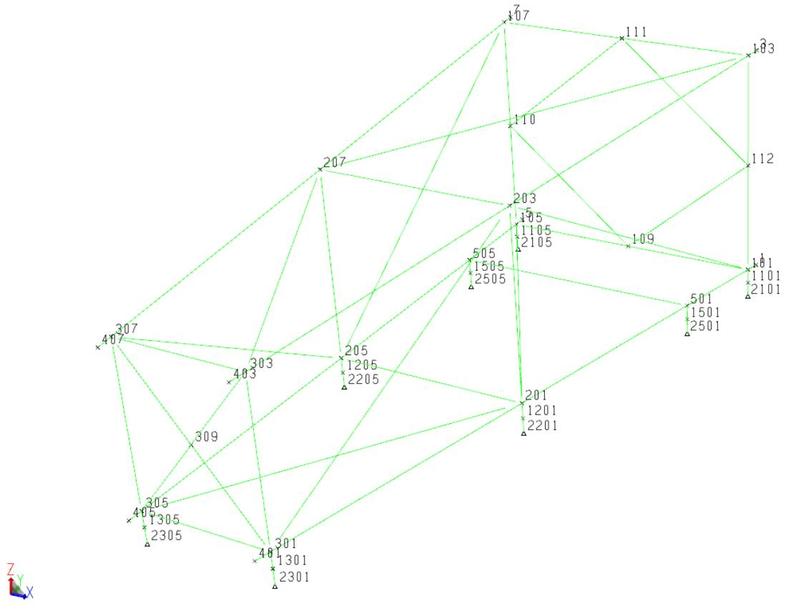

The structure is modeled such that joints 2101, 2105, 2201, 2205, 2301, 2305, 2501 and 2505 are support points. Each of the load out cans are divided into two members. The bottom member attached to the support joint is designated as a compression only gap element.

The weight of unmodeled items such as walkways, lifting eyes and mudmats were accounted for in Load case ‘MISC’ of the SACS model while load case ‘DEAD’ contains the structure self-weight.

Load combinations ‘LOS1’, ‘LOS2’, ‘LOS3’ and ‘LOS5’ contain load cases Dead and MISC and are used to simulate the loss of support at joint pairs. Combination ‘LOS1’ will be used to represent loss of supports 2101 and 2105, while ‘LOS2’ will represent loss of 2201 and 2205, ‘LOS3’ loss of 2301 and 2305 and ‘LOS5’ loss of 2501 and 2505.

A portion of the SACS model file used for Sample Problem 2 along with a description of some of the input follows:


|  | 1 | 2 | 3 | 4 | 5 | 6 | 7 | 8 |
| --- | --- | --- | --- | --- | --- | --- | --- | --- |
|  | 12345678901234567890123456789012345678901234567890123456789012345678901234567890 | 12345678901234567890123456789012345678901234567890123456789012345678901234567890 | 12345678901234567890123456789012345678901234567890123456789012345678901234567890 | 12345678901234567890123456789012345678901234567890123456789012345678901234567890 | 12345678901234567890123456789012345678901234567890123456789012345678901234567890 | 12345678901234567890123456789012345678901234567890123456789012345678901234567890 | 12345678901234567890123456789012345678901234567890123456789012345678901234567890 | 12345678901234567890123456789012345678901234567890123456789012345678901234567890 |
| 1 | GAP SAMPLE PROBLEM 2 | GAP SAMPLE PROBLEM 2 | GAP SAMPLE PROBLEM 2 | GAP SAMPLE PROBLEM 2 | GAP SAMPLE PROBLEM 2 | GAP SAMPLE PROBLEM 2 | GAP SAMPLE PROBLEM 2 | GAP SAMPLE PROBLEM 2 |
| 2 | OPTIONS | EN | SDUC | 2 1 | DC C | PT | PTPT |  |
| 3 | LCSEL GP |  | ALLS | LOS1 | LOS2 | LOS3 | LOS5 |  |
| 4 | GRUP |  |  |  |  |  |  |  |
| 5 | GRUP GAP |  | 24.000 | 1.000 | 29.0111.2036.00 | 1 | 1.001.00 | 0.500N490.00 |
| 6 | GRUP LG1 |  | 41.339 | 1.378 | 29.0111.2050.00 | 1 | 1.001.00 | 0.500N490.00 |
| 7 | GRUP LG2 |  | 41.339 | 1.378 | 29.0111.2050.00 | 1 | 1.001.00 | 0.500N490.006.14 |
| 8 | GRUP LG2 |  | 40.551 | 0.984 | 29.0111.2036.00 | 1 | 1.001.00 | 0.500N490.00 |
| 9 | GRUP LG2 |  | 41.339 | 1.378 | 29.0111.2050.00 | 1 | 1.001.00 | 0.500N490.004.89 |
| 10 | GRUP LG3 |  | 41.339 | 1.378 | 29.0111.2050.00 | 1 | 1.001.00 | 0.500N490.006.73 |
| 11 | GRUP LG3 |  | 40.551 | 0.984 | 29.0111.2036.00 | 1 | 1.001.00 | 0.500N490.00 |
| 12 | GRUP LG3 |  | 41.339 | 1.378 | 29.0111.2050.00 | 1 | 1.001.00 | 0.500N490.004.36 |
| 13 | GRUP LG4 |  | 41.339 | 1.378 | 29.0111.2050.00 | 1 | 1.001.00 | 0.500N490.00 |
| 14 | GRUP T01 |  | 15.748 | 0.689 | 29.0111.2036.00 | 1 | 1.001.00 | 0.500N490.00 |
| 15 | GRUP T02 |  | 19.685 | 0.787 | 29.0111.2036.00 | 1 | 1.001.00 | 0.500N490.00 |
| 16 | GRUP T03 |  | 11.811 | 0.492 | 29.0111.2036.00 | 1 | 1.001.00 | 0.500N490.00 |
| 17 | MEMBER |  |  |  |  |  |  |  |
| 18 | MEMBER 1101101 |  | GAP |  |  |  |  |  |
| 19 | MEMBER 1105105 |  | GAP |  |  |  |  |  |
| 20 | MEMBER 1201201 |  | GAP |  |  |  |  |  |
| 21 | MEMBER 1205205 |  | GAP |  |  |  |  |  |
| 22 | MEMBER 1301301 |  | GAP |  |  |  |  |  |
| 23 | MEMBER 1305305 |  | GAP |  |  |  |  |  |
| 24 | MEMBER 1501501 |  | GAP |  |  |  |  |  |
| 25 | MEMBER 1505505 |  | GAP |  |  |  |  |  |
| 26 | MEMBER 21011101 |  | GAP C |  |  |  |  |  |
| 27 | MEMBER 21051105 |  | GAP C |  |  |  |  |  |
| 28 | MEMBER 22011201 |  | GAP C |  |  |  |  |  |
| 29 | MEMBER 22051205 |  | GAP C |  |  |  |  |  |
| 30 | MEMBER 23011301 |  | GAP C |  |  |  |  |  |
| 31 | MEMBER 23051305 |  | GAP C |  |  |  |  |  |
| 32 | MEMBER 25011501 |  | GAP C |  |  |  |  |  |
| 33 | MEMBER 25051505 |  | GAP C |  |  |  |  |  |
| 34 | ********** ADDITIONAL MEMBER DATA********** | ********** ADDITIONAL MEMBER DATA********** | ********** ADDITIONAL MEMBER DATA********** | ********** ADDITIONAL MEMBER DATA********** | ********** ADDITIONAL MEMBER DATA********** | ********** ADDITIONAL MEMBER DATA********** | ********** ADDITIONAL MEMBER DATA********** | ********** ADDITIONAL MEMBER DATA********** |
| 35 | JOINT |  |  |  |  |  |  |  |
| 36 | ********** ADDITIONAL JOINT DATA********** | ********** ADDITIONAL JOINT DATA********** | ********** ADDITIONAL JOINT DATA********** | ********** ADDITIONAL JOINT DATA********** | ********** ADDITIONAL JOINT DATA********** | ********** ADDITIONAL JOINT DATA********** | ********** ADDITIONAL JOINT DATA********** | ********** ADDITIONAL JOINT DATA********** |
| 37 | JOINT 2101 |  | 38.550164.042 | -8.000 |  | 111000 |  |  |
| 38 | JOINT 2105 |  | -38.550164.042 | -8.000 |  | 111000 |  |  |
| 39 | JOINT 2201 |  | 26.657 | 68.898 | -8.000 |  | 111000 |  |
| 40 | JOINT 2205 |  | -26.657 | 68.898 | -8.000 |  | 111000 |  |
| 41 | JOINT 2301 |  | 17.224 | -6.562 | -8.000 |  | 111000 |  |
| 42 | JOINT 2305 |  | -17.224 | -6.562 | -8.000 |  | 111000 |  |
| 43 | JOINT 2501 |  | 34.920135.000 | -8.000 |  | 111000 |  |  |
| 44 | JOINT 2505 |  | -34.920135.000 | -8.000 |  | 111000 |  |  |
| 45 | LOAD |  |  |  |  |  |  |  |
| 46 | LOADCNDDEAD |  |  |  |  |  |  |  |
| 47 | ********** ADDITIONAL DEAD LOADING********** | ********** ADDITIONAL DEAD LOADING********** | ********** ADDITIONAL DEAD LOADING********** | ********** ADDITIONAL DEAD LOADING********** | ********** ADDITIONAL DEAD LOADING********** | ********** ADDITIONAL DEAD LOADING********** | ********** ADDITIONAL DEAD LOADING********** | ********** ADDITIONAL DEAD LOADING********** |
| 48 | LOADCNMISC |  |  |  |  |  |  |  |
| 49 | LOAD 112 |  |  | -4.0000 |  | GLOB JOIN MUDMAT | GLOB JOIN MUDMAT | GLOB JOIN MUDMAT |
| 50 | LOAD 109 |  |  | -4.0000 |  | GLOB JOIN MUDMAT | GLOB JOIN MUDMAT | GLOB JOIN MUDMAT |
| 51 | LOAD 110 |  |  | -4.0000 |  | GLOB JOIN MUDMAT | GLOB JOIN MUDMAT | GLOB JOIN MUDMAT |
| 52 | LOAD 111 |  |  | -4.0000 |  | GLOB JOIN MUDMAT | GLOB JOIN MUDMAT | GLOB JOIN MUDMAT |
| 53 | LCOMB |  |  |  |  |  |  |  |
| 54 | LCOMB ALLS |  | MISC1.0000DEAD1.0000 |  |  |  |  |  |
| 55 | LCOMB LOS1 |  | MISC1.0000DEAD1.0000 |  |  |  |  |  |
| 56 | LCOMB LOS2 |  | MISC1.0000DEAD1.0000 |  |  |  |  |  |
| 57 | LCOMB LOS3 |  | MISC1.0000DEAD1.0000 |  |  |  |  |  |
| 58 | LCOMB LOS5 |  | MISC1.0000DEAD1.0000 |  |  |  |  |  |
| 59 | END |  |  |  |  |  |  |  |


3 Load case ‘ALLS’, ‘LOS1’, ‘LOS2’, ‘LOS3’ and ‘LOS5’ are selected for output for this gap analysis.   
26 Members 2101-1101, 2105-1105, 2201-1105, 2205-1105, 2301-1301, 2305-1305, 2501-1501 and 2505-1505 are assigned to group GAP and are designated as compression only gap elements by ‘C’ in column 22.   
37 Joints 2101, 2105, 2201, 2205, 2301, 2305, 2501 and 2505 are assigned as pinned supports (‘111’ in columns 55-57).   
46 Dead load or the self-weight of the structure is represented in load case ‘DEAD’.   
48 Load case ‘MISC’ representing miscellaneous or unmodeled steel is defined.   
54 The load combination ‘ALLS’ is used to represent the case when all supports are active.   
55 The load combinations used to represent the loss of support are defined using the LCOMB lines. Load cases ‘LOS1’, ‘LOS2’, ‘LOS3’ and ‘LOS4’ contain load cases ‘DEAD’ and ‘MISC’.

Below is the Gap input file used for this gap analysis. A detailed description of the input file follows:

```c
1 2 3 4 5 6 7 8  
1234567890123456789012345678901234567890123456789012345678901234567890  
1 GAOPT EN
2 LCGAP LOS1 INC NL MEM 21011101 21051105  
3 LCGAP LOS2 INC NL MEM 22011201 22051205  
4 LCGAP LOS3 INC NL MEM 23011301 23051305  
5 LCGAP LOS5 INC NL MEM 25011501 25051505  
6 END
```

The GAPOPT input designates the analysis options as follows:

a. English units are designated in columns 21-22.

1 The first LCGAP line designates gap type overrides as follows:

a. Members 2101-1101 and 2105-1105 are changed to no load gap elements as designated by ‘NL’ in columns 16-17.   
b. This override applies to load case ‘LOS1’.

2 The second LCGAP line designates gap type overrides as follows:

a. Members 2201-1201 and 2205-1205 are changed to no load gap elements as designated by ‘NL’ in columns 16-17.   
b. This override applies to load case ‘LOS2’.

3 The third LCGAP line designates gap type overrides as follows:

a. Members 2301-1301 and 2305-1305 are changed to no load gap elements as designated by ‘NL’ in columns 16-17.

b. This override applies to load case ‘LOS3’.

1 The last LCGAP line designates gap type overrides as follows:

a. Members 2501-1501 and 2505-1505 are changed to no load gap elements as designated by ‘NL’ in columns 16-17.   
b. This override applies to load case ‘LOS5’.

The following is a portion of the output listing file created by the Gap analysis:

```txt
SACS CONNECT Edition (v11.0) Bentley Systems ID=Ym5ng2NpaIJxrlIF8nIen
GAP SAMPLE PROBLEM 2 DATE 15-AUG-2018 TIME 15:41:52 PRE PAGE 1
** PROGRAM OPTIONS ** PRE VERSION 12.1.0.14
UNITS ....ENGLISH
EXECUTION ....GAP ANALYSIS ....SHEAR DEFORMATION INCLUDED ....UNITY CHECK WSD AISC 9TH EDITION WITH API-RP2A 21ST EDITION FOR TUBULARS ....DKT PLATES SELECTED ....NO SEGMENTS FOR PRISMATIC MEMBERS 2 ....NO SEGMENTS/SECTION FOR NON-PRISMATIC MEMBERS 1
REPORTSE SELECTED ....ELEMENT STRESS AT MAXIMUM UNITY CHECK...PRINT ....JOINT S............PRINT
LOAD ....NO. BASIC LOAD COND. 2 ....NO. COMB. LOAD COND. 5
SACS CONNECT Edition (v11.0) Bentley Systems ID=Ym5ng2NpaIJxrIF8nIen
GAP SAMPLE PROBLEM 2 DATE 15-AUG-2018 TIME 15:41:53 GAP PAGE 3
************* GAP ELEMENT REPORT********
GAP 1ST 2ND GRUP LOAD ELEMENT PRESET **** FRICTION ELEMENT **** 1ST POINT 2ND POINT
ELEMENT JOINT JOINT ID CASE TYPE DEGREE OF *** COEFF. NORMAL MEMBER LOAD FORCE DEFL. FORCE DEFL.
1 2101 1101 GAP G001 COMP AXIAL 0.00
2 2105 1105 GAP G002 COMP AXIAL 0.00
3 2201 1201 GAP G003 COMP AXIAL 0.00
4 2205 1205 GAP G004 COMP AXIAL 0.00
5 2301 1301 GAP G005 COMP AXIAL 0.00
6 2305 1305 GAP G006 COMP AXIAL 0.00
7 2501 1501 GAP G007 COMP AXIAL 0.00
8 2505 1505 GAP G008 COMP AXIAL 0.00
LOAD CASE ALLS CONVERGED IN 0 ITERATIONS 
```


| SACS CONNECT Edition (v11.0) | SACS CONNECT Edition (v11.0) | SACS CONNECT Edition (v11.0) | Bentley Systems | Bentley Systems | Bentley Systems | ID=Ym5ng2NpaIJxrIF8nIen | ID=Ym5ng2NpaIJxrIF8nIen | ID=Ym5ng2NpaIJxrIF8nIen |
| --- | --- | --- | --- | --- | --- | --- | --- | --- |
| GAP SAMPLE PROBLEM 2 | GAP SAMPLE PROBLEM 2 | GAP SAMPLE PROBLEM 2 | GAP SAMPLE PROBLEM 2 | GAP SAMPLE PROBLEM 2 | GAP SAMPLE PROBLEM 2 | DATE 15-AUG-2018 | TIME 15:41:53 | GAP PAGE 4 |
| NO. | GAP ELEMENT | TYPE | DEFLECTION IN | FORCE KIPS | FACTOR |  |  |  |
| 1 | 2101-1101 | COMP | -0.00197 | -86.0 | 0.000000E+00 |  |  |  |
| 2 | 2105-1105 | COMP | -0.00180 | -78.8 | 0.000000E+00 |  |  |  |
| 3 | 2201-1201 | COMP | -0.00255 | -111.6 | 0.000000E+00 |  |  |  |
| 4 | 2205-1205 | COMP | -0.00292 | -127.4 | 0.000000E+00 |  |  |  |
| 5 | 2301-1301 | COMP | -0.00128 | -55.9 | 0.000000E+00 |  |  |  |
| 6 | 2305-1305 | COMP | -0.00113 | -49.3 | 0.000000E+00 |  |  |  |
| 7 | 2501-1501 | COMP | -0.00072 | -31.3 | 0.000000E+00 |  |  |  |
| 8 | 2505-1505 | COMP | -0.00073 | -31.9 | 0.000000E+00 |  |  |  |
| LOAD CASE LOS1 CONVERGED IN 30 ITERATIONS | LOAD CASE LOS1 CONVERGED IN 30 ITERATIONS | LOAD CASE LOS1 CONVERGED IN 30 ITERATIONS | LOAD CASE LOS1 CONVERGED IN 30 ITERATIONS | LOAD CASE LOS1 CONVERGED IN 30 ITERATIONS | LOAD CASE LOS1 CONVERGED IN 30 ITERATIONS | LOAD CASE LOS1 CONVERGED IN 30 ITERATIONS | LOAD CASE LOS1 CONVERGED IN 30 ITERATIONS | LOAD CASE LOS1 CONVERGED IN 30 ITERATIONS |
| SACS CONNECT Edition (v11.0) | SACS CONNECT Edition (v11.0) | SACS CONNECT Edition (v11.0) | Bentley Systems | Bentley Systems | Bentley Systems | ID=Ym5ng2NpaIJxrIF8nIen | ID=Ym5ng2NpaIJxrIF8nIen | ID=Ym5ng2NpaIJxrIF8nIen |
| GAP SAMPLE PROBLEM 2 | GAP SAMPLE PROBLEM 2 | GAP SAMPLE PROBLEM 2 | GAP SAMPLE PROBLEM 2 | GAP SAMPLE PROBLEM 2 | GAP SAMPLE PROBLEM 2 | DATE 15-AUG-2018 | TIME 15:41:53 | GAP PAGE 5 |
| NO. | GAP ELEMENT | TYPE | DEFLECTION IN | FORCE KIPS | FACTOR |  |  |  |
| 1 | 2101-1101 | NULL | -1.00361 | 0.0 | 0.438277E+05 |  |  |  |
| 2 | 2105-1105 | NULL | -0.99521 | 0.0 | 0.434608E+05 |  |  |  |
| 3 | 2201-1201 | COMP | -0.00444 | -193.7 | 0.000000E+00 |  |  |  |
| 4 | 2205-1205 | COMP | -0.00454 | -198.1 | 0.000000E+00 |  |  |  |
| 5 | 2301-1301 | COMP | 0.30220 | 0.0 | -0.131972E+05 |  |  |  |
| 6 | 2305-1305 | COMP | 0.32018 | 0.0 | -0.139825E+05 |  |  |  |
| 7 | 2501-1501 | COMP | -0.00209 | -91.1 | 0.000000E+00 |  |  |  |
| 8 | 2505-1505 | COMP | -0.00204 | -89.2 | 0.000000E+00 |  |  |  |
| LOAD CASE LOS2 CONVERGED IN 30 ITERATIONS | LOAD CASE LOS2 CONVERGED IN 30 ITERATIONS | LOAD CASE LOS2 CONVERGED IN 30 ITERATIONS | LOAD CASE LOS2 CONVERGED IN 30 ITERATIONS | LOAD CASE LOS2 CONVERGED IN 30 ITERATIONS | LOAD CASE LOS2 CONVERGED IN 30 ITERATIONS | LOAD CASE LOS2 CONVERGED IN 30 ITERATIONS | LOAD CASE LOS2 CONVERGED IN 30 ITERATIONS | LOAD CASE LOS2 CONVERGED IN 30 ITERATIONS |
| SACS CONNECT Edition (v11.0) | SACS CONNECT Edition (v11.0) | SACS CONNECT Edition (v11.0) | Bentley Systems | Bentley Systems | Bentley Systems | ID=Ym5ng2NpaIJxrIF8nIen | ID=Ym5ng2NpaIJxrIF8nIen | ID=Ym5ng2NpaIJxrIF8nIen |
| GAP SAMPLE PROBLEM 2 | GAP SAMPLE PROBLEM 2 | GAP SAMPLE PROBLEM 2 | GAP SAMPLE PROBLEM 2 | GAP SAMPLE PROBLEM 2 | GAP SAMPLE PROBLEM 2 | DATE 15-AUG-2018 | TIME 15:41:53 | GIP PAGE 6 |
| NO. | GAP ELEMENT | TYPE | DEFLECTION IN | FORCE KIPS | FACTOR |  |  |  |
| 1 | 2101-1101 | COMP | -0.00300 | -131.2 | 0.000000E+00 |  |  |  |
| 2 | 2105-1105 | COMP | -0.00291 | -127.2 | 0.000000E+00 |  |  |  |
| 3 | 2201-1201 | NULL | -0.32097 | 0.0 | 0.140168E+05 |  |  |  |
| 4 | 2205-1205 | NULL | -0.37339 | 0.0 | 0.163060E+05 |  |  |  |
| 5 | 2301-1301 | COMP | -0.00267 | -116.5 | 0.000000E+00 |  |  |  |
| 6 | 2305-1305 | COMP | -0.00274 | -119.5 | 0.000000E+00 |  |  |  |
| 7 | 2501-1501 | COMP | -0.00084 | -36.7 | 0.000000E+00 |  |  |  |
| 8 | 2505-1505 | COMP | -0.00094 | -41.0 | 0.000000E+00 |  |  |  |


LOAD CASE LOS3 CONVERGED IN 30 ITERATIONS

SACS CONNECT Edition (v11.0)

GAP SAMPLE PROBLEM 2

Bentley Systems

ID=Ym5ng2NpaIJxrIF8nIen

DATE 15-AUG-2018 TIME 15:41:53 GAP PAGE 7

NO. GAP ELEMENT

DEFLECTION

FORCE

IN KIPS

FACTOR

1 2101-1101

-0.00097 -42.2

## 0.000000E+00

2 2105-1105

-0.00086 -37.5

## 0.000000E+00

3 2201-1201

-0.00477 -208.1

## 0.000000E+00

# 4 2205-1205

-0.00501 -218.7

## 0.000000E+00

5 2301-1301

-0.50522 0.0

## 0.220631E+05

6 2305-1305

-0.49077 0.0

## 0.214319E+05

7 2501-1501

-0.00077 -33.5

## 0.000000E+00

8 2505-1505

-0.00073 -32.1

## 0.000000E+00

LOAD CASE LOS5 CONVERGED IN 29 ITERATIONS

SACS CONNECT Edition (v11.0)

GAP SAMPLE PROBLEM 2

Bentley Systems

ID=Ym5ng2NpaIJxrIF8nIen

DATE 15-AUG-2018 TIME 15:41:53 PST PAGE 4

SACS-IV SYSTEM FIXED JOINTS REACTION FORCES AND MOMENTS   


| JOINT NUMBER CASE | JOINT NUMBER CASE | ********** KIPS********** | ********** KIPS********** | ********** KIPS********** | ********** FT-KIPS********** | ********** FT-KIPS********** | ********** FT-KIPS********** |
| --- | --- | --- | --- | --- | --- | --- | --- |
| JOINT NUMBER CASE | JOINT NUMBER CASE | FORCE (X) | FORCE (Y) | FORCE (Z) | MOMENT (X) | MOMENT (Y) | MOMENT (Z) |
| 2101 | ALLS | -2.916 | -4.794 | 85.987 | 0.000 | 0.000 | 0.000 |
| 2101 | LOS1 | 2.790 | 47.374 | 0.001 | 0.000 | 0.000 | 0.000 |
| 2101 | LOS2 | -3.515 | -9.057 | 131.159 | 0.000 | 0.000 | 0.000 |
| 2101 | LOS3 | -1.893 | 4.062 | 42.171 | 0.000 | 0.000 | 0.000 |
| 2101 | LOS5 | -5.414 | -28.376 | 109.367 | 0.000 | 0.000 | 0.000 |
| 2105 | ALLS | 5.712 | -4.964 | 78.771 | 0.000 | 0.000 | 0.000 |
| 2105 | LOS1 | -0.516 | 42.173 | 0.001 | 0.000 | 0.000 | 0.000 |
| 2105 | LOS2 | 5.264 | -2.867 | 127.215 | 0.000 | 0.000 | 0.000 |
| 2105 | LOS3 | 5.309 | -1.116 | 37.463 | 0.000 | 0.000 | 0.000 |
| 2105 | LOS5 | 9.022 | -29.253 | 100.743 | 0.000 | 0.000 | 0.000 |
| 2201 | ALLS | -10.577 | -5.656 | 111.557 | 0.000 | 0.000 | 0.000 |
| 2201 | LOS1 | -15.179 | -56.088 | 193.679 | 0.000 | 0.000 | 0.000 |
| 2201 | LOS2 | -10.635 | -6.712 | 0.001 | 0.000 | 0.000 | 0.000 |
| 2201 | LOS3 | -11.158 | -10.557 | 208.092 | 0.000 | 0.000 | 0.000 |
| 2201 | LOS5 | -8.420 | 19.233 | 118.220 | 0.000 | 0.000 | 0.000 |


| 2205 | ALLS | 4.640 | -5.895 | 127.420 | 0.000 | 0.000 | 0.000 |
| --- | --- | --- | --- | --- | --- | --- | --- |
|  | LOS1 | 11.085 | -52.664 | 198.122 | 0.000 | 0.000 | 0.000 |
|  | LOS2 | 4.811 | -9.330 | 0.001 | 0.000 | 0.000 | 0.000 |
|  | LOS3 | 5.136 | -8.503 | 218.694 | 0.000 | 0.000 | 0.000 |
|  | LOS5 | 1.298 | 18.708 | 136.631 | 0.000 | 0.000 | 0.000 |
| 2301 | ALLS | -0.139 | 16.186 | 55.876 | 0.000 | 0.000 | 0.000 |
|  | LOS1 | -2.839 | -5.453 | 0.000 | 0.000 | 0.000 | 0.000 |
|  | LOS2 | 1.683 | 30.197 | 116.470 | 0.000 | 0.000 | 0.000 |
|  | LOS3 | -1.665 | 2.650 | 0.001 | 0.000 | 0.000 | 0.000 |
|  | LOS5 | 0.481 | 20.814 | 56.618 | 0.000 | 0.000 | 0.000 |
| 2305 | ALLS | 3.215 | 15.166 | 49.285 | 0.000 | 0.000 | 0.000 |
|  | LOS1 | 4.050 | -1.083 | 0.000 | 0.000 | 0.000 | 0.000 |
|  | LOS2 | 2.860 | 25.898 | 119.485 | 0.000 | 0.000 | 0.000 |
|  | LOS3 | 3.669 | 6.435 | 0.000 | 0.000 | 0.000 | 0.000 |
|  | LOS5 | 2.946 | 19.511 | 50.435 | 0.000 | 0.000 | 0.000 |
| 2501 | ALLS | -7.129 | -4.912 | 31.263 | 0.000 | 0.000 | 0.000 |
|  | LOS1 | -4.687 | 14.750 | 91.062 | 0.000 | 0.000 | 0.000 |
|  | LOS2 | -8.480 | -15.674 | 36.664 | 0.000 | 0.000 | 0.000 |
|  | LOS3 | -5.834 | 5.430 | 33.505 | 0.000 | 0.000 | 0.000 |
|  | LOS5 | -7.763 | -10.027 | 0.001 | 0.000 | 0.000 | 0.000 |
| 2505 | ALLS | 7.194 | -5.131 | 31.856 | 0.000 | 0.000 | 0.000 |
|  | LOS1 | 5.296 | 10.990 | 89.151 | 0.000 | 0.000 | 0.000 |
|  | LOS2 | 8.012 | -12.453 | 41.019 | 0.000 | 0.000 | 0.000 |
|  | LOS3 | 6.434 | 1.598 | 32.089 | 0.000 | 0.000 | 0.000 |
|  | LOS5 | 7.851 | -10.609 | 0.001 | 0.000 | 0.000 | 0.000 |


|  |  |  |  | SACS-IV SYSTEM MEMBER FORCES AND MOMENTS | SACS-IV SYSTEM MEMBER FORCES AND MOMENTS | SACS-IV SYSTEM MEMBER FORCES AND MOMENTS | SACS-IV SYSTEM MEMBER FORCES AND MOMENTS | SACS-IV SYSTEM MEMBER FORCES AND MOMENTS | SACS-IV SYSTEM MEMBER FORCES AND MOMENTS |
| --- | --- | --- | --- | --- | --- | --- | --- | --- | --- |
| MEMBER NUMBER | MEMBER END | GROUP ID | LOAD CASE | KIPS FORCE (X) | ********** | ********** | IN-KIPS MOMENT (Y) | ********** | MOMENT (Z) |
| 1101- 101 | 1101 | GAP | ALLS | -85.00 | -2.92 | -4.79 | 0.00 | -230.13 | -139.97 |
|  |  |  | LOS1 | 0.98 | 2.79 | 47.37 | 0.00 | 2273.96 | 133.91 |
|  |  |  | LOS2 | -130.18 | -3.52 | -9.06 | 0.00 | -434.75 | -168.72 |
|  |  |  | LOS3 | -41.19 | -1.89 | 4.06 | 0.00 | 194.99 | -90.85 |
|  |  |  | LOS5 | -108.38 | -5.41 | -28.38 | 0.00 | -1362.06 | -259.85 |
|  | 101 |  | ALLS | -84.02 | -2.92 | -4.79 | 0.00 | -460.26 | -279.95 |
|  |  |  | LOS1 | 1.97 | 2.79 | 47.37 | 0.00 | 4547.92 | 267.82 |
|  |  |  | LOS2 | -129.19 | -3.52 | -9.06 | 0.00 | -869.50 | -337.44 |
|  |  |  | LOS3 | -40.20 | -1.89 | 4.06 | 0.00 | 389.99 | -181.71 |
|  |  |  | LOS5 | -107.40 | -5.41 | -28.38 | 0.00 | -2724.12 | -519.71 |
| 1105- 105 | 1105 | GAP | ALLS | -77.79 | 5.71 | -4.96 | 0.00 | -238.28 | 274.16 |
|  |  |  | LOS1 | 0.98 | -0.52 | 42.17 | 0.00 | 2024.31 | -24.78 |
|  |  |  | LOS2 | -126.23 | 5.26 | -2.87 | 0.00 | -137.62 | 252.69 |
|  |  |  | LOS3 | -36.48 | 5.31 | -1.12 | 0.00 | -53.57 | 254.86 |
|  |  |  | LOS5 | -99.76 | 9.02 | -29.25 | 0.00 | -1404.14 | 433.03 |
|  | 105 |  | ALLS | -76.80 | 5.71 | -4.96 | 0.00 | -476.56 | 548.32 |
|  |  |  | LOS1 | 1.97 | -0.52 | 42.17 | 0.00 | 4048.62 | -49.57 |
|  |  |  | LOS2 | -125.25 | 5.26 | -2.87 | 0.00 | -275.24 | 505.38 |
|  |  |  | LOS3 | -35.50 | 5.31 | -1.12 | 0.00 | -107.15 | 509.71 |
|  |  |  | LOS5 | -98.78 | 9.02 | -29.25 | 0.00 | -2808.28 | 866.07 |
| 1201- 201 | 1201 | GAP | ALLS | -110.57 | -10.58 | -5.66 | 0.00 | -271.50 | -507.70 |
|  |  |  | LOS1 | -192.70 | -15.18 | -56.09 | 0.00 | -2692.21 | -728.60 |
|  |  |  | LOS2 | 0.98 | -10.64 | -6.71 | 0.00 | -322.20 | -510.50 |
|  |  |  | LOS3 | -207.11 | -11.16 | -10.56 | 0.00 | -506.73 | -535.60 |
|  |  |  | LOS5 | -117.24 | -8.42 | 19.23 | 0.00 | 923.16 | -404.18 |
|  | 201 |  | ALLS | -109.59 | -10.58 | -5.66 | 0.00 | -543.00 | -1015.41 |
|  |  |  | LOS1 | -191.71 | -15.18 | -56.09 | 0.00 | -5384.43 | -1457.20 |
|  |  |  | LOS2 | 1.97 | -10.64 | -6.71 | 0.00 | -644.40 | -1021.00 |
|  |  |  | LOS3 | -206.12 | -11.16 | -10.56 | 0.00 | -1013.47 | -1071.20 |
|  |  |  | LOS5 | -116.25 | -8.42 | 19.23 | 0.00 | 1846.32 | -808.35 |
| 1205- 205 | 1205 | GAP | ALLS | -126.44 | 4.64 | -5.89 | 0.00 | -282.95 | 222.73 |
|  |  |  | LOS1 | -197.14 | 11.09 | -52.66 | 0.00 | -2527.86 | 532.08 |
|  |  |  | LOS2 | 0.98 | 4.81 | -9.33 | 0.00 | -447.86 | 230.93 |
|  |  |  | LOS3 | -217.71 | 5.14 | -8.50 | 0.00 | -408.14 | 246.54 |
|  |  |  | LOS5 | -135.65 | 1.30 | 18.71 | 0.00 | 897.97 | 62.30 |
|  | 205 |  | ALLS | -125.45 | 4.64 | -5.89 | 0.00 | -565.90 | 445.47 |
|  |  |  | LOS1 | -196.15 | 11.09 | -52.66 | 0.00 | -5055.72 | 1064.16 |
|  |  |  | LOS2 | 1.97 | 4.81 | -9.33 | 0.00 | -895.72 | 461.86 |
|  |  |  | LOS3 | -216.73 | 5.14 | -8.50 | 0.00 | -816.28 | 493.08 |
|  |  |  | LOS5 | -134.66 | 1.30 | 18.71 | 0.00 | 1795.94 | 124.60 |
| 1301- 301 | 1301 | GAP | ALLS | -54.89 | -0.14 | 16.19 | 0.00 | 776.95 | -6.67 |
|  |  |  | LOS1 | 0.98 | -2.84 | -5.45 | 0.00 | -261.75 | -136.27 |
|  |  |  | LOS2 | -115.49 | 1.68 | 30.20 | 0.00 | 1449.44 | 80.79 |
|  |  |  | LOS3 | 0.98 | -1.66 | 2.65 | 0.00 | 127.22 | -79.90 |
|  |  |  | LOS5 | -55.63 | 0.48 | 20.81 | 0.00 | 999.05 | 23.07 |
|  | 301 |  | ALLS | -53.91 | -0.14 | 16.19 | 0.00 | 1553.90 | -13.33 |
|  |  |  | LOS1 | 1.97 | -2.84 | -5.45 | 0.00 | -523.50 | -272.54 |
|  |  |  | LOS2 | -114.50 | 1.68 | 30.20 | 0.00 | 2898.87 | 161.59 |
|  |  |  | LOS3 | 1.97 | -1.66 | 2.65 | 0.00 | 254.43 | -159.80 |
|  |  |  | LOS5 | -54.65 | 0.48 | 20.81 | 0.00 | 1998.10 | 46.14 |
|  |  |  |  |  | SACS-IV SYSTEM | MEMBER FORCES AND MOMENTS | MEMBER FORCES AND MOMENTS | MEMBER FORCES AND MOMENTS | MEMBER FORCES AND MOMENTS |
| MEMBER NUMBER | MEMBER END | GROUP ID | LOAD FORCE (X) | KIPS FORCE (Y) | FORCE (Z) | MOMENT (X) | IN-KIPS MOMENT (Y) | MOMENT (Z) | MOMENT (Z) |
| 2201-1201 | 2201 | GAP | ALLS | -111.56 | -10.58 | -5.66 | 0.00 | 0.00 | 0.00 |
|  |  |  | LOS1 | -193.68 | -15.18 | -56.09 | 0.00 | 0.00 | 0.00 |


|  |  | LOS2 | 0.00 | -10.64 | -6.71 | 0.00 | 0.00 | 0.00 |
| --- | --- | --- | --- | --- | --- | --- | --- | --- |
|  |  | LOS3 | -208.09 | -11.16 | -10.56 | 0.00 | 0.00 | 0.00 |
|  |  | LOS5 | -118.22 | -8.42 | 19.23 | 0.00 | 0.00 | 0.00 |
|  | 1201 | ALLS | -110.57 | -10.58 | -5.66 | 0.00 | -271.50 | -507.70 |
|  |  | LOS1 | -192.70 | -15.18 | -56.09 | 0.00 | -2692.21 | -728.60 |
|  |  | LOS2 | 0.98 | -10.64 | -6.71 | 0.00 | -322.20 | -510.50 |
|  |  | LOS3 | -207.11 | -11.16 | -10.56 | 0.00 | -506.73 | -535.60 |
|  |  | LOS5 | -117.24 | -8.42 | 19.23 | 0.00 | 923.16 | -404.18 |
| 2205-1205 | 2205 | GAP | ALLS | -127.42 | 4.64 | -5.89 | 0.00 | 0.00 |
|  |  |  | LOS1 | -198.12 | 11.09 | -52.66 | 0.00 | 0.00 |
|  |  |  | LOS2 | 0.00 | 4.81 | -9.33 | 0.00 | 0.00 |
|  |  |  | LOS3 | -218.69 | 5.14 | -8.50 | 0.00 | 0.00 |
|  |  |  | LOS5 | -136.63 | 1.30 | 18.71 | 0.00 | 0.00 |
|  | 1205 |  | ALLS | -126.44 | 4.64 | -5.89 | 0.00 | -282.95 |
|  |  |  | LOS1 | -197.14 | 11.09 | -52.66 | 0.00 | -2527.86 |
|  |  |  | LOS2 | 0.98 | 4.81 | -9.33 | 0.00 | -447.86 |
|  |  |  | LOS3 | -217.71 | 5.14 | -8.50 | 0.00 | -408.14 |
|  |  |  | LOS5 | -135.65 | 1.30 | 18.71 | 0.00 | 897.97 |
| 2301-1301 | 2301 | GAP | ALLS | -55.88 | -0.14 | 16.19 | 0.00 | 0.00 |
|  |  |  | LOS1 | 0.00 | -2.84 | -5.45 | 0.00 | 0.00 |
|  |  |  | LOS2 | -116.47 | 1.68 | 30.20 | 0.00 | 0.00 |
|  |  |  | LOS3 | 0.00 | -1.66 | 2.65 | 0.00 | 0.00 |
|  |  |  | LOS5 | -56.62 | 0.48 | 20.81 | 0.00 | 0.00 |
|  | 1301 |  | ALLS | -54.89 | -0.14 | 16.19 | 0.00 | 776.95 |
|  |  |  | LOS1 | 0.98 | -2.84 | -5.45 | 0.00 | -261.75 |
|  |  |  | LOS2 | -115.49 | 1.68 | 30.20 | 0.00 | 1449.44 |
|  |  |  | LOS3 | 0.98 | -1.66 | 2.65 | 0.00 | 127.22 |
|  |  |  | LOS5 | -55.63 | 0.48 | 20.81 | 0.00 | 999.05 |
| 2305-1305 | 2305 | GAP | ALLS | -49.28 | 3.22 | 15.17 | 0.00 | 0.00 |
|  |  |  | LOS1 | 0.00 | 4.05 | -1.08 | 0.00 | 0.00 |
|  |  |  | LOS2 | -119.49 | 2.86 | 25.90 | 0.00 | 0.00 |
|  |  |  | LOS3 | 0.00 | 3.67 | 6.43 | 0.00 | 0.00 |
|  |  |  | LOS5 | -50.43 | 2.95 | 19.51 | 0.00 | 0.00 |
|  | 1305 |  | ALLS | -48.30 | 3.22 | 15.17 | 0.00 | 727.98 |
|  |  |  | LOS1 | 0.98 | 4.05 | -1.08 | 0.00 | -51.97 |
|  |  |  | LOS2 | -118.50 | 2.86 | 25.90 | 0.00 | 1243.08 |
|  |  |  | LOS3 | 0.98 | 3.67 | 6.43 | 0.00 | 308.86 |
|  |  |  | LOS5 | -49.45 | 2.95 | 19.51 | 0.00 | 936.55 |
| 2501-1501 | 2501 | GAP | ALLS | -31.26 | -7.13 | -4.91 | 0.00 | 0.00 |
|  |  |  | LOS1 | -91.06 | -4.69 | 14.75 | 0.00 | 0.00 |
|  |  |  | LOS2 | -36.66 | -8.48 | -15.67 | 0.00 | 0.00 |
|  |  |  | LOS3 | -33.51 | -5.83 | 5.43 | 0.00 | 0.00 |
|  |  |  | LOS5 | 0.00 | -7.76 | -10.03 | 0.00 | 0.00 |
|  | 1501 |  | ALLS | -30.28 | -7.13 | -4.91 | 0.00 | -235.80 |
|  |  |  | LOS1 | -90.08 | -4.69 | 14.75 | 0.00 | 708.01 |
|  |  |  | LOS2 | -35.68 | -8.48 | -15.67 | 0.00 | -752.36 |
|  |  |  | LOS3 | -32.52 | -5.83 | 5.43 | 0.00 | 260.66 |


| SACS CONNECT Edition (v11.0)GAP SAMPLE PROBLEM 2 | SACS CONNECT Edition (v11.0)GAP SAMPLE PROBLEM 2 | SACS CONNECT Edition (v11.0)GAP SAMPLE PROBLEM 2 | SACS CONNECT Edition (v11.0)GAP SAMPLE PROBLEM 2 | SACS CONNECT Edition (v11.0)GAP SAMPLE PROBLEM 2 | Bentley SystemsDATE 15-AUG-2018ID=Ym5ng2NpaIJxrIF8nIenTIME 15:41:53PST PAGE6 | Bentley SystemsDATE 15-AUG-2018ID=Ym5ng2NpaIJxrIF8nIenTIME 15:41:53PST PAGE6 | Bentley SystemsDATE 15-AUG-2018ID=Ym5ng2NpaIJxrIF8nIenTIME 15:41:53PST PAGE6 | Bentley SystemsDATE 15-AUG-2018ID=Ym5ng2NpaIJxrIF8nIenTIME 15:41:53PST PAGE6 | Bentley SystemsDATE 15-AUG-2018ID=Ym5ng2NpaIJxrIF8nIenTIME 15:41:53PST PAGE6 | Bentley SystemsDATE 15-AUG-2018ID=Ym5ng2NpaIJxrIF8nIenTIME 15:41:53PST PAGE6 | Bentley SystemsDATE 15-AUG-2018ID=Ym5ng2NpaIJxrIF8nIenTIME 15:41:53PST PAGE6 | Bentley SystemsDATE 15-AUG-2018ID=Ym5ng2NpaIJxrIF8nIenTIME 15:41:53PST PAGE6 | Bentley SystemsDATE 15-AUG-2018ID=Ym5ng2NpaIJxrIF8nIenTIME 15:41:53PST PAGE6 | Bentley SystemsDATE 15-AUG-2018ID=Ym5ng2NpaIJxrIF8nIenTIME 15:41:53PST PAGE6 | Bentley SystemsDATE 15-AUG-2018ID=Ym5ng2NpaIJxrIF8nIenTIME 15:41:53PST PAGE6 |
| --- | --- | --- | --- | --- | --- | --- | --- | --- | --- | --- | --- | --- | --- | --- | --- |
| SACS-IV SYSTEM ELEMENT STRESS REPORT AT MAXIMUM UNITY CHECK | SACS-IV SYSTEM ELEMENT STRESS REPORT AT MAXIMUM UNITY CHECK | SACS-IV SYSTEM ELEMENT STRESS REPORT AT MAXIMUM UNITY CHECK | SACS-IV SYSTEM ELEMENT STRESS REPORT AT MAXIMUM UNITY CHECK | SACS-IV SYSTEM ELEMENT STRESS REPORT AT MAXIMUM UNITY CHECK | SACS-IV SYSTEM ELEMENT STRESS REPORT AT MAXIMUM UNITY CHECK | SACS-IV SYSTEM ELEMENT STRESS REPORT AT MAXIMUM UNITY CHECK | SACS-IV SYSTEM ELEMENT STRESS REPORT AT MAXIMUM UNITY CHECK | SACS-IV SYSTEM ELEMENT STRESS REPORT AT MAXIMUM UNITY CHECK | SACS-IV SYSTEM ELEMENT STRESS REPORT AT MAXIMUM UNITY CHECK | SACS-IV SYSTEM ELEMENT STRESS REPORT AT MAXIMUM UNITY CHECK | SACS-IV SYSTEM ELEMENT STRESS REPORT AT MAXIMUM UNITY CHECK | SACS-IV SYSTEM ELEMENT STRESS REPORT AT MAXIMUM UNITY CHECK | SACS-IV SYSTEM ELEMENT STRESS REPORT AT MAXIMUM UNITY CHECK | SACS-IV SYSTEM ELEMENT STRESS REPORT AT MAXIMUM UNITY CHECK | SACS-IV SYSTEM ELEMENT STRESS REPORT AT MAXIMUM UNITY CHECK |
| MEMBER | GRP | MAXIMUM CRITICAL COND. | LOAD CASE NO. | DIST AXIAL Y-Y Z-Z KSI | APPLIED STRESSES *** SHEAR *** Y Z KSI | * CM VALUES * Y Z | * CM VALUES * Y Z | * CM VALUES * Y Z | * CM VALUES * Y Z | * CM VALUES * Y Z | * CM VALUES * Y Z | * NEXT TWO HIGHEST CASES *UNITY LOADCHECK COND | UNITY LOADCHECK COND |  |  |
| MEMBER | GRP | MAXIMUM CRITICAL COND. | LOAD CASE NO. | DIST AXIAL Y-Y Z-Z KSI | APPLIED STRESSES *** SHEAR *** Y Z KSI | Y-KSI | Z-KSI | KSI | KSI | KSI |  | * NEXT TWO HIGHEST CASES *UNITY LOADCHECK COND | UNITY LOADCHECK COND |  |  |
| 1101-101 GAP | 0.424 | TN+BN | LOS1 | 4.00 | 0.03 | 11.40 | 0.67 | 1.31 | 0.00 | 0.85 | 0.85 | 0.33 LOS5 | 0.17 LOS2 |  |  |
| 1105-105 GAP | 0.377 | TN+BN | LOS1 | 4.00 | 0.03 | 10.15 | -0.12 | 1.17 | 0.00 | 0.85 | 0.85 | 0.34 LOS5 | 0.13 LOS2 |  |  |
| 1201-201 GAP | 0.642 | C<.15 | LOS1 | 4.00 | -2.65 | -13.50 | -3.65 | 1.61 | 0.00 | 0.85 | 0.85 | 0.27 LOS3 | 0.26 LOS5 |  |  |
| 1205-205 GAP | 0.607 | C<.15 | LOS1 | 4.00 | -2.71 | -12.67 | 2.67 | 1.49 | 0.00 | 0.85 | 0.85 | 0.25 LOS5 | 0.23 LOS3 |  |  |
| 1301-301 GAP | 0.344 | C<.15 | LOS2 | 4.00 | -1.58 | 7.27 | 0.41 | 0.84 | 0.00 | 0.85 | 0.85 | 0.22 LOS5 | 0.18 ALLS |  |  |
| 1305-305 GAP | 0.308 | C<.15 | LOS2 | 4.00 | -1.63 | 6.23 | 0.69 | 0.72 | 0.00 | 0.85 | 0.85 | 0.21 LOS5 | 0.17 ALLS |  |  |
| 1501-501 GAP | 0.196 | C<.15 | LOS1 | 4.00 | -1.25 | 3.55 | -1.13 | 0.43 | 0.00 | 0.85 | 0.85 | 0.18 LOS2 | 0.11 LOS5 |  |  |
| 1505-505 GAP | 0.166 | C<.15 | LOS1 | 4.00 | -1.22 | 2.64 | 1.27 | 0.34 | 0.00 | 0.85 | 0.85 | 0.16 LOS2 | 0.12 LOS5 |  |  |
| 2101-1101 GAP | 0.212 | TN+BN | LOS1 | 4.00 | 0.01 | 5.70 | 0.34 | 1.31 | 0.00 | 0.85 | 0.85 | 0.20 LOS5 | 0.13 LOS2 |  |  |
| 2105-1105 GAP | 0.201 | C<.15 | LOS5 | 4.00 | -1.38 | -3.52 | 1.09 | 0.85 | 0.00 | 0.85 | 0.85 | 0.19 LOS1 | 0.11 LOS2 |  |  |
| 2201-1201 GAP | 0.384 | C<.15 | LOS1 | 4.00 | -2.67 | -6.75 | -1.83 | 1.61 | 0.00 | 0.85 | 0.85 | 0.20 LOS3 | 0.17 LOS5 |  |  |
| 2205-1205 GAP | 0.368 | C<.15 | LOS1 | 4.00 | -2.73 | -6.34 | 1.33 | 1.49 | 0.00 | 0.85 | 0.85 | 0.19 LOS3 | 0.17 LOS5 |  |  |
| 2301-1301 GAP | 0.210 | C<.15 | LOS2 | 4.00 | -1.60 | 3.63 | 0.20 | 0.84 | 0.00 | 0.85 | 0.85 | 0.13 LOS5 | 0.11 ALLS |  |  |
| 2305-1305 GAP | 0.193 | C<.15 | LOS2 | 4.00 | -1.64 | 3.12 | 0.34 | 0.72 | 0.00 | 0.85 | 0.85 | 0.12 LOS5 | 0.10 ALLS |  |  |
| 2501-1501 GAP | 0.127 | C<.15 | LOS1 | 4.00 | -1.25 | 1.77 | -0.56 | 0.43 | 0.00 | 0.85 | 0.85 | 0.10 LOS2 | 0.06 ALLS |  |  |
| 2505-1505 GAP | 0.112 | C<.15 | LOS1 | 4.00 | -1.22 | 1.32 | 0.64 | 0.34 | 0.00 | 0.85 | 0.85 | 0.09 LOS2 | 0.06 LOS5 |  |  |
| 1-101 LG1 | 0.001 | SHEAR | ALLS | 4.03 | 0.00 | -0.03 | 0.00 | 0.03 | 0.00 | 0.85 | 0.85 | 0.00 LOS1 | 0.00 LOS2 |  |  |
| 3-103 LG1 | 0.001 | SHEAR | ALLS | 4.06 | 0.00 | -0.03 | 0.00 | 0.03 | 0.00 | 0.85 | 0.85 | 0.00 LOS1 | 0.00 LOS2 |  |  |
| 5-105 LG1 | 0.001 | SHEAR | ALLS | 4.03 | 0.00 | -0.03 | 0.00 | 0.03 | 0.00 | 0.85 | 0.85 | 0.00 | LOS1 | 0.00 | LOS2 |
| 7-107 LG1 | 0.001 | SHEAR | ALLS | 4.06 | 0.00 | -0.03 | 0.00 | 0.03 | 0.00 | 0.85 | 0.85 | 0.00 | LOS1 | 0.00 | LOS2 |
| 101-501 LG2 | 0.107 | C<.15 | LOS1 | 0.00 | -0.13 | 3.85 | -0.01 | 0.48 | 0.09 | 0.85 | 0.85 | 0.04 | LOS5 | 0.03 | LOS3 |
|  | 0.244 | C<.15 | LOS1 | 24.38 | -0.18 | -6.35 | 0.00 | 0.86 | 0.13 | 0.85 | 0.85 | 0.10 | LOS5 | 0.07 | LOS2 |


## 4.3 SAMPLE PROBLEM 3 – RISER SIMULATION SUPPORTED BY GAP ELEMENTS

Sample Problem 3 is a simulation of a riser. The riser is pinned at each end and is supported by nine gap elements along its length. The riser supports are modeled by different types of gap elements: forcedeflection, tension only, and compression only. All of the gap elements were defined in the model file to generate the dummy loads on the elements while the force-deflection elements and curves are defined in the gap input file.

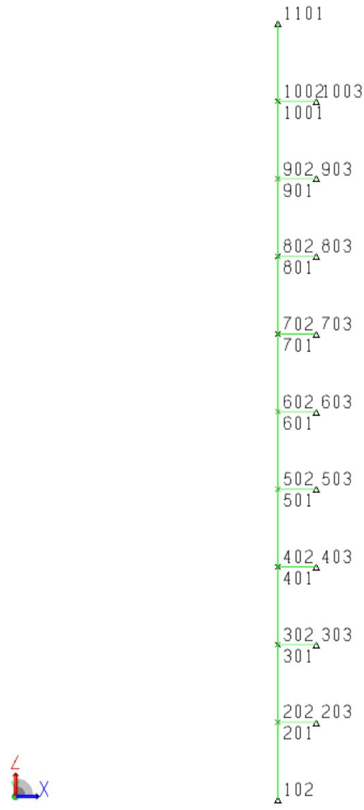  
Joint Label: Name

The structure is modeled such that joints 102, 203, 303, 403, 503, 603, 703, 803, 903, 1003, and 1103 are support points. Each riser support is connected to the riser via a wishbone element to limit the transfer of loading to axial loads.

A moment applied to the top of the riser is defined as load condition ‘1’. This load is factored in load combination ‘1000’. A series of loads distributed along the riser is defined as load condition ‘200’.

A portion of the SACS model file used for Sample Problem 3 along with a description of some of the input follows:


|  | 1 | 2 | 3 | 4 | 5 | 6 | 7 | 8 |
| --- | --- | --- | --- | --- | --- | --- | --- | --- |
|  | 12345678901 | 12345678901 | 12345678901 | 12345678901 | 12345678901 | 12345678901 | 12345678901 | 12345678901 |
| 1 | GAP ELEMENT CHECK CASE | GAP ELEMENT CHECK CASE | GAP ELEMENT CHECK CASE | GAP ELEMENT CHECK CASE | GAP ELEMENT CHECK CASE | GAP ELEMENT CHECK CASE | GAP ELEMENT CHECK CASE | GAP ELEMENT CHECK CASE |
| 2 | OPTIONS EN | UC | 1 | 1 | 10 | PTPTPT | PT |  |
| 3 | GRUP |  |  |  |  |  |  |  |
| 4 | GRUP F-D | 50.000 | 1.000 | 29.0011 | 2036.00 | 1 | 1.001.00 | 490.00 |
| 5 | GRUP GAP | 50.000 | 1.000 | 29.0011 | 2036.00 | 1 | 1.001.00 | 490.00 |
| 6 | GRUP LG1 | 50.000 | 1.000 | 29.0011 | 2036.00 |  | 1.001.00 | 490.00 |
| 7 | GRUP W.B | 50.000 | 1.000 | 29.0011 | 2036.00 |  | 1.001.00 | 490.00 |
| 8 | MEMBER |  |  |  |  |  |  |  |
| 9 | MEMBER 601 603 | F-D | N |  |  |  |  |  |
| 10 | MEMBER 701 703 | F-D | N |  |  |  |  |  |
| 11 | MEMBER 201 203 | GAP | C |  |  |  |  |  |
| 12 | MEMBER 301 303 | GAP | C |  |  |  |  |  |
| 13 | MEMBER 401 403 | GAP | T |  |  |  |  |  |
| 14 | MEMBER 501 503 | GAP | C |  |  |  |  |  |
| 15 | MEMBER 801 803 | GAP | N |  |  |  |  |  |
| 16 | MEMBER 901 903 | GAP | C |  |  |  |  |  |
| 17 | MEMBER 10011003 | GAP | C |  |  |  |  |  |
| 18 | MEMBER 102 202 | LG1 |  |  |  | 0 |  |  |
| 19 | MEMBER 202 302 | LG1 |  |  |  | 0 |  |  |
| 20 | MEMBER 302 402 | LG1 |  |  |  | 0 |  |  |
| 21 | MEMBER 402 502 | LG1 |  |  |  | 0 |  |  |
| 22 | MEMBER 502 602 | LG1 |  |  |  | 0 |  |  |
| 23 | MEMBER 602 702 | LG1 |  |  |  | 0 |  |  |
| 24 | MEMBER 702 802 | LG1 |  |  |  | 0 |  |  |
| 25 | MEMBER 802 902 | LG1 |  |  |  | 0 |  |  |
| 26 | MEMBER 902 1002 | LG1 |  |  |  | 0 |  |  |
| 27 | MEMBER 10021101 | LG1 |  |  |  | 0 |  |  |
| 28 | MEMBER1201 202 | W.B |  | 01111 |  |  |  |  |
| 29 | MEMBER OFFSETS |  |  |  | 6.000 |  |  |  |
| 30 | MEMBER1301 302 | W.B |  | 01111 |  |  |  |  |
| 31 | MEMBER OFFSETS |  |  |  | 6.000 |  |  |  |
| 32 | MEMBER1401 402 | W.B |  | 01111 |  |  |  |  |
| 33 | MEMBER OFFSETS |  |  |  | 6.000 |  |  |  |
| 34 | MEMBER1501 502 | W.B |  | 01111 |  |  |  |  |
| 35 | MEMBER OFFSETS |  |  |  | 6.000 |  |  |  |
| 36 | MEMBER1601 602 | W.B |  | 01111 |  |  |  |  |
| 37 | MEMBER OFFSETS |  |  |  | 6.000 |  |  |  |
| 38 | MEMBER1701 702 | W.B |  | 01111 |  |  |  |  |
| 39 | MEMBER OFFSETS |  |  |  | 6.000 |  |  |  |
| 40 | MEMBER1801 802 | W.B |  | 01111 |  |  |  |  |
| 41 | MEMBER OFFSETS |  |  |  | 6.000 |  |  |  |
| 42 | MEMBER1901 902 | W.B |  | 01111 |  |  |  |  |
| 43 | MEMBER OFFSETS |  |  |  | 6.000 |  |  |  |
| 44 | MEMBER110011002 | W.B |  | 01111 |  |  |  |  |
| 45 | MEMBER OFFSETS |  |  |  | 6.000 |  |  |  |
| 46 | JOINT |  |  |  |  |  |  |  |
| 47 | JOINT 102 | 0. | 0. | 0. |  |  | 111001 |  |
| 48 | JOINT 201 | 0. | 0. | 10. |  |  |  |  |
| 49 | JOINT 202 | 0. | 0. | 10. |  |  |  |  |
| 50 | JOINT 203 | 5. | 0. | 10. |  |  | 111111 |  |
| 51 | JOINT 301 | 0. | 0. | 20. |  |  |  |  |
| 52 | JOINT 302 | 0. | 0. | 20. |  |  |  |  |
| 53 | JOINT 303 | 5. | 0. | 20. |  |  | 111111 |  |


| 54 | JOINT 401 | 0. | 0. | 30. |  |  |  |
| --- | --- | --- | --- | --- | --- | --- | --- |
| 55 | JOINT 402 | 0. | 0. | 30. |  |  |  |
| 56 | JOINT 403 | 5. | 0. | 30. |  | 111111 |  |
| 57 | JOINT 501 | 0. | 0. | 40. |  |  |  |
| 58 | JOINT 502 | 0. | 0. | 40. |  |  |  |
| 59 | JOINT 503 | 5. | 0. | 40. |  | 111111 |  |
| 60 | JOINT 601 | 0. | 0. | 50. |  |  |  |
| 61 | JOINT 602 | 0. | 0. | 50. |  |  |  |
| 62 | JOINT 603 | 5. | 0. | 50. |  | 111111 |  |
| 63 | JOINT 701 | 0. | 0. | 60. |  |  |  |
| 64 | JOINT 702 | 0. | 0. | 60. |  |  |  |
| 65 | JOINT 703 | 5. | 0. | 60. |  | 111111 |  |
| 66 | JOINT 801 | 0. | 0. | 70. |  |  |  |
| 67 | JOINT 802 | 0. | 0. | 70. |  |  |  |
| 68 | JOINT 803 | 5. | 0. | 70. |  | 111111 |  |
| 69 | JOINT 901 | 0. | 0. | 80. |  |  |  |
| 70 | JOINT 902 | 0. | 0. | 80. |  |  |  |
| 71 | JOINT 903 | 5. | 0. | 80. |  | 111111 |  |
| 72 | JOINT 1001 | 0. | 0. | 90. |  |  |  |
| 73 | JOINT 1002 | 0. | 0. | 90. |  |  |  |
| 74 | JOINT 1003 | 5. | 0. | 90. |  | 111111 |  |
| 75 | JOINT 1101 | 0. | 0. | 100. |  | 111000 |  |
| 76 | LOAD |  |  |  |  |  |  |
| 77 | LOADCN 1 |  |  |  |  |  |  |
| 78 | LOAD 1101 |  |  |  | 20000.0 | GLOB JOIN |  |
| 79 | LOADCN 200 |  |  |  |  |  |  |
| 80 | LOAD X 102 202 |  | 20.0000 | 20.0000 |  | GLOB UNIF | MEMBER |
| 81 | LOAD X 202 302 |  | 20.0000 | 20.0000 |  | GLOB UNIF | MEMBER |
| 82 | LOAD X 302 402 |  | 20.0000 | 20.0000 |  | GLOB UNIF | MEMBER |
| 83 | LOAD X 402 502 |  | 20.0000 | 20.0000 |  | GLOB UNIF | MEMBER |
| 84 | LOAD X 502 602 |  | 20.0000 | 20.0000 |  | GLOB UNIF | MEMBER |
| 85 | LOAD X 602 702 |  | 20.0000 | 20.0000 |  | GLOB UNIF | MEMBER |
| 86 | LOAD X 702 802 |  | 20.0000 | 20.0000 |  | GLOB UNIF | MEMBER |
| 87 | LOAD X 802 902 |  | 20.0000 | 20.0000 |  | GLOB UNIF | MEMBER |
| 88 | LOAD X 902 1002 |  | 20.0000 | 20.0000 |  | GLOB UNIF | MEMBER |
| 89 | LOAD X 10021101 |  | 20.0000 | 20.0000 |  | GLOB UNIF | MEMBER |
| 90 | LCOMB |  |  |  |  |  |  |
| 91 | LCOMB 1000 1 1.00+3 |  |  |  |  |  |  |
| 92 | END |  |  |  |  |  |  |


9-10 Members 601-603 and 701-703 are assigned to group F-D are defined as ‘No Load’ elements in column 22 so that the gap dummy loads are generated automatically by SACS.   
11-17 Members 201-203, 301-303, 401-403, 501-503, 801-803, 901-903, and 1001-1003 are assigned to group GAP and are designated as gap elements in column 22.

28, 30, 32, 34, 36, 38, 40, 42, 44 Members 1201-202, 1301-302, 1401-402, 1501-502, 1601-602, 1701-702, 1801-802, 1901-902, and 1100-1102 are defined as assigned to group W.B and are defined as wishbone elements with Joint B end releases ‘01111 ‘.

47, 75 Joints 102 and 1101 at each end of the riser are pinned with fixity ‘111001’ and ‘111000’ respectively. Note that the fixity for the rotation about the Z axis ensures that the structure will be stable.

77 Load case ‘1’ represents a moment applied at the top of the riser.   
79 Load case ‘2’ represents a distributed load along the length of the riser.   
91 Load combination ‘1000’ is load condition ‘1’ factored by 1000.

Below is the Gap input file used for this gap analysis. A detailed description of the input file follows:

```txt
1 2 3 4 5 6 7 8 123456789012345678901234567890123456789012345678901234567890  
1 GAOPT 2 1 0 EN  
2 GAPELM 601 603 FD  
3 F-DEL -100. -10.0 -100. -.02 0.0 -.01 0.0 0.01  
4 F-DEL +100. 0.02 +100. 10.000  
5 GAPELM 701 703 RP  
6 END
```

The GAPOPT input designates the analysis options as follows:

2 Member 601-603 is redefined as a Force-Deflection element, ‘FD’, in columns 24-25.   
3, 4 The force deflection curve for element 601-603 is defined with the following points: (-100 kip,- 10.0 in) (-100 kip, -0.02 in) (0.0 kip, -0.01 in) (0.0 kip, 0.01 in).   
5 Member 701-703 is redefined as a Force-Deflection element with the previous element’s properties using the Repeat option, ‘RP’ in columns 24-25.

The following is a portion of the output listing file created by the Gap analysis:

```txt
SACS CONNECT Edition (v11.0) Bentley Systems ID=Ym5ng2NpaIJxrIF8nIen  
GAP ELEMENT CHECK CASE DATE 31-JUL-2018 TIME 17:42:39 PRE PAGE 1  
PROGRAM OPTIONS 
UNITS ...ENGLISH  
EXECUTION ...GAP ANALYSIS ...UNITY CHECK WSD AISC 9TH EDITION WITH API-RP2A 21ST EDITION FOR TUBULARS ...DKT PLATES SELECTED ...NO SEGMENTS FOR PRISMATIC MEMBERS 1 ...NO SEGMENTS/SECTION FOR NON-PRISMATIC MEMBERS 1  
REPORTSE SELECTED ...INTERPRETIVE INPUT...PRINT ...INPUT ECHO...PRINT ...JOINT DEFLECTIONS...PRINT ...ELEMENT DETAIL...PRINT ...SPECIAL ELEMENT...PRINT  
LOAD ...NO. BASIC LOAD COND. 2 ...NO. COMB. LOAD COND. 1 
```

```txt
SACS CONNECT Edition (v11.0) Bentley Systems ID=Ym5ng2NpaIJxrIF8nIen
GAP ELEMENT CHECK CASE DATE 31-JUL-2018 TIME 17:42:39 GAP PAGE 3
********** GAP ELEMENT REPORT********** GAP ELEMENT
GAP ELEMENT 1ST 2ND 2ND 2ND 2ND 2ND 2ND 2ND 2ND 2ND 2ND 2ND 2ND 2ND 2ND 2ND 2ND 2ND 2ND 2ND 2ND 2ND 2ND 2ND 2ND 2ND 2ND 2ND 2ND 2ND 2ND 2ND 2ND 2ND 2ND
GAP ELEMENT 1ST JOINT 2ND JOINT 2ND JOINT 2ND JOINT 2ND JOINT 2ND JOINT 2ND JOINT 2ND JOINT 2ND JOINT 2ND JOINT 2ND JOINT 2ND JOINT 2ND JOINT 2ND JOINT 2ND JOINT 2ND JOINT 2ND JOINT 2ND JOINT 2ND JOINT 2ND JOINT 2ND JOINT 2END
1601603603603603603603603603603603603603603603603603603603603603603603603603603603603603603603603603603603
## 0.020
## 0.010
## 10.000
```


| 2 | 701 | 703 | F-D | G002 | F-D | AXIAL | 0.00 |  | -100.000 | -10.000 | -100.000 | - |
| --- | --- | --- | --- | --- | --- | --- | --- | --- | --- | --- | --- | --- |
| 0.020 |  |  |  |  |  |  |  |  | 0.000 | -0.010 | 0.000 |  |
| 0.010 |  |  |  |  |  |  |  |  | 100.000 | 0.020 | 100.000 |  |
| 10.000 |  |  |  |  |  |  |  |  |  |  |  |  |
| 3 | 201 | 203 | GAP | G003 | COMP | AXIAL | 0.00 |  |  |  |  |  |
| 4 | 301 | 303 | GAP | G004 | COMP | AXIAL | 0.00 |  |  |  |  |  |
| 5 | 401 | 403 | GAP | G005 | TENS | AXIAL | 0.00 |  |  |  |  |  |
| 6 | 501 | 503 | GAP | G006 | COMP | AXIAL | 0.00 |  |  |  |  |  |
| 7 | 801 | 803 | GAP | G007 | NULL | AXIAL | 0.00 |  |  |  |  |  |
| 8 | 901 | 903 | GAP | G008 | COMP | AXIAL | 0.00 |  |  |  |  |  |
| 9 | 1001 | 1003 | GAP | G009 | COMP | AXIAL | 0.00 |  |  |  |  |  |
|  | LOAD CASE | LOAD CASE | 1 CONVERGED IN | 1 CONVERGED IN | 30 ITERATIONS | 30 ITERATIONS | 30 ITERATIONS |  |  |  |  |  |
| SACS CONNECT Edition (v11.0) | SACS CONNECT Edition (v11.0) | SACS CONNECT Edition (v11.0) | SACS CONNECT Edition (v11.0) | SACS CONNECT Edition (v11.0) | Bentley Systems | Bentley Systems | Bentley Systems | Bentley Systems | ID=Ym5ng2NpaIJxrIF8nIen | ID=Ym5ng2NpaIJxrIF8nIen | ID=Ym5ng2NpaIJxrIF8nIen | ID=Ym5ng2NpaIJxrIF8nIen |
| GAP ELEMENT CHECK CASE | GAP ELEMENT CHECK CASE | GAP ELEMENT CHECK CASE | GAP ELEMENT CHECK CASE | GAP ELEMENT CHECK CASE | GAP ELEMENT CHECK CASE | GAP ELEMENT CHECK CASE | GAP ELEMENT CHECK CASE | GAP ELEMENT CHECK CASE | DATE 31-JUL-2018 | TIME 17:42:39 | GAP PAGE | 4 |
| NO. | GAP ELEMENT | GAP ELEMENT | TYPE | TYPE | DEFLECTIONIN | FORCEKIPS | FORCEKIPS | FACTOR |  |  |  |  |
| 1 | 601-603 | 601-603 | F-D | F-D | -0.00461 | 0.0 | 0.0 | 0.343020E+03 |  |  |  |  |
| 2 | 701-703 | 701-703 | F-D | F-D | 0.01850 | 85.0 | 85.0 | -0.129157E+04 |  |  |  |  |
| 3 | 201-203 | 201-203 | COMP | COMP | 0.00000 | 0.0 | 0.0 | -0.361796E+00 |  |  |  |  |
| 4 | 301-303 | 301-303 | COMP | COMP | -0.00002 | -1.3 | -1.3 | 0.205846E-02 |  |  |  |  |
| 5 | 401-403 | 401-403 | TENS | TENS | 0.00016 | 11.8 | 11.8 | -0.117046E-02 |  |  |  |  |
| 6 | 501-503 | 501-503 | COMP | COMP | -0.00055 | -41.0 | -41.0 | 0.206786E-02 |  |  |  |  |
| 7 | 801-803 | 801-803 | NULL | NULL | 0.09007 | 0.0 | 0.0 | -0.670142E+04 |  |  |  |  |
| 8 | 901-903 | 901-903 | COMP | COMP | 0.15768 | 0.0 | 0.0 | -0.117317E+05 |  |  |  |  |
| 9 | 1001-1003 | 1001-1003 | COMP | COMP | 0.15110 | 0.0 | 0.0 | -0.112423E+05 |  |  |  |  |
|  | LOAD CASE | LOAD CASE | 200 CONVERGED IN | 200 CONVERGED IN | 30 ITERATIONS | 30 ITERATIONS | 30 ITERATIONS |  |  |  |  |  |
| SACS CONNECT Edition (v11.0) | SACS CONNECT Edition (v11.0) | SACS CONNECT Edition (v11.0) | SACS CONNECT Edition (v11.0) | SACS CONNECT Edition (v11.0) | Bentley Systems | Bentley Systems | Bentley Systems | Bentley Systems | ID=Ym5ng2NpaIJxrIF8nIen | ID=Ym5ng2NpaIJxrIF8nIen | ID=Ym5ng2NpaIJxrIF8nIen | ID=Ym5ng2NpaIJxrIF8nIen |
| GAP ELEMENT CHECK CASE | GAP ELEMENT CHECK CASE | GAP ELEMENT CHECK CASE | GAP ELEMENT CHECK CASE | GAP ELEMENT CHECK CASE | GAP ELEMENT CHECK CASE | GAP ELEMENT CHECK CASE | GAP ELEMENT CHECK CASE | GAP ELEMENT CHECK CASE | DATE 31-JUL-2018 | TIME 17:42;39 | GAP PAGE | 5 |
| NO. | GAP ELEMENT | GAP ELEMENT | TYPE | TYPE | DEFLECTIONIN | FORCEKIPS | FORCEKIPS | FACTOR |  |  |  |  |
| 1 | 601-603 | 601-603 | F-D | F-D | -0.10712 | -100.0 | -100.0 | 0.787043E+04 |  |  |  |  |
| 2 | 701-703 | 701-703 | F-D | F-D | -0.17567 | -100.0 | -100.0 | 0.129708E+05 |  |  |  |  |
| 3 | 201-203 | 201-203 | COMP | COMP | -0.00278 | -207.2 | -207.2 | 0.000000E+00 |  |  |  |  |
| 4 | 301-303 | 301-303 | COMP | COMP | -0.00333 | -248.1 | -248.1 | 0.000000E+00 |  |  |  |  |
| 5 | 401-403 | 401-403 | TENS | TENS | -0.00437 | 0.0 | 0.0 | 0.324999E+03 |  |  |  |  |
| 6 | 501-503 | 501-503 | COMP | COMP | -0.00714 | -530.9 | -530.9 | 0.000000E+00 |  |  |  |  |
| 7 | 801-803 | 801-803 | NULL | NULL | -0.12304 | 0.0 | 0.0 | 0.915466E+04 |  |  |  |  |
| 8 | 901-903 | 901-903 | COMP | COMP | -0.00809 | -602.1 | -602.1 | 0.000000E+00 |  |  |  |  |
| 9 | 1001-1003 | 1001-1003 | COMP | COMP | -0.00028 | -20.9 | -20.9 | 0.000000E+00 |  |  |  |  |


LOAD CASE 1000 CONVERGED IN 34 ITERATIONS

SACS CONNECT Edition (v11.0) GAP ELEMENT CHECK CASE

Bentley Systems

ID=Ym5ng2NpaIJxrIF8nIen

DATE 31-JUL-2018 TIME 17:42:39 GAP PAGE 6

NO. GAP ELEMENT

DEFLECTION IN

FORCE KIPS

FACTOR

1 601- 603
2 701- 703
3 201- 203
# 4 301- 303
5 401- 403
6 501- 503
7 801- 803
8 901- 903
9 1001-1003

## 193.89450
## 320.21215
## 2.34291
-1.15856   
## 1.55356
## 73.10300
## 408.07679
## 413.40162
## 292.07877

## 100.0
## 100.0
## 0.0
## 6200.7
## 5590.2
## 0.0
## 0.0
  
## 0.0

-0.144263E+08   
-0.238248E+08   
-0.174320E+06   
## 0.798296E+00
-0.805806E+00   
-0.543911E+07   
-0.303623E+08   
-0.307585E+08   
-0.217316E+08

## 4.4 SAMPLE PROBLEM 4 – EQUIPMENT PLATFORM WITH FRICTION SUPPORT

Sample Problem 4 is a simulation of an equipment platform. One of the columns is supported by a friction element near the support.

Joint Label: Name

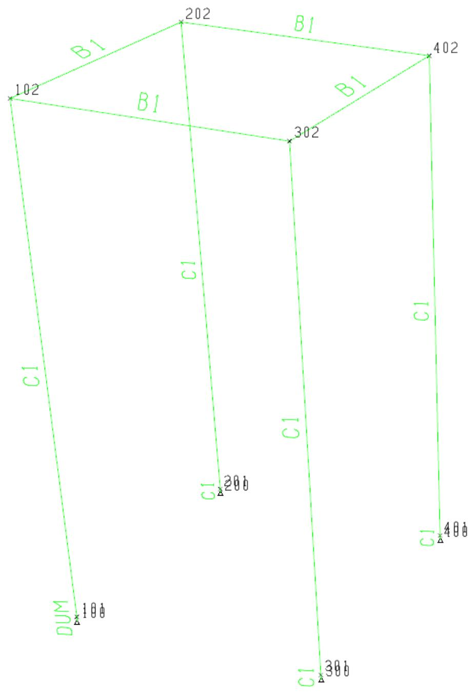

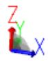

The structure is modeled with fixed connections at 100, 200, 300, and 400. Self-weight of the structure is applied as load condition ‘DEAD’. Load condition $\mathbf{ \Phi }^{ \prime } \mathbf{ 1 }^{ \prime }$ is a series of loads applied to the top of each column. Load condition $_ 2 \prime$ is a series of distributed loads along each column in the global X direction. Load condition $\mathbf{ \zeta }_{ 3 } \prime$ is a series of distributed loads along each column in the global Y direction. Load combinations ‘100’, ‘200’, and ‘300’ are combinations of the ‘Dead’ load condition with load conditions ‘1’, ‘2’, and $\mathbf{ \zeta }_{ 3 } \prime$ respectively. Load combination ‘400’ is a combination of the ‘Dead’ load condition with load conditions $_ 2 \prime$ and $\textcircled{ 3 }$ .

A portion of the SACS model file used for Sample Problem 4 along with a description of some of the input follows:


|  | 1 | 2 | 3 | 4 | 5 | 6 | 7 | 8 |
| --- | --- | --- | --- | --- | --- | --- | --- | --- |
|  | 12345678901 | 12345678901 | 12345678901 | 12345678901 | 12345678901 | 12345678901 | 12345678901 | 12345678901 |
| 1 | OPTIONS EN | UC | 1 1 | DC C |  |  |  |  |
| 2 | LCSEL | 100 | 200 | 300 | 400 |  |  |  |
| 3 | GRUP |  |  |  |  |  |  |  |
| 4 | GRUP B1 W10X22 |  |  | 29.0011.2036.00 | 1 | 1.001.00 |  | 490.00 |
| 5 | GRUP C1 | 8.000 | 0.125 | 29.0011.2036.00 | 1 | 1.001.00 | 0.500 | 490.00 |
| 6 | GRUP DUM | 8.000 | 0.125F29.0011.2036.00 | 1 | 1.001.00 | 0.500 | 490.00 |  |
| 7 | MEMBER |  |  |  |  |  |  |  |
| 8 | MEMBER 102 202 | B1 |  |  |  |  |  |  |
| 9 | MEMBER 102 302 | B1 |  |  |  |  |  |  |
| 10 | MEMBER 202 402 | B1 |  |  |  |  |  |  |
| 11 | MEMBER 302 402 | B1 |  |  |  |  |  |  |
| 12 | MEMBER 101 102 | C1 |  |  |  |  |  |  |
| 13 | MEMBER 200 201 | C1 |  |  |  |  |  |  |
| 14 | MEMBER 201 202 | C1 |  |  |  |  |  |  |
| 15 | MEMBER 300 301 | C1 |  |  |  |  |  |  |
| 16 | MEMBER 301 302 | C1 |  |  |  |  |  |  |
| 17 | MEMBER 400 401 | C1 |  |  |  |  |  |  |
| 18 | MEMBER 401 402 | C1 |  |  |  |  |  |  |
| 19 | MEMBER 100 101 | DUM |  |  |  |  |  |  |
| 20 | JOINT |  |  |  |  |  |  |  |
| 21 | JOINT 100 | 0. | 0. | 0. |  | FIXED |  |  |
| 22 | JOINT 101 | 0. | 0. | 0. | 1.200 |  |  |  |
| 23 | JOINT 102 | 0. | 0. | 10. |  |  |  |  |
| 24 | JOINT 200 | 0. | 5. | 0. |  | FIXED |  |  |
| 25 | JOINT 201 | 0. | 5. | 0. | 1.200 |  |  |  |
| 26 | JOINT 202 | 0. | 5. | 10. |  |  |  |  |
| 27 | JOINT 300 | 5. | 0. | 0. |  | FIXED |  |  |
| 28 | JOINT 301 | 5. | 0. | 0. | 1.200 |  |  |  |
| 29 | JOINT 302 | 5. | 0. | 10. |  |  |  |  |
| 30 | JOINT 400 | 5. | 5. | 0. |  | FIXED |  |  |
| 31 | JOINT 401 | 5. | 5. | 0. | 1.200 |  |  |  |
| 32 | JOINT 402 | 5. | 5. | 10. |  |  |  |  |
| 33 | LOAD |  |  |  |  |  |  |  |
| 34 | LOADCN 1 |  |  |  |  |  |  |  |
| 35 | LOAD 102 | -10.000-10.000 |  |  |  | GLOB JOIN LATERAL | GLOB JOIN LATERAL | GLOB JOIN LATERAL |
| 36 | LOAD 202 | -10.000-10.000 |  |  |  | GLOB JOIN LATERAL | GLOB JOIN LATERAL | GLOB JOIN LATERAL |
| 37 | LOAD 302 | -10.000-10.000 |  |  |  | GLOB JOIN LATERAL | GLOB JOIN LATERAL | GLOB JOIN LATERAL |
| 38 | LOAD 402 | -10.000-10.000 |  |  |  | GLOB JOIN LATERAL | GLOB JOIN LATERAL | GLOB JOIN LATERAL |
| 39 | LOADCN 2 |  |  |  |  |  |  |  |
| 40 | LOAD X 101 102 | -1.0000 | -1.0000 |  |  | GLOB UNIF LAT_X | GLOB UNIF LAT_X | GLOB UNIF LAT_X |
| 41 | LOAD X 201 202 | -1.0000 | -1.0000 |  |  | GLOB UNIF LAT_X | GLOB UNIF LAT_X | GLOB UNIF LAT_X |
| 42 | LOAD X 401 402 | -1.0000 | -1.0000 |  |  | GLOB UNIF LAT_X | GLOB UNIF LAT_X | GLOB UNIF LAT_X |
| 43 | LOAD X 301 302 | -1.0000 | -1.0000 |  |  | GLOB UNIF LAT_X | GLOB UNIF LAT_X | GLOB UNIF LAT_X |
| 44 | LOADCN 3 |  |  |  |  |  |  |  |
| 45 | LOAD Y 101 102 | -0.5000 | -0.5000 |  |  | GLOB UNIF LAT_Y | GLOB UNIF LAT_Y | GLOB UNIF LAT_Y |
| 46 | LOAD Y 201 202 | -0.5000 | -0.5000 |  |  | GLOB UNIF LAT_Y | GLOB UNIF LAT_Y | GLOB UNIF LAT_Y |
| 47 | LOAD Y 401 402 | -0.5000 | -0.5000 |  |  | GLOB UNIF LAT_Y | GLOB UNIF LAT_Y | GLOB UNIF LAT_Y |
| 48 | LOAD Y 301 302 | -0.5000 | -0.5000 |  |  | GLOB UNIF LAT_Y | GLOB UNIF LAT_Y | GLOB UNIF LAT_Y |
| 49 | LOADCNDEAD |  |  |  |  |  |  |  |
| 50 | LOAD Z 102 302 | -0.0221 | -0.0221 |  |  | GLOB UNIF DEAD | GLOB UNIF DEAD | GLOB UNIF DEAD |
| 51 | LOAD Z 202 402 | -0.0221 | -0.0221 |  |  | GLOB UNIF DEAD | GLOB UNIF DEAD | GLOB UNIF DEAD |
| 52 | LOAD Z 102 202 | -0.0221 | -0.0221 |  |  | GLOB UNIF DEAD | GLOB UNIF DEAD | GLOB UNIF DEAD |


| 53 | LOAD Z 302 402 | -0.0221 | -0.0221 | GLOB UNIF | DEAD |
| --- | --- | --- | --- | --- | --- |
| 54 | LOAD Z 100 101 | -0.0105 | -0.0105 | GLOB UNIF | DEAD |
| 55 | LOAD Z 101 102 | -0.0105 | -0.0105 | GLOB UNIF | DEAD |
| 56 | LOAD Z 200 201 | -0.0105 | -0.0105 | GLOB UNIF | DEAD |
| 57 | LOAD Z 201 202 | -0.0105 | -0.0105 | GLOB UNIF | DEAD |
| 58 | LOAD Z 400 401 | -0.0105 | -0.0105 | GLOB UNIF | DEAD |
| 59 | LOAD Z 401 402 | -0.0105 | -0.0105 | GLOB UNIF | DEAD |
| 60 | LOAD Z 300 301 | -0.0105 | -0.0105 | GLOB UNIF | DEAD |
| 61 | LOAD Z 301 302 | -0.0105 | -0.0105 | GLOB UNIF | DEAD |
| 62 | LCOMB |  |  |  |  |
| 63 | LCOMB 100 1 | 1.0000DEAD1.0000 |  |  |  |
| 64 | LCOMB 200 2 | 1.0000DEAD1.0000 |  |  |  |
| 65 | LCOMB 300 3 | 1.0000DEAD1.0000 |  |  |  |
| 66 | LCOMB 400 2 | 1.00003 | 1.0000DEAD1.0000 |  |  |
| 67 | END |  |  |  |  |


6 Group ‘DUM’ is defined as a friction element with the ‘F’ option in column 30.

100 Member 100-101 is defined as a ‘DUM’ element in columns 17-19.   
21, 24, 27, 30 Joints 100, 200, 300, and 400 are defined as ‘FIXED’ in columns 55-60.   
34, 39, 44, 49 Load case ‘1’ represents lateral joint loads applied at the top of each column. Load case ‘2’ represents a lateral distributed load in the global X direction on each column. Load case ‘3’ represents a lateral distributed load in the global Y direction on each column. Load case ‘DEAD’ represents the dead load on the structure.   
63, 64, 65, 66 Load combination ‘100’, ‘200’, and ‘300’ are the combinations of the ‘DEAD’ load case and load cases ‘1’, ‘2’, and ‘3’ respectively. Load combination ‘400’ is the combination of the ‘DEAD’ load case and load cases ‘2’ and ‘3’.

Below is the Gap input file used for this gap analysis. A detailed description of the input file follows:


|  | 1 | 2 | 3 | 4 | 5 | 6 | 7 | 8 |
| --- | --- | --- | --- | --- | --- | --- | --- | --- |
|  | 12345678901 | 12345678901 | 12345678901 | 12345678901 | 12345678901 | 12345678901 | 12345678901 | 1234567890 |
| 1 | GAPOPT | 0 | EN | 600 | .5 | .5 |  |  |
| 2 | END |  |  |  |  |  |  |  |


The GAPOPT input designates the analysis options as follows:

1 The friction coefficients for the Local Y and Local Z directions are defined as ‘0.5’ and ‘0.5’ in columns 35-39 and 40-44 respectively.

Note: The gap input file is not required for this analysis. As the input on the GAPOPT line can be entered in the Gap Analysis Options in the Gap Runfile. The gap input file is here for illustrative purposes.

The following is a portion of the output listing file created by the Gap analysis:


| SACS CONNECT Edition (v11.0) | Bentley Systems | ID=Ym5ng2NpaIJxrIF8nIen |
| --- | --- | --- |
|  |  | DATE 16-AUG-2018 TIME 16:49:53 PRE PAGE 1 |
|  |  | PRE VERSION 12.1.0.14 |
| ** PROGRAM OPTIONS ** | ** PROGRAM OPTIONS ** | ** PROGRAM OPTIONS ** |
| UNITS | ...ENGLISH |  |
| EXECUTION | ...GAP ANALYSIS |  |
|  | ...UNITY CHECK |  |
|  | WSD AISC 9TH EDITION WITH API-RP2A 21ST EDITION FOR TUBULARS |  |
|  | ...DKT PLATES SELECTED |  |
|  | ...NO SEGMENTS FOR PRISMATIC MEMBERS 1 |  |
|  | ...NO SEGMENTS/SECTION FOR NON-PRISMATIC MEMBERS 1 |  |
| REPORTSE SELECTED | REPORTSE SELECTED | REPORTSE SELECTED |
| LOAD | ...NO. BASIC LOAD COND. 4 |  |
|  | ...NO. COMB. LOAD COND. 4 |  |


| SACS CONNECT Edition (v11.0) | SACS CONNECT Edition (v11.0) | SACS CONNECT Edition (v11.0) | SACS CONNECT Edition (v11.0) | SACS CONNECT Edition (v11.0) | Bentley Systems DATE 16-AUG-2018 ID=Ym5ng2NpaIJxrIF8nIen TIME 16:49:54 GAP PAGE 3 | Bentley Systems DATE 16-AUG-2018 ID=Ym5ng2NpaIJxrIF8nIen TIME 16:49:54 GAP PAGE 3 | Bentley Systems DATE 16-AUG-2018 ID=Ym5ng2NpaIJxrIF8nIen TIME 16:49:54 GAP PAGE 3 | Bentley Systems DATE 16-AUG-2018 ID=Ym5ng2NpaIJxrIF8nIen TIME 16:49:54 GAP PAGE 3 | Bentley Systems DATE 16-AUG-2018 ID=Ym5ng2NpaIJxrIF8nIen TIME 16:49:54 GAP PAGE 3 | Bentley Systems DATE 16-AUG-2018 ID=Ym5ng2NpaIJxrIF8nIen TIME 16:49:54 GAP PAGE 3 | Bentley Systems DATE 16-AUG-2018 ID=Ym5ng2NpaIJxrIF8nIen TIME 16:49:54 GAP PAGE 3 | Bentley Systems DATE 16-AUG-2018 ID=Ym5ng2NpaIJxrIF8nIen TIME 16:49:54 GAP PAGE 3 | Bentley Systems DATE 16-AUG-2018 ID=Ym5ng2NpaIJxrIF8nIen TIME 16:49:54 GAP PAGE 3 |
| --- | --- | --- | --- | --- | --- | --- | --- | --- | --- | --- | --- | --- | --- |
| GAP ELEMENT | 1ST JOINT | 2ND JOINT | GRUP ID | LOAD CASE | ELEMENT TYPE | DEGREE OF FREEDOM | PRESET IN | **** FRICTION COEFF. FRICT. | NORMAL J1 | MEMBER J2 | ELEMENT TYPE | 1ST FORCE KIPS | 2ND POINT DEFL. IN KIPS |
| 1 | 100 | 101 | DUM | G001 | COMP | AXIAL | 0.00 |  |  |  |  |  |  |
| 2 | 100 | 101 | DUM | G002 | FRIC | SHEAR-Y | 0.00 | 0.500 | 100 | 101 | COMP |  |  |
| 3 | 100 | 101 | DUM | G003 | FRIC | SHEAR-Z | 0.00 | 0.500 | 100 | 101 | COMP |  |  |
|  | LOAD CASE | 100 | CONVERGED | IN | 0 | ITERATIONS |  |  |  |  |  |  |  |
| SACS CONNECT Edition (v11.0) | SACS CONNECT Edition (v11.0) | SACS CONNECT Edition (v11.0) | SACS CONNECT Edition (v11.0) | SACS CONNECT Edition (v11.0) | Bentley Systems DATE 16-AUG-2018 ID=Ym5ng2NpaIJxrIF8nIen TIME 16:49:54 GAP PAGE 4 | Bentley Systems DATE 16-AUG-2018 ID=Ym5ng2NpaIJxrIF8nIen TIME 16:49:54 GAP PAGE 4 | Bentley Systems DATE 16-AUG-2018 ID=Ym5ng2NpaIJxrIF8nIen TIME 16:49:54 GAP PAGE 4 | Bentley Systems DATE 16-AUG-2018 ID=Ym5ng2NpaIJxrIF8nIen TIME 16:49:54 GAP PAGE 4 | Bentley Systems DATE 16-AUG-2018 ID=Ym5ng2NpaIJxrIF8nIen TIME 16:49:54 GAP PAGE 4 | Bentley Systems DATE 16-AUG-2018 ID=Ym5ng2NpaIJxrIF8nIen TIME 16:49:54 GAP PAGE 4 | Bentley Systems DATE 16-AUG-2018 ID=Ym5ng2NpaIJxrIF8nIen TIME 16:49:54 GAP PAGE 4 | Bentley Systems DATE 16-AUG-2018 ID=Ym5ng2NpaIJxrIF8nIen TIME 16:49:54 GAP PAGE 4 | Bentley Systems DATE 16-AUG-2018 ID=Ym5ng2NpaIJxrIF8nIen TIME 16:49:54 GAP PAGE 4 |
| NO. | GAP ELEMENT | TYPE | DEFLECTION IN | FORCE KIPS |  |  | FACTOR |  |  |  |  |  |  |


| 1 | 100- 101 | COMP | -0.00052 | -39.2 | 0.000000E+00 |  |  |  |
| --- | --- | --- | --- | --- | --- | --- | --- | --- |
| 2 | 100- 101 | FRIC | 0.00001 | 10.0 | 0.000000E+00 |  |  |  |
| 3 | 100- 101 | FRIC | 0.00001 | 10.0 | 0.000000E+00 |  |  |  |
| LOAD CASE | 200 | CONVERGED | IN | 30 | ITERATIONS |  |  |  |
| SACS CONNECT Edition (v11.0) | SACS CONNECT Edition (v11.0) | SACS CONNECT Edition (v11.0) | Bentley Systems | Bentley Systems | Bentley Systems | DATE 16-AUG-2018 | ID=Ym5ng2NpaIJxrlIF8nIen | ID=Ym5ng2NpaIJxrlIF8nIen |
| NO. | GAP ELEMENT | TYPE | DEFLECTION | FORCE | FACTOR | DATE 16-AUG-2018 | TIME 16:49:54 | GAP PAGE 5 |
| NO. | GAP ELEMENT | TYPE | IN | KIPS | FACTOR | DATE 16-AUG-2018 | TIME 16:49:54 | GAP PAGE 5 |
| 1 | 100- 101 | COMP | -0.00001 | -0.6 | 0.000000E+00 |  |  |  |
| 2 | 100- 101 | FRIC | -29.47132 | -0.2 | -0.355800E+08 |  |  |  |
| 3 | 100- 101 | FRIC | 3.78044 | 0.2 | 0.456403E+07 |  |  |  |
| LOAD CASE | 300 | CONVERGED | IN | 28 | ITERATIONS |  |  |  |
| SACS CONNECT Edition (v11.0) | SACS CONNECT Edition (v11.0) | SACS CONNECT Edition (v11.0) | Bentley Systems | Bentley Systems | Bentley Systems | DATE 16-AUG-2018 | ID=Ym5ng2NpaIJxrlIF8nIen | ID=Ym5ng2NpaIJxrlIF8nIen |
| NO. | GAP ELEMENT | TYPE | DEFLECTION | FORCE | FACTOR | DATE 16-AUG-2018 | TIME 16:49:54 | GAP PAGE 6 |
| NO. | GAP ELEMENT | TYPE | IN | KIPS | FACTOR | DATE 16-AUG-2018 | TIME 16:49:54 | GAP PAGE 6 |
| 1 | 100- 101 | COMP | -0.00001 | -0.4 | 0.000000E+00 |  |  |  |
| 2 | 100- 101 | FRIC | 2.01026 | 0.2 | 0.242694E+07 |  |  |  |
| 3 | 100- 101 | FRIC | -14.85860 | -0.2 | -0.179384E+08 |  |  |  |
| LOAD CASE | 400 | CONVERGED | IN | 29 | ITERATIONS |  |  |  |
| SACS CONNECT Edition (v11.0) | SACS CONNECT Edition (v11.0) | SACS CONNECT Edition (v11.0) | Bentley Systems | Bentley Systems | Bentley Systems | DATE 16-AUG-2018 | ID=Ym5ng2NpaIJxrlIF8nIen | ID=Ym5ng2NpaIJxrlIF8nIen |
| NO. | GAP ELEMENT | TYPE | DEFLECTION | FORCE | FACTOR | DATE 16-AUG-2018 | TIME 16:49:54 | GAP PAGE 7 |
| NO. | GAP ELEMENT | TYPE | IN | KIPS | FACTOR | DATE 16-AUG-2018 | TIME 16:49:54 | GAP PAGE 7 |
| 1 | 100- 101 | COMP | -0.00001 | -0.6 | 0.000000E+00 |  |  |  |
| 2 | 100- 101 | FRIC | -27.75943 | -0.2 | -0.335133E+08 |  |  |  |
| 3 | 100- 101 | FRIC | -11.85554 | -0.2 | -0.143129E+08 |  |  |  |


5 INPUT LINES

END OF INPUT

COLUMNS

COMMENTARY

LOCATION THIS LINE IS THE LAST LINE IN THE 'GAP' INPUT FILE.

GENERAL THE 'END' LINE TERMINATES THE DATA READ BY THE 'GAP' PROGRAM.THIS LINE IS OPTIONAL.


| LINE LABEL | REMAINDER OF THIS INPUT LINE LEFT BLANK |
| --- | --- |
| END |  |
| 1--3 | 4-80 |


FORCE VERSUS DEFLECTION CURVE DEFINITION

COLUMNS

COMMENTARY

GENERAL

THIS INPUT IS REQUIRED FOR EACH NONLINEAR GAP ELEMENT THAT HAS A 'FD' DESIGNATION. THIS DATA FOLLOWS DIRECTLY AFTER THE 'GAPELM' LINE DEFINING THE GAP ELEMENT TO WHICH THIS FORCE VERSUS DEFLECTION RELATIONSHIP APPLIES.

( 9-26)

ENTER THE FIRST FORCE-DEFLECTION POINT TO DEFINE THIS CURVE.

(27-80)

ENTER THE SECOND, THIRD AND FOURTH POINTS AS REQUIRED. THESE POINTS MUST BE ENTERED IN ORDER OF INCREASING DEFLECTIONS. FOR DEFLECTIONS OUTSIDE THE RANGE OF THE TABLE VALUES, THE PROGRAM USES THE FIRST OR LAST FORCE VALUE IN THE TABLE AS APPROPIATE. REPEAT THIS LINE AS OFTEN AS NECESSARY TO DEFINE THE FORCE VERSUS DEFLECTION CURVE IN AS MUCH DETAIL AS DESIRED. DO NOT USE BLANKS FOR ZEROS.


| LINE LABEL | FIRST POINT | FIRST POINT | SECOND POINT | SECOND POINT | THIRD POINT | THIRD POINT | FOURTH POINT | FOURTH POINT |
| --- | --- | --- | --- | --- | --- | --- | --- | --- |
| LINE LABEL | FORCE | DEFL. | FORCE | DEFL. | FORCE | DEFL. | FORCE | DEFL. |
| F-DEL |  |  |  |  |  |  |  |  |
| 1--5 | 9<--17 | 18<--26 | 27<--35 | 36<--44 | 45<--53 | 54<--62 | 63<--71 | 72<--80 |
| DEFAULT |  |  |  |  |  |  |  |  |
| ENGLISH | KIP | IN | KIP | IN | KIP | IN | KIP | IN |
| METRIC (KN) | KN | CM | KN | CM | KN | CM | KN | CM |
| METRIC (KG) | KG | CM | KG | CM | KG | CM | KG | CM |


'GAP' OPTIONS INPUT

COLUMNS

COMMENTARY

GENERAL THIS INPUT IS REQUIRED IN ANY NONLINEAR GAP ELEMENT ANALYSIS. IT SPECIFIES OVERALL ANALYSIS PARAMETERS.

( 7-10) ENTER THE NUMBER OF REAL LOAD CASES IN THE SACS IV DATA. THE REAL LOAD CASES ARE THOSE THAT REPRESENT ACTUAL LOADING ON THE STRUCTURE AS OPPOSED TO THE DUMMY LOAD CASES THAT ARE USED TO SIMULATE THE GAP ELEMENTS.   
(11-14) ENTER THE NUMBER OF OUTPUT LOAD CASES. THESE ARE THE LOAD CASES THAT REPRESENT THE ACTUAL LOADING CONDITIONS TO BE ANALYZED AND IN GENERAL THESE WILL BE COMBINATIONS OF THE REAL LOAD CASES IN THE SACS IV DATA.   
(15-18) THIS OPTION IS PRIMARILY USED FOR DEBUGGING ANY PROBLEMS THAT MAY EXIST. IT WILL PRODUCE A GREAT DEAL OF OUTPUT THAT WILL NOT BE USEFUL FOR THE NORMAL CASE.   
(19-20) ENTER 'TW' IF THE AUTOMATIC 'TOW' ANALYSIS IS BEING USED. THIS OPTION REQUIRES THAT THE FIRST ACTUAL LOAD CASE IS A 'DEAD' LOAD CASE. THE FOLLOWING LOAD CASES ARE MOTION LOAD CASES WITHOUT GRAVITY. IF GRAVITY IS INCLUDED IN THE MOTION LOAD CASES, THEN ENTER 'TG' FOR THIS OPTION. THE TIE DOWNS ARE SPECIFIED IN THE SACS IV DATA AS NULL ELEMENTS.

COLUMNS

COMMENTARY

(21-22) ENTER THE SYSTEM OF UNITS USED. THIS SYSTEM WILL NORMALLY BE THE SAME AS USED IN THE SACS IV ANALYSIS, BUT IS NOT REQUIRED TO BE SO. SELECT FROM ONE OF THE FOLLOWING: 'EN' - ENGLISH UNITS. 'MN' - METRIC UNITS WITH KILONEWTONS AS THE FORCE UNITS. 'ME' - METRIC UNITS WITH KILOGRAMS AS THE FORCE UNITS.   
(23-26) ENTER THE NUMBER OF ITERATIONS ALLOWED IN THE NONLINEAR SOLUTION.   
(27-34) ENTER THE CONVERGENCE TOLERANCE REQUIRED. THIS TOLERANCE SHOULD BE SMALL SINCE THE GAP ELEMENTS TYPICALLY ARE SHORT AND RELATIVELY STIFF.   
(35-44) ENTER THE FRICTION COEFFICIENTS FOR THE FRICTION ELEMENTS CREATED IN THE SACS IV INPUT FILE. THIS DATA CAN BE OVERRIDDEN FOR INDIVIDUAL ELEMENTS ON THE 'GAPELM' LINE.   
(45-47) ENTER 'PFD' OR 'PFG' TO PLOT FORCE VERSUS DEFLECTION FOR GAP ELEMENTS. 'PFD' WILL PLOT WITHOUT GRID LINES; 'PFG' WILL PLOT WITH GRID LINES. WITH BLANK INPUT NO PLOTS WILL BE PRODUCED.   
(77-78) LEAVE BLANK FOR THE STANDARD SOLVER (DEFAULT). ENTER 'A1' FOR ADVANCED MATRIX INVERSION,OR ENTER 'A2' FOR ADVANCED LINEAR SOLVER. ENTER 'AD' FOR THE DIRECT SOLVER. THE DIRECT SOLVER IS ONLY APPLICABLE TO MODELS WITH TENSION-ONLY, COMPRESSION-ONLY, AND/OR NO-LOAD ELEMENTS WITH ZERO INITIAL GAP VALUES. THE PROGRAM AUTOMATICALLY SWITCHES TO 'A2' IF IT CANNOT USE DIRECT SOLVER FOR ANY REASON.   
(79-80) ENTER 'NE' TO CONTINUE THE GAP ANALYSIS ANALYSIS IN THE CASE NON-CONVERGENCE WITH A WARNING MESSAGE INDICATING THE NON-CONVERGENCE. LEAVE BLANK FOR DEFAULT WORKFLOW (STOP WITH AN ERROR MESSAGE INDICATING THE NON-CONVERGENCE) (NOTE) THE RESULTS MUST BE DOUBLE-CHECKED IF THE NON-CONVERGENCE CONTINUE OPTION IS USED.


| LINE LABEL | NUMBER OF REAL LOAD CASES | NUMBER OF OUTPUT LOAD CASES | DIAGNOSTIC OUTPUT PRINT OPTION | AUTOMATIC TOW ANALYSIS OPTION | UNITS OPTION | MAXIMUM NUMBER OF ITERATIONS | CONVERGENCE TOLERANCE | FRiction COEFFICIENTS | FRiction COEFFICIENTS | FORCE DEFLECTION PLOT | LEAVE BLANK | ADAVANCED SOLVER | CONTINUE OPTION FOR NON-CONVERGENCE? |
| --- | --- | --- | --- | --- | --- | --- | --- | --- | --- | --- | --- | --- | --- |
| LINE LABEL | NUMBER OF REAL LOAD CASES | NUMBER OF OUTPUT LOAD CASES | DIAGNOSTIC OUTPUT PRINT OPTION | AUTOMATIC TOW ANALYSIS OPTION | UNITS OPTION | MAXIMUM NUMBER OF ITERATIONS | CONVERGENCE TOLERANCE | LOCAL Y | LOCAL Z | FORCE DEFLECTION PLOT | LEAVE BLANK | ADAVANCED SOLVER | CONTINUE OPTION FOR NON-CONVERGENCE? |
| GAPOPT |  |  |  |  |  |  |  |  |  |  |  |  |  |
| 1-- 6 | 7-->10 | 11-->14 | 15-->18 | 19-->20 | 21-->22 | 23-->26 | 27<-->34 | 35<-->39 | 40<-->44 | 45-->47 | 48-->76 | 77-78 | 79-80 |
| DEFAULT |  |  |  |  | 'EN' | 1000 | 0.00001 | 0.5 | 0.5 |  |  | STANDARD SOLVER | STOP IN THE CASE OF NON- CONVERGENCE |


GROUP GAP TYPE OVERRIDE

COLUMNS

COMMENTARY

GENERAL THIS INPUT IS OPTIONAL IN ANY NONLINEAR GAP ELEMENT ANALYSIS. IT ALLOWS THE USER TO CHANGE THE GAP ELEMENT TYPE OF A GROUP OF GAP ELEMENTS DEFINED IN THE MODEL FOR PARTICULAR LOAD CASES. THIS DATA CAN BE REPEATED AS NECESSARY TO SELECT ALL THE DESIRED GAP ELEMENTS.

( 7-10) ENTER THE LOAD CASE TO WHICH THESE OVERRIDES APPLY.   
(12-14) SELECT EITHER INCLUDE ('INC') TO SPECIFY THOSE GAP ELEMENT GROUPS THAT ARE TO BE MODIFIED FOR THIS LOAD CASE OR EXCLUDE ('EXC') TO SPECIFY THAT ALL GAP GROUPS ELEMENTS EXCEPT THOSE SPECIFIED ARE TO BE MODIFIED. NOTE THAT THE EXCLUDES AND INCLUDES CANNOT BE MIXED FOR ANY ONE LOAD CASE.   
(16-17) ENTER THE GAP ELEMENT TYPE FROM THE FOLLOWING CHOICES: (Default: 'CO')   
(19-21) OVERRIDE TYPE 'ST' - STANDARD SACS ELEMENT. 'CO' - COMPRESSION ONLY. 'TO' - TENSION ONLY. 'NL' - NO LOAD. 'FD' - FORCE VERSUS DEFLECTIO 'RP' - REPEAT PREVIOUS GAP EL   
(23-25) ENTER THE FIRST GROUP NAME.   
(27-77) ENTER THE REMAINING GROUP NAMES.


| LINE LABEL | LOAD CASE | INCLUDE EXCLUDE | GAP ELEMENT TYPE | OVERRIDE TYPE | 1ST GROUP | 2ND GROUP | 3RD GROUP | 4TH GROUP | 5TH GROUP | 6TH GROUP | 7TH GROUP | 8TH GROUP | 9TH GROUP | 10TH GROUP | 11TH GROUP | 12TH GROUP | 13TH GROUP | 14TH GROUP |
| --- | --- | --- | --- | --- | --- | --- | --- | --- | --- | --- | --- | --- | --- | --- | --- | --- | --- | --- |
| LCGAP |  |  |  | GRP |  |  |  |  |  |  |  |  |  |  |  |  |  |  |
| 1-- 5 | 7-->10 | 12-->14 | 16-->17 | 19-->21 | 23-->25 | 27-->29 | 31-->33 | 35-->37 | 39-->41 | 43-->45 | 47-->49 | 51-->53 | 55-->57 | 59-->61 | 63-->65 | 67-->69 | 71-->73 | 75-->77 |
| DEFAULT |  | 'INC' | 'CO' |  |  |  |  |  |  |  |  |  |  |  |  |  |  |  |


MEMBER GAP TYPE OVERRIDE

COLUMNS

COMMENTARY

GENERAL THIS INPUT IS OPTIONAL IN ANY NONLINEAR GAP ELEMENT ANALYSIS. IT ALLOWS THE USER TO CHANGE THE GAP ELEMENT TYPE OF GAP ELEMENTS DEFINED IN THE MODEL FOR PARTICULAR LOAD CASES. THIS DATA CAN BE REPEATED AS NECESSARY TO SELECT ALL THE DESIRED GAP ELEMENTS.

( 7-10) ENTER THE LOAD CASE TO WHICH THESE OVERRIDES APPLY.   
(12-14) SELECT EITHER INCLUDE ('INC') TO SPECIFY THOSE GAP ELEMENT MEMBERS THAT ARE TO BE MODIFIED FOR THIS LOAD CASE OR EXCLUDE ('EXC') TO SPECIFY THAT ALL GAP MEMBERS EXCEPT THOSE SPECIFIED ARE TO BE MODIFIED. NOTE THAT THE EXCLUDES AND INCLUDES CANNOT BE MIXED FOR ANY ONE LOAD CASE.   
(16-17) ENTER THE GAP ELEMENT TYPE FROM THE FOLLOWING CHOICES: (Default: 'CO')   
(19-21) OVERRIDE TYPE: 'ST' - STANDARD SACS ELEMENT 'CO' - COMPRESSION ONLY. 'TO' - TENSION ONLY. 'NL' - NO LOAD. 'FD' - FORCE VERSUS DEFLECTION ELEMENT (SEE 'F-DEL' DATA). 'RP' - REPEAT PREVIOUS GAP ELEMENT FORCE-DEFLECTION.   
(23-26) ENTER THE START JOINT OF THE FIRST GAP ELEMENT.   
(27-30) ENTER THE END JOINT OF THE FIRST GAP ELEMENT.   
(32-75) ENTER THE REMAINING GAP ELEMENTS.


| LINE LABEL | LOAD CASE | INCLUDE EXCLUDE | GAP ELEMENT TYPE | OVERRIDE TYPE | 1ST MEMBER | 1ST MEMBER | 2ND MEMBER | 2ND MEMBER | 3RD MEMBER | 3RD MEMBER | 4TH MEMBER | 4TH MEMBER | 5TH MEMBER | 5TH MEMBER | 6TH MEMBER | 6TH MEMBER |
| --- | --- | --- | --- | --- | --- | --- | --- | --- | --- | --- | --- | --- | --- | --- | --- | --- |
| LINE LABEL | LOAD CASE | INCLUDE EXCLUDE | GAP ELEMENT TYPE | OVERRIDE TYPE | START JOINT | END JOINT | START JOINT | END JOINT | START JOINT | END JOINT | START JOINT | END JOINT | START JOINT | END JOINT | START JOINT | END JOINT |
| LCGAP |  |  |  |  |  |  |  |  |  |  |  |  |  |  |  |  |
| 1-- 5 | 7-->10 | 12-->14 | 16-->17 | 19-->21 | 23-->26 | 27-->30 | 32-->35 | 36-->39 | 41-->44 | 45-->48 | 50-->53 | 54-->57 | 59-->62 | 63-->66 | 68-->71 | 72-->75 |
| DEFAULT |  | 'INC' | 'CO' |  |  |  |  |  |  |  |  |  |  |  |  |  |


END OF INPUT

COLUMNS

COMMENTARY

LOCATION THIS LINE IS THE LAST LINE IN THE 'GAP' INPUT FILE.

GENERAL THE 'END' LINE TERMINATES THE DATA READ BY THE 'GAP' PROGRAM.THIS LINE IS OPTIONAL.


| LINE LABEL | REMAINDER OF THIS INPUT LINE LEFT BLANK |
| --- | --- |
| END |  |
| 1--3 | 4-80 |


FORCE VERSUS DEFLECTION CURVE DEFINITION

COLUMNS

COMMENTARY

GENERAL

THIS INPUT IS REQUIRED FOR EACH NONLINEAR GAP ELEMENT THAT HAS A 'FD' DESIGNATION. THIS DATA FOLLOWS DIRECTLY AFTER THE 'GAPELM' LINE DEFINING THE GAP ELEMENT TO WHICH THIS FORCE VERSUS DEFLECTION RELATIONSHIP APPLIES.

( 9-26)

ENTER THE FIRST FORCE-DEFLECTION POINT TO DEFINE THIS CURVE.

(27-80)

ENTER THE SECOND, THIRD AND FOURTH POINTS AS REQUIRED. THESE POINTS MUST BE ENTERED IN ORDER OF INCREASING DEFLECTIONS. FOR DEFLECTIONS OUTSIDE THE RANGE OF THE TABLE VALUES, THE PROGRAM USES THE FIRST OR LAST FORCE VALUE IN THE TABLE AS APPROPIATE. REPEAT THIS LINE AS OFTEN AS NECESSARY TO DEFINE THE FORCE VERSUS DEFLECTION CURVE IN AS MUCH DETAIL AS DESIRED. DO NOT USE BLANKS FOR ZEROS.


| LINE LABEL | FIRST POINT | FIRST POINT | SECOND POINT | SECOND POINT | THIRD POINT | THIRD POINT | FOURTH POINT | FOURTH POINT |
| --- | --- | --- | --- | --- | --- | --- | --- | --- |
| LINE LABEL | FORCE | DEFL. | FORCE | DEFL. | FORCE | DEFL. | FORCE | DEFL. |
| F-DEL |  |  |  |  |  |  |  |  |
| 1--5 | 9<--17 | 18<--26 | 27<--35 | 36<--44 | 45<--53 | 54<--62 | 63<--71 | 72<--80 |
| DEFAULT |  |  |  |  |  |  |  |  |
| ENGLISH | KIP | IN | KIP | IN | KIP | IN | KIP | IN |
| METRIC (KN) | KN | CM | KN | CM | KN | CM | KN | CM |
| METRIC (KG) | KG | CM | KG | CM | KG | CM | KG | CM |


GAP ELEMENT INPUT

COLUMNS

COMMENTARY

GENERAL THIS INPUT LINE IS REQUIRED FOR EACH NONLINEAR GAP ELEMENT. IT PROVIDES THE ELEMENT DEFINITION TO DUMMY LOAD CASE CONNECTION. THIS DATA IS NOT REQUIRED FOR GAP ELEMENTS DEFINED IN THE SACS IV INPUT FILE.

( 8-11) ENTER THE FIRST JOINT OF THIS GAP ELEMENT.   
(13-16) ENTER THE SECOND JOINT OF THIS GAP ELEMENT.   
(18-21) ENTER THE DUMMY LOAD CASE NAME ASSOCIATED WITH THIS ELEMENT. THIS LOAD CASE WOULD HAVE A LOAD APPLIED ONLY TO THIS ELEMENT.   
(24-25) ENTER THE GAP ELEMENT TYPE FROM THE FOLLOWING CHOICES: 'CO' - COMPRESSION ONLY. 'TO' - TENSION ONLY. 'NL' - NO LOAD. 'FD' - FORCE VERSUS DEFLECTION ELEMENT (SEE 'F-DEL' DATA). 'RP' - REPEAT PREVIOUS GAP ELEMENT FORCE-DEFLECTION. 'TC' - COMPRESSION ONLY TIE-DOWN. 'TT' - TENSION ONLY TIE-DOWN. 'TD' - TIE-DOWN.


| LINE LABEL | GAP ELEMENT | GAP ELEMENT | DUMMY LOAD CASE NAME | ELEMENT TYPE | LEAVE BLANK |
| --- | --- | --- | --- | --- | --- |
| LINE LABEL | FIRST JOINT | SECOND JOINT | DUMMY LOAD CASE NAME | ELEMENT TYPE | LEAVE BLANK |
| GAPELM |  |  |  |  |  |
| 1--6 | 8-->11 | 13-->16 | 18-->21 | 24--25 | 26--------80 |
| DEFAULT |  |  |  | 'CO' |  |


'GAP' OPTIONS INPUT

COLUMNS

COMMENTARY

GENERAL THIS INPUT IS REQUIRED IN ANY NONLINEAR GAP ELEMENT ANALYSIS. IT SPECIFIES OVERALL ANALYSIS PARAMETERS.

( 7-10) ENTER THE NUMBER OF REAL LOAD CASES IN THE SACS IV DATA. THE REAL LOAD CASES ARE THOSE THAT REPRESENT ACTUAL LOADING ON THE STRUCTURE AS OPPOSED TO THE DUMMY LOAD CASES THAT ARE USED TO SIMULATE THE GAP ELEMENTS.   
(11-14) ENTER THE NUMBER OF OUTPUT LOAD CASES. THESE ARE THE LOAD CASES THAT REPRESENT THE ACTUAL LOADING CONDITIONS TO BE ANALYZED AND IN GENERAL THESE WILL BE COMBINATIONS OF THE REAL LOAD CASES IN THE SACS IV DATA.   
(15-18) THIS OPTION IS PRIMARILY USED FOR DEBUGGING ANY PROBLEMS THAT MAY EXIST. IT WILL PRODUCE A GREAT DEAL OF OUTPUT THAT WILL NOT BE USEFUL FOR THE NORMAL CASE.   
(19-20) ENTER 'TW' IF THE AUTOMATIC 'TOW' ANALYSIS IS BEING USED. THIS OPTION REQUIRES THAT THE FIRST ACTUAL LOAD CASE IS A 'DEAD' LOAD CASE. THE FOLLOWING LOAD CASES ARE MOTION LOAD CASES WITHOUT GRAVITY. IF GRAVITY IS INCLUDED IN THE MOTION LOAD CASES, THEN ENTER 'TG' FOR THIS OPTION. THE TIE DOWNS ARE SPECIFIED IN THE SACS IV DATA AS NULL ELEMENTS.

COLUMNS

COMMENTARY

(21-22) ENTER THE SYSTEM OF UNITS USED. THIS SYSTEM WILL NORMALLY BE THE SAME AS USED IN THE SACS IV ANALYSIS, BUT IS NOT REQUIRED TO BE SO. SELECT FROM ONE OF THE FOLLOWING: 'EN' - ENGLISH UNITS. 'MN' - METRIC UNITS WITH KILONEWTONS AS THE FORCE UNITS. 'ME' - METRIC UNITS WITH KILOGRAMS AS THE FORCE UNITS.   
(23-26) ENTER THE NUMBER OF ITERATIONS ALLOWED IN THE NONLINEAR SOLUTION.   
(27-34) ENTER THE CONVERGENCE TOLERANCE REQUIRED. THIS TOLERANCE SHOULD BE SMALL SINCE THE GAP ELEMENTS TYPICALLY ARE SHORT AND RELATIVELY STIFF.   
(35-44) ENTER THE FRICTION COEFFICIENTS FOR THE FRICTION ELEMENTS CREATED IN THE SACS IV INPUT FILE. THIS DATA CAN BE OVERRIDDEN FOR INDIVIDUAL ELEMENTS ON THE 'GAPELM' LINE.   
(45-47) ENTER 'PFD' OR 'PFG' TO PLOT FORCE VERSUS DEFLECTION FOR GAP ELEMENTS. 'PFD' WILL PLOT WITHOUT GRID LINES; 'PFG' WILL PLOT WITH GRID LINES. WITH BLANK INPUT NO PLOTS WILL BE PRODUCED.   
(77-78) LEAVE BLANK FOR THE STANDARD SOLVER (DEFAULT). ENTER 'A1' FOR ADVANCED MATRIX INVERSION,OR ENTER 'A2' FOR ADVANCED LINEAR SOLVER. ENTER 'AD' FOR THE DIRECT SOLVER. THE DIRECT SOLVER IS ONLY APPLICABLE TO MODELS WITH TENSION-ONLY, COMPRESSION-ONLY, AND/OR NO-LOAD ELEMENTS WITH ZERO INITIAL GAP VALUES. THE PROGRAM AUTOMATICALLY SWITCHES TO 'A2' IF IT CANNOT USE DIRECT SOLVER FOR ANY REASON.   
(79-80) ENTER 'NE' TO CONTINUE THE GAP ANALYSIS ANALYSIS IN THE CASE NON-CONVERGENCE WITH A WARNING MESSAGE INDICATING THE NON-CONVERGENCE. LEAVE BLANK FOR DEFAULT WORKFLOW (STOP WITH AN ERROR MESSAGE INDICATING THE NON-CONVERGENCE) (NOTE) THE RESULTS MUST BE DOUBLE-CHECKED IF THE NON-CONVERGENCE CONTINUE OPTION IS USED.


| LINE LABEL | NUMBER OF REAL LOAD CASES | NUMBER OF OUTPUT LOAD CASES | DIAGNOSTIC OUTPUT PRINT OPTION | AUTOMATIC TOW ANALYSIS OPTION | UNITS OPTION | MAXIMUM NUMBER OF ITERATIONS | CONVERGENCE TOLERANCE | FRiction COEFFICIENTS | FRiction COEFFICIENTS | FORCE DEFLECTION PLOT | LEAVE BLANK | ADAVANCED SOLVER | CONTINUE OPTION FOR NON-CONVERGENCE? |
| --- | --- | --- | --- | --- | --- | --- | --- | --- | --- | --- | --- | --- | --- |
| LINE LABEL | NUMBER OF REAL LOAD CASES | NUMBER OF OUTPUT LOAD CASES | DIAGNOSTIC OUTPUT PRINT OPTION | AUTOMATIC TOW ANALYSIS OPTION | UNITS OPTION | MAXIMUM NUMBER OF ITERATIONS | CONVERGENCE TOLERANCE | LOCAL Y | LOCAL Z | FORCE DEFLECTION PLOT | LEAVE BLANK | ADAVANCED SOLVER | CONTINUE OPTION FOR NON-CONVERGENCE? |
| GAPOPT |  |  |  |  |  |  |  |  |  |  |  |  |  |
| 1--6 | 7-->10 | 11-->14 | 15-->18 | 19-->20 | 21-->22 | 23-->26 | 27<-->34 | 35<-->39 | 40<-->44 | 45-->47 | 48-->76 | 77-78 | 79-80 |
| DEFAULT |  |  |  |  | 'EN' | 1000 | 0.00001 | 0.5 | 0.5 |  |  | STANDARD SOLVER | STOP IN THE CASE OF NON- CONVERGENCE |


'GAP' LOAD COMBINATION INPUT

COLUMNS

COMMENTARY

LOCATION LOAD COMBINATIONS FOLLOW THE BASIC LOAD CONDITION DATA.

GENERAL THIS LINE ENABLES THE USER TO GENERATE NEW LOAD CONDITIONS, EACH DEFINED AS A LINEAR COMBINATION OF FROM ONE TO FORTY EIGHT BASIC AND/OR OTHER COMBINED LOAD CONDITIONS FOR THIS ANALYSIS.

( 1- 5) ENTER 'LCOMB' ON ALL LINES DEFINING COMBINATIONS. A HEADER WITH 'LCOMB' ONLY MUST PRECEDE ANY LOAD COMBINATION DATA.   
( 7-10) ENTER THE NAME FOR THE LOAD COMBINATION BEING DEFINED.   
(12-15) ENTER THE NAME OF THE LOAD CASE OR COMBINATION TO BE USED AS THE FIRST LOAD COMPONENT DEFINING THIS COMBINATION. THE LOAD CONDITIONS BEING COMBINED MAY BE ENTERED IN RANDOM ORDER.   
(16-21) ENTER THE FRACTION OF THE FIRST LOAD CASE TO BE INCLUDED IN THIS COMBINATION.   
(22-71) REPEAT AS NECESSARY FOR THE REMAINING COMPONENTS MAKING UP THIS COMBINATION.   
(72-76) ENTER THE ALLOWABLE STRESS MODIFIER FOR THIS LOAD CASE.

NOTE: THIS LINE MAY BE REPEATED TO ENTER A TOTAL OF FORTY EIGHT LOAD COMPONENTS FOR EACH COMBINATION. EACH ADDITIONAL 'LCOMB' LINES MUST HAVE THE LOAD COMBINATION NAME SPECIFIED IN COLUMNS 7-10.


| LINE LABEL | COMBI-NATION NAME | FIRST LOAD COMPONENT | FIRST LOAD COMPONENT | SECOND LOAD COMPONENT | SECOND LOAD COMPONENT | THIRD LOAD COMPONENT | THIRD LOAD COMPONENT | FOURTH LOAD COMPONENT | FOURTH LOAD COMPONENT | FIFTH LOAD COMPONENT | FIFTH LOAD COMPONENT | SIXTH LOAD COMPONENT | SIXTH LOAD COMPONENT | AMOD FACTOR |
| --- | --- | --- | --- | --- | --- | --- | --- | --- | --- | --- | --- | --- | --- | --- |
| LINE LABEL | COMBI-NATION NAME | LOAD CASE NAME | LOAD FACTOR | LOAD CASE NAME | LOAD FACTOR | LOAD CASE NAME | LOAD FACTOR | LOAD CASE NAME | LOAD FACTOR | LOAD CASE NAME | LOAD FACTOR | LOAD CASE NAME | LOAD FACTOR | AMOD FACTOR |
| LCOMB |  |  |  |  |  |  |  |  |  |  |  |  |  |  |
| 1--5 | 7-->10 | 12-->15 | 16<!--21 | 22-->25 | 26<!--31 | 32-->35 | 36<!--41 | 42-->45 | 46<!--51 | 52-->55 | 56<!--61 | 62-->65 | 66<!--71 | 72<!--76 |
| DEFAULT |  |  | 1 |  | 1 |  | 1 |  | 1 |  | 1 |  | 1 | 1 |


'GAP' ANALYSIS LOAD CASE SELECTION

COLUMNS

COMMENTARY

GENERAL

THIS LINE IS USED TO SPECIFY THE LOAD CASES IN THE SACS IVINPUT FILE THAT ARE TO BE USED IN THE 'GAP' PROGRAM. THISLINE CAN BE REPEATED AS OFTEN AS NECESSARY TO SELECT ANY ORALL OF THE LOAD CASES.

(17-75)

ENTER THE LOAD CASE IDENTIFIERS FOR ALL LOAD CASES TO BE INCLUDED FOR 'GAP' ANALYSIS. THE LOAD CASES CAN BE IN ANY ORDER.


| LINE LABEL | LOAD CASE SELECTION | LOAD CASE SELECTION | LOAD CASE SELECTION | LOAD CASE SELECTION | LOAD CASE SELECTION | LOAD CASE SELECTION | LOAD CASE SELECTION | LOAD CASE SELECTION | LOAD CASE SELECTION | LOAD CASE SELECTION | LOAD CASE SELECTION | LOAD CASE SELECTION |
| --- | --- | --- | --- | --- | --- | --- | --- | --- | --- | --- | --- | --- |
| LINE LABEL | 1ST | 2ND | 3RD | 4TH | 5TH | 6TH | 7TH | 8TH | 9TH | 10TH | 11TH | 12TH |
| LCSEL |  |  |  |  |  |  |  |  |  |  |  |  |
| 1-- 5 | 17-->20 | 22-->25 | 27-->30 | 32-->35 | 37-->40 | 42-->45 | 47-->50 | 52-->55 | 57-->60 | 62-->65 | 67-->70 | 72-->75 |

