SACS

Global Loading

Version 24.00

Trademark Notice

Bentley and the "B" Bentley logo are either registered or unregistered trademarks or service marks of Bentley Systems, Incorporated. All other marks are the property of their respective owners.

Copyright Notice

Copyright © 2024, Bentley Systems, Incorporated. All Rights Reserved.

TABLE OF CONTENTS

1 INTRODUCTION .. 5

## 1.1 OVERVIEW.. . 5
## 1.2 DEFINITIONS.. . 5

1.2.1 Short Term Distributions... 5   
1.2.2 Long Term Distributions... 5   
1.2.3 Long Crested Sea.. 5   
1.2.4 Short Crested Sea.... 5   
1.2.5 RAO .. 5  
1.2.6 STATION .. 5

## 1.3 PROGRAM FEATURES. . 6

1.3.1 General Capabilities ... . 6   
1.3.2 Plot Capabilities.. .. 6

## 1.4 PROGRAM STRUCTURE.

1.4.1 General Mode ...   
1.4.2 Wave Response Mode .

1.4.2.1 Modal Force and Moments....   
1.4.2.2 Maximum/Minimum Shear and Moment..

1.4.3 Diffraction Wave Mode...

1.4.3.1 1Still Water Plus Wave.   
1.4.3.2 Section Force Versus Wave Spectrum Periods . . 8

2 ANALYSIS PROCEDURE . . 9

## 2.1 BASIC OPTIONS . . 9

2.1.1 Titles .... 9   
2.1.2 Analysis Plane... 9   
2.1.3 Load Method... 9   
2.1.4 Output Option... .10   
2.1.5 Cut Locations.... .10   
2.1.6 Plot Options .... .10   
2.1.7 Including/Excluding Member and Plate Groups ..... .11

## 2.2 WAVE RESPONSE MODE . 11

2.2.1 Wave Response Options .. 11

## 2.3 DIFFRACTION WAVE MODE . .12

2.3.1 Still Water Plus Wave .... 12   
2.3.2 Section Force Versus Wave Spectrum Periods .. . 12   
2.3.3 Wave Spectra Specification..... 13   
2.3.4 Wave Scatter Diagram . 13   
2.3.5 Response Selection Data... 13

3 COMMENTARY . .. 14

## 3.1 LOAD METHOD.. .. 14
## 3.2 STRESS METHOD . .. 14

4 SAMPLE PROBLEMS.. .. 15

## 4.1 SAMPLE PROBLEM 1 .. ... 16

## 4.2 SAMPLE PROBLEM 2 .. .. 23
## 4.3 SAMPLE PROBLEM 3 . ... 25
## 4.4 SAMPLE PROBLEM 4 .. .32

5 INPUT LINES... .. 35

1 INTRODUCTION

## 1.1 OVERVIEW

The Global Load Analysis program module can be used to obtain overall structural characteristics from a model file, common solution file or a response file.

The program can be used to calculate quantities such as overall bending moments and shears at defined locations or stations along the structure. For example, the results of a finite element analysis of a ship can be used to calculate quantities such as overall bending moments and shears for stations along the hull. It can also be used on jacket type structures to obtain overall bending moments and shears versus depth or station and to select critical time points of a random wave analysis.

For the case where the structural analysis contains the transfer function information, the short term and long term probability distributions of any of the responses can be calculated provided that the applicable sea state information is available. Section force transfer functions can also be developed.

## 1.2 DEFINITIONS

1.2.1 Short Term Distributions

The probability of exceedance of a variable for a particular sea state can be calculated using a wave spectrum, the variable transfer function, and the Rayleigh distribution of peaks. The probability of exceeding a particular level can be calculated.

1.2.2 Long Term Distributions

The long term distributions are based on a Weibull probability distribution. The parameters of this distribution are calculated using the results of the short term distributions from a scatter diagram base on relative long term observations. The purpose is to predict the extreme response of a variable that may occur in a long term e.g. 100 years.

1.2.3 Long Crested Sea

The long crested sea is a unidirectional sea with no wave spreading.

1.2.4 Short Crested Sea

The short crested sea is characterized as a multi-directional sea and is represented with the use of wave spreading factors.

1.2.5 RAO

RAO is the acronym for response amplitude operator which is another term for a transfer function.

1.2.6 STATION

A location at which structural forces are to be monitored. A station can be a location along a horizontal structure or an elevation along a vertical structure.

## 1.3 PROGRAM FEATURES

The Global Load Analysis program requires a Global Load input file and either a solution file and model file or a response file.

The model file must contain all the load information including those loads calculate by SEASTATE. Some of the main features and capabilities of the program are detailed in the following sections. The response file must contain modal coordinates.

Note: Modal velocities and accelerations are required if load case retrieval is to be performed.

1.3.1 General Capabilities

1. Calculates the section loads (six forces and moments) of cross-sections for all load conditions.   
2. Cross-sections can be defined in any of the three global planes, XY, YZ, or ZX.   
3. Structural or naval architecture nomenclature available.   
4. Cross-section location specified by range or specific position.   
5. Still water plus wave loading available.   
6. Calculates section loading versus spectral wave period.   
7. Allow calculation of section forces based on external load summation or by summation of element internal loads.   
8. Allows inclusion or exclusion of members and plate elements by group names.   
9. Allows scatter diagram input with automatic normalization. Also can repeat previous scatter diagram for different directions with different wave height factors.   
10. Includes wave spreading capability to represent short crested sea states.   
11. Short term response calculations.   
12. Long term response calculations. Includes least squares or last two point fit to Weibull distribution.   
13. Couples with wave diffraction programs WAMIT™ and MORA™.   
14. Allows user to specify selection criteria for critical time point determination.   
15. Select and create time point selection file containing critical time points of a random wave analysis.   
16. Supports multiple seeds in the response file.

1.3.2 Plot Capabilities

The Global Load Analysis program can create the following plots .

1. Section forces versus station for all load cases separately or together.

2. RAO plots of section forces versus frequency or period.   
3. Section forces for still water plus wave versus station.   
4. Section forces versus spectral wave period for constant significant wave height.   
5. Probability of exceedance versus response amplitude using Weibull ordinate.   
6. Maximum moment and shear versus station for each seed shown on one plot.   
7. Average of maximum and minimum moments and shears for multiple seeds versus station.

## 1.4 PROGRAM STRUCTURE

The Global Loading program can be run in three basic modes, general mode, wave response mode or diffraction wave mode.

1.4.1 General Mode

In the general mode, internal forces from a solution file or applied loads from a model file are used to sum shears and moments at the designated locations.

1.4.2 Wave Response Mode

In the wave response mode, modal coordinates from a response file are used to give modal force and moment summations at designated locations. The response file can contain data for numerous wave surface profiles generated from various seeds and numerous response files are supported.

1.4.2.1 Modal Force and Moments

Modal forces and moments are reported and optionally plotted for each station or location specified.

1.4.2.2 Maximum/Minimum Shear and Moment

The maximum and minimum values of shear and moment are reported at each station or location. This information can be plotted and used in conjunction with user specified criteria to select critical time points for load case creation. A time point selection file is created for use by Wave Response when retrieving loads

1.4.3 Diffraction Wave Mode

In the diffraction wave mode, a model file with loading or transfer function data from a diffraction wave analysis can be used to obtain various statistics.

1.4.3.1 Still Water Plus Wave

If the model file or OCI file contains the dead load case as well as the wave load data, then section forces and moments can be calculated for any combination of wave height, wave period, wave direction, and wave phase angle effects added to the still water case. This allows the printing and plotting of hogging and sagging conditions, etc.

1.4.3.2 Section Force Versus Wave Spectrum Periods

Any section force or moment at any station can be plotted versus wave spectrum period for any wave height or direction. The period used in the plots can be either the peak period or the mean period. The wave spectrum types can be either Pierson-Moskowitz or JONSWAP. This is calculated by integrating the section transfer function squared times the wave spectrum at each of the period values.

2 ANALYSIS PROCEDURE

## 2.1 BASIC OPTIONS

The Global Load program requires some basic options specified in the Global Load input file regardless of the type of analysis being performed.

2.1.1 Titles

Any number of descriptive titles may be input at the file beginning using columns 2-80 leaving column 1 blank.

2.1.2 Analysis Plane

The global plane in which section forces are to be calculated is entered in columns 14-15 on the GLAOPT line. The axis origins used to calculated moments due to forces normal to the designated plane are input in columns 46-53 and 54-61. Enter the X and Y origins when using the XY plane, Y and Z origins when using the YZ plane and the Z and X origins when using the ZX plane.

The following designates that the structure is to be cut using XY planes. The stress load method is to be used and the X and Y origin coordinates are 0.

| 1 2 3 4 5 6 7 8 123456789012345678901234567890123456789012345678901234567890 | 1 2 3 4 5 6 7 8 123456789012345678901234567890123456789012345678901234567890 | 1 2 3 4 5 6 7 8 123456789012345678901234567890123456789012345678901234567890 | 1 2 3 4 5 6 7 8 123456789012345678901234567890123456789012345678901234567890 | 1 2 3 4 5 6 7 8 123456789012345678901234567890123456789012345678901234567890 | 1 2 3 4 5 6 7 8 123456789012345678901234567890123456789012345678901234567890 | 1 2 3 4 5 6 7 8 123456789012345678901234567890123456789012345678901234567890 |
| --- | --- | --- | --- | --- | --- | --- |
| GMAOPT | EC XY | SM | 0.0 | 0.0 |  |  |

2.1.3 Load Method

The program can use either stresses and internal loads (stress method)or applied loads (load method) to sum shears and moments when using a solution file. The load method sums all loads including reactions on one side of the plane and is the most accurate but does not allow the inclusion or exclusion of specified elements. The ‘stress method’ sums the forces and moments of each element cut by the plane. The accuracy of this method depends on the how well the finite element model represents the stress distribution of the structure. Enter ‘EX’ to use applied load method or ‘SM’ to use the stress method in columns 30-31.

The following designates that the stress load method is to be used.

| 1 2 3 4 5 6 7 8 123456789012345678901234567890123456789012345678901234567890 | 1 2 3 4 5 6 7 8 123456789012345678901234567890123456789012345678901234567890 | 1 2 3 4 5 6 7 8 123456789012345678901234567890123456789012345678901234567890 | 1 2 3 4 5 6 7 8 123456789012345678901234567890123456789012345678901234567890 | 1 2 3 4 5 6 7 8 123456789012345678901234567890123456789012345678901234567890 | 1 2 3 4 5 6 7 8 123456789012345678901234567890123456789012345678901234567890 | 1 2 3 4 5 6 7 8 123456789012345678901234567890123456789012345678901234567890 |
| --- | --- | --- | --- | --- | --- | --- |
| GMAOPT | EC XY | SM | 0.0 | 0.0 |  |  |

Note: The load option is ignored when using a response file as input. A useful byproduct of this analysis is a comparison of the results of the two methods to ascertain the accuracy of the finite element model. The stress method has the advantage of being able to either include or exclude specified elements.

2.1.4 Output Option

The section forces and moments can be identified using either the structural or naval architecture nomenclature. By default, forces are identified by the global axis direction and the moments are identified by the moment vector in the global axis direction, i.e. Fx is the force in the global X axis and Mx is the moment about the global X direction.

Enter ‘NA’ in columns 33-34 of the GLAOPT line if naval architecture nomenclature is to be used for output. The following is a description of the naval architecture nomenclature:

AX Axial force (Perpendicular to the cut plane)

HS Horizontal Shear (Shear in horizontal direction)

VS Vertical Shear (Shear in vertical direction)

TQ Torsion (Moment about normal to cut plane)

VM Vertical Moment (Moment about horizontal axis, associated with the vertical shear.

HM Horizontal Moment (Moment about vertical axis, associated with the horizontal shear.

2.1.5 Cut Locations

The location of the cut planes is specified by the structural coordinate perpendicular to the cut plane. These locations can be specified by sets of a starting position, an ending position, and the number of positions using the RANGE line.

Locations can also be specified by inputting the locations or elevations individually using the LOCATE line.

The following designates that the structure is to cut using XY planes and to be checked at Z elevations 0, -50, -250, -550, -800, -1050, -1200 and -1399.9.

|  | 1 | 2 | 3 | 4 | 5 | 6 | 7 | 8 |  |
| --- | --- | --- | --- | --- | --- | --- | --- | --- | --- |
| 1234567890123456789012345678901234567890123456789012345678901234567890123456789012345678901234567890123456789 | 12345678901234567890123456789012345678901234567890123456789012345678901234567890123456789012345678 | 12345678901234567890123456789012345678901234567890123456789012345678901234567890123456789012345678 0.0 -50. -150. -250. -550. -800. -1050. -1200. -1400. | 12345678901234567890123456789012345678901234567890123456789012345678901234567890123456789012345678 0.0 -50. -150. -250. -550. -800. -1050. -1200. -1400. | 12345678901234567890123456789012345678901234567890123456789012345678901234567890123456789012345678 0.0 -50. -150. -250. -550. -800. -1050. -1200. -1400. | 12345678901234567890123456789012345678901234567890123456789012345678901234567890123456789012345678 0.0 -50. -150. -250. -550. -800. -1050. -1200. -1400. | 12345678901234567890123456789012345678901234567890123456789012345678901234567890123456789012345678 0.0 -50. -150. -250. -550. -800. -1050. -1200. -1400. | 12345678901234567890123456789012345678901234567890123456789012345678901234567890123456789012345678 0.0 -50. -150. -250. -550. -800. -1050. -1200. -1400. | 12345678901234567890123456789012345678901234567890123456789012345678901234567890123456789012345678 0.0 -50. -150. -250. -550. -800. -1050. -1200. -1400. | 12345678901234567890123456789012345678901234567890123456789012345678901234567890123456789012345678 0.0 -50. -150. -250. -550. -800. -1050. -1200. -1400. |
| GMAOPT | EC XY | EC XY | EC XY | EC XY | EC XY | EC XY | EC XY | EC XY |  |
| WAVRSP | 1 | 1 | 1 | 1 | 0.0 | YNYN | YNYN | YNYN |  |
| LOCATE | 0.0 | -50. | -150. | -250. | -550. | -800. | -1050. | -1200. |  |

2.1.6 Plot Options

The section forces and moment can be plotted versus station/location or time using the PLOT line.

The plots can be for individual load cases or all load cases together or for individual wave surface profiles or all surface profiles together when using a response file from wave response. If the SACS input file contains transfer function information, transfer functions (RAO’s) can be plotted versus either period or frequency.

Enter the force type to be plotted in columns 6-7 and the independent variable (ie. station, period, frequency or time in columns 10-12. Enter ‘SL’ in columns 14-15 if each load case or surface profile is to be plotted separately. If plotting versus frequency or period, enter the station or location in columns 53- 50.

The following request that moments about the global Y axis and forces along the global X axis be plotted versus station or location.

| 1 2 3 4 5 6 7 8 123456789012345678901234567890123456789012345678901234567890 | 1 2 3 4 5 6 7 8 123456789012345678901234567890123456789012345678901234567890 | 1 2 3 4 5 6 7 8 123456789012345678901234567890123456789012345678901234567890 | 1 2 3 4 5 6 7 8 123456789012345678901234567890123456789012345678901234567890 | 1 2 3 4 5 6 7 8 123456789012345678901234567890123456789012345678901234567890 | 1 2 3 4 5 6 7 8 123456789012345678901234567890123456789012345678901234567890 | 1 2 3 4 5 6 7 8 123456789012345678901234567890123456789012345678901234567890 | 1 2 3 4 5 6 7 8 123456789012345678901234567890123456789012345678901234567890 | 1 2 3 4 5 6 7 8 123456789012345678901234567890123456789012345678901234567890 | 1 2 3 4 5 6 7 8 123456789012345678901234567890123456789012345678901234567890 |
| --- | --- | --- | --- | --- | --- | --- | --- | --- | --- |
| PLOT MY STA PLOT FX STA LOCATE 0.0 | -50. | -150. | -250. | -550. | -800. | -1050. | -1200. | -1400. |  |

2.1.7 Including/Excluding Member and Plate Groups

Members or plates can be either included or excluded from the analysis using the MGRPSL or the PGRPSL lines. If this feature is used, then the method of calculating section forces and moments must be the ‘stress method’. This feature can be used to isolate a part of the structure to get section forces and moments.

## 2.2 WAVE RESPONSE MODE

The Wave Response mode requires a response file as well as a Global Load input file. This mode allows selection of critical time points by monitoring shear and moments at stations or locations specified by the user. The user can also designate the parameters, ie. maximum moment, minimum moment, maximum shear and minimum shear, to be used to determine critical time points.

The program creates a time selection file containing the critical time points based on the user specified criteria. This file can be used by subsequent Wave Response retrieve load analyses to create loading for the time points designated.

2.2.1 Wave Response Options

Wave response options are designated on the WAVRSP line. The number of response files is designated in columns 7-9. The transient time, or the number of second to be ignored in the beginning of each response is input in columns 21-27.

The program can monitor shear and moments in any direction. Enter the number of directions to be monitored in columns 28-30 along with the beginning direction in columns 31-37 and the ending direction in columns 38-44 defined in the structural coordinate system.

By default, the time points producing maximum moment, minimum moment, maximum shear and minimum shear are flagged for each station or location. The forces and/or moments to be used to determine critical time points can be designated in columns 45-48 by inputting a ‘Y’ or ‘N’ in the appropriate column as follows:

| Column | Description |
| --- | --- |
| 45 | Maximum Moment |
| 46 | Minimum Moment |
| 47 | Maximum Shear |
| 48 | Minimum Shear |

The following stipulates that 1 response file is to be used. Only one direction, 0.0 degree which corresponds to shear along the global X axis and moment about the global Y axis, is to be monitored. Critical time points are those producing maximum moment and maximum shear at the locations specified.

|  | 1 | 2 | 3 | 4 | 5 | 6 | 7 | 8 |  |
| --- | --- | --- | --- | --- | --- | --- | --- | --- | --- |
| 1234567890123456789012345678901234567890123456789012345678901234567890 | 1234567890123456789012345678901234567890123456789012345678901234567890 | 1234567890123456789012345678901234567890123456789012345678901234567890 | 1234567890123456789012345678901234567890123456789012345678901234567890 | 1234567890123456789012345678901234567890123456789012345678901234567890 | 1234567890123456789012345678901234567890123456789012345678901234567890 | 1234567890123456789012345678901234567890123456789012345678901234567890 | 1234567890123456789012345678901234567890123456789012345678901234567890 | 1234567890123456789012345678901234567890123456789012345678901234567890 |  |
| GMAOPT | EC XY | EC XY | EC XY | EC XY | EC XY | EC XY | EC XY | EC XY |  |
| WAVRSP | 1 | 1 | 1 | 0.0 | YNYN | YNYN | YNYN | YNYN |  |
| PLOT MY | STA | STA | STA | STA | STA | STA | STA | STA |  |
| PLOT FX | STA | STA | STA | STA | STA | STA | STA | STA |  |
| LOCATE | 0.0 | -50. | -150. | -250. | -550. | -800. | -1050. | -1200. | -1400. |
| END |  |  |  |  |  |  |  |  |  |

## 2.3 DIFFRACTION WAVE MODE

If the SACS input file represents the results of a wave diffraction analysis, then wave data must be input.

In particular, if responses due to waves are to be calculated, the SACS input file must have been created by the SACS/WAMITTM converter or the SACS/MORA TM converter. This file contains information about the direction, period, and wave height use to create the load cases.

2.3.1 Still Water Plus Wave

If the model file or OCI file contains the dead load case as well as the wave load data, then section forces and moments can be calculated for any combination of wave height, wave period, wave direction, and wave phase angle effects added to the still water case.

The wave data including height, period, direction and phase angle must be specified on the SWPW line. This allows the printing and plotting of hogging and sagging conditions, etc.

2.3.2 Section Force Versus Wave Spectrum Periods

Any section force or moment at any station can be plotted versus wave spectrum period for any wave height or direction. The period used in the plots can be either the peak period or the mean period. The wave spectrum types can be either Pierson-Moskowitz or JONSWAP. This is calculated by integrating the section transfer function squared times the wave spectrum at each of the period values.

2.3.3 Wave Spectra Specification

There are two ways to enter the wave spectra, using the WSPEC data record for individual wave spectra or to use the scatter diagram input discussed later. The WSPEC data entry is primarily intended for short term wave responses and the scatter diagram for long term although either can be used for both. This entry specifies either a Pierson-Moskowitz, JONSWAP, or user input wave spectrum. If the spectra are to be used for long term distribution calculations, then the fraction of life applicable for this spectrum is also required.

2.3.4 Wave Scatter Diagram

Generally for long term distribution analysis, the environmental conditions are described using a wave scatter diagram. This information describes all the environmental conditions that the location of structure has seen for some period of time. For example, the scatter diagram could represent the number of 3 hour conditions for 35 years. This information is input to the program using the SCDIR, SCATD, SCOFAC, SCWAV, SCPER, and SCEND data records. The SCDIR data specifies the direction of the scatter diagram, fraction of time spent in this direction, and whether the previous scatter diagram is to be repeated.

The SCATD data record specifies the overall wave spectrum parameters such as wave spectrum type (Pierson-Moskowitz, JONSWAP, or Ochi-Hubble) and the associated parameters for each type. It also has an automatic normalization provision where it then makes no difference if the input is in percent of time spent, number of 3 hour storms, etc. The SCOFAC data is optional and is used to specify factors for different wave heights to be applied to the wave scatter data. This is useful where the same scatter diagram is used for multiple direction but the time spent in the particular wave heights varies with direction. The SCWAV data specifies the wave heights in the scatter diagram. The SCPER data specifies the wave period and the wave scatter for each of the wave heights at this period. The SCEND data record is used to terminate the scatter diagram input.

2.3.5 Response Selection Data

The response selection data enables the user to select the response as a section force or moment, deflection, or reaction. Other options include specifying either short term or long term and what wave spreading power is to be used if any. As many response data records as needed can be used to obtain all the desired results.

# 3 COMMENTARY

The Global Load analysis uses two methods to calculate the section forces and moments at a crosssection. The first method is the ‘load method’ which sums up all loads including reactions on one side of the plane. The second method sums up the element internal forces and moments for all elements cut by the plane.

## 3.1 LOAD METHOD

The section forces and moments are calculated by summing the forces and moments on one side of the cut plane. If the cut plane is the YZ plane then the axis is the X-axis. In this case, the force and moment summations can be expressed as:

$$F_{x} = \sum f_{x_{i}}$$

$$F_{y} = \sum f_{y_{i}}$$

$$F_{z} = \sum f_{z_{i}}$$

$$M_{x} = \sum m_{x_{i}} + \sum f_{z_{i}} y_{i} - \sum f_{y_{i}} z_{i}$$

$$M_{y} = \sum m_{y_{i}} + \sum f_{x_{i}} z_{i} - \sum f_{z_{i}} x_{i}$$

$$M_{z} = \sum m_{z_{i}} + \sum f_{y_{i}} x_{i} - \sum f_{x_{i}} y_{i}$$

where ‘f’ and ‘m’ are the applied joint loads and moments respectively. The summation is for joints whose X values are greater than the station X value.

## 3.2 STRESS METHOD

The stress method involve cutting each element at the station plane and summing the cut forces and moments to obtain the overall section loads.

4 SAMPLE PROBLEMS

The structure shown in the figure was used in Sample Problems 1, 2 and 3 to illustrate capabilities of the Global Load Analysis program.

1. Sample Problem 1 demonstrates the use of the Global Load Analysis program to:

a. Obtain plots of section forces versus station.   
b. Generate RAO plots   
c. Show use of naval architecture nomenclature   
d. Obtain plots of section force versus wave spectrum period   
e. Generate still water plus wave condition.

2. Sample Problem 2 uses the Global Load Analysis program to demonstrate the short term probability analyses.   
3. Sample Problem 3 demonstrates long term probability capability.   
4. Sample Problem 4 illustrates the ability to select critical time points from a response file, generated by the Wave Response module, containing data for multiple random wave surface profiles.

## 4.1 SAMPLE PROBLEM 1

The following figure is the structure used in Sample Problems 1, 2, and 3.

BARGE MODEL

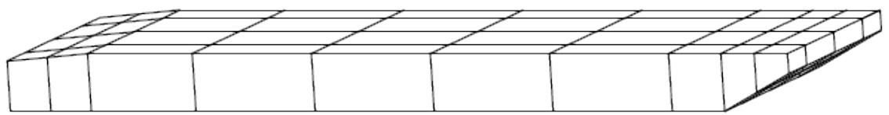  
Figure 1 Barge Model

The input data for Sample Problem 1 is as follows:

| 123456789012345678901234567890123456789012345678901234567890 | 123456789012345678901234567890123456789012345678901234567890 | 123456789012345678901234567890123456789012345678901234567890 | 123456789012345678901234567890123456789012345678901234567890 | 123456789012345678901234567890123456789012345678901234567890 | 123456789012345678901234567890123456789012345678901234567890 |
| --- | --- | --- | --- | --- | --- |
| A | BARGE | MODEL |  |  |  |
| B | GLAOPT | EC YZ EN |  | NA |  |
| C | RANGE | 51 -164. +164.0 |  |  |  |
| D | PLOT VM STA SL | PLOT VM STA SL |  |  |  |
| E | PLOT VM PER | PLOT VM PER |  |  | 0.0 |
| F | SFVP VM 0. 45.0 P 2.5 15. 100PM 32.8 | SFVP VM 0. 45.0 P 2.5 15. 100PM 32.8 | SFVP VM 0. 45.0 P 2.5 15. 100PM 32.8 | SFVP VM 0. 45.0 P 2.5 15. 100PM 32.8 | SFVP VM 0. 45.0 P 2.5 15. 100PM 32.8 |
| G | SWPW PL 49.2 3.75 45.0 90. | SWPW PL 49.2 3.75 45.0 90. | SWPW PL 49.2 3.75 45.0 90. | SWPW PL 49.2 3.75 45.0 90. | SWPW PL 49.2 3.75 45.0 90. |
|  | END | END | END | END | END |

A. The first line is the optional analysis title.   
B. The Global Load Analysis options selecting the input echo, YZ global plane, and English units. The ‘NA’ in columns 33-34 specifies the naval architecture nomenclature is to be used.

C. The RANGE data record specifies that 51 equally spaced points beginning at - 164.0 feet along the X-axis and ending at +164.0 feet.

D. This PLOT data record request that the vertical moment be plotted versus station.   
E. This PLOT data record request that an RAO plot be generated for the vertical moment at station 0.0 be plotted versus period.   
F. The SFVP is the section force versus wave spectrum period at station 0.0 for wave direction t 45 degrees using the peak period varying from 2.5 to 15.0 seconds in 100 steps. The wave spectrum type is Pierson-Moskowitz with a significant wave height of 32.8 feet.

G. This is the still water plus wave condition. This requires that the first load case in the analysis be a still water case which includes the buoyancy and dead loads. For the case in particular, the wave height is 49.2 feet at a period of 3.75 seconds and direction of 45 degrees. The wave phase angle is 90 degrees.

The following are some of the neutral picture plots and a portion of the output listing file created by the Global Load Analysis program module:

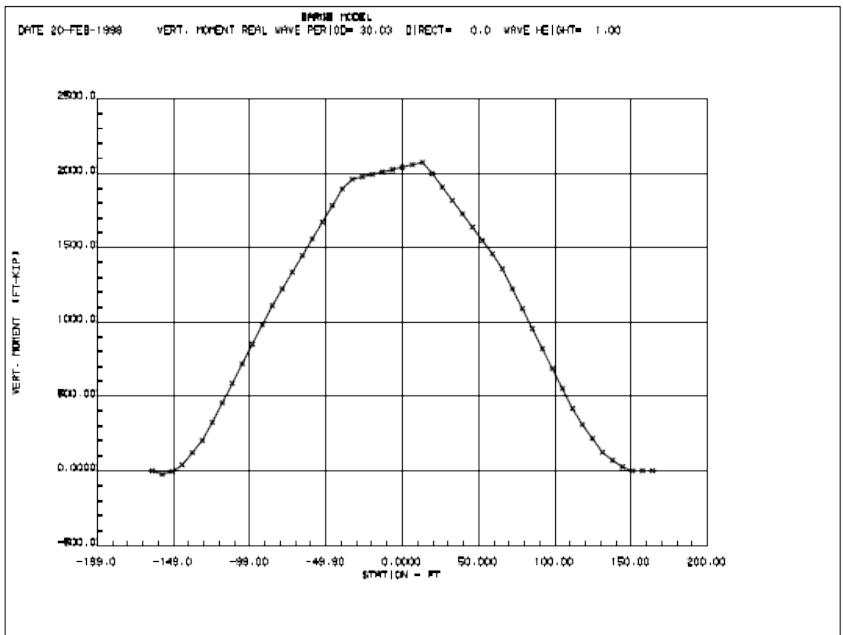  
Figure 2 Vertical Moment versus Station for Wave Case

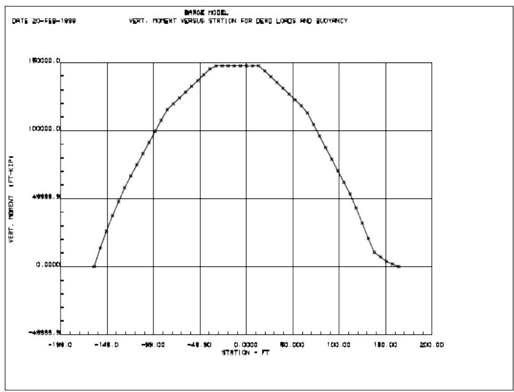  
Figure 3 Vertical Moment versus Station for Dead Load Case

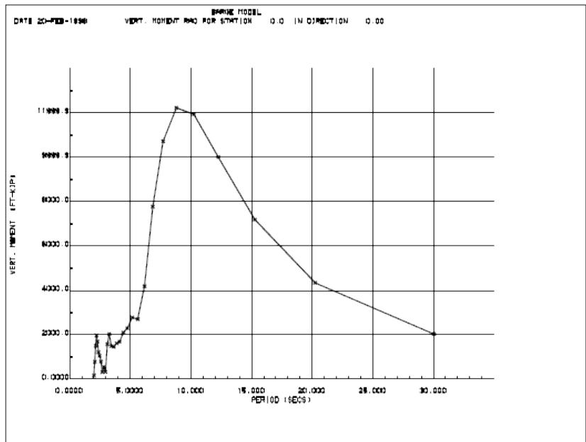  
Figure 4 Vertical Moment RAO

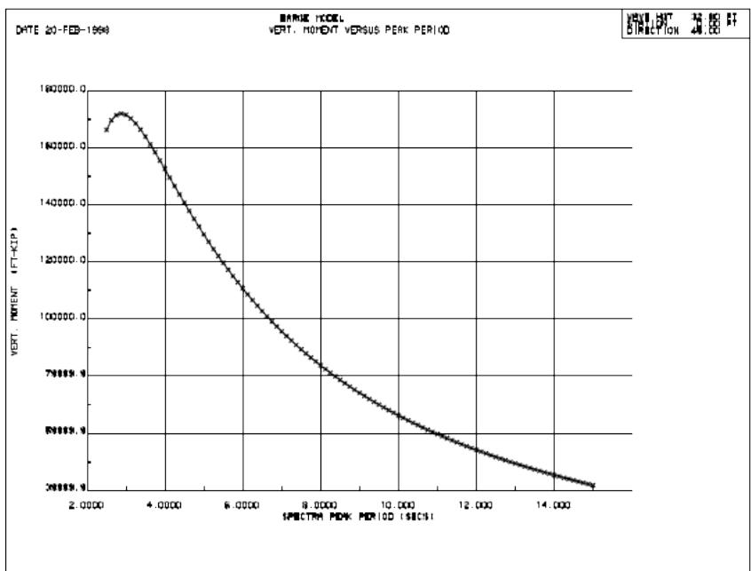  
Figure 5 Vertical Moment versus Wave Spectrum Period

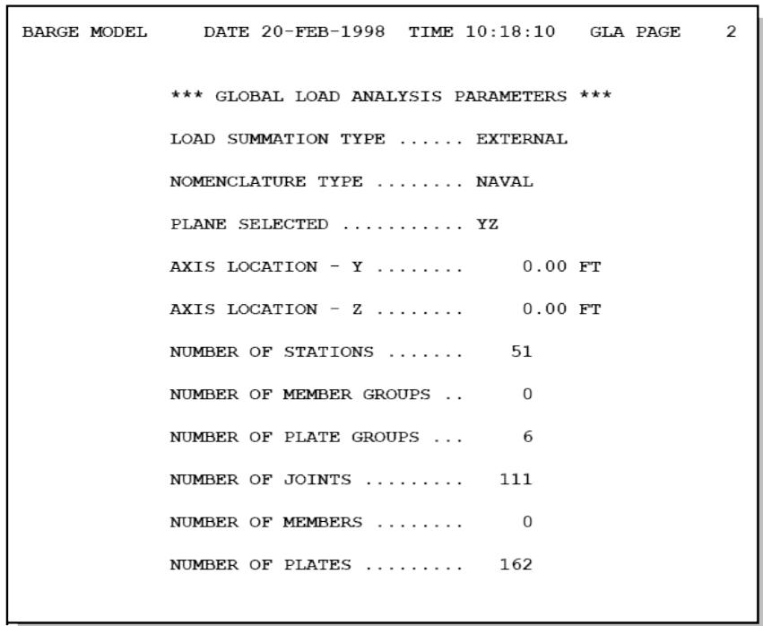  
Global Load Analysis Options

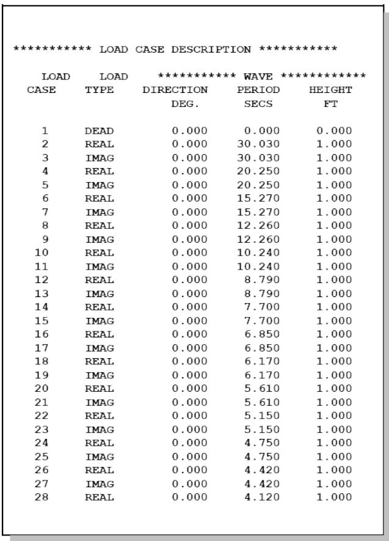  
Load Case Description

Section Forces Versus Load Case   

| BARGE MODEL | BARGE MODEL | DATE 20-FEB-1998 TIME 10:18:10 GLA PAGE 121 | DATE 20-FEB-1998 TIME 10:18:10 GLA PAGE 121 | DATE 20-FEB-1998 TIME 10:18:10 GLA PAGE 121 | DATE 20-FEB-1998 TIME 10:18:10 GLA PAGE 121 | DATE 20-FEB-1998 TIME 10:18:10 GLA PAGE 121 | DATE 20-FEB-1998 TIME 10:18:10 GLA PAGE 121 | DATE 20-FEB-1998 TIME 10:18:10 GLA PAGE 121 |
| --- | --- | --- | --- | --- | --- | --- | --- | --- |
| DISTANCE | LOAD | ********** | FORCES | ********** | ********** | MOMENTS | ********** |  |
| DISTANCE | COND | AXIAL FORCE | HORIZ. SHEAR | VERT. SHEAR | TORSTON | VERT. MOMENT | HORIZ. MOMENT |  |
| FT |  | KIPS | KIPS | KIPS | FT-KIP | FT-KIP | FT-KIP |  |
| 0.00 | 11 | -2.578 | -6.420 | -33.461 | 353.0 | 1167.1 | -873.1 |  |
| 0.00 | 12 | 41.614 | -0.230 | 18.378 | -161.6 | 11898.1 | -31.1 |  |
| 0.00 | 13 | 5.459 | -8.438 | -46.605 | 421.2 | 2860.2 | -1147.5 |  |
| 0.00 | 14 | 25.820 | 0.897 | 21.904 | -41.4 | 9424.3 | 122.0 |  |
| 0.00 | 15 | 19.485 | -8.312 | -51.684 | 347.1 | 5123.9 | -1130.4 |  |
| 0.00 | 16 | -2.352 | 3.940 | 30.723 | -75.2 | 4703.6 | 535.9 |  |
| 0.00 | 17 | 27.461 | -5.325 | -45.429 | 145.3 | 6195.4 | -724.2 |  |
| 0.00 | 18 | -30.359 | 6.462 | 35.892 | -212.5 | -400.5 | 878.8 |  |
| 0.00 | 19 | 12.696 | -0.794 | -29.633 | -36.9 | 4170.8 | -107.9 |  |
| 0.00 | 20 | -32.465 | 4.496 | 27.499 | -170.5 | -2705.9 | 611.5 |  |
| 0.00 | 21 | -20.875 | 3.606 | -9.306 | -171.6 | -41.0 | 490.4 |  |
| 0.00 | 22 | 2.799 | -0.921 | 9.243 | 59.5 | -783.0 | -125.3 |  |
| 0.00 | 23 | -37.549 | 4.708 | 3.462 | -210.8 | -2675.4 | 640.3 |  |
| 0.00 | 24 | 37.135 | -4.230 | -2.588 | 222.6 | 1971.3 | -575.2 |  |
| 0.00 | 25 | -7.932 | 0.760 | 1.282 | -25.1 | -1180.8 | 103.4 |  |
| 0.00 | 26 | 17.598 | -1.425 | -0.062 | 72.9 | 1321.1 | -193.8 |  |
| 0.00 | 27 | 33.516 | -3.414 | -5.357 | 198.3 | 1636.1 | -464.3 |  |
| 0.00 | 28 | -29.267 | 2.954 | 5.559 | -183.7 | -1307.2 | 401.8 |  |
| 0.00 | 29 | 17.901 | -1.629 | -3.292 | 97.7 | 1069.3 | -221.5 |  |
| 0.00 | 30 | -17.676 | 1.289 | 1.547 | -79.5 | -988.7 | 175.3 |  |
| 0.00 | 31 | -29.537 | 2.713 | 2.557 | -182.4 | -1280.7 | 368.9 |  |
| 0.00 | 32 | 29.784 | -2.612 | -2.541 | 173.4 | 1394.0 | -355.2 |  |
| 0.00 | 33 | -11.917 | 1.042 | 1.255 | -78.7 | -427.9 | 141.8 |  |
| 0.00 | 34 | 6.953 | -0.074 | 2.374 | -8.5 | 654.6 | -10.0 |  |
| 0.00 | 35 | 30.172 | -2.805 | -4.168 | 215.2 | 1340.9 | -381.5 |  |
| 0.00 | 36 | -25.892 | 2.944 | -9.427 | -342.0 | 1799.7 | 400.4 |  |
| 0.00 | 37 | -6.857 | -0.385 | -38.571 | -84.3 | 956.1 | -52.3 |  |
| 0.00 | 38 | 15.781 | -1.006 | -4.103 | 27.7 | 1562.1 | -136.8 |  |
| 0.00 | 39 | -22.885 | 1.476 | 2.601 | -140.3 | 227.2 | 200.7 |  |
| 0.00 | 40 | -4.928 | -2.270 | -15.480 | 153.4 | 175.9 | -308.7 |  |
| 0.00 | 41 | 25.816 | -0.299 | 10.140 | 61.7 | 282.0 | -40.7 |  |
| 0.00 | 42 | -26.532 | 0.716 | -10.971 | -75.6 | -554.4 | 97.4 |  |
| 0.00 | 43 | -6.791 | 1.017 | 1.565 | -83.9 | 24.9 | 138.3 |  |
| 0.00 | 44 | 20.362 | -1.186 | 5.199 | 104.6 | 139.6 | -161.2 |  |
| 0.00 | 45 | -15.435 | -0.059 | -7.698 | -12.4 | -281.4 | -8.1 |  |
| 0.00 | 46 | -6.288 | 0.821 | 0.468 | -83.0 | 102.8 | 111.6 |  |
| 0.00 | 47 | 24.215 | -0.579 | 9.772 | 48.5 | 794.1 | -78.8 |  |
| 0.00 | 48 | 2.440 | 0.408 | -0.076 | -48.4 | 791.6 | 55.5 |  |
| 0.00 | 49 | -21.868 | 0.443 | -7.957 | -42.5 | -696.8 | 60.2 |  |
| 0.00 | 50 | -0.965 | -0.838 | -3.281 | 117.4 | -1211.5 | -114.0 |  |

Vertical Moment versus Wave Spectrum Period   

| BARGE MODEL DATE 20-FEB-1998 TIME 10:18:10 GLA PAGE 240 |
| --- |
| ********** SECTION FORCE VERSUS PERIOD***************** |
| STATION 0.00 FT |
| WAVE HEIGHT 32.80 FT |
| WAVE DIRECTION 45.00 DEG |
| BEGINNING PERIOD 2.50 SECS |
| ENDING PERIOD 15.00 SECS |
| PEAK |
| POINT PERIOD VERT. MOMENTFT-KIP |
| 1 2.50 166402.66 |
| 2 2.62 169853.19 |
| 3 2.75 171652.50 |
| 4 2.88 172172.20 |
| 5 3.00 171711.30 |
| 6 3.12 170506.81 |
| 7 3.25 168744.91 |
| 8 3.38 166571.20 |
| 9 3.50 164098.92 |
| 10 3.62 161416.08 |
| 11 3.75 158590.92 |
| 12 3.88 155676.30 |
| 13 4.00 152712.83 |
| 14 4.12 149731.92 |
| 15 4.25 146757.50 |
| 16 4.38 143807.77 |
| 17 4.50 140896.55 |
| 18 4.62 138033.94 |
| 19 4.75 135227.52 |
| 20 4.88 132482.34 |
| 21 5.00 129802.12 |
| 22 5.12 127189.10 |
| 23 5.25 124644.48 |
| 24 5.38 122168.67 |
| 25 5.50 119761.46 |
| 26 5.62 117422.18 |
| 27 5.75 115149.77 |
| 28 5.88 112942.99 |
| 29 6.00 110800.24 |

## 4.2 SAMPLE PROBLEM 2

Sample Problem 2 uses the same structural model as Sample Problem 1. The purpose for this sample is to demonstrate the use of the Global Load Analysis program to predict short term responses.

Below is the Global Load Analysis input file used for Sample Problem 2. A detailed description of the input file follows:

|  | 123456789012345678901234567890123456789012345678901234567890 | 123456789012345678901234567890123456789012345678901234567890 | 123456789012345678901234567890123456789012345678901234567890 | 123456789012345678901234567890123456789012345678901234567890 | 123456789012345678901234567890123456789012345678901234567890 |
| --- | --- | --- | --- | --- | --- |
| A | BARGE | MODEL | MODEL | MODEL | MODEL |
| B | GLAOPT | EC YZ EN | EC YZ EN | NA | NA |
| C | RANGE | 11 -164. | +164.0 |  |  |
| D | WSPEC | 1 PM10.0 | 15.0 | 0.2 |  |
|  | WSPEC | 2 PM20.0 | 15.0 | 0.3 |  |
|  | WSPEC | 3 PM30.0 | 15.0 | 0.4 |  |
| E | RSPSEL | SFRC VM | 0.0 |  | 3 |
| F | RSPSEL | SFRC VM | 0.0 | 2 | 3 |
|  | END |  |  |  |  |

A. The first line is the optional analysis title.   
B. The Global Load Analysis options selecting the input echo, YZ global plane, and English units. The ‘NA’ in columns 33-34 specifies the naval architecture nomenclature is to be used.   
C. The RANGE data record specifies that 11 equally spaced points beginning at -164.0 feet along the X-axis and ending at +164.0 feet.   
D. The WSPEC data records specify the wave direction, type of wave spectrum, peak wave period, and significant wave height.   
E. The RSPSEL data record selects a vertical moment at the 0.0 station. The probability level not to be exceeded is 10 -3.   
F. This RSPSEL is the same as the preceding, except that wave spreading has been included.

A portion of the output print file is as follows:

Sample Problem 2 Output Print   

| BARGE MODEL DATE 20-FEB-1998 TIME 14:41:37 GLA PAGE 58 | BARGE MODEL DATE 20-FEB-1998 TIME 14:41:37 GLA PAGE 58 | BARGE MODEL DATE 20-FEB-1998 TIME 14:41:37 GLA PAGE 58 | BARGE MODEL DATE 20-FEB-1998 TIME 14:41:37 GLA PAGE 58 | BARGE MODEL DATE 20-FEB-1998 TIME 14:41:37 GLA PAGE 58 | BARGE MODEL DATE 20-FEB-1998 TIME 14:41:37 GLA PAGE 58 | BARGE MODEL DATE 20-FEB-1998 TIME 14:41:37 GLA PAGE 58 | BARGE MODEL DATE 20-FEB-1998 TIME 14:41:37 GLA PAGE 58 | BARGE MODEL DATE 20-FEB-1998 TIME 14:41:37 GLA PAGE 58 | BARGE MODEL DATE 20-FEB-1998 TIME 14:41:37 GLA PAGE 58 | BARGE MODEL DATE 20-FEB-1998 TIME 14:41:37 GLA PAGE 58 |
| --- | --- | --- | --- | --- | --- | --- | --- | --- | --- | --- |
| *** EXTREME VALUE WAVE SPECTRA *** | *** EXTREME VALUE WAVE SPECTRA *** | *** EXTREME VALUE WAVE SPECTRA *** | *** EXTREME VALUE WAVE SPECTRA *** | *** EXTREME VALUE WAVE SPECTRA *** | *** EXTREME VALUE WAVE SPECTRA *** | *** EXTREME VALUE WAVE SPECTRA *** | *** EXTREME VALUE WAVE SPECTRA *** | *** EXTREME VALUE WAVE SPECTRA *** | *** EXTREME VALUE WAVE SPECTRA *** | *** EXTREME VALUE WAVE SPECTRA *** |
| SIG. | DOM. | ** JONSWAP ** | ********** OCHI-HUBBBLE********** | ********** OCHI-HUBBBLE********** | ********** OCHI-HUBBBLE********** | ********** OCHI-HUBBBLE********** | ********** OCHI-HUBBBLE********** | ** USER DEFINED ** | ** USER DEFINED ** | ** USER DEFINED ** |
| SPECTRA | WAVE | WAVE | GAMMA | PARAM. | WAVE | PERIOD | LAMDA | LAMDA | SPECTRA | SPECTRA |
| NO. TYPE | HEIGHT | PERIOD |  |  | HGT |  |  |  | PERIOD | VALUE |
|  | FT | SECS |  |  | FT | SECS |  |  | SECS |  |
| 1 | PM | 10.00 | 15.000 |  |  |  |  |  |  |  |
| 2 | PM | 20.00 | 15.000 |  |  |  |  |  |  |  |
| 3 | PM | 30.00 | 15.000 |  |  |  |  |  |  |  |
| BARGE MODEL DATE 20-FEB-1998 TIME 14:41:37 GLA PAGE 59 | BARGE MODEL DATE 20-FEB-1998 TIME 14:41:37 GLA PAGE 59 | BARGE MODEL DATE 20-FEB-1998 TIME 14:41:37 GLA PAGE 59 | BARGE MODEL DATE 20-FEB-1998 TIME 14:41:37 GLA PAGE 59 | BARGE MODEL DATE 20-FEB-1998 TIME 14:41:37 GLA PAGE 59 | BARGE MODEL DATE 20-FEB-1998 TIME 14:41:37 GLA PAGE 59 | BARGE MODEL DATE 20-FEB-1998 TIME 14:41:37 GLA PAGE 59 | BARGE MODEL DATE 20-FEB-1998 TIME 14:41:37 GLA PAGE 59 | BARGE MODEL DATE 20-FEB-1998 TIME 14:41:37 GLA PAGE 59 | BARGE MODEL DATE 20-FEB-1998 TIME 14:41:37 GLA PAGE 59 | BARGE MODEL DATE 20-FEB-1998 TIME 14:41:37 GLA PAGE 59 |
| SHORT TERM RESPONSE FOR SECTION MOMENT IN Y-DIRECTION AT STATION 0.00 | SHORT TERM RESPONSE FOR SECTION MOMENT IN Y-DIRECTION AT STATION 0.00 | SHORT TERM RESPONSE FOR SECTION MOMENT IN Y-DIRECTION AT STATION 0.00 | SHORT TERM RESPONSE FOR SECTION MOMENT IN Y-DIRECTION AT STATION 0.00 | SHORT TERM RESPONSE FOR SECTION MOMENT IN Y-DIRECTION AT STATION 0.00 | SHORT TERM RESPONSE FOR SECTION MOMENT IN Y-DIRECTION AT STATION 0.00 | SHORT TERM RESPONSE FOR SECTION MOMENT IN Y-DIRECTION AT STATION 0.00 | SHORT TERM RESPONSE FOR SECTION MOMENT IN Y-DIRECTION AT STATION 0.00 | SHORT TERM RESPONSE FOR SECTION MOMENT IN Y-DIRECTION AT STATION 0.00 | SHORT TERM RESPONSE FOR SECTION MOMENT IN Y-DIRECTION AT STATION 0.00 | SHORT TERM RESPONSE FOR SECTION MOMENT IN Y-DIRECTION AT STATION 0.00 |
| PROBABILITY POWER OF 3 USED | PROBABILITY POWER OF 3 USED | PROBABILITY POWER OF 3 USED | PROBABILITY POWER OF 3 USED | PROBABILITY POWER OF 3 USED | PROBABILITY POWER OF 3 USED | PROBABILITY POWER OF 3 USED | PROBABILITY POWER OF 3 USED | PROBABILITY POWER OF 3 USED | PROBABILITY POWER OF 3 USED | PROBABILITY POWER OF 3 USED |
| ********** WAVE SPECTRA********** | ********** WAVE SPECTRA********** | ********** WAVE SPECTRA********** | ********** WAVE SPECTRA********** | ********** WAVE SPECTRA********** | ********** RESPONSE********** | ********** RESPONSE********** | ********** RESPONSE********** | ********** RESPONSE********** | ********** RESPONSE********** | ********** RESPONSE********** |
| NO. | DIRECTION | PERIOD | HEIGHT | LIFE | RMS | PERIOD | MAXIMUM |  |  |  |
|  | DEGREES | SECS | FT | FRACTION | FT-KIP | SECS | FT-KIP |  |  |  |
| 1 | 0.000 | 15.000 | 10.00 | 0.20000 | 22391.8 | 10.851 | 54848.4 |  |  |  |
| 2 | 45.000 | 15.000 | 20.00 | 0.30000 | 24080.0 | 9.853 | 58983.8 |  |  |  |
| 3 | 90.000 | 15.000 | 30.00 | 0.40000 | 9329.5 | 8.610 | 22852.5 |  |  |  |
| BARGE MODEL DATE 20-FEB-1998 TIME 14:41:37 GLA PAGE 60 | BARGE MODEL DATE 20-FEB-1998 TIME 14:41:37 GLA PAGE 60 | BARGE MODEL DATE 20-FEB-1998 TIME 14:41:37 GLA PAGE 60 | BARGE MODEL DATE 20-FEB-1998 TIME 14:41:37 GLA PAGE 60 | BARGE MODEL DATE 20-FEB-1998 TIME 14:41:37 GLA PAGE 60 | BARGE MODEL DATE 20-FEB-1998 TIME 14:41:37 GLA PAGE 60 | BARGE MODEL DATE 20-FEB-1998 TIME 14:41:37 GLA PAGE 60 | BARGE MODEL DATE 20-FEB-1998 TIME 14:41:37 GLA PAGE 60 | BARGE MODEL DATE 20-FEB-1998 TIME 14:41:37 GLA PAGE 60 | BARGE MODEL DATE 20-FEB-1998 TIME 14:41:37 GLA PAGE 60 | BARGE MODEL DATE 20-FEB-1998 TIME 14:41:37 GLA PAGE 60 |
| SHORT TERM RESPONSE FOR SECTION MOMENT IN Y-DIRECTION AT STATION 0.00 | SHORT TERM RESPONSE FOR SECTION MOMENT IN Y-DIRECTION AT STATION 0.00 | SHORT TERM RESPONSE FOR SECTION MOMENT IN Y-DIRECTION AT STATION 0.00 | SHORT TERM RESPONSE FOR SECTION MOMENT IN Y-DIRECTION AT STATION 0.00 | SHORT TERM RESPONSE FOR SECTION MOMENT IN Y-DIRECTION AT STATION 0.00 | SHORT TERM RESPONSE FOR SECTION MOMENT IN Y-DIRECTION AT STATION 0.00 | SHORT TERM RESPONSE FOR SECTION MOMENT IN Y-DIRECTION AT STATION 0.00 | SHORT TERM RESPONSE FOR SECTION MOMENT IN Y-DIRECTION AT STATION 0.00 | SHORT TERM RESPONSE FOR SECTION MOMENT IN Y-DIRECTION AT STATION 0.00 | SHORT TERM RESPONSE FOR SECTION MOMENT IN Y-DIRECTION AT STATION 0.00 | SHORT TERM RESPONSE FOR SECTION MOMENT IN Y-DIRECTION AT STATION 0.00 |
| WAVE SPREADINGING POWER OF 2 USED | WAVE SPREADINGING POWER OF 2 USED | WAVE SPREADINGING POWER OF 2 USED | WAVE SPREADINGING POWER OF 2 USED | WAVE SPREADINGING POWER OF 2 USED | WAVE SPREADINGING POWER OF 2 USED | WAVE SPREADINGING POWER OF 2 USED | WAVE SPREADINGING POWER OF 2 USED | WAVE SPREADINGING POWER OF 2 USED | WAVE SPREADINGING POWER OF 2 USED | WAVE SPREADINGING POWER OF 2 USED |
| PROBABILITY POWER OF 3 USED | PROBABILITY POWER OF 3 USED | PROBABILITY POWER OF 3 USED | PROBABILITY POWER OF 3 USED | PROBABILITY POWER OF 3 USED | PROBABILITY POWER OF 3 USED | PROBABILITY POWER OF 3 USED | PROBABILITY POWER OF 3 USED | PROBABILITY POWER OF 3 USED | PROBABILITY POWER OF 3 USED | PROBABILITY POWER OF 3 USED |
| ********** WAVE SPECTRA********** | ********** WAVE SPECTRA********** | ********** WAVE SPECTRA********** | ********** WAVE SPECTRA********** | ********** WAVE SPECTRA********** | ********** RESPONSE********** | ********** RESPONSE********** | ********** RESPONSE********** | ********** RESPONSE********** | ********** RESPONSE********** | ********** RESPONSE********** |
| NO. | DIRECTION | PERIOD | HEIGHT | LIFE | RMS | PERIOD | MAXIMUM |  |  |  |
|  | DEGREES | SECS | FT | FACTION | FT-KIP | SECS | FT-KIP |  |  |  |
| 1 | 0.000 | 15.000 | 10.00 | 0.20000 | 18882.6 | 10.666 | 46252.8 |  |  |  |
| 2 | 45.000 | 15.000 | 20.00 | 0.30000 | 24611.1 | 10.254 | 60284.7 |  |  |  |
| 3 | 90.000 | 15.000 | 30.00 | 0.40000 | 18149.3 | 9.413 | 44456.4 |  |  |  |

## 4.3 SAMPLE PROBLEM 3

Sample Problem 3 uses the same structural model as Sample Problem 1. The purpose for this sample is to demonstrate the use of the Global Load Analysis program to predict long term responses.

Below is the Global Load Analysis input file used for Sample Problem 3. A detailed description of the input file follows:

|  | 1234567890123456789012345678901234567890123456789012345678901234567890 | 1234567890123456789012345678901234567890123456789012345678901234567890 | 1234567890123456789012345678901234567890123456789012345678901234567890 | 1234567890123456789012345678901234567890123456789012345678901234567890 | 1234567890123456789012345678901234567890123456789012345678901234567890 | 1234567890123456789012345678901234567890123456789012345678901234567890 | 1234567890123456789012345678901234567890123456789012345678901234567890 | 1234567890123456789012345678901234567890123456789012345678901234567890 | 1234567890123456789012345678901234567890123456789012345678901234567890 | 1234567890123456789012345678901234567890123456789012345678901234567890 | 1234567890123456789012345678901234567890123456789012345678901234567890 |
| --- | --- | --- | --- | --- | --- | --- | --- | --- | --- | --- | --- |
| A | GLAOPT | EC YZ EN | EC YZ EN | EC YZ EN | NA | NA | NA | NA | NA | NA | NA |
| B | RANGE | 50 -164. | +164.0 | +164.0 |  |  |  |  |  |  |  |
| C | SCDIR | 0.0 | 0.0 | 0.0 | 0.33333 | 0.33333 | 0.33333 | 0.33333 | 0.33333 | 0.33333 | 0.33333 |
| D | SCATD D |  | N | PM |  |  |  |  |  |  |  |
| E | SCOFAC | .0291 | .1784 | .261 | .455 | .279 | .235 | .222 | .333 | .333 | .250 |
| E | SCOFAC |  |  |  |  |  |  |  |  |  |  |
| F | SCWAV | 1.0 | 3.0 | 5.0 | 7.0 | 9.0 | 11.0 | 13.5 | 16.5 | 20.0 | 26.0 |
| F | SCWAV | 47.5 | 47.5 | 47.5 |  |  |  |  |  |  |  |
| G | SCPER 0.5 |  |  |  |  |  |  |  |  |  |  |
| G | SCPER 0.5 |  |  |  |  |  |  |  |  |  |  |
| G | SCPER 2.0 | 17.56 | 17.56 | 17.56 |  |  |  |  |  |  |  |
| G | SCPER 2.0 |  |  |  |  |  |  |  |  |  |  |
| G | SCPER 4.0 | 0.59 | 0.65 | 0.02 |  |  |  |  |  |  |  |
| G | SCPER 4.0 |  |  |  |  |  |  |  |  |  |  |
| G | SCPER 6.0 | 3.98 | 6.74 | 8.50 | 5.15 | 0.25 |  |  |  |  |  |
| G | SCPER 6.0 |  |  |  |  |  |  |  |  |  |  |
| G | SCPER 8.0 | 4.51 | 9.00 | 8.55 | 6.52 | 5.25 | 1.83 | 0.44 |  |  |  |
| G | SCPER 8.0 |  |  |  |  |  |  |  |  |  |  |
| G | SCPER 10.0 | 2.46 | 2.71 | 2.07 | 1.85 | 1.12 | 0.81 | 0.70 | 0.26 | 0.04 |  |
| G | SCPER 10.0 |  |  |  |  |  |  |  |  |  |  |
| G | SCPER 12.0 | 2.19 | 1.29 | 0.79 | 0.34 | 0.24 | 0.20 | 0.17 | 0.06 | 0.06 | 0.03 |
| G | SCPER 12.0 |  |  |  |  |  |  |  |  |  |  |
| G | SCPER 14.0 | 1.14 | 0.60 | 0.26 | 0.13 | 0.06 | 0.03 | 0.04 | 0.03 | 0.02 | 0.01 |
| G | SCPER 14.0 |  |  |  |  |  |  |  |  |  |  |
| G | SCPER 16.0 | 0.34 | 0.24 | 0.11 | 0.04 | 0.01 | 0.02 |  |  |  |  |
| G | SCPER 16.0 |  |  |  |  |  |  |  |  |  |  |
| G | SCPER 18.0 | 0.08 | 0.03 | 0.01 | 0.02 | 0.01 | 0.00 | 0.00 | 0.00 | 0.01 |  |
| G | SCPER 18.0 |  |  |  |  |  |  |  |  |  |  |
| G | SCPER 20.0 | 0.04 | 0.01 | 0.00 | 0.01 |  |  |  |  |  |  |
| G | SCPER 20.0 |  |  |  |  |  |  |  |  |  |  |
| G | SCPER 23.0 |  |  |  |  |  |  |  |  |  |  |
| G | SCPER 23.0 |  |  |  |  |  |  |  |  |  |  |
| H | SCEND |  |  |  |  |  |  |  |  |  |  |
| I | SCDIR | 45. | 45. | 0.33333 | 0.33333 | 0.33333 | 0.33333 | 0.33333 | 0.33333 | 0.33333 | 0.33333 |
|  | repeat the previous scatter diagram | repeat the previous scatter diagram | repeat the previous scatter diagram | repeat the previous scatter diagram | repeat the previous scatter diagram | repeat the previous scatter diagram | repeat the previous scatter diagram | repeat the previous scatter diagram | repeat the previous scatter diagram | repeat the previous scatter diagram | repeat the previous scatter diagram |
| J | SCDIR | 90. | 90. | 0.33333 | 0.33333 | 0.33333 | 0.33333 | 0.33333 | 0.33333 | 0.33333 | 0.33333 |
|  | repeat the previous scatter diagram | repeat the previous scatter diagram | repeat the previous scatter diagram | repeat the previous scatter diagram | repeat the previous scatter diagram | repeat the previous scatter diagram | repeat the previous scatter diagram | repeat the previous scatter diagram | repeat the previous scatter diagram | repeat the previous scatter diagram | repeat the previous scatter diagram |
| K | RSPSEL | SFRC VM | 0.0 | LT 2 | 3 | 60000. | 20 | 20 | 20 | 20 | 20 |
| L | RSPSEL | SFRC VM | 0.0 | LT 2 | 3 | 60000. | 20L2 | 20L2 | 20L2 | 20L2 | 20L2 |
| M | RSPSEL | SFRC VM | 0.0 | LT 2 | 3 | 60000. | 40 | 40 | 40 | 40 | 40 |
|  | END |  |  |  |  |  |  |  |  |  |  |

A. The Global Load Analysis options selecting the input echo, YZ global plane, and English units. The ‘NA’ in columns 33-34 specifies the naval architecture nomenclature is to be used.   
B. The RANGE data record specifies that 50 equally spaced points beginning at -164.0 feet along the X-axis and ending at +164.0 feet.   
C. The SCDIR data record specifies this scatter diagram is for the wave direction of 0.0 and the fraction of time for this direction is 0.33333.

D. The SCATD data record specifies that the periods in the scatter diagram represent dominant or peak spectral periods. It also specifies that the data in the scatter diagram is to be normalized and that the spectrum type is to be Pierson-Moskowitz.   
E. The SCOFAC is an optional data record and is used to change the amount of time spent in each wave height. If the   
F. The SCWAV data record specifies the wave heights for the scatter diagram. Note that if more than 11 wave heights are entered, the remaining are located on the next data record.   
G. The SCPER data record specifies period and the number of occurrences for that period. The position in the SCPER record corresponds to the wave height position on the SCWAV data record.   
H. The SCEND data record terminates the scatter diagram input.   
I. This SCDIR data record starts the scatter diagram for the 45 degree wave direction.   
J. This SCDIR data record starts the scatter diagram for the 90 degree wave direction.   
K. This RSPSEL data record selects the vertical moment at the 0.0 station as the desired response and request a long term probability using a wave spreading power of 2. The maximum response value is 60000. FT-KIPS and uses 20 divisions for the short term responses. The Weibull fit defaults to the least square fit.   
L. This RSPSEL data record is the same as before except that the Weibull fit is based on the last 2 values of the short term distribution..   
M. This RSPSEL data record is the same as in K except that 40 division are elected.

The following is a portion of the output print file created by the above input:

Sample Problem 3 - Scatter Diagram Listing   

| BARGE MODEL | BARGE MODEL | BARGE MODEL | BARGE MODEL | BARGE MODEL | BARGE MODEL | BARGE MODEL | DATE 23-FEB-1998 TIME 13:33:6 GLA PAGE 237 | DATE 23-FEB-1998 TIME 13:33:6 GLA PAGE 237 | DATE 23-FEB-1998 TIME 13:33:6 GLA PAGE 237 | DATE 23-FEB-1998 TIME 13:33:6 GLA PAGE 237 |
| --- | --- | --- | --- | --- | --- | --- | --- | --- | --- | --- |
| ***** SCATTER DIAGRAM***** | ***** SCATTER DIAGRAM***** | ***** SCATTER DIAGRAM***** | ***** SCATTER DIAGRAM***** | ***** SCATTER DIAGRAM***** | ***** SCATTER DIAGRAM***** | ***** SCATTER DIAGRAM***** | ***** SCATTER DIAGRAM***** | ***** SCATTER DIAGRAM***** | ***** SCATTER DIAGRAM***** | ***** SCATTER DIAGRAM***** |
| PERIOD TYPE******* DOMINANT | PERIOD TYPE******* DOMINANT | PERIOD TYPE******* DOMINANT | PERIOD TYPE******* DOMINANT | PERIOD TYPE******* DOMINANT | PERIOD TYPE******* DOMINANT | PERIOD TYPE******* DOMINANT | PERIOD TYPE******* DOMINANT | PERIOD TYPE******* DOMINANT | PERIOD TYPE******* DOMINANT | PERIOD TYPE******* DOMINANT |
| PERIOD FACTOR......... 1.0000 | PERIOD FACTOR......... 1.0000 | PERIOD FACTOR......... 1.0000 | PERIOD FACTOR......... 1.0000 | PERIOD FACTOR......... 1.0000 | PERIOD FACTOR......... 1.0000 | PERIOD FACTOR......... 1.0000 | PERIOD FACTOR......... 1.0000 | PERIOD FACTOR......... 1.0000 | PERIOD FACTOR......... 1.0000 | PERIOD FACTOR......... 1.0000 |
| WAVE HEIGHT FACTOR.......... 1.0000 | WAVE HEIGHT FACTOR.......... 1.0000 | WAVE HEIGHT FACTOR.......... 1.0000 | WAVE HEIGHT FACTOR.......... 1.0000 | WAVE HEIGHT FACTOR.......... 1.0000 | WAVE HEIGHT FACTOR.......... 1.0000 | WAVE HEIGHT FACTOR.......... 1.0000 | WAVE HEIGHT FACTOR.......... 1.0000 | WAVE HEIGHT FACTOR.......... 1.0000 | WAVE HEIGHT FACTOR.......... 1.0000 | WAVE HEIGHT FACTOR.......... 1.0000 |
| FRACTION LIFE FACTOR.......... 1.0000 | FRACTION LIFE FACTOR.......... 1.0000 | FRACTION LIFE FACTOR.......... 1.0000 | FRACTION LIFE FACTOR.......... 1.0000 | FRACTION LIFE FACTOR.......... 1.0000 | FRACTION LIFE FACTOR.......... 1.0000 | FRACTION LIFE FACTOR.......... 1.0000 | FRACTION LIFE FACTOR.......... 1.0000 | FRACTION LIFE FACTOR.......... 1.0000 | FRACTION LIFE FACTOR.......... 1.0000 | FRACTION LIFE FACTOR.......... 1.0000 |
| WAVE SPECTRUM TYPE.......... FM | WAVE SPECTRUM TYPE.......... FM | WAVE SPECTRUM TYPE.......... FM | WAVE SPECTRUM TYPE.......... FM | WAVE SPECTRUM TYPE.......... FM | WAVE SPECTRUM TYPE.......... FM | WAVE SPECTRUM TYPE.......... FM | WAVE SPECTRUM TYPE.......... FM | WAVE SPECTRUM TYPE.......... FM | WAVE SPECTRUM TYPE.......... FM | WAVE SPECTRUM TYPE.......... FM |
| SUM BEFORE NORMALIZATION . 19.5348 | SUM BEFORE NORMALIZATION . 19.5348 | SUM BEFORE NORMALIZATION . 19.5348 | SUM BEFORE NORMALIZATION . 19.5348 | SUM BEFORE NORMALIZATION . 19.5348 | SUM BEFORE NORMALIZATION . 19.5348 | SUM BEFORE NORMALIZATION . 19.5348 | SUM BEFORE NORMALIZATION . 19.5348 | SUM BEFORE NORMALIZATION . 19.5348 | SUM BEFORE NORMALIZATION . 19.5348 | SUM BEFORE NORMALIZATION . 19.5348 |
| OCCUR. FAC. 0.0291 0.1784 0.2610 0.4550 0.2790 0.2350 0.2220 0.3330 0.3330 0.2500 0.0000 | OCCUR. FAC. 0.0291 0.1784 0.2610 0.4550 0.2790 0.2350 0.2220 0.3330 0.3330 0.2500 0.0000 | OCCUR. FAC. 0.0291 0.1784 0.2610 0.4550 0.2790 0.2350 0.2220 0.3330 0.3330 0.2500 0.0000 | OCCUR. FAC. 0.0291 0.1784 0.2610 0.4550 0.2790 0.2350 0.2220 0.3330 0.3330 0.2500 0.0000 | OCCUR. FAC. 0.0291 0.1784 0.2610 0.4550 0.2790 0.2350 0.2220 0.3330 0.3330 0.2500 0.0000 | OCCUR. FAC. 0.0291 0.1784 0.2610 0.4550 0.2790 0.2350 0.2220 0.3330 0.3330 0.2500 0.0000 | OCCUR. FAC. 0.0291 0.1784 0.2610 0.4550 0.2790 0.2350 0.2220 0.3330 0.3330 0.2500 0.0000 | OCCUR. FAC. 0.0291 0.1784 0.2610 0.4550 0.2790 0.2350 0.2220 0.3330 0.3330 0.2500 0.0000 | OCCUR. FAC. 0.0291 0.1784 0.2610 0.4550 0.2790 0.2350 0.2220 0.3330 0.3330 0.2500 0.0000 | OCCUR. FAC. 0.0291 0.1784 0.2610 0.4550 0.2790 0.2350 0.2220 0.3330 0.3330 0.2500 0.0000 | OCCUR. FAC. 0.0291 0.1784 0.2610 0.4550 0.2790 0.2350 0.2220 0.3330 0.3330 0.2500 0.0000 |
| WAVEHEIGHT (FT) 1.0000 3.0000 5.0000 7.0000 9.0000 11.0000 13.5000 16.5000 20.0000 26.0000 35.0000 | WAVEHEIGHT (FT) 1.0000 3.0000 5.0000 7.0000 9.0000 11.0000 13.5000 16.5000 20.0000 26.0000 35.0000 | WAVEHEIGHT (FT) 1.0000 3.0000 5.0000 7.0000 9.0000 11.0000 13.5000 16.5000 20.0000 26.0000 35.0000 | WAVEHEIGHT (FT) 1.0000 3.0000 5.0000 7.0000 9.0000 11.0000 13.5000 16.5000 20.0000 26.0000 35.0000 | WAVEHEIGHT (FT) 1.0000 3.0000 5.0000 7.0000 9.0000 11.0000 13.5000 16.5000 20.0000 26.0000 35.0000 | WAVEHEIGHT (FT) 1.0000 3.0000 5.0000 7.0000 9.0000 11.0000 13.5000 16.5000 20.0000 26.0000 35.0000 | WAVEHEIGHT (FT) 1.0000 3.0000 5.0000 7.0000 9.0000 11.0000 13.5000 16.5000 20.0000 26.0000 35.0000 | WAVEHEIGHT (FT) 1.0000 3.0000 5.0000 7.0000 9.0000 11.0000 13.5000 16.5000 20.0000 26.0000 35.0000 | WAVEHEIGHT (FT) 1.0000 3.0000 5.0000 7.0000 9.0000 11.0000 13.5000 16.5000 20.0000 26.0000 35.0000 | WAVEHEIGHT (FT) 1.0000 3.0000 5.0000 7.0000 9.0000 11.0000 13.5000 16.5000 20.0000 26.0000 35.0000 | WAVEHEIGHT (FT) 1.0000 3.0000 5.0000 7.0000 9.0000 11.0000 13.5000 16.5000 20.0000 26.0000 35.0000 |
| * PERIOD * | * PERIOD * | * PERIOD * | * PERIOD * | * PERIOD * | * PERIOD * | * PERIOD * | * PERIOD * | * PERIOD * | * PERIOD * | * PERIOD * |
| 0.500 | 0.500 | 0.500 | 0.500 | 0.500 | 0.500 | 0.500 | 0.500 | 0.500 | 0.500 | 0.500 |
| 2.000 0.0262 | 2.000 0.0262 | 2.000 0.0262 | 2.000 0.0262 | 2.000 0.0262 | 2.000 0.0262 | 2.000 0.0262 | 2.000 0.0262 | 2.000 0.0262 | 2.000 0.0262 | 2.000 0.0262 |
| 4.000 0.0009 0.0059 0.0003 | 4.000 0.0009 0.0059 0.0003 | 4.000 0.0009 0.0059 0.0003 | 4.000 0.0009 0.0059 0.0003 | 4.000 0.0009 0.0059 0.0003 | 4.000 0.0009 0.0059 0.0003 | 4.000 0.0009 0.0059 0.0003 | 4.000 0.0009 0.0059 0.0003 | 4.000 0.0009 0.0059 0.0003 | 4.000 0.0009 0.0059 0.0003 | 4.000 0.0009 0.0059 0.0003 |
| 6.000 0.0059 0.0616 0.1136 0.1200 0.0036 | 6.000 0.0059 0.0616 0.1136 0.1200 0.0036 | 6.000 0.0059 0.0616 0.1136 0.1200 0.0036 | 6.000 0.0059 0.0616 0.1136 0.1200 0.0036 | 6.000 0.0059 0.0616 0.1136 0.1200 0.0036 | 6.000 0.0059 0.0616 0.1136 0.1200 0.0036 | 6.000 0.0059 0.0616 0.1136 0.1200 0.0036 | 6.000 0.0059 0.0616 0.1136 0.1200 0.0036 | 6.000 0.0059 0.0616 0.1136 0.1200 0.0036 | 6.000 0.0059 0.0616 0.1136 0.1200 0.0036 | 6.000 0.0059 0.0616 0.1136 0.1200 0.0036 |
| 8.000 0.0067 0.0822 0.1142 0.1519 0.0750 0.0220 0.0050 | 8.000 0.0067 0.0822 0.1142 0.1519 0.0750 0.0220 0.0050 | 8.000 0.0067 0.0822 0.1142 0.1519 0.0750 0.0220 0.0050 | 8.000 0.0067 0.0822 0.1142 0.1519 0.0750 0.0220 0.0050 | 8.000 0.0067 0.0822 0.1142 0.1519 0.0750 0.0220 0.0050 | 8.000 0.0067 0.0822 0.1142 0.1519 0.0750 0.0220 0.0050 | 8.000 0.0067 0.0822 0.1142 0.1519 0.0750 0.0220 0.0050 | 8.000 0.0067 0.0822 0.1142 0.1519 0.0750 0.0220 0.0050 | 8.000 0.0067 0.0822 0.1142 0.1519 0.0750 0.0220 0.0050 | 8.000 0.0067 0.0822 0.1142 0.1519 0.0750 0.0220 0.0050 | 8.000 0.0067 0.0822 0.1142 0.1519 0.0750 0.0220 0.0050 |
| 10.000 0.0037 0.0247 0.0277 0.0431 0.0160 0.0097 0.0080 0.0044 0.0007 | 10.000 0.0037 0.0247 0.0277 0.0431 0.0160 0.0097 0.0080 0.0044 0.0007 | 10.000 0.0037 0.0247 0.0277 0.0431 0.0160 0.0097 0.0080 0.0044 0.0007 | 10.000 0.0037 0.0247 0.0277 0.0431 0.0160 0.0097 0.0080 0.0044 0.0007 | 10.000 0.0037 0.0247 0.0277 0.0431 0.0160 0.0097 0.0080 0.0044 0.0007 | 10.000 0.0037 0.0247 0.0277 0.0431 0.0160 0.0097 0.0080 0.0044 0.0007 | 10.000 0.0037 0.0247 0.0277 0.0431 0.0160 0.0097 0.0080 0.0044 0.0007 | 10.000 0.0037 0.0247 0.0277 0.0431 0.0160 0.0097 0.0080 0.0044 0.0007 | 10.000 0.0037 0.0247 0.0277 0.0431 0.0160 0.0097 0.0080 0.0044 0.0007 | 10.000 0.0037 0.0247 0.0277 0.0431 0.0160 0.0097 0.0080 0.0044 0.0007 | 10.000 0.0037 0.0247 0.0277 0.0431 0.0160 0.0097 0.0080 0.0044 0.0007 |
| 12.000 0.0033 0.0118 0.0106 0.0079 0.0034 0.0024 0.0019 0.0010 0.0010 0.0004 | 12.000 0.0033 0.0118 0.0106 0.0079 0.0034 0.0024 0.0019 0.0010 0.0010 0.0004 | 12.000 0.0033 0.0118 0.0106 0.0079 0.0034 0.0024 0.0019 0.0010 0.0010 0.0004 | 12.000 0.0033 0.0118 0.0106 0.0079 0.0034 0.0024 0.0019 0.0010 0.0010 0.0004 | 12.000 0.0033 0.0118 0.0106 0.0079 0.0034 0.0024 0.0019 0.0010 0.0010 0.0004 | 12.000 0.0033 0.0118 0.0106 0.0079 0.0034 0.0024 0.0019 0.0010 0.0010 0.0004 | 12.000 0.0033 0.0118 0.0106 0.0079 0.0034 0.0024 0.0019 0.0010 0.0010 0.0004 | 12.000 0.0033 0.0118 0.0106 0.0079 0.0034 0.0024 0.0019 0.0010 0.0010 0.0004 | 12.000 0.0033 0.0118 0.0106 0.0079 0.0034 0.0024 0.0019 0.0010 0.0010 0.0004 | 12.000 0.0033 0.0118 0.0106 0.0079 0.0034 0.0024 0.0019 0.0010 0.0010 0.0004 | 12.000 0.0033 0.0118 0.0106 0.0079 0.0034 0.0024 0.0019 0.0010 0.0010 0.0004 |
| 14.000 0.0017 0.0055 0.0035 0.0030 0.0009 0.0004 0.0005 0.0005 0.0003 0.0001 | 14.000 0.0017 0.0055 0.0035 0.0030 0.0009 0.0004 0.0005 0.0005 0.0003 0.0001 | 14.000 0.0017 0.0055 0.0035 0.0030 0.0009 0.0004 0.0005 0.0005 0.0003 0.0001 | 14.000 0.0017 0.0055 0.0035 0.0030 0.0009 0.0004 0.0005 0.0005 0.0003 0.0001 | 14.000 0.0017 0.0055 0.0035 0.0030 0.0009 0.0004 0.0005 0.0005 0.0003 0.0001 | 14.000 0.0017 0.0055 0.0035 0.0030 0.0009 0.0004 0.0005 0.0005 0.0003 0.0001 | 14.000 0.0017 0.0055 0.0035 0.0030 0.0009 0.0004 0.0005 0.0005 0.0003 0.0001 | 14.000 0.0017 0.0055 0.0035 0.0030 0.0009 0.0004 0.0005 0.0005 0.0003 0.0001 | 14.000 0.0017 0.0055 0.0035 0.0030 0.0009 0.0004 0.0005 0.0005 0.0003 0.0001 | 14.000 0.0017 0.0055 0.0035 0.0030 0.0009 0.0004 0.0005 0.0005 0.0003 0.0001 | 14.000 0.0017 0.0055 0.0035 0.0030 0.0009 0.0004 0.0005 0.0005 0.0003 0.0001 |
| 16.000 0.0005 0.0022 0.0015 0.0009 0.0001 0.0002 | 16.000 0.0005 0.0022 0.0015 0.0009 0.0001 0.0002 | 16.000 0.0005 0.0022 0.0015 0.0009 0.0001 0.0002 | 16.000 0.0005 0.0022 0.0015 0.0009 0.0001 0.0002 | 16.000 0.0005 0.0022 0.0015 0.0009 0.0001 0.0002 | 16.000 0.0005 0.0022 0.0015 0.0009 0.0001 0.0002 | 16.000 0.0005 0.0022 0.0015 0.0009 0.0001 0.0002 | 16.000 0.0005 0.0022 0.0015 0.0009 0.0001 0.0002 | 16.000 0.0005 0.0022 0.0015 0.0009 0.0001 0.0002 | 16.000 0.0005 0.0022 0.0015 0.0009 0.0001 0.0002 | 16.000 0.0005 0.0022 0.0015 0.0009 0.0001 0.0002 |
| 18.000 0.0001 0.0003 0.0001 0.0005 0.0001 | 18.000 0.0001 0.0003 0.0001 0.0005 0.0001 | 18.000 0.0001 0.0003 0.0001 0.0005 0.0001 | 18.000 0.0001 0.0003 0.0001 0.0005 0.0001 | 18.000 0.0001 0.0003 0.0001 0.0005 0.0001 | 18.000 0.0001 0.0003 0.0001 0.0005 0.0001 | 18.000 0.0001 0.0003 0.0001 0.0005 0.0001 | 18.000 0.0001 0.0003 0.0001 0.0005 0.0001 | 18.000 0.0001 0.0003 0.0001 0.0005 0.0001 | 18.000 0.0001 0.0003 0.0001 0.0005 0.0001 | 18.000 0.0001 0.0003 0.0001 0.0005 0.0001 |
| 20.000 0.0001 0.0001 0.0002 | 20.000 0.0001 0.0001 0.0002 | 20.000 0.0001 0.0001 0.0002 | 20.000 0.0001 0.0001 0.0002 | 20.000 0.0001 0.0001 0.0002 | 20.000 0.0001 0.0001 0.0002 | 20.000 0.0001 0.0001 0.0002 | 20.000 0.0001 0.0001 0.0002 | 20.000 0.0001 0.0001 0.0002 | 20.000 0.0001 0.0001 0.0002 | 20.000 0.0001 0.0001 0.0002 |
| 23.000 | 23.000 | 23.000 | 23.000 | 23.000 | 23.000 | 23.000 | 23.000 | 23.000 | 23.000 | 23.000 |
| OCCUR. FAC. 0.0000 | OCCUR. FAC. 0.0000 | OCCUR. FAC. 0.0000 | OCCUR. FAC. 0.0000 | OCCUR. FAC. 0.0000 | OCCUR. FAC. 0.0000 | OCCUR. FAC. 0.0000 | OCCUR. FAC. 0.0000 | OCCUR. FAC. 0.0000 | OCCUR. FAC. 0.0000 | 2.5755 |
| WAVEHEIGHT (FT) 47.5000 | WAVEHEIGHT (FT) 47.5000 | WAVEHEIGHT (FT) 47.5000 | WAVEHEIGHT (FT) 47.5000 | WAVEHEIGHT (FT) 47.5000 | WAVEHEIGHT (FT) 47.5000 | WAVEHEIGHT (FT) 47.5000 | WAVEHEIGHT (FT) 47.5000 | WAVEHEIGHT (FT) 47.5000 | WAVEHEIGHT (FT) 47.5000 | TOTAL |
| * PERIOD * | * PERIOD * | * PERIOD * | * PERIOD * | * PERIOD * | * PERIOD * | * PERIOD * | * PERIOD * | * PERIOD * | * PERIOD * |  |
| 0.500 | 0.500 | 0.500 | 0.500 | 0.500 | 0.500 | 0.500 | 0.500 | 0.500 | 0.500 | 0.0000 |
| 2.000 | 2.000 | 2.000 | 2.000 | 2.000 | 2.000 | 2.000 | 2.000 | 2.000 | 2.000 | 0.0262 |
| 4.000 | 4.000 | 4.000 | 4.000 | 4.000 | 4.000 | 4.000 | 4.000 | 4.000 | 4.000 | 0.0071 |
| 6.000 | 6.000 | 6.000 | 6.000 | 6.000 | 6.000 | 6.000 | 6.000 | 6.000 | 6.000 | 0.3046 |
| 8.000 | 8.000 | 8.000 | 8.000 | 8.000 | 8.000 | 8.000 | 8.000 | 8.000 | 8.000 | 0.4570 |
| 10.000 | 10.000 | 10.000 | 10.000 | 10.000 | 10.000 | 10.000 | 10.000 | 10.000 | 10.000 | 0.1380 |
| 12.000 | 12.000 | 12.000 | 12.000 | 12.000 | 12.000 | 12.000 | 12.000 | 12.000 | 12.000 | 0.0437 |
| 14.000 | 14.000 | 14.000 | 14.000 | 14.000 | 14.000 | 14.000 | 14.000 | 14.000 | 14.000 | 0.0163 |
| 16.000 | 16.000 | 16.000 | 16.000 | 16.000 | 16.000 | 16.000 | 16.000 | 16.000 | 16.000 | 0.0055 |
| 18.000 | 18.000 | 18.000 | 18.000 | 18.000 | 18.000 | 18.000 | 18.000 | 18.000 | 18.000 | 0.0013 |
| 20.000 | 20.000 | 20.000 | 20.000 | 20.000 | 20.000 | 20.000 | 20.000 | 20.000 | 20.000 | 0.0004 |
| 23.000 | 23.000 | 23.000 | 23.000 | 23.000 | 23.000 | 23.000 | 23.000 | 23.000 | 23.000 | 0.0000 |

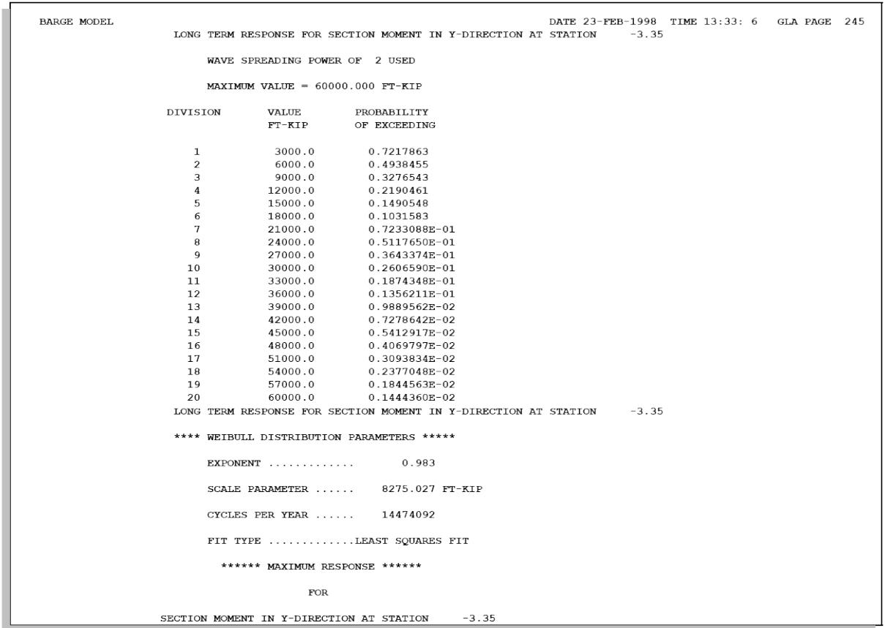  
Sample Problem 3 - Long Term Results

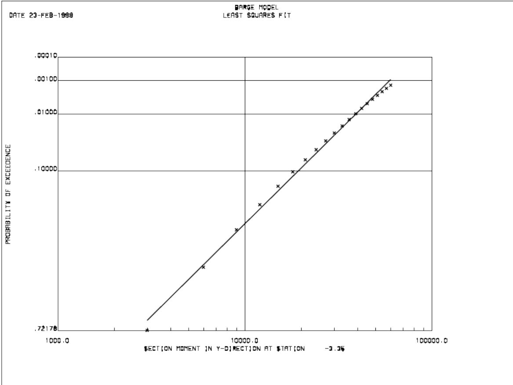  
Figure 6 Weibull Distribution Using Least Squares Fit

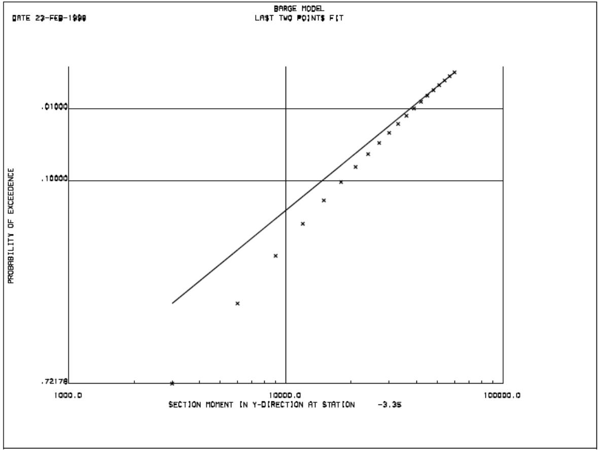  
Figure 7 Weibull Distribution Using Last Two Points Fit

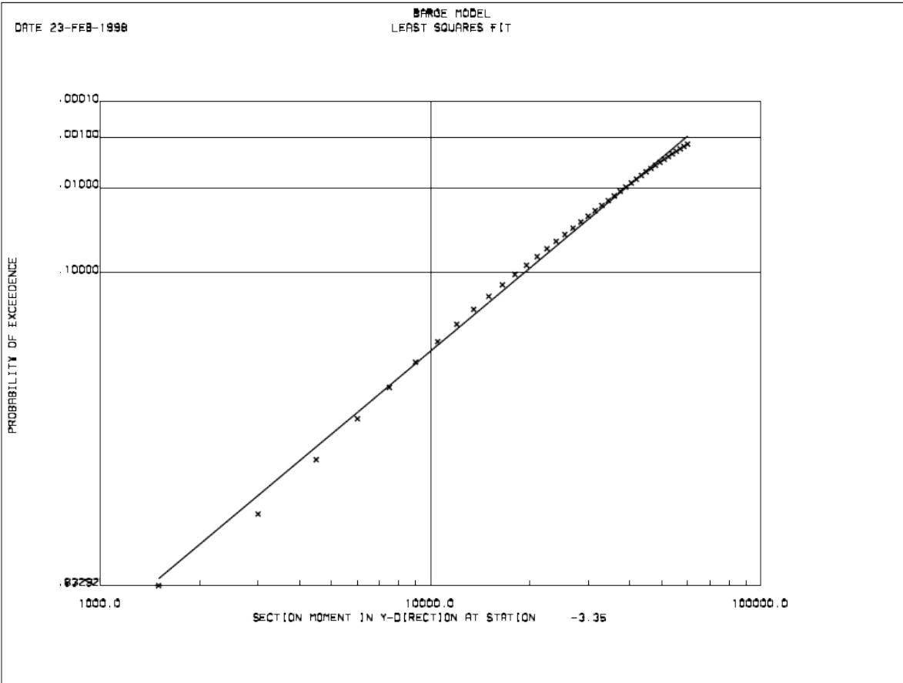  
Figure 8 Weibull Distribution Using 40 Points

## 4.4 SAMPLE PROBLEM 4

This sample uses a response file generated by Wave Response to determine critical time points.

Elevations 0.0, -50, -150, -250, -550, -800, -1050, -1200 and -1400 will be used to determine the critical positions based on maximum shear and moment. The Global loading input file along with a description follows:

|  | 1 | 2 | 3 | 4 | 5 | 6 | 7 | 8 |
| --- | --- | --- | --- | --- | --- | --- | --- | --- |
|  | 12345678901 | 12345678901 | 12345678901 | 12345678901 | 12345678901 | 12345678901 | 12345678901 | 12345678901 |
| A | MAOPT | EC XY |  |  |  |  |  |  |
| B | WAVRSP | 1 |  | 1 | 0.0 | YNYN |  |  |
| C | PLOT MY | TIM |  |  |  |  |  |  |
|  | PLOT FX | TIM |  |  |  |  |  |  |
| D | PLOT MY | STA |  |  |  |  |  |  |
|  | PLOT FX | STA |  |  |  |  |  |  |
| E | LOCATE | 0.0 | -50. | -150. | -250. | -550. | -800. | -1050. |
|  | END |  |  |  |  |  |  | -1200. |

The following describes the input lines in the Global Loading input file:

A. The GMOPT line specifies that the structure locations are in the XY plane by ‘XY’ in columns 13-14.:   
B. The WAVRSP line is used to input response parameters and indicates the following:.

a. One response file is to be used as input as designated by ‘1’ in columns 7-9.   
b. Only one wave approach direction, namely ‘0.0’ is to be considered.   
c. Critical time points will be determined by checking the elevations designated for maximum shear and maximum moment. Minimum moment and shear will not be considered.

C. Plots will be generated for moment about the Y axis and shear along the X axis versus time.   
D. Plots will be generated for moment about the Y axis and shear along the X axis versus station or elevation.

E. The wave height spectral density is defined using the WSPEC line as follows:

a. Ochi-Hubble spectrum is to be used as stipulated by ‘OH’ in columns 11-12.   
b. The swell period and significant wave height are 16 and 11.8, respectively.   
c. The time duration is to be 60.0 seconds as designated in columns 48-54.

F. The locations to be checked are input on the LOCATE line as 0, -50, -150, -250, -550, -800, - 1050, -1200 and -1399.9.

A portion of the output listing file including the time point selection data follows.

*GLOBAL LOADING ANALYSIS PARAMETERS *

LOAD SUMMATION TYPE INTERNAL

NOMENCLATURE TYPE STANDARD

PLANE SELECTED XY

AXIS LOCATION -X 0.00 FT

AXIS LOCATION - Y 0.00 FT

NUMBER OF STATIONS 9

NUMBER OF MEMBER GROUPS.． 276

NUMBER OF PLATE GROUPS.. 0

NUMBER OF JOINTS 997

NUMBER OF MEMBERS 1971

NUMBER OF PLATES 0

WAVE RESPONSE ANALYSIS...ON

NUMBER OF FILES 1

TRANSIENT TIME 0.000 SECS

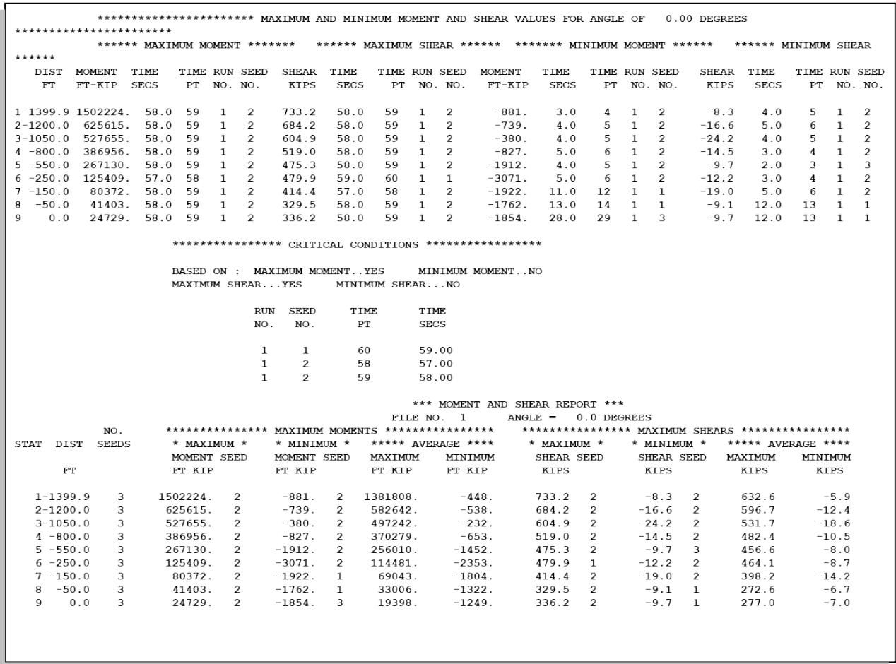

From the Global Loading output, only three time points are required to define load cases representing the maximum shear and moment cases at the desired elevations, namely Seed 1 time point 60, seed 2 time point 58 and seed 2 time point 59. A load case consisting of equivalent static loads will be retrieved from the response file for each of the critical cases.

Note: The critical time point information is saved in the time selection file created by the Global Loading program. This file may be specified when creating the retrieve load run file or the time points may be specified by the user.

5 INPUT LINES

END DATA

COLUMNS

COMMENTARY

GENERAL THIS LINE IS THE LAST RECORD OF THE GLOBAL LOADING INPUT FILE.

( 1- 3) ENTER 'END'.

| LINE LABEL | LEAVE THIS FIELD BLANK |
| --- | --- |
| END |  |
| 1--3 | 4-80 |

GLOBAL LOAD OPTIONS

COLUMNS

COMMENTARY

GENERAL THIS DATA IS REQUIRED FOR ANY GLOBAL LOADING EXECUTION. IT SPECIFIES OVERALL ANALYSIS PARAMETERS AND TYPE OF ANALYSIS.

(11-12) ENTER 'EC' IF A LISTING OF THE INPUT DATA IS TO BE INCLUDED IN THE OUTPUT LISTING FILE.   
(14-15) ENTER THE PLANE USED TO CUT THE STRUCTURE AS 'XY','YZ', OR 'ZX'.   
(17-18) LEAVE BLANK IF THE UNITS ON THE COMMON SOLUTION FILE ARE TO BE USED. OTHERWISE, SELECT FROM THE FOLLOWING UNITS: 'EN' - ENGLISH. 'MN' - METRIC (KILONEWTONS). 'ME' - METRIC (KILOGRAMS).   
(30-31) ENTER 'EX' TO USE APPLIED LOADS (EXTERNAL LOAD) OR 'SM' FOR STRESS (INTERNAL LOAD) METHOD.   
(33-34) ENTER 'NA' TO USE NAVAL ARCHITECTURE NOMENCLATURE.   
(46-61) ENTER THE LOCATION OF THE AXIS ABOUT WHICH MOMENTS DUE TO FORCES NORMAL TO THE DESIGNATED PLANE ARE CALCULATED. ENTER THE X AND Y ORIGINS WHEN USING THE XY PLANE, ENTER THE Y AND Z ORIGINS WHEN USING THE YZ PLANE, AND ENTER THE Z AND X ORIGINS WHEN USING THE ZX PLANE.

| LINE LABEL | INPUT ECHO OPTION | PLANE SELECTION | UNITS OPTION | OUTPUT SELECTIONS | OUTPUT SELECTIONS | AXIS ORIGIN COORDINATES | AXIS ORIGIN COORDINATES | LEAVE BLANK |
| --- | --- | --- | --- | --- | --- | --- | --- | --- |
| LINE LABEL | INPUT ECHO OPTION | PLANE SELECTION | UNITS OPTION | LOAD METHOD | NAVAL ARCH | Y FOR YZ Z FOR ZX X FOR XY | Z FOR YZ X FOR ZX Y FOR XY | LEAVE BLANK |
| GLAOPT |  |  |  |  |  |  |  |  |
| 1--6 | 11--12 | 14--15 | 17--18 | 30--31 | 33--34 | 46<--53 | 54<--61 | 62--80 |
| DEFAULT |  | 'YZ' |  |  |  |  |  |  |
| ENGLISH |  |  |  |  |  | FT | FT |  |
| METRIC |  |  |  |  |  | M | M |  |

LOCATION SPECIFICATION DATA

COLUMNS

COMMENTARY

GENERAL THIS RECORD ALLOWS THE SPECIFICATION OF LOCATIONS WHERE THECUTS ARE TO OCCUR. FOR EXAMPLE, IF THE DESIGNATED PLANE IS'YZ', THEN THESE VALUES ARE THE 'X' STRUCTURAL COORDINATES.THIS RECORD CAN BE REPEATED AS DESIRED.

( 8-15) ENTER THE FIRST POSITION.

(16-79) ENTER THE REMAINING POSITIONS.

| LINE LABEL | SPECIFIC LOCATIONS | SPECIFIC LOCATIONS | SPECIFIC LOCATIONS | SPECIFIC LOCATIONS | SPECIFIC LOCATIONS | SPECIFIC LOCATIONS | SPECIFIC LOCATIONS | SPECIFIC LOCATIONS | SPECIFIC LOCATIONS |
| --- | --- | --- | --- | --- | --- | --- | --- | --- | --- |
| LINE LABEL | 1ST | 2ND | 3RD | 4TH | 5TH | 6TH | 7TH | 8TH | 9TH |
| LOCATE |  |  |  |  |  |  |  |  |  |
| 1-- 6 | 8<--15 | 16<--23 | 24<--31 | 32<--39 | 40<--47 | 48<--55 | 65<--63 | 64<--71 | 72<--79 |
| DEFAULT |  |  |  |  |  |  |  |  |  |
| ENGLISH | FT | FT | FT | FT | FT | FT | FT | FT | FT |
| METRIC | M | M | M | M | M | M | M | M | M |

MEMBER GROUP IDENTIFIER SELECTION DATA

COLUMNS

COMMENTARY

GENERAL THIS RECORD ALLOWS THE SELECTION OF MEMBER GROUPS TO BE INCLUDED OR EXCLUDED IN THIS ANALYSIS.

( 8 ) ENTER 'I' TO INCLUDE THESE MEMBER GROUPS OR 'E' TO EXCLUDE. ALL MEMBER GROUP SELECTION SHOULD BE INCLUDES OR EXCLUDES AND NOT MIXED.

(10-68) ENTER THE MEMBER GROUP IDENTIFIERS.

| LINE LABEL | SELECTION TYPE | MEMBER GROUP IDENTIFIER SELECTION | MEMBER GROUP IDENTIFIER SELECTION | MEMBER GROUP IDENTIFIER SELECTION | MEMBER GROUP IDENTIFIER SELECTION | MEMBER GROUP IDENTIFIER SELECTION | MEMBER GROUP IDENTIFIER SELECTION | MEMBER GROUP IDENTIFIER SELECTION | MEMBER GROUP IDENTIFIER SELECTION | MEMBER GROUP IDENTIFIER SELECTION | MEMBER GROUP IDENTIFIER SELECTION | MEMBER GROUP IDENTIFIER SELECTION | MEMBER GROUP IDENTIFIER SELECTION | MEMBER GROUP IDENTIFIER SELECTION | MEMBER GROUP IDENTIFIER SELECTION | MEMBER GROUP IDENTIFIER SELECTION | MEMBER GROUP IDENTIFIER SELECTION | LEAVE BLANK |
| --- | --- | --- | --- | --- | --- | --- | --- | --- | --- | --- | --- | --- | --- | --- | --- | --- | --- | --- |
| LINE LABEL | SELECTION TYPE | 1ST | 2ND | 3RD | 4TH | 5TH | 6TH | 7TH | 8TH | 9TH | 10TH | 11TH | 12TH | 13TH | 14TH | 15TH |  |  |
| MGRPSL |  |  |  |  |  |  |  |  |  |  |  |  |  |  |  |  |  |  |
| 1-- 6 | 8 | 10--12 | 14--16 | 18--20 | 22--24 | 26--28 | 30--32 | 34--36 | 38--40 | 42--44 | 46--48 | 50--52 | 54--56 | 58--60 | 62--64 | 66--68 | 69--80 |  |
| DEFAULT | 'I' |  |  |  |  |  |  |  |  |  |  |  |  |  |  |  |  |  |

PLATE GROUP IDENTIFIER SELECTION DATA

COLUMNS

COMMENTARY

GENERAL THIS RECORD ALLOWS THE SELECTION OF PLATE GROUPS TO BE INCLUDED OR EXCLUDED IN THIS ANALYSIS.

( 8 ) ENTER 'I' TO INCLUDE THESE PLATE GROUPS OR 'E' TO EXCLUDE. ALL PLATE GROUP SELECTIONS SHOULD BE INCLUDES OR EXCLUDES AND NOT MIXED.

(10-68) ENTER THE PLATE GROUP IDENTIFIERS.

| LINE LABEL | SELECTION TYPE | PLATE GROUP IDENTIFIER SELECTION | PLATE GROUP IDENTIFIER SELECTION | PLATE GROUP IDENTIFIER SELECTION | PLATE GROUP IDENTIFIER SELECTION | PLATE GROUP IDENTIFIER SELECTION | PLATE GROUP IDENTIFIER SELECTION | PLATE GROUP IDENTIFIER SELECTION | PLATE GROUP IDENTIFIER SELECTION | PLATE GROUP IDENTIFIER SELECTION | PLATE GROUP IDENTIFIER SELECTION | PLATE GROUP IDENTIFIER SELECTION | PLATE GROUP IDENTIFIER SELECTION | PLATE GROUP IDENTIFIER SELECTION | PLATE GROUP IDENTIFIER SELECTION | PLATE GROUP IDENTIFIER SELECTION | PLATE GROUP IDENTIFIER SELECTION | LEAVE BLANK |
| --- | --- | --- | --- | --- | --- | --- | --- | --- | --- | --- | --- | --- | --- | --- | --- | --- | --- | --- |
| LINE LABEL | SELECTION TYPE | 1ST | 2ND | 3RD | 4TH | 5TH | 6TH | 7TH | 8TH | 9TH | 10TH | 11TH | 12TH | 13TH | 14TH | 15TH |  |  |
| PGRPSL |  |  |  |  |  |  |  |  |  |  |  |  |  |  |  |  |  |  |
| 1-- 6 | 8 | 10--12 | 14--16 | 18--20 | 22--24 | 26--28 | 30--32 | 34--36 | 38--40 | 42--44 | 46--48 | 50--52 | 54--56 | 58--60 | 62--64 | 66--68 | 69--80 |  |
| DEFAULT | 'I' |  |  |  |  |  |  |  |  |  |  |  |  |  |  |  |  |  |

PLOT SPECIFICATIONS

COLUMNS

COMMENTARY

GENERAL THIS LINE ALLOWS THE SELECTION OF PLOTS TO BE CREATED.

( 6- 7) ENTER THE FORCE TYPE TO BE USED AS THE DEPENDENT VARIABLE:

****** STANDARD ******** *** NAVAL ARCHITECTURE *

'FX' - FORCE IN X-DIRECTION 'AX' - AXIAL FORCE

'FY' - FORCE IN Y-DIRECTION 'HS' - HORIZONTAL SHEAR

'FZ' - FORCE IN Z-DIRECTION 'VS' - VERTICAL SHEAR

'MX' - MOMENT ABOUT X-AXIS 'TQ' - TORSION

'MY' - MOMENT ABOUT Y-AXIS 'VM' - VERTICAL MOMENT

'MZ' - MOMENT ABOUT Z-AXIS 'HM' - HORIZONTAL MOMENT

(10-12) ENTER THE INDEPENDENT VARIABLE IDENTIFIER:

'STA' - STATION.

'PER' - PERIOD.

'FRQ' - FREQUENCY.

'TIM' - TIME (WAVE RESPONSE ONLY).

(14-42) SELECT FROM THE FOLLOWING OPTIONS:

'SL' - SEPARATE LOAD CASES OR SURFACE PROFILES.

(43-50) IF THIS PLOT IS VERSUS PERIOD OR FREQUENCY, ENTER THE STATION

THAT THE PLOT IS TO BE CREATED.

| LINE LABEL | FORCE TYPE | INDEPENDENT VARIABLE | PLOT OPTIONS | PLOT OPTIONS | PLOT OPTIONS | PLOT OPTIONS | PLOT OPTIONS | PLOT OPTIONS | PLOT OPTIONS | PLOT OPTIONS | PLOT OPTIONS | PLOT OPTIONS | PLOT OPTIONS | STATION FOR RAO PILOTS | LEAVE BLANK |
| --- | --- | --- | --- | --- | --- | --- | --- | --- | --- | --- | --- | --- | --- | --- | --- |
| LINE LABEL | FORCE TYPE | INDEPENDENT VARIABLE | 1ST | 2ND | 3RD | 4TH | 5TH | 6TH | 7TH | 8TH | 9TH | 10TH |  | STATION FOR RAO PILOTS |  |
| PLOT |  |  |  |  |  |  |  |  |  |  |  |  |  |  |  |
| 1-- 4 | 6-- 7 | 10--12 | 14--15 | 17--18 | 20--21 | 23--24 | 26--27 | 29--30 | 32--33 | 35--36 | 38--39 | 41--42 | 43<--50 | 51--80 |  |
| DEFAULT |  |  |  |  |  |  |  |  |  |  |  |  |  |  |  |
| ENGLISH |  |  |  |  |  |  |  |  |  |  |  |  | FT |  |  |
| METRIC |  |  |  |  |  |  |  |  |  |  |  |  | M |  |  |

RANGE SPECIFICATION DATA

COLUMNS

COMMENTARY

GENERAL THIS RECORD ALLOWS THE SPECIFICATION OF LOCATIONS WHERE THECUTS ARE TO OCCUR. FOR EXAMPLE, IF THE DESIGNATED PLANE IS'YZ', THEN THESE VALUES ARE THE 'X' STRUCTURAL COORDINATES.THIS RECORD CAN BE REPEATED AS DESIRED.

( 8-10) ENTER THE NUMBER OF POSITIONS. THIS INCLUDES THE STARTING AND ENDING POSITIONS.   
(11-18) ENTER THE STARTING COORDINATE.   
(19-26) ENTER THE ENDING COORDINATE.   
(28-46) ENTER NEXT RANGE IF DESIRED.   
(48-66) ENTER NEXT RANGE IF DESIRED.

| LINE LABEL | 1ST RANGE | 1ST RANGE | 1ST RANGE | 2ND RANGE | 2ND RANGE | 2ND RANGE | 3RD RANGE | 3RD RANGE | 3RD RANGE | LEAVE BLANK |
| --- | --- | --- | --- | --- | --- | --- | --- | --- | --- | --- |
| LINE LABEL | NUMBER OF POSITIONS | STARTING COORDINATE | ENDING COORDINATE | NUMBER OF POSITIONS | STARTING COORDINATE | ENDING COORDINATE | NUMBER OF POSITIONS | STARTING COORDINATE | ENDING COORDINATE | LEAVE BLANK |
| RANGE |  |  |  |  |  |  |  |  |  |  |
| 1-- 5 | 8-->10 | 11<--18 | 19<--26 | 28-->30 | 31<--38 | 39<--46 | 48-->50 | 51<--58 | 59<--66 | 67--80 |
| DEFAULT |  |  |  |  |  |  |  |  |  |  |
| ENGLISH |  | FT | FT |  | FT | FT |  | FT | FT |  |
| METRIC |  | M | M |  | M | M |  | M | M |  |

RESPONSE SELECTION DATA

COLUMNS

COMMENTARY

GENERAL THIS RECORD ALLOWS THE CALCULATION OF RESPONSES FOR LONG OR SHORT TERM ANALYSES.

( 8-11) ENTER THE RESPONSE TYPE:

'SFRC' - SECTION FORCE.

'DEFL' - DEFLECTION.

'REAC' - REACTION FORCE.

(13-14) ENTER THE RESPONSE IDENTIFIER:

*************** SECTION FORCE *********** *******

****** STANDARD ******** *** NAVAL ARCHITECTURE *

'FX' - FORCE IN X-DIRECTION 'AX' - AXIAL FORCE

'FY' - FORCE IN Y-DIRECTION 'HS' - HORIZONTAL SHEAR

'FZ' - FORCE IN Z-DIRECTION 'VS' - VERTICAL SHEAR

'MX' - MOMENT ABOUT X-AXIS 'TQ' - TORSION

'MY' - MOMENT ABOUT Y-AXIS 'VM' - VERTICAL MOMENT

'MZ' - MOMENT ABOUT Z-AXIS 'HM' - HORIZONTAL MOMENT

****** REACTION ******** ******* DEFLECTION *****

'FX' - FORCE IN X-DIRECTION 'DX' - X-DEFLECTION

'FY' - FORCE IN Y-DIRECTION 'DY' - Y-DEFLECTION

'FZ' - FORCE IN Z-DIRECTION 'DZ' - Z-DEFLECTION

'MX' - MOMENT ABOUT X-AXIS 'RX' - X-ROTATION

'MY' - MOMENT ABOUT Y-AXIS 'RY' - Y-ROTATION

'MZ' - MOMENT ABOUT Z-AXIS 'RZ' - Z-ROTATION

COLUMNS

COMMENTARY

(16-19) ENTER THE JOINT NAME FOR REACTION OR DEFLECTION RESPONSE.   
(20-26) ENTER THE STATION FOR SECTION FORCE.   
(27-28) SELECT EITHER SHORT OR LONG TERM RESPONSE.   
(29-30) IF WAVE SPREADING IS TO BE USED, ENTER THE WAVE SPREADING POWER. (SPREADING FUNCTION IS COSINE TO THIS POWER.)   
(31-41) ENTER ONLY ONE OF THE FOLLOWING:   
(31-39) PERCENT PROBABILITY LEVEL OF EXCEEDANCE.   
(40-41) NEGATIVE OF LOG TO THE BASE 10 OF ONE MINUS THE PROBABILITY OF EXCEEDANCE. EXAMPLE: AN ENTRY OF 3 WOULD CORRESPOND TO 99.9 PERCENT.   
(45-52) MAXIMUM RESPONSE LEVEL FOR PROBABILITY POINTS:

* TYPE * ** ENGLISH ** ** METRIC-KN ** ** METRIC-KG **

FORCE KIP KN TONNE

MOMENT KIP-FT KN-M TONNE-M

DEFLECTION IN CM CM

ROTATION RADIANS RADIANS RADIANS

(53-55) NUMBER OF PROBABILITY POINTS TO BE CREATED. THE PROGRAM CALCULATES THE PROBABILITY OF EXCEEDANCE OF POINTS UP TO THE MAXIMUM RESPONSE LEVEL.   
(56-57) SELECT FROM THE FOLLOWING METHODS OF CREATING THE WEIBULL PARAMETERS:

'LS' - LEAST-SQUARES FIT.

'L2' - LAST TWO POINTS FIT.

| LINE LABEL | RESPONSE TYPE | RESPONSE ID | JOINT NAME | STATION | LONG OR SHORT TERM OPTION | WAVE SPREAD POWER | SHORT TERM (SELECT ONE) | SHORT TERM (SELECT ONE) | LONG TERM PARAMETERS | LONG TERM PARAMETERS | LONG TERM PARAMETERS | LEAVE BLANK |
| --- | --- | --- | --- | --- | --- | --- | --- | --- | --- | --- | --- | --- |
| LINE LABEL | RESPONSE TYPE | RESPONSE ID | JOINT NAME | STATION | LONG OR SHORT TERM OPTION | WAVE SPREAD POWER | PROBABILITY LEVEL OF EXCEEDANCE | LOG BASE 10 LEVEL OF EXCEEDANCE | THRESHOLD VALUE OF RESPONSE | NUMBER OF PROBABILITY POINTS | WEIBULL FIT SELECTION | LEAVE BLANK |
| RSPSEL |  |  |  |  |  |  |  |  |  |  |  |  |
| 1--6 | 8--11 | 13--14 | 16--->19 | 20<-->26 | 27--28 | 29--->30 | 31<-->39 | 40--->41 | 45<-->52 | 53--->55 | 56--57 | 58--80 |
| DEFAULT |  |  |  |  | 'ST' |  | 99.9 | 3 |  | 50 | 'LS' |  |
| ENGLISH |  |  |  | FT |  |  | PERCENT |  |  |  |  |  |
| METRIC |  |  |  | M |  |  | PERCENT |  |  |  |  |  |

SCATTER DIAGRAM HEADER RECORD

COLUMNS

COMMENTARY

GENERAL THIS RECORD IS USED IF AND ONLY IF A LONG-TERM RESPONSE ANALYSIS IS BEING DONE. IT IS USED IN CONJUNCTION WITH THE 'SCWAV', 'SCPER', AND 'SCOFAC' RECORDS TO DESIGNATE THE WAVE SPECTRAL ENVIRONMENT.

( 1- 5) ENTER 'SCATD'.   
( 7 ) SELECT FROM THE FOLLOWING PERIOD TYPES: 'D' - DOMINANT OR PEAK. 'S' - SIGNIFICANT OR ZERO UP-CROSSING.   
( 9-14) IF THE PERIODS ARE TO FACTORED, ENTER THAT FACTOR HERE. OTHERWISE, LEAVE BLANK.   
(15-20) IF THE WAVE HEIGHTS ARE TO BE FACTORED, ENTER THAT FACTOR HERE. OTHERWISE, LEAVE BLANK.   
(21-26) ENTER THE FRACTION LIFE FACTOR. THIS CAN BE USED TO CONVERT THE SCATTER DIAGRAM FROM PERCENTS OR PARTS PER THOUSAND BY ENTERING 0.01 OR 0.001, RESPECTIVELY.   
( 27 ) ENTER 'N' IF THE SCATTER DIAGRAM IS TO BE NORMALIZED. THIS WILL FACTOR ALL FREQUENCY OF OCCURRENCE DATA SO THAT THE SUM WILL BE 1.0.

COLUMNS

COMMENTARY

(32-33) SELECT THE TYPE OF WAVE SPECTRUM TO BE GENERATED FROM THE FOLLOWING:

'PM' - PIERSON-MOSKOWITZ SPECTRUM.   
'JS' - JONSWAP SPECTRUM.   
'OH' - OCHI-HUBBLE SPECTRUM.

(34-45) ENTER THE VALUES OF THE PARAMETERS "GAMMA" AND "C" REQUIRED TO FULLY DEFINE THE JONSWAP SPECTRUM IF 'JS' IS IN COLUMNS 32-33.   
(46-65) ENTER THE VALUES OF THE OCHI-HUBBLE PARAMETERS. THE SWELL WAVE HEIGHTS AND PERIODS ARE ENTERED ON THE 'SCWAV' AND 'SCPER' RECORDS, RESPECTIVELY. THE WIND GENERATED WAVE HEIGHTS AND PERIODS ARE ASSUMED THE SAME FOR ALL SCATTER DIAGRAM ENTRIES.   
( 66 ) IF THE OCHI-HUBBLE WIND WAVE HEIGHT ENTRY IS TO BE USED AS A RATIO OF THE SWELL WAVE HEIGHT, ENTER 'R' HERE.

| LINE LABEL | PERIOD TYPE | PERIOD FACTOR | WAVE HEIGHT FACTOR | FRACTION LIFE FACTOR | NORMALIZATION OPTION | WAVE SPECTRUM TYPE | JONSWAP PARAMETERS | JONSWAP PARAMETERS | OCHI-HUBBLE PARAMETERS | OCHI-HUBBLE PARAMETERS | OCHI-HUBBLE PARAMETERS | OCHI-HUBBLE PARAMETERS | OCHI-HUBBLE PARAMETERS | LEAVE BLANK |
| --- | --- | --- | --- | --- | --- | --- | --- | --- | --- | --- | --- | --- | --- | --- |
| LINE LABEL | PERIOD TYPE | PERIOD FACTOR | WAVE HEIGHT FACTOR | FRACTION LIFE FACTOR | NORMALIZATION OPTION | WAVE SPECTRUM TYPE | "GAMMA" | "C" | WIND GENERATED PARAMETERS | WIND GENERATED PARAMETERS | WIND GENERATED PARAMETERS | SWELL LAMBDA | RATIO OPTION | LEAVE BLANK |
| LINE LABEL | PERIOD TYPE | PERIOD FACTOR | WAVE HEIGHT FACTOR | FRACTION LIFE FACTOR | NORMALIZATION OPTION | WAVE SPECTRUM TYPE | "GAMMA" | "C" | SIGNIFICANT WAVE HEIGHT OR RATIO | PEAK PERIOD | LAMBDA | SWELL LAMBDA | RATIO OPTION | LEAVE BLANK |
| SCATD |  |  |  |  |  |  |  |  |  |  |  |  |  |  |
| 1--5 | 7 | 9<--14 | 15<--20 | 21<--26 | 27 | 32--33 | 34<--39 | 40<--45 | 46<--50 | 51<--55 | 56<--60 | 61<--65 | 66 | 67--80 |
| DEFAULT | 'D' | 1 | 1 | 1 |  | 'PM' | 3.3 | 1.525 |  |  | CALCULATED | 2.72 |  |  |
| ENGLISH |  |  |  |  |  |  |  |  | FT | SEC |  |  |  |  |
| METRIC |  |  |  |  |  |  |  |  | M | SEC |  |  |  |  |

SCATTER DIAGRAM DIRECTION DATA

COLUMNS

COMMENTARY

GENERAL

THIS RECORD IS REQUIRED FOR EACH WAVE DIRECTION FOR THE LONG-TERM RESPONSE ANALYSIS. IT IS IMMEDIATELY FOLLOWED BY THE WAVE SCATTER DIAGRAM DATA.

( 8- 9)

IF THE PREVIOUS SCATTER DIAGRAM IS TO BE REPEATED FOR THIS DIRECTION, ENTER 'RP'.

(18-24)

ENTER THE ANGLE FOR THIS DIRECTION. THIS MUST CORRESPOND TOTHE TRANSFER FUNCTION DIRECTION.

(25-31)

ENTER THE DURATION FOR EACH SEASTATE IDENTIFIED IN THE SCATTER DIAGRAM.

(32-38)

ENTER THE FRACTION OF TIME FOR THIS DIRECTION. IF LEFT BLANK, THE DEFAULT IS EQUAL TIME IN ALL DIRECTIONS.

| LINE LABEL | REPEAT PREVIOUS SCATTER DIAGRAM OPTION | DIRECTION | DURATION OF SEASTATE | FRACTION OF TIME FOR THIS DIRECTION | LEAVE BLANK |
| --- | --- | --- | --- | --- | --- |
| SCDIR |  |  |  |  |  |
| 1-- 5 | 8-- 9 | 18<--24 | 25<--31 | 32<--38 | 39--------80 |
| DEFAULT |  |  | 1 | 1.0/NDIR |  |
| ENGLISH |  | DEG | HOURS |  |  |
| METRIC |  | DEG | HOURS |  |  |

SCEND DATA

COLUMNS

COMMENTARY

LOCATION THIS RECORD IS THE LAST RECORD FOR THE SCATTER DIAGRAM DATA INPUT.

GENERAL THE 'SCEND' RECORD TERMINATES THE SCATTER DIAGRAM DATA INPUT.

| LINE LABEL | LEAVE BLANK |
| --- | --- |
| SCEND |  |
| 1-- 5 | 6-80 |

SCATTER DIAGRAM FREQUENCY OF OCCURRENCE FACTORS

COLUMNS

COMMENTARY

GENERAL

THIS DATA IS OPTIONAL AND IS USED TO SPECIFY THE DISTRIBUTION OF THE FREQUENCY OF OCCURRENCE BY WAVE HEIGHTS IN THE SCATTER DIAGRAM.

( 1- 5) ENTER 'SCOFAC'.   
(13-78) ENTER THE FREQUENCY OF OCCURRENCE FACTORS FOR EACH OF THE WAVE HEIGHTS FOR THIS SCATTER DIAGRAM.

| LINE LABEL | WAVE HEIGHT FREQUENCY OF OCCURRENCE FACTORS | WAVE HEIGHT FREQUENCY OF OCCURRENCE FACTORS | WAVE HEIGHT FREQUENCY OF OCCURRENCE FACTORS | WAVE HEIGHT FREQUENCY OF OCCURRENCE FACTORS | WAVE HEIGHT FREQUENCY OF OCCURRENCE FACTORS | WAVE HEIGHT FREQUENCY OF OCCURRENCE FACTORS | WAVE HEIGHT FREQUENCY OF OCCURRENCE FACTORS | WAVE HEIGHT FREQUENCY OF OCCURRENCE FACTORS | WAVE HEIGHT FREQUENCY OF OCCURRENCE FACTORS | WAVE HEIGHT FREQUENCY OF OCCURRENCE FACTORS | WAVE HEIGHT FREQUENCY OF OCCURRENCE FACTORS |
| --- | --- | --- | --- | --- | --- | --- | --- | --- | --- | --- | --- |
| LINE LABEL | 1ST | 2ND | 3RD | 4TH | 5TH | 6TH | 7TH | 8TH | 9TH | 10TH | 11TH |
| SCOFAC |  |  |  |  |  |  |  |  |  |  |  |
| 1--6 | 13--18 | 19--24 | 25--30 | 31--36 | 37--42 | 43--48 | 49--54 | 55--60 | 61--66 | 67--72 | 73--78 |

SCATTER DIAGRAM FREQUENCY OF OCCURRENCE

COLUMNS

COMMENTARY

GENERAL THIS DATA IS USED TO SPECIFY THE FREQUENCY OF OCCURRENCE OFWAVES DURING A PORTION OF THE LIFE OF THE STRUCTURE. EACHENTRY REPRESENTS THE FRACTION OF THE TIME THAT THE SEASTATEDEFINED BY THIS WAVE HEIGHT AND PERIOD COMBINATION.

( 1- 5) ENTER 'SCPER'.   
( 7-12) ENTER THE PERIOD FOR THIS ROW OF THE SCATTER DIAGRAM.   
(13-78) ENTER THE FRACTION OF THE TIME THAT THE SEASTATE DEFINED BY THE PERIOD ENTERED IN COLUMNS 7 TO 12 AND THE WAVE HEIGHTS ENTERED ON THE PRECEDING 'SCWAV' RECORD.

| LINE LABEL | PERIOD | FREQUENCY OF OCCURRENCE (FRACTION) | FREQUENCY OF OCCURRENCE (FRACTION) | FREQUENCY OF OCCURRENCE (FRACTION) | FREQUENCY OF OCCURRENCE (FRACTION) | FREQUENCY OF OCCURRENCE (FRACTION) | FREQUENCY OF OCCURRENCE (FRACTION) | FREQUENCY OF OCCURRENCE (FRACTION) | FREQUENCY OF OCCURRENCE (FRACTION) | FREQUENCY OF OCCURRENCE (FRACTION) | FREQUENCY OF OCCURRENCE (FRACTION) | FREQUENCY OF OCCURRENCE (FRACTION) |
| --- | --- | --- | --- | --- | --- | --- | --- | --- | --- | --- | --- | --- |
| LINE LABEL | PERIOD | 1ST | 2ND | 3RD | 4TH | 5TH | 6TH | 7TH | 8TH | 9TH | 10TH | 11TH |
| SCPER |  |  |  |  |  |  |  |  |  |  |  |  |
| 1-- 5 | 7<--12 | 13--18 | 19--24 | 25--30 | 31--36 | 37--42 | 43--48 | 49--54 | 55--60 | 61--66 | 67--72 | 73--78 |
| DEFAULT |  |  |  |  |  |  |  |  |  |  |  |  |
| ENGLISH | SEC |  |  |  |  |  |  |  |  |  |  |  |
| METRIC | SEC |  |  |  |  |  |  |  |  |  |  |  |

SCATTER DIAGRAM WAVE HEIGHTS

COLUMNS

COMMENTARY

GENERAL THIS DATA IS USED TO SPECIFY THE WAVE HEIGHTS OF A SCATTER DIAGRAM. EACH ENTRY REPRESENTS CENTER WAVE HEIGHT OF A RANGE OF WAVE HEIGHTS.

( 1- 5) ENTER 'SCWAV'.   
(13-78) ENTER THE WAVE HEIGHTS FOR THIS SCATTER DIAGRAM. THESE WAVE HEIGHTS ALONG WITH THE FOLLOWING PERIODS AND FREQUENCY OF OCCURRENCE DATA CONSTITUTE THE SCATTER DIAGRAM.

| LINE LABEL | WAVE HEIGHTS | WAVE HEIGHTS | WAVE HEIGHTS | WAVE HEIGHTS | WAVE HEIGHTS | WAVE HEIGHTS | WAVE HEIGHTS | WAVE HEIGHTS | WAVE HEIGHTS | WAVE HEIGHTS | WAVE HEIGHTS |
| --- | --- | --- | --- | --- | --- | --- | --- | --- | --- | --- | --- |
| LINE LABEL | 1ST | 2ND | 3RD | 4TH | 5TH | 6TH | 7TH | 8TH | 9TH | 10TH | 11TH |
| SCWAV |  |  |  |  |  |  |  |  |  |  |  |
| 1-- 5 | 13<--18 | 19<--24 | 25<--30 | 31<--36 | 37<--42 | 43<--48 | 49<--54 | 55<--60 | 61<--66 | 67<--72 | 73<--78 |
| DEFAULT |  |  |  |  |  |  |  |  |  |  |  |
| ENGLISH | FT | FT | FT | FT | FT | FT | FT | FT | FT | FT | FT |
| METRIC | M | M | M | M | M | M | M | M | M | M | M |

SECTION FORCE VERSUS PERIOD DATA

COLUMNS

COMMENTARY

GENERAL THIS RECORD ALLOWS THE CALCULATION OF LOADS VERSUS SPECTRUM WAVE PERIOD AT A PARTICULAR STATION.

( 6- 7) ENTER THE IDENTIFIER OF THE SECTION FORCE. ******** STANDARD ******** *** NAVAL ARCHITECTURE *** 'FX' - FORCE IN X-DIRECTION 'AX' - AXIAL FORCE 'FY' - FORCE IN Y-DIRECTION 'HS' - HORIZONTAL SHEAR 'FZ' - FORCE IN Z-DIRECTION 'VS' - VERTICAL SHEAR 'MX' - MOMENT ABOUT X-AXIS 'TQ' - TORSION 'MY' - MOMENT ABOUT Y-AXIS 'VM' - VERTICAL MOMENT 'MZ' - MOMENT ABOUT Z-AXIS 'HM' - HORIZONTAL MOMENT   
( 8-15) ENTER THE STATION FOR THIS FORCE.   
(16-23) ENTER THE WAVE DIRECTION.   
( 24 ) ENTER THE TYPE OF SPECTRUM PERIOD: 'P' - PEAK. 'M' - MEAN.   
(25-32) ENTER THE BEGINNING SPECTRUM PERIOD. THIS WILL BE THE BEGINNING OF THE INDEPENDENT VARIABLE FOR PLOTTING.   
(33-40) ENTER THE ENDING SPECTRUM PERIOD.   
(41-43) ENTER THE NUMBER OF PERIOD STEPS.   
(44-45) ENTER THE SPECTRUM TYPE FROM THE FOLLOWING: 'PM' - PIERSON-MOSKOWITZ. 'JS' - JONSWAP.   
(46-53) ENTER THE SIGNIFICANT WAVE HEIGHT FOR THIS SPECTRUM.   
(54-69) ENTER THE JONSWAP PARAMETERS.

| LINE LABEL | SECTION FORCE ID | STATION | WAVE DIRECTION | SPECTRUM PERIOD TYPE | BEGINNING PERIOD | ENDING PERIOD | NUMBER OF PERIOD SEPS | WAVE SPECTRUM TYPE | SIGNIFICANT WAVE HEIGHT | JONSWAP PARAMETERS | JONSWAP PARAMETERS | LEAVE BLANK |
| --- | --- | --- | --- | --- | --- | --- | --- | --- | --- | --- | --- | --- |
| LINE LABEL | SECTION FORCE ID | STATION | WAVE DIRECTION | SPECTRUM PERIOD TYPE | BEGINNING PERIOD | ENDING PERIOD | NUMBER OF PERIOD SEPS | WAVE SPECTRUM TYPE | SIGNIFICANT WAVE HEIGHT | "GAMMA" | "C" | LEAVE BLANK |
| SFVP |  |  |  |  |  |  |  |  |  |  |  |  |
| 1-- 4 | 6-- 7 | 8<--15 | 16<--23 | 24 | 25<--32 | 33<--40 | 41-->43 | 44--45 | 46<--53 | 54<--61 | 62<--69 | 70--80 |
| DEFAULT |  |  |  | 'P' |  |  | 40 | 'PM' |  | 3.3 | 1.525 |  |
| ENGLISH |  | FT | DEG |  | SEC | SEC |  |  | FT |  |  |  |
| METRIC |  | M | DEG |  | SEC | SEC |  |  | M |  |  |  |

STILL WATER PLUS WAVE DATA

COLUMNS

COMMENTARY

GENERAL THIS RECORD ALLOWS THE CALCULATION OF LOADS VERSUS STATION TO BE CREATED FOR A SPECIFIC WAVE INCLUDING THE DEAD LOADS FROM THE STILL WATER CONDITION.

( 8- 9) ENTER 'PL' IF THIS LOADING IS TO BE PLOTTED VERSUS STATION.   
(15-22) ENTER THE WAVE HEIGHT. THIS WAVE HEIGHT IS USED TO FACTOR THE LOADINGS FROM THE WAVES REPRESENTED BY THE INPUT LOAD CONDITIONS.   
(23-30) ENTER THE WAVE PERIOD. THIS PERIOD MUST CORRESPOND TO A WAVE PERIOD CONTAINED IN THE INPUT LOAD CONDITIONS.   
(31-38) ENTER THE WAVE DIRECTION. THIS DIRECTION MUST CORRESPOND TO A WAVE DIRECTION CONTAINED IN THE INPUT LOAD CONDITIONS.   
(39-46) ENTER THE PHASE ANGLE TO BE USED TO CALCULATE THE LOADING FROM THE REAL AND IMAGINARY COMPONENTS OF THE INPUT LOADINGS.

| LINE LABEL | PLOT OPTION | WAVE HEIGHT | WAVE PERIOD | WAVE DIRECTION | WAVE PHASE | LEAVE BLANK |
| --- | --- | --- | --- | --- | --- | --- |
| SWPW |  |  |  |  |  |  |
| 1-- 4 | 8-- 9 | 15<--22 | 23<--30 | 31<--38 | 39<--46 | 47--80 |
| DEFAULT |  |  |  |  |  |  |
| ENGLISH |  | FT | SEC | DEG | DEG |  |
| METRIC |  | M | SEC | DEG | DEG |  |

GLOBAL MODELING ANALYSIS TITLE

COLUMNS

COMMENTARY

LOCATION IF INPUT, THIS OPTIONAL LINE IS FIRST IN THE GLOBAL LOADING ANALYSIS INPUT FILE.

GENERAL THIS LINE IS OPTIONAL AND ALLOWS THE USER TO SPECIFY A TITLE FOR GLOBAL LOADING ANALYSIS OUTPUT OTHER THAN THE TITLE OF THE SACS IV DECK.

( 2-80) ENTER ANY ALPHANUMERIC TITLE. THIS TITLE WILL APPEAR ON ALL PAGES OF GLOBAL LOADING ANALYSIS OUTPUT.

WAVE SPECTRAL DENSITY SPECIFICATION DATA

COLUMNS

COMMENTARY

GENERAL

THIS DATA IS USED IF AND ONLY IF A SHORT TERM SPECTRAL ANALYSIS IS BEING DONE. IT IS USED TO DESIGNATE THE FORM OF THE WAVE HEIGHT SPECTRAL DENSITY FUNCTION.

( 1- 5) ENTER 'WSPEC'.   
( 7- 9) ENTER THE WAVE DIRECTION NUMBER. THIS NUMBER MUST CORRESPONDTO THE TRANSFER FUNCTION DIRECTION NUMBER.  
(11-12) ENTER THE TYPE OF SPECTRUM TO BE USED FOR THE WAVE HEIGHT SPECTRAL DENSITY FUNCTION. CHOOSE FROM THE FOLLOWING: 'PM' - PIERSON-MOSKOWITZ SPECTRUM. THIS IS THE DEFAULT. 'JS' - JONSWAP SPECTRUM. 'US' - USER-DEFINED SPECTRUM.   
(13-19) ENTER THE "SIGNIFICANT WAVE HEIGHT" FOR THIS SPECTRUM.   
(20-26) ENTER THE "DOMINANT PERIOD" FOR THIS SPECTRUM.   
(27-33) ENTER THE FRACTION OF THE DESIGN LIFE THAT THE STRUCTURE WILL BE SUBJECT TO THIS SPECTRUM.   
(34-47) ENTER THE VALUES OF THE PARAMETERS "GAMMA" AND "C" REQUIRED TO FULLY DEFINE THE JONSWAP SPECTRUM IF 'JS' IS IN COLUMNS 11-12.

| LINE LABEL | DIRECTION NUMBER | WAVE SPECTRUM TYPE | WAVE SPECTRUM PARAMETERS | WAVE SPECTRUM PARAMETERS | FRACTION OF DESIGN LIFE | JONSWAP PARAMETERS | JONSWAP PARAMETERS | LEAVE BLANK |
| --- | --- | --- | --- | --- | --- | --- | --- | --- |
| LINE LABEL | DIRECTION NUMBER | WAVE SPECTRUM TYPE | SIGNIF- ICANT WAVE HEIGHT | DOMINANT (PEAK) PERIOD | FRACTION OF DESIGN LIFE | "GAMMA" | "C" | LEAVE BLANK |
| WSPEC |  |  |  |  |  |  |  |  |
| 1--5 | 7-->9 | 11--12 | 13<--19 | 20<--26 | 27<--33 | 34<--40 | 41<--47 | 48--80 |
| DEFAULT |  | 'PM' |  |  |  | 3.3 | 1.525 |  |
| ENGLISH |  |  | FT | SEC |  |  |  |  |
| METRIC |  |  | M | SEC |  |  |  |  |

END DATA

COLUMNS

COMMENTARY

GENERAL THIS LINE IS THE LAST RECORD OF THE GLOBAL LOADING INPUT FILE.

( 1- 3) ENTER 'END'.

| LINE LABEL | LEAVE THIS FIELD BLANK |
| --- | --- |
| END |  |
| 1--3 | 4-80 |

GLOBAL LOAD OPTIONS

COLUMNS

COMMENTARY

GENERAL THIS DATA IS REQUIRED FOR ANY GLOBAL LOADING EXECUTION. IT SPECIFIES OVERALL ANALYSIS PARAMETERS AND TYPE OF ANALYSIS.

(11-12) ENTER 'EC' IF A LISTING OF THE INPUT DATA IS TO BE INCLUDED IN THE OUTPUT LISTING FILE.   
(14-15) ENTER THE PLANE USED TO CUT THE STRUCTURE AS 'XY','YZ', OR 'ZX'.   
(17-18) LEAVE BLANK IF THE UNITS ON THE COMMON SOLUTION FILE ARE TO BE USED. OTHERWISE, SELECT FROM THE FOLLOWING UNITS: 'EN' - ENGLISH. 'MN' - METRIC (KILONEWTONS). 'ME' - METRIC (KILOGRAMS).   
(30-31) ENTER 'EX' TO USE APPLIED LOADS (EXTERNAL LOAD) OR 'SM' FOR STRESS (INTERNAL LOAD) METHOD.   
(33-34) ENTER 'NA' TO USE NAVAL ARCHITECTURE NOMENCLATURE.   
(46-61) ENTER THE LOCATION OF THE AXIS ABOUT WHICH MOMENTS DUE TO FORCES NORMAL TO THE DESIGNATED PLANE ARE CALCULATED. ENTER THE X AND Y ORIGINS WHEN USING THE XY PLANE, ENTER THE Y AND Z ORIGINS WHEN USING THE YZ PLANE, AND ENTER THE Z AND X ORIGINS WHEN USING THE ZX PLANE.

| LINE LABEL | INPUT ECHO OPTION | PLANE SELECTION | UNITS OPTION | OUTPUT SELECTIONS | OUTPUT SELECTIONS | AXIS ORIGIN COORDINATES | AXIS ORIGIN COORDINATES | LEAVE BLANK |
| --- | --- | --- | --- | --- | --- | --- | --- | --- |
| LINE LABEL | INPUT ECHO OPTION | PLANE SELECTION | UNITS OPTION | LOAD METHOD | NAVAL ARCH | Y FOR YZ Z FOR ZX X FOR XY | Z FOR YZ X FOR ZX Y FOR XY | LEAVE BLANK |
| GLAOPT |  |  |  |  |  |  |  |  |
| 1--6 | 11--12 | 14--15 | 17--18 | 30--31 | 33--34 | 46<--53 | 54<--61 | 62--80 |
| DEFAULT |  | 'YZ' |  |  |  |  |  |  |
| ENGLISH |  |  |  |  |  | FT | FT |  |
| METRIC |  |  |  |  |  | M | M |  |

LOCATION SPECIFICATION DATA

COLUMNS

COMMENTARY

GENERAL THIS RECORD ALLOWS THE SPECIFICATION OF LOCATIONS WHERE THECUTS ARE TO OCCUR. FOR EXAMPLE, IF THE DESIGNATED PLANE IS'YZ', THEN THESE VALUES ARE THE 'X' STRUCTURAL COORDINATES.THIS RECORD CAN BE REPEATED AS DESIRED.

( 8-15) ENTER THE FIRST POSITION.

(16-79) ENTER THE REMAINING POSITIONS.

| LINE LABEL | SPECIFIC LOCATIONS | SPECIFIC LOCATIONS | SPECIFIC LOCATIONS | SPECIFIC LOCATIONS | SPECIFIC LOCATIONS | SPECIFIC LOCATIONS | SPECIFIC LOCATIONS | SPECIFIC LOCATIONS | SPECIFIC LOCATIONS |
| --- | --- | --- | --- | --- | --- | --- | --- | --- | --- |
| LINE LABEL | 1ST | 2ND | 3RD | 4TH | 5TH | 6TH | 7TH | 8TH | 9TH |
| LOCATE |  |  |  |  |  |  |  |  |  |
| 1-- 6 | 8<--15 | 16<--23 | 24<--31 | 32<--39 | 40<--47 | 48<--55 | 65<--63 | 64<--71 | 72<--79 |
| DEFAULT |  |  |  |  |  |  |  |  |  |
| ENGLISH | FT | FT | FT | FT | FT | FT | FT | FT | FT |
| METRIC | M | M | M | M | M | M | M | M | M |

MEMBER GROUP IDENTIFIER SELECTION DATA

COLUMNS

COMMENTARY

GENERAL THIS RECORD ALLOWS THE SELECTION OF MEMBER GROUPS TO BE INCLUDED OR EXCLUDED IN THIS ANALYSIS.

( 8 ) ENTER 'I' TO INCLUDE THESE MEMBER GROUPS OR 'E' TO EXCLUDE. ALL MEMBER GROUP SELECTION SHOULD BE INCLUDES OR EXCLUDES AND NOT MIXED.

(10-68) ENTER THE MEMBER GROUP IDENTIFIERS.

| LINE LABEL | SELECTION TYPE | MEMBER GROUP IDENTIFIER SELECTION | MEMBER GROUP IDENTIFIER SELECTION | MEMBER GROUP IDENTIFIER SELECTION | MEMBER GROUP IDENTIFIER SELECTION | MEMBER GROUP IDENTIFIER SELECTION | MEMBER GROUP IDENTIFIER SELECTION | MEMBER GROUP IDENTIFIER SELECTION | MEMBER GROUP IDENTIFIER SELECTION | MEMBER GROUP IDENTIFIER SELECTION | MEMBER GROUP IDENTIFIER SELECTION | MEMBER GROUP IDENTIFIER SELECTION | MEMBER GROUP IDENTIFIER SELECTION | MEMBER GROUP IDENTIFIER SELECTION | MEMBER GROUP IDENTIFIER SELECTION | MEMBER GROUP IDENTIFIER SELECTION | MEMBER GROUP IDENTIFIER SELECTION | LEAVE BLANK |
| --- | --- | --- | --- | --- | --- | --- | --- | --- | --- | --- | --- | --- | --- | --- | --- | --- | --- | --- |
| LINE LABEL | SELECTION TYPE | 1ST | 2ND | 3RD | 4TH | 5TH | 6TH | 7TH | 8TH | 9TH | 10TH | 11TH | 12TH | 13TH | 14TH | 15TH |  |  |
| MGRPSL |  |  |  |  |  |  |  |  |  |  |  |  |  |  |  |  |  |  |
| 1-- 6 | 8 | 10--12 | 14--16 | 18--20 | 22--24 | 26--28 | 30--32 | 34--36 | 38--40 | 42--44 | 46--48 | 50--52 | 54--56 | 58--60 | 62--64 | 66--68 | 69--80 |  |
| DEFAULT | 'I' |  |  |  |  |  |  |  |  |  |  |  |  |  |  |  |  |  |

PLATE GROUP IDENTIFIER SELECTION DATA

COLUMNS

COMMENTARY

GENERAL THIS RECORD ALLOWS THE SELECTION OF PLATE GROUPS TO BE INCLUDED OR EXCLUDED IN THIS ANALYSIS.

( 8 ) ENTER 'I' TO INCLUDE THESE PLATE GROUPS OR 'E' TO EXCLUDE. ALL PLATE GROUP SELECTIONS SHOULD BE INCLUDES OR EXCLUDES AND NOT MIXED.

(10-68) ENTER THE PLATE GROUP IDENTIFIERS.

| LINE LABEL | SELECTION TYPE | PLATE GROUP IDENTIFIER SELECTION | PLATE GROUP IDENTIFIER SELECTION | PLATE GROUP IDENTIFIER SELECTION | PLATE GROUP IDENTIFIER SELECTION | PLATE GROUP IDENTIFIER SELECTION | PLATE GROUP IDENTIFIER SELECTION | PLATE GROUP IDENTIFIER SELECTION | PLATE GROUP IDENTIFIER SELECTION | PLATE GROUP IDENTIFIER SELECTION | PLATE GROUP IDENTIFIER SELECTION | PLATE GROUP IDENTIFIER SELECTION | PLATE GROUP IDENTIFIER SELECTION | PLATE GROUP IDENTIFIER SELECTION | PLATE GROUP IDENTIFIER SELECTION | PLATE GROUP IDENTIFIER SELECTION | PLATE GROUP IDENTIFIER SELECTION | LEAVE BLANK |
| --- | --- | --- | --- | --- | --- | --- | --- | --- | --- | --- | --- | --- | --- | --- | --- | --- | --- | --- |
| LINE LABEL | SELECTION TYPE | 1ST | 2ND | 3RD | 4TH | 5TH | 6TH | 7TH | 8TH | 9TH | 10TH | 11TH | 12TH | 13TH | 14TH | 15TH |  |  |
| PGRPSL |  |  |  |  |  |  |  |  |  |  |  |  |  |  |  |  |  |  |
| 1-- 6 | 8 | 10--12 | 14--16 | 18--20 | 22--24 | 26--28 | 30--32 | 34--36 | 38--40 | 42--44 | 46--48 | 50--52 | 54--56 | 58--60 | 62--64 | 66--68 | 69--80 |  |
| DEFAULT | 'I' |  |  |  |  |  |  |  |  |  |  |  |  |  |  |  |  |  |

PLOT SPECIFICATIONS

COLUMNS

COMMENTARY

GENERAL THIS LINE ALLOWS THE SELECTION OF PLOTS TO BE CREATED.

( 6- 7) ENTER THE FORCE TYPE TO BE USED AS THE DEPENDENT VARIABLE:

****** STANDARD ******** *** NAVAL ARCHITECTURE *

'FX' - FORCE IN X-DIRECTION 'AX' - AXIAL FORCE

'FY' - FORCE IN Y-DIRECTION 'HS' - HORIZONTAL SHEAR

'FZ' - FORCE IN Z-DIRECTION 'VS' - VERTICAL SHEAR

'MX' - MOMENT ABOUT X-AXIS 'TQ' - TORSION

'MY' - MOMENT ABOUT Y-AXIS 'VM' - VERTICAL MOMENT

'MZ' - MOMENT ABOUT Z-AXIS 'HM' - HORIZONTAL MOMENT

(10-12) ENTER THE INDEPENDENT VARIABLE IDENTIFIER:

'STA' - STATION.

'PER' - PERIOD.

'FRQ' - FREQUENCY.

'TIM' - TIME (WAVE RESPONSE ONLY).

(14-42) SELECT FROM THE FOLLOWING OPTIONS:

'SL' - SEPARATE LOAD CASES OR SURFACE PROFILES.

(43-50) IF THIS PLOT IS VERSUS PERIOD OR FREQUENCY, ENTER THE STATION

THAT THE PLOT IS TO BE CREATED.

| LINE LABEL | FORCE TYPE | INDEPENDENT VARIABLE | PLOT OPTIONS | PLOT OPTIONS | PLOT OPTIONS | PLOT OPTIONS | PLOT OPTIONS | PLOT OPTIONS | PLOT OPTIONS | PLOT OPTIONS | PLOT OPTIONS | PLOT OPTIONS | PLOT OPTIONS | STATION FOR RAO PILOTS | LEAVE BLANK |
| --- | --- | --- | --- | --- | --- | --- | --- | --- | --- | --- | --- | --- | --- | --- | --- |
| LINE LABEL | FORCE TYPE | INDEPENDENT VARIABLE | 1ST | 2ND | 3RD | 4TH | 5TH | 6TH | 7TH | 8TH | 9TH | 10TH |  | STATION FOR RAO PILOTS |  |
| PLOT |  |  |  |  |  |  |  |  |  |  |  |  |  |  |  |
| 1-- 4 | 6-- 7 | 10--12 | 14--15 | 17--18 | 20--21 | 23--24 | 26--27 | 29--30 | 32--33 | 35--36 | 38--39 | 41--42 | 43<--50 | 51--80 |  |
| DEFAULT |  |  |  |  |  |  |  |  |  |  |  |  |  |  |  |
| ENGLISH |  |  |  |  |  |  |  |  |  |  |  |  | FT |  |  |
| METRIC |  |  |  |  |  |  |  |  |  |  |  |  | M |  |  |

RANGE SPECIFICATION DATA

COLUMNS

COMMENTARY

GENERAL THIS RECORD ALLOWS THE SPECIFICATION OF LOCATIONS WHERE THECUTS ARE TO OCCUR. FOR EXAMPLE, IF THE DESIGNATED PLANE IS'YZ', THEN THESE VALUES ARE THE 'X' STRUCTURAL COORDINATES.THIS RECORD CAN BE REPEATED AS DESIRED.

( 8-10) ENTER THE NUMBER OF POSITIONS. THIS INCLUDES THE STARTING AND ENDING POSITIONS.   
(11-18) ENTER THE STARTING COORDINATE.   
(19-26) ENTER THE ENDING COORDINATE.   
(28-46) ENTER NEXT RANGE IF DESIRED.   
(48-66) ENTER NEXT RANGE IF DESIRED.

| LINE LABEL | 1ST RANGE | 1ST RANGE | 1ST RANGE | 2ND RANGE | 2ND RANGE | 2ND RANGE | 3RD RANGE | 3RD RANGE | 3RD RANGE | LEAVE BLANK |
| --- | --- | --- | --- | --- | --- | --- | --- | --- | --- | --- |
| LINE LABEL | NUMBER OF POSITIONS | STARTING COORDINATE | ENDING COORDINATE | NUMBER OF POSITIONS | STARTING COORDINATE | ENDING COORDINATE | NUMBER OF POSITIONS | STARTING COORDINATE | ENDING COORDINATE | LEAVE BLANK |
| RANGE |  |  |  |  |  |  |  |  |  |  |
| 1-- 5 | 8-->10 | 11<--18 | 19<--26 | 28-->30 | 31<--38 | 39<--46 | 48-->50 | 51<--58 | 59<--66 | 67--80 |
| DEFAULT |  |  |  |  |  |  |  |  |  |  |
| ENGLISH |  | FT | FT |  | FT | FT |  | FT | FT |  |
| METRIC |  | M | M |  | M | M |  | M | M |  |

GLOBAL MODELING ANALYSIS TITLE

COLUMNS

COMMENTARY

LOCATION IF INPUT, THIS OPTIONAL LINE IS FIRST IN THE GLOBAL LOADING ANALYSIS INPUT FILE.

GENERAL THIS LINE IS OPTIONAL AND ALLOWS THE USER TO SPECIFY A TITLE FOR GLOBAL LOADING ANALYSIS OUTPUT OTHER THAN THE TITLE OF THE SACS IV DECK.

( 2-80) ENTER ANY ALPHANUMERIC TITLE. THIS TITLE WILL APPEAR ON ALL PAGES OF GLOBAL LOADING ANALYSIS OUTPUT.

END DATA

COLUMNS

COMMENTARY

GENERAL THIS LINE IS THE LAST RECORD OF THE GLOBAL LOADING INPUT FILE.

( 1- 3) ENTER 'END'.

| LINE LABEL | LEAVE THIS FIELD BLANK |
| --- | --- |
| END |  |
| 1--3 | 4-80 |

GLOBAL LOAD OPTIONS

COLUMNS

COMMENTARY

GENERAL THIS DATA IS REQUIRED FOR ANY GLOBAL LOADING EXECUTION. IT SPECIFIES OVERALL ANALYSIS PARAMETERS AND TYPE OF ANALYSIS.

(11-12) ENTER 'EC' IF A LISTING OF THE INPUT DATA IS TO BE INCLUDED IN THE OUTPUT LISTING FILE.   
(14-15) ENTER THE PLANE USED TO CUT THE STRUCTURE AS 'XY','YZ', OR 'ZX'.   
(17-18) LEAVE BLANK IF THE UNITS ON THE COMMON SOLUTION FILE ARE TO BE USED. OTHERWISE, SELECT FROM THE FOLLOWING UNITS: 'EN' - ENGLISH. 'MN' - METRIC (KILONEWTONS). 'ME' - METRIC (KILOGRAMS).   
(30-31) ENTER 'EX' TO USE APPLIED LOADS (EXTERNAL LOAD) OR 'SM' FOR STRESS (INTERNAL LOAD) METHOD.   
(33-34) ENTER 'NA' TO USE NAVAL ARCHITECTURE NOMENCLATURE.   
(46-61) ENTER THE LOCATION OF THE AXIS ABOUT WHICH MOMENTS DUE TO FORCES NORMAL TO THE DESIGNATED PLANE ARE CALCULATED. ENTER THE X AND Y ORIGINS WHEN USING THE XY PLANE, ENTER THE Y AND Z ORIGINS WHEN USING THE YZ PLANE, AND ENTER THE Z AND X ORIGINS WHEN USING THE ZX PLANE.

| LINE LABEL | INPUT ECHO OPTION | PLANE SELECTION | UNITS OPTION | OUTPUT SELECTIONS | OUTPUT SELECTIONS | AXIS ORIGIN COORDINATES | AXIS ORIGIN COORDINATES | LEAVE BLANK |
| --- | --- | --- | --- | --- | --- | --- | --- | --- |
| LINE LABEL | INPUT ECHO OPTION | PLANE SELECTION | UNITS OPTION | LOAD METHOD | NAVAL ARCH | Y FOR YZ Z FOR ZX X FOR XY | Z FOR YZ X FOR ZX Y FOR XY | LEAVE BLANK |
| GLAOPT |  |  |  |  |  |  |  |  |
| 1--6 | 11--12 | 14--15 | 17--18 | 30--31 | 33--34 | 46<--53 | 54<--61 | 62--80 |
| DEFAULT |  | 'YZ' |  |  |  |  |  |  |
| ENGLISH |  |  |  |  |  | FT | FT |  |
| METRIC |  |  |  |  |  | M | M |  |

LOCATION SPECIFICATION DATA

COLUMNS

COMMENTARY

GENERAL THIS RECORD ALLOWS THE SPECIFICATION OF LOCATIONS WHERE THECUTS ARE TO OCCUR. FOR EXAMPLE, IF THE DESIGNATED PLANE IS'YZ', THEN THESE VALUES ARE THE 'X' STRUCTURAL COORDINATES.THIS RECORD CAN BE REPEATED AS DESIRED.

( 8-15) ENTER THE FIRST POSITION.

(16-79) ENTER THE REMAINING POSITIONS.

| LINE LABEL | SPECIFIC LOCATIONS | SPECIFIC LOCATIONS | SPECIFIC LOCATIONS | SPECIFIC LOCATIONS | SPECIFIC LOCATIONS | SPECIFIC LOCATIONS | SPECIFIC LOCATIONS | SPECIFIC LOCATIONS | SPECIFIC LOCATIONS |
| --- | --- | --- | --- | --- | --- | --- | --- | --- | --- |
| LINE LABEL | 1ST | 2ND | 3RD | 4TH | 5TH | 6TH | 7TH | 8TH | 9TH |
| LOCATE |  |  |  |  |  |  |  |  |  |
| 1-- 6 | 8<--15 | 16<--23 | 24<--31 | 32<--39 | 40<--47 | 48<--55 | 65<--63 | 64<--71 | 72<--79 |
| DEFAULT |  |  |  |  |  |  |  |  |  |
| ENGLISH | FT | FT | FT | FT | FT | FT | FT | FT | FT |
| METRIC | M | M | M | M | M | M | M | M | M |

MEMBER GROUP IDENTIFIER SELECTION DATA

COLUMNS

COMMENTARY

GENERAL THIS RECORD ALLOWS THE SELECTION OF MEMBER GROUPS TO BE INCLUDED OR EXCLUDED IN THIS ANALYSIS.

( 8 ) ENTER 'I' TO INCLUDE THESE MEMBER GROUPS OR 'E' TO EXCLUDE. ALL MEMBER GROUP SELECTION SHOULD BE INCLUDES OR EXCLUDES AND NOT MIXED.

(10-68) ENTER THE MEMBER GROUP IDENTIFIERS.

| LINE LABEL | SELECTION TYPE | MEMBER GROUP IDENTIFIER SELECTION | MEMBER GROUP IDENTIFIER SELECTION | MEMBER GROUP IDENTIFIER SELECTION | MEMBER GROUP IDENTIFIER SELECTION | MEMBER GROUP IDENTIFIER SELECTION | MEMBER GROUP IDENTIFIER SELECTION | MEMBER GROUP IDENTIFIER SELECTION | MEMBER GROUP IDENTIFIER SELECTION | MEMBER GROUP IDENTIFIER SELECTION | MEMBER GROUP IDENTIFIER SELECTION | MEMBER GROUP IDENTIFIER SELECTION | MEMBER GROUP IDENTIFIER SELECTION | MEMBER GROUP IDENTIFIER SELECTION | MEMBER GROUP IDENTIFIER SELECTION | MEMBER GROUP IDENTIFIER SELECTION | MEMBER GROUP IDENTIFIER SELECTION | LEAVE BLANK |
| --- | --- | --- | --- | --- | --- | --- | --- | --- | --- | --- | --- | --- | --- | --- | --- | --- | --- | --- |
| LINE LABEL | SELECTION TYPE | 1ST | 2ND | 3RD | 4TH | 5TH | 6TH | 7TH | 8TH | 9TH | 10TH | 11TH | 12TH | 13TH | 14TH | 15TH |  |  |
| MGRPSL |  |  |  |  |  |  |  |  |  |  |  |  |  |  |  |  |  |  |
| 1-- 6 | 8 | 10--12 | 14--16 | 18--20 | 22--24 | 26--28 | 30--32 | 34--36 | 38--40 | 42--44 | 46--48 | 50--52 | 54--56 | 58--60 | 62--64 | 66--68 | 69--80 |  |
| DEFAULT | 'I' |  |  |  |  |  |  |  |  |  |  |  |  |  |  |  |  |  |

PLATE GROUP IDENTIFIER SELECTION DATA

COLUMNS

COMMENTARY

GENERAL THIS RECORD ALLOWS THE SELECTION OF PLATE GROUPS TO BE INCLUDED OR EXCLUDED IN THIS ANALYSIS.

( 8 ) ENTER 'I' TO INCLUDE THESE PLATE GROUPS OR 'E' TO EXCLUDE. ALL PLATE GROUP SELECTIONS SHOULD BE INCLUDES OR EXCLUDES AND NOT MIXED.

(10-68) ENTER THE PLATE GROUP IDENTIFIERS.

| LINE LABEL | SELECTION TYPE | PLATE GROUP IDENTIFIER SELECTION | PLATE GROUP IDENTIFIER SELECTION | PLATE GROUP IDENTIFIER SELECTION | PLATE GROUP IDENTIFIER SELECTION | PLATE GROUP IDENTIFIER SELECTION | PLATE GROUP IDENTIFIER SELECTION | PLATE GROUP IDENTIFIER SELECTION | PLATE GROUP IDENTIFIER SELECTION | PLATE GROUP IDENTIFIER SELECTION | PLATE GROUP IDENTIFIER SELECTION | PLATE GROUP IDENTIFIER SELECTION | PLATE GROUP IDENTIFIER SELECTION | PLATE GROUP IDENTIFIER SELECTION | PLATE GROUP IDENTIFIER SELECTION | PLATE GROUP IDENTIFIER SELECTION | PLATE GROUP IDENTIFIER SELECTION | LEAVE BLANK |
| --- | --- | --- | --- | --- | --- | --- | --- | --- | --- | --- | --- | --- | --- | --- | --- | --- | --- | --- |
| LINE LABEL | SELECTION TYPE | 1ST | 2ND | 3RD | 4TH | 5TH | 6TH | 7TH | 8TH | 9TH | 10TH | 11TH | 12TH | 13TH | 14TH | 15TH |  |  |
| PGRPSL |  |  |  |  |  |  |  |  |  |  |  |  |  |  |  |  |  |  |
| 1-- 6 | 8 | 10--12 | 14--16 | 18--20 | 22--24 | 26--28 | 30--32 | 34--36 | 38--40 | 42--44 | 46--48 | 50--52 | 54--56 | 58--60 | 62--64 | 66--68 | 69--80 |  |
| DEFAULT | 'I' |  |  |  |  |  |  |  |  |  |  |  |  |  |  |  |  |  |

PLOT SPECIFICATIONS

COLUMNS

COMMENTARY

GENERAL THIS LINE ALLOWS THE SELECTION OF PLOTS TO BE CREATED.

( 6- 7) ENTER THE FORCE TYPE TO BE USED AS THE DEPENDENT VARIABLE:

****** STANDARD ******** *** NAVAL ARCHITECTURE *

'FX' - FORCE IN X-DIRECTION 'AX' - AXIAL FORCE

'FY' - FORCE IN Y-DIRECTION 'HS' - HORIZONTAL SHEAR

'FZ' - FORCE IN Z-DIRECTION 'VS' - VERTICAL SHEAR

'MX' - MOMENT ABOUT X-AXIS 'TQ' - TORSION

'MY' - MOMENT ABOUT Y-AXIS 'VM' - VERTICAL MOMENT

'MZ' - MOMENT ABOUT Z-AXIS 'HM' - HORIZONTAL MOMENT

(10-12) ENTER THE INDEPENDENT VARIABLE IDENTIFIER:

'STA' - STATION.

'PER' - PERIOD.

'FRQ' - FREQUENCY.

'TIM' - TIME (WAVE RESPONSE ONLY).

(14-42) SELECT FROM THE FOLLOWING OPTIONS:

'SL' - SEPARATE LOAD CASES OR SURFACE PROFILES.

(43-50) IF THIS PLOT IS VERSUS PERIOD OR FREQUENCY, ENTER THE STATION

THAT THE PLOT IS TO BE CREATED.

| LINE LABEL | FORCE TYPE | INDEPENDENT VARIABLE | PLOT OPTIONS | PLOT OPTIONS | PLOT OPTIONS | PLOT OPTIONS | PLOT OPTIONS | PLOT OPTIONS | PLOT OPTIONS | PLOT OPTIONS | PLOT OPTIONS | PLOT OPTIONS | PLOT OPTIONS | STATION FOR RAO PILOTS | LEAVE BLANK |
| --- | --- | --- | --- | --- | --- | --- | --- | --- | --- | --- | --- | --- | --- | --- | --- |
| LINE LABEL | FORCE TYPE | INDEPENDENT VARIABLE | 1ST | 2ND | 3RD | 4TH | 5TH | 6TH | 7TH | 8TH | 9TH | 10TH |  | STATION FOR RAO PILOTS |  |
| PLOT |  |  |  |  |  |  |  |  |  |  |  |  |  |  |  |
| 1-- 4 | 6-- 7 | 10--12 | 14--15 | 17--18 | 20--21 | 23--24 | 26--27 | 29--30 | 32--33 | 35--36 | 38--39 | 41--42 | 43<--50 | 51--80 |  |
| DEFAULT |  |  |  |  |  |  |  |  |  |  |  |  |  |  |  |
| ENGLISH |  |  |  |  |  |  |  |  |  |  |  |  | FT |  |  |
| METRIC |  |  |  |  |  |  |  |  |  |  |  |  | M |  |  |

RANGE SPECIFICATION DATA

COLUMNS

COMMENTARY

GENERAL THIS RECORD ALLOWS THE SPECIFICATION OF LOCATIONS WHERE THECUTS ARE TO OCCUR. FOR EXAMPLE, IF THE DESIGNATED PLANE IS'YZ', THEN THESE VALUES ARE THE 'X' STRUCTURAL COORDINATES.THIS RECORD CAN BE REPEATED AS DESIRED.

( 8-10) ENTER THE NUMBER OF POSITIONS. THIS INCLUDES THE STARTING AND ENDING POSITIONS.   
(11-18) ENTER THE STARTING COORDINATE.   
(19-26) ENTER THE ENDING COORDINATE.   
(28-46) ENTER NEXT RANGE IF DESIRED.   
(48-66) ENTER NEXT RANGE IF DESIRED.

| LINE LABEL | 1ST RANGE | 1ST RANGE | 1ST RANGE | 2ND RANGE | 2ND RANGE | 2ND RANGE | 3RD RANGE | 3RD RANGE | 3RD RANGE | LEAVE BLANK |
| --- | --- | --- | --- | --- | --- | --- | --- | --- | --- | --- |
| LINE LABEL | NUMBER OF POSITIONS | STARTING COORDINATE | ENDING COORDINATE | NUMBER OF POSITIONS | STARTING COORDINATE | ENDING COORDINATE | NUMBER OF POSITIONS | STARTING COORDINATE | ENDING COORDINATE | LEAVE BLANK |
| RANGE |  |  |  |  |  |  |  |  |  |  |
| 1-- 5 | 8-->10 | 11<--18 | 19<--26 | 28-->30 | 31<--38 | 39<--46 | 48-->50 | 51<--58 | 59<--66 | 67--80 |
| DEFAULT |  |  |  |  |  |  |  |  |  |  |
| ENGLISH |  | FT | FT |  | FT | FT |  | FT | FT |  |
| METRIC |  | M | M |  | M | M |  | M | M |  |

GLOBAL MODELING ANALYSIS TITLE

COLUMNS

COMMENTARY

LOCATION IF INPUT, THIS OPTIONAL LINE IS FIRST IN THE GLOBAL LOADING ANALYSIS INPUT FILE.

GENERAL THIS LINE IS OPTIONAL AND ALLOWS THE USER TO SPECIFY A TITLE FOR GLOBAL LOADING ANALYSIS OUTPUT OTHER THAN THE TITLE OF THE SACS IV DECK.

( 2-80) ENTER ANY ALPHANUMERIC TITLE. THIS TITLE WILL APPEAR ON ALL PAGES OF GLOBAL LOADING ANALYSIS OUTPUT.

WAVE RESPONSE OPTIONS

COLUMNS

COMMENTARY

GENERAL THIS DATA IS REQUIRED FOR ANALYZING RESPONSES FROM WAVE RESPONSE ANALYSES. THE TIME HISTORY RESULTS FROM RANDOM WAVE ANALYSES IS ANALYZED TO SELECT THE TIME POINTS CORRESPONDING TO MAXIMUM SECTION FORCES.

( 7- 9) ENTER THE NUMBER OF WAVE RESPONSE TIME HISTORY FILES TO BE USED. THESE FILES ARE THE RESPONSE FILES CREATED BY THE WAVE RESPONSE PROGRAM. THESE FILES MUST CONTAIN THE MODAL COORDINATES.   
(21-27) ENTER NUMBER OF SECONDS TO BE IGNORED IN THE BEGINNING OF EACH WAVE RESPONSE ANALYSIS. THIS TO ELIMINATE ANY TRANSIENT EFFECTS FOR TIME HISTORY ANALYSES.   
(28-30) ENTER THE NUMBER OF DIRECTIONS FOR SHEAR AND MOMENT CALCULATIONS.   
(31-37) ENTER THE FIRST DIRECTION ANGLE FOR MOMENT AND SHEAR CALCULATIONS. ANGLE IS MEASURED IN THE GLOBAL COORDINATE SYSTEM FROM X TOWARD Y FOR THE X-Y PLANE, Z TOWARD X FOR THE Z-X PLANE, AND Y TOWARD Z FOR THE Y-Z PLANE.   
(38-44) ENTER THE FINAL DIRECTION ANGLE FOR THE MOMENT AND SHEAR CALCULATIONS.   
(45-48) SELECT THE SECTION/LOCATION FORCES AND MOMENTS TO BE CONSIDERED FOR SELECTING CRITICAL TIME POINTS. ENTER 'Y' TO BE INCLUDED OR AN 'N' TO BE IGNORED.

| LINE LABEL | NUMBER OF WAVE RESPONSE FILES | TRANSIENT TIME | MONITOR DIRECTIONS | MONITOR DIRECTIONS | MONITOR DIRECTIONS | MONITOR FORCES | MONITOR FORCES | MONITOR FORCES | MONITOR FORCES | LEAVE BLANK |
| --- | --- | --- | --- | --- | --- | --- | --- | --- | --- | --- |
| LINE LABEL | NUMBER OF WAVE RESPONSE FILES | TRANSIENT TIME | NUMBER OF DIRECTIONS | FIRST ANGLE | LAST ANGLE | MAXIMUM MOMENT | MINIMUM MOMENT | MAXIMUM SHEAR | MINIMUM SHEAR | LEAVE BLANK |
| WAVRSP |  |  |  |  |  |  |  |  |  |  |
| 1--6 | 7-->9 | 21<--27 | 28-->30 | 31<--37 | 38<--44 | 45 | 46 | 47 | 48 | 49----80 |
| DEFAULT | 1 |  | 4 | 0 | 135 | 'Y' | 'Y' | 'Y' | 'Y' |  |
| ENGLISH |  | SEC |  | DEG | DEG |  |  |  |  |  |
| METRIC |  | SEC |  | DEG | DEG |  |  |  |  |  |

