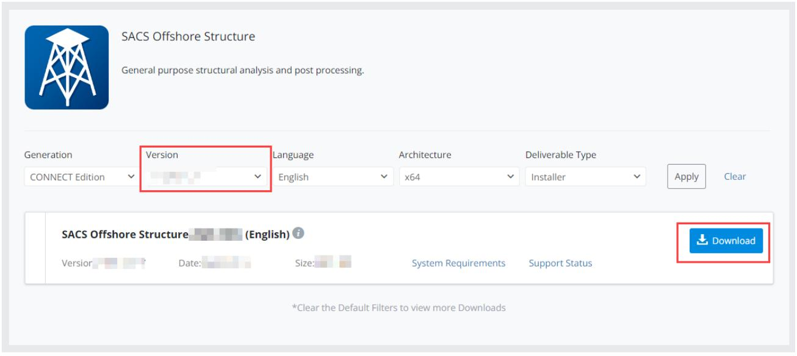
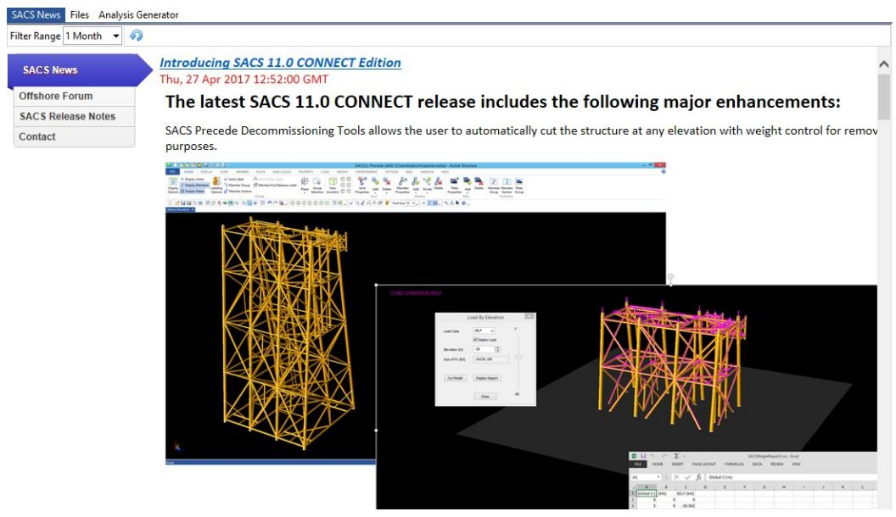
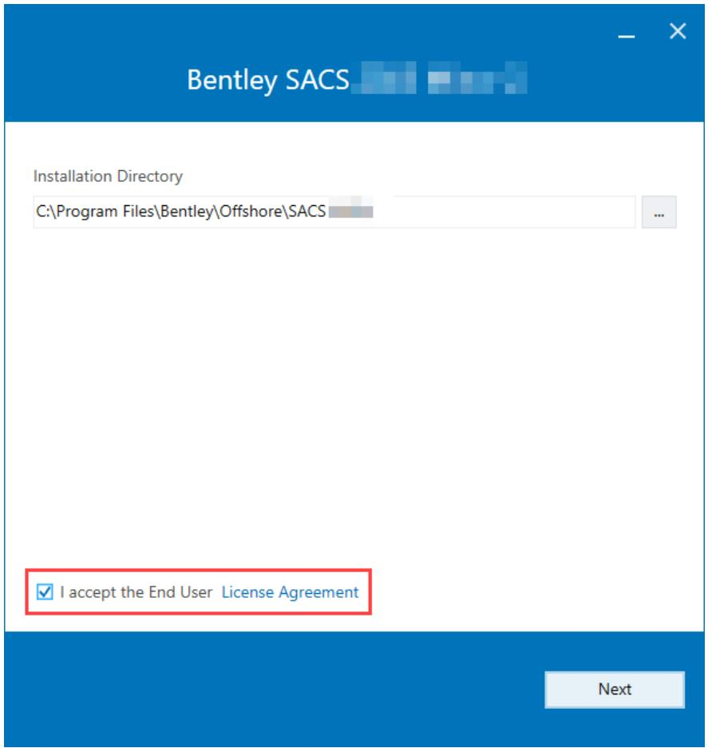
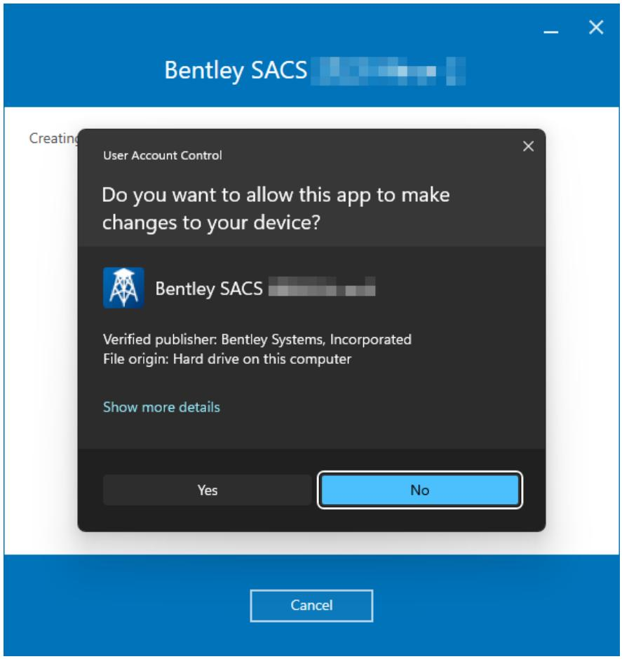
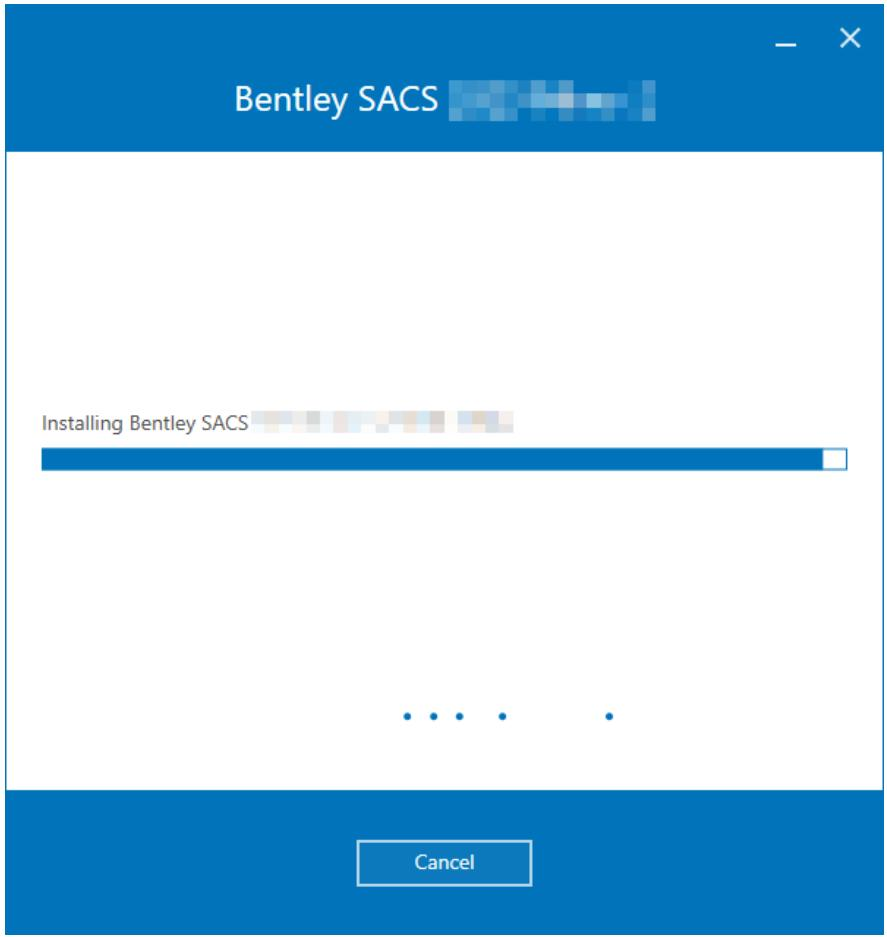
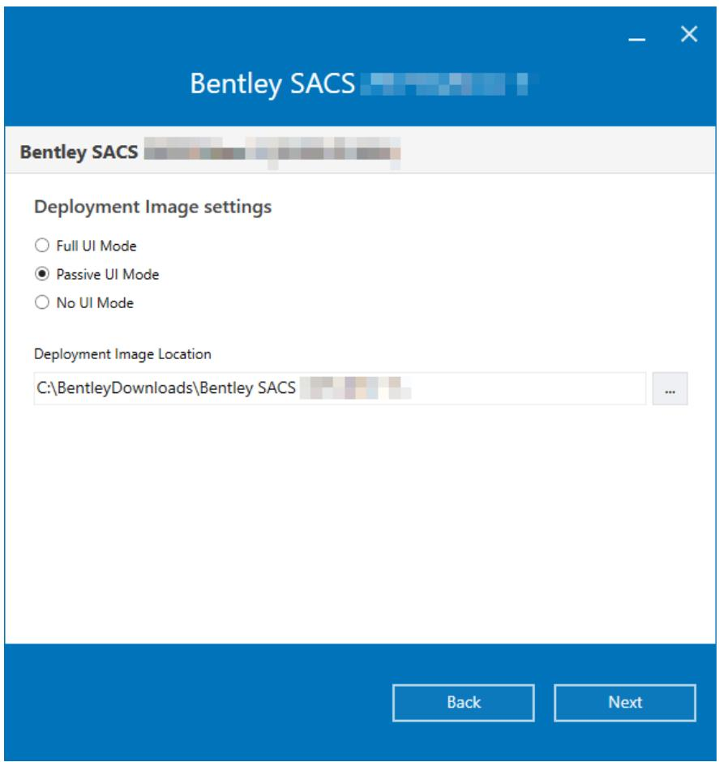
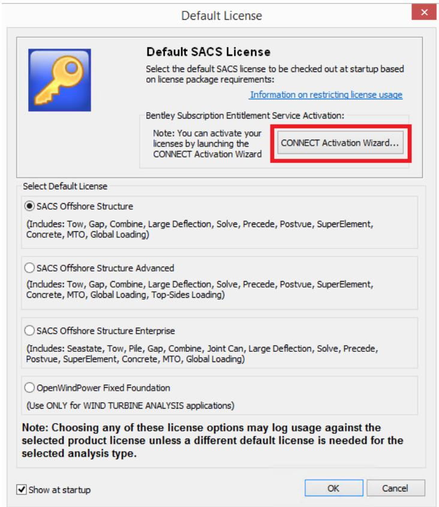
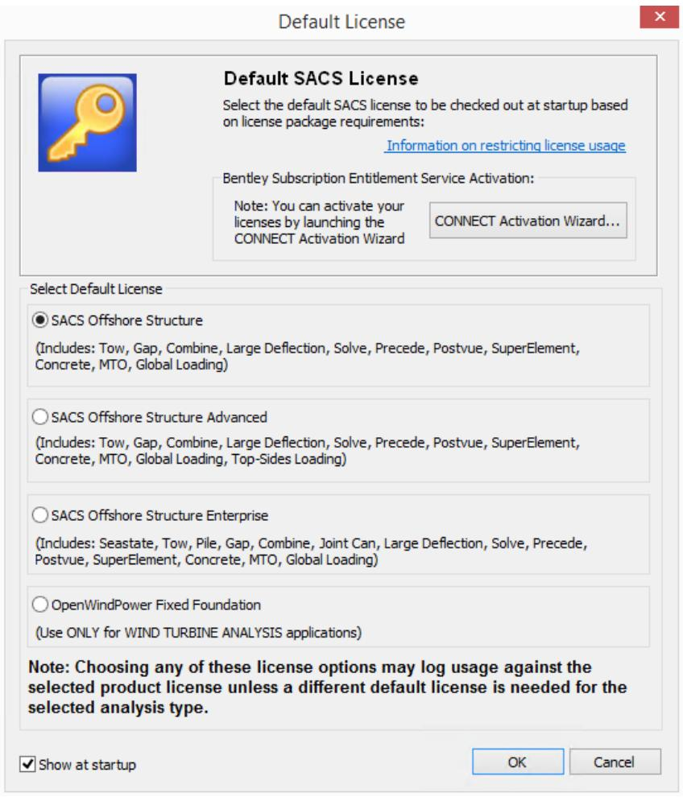

SACS

Installation Manual

Version 24.00

Trademark Notice

Bentley and the "B" Bentley logo are either registered or unregistered trademarks or service marks of Bentley Systems, Incorporated. All other marks are the property of their respective owners.

Copyright Notice

Copyright © 2024, Bentley Systems, Incorporated. All Rights Reserved.

TABLE OF CONTENTS

1 Download Guide... 4   
2 Installation Guide .. .. 6   
3 License Setup Guide .... . 13

Subscription Entitlement Service ..... . 13

1 Download Guide

The following provides general instructions with which to download application(s) required to install SACS on a single computer system. The images and version numbers depicted may not be up to date but the general procedure remains correct. You will need your Bentley login and password information to log into the Bentley website in order to download applications.

If you do not have logon information, please contact your local Bentley office at 1-800-Bentley (236- 8539), outside the United States +1 610-458-5000, or please click here.

If you have your email address and need your password (or have forgotten your password), click here.

To obtain Technical or Licensing Support for your products, please submit a service ticket here.

For product activation and additional licensing information, please click here.

## 1.1 Download SACS Installer

Navigate to the the SACS Software Download page. Log into the web site if you are not already logged in.

Bentley'

Email Address

Next

Note: Each company has an onsite Bentley administrator that was designated when an account is first created. If you do not have a current log on, please contact your onsite Bentley Administrator who can assist you with the correct information and permissions. Otherwise, contact Bentley directly (see links atop of document).

Select the version number from the dropdown menu and press the “Download” link. NOTE: The SACS installer contains ALL available modules and features. These features are accessible through the Entitlement Service. All modules have a trial period of seven days.

## 1.2 SACS Updates

SACS updates are created as needed. Notifications of these updates are included in:

a) Bentley Press release   
b) SACS News tab in the SACS Executive shown below:

2 Installation Guide

The following provides general instructions to install SACS on a single computer system. The images depicted may not be up to date, but the general procedure remains correct. All downloaded installation files should be placed on the computer’s desktop before starting. The procedure requires that a person with Administrator rights be logged on before initiating the installation.

## 2.1 Install From Downloaded Files

1. To install Bentley applications, ensure you have logged in to the computer with an account that has full administrative privileges. If you are unable to log in with a suitable account, then contact your network administrator to login and perform the installation.   
2. All download files from above should be placed onto the computer where the application(s) are to be installed; suggest the desktop or create a folder to copy the files to. Use ‘My Computer’ to browse to downloaded files and double click on the file *.exe file to start the installation. Continue to the next section.

## 2.2 Install Bentley SACS 24.00

SACS 24.00 can be run side-by-side with all previous versions of SACS. Close all other applications currently running and then navigate to the EXE file downloaded using the procedure above and double click on it to start the installation process.

Note: The application should not be installed from a network location; suggest that the EXE files are on the user’s system before starting the installation.

Enter the installation directory or used the recommended default installation directory. Read the License Agreement and accept by clicking the highlighted checkbox. Click the Install button to proceed to install the pre-requisites.

Select the components you wish to install. Then select Install to begin the installation.

Bentley SACS

Select feature to install

Microsoft.NET Framework 4.7.2   
Microsoft Visual C++ 2015-2022 Redistributable (x64)   
Microsoft Visual C++ 2015-2022 Redistributable (x86)   
iTwin Services Add-ln   
iTwin Analytical Synchronizer (Internet connection required)   
Bentley SACS   
Shortcuts

√Desktop Shortcuts

√Start Menu Shortcuts

Grid Analysis Setup

Create Start Menu Shortcuts

Back

Install

You may be prompted with a User Account Control dialog to allow the SACS Installer to make changes to your device. Select Yes to continue.

SACS and all selected components will then be installed to the selected path.

If SACS is successfully installed, you will be notified with the following message. Select Finish to complete the installation process. If the installation fails, your device will be restored to the system restore point generated at the beginning of the installation.

Bentley SACS 2023 Minor 2

Finish

## 2.3 Command-Line Options

The SACS installer may be executed from the command line with a number of options. Each option is detailed below:

/passive

Passive installation option. Display a minimal UI with all default installation options selected.

/quiet

Quite installation option. Install SACS with no installation UI and default options selected.

/layout

Create a deployment image with preselected options. Installation Directory and Feature selections options are entered using the standard installation options, but an additional dialog is added to select the deployment mode (Full, Passive, or Quiet) and the deployment image location. Instead of installing the program, an executable will be created with the selected installation options.

3 License Setup Guide

## 3.1 Subscription Entitlement Service

Subscription Entitlement Service (SES) (Formerly CONNECT Licensing) is Bentley's new process for product activation, enhancing our users' digital workflows and improving our licensing capabilities with features such as:

• License alert notifications when you are approaching a custom usage threshold   
Replacing site activation keys with user validation, enhancing security around your Bentley licenses and subscriptions

Traditionally, product activation has been through an activation key that an Organization distributed to all of its users. With SES, product activation is managed by user sign in through the CONNECTION Client, which is installed on each machine that uses Bentley applications. This offers a more secure and manageable system as it offers usage alerts, notifying your users when they are about to reach a certain usage limit set by the Administrator. You can find more information on configuring Subscription Entitlement Service here.

The licensed SACS products must now be activated. SACS products support a 7-day trial license. Launch SACS 24.00. The following dialog will appear. Click on the “Bentley Activation Wizard…” button and follow the instructions described here.

You can now select the default license.

