SACS

Interactive Fatigue

Version 24.00

Trademark Notice

Bentley and the "B" Bentley logo are either registered or unregistered trademarks or service marks of Bentley Systems, Incorporated. All other marks are the property of their respective owners.

Copyright Notice

Copyright © 2024, Bentley Systems, Incorporated. All Rights Reserved.

TABLE OF CONTENTS

1 INTRODUCTION .. 5

## 1.1 GENERAL INFORMATION .. . 5

1.1.1 Program Features... 5   
## 1.2 PROGRAM OVERVIEW.... 5
1.2.1 File Naming Conventions ... 5

2 GETTING STARTED.. ... 6

## 2.1 BEGINNING AN INTERACTIVE FATIGUE SESSION .. .. 6
## 2.2 FATIGUE CONNECTION COORDINATE SYSTEM..
## 2.3 EXITING THE INTERACTIVE FATIGUE SESSION ...

3 FILE MENU FEATURES . . 9

## 3.1 RECENT... . 9
## 3.2 OPEN .. ... 10
## 3.3 CLOSE . . 10
## 3.4 GENERATE REPORT . .11
## 3.5 PLOT TITLE.. .12
## 3.6 EXIT.... .12

4 DISPLAY MENU FEATURES... .13

4.1.1 LABELING OPTIONS .. . 13

4.1.1.1 Show Fatigue Elements... .. 14   
4.1.1.2 Coloring. ..... .. 14   
4.1.1.3 Fatigue Labeling. .. .. 14

4.1.1.3.1 Fatigue Label.. .. 15   
4.1.1.3.2 Option .... ... 15   
4.1.1.3.3 Text .... .. 15   
4.1.1.3.4 Fins Use Result Coloring... .. 15   
4.1.1.3.5 Labels Use Result Coloring.. .. 15   
4.1.1.3.6 Damage Ranges.... .. 15   
4.1.1.3.7 Colors . .. 15

5 JOINT COMMANDS.. .. 16

## 5.1 IMPORT FATIGUE . .... 16
## 5.2 PROPERTIES.. .. 16

5.2.1 Fatigue Summary Tree ..... 17   
5.2.2 Fatigue Input Panel .. . 18   
5.2.3 Fatigue Result Panel.. .. 21

## 5.3 PLOT .. .. 22

5.3.1 FATIGUE SPECTRUM .. .. 23   
5.3.2 FATIGUE TRANSFER FUNCTION.. .. 23   
5.3.3 FATIGUE RESPONSE SPECTRUM.. .. 24   
5.3.4 FATIGUE STRESS V. CYCLES .. 24

## 5.4 REPORT... .... 25

5.4.1 FATIGUE DESIGN LIFE.. .. 27   
5.4.2 FATIGUE DAMAGE.. .. 27

5.4.3 FATIGUE STRESS & DAMAGE.. . 28   
5.4.4 FATIGUE SPECTRUM . .. 28   
5.4.5 FATIGUE TRANSFER FUNCTION.. .. 28   
5.4.6 FATIGUE RESPONSE SPECTRUM.. .. 29   
5.4.7 FATIGUE STRESS VS CYCLES . . 29   
5.4.8 FATIGUE TRANSFER FUNCTION DETAIL .. . 30   
5.4.9 FATIGUE RESPONSE SPECTRUM DETAIL . .. 30   
5.4.10 FATIGUE JOINT CLASS . .31   
5.4.11 FATIGUE USER CHANGES . . 31

## 5.5 RESET CHANGES.. .. 32
## 5.6 UNLOAD ... .... 32
## 5.7 DAMAGE ACC. (Accumulation) . .. 32

5.7.1 Select Extract File Or FileGroup .. . 33   
5.7.2 DISPLAY EXTRACT FILES... .34

1 INTRODUCTION

## 1.1 GENERAL INFORMATION

The Interactive Fatigue program allows for reviewing of tubular connection fatigue results and redesigning connections in a 3D interactive environment. The program requires a fatigue extract file generated by the Fatigue batch program module as input. Various reports and plots of fatigue results can be generated and saved.

1.1.1 Program Features

Some of the main features of the Interactive Fatigue program are:

1. Shows the 3-D view of the connection and allows for braces to be selected with the mouse.   
2. Allows for redesigning of chord and brace members based on fatigue results.   
3. Allows SCF theory to be changed for any type connection, including in-line connections and connections with user defined SCFs.   
4. Provides the ability to designate the S-N curve used to determine allowable cycles.   
5. Recognizes all SCF and S-N options available in the batch program.   
6. Full reporting capabilities.   
7. Full plotting capabilities, including transfer function, response function, wave spectrum, stress range versus cycles and various other plots.   
8. Reports and plots can be displayed on the screen or saved to a file.

## 1.2 PROGRAM OVERVIEW

1.2.1 File Naming Conventions

While no file naming convention is required for Interactive Fatigue, the file name filter is used in the Open dialog box depending on the naming convention set in SACS Executive. The default filter is ???ext.* for the naming convention pgmtyp.ver and *.ext for verpgm.typ. Plot filenames may be specified by the user using Save As under the File menu, and reports may be saved from the SACS report viewer program which is automatically called when reports are requested from the Reports menu.

2 GETTING STARTED

## 2.1 BEGINNING AN INTERACTIVE FATIGUE SESSION

To start the Interactive Fatigue program, go to Analysis Generator on Executive page and click the View drop down button and select Open with Interactive Fatigue, as shown below.

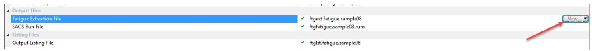

Alternatively, Fatigue Extraction can be dragged and dropped on Precede Modeler on the Executive page.

If fatigue results are to be displayed on the entire model, a Postvue database needs to be generated prior to fatigue analysis. Then, in column 20-21 of the FTOPT2 line enter PV. Load/reload the fatigue input file, there will be Postvue Database Directory where the file to be uploaded.

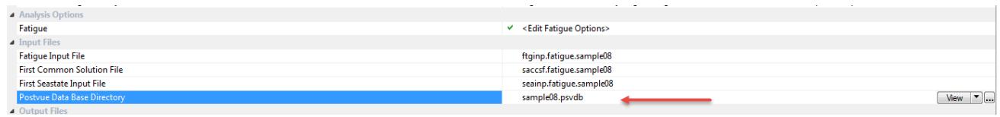

Upon the fatigue analysis completion, launch the Postuve database by double clicking or drag it onto Precede. Then, go to JOINT Tap and select Import Fatigue and upload a Fatigue Extract file to the model.

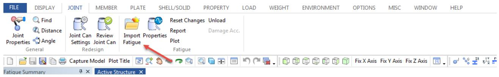

Fatigue results will be displayed on the model and users can view the fatigue damage results as shown below. Users can view the fatigue input and results, and also select the joints from the tree diagram.

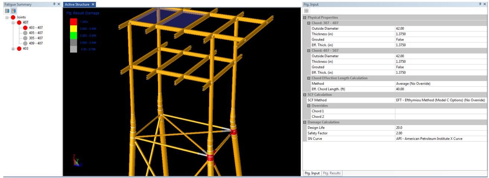

## 2.2 FATIGUE CONNECTION COORDINATE SYSTEM

For each SACS load case making up the fatigue environment, fatigue results are evaluated at eight points spaced at 45 degrees around the perimeter of the welded connection on both the chord and brace side, see Figure 1 below:

  
Figure 1

Note: The top of the connection is at the intersection of the brace/chord plane opposite of the chord reference joint. The Bottom position is therefore always at the intersection of the brace/chord plane on the side nearest to the chord reference joint.

## 2.3 EXITING THE INTERACTIVE FATIGUE SESSION

Select the File/Exit menu option to exit the Interactive Fatigue session.

If the fatigue extract has been imported within a Postvue database session, the fatigue data may be unloaded, leaving the Postvue session running.

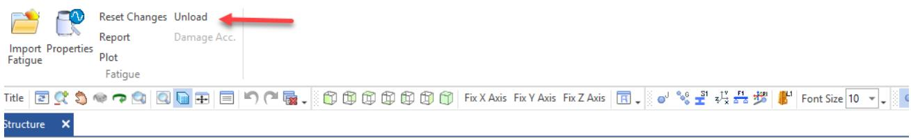

3 FILE MENU FEATURES

The following section details the commands found under the File main menu.

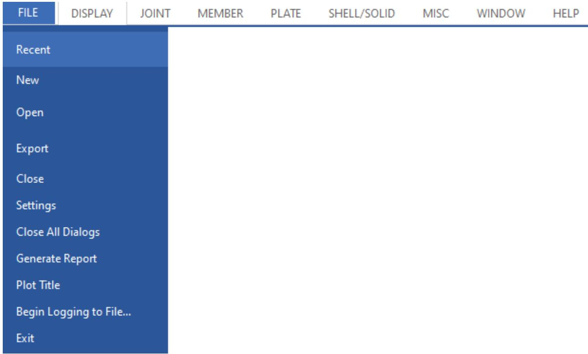

## 3.1 RECENT

The Recent option provides a quick access to recently used files list.

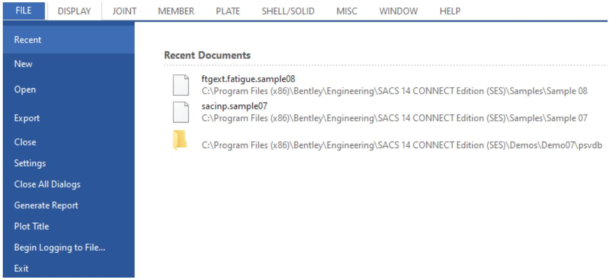

## 3.2 OPEN

Open is used to import an existing Fatigue extract file into Interactive Fatigue.

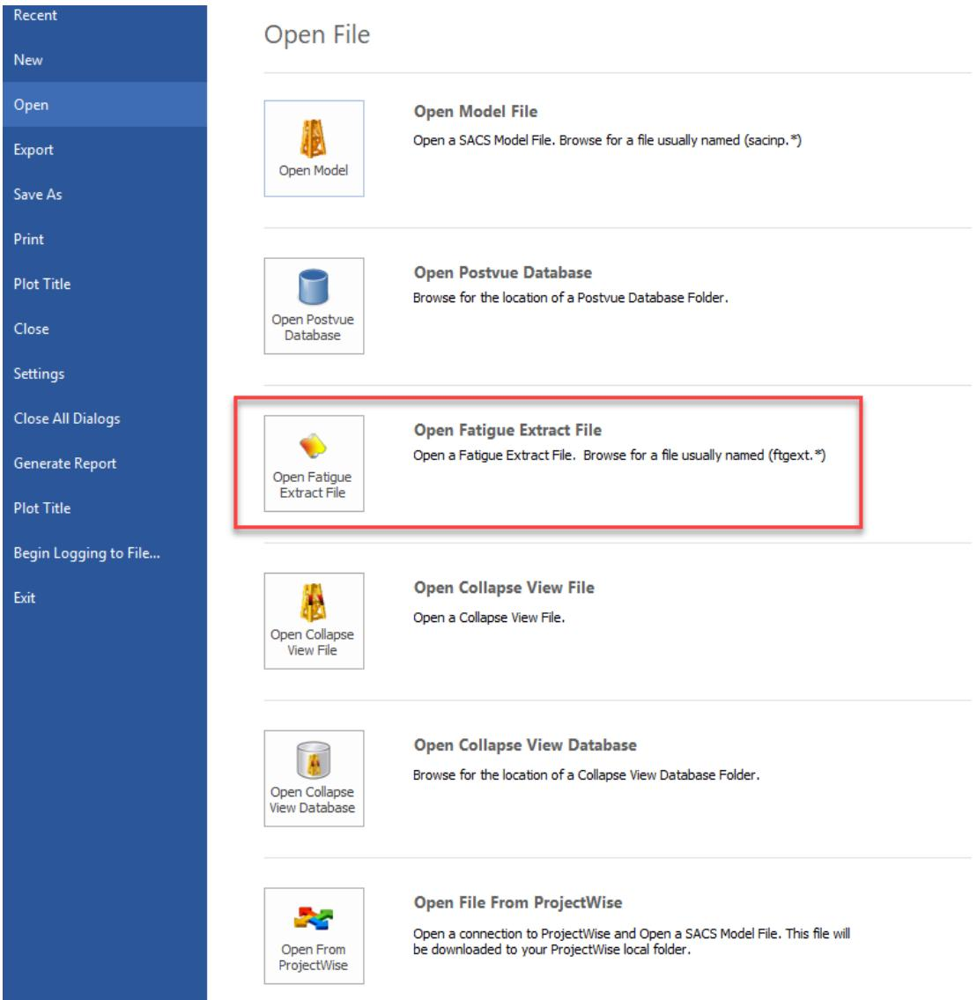

## 3.3 CLOSE

The Close option is used to close the current file.

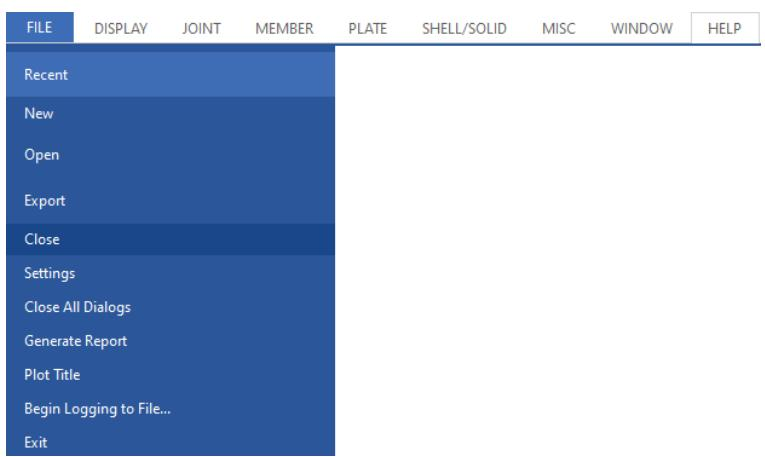

## 3.4 GENERATE REPORT

Generate Report option is used to generate and display a report in an output window.

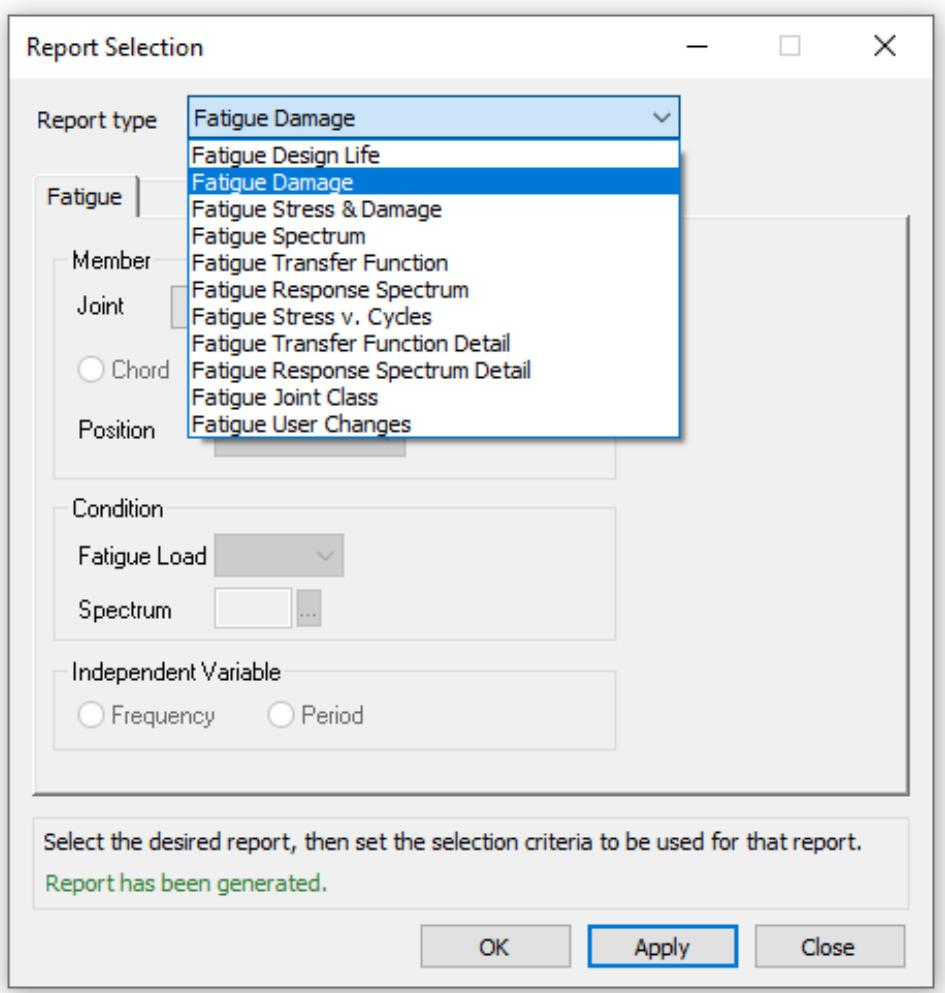

## 3.5 PLOT TITLE

The Plot Title option is used to add a title to the current model view plots.

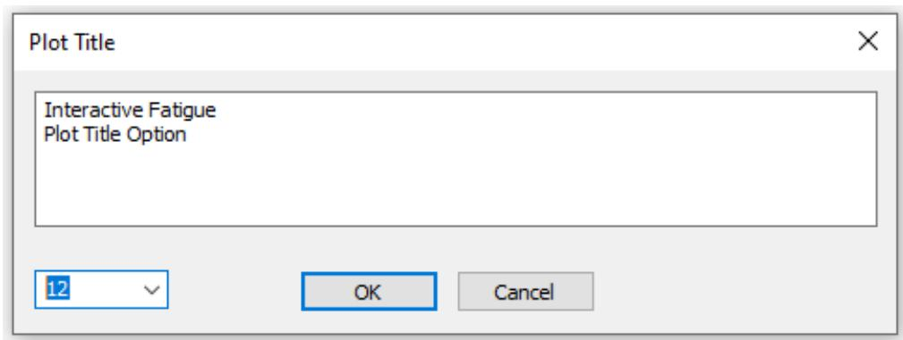

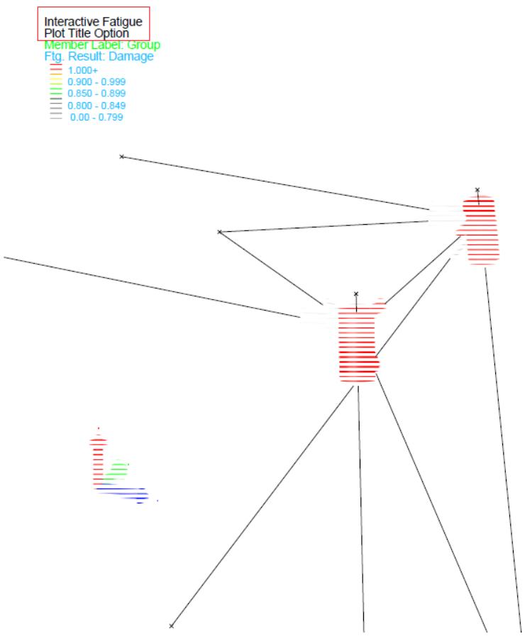

## 3.6 EXIT

The Exit command terminates the interactive Fatigue session.

4 DISPLAY MENU FEATURES

The Display menu features allow the user to specify or select display options including joint 3D view, joint plane view, rotation, fill, labeling, etc.

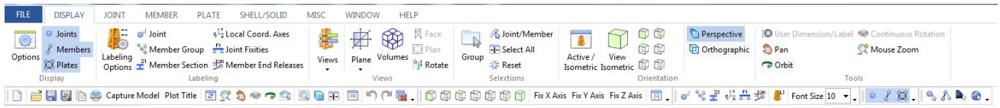

4.1.1 LABELING OPTIONS

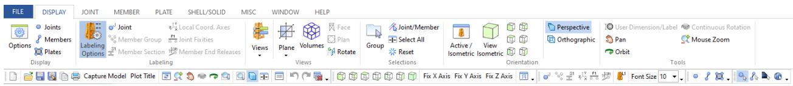

The Labeling Options feature allows the user to display fatigue elements, labels and colors under the Fatigue tab as shown in the dialog below.

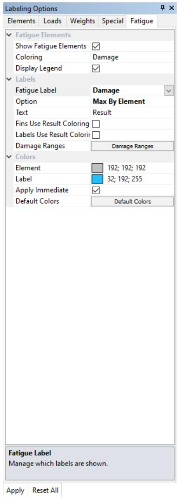

4.1.1.1 Show Fatigue Elements.

This option determines whether designed fatigue elements are included in the display.

4.1.1.2 Coloring.

There are currently two options for element coloring. If Element is selected, all designed fatigue elements are shown in the element color. If Damage is selected, the elements will be color coded by damage level. In a chord-brace connection the chords are colored according to the worst brace result.

4.1.1.3 Fatigue Labeling.

A variety of labelling operations are available. Element orientation or damage labels may be selected.

Brace orientation in indicated by labelled fins.

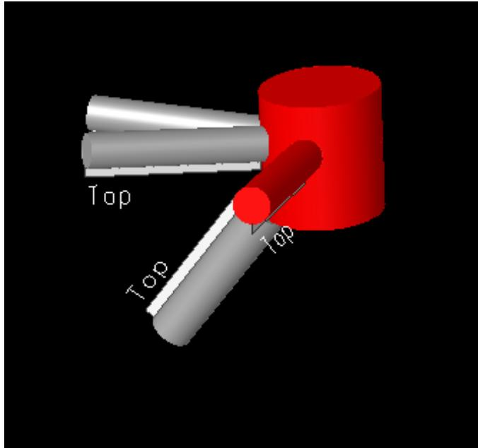

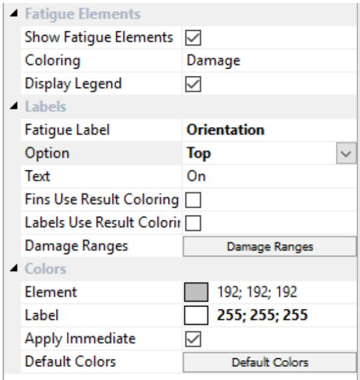

Critical result per element.

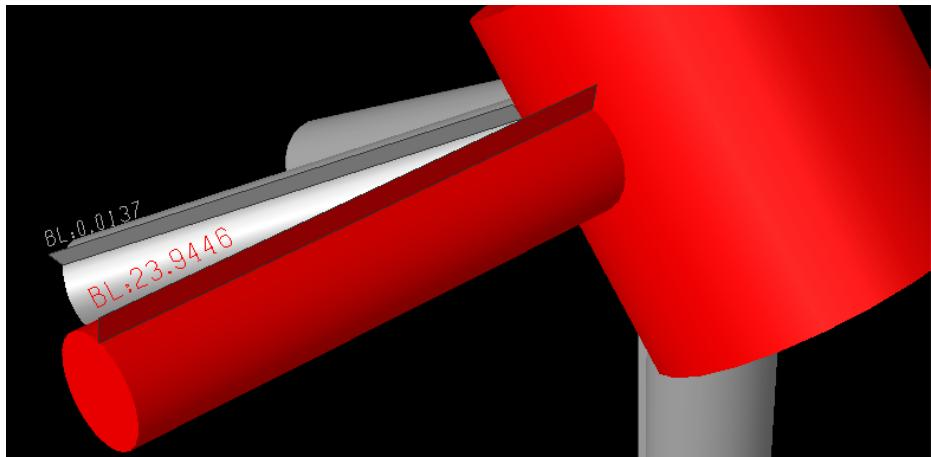

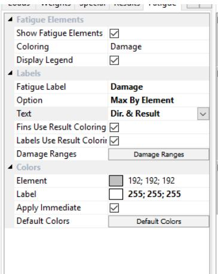

4.1.1.3.1 Fatigue Label

This determines the general type of label, Damage, Orientation or None.

4.1.1.3.2 Option

This allows a number of type specific options. Orientation can denote Top or Top & Left directions. Damage allows a filtering of labels displayed. Max by Element will show one result on every designed element. Max By Joint shows the most critical result across all elements at each joint. > Top Band will label all results which exceed the top damage band (see below). All will label all elements at all eight design locations.

4.1.1.3.3 Text

This enables or disables the text part of the label. If set to Off, the fins will be drawn unlabeled. When displaying damage results, the fins may have the design location reported along with the damage.

4.1.1.3.4 Fins Use Result Coloring

If checked, the fins will be colored according to the design result at that location. If unchecked they will be drawn in Label color.

4.1.1.3.5 Labels Use Result Coloring

If checked, the labels will be colored according to the design result at that location. If unchecked they will be drawn in Label color.

4.1.1.3.6 Damage Ranges

This allows the user to define the Damage:Color bands use when coloring the diagram

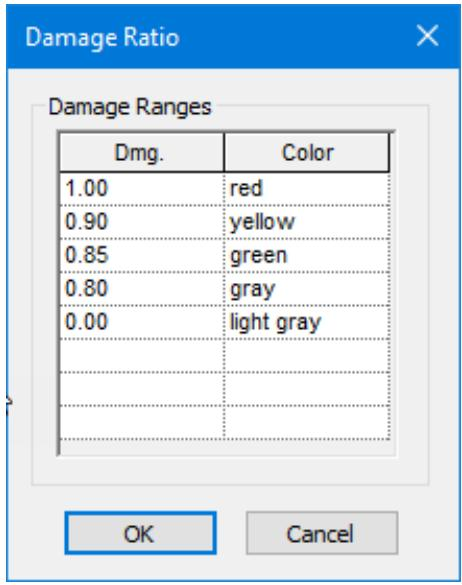

4.1.1.3.7 Colors

This section allows the user to set the colors used for elements and labels. Default Colors sets the element color to pale gray and the label color to a light blue

5 JOINT COMMANDS

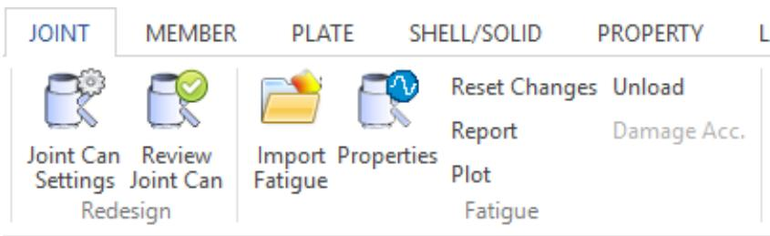

## 5.1 IMPORT FATIGUE

This allows a fatigue extract to be imported. If there is an extract already loaded, that will be unloaded before the new is loaded.

## 5.2 PROPERTIES

Onscreen textural data is divided over three dockable windows. The default arrangement is for the Fatigue Summary tree view to be on the left and the Fatigue Input and Fatigue Results panels to be stacked in a tabbed window on the right.

These windows are opened when a fatigue extract is first loaded. If they become closed, they can be reopened with the Properties command.

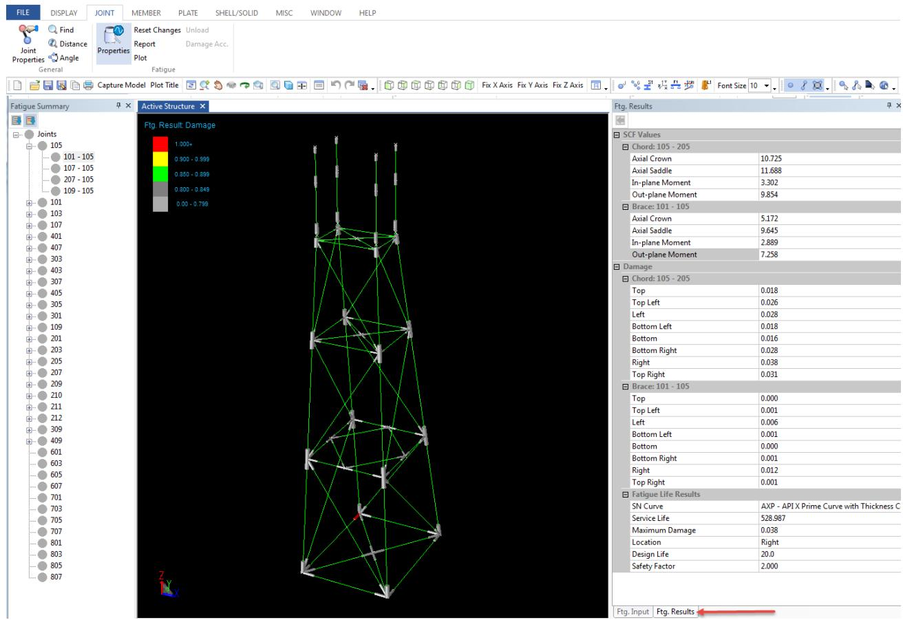

5.2.1 Fatigue Summary Tree

This panel shows a summary of the joints and members which are contained in the fatigue extract file.

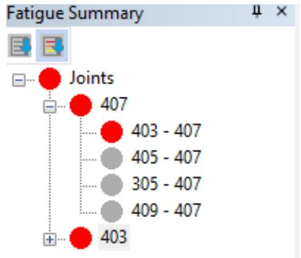

Each item is colored accorded to the current Damage:Color bands used by the graphical display. A higher level item is colored according to the worse case child item.

The two icons at the top of the view sort the joints by file read order (left) or by max damage (right). Braces, or member transition points are always under, and sorted within, their appropriate joint or member.

Selecting an item in this panel will cause the same item to be selected in the graphical view, and in the fatigue input & results panels. A selection of a joint will cause the chord element(s) to be drawn selected, but not the individual braces.

Joint, brace and transition point items in the tree support pop up menus. These are accessed with a mouse right-click.

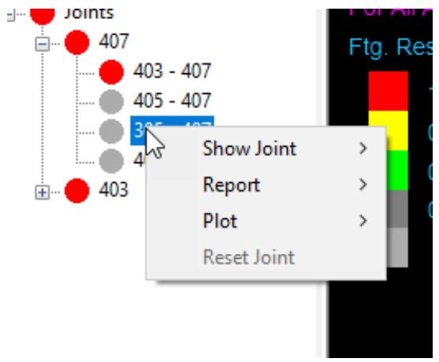

The menu options are dependent on the level of the item being selected. Show Joint will create a new graphical view with only the selected joint visible. Report & Plot allow access to reports and charts for the selected item. Reset Joint will discard any changes made to the Joint’s design parameters during this session.

5.2.2 Fatigue Input Panel

This panel has a variety of forms dependent on the most recently selected fatigue item, either from the Summary tree panel or from the graphical display.

These property panels may be edited. When editing data, all relevant redesign is performed and the summary tree, graphical display and result panel are updated. Data which has changed by the user is shown in bold.

If the Joints or Members tree panel item is selected, the panel will show the general fatigue design parameters. Data here affects all joints and members which do not have specific overrides.

The icon at the top of the panel will reset the data to that first read from fatigue extract file.

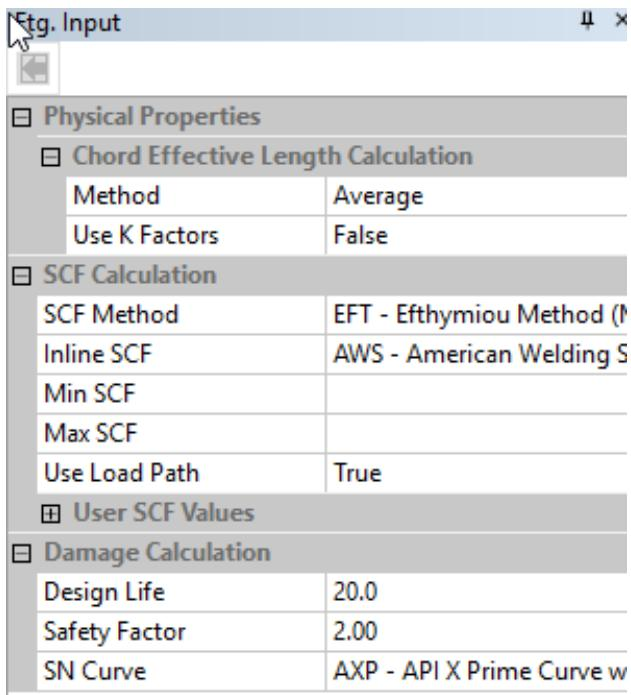

If a joint is selected in the fatigue summary tree or a chord selected in the graphical display, the input panel will show the design parameters relevant to that joint’s design.

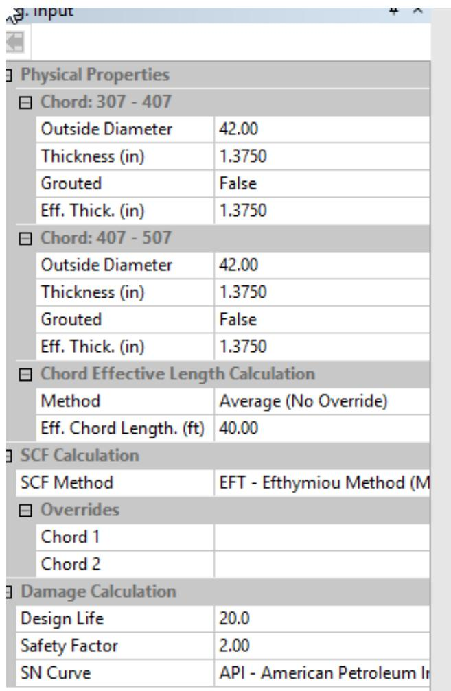

Chord properties will affect the design of all brace elements at this joint. Data items with a text entry will indicate that they are inherited from the general options with the suffix (No Override).

If a brace is selected in the fatigue summary tree or in the graphical display, the input panel will show the design parameters relevant to that brace’s design.

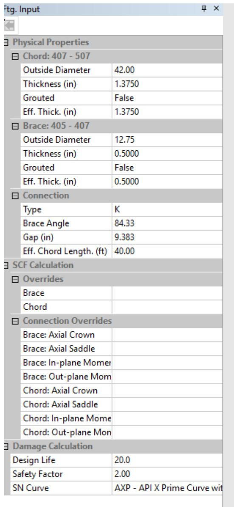

This follows the principals above. Changing the chord properties will alter that chord element’s properties when other braces at that joint are redesigned. If using the LDPATH option the connection type will not be editable.

There are similar input property panels for inline joint design and for member transition point design.

5.2.3 Fatigue Result Panel

When the selection in the summary tree is a joint or if the graphical selection is a chord element, this will show summary result information for the joint.

If a joint is selected in the fatigue summary tree or a chord selected in the graphical display, the input panel will show the design parameters relevant to that joint’s design.

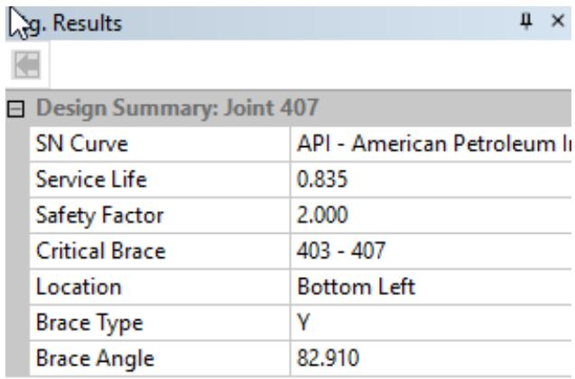

When the selection in the summary tree is a brace or if the graphical selection is a brace element, this will show result information for the joint.

When the selection in the summary tree is a joint or if the graphical selection is a chord element, this will show summary result information for the joint.

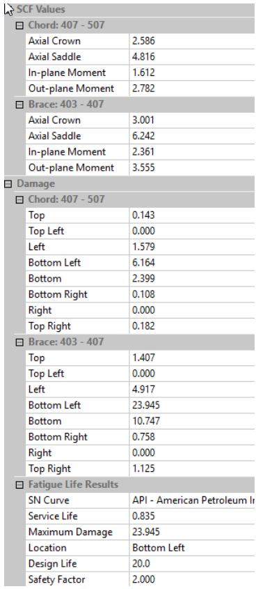

There are similar result property panels for inline joint design and for member transition point design.

## 5.3 PLOT

The Plot menu features allow the user to generate various plots and graphs for display on the screen or to save in a plot file. A plot file iftgncf will be created to store all exported plots.

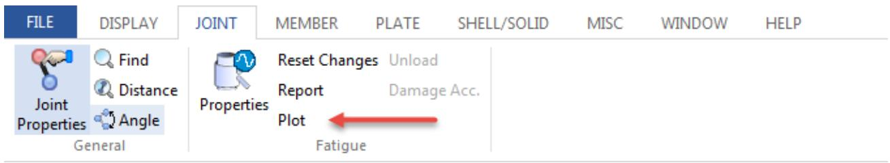

Select the desired plot options including the element to be plotted, i.e. chord or brace, and position around the circumference. The desired Fatigue load case and if applicable the desired wave spectrum may be designated.

Note: Plots are generated and displayed on the screen by default. They may be added to the chartvue file (iftgncf) from a right-click menu on the screen chart.

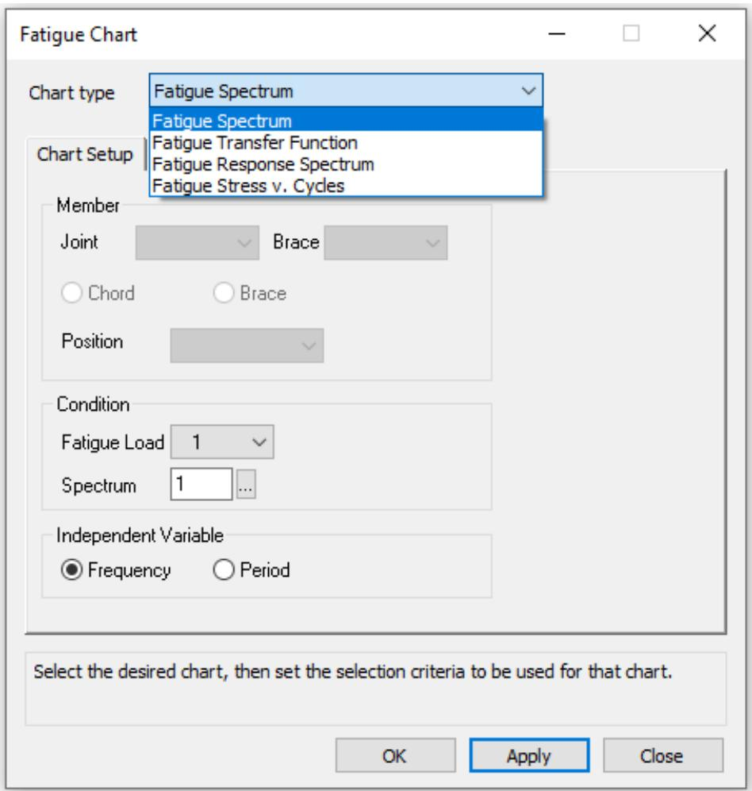

5.3.1 FATIGUE SPECTRUM

The Spectrum plot command plots the wave spectrum designated on the Fatigue Chart dialog. The Member and Position plot options are not applicable to this feature.

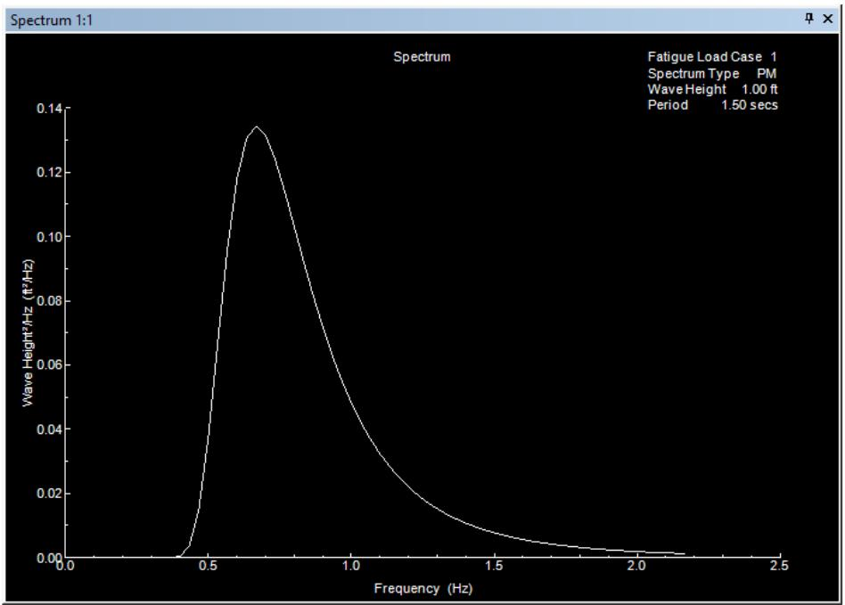

5.3.2 FATIGUE TRANSFER FUNCTION

Select the Fatigue Transfer Function command to plot the cyclic hot-spot stress transfer function of the chord or brace position designated and for the particular Fatigue Load Case (wave direction) specified on the Plot Options dialog.

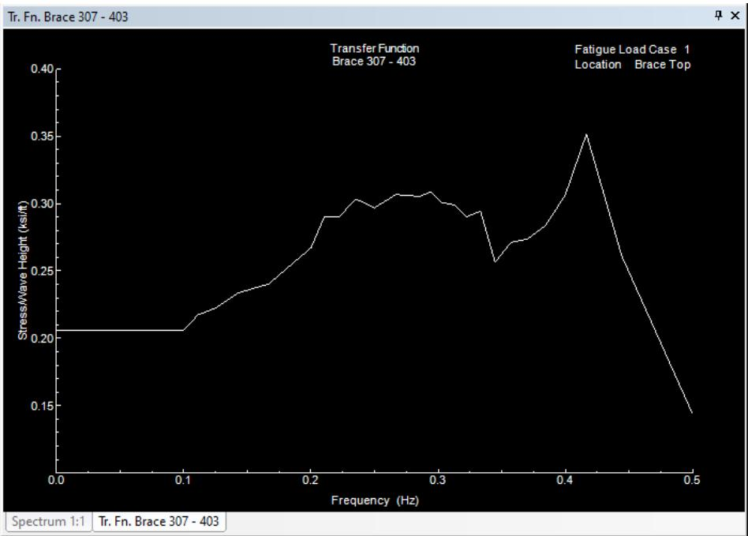

5.3.3 FATIGUE RESPONSE SPECTRUM

Select the Response Spectrum command to plot the response spectrum of the chord or brace position designated. The applicable Fatigue Load Case and Wave spectrum are designated on the Plot Options dialog.

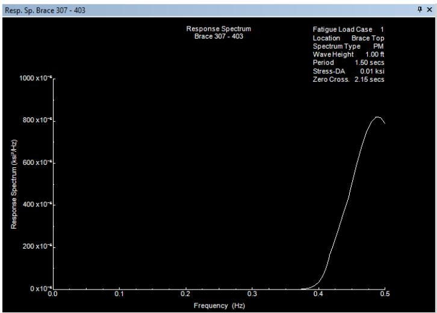

5.3.4 FATIGUE STRESS V. CYCLES

The Stress vs. Cycles command creates a bar graph showing stress range and number of cycles plotted against the S-N allowable curve. The chord or brace position along with the applicable fatigue load case must be designated on the Plot Options dialog.

The Stress vs. Cycles plot is generated as follows:

For a point on the connection, the maximum cyclic stress is found considering all spectra for the direction in question. This maximum stress is then broken into a number of cyclic stress bands or categories. For each band, the total damage and number of cycles is summed. The report and plot shows the range and cycles for a band only if the band causes actual damage .

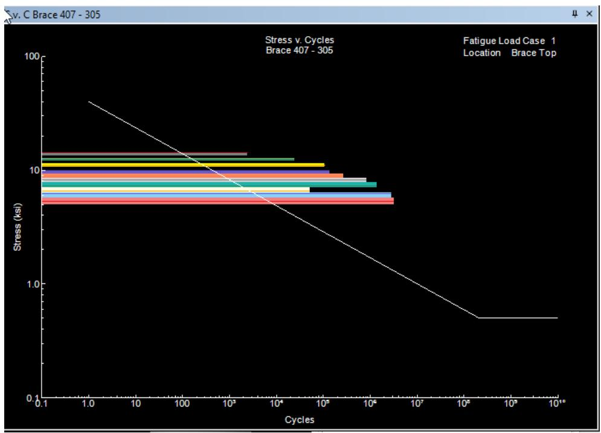

## 5.4 REPORT

The Report menu features allow the user to generate various reports.

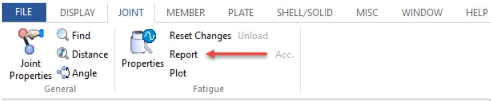

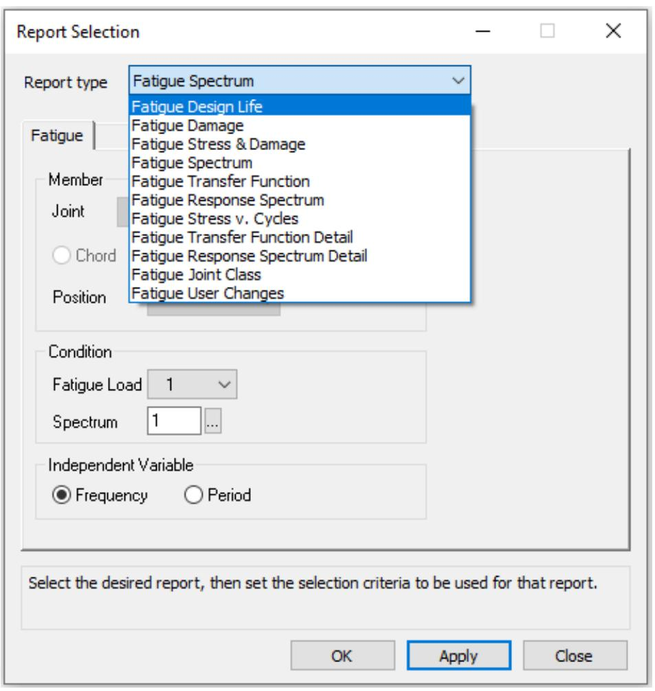

Reports may be displayed on the screen in the Report Browser and from there may be saved to a file.

5.4.1 FATIGUE DESIGN LIFE

The Fatigue Design Life command creates a detailed report for the active joint and brace. The report contains basic properties of the chord and brace, fatigue life and the damage reported at each of the eight positions. The following is a sample Fatigue Life report:

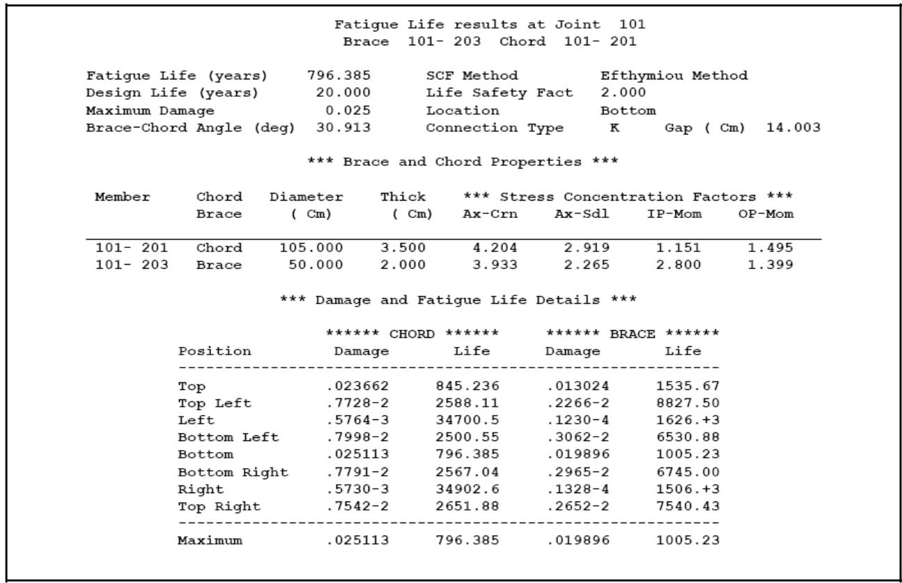

5.4.2 FATIGUE DAMAGE

The Damage report command generates a detailed report showing damage at each of the eight positions around the circumference of the connection caused by each wave spectrum.

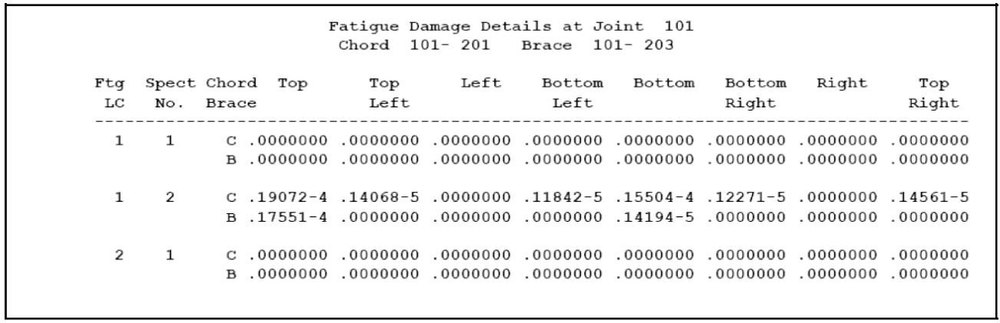

5.4.3 FATIGUE STRESS & DAMAGE

The Stress and Damage reports shows RMS stress and Damage at each chord and brace position around the circumference of the connection for each of the wave spectra in the Fatigue Load case specified by the user.


| Fatigue RMS Stress and Damage at Joint 101Chord 101-201 Brace 101-203 | Fatigue RMS Stress and Damage at Joint 101Chord 101-201 Brace 101-203 | Fatigue RMS Stress and Damage at Joint 101Chord 101-201 Brace 101-203 | Fatigue RMS Stress and Damage at Joint 101Chord 101-201 Brace 101-203 | Fatigue RMS Stress and Damage at Joint 101Chord 101-201 Brace 101-203 | Fatigue RMS Stress and Damage at Joint 101Chord 101-201 Brace 101-203 |
| --- | --- | --- | --- | --- | --- |
| Fatigue Load Case | Spectrum Number | Position | Chord Brace | RMS Stress (KG/CM2) | Damage |
| 1 | 1 | Bottom | Brace | 0.234624 | .14194-5 |
|  | 1 | Bottom Left | Brace | 0.190174 | .0000000 |
|  | 1 | Left | Brace | 0.138432 | .0000000 |
|  | 1 | Top Left | Brace | 0.219104 | .0000000 |
|  | 1 | Top | Brace | 0.275573 | .17551-4 |
|  | 1 | Top Right | Brace | 0.221414 | .0000000 |
|  | 1 | Right | Brace | 0.141655 | .0000000 |
|  | 1 | Bottom Right | Brace | 0.192416 | .0000000 |
|  | 1 | Bottom | Chord | 0.263619 | .15504-4 |
|  | 1 | Bottom Left | Chord | 0.224893 | .11842-5 |
|  | 1 | Left | Chord | 0.181843 | .0000000 |
|  | 1 | Top Left | Chord | 0.236798 | .14068-5 |
|  | 1 | Top | Chord | 0.280472 | .19072-4 |
|  | 1 | Top Right | Chord | 0.239245 | .14561-5 |
|  | 1 | Right | Chord | 0.185285 | .0000000 |
|  | 1 | Bottom Right | Chord | 0.227313 | .12271-5 |
| 1 | 2 | Bottom | Brace | 0.291327 | .16509-2 |
|  | 2 | Bottom Left | Brace | 0.237372 | .32396-4 |
|  | 2 | Left | Brace | 0.163807 | .0000000 |
|  | 2 | Top Left | Brace | 0.237601 | .33213-4 |
|  | 2 | Top | Brace | 0.291674 | .16994-2 |
|  | 2 | Top Right | Brace | 0.233524 | .31164-4 |
|  | 2 | Right | Brace | 0.158029 | .0000000 |
|  | 2 | Bottom Right | Brace | 0.233282 | .30377-4 |
|  | 2 | Bottom | Chord | 0.311029 | .21247-2 |
|  | 2 | Bottom Left | Chord | 0.267762 | .36991-3 |
|  | 2 | Left | Chord | 0.213636 | .0000000 |
|  | 2 | Top Left | Chord | 0.267857 | .37329-3 |
|  | 2 | Top | Chord | 0.311171 | .21485-2 |
|  | 2 | Top Right | Chord | 0.263496 | .35137-3 |
|  | 2 | Right | Chord | 0.207463 | .0000000 |
|  | 2 | Bottom Right | Chord | 0.263396 | .34811-3 |


5.4.4 FATIGUE SPECTRUM

The Spectrum report shows the points of the wave spectrum selected by the user in tabular format.

5.4.5 FATIGUE TRANSFER FUNCTION

The Transfer Function report shows the points of the transfer function for the selected point on the chord or brace. The chord or brace position along with the Fatigue load case are specified on the Report Options dialog.

Note: Designation of the wave spectrum is not required for the transfer function report.


| Transfer Function Report | Transfer Function Report | Transfer Function Report | Transfer Function Report | Transfer Function Report |
| --- | --- | --- | --- | --- |
| Fatigue Load Case 1 Chord 101-201 Position Bottom | Fatigue Load Case 1 Chord 101-201 Position Bottom | Fatigue Load Case 1 Chord 101-201 Position Bottom | Fatigue Load Case 1 Chord 101-201 Position Bottom | Fatigue Load Case 1 Chord 101-201 Position Bottom |
| Wave | Height (M) | H.S. Stress Range (KGSCM) | HSSR/Height (KGSCM *M) | Frequency (Hz) |
| 1 | 10.300 | 148.953 | 14.461 | 0.10000 |
| 2 | 6.620 | 111.227 | 16.802 | 0.12500 |
| 3 | 3.720 | 77.895 | 20.940 | 0.16667 |
| 4 | 2.590 | 34.808 | 13.440 | 0.20000 |
| 5 | 1.650 | 56.084 | 33.991 | 0.25000 |
| 6 | 0.930 | 103.111 | 110.872 | 0.33333 |
| 7 | 0.520 | 130.998 | 251.920 | 0.44444 |
| 8 | 0.410 | 57.396 | 139.992 | 0.50000 |
| 9 | 0.320 | 144.331 | 451.035 | 0.57143 |
| 10 | 0.230 | 54.496 | 236.941 | 0.66667 |


5.4.6 FATIGUE RESPONSE SPECTRUM

The Response Spectrum report shows the points of the response function for the selected point on the chord or brace for the specified wave spectrum. The chord or brace position along with the Fatigue load case and the appropriate wave spectrum are specified on the Report Options dialog.

5.4.7 FATIGUE STRESS VS CYCLES


| Stress Range vs. Cycle Report | Stress Range vs. Cycle Report | Stress Range vs. Cycle Report | Stress Range vs. Cycle Report |
| --- | --- | --- | --- |
| Fatigue Load Case 1 | Chord 101-201 | Position |  |
| Bottom |  |  |  |
| Range | Stress Range | Cycles |  |
| Number | (KGSCM) |  |  |
| 9 | 257.1 |  |  |
| 1515367 |  |  |  |
| 10 | 288.7 | 481573 |  |
| 11 | 314.7 | 231189 |  |
| 12 | 347.3 | 143603 |  |
| 13 | 354.6 | 17075 |  |
| 14 | 396.2 | 39501 |  |
| 15 | 423.9 | 6830 |  |
| 16 | 453.8 | 3096 |  |
| 17 | 486.9 | 1536 |  |
| 19 | 552.7 | 153 |  |


The Fatigue Stress vs. Cycles report contains hot-spot stress ranges and number of cycles for the selected point on the chord or brace. The chord or brace position along with the Fatigue load case are specified on the Report Options dialog.

5.4.8 FATIGUE TRANSFER FUNCTION DETAIL

The transfer function detail report contains axial load and bending moment normalized by wave height. The report also contains real and imaginary roots.


| Transfer Function Detail Report | Transfer Function Detail Report | Transfer Function Detail Report | Transfer Function Detail Report | Transfer Function Detail Report | Transfer Function Detail Report | Transfer Function Detail Report | Transfer Function Detail Report | Transfer Function Detail Report | Transfer Function Detail Report |
| --- | --- | --- | --- | --- | --- | --- | --- | --- | --- |
|  |  |  | Member 101-203 Fatigue Load Case 1 Member End 101 | Member 101-203 Fatigue Load Case 1 Member End 101 | Member 101-203 Fatigue Load Case 1 Member End 101 | Member 101-203 Fatigue Load Case 1 Member End 101 | Member 101-203 Fatigue Load Case 1 Member End 101 | Member 101-203 Fatigue Load Case 1 Member End 101 | Member 101-203 Fatigue Load Case 1 Member End 101 |
| Wave | Wave | AXIAL/ | OP-MOM/ | IP-MOM/ | ** AXIAL | LOAD ** | OUT-PLANE | MOMENT |  |
| IN-PLANE | MOMENT |  |  |  |  |  |  |  |  |
| Height | Freq | HEIGHT | HEIGHT | HEIGHT | REAL | IMAG | REAL | IMAG | REAL |
| IMAG |  |  |  |  |  |  |  |  |  |
| M | Hz | KG/M | CM-KG/M | CM-KG/M | KG/M | CM-KG/M | CM-KG/M | KG/M | CM-KG/M |
| CM-KG/M |  |  |  |  |  |  |  |  |  |
| - | - | - | - | - | - | - | - | - | - |
| 10.300 | 0.1000 | 10493.836 | 4479.517 | 27358.572 | 4930.489 | 1794.555 | -2104.684 | 766.043 | 13679.286 |
| 0.000 |  |  |  |  |  |  |  |  |  |
| 6.620 | 0.1250 | 7616.267 | 3063.282 | 6784.224 | 2917.198 | 2447.823 | -1439.272 | 523.853 | 2598.509 |
| 2180.407 |  |  |  |  |  |  |  |  |  |
| 3.720 | 0.1667 | 5160.029 | 1618.978 | 4113.219 | 1290.006 | 2234.359 | -809.489 | 0.000 | -357.126 |
| -2025.365 |  |  |  |  |  |  |  |  |  |
| 2.590 | 0.2000 | 2264.610 | 692.326 | 5409.069 | -196.623 | 1115.103 | -265.176 | -222.509 | -2071.793 |
| -1738.442 |  |  |  |  |  |  |  |  |  |
| 1.650 | 0.2500 | 3707.031 | 1250.661 | 6416.890 | 321.860 | -1825.356 | -587.618 | -213.876 | -2457.811 |
| 2062.349 |  |  |  |  |  |  |  |  |  |
| 0.930 | 0.3333 | 6762.750 | 961.059 | 8217.207 | -1690.687 | -2928.357 | 240.265 | -416.151 | 2054.302 |
| 3558.155 |  |  |  |  |  |  |  |  |  |
| 0.230 | 0.6667 | 3710.316 | 3956.768 | 6981.548 | 1743.278 | 634.501 | 343.543 | -1948.328 | -3280.254 |
| -1193.916 |  |  |  |  |  |  |  |  |  |


5.4.9 FATIGUE RESPONSE SPECTRUM DETAIL

The response function detail report contains axial load and bending moment RMS stresses and zero crossing period.


| Response Function Detail Report Member 101-203 Fatigue Load Case 1 Spectrum 1 | Response Function Detail Report Member 101-203 Fatigue Load Case 1 Spectrum 1 | Response Function Detail Report Member 101-203 Fatigue Load Case 1 Spectrum 1 | Response Function Detail Report Member 101-203 Fatigue Load Case 1 Spectrum 1 | Response Function Detail Report Member 101-203 Fatigue Load Case 1 Spectrum 1 | Response Function Detail Report Member 101-203 Fatigue Load Case 1 Spectrum 1 |
| --- | --- | --- | --- | --- | --- |
| **** Axial RMS (KG) | Load **** Zero Cross (sec) | ** Out-Plane RMS (CM-KG) | Moment ** Zero Cross (sec) | *** In-Plane RMS (CM-KG) | Moment ** Zero Cross (sec) |
| 466.213 | 1.714 | 400.529 | 451.840 | 1.695 | 1.665 |
|  | FREQUENCY HZ | AXIAL LOAD KG ***2/HZ | MOMENT OUT-PLANE CM-KG ***2/HZ | MOMENT IN-PLANE CM-KG ***2/HZ |  |
|  | 0.3611 | 65.110 | 2.728 | 76.051 |  |
|  | 0.3750 | 440.079 | 23.890 | 457.900 |  |
|  | 0.3889 | 2118.480 | 142.698 | 1965.001 |  |
|  | 0.4028 | 7768.175 | 628.675 | 6426.693 |  |
|  | 0.4167 | 22861.861 | 2168.366 | 16875.625 |  |
|  | 0.4306 | 56261.289 | 6131.685 | 37060.078 |  |
|  | 0.4444 | 119589.320 | 14739.152 | 70295.234 |  |


5.4.10 FATIGUE JOINT CLASS

The Joint Class report shows the fraction of the joint types applicable when determining SCFs for each load case used to develop the transfer function.

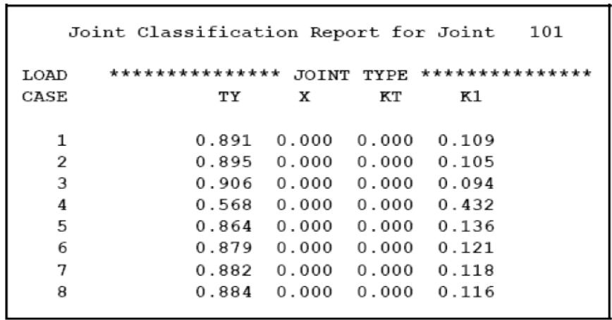

5.4.11 FATIGUE USER CHANGES

Fatigue User Changes report provides all the changes made in the Fatigue Input file.

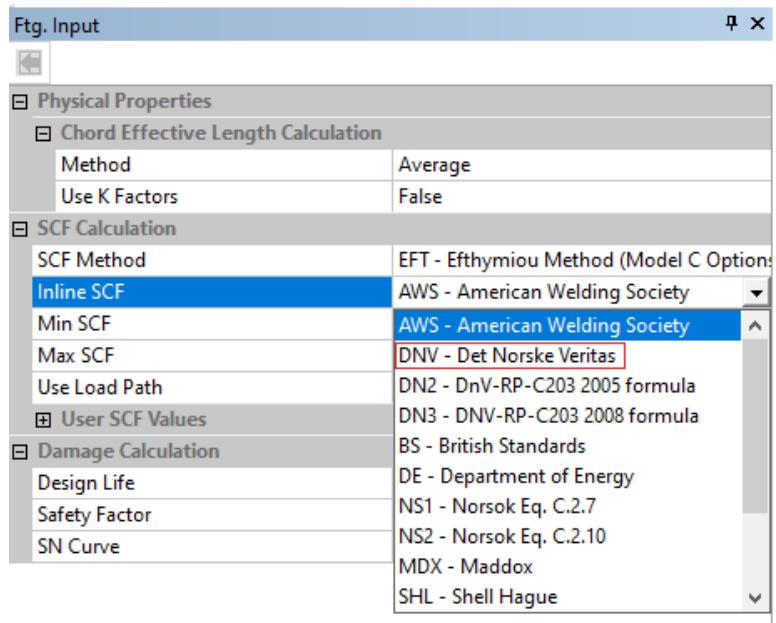  
Fatigue User Changes

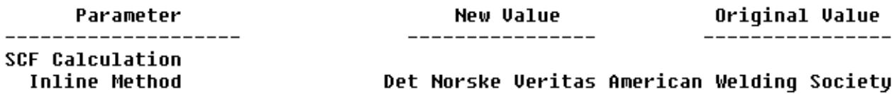  
General Parameters

## 5.5 RESET CHANGES

This reverses any user made changes to the fatigue input parameters and redesigns according to the data in the fatigue extract file.

## 5.6 UNLOAD

Removes the currently loaded fatigue extract information from the current PostVue session

## 5.7 DAMAGE ACC. (Accumulation)

This menu is only applicable when using a fatigue extract summation file. This file is auto generated by adding the extract line to the partial fatigue input file used in sacs wind turbine and GHBladed processes. Refer to Wind Turbine manual section 2 and 3 for details. User can create this file manually to sum up damages from different fatigue runs. It should be noted that in order to use this option all joint should be extracted by entering ‘AL’ in columns 14-15 of EXTRACT HEAD line.

The Fatigue Extract summation files as shown below contains the following information:

SUMFTGIFT: Flag indicating a summation extract file

NCASES: Defines the number of simulation for analysis cases.

NGRPS: Defines the number of groups for analysis cases.

DIRECTORY: Directory location for fatigue extract file for a fatigue simulation

EXTRCT: Name of the extract file generated from above run

GROUP: Defines the group above run belongs to

Repeat the above (Directory to Group) for other simulations (total equals NCASES)

JOINTS: Defines the number of joints to be viewed in interactive fatigue (since not all joints need to be viewed)

Repeat all joint ID’s desired (total equals JOINTS).

The example below shows a typical fatigue extract summation file for three simulations with 497 joints chosen to view.

```csv
SUMFTGIFT  
NCASES,3  
NGRPS,2  
DIRECTORY,"D:\Bentley\000Sample\1"  
EXTRACT,"ftgext.dat"  
GROUP,1  
DIRECTORY,"D:\Bentley\000Sample\2"  
EXTRACT,"ftgext.dat"  
GROUP,2  
DIRECTORY,"D:\Bentley\000Sample\3"  
EXTRACT,"ftgext.dat"  
GROUP,2  
JOINTS,497  
1  
3  
5  
7  
24  
71  
73  
75  
77 
```

An extract summation file may be imported into Precede in the same manner as a normal fatigue extract file.

The initial state is to have all referenced simulations loaded. The shown results are the summation across all referenced extract files.

5.7.1 Select Extract File Or FileGroup

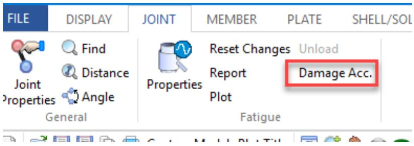

The Damage Acc. Button launches a dialog allowing the selection of an individual extract file or of a predefined group of extract files. When this is done only the selected extract file(s) is considered for redesign and summation of results. Note that redesign parameters are not reset between switching extract files.

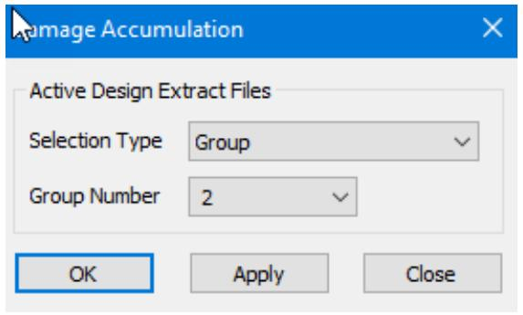

Selection type may be “All Extract Files”, “Group” or “Single Extract File”. The lower box allows picking of the specific item.

5.7.2 DISPLAY EXTRACT FILES

A report of all extract files in the summation file is available from the report property box.

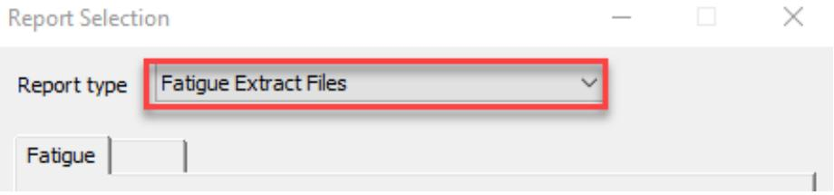

Contents brings up the list of extract file associated with this summation run.

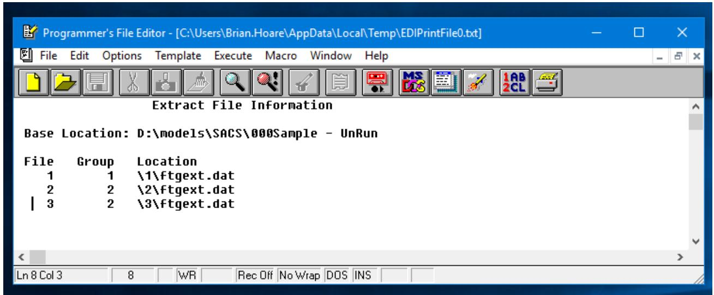