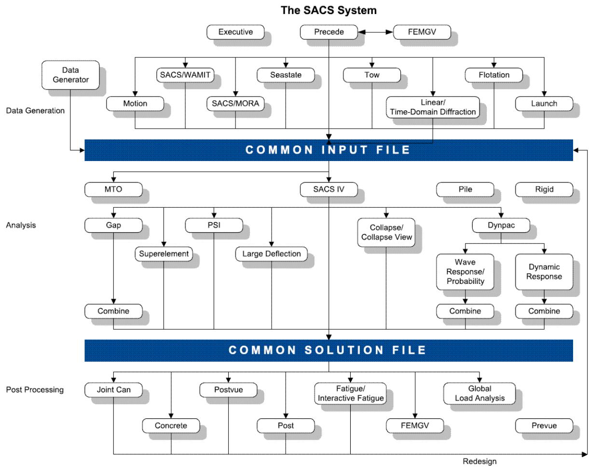
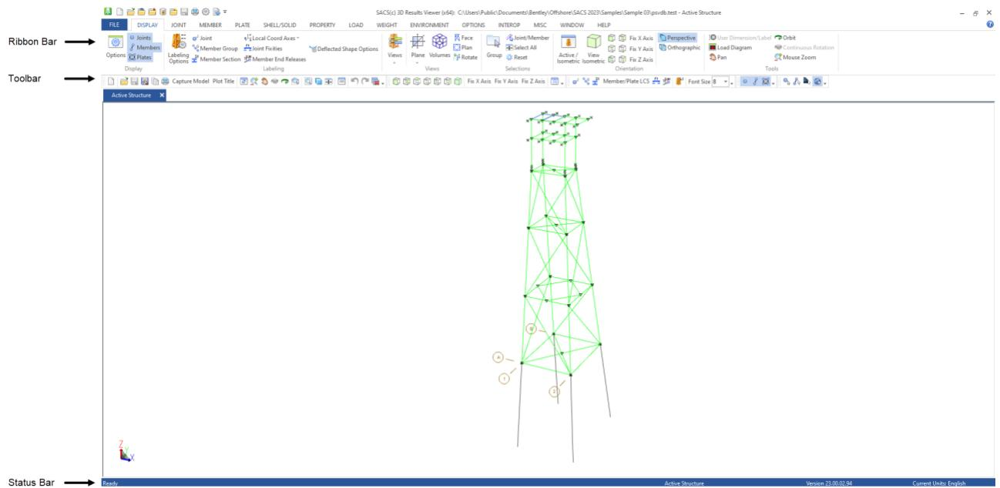
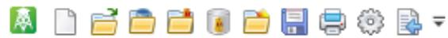
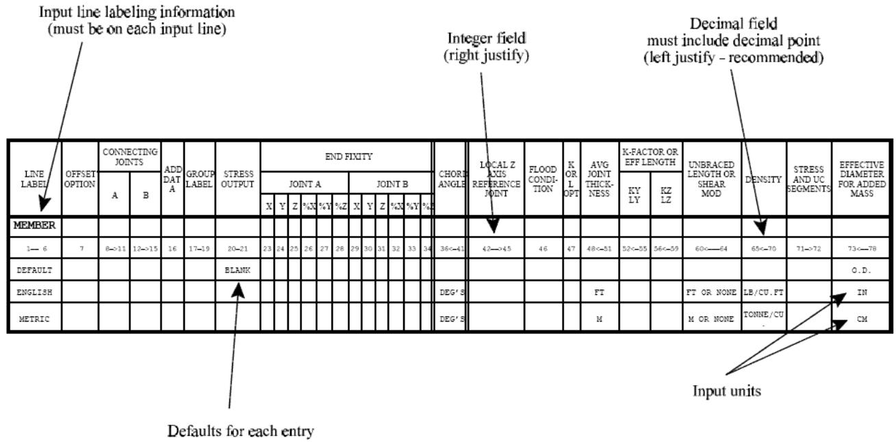

SACS

Introduction

Version 24.00

Trademark Notice

Bentley and the "B" Bentley logo are either registered or unregistered trademarks or service marks of Bentley Systems, Incorporated. All other marks are the property of their respective owners.

Copyright Notice

Copyright © 2024, Bentley Systems, Incorporated. All Rights Reserved.

TABLE OF CONTENTS

1 SACS PROGRAMS.. 5

## 1.1 Overview ... . 5
## 1.2 Programs ... .. 6

1.2.1 Precede* . . 6   
1.2.2 Data Generator* . . 6   
1.2.3 Seastate*. . 6   
1.2.4 SACS IV* .   
1.2.5 Post* . 7   
1.2.6 Joint Can*. . 8   
1.2.7 Concrete... .. 8   
1.2.8 Joint Mesher*.. . 8   
1.2.9 Fatigue.... .. 8   
1.2.10 Interactive Fatigue* . 9   
1.2.11 PSI. 9   
1.2.12 Pile3D . 10   
1.2.13 Suction Bucket .. 10   
1.2.14 Superelement*.. .10   
1.2.15 Dynamic Superelement... 11   
1.2.16 Postvue*. 11   
1.2.17 Combine* . 11   
1.2.18 Collapse .... 11   
1.2.19 Collapse Advanced .. 12   
1.2.20 Collapse View* . 12   
1.2.21 Dynpac ... 12   
1.2.22 Wave Response... 12   
1.2.23 Dynamic Response .. . 13   
1.2.24 Flotation ... . 13   
1.2.25 Launch ... .14   
1.2.26 Tow*... . 14   
1.2.27 GAP*. .14   
1.2.28 MTO*.. . 15   
1.2.29 LDF*. . 15   
1.2.30 SACS Executive* . . 15

2 GRAPHICAL USER INTERFACE. .. 16

## 2.1 Program Display Window... ... 16

2.1.1 Ribbon Bar.... .16   
2.1.2 Sub-Menu.. . 16   
2.1.3 Status Bar ... .16   
2.1.4 Quick Access Toolbar . 17   
2.1.5 Keyboard Usage .... 17

## 2.2 Report Editor... .. 17

3 GUIDE TO INPUT LINES.. .. 18

## 3.1 Input Line Layout .... .. 18
## 3.2 Data Types.... ... 18
## 3.3 Arrow Designations..... .19

1 SACS PROGRAMS

## 1.1 Overview

The SACS system of software has been developed for both offshore structures and general civil engineering applications. SACS consists of several modular structural analysis programs which are interfaced to each other to eliminate the requirement, but not the ability, for user interaction with the output of one program before input to another. All programs include a full complement of standard engineering defaults in both English and Metric units to simplify input.

The relationships among the programs comprising the system are schematically illustrated in the flow diagram below. All structural data: geometry, member dimensions, material properties and environmental conditions are generated by the input generating programs and reside in the common input file. The solution programs operate on this data and produce the common solution file which contains joint displacements and element internal forces. The post processing programs, using this information, evaluate the performance of the structure with respect to any of several structural codes. Any structure not satisfying the code may be automatically redesigned. Additionally, plots of the structural geometry, deformed shapes and code checking information are available. Finally, dimensioned structural drawings, bills of material and lofting data.

## 1.2 Programs

The SACS system has full static and dynamic structural analysis, as well as offshore transportation and installation capabilities. The system consists of numerous compatible program modules, all fully interfaced to one another. The following is a list of SACS programs along with some of their capabilities.

Note: Asterisk (*) denotes SACS utility programs provided with all SACS program systems

1.2.1 Precede*

Interactive full screen color graphics modeler

● Model generation capabilities include geometry, material and section properties and loading.   
● Automatic input error detection.   
● Beam and/or finite element modeling including plate and shell elements.   
● Automatic offshore jacket & deck generation.   
● Automatic Cartesian, cylindrical or spherical mesh generation.   
● Automatic load generation including gravity, pressure and skid mounted equipment loads.   
● SEASTATE data generation capabilities.   
● Extensive plotting and reporting capabilities.   
● Code check parameter generation including K-factors and compression flange unbraced lengths.

1.2.2 Data Generator*

Interactive data generation for all programs

● Full screen editor which labels and highlights data fields and provides help for data input.   
● Form-filling data input available as well as full screen mode.

1.2.3 Seastate*

Environmental loads generator

● Supports five wave theories.   
● Current included or excluded.   
● Generates load due to wind, gravity, buoyancy and mud flow.   
● Marine growth, corrosion, flooded and non-flooded members.

● Diameter, Reynolds number and wake encounter effects dependent drag and inertia coefficients.   
● User defined waves.   
● Forces on non-structural bodies.   
● Automatic wave positioning for max/min base shear or overturning moment.   
● Deterministic and random wave modeling for dynamic response.   
● Member hydrodynamic modeling for static and dynamic analysis modeling.

1.2.4 SACS IV*

Static beam & finite element analysis

● Beam elements including tubulars, tees, wide flanges, channels, angles, cones, plate and box girders and stiffened cylinders and boxes.   
● Solid & plate elements (isotropic & stiffened).   
● Isoparametric 6, 8 and 9 node shell elements.   
● Library of AISC, UK, European, German, Chinese and Japanese cross sections.   
● Member, plate, and shell local and global offsets.   
● Beam and finite element thermal loads.   
● Elastic supports defined in global or reference joint coordinate system.   
● Specified support joint displacements.   
● Up to 400 load cases.

1.2.5 Post*

Beam & finite element code check and redesign

● Beam and plate element code check and redesign   
● API, AISC, ISO, Eurocode, NPD, DNV, BS5950 and Danish DS449 code checks.   
● Detailed and summary reports.   
● Hydrostatic collapse analysis   
● Automatic member redesign.   
● Creates updated model with redesigned elements.   
● Modify code check parameters.   
● Load combination capabilities.

● Supports codes from 1977 to present.

1.2.6 Joint Can*

Tubular joint code check and redesign

● Present and past codes including API, ISO, NPD and DNV.   
● API earthquake and simplified fatigue analysis.   
● Connection strength (50%) check.   
● Overlapping joints analyzed.   
● Automatic redesign.

1.2.7 Concrete

Reinforced concrete code check and redesign

● Rectangular, Circular, Tee and L cross sections.   
● Beam, bi-axial beam-column, slab and wall elements supported.   
● Multiple reinforcement patterns can be specified.   
● Code check per ACI 318-89 (Revised 1992).   
● Shear reinforcement check and redesign.   
● Reinforcement development length check.   
● Deflection and creep calculation.   
● Second order/ P-Δ analysis capabilities.

1.2.8 Joint Mesher*

Joint finite element mesh utility

● Generate plate or shell mesh from beam element joints.   
● Create extrapolation nodes for stress concentration factor calculation.   
● Model additional meshed stiffener elements .

1.2.9 Fatigue

Fatigue life evaluation and redesign

● Spectral and deterministic fatigue analysis.   
● Cyclic stress range calculation procedures include wave search, curve fit and interpolation.

● SCF calculations by Kuang, Wordsworth, Efthymiou, etc. including DNV and NPD requirements.   
● Interactive and batch versions with auto redesign.   
● API, AWS and NPD thickness dependent S-N curves implemented.   
● Pierson-Moskowitz, JONSWAP, Ochi-Hubble double peaked and user defined spectra.   
● Automated or user specified connection details.   
● Pile fatigue analysis.   
● Creates wave spectra from scatter diagram.   
● Uses Paris equation to predict crack growth rate due to cyclic stresses.

1.2.10 Interactive Fatigue*

Interactive fatigue life evaluation

● Shows the 3-D view of the connection and allows for braces to be selected with the mouse.   
● Reads connection defaults when joint and/or brace is/are selected, thus eliminating the need to calculate and display SCFs before viewing capacity or modifying properties.   
● Recognizes all SCF and S-N options available in the batch program.   
● Allows SCF theory to be changed for any type of connection, including in-line connections and connections with user defined SCFs.   
● Reports have been expanded and reworked to make them easier to read   
● Reports and plots can be displayed on the screen and/or saved to a file.

1.2.11 PSI

Non-linear soil, pile and structure interaction

● Beam column effects included.   
● Non-uniform piles.   
● P-Y and T-Z curves, axial adhesion & springs.   
● API P-Y, T-Z, skin friction and adhesion data generated from soil properties per API.   
● Shifted P-Y curves for mudslides.

● Full structural analysis and pile code check including API, LRFD, NPD, DNV and codes.   
● Full plotting and graphical representation of soil data & results, incl. stresses, P-Y, T-Z curves.   
● Pile stub superelements.

1.2.12 Pile3D

3D pile analysis

● Beam column and pile batter effects included.   
● Uses PSI soil data.   
● Optional pilehead springs.   
● Graphical representation of soil data.   
● Specified pilehead forces or displacements.   
● Automatic generation of linear equivalent pile stubs for dynamic or static analysis.   
● Same plotting and code check features as PSI.

1.2.13 Suction Bucket

Utility for non-linear suction bucket foundations

● Generate suction bucket geometry   
● Export geometry and loading to Plaxis for non-linear analysis   
● Calculate linearized or non-linear soil reactions from non-linear analysis   
● Generate combined superstructure and foundation model for SACS analyses

1.2.14 Superelement*

Automated substructure creation and application

● Unlimited number of superelements.   
● Up to 300 interface joints per superelement.   
● User defined stiffness matrices.   
● Superelements can contain other superelements.   
● Translation and rotation of superelements.   
● Full stress recovery.

1.2.15 Dynamic Superelement

Automated dynamic substructure creation

● Craig-Bampton and Guyan methods.   
● Generates reduced stiffness, damping, mass, and forces.   
● Automatic validation against modal analysis.   
● Options to generate output in multiple common formats.

1.2.16 Postvue*

Interactive graphics post-processor

● Interactive member code check and redesign.   
● Display shear and bending moment diagrams.   
● Display deflected shapes for static and dynamic analyses.   
● Color plate stress contour plots.   
● User control of all code check parameters.   
● Code check & redesign by individual or group of elements.   
● Supports same codes as Post module.   
● Extensive reporting and plotting capabilities.   
● Color coded results and unity check plots.   
● Creates updated input model file for re-analysis.   
● Labels UC ratio, stresses, and internal forces on elements.

1.2.17 Combine*

Common solution file utility

● Combines dynamic and static results from one or multiple solution files.   
● Formats solution files for transfer between different types of computers.   
● “Worst case” combination of dead loads with earthquake response.   
● Superimposes mode shapes.   
● Determine extreme wave loads from input spectra.

1.2.18 Collapse

Non-linear collapse analysis

● Linear and non-linear material behavior.

● Non-linear springs & superelement incorporation.   
● Sequential load stacking capability.   
● Activate and deactivate elements.   
● Plastic material properties determined automatically or defined by user.   
● Load cases may contain loading and/or specified displacements.

1.2.19 Collapse Advanced

Enhanced non-linear collapse analysis

● Improved convergence with sub-incrementation and arc-length methods   
● Co-rotational method for large deformations and rotations   
● Support for Kirschoff and Mindlin plate theories.

1.2.20 Collapse View*

An interactive program for presentation and visualization of Collapse analysis results.

● The analysis procedure can be displayed graphically including color coded plasticity, formation of hinges, foundation axial capacity utilization and connection failures.   
● DNV ship impact curves have also been added to the program to determine the energy absorbed by the ship during an impact with an offshore installation.   
● The structural deformation and the progression of plasticity can be viewed as the load is incrementally applied to show the collapse mechanism clearly.

1.2.21 Dynpac

Dynamic characteristics

● Householder-Givens solution.   
● Guyan reduction of non-essential degrees of freedom.   
● Lumped or consistent structural mass generation.   
● Automatic virtual mass generation.   
● Complete Seastate hydrodynamic modeling.   
● User input distributed and concentrated mass.   
● Ability to consider loading in model file as mass.   
● Full 6 DOF modes available for forced response analysis.

1.2.22 Wave Response

Dynamic wave response

● Deterministic and random waves.   
● Pierson-Moskowitz, JONSWAP, Ochi-Hubble and user spectra.   
● Fluid-structure relative velocity and acceleration accounted for.   
● Buoyancy dynamic loads included.   
● “Modal Acceleration” and non-linear fluid damping.   
● Closed form steady state response in the frequency domain.   
● Stress, internal load, base shear, and overturning moment transfer function plots.   
● Full coupling with Fatigue program.   
● Elastic dynamic response of floating structures including stingers.   
● Input and output Power Spectral Densities with Probability Distributions.   
● Zero crossing and RMS responses.

1.2.23 Dynamic Response

General dynamic response and earthquake analysis

● Frequency domain analysis.   
● Time history, response spectrum or PSD base driven input.   
● Time history and harmonic force driven input.   
● SRSS, CQC and Peak modal combinations.   
● API response spectra library and user input spectra.   
● Earthquake time history library.   
● Wind spectral loading capability.   
● Structural and fluid damping.   
● Response spectrum output at any joint.   
● Vibration analysis with multiple input points with user specified frequencies and phasing.   
● General periodic forces decomposed by Fourier analysis (e.g.., gas torques).   
● Ice dynamics and impact load analysis.

1.2.24 Flotation

Jacket flotation and upending analysis

● Color coded snapshots of each upending step.

● Stability and upending analyses.   
● Initial floating and on bottom positions provided.   
● Upending steps can include multiple commands.   
● Dual hook capabilities.   
● Buoyancy tanks, valves, user specified buoyancy and weights and hydrodynamic overrides.   
● Properties, forces, and positions plotted vs. step.   
● Upending forces including gravity, sling loads, buoyancy, and buoyancy tank loads generated for any step of the upending sequence.   
● Upending phase summary reports including pitch, roll, and yaw angles, mudline clearance etc.

1.2.25 Launch

Jacket launch analysis

● Full launch analysis including hydrodynamic forces in all directions.   
● Time history of jacket and barge motions.   
● All phases of launch included.   
● Balanced loads generated for any position.   
● Launch sequence plot capability including barge and jacket silhouette for designated steps.

1.2.26 Tow*

Transportation inertia load generator

● Input motion for six degrees of freedom.   
● Output location for selected points.   
● Automatic weight calculation.   
● User input member and joint weights.   
● Generates distributed member and plate loads.   
● Converts user defined loads into inertias.

1.2.27 GAP*

Non-linear analysis with one-way elements

● Accurate simulation of loadout or transportation analysis using one-way elements.

● Tension or compression gap elements.   
● General non-linear elements.

1.2.28 MTO*

Material take-off, weight control and cost estimation

● Member lengths including cuts.   
● Steel tonnage and C.G. location.   
● Material list, cost est. and weight control reports.   
● Weld volume requirements and cost.   
● Required protective anodes and cost.   
● Surface area calculations by elevation.

1.2.29 LDF*

Large deflection analysis

● Iterative solution for geometric non-linearities.   
● Solves plate membrane problems.   
● Accounts for P-Δ effects.

1.2.30 SACS Executive*

Common interface to program suite

● Controls and connects all elements of the SACS system.   
● Launches all SACS interactive programs   
● Executes all batch program analyses   
● Allows access to all SACS system configuration settings, including system file location and security key settings.   
● Includes command line help and power buttons for the most commonly executed tasks.

2 GRAPHICAL USER INTERFACE

The graphical user interface opens a program display window in which the 3D graphic interpretation of the file contents are displayed and the interactive program functions are performed. Some interactive programs have a report browser window to which reports and messages may be viewed and browsed.

## 2.1 Program Display Window

The program display window consists of the display area, where the program output is displayed graphically. The main menu is displayed at the top of the screen. Sub-menus are displayed directly under the main menu. Below the display area is the message line. Below the main menu are the toolbars.

2.1.1 Ribbon Bar

Selecting a main menu item activates the appropriate sub-menu. Main menu items may be selected with the left button of the mouse.

2.1.2 Sub-Menu

The sub-menu is displayed adjacent to the main menu item. Sub-menu items may be selected with the mouse. Selecting an item on the sub-menu activates a program feature.

2.1.3 Status Bar

For each program feature, instructions are displayed on the command line. The Message/Data line contains additional messages or prompts for data that is to be inputted or edited by the user.

2.1.4 Quick Access Toolbar

Some SACS commands are accessible via the Quick Access Toolbar. Additional SACS commands may be added to the Quick Access Toolbar using the icon.

2.1.5 Keyboard Usage

<Tab> Moves the cursor to the next input field.

<Shift><Tab> Moves the cursor to the previous input field.

<Enter> After selecting items from the display area and inputting appropriate data, this key may be used in lieu of the right mouse button. When inputting data, pressing the right button is the same as clicking the OK button. The <Enter> key is also used to insert lines in the Datagen program.

## 2.2 Report Editor

Some interactive programs, such as Precede and Postvue, open a Report Editor that may be used to view file, report and/or message information. This defaults to Notepad but may be customized using the External Editor option in the SACS Executive settings.

3 GUIDE TO INPUT LINES

This section contains the guidelines and procedures for the use of the input lines that make up SACS data files.

## 3.1 Input Line Layout

The input lines that make up input data for the SACS programs all follow the same basic layout. The sample input line shown on the following page illustrates the following basic features common to all input lines:

1. The top row of the line describes the data to be entered in appropriate fields on the line.   
2. The second row contains the label or labels required on each line of this type. Throughout the program manuals, the input lines are referred to by the input line label in columns 1-6.   
3. The third row contains the column limits for each field of data entry. For example, 1-5 means that the particular data is entered in columns 1 to 5. In addition, some fields contain a left or right pointing arrow to indicate whether the data is to be left or right justified.   
4. The fourth row contains the default values assumed by the program if no data is entered in the field.   
5. The fifth row contains the units for the data in the English system.   
6. The sixth row contains the units for the data in the Metric system.

## 3.2 Data Types

All data lines are standard 80 column lines, but the input lines describe only those fields where data is entered. There are three types of data that can be entered on a data line as described below:

1. Floating Point/Decimal - this type of numeric data contains a decimal point somewhere in the designated field. The placement of the decimal point is arbitrary to the program, but the user should locate the decimal to assure that the program will use the correct value.   
2. Integer - this type of numeric data cannot have a decimal point, it is a whole number and must be entered in the extreme right of the field reserved for it, that is, the data is “right justified”.   
3. Alphanumeric - this is input data that consists of a combination of alphabetic or numeric characters or other permissible symbols (e.g. +,#,*, etc.). This type of data is normally used for labeling or as a program execution designation. If the data is used as a label, it is imperative that it occupy the same portion of the field every time it is used. For example, if the first time the label is entered it is left justified in its allotted field, then every subsequent time it is used it must be left justified.

## 3.3 Arrow Designations

In some fields the column designations in the third row include a left or right pointing arrow. These have the following meanings:

1. If the arrow points to the right, the data item is an integer, and it must be right justified.   
2. If the arrow points to the left, the data item is either a decimal number or an alphanumeric variable. Although it is not absolutely essential, it is suggested that these data be left justified for ease of use and uniformity of input.   
3. If no arrowhead appears, the data item fills the allotted field, or it is an open alphanumeric field having no restrictions.