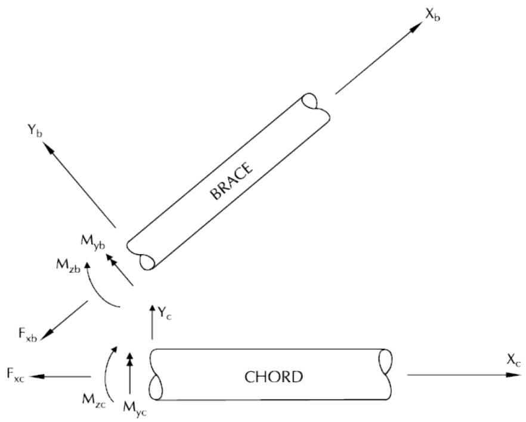
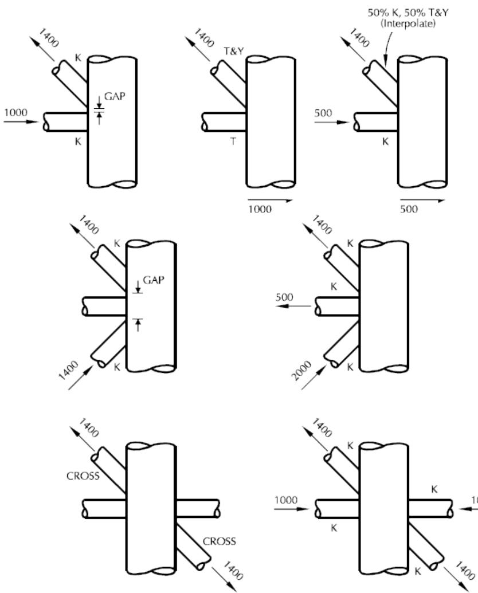
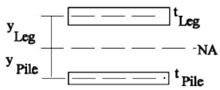
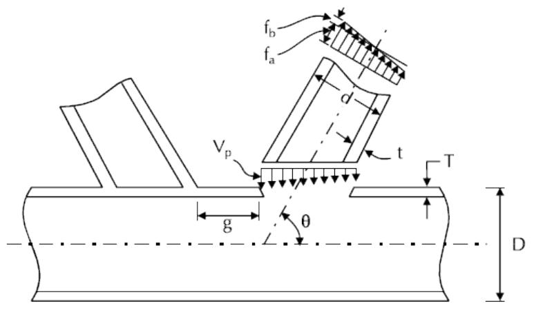
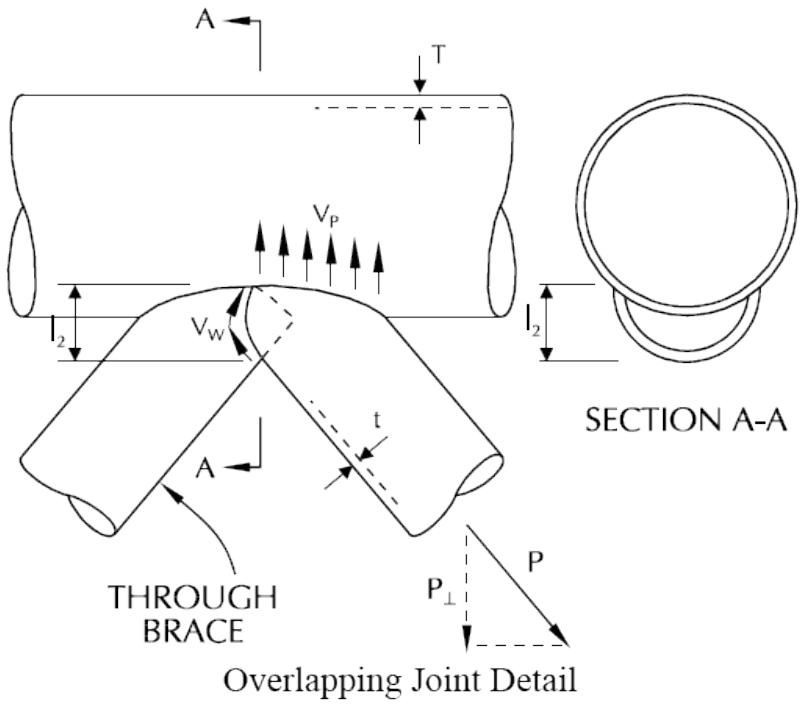
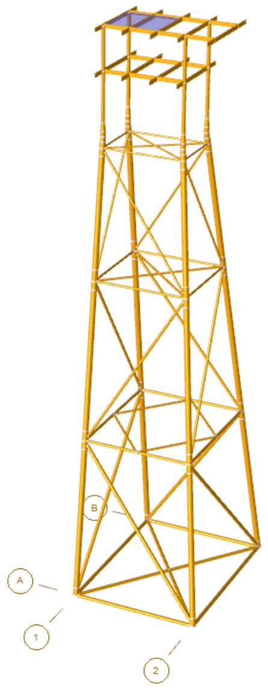

SACS

Joint Can

Version 24.00

Trademark Notice

Bentley and the "B" Bentley logo are either registered or unregistered trademarks or service marks of Bentley Systems, Incorporated. All other marks are the property of their respective owners.

Copyright Notice

Copyright © 2024, Bentley Systems, Incorporated. All Rights Reserved.

TABLE OF CONTENTS

1 INTRODUCTION .. 5

## 1.1 OVERVIEW.. . 5
## 1.2 PROGRAM FEATURES.. . 5
## 1.3 PROGRAM STRUCTURE. . 6

1.3.1 Chord and Brace Determination .. . 6   
1.3.2 Joint Local Coordinate System ... 6   
1.3.3 Joint Classification...   
1.3.4 Allowable Stresses ...   
1.3.5 Joint Redesign Procedure.... . 8   
1.3.6 Grouted Elements ..... 9

2 JOINT CAN INPUT DATA ... .. 10

## 2.1 BASIC OPTIONS . .10

2.1.1 Overlapping Brace Check . . 10   
2.1.2 Weld Allowable Stress..... 10   
2.1.3 Effective Thickness of Grouted Elements . .10   
2.1.4 Effective Thickness Limit .. 11   
2.1.5 Allowable Punching Shear Stress Limit .. 11

## 2.2 ANALYSIS TYPE AND CODE.. 11

2.2.1 API Punching Shear Check.. 12   
2.2.2 Overriding LRFD Resistance Factors..... 12   
2.2.3 European Punching Shear Checks.. .12   
2.2.4 Simplified Fatigue Check . 13   
2.2.5 Earthquake Joint Check... . 13   
2.2.6 Simplified and MSL Ultimate Strength Check . . 13   
2.2.7 Overriding MSL Assessment Factors.... . 14   
2.2.8 Selecting Members .... .14   
2.2.9 Designating Initial Load Cases... . 14   
2.2.10 Low Level Earthquake Analysis . .14

## 2.3 RECTANGULAR HOLLOW SECTION JOINT CHECK.. ... 14
## 2.4 OUTPUT REPORT SELECTIONS.. .. 15

2.4.1 Punching Check Report .. . 15   
2.4.2 Strength Check Report.. 15   
2.4.3 Load Path Report . . 15   
2.4.4 SCF Report... . 15   
2.4.5 Chord Load Transfer Report.. . 16   
2.4.6 Crushing Check Analysis Report.. . 16

## 2.5 REDESIGN PARAMETERS . .. 16
## 2.6 OVERRIDING YIELD STRESS . .. 16

2.6.1 Specifying a Default Yield Stress ..... . 16   
2.6.2 Changing a Global Yield Stress .... . 16   
2.6.3 Changing Member Group Yield Stress . 17   
2.6.4 Changing Joint Yield Stress.... 17

## 2.7 BRACE CHORD OVERRIDES.. .. 17
## 2.8 LOAD CASE DATA ... .. 17

2.8.1 Selecting Output Load Case . . 17   
2.8.2 Allowable Stress Modifier ... .17   
2.8.3 Creating New Load Combinations.. . 18

## 2.9 SELECTING JOINTS TO ANALYZE.. ... 18
## 2.10 MISCELLANEOUS OPTIONS ... .. 18

2.10.1 Calculating Stress at Chord Face .. .18   
2.10.2 Overriding Chord Thickness .. .. 18   
2.10.3 Overriding Brace/Chord Angle Limit . .. 18

3 COMMENTARY . .. 20

## 3.1 AMERICAN PETROLEUM INSTITUTE RP-2A 20th EDITION .. ... 20

3.1.1 API Punching Shear .... .. 20   
3.1.2 Overlapping Joints... 22   
3.1.3 API Joint Strength 50% Check .. .. 24

3.1.3.1 Method 1: Original API... . 24   
3.1.3.2 Method 2: Minimum Capacity in Sec 4.2.3 API RP2A WSD 21st Sup 3... .. 24

3.1.4 API Simplified Fatigue .... .. 24   
3.1.5 API Earthquake Joint Strength Check.. .. 25   
3.1.6 API LRFD Simple Joint Strength Check . .. 26   
3.1.7 Overlapping Joint Strength Check.. .. 28   
3.1.8 Approximate Closed Ring Analysis.. .. 28

3.1.8.1 API Load Transfer across Chords... .. 28   
3.1.8.2 Joint Can Crushing Check Analysis . .. 28

3.1.9 Joint Can Load Path Method. .. 30

## 3.2 NORWEGIAN PETROLEUM DIRECTORATE .. .. 32

3.2.1 NPD Simple Joint Strength Check.. .. 32   
3.2.2 NPD Overlapping Joint Strength Check... .. 34

## 3.3 DANISH OFFSHORE CODE .. .. 34
3.3.1 Joint Punching Shear.. .. 34

## 3.4 ISO 19902:2007(E) ... ... 36

3.4.1 Minimum strength .. .. 36

3.4.1.1 Method 1: Simplified method. . .. 36   
3.4.1.2 Method 2: API's 50% strength method.. .. 36   
3.4.1.3 Method 3... .. 36   
3.4.1.4 Method 4: Full brace strength method.. .. 36

4 SAMPLE PROBLEMS.. . 37

## 4.1 PUNCHING SHEAR CHECK ... ... 38
## 4.2 SIMPLIFIED FATIGUE ANALYSIS.. .. 42
## 4.3 EARTHQUAKE ANALYSIS.. .. 47

5 INPUT LINES... .52

1 INTRODUCTION

## 1.1 OVERVIEW

The Joint Can program determines the adequacy of simple and overlapping tubular joints for punching shear. In addition to checking the adequacy of a joint, Joint Can has the ability to redesign the joint based on axial loads and bending moments of the chord and brace.

## 1.2 PROGRAM FEATURES

Joint Can is completely compatible with the output files of SACS such that all dimensions, geometry, internal loads, material properties, cross sectional properties, yield stress and allowable stress increases necessary for joint can analysis and design are obtained without user intervention.

Some of the main features and capabilities of the program are:

1. API, API-LRFD, ISO19902, NORSOK STANDARD, NPD, DNV and Danish codes are implemented.   
2. Brace on brace punching shear analysis for overlapping joints.   
3. Complete joint redesign capabilities using constant inner diameter, constant outer diameter or constant thickness.   
4. Extensive override capabilities including:

a. Maximum and minimum allowable gap distance for K-braces.   
b. Joint can default yield stress.   
c. Global modification of a SACS model yield stress for joint can analysis and/or design.   
d. Change yield stress of specified member groups.   
e. Modify yield stress of specified joints.   
f. Change the allowable stress modifier of any load condition or combination for the purpose of joint punching analysis.

5. Load case and joint selection capability.   
6. Joint strength (50%) check.   
7. API simplified fatigue including auto SCF determination.   
8. Ultimate earthquake joint analysis per API WSD and LRFD.   
9. Ability to define up to two hundred new load combinations for joint analysis and/or redesign.   
10. Determine effective chord thickness for grouted connections.   
11. User defined grouted connection effective thickness limit.

## 1.3 PROGRAM STRUCTURE

The Joint Can design program performs an analysis on all intersections of members which are designated as tubular (TUB) on the SACS Section Property input lines and tubular sections defined on Group Property input lines. The actual geometry, dimensions, internal loads, material properties, cross sectional properties, yield stress and allowable stress increases for each joint can are obtained from the common solution file (e.g. SACCSF.xxx). However, the user has the option to change the yield stress, change allowable stress modifier and designate new load combinations in the JOINT CAN input file.

1.3.1 Chord and Brace Determination

The program determines the chord and brace members by the following procedure:

1. The member with largest diameter, and secondarily, if required, the largest wall thickness is designated as the chord. If more than one member with the same largest diameter exists, the member with the largest wall thickness is taken to be the chord. If all members share the same diameter and wall thickness, the through members are designated as the chord. If all members are identical and there are multiple through members (X-Brace), then the first member encountered in the SACS IV input data file is taken as the chord.   
Note: The user can control the chord selection by increasing a member diameter or thickness by a small value (e.g. 0.001 inches).   
2. Normally two chord members will be attached to the same joint, both will be used in the can design if they form an angle between 170 to 180 degrees relative to each other.   
3. Chord members that change wall thickness at the joint are considered to be chord members if they form an angle between 170 and 180 degrees relative to each other.   
4. When two braces are connected to a chord such that the angle between the braces is greater than 120 degrees, the joint can will be designed as a Cross Joint or X-Brace. The chord member will be the largest member connected to the joint unless all members are the same size (X-Brace) where the first member encountered in the SACS IV data deck will be used as the chord.   
5. If the brace is perpendicular to the chord members, then each chord member and brace combination will be analyzed with the most severe case being reported.   
6. If the brace is not perpendicular to the chord member, the chord member which forms the smallest angle with the brace is used for the can design.   
7. For multiple brace to chord connections, the program will allow a 15 degree out-of-plane tolerance in the determination of K and Cross Joint connections.

1.3.2 Joint Local Coordinate System

After the brace and chord are determined, the internal loads for each member are transformed into the joint local coordinate system such that the transverse shears and bending moments lie in plane and perpendicular to the plane formed by the chord and brace connection (see figure below).

  
Joint Coordinate System

1.3.3 Joint Classification

For a particular load case, each brace is classified as a percentage of a ‘K’, ‘X’ and ‘T&Y’ joint as follows:

1. If a ‘K’ joint type is possible, the amount of the brace load transferred as a ‘K’ joint is ratioed to the total brace load to determine the percent K-brace. The program then determines if a cross or ‘X’ joint is possible and determines what percentage of the remaining load is transferred as a cross or ‘X’ joint. Any remaining load is transferred as a ‘T&Y’ type joint and is ratioed to the total brace load to determine the percent ‘T&Y’ joint.

1.3.4 Allowable Stresses

Allowable stresses are calculated for each possible joint type (K, X or T). A weighted average of the allowable stresses is taken based on the percentage of load transferred as a ‘K’ joint, cross joint or ‘T&Y’ joint, respectively (see figure below).

  
Joint Classification for Use in $\mathrm{ V }_{ \mathbf{ p } }$ Calculation

Values for $\mathsf{ V }_{ \mathsf{ p } }$ are interpolated based on the percentage of load that is transferred through the joint as a $' | \langle{ \boldsymbol{ \mathsf{ K } } }^{ \prime } , \mathsf{ \Lambda }^{ \prime } \mathsf{ T } \& \mathsf{ Y }^{ \prime }$ or a cross joint.

1.3.5 Joint Redesign Procedure

The punching shear stresses and unity checks are calculated for each brace-chord combination for each load condition. The most critical brace-chord combination of each joint is determined.

The chord wall thickness is then increased or decreased depending if the critical unity check is greater than 1.0 or less than a user specified value (unless the increase chord thickness only option is specified in the input file). The shear stresses and unity check ratio is recalculated. The chord wall thickness is changed until the highest unity check is in the specified range for the most critical connection. Stresses, allowables and unity checks for all remaining brace-chord combinations are then recalculated for each load condition. If all of the recalculated unity checks are less than 1.0 the program reports the final chord thickness and corresponding diameter along with the critical unity check ratio.

1.3.6 Grouted Elements

The following technique is used for the analysis and redesign of grouted connections.

1. The internal moments for the chord (jacket leg) are found by ratioing the internal moments of the combined grouted leg and pile by the ratio of the moment of inertia of the jacket leg (calculated by the outside diameter and wall thickness from the ‘SECT’ input line) and the composite grouted leg and pile moment of inertia.

$$M_{\mathrm{L e g}} = \frac{I_{\mathrm{L e g}}}{I_{\mathrm{c o m p o s i t e}}} M_{\mathrm{c o m p o s i t e}}$$

2. The axial load for the chord member (jacket leg) is found by ratioing the axial load of the combined grouted leg and pile by the ratio of the cross sectional area of the jacket leg (calculated by the outside diameter and wall thickness from the ‘SECT’ input line) and the composite grouted leg and pile cross sectional area.

$$F_{\mathrm{L e g}} = \frac{A_{\mathrm{L e g}}}{A_{\mathrm{c o m p o s i t e}}} F_{\mathrm{c o m p o s i t e}}$$

3. The jacket leg wall thickness is increased or decreased depending if the critical unity check is greater than 1.0 or less than a user specified value (unless the increase chord thickness only option is specified in the input file). The calculation of the internal loads for the jacket leg as described above is repeated for each change in the chord wall thickness.

Note: For grouted jacket legs, the user must input the leg and pile outside diameters and wall thickness separately on the section property ‘SECT’ input line.

2 JOINT CAN INPUT DATA

The Joint Can program requires a SACS common solution file containing member internal loads and a Joint Can input file for punching shear, effective strength, simplified fatigue analysis, earthquake punching check and ultimate strength check. The Joint Can input file allows the user to specify basic analysis options, designate the analysis type and code to use and override various properties.

## 2.1 BASIC OPTIONS

Basic Joint Can options are specified on the JCNOPT line.

Enter the units in columns 12-13. Enter the minimum and maximum gap to be used for ‘K’ joints in columns 20-25 and 26-31.

Note: Negative value for minimum or maximum gap indicates an overlapped joint.

2.1.1 Overlapping Brace Check

Enter ‘B’ in column 32 if overlapping braces are to be checked to ensure that the axial load may be transferred directly through one brace to another via their common weld.

Note: Overlapping braces are members with a negative gap.

2.1.2 Weld Allowable Stress

By default, the allowable stress for weld material is assumed to be the same as the connection steel. The weld allowable stress used for brace on brace check may be specified using the WELD line.

Specify the allowable stress in columns 7-14. The following specifies an allowable of 70.0 ksi.

```txt
1 2 3 4 5 6 7 8 123456789012345678901234567890123456789012345678901234567890  
1 JCNOPT API EN B  
# 2 WELD 70.0
```

2.1.3 Effective Thickness of Grouted Elements

By default, the thickness of the outside tubular (leg) is used as the chord thickness when analyzing the capacity of a grouted connection. The effective thickness of grouted elements may be determined based on the properties of both the outer and inner tubular members and used for the analysis and redesign of grouted connections. Enter one of the following effective thickness options in column 33:

Option 1, selected by inputting ‘1’, the effective thickness is based on the moment of inertia of the cross section of the element as follows:

$$t_{e f f} = \frac{D_{L e g} - \left(D_{L e g}^{4} - I_{c o m p} \frac{64}{\pi}\right)^{1 / 4}}{2}$$

where: $\mathsf{ D }_{ \mathsf{ I e g } }$ is the outside diameter of the larger tube (leg). Icomp is the moment of inertia of the composite section

$$I_{c o m p} = \frac{\pi}{64} \left[ \left(D_{L e g}^{4} + D_{P i l e}^{4}\right) - \left(d_{L e g}^{4} + d_{P i l e}^{4}\right) \right]$$

where: ${ \mathsf{ d } }_{ \mathsf{ I e g } }$ and $\mathsf{ d }_{ \mathsf{ p i l e } }$ are the inside diameter of the leg and pile, respectively

Option 2 uses the moment of inertias of the walls instead of the composite section moment of inertia and is selected by specifying $_ 2 \prime$ in column 33.

$$t_{e f f} = \left(12 \times I_{e f f}\right)^{1 / 3}$$

$$I_{e f f} = \frac{1}{12} \big (t_{L e g}^{3} + t_{P i l e}^{3} \big) + \big (t_{L e g} \times y_{L e g}^{2} + t_{P i l e} \times y_{P i l e}^{2} \big)$$

where t and y are defined in the figure below:



Option 3 uses the sum of the square root of the squares of the leg and pile thickness and is selected by specifying ‘3’ in column 33. Note that API RP2A WSD 21ST SUP3 2007, ISO 19902:2007/2020, and Norsok N-004, 2004 all choose this option to calculate the effective thickness. Therefore, this option is not activated for these codes.

2.1.4 Effective Thickness Limit

A chord effective thickness limit expressed as a factor of the actual chord thickness may be specified in columns 76-79 on the JCNOPT input line. The default limit is 1.75.

The following designates that option 1 is to be used for grouted elements and that the effective thickness limit is 2.


|  | 1 | 2 | 3 | 4 | 5 | 6 | 7 | 8 |
| --- | --- | --- | --- | --- | --- | --- | --- | --- |
| 1 | 1234567890123456789012345678901234567890123456789012345678901234567890123456789012345678901234567890123456789 | JCNOPT LRFDEN | 1 |  |  |  |  | 2.0 |


2.1.5 Allowable Punching Shear Stress Limit

By default, the allowable punching shear stress for API codes is limited to the allowable shear stress in the chord. Enter ‘N’ in column 51 if the allowable punching shear stress is not to be limited.

By default, when calculating the allowable punching stress factor (equation 6.56) for Norsok codes, L is set to the larger of D/4 or 30cm, enter ‘L’ if the actual modeled length from the crown to the end of the can is to be used.

## 2.2 ANALYSIS TYPE AND CODE

The Joint Can analysis option is designated in columns 8-11 on the JCNOPT line. Various types of analyses are available by designating the appropriate option.

2.2.1 API Punching Shear Check

For standard Working Stress Design punching shear check per API, select one of the following options:

1. ‘AP22’ - API 22nd Edition   
2. 'API' - API 21st Edition with Supplements 2 & 3   
3. ‘AP21’ - API 21st Edition   
4. ‘AP91’ - API 19th Edition   
5. ‘AP84’ - API 15th Edition   
6. ‘AP83’ - API 13th Edition Supplement   
7. ‘AP80’ - API 13th Edition   
8. ‘LG ’ - Linear global analysis based on API 21st Edition Section 17 criteria

For Ultimate Strength punching check per API, select:

1. ‘LRFD’ - API LRFD 1st Edition

2.2.2 Overriding LRFD Resistance Factors

The default resistance factors used in the API LRFD punching check may be overridden by the user using the RSFAC line. The following overrides the resistance factor for T&Y joints.

```txt
1 2 3 4 5 6 7 8 123456789012345678901234567890123456789012345678901234567890  
JCNOPT LRFDEN  
2 RSFAC 0.85 0.90 0.90 0.90 
```

2.2.3 European Punching Shear Checks

The program supports various other punching shear analyses and code check options as follows:

1. ‘NPD ’ - NPD 1977 Edition   
2. ‘NP84’ - NPD 1984 Edition   
3. ‘NP90’ - NPD 1990 Edition   
4. ‘DNV’ - DNV 1977 Edition   
5. ‘DN83’ - DNV 1983 Edition   
6. ‘DOC ’ - Danish 1984 Edition   
7. ‘NS ’ - Norsok Standard N-004, Rev 2, 2004   
8. 'IS ' - ISO 19902(E):2007   
9. 'I2 ' - ISO 19902(E):2020   
10. 'NSR3' - Norsok Standard N-004, Rev 3, 2013

11. ‘EC05’ – Eurocode EN 1993-1-8 (2005)

2.2.4 Simplified Fatigue Check

The API Simplified Fatigue analysis is invoked by specifying one of the following in columns 8-11.

1. ‘FTG ’ - API 20th Edition   
2. ‘FT91’ - API 19th Edition   
3. ‘FT84’ - API 16th Edition   
4. ‘FT82’ - API 13th Edition

The appropriate load cases containing the reference level wave should be specified on the LCSEL input line.

The load path dependent SCF’s are calculated automatically based on the option input into columns 37- 39 on the FATIGUE line. The water depth, water line member elevation, fatigue life and weld classification should be specified in columns 9-16, 17-24, 27-30 and 33-36, respectively, on the FATIGUE input line.

The following shows the input for simplified fatigue using API 20th Edition. Load cases ‘SF00’, ‘SF45’ and ‘SF90’ contain reference level waves used to calculate fatigue stress. The water depth is 150.0 feet, the water line elevation is -20 and design life is 15 years.

```txt
1 2 3 4 5 6 7 8  
123456789012345678901234567890123456789012345678901234567890  
JCNOPT FTG EN  
2 LCSEL SF00 SF45 SF90 
```

2.2.5 Earthquake Joint Check

The program can check joint can capacity due to combined earthquake and static stresses per API guidelines. Specifying ‘EQ22’ for API RP2A WSD 22nd Edition, ‘EQK’ for API RP2A WSD 21st Edition with Supplements 1 to 3, 'EQ21' for API RP2A WSD 21st Edition, ‘EQLR’ for LRFD code or ‘EQIS’/’EQI2’ for ISO 19902 (2007/2020) code.

Joint Can is executed after the earthquake and static stresses are combined using the STCMB option in Dynamic Response or the Combine program. Only load cases created specifically for joint check by using the ‘PRSC’ or ‘PRST’ option should be specified on the LCSEL line of the Joint Can input file.

For example, the following designates that an API LRFD earthquake check is to be performed for load cases 3 and 4.

```txt
1 2 3 4 5 6 7 8 123456789012345678901234567890123456789012345678901234567890 1 JCNOPT EQLREN 2 LCSEL 3 4 
```

2.2.6 Simplified and MSL Ultimate Strength Check

Simplified ultimate strength check and MSL ultimate strength check analysis may be performed by specifying ‘SUS ’ or ‘MSL ’, respectively, in columns 8-11 of the JCNOPT line.

For MSL check, additional input including the Qu option, ultimate tension value and reassessment values option must be designated on the JCNOPT line. Enter ‘C’ or ‘M’ in column 36 for characteristic Qu factor or mean strength Qu factor, respectively. Enter ‘U’ in column 36 for ultimate tension values and/or ‘R’ in column 37 for reassessment values.

2.2.7 Overriding MSL Assessment Factors

The default assessment factors used in the MSL ultimate strength check may be overridden using the GMFAC line. The following overrides the gamma factors for axial and in-plane bending. The first factor in GMFAC line can be used as the resistant factor of Norsok N-004, Rev 3, 2013 and the material factor of Danish code.

```txt
1 2 3 4 5 6 7 8 123456789012345678901234567890123456789012345678901234567890  
1 JCNOPT MSL EN CUR  
2 GMFAC 0.95 0.95 
```

2.2.8 Selecting Members

By default all members are considered unless members are specified on the MSLC line. When using the MSLC line, only those members specified are considered for the ultimate strength analysis.

2.2.9 Designating Initial Load Cases

The first load case in each direction can be specified using the INITLC line.

Note: The INITLC line is not required if the analysis contains only one wave direction.

2.2.10 Low Level Earthquake Analysis

For low level earthquake loads, analysis may use API WSD (working stress design) or API LRFD (load and resistance factor design). API WSD is specified by putting ‘LLEW’ in columns 8-11 of the JCNOPT line; API LRFD design is specified by putting ‘LLEL’ in columns 8-11 of the JCNOPT line. For low level earthquake analysis per API, the user must input rare intense earthquake data in the dynamic response input file. The resulting data must be combined so that load cases 1 and 2 are the rare intense seismic loads and load case 3 contains the dead loads. The dead load case, 3, used in the low level earthquake analysis is specified using the ‘DLOAD’ line, where ‘3’ is entered in columns 7-10. The following input specifies low level earthquake analysis with API WSD is to be used, with load case 1 and 2 having a 70% increase in allowable stress.

```txt
1 2 3 4 5 6 7 8  
1234567890123456789012345678901234567890123456789012345678901234567890  
JCNOPT LLEWEN  
LCSEL IN 1 2  
AMOD  
AMOD 1 1.7 2 1.7  
DLOAD 3  
END 
```

## 2.3 RECTANGULAR HOLLOW SECTION JOINT CHECK

Rectangular hollow section joint check is invoked using the RHSOPT line. The following options are available in columns 8-11.

1. ‘CIDE’ – CIDECT Design Guide 3, “Design Guide for Rectangular Hollow Section (RHS) Joints under Predominantly Static Loading”, 2nd edition, 2009.

Note: K/KT overlap joints are not supported.

## 2.4 OUTPUT REPORT SELECTIONS

Output reports are designated in columns 56-69 on the JCNOPT line.

2.4.1 Punching Check Report

Enter one of the following report levels in columns 56-57 for reporting punching check results:

1. ‘FL’ Print results for all load cases for each joint   
2. ‘UC’ Print only joints with UC greater than UC limit specified   
3. ‘MX’ Print only results for critical load case for each joint   
4. ‘RD’ Print results for all load cases for each joint including redesign iterations

Note: If ‘UC’ is selected, enter the UC limit in columns 58-61.

2.4.2 Strength Check Report

SACS support the 50% strength check in the original API RP2A ASD 21st Edition and the new methodology of API RP2A ASD 21st Edition Supplement 3 2007. (See more details in Commentary 3.1.3.) By default, the latest method is applied.

Enter ‘PT’ in columns 62-63 to receive a strength analysis report and a joint can summary report with strength unity check. Enter 'SM' to print only the joint can summary report with strength UC. This reports the strength of the connection using 50% of the effective member strength of the new method. Enter 'PO' or 'SO' to use the original strength check method.

For ISO 19902:2007(E), the strength check follows the methodology in Section 14.2.3. SACS provide four applicable options. (See more details in Commentary 3.4.1). Enter 'PT' or 'SM' to print the strength analysis report.

For Norsok N-004 code, there is no specification on connection's minimum strength check. The option is ignored.

2.4.3 Load Path Report

The load path report details the connection classification for each load case and is activated by entering ‘PT’ in columns 64-65.

2.4.4 SCF Report

The SCFs used for simplified fatigue analysis may be printed be specifying ‘PT’ in columns 66-67.

2.4.5 Chord Load Transfer Report

The Joint Can program can check to ensure that chords resist general collapse per API specifications when load is transferred across. Enter ‘LT’ in columns 68-69 (or manually selecting the second option on ‘Closed Ring Analysis Option’) to receive the Chord Load Transfer Report.

2.4.6 Crushing Check Analysis Report

The Joint Can program can check to ensure that whether a chord fails under the action of all of the braces and the chord stress itself. Enter ‘JC’ in columns 68-69 (or manually selecting the third option on ‘Closed Ring Analysis Option’) to receive the Crushing Check Analysis Report. Per this selection, a subsequent option line is generated that allows the users to (1) request a summary report of crushing check analysis by entering ‘SR’ in columns 71-72 (or manually selecting the first option on ‘JointCan Crushing Check Report Option’), (2) request a detailed report of crushing check analysis by entering ‘SR’ in columns 71-72 (or manually selecting the second option on ‘JointCan Crushing Check Report Option’), or (3) request summary and detailed reports of crushing check analysis by entering ‘BR’ in columns 71- 72 (or manually selecting the third option on ‘JointCan Crushing Check Report Option’).

## 2.5 REDESIGN PARAMETERS

Redesign parameters are designated on the JCNOPT line in columns 38-50.

By default redesign performed by the Joint Can program. Specify ‘N’ in column 38 to eliminate redesign or ‘A’ to allow only thickness increases during redesign.

Specify the chord redesign option in columns 39-40. Enter ‘OD’ if chord outside diameter is to be changed (ie. constant ID), ‘ID’ if chord inner diameter is to be changed (ie. constant OD) or ‘TC’ if the thickness is to remain constant when diameter is changed. Designate the thickness and diameter increments in columns 41-45 and 46-50, respectively.

The following sample stipulates that redesign is to be performed allowing only thickness increases using 0.125 increment. The inside diameter is to vary.


|  | 1 | 2 | 3 | 4 | 5 | 6 | 7 | 8 |
| --- | --- | --- | --- | --- | --- | --- | --- | --- |
| 1 | 12345678901 | 12345678901 | 12345678901 | 12345678901 | 12345678901 | 12345678901 | 12345678901 | 1234567890 |
| JCNOPT API EN | JCNOPT API EN | JCNOPT API EN | JCNOPT API EN | AID0.125 | AID0.125 | AID0.125 | AID0.125 | AID0.125 |


## 2.6 OVERRIDING YIELD STRESS

By default, the yield stress specified in the model is used for punching analyses. The yield stress used for joint punching analysis purposes may be modified in several ways in the Joint Can input file.

2.6.1 Specifying a Default Yield Stress

A default yield stress may specified in columns 14-19 on the JCNOPT line. This value overrides any values in the SACS model.

2.6.2 Changing a Global Yield Stress

Any yield stress specified in the SACS model can be changed for the punching analysis with the UMOD input line. For example, for high strength steel, the design joint strength can be changed to 2/3 of the

tensile strength on the UMOD input line. In the following, 50ksi is changed to 46.67ksi for the purposes of punching check.

```txt
1 2 3 4 5 6 7 8 123456789012345678901234567890123456789012345678901234567890 1 JCNOPT API EN T AID0.125 2 UMOD 50.0 46.67 
```

Note: Enter ‘T’ in column 34 on the JCNOPT line if all yield stress overrides are to be applied only to the chord for the purposes of strength check.

2.6.3 Changing Member Group Yield Stress

The yield for an entire member group can be modified for the purpose of checking joint capacity, by using the GMOD input line. Overrides specified on the GMOD input line take precedence over those specified on the UMOD input line.

The following changes the yield stress for groups ‘TTT’ and ‘SSS’ to 50.0 for punching analysis purposes.

```txt
1 2 3 4 5 6 7 8 123456789012345678901234567890123456789012345678901234567890 1 JCNOPT API EN T AID0.125 2 GMOD 50.0 TTT SSS 
```

2.6.4 Changing Joint Yield Stress

The yield stress for specific joints can be modified by using the JMOD input line. Overrides specified on the JMOD input line take precedence over all other yield stress overrides.

## 2.7 BRACE CHORD OVERRIDES

The BRCOVR line can be used to override the effective chord length, chord can thickness and the chord tubular thickness. These overrides only affect the thickened can reduction factor as outlined in API RP2A WSD 21st Edition, Supplement 3 2007, ISO 19902:2007/2020, and Norsok N-004. This line should be entered after the LCSEL line in the joint can input file.

## 2.8 LOAD CASE DATA

2.8.1 Selecting Output Load Case

The LCSEL line can be used to specify which of the existing load cases in the common solution file are to be included or excluded for checking the joint adequacy. Specify ‘IN’ in columns 7-8 to include the listed load cases or ‘EX’ to exclude the listed load cases. In the following, joint capacity is to be checked only for load cases ‘OP00’, ‘OP45’ and ‘OP90’.

```txt
1 2 3 4 5 6 7 8 123456789012345678901234567890123456789012345678901234567890 1 LCSEL IN OP00 OP45 OP90 
```

2.8.2 Allowable Stress Modifier

For any load case, the allowable stress modifier may be specified using the AMOD line. In the following, a 1.33 allowable stress modifier is used for load cases ‘OP00’, ‘OP45’ and ‘OP90’.

```txt
1 2 3 4 5 6 7 8 123456789012345678901234567890123456789012345678901234567890 1 LCSEL IN OP00 OP45 OP90 
```

2.8.3 Creating New Load Combinations

The user can create load combinations for the purpose of joint check using the LCOMB input line in the Joint Can input file. These combinations are defined as linear combinations of load conditions contained in the common solution file.

## 2.9 SELECTING JOINTS TO ANALYZE

By default, all joint connections are analyzed. Specific joints may be selected for analysis using the JSLC line. The following designates that only joints 302, 401 and 567 are to be analyzed.

```txt
1 2 3 4 5 6 7 8 1 23456789012345678901234567890123456789012345678901234567890 1 JSLC 302 401 567 
```

## 2.10MISCELLANEOUS OPTIONS

2.10.1 Calculating Stress at Chord Face

By default, brace stresses are evaluated at the actual end of the brace. When members do not contain offsets, brace stresses may be calculated at the face of the chord using the RELIEF line.

Note: This feature is not required if braces are offset such that the member end is at the chord surface.

2.10.2 Overriding Chord Thickness

For any connection, the default chord thickness is determined from the properties contained in the model. The thickness of the chord may be overridden for a joint using the TCHORD line.

The following designates that the chord thickness used for joint check is to be 1.75 for joints 101 and 102.

```txt
1 2 3 4 5 6 7 8 1 23456789012345678901234567890123456789012345678901234567890 1 TCHORD 1011.75 1021.75
```

2.10.3 Overriding Brace/Chord Angle Limit

By default, the chord adjacent to the brace is evaluated for checking the connection. For braces normal to the chord, both chord members are evaluated.

When determining if a brace is normal to the chord, the angle between the brace and the adjacent chord is compared to the Brace/Chord Angle Limit. A brace with a brace to chord angle greater than the Brace/Chord Angle Limit is considered normal to the chord.

By default 85 degrees is used for the Brace/Chord Angle Limit. Enter the minimum angle used to determine if a brace is normal to the chord on the MAXANG line. The following designates that any brace with an angle greater than 75.0 degrees is to be checked using both chords (i.e. is considered normal to the chord). For specified angles less than 85.0 degrees, the limit is the minimum chord angle above which both chord members are evaluated. For specified angles greater than 95.0 degrees, the limit is the maximum chord angle below which both chord members are evaluated.

```txt
1 2 3 4 5 6 7 8 
```

12345678901234567890123456789012345678901234567890123456789012345678901234567890 1 MAXANG 75.0

Note: Enter 180.0 if both chords are to be evaluated for any brace.

# 3 COMMENTARY

The Joint Can Program will analyze and design tubular joint cans according to API, API-LRFD, DNV, NPD and Danish codes. The program also has the ability to perform Simplified Fatigue and earthquake analyses according to API recommendations. The following commentary sections outline the theory and formulas used by the program.

## 3.1 AMERICAN PETROLEUM INSTITUTE RP-2A 20th EDITION

3.1.1 API Punching Shear

API allows for the adequacy of a joint to be determined on the basis of punching shear or nominal loads in the brace. The Joint Can program uses the punching shear method.



$$\theta = \text{B r a c e} \quad \text{a n g l e (f r o m} \quad \text{c h o r d)} \quad \mathrm{g} = \text{G a p}, \text{i n}. (\mathrm{m m})$$

$$t = \text{B r a c e} (m m) \quad T = \text{C h o r d} (m m)$$

$$d = \text{B r a c e d i a m e t e r , i n .} (\mathrm{m m}) \quad D = \text{C h o r d d i a m e t e r , i n .} (\mathrm{m m})$$

The acting punching shear is calculated as:

$$V_{p} = \tau f \sin \theta$$

where:

f = nominal axial (fx), in-plane bending （$f_{ \mathsf{ b } z } )_{ \cdot }$ , or out-of-plane bending （$⨏_{ \mathbf{ h } \mathbf{ y } } )$ stress in the brace (punching shear for each kept separate)

$$\tau = \text{b r a c e t h i c k n e s s} / \text{c h o r d t h i c k n e s s (s e e f i g u r e)}$$

$$\theta = \text{B r a c e A n g l e} (\text{s e e f i g u r e})$$

The punching shear allowable stress $\mathsf{ v }_{ \mathsf{ p a } } ,$ is calculated separately for each component of brace loading and load path type (K, X, T or Y) utilizing the appropriate $\mathrm{ { { O }_{ \mathrm{ { q } } } } }$ and $\mathsf{ Q }_{ \mathsf{ f } }$ factors. The allowable is the lesser of the AISC allowable $0 . 4^{ * } \mathsf{ F }_{ \mathsf{ y } }$ or:

$$V_{p a} = Q_{q} Q_{f} \frac{F_{\mathrm{y c}}}{0 . 6 \gamma} \quad (\text{p l u s 1 / 3 i n c r e a s e w h e r e a p p l i c a b l e})$$

where:

$$F_{y c} = \text{y i e l d s t r e n g t h o f c h o r d m e b e r a t t h e j o i n t (o r 2 / 3 t h e t e n s i l e s t r e n g t h i f l e s s)}$$

$$\gamma = \text{c h o r d} (2^{*} \text{c h o r d} (2)$$

$$Q_{q} = \text{a c c o u n t s f o r e f f e c t s o f t y p e o f l o a d i n g a n d g e o m e t r y}$$

$$Q_{f} = \text{a c c o u n t s f o r l o n g i t u d i n a l s t r e s s i n t h e c h o r d}$$

$$Q_{f} = 1. 0 - \lambda \gamma A^{2}$$

$$A = \frac{\sqrt{\bar{f}_{A X}^{2} + \bar{f}_{I P B}^{2} + \bar{f}_{O P B}^{2}}}{0 . 6 F_{y c}} \quad (1 / 3 \text{i n c r e a s e a p p l i c a b l e t o d e n o m i n a t o r})$$

where:

$$\begin{array}{l} I = 0. 030 \text{f o r b r a c e a x i a l s t r e s s} \left(\mathrm{f}_{\mathrm{a x}}\right) \\ = 0. 045 \text{f o r b r a c e i n - p l a n e b e n d i n g s t r e s s} \left(\mathrm{f}_{\mathrm{b z}}\right) \\ = 0. 021 \text{f o r b r a c e o u t - o f - p l a n e b e n d i n g s t r e s s} \left(\mathrm{f}_{\mathrm{b y}}\right) \\ \end{array}$$

$\mathsf{ f }_{ \mathsf{ A X } } ,$ fIPB, and $\mathsf{ f }_{ 0 \mathsf{ P B } }$ are the nominal axial, in-plane bending and out-of-plane bending stresses in the chord.

Note: $Q_{ f } = 1 . 0$ when all extreme fiber stresses in chord are tensile

The weighted average allowable stress is calculated based on connection type for each load case.

VALUES FOR $\scriptstyle \mathbf{ Q }_{ 9 }$

$$f o r \beta > 0. 6 Q_{\beta} = 0. 3 / [ \beta^{*} (1 - 0. 833 \beta) ] \quad f o r \gamma \leq 20 Q_{g} = 1. 8 - 0. 1 g / T \geq 1$$

$$f o r \beta \leq 0. 6 Q_{\beta} = 1. 0 \quad f o r \gamma > 20 Q_{g} = 1. 8 - 4 g / D \geq 1$$


| Type & Geometry | Brace load type | Brace load type | Brace load type | Brace load type |
| --- | --- | --- | --- | --- |
| Type & Geometry | Tension | Compression | IP bending | OP bending |
| K overlap | 1.8* | 1.8* |  |  |
| K gap | (1.1+0.2/β)Qg | (1.1+0.2/β)Qg |  |  |
| T&Y | 1.1 + 0.2/β | 1.1 + 0.2/β | 3.72+0.67/β | 1.37+0.67/β)Qβ |
| X | 1.1 + 0.2/β | (0.75+0.2/β)Qβ |  |  |
| X w/diaph | 1.1 + 0.2/β | 1.1 + 0.2/β |  |  |


Note: Joint Can does not support diaphragms.

The following interaction equations are checked for combined axial and bending stresses:

$$\left[ \frac{V_{p}}{V_{p a}} \right]_{I P B}^{2} + \left[ \frac{V_{p}}{V_{p a}} \right]_{O P B}^{2} \leq 1. 0$$

$$\left[ \frac{V_{p}}{V_{p a}} \right]_{A X} + \frac{2}{\pi} \arcsin \sqrt{\left[ \frac{V_{p}}{V_{p a}} \right]_{I P B}^{2} + \left[ \frac{V_{p}}{V_{p a}} \right]_{O P B}^{2}} \leq 1. 0$$

Note: The arcsin term is in radians.

3.1.2 Overlapping Joints

Joint Can has the ability to check overlapped brace connections to determine if the overlap is sufficient to transfer the brace axial loads directly from one brace to another brace through the weld.

The allowable axial load (perpendicular to the chord) $\mathsf{ P }_{ \mathsf{ p } } ,$ is calculated as follows:

$$P_{p} = \left(V_{p a} \pi_{1}\right) + \left(2 V_{w a} t_{w} 1_{2}\right)$$

where:

$$V_{p a} = \text{a l l o w a b l e p u n c h i n g s h e a r s t r e s s}$$

$$T = \text{c h o r d}$$

$$V_{w a} = \text{w e l d}$$

l1 = circumference of brace contact with chord   
l2 = projected chord length of overlapping weld, measured perpendicular to chord.



3.1.3 API Joint Strength 50% Check

3.1.3.1 Method 1: Original API

A check is performed for each tubular connection to determine the capability of the connection to carry 50% of the effective member strength of any connecting brace. The effective strength is taken as the buckling load for members loaded in tension or compression and as yield for members loaded primarily in tension. This method is applied for API RP2A WSD 21st Ed and before, and API LRFD.

For simple joints, the following equation should be satisfied:

$$\frac{F_{y b} \gamma \tau \sin \theta}{F_{y c} (11 + 1 . 5 / \beta)} \leq 1. 0$$

where:

$\mathsf{ F }_{ \mathsf{ v b } } = \mathsf{ t h e \ v i e l d \ s t r e n g t h \ o f \ t h e \ b r a c e \ m e m b e r }$

Fyc = lesser of yield strength of chord or 2/3 of tensile strength

3.1.3.2 Method 2: Minimum Capacity in Sec 4.2.3 API RP2A WSD 21st Sup 3

API has a broad minimum capacity requirement that equate to 50 percent of the capacity of the incoming brace member. The connections should develop the strength required by design loads, no less than 50% of the effective strength of the brace member. The effective strength is defined as the buckling load for members loaded in compression, and as the yield load for members loaded in tension. Joint capacity may be determined in accordance with Section 4.3 with all the safety factors (FS) set to 1.0. This method is applied by default for API RP2A WSD 21st Sup 3.

3.1.4 API Simplified Fatigue

The Joint Can program can analyze connections according to the API-RP2A simplified fatigue requirements. This option is used in lieu of a detailed deterministic or spectral fatigue analysis using the Fatigue program. The simplified fatigue analysis requires a separate Joint Can program execution using the fatigue option located on the JCNOPT or PSOPT input line. The solution file must contain load cases consisting of only the design reference level waves (or the design waves) for several wave steps and wave directions.

The program requires that the user specify the design fatigue life (years), the water depth of the platform and the weld profile as smooth or rough. Also, the elevation of the framing level immediately below the fatigue design reference level wave trough must be specified. Members above this elevation are considered ‘waterline members’ and members below this level are considered as ‘non-waterline members’.

Joint Can calculates the peak hot spot stress at both the chord and brace side of a joint as follows:

$$\left| S C F_{a x} f_{a x} \right| + \sqrt{\left(S C F_{i p b} f_{i p b}\right)^{2} + \left(S C F_{o p b} f_{o p b}\right)^{2}}$$

where:

fax, fipb, fopb = are the nominal axial, in-plane bending and out-of-plane bending stresses.

$\begin{array} { r l r l r } { { 5 } C \mathsf{ F }_{ \mathrm{ a x } } , \mathsf{ S C F }_{ \mathrm{ i p b } } , \mathsf{ S C F }_{ \mathrm{ o p b } } } & { { } \quad } & { = \mathsf{ a r e \ t h e \ c o r r e s p o n d i n g \ s t r e s s \ c o n c e n t r a t i o n } } \end{array}$ factors for axial, in-plane bending and out-of-plane bending respectively.

Note: The brace stresses are used to calculate the hot spot stress on both the brace and chord side of the connection.

The weighted average SCF, based on the percentage of K, X and T&Y joint classification, is used. The stress concentration factors used are based on modified Kellog formulas for the chord. The brace side SCF’s are those suggested by Marshall with a 0.625 reduction factor (see table below).


| Joint type | Joint type | α | Axial | IP bending | OP bending |
| --- | --- | --- | --- | --- | --- |
| Chord | K | 1.0 | α A | 2/3 A | 3/2 A |
| Chord | T&Y | 1.7 | α A | 2/3 A | 3/2 A |
| Chord | X β<0.98 | 2.4 | α A | 2/3 A | 3/2 A |
| Chord | X β≥0.98 | 1.7 | α A | 2/3 A | 3/2 A |
| Brace | Brace | Brace | 1.0 + 0.375 | *(1 + (τ/β)0.5 | *SCFchord)≥1.8 |


where: $\mathsf{ A } = 1 . 8^{ \ast } \gamma^{ 0 . 5 \ast }$  sin

3.1.5 API Earthquake Joint Strength Check

Joints are analyzed and sized for the tensile yield load or the compressive buckling load of the brace members framing into the joint. The capacity is determined based on the punching shear method.

The factor A used in calculating $\mathsf{ V }_{ \mathsf{ p a } }$ is computed as follows:

$$A = \frac{\sqrt{f_{a x}^{2} + f_{i p b}^{2} + f_{o p b}^{2}}}{F_{y}}$$

where:

fax, fIPB, fOPB = are the smaller of the stresses in chord due to twice the strength level seismic loads combined with static loads, or the full capacity of the chord away from the can.

Note: The STCMB option in Dynamic Response or the Combine program should be used to create the combined load cases consisting of twice the seismic loads plus the static loads.

For low level earthquake design, chord stresses use twice the seismic load plus applicable dead loads and brace stresses use rare intense seismic load plus dead loads.

3.1.6 API LRFD Simple Joint Strength Check

The adequacy of the joint is determined on the basis of factored loads in the brace. The joint ultimate axial capacity ${ \mathsf{ P } }_{ \mathsf{ u j } } ,$ and ultimate moment capacity $\mathsf{ M }_{ \mathsf{ u j } }$ are determined as follows:

$$P_{u j} = \frac{F_{y} T^{2}}{\sin \theta} Q_{u} Q_{f} \quad M_{u j} = \frac{F_{y} T^{2}}{\sin \theta} (0. 8 d) Q_{u} Q_{f}$$

where:

Qf = accounts for longitudinal factored load in the chord and is taken as $\mathsf{ 1 . 0 - l } \mathsf{ g } \mathsf{ A }^{ 2 }$ but is set to unity when all chord extreme fiber stresses are tensile.

 = 0.030 for brace axial stress

= 0.045 for brace in-plane bending stress   
= 0.021 for brace out-of-plane bending stress

$$A = \frac{\sqrt{f_{a x}^{2} + f_{i p b}^{2} + f_{o p b}^{2}}}{\phi_{q} F_{y}}$$

fax, $\boldsymbol{ \mathsf{ f } }_{ \mathsf{ i p b } } , \mathsf{ f }_{ \mathsf{ o p b } }$ are factored axial, in-plane bending and out-of-plane bending stresses in the chord.

fq = yield stress resistance factor = 0.95

Qu = ultimate strength factor based on the joint type. $\mathtt{ Q }_{ \mathtt{ U } }$ should be interpolated based on the portion of the load carried as K, X or T&Y joint.

$\mathsf{ V A L U E S  F O R O }_{ \mathsf{ q } }$

$\mathsf{ f o r } \beta > 0 . 6 \mathsf{ Q } \beta = 0 . 3 / [ \beta^{ * } ( 1^{ - } . 833 \beta ) ]$ $\mathsf{ f o r } \gamma \le 20 \mathsf{ Q }_{ \mathrm{ g } } = 1 . 8 – 0 . 1 \mathrm{ g } / \mathsf{ T } \ge 1$

$\mathsf{ f o r } \beta \leq 0 . 6 \mathsf{ Q } \beta = 1 . 0$ $\mathsf{ f o r } \gamma > 20 \mathsf{ Q }_{ \mathrm{ g } } = 1 . 8 – 4 \mathrm{ g } / \mathsf{ D } \ge 1$


| Type & Geometry | Brace load type | Brace load type | Brace load type | Brace load type |
| --- | --- | --- | --- | --- |
| Type & Geometry | Tension | Compression | IP bending | OP bending |
| K | (3.4+19β)Qg | (3.4+19β)Qg |  |  |
| T&Y | 3.4 + 19β | 3.4 + 19β | 3.4 + 19β | (3.4 + 7β)Qβ |
| X | 3.4 + 19β | (3.4+13β)Qβ |  |  |
| X w/diaph | 3.4 + 19β | 3.4 + 19β |  |  |


Note: Joint Can does not support diaphragms.

For combined axial and bending loads in the brace, the following equation is used:

$$1 - \cos \left[ \frac{\pi}{2} \frac{P_{D}}{\phi_{j} P_{u j}} \right] + \left[ \left(\frac{M_{D}}{\phi_{j} M_{u j}}\right)_{i p b}^{2} + \left(\frac{M_{D}}{\phi_{j} M_{u j}}\right)_{o p b}^{2} \right]^{\frac{1}{2}}$$

where:

$\mathsf{ P }_{ \mathsf{ D } }$ = factored brace axial load

MD = factored brace bending moment

j = connection resistance factor

Connection resistance factor $\phi_{ \mathrm{ j } }$


| Type & Geometry | Brace load type | Brace load type | Brace load type | Brace load type |
| --- | --- | --- | --- | --- |
| Type & Geometry | Tension | Compression | IP bending | OP bending |
| K | 0.95 | 0.95 | 0.95 | 0.95 |
| T&Y | 0.9 | 0.95 | 0.95 | 0.95 |
| X | 0.9 | 0.95 | 0.95 | 0.95 |


3.1.7 Overlapping Joint Strength Check

Overlapping joints in which part of the axial load is transferred directly from one brace to another through their common weld are checked to verify that the axial force component perpendicular to the chord $\mathsf{ P }_{ \mathsf{ D } \mathsf{ p } } ,$ satisfies the following:

$$P_{D_{p}} <   \left(\phi_{j} P_{u j} \frac{l_{1}}{l} \sin \theta\right) + \left(2 V_{w} t_{w} l_{2}\right)$$

where:

$$V_{w} = f_{s h} F_{y}$$

sh = AISC resistance factor for the weld

tw = lesser of the weld throat thickness or thickness of thinner brace

l1 = circumference of the actual portion of brace contacting the chord

l = circumference of the portion of brace contacting the chord neglecting presence of overlap

l2 = projected chord length of the overlapping weld measured perpendicular to chord

3.1.8 Approximate Closed Ring Analysis

Ring load analysis in API design specifications is a crucial engineering assessment that focuses on evaluating the structural integrity of ring-like components by analyzing the distribution of loads and stresses along the chord and brace members. The ring load analysis, as employed by SACS, incorporates two distinct methodologies for API load transfer across the chord, along with an API crushing check analysis.

3.1.8.1 API Load Transfer across Chords

Joints which load is transferred across the chord can be checked for general collapse per API recommendations. For joints reinforced by an increase in thickness and having a brace chord diameter ratio of less than 0.9, the allowable axial branch load is determined from:

$$P = P (1) + \frac{L}{2 . 5 D} [ P (2) - P (1) ] f o r L <   2. 5 D \quad P = P (2) f o r L > 2. 5 D$$

where:

P(1) = allowable brace axial capacity using nominal chord member thickness

P(2) = allowable brace axial capacity using the can thickness

3.1.8.2 Joint Can Crushing Check Analysis

The Joint Can Crushing analysis is a method used to determine whether a chord will fail when subjected to the stresses exerted by brace members. This analytical approach replicates the method used by MOSES software where the Joint Can analysis is conceptualized as a two-dimensional ring structure (i.e.,

a closed ring analysis), with distributed loads applied at the brace and chord intersections. The stress distribution within the ring is computed at thirty-six discrete positions around its circumference. These computed stress values are subsequently compared with corresponding axial and shear allowable stress limits defined by API standard to calculate the unity check values.

For joint can crushing analysis, an effective closed ring analysis is performed where the references API-RP2A and Warren C. Young’s “Roark’s Formulas for Stress and Strain” Seventh edition, are consulted for applicable formulae. Two primary assumptions are made: 1) The load within the brace that is aligned parallel to the chord is regarded, and 2) According to API-RP2A, the “effective joint length” is determined as 2.5 times the chord's diameter plus the maximum distance along the chord between two brace and chord intersection points when no rings are present.

From API-RP2A the radial loading for each brace is ?? sin ??, where P is the brace axial load, and ?? is the angle between the brace and the chord. The internal ring loads for each joint can including the axial, bending moment, and shear loads calculated from Formula 20 from Chapter 9, Table 9.2 are added to their counterpart loads obtained from Formula 8 (shown in the table below) to represent the load distribution within the ring structure. Formula 20 analyzes the individual chord/brace connection under the assumption that the brace radial load (W) is transferred by tangential shear load (v) around the ring, while Formula 8 considers the brace radial load as a distributed brace load $( w = W / 2 R )$ where w is the distributed load, and R is the radius of the chord. In these formulae, ?? and x are angles (in radians) and are limited to the range zero to π, s = sin θ, c = cos ??, z = sin x, and $u = c o s x .$ . The resultant ring loads from these two formulae （$L T_{ N }$ is the axial load in the ring, $L T_{ M }$ is the bending moment in the ring, and $L T_{ V }$ is the shear load in the ring) are added up at a given angle and chord/brace connection. The ring loads obtained from each brace are then linearly combined, accounting for the relative radial position of each brace. Unity checks are calculated for the ring by comparing combined axial and bending against $0 . 6 \mathsf{ F }_{ \mathsf{ y } }$ and shear stress against $0 . 4 \mathsf{ F }_{ \mathsf{ y } } .$ These factors may be adjusted by any user-defined allowable stress modifier.

* Note: Calculation of the effective length in the segmented members follows the same process used for calculation of the effective length in the non-segmented members.   
* Note: Please be aware that there may be slight variations between the results obtained from SACS and MOSES analyses, primarily because SACS utilizes double precision floating-point numbers, while Moses employs single precision floating-point numbers, impacting the level of numerical accuracy negligibly.


| Formula 20. A closed ring supported at bottom and carrying brace load W transferred by tangential shear v distributed. | Formula 8. A closed ring supported at bottom and carrying distributed load force w. |
| --- | --- |
| v = W sin x / πR LT_M = WR/π(1 - u - xz/2) LT_N = -W/2πxz LT_V = W/2π(z - xu) | (A θ 2WR sin θ (Note: θ ≥ π/2) LT_M = -wR^2/2 (z - s)^2 <x-θ>0 LT_N = -wRz(z - s) <x-θ>0 LT_V = -wRu(z - s) <x-θ>0 |


3.1.9 Joint Can Load Path Method

The following load path determination method is a general method used in all joint can analysis of joint loads. For joints where the normal loads are not balanced, the connection is checked for K-Joint consideration. Only multiple braces on the same side of the chord are considered as part of a K-Joint. For any brace, the axial load component normal to the chord is balanced by the axial load component normal to the chord in other braces on the same side of the chord. The brace with the smallest normal axial force is considered first with the brace containing the largest opposing normal axial force. The balanced load is subtracted from the opposing brace and the process is repeated until all K-Joints are identified.

Any X or cross joint load path is considered next. Only braces on opposites sides of the chord are considered as part of the X-Joint. The remaining unbalanced K-Joint axial load component normal to the chord is balanced by the axial load component normal to the chord in an opposing brace on the opposite side of the chord. The brace with the largest opposing normal axial force is considered first. The balanced load is subtracted from the opposing brace and the process is repeated until all X-Joints are identified.

T/Y load paths are identified last. Braces with the remaining unbalanced axial load component normal to the chord are classified T/Y-Joints.

## 3.2 NORWEGIAN PETROLEUM DIRECTORATE

The Joint Can program will analyze and design tubular joint cans according to the 1977, 1984 and 1990 Norwegian Petroleum Directorate Regulations.

3.2.1 NPD Simple Joint Strength Check

For simple joints without overlap and without gussets, diaphragms or stiffeners, the following interaction equation is used to determine the adequacy of the connection:

$$\frac{N}{N_{k}} + \left(\frac{M_{I P}}{M_{I P k}}\right)^{2} + \frac{M_{O P}}{M_{O P k}} \leq \frac{1}{\gamma_{m}}$$

where $\mathsf{ N } , \mathsf{ M }_{ \mathsf{ I P } }$ and $\mathsf{ M }_{ \mathsf{ O P } }$ are the design axial force, in-plane moment and out-of-plane moment in the brace respectively and $\mathsf{ N }_{ \mathsf{ k } } , \mathsf{ M }_{ \mathsf{ l P k } }$ and $\mathsf{ M }_{ \mathsf{ O P k } }$ are the characteristic axial , in-plane bending and out-of-plane bending capacities, as governed by chord strength, respectively. $\mathsf{ N }_{ \mathsf{ k } }$ is calculated by:

$$N_{k} = Q_{u} Q_{f} \frac{f_{y} T^{2}}{\sin \theta}$$

where $\mathtt{ Q }_{ \mathtt{ u } }$ is given in the table below and $\mathsf{ Q }_{ \mathsf{ f } }$ accounts for longitudinal stress in the chord and is calculated as:

$$Q_{f} = 1. 0 - 0. 03 \gamma A^{2}$$

when $\beta \ge 0 . 9 , \Omega_{ \mathsf{ f } }$ is set to unity and $\mathsf{ A }^{ 2 }$ is defined as:

$$A^{2} = \frac{\sigma_{a x}^{2} + \sigma_{I P}^{2} + \sigma_{O P}^{2}}{0 . 64 f_{y}^{2}}$$

where $\mathbf{ { \sigma } }_{ \mathtt{ a x } } , \mathtt{ { \sigma } }_{ \mathtt{ b } }$ , and $\boldsymbol{ \sigma }_{ 0 \mathsf{ P } }$ are the design axial, in-plane bending and out-of-plane bending stresses in the chord respectively.

$\mathsf{ V A L U E S  F O R O }_{ \mathsf{ u } }$

$\mathsf{ f o r ~ \beta > 0 . 6 ~ Q_{ \beta } = 0 . 3 / [ \beta^{ * } ( 1 - . 833 \beta ) ] }$ $\mathsf{ f o r } \gamma \le 20 \mathsf{ Q }_{ \mathrm{ g } } = 1 . 8 – 0 . 1 \mathrm{ g } / \mathsf{ T } \ge 1$

$\mathsf{ f o r } \beta \leq 0 . 6 \mathsf{ Q }_{ \beta } = 1 . 0$ $\mathsf{ f o r } \gamma > 20 \mathsf{ Q }_{ \mathrm{ g } } = 1 . 8 – 4 \mathrm{ g } / \mathsf{ D } \ge 1$


| Type & Geometry | Brace Load Type | Brace Load Type | Brace Load Type |
| --- | --- | --- | --- |
| Type & Geometry | Axial | IP bending | OP bending |
| K | 0.90(2+21β)Qg |  |  |
| T&Y | 2.5 + 19β | 5.0 + (β γ½) | 3.2/(1-0.81β) |
| X | (2.7 + 13β)Qβ |  |  |


The in-plane bending capacity of the brace MIPk, is calculated as:

$$M_{I P k} = Q_{u} Q_{f} \frac{d f_{y} T^{2}}{\sin \theta}$$

where $\mathtt{ Q }_{ \mathtt{ u } }$ is given in the table and:

$$Q_{f} = 1. 0 - 0. 045 \gamma A^{2}$$

The out-of-plane bending capacity of the brace $\mathsf{ M }_{ \mathsf{ O P k } } ,$ is determined from the following:

$$M_{O P k} = Q_{u} Q_{f} \frac{d f_{y} T^{2}}{\sin \theta}$$

where:

$$Q_{f} = 1. 0 - 0. 021 \gamma A^{2}$$

3.2.2 NPD Overlapping Joint Strength Check

The following discussion applies to overlapping tubular joints without gussets, diaphragms or stiffeners.

For K-joints where compression in the brace is balanced by tension in braces in the same plane and on the same side of the joint, the total load component normal to the chord $\mathsf{ N }_{ \mathsf{ N } } ,$ is limited to the following:

$$N_{N} \leq \frac{N_{k}}{\gamma_{m}} \frac{\ell_{1}}{\ell} \sin \theta + \frac{2 f_{y} t_{w} \ell_{2}}{\sqrt{3} \gamma_{m}}$$

## 3.3 DANISH OFFSHORE CODE

The capacity of a connection can be checked using the 1983 Danish Offshore Code.

3.3.1 Joint Punching Shear

The acting punching shear stress is calculated from the following equation:

$$V_{p} = \tau f \sin \theta$$

where f is the axial, in-plane or out-of-plane bending stress in the brace. The allowable punching shear stress is calculated as:

$$V_{p a} = C \mu \frac{f_{y} / \gamma_{\tau}}{\gamma}$$

and:

$$\mu = 1. 22 - 0. 5 \frac{\left| \sigma_{o d} \right|}{f_{y} / \gamma_{\tau}} \leq 1. 0$$

$$\gamma = \frac{D}{2 T}$$

where:

fy = yield stress

od = stress in chord

 = 1.34 (High Safety Class) or 1.21 (Normal Safety Class)

Use ‘GMFAC’ line to override  factor.

D = chord diameter

T = chord thickness

C = shown in table

VALUES FOR C

$\mathsf{ f o r ~ \mathbb{ \beta } \geq 0 . 6 ~ Q \beta = 0 . 3 / [ \beta^{ * } ( 1 \mathrm{ - . 833 \beta ) ] } ~ \mathsf{ f o r ~ } \zeta \leq 0 ~ }$ $\complement \zeta = 1 . 8$

$$f o r \beta <   0. 6 Q_{\beta} = 1. 0$$

$$f o r 0 <   \zeta <   1 \quad C \zeta = 1. 8 - 0. 8 \zeta$$

$$f o r \zeta \geq 1 \quad C \zeta = 1. 0$$


| Type of Brace Load | Joint Type | Joint Type | Joint Type |
| --- | --- | --- | --- |
| Type of Brace Load | T&Y | X | K |
| Tension | 1.10 + 0.20/β | 1.10 + 0.20/β | (1.10+0.20/β)Cζ or 1.8 for overlapped |
| Compression | 1.10 + 0.20/β | (0.75+0.20/β)Cβ | (1.10+0.20/β)Cζ |
| In-plane | 3.72 + 0.67/β | 2.55+0.67/β | 3.72+0.67/β |
| Out-of-plane | (1.37+0.67/β)Cβ | (0.98+0.67/β)Cβ | (1.37+0.67/β)Cβ |


$$C_{\beta} = \frac{0 . 3}{\beta \left(1 - \frac{5}{6} \beta\right)} f o r \beta > 0. 6$$

$$\varsigma = \frac{a}{d_{a m}}$$

where: a= gap and ${ \mathsf{ d } }_{ { \mathsf{ a m } } } { = } ( { \mathsf{ d } }_{ { \mathsf{ a 1 } } } + { \mathsf{ d } }_{ { \mathsf{ a 2 } } } ) / 2$

$\mathsf{ V }_{ \mathsf{ p a } }$ is evaluated separately for each stress component, axial, in-plane or out-of-plane bending, for each connection type (K, X and T). The allowable stress used is based on a weighted average dependent on axial load path for each load case.

The following equation is used to determine the unity check ratio:

$$\left| \frac{V_{p}}{V_{p a}} \right| + \frac{2}{\pi} \sin^{-1} \sqrt{\left(\frac{V_{p}}{V_{p a}}\right)_{I P B}^{2} + \left(\frac{V_{p}}{V_{p a}}\right)_{O P B}^{2}} \leq 1. 0$$

## 3.4 ISO 19902:2007(E)

3.4.1 Minimum strength

3.4.1.1 Method 1: Simplified method.

Assume $\mathsf{ U }_{ \mathsf{ b } } \mathsf{ = } \mathsf{ 1 } . 0$ in Eq 14.3-13 and use the appropriate resistance factors. Require connection's utilization $\mathsf{ U j } { \mathsf{ < } } 1 / \gamma \mathsf{ z }$ .

3.4.1.2 Method 2: API's 50% strength method.

UC=50% Brace_Strength/Pa.

Use 50% of brace’s strength (yielding strength if tensile or axial buckling strength if compressive) as the axial load on the brace with resistance factors being 1.0; Use the axial capacity Pa of the chord with resistance factor 1.0.

3.4.1.3 Method 3

Use Eq 14.3-13. Note that user needs to run POST to output Ub prior to Joint Can analysis.

3.4.1.4 Method 4: Full brace strength method

Use Eq(14.3-13) as the strength utilization, where the brace internal force and moment PB, MBip, and MBop are the assumed brace loads that make the utilization of brace approximately become 1.0, and got from Eq (13.3-1,2,3) with resistance factors. Applying them into Eq(14.3-13) with resistance factors will let Ub close to 1.0. The joint capacities Pa, Mip, Mop are obtained in simple joint analysis formula Eq (14.3-1,2), assuming the brace type is T/Y and the chord is stress free (Qf=1.0). The method inspects the strength of an isolated brace-chord pair and is load case independent. The result may be conservative.

Note: The default is Method-1 and γz=1.17 for ISO 2007. User may apply RFISO line to modify γz and choose the other methods. Method-2 is the default for ISO 2020.

4 SAMPLE PROBLEMS

The structure shown in the figure was used to demonstrate the various capabilities of the Joint Can program. Three separate analyses are illustrated:

1. The first sample problem is a typical joint punching shear capacity check for an in place analysis The joints were evaluated using the API RP 2A code.   
2. Sample Problem 2 illustrates the API-RP2A simplified fatigue analysis capabilities of the program.   
3. Sample Problem 3 is a typical joint check for combined earthquake and static loading. The connection capacity was checked according to API-RP2A guidelines.



## 4.1 PUNCHING SHEAR CHECK

The following sample problem is a typical punching shear capacity check and joint can redesign using the API RP 2A code.

No redesign will be performed on the joints. The element stresses will be taken at the face of the chord instead of the joint and joint can extension requirements are ignored.

Below is the Joint Can input file for this sample problem followed by an explanation of the input lines used.

```txt
1 2 3 4 5 6 7 8 123456789012345678901234567890123456789012345678901234567890  
1 JCNOPT API EN C NID M FLMX PT PT 1.75  
2 RELIEF
3 END
```

Line 1. The first input line, the Joint Can options line specifies:

a. API RP 2A 21st edition code check with Supplement 2 + 3 are specified with ‘API’ in columns 8-11.   
b. English units are designated in columns 12-13.   
c. The ‘N’ in col. 38 indicates that redesign shall not be performed.   
d. The ‘M’ in col. 51 indicates that modeled lengths for can extensions will be used and code required lengths will be ignored.   
e. ‘MX’ in columns 56-57 specifies that only the controlling load case results are to be reported.

B. The RELIEF line indicates that brace stresses will be taken at the chord face instead of the joint. The following pages contain a portion of the analysis output.

SAMPLE 02 ENGLISH UNITS MODEL

DATE 26-AUG-2020 TIME 11:11:29 JCN PAGE 2

* * J O I N T C A N O P T I O N S * * VERSION 14.3.0.27

* JOINT CHECK PROGRAM OPTIONS *

(BASED ON 21ST ED. API CODE - SUPPLEMENT 1~3)

+200 - EXCESSIVE CHORD STRESS RESULTED IN A NEGATIVE ALLOWABLE

AXIAL CAPACITY OF MIXED CLASS CONNECTIONS BASED ON INTERPOLATION OF BRACE AXIAL CAPACITIES

STRENGTH ANALYSIS DOES NOT DO REDESIGN.

JOINT CAN SUMMARY(UC ORDER) SHOWS STRENGTH UC AFTER LOAD DESIGN

MAXIMUM EFFECTIVE THICKNESS RATIO IS 1.75

(EFFECTIVE THICKNESS BASED ON SQUARE ROOT OF SUM OF THICKNESSES SQUARED)

APPLY MODELED CAN LENGTH ON EFFECTIVE TOTAL LENGTH Lc (IGNORING THE MIN CAN EXT REQUIREMENT).

CAN EXTENSION ON BOTH CHORD SIDES ARE CONSIDERED AND THE SMALLER ONE IS USED.

OUTPUT FOR MAXIMUM UNITY CHECK ONLY (JOINT ORDER)

FULL OUTPUT SELECTED (UNITY CHECK ORDER)

MINIMUM GAP ALLOWED = -100.00 INCHES

MAXIMUM GAP ALLOWED = 1000.00 INCHES

NO REDESIGN SELECTED

*** COORDINATE SYSTEM ***

THE LOCAL PLANAR COORDINATE FOR BRACES IS DEFINED BY

LOCAL X - ALONG AXIS OF MEMBER

POSITIVE FROM JOINT ONE TO JOINT TWO

LOCAL Y - IN PLANE OF BRACE AND CHORD

POSITIVE FROM CHORD TO BRACE

LOCAL Z - DETERMINED BY RIGHT HAND RULE


| SAMPLE 02 ENGLISH UNITS MODEL DATE 26-AUG-2020 TIME 11:11:29 JCN PAGE 4 | SAMPLE 02 ENGLISH UNITS MODEL DATE 26-AUG-2020 TIME 11:11:29 JCN PAGE 4 | SAMPLE 02 ENGLISH UNITS MODEL DATE 26-AUG-2020 TIME 11:11:29 JCN PAGE 4 | SAMPLE 02 ENGLISH UNITS MODEL DATE 26-AUG-2020 TIME 11:11:29 JCN PAGE 4 | SAMPLE 02 ENGLISH UNITS MODEL DATE 26-AUG-2020 TIME 11:11:29 JCN PAGE 4 | SAMPLE 02 ENGLISH UNITS MODEL DATE 26-AUG-2020 TIME 11:11:29 JCN PAGE 4 | SAMPLE 02 ENGLISH UNITS MODEL DATE 26-AUG-2020 TIME 11:11:29 JCN PAGE 4 | SAMPLE 02 ENGLISH UNITS MODEL DATE 26-AUG-2020 TIME 11:11:29 JCN PAGE 4 | SAMPLE 02 ENGLISH UNITS MODEL DATE 26-AUG-2020 TIME 11:11:29 JCN PAGE 4 | SAMPLE 02 ENGLISH UNITS MODEL DATE 26-AUG-2020 TIME 11:11:29 JCN PAGE 4 | SAMPLE 02 ENGLISH UNITS MODEL DATE 26-AUG-2020 TIME 11:11:29 JCN PAGE 4 | SAMPLE 02 ENGLISH UNITS MODEL DATE 26-AUG-2020 TIME 11:11:29 JCN PAGE 4 | SAMPLE 02 ENGLISH UNITS MODEL DATE 26-AUG-2020 TIME 11:11:29 JCN PAGE 4 | SAMPLE 02 ENGLISH UNITS MODEL DATE 26-AUG-2020 TIME 11:11:29 JCN PAGE 4 | SAMPLE 02 ENGLISH UNITS MODEL DATE 26-AUG-2020 TIME 11:11:29 JCN PAGE 4 | SAMPLE 02 ENGLISH UNITS MODEL DATE 26-AUG-2020 TIME 11:11:29 JCN PAGE 4 | SAMPLE 02 ENGLISH UNITS MODEL DATE 26-AUG-2020 TIME 11:11:29 JCN PAGE 4 | SAMPLE 02 ENGLISH UNITS MODEL DATE 26-AUG-2020 TIME 11:11:29 JCN PAGE 4 | SAMPLE 02 ENGLISH UNITS MODEL DATE 26-AUG-2020 TIME 11:11:29 JCN PAGE 4 |  |  |
| --- | --- | --- | --- | --- | --- | --- | --- | --- | --- | --- | --- | --- | --- | --- | --- | --- | --- | --- | --- | --- |
| * * JOINT CAN DETAIL REPORT * (JOINT ORDER) | * * JOINT CAN DETAIL REPORT * (JOINT ORDER) | * * JOINT CAN DETAIL REPORT * (JOINT ORDER) | * * JOINT CAN DETAIL REPORT * (JOINT ORDER) | * * JOINT CAN DETAIL REPORT * (JOINT ORDER) | * * JOINT CAN DETAIL REPORT * (JOINT ORDER) | * * JOINT CAN DETAIL REPORT * (JOINT ORDER) | * * JOINT CAN DETAIL REPORT * (JOINT ORDER) | * * JOINT CAN DETAIL REPORT * (JOINT ORDER) | * * JOINT CAN DETAIL REPORT * (JOINT ORDER) | * * JOINT CAN DETAIL REPORT * (JOINT ORDER) | * * JOINT CAN DETAIL REPORT * (JOINT ORDER) | * * JOINT CAN DETAIL REPORT * (JOINT ORDER) | * * JOINT CAN DETAIL REPORT * (JOINT ORDER) | * * JOINT CAN DETAIL REPORT * (JOINT ORDER) | * * JOINT CAN DETAIL REPORT * (JOINT ORDER) | * * JOINT CAN DETAIL REPORT * (JOINT ORDER) | * * JOINT CAN DETAIL REPORT * (JOINT ORDER) | * * JOINT CAN DETAIL REPORT * (JOINT ORDER) |  |  |
| COMM JNT | CHRD JNT | BRCE JNT | **** CHORD O.D. (IN) | CHORD WT (IN) | **** FY (KSI) | EFT. CHORD LNGTH (FT) | JNT TYP (IN) | CHORD O.D. (IN) | BRACE WT (IN) | BRACE CASE (DEG) | * ACTING STRESSES STRESS (KSI) | FA (KSI) | BRACE OPB (KSI) | IPB (KSI) | *** ALLOWABLE STRESSES FA (KSI) | PUNCHING SHEAR OPB (KSI) | ***UNITY CHECK |  |  |  |
| 101 | 201 | 109 | 42.00 | 1.375 | 50.0 | 12.7 | T |  | 24.00 | 0.750 | 84.31 | OPR1 | -0.40 | 2.19 | 0.07 | 0.95 | 18.54 | 36.94 | 0.123 |  |
| 101 | 201 | 103 | 42.00 | 1.375 | 50.0 | 13.0 | T |  | 26.00 | 1.000 | 90.00 | STM1 | 0.12 | 3.17 | 0.47 | 0.40 | 18.63 | 20.23 | 38.23 | 0.194 |
| 101 | 201 | 105 | 42.00 | 1.375 | 50.0 | 12.6 | T |  | 26.00 | 1.000 | 82.88 | OPR3 | -0.72 | 3.69 | 0.18 | 0.15 | 14.01 | 15.25 | 28.81 | 0.275 |
| 101 | 201 | 205 | 42.00 | 1.375 | 50.0 | 6.3 | T |  | 26.00 | 1.000 | 35.70 | STM3 | -1.20 | 1.58 | 0.18 | 0.49 | 27.55 | 34.53 | 65.24 | 0.063 |
| 103 | 203 | 109 | 42.00 | 1.375 | 50.0 | 12.5 | T |  | 24.00 | 0.750 | 80.91 | OPR1 | -0.36 | 2.16 | 0.01 | 0.81 | 18.67 | 19.79 | 37.21 | 0.116 |
| 103 | 203 | 101 | 42.00 | 1.375 | 50.0 | 12.7 | T |  | 26.00 | 1.000 | 84.33 | STM1 | 0.42 | 3.17 | 0.34 | 1.01 | 19.93 | 20.36 | 38.47 | 0.177 |
| 103 | 203 | 107 | 42.00 | 1.375 | 50.0 | 12.6 | T |  | 26.00 | 1.000 | 82.91 | STM1 | 0.42 | 5.88 | 0.27 | 0.36 | 18.80 | 20.42 | 38.57 | 0.326 |
| 103 | 203 | 201 | 42.00 | 1.375 | 50.0 | 6.1 | K | 2.34 | 26.00 | 1.000 | 32.31 | STM1 | 0.42 | -2.28 | 0.19 | 0.38 | 40.62 | 37.91 | 71.62 | 0.061 |
| 105 | 205 | 109 | 42.00 | 1.375 | 50.0 | 12.7 | T |  | 24.00 | 0.750 | 84.31 | OPR1 | -0.24 | 2.17 | 0.05 | 0.87 | 18.56 | 19.66 | 36.96 | 0.120 |
| 105 | 205 | 101 | 42.00 | 1.375 | 50.0 | 12.6 | T |  | 26.00 | 1.000 | 82.88 | OPR3 | 0.17 | 3.69 | 0.11 | 0.64 | 14.09 | 15.31 | 28.92 | 0.269 |
| 105 | 205 | 107 | 42.00 | 1.375 | 50.0 | 13.0 | T |  | 26.00 | 1.000 | 90.00 | STM2 | -0.79 | 3.53 | 0.26 | 0.21 | 18.55 | 20.18 | 38.13 | 0.203 |
| 105 | 205 | 207 | 42.00 | 1.375 | 50.0 | 6.6 | T |  | 26.00 | 1.000 | 34.21 | STM1 | -1.11 | 2.17 | 0.12 | 0.46 | 29.19 | 35.84 | 67.72 | 0.078 |
| 107 | 207 | 109 | 42.00 | 1.375 | 50.0 | 12.5 | T |  | 24.00 | 0.750 | 80.91 | OPR1 | -0.50 | 2.18 | 0.10 | 0.88 | 18.66 | 19.78 | 37.20 | 0.122 |
| 107 | 207 | 103 | 42.00 | 1.375 | 50.0 | 12.6 | T |  | 26.00 | 1.000 | 82.91 | STM1 | -0.78 | 5.88 | 0.13 | 0.50 | 18.69 | 20.33 | 38.41 | 0.321 |
| 107 | 207 | 105 | 42.00 | 1.375 | 50.0 | 12.7 | T |  | 26.00 | 1.000 | 84.33 | STM2 | -0.23 | 3.53 | 0.30 | 0.58 | 18.69 | 20.32 | 38.39 | 0.204 |
| 107 | 207 | 203 | 42.00 | 1.375 | 50.0 | 6.3 | K | 2.39 | 26.00 | 1.000 | 35.59 | STM2 | -0.23 | -1.05 | 0.64 | 0.41 | 37.20 | 34.74 | 65.64 | 0.047 |
| 109 | 101 | 103 | 24.00 | 0.750 | 36.0 |  | X |  | 24.00 | 0.750 | 73.76 | OPR1 | 2.50 | 2.16 | 0.21 | 0.10 | 6.10 | 10.61 | 16.86 | 0.374 |
| 109 | 107 | 105 | 24.00 | 0.750 | 36.0 |  | X |  | 24.00 | 0.750 | 73.76 | OPR1 | 2.50 | 2.17 | 0.23 | 0.18 | 6.11 | 10.61 | 16.86 | 0.378 |
| 201 | 301 | 209 | 42.00 | 1.375 | 50.0 | 12.1 | T |  | 20.00 | 0.750 | 82.88 | STM3 | -1.33 | -0.48 | 1.24 | 0.30 | 22.04 | 27.09 | 48.51 | 0.068 |
| 201 | 101 | 212 | 42.00 | 1.375 | 50.0 | 11.1 | T |  | 20.00 | 0.750 | 90.00 | STM3 | -1.33 | -0.07 | 1.37 | 0.73 | 24.64 | 26.88 | 48.14 | 0.054 |
| 201 | 301 | 303 | 42.00 | 1.375 | 50.0 | 6.6 | K | 28.25 | 20.00 | 0.750 | 30.41 | STM2 | -1.66 | 2.62 | 1.89 | 1.66 | 48.06 | 52.99 | 94.88 | 0.090 |
| 201 | 101 | 103 | 42.00 | 1.375 | 50.0 | 5.5 | K | 25.29 | 26.00 | 1.000 | 37.98 | STM1 | -1.31 | -2.24 | 0.19 | 0.64 | 30.64 | 32.78 | 61.93 | 0.079 |
| 203 | 303 | 211 | 42.00 | 1.375 | 50.0 | 12.1 | T |  | 20.00 | 0.750 | 82.91 | STM1 | 1.05 | -0.13 | 1.05 | 0.50 | 22.18 | 27.21 | 48.72 | 0.045 |
| 203 | 303 | 307 | 42.00 | 1.375 | 50.0 | 5.7 | K | 28.96 | 20.00 | 0.750 | 26.90 | STM2 | -0.75 | 2.14 | 1.60 | 1.59 | 48.81 | 53.86 | 96.43 | 0.074 |
|  | ***WARNING Theta(Deg) VALUE OF 26.90 IS OUT OF VALIDITY RANGE FOR COMMON JOINT 203 - CHORD JOINT 303 - BRACE JOINT 307 | ***WARNING Theta(Deg) VALUE OF 26.90 IS OUT OF VALIDITY RANGE FOR COMMON JOINT 203 - CHORD JOINT 303 - BRACE JOINT 307 | ***WARNING Theta(Deg) VALUE OF 26.90 IS OUT OF VALIDITY RANGE FOR COMMON JOINT 203 - CHORD JOINT 303 - BRACE JOINT 307 | ***WARNING Theta(Deg) VALUE OF 26.90 IS OUT OF VALIDITY RANGE FOR COMMON JOINT 203 - CHORD JOINT 303 - BRACE JOINT 307 | ***WARNING Theta(Deg) VALUE OF 26.90 IS OUT OF VALIDITY RANGE FOR COMMON JOINT 203 - CHORD JOINT 303 - BRACE JOINT 307 | ***WARNING Theta(Deg) VALUE OF 26.90 IS OUT OF VALIDITY RANGE FOR COMMON JOINT 203 - CHORD JOINT 303 - BRACE JOINT 307 | ***WARNING Theta(Deg) VALUE OF 26.90 IS OUT OF VALIDITY RANGE FOR COMMON JOINT 203 - CHORD JOINT 303 - BRACE JOINT 307 | ***WARNING Theta(Deg) VALUE OF 26.90 IS OUT OF VALIDITY RANGE FOR COMMON JOINT 203 - CHORD JOINT 303 - BRACE JOINT 307 | ***WARNING Theta(Deg) VALUE OF 26.90 IS OUT OF VALIDITY RANGE FOR COMMON JOINT 203 - CHORD JOINT 303 - BRACE JOINT 307 | ***WARNING Theta(Deg) VALUE OF 26.90 IS OUT OF VALIDITY RANGE FOR COMMON JOINT 203 - CHORD JOINT 303 - BRACE JOINT 307 | ***WARNING Theta(Deg) VALUE OF 26.90 IS OUT OF VALIDITY RANGE FOR COMMON JOINT 203 - CHORD JOINT 303 - BRACE JOINT 307 | ***WARNING Theta(Deg) VALUE OF 26.90 IS OUT OF VALIDITY RANGE FOR COMMON JOINT 203 - CHORD JOINT 303 - BRACE JOINT 307 | ***WARNING Theta(Deg) VALUE OF 26.90 IS OUT OF VALIDITY RANGE FOR COMMON JOINT 203 - CHORD JOINT 303 - BRACE JOINT 307 | ***WARNING Theta(Deg) VALUE OF 26.90 IS OUT OF VALIDITY RANGE FOR COMMON JOINT 203 - CHORD JOINT 303 - BRACE JOINT 307 | ***WARNING Theta(Deg) VALUE OF 26.90 IS OUT OF VALIDITY RANGE FOR COMMON JOINT 203 - CHORD JOINT 303 - BRACE JOINT 307 | ***WARNING Theta(Deg) VALUE OF 26.90 IS OUT OF VALIDITY RANGE FOR COMMON JOINT 203 - CHORD JOINT 303 - BRACE JOINT 307 | ***WARNING Theta(Deg) VALUE OF 26.90 IS OUT OF VALIDITY RANGE FOR COMMON JOINT 203 - CHORD JOINT 303 - BRACE JOINT 307 | ***WARNING Theta(Deg) VALUE OF 26.90 IS OUT OF VALIDITY RANGE FOR COMMON JOINT 203 - CHORD JOINT 303 - BRACE JOINT 307 | ***WARNING Theta(Deg) VALUE OF 26.90 IS OUT OF VALIDITY RANGE FOR COMMON JOINT 203 - CHORD JOINT 303 - BRACE JOINT 307 | ***WARNING Theta(Deg) VALUE OF 26.90 IS OUT OF VALIDITY RANGE FOR COMMON JOINT 203 - CHORD JOINT 303 - BRACE JOINT 307 |
| 203 | 303 | 212 | 42.00 | 1.375 | 50.0 | 12.2 | T |  | 20.00 | 0.750 | 84.33 | STM1 | 1.05 | 0.11 | 1.17 | 1.80 | 25.02 | 27.13 | 48.58 | 0.049 |


## 4.2 SIMPLIFIED FATIGUE ANALYSIS

The following example illustrates an API Simplified Fatigue analysis for the model used in Sample Problem 1.

The structure, located in the Gulf of Mexico, stands in 82.02 feet of water and has a natural period of 0.90 seconds. 56.0 foot reference level waves are specified in the SEASTATE input files for 0, 45 and 90 degree approach angles as load cases 1, 2 and 3 respectively. The waves are applied to the structure without the effects of gravity, wind or current.

The following is a portion of the Seastate input file used for this problem.

```txt
1 1 2 3 4 5 6 7 8 12345678901234567890123456789012345678901234567890123456789012345678901234567890123456789012345678901234567891 1 234567890123456789012345678901234567890123456789012345678901234567890123456789012345678901234567890   
1 LOAD
2LOADCNP000
3WIND
4 WIND 50.000 0.00 AP13   
5 WAVE
6 WAVE STRE 20.00 13.00 0.00 L-75.00 5.00 20MS10 1 7   
7 CURR
8 CURR 0.000 1.000 0.000 -15.000BC NL FPS AWP   
9 CURR 261.000 2.000   
10 DEAD
11 DEAD -Z M
12 LOADCNP045
13 WIND
14 WIND 50.000 45.00 AP13   
15 WAVE
16 WAVE STRE 20.00 13.00 45.00 L-75.00 5.00 20MS10 1 7   
17 CURR
18 CURR 0.000 1.000 45.000 -15.000BC NL FPS AWP   
19 CURR 261.000 2.000 45.000   
20 DEAD
21 DEAD -Z M
22 LOADCNP090
23 WIND
24 WIND 50.000 90.00 AP13   
25 WAVE
26 WAVE STRE 20.00 13.00 90.00 L-75.00 5.00 20MS1O 1 7   
27 CURR
28 CURR 0.000 1.000 90.000 -15.00OBC NL FPS AWP   
29 CURR 261.ooo 2.ooo 9o.ooo   
3O DEAD
31 DEAD -Z M
32 \* OPERATIONAL COMBINATIONS   
33 LCOMB OPR1 MISC1.OOOOEQPT1.OOOOOAREAO.5OOOLIVE1.OOOOPOOQ1.OOOO   
34 LCOMB OPR2 MISC1.OOOOEQPT1.OOOOOAREAO.5OOOLIVE1.OOOOPO451.OOOO   
35 LCOMB OPR3 MISC1.OOOOEQPT1.OOOOOAREAO.5OOOLIVE1.OOOOPO9O1.OOOO
```

Below is the Joint Can input file for this sample problem followed by an explanation of the input lines used.

```txt
1 2 3 4 5 6 7 8  
1234567890123456789012345678901234567890123456789012345678901234567890  
JCNOPT FTG EN AOD MX  
UMOD 50.0 42.00  
GMOD 42.00 LG2  
JMOD 0.0 307  
FATIGUE 261.0 30 SMOOAPI  
RELIEF  
JSLC 301 307  
END 
```

Line 1. The first input line, the Joint Can options line specifies:

a. A simplified fatigue analysis is to be executed per API-RP2A specifications (FTG in columns 8-10)   
b. English units are designated in columns 12-13.   
c. The ‘A’ in col. 38 indicates that redesign of over-stressed cans only is desired.   
d. The outside diameter will be varied for redesign (constant ID), designated by ‘OD’ in cols. 39-40.   
e. ‘MX’ in columns 56-57 specifies that only the controlling load case results are to be reported.

Line 2. The UMOD input line specifies that a yield stress of 42 ksi should be used for checking the capacity of all chords and braces that are modeled with a yield stress of 50 ksi.

Line 3. The yield stress of group LG2, for the purpose of simplified fatigue analysis, is changed to 42 ksi.   
Line 4. Joint 307 is eliminated from the analysis by changing the yield stress at that joint to 0.0 ksi on the JMOD input line.   
Line 5. The FATIGUE input line specifies the water depth as 261.0 feet, a design life of 30 years, and that all welds are smooth.   
Line 7. Only joints 301 and 307 are to be including in the analysis as specified on the JSLC input line.

SAMPLE 02 ENGLISH UNITS MODEL

DATE 26-AUG-2020 TIME 13:36:59 JCN PAGE 2

* * J O I N T C A N O P T I O N S * * VERSION 14.3.0.27

* JOINT CHECK PROGRAM OPTIONS *

(BASED ON 21ST EDITION API FATIGUE CRITERIA)

WATER DEPTH = 261.00

WATERLINE Z = 0.00

DESIGN LIFE = 30.00

WELD QUALITY - SMOOTH

ALLOWABLE HOT SPOT STRESS (OTHER MEMBERS) - 73.96 KSI

(WATERLINE MEMBERS) - 63.59 KSI

OUTPUT FOR MAXIMUM UNITY CHECK ONLY (JOINT ORDER)

MINIMUM GAP ALLOWED = -100.00 INCHES

MAXIMUM GAP ALLOWED = 1000.00 INCHES

REDESIGN JOINT CANS USING FATIGUE ALLOWABLES

NO DECREASE IN DESIGN THICKNESS ALLOWED

DESIGN CONSTRAINTS

THICKNESS MODIFIED IN INCREMENTS OF 0.125 INCHES

CONSTANT I.D.

*** COORDINATE SYSTEM ***

THE LOCAL PLANAR COORDINATE FOR BRACES IS DEFINED BY

LOCAL X - ALONG AXIS OF MEMBER

POSITIVE FROM JOINT ONE TO JOINT TWO

LOCAL Y - IN PLANE OF BRACE AND CHORD

POSITIVE FROM CHORD TO BRACE

LOCAL Z - DETERMINED BY RIGHT HAND RULE


| SAMPLE 02 ENGLISH UNITS MODEL | SAMPLE 02 ENGLISH UNITS MODEL | SAMPLE 02 ENGLISH UNITS MODEL | SAMPLE 02 ENGLISH UNITS MODEL | SAMPLE 02 ENGLISH UNITS MODEL | SAMPLE 02 ENGLISH UNITS MODEL | SAMPLE 02 ENGLISH UNITS MODEL | SAMPLE 02 ENGLISH UNITS MODEL | SAMPLE 02 ENGLISH UNITS MODEL | SAMPLE 02 ENGLISH UNITS MODEL | SAMPLE 02 ENGLISH UNITS MODEL | SAMPLE 02 ENGLISH UNITS MODEL | SAMPLE 02 ENGLISH UNITS MODEL | SAMPLE 02 ENGLISH UNITS MODEL | SAMPLE 02 ENGLISH UNITS MODEL | SAMPLE 02 ENGLISH UNITS MODEL | SAMPLE 02 ENGLISH UNITS MODEL | SAMPLE 02 ENGLISH UNITS MODEL | SAMPLE 02 ENGLISH UNITS MODEL | SAMPLE 02 ENGLISH UNITS MODEL |
| --- | --- | --- | --- | --- | --- | --- | --- | --- | --- | --- | --- | --- | --- | --- | --- | --- | --- | --- | --- |
| * * JOINT CAN DETAIL REPORT * * (JOINT ORDER) | * * JOINT CAN DETAIL REPORT * * (JOINT ORDER) | * * JOINT CAN DETAIL REPORT * * (JOINT ORDER) | * * JOINT CAN DETAIL REPORT * * (JOINT ORDER) | * * JOINT CAN DETAIL REPORT * * (JOINT ORDER) | * * JOINT CAN DETAIL REPORT * * (JOINT ORDER) | * * JOINT CAN DETAIL REPORT * * (JOINT ORDER) | * * JOINT CAN DETAIL REPORT * * (JOINT ORDER) | * * JOINT CAN DETAIL REPORT * * (JOINT ORDER) | * * JOINT CAN DETAIL REPORT * * (JOINT ORDER) | * * JOINT CAN DETAIL REPORT * * (JOINT ORDER) | * * JOINT CAN DETAIL REPORT * * (JOINT ORDER) | * * JOINT CAN DETAIL REPORT * * (JOINT ORDER) | * * JOINT CAN DETAIL REPORT * * (JOINT ORDER) | * * JOINT CAN DETAIL REPORT * * (JOINT ORDER) | * * JOINT CAN DETAIL REPORT * * (JOINT ORDER) | * * JOINT CAN DETAIL REPORT * * (JOINT ORDER) | * * JOINT CAN DETAIL REPORT * * (JOINT ORDER) | * * JOINT CAN DETAIL REPORT * * (JOINT ORDER) | * * JOINT CAN DETAIL REPORT * * (JOINT ORDER) |
| COMMON JOINT | CHORD JOINT | BRACE O.D. (IN) | CHORD WT (IN) | BRACE FY (KSI) | JOINT TYPE | GAP (IN) | *** BRACE ** O.D. (IN) | BRACE LOAD ANGLE CASE (DEG) | * CHORD STRESSES FA (KSI) | STRESSES OPB (KSI) | * BRACE STRESSES IPB (KSI) | FA OPB (KSI) | STRESSES IPB (KSI) | ALLOW. (KSI) | ACTUAL (KSI) | UNITY CHECK |  |  |  |
| 301 | 201 | 303 | 42.00 | 1.375 | 42.0 | T |  | 16.00 | 0.625 | 90.00OPR1 | 0.3 | -0.2 | 0.3 | -0.2 | -0.4 | -0.5 | 73.96 | 3.25 | 0.044 |
| 301 | 401 | 303 | 42.00 | 1.375 | 42.0 | T |  | 16.00 | 0.625 | 90.00OPR1 | 0.2 | 0.0 | 0.2 | -0.2 | 0.4 | 0.5 | 73.96 | 3.25 | 0.044 |
| 301 | 401 | 305 | 42.00 | 1.375 | 42.0 | K | 0.00 | 16.00 | 0.625 | 82.88OPR3 | 0.2 | 0.0 | 0.2 | 0.0 | -0.6 | 0.1 | 73.96 | 3.12 | 0.042 |
| 301 | 201 | 309 | 42.00 | 1.375 | 42.0 | T |  | 16.00 | 0.625 | 94.86OPR1 | 0.3 | 0.1 | 0.4 | -0.1 | -0.4 | -0.6 | 73.96 | 2.89 | 0.039 |
| 301 | 401 | 309 | 42.00 | 1.375 | 42.0 | T |  | 16.00 | 0.625 | 85.14OPR1 | 0.2 | -0.2 | 0.2 | -0.1 | 0.4 | 0.6 | 73.96 | 2.89 | 0.039 |
| 301 | 401 | 405 | 42.00 | 1.375 | 42.0 | K | 18.99 | 16.00 | 0.625 | 22.57OPR2 | 0.0 | -0.1 | 0.1 | 1.2 | -1.3 | 1.4 | 73.96 | 5.98 | 0.081 |
| 301 | 201 | 205 | 42.00 | 1.375 | 42.0 | K | 3.34 | 20.00 | 0.750 | 41.25OPR2 | 0.3 | 0.2 | 0.3 | -0.7 | 0.8 | 0.0 | 73.96 | 5.44 | 0.074 |
| 301 | 401 | 405 | 42.00 | 1.375 | 42.0 |  |  |  |  | OPR2 |  |  |  | *** FINAL REDESIGN *** | *** FINAL REDESIGN *** | *** FINAL REDESIGN *** | *** FINAL REDESIGN *** | 0.081 |  |
| SACS CONNECT Edition V(14.3)-CL | SACS CONNECT Edition V(14.3)-CL | SACS CONNECT Edition V(14.3)-CL | SACS CONNECT Edition V(14.3)-CL | SACS CONNECT Edition V(14.3)-CL | SACS CONNECT Edition V(14.3)-CL | SACS CONNECT Edition V(14.3)-CL | SACS CONNECT Edition V(14.3)-CL | SACS CONNECT Edition V(14.3)-CL | SACS CONNECT Edition V(14.3)-CL | SACS CONNECT Edition V(14.3)-CL | SACS CONNECT Edition V(14.3)-CL | SACS CONNECT Edition V(14.3)-CL | SACS CONNECT Edition V(14.3)-CL | SACS CONNECT Edition V(14.3)-CL | SACS CONNECT Edition V(14.3)-CL | SACS CONNECT Edition V(14.3)-CL | SACS CONNECT Edition V(14.3)-CL | SACS CONNECT Edition V(14.3)-CL | SACS CONNECT Edition V(14.3)-CL |
| DATE 26-AUG-2020 TIME 13:36:59 JCN PAGE 5 | DATE 26-AUG-2020 TIME 13:36:59 JCN PAGE 5 | DATE 26-AUG-2020 TIME 13:36:59 JCN PAGE 5 | DATE 26-AUG-2020 TIME 13:36:59 JCN PAGE 5 | DATE 26-AUG-2020 TIME 13:36:59 JCN PAGE 5 | DATE 26-AUG-2020 TIME 13:36:59 JCN PAGE 5 | DATE 26-AUG-2020 TIME 13:36:59 JCN PAGE 5 | DATE 26-AUG-2020 TIME 13:36:59 JCN PAGE 5 | DATE 26-AUG-2020 TIME 13:36:59 JCN PAGE 5 | DATE 26-AUG-2020 TIME 13:36:59 JCN PAGE 5 | DATE 26-AUG-2020 TIME 13:36:59 JCN PAGE 5 | DATE 26-AUG-2020 TIME 13:36:59 JCN PAGE 5 | DATE 26-AUG-2020 TIME 13:36:59 JCN PAGE 5 | DATE 26-AUG-2020 TIME 13:36:59 JCN PAGE 5 | DATE 26-AUG-2020 TIME 13:36:59 JCN PAGE 5 | DATE 26-AUG-2020 TIME 13:36:59 JCN PAGE 5 | DATE 26-AUG-2020 TIME 13:36:59 JCN PAGE 5 | DATE 26-AUG-2020 TIME 13:36:59 JCN PAGE 5 | DATE 26-AUG-2020 TIME 13:36:59 JCN PAGE 5 | DATE 26-AUG-2020 TIME 13:36:59 JCN PAGE 5 |
| * * JOINT CAN SUMMARY * * (UNITY CHECK ORDER) | * * JOINT CAN SUMMARY * * (UNITY CHECK ORDER) | * * JOINT CAN SUMMARY * * (UNITY CHECK ORDER) | * * JOINT CAN SUMMARY * * (UNITY CHECK ORDER) | * * JOINT CAN SUMMARY * * (UNITY CHECK ORDER) | * * JOINT CAN SUMMARY * * (UNITY CHECK ORDER) | * * JOINT CAN SUMMARY * * (UNITY CHECK ORDER) | * * JOINT CAN SUMMARY * * (UNITY CHECK ORDER) | * * JOINT CAN SUMMARY * * (UNITY CHECK ORDER) | * * JOINT CAN SUMMARY * * (UNITY CHECK ORDER) | * * JOINT CAN SUMMARY * * (UNITY CHECK ORDER) | * * JOINT CAN SUMMARY * * (UNITY CHECK ORDER) | * * JOINT CAN SUMMARY * * (UNITY CHECK ORDER) | * * JOINT CAN SUMMARY * * (UNITY CHECK ORDER) | * * JOINT CAN SUMMARY * * (UNITY CHECK ORDER) | * * JOINT CAN SUMMARY * * (UNITY CHECK ORDER) | * * JOINT CAN SUMMARY * * (UNITY CHECK ORDER) | * * JOINT CAN SUMMARY * * (UNITY CHECK ORDER) | * * JOINT CAN SUMMARY * * (UNITY CHECK ORDER) | * * JOINT CAN SUMMARY * * (UNITY CHECK ORDER) |
| JOINT | DIAMETER (IN) | THICKNESS (IN) | YLD STRS (KSI) | UC | DIAMETER (IN) | THICKNESS (IN) | YLD STRS (KSI) | UC |  |  |  |  |  |  |  |  |  |  |  |
| 301 | 42.000 | 1.375 | 42.000 | 0.081 | 42.000 | 1.375 | 42.000 | 0.081 |  |  |  |  |  |  |  |  |  |  |  |


SACS CONNECT Edition V(14.3) - CL

SAMPLE 02 ENGLISH UNITS MODEL

Company: Bentley Sytems

DATE 26-AUG-2020 TIME 13:36:59 JCN PAGE 6

J O I N T C A N G R O U P R E D E S I G N R E P O R T


| GROUP LABEL | SEGMENT NUMBER | CRITICAL JOINT | **********DIAMETER (IN) | ORIGINAL THICKNESS (IN) | **********FY (KSI) | *********AFTER DIAMETER (IN) | REDESIGN THICKNESS (IN) | **********FY (KSI) |
| --- | --- | --- | --- | --- | --- | --- | --- | --- |
| LG2 | 3 | 301 | 42.00 | 1.38 | 50.00 | 42.00 | 1.38 | 42.00 |
| LG3 | 1 | 301 | 42.00 | 1.38 | 50.00 | 42.00 | 1.38 | 42.00 |


## 4.3 EARTHQUAKE ANALYSIS

The following example illustrates an API earthquake analysis for the model used in Sample Problem 1.

The structure was subjected to static loads including those due to gravity, miscellaneous equipment and unmodeled steel along with loads induced by ground motion. The STCMB option was used in Dynamic Response to combine the static and earthquake loads into two load cases for member check, load cases 1 and 2, and two load cases for joint adequacy check, load cases 3 and 4.

Below is the Combine input file created automatically by the Dynamic Response program used to create the solution file containing the static plus earthquake load combinations. See the sample problems in the Dynamic Response manual for a detailed description of the earthquake analysis procedure.

```csv
1 2 3 4 5 6 7 8  
123456789012345678901234567890123456789012345678901234567890  
1 ENGLISH TEST MODEL  
2 CMBOPT
3 LCOND PRST EQK + STAT MEMB  
4 COMP PEQKS 1.0000  
5 COMP S 1 1.0000  
6 LCOND PRSC EQK + STAT MEMB  
7 COMP PEQKS 1.0000  
8 COMP S 1 1.0000  
9 LCOND PRST EQK + STAT JOIN  
10 COMP PEQKS 1.0000  
11 COMP S 1 2.0000  
12 LCOND PRSC EQK + STAT JOIN  
13 COMP PEQKS 1.0000  
14 COMP S 1 2.0000  
# 15 END
```

Below is the Joint Can input file for this sample problem followed by an explanation of the input lines used.

```txt
1 2 3 4 5 6 7 8 123456789012345678901234567890123456789012345678901234567890  
1 JCNOPT EQK EN 2.0 C NID M FLMX 1.75  
2 LCSEL IN 3 4  
# 3 AMOD
4 AMOD 3 1.7 4 1.7  
# 5 END
```

Line 1. The first input line, the JOINT CAN options line specifies:

a. A earthquake joint check is to be executed API-RP2A specifications (EQK in columns 8- 10)   
b. English units are designated in columns 12-13.   
c. The minimum gap allowed for K-braces is 2 inches.   
d. ‘MX’ in columns 56-57 specifies that only the controlling load case results are to be reported.

Line 3. The LCSEL input line specifies that only load cases 3 and 4 are to be used for joint check purposes.

Line 4. The AMOD input line specifies that allowable stresses for load cases 3 and 4 should be multiplied by 1.70.

The following is a portion of the output for Sample Problem 3.

ENGLISH TEST MODEL

DATE 09-JUL-2020 TIME 15:57:06 JCN PAGE 2

* * J O I N T C A N O P T I O N S * * VERSION 14.3.0.16

* JOINT CHECK PROGRAM OPTIONS *

(BASED ON 21ST ED. API CODE - SUPPLEMENT 1~3)

+200 - EXCESSIVE CHORD STRESS RESULTED IN A NEGATIVE ALLOWABLE

(EARTHQUAKE OPTION SELECTED)

AXIAL CAPACITY OF MIXED CLASS CONNECTIONS BASED ON INTERPOLATION OF BRACE AXIAL CAPACITIES

NO STRENGTH ANALYSIS REPORT

MAXIMUM EFFECTIVE THICKNESS RATIO IS 1.75

(EFFECTIVE THICKNESS BASED ON SQUARE ROOT OF SUM OF THICKNESSES SQUARED)

APPLY MODELED CAN LENGTH ON EFFECTIVE TOTAL LENGTH Lc (IGNORING THE MIN CAN EXT REQUIREMENT).

CAN EXTENSION ON BOTH CHORD SIDES ARE CONSIDERED AND THE SMALLER ONE IS USED.

OUTPUT FOR MAXIMUM UNITY CHECK ONLY (JOINT ORDER)

FULL OUTPUT SELECTED (UNITY CHECK ORDER)

MINIMUM GAP ALLOWED = 2.00 INCHES

MAXIMUM GAP ALLOWED = 1000.00 INCHES

NO REDESIGN SELECTED

*** COORDINATE SYSTEM ***

THE LOCAL PLANAR COORDINATE FOR BRACES IS DEFINED BY

LOCAL X - ALONG AXIS OF MEMBER

POSITIVE FROM JOINT ONE TO JOINT TWO

LOCAL Y - IN PLANE OF BRACE AND CHORD

POSITIVE FROM CHORD TO BRACE

LOCAL Z - DETERMINED BY RIGHT HAND RULE

ENGLISH TEST MODEL

DATE 09-JUL-2020 TIME 15:57:06 JCN PAGE 11

* * J O I N T C A N D E T A I L R E P O R T * *

(JOINT ORDER)


| COMM JNT | CHRD JNT | BRCE JNT | **** O.D. (IN) | CHORD WT (IN) | **** FY (KSI) | EFFT. CHORD LNGTH (FT) | JNT TYP | GAP (IN) | CHORD *** BRACE ** O.D. (IN) | WT (IN) | BRACE ANGLE (DEG) | LOAD CASE | * STRESS (KSI) | ACTING STRESSES FA (KSI) | BRACE OPB (KSI) | * IPB (KSI) | *** ALLOWABLE STRESSES FA (KSI) | PUNCHING SHEAR OPB (KSI) | *** UNITY CHECK |  |
| --- | --- | --- | --- | --- | --- | --- | --- | --- | --- | --- | --- | --- | --- | --- | --- | --- | --- | --- | --- | --- |
| 101 | 201 | 109 | 42.00 | 1.375 | 50.0 | 12.7 | T |  | 24.00 | 0.750 | 84.31 | 3 | 3.23 | 36.00 | 0.00 | 0.00 | 29.95 | 31.64 | 59.50 | 1.202 |
| 101 | 201 | 103 | 42.00 | 1.375 | 50.0 | 13.0 | T |  | 26.00 | 1.000 | 90.00 | 3 | 3.23 | 36.00 | 0.00 | 0.00 | 22.52 | 24.41 | 46.12 | 1.598 |
| 101 | 201 | 105 | 42.00 | 1.375 | 50.0 | 12.6 | T |  | 26.00 | 1.000 | 82.88 | 3 | 3.23 | 36.00 | 0.00 | 0.00 | 22.70 | 24.60 | 46.48 | 1.586 |
| 101 | 201 | 205 | 42.00 | 1.375 | 50.0 | 6.3 | T |  | 26.00 | 1.000 | 35.70 | 3 | 3.23 | 36.00 | 0.00 | 0.00 | 33.52 | 41.84 | 79.04 | 1.074 |
| 103 | 203 | 109 | 42.00 | 1.375 | 50.0 | 12.5 | T |  | 24.00 | 0.750 | 80.91 | 3 | 2.70 | 36.00 | 0.00 | 0.00 | 30.13 | 31.85 | 59.89 | 1.195 |
| 103 | 203 | 101 | 42.00 | 1.375 | 50.0 | 12.7 | T |  | 26.00 | 1.000 | 84.33 | 3 | 2.70 | 36.00 | 0.00 | 0.00 | 22.59 | 24.50 | 46.29 | 1.593 |
| 103 | 203 | 107 | 42.00 | 1.375 | 50.0 | 12.6 | T |  | 26.00 | 1.000 | 82.91 | 3 | 2.70 | 36.00 | 0.00 | 0.00 | 22.66 | 24.57 | 46.42 | 1.589 |
| 103 | 203 | 201 | 42.00 | 1.375 | 50.0 | 6.1 | T |  | 26.00 | 1.000 | 32.31 | 3 | 2.70 | 36.00 | 0.00 | 0.00 | 36.00 | 45.62 | 86.19 | 1.000 |
| 105 | 205 | 109 | 42.00 | 1.375 | 50.0 | 12.7 | T |  | 24.00 | 0.750 | 84.31 | 3 | 3.25 | 36.00 | 0.00 | 0.00 | 29.99 | 31.67 | 59.56 | 1.200 |
| 105 | 205 | 101 | 42.00 | 1.375 | 50.0 | 12.6 | T |  | 26.00 | 1.000 | 82.88 | 3 | 3.25 | 36.00 | 0.00 | 0.00 | 22.73 | 24.62 | 46.52 | 1.584 |
| 105 | 205 | 107 | 42.00 | 1.375 | 50.0 | 13.0 | T |  | 26.00 | 1.000 | 90.00 | 3 | 3.25 | 36.00 | 0.00 | 0.00 | 22.55 | 24.43 | 46.16 | 1.596 |
| 105 | 205 | 207 | 42.00 | 1.375 | 50.0 | 6.6 | T |  | 26.00 | 1.000 | 34.21 | 3 | 3.25 | 36.00 | 0.00 | 0.00 | 35.56 | 43.46 | 82.10 | 1.012 |
| 107 | 207 | 109 | 42.00 | 1.375 | 50.0 | 12.5 | T |  | 24.00 | 0.750 | 80.91 | 3 | 3.08 | 36.00 | 0.00 | 0.00 | 30.17 | 31.88 | 59.95 | 1.193 |
| 107 | 207 | 103 | 42.00 | 1.375 | 50.0 | 12.6 | T |  | 26.00 | 1.000 | 82.91 | 3 | 3.08 | 36.00 | 0.00 | 0.00 | 22.69 | 24.59 | 46.47 | 1.587 |
| 107 | 207 | 105 | 42.00 | 1.375 | 50.0 | 12.7 | T |  | 26.00 | 1.000 | 84.33 | 3 | 3.08 | 36.00 | 0.00 | 0.00 | 22.62 | 24.53 | 46.34 | 1.591 |
| 107 | 207 | 203 | 42.00 | 1.375 | 50.0 | 6.3 | T |  | 26.00 | 1.000 | 35.59 | 3 | 3.08 | 36.00 | 0.00 | 0.00 | 33.59 | 41.94 | 79.24 | 1.072 |
| 109 | 101 | 103 | 24.00 | 0.750 | 36.0 |  | X |  | 24.00 | 0.750 | 73.76 | 3 | 14.73 | 36.00 | 0.00 | 0.00 | 9.66 | 16.58 | 26.33 | 3.728 |
| 109 | 107 | 105 | 24.00 | 0.750 | 36.0 |  | X |  | 24.00 | 0.750 | 73.76 | 3 | 14.73 | 36.00 | 0.00 | 0.00 | 9.67 | 16.58 | 26.33 | 3.724 |
| 201 | 301 | 209 | 42.00 | 1.375 | 50.0 | 12.1 | T |  | 20.00 | 0.750 | 82.88 | 4 | -4.11 | -30.61 | 0.00 | 0.00 | 26.06 | 32.21 | 57.67 | 1.174 |
| 201 | 101 | 212 | 42.00 | 1.375 | 50.0 | 11.1 | T |  | 20.00 | 0.750 | 90.00 | 4 | -4.11 | -31.79 | 0.00 | 0.00 | 25.86 | 31.96 | 57.23 | 1.229 |


| 201 | 301 | 303 | 42.00 | 1.375 | 50.0 | 6.6 | T | 20.00 | 0.750 | 30.41 | 3 | 4.52 | 35.00 | 0.00 | 0.00 | 52.80 | 64.50 | 115.48 | 0.663 |
| --- | --- | --- | --- | --- | --- | --- | --- | --- | --- | --- | --- | --- | --- | --- | --- | --- | --- | --- | --- |
| 201 | 101 | 103 | 42.00 | 1.375 | 50.0 | 5.5 | T | 26.00 | 1.000 | 37.98 | 3 | 4.52 | 36.00 | 0.00 | 0.00 | 30.48 | 39.86 | 75.31 | 1.181 |
| 203 | 303 | 211 | 42.00 | 1.375 | 50.0 | 12.1 | T | 20.00 | 0.750 | 82.91 | 4 | -4.42 | -30.61 | 0.00 | 0.00 | 26.04 | 32.19 | 57.64 | 1.175 |
| 203 | 303 | 307 | 42.00 | 1.375 | 50.0 | 5.7 | T | 20.00 | 0.750 | 26.90 | 3 | 4.24 | 35.00 | 0.00 | 0.00 | 50.31 | 65.19 | 116.72 | 0.696 |
|  | *** | WARNING | Theta(Deg) | VALUE OF 26.90 IS OUT OF VALIDITY RANGE FOR COMMON JOINT 203 - CHORD JOINT 303 - BRACE JOINT 307 | VALUE OF 26.90 IS OUT OF VALIDITY RANGE FOR COMMON JOINT 203 - CHORD JOINT 303 - BRACE JOINT 307 | VALUE OF 26.90 IS OUT OF VALIDITY RANGE FOR COMMON JOINT 203 - CHORD JOINT 303 - BRACE JOINT 307 | VALUE OF 26.90 IS OUT OF VALIDITY RANGE FOR COMMON JOINT 203 - CHORD JOINT 303 - BRACE JOINT 307 | VALUE OF 26.90 IS OUT OF VALIDITY RANGE FOR COMMON JOINT 203 - CHORD JOINT 303 - BRACE JOINT 307 | VALUE OF 26.90 IS OUT OF VALIDITY RANGE FOR COMMON JOINT 203 - CHORD JOINT 303 - BRACE JOINT 307 | VALUE OF 26.90 IS OUT OF VALIDITY RANGE FOR COMMON JOINT 203 - CHORD JOINT 303 - BRACE JOINT 307 | VALUE OF 26.90 IS OUT OF VALIDITY RANGE FOR COMMON JOINT 203 - CHORD JOINT 303 - BRACE JOINT 307 | VALUE OF 26.90 IS OUT OF VALIDITY RANGE FOR COMMON JOINT 203 - CHORD JOINT 303 - BRACE JOINT 307 | VALUE OF 26.90 IS OUT OF VALIDITY RANGE FOR COMMON JOINT 203 - CHORD JOINT 303 - BRACE JOINT 307 | VALUE OF 26.90 IS OUT OF VALIDITY RANGE FOR COMMON JOINT 203 - CHORD JOINT 303 - BRACE JOINT 307 | VALUE OF 26.90 IS OUT OF VALIDITY RANGE FOR COMMON JOINT 203 - CHORD JOINT 303 - BRACE JOINT 307 | VALUE OF 26.90 IS OUT OF VALIDITY RANGE FOR COMMON JOINT 203 - CHORD JOINT 303 - BRACE JOINT 307 | VALUE OF 26.90 IS OUT OF VALIDITY RANGE FOR COMMON JOINT 203 - CHORD JOINT 303 - BRACE JOINT 307 | VALUE OF 26.90 IS OUT OF VALIDITY RANGE FOR COMMON JOINT 203 - CHORD JOINT 303 - BRACE JOINT 307 | VALUE OF 26.90 IS OUT OF VALIDITY RANGE FOR COMMON JOINT 203 - CHORD JOINT 303 - BRACE JOINT 307 |
| 203 | 303 | 212 | 42.00 | 1.375 | 50.0 | 12.2 | T | 20.00 | 0.750 | 84.33 | 4 | -4.42 | -31.79 | 0.00 | 0.00 | 25.97 | 32.11 | 57.48 | 1.224 |


5 INPUT LINES

ALLOWABLE STRESS MODIFIER/MATERIAL FACTOR

COLUMNS

COMMENTARY

GENERAL

FOR AISC/API WSD CODE FORMULAS, THE 'AMOD' LINE ALLOWS THE USER TO MODIFY THE ALLOWABLE STRESSES FOR ANY LOAD CASE OR LOAD COMBINATION FOR CODE CHECKING.

FOR NORSOK AND NPD CODE, THIS LINE IS USED TO SPECIFY THE MATERIAL FACTOR USED FOR EACH LOAD CASE. FOR NORSOK BOTH ULS AND ALS LOAD CASES CAN BE ENTERED IN THE MODEL. THE DEFAULT FACTOR IS 1.15 FOR ALL LOAD CASES.

( 1- 4)

ENTER 'AMOD' ON EACH LINE OF THIS SET. FIRST LINE IN THIS SET SHOULD CONTAIN THE WORD 'AMOD' AS A HEADER.

( 8-11)

ENTER THE LOAD CASE OR LOAD COMBINATION NAME WHERE THE ALLOWABLE STRESS MODIFIER OR MATERIAL FACTOR IS TO BE SPECIFIED. BASIC LOAD CASE FACTORS DO NOT EFFECT ANY LOAD COMBINATION USING THOSE BASIC LOAD CASES.

(13-17)

ENTER THE ALLOWABLE STRESS MODIFIER OR MATERIAL FACTOR. FOR EXAMPLE A ONE-THIRD INCREASE IN ALLOWABLE STRESS IS INPUT AS 1.333.

FOR NORSOK OR NPD CODE, ENTER THE MATERIAL FACTOR TO BE USED FOR THIS LOAD CASE.

(18-77)

FOR AISC/API WSD OR NORSOK/NPD, ENTER THE LOAD CASE NAMES AND THE APPROPRIATE ALLOWABLE STRESS MODIFIERS OR MATERIAL FACTORS FOR EACH LOAD CASE DESIRED. THE INPUT DATA IN THIS LINE TERMINATES WHEN A BLANK FIELD IS READ.


| LINE LABEL | FIRST LOAD CASE | FIRST LOAD CASE | SECOND LOAD CASE | SECOND LOAD CASE | THIRD LOAD CASE | THIRD LOAD CASE | FOURTH LOAD CASE | FOURTH LOAD CASE | FIFTH LOAD CASE | FIFTH LOAD CASE | SIXTH LOAD CASE | SIXTH LOAD CASE | SEVENTH LOAD CASE | SEVENTH LOAD CASE |
| --- | --- | --- | --- | --- | --- | --- | --- | --- | --- | --- | --- | --- | --- | --- |
| LINE LABEL | LOAD CASE NAME | ALLOWABLE OR MATERIAL FACTOR | LOAD CASE NAME | ALLOWABLE OR MATERIAL FACTOR | LOAD CASE NAME | ALLOWABLE OR MATERIAL FACTOR | LOAD CASE NAME | ALLOWABLE OR MATERIAL FACTOR | LOAD CASE NAME | ALLOWABLE OR MATERIAL FACTOR | LOAD CASE NAME | ALLOWABLE OR MATERIAL FACTOR | LOAD CASE NAME | ALLOWABLE OR MATERIAL FACTOR |
| AMOD |  |  |  |  |  |  |  |  |  |  |  |  |  |  |
| 1--4 | 8-->11 | 13<!---17 | 18-->21 | 23<!---27 | 28-->31 | 33<!---37 | 38-->41 | 43<!---47 | 48-->51 | 53<!---57 | 58-->61 | 63<!---67 | 68-->71 | 73<!---77 |


BRACE/CHORD OVERRIDE

COLUMNS

COMMENTARY

GENERAL THIS LINE IS USED TO OVERRIDE THE JOINT CHORD EFFECTIVE LENGTH, CHORD MEMBER THICKNESS, AND THE CAN THICKNESS USED IN (EQ. 4.3-4) OF API 21ST SUPPLEMENT 2,3 CODE CHECK.

( 8-11) ENTER THE JOINT ID OF THE BRACE MEMBER CONNECTING TO THE COMMON JOINT.   
(13-16) ENTER THE OTHER END OF THE BRACE MEMBER.   
(18-24) ENTER THE EFFECTIVE CHORD LENGTH (Lc) AS DEFINED IN FIGURE 4.3-2 OF API 21ST SUPPLEMENT 2. LEAVE BLANK IF THE PROGRAM IS TO CALCULATE THE LENGTH.   
(25-31) ENTER THE CHORD MEMBER THICKNESS (Tn IN EQ. 4.3-4). LEAVE BLANK IF THE THICKNESS DEFINED ON THE SECT OR GRUP LINES IS TO BE USED.   
(32-38) ENTER THE JOINT CAN THICKNESS (Tc IN EQ. 4.3-4). LEAVE BLANK IF THE THICKNESS DEFINED ON THE SECT OR GRUP LINES IS TO BE USED.


| LINE LABEL | COMMON JOINT | CONNECTING JOINT | EFFECTIVE CHORD LENGTH | CHORD MEMBER THICKNESS | CHORD CAN THICKNESS | LEAVE THIS FIELD BLANK |
| --- | --- | --- | --- | --- | --- | --- |
| BRCOVR |  |  |  |  |  |  |
| 1--6 | 8-->11 | 13-->16 | 18<!--24 | 25<!--31 | 32<!--38 | 39--------80 |
| DEFAULT |  |  |  |  |  |  |
| ENGLISH |  |  | FT | IN | IN |  |
| METRIC |  |  | M | CM | CM |  |


DEAD LOAD CASE LINE

COLUMNS

COMMENTARY

GENERAL THIS LINE SET IS USED TO SPECIFY THE DEAD LOAD CASE FOR USE IN THE LOW LEVEL EARTHQUAKE ANALYSIS.

( 7-10) ENTER DEAD LOAD CASE IDENTIFIER.   
(11-80) LEAVE BLANK.


| LINE LABEL | DEAD LOAD CASE | LEAVE BLANK |
| --- | --- | --- |
| DLOAD |  |  |
| 1-- 5 | 7-->10 | 11--------80 |


END LINE

COLUMNS

COMMENTARY

LOCATION THIS LINE IS THE LAST LINE FOR ANY JOINT CAN DATA SET.

GENERAL THE 'END' LINE TERMINATES THE DATA READ BY THE JOINT CANPROGRAM.


| LINE LABEL | REMAINDER OF THIS LINE LEFT BLANK |
| --- | --- |
| END |  |
| 1-- 3 | 4-80 |


SIMPLIFIED FATIGUE PARAMETERS

COLUMNS

COMMENTARY

GENERAL THIS LINE IS USED WITH THE 'PSFTG' OPTION TO GENERATE AN API RP2A 17TH EDITION (OR LATER) SIMPLIFIED FATIGUE ANALYSIS.

( 9-16) ENTER THE WATER DEPTH FOR THE STRUCTURE.   
(17-24) ENTER THE Z COORDINATE IMMEDIATELY BELOW THE FRAMING LEVEL THAT IS BELOW THE DESIGN WAVE TROUGH. ALL MEMBERS ABOVE THIS Z COORDINATE WILL BE CONSIDERED WATERLINE MEMBERS.   
(27-30) ENTER THE DESIGN FATIGUE LIFE (SERVICE LIFE TIMES FACTOR OF SAFETY) FOR THE STRUCTURE. THE ALLOWABLE PEAK "HOT SPOT" STRESS CURVES ARE CALCULATED BY USING THE FOLLOWING:

SP = SP100(100/T)**(1/M)

WHERE SP100 IS THE 100 YEAR LIFE CURVE, T IS DESIGN LIFE AND M IS 4.38 FOR SMOOTH OR 3.74 FOR ROUGH WELDS.

(33-36) ENTER 'ROUG' IF THE STRUCTURAL WELDS ARE ROUGH (NO GRINDING). ENTER 'SMOO' IF THE STRUCTURAL WELDS ARE SMOOTH. DEFAULT IS ROUGH.

(37-39) ENTER THE SCF OPTION FOR THE API SIMPLIFIED FATIGUE ANALYSIS: 'PSH' - PUNCHING SHEAR ANALYSIS WITH BRACE SCF = 6.0.

'PS2' - PUNCHING SHEAR ANALYSIS WITH BRACE SCF = 5.0.   
'KAW' - SCF'S FROM WORDSWORTH ET AL. FOR T, Y, AND X JOINTS, SCF'S FROM KUANG ET AL. FOR K AND KT JOINTS.   
'DNV' - DET NORSKE VERITAS CRITERION WITH KUANG SCF'S AND MODIFIED MARSHALL REDUCTION FACTORS.   
'USR' - SCF'S AS INPUT BY THE USER ON LINE 'SCF'.  
'MSH' - SCF'S AS SUGGESTED BY MARSHALL.   
'UEG' - UEG SCF'S.   
'EFT' - SCF'S BY EFTHYMIOU (MODEL C OPTIONS).   
'API' - SCF'S BY API RP2A 20TH EDITION (DEFAULT).


| LINE LABEL | WATER DEPTH | Z COORD FOR WATERLINE MEMBERS | DESIGN FATIGUE LIFE | WELD CLASSIFICATION | SCF OPTION | LEAVE BLANK |
| --- | --- | --- | --- | --- | --- | --- |
| FATIGUE |  |  |  |  |  |  |
| 1--7 | 9<-16 | 17<-24 | 27<-30 | 33--36 | 37--39 | 40- - - - - - - - - - - - - - - - - - - - - - - - - - - - - - - - - - - - - - - - - - - - - - - - - - - - - - - - - - - - - - - - - - - - - - - - - - - - - - - - - - - - - - - - - - - - - - - - - - - - - |
| DEFAULT |  |  |  | 'ROUG' | 'API' |  |
| ENGLISH | FT | FT | YEARS |  |  |  |
| METRIC | M | M | YEARS |  |  |  |


DANISH OR NORSOK GAMMA M FACTOR & MSL ASSESSMENT FACTORS OF SAFETY

COLUMNS

COMMENTARY

GENERAL

THIS INPUT LINE ENABLES THE USER TO OVERRIDE THE DANISH CODEGAMMA M FACTOR OR THE MSL ASSESSMENT FACTORS OF SAFETY.

( 6-10)

ENTER THE MSL ASSESSMENT FACTOR OF SAFETY FOR THE AXIAL GAMMA FUNCTION. FOR DANISH CODE ENTER THE GAMMA M FACTOR OVERRIDE FOR ALL CONNECTIONS; DEFAULT IS 1.34. FOR NORSOK N-004 REV 3 2013 CODE ENTER THE GAMMA M FACTOR OVERRIDE FOR ALL CONNECTIONS; DEFAULT IS 1.15.

(11-15)

ENTER THE ASSESSMENT FACTOR OF SAFETY FOR THE IN-PLANE GAMMA FUNCTION.

(16-20)

ENTER THE ASSESSMENT FACTOR OF SAFETY FOR THE OUT-OF-PLANE GAMMA FUNCTION.

(21-25)

ENTER THE ASSESSMENT FACTOR OF SAFETY FOR THE CHORD LOAD FACTOR GAMMA FUNCTION.


| LINE LABEL | GAMMA FACTORS | GAMMA FACTORS | GAMMA FACTORS | GAMMA FACTORS | LEAVE BLANK |
| --- | --- | --- | --- | --- | --- |
| LINE LABEL | MSL AXIAL OR DANISH OR NORSOK GAMMA | IN-PLANE BENDING GAMMA 2 | OUT-OF-PLANE BENDING GAMMA 3 | CHORD FACTOR GAMMA Q | LEAVE BLANK |
| GMFAC |  |  |  |  |  |
| 1--5 | 6<--10 | 11<--15 | 16<--20 | 21<--25 | 26-----80 |
| DEFAULT | 1.0 OR 1.34 OR 1.15 | 1 | 1 | 1 |  |


PUNCHING SHEAR GRUP MODIFICATION LINE

COLUMNS

COMMENTARY

GENERAL

THIS LINE SET IS USED TO MODIFY THE YIELD STRESS FOR SPECIFIED GRUPS FOR PUNCHING SHEAR ANALYSIS. THIS INPUT SHOULD BE EITHER A NEW YIELD STRESS OR TWO-THIRDS OF THE TENSILE STRENGTH. THE DEFAULT VALUE WILL BE THE YIELD STRESS FROM THE SACS IV MODEL. ONE HUNDRED GMOD LINES ARE ALLOWED PER ANALYSIS. THIS INPUT WILL BE OVERRIDDEN BY ANY INPUTS FROM A JMOD LINE. A BLANK HEADER LINE IS NOT REQUIRED.

( 5-10)

ENTER YIELD STRESS FOR THE GRUPS.

(12-70)

ENTER THE APPLICABLE GRUP LABELS FOR THE NEW YIELD STRESS. DO NOT SKIP ANY FIELDS FOR THIS WILL TERMINATE THE INPUT FOR THIS LINE.


| LINE LABEL | GRUP YIELD STRESS | APPLICABLE GRUP LABELS | APPLICABLE GRUP LABELS | APPLICABLE GRUP LABELS | APPLICABLE GRUP LABELS | APPLICABLE GRUP LABELS | APPLICABLE GRUP LABELS | APPLICABLE GRUP LABELS | APPLICABLE GRUP LABELS | APPLICABLE GRUP LABELS | APPLICABLE GRUP LABELS | APPLICABLE GRUP LABELS | APPLICABLE GRUP LABELS | APPLICABLE GRUP LABELS | APPLICABLE GRUP LABELS | APPLICABLE GRUP LABELS | APPLICABLE GRUP LABELS |
| --- | --- | --- | --- | --- | --- | --- | --- | --- | --- | --- | --- | --- | --- | --- | --- | --- | --- |
| LINE LABEL | GRUP YIELD STRESS | GRUP | GRUP | GRUP | GRUP | GRUP | GRUP | GRUP | GRUP | GRUP | GRUP | GRUP | GRUP | GRUP | GRUP | GRUP | GRUP |
| GMOD |  |  |  |  |  |  |  |  |  |  |  |  |  |  |  |  |  |
| 1--4 | 5<-10 | 12--14 | 16--18 | 20--22 | 24--26 | 28--30 | 32--34 | 36--38 | 40--42 | 44--46 | 48--50 | 52--54 | 56--58 | 60--62 | 64--66 | 68--70 |  |
| DEFAULT |  |  |  |  |  |  |  |  |  |  |  |  |  |  |  |  |  |
| ENGLISH | KSI |  |  |  |  |  |  |  |  |  |  |  |  |  |  |  |  |
| METRIC (KN) | KN/SQ.CM |  |  |  |  |  |  |  |  |  |  |  |  |  |  |  |  |
| METRIC (KG) | KG/SQ.CM |  |  |  |  |  |  |  |  |  |  |  |  |  |  |  |  |


SIMPLIFIED ULTIMATE STRENGTH INITIAL LOAD CASE

COLUMNS

COMMENTARY

GENERAL

THIS LINE REPLACES THE LCDIR LINE AND IS USED ONLY INCONJUNCTION WITH THE SIMPLIFIED ULTIMATE STRENGTH ANALYSIS.IT IS USED TO SPECIFY WHICH LOAD CASES ARE INITIAL CASES OFEACH WAVE DIRECTION. IF ONLY ONE WAVE DIRECTION IS BEINGANALYZED, THEN THIS LINE MAY BE OMITTED.

( 1- 6) ENTER 'INITLC' ON EACH LINE OF THIS SET. NO HEADER LINE IS REQUIRED.

( 9-77) ENTER THE NAME OF THE FIRST LOAD CASE OF EACH WAVE DIRECTION.


| LINE LABEL | INITIAL LOAD CASES | INITIAL LOAD CASES | INITIAL LOAD CASES | INITIAL LOAD CASES | INITIAL LOAD CASES | INITIAL LOAD CASES | INITIAL LOAD CASES | INITIAL LOAD CASES | INITIAL LOAD CASES | INITIAL LOAD CASES | INITIAL LOAD CASES | INITIAL LOAD CASES | INITIAL LOAD CASES | INITIAL LOAD CASES |
| --- | --- | --- | --- | --- | --- | --- | --- | --- | --- | --- | --- | --- | --- | --- |
| LINE LABEL | FIRST WAVE DIRECTION | SECOND WAVE DIRECTION | THIRD WAVE DIRECTION | FOURTH WAVE DIRECTION | FIFTH WAVE DIRECTION | SIXTH WAVE DIRECTION | SEVENTH WAVE DIRECTION | EIGHT WAVE DIRECTION | NINTH WAVE DIRECTION | TENTH WAVE DIRECTION | ELEVENTH WAVE DIRECTION | TWELVTH WAVE DIRECTION | THIRTEENTH WAVE DIRECTION | FOURTHTEENTH WAVE DIRECTION |
| INITLC |  |  |  |  |  |  |  |  |  |  |  |  |  |  |
| 1--6 | 9--12 | 14--17 | 19--22 | 24--27 | 29--32 | 34--37 | 39--42 | 44--47 | 49--52 | 54--57 | 59--62 | 64--67 | 69--72 | 74--77 |


JOINT CAN OPTION LINE (PART 1)

COLUMNS

COMMENTARY

GENERAL THIS LINE IS USED TO SPECIFY THE TYPE OF ANALYSIS, CODECHECK, AND REDESIGN PARAMETERS TO BE USED.

( 8-11) ENTER THE DESIRED CODE. OPTIONS ARE:

'AP22' - WSD API-RP2A 22ND EDITION CODE.

'API ' - WSD API-RP2A 21ST ED. SUPPLEMENTS 3 (2007).

'AP21' - WSD API-RP2A 21ST EDITION CODE (Dec 2000).

'AP91' - WSD API-RP2A 19TH EDITION CODE.

'AP84' - WSD API-RP2A 15TH EDITION CODE.

'AP83' - WSD API-RP2A 13TH EDITION SUPPLEMENT CODE.

'AP80' - WSD API-RP2A 13TH EDITION CODE.

'LRFD' - LRFD API 1ST EDITION CODE.

'LG ' - LINEAR GLOBAL ANALYSIS-API 21ST EDITION SECT. 17.

'NS ' - NORSOK STANDARD 2004 N-004.

'NSR3' - NORSOK STANDARD N-004 REV 3, 2013.

'NP90' - NPD 1990 EDITION.

'NP84' - NPD 1984 EDITION.

'NPD ' - NPD 1977 EDITION.

'IS ' - ISO 19902 (2007).

'I2 ' - ISO 19902 (2020).

'EC05' - EUROCODE 3 EN 1993-1-8 (2005).

'DOC ' - DANISH 1984 EDITION CODE.

'DNV ' - DNV 1977 EDITION CODE.

'DN83' - DNV 1983 EDITION CODE.

'FTG ' - API-RP2A 21ST EDITION FATIGUE ANALYSIS.

'FT91' - API 19TH EDITION FATIGUE ANALYSIS.

'FT84' - API 16TH EDITION FATIGUE ANALYSIS.

'FT82' - API 13TH EDITION FATIGUE ANALYSIS.

'EQ22' - ULT. EARTHQUAKE ANALYSIS API-RP2A 22ND ED.

'EQK ' - ULT. EARTHQUAKE ANALYSIS API-RP2A 21ST ED. SUPP 3.

'EQ21' - ULT. EARTHQUAKE ANALYSIS API-RP2A 21ST ED.

'EQLR' - ULT. EARTHQUAKE ANALYSIS API-RP2A LRFD.

'EQIS' - ULT. EARTHQUAKE ANALYSIS ISO 19902 (2007).

'EQI2' - ULT. EARTHQUAKE ANALYSIS ISO 19902 (2020).

'SUS ' - SIMPLIFIED ULTIMATE STRENGTH ANALYSIS.

'MSL ' - MSL ULTIMATE STRENGTH.

'CAN ' - CANADIAN CODE.

'LLEW' - LOW LEVEL EARTHQUAKE USING API WS DESIGN.

'LLEL' - LOW LEVEL EARTHQUAKE USING API LRF DESIGN.

COLUMNS

COMMENTARY

(12-13) ENTER 'EN' FOR ENGLISH UNITS, 'MN' FOR METRIC WITH KILONEWTON FORCE UNITS, OR 'ME' FOR METRIC WITH KILOGRAM FORCE.   
(14-19) ENTER THE JOINT CAN YIELD STRESS IF DIFFERENT FROM THAT SPECIFIED ON THE SACS IV 'GRUP' LINES.   
(20-31) ENTER THE MINIMUM AND MAXIMUM GAP ALLOWED FOR PUNCHING SHEAR ANALYSIS OF 'K' JOINTS (A NEGATIVE GAP INDICATES AN OVERLAP).   
( 32 ) ENTER 'B' FOR 'BRACE-ON-BRACE' PUNCHING SHEAR ANALYSIS. THIS OPTION IS REQUIRED IF OVERLAPPED BRACE CHECK IS DESIRED.   
( 33 ) USE EFFECTIVE THICKNESS FOR GROUT. ENTER '1' FOR EFF THICK BASED ON THE COMPOSITE SECTION MOMENT OF INERTIA, '2' IF BASED ON MOMENT OF INERTIAS OF THE TWO WALLS OR '3' IF BASED ON THE SRSS OF THE TWO THICKNESSES.   
( 34 ) ENTER 'T' IF FY OVERRIDES ARE TWO-THIRDS THE TENSILE STRENGTH AND ALL OVERRIDES ARE APPLIED TO CHORD YIELD STRENGTH ONLY.   
( 35 ) ENTER 'M' FOR MEAN STRENGTH FACTOR QU. DEFAULT IS 'C' FOR CHARACTERISTIC QU FACTOR.   
( 36 ) ENTER 'U' FOR QU ULTIMATE TENSION VALUES.   
( 37 ) ENTER 'R' FOR QF REASSESSMENT VALUES.   
( 38 ) ENTER 'A' IF REDESIGN IS TO INCREASE THICKNESSES ONLY. ENTER 'N' IF NO REDESIGN IS TO BE PERFORMED.   
(39-40) ENTER THE DIMENSION TO BE VARIED DURING REDESIGN: 'OD' - THE OUTER DIAMETER IS VARIED. 'ID' - THE INNER DIAMETER IS VARIED. THIS IS THE DEFAULT. 'TC' - THE DIAMETER IS VARIED DURING REDESIGN.   
(41-45) ENTER THICKNESS INCREMENT FOR JOINT CAN REDESIGN ANALYSIS. REDESIGN WILL CONTINUE UNTIL THE UNITY CHECK IS LESS THAN 1.0 OR UNTIL THE THICKNESS EQUALS THE RADIUS.   
(46-50) ENTER THE DIAMETER INCREMENT IF THE 'TC' CHORD REDESIGN OPTION IS SELECTED FOR THIS ANALYSIS.


| LINE LABEL | JOINT CHECK OPTION | UNITS | ANALYSIS PARAMETERS | ANALYSIS PARAMETERS | ANALYSIS PARAMETERS | ANALYSIS PARAMETERS | ANALYSIS PARAMETERS | ANALYSIS PARAMETERS | MSL OPTIONS | MSL OPTIONS | MSL OPTIONS | REDESIGN PARAMETERS | REDESIGN PARAMETERS | REDESIGN PARAMETERS | REDESIGN PARAMETERS | SEE JCNOPT LINE PART 2 |
| --- | --- | --- | --- | --- | --- | --- | --- | --- | --- | --- | --- | --- | --- | --- | --- | --- |
| LINE LABEL | JOINT CHECK OPTION | UNITS | YIELD STRESS | MIN GAP | MAX GAP | BRACE ON BRACE OPT | EFF. THICK OPT | SY OVER RIDE OPT | C OR M | ULT OPT | RE- ASSESS OPTION | REDESIGN OPTION | CHORD OPTIONS | THICK INCREM | DIAM INCREM | SEE JCNOPT LINE PART 2 |
| JCNOPT |  |  |  |  |  |  |  |  |  |  |  |  |  |  |  |  |
| 1--6 | 8--11 | 12--13 | 14<--19 | 20<--25 | 26<--31 | 32 | 33 | 34 | 35 | 36 | 37 | 38 | 39--40 | 41<--45 | 46<--50 | 51--80 |
| DEFAULT |  |  |  | -100 | 1000 |  |  |  | C |  |  |  | 'ID' | 0.125 | 0.5 |  |
| ENGLISH |  |  | KSI | IN | IN |  |  |  |  |  |  |  |  | IN | IN |  |
| METRIC KN |  |  | KN/SQCM | CM | CM |  |  |  |  |  |  |  |  | CM | CM |  |
| METRIC KG |  |  | KG/SQCM | CM | CM |  |  |  |  |  |  |  |  | CM | CM |  |


JOINT CAN OPTION LINE (PART 2)

COLUMNS

COMMENTARY

GENERAL THIS LINE IS USED TO SPECIFY THE TYPE OF ANALYSIS, CODECHECK, AND REDESIGN PARAMETERS TO BE USED.

( 51 ) FOR ORIGINAL API 21ST ED., ENTER 'N' IF THE ALLOWABLE PUNCHING STRESS IS NOT LIMITED TO THE ALLOWABLE CHORD SHEAR STRESS. FOR API 21ST SUP 3, NORSOK, AND ISO CODES, LEAVE BLANK TO APPLY MIN. CAN EXT. LENGTH REQUIREMENT ON EFF. TOTAL LENGTH Lc; ENTER 'L' TO APPLY MIN. CAN EXT. ON Lc IF MODELED CAN LENGTH CANNOT MEET THE REQUIREMENT; ENTER 'M' TO USE THE MODELED LENGTH AND IGNORE THE REQUIREMENT ON CAN EXT.   
( 52 ) ENTER 'A' TO USE INTERPOLATION OF BRACE AXIAL CAPACITIES FOR MIXED CLASS CONNECTIONS (DEFAULT). ENTER 'R' TO USE THE ALTERNATIVE RATIO OF BRACE AXIAL LOADS AND CAPACITIES. API-RP2A 21 SUPPLEMENT 2 ONLY (C4.2.4).   
(54-55) ENTER ONE OF THE FOLLOWING FOR RESULTS REPORTED IN UC ORDER. 'FL' - ALL JOINTS FOR ALL LOAD CASES ARE PRINTED. 'UC' - JOINTS WITH UC GREATER THAN THE UC LIMIT ENTERED. 'MX' - THE MAXIMUM UC LOAD CASE ONLY FOR EACH JOINT.   
(56-57) ENTER THE OUTPUT DESIRED. REPORT OPTIONS ARE: 'FL' - ALL JOINTS FOR ALL LOAD CASES ARE PRINTED. 'UC' - JOINTS WITH UC GREATER THAN THE UC LIMIT ENTERED. 'MX' - THE MAXIMUM UC LOAD CASE ONLY FOR EACH JOINT. 'RD' - 'FL' PLUS REDESIGN ITERATIONS.   
(58-61) IF A VALUE IS ENTERED HERE AND 'UC' IS ENTERED IN COLUMNS 56-57 THE OUTPUT REPORT WILL INCLUDE ONLY THOSE MEMBERS WITH UN-REDESIGNED UNITY CHECKS GREATER THAN THIS VALUE.

COLUMNS

COMMENTARY

(62-63) ENTER THE OUTPUT DESIRED. REPORT OPTIONS ARE: 'PT' - PRINT STRENGTH ANALYSIS REPORT AND JCN SUMMARY REPORT WITH STRENGTH UC. 'SM' - ONLY PRINT JCN SUMMARY REPORT WITH STRENGTH UC. ' ' - NO STRENGTH CHECK AND PRINT JCN SUMMARY REPORT W/O STRENGTH UC. 'PO','SO' - SAME AS 'PT', 'SM' OPTION BUT APPLY ORIGINAL API STRENGTH CHECK WHEN USING LASTEST API CODE.   
(64-65) ENTER 'PT' IF THE LOAD PATH REPORT IS TO BE PRINTED.   
(66-67) ENTER 'PT' IF THE SCF REPORT IS TO BE PRINTED.   
(68-69) ENTER ONE OF THE FOLLOWING FOR CLOSED RING ANALYSIS. 'LT' - CHECK FOR LOAD TRANSFER ACROSS CHORD. 'JC' - CHECK FOR JOINTCAN CRUSHING CHECK ANALYSIS.   
(70-70) ENTER 'S' TO SUPPRESS SKIPPED MEMBER WARNINGS, AND SKIP ALL VALIDITY RANGE AND CAN EXTENSION WARNING MESSAGES FOR API 21 SUPPLEMENT 3, NORSOK, AND ISO 19902 CODES.   
(71-72) ENTER ONE OF THE FOLLOWING FOR JOINTCAN CRUSHING CHECK ANALYSIS. 'SR' - PRINT JOINTCAN CRUSHING CHECK SUMMARY REPORT. 'DR' - PRINT JOINTCAN CRUSHING CHECK DETAILED REPORT. 'BR' - PRINT BOTH JOINTCAN CRUSHING CHECK DETAILED AND SUMMARY REPORTS.   
(76-79) ENTER THE EFFECTIVE THICKNESS LIMIT FACTOR FOR THE CHORD FROM GROUTED PILE EFFECTS. THIS FACTOR IS USED TO INCREASE THE WALL THICKNESS OF THE LARGER (OUTSIDE) TUBE.


| LINE LABEL | SEE JCNOPT LINE PART 1 | ALLOWABLE | ALLOWABLE | OUTPUT OPTIONS | OUTPUT OPTIONS | OUTPUT OPTIONS | OUTPUT OPTIONS | OUTPUT OPTIONS | OUTPUT OPTIONS | OUTPUT OPTIONS | OUTPUT OPTIONS | OUTPUT OPTIONS | OUTPUT OPTIONS | EFF THICK LIMIT |
| --- | --- | --- | --- | --- | --- | --- | --- | --- | --- | --- | --- | --- | --- | --- |
| LINE LABEL | SEE JCNOPT LINE PART 1 | LIMIT | OPT | UC ORDER | JOINT CAN | UNITY CHECK LEVEL | STRNTH ANAL | LOAD PATH | SCF | CLOSED RING ANALYSIS | WARN | CRUSH CHECK REPORT |  |  |
| JCNOPT |  |  |  |  |  |  |  |  |  |  |  |  |  |  |
| 1--6 | 8----50 | 51 | 52 | 54--55 | 56--57 | 58<--61 | 62--63 | 64--65 | 66--67 | 68--69 | 70 | 71--72 | 76<--79 |  |
| DEFAULT |  |  |  |  | 'FL' |  |  |  |  |  |  |  | 1.75 |  |
| ENGLISH |  |  |  |  |  |  |  |  |  |  |  |  |  |  |
| METRIC KN |  |  |  |  |  |  |  |  |  |  |  |  |  |  |
| METRIC KG |  |  |  |  |  |  |  |  |  |  |  |  |  |  |


PUNCHING SHEAR JOINT MODIFICATION LINE

COLUMNS

COMMENTARY

GENERAL THIS LINE SET IS USED TO MODIFY THE YIELD STRESS FORSPECIFIED JOINTS FOR PUNCHING SHEAR ANALYSIS. THIS INPUTSHOULD BE EITHER A NEW YIELD STRESS OR TWO-THIRDS OF THETENSILE STRENGTH. THE DEFAULT VALUE WILL BE THE YIELD STRESSFROM THE SACS IV MODEL. UNLIMITED JMOD LINES ARE ALLOWED PERANALYSIS. A BLANK HEADER LINE IS NOT REQUIRED.

( 5-10) ENTER YIELD STRESS. IF LEFT BLANK OR ZERO, THE PUNCHING SHEAR ANALYSIS WILL BE OMITTED FOR THE SPECIFIED JOINTS.   
(12-80) ENTER THE APPLICABLE JOINT NAMES FOR THE NEW YIELD STRESS. DO NOT SKIP ANY FIELDS FOR THIS WILL TERMINATE THE INPUT FOR THIS LINE.


| LINE LABEL | YIELD STRESS | APPLICABLE JOINT NAMES | APPLICABLE JOINT NAMES | APPLICABLE JOINT NAMES | APPLICABLE JOINT NAMES | APPLICABLE JOINT NAMES | APPLICABLE JOINT NAMES | APPLICABLE JOINT NAMES | APPLICABLE JOINT NAMES | APPLICABLE JOINT NAMES | APPLICABLE JOINT NAMES | APPLICABLE JOINT NAMES | APPLICABLE JOINT NAMES | APPLICABLE JOINT NAMES | APPLICABLE JOINT NAMES |
| --- | --- | --- | --- | --- | --- | --- | --- | --- | --- | --- | --- | --- | --- | --- | --- |
| LINE LABEL | YIELD STRESS | 1 | 2 | 3 | 4 | 5 | 6 | 7 | 8 | 9 | 10 | 11 | 12 | 13 | 14 |
| JMOD |  |  |  |  |  |  |  |  |  |  |  |  |  |  |  |
| 1-- 4 | 5<--10 | 12--->15 | 17--->20 | 22--->25 | 27--->30 | 32--->35 | 37--->40 | 42--->45 | 47--->50 | 52--->55 | 57--->60 | 62--->65 | 67--->70 | 72--->75 | 77--->80 |
| DEFAULT |  |  |  |  |  |  |  |  |  |  |  |  |  |  |  |
| ENGLISH | KSI |  |  |  |  |  |  |  |  |  |  |  |  |  |  |
| METRIC (KN) | KN/SQ.CM |  |  |  |  |  |  |  |  |  |  |  |  |  |  |
| METRIC (KG) | KG/SQ.CM |  |  |  |  |  |  |  |  |  |  |  |  |  |  |


JOINT SELECTION LINES

COLUMNS

COMMENTARY

GENERAL THIS LINE ENABLES THE USER TO CHOOSE SPECIFIC JOINTS FORANALYSIS. IF THIS LINE SET IS USED ONLY THOSE JOINTS NAMED ONTHESE LINES WILL BE ANALYZED. IF, HOWEVER, A JOINT ISEXCLUDED FROM ANALYSIS BY INPUTTING A ZERO 'FY' ON THE 'JMOD'LINE THEN IT WILL NOT BE ANALYZED EVEN IF IT IS INPUT ON THISLINE.

( 1- 4) ENTER 'JSLC'.   
( 6- 6) (OPTIONAL) ENTER 'G' TO SPECIFY "FULLY GROUTED" JOINTS.   
( 7-78) ENTER THE NAMES OF THE JOINTS TO BE ANALYZED. THE NAMES MAY BE ENTERED IN ANY ORDER. THIS LINE MAY BE REPEATED AS NECESSARY TO SELECT AS MANY JOINTS AS DESIRED FOR 'JOINT CAN' ANALYSIS.


| LINE LABEL |  | JOINT 1 | JOINT 2 | JOINT 3 | JOINT 4 | JOINT 5 | JOINT 6 | JOINT 7 | JOINT 8 | JOINT 9 | JOINT 10 | JOINT 11-18 | Blank |
| --- | --- | --- | --- | --- | --- | --- | --- | --- | --- | --- | --- | --- | --- |
| JSLC | G |  |  |  |  |  |  |  |  |  |  |  |  |
| 1-- 4 | 6 | 7-->10 | 11-->14 | 15-->18 | 19-->22 | 23-->26 | 27-->30 | 31-->34 | 35-->38 | 39-->42 | 43-->46 | 47-->78 | 79--80 |


LOAD COMBINATION INPUT

COLUMNS COMMENTARY

LOCATION LOAD COMBINATIONS FOLLOW THE BASIC LOAD CONDITION DATA.

GENERAL THIS LINE ENABLES THE USER TO GENERATE NEW LOAD CONDITIONS, EACH DEFINED AS A LINEAR COMBINATION OF FROM ONE TO FORTY EIGHT BASIC AND/OR OTHER COMBINED LOAD CONDITIONS FOR THIS ANALYSIS.

( 1- 5) ENTER 'LCOMB' ON ALL LINES DEFINING COMBINATIONS. A HEADER WITH 'LCOMB' ONLY MUST PRECEDE ANY LOAD COMBINATION DATA.   
( 7-10) ENTER THE NAME FOR THE LOAD COMBINATION BEING DEFINED.   
(12-15) ENTER THE NAME OF THE LOAD CASE OR COMBINATION TO BE USED AS THE FIRST LOAD COMPONENT DEFINING THIS COMBINATION. THE LOAD CONDITIONS BEING COMBINED MAY BE ENTERED IN RANDOM ORDER.   
(16-21) ENTER THE FRACTION OF THE FIRST LOAD CASE TO BE INCLUDED IN THIS COMBINATION.   
(22-71) REPEAT AS NECESSARY FOR THE REMAINING COMPONENTS MAKING UP THIS COMBINATION.

THIS LINE MAY BE REPEATED TO ENTER A TOTAL OF FORTY EIGHT LOAD COMPONENTS FOR EACH COMBINATION. EACH ADDITIONAL 'LCOMB' LINE MUST HAVE THE LOAD COMBINATION NAME SPECIFIED IN COLUMNS 7-10.


| LINE LABEL | COMBINATION NAME | FIRST LOAD COMPONENT | FIRST LOAD COMPONENT | SECOND LOAD COMPONENT | SECOND LOAD COMPONENT | THIRD LOAD COMPONENT | THIRD LOAD COMPONENT | FOURTH LOAD COMPONENT | FOURTH LOAD COMPONENT | FIFTH LOAD COMPONENT | FIFTH LOAD COMPONENT | SIXTH LOAD COMPONENT | SIXTH LOAD COMPONENT |
| --- | --- | --- | --- | --- | --- | --- | --- | --- | --- | --- | --- | --- | --- |
| LINE LABEL | COMBINATION NAME | LOAD CASE NAME | LOAD FACTOR | LOAD CASE NAME | LOAD FACTOR | LOAD CASE NAME | LOAD FACTOR | LOAD CASE NAME | LOAD FACTOR | LOAD CASE NAME | LOAD FACTOR | LOAD CASE NAME | LOAD FACTOR |
| LCOMB |  |  |  |  |  |  |  |  |  |  |  |  |  |
| 1--5 | 7-->10 | 12-->15 | 16<-->21 | 22-->25 | 26<-->31 | 32-->35 | 36<-->41 | 42-->45 | 46<-->51 | 52-->55 | 56<-->61 | 62-->65 | 66<-->71 |
| DEFAULT |  |  | 1 |  | 1 |  | 1 |  | 1 |  | 1 |  | 1 |


JOINT CAN LOAD CASE SELECTION

COLUMNS

COMMENTARY

GENERAL THIS LINE IS A REPLACEMENT FOR THE 'LDCASE' LINE AND MAY BEUSED TO SPECIFY THE LOAD CASES IN THE SACS IV INPUT FILE THATARE TO BE USED IN JOINT CAN. THIS LINE CAN BE REPEATED ASOFTEN AS NECESSARY TO SELECT ANY OR ALL OF THE LOAD CASES.

( 7- 8) ENTER THE FUNCTION FOR THE LOAD CASE SELECTION: 'IN' - INCLUDE THESE LOAD CASES IN CODE CHECK AND OUTPUT REPORTS. 'EX' - EXCLUDE THESE LOAD CASES FROM CODE CHECK AND OUTPUT REPORTS.   
(17-75) ENTER THE LOAD CASE IDENTIFIERS FOR ALL LOAD CASES TO BE SELECTED. THE LOAD CASES CAN BE IN ANY ORDER.


| LINE LABEL | FUNCTION | LOAD CASE SELECTION | LOAD CASE SELECTION | LOAD CASE SELECTION | LOAD CASE SELECTION | LOAD CASE SELECTION | LOAD CASE SELECTION | LOAD CASE SELECTION | LOAD CASE SELECTION | LOAD CASE SELECTION | LOAD CASE SELECTION | LOAD CASE SELECTION | LOAD CASE SELECTION |
| --- | --- | --- | --- | --- | --- | --- | --- | --- | --- | --- | --- | --- | --- |
| LINE LABEL | FUNCTION | 1ST | 2ND | 3RD | 4TH | 5TH | 6TH | 7TH | 8TH | 9TH | 10TH | 11TH | 12TH |
| LCSEL |  |  |  |  |  |  |  |  |  |  |  |  |  |
| 1-- 5 | 7-- 8 | 17-->20 | 22-->25 | 27-->30 | 32-->35 | 37-->40 | 42-->45 | 47-->50 | 52-->55 | 57-->60 | 62-->65 | 67-->70 | 72-->75 |
| DEFAULT | 'IN' |  |  |  |  |  |  |  |  |  |  |  |  |


BRACE/CHORD ANGLE LIMIT

COLUMNS

COMMENTARY

GENERAL

THIS LINE IS USED TO SET THE BRACE TO CHORD ANGLE LIMIT THATIS USED TO SELECT THE CHORD STRESS TO BE USED IN THE PUNCHINGSHEAR CALCULATION. BY DEFAULT IF THE BRACE TO CHORD ANGLE ISLESS THAN 85 DEGREES THEN THE CHORD MEMBER ADJACENT TO THEBRACE IS SELECTED. IF NOT THEN BOTH CHORD MEMBERS ARE USED INTHE PUNCHING SHEAR CALCULATION AND THE HIGHEST UNITY CHECK ISREPORTED.

(11-20)

ENTER THE BRACE ANGLE LIMIT THAT ALLOWS THE USE OF BOTH CHORDMEMBERS IN CALCULATING THE UNITY CHECKS. AN ANGLE BETWEEN 95AND 180 DEGREES CAN BE ENTERED WHICH LIMITS THE SECOND CHORDMEMBER SELECTION.


| LINE LABEL | BRACE CHORD ANGLE LIMIT | LEAVE THIS FIELD BLANK |
| --- | --- | --- |
| MAXANG |  |  |
| 1-- 6 | 11<-20 | 21---------80 |
| DEFAULT |  |  |
| ENGLISH | DEG |  |
| METRIC | DEG |  |


SIMPLIFIED ULTIMATE STRENGTH MEMBER SELECTION

COLUMNS

COMMENTARY

(THIS LINE HAS BEEN WITHDRAWN.)

GENERAL THIS IS NORMALLY USED TO SELECT CRITICAL MEMBERS FOR THE SIMPLIFIED ULTIMATE STRENGTH ANALYSIS. IF THIS LINE IS OMITTED, THEN ALL MEMBERS WILL BE ANALYZED.

( 1- 4) ENTER 'MSLC' ON ALL LINES IN THIS SET.   
( 9-12) ENTER JOINT 1 FOR THE FIRST MEMBER.   
(14-17) ENTER JOINT 2 FOR THE FIRST MEMBER.   
(20-72) REPEAT FOR ADDITIONAL MEMBERS. SIX MEMBERS CAN BE INPUT PER LINE. REPEAT AS REQUIRED FOR ADDITIONAL MEMBERS.


| LINE LABEL | 1ST MEMBER | 1ST MEMBER | 2ND MEMBER | 2ND MEMBER | 3RD MEMBER | 3RD MEMBER | 4TH MEMBER | 4TH MEMBER | 5TH MEMBER | 5TH MEMBER | 6TH MEMBER | 6TH MEMBER |
| --- | --- | --- | --- | --- | --- | --- | --- | --- | --- | --- | --- | --- |
| LINE LABEL | JOINT 1 | JOINT 2 | JOINT 1 | JOINT 2 | JOINT 1 | JOINT 2 | JOINT 1 | JOINT 2 | JOINT 1 | JOINT 2 | JOINT 1 | JOINT 2 |
| MSLC |  |  |  |  |  |  |  |  |  |  |  |  |
| 1--4 | 9-->12 | 14-->17 | 20-->23 | 25-->28 | 31-->34 | 36-->39 | 42-->45 | 47-->50 | 53-->56 | 58-->61 | 64-->67 | 69-->72 |


STRESS RELIEF TO SURFACE LINE

COLUMNS

COMMENTARY

GENERAL

THIS LINE IS USED TO EVALUATE THE PUNCHING SHEAR STRESS AT THE SURFACE OF THE CHORD INSTEAD OF THE MODELED END OF THE BRACE. THE JOINT CAN PROGRAM WILL CALCULATE THE BRACE STRESSES AT THE BRACE/CHORD INTERSECTION USING THE INTERNAL LOADS AT THE INTERSECTION. THIS OPTIONAL CAPABILITY MAY BE USED WHEN THE SACS IV MODEL DOES NOT CONTAIN BRACE MEMBER OFFSETS TO THE CHORD SURFACE.


| LINE LABEL | LEAVE THIS FIELD BLANK |
| --- | --- |
| RELIEF |  |
| 1--6 | 7- - - - - - - - - - - - - - - - - - - - - - - - - - - - - - - - - - - - - - - - - - - - - - - - - - - - - - - - - - - - - - - - - - - - - - - - - - - - - - - - - - - - - - - - - - - - - - - - - - - - - |


ISO 19902 PARTIAL RESISTANCE FACTORS (USER DEFINED)

COLUMNS

COMMENTARY

GENERAL THIS INPUT LINE ENABLES THE USER TO OVERRIDE THE ISO 19902 (2007) CODE GAMMA FACTORS, AND TO CHOOSE THE OPTION FOR JOINT'S MINIMUM STRENGTH CHECK.

( 6-10) ENTER PARTIAL RESISTANCE FACTOR GAMMA_Rj FOR JOINTS IN EQ(14.2-1).   
(11-15) ENTER RESISTANCE FACTOR GAMMA_Zj IN EQ(14.2-2) TO ENSURE THAT MEMBERS FAIL BEFORE THE JOINT YIELDS.   
(16-17) ENTER THE OPTION FOR MINIMUM JOINT STRENGTH CHECK 'IS' - DEFAULT SIMPLIFIED METHOD 'AP' - API'S 50% STRENGTH METHOD 'UB' - USE MEMBER'S CURRENT UTILIZATION, UB, AS EQ(14.3-13) 'FL' - USE MEMBER'S FULL STRENGTH (LOAD CASE INDEPENDENT)


| LINE LABEL | GAMMA FACTORS | GAMMA FACTORS | MINIMUM STRENGTH OPTION | LEAVE BLANK |
| --- | --- | --- | --- | --- |
| LINE LABEL | GAMMA_rj | GAMMA_zj | MINIMUM STRENGTH OPTION | LEAVE BLANK |
| RFISO |  |  |  |  |
| 1--5 | 6<--10 | 11<--15 | 16--17 | 18--------80 |
| DEFAULT | 1.05 | 1.17 | 'IS' |  |


LRFD RESISTANCE FACTOR DATA

COLUMNS

COMMENTARY

GENERAL THIS LINE ENABLES THE USER TO OVERRIDE THE LRFD RESISTANCEFACTORS AS SPECIFIED IN THE API RP 2A-LRFD.

( 6-25) ENTER THE CONNECTION RESISTANCE FACTORS FOR THE T AND Y TYPE JOINTS. IF ANY ITEM IS ENTER A ZERO OR LEFT BLANK, THEN THE DEFAULT VALUES WILL BE USED.   
(26-45) ENTER THE CONNECTION RESISTANCE FACTORS FOR THE X TYPE JOINTS.   
(46-65) ENTER THE CONNECTION RESISTANCE FACTORS FOR THE K TYPE JOINTS.   
(66-70) ENTER THE YIELD STRESS RESISTANCE FACTOR


| LINE LABEL | T & Y JOINTS | T & Y JOINTS | T & Y JOINTS | T & Y JOINTS | X JOINTS | X JOINTS | X JOINTS | X JOINTS | K JOINTS | K JOINTS | K JOINTS | K JOINTS | YIELD STRESS RESISTANCE FACTOR | LEAVE BLANK |
| --- | --- | --- | --- | --- | --- | --- | --- | --- | --- | --- | --- | --- | --- | --- |
| LINE LABEL | AXIAL TENS. | AXIAL COMP. | IN-PL BEND. | OUT-OF-PLANE BEND. | AXIAL TENS. | AXIAL COMP. | IN-PL BEND. | OUT-OF-PLANE BEND. | AXIAL TENS. | AXIAL COMP. | IN-PL BEND. | OUT-OF-PLANE BEND. | YIELD STRESS RESISTANCE FACTOR | LEAVE BLANK |
| RSFAC |  |  |  |  |  |  |  |  |  |  |  |  |  |  |
| 1--5 | 6<--10 | 11<--15 | 16<--20 | 21<--25 | 26<--30 | 31<--35 | 36<--40 | 41<--45 | 46<--50 | 51<--55 | 56<--60 | 61<--65 | 66<--70 | 71--80 |
| DEFAULT | 0.9 | 0.95 | 0.95 | 0.95 | 0.9 | 0.95 | 0.95 | 0.95 | 0.95 | 0.95 | 0.95 | 0.95 | 0.95 |  |


PUNCHING SHEAR CHORD THICKNESS DATA

COLUMNS

COMMENTARY

GENERAL THIS INPUT LINE IS USED TO OVERRIDE THE CHORD THICKNESS FOR SPECIFIED JOINTS FOR PUNCHING SHEAR ANALYSIS. UNLIMITED 'TCHORD' DATA SETS ARE ALLOWED PER ANALYSIS. A BLANK HEADER LINE IS NOT REQUIRED.

(12-15) ENTER THE JOINT NAME FOR THIS CHORD THICKNESS.   
(16-20) ENTER THE CHORD THICKNESS FOR THIS JOINT.   
(22-80) ENTER ADDITIONAL JOINT AND THICKNESS OVERRIDES.


| LINE LABEL | 1ST JOINT | 1ST JOINT | 2ND JOINT | 2ND JOINT | 3RD JOINT | 3RD JOINT | 4TH JOINT | 4TH JOINT | 5TH JOINT | 5TH JOINT | 6TH JOINT | 6TH JOINT | 7TH JOINT | 7TH JOINT |
| --- | --- | --- | --- | --- | --- | --- | --- | --- | --- | --- | --- | --- | --- | --- |
| LINE LABEL | JOINT NAME | CHORD THICKNESS | JOINT NAME | CHORD THICKNESS | JOINT NAME | CHORD THICKNESS | JOINT NAME | CHORD THICKNESS | JOINT NAME | CHORD THICKNESS | JOINT NAME | CHORD THICKNESS | JOINT NAME | CHORD THICKNESS |
| TCHORD |  |  |  |  |  |  |  |  |  |  |  |  |  |  |
| 1-- 6 | 12--->15 | 16<-->20 | 22--->25 | 26<-->30 | 32--->35 | 36<-->40 | 42--->45 | 46<-->50 | 52--->55 | 56<-->60 | 62--->65 | 66<-->70 | 72--->75 | 76<-->80 |
| DEFAULT |  |  |  |  |  |  |  |  |  |  |  |  |  |  |
| ENGLISH |  | IN |  | IN |  | IN |  | IN |  | IN |  | IN |  | IN |
| METRIC |  | CM |  | CM |  | CM |  | CM |  | CM |  | CM |  | CM |


YIELD STRESS MODIFICATION LINE

COLUMNS

COMMENTARY

GENERAL THIS LINE SET IS USED TO REPLACE THE SACS IV MODEL YIELD STRESS WITH A NEW VALUE FOR PUNCHING SHEAR ANALYSIS. THIS INPUT SHOULD BE EITHER A NEW YIELD STRESS OR TWO-THIRDS OF THE TENSILE STRENGTH. THE DEFAULT VALUE WILL BE THE YIELD STRESS FROM THE SACS IV MODEL. FIVE UMOD LINES ARE ALLOWED PER ANALYSIS. THIS INPUT WILL BE OVERRIDDEN BY ANY INPUTS FROM A JMOD OR GMOD LINE. A BLANK HEADER LINE IS NOT REQUIRED.

( 5-10) ENTER SACS IV YIELD STRESS VALUE.   
(11-16) ENTER THE REPLACEMENT YIELD STRESS FOR PUNCHING SHEAR ANALYSIS.   
(17-22) ENTER THE SECOND SACS IV YIELD STRESS.   
(23-28) ENTER THE SECOND REPLACEMENT YIELD STRESS.   
(29-34) ENTER THE THIRD SACS IV YIELD STRESS.   
(35-40) ENTER THE THIRD REPLACEMENT YIELD STRESS.   
(41-46) ENTER THE FOURTH SACS IV YIELD STRESS.   
(47-52) ENTER THE FOURTH REPLACEMENT YIELD STRESS.   
(53-58) ENTER THE FIFTH SACS IV YIELD STRESS.   
(59-64) ENTER THE FIFTH REPLACEMENT YIELD STRESS.


| LINE LABEL | YIELD STRESS MODIFICATIONS | YIELD STRESS MODIFICATIONS | YIELD STRESS MODIFICATIONS | YIELD STRESS MODIFICATIONS | YIELD STRESS MODIFICATIONS | YIELD STRESS MODIFICATIONS | YIELD STRESS MODIFICATIONS | YIELD STRESS MODIFICATIONS | YIELD STRESS MODIFICATIONS | YIELD STRESS MODIFICATIONS |
| --- | --- | --- | --- | --- | --- | --- | --- | --- | --- | --- |
| LINE LABEL | SACS SY | JCAN SY | SACS SY | JCAN SY | SACS SY | JCAN SY | SACS SY | JCAN SY | SACS SY | JCAN SY |
| UMOD |  |  |  |  |  |  |  |  |  |  |
| 1-- 4 | 5<--10 | 11<--16 | 17<--22 | 23<--28 | 29<--34 | 35<--40 | 41<--46 | 47<--52 | 53<--58 | 59<--64 |
| DEFAULT |  |  |  |  |  |  |  |  |  |  |
| ENGLISH | KSI | KSI | KSI | KSI | KSI | KSI | KSI | KSI | KSI | KSI |
| METRIC (KN) | KN/SQ.CM | KN/SQ.CM | KN/SQ.CM | KN/SQ.CM | KN/SQ.CM | KN/SQ.CM | KN/SQ.CM | KN/SQ.CM | KN/SQ.CM | KN/SQ.CM |
| METRIC (KG) | KG/SQ.CM | KG/SQ.CM | KG/SQ.CM | KG/SQ.CM | KG/SQ.CM | KG/SQ.CM | KG/SQ.CM | KG/SQ.CM | KG/SQ.CM | KG/SQ.CM |


PUNCHING SHEAR WELD ALLOWABLE LINE

COLUMNS

COMMENTARY

GENERAL THIS LINE SET IS USED TO SPECIFY THE WELD ALLOWABLE STRESS FOR OVERLAPPED BRACES. THE DEFAULT VALUE IS THE YIELD STRESS FOR THE CONNECTION. NO HEADER LINE IS REQUIRED.

( 7-14) ENTER WELD ALLOWABLE STRESS.   
(15-80) LEAVE BLANK.


| LINE LABEL | WELD ALLOWABLE STRESS | LEAVE BLANK |
| --- | --- | --- |
| WELD |  |  |
| 1-- 4 | 7<--14 | 15--------80 |
| DEFAULT |  |  |
| ENGLISH | KSI |  |
| METRIC (KN) | KN/SQ.CM |  |
| METRIC (KG) | KG/SQ.CM |  |

