SACS

Launch

Version 24.00

Trademark Notice

Bentley and the "B" Bentley logo are either registered or unregistered trademarks or service marks of Bentley Systems, Incorporated. All other marks are the property of their respective owners.

Copyright Notice

Copyright © 2024, Bentley Systems, Incorporated. All Rights Reserved.

TABLE OF CONTENTS

1 INTRODUCTION .. 5

## 1.1 OVERVIEW.. . 5
## 1.2 DEFINITIONS.. . 5

1.2.1 Launch/Barge Coordinate System... 5   
1.2.2 Rocker Arm Coordinate System .. 5

1.2.3 Launch Phases.... 6

1.2.3.1 Phase 1 Motion .... 6   
1.2.3.2 Phase 2 Motion .... . 6   
1.2.3.3 Phase 3 Motion .... 6   
1.2.3.4 Phase 4 Motion ....   
1.2.3.5 Phase 5 Motion ....

## 1.3 PROGRAM FEATURES..

1.3.1 General Capabilities ... 7   
1.3.2 Plot Capabilities.. 7   
1.3.3 Analysis Modes . . 8

2 LAUNCH INPUT. 9

## 2.1 LAUNCH MODEL. . 9
## 2.2 STANDARD LAUNCH INPUT... . 9

2.2.1.1 Analysis Title... 9

2.2.2 Launch Options .. 9

2.2.2.1 General Options ... 9   
2.2.2.2 SACS Model Data Location..... 9   
2.2.2.3 Output Options . 9

2.2.3 Time Control... .10   
2.2.4 Jacket Orientation ..... 10   
2.2.5 Drag Area ..... 11   
2.2.6 Barge Description.... 12

2.2.6.1 Dimensions and Initial Position... .12   
2.2.6.2 Skid, Rocker Arm, and Barge Coefficients.. . 13

2.2.7 Barge Anchors .... .14   
2.2.8 Tugs .... .14

2.2.9 Additional Weight and Buoyancy..... .15

2.2.9.1 Considering Model Loading . . 15   
2.2.9.2 Specifying User Defined Weight . .. 15   
2.2.9.3 Auxiliary Weight Specification .... .. 16

2.2.10 Friction . .16   
2.2.11 Drag and Inertia Coefficients . . 16   
2.2.12 Excluding/Overriding Structural Elements.. 17   
2.2.13 Current .. 17   
2.2.14 Plotting Jacket and Barge Position..... . 18

## 2.3 RESTARTING LAUNCH . ... 18

## 2.4 GENERATING LAUNCH LOADING .19

2.4.1 Post Launch Options .. . 19

2.4.1.1 General Options ... .19   
2.4.1.2 SACS Model Data Location.... .. 20   
2.4.1.3 Output Options . .. 20

2.4.2 Time Intervals... .. 20   
2.4.3 Barge and Jacket Data.... .20   
2.4.4 Additional Weight and Buoyancy... .. 20   
2.4.5 Launch Runner Definition ... .20   
2.4.6 Designating Load Case Time Points .... .21

## 2.5 MOSES LAUNCH INPUT . .21

2.5.1 Introduction .... .21   
2.5.2 Supported Lines .... .. 21

2.5.2.1 Fully Supported Lines... .. 21   
2.5.2.2 Partially Supported Lines .... .22   
2.5.2.3 Unsupported Lines .... . 23   
2.5.2.4 MOSES Specific Lines.... .23   
2.5.2.5 MOSES Launch Required Lines.... .23

3 COMMENTARY . .. 24

## 3.1 HYDRODYNAMIC FORCES... .24
## 3.2 EQUATION OF MOTION . .. 24
## 3.3 MOSES Launch Analysis . ... 26

4 SAMPLE PROBLEMS.. .28

## 4.1 SAMPLE PROBLEM 1 .. .29
## 4.2 SAMPLE PROBLEM 2 .. .. 35

5 INPUT LINES... .39

1 INTRODUCTION

## 1.1 OVERVIEW

The Launch program module can be used to analyze the motion of a jacket type structure as it is launched from a barge. The analysis includes a time history description of the jacket and barge motion including displacement, velocity, and acceleration.

Launch motion and hydrodynamic forces are considered in three dimensions and include the hydrodynamic characteristics of the barge. The program can also be used to generate forces on the jacket typically encountered during Launch.

## 1.2 DEFINITIONS

1.2.1 Launch/Barge Coordinate System

The Launch/Barge coordinate system is used to describe barge and jacket motion throughout the analysis.

This coordinate system is set up automatically by the program such that the origin is at the water surface directly above the barge center of gravity. The global X-axis is in the plane of the water surface and runs along the center of the barge towards the rocker arm or barge aft. The global Z-axis is normal to the X-axis and is vertical up. The right-hand rule is used to locate the global Y axis.

The figure below illustrates the Launch/Barge coordinate system.

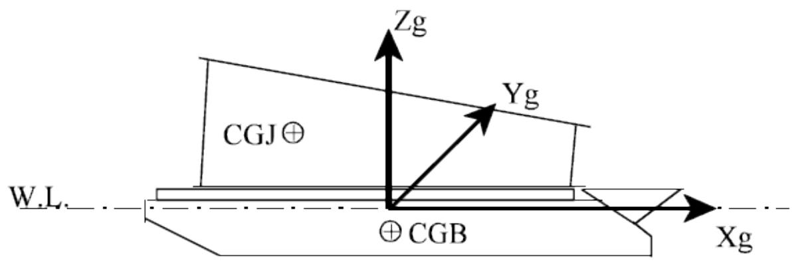

Note: Barge motion and jacket displacement, velocity and acceleration are described relative to the Launch global coordinate system.

1.2.2 Rocker Arm Coordinate System

Relative jacket motion is measured at the jacket CG. Jacket motion labeled as ‘Relative Jacket Motion’ or ‘Skid Motion’, is described parallel to the X-axis of the rocker arm coordinate system. The rocker arm coordinate system used to describe relative jacket or skid motion is illustrated below:

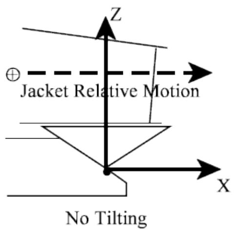

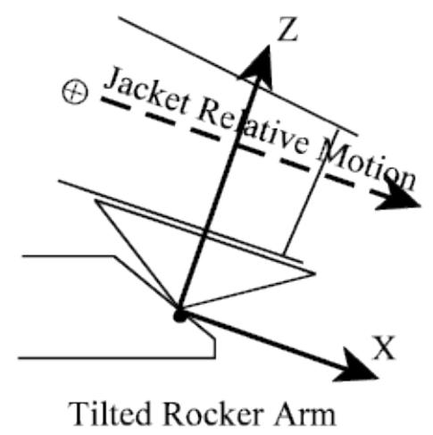

1.2.3 Launch Phases

During the launch analysis, the program classifies jacket and barge motion as one of five launch phases. For each phase, the jacket and barge motion are described at various time steps.

1.2.3.1 Phase 1 Motion

Phase 1 motion occurs when the structure is sliding on the barge due to winch action and no tipping on the rocker arm has occurred.

Barge location, velocity and acceleration are reported with respect to the Launch/Barge coordinate system. Jacket relative displacement, velocity and acceleration are reported with respect to the Rocker Arm coordinate system. The distance to begin tipping estimates the distance the structure CG must travel until tipping is initiated.

1.2.3.2 Phase 2 Motion

Phase 2 motion occurs when the structure is sliding on the barge due to gravity or self-weight and no tipping of the rocker arm has occurred. Barge location, velocity and acceleration are reported with respect to the Launch/Barge coordinate system. Jacket relative displacement, velocity and acceleration are reported with respect to the Rocker Arm coordinate system. The distance to begin tipping estimates the distance the structure CG must travel until tipping is initiated.

Note: If the structure is being pulled by a winch, Phase 2 motion indicates that the structure’s velocity measured along the barge surface exceeds the winch speed.

1.2.3.3 Phase 3 Motion

Phase 3 motion occurs when the structure is sliding on the barge due to winch action and is tipping on the rocker arm.

Barge location, velocity, and acceleration along with jacket displacement and velocity are reported with respect to the Launch/Barge coordinate system. Jacket relative displacement and velocity, labeled as ‘Skid Motion’, are reported with respect to the Rocker Arm coordinate system. The rocker arm angle and pin load are also reported.

1.2.3.4 Phase 4 Motion

Phase 4 motion results from the structure sliding due to self-weight (gravity) and is tipping on the rocker arm.

Barge location, velocity, and acceleration along with jacket displacement and velocity are reported with respect to the Launch/Barge coordinate system. Jacket relative displacement and velocity, labeled as ‘Skid Motion’, are reported with respect to the Rocker Arm coordinate system. The rocker arm angle and pin load are also reported.

Note: If the structure is being pulled by a winch, Phase 4 motion indicates that the structure’s velocity component parallel to the barge surface exceeds the winch speed.

1.2.3.5 Phase 5 Motion

Phase 5 motion is motion that occurs after the structure and barge have separated.

Barge location, velocity, and acceleration along with jacket displacement and velocity are reported with respect to the Launch/Barge coordinate system. The clearance between the jacket and the mudline is also reported.

## 1.3 PROGRAM FEATURES

Launch requires a Launch input file and a separate SACS model file. Some of the main features and capabilities of the program are detailed in the following sections.

1.3.1 General Capabilities

1. The motion phase of the jacket is automatically classified.   
2. The weight and drag of modeled beam and plate elements is calculated automatically.   
3. A load case with member distributed and joint concentrated loads is generated for any time step.   
4. Weight and/or buoyancy can be added in the Launch input file to account for the weight and/or buoyancy of un-modeled items. For details refer to Seastate manual.   
5. Drag areas can be specified in the Launch input to account for the drag of un-modeled items.   
6. Ability to specify current with varying direction versus depth.   
7. Automatic determination of barge weight and hydrodynamic characteristics based on dimensions input by user.   
8. Initial analysis velocity due to a winch may be specified.

1.3.2 Plot Capabilities

The Launch program can create plots at designated time intervals. These plots are created in neutral picture format and saved to a plot file. The following lists some of the plot capabilities of the program:

1. Horizontal and vertical displacement of the jacket and barge versus time.

2. Horizontal and vertical velocity of the jacket and barge versus time.   
3. Horizontal and vertical acceleration of the jacket and barge versus time.   
4. Jacket and barge silhouette for any time step.

1.3.3 Analysis Modes

The Launch program may be executed in one of three modes detailed below:

1. A time history analysis may be executed starting from the initial jacket position on the barge and ending at either a specific phase or a designated time point.   
2. A Launch analysis may be restarted from the structure position at the final time step of a previous analysis.   
3. A Post Launch analysis may be executed where load cases consisting of Launch loads for a particular time step are created.

2 LAUNCH INPUT

## 2.1 LAUNCH MODEL

The Launch program requires a SACS model file. In general, a typical transportation model requires few modifications for Launch analysis purposes. Seastate hydrostatic and hydrodynamic properties, including coefficient of drag and mass and others, are read from the model data. Group override data specified is also used. With jacket orientation specified in the Launch input file, reorientation of the structure is not required. The program does require, however, that any elements that are not to be considered in the Launch analysis, be removed from the model.

Note: Although rotation of the structure is not required, reorienting the structure so that the structural global axes are aligned with the Launch/Barge coordinate system may be beneficial when interpreting results.

## 2.2 STANDARD LAUNCH INPUT

The Launch program requires that analysis parameters be specified in an input file. For a standard analysis, the following analysis data applies.

2.2.1.1 Analysis Title

A descriptive title may be input on the TITLE line in columns 2-80.

2.2.2 Launch Options

Launch analysis options are specified on the LAUNCH input line.

2.2.2.1 General Options

The input and output units are specified in columns 9-10 and 11-12, respectively. The last phase of the analysis is specified in columns 23-24. If no phase is specified, a complete analysis is performed. The water depth and density of water are input in columns 25-30 and 31-37, respectively.

The following designates metric units with kilonewton force, 80.0-meter water depth and density of 1.025.

| 1 2 3 4 5 6 7 8 123456789012345678901234567890123456789012345678901234567890 | 1 2 3 4 5 6 7 8 123456789012345678901234567890123456789012345678901234567890 | 1 2 3 4 5 6 7 8 123456789012345678901234567890123456789012345678901234567890 | 1 2 3 4 5 6 7 8 123456789012345678901234567890123456789012345678901234567890 | 1 2 3 4 5 6 7 8 123456789012345678901234567890123456789012345678901234567890 | 1 2 3 4 5 6 7 8 123456789012345678901234567890123456789012345678901234567890 | 1 2 3 4 5 6 7 8 123456789012345678901234567890123456789012345678901234567890 | 1 2 3 4 5 6 7 8 123456789012345678901234567890123456789012345678901234567890 |
| --- | --- | --- | --- | --- | --- | --- | --- |
| LAUNCH | MNMN | PF | 80.0 | 1.025 |  |  |  |

2.2.2.2 SACS Model Data Location

Unlike previous versions of the program, the SACS model data must be in an external model file.

2.2.2.3 Output Options

Output report and plot options are specified in columns 15-20. Jacket and barge displacement, velocity and acceleration versus time plot options are selected in columns 19-20. Enter ‘PF’ to have plots generated sent to a neutral picture file, ‘PT’ to print the data in the output listing file, or ‘PB’ to get both.

If the input file data is to be echoed in the output report, ‘PT’ must be entered in columns 15-16. ‘PT’ in columns 17-18 designates that the SACS model data is to be included in the output report.

The following requests displacement, velocity, and acceleration to be plotted versus time as designated by PF in columns 19-20

| 1 2 3 4 5 6 7 8 123456789012345678901234567890123456789012345678901234567890 | 1 2 3 4 5 6 7 8 123456789012345678901234567890123456789012345678901234567890 | 1 2 3 4 5 6 7 8 123456789012345678901234567890123456789012345678901234567890 | 1 2 3 4 5 6 7 8 123456789012345678901234567890123456789012345678901234567890 | 1 2 3 4 5 6 7 8 123456789012345678901234567890123456789012345678901234567890 | 1 2 3 4 5 6 7 8 123456789012345678901234567890123456789012345678901234567890 | 1 2 3 4 5 6 7 8 123456789012345678901234567890123456789012345678901234567890 | 1 2 3 4 5 6 7 8 123456789012345678901234567890123456789012345678901234567890 |
| --- | --- | --- | --- | --- | --- | --- | --- |
| LAUNCH MNMN PF 80.0 1.025 | LAUNCH MNMN PF 80.0 1.025 | LAUNCH MNMN PF 80.0 1.025 | LAUNCH MNMN PF 80.0 1.025 | LAUNCH MNMN PF 80.0 1.025 | LAUNCH MNMN PF 80.0 1.025 | LAUNCH MNMN PF 80.0 1.025 | LAUNCH MNMN PF 80.0 1.025 |

2.2.3 Time Control

The TIME line is used to specify the analysis stop time (columns 7-13) and output time intervals for each analysis phase. The output print time interval for each of the analysis phases are input in columns 14-48. The minimum integration time step is designated in columns 49-55 and the error control factor in columns 56-62.

The sample below designates the stop time is 300 seconds and the output intervals for phases 1-5 are 5.0, 5.0, 1.0, 1.0 and 5.0 seconds, respectively.

|  | 1 | 2 | 3 | 4 | 5 | 6 | 7 | 8 |
| --- | --- | --- | --- | --- | --- | --- | --- | --- |
| 123456789012345678901234567890123456789012345678901234567890 | 123456789012345678901234567890123456789012345678901234567890 | 123456789012345678901234567890123456789012345678901234567890 | 123456789012345678901234567890123456789012345678901234567890 | 123456789012345678901234567890123456789012345678901234567890 | 123456789012345678901234567890123456789012345678901234567890 | 123456789012345678901234567890123456789012345678901234567890 | 123456789012345678901234567890123456789012345678901234567890 | 123456789012345678901234567890123456789012345678901234567890 |
| LAUNCH | MNMN | PF | 80.0 | 1.025 |  |  |  |  |
| TIME | 300. | 5.0 | 5.0 | 1.0 | 1.0 | 5.0 |  |  |

Note: Since a variable timestep integration procedure is used, a minimum time step is necessary to prevent the program from reducing the time step to an infinitesimal value. However, a minimum time step value should be sufficiently small so that the analysis can proceed past any step.

2.2.4 Jacket Orientation

The jacket orientation and position on the barge is specified on the JACKET input line.

Three joints specified in columns 9-12, 13-16 and 17-20, respectively, are used to define the face or plane of the jacket contacting the barge. The structure is aligned on the barge such that the first two joints specified form a line perpendicular to the Launch direction at the back of the barge. The third joint is assumed to be coplanar and forward of the first two joints.

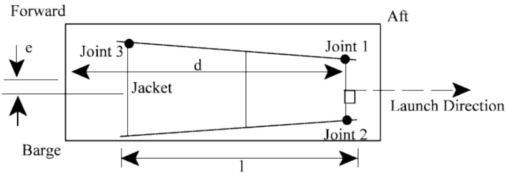

The distance from the forward end of the barge to the structure 1st joint, shown as d in the figure, is specified in columns 22-28 along with the length of the launch truss or launch framing on the jacket, shown as l, in columns 29-35. The distance from the jacket longitudinal centerline and the barge centerline, shown as e, is entered in columns 67-73.

Note: The length l represents the length of the launch framing on the jacket which is used to define the maximum length of contact between the jacket launch framing and the launch runner.

The default material density and the density used to calculate the volume of any added weights for buoyancy determination is input in columns 39-45 and 74-80, respectively. The coordinate axis in the SACS model file that would be vertical when the structure is in the installed position is designated in columns 36-37.

A weight contingency factor along with center of gravity shift in the X, Y, and Z directions, measured in the model coordinate system, can be optionally specified on the JCK2 line.

The sample lines below designate that joints 105, 101 and 301 are to be used to orient the structure on the barge. The distance from barge bow to the first joint, measured along the barge surface, is 65.0 and the length of the structure’s launch truss is 55. The material density is 7.85 and a weight contingency factor of 1.03 is to be applied.

| 1 2 3 4 5 6 7 8 123456789012345678901234567890123456789012345678901234567890 | 1 2 3 4 5 6 7 8 123456789012345678901234567890123456789012345678901234567890 | 1 2 3 4 5 6 7 8 123456789012345678901234567890123456789012345678901234567890 | 1 2 3 4 5 6 7 8 123456789012345678901234567890123456789012345678901234567890 | 1 2 3 4 5 6 7 8 123456789012345678901234567890123456789012345678901234567890 | 1 2 3 4 5 6 7 8 123456789012345678901234567890123456789012345678901234567890 | 1 2 3 4 5 6 7 8 123456789012345678901234567890123456789012345678901234567890 | 1 2 3 4 5 6 7 8 123456789012345678901234567890123456789012345678901234567890 | 1 2 3 4 5 6 7 8 123456789012345678901234567890123456789012345678901234567890 | 1 2 3 4 5 6 7 8 123456789012345678901234567890123456789012345678901234567890 |
| --- | --- | --- | --- | --- | --- | --- | --- | --- | --- |
| JACKET 105 101 301 65.0 55.0 7.85 JCK2 1.03 | JACKET 105 101 301 65.0 55.0 7.85 JCK2 1.03 | JACKET 105 101 301 65.0 55.0 7.85 JCK2 1.03 | JACKET 105 101 301 65.0 55.0 7.85 JCK2 1.03 | JACKET 105 101 301 65.0 55.0 7.85 JCK2 1.03 | JACKET 105 101 301 65.0 55.0 7.85 JCK2 1.03 | JACKET 105 101 301 65.0 55.0 7.85 JCK2 1.03 | JACKET 105 101 301 65.0 55.0 7.85 JCK2 1.03 | JACKET 105 101 301 65.0 55.0 7.85 JCK2 1.03 | JACKET 105 101 301 65.0 55.0 7.85 JCK2 1.03 |

Note: The vertical coordinate axis of the model is required if current is specified.

2.2.5 Drag Area

Additional drag area to account for un-modeled items may be specified using AREA lines. The joint name to which the drag force is to be applied is specified in columns 7-10. The projected areas are described in the jacket structural coordinate system X, Y and/or Z directions in columns 12-21, 22-31 and 32-41,

respectively. The coefficients of drag and mass for the defined area are specified in columns 42-47 and 48-53, respectively.

The following illustrates the input to define an area with an X projection of 20.0, drag coefficient of 0.8 and added mass coefficient of 1.2.

|  | 1 | 2 | 3 | 4 | 5 | 6 | 7 | 8 |
| --- | --- | --- | --- | --- | --- | --- | --- | --- |
| 1234567890123456789012345678901234567890123456789012345678901234567890 | 1234567890123456789012345678901234567890123456789012345678901234567890 | 1234567890123456789012345678901234567890123456789012345678901234567890 | 1234567890123456789012345678901234567890123456789012345678901234567890 | 1234567890123456789012345678901234567890123456789012345678901234567890 | 1234567890123456789012345678901234567890123456789012345678901234567890 | 1234567890123456789012345678901234567890123456789012345678901234567890 | 1234567890123456789012345678901234567890123456789012345678901234567890 | 1234567890123456789012345678901234567890123456789012345678901234567890 |
| AREA | 199 | 20.0 |  |  | 0.8 | 1.2 |  |  |
| AREA |  |  |  |  |  |  |  |  |

Note: When specifying drag areas, the first line must be an AREA header line.

2.2.6 Barge Description

2.2.6.1 Dimensions and Initial Position

Barge dimensions used to calculate the weight and buoyancy are designated on the BARGE1 line. The barge height, width, bottom length, forward extension, and aft extension, as shown by A, B, C, D, and E, respectively, in the figure, are entered in columns 7-55. The initial forward draft and aft draft used to determine the initial barge pitch angle are input in columns 42-48 and 49-55.

The bottom and sides of the barge are divided into a finite element mesh by the

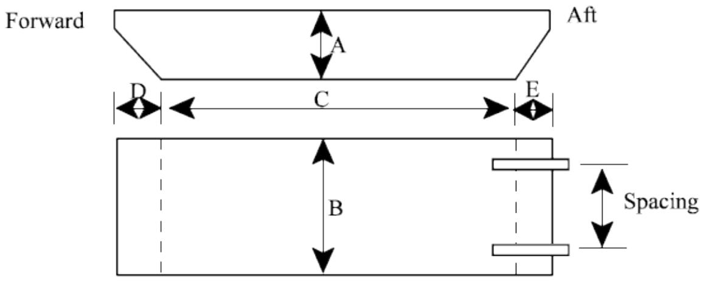

program in order to determine the drag properties of the barge. The number of finite element increments considered for the bottom and sides are stipulated in columns 56-62 and 63-69, respectively.

A barge 8.0 high, 20.0 wide, with a bottom length of 60.0, forward extension of 5.0 and aft extension of 7.5 is defined below. The initial barge forward and aft drafts are 2.5 and 5.0, respectively. 20 finite elements will be used to define the bottom and sides.

Note: Barge trim is calculated using the difference between forward and aft draft divided by the bottom length. Thus, the draft values are assumed to be at the ends of the bottom of the barge.

| 1 2 3 4 5 6 7 8 123456789012345678901234567890123456789012345678901234567890 |
| --- |
| BARGE BARGE1 8.0 20.0 60.0 5.0 7.5 2.5 5.0 20.0 20.0 |

2.2.6.2 Skid, Rocker Arm, and Barge Coefficients

The skid, rocker arm and hydrodynamic parameters are input on the BARGE2 line immediately following the BARGE1 line. The skid height, rocker arm pin location and rocker arm depth, shown as A, B, and C, respectively, in the figure below, are input in columns 7-27.

Note: The skid height is taken as the distance from the barge deck to the centerline of the member(s) contacting the skidway. The rocker arm length is not considered in the analysis. The structure is assumed to disconnect from the rocker arm when the end of the structure passes the center of the rocker arm.

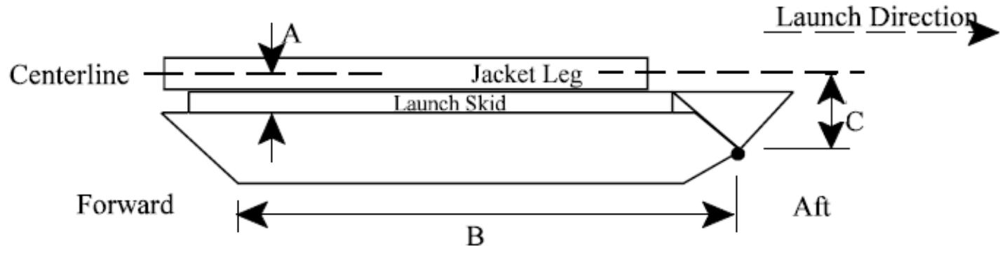

The spacing between rocker arms (shown on previous figure) is specified in columns 49-55. The winch speed is stipulated in columns 28-34 along with the drag and inertia coefficients in columns 35-41 and 42-48, respectively.

The skid height of the barge defined is 1.75 and the rocker pin is located 55.0 from the forward bottom edge. The rocker arm height is 3.0, winch velocity of 0.10 and coefficient of drag and mass of 1.0 are designated.

| 1 2 3 4 5 6 7 8 123456789012345678901234567890123456789012345678901234567890 |
| --- |
| BARGE BARGE1 8.0 20.0 60.0 5.0 7.5 2.5 5.0 20.0 20.0 BARGE2 1.75 55.0 3.0 0.10 1.0 1.0 |

2.2.7 Barge Anchors

Barge anchors, if any, are described using ANCHOR input lines. The first line must be an ANCHOR header line.

The anchor cable length and weight along with the anchor holding capacity are designated in columns 8- 28. The coefficient of friction between the anchor cable and the ocean floor, used for any portion of the cable lying on the floor, is input in columns 29-35.

The point on the barge to which the anchor cable is connected (point A) is input in columns 36-56 along with the anchor position (point B) input in columns 57-77. The coordinates are specified with respect to the untrimmed barge bottom as shown in the figure except that the Z coordinate of the anchor position is relative to the waterline.

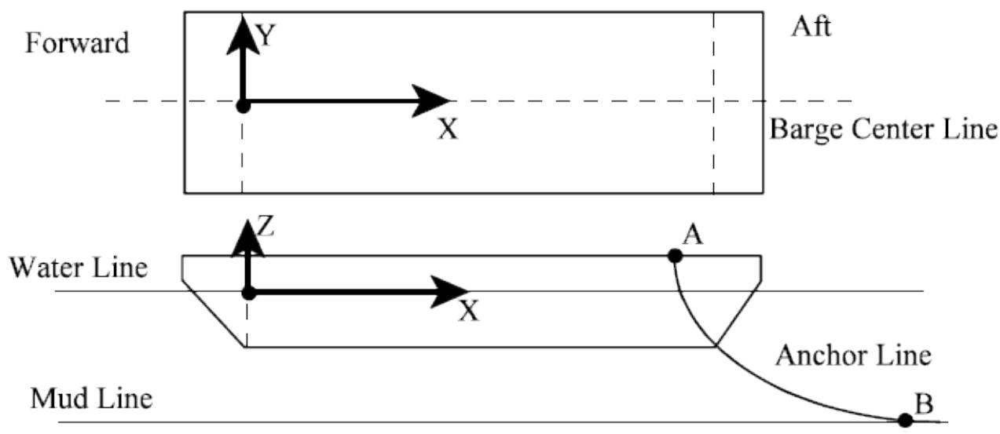

The following defines a 200.0-meter-long anchor chain weighing 0.05 kg/cm with a holding capacity of 10000 kg. The coefficient of friction is 0.15 and it is attached 40, 10 and 2 meters in the X, Y, and Z directions, respectively, from the barge bottom. The anchor is located 100, 10, and -50 meters in the X, Y, and Z directions, respectively, from the barge bottom.

| 1 2 3 4 5 6 7 8 123456789012345678901234567890123456789012345678901234567890 | 1 2 3 4 5 6 7 8 123456789012345678901234567890123456789012345678901234567890 | 1 2 3 4 5 6 7 8 123456789012345678901234567890123456789012345678901234567890 | 1 2 3 4 5 6 7 8 123456789012345678901234567890123456789012345678901234567890 | 1 2 3 4 5 6 7 8 123456789012345678901234567890123456789012345678901234567890 | 1 2 3 4 5 6 7 8 123456789012345678901234567890123456789012345678901234567890 | 1 2 3 4 5 6 7 8 123456789012345678901234567890123456789012345678901234567890 | 1 2 3 4 5 6 7 8 123456789012345678901234567890123456789012345678901234567890 | 1 2 3 4 5 6 7 8 123456789012345678901234567890123456789012345678901234567890 |
| --- | --- | --- | --- | --- | --- | --- | --- | --- |
| ANCHOR ANCHOR 200. | .05 | 10000. | 0.15 | 40.0 | 10.0 | 2.0 | 100.0 | -50.0 |

2.2.8 Tugs

The TUG line is used to define any tugs used to restrain barge motion during the Launch. The first line must be a TUG header line.

The tug force is designated in columns 7-13. The force is assumed constant until the tug moves toward the barge a distance greater than the cable slack tolerance input in columns 14-20. The X, Y and Z

coordinates of the cable attach point and the tug position are input in columns 21-41 and 42-62. As are the anchor coordinates, these coordinates are entered with respect to the untrimmed barge bottom as shown in the previous figure.

The following defines a tug with a pulling force of 12000 and a cable slack tolerance of 20. The cable is attached 40, 10 and 2 meters in the X, Y, and Z directions, respectively, from the barge bottom and the tug is located 100, 10, and 5 meters in the X, Y, and Z directions, respectively, from the barge bottom.

|  | 1 | 2 | 3 | 4 | 5 | 6 | 7 | 8 |
| --- | --- | --- | --- | --- | --- | --- | --- | --- |
| TUG | 1234567890123456789012345678901234567890123456789012345678901234567890123456789012345678901234567890123456789 | 12345678901234567890123456789012345678901234567890123456789012345678901234567890123456789012345678 | 12345678901234567890123456789012345678901234567890123456789012345678901234567890123456789012345678 |  |  |  |  |  |

2.2.9 Additional Weight and Buoyancy

2.2.9.1 Considering Model Loading

Load cases defined in the model can be considered as weights by designating the load case name on the LCSEL line. These load cases have 100% of their loads converted to weights. The LCFAC line can be used to factor the loads defined within a load case.

The following specifies that 105% of load cases MISC and MMAT are to be included in the launch analysis.

| 1 2 3 4 5 6 7 8 123456789012345678901234567890123456789012345678901234567890 | 1 2 3 4 5 6 7 8 123456789012345678901234567890123456789012345678901234567890 | 1 2 3 4 5 6 7 8 123456789012345678901234567890123456789012345678901234567890 | 1 2 3 4 5 6 7 8 123456789012345678901234567890123456789012345678901234567890 | 1 2 3 4 5 6 7 8 123456789012345678901234567890123456789012345678901234567890 | 1 2 3 4 5 6 7 8 123456789012345678901234567890123456789012345678901234567890 | 1 2 3 4 5 6 7 8 123456789012345678901234567890123456789012345678901234567890 |
| --- | --- | --- | --- | --- | --- | --- |
| LCSEL | MISC | MMAT |  |  |  |  |
| LCFAC | 1.05 | MISC | MMAT |  |  |  |

2.2.9.2 Specifying User Defined Weight

The weight and/or buoyancy of non-modeled structural items can be accounted for by assigning the weight or buoyancy to existing joints on the structure using the WEIGHT line.

The joint name to which the weight/buoyancy is to be applied is designated in columns 8-11 along with the applied weight in columns 13-22. Any buoyancy force to be applied is specified in columns 23-32 unless ‘RATIO’ is specified in columns 33-37 whereas the ratio of buoyancy force to weight should be specified in columns 23-32.

The following specifies that a weight of 1.5 is to be applied at joints 198 and 347.

| 1 2 3 4 5 6 7 8 123456789012345678901234567890123456789012345678901234567890 |
| --- |
| WEIGHT WEIGHT 198 1.5 WEIGHT 347 1.5 |

Note: When specifying additional weights, the first WEIGHT line must be a header.

2.2.9.3 Auxiliary Weight Specification

As an extension to specifying joint weight using the Launch WEIGHT line, the Launch program allows users to utilize all weight features from the Seastate program. This greatly increases the additional weight capability of the Launch program. A description of weight features is given in Section 2.9, Structural Loading, of the Seastate manual.

Note: The weight features currently provided in the Launch program are as follows: WGTNS (all nonstructural weight, it can be distributed over 120 joints), WGTFP (all footprint weight), WGTMEM (all member weight), ELEV (weight elevation), WTCMB (weight combinations), WGTJT (joint weight), SURFID, SURFDR, SURFWT (surface weights), EXCGRP (member groups excluded from weight footprints), SFRC (space force), WTSTR (inertial weight), and INCWGT (weight group inclusion in load cases).

2.2.10 Friction

The coefficients of static and dynamic friction between the structure and the barge are specified on the FRICT line. The first FRICT line must be a header line. The second FRICT line contains the friction input data.

The coefficient of static friction is stipulated in columns 14-20. A dynamic friction versus speed table is set up in columns 21-60 if dynamic friction is different from the static friction specified. Linear interpolation is used to determine the friction between specified speeds. The friction coefficient for the last speed entered is used at speeds greater than the last speed.

The input below designates a coefficient of static friction of 0.20. The dynamic friction is a constant 0.10 and is therefore input using two velocities (0.0 and 50.0).

| 1 2 3 4 5 6 7 8 123456789012345678901234567890123456789012345678901234567890 | 1 2 3 4 5 6 7 8 123456789012345678901234567890123456789012345678901234567890 | 1 2 3 4 5 6 7 8 123456789012345678901234567890123456789012345678901234567890 | 1 2 3 4 5 6 7 8 123456789012345678901234567890123456789012345678901234567890 | 1 2 3 4 5 6 7 8 123456789012345678901234567890123456789012345678901234567890 | 1 2 3 4 5 6 7 8 123456789012345678901234567890123456789012345678901234567890 | 1 2 3 4 5 6 7 8 123456789012345678901234567890123456789012345678901234567890 | 1 2 3 4 5 6 7 8 123456789012345678901234567890123456789012345678901234567890 | 1 2 3 4 5 6 7 8 123456789012345678901234567890123456789012345678901234567890 |
| --- | --- | --- | --- | --- | --- | --- | --- | --- |
| FRICT FRICT | 0.20 | 0.001 | 0.10 | 50. | 0.10 |  |  |  |

Note: If a speed value is entered, you must specify a friction coefficient for that value, otherwise a coefficient of 0.0 is assumed. Also, use a first speed value greater than 0.0, for example 0.001.

2.2.11 Drag and Inertia Coefficients

Drag and inertia coefficients may be specified on the CDM line. The values are entered as a diameter dependent table with the diameter entered in columns 7-12 and the coefficients entered in columns 13- 36.

The following specifies that normal $\mathsf{ C }_{ \mathsf{ d } }$ and $\mathsf{ C }_{ \mathsf{ m } }$ are 0.8 and 1.2, respectively, for all members.

|  | 1 | 2 | 3 | 4 | 5 | 6 | 7 | 8 |
| --- | --- | --- | --- | --- | --- | --- | --- | --- |
| 123456789012345678901234567890123456789012345678901234567890 | 123456789012345678901234567890123456789012345678901234567890 | 123456789012345678901234567890123456789012345678901234567890 | 123456789012345678901234567890123456789012345678901234567890 | 123456789012345678901234567890123456789012345678901234567890 | 123456789012345678901234567890123456789012345678901234567890 | 123456789012345678901234567890123456789012345678901234567890 | 123456789012345678901234567890123456789012345678901234567890 | 123456789012345678901234567890123456789012345678901234567890 |
| CDM | 1.0 | 0.8 | 1.2 |  |  |  |  |  |
| CDM | 999.0 | 0.8 | 1.2 |  |  |  |  |  |

2.2.12 Excluding/Overriding Structural Elements

Certain members or groups of members in the structural model, such as piles and conductors, may be excluded for the launch analysis by specifying them on the MBRDEL or GRPDEL lines, respectively.

For example, groups PL1, PL2 and PL3 and member 107-308 are excluded for the purposes of the launch analysis as follows:

| 1 2 3 4 5 6 7 8 123456789012345678901234567890123456789012345678901234567890 |
| --- |
| GRPDEL PL1 PL2 PL3 MBRDEL 107 308 |

Plate groups and individual plate elements can be removed from the analysis using the PGRDEL and PLTDEL lines, respectively.

For example, plate groups PLT and T01 along with plate AAA1 are excluded from the launch analysis.

| 1 2 3 4 5 6 7 8 123456789012345678901234567890123456789012345678901234567890 |
| --- |
| PGRDEL PLT T01 PLTDEL AAA1 |

Group geometric and hydrostatic properties including flood condition, density, cross section area (used to determine weight), displaced area (used to determine buoyancy) and effective dimension used to determine force in the local Y and local Z directions may be modified for the launch analysis using the GRPOV line.

Note: Enter ‘*’ in column 15 if the specified overrides are to be applied to all segments.

The following stipulates that group TRR is to be flooded and the cross-section area is 20.

| 1 2 3 4 5 6 7 8 123456789012345678901234567890123456789012345678901234567890 | 1 2 3 4 5 6 7 8 123456789012345678901234567890123456789012345678901234567890 | 1 2 3 4 5 6 7 8 123456789012345678901234567890123456789012345678901234567890 | 1 2 3 4 5 6 7 8 123456789012345678901234567890123456789012345678901234567890 | 1 2 3 4 5 6 7 8 123456789012345678901234567890123456789012345678901234567890 | 1 2 3 4 5 6 7 8 123456789012345678901234567890123456789012345678901234567890 | 1 2 3 4 5 6 7 8 123456789012345678901234567890123456789012345678901234567890 | 1 2 3 4 5 6 7 8 123456789012345678901234567890123456789012345678901234567890 |
| --- | --- | --- | --- | --- | --- | --- | --- |
| GRPOV | TRR F | 20.0 |  |  |  |  |  |

2.2.13 Current

The CURR lines are used to apply current to the analysis. The current velocity and direction are specified versus elevation above the mudline. With member hydrodynamic forces calculated in all three dimensions, the current component normal to the launch direction is also included in the analysis. The first CURR line specified must be a CURR header.

A separate CURR line is used for each elevation above the mudline for which current is to be specified. The elevation is entered in columns 9-16 along with the current velocity in columns 17-24 and the direction in columns 25-32. The mudline elevation must be designated on the first non-header CURR line.

The current direction is specified with respect to the plane of the model structure coordinate system that would be horizontal when the structure is in the in-place installed position. For example, if the model axis that would be vertical when the structure is in the in-place installed position is the Z axis, as designated on the JACKET line, the current is defined with respect to the model structural X and Y axes as shown in the figure below.

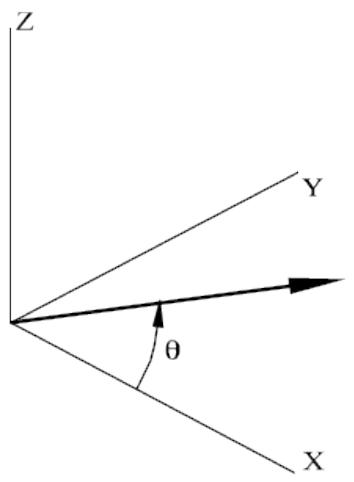

2.2.14 Plotting Jacket and Barge Position

Snapshots of the jacket and barge position for any time step during the launch sequence may be plotted. The plots created contain either the silhouette of the jacket outline defined by the joints designated on the PLTGM input line or the entire jacket structure.

Enter ‘FL’ in columns 48-49 to plot the entire structure or input the four joints used to define the outline of the jacket structure in columns 16-35 if a silhouette is desired. If plots are to be generated per analysis step, enter the output time step interval in columns 36-40. If plots are to be generated at a constant time interval, enter the time interval in columns 41-45. The initial jacket location on the barge can be plotted by inputting ‘JB’ in columns 50-51.

The following designates that joints 105, 305, 307 and 107 are to be used to outline the structure. Plots are to be generated for each analysis output time step.

| 1 2 3 4 5 6 7 8 123456789012345678901234567890123456789012345678901234567890 | 1 2 3 4 5 6 7 8 123456789012345678901234567890123456789012345678901234567890 | 1 2 3 4 5 6 7 8 123456789012345678901234567890123456789012345678901234567890 | 1 2 3 4 5 6 7 8 123456789012345678901234567890123456789012345678901234567890 | 1 2 3 4 5 6 7 8 123456789012345678901234567890123456789012345678901234567890 | 1 2 3 4 5 6 7 8 123456789012345678901234567890123456789012345678901234567890 | 1 2 3 4 5 6 7 8 123456789012345678901234567890123456789012345678901234567890 | 1 2 3 4 5 6 7 8 123456789012345678901234567890123456789012345678901234567890 | 1 2 3 4 5 6 7 8 123456789012345678901234567890123456789012345678901234567890 |
| --- | --- | --- | --- | --- | --- | --- | --- | --- |
| PLTGM | 105 | 305 | 307 | 107 |  |  |  | 1 |

## 2.3 RESTARTING LAUNCH

The launch time history integration analysis can be resumed at a specific time point from a previous analysis execution. Restarting requires the Launch restart file created by the previous execution and a Launch input file.

In general, the input file used from the original execution should be used with a RESTART line inserted immediately after the TIME input line. The restart time, or the time at which the analysis is to continue

is specified in columns 9-16. If no restart time is designated, the restart analysis will begin at the stop time of the previous execution. The following indicates that the launch analysis is to restart at 100.0 seconds.

|  | 1 | 2 | 3 | 4 | 5 | 6 | 7 | 8 |
| --- | --- | --- | --- | --- | --- | --- | --- | --- |
| 1234567890123456789012345678901234567890123456789012345678901234567890123456789012345678901234567890123456789 | 12345678901234567890123456789012345678901234567890123456789012345678901234567890123456789012345678 | 12345678901234567890123456789012345678901234567890123456789012345678901234567890123456789012345678 901234567890123456789012345678901234567890123456789012345678901234567890123456789012345678901234567 | 12345678901234567890123456789012345678901234567890123456789012345678901234567890123456789012345678 |  |  |  |  |  |
| LAUNCH | MNMNFI | PF | 75.0 | 1.02587 |  |  |  |  |
| TIME | 300.0 | 5.0 | 5.0 | 1.0 | 1.0 | 5. | 0.1E-081.0 |  |
| RESTART | 100.0 |  |  |  |  |  |  |  |
| JACKET | 105 | 101 | 301 | 65.0 | 55.0 | +X | 7.849050.7 | 1.0 |
| BARGE |  |  |  |  |  |  |  |  |
| BARGE18.00 |  | 20.0 | 60.0 | 5.0 | 7.50 | 2.5 | 5.0 | 20.0 |
| BARGE21.75 |  | 55.0 | 3.0 | 0.10 | 1.0 | 1.0 |  |  |
| FRICT |  |  |  |  |  |  |  |  |
| FRICT |  | 0.20 |  | 0.0.10 | 50. | 0.10 |  |  |
| PLTGMM |  | PLOT | 105 | 305 | 307 | 107 |  |  |
| END |  |  |  |  |  |  |  | 1 |

## 2.4 GENERATING LAUNCH LOADING

The Launch program module may be used to generate an unbalanced load case for any time step of a previously executed Launch analysis. This procedure is called a Post Launch analysis. Post Launch analysis requires the Launch restart file created by the standard Launch analysis execution and a Post Launch input file. In general, the standard analysis input file may be used as the Post Launch input file with only minor modifications.

The Post Launch analysis yields an output structural data file containing the model and the unbalanced load cases. The load case(s) created contain unbalanced loads since they do not include the reactions at the jacket/barge interface. Therefore, the jacket model used for the subsequent static analysis should be restrained at these interface joints, thus yielding the reactions.

Note: When executing the static analysis, only interface joints that are in contact with the jacket and barge, that is, yield compressive reactions, should be restrained.

2.4.1 Post Launch Options

Post Launch options are required when load data is to be generated. The PSTLNH line is used instead of the LAUNCH line to specify Post Launch options.

Note: The LAUNCH and TIME input lines may not appear in the Post Launch input file.

2.4.1.1 General Options

The input and output units are specified in columns 9-10 and 11-12, respectively. The last phase for which loading will be generated is specified in columns 23-24. If no phase is specified, a complete analysis is performed.

The following specifies that a Post Launch analysis is to be performed. The units are metric with kilogram force.

| 1 2 3 4 5 6 7 8 123456789012345678901234567890123456789012345678901234567890 |
| --- |
| PSTLNH MNMN |

2.4.1.2 SACS Model Data Location

The SACS model data must be in an external model file.

2.4.1.3 Output Options

If the input file data is to be echoed in the output report, ‘PT’ must be entered in columns 15-16.

2.4.2 Time Intervals

Unlike a standard Launch analysis, time intervals are not input in the Post Launch input file. Therefore, the TIME input line should not appear in the input file.

2.4.3 Barge and Jacket Data

The barge and jacket data required in the standard Launch analysis is also required in the Post Launch input.

2.4.4 Additional Weight and Buoyancy

Any additional weight and/or buoyancy loads used to define un-modeled items are also required in the Post Launch input. It is recommended to use the same lines as the initial Launch analysis.

2.4.5 Launch Runner Definition

The jacket structure joints lying on the Launch runner that are to receive Launch runner reactions are specified using LRUNR lines. The first LRUNR line of the set must be a header line.

The location of the runner is designated as left or right by entering ‘L’ or ‘R’ in column 7. The left runner is on the barge +Y side and the right runner is on the barge -Y side as shown below:

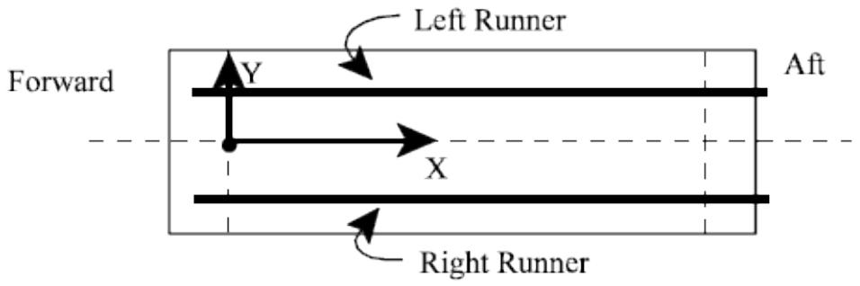

The joints on the runner are specified in columns 9-80. The joints should be specified in order beginning with the leading or most forward joint down the Launch runner toward the stern of the barge. Additional joints for a particular runner may be specified using another LRUNR line immediately following and by specifying ‘C’ in column 7.

The following designates the joints on the structure that touch the launch runner.

| 1 2 3 4 5 6 7 8 123456789012345678901234567890123456789012345678901234567890 |
| --- |
| LRUNR LRUNR L 801 802 803 804 805 806 807 808 809 LRUNR R 901 902 903 904 905 906 907 908 909 |

2.4.6 Designating Load Case Time Points

The time points at which a SACS load case is to be generated are designated using the LLODA line. The load case name and the time selection criteria, that is, whether the load case is for a specified time ‘TME’, initial tipping ‘ITP’, maximum velocity ‘MTV’, maximum translational acceleration ‘MTA’ or maximum angular acceleration ‘MAA’ must be specified. If the load is for a specified time, the ‘TME’ option, the time must also be specified.

Up to 5 load cases may be designated on a LLODA line. As many LLODA lines as needed may be specified.

The following requests that a load case be created at the analysis time of 36 seconds. The load case name is to be TST1.

| 1 2 3 4 5 6 7 8 123456789012345678901234567890123456789012345678901234567890 | 1 2 3 4 5 6 7 8 123456789012345678901234567890123456789012345678901234567890 | 1 2 3 4 5 6 7 8 123456789012345678901234567890123456789012345678901234567890 | 1 2 3 4 5 6 7 8 123456789012345678901234567890123456789012345678901234567890 | 1 2 3 4 5 6 7 8 123456789012345678901234567890123456789012345678901234567890 | 1 2 3 4 5 6 7 8 123456789012345678901234567890123456789012345678901234567890 | 1 2 3 4 5 6 7 8 123456789012345678901234567890123456789012345678901234567890 | 1 2 3 4 5 6 7 8 123456789012345678901234567890123456789012345678901234567890 |
| --- | --- | --- | --- | --- | --- | --- | --- |
| LLODA LLODA | TST1TME | 36.0 |  |  |  |  |  |

## 2.5 MOSES LAUNCH INPUT

2.5.1 Introduction

A brief description of MOSES Launch analysis with description of basic workflow and analysis process is given here. For more information on MOSES launch capabilities, see the MOSES manual.

MOSES can now be linked with SACS to do automated launch simulation and load case generation. To enable this capability, first go to the SACS system settings, analysis settings, and input the path to your MOSES installation in the “Moses Program Path.” MOSES now supports much of the SACS launch functionality when MOSES is run within SACS. The workflow is to select Moses Launch from the Marine Applications menu, select the jacket and launch input file desired and run as normal in SACS. An OCI containing load cases at MOSES selected times of maximum loading will be generated automatically for the launch.

2.5.2 Supported Lines

Rationale for exclusion of certain SACS launch input lines.

2.5.2.1 Fully Supported Lines

Title (denoted by leading blank spaces)

Additional Jacket Data (JCK2)   
Barge definition line 2 (BARGE2)   
• Area (AREA)   
Moses vessel library (LIB_VES), (new)   
• Load case selection (LCSEL)   
Weight selectin (INCWGT)   
• Load case factor (LCFAC)   
Weight and buoyancy (WEIGHT)   
Drag and inertia coefficient (CDM)   
Hydrodynamic group override (GRPOV)   
Member group delete (GRPDEL)   
• Member delete (MBRDEL)   
Plate group delete (PGRDEL)   
• Plate deletion input (PLTDEL)   
Launch runner definition data (LRUNR)   
End line (END)

2.5.2.2 Partially Supported Lines

• Launch Line (Launch)– Input units and water depth are supported

o Output units are assumed to be the same as the jacket which is being launched.   
o MOSES generates an OCI file using this jacket and assumes launch loading units should match jacket units.   
o SACS style and launch stoppage are not supported   
o Water density is assumed to be MOSES default.

Jacket (JACK):

o Three Contact joints (supported)   
o Distance from barge front to first joint (supported)   
o Length of launch framing (supported)   
o Vertical position installed (not supported)   
o Density of Construction Material (over-rides only groups with unspecified densities, in contrast to traditional SACS launch, which would make the density of the entire structural model uniform)   
o Jacket center line offset (not yet supported)   
o Added load density (supported – note that this effects buoyancy calculations only)

First barge definition line (BARGE1):

o Height of Barge (supported)   
o Width of Barge (supported)   
o Bottom length (supported)   
o Forward extension (supported)   
o Aft extension (supported)   
o Initial draft forward (supported)   
o Initial draft aft (supported)   
o Number of bottom increments (not supported)

MOSES will discretize the hull if needed   
o number of side increments (not supported)   
MOSES will discretize the hull if needed

• Friction Line (FRICT) – Only the first dynamic friction value entered is used by MOSES. If no such value is found, then MOSES looks for the static value.

2.5.2.3 Unsupported Lines

• Post launch options (PSTLNH)

o MOSES choses when to write out load case (see MOSES documentation for specifics)   
o MOSES writes out a SACS OCI file with load cases

• Launch Time Control (TIME)   
Restart control (RESTAR)   
• Anchor (ANCHOR)   
Current (CURR)   
• Plot geometry data (PLTGM)   
Launch load definition data (LLODA)

o MOSES handles this automatically   
o See MOSES and SACS documentation on load case time selection

2.5.2.4 MOSES Specific Lines

The MOSES vessel description line (LIB_VES) may be used to define MOSES library vessel instead of the SACS barge definition lines. Enter the MOSES vessel library ID in columns 9-16. Enter the initial forward draft in columns 17-23, enter the aft initial draft in columns 24-30, and enter the winch speed in columns 31-37.

2.5.2.5 MOSES Launch Required Lines

The minimum SACS lines required to initiate a successful MOSES launch are as follows:

• Jacket description line (JACKET)   
Either of the following:

o Both barge description lines. (BARGE1) and (BARGE2)   
o Or the MOSES library vessel description line (LIB_VES)

Launch runner definition data. (LRUNR)

# 3 COMMENTARY

The Launch analysis uses equations of motion of the jacket/barge system to yield the position, velocity, and acceleration of the structure at any time. For MOSES Launch methodology, please see the MOSES manual and theoretical documentation. Differences between MOSES Launch and SACS Launch are found in section 3.3

## 3.1 HYDRODYNAMIC FORCES

The SACS Launch hydrodynamic force acting on the jacket or barge during Launch, $F_{ h } ,$ can be expressed with respect to drag force $F_{ d }$ (velocity dependent) and inertial force $F_{ a }$ (time varying mass and acceleration dependent) as follows:

$$F_{h} = F_{d} + F_{a} \tag{1}$$

where:

$$F_{d} = - \frac{1}{2} C_{d} \rho A_{w} \bar{V}_{n} | \bar{V}_{n} | \tag{2}$$

$$F_{a} = - M^{\prime} \bar{A}_{n} - \frac{d M^{\prime}}{d t} \bar{V}_{n} \tag{3}$$

where $C_{ d }$ is the coefficient of drag, $\rho$ is the fluid density, $A_{ w }$ is the submerged area, $\bar{ V }_{ n }$ is the normal velocity component, $M^{ \prime }$ is the added or inertia mass and ${ \bar{ A } }_{ n }$ is the normal acceleration.

$F_{ h }$ may be re-expressed by substituting equations 2 and 3 into equation 1 as:

$$F_{h} = - \frac{1}{2} C_{d} \rho A_{w} \bar{V}_{n} | \bar{V}_{n} | - M^{\prime} \bar{A}_{n} - \frac{d M^{\prime}}{d t} \bar{V}_{n} \tag{4}$$

## 3.2 EQUATION OF MOTION

For a body in motion, the equation of motion may be expressed by:

$$F_{h} + F_{o} = M \bar{A} \tag{5}$$

where $F_{ o }$ represents all forces other than hydrodynamic forces acting on the body, M is the mass of the body and $\bar{ A }$ is the acceleration.

For a joint on the structure, the velocity ${ \overline{ { V } } }_{ J } ,$ , may be expressed in terms of the velocity at the CG of the structure as follows:

$$\bar{V}_{j} = \bar{V}_{C G} + \bar{\omega} x \bar{r}$$

where ??̅ is the vector from the CG through the joint and ??̅ is the angular velocity vector at the CG. For a member attached to the joint, the velocity at any point along the member may be defined using ??̅, a unit vector in the direction of the member, and $I ,$ the distance along the member to the point, in the following equation:

$$\bar{V}_{p} = \bar{V}_{j} + \bar{\omega} \times (\ell \bar{u}) \tag{6}$$

The velocity component normal to the member at any point along the member may be defined as follows:

$$\bar{V}_{p n} = \bar{u} \times \left(\bar{V}_{p} \times \bar{u}\right) \tag{7}$$

Substituting equation 6 into equation 7, and noting that $\overline{ { \omega } } = - \omega \hat{ k } , { \bar{ V } }_{ p n }$ is obtained as follows:

$$\bar{V}_{p n} = \bar{V}_{j} - (\bar{u} \cdot \bar{V}_{j}) \bar{u} + \ell \omega (b \hat{t} - a \hat{j}) \tag{8}$$

Where $\hat{ \imath } , \hat{ \jmath }$ and $\hat{ k }$ represent unit vectors in the $\mathsf{ x } , \mathsf{ y }$ and z directions, a, b, and c are the x, y, and z components of ??̅. Therefore, for any point at a known distance l from the center, the normal velocity can be determined. Notice that the velocity and the angular velocity at the CG in equations 6 through 8 are assumed to be known. The acceleration and the angular acceleration of the CG on the other hand, are unknown. The acceleration, $A_{ j } ,$ at the same joint is determined by:

$$\bar{A}_{p} = \bar{A}_{C G} + \bar{\omega} \times \bar{r} + \bar{\omega} \times (\bar{\omega} \times \bar{r}) \tag{9}$$

The position of any point along a member connected to the joint, a distance l from the joint, is given by ????̅. Therefore, the acceleration, $\bar{ A }_{ p } ,$ , and normal acceleration, ${ \bar{ A } }_{ p n } ,$ at any point along the member can be written as:

$$\bar{A}_{p} = \bar{A}_{C G} + \bar{\dot{\omega}} \times (\bar{r} + \ell \bar{u}) + \bar{\omega} \times (\bar{\omega} \times (\bar{r} + \ell \bar{u})) \tag{10}$$

$$\bar{A}_{p n} = \bar{u} \times \left(\bar{A}_{p} \times \bar{u}\right) \tag{11}$$

Combining equations 10 and 11 yields:

$$\bar{A}_{p m} = \bar{A}_{1} + l \bar{A}_{2} + \left[ Q \right] \left[ \begin{array}{c} \ddot{x} \\ \ddot{y} \\ \ddot{\theta} \end{array} \right]$$

Where ${ \ddot{ x } } ,$ and $\ddot{ y }$ are components of $\bar{ A }_{ c g }$ in the x and y directions and ${ \bar{ A } }_{ 1 } , { \bar{ A } }_{ 2 }$ and [Q] are:

$$\bar{A}_{1} = - \bar{\omega}^{2} \left\{\left[ (1 - a^{2}) x - a b y \right] D \left[ (1 - b^{2}) y - a b x \right] \ddot{a} - c (a x - b y) \hat{k} \right\}$$

$$\bar{A}_{2} = \bar{\omega}^{2} \left(a c^{2} D - b c^{2} \ddot{a}\right)$$

$$[ Q ] = \left[ \begin{array}{c c c} 1 - a^{2} & - a b & a b x + (1 - a^{2}) y + l b \\ - a b & 1 - b^{2} & - (1 - b^{2}) x - a b y - l a \\ - a c & - b c & (b x - a y) c \end{array} \right]$$

where $\mathsf{ a } ,$ b and c are the $\mathsf{ x } , \mathsf{ y }$ and z components of the unit vector u and $\mathsf{ x } , \mathsf{ y }$ and z are components of the position vector r.

Substituting the expressions for $\bar{ V }_{ n }$ and ${ \bar{ A } }_{ n }$ into equation $^{ 4 , }$ we obtain:

$$\bar{F}_{h} = \bar{F}_{v} + \left[ Q \right] \left[ \begin{array}{l} \ddot{x} \\ \ddot{y} \\ \ddot{\theta} \end{array} \right]$$

where $\overline{ { F_{ v } } }$ is the velocity dependant portion of $\bar{ F }_{ h }$ . If the lateral forces normal to the Launch direction, $F_{ z } ,$ are neglected, that component of the hydrodynamic force vector may be discarded and replaced by the moment about that axis, Mz. The hydrodynamic forces may be obtained in the form:

$$\left[ \begin{array}{l} F_{x} \\ F_{y} \\ M_{z} \end{array} \right] = \left[ \begin{array}{l} F_{x v} \\ F_{y v} \\ M_{z v} \end{array} \right] + \left[ \begin{array}{l} Q_{m} \end{array} \right] \left[ \begin{array}{l} \ddot{x} \\ \ddot{y} \\ \ddot{\theta} \end{array} \right]$$

where $F_{ x v } , F_{ y v }$ and $M_{ z v }$ are the velocity dependent forces and $\left[ Q_{ m } \right]$ yields the acceleration dependent forces when multiplied by the acceleration vector.

## 3.3 MOSES Launch Analysis

Please refer to the MOSES manual and theoretical documentation for the MOSES launch analysis theory. Note also that MOSES Launch in SACS is a simplified version of the full MOSES launch capabilities intended only to support existing SACS Launch functionality by generating the MOSES analysis which most closely matches “what SACS would do.” Accordingly, setup of a MOSES Launch here in SACS follows the prescriptions of a traditional SACS Launch setup. In keeping with this philosophy, the other sections of this launch manual serve as the primary documentation of the setup of the Launch input file

for both SACS Launch and MOSES Launch. The only exceptions to that rule will be given here below, and in section 2.5 where line specific details are given for every Launch input line.

The following assumptions and modifications are made to the launch analysis when performing a MOSES launch:

1. Items which differ from SACS Launch:

a. MOSES Launch dynamics are fully three dimensional (3 translations x 3 rotations x 2- bodies). This is a marked upgrade over SACS launch where dynamics remain two dimensional. Note that hydrodynamic force calculations have always been fully 3 Dimensional in both theories.   
b. The SACS barge library is not supported. As detailed in section 2.5, SACS BARGE lines, and the MOSES barge library, with its highly detailed vessels, are available. MOSES barges may be specified using the newly supported LIB_VES line. Note that you may even freely design your own custom barge in MOSES. See the MOSES documentation for details of the proper format. Once that is done, you need only place your barge model in the working directory to use it with the “LIB_VES” line in MOSES Launch.   
c. Default material density specified in the JACKET line will now only define density for model elements that do not already have a density specified. In contrast, this input over-rides all model densities in SACS Launch.   
d. Port and starboard launch runners are required. Note these must be parallel to each other to achieve sensible results. Definitions remain the same, as is customary with most inputs. See the SACS launch runner definition for specifics.   
e. Jacket sliding friction only recognizes one friction number from the friction line. In practice, the first dynamic friction value encountered (starting from the left-hand side of the FRICTION line dynamic inputs) is the number used in MOSES Launch. If no dynamic values are entered, then MOSES looks for the static value. Warning messages will also let the user know which value was used.   
f. All output is generated in MOSES format except for an OCI file containing the launched model and load cases in SACS format.   
g. SACS plotting options are not supported in this release. MOSES plots have replaced them. MOSES plots are found in the auto_tool.ans directory, which is found in the working directory after the analysis is complete.   
h. SACS launch phase control is not supported. MOSES automates the Launch process.   
i. SACS post launch is superseded by MOSES automatic selection of load case time steps as described in MOSES documentation. Load cases are placed in a SACS OCI file. This file is otherwise identical to the original SACS model file.

2. Items which differ from MOSES Launch:

a. Load cases are linear in contrast to a pure MOSES analysis which has various options for including nonlinear effects.   
b. In keeping with SACS standard methods, load cases will be provided as is – no boundary conditions will be provided.   
c. In contrast to a pure MOSES analysis and in keeping with SACS practices, hydrostatic collapse code check is not available in this release.

4 SAMPLE PROBLEMS

The structure shown in the figure was used in Sample Problems 1 and 2 to illustrate capabilities of the Launch program.

1. Sample Problem 1 is a standard Launch analysis for the structure. Various plots including displacement, velocity and acceleration of the barge and structure versus time were generated. Plots of the Launch sequence were also generated at various time points.   
2. Sample Problem 2 is the Post Launch analysis in which two load cases consisting of Launch loading were generated.

The model in the examples was rotated so the global X, Y and Z axes corresponded to the barge pitch, roll and yaw axes, respectively, with the barge deck located in the global XY plane at Z elevation 0.0.

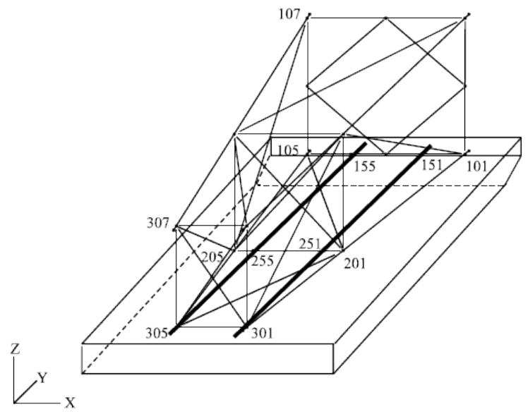

## 4.1 SAMPLE PROBLEM 1

Sample Problem 1 is a standard Launch analysis in 250 feet of water. Jacket and barge displacement, velocity and accelerations were plotted versus time and saved in a neutral picture file. In addition, plots of the Launch sequence, showing the jacket and barge outlines, were created.

The weight of un-modeled items such as lifting eyes were accounted for in the Launch input file. The following is the Launch input file, followed by a discussion of each line of input.

|  | 1 | 2 | 3 | 4 | 5 | 6 | 7 | 8 |
| --- | --- | --- | --- | --- | --- | --- | --- | --- |
|  | 12345678901234567890123456789012345678901234567890123456789012345678901234567890 | 12345678901234567890123456789012345678901234567890123456789012345678901234567890 | 12345678901234567890123456789012345678901234567890123456789012345678901234567890 | 12345678901234567890123456789012345678901234567890123456789012345678901234567890 | 12345678901234567890123456789012345678901234567890123456789012345678901234567890 | 12345678901234567890123456789012345678901234567890123456789012345678901234567890 | 12345678901234567890123456789012345678901234567890123456789012345678901234567890 | 12345678901234567890123456789012345678901234567890123456789012345678901234567890 |
| A | LAUNCH | SAMPLE | PROBLEM | 1 |  |  |  |  |
| B | LAUNCH | ENENFI | PF | 250.0 | 64.043 |  |  |  |
| C | TIME | 330.0 | 10. | 5. | 1.0 | 1.0 | 5.0 | 0.1E-081.0 |
| D | JACKET | 301 | 305 | 101 | 190.0 | 177.0 | -Y | 490.0 0.7 1.0 |
|  | BARGE |  |  |  |  |  |  |  |
| E | BARGE1 | 25.0 | 60.0 | 160.0 | 15.0 | 20.0 | 7.5 | 15.0 |
| F | BARGE2 | 5.0 | 177.0 | 9.0 | 0.3 | 1.0 | 1.0 |  |
|  | WEIGHT |  |  |  |  |  |  |  |
| G | WEIGHT | 301 | 1.500 |  |  |  |  |  |
|  | WEIGHT | 303 | 1.500 |  |  |  |  |  |
|  | WEIGHT | 305 | 1.500 |  |  |  |  |  |
|  | WEIGHT | 307 | 1.500 |  |  |  |  |  |
|  | FRICT |  |  |  |  |  |  |  |
| H | FRICT |  | 0.1 |  | 0.05 | 50.0 | 0.05 |  |
|  | END |  |  |  |  |  |  |  |

A. The first line is the optional analysis title.   
B. The Launch options are designated on the Launch line. The input and output units are English as designated in columns 9-12. ‘FI’ in columns 13-14 indicates that the SACS model data is in a separate file. Barge and jacket displacement, velocity and acceleration plots are to be created in a neutral picture file (‘PF’ cols. 19-20). The water depth is 250 and the density of water is 64.043.   
C. The analysis is to run through 330 seconds and output is to be generated every 10 seconds during phase 1, 5 seconds for phase 2, 1 second for phases 3 and 4 and 5 seconds for phase 5 motion.   
D. The jacket position is defined on the JACKET line. The plane of the jacket in contact with the barge is defined by joints 301, 305 and 101. The distance from joint 301 to the bow is 190 (cols. 22-28) and the length of the jacket on the barge is 177 (cols. 29-35). When the jacket is in an installed position, the model global -Y direction would be positive vertical as specified in columns 36-37.   
E. The barge dimensions are defined on the BARGE1 line. The barge height is 25, the width is 60, the bottom length is 160 feet, the forward extension is 15 and the aft extension is 20 feet as defined in columns 7-13, 14-20, 21-27,28-34 and 35-41, respectively. The initial barge forward draft and aft draft are 7.5 and 15 feet respectively.

F. Additional barge data is specified on the BARGE2 line. The skid height is 5, the rocker arm pin location is 177 and the rocker arm depth is 9 feet. The winch speed was input as 0.30 feet/second. The default drag and mass coefficients were used.   
G. Additional weight of 1.5 kips was added at joints 301, 303, 305 and 307 to represent the weight of the lift eyes using WEIGHT line images.   
H. The FRICT line designates that the coefficient of static friction is 0.10 and a constant coefficient of dynamic friction of 0.05 is to be used.

The following are some neutral picture plots and a portion of the output listing file created by the Launch program module:

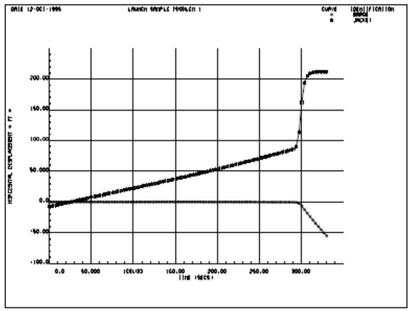

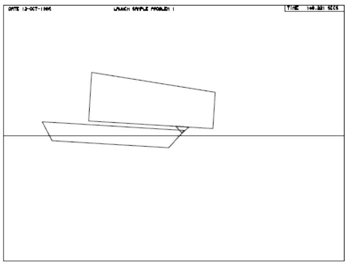

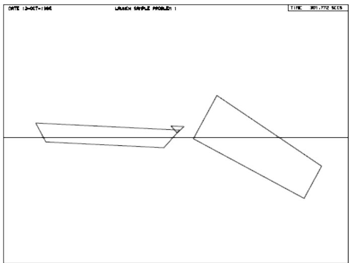

| SACS LAUNCH PROGRAM VERSION I.A.002 DATE 12-OCT-1995 TIME 11:12:18 LNH PAGE 1 | SACS LAUNCH PROGRAM VERSION I.A.002 DATE 12-OCT-1995 TIME 11:12:18 LNH PAGE 1 | SACS LAUNCH PROGRAM VERSION I.A.002 DATE 12-OCT-1995 TIME 11:12:18 LNH PAGE 1 | SACS LAUNCH PROGRAM VERSION I.A.002 DATE 12-OCT-1995 TIME 11:12:18 LNH PAGE 1 | SACS LAUNCH PROGRAM VERSION I.A.002 DATE 12-OCT-1995 TIME 11:12:18 LNH PAGE 1 | SACS LAUNCH PROGRAM VERSION I.A.002 DATE 12-OCT-1995 TIME 11:12:18 LNH PAGE 1 | SACS LAUNCH PROGRAM VERSION I.A.002 DATE 12-OCT-1995 TIME 11:12:18 LNH PAGE 1 | SACS LAUNCH PROGRAM VERSION I.A.002 DATE 12-OCT-1995 TIME 11:12:18 LNH PAGE 1 | SACS LAUNCH PROGRAM VERSION I.A.002 DATE 12-OCT-1995 TIME 11:12:18 LNH PAGE 1 | SACS LAUNCH PROGRAM VERSION I.A.002 DATE 12-OCT-1995 TIME 11:12:18 LNH PAGE 1 | SACS LAUNCH PROGRAM VERSION I.A.002 DATE 12-OCT-1995 TIME 11:12:18 LNH PAGE 1 | SACS LAUNCH PROGRAM VERSION I.A.002 DATE 12-OCT-1995 TIME 11:12:18 LNH PAGE 1 | SACS LAUNCH PROGRAM VERSION I.A.002 DATE 12-OCT-1995 TIME 11:12:18 LNH PAGE 1 | SACS LAUNCH PROGRAM VERSION I.A.002 DATE 12-OCT-1995 TIME 11:12:18 LNH PAGE 1 |
| --- | --- | --- | --- | --- | --- | --- | --- | --- | --- | --- | --- | --- | --- |
| LAUNCH SAMPLE PROBLEM 1 | JACKET PROPERTIES |  |  |  |  |  |  |  |  |  |  |  |  |
| NUMBER OF JOINTS 30 | NUMBER OF MEMBERS | 56 |  |  |  |  |  |  |  |  |  |  |  |
| NUMBER OF ADDITIONAL WEIGHTS 4 | NUMBER OF DRAG AREAS | 0 |  |  |  |  |  |  |  |  |  |  |  |
| NUMBER OF MEMBER SEGMENTS 3 |  |  |  |  |  |  |  |  |  |  |  |  |  |
| MATERIAL DENSITY 490.000 LBS/CU FT | SEAWATER DENSITY | 64.043 LBS/CU FT |  |  |  |  |  |  |  |  |  |  |  |
| TOTAL WEIGHT 550.510 KIPS | TOTAL BOUYANCY | 599.385 KIPS |  |  |  |  |  |  |  |  |  |  |  |
| CENTER OF GRAVITY XCG | -0.027 FT |  |  |  |  |  |  |  |  |  |  |  |  |
| YCG | 86.197 FT |  |  |  |  |  |  |  |  |  |  |  |  |
| ZCG | 29.620 FT |  |  |  |  |  |  |  |  |  |  |  |  |
| MASS MOMENTS OF INERTIA IXX | 65833104.000 SLUG-FT**2 |  |  |  |  |  |  |  |  |  |  |  |  |
| IYY | 24704554.000 SLUG-FT**2 |  |  |  |  |  |  |  |  |  |  |  |  |
| IZZ | 65468072.000 SLUG-FT**2 |  |  |  |  |  |  |  |  |  |  |  |  |
| IXY | 38757.191 SLUG-FT**2 |  |  |  |  |  |  |  |  |  |  |  |  |
| IXZ | -49734.871 SLUG-FT**2 |  |  |  |  |  |  |  |  |  |  |  |  |
| IYZ | -2679347.750 SLUG-FT**2 |  |  |  |  |  |  |  |  |  |  |  |  |
| SUBMERGED CENTER OF BOUYANCY XCB | -0.022 FT |  |  |  |  |  |  |  |  |  |  |  |  |
| YCB | 85.397 FT |  |  |  |  |  |  |  |  |  |  |  |  |
| ZCB | 29.588 FT |  |  |  |  |  |  |  |  |  |  |  |  |
| DISTANCE FROM BARGE FWD END TO JOINT 301 | 190.000 FT |  |  |  |  |  |  |  |  |  |  |  |  |
| TO JACKET LOWER FWD END | 13.000 FT |  |  |  |  |  |  |  |  |  |  |  |  |
| BARGE PROPERTIESXXXXXXXX | BARGE PROPERTIESXXXXXXXX | BARGE PROPERTIESXXXXXXXX | BARGE PROPERTIESXXXXXXXX | BARGE PROPERTIESXXXXXXXX | BARGE PROPERTIESXXXXXXXX | BARGE PROPERTIESXXXXXXXX | BARGE PROPERTIESXXXXXXXX | BARGE PROPERTIESXXXXXXXX | BARGE PROPERTIESXXXXXXXX | BARGE PROPERTIESXXXXXXXX | BARGE PROPERTIESXXXXXXXX | BARGE PROPERTIESXXXXXXXX | BARGE PROPERTIESXXXXXXXX |
| HEIGHT 25.000 FT | WIDTH | 60.000 FT |  |  |  |  |  |  |  |  |  |  |  |
| BOTTOM LENGTH 160.000 FT | FWD END SLOPE PROJECTION | 15.000 FT |  |  |  |  |  |  |  |  |  |  |  |
| AFT END SLOPE PROJECTION 20.000 FT | SKID HEIGHT | 5.000 FT |  |  |  |  |  |  |  |  |  |  |  |
| ROCKER ARM POSITION 177.000 FT | ROCKER ARM LENGTH | 9.000 FT |  |  |  |  |  |  |  |  |  |  |  |
| FWD END INITIAL DRAFT 7.500 FT | AFT END INITIAL DRAFT | 15.000 FT |  |  |  |  |  |  |  |  |  |  |  |
| INITIAL TRIM ANGLE -2.687 DEGREES | WEIGHT | 6797.065 KIPS |  |  |  |  |  |  |  |  |  |  |  |
| MASS 211259.563 SLUGS | MASS MOMENT OF INERTIA | 554666368.000 SLUG-FT**2 |  |  |  |  |  |  |  |  |  |  |  |
| CENTER OF GRAVITY - HORIZONTAL 92.186 FT | VERTICAL | 10.000 FT |  |  |  |  |  |  |  |  |  |  |  |
| INITIAL CENTER OF BOUYANCY 91.983 FT | INITIAL CENTER OF BOUYANCY 91.983 FT | INITIAL CENTER OF BOUYANCY 91.983 FT | INITIAL CENTER OF BOUYANCY 91.983 FT | INITIAL CENTER OF BOUYANCY 91.983 FT | INITIAL CENTER OF BOUYANCY 91.983 FT | INITIAL CENTER OF BOUYANCY 91.983 FT | INITIAL CENTER OF BOUYANCY 91.983 FT | INITIAL CENTER OF BOUYANCY 91.983 FT | INITIAL CENTER OF BOUYANCY 91.983 FT | INITIAL CENTER OF BOUYANCY 91.983 FT | INITIAL CENTER OF BOUYANCY 91.983 FT | INITIAL CENTER OF BOUYANCY 91.983 FT | INITIAL CENTER OF BOUYANCY 91.983 FT |
| WINCH SPEED 0.300 FT/SEC | WINCH SPEED 0.300 FT/SEC | WINCH SPEED 0.300 FT/SEC | WINCH SPEED 0.300 FT/SEC | WINCH SPEED 0.300 FT/SEC | WINCH SPEED 0.300 FT/SEC | WINCH SPEED 0.300 FT/SEC | WINCH SPEED 0.300 FT/SEC | WINCH SPEED 0.300 FT/SEC | WINCH SPEED 0.300 FT/SEC | WINCH SPEED 0.300 FT/SEC | WINCH SPEED 0.300 FT/SEC | WINCH SPEED 0.300 FT/SEC | WINCH SPEED 0.300 FT/SEC |
| DRAG COEFFICIENT 1.000 | DRAG COEFFICIENT 1.000 | DRAG COEFFICIENT 1.000 | DRAG COEFFICIENT 1.000 | DRAG COEFFICIENT 1.000 | DRAG COEFFICIENT 1.000 | DRAG COEFFICIENT 1.000 | DRAG COEFFICIENT 1.000 | DRAG COEFFICIENT 1.000 | DRAG COEFFICIENT 1.000 | DRAG COEFFICIENT 1.000 | DRAG COEFFICIENT 1.000 | DRAG COEFFICIENT 1.000 | DRAG COEFFICIENT 1.000 |
| ADDED MASS COEFFICIENT 1.000 | ADDED MASS COEFFICIENT 1.000 | ADDED MASS COEFFICIENT 1.000 | ADDED MASS COEFFICIENT 1.000 | ADDED MASS COEFFICIENT 1.000 | ADDED MASS COEFFICIENT 1.000 | ADDED MASS COEFFICIENT 1.000 | ADDED MASS COEFFICIENT 1.000 | ADDED MASS COEFFICIENT 1.000 | ADDED MASS COEFFICIENT 1.000 | ADDED MASS COEFFICIENT 1.000 | ADDED MASS COEFFICIENT 1.000 | ADDED MASS COEFFICIENT 1.000 | ADDED MASS COEFFICIENT 1.000 |
| INIncrement LENGTH FOR BOTTOM 8.000 FT | INIncrement LENGTH FOR BOTTOM 8.000 FT | INIncrement LENGTH FOR BOTTOM 8.000 FT | INIncrement LENGTH FOR BOTTOM 8.000 FT | INIncrement LENGTH FOR BOTTOM 8.000 FT | INIncrement LENGTH FOR BOTTOM 8.000 FT | INIncrement LENGTH FOR BOTTOM 8.000 FT | INIncrement LENGTH FOR BOTTOM 8.000 FT | INIncrement LENGTH FOR BOTTOM 8.000 FT | INIncrement LENGTH FOR BOTTOM 8.000 FT | INIncrement LENGTH FOR BOTTOM 8.000 FT | INIncrement LENGTH FOR BOTTOM 8.000 FT | INIncrement LENGTH FOR BOTTOM 8.000 FT | INIncrement LENGTH FOR BOTTOM 8.000 FT |
| END SLOPES 1.250 FT | END SLOPES 1.250 FT | END SLOPES 1.250 FT | END SLOPES 1.250 FT | END SLOPES 1.250 FT | END SLOPES 1.250 FT | END SLOPES 1.250 FT | END SLOPES 1.250 FT | END SLOPES 1.250 FT | END SLOPES 1.250 FT | END SLOPES 1.250 FT | END SLOPES 1.250 FT | END SLOPES 1.250 FT | END SLOPES 1.250 FT |
| INITIAL JACKET ANGLE 87.313 DEGREES | INITIAL JACKET ANGLE 87.313 DEGREES | INITIAL JACKET ANGLE 87.313 DEGREES | INITIAL JACKET ANGLE 87.313 DEGREES | INITIAL JACKET ANGLE 87.313 DEGREES | INITIAL JACKET ANGLE 87.313 DEGREES | INITIAL JACKET ANGLE 87.313 DEGREES | INITIAL JACKET ANGLE 87.313 DEGREES | INITIAL JACKET ANGLE 87.313 DEGREES | INITIAL JACKET ANGLE 87.313 DEGREES | INITIAL JACKET ANGLE 87.313 DEGREES | INITIAL JACKET ANGLE 87.313 DEGREES | INITIAL JACKET ANGLE 87.313 DEGREES | INITIAL JACKET ANGLE 87.313 DEGREES |
| JACKET MOMENT OF INERTIA 65833104.000 SLUG-FT**2 | JACKET MOMENT OF INERTIA 65833104.000 SLUG-FT**2 | JACKET MOMENT OF INERTIA 65833104.000 SLUG-FT**2 | JACKET MOMENT OF INERTIA 65833104.000 SLUG-FT**2 | JACKET MOMENT OF INERTIA 65833104.000 SLUG-FT**2 | JACKET MOMENT OF INERTIA 65833104.000 SLUG-FT**2 | JACKET MOMENT OF INERTIA 65833104.000 SLUG-FT**2 | JACKET MOMENT OF INERTIA 65833104.000 SLUG-FT**2 | JACKET MOMENT OF INERTIA 65833104.000 SLUG-FT**2 | JACKET MOMENT OF INERTIA 65833104.000 SLUG-FT**2 | JACKET MOMENT OF INERTIA 65833104.000 SLUG-FT**2 | JACKET MOMENT OF INERTIA 65833104.000 SLUG-FT**2 | JACKET MOMENT OF INERTIA 65833104.000 SLUG-FT**2 | JACKET MOMENT OF INERTIA 65833104.000 SLUG-FT**2 |
| DISTANCE FROM JACKET END TO PIN -179.000 FT | DISTANCE FROM JACKET END TO PIN -179.000 FT | DISTANCE FROM JACKET END TO PIN -179.000 FT | DISTANCE FROM JACKET END TO PIN -179.000 FT | DISTANCE FROM JACKET END TO PIN -179.000 FT | DISTANCE FROM JACKET END TO PIN -179.000 FT | DISTANCE FROM JACKET END TO PIN -179.000 FT | DISTANCE FROM JACKET END TO PIN -179.000 FT | DISTANCE FROM JACKET END TO PIN -179.000 FT | DISTANCE FROM JACKET END TO PIN -179.000 FT | DISTANCE FROM JACKET END TO PIN -179.000 FT | DISTANCE FROM JACKET END TO PIN -179.000 FT | DISTANCE FROM JACKET END TO PIN -179.000 FT | DISTANCE FROM JACKET END TO PIN -179.000 FT |
| INITIAL COORDINATES - BARGE X = 0.000 FT Y = -1.832 FT THETA = -2.687 DEGREES | INITIAL COORDINATES - BARGE X = 0.000 FT Y = -1.832 FT THETA = -2.687 DEGREES | INITIAL COORDINATES - BARGE X = 0.000 FT Y = -1.832 FT THETA = -2.687 DEGREES | INITIAL COORDINATES - BARGE X = 0.000 FT Y = -1.832 FT THETA = -2.687 DEGREES | INITIAL COORDINATES - BARGE X = 0.000 FT Y = -1.832 FT THETA = -2.687 DEGREES | INITIAL COORDINATES - BARGE X = 0.000 FT Y = -1.832 FT THETA = -2.687 DEGREES | INITIAL COORDINATES - BARGE X = 0.000 FT Y = -1.832 FT THETA = -2.687 DEGREES | INITIAL COORDINATES - BARGE X = 0.000 FT Y = -1.832 FT THETA = -2.687 DEGREES | INITIAL COORDINATES - BARGE X = 0.000 FT Y = -1.832 FT THETA = -2.687 DEGREES | INITIAL COORDINATES - BARGE X = 0.000 FT Y = -1.832 FT THETA = -2.687 DEGREES | INITIAL COORDINATES - BARGE X = 0.000 FT Y = -1.832 FT THETA = -2.687 DEGREES | INITIAL COORDINATES - BARGE X = 0.000 FT Y = -1.832 FT THETA = -2.687 DEGREES | INITIAL COORDINATES - BARGE X = 0.000 FT Y = -1.832 FT THETA = -2.687 DEGREES | INITIAL COORDINATES - BARGE X = 0.000 FT Y = -1.832 FT THETA = -2.687 DEGREES |
| - JACKET X = -7.608 FT Y = 48.200 FT THETA = 87.313 DEGREES | - JACKET X = -7.608 FT Y = 48.200 FT THETA = 87.313 DEGREES | - JACKET X = -7.608 FT Y = 48.200 FT THETA = 87.313 DEGREES | - JACKET X = -7.608 FT Y = 48.200 FT THETA = 87.313 DEGREES | - JACKET X = -7.608 FT Y = 48.200 FT THETA = 87.313 DEGREES | - JACKET X = -7.608 FT Y = 48.200 FT THETA = 87.313 DEGREES | - JACKET X = -7.608 FT Y = 48.200 FT THETA = 87.313 DEGREES | - JACKET X = -7.608 FT Y = 48.200 FT THETA = 87.313 DEGREES | - JACKET X = -7.608 FT Y = 48.200 FT THETA = 87.313 DEGREES | - JACKET X = -7.608 FT Y = 48.200 FT THETA = 87.313 DEGREES | - JACKET X = -7.608 FT Y = 48.200 FT THETA = 87.313 DEGREES | - JACKET X = -7.608 FT Y = 48.200 FT THETA = 87.313 DEGREES | - JACKET X = -7.608 FT Y = 48.200 FT THETA = 87.313 DEGREES | - JACKET X = -7.608 FT Y = 48.200 FT THETA = 87.313 DEGREES |
| PHASE 1 MOTION | PHASE 1 MOTION | PHASE 1 MOTION | PHASE 1 MOTION | PHASE 1 MOTION | PHASE 1 MOTION | PHASE 1 MOTION | PHASE 1 MOTION | PHASE 1 MOTION | PHASE 1 MOTION | PHASE 1 MOTION | PHASE 1 MOTION | PHASE 1 MOTION | PHASE 1 MOTION |
| ********** BARGE********** *** RELATIVE JACKET MOTION ** * DISTANCE TO * * BEGIN TIPPING * | ********** BARGE********** *** RELATIVE JACKET MOTION ** * DISTANCE TO * * BEGIN TIPPING * | ********** BARGE********** *** RELATIVE JACKET MOTION ** * DISTANCE TO * * BEGIN TIPPING * | ********** BARGE********** *** RELATIVE JACKET MOTION ** * DISTANCE TO * * BEGIN TIPPING * | ********** BARGE********** *** RELATIVE JACKET MOTION ** * DISTANCE TO * * BEGIN TIPPING * | ********** BARGE********** *** RELATIVE JACKET MOTION ** * DISTANCE TO * * BEGIN TIPPING * | ********** BARGE********** *** RELATIVE JACKET MOTION ** * DISTANCE TO * * BEGIN TIPPING * | ********** BARGE********** *** RELATIVE JACKET MOTION ** * DISTANCE TO * * BEGIN TIPPING * | ********** BARGE********** *** RELATIVE JACKET MOTION ** * DISTANCE TO * * BEGIN TIPPING * | ********** BARGE********** *** RELATIVE JACKET MOTION ** * DISTANCE TO * * BEGIN TIPPING * | ********** BARGE********** *** RELATIVE JACKET MOTION ** * DISTANCE TO * * BEGIN TIPPING * | ********** BARGE********** *** RELATIVE JACKET MOTION ** * DISTANCE TO * * BEGIN TIPPING * | ********** BARGE********** *** RELATIVE JACKET MOTION ** * DISTANCE TO * * BEGIN TIPPING * | ********** BARGE********** *** RELATIVE JACKET MOTION ** * DISTANCE TO * * BEGIN TIPPING * |
| TIME (SECS) | **** COORDINATES | **** COORDINATES | **** ROT (DEG) | **** VELOCITIES | **** VELOCITIES | **** ACADELATIONS | **** ACADELATIONS | **** DISPL. | **** DISPL. | VEL. | ACCEL. | (ESTIMATED) | (ESTIMATED) |
| TIME (SECS) | X (FT) | Y (FT) | **** ROT (DEG) | X (FPS) | Y (FPS) | ROT (DPS) | X (FPS**2) | Y (FPS**2) | ROT (DPS**2) | (FT) | (FPS) | (FPS**2) | (FT) |
| 0.00 | 0.0 | -1.8 | -2.69 | 0.00 | 0.00 | 0.0000 | 0.00 | 0.00 | 0.0000019 | -94.76 | 0.30 | 0.0000 | 92.947 |
| 10.00 | 0.0 | -1.8 | -2.74 | 0.00 | 0.00 | -0.0062 | 0.00 | 0.00 | -0.0065698 | -91.76 | 0.30 | 0.0000 | 89.931 |
| 20.00 | 0.0 | -1.8 | -2.80 | 0.00 | 0.00 | -0.0081 | 0.00 | 0.00 | 0.0104330 | -88.76 | 0.30 | 0.0000 | 86.838 |
| 30.00 | 0.0 | -1.9 | -2.85 | 0.00 | 0.00 | 0.0036 | 0.00 | 0.00 | -0.0118165 | -85.76 | 0.30 | 0.0000 | 83.874 |
| 40.00 | 0.0 | -1.9 | -2.92 | 0.00 | 0.00 | -0.0231 | 0.00 | 0.00 | 0.0300156 | -82.76 | 0.30 | 0.0000 | 80.700 |
| 50.00 | 0.0 | -1.9 | -2.96 | 0.00 | 0.00 | 0.0210 | 0.00 | 0.00 | -0.0139720 | -79.76 | 0.30 | 0.0000 | 77.807 |
| 60.00 | 0.0 | -1.9 | -3.02 | 0.00 | 0.00 | -0.0403 | 0.00 | 0.00 | 0.0068962 | -76.76 | 0.30 | 0.0000 | 74.702 |
| 70.00 | 0.0 | -1.9 | -3.07 | 0.00 | 0.00 | 0.0391 | 0.00 | 0.00 | 0.0058250 | -73.76 | 0.30 | 0.0000 | 71.669 |
| 80.00 | 0.0 | -1.9 | -3.11 | -0.01 | 0.00 | -0.0628 | 0.00 | 0.00 | -0.0371269 | -70.76 | 0.30 | 0.0000 | 68.772 |
| 90.00 | -0.1 | -1.9 | -3.22 | 0.00 | 0.00 | 0.0099 | 0.01 | 0.01 | 0.1097407 | -67.89 | 0.30 | 0.0000 | 65.393 |
| 100.00 | 0.0 | -1.9 | -3.19 | 0.00 | 0.00 | 0.0247 | -0.01 | 0.00 | -0.0991658 | -64.99 | 0.30 | 0.0000 | 63.134 |
| 106.08 | -0.1 | -1.9 | -3.30 | 0.00 | 0.00 | -0.0339 | 0.01 | 0.01 | 0.0994170 | -63.17 | 0.30 | 0.0000 | 60.643 |
| P H A S E 2 M O T I O N | P H A S E 2 M O T I O N | P H A S E 2 M O T I O N | P H A S E 2 M O T I O N | P H A S E 2 M O T I O N | P H A S E 2 M O T I O N | P H A S E 2 M O T I O N | P H A S E 2 M O T I O N | P H A S E 2 M O T I O N | P H A S E 2 M O T I O N | P H A S E 2 M O T I O N | P H A S E 2 M O T I O N | P H A S E 2 M O T I O N | P H A S E 2 M O T I O N |
| ********** BARGE********** *** RELATIVE JACKET MOTION ** * DISTANCE TO * * BEGIN TIPPING * | ********** BARGE********** *** RELATIVE JACKET MOTION ** * DISTANCE TO * * BEGIN TIPPING * | ********** BARGE********** *** RELATIVE JACKET MOTION ** * DISTANCE TO * * BEGIN TIPPING * | ********** BARGE********** *** RELATIVE JACKET MOTION ** * DISTANCE TO * * BEGIN TIPPING * | ********** BARGE********** *** RELATIVE JACKET MOTION ** * DISTANCE TO * * BEGIN TIPPING * | ********** BARGE********** *** RELATIVE JACKET MOTION ** * DISTANCE TO * * BEGIN TIPPING * | ********** BARGE********** *** RELATIVE JACKET MOTION ** * DISTANCE TO * * BEGIN TIPPING * | ********** BARGE********** *** RELATIVE JACKET MOTION ** * DISTANCE TO * * BEGIN TIPPING * | ********** BARGE********** *** RELATIVE JACKET MOTION ** * DISTANCE TO * * BEGIN TIPPING * | ********** BARGE********** *** RELATIVE JACKET MOTION ** * DISTANCE TO * * BEGIN TIPPING * | ********** BARGE********** *** RELATIVE JACKET MOTION ** * DISTANCE TO * * BEGIN TIPPING * | ********** BARGE********** *** RELATIVE JACKET MOTION ** * DISTANCE TO * * BEGIN TIPPING * | ********** BARGE********** *** RELATIVE JACKET MOTION ** * DISTANCE TO * * BEGIN TIPPING * | ********** BARGE********** *** RELATIVE JACKET MOTION ** * DISTANCE TO * * BEGIN TIPPING * |
| TIME (SECS) | **** COORDINATES | **** COORDINATES | **** ROT (DEG) | **** VELOCITIES | **** VELOCITIES | **** ACADELATIONS | **** ACADELATIONS | **** DISPL. | **** DISPL. | VEL. | ACCEI. | (ESTIMATED) | (ESTIMATED) |
| TIME (SECS) | X (FT) | Y (FT) | **** ROT (DEG) | X (FPS) | Y (FPS) | ROT (DPS) | X (FPS**2) | Y (FPS**2) | ROT (DPS**2) | (FT) | (FPS) | (FPS**2) | (FT) |
| 106.08 | -0.1 | -1.9 | -3.30 | 0.00 | 0.00 | -0.0339 | 0.01 | 0.01 | 0.0994198 | -63.17 | 0.30 | 0.0000 | 60.643 |
| 110.00 | 0.0 | -1.9 | -3.32 | 0.00 | 0.00 | -0.0427 | 0.01 | 0.00 | 0.0858459 | -62.05 | 0.30 | 0.0181 | 59.573 |
| 115.00 | 0.0 | -1.9 | -3.34 | 0.01 | 0.00 | 0.0429 | 0.01 | 0.00 | 0.0595122 | -60.59 | 0.30 | -0.0133 | 58.153 |
| 120.00 | 0.0 | -1.9 | -3.31 | 0.01 | 0.00 | 0.0346 | -0.01 | 0.00 | -0.0652705 | -59.14 | 0.28 | -0.0163 | 57.084 |
| 125.00 | 0.0 | -1.9 | -3.34 | 0.00 | 0.00 | -0.0405 | -0.01 | 0.00 | -0.0626695 | -57.69 | 0.28 | 0.0097 | 55.635 |
| 130.00 | 0.0 | -1.9 | -3.41 | 0.00 | 0.00 | -0.0467 | 0.00 | 0.00 | 0.0451067 | -56.22 | 0.30 | 0.0166 | 53.804 |
| 135.00 | 0.0 | -1.9 | -3.44 | 0.00 | 0.00 | 0.0172 | 0.01 | 0.00 | 0.0635770 | -54.72 | 0.31 | -0.0043 | 52.207 |
| 140.00 | 0.0 | -1.9 | -3.43 | 0.01 | 0.00 | 0.0355 | 0.00 | 0.00 | -0.0259902 | -53.22 | 0.30 | -0.0146 | 50.964 |
| 145.00 | 0.0 | -1.9 | -3.45 | 0.00 | 0.00 | -0.0158 | -0.01 | 0.00 | -0.0616176 | -51.72 | 0.29 | 0.0011 | 49.576 |
| 150.00 | 0.0 | -1.9 | -3.50 | 0.00 | 0.00 | -0.0440 | 0.00 | 0.00 | 0.0074351 | -50.20 | 0.30 | 0.0138 | 47.831 |
| 155.00 | 0.0 | -1.9 | -3.55 | 0.00 | 0.00 | -0.0069 | 0.01 | 0.00 | 0.0558425 | -48.66 | 0.32 | 0.0035 | 46.105 |
| 160.00 | 0.0 | -1.9 | -3.56 | 0.00 | 0.00 | 0.0277 | 0.00 | 0.00 | 0.0094773 | -47.11 | 0.31 | -0.0102 | 44.669 |

| PHASE 4 MOTION (CONTINUED) | PHASE 4 MOTION (CONTINUED) | PHASE 4 MOTION (CONTINUED) | PHASE 4 MOTION (CONTINUED) | PHASE 4 MOTION (CONTINUED) | PHASE 4 MOTION (CONTINUED) | PHASE 4 MOTION (CONTINUED) | PHASE 4 MOTION (CONTINUED) | PHASE 4 MOTION (CONTINUED) | PHASE 4 MOTION (CONTINUED) | PHASE 4 MOTION (CONTINUED) | PHASE 4 MOTION (CONTINUED) | PHASE 4 MOTION (CONTINUED) | PHASE 4 MOTION (CONTINUED) | PHASE 4 MOTION (CONTINUED) | PHASE 4 MOTION (CONTINUED) | PHASE 4 MOTION (CONTINUED) | PHASE 4 MOTION (CONTINUED) |  |
| --- | --- | --- | --- | --- | --- | --- | --- | --- | --- | --- | --- | --- | --- | --- | --- | --- | --- | --- |
| TIME | BARGE | BARGE | BARGE | BARGE | BARGE | BARGE | BARGE | JACKET | JACKET | JACKET | JACKET | JACKET | JACKET | SKID | SKID | ROCKER | ROCKER |  |
| TIME | DISPLACEMENTS | DISPLACEMENTS | DISPLACEMENTS | VELOCITIES | VELOCITIES | VELOCITIES | VELOCITIES | DISPLACEMENTS | DISPLACEMENTS | DISPLACEMENTS | VELOCITIES | VELOCITIES | VELOCITIES | MOTION | MOTION | PIN | PIN |  |
| (SEC) | X(FT) | Y(FT) | ROT(DEG) | X(FPS) | Y(FPS) | ROT(DPS) | X(FT) | Y(FT) | ROT(DEG) | X(FPS) | Y(FPS) | ROT(DPS) | X(FT) | Y(FPS) | ROT(DEG) | X(FT) | Y(FPS) | ROT(DPS) |
| 291.00 | -0.4 | -2.0 | -4.3 | -0.03 | 0.00 | 0.004 | 86.4 | 41.2 | 85.1 | 0.74 | -0.04 | -0.581 | -1.9 | 0.38 | -0.54 | 548.1 |  |  |
| 292.00 | -0.4 | -2.0 | -4.3 | -0.07 | 0.00 | -0.011 | 87.3 | 41.1 | 84.3 | 1.16 | -0.10 | -1.202 | -1.5 | 0.42 | -1.40 | 547.4 |  |  |
| 293.00 | -0.5 | -2.0 | -4.4 | -0.12 | 0.01 | 0.013 | 88.8 | 40.9 | 82.6 | 1.88 | -0.19 | -2.147 | -1.1 | 0.56 | -3.07 | 536.8 |  |  |
| 294.00 | -0.7 | -2.0 | -4.3 | -0.23 | 0.06 | 0.158 | 91.3 | 40.7 | 80.5 | 3.35 | -0.32 | -1.912 | 0.2 | 2.36 | -5.27 | 507.5 |  |  |
| 295.00 | -1.0 | -1.9 | -4.1 | -0.41 | 0.10 | 0.152 | 95.8 | 40.1 | 78.8 | 5.66 | -0.98 | -1.474 | 4.0 | 5.23 | -7.10 | 477.1 |  |  |
| 296.00 | -1.5 | -1.8 | -4.0 | -0.64 | 0.09 | 0.038 | 102.8 | 38.5 | 77.2 | 8.50 | -2.29 | -1.895 | 10.7 | 8.18 | -8.78 | 439.3 |  |  |
| 297.00 | -2.3 | -1.7 | -3.9 | -0.89 | 0.10 | 0.187 | 112.9 | 35.3 | 74.7 | 11.78 | -4.31 | -3.279 | 20.4 | 11.26 | -11.39 | 374.1 |  |  |
| 298.00 | -3.3 | -1.6 | -3.6 | -1.16 | 0.19 | 0.525 | 126.4 | 29.5 | 70.7 | 14.91 | -7.57 | -4.666 | 33.4 | 14.89 | -15.78 | 264.1 |  |  |
| 299.00 | -4.6 | -1.3 | -3.0 | -1.41 | 0.29 | 0.456 | 142.1 | 20.0 | 65.9 | 16.07 | -11.27 | -4.577 | 50.0 | 17.92 | -21.13 | 165.2 |  |  |
| 300.00 | -6.1 | -1.1 | -2.9 | -1.66 | 0.17 | -0.167 | 157.7 | 8.2 | 62.4 | 14.99 | -12.04 | -2.422 | 68.5 | 18.64 | -24.71 | 128.3 |  |  |
| 300.86 | -7.7 | -1.0 | -3.1 | -1.82 | -0.03 | -0.236 | 170.0 | -2.1 | 60.8 | 13.39 | -11.45 | -1.529 | 84.3 | 17.63 | -26.13 | 105.3 |  |  |
| SACS LAUNCH PROGRAM VERSION I.A.002 DATE 12-OCT-1995 TIME 11:12:18 LNH PAGE 6 | SACS LAUNCH PROGRAM VERSION I.A.002 DATE 12-OCT-1995 TIME 11:12:18 LNH PAGE 6 | SACS LAUNCH PROGRAM VERSION I.A.002 DATE 12-OCT-1995 TIME 11:12:18 LNH PAGE 6 | SACS LAUNCH PROGRAM VERSION I.A.002 DATE 12-OCT-1995 TIME 11:12:18 LNH PAGE 6 | SACS LAUNCH PROGRAM VERSION I.A.002 DATE 12-OCT-1995 TIME 11:12:18 LNH PAGE 6 | SACS LAUNCH PROGRAM VERSION I.A.002 DATE 12-OCT-1995 TIME 11:12:18 LNH PAGE 6 | SACS LAUNCH PROGRAM VERSION I.A.002 DATE 12-OCT-1995 TIME 11:12:18 LNH PAGE 6 | SACS LAUNCH PROGRAM VERSION I.A.002 DATE 12-OCT-1995 TIME 11:12:18 LNH PAGE 6 | SACS LAUNCH PROGRAM VERSION I.A.002 DATE 12-OCT-1995 TIME 11:12:18 LNH PAGE 6 | SACS LAUNCH PROGRAM VERSION I.A.002 DATE 12-OCT-1995 TIME 11:12:18 LNH PAGE 6 | SACS LAUNCH PROGRAM VERSION I.A.002 DATE 12-OCT-1995 TIME 11:12:18 LNH PAGE 6 | SACS LAUNCH PROGRAM VERSION I.A.002 DATE 12-OCT-1995 TIME 11:12:18 LNH PAGE 6 | SACS LAUNCH PROGRAM VERSION I.A.002 DATE 12-OCT-1995 TIME 11:12:18 LNH PAGE 6 | SACS LAUNCH PROGRAM VERSION I.A.002 DATE 12-OCT-1995 TIME 11:12:18 LNH PAGE 6 | SACS LAUNCH PROGRAM VERSION I.A.002 DATE 12-OCT-1995 TIME 11:12:18 LNH PAGE 6 | SACS LAUNCH PROGRAM VERSION I.A.002 DATE 12-OCT-1995 TIME 11:12:18 LNH PAGE 6 | SACS LAUNCH PROGRAM VERSION I.A.002 DATE 12-OCT-1995 TIME 11:12:18 LNH PAGE 6 |  |  |
| TIME | DISPLACEMENTS | DISPLACEMENTS | DISPLACEMENTS | VELOCITIES | VELOCITIES | VELOCITIES | ACCELERATIONS | ACCELERATIONS | ACCELERATIONS | DISPLACEMENTS | DISPLACEMENTS | DISPLACEMENTS | VELOCITIES | VELOCITIES | VELOCITIES | ACCELERATIONS | ACCELERATIONS |  |
| (SECS) | X(FT) | Y(FT) | ROT(DEG) | X(FPS) | Y(FPS) | ROT(DPS) | X(FPS**2) | Y(FPS) | ROT(DPS) | X(FT) | Y(FT) | ROT(DEG) | X(FPS) | Y(FPS) | ROT(DPS) | X(FPS**2) | Y(DFSS) |  |
| 300.86 | -7.7 | -1.0 | -3.1 | -1.82 | -0.03 | -0.236 | 0.1 | 0.1 | 1.19 | 170.0 | -2.1 | 60.8 | 13.39 | -11.45 | -1.529 | -4.1 | -3.4 |  |
| 305.00 | -15.0 | -1.1 | -3.1 | -1.75 | 0.02 | 0.001 | 0.1 | 0.1 | 1.17 | 200.3 | -41.1 | 71.5 | 3.47 | -5.84 | 3.740 | -1.1 | 1.5 |  |
| 310.00 | -23.6 | -1.0 | -2.5 | -1.66 | 0.07 | 0.587 | 0.0 | 0.0 | -0.49 | 209.2 | -50.8 | 87.2 | 0.74 | 1.33 | 2.114 | -0.2 | 0.9 |  |
| 315.00 | -31.8 | -1.0 | -2.5 | -1.65 | -0.03 | -0.531 | 0.0 | 0.0 | -0.60 | 211.2 | -36.7 | 94.1 | 0.21 | 3.77 | 0.780 | 0.0 | 0.2 |  |
| 320.00 | -39.8 | -1.1 | -3.0 | -1.57 | 0.00 | 0.001 | 0.1 | 0.1 | 1.01 | 211.5 | -33.5 | 96.2 | -0.01 | -0.85 | -0.078 | 0.0 | 1.2 |  |
| 325.00 | -47.5 | -1.0 | -2.5 | -1.50 | 0.03 | 0.454 | 0.0 | 0.0 | -0.54 | 211.8 | -30.5 | 95.0 | -0.04 | -1.85 | -0.396 | 0.0 | 1.4 |  |
| 330.00 | -55.0 | -1.0 | -2.6 | -1.49 | -0.06 | -0.484 | 0.0 | 0.0 | -0.30 | 211.7 | -30.4 | 96.4 | -0.08 | -1.34 | -0.568 | 0.0 | 1.1 |  |

## 4.2 SAMPLE PROBLEM 2

Sample Problem 2 is a Post Launch analysis. Launch loading was generated for two time points of the standard Launch analysis executed in Sample Problem 1, namely, at time 240 seconds and 288.3 seconds. For this post analysis, the jacket joints on the Launch runner must be designated in the Post Launch input file.

Below is the Post Launch input file used to create the two Launch load cases. A detailed description of the input file follows:

|  | 1 | 2 | 3 | 4 | 5 | 6 | 7 | 8 |
| --- | --- | --- | --- | --- | --- | --- | --- | --- |
|  | 1234567890123456789012345678901234567890123456789012345678901234567890123456789012345678901234567890123456789 | 1234567890123456789012345678901234567890123456789012345678901234567890123456789012345678901234567890123456789 | 1234567890123456789012345678901234567890123456789012345678901234567890123456789012345678901234567890123456789 | 1234567890123456789012345678901234567890123456789012345678901234567890123456789012345678901234567890123456789 | 1234567890123456789012345678901234567890123456789012345678901234567890123456789012345678901234567890123456789 | 1234567890123456789012345678901234567890123456789012345678901234567890123456789012345678901234567890123456789 | 1234567890123456789012345678901234567890123456789012345678901234567890123456789012345678901234567890123456789 | 1234567890123456789012345678901234567890123456789012345678901234567890123456789012345678901234567890123456789 |
| A | LAUNCH | SAMPLE | PROBLEM | 2 |  |  |  |  |
| B | PSTLNH | ENENFI |  |  |  |  |  |  |
| C | JACKET | 301 | 305 | 101 | 190.0 | 177.0 | -¥ | 490.0 |
|  | BARGE |  |  |  |  |  |  |  |
| D | BARGE125.0 | 60.0 | 160.0 | 15.0 | 20.0 | 7.5 | 15.0 | 20.0 |
|  | BARGE25.0 | 177.0 | 9.0 | 0.3 | 1.0 | 1.0 |  |  |
|  | WEIGHT |  |  |  |  |  |  |  |
| E | WEIGHT | 301 | 1.500 |  |  |  |  |  |
|  | WEIGHT | 303 | 1.500 |  |  |  |  |  |
|  | WEIGHT | 305 | 1.500 |  |  |  |  |  |
|  | WEIGHT | 307 | 1.500 |  |  |  |  |  |
|  | LRUNR |  |  |  |  |  |  |  |
| F | LRUNR L | 301 | 251 | 151 |  |  |  |  |
|  | LRUNR R | 305 | 255 | 155 |  |  |  |  |
|  | LLOAD |  |  |  |  |  |  |  |
| G | LLOAD | 1TME240. | 1TME240. | 2TME288.3 |  |  |  |  |
|  | END |  |  |  |  |  |  |  |

A. The first line is the optional analysis title.   
B. The Post Launch options are designated on the PSTLNH line. The input and output units are English as designated in columns 9-12. ‘FI’ in columns 13-14 indicates that the SACS model data is in a separate file.   
C, D, E. The jacket and barge and weight data were copied from the standard Launch analysis input file.   
F. The jacket joints on the left and right Launch runners were designated using the LRUNR lines. The first line defines the left runner (‘L’ in column 7) and designates that joints 301, 251 and 151 are on the left runner. The next LRUNR line defines the joints on the right runner.   
G. Two Launch load cases are to be created as specified on the LLOAD line. The first load case, 1, contains Launch loading at time 240.0 seconds. Load case 2 will be generated at time 288.3 seconds.

The following is a portion of the output structural data file containing the two load cases created:

|  | 1 | 2 | 3 | 4 | 5 | 6 | 7 | 8 |
| --- | --- | --- | --- | --- | --- | --- | --- | --- |
| 1234567890123456789012345678901234567890123456789012345678901234567890123456789012345678901234567890123456789 | 1234567890123456789012345678901234567890123456789012345678901234567890123456789012345678901234567890123456789 | 1234567890123456789012345678901234567890123456789012345678901234567890123456789012345678901234567890123456789 | 1234567890123456789012345678901234567890123456789012345678901234567890123456789012345678901234567890123456789 | 1234567890123456789012345678901234567890123456789012345678901234567890123456789012345678901234567890123456789 | 1234567890123456789012345678901234567890123456789012345678901234567890123456789012345678901234567890123456789 | 1234567890123456789012345678901234567890123456789012345678901234567890123456789012345678901234567890123456789 | 1234567890123456789012345678901234567890123456789012345678901234567890123456789012345678901234567890123456789 | 1234567890123456789012345678901234567890123456789012345678901234567890123456789012345678901234567890123456789 |
| LOADCN | 1 |  |  |  |  |  |  |  |
| LOAD Z | 1 | 101 | .000000-.476813.30636-.47681 |  |  | GLOB | UNIF |  |
| LOAD Z | 3 | 103 | .000000-.476813.32260-.47681 |  |  | GLOB | UNIF |  |
| LOAD Z | 5 | 105 | .000000-.476813.30636-.47681 |  |  | GLOB | UNIF |  |
| LOAD Z | 7 | 107 | .000000-.476813.32260-.47681 |  |  | GLOB | UNIF |  |
| LOAD Z | 101 | 151 | .000000-.1287819.5900-.12878 |  |  | GLOB | UNIF |  |
| LOAD Z | 101 | 112 | .000000-.1287831.7421-.12878 |  |  | GLOB | UNIF |  |
| LOAD Z | 101 | 201 | .000000-.476816.14000-.47681 |  |  | GLOB | UNIF |  |
| LOAD Z | 101 | 201 | 6.14000-.3371284.8548-.33712 |  |  | GLOB | UNIF |  |
| ...... additional load cards | ...... additional load cards | ...... additional load cards | ...... additional load cards | ...... additional load cards | ...... additional load cards | ...... additional load cards | ...... additional load cards | ...... additional load cards |
| LOAD Z | 103 | 203 | 6.14000-.3371285.3257-.33712 |  |  | GLOB | UNIF |  |
| LOAD Z | 103 | 203 | 91.4657-.476814.89000-.47681 |  |  | GLOB | UNIF |  |
| LOAD Z | 103 | 207 | .000000-.12878109.363-.12878 |  |  | GLOB | UNIF |  |
| LOAD Z | 105 | 110 | .000000-.1287831.7421-.12878 |  |  | GLOB | UNIF |  |
| LOAD Z | 105 | 205 | .000000-.476816.14000-.47681 |  |  | GLOB | UNIF |  |
| LOAD Z | 105 | 205 | 90.9948-.476814.89000-.47681 |  |  | GLOB | UNIF |  |
| LOAD Z | 107 | 207 | .000000-.476816.14000-.47681 |  |  | GLOB | UNIF |  |
| LOAD Z | 107 | 207 | 6.14000-.3371285.3257-.33712 |  |  | GLOB | UNIF |  |
| LOADCN | 2 |  |  |  |  |  |  |  |
| LOAD Z | 1 | 101 | .000000-.476813.30636-.47681 |  |  | GLOB | UNIF |  |
| LOAD Z | 3 | 103 | .000000-.476813.32260-.47681 |  |  | GLOB | UNI F |  |
| LOAD Z | 5 | 105 | .000000-.476813.30636-.47681 |  |  | GLOB | UNIF |  |
| LOAD Z | 7 | 107 | .000000-.476813.32260-.47681 |  |  | GLOB | UNIF |  |
| ...... additional load cards | ...... additional load cards | ...... additional load cards | ...... additional load cards | ...... additional load cards | ...... additional load cards | ...... additional load cards | ...... additional load cards | ...... additional load cards |
| LOAD Z | 101 | 151 | .000000-.1287819.5900-.12878 |  |  | GLOB | UNIF |  |
| LOAD Z | 101 | 201 | .000000-.476816.14000-.47681 |  |  | GLOB | UNIF |  |
| LOAD Z | 101 | 201 | 6.14000-.3371284.8548-. 33712 |  |  | GLOB | UNIF |  |
| LOAD Z | 101 | 201 | 90.9948-.476814.89000-.47681 |  |  | GLOB | UNIF |  |
| LOAD Z | 101 | 203 | .000000-.12878105.517-.12878 |  |  | GLOB | UNIF |  |
| LOAD Z | 103 | 111 | .000000-.1287836.8140-.12878 |  |  | GLOB | UNIF |  |
| LOAD Z | 103 | 203 | .000000-.476816.14000-.47681 |  |  | GLOB | UNIF |  |
| LOAD Z | 103 | 203 | 6.14000-.3371285.3257-.33712 |  |  | GLOB | UNIF |  |

The ensuing pages contain a portion of the Post Launch analysis listing file.

| LAUNCH SAMPLE PROBLEM 2 DATE 12-OCT-1995 TIME 16:03:32 LNH PAGE 1********** JACKET PROPERTIES********** | LAUNCH SAMPLE PROBLEM 2 DATE 12-OCT-1995 TIME 16:03:32 LNH PAGE 1********** JACKET PROPERTIES********** | LAUNCH SAMPLE PROBLEM 2 DATE 12-OCT-1995 TIME 16:03:32 LNH PAGE 1********** JACKET PROPERTIES********** | LAUNCH SAMPLE PROBLEM 2 DATE 12-OCT-1995 TIME 16:03:32 LNH PAGE 1********** JACKET PROPERTIES********** | LAUNCH SAMPLE PROBLEM 2 DATE 12-OCT-1995 TIME 16:03:32 LNH PAGE 1********** JACKET PROPERTIES********** | LAUNCH SAMPLE PROBLEM 2 DATE 12-OCT-1995 TIME 16:03:32 LNH PAGE 1********** JACKET PROPERTIES********** | LAUNCH SAMPLE PROBLEM 2 DATE 12-OCT-1995 TIME 16:03:32 LNH PAGE 1********** JACKET PROPERTIES********** | LAUNCH SAMPLE PROBLEM 2 DATE 12-OCT-1995 TIME 16:03:32 LNH PAGE 1********** JACKET PROPERTIES********** | LAUNCH SAMPLE PROBLEM 2 DATE 12-OCT-1995 TIME 16:03:32 LNH PAGE 1********** JACKET PROPERTIES********** | LAUNCH SAMPLE PROBLEM 2 DATE 12-OCT-1995 TIME 16:03:32 LNH PAGE 1********** JACKET PROPERTIES********** | LAUNCH SAMPLE PROBLEM 2 DATE 12-OCT-1995 TIME 16:03:32 LNH PAGE 1********** JACKET PROPERTIES********** | LAUNCH SAMPLE PROBLEM 2 DATE 12-OCT-1995 TIME 16:03:32 LNH PAGE 1********** JACKET PROPERTIES********** | LAUNCH SAMPLE PROBLEM 2 DATE 12-OCT-1995 TIME 16:03:32 LNH PAGE 1********** JACKET PROPERTIES********** |
| --- | --- | --- | --- | --- | --- | --- | --- | --- | --- | --- | --- | --- |
| NUMBER OF JOINTS 30 NUMBER OF MEMBERS 56 | NUMBER OF JOINTS 30 NUMBER OF MEMBERS 56 | NUMBER OF JOINTS 30 NUMBER OF MEMBERS 56 | NUMBER OF JOINTS 30 NUMBER OF MEMBERS 56 | NUMBER OF JOINTS 30 NUMBER OF MEMBERS 56 | NUMBER OF JOINTS 30 NUMBER OF MEMBERS 56 | NUMBER OF JOINTS 30 NUMBER OF MEMBERS 56 | NUMBER OF JOINTS 30 NUMBER OF MEMBERS 56 | NUMBER OF JOINTS 30 NUMBER OF MEMBERS 56 | NUMBER OF JOINTS 30 NUMBER OF MEMBERS 56 | NUMBER OF JOINTS 30 NUMBER OF MEMBERS 56 | NUMBER OF JOINTS 30 NUMBER OF MEMBERS 56 | NUMBER OF JOINTS 30 NUMBER OF MEMBERS 56 |
| NUMBER OF ADDITIONAL WEIGHTS 4 NUMBER OF DRAG AREAS 0 | NUMBER OF ADDITIONAL WEIGHTS 4 NUMBER OF DRAG AREAS 0 | NUMBER OF ADDITIONAL WEIGHTS 4 NUMBER OF DRAG AREAS 0 | NUMBER OF ADDITIONAL WEIGHTS 4 NUMBER OF DRAG AREAS 0 | NUMBER OF ADDITIONAL WEIGHTS 4 NUMBER OF DRAG AREAS 0 | NUMBER OF ADDITIONAL WEIGHTS 4 NUMBER OF DRAG AREAS 0 | NUMBER OF ADDITIONAL WEIGHTS 4 NUMBER OF DRAG AREAS 0 | NUMBER OF ADDITIONAL WEIGHTS 4 NUMBER OF DRAG AREAS 0 | NUMBER OF ADDITIONAL WEIGHTS 4 NUMBER OF DRAG AREAS 0 | NUMBER OF ADDITIONAL WEIGHTS 4 NUMBER OF DRAG AREAS 0 | NUMBER OF ADDITIONAL WEIGHTS 4 NUMBER OF DRAG AREAS 0 | NUMBER OF ADDITIONAL WEIGHTS 4 NUMBER OF DRAG AREAS 0 | NUMBER OF ADDITIONAL WEIGHTS 4 NUMBER OF DRAG AREAS 0 |
| NUMBER OF MEMBER SEGMENTS 3 | NUMBER OF MEMBER SEGMENTS 3 | NUMBER OF MEMBER SEGMENTS 3 | NUMBER OF MEMBER SEGMENTS 3 | NUMBER OF MEMBER SEGMENTS 3 | NUMBER OF MEMBER SEGMENTS 3 | NUMBER OF MEMBER SEGMENTS 3 | NUMBER OF MEMBER SEGMENTS 3 | NUMBER OF MEMBER SEGMENTS 3 | NUMBER OF MEMBER SEGMENTS 3 | NUMBER OF MEMBER SEGMENTS 3 | NUMBER OF MEMBER SEGMENTS 3 | NUMBER OF MEMBER SEGMENTS 3 |
| MATERIAL DENSITY 490.000 LBS/CU FT SEAWATER DENSITY 64.043 LBS/CU FT | MATERIAL DENSITY 490.000 LBS/CU FT SEAWATER DENSITY 64.043 LBS/CU FT | MATERIAL DENSITY 490.000 LBS/CU FT SEAWATER DENSITY 64.043 LBS/CU FT | MATERIAL DENSITY 490.000 LBS/CU FT SEAWATER DENSITY 64.043 LBS/CU FT | MATERIAL DENSITY 490.000 LBS/CU FT SEAWATER DENSITY 64.043 LBS/CU FT | MATERIAL DENSITY 490.000 LBS/CU FT SEAWATER DENSITY 64.043 LBS/CU FT | MATERIAL DENSITY 490.000 LBS/CU FT SEAWATER DENSITY 64.043 LBS/CU FT | MATERIAL DENSITY 490.000 LBS/CU FT SEAWATER DENSITY 64.043 LBS/CU FT | MATERIAL DENSITY 490.000 LBS/CU FT SEAWATER DENSITY 64.043 LBS/CU FT | MATERIAL DENSITY 490.000 LBS/CU FT SEAWATER DENSITY 64.043 LBS/CU FT | MATERIAL DENSITY 490.000 LBS/CU FT SEAWATER DENSITY 64.043 LBS/CU FT | MATERIAL DENSITY 490.000 LBS/CU FT SEAWATER DENSITY 64.043 LBS/CU FT | MATERIAL DENSITY 490.000 LBS/CU FT SEAWATER DENSITY 64.043 LBS/CU FT |
| TOTAL WEIGHT 550.510 KIPS TOTAL BOUYANCY 599.385 KIPS | TOTAL WEIGHT 550.510 KIPS TOTAL BOUYANCY 599.385 KIPS | TOTAL WEIGHT 550.510 KIPS TOTAL BOUYANCY 599.385 KIPS | TOTAL WEIGHT 550.510 KIPS TOTAL BOUYANCY 599.385 KIPS | TOTAL WEIGHT 550.510 KIPS TOTAL BOUYANCY 599.385 KIPS | TOTAL WEIGHT 550.510 KIPS TOTAL BOUYANCY 599.385 KIPS | TOTAL WEIGHT 550.510 KIPS TOTAL BOUYANCY 599.385 KIPS | TOTAL WEIGHT 550.510 KIPS TOTAL BOUYANCY 599.385 KIPS | TOTAL WEIGHT 550.510 KIPS TOTAL BOUYANCY 599.385 KIPS | TOTAL WEIGHT 550.510 KIPS TOTAL BOUYANCY 599.385 KIPS | TOTAL WEIGHT 550.510 KIPS TOTAL BOUYANCY 599.385 KIPS | TOTAL WEIGHT 550.510 KIPS TOTAL BOUYANCY 599.385 KIPS | TOTAL WEIGHT 550.510 KIPS TOTAL BOUYANCY 599.385 KIPS |
| CENTER OF GRAVITY XCG -0.027 FT YCG 86.197 FT ZCG 29.620 FT | CENTER OF GRAVITY XCG -0.027 FT YCG 86.197 FT ZCG 29.620 FT | CENTER OF GRAVITY XCG -0.027 FT YCG 86.197 FT ZCG 29.620 FT | CENTER OF GRAVITY XCG -0.027 FT YCG 86.197 FT ZCG 29.620 FT | CENTER OF GRAVITY XCG -0.027 FT YCG 86.197 FT ZCG 29.620 FT | CENTER OF GRAVITY XCG -0.027 FT YCG 86.197 FT ZCG 29.620 FT | CENTER OF GRAVITY XCG -0.027 FT YCG 86.197 FT ZCG 29.620 FT | CENTER OF GRAVITY XCG -0.027 FT YCG 86.197 FT ZCG 29.620 FT | CENTER OF GRAVITY XCG -0.027 FT YCG 86.197 FT ZCG 29.620 FT | CENTER OF GRAVITY XCG -0.027 FT YCG 86.197 FT ZCG 29.620 FT | CENTER OF GRAVITY XCG -0.027 FT YCG 86.197 FT ZCG 29.620 FT | CENTER OF GRAVITY XCG -0.027 FT YCG 86.197 FT ZCG 29.620 FT | CENTER OF GRAVITY XCG -0.027 FT YCG 86.197 FT ZCG 29.620 FT |
| MASS MOMENTS OF INERTIA IXX 65833104.000 SLUG-FT**2 IYY 24704554.000 SLUG-FT**2 IZZ 65468072.000 SLUG-FT**2 IXY 38757.191 SLUG-FT**2 IXZ -49734.871 SLUG-FT**2 IYZ -2679347.750 SLUG-FT**2 | MASS MOMENTS OF INERTIA IXX 65833104.000 SLUG-FT**2 IYY 24704554.000 SLUG-FT**2 IZZ 65468072.000 SLUG-FT**2 IXY 38757.191 SLUG-FT**2 IXZ -49734.871 SLUG-FT**2 IYZ -2679347.750 SLUG-FT**2 | MASS MOMENTS OF INERTIA IXX 65833104.000 SLUG-FT**2 IYY 24704554.000 SLUG-FT**2 IZZ 65468072.000 SLUG-FT**2 IXY 38757.191 SLUG-FT**2 IXZ -49734.871 SLUG-FT**2 IYZ -2679347.750 SLUG-FT**2 | MASS MOMENTS OF INERTIA IXX 65833104.000 SLUG-FT**2 IYY 24704554.000 SLUG-FT**2 IZZ 65468072.000 SLUG-FT**2 IXY 38757.191 SLUG-FT**2 IXZ -49734.871 SLUG-FT**2 IYZ -2679347.750 SLUG-FT**2 | MASS MOMENTS OF INERTIA IXX 65833104.000 SLUG-FT**2 IYY 24704554.000 SLUG-FT**2 IZZ 65468072.000 SLUG-FT**2 IXY 38757.191 SLUG-FT**2 IXZ -49734.871 SLUG-FT**2 IYZ -2679347.750 SLUG-FT**2 | MASS MOMENTS OF INERTIA IXX 65833104.000 SLUG-FT**2 IYY 24704554.000 SLUG-FT**2 IZZ 65468072.000 SLUG-FT**2 IXY 38757.191 SLUG-FT**2 IXZ -49734.871 SLUG-FT**2 IYZ -2679347.750 SLUG-FT**2 | MASS MOMENTS OF INERTIA IXX 65833104.000 SLUG-FT**2 IYY 24704554.000 SLUG-FT**2 IZZ 65468072.000 SLUG-FT**2 IXY 38757.191 SLUG-FT**2 IXZ -49734.871 SLUG-FT**2 IYZ -2679347.750 SLUG-FT**2 | MASS MOMENTS OF INERTIA IXX 65833104.000 SLUG-FT**2 IYY 24704554.000 SLUG-FT**2 IZZ 65468072.000 SLUG-FT**2 IXY 38757.191 SLUG-FT**2 IXZ -49734.871 SLUG-FT**2 IYZ -2679347.750 SLUG-FT**2 | MASS MOMENTS OF INERTIA IXX 65833104.000 SLUG-FT**2 IYY 24704554.000 SLUG-FT**2 IZZ 65468072.000 SLUG-FT**2 IXY 38757.191 SLUG-FT**2 IXZ -49734.871 SLUG-FT**2 IYZ -2679347.750 SLUG-FT**2 | MASS MOMENTS OF INERTIA IXX 65833104.000 SLUG-FT**2 IYY 24704554.000 SLUG-FT**2 IZZ 65468072.000 SLUG-FT**2 IXY 38757.191 SLUG-FT**2 IXZ -49734.871 SLUG-FT**2 IYZ -2679347.750 SLUG-FT**2 | MASS MOMENTS OF INERTIA IXX 65833104.000 SLUG-FT**2 IYY 24704554.000 SLUG-FT**2 IZZ 65468072.000 SLUG-FT**2 IXY 38757.191 SLUG-FT**2 IXZ -49734.871 SLUG-FT**2 IYZ -2679347.750 SLUG-FT**2 | MASS MOMENTS OF INERTIA IXX 65833104.000 SLUG-FT**2 IYY 24704554.000 SLUG-FT**2 IZZ 65468072.000 SLUG-FT**2 IXY 38757.191 SLUG-FT**2 IXZ -49734.871 SLUG-FT**2 IYZ -2679347.750 SLUG-FT**2 | MASS MOMENTS OF INERTIA IXX 65833104.000 SLUG-FT**2 IYY 24704554.000 SLUG-FT**2 IZZ 65468072.000 SLUG-FT**2 IXY 38757.191 SLUG-FT**2 IXZ -49734.871 SLUG-FT**2 IYZ -2679347.750 SLUG-FT**2 |
| SUBMERGED CENTER OF BOUYANCY XCB -0.022 FT YCB 85.397 FT ZCB 29.588 FT | SUBMERGED CENTER OF BOUYANCY XCB -0.022 FT YCB 85.397 FT ZCB 29.588 FT | SUBMERGED CENTER OF BOUYANCY XCB -0.022 FT YCB 85.397 FT ZCB 29.588 FT | SUBMERGED CENTER OF BOUYANCY XCB -0.022 FT YCB 85.397 FT ZCB 29.588 FT | SUBMERGED CENTER OF BOUYANCY XCB -0.022 FT YCB 85.397 FT ZCB 29.588 FT | SUBMERGED CENTER OF BOUYANCY XCB -0.022 FT YCB 85.397 FT ZCB 29.588 FT | SUBMERGED CENTER OF BOUYANCY XCB -0.022 FT YCB 85.397 FT ZCB 29.588 FT | SUBMERGED CENTER OF BOUYANCY XCB -0.022 FT YCB 85.397 FT ZCB 29.588 FT | SUBMERGED CENTER OF BOUYANCY XCB -0.022 FT YCB 85.397 FT ZCB 29.588 FT | SUBMERGED CENTER OF BOUYANCY XCB -0.022 FT YCB 85.397 FT ZCB 29.588 FT | SUBMERGED CENTER OF BOUYANCY XCB -0.022 FT YCB 85.397 FT ZCB 29.588 FT | SUBMERGED CENTER OF BOUYANCY XCB -0.022 FT YCB 85.397 FT ZCB 29.588 FT | SUBMERGED CENTER OF BOUYANCY XCB -0.022 FT YCB 85.397 FT ZCB 29.588 FT |
| DISTANCE FROM BARGE FWD END TO JOINT 301 190.000 FT TO JACKET LOWER FWD END 13.000 FT | DISTANCE FROM BARGE FWD END TO JOINT 301 190.000 FT TO JACKET LOWER FWD END 13.000 FT | DISTANCE FROM BARGE FWD END TO JOINT 301 190.000 FT TO JACKET LOWER FWD END 13.000 FT | DISTANCE FROM BARGE FWD END TO JOINT 301 190.000 FT TO JACKET LOWER FWD END 13.000 FT | DISTANCE FROM BARGE FWD END TO JOINT 301 190.000 FT TO JACKET LOWER FWD END 13.000 FT | DISTANCE FROM BARGE FWD END TO JOINT 301 190.000 FT TO JACKET LOWER FWD END 13.000 FT | DISTANCE FROM BARGE FWD END TO JOINT 301 190.000 FT TO JACKET LOWER FWD END 13.000 FT | DISTANCE FROM BARGE FWD END TO JOINT 301 190.000 FT TO JACKET LOWER FWD END 13.000 FT | DISTANCE FROM BARGE FWD END TO JOINT 301 190.000 FT TO JACKET LOWER FWD END 13.000 FT | DISTANCE FROM BARGE FWD END TO JOINT 301 190.000 FT TO JACKET LOWER FWD END 13.000 FT | DISTANCE FROM BARGE FWD END TO JOINT 301 190.000 FT TO JACKET LOWER FWD END 13.000 FT | DISTANCE FROM BARGE FWD END TO JOINT 301 190.000 FT TO JACKET LOWER FWD END 13.000 FT | DISTANCE FROM BARGE FWD END TO JOINT 301 190.000 FT TO JACKET LOWER FWD END 13.000 FT |
| BARGE PROPERTIES********** | BARGE PROPERTIES********** | BARGE PROPERTIES********** | BARGE PROPERTIES********** | BARGE PROPERTIES********** | BARGE PROPERTIES********** | BARGE PROPERTIES********** | BARGE PROPERTIES********** | BARGE PROPERTIES********** | BARGE PROPERTIES********** | BARGE PROPERTIES********** | BARGE PROPERTIES********** | BARGE PROPERTIES********** |
| HEIGHT 25.000 FT WIDTH 60.000 FTBottom LENGTH 160.000 FT FWD END SLOPE PROJECTION 15.000 FTAFTEND SLOPE PROJECTION 15.000 FTROCKER ARM POSITION 177.000 FT 9.000 FTFWD END INITIAL DRAFT 7.500 FT 15.000 FTINITIAL TRIM ANGLE -2.687 DEGREES WEIGHT 6797.065 KIPSSMALL 211259.563 SLUG MASS MOMENT OF INERTIA 554666368.000 SLUG-FT**2 | HEIGHT 25.000 FT WIDTH 60.000 FTBottom LENGTH 160.000 FT FWD END SLOPE PROJECTION 15.000 FTAFTEND SLOPE PROJECTION 15.000 FTROCKER ARM POSITION 177.000 FT 9.000 FTFWD END INITIAL DRAFT 7.500 FT 15.000 FTINITIAL TRIM ANGLE -2.687 DEGREES WEIGHT 6797.065 KIPSSMALL 211259.563 SLUG MASS MOMENT OF INERTIA 554666368.000 SLUG-FT**2 | HEIGHT 25.000 FT WIDTH 60.000 FTBottom LENGTH 160.000 FT FWD END SLOPE PROJECTION 15.000 FTAFTEND SLOPE PROJECTION 15.000 FTROCKER ARM POSITION 177.000 FT 9.000 FTFWD END INITIAL DRAFT 7.500 FT 15.000 FTINITIAL TRIM ANGLE -2.687 DEGREES WEIGHT 6797.065 KIPSSMALL 211259.563 SLUG MASS MOMENT OF INERTIA 554666368.000 SLUG-FT**2 | HEIGHT 25.000 FT WIDTH 60.000 FTBottom LENGTH 160.000 FT FWD END SLOPE PROJECTION 15.000 FTAFTEND SLOPE PROJECTION 15.000 FTROCKER ARM POSITION 177.000 FT 9.000 FTFWD END INITIAL DRAFT 7.500 FT 15.000 FTINITIAL TRIM ANGLE -2.687 DEGREES WEIGHT 6797.065 KIPSSMALL 211259.563 SLUG MASS MOMENT OF INERTIA 554666368.000 SLUG-FT**2 | HEIGHT 25.000 FT WIDTH 60.000 FTBottom LENGTH 160.000 FT FWD END SLOPE PROJECTION 15.000 FTAFTEND SLOPE PROJECTION 15.000 FTROCKER ARM POSITION 177.000 FT 9.000 FTFWD END INITIAL DRAFT 7.500 FT 15.000 FTINITIAL TRIM ANGLE -2.687 DEGREES WEIGHT 6797.065 KIPSSMALL 211259.563 SLUG MASS MOMENT OF INERTIA 554666368.000 SLUG-FT**2 | HEIGHT 25.000 FT WIDTH 60.000 FTBottom LENGTH 160.000 FT FWD END SLOPE PROJECTION 15.000 FTAFTEND SLOPE PROJECTION 15.000 FTROCKER ARM POSITION 177.000 FT 9.000 FTFWD END INITIAL DRAFT 7.500 FT 15.000 FTINITIAL TRIM ANGLE -2.687 DEGREES WEIGHT 6797.065 KIPSSMALL 211259.563 SLUG MASS MOMENT OF INERTIA 554666368.000 SLUG-FT**2 | HEIGHT 25.000 FT WIDTH 60.000 FTBottom LENGTH 160.000 FT FWD END SLOPE PROJECTION 15.000 FTAFTEND SLOPE PROJECTION 15.000 FTROCKER ARM POSITION 177.000 FT 9.000 FTFWD END INITIAL DRAFT 7.500 FT 15.000 FTINITIAL TRIM ANGLE -2.687 DEGREES WEIGHT 6797.065 KIPSSMALL 211259.563 SLUG MASS MOMENT OF INERTIA 554666368.000 SLUG-FT**2 | HEIGHT 25.000 FT WIDTH 60.000 FTBottom LENGTH 160.000 FT FWD END SLOPE PROJECTION 15.000 FTAFTEND SLOPE PROJECTION 15.000 FTROCKER ARM POSITION 177.000 FT 9.000 FTFWD END INITIAL DRAFT 7.500 FT 15.000 FTINITIAL TRIM ANGLE -2.687 DEGREES WEIGHT 6797.065 KIPSSMALL 211259.563 SLUG MASS MOMENT OF INERTIA 554666368.000 SLUG-FT**2 | HEIGHT 25.000 FT WIDTH 60.000 FTBottom LENGTH 160.000 FT FWD END SLOPE PROJECTION 15.000 FTAFTEND SLOPE PROJECTION 15.000 FTROCKER ARM POSITION 177.000 FT 9.000 FTFWD END INITIAL DRAFT 7.500 FT 15.000 FTINITIAL TRIM ANGLE -2.687 DEGREES WEIGHT 6797.065 KIPSSMALL 211259.563 SLUG MASS MOMENT OF INERTIA 554666368.000 SLUG-FT**2 | HEIGHT 25.000 FT WIDTH 60.000 FTBottom LENGTH 160.000 FT FWD END SLOPE PROJECTION 15.000 FTAFTEND SLOPE PROJECTION 15.000 FTROCKER ARM POSITION 177.000 FT 9.000 FTFWD END INITIAL DRAFT 7.500 FT 15.000 FTINITIAL TRIM ANGLE -2.687 DEGREES WEIGHT 6797.065 KIPSSMALL 211259.563 SLUG MASS MOMENT OF INERTIA 554666368.000 SLUG-FT**2 | HEIGHT 25.000 FT WIDTH 60.000 FTBottom LENGTH 160.000 FT FWD END SLOPE PROJECTION 15.000 FTAFTEND SLOPE PROJECTION 15.000 FTROCKER ARM POSITION 177.000 FT 9.000 FTFWD END INITIAL DRAFT 7.500 FT 15.000 FTINITIAL TRIM ANGLE -2.687 DEGREES WEIGHT 6797.065 KIPSSMALL 211259.563 SLUG MASS MOMENT OF INERTIA 554666368.000 SLUG-FT**2 | HEIGHT 25.000 FT WIDTH 60.000 FTBottom LENGTH 160.000 FT FWD END SLOPE PROJECTION 15.000 FTAFTEND SLOPE PROJECTION 15.000 FTROCKER ARM POSITION 177.000 FT 9.000 FTFWD END INITIAL DRAFT 7.500 FT 15.000 FTINITIAL TRIM ANGLE -2.687 DEGREES WEIGHT 6797.065 KIPSSMALL 211259.563 SLUG MASS MOMENT OF INERTIA 554666368.000 SLUG-FT**2 | HEIGHT 25.000 FT WIDTH 60.000 FTBottom LENGTH 160.000 FT FWD END SLOPE PROJECTION 15.000 FTAFTEND SLOPE PROJECTION 15.000 FTROCKER ARM POSITION 177.000 FT 9.000 FTFWD END INITIAL DRAFT 7.500 FT 15.000 FTINITIAL TRIM ANGLE -2.687 DEGREES WEIGHT 6797.065 KIPSSMALL 211259.563 SLUG MASS MOMENT OF INERTIA 554666368.000 SLUG-FT**2 |
| CENTER OF GRAVITY - HORIZONTAL 92.186 FT VERTICAL 10.000 FT | CENTER OF GRAVITY - HORIZONTAL 92.186 FT VERTICAL 10.000 FT | CENTER OF GRAVITY - HORIZONTAL 92.186 FT VERTICAL 10.000 FT | CENTER OF GRAVITY - HORIZONTAL 92.186 FT VERTICAL 10.000 FT | CENTER OF GRAVITY - HORIZONTAL 92.186 FT VERTICAL 10.000 FT | CENTER OF GRAVITY - HORIZONTAL 92.186 FT VERTICAL 10.000 FT | CENTER OF GRAVITY - HORIZONTAL 92.186 FT VERTICAL 10.000 FT | CENTER OF GRAVITY - HORIZONTAL 92.186 FT VERTICAL 10.000 FT | CENTER OF GRAVITY - HORIZONTAL 92.186 FT VERTICAL 10.000 FT | CENTER OF GRAVITY - HORIZONTAL 92.186 FT VERTICAL 10.000 FT | CENTER OF GRAVITY - HORIZONTAL 92.186 FT VERTICAL 10.000 FT | CENTER OF GRAVITY - HORIZONTAL 92.186 FT VERTICAL 10.000 FT | CENTER OF GRAVITY - HORIZONTAL 92.186 FT VERTICAL 10.000 FT |
| INITIAL CENTER OF BOUYANCY 91.983 FTWINCH SPEED 0.300 FT/SEC | INITIAL CENTER OF BOUYANCY 91.983 FTWINCH SPEED 0.300 FT/SEC | INITIAL CENTER OF BOUYANCY 91.983 FTWINCH SPEED 0.300 FT/SEC | INITIAL CENTER OF BOUYANCY 91.983 FTWINCH SPEED 0.300 FT/SEC | INITIAL CENTER OF BOUYANCY 91.983 FTWINCH SPEED 0.300 FT/SEC | INITIAL CENTER OF BOUYANCY 91.983 FTWINCH SPEED 0.300 FT/SEC | INITIAL CENTER OF BOUYANCY 91.983 FTWINCH SPEED 0.300 FT/SEC | INITIAL CENTER OF BOUYANCY 91.983 FTWINCH SPEED 0.300 FT/SEC | INITIAL CENTER OF BOUYANCY 91.983 FTWINCH SPEED 0.300 FT/SEC | INITIAL CENTER OF BOUYANCY 91.983 FTWINCH SPEED 0.300 FT/SEC | INITIAL CENTER OF BOUYANCY 91.983 FTWINCH SPEED 0.300 FT/SEC | INITIAL CENTER OF BOUYANCY 91.983 FTWINCH SPEED 0.300 FT/SEC | INITIAL CENTER OF BOUYANCY 91.983 FTWINCH SPEED 0.300 FT/SEC |
| DRAG COEFFICIENT 1.000ADDED MASS COEFFICIENT 1.000 | DRAG COEFFICIENT 1.000ADDED MASS COEFFICIENT 1.000 | DRAG COEFFICIENT 1.000ADDED MASS COEFFICIENT 1.000 | DRAG COEFFICIENT 1.000ADDED MASS COEFFICIENT 1.000 | DRAG COEFFICIENT 1.000ADDED MASS COEFFICIENT 1.000 | DRAG COEFFICIENT 1.000ADDED MASS COEFFICIENT 1.000 | DRAG COEFFICIENT 1.000ADDED MASS COEFFICIENT 1.000 | DRAG COEFFICIENT 1.000ADDED MASS COEFFICIENT 1.000 | DRAG COEFFICIENT 1.000ADDED MASS COEFFICIENT 1.000 | DRAG COEFFICIENT 1.000ADDED MASS COEFFICIENT 1.000 | DRAG COEFFICIENT 1.000ADDED MASS COEFFICIENT 1.000 | DRAG COEFFICIENT 1.000ADDED MASS COEFFICIENT 1.000 | DRAG COEFFICIENT 1.000ADDED MASS COEFFICIENT 1.000 |
| INIncrement LENGTH FOR BOTTOM 8.000 FT | INIncrement LENGTH FOR BOTTOM 8.000 FT | INIncrement LENGTH FOR BOTTOM 8.000 FT | INIncrement LENGTH FOR BOTTOM 8.000 FT | INIncrement LENGTH FOR BOTTOM 8.000 FT | INIncrement LENGTH FOR BOTTOM 8.000 FT | INIncrement LENGTH FOR BOTTOM 8.000 FT | INIncrement LENGTH FOR BOTTOM 8.000 FT | INIncrement LENGTH FOR BOTTOM 8.000 FT | INIncrement LENGTH FOR BOTTOM 8.000 FT | INIncrement LENGTH FOR BOTTOM 8.000 FT | INIncrement LENGTH FOR BOTTOM 8.000 FT | INIncrement LENGTH FOR BOTTOM 8.000 FT |
| END SLOPES 1.250 FT | END SLOPES 1.250 FT | END SLOPES 1.250 FT | END SLOPES 1.250 FT | END SLOPES 1.250 FT | END SLOPES 1.250 FT | END SLOPES 1.250 FT | END SLOPES 1.250 FT | END SLOPES 1.250 FT | END SLOPES 1.250 FT | END SLOPES 1.250 FT | END SLOPES 1.250 FT | END SLOPES 1.250 FT |
| INITIAL JACKET ANGLE 87.313 DEGREESJACKET MOMENT OF INERTIA 65833104.000 SLUG-FT**2 | INITIAL JACKET ANGLE 87.313 DEGREESJACKET MOMENT OF INERTIA 65833104.000 SLUG-FT**2 | INITIAL JACKET ANGLE 87.313 DEGREESJACKET MOMENT OF INERTIA 65833104.000 SLUG-FT**2 | INITIAL JACKET ANGLE 87.313 DEGREESJACKET MOMENT OF INERTIA 65833104.000 SLUG-FT**2 | INITIAL JACKET ANGLE 87.313 DEGREESJACKET MOMENT OF INERTIA 65833104.000 SLUG-FT**2 | INITIAL JACKET ANGLE 87.313 DEGREESJACKET MOMENT OF INERTIA 65833104.000 SLUG-FT**2 | INITIAL JACKET ANGLE 87.313 DEGREESJACKET MOMENT OF INERTIA 65833104.000 SLUG-FT**2 | INITIAL JACKET ANGLE 87.313 DEGREESJACKET MOMENT OF INERTIA 65833104.000 SLUG-FT**2 | INITIAL JACKET ANGLE 87.313 DEGREESJACKET MOMENT OF INERTIA 65833104.000 SLUG-FT**2 | INITIAL JACKET ANGLE 87.313 DEGREESJACKET MOMENT OF INERTIA 65833104.000 SLUG-FT**2 | INITIAL JACKET ANGLE 87.313 DEGREESJACKET MOMENT OF INERTIA 65833104.000 SLUG-FT**2 | INITIAL JACKET ANGLE 87.313 DEGREESJACKET MOMENT OF INERTIA 65833104.000 SLUG-FT**2 | INITIAL JACKET ANGLE 87.313 DEGREESJACKET MOMENT OF INERTIA 65833104.000 SLUG-FT**2 |
| DISTANCE FROM JACKET END TO PIN -179.000 FT | DISTANCE FROM JACKET END TO PIN -179.000 FT | DISTANCE FROM JACKET END TO PIN -179.000 FT | DISTANCE FROM JACKET END TO PIN -179.000 FT | DISTANCE FROM JACKET END TO PIN -179.000 FT | DISTANCE FROM JACKET END TO PIN -179.000 FT | DISTANCE FROM JACKET END TO PIN -179.000 FT | DISTANCE FROM JACKET END TO PIN -179.000 FT | DISTANCE FROM JACKET END TO PIN -179.000 FT | DISTANCE FROM JACKET END TO PIN -179.000 FT | DISTANCE FROM JACKET END TO PIN -179.000 FT | DISTANCE FROM JACKET END TO PIN -179.000 FT | DISTANCE FROM JACKET END TO PIN -179.000 FT |
| INITIAL COORDINATES - BARGE X = 0.000 FT Y = -1.832 FT THETA = -2.687 DEGREES | INITIAL COORDINATES - BARGE X = 0.000 FT Y = -1.832 FT THETA = -2.687 DEGREES | INITIAL COORDINATES - BARGE X = 0.000 FT Y = -1.832 FT THETA = -2.687 DEGREES | INITIAL COORDINATES - BARGE X = 0.000 FT Y = -1.832 FT THETA = -2.687 DEGREES | INITIAL COORDINATES - BARGE X = 0.000 FT Y = -1.832 FT THETA = -2.687 DEGREES | INITIAL COORDINATES - BARGE X = 0.000 FT Y = -1.832 FT THETA = -2.687 DEGREES | INITIAL COORDINATES - BARGE X = 0.000 FT Y = -1.832 FT THETA = -2.687 DEGREES | INITIAL COORDINATES - BARGE X = 0.000 FT Y = -1.832 FT THETA = -2.687 DEGREES | INITIAL COORDINATES - BARGE X = 0.000 FT Y = -1.832 FT THETA = -2.687 DEGREES | INITIAL COORDINATES - BARGE X = 0.000 FT Y = -1.832 FT THETA = -2.687 DEGREES | INITIAL COORDINATES - BARGE X = 0.000 FT Y = -1.832 FT THETA = -2.687 DEGREES | INITIAL COORDINATES - BARGE X = 0.000 FT Y = -1.832 FT THETA = -2.687 DEGREES | INITIAL COORDINATES - BARGE X = 0.000 FT Y = -1.832 FT THETA = -2.687 DEGREES |
| SACS LAUNCH PROGRAM VERSION I.A.002 DATE 12-OCT-1995 TIME 16:03:32 LNH PAGE 3 | SACS LAUNCH PROGRAM VERSION I.A.002 DATE 12-OCT-1995 TIME 16:03:32 LNH PAGE 3 | SACS LAUNCH PROGRAM VERSION I.A.002 DATE 12-OCT-1995 TIME 16:03:32 LNH PAGE 3 | SACS LAUNCH PROGRAM VERSION I.A.002 DATE 12-OCT-1995 TIME 16:03:32 LNH PAGE 3 | SACS LAUNCH PROGRAM VERSION I.A.002 DATE 12-OCT-1995 TIME 16:03:32 LNH PAGE 3 | SACS LAUNCH PROGRAM VERSION I.A.002 DATE 12-OCT-1995 TIME 16:03:32 LNH PAGE 3 | SACS LAUNCH PROGRAM VERSION I.A.002 DATE 12-OCT-1995 TIME 16:03:32 LNH PAGE 3 | SACS LAUNCH PROGRAM VERSION I.A.002 DATE 12-OCT-1995 TIME 16:03:32 LNH PAGE 3 | SACS LAUNCH PROGRAM VERSION I.A.002 DATE 12-OCT-1995 TIME 16:03:32 LNH PAGE 3 | SACS LAUNCH PROGRAM VERSION I.A.002 DATE 12-OCT-1995 TIME 16:03:32 LNH PAGE 3 | SACS LAUNCH PROGRAM VERSION I.A.002 DATE 12-OCT-1995 TIME 16:03:32 LNH PAGE 3 | SACS LAUNCH PROGRAM VERSION I.A.002 DATE 12-OCT-1995 TIME 16:03:32 LNH PAGE 3 | SACS LAUNCH PROGRAM VERSION I.A.002 DATE 12-OCT-1995 TIME 16:03:32 LNH PAGE 3 |
| LOAD CASE | LAUNCH TIME (SECS) | LOAD SPEC. | LAUNCH PHASE | *****JACKET POSITION ****THETA (X (FT) | Y (FT) | *****THETA (RAD) | *****JACKET VECUOLITY ****THETA (X (FPS) | Y (FPS) | *****THETA (RPS) | ***JACKET ACCELERATION ***X (FPS**2) | Y (FPS**2) | THETA (RPS**2) |
| 1 | 240.0 | TME | 0 | 0.00 | 29.62 | 1.57 | 0.00 | 0.00 | 0.00 | 0.00 | 0.00 | 0.00 |
| 2 | 288.3 | TME | 0 | 87.05 | 43.76 | 1.52 | 0.00 | 0.00 | 0.00 | 1.22 | -6.14 | 0.00 |

5 INPUT LINES

ANCHOR DESCRIPTION

COLUMNS

COMMENTARY

GENERAL THIS LINE IS USED TO DESCRIBE THE ANCHOR(S) IF ANY FORRESTRAINING THE BARGE MOTION. THE FIRST LINE SHOULD BE AHEADER LINE WITH ONLY 'ANCHOR' IN COLUMNS 1-6.

( 8-14) ENTER THE CABLE LENGTH.   
(15-21) ENTER THE SUBMERGED WEIGHT PER UNIT LENGTH OF CABLE.   
(22-28) ENTER THE ANCHOR HOLDING CAPACITY.   
(29-35) ENTER THE COEFFICIENT OF FRICTION BETWEEN THE CABLE AND THE OCEAN FLOOR. THIS COEFFICIENT IS USED FOR THAT PORTION OF CABLE THAT LIES ON THE OCEAN FLOOR.   
(36-56) ENTER THE COORDINATES OF THE CABLE ATTACH POINT ON THE BARGE. THESE COORDINATES ARE IN THE UNTRIMMED BARGE COORDINATE SYSTEM AS SHOWN IN THE FIGURE.   
(57-77) ENTER THE COORDINATES OF THE ANCHOR POSITION. THE HORIZONTAL COORDINATES (X AND Y) ARE IN THE UNTRIMMED BARGE COORDINATE SYSTEM AND THE Z COORDINATE IS WITH RESPECT TO THE WATERLINE AS SHOWN IN THE FIGURE.

| LINE LABEL | CABLE LENGTH | SUBMERGED CABLE WEIGHT | ANCHOR HOLDING CAPACITY | COEFF. OF FRICTION | LOCATION OF TOP OF ANCHOR CABLE | LOCATION OF TOP OF ANCHOR CABLE | LOCATION OF TOP OF ANCHOR CABLE | LOCATION OF ANCHOR | LOCATION OF ANCHOR | LOCATION OF ANCHOR | LEAVE BLANK |
| --- | --- | --- | --- | --- | --- | --- | --- | --- | --- | --- | --- |
| LINE LABEL | CABLE LENGTH | SUBMERGED CABLE WEIGHT | ANCHOR HOLDING CAPACITY | COEFF. OF FRICTION | X | Y | Z | X | Y | Z | LEAVE BLANK |
| ANCHOR |  |  |  |  |  |  |  |  |  |  |  |
| 1--6 | 8<--14 | 15<--21 | 22<--28 | 29<--35 | 36<--42 | 43<--49 | 50<--56 | 57<--63 | 64<--70 | 71<--77 | 78--80 |
| DEFAULT |  |  |  |  |  |  |  |  |  |  |  |
| ENGLISH | FT | KIP/FT | KIP |  | FT | FT | FT | FT | FT | FT |  |
| METRIC | M | TONNE/M | KN |  | M | M | M | M | M | M |  |

AREA DATA

COLUMNS

COMMENTARY

GENERAL THIS LINE IS USED TO ADD ADDITIONAL AREA TO THE JACKET MODELTO PROPERLY ACCOUNT FOR HYDRODYNAMIC LOADS. THE AREAS ARELOCATED AT SPECIFIC JACKET JOINTS AND ARE DESCRIBED BY THREEPROJECTED AREAS WHICH ARE DEFINED IN THE JACKET COORDINATESYSTEM. THE FIRST LINE IS A HEADER LINE WITH ONLY 'AREA' INTHE FIRST FOUR COLUMNS.

( 7-10) ENTER THE JOINT NAME WHERE THE ADDITIONAL AREA IS TO BE PLACED.   
(12-41) ENTER THE PROJECTED AREAS FOR EACH OF THE THREE DIRECTIONS.   
(42-47) ENTER THE HYDRODYNAMIC DRAG COEFFICIENT FOR THIS AREA.   
(48-53) ENTER THE HYDRODYNAMIC ADDED MASS COEFFICIENT FOR THIS AREA.

NOTE: THE VOLUME USED FOR HYDRODYNAMIC ADDED MASS IS THE VOLUME OF A HEMISPHERE HAVING A CROSS-SECTIONAL AREA EQUAL TO THIS AREA. THIS IS NOT COMPATIBLE WITH THE TWO-DIMENSIONAL VERSION OF THE LAUNCH PROGRAM.

| LINE LABEL | JOINT NAME | PROJECTED AREAS | PROJECTED AREAS | PROJECTED AREAS | DRAG COEF. | ADDED MASS COEF. | LEAVE BLANK |
| --- | --- | --- | --- | --- | --- | --- | --- |
| LINE LABEL | JOINT NAME | X-DIRECTION | Y-DIRECTION | Z-DIRECTION | DRAG COEF. | ADDED MASS COEF. | LEAVE BLANK |
| AREA |  |  |  |  |  |  |  |
| 1-- 4 | 7-->10 | 12<--21 | 22<--31 | 32<--41 | 42<--47 | 48<--53 | 54--80 |
| DEFAULT |  | 0 | 0 | 0 | 1 | 1 |  |
| ENGLISH |  | SQ.FT | SQ.FT | SQ.FT |  |  |  |
| METRIC |  | SQ.M | SQ.M | SQ.M |  |  |  |

BARGE DESCRIPTION NO. 1

COLUMNS

COMMENTARY

GENERAL THIS LINE IS USED TO DESCRIBE THE OVERALL DIMENSIONS OF THE BARGE ALONG WITH THE INITIAL DRAFT AND TRIM. THESE DIMENSIONS AND THE INITIAL DRAFT AND TRIM ARE USED TO CALCULATE THE BARGE BUOYANCY AND THE BARGE CENTER OF BUOYANCY.

( 7-41) ENTER THE BARGE DIMENSIONS AS SHOWN IN THE FIGURES.   
(42-55) ENTER THE BARGE DRAFTS.   
(56-62) ENTER THE NUMBER OF INCREMENTS THAT THE BARGE BOTTOM WILL BE DIVIDED FOR DRAG CALCULATIONS.   
(63-69) ENTER THE NUMBER OF INCREMENTS THAT THE BARGE SIDE WILL BE DIVIDED FOR DRAG CALCULATIONS.

| LINE LABEL | BARGE DIMENSIONS | BARGE DIMENSIONS | BARGE DIMENSIONS | BARGE DIMENSIONS | BARGE DIMENSIONS | INITIAL DRAFTS | INITIAL DRAFTS | NUMBER OF BOTTOM INCREMENTS | NUMBER OF SIDE INCREMENTS | LEAVE BLANK |
| --- | --- | --- | --- | --- | --- | --- | --- | --- | --- | --- |
| LINE LABEL | HEIGHT 'A' | WIDTH 'B' | BOTTOM LENGTH 'C' | FORWARD EXTENSION 'D' | AFT EXTENSION 'E' | FORWARD | AFT | NUMBER OF BOTTOM INCREMENTS | NUMBER OF SIDE INCREMENTS | LEAVE BLANK |
| BARGE1 |  |  |  |  |  |  |  |  |  |  |
| 1--6 | 7<--13 | 14<--20 | 21<--27 | 28<--34 | 35<--41 | 42<--48 | 49<--55 | 56<--62 | 63<--69 | 70--80 |
| DEFAULT |  |  |  |  |  |  |  | 20 | 20 |  |
| ENGLISH | FT | FT | FT | FT | FT | FT | FT |  |  |  |
| METRIC | M | M | M | M | M | M | M |  |  |  |

BARGE DESCRIPTION NO. 2

COLUMNS

COMMENTARY

GENERAL THIS LINE IS USED TO DESCRIBE THE INITIAL LAUNCH ANDHYDRODYNAMIC PARAMETERS OF THE BARGE.

( 7-27) ENTER THE BARGE DIMENSIONS AS SHOWN IN THE FIGURE.   
(28-34) ENTER THE WINCH SPEED.   
(35-48) ENTER THE BARGE HYDRODYNAMIC COEFFICIENTS.   
(49-55) ENTER DISTANCE BETWEEN ROCKER ARMS AS SHOWN IN FIGURE.

| LINE LABEL | SKID AND ROCKER ARM DIMENSIONS | SKID AND ROCKER ARM DIMENSIONS | SKID AND ROCKER ARM DIMENSIONS | WINCH SPEED | HYDRODYNAMIC PARAMETERS | HYDRODYNAMIC PARAMETERS | DISTANCE BETWEEN ROCKER ARMS 'D' | LEAVE BLANK |
| --- | --- | --- | --- | --- | --- | --- | --- | --- |
| LINE LABEL | SKID HEIGHT 'A' | ROCKER PIN LOCATION 'B' | ROCKER ARM DEPTH 'C' | WINCH SPEED | DRAG COEFFICIENT | ADDED MASS COEFFICIENT | DISTANCE BETWEEN ROCKER ARMS 'D' | LEAVE BLANK |
| BARGE2 |  |  |  |  |  |  |  |  |
| 1--6 | 7<--13 | 14<--20 | 21<--27 | 28<--34 | 35<--41 | 42<--48 | 49<--55 | 56--80 |
| DEFAULT |  |  |  |  | 1 | 1 |  |  |
| ENGLISH | FT | FT | FT | FT/SEC |  |  | FT |  |
| METRIC | M | M | M | M/SEC |  |  | M |  |

DRAG AND INERTIA COEFFICIENT DATA

COLUMNS

COMMENTARY

GENERAL

THIS DATA SET IS USED TO BUILD TABLES OF DRAG AND INERTIA COEFFICIENTS AS FUNCTIONS OF DIAMETER. THE DATA SHOULD BE INPUT IN ASCENDING ORDER OF DIAMETER. A MAXIMUM OF 20 DATA LINES CAN BE ENTERED IN THIS DATA SET. IF THIS DATA SET IS OMITTED, THE DEFAULTS ARE THE FOLLOWING TABLE.

| NORMAL | TANGENTIAL |
| --- | --- |
| DRAG | DRAG |
| COEFF. | COEFF. |
| 0.610 | 0.0 |
| 0.665 | 0.0 |
| 0.720 | 0.0 |
| 0.756 | 0.0 |
| 0.781 | 0.0 |
| 0.799 | 0.0 |

| NORMAL | TANGENTIAL |
| --- | --- |
| INERTIA | INERTIA |
| COEFF. | COEFF. |
| 1.39 | 0.0 |
| 1.40 | 0.0 |
| 1.45 | 0.0 |
| 1.60 | 0.0 |
| 1.67 | 0.0 |
| 1.71 | 0.0 |

LINEAR INTERPOLATION IS DONE FOR OTHER DIAMETERS.

( 1- 3) ENTER 'CDM' ON EACH LINE OF THIS SET.   
( 7-12) ENTER THE MEMBER DIAMETER.   
(13-36) ENTER THE INDICATED DRAG AND INERTIA COEFFICIENTS.

| LINE LABEL | DIAMETER | COEFFICIENTS FOR CLEAN MEMBERS | COEFFICIENTS FOR CLEAN MEMBERS | COEFFICIENTS FOR CLEAN MEMBERS | COEFFICIENTS FOR CLEAN MEMBERS | LEAVE BLANK |
| --- | --- | --- | --- | --- | --- | --- |
| LINE LABEL | DIAMETER | NORMAL DRAG COEFFICIENT | TANGENTIAL DRAG COEFFICIENT | NORMAL INERTIA COEFFICIENT | TANGENTIAL INERTIA COEFFICIENT | LEAVE BLANK |
| CDM |  |  |  |  |  |  |
| 1--3 | 7<--12 | 13<--18 | 19<--24 | 25<--30 | 31<--36 | 37----80 |
| DEFAULT |  |  |  |  |  |  |
| ENGLISH | IN |  |  |  |  |  |
| METRIC | CM |  |  |  |  |  |

CURRENT DATA

COLUMNS

COMMENTARY

GENERAL

THIS LINE IS USED TO INTRODUCE CURRENT INTO THE LAUNCHANALYSIS. THE CURRENT VELOCITY AND DIRECTION IS SPECIFIEDVERSUS ELEVATION. THE MUDLINE ELEVATION MAY BE VARIED FROMTHE WATER DEPTH WHICH IS SPECIFIED ELSEWHERE. ALTHOUGH THELAUNCH ANALYSIS IS ONLY TWO-DIMENSIONAL IN REGARD TO THEDYNAMIC DEGREES OF FREEDOM, THE MEMBER HYDRODYNAMIC FORCESARE CALCULATED IN FULL THREE DIMENSIONS SO THAT THE CURRENTCOMPONENT NORMAL TO THE LAUNCH DIRECTION IS USED. THIS DATASET REQUIRES A HEADER LINE.

( 9-16) ENTER THE ELEVATION ABOVE THE MUDLINE FOR THIS VELOCITY. THE INPUT MUST BE IN ORDER OF ASCENDING ELEVATION.   
(17-24) ENTER THE CURRENT VELOCITY AT THIS ELEVATION.   
(25-32) ENTER THE CURRENT DIRECTION IN DEGREES AS FOLLOWS: FROM X TOWARD Y IF Z IS VERTICAL. FROM Y TOWARD Z IF X IS VERTICAL. FROM Z TOWARD X IF Y IS VERTICAL. CURRENT DIRECTION IS SPECIFIED ON ALL ELEVATIONS AND DIRECTION CAN VARY WITH DEPTH.   
(33-40) ENTER THE MUDLINE ELEVATION ON THE FIRST (NON-HEADER) LINE.

| LINE LABEL | ELEVATION ABOVE MUDLINE | CURRENT VELOCITY | CURRENT DIRECTION | MUDLINE ELEVATION | LEAVE BLANK |
| --- | --- | --- | --- | --- | --- |
| CURR |  |  |  |  |  |
| 1-- 4 | 9<-16 | 17<-24 | 25<-32 | 33<-40 | 41----80 |
| DEFAULT |  |  |  |  |  |
| ENGLISH | FT | KNOT | DEG | FT |  |
| METRIC | M | M/SEC | DEG | M |  |

END LINE

COLUMNS

COMMENTARY

GENERAL THIS LINE IS THE LAST LINE OF THE LAUNCH INPUT FILE.

( 1- 3) ENTER 'END'.

| LINE LABEL | LEAVE THIS FIELD BLANK |
| --- | --- |
| END |  |
| 1--3 | 4-80 |

FRICTION COEFFICIENT DATA

COLUMNS

COMMENTARY

GENERAL THIS LINE IS USED TO SPECIFY THE STATIC AND DYNAMIC FRICTIONCOEFFICIENTS BETWEEN THE BARGE AND JACKET. THE DYNAMICCOEFFICIENT OF FRICTION BEYOND THE LAST DATA POINT ENTEREDWILL BE ASSUMED TO BE CONSTANT AT THE LAST DATA POINTENTERED. THIS DATA SET REQUIRES A HEADER LINE.

(14-20) ENTER THE STATIC COEFFICIENT OF FRICTION.

(21-60) ENTER THE DYNAMIC COEFFICIENTS OF FRICTION IN ORDER OF INCREASING SPEED. A LINEAR INTERPOLATION WILL BE USED TO CALCULATE THE FRICTION COEFFICIENT BETWEEN ENTERED SPEEDS. AT SPEEDS GREATER THAN THE LAST SPEED ENTERED, THEN THE LAST ENTERED FRICTION COEFFICIENT WILL BE USED. IF NO DYNAMIC FRICTION COEFFICIENTS ARE ENTERED, THEN THE STATIC COEFFICIENT OF FRICTION WILL BE USED FOR ALL SPEEDS.

NOTE: DO NOT INPUT A ZERO VELOCITY FOR THE FIRST SPEED.

| LINE LABEL | STATIC FRICTION COEFFICIENT | DYNAMIC FRICTION DATA | DYNAMIC FRICTION DATA | DYNAMIC FRICTION DATA | DYNAMIC FRICTION DATA | DYNAMIC FRICTION DATA | DYNAMIC FRICTION DATA | LEAVE BLANK |
| --- | --- | --- | --- | --- | --- | --- | --- | --- |
| LINE LABEL | STATIC FRICTION COEFFICIENT | FIRST POINT | FIRST POINT | SECOND POINT | SECOND POINT | THIRD POINT | THIRD POINT | LEAVE BLANK |
| LINE LABEL | STATIC FRICTION COEFFICIENT | SPEED | FRICTION COEFFICIENT | SPEED | FRICTION COEFFICIENT | SPEED | FRICTION COEFFICIENT | LEAVE BLANK |
| FRICT |  |  |  |  |  |  |  |  |
| 1--5 | 14<--20 | 21<--27 | 28<--34 | 35<--41 | 42<--48 | 49<--55 | 56<--60 | 61--80 |
| DEFAULT |  |  |  |  |  |  |  |  |
| ENGLISH |  | FT/SEC |  | FT/SEC |  | FT/SEC |  |  |
| METRIC |  | M/SEC |  | M/SEC |  | M/SEC |  |  |

MEMBER GROUP DELETE

COLUMNS

COMMENTARY

GENERAL THIS LINE IS USED TO DELETE GROUPS OF MEMBERS FOR THE LAUNCH ANALYSIS. FOR EXAMPLE, MEMBERS REPRESENTING STRUCTURE NOT PRESENT DURING THE LAUNCH CAN BE RETAINED IN THE MODEL BUT IGNORED FOR THE LAUNCH ANALYSIS SUCH AS PILES, ETC. THERE IS NO LIMIT ON THE NUMBER OF GROUPS THAT CAN BE DELETED.

( 1- 6) ENTER 'GRPDEL' ON ALL RECORDS IN THIS SET.   
( 9-79) ENTER THE ALPHANUMERIC IDENTIFIERS FOR THE GROUPS OF MEMBERS TO BE DELETED.

| LINE LABEL | DELETED GROUP LABELS | DELETED GROUP LABELS | DELETED GROUP LABELS | DELETED GROUP LABELS | DELETED GROUP LABELS | DELETED GROUP LABELS | DELETED GROUP LABELS | DELETED GROUP LABELS | DELETED GROUP LABELS | DELETED GROUP LABELS | DELETED GROUP LABELS | DELETED GROUP LABELS | DELETED GROUP LABELS | DELETED GROUP LABELS | DELETED GROUP LABELS | DELETED GROUP LABELS | DELETED GROUP LABELS | DELETED GROUP LABELS | LEAVE BLANK |
| --- | --- | --- | --- | --- | --- | --- | --- | --- | --- | --- | --- | --- | --- | --- | --- | --- | --- | --- | --- |
| LINE LABEL | 1ST GROUP | 2ND GROUP | 3RD GROUP | 4TH GROUP | 5TH GROUP | 6TH GROUP | 7TH GROUP | 8TH GROUP | 9TH GROUP | 10TH GROUP | 11TH GROUP | 12TH GROUP | 13TH GROUP | 14TH GROUP | 15TH GROUP | 16TH GROUP | 17TH GROUP |  |  |
| GRPDEL |  |  |  |  |  |  |  |  |  |  |  |  |  |  |  |  |  |  |  |
| 1--6 | 9--11 | 13--15 | 17--19 | 21--23 | 25--27 | 29--31 | 33--35 | 37--39 | 41--43 | 45--47 | 49--51 | 53--55 | 57--59 | 61--63 | 65--67 | 69--71 | 73--75 | 76--80 |  |

HYDRODYNAMIC GROUP OVERRIDE DATA

COLUMNS

COMMENTARY

GENERAL

THIS DATA IS USED TO OVERRIDE PREVIOUSLY DEFINED HYDRODYNAMIC DATA FOR SPECIFIC GROUPS OF MEMBERS. THE CHANGED DIMENSIONS ARE USED ONLY FOR CALCULATION OF FORCES.

FOR A SEGMENTED MEMBER THERE MUST BE A GROUP OVERRIDE DATAFOR EACH SEGMENT, THAT IS, THERE MUST BE AS MANY GROUPOVERRIDE LINES AS 'GRUP' RECORDS FOR THAT GROUP.

ANY FIELD LEFT BLANK LEAVES THE STATUS OF THAT PARAMETER UNCHANGED. NOTE THAT THE PROGRAM READS A ZERO AS A BLANK, SO IF IT IS DESIRED TO HAVE A ZERO VALUE FOR A DIMENSION OR PARAMETER THEN A VERY SMALL VALUE SHOULD BE ENTERED.

COLUMNS

COMMENTARY

( 1- 5) ENTER 'GRPOV' ON ALL LINES IN THIS SET.   
( 6- 7) ENTER 'AL' IF OVERRIDES APPLY TO ALL SEGMENTS.   
(16-18) ENTER THE ALPHANUMERIC IDENTIFIER FOR THE GROUPS OF MEMBERS TO WHICH THESE OVERRIDES APPLY.   
( 20 ) ENTER 'F' IF THIS GROUP OF MEMBERS IS TO BE FLOODED. ENTER 'N' IF THIS GROUP OF MEMBERS IS TO BE NON-FLOODED.   
(21-26) ENTER THE MATERIAL WEIGHT DENSITY FOR THIS GROUP.   
(27-33) ENTER THE CROSS SECTIONAL AREA FOR THIS GROUP. THIS IS THE AREA USED FOR CALCULATING MATERIAL WEIGHT AND FLOODED BUOYANCY.   
(34-40) ENTER THE DISPLACEMENT AREA FOR THIS GROUP. THIS IS THE AREA USED FOR CALCULATING NON-FLOODED BUOYANCY.   
(41-52) ENTER THE DIMENSIONS OF THE MEMBER WHICH RESULT IN FORCES IN THE LOCAL Y AND Z DIRECTIONS RESPECTIVELY.   
(53-76) ENTER THE VARIOUS COEFFICIENTS FOR USE IN MORISON'S EQUATION.

| LINE LABEL | ALL SEGMENTS | GROUP IDEN. | FLOOD COND. | MATERIAL WEIGHT DENSITY | DIMENSION OVERRIDEES | DIMENSION OVERRIDEES | DIMENSION OVERRIDEES | DIMENSION OVERRIDEES | HYDRODYNAMIC COEFFICIENT OVERRIDEES | HYDRODYNAMIC COEFFICIENT OVERRIDEES | HYDRODYNAMIC COEFFICIENT OVERRIDEES | HYDRODYNAMIC COEFFICIENT OVERRIDEES | HYDRODYNAMIC COEFFICIENT OVERRIDEES | HYDRODYNAMIC COEFFICIENT OVERRIDEES |
| --- | --- | --- | --- | --- | --- | --- | --- | --- | --- | --- | --- | --- | --- | --- |
| LINE LABEL | ALL SEGMENTS | GROUP IDEN. | FLOOD COND. | MATERIAL WEIGHT DENSITY | CROSS SECTION AREA | DISPL. AREA | DIMENSION FOR FORCES IN: | DIMENSION FOR FORCES IN: | NORMAL DRAG | NORMAL DRAG | NORMAL INERTIA | NORMAL INERTIA | TANGENTIAL | TANGENTIAL |
| LINE LABEL | ALL SEGMENTS | GROUP IDEN. | FLOOD COND. | MATERIAL WEIGHT DENSITY | CROSS SECTION AREA | DISPL. AREA | LOCAL Y DIR. | LOCAL Z DIR. | Y DIR. | Z DIR. | Y DIR. | Z DIR. | DRAG | INERTIA |
| GRPOV |  |  |  |  |  |  |  |  |  |  |  |  |  |  |
| 1--5 | 6--7 | 16<--18 | 20 | 21<--26 | 27<--33 | 34<--40 | 41<--46 | 47<--52 | 53<--56 | 57<--60 | 61<--64 | 65<--68 | 69<--72 | 73<--76 |
| DEFAULT |  |  |  |  |  |  |  |  |  |  |  |  |  |  |
| ENGLISH |  |  |  | LB/CU.FT | SQ.IN | SQ.IN | IN | IN |  |  |  |  |  |  |
| METRIC |  |  |  | TONNE/CU.M | SQ.CM | SQ.CM | CM | CM |  |  |  |  |  |  |

WEIGHT SELECTION DATA LINE

COLUMNS

COMMENTARY

GENERAL THE WEIGHT SELECTION RECORD ALLOWS THE SELECTION OF WEIGHTGROUPS TO BE INCLUDED IN SPECIFIC LOAD CASES

( 1- 6) ENTER 'INCWGT'.   
( 9-12) ENTER A FOUR CHARACTER WEIGHT GROUP. THIS GROUP MUST BE THE SAME AS ENTERED ON THE WGTNS, WGTMEM, OR WGTFP LINES.   
(13-80) ENTER ADDITIONAL WEIGHT GROUPS.

| LINE LABEL | INCLUDED WEIGHT GROUP SELECTIONS | INCLUDED WEIGHT GROUP SELECTIONS | INCLUDED WEIGHT GROUP SELECTIONS | INCLUDED WEIGHT GROUP SELECTIONS | INCLUDED WEIGHT GROUP SELECTIONS | INCLUDED WEIGHT GROUP SELECTIONS | INCLUDED WEIGHT GROUP SELECTIONS | INCLUDED WEIGHT GROUP SELECTIONS | INCLUDED WEIGHT GROUP SELECTIONS | INCLUDED WEIGHT GROUP SELECTIONS | INCLUDED WEIGHT GROUP SELECTIONS | INCLUDED WEIGHT GROUP SELECTIONS | INCLUDED WEIGHT GROUP SELECTIONS | INCLUDED WEIGHT GROUP SELECTIONS | INCLUDED WEIGHT GROUP SELECTIONS | INCLUDED WEIGHT GROUP SELECTIONS | INCLUDED WEIGHT GROUP SELECTIONS | INCLUDED WEIGHT GROUP SELECTIONS |
| --- | --- | --- | --- | --- | --- | --- | --- | --- | --- | --- | --- | --- | --- | --- | --- | --- | --- | --- |
| LINE LABEL | 1ST | 2ND | 3RD | 4TH | 5TH | 6TH | 7TH | 8TH | 9TH | 10TH | 11TH | 12TH | 13TH | 14TH | 15TH | 16TH | 17TH | 18TH |
| INCWGT |  |  |  |  |  |  |  |  |  |  |  |  |  |  |  |  |  |  |
| 1-- 6 | 9<--12 | 13<--16 | 17<--20 | 21<--24 | 25<--28 | 29<--32 | 33<--36 | 37<--40 | 41<--44 | 45<--52 | 53<--56 | 57<--60 | 61<--64 | 65<--68 | 69<--72 | 73<--76 | 77<--80 |  |

JACKET DESCRIPTION LINE

COLUMNS

COMMENTARY

GENERAL

THIS LINE IS USED TO DESCRIBE THE JACKET POSITION ON THEBARGE AND GENERAL MASS AND HYDRODYNAMIC PARAMETERS OF THEJACKET.

( 9-20)

ENTER THE THREE JACKET JOINTS THAT FORM THE CONTACT PLANE OF THE JACKET ON THE BARGE. THE FIRST JOINT ALSO DETERMINES THE FORWARD/AFT LOCATION OF THE JACKET ON THE BARGE. THE SECOND JOINT WILL BE LOCATED ON THE OPPOSITE SIDE OF THE BARGE FROM THE FIRST JOINT. A LINE FROM THE FIRST JOINT TO THE SECOND JOINT WILL BE PERPENDICULAR TO THE DIRECTION OF LAUNCH. THE LAST JOINT WILL BE FORWARD OF THE FIRST TWO JOINTS.

(22-28)

ENTER THE DISTANCE FROM THE FORWARD END OF THE BARGE TO THE FIRST JACKET ORIENTATION JOINT.

(29-35)

ENTER THE LENGTH OF CONTACT BETWEEN THE JACKET AND THE LAUNCHRUNNER. THIS IS THE LENGTH OF JACKET LAUNCH TRUSS OR LAUNCHFRAMING MEASURED FROM JOINT 1 TOWARD THE TOP OF THE JACKET.

(36-37)

ENTER THE VERTICAL COORDINATE OF THE JACKET IN THE INSTALLED POSITION. THIS SHOULD BE '+X', '-X', '+Y', '-Y', '+Z', OR '-Z'.

(39-45)

ENTER THE WEIGHT DENSITY OF THE JACKET CONSTRUCTION MATERIAL. THIS IS USED TO CALCULATE THE JACKET MASS, DEAD WEIGHT AND CENTER OF GRAVITY BASED ON THE MEMBER DIMENSIONS IN THE SACS IV DATA FILE.

(67-73)

ENTER THE DISTANCE FROM THE BARGE CENTERLINE TO THE JACKETCENTERLINE AS SHOWN IN THE FIGURE. THE JACKET CENTERLINE ISLOCATED IN A VERTICAL PLANE HALF WAY BETWEEN JOINT 1 ANDJOINT 2. POSITIVE IS IN THE STARBOARD DIRECTION.

(74-80)

ENTER THE DENSITY TO BE USED TO CALCULATE THE VOLUME OF ADDED WEIGHTS REPRESENTED BY INPUT LOAD CASES. THIS VOLUME IS THEN USED TO CALCULATE THE BUOYANCY OF THESE WEIGHTS.

| LINE LABEL | JACKET POSITION ON BARGE | JACKET POSITION ON BARGE | JACKET POSITION ON BARGE | JACKET POSITION ON BARGE | JACKET POSITION ON BARGE | JACKET POSITION ON BARGE | JACKET PARAMETERS | JACKET PARAMETERS | JACKET PARAMETERS |
| --- | --- | --- | --- | --- | --- | --- | --- | --- | --- |
| LINE LABEL | JACKET JOINTS ON BARGE | JACKET JOINTS ON BARGE | JACKET JOINTS ON BARGE | DISTANCE FROM BARGE FORWARD END TO JACKET 1ST JOINT | CONTACT LENGTH | VERTICAL COORD. IN INSTALLED CONDITION | DENSITY OF CONSTRUCTION MATERIAL | JACKET CENTERLINE OFFSET | ADDED LOAD DENSITY |
| LINE LABEL | 1ST JOINT | 2ND JOINT | 3RD JOINT | DISTANCE FROM BARGE FORWARD END TO JACKET 1ST JOINT | CONTACT LENGTH | VERTICAL COORD. IN INSTALLED CONDITION | DENSITY OF CONSTRUCTION MATERIAL | JACKET CENTERLINE OFFSET | ADDED LOAD DENSITY |
| JACKET |  |  |  |  |  |  |  |  |  |
| 1--6 | 9-->12 | 13-->16 | 17-->20 | 22<!--28 | 29<!--35 | 36--37 | 39<!--45 | 67<!--73 | 74<!--80 |
| DEFAULT |  |  |  |  |  | '+' | 490.0 ENGL |  | 490.0 ENGL |
| ENGLISH |  |  |  | FT | FT |  | LB/CU.FT | FT | LB/CU.FT |
| METRIC |  |  |  | M | M |  | TONNE/CU.M | M | TONNE/CU.M |

ADDITIONAL JACKET DATA

COLUMNS

COMMENTARY

GENERAL THIS LINE IS USED TO DEFINE THE JACKET CONTINGENCY PARAMETERS.

( 7-12) ENTER THE FACTOR TO ACCOUNT TO UNKNOWNS IN TOTAL WEIGHT OF JACKET.

(13-30) ENTER THE X, Y, AND Z CENTER OF GRAVITY SHIFT TO ACCOUNT FOR UNCERTAINTIES IN CG LOCATION.

| LINE LABEL | WEIGHT CONTINGENCY FACTOR | CENTER OF GRAVITY SHIFT LOCAL JACKET COORDINATES | CENTER OF GRAVITY SHIFT LOCAL JACKET COORDINATES | CENTER OF GRAVITY SHIFT LOCAL JACKET COORDINATES | LEAVE BLANK |
| --- | --- | --- | --- | --- | --- |
| LINE LABEL | WEIGHT CONTINGENCY FACTOR | X | Y | Z | LEAVE BLANK |
| JCK2 |  |  |  |  |  |
| 1--4 | 07<--12 | 13<--18 | 19<--24 | 25<--30 | 31--------80 |
| DEFAULT | 1 | 0 | 0 | 0 |  |
| ENGLISH |  | FT | FT | FT |  |
| METRIC |  | M | M | M |  |

LAUNCH OPTIONS LINE

COLUMNS

COMMENTARY

GENERAL THIS LINE IS REQUIRED IN ANY LAUNCH EXECUTION. IT SPECIFIES OVERALL ANALYSIS PARAMETERS AND OPTIONS.

( 9-10) ENTER THE TYPE OF INPUT UNITS:

'EN' - ENGLISH UNITS.

'MN' - METRIC UNITS.

(11-12) ENTER THE TYPE OF OUTPUT UNITS:

'EN' - ENGLISH UNITS.

'MN' - METRIC UNITS.

(15-16) IF THE LAUNCH DATA IS TO BE INCLUDED IN THE OUTPUT PRINT, ENTER 'PT'. OTHERWISE, LEAVE BLANK.

(17-18) IF THE JACKET MEMBER AND JOINT DATA IS TO BE INCLUDED IN THE OUTPUT PRINT, ENTER 'PT'. OTHERWISE, LEAVE BLANK.

(19-20) IF THE JACKET AND BARGE ACCELERATIONS, VELOCITIES, AND DISPLACEMENTS ARE TO PLOTTED THEN SELECT FROM THE FOLLOWING:

'PT' - PRINTER PLOTS.

'PF' - NEUTRAL PICTURE FILE CREATED.

'PB' - BOTH.

(23-24) ENTER THE PHASE AFTER WHICH THE TIME HISTORY ANALYSIS IS TO BE TERMINATED. NORMALLY, THIS IS LEFT BLANK FOR THE COMPLETE ANALYSIS TO BE PERFORMED. THE PHASES ARE:

1 - JACKET SLIDING ON BARGE WITHOUT TIPPING UNDER WINCHCONTROL.  
2 - JACKET FREELY SLIDING ON BARGE WITHOUT TIPPING.   
3 - JACKET TIPPING ON BARGE UNDER WINCH CONTROL.   
4 - JACKET FREELY TIPPING ON BARGE.   
5 - JACKET AND BARGE SEPARATED.

(25-30) ENTER THE WATER DEPTH AT THE LAUNCH SITE.

(31-37) ENTER THE SEAWATER DENSITY.

| LINE LABEL | INPUT UNITS | OUTPUT UNITS | OUTPUT REPORTS | OUTPUT REPORTS | OUTPUT REPORTS | MAXIMUM PHASE NUMBER | WATER DEPTH | SEAWATER DENSITY | LEAVE BLANK |
| --- | --- | --- | --- | --- | --- | --- | --- | --- | --- |
| LINE LABEL | INPUT UNITS | OUTPUT UNITS | INPUT ECHO | JACKET DATA PRINT | ACCEL. VELOCITIES DISPL. PLOTS | MAXIMUM PHASE NUMBER | WATER DEPTH | SEAWATER DENSITY | LEAVE BLANK |
| LAUNCH |  |  |  |  |  |  |  |  |  |
| 1--6 | 9--10 | 11--12 | 15--16 | 17--18 | 19--20 | 23-->24 | 25<--30 | 31<--37 | 38--80 |
| DEFAULT |  |  |  |  |  | 5 | 1000. ENGL | 64.043 ENGL |  |
| ENGLISH |  |  |  |  |  |  | FT | LB/CU.FT |  |
| METRIC |  |  |  |  |  |  | M | TONNE/CU.M |  |

LOAD CASE FACTOR

COLUMNS

COMMENTARY

GENERAL THIS LINE IS USED TO FACTOR LOAD CASES BASED ON ANALYSISTYPE. THIS LINE CAN BE REPEATED AS OFTEN AS NECESSARY TOFACTOR ANY OR ALL OF THE LOAD CASES. THIS LINE SHOULDFOLLOW THE LCSEL LINE.

( 7- 8) ENTER THE FUNCTION FOR THE LOAD CASE FACTORSFROM THE FOLLOWING:' ' - LEAVE BLANK FOR STANDARD AND CONVERT TO MASS'ST' - USE FOR STANDARD STATIC AND/OR PSI ANALYSIS'DY' - CONVERT TO MASS FOR DYNAMIC CHARACTERISTICS'PD' - DESIGNATES GRAVITY LOAD CASES USED TO DETERMINEP-DELTA EFFECTS FOR SECOND ORDER ANALYSIS AND/ORMOMENT MAGNIFIERS FOR CONCRETE FIRST ORDER ANALYSISLEAVE FUNCTION BLANK IF THE LOAD CASES LISTED ARE TO BE USEDFOR BOTH STANDARD 'ST' AND DYNAMIC 'DY' FUNCTIONS.  
(11-16) ENTER THE LOAD CASE FACTOR FOR THESE LOAD CASES. LEAVE BLANK FOR DEFAULT OF 1.0.   
(17-75) ENTER THE LOAD CASE IDENTIFIERS FOR ALL LOAD CASES TO BE SELECTED. THE LOAD CASES CAN BE IN ANY ORDER.

| LINE LABEL | FUNCTION | LOAD CASE FACTOR | LOAD CASE SELECTIONS | LOAD CASE SELECTIONS | LOAD CASE SELECTIONS | LOAD CASE SELECTIONS | LOAD CASE SELECTIONS | LOAD CASE SELECTIONS | LOAD CASE SELECTIONS | LOAD CASE SELECTIONS | LOAD CASE SELECTIONS | LOAD CASE SELECTIONS | LOAD CASE SELECTIONS | LOAD CASE SELECTIONS |
| --- | --- | --- | --- | --- | --- | --- | --- | --- | --- | --- | --- | --- | --- | --- |
| LINE LABEL | FUNCTION | LOAD CASE FACTOR | 1ST | 2ND | 3RD | 4TH | 5TH | 6TH | 7TH | 8TH | 9TH | 10TH | 11TH | 12TH |
| LCFAC |  |  |  |  |  |  |  |  |  |  |  |  |  |  |
| 1-- 5 | 7-- 8 | 11<--16 | 17-->20 | 22-->25 | 27-->30 | 32-->35 | 37-->40 | 42-->45 | 47-->50 | 52-->55 | 57-->60 | 62-->65 | 67-->70 | 72-->75 |
| DEFAULT |  | 1 |  |  |  |  |  |  |  |  |  |  |  |  |

LAUNCH ANALYSIS LOAD CASE SELECTION

COLUMNS

COMMENTARY

GENERAL

THIS LINE IS USED TO SPECIFY THE LOAD CASES IN THE SACS IVINPUT FILE THAT ARE TO BE CONVERTED TO WEIGHT. THIS LINE CANBE REPEATED AS OFTEN AS NECESSARY TO SELECT ANY OR ALL OF THELOAD CASES.

(17-75)

ENTER THE LOAD CASE NAMES FOR ALL LOAD CASES TO BE INCLUDED FOR LAUNCH ANALYSIS. THE NAMES CAN BE IN ANY ORDER.

| LINE LABEL | LOAD CASE SELECTION | LOAD CASE SELECTION | LOAD CASE SELECTION | LOAD CASE SELECTION | LOAD CASE SELECTION | LOAD CASE SELECTION | LOAD CASE SELECTION | LOAD CASE SELECTION | LOAD CASE SELECTION | LOAD CASE SELECTION | LOAD CASE SELECTION | LOAD CASE SELECTION |
| --- | --- | --- | --- | --- | --- | --- | --- | --- | --- | --- | --- | --- |
| LINE LABEL | 1ST | 2ND | 3RD | 4TH | 5TH | 6TH | 7TH | 8TH | 9TH | 10TH | 11TH | 12TH |
| LCSEL |  |  |  |  |  |  |  |  |  |  |  |  |
| 1-- 5 | 17-->20 | 22-->25 | 27-->30 | 32-->35 | 37-->40 | 42-->45 | 47-->50 | 52-->55 | 57-->60 | 62-->65 | 67-->70 | 72-->75 |

MOSES VESSEL DESCRIPTION

COLUMNS

COMMENTARY

GENERAL THIS LINE IS USED TO SELECT A BARGE FROM THE MOSES VESSEL LIBRARY AND TO SPECIFY ADDITIONAL PARAMETERS.

( 9-16) ENTER THE VESSEL IDENTIFIER. THIS MUST MATCH A VESSEL IDENTIFIER IN THE MOSES VESSEL LIBRARY.   
(17-30) ENTER THE VESSEL DRAFTS.   
(31-37) ENTER THE WINCH SPEED.

| LINE LABEL | BARGE ID | INITIAL DRAFTS | INITIAL DRAFTS | WINCH SPEED | LEAVE BLANK |
| --- | --- | --- | --- | --- | --- |
| LINE LABEL | BARGE ID | FORWARD | AFT | WINCH SPEED | LEAVE BLANK |
| LIB_VES |  |  |  |  |  |
| 1--7 | 9--16 | 17--23 | 24--30 | 31--37 | 38----80 |
| DEFAULT |  |  |  |  |  |
| ENGLISH |  | FT | FT | FT/SEC |  |
| METRIC |  | M | M | M/SEC |  |

MEMBER DELETE

COLUMNS

COMMENTARY

GENERAL THIS LINE IS USED TO DELETE MEMBERS FOR THE LAUNCH ANALYSIS. FOR EXAMPLE, MEMBERS REPRESENTING STRUCTURE NOT PRESENT DURING LAUNCH CAN BE RETAINED IN THE MODEL BUT IGNORED FOR THE LAUNCH ANALYSIS SUCH AS PILES, ETC. THERE IS NO LIMIT TO THE NUMBER OF MEMBERS THAT CAN BE DELETED.

( 1- 6) ENTER 'MBRDEL' ON ALL RECORDS IN THIS SET.   
( 9-72) ENTER THE END JOINTS OF MEMBERS TO BE DELETED.

| LINES LABEL | MEMBERS TO BE DELETED | MEMBERS TO BE DELETED | MEMBERS TO BE DELETED | MEMBERS TO BE DELETED | MEMBERS TO BE DELETED | MEMBERS TO BE DELETED | MEMBERS TO BE DELETED | MEMBERS TO BE DELETED | MEMBERS TO BE DELETED | MEMBERS TO BE DELETED | MEMBERS TO BE DELETED | MEMBERS TO BE DELETED | MEMBERS TO BE DELETED | LEAVE BLANK |
| --- | --- | --- | --- | --- | --- | --- | --- | --- | --- | --- | --- | --- | --- | --- |
| LINES LABEL | 1ST MEMBER | 1ST MEMBER | 2ND MEMBER | 2ND MEMBER | 3RD MEMBER | 3RD MEMBER | 4TH MEMBER | 4TH MEMBER | 5TH MEMBER | 5TH MEMBER | 6TH MEMBER | 6TH MEMBER |  |  |
| LINES LABEL | 1ST JOINT | 2ND JOINT | 1ST JOINT | 2ND JOINT | 1ST JOINT | 2ND JOINT | 1ST JOINT | 2ND JOINT | 1ST JOINT | 2ND JOINT | 1ST JOINT | 2ND JOINT |  |  |
| MBRDEL |  |  |  |  |  |  |  |  |  |  |  |  |  |  |
| 1--6 | 9--12 | 14--17 | 20--23 | 25--28 | 31--34 | 36--39 | 42--45 | 47--50 | 53--56 | 58--61 | 64--67 | 69--72 | 73--80 |  |

PLATE GROUP DELETE

COLUMNS

COMMENTARY

GENERAL THIS LINE IS USED TO DELETE GROUPS OF PLATES FOR THE LAUNCH ANALYSIS. FOR EXAMPLE, PLATES REPRESENTING STRUCTURE NOT PRESENT DURING THE LAUNCH CAN BE RETAINED IN THE MODEL BUT IGNORED FOR THE LAUNCH ANALYSIS. THERE IS NO LIMIT TO THE NUMBER OF GROUPS THAT CAN BE DELETED.

( 1- 6) ENTER 'PGRDEL' ON ALL RECORDS IN THIS SET.  
( 9-79) ENTER THE ALPHANUMERIC IDENTIFIER FOR THE GROUPS OF PLATES TO BE DELETED.

| LINE LABEL | DELETED PLATE GROUP LABELS | DELETED PLATE GROUP LABELS | DELETED PLATE GROUP LABELS | DELETED PLATE GROUP LABELS | DELETED PLATE GROUP LABELS | DELETED PLATE GROUP LABELS | DELETED PLATE GROUP LABELS | DELETED PLATE GROUP LABELS | DELETED PLATE GROUP LABELS | DELETED PLATE GROUP LABELS | DELETED PLATE GROUP LABELS | DELETED PLATE GROUP LABELS | DELETED PLATE GROUP LABELS | DELETED PLATE GROUP LABELS | DELETED PLATE GROUP LABELS | DELETED PLATE GROUP LABELS | DELETED PLATE GROUP LABELS | DELETED PLATE GROUP LABELS | LEAVE BLANK |
| --- | --- | --- | --- | --- | --- | --- | --- | --- | --- | --- | --- | --- | --- | --- | --- | --- | --- | --- | --- |
| LINE LABEL | 1ST GROUP | 2ND GROUP | 3RD GROUP | 4TH GROUP | 5TH GROUP | 6TH GROUP | 7TH GROUP | 8TH GROUP | 9TH GROUP | 10TH GROUP | 11TH GROUP | 12TH GROUP | 13TH GROUP | 14TH GROUP | 15TH GROUP | 16TH GROUP | 17TH GROUP |  |  |
| PGRDEL |  |  |  |  |  |  |  |  |  |  |  |  |  |  |  |  |  |  |  |
| 1--6 | 9--11 | 13--15 | 17--19 | 21--23 | 25--27 | 29--31 | 33--35 | 37--39 | 41--43 | 45--47 | 49--51 | 53--55 | 57--59 | 61--63 | 65--67 | 69--71 | 73--75 | 76--80 |  |

PLATE DELETION INPUT

COLUMNS

COMMENTARY

GENERAL THIS LINE IS OPTIONAL IN ANY LAUNCH ANALYSIS RUN. IT IS USED TO DELETE PLATES THAT ARE IN THE SACS IV MODEL THAT ARE NOT PRESENT DURING LAUNCH.

(12-80) ENTER THE PLATE IDENTIFIERS OF PLATES SELECTED FOR DELETION. USE AS MANY OF THESE INPUT LINES AS DESIRED.

| LINE LABEL | PLATE DELETIONS | PLATE DELETIONS | PLATE DELETIONS | PLATE DELETIONS | PLATE DELETIONS | PLATE DELETIONS | PLATE DELETIONS | PLATE DELETIONS | PLATE DELETIONS | PLATE DELETIONS | PLATE DELETIONS | PLATE DELETIONS | PLATE DELETIONS | PLATE DELETIONS |
| --- | --- | --- | --- | --- | --- | --- | --- | --- | --- | --- | --- | --- | --- | --- |
| LINE LABEL | 1ST PLATE | 2ND PLATE | 3RD PLATE | 4TH PLATE | 5TH PLATE | 6TH PLATE | 7TH PLATE | 8TH PLATE | 9TH PLATE | 10TH PLATE | 11TH PLATE | 12TH PLATE | 13TH PLATE | 14TH PLATE |
| PLTDEL |  |  |  |  |  |  |  |  |  |  |  |  |  |  |
| 1-- 6 | 12-->15 | 17-->20 | 22-->25 | 27-->30 | 32-->35 | 37-->40 | 42-->45 | 47-->50 | 52-->55 | 57-->60 | 62-->65 | 67-->70 | 72-->75 | 77-->80 |

PLOT GEOMETRY DATA

COLUMNS

COMMENTARY

GENERAL THIS RECORD IS USED TO DEFINE THE TYPE OF PLOTS TO BE GENERATED FOR THE LAUNCH ANALYSIS. THE PROGRAM HAS BEEN SETUP TO GENERATE EITHER PRINTER PLOTS OR CREATE A NEUTRAL PICTURE FILE FOR SUBSEQUENT PLOTTING. THE PLOTS CREATED ARE SNAPSHOTS OF THE BARGE JACKET SILHOUETTES INCLUDING THE WATERLINE AND MUDLINE AT SPECIFIED TIMES DURING THE LAUNCH SEQUENCE.

(16-35) ENTER THE JACKET JOINTS THAT WILL GIVE THE DESIRED OUTLINE OF THE JACKET WHEN VIEWED FROM THE SIDE OF THE BARGE. A MINIMUM OF TWO JOINTS MUST BE PROVIDED.   
(36-40) IF THE PLOTS ARE TO BE GENERATED BASED ON THE OUTPUT PRINT INTERVALS, THEN ENTER THE PLOT FREQUENCY HERE. ENTER A VALUE OF ONE FOR PLOTS TO BE GENERATED FOR EVERY OUTPUT TIME STEP, TWO FOR EVERY OTHER OUTPUT TIME STEP, THREE FOR EVERY THIRD OUTPUT TIME STEP, ETC. IF PLOTS ARE TO BE GENERATED BASED ON A SPECIFIED TIME INTERVAL, LEAVE THIS FIELD BLANK AND ENTER THE TIME INTERVAL IN COLUMNS 41-45.   
(41-45) IF PLOTS ARE TO BE GENERATED ON A CONSTANT TIME INTERVAL, ENTER THAT TIME INTERVAL HERE. OTHERWISE, LEAVE BLANK.   
(46-47) ENTER 'OM' TO OMIT MUDLINE FROM PLOT.   
(48-49) ENTER 'FL' TO PLOT THE FULL STRUCTURE RATHER THAN THE OUTLINE.   
(50-51) ENTER 'JB' TO PLOT THE STRUCTURE ON THE BARGE.

| LINE LABEL | JACKET OUTLINE JOINTS | JACKET OUTLINE JOINTS | JACKET OUTLINE JOINTS | JACKET OUTLINE JOINTS | PLOT OPTIONS | PLOT OPTIONS | PLOT OPTIONS | PLOT OPTIONS | PLOT OPTIONS | LEAVE BLANK |
| --- | --- | --- | --- | --- | --- | --- | --- | --- | --- | --- |
| LINE LABEL | 1ST JOINT NAME | 2ND JOINT NAME | 3RD JOINT NAME | 4TH JOINT NAME | PLOT STEP INIncrement | PLOT TIME INTERVAL | OMIT MUDLINE | FULL STRUCTURE | ON BARGE | LEAVE BLANK |
| PLTGM |  |  |  |  |  |  |  |  |  |  |
| 1-- 5 | 17--->20 | 22--->25 | 27--->30 | 32--->35 | 36--->40 | 41<--45 | 46--47 | 48--49 | 50--51 | 52--80 |
| DEFAULT |  |  |  |  |  |  |  |  |  |  |
| ENGLISH |  |  |  |  |  | SEC |  |  |  |  |
| METRIC |  |  |  |  |  | SEC |  |  |  |  |

RESTART CONTROL

COLUMNS

COMMENTARY

GENERAL THIS LINE IS USED TO RESUME THE TIME HISTORY INTEGRATION ANALYSIS FROM A SPECIFIED TIME POINT IN A PREVIOUS RUN.

( 9-16) ENTER THE RESTART TIME FOR THE TIME HISTORY ANALYSIS TO BEGIN. IF LEFT BLANK, THE ANALYSIS WILL BEGIN AT THE STOP TIME OF THE PREVIOUS RUN.

| LINE LABEL | RESTART TIME | LEAVE BLANK |
| --- | --- | --- |
| RESTART |  |  |
| 1-- 7 | 9<-16 | 17---------80 |
| DEFAULT |  |  |
| ENGLISH | SEC |  |
| METRIC | SEC |  |

INTEGRATION CONTROL

COLUMNS

COMMENTARY

GENERAL THIS LINE IS REQUIRED TO SPECIFY THE STOP EXECUTION TIME ANDTHE PRINT INTERVALS FOR THE VARIOUS PHASES OF LAUNCH.

( 7-13) ENTER THE STOP TIME FOR THE TIME HISTORY ANALYSIS TO TERMINATE. EITHER THIS TIME VALUE OR THE MAXIMUM PHASE VALUE WILL TERMINATE THE PROGRAM, WHICHEVER COMES FIRST.   
(14-48) ENTER THE OUTPUT PRINT TIME INTERVALS FOR EACH OF THE ANALYSIS PHASES.   
(49-55) ENTER THE MINIMUM INTEGRATION TIME STEP ALLOWED DURING THE INTEGRATION PROCESS. SINCE A VARIABLE TIME STEP INTEGRATION PROCEDURE IS BEING USED, A MINIMUM TIME STEP IS NECESSARY TO PREVENT THE PROGRAM FROM REDUCING THE TIME STEP TO AN INFINITESIMAL VALUE. HOWEVER, THIS VALUE SHOULD BE SUFFICIENTLY SMALL TO ALLOW THE INTEGRATION TO PROCEED PAST ANY RAPIDLY CHANGING CONDITIONS DURING THE TIME HISTORY ANALYSIS.   
(56-62) ENTER THE ERROR CONTROL PARAMETER TO CONTROL THE BUILDUP OF ERRORS DURING THE INTEGRATION. THIS FACTOR IS APPLIED TO THE BUILT-IN ERROR CONTROLS SUCH THAT A FACTOR OF 1.0 (DEFAULT) NORMALLY KEEPS THE ERROR BUILDUP WITHIN SATISFACTORY LIMITS. IF IT SHOULD OCCUR THAT THE MINIMUM INTEGRATION TIME STEP LIMIT IS REACHED, IT MAY BECOME NECESSARY TO INCREASE THIS TOLERANCE FACTOR OR TO DECREASE THE MINIMUM ALLOWABLE INTEGRATION TIME STEP.

| LINE LABEL | STOP TIME | PHASE 1 OUTPUT TIME INTERVAL | PHASE 2 OUTPUT TIME INTERVAL | PHASE 3 OUTPUT TIME INTERVAL | PHASE 4 OUTPUT TIME INTERVAL | PHASE 5 OUTPUT TIME INTERVAL | MINIMUM INTEGRATION TIME STEP | ERROR CONTROL PARAMETER | LEAVE BLANK |
| --- | --- | --- | --- | --- | --- | --- | --- | --- | --- |
| TIME |  |  |  |  |  |  |  |  |  |
| 1--4 | 7<--13 | 14<--20 | 21<--27 | 28<--34 | 35<--41 | 42<--48 | 49<--55 | 56<--62 | 63--80 |
| DEFAULT |  | 1 | 1 | 1 | 1 | 1 | 1.00E-08 | 1 |  |
| ENGLISH | SEC | SEC | SEC | SEC | SEC | SEC | SEC |  |  |
| METRIC | SEC | SEC | SEC | SEC | SEC | SEC | SEC |  |  |

DESCRIPTIVE TITLE

COLUMNS

COMMENTARY

LOCATION

THE TITLE LINES ARE THE FIRST RECORDS IN THE LAUNCH INPUT FILE.

GENERAL

THE USER CAN PLACE AS MANY DESCRIPTIVE TITLE LINES AS REQUIRED IN THE DATA FILE. THE FIRST TITLE LINE IS PRINTED AS A HEADING AT THE TOP OF EACH OUTPUT PAGE. ALL TITLE LINES ARE LISTED AT THE BEGINNING OF THE PRINTED OUTPUT.

TUG DESCRIPTION

COLUMNS

COMMENTARY

GENERAL

THIS LINE IS USED TO DESCRIBE THE TUG(S) IF ANY FORRESTRAINING THE BARGE MOTION. THE FIRST LINE SHOULD BE AHEADER LINE WITH ONLY 'TUG' IN COLUMNS 1-3. THE TUG FORCESARE ASSUMED CONSTANT UNLESS THE TUG MOVES TOWARD THE BARGE ADISTANCE GREATER THAN THE TOLERANCE.

( 7-13) ENTER THE TUG FORCE.   
(14-20) ENTER THE SLACK TOLERANCE AT WHICH THE TUG FORCE BECOMES INEFFECTIVE. THIS IS THE DISTANCE THAT THE BARGE MOVES TOWARD THE TUG BEFORE THE CABLE BECOMES SLACK.   
(21-41) ENTER THE COORDINATES OF THE CABLE ATTACH POINT ON THE BARGE. THESE COORDINATES ARE IN THE UNTRIMMED BARGE COORDINATE SYSTEM AS SHOWN IN THE FIGURE.   
(42-62) ENTER THE COORDINATES OF THE TUG POSITION. THESE COORDINATES ARE IN THE UNTRIMMED BARGE COORDINATE SYSTEM AS SHOWN IN THE FIGURE.

| LINE LABEL | TUG FORCE | CABLE SLACK TOLERANCE | ATTACH POINT COORDINATES ON BARGE | ATTACH POINT COORDINATES ON BARGE | ATTACH POINT COORDINATES ON BARGE | LOCATION OF TUG | LOCATION OF TUG | LOCATION OF TUG | LEAVE BLANK |
| --- | --- | --- | --- | --- | --- | --- | --- | --- | --- |
| LINE LABEL | TUG FORCE | CABLE SLACK TOLERANCE | X | Y | Z | X | Y | Z | LEAVE BLANK |
| TUG |  |  |  |  |  |  |  |  |  |
| 1--3 | 7<--13 | 14<--20 | 21<--27 | 28<--34 | 35<--41 | 42<--48 | 49<--55 | 56<--62 | 63--80 |
| DEFAULT |  |  |  |  |  |  |  |  |  |
| ENGLISH | KIP | FT | FT | FT | FT | FT | FT | FT |  |
| METRIC | KN | M | M | M | M | M | M | M |  |

WEIGHT AND BUOYANCY DATA

COLUMNS

COMMENTARY

GENERAL THIS LINE IS USED TO ADD ANY ADDITIONAL WEIGHTS OR BUOYANCIESTO THE JACKET THAT WOULD NOT BE AUTOMATICALLY BE CALCULATEDBY THE PROGRAM. THIS DATA SET REQUIRES A HEADER LINE.

( 8-11) ENTER THE JOINT NAME WHERE THIS WEIGHT AND BUOYANCY IS TO BE LUMPED.   
(13-22) ENTER THE WEIGHT.   
(23-32) ENTER THE BUOYANCY. IF 'RATIO' IS SPECIFIED IN COLUMNS 33-37, ENTER THE RATIO OF BUOYANCY TO WEIGHT. OTHERWISE, ENTER THE SUBMERGED BUOYANCY FORCE.   
(33-37) IF BUOYANCY IS TO BE SPECIFIED AS A RATIO OF BUOYANCY TO WEIGHT, THEN ENTER 'RATIO' HERE. OTHERWISE, LEAVE BLANK.

| LINE LABEL | JOINT NAME | WEIGHT | BUOYANCY FORCE | RATIO OPTION | LEAVE BLANK |
| --- | --- | --- | --- | --- | --- |
| WEIGHT |  |  |  |  |  |
| 1-- 6 | 8-->11 | 13<!--22 | 23<!--32 | 33--37 | 38--------80 |
| DEFAULT |  |  |  |  |  |
| ENGLISH |  | KIP | KIP OR RATIO |  |  |
| METRIC |  | TONNE | TONNE OR RATIO |  |  |

BARGE DESCRIPTION NO. 1

COLUMNS

COMMENTARY

GENERAL THIS LINE IS USED TO DESCRIBE THE OVERALL DIMENSIONS OF THE BARGE ALONG WITH THE INITIAL DRAFT AND TRIM. THESE DIMENSIONS AND THE INITIAL DRAFT AND TRIM ARE USED TO CALCULATE THE BARGE BUOYANCY AND THE BARGE CENTER OF BUOYANCY.

( 7-41) ENTER THE BARGE DIMENSIONS AS SHOWN IN THE FIGURES.   
(42-55) ENTER THE BARGE DRAFTS.   
(56-62) ENTER THE NUMBER OF INCREMENTS THAT THE BARGE BOTTOM WILL BE DIVIDED FOR DRAG CALCULATIONS.   
(63-69) ENTER THE NUMBER OF INCREMENTS THAT THE BARGE SIDE WILL BE DIVIDED FOR DRAG CALCULATIONS.

| LINE LABEL | BARGE DIMENSIONS | BARGE DIMENSIONS | BARGE DIMENSIONS | BARGE DIMENSIONS | BARGE DIMENSIONS | INITIAL DRAFTS | INITIAL DRAFTS | NUMBER OF BOTTOM INCREMENTS | NUMBER OF SIDE INCREMENTS | LEAVE BLANK |
| --- | --- | --- | --- | --- | --- | --- | --- | --- | --- | --- |
| LINE LABEL | HEIGHT 'A' | WIDTH 'B' | BOTTOM LENGTH 'C' | FORWARD EXTENSION 'D' | AFT EXTENSION 'E' | FORWARD | AFT | NUMBER OF BOTTOM INCREMENTS | NUMBER OF SIDE INCREMENTS | LEAVE BLANK |
| BARGE1 |  |  |  |  |  |  |  |  |  |  |
| 1--6 | 7<--13 | 14<--20 | 21<--27 | 28<--34 | 35<--41 | 42<--48 | 49<--55 | 56<--62 | 63<--69 | 70--80 |
| DEFAULT |  |  |  |  |  |  |  | 20 | 20 |  |
| ENGLISH | FT | FT | FT | FT | FT | FT | FT |  |  |  |
| METRIC | M | M | M | M | M | M | M |  |  |  |

BARGE DESCRIPTION NO. 2

COLUMNS

COMMENTARY

GENERAL THIS LINE IS USED TO DESCRIBE THE INITIAL LAUNCH ANDHYDRODYNAMIC PARAMETERS OF THE BARGE.

( 7-27) ENTER THE BARGE DIMENSIONS AS SHOWN IN THE FIGURE.   
(28-34) ENTER THE WINCH SPEED.   
(35-48) ENTER THE BARGE HYDRODYNAMIC COEFFICIENTS.   
(49-55) ENTER DISTANCE BETWEEN ROCKER ARMS AS SHOWN IN FIGURE.

| LINE LABEL | SKID AND ROCKER ARM DIMENSIONS | SKID AND ROCKER ARM DIMENSIONS | SKID AND ROCKER ARM DIMENSIONS | WINCH SPEED | HYDRODYNAMIC PARAMETERS | HYDRODYNAMIC PARAMETERS | DISTANCE BETWEEN ROCKER ARMS 'D' | LEAVE BLANK |
| --- | --- | --- | --- | --- | --- | --- | --- | --- |
| LINE LABEL | SKID HEIGHT 'A' | ROCKER PIN LOCATION 'B' | ROCKER ARM DEPTH 'C' | WINCH SPEED | DRAG COEFFICIENT | ADDED MASS COEFFICIENT | DISTANCE BETWEEN ROCKER ARMS 'D' | LEAVE BLANK |
| BARGE2 |  |  |  |  |  |  |  |  |
| 1--6 | 7<--13 | 14<--20 | 21<--27 | 28<--34 | 35<--41 | 42<--48 | 49<--55 | 56--80 |
| DEFAULT |  |  |  |  | 1 | 1 |  |  |
| ENGLISH | FT | FT | FT | FT/SEC |  |  | FT |  |
| METRIC | M | M | M | M/SEC |  |  | M |  |

END LINE

COLUMNS

COMMENTARY

GENERAL THIS LINE IS THE LAST LINE OF THE LAUNCH INPUT FILE.

( 1- 3) ENTER 'END'.

| LINE LABEL | LEAVE THIS FIELD BLANK |
| --- | --- |
| END |  |
| 1--3 | 4-80 |

WEIGHT SELECTION DATA LINE

COLUMNS

COMMENTARY

GENERAL THE WEIGHT SELECTION RECORD ALLOWS THE SELECTION OF WEIGHTGROUPS TO BE INCLUDED IN SPECIFIC LOAD CASES

( 1- 6) ENTER 'INCWGT'.   
( 9-12) ENTER A FOUR CHARACTER WEIGHT GROUP. THIS GROUP MUST BE THE SAME AS ENTERED ON THE WGTNS, WGTMEM, OR WGTFP LINES.   
(13-80) ENTER ADDITIONAL WEIGHT GROUPS.

| LINE LABEL | INCLUDED WEIGHT GROUP SELECTIONS | INCLUDED WEIGHT GROUP SELECTIONS | INCLUDED WEIGHT GROUP SELECTIONS | INCLUDED WEIGHT GROUP SELECTIONS | INCLUDED WEIGHT GROUP SELECTIONS | INCLUDED WEIGHT GROUP SELECTIONS | INCLUDED WEIGHT GROUP SELECTIONS | INCLUDED WEIGHT GROUP SELECTIONS | INCLUDED WEIGHT GROUP SELECTIONS | INCLUDED WEIGHT GROUP SELECTIONS | INCLUDED WEIGHT GROUP SELECTIONS | INCLUDED WEIGHT GROUP SELECTIONS | INCLUDED WEIGHT GROUP SELECTIONS | INCLUDED WEIGHT GROUP SELECTIONS | INCLUDED WEIGHT GROUP SELECTIONS | INCLUDED WEIGHT GROUP SELECTIONS | INCLUDED WEIGHT GROUP SELECTIONS | INCLUDED WEIGHT GROUP SELECTIONS |
| --- | --- | --- | --- | --- | --- | --- | --- | --- | --- | --- | --- | --- | --- | --- | --- | --- | --- | --- |
| LINE LABEL | 1ST | 2ND | 3RD | 4TH | 5TH | 6TH | 7TH | 8TH | 9TH | 10TH | 11TH | 12TH | 13TH | 14TH | 15TH | 16TH | 17TH | 18TH |
| INCWGT |  |  |  |  |  |  |  |  |  |  |  |  |  |  |  |  |  |  |
| 1-- 6 | 9<--12 | 13<--16 | 17<--20 | 21<--24 | 25<--28 | 29<--32 | 33<--36 | 37<--40 | 41<--44 | 45<--52 | 53<--56 | 57<--60 | 61<--64 | 65<--68 | 69<--72 | 73<--76 | 77<--80 |  |

JACKET DESCRIPTION LINE

COLUMNS

COMMENTARY

GENERAL

THIS LINE IS USED TO DESCRIBE THE JACKET POSITION ON THEBARGE AND GENERAL MASS AND HYDRODYNAMIC PARAMETERS OF THEJACKET.

( 9-20)

ENTER THE THREE JACKET JOINTS THAT FORM THE CONTACT PLANE OF THE JACKET ON THE BARGE. THE FIRST JOINT ALSO DETERMINES THE FORWARD/AFT LOCATION OF THE JACKET ON THE BARGE. THE SECOND JOINT WILL BE LOCATED ON THE OPPOSITE SIDE OF THE BARGE FROM THE FIRST JOINT. A LINE FROM THE FIRST JOINT TO THE SECOND JOINT WILL BE PERPENDICULAR TO THE DIRECTION OF LAUNCH. THE LAST JOINT WILL BE FORWARD OF THE FIRST TWO JOINTS.

(22-28)

ENTER THE DISTANCE FROM THE FORWARD END OF THE BARGE TO THE FIRST JACKET ORIENTATION JOINT.

(29-35)

ENTER THE LENGTH OF CONTACT BETWEEN THE JACKET AND THE LAUNCHRUNNER. THIS IS THE LENGTH OF JACKET LAUNCH TRUSS OR LAUNCHFRAMING MEASURED FROM JOINT 1 TOWARD THE TOP OF THE JACKET.

(36-37)

ENTER THE VERTICAL COORDINATE OF THE JACKET IN THE INSTALLED POSITION. THIS SHOULD BE '+X', '-X', '+Y', '-Y', '+Z', OR '-Z'.

(39-45)

ENTER THE WEIGHT DENSITY OF THE JACKET CONSTRUCTION MATERIAL. THIS IS USED TO CALCULATE THE JACKET MASS, DEAD WEIGHT AND CENTER OF GRAVITY BASED ON THE MEMBER DIMENSIONS IN THE SACS IV DATA FILE.

(67-73)

ENTER THE DISTANCE FROM THE BARGE CENTERLINE TO THE JACKETCENTERLINE AS SHOWN IN THE FIGURE. THE JACKET CENTERLINE ISLOCATED IN A VERTICAL PLANE HALF WAY BETWEEN JOINT 1 ANDJOINT 2. POSITIVE IS IN THE STARBOARD DIRECTION.

(74-80)

ENTER THE DENSITY TO BE USED TO CALCULATE THE VOLUME OF ADDED WEIGHTS REPRESENTED BY INPUT LOAD CASES. THIS VOLUME IS THEN USED TO CALCULATE THE BUOYANCY OF THESE WEIGHTS.

| LINE LABEL | JACKET POSITION ON BARGE | JACKET POSITION ON BARGE | JACKET POSITION ON BARGE | JACKET POSITION ON BARGE | JACKET POSITION ON BARGE | JACKET POSITION ON BARGE | JACKET PARAMETERS | JACKET PARAMETERS | JACKET PARAMETERS |
| --- | --- | --- | --- | --- | --- | --- | --- | --- | --- |
| LINE LABEL | JACKET JOINTS ON BARGE | JACKET JOINTS ON BARGE | JACKET JOINTS ON BARGE | DISTANCE FROM BARGE FORWARD END TO JACKET 1ST JOINT | CONTACT LENGTH | VERTICAL COORD. IN INSTALLED CONDITION | DENSITY OF CONSTRUCTION MATERIAL | JACKET CENTERLINE OFFSET | ADDED LOAD DENSITY |
| LINE LABEL | 1ST JOINT | 2ND JOINT | 3RD JOINT | DISTANCE FROM BARGE FORWARD END TO JACKET 1ST JOINT | CONTACT LENGTH | VERTICAL COORD. IN INSTALLED CONDITION | DENSITY OF CONSTRUCTION MATERIAL | JACKET CENTERLINE OFFSET | ADDED LOAD DENSITY |
| JACKET |  |  |  |  |  |  |  |  |  |
| 1--6 | 9-->12 | 13-->16 | 17-->20 | 22<--28 | 29<--35 | 36--37 | 39<--45 | 67<--73 | 74<--80 |
| DEFAULT |  |  |  |  |  | '+' | 490.0 ENGL |  | 490.0 ENGL |
| ENGLISH |  |  |  | FT | FT |  | LB/CU.FT | FT | LB/CU.FT |
| METRIC |  |  |  | M | M |  | TONNE/CU.M | M | TONNE/CU.M |

ADDITIONAL JACKET DATA

COLUMNS

COMMENTARY

GENERAL THIS LINE IS USED TO DEFINE THE JACKET CONTINGENCY PARAMETERS.

( 7-12) ENTER THE FACTOR TO ACCOUNT TO UNKNOWNS IN TOTAL WEIGHT OF JACKET.

(13-30) ENTER THE X, Y, AND Z CENTER OF GRAVITY SHIFT TO ACCOUNT FOR UNCERTAINTIES IN CG LOCATION.

| LINE LABEL | WEIGHT CONTINGENCY FACTOR | CENTER OF GRAVITY SHIFT LOCAL JACKET COORDINATES | CENTER OF GRAVITY SHIFT LOCAL JACKET COORDINATES | CENTER OF GRAVITY SHIFT LOCAL JACKET COORDINATES | LEAVE BLANK |
| --- | --- | --- | --- | --- | --- |
| LINE LABEL | WEIGHT CONTINGENCY FACTOR | X | Y | Z | LEAVE BLANK |
| JCK2 |  |  |  |  |  |
| 1--4 | 07<--12 | 13<--18 | 19<--24 | 25<--30 | 31--------80 |
| DEFAULT | 1 | 0 | 0 | 0 |  |
| ENGLISH |  | FT | FT | FT |  |
| METRIC |  | M | M | M |  |

LOAD CASE FACTOR

COLUMNS

COMMENTARY

GENERAL THIS LINE IS USED TO FACTOR LOAD CASES BASED ON ANALYSISTYPE. THIS LINE CAN BE REPEATED AS OFTEN AS NECESSARY TOFACTOR ANY OR ALL OF THE LOAD CASES. THIS LINE SHOULDFOLLOW THE LCSEL LINE.

( 7- 8) ENTER THE FUNCTION FOR THE LOAD CASE FACTORSFROM THE FOLLOWING:' ' - LEAVE BLANK FOR STANDARD AND CONVERT TO MASS'ST' - USE FOR STANDARD STATIC AND/OR PSI ANALYSIS'DY' - CONVERT TO MASS FOR DYNAMIC CHARACTERISTICS'PD' - DESIGNATES GRAVITY LOAD CASES USED TO DETERMINEP-DELTA EFFECTS FOR SECOND ORDER ANALYSIS AND/ORMOMENT MAGNIFIERS FOR CONCRETE FIRST ORDER ANALYSISLEAVE FUNCTION BLANK IF THE LOAD CASES LISTED ARE TO BE USEDFOR BOTH STANDARD 'ST' AND DYNAMIC 'DY' FUNCTIONS.

(11-16) ENTER THE LOAD CASE FACTOR FOR THESE LOAD CASES. LEAVE BLANK FOR DEFAULT OF 1.0.   
(17-75) ENTER THE LOAD CASE IDENTIFIERS FOR ALL LOAD CASES TO BE SELECTED. THE LOAD CASES CAN BE IN ANY ORDER.

| LINE LABEL | FUNCTION | LOAD CASE FACTOR | LOAD CASE SELECTIONS | LOAD CASE SELECTIONS | LOAD CASE SELECTIONS | LOAD CASE SELECTIONS | LOAD CASE SELECTIONS | LOAD CASE SELECTIONS | LOAD CASE SELECTIONS | LOAD CASE SELECTIONS | LOAD CASE SELECTIONS | LOAD CASE SELECTIONS | LOAD CASE SELECTIONS | LOAD CASE SELECTIONS |
| --- | --- | --- | --- | --- | --- | --- | --- | --- | --- | --- | --- | --- | --- | --- |
| LINE LABEL | FUNCTION | LOAD CASE FACTOR | 1ST | 2ND | 3RD | 4TH | 5TH | 6TH | 7TH | 8TH | 9TH | 10TH | 11TH | 12TH |
| LCFAC |  |  |  |  |  |  |  |  |  |  |  |  |  |  |
| 1-- 5 | 7-- 8 | 11<--16 | 17-->20 | 22-->25 | 27-->30 | 32-->35 | 37-->40 | 42-->45 | 47-->50 | 52-->55 | 57-->60 | 62-->65 | 67-->70 | 72-->75 |
| DEFAULT |  | 1 |  |  |  |  |  |  |  |  |  |  |  |  |

LAUNCH ANALYSIS LOAD CASE SELECTION

COLUMNS

COMMENTARY

GENERAL

THIS LINE IS USED TO SPECIFY THE LOAD CASES IN THE SACS IVINPUT FILE THAT ARE TO BE CONVERTED TO WEIGHT. THIS LINE CANBE REPEATED AS OFTEN AS NECESSARY TO SELECT ANY OR ALL OF THELOAD CASES.

(17-75)

ENTER THE LOAD CASE NAMES FOR ALL LOAD CASES TO BE INCLUDED FOR LAUNCH ANALYSIS. THE NAMES CAN BE IN ANY ORDER.

| LINE LABEL | LOAD CASE SELECTION | LOAD CASE SELECTION | LOAD CASE SELECTION | LOAD CASE SELECTION | LOAD CASE SELECTION | LOAD CASE SELECTION | LOAD CASE SELECTION | LOAD CASE SELECTION | LOAD CASE SELECTION | LOAD CASE SELECTION | LOAD CASE SELECTION | LOAD CASE SELECTION |
| --- | --- | --- | --- | --- | --- | --- | --- | --- | --- | --- | --- | --- |
| LINE LABEL | 1ST | 2ND | 3RD | 4TH | 5TH | 6TH | 7TH | 8TH | 9TH | 10TH | 11TH | 12TH |
| LCSEL |  |  |  |  |  |  |  |  |  |  |  |  |
| 1-- 5 | 17-->20 | 22-->25 | 27-->30 | 32-->35 | 37-->40 | 42-->45 | 47-->50 | 52-->55 | 57-->60 | 62-->65 | 67-->70 | 72-->75 |

LAUNCH LOAD DEFINITION DATA

COLUMNS

COMMENTARY

GENERAL

THIS LINE IS USED TO SPECIFY THE TIME POINTS AT WHICH SACS IV MODEL LOADS WILL BE GENERATED. EACH SPECIFIED TIME POINT IS DESIGNATED AS A SACS IV LOAD CONDITION ON THE OUTPUT FILE. THE NORMAL WAY TO USE THIS CAPABILITY IS IN A POST LAUNCH RUN WHERE THE CRITICAL TIME POINTS ARE KNOWN FROM A PREVIOUS RUN. THIS OUTPUT FILE MUST BE MERGED WITH A SACS IV MODEL FILE FOR SUBSEQUENT STATIC ANALYSIS. THE LOADS ON THIS FILE FOR EACH LOAD CONDITION ARE AN UNBALANCED SET OF LOADS SINCE THEY DO NOT INCLUDE THE JACKET/BARGE INTERFACE LOADS. THEREFORE, IN SUBSEQUENT STATIC ANALYSIS THE JACKET MODEL SHOULD BE RESTRAINED AT THIS INTERFACE AND THE UNBALANCED LOADS BECOME REACTIONS. USE AS MANY 'LLODA' RECORDS AS DESIRED TO GET ALL THE LOAD CASES NEEDED. THIS DATA SET REQUIRES A HEADER LINE.

(11-14) ENTER THE LOAD CONDITION IDENTIFIER.   
(15-17) ENTER THE TIME POINT SELECTION TYPE: 'TME' - SPECIFIED TIME (SEE COLUMNS 18-24). 'ITP' - INITIAL TIPPING POSITION. 'MTV' - MAXIMUM VELOCITY. 'MTA' - MAXIMUM TRANSLATIONAL ACCELERATION. 'MAA' - MAXIMUM ANGULAR ACCELERATION.   
(18-24) IF 'TME' WAS SELECTED IN COLUMNS 15-17, ENTER THE TIME FROM BEGINNING OF LAUNCH FOR THIS LOAD CASE. OTHERWISE, LEAVE BLANK.   
(25-38) ENTER DATA FOR THE 2ND LOAD CASE.   
(39-52) ENTER DATA FOR THE 3RD LOAD CASE.   
(53-66) ENTER DATA FOR THE 4TH LOAD CASE.   
(67-80) ENTER DATA FOR THE 5TH LOAD CASE.

| LINE LABEL | 1ST SACS IV LOAD CASE | 1ST SACS IV LOAD CASE | 1ST SACS IV LOAD CASE | 2ND SACS IV LOAD CASE | 2ND SACS IV LOAD CASE | 2ND SACS IV LOAD CASE | 3RD SACS IV LOAD CASE | 3RD SACS IV LOAD CASE | 3RD SACS IV LOAD CASE | 4TH SACS IV LOAD CASE | 4TH SACS IV LOAD CASE | 4TH SACS IV LOAD CASE | 5TH SACS IV LOAD CASE | 5TH SACS IV LOAD CASE | 5TH SACS IV LOAD CASE |
| --- | --- | --- | --- | --- | --- | --- | --- | --- | --- | --- | --- | --- | --- | --- | --- |
| LINE LABEL | LOAD CASE ID | LOAD POSITION TYPE | TIME | LOAD CASE ID | LOAD POSITION TYPE | TIME | LOAD CASE ID | LOAD POSITION TYPE | TIME | LOAD CASE ID | LOAD POSITION TYPE | TIME | LOAD CASE ID | LOAD POSITION TYPE | TIME |
| LLODA |  |  |  |  |  |  |  |  |  |  |  |  |  |  |  |
| 1-- 5 | 11--->14 | 15--17 | 18<--24 | 25--->28 | 29--31 | 32<--38 | 39--->42 | 43--45 | 46<--52 | 53--->56 | 57--59 | 60<--66 | 67--->70 | 71--73 | 74<--80 |
| DEFAULT |  |  |  |  |  |  |  |  |  |  |  |  |  |  |  |
| ENGLISH |  |  | SEC |  |  | SEC |  |  | SEC |  |  | SEC |  |  | SEC |
| METRIC |  |  | SEC |  |  | SEC |  |  | SEC |  |  | SEC |  |  | SEC |

LAUNCH RUNNER DEFINITION DATA

COLUMNS

COMMENTARY

GENERAL THIS LINE IS USED TO SPECIFY THE JACKET JOINTS ON THE LAUNCHRUNNERS. THIS INFORMATION IS SPECIFIED FOR A LEFT AND RIGHTRUNNER. THE LEFT RUNNER IN ON THE +Y SIDE OF THE BARGE ANDTHE RIGHT RUNNER IS ON THE -Y SIDE ON THE BARGE IN THE BARGECOORDINATE SYSTEM. LAUNCH RUNNER JOINTS SHOULD BE INPUTSTARTING WITH THE LEADING JOINTS. THIS DATA SET REQUIRES AHEADER LINE.

( 7 ) ENTER 'L' FOR THE LEFT RUNNER, 'R' FOR THE RIGHT RUNNER, OR 'C' FOR A CONTINUATION OF THE PREVIOUS RUNNER.   
( 9-80) ENTER THE LAUNCH RUNNER JOINTS BEGINNING WITH THE LEADING JOINT AND FOLLOWING WITH THE REMAINING JOINTS AS ENCOUNTERED GOING DOWN THE LAUNCH RUNNER.

| LINE LABEL | LAUNCH RUNNER LOCATION | LAUNCH RUNNER JOINTS | LAUNCH RUNNER JOINTS | LAUNCH RUNNER JOINTS | LAUNCH RUNNER JOINTS | LAUNCH RUNNER JOINTS | LAUNCH RUNNER JOINTS | LAUNCH RUNNER JOINTS | LAUNCH RUNNER JOINTS | LAUNCH RUNNER JOINTS | LAUNCH RUNNER JOINTS | LAUNCH RUNNER JOINTS | LAUNCH RUNNER JOINTS | LAUNCH RUNNER JOINTS | LAUNCH RUNNER JOINTS | LAUNCH RUNNER JOINTS | LAUNCH RUNNER JOINTS | LAUNCH RUNNER JOINTS |  |
| --- | --- | --- | --- | --- | --- | --- | --- | --- | --- | --- | --- | --- | --- | --- | --- | --- | --- | --- | --- |
| LINE LABEL | LAUNCH RUNNER LOCATION | 1ST JOINT | 2ND JOINT | 3RD JOINT | 4TH JOINT | 5TH JOINT | 6TH JOINT | 7TH JOINT | 8TH JOINT | 9TH JOINT | 10TH JOINT | 11TH JOINT | 12TH JOINT | 13TH JOINT | 14TH JOINT | 15TH JOINT | 16TH JOINT | 17TH JOINT | 18TH JOINT |
| LRUNR |  |  |  |  |  |  |  |  |  |  |  |  |  |  |  |  |  |  |  |
| 1-- 5 | 7 | 9-->12 | 13-->16 | 17-->20 | 21-->24 | 25-->28 | 29-->32 | 33-->36 | 37-->40 | 41-->44 | 45-->48 | 49-->52 | 53-->6 | 57-->6 | 61-->6 | 65-->6 | 69-->7 | 73-->76 | 77-->80 |

POST LAUNCH OPTIONS

COLUMNS

COMMENTARY

GENERAL

THIS LINE IS REQUIRED IN ANY POST LAUNCH EXECUTION. IT SPECIFIES OVERALL ANALYSIS PARAMETERS AND OPTIONS. THIS LINE INDICATES THAT LOAD DATA IS TO BE GENERATED FOR SUBSEQUENT SACS IV ANALYSIS FROM A PREVIOUSLY RUN LAUNCH TIME HISTORY.

( 9-10) ENTER THE TYPE OF INPUT UNITS:

'EN' - ENGLISH UNITS

'MN' - METRIC UNITS

(11-12) ENTER THE TYPE OF OUTPUT UNITS:

'EN' - ENGLISH UNITS

'MN' - METRIC UNITS

(15-16) IF THE LAUNCH DATA IS TO BE INCLUDED IN THE OUTPUT PRINT,

ENTER 'PT'. OTHERWISE, LEAVE BLANK.

(23-24) ENTER THE PHASE AFTER WHICH NO LOAD CALCULATIONS WILL BE PERFORMED. NORMALLY, THIS IS LEFT BLANK FOR THE COMPLETE ANALYSIS TO BE PERFORMED. THE PHASES ARE:

1 - JACKET SLIDING ON BARGE WITHOUT TIPPING UNDER WINCHCONTROL.  
2 - JACKET FREELY SLIDING ON BARGE WITHOUT TIPPING.   
3 - JACKET TIPPING ON BARGE UNDER WINCH CONTROL.   
4 - JACKET FREELY TIPPING ON BARGE.   
5 - JACKET AND BARGE SEPARATED.

| LINE LABEL | INPUT UNITS | OUTPUT UNITS | INPUT ECHO | MAXIMUM PHASE NUMBER | LEAVE BLANK |
| --- | --- | --- | --- | --- | --- |
| PSTLNH |  |  |  |  |  |
| 1--6 | 9--10 | 11--12 | 15--16 | 23-->24 | 25------80 |
| DEFAULT |  |  |  | 5 |  |

DESCRIPTIVE TITLE

COLUMNS

COMMENTARY

LOCATION

THE TITLE LINES ARE THE FIRST RECORDS IN THE LAUNCH INPUT FILE.

GENERAL

THE USER CAN PLACE AS MANY DESCRIPTIVE TITLE LINES AS REQUIRED IN THE DATA FILE. THE FIRST TITLE LINE IS PRINTED AS A HEADING AT THE TOP OF EACH OUTPUT PAGE. ALL TITLE LINES ARE LISTED AT THE BEGINNING OF THE PRINTED OUTPUT.

WEIGHT AND BUOYANCY DATA

COLUMNS

COMMENTARY

GENERAL THIS LINE IS USED TO ADD ANY ADDITIONAL WEIGHTS OR BUOYANCIESTO THE JACKET THAT WOULD NOT BE AUTOMATICALLY BE CALCULATEDBY THE PROGRAM. THIS DATA SET REQUIRES A HEADER LINE.

( 8-11) ENTER THE JOINT NAME WHERE THIS WEIGHT AND BUOYANCY IS TO BE LUMPED.   
(13-22) ENTER THE WEIGHT.   
(23-32) ENTER THE BUOYANCY. IF 'RATIO' IS SPECIFIED IN COLUMNS 33-37, ENTER THE RATIO OF BUOYANCY TO WEIGHT. OTHERWISE, ENTER THE SUBMERGED BUOYANCY FORCE.   
(33-37) IF BUOYANCY IS TO BE SPECIFIED AS A RATIO OF BUOYANCY TO WEIGHT, THEN ENTER 'RATIO' HERE. OTHERWISE, LEAVE BLANK.

| LINE LABEL | JOINT NAME | WEIGHT | BUOYANCY FORCE | RATIO OPTION | LEAVE BLANK |
| --- | --- | --- | --- | --- | --- |
| WEIGHT |  |  |  |  |  |
| 1-- 6 | 8-->11 | 13<!--22 | 23<!--32 | 33--37 | 38--------80 |
| DEFAULT |  |  |  |  |  |
| ENGLISH |  | KIP | KIP OR RATIO |  |  |
| METRIC |  | TONNE | TONNE OR RATIO |  |  |

