SACS

Interactive Fatigue

Version 24.00

Trademark Notice

Bentley and the "B" Bentley logo are either registered or unregistered trademarks or service marks of Bentley Systems, Incorporated. All other marks are the property of their respective owners.

Copyright Notice

Copyright © 2024, Bentley Systems, Incorporated. All Rights Reserved.

TABLE OF CONTENTS

1 INTRODUCTION .. 5

## 1.1 GENERAL INFORMATION .. . 5

1.1.1 Program Features... 5   
## 1.2 PROGRAM OVERVIEW.... 5
1.2.1 File Naming Conventions ... 5

2 GETTING STARTED.. ... 6

## 2.1 BEGINNING AN INTERACTIVE FATIGUE SESSION .. .. 6
## 2.2 FATIGUE CONNECTION COORDINATE SYSTEM..
## 2.3 EXISTING THE INTERACTIVE FATIGUE SESSION..

3 FILE MENU FEATURES . ... 8

## 3.1 OPEN .. ... 8
## 3.2 SETTINGS.. . 9
## 3.3 PRINT.. . 9
## 3.4 PAGE SETUP . 9
## 3.5 SAVE NPF.. ... 10
## 3.6 EXPORT.. .. 10

3.6.1 To Clipboard.. .10   
3.6.2 Neutral Picture File ... .. 10   
3.6.3 DXF . 10   
3.6.4 Windows Meta File . 10

## 3.7 EXIT.... .... 10

4 DISPLAY MENU FEATURES.. 11

## 4.1 JOINT .... .11
## 4.2 BRACE PLANES . 11
## 4.3 ROTATE.. 11
## 4.4 FILL . .. 11
## 4.5 ‘2 LINE’ . .. 12
## 4.6 LABELING.. .. 12

5 JOINTS MENU FEATURES.. . 13

## 5.1 SELECT .... . 13
## 5.2 SHOW LIFE.. .. 13

6 MEMBERS MENU FEATURES . 15

## 6.1 DETAILS/MODIFY.... . 15
## 6.2 SELECT BRACE .. .. 15

7 SCF/S-N MENU FEATURES.. 17

## 7.1 DISPLAY SCFS.. .17
## 7.2 SELECT SCFS .. .. 17
## 7.3 SELECT S-N . .. 18
## 7.4 LP DEPEND . .. 19

8 GEN PLOT MENU FEATURES... .. 20

## 8.1 SPECTRUM . .. 20
## 8.2 TRANSFER FUNCTION.. ... 21

## 8.3 RESPONSE SPECTRUM... .. 21
## 8.4 STRESS VS. CYCLES . .. 21

9 REPORTS MENU FEATURES . .. 23

## 9.1 FATIGUE LIFE. .. 23
## 9.2 DAMAGE... ... 24
## 9.3 STRESS AND DAMAGE.. .. 25
## 9.4 SPECTRUM . .. 25
## 9.5 TRANSFER FUNCTION.. .. 25
## 9.6 RESPONSE FUNCTION ... ... 26
## 9.7 STRESS VS. CYCLES .. ... 27
## 9.8 MEMBER DETAILS .. .. 27

9.8.1 Transfer Function .. .. 27   
9.8.2 Response Function.. .. 28

## 9.9 JOINT CLASSES... .29

10 WINDOW MENU FEATURES ... .. 30

## 10.1 CLOSE .. ... 30

11 HELP MENU FEATURES.. . 31

## 11.1 CONTENTS... .. 31
## 11.2 EDI WEBSITE. .. 31
## 11.3 ABOUT INTERACTIVE FATIGUE. .. 31

12 Damage accumulation MENU FEATURES.. .. 32

## 12.1 DISPLAY EXTRACT FILES... .. 33
## 12.2 Select Extract File .. .. 33
## 12.3 Select group ...... .. 33

1 INTRODUCTION

## 1.1 GENERAL INFORMATION

The Interactive Fatigue program allows for reviewing of tubular connection fatigue results and redesigning connections in a 3D interactive environment. The program requires a fatigue extract file generated by the Fatigue batch program module as input. Various reports and plots of fatigue results can be generated and saved.

1.1.1 Program Features

Some of the main features of the Interactive Fatigue program are:

1. Shows the 3-D view of the connection and allows for braces to be selected with the mouse.   
2. Allows for redesigning of chord and brace members based on fatigue results.   
3. Allows SCF theory to be changed for any type connection, including in-line connections and connections with user defined SCFs.   
4. Provides the ability to designate the S-N curve used to determine allowable cycles.   
5. Recognizes all SCF and S-N options available in the batch program.   
6. Full reporting capabilities.   
7. Full plotting capabilities, including transfer function, response function, wave spectrum, stress range versus cycles and various other plots.   
8. Reports and plots can be displayed on the screen or saved to a file.

## 1.2 PROGRAM OVERVIEW

1.2.1 File Naming Conventions

While no file naming convention is required for Interactive Fatigue, the file name filter is used in the Open dialog box depending on the naming convention set in SACS Executive. The default filter is ???ext.* for the naming convention pgmtyp.ver and *.ext for verpgm.typ. Plot filenames may be specified by the user using Save NPF As under the File menu, and reports may be saved from the SACS report viewer program which is automatically called when reports are requested from the Reports menu.

2 GETTING STARTED

## 2.1 BEGINNING AN INTERACTIVE FATIGUE SESSION

To start the Interactive Fatigue program, type "ifatigue filename" where filename is the Fatigue extract file name. Interactive Fatigue can also be launched from the SACS Executive by selecting Interactive Fatigue from the menu then selecting an extract file name.

If an extract file name is not selected, the program is initiated with a blank screen. An extract file can then be selected using the File/Open menu selection.

When a Fatigue extract file is opened, Interactive Fatigue initially displays the first joint of the file with the first brace listed shown as the selected brace. Different joints may be selected using the Joints/Select menu option. Braces may be selected using the Members/Select Brace menu option or by simply clicking on the desired brace with the mouse.

Various display features, such as fill, double line drawing, labeling, and rotate are available in the Display Menu.

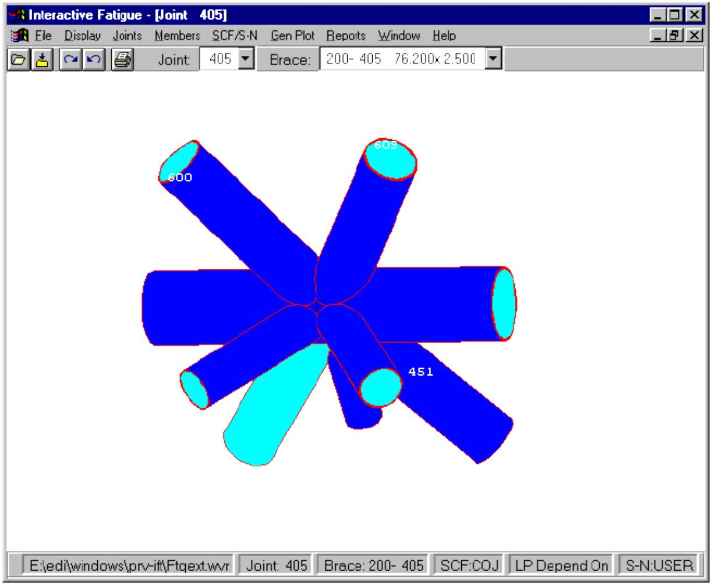

## 2.2 FATIGUE CONNECTION COORDINATE SYSTEM

For each SACS load case making up the fatigue environment, fatigue results are evaluated at eight points spaced at 45 degrees around the perimeter of the welded connection on both the chord and brace side, see Figure 1 below:

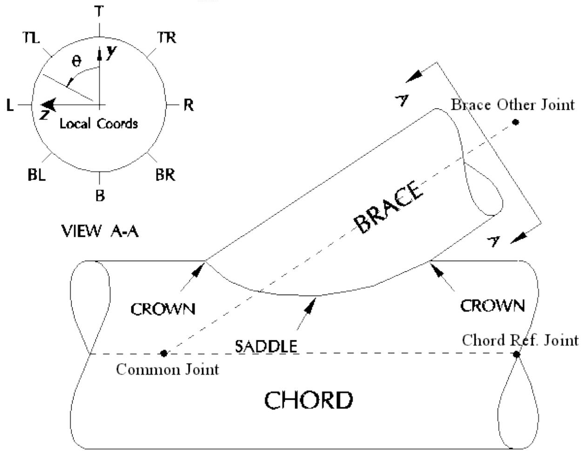  
Figure 1

Note: The top of the connection is at the intersection of the brace/chord plane opposite of the chord reference joint. The Bottom position is therefore always at the intersection of thebrace/chord plane on the side nearest to the chord reference joint.

## 2.3 EXISTING THE INTERACTIVE FATIGUE SESSION

Select the File/Exit menu option to exit the Interactive Fatigue session. If any plots or reports that have been generated to a file have not been saved, the user is prompted whether or not to save the file.

3 FILE MENU FEATURES

The following section details the commands found under the File main menu.

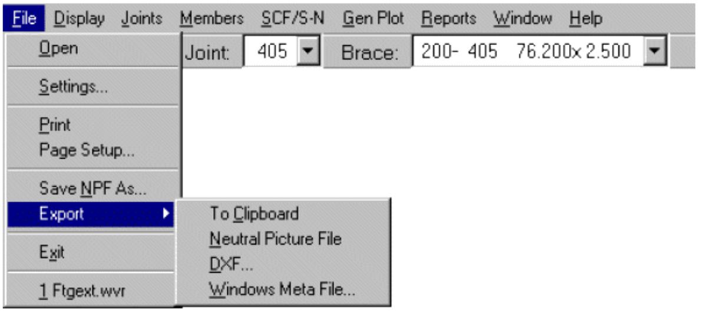

## 3.1 OPEN

Open is used to import an existing Fatigue extract file into Interactive Fatigue.

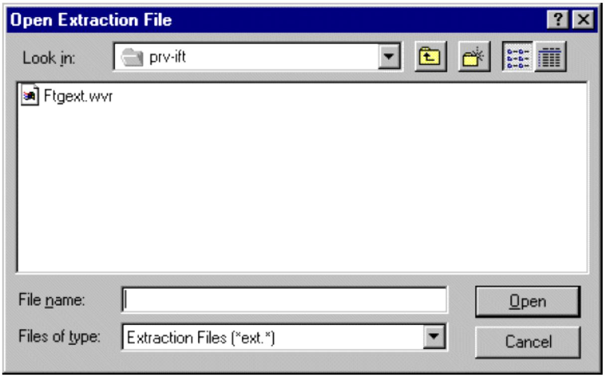

## 3.2 SETTINGS

Settings allows the display colors to be specified for the background and text of the joint images and the graphs, and also the coloring of the inner and outer surfaces of the braces, the selected brace color, and the border color around the joint outline.

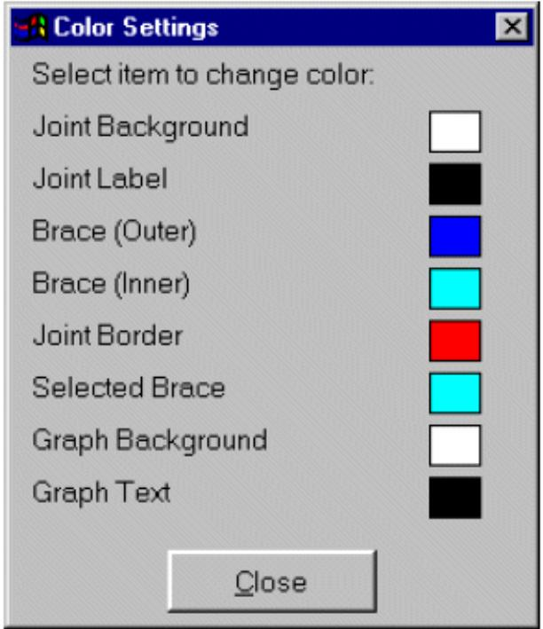

Note: Modifications to the program settings affect only the current Interactive Fatigue session and are not saved to the configuration file.

## 3.3 PRINT

The Print option is used to print the current plot display.

## 3.4 PAGE SETUP

The Page Setup dialog provides for margin, border and color plot settings.

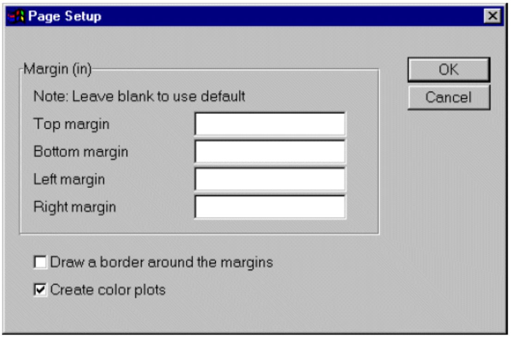

## 3.5 SAVE NPF

The Save NPF option is used to save plots that are generated to a neutral picture file.

## 3.6 EXPORT

The Export option allows the choice of exporting the plot information in a variety of formats.

3.6.1 To Clipboard

This copies the current plot to the Windows clipboard to allow pasting into other Windows applications.

3.6.2 Neutral Picture File

The Neutral Picture File format is a SACS specific plot format that can be read by the Prevue program.

3.6.3 DXF

The Data eXchange Format (DXF) format is widely supported by CAD and other graphics programs.

3.6.4 Windows Meta File

The Windows Meta File (WMF) format is supported by many Windows graphics and word-processing programs.

## 3.7 EXIT

The Exit command terminates the Interactive Fatigue session.

4 DISPLAY MENU FEATURES

The Display Menu features allow the user to specify or select display options including joint 3D view, joint plane view, rotation, fill, and labeling.

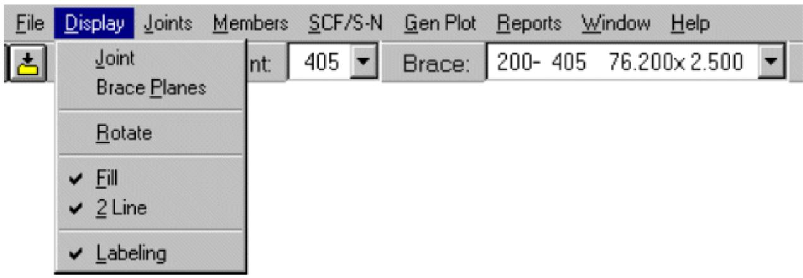

## 4.1 JOINT

The Joint command displays the 3D view of the currently selected joint.

## 4.2 BRACE PLANES

The Brace Planes selection shows the various joint planes formed by the chord and braces of the selected joint.

## 4.3 ROTATE

Rotate allows rotation of the 3D joint view about the major axes by the specified angle in degrees.

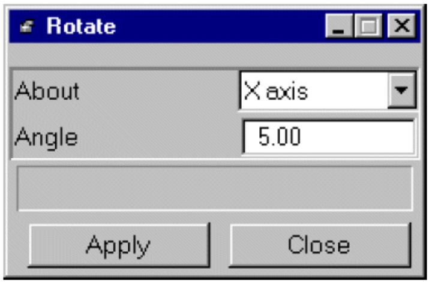

## 4.4 FILL

Fill toggles polygon filling in the 3D joint and brace plane views.

## 4.5 ‘2 LINE’

The 2 Line option toggles between single line and double line display of the joint.

## 4.6 LABELING

Selecting the Labeling command toggles the joint label of braces on and off. The joint label represents the joint name of the end of the brace not connected to the selected joint.

5 JOINTS MENU FEATURES

The Joints Menu features allow the user to designate the current joint and show fatigue life results.

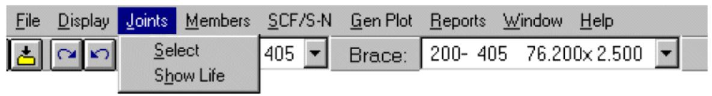

## 5.1 SELECT

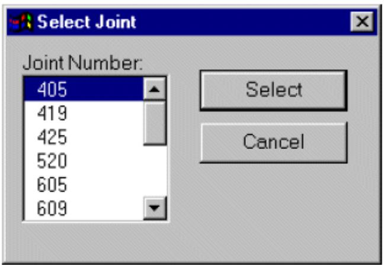

Select brings up a list of the available joints in the extract file from which to select the current joint.

Upon selecting a joint, the first brace in the brace list is selected as the active brace. The SCF, S-N and load dependancy settings are set to the original fatigue batch analysis settings specified on the FTOPT line.

## 5.2 SHOW LIFE

The Show Life command displays the fatigue life or service life results for the currently selected joint and brace based on the current SCF, S-N and load path dependancy settings.

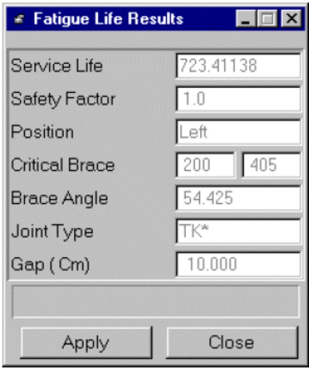

6 MEMBERS MENU FEATURES

The Members Menu features allow the user to designate the current or active brace and to view or modify chord and brace properties.

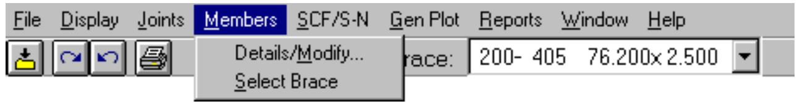

## 6.1 DETAILS/MODIFY

The Details/Modify command displays property information for the chord and the current or active brace member.

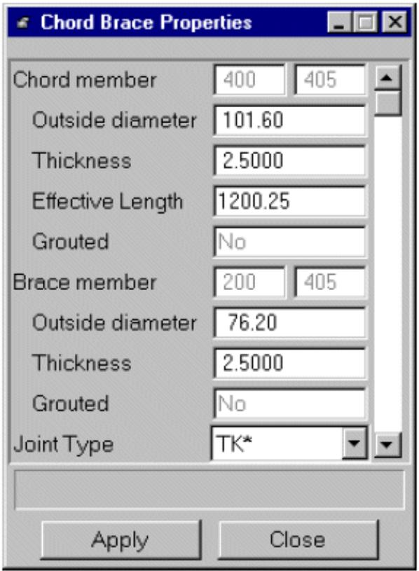

## 6.2 SELECT BRACE

The Select Brace option displays a list of braces connected to the active joint from which the user may designate as the active brace member.

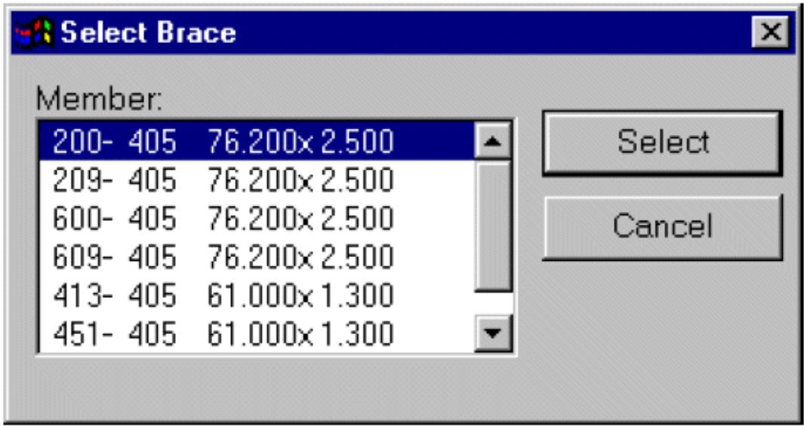

7 SCF/S-N MENU FEATURES

The SCF/S-N menu features allow the user to display and/or modify the current Stress Concentration Factors theory, S-N curve and load path dependancy settings.

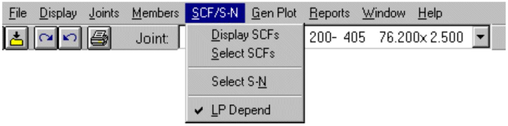

## 7.1 DISPLAY SCFS

The Display SCFs command displays the Stress Concentration Factors for the chord and the active brace.

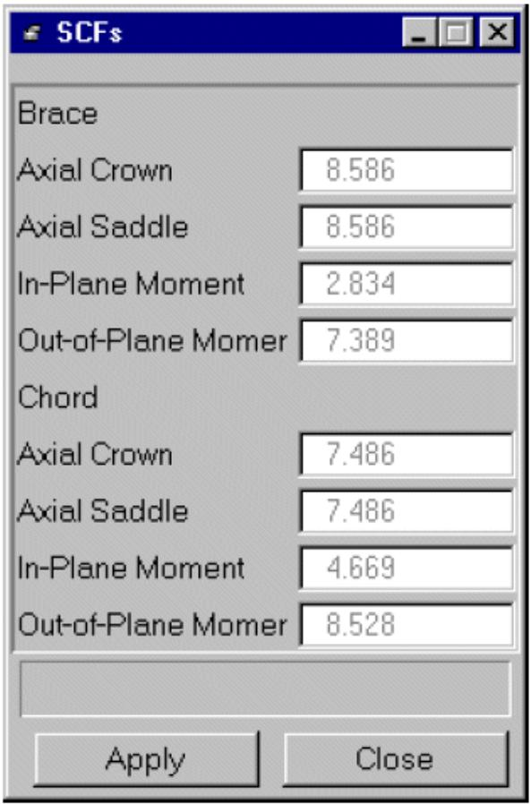

## 7.2 SELECT SCFS

The Select SCFs option allows designation of the current SCF theory for which to calculate chord and brace SCFs.

Select the desired SCF theory from the list of available SCF methods.

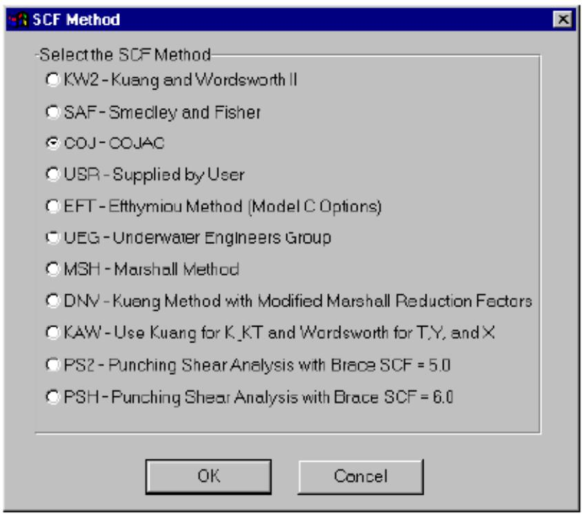

## 7.3 SELECT S-N

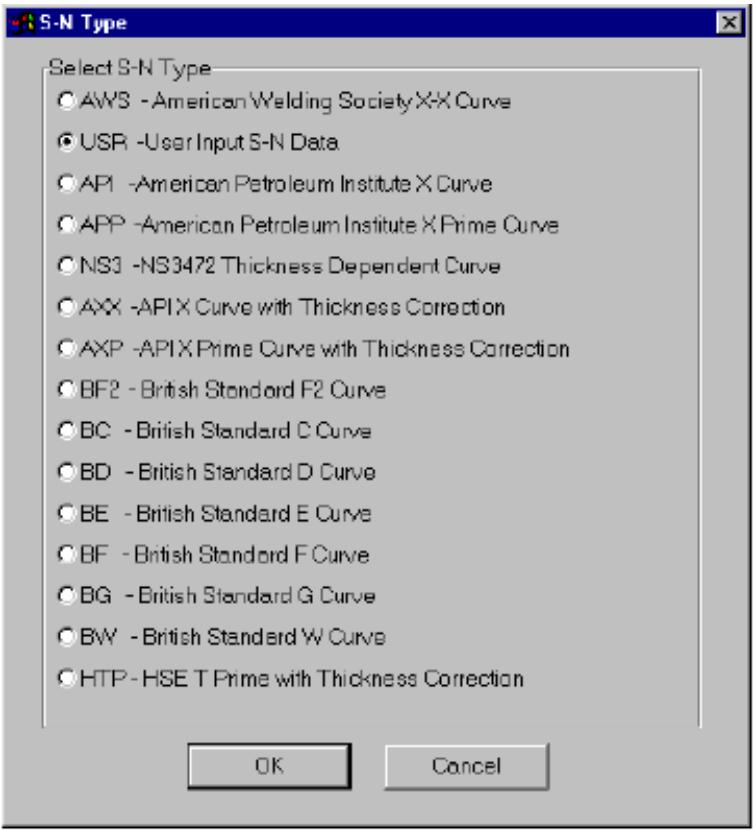

The Select S-N command allows for the designation of the S-N curve to be used when determining the allowable number of stress range cycles.

To specify the current S-N curve, select the radio button next to the S-N option desired.

## 7.4 LP DEPEND

The LP Depend command is a toggle that designates whether or not SCFs are to be calculated based on load path.

Note: The current load path dependance setting is displayed on the status bar.

8 GEN PLOT MENU FEATURES

The Gen Plot menu features allow the user to generate various plots and graphs for display on the screen or to save in a plot file.

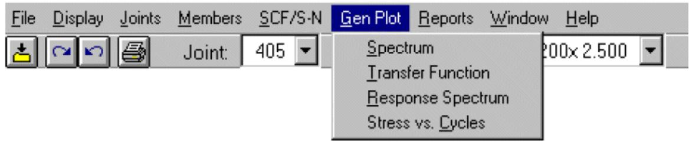

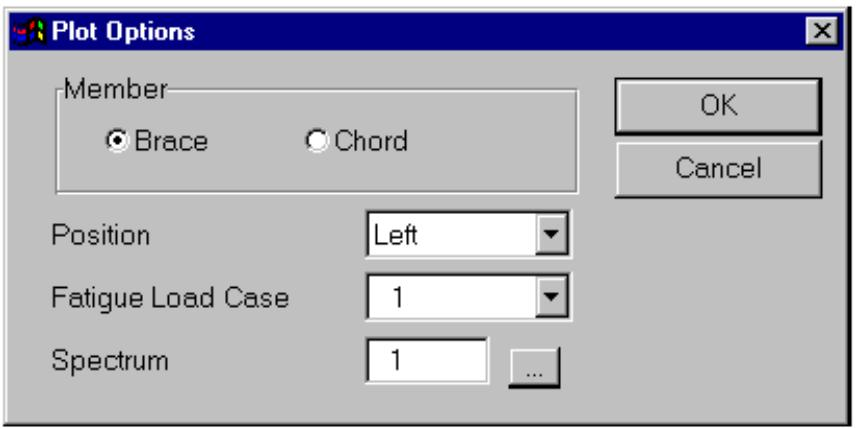

Upon selection of any of the plot commands, the Plot Options dialog is displayed. Select the desired plot options including the element to be plotted, i.e. chord or brace, and position around the circumference. The desired Fatigue load case and if applicable the desired wave spectrum may be designated.

Note: Plots are generated and displayed on the screen by default. To save the currently displayed plot to a file, select the File/Plot command.

## 8.1 SPECTRUM

The Spectrum plot command plots the wave spectrum designated on the Plot Options dialog. The Member and Position plot options are not applicable to this feature.

## 8.2 TRANSFER FUNCTION

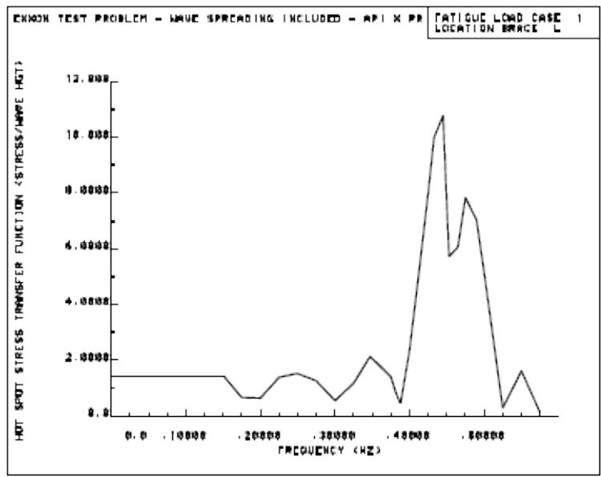

Select the Transfer Function command to plot the cyclic hot-spot stress transfer function of the chord or brace position designated and for the particular Fatigue Load Case (wave direction) specified on the Plot Options dialog.

## 8.3 RESPONSE SPECTRUM

Select the Response Spectrum command to plot the response spectrum of the chord or brace position designated. The applicable Fatigue Load Case and Wave spectrum are designated on the Plot Options dialog.

## 8.4 STRESS VS. CYCLES

The Stress vs. Cycles command creates a bar graph showing stress range and number of cycles plotted against the S-N allowable curve. The chord or brace position along with the applicable fatigue load case must be designated on the Plot Options dialog.

The Stress vs. Cycles plot is generated as follows:

For a point on the connection, the maximum cyclic stress is found considering all spectra for the direction in question. This maximum stress is then broken into 20 cyclic stress bands or categories. For each band, the total damage and number of cycles is summed. The report and plot shows the range and cycles for a band only if the band causes actual damage.

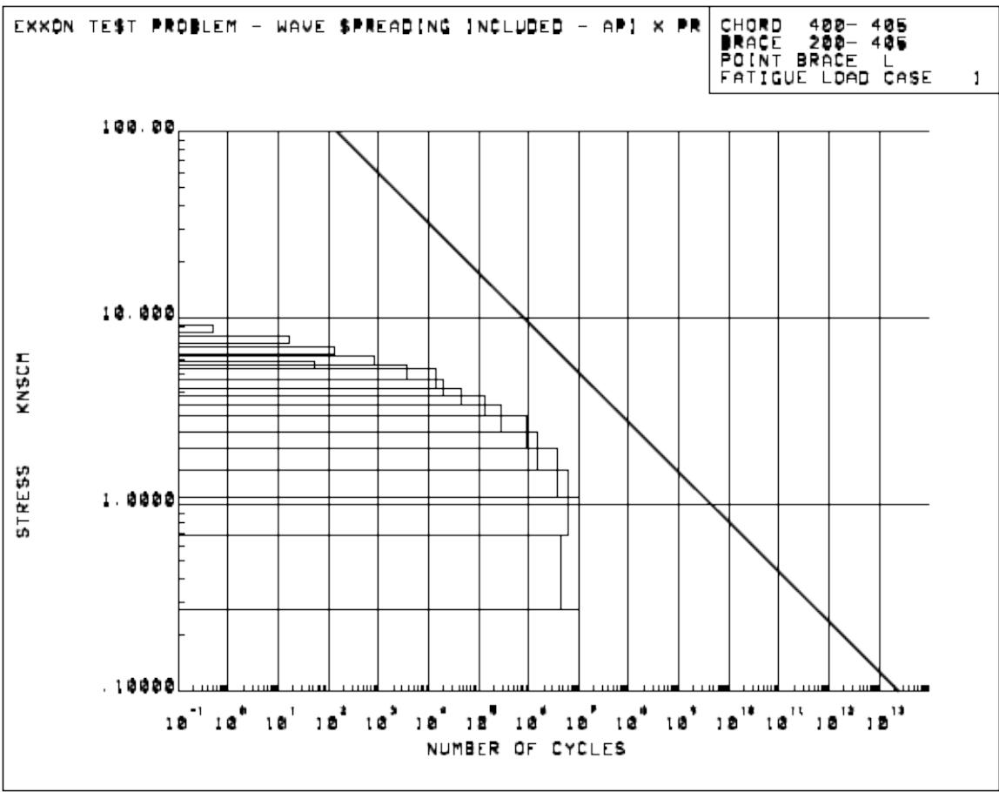

9 REPORTS MENU FEATURES

The Reports Menu features allow the user to generate various reports.

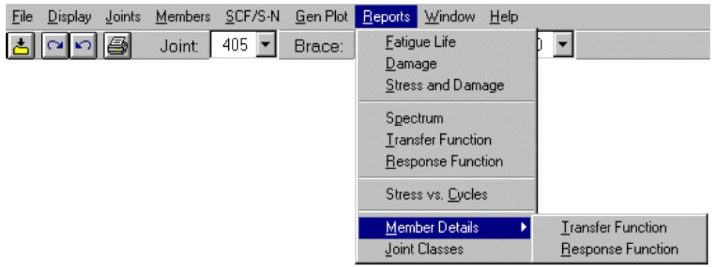

Reports may be displayed on the screen in the Report Browser and from there may be saved to a file.

## 9.1 FATIGUE LIFE

The Fatigue Life command creates a detailed report for the active joint and brace. The report contains basic properties of the chord and brace, fatigue life and the damage reported at each of the eight positions. The following is a sample Fatigue Life report:


| Fatigue Life results at Joint 101 Brace 101-203 Chord 101-201 | Fatigue Life results at Joint 101 Brace 101-203 Chord 101-201 | Fatigue Life results at Joint 101 Brace 101-203 Chord 101-201 | Fatigue Life results at Joint 101 Brace 101-203 Chord 101-201 | Fatigue Life results at Joint 101 Brace 101-203 Chord 101-201 | Fatigue Life results at Joint 101 Brace 101-203 Chord 101-201 | Fatigue Life results at Joint 101 Brace 101-203 Chord 101-201 | Fatigue Life results at Joint 101 Brace 101-203 Chord 101-201 |
| --- | --- | --- | --- | --- | --- | --- | --- |
| Fatigue Life (years) | 796.385 | SCF Method | EFthymiou Method | EFthymiou Method | EFthymiou Method | EFthymiou Method | EFthymiou Method |
| Design Life (years) | 20.000 | Life Safety Fact | 2.000 | 2.000 | 2.000 | 2.000 | 2.000 |
| Maximum Damage | 0.025 | Location | Bottom | Bottom | Bottom | Bottom | Bottom |
| Brace-Chord Angle (deg) | 30.913 | Connection Type | K | Gap (Cm) | 14.003 | 14.003 | 14.003 |
| *** Brace and Chord Properties *** | *** Brace and Chord Properties *** | *** Brace and Chord Properties *** | *** Brace and Chord Properties *** | *** Brace and Chord Properties *** | *** Brace and Chord Properties *** | *** Brace and Chord Properties *** | *** Brace and Chord Properties *** |
| Member | Chord Brace | Diameter (Cm) | Thick (Cm) | *** Stress Concentration Factors *** | *** Stress Concentration Factors *** | *** Stress Concentration Factors *** | *** Stress Concentration Factors *** |
| Member | Chord Brace | Diameter (Cm) | Thick (Cm) | Ax-Crn | Ax-Sdl | IP-Mom | OP-Mom |
| 101-201 | Chord | 105.000 | 3.500 | 4.204 | 2.919 | 1.151 | 1.495 |
| 101-203 | Brace | 50.000 | 2.000 | 3.933 | 2.265 | 2.800 | 1.399 |
| *** Damage and Fatigue Life Details *** | *** Damage and Fatigue Life Details *** | *** Damage and Fatigue Life Details *** | *** Damage and Fatigue Life Details *** | *** Damage and Fatigue Life Details *** | *** Damage and Fatigue Life Details *** | *** Damage and Fatigue Life Details *** | *** Damage and Fatigue Life Details *** |
| Position | Position | **** CHORD Damage | **** Life | **** BRACE Damage | **** Life | **** Life | **** Life |
| Top | Top | .023662 | 845.236 | .013024 | 1535.67 | 1535.67 | 1535.67 |
| Top Left | Top Left | .7728-2 | 2588.11 | .2266-2 | 8827.50 | 8827.50 | 8827.50 |
| Left | Left | .5764-3 | 34700.5 | .1230-4 | 1626.+3 | 1626.+3 | 1626.+3 |
| Bottom Left | Bottom Left | .7998-2 | 2500.55 | .3062-2 | 6530.88 | 6530.88 | 6530.88 |
| Bottom | Bottom | .025113 | 796.385 | .019896 | 1005.23 | 1005.23 | 1005.23 |
| Bottom Right | Bottom Right | .7791-2 | 2567.04 | .2965-2 | 6745.00 | 6745.00 | 6745.00 |
| Right | Right | .5730-3 | 34902.6 | .1328-4 | 1506.+3 | 1506.+3 | 1506.+3 |
| Top Right | Top Right | .7542-2 | 2651.88 | .2652-2 | 7540.43 | 7540.43 | 7540.43 |
| Maximum | Maximum | .025113 | 796.385 | .019896 | 1005.23 | 1005.23 | 1005.23 |


## 9.2 DAMAGE

The Damage report command generates a detailed report showing damage at each of the eight positions around the circumference of the connection caused by each wave spectrum.


| Fatigue Damage Details at Joint 101Chord 101-201 Brace 101-203 | Fatigue Damage Details at Joint 101Chord 101-201 Brace 101-203 | Fatigue Damage Details at Joint 101Chord 101-201 Brace 101-203 | Fatigue Damage Details at Joint 101Chord 101-201 Brace 101-203 | Fatigue Damage Details at Joint 101Chord 101-201 Brace 101-203 | Fatigue Damage Details at Joint 101Chord 101-201 Brace 101-203 | Fatigue Damage Details at Joint 101Chord 101-201 Brace 101-203 | Fatigue Damage Details at Joint 101Chord 101-201 Brace 101-203 | Fatigue Damage Details at Joint 101Chord 101-201 Brace 101-203 | Fatigue Damage Details at Joint 101Chord 101-201 Brace 101-203 | Fatigue Damage Details at Joint 101Chord 101-201 Brace 101-203 |
| --- | --- | --- | --- | --- | --- | --- | --- | --- | --- | --- |
| Ftg LC | Spect No. | Chord Brace | Top | Left | Bottom Left | Bottom Right | Bottom Right | Top Right |  |  |
| 1 | 1 | C .0000000 | .0000000 | .0000000 | .0000000 | .0000000 | .0000000 | .0000000 | .0000000 |  |
|  |  | B .0000000 | .0000000 | .0000000 | .0000000 | .0000000 | .0000000 | .0000000 | .0000000 |  |
| 1 | 2 | C .19072-4 | .14068-5 | .0000000 | .11842-5 | .15504-4 | .12271-5 | .0000000 | .14561-5 |  |
|  |  | B .17551-4 | .0000000 | .0000000 | .0000000 | .14194-5 | .0000000 | .0000000 | .0000000 |  |
| 2 | 1 | C .0000000 | .0000000 | .0000000 | .0000000 | .0000000 | .0000000 | .0000000 | .0000000 |  |
|  |  | B .0000000 | .0000000 |  | .0000000 | .0000000 | .0000000 | .0000000 | .0000000 |  |


## 9.3 STRESS AND DAMAGE

The Stress and Damage reports shows RMS stress and Damage at each chord and brace position around the circumference of the connection for each of the wave spectra in the Fatigue Load case specified by the user.


| Fatigue RMS Stress and Damage at Joint 101Chord 101-201 Brace 101-203 | Fatigue RMS Stress and Damage at Joint 101Chord 101-201 Brace 101-203 | Fatigue RMS Stress and Damage at Joint 101Chord 101-201 Brace 101-203 | Fatigue RMS Stress and Damage at Joint 101Chord 101-201 Brace 101-203 | Fatigue RMS Stress and Damage at Joint 101Chord 101-201 Brace 101-203 | Fatigue RMS Stress and Damage at Joint 101Chord 101-201 Brace 101-203 |
| --- | --- | --- | --- | --- | --- |
| Fatigue Load Case | Spectrum Number | Position | Chord Brace | RMS Stress (KG/CM2) | Damage |
| 1 | 1 | Bottom | Brace | 0.234624 | .14194-5 |
| 1 | 1 | Bottom Left | Brace | 0.190174 | .0000000 |
| 1 | 1 | Left | Brace | 0.138432 | .0000000 |
| 1 | 1 | Top Left | Brace | 0.219104 | .0000000 |
| 1 | 1 | Top | Brace | 0.275573 | .17551-4 |
| 1 | 1 | Top Right | Brace | 0.221414 | .0000000 |
| 1 | 1 | Right | Brace | 0.141655 | .0000000 |
| 1 | 1 | Bottom Right | Brace | 0.192416 | .0000000 |
| 1 | 1 | Bottom | Chord | 0.263619 | .15504-4 |
| 1 | 1 | Bottom Left | Chord | 0.224893 | .11842-5 |
| 1 | 1 | Left | Chord | 0.181843 | .0000000 |
| 1 | 1 | Top Left | Chord | 0.236798 | .14068-5 |
| 1 | 1 | Top | Chord | 0.280472 | .19072-4 |
| 1 | 1 | Top Right | Chord | 0.239245 | .14561-5 |
| 1 | 1 | Right | Chord | 0.185285 | .0000000 |
| 1 | 1 | Bottom Right | Chord | 0.227313 | .12271-5 |
| 1 | 2 | Bottom | Brace | 0.291327 | .16509-2 |
| 1 | 2 | Bottom Left | Brace | 0.237372 | .32396-4 |
| 1 | 2 | Left | Brace | 0.163807 | .0000000 |
| 1 | 2 | Top Left | Brace | 0.237601 | .33213-4 |
| 1 | 2 | Top | Brace | 0.291674 | .16994-2 |
| 1 | 2 | Top Right | Brace | 0.233524 | .31164-4 |
| 1 | 2 | Right | Brace | 0.158029 | .0000000 |
| 1 | 2 | Bottom Right | Brace | 0.233282 | .30377-4 |
| 1 | 2 | Bottom | Chord | 0.311029 | .21247-2 |
| 1 | 2 | Bottom Left | Chord | 0.267762 | .36991-3 |
| 1 | 2 | Left | Chord | 0.213636 | .0000000 |
| 1 | 2 | Top Left | Chord | 0.267857 | .37329-3 |
| 1 | 2 | Top | Chord | 0.311171 | .21485-2 |
| 1 | 2 | Top Right | Chord | 0.263496 | .35137-3 |
| 1 | 2 | Right | Chord | 0.207463 | .0000000 |
| 1 | 2 | Bottom Right | Chord | 0.263396 | .34811-3 |


## 9.4 SPECTRUM

The Spectrum report shows the points of the wave spectrum selected by the user in tabular format.

## 9.5 TRANSFER FUNCTION

The Transfer Function report shows the points of the transfer function for the selected point on the chord or brace. The chord or brace position along with the Fatigue load case are specified on the Report Options dialog.

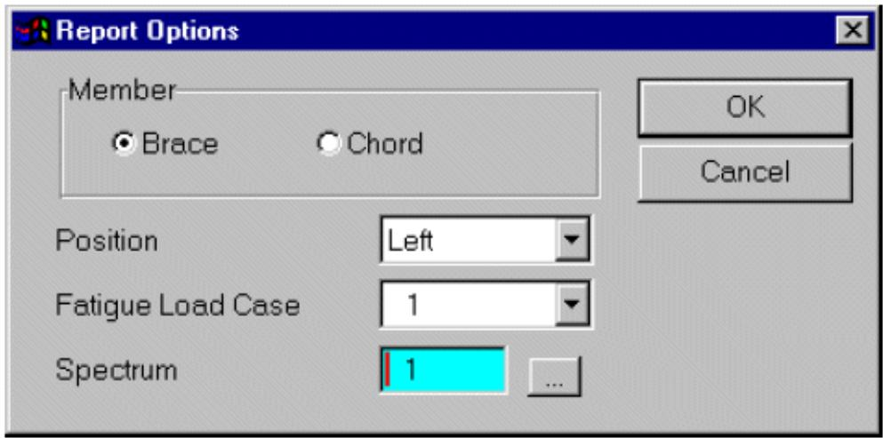

Note: Designation of the wave spectrum is not required for the transfer function report.

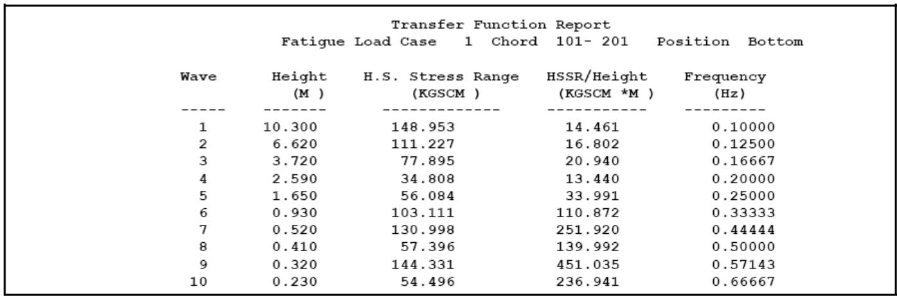

## 9.6 RESPONSE FUNCTION

The Response Function report shows the points of the response function for the selected point on the chord or brace for the specified wave spectrum. The chord or brace position along with the Fatigue load case and the appropriate wave spectrum are specified on the Report Options dialog.

## 9.7 STRESS VS. CYCLES


| Stress Range vs. Cycle Report | Stress Range vs. Cycle Report | Stress Range vs. Cycle Report | Stress Range vs. Cycle Report |
| --- | --- | --- | --- |
| Fatigue Load Case 1 | Chord 101-201 | Position |  |
| Bottom |  |  |  |
| Range | Stress Range (KGSCM) | Cycles |  |
| Number |  |  |  |
| 9 | 257.1 |  |  |
| 1515367 |  |  |  |
| 10 | 288.7 | 481573 |  |
| 11 | 314.7 | 231189 |  |
| 12 | 347.3 | 143603 |  |
| 13 | 354.6 | 17075 |  |
| 14 | 396.2 | 39501 |  |
| 15 | 423.9 | 6830 |  |
| 16 | 453.8 | 3096 |  |
| 17 | 486.9 | 1536 |  |
| 19 | 552.7 | 153 |  |


The Stress vs. Cycles report contains hot-spot stress ranges and number of cycles for the selected point on the chord or brace. The chord or brace position along with the Fatigue load case are specified on the Report Options dialog.

## 9.8 MEMBER DETAILS

Member detail reports contain detailed information for the chord or brace member specified.

9.8.1 Transfer Function

The transfer function detail report contains axial load and bending moment normalized by wave height. The report also contains real and imaginary roots.


| Transfer Function Detail Report | Transfer Function Detail Report | Transfer Function Detail Report | Transfer Function Detail Report | Transfer Function Detail Report | Transfer Function Detail Report | Transfer Function Detail Report | Transfer Function Detail Report | Transfer Function Detail Report | Transfer Function Detail Report |
| --- | --- | --- | --- | --- | --- | --- | --- | --- | --- |
|  |  |  | Member 101-203 Fatigue Load Case 1 Member End 101 | Member 101-203 Fatigue Load Case 1 Member End 101 | Member 101-203 Fatigue Load Case 1 Member End 101 | Member 101-203 Fatigue Load Case 1 Member End 101 | Member 101-203 Fatigue Load Case 1 Member End 101 | Member 101-203 Fatigue Load Case 1 Member End 101 | Member 101-203 Fatigue Load Case 1 Member End 101 |
| Wave | Wave | AXIAL/ | OP-MOM/ | IP-MOM/ | ** AXIAL | LOAD ** | OUT-PLANE | MOMENT |  |
| IN-PLANE | MOMENT |  |  |  |  |  |  |  |  |
| Height | Freq | HEIGHT | HEIGHT | HEIGHT | REAL | IMAG | REAL | IMAG | REAL |
| IMAG |  |  |  |  |  |  |  |  |  |
| M | Hz | KG/M | CM-KG/M | CM-KG/M | KG/M | CM-KG/M | CM-KG/M | KG/M | CM-KG/M |
| CM-KG/M |  |  |  |  |  |  |  |  |  |
| -10.300 | 0.1000 | 10493.836 | 4479.517 | 27358.572 | 4930.489 | 1794.555 | -2104.684 | 766.043 | 13679.286 |
| 0.000 |  |  |  |  |  |  |  |  |  |
| 6.620 | 0.1250 | 7616.267 | 3063.282 | 6784.224 | 2917.198 | 2447.823 | -1439.272 | 523.853 | 2598.509 |
| 2180.407 |  |  |  |  |  |  |  |  |  |
| 3.720 | 0.1667 | 5160.029 | 1618.978 | 4113.219 | 1290.006 | 2234.359 | -809.489 | 0.000 | -357.126 |
| -2025.365 |  |  |  |  |  |  |  |  |  |
| 2.590 | 0.2000 | 2264.610 | 692.326 | 5409.069 | -196.623 | 1115.103 | -265.176 | -222.509 | -2071.793 |
| -1738.442 |  |  |  |  |  |  |  |  |  |
| 1.650 | 0.2500 | 3707.031 | 1250.661 | 6416.890 | 321.860 | -1825.356 | -587.618 | -213.876 | -2457.811 |
| 2062.349 |  |  |  |  |  |  |  |  |  |
| 0.930 | 0.3333 | 6762.750 | 961.059 | 8217.207 | -1690.687 | -2928.357 | 240.265 | -416.151 | 2054.302 |
| 3558.155 |  |  |  |  |  |  |  |  |  |
| 0.230 | 0.6667 | 3710.316 | 3956.768 | 6981.548 | 1743.278 | 634.501 | 343.543 | -1948.328 | -3280.254 |
| -1193.916 |  |  |  |  |  |  |  |  |  |


9.8.2 Response Function

The response function detail report contains axial load and bending moment RMS stresses and zero crossing period.


| Response Function Detail Report Member 101-203 Fatigue Load Case 1 Spectrum 1 | Response Function Detail Report Member 101-203 Fatigue Load Case 1 Spectrum 1 | Response Function Detail Report Member 101-203 Fatigue Load Case 1 Spectrum 1 | Response Function Detail Report Member 101-203 Fatigue Load Case 1 Spectrum 1 | Response Function Detail Report Member 101-203 Fatigue Load Case 1 Spectrum 1 | Response Function Detail Report Member 101-203 Fatigue Load Case 1 Spectrum 1 |
| --- | --- | --- | --- | --- | --- |
| **** Axial RMS (KG) | Load **** Zero Cross (sec) | ** Out-Plane RMS (CM-KG) | Moment ** Zero Cross (sec) | *** In-Plane RMS (CM-KG) | Moment ** Zero Cross (sec) |
| 466.213 | 1.714 | 400.529 | 451.840 | 1.695 | 1.665 |
|  | FREQUENCY HZ | AXIAL LOAD KG **2/HZ | MOMENT OUT-PLANE CM-KG **2/HZ | MOMENT IN-PLANE CM-KG **2/HZ |  |
|  | 0.3611 | 65.110 | 2.728 | 76.051 |  |
|  | 0.3750 | 440.079 | 23.890 | 457.900 |  |
|  | 0.3889 | 2118.480 | 142.698 | 1965.001 |  |
|  | 0.4028 | 7768.175 | 628.675 | 6426.693 |  |
|  | 0.4167 | 22861.861 | 2168.366 | 16875.625 |  |
|  | 0.4306 | 56261.289 | 6131.685 | 37060.078 |  |
|  | 0.4444 | 119589.320 | 14739.152 | 70295.234 |  |


## 9.9 JOINT CLASSES


| Joint Classification Report for Joint 101 | Joint Classification Report for Joint 101 | Joint Classification Report for Joint 101 | Joint Classification Report for Joint 101 | Joint Classification Report for Joint 101 |
| --- | --- | --- | --- | --- |
| LOAD CASE | ********** | JOINT | TYPE | ********** |
| LOAD CASE | TY | X | KT | K1 |
| 1 | 0.891 | 0.000 | 0.000 | 0.109 |
| 2 | 0.895 | 0.000 | 0.000 | 0.105 |
| 3 | 0.906 | 0.000 | 0.000 | 0.094 |
| 4 | 0.568 | 0.000 | 0.000 | 0.432 |
| 5 | 0.864 | 0.000 | 0.000 | 0.136 |
| 6 | 0.879 | 0.000 | 0.000 | 0.121 |
| 7 | 0.882 | 0.000 | 0.000 | 0.118 |
| 8 | 0.884 | 0.000 | 0.000 | 0.116 |


The Joint Class report shows the fraction of the joint types applicable when determining SCFs for each load case used to develop the transfer function.

10 WINDOW MENU FEATURES

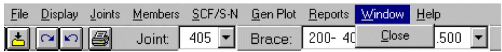

## 10.1CLOSE

Close closes the current window.

11 HELP MENU FEATURES

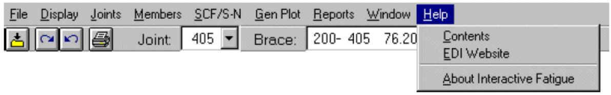

## 11.1CONTENTS

Contents brings up the Interactive Fatigue help file.

## 11.2EDI WEBSITE

Goes to the Engineering Dynamics Inc. website (requires Internet connection).

## 11.3ABOUT INTERACTIVE FATIGUE

About shows details of the version information for Interactive Fatigue and the copyright information.

12 Damage accumulation MENU FEATURES

This menu is only applicable when using a fatigue extract summation file. This file is auto generated by adding the extract line to the partial fatigue input file used in sacs wind turbine and GHBladed processes. Refer to Wind Turbine manual section 2 and 3 for details. User can create this file manually to sum up damages from different fatigue runs. It should be noted that in order to use this option all joint should be extracted by entering ‘AL’ in columns 14-15 of EXTRACT HEAD line.

The Fatigue Extract summation files as shown below contains the following information:


| SUMFTGIFT: Flag indicating a summation extract file |
| --- |
| NCASES: Defines the number of simulation for analysis cases. |
| NGRPS: Defines the number of groups for analysis cases. |
| DIRECTORY: Directory location for fatigue extract file for a fatigue simulation |
| EXTRACT: Name of the extract file generated from above run |
| GROUP: Defines the group above run belongs to |
| Repeat the above (Directory to Group) for other simulations (total equals NCASES) |
| JOINTS: Defines the number of joints to be viewed in interactive fatigue (since not all joints need to be viewed) |
| Repeat all joint ID's desired (total equals JOINTS). |


The example below shows a typical fatigue extract summation file for three simulations with 497 joints chosen to view.

```csv
SUMFTGIFT  
NCASES,3  
NGRPS,2  
DIRECTORY,"D:\Bentley\000Sample\1"  
EXTRACT,"ftgext.dat"  
GROUP,1  
DIRECTORY,"D:\Bentley\000Sample\2"  
EXTRACT,"ftgext.dat"  
GROUP,2  
DIRECTORY,"D:\Bentley\000Sample\3"  
EXTRACT,"ftgext.dat"  
GROUP,2  
JOINTS,497  
1  
3  
5  
7  
24  
71  
73  
75  
77 
```

The following menu option is specifically used for such fatigue extract summation file:

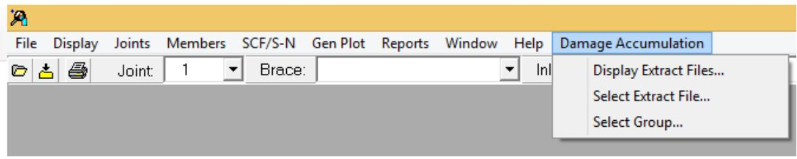

## 12.1DISPLAY EXTRACT FILES

Contents brings up the list of extract file associated with this summation run.

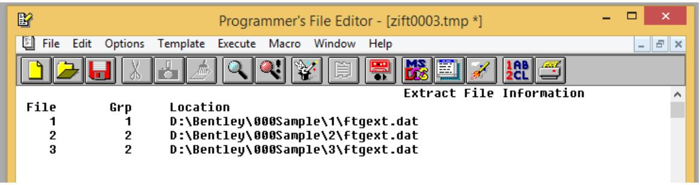

## 12.2Select Extract File

Brings up a dialog box to select which extract file to use to view results. By default results for the $1^{ \mathbf{ s t } }$ file listed in the fatigue extract summation file are displayed.

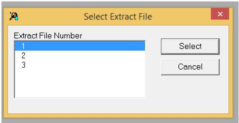

## 12.3Select group

Brings up a dialog box to select which files should be summed up when displaying results. The options are different groups used in fatigue extract summation file or ALL.

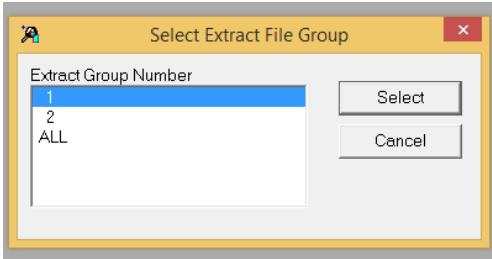