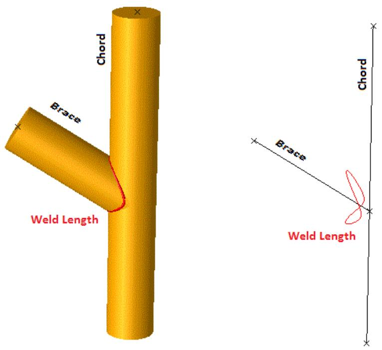
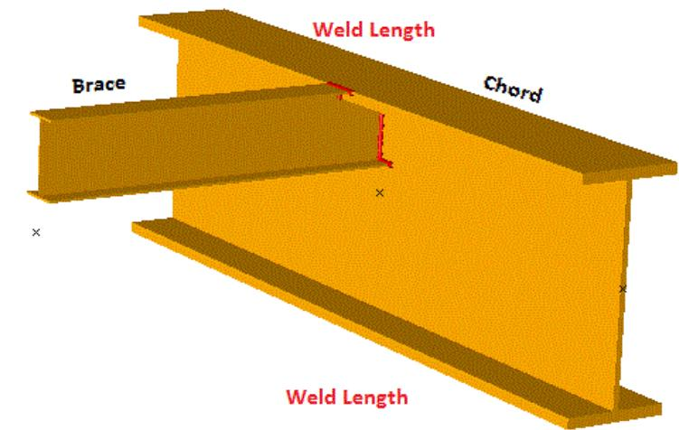
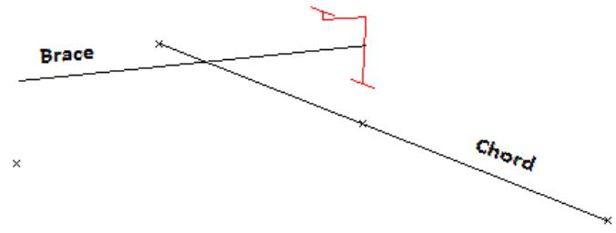
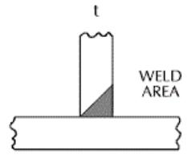
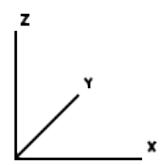
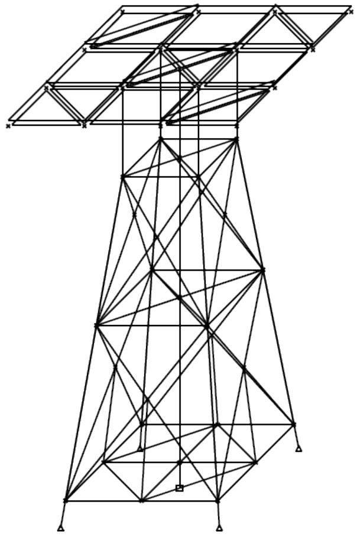

SACS

Material Take-OFF

Version 24.00

Trademark Notice

Bentley and the "B" Bentley logo are either registered or unregistered trademarks or service marks of Bentley Systems, Incorporated. All other marks are the property of their respective owners.

Copyright Notice

Copyright © 2024, Bentley Systems, Incorporated. All Rights Reserved.

TABLE OF CONTENTS

1 INTRODUCTION .. 4

## 1.1 OVERVIEW.. . 4
## 1.2 PROGRAM FEATURES.. 4

2 MTO INPUT DATA..

## 2.1 GENERAL PARAMETERS .. 5
## 2.2 MEMBER LENGTH OPTION.. . 5
## 2.3 REPORT LEVEL . 5
## 2.4 ELEMENT OVERRIDES. .. 6
## 2.5 COST OVERRIDE .. .. 6
## 2.6 ANODE SPECIFICATIONS . . 6

2.6.1 SACS Anode Method..   
2.6.2 Anode Material Cost ..   
2.6.3 NACE Appendix D / DNV Anode Method... . 8   
2.6.4 NACE Appendix E Anode Method . . 8

## 2.7 ANODE GROUP.. 9

## 2.8 WEIGHT CONTROL REPORT.. . 9

2.8.1 Weight Control Options .. .. 10   
2.8.2 Weight Control Disciplines.. .. 10   
2.8.3 Weight Control Items..... 11   
2.8.4 Weight Control Objects... 11   
2.8.5 Weight Control Configuration... 12

2.8.5.1 Defining a Configuration ..... .. 12   
2.8.5.2 Configuration Contents... .. 12

3 COMMENTARY . .13

## 3.1 CONNECTION GEOMETRY... .. 13
3.1.1 Brace to Chord Connection.... . 13

4 MISCELLANEOUS ... 15

## 4.1 Welds on Segmented Members ... .. 15
## 4.2 Plates.... ... 15
## 4.3 Anodes .... .. 15

5 ANODE CALCULATION.. .. 16

## 5.1 SACS Anode Method.. .. 16
## 5.2 NACE Appendix D / DNV Anode Method. ... 16
## 5.3 NACE Appendix E Anode Method.. .17

6 SAMPLE PROBLEMS.. .. 19

## 6.1 COST ANALYSIS.. ... 20
## 6.2 WEIGHT CONTROL REPORT.. .. 27

7 INPUT LINES.. .. 37

1 INTRODUCTION

## 1.1 OVERVIEW

The Material Takeoff or MTO program can determine the quantity, weight and cost of plate and member materials required to construct the structure as modeled. Weight control reports based on the structural model and loading can be produced. The program can determine the quantity and cost of unmodeled items such as anodes and weld material.

MTO can be coupled with the redesign capability of the SACS system to provide the designer with cost data for various structural configurations during the design process.

## 1.2 PROGRAM FEATURES

MTO is completely compatible with standard SACS input files and has the following capabilities:

1. Generates list of material by section type or group type.   
2. Calculates wetted surface area.   
3. Computes weld volumes.   
4. Calculates cathodic protection requirements.   
5. Performs cost analysis of the structural material, weld material, and the required anodes.   
6. Allows for cost overrides for member groups, plate groups, and yield strength.

The weight control feature includes the following capabilities:

1. Creates reports for various structure configurations defined by including or excluding element groups, individual elements, load cases, and disciplines.   
2. User defined disciplines, items, and objects.   
3. Can access external discipline/item library file.   
4. Configuration reports can be sub-divided by discipline and/or item and/or object.   
5. Reports weight and C.G. with and without weight contingency factors applied.

2 MTO INPUT DATA

The MTO program requires that program data and options be designated in an MTO input file. The following sections discuss the MTO input data.

## 2.1 GENERAL PARAMETERS

The Material Take Off program requires specification of some general parameters using the MTOPT line in the MTO input file.

Specify the vertical coordinate in columns 9-10. The water depth and mudline elevation are designated in columns 30-36 and 37-43, respectively. Enter the material density in columns 44-50. The following designates that +Z is the vertical coordinate, the water depth is 150.0, the mudline elevation is -150.0, the material density is 490, and piles are to be included


|  | 1 | 2 | 3 | 4 | 5 | 6 | 7 | 8 |
| --- | --- | --- | --- | --- | --- | --- | --- | --- |
|  | 12345678901 | 12345678901 | 12345678901 | 12345678901 | 12345678901 | 12345678901 | 12345678901 | 12345678901 |
| 1 | MTOPT | +Z | 0 SM | 150.0 | -150.0 | 490.0 | E | E |


## 2.2 MEMBER LENGTH OPTION

The actual member length (face to face length) instead of joint to joint length should be used for the purpose of material takeoff and cost estimates. The program has numerous methods available to calculate the member length to use.

One of the following procedures used to calculate the actual member length should be specified in column 13 of the MTOPT line.

1. Specify ‘0’, if a joint thickness specified on the member group line is to be used to calculate the length at each end of the member to be subtracted from the member modeled length.   
2. Specify ‘1’ if the joint thickness is to be determined by the MTO program based on the chord diameter. The total joint thickness is taken as the sum of the calculated thickness and the joint thickness specified on the member group line.   
3. The joint thickness at each end of the member is determined based on the chord diameter and subtracted from the member modeled length when ‘2’ is specified. Any joint thickness specified on the member group line is ignored.   
4. Specify ‘3’if the actual modeled member length is to be used. Use this option when the model contains the appropriate member offsets or eccentricities.

Note: The term ‘modeled member length’ refers to the length of the member as it is modeled in the SACS input file and includes the effects of any specified member offsets.

## 2.3 REPORT LEVEL

Select the output report level, either summary, full or diagnostic by specifying ‘SM’, ‘FL’ or ‘DG’, respectively, in columns 15-16 on the MTOPT line.

## 2.4 ELEMENT OVERRIDES

Elements groups can be excluded from all calculations by designating the member group on the MGPOVR line, or the plate groups on the PGPOVR line, or the pile group on the PILOVR line by specifying ‘X’ in column 7. Specific members and plates elements can also be excluded from all calculation by specifying 'X' in column 7 on the MBROVR, and PLAOVR line respectively. For example, member groups PL1 and PL2 representing the piles within the jacket legs are excluded, as well as member group W.B representing a wishbone group.

```txt
1 2 3 4 5 6 7 8 123456789012345678901234567890123456789012345678901234567890 1MGPOVRXPL1PL2W.B 
```

Member groups, Member elements, and Pile groups can also be overridden to include both the external and internal surface area used in anode calculations by specifying 'S' in column 7 of the MGPOVR, MBROVR, and PILOVR line. For example, member 1001-1002 represents a conductor bell guide.

```txt
1 2 3 4 5 6 7 8 123456789012345678901234567890123456789012345678901234567890 1 MBROVR S 1001 1002 
```

Plate groups and plate elements can be overridden to include surface area factors by specifying an area factor in column 63-68 of the PGPOVR line for plate groups and PLAOVR line for individual plate elements. For example, plate group PLT has a 2.0 surface area factor since it is exposed to seawater on both sides.

```txt
1 2 3 4 5 6 7 8 1 23456789012345678901234567890123456789012345678901234567890 1234567890123456789012345678901234567890 1234567890 1234567890 2.0 
```

## 2.5 COST OVERRIDE

The material cost specified on the MTOPT line can be overridden for specific elements or groups by using the MGPOVR line for member groups, the PGPOVR line for plate groups, the PILOVR line for pile groups, the MBROVR line for specific members, and the PLAOVR line for specific plates. Also member, plate, pile, and shell groups can have cost overrides based on yield stress with the CSTYLD line. All members, plates, pile, and shells having the same yield stress indicated on the CSTYLD line will have their cost overridden.

## 2.6 ANODE SPECIFICATIONS

The program can optionally determine the number of anodes required in addition to anode material costs based on NACE SP0173-2007 (formerly RP0176-2003) Appendix D and E, DNV-RP-B401, or by the SACS Anode Method.

Enter the anode calculation method on the ANOPT line column 7-8. Enter "SA" for SACS Anode Method, "ND" for NACE Appendix D / DNV, "NE" for NACE Appendix E, or "NB" for both NACE Appendix D / DNV and NACE Appendix E. The default is the SACS Anode Method.

Enter in the design life in column 10-15 to be used in NACE Appendix D / DNV anode calculation. Enter in the Typical design slope in column 17-22 to be used in NACE Appendix E anode calculation. .

Enter "0" in column 24 for a summary print of the Anode Requirement Report. The summary print will display the number of anodes calculated based on the surface area of all members, plates, shells, and piles. Enter "1" in column 24 for a full print of the Anode Requirement Report. The full print will display the number of anodes calculated based on the surface area of each member group, plate group, shell group, and pile group.

Enter the number of wells in columns 26-27 and the current drain per well in columns 29-35 to account for current load imposed by the well casings below the mudline.

An additional current drain can be specified in column 37-42 to take into account non modeled members that may become electrically connected to the cathodic protection system.

Enter "RD" in column 44-45 to round up the number of anodes calculated in the Anode Summary Report to the nearest whole number. For example if the number of anodes required is 100.1 or 100.9, the summary report will show 101 anodes required, and the total cost will be based on 101 anodes.

The following shows the anode calculation method based on both NACE Appendix D / DNV and NACE Appendix E.

```txt
1 2 3 4 5 6 7 8 1 234567890123456789012345678901234567890123456789012345678901234567890 1 ANOPT NB 40.0 44.0 1 5 3.0 RD 
```

2.6.1 SACS Anode Method

In order to use the SACS Anode Method to calculate the number of required anodes, a "SA" needs to be enter in column 7-8 of the ANOPT line or left blank. Cathodic protection data is designated versus water depth. For each water depth specified in columns 12-20, the user should specify the amount of material required per unit surface area to provide protection throughout the life of the structure in columns 21- 30. The anode size being used should be specified in columns 31-40 on the first depth entered.

The following designates that at depth 10 through 100, 1000 lb/ft2 of anode material is required. The size of the anodes are 725 lb.

```txt
1 2 3 4 5 6 7 8  
1234567890123456789012345678901234567890123456789012345678901234567890  
1 ANODE
2 ANODE 10.0 1000. 725.  
3 ANODE 100.0 1000. 
```

Note: The anode size is specified for the first depth only. Also note that depths must be input in order of increasing depth.

2.6.2 Anode Material Cost

If the cost of anode material is to be calculated, enter the material cost per unit weight in columns 41-50 on the ANODE line defining the first water depth.

```txt
1 2 3 4 5 6 7 8  
1234567890123456789012345678901234567890123456789012345678901234567890  
1 ANODE
2 ANODE 10.0 1000. 725. 100.0  
3 ANODE 100.0 1000. 
```

2.6.3 NACE Appendix D / DNV Anode Method

Enter "ND" in columns 7-8 of the ANOPT line to use the NACE Appendix D / DNV Anode Method. This method calculates the number of anodes required for three different stages of cathodic protection. The first stage, "Initial", is the number of anodes required to initially polarize the structure. The second stage, "Mean", is the number of anodes required to produce the appropriate number of amps of current over the design life of the structure. The third stage, "Final", is the number of anodes required to produce enough current to maintain protection at the end of the design life. The max number of anodes of the three stages should be the number of anodes used for cathodic protection.

Cathodic protection data is designated by levels specified on the ANLEV line. For each level, the user should specify in column 8-10 the anode group of the level and the distance from the water line for which the level applies. The top depth of the level is specified in column 12-18, and the bottom depth is specified in column 19-25. A negative depth indicates the level is above the water line.

For each level, the initial, mean, and final current density should be enter in column 27-33, 34-40, and 41-47 respectively. The user should specify the water resistivity in column 48-54. The water resistivity is a based on salinity/chlorinity and temperature.

Enter surface area factor for the level in column 55-61. The surface area factor can be used to reduce the demand for cathodic protection in zones where coating are used. Surface area factor should be used in conservative manner anticipating possible coating breakdown. The surface area factor can also be used as a safety factor to account for surface area of unmodeled elements.

The following designates an anode level for the splash zone (EL. +1 to EL. -15), an anode level from the bottom of splash zone to the mudline (EL. -15 to EL. -100), and an anode level below the mudline (EL. - 100 to EL. -250).


|  | 1 | 1 | 2 | 2 | 3 | 3 | 4 | 4 | 5 | 5 | 6 | 6 | 7 | 7 | 8 | 8 |
| --- | --- | --- | --- | --- | --- | --- | --- | --- | --- | --- | --- | --- | --- | --- | --- | --- |
|  | 123456789012 | 123456789012 | 123456789012 | 123456789012 | 123456789012 | 123456789012 | 123456789012 | 123456789012 | 123456789012 | 123456789012 | 123456789012 | 123456789012 | 123456789012 | 123456789012 | 12345678901 | 12345678901 |
| 1 | ANLEV | GR1 | -1.0 | 15.0 | 0.010 | 0.050 | 0.070 | 0.656 | 0.10 |  |  |  |  |  |  |  |
| 2 | ANLEV | GR1 | 15.0 | 100.0 | 0.010 | 0.050 | 0.070 | 0.656 | 1.00 |  |  |  |  |  |  |  |
| 3 | ANLEV | GR1 | 100.0 | 250.0 | 0.002 | 0.002 | 0.002 | 0.656 | 1.00 |  |  |  |  |  |  |  |


Note: Depths must be input in order of increasing depth.

2.6.4 NACE Appendix E Anode Method

Enter "NE" in in column 7-8 of the ANOPT line in order to use the NACE Appendix E Anode Method. This method calculates the number of anodes required based on the design slope and maintenance (mean) current density. This method is an alternative to NACE Appendix D / DNV.

Cathodic protection data is designated by levels specified on the ANLEV line. The input on the ANLEV line is similar to NACE Appendix D / DNV except that the initial and final current densities are not required.

Enter "NB" in column 7-8 of the ANOPT line in order to calculate the number of anodes by both NACE Appendix D / DNV and Nace Appendix E Anode Method. The anode cost will be based on the method which requires the most number of anodes.

## 2.7 ANODE GROUP

Anode information is entered on the AGRUP line. The size of the anode including the length, area, core radius, and weight are entered in column 12-17, 18-23, 24-29, and 30-35 respectively. The energy capability (current capacity) of the anode material is entered in column 36-41.

The net driving potential, which is the difference between the structure's design protective potential and the design closed circuit potential of the anode material, is entered in column 42-47.

Enter the utilization factor in column 48-53. The anode utilization factor is a fraction of the anode material that may utilized for cathodic protection based on the shape of the anode. Note that utilization factors of 0.90-0.95 for standoff-type anodes, and 0.75 to 0.90 for bracelet anodes are common.

Enter the percentage of length at end of life in column 54-59.

If the anode cost is to be calculated, enter the cost per anode in columns 60-65 on the AGRUP line.

The following defines an example of an anode group.

```txt
1 2 3 4 5 6 7 8 123456789012345678901234567890123456789012345678901234567890  
1 AGRUP
2 AGRUP GR1 96.0117.90 2.0 725.01100.0 0.25 0.90 0.901000.0 
```

## 2.8 WEIGHT CONTROL REPORT

The Weight Control Report feature is used to help keep track of the structure weight during different phases of the structure. The feature is used to calculate the weight and CG for the different phase of the structure using only one model.

Each phase is called a 'Configuration' (CONFIG line), and it can include certain members, groups, load conditions, etc. For example during installation, the deck topsides and jacket are shipped to the site on a barge and assembled together in the field. Instead of creating multiple models, a 'Configuration' could be set up to calculate the weight of the deck topsides, and another 'Configuration' for the jacket. Each 'Configuration' can be set up to include certain groups (GRPLST line), load case (LCASE line), Disciplines (DISC line), etc. Weight control reports are generated for each structure ‘configuration’ specified in the input file.

A 'Discipline' is basically used to group loads together and factor them. Loads might need factoring if the load represents for example, the wet weight of a piece of equipment, and the user wants the dry weight of the equipment. The load could be factored instead of creating a separated load condition. Loads are added to a Discipline as 'Items' (ITEM line) or 'Objects' (OBJECT line). Originally the program was set up for only Items. Since the use of Items were limited and caused confusion, the OBJECT line was created basically to replace the ITEM line

For an 'Item', each LOAD line can be assigned to only one particular discipline and one 'item' by load label on each LOAD line. This basically means that the user has to have the foresight to set up load labels for MTO weight control reporting during model creation, or go and rename each load labels so that they can be used in the MTO weight control. This problem was solved by added the OBJECT line to MTO.

'Objects' can be used to specify any load condition or load label to any 'Discipline' and can be factored separately. 'Objects' can also be used to specify a “User Defined Weight”. An 'Object' is included in a 'Discipline' using the OBJINC line. This way if multiple 'Disciplines' include the same 'Object', the user does not need to create the same 'Object' for each 'Discipline'.

2.8.1 Weight Control Options

The ‘WTCTL’ input line must be specified in the MTO input file to invoke the weight control features of the program.

The desired reports are selected in columns 8-13. By default, each configuration report includes the weight control details for each discipline making up that configuration. If details for each item and object making up the discipline are desired in addition, ‘PT’ should be specified in columns 12 and 13.

Beam and plate elements included in the structural model and load lines with blank load labels are assigned to disciplines ‘ST’ and ‘MI’ respectively. These default discipline codes may be overridden in columns 21-22 and 23-24 respectively.

Discipline and item descriptions can be specified in external library files or in the MTO input file. Specify ‘XF’ in columns 31-32 if the discipline descriptions are to be obtained from an external library file containing only discipline description data. ‘XF’ should be entered in columns 33-34 if the item descriptions are to be obtained from an external library file containing only item description data. If a library file containing both discipline and item descriptions is to be used, specify ‘XF’ in columns 35-36 and leave columns 31-34 blank.

2.8.2 Weight Control Disciplines

In general, weight control disciplines are used to group, for reporting purposes, structural elements and/or items and/or objects whose weight and location are accounted for by a ‘LOAD’ line in the SACS input file.

For items, each ‘LOAD’ line can be assigned to only one particular discipline and one item. This is done by specifying a discipline code in columns 73 and 74 and an item code in columns 76-80 of the load label. ‘LOAD’ lines that are not assigned to a discipline by the user (i.e. ‘LOAD’ line with a blank label in columns 73-80), are assigned to the miscellaneous discipline code specified on the ‘WTCTL’ input line.

For example, the loading described by the first three input lines below will be assigned to the discipline whose code is ‘LA’ (specified in columns 73-74), the last ‘LOAD’ line will be assigned to the miscellaneous discipline code specified on the ‘WTCTL’ line.


|  | 1 | 2 | 3 | 4 | 5 | 6 | 7 | 8 |
| --- | --- | --- | --- | --- | --- | --- | --- | --- |
|  | 1234567890123456789012345678901234567890123456789012345678901234567890123456789012345678901234567890123456789 | 12345678901234567890123456789012345678901234567890123456789012345678901234567890123456789012345678 | 12345678901234567890123456789012345678901234567890123456789012345678901234567890123456789012345678 |  |  |  |  |  |
| 1 | LOAD | 601 | -5.5 |  |  | GLOB | JOIN | LA-SHACK |
| 2 | LOAD | 603 | -5.5 |  |  | GLOB | JOIN | LA-SHACK |
| 3 | LOAD | 605 | -5.5 |  |  | GLOB | JOIN | LA-SHACK |
| 4 | LOAD | 773 | -5.5 |  |  | GLOB | JOIN | LA-SHACK |


Note: Modeled elements including member and plate elements are assigned to the structural discipline whose code is specified on the ‘WTCTL’ line.

In order to avoid the load label requirement of items, objects can be used instead. Also when using objects, each ‘LOAD’ line can be assigned to multiple disciplines and multiple objects. User defined

weights can also be included as an object. The objects included for each discipline are specified using the OBJINC line.

Weight control disciplines are defined using the ‘DISC’ input line. The two character discipline code and a weight contingency factor to be applied to all elements and/or items and/or objects of the discipline are specified in columns 6-7 and 8-14, respectively. Discipline definitions may be specified in the MTO input file or an external discipline library file.

For the example above, discipline ‘LA’ is defined by the following discipline definition line:

```javascript
1 2 3 4 5 6 7 8 123456789012345678901234567890123456789012345678901234567890 1 DISC LA 1.00 LIFT APPURTENANCES 
```

Note: Discipline library files may also contain item definition lines.

2.8.3 Weight Control Items

Each discipline consist of structural elements and/or one or more items. Item codes are used to designate the item that a particular ‘LOAD’ line in the SACS input file applies to. For example, the following ‘LOAD’ lines belong to the item with item code ‘SHACK’ of the discipline whose code is ‘LA’

```txt
1 2 3 4 5 6 7 8 1234567890123456789012345678901234567890123456789012345678901234567890123456789012345678901234567890123456789 
```

Item definitions are specified using the ‘ITEM’ input line in the MTO input file or in an external item library file or description library file. For the example above, ‘DECK LIFTING EYE SHACKLE’ is assigned item code ‘SHACK’ and is specified in the MTO input or external library file as belonging to the discipline whose code is ‘LA’ (see below).

```txt
1 2 3 4 5 6 7 8 1 234567890123456789012345678901234567890123456789012345678901234567890 1 ITEM SHACK LA DECK LIFTING EYE SHACK 
```

2.8.4 Weight Control Objects

Objects can be used to specify specific loads and/or weight to be included in a specific discipline. The object type is specified in column 8 ('L' for a user defined load, or 'W' for a user defined weight.) For each object, the load case and load label (or weight group id and weight id, if object type is a user defined weight) is entered in column 15-18, and column 20-27 respectively. Each object can be factored by specifying the specific factor in column 29-35

Note: In addition to alphanumeric characters, column 15-18 and column 20-27 recognizes two special characters. A '*' refers to any single or set of characters, a '?' refers to any single character.

The following ‘LOAD’ lines belong to the object 'HNRL', a 1.05 factor will also be applied:

```txt
1 2 3 4 5 6 7 8 1 23456789012345678901234567890123456789012345678901234567890 1LOADCNNCMD 2 LOAD Z E177E178 -0.0150 -0.0150 GLOB UNIF HANDRL 3 LOAD Z E170E171 -0.0150 -0.0150 GLOB UNIF HANDRL
```

By using the '*' in column 15 for the load case, all load cases within the model will be considered. This object will include any LOAD line in the model that has 'HANDRL' as the load label.

```txt
1 2 3 4 5 6 7 8 123456789012345678901234567890123456789012345678901234567890 1OBJECT L HNDR HANDRL 1.05 HANDRAIL LOADS 
```

In order to specify which objects are to be included for each discipline, the OBJINC line must follow the DISC line. For example, the object 'HNDR' will be included in the 'NC' discipline.

```txt
1 2 3 4 5 6 7 8 123456789012345678901234567890123456789012345678901234567890 1 DISC NC NON-CODED STRUCTURAL LOADS 2 OBJINC HNDR 
```

2.8.5 Weight Control Configuration

A configuration may consist of the complete structural model or a portion for a particular construction or installation phase (i.e. deck lift configuration, deck in-place configuration, jacket lift configuration etc.). Weight control reports are generated for each configuration specified in the MTO input file.

A configuration includes the specified structural elements and/or load cases contained in the structural model file. For each configuration, the weight control report is categorized into the included disciplines which may be optionally subdivided into items and/or objects.

2.8.5.1 Defining a Configuration

The ‘CONFIG’ input line is used to define a configuration. The name of the configuration is specified in columns 40-80. The weight contingency factor to be applied to all groups and load cases of this configuration is specified in columns 7-12. Whether to include or exclude listed load cases, member groups, members, plate groups, plates, non-grouped plates, piles, and disciplines is input in columns 14, 16, 17, 18, 19, 20, 21, and 22 respectively. The weight of concentric tubular members will be calculated according to the option specified in column 23. Enter 'B' if both outer and inner tubular and grout annulus will be used in the weight calculation, or 'O' for just the outer tubular, or 'I' for just the inner tubular, or 'N' for both the outer and inner tubular.

2.8.5.2 Configuration Contents

Load cases to be included or excluded in the configuration weight control report are listed on the ‘LCASE’ input line following the ‘CONFIG’ line.

Member groups and specific members to be included or excluded in the configuration weight control report are listed on the ‘GRPLST’ and 'MBRLST' input line following the ‘CONFIG’ or ‘LCASE’ line. Plate groups and specific plates that are to be included or excluded in the configuration weight control report are listed on the ‘PGRPLST’ and PLALST input line. Pile groups that are to be included or excluded in the configuration weight control report are listed on the ‘PILLST' input line. Disciplines that are to be included or excluded in the configuration weight control report are listed on the ‘DISLST' input line

# 3 COMMENTARY

## 3.1 CONNECTION GEOMETRY

The MTO program is designed to calculate plate and member material quantities, surface areas, anode requirements and weld volumes. For members, each end is designated as a brace or chord depending on the relative sizes of all members connecting at that joint. In general, the largest member connecting at the joint is considered to be the chord and all other member ends are designated as braces. Any member the same size as the chord and lying in nearly a straight line with the chord, is considered as a continuation of that chord.

3.1.1 Brace to Chord Connection

MTO computes the geometry of the connection, including the weld length of the brace to the chord, from the SACS model. For a tubular brace, the cross section is divided into points along the center of brace tubular wall. For non-tubular braces, each component of the brace cross section (flange, web, etc.) is divided into points along the component center line. Each point is cast along the brace onto the chord member surface, and the intersection point is found. The weld length is based on the summation of the distance between intersection points.

  
Figure 1 below shows the weld length between a tubular brace and tubular chord.   
Figure 2 below shows the weld length between a wide flange brace and wide flange chord.





The weld area is computed as a triangular area based on the brace wall or component thickness as follows:

$$A_{w e l d} = \frac{t_{b r a c e}^{2}}{2}$$



Weld volume is calculated for the following cross sections: tubular, wide flange, channel, angle, box, prismatic, tee, and double angle.

The weld length for general prismatic members is based as the perimeter of the prismatic footprint on the chord. The weld area is assumed to be one square inch.

4 MISCELLANEOUS

## 4.1 Welds on Segmented Members

The weld size between two sections of a segmented member is based on the thickness of the thinner cross-section. For example, for a tubular member with a 48" x 1.0 inch segment butt welded to a 48" x 0.5 inch section, the weld volume calculation at the intersection is based in the 0.5 inch wall thickness.

## 4.2 Plates

Plate areas are calculated along with the equivalent plate thickness (including stiffeners if any) so the weight, surface areas, and material requirements are provided. No attempt is made to calculate plate weld volumes since plate boundaries in an idealized model do not normally follow weld lines.

## 4.3 Anodes

The surface areas of all elements, except for those excluded on the MGPOVR, PGPOVR, PILOVR, MBROVR, and PLAOVR line, or elements not lying within the specified depth range, are included when determining the number of anodes required for that depth range.

5 ANODE CALCULATION

The MTO program is designed to calculate the required number of anode used to protect submerged steel from corrosion. The surface areas of all members, plates, shells, and piles, except for those excluded, lying with the specified depth range are included when determining the number of anodes required for that depth range.

## 5.1 SACS Anode Method

In the SACS Anode Method, the user supplies the amount of anode material required per unit surface area for a certain depth range. With the surface area calculated by the program, the number of required anode can be calculated.

$\# o f A n o d e s \ = \ A n o d e R e q u i r e m e n t / S u r f a c e a r e a$

## 5.2 NACE Appendix D / DNV Anode Method

In the NACE Appendix D / DNV Anode Method, the number of anodes are calculated for three different stages of cathodic protection: Initial, Mean, and Final. NACE sites one disadvantage of this method is that "it is based on an algorithm rather than being first principles-based and can lead to unnecessary over-design compared to the slope parameter method (See Appendix E)".

Initial

$\# \ 0 \sp{ \dagger } \mathrm{ A n o d e s } = { \frac{ I n i t i a l \ C u r r e n t ~ D e n s i t y * S A * A n o d e ~ R e s i s t a n c e } { N e t ~ D r i v i n g \ P o t e n t i a l * 1000 } }$

Anode Resistance $= { \frac{ \rho } { 2 * \pi * L } } * \left[ \ln \left( 4 * { \frac{ L } { r } } \right) - 1 \right]$ For L≥4r

=0.315 ∗ ?? $= 0 . 315 * \frac{ \rho } { A^{ . 5 } } \qquad \mathsf{ F o r \ L } < 4 \mathsf{ r }$ ??.5

Where:

ρ = water resistivity

L = Anode Length

$r = { \mathrm{  ~ \sf ~ \sf ~ \sf ~ A n o d e ~ r a d i u s } } = \left( \frac{ A n o d e ~ A r e a } { \pi } \right)^{ 0 . 5 }$ Anode radius = (?????????? ?????????? )0.5

A = Exposed Area= 2*π * r*L

$S A = S \cup r f a c e \ A r e a \^{ * } \ S \cup r f a c e \ a r e a \ f a c t o r$

Mean

$\# \mathrm{ o f } \mathsf{ A n o d e s } = \frac{ M e a n C u r r e n t D e n s i t y * L i f e * S A } { E n e r g y C a p a c i t y * W e i g h t * 1000 }$

Where:

$$\text{L i f e} = \quad \text{D e s i g n L i f e}^{*} 8760$$

$\begin{array} { r l r } { W e i g h t { = } } & { { } } & { \mathsf{ A n o d e W e i g h t } } \end{array}$

SA= Surface Area * Surface area factor

Final

$$\# \text{o f} A n o d e s = \frac{\text{F i n a l C u r r e n t D e n s i t y * S A * A n o d e R e s i s t a n c e}}{\text{N e t D r i v i n g P o t e n t i a l * 1000}}$$

${ \mathsf{ A n o d e ~ R e s i s t a n c e } } = { \frac{ \rho } { 2 * \pi * L } } * \left[ \ln \left( 4 * { \frac{ L } { r } } \right) - 1 \right] { \mathsf{ \ F o r \ L } } { \mathsf{ \ F o r \ L } } { \mathsf{ \ F a r } }$

$$= 0. 315 * \frac{\rho}{(A^{5})} \quad \text{F o r L <   4 r}$$

Where:

$$\rho = \quad \text{w a t e r}$$

L = Anode Length*% of Length at End of Life

r = Expended Anode Radius

r = Anode radius - (Anode radius - Anode Core Radius)*Utilization Factor

$$\text{A n o d e r a d i u s} = \left(\frac{\text{A n o d e A r e a}}{\pi}\right)^{0. 5}$$

A = Exposed Area= 2*π * r*L

SA= Surface area* Surface area factor

Note: In order to calculate the number of anodes required for the additional Current Drain for each stage, replace the (current density*SA) with the additional current drain specified on the ANOPT line. The anode properties used are from the anode group of the last anode level.

## 5.3 NACE Appendix E Anode Method

In the NACE Appendix E Anode Method, the number of anodes are based on the Design Slope and the Mean current density.

$$\# \text{o f} A n o d e = \frac{S A * A n o d e R e s i s t a n c e}{D e s i g n S l o p e}$$

${ \mathsf{ A n o d e ~ R e s i s t a n c e } } = { \frac{ \rho } { 2 * \pi * L } } * \left[ \ln \left( 4 * { \frac{ L } { r } } \right) - 1 \right] { \mathsf{ F o r } } \lfloor \geq 4 \mathsf{ r }$

$$= 0. 315 * \frac{\rho}{A^{. 5}} \quad \text{F o r L <   4 r}$$

$\mathsf{ D e s i g n \ L i f e \ o f \ A n o d e } = \frac{ A n o d e \ R e s i s t a n c e * W e i g h t * 1000 * E n e r g y \ C a p a b i l i t y } { M e a n C u r r e n t \ D e n s i t y * 8760 * D e s i g n S l o p e }$

Where:

$$\rho = \quad \text{w a t e r}$$

$$L = \quad A n o d e L e n g t h$$

$$r = \quad \text{A n o d e r a d i u s} = \left(\frac{\text{A n o d e A r e a}}{\pi}\right)^{0. 5}$$

$$A = \quad \text{E x p o s e d} A \text{r e a} = 2^{*} \pi^{*} r^{*} L$$

$$S A = \text{S u r f a c e} * \text{S u r f a c e}$$

$$\text{W e i g h t} = \quad \text{A n o d e W e i g h t}^{*} \text{U t i l i z a t i o n F a c t o r}$$

In order to calculate the number of anodes required for the additional Current Drain, the following formula is used. The anode properties used are from the anode group of the last anode level.

$$\# \text{o f A n o d e s} = \frac{\text{A d d i t i o n a l C u r r e n t D r a i n * L i f e}}{\text{E n e r g y C a p a c i t y * W e i g h t * 1000}}$$

6 SAMPLE PROBLEMS

The structure shown below was used to illustrate some of the features of the MTO program module.

The sample structure contains tubular, wide flange and plate elements.

SAMPLE JACKET STRUCTURE





## 6.1 COST ANALYSIS

The structure stands in 261.0 feet of water and is modeled such that the water surface is at elevation 0.0. The construction cost of tubular steel is assumed to be $0.95/LB except that the cost of pile steel is$0.85/LB. The construction cost of wide flange steel is $1.80/LB. The cost of weld material is assumed to be included in the construction cost of the steel and anode material is assumed to cost$0.40/LB.

Below is the MTO input file used for this sample problem followed by an explanation of each input line.

```txt
1 2 3 4 5 6 7 8  
123456789012345678901234567890123456789012345678901234567890  
1 MTOPT +Z 0 FL FL CS SA 261. -261. 0.95 E  
2 ANODE
3 ANODE 40.0 2.1 725.0 0.40  
4 ANODE 260. 1.2  
5 GRPCST PL1 160.PL2 160.PL3 160.PL4 160.  
6 GRPCST W01 300. W02 240.  
7 END
```

Line 1. The MTO options line specifies the following:

a. The input joint thickness specified on the member group line is to be used to calculate the length at each end of the member as specified by ‘0’ in column 13.   
b. The full reports are desired (‘FL’ in col. 15-16).   
c. Weld volume, cost analysis and surface area reports are requested by ‘FL’, ‘CS’ and ‘SA’ in columns 18-19, 21-22 and 24-25, respectively.   
d. The water depth is 261. feet and the mudline is at -261. ft.   
e. The default cost of steel is $0.95/LB as specified by ‘0.95’ in cols. 51-54.   
f. Pile elements will be excluded as specified by ‘E’ in column 72.

Line 2&3. The first ANODE line is a header line. The second specifies the following:

a. From 0 to 40 ft. water depth, 2.1 LBS of anode material is required per square foot of surface area.   
## b. 725 LB anodes are to be used as specified by ‘725.0’ in columns 31-35.
c. The cost of anode material is $0.40/LB as specified in columns 41-44.

Line 4. The third ANODE line specifies:

a. 1.2 LB/ft2 of anode material is required from 40 to 260 foot water depth.

Line 5. The first GRPCST line designates the material price for groups PL1, PL2, PL3 and PL4 shall be $160/ft.

E. The next GRPCST line specifies that the cost of steel for wide flange groups W01 and W02 shall be $300/ft and$240lb/ft respectively.

The following pages contain a portion of the MTO analysis output.

*** ANALYSIS SELECTIONS

MATERIAL AND WEIGHT TAKE-OFF

SURFACE AREAS

WELD VOLUMES

COST ANALYSIS

ANODE REQUIREMENTS

*** CASE PARAMETERS

NUMBER OF MEMBERS .. 149

NUMBER OF PLATES 2

NUMBER OF SHELLS 0

NUMBER OF PILES .. 0

NUMBER OF JOINTS .. 83

MATERIAL DENSITY . 490.00 LB/FT3

CONCRETE DENSITY 145.00 LB/FT3

WATER DEPTH 261.00 FT

MUDLINE ELEVATION ... -261.00 FT

VERTICAL COORDINATE .....+Z

MATERIAL COST

BASIC 0.950 $/LB

TUBULAR 0.950 $/LB

INTERNAL RINGS 0.950 $/LB

EXTERNAL RINGS 0.950 $/LB

CONCRETE 1.000 $/LB

ANODE MATERIAL 0.400 $/LB

ANODE SIZE 725.00 LB

ANODE PLATE AREA FACTOR . 1.00

WELD COST 0.000 $/IN**3

UNITS .ENGLISH

PRINT LEVEL . ..FULL

MEMBER END ...USE INPUT JOINT THICKNESS

********* SACS IV MTO PROGRAM *********

DATE 31-AUG-2020 TIME 11:13:36 MTO PAGE 8

* * * G R U P S U M M A R Y * * *


| GRUP CODE | SECTION ID | TYPE | ********** A IN | SECTION B IN | DIMENSIONS C IN | DIMENSIONS D IN | E IN | CONST. AREA IN**2 | VAR. SECT. FT | JOINT THICK FT | YIELD STRESS KSI | RUNNING COST $/FT | * TOTAL OUT-OUT FT | LENGTHS * CENTERLN FT | TOTAL COST$ |
| --- | --- | --- | --- | --- | --- | --- | --- | --- | --- | --- | --- | --- | --- | --- | --- |
| LG1 |  | TUB | 42.00 | 1.38 | 0.00 | 0.00 | 0.00 | 175.49 | 5.00 | 0.00 | 50.00 | 567.29 | 20.00 | 20.00 | 11346.43 |
| LG1 |  | TUB | 41.25 | 1.00 | 0.00 | 0.00 | 0.00 | 126.45 | 0.00 | 0.00 | 36.00 | 408.76 | 351.98 | 351.98 | 143876.70 |
| LG1 |  | TUB | 42.00 | 1.38 | 0.00 | 0.00 | 0.00 | 175.49 | 5.00 | 0.00 | 50.00 | 567.29 | 20.00 | 20.00 | 11346.43 |
| LG2 |  | TUB | 42.00 | 1.38 | 0.00 | 0.00 | 0.00 | 175.49 | 6.15 | 0.00 | 50.00 | 567.29 | 24.60 | 24.60 | 13955.96 |
| LG2 |  | TUB | 41.25 | 1.00 | 0.00 | 0.00 | 0.00 | 126.45 | 0.00 | 0.00 | 36.00 | 408.76 | 339.70 | 339.70 | 138856.25 |
| LG2 |  | TUB | 42.00 | 1.38 | 0.00 | 0.00 | 0.00 | 175.49 | 4.90 | 0.00 | 50.00 | 567.29 | 19.60 | 19.60 | 11118.83 |
| LG3 |  | TUB | 42.00 | 1.38 | 0.00 | 0.00 | 0.00 | 175.49 | 6.75 | 0.00 | 50.00 | 567.29 | 27.00 | 27.00 | 15317.44 |
| LG3 |  | TUB | 41.25 | 1.00 | 0.00 | 0.00 | 0.00 | 126.45 | 0.00 | 0.00 | 36.00 | 408.76 | 260.70 | 260.70 | 106563.75 |
| LG3 |  | TUB | 42.00 | 1.38 | 0.00 | 0.00 | 0.00 | 175.49 | 4.35 | 0.00 | 50.00 | 567.29 | 17.40 | 17.40 | 9871.48 |
| LG4 |  | TUB | 42.00 | 1.38 | 0.00 | 0.00 | 0.00 | 175.49 | 0.00 | 0.00 | 50.00 | 567.29 | 14.15 | 14.14 | 8024.99 |
| LG5 |  | TUB | 36.00 | 1.00 | 0.00 | 0.00 | 0.00 | 109.96 | 0.00 | 0.00 | 50.00 | 355.45 | 12.13 | 12.12 | 4309.85 |
| LG6 |  | TUB | 36.00 | 0.75 | 0.00 | 0.00 | 0.00 | 83.06 | 3.25 | 0.00 | 36.00 | 268.49 | 13.85 | 13.00 | 3717.59 |
| LG6 | CONE | CON | 36.00 | 0.75 | 26.00 | 0.00 | 0.00 | 71.27 | 4.95 | 0.00 | 36.00 | 230.41 | 19.80 | 19.80 | 4562.04 |
| LG6 |  | TUB | 26.00 | 0.75 | 0.00 | 0.00 | 0.00 | 59.49 | 0.00 | 0.00 | 36.00 | 192.32 | 115.20 | 115.20 | 22155.53 |
| LG7 |  | TUB | 26.00 | 0.75 | 0.00 | 0.00 | 0.00 | 59.49 | 0.00 | 0.00 | 36.00 | 192.32 | 100.00 | 100.00 | 19232.23 |
| PL1 |  | TUB | 36.00 | 1.00 | 0.00 | 0.00 | 0.00 | 109.96 | 0.00 | 0.00 | 36.00 | 160.00 | 391.98 | 391.98 | 62717.32 |
| PL2 |  | TUB | 36.00 | 1.00 | 0.00 | 0.00 | 0.00 | 109.96 | 0.00 | 0.00 | 36.00 | 160.00 | 383.90 | 383.90 | 61424.44 |
| PL3 |  | TUB | 36.00 | 1.00 | 0.00 | 0.00 | 0.00 | 109.96 | 0.00 | 0.00 | 36.00 | 160.00 | 305.10 | 305.10 | 48816.63 |
| PL4 |  | TUB | 36.00 | 1.00 | 0.00 | 0.00 | 0.00 | 109.96 | 0.00 | 0.00 | 36.00 | 160.00 | 14.15 | 14.14 | 2263.79 |
| T01 |  | TUB | 16.00 | 0.62 | 0.00 | 0.00 | 0.00 | 30.19 | 0.00 | 0.00 | 35.00 | 97.59 | 948.82 | 931.58 | 92594.34 |


SACS CONNECT Edition V(14.3) - CL

********* SACS IV MTO PROGRAM *********

Company: Bentley Sytems

DATE 31-AUG-2020 TIME 11:13:36 MTO PAGE 9

* * * G R U P S U M M A R Y * * *


| GRUP CODE | SECTION ID | TYPE | ********** A IN | SECTION B IN | DIMENSIONS C IN | DIMENSIONS D IN | E IN | CONST. AREA IN**2 | VAR. SECT. FT | JOINT THICK FT | YIELD STRESS KSI | RUNNING COST $/FT | * TOTAL OUT-OUT FT | LENGTHS * CENTERLN FT | TOTAL COST$ |
| --- | --- | --- | --- | --- | --- | --- | --- | --- | --- | --- | --- | --- | --- | --- | --- |
| T02 |  | TUB | 20.00 | 0.75 | 0.00 | 0.00 | 0.00 | 45.36 | 0.00 | 0.00 | 35.00 | 146.62 | 753.11 | 740.94 | 110422.80 |
| T03 |  | TUB | 12.75 | 0.50 | 0.00 | 0.00 | 0.00 | 19.24 | 0.00 | 0.00 | 35.00 | 62.20 | 284.96 | 282.83 | 17725.72 |
| T04 |  | TUB | 24.00 | 0.75 | 0.00 | 0.00 | 0.00 | 54.78 | 0.00 | 0.00 | 36.00 | 177.09 | 254.63 | 251.28 | 45092.30 |
| T05 |  | TUB | 26.00 | 1.00 | 0.00 | 0.00 | 0.00 | 78.54 | 0.00 | 0.00 | 36.00 | 253.89 | 869.69 | 855.83 | 220806.64 |
| W01 | W24X162 | WF | 12.95 | 1.22 | 25.00 | 0.70 | 0.50 | 47.70 | 0.00 | 0.00 | 36.00 | 300.00 | 236.44 | 226.02 | 70931.59 |
| W02 | W24X131 | WF | 12.85 | 0.96 | 24.48 | 0.61 | 0.50 | 38.50 | 0.00 | 0.00 | 36.00 | 240.00 | 499.48 | 472.45 | 119874.83 |


SACS CONNECT Edition V(14.3) - CL

********* SACS IV MTO PROGRAM *********

Company: Bentley Sytems

DATE 31-AUG-2020 TIME 11:13:36 MTO PAGE 10


| GRUP CODE | SECTION ID | TYPE | ********** A IN | SECTION B IN | DIMENSIONS C IN | DIMENSIONS D IN | E IN | CONST. AREA IN**2 | VAR. SECT. FT | JOINT THICK FT | YIELD STRESS KSI | RUNNING COST $/FT | * TOTAL OUT-OUT KIPS | WEIGHTS * CENTERLN KIPS | TOTAL COST$ |
| --- | --- | --- | --- | --- | --- | --- | --- | --- | --- | --- | --- | --- | --- | --- | --- |
| LG1 |  | TUB | 42.00 | 1.38 | 0.00 | 0.00 | 0.00 | 175.49 | 5.00 | 0.00 | 50.00 | 567.29 | 11.94 | 11.94 | 11346.43 |
| LG1 |  | TUB | 41.25 | 1.00 | 0.00 | 0.00 | 0.00 | 126.45 | 0.00 | 0.00 | 36.00 | 408.76 | 151.45 | 151.45 | 143876.70 |
| LG1 |  | TUB | 42.00 | 1.38 | 0.00 | 0.00 | 0.00 | 175.49 | 5.00 | 0.00 | 50.00 | 567.29 | 11.94 | 11.94 | 11346.43 |
| LG2 |  | TUB | 42.00 | 1.38 | 0.00 | 0.00 | 0.00 | 175.49 | 6.15 | 0.00 | 50.00 | 567.29 | 14.69 | 14.69 | 13955.96 |
| LG2 |  | TUB | 41.25 | 1.00 | 0.00 | 0.00 | 0.00 | 126.45 | 0.00 | 0.00 | 36.00 | 408.76 | 146.16 | 146.16 | 138856.25 |
| LG2 |  | TUB | 42.00 | 1.38 | 0.00 | 0.00 | 0.00 | 175.49 | 4.90 | 0.00 | 50.00 | 567.29 | 11.70 | 11.70 | 11118.83 |
| LG3 |  | TUB | 42.00 | 1.38 | 0.00 | 0.00 | 0.00 | 175.49 | 6.75 | 0.00 | 50.00 | 567.29 | 16.12 | 16.12 | 15317.44 |
| LG3 |  | TUB | 41.25 | 1.00 | 0.00 | 0.00 | 0.00 | 126.45 | 0.00 | 0.00 | 36.00 | 408.76 | 112.17 | 112.17 | 106563.75 |
| LG3 |  | TUB | 42.00 | 1.38 | 0.00 | 0.00 | 0.00 | 175.49 | 4.35 | 0.00 | 50.00 | 567.29 | 10.39 | 10.39 | 9871.48 |
| LG4 |  | TUB | 42.00 | 1.38 | 0.00 | 0.00 | 0.00 | 175.49 | 0.00 | 0.00 | 50.00 | 567.29 | 8.45 | 8.45 | 8024.99 |
| LG5 |  | TUB | 36.00 | 1.00 | 0.00 | 0.00 | 0.00 | 109.96 | 0.00 | 0.00 | 50.00 | 355.45 | 4.54 | 4.54 | 4309.85 |
| LG6 |  | TUB | 36.00 | 0.75 | 0.00 | 0.00 | 0.00 | 83.06 | 3.25 | 0.00 | 36.00 | 268.49 | 3.91 | 3.67 | 3717.59 |
| LG6 | CONE | CON | 36.00 | 0.75 | 26.00 | 0.00 | 0.00 | 71.27 | 4.95 | 0.00 | 36.00 | 230.41 | 4.80 | 4.80 | 4562.04 |
| LG6 |  | TUB | 26.00 | 0.75 | 0.00 | 0.00 | 0.00 | 59.49 | 0.00 | 0.00 | 36.00 | 192.32 | 23.32 | 23.32 | 22155.53 |
| LG7 |  | TUB | 26.00 | 0.75 | 0.00 | 0.00 | 0.00 | 59.49 | 0.00 | 0.00 | 36.00 | 192.32 | 20.24 | 20.24 | 19232.23 |
| PL1 |  | TUB | 36.00 | 1.00 | 0.00 | 0.00 | 0.00 | 109.96 | 0.00 | 0.00 | 36.00 | 160.00 | 146.66 | 146.66 | 62717.32 |
| PL2 |  | TUB | 36.00 | 1.00 | 0.00 | 0.00 | 0.00 | 109.96 | 0.00 | 0.00 | 36.00 | 160.00 | 143.64 | 143.64 | 61424.44 |
| PL3 |  | TUB | 36.00 | 1.00 | 0.00 | 0.00 | 0.00 | 109.96 | 0.00 | 0.00 | 36.00 | 160.00 | 114.16 | 114.15 | 48816.63 |
| PL4 |  | TUB | 36.00 | 1.00 | 0.00 | 0.00 | 0.00 | 109.96 | 0.00 | 0.00 | 36.00 | 160.00 | 5.29 | 5.29 | 2263.79 |
| T01 |  | TUB | 16.00 | 0.62 | 0.00 | 0.00 | 0.00 | 30.19 | 0.00 | 0.00 | 35.00 | 97.59 | 97.47 | 95.70 | 92594.34 |


| * * * GRUP SUMMARY * * * | * * * GRUP SUMMARY * * * | * * * GRUP SUMMARY * * * | * * * GRUP SUMMARY * * * | * * * GRUP SUMMARY * * * | * * * GRUP SUMMARY * * * | * * * GRUP SUMMARY * * * | * * * GRUP SUMMARY * * * | * * * GRUP SUMMARY * * * | * * * GRUP SUMMARY * * * | * * * GRUP SUMMARY * * * | * * * GRUP SUMMARY * * * | * * * GRUP SUMMARY * * * | * * * GRUP SUMMARY * * * | * * * GRUP SUMMARY * * * | * * * GRUP SUMMARY * * * |
| --- | --- | --- | --- | --- | --- | --- | --- | --- | --- | --- | --- | --- | --- | --- | --- |
| GRUP CODE | SECTION ID | TYPE | ********** A IN | SECTION B IN | DIMENSIONS C IN | DIMENSIONS D IN | E IN | CONST. AREA IN**2 | VAR. SECT. FT | JOINT THICK FT | YIELD STRESS KSI | RUNNING COST $/FT | * TOTAL OUT-OUT KIPS | WEIGHTS * CENTERLN KIPS | TOTAL COST$ |
| T02 |  | TUB | 20.00 | 0.75 | 0.00 | 0.00 | 0.00 | 45.36 | 0.00 | 0.00 | 35.00 | 146.62 | 116.23 | 114.36 | 110422.80 |
| T03 |  | TUB | 12.75 | 0.50 | 0.00 | 0.00 | 0.00 | 19.24 | 0.00 | 0.00 | 35.00 | 62.20 | 18.66 | 18.52 | 17725.72 |
| T04 |  | TUB | 24.00 | 0.75 | 0.00 | 0.00 | 0.00 | 54.78 | 0.00 | 0.00 | 36.00 | 177.09 | 47.47 | 46.84 | 45092.30 |
| T05 |  | TUB | 26.00 | 1.00 | 0.00 | 0.00 | 0.00 | 78.54 | 0.00 | 0.00 | 36.00 | 253.89 | 232.43 | 228.72 | 220806.64 |
| W01 | W24X162 | WF | 12.95 | 1.22 | 25.00 | 0.70 | 0.50 | 47.70 | 0.00 | 0.00 | 36.00 | 300.00 | 38.38 | 36.69 | 70931.59 |
| W02 | W24X131 | WF | 12.85 | 0.96 | 24.48 | 0.61 | 0.50 | 38.50 | 0.00 | 0.00 | 36.00 | 240.00 | 65.44 | 61.89 | 119874.83 |


| *****SACS IV MTO PROGRAM*****DATE 31-AUG-2020 TIME 11:13:36 MTO PAGE 22 | *****SACS IV MTO PROGRAM*****DATE 31-AUG-2020 TIME 11:13:36 MTO PAGE 22 | *****SACS IV MTO PROGRAM*****DATE 31-AUG-2020 TIME 11:13:36 MTO PAGE 22 | *****SACS IV MTO PROGRAM*****DATE 31-AUG-2020 TIME 11:13:36 MTO PAGE 22 | *****SACS IV MTO PROGRAM*****DATE 31-AUG-2020 TIME 11:13:36 MTO PAGE 22 | *****SACS IV MTO PROGRAM*****DATE 31-AUG-2020 TIME 11:13:36 MTO PAGE 22 | *****SACS IV MTO PROGRAM*****DATE 31-AUG-2020 TIME 11:13:36 MTO PAGE 22 |
| --- | --- | --- | --- | --- | --- | --- |
| * * ANODE REQUIREMENTS * * *(SACS ANODE METHOD) | * * ANODE REQUIREMENTS * * *(SACS ANODE METHOD) | * * ANODE REQUIREMENTS * * *(SACS ANODE METHOD) | * * ANODE REQUIREMENTS * * *(SACS ANODE METHOD) | * * ANODE REQUIREMENTS * * *(SACS ANODE METHOD) | * * ANODE REQUIREMENTS * * *(SACS ANODE METHOD) | * * ANODE REQUIREMENTS * * *(SACS ANODE METHOD) |
| WATER DEPTH (FT) | STRUCTURAL ELEVATION (FT) | ANODE REQUIRED (LB/SQ FT) | SURFACE AREA (SQ FT) | TOTAL ANODE REQUIREMENT (LB) | NUMBER OF ANODES |  |
| 0.00 | 0.00 | 2.100 |  |  |  |  |
|  |  |  | 4065.88 | 8538.3 | 11.8 |  |
| 40.00 | -40.00 | 2.100 |  |  |  |  |
|  |  |  | 28261.39 | 33913.7 | 46.8 |  |
| 260.00 | -260.00 | 1.200 |  |  |  |  |
| SACS CONNECT Edition V(14.3) - CL Company: Bentley Sytems | SACS CONNECT Edition V(14.3) - CL Company: Bentley Sytems | SACS CONNECT Edition V(14.3) - CL Company: Bentley Sytems | SACS CONNECT Edition V(14.3) - CL Company: Bentley Sytems | SACS CONNECT Edition V(14.3) - CL Company: Bentley Sytems | SACS CONNECT Edition V(14.3) - CL Company: Bentley Sytems | SACS CONNECT Edition V(14.3) - CL Company: Bentley Sytems |
| *****SACS IV MTO PROGRAM*****DATE 31-AUG-2020 TIME 11:13:36 MTO PAGE 23 | *****SACS IV MTO PROGRAM*****DATE 31-AUG-2020 TIME 11:13:36 MTO PAGE 23 | *****SACS IV MTO PROGRAM*****DATE 31-AUG-2020 TIME 11:13:36 MTO PAGE 23 | *****SACS IV MTO PROGRAM*****DATE 31-AUG-2020 TIME 11:13:36 MTO PAGE 23 | *****SACS IV MTO PROGRAM*****DATE 31-AUG-2020 TIME 11:13:36 MTO PAGE 23 | *****SACS IV MTO PROGRAM*****DATE 31-AUG-2020 TIME 11:13:36 MTO PAGE 23 | *****SACS IV MTO PROGRAM*****DATE 31-AUG-2020 TIME 11:13:36 MTO PAGE 23 |


*** ANODE SUMMARY ***

TOTAL ANODE MATERIAL .. 42452.01 LB

TOTAL NUMBER OF ANODES ... 58.55

TOTAL ANODE COST 16980.80

## 6.2 WEIGHT CONTROL REPORT

Weight control reports are desired for the same structure used in Sample Problem 1 for deck lift, deck in-place, jacket lift and general pile configurations. Discipline codes and item codes are defined together in an external library file.

The ‘LOAD’ lines in the SACS model file were modified so that the labels in columns 73-80 designated to which discipline and discipline item the ‘LOAD’ line applied. The loading portion of the model file is below:


|  | 1 | 2 | 3 | 4 | 5 | 6 | 7 | 8 |
| --- | --- | --- | --- | --- | --- | --- | --- | --- |
| 1234567890123456789012345678901234567890123456789012345678901234567890123456789012345678901234567890123456789 | 1234567890123456789012345678901234567890123456789012345678901234567890123456789012345678901234567890123456789 | 1234567890123456789012345678901234567890123456789012345678901234567890123456789012345678901234567890123456789 | 1234567890123456789012345678901234567890123456789012345678901234567890123456789012345678901234567890123456789 | 1234567890123456789012345678901234567890123456789012345678901234567890123456789012345678901234567890123456789 | 1234567890123456789012345678901234567890123456789012345678901234567890123456789012345678901234567890123456789 | 1234567890123456789012345678901234567890123456789012345678901234567890123456789012345678901234567890123456789 | 1234567890123456789012345678901234567890123456789012345678901234567890123456789012345678901234567890123456789 | 1234567890123456789012345678901234567890123456789012345678901234567890123456789012345678901234567890123456789 |
| LOAD |  |  |  |  |  |  |  |  |
| LOADCN | 1 |  |  |  |  |  |  |  |
| ** DECK UNMODELED DECK BEAMS | ** DECK UNMODELED DECK BEAMS | ** DECK UNMODELED DECK BEAMS | ** DECK UNMODELED DECK BEAMS | ** DECK UNMODELED DECK BEAMS | ** DECK UNMODELED DECK BEAMS | ** DECK UNMODELED DECK BEAMS | ** DECK UNMODELED DECK BEAMS | ** DECK UNMODELED DECK BEAMS |
| LOAD Z | 407 | 401 | -1.476 | -1.476 |  | GLOB | UNIF | MS-DBEAM |
| LOAD Z | 401 | 462 | -1.476 | -1.476 |  | GLOB | UNIF | MS-DBEAM |
| LOAD Z | 405 | 403 | -1.476 | -1.476 |  | GLOB | UNIF | MS-DBEAM |
| LOAD Z | 403 | 463 | -1.476 | -1.476 |  | GLOB | UNIF | MS-DBEAM |
| LOAD Z | 468 | 405 | -1.476 | -1.476 |  | GLOB | UNIF | MS-DBEAM |
| LOAD Z | 469 | 407 | -1.476 | -1.476 |  | GLOB | UNIF | MS-DBEAM |
| LOAD Z | 472 | 461 | -0.738 | -0.738 |  | GLOB | UNIF | MS-DBEAM |
| LOAD Z | 465 | 464 | -0.738 | -0.738 |  | GLOB | UNIF | MS-DBEAM |
| LOAD Z | 466 | 465 | -0.738 | -0.738 |  | GLOB | UNIF | MS-DBEAM |
| LOAD Z | 467 | 466 | -0.738 | -0.738 |  | GLOB | UNIF | MS-DBEAM |
| LOAD Z | 470 | 471 | -0.738 | -0.738 |  | GLOB | UNIF | MS-DBEAM |
| LOAD Z | 471 | 472 | -0.738 | -0.738 |  | GLOB | UNIF | MS-DBEAM |
| LOADCN | 2 |  |  |  |  |  |  |  |
| ** DECK MISCELLANEOUS ITEMS | ** DECK MISCELLANEOUS ITEMS | ** DECK MISCELLANEOUS ITEMS | ** DECK MISCELLANEOUS ITEMS | ** DECK MISCELLANEOUS ITEMS | ** DECK MISCELLANEOUS ITEMS | ** DECK MISCELLANEOUS ITEMS | ** DECK MISCELLANEOUS ITEMS | ** DECK MISCELLANEOUS ITEMS |
| LOAD Z | 407 | 401 | -0.492 | -0.492 |  | GLOB | UNIF | EL-ELECT |
| LOAD Z | 401 | 462 | -0.492 | -0.492 |  | GLOB | UNIF | EL-ELECT |
| LOAD Z | 405 | 403 | -0.492 | -0.492 |  | GLOB | UNIF | EL-ELECT |
| LOAD Z | 403 | 463 | -0.492 | -0.492 |  | GLOB | UNIF | EL-ELECT |
| LOAD Z | 468 | 405 | -0.492 | -0.492 |  | GLOB | UNIF | EL-ELECT |
| LOAD Z | 469 | 407 | -0.492 | -0.492 |  | GLOB | UNIF | EL-ELECT |
| LOAD Z | 472 | 461 | -0.075 | -0.075 |  | GLOB | UNIF | MS-WALK |
| LOAD Z | 471 | 472 | -0.075 | -0.075 |  | GLOB | UNIF | MS-WALK |
| LOAD Z | 470 | 471 | -0.075 | -0.075 |  | GLOB | UNIF | MS-WALK |
| LOAD Z | 472 | 461 | -0.015 | -0.015 |  | GLOB | UNIF | MS-HRAIL |
| LOAD Z | 471 | 472 | -0.015 | -0.015 |  | GLOB | UNIF | MS-HRAIL |
| LOAD Z | 470 | 471 | -0.015 | -0.015 |  | GLOB | UNIF | MS-HRAIL |
| LOAD Z | 469 | 470 | -0.015 | -0.015 |  | GLOB | UNIF | MS-HRAIL |
| LOAD Z | 468 | 469 | -0.015 | -0.015 |  | GLOB | UNIF | MS-HRAIL |
| LOAD Z | 467 | 468 | -0.015 | -0.015 |  | GLOB | UNIF | MS-HRAIL |
| LOAD Z | 465 | 466 | 2.00000-3.0000 |  |  | GLOB | CONC | MS-STAIR |
| LOAD Z | 465 | 466 | 6.00000-3.0000 |  |  | GLOB | CONC | MS-STAIR |
| LOAD | 401 |  |  | -0.5000 |  | GLOB | JOIN | LA-LEYE |
| LOAD | 407 |  |  | -0.5000 |  | GLOB | JOIN | LA-LEYE |
| LOAD | 405 |  |  | -0.5000 |  | GLOB | JOIN | LA-LEYE |
| LOAD | 403 |  |  | -0.5000 |  | GLOB | JOIN | LA-LEYE |
| LOAD | 461 |  |  | -10.000 |  | GLOB | JOIN | CR-CRANE |
| LOAD | 472 |  |  | -2.0000 |  | GLOB | JOIN | CR-BREST |
| 12345678901234567890123456789012345678901234567890123456789012345678901234567890 | 12345678901234567890123456789012345678901234567890123456789012345678901234567890 | 12345678901234567890123456789012345678901234567890123456789012345678901234567890 | 12345678901234567890123456789012345678901234567890123456789012345678901234567890 | 12345678901234567890123456789012345678901234567890123456789012345678901234567890 | 12345678901234567890123456789012345678901234567890123456789012345678901234567890 | 12345678901234567890123456789012345678901234567890123456789012345678901234567890 | 12345678901234567890123456789012345678901234567890123456789012345678901234567890 | 12345678901234567890123456789012345678901234567890123456789012345678901234567890 |
| LOADCN 3 | LOADCN 3 | LOADCN 3 | LOADCN 3 | LOADCN 3 | LOADCN 3 | LOADCN 3 | LOADCN 3 | LOADCN 3 |
| ** JACKET MISCELLANEOUS ITEMS | ** JACKET MISCELLANEOUS ITEMS | ** JACKET MISCELLANEOUS ITEMS | ** JACKET MISCELLANEOUS ITEMS | ** JACKET MISCELLANEOUS ITEMS | ** JACKET MISCELLANEOUS ITEMS | ** JACKET MISCELLANEOUS ITEMS | ** JACKET MISCELLANEOUS ITEMS | ** JACKET MISCELLANEOUS ITEMS |
| LOAD Z 303 305 2.00000-3.0000 | LOAD Z 303 305 2.00000-3.0000 | LOAD Z 303 305 2.00000-3.0000 | LOAD Z 303 305 2.00000-3.0000 | LOAD Z 303 305 2.00000-3.0000 | LOAD Z 303 305 2.00000-3.0000 | GLOB CONC | MS-STAIR | MS-STAIR |
| LOAD Z 303 305 6.00000-3.0000 | LOAD Z 303 305 6.00000-3.0000 | LOAD Z 303 305 6.00000-3.0000 | LOAD Z 303 305 6.00000-3.0000 | LOAD Z 303 305 6.00000-3.0000 | LOAD Z 303 305 6.00000-3.0000 | GLOB CONC | MS-STAIR | MS-STAIR |
| LOAD Z 303 305 | -0.075 | -0.075 | -0.075 | -0.075 | -0.075 | GLOB UNIF | MS-WALK | MS-WALK |
| LOAD Z 301 303 | -0.075 | -0.075 | -0.075 | -0.075 | -0.075 | GLOB UNIF | MS-WALK | MS-WALK |
| LOAD Z 303 305 | -0.015 | -0.015 | -0.015 | -0.015 | -0.015 | GLOB UNIF | MS-HRAIL | MS-HRAIL |
| LOAD Z 301 303 | -0.015 | -0.015 | -0.015 | -0.015 | -0.015 | GLOB UNIF | MS-HRAIL | MS-HRAIL |
| LOAD 301 |  |  | -0.5000 | -0.5000 | -0.5000 | GLOB JOIN | LA-LEYE | LA-LEYE |
| LOAD 307 |  |  | -0.5000 | -0.5000 | -0.5000 | GLOB JOIN | LA-LEYE | LA-LEYE |
| LOAD 305 |  |  | -0.5000 | -0.5000 | -0.5000 | GLOB JOIN | LA-LEYE | LA-LEYE |
| LOAD 303 |  |  | -0.5000 | -0.5000 | -0.5000 | GLOB JOIN | LA-LEYE | LA-LEYE |
| LOAD 101 |  |  | -3.0000 | -3.0000 | -3.0000 | GLOB JOIN | MM-MMAT | MM-MMAT |
| LOAD 103 |  |  | -3.0000 | -3.0000 | -3.0000 | GLOB JOIN | MM-MMAT | MM-MMAT |
| LOAD 105 |  |  | -3.0000 | -3.0000 | -3.0000 | GLOB JOIN | MM-MMAT | MM-MMAT |
| LOAD 107 |  |  | -3.0000 | -3.0000 | -3.0000 | GLOB JOIN | MM-MMAT | MM-MMAT |
| LOAD CN 4 | LOAD CN 4 | LOAD CN 4 | LOAD CN 4 | LOAD CN 4 | LOAD CN 4 | LOAD CN 4 | LOAD CN 4 | LOAD CN 4 |
| ** DECK EQUIPMENT DRY WEIGHT | ** DECK EQUIPMENT DRY WEIGHT | ** DECK EQUIPMENT DRY WEIGHT | ** DECK EQUIPMENT DRY WEIGHT | ** DECK EQUIPMENT DRY WEIGHT | ** DECK EQUIPMENT DRY WEIGHT | ** DECK EQUIPMENT DRY WEIGHT | ** DECK EQUIPMENT DRY WEIGHT | ** DECK EQUIPMENT DRY WEIGHT |
| LOAD Z 405 468 11.4075-15.364 | LOAD Z 405 468 11.4075-15.364 | LOAD Z 405 468 11.4075-15.364 | LOAD Z 405 468 11.4075-15.364 | LOAD Z 405 468 11.4075-15.364 | LOAD Z 405 468 11.4075-15.364 | GLOB CONC | EQ-BLDG1 | EQ-BLDG1 |
| LOAD Z 405 468 18.9075-16.826 | LOAD Z 405 468 18.9075-16.826 | LOAD Z 405 468 18.9075-16.826 | LOAD Z 405 468 18.9075-16.826 | LOAD Z 405 468 18.9075-16.826 | LOAD Z 405 468 18.9075-16.826 | GLOB CONC | EQ-BLDG1 | EQ-BLDG1 |
| LOAD Z 466 467 11.4075-26.921 | LOAD Z 466 467 11.4075-26.921 | LOAD Z 466 467 11.4075-26.921 | LOAD Z 466 467 11.4075-26.921 | LOAD Z 466 467 11.4075-26.921 | LOAD Z 466 467 11.4075-26.921 | GLOB CONC | EQ-BLDG1 | EQ-BLDG1 |
| LOAD Z 466 467 18.9075-28.383 | LOAD Z 466 467 18.9075-28.383 | LOAD Z 466 467 18.9075-28.383 | LOAD Z 466 467 18.9075-28.383 | LOAD Z 466 467 18.9075-28.383 | LOAD Z 466 467 18.9075-28.383 | GLOB CONC | EQ-BLDG1 | EQ-BLDG1 |
| LOAD Z 466 468 16.1326-20.224 | LOAD Z 466 468 16.1326-20.224 | LOAD Z 466 468 16.1326-20.224 | LOAD Z 466 468 16.1326-20.224 | LOAD Z 466 468 16.1326-20.224 | LOAD Z 466 468 16.1326-20.224 | GLOB CONC | EQ-BLDG1 | EQ-BLDG1 |
| LOAD Z 466 468 26.7392-17.283 | LOAD Z 466 468 26.7392-17.283 | LOAD Z 466 468 26.7392-17.283 | LOAD Z 466 468 26.7392-17.283 | LOAD Z 466 468 26.7392-17.283 | LOAD Z 466 468 26.7392-17.283 | GLOB CONC | EQ-BLDG1 | EQ-BLDG1 |
| LOAD Z 403 405 9.84250-20.876 | LOAD Z 403 405 9.84250-20.876 | LOAD Z 403 405 9.84250-20.876 | LOAD Z 403 405 9.84250-20.876 | LOAD Z 403 405 9.84250-20.876 | LOAD Z 403 405 9.84250-20.876 | GLOB CONC | EQ-SKID1 | EQ-SKID1 |
| LOAD Z 405 468 .157500-15.333 | LOAD Z 405 468 .157500-15.333 | LOAD Z 405 468 .157500-15.333 | LOAD Z 405 468 .157500-15.333 | LOAD Z 405 468 .157500-15.333 | LOAD Z 405 468 .157500-15.333 | GLOB CONC | EQ-SKID1 | EQ-SKID1 |
| LOAD Z 465 466 9.84250-16.614 | LOAD Z 465 466 9.84250-16.614 | LOAD Z 465 466 9.84250-16.614 | LOAD Z 465 466 9.84250-16.614 | LOAD Z 465 466 9.84250-16.614 | LOAD Z 465 466 9.84250-16.614 | GLOB CONC | EQ-SKID1 | EQ-SKID1 |
| LOAD Z 466 467 .157500-11.071 | LOAD Z 466 467 .157500-11.071 | LOAD Z 466 467 .157500-11.071 | LOAD Z 466 467 .157500-11.071 | LOAD Z 466 467 .157500-11.071 | LOAD Z 466 467 .157500-11.071 | GLOB CONC | EQ-SKID1 | EQ-SKID1 |
| LOAD Z 466 468 .222738-11.106 | LOAD Z 466 468 .222738-11.106 | LOAD Z 466 468 .222738-11.106 | LOAD Z 466 468 .222738-11.106 | LOAD Z 466 468 .222738-11.106 | LOAD Z 466 468 .222738-11.106 | GLOB CONC | EQ-SKID1 | EQ-SKID1 |
| LOAD Z 462 401 9.52758-12.586 | LOAD Z 462 401 9.52758-12.586 | LOAD Z 462 401 9.52758-12.586 | LOAD Z 462 401 9.52758-12.586 | LOAD Z 462 401 9.52758-12.586 | LOAD Z 462 401 9.52758-12.586 | GLOB CONC | EQ-SKID2 | EQ-SKID2 |
| LOAD Z 462 401 19.5276-13.184 | LOAD Z 462 401 19.5276-13.184 | LOAD Z 462 401 19.5276-13.184 | LOAD Z 462 401 19.5276-13.184 | LOAD Z 462 401 19.5276-13.184 | LOAD Z 462 401 19.5276-13.184 | GLOB CONC | EQ-SKID2 | EQ-SKID2 |
| LOAD Z 472 461 10.1575-9.0445 | LOAD Z 472 461 10.1575-9.0445 | LOAD Z 472 461 10.1575-9.0445 | LOAD Z 472 461 10.1575-9.0445 | LOAD Z 472 461 10.1575-9.0445 | LOAD Z 472 461 10.1575-9.0445 | GLOB CONC | EQ-SKID2 | EQ-SKID2 |
| LOAD Z 472 461 .157500-9.6428 | LOAD Z 472 461 .157500-9.6428 | LOAD Z 472 461 .157500-9.6428 | LOAD Z 472 461 .157500-9.6428 | LOAD Z 472 461 .157500-9.6428 | LOAD Z 472 461 .157500-9.6428 | GLOB CONC | EQ-SKID2 | EQ-SKID2 |
| LOAD Z 472 462 14.3649-10.872 | LOAD Z 472 462 14.3649-10.872 | LOAD Z 472 462 14.3649-10.872 | LOAD Z 472 462 14.3649-10.872 | LOAD Z 472 462 14.3649-10.872 | LOAD Z 472 462 14.3649-10.872 | GLOB CONC | EQ-SKID2 | EQ-SKID2 |
| LOAD Z 472 462 .222738-9.6712 | LOAD Z 472 462 .222738-9.6712 | LOAD Z 472 462 .222738-9.6712 | LOAD Z 472 462 .222738-9.6712 | LOAD Z 472 462 .222738-9.6712 | LOAD Z 472 462 .222738-9.6712 | GLOB CONC | EQ-SKID2 | EQ-SKID2 |
| LOAD CN 5 | LOAD CN 5 | LOAD CN 5 | LOAD CN 5 | LOAD CN 5 | LOAD CN 5 | LOAD CN 5 | LOAD CN 5 | LOAD CN 5 |
| ** DECK EQUIPMENT FLUID WEIGHT | ** DECK EQUIPMENT FLUID WEIGHT | ** DECK EQUIPMENT FLUID WEIGHT | ** DECK EQUIPMENT FLUID WEIGHT | ** DECK EQUIPMENT FLUID WEIGHT | ** DECK EQUIPMENT FLUID WEIGHT | ** DECK EQUIPMENT FLUID WEIGHT | ** DECK EQUIPMENT FLUID WEIGHT | ** DECK EQUIPMENT FLUID WEIGHT |
| LOAD Z 405 468 11.4075-1.5364 | LOAD Z 405 468 11.4075-1.5364 | LOAD Z 405 468 11.4075-1.5364 | LOAD Z 405 468 11.4075-1.5364 | LOAD Z 405 468 11.4075-1.5364 | LOAD Z 405 468 11.4075-1.5364 | GLOB CONC | EQ-BLDG1 | EQ-BLDG1 |
| LOAD Z 405 468 18.9075-1.6826 | LOAD Z 405 468 18.9075-1.6826 | LOAD Z 405 468 18.9075-1.6826 | LOAD Z 405 468 18.9075-1.6826 | LOAD Z 405 468 18.9075-1.6826 | LOAD Z 405 468 18.9075-1.6826 | GLOB CONC | EQ-BLDG1 | EQ-BLDG1 |
| LOAD Z 466 467 11.4075-2.6921 | LOAD Z 466 467 11.4075-2.6921 | LOAD Z 466 467 11.4075-2.6921 | LOAD Z 466 467 11.4075-2.6921 | LOAD Z 466 467 11.4075-2.6921 | LOAD Z 466 467 11.4075-2.6921 | GLOB CONC | EQ-BLDG1 | EQ-BLDG1 |
| LOAD Z 466 467 18.9075-2.8383 | LOAD Z 466 467 18.9075-2.8383 | LOAD Z 466 467 18.9075-2.8383 | LOAD Z 466 467 18.9075-2.8383 | LOAD Z 466 467 18.9075-2.8383 | LOAD Z 466 467 18.9075-2.8383 | GLOB CONC | EQ-BLDG1 | EQ-BLDG1 |
| LOAD Z 466 468 16.1326-2.0224 | LOAD Z 466 468 16.1326-2.0224 | LOAD Z 466 468 16.1326-2.0224 | LOAD Z 466 468 16.1326-2.0224 | LOAD Z 466 468 16.1326-2.0224 | LOAD Z 466 468 16.1326-2.0224 | GLOB CONC | EQ-BLDG1 | EQ-BLDG1 |
| LOAD Z 466 468 26.7392-1.7283 | LOAD Z 466 468 26.7392-1.7283 | LOAD Z 466 468 26.7392-1.7283 | LOAD Z 466 468 26.7392-1.7283 | LOAD Z 466 468 26.7392-1.7283 | LOAD Z 466 468 26.7392-1.7283 | GLOB CONC | EQ-BLDG1 | EQ-BLDG1 |
| LOAD Z 403 405 9.84250-2.0876 | LOAD Z 403 405 9.84250-2.0876 | LOAD Z 403 405 9.84250-2.0876 | LOAD Z 403 405 9.84250-2.0876 | LOAD Z 403 405 9.84250-2.0876 | LOAD Z 403 405 9.84250-2.0876 | GLOB CONC | EQ-SKID1 | EQ-SKID1 |
| LOAD Z 405 468 .157500-1.5333 | LOAD Z 405 468 .157500-1.5333 | LOAD Z 405 468 .157500-1.5333 | LOAD Z 405 468 .157500-1.5333 | LOAD Z 405 468 .157500-1.5333 | LOAD Z 405 468 .157500-1.5333 | GLOB CONC | EQ-SKID1 | EQ-SKID1 |
| LOAD Z 465 466 9.84250-1.6614 | LOAD Z 465 466 9.84250-1.6614 | LOAD Z 465 466 9.84250-1.6614 | LOAD Z 465 466 9.84250-1.6614 | LOAD Z 465 466 9.84250-1.6614 | LOAD Z 465 466 9.84250-1.6614 | GLOB CONC | EQ-SKID1 | EQ-SKID1 |
| LOAD Z 466 467 .157500-1.1071 | LOAD Z 466 467 .157500-1.1071 | LOAD Z 466 467 .157500-1.1071 | LOAD Z 466 467 .157500-1.1071 | LOAD Z 466 467 .157500-1.1071 | LOAD Z 466 467 .157500-1.1071 | GLOB CONC | EQ-SKID1 | EQ-SKID1 |
| LOAD Z 466 468 .222738-1.1106 | LOAD Z 466 468 .222738-1.1106 | LOAD Z 466 468 .222738-1.1106 | LOAD Z 466 468 .222738-1.1106 | LOAD Z 466 468 .222738-1.1106 | LOAD Z 466 468 .222738-1.1106 | GLOB CONC | EQ-SKID1 | EQ-SKID1 |
| LOAD Z 462 401 9.52758-1.2586 | LOAD Z 462 401 9.52758-1.2586 | LOAD Z 462 401 9.52758-1.2586 | LOAD Z 462 401 9.52758-1.2586 | LOAD Z 462 401 9.52758-1.2586 | LOAD Z 462 401 9.52758-1.2586 | GLOB CONC | EQ-SKID2 | EQ-SKID2 |
| LOAD Z 462 401 19.5276-1.3184 | LOAD Z 462 401 19.5276-1.3184 | LOAD Z 462 401 19.5276-1.3184 | LOAD Z 462 401 19.5276-1.3184 | LOAD Z 462 401 19.5276-1.3184 | LOAD Z 462 401 19.5276-1.3184 | GLOB CONC | EQ-SKID2 | EQ-SKID2 |
| LOAD Z 472 461 10.1575-0.9645 | LOAD Z 472 461 10.1575-0.9645 | LOAD Z 472 461 10.1575-0.9645 | LOAD Z 472 461 10.1575-0.9645 | LOAD Z 472 461 10.1575-0.9645 | LOAD Z 472 461 10.1575-0.9645 | GLOB CONC | EQ-SKID2 | EQ-SKID2 |
| LOAD Z 472 461 .157500-0.9648 | LOAD Z 472 461 .157500-0.9648 | LOAD Z 472 461 .157500-0.9648 | LOAD Z 472 461 .157500-0.9648 | LOAD Z 472 461 .157500-0.9648 | LOAD Z 472 461 .157500-0.9648 | GLOB CONC | EQ-SKID2 | EQ-SKID2 |
| LOAD Z 472 462 14.3649-1.0872 | LOAD Z 472 462 14.3649-1.0872 | LOAD Z 472 462 14.3649-1.0872 | LOAD Z 472 462 14.3649-1.0872 | LOAD Z 472 462 14.3649-1.0872 | LOAD Z 472 462 14.3649-1.0872 | GLOB CONC | EQ-SKID2 | EQ-SKID2 |
| LOAD Z 472 462 .222738-0.9672 | LOAD Z 472 462 .222738-0.9672 | LOAD Z 472 462 .222738-0.9672 | LOAD Z 472 462 .222738-0.9672 | LOAD Z 472 462 .222738-0.9672 | LOAD Z 472 462 .222738-0.9672 | GLOB CONC | EQ-SKID2 | EQ-SKID2 |
| LOAD CN 6 | LOAD CN 6 | LOAD CN 6 | LOAD CN 6 | LOAD CN 6 | LOAD CN 6 | LOAD CN 6 | LOAD CN 6 | LOAD CN 6 |
| ** DECK 100 PSF LIVE LOAD | ** DECK 100 PSF LIVE LOAD | ** DECK 100 PSF LIVE LOAD | ** DECK 100 PSF LIVE LOAD | ** DECK 100 PSF LIVE LOAD | ** DECK 100 PSF LIVE LOAD | ** DECK 100 PSF LIVE LOAD | ** DECK 100 PSF LIVE LOAD | ** DECK 100 PSF LIVE LOAD |
| LOAD Z 401 407 | -1.969 | -1.969 | -1.969 | -1.969 | -1.969 | GLOB UNIF | A100PSF | A100PSF |
| LOAD Z 462 401 | -1.969 | -1.969 | -1.969 | -1.969 | -1.969 | GLOB UNIF | A100PSF | A100PSF |
| LOAD Z 403 405 | -1.969 | -1.969 | -1.969 | -1.969 | -1.969 | GLOB UNIF | A100PSF | A100PSF |
| LOAD Z 463 403 | -1.969 | -1.969 | -1.969 | -1.969 | -1.969 | GLOB UNIF | A100PSF | A100PSF |
| END |  |  |  |  |  |  |  |  |


The following external library file containing the discipline and item descriptions was used:


|  | 1 | 2 | 3 | 4 | 5 | 6 | 7 | 8 |
| --- | --- | --- | --- | --- | --- | --- | --- | --- |
| 123456789012345678901234567890123456789012345678901234567890 | 123456789012345678901234567890123456789012345678901234567890 | 123456789012345678901234567890123456789012345678901234567890 | 123456789012345678901234567890123456789012345678901234567890 | 123456789012345678901234567890123456789012345678901234567890 | 123456789012345678901234567890123456789012345678901234567890 | 123456789012345678901234567890123456789012345678901234567890 | 123456789012345678901234567890123456789012345678901234567890 | 123456789012345678901234567890123456789012345678901234567890 |
| DISC AP 1.0 |  |  |  |  | APPURTENANCES |  |  |  |
| ITEM RISE | AP |  |  |  | UNMODELED RISERS AND CLAMPS |  |  |  |
| ITEM COND | AP |  |  |  | UNMODELED CONDUCTORS |  |  |  |
| ITEM BOAT | AP |  |  |  | UNMODELED BOAT LANDINGS |  |  |  |
| ITEM BUMP | AP |  |  |  | UNMODELED BARGE BUMPERS |  |  |  |
| ITEM MISC | AP |  |  |  | MISCELLANEOUS APPURTENANCES |  |  |  |
| DISC CR 1.0 |  |  |  |  | CRANE |  |  |  |
| ITEM BOOM | CR |  |  |  | CRANE BOOM |  |  |  |
| ITEM BREST | CR |  |  |  | CRANE BOOM REST |  |  |  |
| ITEM CRANE | CR |  |  |  | CRANE, AND CRANE PEDESTAL |  |  |  |
| DISC EL 1.0 |  |  |  |  | ELECTRICAL |  |  |  |
| ITEM ELECT | EL |  |  |  | MISCELLANEOUS ELECTRICAL |  |  |  |
| DISC EQ 1.0 |  |  |  |  | EQUIPMENT |  |  |  |
| ITEM BLDG1 | EQ |  |  |  | CONTROL & ENGINE BUILDING |  |  |  |
| ITEM SKID1 | EQ |  |  |  | COMPRESSOR SKID |  |  |  |
| ITEM SKID2 | EQ |  |  |  | FIRE EQUIPMENT SKID |  |  |  |
| ITEM MISC | EQ |  |  |  | MISCELLANEOUS EQUIPMENT |  |  |  |
| DISC HD 1.0 |  |  |  |  | HELIDECK |  |  |  |
| ITEM STAIR | HD |  |  |  | HELIDECK STAIRS |  |  |  |
| ITEM SNET | HD |  |  |  | HELIDECK SAFETY NET |  |  |  |
| ITEM WALK | HD |  |  |  | HELIDECK WALKWAY |  |  |  |
| ITEM MISC | HD |  |  |  | HELIDECK MISCELLANEOUS |  |  |  |
| DISC LA 1.0 |  |  |  |  | LIFT APPURTENANCES |  |  |  |
| ITEM LEYE | LA |  |  |  | LIFTING EYES |  |  |  |
| ITEM SHACK | LA |  |  |  | LIFTING SHACKLES |  |  |  |
| ITEM SLING | LA |  |  |  | LIFTING SLINGS |  |  |  |
| ITEM MISC | LA |  |  |  | MISCELLANEOUS LIFT APPURTENANCES |  |  |  |
| DISC MM 1.0 |  |  |  |  | MUD MATS |  |  |  |
| ITEM MMAT | MM |  |  |  | MUD MAT PLATE |  |  |  |
| ITEM MSTIF | MM |  |  |  | MUD MAT STIFFENERS |  |  |  |
| DISC MS 1.0 |  |  |  |  | MISCELLANEOUS STRUCTURAL STEEL |  |  |  |
| ITEM DBEAM | MS |  |  |  | UNMODELED DECK BEAMS |  |  |  |
| ITEM GRATE | MS |  |  |  | GRATING |  |  |  |
| ITEM HRAIL | MS |  |  |  | HAND RAILING |  |  |  |
| ITEM PLATE | MS |  |  |  | UNMODELED PLATE |  |  |  |
| ITEM STAIR | MS |  |  |  | STAIIRS |  |  |  |
| ITEM WALK | MS |  |  |  | WALKWAYS |  |  |  |
| ITEM MISC | MS |  |  |  | MISCELLANOUS UNMODELED ITEMS |  |  |  |


The ‘DISC’ line defines the discipline specified in columns 40-80, including the discipline code and the weight contingency factor. The first ‘DISC’ line specifies the following:

A. The discipline code for the discipline ‘Appurtenances’ is ‘AP’ as designated in columns 6 and 7.   
B. The weight contingency factor to be applied to all items of this discipline is 1.0 as specified in columns 8-14.

The ‘ITEM’ line defines items belonging to a particular discipline. The item name is specified in columns 40-80 along with the item code and the discipline to which it belongs. The first ‘ITEM’ line following the ‘Appurtenances’ discipline line species the following:

A. The ‘Unmodeled risers and clamps’ item is assigned an item code ‘RISE’ as specified in columns 6-10.

B. ‘Unmodeled risers and clamps’ are designated as part of the ‘Appurtenances’ discipline by specifying the discipline code ‘AP’ in columns 14-15.

Note: ‘DISC’ and ‘ITEM’ input lines may be specified in any order in the external library file. This allows the user the freedom to assemble data in the most logical sequence for their application.

Weight control input lines were added to the input file used in Sample Problem 1. Below is the input file followed by a detailed description of the input lines applicable to the weight control portion of MTO.


|  | 1 | 2 | 3 | 4 | 5 | 6 | 7 | 8 |
| --- | --- | --- | --- | --- | --- | --- | --- | --- |
|  | 12345678901 | 12345678901 | 12345678901 | 12345678901 | 12345678901 | 12345678901 | 12345678901 | 12345678901 |
|  | MTOPT | 3 SM WV CS SA | 3 SM WV CS SA | 82.02 | -82.02 | 0.95 | 0.0 |  |
|  | ANODE |  |  |  |  |  |  |  |
|  | ANODE | 40.0 | 2.10 | 725.0 | 0.40 |  |  |  |
|  | ANODE | 80.0 | 1.20 |  |  |  |  |  |
|  | GRPCST | PL1 | 0.85 | PL2 | 0.85 | PL3 | 0.85 | PL4 |
|  | GRPCST | DK1 | 1.80 | DK2 | 1.80 |  |  |  |
| A | WTCTL | PTPTPT |  |  | XF |  |  |  |
| B | CONFIG | 1.05 | I I X |  |  | DECK | LIFT | CONFIGURATION |
| C | GRPLST | DK1 | DK2 | PL3 |  |  |  |  |
| D | LCASE | 1 | 2 | 4 |  |  |  |  |
| E | CONFIG | 1.05 | I I X |  |  | DECK | IN-PLACE | CONFIGURATION |
|  | GRPLST | DK1 | DK2 | PL3 |  |  |  |  |
|  | LCASE | 1 | 2 | 4 | 5 |  |  |  |
| F | CONFIG | 1.05 | I X X |  |  | JACKET | LIFT | CONFIGURATION |
| G | GRPLST | DK1 | DK2 | PL1 | PL2 | PL3 |  |  |
| H | PGRPLSTAAA |  |  |  |  |  |  |  |
| I | LCASE | 3 |  |  |  |  |  |  |
| J | CONFIG | 1.05 | I I |  |  | PILE | CONFIGURATION |  |
|  | GRPLST | PL1 | PL2 |  |  |  |  |  |


A. The WTCTL options line specifies the following:

a. Discipline and item descriptions are to be printed in the MTO listing file as specified by ‘PT’ in columns 8-9 and 10-11 respectively.   
b. The weight control report for each configuration should be reported by discipline, with details of each item of the discipline (‘PT’ columns 12-13).   
c. Model elements will be assigned discipline code ‘ST’, all ‘LOAD’ lines without discipline and/or item codes specified in columns 73-80 will be assigned discipline code ‘MI’ by default.   
d. The discipline and item definitions are in the same external library file (‘XF’ columns 35-36).

B. The first ‘CONFIG’ line defines the ‘DECK LIFT CONFIGURATION’ as designated in columns 40- 80 and specifies the following:

a. A 1.05 contingency factor will be applied to all load case disciplines and member and plate elements of this configuration as specified in columns 7- 12.

b. ‘I’ in column 14 designates that discipline and item weights defined by ‘LOAD’ lines in load cases listed on the following ‘LCASE’ line are to be included in this configuration.   
c. ‘I’ in column 16 designates that only elements in member groups listed on the following ‘GRPLST’ line are to be considered as part of this configuration.   
d. ‘X’ in column 18 specifies that any plate groups listed on ‘PGRPLST’ lines are to be excluded from this configuration. Plate elements belonging to plate groups not listed are to be included.

C. The ‘GRPLST’ line specifies that members belonging to groups ‘DK1’, ‘DK2’ and ‘PL3’ are to be included.   
D. The ‘LCASE’ line designates that load cases 1, 2, and 4 are to be included in the ‘DECK LIFT CONFIGURATION’ report.   
E. The second ‘CONFIG’ line defines the ‘DECK IN-PLACE CONFIGURATION’ as designated in columns 40-80. This configuration is identical to the ‘DECK LIFT CONFIGURATION’ except that load case 5 is included in addition to load cases 1, 2 and 4 as designated on the ‘LCASE’ line.   
F. The ‘JACKET LIFT CONFIGURATION’ is defined by the third ‘CONFIG’ line as follows:

a. ‘I’ in column 14 designates that discipline and item weights defined by ‘LOAD’ lines in load cases listed on the following ‘LCASE’ line are to be included in this configuration.   
b. ‘X’ in column 16 designates that elements in member groups listed on the following ‘GRPLST’ line are to be excluded from this configuration. All elements belonging to groups not listed are to be included.   
c. ‘X’ in column 18 specifies that any plate groups listed on ‘PGRPLST’ lines are to be excluded from this configuration. Plate elements belonging to plate groups not listed are to be included.

G. The ‘GRPLST’ line specifies that member groups ‘DK1’, ‘DK2’, ‘PL1’, ‘PL2’ and ‘PL3’ are to be excluded.

H. The ‘PGRPLST’ line specifies that plates belonging to group ‘AAA’ are to be excluded.

I. The ‘LCASE’ line designates that only load case 3 is to be included in the ‘JACKET LIFT CONFIGURATION’ report.   
J. The ‘PILE CONFIGURATION’ is defined such that only groups ‘PL1’ and ‘PL2’ are included.

The following pages contain a portion of the MTO weight control output.


| MTO WEIGHT CONTROL SAMPLE PROBLEM DATE 13-APR-1994 TIME 14:59:26 MTO PAGE 12 | MTO WEIGHT CONTROL SAMPLE PROBLEM DATE 13-APR-1994 TIME 14:59:26 MTO PAGE 12 | MTO WEIGHT CONTROL SAMPLE PROBLEM DATE 13-APR-1994 TIME 14:59:26 MTO PAGE 12 |
| --- | --- | --- |
| *** DISCIPLINE DESCRIPTIONS *** | *** DISCIPLINE DESCRIPTIONS *** | *** DISCIPLINE DESCRIPTIONS *** |
| WEIGHT | WEIGHT | WEIGHT |
| NO. CODE | FACTOR | ********** DESCRIPTION********** |
| 1 AP | 1.0000 | APPURTENANCES |
| 2 CR | 1.0000 | CRANE |
| 3 EL | 1.0000 | ELECTRICAL |
| 4 EQ | 1.0000 | EQUIPMENT |
| 5 HD | 1.0000 | HELIDECK |
| 6 LA | 1.0000 | LIFT APPURTENANCES |
| 7 MM | 1.0000 | MUD MATS |
| 8 MS | 1.0000 | MISCELLANEOUS STRUCTURAL STEEL |
| 9 ST | 1.0000 | STRUCTURAL |
| 10 MI | 1.0000 | MISCELLANEOUS |
| *** WEIGHT CONTROL ITEM DESCRIPTIONS *** | *** WEIGHT CONTROL ITEM DESCRIPTIONS *** | *** WEIGHT CONTROL ITEM DESCRIPTIONS *** |
| ITEM | DISC. |  |
| NO. CODE | CODE | ********** DESCRIPTION********** |
| 1 RISE | AP | UNMODELED RISERS AND CLAMPS |
| 2 COND | AP | UNMODELED CONDUCTORS |
| 3 BOAT | AP | UNMODELED BOAT LANDINGS |
| 4 BUMP | AP | UNMODELED BARGE BUMPERS |
| 5 MISC | AP | MISCELLANEOUS APPURTENANCES |
| 6 BOOM | CR | CRANE BOOM |
| 7 BREST | CR | CRANE BOOM REST |
| 8 CRANE | CR | CRANE, AND CRANE PEDESTAL |
| 9 BLDG1 | EQ | CONTROL & ENGINE BUILDING |
| 10 SKID1 | EQ | COMPRESSOR SKID |
| 11 SKID2 | EQ | FIRE EQUIPMENT SKID |
| 12 MISC | EQ | MISCELLANEOUS EQUIPMENT |
| 13 ELECT | EL | MISCELLANEOUS ELECTRICAL |
| 14 STAIR | HD | HELIDECK STAIRS |
| 15 SNET | HD | HELIDECK SAFETY NET |
| 16 WALK | HD | HELIDECK WALKWAY |
| 17 MISC | HD | HELIDECK MISCELLANEOUS |
| 18 LEYE | LA | LIFTING EYES |
| 19 SHACK | LA | LIFTING SHACKLES |
| 20 SLING | LA | LIFTING SLINGS |
| 21 MISC | LA | MISCELLANEOUS LIFT APPURTENANCES |
| 22 MMAT | MM | MUD MAT PLATE |
| 23 MSTIF | MM | MUD MAT STIFFENERS |
| 24 DBEAM | MS | UNMODELED DECK BEAMS |
| 25 GRATE | MS | GRATING |
| 26 HRAIL | MS | HAND RAILING |
| 27 PLATE | MS | UNMODELED PLATE |
| 28 STAIR | MS | STAIIRS |
| 29 WALK | MS | WALKWAYS |
| 30 MISC | MS | MISCELLANOUS UNMODELED ITEMS |


| MTO WEIGHT CONTROL SAMPLE PROBLEM | MTO WEIGHT CONTROL SAMPLE PROBLEM | MTO WEIGHT CONTROL SAMPLE PROBLEM | MTO WEIGHT CONTROL SAMPLE PROBLEM | MTO WEIGHT CONTROL SAMPLE PROBLEM | MTO WEIGHT CONTROL SAMPLE PROBLEM | MTO WEIGHT CONTROL SAMPLE PROBLEM | DATE 13-APR-1994 | TIME 14:59:26 | MTO PAGE | 14 |
| --- | --- | --- | --- | --- | --- | --- | --- | --- | --- | --- |
| *** WEIGHT AND CG DETAIL REPORT *** | *** WEIGHT AND CG DETAIL REPORT *** | *** WEIGHT AND CG DETAIL REPORT *** | *** WEIGHT AND CG DETAIL REPORT *** | *** WEIGHT AND CG DETAIL REPORT *** | *** WEIGHT AND CG DETAIL REPORT *** | *** WEIGHT AND CG DETAIL REPORT *** | *** WEIGHT AND CG DETAIL REPORT *** | *** WEIGHT AND CG DETAIL REPORT *** | *** WEIGHT AND CG DETAIL REPORT *** | *** WEIGHT AND CG DETAIL REPORT *** |
| CONFIGURATION: DECK LIFT CONFIGURATION | CONFIGURATION: DECK LIFT CONFIGURATION | CONFIGURATION: DECK LIFT CONFIGURATION | CONFIGURATION: DECK LIFT CONFIGURATION | CONFIGURATION: DECK LIFT CONFIGURATION | CONFIGURATION: DECK LIFT CONFIGURATION | CONFIGURATION: DECK LIFT CONFIGURATION | CONFIGURATION: DECK LIFT CONFIGURATION | CONFIGURATION: DECK LIFT CONFIGURATION | CONFIGURATION: DECK LIFT CONFIGURATION | CONFIGURATION: DECK LIFT CONFIGURATION |
| DISCIPLINE: CRANE | DISCIPLINE: CRANE | DISCIPLINE: CRANE | DISCIPLINE: CRANE | DISCIPLINE: CRANE | DISCIPLINE: CRANE | DISCIPLINE: CRANE | DISCIPLINE: CRANE | DISCIPLINE: CRANE | DISCIPLINE: CRANE | DISCIPLINE: CRANE |
| ITEM | NO. | NO. | TOTAL | UNIT | WEIGHT | ** TOTAL | WEIGHT ** | *** CENTER OF GRAVITY *** | *** CENTER OF GRAVITY *** | *** CENTER OF GRAVITY *** |
| CODE | DESCRIPTION | REQ. | LENGTH | WEIGHT | CONT. | NET | GROSS | X | Y | Z |
|  |  | FT | PT | K/FT | FACTOR | KIPS | KIPS | PT | FT | FT |
| BREST | CRANE BOOM REST | 1 | 0.00 | 2.000 | 1.050 | 2.000 | 2.100 | -29.53 | -9.84 | 19.68 |
| CRANE | CRANE, AND CRANE PEDESTAL | 1 | 0.00 | 10.000 | 1.050 | 10.000 | 10.500 | -29.53 | -29.53 | 19.68 |
| TOTAL |  |  |  |  |  | 12.000 | 12.600 | -29.53 | -26.25 | 19.68 |
| DISCIPLINE: ELECTRICAL | DISCIPLINE: ELECTRICAL | DISCIPLINE: ELECTRICAL | DISCIPLINE: ELECTRICAL | DISCIPLINE: ELECTRICAL | DISCIPLINE: ELECTRICAL | DISCIPLINE: ELECTRICAL | DISCIPLINE: ELECTRICAL | DISCIPLINE: ELECTRICAL | DISCIPLINE: ELECTRICAL | DISCIPLINE: ELECTRICAL |
| ITEM | NO. | NO. | TOTAL | UNIT | WEIGHT | ** TOTAL | WEIGHT ** | *** CENTER OF GRAVITY *** | *** CENTER OF GRAVITY *** | *** CENTER OF GRAVITY *** |
| CODE | DESCRIPTION | REQ. | LENGTH | WEIGHT | CONT. | NET | GROSS | X | Y | Z |
|  |  | FT | PT | K/FT | FACTOR | KIPS | KIPS | FT | FT | FT |
| ELECT | MISCELLANEOUS ELECTRICAL | 6 | 0.00 | 9.685 | 1.050 | 58.110 | 61.016 | 0.00 | 0.00 | 21.19 |
| TOTAL |  |  |  |  |  | 58.110 | 61.016 | 0.00 | 0.00 | 21.19 |
| DISCIPLINE: EQUIPMENT | DISCIPLINE: EQUIPMENT | DISCIPLINE: EQUIPMENT | DISCIPLINE: EQUIPMENT | DISCIPLINE: EQUIPMENT | DISCIPLINE: EQUIPMENT | DISCIPLINE: EQUIPMENT | DISCIPLINE: EQUIPMENT | DISCIPLINE: EQUIPMENT | DISCIPLINE: EQUIPMENT | DISCIPLINE: EQUIPMENT |
| ITEM | NO. | NO. | TOTAL | UNIT | WEIGHT | ** TOTAL | WEIGHT ** | *** CENTER OF GRAVITY *** | *** CENTER OF GRAVITY *** | *** CENTER OF GRAVITY *** |
| CODE | DESCRIPTION | REQ. | LENGTH | WEIGHT | CONT. | NET | GROSS | X | Y | Z |
|  |  | FT | PT | K/FT | FACTOR | KIPS | KIPS | FT | FT | FT |
|  |  |  |  |  |  |  |  |  |  |  |
| BLDG1 | CONTROL & ENGINE BUILDING | 6 | 0.00 | 20.834 | 1.050 | 125.001 | 131.251 | 20.00 | 25.00 | 21.34 |
| SKID1 | COMPRESSOR SKID | 5 | 0.00 | 15.000 | 1.050 | 75.000 | 78.750 | 20.00 | 5.00 | 21.26 |
| SKID2 | FIRE EQUIPMENT SKID | 6 | 0.00 | 10.833 | 1.050 | 65.001 | 68.251 | -20.00 | -15.00 | 21.34 |
| TOTAL |  |  |  |  |  | 265.002 | 278.252 | 10.19 | 9.53 | 21.32 |
| DISCIPLINE: LIFT APPURTENANCES | DISCIPLINE: LIFT APPURTENANCES | DISCIPLINE: LIFT APPURTENANCES | DISCIPLINE: LIFT APPURTENANCES | DISCIPLINE: LIFT APPURTENANCES | DISCIPLINE: LIFT APPURTENANCES | DISCIPLINE: LIFT APPURTENANCES | DISCIPLINE: LIFT APPURTENANCES | DISCIPLINE: LIFT APPURTENANCES | DISCIPLINE: LIFT APPURTENANCES | DISCIPLINE: LIFT APPURTENANCES |
| ITEM | NO. | NO. | TOTAL | UNIT | WEIGHT | ** TOTAL | WEIGHT ** | *** CENTER OF GRAVITY *** | *** CENTER OF GRAVITY *** | *** CENTER OF GRAVITY *** |
| CODE | DESCRIPTION | REQ. | LENGTH | WEIGHT | CONT. | NET | GROSS | X | Y | Z |
|  |  | FT | PT | K/FT | FACTOR | KIPS | KIPS | FT | FT | FT |
|  |  | FT | PT | K/FT | FACTOR | KIPS | KIPS | FT | FT | FT |
| LEYE | LIFTING EYES | 4 | 0.00 | 0.500 | 1.050 | 2.000 | 2.100 | 0.00 | 0.00 | 19.68 |
| TOTAL |  |  |  |  |  | 2.000 | 2.100 | 0.00 | 0.00 | 19.68 |
| DISCIPLINE: MISCELLANEOUS STRUCTURAL STEEL | DISCIPLINE: MISCELLANEOUS STRUCTURAL STEEL | DISCIPLINE: MISCELLANEOUS STRUCTURAL STEEL | DISCIPLINE: MISCELLANEOUS STRUCTURAL STEEL | DISCIPLINE: MISCELLANEOUS STRUCTURAL STEEL | DISCIPLINE: MISCELLANEOUS STRUCTURAL STEEL | DISCIPLINE: MISCELLANEOUS STRUCTURAL STEEL | DISCIPLINE: MISCELLANEOUS STRUCTURAL STEEL | DISCIPLINE: MISCELLANEOUS STRUCTURAL STEEL | DISCIPLINE: MISCELLANEOUS STRUCTURAL STEEL | DISCIPLINE: MISCELLANEOUS STRUCTURAL STEEL |
| ITEM | NO. | NO. | TOTAL | UNIT | WEIGHT | ** TOTAL | WEIGHT ** | *** CENTER OF GRAVITY *** | *** CENTER OF GRAVITY *** | *** CENTER OF GRAVITY *** |
| CODE | DESCRIPTION | REQ. | LENGTH | WEIGHT | CONT. | NET | GROSS | X | Y | Z |
|  |  | FT | PT | K/FT | FACTOR | KIPS | KIPS | FT | FT | FT |
| MTO WEIGHT CONTROL SAMPLE PROBLEM | MTO WEIGHT CONTROL SAMPLE PROBLEM | MTO WEIGHT CONTROL SAMPLE PROBLEM | MTO WEIGHT CONTROL SAMPLE PROBLEM | MTO WEIGHT CONTROL SAMPLE PROBLEM | MTO WEIGHT CONTROL SAMPLE PROBLEM | MTO WEIGHT CONTROL SAMPLE PROBLEM | DATE 13-APR-1994 | TIME 14:59:26 | MTO PAGE | 20 |
| *** WEIGHT AND CG DETAIL REPORT *** CONFIGURATION:DECK IN-PLACE CONFIGURATION | *** WEIGHT AND CG DETAIL REPORT *** CONFIGURATION:DECK IN-PLACE CONFIGURATION | *** WEIGHT AND CG DETAIL REPORT *** CONFIGURATION:DECK IN-PLACE CONFIGURATION | *** WEIGHT AND CG DETAIL REPORT *** CONFIGURATION:DECK IN-PLACE CONFIGURATION | *** WEIGHT AND CG DETAIL REPORT *** CONFIGURATION:DECK IN-PLACE CONFIGURATION | *** WEIGHT AND CG DETAIL REPORT *** CONFIGURATION:DECK IN-PLACE CONFIGURATION | *** WEIGHT AND CG DETAIL REPORT *** CONFIGURATION:DECK IN-PLACE CONFIGURATION | *** WEIGHT AND CG DETAIL REPORT *** CONFIGURATION:DECK IN-PLACE CONFIGURATION | *** WEIGHT AND CG DETAIL REPORT *** CONFIGURATION:DECK IN-PLACE CONFIGURATION | *** WEIGHT AND CG DETAIL REPORT *** CONFIGURATION:DECK IN-PLACE CONFIGURATION | *** WEIGHT AND CG DETAIL REPORT *** CONFIGURATION:DECK IN-PLACE CONFIGURATION |
| DISCIPLINE: | DISCIPLINE: | DISCIPLINE: | CRANE | CRANE | CRANE | CRANE | CRANE | CRANE | CRANE | CRANE |
| ITEM | NO. | NO. | TOTAL | UNIT | WEIGHT | ** TOTAL | WEIGHT ** | *** CENTER OF GRAVITY | *** | *** |
| CODE | ***** DESCRIPTION***** | REQ. | LENGTH | WEIGHT | CONT. | NET | GROSS | X | Y | Z |
|  |  | FT | FT | K/FT | FACTOR | KIPS | KIPS | FT | FT | FT |
| BREST | CRANE BOOM REST | 1 | 0.00 | 2.000 | 1.050 | 2.000 | 2.100 | -29.53 | -9.84 | 19.68 |
| CRANE | CRANE, AND CRANE PEDESTAL | 1 | 0.00 | 10.000 | 1.050 | 10.000 | 10.500 | -29.53 | -29.53 | 19.68 |
| TOTAL |  |  |  |  |  | 12.000 | 12.600 | -29.53 | -26.25 | 19.68 |
| DISCIPLINE: | DISCIPLINE: | DISCIPLINE: | ELECTRICAL | ELECTRICAL | ELECTRICAL | ELECTRICAL | ELECTRICAL | ELECTRICAL | ELECTRICAL | ELECTRICAL |
| ITEM | NO. | NO. | TOTAL | UNIT | WEIGHT | ** TOTAL | WEIGHT ** | *** CENTER OF GRAVITY | *** | *** |
| CODE | ***** DESCRIPTION***** | REQ. | LENGTH | WEIGHT | CONT. | NET | GROSS | X | Y | Z |
|  |  | FT | FT | K/FT | FACTOR | KIPS | KIPS | FT | FT | FT |
| ELECT | MISCELLANEOUS ELECTRICAL | 6 | 0.00 | 9.685 | 1.050 | 58.110 | 61.016 | 0.00 | 0.00 | 21.19 |
| TOTAL |  |  |  |  |  | 58.110 | 61.016 | 0.00 | 0.00 | 21.19 |
| DISCIPLINE: | DISCIPLINE: | DISCIPLINE: | EQUIPMENT | EQUIPMENT | EQUIPMENT | EQUIPMENT | EQUIPMENT | EQUIPMENT | EQUIPMENT | EQUIPMENT |
| ITEM | NO. | NO. | TOTAL | UNIT | WEIGHT | ** TOTAL | WEIGHT ** | *** CENTER OF GRAVITY | *** | *** |
| CODE | ***** DESCRIPTION***** | REQ. | LENGTH | WEIGHT | CONT. | NET | GROSS | X | Y | Z |
|  |  | FT | FT | K/FT | FACTOR | KIPS | KIPS | FT | FT | FT |
| BLDG1 | CONTROL & ENGINE BUILDING | 12 | 0.00 | 11.458 | 1.050 | 137.501 | 144.376 | 20.00 | 25.00 | 21.34 |
| SKID1 | COMPRESSOR SKID | 10 | 0.00 | 8.250 | 1.050 | 82.500 | 86.625 | 20.00 | 5.00 | 21.26 |
| SKID2 | FIRE EQUIPMENT SKID | 12 | 0.00 | 5.963 | 1.050 | 71.561 | 75.139 | -20.01 | -15.00 | 21.34 |
| TOTAL |  |  |  |  |  | 291.562 | 306.140 | 10.18 | 9.52 | 21.32 |
| DISCIPLINE: | DISCIPLINE: | DISCIPLINE: | LIFT APPURTENANCES | LIFT APPURTENANCES | LIFT APPURTENANCES | LIFT APPURTENANCES | LIFT APPURTENANCES | LIFT APPURTENANCES | LIFT APPURTENANCES | LIFT APPURTENANCES |
| ITEM | NO. | NO. | TOTAL | UNIT | WEIGHT | ** TOTAL | WEIGHT ** | *** CENTER OF GRAVITY | *** | *** |
| CODE | ***** DESCRIPTION***** | REQ. | LENGTH | WEIGHT | CONT. | NET | GROSS | X | Y | Z |
|  |  | FT | FT | K/FT | FACTOR | KIPS | KIPS | FT | FT | FT |
| LEYE | LIFTING EYES | 4 | 0.00 | 0.500 | 1.050 | 2.000 | 2.100 | 0.00 | 0.00 | 19.68 |
| TOTAL |  |  |  |  |  | 2.000 | 2.100 | 0.00 | 0.00 | 19.68 |
| DISCIPLINE: | DISCIPLINE: | DISCIPLINE: | MISCELLANEOUS STRUCTURAL STEEL | MISCELLANEOUS STRUCTURAL STEEL | MISCELLANEOUS STRUCTURAL STEEL | MISCELLANEOUS STRUCTURAL STEEL | MISCELLANEOUS STRUCTURAL STEEL | MISCELLANEOUS STRUCTURAL STEEL | MISCELLANEOUS STRUCTURAL STEEL | MISCELLANEOUS STRUCTURAL STEEL |
| ITEM | NO. | NO. | TOTAL | UNIT | WEIGHT | ** TOTAL | WEIGHT ** | *** CENTER OF GRAVITY | *** | *** |
| CODE | ***** DESCRIPTION***** | REQ. | LENGTH | WEIGHT | CONT. | NET | GROSS | X | Y | Z |
|  |  | FT | FT | K/FT | FACTOR | KIPS | KIPS | FT | FT | FT |
| DBEAM | UNMODELED DECK BEAMS | 12 | 0.00 | 21.791 | 1.050 | 261.496 | 274.571 | 0.00 | 0.00 | 21.18 |
| HRAIL | HAND RAILING | 6 | 0.00 | 0.295 | 1.050 | 1.772 | 1.860 | -14.76 | 14.76 | 21.18 |
| STAIR | STAIRS | 2 | 0.00 | 3.000 | 1.050 | 6.000 | 6.300 | 29.53 | -5.84 | 21.18 |
| WALK | WALKWAYS | 3 | 0.00 | 1.476 | 1.050 | 4.429 | 4.651 | -29.53 | 0.00 | 21.18 |
| TOTAL |  |  |  |  |  | 273.697 | 287.382 | 0.07 | -0.03 | 21.18 |
| DISCIPLINE: | DISCIPLINE: | DISCIPLINE: | STRUCTURAL | STRUCTURAL | STRUCTURAL | STRUCTURAL | STRUCTURAL | STRUCTURAL | STRUCTURAL | STRUCTURAL |
| ITEM | NO. | NO. | TOTAL | UNIT | WEIGHT | ** TOTAL | WEIGHT ** | *** CENTER OF GRAVITY | *** | *** |
| CODE | ***** DESCRIPTION***** | REQ. | LENGTH | WEIGHT | CONT. | NET | GROSS | X | Y | Z |
|  |  | FT | FT | K/FT | FACTOR | KIPS | KIPS | FT | FT | FT |
| DK1 | W36X210 | 24 | 19.69 | 472.44 | 0.210 | 99.350 | 104.318 | 0.00 | 0.00 | 21.18 |
| DK2 | W24X131 | 8 | 20.88 | 167.03 | 0.131 | 21.883 | 22.977 | 0.00 | 0.00 | 21.68 |
| PL3 | TUB 29.9 X 0.55 | 4 | 22.97 | 91.86 | 0.173 | 15.892 | 16.687 | 0.00 | 0.00 | 8.20 |
| MTO WEIGHT CONTROL SAMPLE PROBLEM | MTO WEIGHT CONTROL SAMPLE PROBLEM | MTO WEIGHT CONTROL SAMPLE PROBLEM | MTO WEIGHT CONTROL SAMPLE PROBLEM | MTO WEIGHT CONTROL SAMPLE PROBLEM | MTO WEIGHT CONTROL SAMPLE PROBLEM | MTO WEIGHT CONTROL SAMPLE PROBLEM | DATE 13-APR-1994 | TIME 14:59:26 | MTO PAGE | 26 |
| *** WEIGHT AND CG DETAIL REPORT *** CONFIGURATION: JACKET LIFT CONFIGURATION | *** WEIGHT AND CG DETAIL REPORT *** CONFIGURATION: JACKET LIFT CONFIGURATION | *** WEIGHT AND CG DETAIL REPORT *** CONFIGURATION: JACKET LIFT CONFIGURATION | *** WEIGHT AND CG DETAIL REPORT *** CONFIGURATION: JACKET LIFT CONFIGURATION | *** WEIGHT AND CG DETAIL REPORT *** CONFIGURATION: JACKET LIFT CONFIGURATION | *** WEIGHT AND CG DETAIL REPORT *** CONFIGURATION: JACKET LIFT CONFIGURATION | *** WEIGHT AND CG DETAIL REPORT *** CONFIGURATION: JACKET LIFT CONFIGURATION | *** WEIGHT AND CG DETAIL REPORT *** CONFIGURATION: JACKET LIFT CONFIGURATION | *** WEIGHT AND CG DETAIL REPORT *** CONFIGURATION: JACKET LIFT CONFIGURATION | *** WEIGHT AND CG DETAIL REPORT *** CONFIGURATION: JACKET LIFT CONFIGURATION | *** WEIGHT AND CG DETAIL REPORT *** CONFIGURATION: JACKET LIFT CONFIGURATION |
| DISCIPLINE: LIFT APPURTENANCES | DISCIPLINE: LIFT APPURTENANCES | DISCIPLINE: LIFT APPURTENANCES | DISCIPLINE: LIFT APPURTENANCES | DISCIPLINE: LIFT APPURTENANCES | DISCIPLINE: LIFT APPURTENANCES | DISCIPLINE: LIFT APPURTENANCES | DISCIPLINE: LIFT APPURTENANCES | DISCIPLINE: LIFT APPURTENANCES | DISCIPLINE: LIFT APPURTENANCES | DISCIPLINE: LIFT APPURTENANCES |
| ITEM | NO. | NO. | TOTAL | UNIT | WEIGHT | ** TOTAL | WEIGHT ** | *** CENTER OF GRAVITY *** | *** CENTER OF GRAVITY *** | *** CENTER OF GRAVITY *** |
| CODE | DESCRIPTION | REQ. | LENGTH | WEIGHT | CONT. | NET | GROSS | X | Y | Z |
|  |  |  | FT | K/FT | FACTOR | KIPS | KIPS | FT | FT | FT |
| LEYE | LIFTING EYES | 4 | 0.00 | 0.00 | 1.050 | 2.000 | 2.100 | 0.00 | 0.00 | -3.28 |
| TOTAL |  |  |  |  |  | 2.000 | 2.100 | 0.00 | 0.00 | -3.28 |
| DISCIPLINE: MUD MATS | DISCIPLINE: MUD MATS | DISCIPLINE: MUD MATS | DISCIPLINE: MUD MATS | DISCIPLINE: MUD MATS | DISCIPLINE: MUD MATS | DISCIPLINE: MUD MATS | DISCIPLINE: MUD MATS | DISCIPLINE: MUD MATS | DISCIPLINE: MUD MATS | DISCIPLINE: MUD MATS |
| ITEM | NO. | NO. | TOTAL | UNIT | WEIGHT | ** TOTAL | WEIGHT ** | *** CENTER OF GRAVITY *** | *** CENTER OF GRAVITY *** | *** CENTER OF GRAVITY *** |
| CODE | DESCRIPTION | REQ. | LENGTH | WEIGHT | CONT. | NET | GROSS | X | Y | Z |
|  |  |  | FT | K/FT | FACTOR | KIPS | KIPS | FT | FT | FT |
| MMAT | MUD MAT PLATE | 4 | 0.00 | 3.000 | 1.050 | 12.000 | 12.600 | 0.00 | 0.00 | -82.02 |
| TOTAL |  |  |  |  |  | 12.000 | 12.600 | 0.00 | 0.00 | -82.02 |
| DISCIPLINE: MISCELLANEOUS STRUCTURAL STEEL | DISCIPLINE: MISCELLANEOUS STRUCTURAL STEEL | DISCIPLINE: MISCELLANEOUS STRUCTURAL STEEL | DISCIPLINE: MISCELLANEOUS STRUCTURAL STEEL | DISCIPLINE: MISCELLANEOUS STRUCTURAL STEEL | DISCIPLINE: MISCELLANEOUS STRUCTURAL STEEL | DISCIPLINE: MISCELLANEOUS STRUCTURAL STEEL | DISCIPLINE: MISCELLANEOUS STRUCTURAL STEEL | DISCIPLINE: MISCELLANEOUS STRUCTURAL STEEL | DISCIPLINE: MISCELLANEOUS STRUCTURAL STEEL | DISCIPLINE: MISCELLANEOUS STRUCTURAL STEEL |
| ITEM | NO. | NO. | TOTAL | UNIT | WEIGHT | ** TOTAL | WEIGHT ** | *** CENTER OF GRAVITY *** | *** CENTER OF GRAVITY *** | *** CENTER OF GRAVITY *** |
| CODE | DESCRIPTION | REQ. | LENGTH | WEIGHT | CONT. | NET | GROSS | X | Y | Z |
|  |  |  | FT | K/FT | FACTOR | KIPS | KIPS | FT | FT | FT |
| HRAIN | HAND RAILING | 2 | 0.00 | 0.295 | 1.050 | 0.591 | 0.620 | 4.92 | -4.92 | -3.28 |
| STAIR | STAIRS | 2 | 0.00 | 3.000 | 1.050 | 6.000 | 6.300 | 9.84 | -5.84 | -3.28 |
| WALK | WALKWAYS | 2 | 0.00 | 1.476 | 1.050 | 2.953 | 3.100 | 4.92 | -4.92 | -3.28 |
| TOTAL |  |  |  |  |  | 9.543 | 10.020 | 8.02 | -5.50 | -3.28 |
| DISCIPLINE: STRUCTURAL | DISCIPLINE: STRUCTURAL | DISCIPLINE: STRUCTURAL | DISCIPLINE: STRUCTURAL | DISCIPLINE: STRUCTURAL | DISCIPLINE: STRUCTURAL | DISCIPLINE: STRUCTURAL | DISCIPLINE: STRUCTURAL | DISCIPLINE: STRUCTURAL | DISCIPLINE: STRUCTURAL | DISCIPLINE: STRUCTURAL |
| ITEM | NO. | NO. | TOTAL | UNIT | WEIGHT | ** TOTAL | WEIGHT ** | *** CENTER OF GRAVITY *** | *** CENTER OF GRAVITY *** | *** CENTER OF GRAVITY *** |
| CODE | DESCRIPTION | REQ. | LENGTH | WEIGHT | CONT. | NET | GROSS | X | Y | Z |
|  |  |  | FT | K/FT | FACTOR | KIPS | KIPS | FT | FT | FT |
| CON | TUB 19.7 x 0.55 | 7 | 15.68 | 109.77 | 0.225 | 24.749 | 25.987 | 0.00 | 0.00 | -34.54 |
| DB1 | TUB 19.7 x 0.63 | 16 | 27.41 | 438.63 | 0.128 | 56.290 | 59.104 | 0.00 | 0.00 | -60.70 |
| DB2 | TUB 15.0 x 0.55 | 16 | 21.84 | 349.47 | 0.085 | 29.662 | 31.145 | 0.00 | 0.00 | -21.33 |
| HB1 | TUB 19.7 x 0.63 | 8 | 19.69 | 157.48 | 0.128 | 20.210 | 21.220 | 0.00 | 0.00 | -82.02 |
| HB2 | TUB 15.0 x 0.55 | 4 | 28.71 | 114.83 | 0.085 | 9.747 | 10.234 | 0.00 | 0.00 | -39.37 |
| HB3 | TUB 11.8 x 0.39 | 4 | 19.68 | 78.74 | 0.048 | 3.786 | 3.976 | 0.00 | 0.00 | -3.28 |
| HD1 | TUB 15.0 x 0.55 | 8 | 23.76 | 190.10 | 0.085 | 16.135 | 16.942 | 0.00 | 0.00 | -82.02 |
| HD2 | TUB 15.0 x 0.39 | 4 | 20.30 | 81.20 | 0.061 | 4.982 | 5.231 | 0.00 | 0.00 | -39.37 |
| HD3 | TUB 11.8 x 0.39 | 4 | 13.92 | 55.68 | 0.048 | 2.677 | 2.811 | 0.00 | 0.00 | -3.28 |
| LG1 | TUB 29.9 x 0.79 | 4 | 32.80 | 131.20 | 0.245 | 32.158 | 33.766 | 0.00 | 0.00 | -65.87 |
| LG1 | TUB 29.9 x 0.71 | 4 | 10.51 | 42.05 | 0.221 | 9.310 | 9.775 | 0.00 | 0.00 | -44.55 |
| LG2 | TUB 29.9 x 0.63 | 4 | 36.65 | 146.60 | 0.197 | 28.919 | 30.365 | 0.00 | 0.00 | -21.33 |
| PL4 | TUB 29.9 x 0.79 | 8 | 3.58 | 28.65 | 0.245 | 7.023 | 7.375 | 0.00 | 0.00 | -85.06 |
| STB | TUB 23.6 x 0.63 | 0 | 0.00 | 0.00 | 0.000 | 0.000 | 0.000 | 0.00 | 0.00 | 0.00 |
| VB1 | TUB 19.7 x 0.63 | 4 | 24.86 | 99.43 | 0.128 | 12.760 | 13.398 | 0.00 | 0.00 | -69.69 |
| WSB | TUB 23.6 x 0.55 | 0 | 0.00 | 0.00 | 0.000 | 0.000 | 0.000 | 0.00 | 0.00 | 0.00 |
|  | NON-GRUP PLATES | 0 |  |  | 0.000 | 0.000 | 0.000 | 0.00 | 0.00 | 0.00 |
| TOTAL |  |  |  |  |  | 258.408 | 271.329 | 0.00 | 0.00 | -50.78 |


| MTO WEIGHT CONTROL SAMPLE PROBLEM | MTO WEIGHT CONTROL SAMPLE PROBLEM | MTO WEIGHT CONTROL SAMPLE PROBLEM | MTO WEIGHT CONTROL SAMPLE PROBLEM | MTO WEIGHT CONTROL SAMPLE PROBLEM | MTO WEIGHT CONTROL SAMPLE PROBLEM | MTO WEIGHT CONTROL SAMPLE PROBLEM | MTO WEIGHT CONTROL SAMPLE PROBLEM | MTO WEIGHT CONTROL SAMPLE PROBLEM | MTO WEIGHT CONTROL SAMPLE PROBLEM | MTO WEIGHT CONTROL SAMPLE PROBLEM | MTO WEIGHT CONTROL SAMPLE PROBLEM | MTO WEIGHT CONTROL SAMPLE PROBLEM | MTO WEIGHT CONTROL SAMPLE PROBLEM | MTO WEIGHT CONTROL SAMPLE PROBLEM | MTO WEIGHT CONTROL SAMPLE PROBLEM |
| --- | --- | --- | --- | --- | --- | --- | --- | --- | --- | --- | --- | --- | --- | --- | --- |
| *** WEIGHT AND CG DETAIL REPORT *** CONFIGURATION:PILE CONFIGURATION | *** WEIGHT AND CG DETAIL REPORT *** CONFIGURATION:PILE CONFIGURATION | *** WEIGHT AND CG DETAIL REPORT *** CONFIGURATION:PILE CONFIGURATION | *** WEIGHT AND CG DETAIL REPORT *** CONFIGURATION:PILE CONFIGURATION | *** WEIGHT AND CG DETAIL REPORT *** CONFIGURATION:PILE CONFIGURATION | *** WEIGHT AND CG DETAIL REPORT *** CONFIGURATION:PILE CONFIGURATION | *** WEIGHT AND CG DETAIL REPORT *** CONFIGURATION:PILE CONFIGURATION | *** WEIGHT AND CG DETAIL REPORT *** CONFIGURATION:PILE CONFIGURATION | *** WEIGHT AND CG DETAIL REPORT *** CONFIGURATION:PILE CONFIGURATION | *** WEIGHT AND CG DETAIL REPORT *** CONFIGURATION:PILE CONFIGURATION | *** WEIGHT AND CG DETAIL REPORT *** CONFIGURATION:PILE CONFIGURATION | *** WEIGHT AND CG DETAIL REPORT *** CONFIGURATION:PILE CONFIGURATION | *** WEIGHT AND CG DETAIL REPORT *** CONFIGURATION:PILE CONFIGURATION | *** WEIGHT AND CG DETAIL REPORT *** CONFIGURATION:PILE CONFIGURATION | *** WEIGHT AND CG DETAIL REPORT *** CONFIGURATION:PILE CONFIGURATION | *** WEIGHT AND CG DETAIL REPORT *** CONFIGURATION:PILE CONFIGURATION |
| DISCIPLINE: STRUCTURAL | DISCIPLINE: STRUCTURAL | DISCIPLINE: STRUCTURAL | DISCIPLINE: STRUCTURAL | DISCIPLINE: STRUCTURAL | DISCIPLINE: STRUCTURAL | DISCIPLINE: STRUCTURAL | DISCIPLINE: STRUCTURAL | DISCIPLINE: STRUCTURAL | DISCIPLINE: STRUCTURAL | DISCIPLINE: STRUCTURAL | DISCIPLINE: STRUCTURAL | DISCIPLINE: STRUCTURAL | DISCIPLINE: STRUCTURAL | DISCIPLINE: STRUCTURAL | DISCIPLINE: STRUCTURAL |
| ITEM | NO. | NO. | NO. | TOTAL | UNIT | WEIGHT | ** TOTAL | WEIGHT ** | *** CENTER OF GRAVITY *** | *** CENTER OF GRAVITY *** | *** CENTER OF GRAVITY *** | *** CENTER OF GRAVITY *** | *** CENTER OF GRAVITY *** | *** CENTER OF GRAVITY *** | *** CENTER OF GRAVITY *** |
| CODE | ***** DESCRIPTION | ***** | REQ. | LENGTH | UNIT | WEIGHT | CONT. | GROSS | X | Y | Z |  |  |  |  |
|  |  |  |  | FT | WT | K/FT | FACTOR | KIPS | KIPS | FT | FT |  |  |  |  |
| PL1 | TUB 23.6 x 0.55 | 4 | 43.31 | 173.25 | 0.136 | 1.050 | 23.544 | 24.721 | 0.00 | 0.00 | -60.70 |  |  |  |  |
| PL2 | TUB 23.6 x 0.55 | 8 | 18.57 | 148.60 | 0.136 | 1.050 | 20.193 | 21.203 | 0.00 | 0.00 | -21.57 |  |  |  |  |
|  | NON-GRUP PLATES | 0 |  |  | 0.000 | 1.050 | 0.000 | 0.000 | 0.00 | 0.00 | 0.00 |  |  |  |  |
| TOTAL |  |  |  |  |  |  | 43.737 | 45.924 | 0.00 | 0.00 | -42.63 |  |  |  |  |
| MTO WEIGHT CONTROL SAMPLE PROBLEM | MTO WEIGHT CONTROL SAMPLE PROBLEM | MTO WEIGHT CONTROL SAMPLE PROBLEM | MTO WEIGHT CONTROL SAMPLE PROBLEM | MTO WEIGHT CONTROL SAMPLE PROBLEM | MTO WEIGHT CONTROL SAMPLE PROBLEM | MTO WEIGHT CONTROL SAMPLE PROBLEM | MTO WEIGHT CONTROL SAMPLE PROBLEM | MTO WEIGHT CONTROL SAMPLE PROBLEM | DATE 13-APR-1994 | TIME 14:59:26 | MTO PAGE |  |  |  |  |
| *** WEIGHT AND CG SUMMARY REPORT *** | *** WEIGHT AND CG SUMMARY REPORT *** | *** WEIGHT AND CG SUMMARY REPORT *** | *** WEIGHT AND CG SUMMARY REPORT *** | *** WEIGHT AND CG SUMMARY REPORT *** | *** WEIGHT AND CG SUMMARY REPORT *** | *** WEIGHT AND CG SUMMARY REPORT *** | *** WEIGHT AND CG SUMMARY REPORT *** | *** WEIGHT AND CG SUMMARY REPORT *** | *** WEIGHT AND CG SUMMARY REPORT *** | *** WEIGHT AND CG SUMMARY REPORT *** | *** WEIGHT AND CG SUMMARY REPORT *** | *** WEIGHT AND CG SUMMARY REPORT *** | *** WEIGHT AND CG SUMMARY REPORT *** | *** WEIGHT AND CG SUMMARY REPORT *** | *** WEIGHT AND CG SUMMARY REPORT *** |
| DECK LIFT CONFIGURATION DECK IN-PLACE CONFIGURAT JACKET LIFT CONFIGURATION **PIE | DECK LIFT CONFIGURATION DECK IN-PLACE CONFIGURAT JACKET LIFT CONFIGURATION **PIE | DECK LIFT CONFIGURATION DECK IN-PLACE CONFIGURAT JACKET LIFT CONFIGURATION **PIE | DECK LIFT CONFIGURATION DECK IN-PLACE CONFIGURAT JACKET LIFT CONFIGURATION **PIE | DECK LIFT CONFIGURATION DECK IN-PLACE CONFIGURAT JACKET LIFT CONFIGURATION **PIE | DECK LIFT CONFIGURATION DECK IN-PLACE CONFIGURAT JACKET LIFT CONFIGURATION **PIE | DECK LIFT CONFIGURATION DECK IN-PLACE CONFIGURAT JACKET LIFT CONFIGURATION **PIE | DECK LIFT CONFIGURATION DECK IN-PLACE CONFIGURAT JACKET LIFT CONFIGURATION **PIE | DECK LIFT CONFIGURATION DECK IN-PLACE CONFIGURAT JACKET LIFT CONFIGURATION **PIE | DECK LIFT CONFIGURATION DECK IN-PLACE CONFIGURAT JACKET LIFT CONFIGURATION **PIE | DECK LIFT CONFIGURATION DECK IN-PLACE CONFIGURAT JACKET LIFT CONFIGURATION **PIE | DECK LIFT CONFIGURATION DECK IN-PLACE CONFIGURAT JACKET LIFT CONFIGURATION **PIE | DECK LIFT CONFIGURATION DECK IN-PLACE CONFIGURAT JACKET LIFT CONFIGURATION **PIE | DECK LIFT CONFIGURATION DECK IN-PLACE CONFIGURAT JACKET LIFT CONFIGURATION **PIE | DECK LIFT CONFIGURATION DECK IN-PLACE CONFIGURAT JACKET LIFT CONFIGURATION **PIE | DECK LIFT CONFIGURATION DECK IN-PLACE CONFIGURAT JACKET LIFT CONFIGURATION **PIE |
| CONFIGURATION* | CONFIGURATION* | CONFIGURATION* | CONFIGURATION* | CONFIGURATION* | CONFIGURATION* | CONFIGURATION* | CONFIGURATION* | CONFIGURATION* | CONFIGURATION* | CONFIGURATION* | CONFIGURATION* | CONFIGURATION* | CONFIGURATION* | CONFIGURATION* | CONFIGURATION* |
| DISC | DISCIPLINE | NET WEIGHT | GROSS NET WEIGHT | NET WEIGHT | GROSS NET WEIGHT | NET WEIGHT | NET WEIGHT | GROSS NET WEIGHT | NET WEIGHT | NET WEIGHT | GROSS NET WEIGHT | NET WEIGHT | GROSS NET WEIGHT | GROSS NET WEIGHT | GROSS NET WEIGHT |
| CODE | ***** DESCRIPTION | WEIGHT FACTOR | WEIGHT FACTOR | WEIGHT FACTOR | WEIGHT FACTOR | WEIGHT FACTOR | WEIGHT FACTOR | WEIGHT FACTOR | WEIGHT FACTOR | WEIGHT FACTOR | WEIGHT FACTOR | WEIGHT FACTOR | WEIGHT FACTOR | WEIGHT FACTOR | WEIGHT FACTOR |
|  |  | KIPS | KIPS | KIPS | KIPS | KIPS | KIPS | KIPS | KIPS | KIPS | KIPS |  |  |  |  |
| KIPS | KIPS | KIPS | KIPS | KIPS | KIPS | KIPS | KIPS | KIPS | KIPS | KIPS | KIPS | KIPS | KIPS | KIPS | KIPS |
| AP | APPURTENANCES | 0.00 | 1.050 | 0.00 | 0.00 | 1.050 | 0.00 | 0.00 | 1.050 | 0.00 | 0.00 | 1.050 | 0.00 |  |  |
| CR | CRANE | 12.00 | 1.050 | 12.60 | 12.00 | 1.050 | 12.60 | 0.00 | 1.050 | 0.00 | 0.00 | 1.050 | 0.00 |  |  |
| EL | ELECTRICAL | 58.11 | 1.050 | 61.02 | 58.11 | 1.050 | 61.02 | 0.00 | 1.050 | 0.00 | 0.00 | 1.050 | 0.00 |  |  |
| EQ | EQUIPMENT | 265.00 | 1.050 | 278.25 | 291.56 | 1.050 | 306.14 | 0.00 | 1.050 | 0.00 | 0.00 | 1.050 | 0.00 |  |  |
| HD | HELIDECK | 0.00 | 1.050 | 0.00 | 0.00 | 1.050 | 0.00 | 0.00 | 1.050 | 0.00 | 0.00 | 1.050 | 0.00 |  |  |
| LA | LIFT APPURTENANCES | 2.00 | 1.050 | 2.10 | 2.00 | 1.050 | 2.10 | 2.00 | 1.050 | 2.10 | 0.00 | 1.050 | 0.00 |  |  |
| MM | MUD MATS | 0.00 | 1.050 | 0.00 | 0.00 | 1.050 | 0.00 | 12.00 | 1.050 | 12.60 | 0.00 | 1.050 | 0.00 |  |  |
| MS | MISCELLANEOUS STUCTURE | 273.70 | 1.050 | 287.38 | 273.70 | 1.050 | 287.38 | 9.54 | 1.050 | 10.02 | 0.00 | 1.050 | 0.00 |  |  |
| ST | STRUCTURAL | 417.45 | 1.050 | 438.33 | 417.45 | 1.050 | 438.33 | 258.41 | 1.050 | 271.33 | 43.74 | 1.050 | 45.92 |  |  |
| MI | MISCELLANEOUS | 0.00 | 1.050 | 0.00 | 0.00 | 1.050 | 0.00 | 0.00 | 1.050 | 0.00 | 0.00 | 1.050 | 0.00 |  |  |
| ** TOTAL ** | ** TOTAL ** | 1028.26 | 1.050 | 1079.67 | 1054.82 | 1.050 | 1107.56 | 281.95 | 1.050 | 296.05 | 43.74 | 1.050 | 45.92 |  |  |
| CG LOCATION - X | CG LOCATION - X | 2.30 | 2.30 | 2.30 | 2.50 | 2.50 | 2.50 | 0.27 | 0.27 | 0.27 | 0.00 | 0.00 | 0.00 | 0.00 |  |
| CG LOCATION - Y | CG LOCATION - Y | 2.14 | 2.14 | 2.14 | 2.33 | 2.33 | 2.33 | -0.19 | -0.19 | -0.19 | 0.00 | 0.00 | 0.00 | 0.00 |  |
| CG LOCATION - Z | CG LOCATION - Z | 20.60 | 20.60 | 20.60 | 20.62 | 20.62 | 20.62 | -50.17 | -50.17 | -50.17 | -42.63 | -42.63 | -42.63 | -42.63 |  |


7 INPUT LINES

ANODE GROUP LABEL LINE

COLUMNS

COMMENTARY

GENERAL THIS LINE IS REQUIRED FOR ANODE CALCULATION PER NACE SP0176-2007 (FORMERLY RPO176-2003) AND DNV-RP-B401 SPECIFICATIONS.

( 8-10) ENTER THE ANODE GROUP LABEL   
(12-17) ENTER THE ORIGINAL ANODE LENTH.   
(18-23) ENTER THE ORIGINAL ANODE CROSS-SECTIONAL AREA (INCLUDING CORE).   
(24-29) ENTER THE ANODE CORE RADIUS.   
(30-35) ENTER THE ANODE WEIGHT.   
(36-41) ENTER THE ENERGY CAPABILITY (CURRENT CAPACITY) OF THE ANODE.   
(42-47) ENTER THE NET DRIVING POTENTIAL FOR THE ANODE. THE NET DRIVING POTENTIAL IS THE DIFFERENCE BETWEEN THE STRUCTURE'S MINIMUM PROTECTIVE POTENTIAL AND THE ANODES POTENTIAL.   
(48-53) ENTER THE ANODE'S UTILIZATION FACTOR OR EFFICIENCY USED TO CALCULATE THE EXPENDED ANODE DIMENSIONS. FOR STANDOFF-TYPE ANODES, UTILIZATION FACTORS OF 0.90-0.95 ARE COMMON. FOR BRACELET ANODES, VALUES OF 0.75-0.90 MAY BE USED.   
(54-59) ENTER THE PERCENTAGE OF THE ANODE'S LENGTH REMAINING AT THE END OF LIFE.   
(60-65) ENTER THE COST PER ANODE.


| LINE LABEL | ANODE GROUP LABEL | SIZE | SIZE | SIZE | SIZE | ENERGY CAPABILITY | NET DRIVING POTENTIAL | UTILIZATION FACTOR | % OF LENGTH AT END OF LIFE | ANODE COST | LEAVE BLANK |
| --- | --- | --- | --- | --- | --- | --- | --- | --- | --- | --- | --- |
| LINE LABEL | ANODE GROUP LABEL | LENGTH | AREA | CORE RADIUS | WEIGHT | ENERGY CAPABILITY | NET DRIVING POTENTIAL | UTILIZATION FACTOR | % OF LENGTH AT END OF LIFE | ANODE COST | LEAVE BLANK |
| AGRUP |  |  |  |  |  |  |  |  |  |  |  |
| 1-- 5 | 8--10 | 12--17 | 18--23 | 24--29 | 30--35 | 36--41 | 42--47 | 48--53 | 54--59 | 60--65 | 66--80 |
| DEFAULT |  |  |  |  |  |  |  |  | 1 |  |  |
| ENGLISH |  | INCHES | SQ. IN | INCHES | LBS | A-H/LB | VOLTS |  |  | $/ANODE |  |
| METRIC |  | CM | SQ. CM | CM | KG | A-H/KG | VOLTS |  |  | $/ANODE |  |


ANODE LEVEL LINE

COLUMNS

COMMENTARY

GENERAL THIS LINE IS REQUIRED FOR THE ANODE CALCULATION PER NACE SP0176-2007 (FORMERLY RPO176-2003) AND DNV-RP-B401 SPECIFICATIONS. LEVELS MUST BE ENTERED IN INCREASING ORDER.   
( 8-10) ENTER THE ANODE GROUP LABEL FOR THIS LEVEL.   
(12-18) ENTER THE DISTANCE FROM THE WATER LINE TO THE TOP DEPTH OF THIS LEVEL. A NEGATIVE VALUE INDICATES THE LEVEL IS ABOVE THE WATER LINE. IF THIS IS THE FIRST LEVEL AND NO VALUE IS GIVEN, THEN THE WATER LINE WILL BE USED. IF THIS IS NOT THE FIRST LEVEL AND NO VALUE IS GIVEN, THEN THE BOTTOM LEVEL OF THE LEVEL ABOVE WILL BE USED.   
(19-25) ENTER THE DISTANCE FROM THE WATER LINE TO THE BOTTOM DEPTH OF THIS LEVEL   
(27-33) ENTER THE INITIAL CURRENT DENSITY REQUIRED TO POLARIZE THIS LEVEL. USED IN NACE APPENDIX D / DNV ANODE CALCULATIONS.   
(34-40) ENTER THE MEAN CURRENT DENSITY REQUIRED TO MAINTAIN THE PROTECTIVE CURRENT TO THIS LEVEL OVER THE DESIGN LIFE. USED IN NACE APPENDIX D / DNV AND NACE APPENIX E ANODE CALCULATIONS.   
(41-47) ENTER THE FINAL CURRENT DENSITY REQUIRED TO PROVIDE THE PROTECTIVE CURRENT TO THIS LEVEL AT THE END OF THE DESIGN LIFE USED IN NACE APPENDIX D / DNV ANODE CALCULATIONS.   
(48-54) ENTER THE WATER RESISTIVITY OF THIS LEVEL. USED IN NACE APPENDIX D / DNV AND NACE APPENDIX E ANODE CALCULATIONS.   
(55-61) ENTER THE SURFACE AREA FACTOR OR SAFETY FACTOR TO BE APPLIED TO THIS LEVEL. USED IN NACE APPENDIX D / DNV AND NACE APPENDIX E ANODE CALCULATIONS.


| LINE LABEL | ANODE GROUP LABEL | TOP DEPTH | BOTTOM DEPTH | INITIAL CURRENT DENSITY | MEAN CURRENT DENSITY | FINAL CURRENT DENSITY | WATER RESISTIVITY | SURFACE AREA FACTOR | LEAVE BLANK |
| --- | --- | --- | --- | --- | --- | --- | --- | --- | --- |
| ANLEV |  |  |  |  |  |  |  |  |  |
| 1--5 | 8--10 | 12--18 | 19--25 | 27--33 | 34--40 | 41--47 | 48--54 | 55--61 | 62--80 |
| DEFAULT |  |  |  | 10.0 ENGL. | 5.0 ENGL. | 7.0 ENGL. | 0.66 ENGL. | 1 |  |
| ENGLISH |  | FT | FT | MA/SQ.FT. | MA/SQ.FT. | MA/SQ.FT. | OHM-FT |  |  |
| METRIC |  | M | M | MA/M**2 | MA/M**2 | MA/M**2 | OHM-M |  |  |


ANODE DATA LINE

COLUMNS

COMMENTARY

LOCATION

THIS LINE FOLLOWS THE MTOPT LINE.

GENERAL

THIS LINE ENABLES THE USE TO SPECIFY THE ANODE REQUIREMENTSVERSUS WATER DEPTH. THIS DATA MUST BE IN ORDER OF INCREASINGWATER DEPTH AND REQUIRES A HEADER LINE. THE ANODE SIZE ANDMATERIAL COST SHOULD BE ENTERED ON THE FIRST NON-HEADER ANODELINE.

(12-20)

ENTER THE WATER DEPTH TO WHICH THIS ANODE REQUIREMENT IS VALID. THE SURFACE AREA AND NUMBER OF ANODES WILL BE COMPUTED FOR EACH DEPTH INCREMENT.

(21-30)

ENTER THE AMOUNT OF ANODE MATERIAL REQUIRED TO PROVIDE A UNIT SURFACE AREA WITH PROTECTION THROUGHOUT THE DESIGN LIFE OF THE STRUCTURE.

(31-40)

ENTER THE ANODE SIZE ONLY ON THE FIRST (NON-HEADER) ANODE LINE.

(41-50)

ENTER THE ANODE MATERIAL COST ONLY ON THE FIRST (NON-HEADER) ANODE LINE.

(51-55)

ENTER THE PLATE AREA FACTOR ONLY ON THE FIRST (NON-HEADER) ANODE LINE. THIS FACTOR SHOULD BE 1.0 FOR ALL PLATES EXPOSED TO SEAWATER ONLY ON ONE SIDE AND SHOULD BE 2.0 FOR ALL PLATES EXPOSED ON BOTH SIDES.


| LINE LABEL | DEPTH | ANODE REQUIREMENT | ANODE SIZE | ANODE MATERIAL COST | PLATE AREA FACTOR | LEAVE BLANK |
| --- | --- | --- | --- | --- | --- | --- |
| ANODE |  |  |  |  |  |  |
| 1-- 5 | 12<!--20 | 21<!--30 | 31<!--40 | 41<!--50 | 51<!--55 | 56----80 |
| DEFAULT |  |  |  |  | 1 |  |
| ENGLISH | FT | LB/SQ.FT | LB | $/LB |  |  |
| METRIC | M | KG/SQ.M | KG | $/KG |  |  |


ADDITIONAL ANODE OPTIONS LINE

COLUMNS

COMMENTARY

LOCATION THIS LINE FOLLOWS THE MTOPT LINE.

GENERAL THIS LINE ENABLES THE CALCULATION OF ANODE REQUIREMENT FOLLOWING NACE SP0176-2007 (FORMERLY RPO176-2003) AND DNV-RP-B401 SPECIFICATIONS.

( 7- 8) ENTER THE ANODE CALCULATIN OPTION: ND - USE NACE APPENDIX D / DNV NE - USE NACE APPENDIX E NB - USE BOTH NACE APPENDIX D / DNV AND NACE APPENDIX E SA - USE SACS ANODE METHOD (DEFAULT)   
(10-15) ENTER THE DESIGN LIFE TO BE USED IN NACE APPENDIX D / DNV ANODE CALCULATIONS.   
(17-22) ENTER THE TYPICAL DESIGN SLOPE TO BE USED IN NACE APPENDIX E ANODE CALCULATIONS.   
( 24 ) ENTER THE DESIRED REPORT OPTIONS: 0 - SUMMARY PRINT (DEFAULT) 1 - FULL PRINT   
(26-27) ENTER THE NUMBER OF WELLS/CONDUCTORS TO BE USED TO CALCULATE ADDITIONAL CURRENT DRAIN IMPOSED BY THE WELL CASINGS BELOW THE MUDLINE.   
(29-35) ENTER THE CURRENT DRAIN PER WELL/CONDUCTOR TO BE USED TO CALCULATE ADDITIONAL CURRENT DRAIN IMPOSED BY THE WELL CASINGS BELOW THE MUDLINE.   
(37-42) ENTER ANY ADDITIONAL CURRENT DRAIN TO BE USED.   
(44-45) ENTER 'RD' TO ROUND UP THE NUMBER OF ANODES CALCULATED IN THE ANODE SUMMARY REPORT TO THE NEAREST WHOLE NUMBER.   
NOTE: ADDITIONAL CURRENT DRAIN IS USED IN THE NACE APPENDIX D / DNV AND NACE APPENDIX E ANODE CALCULATIONS. ANODE PROPERTIES FROM THE LAST ANODE GROUP ENTERED WILL BE USED.


| LINE LABEL | ANODE CALCULATION OPTION | DESIGN LIFE | TYPICAL DESIGN SLOPE | REPORT OPTIONS | NUMBER OF WELLS | CURRENT DRAIN PER WELL | ADDITIONAL CURRENT DRAIN | ANODE SUMMARY OPTION | LEAVE BLANK |
| --- | --- | --- | --- | --- | --- | --- | --- | --- | --- |
| ANOPT |  |  |  |  |  |  |  |  |  |
| 1--5 | 7<-- 8 | 10<--15 | 17<--22 | 24 | 26<--27 | 29<--35 | 37<--42 | 44<--45 | 46--80 |
| DEFAULT | SA |  | 44.0 ENGL. | 0= |  | 3 |  |  |  |
| ENGLISH |  | YEARS | OHM-SQ.FT. |  |  | AMPS/WELL | AMPS |  |  |
| METRIC |  | YEARS | OHM-M**2 |  |  | AMPS/WELL | AMPS |  |  |


CONFIGURATION DESCRIPTION LINE

COLUMNS

COMMENTARY

GENERAL THIS LINE IS USED TO IDENTIFY AND DESCRIBE EACHCONFIGURATION. WEIGHT CONTROL REPORTS ARE GENERATED FOR EACHCONFIGURATION DEFINED BY A 'CONFIG' LINE.

( 7-12) ENTER THE WEIGHT CONTINGENCY FACTOR. THIS FACTOR WILL BE USED TO MULTIPLY EVERY ELEMENT AND EVERY LOAD CASE ASSOCIATED WITH THIS CONFIGURATION.   
( 14 ) ENTER 'I' IF ONLY LOAD CASES LISTED ON THE SUBSEQUENT 'LCASE' LINE ARE TO BE INCLUDED IN THIS CONFIGURATION, OR ENTER 'X' TO EXCLUDE THEM.   
( 16 ) ENTER 'I' IF ONLY MEMBER GROUPS LISTED ON THE SUBSEQUENT 'GRPLST' LINE ARE TO BE CONSIDERED PART OF THIS CONFIGURATION, OR ENTER 'X' TO EXCLUDE THEM.   
( 17 ) ENTER 'I' IF ONLY MEMBERS LISTED ON THE SUBSEQUENT 'MBRLST' LINE ARE TO BE CONSIDERED PART OF THIS CONFIGURATION, OR ENTER 'X' TO EXCLUDE THEM.   
( 18 ) ENTER 'I' IF ONLY PLATE GROUPS LISTED ON THE SUBSEQUENT 'PGRPLST' LINE ARE TO BE CONSIDERED PART OF THIS CONFIGURATION, OR ENTER 'X' TO EXCLUDE THEM.   
( 19 ) ENTER 'I' IF ONLY PLATES LISTED ON THE SUBSEQUENT 'PLALST' LINE ARE TO BE CONSIDERED PART OF THIS CONFIGURATION, OR ENTER 'X' TO EXCLUDE THEM.   
( 20 ) IF THE PLATES WITHOUT GROUP IDENTIFIERS ARE TO BE INCLUDED IN THIS CONFIGURATION, ENTER 'I', OR TO EXCLUDE THEM ENTER 'X'.   
( 21 ) ENTER 'I' IF ONLY PILE GROUPS LISTED ON THE SUBSEQUENT 'PILLST' LINE ARE TO BE CONSIDERED PART OF THIS CONFIGURATION., OR ENTER 'X' TO EXCLUDE THEM.   
( 22 ) ENTER 'I' IF ONLY DISCIPLINES LISTED ON THE SUBSEQUENT 'DISLST' LINE ARE TO BE CONSIDERED PART OF THIS CONFIGURATION, OR ENTER 'X' TO EXCLUDE THEM.   
( 23 ) ENTER 'B' IF BOTH TUBULARS AND GROUT OF THE CONCENTRIC TUBULARS ARE BE INCLUDED IN WEIGHT CALCULATION. ENTER 'O' FOR OUTSIDE TUBULAR ONLY. ENTER 'I' FOR INSIDE TUBULAR ONLY. ENTER 'N' FOR BOTH TUBULARS EXCLUDING GROUT ARE TO BE INCLUDED.   
(40-80) ENTER THE DESCRIPTION OR NAME OF THIS CONFIGURATION.


| LINE LABEL | WEIGHT CONTINGENCY FACTOR | LOAD CASE INCLUSION OPTION | MEMBER GRUP INCLUSION OPTION | MEMBER INCLUSION OPTION | PLATE GROUP INCLUSION OPTION | PLATE INCLUSION OPTION | NON-GROUPED PLATE INCLUSION OPTION | PILE GROUP INCLUSION OPTION | DISCIPLINE INCLUSION OPTION | CONCENTRIC TUBULAR OPTION | CONFIGURATION DESCRIPTION |
| --- | --- | --- | --- | --- | --- | --- | --- | --- | --- | --- | --- |
| CONFIG |  |  |  |  |  |  |  |  |  |  |  |
| 1--6 | 7<--12 | 14 | 16 | 17 | 18 | 19 | 20 | 21 | 22 | 23 | 40--80 |
| DEFAULT | 1 | 'I' | 'I' | 'I' | 'I' | 'I' | 'I' | 'I' | 'I' | 'B' |  |


COST OVERRIDE BY YIELD LINE

COLUMNS

COMMENTARY

GENERAL THIS LINE IS USED TO OVERRIDE THE MATERIAL COST OF MEMBERS,PLATES, SHELLS, AND PILES BY THE SPECIFIED YIELD STRESS.

NOTE: A HEADER LINE IS OPTIONAL

(10-15) ENTER YIELD STRESS OF THE ELEMENT.

(16-22) ENTER MATERIAL COST OVERRIDE PER UNIT WEIGHT.

NOTE: 2ND THROUGH 4TH OVERRIDES ARE SIMILAR


| LINE LABEL | 1ST OVERRIDE | 1ST OVERRIDE | 2ND OVERRIDE | 2ND OVERRIDE | 3RD OVERRIDE | 3RD OVERRIDE | 4TH OVERRIDE | 4TH OVERRIDE | LEAVE BLANK |
| --- | --- | --- | --- | --- | --- | --- | --- | --- | --- |
| LINE LABEL | YIELD | COST | YIELD | COST | YIELD | COST | YIELD | COST | LEAVE BLANK |
| CSTYLD |  |  |  |  |  |  |  |  |  |
| 1--6 | 10--15 | 16--22 | 24--29 | 30--36 | 38--43 | 44--50 | 52--57 | 58--64 | 65--80 |
| DEFAULT |  |  |  |  |  |  |  |  |  |
| ENGLISH | KSI | $/LB | KSI |$/LB | KSI | $/LB | KSI |$/LB |  |
| METRIC (KN) | KN/SQ.CM | $/KG | KN/SQ.CM |$/KG | KN/SQ.CM | $/KG | KN/SQ.CM |$/KG |  |
| METRIC (KG) | KG/SQ.CM | $/KG | KG/SQ.CM |$/KG | KG/SQ.CM | $/KG | KG/SQ.CM |$/KG |  |


DISCIPLINE DESCRIPTION LINE

COLUMNS

COMMENTARY

GENERAL THIS LINE MAY BE INCLUDED IN THE MATERIAL TAKE-OFF INPUT FILE OR MAY BE CONTAINED IN AN AUXILIARY LIBRARY FILE.

EACH WEIGHT CONTROL CONFIGURATION IS MADE UP OF DISCIPLINES.A DISCIPLINE CONSIST OF STRUCTURAL ELEMENTS AND/OR ONE ORMORE ITEMS WHOSE WEIGHT AND LOCATION ARE DEFINED BY 'LOAD'LINES IN THE SACS IV MODEL FILE.

( 6- 7) ENTER THE DISCIPLINE CODE FOR THIS DISCIPLINE. THIS TWO CHARACTER CODE IS REFERENCED ON THE ITEM LINE OF ITEMS THAT ARE ASSIGNED TO THIS DISCIPLINE. IT IS ALSO REFERENCED BY 'LOAD' LINES IN THE SACS IV MODEL FILE IN COLUMNS 73 AND 74.   
( 8-14) ENTER THE WEIGHT CONTINGENCY FACTOR. THIS FACTOR WILL BE USED TO MULTIPLY EVERY ITEM ASSOCIATED WITH THIS DISCIPLINE.   
(40-80) ENTER THE DESCRIPTION OF THIS DISCIPLINE.


| LINE LABEL | DISCIPLINE CODE | WEIGHT CONTINGENCY FACTOR | DISCIPLINE DESCRIPTION |
| --- | --- | --- | --- |
| DISC |  |  |  |
| 1--4 | 6--7 | 8<--14 | 40--------80 |
| DEFAULT |  | 1 |  |


DISCIPLINE SELECTION LINE

COLUMNS

COMMENTARY

GENERAL THIS LINE IS USED TO SELECT THE DISCIPLINES EITHER TO BE INCLUDED OR EXCLUDED IN THIS CONFIGURATION.

( 8-42) ENTER THE DISCIPLINES TO BE SELECTED. USE AS MANY DISLST RECORDS AS NECESSARY TO SELECT ALL THE DESIRED DISCIPLINES FOR THIS CONFIGURATION.


| LINE LABEL | SELECTED DISCIPLINES | SELECTED DISCIPLINES | SELECTED DISCIPLINES | SELECTED DISCIPLINES | SELECTED DISCIPLINES | SELECTED DISCIPLINES | SELECTED DISCIPLINES | SELECTED DISCIPLINES | SELECTED DISCIPLINES | SELECTED DISCIPLINES | SELECTED DISCIPLINES | SELECTED DISCIPLINES |
| --- | --- | --- | --- | --- | --- | --- | --- | --- | --- | --- | --- | --- |
| LINE LABEL | 1ST DISCIPLINE | 2ND DISCIPLINE | 3RD DISCIPLINE | 4TH DISCIPLINE | 5TH DISCIPLINE | 6TH DISCIPLINE | 7TH DISCIPLINE | 8TH DISCIPLINE | 9TH DISCIPLINE | 10TH DISCIPLINE | 11TH DISCIPLINE | 12TH DISCIPLINE |
| DISLST |  |  |  |  |  |  |  |  |  |  |  |  |
| 1-- 6 | 8-- 9 | 11--12 | 14--15 | 17--18 | 20--21 | 23--24 | 26--27 | 29--30 | 32--33 | 35--36 | 38--39 | 41--42 |


END LINE

COLUMNS

COMMENTARY

GENERAL

THIS LINE IS OPTIONAL AND SIGNALS THE END OF THE CALCULATIONS.


| LINE LABEL | LEAVE BLANK |
| --- | --- |
| END |  |
| 1-- 3 | 4-80 |


MEMBER GROUP SELECTION LINE

COLUMNS

COMMENTARY

GENERAL THIS LINE IS USED TO SELECT THE MEMBER GROUPS EITHER TO BE INCLUDED OR EXCLUDED IN THIS CONFIGURATION.

( 8-78) ENTER THE MEMBER GROUPS TO BE SELECTED. USE AS MANY GRPLST RECORDS AS NECESSARY TO SELECT ALL THE DESIRED MEMBER GROUPS FOR THIS CONFIGURATION.


| LINE LABEL | SELECTED MEMBER GROUPS | SELECTED MEMBER GROUPS | SELECTED MEMBER GROUPS | SELECTED MEMBER GROUPS | SELECTED MEMBER GROUPS | SELECTED MEMBER GROUPS | SELECTED MEMBER GROUPS | SELECTED MEMBER GROUPS | SELECTED MEMBER GROUPS | SELECTED MEMBER GROUPS | SELECTED MEMBER GROUPS | SELECTED MEMBER GROUPS | SELECTED MEMBER GROUPS | SELECTED MEMBER GROUPS | SELECTED MEMBER GROUPS | SELECTED MEMBER GROUPS | SELECTED MEMBER GROUPS | SELECTED MEMBER GROUPS |
| --- | --- | --- | --- | --- | --- | --- | --- | --- | --- | --- | --- | --- | --- | --- | --- | --- | --- | --- |
| LINE LABEL | 1ST MEMBER GROUP | 2ND MEMBER GROUP | 3RD MEMBER GROUP | 4TH MEMBER GROUP | 5TH MEMBER GROUP | 6TH MEMBER GROUP | 7TH MEMBER GROUP | 8TH MEMBER GROUP | 9TH MEMBER GROUP | 10TH MEMBER GROUP | 11TH MEMBER GROUP | 12TH MEMBER GROUP | 13TH MEMBER GROUP | 14TH MEMBER GROUP | 15TH MEMBER GROUP | 16TH MEMBER GROUP | 17TH MEMBER GROUP | 18TH MEMBER GROUP |
| GRPLST |  |  |  |  |  |  |  |  |  |  |  |  |  |  |  |  |  |  |
| 1-- 6 | 8--10 | 12--14 | 16--18 | 20--22 | 24--26 | 28--30 | 32--34 | 36--38 | 40--42 | 44--46 | 48--50 | 52--54 | 56--58 | 60--62 | 64--66 | 68--70 | 72--74 | 76--78 |


ITEM DESCRIPTION LINE

COLUMNS

COMMENTARY

GENERAL THIS LINE MAY BE INCLUDED IN THE MATERIAL TAKE-OFF INPUT FILE OR MAY BE IN AN AUXILIARY LIBRARY FILE.

'LOAD' LINES IN THE SACS IV MODEL FILE DESCRIBE THE WEIGHT AND LOCATION OF ITEMS. LIKE ITEMS MAY BE GROUPED INTO DISCIPLINES.

( 6-10) ENTER THE ITEM CODE ASSIGNED TO THIS ITEM. ALL WEIGHTS DEFINED BY 'LOAD' LINES WITH THIS CODE SPECIFIED IN COLUMNS 76-80 WILL BE CONSIDERED AS PART OF THIS ITEM.   
(14-15) ENTER THE DISCIPLINE CODE OF THE DISCIPLINE TO WHICH THIS ITEM IS ASSIGNED. LEAVE BLANK IF THIS ITEM CAN BE USED BY MORE THAN ONE DISCIPLINE.   
(40-80) ENTER THE ITEM NAME OR DESCRIPTION.


| LINE LABEL | ITEM CODE | DISCIPLINE CODE | ITEM DESCRIPTION |
| --- | --- | --- | --- |
| ITEM |  |  |  |
| 1-- 4 | 6--10 | 14--15 | 40--------80 |


LOAD CASE SELECTION LINE

COLUMNS

COMMENTARY

GENERAL THIS LINE IS USED TO SELECT THE LOAD CASES EITHER TO BE INCLUDED OR EXCLUDED IN THIS CONFIGURATION.

( 7-80) ENTER THE LOAD CASES TO BE SELECTED. USE AS MANY LCASE RECORDS AS NECESSARY TO SELECT ALL THE DESIRED LOAD CASES FOR THIS CONFIGURATION.


| LINE LABEL | SELECTED LOAD CASES | SELECTED LOAD CASES | SELECTED LOAD CASES | SELECTED LOAD CASES | SELECTED LOAD CASES | SELECTED LOAD CASES | SELECTED LOAD CASES | SELECTED LOAD CASES | SELECTED LOAD CASES | SELECTED LOAD CASES | SELECTED LOAD CASES | SELECTED LOAD CASES | SELECTED LOAD CASES | SELECTED LOAD CASES | SELECTED LOAD CASES |
| --- | --- | --- | --- | --- | --- | --- | --- | --- | --- | --- | --- | --- | --- | --- | --- |
| LINE LABEL | 1ST LOAD CASE | 2ND LOAD CASE | 3RD LOAD CASE | 4TH LOAD CASE | 5TH LOAD CASE | 6TH LOAD CASE | 7TH LOAD CASE | 8TH LOAD CASE | 9TH LOAD CASE | 10TH LOAD CASE | 11TH LOAD CASE | 12TH LOAD CASE | 13TH LOAD CASE | 14TH LOAD CASE | 15TH LOAD CASE |
| LCASE |  |  |  |  |  |  |  |  |  |  |  |  |  |  |  |
| 1--5 | 7--10 | 12--15 | 17--20 | 22--25 | 27--30 | 32--35 | 37--40 | 42--45 | 47--50 | 52--55 | 57--60 | 62--65 | 67--70 | 72--75 | 77--80 |


MEMBER SELECTION LINE

COLUMNS

COMMENTARY

GENERAL THIS LINE IS USED TO SELECT THE MEMBERS EITHER TO BE INCLUDED OR EXCLUDED IN THIS CONFIGURATION.

( 8-76) ENTER THE MEMBERS TO BE SELECTED. USE AS MANY MBRLST RECORDS AS NECESSARY TO SELECT ALL THE DESIRED MEMBERS FOR THIS CONFIGURATION.


| LINE LABEL | SELECTED MEMBERS | SELECTED MEMBERS | SELECTED MEMBERS | SELECTED MEMBERS | SELECTED MEMBERS | SELECTED MEMBERS | SELECTED MEMBERS | SELECTED MEMBERS | SELECTED MEMBERS | SELECTED MEMBERS | SELECTED MEMBERS | SELECTED MEMBERS | SELECTED MEMBERS | SELECTED MEMBERS |
| --- | --- | --- | --- | --- | --- | --- | --- | --- | --- | --- | --- | --- | --- | --- |
| LINE LABEL | 1ST | 1ST | 2ND | 2ND | 3RD | 3RD | 4TH | 4TH | 5TH | 5TH | 6TH | 6TH | 7TH | 7TH |
| LINE LABEL | JOINT A | JOINT B | JOINT A | JOINT B | JOINT A | JOINT B | JOINT A | JOINT B | JOINT A | JOINT B | JOINT A | JOINT B | JOINT A | JOINT B |
| MBRLST |  |  |  |  |  |  |  |  |  |  |  |  |  |  |
| 1-- 6 | 8--11 | 13--16 | 18--21 | 23--26 | 28--31 | 33--36 | 38--41 | 43--46 | 48--51 | 53--56 | 58--61 | 63--66 | 68--71 | 73--76 |


MEMBER OVERRIDE LINE

COLUMNS

COMMENTARY

GENERAL THIS LINE IS USED TO EXCLUDE MEMBERS FROM ALL CALCULATIONS, AND TO OVERRIDE MATERIAL COST AND SURFACE AREAS.

( 8 ) ENTER OVERRIDE OPTION:

'X' TO EXCLUDE THESE MEMBERS FROM ALL CALCULATIONS.   
'I' TO INCLUDE ONLY THESE MEMBERS FOR ALL CALCULATIONS.   
'S' TO INCLUDE THESE MEMBERS FOR INTERNAL AND EXTERNAL SURFACE AREA CALCULATIONS.   
'A' TO EXCLUDE THESE MEMBERS FROM SURFACE AREA CALCULATIONS ONLY.

NOTE: INCLUDE AND EXCLUDE OPTIONS ARE MUTUALY EXCLUSIVE AND SHOULD NOT BE MIXED ON OTHER MBROVR LINES.

(10-68) ENTER ALL MEMBERS USED.   
(70-75) ENTER COST OVERRIDE.


| LINE LABEL | OVERRIDE OPTION | MEMBERS | MEMBERS | MEMBERS | MEMBERS | MEMBERS | MEMBERS | MEMBERS | MEMBERS | MEMBERS | MEMBERS | MEMBERS | MEMBERS | COST OVERRIDE | LEAVE BLANK |
| --- | --- | --- | --- | --- | --- | --- | --- | --- | --- | --- | --- | --- | --- | --- | --- |
| LINE LABEL | OVERRIDE OPTION | 1ST | 1ST | 2ND | 2ND | 3RD | 3RD | 4TH | 4TH | 5TH | 5TH | 6TH | 6TH | COST OVERRIDE | LEAVE BLANK |
| LINE LABEL | OVERRIDE OPTION | JOINT A | JOINT B | JOINT A | JOINT B | JOINT A | JOINT B | JOINT A | JOINT B | JOINT A | JOINT B | JOINT A | JOINT B | COST OVERRIDE | LEAVE BLANK |
| MBROVR |  |  |  |  |  |  |  |  |  |  |  |  |  |  |  |
| 1-- 6 | 8 | 10--13 | 15--18 | 20--23 | 25--28 | 30--33 | 35--38 | 40--43 | 45--48 | 50--53 | 55--58 | 60--63 | 65--68 | 70--75 | 76--80 |
| DEFAULT | X |  |  |  |  |  |  |  |  |  |  |  |  |  |  |
| ENGLISH |  |  |  |  |  |  |  |  |  |  |  |  |  | $/FT |  |
| METRIC |  |  |  |  |  |  |  |  |  |  |  |  |  | $/M |  |


MEMBER GROUP OVERRIDE LINE

COLUMNS

COMMENTARY

GENERAL THIS LINE IS USED TO EXCLUDE MEMBER GROUPS FROM ALL CALCULATIONS, AND TO OVERRIDE MATERIAL COST AND SURFACE AREAS.

( 8 ) ENTER OVERRIDE OPTION:

'X' TO EXCLUDE THESE MEMBER GROUPS FROM ALL CALCULATIONS.   
'I' TO INCLUDE ONLY THESE MEMBER GROUPS FOR ALL CALCULATIONS.   
'S' TO INCLUDE THESE MEMBER GROUPS FOR INTERNAL AND

EXTERNAL SURFACE AREA CALCULATIONS.

'A' TO EXCLUDE THESE MEMBERS GROUPS FROM SURFACE AREA CALCULATIONS ONLY.

NOTE: INCLUDE AND EXCLUDE OPTIONS ARE MUTUALY EXCLUSIVE AND

SHOULD NOT BE MIXED ON OTHER MGPOVR LINES.

(10-68) ENTER ALL MEMBER GROUPS USED.   
(70-75) ENTER COST OVERRIDE.


| LINE LABEL | OVERRIDE OPTION | MEMBER GROUPS | MEMBER GROUPS | MEMBER GROUPS | MEMBER GROUPS | MEMBER GROUPS | MEMBER GROUPS | MEMBER GROUPS | MEMBER GROUPS | MEMBER GROUPS | MEMBER GROUPS | MEMBER GROUPS | MEMBER GROUPS | MEMBER GROUPS | MEMBER GROUPS | MEMBER GROUPS | MEMBER GROUPS | COST OVERRIDE | LEAVE BLANK |
| --- | --- | --- | --- | --- | --- | --- | --- | --- | --- | --- | --- | --- | --- | --- | --- | --- | --- | --- | --- |
| LINE LABEL | OVERRIDE OPTION | 1ST | 2ND | 3RD | 4TH | 5TH | 6TH | 7TH | 8TH | 9TH | 10TH | 11TH | 12TH | 13TH | 14TH | 15TH |  | COST OVERRIDE | LEAVE BLANK |
| MGPOVR |  |  |  |  |  |  |  |  |  |  |  |  |  |  |  |  |  |  |  |
| 1-- 6 | 8 | 10--12 | 14--16 | 18--20 | 22--24 | 26--28 | 30--32 | 34--36 | 38--40 | 42--44 | 46--48 | 50--52 | 54--56 | 58--60 | 62--64 | 66--68 | 70--75 | 76--80 |  |
| DEFAULT | X |  |  |  |  |  |  |  |  |  |  |  |  |  |  |  |  |  |  |
| ENGLISH |  |  |  |  |  |  |  |  |  |  |  |  |  |  |  |  | $/FT |  |  |
| METRIC |  |  |  |  |  |  |  |  |  |  |  |  |  |  |  |  | $/M |  |  |


MATERIAL TAKE-OFF OPTION LINE

COLUMNS

COMMENTARY

GENERAL THIS LINE IS REQUIRED IN ANY MATERIAL TAKE-OFF ANALYSIS. IT IS USED TO SPECIFY THE OVERALL ANALYSIS PARAMETERS.

( 9-10) ENTER THE UPWARD COORDINATE DIRECTION USED IN THE SACS IV ANALYSIS. OPTIONS ARE + OR - X, Y OR Z.   
( 13 ) ENTER THE PROCEDURE USED TO DETERMINE THE MEMBER LENGTH: '0' - USE INPUT JOINT THICKNESS ONLY. '1' - COMPUTE THICKNESS AND ADD TO INPUT JOINT THICKNESS. '2' - COMPUTE THICKNESS AND IGNORE INPUT JOINT THICKNESS. '3' - USE MEMBER OFFSETS ONLY AND IGNORE INPUT JOINT THICKNESS.   
(15-16) ENTER THE DESIRED PRINT LEVEL: 'SM' - SUMMARY PRINT. 'FL' - FULL PRINT. 'DG' - DIAGNOSTIC PRINT.   
(18-19) SELECT WELD VOLUME CALCULATION OPTION: 'WV' - EXECUTE WELD VOLUME CALCULATION. 'FL' - WELD VOLUME CALCULATION WITH FULL PRINT. LEAVE BLANK FOR NO WELD VOLUME CALCULATION.   
(21-22) ENTER 'CS' TO EXECUTE COST ANALYSIS.   
(24-25) ENTER 'SA' TO EXECUTE SURFACE AREA CALCULATION (REQUIRES FULL PRINT OPTION).   
(30-36) ENTER THE WATER DEPTH.   
(37-43) ENTER THE VERTICAL COORDINATE OF THE MUDLINE ELEVATION.   
(44-50) ENTER THE MATERIAL DENSITY OF THE STRUCTURE.   
(51-57) ENTER THE MATERIAL COST. EXCEPTIONS TO THIS COST CAN BE SPECIFIED ON THE 'GRPCST' AND 'PGPCST' INPUT LINES.   
(65-71) ENTER THE WELD VOLUME COST.   
( 72 ) ENTER 'I' TO INCLUDE PILE ELEMENTS, OR 'E' TO EXCLUDE PILE ELEMENTS.   
NOTE: COST INFORMATION CAN BE INPUT IN ANY MONETARY SYSTEM. THE SYMBOL $ IS USED TO DESIGNATE A UNIT OF THAT MONETARY SYSTEM.


| LINE LABEL | VERTICAL COORDINATE | OUTPUT OPTIONS | OUTPUT OPTIONS | OUTPUT OPTIONS | OUTPUT OPTIONS | OUTPUT OPTIONS | GENERAL PARAMETERS | GENERAL PARAMETERS | GENERAL PARAMETERS | COST DATA | COST DATA | INCLUDE PILE ELEMENTS | LEAVE BLANK |
| --- | --- | --- | --- | --- | --- | --- | --- | --- | --- | --- | --- | --- | --- |
| LINE LABEL | VERTICAL COORDINATE | MEMBER END OPTION | PRINT LEVEL | WELD VOLUME OPTION | COST ANALYSIS OPTION | SURFACE AREA OPTION | WATER深度 | MUDLINE ELEV. | MATERIAL DENSITY | MATERIAL COST | WELD COST | INCLUDE PILE ELEMENTS | LEAVE BLANK |
| MTOPT |  |  |  |  |  |  |  |  |  |  |  |  |  |
| 1--5 | 9--10 | 13 | 15--16 | 18--19 | 21--22 | 24--25 | 30<--36 | 37<--43 | 44<--50 | 51<--57 | 65<--71 | 72 | 73--80 |
| DEFAULT | +Z | 0 | FL |  |  |  |  |  |  |  |  | E |  |
| ENGLISH |  |  |  |  |  |  | FT | FT | LB/CU.FT | $/LB |$/CU.IN |  |  |
| METRIC |  |  |  |  |  |  | M | M | TONNE/CU.M | $/KG |$/CU.CM |  |  |


SECOND MATERIAL TAKE-OFF OPTION LINE

COLUMNS

COMMENTARY

GENERAL THIS LINE IS OPTIONAL IN ANY MATERIAL TAKE-OFF RUN. IT IS USED TO SPECIFY THE ADDITIONAL OVERALL ANALYSIS PARAMETERS.

( 9-15) ENTER THE DENSITY OF CONCRETE.

(16-22) ENTER THE COST OF CONCRETE.

( 24 ) ENTER 'I' TO INCLUDE THE WEIGHT OF CONCRETE SHEAR REINFORCEMENT , OR 'X' TO EXCLUDE.

NOTE: ALL COST INFORMATION CAN BE INPUT IN ANY MONETARY SYSTEM. THE SYMBOL $ IS USED TO DESIGNATE A UNIT OF THAT MONETARY SYSTEM.


| LINE LABEL | CONCRETE | CONCRETE | CONCRETE | LEAVE BLANK |
| --- | --- | --- | --- | --- |
| LINE LABEL | DENSITY | COST | INCLUDE SHEAR REINFORCEMENT | LEAVE BLANK |
| MTOPT2 |  |  |  |  |
| 1-- 6 | 9<--15 | 16<--22 | 24 | 25--------80 |
| DEFAULT | 145.0 ENGL |  | I |  |
| ENGLISH | LB/CU.FT | $/LB |  |  |
| METRIC | TONNE/CU.M | $/KG |  |  |


OBJECT DESCRIPTION LINE

COLUMNS

COMMENTARY

GENERAL THIS LINE MAY BE INCLUDED IN THE MATERIAL TAKE-OFF INPUT FILE OR MAY BE IN AN AUXILIARY LIBRARY FILE.

'LOAD' LINES IN THE SACS IV MODEL FILE DESCRIBE THE WEIGHT AND LOCATION OF OBJECT. LIKE OBJECT MAY BE GROUPED INTO DISCIPLINES.

( 8 ) ENTER 'W' IF OBJECT TYPE IS A USER DEFINED WEIGHT. 'L' IF OBJECT TYPE IS A USER DEFINED LOAD.

(10-13) ENTER THE OBJECT ID NAME.

(15-18) ENTER THE LOAD CASE OF THIS OBJECT, OR WEIGHT GROUP ID IFOBJECT TYPE IS A USER DEFINED WEIGHT.

(20-27) ENTER THE LOAD LABEL OF THIS OBJECT, OR WEIGHT ID IF OBJECT TYPE IS A USER DEFINED WEIGHT.

(29-35) ENTER THE LOAD FACTOR FOR THIS OBJECT.

(40-80) ENTER THE OBJECT NAME OR DESCRIPTION.

NOTE: SPECIAL CHARACTERS * AND ? CAN BE USED IN THE LOAD CASE AND LOAD LABEL ENTRY.

THE * REFERS TO ANY SINGLE OR SET OF CHARACTERS.THE ? REFERS TO ANY SINGLE CHARACTER.


| LINE LABEL | OBJECT TYPE | OBJECT ID | LOAD CASE OR WEIGHT GROUP ID | LOAD LABEL OR WEIGHT ID | OBJECT FACTOR | OBJECT DESCRIPTION |
| --- | --- | --- | --- | --- | --- | --- |
| OBJECT |  |  |  |  |  |  |
| 1--6 | 8 | 10--13 | 15--18 | 20--27 | 29--35 | 40--------80 |
| DEFAULT | L |  |  |  | 1 |  |


OBJECT INCLUSION LINE

COLUMNS

COMMENTARY

GENERAL THIS LINE IS USED TO INCLUDE OBJECTS IN A DISCIPLINE.

( 8-76) ENTER THE OBJECTS INCLUDED IN THE DISCIPLINE. USE AS MANY OBJINC RECORDS AS NECESSARY TO SELECT ALL THE DESIRED OBJECTS FOR THIS DISCIPLINE.

NOTE: THIS LINE MUST FOLLOW A DISCIPLINE DESCRIPTION LINE.


| LINE LABEL | INCLUDE OBJECTS | INCLUDE OBJECTS | INCLUDE OBJECTS | INCLUDE OBJECTS | INCLUDE OBJECTS | INCLUDE OBJECTS | INCLUDE OBJECTS | INCLUDE OBJECTS | INCLUDE OBJECTS | INCLUDE OBJECTS | INCLUDE OBJECTS | INCLUDE OBJECTS | INCLUDE OBJECTS | INCLUDE OBJECTS |
| --- | --- | --- | --- | --- | --- | --- | --- | --- | --- | --- | --- | --- | --- | --- |
| LINE LABEL | 1ST OBJECT | 2ND OBJECT | 3RD OBJECT | 4TH OBJECT | 5TH OBJECT | 6TH OBJECT | 7TH OBJECT | 8TH OBJECT | 9TH OBJECT | 10TH OBJECT | 11TH OBJECT | 12TH OBJECT | 13TH OBJECT | 14TH OBJECT |
| OBJINC |  |  |  |  |  |  |  |  |  |  |  |  |  |  |
| 1-- 6 | 8--11 | 13--16 | 18--21 | 23--26 | 28--31 | 33--36 | 38--41 | 43--46 | 48--51 | 53--56 | 58--61 | 63--66 | 68--71 | 73--76 |


PLATE GROUP OVERRIDE LINE

COLUMNS

COMMENTARY

GENERAL THIS LINE IS USED TO EXCLUDE PLATE GROUPS FROM ALL CALCULATIONS, AND TO OVERRIDE MATERIAL COST AND SURFACE AREAS.

( 8 ) ENTER OVERRIDE OPTION:

'X' TO EXCLUDE THESE PLATE GROUPS FROM ALL CALCULATIONS.   
'I' TO INCLUDE ONLY THESE PLATE GROUPS FOR ALL CALCULATIONS.   
'A' TO EXCLUDE THESE PLATE GROUPS FROM SURFACE AREA CALCULATIONS ONLY.

NOTE: INCLUDE AND EXCLUDE OPTIONS ARE MUTUALY EXCLUSIVE AND SHOULD NOT BE MIXED ON OTHER PGPOVR LINES.

(10-60) ENTER ALL PLATE GROUPS USED.   
(63-68) ENTER PLATE SURFACE AREA FACTOR TO BE USED IN ANODE CALCULATIONS. THIS FACTOR SHOULD BE 1.0 FOR ALL PLATES EXPOSED TO SEAWATER ONLY ON ONE SIDE AND SHOULD BE 2.0 FOR ALL PLATES EXPOSED ON BOTH SIDES.   
(70-75) ENTER COST OVERRIDE.


| LINE LABEL | OVERRIDE OPTION | PLATE GROUPS | PLATE GROUPS | PLATE GROUPS | PLATE GROUPS | PLATE GROUPS | PLATE GROUPS | PLATE GROUPS | PLATE GROUPS | PLATE GROUPS | PLATE GROUPS | PLATE GROUPS | PLATE GROUPS | PLATE GROUPS | PLATE GROUPS | PLATE AREA FACTOR | COST OVERRIDE | LEAVE BLANK |
| --- | --- | --- | --- | --- | --- | --- | --- | --- | --- | --- | --- | --- | --- | --- | --- | --- | --- | --- |
| LINE LABEL | OVERRIDE OPTION | 1ST | 2ND | 3RD | 4TH | 5TH | 6TH | 7TH | 8TH | 9TH | 10TH | 11TH | 12TH | 13TH |  | PLATE AREA FACTOR | COST OVERRIDE |  |
| PGPOVR |  |  |  |  |  |  |  |  |  |  |  |  |  |  |  |  |  |  |
| 1-- 6 | 8 | 10--12 | 14--16 | 18--20 | 22--24 | 26--28 | 30--32 | 34--36 | 38--40 | 42--44 | 46--48 | 50--52 | 54--56 | 58--60 | 63--68 | 70--75 | 76--80 |  |
| DEFAULT | X |  |  |  |  |  |  |  |  |  |  |  |  |  | 1.0 |  |  |  |
| ENGLISH |  |  |  |  |  |  |  |  |  |  |  |  |  |  |  | $/SQ.FT |  |  |
| METRIC |  |  |  |  |  |  |  |  |  |  |  |  |  |  |  | $/SQ.M |  |  |


PLATE GROUP SELECTION LINE

COLUMNS

COMMENTARY

GENERAL THIS LINE IS USED TO SELECT THE PLATE GROUPS EITHER TO BE INCLUDED OR EXCLUDED IN THIS CONFIGURATION.

( 8-78) ENTER THE PLATE GROUPS TO BE SELECTED. USE AS MANY PGRPLST RECORDS AS NECESSARY TO SELECT ALL THE DESIRED PLATE GROUPS FOR THIS CONFIGURATION.


| LINE LABEL | SELECTED PLATE GROUPS | SELECTED PLATE GROUPS | SELECTED PLATE GROUPS | SELECTED PLATE GROUPS | SELECTED PLATE GROUPS | SELECTED PLATE GROUPS | SELECTED PLATE GROUPS | SELECTED PLATE GROUPS | SELECTED PLATE GROUPS | SELECTED PLATE GROUPS | SELECTED PLATE GROUPS | SELECTED PLATE GROUPS | SELECTED PLATE GROUPS | SELECTED PLATE GROUPS | SELECTED PLATE GROUPS | SELECTED PLATE GROUPS | SELECTED PLATE GROUPS | SELECTED PLATE GROUPS |
| --- | --- | --- | --- | --- | --- | --- | --- | --- | --- | --- | --- | --- | --- | --- | --- | --- | --- | --- |
| LINE LABEL | 1ST PLATE GROUP | 2ND PLATE GROUP | 3RD PLATE GROUP | 4TH PLATE GROUP | 5TH PLATE GROUP | 6TH PLATE GROUP | 7TH PLATE GROUP | 8TH PLATE GROUP | 9TH PLATE GROUP | 10TH PLATE GROUP | 11TH PLATE GROUP | 12TH PLATE GROUP | 13TH PLATE GROUP | 14TH PLATE GROUP | 15TH PLATE GROUP | 16TH PLATE GROUP | 17TH PLATE GROUP | 18TH PLATE GROUP |
| PGRPLST |  |  |  |  |  |  |  |  |  |  |  |  |  |  |  |  |  |  |
| 1-- 7 | 8--10 | 12--14 | 16--18 | 20--22 | 24--26 | 28--30 | 32--34 | 36--38 | 40--42 | 44--46 | 48--50 | 52--54 | 56--58 | 60--62 | 64--66 | 68--70 | 72--74 | 76--78 |


PILE GROUP SELECTION LINE

COLUMNS

COMMENTARY

GENERAL THIS LINE IS USED TO SELECT THE PILE GROUPS DEFINED IN A PSI INPUT FILE TO BE INCLUDED OR EXCLUDED IN THIS CONFIGURATION.

( 8-78) ENTER THE PILE GROUPS TO BE SELECTED. USE AS MANY PILLST RECORDS AS NECESSARY TO SELECT ALL THE DESIRED PILE GROUPS FOR THIS CONFIGURATION.


| LINE LABEL | SELECTED PILE GROUPS | SELECTED PILE GROUPS | SELECTED PILE GROUPS | SELECTED PILE GROUPS | SELECTED PILE GROUPS | SELECTED PILE GROUPS | SELECTED PILE GROUPS | SELECTED PILE GROUPS | SELECTED PILE GROUPS | SELECTED PILE GROUPS | SELECTED PILE GROUPS | SELECTED PILE GROUPS | SELECTED PILE GROUPS | SELECTED PILE GROUPS | SELECTED PILE GROUPS | SELECTED PILE GROUPS | SELECTED PILE GROUPS | SELECTED PILE GROUPS |
| --- | --- | --- | --- | --- | --- | --- | --- | --- | --- | --- | --- | --- | --- | --- | --- | --- | --- | --- |
| LINE LABEL | 1ST PILE GROUP | 2ND PILE GROUP | 3RD PILE GROUP | 4TH PILE GROUP | 5TH PILE GROUP | 6TH PILE GROUP | 7TH PILE GROUP | 8TH PILE GROUP | 9TH PILE GROUP | 10TH PILE GROUP | 11TH PILE GROUP | 12TH PILE GROUP | 13TH PILE GROUP | 14TH PILE GROUP | 15TH PILE GROUP | 16TH PILE GROUP | 17TH PILE GROUP | 18TH PILE GROUP |
| PILLST |  |  |  |  |  |  |  |  |  |  |  |  |  |  |  |  |  |  |
| 1-- 6 | 8--10 | 12--14 | 16--18 | 20--22 | 24--26 | 28--30 | 32--34 | 36--38 | 40--42 | 44--46 | 48--50 | 52--54 | 56--58 | 60--62 | 64--66 | 68--70 | 72--74 | 76--78 |


PILE GROUP OVERRIDE LINE

COLUMNS

COMMENTARY

GENERAL THIS LINE IS USED TO EXCLUDE PILE GROUPS DEFINED IN A PSI INPUT FILE FROM ALL CALCULATIONS, AND TO OVERRIDE MATERIAL COST AND SURFACE AREAS.

( 8 )

ENTER OVERRIDE OPTION:

'X' TO EXCLUDE THESE PILE GROUPS FROM ALL CALCULATIONS.   
'I' TO INCLUDE ONLY THESE PILE GROUPS FOR ALL CALCULATIONS.   
'S' TO INCLUDE THESE PILE GROUPS FOR INTERNAL AND EXTERNAL SURFACE AREA CALCULATIONS.   
'A' TO EXCLUDE THESE PILE GROUPS FROM SURFACE AREA CALCULATIONS ONLY.

NOTE: INCLUDE AND EXCLUDE OPTIONS ARE MUTUALY EXCLUSIVE AND SHOULD NOT BE MIXED ON OTHER PILOVR LINES.

(10-68) ENTER ALL PILE GROUPS USED.   
(76-80) ENTER COST OVERRIDE.


| LINE LABEL | OVERRIDE OPTION | PILE GROUPS | PILE GROUPS | PILE GROUPS | PILE GROUPS | PILE GROUPS | PILE GROUPS | PILE GROUPS | PILE GROUPS | PILE GROUPS | PILE GROUPS | PILE GROUPS | PILE GROUPS | PILE GROUPS | PILE GROUPS | PILE GROUPS | PILE GROUPS | COST OVERRIDE | LEAVE BLANK |
| --- | --- | --- | --- | --- | --- | --- | --- | --- | --- | --- | --- | --- | --- | --- | --- | --- | --- | --- | --- |
| LINE LABEL | OVERRIDE OPTION | 1ST | 2ND | 3RD | 4TH | 5TH | 6TH | 7TH | 8TH | 9TH | 10TH | 11TH | 12TH | 13TH | 14TH | 15TH |  | COST OVERRIDE |  |
| PILOVR |  |  |  |  |  |  |  |  |  |  |  |  |  |  |  |  |  |  |  |
| 1-- 6 | 8 | 10--12 | 14--16 | 18--20 | 22--24 | 26--28 | 30--32 | 34--36 | 38--40 | 42--44 | 46--48 | 50--52 | 54--56 | 58--60 | 62--64 | 66--68 | 70--75 | 76--80 |  |
| DEFAULT | X |  |  |  |  |  |  |  |  |  |  |  |  |  |  |  |  |  |  |
| ENGLISH |  |  |  |  |  |  |  |  |  |  |  |  |  |  |  |  | $/FT |  |  |
| METRIC |  |  |  |  |  |  |  |  |  |  |  |  |  |  |  |  | $/M |  |  |


PLATE SELECTION LINE

COLUMNS

COMMENTARY

GENERAL THIS LINE IS USED TO SELECT THE PLATES EITHER TO BE INCLUDED OR EXCLUDED IN THIS CONFIGURATION.

( 8-76) ENTER THE PLATES TO BE SELECTED. USE AS MANY PLALST RECORDS AS NECESSARY TO SELECT ALL THE DESIRED PLATES FOR THIS CONFIGURATION.


| LINE LABEL | SELECTED PLATES | SELECTED PLATES | SELECTED PLATES | SELECTED PLATES | SELECTED PLATES | SELECTED PLATES | SELECTED PLATES | SELECTED PLATES | SELECTED PLATES | SELECTED PLATES | SELECTED PLATES | SELECTED PLATES | SELECTED PLATES | SELECTED PLATES |
| --- | --- | --- | --- | --- | --- | --- | --- | --- | --- | --- | --- | --- | --- | --- |
| LINE LABEL | 1ST PLATE | 2ND PLATE | 3RD PLATE | 4TH PLATE | 5TH PLATE | 6TH PLATE | 7TH PLATE | 8TH PLATE | 9TH PLATE | 10TH PLATE | 11TH PLATE | 12TH PLATE | 13TH PLATE | 14TH PLATE |
| PLALST |  |  |  |  |  |  |  |  |  |  |  |  |  |  |
| 1-- 6 | 8--11 | 13--16 | 18--21 | 23--26 | 28--31 | 33--36 | 38--41 | 43--46 | 48--51 | 53--56 | 58--61 | 63--66 | 68--71 | 73--76 |


PLATE OVERRIDE LINE

COLUMNS

COMMENTARY

GENERAL THIS LINE IS USED TO EXCLUDE PLATES FROM ALL CALCULATIONS, AND TO OVERRIDE MATERIAL COST AND SURFACE AREAS.

( 8 ) ENTER OVERRIDE OPTION:

'X' TO EXCLUDE THESE PLATES FROM ALL CALCULATIONS.   
'I' TO INCLUDE ONLY THESE PLATES FOR ALL CALCULATIONS.   
'A' TO EXCLUDE THESE PLATES FROM SURFACE AREA CALCULATIONS

NOTE: INCLUDE AND EXCLUDE OPTIONS ARE MUTUALY EXCLUSIVE AND SHOULD NOT BE MIXED ON OTHER PLAOVR LINES.

(10-58) ENTER ALL PLATES USED.   
(63-68) ENTER PLATE SURFACE AREA FACTOR TO BE USED IN ANODE CALCULATIONS. THIS FACTOR SHOULD BE 1.0 FOR ALL PLATES EXPOSED TO SEAWATER ONLY ON ONE SIDE AND SHOULD BE 2.0 FOR ALL PLATES EXPOSED ON BOTH SIDES.   
(70-75) ENTER COST OVERRIDE.


| LINE LABEL | OVERRIDE OPTION | PLATE NAMES | PLATE NAMES | PLATE NAMES | PLATE NAMES | PLATE NAMES | PLATE NAMES | PLATE NAMES | PLATE NAMES | PLATE NAMES | PLATE NAMES | PLATE AREA FACTOR | COST OVERRIDE | LEAVE BLANK |
| --- | --- | --- | --- | --- | --- | --- | --- | --- | --- | --- | --- | --- | --- | --- |
| LINE LABEL | OVERRIDE OPTION | 1ST | 2ND | 3RD | 4TH | 5TH | 6TH | 7TH | 8TH | 9TH | 10TH | PLATE AREA FACTOR | COST OVERRIDE | LEAVE BLANK |
| PLAOVR |  |  |  |  |  |  |  |  |  |  |  |  |  |  |
| 1-- 6 | 8 | 10--13 | 15--18 | 20--23 | 25--28 | 30--33 | 35--38 | 40--43 | 45--48 | 50--53 | 55--58 | 63--68 | 70--75 | 76--80 |
| DEFAULT | X |  |  |  |  |  |  |  |  |  |  | 1 |  |  |
| ENGLISH |  |  |  |  |  |  |  |  |  |  |  |  | >$SQ |  |
| METRIC |  |  |  |  |  |  |  |  |  |  |  |  | $/SQ.M |  |


WEIGHT CONTROL OPTION LINE

COLUMNS

COMMENTARY

GENERAL THIS LINE IS REQUIRED IN ANY WEIGHT CONTROL EXECUTION. IT IS USED TO SPECIFY THE OVERALL ANALYSIS PARAMETERS.

( 8-13) SELECT REPORTS.   
( 8- 9) ENTER 'PT' IF THE DISCIPLINE DESCRIPTIONS ARE TO BE LISTED.   
(10-11) ENTER 'PT' IF THE ITEM DESCRIPTIONS ARE TO BE LISTED.   
(12-13) ENTER 'PT' IF EACH ITEM OF EACH DISCIPLINE CONTAINED IN THE CONFIGURATION IS TO BE DETAILED.   
(21-22) ENTER THE DISCIPLINE CODE FOR STRUCTURAL ELEMENTS IN THE MODEL INPUT FILE.   
(23-24) ENTER THE DISCIPLINE CODE FOR LOAD LINES IN THE MODEL INPUT FILE THAT ARE NOT ASSIGNED TO A USER-DEFINED DISCIPLINE (NO DISCIPLINE CODE IN COLUMNS 73-74).   
(31-32) LEAVE BLANK IF DISCIPLINE DESCRIPTIONS FOLLOW IN THIS INPUT FILE. ENTER 'XF' IF DISCIPLINES ARE DESCRIBED IN A LIBRARY FILE CONTAINING ONLY DISCIPLINE DESCRIPTIONS.   
(33-34) LEAVE BLANK IF ITEM DESCRIPTIONS FOLLOW IN THIS INPUT FILE. ENTER 'XF' IF ITEMS ARE DESCRIBED IN A LIBRARY FILE CONTAINING ONLY ITEM DESCRIPTIONS.   
(35-36) ENTER 'XF' IF DISCIPLINE AND ITEM DESCRIPTIONS ARE BOTH IN THE SAME EXTERNAL LIBRARY FILE. BECAUSE THIS OPTION IS USED IN LIEU OF THE PRIOR TWO OPTIONS, THE DISCIPLINE AND ITEM EXTERNAL FILE FIELDS SHOULD BE LEFT BLANK WHEN USING THIS OPTION.


| LINE LABEL | REPORT SELECTIONS | REPORT SELECTIONS | REPORT SELECTIONS | STRUCTURE DISCIPLINE CODE | MISC. LOADS DISCIPLINE CODE | AUXILIARY FILES | AUXILIARY FILES | AUXILIARY FILES | LEAVE BLANK |
| --- | --- | --- | --- | --- | --- | --- | --- | --- | --- |
| LINE LABEL | DISCIPLINE DESCRIPTION | ITEM DESCRIPTION | DETAIL ITEMS FOR EACH DISCIPLINE | STRUCTURE DISCIPLINE CODE | MISC. LOADS DISCIPLINE CODE | DISCIPLINE DESCRIPTION | ITEM DESCRIPTION | DISCIPLINE AND ITEM DESCRIPTION | LEAVE BLANK |
| WTCTL |  |  |  |  |  |  |  |  |  |
| 1--5 | 8--9 | 10--11 | 12--13 | 21--22 | 23--24 | 31--32 | 33--34 | 35--36 | 37--80 |
| DEFAULT |  |  |  | 'ST' | 'MI' |  |  |  |  |

