SACS

OpenWindPower Fixed Foundation (formerly SACS Wind Turbine)

Version 24.00

Trademark Notice

Bentley and the "B" Bentley logo are either registered or unregistered trademarks or service marks of Bentley Systems, Incorporated. All other marks are the property of their respective owners.

Copyright Notice

Copyright © 2024, Bentley Systems, Incorporated. All Rights Reserved.

TABLE OF CONTENTS

1 INTRODUCTION .. 5

## 1.1 OVERVIEW.. . 5
## 1.2 PROGRAM FEATURES.. . 5

2 SACS-GH BLADED INTERFACE.

## 2.1 GH BLADED FILE DEFINITION . 9
## 2.2 GH BLADED MODELING DEFINITION.. . 9
## 2.3 GH BLADED FORCE TIME HISTORY.. 11
## 2.4 SACS OUTPUT LIST FILE . .. 12
## 2.5 SACS-GH BLADED AUTOMATED PROCESS .. .. 12
## 2.6 SACS-GH BLADED AUTOMATED FATIGUE ANALYSIS... ... 13

2.6.1 SACS.IN file .. . 13   
2.6.2 Partial fatigue Input File.. . 14

2.6.3 Fatigue Analysis Detailed Workflow ...... . 14

2.6.3.1 PHASE 1: Generation of Sacs Common Solution file.. .. 15   
2.6.3.2 PHASE 2: Generation of damage files from each simulation ... .. 15   
2.6.3.3 PHASE 3 Accumulation of Damage. .... .. 16

## 2.7 SACS - GH BLADED STRENGTH ANALYSIS. .... 16

2.7.1 SACS - GH Bladed Strength Analysis.. . 16   
2.7.2 Single Overall Safety Factor .... . 16

2.7.2.1 SACS.IN File .. 17

2.7.3 Separate Safety Factors for Gravity and Inertial Loads.. .18   
2.7.3.1 SACS.IN File .. 18

## 2.8 SUBGROUP INPUT.... .... 20
## 2.9 POST PROCESSING . .... 20

2.9.1 Post Input File . . 20   
2.9.2 Joint Can Input File.. .. 20

3 SACS UNCOUPLED WIND TURBINE PROCESS.. .. 21   
## 3.1 LOADING . .22

3.1.1 Wind Loading on Tower and Jacket ... . 22   
3.1.2 Wave Loading on Jacket.. . 25   
3.1.3 Multiple Random Seeds .. . 28   
3.1.4 Equally Spaced Seeds. .28   
3.1.5 Hydrodynamic Properties ... .. 28   
3.1.6 Aerodynamic Properties .. . 29   
3.1.7 User Defined Seeds. .29   
3.1.8 Transient Reduction..... .29   
3.1.9 Wind Loading on Turbine... .. 30   
3.1.10 Time History Analysis of Combined Seismic, Wave, and Wind Turbine Loads . .. 31

## 3.2 SACS WIND TURBINE PROCESS . .. 32
3.2.1 Fatigue Analysis... . 32   
## 3.3 STRENGTH ANALYSIS.. .. 36
## 3.4 STRENGTH ANALYSIS – CONSTRAINED WAVE ... .. 39

4 SACS-FAST INTERFACE.. ... 40

## 4.1 SACS-FAST INTEGRATED ANALYSIS PROCEDURE . .... 41

4.1.1 Fatigue Analysis... .. 46   
4.1.2 Strength Analysis... . 47

## 4.2 SACS-FAST NON-INTEGRATED ANALYSIS PROCEDURE . .... 48

4.2.1 FAST version 7.xx and older .. .. 48   
4.2.1.1 Executable Creation: ... .. 49   
4.2.2 FAST MODULAR version 8.xx and newer .... .. 49   
4.2.2.1 Executable Creation: ... .. 50

## 4.3 DYNAMIC SUPER ELEMENT.. .. 51

5 DAMAGE CALCULATION VERIFICATION .... .. 52

## 5.1 GENERATION OF DAMAGE FILES FOR EACH SIMULATION .. ... 52
## 5.2 DAMAGE FROM 1 CSF FILE.. .. 52
## 5.3 ACCUMULATION OF DAMAGE.. .54

6 INPUT LINES.. .. 56

1 INTRODUCTION

## 1.1 OVERVIEW

The dynamic response of typical offshore wind turbine structure results from wind loading on the turbine, wind loading on the exposed part of the structure above the mean water line and wave and current loading on the submerged portion of the structure.

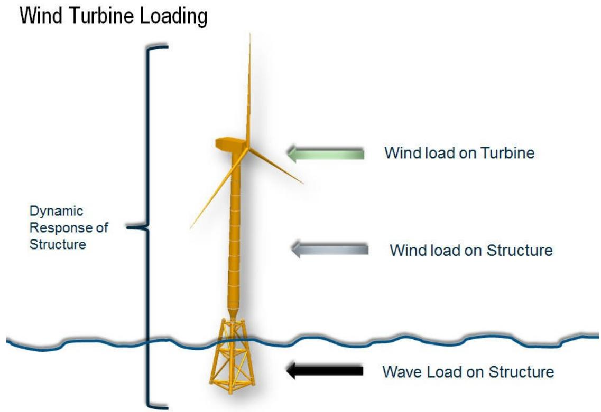

A fully coupled analysis accounts for the interaction between all three sources of loading. For an uncoupled analysis one or more sources of loading are assumed to be independent of the others.

The SACS OpenWindPower Fixed Foundation (formerly SACS Wind Turbine) capability includes the interface to aero-elastic programs such as FAST* and GH Bladed** to conduct a fully coupled dynamic responses of a structure subjected to wave, wind and mechanical turbine loading. In addition the SACS Wind Turbine Process utility allows the user to conduct an uncoupled analysis where the wave and wind loading are generated by the SACS Wave Response modules and the mechanical loading is obtained from an external source. The wave response module uses the dynamic characteristics calculated by Dynpac and hydrodynamic properties along with wave kinematics calculated by Seastate program module.

## 1.2 PROGRAM FEATURES

The SACS GH Bladed interface uses a SACS common solution file to conduct post processing of GH Bladed results. The common solution file is generated using the GH Bladed structural description and member internal loads from GH Bladed results at given time points. The interface also has the capability

to allow the user to generate the structural model in SACS Precede which can then be converted to GH Bladed format for direct input into the GH Bladed program.

The interface is fully automated to conduct a fatigue and strength analysis of multiple time history simulations using a SACS control file generated by the GH bladed program.

The SACS-FAST interface couples the SACS Wave Response module and the FAST program allowing for full interaction between the turbine mechanical loading predicted by FAST and the wave and wind loading generated by the SACS Wave Response module. The interface uses a SACS model file for the substructure (jacket/monopile) and the wind turbine tower, Seastate input containing reference wave and wind loads, dynamic mode shape and mass files in addition to the Wave Response input file and FAST input describing the wind turbine properties. The program is designed to produce an equivalent static load file that may be solved directly to calculate the internal loads for subsequent stress analysis.

The SACS Wind Turbine Process allows the user to conduct an uncoupled wind turbine analysis where wave and wind loads are calculated by the SACS Wave Response module and the turbine force time history is obtained from a third party. The wave and wind loads can be entered either as a spectrum or a time history input. The analysis is completely automated to conduct a fatigue and strength analysis using multiple time history simulations using a user generated control file.

2 SACS-GH BLADED INTERFACE

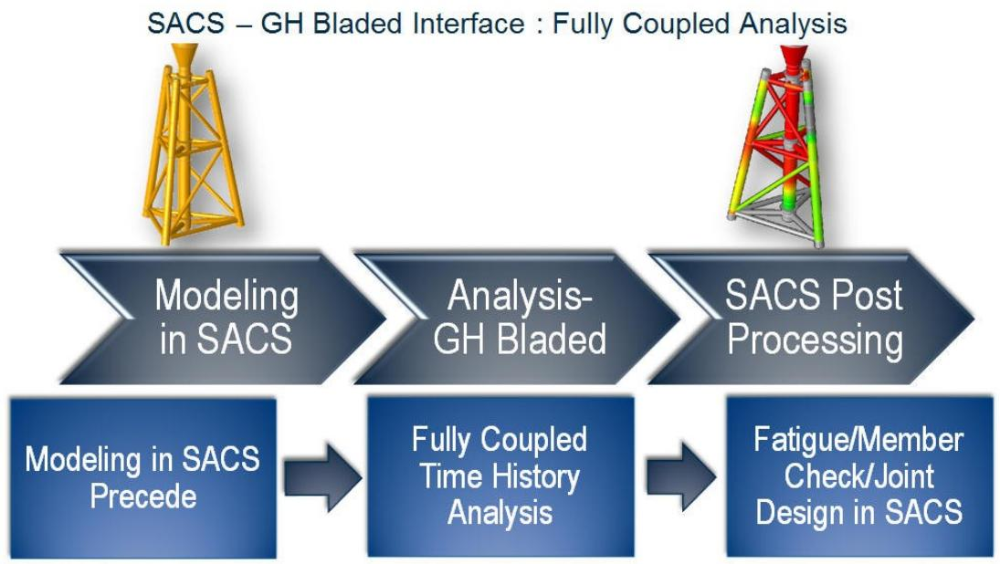

The SACS-GH Bladed interfaces comprises a front end allowing the user to export a GH Bladed model file from the SACS modeler Precede via the Export/Bladed File option as shown below.

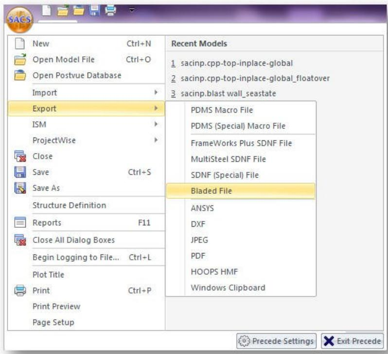

NOTE: SACS modeling attributes such as offsets and wish bones will have to be remodeled in GH Bladed as the program does not have equivalent capabilities.

SACS GH Bladed interface uses a SACS common solution file to conduct post processing of GH Bladed results. The common solution file is generated using the GH Bladed structural description and member internal loads form GH Bladed results at given time points. The interface also has the capability to allow the user to generate the structural model in SACS which then be converted to GH Bladed format for direct input into the GH Bladed program.

SACS-GHBladed Interface Work Flow

GH Bladed ModelDefinition& Results


SACS Common Solution File


Post Processing

The interface is fully automated to conduct the fatigue and strength analysis of multiple time histories.

## 2.1 GH BLADED FILE DEFINITION

SACS.IN File generated by GH Bladed for SACS Interface. Contains the structure definition and simulation results data.

$PJ GH Bladed Structure Definition

%nn GH Bladed Header File. Contains information on how the data is stored.

$25 GH Bladed Output File. Contains simulation results

## 2.2 GH BLADED MODELING DEFINITION

The GH Bladed structure model definition is supplied by the SACS.IN file generated by GH Bladed.

The following information is used by the interface:

MSTART TGEOM

Header representing the geometry portion of the input file.

NTE

The integer on this line represents the number of tower members.

NTS

The integer on this line represents the number of tower nodes.

TDIAM

This line contain two values representing the member diameter (m), one value representing the diameter at each end of the member. There will be a total of NTE (number of tower members) lines.

ELSTNS

This line contains the joint number at each end of the member. There will be a total of NTE (number of tower members) lines. Each member will be referenced by the order of these lines. For example member 1 with be the first member, and member 7 will be the seventh member.

TCLOCAL

This line contains the coordinates of each joint (m). There will be a total of NTS (number of tower nodes) lines.

TZORNT

This line represents the direction cosines for local member z-axis (local member x-axis is along the member axis from end 1 to end 2). The difference between this vector and the default SACS local member z-axis will be the beta angle.

TMASS

Header representing the material portion of the input file.

WALLTHICK

This line represents the member wall thickness (m) at each end of the member. There will be a total of NTE (number of tower members) lines.

MATERIAL

This line represents the material type at each end of the member. There will be a total of NTE (number of tower members) lines.

NOMATS

The integer on this line contains the number of material types used in the model. There will be a total of NOMATS (number of material types) lines describing the different material types to follow. Each line will contain 4 entries; the material label, the material density, the modulus of elasticity, and the shear modulus.

NOTE: If the MATERIAL is different at each end of the member, the member will be divided into two separate members. The first member will contain use MATERIAL at the beginning, and the last member will use the MATERIAL at the other end. This process will add an additional joint and member.

TSTIFF

Header representing the stiffness portion of the input file.

TOWEAX

This line represents the member axial stiffness (N) (modulus of elasticity * Area). There will be a total of NTE (number of tower members) lines.

TOWGJX

This line represents the member torsional stiffness (Nm2) (Shear modulus * polar moment of inertia). There will be a total of NTE (number of tower members) lines.

TOWEIY

This line represents the member bending stiffness, Y direction (Nm2) (modulus of elasticity * Iy). There will be a total of NTE (number of tower members) lines.

TOWEIZ

This line represents the member bending stiffness, Z direction (Nm2) (modulus of elasticity * Iz). There will be a total of NTE (number of tower members) lines.

NOTE: If the TOWEAX, or TOWGJX, or TOWEIY, or TOWEIZ is different at each end of the member, the member will be divided into two separate members. The first member will contain use TOWEAX, TOWGJX, TOWEIY, and TOWEIZ at the beginning, and the last member will use TOWEAX, TOWGJX, TOWEIY, and TOWEIZ at the other end. This process will add an additional joint and member.

## 2.3 GH BLADED FORCE TIME HISTORY

The following GH Bladed sign convention for member end forces from the $25 file is used to generate the SACS common solution file:

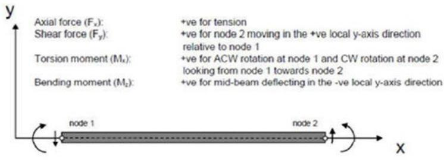  
Bladedmulti-member output convention:local x-y plane

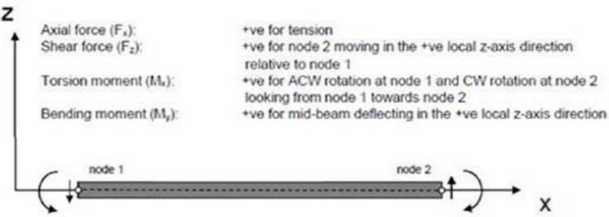  
Bladed multi-member output convention: local x-z plane

The following relationships are used to convert GH Bladed member end forces to SACS member end forces for the generation of the common solution file:

Member end forces in file with $25 extension.

Force units – N

Moment units – N*M

Comparison of (+) local force direction

Bladed (+) FX = SACS (+) FX

Bladed (+) FY = SACS (-) FY

Bladed (+) FZ = SACS (-) FZ

Bladed (+) MX = SACS (+) MX

Bladed (+) MY = SACS (-) MY

Bladed (+) MZ = SACS (+) MZ

## 2.4 SACS OUTPUT LIST FILE

The generated SACS list file contains information on the number of original joints and members in the GH Bladed model and also the number of additional joints added to the converted SACS model. The list file also contains information on the number of member end loads and the total number of load conditions.

Members which have different section properties at either end are divided by inserting a joint at the center of the member when converted to SACS format. Information pertaining to these members is listed under the ‘G.H Bladed Modified Member Report’.

## 2.5 SACS-GH BLADED AUTOMATED PROCESS

The SACS-GH Bladed automated process uses the SACS.IN file generated by GH Bladed to automate the entire fatigue and strength analysis involving a large number of simulations. The automated process makes full use of multiple processors to speed up the analysis time.

## 2.6 SACS-GH BLADED AUTOMATED FATIGUE ANALYSIS

The automated process for a fatigue analysis is depicted graphically below.

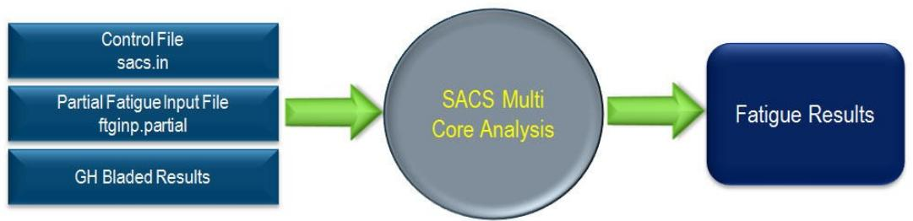

The process uses the SACS.IN file generated by GH Bladed in addition to partial fatigue input file and the GH Bladed results to conduct a fatigue analysis.

2.6.1 SACS.IN file

A typical SACS.IN file used for the fatigue analysis of 4 simulations is shown below:

GH Bladed model input

MSTART MULTIRUN NCASES 4

DIRECTORY ..\1\a

RUNNAME powprod

PROB 30.3

DIRECTORY ..\1\b

RUNNAME powprod

PROB 22.1

DIRECTORY ..\1\c

RUNNAME powprod

PROB 12.2

DIRECTORY ..\1\d

RUNNAME powprod

PROB 11.9

LIFE 6.31152E+08

MEND

The top portion of the SACS.IN file contains the GH Bladed input for the structural model and the latter portion as shown above contains the control parameters for the automated run procedure.

In which:


| MSTART MULTIRUN | Marks the beginning of the input of control parameter used for the automated fatigue analysis. |
| --- | --- |
| NCASES | Denotes the number of simulations for analysis. This data is entered once at the beginning of the simulation data described below. |
| DIRECTORY | Defines the path name of the simulation directory. Both an absolute and relative pathnames are acceptable. |
| RUNNAME | Defines the name of the simulation result file. A fatigue damage summation will be generated for each simulation type defined by the result file name in addition to the total overall damage. |
| PROB | Defines the percentage occurrence of this simulation over the fatigue design life of the structure. |
| LIFE | Defines the design life of the structure in seconds. This data is entered once at the end of the DIRECTORY, RUNNAME and PROB input for all the simulations in the analysis as described above. |
| MEND | Defines the end of the control parameter input. |


In addition to the SACS.IN control file a partial fatigue file is also required to define the fatigue analysis input.

2.6.2 Partial fatigue Input File

A typical partial fatigue input file is shown below:

TITLEWIND POWER GENERATION FATIGUE ANALYSIS

* Fatigue life is 20 years   
* 000 degree occurs 35% of the time so input life is 7.0   
* Cycles based on 1 year time period   
* Safety factor is 2.0

FTOPTG 20.0 1.0 2.0 SMAXP SK LPEFT

FTOPT2 PTVC 3.0 -3.0AWS TI5 O

2.6.3 Fatigue Analysis Detailed Workflow

A partial fatigue input file contains the fatigue option lines FTOPTG and/or FTOPT2. These input lines define the SCF and S-N approaches used for the fatigue analysis. Any overrides or user defined input may also be included (see SACS Fatigue manual for further details).

NOTE: Fatigue load cases are not defined in the partial fatigue input file as these are automatically generated for a fatigue time history analysis by the automated procedure.

The fatigue analysis is conducted in three phases as described below:

2.6.3.1 PHASE 1: Generation of Sacs Common Solution file

The SACS common solution files are generated using the GH Bladed interface and stored at the location provided on the DIRECTORY line. The SACS Executive uses the information defined on the NCASES line to determine the number of simulations and therefore the number of common solution files to be generated.

2.6.3.2 PHASE 2: Generation of damage files from each simulation

Fatigue damage is calculated using the information provided on the PROB and LIFE lines in the SACS.in file.

A partial Fatigue input file is provided by the user which contains the fatigue options lines, and overrides only. The SACS Executive will update information such as the number of common solution files (in column 7) and the fatigue design life (columns 8-14) on the FTOPT line. All other information on this line entered by the user should be left untouched.

The Damage files are generated using batches of 16 common solution files. If any batch contains less than 16 common solution files then the SAC Executive will automatically calculate the number of additional post files using the information provided on the NCASES line in columns 7-7 of the FTOPT line i.e. use a value of 0- 9 for 1 to 10 common solution files, or A-F for 11 to 16 common solution files.

The Sacs executive will update the design life in columns 8-14 of the FTOPT line using the value provided on the LIFE line in the SACS.in file (convert seconds to years, for example: (6.31152e+8 sec / （$365 . 25^{ * } 24^{ * } 60^{ * } 60 ) = 20 . 0 \gamma \mathrm{ e a r s } ) .$ .

Similarly, the Executive will only change the input in column 76 of the FTOPT2 line controlling input and output of damage files. All other user input information should be left untouched. For Phase 2 this option is set to ‘O’ to output damage file only. On the generation of the last damage file in Phase 2 this option is changed to ‘I’ to input a damage file to start the damage accumulation process.

The SACS Executive will generate all FTCASE lines. The fatigue case number representing each common solution file is entered in columns 7-10 of the FTCASE line.

The number of occurrence of a particular time history is entered in column 11-20 of the FTCASE line where:

Number of occurrence =fatigue time period * 365.25*24*60*60*fraction of occurrence/duration of simulation

The fatigue time period is obtained from columns 15-21 of the FTOPT line (default is 1 year). The fraction of occurrence is obtained from PROB line in the SACS.IN file. The duration of the simulation can be calculated by multiplying the last value on the DIMENS line with the value given in the STEP line from the %25 file.

The label ‘THS’ is entered in columns 32-34 of the FTCASE line to conduct a time history fatigue analysis.

A file number is entered in columns 46-49 (numbers will be 1-16, depending upon how many additional post files are included.

2.6.3.3 PHASE 3 Accumulation of Damage.

After the generation of the last damage file the fatigue accumulation process is started automatically.

This is a linear summation of the damage contained in each damage file.

## 2.7 SACS - GH BLADED STRENGTH ANALYSIS

Two approaches are available for strength analysis. The first approach discussed here uses a single safety factor which is applied to the GH Bladed results prior to post processing. The second approach uses two safety factors, one for the gravitational loads and the other for the dynamic loads. Both approaches are discussed in this section.

2.7.1 SACS - GH Bladed Strength Analysis

The automated process for a strength analysis is depicted graphically below.

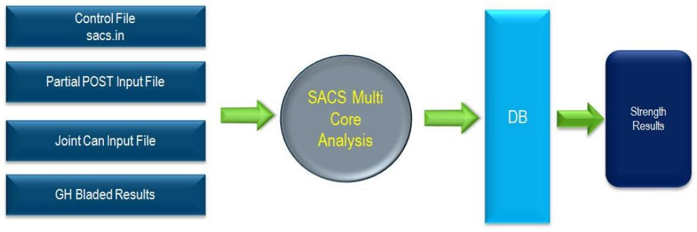

The process uses the SACS.IN file generated by GH Bladed in addition to partial post input file, joint can input file input file and the GH Bladed results to conduct a strength analysis.

2.7.2 Single Overall Safety Factor

For the case where a single overall safety factor is used for the combined inertial and gravitational results from GH Bladed, the SACS Post module automatically generates load combinations with the specified safety factor applied to all load cases contained in simulation prior to any post processing.

2.7.2.1 SACS.IN File

The first portion of the SACS.IN file contains the model description. The latter portion which is used to control the automated process has the following format:

MSTART MAXMIN Marks the beginning of the input of control parameter used for the automated strength analysis.

NCASES Defines the number of simulation for analysis cases. This data is entered once at the beginning of the simulation data described below.

NUMSUBGROUP Defines the number of subgroups for unity check averaging.

SUBGROUPTYPE Defines the subgroup types 1 or 2.

CASE Defines the strength simulation case.

DIRECTORY Defines the path name of the simulation directory. Both absolute and relative pathnames are acceptable.

RUNNAME Defines the name of the simulation result file. A code check and joint can check will be performed for each simulation type defined by the result file name.

GROUP Defines the simulation group for which a maximum unity check may be required.

SF Defines the partial safety factor to be used for ULS analysis. The GH Bladed member internal loads are multiplied by this factor prior to the ULS code checks.

SUBGROUP Defines the subgroup for the simulation.

A typical SACS.IN file used for a strength analysis for 4 simulations is shown below:

GH bladed model input

MSTART MAXMIN NCASES 4

NUMSUBGROUP 32

SUBGROUPTYPE 1 1 1 1 1 1 1 1 1 1 1 1 1 1 1 1 1 1 1 1 1 1 1 1 1 1 1 1 1 1 2 2

CASE 1

DIRECTORY C:\work\GH Bladed Strength Analysis\1

RUNNAME powprod

GROUP 1

SF 1.35

SUBGROUP 1

CASE 2

DIRECTORY C:\work\GH Bladed Strength Analysis\2

RUNNAME powprod

GROUP 1

SF 1.35

SUBGROUP 1

CASE 3

DIRECTORY C:\work\GH Bladed Strength Analysis\3

RUNNAME powprod

GROUP 1

SF 1.35

SUBGROUP 1

CASE 4

DIRECTORY C:\work\GH Bladed Strength Analysis\4

RUNNAME powprod

GROUP 1

SF 1.35

SUBGROUP 1

MEND

2.7.3 Separate Safety Factors for Gravity and Inertial Loads

To apply a separate safety factor to gravitational and dynamic loads requires the use of the SACS Combine module to first separate gravitational component from the combined gravitational and inertial load results. To do this, gravitational load results from GH Bladed are required as the first simulation in the control file. Once the inertial component is separated, the SACS Combine module is again used to recombine the gravitational and the inertial load cases after the different safety factors have been applied to the two components. The user should refer to the SACS Combine manual for detailed description of the auto combine process.

2.7.3.1 SACS.IN File

The first portion of the SACS.IN file contains the model description. The latter portion which is used to control the automated process has the following format:

NOTE : The first simulation has to correspond to the gravitational loads only.

MSTART MAXMIN

Marks the beginning of the input of control parameter used for the automated strength analysis.

NCASES

Defines the number of simulation for analysis cases. This data is entered once at the beginning of the simulation data described below.

NUMBSUBGROUP

Defines the number of subgroups for unity check averaging.

SUBGROUPTYPE

Defines the subgroup types 1 or 2.

DEAD nnn

nnn represents the load case in the gravity load simulation that is to be used to represent the self-weight of the structure.

CASE 1

The first load case represents the gravitational simulation

DIRECTORY

Defines the path name of the simulation directory. Both absolute and relative pathnames are acceptable.

RUNNAME

Defines the name of the simulation result file. A code check and joint can check will be performed for each simulation type defined by the result file name.

GROUP

Defines the simulation group for which the maximum unity check may be required.

SF

This factor is not used.

SUBGROUP

Subgroup used for averaging internal loads of extreme cases

The remainder of the input is as described in the previous section for a strength analysis with a single overall safety factor.

A typical SACS.IN file used for a strength analysis for 3 simulations is shown below:

GH bladed model input

MSTART COMBINE

NCASES 3

NUMSUBGROUP 32

SUBGROUPTYPE 1 1 1 1 1 1 1 1 1 1 1 1 1 1 1 1 1 1 1 1 1 1 1 1 1 1 1 1 1 1 2 2

DEAD 500

CASE

DIRECTORY C:\work\AutoCombine2\Dead

RUNNAME powprod

GROUP 1

SF 0.90

SUBGROUP 1

CASE 2

DIRECTORY C:\work\AutoCombine2\1

RUNNAME powprod

GROUP 1

SF1 1.35

SF2 0.90

SUBGROUP 1

CASE 3

DIRECTORY C:\work\AutoCombine2\2

RUNNAME powprod

GROUP 1

SF1 1.35

SF2 0.90

SUBGROUP 1

## 2.8 SUBGROUP INPUT

This is to allow for a requirement in the most recent edition of the IEC 61400-1 wind turbine design standard which specifies that for certain extreme load cases (specifically those involving turbulent wind) the characteristic load must be calculated using sub-groups. There are 2 types of sub-group:

1. The “mean” sub-group type. This requires that 6 turbulent wind seeds be simulated for each combination of external conditions and the maximum load extracted from each simulation. The characteristic load is then taken as the mean of these 6 maxima.   
2. The “half” sub-group type. This requires that 12 turbulent wind seeds be simulated for each combination of external conditions and the maximum load extracted from each simulation. The characteristic load is then taken as the mean of the top half of these 12 maxima.

The method is described in Sections 7.5 and 7.6.2 of the IEC 61400-1:2005 edition 3 design standard.

NOTE In the current implementation both GROUP and SUBGROUP inputs are not used and a maximum UC for all simulation is considered.

## 2.9 POST PROCESSING

In addition to the control input file a POST input file for member strength checks and a JOINT CAN input file for joint strength checks is also required.

2.9.1 Post Input File

A typical Post input file is shown below:


| OPTIONS | MN | IS | 1 1 | DC | C | PT | CODE | IS | 1.15 | 1.28 | 1.15 | 1.15 | 1.25 |
| --- | --- | --- | --- | --- | --- | --- | --- | --- | --- | --- | --- | --- | --- |
| PSTOPT | MOD |  |  |  |  |  |  |  |  |  |  |  |  |


The input file describes parameters for a member code check design in accordance to the ISO 19902 code of practice. Refer to the SACS Post manual for detailed guidance on post input file generation.

2.9.2 Joint Can Input File

A typical Joint Can input file is shown below:


| JCNOPT | API | EN | C | NID | M | FLMX | PT | S | 1.75 |
| --- | --- | --- | --- | --- | --- | --- | --- | --- | --- |
| RELIEF |  |  |  |  |  |  |  |  |  |


The input file describes parameters for a tubular joint design in accordance to the API code of practice. Refer to the SACS Joint Can manual for detailed guidance on joint can input file generation.

3 SACS UNCOUPLED WIND TURBINE PROCESS

For the SACS Uncoupled Wind Turbine Process, the wave and wind loads are generated by the SACS Wave Response module and the turbine loads are supplied by a 3rd party (usually the wind turbine manufacturer). The complete analysis and post processing are conducted in SACS.

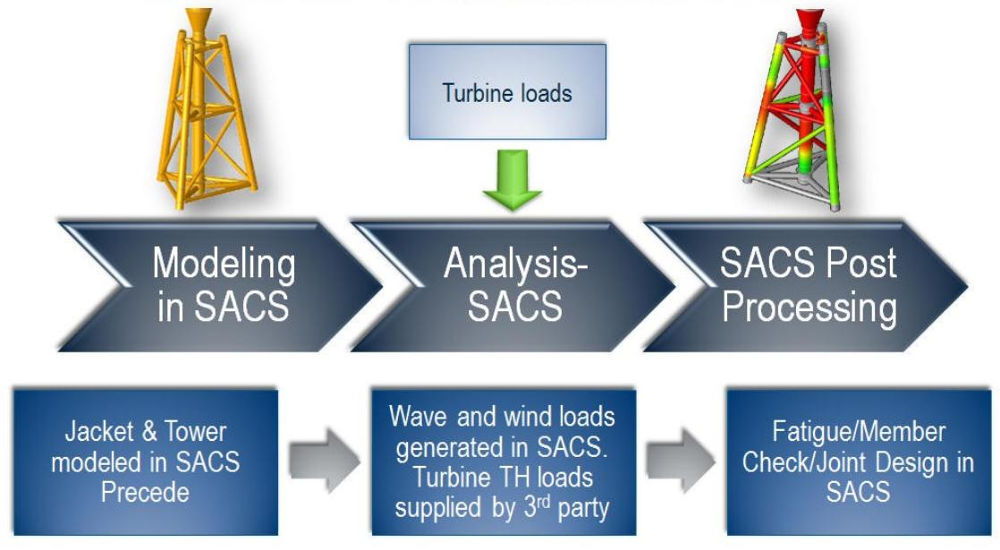  
Automated SACs Uncoupled Wind Turbine Process

## 3.1 LOADING

The following section discuss the various sources of loading on an offshore wind turbine structure.

3.1.1 Wind Loading on Tower and Jacket

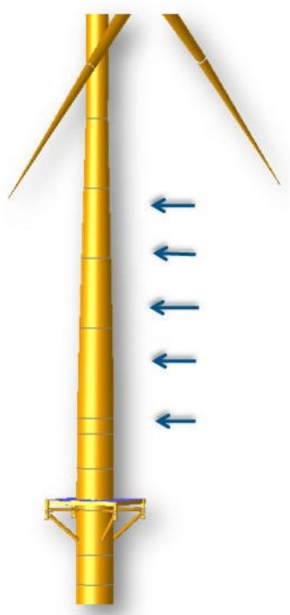

The wind loading can be represented in terms of a wind spectrum or by a wind velocity time history. The wind spectra available include von Karman, API, Harris and the Kaimal spectrum. Alternatively, the user can express wind load as a force time history input at discrete on the structure.

Wind Spectrum

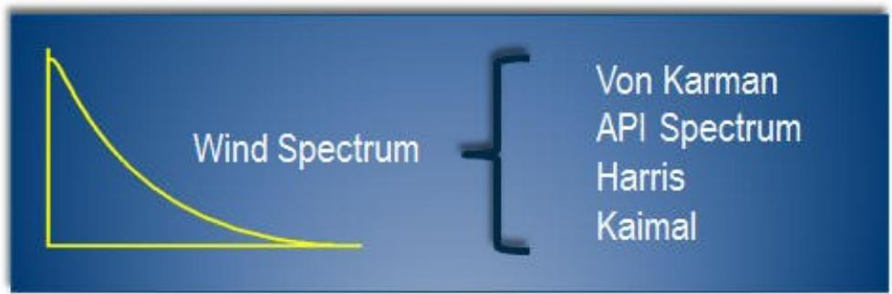

Wind Velocity Time History

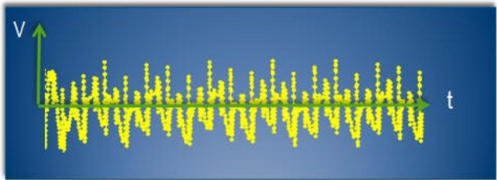

A uniform time history of the wind velocity can be input using the header input line THWIND followed by the wind velocity input using the WINDUNI input line. Similarly, a non-uniform input of the wind velocity input can be accomplished using the THWIND and the WINDNON input lines. A detailed description of the input lines is can be found in the SACS Wave Response manual.

The example below shows a uniform time history input in feet per second at intervals of 1 second described on the THWIND line followed by wind velocity input on the WINDUNI input lines.


| 1 | 1234567890123456789012345678901234567890123456789012345678901234567890 | 1234567890123456789012345678901234567890123456789012345678901234567890 | 1234567890123456789012345678901234567890123456789012345678901234567890 | 1234567890123456789012345678901234567890123456789012345678901234567890 | 1234567890123456789012345678901234567890123456789012345678901234567890 | 1234567890123456789012345678901234567890123456789012345678901234567890 | 1234567890123456789012345678901234567890123456789012345678901234567890 |
| --- | --- | --- | --- | --- | --- | --- | --- |
| 2 |  |  |  |  |  |  |  |
| 3 | THWIND UNI FPS 1.0 | THWIND UNI FPS 1.0 | THWIND UNI FPS 1.0 | THWIND UNI FPS 1.0 | THWIND UNI FPS 1.0 | THWIND UNI FPS 1.0 | THWIND UNI FPS 1.0 |
| 4 | WINDUNI | 576.9291 | 564.9953 | 621.5708 | 591.5334 | 547.8466 | 494.1467 |
| 5 | WINDUNI | 510.7698 | 513.3767 | 551.9375 | 639.6038 | 629.9554 | 607.9930 |
| 6 | WINDUNI | 567.1454 | 617.1976 | 611.4088 | 631.4868 | 636.4530 | 696.1594 |
| 7 | WINDUNI | 639.1080 | 576.8692 | 599.1749 | 501.8182 | 581.2065 | 594.5109 |
| 8 | WINDUNI | 640.7831 | 644.8615 | 612.1884 | 610.5631 | 596.3235 | 601.1138 |
| 9 | WINDUNI | 554.9890 | 550.9333 | 581.8296 | 583.1116 | 611.4847 | 556.4728 |
| 10 | WINDUNI | 554.3572 | 573.9803 | 543.0266 | 612.6740 | 639.5555 | 594.3064 |
| 11 | WINDUNI | 604.5560 | 539.3898 | 530.9476 | 583.2378 | 613.7479 | 647.7905 |
| 12 | WINDUNI | 542.7413 | 543.4597 | 620.0997 | 588.6911 | 552.2032 | 515.0961 |
| 13 | WINDUNI | 548.3846 | 663.0119 | 679.2433 | 644.6173 | 574.6378 | 592.2191 |
| 14 | WINDUNI | 609.0243 | 502.1026 | 529.4528 | 556.9185 | 499.2530 | 544.7029 |
| 15 | WINDUNI | 519.8868 | 551.6050 | 504.0800 | 586.7173 | 548.4050 | 486.8371 |


The example below shows a non-uniform time history input on the WINDNON input line.


| 1 | 1234567890123456789012345678901234567890123456789012345678901234567890 | 1234567890123456789012345678901234567890123456789012345678901234567890 | 1234567890123456789012345678901234567890123456789012345678901234567890 | 1234567890123456789012345678901234567890123456789012345678901234567890 | 1234567890123456789012345678901234567890123456789012345678901234567890 | 1234567890123456789012345678901234567890123456789012345678901234567890 |
| --- | --- | --- | --- | --- | --- | --- |
| 2 |  |  |  |  |  |  |
| 3 | THWIND NON FPS | THWIND NON FPS | THWIND NON FPS | THWIND NON FPS | THWIND NON FPS | THWIND NON FPS |
| 4 | WINDNON | 0.00000 | 3.11107 | 1.00000 | 3.07786 | 2.00000 |
| 5 | WINDNON | 3.00000 | 3.05953 | 4.00000 | 2.99531 | 5.00000 |
| 6 | WINDNON | 6.00000 | 2.93769 | 7.00000 | 2.94808 | 8.00000 |
| 7 | WINDNON | 9.00000 | 3.10274 | 10.00000 | 3.10961 | 11.00000 |
| 8 | WINDNON | 12.00000 | 3.06667 | 13.00000 | 3.12035 | 14.00000 |
| 9 | WINDNON | 15.00000 | 3.15050 | 16.00000 | 3.15972 | 17.00000 |
| 10 | WINDNON | 18.00000 | 3.14258 | 19.00000 | 3.06448 | 20.00000 |
| 11 | WINDNON | 21.00000 | 2.96147 | 22.00000 | 3.02888 | 23.00000 |
| 12 | WINDNON | 24.00000 | 3.08885 | 25.00000 | 3.08828 | 26.00000 |
| 13 | WINDNON | 27.00000 | 3.02938 | 28.00000 | 2.99873 | 29.00000 |
| 14 | WINDNON | 30.00000 | 2.92262 | 31.00000 | 2.90433 | 32.00000 |
| 15 | WINDNON | 33.00000 | 2.91680 | 34.00000 | 2.93252 | 35.00000 |


3.1.2 Wave Loading on Jacket

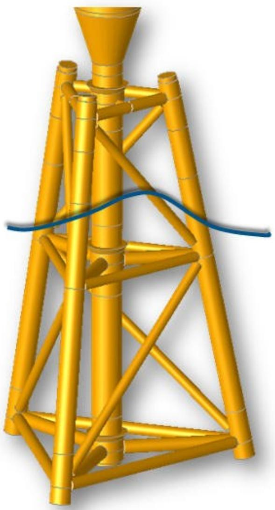

Wave loading can be represented either as a wave spectrum or time history of the surface profile.

Wave Spectrum

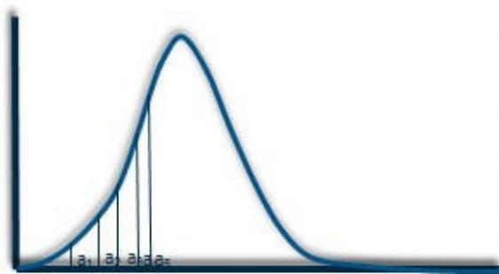

Wave Spectrum

Pierson-Moskowitz JONSWAP Ochi-Hubble Userdefined

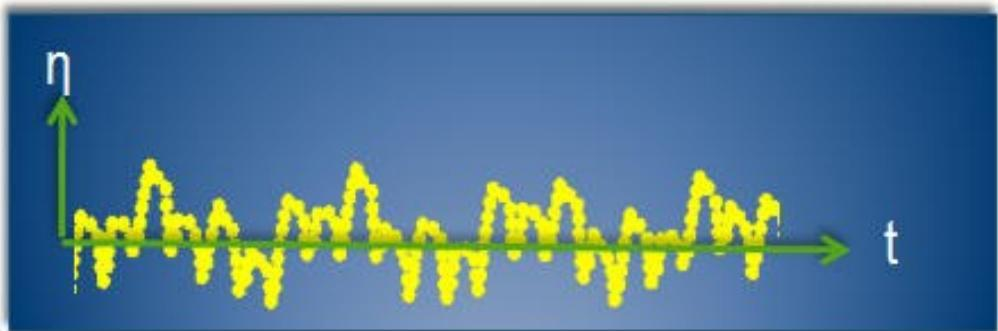  
Wave Surface Profile Time History

Wave Surface Profile Time History

A uniform time history of the wave surface profile can be input using the THWAVE header input line followed by the wave velocity input using the WAVEUNI input line. Similarly, a non-uniform input of the wave velocity input can be accomplished using the THWAVE and the WAVENON input lines. A detailed description of the input lines is can be found in the SACS Wave Response manual.

The example below shows a uniform time history input in feet at intervals of 1 second described on the THWAVE line followed by wave height input on the WAVEUNI input lines.


| 1 | 12345678901234567890123456789012345678901234567890123456789012345678901234567890 | 12345678901234567890123456789012345678901234567890123456789012345678901234567890 | 12345678901234567890123456789012345678901234567890123456789012345678901234567890 | 12345678901234567890123456789012345678901234567890123456789012345678901234567890 | 12345678901234567890123456789012345678901234567890123456789012345678901234567890 | 12345678901234567890123456789012345678901234567890123456789012345678901234567890 |
| --- | --- | --- | --- | --- | --- | --- |
| 2 |  |  |  |  |  |  |
| 3 | THWAVE UNI F 1.0 | THWAVE UNI F 1.0 | THWAVE UNI F 1.0 | THWAVE UNI F 1.0 | THWAVE UNI F 1.0 | THWAVE UNI F 1.0 |
| 4 | WAVEUNI | 7.7526 | -2.9082 | -13.5877 | -17.5799 | -11.6288 |
| 5 | WAVEUNI | 8.1561 | 9.3356 | 5.8452 | 2.1958 | -0.4455 |
| 6 | WAVEUNI | -6.8892 | -8.1901 | -6.2827 | -3.1214 | -0.7104 |
| 7 | WAVEUNI | 7.6558 | 14.2530 | 16.1712 | 9.7239 | -1.6205 |
| 8 | WAVEUNI | -11.7693 | -8.8563 | -6.0261 | -4.5048 | -2.5676 |
| 9 | WAVEUNI | 1.9042 | 1.5528 | 1.3409 | 3.5039 | 6.4851 |
| 10 | WAVEUNI | 2.5625 | -1.1842 | -1.0238 | 1.6608 | 2.1599 |
| 11 | WAVEUNI | -4.8694 | -4.7411 | -1.5247 | 0.6363 | -0.2735 |
| 12 | WAVEUNI | -2.5386 | -2.2377 | -3.2961 | -4.9355 | -3.8255 |
| 13 | WAVEUNI | 7.3822 | 10.8553 | 11.8803 | 12.9680 | 13.6838 |
| 14 | WAVEUNI | -2.2830 | -17.6797 | -27.9896 | -27.8437 | -19.1512 |
| 15 | WAVEUNI | 3.5684 | 12.7555 | 18.7172 | 19.5692 | 16.0064 |


For a spectral input, a random surface profile is generated first subdividing the spectrum into discrete frequency bands. An AIRY wave with a random phase angle is then generated for each frequency band. The Wave Response program then reproduces the surface profile by the linear addition of AIRY waves.

The total wave kinematics are determined by adding the velocities and accelerations from the various components.

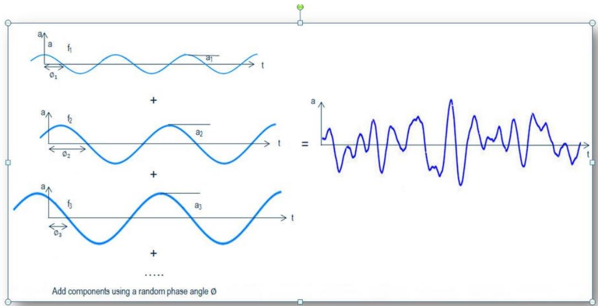

When a wave spectrum is specified, the spectrum itself is analyzed and broken into Airy wave components. Only wave components with periods that are divisible into the analysis time duration are considered as possible components.

The period of a possible wave component n, is determined from the following equation:

$$T_{n} = \frac{T_{D}}{n} \quad n = 1, 2, 3 \dots n_{\max }$$

The input spectrum is divided into strips with each strip having a center frequency corresponding to the frequency of one of the possible wave components.

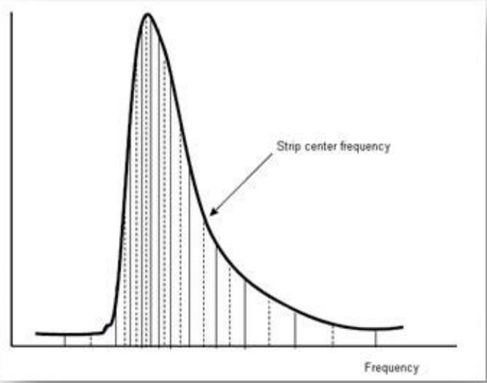

3.1.3 Multiple Random Seeds

By default, one seed is used when generating the random phase angles of the wave components. A set of sequential equally spaced seeds or a set of user input seeds can be used to generate numerous random surfaces of the random wave.

3.1.4 Equally Spaced Seeds

Numerous equally spaced sequential seeds can be used by specifying the number of seeds and the first seed value on the WSPEC input line. A detailed description of this input line can be found in the Wave Response manual.

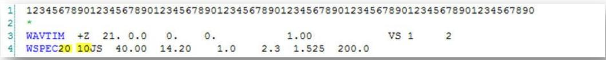

The above input defines 20 random surfaces with an initial seed of 10. Seeds generated: 10, 11, 12, 13, 14, … 29

3.1.5 Hydrodynamic Properties

Hydrodynamic properties generated automatically using a dummy reference wave selected to wet the maximum height likely during the random wave analysis (also used to determine the number of load segments per member for an accurate representation of loading). The wave direction should be the same as the random wave and the crest position located at the center of the structure.

3.1.6 Aerodynamic Properties

If random wind is included in the random wave analysis, aerodynamic and a reference wind must be specified in the Seastate input or SACS model file. Reference wind load data is specified in the same load case as the reference wave. The wind direction and mean wind velocity should be input in the reference wind.

3.1.7 User Defined Seeds

Up to 99 seeds used to generate surface profiles can be specified.

The number of seeds is designated in columns 6-7 on the WSPEC line. The seeds to be used to generate the surface profiles are input on the RNSEED line. A detailed description of the input lines can be found in the Wave Response manual.

The following designates that 15 user defined seeds are to be used to generate random wave surface profiles.

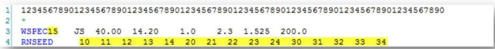

3.1.8 Transient Reduction

The initial transient from a wave response time history analysis can be ignored by the use of the transient reduction option 'TR' in columns 61-62 of the THIST input line. This option ignores the first 10 seconds of the wave response time history analysis results.

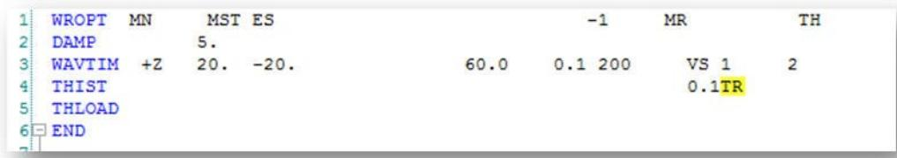

3.1.9 Wind Loading on Turbine

The wind loading on the turbine causes the rotation of the wind turbine, which in turn generates aerodynamic and mechanical forces on the top of the tower, which can be represented by a force time history.

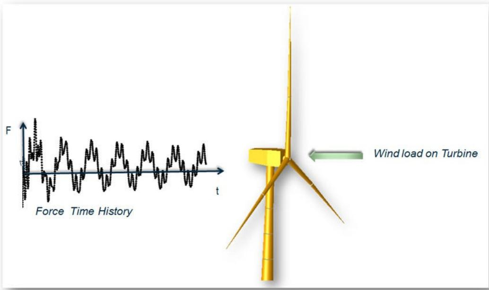

A force time history can be input using the THLOAD header input line followed by the TIME and JLOD line describing the time input and joint force time history input respectively. A detailed description of these input lines can be found in the Wave Response manual.

The example below shows a typical force time history input file with the THLOAD input line describing the input units and a force factor, followed by the TIME line defining the input time increment value and the JLOD input line describing the joint name and the force/moment input values. The TIME and JLOD lines are repeated for all subsequent time increments.


| 1 | 1234567890123456789012345678901234567890123456789012345678901234567890 | 1234567890123456789012345678901234567890123456789012345678901234567890 | 1234567890123456789012345678901234567890123456789012345678901234567890 |
| --- | --- | --- | --- |
| 2 |  |  |  |
| 3 | THLOAD | MN 0.2248 |  |
| 4 | TIME | 0.01 |  |
| 5 | JLOD D1 | -4.44E+00 | -3.52E+00 |
| 6 | TIME | 0.5 |  |
| 7 | JLOD D1 | -3.17E+00 | -3.58E+00 |
| 8 | TIME | 1.0 |  |
| 9 | JLOD D1 | 7.07E-01 | 1.03E+00 |
| 10 | TIME | 1.5 |  |
| 11 | JLOD D1 | 1.55E+00 | 6.29E-01 |
| 12 | TIME | 2.0 |  |
| 13 | JLOD D1 | 2.41E+00 | 2.34E+00 |
| 14 | TIME | 2.5 |  |
| 15 | JLOD D1 | 7.35E-01 | -8.01E-02 |


3.1.10 Time History Analysis of Combined Seismic, Wave, and Wind Turbine Loads

SACS Wave Response program can perform a combined analysis of wave loads, wind turbine forces, and seismic loads in the time-history simulation (i.e., 'TH' or 'TG' is selected in columns 68-69 on the WROPT line). THLOAD input line can be utilized to import up to two (2) time-history files containing wind turbine forces and seismic forces (or any other force time-history files). Once the THLOAD lines are entered in the Wave Response input file, the files can be selected in SACS Analysis Generator.

SACS Dynamic Response program can automatically generate the base-driven earthquake forces by selecting the 'WVR' option on THLOAD in the Dynamic Response Input file. The users are referred to the Dynamic Response user manual for additional information. Input files for other force time-history types can be manually created through SACS Datagen and by selecting the Force Time History Input File - Wave Response input type.

The following example illustrates the inputs for two force time-history files. The first input is the Wind Turbine forces given in Flex 5 format, while the second file contains base-driven earthquake load in SACS format.

```c
1 2 3 4 5 6 7 8  
1234567890123456789012345678901234567890123456789012345678901234567890  
1 \*First Time-History File  
2 THLOAD MN FNT05  
3 \*Second Time-History File  
# 4 THLOAD MN
```

Consider the following notes about importing the time-history files:

1. If the Wave Response Analysis Time Increment (entered on the WAVTIM line) does not match the time steps in the imported files, the imported forces will be linearly interpolated.   
2. If the time histories of the imported files are shorter than the Wave Response Analysis Time, the imported time history will be padded by the force values at the last time step.   
3. If the time histories of the imported files are longer than the Wave Response analysis time, the extra time steps will be ignored.   
4. If the imported history starts at the non-zero time, the imported time history will be padded by the force values at the first step between the time zero and the imported history starting time.5. The force time-history file types entered on THLOAD lines must conform to the file types selected in the SACS Analysis Generator. Otherwise, the Wave Response returns error messages.

## 3.2 SACS WIND TURBINE PROCESS

For an uncoupled analysis involving multiple time history simulations, the SACS Wind Turbine Process allows the user to automate the process for both fatigue and strength analysis as shown below:

3.2.1 Fatigue Analysis

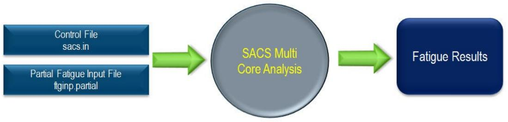

The above analysis process requires a user generated control file and a partial fatigue input file. The automated process allows parallel processing through a multi core functionality to reduce the run time for multiple time history simulations.

The control file as shown below contains the following information:


| Flag F indicating a fatigue analysis |
| --- |
| Directory location for wave response input file for a given simulation |
| Name of the Wave Response generated loads common solution file for the jacket structure |
| Name of the Wave Response generated loads common solution file for the foundation |
| A group name for damage summation |
| Occurrence data for this simulation |
| The name of the Wave Response time history run file a particular simulation |
| Repeat the above (minus the flag) for other simulations. |


The example below shows a typical control file for six simulations.

```txt
FLAG F  
DIRECTORY C:\work\paris 2013\ uncoupled wind turbine fatigue analysis\1  
CSF psicsf.xxx  
PCSF pilcsf.xxx  
WVRRUN wvrxxx.runx  
GROUP 1  
VAR 40000  
DIRECTORY C:\work\paris 2013\ uncoupled wind turbine fatigue analysis\2  
CSF psicsf.xxx  
PCSF pilcsf.xxx  
WVRRUN wvrxxx.runx  
GROUP 2  
VAR 402234  
DIRECTORY C:\work\paris 2013\ uncoupled wind turbine fatigue analysis\3  
CSF psicsf.xxx  
PCSF pilcsf.xxx  
WVRRUN wvrxxx.runx  
GROUP 1  
VAR 10330  
DIRECTORY C:\work\paris 2013\ uncoupled wind turbine fatigue analysis\4  
CSF psicsf.xxx  
PCSF pilcsf.xxx  
WVRRUN wvrxxx.runx  
GROUP 2  
VAR 4022  
DIRECTORY C:\work\paris 2013\ uncoupled wind turbine fatigue analysis\5  
CSF psicsf.xxx  
PCSF pilcsf.xxx  
WVRRUN wvrxxx.runx  
GROUP 1  
VAR 400000  
DIRECTORY C:\work\paris 2013\ uncoupled wind turbine fatigue analysis\6  
CSF psicsf.xxx  
PCSF pilcsf.xxx  
WVRRUN wvrxxx.runx  
GROUP 2  
VAR 400000 
```

The partial fatigue input file contains information on the fatigue design life, the fatigue time period over which the occurrence data is measured, the choice of SCF's and SN curves in addition to any overrides. The fatigue load cases are automatically generated by SACS using the information provided in the control file.

The example below shows a typical partial fatigue input file:

```txt
TITLEWIND POWER GENERATION FATIGUE ANALYSIS  
* Fatigue design life is 20 years  
* Cycles based on 1 year time period  
* Safety factor is 2.0  
* API X-Prime S-N curve  
* SCF's by Efthymiou  
* Inline SCF's in accordance to  
FTOPTG 20. 1. 2.0 SMAXP SK 5 LPEFT  
FTOPT2 PTPTVC DN2 TI5 O  
*TOPT3 P  
SCFLM 6.0 1.5  
* Remove jacket joints that are not tubular connections  
JNTSEL RM 401L 403L 405L 1 3 5 1014 501P 503P 505P  
* Sleeve end joints  
JNTSEL RM SL01 SL03 SL11 SL13 SL31 SL33  
* JNTSEL RM 11 13 15 31 33 35 
```

The example below shows a typical fatigue input file after the fatigue load case has been generated by SACS:

```txt
TITLEWIND POWER GENERATION FATIGUE ANALYSIS  
* fatigue life is 20 years  
* Cycles based on 1 year time period  
* Safety factor is 2.0  
FTOPTG 20. 1. 2.0 SMAXP SK 5 LPEFT  
FTOPT2 PTPTVC 3.0 -3.0AWS TI5 O  
FTOPT3 P  
* Stress Time History duration is WVR analysis duration x number of random seeds  
* Stress Time History duration = 600 X 1 = 600 seconds  
* 1 year has 31,536,000 seconds  
* Number of stress cycles in 1 year is 31,536,000/600 = 52,560 cycles  
* FTCASE 1400000.000 1.0 THS 1  
END 
```

The first step in the automated process involves the generation a SACS wave response common solution file.

The figure below shows the input files required by the SACS Wave Response module for a typical time history simulation to generate a SACS common solution file to be used for a subsequent fatigue analysis. In this example a wave surface profile along with a force time history input is used. A modal analysis of the structure is required using the SACS DYNPAC module to generate the mass and mode files. The reference seastate input file is required to generate the hydrodynamic and aerodynamic properties as discussed earlier.

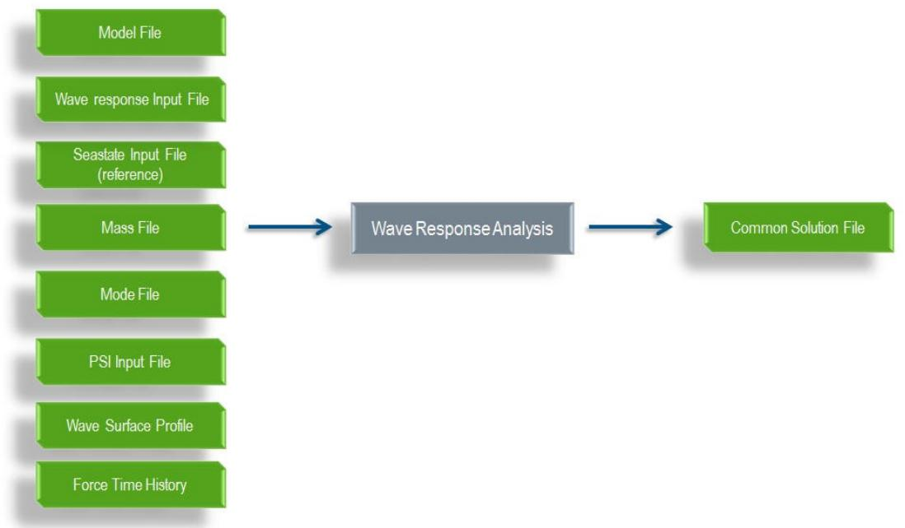

After the generation of all wave response common solution files, the fatigue damage calculations are performed as shown below.

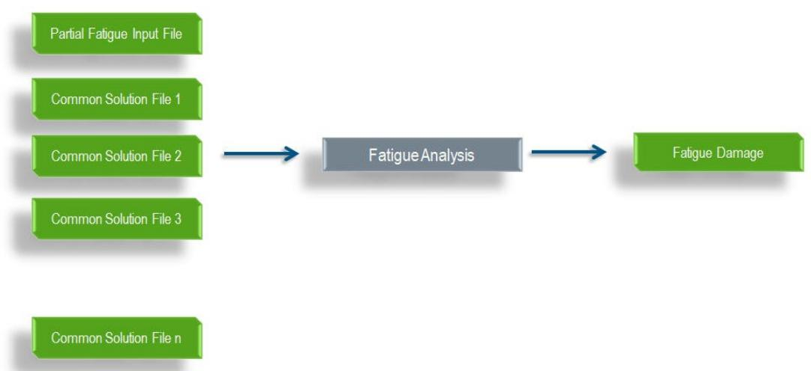

## 3.3 STRENGTH ANALYSIS

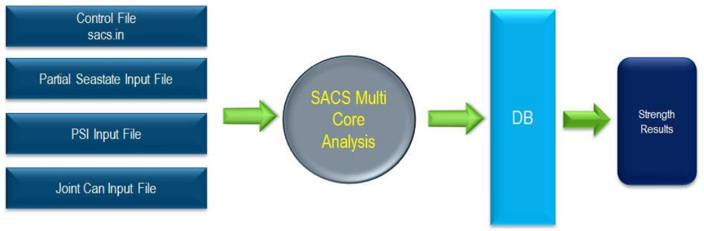

The automated strength analysis procedure requires a user defined control file, a partial seastate input file in addition to a PSI and a joint can input files. The automated process allows the use of parallel processing through a multi core functionality to reduce the analysis run time. The numerous unity check results from multiple time history analysis are stored in a database which is subsequently filtered for critical conditions.

The control file contains the following information:


| Flag S indicating a strength analysis |
| --- |
| Directory location for wave response input file for a given simulation |
| Name of the OCI file containing the dynamic Wave Response generated loads |
| The name of the wave response run file for the time history analysis for a given simulation |
| A partial safety factor for gravity loads |
| A partial safety factor for environmental loads |
| A partial load factor for extreme turbine loads. |
| Repeat of the above information (minus the flag) for other simulations. |


The example below shows a typical control file for strength analysis.

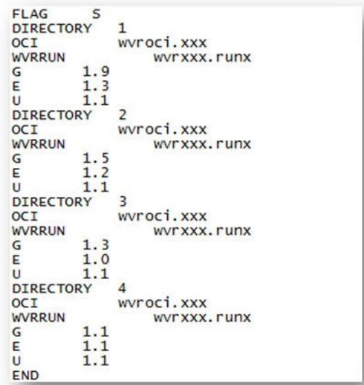

The partial seastate input file contains a LCSEL load case select line containing the names of the default names of the Wave Response dynamic load cases, hydrodynamic modeling and all gravity load cases. The combinations required for the strength analysis containing the dynamic and gravity loads together with the safety factors will automatically be generated by SACS.

NOTE: The uncoupled strength analysis requires the MST option to be used on the Wave Response options line WROPT to generate six load cases corresponding to max/min base shear, max/min over turning moment and max/min torque on the structure. The generated load cases are automatically named A001 to A006.

The example below shows a typical partial seastate input file.

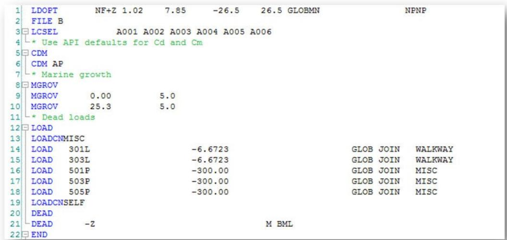

The example below shows the seastate file after the load combinations have been automatically generated by SACS.

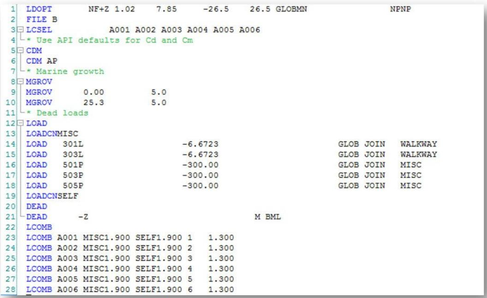

## 3.4 STRENGTH ANALYSIS – CONSTRAINED WAVE

For extreme design load cases a constrained wave approach may be used to ensure the structure experiences a maximum height wave by embedding one non-linear regular wave with height Hmax into a series of irregular linear waves.

The New Wave theory used to describe non-linear regular wave surface profile.

Airy waves used to describe the irregular wave surface profile.

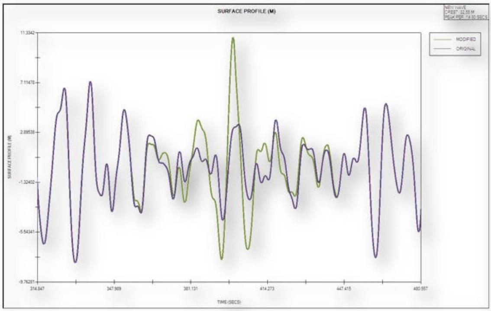

The constrained wave is blended into the irregular surface over a region (insertion time – 3*Tp) and (insertion time + 3*Tp). Where Tp is the period of the constrained wave.

The insertion time, peak period and the maximum crest elevation are defined on the WVINS input line in the wave response input file as shown below:

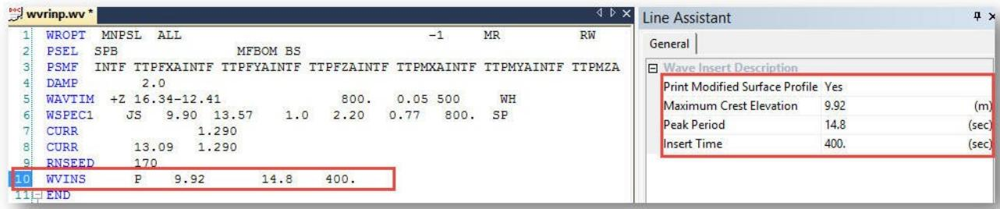

4 SACS-FAST INTERFACE

SACS - FAST interface : Fully Coupled Analysis

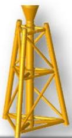

Modeling in SACS/FAST

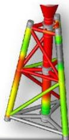

Analysis-FAST/SACS

SACS Post Processing

Jacket&Towermodeled inSACSPrecede Turbine modeled in FAST


Fully Coupled Time HistoryAnalysis-wave and wind loads generated in SACS coupled with turbine forces from FAST


Fatigue/Member Check/Joint Design in

The SACS interface to NREL's FAST aero-elastic program offers a fully integrated and a nonintegrated approach. For the integrated approach the source codes of Wave Response and FAST version 7.1 are combined and compiled into a single program. Here both analyses are coupled together by using SACS generated mode shapes and dynamic properties in the FAST analysis. For the non-integrated approach the two executables are treated as separate entities and are connected at an interface joint in the structure through displacement and rotational compatibility. The iterative check to ensure compatibility compliance is conducted in FAST.

## 4.1 SACS-FAST INTEGRATED ANALYSIS PROCEDURE

For a SACS-FAST Analysis, the SACS portion of the analysis is subjected to mainly wave loading and is analyzed using SACS while the FAST portion mainly analyses for wind turbine loads.

A general set up of the analysis is shown in the steps below:

The turbine loads are divided as shown below.

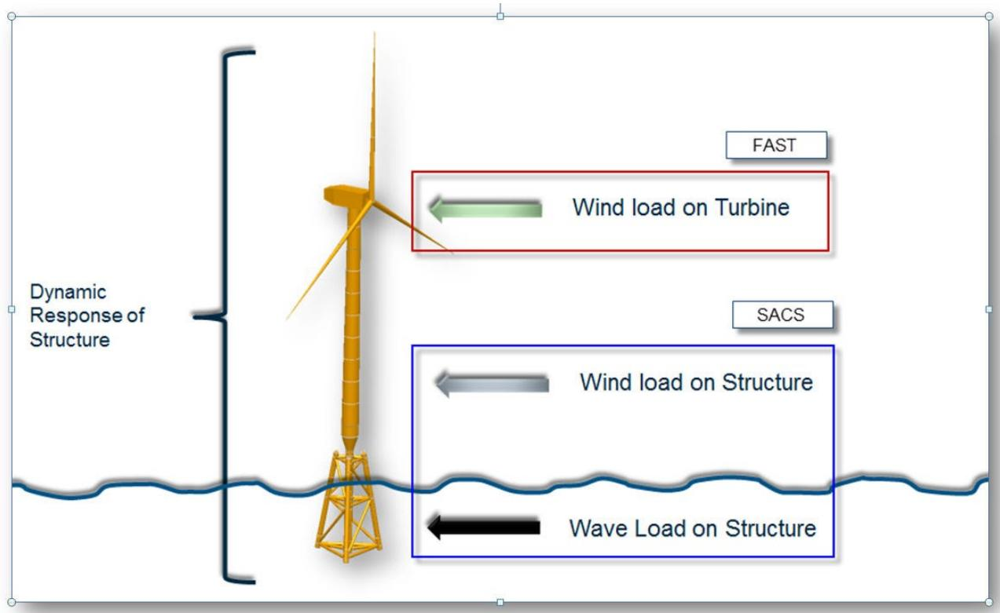

The internal analysis procedure in the integrated approach is described the flow chart below.

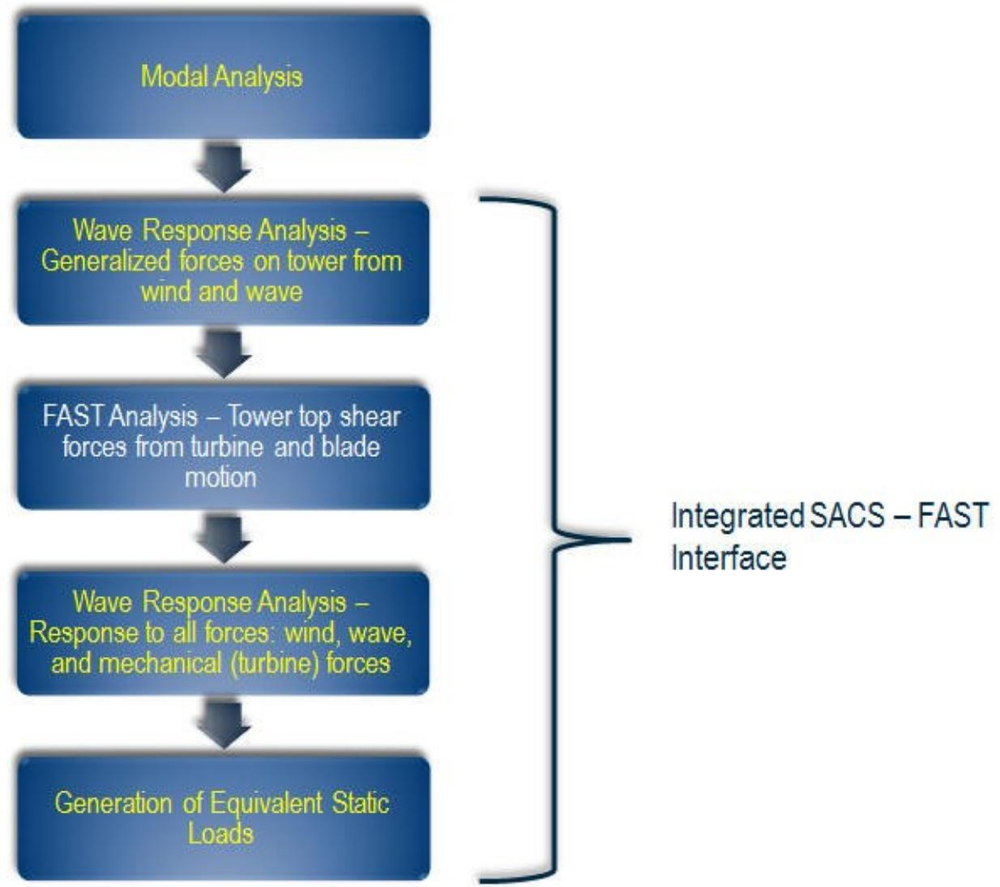

The detailed analysis steps are as follows:

1. Conduct a modal analysis using SACS DYNPAC module to generate the mass and mode files.   
2. Generate a Wave Response input file as shown in the example below.

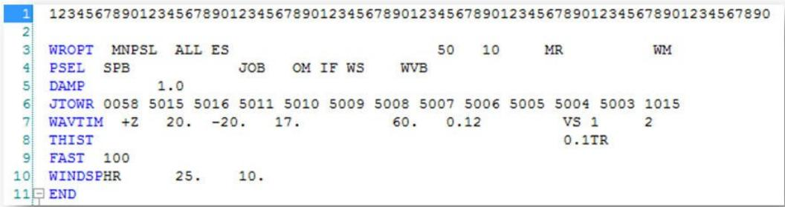

Select the 'ALL' option on the Wave Response options input line, WROPT, to output loads for all time steps. Select the ES option to generate equivalent static loads and the WM option to generate generalized forces for the SACS-FAST analysis.

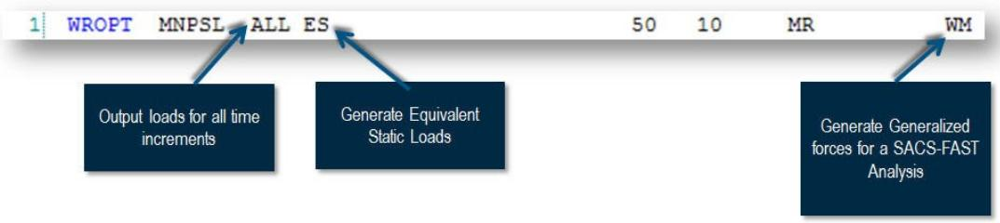

Reference all the nodes used to describe the tower model on the JTOWR input line. It is required that these joints are specified beginning at the tower bottom and in order of increasing elevation. The last joint is the hub joint.

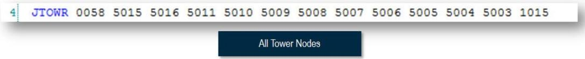

Enter the analysis time and the analysis increment on the WAVTIM input line.

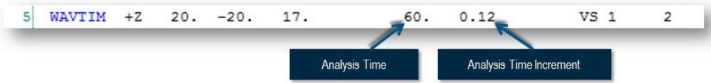

Enter the number of integration time steps used per output time increment on the FAST input line.

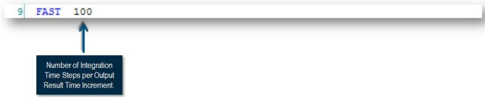

3. Set up the FAST analysis with all supporting and required input files. If the blade pitch and torque controller DLL file for NREL 5MW wind turbine (DISCON.DLL) is to be used. The appropriate option should be selected in the FAST input files and proper values should be entered in “BladedDLLParameters.dat” file. This file should be placed in the same directory as the FAST files. Sample “BladedDLLParameters.dat” can be found in the SACS system directory.   
4. Run the SACS-FAST Integrated analysis to generate an OCI file containing the structural model and the generated equivalent static loads. The OCI file can subsequently be used for fatigue or strength analysis.

The overall analysis procedure for Fatigue/Strength involving the SACS-FAST interface is depicted in the workflow below.

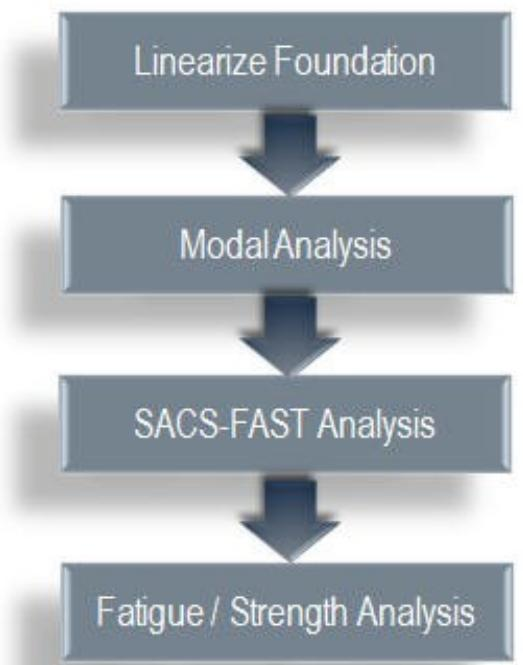

The general analysis procedure for pile linearization (generation of a pile super element) is outlined below. Please refer to the SACS PSI manual for detailed guidance on the generation of a pile super element.

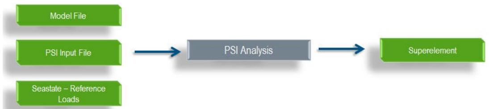

The procedure for a modal analysis is shown in the workflow below. Please refer to the SACS DYNPAC manual for detailed guidance on input to DYNPAC.


Using the files generated above, as SACS-FAST analysis is then performed to generate a SACS OCI file for each simulation. The output OCI file contains the model definition and the generated inertial load cases. The workflow below shows a typical SACS-FAST analysis for the nth simulation.

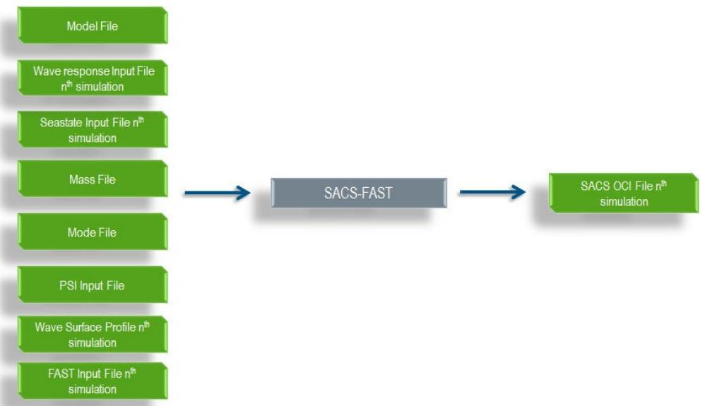

For a fatigue analysis the loads are generated for all time points as shown in the wave response input file below.

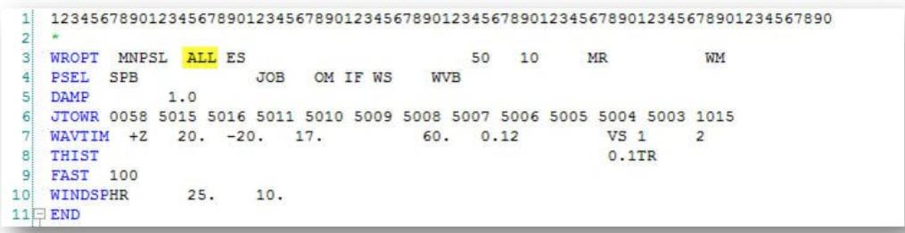

For a strength analysis six load cases are generated corresponding to max/min overturning moment, base shear and torque using the MST wave response option as shown below.

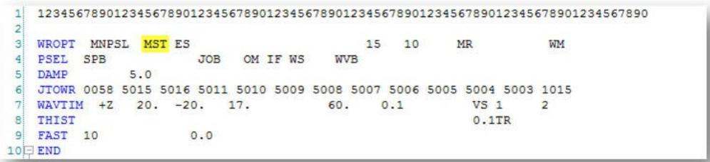

4.1.1 Fatigue Analysis

For a fatigue analysis, the OCI files are used as the SACS model input files to conduct a static analysis for each simulation and output a SACS common solution file. This procedure is repeated for all simulations resulting in an equal number of common solution files.

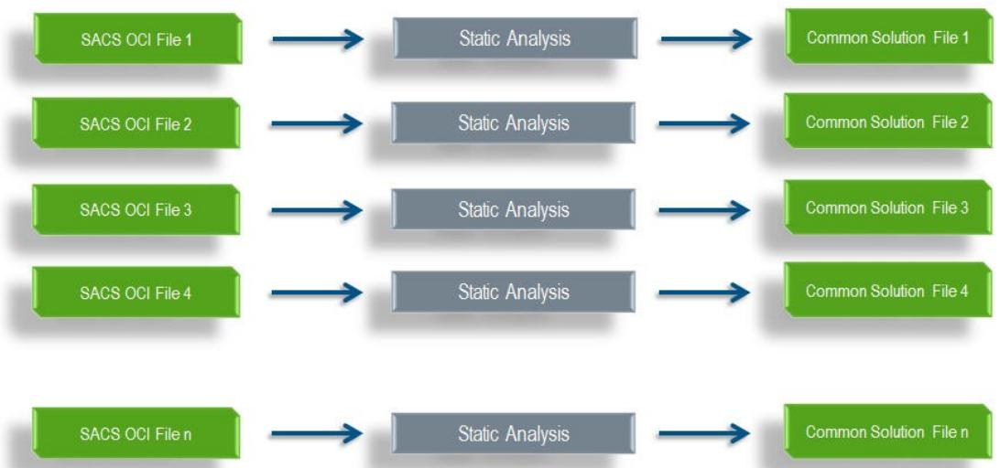

A time history fatigue analysis is then preformed for each simulation using a fatigue input file and the SACS common solution file. The damage from all simulations are summed to obtain the total damage.

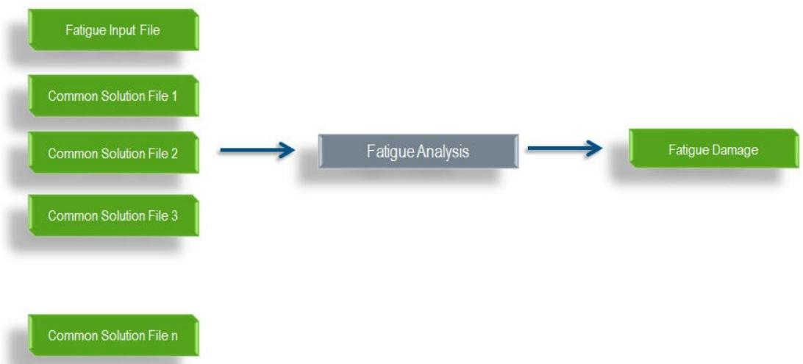

4.1.2 Strength Analysis

For a strength analysis a static analysis is preformed using the output OCI file from the SACS-FAST analysis for each simulation together with a seastate input file as shown below:

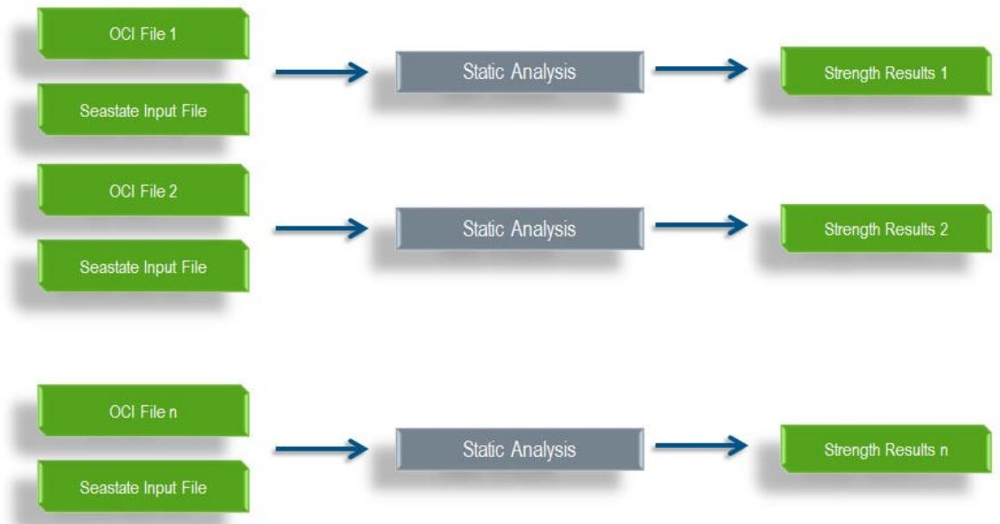

The seastate input file contains all structural dead loads and combinations as shown below.

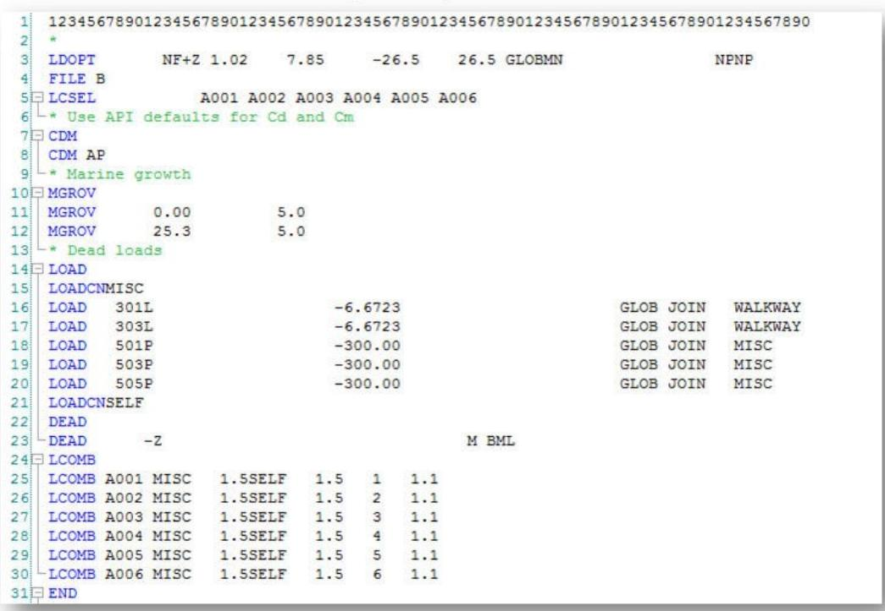

## 4.2 SACS-FAST NON-INTEGRATED ANALYSIS PROCEDURE

The SACS-FAST Non-Integrated analysis workflow for a Fatigue or a Strength analysis is the same as that for the integrated approach. However, the SACS-FAST analysis process is different and is outlined below:

4.2.1 FAST version 7.xx and older

1. Setup the wave response input file with wave and wind loading applied to the structure.

Enter “WM” in columns 68-69 of the WROPT line

Insert the JTOWR line.

Note: In JTOWR line – only mention ONE joint name. This should be the interface joint.

2. Setup FAST analysis with all supporting and required files.

Note1: “PtfmModel” should be selected so that “UserPtfmLd” subroutine will be called in the analysis. For FAST v7.01.00a-bjj, 16-Feb-2012 it can be any of the following options:

i. PtfmModel=1 and PtfmLdMod=1   
ii. PtfmModel=2 and PtfmLdMod=1   
iii. PtfmModel=3 and PtfmLdMod=1

This is necessary that the SACS supplied DLL is called (more details on this in the “Executable creation” section).

3. Invoke the 'SACS Non-Integrated FAST Analysis' sub analysis type under Utilities analysis type and set up the run. When requested for “Non-Integrated FAST Module”, the user should provide the executable (exe) for the FAST module. The exe provided should be compiled based on the instructions provided in the “Executable creation” section below.

Note: the executable can be located anywhere, but the following rules should be followed.

i. Preferred method: Place the FAST executable in the SACS system directory. This will allow the FAST executable to access the DLL (FAST_SACS_DLL.dll) and the static library (FAST_SACS_DLL.lib) directly.   
ii. Alternative method: The FAST executable can be located anywhere on the computer. In this case the user should copy and place the DLL from the SACS system folder to the same folder as the working directory. This may require the user to copy the license file Bentley.liclib.dll or Bentley.liclib.xx.dll (where xx is the version number) from the installation directory to the directory where the FAST exe is located.

4. The above run will create an OCI file containing the model definition and the generated inertial loads at each time increment. The OCI file can subsequently be used for a Fatigue or a Strength analysis using the procedure outlined for the integrated approach.

4.2.1.1 Executable Creation:

In order to create the executable so as to use the couple SACS FAST analysis the following two steps need to be taken.

1. Replace the “UserPtfmLd” subroutine in FAST with the one provided by SACS. This can be easily done by commenting out (or deleting) the subroutine from the FAST source files and adding file “SACS_Additions_n.f90” to the FAST project. The SACS_Additions_n.f90 subroutine is available under the SACS system directory.

Use “FAST_SACS_DLL.lib” as an additional dependency (or any other preferred method to use a static library) in the FAST project.

4.2.2 FAST MODULAR version 8.xx and newer

The SACS-FAST Non-Integrated (Modular) analysis workflow is the same as that for the older version (FAST 7.xx) except for the following differences:

1. The analysis should use the dynamic super element option for DynPac and Wave Response modules.

Enter “DSE” in columns 78-80 of the DYNOP2 line in DynPac input file

2. Create a Dynamic super element input file with option “F” in column 11, and option “FRC” in columns 28-30 of the DSEOPT line.   
3. Invoke the 'SACS Modular Non-Integrated FAST Analysis' sub analysis type under Utilities analysis type and set up the run. When requested for “Non-Integrated FAST Module”, the user should provide the executable (exe) for the FAST module. The exe provided should be compiled based on the instructions provided in the “Executable creation” section below.

Note: the executable can be located anywhere, but the following rules should be followed.

i. Preferred method: Place the FAST executable in the SACS system directory. This will allow the FAST executable to access the DLL (SACS_FAST_Mod_DLL.dll) and the static library (SACS_FAST_Mod_DLL.lib) directly.   
ii. Alternative method: The FAST executable can be located anywhere on the computer. In this case the user should copy and place the DLL from the SACS system folder to the same folder as the working directory. This may require the user to copy the license file Bentley.liclib.dll or Bentley.liclib.xx.dll (where xx is the version number) from the installation directory to the directory where the FAST exe is located.

4. The above run will create an OCI file containing the model definition and the generated inertial loads at each time increment. The OCI file can subsequently be used for a Fatigue or a Strength analysis using the procedure outlined for the integrated approach.

4.2.2.1 Executable Creation:

In order to create the executable so as to use the couple SACS FAST analysis the following two steps need to be taken.

1. Replace the “SubDyn” subroutine in FAST with the one provided by SACS. This can be easily done by Replacing the SACS provided SubDyn.f90 with the original from FAST. The SubDyn.f90 subroutine is available under the SACS system directory.

Use “SACS_FAST_Mod_DLL.lib” as an additional dependency (or any other preferred method to use a static library) in the FAST project.

## 4.3 DYNAMIC SUPER ELEMENT

The jacket structure can also be reduced to a dynamic super element using the SACS Dynamic Superelement module. The module allows the generation of a dynamic superelement based upon the Craig-Brampton approach. The generation of a dynamic superelement and the corresponding reduced load vector is a three step process. The first step is to run the SACS Dynpac module to produce mass, mode, the dynamic superelement data and transformation files. Next, the SACS Wave Response module is used to generate the dynamic superelement force file. Lastly, the SACS Dynamic Superelement module is used to generate the reduced stiffness, mass, damping and load vector.

NOTE: The wave response run can be omitted if the load vector is not required.

The above workflow is depicted in a graphical form below.

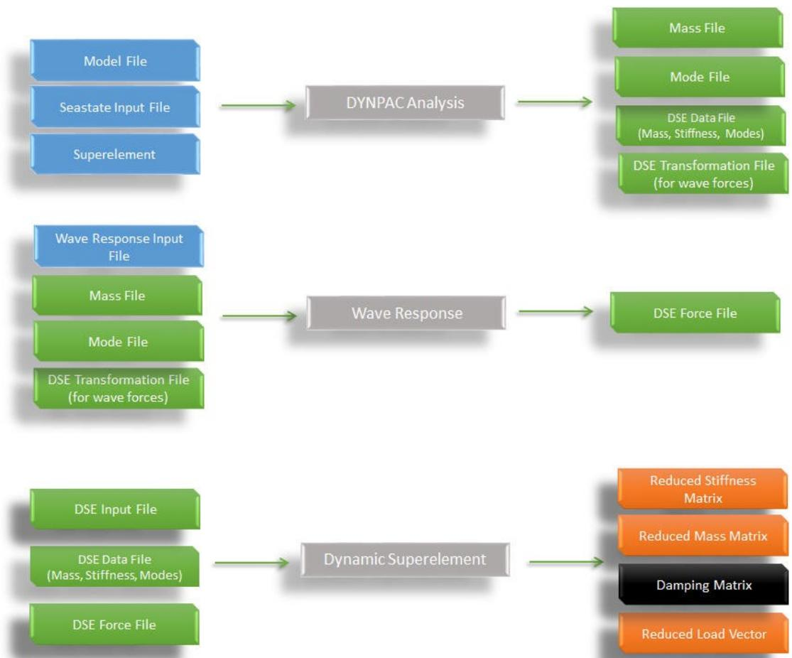

Full details on the generation of a Dynamic Super Element can be found in the Dynamic Superelement manual.

5 DAMAGE CALCULATION VERIFICATION

The fatigue damage is calculated in 3 phases as follows:

PHASE 1: Generation of Sacs Common Solution file

PHASE 2: Generation of damage files from each simulation

PHASE 3 Accumulation of Damage

The fatigue damage calculations are verified for Phases 2 and 3 mentioned above. The details are provided below:

## 5.1 GENERATION OF DAMAGE FILES FOR EACH SIMULATION

For generating the damage file for each simulation fatigue time history analysis is undertaken. This uses rainflow counting technique for different stress ranges and uses these to calculate the damage and thus the service life of the member. For validation purposes, the damage was calculated from stress cycles measured and compared with the calculations from SACS.

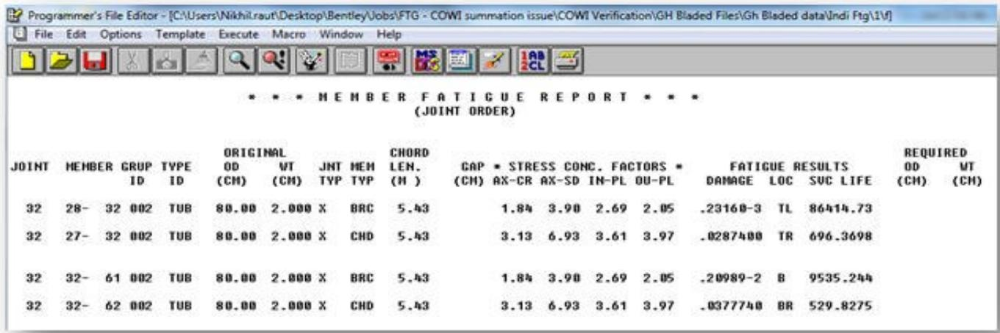

## 5.2 DAMAGE FROM 1 CSF FILE

Table: Damage Calculation   


| STRESS LOCATION: TL | STRESS LOCATION: TL | STRESS LOCATION: TL | CYCLE | AVG | STRESS |  |  |  |  |  |
| --- | --- | --- | --- | --- | --- | --- | --- | --- | --- | --- |
| STRESS RANGE | STRESS RANGE | STRESS RANGE | COUNTS | STRESS | RANGE | LOG10(STR) | LOG10(N) | TCYCL | ACYCL | DMG |
| (N/MM2) |  |  |  | -16.2952 | (STR) |  | from S-N | N | COUNTS*DESIGN LIFE*CYCLES | ACYCL/TCYCL |
| -16.2952 | TO | -15.7774 | 373 | -16.0363 | 0.2589 | -1.425386932 | 38.5 | 3.16228E+38 | 31389294.95 | 9.92617E-32 |
| -15.7774 | TO | -15.2597 | 145 | -15.51855 | 0.77665 | -0.948293636 | 38.5 | 3.16228E+38 | 12202272.84 | 3.8587E-32 |
| -15.2597 | TO | -14.742 | 73 | -15.00085 | 1.29435 | -0.726467255 | 38.5 | 3.16228E+38 | 6143213.22 | 1.94265E-32 |
| -14.742 | TO | -14.2242 | 69 | -14.4831 | 1.8121 | -0.580336823 | 38.5 | 3.16228E+38 | 5806598.797 | 1.83621E-32 |
| -14.2242 | TO | -13.7065 | 48.5 | -13.96535 | 2.32985 | -0.471191022 | 38.5 | 3.16228E+38 | 4081449.879 | 1.29067E-32 |
| -13.7065 | TO | -13.1887 | 62.5 | -13.4476 | 2.8476 | -0.384039999 | 38.5 | 3.16228E+38 | 5259600.36 | 1.66323E-32 |
| -13.1887 | TO | -12.671 | 53.5 | -12.92985 | 3.36535 | -0.311488745 | 38.5 | 3.16228E+38 | 4502217.908 | 1.42373E-32 |
| -12.671 | TO | -12.1532 | 49 | -12.4121 | 3.8831 | -0.249340408 | 38.5 | 3.16228E+38 | 4123526.682 | 1.30397E-32 |
| -12.1532 | TO | -11.6355 | 39 | -11.89435 | 4.40085 | -0.194982417 | 38.5 | 3.16228E+38 | 3281990.625 | 1.03786E-32 |
| -11.6355 | TO | -11.1177 | 26.5 | -11.3766 | 4.9186 | -0.146677477 | 38.5 | 3.16228E+38 | 2230070.553 | 7.0521E-33 |
| -11.1177 | TO | -10.6 | 29 | -10.85885 | 5.43635 | -0.103211573 | 38.5 | 3.16228E+38 | 2440454.567 | 7.71739E-33 |
| -10.6 | TO | -10.0822 | 19.5 | -10.3411 | 5.9541 | -0.063702858 | 38.5 | 3.16228E+38 | 1640995.312 | 5.18928E-33 |
| -10.0822 | TO | -9.5645 | 19 | -9.82335 | 6.47185 | -0.02749054 | 38.5 | 3.16228E+38 | 1598918.509 | 5.05622E-33 |
| -9.5645 | TO | -9.0468 | 17.5 | -9.30565 | 6.98955 | 0.005930233 | 38.5 | 3.16228E+38 | 1472688.101 | 4.65705E-33 |


| STRESS LOCATION: TL | STRESS LOCATION: TL | STRESS LOCATION: TL | CYCLE | AVG | STRESS |  |  |  |  |  |
| --- | --- | --- | --- | --- | --- | --- | --- | --- | --- | --- |
| STRESS RANGE | STRESS RANGE | STRESS RANGE | COUNTS | STRESS | RANGE | LOG10(STR) | LOG10(N) | TCYCL | ACYCL | DMG |
|  |  |  |  |  |  |  |  |  | COUNTS*DESIGN LIFE*CYCLES |  |
| -9.0468 | TO | -8.529 | 13.5 | -8.7879 | 7.5073 | 0.036964788 | 38.5 | 3.16228E+38 | 1136073.678 | 3.59258E-33 |
| -8.529 | TO | -8.0113 | 11 | -8.27015 | 8.02505 | 0.065928764 | 38.5 | 3.16228E+38 | 925689.6634 | 2.92729E-33 |
| -8.0113 | TO | -7.4935 | 5 | -7.7524 | 8.5428 | 0.093081256 | 38.5 | 3.16228E+38 | 420768.0288 | 1.33059E-33 |
| -7.4935 | TO | -6.9758 | 7 | -7.23465 | 9.06055 | 0.118635578 | 38.5 | 3.16228E+38 | 589075.2403 | 1.86282E-33 |
| -6.9758 | TO | -6.458 | 8.5 | -6.7169 | 9.5783 | 0.142769452 | 38.5 | 3.16228E+38 | 715305.649 | 2.262E-33 |
| -6.458 | TO | -5.9403 | 9 | -6.19915 | 10.09605 | 0.16563251 | 38.5 | 3.16228E+38 | 757382.4518 | 2.39505E-33 |
| -5.9403 | TO | -5.4225 | 7 | -5.6814 | 10.6138 | 0.187351917 | 38.5 | 3.16228E+38 | 589075.2403 | 1.86282E-33 |
| -5.4225 | TO | -4.9048 | 5.5 | -5.16365 | 11.13155 | 0.208036658 | 38.5 | 3.16228E+38 | 462844.8317 | 1.46364E-33 |
| -4.9048 | TO | -4.387 | 6 | -4.6459 | 11.6493 | 0.227780847 | 38.5 | 3.16228E+38 | 504921.6346 | 1.5967E-33 |
| -4.387 | TO | -3.8693 | 9.5 | -4.12815 | 12.16705 | 0.24666631 | 38.5 | 3.16228E+38 | 799459.2547 | 2.52811E-33 |
| -3.8693 | TO | -3.3515 | 5.5 | -3.6104 | 12.6848 | 0.264764641 | 38.5 | 3.16228E+38 | 462844.8317 | 1.46364E-33 |
| -3.3515 | TO | -2.8338 | 5 | -3.09265 | 13.20255 | 0.282138838 | 38.5 | 3.16228E+38 | 420768.0288 | 1.33059E-33 |
| -2.8338 | TO | -2.3161 | 6 | -2.57495 | 13.72025 | 0.298843042 | 38.5 | 3.16228E+38 | 504921.6346 | 1.5967E-33 |
| -2.3161 | TO | -1.7983 | 3.5 | -2.0572 | 14.238 | 0.314930006 | 38.5 | 3.16228E+38 | 294537.6202 | 9.3141E-34 |
| -1.7983 | TO | -1.2806 | 4.5 | -1.53945 | 14.75575 | 0.330442306 | 38.5 | 3.16228E+38 | 378691.2259 | 1.19753E-33 |
| -1.2806 | TO | -0.7628 | 5 | -1.0217 | 15.2735 | 0.345419586 | 38.5 | 3.16228E+38 | 420768.0288 | 1.33059E-33 |
| -0.7628 | TO | -0.2451 | 4.5 | -0.50395 | 15.79125 | 0.359897526 | 38.5 | 3.16228E+38 | 378691.2259 | 1.19753E-33 |
| -0.2451 | TO | 0.2727 | 1 | 0.0138 | 16.309 | 0.37390835 | 38.5 | 3.16228E+38 | 84153.60576 | 2.66117E-34 |
| 0.2727 | TO | 0.7904 | 2.5 | 0.53155 | 16.82675 | 0.387481259 | 38.5 | 3.16228E+38 | 210384.0144 | 6.65293E-34 |
| 0.7904 | TO | 1.3082 | 3.5 | 1.0493 | 17.3445 | 0.400642802 | 38.5 | 3.16228E+38 | 294537.6202 | 9.3141E-34 |
| 1.3082 | TO | 1.8259 | 2 | 1.56705 | 17.86225 | 0.413417181 | 38.5 | 3.16228E+38 | 168307.2115 | 5.32234E-34 |
| 1.8259 | TO | 2.3437 | 1.5 | 2.0848 | 18.38 | 0.425826524 | 38.5 | 3.16228E+38 | 126230.4086 | 3.99176E-34 |
| 2.3437 | TO | 2.8614 | 0.5 | 2.60255 | 18.89775 | 0.437891116 | 38.5 | 3.16228E+38 | 42076.80288 | 1.33059E-34 |
| 2.8614 | TO | 3.3791 | 2.5 | 3.12025 | 19.41545 | 0.449628478 | 38.5 | 3.16228E+38 | 210384.0144 | 6.65293E-34 |
| 3.3791 | TO | 3.8969 | 2 | 3.638 | 19.9332 | 0.461058041 | 38.5 | 3.16228E+38 | 168307.2115 | 5.32234E-34 |
| 3.8969 | TO | 4.4146 | 0 | 4.15575 | 20.45095 | 0.472194504 | 38.5 | 3.16228E+38 | 0 | 0 |
| 4.4146 | TO | 4.9324 | 1 | 4.6735 | 20.9687 | 0.483052523 | 38.5 | 3.16228E+38 | 84153.60576 | 2.66117E-34 |
| 4.9324 | TO | 5.4501 | 1 | 5.19125 | 21.48645 | 0.493645684 | 38.5 | 3.16228E+38 | 84153.60576 | 2.66117E-34 |
| 5.4501 | TO | 5.9679 | 0.5 | 5.709 | 22.0042 | 0.503986601 | 38.5 | 3.16228E+38 | 42076.80288 | 1.33059E-34 |
| 5.9679 | TO | 6.4856 | 0 | 6.22675 | 22.52195 | 0.514087007 | 38.5 | 3.16228E+38 | 0 | 0 |
| 6.4856 | TO | 7.0034 | 0 | 6.7445 | 23.0397 | 0.523957837 | 8.29539769 | 197422974 | 0 | 0 |
| 7.0034 | TO | 7.5211 | 0.5 | 7.26225 | 23.55745 | 0.533609295 | 8.259301236 | 181677538.1 | 42076.80288 | 0.000231602 |
| 7.5211 | TO | 8.0389 | 0 | 7.78 | 24.0752 | 0.543050921 | 8.223989556 | 167490259.9 | 0 | 0 |
| 8.0389 | TO | 8.5566 | 0 | 8.29775 | 24.59295 | 0.552291644 | 8.189429252 | 154678250.6 | 0 | 0 |
| 8.5566 | TO | 9.0743 | 0 | 8.81545 | 25.11065 | 0.561338972 | 8.155592245 | 143084386.3 | 0 | 0 |
| 9.0743 | TO | 9.5921 | 0 | 9.3332 | 25.6284 | 0.570202511 | 8.12244261 | 132569192.1 | 0 | 0 |
| TOTAL DAMAGE | TOTAL DAMAGE | TOTAL DAMAGE | TOTAL DAMAGE | TOTAL DAMAGE | TOTAL DAMAGE | TOTAL DAMAGE | TOTAL DAMAGE | TOTAL DAMAGE | TOTAL DAMAGE | 2.3160E-04 |


## 5.3 ACCUMULATION OF DAMAGE

The accumulation of damage phase needs to sum up the damage from all the common solution files (CSF’s). As mentioned above it happens in two stages. Firstly, the damage of 16 CSF’s is summed up in one run. Similar fatigue runs of 16 CSF summations are run in parallel (based on number of cores available). Thus for 100 CSF’s, there will be 6 such runs. Finally, the last run will sum up the damage calculated in these 6 runs (for 100 CSF case) and add it to the damage from the remaining 4 CSF’s

This verification is undertaken by using multiple copies of a single CSF file. Thus if we make 100 such copies, then the damage should be 100 times the damage of a single CSF file. For this verification, the CSF file chosen is the file used for validation of Phase 2. Thus we know that the damage for the single CSF is accurate.

A sample GH bladed process run was created with 100 cases. It can be seen that the fatigue damage (see listing file transcript below) for each run is 16 times the damage calculated in Phase 2. This is verified for all the runs in Folders 1 through 6.

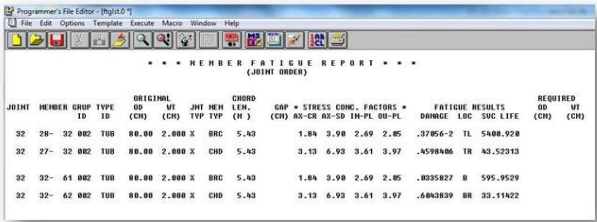

Damage from 1 Fatigue run (16 CSF files)

Also the final summation run in the FTG folder (Ftglst.sum) reports the damage from the final summation for all 100 cases. It can be seen that the damage is 100 times the damage reported in Phase 2.

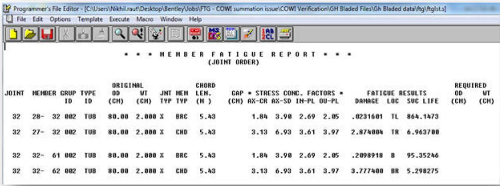

Damage from Fatigue Summation run (100 CSF files)

6 INPUT LINES

FAST DATA

COLUMNS

COMMENTARY

GENERAL THIS LINE IS NECESSARY ONLY FOR A WINDMILL ANALYSIS USINGTHE COUPLED WAVE RESPONSE/FAST ANALYSIS.

( 7- 9) ENTER THE NUMBER OF INTEGRATION TIME INCREMENTS FOR EACH OUTPUT RESULT TIME POINTS.   
(10-18) ENTER THE INTEGRATION TIME STEP. THIS IS USED AS THE FIXED INTEGRATION TIME STEP IN FAST.   
(19-27) ENTER THE TRANSIENT TIME DURATION. THIS IS THE INITIAL TIME PERIOD TO BE IGNORED DUE TO STARTUP TRANSIENTS.


| LINE LABEL | NUMBER OF INTEGRATION TIME STEPS TO OUTPUT TIME STEP | INTEGRATION TIME STEP | TRANSIENT TIME DURATION | LEAVE BLANK |
| --- | --- | --- | --- | --- |
| FAST |  |  |  |  |
| 1--4 | 7--9 | 10--18 | 19--27 | 28--------80 |
| DEFAULT |  |  |  |  |
| ENGLISH |  | SEC | SEC |  |
| METRIC |  | SEC | SEC |  |


TOWER JOINT SPECIFICATION LINES

COLUMNS

COMMENTARY

GENERAL

THIS LINE ENABLES THE USER TO SPECIFY TOWER JOINTS FOR A WINDMILL ANALYSIS ANALYSIS. IT IS REQUIRED THAT THESE JOINTS SPECIFIED BEGIN AT THE TOWER BOTTOM AND IN ORDER OF INCREASING ELEVATION. THE LAST JOINT IS THE HUB JOINT. ANY NUMBER OF JOINTS CAN BE SPECIFIED BY REPEATING THIS LINE.

( 1- 4) ENTER 'JTOWR'.

( 7-80) ENTER THE NAMES OF THE TOWER JOINTS.


| LINE LABEL | TOWER JOINTS | TOWER JOINTS | TOWER JOINTS | TOWER JOINTS | TOWER JOINTS | TOWER JOINTS | TOWER JOINTS | TOWER JOINTS | TOWER JOINTS | TOWER JOINTS | TOWER JOINTS | TOWER JOINTS | TOWER JOINTS | TOWER JOINTS | TOWER JOINTS |
| --- | --- | --- | --- | --- | --- | --- | --- | --- | --- | --- | --- | --- | --- | --- | --- |
| LINE LABEL | JOINT 1 | JOINT 2 | JOINT 3 | JOINT 4 | JOINT 5 | JOINT 6 | JOINT 7 | JOINT 8 | JOINT 9 | JOINT 10 | JOINT 11 | JOINT 12 | JOINT 13 | JOINT 14 | JOINT 15 |
| JTOWR |  |  |  |  |  |  |  |  |  |  |  |  |  |  |  |
| 1-- 4 | 7-->10 | 12-->15 | 17-->20 | 22-->25 | 27-->30 | 32-->35 | 37-->40 | 42-->45 | 47-->50 | 52-->55 | 57-->60 | 62-->65 | 67-->70 | 72-->75 | 77-->80 |

