SACS

Post-Processor

Version 24.00

Trademark Notice

Bentley and the "B" Bentley logo are either registered or unregistered trademarks or service marks of Bentley Systems, Incorporated. All other marks are the property of their respective owners.

Copyright Notice

Copyright © 2024, Bentley Systems, Incorporated. All Rights Reserved.

TABLE OF CONTENTS

1 INTRODUCTION .. . 8

## 1.1 OVERVIEW.. . 8
## 1.2 PROGRAM FEATURES.. . 8

1.2.1 Internal Load and Stress Sign Convention .... 9   
1.2.2 Redesign Procedure ... 9

2 POST PROCESSING OPTIONS .. .. 10

## 2.1 STRESS ANALYSIS CODE CHECK AND REDESIGN .. .... 10

2.1.1 Element Check Code ... .. 10   
2.1.2 AISC/API Parameters... . 11   
2.1.3 Panel Code Check Options ... 11   
2.1.4 Member Check Locations.... .. 13   
2.1.5 Output Reports . 14   
2.1.6 Selecting Joints, Groups and Members... .. 14   
2.1.7 Reporting Results by Unity Check Ratio.. .15   
2.1.8 Output Load Cases ... 15   
2.1.9 Allowable Stress/Material Factor..... .15   
2.1.10 Redesign Parameters .... .16   
2.1.11 Additional Redesign Parameters.... 17   
2.1.12 Disabling Redesign in Post .. 18   
2.1.13 Hydrostatic Collapse Parameters... . 18   
2.1.14 General Parameters ... .18   
2.1.15 API Parameters.... 18   
2.1.16 Redesign Data ..... . 18   
2.1.17 Output Options . . 19   
2.1.18 Overriding Water Depth.. 19   
2.1.19 Hydrostatic Head Data .... 19   
2.1.20 Hoop Stress Parameters.... .. 20   
2.1.21 X-Brace and K-Brace Parameters ... .. 20   
2.1.22 Defining Load Combinations. . 21   
2.1.23 Displacement Serviceability Check .. 22   
2.1.24 Hotspot SCF Extraction .... . 22

## 2.2 SOLUTION FILE UTILITY FEATURES... .. 22

2.2.1 Overriding Properties and UC Parameters.... . 22   
2.2.2 Overriding Section Properties.. .. 23   
2.2.3 Overriding Group Data.... . 23   
2.2.4 Overriding Member Data.. .23   
2.2.5 Extracting Portions of a Solution File ... .. 24   
2.2.6 Post File Options .. 24   
2.2.7 Specifying Elements to be retained . .. 24

3 COMMENTARY . .. 25

## 3.1 TERMS AND DEFINITIONS ... ... 25
## 3.2 CALCULATING STRESS ... .. 27

3.2.1 Direct Axial, Bending and Shear Stress ... . 27

3.2.1.1 Tubular Sections.... .. 27   
3.2.1.2 Wide Flange Sections ..... .. 28   
3.2.1.3 Box Sections .... . 29   
3.2.1.4 Prismatic Sections .... .. 30   
3.2.1.5 Angle Sections .... .30   
3.2.1.6 Tee Sections .... . 32   
3.2.1.7 Conical Sections .... .32   
3.2.1.8 Ring and Longitudinal Stiffened Cylinders ... . 33

3.2.2 Von Mises Stresses.... . 33

3.2.2.1 Wide Flange Sections ..... . 34   
3.2.2.2 Box Sections .... .35   
3.2.2.3 Prismatic Sections .... .36

3.2.3 Effective Bending Stress for NPD and NS Codes .. . 37   
3.2.4 Equivalent Uniform Bending Stress BS5950 . . 37   
3.2.5 Hydrostatic Stresses.... .38

3.2.5.1 Tubular and Stringer-Stiffened Cylinders.. .. 38   
3.2.5.2 Ring Stiffened Cylinders .... .38

## 3.3 DETERMINING ALLOWABLE STRESS/NOMINAL STRENGTH. ... 39

3.3.1 API/AISC Allowable Working Stress .... . 39

3.3.1.1 Tubular Members.... . 39   
3.3.1.2 Non-Tubular Members.... .. 40   
3.3.1.3 Stiffened Cylinders .. .. 42

3.3.2 API/AISC LRFD Nominal Strength.. .. 44

3.3.2.1 Tubular Members.... . 44   
3.3.2.2 Non-Tubular Members.... . 45

3.3.3 NPD/NS3472E Characteristic Stresses .. .. 48   
3.3.3.1 Non-Tubular Members.... .. 48   
3.3.4 British Standards Design Strength . . 49

3.3.5 AISC 13th Edition..... . 50

3.3.5.1 Design for strength using Load and Resistance Factor Design .... . 51   
3.3.5.2 Design for strength using Allowable Strength Design.. .51   
3.3.5.3 Second-order analysis by amplified first-order elastic analysis... . 51   
3.3.5.4 Cm, Cb and the SPAN line ... .51   
3.3.5.5 Use of SPAN line for AISC 13th Edition in SACS.. .. 54   
3.3.5.6 Member slenderness limitations .... . 54   
3.3.5.7 AISC 13th Edition Nominal Strength for non-tubular members . . 55

3.3.6 Eurocode 3 .. . 56

3.3.6.1 CODE input line. ... .. 56   
3.3.6.2 SPAN input line... .57   
3.3.6.3 Unbraced Length of Bottom Flange.. .57

3.3.7 AISC 14th Edition.... .57   
3.3.7.1 Differences between AISC 14th and AISC 13th... . 58   
3.3.8 AISC 15th Edition.... .59

3.3.8.1 Differences between AISC 15th and AISC 14th. .. 59

## 3.4 INTERACTION UNITY CHECK RATIO... .... 60

3.4.1 API/AISC Allowable Working Stress .. ... 60

3.4.1.1 Tubular Members... .. 60   
3.4.1.2 Hydrostatic Collapse for Tubular Members .. .. 61   
3.4.1.3 Conical Sections ... .. 62   
3.4.1.4 Non-Tubular Members.... .. 62   
3.4.1.5 Stiffened Cylinders . .. 63   
3.4.1.6 Plates.... .. 64

3.4.2 API/AISC LRFD ... .. 64

3.4.2.1 Tubular Members.... .. 64   
3.4.2.2 Non-Tubular Members.... .. 65   
3.4.2.3 Plates.... .. 66

3.4.3 NPD/NS3472E Interaction Equations.. ... 66

3.4.3.1 Tubular Members... .. 66   
3.4.3.2 Hydrostatic Collapse for Tubular Members .. .. 67   
3.4.3.3 Non-Tubular Members..... .. 67   
3.4.3.4 Plates... .. 68

3.4.4 BS5950 Interaction Equations.. .. 68   
3.4.5 Danish DS449/DS412 . . 69

3.4.5.1 Combined Stress for all Cross Sections except Tubular Sections... .. 69   
3.4.5.2 Box and Wide Flange Sections . .. 69   
3.4.5.3 Tubular Sections... .. 71   
3.4.5.4 Hydrostatic Collapse for Tubular Members . .. 71   
3.4.5.5 Interaction Equation .... .. 72   
3.4.5.6 Local Buckling for Non-Tubular Cross Sections.. .. 72   
3.4.5.7 Flange Buckling ..... ... 72   
3.4.5.8 Web Buckling Due to Compression plus Bending .... .. 73   
3.4.5.9 Web Buckling Under Shear .... .. 74

3.4.6 AISC 13th Edition... .. 74   
3.4.7 DNV-RP-C202 . ... 76

3.4.7.1 Unstiffened tubular sections... ... 76   
3.4.7.1.1 Longitudinal membrane stress .... ... 76   
3.4.7.1.2 Shear stress ... .... 76   
3.4.7.1.3 Circumferential membrane stress . .. 77

3.4.7.2 Stiffened tubular section.. .. 77   
3.4.7.3 Unstiffened conical sections .... .. 77

3.4.7.3.1 Longitudinal membrane stress .... .. 77   
3.4.7.3.2 Circumferential membrane stress . ... 78   
3.4.7.3.3 Shear stress ... ... 78

3.4.7.4 Buckling resistance of cylindrical and conical sections.. .. 78

3.4.7.4.1 Elastic buckling criteria . .. 79   
3.4.7.4.2 General buckling criterion..... .. 79   
3.4.7.4.3 Column stability criterion.... ... 80

## 3.5 VON MISES CODE CHECK FOR PLATES, SHELLS AND SOLIDS . ... 80

3.5.1 Plate Element.. .. 80

3.5.1.1 Plate stresses notation.. . 80   
3.5.1.2 Plate stress calculations .. . 81   
3.5.1.3 Local and Overall Stability code checks for plated structures .. . 82

3.5.2 Shell Element .. .. 82

3.5.2.1 Shell stresses notation .. .. 82   
3.5.2.2 Shell stress Calculations ..... .. 82   
3.5.2.3 Local and Overall stability code checks for shell structures: . .. 83

3.5.3 Solid Element .. .. 83

3.5.3.1 Solid stresses notation reported.. .. 83   
3.5.3.2 Solid stress Calculations ... . 83

3.5.4 Element von Mises Code Check for plates, shells and solids.. .. 84

3.5.4.1 Code check for AISC 9th edition (UC option, ASD). .84   
3.5.4.2 Code check for AISC 13th edition (AA option, ASD).. . 84   
3.5.4.3 Code check for AISC 13th edition (AL option, LRFD) .. . 84   
3.5.4.4 Code check for Eurocode 3 1992E (EC option, LRFD) . .84

## 3.6 Eurocode 3-2005.. .. 84

3.6.1 Main contents for the implementation ... .. 84   
3.6.2 OPTIONS input line:... . 85   
3.6.3 CODE input line: .. .. 85   
3.6.4 SPAN input line: .. .. 85   
3.6.5 GRUP input line.. .86   
3.6.6 Example.... .. 86

## 3.7 CSA S16-09:2009 ... .... 87

3.7.1 Main contents for the implementation ..... . 87   
3.7.2 OPTIONS input line.. .. 87   
3.7.3 CODE IS input line ..... .. 87   
3.7.4 RFLRFD input line .... .. 88   
3.7.5 GRUP input line ... .. 88   
3.7.6 Example.... .. 89

## 3.8 ISO 19902 and ISO 19901-3 code check .. .. 90

3.8.1 Main contents for the implementation ... . 90   
3.8.2 CODE IS input line ..... .90   
3.8.3 Resistance factors of non-tubular members .... . 90

## 3.9 Norsok Standard N-004 code.. .. 91
## 3.10 Hotspot SCF Calculation..... .. 91

3.10.1 Extrapolation Coordinate System .. .91   
3.10.2 Average Joint Stress .... .. 92   
3.10.3 Extrapolation to Intersection Joint . .94   
3.10.4 SCF Calculation.... . 95

4 SAMPLE PROBLEMS.. .96

## 4.1 SAMPLE PROBLEM 1 . .97
## 4.2 SAMPLE PROBLEM 2 .. .106

## 4.3 SAMPLE PROBLEM 3 .. .110
5 OUTPUT REPORTS . .. 112   
## 5.1 REPORT DESCRIPTIONS . .112

5.1.1 Reaction Report ... . 112   
5.1.2 Spring Forces and Moment Report... . 112   
5.1.3 Joint Deflection and Rotation Report . . 112   
5.1.4 Plate Stress Detail Report . . 112   
5.1.5 Plate Stress Summary Report . . 112   
5.1.6 Plate Stress Unity Check Range Summary ..... .. 113   
5.1.7 Member Detail Report . . 113   
5.1.8 Member Forces and Moments Report ... .. 113   
5.1.9 Element Stress at Maximum Unity Check Report.. .. 113   
5.1.10 Element Unity Check Report. .114   
5.1.11 Member Internal Loads Summary Report . .. 114   
5.1.12 Member Unity Check Range Summary ...... .. 114   
5.1.13 Member Group Summary .... .115   
5.1.14 Hotspot SCF Report... .115   
5.1.15 Hotspot Plate Stress Detail Report .. .. 115

6 INPUT LINES... ..116

1 INTRODUCTION

## 1.1 OVERVIEW

Post, a sub-program of SACS IV, is used to calculate element stresses, compare them to code allowables and optionally redesign the elements. The program can also be used to modify element properties and/or code check parameters and create an updated common solution file.

## 1.2 PROGRAM FEATURES

Post is completely compatible with the output files of the SACS system such that all dimensions, geometry, internal loads, material properties, cross sectional properties, yield stress and allowable stress factors necessary for post processing and design are obtained from the common solution file without user intervention.

Post processing options and code check parameters may also be read directly from the common solution file or may be specified in a separate Post input file. Some of the main features and capabilities of the program are:

1. API, API-LRFD, AISC, AISC-LRFD, NPD, DnV, Eurocode 3, ISO19902, British Standards and Danish codes are implemented.   
2. Hydrostatic collapse of tubular members based on API-RP2A, ISO19902 or DNV requirements.   
3. Complete element redesign capabilities based on constant depth or OD, minimum weight or user input selection criteria.   
4. API 2U and 2V bulletins.   
5. Panel code check in accordance to DnV-RP-C201/C202 and ABS Buckling Guide   
6. Euler buckling check for segmented members.   
7. Finite element code check and stiffener stress output.   
8. Complete element property and code check parameter override capabilities.   
9. Load case and output report selection capability.   
10. Ability to specify load combinations for post processing.   
11. Ability to create a new solution file from portions extracted from an existing solution file.   
12. Ability to select joints, members and groups for output.   
13. Provides summary report of all members requiring ring stiffeners due to hydrostatic collapse.   
14. Contains Cb options when using AISC WSD code.

1.2.1 Internal Load and Stress Sign Convention

The sign convention used by the Post program module for reporting member internal loads and stresses is dependent on the member local coordinate system as follows:

1. Axial tension is positive at both ends of the member while compression is negative at both ends.   
2. Positive bending at both ends of the member causes the center of the member to deflect downward or in the negative direction of the local coordinate system.   
3. Positive shear force is in the direction of the positive local member coordinate at the beginning of the member and in the negative local member coordinate at the end of the member.   
4. A positive torsion vector is outward at both ends of the member.

The figure below shows positive loads and moments along with positive stresses at the member beginning and end.

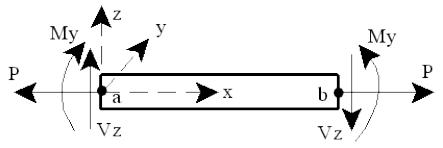

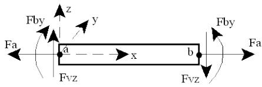

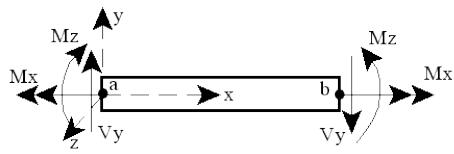

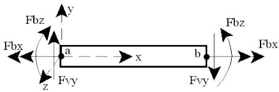  
POSITIVE Internal Forces & Moments   
POSITIVE Stresses

1.2.2 Redesign Procedure

The general procedure used by the program when redesigning is as follows:

1. The most critical member (i.e. member with highest UC ratio) in each group is selected. If the unity check is greater than 1.0, the member is resized until it complies with the appropriate code and the selected redesign options. If member size optimization is to be allowed and the unity check is less than the unity check lower bound, the member size is reduced.   
2. After the most critical member is redesigned, all other members of that group are checked with the new size to ensure code compliance. If a unity check greater than 1.0 is found, the new group size will be resized again and the procedure will continue.   
3. For segmented members the segment with the largest Kl/r ratio is redesigned first. All other segments are redesigned, if necessary, in order of decreasing Kl/r ratio. Before a member segment is reduced in size, however, the Euler buckling limit for the entire member using the new size is checked. All other members of the group are then checked for code compliance as stated above.

2 POST PROCESSING OPTIONS

The Post program module can be used to perform a stress analysis code check, redesign elements, modify element properties and code check parameters and create a new common solution file containing a portion of the original solution file.

## 2.1 STRESS ANALYSIS CODE CHECK AND REDESIGN

Post processor options may be specified directly in the SACS model file or in a separate Post input file. Post processor options specified in the model are included in the common solution file and are used as defaults by the Post program. Data specified in a Post input file overrides data read from the common solution file.

The following is a brief discussion of the post processing options used for stress analysis, code check and redesign.

2.1.1 Element Check Code

The code that element stresses are to be checked with respect to is specified on the ‘OPTIONS’ line in columns 25-26. The available codes and the corresponding option are below:

'5B' AISC 15th / API RP2A 22nd Edition

'4B' AISC 14th / API RP2A 22nd Edition

'AB' AISC 13th / API RP2A 22nd Edition

'UB' AISC 9th / API RP2A 22nd Edition

‘UC’ AISC 9th / API RP2A 21st Edition

'5A' AISC 15th / API RP2A 21st Edition

'4A' AISC 14th / API RP2A 21st Edition

'AA' AISC 13th / API RP2A 21st Edition

‘19’ AISC 9th / API RP2A 19th Edition

‘16’ AISC 9th / API RP2A 16th Edition

'10' AISC 9th / API RP2A 10th Edition

'5M' AISC 15th / API RP2A LRFD 2nd Edition

'4M' AISC 14th / API RP2A LRFD 2nd Edition

'AM' AISC 13th / API RP2A LRFD 2nd Edition

'5L' AISC 15th / API RP2A LRFD 1st Edition

'4L' AISC 14th / API RP2A LRFD 1st Edition

'AL' AISC 13th / API RP2A LRFD 1st Edition


| 'LR' | AISC LRFD 1st / API RP2A LRFD 1st Edition |
| --- | --- |
| 'L2' | AISC LRFD 2nd / API RP2A LRFD 1st Edition |
| 'L3' | AISC LRFD 3rd / API RP2A LRFD 1st Edition |
| 'LG' | Linear Global Analysis |
| 'EC' | Eurocode 3:v1992 with NORSOK 2004 N-004 |
| 'E5' | Eurocode 3:v2005 with NORSOK 2004 N-004 |
| 'ET' | Eurocode 3:v2005 |
| 'IS' | ISO 19902 (2007) with Eurocode 3:v1992, v2005, AISC 13th, CSA S16-09 etc. (See SACS manual and CODE line for details) |
| 'I2' | ISO 19902 (2020) with Eurocode 3:v1992, v2005, AISC 13th, CSA S16-09 etc. (See SACS manual and CODE line for details) |
| 'NC' | NORSOK 2013 N-004 with Eurocode 3:v2005 |
| 'NS' | NORSOK 2004 N-004 with NS3472 |
| 'NP' | 1995 NPD / NS 3472 |
| 'DC' | 1994 Danish Code |
| 'D1' | 1984 Danish Code |
| 'BS' | 1990 British Standard BS5950 |
| 'CA' | 1994/2001 Canadian code check |
| 'MS' | Maximum stress print with no code check |
| 'ED' | Eurocode 3:v2005 with DNV-RP-C202 |


2.1.2 AISC/API Parameters

For AISC/API codes, additional parameters can be specified on the OPTIONS line.

By default the moment distribution factor ${ \mathsf{ C } }_{ \mathsf{ b } }$ is taken as unity. Enter ‘B’ in column 33 to calculate the distribution factor based on AISC criteria.

When using AISC/API codes, p-delta effects are accounted for in the interaction equation by magnifying the moment in the bending component by $1 / ( 1 - \mathsf{ F_{ a } } / \mathsf{ F_{ e } } )$ . When including second order effects using a pdelta analysis, however, this magnification may not be applicable. Enter ‘M’ in column 34 to exclude the moment magnification in the interaction equation (i.e. set the term $\left( 1 - F_{ \mathsf{ a } } \middle / \mathsf{ F }_{ \mathsf{ e } } \right)$ to unity).

2.1.3 Panel Code Check Options

Column 35 of the OPTIONS line can be used for selecting code checks for stiffened or un-stiffened panels. Enter “B” for ABS Buckling Guide Apr 2004 (Updated Aug 2018), “A” for API BULL 2V $\tt{ o r } \ " \mathrm{ { D } }^{ \prime \prime }$ for DnV-RP-

C201/C202. Currently only ABS Buckling Guide and DnV-RP-C201/C202 (2010/July 2019) codes of practice are implemented.

The ABS Buckling Guide and DnV-RP-C201/C202 plate panel codes can be used in accordance to either the LRFD or WSD standards by specifying the appropriate code check options in column 25-26 of OPTIONS line. Curved panels can be checked as per the ABS Buckling Guide and DNV-RP-C202. Column buckling checks for curved panels are not supported.

Plate panels will be checked in accordance to WSD standard if the following options are selected in columns 25-26 of the OPTIONS line,

${ }^{ 1 } 58^{ \circ } \qquad{ \mathsf{ F o r } } { \mathsf{ W S D } } { \mathsf{ A l S C } } 1 { \mathsf{ S } }^{ \mathsf{ t h } } / { \mathsf{ A P } } { \mathsf{ I } } { \mathsf{ R P 2 A } } 22^{ \mathsf{ n d } } { \mathsf{ E d i t i o n } }$   
$^{ \prime } 48^{ \prime } \qquad \mathsf{ F o r \mit W S D \ A l S C \ 14^{ \mathrm{ t h } } / A P 1 \ R P 2 A \ 22^{ \mathrm{ n d } } \ E d i t i o n }$   
$^{ \mathrm{ ' } } { \sf A } { \sf B }^{ \mathrm{ ! } } \qquad \mathsf{ F o r } \mathsf{ W } { \sf S } { \sf D } \mathsf{ A } | \mathsf{ S } { \sf C } \ 13^{ \mathrm{ t h } } / { \sf A } { \sf P } | \ { \sf R } { \sf P } 2 { \sf A } \ 22^{ \mathrm{ n d } } \ \mathsf{ E } { \sf d } { \sf i } { \sf t i o n }$   
$^{ \prime } \mathsf{ U B }^{ \prime } \qquad \mathsf{ F o r } \mathsf{ W S D } \mathsf{ A l S C } \mathsf{ g }^{ \mathrm{ t h } } / \mathsf{ A P l } \mathsf{ R P 2 A } 22^{ \mathrm{ n d } } \mathsf{ E d i t i o n }$   
$^{ \prime \prime } \mathsf{ U C }^{ \prime \prime } \quad \mathsf{ F o r } \mathsf{ W S D } \mathsf{ A l S C } \mathsf{ 9 }^{ \mathrm{ t h } } / \mathsf{ A P l } \mathsf{ R P 2 A } 21^{ \mathrm{ s t } } \mathsf{ e d i t i o n }$   
$^{ \prime \prime } 5 \mathsf{ A }^{ \prime \prime } \quad \mathsf{ ~ F o r ~ W S D ~ A l S C ~ 15^{ \mathrm{ t h } } / \mathsf{ A P l ~ R P ~ 2 A ~ 21^{ \mathrm{ s t } } \thinspace e d i t i o n } }$   
$^{ \prime \prime } 4 \mathsf{ A }^{ \prime \prime } \quad \mathsf{ ~ F o r ~ W S D ~ A l S C ~ 1 } 4^{ \mathsf{ t h } } / \mathsf{ A P l ~ R P ~ 2 A ~ 21 }^{ \mathrm{ s t } } \mathsf{ e d i t i o n }$   
$^{ \prime \prime } \mathsf{ A A }^{ \prime \prime } \quad \mathsf{ F o r } \mathsf{ W S D } \mathsf{ A l S C } 13^{ \mathrm{ t h } } / \mathsf{ A P l } \mathsf{ R P } 2 \mathsf{ A } 21^{ \mathrm{ s t } } \mathsf{ e d i t i o n }$

Plate panels will be checked in accordance to LRFD standard if the following options are selected in columns 25-26 of the OPTIONS line:

$\begin{array} { r l } {^{ \alpha } \mathsf{ S L }^{ \prime \prime } } & { { } \mathsf{ F o r \ } \mathsf{ L R F D \ A l S C \ } 1 \mathsf{ S C \ } 1 \mathsf{ S }^{ \mathrm{ t h } } / \mathsf{ A P l \ } \mathsf{ R P \ } 2 \mathsf{ A } - \mathsf{ L R F D \ } 1^{ \mathrm{ s t } } \mathsf{ e d i t i o n } ; } \end{array}$   
$\begin{array} { r l r } {^{ \prime \prime } } & { { } } & { \mathsf{ F o r \ L R F D \ A l S C \ 14^{ \dag \mathrm{ h } } / \ A P l \ R P \ 2 A - L R F D \ 1^{ \mathrm{ { s t } } } \ e d i t i o n ; } } \end{array}$   
$\begin{array} { r l } {^{ \prime \prime } \mathsf{ A L }^{ \prime \prime } } & { { } \mathsf{ \digamma ~ { \sf ~ F o r ~ \mathsf{ L R F D } } ~ A l S C ~ { 13^{ \mathrm{ t h } } } / \mathsf{ A P l } ~ R \mathsf{ P } ~ 2 \mathsf{ A } } - \mathsf{ L R F D } ~ 1^{ \mathrm{ s t } } \mathsf{ e d i t i o n } ; } \end{array}$   
$\begin{array} { r l r } {^{ \alpha } \mathsf{ L R }^{ \prime \prime } } & { } & { \mathsf{ F o r \ L R F D \ A l S C \ 15^{ \alpha } \ e d i t i o n } / \mathsf{ A P l \ R P \ 2 A } - \mathsf{ L R F D \ 1 }^{ \mathrm{ s t } } \mathsf{ e d i t i o n } ; } \end{array}$   
$\begin{array} { r l r } {^{ \prime \prime } } & { { } \mathsf{ \Gamma } \mathsf{ P o r \ L R F D \ A l S C \ 2^{ \mathrm{ n d } } \ e d i t i o n / \ A P l \ R P \ 2 A } - \mathsf{ \Gamma } \mathsf{ L R F D \ 1^{ \mathrm{ { s t } } } } \mathsf{ e d i t i o n ; } } \end{array}$   
$\begin{array} { r l r } {^{ \alpha } \mathsf{ L } \mathsf{ 3 }^{ \prime \prime } } & { } & { \mathsf{ F o r \ L R F D \ A l S C \ 3 }^{ \mathrm{ r d } } \mathsf{ e d i t i o n } / \mathsf{ A P l } \mathsf{ \ R P \ 2 A } - \mathsf{ L R F D \ 1 }^{ \mathrm{ s t } } \mathsf{ e d i t i o n } ; } \end{array}$   
$\begin{array} { r l } {^{ \prime \prime } \mathsf{ E } \mathsf{ C }^{ \prime \prime } } & { \mathsf{ \Delta } \mathsf{ F o r ~ E u r o c o d e \ 3 } \left( \mathsf{ L R F D } \right) \mathsf{ w i t h ~ N O R S O K ~ } 2004 \mathsf{ N } \cdot 004 ; } \end{array}$   
$^{ \prime \prime } { \mathsf{ N S } }^{ \prime \prime } \quad \mathsf{ F o r } { \mathsf{ N O R S O K } } 2004 { \mathsf{ N } } { \mathsf{ - } } 004 ( \mathsf{ L R F D } ) { \mathsf{ w i t h } } { \mathsf{ N S 3 } } 472 ;$   
$^{ \prime \prime } { \mathsf{ D C } }^{ \prime \prime } \quad \mathsf{ F o r } 1994 \mathsf{ D a n i s h } { \mathsf{ C o d e } } \left( \mathsf{ L R F D } \right)$   
$^{ \prime \prime } { \mathsf{ D } } 1^{ \prime \prime } \quad \mathsf{ F o r } 1984 \mathsf{ D a n i s h } \mathsf{ C o d e } \left( \mathsf{ L R F D } \right)$   
$^{ \prime \prime } { \mathsf{ B } } { \mathsf{ S } }^{ \prime \prime } \quad \mathsf{ F o r } 1990 \mathsf{ B } { \mathsf{ S } } { \mathsf{ S } } { \mathsf{ S } } { \mathsf{ S } } { \mathsf{ S } } { \mathsf{ O } } { \mathsf{ C } } { \mathsf{ o d e } } \left( { \mathsf{ L } } { \mathsf{ R } } { \mathsf{ F } } { \mathsf{ D } } \right)$   
$^{ \prime \prime } \mathsf{ C A }^{ \prime \prime } \quad \mathsf{ \Delta ~ F o r ~ } 1994 / 2001 \mathsf{ C a n a d i a n } \left( \mathsf{ L R F D } \right) \mathsf{ C o d e ~ C h e c k }$

The PCODE input line for DnV-RP-C201/C202 code of practice may be used to input user defined parameters. Currently all the options in this line are only applicable to DnV-RP-C201/C202 code of practice. The PSTIF input line can be used to designate a stiffener be checked as a plate girder in addition to the torsional and column buckling lengths and also the stiffener yield stress value. The PGRUP line can be used to define particular plate groups belonging to a panel by entering 'P' in column 6.

Note: All plates forming a panel should have the same unique plate group label.

2.1.4 Member Check Locations

The locations at which to check non-segmented and segmented members is specified on the ‘OPTIONS’ line in columns 29-30 and 31-32 respectively.

Note: The locations may also be specified for each member in columns 71-72 on the MEMBER line.

For non-segmented members, the number of equal length stress sections the member is to be divided into should be stipulated. For segmented members, specify the number of pieces each segment of the member is to be divided into. In either case, the member is checked at the beginning and end of each stress segment.

In the following, segmented members are to have two code check segments while each segment of a segmented group is to have one code check segment.

```txt
1 2 3 4 5 6 7 8 1 23456789012345678901234567890123456789012345678901234567890 1 234567890 1 234567890 1 234567890 1 234567890 1 234567890 1 234567890 
```

Critical location option and member override

In general, a robust design should capture the critical stress location throughout the member.

Sometimes, however, the most stressed location can be missed if the number of stress locations is not sufficient. For example, dividing a simply supported member with one concentrated load at 1/3 length into 2 pieces will not get the largest stress point. To overcome this issue, SACS provides two options:

1. Enter "CO" at column 27-28 of OPTIONS line. With this option turned on, the program will automatically divide all beam members (segmented and non-segmented) in the model into sufficiently many pieces and do code check on the cross sections. An additional report "Element Details at Critical Locations" will be output while the format and number of stress points in "Member Detail Report" will not change. Note that user shall be aware of the fact that the critical location seeking function will cost more computer resource and time.   
2. Use MEMBER line override. User may specify the number of stress output points at column 71-72 of MEMBER line, which is the number of pieces the member is to be divided into for stress calculation and code check and different from that specified on OPTIONS line. The maximum allowed number is 20.

2.1.5 Output Reports

The desired output reports are designated on the ‘OPTIONS’ input line in columns 45-60.

Enter ‘PT’ in columns 45-46 and 59-60 for joint displacements and reactions, respectively.

The following element reports may be activated by entering ‘PT’ in the appropriate columns:

Columns 47-48 Unity Check ratios sorted by ranges

Columns 49-50 Stresses reported for the load case with highest UC ratio

Columns 51-52 Internal loads reported for load case with highest UC ratio

Columns 53-54 UC details for load case with highest UC ratio

Columns 55-56 Element details including stresses and UC ratio for each load case

Columns 57-58 Member forces and moments for each load case

Columns 67-68 Special element report for plate girders and stiffened sections

The following designates that joint reactions, stresses and internal loads for the load case with maximum UC ratio are to be reported.

```txt
1 2 3 4 5 6 7 8 1 23456789012345678901234567890123456789012345678901234567890 
```

Note: For member and plate reports, enter ‘PT’ in the appropriate columns. By default, all members are reported unless ‘SK’ appears on the individual ‘MEMBER’ or ‘PLATE’ line. When ‘SE’ is specified for the element detail report, only details of members or plates with ‘RP’ on the ‘MEMBER’ or ‘PLATE’ line are reported.

2.1.6 Selecting Joints, Groups and Members

By default, all joints are included in joint displacement reports while all support joints are included in joint reaction reports. For member reports, all members that are not designated to be skipped are included.

When using a Post input file, joints, members and member groups may be designated to be included or excluded from reports using the JNTSEL, MEMSEL and MGRPSL lines. For each line, enter ‘I’ or ‘E’ in column 8 to include or exclude the specified joints or members.

The following designates that joints 304, 305 and 306 are to be included in the joint reports along with members assigned to groups ‘LG1’ and ‘LG2’ in the element reports.

```txt
1 2 3 4 5 6 7 8   
123456789012345678901234567890123456789012345678901234567890   
JNTSEL I 304 305 306   
2 MGRPSL I LG1   
LG2 
```

Note: For each selection line, only one operation may be performed (i.e. all joints specified on JNTSEL lines may be included or excluded but not some included and some excluded).

2.1.7 Reporting Results by Unity Check Ratio

Elements with unity check ratios that fall within a defined range can be printed together as a report group by selecting the ‘Unity Check Range’ report on the ‘OPTIONS’ line. Up to three report ranges may be defined using the ‘UCPART’ input line.

For example, all elements with unity check ratio greater than 1.00 are to be reported in the first report, elements with unity check ratio between 0.8 and 1.0 in the second and elements with unity check ratio between 0.5 and 0.8 in the third report.

```txt
1 2 3 4 5 6 7 8 123456789012345678901234567890123456789012345678901234567890 1 OPTIONS PT   
2 UCPART 1.0 999.0.80 1.0 0.5 0.8 
```

2.1.8 Output Load Cases

The load cases for which output results are desired, are designated on the ‘LCSEL’ line. The LCSEL line may be specified in the model file or the Post input file. Results only for load cases specified are reported. If no ‘LCSEL’ line is specified, all load cases are reported.

When specifying in the model file or Seastate input file only load cases designated by the default function or ‘ST’ in columns 7-8 are output. The following designates that results for only load case ‘OP01’ and ‘OP02’ are to be output for static analysis.

```txt
1 2 3 4 5 6 7 8 123456789012345678901234567890123456789012345678901234567890 1 LCSEL ST OP01 OP02 
```

When specifying LCSEL in the Post input file, the load cases may be designated to be included or excluded by specifying ‘IN’ or ‘EX’ in column 7-8, respectively. For example, the following designates that load cases ‘ST01’ and ‘ST02’ are to be excluded.

```txt
1 2 3 4 5 6 7 8 1 234567890123456789012345678901234567890123456789012345678901234567890 1 LCSEL EX ST01 ST02 
```

Note: When the LCSEL line is specified in a Post input file, it overrides LCSEL information specified in the model.

2.1.9 Allowable Stress/Material Factor

For API/AISC working stress analysis, the calculated allowable stresses for a load case (or load combination) can be modified by specifying the load case name and the appropriate allowable stress factor on the ‘AMOD’ line.

For NPD or Norsok analyses, the material factor used for all load cases is specified using the ‘AMOD’ line. Enter the material factor and load case to which it applies.

The AMOD line may be specified in the model or Post input file. The following designates that the allowable stress may be increased by a factor of 1.33 for load cases ‘ST01’ and ‘ST02’.

```txt
1 2 3 4 5 6 7 8   
1234567890123456789012345678901234567890123456789012345678901234567890   
# 1 AMOD
2 AMOD ST01 1.33ST02   
## 1.33
```

Note: The AMOD line requires a blank AMOD header line.

The Post program has the capability to redesign member groups to comply with the selected code recommended practices automatically. If automatic redesign is desired, the parameters are designated on the ‘REDESIGN’, ‘REDES2’, ‘REDES3’ and ‘REDES4’ input lines. Redesign parameters may be specified in the model file or in the Post input file.

2.1.10 Redesign Parameters

General redesign parameters including the redesign size increments for tubular members are specified on the ‘REDESIGN’ line specified in the model file or in the Post input file.

By default, non-tubular members are redesigned using sections available in the SACS model. The "SECT" line section of the SACS model may be expanded to include additional cross section sizes available in the redesign procedure.

Sections in a designated external section library file may be used for redesign, by specifying ‘FILE’ in columns 11-14. Any of the SACS external library files may be designated. Existing library files may also be amended or expanded by the user to include all cross section types needed for redesign.

Note: Tubular members defined by "SECT" lines are redesigned using only tubular "SECT" line data.

Specifying ‘INCR’ in columns 16-19 limits the group redesign to increasing member sizes only (no size optimization), unless a redesign option is specified on the ‘GRUP’ line. The redesign criteria, ‘CONS’ for constant depth or OD, ‘MINW’ for minimum weight, ‘MWFD’ for minimum weight with constant diameter or depth or ‘USER’ for redesign using user ordered ‘SECTION’ lines, is designated in columns 21-24. After redesign, a new SACS model file including updated member groups can be created by entering ‘NEWFL’ in columns 31-34.

Note: The redesign procedure for individual member groups can be specified by using the appropriate code shown below on the ‘GRUP’ line.

‘E’ - constant OD/depth, allow decrease in size   
‘F’ - constant ID/depth, allow decrease in size   
‘G’ - minimum weight, allow decrease in size   
‘J’ - constant OD/depth, increase size only   
‘K’ - constant ID/depth, increase size only   
‘L’ - minimum weight, increase size only   
‘U’ - user defined procedure, allow decrease in size   
‘X’ - no redesign

Redesign print options are entered in columns 36-39 and tubular redesign parameters are input in columns 51-80, including the diameter increment in columns 51-55, thickness increment in columns 56- 60, maximum and minimum D/t ratios in columns 61-65 and 66-70, respectively, minimum thickness in columns 71-75 and the maximum Kl/r for the major axis in columns 76-80.

Note: Redesign can be suppressed for a subsequent Post execution by specifying ‘NONE’ in columns 11- 14.

The following designates that member sizes are to be increased only based on minimum weight. A critical member report is requested.

```txt
1 2 3 4 5 6 7 8 1234567890123456789012345678901234567890123456789012345678901234567890 REDESIGN INCR MINW PT 
```

2.1.11 Additional Redesign Parameters

Additional redesign parameters may be stipulated using the ‘REDES2’, ‘REDES3’ and/or ‘REDES4’ lines.

The maximum Kl/r ration for the minor axis, the height and flange width increment and the web and flange thickness increment are designated using the ‘REDES2’ line.

A table specifying D/t limits as a function of water depth may be input using ‘REDES3’ input lines. The vertical coordinate, water depth and mudline elevation are designated in columns 7-20. The maximum D/t ratio for up to five depths below the surface may be specified in columns 21-80. The values must be entered in order of increasing depth.

The following designates a maximum Kl/r for minor axis of 160 and D/t ratios versus water depth on the REDES3 line.

```txt
1 2 3 4 5 6 7 8  
123456789012345678901234567890123456789012345678901234567890  
1 REDESIGN INCR MINW PT  
2 REDES2 160.0  
3 REDES3+Z 100. -100. 60. 50. 100.  
40.
```

The ‘REDES4’ line is used to specify stiffener ring redesign parameters for hydrostatic collapse redesign. Redesign procedures by API and J.T. Loh are available. Whether or not capped end forces are to be included is designated in column 11 along with the hoop compression safety factor in columns 12-16, ring cutoff diameter in columns 17-22 and the ring material density in columns 23-28. The ring design parameters including the height increment, thickness increment and the ring type are specified in columns 29-41. Cost parameters may be entered in columns 47-67.

The sample below indicates API procedure with no capped end forces is to be used. The ring diameter cutoff is 48 inches. Cost parameters are also entered.

```txt
1 2 3 4 5 6 7 8  
123456789012345678901234567890123456789012345678901234567890  
1 REDESIGN INCR MINW PT  
2 REDES4 APIN 48.0 950.0 1350.  
1200.
```

2.1.12 Disabling Redesign in Post

When redesign parameters are specified in the model file, redesign is automatically performed when Post is executed. Redesign may be turned off by specifying a REDESIGN line in the Post input file and designating ‘NONE’ in columns 11-14.

2.1.13 Hydrostatic Collapse Parameters

Hydrostatic collapse parameters are specified on the ‘HYDRO’ input line in the model file or in a Post input file. Full hydrostatic check including actual member stresses due to axial forces, bending and hoop stress can be performed by the Post program.

2.1.14 General Parameters

General parameters such as vertical coordinate and water density are specified in columns 7-8 and 51- 60, respectively.

Enter the code, either ‘AP’ for API, ‘DN’ for DNV, ‘NP’ for NPD or ‘DC’ for Danish code, in columns 9-10.

Specify the water depth and mudline elevations in columns 21-30 and 31-40, respectively.

Note: When specifying hydrostatic collapse data in the model file that includes Seastate data, the default water depth and mudline elevation are the values specified on LDOPT line.

2.1.15 API Parameters

By default, API codes use an axial compression safety factor of 2.0. Enter the axial compression safety factor override in columns 41-50.

Specify ‘I’ in column 20 if hydrostatic forces are to be included. Enter ‘R’ if these forces are to be used but deleted from Euler buckling amplification.

The program system has options to include hydrostatic end forces when performing the member check calculations activated by specifying either ‘I’ or ‘R’ in column 20 on the HYDRO line. The ‘I’ option is applicable for the marine method and adds 0.5fh to the axial stress. The ‘R’ option is used for the Rational method. When using the ‘R’ option the hydrostatic end forces are calculated and applied to the element. Therefore 0.5fh is not used since the actual value is determined (per API). When using the ‘R’ option, the hydrostatic end forces are not included in the Euler buckling calculation.

```txt
1 2 3 4 5 6 7 8 123456789012345678901234567890123456789012345678901234567890 1 HYDRO +ZAPINTSMRG R 2.0 0.25 
```

2.1.16 Redesign Data

If members fail hydrostatic collapse, they can be redesigned automatically by increasing member thickness or by using internal or external rings.

Enter the redesign option, ‘TH’ for change thickness, ‘RG’ for design rings or ‘RT’ for both, in columns 16- 17. Specify ‘NO’ for no redesign.

If rings are to be designed, enter ‘INT’ or ‘EXT’ in columns 11-13 for internal or external rings, respectively. By default, the initial ring spacing is assumed to be the length of the member. Infinite length may be used as initial spacing by specifying ‘IN’ in columns 16-17 on the HYDRO2 line. Ring height increment and ring or member thickness increment are designated in columns 61-70 and 71-80, respectively.

The sample below designates that internal rings are to be added if needed. The ring thickness increment is 0.25.

```c
1 2 3 4 5 6 7 8  
123456789012345678901234567890123456789012345678901234567890  
1 HYDRO +ZAPINTSMRG  
## 0.25
```

2.1.17 Output Options

Specify ‘SM’ for summary report, ‘MN’ for minimum print, ‘FL’ for full report or ‘NP’ to suppress print in columns 14-15. The user may designate a unity check cutoff, so that only members with UC ratio above this value are printed. Specify ‘UCL’ and the limit in columns 8-10 and 11-15, respectively, on the HYDRO2 line.

For example, the following requests a summary print containing only members with UC ratio greater than 0.90.

```txt
1 2 3 4 5 6 7 8  
1234567890123456789012345678901234567890123456789012345678901234567890  
1 HYDRO +ZAP SMNO  
# 2 HYDRO2 UCL
## 0.90
```

2.1.18 Overriding Water Depth

By default, the water depth specified on the HYDRO line (or the LDOPT line if none is entered on the HYDRO line) is used for each load case. The user may designate a water depth override to be used for hydrostatic collapse calculations for a particular load case or load cases using the WDEPTH line.

Specify the load case name then the water depth for up to six load cases on each WDEPTH line. For example, the following designates a water depth override of 55.0 for load cases ‘ST01’ and ‘ST02’.

```txt
1 2 3 4 5 6 7 8  
123456789012345678901234567890123456789012345678901234567890  
1 WDEPTH ST01 55.0ST02  
## 55.0
```

2.1.19 Hydrostatic Head Data

By default, the hydrostatic head is determined based on the water depth specified on the HYDRO line (or the LDOPT line if none is entered on the HYDRO line). For any load case, hydrostatic head may be determined based on water depth and wave data input on the WHEAD line. Hydrostatic pressure is determined according to API formulations.

Specify the load case name in columns 7-10 and water depth in columns 11-18. Enter the wave height and wave length to be used in columns 19-26 and 27-34, respectively. For example, the following designates a water depth override of 655.0, a wave height of 35.0 and a length of 512 for load cases ‘ST01’ and ‘ST02’.


|  | 1 | 2 | 3 | 4 | 5 | 6 | 7 | 8 |
| --- | --- | --- | --- | --- | --- | --- | --- | --- |
|  | 12345678901 | 12345678901 | 12345678901 | 12345678901 | 12345678901 | 12345678901 | 12345678901 | 12345678901 |
| 1 | WHEAD ST01 | 655.0 | 35.0 | 512.0 |  |  |  |  |
| 2 | WHEAD ST02 | 655.0 | 35.0 |  |  |  |  |  |
|  | 512.0 |  |  |  |  |  |  |  |


2.1.20 Hoop Stress Parameters

By default, ring stiffeners are assumed to be spaced at intervals equal to the member length when calculating the hoop buckling stress. The ring spacing default setting can be changed to infinite (i.e. no rings) by inputting ‘IN’ in columns 16-17 on the HYDRO2 line.

The critical hoop buckling coefficient used to calculate hoop buckling stress assumes a 20 percent reduction factor (=0.8). The reduction parameter may be overridden in columns 18-22 on the HYDRO2 line.

2.1.21 X-Brace and K-Brace Parameters

By default, the buckling length and K-factors specified on the GRUP and MEMBER lines in the model are used for unity check calculations for each load case.

Members making up an X-brace or chord members of a K-brace not braced out of plane may be designated as such using the BRACE line. The BRACE line allows designation of the K-factor and/or buckling length to be used for load cases where the member is part of an X-brace or the chord of a Kbrace.

Note: The X-brace or K-brace parameters are only applied to the axis in the plane of the connection for load cases where the member is in compression and the reference member(s) are in tension.

The brace type ‘X’ or ‘K’ is designated in column 15. The member local axis, ‘Y’ or ‘Z’, which lies in the plane of the X-brace or K-brace is entered in column 16. Enter the reference member(s) that will be checked for tension in columns 17-32. The K-factor and/or buckling length to be used for load cases where the member is part of an X-brace or the chord of a K-brace is designated in columns 33-38 and 39-45, respectively.

Note: K-braces require two reference members while the second reference member is optional for Xbraces.

The following example defines parameters for members 101-109 and 105-109 which are chord members of a K-brace whose local Y-axes lie in the brace plane. The diagonal or K-brace members are 109-110 and 109-112. For load cases where chord members 101-109 and 105-109 are in compression and members 109-110 and 109-112 are in tension, a K-factor of 0.8 and a buckling length of 11.15 is to be used. For other load cases, the K-factor and buckling length specified in the model file are to be used.


| 1 | 2 | 3 | 4 | 5 | 6 | 7 | 8 |
| --- | --- | --- | --- | --- | --- | --- | --- |


```txt
1234567890123456789012345678901234567890123456789012345678901234567890 1 BRACE 101 109KY 109 112 109 110 0.8 11.21   
2 BRACE 105 109KY 109 112 109 110 0.8 11.15 
```

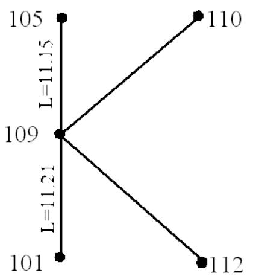

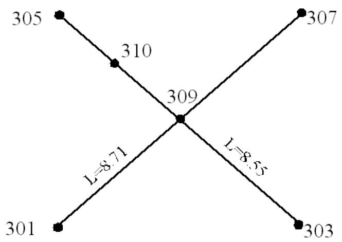

This example defines parameters for members 301-309 and 307-309 which are chord members of an Xbrace and members 303-309, 305-310 and 310-309 which make up the two brace elements framing into the chord. The members local Y-axes lie in the plane of the brace. For members 301-309 and 307-309, a K-factor of 0.9 and a buckling length of 8.71 is to be used for load cases where the member is in compression and the other pair of members framing into the chord, 303-309 and 310-309, are in tension. For members 303-309, 305-310 and 310-309, a K-factor of 0.9 and a buckling length of 8.55 is to be used for load cases where the member is in compression and members 301-309 and 307-309 are in tension. For other load cases, the K-factor and buckling length specified in the model file are to be used.

```txt
1 2 3 4 5 6 7 8   
1234567890123456789012345678901234567890123456789012345678901234567890123456789012345678901234567890123456789 
```

2.1.22 Defining Load Combinations

Load combinations made up of basic load cases or previously defined load combinations may be defined within the Post input file using LCOMB lines. The load cases or combinations making up the load combination along with the appropriate load factors to be applied are specified. The load combination definition may be continued by repeating the LCOMB line with the combination number specified in columns 7-10, so that up to forty eight load components may be specified.

Note: For PSI analysis, combinations may contain only load cases solved in the solution phase. Because PSI analyses have nonlinear solutions, new load combinations should not be defined in the Post input file.

2.1.23 Displacement Serviceability Check

The SPAN command generates the maximum relative deflections along the length of any member or a continuous set of members relative to the end joints. The SPAN command is only available in the Postprocessor. The SPAN line defines a span identifier in columns 6-13 and the joints which form a span. With the default SPAN configuration, the SPAN command generates a report of the maximum relative deflection along the span using a straight line between the deflected end joints as a reference. As an option, the span may be defined as a cantilever by putting a ‘C’ in column 14. In this case the SPAN line will report the difference between the maximum displaced positions of the joints and the displaced position of the first joint in the span.

The following example creates a span named ‘TIEBEAM’ for joints 101, 102, 201 and 202 consecutively. The POST output will report the difference between the joint displacements for the specified joints and the straight-line displacement between joints 101 and 202.

```txt
1 2 3 4 5 6 7 8 123456789012345678901234567890123456789012345678901234567890 1 SPAN TIEBEAM 101 102 201 202
```

Note: Moment discontinuities are allowed along the span. Moment releases (simple supports) are allowed at the joints of the continuous span but force releases are not allowed.

2.1.24 Hotspot SCF Extraction

Extrapolation lines for hotspot SCF extraction can be defined using the SCFLC, SCFNS, SCFEX, PLTAVG, and SHLAVG lines. The axial, in-plane bending and out-of-plane bending load conditions are entered on the SCFLC line. The hotspot nominal stresses are entered on the SCFNS line. SCFEX line defines the extrapolation joints and their distances from the hotspot. And the plates to be included for calculating the average joint stress at the extrapolation joints are entered on the PLTAVG and SHLAVG lines.

## 2.2 SOLUTION FILE UTILITY FEATURES

The Post program may be used to perform certain solution file utilities. Beam element properties and code check parameters may be overridden and new stress and UC results calculated using the Post program. The program can also be used to extract results from a solution file for a portion of the original structure. In either case, a new common solution file containing stress and code check results can be created.

The following sections detail additional Post input that may be specified when using the solution file utility features of Post.

Note: When using Post to perform solution file utilities, all post data must be specified in a Post input file.

2.2.1 Overriding Properties and UC Parameters

Post can be used to override an element’s properties and/or code unity check parameters found in the solution file so that code check results reflecting these changes may be calculated. New stress and code check results are determined using the existing member internal loads contained in the common solution file. A new solution file containing the appropriate property updates, recalculated stress and code check results is created.

Note: Structural displacements, reactions and member internal forces contained in the solution file are not changed. Only the resulting stresses and/or code check results are recalculated.

In addition to Post input outlined in SECTION 2.1, the following data may be specified in the Post input file.

Note: The redesign features should not be used when solution file data is being overridden.

2.2.2 Overriding Section Properties

Section properties are overridden by specifying a ‘SECT’ line for the appropriate section label in the Post input file. The ‘SECT’ line must contain all section dimension data required for the section type, including dimensions that are not being modified.

Note: New sections referenced by GRUP lines in the Post input file may be added.

2.2.3 Overriding Group Data

Group properties and code check parameters may be modified by specifying a ‘GRUP’ line for the appropriate group label in the Post input file. Because the whole ‘GRUP’ line is replaced, every item pertinent to stress and code check calculations must be specified, in addition to any properties that are being modified.

Items that may be modified and therefore must be specified on the group line include:

1. Section label

2. Redesign code

3. Tubular OD and wall thickness

4. Yield Stress

5. Post processing member class

6. K-factors

7. WF compression flange spacing

8. Shear area modifier

9. Stiffener spacing

Note: New groups that are referenced by MEMBER lines in the Post input file may be added. Also, section properties referenced by groups that are not in the section library file must be specified in the Post input file.

2.2.4 Overriding Member Data

Member properties and code check parameters may be modified by specifying a ‘MEMBER’ line in the Post input file for the appropriate member. Because the whole ‘MEMBER’ line is replaced, every item pertinent to stress and code check calculations must be specified, in addition to any properties that are being modified.

Items that may be modified and therefore must be specified on the ‘MEMBER’ line include:

1. Group label

2. Redesign code

3. Number of unity check parts

4. Yield Stress

5. Stress output option

6. K-factors

2.2.5 Extracting Portions of a Solution File

The Post program can be used to extract results for elements designated by the input ‘GRUP’ and/or ‘MEMBER’ lines. Only results for specified elements are retained in the new solution file.

2.2.6 Post File Options

The PSTOPT line is used to specify the post processing options used when creating a new common solution file. The extraction mode should be designated by entering ‘EXT’ in columns 8-10 so that results only for elements designated by ensuing ‘GRUP’ and/or ‘MEMBER’ lines are retained in the new solution file.

Note: If all elements are to be retained in the new solution file, the modification mode option ‘MOD’ should be specified. For modification mode, the PSTOPT line is optional.

Additional program options may be specified in columns 12-46 on the PSTOPT line. If an updated solution file is to be created and no other post processing is to be done, the ‘NOX’ option should be selected. Report options including input echo ‘ECH’, member override report including modified properties ‘MOR’ and the option to skip modified member properties report ‘NPT’ may be selected. The ‘NLB’ option should be selected if no local buckling analysis is to be performed. For elements without axial offsets, brace stresses can be backed to the chord face by selecting the ‘AJT’ option.

The no sort option, ‘NST’, should be specified if the group and member data is in the same order as the model file.

The following designates Post options. A new solution file is to be extracted with no post processing performed. The no sort option is selected.

```txt
1 2 3 4 5 6 7 8 1 234567890123456789012345678901234567890123456789012345678901234567890 1 PSTOPTEXT NST NOX 
```

Note: In general, the member ‘GRUP’ and ‘MEMBER’ lines designated should appear in the exact order as they appear in the original model file. In this case, the ‘NST’ option should be specified also.

2.2.7 Specifying Elements to be retained

The elements to be retained in the new solution file are designated by specifying the appropriate ‘GRUP’ and ‘MEMBER’ input lines in the Post input file. All other post input lines are applicable and should appear in the Post input file before any ‘GRUP’ and/or ‘MEMBER’ lines.

When specifying ‘GRUP’ and ‘MEMBER’ lines, they should appear in the exact order that they appear in the original SACS model file. Also, every item pertinent to stress and code check calculations must be specified on the input lines.

# 3 COMMENTARY

The Post program calculates stresses and unity check ratios and performs member redesign according to API, API-LRFD, AISC, AISC-LRFD, NPD, British Standards and Danish codes. The following commentary sections outline the theory and formulas used by the program.

## 3.1 TERMS AND DEFINITIONS

The following terms and definitions pertain to the variables used in the member stress, allowable stress and unity check calculations.


| A | Total cross-sectional area |
| --- | --- |
| Af | Area of compression flange |
| As | Tubular shear area (total axial area times the shear area modifier-normally 0. for maximum shear stress) |
| Asy, Asz | Prismatic member y and z shear areas |
| b | Flange width or width of non-tubular section |
| Cw | Warping constant for cross section |
| D | Diameter of tubular member |
| D | Depth of non-tubular section |
| D1 | Diameter of largest inscribed circle in wide flange cross section at flange/web junction |
| E | Modulus of elasticity |
| Fa, Fas | Allowable axial compressive stress |
| fa | Axial stress |
| Fb, Fby, Fbx | Allowable bending stress (about designated axis) |
| fb | Resultant bending stress |
| fb' | Localized bending stress in a conical section |
| fby, fbz | Bending stress about the local y or z axis |
| fbxt | Flange bending stress about local z axis due to torsion |
| Fd | Design stress |
| Fe' | Euler buckling stress |
| fh | Hoop stress due to hydrostatic pressure |
| fh' | Hoop stress caused by unbalanced radial line load in a conical section |
| Frc, Fre | Elastic and inelastic buckling stress for external pressure |
| Ft | Allowable tensile stress |
| Fv, Fvt | Allowable shear and allowable torsional shear stress |
| fv, fv | Resultant shear stress due to shear and due to torsion |
| fvr | Resultant shear stress due to shear and torsion |
| fvy, fvz | Shear stress about the local y or z axis |
| fvyb | Shear stress in flange from bending due to torsion |
| fvyt, fvzt | Shear stress in flange and web due to pure torsion |
| fX | Combined axial stress due axial and bending stresses |
| Fy | Yield stress |
| Fyr | Reduced effective yield stress |
| G | Shear modulus |
| H | Flange centerline distance (h = d - t) for stress calculation; Web height minus flange distance (h = d - 2t) for allowable stress calculation |
| Iy, Iz | Area moment of inertia about local y or z axis |
| Iyz | Product of inertia for asymmetrical (angle) cross section |
| J | Polar moment of inertia (torsional constant) of cross section |
| Ky, Kz | Effective length factor for buckling about the designated axis |
| I | Actual unbraced length of the member |
| Ib | Distance between cross sections braced against twist or lateral displacement of compression flange |
| Mx | Moment about the local x axis, torsion |
| My | Moment about the local y axis, bending |
| Mz | Moment about the local z axis, bending |
| p | Design hoop lateral pressure |
| R | Axial force, tension or compression |
| R | Radius of a tubular member |
| R | Governing radius of gyration |
| rT | Radius of gyration of a section comprising the compression flange plus one third of the compression web area, taken about the axis in the plane of the web |
| S | Elastic section modulus |
| T | Wall thickness of a tubular member |
| tF | Flange thickness |
| t′F | Maximum thickness of flange |
| tw | Web thickness |
| tw′ | Maximum thickness of web |
| ty, tz | Sidewall thickness of box section |
| Txy, Txz | Von Mises shear stress component |
| Tmax | Maximum von Mises shear stress |
| Vy | Shear force in the local y direction |
| Vz | Shear force in the local z direction |
| Z | Plastic section modulus |
| A | Angle between resultant bending and shear in tubular; Angle of principal axes for angle sections; One half of the projected apex angle in cones |
| δk | DNV column buckling stress |
| δkb | DNV column buckling stress for wide flange or box |
| δvm | Von Mises equivalent stress |
| δx | Direct von Mises stress component |
| λk | Slenderness ratio (KI/r) |
| λ′k | Reduced slenderness ratio |


## 3.2 CALCULATING STRESS

3.2.1 Direct Axial, Bending and Shear Stress

3.2.1.1 Tubular Sections

The stress calculations for tubular members are as follows:

$$f_{a} = \frac{P}{A} \quad f_{b z} = \frac{M_{z} D}{2 I_{z}} \quad f_{b y} = \frac{M_{y} D}{2 I_{y}}$$

Shear stress due to resultant shear and due to torsion are determined as follows:

$$f_{v} = \frac{\sqrt{V_{y}^{2} + V_{z}^{2}}}{A_{s}} \quad f_{v t} = \frac{16 M_{x} D}{\pi [ D^{4} - (D - 2 t)^{4} ]}$$

For maximum shear stress, the shear stress due to the shear force resultant is added to the torsional shear such that:

$$f_{v} = \frac{\sqrt{V_{y}^{2} + V_{z}^{2}}}{A_{s}} + \frac{16 M_{x} D}{\pi [ D^{4} - (D - 2 t)^{4} ]}$$

3.2.1.2 Wide Flange Sections

The stresses for wide flange sections (compact or non-compact) are calculated as follows:

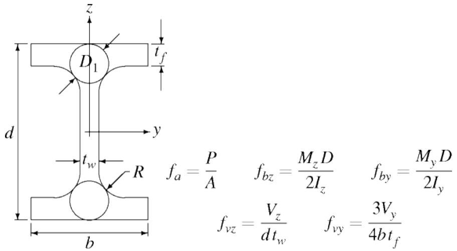

If the section is subject to torsion, the torsional stresses below are added to the preceding stress calculations.

Bending of the flange about z axis due to torsion:

$$f_{b z t} = \frac{a b}{h I_{z}} M_{x} \left(\tanh  \frac{\ell}{2 a} \cosh \frac{x}{a} - \sinh \frac{x}{a}\right)$$

Shear stress in flange due to bending of flange:

$$f_{v y b} = \frac{3 M_{x}}{2 b h t_{f}} \left(\tanh  \frac{\ell}{2 a} \sinh \frac{x}{a} - \cosh \frac{x}{a}\right)$$

Shear stress in the flange and the web due to pure torsion:

$$f_{v y t} = \frac{t_{f}^{\prime} M_{x}}{J} \left(\tanh  \frac{\ell}{2 a} \sinh \frac{x}{a} - \cosh \frac{x}{a} + 1\right)$$

$$f_{v z t} = \frac{t_{w}^{\prime} M_{x}}{J} \left(\tanh  \frac{\ell}{2 a} \sinh \frac{x}{a} - \cosh \frac{x}{a} + 1\right)$$

where

$$a = \frac{h}{2} \sqrt{\frac{E I_{z}}{J G}} = \sqrt{\frac{E C_{w}}{J G}}$$

$$J = \frac{2}{3} b t_{f}^{3} + \frac{1}{3} (d - 2 t_{f}) t_{w}^{3} + 2 \alpha D_{1}^{4} - 0. 42 t_{f}^{4}$$

$$D_{1} = \frac{\left(t_{f} + R\right)^{2} + \left(t_{w} / 2 + R\right)^{2} - R^{2}}{2 R + t_{f}}$$

$$\alpha = - 0. 0420 + 0. 2204 \frac{t_{w}}{t_{f}} + 0. 1355 \frac{R}{t_{f}} - 0. 0865 \frac{t_{w} R}{t_{f}^{2}} - 0. 0725 \frac{t_{w}^{2}}{t_{f}^{2}}$$

Note: For flanged members, torsion is assumed to be induced by frame action rather than concentrated loads. With the boundary conditions for the member assumed to be fixed, this is not a valid assumption for the case of torsion applied to a member. Therefore, when torsion is to be applied to a member, a joint should be added at the point of application and the torsion applied to the joint.

3.2.1.3 Box Sections

The stress calculations for box sections are similar to the wide flange calculations except that the shear stress due to torsion does not contain warping stresses.

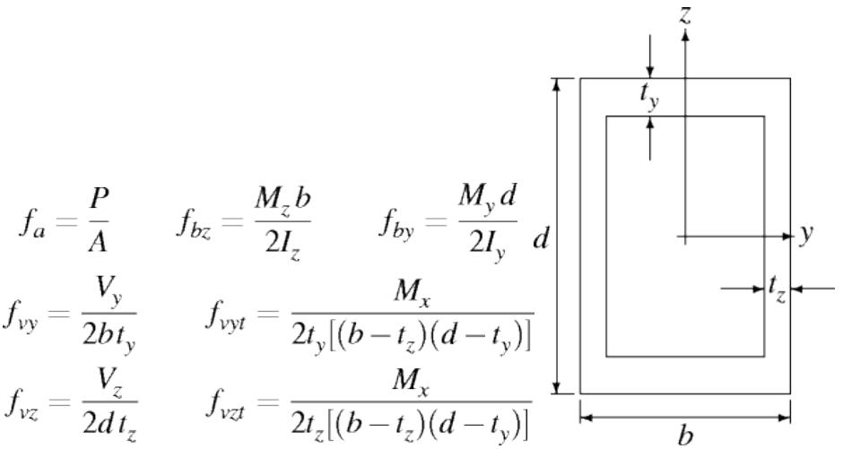

The total shear in the y direction is taken as the sum of the $f_{ v y }$ and $f_{ v y t }$ and the total shear in the z direction is taken as the sum of $f_{ v z }$ and $f_{ v z t }$ .

3.2.1.4 Prismatic Sections

Prismatic sections are used when the standard cross sections are not applicable. In addition to the dimensions, all structural properties, including shear area, are input by the user. The stresses are calculated as follows:

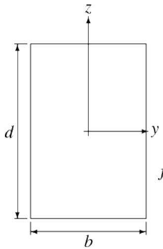

$$f_{a} = \frac{P}{A} \quad f_{b z} = \frac{M_{z} b}{2 I_{z}} \quad f_{b y} = \frac{M_{y} d}{2 I_{y}}$$

$$f_{v z} = \frac{V_{z}}{A_{s z}} \quad f_{v y} = \frac{V_{y}}{A_{s y}}$$

Note: Prismatic sections use shear areas input on the cross section details. The area for shear stress is 0.8 of the input shear area assuming a rectangular cross section with parabolic shear stress distribution.

3.2.1.5 Angle Sections

SACS uses properties about the member principal axes for stiffness calculations for angle sections. Normally, the cross-section local axes are axes of symmetry and are therefore the principal axes. For angles, however, the input axes are not principal axes. Therefore, the inertia properties calculated about the input (local) axes must be transformed to the principal axes by the program using the following:

$$\tan 2 \alpha = - \frac{2 I_{y z}}{I_{y} - I_{z}}$$

$$I_{V_{1}} = \frac{I_{y} + I_{z}}{2} + \sqrt{\left(\frac{I_{y} - I_{z}}{2}\right)^{2} + I_{y z}^{2}}$$

$$I_{V_{2}} = \frac{I_{y} + I_{z}}{2} - \sqrt{\left(\frac{I_{y} - I_{z}}{2}\right)^{2} + I_{y z}^{2}}$$

The shear areas about the principal axes are used in member stiffness and stress calculations and are taken as:

$$A_{S} = \frac{I_{\mu}^{2}}{\int_{A} \left(\frac{Q_{\mu}}{t}\right)^{2} d A}$$

where the $I_{ \mu }$ and $Q_{ \mu }$ are with respect to the μ principal axes.

Bending stress and Euler buckling stress are calculated with respect to the principal axes. The effective buckling length factors, $K_{ y }$ and $K_{ z }$ , are input with respect to the local coordinates. The program transforms the input K-factors into the principal axis system to obtain the factors to be used in the Euler buckling calculations:

$$K_{1} = \left(\frac{K_{y} + K_{z}}{2}\right) + \left(\frac{K_{z} - K_{y}}{2}\right) \cos 2 \alpha$$

$$K_{2} = \left(\frac{K_{y} + K_{z}}{2}\right) - \left(\frac{K_{z} - K_{y}}{2}\right) \cos 2 \alpha$$

where

$K_{ 1 , 2 }$ = Principal axes effective length factors

$K_{ y , z }$ = Input effective buckling length factors

α = Angle between input axes and principal axes

The shear stress at any point is calculated with respect to the local coordinate system using the following equation:

$$\tau = \frac{\left(V_{z} - V_{y} I_{y z}\right) Q_{y} + \left(V_{y} - V_{z} I_{y z}\right) Q_{z}}{\left(I_{y} I_{z} - I_{y z}^{2}\right) t}$$

Where

$$I_{y}, I_{z}, I_{y z} = \text{I n e t i a p r o p e r t i e s w i t h r e s p e c t} y \text{a n d} z \text{a x e s}$$

$$V_{y}, V_{z} = \text{S h e a r i n y a n d z d i r e c t i o n s}$$

$$t = \text{T h i c k n e s s}$$

$$Q_{y}, Q_{z} = \text{F i r s t m o m e n t s a b o u t y a n d z a x e s o f p o r t i o n o f t h e c r o s s s e c t i o n a r e a b e t w e e n t h e}$$

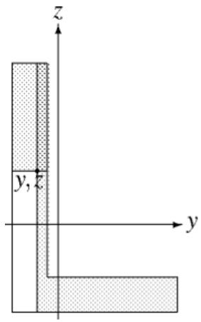

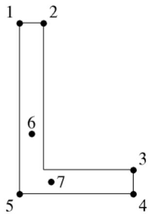

Tensile and compressive stresses are evaluated at points 1, 2, 3, 4 and 5 shown in the above right figure. Shear stresses are determined at the points of maximum shear stress in each leg. These points are located automatically for each load case.

Note: Although principal axes are used in stiffness, bending stress and Euler buckling calculations, the output results are reported with respect to the local coordinate system.

3.2.1.6 Tee Sections

The stresses for tee sections are calculated as follows:

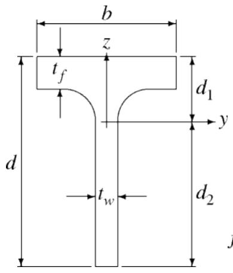

$$f_{b z} = \frac{M_{z} b}{2 I_{z}}$$

$$f_{v z} = \frac{V_{z} Q_{z 1}}{I_{y}}$$

$$f_{a} = \frac{P}{A}$$

$$f_{b y_{1}} = \frac{M_{y} d_{1}}{I_{y}}$$

$$f_{v y} = \frac{V_{y} Q_{y 1}}{I_{z}}$$

$$f_{b y_{2}} = \frac{M_{y} d_{2}}{I_{y}}$$

$$f_{v_{\mathrm{w e b}}} = - \frac{V_{z} d_{2}^{2}}{2 I_{y}}$$

where $Q_{ y 1 }$ and $Q_{ z 1 }$ are defined as:

$$Q_{y 1} = \frac{b^{2} - t_{w}^{2}}{8} \quad Q_{z 1} = \frac{\left(d - d_{2} - \frac{t_{f}}{2}\right) \left(b - t_{w}\right)}{2}$$

If the section is subjected to torsion, torsional stresses are added to the shear stress calculations.

3.2.1.7 Conical Sections

In general, members containing conical transitions are input as segmented members. The nominal axial and bending stresses in the cone section segment are calculated based on the stresses in the adjoining tubular sections as follows:

$$f_{a c} = \frac{f_{a}}{\cos \alpha} \quad f_{b c} = \frac{f_{b}}{\cos \alpha}$$

where α is one half of the projected apex angle of the cone.

Cone sections are also subject to unbalanced radial forces due to longitudinal axial and bending loads and to localized buckling stresses caused by the discontinuity in angle. This localized bending stress is determined by

$$f_{b}^{\prime} = \frac{0 . 6 t \sqrt{D (t + t_{c})}}{t_{e}^{2}} \left(f_{a} + f_{b}\right) \tan \alpha$$

where tc is the cone thickness, $f_{ a }$ and $f_{ b }$ are the acting stresses in the cylinder section and te is the cone thickness when calculating stress in the cone and cylinder thickness when calculating cylinder stress.

The hoop stress caused by unbalanced radial line load is determined by

$$f_{h}^{\prime} = 0. 45 \sqrt{\frac{D}{t}} \left(f_{a} + f_{b}\right) \tan \alpha$$

3.2.1.8 Ring and Longitudinal Stiffened Cylinders

The axial stress, $f_{ a , }$ for unstiffened or ring stiffened cylinders is taken as

$$f_{a} = \frac{P}{2 \pi R t}$$

For cylinders with longitudinal stiffeners, the axial stress is calculated from

$$f_{a} = \frac{P}{Q_{a} \left(2 \pi R t + N_{s} A_{s}\right)} \quad \text{w h e r e} \quad Q_{a} = \frac{A_{s} + b_{e} t}{A_{s} + b t}$$

where $N_{ s }$ and $A_{ s }$ are the number of stiffeners and the cross section area of the stiffener. In the calculation of $Q_{ a }$ , b is the stringer spacing and $b_{ e }$ is the effective width of the shell.

The bending stress for unstiffened or ring stiffened cylinders is determined from

$$f_{b} = \frac{M}{\pi R^{2} t} \frac{1 + 0 . 5 t / R}{1 + 0 . 25 (t / R)^{2}}$$

and for longitudinally stiffened cylinders is given by

$$f_{b} = \frac{M}{Q_{a} \pi R^{2} (t + A_{s} / b)} \quad Q_{a} = \frac{A_{s} + b_{e} t}{A_{s} + b t}$$

3.2.2 Von Mises Stresses

Some codes supported by the Post program require the calculation of von Mises stresses at various points around the cross section. The general von Mises equation is as follows:

$$\delta_{v m} = \left[ \delta_{x}^{2} + \delta_{y}^{2} + \delta_{z}^{2} - \delta_{x} \delta_{y} - \delta_{y} \delta_{z} - \delta_{x} \delta_{z} + 3 \left(T_{x y}^{2} + T_{y z}^{2} + T_{x z}^{2}\right) \right]^{\frac{1}{2}}$$

For beam theory $\delta_{ y } = \delta_{ z } = T_{ y z } = 0$ . Therefore

$$\delta_{v m} = \left[ \delta_{x}^{2} + 3 \left(T_{x y}^{2} + T_{x z}^{2}\right) \right]^{\frac{1}{2}}$$

The following sections address the calculation of von Mises stress for various cross section and element types.

Tubular Sections

When required, the von Mises stress $\delta_{ v m }$ is determined for tubular sections at two points, the point of maximum direct stress and the point of maximum shear stress. With tubular cross sections completely symmetrical, simplifications are made when calculating the von Mises stress. The von Mises stress at the point of maximum direct stress is determined from

$$\delta_{v m} = \left[ \delta_{x}^{2} + 3 \left(f_{v t} + \sqrt{f_{v y}^{2} + f_{v z}^{2}} \cos \alpha\right)^{2} \right]^{\frac{1}{2}}$$

where the direct stress δx is represented by

$$\delta_{x} = f_{a} \pm \sqrt{f_{b y}^{2} + f_{b z}^{2}}$$

The von Mises stress at the point of maximum shear is given by

$$\delta_{v m} = \left[ \left(f_{a} \pm \sqrt{f_{b y}^{2} + f_{b z}^{2}} \cos \alpha\right)^{2} + 3 T_{\max }^{2} \right]^{\frac{1}{2}}$$

where the shear stress $T_{ \mathrm{ m a x } }$ is calculated using the following:

$$T_{\max } = f_{v t} + \sqrt{f_{v y}^{2} + f_{v z}^{2}}$$

3.2.2.1 Wide Flange Sections

For codes requiring calculation of von Mises stresses, von Mises stress is calculated at seven points around the cross section.

The von Mises stress components at points 1, 2, 3 and 4 are

$$\delta_{x} = f_{a} \pm f_{b y} \pm f_{b z} \pm f_{b z t} \quad T_{x y} = f_{v y t} \quad T_{x z} = 0$$

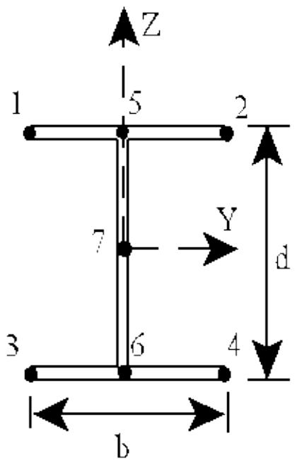

The components for points 5 and 6 are

$$\delta_{x} = f_{a} \pm f_{b y} \quad T_{x y} = f_{v z} \quad T_{x z} = f_{v y b} + f_{v y t}$$

where the shear stress due to transverse bending along the z axis is

$$f_{v z} = \frac{V_{z} A_{f} (d / 2 - t_{f} / 2)}{I_{y} t_{w}}$$

For point 7, the components are taken as

$$\delta_{x} = f_{a} \quad T_{x y} = 0 \quad T_{x z} = f_{v z} + f_{v z t}$$

3.2.2.2 Box Sections

For codes requiring calculation of von Mises stresses, von Mises stress is calculated at eight points around the box cross section as shown in the figure.

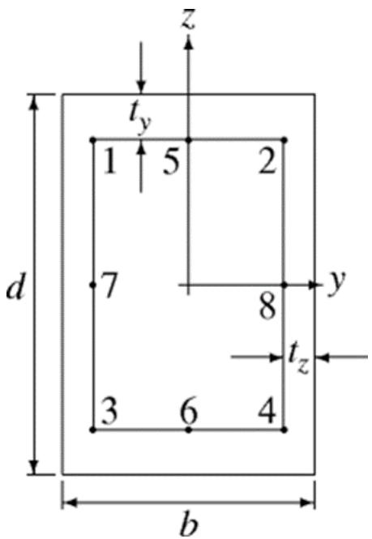

The von Mises stress components at points 1, 2, 3 and 4 are

$$\delta_{x} = f_{a} \pm f_{b y} \pm f_{b z} \quad T_{x y} = f_{v y} + f_{v y t} \quad T_{x z} = f_{v z} + f_{v z t}$$

where the shear due to transverse loading is

$$f_{v z} = \frac{V_{z} b t_{y} (d / 2 - t_{y} / 2)}{I_{y} 2 t_{z}} \quad f_{v y} = \frac{V_{y} d t_{z} (b / 2 - t_{z} / 2)}{I_{z} 2 t_{y}}$$

The components of the von Mises stress for points 5 and 6 are

$$\delta_{x} = f_{a} \pm f_{b y} \quad T_{x y} = f_{v y} + f_{v y t} \quad T_{x z} = 0$$

where the shear due to transverse loading along the y axis is

$$f_{v y} = \frac{V_{y} (A / 2) y^{\prime}}{I_{z} t_{y}}$$

For points 7 and 8, the components are taken as

$$\delta_{x} = f_{a} \pm f_{b z} \quad T_{x y} = 0 \quad T_{x z} = f_{v z} + f_{v z t}$$

where the shear due to transverse loading along the z axis is

$$f_{v z} = \frac{V_{z} (A / 2) z^{\prime}}{I_{y} t_{z}}$$

3.2.2.3 Prismatic Sections

When required, von Mises stress is calculated at nine points for prismatic cross sections.

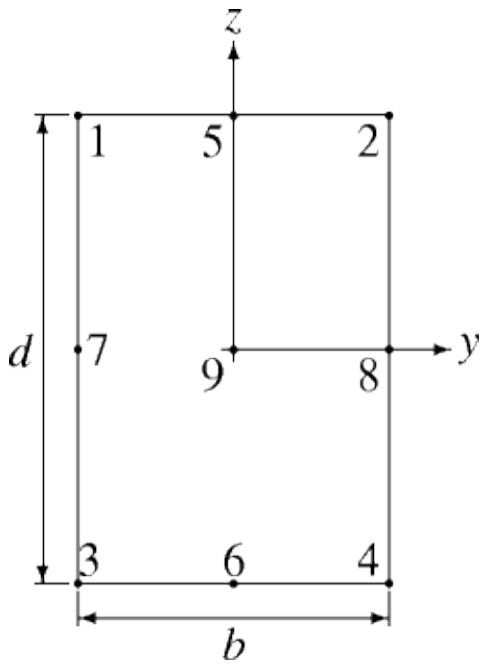

For points 1, 2, 3 and 4, the stress components used to compute the von Mises stress are as follows:

$$\delta_{x} = f_{a} \pm f_{b y} \pm f_{b z} \quad T_{x y} = 0 \quad T_{x z} = 0$$

At points 5 and 6, the following should be used to determine the von Mises stress:

$$\delta_{x} = f_{a} \pm f_{b y} \quad T_{x y} = f_{v y} + f_{v y t} \quad T_{x z} = 0$$

where the shear due to transverse loading along the y axis and torsion are

$$f_{v y} = \frac{3}{2} \frac{V_{y}}{b d} \quad f_{v y t} = \frac{M_{x} (3 b / 2 + 1 . 8 d / 2)}{8 (d / 2)^{2} (b / 2)^{2}}$$

For points 7 and 8, the von Mises stress components are

$$\delta_{x} = f_{a} \pm f_{b z} \quad T_{x y} = 0 \quad T_{x z} = f_{v z} + f_{v z t}$$

where the shear due to transverse loading along the z axis and due to torsion are

$$f_{v z} = \frac{3}{2} \frac{V_{z}}{b d} \quad f_{v z t} = \frac{M_{x} (3 b / 2 + 1 . 8 d / 2)}{8 (d / 2)^{2} (b / 2)^{2}}$$

For point 9 the von Mises stress components are

$$\delta_{x} = f_{a} \quad T_{x y} = f_{v y} \quad T_{x z} = f_{v z}$$

where the shear due to transverse loading along the y axis, $f_{ v y }$ , is as given for points 5 and 6, and the shear due transverse loading along the z axis, $f_{ v z }$ , is as given for points 7 and 8.

3.2.3 Effective Bending Stress for NPD and NS Codes

NPD and Norwegian Standards codes require the determination of the effective bending stress in the member. The effective bending stress is taken as

$$\bar{f}_{b} = \frac{\bar{M}}{S}$$

where M is the effective moment taken from formula (1) below when the moment at the center, M0 , and the maximum end moment, M , have the same sign and from formula (2) below when $M_{ 0 }$ and M have opposite signs.

$$\bar{M} = \left\{ \begin{array}{l} m M + M_{0} \\ 0. 4 M + M_{0} \end{array} \right. \leq M \tag{1}$$

$$\bar{M} = \left\{ \begin{array}{c c} m M \\ 0. 4 M & \leq M \\ M_{0} & \end{array} \right. \tag{2}$$

In these equations, $m = 0 . 6 + 0 . 4 \beta$ , where $\beta$ is the absolute value of the end moment ratio （$\ | \beta | \leq 1 . 0 \ )$ .

3.2.4 Equivalent Uniform Bending Stress BS5950

BS5950 code requires the determination of the equivalent uniform bending stress in the member. The uniform bending stress is taken as

$$\bar{f}_{b} = \frac{\bar{M}}{S} \quad \text{w h e r e} \quad \bar{M} = m M_{A}$$

where M is the equivalent uniform moment, $M_{ A }$ is the maximum end moment and m is the equivalent moment factor. The factor m for members with equal flanges not loaded between lateral restraints and not subject to destabilizing loads is taken as

$$m = 0. 57 + 0. 33 \beta + 0. 10 \beta^{2}$$

where β is the ratio of the smaller end moment over the larger end moment. For all other members, m is taken as 1.0.

3.2.5 Hydrostatic Stresses

3.2.5.1 Tubular and Stringer-Stiffened Cylinders

Hoop stress due to hydrostatic pressure, $f_{ h }$ , for unstiffened tubular or stringer-stiffened cylinder sections is taken as

$$f_{h} = \frac{p D}{2 t}$$

where $p$ is the hydrostatic pressure, $p = \forall H_{ z }$ . The design head, $H_{ z }$ , is taken as the distance below the water depth value input on the WDEPTH line and γ is the density of seawater.

3.2.5.2 Ring Stiffened Cylinders

For ring stiffened cylinders, the hoop stress in the shell midway between rings or in the ring stiffeners is given by

$$f_{h} = \frac{p D}{2 t} K_{\theta}$$

where $K_{ \mathsf{ \Theta } }$ when calculating stress in the shell is taken as

$$K_{\theta} = \left\{ \begin{array}{l l} 1. 0 & \text{f o r} M_{x} \geq 3. 42 \\ 1 - \varepsilon \psi & \text{f o r} M_{x} <   3. 42 \end{array} \right. \quad \text{w h e r e} \quad M_{x} = \frac{L_{r}}{\sqrt{R t}}$$

where Lr is the spacing between rings and ε and $\psi$ are given by

$$\varepsilon = \frac{1 - 0 . 3 k}{1 + L_{e} t / A} \quad \text{w h e r e} \quad A = A_{r} \left(\frac{R}{R_{r}}\right)^{2}$$

$$\psi = \left\{ \begin{array}{l l} 1. 0 & \text{f o r} M_{x} \leq 1. 26 \\ 1. 58 - 0. 46 M_{x} & \text{f o r} 1. 26 <   M_{x} <   3. 42 \\ 0 & \text{f o r} 3. 42 \leq M_{x} \end{array} \right.$$

where Ar is the area of the ring, Rr is the radius to the centroid of the ring, k is $N_{ \Phi } / N_{ \Theta }$ , where $N_{ \Phi }$ is defined as $P / \left( 2 \pi R \right) + M / \left( \pi R^{ 2 } \right)$ and $N_{ \mathsf{ \Theta } }$ is $p R$ , and

$$L_{e} = 1. 56 \sqrt{R t} + t_{r} \leq L_{r}$$

Kθ is taken as follows when calculating the hoop stress in the ring stiffener:

$$K_{\theta} = (1 - 0. 3 k) \frac{L_{e} t}{A_{r} + L_{e} t}$$

## 3.3 DETERMINING ALLOWABLE STRESS/NOMINAL STRENGTH

Unlike the applied stress calculation which is code independent, determining the allowable stress (for working stress design) or nominal strength (for LRFD) is dependent upon the code selected on the OPTIONS line.

3.3.1 API/AISC Allowable Working Stress

For any of the API working stress code check options, the API RP2A and AISC Manual of Steel Construction ASD codes are used to calculate the allowable stresses for tubular and non-tubular members, respectively. For each load case, the allowable stresses calculated per the code recommendations are factored by the allowable stress modifier specified for that load case.

Note: Stiffened cylinder allowable stresses may be optionally calculated based on API Bulletin 2U ‘Stability Design of Cylindrical Shells’ recommendations.

3.3.1.1 Tubular Members

Allowable stresses for tubular members may be determined based on API-RP2A WSD 20th or 16th editions. The following table references the appropriate formula number used to determine allowable stresses. Any deviations from the code recommendations are noted.


| Stress Type | API RP2A WSD 20th | API RP2A 16th |
| --- | --- | --- |
| Axial Tension: | 3.2.1-1 | see non-tubulars |
| Axial Compression: |  |  |
| Column Buckling | 3.2.2-1 and 2 | see non-tubulars |
| Local Buckling | 3.2.2-3 and 4 | 2.5.2-2 and 3 |
| Bending: | 3.2.3-1a, b and c | 2.5.2-5 |
| Shear: |  |  |
| Beam | 3.2.4-2 | see non-tubulars |
| Torsional | 3.2.4-4 |  |
| Buckling: |  |  |
| Euler | see non-tubulars | see non-tubulars |
| Elastic Hoop | 3.2.5-4 | N/A |
| Critical Hoop | 3.2.5-6 | N/A |


3.3.1.2 Non-Tubular Members

For any of the API/AISC code check options, allowable stresses for non-tubular members are determined based on the AISC Manual of Steel Construction Allowable Stress Design 9th edition.

The following table references the appropriate formula number used to determine allowable stresses. Any deviations from the code recommendations are noted.


| Stress Type | Section Type | Condition | Formula |
| --- | --- | --- | --- |
| Axial Tension: | All |  | Ft=0.6 Fy |
| Axial Compression: | All | b / t ≤ NCL | E2-1 and E2-2 |
| Axial Compression: | Angle* | b / t > NCL | AB5-1, 2 AB5-11, 12 |
| Axial Compression: | Tee* | b / t > NCL | AB5-3, 4, 5, 6 AB5-11, 12 |
| Axial Compression: | Box* | b / t > NCL | AB5-7 AB5-10, 11, 12 |
| Axial Compression: | Channel* | b / t > NCL | AB5-3, 4 AB5-11, 12 |
| Axial Compression: | All other* | b / t > NCL | AB5-3, 4 AB5-11, 12 |
| Shear: | All |  | F4-1, F4-2 |
| Euler Buckling: | All |  | F'e = 12π2E/23(kl_b/r_b)^2 |
| Major Axis Bending | WF Lb < Lc | b / t ≤ CL | F1-1 |
| Major Axis Bending | WF Lb < Lc | CL < b / t ≤ NCL | F1-3 |
| Major Axis Bending | WF Lb > Lc | b / t ≤ NCL | F1-6, F1-7, F1-8 |
| Major Axis Bending | WF* | b / t > NCL | AB5-3, 4 Section AB5.2d |
| Major Axis Bending | Channel | b / t > NCL | F1-8 |
| Major Axis Bending | Channel* | b / t > NCL | AB5-3, 4 Section AB5.2d |
| Major Axis Bending | Angle/Tee/PI Girder | Angle/Tee/PI Girder | F1-5 |
| Major Axis Bending | Angle* | b / t > NCL | AB5-1, 2 Section AB5.2d |
| Major Axis Bending | Tee* | b / t > NCL | AB5-3, 4, 5, 6 Sec. AB5.2d |
| Major Axis Bending | PI Girder* | h / tw > NCL | G2-1 |
| Major Axis Bending | PI Girder* | b / t > NCL | AB5-3, 4 Section AB5.2d |
| Major Axis Bending | Box | b / t ≤ CL | F3-1 |
| Major Axis Bending | Box | CL < b / t ≤ NCL | F3-3 |
| Major Axis Bending | Box* | b / t > NCL | AB5-7 Section AB5.2d |
| Minor Axis Bending | Compact WF | Compact WF | F2-1 |
| Minor Axis Bending | Compact Box | Compact Box | F3-1 |
|  | Box* | b / t > NCL | AB5-7 Section AB5.2d |
|  | All others | All others | F2-2 |


Note: ‘NCL’ is the non-compact limit and ‘CL’ is the compact limit as specified in Table B5.1.

Note: ‘*’ specifies that these formulas are required in addition to any other applicable formulas for that section type.

Note: The only difference between WF and PLG sections is in the shear allowable for API/AISC when h / tw > 380 / sqrt( Fy ) (formula F4-2). For WF Kv = 5.34 whereas Kv is calculated for plate girders. If no stiffeners are defined on the PLG, the member length is used as the spacing defined by a.

3.3.1.3 Stiffened Cylinders

The predicted shell buckling stresses for stiffened cylinders may be optionally calculated based on API Bulletin 2U recommendations.

The following table references the appropriate formula number used to determine predicted buckling stresses. Any deviations from the bulletin recommendations are noted with a number superscript.


| Condition | Stress Type | Bulletin Formula |
| --- | --- | --- |
| Local Buckling of Unstiffened or Ring Stiffened Cylinders | Axial Compression/Bending |  |
| Local Buckling of Unstiffened or Ring Stiffened Cylinders | Elastic Buckling | 4-2 |
| Local Buckling of Unstiffened or Ring Stiffened Cylinders | Inelastic Buckling | 4-6, 4-7 |
| Local Buckling of Unstiffened or Ring Stiffened Cylinders | External Pressure |  |
| Local Buckling of Unstiffened or Ring Stiffened Cylinders | Elastic Buckling | 4-81 |
| Local Buckling of Unstiffened or Ring Stiffened Cylinders | Inelastic Buckling | 4-101 |
| Local Buckling of Unstiffened or Ring Stiffened Cylinders | Failure pressure | 4-12 |
| General Instability of | Axial Compression/Bending |  |
| Ring Stiffened Cylinders | Elastic Buckling | 4-13 |
| Ring Stiffened Cylinders | Inelastic Buckling | 4-15 |
| Ring Stiffened Cylinders | External Pressure |  |
| Ring Stiffened Cylinders | Elastic Buckling | 4-161 |
| Ring Stiffened Cylinders | Inelastic Buckling | 4-191 |
| Ring Stiffened Cylinders | Failure pressure | 4-21 |
| Local Buckling of Stringer Stiffened Cylinders | Axial Compression/Bending |  |
| Local Buckling of Stringer Stiffened Cylinders | Elastic Buckling | 4-22 |
| Local Buckling of Stringer Stiffened Cylinders | Inelastic Buckling | 4-25 |
| Local Buckling of Stringer Stiffened Cylinders | External Pressure |  |
| Local Buckling of Stringer Stiffened Cylinders | Elastic Buckling | 4-261 |
| Local Buckling of Stringer Stiffened Cylinders | Inelastic Buckling | 4-281 |
| Local Buckling of Stringer Stiffened Cylinders | Failure pressure | 4-30 |
| Bay Instability Based on Orthotropic Shell Theory | Axial Compression/Bending |  |
| Bay Instability Based on Orthotropic Shell Theory | Elastic Buckling | 4-22 |
| Bay Instability Based on Orthotropic Shell Theory | Inelastic Buckling | 4-25 |
| Bay Instability Based on Orthotropic Shell Theory | External Pressure |  |
| Bay Instability Based on Orthotropic Shell Theory | Elastic Buckling | 4-381 |
| Bay Instability Based on Orthotropic Shell Theory | Inelastic Buckling | 4-391 |
|  | Failure pressure | 4-41 |
| Column Buckling | Elastic | 8-1 |
| Column Buckling | Inelastic | 8-2 |
| Shell Buckling for Combined Loads | Tension + Bending + Hoop | 6-1, 6-2 |
| Shell Buckling for Combined Loads | Compression + Bending + Hoop | 6-3² |
| General Instability Based on Orthotropic Shell Theory | Axial Compression/Bending |  |
| General Instability Based on Orthotropic Shell Theory | Elastic Buckling | 4-36 |
| General Instability Based on Orthotropic Shell Theory | Inelastic Buckling | 4-37 |
| General Instability Based on Orthotropic Shell Theory | External Pressure |  |
| General Instability Based on Orthotropic Shell Theory | Elastic Buckling | 4-42¹ |
| General Instability Based on Orthotropic Shell Theory | Inelastic Buckling | 4-43¹ |
| General Instability Based on Orthotropic Shell Theory | Failure pressure | 4-45 |


¹Note: When calculating the predicted buckling stress for external pressure, only $F_{ r e }$ , for the elastic, or $F_{ r c }$ , for the inelastic condition, are used.   
²Note: In equation 6-3, $N_{ \varphi } / N_{ \vartheta }$ is determined by setting $F_{ \varphi c j } = k F_{ \vartheta c j }$

3.3.2 API/AISC LRFD Nominal Strength

For the LRFD code check option, the API RP2A LRFD and AISC Manual of Steel Construction LRFD codes are used to calculate the nominal strength of tubular and non-tubular members, respectively.

3.3.2.1 Tubular Members

Nominal strength for tubular members is determined based on API-RP2A LRFD 1st edition.

The following table references the appropriate formulas used to determine the nominal strength of tubular members. The strength values calculated are factored by the appropriate resistance factor to obtain the design strength.


| Stress Type | API RP2A LRFD Formula |
| --- | --- |
| Axial Tension: | Ft = Fy |
| Bending: | D.2.3-2a, D.2.3-2b, D.2.3-2c |
| Axial Compression: |  |
| Column Buckling | D.2.2-2a and D.2.2-2b |
| Elastic Local Buckling | D.2.2-3 |
| Inelastic Local Buckling | D.2.2-4a and D.2.2-4b |
| Shear: |  |
| Beam | D.2.4-2 |
| Torsional | D.2.4-4 |
| Buckling: |  |
| Euler | D.2.2-2c |
| Elastic Hoop | N/A |
| Critical Hoop | N/A |


3.3.2.2 Non-Tubular Members

For any of the API/AISC LRFD code check option, nominal strength for non-tubular members are determined based on the nominal loads calculated per the AISC Manual of Steel Construction LRFD 1st edition.

The following table references the appropriate formula used to determine nominal strength. The strength values obtained from the formulas are factored by the appropriate resistance factor to obtain the design strength. Any deviations from the code recommendations are noted.


| Stress Type | Section Type | Condition | Formula |
| --- | --- | --- | --- |
| Axial Tension: | All |  | Ft = Fy |
| Shear: | All |  | F2-1, F2-2, F2-3 |
| Buckling: | Angle/Tee | b / t > λr | AE3-7 |
| Buckling: | Channel | b / t > λr | AE3-6 |
| Buckling: | All other |  | E2-3 |
| Axial Compression: | All | b / t ≤ λr | E2-2 and E2-3 |
| Axial Compression: | Angle* | b / t > λr | AB5-1, 2 AE3-2, 3 |
| Axial Compression: | Tee* | b / t > λr | AB5-3, 4, 5, 6 AE3-2, 3 |
| Axial Compression: | Box* | b / t > λr | AB5-7 AB5-11, 13 |
| Axial Compression: | Channel* | b / t > λr | AB5-3, 4 AE3-2, 3 |
| Axial Compression: | All other* | b / t > λr | AB5-3, 4 AB5-11, 13 |
| Major Axis Bending | WF/PI Girder/Box | λ ≤ λp | AF1-1 |
| Major Axis Bending | WF/PI Girder/Channel/Box | λp < λ ≤ λr | AF1-2, AF1-3 |
| Major Axis Bending | Tee | λ ≤ λr | F1-15 |
| Major Axis Bending | Prismatic | λ ≤ λr | AF1-3 |
| Major Axis Bending | WF/PI Girder/Channel/Box | λ > λr | AF1-4 |
| Major Axis Bending | WF/PI Girder* | b / tf > λr | AB5-3, AB5-4 |
|  | Prismatic | λ > λr | AF1-4 |
|  | Angle | λ ≤ λr | Fb = Fγ |
|  | Angle* | b / t > λr | AB5-1, AB5-2 |
|  | Tee* | b / tf > λr | AB5-3, AB5-4, AB5-5, AB5-6 |
|  | Box* | b / t > λr | AB5-7, AB5-9 |
|  | PI Girder* | h / tw > λr | AG2-1, AG2-2 |
| Minor Axis Bending | WF/PI Girder/Channel/Box | λ ≤ λp | AF1-1 |
| Minor Axis Bending | WF/PI Girder/Channel | λp < λ ≤ λr | AF1-3 |
| Minor Axis Bending | Box | λp < λ ≤ λr | AF1-2, AF1-3 |
| Minor Axis Bending | WF/PI Girder/Channel/Box | λ > λr | AF1-4 |
| Minor Axis Bending | Box* | b / t > λr | AB5-7, AB5-9 |
| Minor Axis Bending | Tee | λ ≤ λp | AF1-1 |
| Minor Axis Bending | Tee | λp < λ ≤ λr | AF1-2¹, AF1-3² |
| Minor Axis Bending | Tee | λ > λr | AF1-4 |


*Note: * denotes that these formulas are required in addition to any other applicable formula(s) for that section type.   
¹Note: The limit state for lateral torsional buckling of a tee for minor axis bending is assumed to be the same as a solid bar.   
²Note: The limit state for flange local buckling of a tee section bent about the minor axis is taken as the same as a wide flange section.

3.3.3 NPD/NS3472E Characteristic Stresses

For the NPD code check options, the Norwegian Petroleum Directorate and Norwegian Standards codes are used to calculate the characteristic stresses for tubular and non-tubular members, respectively.

The following table references the appropriate formula used to determine characteristic and design stresses.


| Stress Type | NPD 1995 Section/Formula |
| --- | --- |
| Axial/Bending Stress | 3.2.2.1 |
| Euler Buckling | 3.4.6.1 |
| Stability | 3.4.7 |
| Von Mises Stress | 3.1.2 |
| Characteristic Buckling Stress | see non-tubulars |
| Characteristic Local Buckling Stress | 3.4.4.1, 3.4.6.1, 3.4.9.2 |
| Design Strength | Fd = Fy / ym |


3.3.3.1 Non-Tubular Members

The characteristic and design stresses for non-tubular members are determined based on NS3472E code guidelines.

The following table references the appropriate sections and formulas used to determine characteristic and design stresses.


| Stress Type | Section Type | Formula/Section |
| --- | --- | --- |
| Design Strength: | All | Fd = Fy / ym |
| Buckling Stress: | All | A5.4.1¹,² |
| Moment Capacity: |  |  |
| Major Axis | All except WF and Box | 5.4.1 |
|  | WF and Box | 5.4.1, 5.5.2.13, A5.5.2 |
| Minor Axis | All | 5.4.1 |


¹Note: Determining the buckling stress for angles requires the use of the Modified ECCS Method detailed in Appendix Section A5.4.1.   
²Note: When the modulus of elasticity, E , for a member is specified as that of aluminum, the buckling stress is calculated using α = 0.49 regardless of section type.   
³Note: Plastic design method is not considered.

3.3.4 British Standards Design Strength

For the British Standards code check option, the British Standards BS5950 code is used to calculate the capacity and design strength for tubular and non-tubular members.

The following table references the appropriate formulas used to determine the characteristic capacities and design stresses.


| Stress Type | Section Type | Formula/Section |
| --- | --- | --- |
| Tension | All | 4.6.1 |
| Compression | All | 4.7.4, Appendix C.1, C.2 |
| Euler Buckling | All non-segmented | Appendix C.1 |
|  | Segmented | Appendix C.1¹ |
| Design Strength | All | py = Fy |
| Design Strength | Slender Tube* | Table 7 |
| Design Strength | WF/Box/Channel*, Slender Flange | Table 7 |
| Design Strength | WF/Box/Channel*, Slender Web | Table 8 |
|  | Slender Angle/Tee* | Table 7, 8 |
| Shear | WF/Channel Major Axis | 4.2.3(a) |
| Shear | WF/Channel Minor Axis | 4.2.3(c) |
| Shear | Box | 4.2.3(b) |
| Shear | Tubular | 4.2.3(e) |
| Shear | All others | 4.2.3(f) |
| Shear Buckling | WF/Channel/Box/Tee d / t > 63ε | Appendix H.1 |
| Moment Capacity | All Fv ≤ 0.6 Pv | 4.2.5 |
| Moment Capacity | All Fv > 0.6 Pv | 4.2.6 |
| Lateral Torsional Buckling | All | B.2.1, 2, 3, 4 |
| Lateral Torsional Buckling | Segmented* | B.3 |


¹Note: λeff is calculated for each section based on the overall buckling load determined iteratively from the ‘Method of Successive Approximations’. λeff replaces λ in all calculations.   
*Note: * denotes that these formulas are required in addition to any other applicable formula(s) for that section type.

3.3.5 AISC 13th Edition

The AISC 13th Edition (based upon AISC 2005 Specifications) provides code check options corresponding to both ASD and LRFD design. If option ‘AA’ is selected in columns 25-26 on OPTIONS line, this will activate code check by ASD method of AISC 13th Edition for non-tubular members and WSD method of API RP 2A 21st edition for tubular members. If option “AL” is selected then this will activate code check by LRFD method of AISC 13th Edition for non-tubular members and LRFD method of API RP 2A-LRFD 1st edition for tubular members.

Currently the following sections are supported by AISC 13th Edition, wide flange (WF) and plate girder (PLG), channel (CHL) and box (BOX), tee (TEE) and stiffener tee, angle (ANG), prismatic (PRI) and unsymmetrical wide flange (PGU), Rectangular HSS (RTB) and double web plate girder (PGD). Sections

are checked for compactness, depending on the width to thickness ratio of flanges and the web, for compression and flexure according to the limits specified in Table B4.1 of AISC 13th Edition.

3.3.5.1 Design for strength using Load and Resistance Factor Design

In using LRFD design method, nominal loads are factored by appropriate load factors specified by the applicable code, and combined to obtain factored loads, which determine the required strength of the elements of the structure. The appropriate load combination and the factors to be used have to be chosen in accordance to section B2 for AISC 13th Edition and/or section C of API RP 2A-LRFD where applicable.

A uniform resistance factor of 0.9 for tension, compression, bending, shear and torsion is used by the POST module for non-tubular sections unless noted otherwise. The resistance factors for non-tubular sections cannot be altered.

3.3.5.2 Design for strength using Allowable Strength Design

For ASD design, the loads and load combinations should be as stipulated by the applicable code and should conform to section B2 for AISC 13th Edition and/or section 2 of API RP 2A-WSD 21st edition where applicable.

A uniform safety factor of 1.67 for tension, compression, bending, shear and torsion is used by the POST module for non-tubular sections unless noted otherwise. The safety factors cannot be altered individually. The module allows the use of user defined allowable stress modifiers through the use of the AMOD input lines.

3.3.5.3 Second-order analysis by amplified first-order elastic analysis

AISC 13th Edition code of practice considers two kinds of second order effects in accordance to section C2.1b as follows.

1. Second order P-δ effect caused by loads acting on the deflected shape of a member between joints or nodes will be automatically considered in POST program. Factor B1 from equation C2-2 is used to account for P-δ effects.   
2. Second order P-Δ effect caused by loads acting on the displaced location of joints or nodes in a structure will not automatically be considered in POST program. It is recommended that the SACS P-Δ analysis option is used when doing code check analysis using AISC 13th Edition. The following message will be issued by POST when using the “AA” or “AL” code check options: “(6) WHEN USING THE AISC 13th EDITION (2005 SPECIFICATIONS) CODE CHECK, THE USER SHOULD HAVE THE P-DELTA EFFECT INCLUDED IN THE ANALYSIS”   
3. The ASD code check method requires the selected P-Δ effects to be calculated using a load factor of 1.6 which can be input through columns 21-26 of the CODE_AA input line. This factor is explicitly used in the P-Δ elemental stiffness calculations only and does not affect the overall load cases.

3.3.5.4 Cm, Cb and the SPAN line

The coefficient Cm accounts for moment magnification due to P-δ second order effects assuming no lateral translation of the frame.

For beam-columns not subject to transverse loading between supports in the plane of bending,

$$C_{m} = 0. 6 - 0. 4 \left(\frac{M 1}{M 2}\right)$$

where M1 and M2, calculated from a first order analysis, and are the smaller and the larger moments, respectively, at the ends of that portion of the member unbraced in the plane of bending under consideration. M1/M2 is positive when the member is bent in reverse curvature, negative when bent in single curvature.

For beam columns subjected to transverse loading between supports, the value of Cm will be determined either by analysis or conservatively taken as 1.0 for all cases.

The commentary section C2.1b of AISC 13th Edition states that the use of Cm = 0.85 for members with restrained ends specified in earlier specifications can sometimes result in a significant under-estimation of the internal moments. Therefore, the use of Cm = 1.0 is recommended as a simple conservative approximation for all cases involving transversely loaded members.

Column 34 of the OPTIONS line allows the inclusion or exclusion of the moment magnification from the unity check as follows:

• If column 34 is left blank will result in the inclusion of moment magnification and the use member classification in member group definition line to calculate Cm value by program.   
Option “C” in column 34 will result in the inclusion of moment magnification and the value of Cm equal to 1.0 globally, this is the most conservative option to consider the P-δ second order effect.   
Option “M” in column 34 will result in the exclusion of moment magnification and the value of Cm equal to 1.0 globally, the P-δ second order effect will be totally ignored and may result in an unconservative design. User should exercise extreme caution when selecting this option.

If column 34 of the OPTIONS line is left blank then the POST module will calculate Cm values based on the member classification defined in column 47 of the GRUP input line.

The various member classification options available in column 47 of the GRUP input line are as follows:

’1’ Cm = 1.0 (Primary, for AISC 13th Edition onwards only)   
‘2’ Cm = 1.0 (Secondary, for AISC 13th Edition onwards only)   
‘3’ Cm = 0.6-0.4(M1/M2) (Primary)   
‘4’ Cm = 0.6-0.4(M1/M2) (Secondary)   
‘5’ Cm = 1.0-0.4(FA/FE) (Primary)   
‘6’ Cm = 1.0-0.4(FA/FE) (Secondary)   
‘7’ Cm = 1.0 (Primary)

NOTE: For options 3, 4, 5, and 6 the Cm value for any member loaded transversely in its plane of bending will be set to 1.0 regardless its member classification.

In many circumstances, where a physical member consists of more than one member element in the SACS model, the SPAN line should be used to define set of modeled member elements as a physical member so that the POST module can define the correct member end moments to calculate the Cm values.

The coefficient Cb is defined as the lateral torsional buckling modification factor for nonuniform moment diagrams when both ends of the unsupported segments are braced

$$C_{b} = \frac{12 . 5 M_{\max}}{2 . 5 M_{\max} + 3 M_{A} + 4 M_{B} + 3 M_{C}} R_{m} \leq 3. 0$$

In which

$\boldsymbol{ \mathsf{ M } }_{ \sf m a x }$ = absolute value of maximum moment in the unbraced segment

${ \mathsf{ M } }_{ \mathsf{ A } }$ = absolute value of moment at quarter point of the unbraced segment

$M_{ 8 }$ = absolute value of moment at centerline of the unbraced segment

${ \mathsf{ M } }_{ \mathsf{ C } }$ = absolute value of moment at three-quarter point of the unbraced segment

$\mathsf{ R }_{ \mathsf{ m } }$ = cross section monosymmetry parameter

= 1.0, doubly symmetric members   
= 1.0, singly symmetric members subjected to single curvature bending   
$= 0 . 5 + 2 ( \frac{ I_{ z c } } { I_{ z } } )^{ 2 }$

$\boldsymbol{ \mathsf{ I } }_{ z }$ = moment of inertia about the principle weak axis

$\mathsf{ I }_{ z \mathsf{ c } }$ moment of inertia about the principle weak axis referred to the compression flange, or if reverse curvature bending, referred to the smaller flange.

For singly symmetric members subjected to reverse curvature bending, the lateral torsional buckling strength should be checked for both flanges. The available flexural strength should be greater than or equal to the maximum required moment causing compression within the flange under consideration.

Cb is permitted to be conservatively taken as 1.0 for all cases and especially for cantilevers or overhangs where the free end is unbraced.

For doubly symmetric members under axial tension, Cb may be increased by $\sqrt{ 1 + \frac{ P_{ u } } { P_{ e z } } }$ for LRFD design and by $\sqrt{ 1 + \frac{ 1 . 5 P_{ a } } { P_{ e z } } }$ for ASD design according to section H1.2.

Column 33 of OPTIONS line allows the user has the user to set Cb = 1.0 globally by leaving the column blank (default) or input option “B” to let program calculate Cb value using member moment diagram.

When program calculated Cb value are desired, due consideration should be given to where a physical member consists of more than one member element in analysis model, SPAN line should be used to define set of modeled member elements as a physical member for POST program to correctly use the member moment diagram to calculate Cb values.

3.3.5.5 Use of SPAN line for AISC 13th Edition in SACS

a. SPAN lines are used for selecting physical member end moments, moment diagrams and analysis of member deflections. The member end moments will then be used for calculating member Cm values and member lateral torsional buckling moment factor Cb.   
b. SPAN lines can be defined in SACS model or POST input file.   
c. A SPAN line defines a set of 2 or more members with a unique ID.   
d. Member direction within a SPAN shall be in the exact sequence as defined on SPAN line. Example: if a SPAN line is used to defined two members by joints A, B, C, then the members shall be defined by exactly A to B for first member and B to C for second member.   
e. All SPAN lines should be grouped together and input immediately after all member definition lines.   
f. A header line with only SPAN input is required.   
g. Caution: SPAN line definition has nothing to do with member effective length factor Ky and Kz, member effective length Ly, Lz and member lateral unbraced length Lb. User should input the appropriate Ky, Kz, Ly, Lz and Lb values regardless if SPAN lines are defined or not.

3.3.5.6 Member slenderness limitations

For tension and compression members, no mandatory slenderness limitations are defined by AISC 13th Edition. But user should note:

1. For members designed on the basis of tension, the slenderness ratio L/r preferably should not exceed 300. For tension members, the slenderness limit is not essential to the structural integrity of the members; it merely assures a degree of stiffness such that undesirable lateral movement (“Slapping” or vibration) will unlikely occur   
2. For members designed on the basis of compression, the slenderness ratio KL/r preferably should not exceed 200. It is not recommend to exceed this limit for compression members except for cases where special care is exercised by the fabricator and erector.

The traditional upper limits are based on professional judgment and practical construction economics, ease of handling, and care required to minimize inadvertent damage during fabrication, transport and erection.

3.3.5.7 AISC 13th Edition Nominal Strength for non-tubular members   


| Force Type | Section Type | Flange Slenderness | Web Slenderness | Formula |
| --- | --- | --- | --- | --- |
| Axial Tension | All sections | N/A | N/A | D2-1 |
| Axial Compression | WF, PLG | C, NC, S | C, NC, S | E7-1,2,3 E3-4 E4-4E7-4,5,6 E7-7,8,9E7-16,17 |
| Axial Compression | Channel | C, NC, S | C, NC, S | E7-1,2,3 E3-4 E4-5E7-4,5,6 E7-16,17 |
| Axial Compression | Box, RTB | C, NC, S | C, NC, S | E7-1,2,3 E3-4 E4-4E7-16,18 |
| Axial Compression | Tee | C, NC, S | C, NC, S | E7-1,2,3 E3-4 E4-2E7-4,5,6 E7-13,14,15 |
| Axial Compression | Angle | C, NC, S | C, NC, S | E7-1,2,3 E3-4E7-10,11,12 |
| Axial Compression | Prismatic | C | C | E3-1,2,3,4 E4-4 |
| Axial Compression | PGU | C, NC, S | C, NC, S | E7-1,2,3 E3-4 E4-5E7-7,8,9 E7-16,17 |
| Axial Compression | PGD | C, NC, S | C, NC, S | E7-1,2,3 E3-4 E4-4E7-16,18, E7-7,8,9 |
| Major axis bending | WF, PLG | C | C | F2-1,2,3 |
| Major axis bending | WF, PLG | NC, S | C | F3-1,2 |
| Major axis bending | WF, PLG | C, NC, S | NC | F4-1,2,3 F-12,13,14 |
| Major axis bending | WF, PLG | C, NC, S | S | F5-1,2,7,10 |
| Major axis bending | Channel | C | C | F2-1,2,3 |
| Major axis bending | Box, RTB | C, NC, S | C, NC | F7-1,2,3 F7-5 |
| Major axis bending | Tee | C, NC, S | N/A | F9-1 F9-4 F9-6 |
|  | Angle | N/A | N/A | F10-1,2,3 F10-7,8 |
|  | Prismatic | N/A | N/A | F11-1,2,3 |
|  | PGU | C, NC, S | C, NC | F4-1,2,3 F4-12,13,14 |
|  | PGU | C, NC, S | S | F5-1,2,7,10 |
|  | PGD | C, NC, S | C, NC | F7-1,2,3 F7-5 F4-1,2,3 |
| Minor axis bending | WF, PLG | C, NC, S | N/A | F6-1,2,3,4 F5-9 |
| Minor axis bending | Channel | C, NC, S | N/A | F6-1,2,3 |
| Minor axis bending | Box, RTB | C, NC, S | C, NC | F7-1,2,3 F7-5 |
| Minor axis bending | Tee | C, NC, S | N/A | F6-1,2,3 F11-2,3 |
| Minor axis bending | Angle | N/A | N/A | F10-1 F10-7,8 |
| Minor axis bending | Prismatic | N/A | N/A | F11-1,2,3 |
| Minor axis bending | PGU | C, NC, S | N/A | F6-1,2,3 |
| Minor axis bending | PGD | C, NC, S | C, NC | F7-1,2,3 F7-5 F6-1,2,3,4 F5-9 |
| Shear | WF | N/A | N/A | G2-1,2 |
| Shear | ANG, PRI | N/A | N/A | G2-1 |
| Shear | All others | N/A | N/A | G2-1 G2-3,4,5 |
| Torsion | Box, RTB, PGD | N/A | N/A | H3-1 H3-3,4,5 |
| Torsion | All others | N/A | N/A | N/A |


Note 1: ‘C’ is Compact, ‘NC’ is Noncompact and ‘S’ is Slender as specified in table B4.1.

Note 2: For minor axis bending of slender unstiffened flanges from a built up section such as PLG and PGD section, the local buckling stress equation (F5-9) will be used instead of equation (6-4).

3.3.6 Eurocode 3

3.3.6.1 CODE input line.

The CODE input line may be used to input resistance Gama factors and shear area in accordance with section 5.4.6 of Eurocode 3, Part 1.1. If this line is omitted, then the resistance Gama factors will be set to 1.1 and the standard approach will be used for shear stress calculations. The CODE line should follow the “OPTIONS” line in the SACS model file.

Note: Column 33 must contain value “1” in case the maximum deflection report is required.

3.3.6.2 SPAN input line.

SPAN input lines are used for selecting physical member end moments and analysis of member deflections. The member end moments are used for flexural buckling and lateral torsional buckling moment factor calculations.

SPAN line defines a set of 2 or more members with a unique ID.

Member direction within a SPAN shall be in exact sequence as defined on SPAN line.

Example here: if a SPAN line defined two members by joints A, B, C, then the members shall be defined by exactly A to B for first member and B to C for second member.

All SPAN lines should be grouped together and input following all member definition lines in the SACS input file.

A header line is required for the SPAN line.

3.3.6.3 Unbraced Length of Bottom Flange

The member GRUP input line allows the input of the unbraced length of the bottom flange (for a wide flange section or a plate girder) by specifying “B” in column 46 of GRUP line and then providing the unbraced length for the bottom flange in columns 48-51.

The member GRUP input line also allows the input member end fixities according to table F.1.1 of Annex F by entering ‘1’, ‘2’ or ‘3’ in column 47 for end rotation factors as per table F.1.1 of Annex F.

Where:

“1” corresponding to no fixity at both ends, this is the default;   
“2” corresponding to one end fix and other end free;   
“3” corresponding to full fixity at both ends.

NOTE: These classifications will only be used for lateral buckling resistance calculations where applicable.

3.3.7 AISC 14th Edition

The AISC 14th Edition is based on AISC 2010 specifications. It provides options for ASD and LRFD design. If option ‘4A’ is selected in columns 25-26 on OPTIONS line, this will activate code check by ASD method of AISC 14th Edition for non-tubular members and WSD method of API RP 2A 21st edition for tubular members. If option “4L” is selected then this will activate code check by LRFD method of AISC 14th Edition for non-tubular members and LRFD method of API RP 2A-LRFD 1st edition for tubular members.

The sections which are supported in this code check are similar to AISC 13th. Sections are checked for compactness, depending on the width to thickness ratio of flanges and the web, for compression and flexure according to the limits specified in Table B4.1 of AISC 14th Edition.

3.3.7.1 Differences between AISC 14th and AISC 13th

1. Tee and channel sections have new specifications for compact, non-compact and slender classifications in Table B.4.1   
2. The lateral torsional buckling modification factor updated. Rm value is removed and upper limit changed. (Equation F1-1)

$$C_{b} = \frac{12 . 5 M_{\text{m a x}}}{2 . 5 M_{\text{m a x}} + 3 M_{A} + 4 M_{B} + 3 M_{C}} R_{m} \leq 3$$

$$C_{b} = \frac{12 . 5 M_{m a x}}{2 . 5 M_{m a x} + 3 M_{A} + 4 M_{B} + 3 M_{C}}$$

3. Limiting laterally unbraced length is updated for equation F2-6.

$$\begin{array}{l} L_{r} = 1. 95 r_{t s} \frac{E}{0 . 7 F_{y}} \sqrt{\frac{J_{C}}{S_{x} h_{0}}} \sqrt{1 + \sqrt{1 + 6 . 76 \left(\frac{0 . 7 F_{y}}{E} \frac{S_{x} h_{0}}{J_{C}}\right)^{2}}} \\ L_{r} = 1. 95 r_{t s} \frac{E}{0 . 7 F_{y}} \sqrt{\frac{J_{c}}{S_{x} h_{0}} + \sqrt{\left(\frac{J_{c}}{S_{x} h_{0}}\right)^{2} + 6 . 76 \left(\frac{0 . 7 F_{y}}{E}\right)^{2}}} \\ \end{array}$$

4. Lateral-Torsional buckling criteria is updated for "other I-shaped members" in equation F4-10.   
5. New check is added for Tee and double angle sections loaded in the plane of symmetry.

$$F_{C r} = F_{y} (1. 415 - 0. 74 \left(\frac{b_{f}}{2 t_{f}}\right) \sqrt{\frac{F_{y}}{E}})$$

$$M_{n} = M_{p} - (M_{p} - 0. 7 F_{y} S_{x c}) (\frac{\lambda - \lambda_{p f}}{\lambda_{r f} - \lambda_{p f}}) \leq 1. 6 M_{y}$$

$$F_{C r} = \frac{0 . 69 E}{\left(\frac{b_{f}}{2 t_{f}}\right)^{2}}$$

$$M_{n} = \frac{0 . 7 E S_{x c}}{\left(\frac{b_{f}}{2 t_{f}}\right)^{2}}$$

6. New checks for local buckling of Tee stem in flexural compression is added. (Section F9-4)

$$M_{n} = F_{C r} S_{x}$$

$$\frac{d}{t_{w}} \leq 0. 84 \sqrt{\frac{F_{y}}{E}} \quad \rightarrow F_{C r} = F_{y}$$

$$0. 84 \sqrt{\frac{F_{y}}{E}} \leq \frac{d}{t_{w}} \leq 1. 03 \sqrt{\frac{F_{y}}{E}} \quad \rightarrow F_{C r} = \left[ 2. 55 - 1. 84 \frac{d}{t_{w}} \sqrt{\frac{F_{y}}{E}} \right] F_{y}$$

$$\frac{d}{t_{w}} > 1. 03 \sqrt{\frac{F_{y}}{E}} \quad \rightarrow \quad F_{C r} = \frac{0 . 69 E}{\left(\frac{d}{t_{w}}\right)^{2}}$$

3.3.8 AISC 15th Edition

The AISC $15^{ \mathrm{ t h } }$ Edition is based on AISC 2016 specifications. It provides options for ASD and LRFD design. If option ‘5A’ is selected in columns 25-26 on OPTIONS line, this will activate code check by ASD method of AISC $15^{ \mathrm{ t h } }$ Edition for non-tubular members and WSD method of API RP 2A $21^{ \mathbf{ s t } }$ edition for tubular members. Select option ‘5B’ for using API RP 2A 22nd edition for tubular members. If option “5L” is selected, this will activate code check by LRFD method of AISC 14th Edition for non-tubular members and LRFD method of API RP 2A-LRFD 1st edition for tubular members.

The sections which are supported in this code check are similar to AISC $14^{ \mathrm{ t h } }$ . Sections are checked for compactness, depending on the width to thickness ratio of flanges and the web, for compression and flexure according to the limits specified in Table B4.1 of AISC 15th Edition.

3.3.8.1 Differences between AISC 15th and AISC 14th

1. The web plate shear buckling coefficient $\mathsf{ k }_{ \mathsf{ v } }$ has been updated as per section G2.1(b)(2).   
2. $\mathsf{ C }_{ \mathsf{ v } 1 }$ factor has been updated for plate girder sections.   
3. Effective radius of gyration for LTB has been updated as per equation F4-11.   
4. Section E7 has been updated with effective area calculation.

5. Limiting width-to-thickness ratio $\lambda_{ \mathbf{ r } }$ in flexure for flanges of box sections has been updated. New sections, section F7.3(c) for slender web local buckling and section F7.4 for lateral torsional buckling check, for RTB and box sections have been added. Also updated flange local buckling equation F7-5 for box sections.   
6. Limiting width-to-thickness ratio $\lambda_{ \mathbf{ r } }$ in flexure for stems of Tee sections has been updated. Also updated section F9.2 for lateral torsional buckling and section F9.4 for local buckling of tee stem.   
7. Elastic lateral torsional buckling moment $\mathsf{ M }_{ \mathsf{ c r } }$ as per equation F10-4 for angle sections has been updated.   
8. Web plastification factor $\mathsf{ R }_{ \mathsf{ p t } }$ as per section F4.4 has been updated.

## 3.4 INTERACTION UNITY CHECK RATIO

The Post program calculates the interaction unity check ratios based on the code check option specified on the OPTIONS line.

3.4.1 API/AISC Allowable Working Stress

For any of the API working stress code check options, the API RP2A and AISC Manual of Steel Construction ASD codes are used to calculate the interaction unity check ratios for tubular and nontubular members, respectively.

Note: Stiffened cylinder allowable stresses may be optionally calculated based on API Bulletin 2U ‘Stability Design of Cylindrical Shells’ recommendations.

3.4.1.1 Tubular Members

Interaction unity check ratios for tubular members may be determined based on API-RP2A WSD 20th or 16th editions. For each load case, the tubular member is checked for each applicable interaction condition and the condition yielding the highest ratio is reported as critical. The following details the unity check equations for each of the ten possible conditions. Differences between the API 20th and 16th edition code check procedures are noted.

For members in tension, tension plus bending is checked per API 20th and 16th editions using the equation

$$U C = \frac{f_{a}}{0 . 6 F_{y}} + \frac{\sqrt{f_{b y}^{2} + f_{b z}^{2}}}{F_{b}}$$

Each member is also checked for bending only as follows:

$$U C = \frac{f_{b}}{F_{b}}$$

For load cases in which the member is in compression and the compressive stress is less than or equal to 0.15 $F_{ a }$ , the following formula is used:

$$U C = \frac{f_{a}}{F_{a}} + \frac{\sqrt{f_{b y}^{2} + f_{b z}^{2}}}{F_{b}}$$

Tubular members subjected to combined compression and flexure with compressive stress greater than 0.15 $F_{ a }$ are checked using both of the following equations:

$$U C = \frac{f_{a}}{F_{a}} + \frac{C_{m} \sqrt{f_{b y}^{2} + f_{b z}^{2}}}{\left(1 - \frac{f_{a}}{F_{e}^{\prime}}\right) F_{b}} \quad U C = \frac{f_{a}}{0 . 6 F_{y}} + \frac{\sqrt{f_{b y}^{2} + f_{b z}^{2}}}{F_{b}}$$

The Euler buckling stress ratio for compression members is determine from

$$U C = \frac{f_{a}}{F_{e}^{\prime}}$$

The shear unity check ratio is taken as the larger of the following:

$$U C = \frac{f_{v}}{F_{v}} \quad U C = \frac{f_{v t}}{F_{v t}}$$

When reporting the bending components about the local y or z axes, the following formulas are used:

$$\mathrm{B e n d}_{y} = \frac{A^{2}}{\sqrt{A^{2} + B^{2}}} \quad \mathrm{B e n d}_{z} = \frac{B^{2}}{\sqrt{A^{2} + B^{2}}}$$

where A and B are defined as

$$A = \frac{C_{m_{y}} f_{b y}}{1 - \frac{f_{a}}{F_{e y}^{\prime}}} \quad B = \frac{C_{m_{z}} f_{b z}}{1 - \frac{f_{a}}{F_{e z}^{\prime}}}$$

3.4.1.2 Hydrostatic Collapse for Tubular Members

When using API 20th edition code, hydrostatic collapse checks may be performed. Tubular members subject to axial tension and simultaneous hydrostatic compressive stresses are checked against the following interaction equation:

$$U C = A^{2} + B^{2} + 2 v | A | B$$

where ν is the Poisson's ratio, SFx is the axial tension safety factor (per Paragraph 3.3.5), SFh is the hoop compression safety factor (per Paragraph 3.3.5) and A and B are as follows:

$$A = \frac{f_{a} + f_{b} - 0 . 5 f_{h}}{F_{y}} S F_{x} \quad B = \frac{f_{h}}{F_{h c}} S F_{h}$$

When axial compressive and hoop compressive stresses occur simultaneously, the following equations are used:

$$U C = \frac{f_{a} + 0 . 5 f_{h}}{F_{x c}} S F_{x} + \frac{f_{b}}{F_{y}} S F_{b} \quad U C = \frac{f_{h}}{F_{h c}} S F_{h}$$

where $\mathsf{ S F }_{ b }$ is the bending safety factor and $\mathsf{ S F }_{ x }$ is the safety factor for axial compression (per Paragraph 3.3.5). When $f_{ x } < 0 . 5 ~ F_{ h a }$ the following equation is also checked:

$$U C = \frac{f_{a} + f_{b} + 0 . 5 f_{h} - 0 . 5 F_{h a}}{F_{a a} - 0 . 5 F_{h a}} + \left(\frac{f_{h}}{F_{h a}}\right)^{2}$$

where $F_{ a a }$ and $F_{ h a }$ are

$$F_{a a} = \frac{F_{x e}}{S F_{x}} \quad F_{h a} = \frac{F_{h e}}{S F_{h}}$$

3.4.1.3 Conical Sections

When using API RP2A 20th edition, additional checks for conical sections are performed. The axial, bending and local bending interaction ratio for segments made up of a conical section is calculated at the cone-cylinder junction using the following:

$$U C = \frac{f_{a} + f_{b} + f_{b}^{\prime}}{F_{t}}$$

where $F_{ t }$ is the cone tensile strength entered in columns 24-29 of the member GRUP line. If no cone tensile strength is specified on the member GRUP line, $F_{ t } = 60$ ksi.

Tensile hoop stress and compressive hoop stress are checked using the following formulas, respectively:

$$U C_{\text{T e n s i l e}} = \frac{f_{h}^{\prime}}{0 . 6 F_{y}} \quad U C_{\text{C o m p r e s s i v e}} = \frac{f_{h}^{\prime}}{0 . 5 F_{h c}}$$

3.4.1.4 Non-Tubular Members

Interaction unity check ratios for non-tubular members are determined based on AISC Manual of Steel Construction, 9th edition. For each load case, the member is checked for applicable conditions with the condition yielding the highest unity check ratio reported as critical. The following paragraphs detail the unity check formulas for each of the six conditions checked.

For members in tension, tension plus bending is checked per

$$U C = \frac{f_{a}}{F_{t}} + \frac{f_{b y}}{F_{b y}} + \frac{f_{b z}}{F_{b z}}$$

Each member regardless of whether axial stress is tensile or compressive is checked for bending only as follows:

$$U C = \frac{f_{b}}{F_{b}}$$

For load cases in which the member is in compression and the compressive stress is less than or equal to 0.15 Fa , the following formula is used:

$$U C = \frac{f_{a}}{F_{a}} + \frac{f_{b y}}{F_{b y}} + \frac{f_{b z}}{F_{b z}}$$

Members subjected to combined compression and flexure with compressive stress greater than 0.15 $F_{ a }$ are checked using both of the following equations:

$$U C = \frac{f_{a}}{F_{a}} + \frac{C_{m_{y}} f_{b y}}{\left(1 - \frac{f_{a}}{F_{e y}^{\prime}}\right) F_{b y}} + \frac{C_{m_{z}} f_{b z}}{\left(1 - \frac{f_{a}}{F_{e z}^{\prime}}\right) F_{b z}} \quad U C = \frac{f_{a}}{0 . 6 F_{y}} + \frac{f_{b y}}{F_{b y}} + \frac{f_{b z}}{F_{b z}}$$

The Euler buckling stress ratio for compression members is determined from

$$U C = \frac{f_{a}}{F_{e}^{\prime}}$$

The shear unity check ratio includes the effects of torsion and is taken as

$$U C = \frac{f_{v}}{F_{v}}$$

3.4.1.5 Stiffened Cylinders

The interaction ratios for stiffened cylinders may be optionally determined based on the API Bulletin 2U.

For elements subjected to axial tension, the unity check ratio is taken from

$$U C = \frac{\left(f_{a} + f_{b}\right) F S}{F_{y}}$$

The factor of safety, FS, is taken as 1.67 ψ for normal design conditions or 1.25 ψ for extreme load conditions, where the allowable and predicted stresses are increased by one third. The value of ψ is taken as 1.2 when buckling stress is elastic and 1.0 when buckling stress equals the yield stress. For buckling stresses between those limits, the following equation is used:

$$\psi = 1. 444 - 0. 444 \frac{F_{i c j}}{F_{y}}$$

For members subjected to axial compression or bending, the unity check ratio is determined from

$$U C = \frac{\left(f_{a} + f_{b}\right) F S}{F_{x c L}}$$

The unity check ratio for members subjected to external pressure only is calculated using the following:

$$U C = \frac{f_{\theta} F S}{F_{r c L}}$$

Members subjected to hydrostatic end forces are checked against both of the following:

$$U C = \frac{\left(f_{a} + f_{b}\right) F S}{0 . 5 F_{h c L}} \quad U C = \frac{f_{\theta} F S}{F_{h c L}}$$

For axial tension of compression and hoop compression, with or without bending, and bending plus hoop compression, the following unity check ratios are calculated:

$$U C = \frac{\left(f_{a} + f_{b}\right) F S}{0 . 5 F_{\phi c L}} \quad U C = \frac{f_{\theta} F S}{F_{\theta c L}}$$

The following column buckling unity check equation is used

$$U C = \left(\frac{f_{a} F S}{F_{\phi c C}} + \frac{f_{b} F S}{F_{x c L}}\right) B \quad \text{w h e n} \quad \frac{K \ell}{r} > 0. 5 \sqrt{\frac{E}{F_{\phi c j}}}$$

where $B = 1 . 0$ when $f_{ a } / F_{ a } \le 0 . 15$ , and $B = C_{ m } / \left( 1 - f_{ a } / F_{ e }^{ \prime } \right)$ when $f_{ a } / F_{ a } > 0 . 15$

3.4.1.6 Plates

The unity check ratio for plate elements is calculated using the Huber-von Mises-Hencky Technique, also known as the Maximum Energy of Distortion Theory. The unity check equation utilizes the maximum principle stress, $S_{ p 1 }$ , and the minimum principle stress, $S_{ p 2 }$ , as follows:

$$U C = \sqrt{\frac{\left(S_{p 1} - S_{p 2}\right)^{2} + S_{p 1}^{2} + S_{p 2}^{2}}{2 \left(0 . 6 F_{y}\right)^{2}}}$$

3.4.2 API/AISC LRFD

For the LRFD code check option, the API RP2A LRFD and AISC Manual of Steel Construction LRFD codes are utilized to calculate the interaction ratios for tubular and non-tubular members, respectively.

3.4.2.1 Tubular Members

Interaction unity check ratios for tubular members may be determined based on API-RP2A LRFD, 1st edition. For each load case, the tubular member is checked for each applicable interaction condition with the condition yielding the highest ratio being reported as critical. The paragraphs following detail the interaction equations for each of the four conditions checked.

For members in tension, the tension plus bending interaction ratio is taken as the larger value from the following two equations:

$$U C = 1 - \cos \left(\frac{\pi}{2} \frac{f_{t}}{\phi_{t} F_{y}}\right) + \frac{\sqrt{f_{b y}^{2} + f_{b z}^{2}}}{\phi_{b} F_{b}}$$

For load cases in which the member is subject to axial compression and bending, the interaction ratio is determined by the larger of the following:

$$U C = \frac{f_{a}}{\phi_{c} F_{a}} + \frac{1}{\phi_{b} F_{b}} \sqrt{\left(\frac{C_{m_{y}} f_{b y}}{1 - \frac{f_{a}}{F_{e y}^{\prime}}}\right)^{2} + \left(\frac{C_{m_{z}} f_{b z}}{1 - \frac{f_{a}}{F_{e z}^{\prime}}}\right)^{2}}$$

$$U C = 1 - \cos \left(\frac{\pi}{2} \frac{f_{c}}{\phi_{c} F_{x c}}\right) + \frac{\sqrt{f_{b y}^{2} + f_{b z}^{2}}}{\phi_{b} F_{b}}$$

The Euler buckling stress ratio for compression members is determined from

$$U C = \frac{f_{a}}{F_{e}^{\prime}}$$

The shear unity check ratio is taken as the larger of the following:

$$U C = \frac{f_{v}}{\phi_{v} F_{v}} \quad U C = \frac{f_{v t}}{\phi_{v} F_{v t}}$$

3.4.2.2 Non-Tubular Members

Interaction unity check ratios for non-tubular members are determined based on the AISC Manual of Steel Construction LRFD, 1st edition. For each load case, the member is checked for all applicable conditions with the condition yielding the highest unity check ratio reported as critical. The following paragraphs detail the unity check formulas for each of the possible six conditions.

For members in tension, where $f_{ t } / \left( \phi_{ t } F_{ y } \right) \geq 0 . 2$ , tension plus bending is checked per

$$U C = \frac{f_{t}}{\phi_{t} F_{y}} + \frac{8}{9} \left(\frac{f_{b y}}{\phi_{b} F_{b y}} + \frac{f_{b z}}{\phi_{b} F_{b z}}\right)$$

$| \mathsf{ f } f_{ t } / \left( \Phi_{ t } F_{ y } \right) < 0 . 2 ,$ , tension plus bending is checked per

$$U C = \frac{f_{t}}{2 \phi_{t} F_{y}} + \frac{f_{b y}}{\phi_{b} F_{b y}} + \frac{f_{b z}}{\phi_{b} F_{b z}}$$

For load cases in which the member is in compression and $f_{ a } / \left( \phi_{ c } F_{ a } \right) \geq 0 . 2$ , the following interaction equation is checked:

$$U C = \frac{f_{a}}{\phi_{c} F_{a}} + \frac{8}{9} \left(\frac{C_{m_{y}} f_{b y}}{\left(1 - \frac{f_{a}}{F_{e y}^{\prime}}\right) \phi_{b} F_{b y}} + \frac{C_{m_{z}} f_{b z}}{\left(1 - \frac{f_{a}}{F_{e z}^{\prime}}\right) \phi_{b} F_{b z}}\right)$$

If $f_{ a } / \left( \phi_{ c } F_{ a } \right) < 0 . 2$ , compression plus bending is checked per

$$U C = \frac{f_{a}}{2 \phi_{c} F_{a}} + \frac{C_{m_{y}} f_{b y}}{\left(1 - \frac{f_{a}}{F_{e y}^{\prime}}\right) \phi_{b} F_{b y}} + \frac{C_{m_{z}} f_{b z}}{\left(1 - \frac{f_{a}}{F_{e z}^{\prime}}\right) \phi_{b} F_{b z}}$$

The Euler buckling stress ratio for compression members is determined from

$$U C = \frac{f_{a}}{F_{e}^{\prime}}$$

The shear unity check ratio including the effects of torsion is taken as

$$U C = \frac{f_{v}}{\phi_{v} F_{v}}$$

3.4.2.3 Plates

The unity check ratio for plate elements is calculated using the Huber-von Mises-Hencky Technique, also known as the Maximum Energy of Distortion Theory. The unity check equation utilizes the maximum principle stress, $S_{ p 1 }$ , and the minimum principle stress, $S_{ p 2 }$ , as follows:

$$U C = \sqrt{\frac{\left(S_{p 1} - S_{p 2}\right)^{2} + S_{p 1}^{2} + S_{p 2}^{2}}{2 (\phi F_{y})^{2}}}$$

3.4.3 NPD/NS3472E Interaction Equations

For the NPD code check options, the Norwegian Petroleum Directorate and Norwegian Standards codes are used to calculate the unity check ratios for tubular and non-tubular members, respectively.

3.4.3.1 Tubular Members

The unity check ratios for tubular members are determined based on interaction equations in the 1995 NPD code.

The unity check ratio for nominal stress is calculated using the von Mises stress as follows:

$$U C = \frac{\delta_{v m} \gamma_{m}}{F_{y}}$$

The member Euler buckling ratio is determined as follows:

$$U C = \frac{f_{a}}{F_{e}^{\prime}}$$

The equation used to check local-buckling stability of members subjected to tension or compression, bending, shear, torsion, or circumferential pressure is as follows:

$$U C = \frac{\delta_{v m} \gamma_{m}}{F_{k}}$$

where $F_{ k }$ is the characteristic buckling resistance. Members subjected to axial compression and bending stress are checked in accordance with

$$U C = \frac{\gamma_{m}}{F_{y}} \left(f_{a} \gamma_{m k} + B f_{b}^{*} + \sqrt{\left(B_{y} f_{b y}\right)^{2} + \left(B_{z} f_{b z}\right)^{2}}\right)$$

where $\forall m k = 1 . 0 , F_{ k }$ may be substituted for $F_{ k L }$ from sections 3.4.3, 3.4.4, 3.4.6 and 3.4.9 and $f_{ b }$ may be increased by $\Delta \sigma$ in section 3.4.4 based on section 3.4.9 (column buckling). The term $f_{ b }$ is the design bending accounting for imperfections and B is the larger bending amplification factor of $B_{ y }$ and Bz as follows:

$$f_{b}^{*} = f_{a} \left(\frac{F_{y}}{F_{k}} - 1\right) \left(1 - \frac{F_{k}}{\gamma_{m} F_{e}^{\prime}}\right) \quad B = \frac{1}{1 - \frac{f_{a}}{F_{e}^{\prime}}}$$

3.4.3.2 Hydrostatic Collapse for Tubular Members

The hydrostatic collapse equations are taken from the 1977 DNV rules Appendix C Section 3. The basic interaction formula is

$$U C = \gamma_{m} \sqrt{\left[ \left(\frac{f_{a}}{\phi_{a} F_{y}} + \frac{f_{b}}{\phi_{b} F_{y}}\right) K_{a b} \right]^{2} + \left(\frac{f_{h} K_{h}}{0 . 9 \phi_{h} F_{y}}\right)^{2} + \left(\frac{f_{v} K_{v}}{\phi_{v} F_{y}}\right)^{2}}$$

where K = 1.0 if （$\rho F_{ y } / F_{ e } )^{ \gamma_{ 2 } } < 0 . 5$ and 1.3 if （$\rho F_{ y } / F_{ e } )^{ \gamma_{ 2 } } > 1 . 0$ . K may be linearly interpolated for other values using $K = 0 . 7 + 0 . 6 ( \rho F_{ y } / F_{ e } )^{ \vee_{ 2 } }$ . The variable φ is taken as $1 / ( 1 + ( F_{ y } / F_{ e } )^{ 2 } )^{ \ y_{ 2 } }$ where $F_{ e }$ is calculated for each load type (axial, bending, torsion and pressure) using the general formula $F_{ e } = \rho_{ i } f_{ i }$ , where $\mathsf{ \rho }_{ I }$ and $f_{ i }$ are determined per DNV rules for each load type.

3.4.3.3 Non-Tubular Members

Non-tubular members are checked in accordance with NS3472E guidelines. For each member, the conditions in the following paragraphs are evaluated for each load case.

For elements subjected to axial and bending stress, the following interaction equations are used:

$$U C = \frac{f_{a} \gamma_{m}}{F_{k y}} + \left(\frac{m f_{b y} \gamma_{m}}{F_{v}} + K_{e} \frac{m f_{b z} \gamma_{m}}{F_{y}}\right) / \left(1 - \frac{f_{a} \gamma_{m}}{F_{e y}^{\prime}} \frac{F_{k y}}{F_{y}}\right)$$

$$U C = \frac{f_{a} \gamma_{m}}{F_{k z}} + \left(\frac{m f_{b y} \gamma_{m}}{F_{v}} \frac{1}{K_{e}} + \frac{m f_{b z} \gamma_{m}}{F_{y}}\right) / \left(1 - \frac{f_{a} \gamma_{m}}{F_{e z}^{\prime}} \frac{F_{k z}}{F_{y}}\right)_{\text{W e a k A x i s}}$$

where m is the effective moment ratio and $F_{ v }$ is the ideal buckling yield stress used to account for lateral buckling. Fv is taken as $F_{ y }$ for all sections except wide flanges and boxes, where $F_{ v }$ is calculated per section 5.5.2.1.

The Euler buckling unity check ratio is determine from

$$U C = \frac{f_{a}}{F_{e}^{\prime}}$$

3.4.3.4 Plates

The unity check ratio for plate elements is calculated using the von Mises stress as follows:

$$U C = \frac{\delta_{v m} \gamma_{m}}{F_{y}}$$

3.4.4 BS5950 Interaction Equations

For code check with respect to BS5950, members are checked for each of the following conditions. Tension members with moments are investigated using the following equation:

$$U C = \frac{f_{a}}{p_{y}} + \frac{f_{b y}}{F_{b y}} + \frac{f_{b z}}{F_{b z}}$$

Members subjected to compression and bending are checked using the following equations for local capacity and buckling:

$$U C = \frac{f_{a}}{p_{y}} + \frac{f_{b y}}{F_{b y}} + \frac{f_{b z}}{F_{b z}} \quad U C = \frac{f_{a}}{F_{a}} + \frac{m f_{b y}}{F_{b}} + \frac{m f_{b z}}{F_{y}}$$

where $F_{ b }$ is the buckling resistance moment capacity. Maximum moment unity check ratio is determined from

$$U C = \frac{m f_{b}}{F_{b}}$$

Members are checked for buckling using

$$U C = \frac{f_{a}}{F_{e}^{\prime}}$$

The overall shear capacity and shear in the flange is checked using

$$U C = \frac{f_{v}}{F_{v}}$$

Thin or slender webbed members are additionally checked using the following interaction equation:

$$U C = \left(\frac{f_{b w}}{p_{b . c r}}\right)^{2} + \frac{f_{a}}{p_{c . c r}} + \left(\frac{f_{v}}{q_{c r}}\right)^{2}$$

where $p_{ b . c r }$ is the maximum bending stress in the web given by and $p_{ c . c r }$ is the buckling resistance of the web. The critical shear strength of the web, $q_{ c r }$ , is calculated per 4.4.5.3.

3.4.5 Danish DS449/DS412

3.4.5.1 Combined Stress for all Cross Sections except Tubular Sections

$$\frac{N}{N_{d}} + \frac{a \bar{M}_{y} + N \frac{e_{y}}{k_{y}}}{N_{d}} \frac{1}{1 - \frac{N}{N_{E y d}}} + \frac{\bar{M}_{z}}{N_{d}} \frac{1}{1 - \frac{N}{N_{E z d}}} \leq 1. 0$$

$$\frac{N}{N_{d}} + \frac{a \bar{M}_{y}}{N_{d}} \frac{1}{1 - \frac{N}{N_{E y d}}} + \frac{\bar{M}_{z} + N \frac{e_{z}}{k_{z}}}{N_{d}} \frac{1}{1 - \frac{N}{N_{E z d}}} \leq 1. 0$$

where

$$\frac{e_{y , z}}{k_{y , z}} = \left\{ \begin{array}{l l} 0 & \text{f o r} \overline{{\lambda}}_{k} \leq 0. 2 \\ 0. 21 (\overline{{\lambda}}_{k} - 0. 2) & \text{C u r v e A} \\ 0. 34 (\overline{{\lambda}}_{k} - 0. 2) & \text{C u r v e B} \\ 0. 49 (\overline{{\lambda}}_{k} - 0. 2) & \text{C u r v e C} \end{array} \right.$$

$$k_{y} = \frac{I_{y}}{A} \frac{2}{\bar{z}}$$

$$k_{z} = \frac{I_{z}}{A} \frac{2}{\bar{y}}$$

$$\bar{\lambda}_{k} = \text{r e d u c e d s l e n d e r n e s s} = \frac{\lambda_{k}}{\pi} \sqrt{\frac{f_{y} / \gamma_{m}}{E / \gamma_{E}}}$$

$$N_{d} = \frac{f_{y}}{\gamma_{m}}$$

$$N_{E y d}, N_{E z d} = \frac{\pi^{2} E}{\lambda_{k y , z}^{2} \gamma_{E}} \quad \text{E u l e r b u c k l i n g s t r e s s}$$

$$N, \bar{M}_{y}, \bar{M}_{z} = \text{a p p l i e d s t r e s s}$$

$$a = 1. 0 \text{e x c e p t f o r W F a n d B o x s e c t i o n s}$$

$$a = \frac{N_{d}}{\sigma_{c r}} = \sqrt{1 + \overline{{\lambda}}_{\nu}^{4}} \text{f o r W F a n d B o x}$$

$$\gamma_{m} = 1. 21 (\text{H i g h S a f e t y C l a s s}) \text{o r} 1. 09 (\text{N o r m a l S a f e t y C l a s s})$$

$$\gamma_{E} = 1. 48 (\text{H i g h S a f e t y C l a s s}) \text{o r} 1. 34 (\text{N o r m a l S a f e t y C l a s s})$$

See GRUP line in SACS IV manual for additional options.

3.4.5.2 Box and Wide Flange Sections

$\lambda_{ v }$ is calculated as follows:

$$M_{v i} = C_{1} \frac{\pi \sqrt{\frac{G}{\gamma_{E}} I_{z} \frac{E}{\gamma_{E}} J}}{K L} \left[ \sqrt{1 + \left(\frac{\pi}{K k L}\right)^{2} \left(C_{2}^{2} + 1\right)} + \frac{\pi}{K k L} C_{2} \right]$$

where

$$k = \sqrt{\frac{G J}{E C_{w}}}$$

$C_{ w }$ 二 warping constant

K = 1.0 pinned end beam with end moments

$$C_{1} = 1. 75 - 1. 05 \mu + 0. 3 \mu^{2} \leq 2. 3$$

$$C_{2} = 0. 0$$

$$- 1. 0 \leq \mu \leq 1. 0$$

$$f_{v i} = \frac{M_{v i}}{W_{y}}$$

$$\overline{{\lambda}}_{v} = \sqrt{\frac{f_{y} / \gamma_{m}}{f_{v i}}}$$

Note: Flange bending due to torsion is included in the von Mises stress but is not included directly for combined compression/bending interaction.

M is determined as follows:

However, M should not be taken greater than the maximum resulting moment occurring in the member.

For a member supported at both ends

$M_{ 1 }$ and $M_{ 2 }$ are the moments at the extreme points of the member, $M_{ 2 }$ being the numerically greater.

$M_{ 0 }$ is the maximum moment from rectified lateral load perpendicular to the longitudinal direction of the member, determined under the assumption that the member is simply supported.

For a member restrained at one end and free at the other

$M_{ 1 } = M_{ 2 }$ is the moment at the free end.

$M_{ 0 }$ is the moment at the restraint from lateral load perpendicular to the longitudinal direction of the member.

3.4.5.3 Tubular Sections

$$\frac{N}{N_{d}} + \sqrt{\left(\frac{a \bar{M}_{y} + N \frac{e_{y}}{k_{y}}}{N_{d}} \frac{1}{1 - \frac{N}{N_{E y d}}}\right)^{2} + \left(\frac{\bar{M}_{z}}{N_{d}} \frac{1}{1 - \frac{N}{N_{E z d}}}\right)^{2}} \leq 1. 0$$

$$\frac{N}{N_{d}} + \sqrt{\left(\frac{a \bar{M}_{y}}{N_{d}} \frac{1}{1 - \frac{N}{N_{E y d}}}\right)^{2} + \left(\frac{\bar{M}_{z} + N \frac{e_{z}}{k_{z}}}{N_{d}} \frac{1}{1 - \frac{N}{N_{E z d}}}\right)^{2}} \leq 1. 0$$

where $a = 1 . 0$ . For local buckling interaction with global buckling, if then local buckling is independent of global buckling. Otherwise, the following interaction occurs.

Neff replaces $N_{ d }$ in the combined stress formulas above, with $N_{ e f f }$ determined by

$$\frac{N_{\text{e f f}}}{N_{d}} = 1 \quad \text{f o r} \quad \lambda_{a} \leq 0. 3$$

$$\frac{N_{\text{e f f}}}{N_{d}} = 1. 50 - 0. 913 \sqrt{\lambda_{a}} \quad \text{f o r} 0. 3 <   \lambda_{a} \leq 1. 0$$

Where

$$\lambda_{a} = \sqrt{\frac{N_{d}}{\varepsilon \sigma_{e l}}}$$

$$\sigma_{e l} = \frac{E / \gamma_{E}}{\frac{r}{t} \sqrt{3 (1 - v^{2})}}$$

$$v = \text{P o i s s o n}$$

$$\varepsilon = \frac{\varepsilon_{a} \sigma_{a d} + \varepsilon_{b} \sigma_{b d}}{\sigma_{a d} + \sigma_{b d}}$$

$$\varepsilon_{a} = 0. 83 / \sqrt{1 + 0 . 01 \left(\frac{r}{t}\right)}$$

$$\varepsilon_{b} = 0. 1887 + 0. 8113 \varepsilon_{a}$$

where σad and σbd are design stresses caused by axial forces and bending moments, respectively, and r is the mean radius.

3.4.5.4 Hydrostatic Collapse for Tubular Members

$$\left(\sigma_{c r}\right)_{p} = \left\{ \begin{array}{l l} f_{y d} \left(1 - \frac{1}{2} \lambda_{p}^{2}\right) & \lambda_{p} \leq 1 \\ f_{y d} \frac{1}{2 \lambda_{p}^{2}} & \lambda_{p} > 1 \end{array} \right.$$

where

$$\lambda_{p} = \sqrt{\frac{f_{y d}}{\xi E_{d}}} \quad f_{y d} = \frac{f_{y}}{\gamma_{m}} \quad E_{d} = \frac{E}{\gamma_{E}}$$

$$\xi = \frac{2}{6 + \zeta} \left(\left(\frac{\zeta}{4 + \zeta}\right)^{2} + \frac{(3 + \zeta)^{2}}{12 (1 - \zeta^{2})} \left(\frac{t}{r}\right)^{2}\right)$$

$$\zeta = \left(\frac{\pi r}{\ell}\right)^{2}$$

and

$$\ell \geq 1. 42 r \sqrt{\frac{r}{t}}$$

3.4.5.5 Interaction Equation

$$U C = \frac{- \sigma_{a} + | \sigma_{b} | + \frac{\sigma_{h}}{2}}{(\sigma_{c r})_{a b}} + \frac{\sigma_{p}}{(\sigma_{c r})_{p}}$$

3.4.5.6 Local Buckling for Non-Tubular Cross Sections

Local buckling criteria were developed using the Theory of Elastic Stability, 2nd edition by Timoshenko and Gere. The local buckling checks are categorized into flange buckling, web buckling due to bending and compression, and web buckling due to shear. These checks are performed on members based on the cross-section shape as follows:

Wide Flange Check flange for flange buckling and web for buckling due to compression plus bending and buckling due to shear

Box beam Check all sides for web buckling due to compression plus bending and web buckling due to shear

Angle Check both legs for flange buckling

Tee Check flanges and stem for flange buckling

Channel Check flanges for flange buckling and web for buckling under compression plus bending and buckling due to shear

3.4.5.7 Flange Buckling

The flange buckling check utilizes the buckling of thin plate theory assuming the ends are simply supported with one side of the flange simply supported and the other side free.

The critical stress is taken as

$$\sigma_{c r} = \frac{k \pi^{2} D}{b^{2} t_{f}}$$

where

$$D = \frac{E t_{f}^{3}}{12 (1 - v^{2})}$$

and

$$k = 0. 456 + \left(\frac{b}{a}\right)^{2}$$

for long plates.

3.4.5.8 Web Buckling Due to Compression plus Bending

The web buckling check under compression plus bending assumes a simply-supported plate under combined bending and compression. The critical stress is taken as

$$\sigma_{c r} = \frac{k \pi^{2} D}{b^{2} t_{w}}$$

where

$$D = \frac{E t_{w}^{3}}{12 (1 - v^{2})}$$

where a is the plate length, b is the plate width (web height), and k is a function of a and a/b.

The term α is determined from the amount of bending stress as follows:


| Pure Compression | α = 0 |
| --- | --- |
| Pure Bending | α = 2 |
| Combined Compression and Bending | α = 2fb/(fb + fc) |
| Tension | α = 2 and ignore the tension load |


The value of k is determined based on the following table:


| α | a / b | a / b | a / b | a / b | a / b | a / b | a / b | a / b | a / b |
| --- | --- | --- | --- | --- | --- | --- | --- | --- | --- |
| α | 0.4 | 0.5 | 0.6 | 0.667 | 0.75 | 0.80 | 0.90 | 1.0 | 1.5 |
| 2 | 29.1 | 25.6 | 24.1 | 23.9 | 24.1 | 24.4 | 25.6 | 25.6 | 24.1 |
| 4/3 | 18.7 | ... | 12.9 | ... | 11.5 | 11.2 | ... | 11.0 | 11.5 |
| 1 | 15.1 | ... | 9.7 | ... | 8.4 | 8.1 | ... | 7.8 | 8.4 |
| 4/5 | 13.3 | ... | 8.3 | ... | 7.1 | 6.9 | ... | 6.6 | 7.1 |
| 2/3 | 10.8 | ... | 7.1 | ... | 6.1 | 6.0 | ... | 5.8 | 6.1 |


The actual calculation for critical stress is performed using a third-order approximation from Timoshenko, Theory of Elastic Stability.

Note: The number of half waves m is assumed to be 3a/2b rounded to the nearest integer with $m \ge 1$

3.4.5.9 Web Buckling Under Shear

The critical stress for web buckling under shear is taken as

$$\sigma_{c r} = \frac{k \pi^{2} D}{b^{2} t_{w}}$$

where

$$D = \frac{E t_{w}^{3}}{12 (1 - v^{2})}$$

with b being the web height and $k = 5 . 35 + 4 ( b / a )^{ 2 }$ .

3.4.6 AISC $13^{ \mathrm{ t h } }$ Edition

The interaction of flexure and compression in doubly symmetric members and singly symmetric members for which $0 . 1 \leq ( \vert_{ z c } / \vert_{ z } ) \leq 0 . 9 .$ , that are constrained to bend about a geometric axis (y and /or z) should be limited by equation H1-1a and H1-1b, where $\mathsf{ I }_{ z \mathsf{ c } }$ is the moment of inertia about the z-axis referred to the compression flange. The critical condition reported as CM+BN when these equations govern the design,

For $\mathsf{ P }_{ \mathsf{ r } } / \mathsf{ P }_{ \mathsf{ c } } \ge 0 . 2$

$$U C = \frac{P_{r}}{P_{c}} + \frac{8}{9} \left(\frac{M_{r y}}{M_{c y}} + \frac{M_{r z}}{M_{c z}}\right)$$

(H1-1a)

For $\mathsf{ P }_{ \mathsf{ r } } / \mathsf{ P }_{ \mathsf{ c } } < 0 . 2$

$$U C = \frac{P_{r}}{2 P_{c}} + \left(\frac{M_{r y}}{M_{c y}} + \frac{M_{r z}}{M_{z c}}\right)$$

(H1-1b)

The interaction of flexure and tension in doubly symmetric members and singly symmetric members constrained to bend about a geometric axis (y and/or z) should be limited by same equations as H1-1a and H1-1b. The critical condition reported as TN+BN when these equations govern the design. For doubly symmetric members in axial tension, Cb may be increased by

$\sqrt{ 1 + \frac{ P_{ u } } { P_{ e } } } \mathrm{ ~ }_{ \mathrm{ \scriptsize ~ f o r ~ L R F D ~ d e s i g n ~ a n d ~ b y } } \sqrt{ 1 + \frac{ 1 . 5 P_{ a } } { P_{ e } } } \mathrm{ ~ }_{ \mathrm{ \scriptsize ~ f o r ~ A S D ~ d e s i g n ~ w h e r e ~ a p p l i c a b l e . } }$

The interaction of flexure and axial stress for shapes not covered by formula H1-1a and H1-1b, section H2 should apply, critical condition reported as CM+BN for axial compression and TN+BN for axial tension

$$U C = \left| \frac{f_{a}}{F_{a}} + \frac{f_{b y}}{F_{b y}} + \frac{f_{b z}}{F_{b z}} \right|$$

(H2-1)

The shear unity ratio includes the effects of torsion is the larger along flanges and along webs, critical condition reported as SHEAR,

$$U C = \frac{f_{v y}}{F_{v y}}$$

$$U C = \frac{f_{v z}}{F_{v z}}$$

If the larger of the following Euler buckling stress ratios for compression members exceeds 1.0, critical condition reported as EULER, then 100 will be added to above stress ratio and reported,

$$U C = \frac{f_{a}}{F_{e y}}$$

$$U C = \frac{f_{a}}{F_{e z}}$$

For box, RTB and PGD sections, when the required torsional strength, ${ \sf T }_{ \sf r } ,$ exceeds 20 percent of available torsional strength, ${ \sf T }_{ \sf c } ,$ the interaction of torsion, shear, flexure and /or axial force should be limited by equation H3-6 for both major and minor axis. The critical condition reported as TR+SFA,

$$U C = \left(\frac{P_{r}}{P_{c}} + \frac{M_{r y}}{M_{c y}}\right) + \left(\frac{V_{r z}}{V_{c z}} + \frac{T_{r}}{T_{c z}}\right)^{2}$$

$$U C = \left(\frac{P_{r}}{P_{c}} + \frac{M_{r z}}{M_{c z}}\right) + \left(\frac{V_{r y}}{V_{c y}} + \frac{T_{r}}{T_{c y}}\right)^{2} \tag{H3-6}$$

3.4.7 DNV-RP-C202

Here, SACS performs design checks on tubular, stiffened cylinders, and conical sections when the $\mathbf{ \bar{ \varepsilon } }_{ \mathsf{ E D }^{ \prime } }$ design check option is enabled. The series of design checks includes a tubular and conical stress and buckling checks. Thus, this code check simplifies the monopile ultimate limit state postprocessing by avoiding the need to create a shell model. The analysis can be performed on unstiffened tubular and conical sections, and longitudinally stiffened and ring-stiffened tubular sections.

Note: While all analysis results are reported in SACS listing file for both cylindrical and conical sections, SACS currently does not support the reporting of stiffened cylindrical section results in Review and Redesign Dialog box.

3.4.7.1 Unstiffened tubular sections

The series of stress checks applied on unstiffened, longitudinally stiffened, and ring-stiffened tubular sections are described below:

3.4.7.1.1 Longitudinal membrane stress

For a cylindrical section without stiffeners, the combined axial stress （$f_{ x } )$ may be taken as:

$$f_{x} = f_{a} + f_{b}$$

$$f_{a} = \frac{P}{A}, f_{b} = \frac{\left(M_{y} {}^{2} + M_{z} {}^{2}\right)^{0 . 5}}{S}$$

where $f_{ a }$ is design member stress in the axial direction due to uniform axial force, $f_{ b }$ is design member stress in the axial direction due to global bending, ?? is design axial force, $M_{ y }$ and $M_{ z }$ are the two design bending moments about the local y and z axes, respectively, and ?? and ?? are the total cross-sectional area and elastic section modulus of tubular sections (and not thin-walled circular hollow sections) obtained from PRE module listed in listing file.

3.4.7.1.2 Shear stress

For a cylindrical section without stiffeners, the resultant shear stress （$f_{ v r } )$ may be taken as:

$$f_{v r} = | f_{v} + f_{v t} |$$

$$f_{v t} = \frac{M_{x} \cdot R}{J}$$

$$f_{v} = \frac{\left(V_{y}^{2} + V_{z}^{2}\right)^{0 . 5}}{A_{s}}$$

where $f_{ v }$ is the design resultant shear stress tangential to the surface due to overall shear forces, $f_{ v t }$ is design shear stress tangential to the surface due to torsional moment, $M_{ x }$ is design torsional moment, $V_{ y }$ and $V_{ z }$ are the two design shear force in direction of local y and z axes, respectively, and $R , J ,$ and $A_{ s }$ are the radius (midplane), torsional constant, and shear area (and not thin-walled circular hollow sections) obtained from PRE module listed in listing file.

Note: The signs of the torsional moment and the shear forces must be reflected. Ring and longitudinal stiffeners are normally not considered to affect $\tau_{ S d }$ .

3.4.7.1.3 Circumferential membrane stress

For an unstiffened cylinder section, the circumferential membrane stress (i.e., hoop stress) （$f_{ h } )$ may be taken as:

$$f_{h} = \frac{\boldsymbol{p} \cdot \boldsymbol{R}}{T}$$

where ?? is design lateral pressure, R is mid-plane radius, and T is wall thickness.

3.4.7.2 Stiffened tubular section

For longitudinally stiffened tubular sections, same formulas are used to calculate the longitudinal and shear and circumferential stresses. In calculation of these stresses, the area, section modulus, and torsional constant of individual stiffeners are incorporated to estimate the total area, section modulus, and torsional constant of stiffened section.

For cylindrical sections with ring stiffeners, $f_{ h }$ is calculated at midway between two ring stiffeners:

$$f_{h} = \frac{p \cdot R}{T} - \frac{\alpha}{\alpha + 1} \left(\frac{p_{S d} \cdot R}{T} - \nu f_{x}\right)$$

where:

$$\zeta = 2 \cdot \frac{\sinh \beta \cos \beta + \cosh \beta \sin \beta}{\sinh 2 \beta + \sin 2 \beta} \geq 0$$

$$\beta = \frac{l}{1 . 56 \sqrt{R T}}$$

$$\alpha = \frac{A}{l_{e o} T}$$

where ?? is external pressure (outward positive), α, β, ζ are geometrical coefficients, and $I_{ e o }$ is either l or 1.56√rt whichever is the smallest.

3.4.7.3 Unstiffened conical sections

The series of stress checks applied on unstiffened conical sections are described below:

3.4.7.3.1 Longitudinal membrane stress

For a conical section without stiffeners, the combined axial stress （$f_{ x } )$ may be taken as:

$$f_{x} = f_{a} + f_{b}$$

$$f_{a} = \frac{p R}{2 T_{e}} + \frac{P}{2 \pi R T_{e}}, f_{b} = \frac{\left(M_{y}^{2} + M_{z}^{2}\right)^{0 . 5}}{\pi R^{2} T_{e}}$$

where $f_{ a }$ is design member stress in the axial direction due to uniform axial force, $f_{ b }$ is design member stress in the axial direction due to global bending, ?? is external pressure (outward positive), ?? is design axial force, $M_{ y }$ and $M_{ z }$ are the two design bending moment about local axes y and z, respectively, and $T_{ e }$ = T.cos α. In contrast to cylindrical sections, the conical sections are treated like thin-walled hollow circular sections to calculate their geometrical properties including area, section modulus, and torsional constant.

3.4.7.3.2 Circumferential membrane stress

For an unstiffened conical section, the circumferential membrane stress （$f_{ h } )$ may be taken as:

$$f_{h} = \frac{p \cdot R}{T_{e}}$$

where ?? is design lateral pressure, R is mid-plane radius, and $T_{ e }$ is effective wall thickness.

3.4.7.3.3 Shear stress

For an unstiffened conical section, the design shear stress （$f_{ v r } )$ may be taken as:

$$f_{v r} = \left| f_{v} + f_{v t} \right|$$

$$f_{v} = \frac{M_{x} \cdot R}{2 \pi R^{2} T_{e}}$$

$$f_{v t} = \frac{\left(V_{y}^{2} + V_{z}^{2}\right)^{0 . 5}}{\pi R T_{e}}$$

where $f_{ v }$ is design shear stress tangential to the surface due to overall shear forces, $f_{ v } t$ is design shear stress tangential to the surface due to torsional moment, $M_{ x }$ is design torsional moment, $V_{ y }$ and $V_{ z }$ are the two design shear force in direction of local axes y and z, respectively, R is mid-plane radius, and $T_{ e }$ is effective wall thickness.

Note: The signs of the torsional moment and the shear forces must be reflected.

Note: The allowable stress of member under axial tension, compression, bending, shear, and hoop loads are calculated using the default LRFD resistance factors (Φ) defined for each stress component （$\Phi =$ 0.95 for axial tension, bending, and shear allowable stress, $\Phi = 0 . 85$ for axial compression allowable stress, and $\Phi = 0 . 8$ for hoop allowable stress). Thus, the unity check associated with each given load is calculated as the product of fy and the corresponding LRFD resistance factor for a given stress.

3.4.7.4 Buckling resistance of cylindrical and conical sections

Here, SACS performs member buckling check on unstiffened and stiffened sections. The ring-stiffened cylindrical members are basically unstiffened tubular sections with ring or circumferential welds at definite lengths. SACS considers the ring or weld spacing as the length of an unstiffened cylindrical section and performs buckling checks on the member.

There are six buckling conditions that a member is likely to fail in this design: four elastic buckling modes under axial load (AXBCK), bending load (BNBCK), shear load (SHRBCK), and hydrostatic pressure (HOPBCK), general buckling criterion (GNRBCK), and column stability criterion (CLMSTB).

3.4.7.4.1 Elastic buckling criteria

The elastic buckling allowable stresses （$f_{ e }^{ \prime } )$ are calculated for individual loading conditions including axial (FEA), bending (FEB), shear (FET), and hydrostatic pressure (FEH) elastic buckling allowable stresses using equation below:

$$F_{e}^{\prime} = C \frac{\pi^{2} E}{12 (1 - \vartheta^{2})} \biggl (\frac{T}{L} \biggr)^{2}$$

where E is the modulus of elasticity, ?? is the Poisson’s ratio, and t and l are the thickness and length of the member. C is the reduced buckling coefficient which is calculated using equation below:

$$C = \psi \sqrt{1 + \left(\frac{\rho \xi}{\psi}\right)^{2}}$$

The reader is suggested to refer to DNV-RP-C202 document for further information on calculation of values for ??, $\rho , \xi$ .

While the above equations are generally used to calculate the elastic buckling allowable stresses, alternative solutions for shear and hydrostatic pressure criteria are suggested for long cylinders. For these cylinders, the $f_{ e }^{ \prime }$ value under shear load and hydrostatic pressure may be calculated as $F E T =$ 0.25?? $\left( { \frac{ T } { R } } \right)^{ \frac{ 3 } { 2 } }$ and $\begin{array} { r } { F E H = 0 . 25 E \left( \frac{ T } { R } \right)^{ 2 } } \end{array}$ 2

Ultimately, the four elastic buckling unity check values are estimated by calculating the ratio of stress value of given load type to its corresponding elastic buckling allowable stress.

3.4.7.4.2 General buckling criterion

The characteristic buckling strength of members （$f_{ k s } )$ is defined as:

$$f_{k s} = \frac{f_{y}}{\sqrt{1 + \bar{\lambda}_{s}^{4}}}$$

where reduced shell slenderness is:

$$\bar{\lambda}_{s} = \frac{f_{y}}{T_{m a x}} \left[ \frac{f_{a 0}}{F E A} + \frac{f_{b}}{F E B} + \frac{f_{h}}{F E H} + \frac{f_{v r}}{F E T} \right]$$

where $f_{ y }$ is the yield stress, $T_{ m a x }$ is the von-mises stress, $f_{ a 0 }$ is the absolute value of compressive axial stress (is 0 otherwise), $f_{ b }$ is absolute value of compressive bending stress (is 0 otherwise), $f_{ h }$ absolute value of compressive hoop stress (is 0 otherwise), $f_{ v r }$ is the resultant shear stress, and FEA, FEB, FEH, and FET are the elastic buckling allowable stresses calculated under axial, bending, hydrostatic pressure, and shear stresses, respectively (see section 3.4.7.4.1). SACS incorporates the combined axial stress （$f_{ x } )$

to account for the combined compressive axial and bending stresses in calculation of $T_{ m a x }$ within members susceptible to buckling failure.

$$T_{m a x} = \sqrt{f_{x}^{2} - f_{x} \cdot f_{h} + f_{h}^{2} + 3 f_{v t}^{2}}$$

Subsequently, the design shell buckling strength （$f_{ k s d } )$ is defined as:

$$f_{k s d} = \frac{f_{k s}}{\gamma_{M}}$$

where the material factor （$\gamma_{ M } )$ is given as:

$$\gamma_{M} = 1. 15 \mathrm{f o r} \bar{\lambda}_{s} <   0. 5, \gamma_{M} = 0. 85 + 0. 6 \bar{\lambda}_{s} \mathrm{f o r} 0. 5 \leq \bar{\lambda}_{s} \leq 1, \gamma_{M} = 1. 45 \mathrm{f o r} \bar{\lambda}_{s} > 0. 5.$$

Ultimately, the general buckling unity check (GNRBCK) is performed $T_{ m a x } \leq f_{ k s d }$

3.4.7.4.3 Column stability criterion

The stability requirement unity check (CLMSTB) for a member subjected to axial compression, bending and circumferential compression is given by:

$$\frac{f_{a 0}}{f_{k c d}} + \frac{1}{f_{a k d}} \left[ \left(\frac{f_{b y}}{1 - \frac{\sigma_{a 0}}{f_{E y}^{\prime}}}\right)^{2} + \left(\frac{f_{b z}}{1 - \frac{\sigma_{a 0}}{f_{E z}^{\prime}}}\right)^{2} \right] \leq 1. 0$$

where ${ f_{ E y } }^{ \prime }$ and ${ f_{ E Z } }^{ \prime }$ are Euler buckling allowable stresses about local axes y and z, respectively, calculated using equation below:

$$f_{E i} = \frac{\pi^{2} E I_{c , i}}{(K_{i} L_{i})^{2} A_{c}}, i = y \mathrm{a n d} z$$

where E is the modulus of elasticity, $I_{ c , i }$ is the area moment of inertia about axis ${ }^{ \prime \prime \prime }$ , Ki is the effective length factor for column buckling along axis $\mathbf{ \Phi }^{ \prime \prime \prime } , L_{ i }$ is the member unbraced length along axis ${ }^{ \prime \prime } i { }^{ \prime \prime } .$ , and A is the total cross-section area including stiffeners.

The design column buckling strength （$f_{ k c d } )$ is calculated by normalizing the characteristic column buckling strength (fkc) with respect to $\gamma_{ M } \colon f_{ k c d } = \frac{ f_{ k c } } { \gamma_{ M } }$ .

## 3.5 VON MISES CODE CHECK FOR PLATES, SHELLS AND SOLIDS

3.5.1 Plate Element

3.5.1.1 Plate stresses notation

The following notation is used for plate stresses:

Membrane:

SX – Membrane stress in the plate local X direction.

SY – Membrane stress in the plate local Y direction.

TXY – Membrane shear stress in the plate local X-Y plane.

SP – Maximum principle membrane stress.

Extreme fiber bending stress in plate element corresponding to +Z direction (referred to as the “UPPER SURFACE” in the SACS Plate Stress Detail Report)

SX – Extreme fiber bending stress in local X direction.

SY –Extreme fiber bending stress in local Y direction.

TXY – Extreme fiber bending stress in the plate local X-Y plane.

SP – Maximum principle extreme fiber bending stress.

Maximum Combined:

SP – Largest value of the combined (membrane + bending) principle extreme fiber stress corresponding to +Z and –Z directions (whichever is larger in magnitude).

TMAX – Largest value of the combined (membrane + bending) extreme fiber shear stress corresponding to +Z and –Z directions (whichever is larger magnitude).

VM –The largest value of the combined (membrane + bending) extreme fiber Von Mises stress corresponding to +Z and –Z directions (whichever is larger).

3.5.1.2 Plate stress calculations

For each plate, the membrane, bending and combined stress components are calculated at the plate element centroid and element nodes and reported in the plate stress detail report.

To allow the user to distinguish between the directions of bending moments, the bending stresses are always reported at the extreme fiber corresponding to the local +Z direction of the plate element.

The critical stress is obtained by combining the membrane stress with the extreme fiber bending stresses.

The combined von Mises stress is then calculated as follows,

$$V o n \quad M i s e s \quad s t r e s s = \sqrt{S P 1^{2} + S P 2^{2} - (S P 1 * S P 2)}$$

In which,

SP1 – Maximum combined principle stress

SP2 – Minimum combined principle stress

The von Mises stress is calculated on the extreme fibers of the plate element and only the largest value is reported and used for code check.

3.5.1.3 Local and Overall Stability code checks for plated structures

In addition to the von Mises strength check, local and overall plate stability code checks should also be considered. Design guides such as ‘Guide for Buckling and Ultimate Strength Assessment for Offshore Structures’, ABS, ‘Design of Flat Plate Structures’, API Bull 2V and ‘Buckling Strength of Plated Structures’, DnV-RP-C201/C202 should be used for such purposes.

3.5.2 Shell Element

3.5.2.1 Shell stresses notation

The following notation is used when reporting the extreme fiber stresses for shell element (referred to as TOP and BOTTOM in the SACS Shell Element Detail report, where TOP refers to the extreme fiber corresponding to the +Z direction and BOTTOM refers to the extreme fiber corresponding to the –Z direction):

SXX – Normal stress in shell local X direction

SYY – Normal stress in shell local Y direction

SXY – In-plane shear stress in shell local X-Y plane

SP – Maximum principle extreme fiber stress

TMAX – Maximum extreme fiber shear stress

The following notation is used when reporting stresses on the neutral axis plane of a shell element:

SYZ – Out of plane shear stress in shell local Y-Z plane

SZX – Out of plane shear stress in shell local Z-X plane

3.5.2.2 Shell stress Calculations

Shell element stress components can be calculated and reported at either the center or the corner Gauss points or both center and corner Gauss points, depending on user selected output option on the shell group line. Shell element stresses and code checks are reported in the shell element detail stress report.

Von Mises stress is calculated as follows,

$$V o n \quad M i s e s \quad s t r e s s = \sqrt{S P 1^{2} + S P 2^{2} - (S P 1 * S P 2)}$$

where,

SP1 – Maximum principle extreme fiber stress.

SP2 – Minimum principle extreme fiber stress.

The largest value for the Von Mises extreme fiber stress is used for the shell code check.

NOTE: The Von Mises stress is not reported for the neutral axis plane.

3.5.2.3 Local and Overall stability code checks for shell structures:

In addition to the von Mises strength check, local and overall shell stability code checks should also be considered. Design guides such as ‘Stability Design of Cylindrical Shells’, API Bull 2U and ‘Buckling Strength of Shells ’, DnV-RP-C202 should be used for such purposes.

3.5.3 Solid Element

3.5.3.1 Solid stresses notation reported

Direct normal stresses:

SXX – Normal stress in solid local/global X direction

SYY – Normal stress in solid local/global Y direction

SZZ – Normal stress in solid local/global Z direction

Shear stresses:

TXY – Shear stress in solid local/global X-Y plane

TXZ – Shear stress in solid local/global X-Z plane

TYZ – Shear stress in solid local/global Y-Z plane

Principle stresses:

S1 – First principle stress in solid

S2 – Second principle stress in solid

S3 – Third principle stress in solid

Maximum shear stresses

TMAX – Maximum shear stresses in solid

3.5.3.2 Solid stress Calculations

Stress components are calculated at the centroid and the nodes of a solid element and reported in the solid element detail stress report. Stresses can be reported in either local or global coordinate system depending upon user defined output option.

Von Mises stress for a solid is calculated as follows,

$$V o n \quad M i s e s \quad s t r e s s = \sqrt{S 1^{2} + S 2^{2} + S 3^{2} - (S 1 * S 2) - (S 2 * S 3) - (S 3 * S 1)}$$

in which,

S1, S2 and S3 are the first, second and third principal stresses respectively.

3.5.4 Element von Mises Code Check for plates, shells and solids

3.5.4.1 Code check for AISC ${ \mathbf{ g } }^{ t h }$ edition (UC option, ASD)

$$\text{U n i t y} U C = \frac{\text{V o n M i s e s} \text{s t r e s s}}{0 . 6 * F_{y} * A M O D}$$

Where $\mathsf{ F }_{ \mathsf{ y } }$ is the yield stress and AMOD is the allowable stress modifier for the load case in consideration (default to 1.0 unless specified by the user using AMOD input line).

3.5.4.2 Code check for AISC $13^{ t h }$ edition (AA option, ASD)

$$\text{U n i t y} A A = \frac{\text{V o n M i s e s} \text{s t r e s s}}{\frac{F_{y}}{1 . 67} * \text{A M O D}}$$

Where $\mathsf{ F }_{ \mathsf{ Y } }$ is the yield stress and AMOD is the allowable stress modifier for the load case in consideration sections (defaults to 1.0 unless specified by the user using AMOD input line).

3.5.4.3 Code check for AISC $13^{ t h }$ edition (AL option, LRFD)

$$\text{U n i t y} A L = \frac{\text{V o n M i s e s} \text{s t r e s s}}{\varnothing_{t} * F_{y}}$$

Where $\mathsf{ F }_{ \mathsf{ y } }$ is the yield stress and $\Phi_{ \mathrm{ t } }$ is the tension resistance factor (defaults to 0.9 for ${ \mathsf{ A l S C } } 13^{ \mathsf{ t h } }$ LRFD method unless specified by user using RFLRFD input line).

3.5.4.4 Code check for Eurocode 3 1992E (EC option, LRFD)

$$\text{U n i t y} A A = \frac{\text{V o n M i s e s} \text{s t r e s s}}{\frac{F_{y}}{\gamma_{M 0}}}$$

Where $\mathsf{ F }_{ \mathsf{ Y } }$ is the yield stress and γM0 is the partial safety factor for resistance of class 1, 2 and 3 class sections (defaults to 1.1 unless specified by the user using CODE EC input line).

## 3.6 Eurocode 3-2005

3.6.1 Main contents for the implementation

1. New code check options supported for Eurocode 3:2005.   
2. CODE EC line has been updated to include user options for Eurocode 3:2005.   
3. Optional shear area and shear stress calculation can be based on Clause 6.2.6 of Eurocode 3:2005.   
4. Support user defined partial factors for resistance to cross-sections $\Upsilon_{ { \sf M } 0 }$ and for resistance to member instability ϒM1 with standard defaults to 1.10.

5. Method for interaction factors kij in Clause 6.3.3 can be user defined with standard default to alternative method 2. Background materials suggest that alternative method 1 of Annex A is only good for doubly symmetrical sections while alternative method 2 of Annex B is good for all kinds of sections.   
6. Optional National annexes supported. Currently only Norwegian National Annex is supported.   
7. Shear area factor η from EN 1993-1-5:2005 can be user defined with standard default to 1.2 for steel grades up to and including S460 (67ksi).   
8. Detail member report in Postvue “Review Member” has been updated extensively to include all the detailed information for this code check.   
9. Tee and Chanel sections are added for code checks.

3.6.2 OPTIONS input line:

The OPTIONS line has been updated to include the new code check option for Eurocode 3:2005; enter “E5” at column 25-26 of OPTIONS line for the new code. When this code is activated, the non-tubular members will checked for Eurocode 3:2005 while the tubular members will be checked for Norsok N-004 2004.

3.6.3 CODE input line:

1. The CODE EC line has been updated to include both Eurocode 3:1992 and Eurocode 3:2005 options.   
2. User supplied resistance Gamma factors can be input into column 21-32.   
3. For shear area calculation, user has option to use shear area formula from section 5.4.6 of Eurocode 3:1992 or from Clause 6.2.6 of Eurocode 3:2005; enter “E3” or “E5” into column 10-11 for these shear area calculation options.   
4. Methods for Member stability interaction factors could be selected at this line; enter “1” or “2” to column 33 to select alternative method 1 or method 2 with standard default to method 2.   
5. Norwegian national annex could be selected; enter “NO” into column 34-35 for Norwegian National Annex; otherwise a generic code check based on Eurocode 3:2005 will be performed.   
6. Shear area factor could be defined at column 36-41.   
7. If this line is omitted for Eurocode 3:2005 unity check: resistance Gamma factors will be set to 1.1; shear area in stress calculation will use standard SACS method; interaction factor method will be set to method 2 and the shear area factor will be set to 1.2.   
8. This line shall be input into options area and preferably right behind the “OPTIONS” line.

3.6.4 SPAN input line:

1. It is extremely important to define physical members as a span using SPAN lines.

2. SPAN lines are used for selecting physical member end moments and analysis of member deflections. The member end moments and the physical member deflections will then be used for lateral torsional buckling moment factor calculation and for interaction factors calculation based either on Table A.2 of Annex A or Table B.3 of Annex B of Eurocode 3:2005.   
3. A SPAN line defines a set of 2 or more members with a unique ID.   
4. Member direction within a SPAN shall be in exact sequence as defined on SPAN line.

Example here: if a SPAN line defined two members by joints A, B, C, then the members shall be defined by exactly A to B for first member and B to C for second member.

5. All SPAN lines shall be grouped together and input right after all member definition lines.   
6. A header line with only SPAN input is required.

3.6.5 GRUP input line

For elastic critical moment of lateral torsional buckling Mcr, the equations from Annex F of Eurocode 3:1992 have been used.

The member group definition line (GRUP) is also updated allowing user to input member end fixities according to table F.1.1 of Annex F of Eurocode 3:1992. These classifications will only be used for lateral buckling resistance calculations where applicable.

Column 47 of GRUP line for Eurocode 3, “1”, “2” and “3” can be entered for end rotation factors per table F.1.1 of Annex F:

“1” corresponding to no fixity at both ends, this is the default   
“2” corresponding to one end fix and other end free   
“3” corresponding to full fixity at both ends

3.6.6 Example

DESIGNERS GUIDE EXAMPLE 6.10 WITH NS-EN 1993-1-1:2005/NA:2008

* COLUMN 25-26, "E5" FOR EN 1993-1-1:2005 CODE CHECK

OPTIONS MN SDE5 2 1 DC C PTPTPTPTPTPTPTPT

* CODE EC LINE MUST BE USED FOR E5 OPTION  
* COLUMN 10-11, "E5" TO USE SHEAR AREA AT CLAUSE 6.2.6   
* COLUMN 21-32, INPUT THE Gamma_M0 and Gamma_M1 RESISTANCE FACTORS   
* COLUMN 33, INPUT INTERACTION FACTOR METHOD AT CLAUSE 6.3.3   
* COLUMN 34-35, INPUT "NO" FOR NORWEGIAN NATIONAL ANNEX   
* COLUMN 36-41, INPUT Eta FACTOR FOR SHEAR AREA

CODE EC E5 1.0 1.02NO 1.2

GRUP

```proteindb
GRUP BEM UC12240 21.008.10027.50 1 1.001.00 N7.8490  
MEMBER  
MEMBER 1 3 BEM 1.402.004.200  
MEMBER 3 2 BEM 1.402.004.200  
* SPAN LINES SHOULD BE USED TO DEFINE PHISICAL MEMBERS  
SPAN  
SPAN SP1 1 3 2  
JOINT  
JOINT 1 0. 0. 0. 111100  
JOINT 2 4. 0. 0. 20.000 011000  
JOINT 3 2. 0. 0. 10.000  
LOAD  
LOADCN 1  
LOAD 1 420.000 GLOB JOIN JTLD  
LOAD 2 -3440.0 420.000110.000 GLOB JOIN JTLD  
END 
```

## 3.7 CSA S16-09:2009

3.7.1 Main contents for the implementation

1. New code check options supported for CSA S16-09.   
2. CODE IS line has been updated to include user options for CSA S16-09.   
3. RFLRFD line has been updated to include user defined resistance factors for structural steel.   
4. Detail member report in Postvue “Review Member” has been updated extensively to include all the detailed information for this code check.

Note: Weak axis shear for wide-flanges is not addressed in CSA S16-09 so a parabolic stress distribution is assumed (2/3 flange area).

3.7.2 OPTIONS input line

1. To activate the non-tubular member code check with CSA S16-09, “IS” or ”I2” code options for ISO 19902:2007/2020 must be selected on OPTIONS line.   
2. User selection of Moment amplification factor ω2 has been included at column 33 of OPTIONS line. Enter “B” to use calculated ω2 factor according to section 13.6 of CSA S16-09. Default ω2 = 1.0 globally.

3.7.3 CODE IS input line

1. The CODE IS line must be defined to use CSA S16-09 code check.

2. The CODE IS line has been updated to include user selections of non-tubular code check specs such as CSA S16-09, Eurocode 3 2005 and AISC 13th LRFD etc. Enter “CA” into column 11-12 for CSA S16-09.   
3. This line shall be input into options area and preferably right behind the “OPTIONS” line.

3.7.4 RFLRFD input line

RFLRFD line has been updated to include a user defined resistance factor for CSA S16-09. Enter resistance factor to column 43-47 of RFLRFD line for CSA S16-09. Currently only a uniform resistance factor is supported.

3.7.5 GRUP input line

1. Member class must be defined at column 47 of member group definition line to correctly select the proper values of moment factor ω1 from section 13.8.5 of CSA S16-09.   
2. Depending on the member class, the moment factor ω1 is calculated as following, Member Class = 1 ------ ω1=0.85 (This is the default when member class not defined)

Member Class = 2 ------ ω1=0.85

Member Class = 3 ------ ω1=0.6-0.4k ≤ 0.4

Member Class = 4 ------ ω1=0.6-0.4k ≤ 0.4

Member Class = 5 ------ Not used

Member Class = 6 ------ Not used

Member Class = 7 ------ ω1=1.0

3. This update will affect the previous implementation of CSA S16 1994. For comparison purpose, the member class for previous CSA S16 1994 is listed as following; these member classes are not effective anymore even the previous CSA S16 1994 code check selected.

Member Class = 1 ------ 0.6-0.4k ≤ 0.4 (This is the default when member class not defined)

Member Class = 2 ------ ω1=0.85

Member Class = 3 ------ ω1=1.0

SPAN input line

1. It is extremely important to define physical members as a span using SPAN lines.   
2. SPAN lines are used for selecting physical member moments and moment distribution along the member. The member moments and its distribution will then be used for moment factor ω1

calculation in the code check interaction equations and moment amplification factor ω2 for bending resistance calculation under lateral torsional buckling.

3. A SPAN line defines a set of 2 or more members with a unique ID.   
4. Member direction within a SPAN shall be in exact sequence as defined on SPAN line.

Example here: if a SPAN line defined two members by joints A, B, C, then the members shall be defined by exactly A to B for first member and B to C for second member.

5. All SPAN lines shall be grouped together and input right after all member definition lines.   
6. A header line with only SPAN input is required.

3.7.6 Example

CANADIAN CSA S16-09 2009 EDITION

* COLUMN 25-26, "IS" FOR ISO 19902:2007 FOR TUBULAR MEMBERS MUST BE SELECTED   
* COLUMN 33, "B" FOR MOMENT AMP.FACTOR CALCULATIONS AT SECTION 13.6

OPTIONS MN SDIS 2 1B DC C PTPTPTPTPTPTPTPTPT

* COLUMN 11-12, "CA" FOR CANADIAN CSA S16-09:2009 FOR NON-TUBULAR MEMBERS

CODE IS CA

* COLUMN 43-47, INPUT RESISTANCE FACTOR FOR CSA S16-09 FROM SECTION 13.1

RFLRFD 1.000 0.900

SECT

SECT PL180 PLG 91.4001.270180.300.960

GRUP

* COLUMN 47, INPUT MEMBER CLASS FOR THIS MEMBER GROUP AT SECTION 13.8.5

GRUP BEM PL180 20.008.00024.82 3 1.001.00 7.8490

MEMBER

MEMBER 1 3 BEM 2.002.006.858

MEMBER 3 2 BEM 2.002.006.858

SPAN

* SPAN LINE SHOULD BE USED TO DEFINE PHYSICAL MEMBERS

SPAN SP1 1 3 2

JOINT

JOINT 1 0. 0. 0. 111100

JOINT 2 6. 0. 0. 85.800 011000

JOINT 3 3. 0. 0. 42.900

LOAD

LOADCN 1

LOAD 1

LOAD 2 -1000.0

1500.00100.000 GLOB JOIN JTLD

1500.00100.000 GLOB JOIN JTLD

END

## 3.8 ISO 19902 and ISO 19901-3 code check

3.8.1 Main contents for the implementation

1. ISO 19902:2007/2020 provides guidance on code check on tubular members, conical transitions, and dented and grouted members and has been supported in SACS-Post. ISO 19901-3:2010 introduces the building codes that should be complied with for non-tubular structural members on topsides structure. To choose ISO code, “IS” or “I2” code options must be selected on OPTIONS line.   
2. CODE IS line MUST be used for the ISO codes since the associated non-tubular member code is needed.   
3. Detail member report in Postvue “Review Member” has been updated to include the detailed information for the ISO 19902 code.

3.8.2 CODE IS input line

1. The CODE IS line must be defined for ISO code check.   
2. The CODE IS line has been updated to include the user selection of non-tubular member code specs, for instance: at column 11-12 enter "E3" for Eurocode 3:v1992, enter "E5" for Eurocode 3:2005, enter "AL" for AISC 13th 2005 LRFD, enter "4L" for AISC 14th 2010 LRFD, enter "5L" for AISC 15th 2016 LRFD, enter “CA” into for CSA S16-09, enter "NS" for NS3472.   
3. The ISO 19902 resistance factors of axial tension, axial compression, bending shear and hoop compression of tubular or conical sections can be input at column 21-50 of CODE IS line.   
4. This line shall be input into options area and preferably right behind the “OPTIONS” line.

3.8.3 Resistance factors of non-tubular members

1. If Eurocode 3 is selected, CODE EC line is activated to input the partial factors of resistance for Eurocode 3.   
2. If AISC 13th LRFD is selected, RFLRFD line can be used to input the non-tubular AISC resistance factors at column 43-62. Note that the other factors from column 8 to 37 in RFLRFD line are ignored.   
3. If CSA S16-09 is selected, RFLRFD line can include a user defined resistance factor for CSA S16- 09. Enter the CSA resistance factor to column 43-47 of RFLRFD line. Currently only a uniform resistance factor is supported.

## 3.9 Norsok Standard N-004 code

SACS supports both Rev 2, 2004 and Rev 3, 2013 of Norsok Standard N-004 in tubular members and conical transitions code check. Enter “NS” at column 25-26 of OPTIONS line for v2004 and "NC" for the latest 2013 code. The non-tubular members are checked by NS3472 for "NS" option, and by Eurocode 3:2005 for "NC" option.For Eurocode 3 code, the corresponding resistance factors can be entered in CODE EC line.

For conical transitions, the design stresses calculation in subsection 6.5.2 follows the corresponding formula in Section 13.6.2 of ISO 19902:2007(E).

## 3.10 Hotspot SCF Calculation

3.10.1 Extrapolation Coordinate System

A coordinate system is automatically assigned to every stress extrapolation line for SCF calculation. The average joint stress at the extrapolation joints and the intersection joint are reported in this reference system. The x-axis is chosen to be from extrapolation joint A to joint B, the z-axis is the same as the zaxis of the plates connected to the extrapolation joints and the y-axis is the resultant of the cross product of z and x axis.

The following figure shows an example extrapolation line with intersection joint A00H and extrapolation joints A00M (joint A) and A04F (joint B).

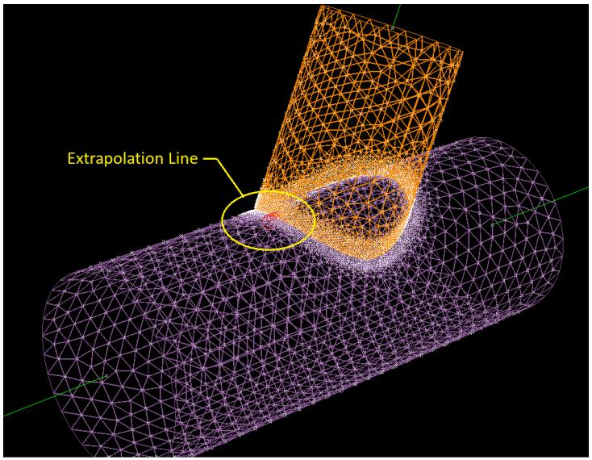  
Location of example extrapolation line on chord

As shown in the figure below, the stresses at the extrapolation joints from the red-highlighted plates will be rotated to the extrapolation coordinate system (shown by the white arrows) and averaged to produce the average joint stress.

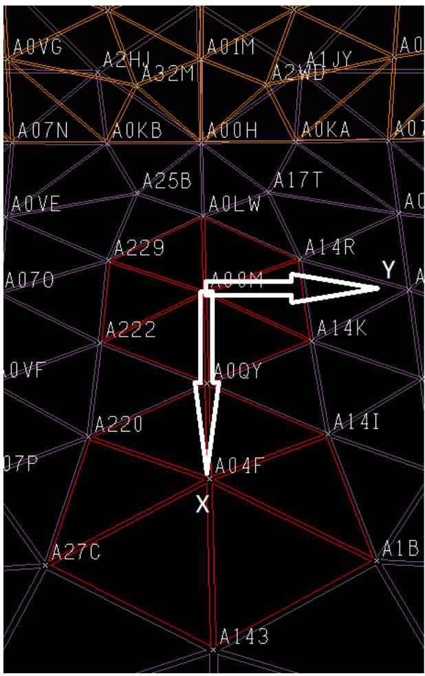  
Extrapolation coordinate system

3.10.2 Average Joint Stress

In general, the plates connected to the extrapolation joints will have local coordinate systems that are not aligned with the extrapolation coordinate system. Since the plate stresses are reported in the local coordinate system of the plate, it is necessary to rotate the plate stresses to the extrapolation coordinate system before averaging them at the extrapolation joints. This is performed using the 2D stress transformation as follows:

$$\left[ \begin{array}{c c} S X^{\prime} & T X Y^{\prime} \\ T X Y^{\prime} & S Y^{\prime} \end{array} \right] = \left[ \begin{array}{c c} c o s \theta & s i n \theta \\ - s i n \theta & c o s \theta \end{array} \right] \left[ \begin{array}{c c} S X & T X Y \\ T X Y & S Y \end{array} \right] \left[ \begin{array}{c c} c o s \theta & - s i n \theta \\ s i n \theta & c o s \theta \end{array} \right]$$

where the left-side matrix are the transformed stresses and ?? is the rotation angle.

An alternate procedure using Mohr’s circle involves the following equations:

$$S X^{\prime} = \frac{S X + S Y}{2} + \frac{S X - S Y}{2} \cos (2 \theta) + T X Y \sin (2 \theta)$$

$$S Y^{\prime} = \frac{S X + S Y}{2} - \frac{S X - S Y}{2} \cos (2 \theta) - T X Y \sin (2 \theta)$$

$$T X Y^{\prime} = - \frac{S X - S Y}{2} \sin (2 \theta) + T X Y c o s (2 \theta)$$

These equations are essentially the above matrix calculation expanded and simplified.

The above 2D stress transformation can be used only if the plate plane and the extrapolation XY plane are coplanar. SACS checks the planarity of all plates with a 5 degree tolerance limit. Plates failing this tolerance are skipped while averaging and a warning message is displayed. In such cases, the user is expected to refine the mesh to perform the SCF evaluation.

Once the rotated stresses of all plates connected to an extrapolation joint are obtained, calculating the average joint stress is just a matter of adding all the plate stresses at the extrapolation joint together and dividing by the number of plates.

For the example, the figure on the left below shows the extrapolation coordinate system while the rightside figure shows the local coordinate system of every plate. The stresses in the red-highlighted plates will be rotated to the extrapolation coordinate system.

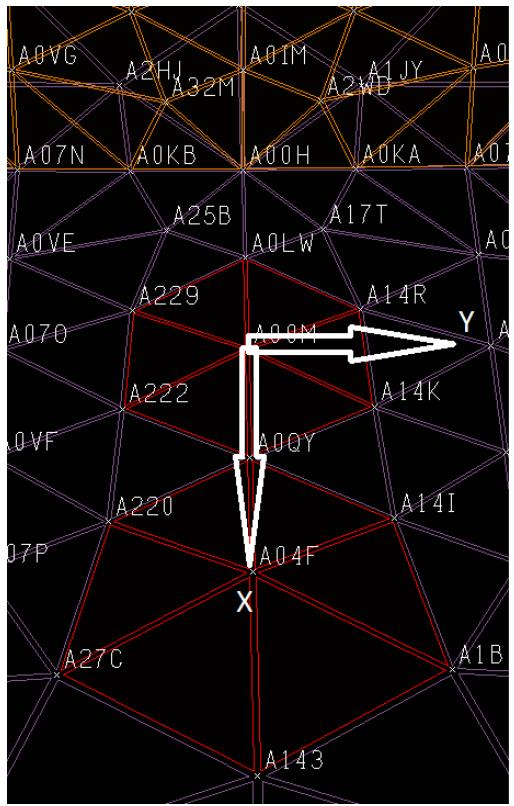  
Extrapolation coordinate system

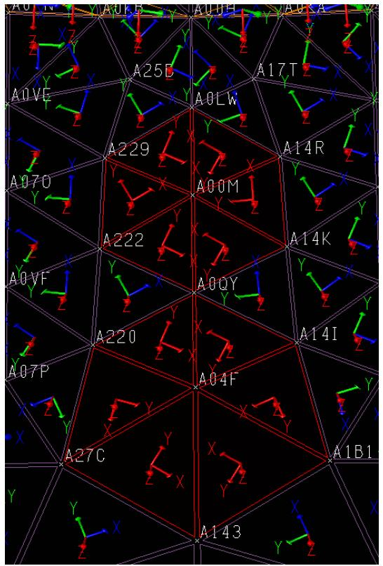  
Plate local coordinate systems

SACS reports the angle by which the plate stresses need to be rotated in the hotspot plate stress detail report that can be turned on in the SCFNS line. For example, for the plate A0CX which is defined by the nodes A04F, A143 and A1B1, the rotation angle is 120.81 degrees.


| HOTSPOT PLATE STRESS DETAIL REPORT KSI | HOTSPOT PLATE STRESS DETAIL REPORT KSI | HOTSPOT PLATE STRESS DETAIL REPORT KSI | HOTSPOT PLATE STRESS DETAIL REPORT KSI | HOTSPOT PLATE STRESS DETAIL REPORT KSI | HOTSPOT PLATE STRESS DETAIL REPORT KSI | HOTSPOT PLATE STRESS DETAIL REPORT KSI | HOTSPOT PLATE STRESS DETAIL REPORT KSI | HOTSPOT PLATE STRESS DETAIL REPORT KSI | HOTSPOT PLATE STRESS DETAIL REPORT KSI | HOTSPOT PLATE STRESS DETAIL REPORT KSI |
| --- | --- | --- | --- | --- | --- | --- | --- | --- | --- | --- |
| PLATE | ROT ANGLE | LOC | LOAD CASE | REF SYS | ********** SX | MEMBRANE SY | ********** TXY | BENDING SX | UPPER SY | SURFACE TY |
| AOCX | 120.81 | CENT | AX+1 | 0 | -0.0255 | -0.0355 | 0.0113 | -0.0189 | -0.0223 | -0.0028 |
|  |  |  |  | R | -0.0429 | -0.0182 | -0.0009 | -0.0189 | -0.0223 | 0.0028 |


SACS reports the plate stresses in the local coordinate system (reference system ‘O’) and the stresses in the extrapolation coordinate system (reference system ‘R’). There are two stress groups, membrane and bending stresses. Stress rotation is performed on both groups using the 2D stress transformation mentioned above.

Membrane:

$$\begin{array}{l} \left[ \begin{array}{c c} \cos \left(120. 81 d e g\right) & s i n \left(120. 81 d e g\right) \\ - s i n \left(120. 81 d e g\right) & c o s \left(120. 81 d e g\right) \end{array} \right] \left[ \begin{array}{c c} - 0. 0255 & 0. 0113 \\ 0. 0113 & - 0. 0355 \end{array} \right] \left[ \begin{array}{c c} c o s \left(120. 81 d e g\right) & - s i n \left(120. 81 d e g\right) \\ s i n \left(120. 81 d e g\right) & c o s \left(120. 81 d e g\right) \end{array} \right] \\ = \left[ \begin{array}{c c} - 0. 0429 & - 0. 0009 \\ - 0. 0009 & - 0. 0182 \end{array} \right] \\ \end{array}$$

Bending:

$$\begin{array}{l} \left[ \begin{array}{c c} \cos \left(120. 81 d e g\right) & s i n \left(120. 81 d e g\right) \\ - s i n \left(120. 81 d e g\right) & c o s \left(120. 81 d e g\right) \end{array} \right] \left[ \begin{array}{c c} - 0. 0189 & - 0. 0028 \\ - 0. 0028 & - 0. 0223 \end{array} \right] \left[ \begin{array}{c c} c o s \left(120. 81 d e g\right) & - s i n \left(120. 81 d e g\right) \\ s i n \left(120. 81 d e g\right) & c o s \left(120. 81 d e g\right) \end{array} \right] \\ = \left[ \begin{array}{c c} - 0. 0189 & 0. 0028 \\ 0. 0028 & - 0. 0222 \end{array} \right] \\ \end{array}$$

Thus, to get the average joint stress,


| HOTSPOT SCF REPORT | HOTSPOT SCF REPORT | HOTSPOT SCF REPORT | HOTSPOT SCF REPORT | HOTSPOT SCF REPORT | HOTSPOT SCF REPORT | HOTSPOT SCF REPORT | HOTSPOT SCF REPORT | HOTSPOT SCF REPORT | HOTSPOT SCF REPORT | HOTSPOT SCF REPORT | HOTSPOT SCF REPORT | HOTSPOT SCF REPORT | HOTSPOT SCF REPORT | HOTSPOT SCF REPORT | HOTSPOT SCF REPORT |
| --- | --- | --- | --- | --- | --- | --- | --- | --- | --- | --- | --- | --- | --- | --- | --- |
| BRACE 0003-0001 IN ,KSI | BRACE 0003-0001 IN ,KSI | BRACE 0003-0001 IN ,KSI | BRACE 0003-0001 IN ,KSI | BRACE 0003-0001 IN ,KSI | BRACE 0003-0001 IN ,KSI | BRACE 0003-0001 IN ,KSI | BRACE 0003-0001 IN ,KSI | BRACE 0003-0001 IN ,KSI | BRACE 0003-0001 IN ,KSI | BRACE 0003-0001 IN ,KSI | BRACE 0003-0001 IN ,KSI | BRACE 0003-0001 IN ,KSI | BRACE 0003-0001 IN ,KSI | BRACE 0003-0001 IN ,KSI | BRACE 0003-0001 IN ,KSI |
| BENDING | BENDING | BENDING | BENDING | BENDING | BENDING | BENDING | BENDING | BENDING | BENDING | BENDING | BENDING | BENDING | BENDING | BENDING | BENDING |
| INT | ** DISTANCES | ** | INT | LOAD | STR | ********** | MEMBRANE | ********** | UPPER | SURFACE | ********** | TXY | ********** | TOP SP | HOTSPOT |
| JNT | INT-A | INT-B | LOC | CASE | LOC | SX | SY | TXY | SX | SV | TXY | TXY | SNOM | SCF |  |
| A00H | 0.583 | 1.258 | C | AX+1 | A00H | -0.0450 | -0.0244 | 0.0000 | -0.0419 | -0.0482 | 0.0085 | -0.0909 | 0.0187 | -4.8542 |  |
|  |  |  |  |  | A00H | -0.0433 | -0.0221 | 0.0000 | -0.0330 | -0.0370 | 0.0060 |  |  |  |  |
|  |  |  |  |  | A04F | -0.0435 | -0.0194 | 0.0000 | -0.0228 | -0.0241 | 0.0032 |  |  |  |  |


For membrane SX stress at joint A04F for load condition AX+1, using rotated SX values of all plates connected to joint A04F (not shown here),

$\mathsf{ A v e r a g e ~ S X } = ( - 0 . 0429 + - 0 . 0436 + - 0 . 0439 + - 0 . 0429 + - 0 . 0436 + - 0 . 0439 ) / 6 = - 0 . 0435$

3.10.3 Extrapolation to Intersection Joint

Using the distances from the intersection joint to the extrapolation node provided on the SCFEX line, the membrane and bending component stresses are linearly extrapolated.

SCFEX A00H A00M A04F C 0.5831  1.2577

Thus, at A00H, SX = -0.0443 + 0.583*(-0.0443+0.0435)/(1.258-0.583) = -0.0450

3.10.4 SCF Calculation

To calculate the SCF, the numerically maximum principal stress at the top surface of the plate is used. For this, the membrane and bending component stresses are superimposed and the principal stress is calculated from the combined component stresses.

$$S P_{1, 2} = \frac{S X_{c o m b} + S Y_{c o m b}}{2} \pm \sqrt{\left(\frac{S X_{c o m b} - S Y_{c o m b}}{2}\right)^{2} + (T X Y_{c o m b})^{2}}$$

The numerically maximum principal stress is reported as ‘TOP SP’. This is divided by the nominal stress input on the SCFNS line to get the SCF at the intersection joint.

Thus, for the example, SXcomb = -0.045 - 0.0419 = -0.0869,

$$S Y_{\text{c o m b}} = - 0. 0244 - 0. 0482 = - 0. 0726, T X Y_{\text{c o m b}} = 0. 0 + 0. 0085 = 0. 0085.$$

$$\mathrm{S P}_{1, 2} = - 0. 0686, - 0. 0909. \text{H e n c e}, \mathrm{T O P} \mathrm{S P} = - 0. 0909.$$

From the SCFNS line,

SCFNS A00H 0.187241E-01 0.854858E-09 0.439048E-02 PT

Nominal stress = 0.0187. Hence, SCF = -0.0909/0.0187 = -4.8542

4 SAMPLE PROBLEMS

The structure shown in the figure was used to demonstrate the various capabilities of the Post program. Three separate post processing analyses are illustrated:

1. The first sample problem is a typical stress analysis code check for an in place analysis. Some of the report, allowable stress modifier, output load case selection and redesign capabilities are illustrated. The element stresses were evaluated per the API-RP2A 21st Edition and AISC 9th Edition codes.   
2. Sample Problem 2 illustrates some of the program override capabilities. Group property data and code check parameters for certain members were overridden for this execution.   
3. In Sample Problem 3, a new solution file was created. Only results for the deck elements designated in the Post input file were retained in the new solution file.

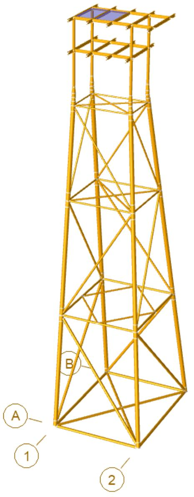

## 4.1 SAMPLE PROBLEM 1

The following sample problem is a typical code check analysis per API RP2A and AISC codes. Results for load case OPR1, OPR2, OPR3, STM1, STM2 and STM3 will be output and the allowable stress will be factored by 1.333 for load case STM1, STM2 and STM3.

Below is the optional Post input file for this sample problem followed by an explanation of the input lines used.

Note: The Post input file shown below is not required if all of the required post processing data is specified in the SACS model file.

```txt
1 2 3 4 5 6 7 8  
123456789012345678901234567890123456789012345678901234567890  
1 OPTIONS EN UC 2 1 PTPT PT  
2 LCSEL ST OPR1 OPR2 OPR3 STM1 STM2 STM3  
3 REDESIGN FILE INCR MINW NEWF 2.00.125100.0 20. 0.25 120.  
# 4 AMOD
5 AMOD STM1 1.333STM2 1.333STM3 1.333  
6 MEMSEL E 803 836 807 839 833 836 836 839 839 844  
7 MGRPSL E T04  
8 END
```

Line 1. The OPTIONS line specifies the post processing options:

a. API RP2A 21st and AISC 9th Edition codes are to be used (UC in columns 25-26).   
b. English units are designated in columns 14-15.   
c. Non-segmented beams are to be divided into two parts for stress and code check. Each segment of segmented elements is to be considered as one part for stress and code check purposes.   
d. Unity check range, stress at the maximum UC and joint reaction reports are requested by ‘PT’ in columns 47-48, 49-50 and 59-60, respectively.

Note: Default unity ranges will be used for the unity check range reports since no UCPART line is specified.

Line 2. The LCSEL line specifies that results for load case OPR1, OPR2, OPR3, STM1, STM2 and STM3 are to be determined and reported.

Line 3. The following redesign parameters are designated on the REDESIGN line:

a. ‘FILE’ in columns 11-14 stipulates that non-tubular sections available for redesign are located in an external member library file.   
b. Only member size increases are to be performed as designated by ‘INCR’ in cols. 16-19.   
c. By default, Members should be redesigned based on minimum weight (‘MINW’ in columns 21-24).   
d. A new model file with member dimensions redesigned will be generated (‘NEWF’ in columns 31-34).

e. The outside diameter and the wall thickness increments are 2 and 0.125, respectively.   
f. Default values for maximum and minimum D/t ratios (100 and 20) in addition to maximum Kl/r (120) are to be used.   
g. The minimum wall thickness for tubular members is 0.25 as entered in columns 71-75.

Line 5. Allowable stresses calculated for load case STM1 STM2 and STM3 shall be factored by 1.333 as specified on the AMOD line.

Line 6. Members 803-836, 807-839, 833-836, 836-839 and 839-844 are excluded from the output.   
Line 7. Members assigned to group ‘T04’ are excluded from the output.

The ensuing pages contain a portion of the post processing analysis output.

***** SACS MODEL PARAMETERS ******

NUMBER OF JOINTS 83

NUMBER OF MEMBERS 149

NUMBER OF PLATES 2

NUMBER OF SHELL ELEMENTS 0

NUMBER OF SOLID ELEMENTS 0

NUMBER OF BASIC LOADS 10

NUMBER OF COMBINED LOADS .. 6

UNITY CHECK .... API RP2A 21ST/AISC 9TH

JOINT DEFLECTION REPORT .NO

GROUP SUMMARY REPORT YES

ELEMENT STRESS AT MAXIMUM UC REPORT .......YES

MEMBER INTERNAL LOADS SUMMARY REPORT ......NO

ELEMENT UNITY CHECK REPORT .NO

ELEMENT DETAIL REPORT .NO

MEMBER END FORCES AND MOMENTS REPORT ......NO

JOINT REACTIONS REPORT ..YES


| **** SACS LOAD CASE REPORT***** | **** SACS LOAD CASE REPORT***** | **** SACS LOAD CASE REPORT***** | **** SACS LOAD CASE REPORT***** | **** SACS LOAD CASE REPORT***** | **** SACS LOAD CASE REPORT***** | **** SACS LOAD CASE REPORT***** | **** SACS LOAD CASE REPORT***** | **** SACS LOAD CASE REPORT***** | **** SACS LOAD CASE REPORT***** | **** SACS LOAD CASE REPORT***** | **** SACS LOAD CASE REPORT***** | **** SACS LOAD CASE REPORT***** | **** SACS LOAD CASE REPORT***** | **** SACS LOAD CASE REPORT***** |  |
| --- | --- | --- | --- | --- | --- | --- | --- | --- | --- | --- | --- | --- | --- | --- | --- |
| LOAD FACTOR NO. | LOAD CASE | TYPE | PRINT | AMOD | WATER | LC | FACTOR | LC | FACTOR | LC | FACTOR | LC | FACTOR | LC |  |
| LOAD FACTOR NO. | LOAD CASE | TYPE | OPTION | FACTOR | DEPTH FT |  |  |  |  |  |  |  |  |  |  |
| 1 | AREA | BASIC | NO | 1.000 | 0.0 |  |  |  |  |  |  |  |  |  |  |
| 2 | EQPT | BASIC | NO | 1.000 | 0.0 |  |  |  |  |  |  |  |  |  |  |
| 3 | LIVE | BASIC | NO | 1.000 | 0.0 |  |  |  |  |  |  |  |  |  |  |
| 4 | MISC | BASIC | NO | 1.000 | 0.0 |  |  |  |  |  |  |  |  |  |  |
| 5 | P000 | BASIC | NO | 1.000 | 0.0 |  |  |  |  |  |  |  |  |  |  |
| 6 | P045 | BASIC | NO | 1.000 | 0.0 |  |  |  |  |  |  |  |  |  |  |
| 7 | P090 | BASIC | NO | 1.000 | 0.0 |  |  |  |  |  |  |  |  |  |  |
| 8 | S000 | BASIC | NO | 1.000 | 0.0 |  |  |  |  |  |  |  |  |  |  |
| 9 | S045 | BASIC | NO | 1.000 | 0.0 |  |  |  |  |  |  |  |  |  |  |
| 10 | S090 | BASIC | NO | 1.000 | 0.0 |  |  |  |  |  |  |  |  |  |  |
| 11 | OPR1 | COMB | YES | 1.000 | 0.0 | MISC | 1.00 | EQPT | 1.00 | AREA | 0.50 | LIVE | 1.00 | P000 | 1.00 |
| 12 | OPR2 | COMB | YES | 1.000 | 0.0 | MISC | 1.00 | EQPT | 1.00 | AREA | 0.50 | LIVE | 1.00 | P045 | 1.00 |
| 13 | OPR3 | COMB | YES | 1.000 | 0.0 | MISC | 1.00 | EQPT | 1.00 | AREA | 0.50 | LIVE | 1.00 | P090 | 1.00 |
| 14 | STM1 | COMB | YES | 1.333 | 0.0 | MISC | 1.00 | EQPT | 0.75 | LIVE | 0.75 | S000 | 1.00 |  |  |
| 15 | STM2 | COMB | YES | 1.333 | 0.0 | MISC | 1.00 | EQPT | 0.75 | LIVE | 0.75 | S045 | 1.00 |  |  |
| 16 | STM3 | COMB | YES | 1.333 | 0.0 | MISC | 1.00 | EQPT | 0.75 | LIVE | 0.75 | S090 | 1.00 |  |  |


SACS-IV SYSTEM SPRING FORCES AND MOMENTS   


| JOINT | LOAD CASE | COORD. SYS. | ********** | FORCES Y Z (KIPS) | ********** | ********** | MOMENTS Y (IN-KIPS) | ********** |
| --- | --- | --- | --- | --- | --- | --- | --- | --- |
| 108 | OPR1 | GLOB | 36.092 | -7.812 | -546.064 | 248.703 | -201.016 | -2.949 |
| 108 | OPR2 | GLOB | 26.913 | 7.446 | -570.922 | 98.660 | -317.993 | -24.243 |
| 108 | OPR3 | GLOB | 1.294 | 15.390 | -505.580 | 67.765 | -624.131 | -47.617 |
| 108 | STM1 | GLOB | 146.687 | -16.857 | -972.657 | 131.127 | 1425.536 | 46.471 |
| 108 | STM2 | GLOB | 109.939 | 39.028 | -1060.165 | -475.430 | 874.639 | -16.510 |
| 108 | STM3 | GLOB | 7.424 | 70.004 | -735.190 | -630.148 | -533.523 | -88.588 |
| 106 | OPR1 | GLOB | 14.038 | -8.038 | -489.518 | 283.492 | -12.139 | 5.141 |
| 106 | OPR2 | GLOB | 10.948 | 9.883 | -587.768 | 110.024 | -157.716 | 2.304 |
| 106 | OPR3 | GLOB | 1.723 | 15.398 | -704.786 | 53.125 | -473.947 | -9.146 |
| 106 | STM1 | GLOB | 54.495 | 3.541 | 87.828 | 211.274 | 1585.290 | 50.253 |
| 106 | STM2 | GLOB | 42.050 | 69.294 | -350.007 | -462.638 | 931.370 | 48.530 |
| 106 | STM3 | GLOB | 4.937 | 88.931 | -900.194 | -692.454 | -516.152 | 16.155 |
| 104 | OPR1 | GLOB | 36.192 | 8.156 | -516.663 | -272.138 | -192.040 | -6.591 |
| 104 | OPR2 | GLOB | 23.683 | 21.261 | -418.180 | -440.254 | -343.461 | -10.697 |
| 104 | OPR3 | GLOB | -3.360 | 24.991 | -302.254 | -513.352 | -668.205 | 3.305 |
| 104 | STM1 | GLOB | 148.371 | 17.873 | -943.447 | -281.555 | 1448.879 | -67.349 |
| 104 | STM2 | GLOB | 98.711 | 64.738 | -504.761 | -943.793 | 811.463 | -75.533 |
| 104 | STM3 | GLOB | -9.859 | 76.688 | 40.738 | -1220.679 | -652.183 | -31.399 |
| 102 | OPR1 | GLOB | 13.654 | 7.975 | -507.703 | -260.271 | 10.935 | -3.102 |
| 102 | OPR2 | GLOB | 9.145 | 28.176 | -483.561 | -439.880 | -100.324 | 9.403 |
| 102 | OPR3 | GLOB | -0.174 | 37.947 | -549.901 | -504.821 | -404.311 | 25.328 |
| 102 | STM1 | GLOB | 52.065 | -3.597 | 74.832 | -299.077 | 1654.576 | -40.961 |
| 102 | STM2 | GLOB | 34.047 | 71.668 | 158.274 | -994.665 | 1149.197 | 4.022 |
| 102 | STM3 | GLOB | -3.632 | 110.441 | -169.999 | -1258.958 | -247.010 | 56.692 |


|  |  |  |  | SACS-IV SYSTEM PLATE STRESS UNITY CHECK RANGE SUMMARYGROUP III - UNITY CHECKS GREATER THAN 0.00 AND LESS THAN 0.50 | SACS-IV SYSTEM PLATE STRESS UNITY CHECK RANGE SUMMARYGROUP III - UNITY CHECKS GREATER THAN 0.00 AND LESS THAN 0.50 | SACS-IV SYSTEM PLATE STRESS UNITY CHECK RANGE SUMMARYGROUP III - UNITY CHECKS GREATER THAN 0.00 AND LESS THAN 0.50 | SACS-IV SYSTEM PLATE STRESS UNITY CHECK RANGE SUMMARYGROUP III - UNITY CHECKS GREATER THAN 0.00 AND LESS THAN 0.50 | SACS-IV SYSTEM PLATE STRESS UNITY CHECK RANGE SUMMARYGROUP III - UNITY CHECKS GREATER THAN 0.00 AND LESS THAN 0.50 | SACS-IV SYSTEM PLATE STRESS UNITY CHECK RANGE SUMMARYGROUP III - UNITY CHECKS GREATER THAN 0.00 AND LESS THAN 0.50 | SACS-IV SYSTEM PLATE STRESS UNITY CHECK RANGE SUMMARYGROUP III - UNITY CHECKS GREATER THAN 0.00 AND LESS THAN 0.50 | SACS-IV SYSTEM PLATE STRESS UNITY CHECK RANGE SUMMARYGROUP III - UNITY CHECKS GREATER THAN 0.00 AND LESS THAN 0.50 | SACS-IV SYSTEM PLATE STRESS UNITY CHECK RANGE SUMMARYGROUP III - UNITY CHECKS GREATER THAN 0.00 AND LESS THAN 0.50 | SACS-IV SYSTEM PLATE STRESS UNITY CHECK RANGE SUMMARYGROUP III - UNITY CHECKS GREATER THAN 0.00 AND LESS THAN 0.50 | SACS-IV SYSTEM PLATE STRESS UNITY CHECK RANGE SUMMARYGROUP III - UNITY CHECKS GREATER THAN 0.00 AND LESS THAN 0.50 |
| --- | --- | --- | --- | --- | --- | --- | --- | --- | --- | --- | --- | --- | --- | --- |
|  |  | MAXIMUM | LOAD | **** MEMBRANE **** BENDING-UPPER SURF. ** MAX ** X-STIFFENER Y-STIFFENER | **** MEMBRANE **** BENDING-UPPER SURF. ** MAX ** X-STIFFENER Y-STIFFENER | **** MEMBRANE **** BENDING-UPPER SURF. ** MAX ** X-STIFFENER Y-STIFFENER | **** MEMBRANE **** BENDING-UPPER SURF. ** MAX ** X-STIFFENER Y-STIFFENER | **** MEMBRANE **** BENDING-UPPER SURF. ** MAX ** X-STIFFENER Y-STIFFENER | **** MEMBRANE **** BENDING-UPPER SURF. ** MAX ** X-STIFFENER Y-STIFFENER | **** MEMBRANE **** BENDING-UPPER SURF. ** MAX ** X-STIFFENER Y-STIFFENER | **** MEMBRANE **** BENDING-UPPER SURF. ** MAX ** X-STIFFENER Y-STIFFENER | **** MEMBRANE **** BENDING-UPPER SURF. ** MAX ** X-STIFFENER Y-STIFFENER | SECOND-HIGHEST | SECOND-HIGHEST |
| THIRD-HIGHESTPLATE | GRUP TYPE | UNITY | COND | SX | SY | TXY | SX | SY | TXY | VM | S-TOP | S-BOT | S-TOP | S-BOT |
| UNITY | LOAD | CHECK | NO. | ********** KSI********** | ********** KSI********** | ********** KSI********** | ********** KSI********** | ********** KSI********** | ********** KSI********** | ********** KSI********** | ********** KSI********** | ********** KSI********** | CHECK | COND |
| CHECK | COND |  |  |  |  |  |  |  |  |  |  |  |  |  |
| AAAC | P01 ISO | 0.015 | OPR1 | -0.3 | -0.1 | -0.0 | -0.0 | -0.0 | -0.0 | 0.3 |  |  | 0.015 | OPR2 |
| 0.015 | OPR3 |  |  |  |  |  |  |  |  |  |  |  |  |  |
| AAAD | P01 ISO | 0.029 | OPR3 | -0.3 | -0.0 | -0.0 | -0.4 | -0.2 | 0.0 | 0.6 |  |  | 0.029 | OPR2 |
| 0.029 | OPR1 |  |  |  |  |  |  |  |  |  |  |  |  |  |


| SACS-IV MEMBER UNI TY CHECK RANGE SUMMARYGROUP I - UNI TY CHECKS GREATER THAN 1.33 | SACS-IV MEMBER UNI TY CHECK RANGE SUMMARYGROUP I - UNI TY CHECKS GREATER THAN 1.33 | SACS-IV MEMBER UNI TY CHECK RANGE SUMMARYGROUP I - UNI TY CHECKS GREATER THAN 1.33 | SACS-IV MEMBER UNI TY CHECK RANGE SUMMARYGROUP I - UNI TY CHECKS GREATER THAN 1.33 | SACS-IV MEMBER UNI TY CHECK RANGE SUMMARYGROUP I - UNI TY CHECKS GREATER THAN 1.33 | SACS-IV MEMBER UNI TY CHECK RANGE SUMMARYGROUP I - UNI TY CHECKS GREATER THAN 1.33 | SACS-IV MEMBER UNI TY CHECK RANGE SUMMARYGROUP I - UNI TY CHECKS GREATER THAN 1.33 | SACS-IV MEMBER UNI TY CHECK RANGE SUMMARYGROUP I - UNI TY CHECKS GREATER THAN 1.33 | SACS-IV MEMBER UNI TY CHECK RANGE SUMMARYGROUP I - UNI TY CHECKS GREATER THAN 1.33 | SACS-IV MEMBER UNI TY CHECK RANGE SUMMARYGROUP I - UNI TY CHECKS GREATER THAN 1.33 | SACS-IV MEMBER UNI TY CHECK RANGE SUMMARYGROUP I - UNI TY CHECKS GREATER THAN 1.33 | SACS-IV MEMBER UNI TY CHECK RANGE SUMMARYGROUP I - UNI TY CHECKS GREATER THAN 1.33 | SACS-IV MEMBER UNI TY CHECK RANGE SUMMARYGROUP I - UNI TY CHECKS GREATER THAN 1.33 | SACS-IV MEMBER UNI TY CHECK RANGE SUMMARYGROUP I - UNI TY CHECKS GREATER THAN 1.33 | SACS-IV MEMBER UNI TY CHECK RANGE SUMMARYGROUP I - UNI TY CHECKS GREATER THAN 1.33 | SACS-IV MEMBER UNI TY CHECK RANGE SUMMARYGROUP I - UNI TY CHECKS GREATER THAN 1.33 |
| --- | --- | --- | --- | --- | --- | --- | --- | --- | --- | --- | --- | --- | --- | --- | --- |
| MEMBER | GROUP ID | MAXIMUM COMBINED UNI TY CK | LOAD COND NO. | DIST FROM END | AXIAL STRESS KSI | BENDING Y KSI | STRESS Z KSI | SHEAR FY KIPS | FORCE FZ KIPS | KLY/RY | KLZ/RZ | SECOND-HIGHEST UNI TY CHECK | HIGHEST LOAD COND | THIRD-HIGHEST UNI TY CHECK | HIGHEST LOAD COND |
| 303-401 | T01 | 101.322 | STM1 | 88.2 | -5.81 | 7.44 | -1.43 | -0.87 | 4.05 | 194.6 | 194.6 | 1.528 | STM2 | 0.292 | STM3 |
| 307-403 | T01 | 1.412 | STM3 | 79.7 | -4.84 | 6.59 | -1.50 | -0.92 | 4.17 | 175.9 | 175.9 | 0.860 | STM2 | 0.255 | STM1 |
| 801-834 | W01 | 1.357 | OPR1 | 15.8 | -0.39 | 28.70 | -0.11 | -0.11 | 109.54 | 18.2 | 62.2 | 1.353 | OPR2 | 1.347 | OPR3 |
| 834-835 | W01 | 1.385 | OPR2 | 0.0 | -0.40 | 28.62 | 0.22 | -0.31 | -21.89 | 18.9 | 64.6 | 1.382 | OPR1 | 1.376 | OPR3 |
| 835-803 | W01 | 1.763 | OPR1 | 15.8 | -0.96 | -36.23 | -0.23 | -0.13 | -118.47 | 18.2 | 62.2 | 1.752 | OPR2 | 1.729 | OPR3 |
| 838-807 | W01 | 1.915 | OPR1 | 15.8 | -0.74 | -39.73 | 0.09 | 0.08 | -135.48 | 18.2 | 62.2 | 1.911 | OPR2 | 1.879 | OPR3 |
| 835-838 | W02 | 1.795 | OPR1 | 16.0 | 0.03 | 28.18 | 0.29 | 0.00 | 39.33 | 37.6 | 129.2 | 1.792 | OPR2 | 1.785 | OPR3 |


* * * M E M B E R G R O U P S U M M A R Y * * *   
API RP2A 21ST/AISC 9TH   


| GRUP ID | CRITICAL MEMBER | LOAD COND | MAX. UNITY CHECK | DIST FROM END FT | * APPLIED STRESSES * AXIAL KSI BEND-Y BEND-Z KSI | *** ALLOWABLE AXIAL KSI EULER KSI BEND-Y BEND-Z KSI | STRESSES *** AXIAL KSI EULER KSI BEND-Y BEND-Z KSI | CRIT COND | EFFECTIVE LENGTHS | EFFECTIVE LENGTHS | CM * VALUES * Y Z |  |  |  |  |  |
| --- | --- | --- | --- | --- | --- | --- | --- | --- | --- | --- | --- | --- | --- | --- | --- | --- |
| GRUP ID | CRITICAL MEMBER | LOAD COND | MAX. UNITY CHECK | DIST FROM END FT | * APPLIED STRESSES * AXIAL KSI BEND-Y BEND-Z KSI | *** ALLOWABLE AXIAL KSI EULER KSI BEND-Y BEND-Z KSI | STRESSES *** AXIAL KSI EULER KSI BEND-Y BEND-Z KSI | CRIT COND | KLY FT | KLZ FT | CM * VALUES * Y Z |  |  |  |  |  |
| LG1 | 105-205 | STM1 | 0.07 | 92.8 | -0.8 | -0.7 | 0.9 | 20.1 | 29.5 | 36.0 | 36.0 | C<.15 | 97.75 | 97.75 | 0.85 | 0.85 |
| LG2 | 207-307 | STM1 | 0.11 | 91.3 | 2.8 | -0.1 | -0.6 | 28.8 | 30.4 | 36.0 | 36.0 | TN+BN | 96.21 | 96.21 | 0.85 | 0.85 |
| LG3 | 303-403 | STM1 | 0.28 | 72.1 | 4.5 | 2.2 | -3.9 | 28.8 | 48.2 | 36.0 | 36.0 | TN+BN | 76.46 | 76.46 | 0.85 | 0.85 |
| LG4 | 403-503 | STM1 | 0.17 | 0.0 | 3.3 | 2.3 | -3.9 | .4E+02 | .2E+05 | .5E+02 | .5E+02 | TN+BN | 3.54 | 3.54 | 0.85 | 0.85 |
| LG5 | 507-607 | STM1 | 0.31 | 0.0 | -3.4 | 6.1 | 9.2 | .4E+02 | .2E+05 | .5E+02 | .5E+02 | C<.15 | 3.04 | 3.04 | 0.85 | 0.85 |
| LG6 | 607-707 | STM1 | 0.75 | 37.0 | -6.2 | 0.0 | -19.1 | 28.8 | 83.0 | 36.0 | 36.0 | C>.15B | 37.00 | 37.00 | 0.85 | 0.85 |
| LG7 | 701-801 | OPR3 | 1.13 | 25.0 | -3.6 | 0.4 | 26.1 | 21.6 | 132.4 | 27.0 | 27.0 | C>.15B | 25.00 | 25.00 | 0.85 | 0.85 |
| PL1 | 108-208 | STM2 | 0.58 | 0.0 | -9.7 | 1.0 | 0.4 | 18.1 | 22.0 | 36.0 | 36.0 | C>.15A | 98.23 | 98.23 | 0.85 | 0.85 |
| PL2 | 208-308 | STM2 | 0.54 | 0.0 | -9.4 | -0.8 | 0.1 | 18.4 | 22.9 | 36.0 | 36.0 | C>.15A | 96.21 | 96.21 | 0.85 | 0.85 |
| PL3 | 308-408 | STM1 | 0.47 | 76.5 | -8.1 | 0.9 | 3.0 | 21.3 | 36.2 | 36.0 | 36.0 | C>.15A | 76.46 | 76.46 | 0.85 | 0.85 |
| PL4 | 408-507 | STM2 | 0.39 | 3.5 | -8.9 | 2.8 | 1.1 | .3E+02 | .2E+05 | .4E+02 | .4E+02 | C>.15B | 3.54 | 3.54 | 0.85 | 0.85 |
| T01 | 303-401 | STM1 | 101.32 | 88.2 | -5.8 | 7.4 | -1.4 | 5.3 | 5.3 | 35.0 | 35.0 | EULER | 88.23 | 88.23 | 0.85 | 0.85 |
| T02 | 305-207 | STM1 | 0.87 | 109.4 | -3.9 | 1.6 | -0.4 | 5.4 | 5.4 | 35.0 | 35.0 | C>.15A | 109.39 | 109.39 | 0.85 | 0.85 |
| T03 | 405-407 | STM1 | 0.40 | 45.1 | -3.1 | -5.1 | -0.1 | 12.7 | 12.8 | 35.0 | 35.0 | C>.15A | 45.14 | 45.14 | 0.85 | 0.85 |
| T05 | 103-201 | STM1 | 0.31 | 116.3 | -2.3 | 0.5 | -0.4 | 8.0 | 8.0 | 36.0 | 36.0 | C>.15A | 116.34 | 116.34 | 0.85 | 0.85 |
| W01 | 838-807 | OPR1 | 1.92 | 15.8 | -0.7 | -39.7 | 0.1 | 17.2 | 38.6 | 21.6 | 27.0 | C<.15 | 15.80 | 15.80 | 0.85 | 0.85 |
| W02 | 835-838 | OPR1 | 1.79 | 16.0 | 0.0 | 28.2 | 0.3 | 21.6 | 8.9 | 15.8 | 27.0 | BEND | 32.00 | 32.00 | 0.85 | 0.85 |


| *** REDESIGNED MEMBER GRUP REPORT *** | *** REDESIGNED MEMBER GRUP REPORT *** | *** REDESIGNED MEMBER GRUP REPORT *** | *** REDESIGNED MEMBER GRUP REPORT *** | *** REDESIGNED MEMBER GRUP REPORT *** | *** REDESIGNED MEMBER GRUP REPORT *** | *** REDESIGNED MEMBER GRUP REPORT *** | *** REDESIGNED MEMBER GRUP REPORT *** | *** REDESIGNED MEMBER GRUP REPORT *** | *** REDESIGNED MEMBER GRUP REPORT *** | *** REDESIGNED MEMBER GRUP REPORT *** | *** REDESIGNED MEMBER GRUP REPORT *** | *** REDESIGNED MEMBER GRUP REPORT *** | *** REDESIGNED MEMBER GRUP REPORT *** | *** REDESIGNED MEMBER GRUP REPORT *** | *** REDESIGNED MEMBER GRUP REPORT *** |
| --- | --- | --- | --- | --- | --- | --- | --- | --- | --- | --- | --- | --- | --- | --- | --- |
| GRUP ID | SECTION ID | OUTSIDE DIAMETER (IN) | WALL THICKNESS (IN) | ELASTIC MODULUS ** (1000) | SHEAR MODULUS KSI) -- | YIELD STRESS (KSI) | MEMB. CAT. | AVERAGE JOINT THICKNESS (FT) | EFFECTIVE LENGTH KY | FACTORS KZ | DIST.BETW. COMP. FLNG. BRACES (FT) | TUBULAR SHEAR FACTOR | VARIABLE MEMB. SECT. LENGTH (FT) | REDESIGN STATUS |  |
| LG1 |  | 42.000 | 1.375 | 29.000 | 11.600 | 50.000 | 1 | 0.000 | 1.000 | 1.000 |  | 0.500 | 5.000 | OLD |  |
| LG1 |  | 41.250 | 1.000 | 29.000 | 11.600 | 36.000 | 1 | 0.000 | 1.000 | 1.000 |  | 0.500 | 0.000 | OLD |  |
| LG1 |  | 42.000 | 1.375 | 29.000 | 11.600 | 50.000 | 1 | 0.000 | 1.000 | 1.000 |  | 0.500 | 5.000 | OLD |  |
| LG2 |  | 42.000 | 1.375 | 29.000 | 11.600 | 50.000 | 1 | 0.000 | 1.000 | 1.000 |  | 0.500 | 6.150 | OLD |  |
| LG2 |  | 41.250 | 1.000 | 29.000 | 11.600 | 36.000 | 1 | 0.000 | 1.000 | 1.000 |  | 0.500 | 0.000 | OLD |  |
| LG2 |  | 42.000 | 1.375 | 29.000 | 11.600 | 50.000 | 1 | 0.000 | 1.000 | 1.000 |  | 0.500 | 4.900 | OLD |  |
| LG3 |  | 42.000 | 1.375 | 29.000 | 11.600 | 50.000 | 1 | 0.000 | 1.000 | 1.000 |  | 0.500 | 6.750 | OLD |  |
| LG3 |  | 41.250 | 1.000 | 29.000 | 11.600 | 36.000 | 1 | 0.000 | 1.000 | 1.000 |  | 0.500 | 0.000 | OLD |  |
| LG3 |  | 42.000 | 1.375 | 29.000 | 11.600 | 50.000 | 1 | 0.000 | 1.000 | 1.000 |  | 0.500 | 4.350 | OLD |  |
| LG4 |  | 42.000 | 1.375 | 29.000 | 11.600 | 50.000 | 1 | 0.000 | 1.000 | 1.000 |  | 0.500 | 0.000 | OLD |  |
| LG5 |  | 36.000 | 1.000 | 29.000 | 11.600 | 50.000 | 1 | 0.000 | 1.000 | 1.000 |  | 0.500 | 0.000 | OLD |  |
| LG6 |  | 36.000 | 0.750 | 29.000 | 11.600 | 36.000 | 1 | 0.000 | 1.000 | 1.000 |  | 0.500 | 3.250 | OLD |  |
| LG6 | CONE |  |  | 29.000 | 11.600 | 36.000 | 1 | 0.000 | 1.000 | 1.000 | 0.500 |  | 4.950 | OLD |  |
| LG6 |  | 26.000 | 0.750 | 29.000 | 11.600 | 36.000 | 1 | 0.000 | 1.000 | 1.000 |  | 0.500 | 0.000 | OLD |  |
| LG7 |  | 28.000 | 0.750 | 29.000 | 11.600 | 36.000 | 1 | 0.000 | 1.000 | 1.000 |  | 0.500 | 0.000 | NEW |  |
| PL1 |  | 36.000 | 1.000 | 29.000 | 11.600 | 36.000 | 1 | 0.000 | 1.000 | 1.000 |  | 0.500 | 0.000 | OLD |  |
| PL2 |  | 36.000 | 1.000 | 29.000 | 11.600 | 36.000 | 1 | 0.000 | 1.000 | 1.000 |  | 0.500 | 0.000 | OLD |  |
| PL3 |  | 36.000 | 1.000 | 29.000 | 11.600 | 36.000 | 1 | 0.000 | 1.000 | 1.000 |  | 0.500 | 0.000 | OLD |  |
| PL4 |  | 36.000 | 1.000 | 29.000 | 11.600 | 36.000 | 1 | 0.000 | 1.000 | 1.000 |  | 0.500 | 0.000 | OLD |  |
| T01 |  | 26.000 | 0.625 | 29.010 | 11.200 | 35.000 | 1 | 0.000 | 1.000 | 1.000 |  | 0.500 | 0.000 | NEW |  |
| T02 |  | 32.000 | 0.750 | 29.000 | 11.600 | 35.000 | 1 | 0.000 | 1.000 | 1.000 |  | 0.500 | 0.000 | NEW |  |
| T03 |  | 14.750 | 0.500 | 29.010 | 11.600 | 35.000 | 1 | 0.000 | 1.000 | 1.000 |  | 0.500 | 0.000 | NEW |  |
| T04 |  | 24.000 | 0.750 | 29.000 | 11.600 | 36.000 | 1 | 0.000 | 1.000 | 1.000 |  | 0.500 | 0.000 | OLD |  |
| T05 |  | 38.000 | 1.000 | 29.000 | 11.600 | 36.000 | 1 | 0.000 | 1.000 | 1.000 |  | 0.500 | 0.000 | NEW |  |
| W.B |  | 36.433 | 1.000 | 29.010 | 11.200 | 35.970 | 1 | 0.000 | 1.000 | 1.000 |  | 0.500 | 0.000 | OLD |  |
| W01 | W40X199 |  |  | 29.010 | 11.200 | 35.970 | 1 | 0.000 | 1.000 | 1.000 | 0.000 |  | 0.000 | NEW |  |
| W02 | W24X176 |  |  | 29.010 | 11.200 | 35.970 | 1 | 0.000 | 1.000 | 1.000 | 0.000 |  | 0.000 | NEW |  |
|  |  |  | * * * REDESIGN SUMMARY * * * | * * * REDESIGN SUMMARY * * * | * * * REDESIGN SUMMARY * * * | * * * REDESIGN SUMMARY * * * | * * * REDESIGN SUMMARY * * * | * * * REDESIGN SUMMARY * * * | * * * REDESIGN SUMMARY * * * | * * * REDESIGN SUMMARY * * * | * * * REDESIGN SUMMARY * * * | * * * REDESIGN SUMMARY * * * | * * * REDESIGN SUMMARY * * * | * * * REDESIGN SUMMARY * * * | * * * REDESIGN SUMMARY * * * |
| GRUP | *** SECTION ID *** ORIGINAL REDESIGN | ** ORIGINAL ** OD IN | ** WT IN | ** OD IN | ** WT IN | DESIGN RESTR. | YIELD STRESS KSI | VAR. SECT FT | D/T RATIO | *** MAXIMUM *** KL/RY | KL/RZ | MAX. STRESS KSI | ** UNI TY MIN. | CHECK ** MAX. |  |
| LG1 |  | 42.00 | 1.375 | 42.00 | 1.375 | L | 50.00 | 5.00 | 30.55 | 97.28 | 97.28 | 1.10 | 0.014 | 0.044 |  |
| LG1 |  | 41.25 | 1.000 | 41.25 | 1.000 | L | 36.00 | 0.00 | 41.25 | 82.58 | 82.58 | 2.07 | 0.026 | 0.073 |  |
| LG1 |  | 42.00 | 1.375 | 42.00 | 1.375 | L | 50.00 | 5.00 | 30.55 | 97.28 | 97.28 | 1.70 | 0.024 | 0.048 |  |
| LG2 |  | 42.00 | 1.375 | 42.00 | 1.375 | L | 50.00 | 6.15 | 30.55 | 95.27 | 95.27 | 2.61 | 0.050 | 0.079 |  |
| LG2 |  | 41.25 | 1.000 | 41.25 | 1.000 | L | 36.00 | 0.00 | 41.25 | 80.87 | 80.87 | 3.36 | 0.083 | 0.113 |  |
| LG2 |  | 42.00 | 1.375 | 42.00 | 1.375 | L | 50.00 | 4.90 | 30.55 | 95.27 | 95.27 | 2.42 | 0.049 | 0.068 |  |
| LG3 |  | 42.00 | 1.375 | 42.00 | 1.375 | L | 50.00 | 6.75 | 30.55 | 75.71 | 75.71 | 3.40 | 0.074 | 0.088 |  |
| LG3 |  | 41.25 | 1.000 | 41.25 | 1.000 | L | 36.00 | 0.00 | 41.25 | 64.26 | 64.26 | 8.93 | 0.134 | 0.279 |  |
| LG3 |  | 42.00 | 1.375 | 42.00 | 1.375 | L | 50.00 | 4.35 | 30.55 | 75.71 | 75.71 | 6.95 | 0.119 | 0.155 |  |
| LG4 |  | 42.00 | 1.375 | 42.00 | 1.375 | L | 50.00 | 0.00 | 30.55 | 2.96 | 2.96 | 7.88 | 0.126 | 0.175 |  |
| LG5 |  | 36.00 | 1.000 | 36.00 | 1.000 | L | 50.00 | 0.00 | 36.00 | 2.95 | 2.95 | 14.43 | 0.214 | 0.312 |  |
| LG6 |  | 36.00 | 0.750 | 36.00 | 0.750 | L | 36.00 | 3.25 | 48.00 | 57.85 | 57.85 | 18.72 | 0.348 | 0.562 |  |
| LG6 | CONE | CONE |  |  |  | L | 36.00 | 4.95 |  | 53.59 | 53.59 | 23.33 | 0.358 | 0.692 |  |
| LG6 |  | 26.00 | 0.750 | 26.00 | 0.750 | L | 36.00 | 0.00 | 34.67 | 48.97 | 48.97 | 25.37 | 0.447 | 0.748 |  |
| LG7 |  | 26.00 | 0.750 | 28.00 | 0.750 | L | 36.00 | 0.00 | 37.33 | 31.13 | 31.13 | 26.71 | 0.217 | 0.981 |  |
| PL1 |  | 36.00 | 1.000 | 36.00 | 1.000 | L | 36.00 | 0.00 | 36.00 | 95.22 | 95.22 | 10.72 | 0.359 | 0.579 |  |
| PL2 |  | 36.00 | 1.000 | 36.00 | 1.000 | L | 36.00 | 0.00 | 36.00 | 93.26 | 93.26 | 10.23 | 0.318 | 0.543 |  |
| PL3 |  | 36.00 | 1.000 | 36.00 | 1.000 | L | 36.00 | 0.00 | 36.00 | 74.12 | 74.12 | 11.21 | 0.266 | 0.474 |  |
| PL4 |  | 36.00 | 1.000 | 36.00 | 1.000 | L | 36.00 | 0.00 | 36.00 | 3.44 | 3.44 | 11.90 | 0.207 | 0.392 |  |
| T01 |  | 16.00 | 0.625 | 26.00 | 0.625 | L | 35.00 | 0.00 | 41.60 | 117.98 | 117.98 | 6.26 | 0.005 | 0.340 |  |
| T02 |  | 20.00 | 0.750 | 32.00 | 0.750 | L | 35.00 | 0.00 | 42.67 | 118.77 | 118.77 | 3.39 | 0.008 | 0.190 |  |
| T03 |  | 12.75 | 0.500 | 14.75 | 0.500 | L | 35.00 | 0.00 | 29.50 | 107.45 | 107.45 | 7.44 | 0.048 | 0.274 |  |
| T04 |  | 24.00 | 0.750 | 24.00 | 0.750 | L | 36.00 | 0.00 | 32.00 | 0.00 | 0.00 | 0.00 | 0.000 | 0.000 |  |
| T05 |  | 26.00 | 1.000 | 38.00 | 1.000 | L | 36.00 | 0.00 | 38.00 | 114.70 | 114.70 | 2.18 | 0.015 | 0.104 |  |
| W.B |  | 36.43 | 1.000 | 36.43 | 1.000 | L | 35.97 | 0.00 | 36.43 | 0.00 | 0.00 | 0.00 | 0.000 | 0.000 |  |
| W01 | W24X162 | W40X199 |  |  |  | L | 35.97 | 0.00 |  | 12.33 | 57.11 | 23.02 | 0.141 | 0.954 |  |
| W02 | W24X131 | W24X176 |  |  |  | L | 35.97 | 0.00 |  | 36.64 | 126.16 | 20.75 | 0.000 | 0.965 |  |


Dimensions of member groups redesigned are shown above. An updated SACS model file, called the redesigned sacs input data file, consisting of the SACS model including the redesigned groups was also created by the program. A portion of the OCI file is below.

Note: Notice that the GRUP lines for LG7, T01, T02, T03, T05, W01 and W02 have been updated to reflect the redesign. The modified GRUP lines for LG7, T01, T02, T03, T05, W01 and W02 are underlined.


| OPTIONS EN UC 2 1 | OPTIONS EN UC 2 1 | OPTIONS EN UC 2 1 | OPTIONS EN UC 2 1 | OPTIONS EN UC 2 1 | OPTIONS EN UC 2 1 |
| --- | --- | --- | --- | --- | --- |
| SECT |  |  |  |  |  |
| SECT CONE | CON |  |  | 36.0000.75026.000 |  |
| GRUP |  |  |  |  |  |
| GRUP LG1 | 42.000 1.375 | 29.0011.6050.00 | 1 | 1.001.00 | 0.500N490.005.00 |
| GRUP LG1 | 41.250 1.000 | 29.0011.6036.00 | 1 | 1.001.00 | 0.500N490.00 |
| GRUP LG1 | 42.000 1.375 | 29.0011.6050.00 | 1 | 1.001.00 | 0.500N490.005.00 |
| GRUP LG2 | 42.000 1.375 | 29.0011.6050.00 | 1 | 1.001.00 | 0.500N490.006.15 |
| GRUP LG2 | 41.250 1.000 | 29.0011.6036.00 | 1 | 1.001.00 | 0.500N490.00 |
| GRUP LG2 | 42.000 1.375 | 29.0011.6050.00 | 1 | 1.001.00 | 0.500N490.004.90 |
| GRUP LG3 | 42.000 1.375 | 29.0011.6050.00 | 1 | 1.001.00 | 0.500N490.006.75 |
| GRUP LG3 | 41.250 1.000 | 29.0011.6036.00 | 1 | 1.001.00 | 0.500N490.00 |
| GRUP LG3 | 42.000 1.375 | 29.0011.6050.00 | 1 | 1.001.00 | 0.500N490.004.35 |
| GRUP LG4 | 42.000 1.375 | 29.0011.6050.00 | 1 | 1.001.00 | 0.500N490.00 |
| GRUP LG5 | 36.000 1.000 | 29.0011.6050.00 | 1 | 1.001.00 | 0.500N490.00 |
| GRUP LG6 | 36.000 0.750 | 29.0011.0036.00 | 1 | 1.001.00 | 0.500N490.003.25 |
| GRUP LG6 CONE |  | 29.0011.6036.00 | 1 | 1.001.00 | 0.500N490.004.95 |
| GRUP LG6 | 26.000 0.750 | 29.0011.6036.00 | 1 | 1.001.00 | 0.500N490.00 |
| GRUP LG7 | 28.0000.7500 | 29.0011.6036.00 | 1 | 1.001.00 | 0.500N490.00 |
| GRUP PL1 | 36.000 1.000 | 29.0011.6036.00 | 1 | 1.001.00 | 0.500N490.00 |
| GRUP PL2 | 36.000 1.000 | 29.0011.6036.00 | 1 | 1.001.00 | 0.500N490.00 |
| GRUP PL3 | 36.000 1.000 | 29.0011.6036.00 | 1 | 1.001.00 | 0.500N490.00 |
| GRUP PL4 | 36.000 1.000 | 29.0011.6036.00 | 1 | 1.001.00 | 0.500N490.00 |
| GRUP T01 | 26.0000.6250 | 29.0111.2035.00 | 1 | 1.001.00 | 0.500N490.00 |
| GRUP T02 | 32.0000.7500 | 29.0011.6035.00 | 1 | 1.001.00 | 0.500N490.00 |
| GRUP T03 | 14.7500.5000 | 29.0111.6035.00 | 1 | 1.001.00 | 0.500N490.00 |
| GRUP T04 | 24.000 0.750 | 29.0011.6036.00 | 1 | 1.001.00 | 0.500N490.00 |
| GRUP T05 | 38.0001.0000 | 29.0011.6036.00 | 1 | 1.001.00 | 0.500N490.00 |
| GRUP W.B | 36.433 1.000 | 29.0111.2035.97 | 1 | 1.001.00 | 0.500 489.99 |
| GRUP W01 W40X199 |  | 29.0111.2035.97 | 1 | 1.001.00 | 0.500 489.99 |
| GRUP W02 W24X176 |  | 29.0111.2035.97 | 1 | 1.001.00 | 0.500 489.99 |


## 4.2 SAMPLE PROBLEM 2

Sample Problem 2 illustrates the ability to override properties in the common solution file and recalculate stresses and code check results for the structural elements reflecting any modified properties.

The SACS model file from Sample Problem 1 was used. The properties for member group ‘T04’ and member 301-309, 303-309, 305-309 and 307-309 were overridden for this execution.

Below is the Post input file for this sample problem followed by an explanation of the input lines used.

```txt
1 2 3 4 5 6 7 8  
1234567890123456789012345678901234567890123456789012345678901234567890  
1 OPTIONS EN UC 2 1 PTPT PT  
2 LCSEL ST OPR1 OPR2 OPR3 STM1 STM2 STM3  
3 AMOD
4 AMOD STM1 1.333STM2 1.333STM3 1.333  
5 GRUP
6 GRUP T04 X24.000 0.750 29.0011.6036.00 1 2.001.00 0.500N490.00  
7 MEMBER
8 MEMBER 301 309 2.0 1.0 0.5 4  
9 MEMBER 303 309 2.0 1.0 0.5 4  
10 MEMBER 305 309 2.0 1.0 0.5 4  
11 MEMBER 307 309 2.0 1.0 0.5 4  
12 END
```

Line 1. The OPTIONS line specifies the same options used in Sample Problem 1 and specifies the following options:

a. API RP2A 21st and AISC 9th Edition codes are to be used (UC in columns 25-26).   
b. English units are designated in columns 14-15.   
c. Non-segmented beams are to be divided into two parts for stress and code check. Each segment of segmented elements is to be considered as one part for stress and code check purposes.   
d. Unity check range, stress at the maximum UC and joint reaction reports are requested by ‘PT’ in columns 47-48, 49-50 and 59-60, respectively.

Note: Default unity ranges will be used for the unity check range reports since no UCPART line is specified.

Line 2. The LCSEL line specifies that results for load case OPR1, OPR2, OPR3, STM1, STM2 and STM3 are to be determined and reported.

Line 4. Allowable stresses calculated for load case STM1, STM2 and STM3 shall be factored by 1.333 as specified on the AMOD line.

Line 6. The GRUP line specified, assigns the properties to be used for post processing of group ‘T04’. Properties for this group contained in the solution file will be overridden by the following:

a. The Ky factor was specified as 2.0 in columns 52-55.   
b. The values for all other properties were copied from the original GRUP line and respecified.

Note: All properties pertinent for stress and code check calculations must be specified on the GRUP line, whether they have been modified or not.

Line 8. The MEMBER line was used to override the Ky values for member 301-309. The member was also broken into four parts for code check output purposes as designated by ‘4’ in columns 71-72.

The following is a portion of the output listing file. Although results were reported for all elements, only the results reflecting the changes in group ‘T04’ and member 301-309, 303-309, 305-309 and 307-309 are shown.

SACS-IV SYSTEM ELEMENT STRESS REPORT AT MAXIMUM UNITY CHECK   
SACS-IV MEMBER UNITY CHECK RANGE SUMMARY   


| MEMBER | GRP | MAXIMUM CRITICAL COND. | MAXIMUM CRITICAL COND. | LOAD CASE NO. | DIST AXIAL Y-Y Z-Z KSI | APPLIED STRESSES *** SHEAR *** Y Z KSI | APPLIED STRESSES *** SHEAR *** Y Z KSI | APPLIED STRESSES *** SHEAR *** Y Z KSI | APPLIED STRESSES *** SHEAR *** Y Z KSI | APPLIED STRESSES *** SHEAR *** Y Z KSI | * CM VALUES * Y Z | * CM VALUES * Y Z | * NEXT TWO HIGHEST CASES * UNI TY LOAD CHECK COND | UNI TY LOAD CHECK COND |
| --- | --- | --- | --- | --- | --- | --- | --- | --- | --- | --- | --- | --- | --- | --- |
| MEMBER | GRP | UNITY CHECK | COND. | LOAD CASE NO. | DIST AXIAL Y-Y Z-Z KSI | APPLIED STRESSES *** SHEAR *** Y Z KSI | APPLIED STRESSES *** SHEAR *** Y Z KSI | APPLIED STRESSES *** SHEAR *** Y Z KSI | APPLIED STRESSES *** SHEAR *** Y Z KSI | APPLIED STRESSES *** SHEAR *** Y Z KSI | * CM VALUES * Y Z | * CM VALUES * Y Z | * NEXT TWO HIGHEST CASES * UNI TY LOAD CHECK COND | UNI TY LOAD CHECK COND |
| 301- 309 | T01 | 0.049 | C<.15 | STM3 | 0.00 | -0.06 | -0.57 | -1.30 | 0.04 | 0.04 | 0.85 | 0.85 | 0.05 | OPR3 |
| 303- 309 | T01 | 0.070 | C<.15 | STM2 | 36.68 | -0.17 | 0.32 | -1.66 | 0.12 | 0.02 | 0.85 | 0.85 | 0.05 | STM1 |
| 305- 309 | T01 | 0.076 | C<.15 | STM3 | 0.00 | -0.10 | -1.11 | -1.89 | 0.04 | 0.01 | 0.85 | 0.85 | 0.07 | STM2 |
| 307- 309 | T01 | 0.057 | C<.15 | STM3 | 36.68 | -0.17 | 0.29 | -1.17 | 0.08 | -0.04 | 0.85 | 0.85 | 0.05 | OPR3 |
| 101- 109 | T04 | 0.059 | TN+BN | OPR2 | 0.00 | 0.46 | 1.00 | 0.03 | 0.04 | 0.04 | 0.85 | 0.85 | 0.06 | STM3 |
| 103- 109 | T04 | 0.056 | TN+BN | OPR3 | 0.00 | 0.36 | 1.06 | 0.04 | 0.04 | 0.01 | 0.85 | 0.85 | 0.05 | OPR2 |
| 105- 109 | T04 | 0.051 | TN+BN | OPR1 | 0.00 | 0.42 | 0.84 | -0.08 | 0.03 | -0.00 | 0.85 | 0.85 | 0.04 | OPR2 |
| 107- 109 | T04 | 0.053 | TN+BN | OPR3 | 0.00 | 0.48 | 0.83 | 0.09 | 0.04 | -0.01 | 0.85 | 0.85 | 0.05 | OPR1 |


GROUP III - UNITY CHECKS GREATER THAN 0.00 AND LESS THAN 0.50   


| MEMBER | GROUP ID | MAXIMUM COMBINED UNITY CK | LOAD COND NO. | DIST FROM END | AXIAL STRESS KSI | BENDING Y KSI | STRESS Z KSI | SHEAR FY KIPS | FORCE FZ KIPS | KLY/RY | KLZ/RZ | SECOND-HIGHEST UNITY CHECK | LOAD COND | THIRD-HIGHEST UNITY CHECK | LOAD COND |
| --- | --- | --- | --- | --- | --- | --- | --- | --- | --- | --- | --- | --- | --- | --- | --- |
| 301- 309 | T01 | 0.049 | STM3 | 0.0 | -0.06 | -0.57 | -1.30 | -0.04 | 0.56 | 161.9 | 80.9 | 0.049 | OPR3 | 0.045 | OPR1 |
| 303- 309 | T01 | 0.070 | STM2 | 36.7 | -0.17 | 0.32 | -1.66 | -1.79 | 0.00 | 161.8 | 80.9 | 0.050 | STM1 | 0.048 | STM3 |
| 305- 309 | T01 | 0.076 | STM3 | 0.0 | -0.10 | -1.11 | -1.89 | 0.20 | 0.60 | 161.9 | 80.9 | 0.073 | STM2 | 0.050 | OPR3 |
| 307- 309 | T01 | 0.057 | STM3 | 36.7 | -0.17 | 0.29 | -1.17 | -1.15 | 0.04 | 161.8 | 80.9 | 0.054 | OPR3 | 0.052 | OPR2 |
| 101- 109 | T04 | 0.059 | OPR2 | 0.0 | 0.46 | 1.00 | 0.03 | -0.02 | -1.02 | 178.2 | 89.1 | 0.058 | STM3 | 0.058 | OPR3 |
| 103- 109 | T04 | 0.056 | OPR3 | 0.0 | 0.36 | 1.06 | 0.04 | 0.06 | -1.06 | 178.1 | 89.1 | 0.051 | OPR2 | 0.048 | OPR1 |
| 105- 109 | T04 | 0.051 | OPR1 | 0.0 | 0.42 | 0.84 | -0.08 | -0.09 | -0.94 | 178.2 | 89.1 | 0.044 | OPR2 | 0.040 | STM1 |
| 107- 109 | T04 | 0.053 | OPR3 | 0.0 | 0.48 | 0.83 | 0.09 | 0.04 | -0.96 | 178.1 | 89.1 | 0.050 | OPR1 | 0.050 | OPR2 |


| SACS-IV SYSTEM ELEMENT STRESS REPORT AT MAXIMUM UNITY CHECK * * * MEMBER GROUP SUMMARY * * * API RP2A 21ST/AISC 9TH | SACS-IV SYSTEM ELEMENT STRESS REPORT AT MAXIMUM UNITY CHECK * * * MEMBER GROUP SUMMARY * * * API RP2A 21ST/AISC 9TH | SACS-IV SYSTEM ELEMENT STRESS REPORT AT MAXIMUM UNITY CHECK * * * MEMBER GROUP SUMMARY * * * API RP2A 21ST/AISC 9TH | SACS-IV SYSTEM ELEMENT STRESS REPORT AT MAXIMUM UNITY CHECK * * * MEMBER GROUP SUMMARY * * * API RP2A 21ST/AISC 9TH | SACS-IV SYSTEM ELEMENT STRESS REPORT AT MAXIMUM UNITY CHECK * * * MEMBER GROUP SUMMARY * * * API RP2A 21ST/AISC 9TH | SACS-IV SYSTEM ELEMENT STRESS REPORT AT MAXIMUM UNITY CHECK * * * MEMBER GROUP SUMMARY * * * API RP2A 21ST/AISC 9TH | SACS-IV SYSTEM ELEMENT STRESS REPORT AT MAXIMUM UNITY CHECK * * * MEMBER GROUP SUMMARY * * * API RP2A 21ST/AISC 9TH | SACS-IV SYSTEM ELEMENT STRESS REPORT AT MAXIMUM UNITY CHECK * * * MEMBER GROUP SUMMARY * * * API RP2A 21ST/AISC 9TH | SACS-IV SYSTEM ELEMENT STRESS REPORT AT MAXIMUM UNITY CHECK * * * MEMBER GROUP SUMMARY * * * API RP2A 21ST/AISC 9TH | SACS-IV SYSTEM ELEMENT STRESS REPORT AT MAXIMUM UNITY CHECK * * * MEMBER GROUP SUMMARY * * * API RP2A 21ST/AISC 9TH | SACS-IV SYSTEM ELEMENT STRESS REPORT AT MAXIMUM UNITY CHECK * * * MEMBER GROUP SUMMARY * * * API RP2A 21ST/AISC 9TH | SACS-IV SYSTEM ELEMENT STRESS REPORT AT MAXIMUM UNITY CHECK * * * MEMBER GROUP SUMMARY * * * API RP2A 21ST/AISC 9TH | SACS-IV SYSTEM ELEMENT STRESS REPORT AT MAXIMUM UNITY CHECK * * * MEMBER GROUP SUMMARY * * * API RP2A 21ST/AISC 9TH | SACS-IV SYSTEM ELEMENT STRESS REPORT AT MAXIMUM UNITY CHECK * * * MEMBER GROUP SUMMARY * * * API RP2A 21ST/AISC 9TH | SACS-IV SYSTEM ELEMENT STRESS REPORT AT MAXIMUM UNITY CHECK * * * MEMBER GROUP SUMMARY * * * API RP2A 21ST/AISC 9TH |  |  |
| --- | --- | --- | --- | --- | --- | --- | --- | --- | --- | --- | --- | --- | --- | --- | --- | --- |
| GRUP ID | CRITICAL MEMBER | LOAD COND | MAX. DIST FROM END FT | APPLIED STRESSES * AXIAL KSI | ALLOWABLE STRESSES * BEND-Y KSI | EULER KSI | BEND-Y KSI | BEND-Z KSI | CRIT COND | EFFECTIVE LENGTHS KLY FT | KLY FT | EFFECTIVE LENGTHS KLY FT | CM * VALUES Y Z |  |  |  |
| T01 | 303-401 | STM1 | 101.32 | 88.2 | -5.8 | 7.4 | -1.4 | 5.3 | 5.3 | 35.0 | 35.0 | EULER | 88.23 | 88.23 | 0.85 | 0.85 |
| T04 | 101-109 | OPR2 | 0.06 | 0.0 | 0.5 | 1.0 | 0.0 | 21.6 | 4.7 | 27.0 | 27.0 | TN+BN | 122.12 | 61.06 | 0.85 | 0.85 |


## 4.3 SAMPLE PROBLEM 3

In Sample Problem 3, results for the deck beam elements and the deck legs were extracted from the common solution file. The new solution file contains results only for elements assigned to groups LG6, LG7, W01 and W02 as designated in the Post input file.

Below is the Post input file used to create the new solution file followed by a detailed description of the input lines.

```txt
1 2 3 4 5 6 7 8  
1234567890123456789012345678901234567890123456789012345678901234567890  
1 PSTOPT EXT NST NOX  
2 OPTIONS EN UC 2 1 PTPT PT  
3 AMOD
4 AMOD STM1 1.333STM2 1.333STM3 1.333  
# 5 SECT
6 SECT CONE CON 36.0000.75026.0000.75026.0000.750  
7 GRUP
8 GRUP LG6 36.000 0.750 29.0011.0036.00 1 1.001.00 0.500N490.003.25  
9 GRUP LG6 CONE 29.0011.6036.00 1 1.001.00 0.500N490.004.95  
10 GRUP LG6 26.000 0.750 29.0011.6036.00 1 1.001.00 0.500N490.00  
11 GRUP LG7 26.000 0.750 29.0011.6036.00 1 1.001.00 0.500N490.00  
12 GRUP W01 W24X162 29.0111.2035.97 1 1.001.00 0.500 489.99  
13 GRUP W02 W24X131 29.0111.2035.97 1 1.001.00 0.500 489.99  
14 END
```

Line 1. The PSTOPT line specifies the post file utility options, namely:

a. Extract mode is selected so that the new solution file contains only elements of groups specified in the input file (‘EXT’ in columns 8-10).   
b. No element sorting is to be done (‘NST’ columns 24-26).   
c. ‘NOX’ in columns 32-34 designates that solution file data will be extracted to create the new solution file without any post processing.

Line 2. The OPTIONS line specifies the same options used in Sample Problems 1 and 2, namely:

d. API RP2A 21st and AISC 9th Edition codes are to be used (UC in columns 25-26).   
e. English units are designated in columns 14-15.   
f. Non-segmented beams are to be divided into two parts for stress and code check. Each segment of segmented elements is to be considered as one part for stress and code check purposes.   
g. Unity check range, stress at the maximum UC and joint reaction reports are requested by ‘PT’ in columns 47-48, 49-50 and 59-60, respectively.

Line 4. Allowable stresses calculated for load case STM1, STM2 and STM3 shall be factored by 1.333 as specified on the AMOD line.

Line 5– Line 13. The SECT and GRUP lines specified designate that only members belonging to groups LG6, LG7, W01 and W02 are to be extracted from the common solution file.

The following is a portion of the output listing file for Sample Problem 3.

* POST OPTIONS SELECTED *

.EXTRACTION   
.EXECUTION SUPPRESSED   
.MEMBER SORT SUPPRESSED

***** SACS MODEL PARAMETERS ******

NUMBER OF JOINTS 83

NUMBER OF MEMBERS 149

NUMBER OF PLATES 2

NUMBER OF SHELL ELEMENTS 0

NUMBER OF SOLID ELEMENTS .. 0

NUMBER OF BASIC LOADS .. 10

NUMBER OF COMBINED LOADS .. 6

UNITY CHECK .... API RP2A 21ST/AISC 9TH

JOINT DEFLECTION REPORT .NO

GROUP SUMMARY REPORT .YES

ELEMENT STRESS AT MAXIMUM UC REPORT .......YES

MEMBER INTERNAL LOADS SUMMARY REPORT ......NO

ELEMENT UNITY CHECK REPORT ..NO

ELEMENT DETAIL REPORT .NO

MEMBER END FORCES AND MOMENTS REPORT ......NO

JOINT REACTIONS REPORT .YES

5 OUTPUT REPORTS

This appendix contains descriptions and samples of the output reports created by the Post program module.

## 5.1 REPORT DESCRIPTIONS

5.1.1 Reaction Report

The Reaction Report contains joint reactions for joint degrees of freedom that are fixed to ground. Reactions for degrees of freedom with a spring rate are listed in the Spring Forces and Moment report. Reactions for pilehead joints are not shown when executing a nonlinear pile structure interaction analysis or when a super element is attached to the pilehead joint since the joint is considered free in these cases.

5.1.2 Spring Forces and Moment Report

The Spring Forces and Moment Report contains reactions for joint degrees of freedom that have a spring rate assigned.

5.1.3 Joint Deflection and Rotation Report

The Joint Deflection and Rotation Report contains the displacements for joint translational degrees of freedom that are free to translate and rotations for joint rotational degrees of freedom that are free to rotate.

5.1.4 Plate Stress Detail Report

This report contains the direct stresses resulting from out of plane bending and membrane (non-shear) stresses reported at the plate neutral axis. Bending stresses are given at the upper surface of the plate (positive local z direction) in the plate local coordinate system. The maximum principal stress and maximum shear stress for the combined membrane and bending stress are also given along with unity check values based on these stresses. The stress in plate stiffeners are reported if applicable.

The following membrane stresses and stresses due to bending are reported: Shear in the local X direction (Sx), Shear in the local Y direction (Sy), Shear in the XY plane (Txy), Pricipal (SP) and Maximum (Tmax). Plate stiffener stresses at the top (S+Z) and bottom (S-Z) are reported if applicable.

5.1.5 Plate Stress Summary Report

This report contains the direct stresses resulting from out of plane bending and membrane (non-shear) stresses reported at the plate neutral axis for the load case causing the highest unity check ratio. Bending stresses are given at the upper surface of the plate (positive local z direction) in the plate local coordinate system.

The following membrane stresses and stresses due to bending are reported: Shear in the local X direction (Sx), Shear in the local Y direction (Sy), Shear in the XY plane (Txy), Principal (SP) and Maximum (Tmax).

Note: The unity check ratio of plates is based on the maximum principal stress and maximum shear stress.

5.1.6 Plate Stress Unity Check Range Summary

This report contains three unity check ranges in which plates are grouped based on the highest unity check ratio for the plate. It contains the direct stresses resulting from out of plane bending and membrane stresses reported at the plate neutral axis for the load case causing the highest unity check ratio. Bending stresses are given at the upper surface of the plate (positive local z direction) in the plate local coordinate system.

The following membrane stresses and stresses due to bending are reported: Shear in the local X direction (Sx), Shear in the local Y direction (Sy), Shear in the XY plane (Txy), Pricipal (SP) and Maximum (Tmax).

5.1.7 Member Detail Report

This report contains results at various positions along the member for each load case selected. Axial force (Fx), shear force in the local Y (Fy) and Z (Fz) directions, torsion (Mx) and moment about the local Y (My) and Z (Mz) axes are reported along with direct axial stress and bending stress due to moment about the local Y and Z axes. The bending stress reported does not include the effects of torsion (i.e. flange differential bending).

The combined stress from direct axial and bending stress is reported as is the combined shear stress. The combined stresses reported do not include the bending or shear stress resulting from torsion although these stresses are added when determining the unity check ratio. The highest unity check ratio and controlling condition are also noted.

Note: Bending stress for cross sections that are not symmetric (i.e. Prismatic with YY shift, Tee section, etc.) is reported at the location in the cross section that yields the highest unity check ratio for that load case.

Note: For ultimate strength design codes, an effective axial stress determined by dividing the axial load by the cross section area is reported. Effective bending stress is determined by dividing the bending moment by the section modulus.

5.1.8 Member Forces and Moments Report

This report contains member forces in the direction of the X (axial), Y (shear) and Z (shear) local member axes at various locations along the length of the member. The moment about the X (torsion), Y and Z local axes are also reported.

5.1.9 Element Stress at Maximum Unity Check Report

This report contains member stress details for the load case with the highest unity check ratio.

Direct axial stress, bending stress due to moment about the local Y and Z axes and shear stress along the local Y and Z axes are reported. The bending and shear stresses reported do not include stress due to torsion. The unity check ratios for the load case causing the second and third highest unity check ratios are also reported.

Note: Bending stress for cross sections that are not symmetric (i.e. Prismatic with YY shift, Tee section, etc.) is reported at the location in the cross section that yields the highest unity check ratio for that load case.

Note: For ultimate strength design codes, an effective axial stress determined by dividing the axial load by the cross section area is reported. Effective bending stress is determined by dividing the bending moment by the section modulus.

5.1.10 Element Unity Check Report

This report contains unity check components or interaction ratios for Euler buckling about the local Y axis (Y-Y) and local Z axis (Z-Z) along with shear along the local Y and Z axes. Euler buckling allowables are based on the effective slenderness ratios (kl/r) reported for each axis. Shear unity check components include the total shear including any due to torsion.

Note: For segmented elements the effective slenderness is determined from the buckling load $P_{ b }$ as follows:

$$\frac{k l}{r} = \sqrt{\frac{12 \pi^{2} E A}{23 P_{b}}}$$

The bending unity check component reported includes the total bending including any applicable flange bending due to torsion. For non-tubular members, the total bending about the axis in question is divided by the allowable or capacity. For tubular members, the unity check component about the local Y and Z axes are backed out based on the total bending unity check ratio as follows:

$$U C_{f b y} = \frac{f_{b y}^{2}}{f_{b}^{2}} U C_{f b}$$

where $\mathsf{ U C }_{ \mathsf{ f b y } }$ is the component for bending about the Y axis (or Z axis) and ${ \mathsf{ U C } }_{ \mathsf{ f b } }$ is the bending resultant unity check ratio.

The total UC ratio is simply the addition of the bending and axial components.

Note: All unity check components include the effects of applicable allowable stress modifiers and/or reduction factors (i.e. AMOD, Q, p-delta, moment magnification, etc.).

5.1.11 Member Internal Loads Summary Report

The Member Internal Loads summary lists the member forces for the position along the member and load case causing the highest interaction ratio. Axial and shear forces are reported in the member local X, Y and Z directions, respectively. Torsion, moment about the local Y and local Z axes are also included.

5.1.12 Member Unity Check Range Summary

This report contains three unity check ranges in which beam elements are grouped based on the highest unity check ratio for the member. It contains direct axial stress, bending stress due to moment about the local Y and Z axes and shear stress along the local Y and Z axes. The bending and shear stresses reported

do not include stress due to torsion. The unity check ratios for the load case causing the second and third highest unity check ratios are also reported.

Note: Bending stress for cross sections that are not symmetric (i.e. Prismatic with YY shift, Tee section, etc.) is reported at the location in the cross section that yields the highest unity check ratio for that load case.

Note: For ultimate strength design codes, an effective axial stress determined by dividing the axial load by the cross section area is reported. Effective bending stress is determined by dividing the bending moment by the section modulus.

5.1.13 Member Group Summary

This report contains the results for the critical beam element of each property group (based on highest unity check ratio). Direct axial and bending stress about the local Y and Z axes are included. Bending stresses do not include stress due to torsion. For cross sections that are not symmetric (i.e. Prismatic with YY shift, Tee section, etc.), the bending stress is shown at the position that yields the highest unity check ratio for the controlling load case.

The Euler, axial and bending about local Y and Z axes allowables are included. The allowables include the effects of applicable allowable stress modifiers and/or reduction factors (i.e. AMOD, Q, p-delta, moment magnification, etc.). The effective buckling lengths used to determine the buckling allowable are also included.

Note: For segmented elements the effective slenderness is determined from the buckling load $P_{ b }$ as follows:

$$\frac{k l}{r} = \sqrt{\frac{12 \pi^{2} E A}{23 P_{b}}}$$

Note: For ultimate strength design codes, an effective allowable axial stress determined by dividing the axial capacity by the cross section area is reported. Effective allowable bending stress is determined by dividing the bending capacity by the section modulus. The effective allowable bending stress value reported may exceed the yield stress when plastic design is permitted.

5.1.14 Hotspot SCF Report

This report contains the hotspot SCFs calculated at all the intersection joints, the brace/chord location of the intersection joint, the average joint stresses at the extrapolation joints and the extrapolated stresses at the intersection joint. Also displayed are the distances of the extrapolation joints from the intersection joint. The average joint stresses are of the same type as plate stresses. Other stresses reported are the numerically largest principal stress (Top SP) at the upper surface (positive local z direction of the extrapolation coordinate system) and the nominal stress at the intersection joint.

5.1.15 Hotspot Plate Stress Detail Report

This report contains the plate stresses of all plates included for SCF calculations. The report contains the plate stresses in the plate local coordinate system (Ref Sys ‘O’) and the extrapolation coordinate system (Ref Sys ‘R’). Also reported is the rotation angle between the two coordinate systems.

6 INPUT LINES

ALLOWABLE STRESS MODIFIER/MATERIAL FACTOR

COLUMNS

COMMENTARY

GENERAL

AISC/API WSD CODE - THE 'AMOD' LINE ALLOWS THE USER TO MODIFY THE ALLOWABLE STRESSES FOR ANY LOAD CASE OR LOAD COMBINATION FOR CODE CHECKING.

NORSOK/NS 3472 CODE/EUROCODE 3/ISO 19902 - THIS LINE IS USED TO SPECIFY EITHER ULS OR ALS MATERIAL FACTORS FOR EACH LOAD CASE OR COMBINATION. LOAD CASES WITH AMOD = 2.0 ARE ALS. LOAD CASES WITHOUT AMOD(DEFAULT) OR AMOD = 1.0 ARE ULS. FOR NS 3472 CODE, USER MAY DEFINE APPROPRIATE ULS RESISTANCE FACTOR BY ENTERING AMOD = GAMMA IF NECESSARY. FOR NORSOK CODE, GAMMA IN ULS IS 1.15 AND CANNOT BE MODIFIED. FOR EUROCODE 3, USER MAY DEFINE ULS GAMMA IN 'CODE EC' LINE IF NECESSARY.

NPD CODE - THE 1ST ENTRY OF THIS LINE IS USED TO SPECIFY THE MATERIAL FACTOR FOR ALL LOAD CASES OR COMBINATIONS. DEFAULT FACTOR IS 1.15.

DANISH CODE - THE 1ST AND 2ND AMOD ARE USED TO SPECIFY THE MATERIAL FACTOR OF PLASTIC YIELD AND ELASITIC MODULUS FOR ALL MEMBERS AND LOAD CASES, RESPECTIVELY. THE DEFAULT ARE 1.21 AND 1.48 FOR HIGH SAFETY CLASS. ALSO, PLEASE SEE 'GRUP' DATA.

( 1- 4)

ENTER 'AMOD' ON EACH LINE OF THIS SET. FIRST LINE IN THIS SET SHOULD CONTAIN THE WORD 'AMOD' AS A HEADER.

( 8-11)

ENTER THE LOAD CASE OR LOAD COMBINATION NAME WHERE THE ALLOWABLE STRESS MODIFIER OR MATERIAL FACTOR IS TO BE SPECIFIED. BASIC LOAD CASE FACTORS DO NOT EFFECT ANY LOAD COMBINATION USING THOSE BASIC LOAD CASES.

(13-17)

ENTER THE ALLOWABLE STRESS MODIFIER OR MATERIAL FACTOR. FOR EXAMPLE A ONE-THIRD INCREASE IN ALLOWABLE STRESS IS INPUT AS 1.333.

FOR NPD CODE, ENTER THE MATERIAL FACTOR TO BE USED FOR ALL LOAD CASES. FOR DANISH CODE ENTER THE MATERIAL FACTOR 'GAMMA M' FOR ALL LOAD CASES.

(18-77)

FOR AISC/API WSD OR NORSOK/NPD, ENTER THE LOAD CASE NAMES AND THE APPROPRIATE ALLOWABLE STRESS MODIFIERS OR MATERIAL FACTORS FOR EACH LOAD CASE DESIRED. THE INPUT DATA IN THIS LINE TERMINATES WHEN A BLANK FIELD IS READ.


| LINE LABEL | FIRST LOAD CASE | FIRST LOAD CASE | SECOND LOAD CASE | SECOND LOAD CASE | THIRD LOAD CASE | THIRD LOAD CASE | FOURTH LOAD CASE | FOURTH LOAD CASE | FIFTH LOAD CASE | FIFTH LOAD CASE | SIXTH LOAD CASE | SIXTH LOAD CASE | SEVENTH LOAD CASE | SEVENTH LOAD CASE |
| --- | --- | --- | --- | --- | --- | --- | --- | --- | --- | --- | --- | --- | --- | --- |
| LINE LABEL | LOAD CASE NAME | ALLOWABLE OR MATERIAL FACTOR | LOAD CASE NAME | ALLOWABLE OR MATERIAL FACTOR | LOAD CASE NAME | ALLOWABLE OR MATERIAL FACTOR | LOAD CASE NAME | ALLOWABLE OR MATERIAL FACTOR | LOAD CASE NAME | ALLOWABLE OR MATERIAL FACTOR | LOAD CASE NAME | ALLOWABLE OR MATERIAL FACTOR | LOAD CASE NAME | ALLOWABLE OR MATERIAL FACTOR |
| AMOD |  |  |  |  |  |  |  |  |  |  |  |  |  |  |
| 1--4 | 8-->11 | 13<-->17 | 18-->21 | 23<-->27 | 28-->31 | 33<-->37 | 38-->41 | 43<-->47 | 48-->51 | 53<-->57 | 58-->61 | 63<-->67 | 68-->71 | 73<-->77 |


BRACE DESIGNATION DATA

COLUMNS

COMMENTARY

GENERAL THIS LINE IS USED TO INPUT BRACE DETAILS SO THAT ALTERNATE "K" FACTORS AND EFFECTIVE BUCKLING LENGTHS CAN BE USED TO CALCULATE THE ALLOWABLES FOR BUCKLING OUT OF THE BRACE PLANE WHEN THE MEMBER IS ACTING AS A CHORD OF A "K" BRACE OR AS PART OF AN "X" BRACE.

( 1- 5) ENTER 'BRACE'.   
( 7-14) ENTER THE MEMBER BEGIN AND END JOINTS.   
( 15 ) SELECT EITHER 'K' OR 'X' FOR K-BRACE OR X-BRACE RESPECTIVELY.   
( 16 ) ENTER THE LOCAL MEMBER AXIS THAT LIES IN THE PLANE OF THE BRACE.

NOTE: ALLOWABLES FOR BUCKLING ABOUT THIS AXIS WILL BE CALCULATED BASED ON DATA SPECIFIED IN COLUMNS 17-45.

(17-24) ENTER THE 1ST MEMBER THAT WILL BE CHECKED FOR TENSION.   
(25-32) ENTER THE 2ND MEMBER THAT WILL BE CHECKED FOR TENSION. THE SECOND MEMBER IS REQUIRED FOR K-BRACES AND IS OPTIONAL FOR X-BRACES.   
(33-38) ENTER THE K-FACTOR TO BE USED FOR BUCKLING ALLOWABLE WHEN THE REFERENCE MEMBER(S) ARE IN TENSION. DEFAULT IS 0.9 FOR X-BRACE AND 0.8 FOR K-BRACE.   
(39-45) ENTER THE EFFECTIVE LENGTH TO BE USED IN THE BUCKLING ALLOWABLE CALCULATION. LEAVE BLANK TO USE THE ACTUAL LENGTH.


| LINE LABEL | MEMBER | MEMBER | BRACE DETAILS | BRACE DETAILS | BRACE DETAILS | BRACE DETAILS | BRACE DETAILS | BRACE DETAILS | BRACE DETAILS | BRACE DETAILS | LEAVE BLANK |
| --- | --- | --- | --- | --- | --- | --- | --- | --- | --- | --- | --- |
| LINE LABEL | MEMBER | MEMBER | BRACE TYPE | LOCAL AXIS IN BRACE PLANE | 1ST MEMBER | 1ST MEMBER | 2ND MEMBER | 2ND MEMBER | K FACTOR | EFFECTIVE LENGTH | LEAVE BLANK |
| LINE LABEL | BEGIN JOINT | END JOINT | BRACE TYPE | LOCAL AXIS IN BRACE PLANE | BEGIN JOINT | END JOINT | BEGIN JOINT | END JOINT | K FACTOR | EFFECTIVE LENGTH | LEAVE BLANK |
| BRACE |  |  |  |  |  |  |  |  |  |  |  |
| 1--5 | 7-->10 | 11-->14 | 15 | 16 | 17-->20 | 21-->24 | 25-->28 | 29-->32 | 33<--38 | 39<--45 | 46--80 |
| DEFAULT |  |  |  | 'z' |  |  |  |  |  |  |  |
| ENGLISH |  |  |  |  |  |  |  |  |  | FT |  |
| METRIC |  |  |  |  |  |  |  |  |  | M |  |


EUROCODE OPTION LINE

COLUMNS

COMMENTARY

GENERAL THIS LINE IS USED TO MODIFY THE DEFAULT EUROCODE 3 OPTIONS.

THIS LINE WILL BE IGNORED FOR ALL THE OTHER CODE CHECKS.

THIS LINE SHOULD FOLLOW THE 'OPTION' OR 'CODE IS' LINE.

NOTE:

'E3' STANDS FOR EN 1993-1-1:1992 E.

'E5' STANDS FOR EN 1993-1-1:2005:E (EN 1993-1-5:2006:E).

( 7- 8) ENTER THE CODE CHECK OPTION 'EC'.   
(10-11) ENTER THE SHEAR AREA CALCULATION OPTION FROM THE   
FOLLOWING:   
' - LEAVE BLANK FOR STANDARD STATIC   
'ST' - FOR STANDARD STATIC   
'E3' - TO USE SEC 5.5.6 OF EC3 EN 1993-1-1:1992 E   
'E5' - TO USE SEC 6.2.6 OF EC3 EN 1993-1-1:2005:E   
(21-26) ENTER GAMMA M0 VALUE USED FOR BOTH 'E3' AND 'E5' CHECK.   
(27-32) ENTER GAMMA M1 VALUE USED FOR BOTH 'E3' AND 'E5' CHECK.   
(33-33) FOR 'E5' ONLY: IF NATIONAL ANNEX IS NOT USED, ENTER '1' OR '2'

TO APPLY METHOD 1 OR METHOD 2 TO CALCULATE

INTERACTION FACTORS KIJ IN ANNEX A/B.

METHOD 2 IS APPLIED BY DEFAULT. IF UK national annex IS

SELECTED, ENTER '1' TO APPLY METHOD 1 ON DOUBLE SYMMETRIC

SECTIONS ONLY.

(34-35) ENTER NATIONAL ANNEX ID FOR 'E5' CODE CHECK ONLY. IF NONE,

LEAVE BLANK. 'GB'-UK, 'NO'-Norway, 'SG'-Singapore,

'MY'-Malaysia, 'DE'-Germany.

(36-41) ENTER SHEAR BUCKLING FACTOR ETA VALUE USED FOR 'E5' CHECK.


| LINE LABEL | CODE CHECK OPTION | SHEAR AREA OPTION | GAMMA M0 VALUE | GAMMA M1 VALUE | INTERACTION FACTOR OPTION | NATIONAL ANNEX OPTION | SHEAR BUCKLING ETA VALUE | LEAVE BLANK |
| --- | --- | --- | --- | --- | --- | --- | --- | --- |
| CODE |  |  |  |  |  |  |  |  |
| 1--5 | 7--8 | 10--11 | 21--26 | 27--32 | 33 | 34--35 | 36--41 | 42-----80 |
| DEFAULT | EC | ST | 1.1 | 1.1 | 2 | NONE | 1.2 |  |


ISO 19902/19901-3 CODE OPTION LINE

COLUMNS

COMMENTARY

GENERAL THIS LINE IS USED TO MODIFY THE DEFAULT ISO 19902:2007(E) AND ISO 19901-3:2010(E) OPTIONS. THIS LINE WILL BE IGNORED FOR ALL OTHER CODE CHECKS AND SHOULD FOLLOW THE 'OPTION' LINE. NOTE: TO SPECIFY THE RESISTANT FACTORS OF NON-TUBULAR MEMBERS, THE ASSOCIATED 'CODE' LINE (LIKE 'CODE EC' FOR EUROCODE 3) OR 'RFLRFD' LINE MUST BE USED.

( 7- 8) ENTER THE CODE CHECK OPTION 'IS'.   
( 9-10) LEAVE BLANK   
(11-12) ENTER THE BUILDING CODE (NON-TUBULAR) OPTION FROM THE FOLLOWING: 'E3' OR ' ' - FOR EUROCODE 3 (EN 1993-1-1:1992 E) 'E5' - FOR EUROCODE 3 (EN 1993-1-1:2005:E) 'AL' - FOR AISC 13th 2005 (AISC 360-05, LRFD METHOD) '4L' - FOR AISC 14th 2010 (AISC 360-10, LRFD METHOD) '5L' - FOR AISC 15th 2016 (AISC 360-16, LRFD METHOD) 'CA' - FOR CANADIAN CODE CSA/S16-09 'NS' - FOR NS 3472   
(13-14) LEAVE BLANK (FOR SPECIAL APPLICATIONS)   
(15-20) ENTER BUILDING CODE CORRESPONDENCE FACTOR, KC, AS SPECIFIED IN ANNEX B IN ISO 19901-3:2010(E).   
(21-50) ENTER RESISTANCE FACTORS OF TENSION, COMPRESSION, BENDING, SHEAR, AND HOOP BUCKLING FOR TUBULAR MEMBERS IN ISO 19902.


| LINE LABEL | CODE CHECK OPTION | BL AN K | NON-TUB CODE OPTION | BL AN K | NON-TUB CODE CORR FACTOR VALUE | TENSION RF VALUE | COMPRESSION RF VALUE | BENDING RF VALUE | SHEAR RF VALUE | HOOP RF VALUE | LEAVE BLANK |
| --- | --- | --- | --- | --- | --- | --- | --- | --- | --- | --- | --- |
| CODE |  |  |  |  |  |  |  |  |  |  |  |
| 1--5 | 7--8 | 9--10 | 11--12 | 13--14 | 15--20 | 21--26 | 27--32 | 33--38 | 39--44 | 45--50 | 51----80 |
| DEFAULT | IS |  | E3 |  | 1 | 1.05 | 1.18 | 1.05 | 1.05 | 1.25 |  |


END LINE

COLUMNS

COMMENTARY

LOCATION

THIS LINE IS THE LAST LINE IN THE POST INPUT FILE.

GENERAL

THE 'END' LINE TERMINATES THE DATA READ BY THE PROGRAM AND ISREQUIRED.


| LINE LABEL | REMAINDER OF THIS LINE LEFT BLANK |
| --- | --- |
| END |  |
| 1-- 3 | 4-80 |


HYDROSTATIC COLLAPSE OPTIONS (OPTIONAL)

COLUMNS

COMMENTARY

LOCATION THIS LINE FOLLOWS THE 'OPTIONS' INPUT LINE.   
GENERAL THIS LINE IS USED TO PERFORM A HYDROSTATIC COLLAPSE ANALYSIS.  
( 1- 5) ENTER 'HYDRO' ON THIS LINE. NO HEADER IS REQUIRED.  
( 7- 8) STRUCTURAL VERTICAL COORDINATE (POSITIVE UP). OPTIONS ARE + OR - X, Y, OR Z. THE + SIGN NEED NOT BE ENTERED; +Z IS THE DEFAULT.   
( 9-10) ENTER THE CODE CHECK DESIRED. OPTIONS ARE: 'AP' - API-RP2A (WSD OR LRFD FROM 'OPTIONS' LINE) 'DN' - DNV RULES 'DC' - DANISH CODE 'NP' - NORWEGIAN PETROLEUM DIRECTORATE 'NS' - NORSOK CODE 'IS' - ISO 19902 CODE   
(11-13) ENTER THE TYPE OF RINGS TO BE DESIGNED. OPTIONS ARE: 'EXT' - EXTERNAL FLATBAR RINGS. 'INT' - INTERNAL FLATBAR RINGS.   
(14-15) ENTER 'SM' FOR PRINT WITH ONLY UNITY CHECKS GREATER THAN 1.0. 'MN' FOR MINIMUM PRINT WITH ONLY THE MAXIMUM UNITY CHECK. 'FL' FOR FULL PRINT. 'NP' FOR SUPPRESSING PRINT.   
(16-17) REDESIGN IS PERFORMED BY CHANGING THE TUBE THICKNESS, OR BY INCORPORATING FLATBAR RINGS (AISC) OR TEE RINGS (DNV). ENTER THE DESIRED DESIGN OPTION: 'NO' - NO REDESIGN. 'TH' - TUBE THICKNESS CHANGE. 'RG' - RING DESIGN. 'RT' - RING DESIGN AND TUBE THICKNESS CHANGE.

COLUMNS

COMMENTARY

(18-19) IF THE 'LDOPT' LINE HAS 'HYD' ENTERED FOR A HYDROSTATIC COLLAPSE ANALYSIS IN SEASTATE, THEN THE MEMBER STRESSES DUE TO AXIAL FORCE AND BENDING ARE NOT AVAILABLE. ENTER 'PA' TO INCLUDE AN AXIAL STRESS EQUAL TO P*D/(4*T). IF LEFT BLANK THE 'SEASTATE' COLLAPSE ANALYSIS WILL BE BASED ON HOOP STRESS ALONE.   
( 20 ) ENTER 'I' OR 'R' IF HYDROSTATICS ARE TO BE INCLUDED IN MEMBER UNITY CHECKS. HYDROSTATIC AXIAL LOAD COMPONENT IS SUBTRACTED FROM TOTAL AXIAL LOAD FOR RATIONAL METHOD.   
ENTER 'S' IF AXIAL HYDROSTATIC LOADS ARE TO BE DELETED FROM ONLY EULER BUCKLING AMPLIFICATION FOR THE RATIONAL METHOD.   
(21-30) ENTER THE WATER DEPTH. DEFAULT IS 0.0 EXCEPT FOR 'SEASTATE' ANALYSIS WHERE THE DEFAULT VALUE IS ON THE 'LDOPT' LINE.   
(31-40) ENTER LOCATION OF MUDLINE WITH RESPECT TO THE VERTICALCOORDINATE ORIGIN. THE DEFAULT VALUE IS 0.0 EXCEPT FORSEASTATE ANALYSIS WHERE THE DEFAULT VALUE IS THE 'LDOPT' VALUE.  
(41-50) THIS INFORMATION IS USED IF 'AP' OR ' ' (BLANK) IS IN COLUMNS 9-10. THE USER MAY ENTER A SAFETY FACTOR FOR AXIAL COMPRESSION. API-RP2A REQUIRES A FACTOR BETWEEN 1.67 AND 2.0. IF LEFT BLANK A VALUE OF 2.0 IS USED.   
(51-60) ENTER THE WATER DENSITY.   
(61-80) ENTER THE DIMENSION INCREMENTS TO BE APPLIED AT EACH REDESIGN ITERATION.


| LINE LABEL | VERTICAL COORDINATE | CODE SELECTION | RING LOCATION 'EXT' OR 'INT' | PRINT OPTION | REDESIGN OPTION | SEASTATE AXIAL LOAD OPTION | INCLUDE IN SACS IV UC AND MARINE OPTION | WATER DEPTH | MUDLINE ELEVATION | AXIAL COMPRESSION SAFETY FACTOR | WATER DENSITY | REDESIGN INCREMENTS | REDESIGN INCREMENTS |
| --- | --- | --- | --- | --- | --- | --- | --- | --- | --- | --- | --- | --- | --- |
| LINE LABEL | VERTICAL COORDINATE | CODE SELECTION | RING LOCATION 'EXT' OR 'INT' | PRINT OPTION | REDESIGN OPTION | SEASTATE AXIAL LOAD OPTION | INCLUDE IN SACS IV UC AND MARINE OPTION | WATER DEPTH | MUDLINE ELEVATION | AXIAL COMPRESSION SAFETY FACTOR | WATER DENSITY | RING HEIGHT INIncrement | RING OR MEMBER THICKNESS INIncrement |
| HYDRO |  |  |  |  |  |  |  |  |  |  |  |  |  |
| 1-- 5 | 7--> 8 | 9--10 | 11--13 | 14--15 | 16--17 | 18--19 | 20 | 21<--30 | 31<--40 | 41<--50 | 51<--60 | 61<--70 | 71<--80 |
| DEFAULT | ' +Z' | 'AP' | 'EXT' | 'SM' |  |  |  |  |  | 2 | 64.2 ENGL | 0.5 ENGL | 0.125 ENGL |
| ENGLISH |  |  |  |  |  |  |  | FT | FT |  | LB/CU.FT | IN | IN |
| METRIC |  |  |  |  |  |  |  | M | M |  | TONNE/CU.M | CM | CM |


HYDROSTATIC COLLAPSE OPTIONS (CONTINUED)

COLUMNS

COMMENTARY

LOCATION THIS LINE FOLLOWS THE 'HYDRO' INPUT LINE.

GENERAL THIS LINE PROVIDES SACS IV ADDITIONAL INFORMATION TO CHECKHYDROSTATIC COLLAPSE OF TUBULAR MEMBERS.

( 1- 6) ENTER 'HYDRO2' ON THIS LINE. THIS IS A ONE LINE SET WITHOUT A HEADER.   
( 8-10) IF UNITY CHECKS ONLY ABOVE A SPECIFIC LEVEL ARE TO BE INCLUDED IN THE OUTPUT, ENTER 'UCL' HERE.   
(11-15) ENTER THE UNITY CHECK LEVEL CUTOFF VALUE.   
(16-17) ENTER 'ML' TO USE MEMBER LENGTH AS INITIAL RING SPACING. ENTER 'IN' TO USE INFINITE LENGTH AS THE INITIAL RING SPACING.   
(18-22) ENTER THE GEOMETRIC IMPERFECTION REDUCTION FACTOR USED TO DETERMINE BUCKLING STRESS.   
(23-27) ENTER THE HOOP COMPRESSION SAFETY FACTOR FOR API WSD ANALYSIS, (DEFAULT 2.0). ENTER THE LOAD FACTOR OF HYDROSTATIC PRESSURE FOR API LRFD, NORSOK, ISO 19902 CODES, (DEFAULT 1.30).


| LINE LABEL | UNITY CHECK LEVEL OPTION | UNITY CHECK LEVEL CUTOFF | RING SPACING OPTION | IMPERFECTION REDUCTION FACTOR | HOOP COMPRESSION SAFETY FACTOR | LEAVE BLANK |
| --- | --- | --- | --- | --- | --- | --- |
| HYDRO2 |  |  |  |  |  |  |
| 1--6 | 8-->10 | 11<--15 | 16--17 | 18<--22 | 23<--27 | 28--------80 |
| DEFAULT |  | 0.8 | 'IN' | 0.8 |  |  |


JOINT SELECTION DATA

COLUMNS

COMMENTARY

GENERAL

THIS RECORD ALLOWS THE SELECTION OF JOINTS TO BE INCLUDED OR EXCLUDED IN THIS ANALYSIS. ONLY THOSE ELEMENTS THAT ARE CONNECTED TO THE INCLUDED JOINTS WILL BE INCLUDED IN THE RESULTING POSTFILE.

( 8 )

ENTER 'I' TO INCLUDE THESE JOINTS OR 'E' TO EXCLUDE. ALL JOINT SELECTIONS SHOULD BE INCLUDES OR EXCLUDES AND NOT MIXED.

(12-80)

ENTER THE JOINTS TO BE SELECTED.


| LINE LABEL | SELECTION TYPE | JOINT SELECTION | JOINT SELECTION | JOINT SELECTION | JOINT SELECTION | JOINT SELECTION | JOINT SELECTION | JOINT SELECTION | JOINT SELECTION | JOINT SELECTION | JOINT SELECTION | JOINT SELECTION | JOINT SELECTION | JOINT SELECTION | JOINT SELECTION |
| --- | --- | --- | --- | --- | --- | --- | --- | --- | --- | --- | --- | --- | --- | --- | --- |
| LINE LABEL | SELECTION TYPE | 1ST | 2ND | 3RD | 4TH | 5TH | 6TH | 7TH | 8TH | 9TH | 10TH | 11TH | 12TH | 13TH | 14TH |
| JNTSEL |  |  |  |  |  |  |  |  |  |  |  |  |  |  |  |
| 1--6 | 8 | 12--15 | 17--20 | 22--25 | 27--30 | 32--35 | 37--40 | 42--45 | 47--50 | 52--55 | 57--60 | 62--65 | 67--70 | 72--75 | 77--80 |
| DEFAULT | 'I' |  |  |  |  |  |  |  |  |  |  |  |  |  |  |


LOAD COMBINATION INPUT

COLUMNS

COMMENTARY

LOCATION LOAD COMBINATIONS FOLLOW THE BASIC LOAD CONDITION DATA.

GENERAL THIS LINE ENABLES THE USER TO GENERATE NEW LOAD CONDITIONS, EACH DEFINED AS A LINEAR COMBINATION OF FROM ONE TO FORTY EIGHT BASIC AND/OR OTHER COMBINED LOAD CONDITIONS FOR THIS ANALYSIS.

( 1- 5) ENTER 'LCOMB' ON ALL LINES DEFINING COMBINATIONS. A HEADER WITH 'LCOMB' ONLY MUST PRECEDE ANY LOAD COMBINATION DATA.   
( 7-10) ENTER THE NAME FOR THE LOAD COMBINATION BEING DEFINED.   
(12-15) ENTER THE NAME OF THE LOAD CASE OR COMBINATION TO BE USED AS THE FIRST LOAD COMPONENT DEFINING THIS COMBINATION. THE LOAD CONDITIONS BEING COMBINED MAY BE ENTERED IN RANDOM ORDER.   
(16-21) ENTER THE FRACTION OF THE FIRST LOAD CASE TO BE INCLUDED IN THIS COMBINATION.   
(22-71) REPEAT AS NECESSARY FOR THE REMAINING COMPONENTS MAKING UP THIS COMBINATION.

THIS LINE MAY BE REPEATED TO ENTER A TOTAL OF FORTY EIGHT LOAD COMPONENTS FOR EACH COMBINATION. EACH ADDITIONAL 'LCOMB' LINE MUST HAVE THE LOAD COMBINATION NAME SPECIFIED IN COLUMNS 7-10.


| LINE LABEL | COMBI- NATION NAME | FIRST LOAD COMPONENT | FIRST LOAD COMPONENT | SECOND LOAD COMPONENT | SECOND LOAD COMPONENT | THIRD LOAD COMPONENT | THIRD LOAD COMPONENT | FOURTH LOAD COMPONENT | FOURTH LOAD COMPONENT | FIFTH LOAD COMPONENT | FIFTH LOAD COMPONENT | SIXTH LOAD COMPONENT | SIXTH LOAD COMPONENT | LEAVE BLANK |
| --- | --- | --- | --- | --- | --- | --- | --- | --- | --- | --- | --- | --- | --- | --- |
| LINE LABEL | COMBI- NATION NAME | LOAD CASE NAME | LOAD FACTOR | LOAD CASE NAME | LOAD FACTOR | LOAD CASE NAME | LOAD FACTOR | LOAD CASE NAME | LOAD FACTOR | LOAD CASE NAME | LOAD FACTOR | LOAD CASE NAME | LOAD FACTOR | LEAVE BLANK |
| LCOMB |  |  |  |  |  |  |  |  |  |  |  |  |  |  |
| 1--5 | 7-->10 | 12-->15 | 16<!--21 | 22-->25 | 26<!--31 | 32-->35 | 36<!--41 | 42-->45 | 46<!--51 | 52-->55 | 56<!--61 | 62-->65 | 66<!--71 | 72-->80 |
| DEFAULT |  |  | 1 |  | 1 |  | 1 |  | 1 |  | 1 |  | 1 |  |


LOAD CASE SELECTION

COLUMNS

COMMENTARY

GENERAL THIS LINE IS A REPLACEMENT FOR THE 'LDCASE' LINE AND MAY BEUSED TO SPECIFY THE LOAD CASES IN THE SACS IV INPUT FILE THATARE TO BE USED FOR A PARTICULAR ANALYSIS. THIS LINE CAN BEREPEATED AS OFTEN AS NECESSARY TO SELECT ANY OR ALL OF THELOAD CASES AND SHOULD FOLLOW THE 'OPTIONS' LINE IN THE SACSIV MODEL FILE. NOTE: THIS LINE SHOULD NOT BE USED INCONJUNCTION WITH THE 'LDCASE' LINE.

( 7- 8) ENTER THE FUNCTION FOR THE LOAD CASE SELECTION.= ' - LEAVE BLANK FOR STANDARD AND CONVERT TO MASS'ST' - USE FOR STANDARD STATIC AND/OR PSI ANALYSIS'DY' - CONVERT TO MASS FOR DYNAMIC CHARACTERISTICS'PD' - DESIGNATES GRAVITY LOAD CASES USED TO DETERMINEP-DELTA EFFECTS FOR SECOND ORDER ANALYSIS AND/ORMOMENT MAGNIFIERS FOR CONCRETE FIRST ORDER ANALYSISLEAVE FUNCTION BLANK IF THE LOAD CASES LISTED ARE TO BE USEDFOR BOTH STANDARD 'ST' AND DYNAMIC 'DY' FUNCTIONS.

(17-75) ENTER THE LOAD CASE IDENTIFIERS FOR ALL LOAD CASES TO BE SELECTED. THE LOAD CASES CAN BE IN ANY ORDER.


| LINE LABEL | FUNCTION | LOAD CASE SELECTION | LOAD CASE SELECTION | LOAD CASE SELECTION | LOAD CASE SELECTION | LOAD CASE SELECTION | LOAD CASE SELECTION | LOAD CASE SELECTION | LOAD CASE SELECTION | LOAD CASE SELECTION | LOAD CASE SELECTION | LOAD CASE SELECTION | LOAD CASE SELECTION |
| --- | --- | --- | --- | --- | --- | --- | --- | --- | --- | --- | --- | --- | --- |
| LINE LABEL | FUNCTION | 1ST | 2ND | 3RD | 4TH | 5TH | 6TH | 7TH | 8TH | 9TH | 10TH | 11TH | 12TH |
| LCSEL |  |  |  |  |  |  |  |  |  |  |  |  |  |
| 1-- 5 | 7-- 8 | 17--->20 | 22--->25 | 27--->30 | 32--->35 | 37--->40 | 42--->45 | 47--->50 | 52--->55 | 57--->60 | 62--->65 | 67--->70 | 72--->75 |


MEMBER SELECTION DATA

COLUMNS

COMMENTARY

GENERAL THIS RECORD ALLOWS THE SELECTION OF MEMBERS TO BE INCLUDED OR EXCLUDED IN THIS ANALYSIS.

( 8 ) ENTER 'I' TO INCLUDE THESE MEMBERS OR 'E' TO EXCLUDE. ALL MEMBER SELECTIONS SHOULD BE INCLUDES OR EXCLUDES AND NOT MIXED.

(10-80) ENTER THE MEMBER END JOINTS.

NOTE: MEMBERS SPECIFIED IN MEMBER LINE ARE ALREADY INCLUDED AND SHOULD NOT BE ENTERED HERE AGAIN. THE ORDER OF TWO JOINTS SHOULD BE THE SAME AS THAT OF THE MEMBER IN SACS MODEL FILE.


| LINE LABEL | SELECTION TYPE | MEMBER SELECTION | MEMBER SELECTION | MEMBER SELECTION | MEMBER SELECTION | MEMBER SELECTION | MEMBER SELECTION | MEMBER SELECTION | MEMBER SELECTION | MEMBER SELECTION | MEMBER SELECTION | MEMBER SELECTION | MEMBER SELECTION | MEMBER SELECTION | MEMBER SELECTION | MEMBER SELECTION | MEMBER SELECTION | MEMBER SELECTION |
| --- | --- | --- | --- | --- | --- | --- | --- | --- | --- | --- | --- | --- | --- | --- | --- | --- | --- | --- |
| LINE LABEL | SELECTION TYPE | 1ST MEMBER | 1ST MEMBER | 2ND MEMBER | 2ND MEMBER | 3RD MEMBER | 3RD MEMBER | 4TH MEMBER | 4TH MEMBER | 5TH MEMBER | 5TH MEMBER | 6TH MEMBER | 6TH MEMBER | 7TH MEMBER | 7TH MEMBER | 8TH MEMBER | 8TH MEMBER |  |
| LINE LABEL | SELECTION TYPE | JOINT A | JOINT B | JOINT A | JOINT B | JOINT A | JOINT B | JOINT A | JOINT B | JOINT A | JOINT B | JOINT A | JOINT B | JOINT A | JOINT B | JOINT A | JOINT B |  |
| MEMSEL |  |  |  |  |  |  |  |  |  |  |  |  |  |  |  |  |  |  |
| 1-- 6 | 8 | 10--13 | 14--17 | 19--22 | 23--26 | 28--31 | 32--35 | 37--40 | 41--44 | 46--49 | 50--53 | 55--58 | 59--62 | 64--67 | 68--71 | 73--76 | 77--80 |  |
| DEFAULT | 'I' |  |  |  |  |  |  |  |  |  |  |  |  |  |  |  |  |  |


MEMBER GROUP IDENTIFIER SELECTION DATA

COLUMNS

COMMENTARY

GENERAL THIS RECORD ALLOWS THE SELECTION OF MEMBER GROUPS TO BE INCLUDED OR EXCLUDED IN THIS ANALYSIS.

( 8 ) ENTER 'I' TO INCLUDE THESE MEMBER GROUPS OR 'E' TO EXCLUDE. ALL MEMBER GROUP SELECTION SHOULD BE INCLUDES OR EXCLUDES AND NOT MIXED.

(10-68) ENTER THE MEMBER GROUP IDENTIFIERS.


| LINE LABEL | SELECTION TYPE | MEMBER GROUP IDENTIFIER SELECTION | MEMBER GROUP IDENTIFIER SELECTION | MEMBER GROUP IDENTIFIER SELECTION | MEMBER GROUP IDENTIFIER SELECTION | MEMBER GROUP IDENTIFIER SELECTION | MEMBER GROUP IDENTIFIER SELECTION | MEMBER GROUP IDENTIFIER SELECTION | MEMBER GROUP IDENTIFIER SELECTION | MEMBER GROUP IDENTIFIER SELECTION | MEMBER GROUP IDENTIFIER SELECTION | MEMBER GROUP IDENTIFIER SELECTION | MEMBER GROUP IDENTIFIER SELECTION | MEMBER GROUP IDENTIFIER SELECTION | MEMBER GROUP IDENTIFIER SELECTION | MEMBER GROUP IDENTIFIER SELECTION | MEMBER GROUP IDENTIFIER SELECTION | LEAVE BLANK |
| --- | --- | --- | --- | --- | --- | --- | --- | --- | --- | --- | --- | --- | --- | --- | --- | --- | --- | --- |
| LINE LABEL | SELECTION TYPE | 1ST | 2ND | 3RD | 4TH | 5TH | 6TH | 7TH | 8TH | 9TH | 10TH | 11TH | 12TH | 13TH | 14TH | 15TH |  |  |
| MGRPSL |  |  |  |  |  |  |  |  |  |  |  |  |  |  |  |  |  |  |
| 1-- 6 | 8 | 10--12 | 14--16 | 18--20 | 22--24 | 26--28 | 30--32 | 34--36 | 38--40 | 42--44 | 46--48 | 50--52 | 54--56 | 58--60 | 62--64 | 66--68 | 69--80 |  |
| DEFAULT | 'I' |  |  |  |  |  |  |  |  |  |  |  |  |  |  |  |  |  |


COLUMNS

COMMENTARY

GENERAL THIS LINE CONTROLS THE INPUT, ANALYSIS AND OUTPUT OPTIONS.

( 1- 7) ENTER 'OPTIONS' ON THIS LINE. NO HEADER LINE IS REQUIRED.   
( 9 ) ENTER 'I' IF A SUPERELEMENT IS TO BE INPUT FROM A FILE.   
( 10 ) ENTER 'C' IF THIS RUN IS A SUPERELEMENT CREATION RUN. THE STRUCTURE WILL BE CONDENSED TO A SUPERELEMENT LIMITED TO 300 RETAINED JOINTS WITH '222222' IN COLUMNS 55-60 OF THE 'JOINT' LINE.   
(14-15) ENTER 'EN' FOR ENGLISH UNITS, 'MN' FOR METRIC (KILONEWTONS FORCE UNIT), OR 'ME' FOR METRIC (KILOGRAMS FORCE UNIT).   
(17-18) ENTER 'PD' TO INCLUDE SECOND ORDER P-DELTA EFFECTS. ENTER 'P2' TO INCLUDE THE FULL GEOMETRIC STIFFNESS MATRIX FOR P-DELTA EFFECTS.   
(21-22) ENTER 'FX' IF MEMBER RELEASES ON 'MEMBER' LINES ARE TO BE IGNORED.   
(23-24) ENTER 'SD' TO INCLUDE SHEAR DEFORMATION EFFECTS IN MEMBERS.   
(25-26) ENTER 'UC' FOR WSD AISC 9TH / API-RP2A 21ST EDITION CODES. ENTER 'AA' FOR WSD AISC 13TH / API-RP2A 21ST EDITION CODES. ENTER '19' FOR WSD AISC 9TH / API-RP2A 19TH EDITION CODES. ENTER '16' FOR WSD AISC 9TH / API-RP2A 16TH EDITION CODES. ENTER '10' FOR WSD AISC 9TH / API-RP2A 10TH EDITION CODES. ENTER 'AL' FOR LRFD AISC 13TH / API-RP2A 1ST EDITION CODES. ENTER 'LR' FOR LRFD AISC 1ST / API-RP2A 1ST EDITION CODES. ENTER 'L2' FOR LRFD AISC 2ND / API-RP2A 1ST EDITION CODES. ENTER 'L3' FOR LRFD AISC 3RD / API-RP2A 1ST EDITION CODES. ENTER 'LG' FOR LINEAR GLOBAL ANALYSIS - API 21ST EDITION CODES.

ENTER 'EC' FOR EUROCODE 3 (1992) WITH NORSOK 2004 N-004.ENTER 'E5' FOR EUROCODE 3 (2005) WITH NORSOK 2004 N-004.ENTER 'ET' FOR EUROCODE 3 (2005).ENTER 'IS' FOR ISO 19902:2007 ('CODE IS' LINE NEEDED).ENTER 'I2' FOR ISO 19902:2020 ('CODE IS' LINE NEEDED).ENTER 'NS' FOR NORSOK STANDARDS 2004 N-004 WITH NS3472.ENTER 'NC' FOR NORSOK STANDARDS 2013 N-004 WITH EUROCODE

ENTER 'DC' FOR 1994 DANISH CODE.   
ENTER 'D1' FOR 1984 DANISH CODE.   
ENTER 'BS' FOR 1990 BS5950 CODE.   
ENTER 'CA' FOR 1994/2001 CANADIAN CODE CHECK.   
ENTER 'MS' IF MAX. STRESSES ARE REPORTED WITHOUT CODE CHECKS.   
ENTER '4A' FOR WSD AISC 14TH / API-RP2A 21ST EDITION CODES.   
ENTER '4L' FOR LRFD AISC 14TH /API-RP2A 1ST EDITION CODES.   
ENTER 'UB' FOR WSD AISC 9TH / API-RP2A 22ND EDITION CODES.   
ENTER 'AB' FOR WSD AISC 13TH / API-RP2A 22ND EDITION CODES.   
ENTER '4B' FOR WSD AISC 14TH / API-RP2A 22ND EDITION CODES.   
ENTER '5A' FOR WSD AISC 15TH / API-RP2A 21ST EDITION CODES.   
ENTER '5B' FOR WSD AISC 15TH / API-RP2A 22ND EDITION CODES.   
ENTER '5L' FOR LRFD AISC 15TH /API-RP2A 1ST EDITION CODES.   
ENTER 'AM' FOR LRFD AISC 13TH / API-RP2A 2ND EDITION CODES.   
ENTER '4M' FOR LRFD AISC 14TH / API-RP2A 2ND EDITION CODES.   
ENTER '5M' FOR LRFD AISC 15TH / API-RP2A 2ND EDITION CODES.

COLUMNS

COMMENTARY

(27-28) ENTER 'JT' TO EVALUATE BRACE STRESS AND CODE CHECK AT THE FACE OF THE CHORD RATHER THAN AT THE JOINT NODE OR 'JO' FOR STRESSES AT THE JOINTS ONLY (USED FOR EARTHQUAKE ANALYSIS). ENTER 'CO' TO SEARCH AND REPORT THE MOST CRITICAL STRESS AND DO CODE CHECK, OR ENTER 'CT' TO CONSIDER JOINT THICKNESS WITH SAME FUNCTION AS 'CO'.   
(29-30) NUMBER OF POST PROCESSING PARTS FOR NON-SEGMENTED MEMBERS. STRESS AND CODE CHECK ARE PERFORMED AT END OF EACH PART (20 MAXIMUM).   
(31-32) NUMBER OF POST PROCESSING PARTS PER SEGMENT FOR SEGMENTED MEMBERS (2 MAXIMUM).   
( 33 ) ENTER 'B' FOR END MOMENT Cb CALCULATION. DEFAULT Cb = 1.0.   
( 34 ) ENTER 'M' TO EXCLUDE MOMENT MAGNIFICATION FROM THE API COMBINED STRESS UNITY CHECK CALCULATION. ENTER 'C' TO INCLUDE MOMENT MAGNIFICATION AND TO GLOBALLY SET Cm = 1.0.   
( 35 ) ENTER 'B' FOR ABS BUCKLING GUIDE PANEL CHECK; 'A' FOR API BULL 2V PANEL CHECK; ENTER 'D' FOR DNV-RP-C201 PANEL CHECK. LEAVE BLANK TO NOT USE PLATE PANEL CHECK.   
(36-37) ENTER 'DC' TO USE DKT THIN PLATE THEORY FOR PLATE ELEMENTS WITH REPORTING AT CENTER OF PLATES. ENTER 'DK' TO USE DKT THIN PLATE THEORY FOR PLATE ELEMENTS WITH REPORTING AT CENTER OF PLATES AND AT PLATE JOINTS. ENTER 'ND' TO USE TRADITIONAL SACS PLATE THEORY WITH REPORTING AT CENTER OF PLATES.   
(38-39) ENTER 'CP' TO HAVE PLATE ELEMENTS CHECKED FOR COINCIDENT NODES, ASPECT RATIO, COPLANARITY OF NODES, AND REENTRANT ANGLES.   
( 40 ) ENTER 'C' FOR AISC-LRFD PHI FACTORS FOR NON-TUBULARS. ENTER 'A' FOR API-LRFD OR 'S' FOR API-LRFD SEISMIC PHI FACTORS. ALTERNATIVELY, FOR API-AISC-WSD, ENTER 'M' TO REPLACE THE PLATE GIRDER WEB SLENDERNESS RATIO CHECK WITH 760/SQRT(Fb) RATHER THAN THE DEFAULT 253/SQRT(Fy).   
(41-80) SEE SACS IV OPTIONS LINE PART 2.


| LINE LABEL | SUPER ELEMENT | SUPER ELEMENT | UNITS | 2ND ORDER | STIFFNESS ANALYSIS | STIFFNESS ANALYSIS | STRESS ANALYSIS | STRESS ANALYSIS | MEMBER STRESS DIVISIONS | MEMBER STRESS DIVISIONS | Cb | EXCLUDE MOMENT MAG | PLATE PANEL CHECK | PLATE ELEMENT | PLATE ELEMENT | LRFD OR SLENDER | SEE OPTIONS LINE PART 2 |
| --- | --- | --- | --- | --- | --- | --- | --- | --- | --- | --- | --- | --- | --- | --- | --- | --- | --- |
| LINE LABEL | INF | OUT | 'EN' 'MN' 'ME' | 2ND ORDER | INCLUDE MEMBER RELEASES | INCLUDE SHEAR DEFORM | CODE CHECK OPTIONS | STRESS OPTIONS | CONST | VARY | Cb | EXCLUDE MOMENT MAG | PLATE PANEL CHECK | THEORY OPT | PLATE CHECK | LRFD OR SLENDER | SEE OPTIONS LINE PART 2 |
| OPTIONS |  |  |  |  |  |  |  |  |  |  |  |  |  |  |  |  |  |
| 1--7 | 9 | 10 | 14--15 | 17--18 | 21--22 | 23--24 | 25--26 | 27--28 | 29-->30 | 31-->32 | 33 | 34 | 35 | 36--37 | 38--39 | 40 | 41--80 |
| DEFAULT |  |  | 'EN' |  |  |  |  |  | 1 | 1 |  |  |  | 'DC' |  | 'A' |  |


SACS IV OPTIONS LINE PART 2

COLUMNS

COMMENTARY

GENERAL THIS LINE CONTROLS THE INPUT, ANALYSIS AND OUTPUT OPTIONS.   
( 1- 7) ENTER 'OPTIONS' ON THIS LINE. NO HEADER LINE IS REQUIRED.   
( 8-40) SEE SACS IV OPTIONS LINE PART 1.   
(41-42) ENTER 'PT' FOR AN INTERPRETIVE REPORT OF JOINT, MEMBER, AND PLATE INPUT DATA.   
(43-44) ENTER 'PT' TO INCLUDE ALL INPUT DATA IN THE LISTING FILE OR 'NL' TO GENERATE THE ECHO WITHOUT LOADING DATA.   
(45-46) ENTER 'PT' TO GENERATE JOINT DISPLACEMENT REPORTS.   
(47-54) THESE REPORTS ARE CREATED ONLY IF A CODE IS INPUT IN COLUMNS 25-26.   
(47-48) GENERATES UP TO THREE REPORTS FOR ELEMENTS. IF A 'UCPART' LINE IS NOT SUPPLIED IN THE MODEL, THE DEFAULT UC RANGES OF GREATER THAN 1.33, 1.0 TO 1.33 AND 0.0 TO 0.5 ARE REPORTED.   
(49-50) ENTER 'PT' FOR A STRESS REPORT FOR THE CRITICAL LOAD CASE.   
(51-52) ENTER 'PT' TO CREATE INTERNAL LOAD REPORT FOR THE CRITICAL LOAD CASE.   
(53-54) ENTER 'PT' TO CREATE UC DETAIL REPORT FOR THE CRITICAL LOAD CASE.

COLUMNS

COMMENTARY

(55-56) ENTER EITHER 'PT' FOR ELEMENT DETAILS OF ALL ELEMENTS TO BE REPORTED OR 'SE' FOR ONLY MEMBERS AND PLATES WITH 'RP' SPECIFIED ON THE 'MEMBER' OR 'PLATE' LINES.   
(57-58) ENTER 'PT' TO CREATE A MEMBER FORCES AND MOMENTS REPORT.   
(59-60) ENTER 'PT' TO GENERATE JOINT REACTION REPORTS.   
(63-64) ENTER 'PT' TO CREATE A STANDARD SUPPLEMENTAL POST FILE, 'NM' FOR A MEDIUM SUPPLEMENTAL POST FILE, 'MX' FOR A FULL SUPPLEMENTAL POST FILE OR 'SU' FOR A SIMPLIFIED ULTIMATE STRENGTH FILE.   
(67-68) ENTER 'PT' TO PRINT SPECIAL ELEMENT REPORT (PLATE GIRDER,STIFFENED CYLINDER, STIFFENED BOX) OR 'SK' TO SKIP THISREPORT. DEFAULT IS ELEMENT DETAIL REPORT DESIGNATION.  
(69-70) OPTIONAL JOINT FLEXIBILITY IN LINEAR ANALYSIS:

'JF' - FESSLER JOINT FLEXIBILITY METHOD.   
'MF' - MSL JOINT FLEXIBILITY METHOD.   
'BF' - SINGLE BRACE METHOD FROM BUITRAGO, HEALY AND CHANG

( 71 ) ENTER '6' TO UTILIZE SIX DEGREE-OF-FREEDOM SOLID ELEMENTS. OTHERWISE, LEAVE BLANK.   
( 72 ) ENTER 'R' TO UTILIZE A MORE ROBUST SOLID JOINT ORDERING SCHEME. LEAVE BLANK TO USE THE STANDARD SOLID JOINT ORDERING.


| LINE LABEL | SEE OPTIONS LINE PART 1 | OUTPUT REPORTS | OUTPUT REPORTS | OUTPUT REPORTS | OUTPUT REPORTS | OUTPUT REPORTS | OUTPUT REPORTS | OUTPUT REPORTS | OUTPUT REPORTS | OUTPUT REPORTS | OUTPUT REPORTS | OUTPUT REPORTS | OUTPUT REPORTS | OUTPUT REPORTS | JOINT FLEX | SOLID TYPE | SOLID JOINT ORDER |
| --- | --- | --- | --- | --- | --- | --- | --- | --- | --- | --- | --- | --- | --- | --- | --- | --- | --- |
| LINE LABEL | SEE OPTIONS LINE PART 1 | INPUT DATA | INPUT DATA | JOINT DISP | UNITY CHECK SUMMARIES | UNITY CHECK SUMMARIES | UNITY CHECK SUMMARIES | UNITY CHECK SUMMARIES | ELEMENT DETAIL | FORCE AND MOMENT | JOINT REACTION | SUPP POST FILE | SPEC ELEM |  | JOINT FLEX | SOLID TYPE | SOLID JOINT ORDER |
| LINE LABEL | SEE OPTIONS LINE PART 1 | INTER-PRET | ECHO | JOINT DISP | UC RANGE | STRESS | INT. LOAD | UC DETAIL | ELEMENT DETAIL | FORCE AND MOMENT | JOINT REACTION | SUPP POST FILE | SPEC ELEM |  | JOINT FLEX | SOLID TYPE | SOLID JOINT ORDER |
| OPTIONS |  |  |  |  |  |  |  |  |  |  |  |  |  |  |  |  |  |
| 1--7 | 8--40 | 41--42 | 43--44 | 45--46 | 47--48 | 49--50 | 51--52 | 53--54 | 55--56 | 57--58 | 59--60 | 63--64 | 67--68 | 69--70 | 71 | 72 |  |
| DEFAULT |  |  |  |  |  |  |  |  |  |  |  |  |  |  |  |  |  |


PLATE NODAL STRESS AVERAGE

COLUMNS

COMMENTARY

GENERAL THIS LINE INDICATED THE JOINT TO BE USED TO AVERAGE THE PLATE NODAL STRESS. SPECIFIC PLATES TO BE INCLUDED IN THE AVERAGE CAN BE INDICATED.

( 8-11) ENTER THE JOINT NAME   
(32-80) ENTER THE SPECIFIC PLATE NAMES TO BE INCLUDED. LEAVE BLANK IF ALL PLATES CONNECTED TO JOINT ARE TO BE INCLUDED.


| LINE LABEL | JOINT | PLATE NAMES | PLATE NAMES | PLATE NAMES | PLATE NAMES | PLATE NAMES | PLATE NAMES | PLATE NAMES | PLATE NAMES | PLATE NAMES | PLATE NAMES |
| --- | --- | --- | --- | --- | --- | --- | --- | --- | --- | --- | --- |
| LINE LABEL | JOINT | 1 | 2 | 3 | 4 | 5 | 6 | 7 | 8 | 9 | 10 |
| PLTAVG |  |  |  |  |  |  |  |  |  |  |  |
| 1-- 6 | 8-->11 | 32--35 | 37--40 | 42--45 | 47--50 | 52--55 | 57--60 | 62--65 | 67--70 | 72--75 | 77--80 |
| DEFAULT |  |  |  |  |  |  |  |  |  |  |  |


MINOR AXIS REDESIGN LIMIT LINE

COLUMNS

COMMENTARY

GENERAL THIS LINE IS USED TO IMPOSE AN UPPER LIMIT ON THE MINOR AXIS SLENDERNESS RATIO, KL/R, DURING THE REDESIGN PROCESS.

( 1- 8) ENTER 'REDES2'.   
(11-15) ENTER THE MAXIMUM MINOR AXIS SLENDERNESS RATIO PERMITTED DURING REDESIGN. DEFAULT VALUE IS TWICE THE MAJOR AXIS SLENDERNESS RATIO ON THE 'REDESIGN' LINE.   
(16-20) ENTER THE INCREMENT TO BE USED FOR THE HEIGHT AND FLANGE WIDTH DURING PLATE GIRDER REDESIGN.   
(21-25) ENTER THE INCREMENT TO BE USED FOR THE WEB AND FLANGE THICKNESS DURING PLATE GIRDER REDESIGN.


| LINE LABEL | MAXIMUM MINOR AXIS KL/R RATIO | PLATE GIRDER REDESIGN | PLATE GIRDER REDESIGN | LEAVE BLANK |
| --- | --- | --- | --- | --- |
| LINE LABEL | MAXIMUM MINOR AXIS KL/R RATIO | HEIGHT AND WIDTH INIncrement | WEB AND FLANGE THICKNESS INIncrement | LEAVE BLANK |
| REDES2 |  |  |  |  |
| 1--6 | 11<--15 | 16<--20 | 21<--25 | 26--------80 |
| DEFAULT |  | 1.0 ENGL | 0.125 ENGL |  |
| ENGLISH |  | IN | IN |  |
| METRIC |  | CM | CM |  |


D/T VERSUS DEPTH REDESIGN LINE

COLUMNS

COMMENTARY

GENERAL THIS LINE IS USED TO IMPOSE AN UPPER LIMIT ON THE DIAMETER TO THICKNESS RATIO AS A FUNCTION OF WATER DEPTH.

( 1- 6) ENTER 'REDES3'.   
( 7- 8) ENTER THE VERTICAL COORDINATE DIRECTION (POSITIVE UP). VALID ENTRIES ARE '+X', '-X', '+Y', '-Y', '+Z', '-Z' WITH THE DEFAULT BEING '+Z'.   
( 9-14) ENTER THE WATER DEPTH FOR THIS STRUCTURE.   
(15-20) ENTER THE MUDLINE ELEVATION OF THE STRUCTURE (VERTICAL COORDINATE OF THE MUDLINE).   
(21-80) ENTER THE DEPTH VERSUS MAXIMUM ALLOWABLE DIAMETER TO THICKNESS RATIOS IN ORDER OF INCREASING DEPTHS. IF THE FIRST DEPTH ENTRY IS GREATER THAN ZERO, THEN THE FIRST D/T ENTRY WILL BE USED DOWN TO THAT DEPTH. IF THE LAST DEPTH ENTRY IS LESS THAN THE MAXIMUM DEPTH OF A MEMBER, THEN THE LAST D/T VALUE WILL BE USED FOR ALL OCCURRENCES BELOW THAT DEPTH. A LINEAR INTERPOLATION VALUE FOR D/T WILL BE USED FOR MEMBERS LYING BETWEEN TWO DEPTH ENTRIES.


| LINE LABEL | VERT. COORD. | WATER DEPTH | MUDLINE ELEV. | FIRST ZONE | FIRST ZONE | SECOND ZONE | SECOND ZONE | THIRD ZONE | THIRD ZONE | FOURTH ZONE | FOURTH ZONE | FIFTH ZONE | FIFTH ZONE |
| --- | --- | --- | --- | --- | --- | --- | --- | --- | --- | --- | --- | --- | --- |
| LINE LABEL | VERT. COORD. | WATER DEPTH | MUDLINE ELEV. | DEPTH BELOW SURFACE | MAXIMUM D/T RATIO | DEPTH BELOW SURFACE | MAXIMUM D/T RATIO | DEPTH BELOW SURFACE | MAXIMUM D/T RATIO | DEPTH BELOW SURFACE | MAXIMUM D/T RATIO | DEPTH BELOW SURFACE | MAXIMUM D/T RATIO |
| REDES3 |  |  |  |  |  |  |  |  |  |  |  |  |  |
| 1--6 | 7--8 | 9<--14 | 15<--20 | 21<--26 | 27<--32 | 33<--38 | 39<--44 | 45<--50 | 51<--56 | 57<--62 | 63<--68 | 69<--74 | 75<--80 |
| DEFAULT | '+'Z' |  |  |  |  |  |  |  |  |  |  |  |  |
| ENGLISH |  | FT | FT | FT |  | FT |  | FT |  | FT |  | FT |  |
| METRIC |  | M | M | M |  | M |  | M |  | M |  | M |  |


ADDITIONAL TUBULAR REDESIGN DATA LINE

COLUMNS

COMMENTARY

GENERAL THIS LINE IS USED TO PROVIDE OVERALL PARAMETERS FOR USE INTUBULAR MEMBER REDESIGN PROCEDURE.

( 1- 6) ENTER 'REDES4'.   
( 8-10) SELECT THE REDESIGN PROCEDURE TO BE USED: 'API' - API RP 2A 'LOH' - BASED ON OTC PAPER 6310 BY MR. J.T. LOH   
( 11 ) SELECT THE METHOD FOR HANDLING CAPPED END FORCES: 'I' - CAPPED END FORCES INCLUDED IN STRUCTURAL ANALYSIS. 'N' - CAPPED END FORCES NOT INCLUDED IN STRUCTURAL ANALYSIS.   
(12-16) ENTER THE HOOP COMPRESSION SAFETY FACTOR.   
(17-22) ENTER THE TUBULAR OUTSIDE DIAMETER TO AUTOMATICALLY DETERMINE THE RING TYPE. TUBULAR MEMBERS HAVING DIAMETERS GREATER THAN THIS VALUE WILL HAVE INTERNAL RINGS; OTHERWISE THE RINGS WILL BE EXTERNAL. THE RING LOCATION CAN BE OVERRIDDEN AT THE GRUP LEVEL.

COLUMNS

COMMENTARY

(23-28) ENTER THE MATERIAL DENSITY.   
(29-33) ENTER THE RING HEIGHT INCREMENT FOR THE DESIGN OF RINGS.   
(34-38) ENTER THE RING THICKNESS INCREMENT FOR THE DESIGN OF RINGS.   
(39-41) ENTER THE RING TYPE: 'INT' - INTERNAL RINGS 'EXT' - EXTERNAL RINGS 'NOR' - NO RINGS LEAVE BLANK FOR AUTOMATIC RING LOCATION DETERMINED BY OUTSIDE DIAMETER.   
(47-53) ENTER THE COST OF THE TUBULAR MEMBERS WITHOUT RINGS.   
(54-60) ENTER THE COST OF INTERNAL RINGS.   
(61-67) ENTER THE COST OF EXTERNAL RINGS.


| LINE LABEL | REDESIGN PROCEDURE | CAPPED END FORCES METHOD | HOOP COMPRESSION SAFETY FACTOR | RING DIAMETER CUTOFF | MATERIAL DENSITY | RING REDESIGN PARAMETERS | RING REDESIGN PARAMETERS | RING REDESIGN PARAMETERS | COST PARAMETERS | COST PARAMETERS | COST PARAMETERS | LEAVE BLANK |
| --- | --- | --- | --- | --- | --- | --- | --- | --- | --- | --- | --- | --- |
| LINE LABEL | REDESIGN PROCEDURE | CAPPED END FORCES METHOD | HOOP COMPRESSION SAFETY FACTOR | RING DIAMETER CUTOFF | MATERIAL DENSITY | HEIGHT INIncrement | THICKNESS INIncrement | RING TYPE | TUBULAR | INTERNAL RINGS | EXTERNAL RINGS | LEAVE BLANK |
| REDES4 |  |  |  |  |  |  |  |  |  |  |  |  |
| 1--6 | 8--10 | 11 | 12<--16 | 17<--22 | 23<--28 | 29<--33 | 34<--38 | 39--41 | 47<--53 | 54<--60 | 61<--67 | 68--80 |
| DEFAULT | 'API' | 'N' | 2 | 36.0 ENGL | 490.0 ENGL | 0.5 ENGL | 0.125 ENGL |  |  |  |  |  |
| ENGLISH |  |  |  | IN | LB/CU.FT | IN | IN |  | $/TON |$/TON | $/TON |  |
| METRIC |  |  |  | CM | TONNE/CU.M | CM | CM |  | $/TONNE |$/TONNE | $/TONNE |  |


REDESIGN OPTIONS (OPTIONAL)

COLUMNS

COMMENTARY

LOCATION THIS LINE FOLLOWS THE 'OPTIONS' LINE.

GENERAL THIS LINE DIRECTS POST TO RESIZE ALL MEMBER GROUPS THAT LIEOUTSIDE A SPECIFIED RANGE OF UNITY CHECKS.THIS LINE MAY BE FOLLOWED BY OTHER 'REDESIGN' LINES AND MAYBE SPECIFIED IN THE MODEL OR POST INPUT FILE.

( 1- 8) ENTER 'REDESIGN' ON THIS LINE. NO HEADER IS REQUIRED.   
(11-14) ENTER 'FILE' IF AN EXTERNAL SECTION FILE IS TO BE USED FOR MEMBER REDESIGN SELECTION (FOR EXAMPLE, A SACS IV SECTION LIBRARY FILE). ENTER 'NONE' TO SUPPRESS REDESIGN IF THE ORIGINAL MODEL HAD REDESIGN OPTIONS. NOTE: THE 'NONE' OPTION CAN ONLY BE USED IN A POST INPUT FILE.   
(16-19) ENTER 'INCR' IF MEMBER SIZES ARE ALLOWED TO INCREASE ONLY. IF MEMBERS ARE ALLOWED TO DECREASE AS WELL AS INCREASE, LEAVE BLANK.   
(21-24) ENTER 'CONS' IF MEMBERS ARE TO MAINTAIN CONSTANT DEPTH OR OUTSIDE DIAMETER. ENTER 'MINW' IF MEMBER REDESIGN SELECTION IS TO BE BASED ON MINIMUM WEIGHT DESIGN. ENTER 'MWFD' IF MEMBER REDESIGN SELECTION IS TO BE BASED ON MINIMUM WEIGHT WITH CONSTANT OUTSIDE DIAMETER. ENTER 'USER' IF MEMBER REDESIGN SELECTION IS TO BE SPECIFIED BY THE USER BY ORDERING THE 'SECT' LINES IN ASCENDING STRENGTH ORDER.

COLUMNS

COMMENTARY

(31-34) ENTER 'NEWF' IF THE INPUT DATA IS TO BE UPDATED WITH NEW 'GRUP' LINES TO CREATE A NEW SACS IV INPUT FILE.   
(36-37) ENTER 'PT' IF THE ORIGINAL GRUP SUMMARY REPORT IS DESIRED.   
(38-39) ENTER 'PT' IF THE CRITICAL MEMBER REDESIGN REPORT IS DESIRED. THIS REPORT TRACKS THE REDESIGN SEQUENCE FOR THE CRITICAL MEMBER OF EACH GRUP. ENTER 'DG' FOR DIAGNOSTIC PRINT.   
(46-50) IF THE MEMBER REDESIGN SELECTION ALLOWS FOR DECREASE IN MEMBER SIZES, THIS PARAMETER PROVIDES A LOWER BOUND FOR ALLOWABLE UNITY CHECKS.   
(51-70) FOR TUBULAR MEMBERS WHOSE PROPERTIES ARE NOT SPECIFIED ON A'SECT' LINE, THESE MEMBERS ARE REDESIGNED BY VARYING THEOUTSIDE DIAMETER AND WALL THICKNESS ON THE 'GRUP' LINE USINGTHE FOLLOWING PARAMETERS:  
(51-55) OUTSIDE DIAMETER INCREMENT.   
(56-60) WALL THICKNESS INCREMENT.  
(61-65) MAXIMUM ALLOWED DIAMETER TO THICKNESS RATIO.   
(66-70) MINIMUM ALLOWED DIAMETER TO THICKNESS RATIO.   
(71-75) MINIMUM TUBULAR WALL THICKNESS (DEFAULT = THICKNESS INCREMENT).   
(76-80) ENTER THE MAJOR AXIS MAXIMUM SLENDERNESS RATIO, KL/R. THIS VALUE WILL NOT BE EXCEEDED DURING REDESIGN.


| LINE LABEL | GENERAL PARAMETERS | GENERAL PARAMETERS | GENERAL PARAMETERS | GENERAL PARAMETERS | PRINT OPTION | PRINT OPTION | UNITY CHECK LOWER BOUND | TUBULAR REDESIGN PARAMETERS | TUBULAR REDESIGN PARAMETERS | TUBULAR REDESIGN PARAMETERS | TUBULAR REDESIGN PARAMETERS | TUBULAR REDESIGN PARAMETERS | TUBULAR REDESIGN PARAMETERS |
| --- | --- | --- | --- | --- | --- | --- | --- | --- | --- | --- | --- | --- | --- |
| LINE LABEL | REDES. OPTION | INCR. ONLY | REDES. PROCE- DURE | CREATE NEW FILE | ORIGINAL GRUP SUMMARY | CRITICAL MEMBER REPORT | UNITY CHECK LOWER BOUND | OUTSIDE DIAMETER INIncrement | 'DELTA T' THICKNESS INIncrement | D/T RATIO | D/T RATIO | MIN. WALL THICKNESS | MAX. MAJOR AXIS KL/R |
| LINE LABEL | REDES. OPTION | INCR. ONLY | REDES. PROCE- DURE | CREATE NEW FILE | ORIGINAL GRUP SUMMARY | CRITICAL MEMBER REPORT | UNITY CHECK LOWER BOUND | OUTSIDE DIAMETER INIncrement | 'DELTA T' THICKNESS INIncrement | MAXIMUM | MINIMUM | MIN. WALL THICKNESS | MAX. MAJOR AXIS KL/R |
| REDESIGN |  |  |  |  |  |  |  |  |  |  |  |  |  |
| 1--8 | 11--14 | 16--19 | 21--24 | 31--34 | 36--37 | 38--39 | 46<--50 | 51<--55 | 56<--60 | 61<--65 | 66<--70 | 71<--75 | 76<--80 |
| DEFAULT |  |  |  |  |  |  | 0.8 | 2.0 ENGL | 0.125 ENGL |  |  | 'DELTA T' | 120 |
| ENGLISH |  |  |  |  |  |  |  | IN | IN | 100 | 20 | IN |  |
| METRIC |  |  |  |  |  |  |  | CM | CM |  |  | CM |  |


SCF HOT SPOT EXTRACTION FROM AVERAGE PLATE NODAL STRESSES

COLUMNS

COMMENTARY

GENERAL THIS LINE PROVIDES DATA REQUIRED TO CALCULATE THE SCF BY EXTRAPOLATING THE AVERAGE NODAL PLATE STRESSES TO THE BRACE/CHORD INTERSECTION. THIS LINE IS USED TO CALCULATE THE EXTRAPOLATE HOT SPOT STRESS AT THE BRACE / CHORD INTERSECTION. THIS LINE IS FOLLOWED BY TWO SETS OF 'PLTAVG' LINES USED TO AVERAGE THE PLATE NODAL STRESSES AT JOINT A AND AT JOINT B.   
( 7-10) ENTER THE BRACE / CHORD INTERSECTION JOINT   
(12- 15) ENTER JOINT A USED TO EXTRAPOLATE THE HOT SPOT STRESS AT THE BRACE/CHORD INTERSECTION. JOINT A IS THE NEAREST TO THE BRACE/CHORD INTERSECTION JOINT.   
(17- 20) ENTER JOINT B USED TO EXTRAPOLATE THE HOT SPOT STRESS AT THE BRACE / CHORD INTERSECTION JOINT. JOINT B IS FARTHEST FROM THE BRACE/CHORD INTERSECTION JOINT.   
(22-22) ENTER THE SIDE OF THE INTERSECTION JOINT WHERE THE SCF IS TO BE CALCULATED. ENTER 'B' FOR BRACE SIDE ENTER 'C' FOR CHORD SIDE   
(24-30) ENTER THE DISTANCE BETWEEN THE BRACE / CHORD INTERSECTION JOINT AND THE EXTRAPOLATION JOINT A ALONG THE BRACE OR CHORD SURFACE.   
(32-38) ENTER THE DISTANCE BETWEEN THE BRACE / CHORD INTERSECTION JOINT AND THE EXTRAPOLATION JOINT B ALONG THE BRACE OR CHORD SURFACE.


| LINE LABEL | BRACE / CHORD INTERSECTION JOINT | EXTRAPOLATION JOINT A | EXTRAPOLATION JOINT B | BRACE / CHORD SPECIFICATION | DISTANCE FROM INTERSECTION TO JOINT A | DISTANCE FROM INTERSECTION TO JOINT B | LEAVE BLANK |
| --- | --- | --- | --- | --- | --- | --- | --- |
| SCFEX |  |  |  |  |  |  |  |
| 1-- 5 | 7--->10 | 12--->15 | 17--->20 | 22 | 24<--30 | 32<--38 | 62-------80 |
| DEFAULT |  |  |  |  |  |  |  |
| ENGLISH |  |  |  |  | FT | FT |  |
| METRIC |  |  |  |  | M | M |  |


SCF BRACE LOAD CONDITION SPECIFICATION

COLUMNS

COMMENTARY

GENERAL THIS LINE PROVIDES DATA REQUIRED TO CALCULATE THE FATIGUE STRESS CONCENTRATION FACTORS BY EXTRAPOLATING THE AVERAGE NODAL PLATE STRESSES TO THE BRACE/CHORD INTERSECTION. THIS LINE SPECIFIES THE UNIT LOAD CONDITIONS USED TO CALCULATE THE HOT SPOT STRESS.

( 8- 16) ENTER THE BRACE MEMBER JOINTS

(18-46) ENTER THE LOAD CONDITION NAMES TO BE USED. A SEPARATE STRESS CONCENTRATION FACTOR WILL BE CALCULATED FOR LOAD CONDITION.


| LINE LABEL | BRACE MEMBER | BRACE MEMBER | LOAD CONDITION | LOAD CONDITION | LOAD CONDITION | LOAD CONDITION | LOAD CONDITION | LOAD CONDITION | LOAD CONDITION | LEAVE BLANK |
| --- | --- | --- | --- | --- | --- | --- | --- | --- | --- | --- |
| LINE LABEL | JOINT A | JOINT B | (+) AXIAL | (-) AXIAL | (+) IN PLANE BENDING | (-) IN PLANE BENDING | (+) OUT OF PLANE BENDING | (-) OUT OF PLANE BENDING |  | LEAVE BLANK |
| SCFLC |  |  |  |  |  |  |  |  |  |  |
| 1-- 5 | 8-->11 | 13-->16 | 18--21 | 23--26 | 28--31 | 33--36 | 38--41 | 43--46 | 47------80 |  |
| DEFAULT |  |  |  |  |  |  |  |  |  |  |
| ENGLISH |  |  |  |  |  |  |  |  |  |  |
| METRIC |  |  |  |  |  |  |  |  |  |  |


SCF BRACE NOMINAL STRESSES

COLUMNS

COMMENTARY

GENERAL THIS LINE PROVIDES DATA REQUIRED TO CALCULATE THE FATIGUE STRESS CONCENTRATION FACTORS BY EXTRAPOLATING THE AVERAGE NODAL PLATE STRESSES TO THE BRACE/CHORD INTERSECTION. THIS LINE PROVIDES THE NOMINAL STRESSES USED WITH THE HOT SPOT STRESS TO CALCULATE THE BRACE SCF. THIS LINE IS TO BE FOLLOWED BY THE 'SCFEX' LINE.   
( 7-10) BRACE / CHORD INTERSECTION JOINT   
(12-52) ENTER THE BRACE NOMINAL STRESSES BASED ON BEAM THEORY FOR THE LOAD CONDITIONS SPECIFED IN THE 'SCFLC' LINE.   
(54-55) ENTER 'PT' FOR A DETAILED OUTPUT REPORT ON THE SCF CALCULATION


| LINE LABEL | BRACE / CHORD INTERSECTION JOINT | NOMINAL STRESS | NOMINAL STRESS | NOMINAL STRESS | DETAILED OUTPUT REPORT | LEAVE BLANK |
| --- | --- | --- | --- | --- | --- | --- |
| LINE LABEL | BRACE / CHORD INTERSECTION JOINT | AXIAL | IN PLANE BENDING | OUT OF PLANE BENDING | DETAILED OUTPUT REPORT | LEAVE BLANK |
| SCFNS |  |  |  |  |  |  |
| 1-- 5 | 7-->10 | 12<!--24 | 26<!--38 | 40<!--52 | 54--55 | 53---------80 |
| DEFAULT |  |  |  |  |  |  |
| ENGLISH |  | KSI | KSI | KSI |  |  |
| METRIC (KN) |  | KN/SQ.CM | KN/SQ.CM | KN/SQ.CM |  |  |
| METRIC (KG) |  | KG/SQ.CM | KG/SQ.CM | KG/SQ.CM |  |  |


SHELL NODAL STRESS AVERAGE

COLUMNS

COMMENTARY

GENERAL THIS LINE INDICATED THE JOINT TO BE USED TO AVERAGE THE SHELLS NODAL STRESS. SPECIFIC PLATES TO BE INCLUDED IN THE AVERAGE CAN BE INDICATED.

( 8-11) ENTER THE JOINT NAME

(32-80) ENTER THE SPECIFIC SHELL NAMES TO BE INCLUDED. LEAVE BLANK IF ALL PLATES CONNECTED TO JOINT ARE TO BE INCLUDED.


| LINE LABEL | JOINT | PLATE NAMES | PLATE NAMES | PLATE NAMES | PLATE NAMES | PLATE NAMES | PLATE NAMES | PLATE NAMES | PLATE NAMES | PLATE NAMES | PLATE NAMES |
| --- | --- | --- | --- | --- | --- | --- | --- | --- | --- | --- | --- |
| LINE LABEL | JOINT | 1 | 2 | 3 | 4 | 5 | 6 | 7 | 8 | 9 | 10 |
| SHLAVG |  |  |  |  |  |  |  |  |  |  |  |
| 1-- 6 | 8-->11 | 32--35 | 37--40 | 42--45 | 47--50 | 52--55 | 57--60 | 62--65 | 67--70 | 72--75 | 77--80 |
| DEFAULT |  |  |  |  |  |  |  |  |  |  |  |


POST-PROCESSING SPAN DESIGNATION

COLUMNS

COMMENTARY

GENERAL

THIS LINE IS USED TO DESIGNATE THE MEMBERS CONSIDERED AS A SPAN FOR SERVICEABILITY CHECK REPORT. THIS LINE CAN BE REPEATED AS OFTEN AS NECESSARY TO SELECT AS MANY SPANS AS REQUIRED. FEATURES AND LIMITATIONS ARE:

1) ANY NUMBER OF MEMBERS CAN BE INCLUDED IN A CONTINUOUS LINE.   
2) CANTILEVER MEMBERS CAN BE ANALYZED BUT MUST BE SPECIFIED BY THE USER.   
3) MOMENT DISCONTINUITIES ARE ALLOWED ALONG THE CONTINUOUSMEMBER.  
4) MOMENT RELEASES (SIMPLE SUPPORTS) ARE ALLOWED AT THE ENDS OF THE CONTINUOUS MEMBER BUT FORCE RELEASES ARE NOT ALLOWED.

NOTE:

(1) IF 'EXT' MODE SELECTED IN PSTOPT LINE, ALL MEMBERS IN SPAN MSUT BE INCLUDED IN GRUP OR MEMBER LINES OF POST INPUT FILE.   
(2) SPAN LINES CANNOT CO-EXIST IN SACS MODEL FILE AND POST INPUT FILE, AND MUST BE INPUT IN EITHER OF THESE TWO.

( 6-13)

ENTER THE SPAN IDENTIFICATION. THIS IS USED ONLY FOR REPORTING PURPOSES. IF MORE THAN TWELVE JOINTS ARE TO BE USED, CONTINUE ON THE NEXT LINE WITH THE 'SPAN' IDENTIFIER LEFT BLANK.

( 14 )

ENTER 'C' IF THIS SPAN IS CONSIDERED A CANTILEVER.

(17-75)

ENTER THE JOINTS IN ORDER OF OCCURRENCE IN THE SPAN.


| LINE LABEL | SPAN ID | CANTILEVER OPTION | SPAN JOINTS | SPAN JOINTS | SPAN JOINTS | SPAN JOINTS | SPAN JOINTS | SPAN JOINTS | SPAN JOINTS | SPAN JOINTS | SPAN JOINTS | SPAN JOINTS | SPAN JOINTS | SPAN JOINTS |
| --- | --- | --- | --- | --- | --- | --- | --- | --- | --- | --- | --- | --- | --- | --- |
| LINE LABEL | SPAN ID | CANTILEVER OPTION | 1ST | 2ND | 3RD | 4TH | 5TH | 6TH | 7TH | 8TH | 9TH | 10TH | 11TH | 12TH |
| SPAN |  |  |  |  |  |  |  |  |  |  |  |  |  |  |
| 1-- 4 | 6-->13 | 14 | 17-->20 | 22-->25 | 27-->30 | 32-->35 | 37-->40 | 42-->45 | 47-->50 | 52-->55 | 57-->60 | 62-->65 | 67-->70 | 72-->75 |


UNITY CHECK PARTITION LINE (OPTIONAL)

COLUMNS

COMMENTARY

LOCATION THIS LINE FOLLOWS THE 'OPTIONS' LINE.

GENERAL THE GROUP SUMMARY REPORT PRINTS ALL ELEMENTS HAVING UNITY CHECKS THAT FALL WITHIN DEFINED LIMITS. THESE LIMITS CAN BE CHANGED FROM THEIR DEFAULT VALUES BY USING THIS LINE. THE DEFAULT VALUES PRODUCE THE FOLLOWING REPORT PARTITIONS:

(1) ALL ELEMENTS HAVING UNITY CHECKS GREATER THAN 1.33.   
(2) ALL ELEMENTS HAVING UNITY CHECKS GREATER OR EQUAL TO 1.0 BUT LESS THAN 1.33.   
(2) ALL ELEMENTS WITH UNITY CHECKS LESS THAN 0.5.

( 1- 6) ENTER 'UCPART' ON THIS LINE. THIS IS A ONE LINE SET WITHOUT A HEADER LINE.   
(11-15) ALL ELEMENTS HAVING UNITY CHECKS GREATER THAN THIS VALUE WILL BE REPORTED.   
(16-20) ALL ELEMENTS HAVING UNITY CHECKS LESS THAN THIS VALUE WILL BE REPORTED. IF THIS VALUE IS LEFT BLANK, INFINITY WILL BE USED.   
NOTE IF BOTH THE LOWER AND UPPER LIMIT VALUES ARE OMITTED THEN THAT REPORT WILL BE SKIPPED.   
(21-30) SAME AS COLUMNS 11-20.   
(31-40) SAME AS COLUMNS 11-20.


| LINE LABEL | FIRST UNITY CHECK PARTITION | FIRST UNITY CHECK PARTITION | SECOND UNITY CHECK PARTITION | SECOND UNITY CHECK PARTITION | THIRD UNITY CHECK PARTITION | THIRD UNITY CHECK PARTITION | LEAVE BLANK |
| --- | --- | --- | --- | --- | --- | --- | --- |
| LINE LABEL | LOWER LIMIT | UPPER LIMIT | LOWER LIMIT | UPPER LIMIT | LOWER LIMIT | UPPER LIMIT | LEAVE BLANK |
| UCPART |  |  |  |  |  |  |  |
| 1--6 | 11<--15 | 16<--20 | 21<--25 | 26<--30 | 31<--35 | 36<--40 | 41--80 |


LOAD CASE WATER DEPTH OVERRIDE LINE

COLUMNS

COMMENTARY

GENERAL THE 'WDEPTH' LINES ALLOW THE USER TO OVERRIDE, FOR ANY LOAD CONDITION OR LOAD COMBINATION, THE WATER DEPTH USED IN THE HYDROSTATIC COLLAPSE ANALYSIS AND CODE CHECKS WHERE APPLICABLE. THE DEFAULT WATER DEPTH IS TAKEN FROM THE HYDRO LINE FOR ALL LOAD CASES. IF NO HYDRO LINE IS ENTERED, THEN THE DEFAULT WATER DEPTH FOR EACH LOAD CASE IS ZERO.

( 1- 6) ENTER 'WDEPTH' ON EACH LINE OF THIS SET. A HEADER LINE IS NOT REQUIRED.   
( 9-12) ENTER THE LOAD CONDITION OR LOAD COMBINATION NAME IN WHICH THE WATER DEPTH IS TO BE MODIFIED.   
(13-19) ENTER THE WATER DEPTH FOR THIS LOAD CASE.   
(20-74) ALL ADDITIONAL ENTRIES ARE SIMILAR. THE INPUT DATA IN THIS LINE SET TERMINATES WHEN A BLANK FIELD IS READ.


| LINE LABEL | FIRST LOAD CONDITION | FIRST LOAD CONDITION | SECOND LOAD CONDITION | SECOND LOAD CONDITION | THIRD LOAD CONDITION | THIRD LOAD CONDITION | FOURTH LOAD CONDITION | FOURTH LOAD CONDITION | FIFTH LOAD CONDITION | FIFTH LOAD CONDITION | SIXTH LOAD CONDITION | SIXTH LOAD CONDITION |
| --- | --- | --- | --- | --- | --- | --- | --- | --- | --- | --- | --- | --- |
| LINE LABEL | LOAD CONDITION NAME | WATER深度 | LOAD CONDITION NAME | WATER深度 | LOAD CONDITION NAME | WATER深度 | LOAD CONDITION NAME | WATER深度 | LOAD CONDITION NAME | WATER深度 | LOAD CONDITION NAME | WATER深度 |
| WDEPTH |  |  |  |  |  |  |  |  |  |  |  |  |
| 1--6 | 9-->12 | 13<--19 | 20-->23 | 24<--30 | 31-->34 | 35<--41 | 42-->45 | 46<--52 | 53-->56 | 57<--63 | 64-->67 | 68<--74 |
| DEFAULT |  |  |  |  |  |  |  |  |  |  |  |  |
| ENGLISH |  | FT |  | FT |  | FT |  | FT |  | FT |  | FT |
| METRIC |  | M |  | M |  | M |  | M |  | M |  | M |


HYDROSTATIC HEAD PROPERTIES

COLUMNS

COMMENTARY

LOCATION

THIS LINE FOLLOWS THE 'HYDRO' INPUT LINE IF IT EXISTS.

GENERAL

THIS LINE PROVIDES ADDITIONAL INFORMATION REQUIRED TOCALCULATE THE HYDROSTATIC PRESSURE, USED FOR HYDROSTATICCOLLAPSE, ACCORDING TO API RP2A CRITERIA.

( 1- 5)

ENTER 'WHEAD'. NO HEADER IS REQUIRED.

( 7-10)

ENTER THE LOAD CONDITION NAME. NOTE: THIS 4 CHARACTER NAME MUST MATCH THE NAME SPECIFIED ON THE 'LOADCN' LINE DEFINING THE LOAD CASE INCLUDING ANY BLANK CHARACTERS.

(11-18)

ENTER THE WATER DEPTH FOR THIS LOAD CASE.

(19-26)

ENTER THE WAVE HEIGHT FOR THIS LOAD CASE.

(27-34)

ENTER THE WAVE LENGTH FOR THIS LOAD CASE.


| LINE LABEL | LOAD CONDITION NAME | WATER DEPTH | WAVE HEIGHT | WAVE LENGTH | LEAVE BLANK |
| --- | --- | --- | --- | --- | --- |
| WHEAD |  |  |  |  |  |
| 1--5 | 7--10 | 11<--18 | 19<--26 | 27<--34 | 35--------80 |
| DEFAULT |  |  |  |  |  |
| ENGLISH |  | FT | FT | FT |  |
| METRIC |  | M | M | M |  |


ALLOWABLE STRESS MODIFIER/MATERIAL FACTOR

COLUMNS

COMMENTARY

GENERAL

AISC/API WSD CODE - THE 'AMOD' LINE ALLOWS THE USER TO MODIFY THE ALLOWABLE STRESSES FOR ANY LOAD CASE OR LOAD COMBINATION FOR CODE CHECKING.

NORSOK/NS 3472 CODE/EUROCODE 3/ISO 19902 - THIS LINE IS USED TO SPECIFY EITHER ULS OR ALS MATERIAL FACTORS FOR EACH LOAD CASE OR COMBINATION. LOAD CASES WITH AMOD = 2.0 ARE ALS. LOAD CASES WITHOUT AMOD(DEFAULT) OR AMOD = 1.0 ARE ULS. FOR NS 3472 CODE, USER MAY DEFINE APPROPRIATE ULS RESISTANCE FACTOR BY ENTERING AMOD = GAMMA IF NECESSARY. FOR NORSOK CODE, GAMMA IN ULS IS 1.15 AND CANNOT BE MODIFIED. FOR EUROCODE 3, USER MAY DEFINE ULS GAMMA IN 'CODE EC' LINE IF NECESSARY.

NPD CODE - THE 1ST ENTRY OF THIS LINE IS USED TO SPECIFY THE MATERIAL FACTOR FOR ALL LOAD CASES OR COMBINATIONS. DEFAULT FACTOR IS 1.15.

DANISH CODE - THE 1ST AND 2ND AMOD ARE USED TO SPECIFY THE MATERIAL FACTOR OF PLASTIC YIELD AND ELASITIC MODULUS FOR ALL MEMBERS AND LOAD CASES, RESPECTIVELY. THE DEFAULT ARE 1.21 AND 1.48 FOR HIGH SAFETY CLASS. ALSO, PLEASE SEE 'GRUP' DATA.

( 1- 4)

ENTER 'AMOD' ON EACH LINE OF THIS SET. FIRST LINE IN THIS SET SHOULD CONTAIN THE WORD 'AMOD' AS A HEADER.

( 8-11)

ENTER THE LOAD CASE OR LOAD COMBINATION NAME WHERE THE ALLOWABLE STRESS MODIFIER OR MATERIAL FACTOR IS TO BE SPECIFIED. BASIC LOAD CASE FACTORS DO NOT EFFECT ANY LOAD COMBINATION USING THOSE BASIC LOAD CASES.

(13-17)

ENTER THE ALLOWABLE STRESS MODIFIER OR MATERIAL FACTOR. FOR EXAMPLE A ONE-THIRD INCREASE IN ALLOWABLE STRESS IS INPUT AS 1.333.

FOR NPD CODE, ENTER THE MATERIAL FACTOR TO BE USED FOR ALL LOAD CASES. FOR DANISH CODE ENTER THE MATERIAL FACTOR 'GAMMA M' FOR ALL LOAD CASES.

(18-77)

FOR AISC/API WSD OR NORSOK/NPD, ENTER THE LOAD CASE NAMES AND THE APPROPRIATE ALLOWABLE STRESS MODIFIERS OR MATERIAL FACTORS FOR EACH LOAD CASE DESIRED. THE INPUT DATA IN THIS LINE TERMINATES WHEN A BLANK FIELD IS READ.


| LINE LABEL | FIRST LOAD CASE | FIRST LOAD CASE | SECOND LOAD CASE | SECOND LOAD CASE | THIRD LOAD CASE | THIRD LOAD CASE | FOURTH LOAD CASE | FOURTH LOAD CASE | FIFTH LOAD CASE | FIFTH LOAD CASE | SIXTH LOAD CASE | SIXTH LOAD CASE | SEVENTH LOAD CASE | SEVENTH LOAD CASE |
| --- | --- | --- | --- | --- | --- | --- | --- | --- | --- | --- | --- | --- | --- | --- |
| LINE LABEL | LOAD CASE NAME | ALLOWABLE OR MATERIAL FACTOR | LOAD CASE NAME | ALLOWABLE OR MATERIAL FACTOR | LOAD CASE NAME | ALLOWABLE OR MATERIAL FACTOR | LOAD CASE NAME | ALLOWABLE OR MATERIAL FACTOR | LOAD CASE NAME | ALLOWABLE OR MATERIAL FACTOR | LOAD CASE NAME | ALLOWABLE OR MATERIAL FACTOR | LOAD CASE NAME | ALLOWABLE OR MATERIAL FACTOR |
| AMOD |  |  |  |  |  |  |  |  |  |  |  |  |  |  |
| 1--4 | 8-->11 | 13<!---17 | 18-->21 | 23<!---27 | 28-->31 | 33<!---37 | 38-->41 | 43<!---47 | 48-->51 | 53<!---57 | 58-->61 | 63<!---67 | 68-->71 | 73<!---77 |


BRACE DESIGNATION DATA

COLUMNS

COMMENTARY

GENERAL THIS LINE IS USED TO INPUT BRACE DETAILS SO THAT ALTERNATE "K" FACTORS AND EFFECTIVE BUCKLING LENGTHS CAN BE USED TO CALCULATE THE ALLOWABLES FOR BUCKLING OUT OF THE BRACE PLANE WHEN THE MEMBER IS ACTING AS A CHORD OF A "K" BRACE OR AS PART OF AN "X" BRACE.

( 1- 5) ENTER 'BRACE'.   
( 7-14) ENTER THE MEMBER BEGIN AND END JOINTS.   
( 15 ) SELECT EITHER 'K' OR 'X' FOR K-BRACE OR X-BRACE RESPECTIVELY.   
( 16 ) ENTER THE LOCAL MEMBER AXIS THAT LIES IN THE PLANE OF THE BRACE.

NOTE: ALLOWABLES FOR BUCKLING ABOUT THIS AXIS WILL BE CALCULATED BASED ON DATA SPECIFIED IN COLUMNS 17-45.

(17-24) ENTER THE 1ST MEMBER THAT WILL BE CHECKED FOR TENSION.   
(25-32) ENTER THE 2ND MEMBER THAT WILL BE CHECKED FOR TENSION. THE SECOND MEMBER IS REQUIRED FOR K-BRACES AND IS OPTIONAL FOR X-BRACES.   
(33-38) ENTER THE K-FACTOR TO BE USED FOR BUCKLING ALLOWABLE WHEN THE REFERENCE MEMBER(S) ARE IN TENSION. DEFAULT IS 0.9 FOR X-BRACE AND 0.8 FOR K-BRACE.   
(39-45) ENTER THE EFFECTIVE LENGTH TO BE USED IN THE BUCKLING ALLOWABLE CALCULATION. LEAVE BLANK TO USE THE ACTUAL LENGTH.


| LINE LABEL | MEMBER | MEMBER | BRACE DETAILS | BRACE DETAILS | BRACE DETAILS | BRACE DETAILS | BRACE DETAILS | BRACE DETAILS | BRACE DETAILS | BRACE DETAILS | LEAVE BLANK |
| --- | --- | --- | --- | --- | --- | --- | --- | --- | --- | --- | --- |
| LINE LABEL | MEMBER | MEMBER | BRACE TYPE | LOCAL AXIS IN BRACE PLANE | 1ST MEMBER | 1ST MEMBER | 2ND MEMBER | 2ND MEMBER | K FACTOR | EFFECTIVE LENGTH | LEAVE BLANK |
| LINE LABEL | BEGIN JOINT | END JOINT | BRACE TYPE | LOCAL AXIS IN BRACE PLANE | BEGIN JOINT | END JOINT | BEGIN JOINT | END JOINT | K FACTOR | EFFECTIVE LENGTH | LEAVE BLANK |
| BRACE |  |  |  |  |  |  |  |  |  |  |  |
| 1--5 | 7-->10 | 11-->14 | 15 | 16 | 17-->20 | 21-->24 | 25-->28 | 29-->32 | 33<--38 | 39<--45 | 46--80 |
| DEFAULT |  |  |  | 'z' |  |  |  |  |  |  |  |
| ENGLISH |  |  |  |  |  |  |  |  |  | FT |  |
| METRIC |  |  |  |  |  |  |  |  |  | M |  |


CONCRETE OPTIONS (OPTIONAL)

COLUMNS

COMMENTARY

LOCATION THIS RECORD FOLLOWS THE SACS IV 'OPTIONS' RECORD.

GENERAL THIS RECORD ALLOWS THE USER TO SELECT THE VARIOUS ANALYSIS AND OUTPUT REPORTING OPTIONS FOR THE CONCRETE PORTION OF THE ANALYSIS.

( 1- 6) ENTER 'CNCOPT'. THIS IS A ONE LINE SET WITHOUT A HEADER.   
(13-14) ENTER THE DESIRED ANALYSIS OPTION FROM THE FOLLOWING OVERALL ANALYSIS OPTION: 'BR' - 1ST ORDER ANALYSIS BRACED AGAINST SIDESWAY (DEFAULT) 'UN' - 1ST ORDER ANALYSIS UNBRACED AGAINST SIDESWAY 'NL' - NONLINEAR 2ND ORDER ANALYSIS OPTION 'NP' - NONLINEAR 2ND ORDER ANALYSIS OPTION INCLUDING PSI   
(33-52) SELECT THE DESIRED OUTPUT OPTIONS FROM THE FOLLOWING: 'CD' - COLUMN MEMBER DETAILED PRINT. 'SM' - CONCRETE MEMBER SUPER DETAILED PRINT. 'BD' - BEAM MEMBER DETAILED PRINT. 'EL' - ELEMENT UNITY CHECK REPORT. 'UR' - UNITY CHECK RANGE REPORT. 'CO' - CONCRETE PRINT ONLY. EXCLUDES NON-CONCRETE ELEMENTS FROM INTERNAL LOAD AND MEMBER END FORCE REPORTS DESIGNATED ON THE 'OPTIONS' LINE. 'SW' - SUPPRESS WARNING MESSAGES. 'SD' - SLAB DETAILED PRINT. 'SS' - SIDESWAY SUPER DETAILED PRINT.   
(71-75) ENTER THE SIDESWAY MOMENT MAGNIFICATION FACTOR. FOR UNBRACED 1ST ORDER ANALYSIS ('UN'), ALL MOMENTS DUE TO NON-DEAD LOADS ARE FACTORED BY THIS VALUE.


| LINE LABEL | ANALYSIS OPTION | REPORT SELECTIONS | REPORT SELECTIONS | REPORT SELECTIONS | REPORT SELECTIONS | REPORT SELECTIONS | REPORT SELECTIONS | REPORT SELECTIONS | SIDESWAY MOMENT MAGNIFIER | LEAVE BLANK |
| --- | --- | --- | --- | --- | --- | --- | --- | --- | --- | --- |
| LINE LABEL | ANALYSIS OPTION | 1ST | 2ND | 3RD | 4TH | 5TH | 6TH | 7TH | SIDESWAY MOMENT MAGNIFIER | LEAVE BLANK |
| CNCOPT |  |  |  |  |  |  |  |  |  |  |
| 1-- 6 | 13--14 | 33--34 | 36--37 | 39--40 | 42--43 | 45--46 | 48--49 | 51--52 | 71<--75 | 76--80 |
| DEFAULT | 'BR' |  |  |  |  |  |  |  | 1 |  |


EUROCODE OPTION LINE

COLUMNS

COMMENTARY

GENERAL THIS LINE IS USED TO MODIFY THE DEFAULT EUROCODE 3 OPTIONS.

THIS LINE WILL BE IGNORED FOR ALL THE OTHER CODE CHECKS.

THIS LINE SHOULD FOLLOW THE 'OPTION' OR 'CODE IS' LINE.

NOTE:

'E3' STANDS FOR EN 1993-1-1:1992 E.

'E5' STANDS FOR EN 1993-1-1:2005:E (EN 1993-1-5:2006:E).

( 7- 8) ENTER THE CODE CHECK OPTION 'EC'.   
(10-11) ENTER THE SHEAR AREA CALCULATION OPTION FROM THE   
FOLLOWING:   
' - LEAVE BLANK FOR STANDARD STATIC   
'ST' - FOR STANDARD STATIC   
'E3' - TO USE SEC 5.5.6 OF EC3 EN 1993-1-1:1992 E   
'E5' - TO USE SEC 6.2.6 OF EC3 EN 1993-1-1:2005:E   
(21-26) ENTER GAMMA M0 VALUE USED FOR BOTH 'E3' AND 'E5' CHECK.   
(27-32) ENTER GAMMA M1 VALUE USED FOR BOTH 'E3' AND 'E5' CHECK.   
(33-33) FOR 'E5' ONLY: IF NATIONAL ANNEX IS NOT USED, ENTER '1' OR '2'

TO APPLY METHOD 1 OR METHOD 2 TO CALCULATE

INTERACTION FACTORS KIJ IN ANNEX A/B.

METHOD 2 IS APPLIED BY DEFAULT. IF UK national annex IS

SELECTED, ENTER '1' TO APPLY METHOD 1 ON DOUBLE SYMMETRIC

SECTIONS ONLY.

(34-35) ENTER NATIONAL ANNEX ID FOR 'E5' CODE CHECK ONLY. IF NONE,

LEAVE BLANK. 'GB'-UK, 'NO'-Norway, 'SG'-Singapore,

'MY'-Malaysia, 'DE'-Germany.

(36-41) ENTER SHEAR BUCKLING FACTOR ETA VALUE USED FOR 'E5' CHECK.


| LINE LABEL | CODE CHECK OPTION | SHEAR AREA OPTION | GAMMA M0 VALUE | GAMMA M1 VALUE | INTERACTION FACTOR OPTION | NATIONAL ANNEX OPTION | SHEAR BUCKLING ETA VALUE | LEAVE BLANK |
| --- | --- | --- | --- | --- | --- | --- | --- | --- |
| CODE |  |  |  |  |  |  |  |  |
| 1--5 | 7--8 | 10--11 | 21--26 | 27--32 | 33 | 34--35 | 36--41 | 42-----80 |
| DEFAULT | EC | ST | 1.1 | 1.1 | 2 | NONE | 1.2 |  |


ISO 19902/19901-3 CODE OPTION LINE

COLUMNS

COMMENTARY

GENERAL THIS LINE IS USED TO MODIFY THE DEFAULT ISO 19902:2007(E) AND ISO 19901-3:2010(E) OPTIONS. THIS LINE WILL BE IGNORED FOR ALL OTHER CODE CHECKS AND SHOULD FOLLOW THE 'OPTION' LINE. NOTE: TO SPECIFY THE RESISTANT FACTORS OF NON-TUBULAR MEMBERS, THE ASSOCIATED 'CODE' LINE (LIKE 'CODE EC' FOR EUROCODE 3) OR 'RFLRFD' LINE MUST BE USED.

( 7- 8) ENTER THE CODE CHECK OPTION 'IS'.   
( 9-10) LEAVE BLANK   
(11-12) ENTER THE BUILDING CODE (NON-TUBULAR) OPTION FROM THE FOLLOWING: 'E3' OR ' ' - FOR EUROCODE 3 (EN 1993-1-1:1992 E) 'E5' - FOR EUROCODE 3 (EN 1993-1-1:2005:E) 'AL' - FOR AISC 13th 2005 (AISC 360-05, LRFD METHOD) '4L' - FOR AISC 14th 2010 (AISC 360-10, LRFD METHOD) '5L' - FOR AISC 15th 2016 (AISC 360-16, LRFD METHOD) 'CA' - FOR CANADIAN CODE CSA/S16-09 'NS' - FOR NS 3472   
(13-14) LEAVE BLANK (FOR SPECIAL APPLICATIONS)   
(15-20) ENTER BUILDING CODE CORRESPONDENCE FACTOR, KC, AS SPECIFIED IN ANNEX B IN ISO 19901-3:2010(E).   
(21-50) ENTER RESISTANCE FACTORS OF TENSION, COMPRESSION, BENDING, SHEAR, AND HOOP BUCKLING FOR TUBULAR MEMBERS IN ISO 19902.


| LINE LABEL | CODE CHECK OPTION | BL AN K | NON-TUB CODE OPTION | BL AN K | NON-TUB CODE CORR FACTOR VALUE | TENSION RF VALUE | COMPRESSION RF VALUE | BENDING RF VALUE | SHEAR RF VALUE | HOOP RF VALUE | LEAVE BLANK |
| --- | --- | --- | --- | --- | --- | --- | --- | --- | --- | --- | --- |
| CODE |  |  |  |  |  |  |  |  |  |  |  |
| 1--5 | 7--8 | 9--10 | 11--12 | 13--14 | 15--20 | 21--26 | 27--32 | 33--38 | 39--44 | 45--50 | 51----80 |
| DEFAULT | IS |  | E3 |  | 1 | 1.05 | 1.18 | 1.05 | 1.05 | 1.25 |  |


END LINE

COLUMNS

COMMENTARY

LOCATION

THIS LINE IS THE LAST LINE IN THE POST INPUT FILE.

GENERAL

THE 'END' LINE TERMINATES THE DATA READ BY THE PROGRAM AND ISREQUIRED.


| LINE LABEL | REMAINDER OF THIS LINE LEFT BLANK |
| --- | --- |
| END |  |
| 1-- 3 | 4-80 |


MEMBER GROUP LINE PART 1

COLUMNS

COMMENTARY

GENERAL

THE GRUP LINES DESCRIBE GROUPS OF MEMBERS HAVING IDENTICAL STRUCTURAL, MATERIAL AND CODE CHECK PARAMETERS. MEMBERS WHOSE CROSS SECTIONS VARY BETWEEN THE END JOINTS (SEGMENTED) CAN BE DESCRIBED WITH UP TO TWENTY (20) DIFFERENT CROSS SECTION TYPES. FOR THIS INPUT, THE MEMBER GROUP LABEL IS REPEATED FOR EACH 'GRUP' ENTRY THAT DEFINES THE CROSS SECTION AND SEGMENT LENGTH FOR EACH SEGMENT. DATA IS ENTERED FROM JOINT A TO JOINT B.

( 1- 4) ENTER THE LABEL 'GRUP'. A BLANK 'GRUP' HEADER LINE IS REQUIRED.   
( 6- 8) ENTER A UNIQUE GROUP LABEL FOR THIS MEMBER GROUP. IF THIS LABEL IS REPEATED THE PROGRAM WILL ASSUME IT HAS MULTIPLE SEGMENTS.   
( 9 ) FOR A TAPERED SECTION THE 'B' OR BEGIN TAPER OPTION IS USEDTO DESIGNATE THAT THE SECTION SPECIFIED ON THE GROUP IS THEBEGINNING OF A TAPER AND THIS SECTION WILL BE TAPERED TO THENEXT SECTION DEFINED ON THE PROPERTY GROUP. THE 'E' OR ENDTAPER OPTION DESIGNATES THAT THE SECTION SPECIFIED IS THESECTION AT THE END OF THE MEMBER AND THE PREVIOUS SECTIONDEFINED ON THE PROPERTY GROUP WILL BE TAPERED TO THIS ENDSECTION.  
(10-16) ENTER A SECTION LABEL FROM A 'SECT' INPUT LINE OR FROM THE SECTION LIBRARY FILE. LEAVE BLANK IF TUBULAR DATA IS ENTERED.

COLUMNS

COMMENTARY

( 17 ) THE FOLLOWING DESIGNATIONS CAN BE APPLIED TO A GROUP FOR REDESIGN:

' ' - DEFAULT TO 'REDESIGN' LINE.   
'D' - DECREASE SIZE ONLY.   
'E' - CONSTANT DEPTH (O.D.),DECREASE SIZE ALLOWED.   
'F' - CONSTANT I.D., DECREASE SIZE ALLOWED.   
'G' - MINIMUM WEIGHT, DECREASE SIZE ALLOWED.   
'I' - INCREASE SIZE ONLY.   
'J' - CONSTANT DEPTH (O.D.),INCREASE SIZE ONLY.   
'K' - CONSTANT I.D., INCREASE SIZE ONLY.   
'L' - MINIMUM WEIGHT, INCREASE SIZE ONLY.   
'U' - USER-SPECIFIED DESIGN, DECREASE SIZE ALLOWED.   
'X' - SKIP THIS GROUP DURING REDESIGN.

(18-23) THE INPUT IN THIS FIELD DEPENDS ON THE SECTION TYPE AS FOLLOWS:

- (BLANK) ENTER TUBULAR OUTSIDE DIAMETER.   
'PLG' - ENTER PLATE GIRDER MAXIMUM DEPTH FOR REDESIGN.   
'DTB' - ENTER GROUT ELASTIC MODULUS (UNIT SAME AS COL 31-35).

OTHERWISE, LEAVE BLANK.

(24-29) THE INPUT IN THIS FIELD DEPENDS ON THE SECTION TYPE AS FOLLOWS:

' - (BLANK) ENTER TUBULAR WALL THICKNESS.   
'CON' - ENTER CONE TENSILE STRENGTH FOR API; ENTER THE SMALLER YIELD STRESS OF ADJACENT TUBULARS FOR ISO.   
'PLG' - ENTER PLATE GIRDER WEB YIELD STRESS.   
'DTB' - GROUT UNCONFINED CUBIC COMPRESSIVE STRENGTH.

OTHERWISE, LEAVE BLANK.

(30-59) SEE MEMBER GROUP LINE PART 2.   
(60-80) SEE MEMBER GROUP LINE PART 3.


| LINE LABEL | GROUP LABEL | TAPER OPTION | SECTION LABEL | REDESIGN CODE | TUBULAR OUTSIDE DIAMETER | TUBULAR WALL THICKNESS | SEE GRUP LINE PART 2 | SEE GRUP LINE PART 3 |
| --- | --- | --- | --- | --- | --- | --- | --- | --- |
| LINE LABEL | GROUP LABEL | TAPER OPTION | SECTION LABEL | REDESIGN CODE | SEE COMMENTARY | SEE COMMENTARY | SEE GRUP LINE PART 2 | SEE GRUP LINE PART 3 |
| GRUP |  |  |  |  |  |  |  |  |
| 1-- 4 | 6<-- 8 | 9 | 10<--16 | 17 | 18<--23 | 24<--29 | 30--59 | 60--80 |
| DEFAULT |  |  |  |  |  |  |  |  |
| ENGLISH |  |  |  |  | IN (KSI) | IN (KSI) |  |  |
| METRIC (KN) |  |  |  |  | CM (KN/SQ.CM) | CM (KN/SQ.CM) |  |  |
| METRIC (KG) |  |  |  |  | CM (KG/SQ.CM) | CM (KG/SQ.CM) |  |  |


MEMBER GROUP LINE PART 2

COLUMNS

COMMENTARY

GENERAL THE GRUP LINES DESCRIBE GROUPS OF MEMBERS HAVING IDENTICAL STRUCTURAL, MATERIAL AND CODE CHECK PARAMETERS. MEMBERS WHOSE CROSS SECTIONS VARY BETWEEN THE END JOINTS (SEGMENTED) CAN BE DESCRIBED WITH UP TO TWENTY (20) DIFFERENT CROSS SECTION TYPES. FOR THIS INPUT, THE MEMBER GROUP LABEL IS REPEATED FOR EACH 'GRUP' ENTRY THAT DEFINES THE CROSS SECTION AND SEGMENT LENGTH FOR EACH SEGMENT. DATA IS ENTERED FROM JOINT A TO JOINT B.

( 1- 4) ENTER THE LABEL 'GRUP'. A BLANK 'GRUP' HEADER LINE IS REQUIRED.

( 5-29) SEE MEMBER GROUP LINE PART 1.   
( 30 ) ENTER GAP ELEMENT TYPE USED IN GAP ANALYSES AS 'T', 'C', 'N' OR 'F' FOR TENSION ONLY, COMPRESSION ONLY, NO-LOAD OR FRICTION.   
(31-45) ENTER MATERIAL ELASTIC PROPERTIES AS NOTED. IF LEFT BLANK, DEFAULTS OR LAST VALUES ENTERED WILL BE USED.   
( 46 ) IF THE BOTTOM UNBRACED LENGTH FOR WIDE FLANGES OR PLATE GIRDERS IS INPUT IN THE AVERAGE JOINT THICKNESS FIELD, ENTER A 'B' HERE. THIS IS VALID FOR AISC AND EUROCODE ONLY.   
( 47 ) ENTER AISC/API/NORSOK/ISO/CSA / 1984 NPD '1' CM = 0.85 (PRIMARY) / EFF. MOMENT '2' CM = 0.85 (SECONDARY) / CM = 0.85 '3' CM = 0.6 - 0.4(M1/M2)(PRI) / CM = 1.0 '4' SAME AS '3' (SEC) '5' CM = 1.0 - 0.4(FA/FE)(PRI) '6' SAME AS '5' (SEC) '7' CM = 1.0 (PRI)

ENTER '8' TO INCLUDE THIS PREVIOUSLY SKIPPED GRUP IN POST. ENTER '9' TO SKIP STRESS OUTPUT FOR THIS GRUP. NOTE: MEMBERS OF CLASS 9 WILL NOT BE ANALYZED IN JOITN CAN AND FATIGUE ANALYSES. IN THESE CASES, USER MUST BE CAUTIOUS IF THE MEMBER CANNOT BE IGNORED IN JOINT TYPE CLASSIFICATION.

COLUMNS

COMMENTARY

DANISH CODE ENTER '1' THROUGH '8' AS SHOWN: SAFETY MATERIAL DS GAMMA GAMMA GAMMA T CLASS CLASS CODE M E PUNCHING SHEAR

'1' HIGH STRICT 449 1.21 1.48 1.34   
'2' NORMAL STRICT 449 1.09 1.34 1.21   
'3' HIGH NORMAL 412 1.41 1.72   
'4' HIGH STRICT 412 1.34 1.72   
'5' NORMAL NORMAL 412 1.28 1.56   
'6' NORMAL STRICT 412 1.21 1.56   
'7' LOW NORMAL 412 1.15 1.41   
'8' LOW STRICT 412 1.09 1.41

BRITISH CODE ENTER '1' OR '2' AS SHOWN:

'1' - MT BASED ON TABLE 13, SECTION 4, BS5950.   
'2' - MT = 1.0 FOR MEMBERS IN THIS GRUP.

EUROCODE 3 END ROTATION FACTORS (SECTION F.1.1)

'1' - NO FIXITY ( K = 1.0)   
'2' - ONE END FIXED AND OTHER END FREE ( K = 0.7)   
'3' - FULLY FIXED ( K = 0.5)

AISC 13th EDITION

'1' AND '2' CM = 1.00

CSA S16-09: CLASS '5','6' NOT APPLICABLE

(48-51) IF MEMBER OFFSETS ARE NOT USED, ENTER AVERAGE JOINT THICKNESS. ONE HALF OF THIS VALUE IS SUBTRACTED FROM BOTH ENDS OF THE MEMBER FOR EULER BUCKLING ALLOWABLES AND HYDRODYNAMIC LOAD CALCULATIONS IN THE SEASTATE PROGRAM.   
(52-59) ENTER K-FACTORS USED FOR SLENDERNESS IN THE LOCAL Y AND Z AXES.   
(60-80) SEE MEMBER GROUP LINE PART 3.


| LINE LABEL | SEE GRUP LINE PART 1 | GAP ELEMENT TYPE | ELASTIC PROPERTIES | ELASTIC PROPERTIES | ELASTIC PROPERTIES | WIDE FLANGE BOTTOM UNBRACED LENGTH OPTION | MEMBER CLASS SEE COMMENTARY | AVERAGE JOINT THICKNESS OR BOTTOM UNBRACED LENGTH | K-FACTORS | K-FACTORS | SEE GRUP LINE PART 3 |
| --- | --- | --- | --- | --- | --- | --- | --- | --- | --- | --- | --- |
| LINE LABEL | SEE GRUP LINE PART 1 | GAP ELEMENT TYPE | E ---- 1000 | G ---- 1000 | SY | WIDE FLANGE BOTTOM UNBRACED LENGTH OPTION | MEMBER CLASS SEE COMMENTARY | AVERAGE JOINT THICKNESS OR BOTTOM UNBRACED LENGTH | KY | KZ | SEE GRUP LINE PART 3 |
| GRUP |  |  |  |  |  |  |  |  |  |  |  |
| 1-- 4 | 5--29 | 30 | 31<--35 | 36<--40 | 41<--45 | 46 | 47 | 48<--51 | 52<--55 | 56<--59 | 60--80 |
| DEFAULT |  |  | 29.0 ENGL | 11.2 ENGL | 36.0 ENGL |  | '1' |  | 1 | 1 |  |
| ENGLISH |  |  | KSI | KSI | KSI |  |  | FT |  |  |  |
| METRIC (KN) |  |  | KN/SQ.CM | KN/SQ.CM | KN/SQ.CM |  |  | M |  |  |  |
| METRIC (KG) |  |  | KG/SQ.CM | KG/SQ.CM | KG/SQ.CM |  |  | M |  |  |  |


MEMBER GROUP LINE PART 3

COLUMNS

COMMENTARY

GENERAL THE GRUP LINES DESCRIBE GROUPS OF MEMBERS HAVING IDENTICAL STRUCTURAL, MATERIAL AND CODE CHECK PARAMETERS. MEMBERS WHOSE CROSS SECTIONS VARY BETWEEN THE END JOINTS (SEGMENTED) CAN BE DESCRIBED WITH UP TO TWENTY (20) DIFFERENT CROSS SECTION TYPES. FOR THIS INPUT, THE MEMBER GROUP LABEL IS REPEATED FOR EACH 'GRUP' ENTRY THAT DEFINES THE CROSS SECTION AND SEGMENT LENGTH FOR EACH SEGMENT. DATA IS ENTERED FROM JOINT A TO JOINT B.

( 1- 4) ENTER THE LABEL 'GRUP'. A BLANK 'GRUP' HEADER LINE IS REQUIRED.

( 5-29) SEE MEMBER GROUP LINE PART 1.   
(30-59) SEE MEMBER GROUP LINE PART 2.   
(60-64) THE INPUT IN THIS FIELD DEPENDS ON THE SECTION TYPE AS FOLLOWS:

(BLANK) - TUBULAR RING SPACING.

'WF ','WFC','PLG' - COMPRESSION FLANGE BRACE SPACING.

STIFFENED MEMBERS - UNBRACED LENGTH.

OTHERWISE, LEAVE BLANK.

COLUMNS

COMMENTARY

(65-69) THE INPUT IN THIS FIELD DEPENDS ON THE SECTION TYPE AS FOLLOWS:

- (BLANK) SHEAR AREA MODIFIER USED TO MODIFY TUBULAR CROSS SECTION AREA IN CALCULATION OF MEMBER SHEAR STRESS. USE 0.5 FOR PEAK STRESS (DEFAULT = 1.0).   
'PLG' - PLATE GIRDER STIFFENER SPACING (FEET OR METERS). 'DTB' - GROUT DENSITY (LB/FT**3 OR TONNE/M**3).   
'BOX' - (STIFFENED) LONGITUDINAL STIFFENER SPACING FOR THE VERTICAL SIDES (FEET OR METERS).

( 70 ) MEMBER FLOODING: ENTER 'N' FOR NON-FLOODED, 'F' FOR FLOODED.   
(71-76) MEMBER DENSITY. BOTH MEMBER FLOODING AND MEMBER DENSITY ARE ALSO USED BY 'SEASTATE' AND 'DYNPAC'.   
(77-80) ENTER THE SEGMENT LENGTH IF THE GROUP HAS MORE THAN ONE SEGMENT. TWO METHODS ARE AVAILABLE:

(A) LENGTH SPECIFICATION. EACH SEGMENT LENGTH FROM 1 TO N ARE ENTERED. ANY ONE SEGMENT LENGTH CAN BE LEFT BLANK ALLOWING THE PROGRAM TO CALCULATE ITS LENGTH.   
(B) FRACTIONAL SPECIFICATION. EACH SEGMENT LENGTH FROM 1 TO N

IS ENTERED AS A FRACTION OF THE TOTAL MEMBER LENGTH. ALL SEGMENT LENGTHS MUST BE ENTERED AND SUM TO EXACTLY 1.0.


| LINE LABEL | SEE GRUP LINE PART 1 | SEE GRUP LINE PART 2 | TUBULAR RING SPACING SEE COMMENTARY | TUBULAR SHEAR AREA MODIFIER SEE COMMENTARY | LOAD DATA | LOAD DATA | SEGMENT LENGTH |
| --- | --- | --- | --- | --- | --- | --- | --- |
| LINE LABEL | SEE GRUP LINE PART 1 | SEE GRUP LINE PART 2 | TUBULAR RING SPACING SEE COMMENTARY | TUBULAR SHEAR AREA MODIFIER SEE COMMENTARY | FLOODING N-BUOYANT F-FLOODED | WEIGHT DENSITY | SEGMENT LENGTH |
| GRUP |  |  |  |  |  |  |  |
| 1--4 | 5--29 | 30--59 | 60<--64 | 65<--69 | 70 | 71<--76 | 77<--80 |
| DEFAULT |  |  |  |  |  | 490.0 ENGL |  |
| ENGLISH |  |  | FT | ABOVE |  | LB/CU.FT | FT |
| METRIC(KN) |  |  | M | ABOVE |  | TONNE/CU.M | M |
| METRIC(KG) |  |  | M | ABOVE |  | TONNE/CU.M | M |


HYDROSTATIC COLLAPSE OPTIONS (OPTIONAL)

COLUMNS

COMMENTARY

LOCATION THIS LINE FOLLOWS THE 'OPTIONS' INPUT LINE.   
GENERAL THIS LINE IS USED TO PERFORM A HYDROSTATIC COLLAPSE ANALYSIS.  
( 1- 5) ENTER 'HYDRO' ON THIS LINE. NO HEADER IS REQUIRED.  
( 7- 8) STRUCTURAL VERTICAL COORDINATE (POSITIVE UP). OPTIONS ARE + OR - X, Y, OR Z. THE + SIGN NEED NOT BE ENTERED; +Z IS THE DEFAULT.   
( 9-10) ENTER THE CODE CHECK DESIRED. OPTIONS ARE: 'AP' - API-RP2A (WSD OR LRFD FROM 'OPTIONS' LINE) 'DN' - DNV RULES 'DC' - DANISH CODE 'NP' - NORWEGIAN PETROLEUM DIRECTORATE 'NS' - NORSOK CODE 'IS' - ISO 19902 CODE   
(11-13) ENTER THE TYPE OF RINGS TO BE DESIGNED. OPTIONS ARE: 'EXT' - EXTERNAL FLATBAR RINGS. 'INT' - INTERNAL FLATBAR RINGS.   
(14-15) ENTER 'SM' FOR PRINT WITH ONLY UNITY CHECKS GREATER THAN 1.0. 'MN' FOR MINIMUM PRINT WITH ONLY THE MAXIMUM UNITY CHECK. 'FL' FOR FULL PRINT. 'NP' FOR SUPPRESSING PRINT.   
(16-17) REDESIGN IS PERFORMED BY CHANGING THE TUBE THICKNESS, OR BY INCORPORATING FLATBAR RINGS (AISC) OR TEE RINGS (DNV). ENTER THE DESIRED DESIGN OPTION: 'NO' - NO REDESIGN. 'TH' - TUBE THICKNESS CHANGE. 'RG' - RING DESIGN. 'RT' - RING DESIGN AND TUBE THICKNESS CHANGE.

COLUMNS

COMMENTARY

(18-19) IF THE 'LDOPT' LINE HAS 'HYD' ENTERED FOR A HYDROSTATIC COLLAPSE ANALYSIS IN SEASTATE, THEN THE MEMBER STRESSES DUE TO AXIAL FORCE AND BENDING ARE NOT AVAILABLE. ENTER 'PA' TO INCLUDE AN AXIAL STRESS EQUAL TO P*D/(4*T). IF LEFT BLANK THE 'SEASTATE' COLLAPSE ANALYSIS WILL BE BASED ON HOOP STRESS ALONE.   
( 20 ) ENTER 'I' OR 'R' IF HYDROSTATICS ARE TO BE INCLUDED IN MEMBER UNITY CHECKS. HYDROSTATIC AXIAL LOAD COMPONENT IS SUBTRACTED FROM TOTAL AXIAL LOAD FOR RATIONAL METHOD.   
ENTER 'S' IF AXIAL HYDROSTATIC LOADS ARE TO BE DELETED FROM ONLY EULER BUCKLING AMPLIFICATION FOR THE RATIONAL METHOD.   
(21-30) ENTER THE WATER DEPTH. DEFAULT IS 0.0 EXCEPT FOR 'SEASTATE' ANALYSIS WHERE THE DEFAULT VALUE IS ON THE 'LDOPT' LINE.   
(31-40) ENTER LOCATION OF MUDLINE WITH RESPECT TO THE VERTICALCOORDINATE ORIGIN. THE DEFAULT VALUE IS 0.0 EXCEPT FORSEASTATE ANALYSIS WHERE THE DEFAULT VALUE IS THE 'LDOPT' VALUE.  
(41-50) THIS INFORMATION IS USED IF 'AP' OR ' ' (BLANK) IS IN COLUMNS 9-10. THE USER MAY ENTER A SAFETY FACTOR FOR AXIAL COMPRESSION. API-RP2A REQUIRES A FACTOR BETWEEN 1.67 AND 2.0. IF LEFT BLANK A VALUE OF 2.0 IS USED.   
(51-60) ENTER THE WATER DENSITY.   
(61-80) ENTER THE DIMENSION INCREMENTS TO BE APPLIED AT EACH REDESIGN ITERATION.


| LINE LABEL | VERTICAL COORDINATE | CODE SELECTION | RING LOCATION 'EXT' OR 'INT' | PRINT OPTION | REDESIGN OPTION | SEASTATE AXIAL LOAD OPTION | INCLUDE IN SACS IV UC AND MARINE OPTION | WATER DEPTH | MUDLINE ELEVATION | AXIAL COMPRESSION SAFETY FACTOR | WATER DENSITY | REDESIGN INCREMENTS | REDESIGN INCREMENTS |
| --- | --- | --- | --- | --- | --- | --- | --- | --- | --- | --- | --- | --- | --- |
| LINE LABEL | VERTICAL COORDINATE | CODE SELECTION | RING LOCATION 'EXT' OR 'INT' | PRINT OPTION | REDESIGN OPTION | SEASTATE AXIAL LOAD OPTION | INCLUDE IN SACS IV UC AND MARINE OPTION | WATER DEPTH | MUDLINE ELEVATION | AXIAL COMPRESSION SAFETY FACTOR | WATER DENSITY | RING HEIGHT INIncrement | RING OR MEMBER THICKNESS INIncrement |
| HYDRO |  |  |  |  |  |  |  |  |  |  |  |  |  |
| 1-- 5 | 7--> 8 | 9--10 | 11--13 | 14--15 | 16--17 | 18--19 | 20 | 21<--30 | 31<--40 | 41<--50 | 51<--60 | 61<--70 | 71<--80 |
| DEFAULT | ' +Z' | 'AP' | 'EXT' | 'SM' |  |  |  |  |  | 2 | 64.2 ENGL | 0.5 ENGL | 0.125 ENGL |
| ENGLISH |  |  |  |  |  |  |  | FT | FT |  | LB/CU.FT | IN | IN |
| METRIC |  |  |  |  |  |  |  | M | M |  | TONNE/CU.M | CM | CM |


HYDROSTATIC COLLAPSE OPTIONS (CONTINUED)

COLUMNS

COMMENTARY

LOCATION THIS LINE FOLLOWS THE 'HYDRO' INPUT LINE.

GENERAL THIS LINE PROVIDES SACS IV ADDITIONAL INFORMATION TO CHECKHYDROSTATIC COLLAPSE OF TUBULAR MEMBERS.

( 1- 6) ENTER 'HYDRO2' ON THIS LINE. THIS IS A ONE LINE SET WITHOUT A HEADER.   
( 8-10) IF UNITY CHECKS ONLY ABOVE A SPECIFIC LEVEL ARE TO BE INCLUDED IN THE OUTPUT, ENTER 'UCL' HERE.   
(11-15) ENTER THE UNITY CHECK LEVEL CUTOFF VALUE.   
(16-17) ENTER 'ML' TO USE MEMBER LENGTH AS INITIAL RING SPACING. ENTER 'IN' TO USE INFINITE LENGTH AS THE INITIAL RING SPACING.   
(18-22) ENTER THE GEOMETRIC IMPERFECTION REDUCTION FACTOR USED TO DETERMINE BUCKLING STRESS.   
(23-27) ENTER THE HOOP COMPRESSION SAFETY FACTOR FOR API WSD ANALYSIS, (DEFAULT 2.0). ENTER THE LOAD FACTOR OF HYDROSTATIC PRESSURE FOR API LRFD, NORSOK, ISO 19902 CODES, (DEFAULT 1.30).


| LINE LABEL | UNITY CHECK LEVEL OPTION | UNITY CHECK LEVEL CUTOFF | RING SPACING OPTION | IMPERFECTION REDUCTION FACTOR | HOOP COMPRESSION SAFETY FACTOR | LEAVE BLANK |
| --- | --- | --- | --- | --- | --- | --- |
| HYDRO2 |  |  |  |  |  |  |
| 1--6 | 8-->10 | 11<--15 | 16--17 | 18<--22 | 23<--27 | 28--------80 |
| DEFAULT |  | 0.8 | 'IN' | 0.8 |  |  |


JOINT SELECTION DATA

COLUMNS

COMMENTARY

GENERAL

THIS RECORD ALLOWS THE SELECTION OF JOINTS TO BE INCLUDED OR EXCLUDED IN THIS ANALYSIS. ONLY THOSE ELEMENTS THAT ARE CONNECTED TO THE INCLUDED JOINTS WILL BE INCLUDED IN THE RESULTING POSTFILE.

( 8 )

ENTER 'I' TO INCLUDE THESE JOINTS OR 'E' TO EXCLUDE. ALL JOINT SELECTIONS SHOULD BE INCLUDES OR EXCLUDES AND NOT MIXED.

(12-80)

ENTER THE JOINTS TO BE SELECTED.


| LINE LABEL | SELECTION TYPE | JOINT SELECTION | JOINT SELECTION | JOINT SELECTION | JOINT SELECTION | JOINT SELECTION | JOINT SELECTION | JOINT SELECTION | JOINT SELECTION | JOINT SELECTION | JOINT SELECTION | JOINT SELECTION | JOINT SELECTION | JOINT SELECTION | JOINT SELECTION |
| --- | --- | --- | --- | --- | --- | --- | --- | --- | --- | --- | --- | --- | --- | --- | --- |
| LINE LABEL | SELECTION TYPE | 1ST | 2ND | 3RD | 4TH | 5TH | 6TH | 7TH | 8TH | 9TH | 10TH | 11TH | 12TH | 13TH | 14TH |
| JNTSEL |  |  |  |  |  |  |  |  |  |  |  |  |  |  |  |
| 1-- 6 | 8 | 12--15 | 17--20 | 22--25 | 27--30 | 32--35 | 37--40 | 42--45 | 47--50 | 52--55 | 57--60 | 62--65 | 67--70 | 72--75 | 77--80 |
| DEFAULT | 'I' |  |  |  |  |  |  |  |  |  |  |  |  |  |  |


LOAD COMBINATION INPUT

COLUMNS

COMMENTARY

LOCATION LOAD COMBINATIONS FOLLOW THE BASIC LOAD CONDITION DATA.

GENERAL THIS LINE ENABLES THE USER TO GENERATE NEW LOAD CONDITIONS, EACH DEFINED AS A LINEAR COMBINATION OF FROM ONE TO FORTY EIGHT BASIC AND/OR OTHER COMBINED LOAD CONDITIONS FOR THIS ANALYSIS.

( 1- 5) ENTER 'LCOMB' ON ALL LINES DEFINING COMBINATIONS. A HEADER WITH 'LCOMB' ONLY MUST PRECEDE ANY LOAD COMBINATION DATA.   
( 7-10) ENTER THE NAME FOR THE LOAD COMBINATION BEING DEFINED.   
(12-15) ENTER THE NAME OF THE LOAD CASE OR COMBINATION TO BE USED AS THE FIRST LOAD COMPONENT DEFINING THIS COMBINATION. THE LOAD CONDITIONS BEING COMBINED MAY BE ENTERED IN RANDOM ORDER.   
(16-21) ENTER THE FRACTION OF THE FIRST LOAD CASE TO BE INCLUDED IN THIS COMBINATION.   
(22-71) REPEAT AS NECESSARY FOR THE REMAINING COMPONENTS MAKING UP THIS COMBINATION.

THIS LINE MAY BE REPEATED TO ENTER A TOTAL OF FORTY EIGHT LOAD COMPONENTS FOR EACH COMBINATION. EACH ADDITIONAL 'LCOMB' LINE MUST HAVE THE LOAD COMBINATION NAME SPECIFIED IN COLUMNS 7-10.


| LINE LABEL | COMBI- NATION NAME | FIRST LOAD COMPONENT | FIRST LOAD COMPONENT | SECOND LOAD COMPONENT | SECOND LOAD COMPONENT | THIRD LOAD COMPONENT | THIRD LOAD COMPONENT | FOURTH LOAD COMPONENT | FOURTH LOAD COMPONENT | FIFTH LOAD COMPONENT | FIFTH LOAD COMPONENT | SIXTH LOAD COMPONENT | SIXTH LOAD COMPONENT | LEAVE BLANK |
| --- | --- | --- | --- | --- | --- | --- | --- | --- | --- | --- | --- | --- | --- | --- |
| LINE LABEL | COMBI- NATION NAME | LOAD CASE NAME | LOAD FACTOR | LOAD CASE NAME | LOAD FACTOR | LOAD CASE NAME | LOAD FACTOR | LOAD CASE NAME | LOAD FACTOR | LOAD CASE NAME | LOAD FACTOR | LOAD CASE NAME | LOAD FACTOR | LEAVE BLANK |
| LCOMB |  |  |  |  |  |  |  |  |  |  |  |  |  |  |
| 1--5 | 7-->10 | 12-->15 | 16<!--21 | 22-->25 | 26<!--31 | 32-->35 | 36<!--41 | 42-->45 | 46<!--51 | 52-->55 | 56<!--61 | 62-->65 | 66<!--71 | 72--80 |
| DEFAULT |  |  | 1 |  | 1 |  | 1 |  | 1 |  | 1 |  | 1 |  |


LOAD CASE SELECTION

COLUMNS

COMMENTARY

GENERAL THIS LINE IS A REPLACEMENT FOR THE 'LDCASE' LINE AND MAY BEUSED TO SPECIFY THE LOAD CASES IN THE SACS IV INPUT FILE THATARE TO BE USED FOR A PARTICULAR ANALYSIS. THIS LINE CAN BEREPEATED AS OFTEN AS NECESSARY TO SELECT ANY OR ALL OF THELOAD CASES AND SHOULD FOLLOW THE 'OPTIONS' LINE IN THE SACSIV MODEL FILE. NOTE: THIS LINE SHOULD NOT BE USED INCONJUNCTION WITH THE 'LDCASE' LINE.

( 7- 8) ENTER THE FUNCTION FOR THE LOAD CASE SELECTION.= ' - LEAVE BLANK FOR STANDARD AND CONVERT TO MASS'ST' - USE FOR STANDARD STATIC AND/OR PSI ANALYSIS'DY' - CONVERT TO MASS FOR DYNAMIC CHARACTERISTICS'PD' - DESIGNATES GRAVITY LOAD CASES USED TO DETERMINEP-DELTA EFFECTS FOR SECOND ORDER ANALYSIS AND/ORMOMENT MAGNIFIERS FOR CONCRETE FIRST ORDER ANALYSISLEAVE FUNCTION BLANK IF THE LOAD CASES LISTED ARE TO BE USEDFOR BOTH STANDARD 'ST' AND DYNAMIC 'DY' FUNCTIONS.

(17-75) ENTER THE LOAD CASE IDENTIFIERS FOR ALL LOAD CASES TO BE SELECTED. THE LOAD CASES CAN BE IN ANY ORDER.


| LINE LABEL | FUNCTION | LOAD CASE SELECTION | LOAD CASE SELECTION | LOAD CASE SELECTION | LOAD CASE SELECTION | LOAD CASE SELECTION | LOAD CASE SELECTION | LOAD CASE SELECTION | LOAD CASE SELECTION | LOAD CASE SELECTION | LOAD CASE SELECTION | LOAD CASE SELECTION | LOAD CASE SELECTION |
| --- | --- | --- | --- | --- | --- | --- | --- | --- | --- | --- | --- | --- | --- |
| LINE LABEL | FUNCTION | 1ST | 2ND | 3RD | 4TH | 5TH | 6TH | 7TH | 8TH | 9TH | 10TH | 11TH | 12TH |
| LCSEL |  |  |  |  |  |  |  |  |  |  |  |  |  |
| 1-- 5 | 7-- 8 | 17-->20 | 22-->25 | 27-->30 | 32-->35 | 37-->40 | 42-->45 | 47-->50 | 52-->55 | 57-->60 | 62-->65 | 67-->70 | 72-->75 |


MEMBER DESCRIPTION LINE

COLUMNS

COMMENTARY

( 1- 6) ENTER 'MEMBER' ON EACH LINE OF THIS TYPE. THE FIRST LINE OF THIS TYPE SHOULD CONTAIN ONLY THIS WORD.   
( 7 ) THIS COLUMN IS USED TO INDICATE IF MEMBER NEUTRAL AXIS IS OFFSET FROM CONNECTING JOINTS. ENTER '1' FOR OFFSET IN GLOBAL COORDINATES AND '2' FOR LOCAL MEMBER COORDINATES. IF MEMBER IS OFFSET, 'MEMBER OFFSETS' LINE SHOULD FOLLOW THIS LINE.   
( 8-11) JOINT NAME WHERE MEMBER STARTS. CHOICE OF STARTING JOINT IS ARBITRARY.   
(12-15) JOINT NAME WHERE MEMBER ENDS. A MEMBER CAN CONNECT ONLY TWO JOINTS. NOTE THAT THE LOCAL X AXIS OF THE MEMBER IS POSITIVE FROM JOINT A TO JOINT B AND LIES ALONG THE MEMBER'S AXIS (INCLUDING ANY OFFSETS).   
( 16 ) ENTER 'A' IF ADDITIONAL MEMBER DATA FOLLOWS ON 'MEMB2' LINE.   
(17-19) GROUP LABEL OF THIS MEMBER. THIS MEMBER WILL HAVE THESTRUCTURAL, MATERIAL AND CODE CHECK PROPERTIES OF THIS GROUP.  
(20-21) ENTER 'SK' TO ELIMINATE DATA FOR THIS MEMBER FROM ALL OUTPUT REPORTS (EQUIVALENT TO CLASS 9 IN GRUP LINE). ENTER 'RP' IF 'SE' OPTION WAS SELECTED ON 'OPTIONS' LINE AND THIS MEMBER IS TO BE INCLUDED IN MEMBER DETAIL REPORT. IF 'SE' IS NOT ON 'OPTIONS' LINE 'RP' WILL BE IGNORED. ENTER 'UN' TO INCLUDE A MEMBER IN THE POST-PROCESSOR THAT HAD PREVIOUSLY BEEN SKIPPED IN THE SACS IV ANALYSIS. THIS IS A POST-PROCESSOR INPUT ONLY.   
( 22 ) ENTER GAP ELEMENT TYPE USED IN GAP ANALYSES AS 'T', 'C', 'N' OR 'F' FOR TENSION ONLY, COMPRESSION ONLY, NO-LOAD OR FRICTION.   
(23-34) THESE COLUMNS SPECIFY MEMBER END FIXITY AT JOINT A. THE SIX COLUMNS CORRESPOND TO THE SIX DEGREES OF FREEDOM IN THE MEMBER LOCAL COORDINATE SYSTEM. A ZERO OR BLANK IN ANY COLUMN INDICATES THE MEMBER IS FIXED TO THE JOINT IN THIS DEGREE OF FREEDOM. TO RELEASE A MEMBER IN ANY DEGREE OF FREEDOM ENTER A '1' IN THE CORRESPONDING COLUMN FOR THAT DEGREE OF FREEDOM.   
(29-34) SPECIFY MEMBER END FIXITY AT JOINT B IN MANNER SIMILAR TO THAT USED FOR JOINT A.

COLUMNS

COMMENTARY

(36-41) CHORD ANGLE FOR ROTATION OF MEMBER LOCAL COORDINATE SYSTEM ABOUT LOCAL X AXIS WITH RESPECT TO THE POSITION ASSUMED BY SACS. POSITIVE ROTATION FOLLOWS THE RIGHT-HAND RULE.   
(42-45) THE LOCAL Z AXIS REFERENCE JOINT IS USED WITH THE MEMBER X AXIS (SAME AS MEMBER AXIS) TO DEFINE THE LOCAL XZ PLANE. THE LOCAL Z AXIS IS PERPENDICULAR TO MEMBER AND POSITIVE TOWARD REFERENCE JOINT. RIGHT JUSTIFY INPUT. ANY CHORD ANGLE ENTERED WILL BE ADDED TO THIS PLANE. ANY JOINT MAY BE USED AS A REFERENCE JOINT OR A FIXED DUMMY JOINT MAY BE USED.   
( 46 ) DESIGNATE THE FLOOD CONDITION AS FLOODED 'F' OR NON-FLOODED 'N'. THIS VALUE CAN BE OVERRIDDEN IN SEASTATE AND DYNPAC.   
( 47 ) ENTER 'L' IF EFFECTIVE LENGTHS ARE TO BE INPUT IN COLUMNS 52-55 AND 56-59 INSTEAD OF K-FACTORS.   
(48-51) IF MEMBER OFFSETS ARE NOT USED, ENTER THE AVERAGE JOINT THICKNESS IF NOT ZERO. ONE HALF OF THIS VALUE IS SUBTRACTED FROM EACH END FOR CALCULATING THE EULER BUCKLING LOAD ONLY.   
(52-59) ENTER THE EFFECTIVE LENGTH FACTORS, K, (FOR USE IN KL/R), FOR THE LOCAL Y AND Z DIRECTIONS IF DIFFERENT FROM THOSE ON THE 'GRUP' LINE(S) FOR THIS MEMBER. IF 'L' IS ENTERED IN COLUMN 47 THEN THESE FACTORS ARE INPUT USING LENGTH - FT OR M.   
(60-64) FOR TUBES ENTER THE SHEAR AREA MODIFYING FACTOR FOR CALCULATING SHEAR STRESS (USE 0.5 FOR THE PEAK STRESS); FOR CONCRETE ENTER THE SHEAR REINFORCEMENT SPACING OVERRIDE; FOR OTHER MEMBERS ENTER THE UNBRACED LENGTH OF COMPRESSION FLANGE.   
(65-70) ENTER THE MATERIAL WEIGHT DENSITY FOR THIS MEMBER IF DIFFERENT FROM THAT SPECIFIED ON THE 'GRUP' LINE.   
(71-72) ENTER THE NUMBER OF SEGMENTS THE MEMBER IS TO BE DIVIDED INTO FOR STRESS AND CODE CHECK CALCULATION IF DIFFERENT FROM THAT SPECIFIED ON THE 'OPTIONS' LINE (MAXIMUM OF 20).   
(73-78) ENTER THE EFFECTIVE DIAMETER TO BE USED TO ACCOUNT FOR THE FLUID DYNAMIC "ADDED MASS". THIS IS NORMALLY AUTOMATICALLY GENERATED BY THE 'SEASTATE' PROGRAM. DEFAULT IS THE MEMBER O.D. (ONLY FOR TUBULAR AND CONICAL CROSS SECTIONS.)


| LINE LABEL | OFF-SET OP-TION | CONNECT-ING JOINTS | CONNECT-ING JOINTS | ADD DATA | GROUP LABEL | STRESS OUTPUT | GAP ELEM. TYPE | END FIXITY | END FIXITY | END FIXITY | END FIXITY | END FIXITY | END FIXITY | END FIXITY | END FIXITY | END FIXITY | END FIXITY | END FIXITY | END FIXITY | CHORD ANGLE | LOCAL Z AXIS REF-ERENCE JOINT | FLOOD CONDI-TION | K OR L OPT | AVG JOINT THICK-NESS | K-FACTOR OR EFF LENGTH | K-FACTOR OR EFF LENGTH | UNBRACED LENGTH OR SHEAR MOD | DENSITY | STRESS AND UC SEG-MENTS | EFFECTIVE DIAMETER FOR ADDED MASS |  |
| --- | --- | --- | --- | --- | --- | --- | --- | --- | --- | --- | --- | --- | --- | --- | --- | --- | --- | --- | --- | --- | --- | --- | --- | --- | --- | --- | --- | --- | --- | --- | --- |
| LINE LABEL | OFF-SET OP-TION | A | B | ADD DATA | GROUP LABEL | STRESS OUTPUT | GAP ELEM. TYPE | JOINT A | JOINT A | JOINT A | JOINT A | JOINT A | JOINT B | JOINT B | JOINT B | JOINT B | JOINT B | JOINT B | JOINT B | CHORD ANGLE | LOCAL Z AXIS REF-ERENCE JOINT | FLOOD CONDI-TION | K OR L OPT | AVG JOINT THICK-NESS | KY LY | KZ LZ | UNBRACED LENGTH OR SHEAR MOD | DENSITY | STRESS AND UC SEG-MENTS | EFFECTIVE DIAMETER FOR ADDED MASS |  |
| MEMBER |  |  |  |  |  |  |  |  |  |  |  |  |  |  |  |  |  |  |  |  |  |  |  |  |  |  |  |  |  |  |  |
| 1--6 | 7 | 8-->11 | 12-->15 | 16 | 17--19 | 20--21 | 22 | 23 | 24 | 25 | 26 | 27 | 28 | 29 | 30 | 31 | 32 | 33 | 34 | 36<!--41 | 42-->45 | 46 | 47 | 48<!--51 | 52<!--55 | 56<!--59 | 60<!--64 | 65<!--70 | 71-->72 | 73<!--78 |  |
| DEFAULT |  |  |  |  |  |  |  |  |  |  |  |  |  |  |  |  |  |  |  |  |  | 'N' |  |  |  |  |  |  |  |  | O.D. |
| ENGLISH |  |  |  |  |  |  |  |  |  |  |  |  |  |  |  |  |  |  |  | DEG |  |  |  | FT | NONE OR FT | NONE OR FT | FT OR NONE | LB/CU.FT |  | IN |  |
| METRIC |  |  |  |  |  |  |  |  |  |  |  |  |  |  |  |  |  |  |  | DEG |  |  |  | M | NONE OR M | NONE OR M | M OR NONE | TONNE/CU.M |  | CM |  |


MEMBER SELECTION DATA

COLUMNS

COMMENTARY

GENERAL THIS RECORD ALLOWS THE SELECTION OF MEMBERS TO BE INCLUDED OR EXCLUDED IN THIS ANALYSIS.

( 8 ) ENTER 'I' TO INCLUDE THESE MEMBERS OR 'E' TO EXCLUDE. ALL MEMBER SELECTIONS SHOULD BE INCLUDES OR EXCLUDES AND NOT MIXED.

(10-80) ENTER THE MEMBER END JOINTS.

NOTE: MEMBERS SPECIFIED IN MEMBER LINE ARE ALREADY INCLUDED AND SHOULD NOT BE ENTERED HERE AGAIN. THE ORDER OF TWO JOINTS SHOULD BE THE SAME AS THAT OF THE MEMBER IN SACS MODEL FILE.


| LINE LABEL | SELECTION TYPE | MEMBER SELECTION | MEMBER SELECTION | MEMBER SELECTION | MEMBER SELECTION | MEMBER SELECTION | MEMBER SELECTION | MEMBER SELECTION | MEMBER SELECTION | MEMBER SELECTION | MEMBER SELECTION | MEMBER SELECTION | MEMBER SELECTION | MEMBER SELECTION | MEMBER SELECTION | MEMBER SELECTION | MEMBER SELECTION | MEMBER SELECTION |
| --- | --- | --- | --- | --- | --- | --- | --- | --- | --- | --- | --- | --- | --- | --- | --- | --- | --- | --- |
| LINE LABEL | SELECTION TYPE | 1ST MEMBER | 1ST MEMBER | 2ND MEMBER | 2ND MEMBER | 3RD MEMBER | 3RD MEMBER | 4TH MEMBER | 4TH MEMBER | 5TH MEMBER | 5TH MEMBER | 6TH MEMBER | 6TH MEMBER | 7TH MEMBER | 7TH MEMBER | 8TH MEMBER | 8TH MEMBER |  |
| LINE LABEL | SELECTION TYPE | JOINT A | JOINT B | JOINT A | JOINT B | JOINT A | JOINT B | JOINT A | JOINT B | JOINT A | JOINT B | JOINT A | JOINT B | JOINT A | JOINT B | JOINT A | JOINT B |  |
| MEMSEL |  |  |  |  |  |  |  |  |  |  |  |  |  |  |  |  |  |  |
| 1-- 6 | 8 | 10--13 | 14--17 | 19--22 | 23--26 | 28--31 | 32--35 | 37--40 | 41--44 | 46--49 | 50--53 | 55--58 | 59--62 | 64--67 | 68--71 | 73--76 | 77--80 |  |
| DEFAULT | 'I' |  |  |  |  |  |  |  |  |  |  |  |  |  |  |  |  |  |


MEMBER GROUP IDENTIFIER SELECTION DATA

COLUMNS

COMMENTARY

GENERAL THIS RECORD ALLOWS THE SELECTION OF MEMBER GROUPS TO BE INCLUDED OR EXCLUDED IN THIS ANALYSIS.

( 8 ) ENTER 'I' TO INCLUDE THESE MEMBER GROUPS OR 'E' TO EXCLUDE. ALL MEMBER GROUP SELECTION SHOULD BE INCLUDES OR EXCLUDES AND NOT MIXED.

(10-68) ENTER THE MEMBER GROUP IDENTIFIERS.


| LINE LABEL | SELECTION TYPE | MEMBER GROUP IDENTIFIER SELECTION | MEMBER GROUP IDENTIFIER SELECTION | MEMBER GROUP IDENTIFIER SELECTION | MEMBER GROUP IDENTIFIER SELECTION | MEMBER GROUP IDENTIFIER SELECTION | MEMBER GROUP IDENTIFIER SELECTION | MEMBER GROUP IDENTIFIER SELECTION | MEMBER GROUP IDENTIFIER SELECTION | MEMBER GROUP IDENTIFIER SELECTION | MEMBER GROUP IDENTIFIER SELECTION | MEMBER GROUP IDENTIFIER SELECTION | MEMBER GROUP IDENTIFIER SELECTION | MEMBER GROUP IDENTIFIER SELECTION | MEMBER GROUP IDENTIFIER SELECTION | MEMBER GROUP IDENTIFIER SELECTION | MEMBER GROUP IDENTIFIER SELECTION | LEAVE BLANK |
| --- | --- | --- | --- | --- | --- | --- | --- | --- | --- | --- | --- | --- | --- | --- | --- | --- | --- | --- |
| LINE LABEL | SELECTION TYPE | 1ST | 2ND | 3RD | 4TH | 5TH | 6TH | 7TH | 8TH | 9TH | 10TH | 11TH | 12TH | 13TH | 14TH | 15TH |  |  |
| MGRPSL |  |  |  |  |  |  |  |  |  |  |  |  |  |  |  |  |  |  |
| 1-- 6 | 8 | 10--12 | 14--16 | 18--20 | 22--24 | 26--28 | 30--32 | 34--36 | 38--40 | 42--44 | 46--48 | 50--52 | 54--56 | 58--60 | 62--64 | 66--68 | 69--80 |  |
| DEFAULT | 'I' |  |  |  |  |  |  |  |  |  |  |  |  |  |  |  |  |  |


COLUMNS

COMMENTARY

GENERAL THIS LINE CONTROLS THE INPUT, ANALYSIS AND OUTPUT OPTIONS.

( 1- 7) ENTER 'OPTIONS' ON THIS LINE. NO HEADER LINE IS REQUIRED.   
( 9 ) ENTER 'I' IF A SUPERELEMENT IS TO BE INPUT FROM A FILE.   
( 10 ) ENTER 'C' IF THIS RUN IS A SUPERELEMENT CREATION RUN. THE STRUCTURE WILL BE CONDENSED TO A SUPERELEMENT LIMITED TO 300 RETAINED JOINTS WITH '222222' IN COLUMNS 55-60 OF THE 'JOINT' LINE.   
(14-15) ENTER 'EN' FOR ENGLISH UNITS, 'MN' FOR METRIC (KILONEWTONS FORCE UNIT), OR 'ME' FOR METRIC (KILOGRAMS FORCE UNIT).   
(17-18) ENTER 'PD' TO INCLUDE SECOND ORDER P-DELTA EFFECTS. ENTER 'P2' TO INCLUDE THE FULL GEOMETRIC STIFFNESS MATRIX FOR P-DELTA EFFECTS.   
(21-22) ENTER 'FX' IF MEMBER RELEASES ON 'MEMBER' LINES ARE TO BE IGNORED.   
(23-24) ENTER 'SD' TO INCLUDE SHEAR DEFORMATION EFFECTS IN MEMBERS.   
(25-26) ENTER 'UC' FOR WSD AISC 9TH / API-RP2A 21ST EDITION CODES. ENTER 'AA' FOR WSD AISC 13TH / API-RP2A 21ST EDITION CODES. ENTER '19' FOR WSD AISC 9TH / API-RP2A 19TH EDITION CODES. ENTER '16' FOR WSD AISC 9TH / API-RP2A 16TH EDITION CODES. ENTER '10' FOR WSD AISC 9TH / API-RP2A 10TH EDITION CODES. ENTER 'AL' FOR LRFD AISC 13TH / API-RP2A 1ST EDITION CODES. ENTER 'LR' FOR LRFD AISC 1ST / API-RP2A 1ST EDITION CODES. ENTER 'L2' FOR LRFD AISC 2ND / API-RP2A 1ST EDITION CODES. ENTER 'L3' FOR LRFD AISC 3RD / API-RP2A 1ST EDITION CODES. ENTER 'LG' FOR LINEAR GLOBAL ANALYSIS - API 21ST EDITION CODES.

ENTER 'EC' FOR EUROCODE 3 (1992) WITH NORSOK 2004 N-004.ENTER 'E5' FOR EUROCODE 3 (2005) WITH NORSOK 2004 N-004.ENTER 'ET' FOR EUROCODE 3 (2005).ENTER 'IS' FOR ISO 19902:2007 ('CODE IS' LINE NEEDED).ENTER 'I2' FOR ISO 19902:2020 ('CODE IS' LINE NEEDED).ENTER 'NS' FOR NORSOK STANDARDS 2004 N-004 WITH NS3472.ENTER 'NC' FOR NORSOK STANDARDS 2013 N-004 WITH EUROCODE

ENTER 'DC' FOR 1994 DANISH CODE.   
ENTER 'D1' FOR 1984 DANISH CODE.   
ENTER 'BS' FOR 1990 BS5950 CODE.   
ENTER 'CA' FOR 1994/2001 CANADIAN CODE CHECK.   
ENTER 'MS' IF MAX. STRESSES ARE REPORTED WITHOUT CODE CHECKS.   
ENTER '4A' FOR WSD AISC 14TH / API-RP2A 21ST EDITION CODES.   
ENTER '4L' FOR LRFD AISC 14TH /API-RP2A 1ST EDITION CODES.   
ENTER 'UB' FOR WSD AISC 9TH / API-RP2A 22ND EDITION CODES.   
ENTER 'AB' FOR WSD AISC 13TH / API-RP2A 22ND EDITION CODES.   
ENTER '4B' FOR WSD AISC 14TH / API-RP2A 22ND EDITION CODES.   
ENTER '5A' FOR WSD AISC 15TH / API-RP2A 21ST EDITION CODES.   
ENTER '5B' FOR WSD AISC 15TH / API-RP2A 22ND EDITION CODES.   
ENTER '5L' FOR LRFD AISC 15TH /API-RP2A 1ST EDITION CODES.   
ENTER 'AM' FOR LRFD AISC 13TH / API-RP2A 2ND EDITION CODES.   
ENTER '4M' FOR LRFD AISC 14TH / API-RP2A 2ND EDITION CODES.   
ENTER '5M' FOR LRFD AISC 15TH / API-RP2A 2ND EDITION CODES.

COLUMNS

COMMENTARY

(27-28) ENTER 'JT' TO EVALUATE BRACE STRESS AND CODE CHECK AT THE FACE OF THE CHORD RATHER THAN AT THE JOINT NODE OR 'JO' FOR STRESSES AT THE JOINTS ONLY (USED FOR EARTHQUAKE ANALYSIS). ENTER 'CO' TO SEARCH AND REPORT THE MOST CRITICAL STRESS AND DO CODE CHECK, OR ENTER 'CT' TO CONSIDER JOINT THICKNESS WITH SAME FUNCTION AS 'CO'.   
(29-30) NUMBER OF POST PROCESSING PARTS FOR NON-SEGMENTED MEMBERS. STRESS AND CODE CHECK ARE PERFORMED AT END OF EACH PART (20 MAXIMUM).   
(31-32) NUMBER OF POST PROCESSING PARTS PER SEGMENT FOR SEGMENTED MEMBERS (2 MAXIMUM).   
( 33 ) ENTER 'B' FOR END MOMENT Cb CALCULATION. DEFAULT Cb = 1.0.   
( 34 ) ENTER 'M' TO EXCLUDE MOMENT MAGNIFICATION FROM THE API COMBINED STRESS UNITY CHECK CALCULATION. ENTER 'C' TO INCLUDE MOMENT MAGNIFICATION AND TO GLOBALLY SET Cm = 1.0.   
( 35 ) ENTER 'B' FOR ABS BUCKLING GUIDE PANEL CHECK; 'A' FOR API BULL 2V PANEL CHECK; ENTER 'D' FOR DNV-RP-C201 PANEL CHECK. LEAVE BLANK TO NOT USE PLATE PANEL CHECK.   
(36-37) ENTER 'DC' TO USE DKT THIN PLATE THEORY FOR PLATE ELEMENTS WITH REPORTING AT CENTER OF PLATES. ENTER 'DK' TO USE DKT THIN PLATE THEORY FOR PLATE ELEMENTS WITH REPORTING AT CENTER OF PLATES AND AT PLATE JOINTS. ENTER 'ND' TO USE TRADITIONAL SACS PLATE THEORY WITH REPORTING AT CENTER OF PLATES.   
(38-39) ENTER 'CP' TO HAVE PLATE ELEMENTS CHECKED FOR COINCIDENT NODES, ASPECT RATIO, COPLANARITY OF NODES, AND REENTRANT ANGLES.   
( 40 ) ENTER 'C' FOR AISC-LRFD PHI FACTORS FOR NON-TUBULARS. ENTER 'A' FOR API-LRFD OR 'S' FOR API-LRFD SEISMIC PHI FACTORS. ALTERNATIVELY, FOR API-AISC-WSD, ENTER 'M' TO REPLACE THE PLATE GIRDER WEB SLENDERNESS RATIO CHECK WITH 760/SQRT(Fb) RATHER THAN THE DEFAULT 253/SQRT(Fy).   
(41-80) SEE SACS IV OPTIONS LINE PART 2.


| LINE LABEL | SUPER ELEMENT | SUPER ELEMENT | UNITS | 2ND ORDER | STIFFNESS ANALYSIS | STIFFNESS ANALYSIS | STRESS ANALYSIS | STRESS ANALYSIS | MEMBER STRESS DIVISIONS | MEMBER STRESS DIVISIONS | Cb | EXCLUDE MOMENT MAG | PLATE PANEL CHECK | PLATE ELEMENT | PLATE ELEMENT | LRFD OR SLENDER | SEE OPTIONS LINE PART 2 |
| --- | --- | --- | --- | --- | --- | --- | --- | --- | --- | --- | --- | --- | --- | --- | --- | --- | --- |
| LINE LABEL | INP | OUT | 'EN' 'MN' 'ME' | 2ND ORDER | INCLUDE MEMBER RELEASES | INCLUDE SHEAR DEFORM | CODE CHECK OPTIONS | STRESS OPTIONS | CONST | VARY | Cb | EXCLUDE MOMENT MAG | PLATE PANEL CHECK | THEORY OPT | PLATE CHECK | LRFD OR SLENDER | SEE OPTIONS LINE PART 2 |
| OPTIONS |  |  |  |  |  |  |  |  |  |  |  |  |  |  |  |  |  |
| 1--7 | 9 | 10 | 14--15 | 17--18 | 21--22 | 23--24 | 25--26 | 27--28 | 29-->30 | 31-->32 | 33 | 34 | 35 | 36--37 | 38--39 | 40 | 41--80 |
| DEFAULT |  |  | 'EN' |  |  |  |  |  | 1 | 1 |  |  |  | 'DC' |  | 'A' |  |


SACS IV OPTIONS LINE PART 2

COLUMNS

COMMENTARY

GENERAL THIS LINE CONTROLS THE INPUT, ANALYSIS AND OUTPUT OPTIONS.   
( 1- 7) ENTER 'OPTIONS' ON THIS LINE. NO HEADER LINE IS REQUIRED.   
( 8-40) SEE SACS IV OPTIONS LINE PART 1.   
(41-42) ENTER 'PT' FOR AN INTERPRETIVE REPORT OF JOINT, MEMBER, AND PLATE INPUT DATA.   
(43-44) ENTER 'PT' TO INCLUDE ALL INPUT DATA IN THE LISTING FILE OR 'NL' TO GENERATE THE ECHO WITHOUT LOADING DATA.   
(45-46) ENTER 'PT' TO GENERATE JOINT DISPLACEMENT REPORTS.   
(47-54) THESE REPORTS ARE CREATED ONLY IF A CODE IS INPUT IN COLUMNS 25-26.   
(47-48) GENERATES UP TO THREE REPORTS FOR ELEMENTS. IF A 'UCPART' LINE IS NOT SUPPLIED IN THE MODEL, THE DEFAULT UC RANGES OF GREATER THAN 1.33, 1.0 TO 1.33 AND 0.0 TO 0.5 ARE REPORTED.   
(49-50) ENTER 'PT' FOR A STRESS REPORT FOR THE CRITICAL LOAD CASE.   
(51-52) ENTER 'PT' TO CREATE INTERNAL LOAD REPORT FOR THE CRITICAL LOAD CASE.   
(53-54) ENTER 'PT' TO CREATE UC DETAIL REPORT FOR THE CRITICAL LOAD CASE.

COLUMNS

COMMENTARY

(55-56) ENTER EITHER 'PT' FOR ELEMENT DETAILS OF ALL ELEMENTS TO BE REPORTED OR 'SE' FOR ONLY MEMBERS AND PLATES WITH 'RP' SPECIFIED ON THE 'MEMBER' OR 'PLATE' LINES.   
(57-58) ENTER 'PT' TO CREATE A MEMBER FORCES AND MOMENTS REPORT.   
(59-60) ENTER 'PT' TO GENERATE JOINT REACTION REPORTS.   
(63-64) ENTER 'PT' TO CREATE A STANDARD SUPPLEMENTAL POST FILE, 'NM' FOR A MEDIUM SUPPLEMENTAL POST FILE, 'MX' FOR A FULL SUPPLEMENTAL POST FILE OR 'SU' FOR A SIMPLIFIED ULTIMATE STRENGTH FILE.   
(67-68) ENTER 'PT' TO PRINT SPECIAL ELEMENT REPORT (PLATE GIRDER,STIFFENED CYLINDER, STIFFENED BOX) OR 'SK' TO SKIP THISREPORT. DEFAULT IS ELEMENT DETAIL REPORT DESIGNATION.  
(69-70) OPTIONAL JOINT FLEXIBILITY IN LINEAR ANALYSIS:

'JF' - FESSLER JOINT FLEXIBILITY METHOD.   
'MF' - MSL JOINT FLEXIBILITY METHOD.   
'BF' - SINGLE BRACE METHOD FROM BUITRAGO, HEALY AND CHANG

( 71 ) ENTER '6' TO UTILIZE SIX DEGREE-OF-FREEDOM SOLID ELEMENTS. OTHERWISE, LEAVE BLANK.   
( 72 ) ENTER 'R' TO UTILIZE A MORE ROBUST SOLID JOINT ORDERING SCHEME. LEAVE BLANK TO USE THE STANDARD SOLID JOINT ORDERING.


| LINE LABEL | SEE OPTIONS LINE PART 1 | OUTPUT REPORTS | OUTPUT REPORTS | OUTPUT REPORTS | OUTPUT REPORTS | OUTPUT REPORTS | OUTPUT REPORTS | OUTPUT REPORTS | OUTPUT REPORTS | OUTPUT REPORTS | OUTPUT REPORTS | OUTPUT REPORTS | OUTPUT REPORTS | OUTPUT REPORTS | JOINT FLEX | SOLID TYPE | SOLID JOINT ORDER |
| --- | --- | --- | --- | --- | --- | --- | --- | --- | --- | --- | --- | --- | --- | --- | --- | --- | --- |
| LINE LABEL | SEE OPTIONS LINE PART 1 | INPUT DATA | INPUT DATA | JOINT DISP | UNITY CHECK SUMMARIES | UNITY CHECK SUMMARIES | UNITY CHECK SUMMARIES | UNITY CHECK SUMMARIES | ELEMENT DETAIL | FORCE AND MOMENT | JOINT REACTION | SUPP POST FILE | SPEC ELEM |  | JOINT FLEX | SOLID TYPE | SOLID JOINT ORDER |
| LINE LABEL | SEE OPTIONS LINE PART 1 | INTER-PRET | ECHO | JOINT DISP | UC RANGE | STRESS | INT. LOAD | UC DETAIL | ELEMENT DETAIL | FORCE AND MOMENT | JOINT REACTION | SUPP POST FILE | SPEC ELEM |  | JOINT FLEX | SOLID TYPE | SOLID JOINT ORDER |
| OPTIONS |  |  |  |  |  |  |  |  |  |  |  |  |  |  |  |  |  |
| 1--7 | 8--40 | 41--42 | 43--44 | 45--46 | 47--48 | 49--50 | 51--52 | 53--54 | 55--56 | 57--58 | 59--60 | 63--64 | 67--68 | 69--70 | 71 | 72 |  |
| DEFAULT |  |  |  |  |  |  |  |  |  |  |  |  |  |  |  |  |  |


POST FILE UTILITIES OPTION DATA

COLUMNS

COMMENTARY

GENERAL

THIS LINE IS USED ONLY WHEN POST FILE UTILITIES ARE TO BE PERFORMED. THIS LINE IS ALWAYS REQUIRED FOR PROGRAM EXTRACT MODE BUT ONLY REQUIRED FOR MODIFY MODE WHEN SPECIAL REPORTS OR OPTIONS AVAILABLE ON THIS LINE ARE TO BE PERFORMED.

( 8-10)

PROGRAM MODE. LEAVE BLANK OR ENTER 'MOD' FOR MODIFICATION MODE. ALL MEMBERS ARE RETAINED IN THE NEW SOLUTION FILE.

ENTER 'EXT' FOR EXTRACTION MODE WHERE ONLY THOSE MEMBERS THATARE SPECIFIED ON SUSEQUENT GRUP AND/OR MEMBER LINES ARERETAINED IN THE NEW SOLUTION FILE.

(12-46) ENTER ANY OF THE FOLLOWING OPTIONS:

'NOX' - NO EXECUTE; THE UPDATED BINARY SOLUTION FILE ISCREATED, BUT NO FURTHER POST PROCESSING IS DONE.'NLB' - NO LOCAL BUCKLING ANALYSIS WILL BE DONE FOR TUBULARS.'AJT' - BRACE STRESSES AND UNITY CHECKS WILL BE EVALUATED ATTHE FACE OF THE CHORD INSTEAD OF AT THE NODES.'MOR' - A MEMBER OVERRIDE REPORT LISTING THE MODIFIED MEMBERPROPERTIES WILL BE PRINTED.'ECH' - INPUT ECHO; THE INPUT LINES TO 'POST' WILL BE LISTED.'NPT' - THE MODIFIED MEMBER PROPERTIES REPORT WILL NOT BEPRINTED.'NST' - IF THE GRUP AND MEMBER LINES ARE INPUT IN THE SAMEORDER AS THE ORIGINAL SACS IV INPUT FILE.


| LINE LABEL | PROGRAM MODE | OPTION NUMBER ONE | OPTION NUMBER TWO | OPTION NUMBER THREE | OPTION NUMBER FOUR | OPTION NUMBER FIVE | OPTION NUMBER SIX | OPTION NUMBER SEVEN | OPTION NUMBER EIGHT | OPTION NUMBER NINE | LEAVE THIS FIELD BLANK |
| --- | --- | --- | --- | --- | --- | --- | --- | --- | --- | --- | --- |
| PSTOPT |  |  |  |  |  |  |  |  |  |  |  |
| 1--6 | 8--10 | 12--14 | 16--18 | 20--22 | 24--26 | 28--30 | 32--34 | 36--38 | 40--42 | 44--46 | 47--80 |
| DEFAULT | 'MOD' |  |  |  |  |  |  |  |  |  |  |


MINOR AXIS REDESIGN LIMIT LINE

COLUMNS

COMMENTARY

GENERAL THIS LINE IS USED TO IMPOSE AN UPPER LIMIT ON THE MINOR AXIS SLENDERNESS RATIO, KL/R, DURING THE REDESIGN PROCESS.

( 1- 8) ENTER 'REDES2'.   
(11-15) ENTER THE MAXIMUM MINOR AXIS SLENDERNESS RATIO PERMITTED DURING REDESIGN. DEFAULT VALUE IS TWICE THE MAJOR AXIS SLENDERNESS RATIO ON THE 'REDESIGN' LINE.   
(16-20) ENTER THE INCREMENT TO BE USED FOR THE HEIGHT AND FLANGE WIDTH DURING PLATE GIRDER REDESIGN.   
(21-25) ENTER THE INCREMENT TO BE USED FOR THE WEB AND FLANGE THICKNESS DURING PLATE GIRDER REDESIGN.


| LINE LABEL | MAXIMUM MINOR AXIS KL/R RATIO | PLATE GIRDER REDESIGN | PLATE GIRDER REDESIGN | LEAVE BLANK |
| --- | --- | --- | --- | --- |
| LINE LABEL | MAXIMUM MINOR AXIS KL/R RATIO | HEIGHT AND WIDTH INIncrement | WEB AND FLANGE THICKNESS INIncrement | LEAVE BLANK |
| REDES2 |  |  |  |  |
| 1--6 | 11<--15 | 16<--20 | 21<--25 | 26--------80 |
| DEFAULT |  | 1.0 ENGL | 0.125 ENGL |  |
| ENGLISH |  | IN | IN |  |
| METRIC |  | CM | CM |  |


D/T VERSUS DEPTH REDESIGN LINE

COLUMNS

COMMENTARY

GENERAL THIS LINE IS USED TO IMPOSE AN UPPER LIMIT ON THE DIAMETER TO THICKNESS RATIO AS A FUNCTION OF WATER DEPTH.

( 1- 6) ENTER 'REDES3'.   
( 7- 8) ENTER THE VERTICAL COORDINATE DIRECTION (POSITIVE UP). VALID ENTRIES ARE '+X', '-X', '+Y', '-Y', '+Z', '-Z' WITH THE DEFAULT BEING '+Z'.   
( 9-14) ENTER THE WATER DEPTH FOR THIS STRUCTURE.   
(15-20) ENTER THE MUDLINE ELEVATION OF THE STRUCTURE (VERTICAL COORDINATE OF THE MUDLINE).   
(21-80) ENTER THE DEPTH VERSUS MAXIMUM ALLOWABLE DIAMETER TO THICKNESS RATIOS IN ORDER OF INCREASING DEPTHS. IF THE FIRST DEPTH ENTRY IS GREATER THAN ZERO, THEN THE FIRST D/T ENTRY WILL BE USED DOWN TO THAT DEPTH. IF THE LAST DEPTH ENTRY IS LESS THAN THE MAXIMUM DEPTH OF A MEMBER, THEN THE LAST D/T VALUE WILL BE USED FOR ALL OCCURRENCES BELOW THAT DEPTH. A LINEAR INTERPOLATION VALUE FOR D/T WILL BE USED FOR MEMBERS LYING BETWEEN TWO DEPTH ENTRIES.


| LINE LABEL | VERT. COORD. | WATER DEPTH | MUDLINE ELEV. | FIRST ZONE | FIRST ZONE | SECOND ZONE | SECOND ZONE | THIRD ZONE | THIRD ZONE | FOURTH ZONE | FOURTH ZONE | FIFTH ZONE | FIFTH ZONE |
| --- | --- | --- | --- | --- | --- | --- | --- | --- | --- | --- | --- | --- | --- |
| LINE LABEL | VERT. COORD. | WATER DEPTH | MUDLINE ELEV. | DEPTH BELOW SURFACE | MAXIMUM D/T RATIO | DEPTH BELOW SURFACE | MAXIMUM D/T RATIO | DEPTH BELOW SURFACE | MAXIMUM D/T RATIO | DEPTH BELOW SURFACE | MAXIMUM D/T RATIO | DEPTH BELOW SURFACE | MAXIMUM D/T RATIO |
| REDES3 |  |  |  |  |  |  |  |  |  |  |  |  |  |
| 1--6 | 7--8 | 9<--14 | 15<--20 | 21<--26 | 27<--32 | 33<--38 | 39<--44 | 45<--50 | 51<--56 | 57<--62 | 63<--68 | 69<--74 | 75<--80 |
| DEFAULT | '+'Z' |  |  |  |  |  |  |  |  |  |  |  |  |
| ENGLISH |  | FT | FT | FT |  | FT |  | FT |  | FT |  | FT |  |
| METRIC |  | M | M | M |  | M |  | M |  | M |  | M |  |


ADDITIONAL TUBULAR REDESIGN DATA LINE

COLUMNS

COMMENTARY

GENERAL THIS LINE IS USED TO PROVIDE OVERALL PARAMETERS FOR USE INTUBULAR MEMBER REDESIGN PROCEDURE.

( 1- 6) ENTER 'REDES4'.   
( 8-10) SELECT THE REDESIGN PROCEDURE TO BE USED: 'API' - API RP 2A 'LOH' - BASED ON OTC PAPER 6310 BY MR. J.T. LOH   
( 11 ) SELECT THE METHOD FOR HANDLING CAPPED END FORCES: 'I' - CAPPED END FORCES INCLUDED IN STRUCTURAL ANALYSIS. 'N' - CAPPED END FORCES NOT INCLUDED IN STRUCTURAL ANALYSIS.   
(12-16) ENTER THE HOOP COMPRESSION SAFETY FACTOR.   
(17-22) ENTER THE TUBULAR OUTSIDE DIAMETER TO AUTOMATICALLY DETERMINE THE RING TYPE. TUBULAR MEMBERS HAVING DIAMETERS GREATER THAN THIS VALUE WILL HAVE INTERNAL RINGS; OTHERWISE THE RINGS WILL BE EXTERNAL. THE RING LOCATION CAN BE OVERRIDDEN AT THE GRUP LEVEL.

COLUMNS

COMMENTARY

(23-28) ENTER THE MATERIAL DENSITY.   
(29-33) ENTER THE RING HEIGHT INCREMENT FOR THE DESIGN OF RINGS.   
(34-38) ENTER THE RING THICKNESS INCREMENT FOR THE DESIGN OF RINGS.   
(39-41) ENTER THE RING TYPE: 'INT' - INTERNAL RINGS 'EXT' - EXTERNAL RINGS 'NOR' - NO RINGS LEAVE BLANK FOR AUTOMATIC RING LOCATION DETERMINED BY OUTSIDE DIAMETER.   
(47-53) ENTER THE COST OF THE TUBULAR MEMBERS WITHOUT RINGS.   
(54-60) ENTER THE COST OF INTERNAL RINGS.   
(61-67) ENTER THE COST OF EXTERNAL RINGS.


| LINE LABEL | REDESIGN PROCEDURE | CAPPED END FORCES METHOD | HOOP COMPRESSION SAFETY FACTOR | RING DIAMETER CUTOFF | MATERIAL DENSITY | RING REDESIGN PARAMETERS | RING REDESIGN PARAMETERS | RING REDESIGN PARAMETERS | COST PARAMETERS | COST PARAMETERS | COST PARAMETERS | LEAVE BLANK |
| --- | --- | --- | --- | --- | --- | --- | --- | --- | --- | --- | --- | --- |
| LINE LABEL | REDESIGN PROCEDURE | CAPPED END FORCES METHOD | HOOP COMPRESSION SAFETY FACTOR | RING DIAMETER CUTOFF | MATERIAL DENSITY | HEIGHT INIncrement | THICKNESS INIncrement | RING TYPE | TUBULAR | INTERNAL RINGS | EXTERNAL RINGS | LEAVE BLANK |
| REDES4 |  |  |  |  |  |  |  |  |  |  |  |  |
| 1--6 | 8--10 | 11 | 12<--16 | 17<--22 | 23<--28 | 29<--33 | 34<--38 | 39--41 | 47<--53 | 54<--60 | 61<--67 | 68--80 |
| DEFAULT | 'API' | 'N' | 2 | 36.0 ENGL | 490.0 ENGL | 0.5 ENGL | 0.125 ENGL |  |  |  |  |  |
| ENGLISH |  |  |  | IN | LB/CU.FT | IN | IN |  | $/TON |$/TON | $/TON |  |
| METRIC |  |  |  | CM | TONNE/CU.M | CM | CM |  | $/TONNE |$/TONNE | $/TONNE |  |


REDESIGN OPTIONS (OPTIONAL)

COLUMNS

COMMENTARY

LOCATION THIS LINE FOLLOWS THE 'OPTIONS' LINE.

GENERAL THIS LINE DIRECTS POST TO RESIZE ALL MEMBER GROUPS THAT LIEOUTSIDE A SPECIFIED RANGE OF UNITY CHECKS.THIS LINE MAY BE FOLLOWED BY OTHER 'REDESIGN' LINES AND MAYBE SPECIFIED IN THE MODEL OR POST INPUT FILE.

( 1- 8) ENTER 'REDESIGN' ON THIS LINE. NO HEADER IS REQUIRED.   
(11-14) ENTER 'FILE' IF AN EXTERNAL SECTION FILE IS TO BE USED FOR MEMBER REDESIGN SELECTION (FOR EXAMPLE, A SACS IV SECTION LIBRARY FILE). ENTER 'NONE' TO SUPPRESS REDESIGN IF THE ORIGINAL MODEL HAD REDESIGN OPTIONS. NOTE: THE 'NONE' OPTION CAN ONLY BE USED IN A POST INPUT FILE.   
(16-19) ENTER 'INCR' IF MEMBER SIZES ARE ALLOWED TO INCREASE ONLY. IF MEMBERS ARE ALLOWED TO DECREASE AS WELL AS INCREASE, LEAVE BLANK.   
(21-24) ENTER 'CONS' IF MEMBERS ARE TO MAINTAIN CONSTANT DEPTH OR OUTSIDE DIAMETER. ENTER 'MINW' IF MEMBER REDESIGN SELECTION IS TO BE BASED ON MINIMUM WEIGHT DESIGN. ENTER 'MWFD' IF MEMBER REDESIGN SELECTION IS TO BE BASED ON MINIMUM WEIGHT WITH CONSTANT OUTSIDE DIAMETER. ENTER 'USER' IF MEMBER REDESIGN SELECTION IS TO BE SPECIFIED BY THE USER BY ORDERING THE 'SECT' LINES IN ASCENDING STRENGTH ORDER.

COLUMNS

COMMENTARY

(31-34) ENTER 'NEWF' IF THE INPUT DATA IS TO BE UPDATED WITH NEW 'GRUP' LINES TO CREATE A NEW SACS IV INPUT FILE.   
(36-37) ENTER 'PT' IF THE ORIGINAL GRUP SUMMARY REPORT IS DESIRED.   
(38-39) ENTER 'PT' IF THE CRITICAL MEMBER REDESIGN REPORT IS DESIRED. THIS REPORT TRACKS THE REDESIGN SEQUENCE FOR THE CRITICAL MEMBER OF EACH GRUP. ENTER 'DG' FOR DIAGNOSTIC PRINT.   
(46-50) IF THE MEMBER REDESIGN SELECTION ALLOWS FOR DECREASE IN MEMBER SIZES, THIS PARAMETER PROVIDES A LOWER BOUND FOR ALLOWABLE UNITY CHECKS.   
(51-70) FOR TUBULAR MEMBERS WHOSE PROPERTIES ARE NOT SPECIFIED ON A'SECT' LINE, THESE MEMBERS ARE REDESIGNED BY VARYING THEOUTSIDE DIAMETER AND WALL THICKNESS ON THE 'GRUP' LINE USINGTHE FOLLOWING PARAMETERS:  
(51-55) OUTSIDE DIAMETER INCREMENT.   
(56-60) WALL THICKNESS INCREMENT.  
(61-65) MAXIMUM ALLOWED DIAMETER TO THICKNESS RATIO.   
(66-70) MINIMUM ALLOWED DIAMETER TO THICKNESS RATIO.   
(71-75) MINIMUM TUBULAR WALL THICKNESS (DEFAULT = THICKNESS INCREMENT).   
(76-80) ENTER THE MAJOR AXIS MAXIMUM SLENDERNESS RATIO, KL/R. THIS VALUE WILL NOT BE EXCEEDED DURING REDESIGN.


| LINE LABEL | GENERAL PARAMETERS | GENERAL PARAMETERS | GENERAL PARAMETERS | GENERAL PARAMETERS | PRINT OPTION | PRINT OPTION | UNITY CHECK LOWER BOUND | TUBULAR REDESIGN PARAMETERS | TUBULAR REDESIGN PARAMETERS | TUBULAR REDESIGN PARAMETERS | TUBULAR REDESIGN PARAMETERS | TUBULAR REDESIGN PARAMETERS | TUBULAR REDESIGN PARAMETERS |
| --- | --- | --- | --- | --- | --- | --- | --- | --- | --- | --- | --- | --- | --- |
| LINE LABEL | REDES. OPTION | INCR. ONLY | REDES. PROCE- DURE | CREATE NEW FILE | ORIGINAL GRUP SUMMARY | CRITICAL MEMBER REPORT | UNITY CHECK LOWER BOUND | OUTSIDE DIAMETER INIncrement | 'DELTA T' THICKNESS INIncrement | D/T RATIO | D/T RATIO | MIN. WALL THICKNESS | MAX. MAJOR AXIS KL/R |
| LINE LABEL | REDES. OPTION | INCR. ONLY | REDES. PROCE- DURE | CREATE NEW FILE | ORIGINAL GRUP SUMMARY | CRITICAL MEMBER REPORT | UNITY CHECK LOWER BOUND | OUTSIDE DIAMETER INIncrement | 'DELTA T' THICKNESS INIncrement | MAXIMUM | MINIMUM | MIN. WALL THICKNESS | MAX. MAJOR AXIS KL/R |
| REDESIGN |  |  |  |  |  |  |  |  |  |  |  |  |  |
| 1--8 | 11--14 | 16--19 | 21--24 | 31--34 | 36--37 | 38--39 | 46<--50 | 51<--55 | 56<--60 | 61<--65 | 66<--70 | 71<--75 | 76<--80 |
| DEFAULT |  |  |  |  |  |  | 0.8 | 2.0 ENGL | 0.125 ENGL |  |  | 'DELTA T' | 120 |
| ENGLISH |  |  |  |  |  |  |  | IN | IN | 100 | 20 | IN |  |
| METRIC |  |  |  |  |  |  |  | CM | CM |  |  | CM |  |


STIFFENED BOX STIFFENER DATA

COLUMNS

COMMENTARY

GENERAL THIS DATA PROVIDES THE INFORMATION REGARDING THE STIFFENERS OF A STIFFENED BOX SECTION. THIS RECORD IMMEDIATELY FOLLOWS THE 'SECT' LINE DEFINING THE 'SBX' CROSS SECTION TO WHICH IT APPLIES. THE TOP, BOTTOM, AND SIDES OF THE BOX ARE ALLOWED DIFFERENT STIFFENER TYPES AND SPACINGS.

( 9-32) ENTER THE LONGITUDINAL AND TRANSVERSE STIFFENERS FOR THE TOP OF THE BOX SECTION.   
( 9-15) ENTER THE SECTION IDENTIFIER FOR THE STIFFENER IN THE LONGITUDINAL DIRECTION. THIS SECTION IDENTIFIER MUST BE INCLUDED IN THE 'SECT' LINES OR IN THE MEMBER LIBRARY FILE. THE ALLOWABLE CROSS SECTIONS ARE ANGLES, PRISMATICS, AND TEES.   
(16-20) ENTER THE SPACING BETWEEN THE LONGITUDINAL STIFFENERS.   
(21-32) ENTER THE SECTION IDENTIFIER AND SPACING FOR THE TRANSVERSE STIFFENERS. THE SECTION IDENTIFIER MUST BE INCLUDED IN THE 'SECT' LINES OR IN THE MEMBER LIBRARY FILE. THE ALLOWABLE CROSS SECTIONS ARE ANGLES, PRISMATICS, AND TEES.   
(33-56) ENTER THE LONGITUDINAL AND TRANSVERSE STIFFENERS FOR THE BOTTOM OF THE BOX SECTION.   
(57-80) ENTER THE LONGITUDINAL AND TRANSVERSE STIFFENERS FOR THE SIDES OF THE BOX SECTION.


| LINE LABEL | TOP | TOP | TOP | TOP | BOTTOM | BOTTOM | BOTTOM | BOTTOM | SIDES | SIDES | SIDES | SIDES |
| --- | --- | --- | --- | --- | --- | --- | --- | --- | --- | --- | --- | --- |
| LINE LABEL | LONGITUDINAL | LONGITUDINAL | TRANSVERSE | TRANSVERSE | LONGITUDINAL | LONGITUDINAL | TRANSVERSE | TRANSVERSE | LONGITUDINAL | LONGITUDINAL | TRANSVERSE | TRANSVERSE |
| LINE LABEL | SECTION ID | SPACING | SECTION ID | SPACING | SECTION ID | SPACING | SECTION ID | SPACING | SECTION ID | SPACING | SECTION ID | SPACING |
| SECSBX |  |  |  |  |  |  |  |  |  |  |  |  |
| 1--6 | 9--15 | 16<--20 | 21--27 | 28<--32 | 33--39 | 40<--44 | 45--51 | 52<--56 | 57--63 | 64<--68 | 69--75 | 76<--80 |
| DEFAULT |  |  |  |  |  |  |  |  |  |  |  |  |
| ENGLISH |  | IN |  | IN |  | IN |  | IN |  | IN |  | IN |
| METRIC |  | CM |  | CM |  | CM |  | CM |  | CM |  | CM |


STIFFENED CYLINDER STIFFENER DATA

COLUMNS

COMMENTARY

GENERAL

THIS DATA PROVIDES THE INFORMATION REGARDING THE STIFFENERS ON A STIFFENED CYLINDRICAL SECTION. THIS RECORD IMMEDIATELY FOLLOWS THE 'SECT' LINE DEFINING THE 'SCY' CROSS SECTION TO WHICH THIS STIFFENER PATTERN APPLIES.

( 9-32)

ENTER THE LONGITUDINAL AND RING STIFFENERS FOR THE CYLINDER.

( 9-15)

ENTER THE SECTION IDENTIFIER FOR THE STIFFENER IN THELONGITUDINAL DIRECTION. THIS SECTION IDENTIFIER MUST BEINCLUDED IN THE 'SECT' LINES OR IN THE MEMBER LIBRARY FILE.THE ALLOWABLE CROSS SECTIONS ARE ANGLES, PRISMATICS, ANDTEES. LEAVE BLANK FOR NO LONGITUDINAL STIFFENERS.

(16-20)

ENTER THE SPACING BETWEEN THE LONGITUDINAL STIFFENERS.

(21-27)

ENTER THE SECTION IDENTIFIER FOR THE RINGS. THIS SECTION IDENTIFIER MUST BE INCLUDED IN THE 'SECT' LINES OR IN THE MEMBER LIBRARY FILE. THE ALLOWABLE CROSS SECTIONS ARE ANGLES, PRISMATICS, AND TEES. LEAVE BLANK FOR NO RING STIFFENERS.

(28-32)

ENTER THE SPACING BETWEEN THE RING STIFFENERS.


| LINE LABEL | LONGITUDINAL | LONGITUDINAL | RINGS | RINGS | LEAVE BLANK |
| --- | --- | --- | --- | --- | --- |
| LINE LABEL | SECTION ID | SPACING | SECTION ID | SPACING | LEAVE BLANK |
| SECSCY |  |  |  |  |  |
| 1-- 6 | 9--15 | 16<--20 | 21--27 | 28<--32 | 33--------80 |
| DEFAULT |  |  |  |  |  |
| ENGLISH |  | DEG |  | IN |  |
| METRIC |  | DEG |  | CM |  |


SPECIAL LAUNCH RUNNER SECTION STRUCTURAL PROPERTY LINE (CONTINUED)

COLUMNS

COMMENTARY

GENERAL THIS IS ONE OF SEVERAL 'SECT' LINES; THIS LINE SPECIFIES THEPROPERTIES OF A SPECIFIC LAUNCH RUNNER TYPE.

THE 'SECT' LINES ARE USED TO INPUT FOR EACH TYPE OF MEMBER INA STRUCTURE THE CROSS SECTIONAL STIFFNESS PROPERTIES AND THEDIMENSIONS USED FOR STRESS CALCULATIONS. EACH CROSS SECTIONTYPE IS GIVEN A LABEL WHICH IS UNIQUE FOR THAT CROSS SECTION.NOTE THAT THE JOINT LOCATIONS FOR THE THIS LAUNCH RUNNER ISASSUMED AT THE TUBULAR CENTER AND THE PROGRAM WILLAUTOMATICALLY GENERATE THE OFFSET REQUIRED TO PUT THE NEUTRALAXIS IN THE PROPER LOCATION. THESE OFFSETS WILL BE ADDED TOANY OFFSET THE USER ENTERS. THIS LINE IS A CONTINUATION OFA PRECEDING SECT LINE.

ONLY AISC 9TH EDITION CODE CHECK AVAILABLE FOR THIS SECTION.

( 1- 4) ENTER 'SECT' ON EACH LINE OF THIS SET.   
( 6-12) ENTER THE UNIQUE CROSS SECTION LABEL FOR THIS CROSS SECTION TYPE. THIS LABEL SHOULD BE THE SAME AS ON THE PRECEDING SECT LINE.   
( 14 ) ENTER 'C' TO DESIGNATE THIS LINE AS A CONTINUATION.

COLUMNS

COMMENTARY

(16-18) ENTER THE CROSS SECTION TYPE 'LR1'.   
(50-60) ENTER CROSS SECTION DETAILS AS ILLUSTRATED IN THE ACCOMPANYING FIGURES.


| LINE LABEL | CROSS SECTION LABEL | CONTINUATION INDICATOR | CROSS SECTION TYPE | . | CROSS SECTION DETAILS | CROSS SECTION DETAILS | LEAVE BLANK |
| --- | --- | --- | --- | --- | --- | --- | --- |
| LINE LABEL | CROSS SECTION LABEL | CONTINUATION INDICATOR | CROSS SECTION TYPE | TYPE | G | H | LEAVE BLANK |
| LINE LABEL | CROSS SECTION LABEL | CONTINUATION INDICATOR | CROSS SECTION TYPE | LR1 | RUNNER TOP WIDTH | RUNNER BOTTOM WIDTH | LEAVE BLANK |
| SECT |  |  |  |  |  |  |  |
| 1-- 4 | 6<--12 | 14 | 16<--18 | 49 | 50<--55 | 56<--60 | 61--------80 |
| DEFAULT |  |  |  |  |  |  |  |
| ENGLISH |  |  |  |  | IN | IN |  |
| METRIC |  |  |  |  | CM | CM |  |


SPECIAL LAUNCH RUNNER SECTION STRUCTURAL PROPERTY LINE

COLUMNS

COMMENTARY

GENERAL

THIS IS ONE OF SEVERAL 'SECT' LINES; THIS LINE SPECIFIES THEPROPERTIES OF A SPECIFIC LAUNCH RUNNER TYPE.

THE 'SECT' LINES ARE USED TO INPUT FOR EACH TYPE OF MEMBER IN A STRUCTURE THE CROSS SECTIONAL STIFFNESS PROPERTIES AND THE DIMENSIONS USED FOR STRESS CALCULATIONS. EACH CROSS SECTION TYPE IS GIVEN A LABEL WHICH IS UNIQUE FOR THAT CROSS SECTION. NOTE THAT THE JOINT LOCATIONS FOR THE THIS LAUNCH RUNNER IS ASSUMED AT THE TUBULAR CENTER AND THE PROGRAM WILL AUTOMATICALLY GENERATE THE OFFSET REQUIRED TO PUT THE NEUTRAL AXIS IN THE PROPER LOCATION. THESE OFFSETS WILL BE ADDED TO ANY OFFSET THE USER ENTERS. ADDITIONAL CROSS SECTION DIMENSIONS ARE CONTAINED ON AN FOLLOWING SECT LINE.

ONLY AISC 9TH EDITION CODE CHECK AVAILABLE FOR THIS SECTION.

( 1- 4)

ENTER 'SECT' ON EACH LINE OF THIS SET. THE FIRST LINE IN THIS SET SHOULD CONTAIN ONLY THE WORD 'SECT' AS A HEADER.

( 6-12)

ENTER THE UNIQUE CROSS SECTION LABEL FOR THIS CROSS SECTION TYPE.

COLUMNS

COMMENTARY

(16-18)

ENTER THE CROSS SECTION TYPE 'LR1'.

(19-48)

ENTER STIFFNESS PROPERTY OVERRIDES FOR AXIAL AREA, POLARMOMENT OF INERTIA, AND/OR MOMENT OF INERTIA ABOUT LOCAL YAND Z AXES IF VALUES CALCULATED BY THE PROGRAMS ARE TO BEOVERRIDDEN. LEAVE ALL FIELDS BLANK FOR THE PROGRAM TOCALCULATE THE STIFFNESS PROPERTIES.

(50-80)

ENTER CROSS SECTION DETAILS AS ILLUSTRATED IN THE ACCOMPANYING FIGURES.


| LINE LABEL | CROSS SECTION LABEL | CROSS SECTION TYPE | STIFFNESS PROPERTIES | STIFFNESS PROPERTIES | STIFFNESS PROPERTIES | STIFFNESS PROPERTIES | . | CROSS SECTION DETAILS | CROSS SECTION DETAILS | CROSS SECTION DETAILS | CROSS SECTION DETAILS | CROSS SECTION DETAILS | CROSS SECTION DETAILS | CROSS SECTION DETAILS |
| --- | --- | --- | --- | --- | --- | --- | --- | --- | --- | --- | --- | --- | --- | --- |
| LINE LABEL | CROSS SECTION LABEL | CROSS SECTION TYPE | AX | J | IY | IZ | TYPE | A | B | C | D | E | F |  |
| LINE LABEL | CROSS SECTION LABEL | CROSS SECTION TYPE | AX | J | IY | IZ | LR1 | O.D. | TUBULAR THICK. | RUNNER DEPTH | SIDE WALL THICK. | RUNNER WIDTH | BOTTOM THICK. |  |
| SECT |  |  |  |  |  |  |  |  |  |  |  |  |  |  |
| 1-- 4 | 6<--12 | 16<--18 | 19<--24 | 25<--32 | 33<--40 | 41<--48 | 49 | 50<--55 | 56<--60 | 61<--66 | 67<--71 | 72<--76 | 77<--80 |  |
| DEFAULT |  |  |  |  |  |  |  |  |  |  |  |  |  |  |
| ENGLISH |  |  | SQ.IN | IN**4 | IN**4 | IN**4 |  | IN | IN | IN | IN | IN | IN |  |
| METRIC |  |  | SQ.CM | CM**4 | CM**4 | CM**4 |  | CM | CM | CM | CM | CM | CM |  |


MEMBER CROSS SECTION STRUCTURAL PROPERTY LINE

COLUMNS

COMMENTARY

GENERAL THIS IS ONE OF SEVERAL 'SECT' LINES; THIS LINE SPECIFIES THEPROPERTIES OF TUBULARS, WIDE FLANGES, BOX AND OTHER ARBITRARYSYMMETRIC CROSS SECTIONS. SEE OTHER 'SECT' LINES FOR OTHERCROSS SECTIONS (TEE, CHANNEL, ANGLE, ...).

THE 'SECT' LINES ARE USED TO INPUT FOR EACH TYPE OF MEMBER IN A STRUCTURE THE CROSS SECTIONAL STIFFNESS PROPERTIES AND THE DIMENSIONS USED FOR STRESS CALCULATIONS. EACH CROSS SECTION TYPE IS GIVEN A LABEL WHICH IS UNIQUE FOR THAT CROSS SECTION. FOR TUBULAR AND STANDARD LIBRARY CROSS SECTIONS THE 'SECT' LINE IS OPTIONAL. TUBULAR PROPERTIES CAN BE GENERATED BY THE PROGRAM IF THE OUTSIDE DIAMETER AND WALL THICKNESS ARE ENTERED ON THE CORRESPONDING 'GRUP' LINE. LIKEWISE FOR A STANDARD LIBRARY CROSS SECTION LOCATED IN THE PROGRAM LIBRARIES (SEE LISTING FOLLOWING 'SECT' LINE INPUT) THE APPROPRIATE CROSS SECTION LABEL IS INPUT ON THE 'GRUP' LINE.

( 1- 4) ENTER 'SECT' ON EACH LINE OF THIS SET. THE FIRST LINE IN THIS SET SHOULD CONTAIN ONLY THE WORD 'SECT' AS A HEADER.

( 6-12) ENTER THE UNIQUE CROSS SECTION LABEL FOR THIS CROSS SECTION TYPE.

NOTE: IF THE 'WFC' OPTION IS SELECTED ALL MEMBERS USING THIS CROSS SECTION WILL BE CONSIDERED COMPACT. IF THE 'WF ' OPTION IS SELECTED THE CROSS SECTION WILL BE CONSIDERED COMPACT IF AISC PARAGRAPH 1.5.1.4 IS MET EXCLUDING EQUATION 1.5-4A AND AXIAL LOAD DEPENDENCE.

COLUMNS

COMMENTARY

(16-18) ENTER THE CROSS SECTION TYPE FROM THE LIST BELOW. THE CROSS SECTION TYPE IS USED TO SPECIFY THE EQUATIONS FOR STRESS CALCULATIONS (SEE APPENDIX).

'TUB' - TUBULAR OR PIPE

'WF ' - WIDE FLANGE

'WFC' - WIDE FLANGE COMPACT

'BOX' - RECTANGULAR BOX

'PRI' - GENERAL PRISMATIC SHAPE

(19-48) ENTER STIFFNESS PROPERTY OVERRIDES FOR AXIAL AREA, POLAR MOMENT OF INERTIA, AND/OR MOMENT OF INERTIA ABOUT LOCAL Y AND Z AXES IF VALUES CALCULATED BY THE PROGRAMS ARE TO BE OVERRIDDEN.

NOTE: SHEAR AREAS FOR SHEAR STIFFNESS ARE AS FOLLOWS - WF AND WFC USE THE WEB AREA FOR LOCAL Z SHEAR AND 5/6 OF THE FLANGE AREA FOR LOCAL Y SHEAR - TUB USE HALF OF AXIAL AREA - BOX USE THE WALL AREA PARALLEL TO SHEAR DIRECTION - PRI USE SHEAR AREAS INPUT IN CROSS SECTION DETAILS, AREA FOR SHEAR STRESS IS 0.8 OF INPUT SHEAR AREA ASSUMING A RECTANGULAR SECTION WITH PARABOLIC SHEAR STRESS DISTRIBUTION. IF SHEAR AREAS ARE LEFT BLANK THEN THE SHEAR DEFORMATION FOR THESE MEMBERS IS IGNORED.

(50-76) ENTER CROSS SECTION DETAILS AS ILLUSTRATED IN THE ACCOMPANYING FIGURES.

NOTE: THE 'TUB' CROSS SECTION HAS THE ADDITIONAL CAPABILITYOF MODELING CONCENTRIC TUBULAR MEMBERS USING DETAIL C AND DFOR THE SMALLER TUBULAR SECTION. GROUTED ELEMENTS ARE DEFINEDUSING THIS SECTION. THE B PARAMETER FOR THE PRISMATIC SECTIONSHIFTS THE Y-Y NEUTRAL AXIS IN THE POSITIVE LOCAL Z DIRECTION.


| LINE LABEL | CROSS SECTION LABEL | CROSS SECTION TYPE | STIFFNESS PROPERTIES | STIFFNESS PROPERTIES | STIFFNESS PROPERTIES | STIFFNESS PROPERTIES | . | CROSS SECTION DETAILS | CROSS SECTION DETAILS | CROSS SECTION DETAILS | CROSS SECTION DETAILS | CROSS SECTION DETAILS |
| --- | --- | --- | --- | --- | --- | --- | --- | --- | --- | --- | --- | --- |
| LINE LABEL | CROSS SECTION LABEL | CROSS SECTION TYPE | STIFFNESS PROPERTIES | STIFFNESS PROPERTIES | STIFFNESS PROPERTIES | STIFFNESS PROPERTIES | TYPE | A | B | C | D | E |
| LINE LABEL | CROSS SECTION LABEL | CROSS SECTION TYPE | AX | J | IY | IZ | TUB | O.D. | WALL THICK. | O.D. | WALL THICK. | N.A. |
| LINE LABEL | CROSS SECTION LABEL | CROSS SECTION TYPE | AX | J | IY | IZ | WF | FLANGE WIDTH | FLANGE THICK. | DEPTH | WEB THICK. | FILLET RADIUS |
| LINE LABEL | CROSS SECTION LABEL | CROSS SECTION TYPE | AX | J | IY | IZ | WFC | FLANGE WIDTH | FLANGE THICK. | DEPTH | WEB THICK. | FILLET RADIUS |
| LINE LABEL | CROSS SECTION LABEL | CROSS SECTION TYPE | AX | J | IY | IZ | BOX | Z-DIMENSION | Z-WALL THICK. | Y-DIMENSION | Y-WALL THICK. | N.A. |
| LINE LABEL | CROSS SECTION LABEL | CROSS SECTION TYPE | AX | J | IY | IZ | PRI | Z-DIMENSION | Y-Y SHIFT | Y-DIMENSION | Y-SHEAR AREA | Z-SHEAR AREA |
| SECT |  |  |  |  |  |  |  |  |  |  |  |  |
| 1--4 | 6<--12 | 16<--18 | 19<--24 | 25<--32 | 33<--40 | 41<--48 | 49 | 50<--55 | 56<--60 | 61<--66 | 67<--71 | 72<--76 |
| DEFAULT |  |  |  |  |  |  |  |  |  |  |  |  |
| ENGLISH |  |  | SQ.IN | IN**4 | IN**4 | IN**4 |  | IN | IN | IN | IN OR SQ.IN | IN OR SQ.IN |
| METRIC |  |  | SQ.CM | CM**4 | CM**4 | CM**4 |  | CM | CM | CM | CM OR SQ.CM | CM OR SQ.CM |


MEMBER CROSS SECTION STRUCTURAL PROPERTY LINE

COLUMNS

COMMENTARY

GENERAL

THIS IS ONE OF SEVERAL 'SECT' LINES; THIS LINE SPECIFIES THEPROPERTIES OF TEE, CHANNEL, CONICAL, AND ANGLE CROSSSECTIONS. SEE OTHER 'SECT' LINES FOR OTHER CROSS SECTIONS(WIDE FLANGE, TUB, BOX, ...).

THE 'SECT' LINES ARE USED TO INPUT FOR EACH TYPE OF MEMBER IN A STRUCTURE THE CROSS SECTIONAL STIFFNESS PROPERTIES AND THE DIMENSIONS USED FOR STRESS CALCULATIONS. EACH CROSS SECTION TYPE IS GIVEN A LABEL WHICH IS UNIQUE FOR THAT CROSS SECTION. FOR TUBULAR AND STANDARD LIBRARY CROSS SECTIONS THE 'SECT' LINE IS OPTIONAL. TUBULAR PROPERTIES CAN BE GENERATED BY THE PROGRAM IF THE OUTSIDE DIAMETER AND WALL THICKNESS ARE ENTERED ON THE CORRESPONDING 'GRUP' LINE. LIKEWISE FOR A STANDARD LIBRARY CROSS SECTION LOCATED IN THE PROGRAM LIBRARIES (SEE LISTING FOLLOWING 'SECT' LINE INPUT) THE APPROPRIATE CROSS SECTION LABEL IS INPUT ON THE 'GRUP' LINE.

( 1- 4)

ENTER 'SECT' ON EACH LINE OF THIS SET. THE FIRST LINE IN THIS SET SHOULD CONTAIN ONLY THE WORD 'SECT' AS A HEADER.

( 6-12)

ENTER THE UNIQUE CROSS SECTION LABEL FOR THIS CROSS SECTION TYPE.

COLUMNS

COMMENTARY

(16-18)

ENTER THE CROSS SECTION TYPE FROM THE LIST BELOW. THE CROSS SECTION TYPE IS USED TO SPECIFY THE EQUATIONS FOR STRESS CALCULATIONS AND STIFFNESS PROPERTIES (SEE APPENDIX).

'PLG' - PLATE GIRDER SECTION

'TEE' - TEE SECTION

'CHL' - CHANNEL CROSS SECTION

'ANG' - ANGLE CROSS SECTION

'CON' - CONICAL TRANSITION SECTION

(19-48)

ENTER STIFFNESS PROPERTY OVERRIDES FOR AXIAL AREA, POLAR MOMENT OF INERTIA, AND/OR MOMENT OF INERTIA ABOUT LOCAL Y AND Z AXES IF VALUES CALCULATED BY THE PROGRAMS ARE TO BE OVERRIDDEN.

NOTE: DO NOT ENTER STIFFNESS PROPERTIES FOR THE 'ANG' CROSS SECTIONS. THESE PROPERTIES, WITH THE Y AND Z CENTROID DIMENSIONS, ARE CALCULATED FROM THE DETAIL DIMENSIONS BECAUSE OF THE SKEWED PRINCIPAL AXES.

(50-80)

ENTER CROSS SECTION DETAILS AS ILLUSTRATED IN THE ACCOMPANYING FIGURES. NOTE: CONICAL SECTIONS WILL BE CONNECTED TO TUBULAR SECTIONS BASED ON BEST DIAMETER MATCH INSIDE NON-PRISMATIC MEMBERS. CONICAL SECTIONS ARE NOT MATCHED TO TUBULARS BETWEEN MEMBERS. CONES ARE ASSUMED TO BE CONNECTED TO TUBULARS FOR CODE CHECKS. CYLINDER THICKNESS A AND C ARE OPTIONAL INPUTS FOR CONES AT ENDS OF MEMBERS.


| LINE LABEL | CROSS SECTION LABEL | CROSS SECTION TYPE | STIFFNESS PROPERTIES | STIFFNESS PROPERTIES | STIFFNESS PROPERTIES | STIFFNESS PROPERTIES | . | CROSS SECTION DETAILS | CROSS SECTION DETAILS | CROSS SECTION DETAILS | CROSS SECTION DETAILS | CROSS SECTION DETAILS | CROSS SECTION DETAILS |
| --- | --- | --- | --- | --- | --- | --- | --- | --- | --- | --- | --- | --- | --- |
| LINE LABEL | CROSS SECTION LABEL | CROSS SECTION TYPE | STIFFNESS PROPERTIES | STIFFNESS PROPERTIES | STIFFNESS PROPERTIES | STIFFNESS PROPERTIES | TYPE | A | B | C | D | E | F |
| LINE LABEL | CROSS SECTION LABEL | CROSS SECTION TYPE | AX | J | IY | IZ | PLG | FL WIDTH | FL WIDTH | TOTAL DEPTH | WEB THICK. | FILLET RAD. | N.A. |
| LINE LABEL | CROSS SECTION LABEL | CROSS SECTION TYPE | AX | J | IY | IZ | TEE | HEIGHT | WIDTH | WEB THICK. | FLANG THICK. | Z-DIMENSION | FILLET RADIUS |
| LINE LABEL | CROSS SECTION LABEL | CROSS SECTION TYPE | AX | J | IY | IZ | CHL | HEIGHT | WIDTH | WEB THICK. | FLANG THICK. | Y-DIMENSION | FILLET RADIUS |
| LINE LABEL | CROSS SECTION LABEL | CROSS SECTION TYPE | AX | J | IY | IZ | ANG | HEIGHT | WIDTH | THICKNESS | Y-DIMENSION | Z-DIMENSION | FILLET RADIUS |
| LINE LABEL | CROSS SECTION LABEL | CROSS SECTION TYPE | AX | J | IY | IZ | CON | O.D. | WALL THICK. | O.D. | CYL. A THICK. | CYL, C THICK | N.A. |
| SECT |  |  |  |  |  |  |  |  |  |  |  |  |  |
| 1--4 | 6<--12 | 16<--18 | 19<--24 | 25<--32 | 33<--40 | 41<--48 | 49 | 50<--55 | 56<--60 | 61<--66 | 67<--71 | 72<--76 | 77<--80 |
| DEFAULT |  |  |  |  |  |  |  |  |  |  |  |  |  |
| ENGLISH |  |  | SQ.IN | IN**4 | IN**4 | IN**4 |  | IN | IN | IN | IN | IN | IN |
| METRIC |  |  | SQ.CM | CM**4 | CM**4 | CM**4 |  | CM | CM | CM | CM | CM | CM |


MEMBER CROSS SECTION STRUCTURAL PROPERTY LINE

COLUMNS

COMMENTARY

GENERAL THIS IS ONE OF SEVERAL 'SECT' LINES. THIS LINE SPECIFIES THE PROPERTIES OF TEE, ANGLE AND BULB CROSS SECTIONS, WHICH CAN SERVE AS STRUCTURE STIFFENERS. SEE OTHER 'SECT' LINES FOR OTHER CROSS SECTIONS.

THE 'SECT' LINES ARE USED TO INPUT FOR EACH TYPE OF MEMBER IN A STRUCTURE THE CROSS SECTIONAL STIFFNESS PROPERTIES AND THE DIMENSIONS USED FOR STRESS CALCULATIONS. EACH CROSS SECTION TYPE IS GIVEN A LABEL WHICH IS UNIQUE FOR THAT CROSS SECTION.

( 1- 4) ENTER 'SECT' ON EACH LINE OF THIS SET. THE FIRST LINE IN THIS SET SHOULD CONTAIN ONLY THE WORD 'SECT' AS A HEADER.   
( 6-12) ENTER THE UNIQUE CROSS SECTION LABEL FOR THIS CROSS SECTION TYPE.   
( 15 ) IF THIS CROSS SECTION IS USED AS A STIFFENER WHERE THE STEM OF THE TEE OR VERTICAL LEG OF THE ANGLE OR BULB SECTION IS CONTINUOUSLY ATTACHED TO A PLATE OR OTHER STRUCTURE, ENTER AN 'S' IN THIS COLUMN.

COLUMNS

COMMENTARY

(16-18) ENTER THE CROSS SECTION TYPE FROM THE LIST BELOW. THE CROSS SECTION TYPE IS USED TO SPECIFY THE EQUATIONS FOR STRESS CALCULATIONS AND STIFFNESS PROPERTIES (SEE APPENDIX). 'TEE' - TEE SECTION 'ANG' - ANGLE CROSS SECTION 'BLB' - BULB PLATE CROSS SECTION

(19-48) ENTER STIFFNESS PROPERTY OVERRIDES FOR AXIAL AREA, POLAR MOMENT OF INERTIA, AND/OR MOMENT OF INERTIA ABOUT LOCAL Y AND Z AXES IF VALUES CALCULATED BY THE PROGRAMS ARE TO BE OVERRIDDEN.

NOTE: DO NOT ENTER STIFFNESS PROPERTIES OR Y AND Z CENTROID DIMENSIONS FOR THE 'ANG' OR 'BLB' CROSS SECTIONS. THESE PROPERTIES ARE CALCULATED FROM THE DETAIL DIMENSIONS BECAUSE OF THE SKEWED PRINCIPAL AXES.

(50-80) ENTER CROSS SECTION DETAILS AS ILLUSTRATED IN THE ACCOMPANYING FIGURES.


| LINE LABEL | CROSS SECTION LABEL | STIFFENER OPTION | CROSS SECTION TYPE | STIFFNESS PROPERTIES | STIFFNESS PROPERTIES | STIFFNESS PROPERTIES | STIFFNESS PROPERTIES | . | CROSS SECTION DETAILS | CROSS SECTION DETAILS | CROSS SECTION DETAILS | CROSS SECTION DETAILS | CROSS SECTION DETAILS | CROSS SECTION DETAILS |
| --- | --- | --- | --- | --- | --- | --- | --- | --- | --- | --- | --- | --- | --- | --- |
| LINE LABEL | CROSS SECTION LABEL | STIFFENER OPTION | CROSS SECTION TYPE | STIFFNESS PROPERTIES | STIFFNESS PROPERTIES | STIFFNESS PROPERTIES | STIFFNESS PROPERTIES | TYPE | A | B | C | D | E | F |
| LINE LABEL | CROSS SECTION LABEL | STIFFENER OPTION | CROSS SECTION TYPE | AX | J | IY | IZ | TEE | HEIGHT | WIDTH | WEB THICKNESS | FLANGE THICKNESS | Z-DIMENSION | FILLET RAD. |
| LINE LABEL | CROSS SECTION LABEL | STIFFENER OPTION | CROSS SECTION TYPE | AX | J | IY | IZ | ANG | HEIGHT | WIDTH | THICKNESS | Y-DIMENSION | Z-DIMENSION | FILLET RAD. |
| LINE LABEL | CROSS SECTION LABEL | STIFFENER OPTION | CROSS SECTION TYPE | AX | J | IY | IZ | BLB | WIDTH | THICKNESS | BULB HEIGHT | BULB RADIUS | Z-DIMENSION | Y-DIMENSION |
| SECT |  |  |  |  |  |  |  |  |  |  |  |  |  |  |
| 1--4 | 6<--12 | 15 | 16<--18 | 19<--24 | 25<--32 | 33<--40 | 41<--48 | 49 | 50<--55 | 56<--60 | 61<--76 | 67<--71 | 72<--76 | 77<--80 |
| DEFAULT |  |  |  |  |  |  |  |  |  |  |  |  |  |  |
| ENGLISH |  |  |  | SQ.IN | IN**4 | IN**4 | IN**4 |  | IN | IN | IN | IN | IN | IN |
| METRIC |  |  |  | SQ.CM | CM**4 | CM**4 | CM**4 |  | CM | CM | CM | CM | CM | CM |


STIFF. CYLINDER AND BOX CROSS SECTION DATA

COLUMNS

COMMENTARY

GENERAL

THIS LINE IS USED TO SPECIFY THE CROSS SECTION PROPERTIES OFSTIFFENED CYLINDRICAL OR BOX MEMBERS.

( 1- 4)

ENTER 'SECT' ON EACH LINE OF THIS SET. THE FIRST LINE IN THIS SET SHOULD CONTAIN ONLY THE WORD 'SECT' AS A HEADER.

( 6-12)

ENTER THE UNIQUE CROSS SECTION LABEL FOR THIS CROSS SECTION TYPE.

COLUMNS

COMMENTARY

(16-18)

ENTER THE CROSS SECTION TYPE FROM THE LIST BELOW. THE CROSS SECTION TYPE IS USED TO SPECIFY THE EQUATIONS FOR STRESS CALCULATIONS AND STIFFNESS PROPERTIES (SEE APPENDIX).

'SCY' - STIFFENED CYLINDRICAL SECTION

'SBX' - STIFFENED BOX SECTION

(19-48)

ENTER STIFFNESS PROPERTY OVERRIDES FOR AXIAL AREA, POLAR MOMENT OF INERTIA, AND/OR MOMENT OF INERTIA ABOUT LOCAL Y AND Z AXES IF VALUES CALCULATED BY THE PROGRAMS ARE TO BE OVERRIDDEN.

(50-80)

ENTER CROSS SECTION DETAILS AS ILLUSTRATED IN THE ACCOMPANYING FIGURES.


| LINE LABEL | CROSSSECTION LABEL | CROSSSECTION TYPE | STIFFNESS PROPERTIES | STIFFNESS PROPERTIES | STIFFNESS PROPERTIES | STIFFNESS PROPERTIES | . | CROSS SECTION DETAILSBCDEF | CROSS SECTION DETAILSBCDEF | CROSS SECTION DETAILSBCDEF | CROSS SECTION DETAILSBCDEF | CROSS SECTION DETAILSBCDEF | CROSS SECTION DETAILSBCDEF |
| --- | --- | --- | --- | --- | --- | --- | --- | --- | --- | --- | --- | --- | --- |
| LINE LABEL | CROSSSECTION LABEL | CROSSSECTION TYPE | STIFFNESS PROPERTIES | STIFFNESS PROPERTIES | STIFFNESS PROPERTIES | STIFFNESS PROPERTIES | TYPE | A | B | C | D | E | F |
| LINE LABEL | CROSSSECTION LABEL | CROSSSECTION TYPE | AX | J | IY | IZ | SCY | O.D. | WALL THICK | N.A. | N.A. | N.A. | N.A. |
| LINE LABEL | CROSSSECTION LABEL | CROSSSECTION TYPE | AX | J | IY | IZ | SBX | Z-DIMENSION | SIDE THICK | Y-DIMENSION | TOP THICK | BOTTOM THICK | N.A. |
| SECT |  |  |  |  |  |  |  |  |  |  |  |  |  |
| 1--4 | 6<--12 | 16<--18 | 19<--24 | 25<--32 | 33<--40 | 41<--48 | 49 | 50<--55 | 56<--60 | 61<--66 | 67<--71 | 72<--76 | 77<--80 |
| DEFAULT |  |  |  |  |  |  |  |  | IN | IN | IN | IN |  |
| ENGLISH |  |  | SQ.IN | IN**4 | IN**4 | IN**4 |  | IN | CM | CM | CM | CM |  |
| METRIC |  |  | SQ.CM | CM**4 | CM**4 | CM**4 |  | CM |  |  |  |  |  |


DENTED TUBULAR CROSS SECTION DATA

COLUMNS

COMMENTARY

GENERAL THIS DATA IS USED TO SPECIFY THE CROSS SECTION PROPERTIES OFDAMAGED CYLINDRICAL MEMBERS.

( 1- 4) ENTER 'SECT' ON EACH LINE OF THIS SET. THE FIRST LINE IN THIS SET SHOULD CONTAIN ONLY THE WORD 'SECT' AS A HEADER.   
( 6-12) ENTER THE UNIQUE CROSS SECTION LABEL FOR THIS CROSS SECTION TYPE.   
(16-18) ENTER 'DTB' FOR THE CROSS SECTION TYPE. THE CROSS SECTION TYPE IS USED TO SPECIFY THE EQUATIONS FOR STRESS CALCULATIONS AND STIFFNESS PROPERTIES (SEE APPENDIX).   
(19-48) ENTER THE STIFFNESS PROPERTIES - AXIAL AREA, POLAR MOMENT OF INERTIA, MOMENT OF INERTIA ABOUT LOCAL Y AND Z AXES.

NOTE: IF THE STIFFNESS PROPERTIES ARE LEFT BLANK THEN THEPROGRAM WILL CALCULATE THE PROPERTIES FROM THE CROSS SECTIONDETAIL DIMENSIONS.

(50-55) ENTER THE OUTSIDE DIAMETER OF UNDAMAGED TUBE.   
(56-60) ENTER THE WALL THICKNESS.   
(61-66) ENTER THE DEPTH OF DENT.   
(67-71) ENTER THE RATIO OF GROUT FILL. (1.0 = COMPLETELY GROUTED)   
(72-76) ENTER THE OUT OF STRAIGHTNESS FOR THE BENT TUBE. IF THE BENT GEOMETRY HAS BEEN MODELED USING OFFSETS OR ADDITIONAL JOINTS, LEAVE THIS FIELD BLANK.


| LINE LABEL | CROSS SECTION LABEL | CROSS SECTION TYPE | STIFFNESS PROPERTIES | STIFFNESS PROPERTIES | STIFFNESS PROPERTIES | STIFFNESS PROPERTIES | CROSS SECTION DETAILS | CROSS SECTION DETAILS | CROSS SECTION DETAILS | CROSS SECTION DETAILS | CROSS SECTION DETAILS | CROSS SECTION DETAILS |
| --- | --- | --- | --- | --- | --- | --- | --- | --- | --- | --- | --- | --- |
| LINE LABEL | CROSS SECTION LABEL | CROSS SECTION TYPE | AX | J | IY | IZ | O.D. | WALL THICK | DENT深度 | GROUT FILLED RATIO | OUT OF STRAIGHTNESS | LEAVE BLANK |
| SECT |  | DTB |  |  |  |  |  |  |  |  |  |  |
| 1--4 | 6<--12 | 16--18 | 19<--24 | 25<--32 | 33<--40 | 41<--48 | 50<--55 | 56<--60 | 61<--66 | 67<--71 | 72<--76 | 77<--80 |
| DEFAULT |  |  |  |  |  |  |  |  |  |  |  |  |
| ENGLISH |  |  | SQ.IN | IN**4 | IN**4 | IN**4 | IN | IN | IN |  | IN |  |
| METRIC |  |  | SQ.CM | CM**4 | CM**4 | CM**4 | CM | CM | CM |  | CM |  |


MEMBER CROSS SECTION STRUCTURAL PROPERTY LINE

COLUMNS

COMMENTARY

GENERAL

THIS IS ONE OF SEVERAL 'SECT' LINES; THIS LINE SPECIFIES THEPROPERTIES OF LAUNCH RUNNERS, JACK-UP LEGS, DOUBLE ANGLES,AND RECTANGULAR TUBES.

THE 'SECT' LINES ARE USED TO INPUT FOR EACH TYPE OF MEMBER INA STRUCTURE THE CROSS SECTIONAL STIFFNESS PROPERTIES AND THEDIMENSIONS USED FOR STRESS CALCULATIONS. EACH CROSS SECTIONTYPE IS GIVEN A LABEL WHICH IS UNIQUE FOR THAT CROSS SECTION.NOTE THAT THE JOINT LOCATIONS FOR THE LAUNCH RUNNER (LNR) ISASSUMED AT THE TUBULAR CENTER AND THE PROGRAM WILLAUTOMATICALLY GENERATE THE OFFSET REQUIRED TO PUT THE NEUTRALAXIS IN THE PROPER LOCATION. THESE OFFSETS WILL BE ADDED TOANY OFFSET THE USER ENTERS.

( 1- 4) ENTER 'SECT' ON EACH LINE OF THIS SET. THE FIRST LINE IN THIS SET SHOULD CONTAIN ONLY THE WORD 'SECT' AS A HEADER.

( 6-12) ENTER THE UNIQUE CROSS SECTION LABEL FOR THIS CROSS SECTION TYPE.

COLUMNS

COMMENTARY

(16-18) ENTER THE CROSS SECTION TYPE FROM THE LIST BELOW. THE CROSS SECTION TYPE IS USED TO SPECIFY THE EQUATIONS FOR STRESS CALCULATIONS (SEE APPENDIX).

'LNR' - LAUNCH RUNNER

'JUL' - JACK-UP LEG

'DAL' - DOUBLE ANGLE

'RTB' - RECTANGULAR TUBE

(19-48) ENTER STIFFNESS PROPERTY OVERRIDES FOR AXIAL AREA, POLARMOMENT OF INERTIA, AND/OR MOMENT OF INERTIA ABOUT LOCAL YAND Z AXES IF VALUES CALCULATED BY THE PROGRAMS ARE TO BEOVERRIDDEN. LEAVE ALL FIELDS BLANK FOR THE PROGRAM TOCALCULATE THE STIFFNESS PROPERTIES.

(50-80) ENTER CROSS SECTION DETAILS AS ILLUSTRATED IN THE ACCOMPANYING FIGURES.


| LINE LABEL | CROSS SECTION LABEL | CROSS SECTION TYPE | STIFFNESS PROPERTIES | STIFFNESS PROPERTIES | STIFFNESS PROPERTIES | STIFFNESS PROPERTIES | . | CROSS SECTION DETAILS | CROSS SECTION DETAILS | CROSS SECTION DETAILS | CROSS SECTION DETAILS | CROSS SECTION DETAILS | CROSS SECTION DETAILS |
| --- | --- | --- | --- | --- | --- | --- | --- | --- | --- | --- | --- | --- | --- |
| LINE LABEL | CROSS SECTION LABEL | CROSS SECTION TYPE | STIFFNESS PROPERTIES | STIFFNESS PROPERTIES | STIFFNESS PROPERTIES | STIFFNESS PROPERTIES | TYPE | A | B | C | D | E | F |
| LINE LABEL | CROSS SECTION LABEL | CROSS SECTION TYPE | AX | J | IY | IZ | LNR | O.D. | TUB THICK. | RUNNER DEPTH | SIDE WALL THICK. | RUNNER WIDTH | BOTTOM THICK. |
| LINE LABEL | CROSS SECTION LABEL | CROSS SECTION TYPE | AX | J | IY | IZ | JUL | O.D. | TUB THICK. | SOLID WIDTH | N.A. | N.A. | N.A. |
| LINE LABEL | CROSS SECTION LABEL | CROSS SECTION TYPE | AX | J | IY | IZ | DAL | HEIGHT | ANGLE WIDTH | ANGLE THICK. | SPACING | N.A. | N.A. |
| LINE LABEL | CROSS SECTION LABEL | CROSS SECTION TYPE | AX | J | IY | IZ | RTB | HEIGHT | THICKNESS | WIDTH | OUTSIDE RAD. | N.A. | N.A. |
| SECT |  |  |  |  |  |  |  |  |  |  |  |  |  |
| 1--4 | 6--12 | 16<--18 | 19<--24 | 25<--32 | 33<--40 | 41<--48 | 49 | 50<--55 | 56<--60 | 61<--66 | 67<--71 | 72<--76 | 77<--80 |
| DEFAULT |  |  |  |  |  |  |  |  |  |  |  |  |  |
| ENGLISH |  |  | SQ.IN | IN**4 | IN**4 | IN**4 |  | IN | IN | IN | IN | IN | IN |
| METRIC |  |  | SQ.CM | CM**4 | CM**4 | CM**4 |  | CM | CM | CM | CM | CM | CM |


MEMBER CROSS SECTION STRUCTURAL PROPERTY LINE

COLUMNS

COMMENTARY

GENERAL THIS IS ONE OF SEVERAL 'SECT' LINES; THIS LINE SPECIFIES THEPROPERTIES OF SPECIAL PLATE GIRDERS.

THE 'SECT' LINES ARE USED TO INPUT FOR EACH TYPE OF MEMBER IN A STRUCTURE THE CROSS SECTIONAL STIFFNESS PROPERTIES AND THE DIMENSIONS USED FOR STRESS CALCULATIONS. EACH CROSS SECTION TYPE IS GIVEN A LABEL WHICH IS UNIQUE FOR THAT CROSS SECTION. NOTE THAT THE JOINT LOCATIONS FOR THE UNSYMMETRICAL PLATE GIRDER (PGU) IS ASSUMED HALFWAY BETWEEN THE FLANGES.

( 1- 4) ENTER 'SECT' ON EACH LINE OF THIS SET. THE FIRST LINE IN THIS SET SHOULD CONTAIN ONLY THE WORD 'SECT' AS A HEADER.

( 6-12) ENTER THE UNIQUE CROSS SECTION LABEL FOR THIS CROSS SECTION TYPE.

COLUMNS

COMMENTARY

(16-18) ENTER THE CROSS SECTION TYPE FROM THE LIST BELOW. THE CROSS SECTION TYPE IS USED TO SPECIFY THE EQUATIONS FOR STRESS CALCULATIONS (SEE APPENDIX).

'PGD' - DOUBLE WEB PLATE GIRDER   
'PGB' - BOXED PLATE GIRDER   
'PGU' - UNSYMMETRICAL PLATE GIRDER

(19-48) ENTER STIFFNESS PROPERTY OVERRIDES FOR AXIAL AREA, POLAR MOMENT OF INERTIA, AND/OR MOMENT OF INERTIA ABOUT LOCAL Y AND Z AXES IF VALUES CALCULATED BY THE PROGRAMS ARE TO BE OVERRIDDEN. LEAVE ALL FIELDS BLANK FOR THE PROGRAM TO CALCULATE THE STIFFNESS PROPERTIES.

(50-80) ENTER CROSS SECTION DETAILS AS ILLUSTRATED IN THE ACCOMPANYING FIGURES.


| LINE LABEL | CROSS SECTION LABEL | CROSS SECTION TYPE | STIFFNESS PROPERTIES | STIFFNESS PROPERTIES | STIFFNESS PROPERTIES | STIFFNESS PROPERTIES | . | CROSS SECTION DETAILS | CROSS SECTION DETAILS | CROSS SECTION DETAILS | CROSS SECTION DETAILS | CROSS SECTION DETAILS | CROSS SECTION DETAILS |
| --- | --- | --- | --- | --- | --- | --- | --- | --- | --- | --- | --- | --- | --- |
| LINE LABEL | CROSS SECTION LABEL | CROSS SECTION TYPE | STIFFNESS PROPERTIES | STIFFNESS PROPERTIES | STIFFNESS PROPERTIES | STIFFNESS PROPERTIES | TYPE | A | B | C | D | E | F |
| LINE LABEL | CROSS SECTION LABEL | CROSS SECTION TYPE | AX | J | IY | IZ | PGD | FLANGE WIDTH | FLANGE THICK. | DEPTH | WEB THICK. | FILLET RADIUS | WEB SPACING |
| LINE LABEL | CROSS SECTION LABEL | CROSS SECTION TYPE | AX | J | IY | IZ | PGB | FLANGE WIDTH | FLANGE THICK. | DEPTH | WEB THICK. | FILLET RADIUS | SIDE THICK. |
| LINE LABEL | CROSS SECTION LABEL | CROSS SECTION TYPE | AX | J | IY | IZ | PGU | TOP FLG.WIDTH | TOP FLG. THICK | DEPTH | WEB THICK. | BOT. FLG. WIDTH | BOT. FLG. THICK |
| SECT |  |  |  |  |  |  |  |  |  |  |  |  |  |
| 1--4 | 6<--12 | 16<--18 | 19<--24 | 25<--32 | 33<--40 | 41<--48 | 49 | 50<--55 | 56<--60 | 61<--66 | 67<--71 | 72<--76 | 77<--80 |
| DEFAULT |  |  |  |  |  |  |  |  |  |  |  |  |  |
| ENGLISH |  |  | SQ.IN | IN**4 | IN**4 | IN**4 |  | IN | IN | IN | IN | IN | IN |
| METRIC |  |  | SQ.CM | CM**4 | CM**4 | CM**4 |  | CM | CM | CM | CM | CM | CM |


POST-PROCESSING SPAN DESIGNATION

COLUMNS

COMMENTARY

GENERAL

THIS LINE IS USED TO DESIGNATE THE MEMBERS CONSIDERED AS A SPAN FOR SERVICEABILITY CHECK REPORT. THIS LINE CAN BE REPEATED AS OFTEN AS NECESSARY TO SELECT AS MANY SPANS AS REQUIRED. FEATURES AND LIMITATIONS ARE:

1) ANY NUMBER OF MEMBERS CAN BE INCLUDED IN A CONTINUOUS LINE.   
2) CANTILEVER MEMBERS CAN BE ANALYZED BUT MUST BE SPECIFIED BY THE USER.   
3) MOMENT DISCONTINUITIES ARE ALLOWED ALONG THE CONTINUOUSMEMBER.  
4) MOMENT RELEASES (SIMPLE SUPPORTS) ARE ALLOWED AT THE ENDS OF THE CONTINUOUS MEMBER BUT FORCE RELEASES ARE NOT ALLOWED.

NOTE:

(1) IF 'EXT' MODE SELECTED IN PSTOPT LINE, ALL MEMBERS IN SPAN MSUT BE INCLUDED IN GRUP OR MEMBER LINES OF POST INPUT FILE.   
(2) SPAN LINES CANNOT CO-EXIST IN SACS MODEL FILE AND POST INPUT FILE, AND MUST BE INPUT IN EITHER OF THESE TWO.

( 6-13)

ENTER THE SPAN IDENTIFICATION. THIS IS USED ONLY FOR REPORTING PURPOSES. IF MORE THAN TWELVE JOINTS ARE TO BE USED, CONTINUE ON THE NEXT LINE WITH THE 'SPAN' IDENTIFIER LEFT BLANK.

( 14 )

ENTER 'C' IF THIS SPAN IS CONSIDERED A CANTILEVER.

(17-75)

ENTER THE JOINTS IN ORDER OF OCCURRENCE IN THE SPAN.


| LINE LABEL | SPAN ID | CANTILEVER OPTION | SPAN JOINTS | SPAN JOINTS | SPAN JOINTS | SPAN JOINTS | SPAN JOINTS | SPAN JOINTS | SPAN JOINTS | SPAN JOINTS | SPAN JOINTS | SPAN JOINTS | SPAN JOINTS | SPAN JOINTS |
| --- | --- | --- | --- | --- | --- | --- | --- | --- | --- | --- | --- | --- | --- | --- |
| LINE LABEL | SPAN ID | CANTILEVER OPTION | 1ST | 2ND | 3RD | 4TH | 5TH | 6TH | 7TH | 8TH | 9TH | 10TH | 11TH | 12TH |
| SPAN |  |  |  |  |  |  |  |  |  |  |  |  |  |  |
| 1--4 | 6-->13 | 14 | 17-->20 | 22-->25 | 27-->30 | 32-->35 | 37-->40 | 42-->45 | 47-->50 | 52-->55 | 57-->60 | 62-->65 | 67-->70 | 72-->75 |


UNITY CHECK PARTITION LINE (OPTIONAL)

COLUMNS

COMMENTARY

LOCATION THIS LINE FOLLOWS THE 'OPTIONS' LINE.

GENERAL THE GROUP SUMMARY REPORT PRINTS ALL ELEMENTS HAVING UNITY CHECKS THAT FALL WITHIN DEFINED LIMITS. THESE LIMITS CAN BE CHANGED FROM THEIR DEFAULT VALUES BY USING THIS LINE. THE DEFAULT VALUES PRODUCE THE FOLLOWING REPORT PARTITIONS:

(1) ALL ELEMENTS HAVING UNITY CHECKS GREATER THAN 1.33.   
(2) ALL ELEMENTS HAVING UNITY CHECKS GREATER OR EQUAL TO 1.0 BUT LESS THAN 1.33.   
(2) ALL ELEMENTS WITH UNITY CHECKS LESS THAN 0.5.

( 1- 6) ENTER 'UCPART' ON THIS LINE. THIS IS A ONE LINE SET WITHOUT A HEADER LINE.   
(11-15) ALL ELEMENTS HAVING UNITY CHECKS GREATER THAN THIS VALUE WILL BE REPORTED.   
(16-20) ALL ELEMENTS HAVING UNITY CHECKS LESS THAN THIS VALUE WILL BE REPORTED. IF THIS VALUE IS LEFT BLANK, INFINITY WILL BE USED.   
NOTE IF BOTH THE LOWER AND UPPER LIMIT VALUES ARE OMITTED THEN THAT REPORT WILL BE SKIPPED.   
(21-30) SAME AS COLUMNS 11-20.   
(31-40) SAME AS COLUMNS 11-20.


| LINE LABEL | FIRST UNITY CHECK PARTITION | FIRST UNITY CHECK PARTITION | SECOND UNITY CHECK PARTITION | SECOND UNITY CHECK PARTITION | THIRD UNITY CHECK PARTITION | THIRD UNITY CHECK PARTITION | LEAVE BLANK |
| --- | --- | --- | --- | --- | --- | --- | --- |
| LINE LABEL | LOWER LIMIT | UPPER LIMIT | LOWER LIMIT | UPPER LIMIT | LOWER LIMIT | UPPER LIMIT | LEAVE BLANK |
| UCPART |  |  |  |  |  |  |  |
| 1--6 | 11<--15 | 16<--20 | 21<--25 | 26<--30 | 31<--35 | 36<--40 | 41--80 |


USER MODIFIED PLASTIC MODULUS

COLUMNS

COMMENTARY

GENERAL

THIS LINE SET IS USED TO INPUT USER DEFINED PLASTIC MODULUS OF CROSS SECTIONS IN THE GROUP. THIS LINE IS ONLY APPLICABLE IN POST INPUT FILE. SACS MODEL FILE DOES NOT RECOGNIZE IT. THE PLASTIC MODULI IN THIS LINE ARE APPLIED FOR CODE CHECK PURPOSE ONLY AND NOT FOR REDESIGN. NO HEADER LINE IS REQUIRED.

( 7-9)

ENTER GRUP ID. IF MULTIPLE LINES ARE NEEDED FOR THE GROUP, ENTER GRUP ID ON THE 1ST UMPM LINE AND LEAVE THIS LOCATION BLANK ON THE OTHERS. THE MULTIPLE UMPM LINES AND PLASTIC MODULI FOR ONE GRUP MUST BE CONSECUTIVE.

(10-11)

ENTER TOTAL NUMBER OF SEGMENTS IN THIS GRUP. IF MULTIPLE LINES ARE NEEDED FOR THE GROUP, ENTER SEGMENT NUMBER THE 1ST LINE AND LEAVE BLANK ON THE REST.

(12-75)

ENTER PLASTIC SECTION MODULUS IN MAJOR AXIS Y AND MINOR AXIS Z OF EACH SEGMENT.

(NOTE)

THIS LINE SUPPORTS UNIFORM CROSS SECTION MEMBER ONLY. NO INTERPOLATION ACTS ON SECTIONAL PROPERTIES OF TAPPERED MEMBER. THIS LINE IS EFFECTIVE FOR AISC 13TH 2005, AISC LRFD, EUROCODE 3: (1992, 2005), AND CANADIAN CSA/S16-09 CODE CHECK.


| LINE LABEL | MEMBER GROUP ID | NUMBER OF SEGMENTS | SEGMENT 1 | SEGMENT 1 | SEGMENT 2 | SEGMENT 2 | SEGMENT 3 | SEGMENT 3 | SEGMENT 4 | SEGMENT 4 | BLANK |
| --- | --- | --- | --- | --- | --- | --- | --- | --- | --- | --- | --- |
| LINE LABEL | MEMBER GROUP ID | NUMBER OF SEGMENTS | ZY | ZZ | ZY | ZZ | ZY | ZZ | ZY | ZZ | BLANK |
| UMPM |  |  |  |  |  |  |  |  |  |  |  |
| 1--4 | 7--9 | 10--11 | 12<--19 | 20<--27 | 28<--35 | 36<--43 | 44<--51 | 52<--59 | 60<--67 | 68<--75 | 76--80 |
| DEFAULT |  | 1 |  |  |  |  |  |  |  |  |  |
| ENGLISH |  |  | IN^3 | IN^3 | IN^3 | IN^3 | IN^3 | IN^3 | IN^3 | IN^3 |  |
| METRIC |  |  | CM^3 | CM^3 | CM^3 | CM^3 | CM^3 | CM^3 | CM^3 | CM^3 |  |


LOAD CASE WATER DEPTH OVERRIDE LINE

COLUMNS

COMMENTARY

GENERAL THE 'WDEPTH' LINES ALLOW THE USER TO OVERRIDE, FOR ANY LOAD CONDITION OR LOAD COMBINATION, THE WATER DEPTH USED IN THE HYDROSTATIC COLLAPSE ANALYSIS AND CODE CHECKS WHERE APPLICABLE. THE DEFAULT WATER DEPTH IS TAKEN FROM THE HYDRO LINE FOR ALL LOAD CASES. IF NO HYDRO LINE IS ENTERED, THEN THE DEFAULT WATER DEPTH FOR EACH LOAD CASE IS ZERO.

( 1- 6) ENTER 'WDEPTH' ON EACH LINE OF THIS SET. A HEADER LINE IS NOT REQUIRED.   
( 9-12) ENTER THE LOAD CONDITION OR LOAD COMBINATION NAME IN WHICH THE WATER DEPTH IS TO BE MODIFIED.   
(13-19) ENTER THE WATER DEPTH FOR THIS LOAD CASE.   
(20-74) ALL ADDITIONAL ENTRIES ARE SIMILAR. THE INPUT DATA IN THIS LINE SET TERMINATES WHEN A BLANK FIELD IS READ.


| LINE LABEL | FIRST LOAD CONDITION | FIRST LOAD CONDITION | SECOND LOAD CONDITION | SECOND LOAD CONDITION | THIRD LOAD CONDITION | THIRD LOAD CONDITION | FOURTH LOAD CONDITION | FOURTH LOAD CONDITION | FIFTH LOAD CONDITION | FIFTH LOAD CONDITION | SIXTH LOAD CONDITION | SIXTH LOAD CONDITION |
| --- | --- | --- | --- | --- | --- | --- | --- | --- | --- | --- | --- | --- |
| LINE LABEL | LOAD CONDITION NAME | WATER深度 | LOAD CONDITION NAME | WATER深度 | LOAD CONDITION NAME | WATER深度 | LOAD CONDITION NAME | WATER深度 | LOAD CONDITION NAME | WATER深度 | LOAD CONDITION NAME | WATER深度 |
| WDEPTH |  |  |  |  |  |  |  |  |  |  |  |  |
| 1--6 | 9-->12 | 13<--19 | 20-->23 | 24<--30 | 31-->34 | 35<--41 | 42-->45 | 46<--52 | 53-->56 | 57<--63 | 64-->67 | 68<--74 |
| DEFAULT |  |  |  |  |  |  |  |  |  |  |  |  |
| ENGLISH |  | FT |  | FT |  | FT |  | FT |  | FT |  | FT |
| METRIC |  | M |  | M |  | M |  | M |  | M |  | M |


HYDROSTATIC HEAD PROPERTIES

COLUMNS

COMMENTARY

LOCATION

THIS LINE FOLLOWS THE 'HYDRO' INPUT LINE IF IT EXISTS.

GENERAL

THIS LINE PROVIDES ADDITIONAL INFORMATION REQUIRED TOCALCULATE THE HYDROSTATIC PRESSURE, USED FOR HYDROSTATICCOLLAPSE, ACCORDING TO API RP2A CRITERIA.

( 1- 5)

ENTER 'WHEAD'. NO HEADER IS REQUIRED.

( 7-10)

ENTER THE LOAD CONDITION NAME. NOTE: THIS 4 CHARACTER NAME MUST MATCH THE NAME SPECIFIED ON THE 'LOADCN' LINE DEFINING THE LOAD CASE INCLUDING ANY BLANK CHARACTERS.

(11-18)

ENTER THE WATER DEPTH FOR THIS LOAD CASE.

(19-26)

ENTER THE WAVE HEIGHT FOR THIS LOAD CASE.

(27-34)

ENTER THE WAVE LENGTH FOR THIS LOAD CASE.


| LINE LABEL | LOAD CONDITION NAME | WATER DEPTH | WAVE HEIGHT | WAVE LENGTH | LEAVE BLANK |
| --- | --- | --- | --- | --- | --- |
| WHEAD |  |  |  |  |  |
| 1--5 | 7--10 | 11<--18 | 19<--26 | 27<--34 | 35--------80 |
| DEFAULT |  |  |  |  |  |
| ENGLISH |  | FT | FT | FT |  |
| METRIC |  | M | M | M |  |

