SACS

Readme

Version 24.00

LOUISIANA

Trademark Notice

Bentley and the "B" Bentley logo are either registered or unregistered trademarks or service marks of Bentley Systems, Incorporated. All other marks are the property of their respective owners.

Copyright Notice

Copyright © 2024, Bentley Systems, Incorporated. All Rights Reserved.

Table of Contents

1 Before you Begin ...... . 6   
2 Offshore SELECT Entitlements...   
3 Updated SACS Product Naming Conventions .. .. 8   
4 Introducing SACS 2024 ... 9

## 4.1 Release Highlights ... 9

4.1.1 Pile3D – Monopile Structure Interaction Enhancements ... 9   
4.1.2 Seastate – Automatic Floor Load Generation.... 9   
4.1.3 Joint Mesher – Joint Remeshing Utility... .10

ADINA Interoperability – Non-linear Static Model Export → 11   
4.1.5 SACS Cloud Services (Early Access Program) . .13

## 4.2 List of Enhancements... . 13

4.2.1 ADINA Interop ..... . 13   
4.2.2 Documentation .. . 13   
4.2.3 Joint Mesher ... . 13   
4.2.4 Pile.. .14   
4.2.5 PostVue .. .14   
4.2.6 Precede ... . 14   
4.2.7 SACS Executive . . 14   
4.2.8 Seastate.. .14

## 4.3 List of Fixed Defects .... .. 14

4.3.1 Collapse Advanced .. .14   
4.3.2 Collapse View .... .14   
4.3.3 Fatigue.... .14   
4.3.4 Joint Can.... . 14   
4.3.5 Post ... . 15   
4.3.6 PostVue .... . 15   
4.3.7 Pre ... . 15   
4.3.8 Precede ... .16   
4.3.9 PSI.. . 16   
4.3.10 SACS Executive .. . 16   
4.3.11 Seastate.. . 16   
4.3.12 Suction Bucket .. . 16   
4.3.13 Utilities . .16

4.3.14 Wave Response.. .. 17

## 4.4 List of Fixed Defects (24.00.01).. .17
4.4.1 SACS Executive .. 17

## 4.5 List of Enhancements (24.00.02) . .. 17

4.5.1 Dynamic Super Element.. 17   
4.5.2 Precede .. . 17   
4.5.3 Seastate.. . 17   
4.5.4 Solve.. .17

## 4.6 List of Fixed Defects (24.00.02).. . 17

4.6.1 Collapse.. . 17   
4.6.2 Collapse Advanced .. .17   
4.6.3 Documentation . . 18   
4.6.4 Fatigue.... .18   
4.6.5 GH Bladed Interface... .18   
4.6.6 Installation ... . 18   
4.6.7 Precede . .18   
4.6.8 PSI.. . 18   
4.6.9 Seastate.. . 18   
4.6.10 Solve... . 18   
4.6.11 Superelement.. .18   
4.6.12 Wave Response.. . 19

5 Installation Guide ... ... 20   
6 ProductActivation .... ... 21   
7 Minimum System Requirements.. .. 22   
8 SACS SystemPC Recommendations.. ... 23   
9 Recommended Computer Specs for Wind Turbine Parallel Processing.. .. 25   
10 Documentation .... ... 26   
Bentley Cloud Services Overview..... .. 27   
Subscription Entitlement Service . .. 28   
Subscription Entitlement Services Best Practices... .. 30   
SACS License Usage Preview ..... ... 31   
15 Product Licensing FAQ .. .. 34   
Bentley Offshore Be Communities Website. ... 41   
17 Problem Reports.. .. 42

Before you Begin

Before you begin, please review the End User License Agreement (or EULA) carefully during the installation of SACS. By installing this release, you agree to the terms and conditions of the agreement. A copy of the End User License Agreement named "Eula.pdf" can be found in the SACS installation directory.

Licensing:

This product version uses CONNECT Licensing, which does not support SELECT activation key(s). CONNECT Licensing features new behavior to enhance your organization’s user administration and security with mandatory user sign-in via CONNECTION Client to access the application. If you are already signed into the CONNECTION Client, you have met this prerequisite. If you have not, please refer to the Administrator's Resource Center and/or contact your administrator for assistance in the registration and sign-in process.

https://communities.bentley.com/products/licensing/w/licensing wiki/3781 3/connectlicensing

https://www.bentley.com/en/perspectives-andviewpoints/topics/campaign/bentley-user-registration

Side-by-side Installation:

Bentley versions numbers have the format MM.mm.sv.bb where MM is the major version number; mm the minor version number; sv is reserved for special versions and bb is the build number. When you are signed into the CONNECTION client, you will be notified when minor updates are available (these are updates with different minor version numbers). If you install a minor update, the previous version with the same major version number will be replaced with the updated version. Thus, for example, installation of version 14.3 will replace 14.2 but would be installed side-by-side with version 13.x.

Offshore SELECT Entitlements

Offshore SELECT Entitlements are features in Offshore Analysis products (SACS, MOSES, OpenWindPower) that are available only through Bentley's SELECT or ELS programs. If available to the user, the license is shown in the Licensing Tool dialog as a means of verifying access.

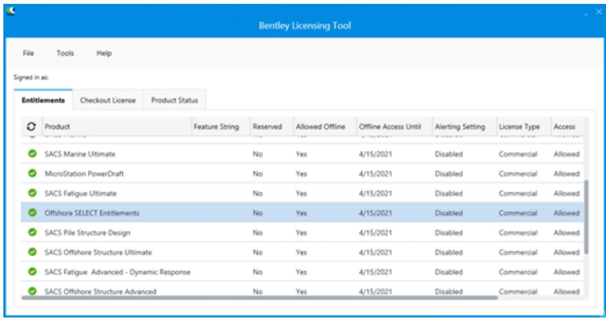

SACS 24.00 Features Requiring Offshore SELECT Entitlements

SACS LAN Grid

SACS Suction Bucket Model Generator

A message will be displayed if a feature/license is used without SELECT Entitlements. For example, if a user runs the Suction Bucket feature without SELECT Entitlements, the following message will be displayed.

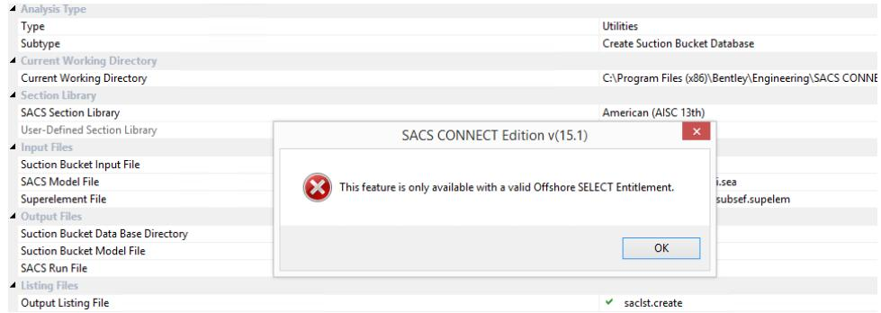

Updated SACS Product Naming Conventions

Bentley is adjusting the product naming convention in order to deliver clarity and consistency across the naming of desktop applications that are offered in various “tiers” or suites. The table below reflects the new product names for the SACS products:

| Current Product Name | New Name |
| --- | --- |
| SACS Fatigue Enterprise | SACS Fatigue Ultimate |
| SACS Marine Enterprise | SACS Marine Ultimate |
| SACS Offshore Structure Enterprise | SACS Offshore Structure Ultimate |

Introducing SACS 24.00

Release Highlights

Pile3D – Monopile Structure Interaction Enhancements

Perform post-processing on monopile structures analyzed with PISA method soil reactions in Pile3D. Generate common solution files of the monopile superstructure and pile foundation for strength or fatigue code checks with SACS Post, Joint Can, or Fatigue. Pile3D has been integrated into existing Pile/Structure Interaction analysis workflows so you can now select Pile3D input files for monopile structures and SACS will automatically perform the foundation analysis with Pile3D.

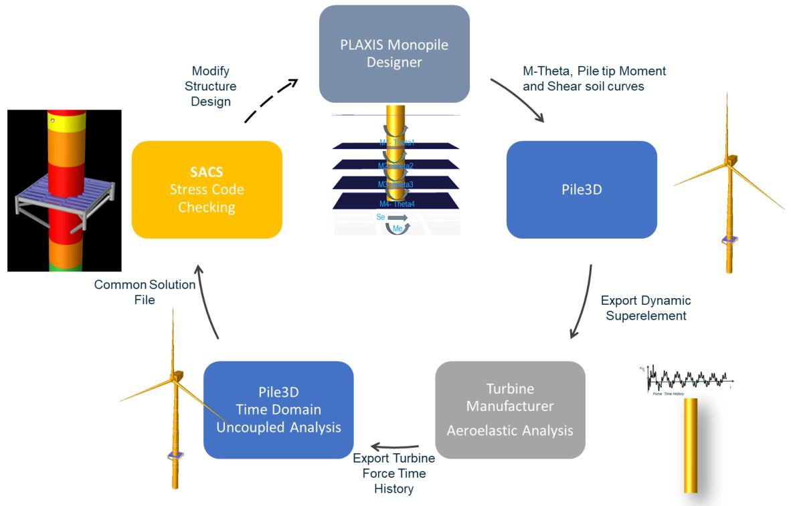

Seastate – Automatic Floor Load Generation

Automatically generate distributed member area loads at analysis runtime with Seastate zone loads. With zone loads, users can define a series of nodes for the zone boundary, multiple openings within the boundary, ignored members for panel generation, and ignored members for tributary area calculations. Multiple pressure loads may be applied to the same zone for different load categories, and tributary loads are calculated at analysis runtime with Seastate automatically accounting for new and modified members.

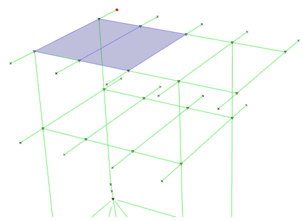

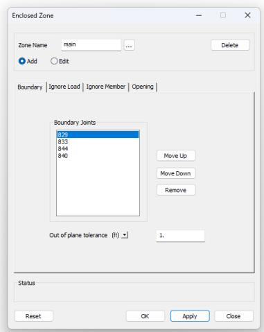

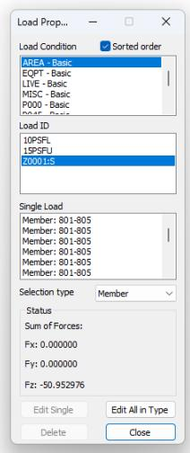

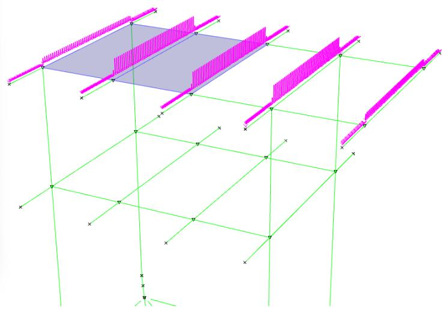

Joint Mesher – Joint Remeshing Utility

Re-mesh finite element models generated by Joint Mesher with updated mesh parameters using the Joint Remeshing utility available in Precede. This feature uses a new Joint Mesh restart file created by Joint Mesher to regenerate the mesh using the original surfaces to maintain high quality meshes for curved surfaces. Portions of the mesh may be modified using the mesh refinement selection tool. More information may be found in the SACS Help documentation.

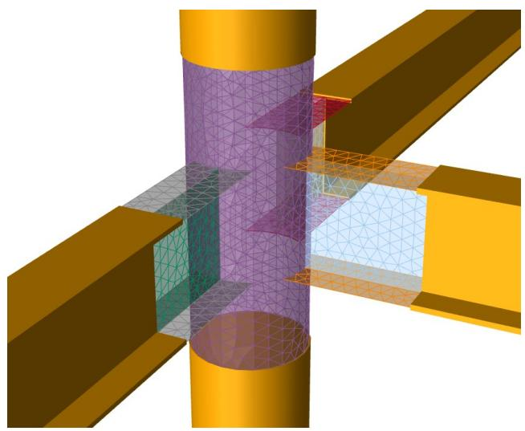

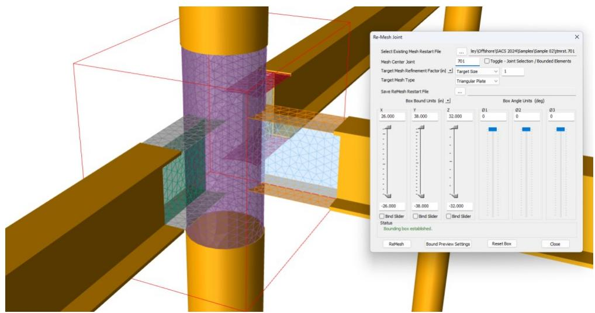

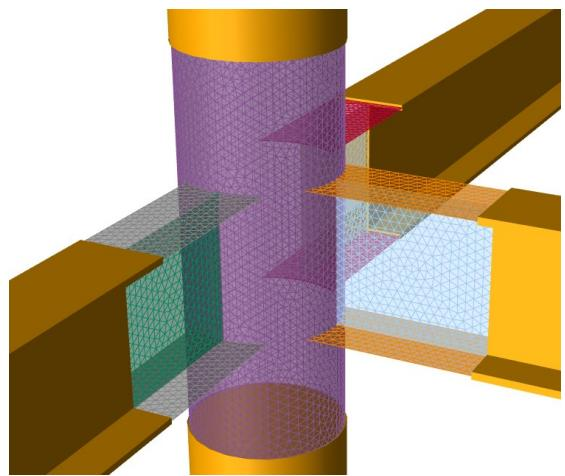

  
ADINA Interoperability – Non-linear Static Model Export

Export SACS models with non-linear material properties and soil/structure interaction curves with the SACS-ADINA Interop utility. ADINA is Bentley’s general non-linear dynamic finite element analysis software for advanced analyses and enables advanced non-linear dynamic analyses of offshore structures. Previously this feature was limited to linear static export of SACS model data with some model conversion options. This update adds the ability to export non-linear material properties of a Collapse Input file and a foundation model with non-linear pile/soil interaction springs from a PSI input file.

Export of the linear static model data is still accessible as a command through Precede, but export of the non-linear static requires an additional SACS ADINA Interop Input File and a SACS ADINA Interop Analysis run file accessible in the Analysis Generator under the Utilities analysis type. More information about the SACS ADINA Interop utility can be found in the Utilities manual.

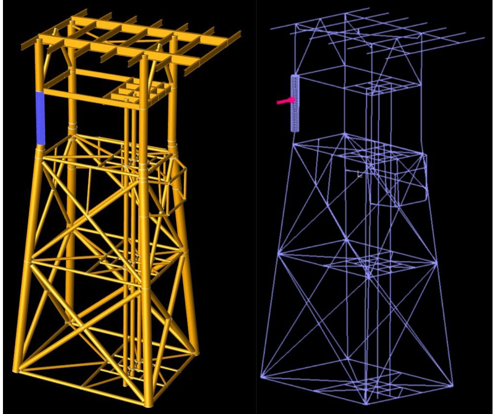

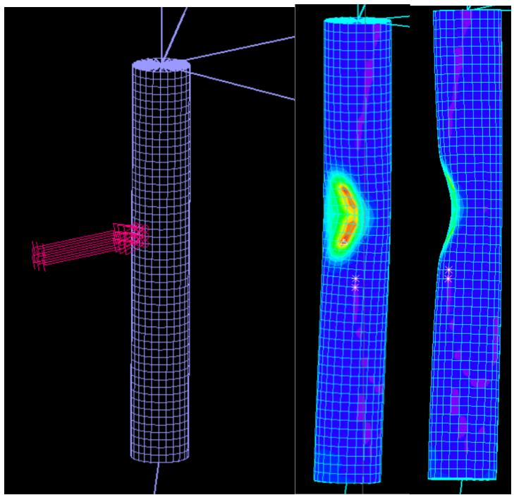

SACS Cloud Services (Early Access Program)

Perform massively parallelized wind turbine analyses with SACS Cloud Services. The Bentley Cloud Services platform has been completely updated with improved performance, reliability, and reporting. This early access program enables anyone performing SACS Wind Turbine analyses (Uncoupled Strength, Uncoupled Fatigue, and Dynamic Superelement) to perform hundreds of analyses simultaneously in the cloud for significant performance gains when compared with traditional desktop hardware.

List of Enhancements

ADINA Interop

1336849 - Added the ability to export elastoplastic material properties for nonlinear analyses with ADINA. This feature currently supports pile/soil interaction elements through PSI input and SACS model data through Collapse input.

Documentation

1447460 - Added Software Validation document to SACS installer. Document available through SACS Help.

Joint Mesher

1211962 - Added the ability to re-mesh finite element mesh models generated by Joint Mesher with different mesh parameters. This feature requires a Joint Mesh restart file which is generated by Joint Mesher.   
1400734 - Joints meshed with SCF extrapolation enabled through Precede Joint Mesher now support generation of post input file extrapolation data for plate and shell elements.

Pile

1215348 - Added the ability to expand superstructure results from Pile/Soil Interaction analyses with Pile3D to a common solution file for post-processing.   
1215352 - Added the ability to generate pile common solution files for postprocessing.

PostVue

1375560 - Optimized Postvue for improved performance when opening results databases.

Precede

1346518 - Added shell element support for Precede Joint Mesher.   
1346523 - Added the ability to generate post input files for SCF extraction from Joint Mesher with Precede. Previously this feature was limited to Joint Mesher with Analysis Generator.

SACS Executive

1336842 - Added SACS ADINA Interop Analysis type under the Utilities analyses in the Analysis Generator.

Seastate

1332477 - Added Support for enclosed zone lines.   
1357795 - Added the ability to generate member distributed loads from enclosed zone definitions.

List of Fixed Defects

Collapse Advanced

1450463 - Fixed an issue in Collapse Advanced where duplicate warning and error messages were printed with unreadable characters for the element labels.

Collapse View

1439480 - Fixed an issue where Precede would not display pile elements for Collapse View results.

Fatigue

1005215 - Updated Fatigue documentation to correct reference to fatigue load case number instead of fatigue load case name in FTCOMB input lines.   
1354173 - Fixed an issue where spectral fatigue analyses with wave spreading on very large models could cause an error in response spectrum calculations.

Joint Can

1290592 - Fixed an issue where allowable stress modifiers were not applied to RHS connections checked with CIDECT Design Guide 3 (2009).   
1319412 - Fixed an issue where the incorrect minimum can length was calculated. In some cases, the minimum can length was calculated based on the wrong side of the brace resulting in a longer minimum can length.

Post

. 994060 - Fixed an issue where Span elements could cause Post to crash.   
1270080 - Fixed an issue where jack-up leg and launch runner shear stresses were incorrectly reported as not a number (NaN).   
1304860 - Fixed an issue where using concrete cross-sections could cause Post to crash.   
1332652 - Removed a reference in the listing file to a non-existent span effective moment report.   
1373517 - Fixed an issue where single-segment members with tapered sections could cause a crash if part of a span.   
1392719 - Fixed an issue where unsymmetrical plate girder sections with very unsymmetrical cross-sections (plastic centroid in the flange) results in erroneously small allowable major axis bending stresses.   
1393563 - Added a warning message for tubular sections designed with Eurocode 3 (05) for class 4 sections (d/t > 90 eps^2) and an additional 100 to the reported UC. Previously SACS would report an infinite unity check for these sections.   
1397863 - Fixed an issue where SACS would fail to write the hotspot plate stress report in stress concentration factor extrapolation analyses.   
1419679 - Fixed an issue where SACS could crash if a member was defined with near zero-length segments. Post will now generate a warning message for these segments.

PostVue

1011719 - Fixed an issue in Postvue where the detailed report could display incorrect hydrostatic collapse results.   
1012235 - Fixed an issue where Cb, B1Y, and B1Z were incorrectly reported in Postvue detailed reports for angle sections checked in AISC 15th edition.   
1233284 - Fixed an issue where Eurocode checks on unsymmetrical plate girder sections with very large torsional moments could return incorrect unity check values. This occurred when the minor axis bending due to warping was larger than then minor axis bending and with the opposite sign.   
1269329 - Fixed an issue where Fvy and Fvz allowable stresses were swapped in Postvue detailed reports plate girder sections. This was limited to a reporting error and did not affect unity check results.   
1325437 - Fixed an issue where segmented members with conical cross-sections could render results on the wrong segment.   
1381087 - Fixed an issue where Precede would exit with an error when closing mode shape extraction analysis results.   
1393531 - Fixed an issue where slender Tee sections effective properties were incorrectly calculated when designed with Eurocode 3 (2005).

Pre

1368896 - Fixed an issue where shell constant pressure loads could cause a crash.

Precede

1013306 - Fixed an issue where weight summaries would not be displayed if a Weight ID filter was selected in the Weight Summations command of the Labeling Options dialog.   
1332502 - Fixed an issue where Postvue displayed the incorrect effective shear area in detailed reports for tubular sections designed with Eurocode3:2005.   
1404739 - Fixed an issue where Precede would crash when selecting a meshed joint node in the Load by Volume dialog.   
1451453 - Fixed an issue where updating display colors in the display settings sometimes would not refresh the view.   
1451495 - Fixed an issue where Collapse View would not display the correct color contours for pile elements in compression.   
1475926 - Fixed an issue where Dented Tubular sections were rendered as Tubular sections.   
1475259 - Fixed an issue where Postvue would not render skipped members with the ‘no results’ gray color.

PSI

1317403 - Fixed an issue where the inner tubular dimensions of concentric tubular piles would not be exported to the pile common solution file.   
1332484 - Fixed an issue where printed soil depths for M-Theta curves in Pile3D analyses with metric units would be displayed in feet.

SACS Executive

1377117 - Fixed an issue where SACS Executive could crash when restoring defaults for Analysis Settings and Interactive Programs in the SACS Executive settings dialog.

Seastate

1005223 - Fixed an issue where transfer function plots were generated incorrectly when using the Transfer Function Loading ‘TRL’ option.   
1427456 - Fixed an issue where Seastate could crash when the plate group override density value was 8 characters long.

Suction Bucket

1460363 - Fixed an issue with Suction Bucket export of English unit models.

Utilities

1358269 - Fixed an issue where Ring Stiffener utility would fail to open text reports.   
1388232 - Fixed a bug in the Python API where setting stiffness overrides for member section fields raised a python attribute-not-found exception. Fixed a bug in the Python API where setting the MemberSection.Stiffness property would crash the python module.   
1409138 - Fixed an issue where Damage Center would return not a number (NaN) for effective period and height values.

Wave Response

1339224 - Fixed an issue where dummy structures were not reduced correctly for wave response analyses resulting in a mismatch between the dynamic response and the generated equivalent static load.

List of Fixed Defects (24.00.01)

SACS Executive

1498369 – Fixed an issue with OIDC authentication for Bentley Cloud Services.

List of Enhancements (24.00.02)

Dynamic Super Element

1336818 - Improved gravity force vector calculation to consider the expanded mass matrix of the structure instead of the reduced mass matrix used for mode shape extraction.

Precede

1321091 - Added Span ID to member labeling options and view visibility options. Enhanced the Span dialog to auto-increment the Span ID to improve usability for span assignment.   
1498143 - Added keyboard tooltips to Precede. Press ‘ALT’ on the keyboard to reveal tooltips with keyboard shortcut indicators.

Seastate

1496276 - Added a directional load for enclosed zone loading. Members that are not aligned with the selected local coordinate system of the enclosed zone will be automatically assigned as virtual members and excluded from the tributary area calculations and load distribution.

Solve

1502219 - Added a new dense Cholesky solver option for improved accuracy with near-indeterminant systems (Solve, Dynpac, PSI). Enhanced single-value decomposition solver to generate triangularization data necessary for some analysis workflows (PSI, Dynpac, Collapse). Also improved error handling to attempt an alternative fallback solver in the event of errors/non-convergence.

List of Fixed Defects (24.00.02)

Collapse

1492665 - Added better error handling for unsupported concrete slabs in Collapse analyses.

Collapse Advanced

1304075 - Fixed an issue with Collapse Advanced base shear reporting where incorrect values were reported when mixed boundary conditions (fixity, pilehead, spring) were used.

1398599 - Fixed an issue where Collapse Advanced could not properly process nonsymmetric soil curves with zero stiffness layers.   
1468205 - Fixed an issue where the local coordinate system in Collapse Advanced did not match the local coordinate system in SACS pre-processor leading to incorrect internal forces with near vertical members due to a stricter tolerance (sin(theta) < 1.0e-9). Collapse Advanced now uses the same criterion for identifying vertical members (sin(theta) < 0.001).

Documentation

1011721 - Added clarification to the hydrodynamic options in Dynpac Dynamic Modal Extraction (DYNOPT) line documentation.   
1012142 - Fixed Floatation Plot Request (PLTRQ) line documentation errors.   
1492329 - Fixed an issue with Seastate API 2MET Option (LDAPI) line documentation.

Fatigue

1011833 - Updated DNV T SN curve to use 25 mm reference thickness for thickness correction factor with non-tubular connections. 32 mm will still be used for tubular connections and plate elements.

GH Bladed Interface

1011733 - Added error handling for GH Bladed process when the number of load conditions exceeds the limit of 36 thousand load cases.

Installation

1513753 - Fixed an issue with missing DLLs required for building FAST for modular non-integrated wind turbine analyses.

Precede

1519144 - Fixed an issue where rendered member edge coloring did not match custom group coloring. Also added an enhancement to shift edge coloring to heighten contrast with the selected member color.   
1525816 - Fixed an issue where Collapse View could crash when opening collapse restart files with a FORTRAN rewind error code.   
1541346 - Fixed an issue where Precede could crash when creating skid loads.

PSI

1544855 - Fixed an issue where the reduced stiffness matrix was calculated incorrectly when the number of piles is large.

Seastate

1500094 - Fixed an issue with table of contents page references.   
. 1505086 - Fixed an issue with parsing enclosed zone load pressures.

Solve

1531967 - Improved error handling in solve for analyses without load conditions.

Superelement

1481132 - Fixed an issue with scaling input values when a floating-point input is expected, but an integer is entered. If users input integer values for real input fields

(floating point fields), SACS Superelement would cast those integers to floats with an assumed decimal point.

Wave Response

1009371 - Fixed an issue where wave response load condition IDs were written to the wrong fields when a large number of load conditions were created.

Installation Guide

Please refer the separate Installation Manual for information related to downloading and installing SACS.

Product Activation

SACS 24.00 uses Subscription Entitlement Service (SES) (Formerly CONNECT License), which is not supported by SELECT activation key(s). SES features new behavior to enhance your organization's user administration and security with mandatory user sign-in via CONNECTION Client to access the SACS suite of programs. If you are already signed into the CONNECTION Client, you have met this prerequisite. If you have not, please refer to the Administrator's Resource Center and/or contact your administrator for assistance in the registration and sign-in process.

With SES, administrators will be able to control which users have access to Bentley software. License entitlements are granted and maintained through SES's Entitlement Management Service. By signing into the CONNECTION Client users can also find their organization's projects, download software updates, receive relevant notifications, and track their usage.

Click on the “Bentley License Tool…” button and follow the instructions described here.

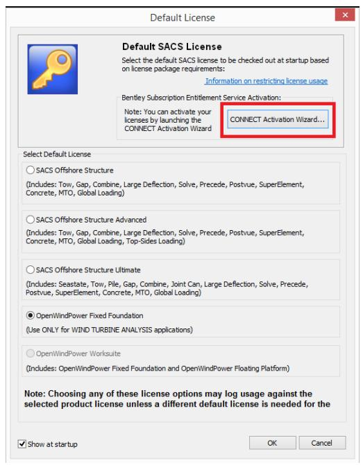

Minimum System Requirements

SACS 24.00 has the following minimum system requirements:

Pentium 4 or higher central processing unit (CPU).   
1 Gigabyte (Gb) of RAM minimum. SACS performance is dependent on the size of the SACS model and the amount of available system resources; see SACS System PC Recommendations below.   
Microsoft® Windows® 8/8.1   
Microsoft Windows 10   
Windows Media Player (for analysis sound file support)   
• A hard disk partition with 1.5 Gb of free space is required for the SACS installation.   
A video card with a chipset that supports OpenGL. A reference list may be found at Supported Graphics Cards.   
Network Server and Network Client Installations - The Local Area Ethernet Network should be 100 Base-T or greater. TCP/IP network protocol is supported.

SACS System PC Recommendations

SACS 24.00 will run satisfactorily with most basic new PC configurations for both laptops and desktop PCs. For minimal configuration PCs or older PCs, the most notable degradation in performance will be in 3D rendering applications (Precede) and when model size exceeds 1000 joints. For models greater than 1000 joints it is recommended that additional memory and storage be added as stated below as well as a dedicated graphics card. The following recommendations are for optimal SACS performance.

• RAM - 1024 megabytes (Mb) of free (1) RAM minimum, 4096 Mb or more is preferred. SACS will utilize all available RAM. SACS performance is dependent on the size of the SACS model and the amount of available system resources.

(1) Free RAM refers to available RAM after all operating system processes have been loaded.

• CPU - A multi-core CPU is recommended although not required.   
Operating System - Windows 8 Professional or later.

Note: All x86 versions of Windows cannot utilize more than 3200 Mb of RAM. The x64 version of Windows should be considered to take advantage of additional memory as well as future SACS upgrades.

Hard Disk – 1.5 Gb of free space is required for the SACS installation. A SATA RAID 0 hard disk is recommended for optimal analysis performance.

Note: After the SACS installation is complete the free space used for executions should not fall below 50% of the total drive capacity. Total free space for execution should be at least 1 gigabyte for small model solutions. Very large model solution could require 400 gigabytes or more.

Video Card - A video card that supports either OpenGL, DirectX, or the Microsoft Software Driver is required for all 3D rendering SACS products. It is very important to make sure that the graphics drivers on your computer are up to date for maximum performance and correct operation. A reference list of available video cards can be found at Supported Graphics Cards

SACS Executive Settings – Interactive Programs Options

#

Datagen Version

Datagen

Precede Version

Precede (64-Bit)

Precede Rendering Option

OpenGL driver

Precede Output Sort Option

DirectX d3d9 driver

Default Results Viewer

OpenGL driver

Default Collapse Viewer

Microsoft Software driver

Default Fatigue Viewer

View Results with Precede

Create Backup (.bak) Model File Up No

Recommended Computer Specs for Wind Turbine Parallel Processing

• Processor: Fastest 64bit available (Intel i7 or better)   
Number of Processors: Minimum 12 (without hyper threading preferred)   
RAM: Minimum 12GB   
BUS: Fastest Available   
Storage: Solid State Drive 1.5TB-2.0TB

Using the Optimal Number of Processors.

It’s important to determine the optimal number of processors required for fastest processing by benchmarking the system by running multiple analyses using different number of processors to determine the number which gives the optimal speed.

NOTE: I/O to the disk/drive can be a bottle neck (hence the fastest bus and I/O requirements).

Documentation

Program Help: Detailed feature information may be accessed directly from the calling application by selecting the Help command, or by pressing the Help button from any of the application dialogs. Be sure to explore the program Help for answers to your questions.

On-Line Documentation: On-line documentation is available in PDF format and is accessible through Executive “Manuals” tab.

Bentley Cloud Services Overview

There is little doubt that the design of every infrastructure project today involves the collaboration of many individuals and organizations across multiple disciplines. It is with this context that we have developed Bentley Cloud Services to facilitate successful project outcomes for you and your organizations. Bentley Cloud Services helps you produce better designs by facilitating collaboration, interoperability, standardization and skills development. For an organization and enterprise, Bentley Cloud Services provides greater insight and control over project design, deliverables and the people working on them. In the sections that follow we look at some of the capabilities and services that are delivered today, with more being added every week, with Bentley Cloud Services to help you achieve even greater project and personal success. Please visit www.bentley.com/connect to keep up to date on the latest capabilities.

The core premise of Bentley Cloud Services is to facilitate successful project outcomes through common capabilities and shared services across desktop, mobile, server and cloud. To enable this, Bentley has utilized Microsoft’s Azure cloud-service to connect uniformly and consistently with and across users, projects, and enterprises. To enable the value and your success on Bentley Cloud Services it is imperative that users register for a complimentary CONNECTED account, and sign in when using your CONNECTED products.

For more information on the benefits Bentley Cloud Services, you can visit the Bentley Cloud Services Overview Communities website.

Subscription Entitlement Service

SACS 24.00 uses Bentley's new licensing model. Subscription Entitlement Service (SES) is, providing enhanced security and optimized value for your Bentley Subscriptions. It is integrated with Bentley's Identity Management System (IMS) and the Bentley CONNECT technology platform to allow near real-time reporting of usage, improved alert messaging to users and increased administrative capabilities to license administrators in your organization. It will not only give you more options to monitor and manage usage but also provide new, advanced licensing features that will enhance digital workflows.

Activation

SES is not supported by SELECT activation key(s). SES features new behavior to enhance your organization's user administration and security with mandatory user sign-in via CONNECTION Client to access the SACS suite of programs. If you are already signed into the CONNECTION Client, you have met this prerequisite. If you have not, please refer to the Administrator's Resource Center and/or contact your administrator for assistance in the registration and sign-in process.

With SES, administrators will be able to control which users have access to Bentley software. License entitlements are granted and maintained through CONNECT Licensing's Entitlement Management Service. By signing into the CONNECTION Client users can also find their organization's projects, download software updates, receive relevant notifications, and track their usage.

IMPORTANT: By default, access is granted to all licenses and there are no restrictions on usage. It is imperative that any restrictions modifications are applied before any usage is logged.

You can find more information on configuring SES here.

Alerts

SES features the new license alerts notifications that can be set by an organization's license administrators to let the users know when they reach a set usage threshold. These notifications will alert the users that if they continue to use the SACS product described in the alert notice, a term license may be issued. Below is an example of a threshold alert:

License Information

SACS Offshore Structure

You have reached a license threshold defined by your organization's administrator. Continuing may result in additional application usage charges.

To proceed, you must "Acknowledge".

Acknowledge

Cancel and Quit

The user in such a situation has the choice to quit SACS Offshore Structure before a license is used or acknowledge that a term license may be generated and proceed with starting a SACS Offshore Structure usage, based on what settings the administrator chooses.

Subscription Entitlement Services Best Practices

• Use the License Management Tool installed with your applications to view what licenses you are entitled to on a particular machine.   
Ensure that your designated contact person and/or system administrator is able to sign in to the CONNECT Center and view reports on usage   
• If you wish to control which licenses can be used on which machines, look here.   
Communicate with your Bentley Account Manager about your license usage, particularly if you expect your peak usage to increase above the number of licenses you own.

SACS License Usage Preview

SACS 24.00 offers a tool to help manage license usage. The user now has the option to display a dialog describing the licenses to be used by the SACS run before execution starts and any usage is logged.

The dialog shown below is displayed prior to starting any SACS run. For this particular example, notice that the “Offshore License to be used” message is in red to highlight that SACS needs to move to a higher license from the default selected by the user, “SACS Offshore Structure” in this case. The dialog also displays any add-on licenses that will be used. If the user continues with the analysis by pressing “Yes”, SACS will run the analysis and log usage to those licenses. In this case, after the run, SACS will return to the default license.

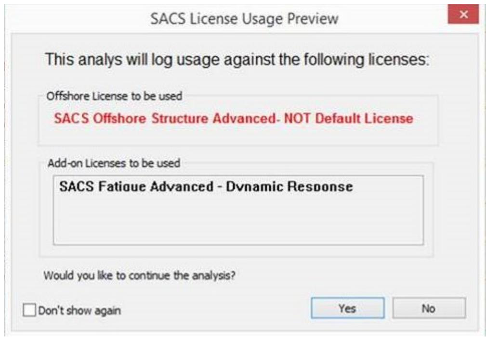

The dialog below is an example of a run that uses the default offshore license.

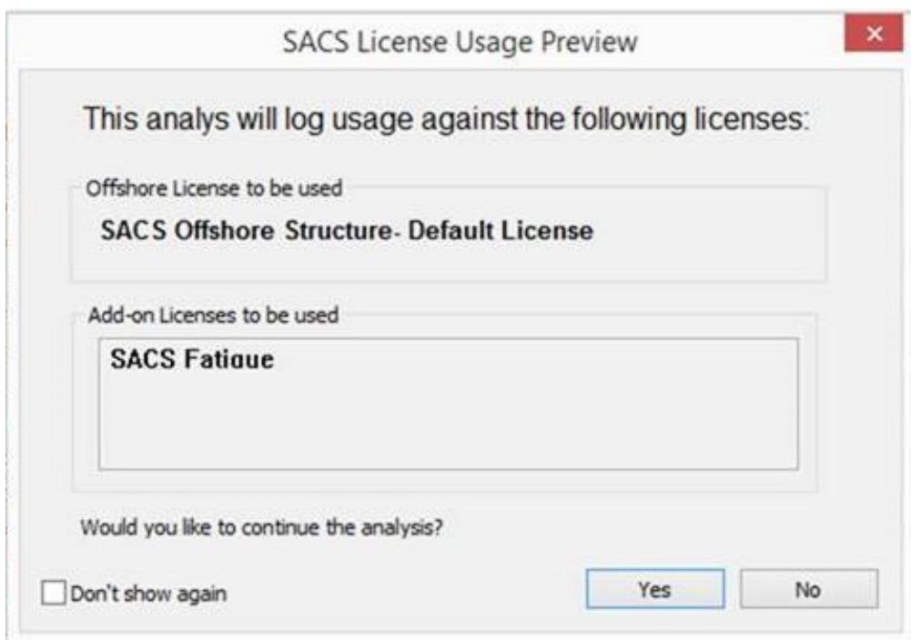

The user has the option to not show the dialog by checking the “Don’t show again” checkbox. The user can manage this setting in the SACS Systems Settings dialog.

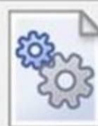

SACS System Settings:

Select the settings you want to change here.

AllsytemsetingsarecontanedhereSelecthetopicinthelistontheletthenadust yourdesired setings valuein the property box

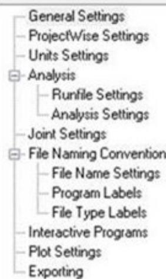

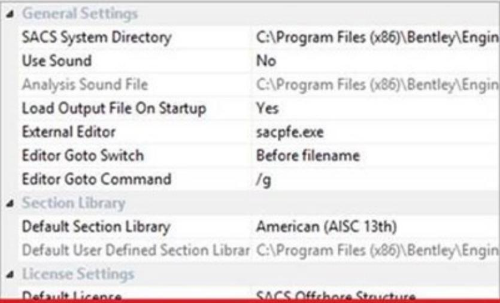

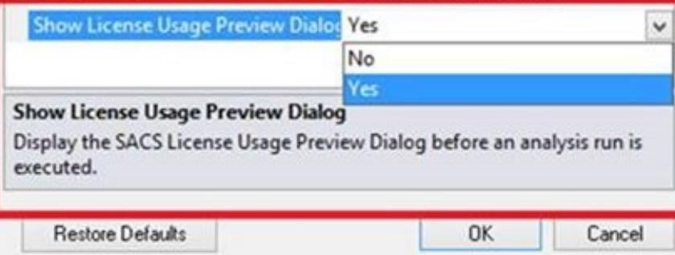

Product Licensing FAQ

Version 05.06.00.08 or later

• How do I configure the license SACS uses?

This support solution provides steps for configuring the package license used by SACS when it opens.

Background

SACS automatically retrieves a package license on startup to license modules such as SACS Precede. It can be configured to prefer a specific package license. It can also be configured to prompt for a package license on startup. This is useful for controlling license usage and ultimately costs.

Steps to Accomplish

o Open the SACS Executive   
o Click the Support tab in the upper-left corner.   
o Click on "Select Default License" in the ribbon that appears.

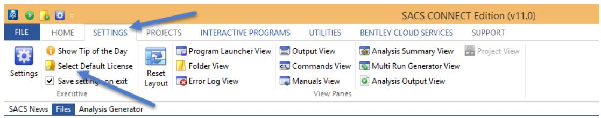

o In the dialog that displays, select the package license SACS should use by default. If your package license is grayed out, refer to the following activation instructions.   
o If your company uses licenses for more than one of the packages listed, you may want SACS to prompt the engineer for a package license each time the program is opened. In this case, enable the "Show at startup" checkbox. Otherwise if the checkbox is unchecked, the dialog will not be shown, and SACS will default to the last used license from the previous open SACS session.

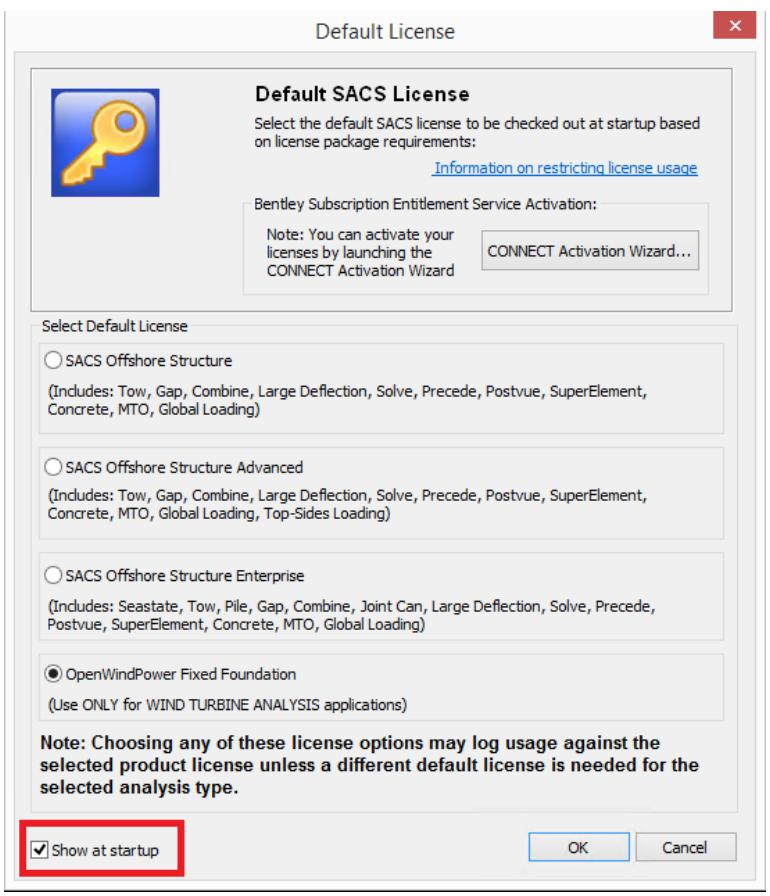

NOTE: For an analyses types that requires a ‘higher’ default license type than the selected default license, then the program will automatically step up to that specific license and then step back down again to the selected default license once the analysis is completed. In cases such as these, usage will be recorded for the original selected default license and also the required ‘higher’ license. The user will be charged using tiered pricing.

For users under Bentley’s CONNECT Licensing, the default license should always be set to ‘Offshore Structure’ to minimize usage of higher default licenses.

For users that have Bentley’s ‘Select Open Access’ agreement, the ‘activated license’ (i.e. the one that purchased/leased) should be set as the default. However, if the analysis requires a ‘higher’ license type, then the program will automatically step to the specific license and allow the user to run it in ‘Offline Mode’, and then step back to the default license once the analysis is complete. The user can run licenses in Offline mode for 7 days before being locked out. It should be noted that usage under Offline mode is logged.

If the user is running SACS, any usage less than ten minutes will not be counted for billing purposes based on the new billing rules. So, if such a user opens SACS, chooses the wrong product on the welcome screen, and encounters an activation dialog, he or she can close it and reopen it with the correct product selected without penalty.

• How do I monitor my license usage?

You can review your team’s usage of SACS via a web-based interface through a wide range of reports. These reports are available at the CONNECT Center and let you see who used what software and when. This information will be valuable to you in ensuring that you are getting best value from your software. The designated account contact for your organization will have permission to login to this server and to review these reports. This CONNECT web portal also includes tools for managing licenses including managing check-outs, forcing check-ins of licenses, if required, and controlling access to applications.

• When does the usage get logged against the licensed options? E.g. after a license option is selected or selecting a Tab or menu command or start the program or other process.

The usage of the default licenses selected in the startup license dialog box is logged on the launch of the SACS Executive. The usage of add-on packages such as SACS Fatigue, SACS Collapse, etc. will be automatically logged at the onset of an analysis type requiring the add-on package. The add-on package is automatically checked back in on the completion of the analysis. The table below shows the modules contained each add-on package.

| License | Seastate | Tow | Pile | Gap | Combine | Joint Can | Dynpac | LDF | SACS IV Solver | Precede | PostVue | Dynamic Super Element | Super Element | Concrete | MTO | Global Loading |
| --- | --- | --- | --- | --- | --- | --- | --- | --- | --- | --- | --- | --- | --- | --- | --- | --- |
| Offshore Structure |  | X |  | X | X |  |  | X | X | X | X | X | X | X | X | X |
| Offshore Structure Advanced | X* | X |  | X | X |  | X | X | X | X | X | X | X | X | X | X |
| Offshore Structure Ultimate | X** | X | X | X | X | X | X | X | X | X | X | X | X | X | X | X |

X* - Includes wind loading only. X** - Includes complete set of environmental loading   

| PACKAGE/MODULE | Offshore Structure Ultimate | Pile Structure Design | Collapse | Fatigue Ultimate | OpenWindPower – Floating Foundation |
| --- | --- | --- | --- | --- | --- |
| OpenWindPower – Fixed Foundation | X | X | X | X |  |
| OpenWindPower - Worksuite | X | X | X | X | X |

|  | PSI | Collapse | Dynamic Response | Wave Response | Fatigue Pro |
| --- | --- | --- | --- | --- | --- |
| Pile Structure Design | X |  |  |  |  |
| Collapse |  | X |  |  |  |
| Fatigue Ultimate |  |  | X | X | X |

|  | Launch | Flotation | Hull Modeler | Stability | Motions |
| --- | --- | --- | --- | --- | --- |
| Marine Ultimate | X | X | X | X | X |

• Which license are required for different types of analysis?

The table below shows typical license usage for some of the different types of analysis required for offshore structures.

| Analysis License Type | Analysis License Type | Analysis License Type | Analysis License Type | Analysis License Type | Analysis License Type | Analysis License Type | Analysis License Type | Analysis License Type | Analysis License Type | Analysis License Type | Analysis License Type | Analysis License Type | Analysis License Type |
| --- | --- | --- | --- | --- | --- | --- | --- | --- | --- | --- | --- | --- | --- |
|  | OS | OSA | OSU | PSD | C | F | FA-DR | FA-WR | FAU | M | MA | MU | WT |
| Basic FE | X |  |  |  |  |  |  |  |  |  |  |  |  |
| Topside Design |  | X |  |  |  |  |  |  |  |  |  |  |  |
| Jacket Inplace |  |  | X | X |  |  |  |  |  |  |  |  |  |
| Monopile with Pile3D |  |  | X | X |  |  |  |  |  |  |  |  |  |
| Wave Fatigue |  |  | X | X |  | X |  | X |  |  |  |  |  |
| Wind Fatigue |  |  | X |  |  | X | X |  |  |  |  |  |  |
| Seismic Design |  |  | X | X |  |  | X |  |  |  |  |  |  |
| Pushover Design |  |  | X | X | X |  |  |  |  |  |  |  |  |
| Ship Impact |  |  | X | X | X |  | X |  |  |  |  |  |  |
| Blast Analysis | X |  |  |  | X |  | X |  |  |  |  |  |  |
| Dropped Object | X |  |  |  | X |  | X |  |  |  |  |  |  |
| Installation Design |  |  | X |  |  |  |  |  |  | X |  |  |  |
| Motion Analysis |  |  | X |  |  |  |  |  |  |  | X |  |  |
| Wind Turbine |  |  |  |  |  |  |  |  |  |  |  |  | X |

• What is the best way to manage our company’s licenses?

• Use the License Management Tool installed with your applications to view what licenses you have available on a particular machine.   
Ensure that your designated contact person and/or system administrator is able to sign in to selectserver.bentley.com and view reports on usage.   
Configure SELECT server to send over usage messages to a designated administrator weekly.   
Use the Scheduled Reports function in SELECT server to send usage reports to a designated administrator weekly Use these email and web reports to better understand how your team uses SACS licenses. In particular, the Peak Usage reports will indicate if your license usage matches your ownership.   
If you wish to control which licenses can be used on which machines, use the Client Access Restrictions command in the Site Configuration menu of selectserver.bentley.com to apply these controls.   
Communicate with your Bentley Account Manager about your license usage, particularly if you expect your peak usage to increase above the number of licenses you own.   
Use license check-out only when you need to work off site without an internet connection for more than 30 days. There is no need to check out licenses when working in a connected environment and doing so will record that license as being continuously in use. This may add to your peak usage level.

• If I use more licenses than I own, will I automatically get a bill from Bentley?

If your license usage reports show that your peak usage is higher than the number of licenses that you own, your Bentley Account Manager will contact you and discuss options with you. These options may include adding more licenses, changing the mix of licenses that you own, quarterly term licenses or changing how you use licenses.

• Do I need an internet connection to use my licenses?

For day to day use, a continuous internet connection is not required. You need an internet connection only when initially activating your license and at least once every month in order to record usage on the SELECT server. It is also possible to manually submit usage logs if your security requirements mean that an internet connection is not possible.

• Do multiple sessions of SACS on one machine record multiple uses

No, usage is recorded per machine. Multiple instances of an application running on the same machine records 1 use, it does not record multiple uses.

• Our SELECT licensing agreement mentions peak usage within an interval. What is that interval and how is peak usage calculated?

Other options to restrict license usage are available as described in the Bentley wiki below https://communities.bentley.com/products/licensing/w/licensing__wiki/13916.can-i-restrictlicense-usage-to-checkouts-only

https://communities.bentley.com/products/licensing/w/licensing__wiki/29899.how-to-takeadvantage-of-bentley-s-allowance-for-usage-under-10-minutes

• Do I need to check out licenses to use SACS?

There is no need to check out a license to your machine unless you are going to be working offline for 30 days or more. In fact, checking out a license will record the license as being in continuous use so this could potentially increase the calculation of your firm’s peak license usage.

• Is the license usage logging secure and private?

Licensing uses the same usage logging mechanism you are using now with non-trust licensing. It transmits usage data using standard internet protocols and obscures user and machine names using a SHA-1 hash so that they cannot be read outside your company.

• Where can I get training on how to understand and monitor license usage?

SELECT subscribers are able to access SELECT server training via the Bentley LEARN server.

• Is there a Demo mode? If so what functions are enabled for Demo mode?

SACS is not available in a demo mode.

• Does the license dialog clearly identify the named license option matching the pricebook and SELECTServer?

The license dialog uses the same names as per the SACS pricebook and SELECTserver.

Bentley Offshore Be Communities Website

This is where you can find and contribute to discussions, ideas, and other information about Bentley Offshore products. https://communities.bentley.com/products/offshore/default.aspx

Problem Reports

We greatly appreciate any bug reports or suggestions you may have. Please report any bugs or anomalies you find throughwww.bentley.com/serviceticketmanager.