SACS

SACS

Version 24.00

Trademark Notice

Bentley and the "B" Bentley logo are either registered or unregistered trademarks or service marks of Bentley Systems, Incorporated. All other marks are the property of their respective owners.

Copyright Notice

Copyright © 2024, Bentley Systems, Incorporated. All Rights Reserved.

TABLE OF CONTENTS

1 INTRODUCTION .. .13

## 1.1 OVERVIEW.. .. 13
## 1.2 PROGRAM FEATURES.. .. 13

2 SACS IV MODEL COMPONENTS. .. 16

## 2.1 ANALYSIS OPTIONS .. ... 16
## 2.2 LINEAR SOLVER OPTIONS.. .. 17

## 2.3 POST PROCESSOR OPTIONS .. ... 18

2.3.1 Member Check Code.. . 19   
2.3.2 Member Check Locations.... 19   
2.3.3 Output Reports . 19   
2.3.4 Redesign Parameters . 19   
2.3.5 Hydrostatic Collapse Parameters.... 19   
2.3.6 Grouping Elements by Unity Check Ratio . 19   
2.3.7 Allowable Stress/Material Factor..... 19   
2.3.8 Resistance Factors..... .20

2.3.8.1 User Defined Resistance Factors.... .. 20

2.3.9 Euro Code Check Options.... .. 20   
2.3.10 Span Designation . .20   
2.3.11 AISC 2005 (13th Edition) Options.... . 21   
2.3.12 Panel Code Check Options .. .21   
2.3.13 ISO code check options ..... .23   
2.3.14 Norsok Standard N-004 code check options.... .24   
2.3.15 ALS load cases specification..... . 24

## 2.4 SELECTING LOAD CASES FOR OUTPUT... ... 24

2.4.1 P-Delta Load Cases.... . 25   
2.4.1.1 Large Deflection or P-Delta Analysis .. .. 25

## 2.5 FACTORING LOAD CASES . .... 26

## 2.6 MATERIAL AND SECTION PROPERTY DATA.. ... 26

2.6.1 Section Properties... .. 26

2.6.1.1 Non-Tubular Members.... .. 26   
2.6.1.2 Tubular Members... . 29   
2.6.1.3 Grouted Tubular Members ..... .29   
2.6.1.4 Dented Tubular Members... . 29   
2.6.1.5 Segmented Members... . 30   
2.6.1.6 Plate Elements .. . 30   
2.6.1.7 Shell and Solid Elements . .30

2.6.2 Material Properties . . 31

2.6.2.1 Members or Beam Elements.... .31   
2.6.2.2 Tapered Members..... . 31   
2.6.2.3 Segmented Members... . 32   
2.6.2.4 Plate Elements .. . 33   
2.6.2.5 Shell and Solid Elements . .33

2.6.3 Stiffener Data . . 33

2.6.3.1 Plate Girders.... .. 33   
2.6.3.2 Tubular Members... . 34

## 2.7 ELEMENT DATA . .. 34

2.7.1 Members or Beam Elements . . 34

2.7.1.1 Member Local Coordinate System... . 34   
2.7.1.1.1 Member Internal Load and Stress Sign Convention .. . 35

2.7.1.2 Member End Fixity ..... .. 36   
2.7.1.3 Member Offsets .... . 36

2.7.1.4 K-factors/Effective Buckling Length . .. 37

2.7.1.5 Unbraced Length of Compression Flange ..... . 37   
2.7.1.6 Shear Area Factor for Tubular Members .... .. 38   
2.7.1.7 Skipping from Output Reports . .38   
2.7.1.8 Multiple Members Between Two Joints . .38   
2.7.1.9 Defining Special Element Types .. .. 38

2.7.1.9.1 Cable Element . .38   
2.7.1.9.2 Gap Element... . 38   
2.7.1.9.3 Initial Gap Spacing.. . 39   
2.7.1.9.4 X-Brace or K-Brace ... . 39

2.7.2 Plate Elements . . 40

2.7.2.1 Isotropic Plates.... .. 40   
2.7.2.2 Membrane and Shear Plates... .. 41   
2.7.2.3 Stiffened Plates . .41   
2.7.2.4 Corrugated Plates.... .. 42   
2.7.2.5 Plate Local Coordinate System..... .. 43   
2.7.2.6 Plate Offsets ... . 43   
2.7.2.7 Skipping from Output Reports . .. 44   
2.7.2.8 Plate Modeling Considerations... .. 44

2.7.3 Curved MITC Shell Elements .. . 45

2.7.3.1 MITC Shells Local Coordinate System ..... .. 45   
2.7.3.2 Shells Normal . .. 45   
2.7.3.3 Integration Points... .. 46   
2.7.3.4 Shell Offsets . .46   
2.7.3.5 Shell Element Report... .. 46   
2.7.3.6 A Note on Choice of MITC Shell Elements .. .. 46

2.7.4 Solid Elements... .. 46

2.7.4.1 Solid Local Coordinate System ..... .47   
2.7.4.2 Solid Offsets ... .. 47

## 2.8 JOINTS .. ... 48

2.8.1 Joint Coordinates . .48   
2.8.2 Joint Support/ Fixity ..... .. 48

2.8.2.1 Fixed to Ground . .48   
2.8.2.2 Pilehead Supports . .49   
2.8.2.3 Spring Supports .... .. 49

2.8.2.4 Retained for Dynamics... .. 50   
2.8.2.5 Retained Degrees of Freedom . .. 50

## 2.9 LOADING . .. 51

2.9.1 Load Conditions..... . 51

2.9.1.1 Member Distributed Loads and Moments... .. 51   
2.9.1.2 Member Concentrated Loads and Moments.. .. 52   
2.9.1.3 Member Temperature Loads .. .. 52   
2.9.1.4 Joint Loads... .. 53   
2.9.1.5 Joint Specified Displacements.. .. 53   
2.9.1.6 Plate Pressure Loads ... .. 53

2.9.1.6.1 Uniform Pressure ... .. 53   
2.9.1.6.2 Varying Pressure .. .. 53   
2.9.1.6.3 Submerged Pressure.. .. 54

2.9.1.7 Plate Thermal Loads. .. 54

2.9.1.7.1 Uniform Temperature... .. 54   
2.9.1.7.2 Varying Temperature... .. 54   
2.9.1.7.3 Surface Temperature .... .. 54

2.9.1.8 Shell Pressure Loads. .. 55   
2.9.1.9 Shell Temperature Loads .. .. 55

2.9.2 Load Combinations ... . 55

## 2.10 SETS... .. 56

2.10.1 Joint List ... .. 56   
2.10.2 Member List ... .. 56   
2.10.3 Member Group List .... .. 56   
2.10.4 Plate List ... .57   
2.10.5 Plate Group List.. .. 57   
2.10.6 Shell List ... .57   
2.10.7 Solid List .. .57   
2.10.8 Load Condition List.. .. 57

3 SACS IV TROUBLE SHOOTING. .. 58

## 3.1 MODEL SINGULARITY.. .. 58
## 3.2 DEBUGGING THE MODEL . .. 58

4 COMMENTARY . . 60

## 4.1 ANGLE CROSS-SECTIONS.. .... 60
## 4.2 FLAT PLATE CROSS-SECTIONS .. ... 62

4.2.1 Isotropic Plates... .. 62   
4.2.2 Membrane Plates.... . 62   
4.2.3 Shear Plates... .. 62   
4.2.4 Stiffened Plates ... .. 62   
4.2.5 Corrugated Plates.... .. 63   
4.2.6 Plate Element Transition to Beam Element . ... 63

## 4.3 SOLID ELEMENTS.. .. 63

## 4.4 Curved MITC Shell Elements ... .. 64

4.3.1 Solid Transition to Shell, Plate or Beam Elements .... ... 63

4.4.1 Formulation... .. 64   
4.4.2 Constitutive Equation and Internal Force/Stress Output . .. 65   
4.4.3 MITC Tying Procedure.... .. 65   
4.4.4 Drilling Stiffness .... .. 66   
4.4.5 Normals at Common Joints... .. 66   
4.4.6 Shell Element Transition to Beam Element .. ... 66

## 4.5 Linear Solver Options .... ... 67

4.5.1 Rigid-Body Modes of a Statically Indeterminate Structure ..... . 67   
4.5.2 Extraction of Rigid-Body Modes.. .. 68   
4.5.3 Solution of a Statically Determined Structure Using Cholesky Decomposition... .. 68   
4.5.4 Solution of a Statically Indeterminate Structure Using Singular Value Decomposition ..... 68   
4.5.5 Krylov Subspace Solvers.... . 69

4.5.5.1 Conjugate Gradient Method . .. 69   
4.5.5.2 Flexible General Minimum Residual Method . ... 70

4.5.6 Solution of a Statically Indeterminate Structure Using Krylov Subspace Solvers .......... .... 70   
4.5.7 A comment on Balancing the Forces .... ... 70   
4.5.8 General Guidelines on the Choice of Linear Solver Method... .. 71

5 REFERENCES . .. 72

6 SAMPLE PROBLEMS.. ... 73

## 6.1 JACKET MODEL.. .. 74
## 6.2 SHELL AND SOLID ELEMENT MODEL. .. 86

7 VERIFICATIONS . .. 96

## 7.1 Beams..... .. 96

7.1.1 Deflection and Reactions in a Beam ... .. 96

7.1.1.1 Reference .... .. 96   
7.1.1.2 Problem ..... .. 96   
7.1.1.3 Theoretical Solution .... .. 96   
7.1.1.4 Comparison .... .. 97

7.1.2 Thermal Loading on a Beam . .97

7.1.2.1 Reference .... .. 97   
7.1.2.2 Problem ..... .. 97   
7.1.2.3 Theoretical Solution ... .. 98   
7.1.2.4 Comparison ... .. 98

7.1.3 Forces on a Propped Cantilever 1 .. .. 98

7.1.3.1 Reference ... .. 98   
7.1.3.2 Problem.... .. 98   
7.1.3.3 Theoretical Solution ..... .99

7.1.3.3.1 Load Case 1 .. .. 99   
7.1.3.3.2 Load Case 2 .. .. 99   
7.1.3.4 Comparison .... . 100

7.1.4 Torsion on a Stepped Cantilever.... .. 100

7.1.4.1 Reference .... . 100   
7.1.4.2 Problem ..... .101   
7.1.4.3 Theoretical Solution .. ..101

7.1.4.4 Comparison ..... .. 101

7.1.5 Forces on a Propped Cantilever 2 .. . 102

7.1.5.1 Reference .... ..102   
7.1.5.2 Problem ..... .. 102   
7.1.5.3 Comparison ..... .. 103

7.1.6 Axially Loaded Column..... .103

7.1.6.1 Reference .... .. 103   
7.1.6.2 Problem ..... .. 103   
7.1.6.3 Comparison .... .. 104

7.1.7 Tee Shaped Cantilever .... .104

7.1.7.1 Reference .... .. 105   
7.1.7.2 Problem... .. 105   
7.1.7.3 Comparison ..... ..105

7.1.8 Beam on Elastic Foundation.... .105

7.1.8.1 Reference .. .. 106   
7.1.8.2 Problem... .. 106   
7.1.8.3 Comparison ..... .. 107

7.1.9 Stresses in a Circular Beam .. .107

7.1.9.1 Reference .. .. 107   
7.1.9.2 Problem... .. 107   
7.1.9.3 Comparison ..... .. 108

7.1.10 End Moments in a Non Uniform Beam.. . 108

7.1.10.1 Reference .. ..108   
7.1.10.2 Problem ..... .. 108   
7.1.10.3 Comparison .... ..109

7.1.11 Stresses in a Tapered Cantilever.. . 109

7.1.11.1 Reference .... .. 109   
7.1.11.2 Problem ..... .. 110   
7.1.11.3 Comparison .... .. 110

7.1.12 Stresses in a Cable due to Thermal Loading .. . 111

7.1.12.1 Reference . .111   
7.1.12.2 Problem.. . 111   
7.1.12.3 Comparison ..... .112

7.1.13 Curved Beam.. . 112

7.1.13.1 Reference .. .. 112   
7.1.13.2 Problem... .112   
7.1.13.3 Comparison ..... ..113

7.1.14 Hanging Bar Axial Stress... . 113

7.1.14.1 Reference .. ..113   
7.1.14.2 Problem... .. 113   
7.1.14.3 Comparison ..... .. 114

7.1.15 Bent Cantilever Deflection.. . 115

7.1.15.1 Reference .. ..115   
7.1.15.2 Problem ..... ..115

7.1.15.3 Comparison ..... .. 115

7.1.16 Bent Beam Thermal Loading.. . 116

7.1.16.1 Reference .... ..116   
7.1.16.2 Problem ..... . 116   
7.1.16.3 Comparison ..... .117

## 7.2 Trusses . .117

7.2.1 Axial Stress on a Truss Model .. .117

7.2.1.1 Reference . .117   
7.2.1.2 Problem ..... . 117   
7.2.1.3 Comparison ..... .118

7.2.2 Axial Force on a Cable .... . 118

7.2.2.1 Reference ..... .118   
7.2.2.2 Problem ..... .118   
7.2.2.3 Comparison ..... .119

7.2.3 Axial Force in a 2D Plane Frame 1.. . 119

7.2.3.1 Reference ..... .119   
7.2.3.2 Problem ..... .119   
7.2.3.3 Comparison ..... . 120

7.2.4 Axial Forces on a 3D Space Model .. . 120

7.2.4.1 Reference ..... .120   
7.2.4.2 Problem ..... . 120   
7.2.4.3 Comparison ..... . 121

7.2.5 Reactions in a 2D Truss Model 1.. .122

7.2.5.1 Reference .... . 122   
7.2.5.2 Problem ..... . 122   
7.2.5.3 Comparison ..... . 123

7.2.6 Reactions in a 2D Truss Model 2.. .123

7.2.6.1 Reference . .123   
7.2.6.2 Problem.... . 123   
7.2.6.3 Comparison ..... . 124

7.2.7 Reactions in a 2D Truss Model 3.. . 125

7.2.7.1 Reference . . 125   
7.2.7.2 Problem ..... .125   
7.2.7.3 Comparison ..... . 125

7.2.8 Deflections in a 2D Truss Model . . 126

7.2.8.1 Reference ..... .126   
7.2.8.2 Problem ..... .126   
7.2.8.3 Comparison .... . 127

7.2.9 Stress in a 2D Truss Model.. .127

7.2.9.1 Reference ..... . 127   
7.2.9.2 Problem ..... . 127   
7.2.9.3 Comparison ..... . 128

7.2.10 Axial Forces in a Plane Frame 2.. . 128

7.2.10.1 Reference .... .128

7.2.10.2 Problem. .128   
7.2.10.3 Comparison ..... . 129

## 7.3 Frames.... .129

7.3.1 2D Portal Reactions 1. . 129

7.3.1.1 Reference .... . 129   
7.3.1.2 Problem.... . 129   
7.3.1.3 Calculations ..... .. 130   
7.3.1.4 Comparison ..... .. 130

7.3.2 3x2 Plane Frame Moments . . 130

7.3.2.1 Reference .... .. 130   
7.3.2.2 Problem ..... .. 130   
7.3.2.3 Comparison .... .. 132

7.3.3 Support Reactions for a Simple Frame .... .. 133

7.3.3.1 Reference ..... .133   
7.3.3.2 Problem.... .. 133   
7.3.3.3 Comparison ..... .134

7.3.4 2D Portal Reactions 2.. .134

7.3.4.1 Reference .... .. 134   
7.3.4.2 Problem ..... . 134   
7.3.4.3 Comparison ..... .135

7.3.5 2D Portal Reactions Sidesway 2 .. .. 135

7.3.5.1 Reference .... .. 135   
7.3.5.2 Problem ..... .136   
7.3.5.3 Comparison ..... .. 137

7.3.6 1x2 Plane Frame Lateral Load . .. 137

7.3.6.1 Reference ..... . 137   
7.3.6.2 Problem ..... .. 137   
7.3.6.3 Comparison ..... .. 138

7.3.7 2D Portal Reactions Sidesway 1 .. .. 138

7.3.7.1 Reference .... .. 138   
7.3.7.2 Problem.... .138   
7.3.7.3 Comparison . . 139

7.3.8 2 Bay Frame Moments and Shear..... .139

7.3.8.1 Reference .... .. 139   
7.3.8.2 Problem.... .. 139   
7.3.8.3 Comparison ..... .140

7.3.9 3D Frame Max Forces ..... .140

7.3.9.1 Reference .... .. 140   
7.3.9.2 Problem.... .. 141   
7.3.9.3 Comparison ..... . 141

## 7.4 Plate Elements ..... .. 142

7.4.1 Cantilever Tube Stresses and Deflection ..... .. 142

7.4.1.1 Reference ..... .142   
7.4.1.2 Problem ..... ..142

7.4.1.3 Comparison ..... .. 143

7.4.2 2D Cantilever Beam End Deflection 1 .. .. 144

7.4.2.1 Reference .... ..144   
7.4.2.2 Problem ..... .. 144   
7.4.2.3 Theoretical Solution ..... .. 145   
7.4.2.4 Comparison ..... .145

7.4.3 Natural Frequency of Beam on Springs . .. 145

7.4.3.1 Reference .. .. 145   
7.4.3.2 Problem ..... . 145   
7.4.3.3 Comparison ..... .146

7.4.4 2D Cantilever Beam End Deflection 2.. .. 146

7.4.4.1 Reference ..... .146   
7.4.4.2 Problem ..... .146   
7.4.4.3 Theoretical Solution ..... .147   
7.4.4.4 Comparison ..... . 147

7.4.5 2D Curved Beam Maximum Stress.... .. 148

7.4.5.1 Reference ..... .... 148   
7.4.5.2 Problem ..... .. 148   
7.4.5.3 Comparison ..... . 149

7.4.6 2D Circular Surface Displacements and Stresses .... .. 149

7.4.6.1 Reference .. .149   
7.4.6.2 Problem ..... .. 149   
7.4.6.3 Comparison ..... .150

7.4.7 Twisted Beam Displacements ... . 150

7.4.7.1 Reference . .150   
7.4.7.2 Problem ..... . 151   
7.4.7.3 Comparison ..... . 151

7.4.8 Curved Roof Displacements and Stresses.. .151

7.4.8.1 Reference .. . 152   
7.4.8.2 Problem ..... . 152   
7.4.8.3 Comparison .. . 153

7.4.9 Spherical Shell Displacements . . 153

7.4.9.1 Reference ..... .153   
7.4.9.2 Problem.... . 153   
7.4.9.3 Comparison .. . 154

7.4.10 2D Circular Plate In-Plane Stresses . .154

7.4.10.1 Reference .... .155   
7.4.10.2 Problem... . 155   
7.4.10.3 Comparison ..... .156

7.4.11 2D Rectangular Plate with fixed edges . . 156

7.4.11.1 Reference ..... .... 156   
7.4.11.2 Problem ..... . 156   
7.4.11.3 Comparison ..... .157

7.4.12 2D Tapered Beam In-Plane Stress... .158

7.4.12.1 Reference . .158   
7.4.12.2 Problem ..... . 158   
7.4.12.3 Comparison ..... .158

7.4.13 2D Surface with Hole Edge Stress ... . 159

7.4.13.1 Reference .... .. 159   
7.4.13.2 Problem.. .. 159   
7.4.13.3 Comparison ..... .. 160

7.4.14 2D Circular Surface Edge Stress ... . 160

7.4.14.1 Reference . .. 160   
7.4.14.2 Problem. ..161   
7.4.14.3 Comparison ..... .. 162

7.4.15 Thermal Load on a Plate . .162

7.4.15.1 Reference . ..162   
7.4.15.2 Problem... ..162   
7.4.15.3 Theoretical Solution ... .. 163   
7.4.15.4 Comparison ..... .. 164

## 7.5 Curved MITC Shell Elements .. .. 166

7.5.1 Patch Test.. . 166

7.5.1.1 Reference .. .. 166   
7.5.1.2 Problem... .. 167   
7.5.1.3 Comparison ..... .. 167

7.5.2 Cook’s Membrane.... . 168

7.5.2.1 Reference .. .. 168   
7.5.2.2 Problem ..... .. 169   
7.5.2.3 Comparison ..... .. 169

7.5.3 Hemispherical Shell.. . 170

7.5.3.1 Reference .... .. 170   
7.5.3.2 Problem.. ..170   
7.5.3.3 Comparison .... .. 171

7.5.4 Pinched Cylinder ... . 172

7.5.4.1 Reference . ..172   
7.5.4.2 Problem.. .. 172   
7.5.4.3 Comparison ..... ..172

7.5.5 Twisted Beam..... . 173

7.5.5.1 Reference .. .. 173   
7.5.5.2 Problem... .. 173   
7.5.5.3 Comparison ..... .. 174

## 7.6 Solids .. . 175

7.6.1 Cantilever Beam End Displacement 1.. . 175

7.6.1.1 Reference .. .. 175   
7.6.1.2 Problem ..... .. 175   
7.6.1.3 Hand Calculation .... .. 176   
7.6.1.4 Comparison ..... .. 176

7.6.2 Cantilever Beam End Displacement 2.. .177

7.6.2.1 Hand Calculation .. .. 177   
7.6.2.2 Comparison .... .. 178

8 INPUT LINES... ..179

1 INTRODUCTION

## 1.1 OVERVIEW

SACS IV, the general purpose three dimensional static structural analysis program, is the focal point for all programs in the SACS system. It gives the user the capability of modeling a large array of structures from simple two dimensional space frame analyses to complex three dimensional finite element analyses. SACS IV can also be used for non-linear static analysis when coupled with PSI module or dynamic response analysis when coupled with the Dynpac, Wave Response and Dynamic Response modules.

SACS IV refers to three of the program modules of the SACS system, namely the pre-processor module Pre, the solver module Solve and the post processor module Post. The post processor module, Post, can be executed as part of SACS IV or as an individual analysis step. This manual addresses the features and capabilities of the Pre and Solve modules and includes the procedure used to run Post as part of SACS IV. The Post manual addresses the execution of the post processor as a separate step and includes a detailed discussion on the program capabilities.

## 1.2 PROGRAM FEATURES

SACS IV requires a SACS model file or output structural data file for execution and creates a common solution file containing analysis results.

Some of the main features and capabilities of SACS IV are:

1. Allows specification of various input options, analysis options, and output reports within the model file.   
2. Allows specification of post processor options within the model file and can automatically execute POST.   
3. Can access member properties from one of various section property files included with the SACS system, from user defined section property files or from sections defined within the model file;   
4. Supports various beam element types including:

a. Tubular   
b. Channel   
c. Angle   
d. Tee   
e. Plate Girder   
f. Prismatic   
g. Cone   
h. Box & Stiffened Box

i. Stiffened Cylinder   
j. Launch Runner   
k. Jackup Leg   
l. Double Angle   
m. Rectangular Tube   
n. Double Web Plate Girder   
o. Boxed Plate Girder   
p. Boxed Plate Girder   
q. Unsymetric Plate Girder

5. Supports various six degree of freedom triangular and quadrilateral plate element types including:

a. Isotropic   
b. Membrane   
c. Shear   
d. Stiffened   
e. Corrugated

6. Contains 6, 8 and 9 node triangular and rectangular shell elements.   
7. Contains the following solid elements shapes:

## a. 4 node tetrahedron
## b. 5 node pyramid
## c. 6 node wedge
## d. 8 node brick

8. Beam and finite element offsets.   
9. Rotational and translational member releases.   
10. Spring supports to ground including at oblique angles.   
11. Local and global element loads.   
12. Member linear and concentrated loads in local or global coordinate system.

13. Joint loads.   
14. Thermal loads.   
15. Specified support deflections.   
16. Supports tapered sections.   
17. Supports two analysis techniques for plate elements including DKT and traditional plate beamstrip theory.

Some of Post module features which can be specified directly in the model file are:

1. Member check code including: AISC, API RP2A, Eurocode 3, ISO, Norwegian Petroleum Directorate and Danish Offshore, etc.   
2. API and DNV hydrostatic collapse analysis.   
3. API 2U and 2V Bulletins   
4. Euler buckling check for segmented members.   
5. Automatic member redesign.   
6. Allowable stress modifiers.   
7. Finite element code check and stiffener stress output.

Note: Refer to the Post User’s Manual for a detailed discussion of the post processor module capabilities.

2 SACS IV MODEL COMPONENTS

The SACS IV model file is the standard input for all types of analyses in the SACS System. The user need generate only one structural model that can be used in any type of analysis.

The model file can be generated by various SACS program modules. Precede, Data Generator or a text editor is used to create the analysis options, model geometry and user defined loading. Seastate or Wave Response is used to generate environmental loading data resulting from wave, wind, current, dead weight and buoyancy. Launch, Flotation or Tow is used to generate loads induced by a jacket launch, upending sequence of transportation respectively. The model file is made up of the following:

1. Analysis Options   
2. Post Processor Options   
3. Material and Section Property Data   
4. Element Data   
5. Joint Data   
6. Load Data

## 2.1 ANALYSIS OPTIONS

Analysis options may be specified in the model file or may be designated when creating the runfile using the Executive. Options specified in the model file are input on the OPTIONS input line as follows:

1. Units must be specified in columns 14-15

a. EN - English   
b. MN - Metric with KN force   
c. ME - Metric with Kg force

2. Create Super Element (column 10)   
3. Import Super Element (column 9)   
4. Consider/Ignore member releases (columns 21-22)   
5. Include/Exclude shear effects (columns 23-24)   
6. Include P-Delta effects in the analysis (columns 17-18)

The following sample input designates English units, a standard analysis (columns 19-20 blank) and includes shear effects:


|  | 1 | 2 | 3 | 4 | 5 | 6 | 7 | 8 |
| --- | --- | --- | --- | --- | --- | --- | --- | --- |
| 1 | 12345678901 | 12345678901 | 12345678901 | 12345678901 | 12345678901 | 12345678901 | 12345678901 | 1234567890 |
| 1 | OPTIONS | EN | SD | 1 | DC | C |  |  |


Two analysis techniques for plate elements are supported, DKT (Discrete Kirchhoff theory) and traditional plate beam-strip theory. By default, DKT plate theory is used. Enter ND in columns 36-37 to use the traditional beam-strip method.

Note: For some structures, axial force has a significant effect on the lateral stiffness of the elements. The P Delta option gives a first order approximation of these effects. Using the P Delta option requires specifying P Delta load cases (i.e., the load cases used to determine the axial force in the member) using the LCSEL line with the ‘PD’ option.

Two analysis techniques for solid elements are supported, traditional constant strain 3 degree-offreedom solids and isoparametric 6 degree-of-freedom solids. By default, constant strain 3 DOF solids are used. Enter ‘6’ in column 71 to use the isoparametric 6 DOF solids.

Solid joint ordering has two options as well. By default, solids’ joints are ordered such that flat planes in solid elements become solid faces. A more robust ordering scheme that allows solid face warpage may be specified with an ‘R’ in column 72.

## 2.2 LINEAR SOLVER OPTIONS

The Solver allows the use of iterative Krylov Subspace Solvers: (CG) Conjugate Gradient method and (FGMRes) Flexible General Minimum Residual, as well as the Singular Value Decomposition (SVD) in place of the Cholesky matrix decomposition. The use of the new solvers also allows automatic detection and removal of rigid-body-motion for statically indeterminate structures. The Solver achieves this by extracting the rigid-body modes using Singular Value Decomposition (SVD). Note that since currently a dense version of Singular Value Decomposition is performed for rigid-body-motion removal, the problem's maximum size is limited due to memory requirements. The Solver will produce an error if the required arrays cannot be allocated.

We recommend the use of Cholesky decomposition for statically determined structures. For statically indeterminate structure, we recommend using the direct Singular Value Decomposition. For a statically indeterminate structure, the Cholesky decomposition will fail with a warning message on a significant number of digits lost. For small problems with less than 500 joints, the iterative methods can also be used; however, these solvers' convergence rate currently deteriorates with the problem size.

Different iterative solvers and rigid-body-motion removal can then be enabled using the SLVOPT line in the SACS input file, or via the Analysis menu under OPTIONS tab in Precede. The linear solver options can also be prescribed inside the Analysis Generator within SACS executive under Analysis Options->Solve. Using the SLVOPT line, the user can adjust the following settings:

I. Linear solver method: By default, the linear solver method is set to direct (matrix decomposition) but can be changed to use the iterative solvers.   
II. Linear solver type: By default, Solver uses Cholesky decomposition. Users can also select SVD and dense Cholesky direct methods, and Conjugate Gradient or Flexible General Residual iterative methods.

III. Rigid body removal: If selected, the Solver uses the Singular Value Decomposition to detect near-zero singular values (corresponding to zero-frequency Eigen values) and constructs the corresponding rigid-body (zero-frequency) mode.

IV. Convergence tolerances’ negative exponent: The Solver checks for convergence by comparing 1) the L2 norm of the current residual vector with the absolute tolerance (ATOL) and 2) the ratio of L2 norms of current and initial residual vectors with the relative tolerance (RTOL). The tolerances are set by designating the negative exponent of each tolerance as an integer. For example, if 12 and 9 are entered for the absolute and relative tolerances’ exponents, the absolute tolerance and relative tolerances will be set to 10-12 and 10-9, respectively. The default values are 10-9 and 10-4 absolute and relative convergence tolerances, respectively.

V. Rigid-body mode detection tolerance’s negative exponent: The Solver detects rigid-body modes by checking the smallest 12 singular values of the stiffness matrix. A mode is designated to be rigid-body mode if its singular value is smaller than the tolerance. Similar to previous tolerances, this tolerance is entered as a negative exponent integer. For example, if 3 is selected, any Eigen mode corresponding to a singular value less than 10-3 is selected as a rigid-body mode. The default value of this tolerance is set as 10-4.

VI. Number of rigid-body modes override: This option allows the user to override the number of rigid-body modes detected based on the tolerance given in (V).

VII. Maximum number of iterations exponent: The Solver, when using an iterative method, will stop regardless of the norm of the residual (IV) after maximum number of iteration given by this exponent. For example if exponent is set as 5, regardless of other convergence criteria, the iterative solvers will stop at 105 iterations.

For example, the following line directs the Solver to use the Conjugate Gradient method with 10-12 and 10-9 absolute and relative convergence tolerances, respectively. It also chooses the automatic rigidbody-motion removal and sets its tolerance as 10-3. The maximum number of iterations are set at 105.


|  | 1 | 2 | 3 | 4 | 5 | 6 | 7 | 8 |
| --- | --- | --- | --- | --- | --- | --- | --- | --- |
|  | 12345678901 | 2345678901 | 2345678901 | 2345678901 | 2345678901 | 2345678901 | 2345678901 | 234567890 |
| 1 | SLVOPT | ITER | CG | RM | 12 | 09 | 03 | 05 |


A detailed review of the different methods within the Solver is provided in commentary section 4.5.

## 2.3 POST PROCESSOR OPTIONS

Post processor options may be specified in the SACS model file but are not required. The post processor options specified are used as defaults by the Post and Postvue programs and may be modified in the Post input file.

Note: A Post input file is not necessary if the post processing options specified in the model file are to be used.

The following is a brief discussion of the post processing options that may be specified in the model file. The Post User’s Manual addresses these features in detail.

2.3.1 Member Check Code

The code that member stresses are to be checked with respect to is specified on the OPTIONS line in columns 25-26.

2.3.2 Member Check Locations

The locations at which to check non-segmented and segmented members are specified on the OPTIONS line in columns 29-30 and 31-32 respectively.

For non-segmented members, the number of equal length pieces the member is to be divided into should be stipulated. For segmented members, specify the number of pieces each segment of the member is to be divided into. In either case, the member is checked at the beginning and end of each piece.

2.3.3 Output Reports

The desired output reports are designated on the OPTIONS input line. For member reports, when ‘PT’ is entered in the appropriate columns, all members are reported unless ‘SK’ appears on the individual MEMBER line. When ‘SE’ is specified for a member detail report, only members with ‘RP’ on the MEMBER line are reported.

2.3.4 Redesign Parameters

If automatic redesign is desired, the parameters are designated on the ‘REDESIGN’ input lines.

2.3.5 Hydrostatic Collapse Parameters

Hydrostatic collapse parameters are specified on the HYDRO input line. Full hydrostatic check including actual member stresses due to axial forces, bending and hoop stress can be performed by the Post program.

2.3.6 Grouping Elements by Unity Check Ratio

Elements with unity check ratios that fall within a defined range can be printed together as a report group. Up to three ranges may be defined using the ‘UCPART’ input line.

For example, all elements with unity check ratio greater than 1.00 can be reported in the first report, elements with unity check ratio between 0.8 and 1.0 in the second and elements with unity check ratio between 0.5 and 0.8 in the third report.

2.3.7 Allowable Stress/Material Factor

For API/AISC working stress analysis, the calculated allowable stresses for a load case (or load combination) can be modified by specifying the load case name and the appropriate allowable stress factor on the ‘AMOD’ line.

For NPD analysis, the material factor used for all load cases is specified using the ‘AMOD’ line. Only one material factor may be specified and it must be designated for the first load case in the model, although it will be used for all load cases.

For Danish code analysis, the factors γm and γE selected on the ‘GRUP’ line can be changed for all members by using the ‘AMOD’ line. Only one factor may be specified and it must be designated for the first load case in the model, and it will be used for all load cases. This is useful for blast analysis.

2.3.8 Resistance Factors

The resistance factors indicated by API are used by default when selecting LRFD codes. The user can specify that resistance factors indicated for AISC or API seismic codes are to be used by entering ‘C’ or ‘S’ in column 40 on the OPTIONS line.

For example, the following line specifies that resistance factors indicated by AISC are to be used.

```txt
1 2 3 4 5 6 7 8 123456789012345678901234567890123456789012345678901234567890 2 OPTIONS EN SDLR 2 2 DC A 
```

2.3.8.1 User Defined Resistance Factors

The user can modify the resistance factors to be used for LFRD analyses using the RFLRFD line. The resistance factors for yield, axial compression, axial tension, bending, shear and hoop capacities for tubular and non-tubular members can be entered.

For example, the following line specifies that 1.0 is to be used for axial compression and tension for both tubular and non-tubular members.

```txt
1 2 3 4 5 6 7 8 123456789012345678901234567890123456789012345678901234567890 1 OPTIONS EN SDLR 2 2 DC A 2 RFLRFD 1.0 1.0 1.0 1.0 
```

Note: When specifying resistance factors, the default values on the RFLRFD line are used for fields in which no override has been specified.

2.3.9 Euro Code Check Options

The OPTIONS line has been updated to include the new code check option for Eurocode 3 EN 1993-1- 1:2005; enter “E5” at column 25-26 of OPTIONS line for the new code. When this code is activated, the non-tubular members will be checked for Eurocode 3:2005. Currently, the cross sections of Wide Flange, Plate Girder, Welded Box, Rolled Rectangular Tube, Double Web Plate Girder, and Boxed Plate Girder are supported. The tubular and conical members will be checked according to Norsok N-004 2004. For Eurocode 3 EN 1993-1-1:v1992, the ID is still “EC” in OPTIONS line as before.

The CODE EC line can be used to modify the default Eurocode check option, shear area option, the resistance factors γM0 value and the γM1 value. For Eurocode 3:2005, the method for interaction factors, the option of national annexes, and the factor η of shear buckling can be modified or selected in the CODE line. For more details, please refer to the line description in the manual.

2.3.10 Span Designation

The SPAN input line can be used to identify analytical beam elements that make up physical members for serviceability and code check requirements by entering the joints in order of occurrence in the span. Any number of members can be included in a continuous line. Cantilever members can also be analyzed but must be specified by entering ‘C’ in column 14 of the SPAN line. Moment discontinuities and

moment member end releases are allowed along the continuous member, however force end releases are not allowed.

Note: The beam element local x axes of all elements defined in the SPAN line are required to be acting in the same direction.

2.3.11 AISC 2005 (13th Edition) Options

In using AISC 2005, the user has two options corresponding to ASD design and LRFD design. If option ‘AA’ is selected in columns 25-26 on OPTIONS line, this will activate code check by ASD method of AISC 2005 for non-tubular members and WSD method of API RP 2A 21st edition for tubular members. If option “AL” is selected then this will activate code check by LRFD method of AISC 2005 for non-tubular members and LRFD method of API RP 2A-LRFD 1st edition for tubular members.

2.3.12 Panel Code Check Options

Column 35 of the OPTIONS line can be used for selecting code checks for stiffened or un-stiffened panels. Enter “B” for ABS Buckling Guide Apr 2004 (Updated Aug 2018), “A” for API BULL 2V or “D” for DnV-RP-C201/C202. Currently only ABS Buckling Guide and DnV-RP-C201/C202 code of practice are implemented.

The ABS Buckling Guide and DnV-RP-C201/C202 plate panel codes can be used in accordance to either the LRFD or WSD standards by specifying the appropriate code check options in column 25-26 of OPTIONS line. Curved panels can be checked as per the ABS Buckling Guide and DNV-RP-C202.

The PCODE input line for DnV-RP-C201/C202 code of practice may be used to input user defined parameters. Currently all the options in this line are only applicable to DnV-RPC201/C202 code of practice. The following input can be defined on the PCODE line.

a. Column 14-19: material factor γM (default 1.15).   
b. Column 20: Method selection for effective width calculation of girders in accordance to section 8.4 (Method 2 is the default). This option is only valid for orthogonally stiffened panels.   
c. Column 21-25: Enter an allowable usage factor according to WSD standard if the panel to be checked in a working stress design standard (WSD) (default 0.6).

Note: If the WSD (sometimes also referred to as ASD) code is selected in columns 25-26 of OPTIONS line, then the plate panel will be check in accordance WSD standard using the user specified usage factor from the PCODE line. If columns 21-25 of PCODE line are left blank, then the default usage factor of 0.6 will be used. However, if the LRFD code is selected in columns 25-26 of OPTIONS line, then the plate panel will be check in accordance to the LRFD standard. In this case, the usage factor from columns 21-25 of PCODE line will be ignored even if a value has been specified.

d. Columns 26-31: The alpha limit for non-rectangular panels (default 10 degrees). If this limit exceeded for any panel then the program will issue a warning message to remind the user that an equivalent rectangular panel using a larger dimension parallel to stiffener(s) of the first stiffened plate in the panel will be used for the code check.

e. Column 32-37: Limit for panel coplanar check (default to 400, i.e. coplanar check will be limited to panel length/400 and panel width/400 whichever is less).

The following modelling assumptions apply for flat panels:

1. Flat panels assumed to be perfectly rectangular. However, code can be applied to panels within an angle limit of 90 +/- 10 degrees (assumption based upon Part 1-5 of Euro code).   
2. Plate pressure (if any) must be applied as plate pressure load and not as joint loads. All calculations involving lateral loading are based upon pressure loads on plate elements.   
3. Local coordinate system of plate elements forming the panel.

a. Local Z should be in the same direction for all plates forming the panel.   
b. For stiffened panels local X and Y for all plates should also be in the same directions.   
c. For non-rectangular panels or where the coordinate system is not uniform the panel dimensions will be calculated in reference to the first plate element in the panel.

4. All plate elements forming the panel should have a uniform local Z offset.   
5. A reasonably refined mesh size together with DKT plate theory should be used a panel analysis and code check.

a. Element size for unstiffened panels: 20-60 times plate thickness   
b. For stiffened panels element size should be at less than ½ the stiffener spacing.   
c. Aspect ratio less than 3 (try to maintain square elements).

6. Only one set of stiffeners can be defined in the local X and Y directions. Additional sets are ignored in the panel check.   
7. The stiffeners in the X and Y directions must be on the same side of the stiffened plate (either on top or bottom – not both).   
8. Panel coplanarity: All plates forming the panel should be in the same plane.   
9. For an orthogonally stiffened panel, if “G” is not defined in column 18 of the PSTIF line for both set of stiffeners then the stiffener with the greater depth is assumed to be the girder. If both have the same depth, then the set having the largest moment of inertia will be assumed to be the girder. If both have the same inertia, the set having the shorter panel span will be assumed to be the girder. In the event both have equal span, then the set lying along the X direction will be assumed to be the girder.

10. Reporting:

a. The code check does not apply to stiffeners and girders located on the panel edge.

b. For non-rectangular panels, reports are suppressed for stiffeners whose length is less than one quarter of the girder spacing.   
c. Similarly reports will be suppressed for girders whose length is less than one third of the panel size in the direction of the girder.   
d. Reports will be suppressed for girders lying close to the edge by one tenth of the girder spacing.   
e. Similarly reports will be suppressed for stiffeners lying close to the edge by one tenth of the stiffener spacing.

The following additional modelling assumptions apply for curved panels:

1. Curved panels are assumed to be perfectly cylindrical.   
2. Local coordinate system of plate elements forming the panel.

a. Local X axis should be aligned along the cylindrical axis.   
b. Local Y axis should be tangent to the cylindrical surface.   
c. Local Z axis should be aligned along the cylinder radius. Local Z should be in the same direction (radially inward or outward) for all plates forming the panel.   
d. For stiffened panels local X and Y for all plates should also be in the same cylindrical directions.

3. The curved panel should be an open cylinder with a maximum angle span of 180 degrees. A closed cylinder can be constructed by joining two or more open cylinders.   
4. A curved panel satisfying the panel coplanar check will be treated as a flat panel.   
5. Stringer stiffeners are located as per the X stiffener spacing (along the curved surface) and the ring stiffeners are located as per the Y stiffener spacing.

2.3.13 ISO code check options

ISO 19902:2007/2020 code check on tubular members, conical transitions, and dented and grouted members is supported. “IS” or “I2” code options can be selected on OPTIONS line. ISO 19901-3:2010 contains requirements and guidance for topsides structures. In order to specify the associated code check option for non-tubular structural members, CODE IS line must be used, where user may choose Eurocode 3:2005, Eurocode 3:1992, AISC 13th 2005 LRFD, Canadian CSA S16-2009, and NS3472. The resistance factors of tubular or conical sections under axial tension, compression, bending, shear and hoop compression can be modified in CODE IS line. If necessary, the corresponding resistance factors for Eurocode 3 codes can be entered in CODE EC line, for AISC 13th LRFD code in RFLRFD line, and for Canadian code in RFLRFD line too. Note that the building code correspondence factor Kc in ISO 19901- 3 is not supported in code check and still under investigation. For more details, please refer to the associated line description in card image.

2.3.14 Norsok Standard N-004 code check options

Norsok Standard N-004 "Design of steel structures" specifies guidelines and requirements for design and documentation of offshore steel structures and has been updated to Rev 3, 2013. SACS support both Rev 2, 2004 and Rev 3, 2013 in tubular members and conical transitions code check. Enter “NS” at column 25-26 of OPTIONS line for v2004 and "NC" for the latest 2013 code. The non-tubular members are checked by NS3472 for "NS" option, and by Eurocode 3:2005 for "NC" option. For Eurocode 3 code, the corresponding resistance factors can be entered in CODE EC line.

Note: Section Annex K.5.3 Grouted connection in Norsok N-004 is not supported in SACS. For fatigue analysis, please refer to SACS-Fatigue manual for details. For simple tubular joint design, please refer to SACS-Joint Can manual.

2.3.15 ALS load cases specification

In general, ULS (ultimate limit state) is the default state in members' LRFD code check. In order to do ALS (accidental limit state) analysis, user needs to modify the associated resistance factors and run a separated post-processing analysis. SACS now support specifying load cases as ULS or ALS in one postprocessing member code check. This feature is performed by using AMOD lines and works only for Norsok Standard N-004, Eurocode 3, and ISO 19902 codes. In AMOD lines, load cases with AMOD value specified to 2.0 are considered as ALS whose partial resistance factors or material factors are modified to 1.0 automatically in code check; the load cases without AMOD value (default) or AMOD value set to 1.0 are ULS with appropriate resistance factors. Note that, Norsok Standard N-004 does not allow the material factor γM in ULS load case to be modified, which equals to 1.15; for Eurocode 3 and ISO 19902, user may define ULS resistance factors in CODE EC or CODE IS line, respectively.

## 2.4 SELECTING LOAD CASES FOR OUTPUT

The load cases for which output results are desired, may be designated in the model file using the LCSEL line. For a particular analysis type, results only for load cases specified for that type are reported.

Specify load cases in columns 17-75 and the analysis type to which the list of load cases pertain in columns 7-8 as follows:

ST - Standard static analysis and/or PSI analysis

GP - Gap element analysis

DY - Convert to mass for Dynpac analysis

PD - Designates gravity load used to determine P-Delta effects for second order analysis and/or moment magnifiers for concrete elements in first order analysis.

Leave function blank if the load cases listed are to be used for standard ‘ST’ and dynamic ‘DY’ functions.

For example, the following lines designate that load cases ‘GRAV’, ‘ST01’ and ‘ST02’ are to be used for standard analyses, while load cases ‘BOAT’ and ‘MISC’ are to be converted to mass when running Dynpac.

1 2 3 4 5 6 7 8

```c
1234567890123456789012345678901234567890123456789012345678901234567890  
1 LCSEL ST GRAV ST01 ST02  
2 LCSEL DY MISC BOAT 
```

Note: More than one LCSEL line may be used. If no LCSEL line is specified, all load cases are used for standard analysis.

2.4.1 P-Delta Load Cases

The lateral stiffness of an element is a function of axial force such that axial compression reduces the lateral stiffness while axial tension increases the lateral stiffness. For typical linear static analysis, the effect of axial force on the lateral stiffness is negligible. For some structures, however the axial force does have a significant effect on the lateral stiffness of the elements. The P-Delta option gives a first order approximation of these effects.

When using the P-Delta option, the program calculates the lateral stiffness of each member using a reference axial force obtained from the load cases designated as P-Delta load cases.

For example, if most of the axial load in the elements of a structure is due to dead loading or other vertical loading, the corresponding load cases should be designated as P-Delta load cases. The lateral stiffness for each member will then be determined considering the axial force due to the designated P-Delta load cases.

The following designates that load cases DEAD, MISC, EQPT and AREA are to be used to include the effects axial load has on lateral stiffness.

```txt
1 2 3 4 5 6 7 8 123456789012345678901234567890123456789012345678901234567890 LCSEL PD DEAD MISC EQPT AREA 
```

Note: If two different design load cases cause completely different axial loading, then a separate analysis must be run for each of the design load case. For example, if one case causes significant axial compression while another causes significant axial tension, separate analyses must be executed.

2.4.1.1 Large Deflection or P-Delta Analysis

When choosing between “large deflection” or P-Delta options for analysis, some factors should be considered. P-Delta analysis gives a first order approximation of the effect of axial force on the lateral stiffness of the structure. Large deflection analysis is a higher order approximation. As such, the P-Delta option is useful for structures in which the lateral deflection is less than 10% of the total structure height (ground supported structures). For example, in a 300 foot platform/tower assembly, P-Delta analysis would be valid for tower deflections in any direction of less than 30 feet. P-Delta analysis is limited to the deflection of framed structures (beams). For structures consisting of plates or other solid elements, P-Delta analysis does not apply and the use of this analysis will not make any difference in the results.

Large deflection analysis is used when load-dependent deflections or diaphragm action is common. Unlike P-Delta analysis, large deflection analysis is limited to one load case per run. For example, a plated boiler might be analyzed with large deflection analysis, being as the large plate deflections will cause the boiler walls to behave like a diaphragm with membrane action rather than a linear plate with only bending stiffness.

## 2.5 FACTORING LOAD CASES

Load cases may be factored for particular types of analyses using the LCFAC line. Specify load cases in columns 17-75, the factor to be applied in columns 11-16 and the analysis type to which the load factor pertains in columns 7-8 as follows:

ST - Standard static analysis and/or PSI analysis

DY - Convert to mass for Dynpac analysis

Leave function blank if the load cases listed are to be used for standard ‘ST’ and dynamic ‘DY’ functions.

For example, the following lines designate that load cases ‘BOAT’ and ‘MISC’ are to be factored by 0.5 when converted to mass for Dynpac.

```txt
1 2 3 4 5 6 7 8 1234567890123456789012345678901234567890123456789012345678901234567890  
1 LCSEL DY MISC BOAT  
2 LCFAC DY 0.5MISC BOAT 
```

Note: More than one LCFAC line may be used. When load case factors are specified, the load case is factored before being applied to any load combinations.

## 2.6 MATERIAL AND SECTION PROPERTY DATA

Each beam and plate element in the SACS model is assigned to a group which contains the material and section property data for all elements assigned to that group. Elements with the same number of segments and identical structural, material and code check properties may be assigned to the same group.

2.6.1 Section Properties

The following section details defining section properties for beam and finite elements.

2.6.1.1 Non-Tubular Members

Section properties for non-tubular beam elements are defined by the section referenced on the GRUP line of the group the element is assigned to. Referenced sections that are defined in the section library file need not be defined in the model file. Non-tubular sections that are not defined in the section library file must be defined in the model file using a SECTION line.

When defining section properties using a SECTION line, the section name is designated in columns 6-12, the section type in 16-18 and the dimensions in 50-80. Cross section types supported are:

1. Tubular   
2. Wide Flange   
3. Compact Wide Flange   
4. Box   
5. Tee

6. General Prismatic   
7. Channel   
8. Plate Girder   
9. Angle   
10. Cone
11. Stiffened Box   
12. Stiffened Cylinder

Stiffness properties are calculated from the dimensions input but may be overridden in columns 19-48. When overriding stiffness, all values must be input.

Note: If the user inputs any of the cross section properties (column 19 to 48 on the SECT line), the program will use the input value of the cg location. Otherwise the program computes it using the cross section dimensions. Stiffness values for angle cross sections may not be overridden.

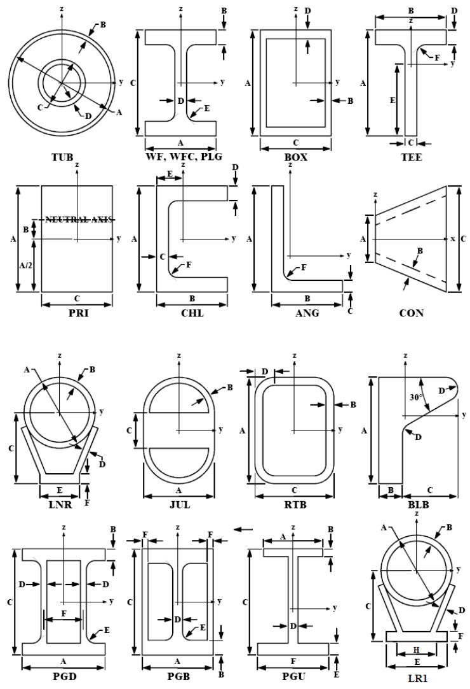

The following sample defines the plate girder section ‘PLGRD2’ referenced by group ‘ZB1’ and box section ‘RECTANG’. The box section has stiffness values specified. Section ‘W24X76’ referenced by group ‘W02’ is obtained from the section library file.


|  | 1 | 2 | 3 | 4 | 5 | 6 | 7 | 8 |
| --- | --- | --- | --- | --- | --- | --- | --- | --- |
| 1 | 123456789012345678901234567890123456789012345678901234567890 | 123456789012345678901234567890123456789012345678901234567890 | 123456789012345678901234567890123456789012345678901234567890 | 123456789012345678901234567890123456789012345678901234567890 | 123456789012345678901234567890123456789012345678901234567890 | 123456789012345678901234567890123456789012345678901234567890 | 123456789012345678901234567890123456789012345678901234567890 | 123456789012345678901234567890123456789012345678901234567890 |
| 2 | SECT PLGRD2 | PLG |  |  |  | 35.001.500180.001.250 |  |  |
| 3 | SECT RECTANG | BOX3721.0194939.576913.5576913.55 |  |  |  | 61.0 2.5 61.0 2.5 |  |  |
| 4 | GRUP W02 W24X76 |  |  | 2040.787.42529.1 |  | 1.001.00 | 0.50N 7.849 |  |
| 5 | GRUP ZB1 PLGRD2 |  |  | 250.100.02532.1 |  | 1.001.00 | N 2.320 |  |


Note: When using sections defined in the section library file, the section label specified on the member group line must match the name in the library file exactly. Also, sections defined in the library file may be overridden by defining the same section in the model file.

Angle, tee and bulb cross sections may be utilized as stiffening elements. For example, if the stem of a tee cross section is continuously connected to a plate or girder structure, then the tee cross section will reinforce the structure to which it is attached. To specify that an angle, tee or bulb cross section is to

serve as a stiffener, enter ‘S’ in column 15 of the relevant SECT line. The following designates that angle cross section ‘STFANGL’ will be used as a continuously connected stiffener in the model.


|  | 1 | 2 | 3 | 4 | 5 | 6 | 7 | 8 |
| --- | --- | --- | --- | --- | --- | --- | --- | --- |
|  | 12345678901 | 12345678901 | 12345678901 | 12345678901 | 12345678901 | 12345678901 | 12345678901 | 1234567890 |
| 1 | SECT |  |  |  |  |  |  |  |
| 2 | SECT STFANGL | SANG |  |  |  | 4.0 | 3.0 | 0.25 |


Note: Only angle, tee and bulb sections used as stiffeners may be specified in this manner.

2.6.1.2 Tubular Members

For tubular sections, section properties can be defined on a SECTION line or can be calculated directly from the outside diameter and wall thickness input on the GRUP line. When a section label is specified on the GRUP line, the properties are determined from the input on the corresponding SECTION line. The section label field should be left blank when section properties are to be determined from the outside diameter and wall thickness specified on the GRUP line.

The following defines tubular groups ‘BL1’ and ‘BL2’. The properties from ‘BL1’ are designated on the GRUP line while the properties for group ‘BL2’ are obtained from section ‘CAN105’ defined using a section line.


|  | 1 | 2 | 3 | 4 | 5 | 6 | 7 | 8 |
| --- | --- | --- | --- | --- | --- | --- | --- | --- |
|  | 12345678901 | 12345678901 | 12345678901 | 12345678901 | 12345678901 | 12345678901 | 12345678901 | 1234567890 |
| 1 | SECT CAN105 | TUB |  |  |  | 105.003.500 |  |  |
| 2 | GRUP |  |  |  |  |  |  |  |
| 3 | GRUP BL1 | 30.000 | 1.000 | 2.00815.72532. | 1 | 1.001.00 | 0.50F | 0.001 |
| 4 | GRUP BL2 CAN105 |  |  | 2.00815.72532. | 1 | 1.001.00 | 0.50F | 0.001 |


2.6.1.3 Grouted Tubular Members

Grouted sections are defined using a tubular section. The OD and thickness of each of the concentric tubes must be specified on the SECTION line. For purpose of determining the weight, the annulus is assumed to be filled with grout (150 #/ft3). For stiffness purposes, however, the grout in the annulus is ignored.

The following defines the grouted leg group ‘GL2’ using section ‘GLEG103’ which contains 103. OD and 90.0 OD concentric tubulars.


|  | 1 | 2 | 3 | 4 | 5 | 6 | 7 | 8 |
| --- | --- | --- | --- | --- | --- | --- | --- | --- |
|  | 1234567890123456789012345678901234567890123456789012345678901234567890 | 1234567890123456789012345678901234567890123456789012345678901234567890 | 1234567890123456789012345678901234567890123456789012345678901234567890 | 1234567890123456789012345678901234567890123456789012345678901234567890 | 1234567890123456789012345678901234567890123456789012345678901234567890 | 1234567890123456789012345678901234567890123456789012345678901234567890 | 1234567890123456789012345678901234567890123456789012345678901234567890 | 1234567890123456789012345678901234567890123456789012345678901234567890 |
| 1 | SECT GLEG103 | TUB103.00 | 2.500 | 90.00 | 2.500 |  |  |  |
| 2 | GRUP |  |  |  |  |  |  |  |
| 3 | GRUP GL2 | GLEG103 |  | 2039.815.72529.1 |  | 1.001.00 | 0.50N | 7.849 |


2.6.1.4 Dented Tubular Members

Dented tubular sections are defined using a SECTION line with ‘DTB’ in columns 16-18. The OD and thickness of the tubular must be specified on the in columns 50-55 and 56- 60, respectively. The dent depth and grout fill ratio are input in columns 61-66 and 67-71. If the section is bent and the bend is not accounted for using offsets or additional joints, enter the out of straightness in columns 72-76.

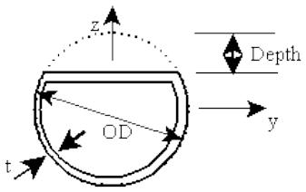

The following defines the dented section ‘DENT24’ as 24x1.0 with a dent depth of 4 inches. No grout is included.

```txt
1 2 3 4 5 6 7 8 1 234567890123456789012345678901234567890123456789012345678901234567890 1 SECT DENT24 DTB 24.0 1.0 4.0 
```

Note: The dent points in the local Z direction and is symmetric about the local XZ plane. The dent length is the length of the member or the length of the segment. The local Z direction can be oriented relative to the default using a chord angle in columns 36-41 of the corresponding MEMBER line (or a reference joint in columns 42-45).

2.6.1.5 Segmented Members

The section label defining the cross section properties, or the diameter and wall thickness for tubular members, for each of the member segments is specified on the GRUP line corresponding to that segment. See the example in the Segmented Members under the Material Properties Section.

2.6.1.6 Plate Elements

Section properties of a plate element are determined from the thickness specified on the PLATE line for isotropic plates that are not assigned to plate groups or the appropriate PGRUP’ line for membrane, shear, and corrugated plates or for isotropic plates assigned to a group. The properties of stiffened plates are determined from the plate properties specified on the PGRUP line and stiffeners specified on the PSTIF input line.

The following defines plates AAAA and AAAB. The thickness for AAAA is defined directly on the PLATE line while AAAB is obtained from the PGRUP line defining group ‘P01’.

```txt
1 2 3 4 5 6 7 8  
123456789012345678901234567890123456789012345678901234567890  
1 PGRUP
2 PGRUP P01 1.0000I2039.0 0.2502532.0 W12X26 100.00XB 7.849  
# 3 PLATE
4 PLATE AAAA 601 614 625 627 0.50 0  
5 PLATE AAAB 614 615 627 626P01 0 
```

2.6.1.7 Shell and Solid Elements

Section properties of a shell element are determined from the thickness specified on the ‘SHELL’ line for isotropic shells that are not assigned to shell groups via the ‘SHLGRP’ line. Solid elements have no “section” properties particular to the element.

2.6.2 Material Properties

2.6.2.1 Members or Beam Elements

For beam elements, material properties such as modulus of elasticity, shear modulus, yield stress (and shear area factor for tubulars), are specified on the appropriate GRUP line. The group to which the member is assigned is designated on the MEMBER line.

The following defines the material properties for groups BL1 and BL2.


|  | 1 | 2 | 3 | 4 | 5 | 6 | 7 | 8 |
| --- | --- | --- | --- | --- | --- | --- | --- | --- |
|  | 123456789012345678901234567890123456789012345678901234567890 | 123456789012345678901234567890123456789012345678901234567890 | 123456789012345678901234567890123456789012345678901234567890 | 123456789012345678901234567890123456789012345678901234567890 | 123456789012345678901234567890123456789012345678901234567890 | 123456789012345678901234567890123456789012345678901234567890 | 123456789012345678901234567890123456789012345678901234567890 | 123456789012345678901234567890123456789012345678901234567890 |
| 1 | GRUP |  |  |  |  |  |  |  |
| 2 | GRUP BL1 | 30.000 | 1.000 | 2.00815.72532.1 | 1.001.00 | 0.50F | 0.001 |  |
| 3 | GRUP BL2 CAN105 |  |  | 2.00815.72532.1 | 1.001.00 | 0.50F |  |  |
|  | 0.001 |  |  |  |  |  |  |  |


Note: By default, the plate girder flange yield stress is assumed to be the same as the web yield stress. Enter the flange yield stress in columns 41-45 of the GRUP line defining the plate girder group if different from the web yield stress.

2.6.2.2 Tapered Members

Tapered non-segmented elements may be defined using two GRUP lines. The properties of the beginning of the taper are defined using a GRUP line with ‘B’ in column 9 while the properties at the end of the taper are defined using a GRUP line with ‘E’ in column 9.

For example, the following defines a tapered plate girder with the beginning defined by section PGIRD18 and the end defined by PGIRD12.


|  | 1 | 2 | 3 | 4 | 5 | 6 | 7 | 8 |
| --- | --- | --- | --- | --- | --- | --- | --- | --- |
|  | 1234567890123456789012345678901234567890123456789012345678901234567890 | 1234567890123456789012345678901234567890123456789012345678901234567890 | 1234567890123456789012345678901234567890123456789012345678901234567890 | 1234567890123456789012345678901234567890123456789012345678901234567890 | 1234567890123456789012345678901234567890123456789012345678901234567890 | 1234567890123456789012345678901234567890123456789012345678901234567890 | 1234567890123456789012345678901234567890123456789012345678901234567890 | 1234567890123456789012345678901234567890123456789012345678901234567890 |
| 1 | GRUP PG1BPGIRD18 | GRUP PG1BPGIRD18 | GRUP PG1BPGIRD18 | GRUP PG1BPGIRD18 | 1 | 1 | N | N |
| 2 | GRUP PG1EPGIRD12 | GRUP PG1EPGIRD12 | GRUP PG1EPGIRD12 | GRUP PG1EPGIRD12 | 1 | 1 | N | N |


Note: The section type must be the same at each end of the tapered segment.

The previous case is the only case in which more than one GRUP line corresponds to a single-segment member. In this case do not specify a segment length or a difference in material properties in the two GRUP lines. In all other cases, the number of consecutive GRUP lines with the same group name corresponds to the number of segments in a group.

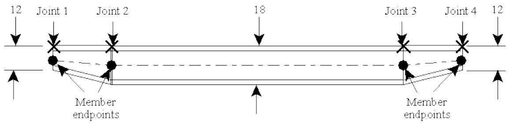

If a tapered beam is needed whose top flange is parallel to the line between the endpoint joints, it is necessary to add two intermediate joints and split the member into three members, the first tapered, the second constant cross section, and the third tapered. This is done as follows:


|  | 1 | 2 | 3 | 4 | 5 | 6 | 7 | 8 |
| --- | --- | --- | --- | --- | --- | --- | --- | --- |
|  | 12345678901 | 12345678901 | 12345678901 | 12345678901 | 12345678901 | 12345678901 | 12345678901 | 1234567890 |
| 1 | GRUP LG1BPGIRD12 |  |  |  | 36.0 1 |  | N |  |
| 2 | GRUP LG1EPGIRD18 |  |  |  |  |  |  |  |
| 3 | GRUP LG2 PGIRD18 |  |  |  | 50.0 1 |  | N |  |
| 4 | GRUP LG3BPGIRD18 |  |  |  | 36.0 1 |  | N |  |
| 5 | GRUP LG3EPGIRD12 |  |  |  |  |  |  |  |
| 6 | MEMBER2 1 2 LG1 |  |  |  |  |  |  |  |
| 7 | MEMBER OFFSETS |  |  |  |  | -6.0 | -9.0 |  |
| 8 | MEMBER2 2 3 LG1 |  |  |  |  |  |  |  |
| 9 | MEMBER OFFSETS |  |  |  |  | -9.0 | -9.0 |  |
| 10 | MEMBER2 3 4 LG1 |  |  |  |  |  |  |  |
| 11 | MEMBER OFFSETS |  |  |  |  | -9.0 | -6.0 |  |


Tapered segmented elements are defined using a GRUP line for each segment. The properties of the group for the beginning of the taper are defined using a GRUP line with ‘B’ in column 9 while the properties of the group for the end of the taper are defined using a GRUP line with ‘E’ in column 9. A GRUP line with a ‘B’ in column 9 will start a taper with the end of the taper cross section obtained from the next GRUP line. A GRUP line with an ‘E’ in column 9 will end a taper with the beginning of the taper determined from the previous GRUP line.

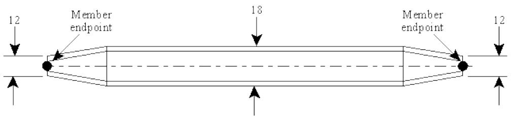

For example, the following defines a tapered plate girder with the beginning defined by section PGIRD12. The middle section is constant depth defined by PGIRD18 and the end is defined by PGIRD12.


|  | 1 | 2 | 3 | 4 | 5 | 6 | 7 | 8 |
| --- | --- | --- | --- | --- | --- | --- | --- | --- |
|  | 12345678901 | 12345678901 | 12345678901 | 12345678901 | 12345678901 | 12345678901 | 12345678901 | 1234567890 |
| 1 | GRUP | PG1BPGIRD12 |  |  | 36.0 | 1 |  | N 3.0 |
| 2 | GRUP | PG1 | PGIRD18 |  | 50.0 | 1 |  | N |
| 3 | GRUP | PG1 | PG1EPGIRD12 |  | 36.0 | 1 |  | N 3.0 |


Note: The section type must be the same for each segment of the tapered member.

In a segmented member, the axis of the member between the joints corresponds to the neutral axis of each segment in the member. In the previous tapered plate girder the top and bottom flanges of the PGIRD12 segment would expand to reach the PGIRD18 section. In a tapered segmented member, the top and bottom flanges are not usually parallel to the line between member endpoints.

2.6.2.3 Segmented Members

A series of GRUP lines with the same group label are used to define the property group of a segmented member. Each input line corresponds to one of the segments of that group. Material properties of the segment in addition to the segment length may be specified. For example, group LG1 in the figure below would be specified using three group lines as follows:


|  | 1 | 2 | 3 | 4 | 5 | 6 | 7 | 8 |
| --- | --- | --- | --- | --- | --- | --- | --- | --- |
|  | 1234567890123456789012345678901234567890123456789012345678901234567890 | 1234567890123456789012345678901234567890123456789012345678901234567890 | 1234567890123456789012345678901234567890123456789012345678901234567890 | 1234567890123456789012345678901234567890123456789012345678901234567890 | 1234567890123456789012345678901234567890123456789012345678901234567890 | 1234567890123456789012345678901234567890123456789012345678901234567890 | 1234567890123456789012345678901234567890123456789012345678901234567890 | 1234567890123456789012345678901234567890123456789012345678901234567890 |
| 1 | GRUP LG1B | 48.0 | 1.5 | 50.0 | 1 |  | N | 3.0 |
| 2 | GRUP LG1 | 48.0 | 1.5 | 36.0 | 1 |  | N |  |


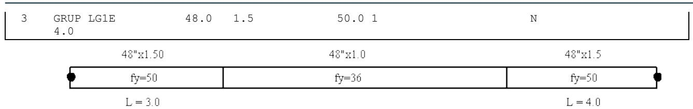

Note: The segment length for one of the segments was left blank so that it can be determined by the program. This insures that the sum of all segment lengths will equal the member length.

The segment length may also be expressed as a fraction of the total member length. In this case, the fraction for each segment must be entered and the summation of all segment length fractions must equal one. If any segment length is left blank, it is assumed that the remaining lengths are “lengths” rather than fractions.

2.6.2.4 Plate Elements

Material properties for plate elements including Young’s Modulus, Poisson’s Ratio and yield stress are specified on the appropriate PLATE line for isotropic plates that are not assigned to a plate group or on the PGRUP line for membrane, shear, corrugated and stiffened plates or for isotropic plates assigned to a plate group. If a plate group is to be used, the group to which the plate is assigned is designated on the PLATE line defining the element.

The following defines the properties for plate group P01.

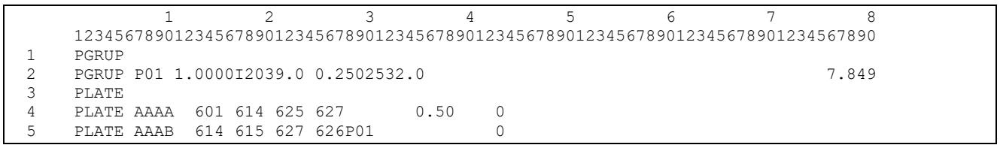

2.6.2.5 Shell and Solid Elements

Material properties for shell and solid elements which are not input in group lines (‘SHLGRP’ or ‘SLDGRP’, respectively) are input directly on the SHELL or SOLID line defining the element.

2.6.3 Stiffener Data

2.6.3.1 Plate Girders

By default, plate girder members are assumed to have web stiffener spacing equal to the member length. Plate girder web stiffener spacing can be designated in columns 65-69 on the GRUP line defining the plate girder group.

The following designates a hybrid plate girder group named ‘PG2’ that references section PG36100. The flange yield stress is 50, the web yield stress is 36 and the web stiffener spacing is designated as 24.

```txt
1 2 3 4 5 6 7 8 1234567890123456789012345678901234567890123456789012345678901234567890123456789012345678901234567890123456789 
```

2.6.3.2 Tubular Members

Tubular members can contain ring and/or longitudinal stiffeners as defined on the SECSCY line immediately following the SECT line defining the tubular properties. Enter the longitudinal stiffener section name in columns 9-15 and the spacing in columns 16- 20.

The ring stiffener section is defined in columns 21-27 along with the ring spacing in columns 28-32.

Note: The basic section properties (i.e. OD and thickness) of a stiffened tubular section must be defined using a SECTION line.

The following defines a stiffened 48.0 x 1.0 tubular section named SCY48X1 with ring stiffeners defined by section RSTIF1 spaced at 24.

```c
1 2 3 4 5 6 7 8  
1234567890123456789012345678901234567890123456789012345678901234567890  
1 SECT SCY48X1 SCY 48.0 1.0  
2 SECSCY RSTIF1 24.0 
```

Note: Stiffened tubular sections can be code checked using API-2U Bulletin criteria by specifying ‘PT’ in columns 67-68 on the OPTIONS line.

## 2.7 ELEMENT DATA

The SACS system allows the use of beam, plate, shell, and/or solid elements in the model.

2.7.1 Members or Beam Elements

Beam elements are specified on MEMBER lines following the MEMBER header input line. Beam elements are named by the joints to which they are connected. In addition to the connecting joints, the property group label along with some optional property data are specified on the MEMBER line. Member properties specified, such as flood condition, K-factors, average joint thickness, and density override data specified on the GRUP line.

The following defines member 101- 201 and assigns it to property group GL2.

```txt
1 2 3 4 5 6 7 8 1 23456789012345678901234567890123456789012345678901234567890 1 234567890123456789012345678901234567890 1 234567890 1 234567890 1 234567890 1 234567890 1 234567890 
```

Note: When an average joint thickness is entered, the member length used for Euler buckling and hydrodynamic load generation is shorted by the average joint thickness. Any existing loads are not affected nor modified when an average joint thickness is specified.

2.7.1.1 Member Local Coordinate System

Each member has an associated local coordinate system which loads and stresses may be defined with respect to. The default member local coordinate system is defined as:

The member local X-axis is defined along the member neutral axis from the first connecting joint specified toward the second connecting joint.

For members that are not vertical, i.e. local X-axis is not parallel to global Z, the local Z-axis is defined as perpendicular to local X-axis, lying in the plane formed by the global Z and local X-axes and having a positive projection along the global Z-axis. The right-hand rule is used to determine the local Y-axis. The

local Z-axis for vertical members, i.e. members whose local X-axis is parallel to global $\scriptstyle{ Z , }$ is parallel to the global Y-axis and in the positive Y direction. The local Y-axis is determined by using the right-hand rule. See figure below.

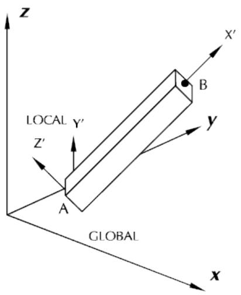  
Local X not parallel to global Z

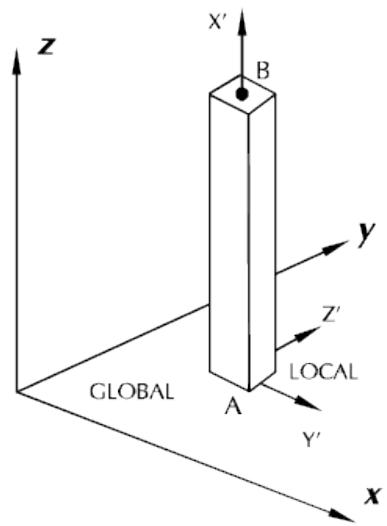  
Local X parallel to global Z

The default orientation of the member local coordinate system can be overridden by specifying a chord (beta) angle and/or a local Z-axis reference joint on the ‘MEMBER’ line. When a chord angle is input, the default local coordinate system is rotated about the local X-axis by the angle specified following the right-hand rule. The Z-axis reference joint is used with the local X-axis to define the local XZ plane. The local Z-axis is defined such that it is perpendicular to the member and positive toward the reference joint.

2.7.1.1.1 Member Internal Load and Stress Sign Convention

The sign convention used by the Post program module for reporting member internal loads and stresses is dependent on the member local coordinate system as follows:

1. Axial tension is positive at both ends of the member while compression is negative at both ends.   
2. Positive bending at both ends of the member causes the center of the member to deflect downward or in the negative direction of the local coordinate system.   
3. Positive shear force is in the direction of the positive local member coordinate at the beginning of the member and in the negative local member coordinate at the end of the member.   
4. A positive torsion vector is outward at both ends of the member.

The figure below shows positive loads and moments along with positive stresses at the member beginning and end.

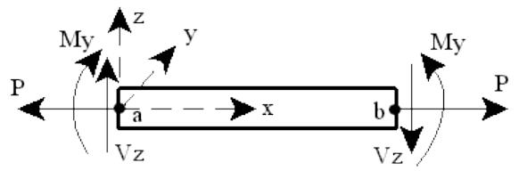

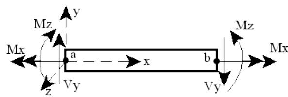  
POSITIVE Internal Forces &Moments

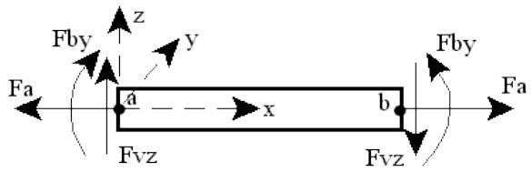

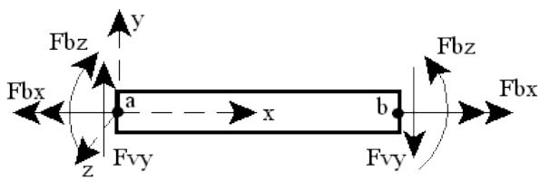  
POSITIVE Stresses

2.7.1.2 Member End Fixity

By default, the ends of a member are fixed to the connecting joints for all six degrees of freedom. However, any of the six degrees of freedom may be released from the connecting joint by specifying a ‘1’ in the appropriate column on the Member Description line. Degrees of freedom are in the member local coordinate system.

For instance, the start of member 101-102 is fixed for axial load and shear. The torsion, moment Y and moment Z degrees of freedom are therefore released by specifying ‘000111’ in columns 23-28. The end of the member is fixed for all degrees of freedom.

```txt
1 2 3 4 5 6 7 8 1 23456789012345678901234567890123456789012345678901234567890 1MEMBERO 101 201 GL2 000111
```

2.7.1.3 Member Offsets

Member offsets are used to shorten or lengthen the member or to move the member when the neutral axis is not located on the line between its connecting joints. When offsets are specified, the program creates a rigid link between the neutral axis of the member end and the connecting joint.

The offsets describe the length of the rigid link and may be described in local or global rectangular coordinates. The coordinate system used is specified in column 7 on the MEMBER line. Enter ‘1’ for global coordinate system or ‘2’ for local coordinate system. The offsets are defined on the MEMBER OFFSETS line immediately following

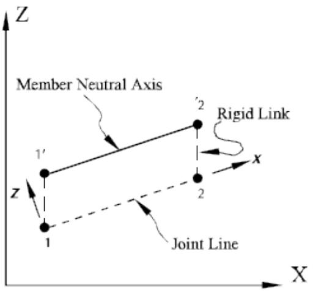

The following defines offsets in the global coordinate system for member 203-301.


|  | 1 | 2 | 3 | 4 | 5 | 6 | 7 | 8 |
| --- | --- | --- | --- | --- | --- | --- | --- | --- |
|  | 12345678901 | 12345678901 | 12345678901 | 12345678901 | 12345678901 | 12345678901 | 12345678901 | 1234567890 |
| 1 | MEMBER1 | 203 | 301 | T01 |  |  |  |  |
| 2 | MEMBER OFFSETS | MEMBER OFFSETS | MEMBER OFFSETS | MEMBER OFFSETS | -60.73 | 9.98 | 79.83 | 52.50 |


Note: Specified member end releases are applied to the connection between the member end and the rigid link.

2.7.1.4 K-factors/Effective Buckling Length

K-factors or effective buckling length, but not both, may be specified for buckling about the local Y and Z axes. K-factors are specified on the pertinent GRUP line in columns 52-59 but may be overridden on the MEMBER line in columns 52-59.

When K-factors are used, the effective buckling length is calculated as the K-factor multiplied by the actual member length. When effective lengths are specified on the MEMBER line, ‘L’ must be input in column 47. The effective buckling length is then determined using the K-factor from the GRUP line multiplied buckling length specified.

The following defines members 101-201 and 201-301. The effective buckling length for member 101-201 is determined using the K-factors specified for group T01 since no K factors are specified on the MEMBER line. The effective length for member 201-301 is determined using the buckling length on the MEMBER line and the K-factors specified for group T01.


|  | 1 | 2 | 3 | 4 | 5 | 6 | 7 | 8 |
| --- | --- | --- | --- | --- | --- | --- | --- | --- |
|  | 123456789012345678901234567890123456789012345678901234567890 | 123456789012345678901234567890123456789012345678901234567890 | 123456789012345678901234567890123456789012345678901234567890 | 123456789012345678901234567890123456789012345678901234567890 | 123456789012345678901234567890123456789012345678901234567890 | 123456789012345678901234567890123456789012345678901234567890 | 123456789012345678901234567890123456789012345678901234567890 | 123456789012345678901234567890123456789012345678901234567890 |
| 1 | MEMBER | 101 | 201 | T01 |  |  |  |  |
| 2 | MEMBER | 201 | 301 | T01 |  | L | 5.0 | 5.0 |


2.7.1.5 Unbraced Length of Compression Flange

The distance between bracing against twist or lateral displacement of the compression flange for use in calculating bending allowable stresses for non-tubular members, may be input on the GRUP or MEMBER line in columns 60-64. The default is the member length.

The following designates that the unbraced length of the compression flange for member 101-201 is 5.


| 1 | 2 | 3 | 4 | 5 | 6 | 7 | 8 |
| --- | --- | --- | --- | --- | --- | --- | --- |


```txt
1 1234567890123456789012345678901234567890123456789012345678901234567890MEMBER 101 201 T01 2.0 2.0 5.0 
```

Note: Values specified on the MEMBER line override values specified on the GRUP line.

2.7.1.6 Shear Area Factor for Tubular Members

For tubular members, the factor with which to multiply the cross section area for purposes of shear stress calculations, may be input on the GRUP line in columns 65-69 or on the MEMBER line in columns 60-64.

The following specifies a shear area modifier of 0.5 for member 101-501.

```txt
1 2 3 4 5 6 7 8 1 234567890123456789012345678901234567890123456789012345678901234567890 1MEMBER 101 501 T01 2.0 2.0 0.5 
```

2.7.1.7 Skipping from Output Reports

A member may be eliminated from output reports by inputting ‘SK’ on the MEMBER line in columns 20- 21. If ‘SE’ was designated as the element detail report option, enter ‘RP’ to have the stress and unity check results reported for the particular member. All members of a group may be skipped from output reports by specifying ‘9’ in column 47 of the GRUP line.

2.7.1.8 Multiple Members Between Two Joints

A maximum of two members, spanning in opposite direction, are allowed between the same two joints. For example, two members may be modeled between joints 101 and 102, member 101-102 and member 102-101. However, all loading applied to the members will be applied to the first member specified. In general, modeling two members between the same joints is applicable when the second member is a dummy member used only to simulate additional stiffness.

2.7.1.9 Defining Special Element Types

2.7.1.9.1 Cable Element

Cable elements are defined using standard beam elements except that additional member data is specified on the MEMB2 line. The tension used to determine the cable stiffness is input in columns 8-14 on the MEMB2 line.

The following specifies a tension force of 10.0 for cable member 101-501.

```txt
1 2 3 4 5 6 7 8 123456789012345678901234567890123456789012345678901234567890 1MEMBER 101 501 AT01 2.0 2.0 0.5 2 MEMB2 10.0 
```

Note: Enter ‘A’ in column 16 on the MEMBER line if additional member data is specified on the MEMB2 line.

2.7.1.9.2 Gap Element

Elements can be designated as tension-only, compression-only, no-load or friction elements for Gap analyses. The gap element type may be designated on the member group line in column 30 or on the MEMBER line in column 22 using ‘T’, ‘C’, ‘N’ or ‘F’, respectively.

Note: The gap element type is only applicable when running a gap element analysis and is ignored for all other analysis types.

2.7.1.9.3 Initial Gap Spacing

An initial gap spacing may be specified for a member in columns 51-55 on the MEMB2 line. A gap element with internal displacement less than the initial gap spacing is assumed to be zero force (no load) members. Gap Analysis program first determines the displacement in each gap element. If the current displacement is less than value of the Initial Gap Spacing, it assumes the gap element is a zeroforce member.

Note: The initial gap spacing is only used in Gap Analysis and it does not affect other analysis types.

2.7.1.9.4 X-Brace or K-Brace

By default, the buckling length and K-factors specified on the GRUP and MEMBER lines in the model are used for unity check calculations for each load case.

Members making up an X-brace or chord members of a K-brace not braced out of plane may be designated as such using the MEMB2 line. The MEMB2 line allows designation of the K-factor and/or buckling length to be used for load cases where the member is part of an X-brace or the chord of a Kbrace.

Note: The X-brace or K-brace parameters are only applied to the axis in the plane of the connection for load cases where the member is in compression and the reference member(s) are in tension.

The brace type ‘X’ or ‘K’ is designated in column 15. The member local axis, ‘Y’ or ‘Z’, that lies in the plane of the X-brace or K-brace is entered in column 16. Enter the reference member(s) that will be checked for tension in columns 17-32. The K-factor and/or buckling length to be used for load cases where the member is part of an X-brace or the chord of a K-brace is designated in columns 33-38 and 39-45, respectively.

Note: K-braces require two reference members while the second reference member is optional for Xbraces.

The following example defines parameters for members 101-109 and 105-109 which are chord members of a K-brace whose local Y-axes lie in the brace plane. The diagonal or K-brace members are 109-110 and 109-112. For load cases where chord members 101- 109 and 105-109 are in compression and members 109-110 and 109-112 are in tension, a K-factor of 0.8 and a buckling length of 11.15 is to be used. For other load cases, the K factor and buckling length specified in the model file are to be used.

```txt
1 2 3 4 5 6 7 8 123456789012345678901234567890123456789012345678901234567890  
MEMBER 101 109A  
MEMB2 KY 109 112 109 110 0.8 11.21  
MEMBER 105 109A  
MEMB2 KY 109 112 109 110 0.8 11.15 
```

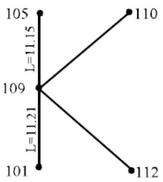

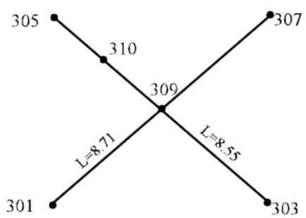

This example defines parameters for members 301-309 and 307-309 which are chord members of an Xbrace and members 303-309, 305-310 and 310-309 which make up the two brace elements framing into the chord. The members local Y-axes lie in the plane of the brace. For members 301-309 and 307-309, a K-factor of 0.9 and a buckling length of 8.71 is to be used for load cases where the member is in compression and the other pair of members framing into the chord, 303-309 and 310-309, are in tension. For members 303-309, 305-310 and 310-309, a K-factor of 0.9 and a buckling length of 8.55 is to be used for load cases where the member is in compression and members 301-309 and 307- 309 are in tension. For other load cases, the K-factor and buckling length specified in the model file are to be used.


|  | 1 | 1 | 2 | 2 | 3 | 3 | 4 | 4 | 5 | 5 | 6 | 6 | 7 | 7 | 8 | 8 |  |
| --- | --- | --- | --- | --- | --- | --- | --- | --- | --- | --- | --- | --- | --- | --- | --- | --- | --- |
|  | 12345678901 | 12345678901 | 2345678901 | 2345678901 | 2345678901 | 2345678901 | 2345678901 | 2345678901 | 2345678901 | 2345678901 | 2345678901 | 2345678901 | 2345678901 | 2345678901 | 234567890 | 234567890 |  |
| 1 | MEMBER | 301 | 309A |  |  |  |  |  |  |  |  |  |  |  |  |  |  |
| 2 | MEMB2 |  | KY | 310 | 309 | 303 | 309 | 0.9 | 8.71 |  |  |  |  |  |  |  |  |
| 3 | MEMBER | 307 | 309A |  |  |  |  |  |  |  |  |  |  |  |  |  |  |
| 4 | MEMB2 |  | KY | 310 | 309 | 303 | 309 | 0.9 | 8.71 |  |  |  |  |  |  |  |  |
| 5 | MEMBER | 303 | 309A |  |  |  |  |  |  |  |  |  |  |  |  |  |  |
| 6 | MEMB2 |  | KY | 310 | 309 | 303 | 309 | 0.9 | 8.55 |  |  |  |  |  |  |  |  |
| 7 | MEMBER | 305 | 310A |  |  |  |  |  |  |  |  |  |  |  |  |  |  |
| 8 | MEMB2 |  | KY | 310 | 309 | 303 | 309 | 0.9 |  |  |  |  |  |  |  |  |  |
|  | 8.55 |  |  |  |  |  |  |  |  |  |  |  |  |  |  |  |  |
| 9 | MEMBER | 310 | 309A |  |  |  |  |  |  |  |  |  |  |  |  |  |  |
| 10 | MEMB2 |  | KY | 310 | 309 | 303 | 309 | 0.9 | 8.55 |  |  |  |  |  |  |  |  |


2.7.2 Plate Elements

The SACS system contains both triangular and quadrilateral orthotropic flat plate elements. The element is a true 6-degree of freedom linear strain element. The orthotropic nature of the flat plate element allows for the modeling of the following plate types:

Isotropic, Membrane, Shear, Stiffened & Corrugated.

The appendices contain a detailed discussion of each plate element type.

2.7.2.1 Isotropic Plates

For isotropic plate elements, the plate name, connecting joints, thickness and material properties may be specified on the appropriate Plate Description line. A plate group is not required. If a plate group is specified, the material properties and thickness are obtained from the plate group unless overridden on the PLATE line.

The following defines plates AAAA and AAAB. The properties of plate AAAA are defined directly on the PLATE line while plate AAAB obtains properties from group P01.

```txt
1 2 3 4 5 6 7 8   
1234567890123456789012345678901234567890123456789012345678901234567890   
1PLATEAAAA 601 614 625 627 0.50 0 29.0 0.25 36.0 490.   
2PLATEAAAB 614 615 627 626P01   
0 
```

2.7.2.2 Membrane and Shear Plates

A PLATE line containing the plate name, connecting joints and plate property group name is used to define the plate. The plate type, thickness and material properties are stipulated on the appropriate PGRUP line. Any plate material properties input on the PLATE line override those specified for the plate group.

2.7.2.3 Stiffened Plates

A PLATE line containing the plate name, connecting joints and plate property group name is used to define a stiffened plate. The plate type, material properties, stiffener section labels, stiffener direction, location (top, bottom or both) and spacing are specified on the appropriate PGRUP input line. Multiple PGRUP lines having the same group label can be used to describe plates with more than two sets of stiffeners. Plate material properties input on the PLATE line override those specified for the plate group.

Plate stiffener cross sections may be any shape definable by the SECTION line. Special stiffener cross sections not available on the SECTION line may be defined using the PSTIF line. Sections not found in the section library file must be defined in the model using PSTIF lines. An outline of PSTIF geometry is shown in the diagram following.

The following sample shows plate AAAA defined by group P01. Group P01 is a stiffened plate group with W12X26 running along the local X axis at 100.0 spacing. W12X26 is a section defined in the section library file.

```txt
1 2 3 4 5 6 7 8  
1234567890123456789012345678901234567890123456789012345678901234567890  
PGRUP P01 1.0000I2039.0 0.2502532.0 W12X26 100.00XB 7.849  
PLATE  
PLATE AAAA 601 614 625 627P01 0 
```

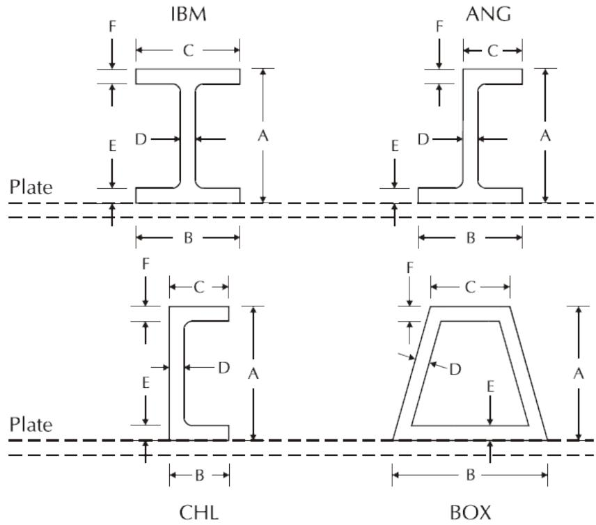

2.7.2.4 Corrugated Plates

Corrugated plates are special plates with a combination of both in-plane and out-of-plane stiffness. Corrugated plates are given directly on the PSTIF line by specifying four parameters A, B, C, and D as shown in the following figure.

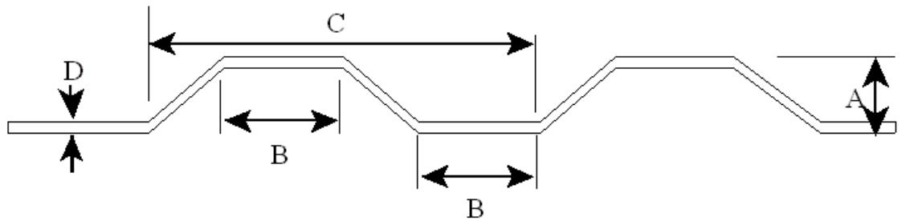

The following input defines a corrugated plate ‘AAAB’ with corrugations running in the local X direction. The thickness of the plate is 0.25 and the spacing C is 12. The A and B dimensions are 3 and 3, respectively. With the stiffener spacing unspecified on the PGRUP line, the stiffener spacing defaults to the C dimension 12. A specification of ‘T’ or ‘B’ for top or bottom stiffeners is unnecessary.


|  | 1 | 2 | 3 | 4 | 5 | 6 | 7 | 8 |
| --- | --- | --- | --- | --- | --- | --- | --- | --- |
| 1 | 1234567890123456789012345678901234567890123456789012345678901234567890123456789012345678901234567890123456789 | PSTIF |  |  |  |  |  |  |
| 2 | PSTIF CRG CORR01 | 3.0 | 3.0 | 12.0 | 0.25 |  |  |  |
| 3 | PGRUP |  |  |  |  |  |  |  |
| 4 | PGRUP P01 | I 29.0 | 36.0 | CORR01 | X |  | 490.0 |  |
| 5 | PLATE |  |  |  |  |  |  |  |


Note: A von Mises check versus an allowable of 0.6Fy is used to check the corrugated plate. Buckling is not included in the plate model or code check. If buckling can occur, the plate thickness may require adjustment to limit the plate capacity. The normal limitations apply such as aspect ratio and grid density as with any FE model. Since the corrugated plate has significant out-of-plane stiffness, adjacent members are assumed to share the load with the corrugated plate.

2.7.2.5 Plate Local Coordinate System

Like beam elements, each plate element has an associated local coordinate system which loads and stresses may be defined with respect to. The plate local X-axis is defined at the plate center line from the first connecting joint specified to the second connecting joint. The local XY plane is defined by the first three joints with local Y-axis perpendicular to the local X-axis toward the third joint. The right-hand rule is used to define the local Z-axis.

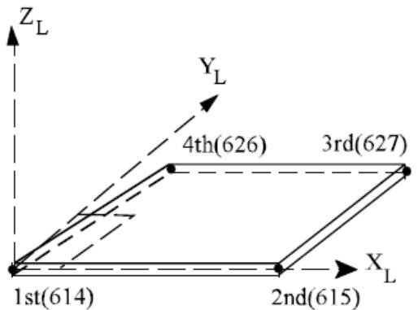

For example, plate ‘AAAB’ connected to joints 614, 615, 627 and 626 has a local X axis from joint 614 to joint 615. The local Y axis is perpendicular to the local X axis in the direction of joint 627.

```txt
1 2 3 4 5 6 7 8 1 2345678901234567890123456789012345678901234567890123456789012345678901234567890123456789012345678901234567890 1 PLATE AAAB 614 615 627 626P01 0 
```

2.7.2.6 Plate Offsets

Plate offsets may be used when the plate’s center plane is not located at the plane formed by the connecting joints or when one of the edges does not correspond to a line between the joints to which it is connected. Plate offsets can also be used to generate the transition between the flat plates and beam elements. See the Commentary for a detailed discussion.

When an offset is stipulated, the program creates a rigid link between the plate corner and the connecting joint. The offsets describe the length of the rigid link and may be described in local or global rectangular coordinates. The coordinate system used is specified on the PLATE line.

Local Z offsets may be specified directly on the PGRUP line in columns 36-41. For stiffened plates, the automatic offset option, which calculates the offset such that the center plane of the plate itself lies in the joint plane, may be selected by entering ‘Z’ in column 10. Any local Z offsets specified are added to the calculated offsets.

The following defines plate groups P01 and P02 containing a local Z offset of 10. Group P02 is a stiffened plate and also has the neutral axis offset option on so that the offset is measured from the plate center instead of the neutral axis.

```txt
1 2 3 4 5 6 7 8  
123456789012345678901234567890123456789012345678901234567890  
1 PGRUP P01 1.0000I2039.0 0.2502532.0 10.0  
2 PGRUP P02Z1.0000I2039.0 0.2502532.0 10.0W12X26 100.00XB 
```

Offsets defining the location of the plate edges are designated on the two PLATE OFFSETS lines immediately following the PLATE input line. The first offset line contains the offsets for the first two joints, and the second contains the offsets for the third and fourth (optional) joint(s). The coordinate system that the offsets are defined with respect to is designated in column 43 on the PLATE line. Enter ‘1’ for global coordinates or ‘2’ for local coordinates.

The following defines plate AAAB with global X offset of 10.0 specified at each joint.

```txt
1 2 3 4 5 6 7 8  
123456789012345678901234567890123456789012345678901234567890  
1 PLATE AAAB 614 615 627 626P01 1  
2 PLATE OFFSETS 10.0 10.0  
3 PLATE OFFSETS 10.0 10.0 
```

2.7.2.7 Skipping from Output Reports

A plate may be eliminated from output reports by inputting ‘SK’ in columns 31-32 on the PLATE line. If ‘SE’ is designated for element detail reports on the OPTIONS line, enter ‘RP’ in columns 31-32 to have the stress and unity check results reported for the particular plate.

2.7.2.8 Plate Modeling Considerations

Unlike beam elements, flat plate elements are not closed form solutions. Therefore, there are limitations to the geometry and mesh size that are necessary to generate accurate stresses and deflections. The following suggestions are made for the use of flat plates in the SACS system:

1. The aspect ratio (width versus height) for plate elements subjected to out-of-plane bending should be limited to 6 to 1 for three node plates and 3 to 1 for four node plates. If the primary plate load is in the plane of the plate then the aspect ratio can be increased to 10 to 1 for three node plates and 5 to 1 for four node plates.   
2. Interior angles within a plate should not exceed 180 degrees.   
3. Four node plates are limited to 3 degrees of out-of-plane tolerance between the four nodes such that the angle between the ‘normals’ to any triangular portions of the four node plate cannot exceed this value.   
4. For detailed stresses, a mesh size of four nodes by four nodes will accurately represent a flat plate for both stiffness and stress calculations. A coarser mesh spacing will result in relatively accurate stiffness representation but stress calculations may not represent local stress variations within the plate.   
5. Because four node plates are represented internally by 4 three node plates, a 4 node plate is inherently more accurate than a 3 node plate.

6. Plate stresses for traditional “beam-strip theory” plates are only reported at the geometric center of the plate. Plate stresses for DKT plates are reported at the corner joints and the geometric center. Plate stresses reported at the geometric center of plates are theoretically more accurate than those at corner joints.

2.7.3 Curved MITC Shell Elements

The Solver offers an enhanced implementation of isoparametric shell elements that are locking-free. These elements are based on the Mixed Interpolation of Tensorial Components (MITC) approach [4,5] with added drilling stiffness. These elements accurately model the mechanics of general curved surfaces with fewer elements compared to the flat plate elements. The SACS program contains 6 node triangular, and 8 or 9 node rectangular isoparametric shell elements. Shell elements can have constant thickness or thickness may be specified at each node. Rigid link offsets can be modeled at each node to allow for connection eccentricities.

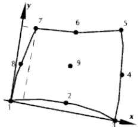  
Local Coordinate System

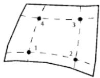  
2x2 Mesh Integration

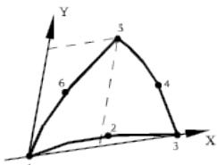  
Local Coordinate System

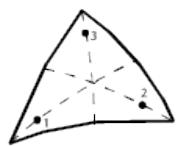  
3 Point Integration

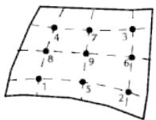  
3x3 Mesh Integration

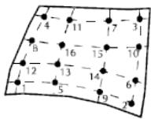  
4x4 Mesh Integration

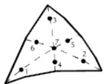  
7 Point Integration

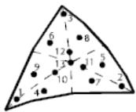  
13 Point Integration

Material properties including modulus of elasticity, Poisson’s ratio, yield stress, coefficient of thermal expansion and density are specified either on the SHLGRP line or on the SHELL line itself. Shell thickness, if constant, may be specified either on the SHLGRP line or on the SHELL line. For shells with varying thickness, the thickness at each node is specified on the SHELL THICK line immediately following the SHELL line defining the element.

2.7.3.1 MITC Shells Local Coordinate System

Unlike Curved , MITC shell elements use a curved coordinate system that varies within the shell element. At the shell’s joint sets {1,2,3}, {8,9,4}, and {7,6,5}, the local x-axis is tangent to parabolae that connects joints in each set. Similarly, the local y-axis at joint sets {1,8,7}, {2,9,6}, and {3,4,5} is tangent to parabolae that connects joints in each set. The local z-axis is then constructed at each point using the right-hand rule as the outer product of the x and y axes.

2.7.3.2 Shells Normal

The shells normal dictate the direction of the pressure loads. Moreover, to enhance the performance of MITC shell elements, the shells normal of each shell group are averaged at each common joint. As such, a separate shell group should be used for each individual surface. Similarly, the numbering of each

shell’s joints has to follow the same rotation to ensure that normal surfaces all point in the same direction.

2.7.3.3 Integration Points

The integration order for them is fixed and cannot be changed by the user to ensure optimal performance of MITC shell elements. Quadratic and Triangular MITC shell elements use 16 and 7 integration points in the shell’s plane, respectively. Both elements also use 4 integration points across their thickness.

2.7.3.4 Shell Offsets

Shell offsets can be modeled at each node to allow for connection eccentricities. The offsets are specified on the SHELL OFFSET line in global coordinates. Two offset lines are required for 6 node elements and three are required for eight or nine node elements.

2.7.3.5 Shell Element Report

If ‘PT’ is designated in the element detail report field on the options line, the stress details for a shell element may be skipped by inputting ‘S’ on the SHLGRP or SHELL line. If ‘SE’ or ‘ ’ is designated in the element detail report field on the options line, all shell element details will be skipped.

2.7.3.6 A Note on Choice of MITC Shell Elements

Quad9 MITC shell element offers a better convergence in most scenarios and is computationally the most cost-effective choice. The use of Tri6 shell elements should be reserved for situations where the model's geometry prohibits the use of an all-quad mesh.

2.7.4 Solid Elements

The SACS program contains 4 node tetrahedron, 5 node pyramid, 6 node wedge and 8 node brick solid finite element shapes. The elements are constant strain elements and do not restrain rotation at the nodes. The solid name, connecting joints and material properties including modulus of elasticity, Poisson’s ratio, yield stress, coefficient of thermal expansion and density are stated either on the SLDGRP line or on the SOLID line itself.

Being as these solid finite elements do not contain inherent rotational stiffness, the rotational degrees of freedom for joints contained within only solid elements will be constrained. SACS automatically generates the constraints of rotational degrees of freedom for joints which are exclusively contained in solids. With the extra constraints on solid joints, there will be extra reaction forces generated in the Post output for these constrained degrees of freedom.

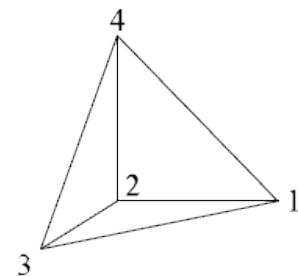  
4 Node Tetrahedron

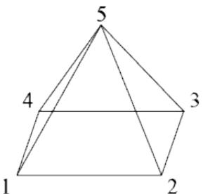  
5 Node Pyramid

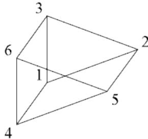  
6 Node Wedge

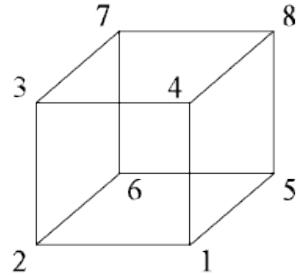  
8 Node Brick

Inherent rotational degrees of freedom in solid elements may be modeled by specifying ‘6’ in column 71 of the OPTIONS line. These elements are a condensation of higher order isoparametric solid elements, with the rotational degrees of freedom being obtained from mid-side node translational degrees of freedom.

Joint ordering in solid elements is free. As such, arbitrary joint order may be input with the program determining solid faces. There are two options for joint ordering: (1) the default method which requires flat solid faces and (2) a more robust scheme allowing solid face warpage. The second scheme, which is specified with an ‘R’ in column 72 of the options line, has the additional feature of allowing the program to bypass joint ordering for any solid when an ‘N’ is specified in column 44 of the SOLID line (or column 14 of the SLDGRP line). With the default joint ordering method an ‘N’ specified in column 44 of the SOLID line (or column 14 of the SLDGRP line) will mean that only 8 node brick solid elements are not reordered. The default joint ordering for solids is shown in the figure.

2.7.4.1 Solid Local Coordinate System

The local X-axis is defined by nodes one and two. The local XY plane is defined by nodes one, two and three. The local Y-axis is perpendicular to the local X-axis, positive in the direction of node three. The right-hand rule is used to determine the local Z-axis.

2.7.4.2 Solid Offsets

Solid offsets can be specified to account for eccentricities or element transitions on the SOLID OFFSET line following the SOLID line defining the element.

Normally offsets are used to locate the element relative to the connecting joints using a rigid link. Offsets can also be used to generate transitions between solid elements and isoparametric shells, flat plates, and members. For example, if a four node face of a solid element is connected to a beam or plate element, the solid face should be described using only two joints lying at the center of the face. Two

joints should be specified as the four connecting joints (i.e. 101, 102, 102, 101). Offsets are then specified at each connecting joint to offset the joints to the corners of the element. The resulting offset solid element will form a full 6 degree of freedom transition connection between the elements.

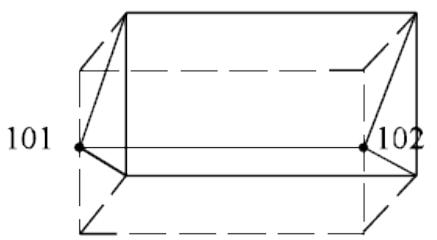  
No offsets

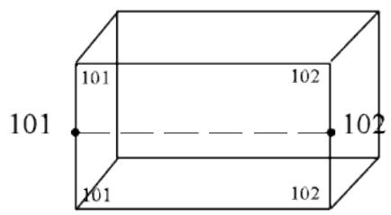  
with offsets

## 2.8 JOINTS

Joints are defined on the JOINT input line which contains the joint name, global coordinates, and fixity.

2.8.1 Joint Coordinates

The X, Y and Z global joint coordinates may be input in feet, inches, or feet plus inches for English units or in meters, centimeters, or meters plus centimeters for metric units. For example, a joint with an X coordinate of 25.50 feet may be entered as 25.5 feet, 306.0 inches or 25.0 feet and 6.0 inches as illustrated by the following three JOINT lines:


|  | 1 | 1 | 2 | 3 | 4 | 5 | 6 | 7 | 8 |
| --- | --- | --- | --- | --- | --- | --- | --- | --- | --- |
|  | 12345678901 | 2345678901 | 2345678901 | 2345678901 | 2345678901 | 2345678901 | 2345678901 | 2345678901 | 234567890 |
| 1 | JOINT | 297 | 25.50 |  |  |  |  |  |  |
| 2 | JOINT | 298 |  |  | 306.0 |  |  |  |  |
| 3 | JOINT | 299 | 25.0 |  | 6.0 |  |  |  |  |


A joint with an X coordinate of 25.5 meters may be entered as 25.5 meters, 2550.0 centimeters or 25.0 meters and 50.0 centimeters as illustrated by the input lines below:


|  | 1 | 1 | 2 | 3 | 4 | 5 | 6 | 7 | 8 |
| --- | --- | --- | --- | --- | --- | --- | --- | --- | --- |
|  | 12345678901 | 2345678901 | 2345678901 | 2345678901 | 2345678901 | 2345678901 | 2345678901 | 2345678901 | 234567890 |
| 1 | JOINT | 297 | 25.50 |  |  |  |  |  |  |
| 2 | JOINT | 298 |  |  | 2550.0 |  |  |  |  |
| 3 | JOINT | 299 | 25.0 |  | 50.0 |  |  |  |  |


2.8.2 Joint Support/ Fixity

The joint support condition or fixity of each of the six degrees of freedom (X, Y and Z translation and rotation) is specified on the JOINT line in columns 55-60.

By default, each degree of freedom is assumed free. A blank or ‘0’ indicates that the degree of freedom is free.

2.8.2.1 Fixed to Ground

A ‘1’ indicates that the degree of freedom is fixed to ground. For a pinned support, a fixity of ‘111’ or ‘PINNED’ should be specified. A fixed support can be specified as ‘111111’ or ‘FIXED’ in columns 55-60.

The following shows joint 297 as pinned (i.e. ‘111’) and joint 298 fixed for X and Y translation and for rotation about the global Z axis (i.e. ‘110001’).


|  | 1 | 2 | 3 | 4 | 5 | 6 | 7 | 8 |
| --- | --- | --- | --- | --- | --- | --- | --- | --- |
|  | 123456789012 | 123456789012 | 123456789012 | 123456789012 | 123456789012 | 123456789012 | 123456789012 | 123456789012 |
| 1 | JOINT 297 | 25.50 |  |  |  | 111 |  |  |
| 2 | JOINT 298 |  |  | 2550.0 |  | 110001 |  |  |


Note: Joints with spring supports or to which prescribed displacements are defined must be fixed to ground for any degree of freedom to which a spring value or displacement is assigned.

2.8.2.2 Pilehead Supports

Joints through which a linear structure is connected to a nonlinear system are called pilehead supports. The stiffness and load matrices of the linear structure are condensed down to the pilehead joints in order to account for the effects of the linear structure in the nonlinear analysis. This is required when using the PSI module to account for the nonlinear pile\soil interaction. A joint is designated as a pilehead joint by specifying ‘PILEHD’ in columns 55-60 on the ‘JOINT’ line.

The following shows joint 299 as a pilehead support.


|  | 1 | 2 | 3 | 4 | 5 | 6 | 7 | 8 |
| --- | --- | --- | --- | --- | --- | --- | --- | --- |
| 1 | 1234567890123456789012345678901234567890123456789012345678901234567890123456789012345678901234567890123456789 | 299 | 25.50 | 50.0 |  |  |  |  |
| PILEHD |  |  |  |  |  |  |  |  |


Note: For static linear analysis, joints with ‘PILEHD’ stipulated as the support condition are assumed to be fixed supports.

2.8.2.3 Spring Supports

Any or all degrees of freedom of a joint may be designated as a translation or rotation elastic spring provided that the degree of freedom is designated as fixed (i.e. ‘1’) on the respective Joint Description line. The spring constants for sprung degrees of freedom are specified on the ‘Joint Elastic Support’ input line in columns 12-53 following the ‘Joint Description’ line and are entered with respect to the support joint coordinate system. The support joint coordinate system is the global coordinate system by default.

The following defines joint 297 as a pinned support with a spring constant of 1000.0 for the vertical direction (Z translation degree of freedom).


|  | 1 | 2 | 3 | 4 | 5 | 6 | 7 | 8 |
| --- | --- | --- | --- | --- | --- | --- | --- | --- |
|  | 1234567890123456789012345678901234567890123456789012345678901234567890123456789012345678901234567890123456789 | 297 | 25.50 |  |  | PINNED |  |  |
| 1 | JOINT | 298 |  |  |  | ELASTI |  |  |
| 2 | JOINT | 298 |  |  |  |  |  |  |


When all three translational and/or rotational degrees of freedom are designated as springs, the support joint coordinate system may be redefined using two reference joints specified in columns 73-76 and 77-80 on the ‘Joint Elastic Support’ line. The support joint local X-axis is defined by the support joint and the first reference joint. The local XZ plane is defined by the support joint and the reference joints with the local Z-axis perpendicular to the local X-axis.

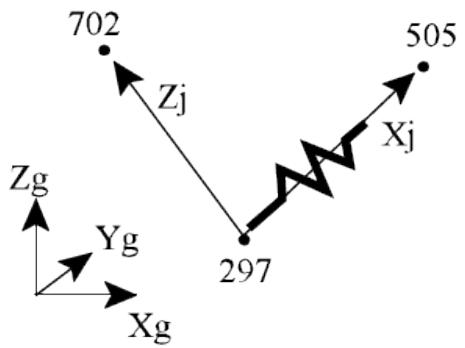

For example, joint 297 is defined as pinned with a spring constant of 100.0 along a line between joints 297 and 505 (support local X). The joint support coordinate system XZ plane is defined using joint 702.

Note: Degrees of freedom must be sprung as a set when the support coordinate system is redefined by reference joints. Therefore, since the local Y and Z degrees of freedom are to be fixed, they were assigned a very high spring constant.


|  | 1 | 2 | 3 | 4 | 5 | 6 | 7 | 8 |
| --- | --- | --- | --- | --- | --- | --- | --- | --- |
| 1 | JOINT 297 | 25.50 |  |  |  | PINNED |  |  |
| 2 | JOINT 298 | 100.0 | 9.0E10 | 9.0E10 |  | ELASTI | 505 | 702 |


2.8.2.4 Retained for Dynamics

For dynamic analysis, unrestrained degrees of freedom are considered as constrained degrees of freedom. Specify ‘2’ in the appropriate column to designate a free DOF as a retained DOF for dynamics.

For example, joint 297 is free for static analysis but translation X and Y degrees of freedom are considered retained degrees of freedom for mode shape extraction.


|  | 1 | 2 | 3 | 4 | 5 | 6 | 7 | 8 |
| --- | --- | --- | --- | --- | --- | --- | --- | --- |
| 1 | 1234567890123456789012345678901234567890123456789012345678901234567890123456789012345678901234567890123456789 | 25.50 |  |  |  |  |  |  |


2.8.2.5 Retained Degrees of Freedom

The displacement characteristics of a joint may be applied to other joints using the ‘RETAIN’ line. This line specifies retained degrees of freedom for which all coupled joints will have identical displacements. This is useful in modeling rigid structural elements which attach to a body and supply uniform displacement for several joints in a structure. As a rule of thumb, coupled joints should not be coupled for all degrees of freedom; typically, distinct points may be forced to displace similarly but may not rotate similarly. The following example specifies that joints 22, 23, 24 and 25 have the same X, Y and Z displacement (‘1’ in columns 13, 15 and 17, respectively) as retained joint 20.


|  | 1 | 2 | 3 | 4 | 5 | 6 | 7 | 8 |
| --- | --- | --- | --- | --- | --- | --- | --- | --- |
| 1 | 123456789012345678901234567890123456789012345678901234567890 | 123456789012345678901234567890123456789012345678901234567890 | 123456789012345678901234567890123456789012345678901234567890 | 123456789012345678901234567890123456789012345678901234567890 | 123456789012345678901234567890123456789012345678901234567890 | 123456789012345678901234567890123456789012345678901234567890 | 123456789012345678901234567890123456789012345678901234567890 | 123456789012345678901234567890123456789012345678901234567890 |
| 1 | RETAIN | 20 1 1 1 | 22 | 23 | 24 | 25 |  |  |


Note: A degree of freedom for a particular joint may not be coupled to more than one retained joint. Similarly, a retained joint may not be coupled to another retained joint.

## 2.9 LOADING

The SACS system supports loading applied at joints and to members, plates, and shell elements. Loading information is generally specified after all geometry information in the model file and may be specified by the user or generated by one of the SACS program modules. A line with ‘LOAD’ specified in columns 1-4 is used to signal the beginning of the loading section of the model.

2.9.1 Load Conditions

Related loading is usually grouped into a Load Condition or Load Case with a unique name designation. Load cases are named using up to 4 characters (numeric or alphanumeric).

The ‘Load Condition Header’ line, labeled ‘LOADCN’, signals the beginning of the load condition specified in columns 8-10. All loading information pertaining to the designated load condition follows on the LOAD lines immediately after*.

Note: Plate temperature load and joint specified deflections are exceptions. See discussion later in this section.

2.9.1.1 Member Distributed Loads and Moments

Member distributed loads are specified using the ‘LOAD’ line titled ‘Member Distributed Loads’ by designating the appropriate member joint names in columns 8-15 and ‘UNIF’ in columns 66-69 for load and ‘DMOM’ in columns 66-69 for moment. Loading may be specified in the direction of the global or member local X, Y or Z coordinate axes. In general, the following data should be specified for distributed loads or moments:

1. The distance from the start of the member to the position that the load starts,   
2. The magnitude per unit length of the load at the start position,   
3. The distance from the start position to the position that the load ends, and   
4. The magnitude per unit length of the load at the end position.

If the start of the load coincides with the start of the member, then the start position of the load need not be specified. Furthermore, if the end of the load coincides with the end of the member, then the distance from the load start to the load end need not be specified.

The following designates a distributed load for member 101-102 applied in the global Z direction. The load begins 1.0 from the beginning of the member with a magnitude of -2.5 k/ft and is applied along the member for 5.0 ft. The final value is -7.5 k/ft. Member 102- 103 has a distributed moment about the local X axis. The moment at the beginning of the member is 0 and increases linearly to 10.0 at the member end.


|  | 1 | 1 | 2 | 2 | 3 | 3 | 4 | 4 | 5 | 5 | 6 | 7 | 8 |
| --- | --- | --- | --- | --- | --- | --- | --- | --- | --- | --- | --- | --- | --- |
|  | 12345678901234567890123456789012345678901234567890123456789012345678901234567890 | 12345678901234567890123456789012345678901234567890123456789012345678901234567890 | 12345678901234567890123456789012345678901234567890123456789012345678901234567890 | 12345678901234567890123456789012345678901234567890123456789012345678901234567890 | 12345678901234567890123456789012345678901234567890123456789012345678901234567890 | 12345678901234567890123456789012345678901234567890123456789012345678901234567890 | 12345678901234567890123456789012345678901234567890123456789012345678901234567890 | 12345678901234567890123456789012345678901234567890123456789012345678901234567890 | 12345678901234567890123456789012345678901234567890123456789012345678901234567890 | 12345678901234567890123456789012345678901234567890123456789012345678901234567890 | 12345678901234567890123456789012345678901234567890123456789012345678901234567890 | 12345678901234567890123456789012345678901234567890123456789012345678901234567890 | 12345678901234567890123456789012345678901234567890123456789012345678901234567890 |
| 1 | LOAD Z | 101 | 102 | 1.0 | -2.5 | 5.0 | -7.5 |  |  |  | GLOB UNIF | GLOB UNIF | GLOB UNIF |
| 2 | LOAD X | 102 | 103 | 0.0 | 0.0 |  | 10.0 |  |  |  | MEMB DMOM | MEMB DMOM | MEMB DMOM |


Note: The beginning position of the loading or moment is measured from the member end and not from the begin joint. The effects of offsets should be taken into consideration when specifying this position.

2.9.1.2 Member Concentrated Loads and Moments

Member concentrated loads or moments are specified on the ‘LOAD’ line titled ‘Member Concentrated Loads’ by designating the member joint names in columns 8-15 and ‘CONC’ or ‘MOMT’ in columns 66- 69. Concentrated loads or moments may be specified with respect to the global or member local coordinate axes. The distance from the begin end of the member to the load must be specified and should take into consideration any member offsets along the member local X-axis at the begin end.

The following defines a concentrated load in the global Z direction on member 101-102. The load magnitude is -57.0 and is applied a distance of 4.5 from the beginning of the member. Also, a moment of 345. is applied about the local Z axis of member 101-102 at the same location.


|  | 1 | 2 | 3 | 4 | 5 | 6 | 7 | 8 |
| --- | --- | --- | --- | --- | --- | --- | --- | --- |
|  | 123456789012345678901234567890123456789012345678901234567890 | 123456789012345678901234567890123456789012345678901234567890 | 123456789012345678901234567890123456789012345678901234567890 | 123456789012345678901234567890123456789012345678901234567890 | 123456789012345678901234567890123456789012345678901234567890 | 123456789012345678901234567890123456789012345678901234567890 | 123456789012345678901234567890123456789012345678901234567890 | 123456789012345678901234567890123456789012345678901234567890 |
| 1 | LOAD Z 101 102 | 4.5 | -57.0 |  |  | GLOB | CONC |  |
| 2 | LOAD X 101 102 |  |  | 45.0 | 345.0 | MEMB | MOMT |  |


2.9.1.3 Member Temperature Loads

Member temperature loads are stipulated by designating the member connecting joints, the coefficient of thermal expansion and ‘TEMP’ in the appropriate columns on the ‘LOAD’ line titled ‘Member Temperature Load’. Constant temperature changes or linear temperature gradients along the member local X, Y or Z axis may be specified with respect to the ambient temperature.

For temperature changes along the local Y or Z axis, the change at two surfaces at a specified distance apart are input. The distance between the two surfaces are measured along the member local axis specified about the neutral axis. For changes along the member axis, the temperature change at the beginning and end of the member are specified.

Note: When specifying the temperature changes along the member, ‘1.0’ should be input as the distance between the temperature surfaces.

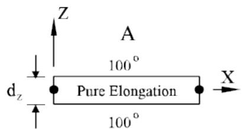

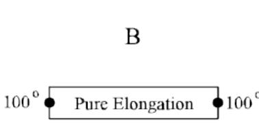

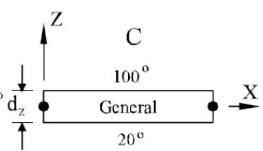

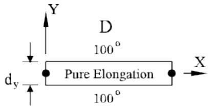

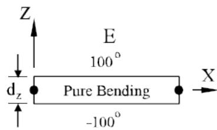

The input lines for cases A, B, C, D and E illustrated in the figure above for member 1-2 where dz is 20, dy is 8 and the coefficient of expansion is 0.65xE-05 follow respectively:


|  | 1 | 1 | 2 | 2 | 3 | 3 | 4 | 4 | 5 | 5 | 6 | 6 | 7 | 7 | 8 | 8 |
| --- | --- | --- | --- | --- | --- | --- | --- | --- | --- | --- | --- | --- | --- | --- | --- | --- |
|  | 1234567890123456789012345678901234567890123456789012345678901234567890 | 1234567890123456789012345678901234567890123456789012345678901234567890 | 1234567890123456789012345678901234567890123456789012345678901234567890 | 1234567890123456789012345678901234567890123456789012345678901234567890 | 1234567890123456789012345678901234567890123456789012345678901234567890 | 1234567890123456789012345678901234567890123456789012345678901234567890 | 1234567890123456789012345678901234567890123456789012345678901234567890 | 1234567890123456789012345678901234567890123456789012345678901234567890 | 1234567890123456789012345678901234567890123456789012345678901234567890 | 1234567890123456789012345678901234567890123456789012345678901234567890 | 1234567890123456789012345678901234567890123456789012345678901234567890 | 1234567890123456789012345678901234567890123456789012345678901234567890 | 1234567890123456789012345678901234567890123456789012345678901234567890 | 1234567890123456789012345678901234567890123456789012345678901234567890 | 1234567890123456789012345678901234567890123456789012345678901234567890 | 1234567890123456789012345678901234567890123456789012345678901234567890 |
| 1 | LOAD Z | 1 | 2 | 0.65E-5 | 100.0 | 20.0 | 100.0 |  |  |  |  |  |  |  |  |  |
| 2 | LOAD X | 1 | 2 | 0.65E-5 | 100.0 | 1.0 | 100.0 |  |  |  |  |  |  |  |  |  |
| 3 | LOAD Z | 1 | 2 | 0.65E-5 | 100.0 | 20.0 | 20.0 |  |  |  |  |  |  |  |  |  |


| 4 | LOAD Y | 1 | 2 | 0.65E-5 | 100.0 | 8.0 | 100.0 | TEMP |
| --- | --- | --- | --- | --- | --- | --- | --- | --- |
| 5 | LOAD Z | 1 | 2 | 0.65E-5 | 100.0 | 20.0 | -100.0 | TEMP |


2.9.1.4 Joint Loads

Loads on joints are designated using the LOAD line titled ‘Joint Loads’. The joint name, forces acting in the global X, Y or Z directions and/or moments about the global X, Y or Z axis are stipulated. ‘GLOB’ and ‘JOIN’ are specified in columns 61-64 and 66-69 respectively.

The following defines a force in the global Y direction of 50.0 and a moment about the Z axis of 345.0 in joint 123.


|  | 1 | 2 | 3 | 4 | 5 | 6 | 7 | 8 |
| --- | --- | --- | --- | --- | --- | --- | --- | --- |
| 1 | 1234567890123456789012345678901234567890123456789012345678901234567890123456789012345678901234567890123456789 | 12345678901234567890123456789012345678901234567890123456789012345678901234567890123456789012345678 | 12345678901234567890123456789012345678901234567890123456789012345678901234567890123456789012345678 |  |  |  |  |  |


2.9.1.5 Joint Specified Displacements

Forced displacements for joint degrees of freedom designated as fixed to ground, may be specified using the ‘JOINT’ line named ‘Joint Specified Deflection’. The ‘Joint Specified Deflection’ line should follow immediately after the defining ‘Joint Description’ line in the model file. The joint name, the specified translations and/or rotations with respect to the global coordinate system and ‘PERSET’ must be specified. The load condition to which the deflections apply or ‘ALL’ for all load conditions is stipulated in columns 69-72.

The following designates a displacement of 3.5 in the global Z direction at joint 123 in load case ‘MISC’.


|  | 1 | 2 | 3 | 4 | 5 | 6 | 7 | 8 |
| --- | --- | --- | --- | --- | --- | --- | --- | --- |
| 1 | 1234567890123456789012345678901234567890123456789012345678901234567890123456789012345678901234567890123456789 | 25.50 |  |  |  |  |  |  |
| 2 | JOINT 123 | 25.50 | 3.5 |  |  | PERSET | MISC |  |


Note: The degree of freedom being displaced using the PERSET line must be fixed to ground.

2.9.1.6 Plate Pressure Loads

Plate pressure loads can be applied directly to the plate using the LOAD PRES lines. Pressure loading can be applied to individual plates or to plate groups as uniform pressure or a linearly varying pressure.

2.9.1.6.1 Uniform Pressure

For uniform pressure, the pressure is designated in columns 17-23 and the keyword ‘UNIF’ is specified in columns 66-69. Specify either the plate name or plate group name in columns 8-11 or 13-15, respectively.

The following applies a uniform pressure load of 100 to plate A001 and all plates in group PLT.


|  | 1 | 2 | 3 | 4 | 5 | 6 | 7 | 8 |
| --- | --- | --- | --- | --- | --- | --- | --- | --- |
|  | 12345678901 | 12345678 | 8901 | 2345678 | 8901 | 2345678 | 8901 | 2345678 |
| 1 | LOAD + A001 |  | 100. |  |  |  | PRES UNIF |  |
| 2 | LOAD + | PLT | 100. |  |  |  | PRES UNIF |  |


2.9.1.6.2 Varying Pressure

For linearly varying pressure, the pressure at the joints is specified in columns 17-44 and the keyword ‘JTJT’ is specified in columns 66-69. Specify either the plate name or plate group name in columns 8-11 or 13-15, respectively.

The following applies a varying pressure on plate U002.

```c
1 2 3 4 5 6 7 8 1 23456789012345678901234567890123456789012345678901234567890 1LOAD + U002 100. 75.0 50.0 25.0 PRESJTJT 
```

2.9.1.6.3 Submerged Pressure

Pressure loads due to head can be applied directly to plate elements using the LOAD PRES line with the ‘SUBM’ keyword specified in columns 66-69.

Enter either the plate name or plate group in columns 8-11 or 13-15, respectively. The surface elevation and water density are entered in columns 17-23 and 24-30, respectively.

2.9.1.7 Plate Thermal Loads

Plate thermal or temperature loads are specified on the LOAD PTEM lines in the loading section of the model. Temperature loading may be specified for individual plates by entering the plate name in columns 8-11 or for plate groups by entering the group name in columns 13-15. The coefficient of thermal expansion and plate temperature changes with respect to the ambient temperature are required.

2.9.1.7.1 Uniform Temperature

Uniform temperature change is designated by the ‘UNIF’ keyword in columns 66-69 and a uniform temperature specified in columns 17-23.

The following shows plate D100 and all plates in group AAA with a uniform temperature of 135 in load case T135.

```txt
1 2 3 4 5 6 7 8  
123456789012345678901234567890123456789012345678901234567890  
1LOADCNT135
2 LOAD + D100 135. PRES UNIF  
3LOAD AAA 135. PTEM UNIF 
```

2.9.1.7.2 Varying Temperature

A temperature change at each joint is designated by the ‘JTJT’ keyword in columns 66-69. The temperature at each joint is input in columns 17-44.

2.9.1.7.3 Surface Temperature

Surface temperature loading is specified using the ‘TPBM’ keyword in columns 66-69. Enter the upper surface and lower surface temperatures in columns 17-23 and 24-30, respectively.

The following shows plate D101 and all plates in group ABC with an upper surface temperature of 100 and a lower surface temperature of 75 in load case load case T135.

```txt
1 2 3 4 5 6 7 8 1 123456789012345678901234567890123456789012345678901234567890 1LOADCNT135 2 LOAD D101 100. 75. PTEM TPBM 3 LOAD ABC 100. 75. PTEM TPBM 
```

2.9.1.8 Shell Pressure Loads

General shell pressure loads applied at the joints are stipulated on the ‘LOAD SPG’ line titled ‘Shell Pressure Load’ located within the appropriate load condition data. The pressure is applied to either one shell, a range of shells or all shells with in the model, by specifying one shell name, two shell names or no shell name. The pressure at each of the shell joints is designated in columns 18-80.

Constant or linearly varying pressure within a shell element may be specified on the ‘LOAD SPC’ line. By specifying one shell name, two shell names, or not specifying a shell name, the ‘Shell Variable Pressure’ line can apply to one shell, a range of shells or all shells within the model. For constant pressure, the pressure is specified in columns 18-24. For varying pressure, the pressure gradients in the direction of each of the global axes are specified in columns 25-45.

2.9.1.9 Shell Temperature Loads

Shell temperature loads are specified within the load condition data using the ‘LOAD’ line titled ‘Shell Temperature Load’. Constant temperature, temperature varying at midsurface, the top surface or the bottom surface may be specified by ‘STC’, ‘STM’, ‘STT’ or ‘STB’ respectively. The shell name, or names for a range of shells, to which the load is to be applied along with the temperature change at each joint are specified. If no shell name is specified, the loading is applied to all shells in the model. For constant temperature, type ‘STC’, the temperature change at the first joint only is required.

2.9.2 Load Combinations

Load combinations consisting of basic load conditions or previously defined load combinations are defined using the LCOMB input line. Load combination lines follow the basic load conditions in the model and must be initiated with a LCOMB header line.

Note: Basic load cases may not be defined after the LCOMB header line.

The load combination name must be a unique name not used by a basic load case or by another combination. The load cases or combinations making up the load combination along with the appropriate load factors to be applied are specified. The load combination definition may be continued by repeating the LCOMB line with the combination name specified in columns 7-10, so that up to fortyeight load components may be specified.

The following defines a load combination named ‘ST03’ consisting of 100% of load case ‘MISC’, 110% of ‘DEAD’ and 85% of ‘7’.

```txt
1 2 3 4 5 6 7 8 1 23456789012345678901234567890123456789012345678901234567890 LCOMB ST03 MISC 1.00DEAD 1.10 7 0.85 
```

Note: For a standard static analysis, load combinations are not solved in the solution phase. Results are obtained by superposition of the basic results during post processing. Because PSI analyses have nonlinear solutions, results for only load combinations and basic load cases specified on the LCSEL line are obtained.

## 2.10SETS

A Set is a way of grouping elements that can be readily identified within the whole structure with a unique Set ID. The elements in structure that can be grouped by ‘Sets’ includes joints, members, member groups, plates, plate groups, shells, solids, and load conditions.

A line with ‘GEOMSET’ specified in columns 1-5 is used to signal the beginning of a Set in the model. A Set is identified by its Set ID which is specified in the columns 9-80. The following defines a ‘Set’ with Set ID ’NEWSET’,

```txt
1 2 3 4 5 6 7 8 1234567890123456789012345678901234567890123456789012345678901234567890  
1 GEOMSET NEWSET 
```

Set definition ends with keyword ‘ENDSET’ followed by the Set ID. The following ends a Set definition with Set ID ‘NEWSET’,

```txt
1 2 3 4 5 6 7 8 123456789012345678901234567890123456789012345678901234567890 1 ENDSET NEWSET 
```

The elements that the Set contains are stored in a list. There can be a list for each element type in a Set. (element types allowed in set are joints, members, member groups, plates, plate groups, shells, solids, and load conditions). Each of the list can either be an included/excluded list and can be identified by the number following the list name in the model file (1 for Included and 0 for Excluded). The following are the lists allowed in a Set definition,

2.10.1 Joint List

A ‘Joint List’ is a list of joints included/excluded in the defined Set. ‘Joint List’ in a Set is defined using keyword ‘JOISET’ followed by the list of joints. The following defines a ‘Joint List’ line with excluded joints 1001,1002 and 1003,

```txt
1 2 3 4 5 6 7 8 1 23456789012345678901234567890123456789012345678901234567890 1 JOISET 0 1001 1002 1003 
```

2.10.2 Member List

A ‘Member List’ is a list of members included/excluded in the defined Set. ‘Member List’ in a Set is defined using keyword ‘MEMSET’ followed by the list of members. The following defines a ‘Member List’ line with excluded members 1001-2001 and 1002-2002,

```txt
1 2 3 4 5 6 7 8 123456789012345678901234567890123456789012345678901234567890 1 MEMSET 0 1001-2001 1002-2002 
```

2.10.3 Member Group List

A ‘Member Group List’ is a list of member groups included/excluded in the defined Set. ‘Member Group List’ in a Set is defined using the keyword ‘MEMGRP’ followed by the list of member groups. The following defines a ‘Member Group List’ with included member groups LG2 and LG1,

```txt
1 2 3 4 5 6 7 8 123456789012345678901234567890123456789012345678901234567890 1 MEMGRP 1 LG2 LG1 
```

2.10.4 Plate List

A ‘Plate List’ is a list of plates included/excluded in the defined Set. ‘Plate List’ in a Set is defined using the keyword ‘PLASET’ followed by the list of plates. The following defines a ‘Plate List’ with included plate AAAC,

```txt
1 2 3 4 5 6 7 8 123456789012345678901234567890123456789012345678901234567890 1 PLASET 1 AAAC 
```

2.10.5 Plate Group List

A ‘Plate Group List’ is a list of plate groups included/excluded in the defined Set. ‘Plate Group List’ in a Set is defined using the keyword ‘PLAGRP’ followed by the list of plate groups. The following defines a ‘Plate Group List’ with included plate group P01,

```txt
1 2 3 4 5 6 7 8 123456789012345678901234567890123456789012345678901234567890 1PLAGRPP01 
```

2.10.6 Shell List

A ‘Shell List’ is a list of shells included/excluded in the defined Set. ‘Shell List’ in a Set is defined using the keyword ‘SHESET’ followed by the list of shells. The following defines a ‘Shell List’ with included shell A001,

```txt
1 2 3 4 5 6 7 8 1 23456789012345678901234567890123456789012345678901234567890 1 A001 
```

2.10.7 Solid List

A ‘Solid List’ is a list of solids included/excluded in the defined Set. ‘Solid List’ in a Set is defined using the keyword ‘SOLSET’ followed by the list of solids. The following defines a ‘Solid List’ with included solid A001,

```txt
1 2 3 4 5 6 7 8 123456789012345678901234567890123456789012345678901234567890  
1 SOLSET 1 A001 
```

2.10.8 Load Condition List

A ‘Load Condition List’ is a list of load conditions included/excluded in the defined Set. ‘Load Condition List’ in a Set is defined using the keyword ‘LDCOND’ followed by the list of load conditions. The following defines a ‘Load Condition List’ with included load conditions MISC and LIVE,

```txt
1 2 3 4 5 6 7 8 123456789012345678901234567890123456789012345678901234567890 1 LDCOND 1 MISC LIVE 
```

3 SACS IV TROUBLE SHOOTING

## 3.1 MODEL SINGULARITY

Model singularity is the common term used to describe problems within a stiffness matrix that may limit the accuracy of the solution or prevent it entirely. In matrix theory, a structural model matrix must be ‘Positive Definite’ for it to be inverted. Some common reasons for a structural model matrix becoming ‘Non-Positive Definite’ are as follows:

1. Portion of structure or entire structure translating as a rigid body in space.   
2. Portion of structure or entire structure rotating as a rigid body in space.   
3. A joint connected to the structure is translating or rotating in space because a particular end fixity for all members connecting to the joint is released, therefore the joint can move or spin freely.   
4. Member or plate structural properties are zero for all elements connecting to a joint so that the joint is effectively unrestrained.

When using a computer to perform a solution, there exists a finite number of digits that can be used to define any one number. During numerical procedures within the program, accuracy may be lost due to the relative size of the numbers used in the mathematical operations. SACS IV determines the accuracy lost during solution and reports it as the ‘Maximum Number of Significant Digits lost’ in the output listing file. In general, solutions with six or fewer significant digits lost are sufficiently accurate while solutions with twelve or more significant digits lost are not.

It is possible for the solution to lose sufficient accuracy such that the solution becomes trivial or the structure becomes mathematically unstable (matrix is Non-Positive Definite). Common reasons for a structural model to lose significant accuracy or become mathematically unstable follow:

1. Very stiff element attached to a very soft element.   
2. A stiff structure attached to ground through a relatively soft spring system.   
3. A structure with little stiffness attached to ground through a relatively stiff spring system.

## 3.2 DEBUGGING THE MODEL

If SACS IV detects a Non-Positive Definite diagonal term in the stiffness matrix, it will indicate the row of the matrix where it occurred. If the value is between zero and -0.0001 it will be reset to 1.0, the row and column where it occurred will be nulled and the solution will continue. If the diagonal value is less than - 0.0001 the program terminates execution and reports the critical joint degree of freedom.

For instances where an unrestrained portion of the structure acts as a mechanism for singularity to occur, the last joint of the mechanism, in optimized order, is reported. If the reported joint is indeed restrained, the Interpreted Input Echo Report can be used to isolate the critical portion of the structure. The interpreted Joint Data List portion of the report contains the joint degree of freedom and matrix row location list in the following format:

1. The degrees of freedom for each joint in the stiffness matrix are reported as rotation X, Y and Z followed by translation X, Y and Z.   
2. For each joint, the beginning row number pertaining to the rotation X degree of freedom is listed in the report. The row numbers pertaining to rotation Y, and Z and translation X, Y and Z are obtained by adding 1, 2, 3, 4, and 5 respectively to the row reported for the joint rotation X degree of freedom.

The critical row location is reported in the solution listing file.

# 4 COMMENTARY

## 4.1 ANGLE CROSS-SECTIONS

The orientation of an angle section is determined from the signs of the A and B dimensions input on the ‘SECT’ input line.

Note: Positive B dimension is in the negative local Y axis direction.

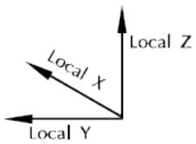

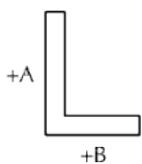

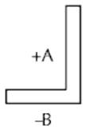

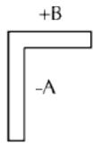

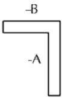

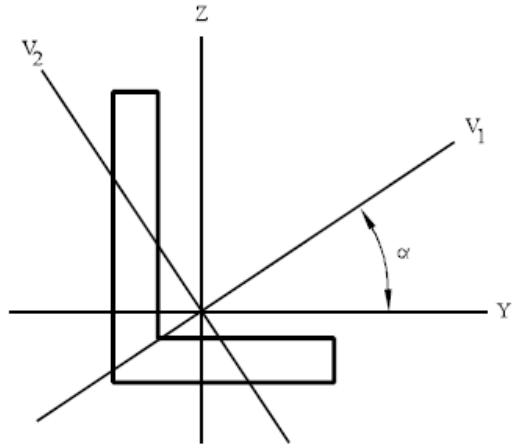

SACS IV uses properties about the member principal axes for stiffness calculations. Normally, the cross section input local axes are axes of symmetry and are therefore principal axes. For angles, however, the input axes are not principal axes. Therefore, the inertia properties calculated about the input axes must be transformed to the principal axes by the program using the following:

$$\tan 2 \alpha = - \frac{2 I_{y z}}{I_{y} - I_{z}}$$

$$I_{V_{1}} = \frac{I_{y} + I_{z}}{2} + \sqrt{\left(\frac{I_{y} - I_{z}}{2}\right)^{2} + I_{y z}^{2}} \quad I_{V_{2}} = \frac{I_{y} + I_{z}}{2} - \sqrt{\left(\frac{I_{y} - I_{z}}{2}\right)^{2} + I_{y z}^{2}}$$

The shear areas about the principal axes are used in member stiffness calculations and are taken as:

$$A_{s i} = \frac{I_{V_{i}}^{2}}{\int_{A} \left(\frac{Q_{V_{i}}}{t}\right)^{2} d A}$$

where the $\mathsf{ I }_{ \mathsf{ V } \mathrm{ i } }$ and $\mathtt{ Q }_{ \mathtt{ V i } }$ are with respect to the m principal axis.

Bending stress and Euler buckling stress are calculated with respect to the principal axes. The effective buckling length factors, $\mathsf{ K }_{ \mathsf{ y } }$ and $\mathsf{ K }_{ \mathsf{ Z } } ,$ are input with respect to the local coordinates. The program transforms the input K-factors into the principal axes system to obtain the factors to be used in Euler buckling calculations, from:

$$K_{1} = \left| \frac{K_{z} + K_{y}}{2} \right| + \left| \frac{K_{z} - K_{y}}{2} \right| \cos 2 \alpha \quad K_{2} = \left| \frac{K_{z} + K_{y}}{2} \right| - \left| \frac{K_{z} - K_{y}}{2} \right| \cos 2 \alpha$$

$\mathsf{ K }_{ 1 , 2 }$ = Principal axes effective length factors

${ \sf K }_{ \sf y , z }$ = Input effective buckling length factors

α = Angle between input axes and principal axes

The shear stress at any point is calculated with respect to the local coordinate system using the following equation:

$$\tau = \frac{\left(V_{z} I_{z} - V_{y} I_{y z}\right) Q_{y} + \left(V_{y} I_{y} - V_{z} I_{y z}\right) Q_{z}}{\left(I_{y} I_{z} - I_{y z}^{2}\right) t}$$

$\mathsf{ I }_{ \mathsf{ y } } , \mathsf{ I }_{ \mathsf{ z } } , \mathsf{ I }_{ \mathsf{ y } \mathsf{ z } }$ = Inertia properties with respect to Y and Z axes

$\mathsf{ V }_{ \mathsf{ Y } } , \mathsf{ V }_{ \mathsf{ Z } }$ = Shear in Y and Z directions

t = Thickness

$\mathsf{ O }_{ \mathsf{ y } } , \mathsf{ O }_{ \mathsf{ z } }$ = First moments about Y and Z axes of portion of the cross section area between the point and the free edge (Shaded area in figure below).

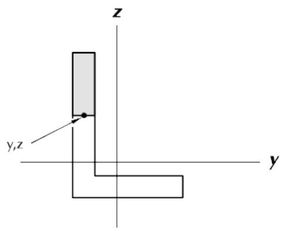

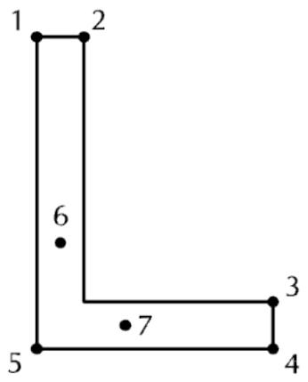

Tensile and compressive stresses are evaluated at points 1, 2, 3, 4 and 5 shown in the above right figure. Shear stresses are determined at the points of maximum shear stress in each leg. These points are located automatically for each load case.

Note: Although principal axes are used in stiffness, bending stress and Euler buckling calculations, the output results are reported with respect to the local coordinate axes.

## 4.2 FLAT PLATE CROSS-SECTIONS

The SACS IV program contains both triangular and quadrilateral orthotropic flat plate elements. These elements are derived from classical flat plate theory techniques by incorporating an empirical theory that includes a constant strain in-plane extensional and shear model, an edge beam representation for out-of-plane bending and shear model and an in-plane torsion model. This combination results in a true 6 degree of freedom linear strain element that has excellent convergence properties.

4.2.1 Isotropic Plates

The isotropic plate element is a full 6 degree of freedom bending element that assumes constant inplane and out-of-plane properties in all directions. This element is applicable for plates with constant thickness and material properties.

4.2.2 Membrane Plates

The membrane plate element is similar to the isotropic plate element except the out-of-plane bending and shear stiffness is set to zero. The out-of-plane deflections and rotations are not restrained. This element is applicable when the bending stiffness of the plate is not coupled to the supporting frame or the bending stiffness of the plate is included in the supporting structure elements.

4.2.3 Shear Plates

Shear plates have only in-plane shear stiffness with all other components of stiffness set equal to zero. This element can be used to represent shear walls or a general shear stiffness for coarse finite element mesh representation.

4.2.4 Stiffened Plates

Stiffened plates are represented by an isotropic plate with additional out-of-plane bending and shear stiffness included to represent parallel member elements attached to the plate in the plate local X and Y coordinate directions. The additional bending and shear stiffness does not have biaxial coupling (the X stiffeners are not coupled to the Y stiffeners).

The stiffened plate element contains the flat plate properties and the average member stiffener properties in both local coordinates including the placement of the plate relative to the member stiffeners. The out-of-plane bending stiffness calculation for the stiffeners assumes an effective plate width acting with the stiffeners for calculating an average additional moment of inertia due to the stiffeners. The effective plate width is limited to the smaller of the parallel stiffener spacing or 30 times the plate thickness.

Stiffened plate elements are effective for including the stiffness of plates and members in one element without modeling an excessive number of joints and/or beam elements. The properties reported for the

stiffened plate are the effective smeared properties. The maximum stresses are reported for the flat plate portion and the stiffeners separately.

4.2.5 Corrugated Plates

The corrugated plate is a special combination of both in-plane and out-of-plane stiffness. A corrugated plate has extensional stiffness in the direction of the corrugations and no extensional stiffness across the corrugations. In-plane shear is assumed to be fully effective. The out-of-plane bending and shear stiffness is zero when bending across the corrugations. In the direction of the corrugations, the out-ofplane bending and shear stiffness is due to the effective beam properties of the cross section. No biaxial bending coupling is allowed and the in-plane torsional properties are assumed to be fully effective.

Note: When using corrugated plates, the sum of the in-plane area due to the effective plate thickness and the stiffeners must equal the total in-plane area of the corrugated panel in the direction of the corrugations.

4.2.6 Plate Element Transition to Beam Element

Plate offsets can be used to model transition points between plate and beam elements. Any two adjacent plate nodes can be specified as the same joint name. Plate offsets specified at each plate node can then be used to separate the nodes and place them in different spatial positions. This will result in one edge if the plate being described by the motion of one joint which can be connected to a beam element. For example, when modeling a tubular member with a finite element mesh, there is usually a transition point where beam element theory becomes sufficiently accurate. At this point, all of the plate elements must be attached to a single central joint which is the beginning joint of the beam element. The plate elements are connected to the central Joint with offsets such that the ends of the plates are located at the surface of the tubular. The transition joint will define the complete displacement of the cross section at that point and will assure proper internal load transfer. Also, the cross section of the tubular at the transition will remain plane during deformation which is a constraint of normal beam theory.

## 4.3 SOLID ELEMENTS

The SACS IV program contains 4, 5, 6 and 8 node Solid Finite Elements that represent tetrahedron, pyramid, wedge, and brick shaped elements, respectively. The Solid Elements are based on a constant strain theory and the elements do not restrain rotation at the nodes. The pyramid, wedge and brick elements are built from the basic tetrahedron element.

4.3.1 Solid Transition to Shell, Plate or Beam Elements

Solid element offsets can be used to generate the transition between the solid elements and isoparametric shells, flat plates and/or beam elements. If a four node face of a solid element is connected to a one or two dimensional element then the four node face should be described by only two Joints. These two Joints should lie on at the center of the face of the Solid Element. The upper and lower edges of the face will be described by the same two Joints and will include offsets to locate them

correctly in space. The resulting Offset Solid Element will form a full 6 degree of freedom transition connection between the elements.

## 4.4 Curved MITC Shell Elements

Enhanced MITC shell elements replace the Isoparametric shell elements in the Solver.

4.4.1 Formulation

MITC shell elements offer a locking-free formulation for general curved shells. MITC shell elements (like Error! Reference source not found.) are based on a degenerate 3D continuum concept where the shell kinematical assumptions are superimposed [6]. For MITC shells, Riesner-Mindilin shell kinematical assumptions are used to derive reduced dimensional shell elements. Each shell element is mapped to a unit flat element using a curvilinear transformation. The curvilinear mapping defines the natural coordinates system （$e_{ r } , e_{ s } , e_{ t } )$ which in general is not orthonormal.

In addition, to define the constitutive equation of the shell element, an orthonormal coordinate system is then generated using the natural coordinate system as （$e_{ \bar{ r } } , e_{ \bar{ s } } , e_{ t } )$ where

$$\begin{array}{l} e_{\bar{r}} = \frac{e_{s} \times e_{t}}{| e_{s} \times e_{t} |} \\ e_{\bar{s}} = e_{t} \times e_{\bar{r}} \\ \end{array}$$

MITC shells’ geometry is defined by

$$\vec{x} (r, s, t) = \sum_{i = 1}^{N_{j}} \left(h_{i} (r, s) \vec{\hat{x}}_{i} + \frac{t}{2} h_{i} (r, s) a_{i} \vec{n}_{i}\right)$$

Where （$r , s , t )$ are the natural coordinates system, $\vec{ \hat{ x } }_{ i }$ are nodal coordinates in global coordinate system, $a_{ i }$ are the nodal thicknesses, and $\vec{ n }_{ i }$ are the nodal normal. We can now define the covariant base vectors as:

$$\vec{g}_{i} = \frac{\partial \vec{x}}{\partial r_{i}}$$

Where $r_{ 1 } = r , r_{ 2 } = s , r_{ 3 } = z .$ .

Similarly, the shells’ displacement fields are approximated using Reissner-Mindlin kinematical assumptions as:

$$\vec{u} (r, s, t) = \sum_{i = 1}^{N_{j}} \left(h_{i} (r, s) \vec{\vec{u}}_{i} + \frac{t}{2} h_{i} (r, s) a_{i} \big (\beta_{i} \vec{V}_{i}^{1} - \alpha_{i} \vec{V}_{i}^{2} \big)\right)$$

Where $\vec{ \hat{ u } }_{ i }$ are nodal displacements in the global coordinate system, （$\alpha_{ i } , \beta_{ i } )$ are the nodal rotations around the chosen nodal director vectors $\vec{ V }_{ i }^{ 1 } , \vec{ V }_{ i }^{ 2 }$ in mid-plane of the shell. The director vectors are a

coordinate system only defined at nodes and are constructed as $\vec{ V }_{ i }^{ 1 } = e_{ y } \times n_{ i } \mathsf{ i f } n_{ i } = e_{ t }$ is not parallel to the global y-axis; otherwise $\vec{ V }_{ i }^{ 1 } = e_{ z } \times n_{ i }$ and ${ \vec{ V } }_{ i }^{ 2 } = n_{ i } \times{ \vec{ V } }_{ i }^{ 1 }$ .

The covariant strain components then can be written as:

$$e_{i j} = \frac{1}{2} \left(\vec{g}_{i} \cdot \frac{\partial \vec{u}}{\partial r_{j}} + \vec{g}_{j} \cdot \frac{\partial \vec{u}}{\partial r_{i}}\right)$$

It is easy to see that, similar to all plate and shell theories, the rotation in the shell’s plane (drilling) is not accounted for. The procedure used to add drilling stiffness is described in section 4.4.4.

4.4.2 Constitutive Equation and Internal Force/Stress Output

The traction free conditions on the surface of the shell element are modeled by explicitly zeroing the normal stresses （$\mathsf{ i } . \mathsf{ e } . , \sigma_{ t t } \equiv 0 )$ . The stress-strain relationship in Voigt notation reads as:

$$\left\{ \begin{array}{l} \sigma_{\bar{r} \bar{r}} \\ \sigma_{\bar{s} \bar{s}} \\ \sigma_{t t} \\ \sigma_{\bar{r} \bar{s}} \\ \sigma_{\bar{s} t} \\ \sigma_{\bar{r} t} \end{array} \right\} = \frac{E}{1 - \nu^{2}} \left[ \begin{array}{l l l l l l} 1 & \nu & 0 & 0 & 0 & 0 \\ \nu & 1 & 0 & 0 & 0 & 0 \\ 0 & 0 & 0 & 0 & 0 & 0 \\ 0 & 0 & 0 & (1 - \nu) & 0 & 0 \\ 0 & 0 & 0 & 0 & k (1 - \nu) & 0 \\ 0 & 0 & 0 & 0 & 0 & k (1 - \nu) \end{array} \right] \left\{ \begin{array}{l} \bar{e}_{\bar{r} \bar{r}} \\ \bar{e}_{\bar{s} \bar{s}} \\ \bar{e}_{t t} \\ \bar{e}_{\bar{r} \bar{s}} \\ \bar{e}_{\bar{s} t} \\ \bar{e}_{\bar{r} t} \end{array} \right\}$$

Where $E , \nu$ are elastic modulus and Poisson’s ratio, respectively, and $k = 5 / 6$ is the transverse shear factor [1]. And

$$\bar{e}_{i j} = T_{i}^{k} T_{j}^{l} e_{k l}$$

are the strain tensor components in the orthonormal basis and where transformation tensor T can be written as:

$$T_{j}^{i} = \vec{g}^{i} \bar{e}_{j}$$

where $\bar{ e }_{ 1 } = e_{ \bar{ r } } , \bar{ e }_{ 2 } = e_{ \bar{ s } } , \bar{ e }_{ 3 } = e_{ 3 }$ and $\vec{ g }^{ i }$ are the contravariant bases which are defined by $\vec{ g }^{ i } \cdot \vec{ g }_{ j } = \delta_{ j }^{ i }$ where $\delta_{ j }^{ i }$ is the Kronecker’s delta.

The free energy of the shell is then written as

$$F_{s h e l l} = \frac{1}{2} \int_{\Omega} \sigma_{i j} \bar{e}_{i j} d V$$

Following the same procedure, the internal forces and stresses of MITC shell element are written in the （$e_{ \bar{ r } } , e_{ \bar{ s } } , e_{ t } )$ orthonormal coordinate system.

4.4.3 MITC Tying Procedure

It is well known that shells suffer from shear and membrane locking. Simply put, shear locking occurs because the bending displacement of the shell creates transverse shear deformation, which should not

be present in pure bending. The contribution of transverse shears to the stiffness matrix can become larger than the bending stiffness of the shell and can result in locking. Similarly, membrane locking occurs because of pure bending of the shell results in membrane deformation. The contribution of the membrane effects to stiffness can become larger than the bending stiffness of the shell and result in locking. MITC procedure circumvents these issues by projecting the membrane and transverse shear strains to a lower order approximation compared to that used for bending strain. MITC shells use different tying points at which the covariant transverse shear and membrane strains are calculated. Then during the integration procedure, these strains are approximated using their values at these tying points.

4.4.4 Drilling Stiffness

The drilling stiffness is added to shells stiffness following the method first described in [7]. The drilling stiffness is added to minimize the difference between the out-of-plane rotation of the shell and the skew-symmetric part of strain representing the twisting of the shell. The covariant components of skewsymmetric twist of the element can be written as:

$$\omega_{i j} = \frac{1}{2} \left(\vec{g}_{i} \cdot \frac{\partial \vec{u}}{\partial r_{j}} - \vec{g}_{j} \cdot \frac{\partial \vec{u}}{\partial r_{i}}\right)$$

The twist in orthonormal basis is then calculated as:

$$\omega_{\bar{r} \bar{s}} = T_{1}^{i} T_{2}^{j} \omega_{i j}$$

Finally, we can write the energetic cost of twisting as

$$F_{d r i l l} = \int_{\Omega} k_{d r i l l} \mu (\theta_{t} - \omega_{\bar{r} \bar{s}})^{2} d V$$

Where $k_{ d r i l l } = 10^{ - 3 } , \mu = E / ( 2 ( 1 + \nu ) )$ , and $\theta_{ t }$ is the drilling rotation (i.e., rotational degree freedom perpendicular to the surface of the shell).

4.4.5 Normals at Common Joints

MITC shell elements approximate the geometry of the surface using the isoparametric shape functions, which are quadratic in each natural direction (see 4.4.1). Therefore, a generally curved surface is described using discrete elements such that their local normal may not exactly coincide with the original surface. This can cause discontinuities of the normal in neighboring shell elements, resulting in reduced performance of the elements. Therefore, the normal of the shell elements within each shell group are averaged at each common joint to alleviate this issue.

4.4.6 Shell Element Transition to Beam Element

Isoparametric shell offsets are normally used to locate the neutral axis of the shell relative to the connecting structure. They can also be used to generate the transition between the isoparametric shells and beam elements.

Any three nodes that describe the side of a shell can be connected to the same joint. Using shell offsets, the coincident nodes can be separated and placed in different spatial positions, resulting in one side of the shell being described by the motion of one joint which can be connected directly to a beam element.

For example, when modeling a tubular member with shell elements, there is usually a transition point where beam element theory becomes sufficiently accurate. At this point, all of the shell elements must be attached to a single central joint which is the beginning joint of the beam element. The shell elements are connected to the central joint with offsets such that the ends of the shells are located at the surface of the tubular. The transition joint will define the complete displacement of the cross section at that point and will assure proper internal load transfer. Also, the cross section of the tubular at the transition will remain plane during deformation which is a constraint of normal beam theory.

## 4.5 Linear Solver Options

The Solver allows the user to change the linear solver type and to remove the rigid-body motion and solve a statically indeterminate structure. The Solver extracts the rigid-body modes using Singular Value Decomposition (SVD) and can obtain the solution either using the same or using two Krylov subspace iterative solvers: Conjugate Gradient Method (CG), Flexible General Minimum Residual (FGMRes) [1]. All these methods can also be used for a statically determined structure along with the sparse and dense inmemory Cholesky factorization provided by the SACS solver.

4.5.1 Rigid-Body Modes of a Statically Indeterminate Structure

The rigid-body modes (also known as zero-energy or zero-frequency modes) are displacements under which the structure does not deform, and therefore, these modes do not create any stresses [1, sec.

4.2.5]. For a three-dimensional elastic body with 6 degrees of freedom per point (node), the rigid body mode can be written as a combination of 3 translations and 3 rotations. In static analysis, after discretization, the finite element method reduces the system to a system of algebraic equations that in general read as

$$K u = f$$

where ?? is the vector of unknown degrees of freedom, ?? is the stiffness matrix, ?? is the right-hand-side forces vector. At this algebraic level, the rigid-body modes are manifested as the null-space of the global stiffness matrix ??. Simply put, rigid-body modes are a set of $N_{ r i g i d - b o d y }$ orthonormal bases such that

$$K n_{i} = 0 i = 1.. N_{r i g i d - b o d y}$$

$$n_{i} \cdot n_{j} = \delta_{i j}$$

where $\delta_{ i j }$ is the Kronecker’s delta. The null-space of global stiffness matrix ?? is the space that is spanned by its null space

$$N_{K} = s p a n \{n_{i} \mid K n_{i} = 0 \}$$

For a statically indeterminate structure, the resulting global stiffness matrix is rank deficient, and its nullspace is none empty. In contrast, a statically determined (and stable) structure results in a full rank global stiffness matrix and an empty null space.

4.5.2 Extraction of Rigid-Body Modes

To detect rigid body modes, the Solver performs a Singular Value Decomposition of the stiffness matrix:

$$K = U \Sigma V^{T}$$

Where ?? and ?? are unitary matrices （$i . e . , U^{ - 1 } = U^{ T } )$ and Σ is a diagonal singular values matrix. It is easy to show that each rigid-body mode (null-space basis vector) of ?? corresponds to a zero diagonal of Σ and is given by the corresponding row in ?? (or corresponding column in ??). In practice, the rigid bodymodes manifest as small entries in Σ and are extracted based on the given tolerance or the desired number. The user can inspect the system's singular values in the SACS listing file, where the rigid-body modes can be easily identified since their values are orders of magnitude smaller than any ordinary mode of the system. The user should note that the current SVD algorithm used is memory intensive and should be used with care for large structures.

4.5.3 Solution of a Statically Determined Structure Using Cholesky Decomposition

If the structure is statically determined (i.e., the global stiffness matrix is full-ranked), the solution of the system can be obtained using the Cholesky factorization

$$K = L L^{T}$$

Where the global stiffness matrix is decomposed into a lower-triangular matrix ??. The solution can then be easily calculated first using a forward substitution to solve

$$L y = f$$

And subsequently to solve for deformations using a backward substitution

$$L^{T} u = y$$

It is easy to show that if the global stiffness matrix is not full-ranked, a zero diagonal will be created in ?? and therefore, the forward and backward substitutions will break down. The Cholesky factorization, however, is extremely memory-efficient and computationally cheap and should be used as the default linear solver for statically determined structures. SACS provides two implementations of Cholesky decomposition. The default solver uses the sparse matrix and offloads the matrices into disk. On the other hand, the dense version performs the solution completely in memory.

4.5.4 Solution of a Statically Indeterminate Structure Using Singular Value Decomposition

To solve a statically indeterminate structure using the SVD decomposition one can create a pseudoinverse of the stiffness matrix as [2, sec. 2.6]

$$K^{i n v} = V \Sigma^{\mathrm{i n v}} U^{T}$$

Where

$$\Sigma_{i j}^{\mathrm{i n v}} = \left\{ \begin{array}{l l} \Sigma_{i j}^{-1} & \text{i f} \Sigma_{i j} \neq 0 \\ 0 & \text{o t h e r w i s e} \end{array} \right.$$

The solution then can be easily obtained as [2]

$$\boldsymbol{u} = K^{i n v} \boldsymbol{f} = V \Sigma^{i n v} U^{T} \boldsymbol{f}$$

If the right-hand-side force vector ?? is statically unbalanced, it will have components along the structure's rigid-body-modes. Much like the Krylov subspace solvers presented next, the above formulation will project the force on the span of the global stiffness matrix ?? and results in a statically balanced set of forces. While being computationally more expensive than the Cholesky factorization, the above solution algorithm is recommended for large statically indeterminate structures where the condition number of the global stiffness matrix deteriorates and limits the use of iterative Krylov subspace solvers.

4.5.5 Krylov Subspace Solvers

The Krylov subspace is a subspace that is created by spanning a matrix together with a vector as[3]

$$\mathcal{K}_{r} (A, v) = s p a n \{v, A v, A^{2} v, \dots , A^{r - 1} v \}$$

The Krylov subspace methods solve a linear set of equations $A x = b$ by finding the solution in space ${ \mathcal{ K } }_{ r } ( A , b - A x_{ 0 } )$ where $x_{ 0 }$ is the initial guess by imposing the Galerkin condition

$$b - A x \perp \mathcal{S}$$

where ?? is another subspace. The Galerkin condition simply states that the solution has the minimum residual with respect to the given space ??. Different Krylov subspace methods correspond to different choices of ??. The user should note that general the speed of convergence for the Krylov subspace solvers depends strongly on condition number of the global stiffness matrix.

4.5.5.1 Conjugate Gradient Method

The Conjugate gradient method corresponds to a Krylov subspace method where $\mathcal{ S } = \mathcal{ K }_{ r } ( A , r_{ 0 } )$ where $r_{ 0 } = b - A x_{ 0 }$ is the initial residual. This method is restricted to systems of equations where the matrix ?? is positive definite （$A = A^{ T }$ and eigenvalues of ?? are all positive). For a positive definite matrix ?? , solution of $A x = b$ is equivalent to minimization of convex $\begin{array} { r } { f ( x ) = \frac{ 1 } { 2 } x^{ T } A x - b x } \end{array}$ . Conjugate gradient method can be thought of as an extension to the steepest decent method where at each step instead of using the steepest decent direction (i.e., the residual direction $r_{ n } = b - A x_{ n } )$ we require the new search direction $p_{ n }$ to be conjugate to all previous direction （$\mathsf{ i . e . , } p_{ n }^{ T } A p_{ i } i = 1 \ldots n - 1 )$ . Since the Conjugate gradient method is particularly well suited for large finite element problems, since it only depends on sparse matrix, vector multiplication, and the global stiffness matrix resulting from the finite element discretization is (semi-) positive-definite.

4.5.5.2 Flexible General Minimum Residual Method

The Flexible General Minim Residual (FGMRes) method correspond to a Krylov subspace method where $\mathcal{ S } = A \mathcal{ K }_{ r } ( A , \frac{ r_{ 0 } } { \left| \left| r_{ 0 } \right| \right|_{ 2 } } )$ ||??0||2) . Unlike the conjugate gradient method, FGMRes does not require matrix ?? to be symmetric and converges if the symmetric part of ??, （$A + A^{ T } ) / 2$ is positive definite. In practice, this better convergence behavior comes at a more computational cost. Because of this added cost, FGMRes method should be used only as an alternative if the Conjugate gradient method does not converge.

4.5.6 Solution of a Statically Indeterminate Structure Using Krylov Subspace Solvers

To solve a statically indeterminate structure (i.e., to solve ???? = ?? where ?? is rank deficient and nullspace of ?? is not empty). In practice, each iteration of Krylov subspace solvers can be written as a linear operation on the solution of the previous iteration:

$$u_{n} = \mathcal{L} \left(u_{i}, i <   n\right)$$

It is easy to see that since the solution space is chosen from the Krylov subspace, it is not going to be normal to the null-space of the global stiffness matrix (i.e., it is not going to involve rigid-body modes). We, however, need to ensure that the right-hand-side forces are also normal to the null-space, i.e., they are statically balanced. To achieve this, we remove the projection of right-hand-side forces on the nullspace from it and replace ?? with ?? that is statically balanced

$$f = f - \sum_{i = 1}^{N_{r i g i d - b o d y}} (f. n_{i}) n_{i}$$

In practice, the rigid body modes appear because of the truncation error. The Solver creates a solution that is rigid-body-motion free $\scriptstyle{ { \mathcal{ u } }_{ n } }$ from the solution given by the Krylov subspace solver, at each iteration

$$u_{n} = u_{n} - \sum_{i = 1}^{N_{r i g i d - b o d y}} (u_{n}. n_{i}) n_{i}$$

4.5.7 A comment on Balancing the Forces

A rigid-body-motion-free deformation cannot be obtained from the linear set of balance equations unless the right-hand-side forces are also balanced (normal to the null-space). The algorithm presented above achieves this by finding the unbalanced forces nearest projection on the subspace of balanced forces. In general, this projection, however, does not correspond to a set of balanced forces that can be obtained taking into account the d’Alembert inertial forces on the system since the Krylov subspace lacks any knowledge of the system’s mass matrix. In practice, the users are encouraged to verify the balance or near balance of their forces along the different components of the rigid-body-motion. The Solver provides the magnitude of each of these projections in the SACS listing file.

4.5.8 General Guidelines on the Choice of Linear Solver Method

Different linear solvers have different strengths and shortcomings that make them suitable for different situations.

By default, SACS uses the sparse Cholesky method which is the most suitable method for all workflows involving Solver (Dynpac, Collapse, PSI, super element generation, etc.).   
• Dense In-Memory Cholesky method can replace the default sparse Cholesky for all workflows except for old Collapse analysis with Foundation. This method consumes more memory and is not suitable for large structures or systems with limited memory. This method is more performant compared to sparse Cholesky and is more suitable for near-indeterminant systems.   
SVD method can replace the default sparse Cholesky for all workflows. Additionally, it supports Rigid Body Modes Removal for static analysis. SVD method is only recommended for indeterminant and near-indeterminant systems as indicated by large number of significant digits lost during solution. This method inherently consumes more memory and is more computationally expensive. Therefore, it is not suitable for very large structures or systems with limited memory where it can result in extended simulation times.   
The iterative Krylov solvers (fGMRes and CG) can only be used for static analysis for both determinant and indeterminant structures. For indeterminant structures they support rigid body modes removal.

Note: SACS will attempt to use the sparse Cholesky in the event that any other method fails.

5 REFERENCES

[1] Bathe, Klaus-Jürgen. Finite element procedures. Klaus-Jurgen Bathe, 2006.   
[2] Press, William H., et al. Numerical recipes 3rd edition: The art of scientific computing. Cambridge university press, 2007.   
[3] Saad, Yousef. Iterative methods for sparse linear systems. Society for Industrial and Applied Mathematics, 2003.   
[4] Bucalem, M.L. and Bathe, K.J., 1993. Higher‐order MITC general shell elements. International Journal for Numerical Methods in Engineering, 36(21), pp.3729-3754.   
[5] Lee, P.S. and Bathe, K.J., 2004. Development of MITC isotropic triangular shell finite elements. Computers & Structures, 82(11-12), pp.945-962.   
[6] Wriggers, Peter. Nonlinear finite element methods. Springer Science & Business Media, 2008.   
[7] Kanok‐nukulchai, Worsak. "A simple and efficient finite element for general shell analysis." International Journal for Numerical Methods in Engineering 14.2 (1979): 179-200.

6 SAMPLE PROBLEMS

The sample problems illustrate various capabilities of the SACS IV program module. Two separate analyses are detailed.

1. The first sample problem is a jacket type structure consisting of tubular, wide flange, angle and cone cross section beam elements and flat plate elements. In addition to properties specified in the model file, section properties defined in the AISC section library were referenced. This sample contains member and plate offsets along with member end releases. Four basic load conditions, comprised of joint loads, member uniform loads, member concentrated loads and joint specified displacements, and two load combinations were specified.   
2. Sample Problem 2 illustrates the use of shell and solid elements. Three basic load cases consisting of joint loads, linearly varying shell pressure loads and varying shell temperature loads were specified in addition to two load combinations.

## 6.1 JACKET MODEL

Sample Problem 1 is the deck type structure shown. Cone, tubular, and wide flange cross section beam elements and flat plate elements are modeled. Flat plate, tubular, and cone section properties are defined in the model file while wide flange properties are obtained from the AISC section library file.

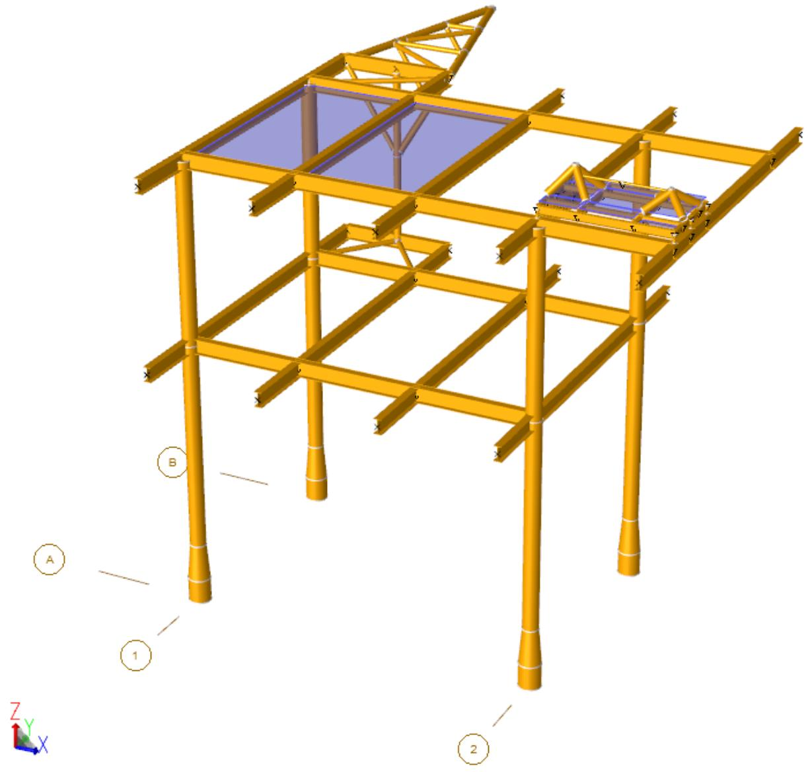

Offsets are specified for flare boom tubular members so that braces are modeled to the face of the chord. An equipment skid is modeled with dummy members to distribute the equipment load to the beam elements.

Six basic load conditions and two load combinations are specified. Load case ‘AREA’ consists of distributed area loads automatically generated by the Precede Load > Member Area feature representing general dead loading. Load case ‘DEAD’ consists of member and joint loads automatically

generated by the Precede Load> Self Weight feature to represent the dead load of the structure. Load Case ‘EQPT’ contains concentrated member loads automatically generated by the Precede Load > Skid Loads feature representing equipment loads. Load case ‘LIVE’ consist of member uniform loads automatically generated by the Load > Member Area feature representing live load. Load case, ‘MACH’ contains joint loads representing additional equipment loads and Load Case ‘MISC’ is used to specify additional miscellaneous dead loads.

Parts of the SACS model file is shown below followed by a description of selected portions.


|  | 1 | 2 | 3 | 4 | 5 | 6 | 7 | 8 |
| --- | --- | --- | --- | --- | --- | --- | --- | --- |
|  | 1234567890123456789012345678901234567890123456789012345678901234567890 | 1234567890123456789012345678901234567890123456789012345678901234567890 | 1234567890123456789012345678901234567890123456789012345678901234567890 | 1234567890123456789012345678901234567890123456789012345678901234567890 | 1234567890123456789012345678901234567890123456789012345678901234567890 | 1234567890123456789012345678901234567890123456789012345678901234567890 | 1234567890123456789012345678901234567890123456789012345678901234567890 | 1234567890123456789012345678901234567890123456789012345678901234567890 |
| 1 | SAMPLE 01 ENGLISH UNITS MODEL | SAMPLE 01 ENGLISH UNITS MODEL | SAMPLE 01 ENGLISH UNITS MODEL | SAMPLE 01 ENGLISH UNITS MODEL | SAMPLE 01 ENGLISH UNITS MODEL | SAMPLE 01 ENGLISH UNITS MODEL | SAMPLE 01 ENGLISH UNITS MODEL | SAMPLE 01 ENGLISH UNITS MODEL |
| 2 | OPTIONS EN SDUC 2 1 | OPTIONS EN SDUC 2 1 | OPTIONS EN SDUC 2 1 | OPTIONS EN SDUC 2 1 | PTPT | PT |  |  |
| 3 | LCSEL CMB1 CMB2 | LCSEL CMB1 CMB2 | LCSEL CMB1 CMB2 | LCSEL CMB1 CMB2 | LCSEL CMB1 CMB2 | LCSEL CMB1 CMB2 | LCSEL CMB1 CMB2 | LCSEL CMB1 CMB2 |
| 4 | SECT | SECT | SECT | SECT | SECT | SECT | SECT | SECT |
| 5 | SECT CONE CON | SECT CONE CON | SECT CONE CON | SECT CONE CON | 36.0000.75026.000 | 36.0000.75026.000 | 36.0000.75026.000 | 36.0000.75026.000 |
| 6 | GRUP | GRUP | GRUP | GRUP | GRUP | GRUP | GRUP | GRUP |
| 7 | GRUP DUM | 12.000 | 1.000 | 29.0011.6036.00 | 9 | 1.001.00 | 0.500N490.00 | 0.500N490.00 |
| 8 | GRUP LG6 | 36.000 | 0.750 | 29.0011.0036.00 | 1 | 1.001.00 | 0.500N490.003.25 | 0.500N490.003.25 |
| 9 | GRUP LG6 CONE |  |  | 29.0011.6036.00 | 1 | 1.001.00 | 0.500N490.004.95 | 0.500N490.004.95 |
| 10 | GRUP LG6 | 26.000 | 0.750 | 29.0011.6036.00 | 1 | 1.001.00 | 0.500N490.00 | 0.500N490.00 |
| 11 | GRUP LG7 | 26.000 | 0.750 | 29.0011.6036.00 | 1 | 1.001.00 | 0.500N490.00 | 0.500N490.00 |
| 12 | GRUP SHF | 4.000 | 1.000 | 29.0011.6036.00 | 1 | 1.001.00 | 0.500N490.00 | 0.500N490.00 |
| 13 | GRUP SK2 W8X24 |  |  | 29.0011.6036.00 | 1 | 1.001.00 | 0.500N1.00-2 | 0.500N1.00-2 |
| 14 | GRUP SKD W12X30 |  |  | 29.0011.6036.00 | 1 | 1.001.00 | 0.500N1.00-2 | 0.500N1.00-2 |
| 15 | GRUP STB | 6.000 | 1.000 | 29.0011.6036.00 | 9 | 1.001.00 | 0.500N1.00-2 | 0.500N1.00-2 |
| 16 | GRUP VB1 | 12.750 | 0.625 | 29.0011.6036.00 | 1 | 1.001.00 | 0.500N490.00 | 0.500N490.00 |
| 17 | GRUP VB2 | 8.825 | 0.500 | 29.0011.6036.00 | 1 | 1.001.00 | 0.500N490.00 | 0.500N490.00 |
| 18 | GRUP VBS | 12.750 | 0.625 | 29.0011.6036.00 | 1 | 1.001.00 | 0.500N490.00 | 0.500N490.00 |
| 19 | GRUP W01 W24X162 |  |  | 29.0111.2035.97 | 1 | 1.001.00 | 0.500 490.00 | 0.500 490.00 |
| 20 | GRUP W02 W24X131 |  |  | 29.0111.2035.97 | 1 | 1.001.00 | 0.500 490.00 | 0.500 490.00 |
| 21 | MEMBER | MEMBER | MEMBER | MEMBER | MEMBER | MEMBER | MEMBER | MEMBER |
| 22 | MEMBER1937 1000 DUM | 000111000000 | 000111000000 | 000111000000 | 000111000000 | 000111000000 | 000111000000 | 000111000000 |
| 23 | MEMBER OFFSETS |  |  |  | 12.000 |  |  |  |
| 24 | MEMBER1938 1000 DUM | 000111000000 | 000111000000 | 000111000000 | 000111000000 | 000111000000 | 000111000000 | 000111000000 |
| 25 | MEMBER OFFSETS |  |  |  | 12.000 |  |  |  |
| 26 | MEMBER1939 3000 DUM | 000111000000 | 000111000000 | 000111000000 | 000111000000 | 000111000000 | 000111000000 | 000111000000 |
| 27 | MEMBER OFFSETS |  |  |  | 12.000 |  |  |  |
| 28 | MEMBER1940 3000 DUM | 000111000000 | 000111000000 | 000111000000 | 000111000000 | 000111000000 | 000111000000 | 000111000000 |
| 29 | MEMBER OFFSETS |  |  |  | 12.000 |  |  |  |
| 30 | **********ADDITIONAL MEMBER LINES********** | **********ADDITIONAL MEMBER LINES********** | **********ADDITIONAL MEMBER LINES********** | **********ADDITIONAL MEMBER LINES********** | **********ADDITIONAL MEMBER LINES********** | **********ADDITIONAL MEMBER LINES********** | **********ADDITIONAL MEMBER LINES********** | **********ADDITIONAL MEMBER LINES********** |
| 31 | PGRP | PGRP | PGRP | PGRP | PGRP | PGRP | PGRP | PGRP |
| 32 | PGRP P01 0.3750I29.000 0.25036.000 | PGRP P01 0.3750I29.000 0.25036.000 | PGRP P01 0.3750I29.000 0.25036.000 | PGRP P01 0.3750I29.000 0.25036.000 | PGRP P01 0.3750I29.000 0.25036.000 | PGRP P01 0.3750I29.000 0.25036.000 | 490.0000 | 490.0000 |
| 33 | PGRP PLT 0.2500 29.000 0.25036.000 | PGRP PLT 0.2500 29.000 0.25036.000 | PGRP PLT 0.2500 29.000 0.25036.000 | PGRP PLT 0.2500 29.000 0.25036.000 | PGRP PLT 0.2500 29.000 0.25036.000 | PGRP PLT 0.2500 29.000 0.25036.000 | 490.0000 | 490.0000 |
| 34 | PLATE | PLATE | PLATE | PLATE | PLATE | PLATE | PLATE | PLATE |
| 35 | PLATE AAAC 801 834 805 837 P01 | PLATE AAAC 801 834 805 837 P01 | PLATE AAAC 801 834 805 837 P01 | PLATE AAAC 801 834 805 837 P01 | 0 |  |  |  |
| 36 | PLATE AAAD 834 835 837 838 P01 | PLATE AAAD 834 835 837 838 P01 | PLATE AAAD 834 835 837 838 P01 | PLATE AAAD 834 835 837 838 P01 | 0 |  |  |  |
| 37 | PLATE SK01 903 949 942 938 PLT | PLATE SK01 903 949 942 938 PLT | PLATE SK01 903 949 942 938 PLT | PLATE SK01 903 949 942 938 PLT | 1 |  |  |  |
| 38 | PLATE OFFSETS |  |  |  | 12.000 | 12.000 |  |  |
| 39 | PLATE OFFSETS |  |  |  | 12.000 | 12.000 |  |  |
| 40 | **********ADDITIONAL PLATE LINES********** | **********ADDITIONAL PLATE LINES********** | **********ADDITIONAL PLATE LINES********** | **********ADDITIONAL PLATE LINES********** | **********ADDITIONAL PLATE LINES********** | **********ADDITIONAL PLATE LINES********** | **********ADDITIONAL PLATE LINES********** | **********ADDITIONAL PLATE LINES********** |
| 41 | JOINT | JOINT | JOINT | JOINT | JOINT | JOINT | JOINT | JOINT |
| 42 | JOINT 601 | -24. | -16. | 13. |  | PINNED |  |  |
| 43 | JOINT 603 | 24. | -16. | 13. |  | PINNED |  |  |
| 44 | JOINT 605 | -24. | 16. | 13. |  | PINNED |  |  |
| 45 | JOINT 607 | 24. | 16. | 13. |  | PINNED |  |  |
| 46 | JOINT 701 | -24. | -16. | 50. |  | 222000 |  |  |
| 47 | JOINT 703 | 24. | -16. | 50. |  | 222000 |  |  |
| 48 | JOINT 705 | -24. | 16. | 50. |  | 222000 |  |  |
| 49 | JOINT 707 | 24. | 16. | 50. |  | 222000 |  |  |
| 50 | JOINT 709 | -24. | -26. | 50. | -2.964 |  |  |  |
| 51 | JOINT 710 | -8. | -26. | 50. | -2.424 | -2.964 |  |  |
| 52 | JOINT 711 | 8. | -26. | 50. | 2.424 | -2.964 |  |  |
| 53 | JOINT 712 | 24. | -26. | 50. | -2.964 |  |  |  |
| 54 | JOINT 714 | -8. | -16. | 50. | -2.424 |  | 222000 |  |
| 55 | JOINT 715 | 8. | -16. | 50. | 2.424 |  | 222000 |  |
| 56 | JOINT 717 | -8. | 16. | 50. | -2.424 | 222000 |  |  |
| 57 | JOINT 718 | 8. | 16. | 50. | 2.424 | 222000 |  |  |
| 58 | ********** | ********** | ADDITIONAL JOINT LINES********** | ADDITIONAL JOINT LINES********** | ADDITIONAL JOINT LINES********** | ADDITIONAL JOINT LINES********** | ADDITIONAL JOINT LINES********** | ADDITIONAL JOINT LINES********** |
| 59 | LOAD |  |  |  |  |  |  |  |
| 60 | LOADCNAREA |  |  |  |  |  |  |  |
| 61 | * |  |  |  |  |  |  |  |
| 62 | ***LDS1** | 24.000 | -26.247 | 50.000 | 24.000 | 26.247 | 50.000 | -24.000 |
| 63 | ***LDS2** | -26.247 | 50.000 | -24.000 | 26.247 | 50.000 | -10.000 |  |
| 64 | ***LDS3** | 0 | 1 | 3 | 0 | 0AREA -2EQUIPPRES10PSFL |  |  |
| 65 | LOAD Z 701 | 705 | -0.0790 | -0.0790 |  |  | GLOB UNIF | 10PSFL |
| 66 | LOAD Z 703 | 707 | -0.0790 | -0.0790 |  |  | GLOB UNIF | 10PSFL |
| 67 | LOAD Z 705 | 720 | -0.0790 | -0.0790 |  |  | GLOB UNIF | 10PSFL |
| 68 | LOAD Z 707 | 723 | -0.0790 | -0.0790 |  |  | GLOB UNIF | 10PSFL |
| 69 | LOAD Z 709 | 701 | -0.0790 | -0.0790 |  |  | GLOB UNIF | 10PSFL |
| 70 | LOAD Z 710 | 714 | -0.1610 | -0.1610 |  |  | GLOB UNIF | 10PSFL |
| 71 | LOAD Z 711 | 715 | -0.1610 | -0.1610 |  |  | GLOB UNIF | 10PSFL |
| 72 | LOAD Z 712 | 703 | -0.0790 | -0.0790 |  |  | GLOB UNIF | 10PSFL |
| 73 | LOAD Z 714 | 717 | -0.1610 | -0.1610 |  |  | GLOB UNIF | 10PSFL |
| 74 | LOAD Z 715 | 718 | -0.1610 | -0.1610 |  |  | GLOB UNIF | 10PSFL |
| 75 | LOAD Z 717 | 721 | -0.1610 | -0.1610 |  |  | GLOB UNIF | 10PSFL |
| 76 | LOAD Z 718 | 722 | -0.1610 | -0.1610 |  |  | GLOB UNIF | 10PSFL |
| 77 | * |  |  |  |  |  |  |  |
| 78 | ***LDS1** | 41.011 | -26.247 | 75.000 | 41.011 | 26.247 | 75.000 | -24.000 |
| 79 | ***LDS2** | -26.247 | 75.000 | -24.000 | 26.247 | 75.000 | -15.000 |  |
| 80 | ***LDS3** | 0 | 1 | 3 | 0 | 0AREA -2EQUIPPRES15PSFU |  |  |
| 81 | LOAD Z 801 | 805 | -0.1180 | -0.1180 |  |  | GLOB UNIF | 15PSFU |
| 82 | LOAD Z 803 | 847 | -0.2460 | -0.2460 |  |  | GLOB UNIF | 15PSFU |
| 83 | LOAD Z 805 | 840 | -0.1180 | -0.1180 |  |  | GLOB UNIF | 15PSFU |
| 84 | LOAD Z 807 | 843 | -0.2460 | -0.2460 |  |  | GLOB UNIF | 15PSFU |
| 85 | LOAD Z 829 | 801 | -0.1180 | -0.1180 |  |  | GLOB UNIF | 15PSFU |
| 86 | LOAD Z 830 | 834 | -0.2420 | -0.2420 |  |  | GLOB UNIF | 15PSFU |
| 87 | LOAD Z 831 | 835 | -0.2420 | -0.2420 |  |  | GLOB UNIF | 15PSFU |
| 88 | LOAD Z 832 | 803 | -0.2460 | -0.2460 |  |  | GLOB UNIF | 15PSFU |
| 89 | LOAD Z 833 | 836 | -0.1280 | -0.1280 |  |  | GLOB UNIF | 15PSFU |
| 90 | LOAD Z 834 | 837 | -0.2420 | -0.2420 |  |  | GLOB UNIF | 15PSFU |
| 91 | LOAD Z 835 | 838 | -0.2420 | -0.2420 |  |  | GLOB UNIF | 15PSFU |
| 92 | LOAD Z 836 | 848 | -0.1280 | -0.1280 |  |  | GLOB UNIF | 15PSFU |
| 93 | LOAD Z 837 | 841 | -0.2420 | -0.2420 |  |  | GLOB UNIF | 15PSFU |
| 94 | LOAD Z 838 | 842 | -0.2420 | -0.2420 |  |  | GLOB UNIF | 15PSFU |
| 95 | LOAD Z 839 | 844 | -0.1280 | -0.1280 |  |  | GLOB UNIF | 15PSFU |
| 96 | LOAD Z 845 | 807 | -0.2460 | -0.2460 |  |  | GLOB UNIF | 15PSFU |
| 97 | LOAD Z 846 | 839 | -0.1280 | -0.1280 |  |  | GLOB UNIF | 15PSFU |
| 98 | LOAD Z 847 | 845 | -0.2460 | -0.2460 |  |  | GLOB UNIF | 15PSFU |
| 99 | LOAD Z 848 | 846 | -0.1280 | -0.1280 |  |  | GLOB UNIF | 15PSFU |
| 100 | LOADCNDEAD |  |  |  |  |  |  |  |
| 101 | LOAD Z 937 | 1000 | -0.1180 | -0.1180 |  |  | GLOB UNIF | SELF_WT |
| 102 | LOAD Z 938 | 1000 | -0.1180 | -0.1180 |  |  | GLOB UNIF | SELF_WT |
| 103 | LOAD Z 939 | 3000 | -0.1180 | -0.1180 |  |  | GLOB UNIF | SELF_WT |
| 104 | ********** | ADDITIONAL LOAD LINES********** | ADDITIONAL LOAD LINES********** | ADDITIONAL LOAD LINES********** | ADDITIONAL LOAD LINES********** | ADDITIONAL LOAD LINES********** | ADDITIONAL LOAD LINES********** | ADDITIONAL LOAD LINES********** |
| 105 | LOADCNEQPT |  |  |  |  |  |  |  |
| 106 | * |  |  |  |  |  |  |  |
| 107 | ***LDS1** | 16.000 | 6.000 | 75.000 | 16.000 | 6.000 | 75.000 |  |
| 108 | ***LDS2** | -250.000 |  |  |  |  | 20.000 | 10.000 |
| 109 | ***LDS3** | 10.000 | 1 | 2 | 0 | 0EQPT -1EQUPSKIDSKID1 | X |  |
| 110 | LOAD Z 835 | 838 | 17.4040-65.579 |  |  |  | GLOB CONC | SKID1 |
| 111 | LOAD Z 835 | 838 | 27.4040-65.579 |  |  |  | GLOB CONC | SKID1 |
| 112 | LOAD Z 845 | 807 | 7.4040-59.421 |  |  |  | GLOB CONC | SKID1 |
| 113 | LOAD Z 845 | 807 | 17.4040-59.421 |  |  |  | GLOB CONC | SKID1 |
| 114 | ********** | ADDITIONAL LOAD LINES********** | ADDITIONAL LOAD LINES********** | ADDITIONAL LOAD LINES********** | ADDITIONAL LOAD LINES********** | ADDITIONAL LOAD LINES********** | ADDITIONAL LOAD LINES********** | ADDITIONAL LOAD LINES********** |
| 115 | LOADCNLIVE |  |  |  |  |  |  |  |
| 116 | * |  |  |  |  |  |  |  |
| 117 | ***LDS1** | 41.011 | -26.247 | 75.000 | 41.011 | 26.247 | 75.000 | -24.606 |
| 118 | ***LDS2** | 26.247 | 75.000 | -24.606 | -26.247 | 75.000 | -100.000 |  |
| 119 | ***LDS3** | 0 | 1 | 3 | 0 | 0LIVE -2EQUIPPRES10PSFU |  |  |
| 120 | LOAD Z 829 | 801 | -0.8200 | -0.8200 |  |  | GLOB UNIF | 100PSFU |
| 121 | LOAD Z 830 | 834 | -1.6400 | -1.6400 |  |  | GLOB UNIF | 100PSFU |
| 122 | LOAD Z 831 | 835 | -1.6400 | -1.6400 |  |  | GLOB UNIF | 100PSFU |
| 123 | LOAD Z 832 | 803 | -1.6400 | -1.6400 |  |  | GLOB UNIF | 100PSFU |
| 124 | LOAD Z 833 | 836 | -0.8200 | -0.8200 |  |  | GLOB UNIF | 100PSFU |
| 125 | LOAD Z 834 | 837 | -1.6400 | -1.6400 |  |  | GLOB UNIF | 100PSFU |


| 126 | LOAD Z 835 838 |  | -1.6400 |  | -1.6400 |  | GLOB | UNIF | 100PSFU |
| --- | --- | --- | --- | --- | --- | --- | --- | --- | --- |
| 127 | LOAD Z 836 848 |  | -0.8200 |  | -0.8200 |  | GLOB | UNIF | 100PSFU |
| 128 | LOAD Z 837 841 |  | -1.6400 |  | -1.6400 |  | GLOB | UNIF | 100PSFU |
| 129 | LOAD Z 838 842 |  | -1.6400 |  | -1.6400 |  | GLOB | UNIF | 100PSFU |
| 130 | LOAD Z 839 844 |  | -0.8200 |  | -0.8200 |  | GLOB | UNIF | 100PSFU |
| 131 | LOAD Z 801 805 |  | -0.8200 |  | -0.8200 |  | GLOB | UNIF | 100PSFU |
| 132 | LOAD Z 803 847 |  | -1.6400 |  | -1.6400 |  | GLOB | UNIF | 100PSFU |
| 133 | LOAD Z 805 840 |  | -0.8200 |  | -0.8200 |  | GLOB | UNIF | 100PSFU |
| 134 | LOAD Z 807 843 |  | -1.6400 |  | -1.6400 |  | GLOB | UNIF | 100PSFU |
| 135 | * |  |  |  |  |  |  |  |  |
| 136 | ***LDS1** | 24.606 | -26.247 | 50.000 | 24.606 | 26.247 | 50.000 | -24.606 |  |
| 137 | ***LDS2** | 26.247 | 50.000 | -24.606 | -26.247 | 50.000 | -50.000 |  |  |
| 138 | ***LDS3** | 0 | 1 | 3 | 0 | 0 LIVE | -2EQUIPPRES50PSFL |  |  |
| 139 | LOAD Z 701 705 |  | -0.4100 |  | -0.4100 |  | GLOB | UNIF | 50PSFL |
| 140 | LOAD Z 703 707 |  | -0.4100 |  | -0.4100 |  | GLOB | UNIF | 50PSFL |
| 141 | LOAD Z 705 720 |  | -0.4100 |  | -0.4100 |  | GLOB | UNIF | 50PSFL |
| 142 | LOAD Z 707 723 |  | -0.4100 |  | -0.4100 |  | GLOB | UNIF | 50PSFL |
| 143 | LOAD Z 709 701 |  | -0.4100 |  | -0.4100 |  | GLOB | UNIF | 50PSFL |
| 144 | LOAD Z 710 714 |  | -0.8200 |  | -0.8200 |  | GLOB | UNIF | 50PSFL |
| 145 | LOAD Z 711 715 |  | -0.8200 |  | -0.8200 |  | GLOB | UNIF | 50PSFL |
| 146 | LOAD Z 712 703 |  | -0.4100 |  | -0.4100 |  | GLOB | UNIF | 50PSFL |
| 147 | LOAD Z 714 717 |  | -0.8200 |  | -0.8200 |  | GLOB | UNIF | 50PSFL |
| 148 | LOAD Z 715 718 |  | -0.8200 |  | -0.8200 |  | GLOB | UNIF | 50PSFL |
| 149 | LOAD Z 717 721 |  | -0.8200 |  | -0.8200 |  | GLOB | UNIF | 50PSFL |
| 150 | LOAD Z 718 722 |  | -0.8200 |  | -0.8200 |  | GLOB | UNIF | 50PSFL |
| 151 | LOAD Z 845 807 |  | -1.6400 |  | -1.6400 |  | GLOB | UNIF | 100PSFU |
| 152 | LOAD Z 846 839 |  | -0.8200 |  | -0.8200 |  | GLOB | UNIF | 100PSFU |
| 153 | LOAD Z 847 845 |  | -1.6400 |  | -1.6400 |  | GLOB | UNIF | 100PSFU |
| 154 | LOAD Z 848 846 |  | -0.8200 |  | -0.8200 |  | GLOB | UNIF | 100PSFU |
| 155 | LOADCNMACH |  |  |  |  |  |  |  |  |
| 156 | LOAD 1000 |  | -3.1000 |  |  |  | GLOB | JOIN | ENGINE |
| 157 | LOAD 3000 |  | -5.1000 |  |  |  | GLOB | JOIN | COMPRESS |
| 158 | LOADCNMISC |  |  |  |  |  |  |  |  |
| 159 | LOAD Z 712 703 |  | -0.1900 |  | -0.1900 |  | GLOB | UNIF | WALK1 |
| 160 | LOAD Z 703 707 |  | -0.1900 |  | -0.1900 |  | GLOB | UNIF | WALK1 |
| 161 | LOAD Z 707 723 |  | -0.1900 |  | -0.1900 |  | GLOB | UNIF | WALK1 |
| 162 | LOAD Z 833 836 |  | -0.1900 |  | -0.1900 |  | GLOB | UNIF | WALK2 |
| 163 | LOAD Z 836 848 |  | -0.1900 |  | -0.1900 |  | GLOB | UNIF | WALK2 |
| 164 | LOAD Z 839 844 |  | -0.1900 |  | -0.1900 |  | GLOB | UNIF | WALK2 |
| 165 | LOAD 807 |  | -20.000 |  |  |  | GLOB | JOIN | CRANE |
| 166 | * |  |  |  |  |  |  |  |  |
| 167 | ***LDS1** | -8.000 | 20.000 | 50.000 | -8.000 | 20.000 | 50.000 |  |  |
| 168 | ***LDS2** | -10.000 |  |  |  |  | 34.000 | 0.100 |  |
| 169 | ***LDS3** | 0.100 | 1 | 2 | 2 | 0 OMISC | -1EQUPSKIDFIREWALLX |  |  |
| 170 | LOAD Z 705 720 | 3.95000-1.6667 |  |  |  |  | GLOB | CONC | FIREWALL |
| 171 | LOAD Z 705 720 | 4.05000-1.6667 |  |  |  |  | GLOB | CONC | FIREWALL |
| 172 | LOAD Z 717 721 | 3.95000-1.6667 |  |  |  |  | GLOB | CONC | FIREWALL |
| 173 | LOAD Z 717 721 | 4.05000-1.6667 |  |  |  |  | GLOB | CONC | FIREWALL |
| 174 | LOAD Z 718 722 | 3.95000-1.6667 |  |  |  |  | GLOB | CONC | FIREWALL |
| 175 | LOAD Z 718 722 | 4.05000-1.6667 |  |  |  |  | GLOB | CONC | FIREWALL |
| 176 | LOAD Z 846 839 |  | -0.1900 |  | -0.1900 |  | GLOB | UNIF | WALK2 |
| 177 | LOAD Z 848 846 |  | -0.1900 |  | -0.1900 |  | GLOB | UNIF | WALK2 |
| 178 | LOAD VB01 |  | -1.0000 |  |  |  | GLOB | JOIN | VENTBOOM |
| 179 | LCOMB |  |  |  |  |  |  |  |  |
| 180 | * OPERATIONAL COMBINATIONS | * OPERATIONAL COMBINATIONS | * OPERATIONAL COMBINATIONS | * OPERATIONAL COMBINATIONS | * OPERATIONAL COMBINATIONS | * OPERATIONAL COMBINATIONS | * OPERATIONAL COMBINATIONS | * OPERATIONAL COMBINATIONS | * OPERATIONAL COMBINATIONS |
| 181 | LCOMB CMB1 MISC1.0000EQPT1.0000AREA0.5000LIVE1.0000DEAD1.0500MACH1.0000 | LCOMB CMB1 MISC1.0000EQPT1.0000AREA0.5000LIVE1.0000DEAD1.0500MACH1.0000 | LCOMB CMB1 MISC1.0000EQPT1.0000AREA0.5000LIVE1.0000DEAD1.0500MACH1.0000 | LCOMB CMB1 MISC1.0000EQPT1.0000AREA0.5000LIVE1.0000DEAD1.0500MACH1.0000 | LCOMB CMB1 MISC1.0000EQPT1.0000AREA0.5000LIVE1.0000DEAD1.0500MACH1.0000 | LCOMB CMB1 MISC1.0000EQPT1.0000AREA0.5000LIVE1.0000DEAD1.0500MACH1.0000 | LCOMB CMB1 MISC1.0000EQPT1.0000AREA0.5000LIVE1.0000DEAD1.0500MACH1.0000 | LCOMB CMB1 MISC1.0000EQPT1.0000AREA0.5000LIVE1.0000DEAD1.0500MACH1.0000 | LCOMB CMB1 MISC1.0000EQPT1.0000AREA0.5000LIVE1.0000DEAD1.0500MACH1.0000 |
| 182 | LCOMB CMB2 MISC1.0000EQPT1.0000AREA1.0000LIVE0.5000DEAD1.0500MACH1.0000 | LCOMB CMB2 MISC1.0000EQPT1.0000AREA1.0000LIVE0.5000DEAD1.0500MACH1.0000 | LCOMB CMB2 MISC1.0000EQPT1.0000AREA1.0000LIVE0.5000DEAD1.0500MACH1.0000 | LCOMB CMB2 MISC1.0000EQPT1.0000AREA1.0000LIVE0.5000DEAD1.0500MACH1.0000 | LCOMB CMB2 MISC1.0000EQPT1.0000AREA1.0000LIVE0.5000DEAD1.0500MACH1.0000 | LCOMB CMB2 MISC1.0000EQPT1.0000AREA1.0000LIVE0.5000DEAD1.0500MACH1.0000 | LCOMB CMB2 MISC1.0000EQPT1.0000AREA1.0000LIVE0.5000DEAD1.0500MACH1.0000 | LCOMB CMB2 MISC1.0000EQPT1.0000AREA1.0000LIVE0.5000DEAD1.0500MACH1.0000 | LCOMB CMB2 MISC1.0000EQPT1.0000AREA1.0000LIVE0.5000DEAD1.0500MACH1.0000 |
| 183 | END | END | END | END | END | END | END | END | END |
| 184 | **LEG1** | 1 | -24.000 | -16.000 | 13.000 | -24.000 | -50.250 | -261.000 |  |
| 185 | **LEG2** | 1 | 75.000 | -261.000 | 13.000 | 1 | 0 | 1 |  |
| 186 | **LEG1** | 3 | 24.000 | -16.000 | 13.000 | 51.400 | -50.250 | -261.000 |  |
| 187 | **LEG2** | 3 | 75.000 | -261.000 | 13.000 | 1 | 0 | 1 |  |
| 188 | **LEG1** | 5 | -24.000 | 16.000 | 13.000 | -24.000 | 50.250 | -261.000 |  |
| 189 | **LEG2** | 5 | 75.000 | -261.000 | 13.000 | 1 | 0 | 1 |  |
| 190 | **LEG1** | 7 | 24.000 | 16.000 | 13.000 | 51.400 | 50.250 | -261.000 |  |
| 191 | **LEG2** | 7 | 75.000 | -261.000 | 13.000 | 1 | 0 | 1 |  |
| 192 | **ELEV** | 13.000 100 |  | 75.000 100 | 13.000 100 | 75.000 400 |  |  |  |
| 193 | **ELEV** | 50.000 | 0 |  |  |  |  |  |  |
| 194 | **LGLB** | 6 |  |  |  |  |  |  |  |
| 195 | **PLLB** | 0 |  |  |  |  |  |  |  |


| 196 | **ROWS** | ROW A > ROW B > ROW 1 ^ ROW 2 ^ | ROW A > ROW B > ROW 1 ^ ROW 2 ^ | ROW A > ROW B > ROW 1 ^ ROW 2 ^ | ROW A > ROW B > ROW 1 ^ ROW 2 ^ | ROW A > ROW B > ROW 1 ^ ROW 2 ^ | ROW A > ROW B > ROW 1 ^ ROW 2 ^ | ROW A > ROW B > ROW 1 ^ ROW 2 ^ | ROW A > ROW B > ROW 1 ^ ROW 2 ^ | ROW A > ROW B > ROW 1 ^ ROW 2 ^ | ROW A > ROW B > ROW 1 ^ ROW 2 ^ | ROW A > ROW B > ROW 1 ^ ROW 2 ^ | ROW A > ROW B > ROW 1 ^ ROW 2 ^ | ROW A > ROW B > ROW 1 ^ ROW 2 ^ | ROW A > ROW B > ROW 1 ^ ROW 2 ^ | ROW A > ROW B > ROW 1 ^ ROW 2 ^ | ROW A > ROW B > ROW 1 ^ ROW 2 ^ | ROW A > ROW B > ROW 1 ^ ROW 2 ^ | ROW A > ROW B > ROW 1 ^ ROW 2 ^ | ROW A > ROW B > ROW 1 ^ ROW 2 ^ | ROW A > ROW B > ROW 1 ^ ROW 2 ^ | ROW A > ROW B > ROW 1 ^ ROW 2 ^ | ROW A > ROW B > ROW 1 ^ ROW 2 ^ | ROW A > ROW B > ROW 1 ^ ROW 2 ^ | ROW A > ROW B > ROW 1 ^ ROW 2 ^ | ROW A > ROW B > ROW 1 ^ ROW 2 ^ | ROW A > ROW B > ROW 1 ^ ROW 2 ^ | ROW A > ROW B > ROW 1 ^ ROW 2 ^ | ROW A > ROW B > ROW 1 ^ ROW 2 ^ | ROW A > ROW B > ROW 1 ^ ROW 2 ^ | ROW A > ROW B > ROW 1 ^ ROW 2 ^ | ROW A > ROW B > ROW 1 ^ ROW 2 ^ | ROW A > ROW B > ROW 1 ^ ROW 2 ^ | ROW A > ROW B > ROW 1 ^ ROW 2 ^ | ROW A > ROW B > ROW 1 ^ ROW 2 ^ | ROW A > ROW B > ROW 1 ^ ROW 2 ^ | ROW A > ROW B > ROW 1 ^ ROW 2 ^ | ROW A > ROW B > ROW 1 ^ ROW 2 ^ | ROW A > ROW B > ROW 1 ^ ROW 2 ^ | ROW A > ROW B > ROW 1 ^ ROW 2 ^ | ROW A > ROW B > ROW 1 ^ ROW 2 ^ | ROW A > ROW B > ROW 1 ^ ROW 2 ^ | ROW A > ROW B > ROW 1 ^ ROW 2 ^ | ROW A > ROW B > ROW 1 ^ ROW 2 ^ | ROW A > ROW B > ROW 1 ^ ROW 2 ^ | ROW A > ROW B > ROW 1 ^ ROW 2 ^ | ROW A > ROW B > ROW 1 ^ ROW 2 ^ | ROW A > ROW B > ROW 1 ^ ROW 2 ^ | ROW A > ROW B > ROW 1 ^ ROW 2 ^ | ROW A > ROW B > ROW 1 ^ ROW 2 ^ | ROW A > ROW B > ROW 1 ^ ROW 2 ^ | ROW A > ROW B > ROW 1 ^ ROW 2 ^ | ROW A > ROW B > ROW 1 ^ ROW 2 ^ | ROW A > ROW B > ROW 1 ^ ROW 2 ^ | ROW A > ROW B > ROW 1 ^ ROW 2 ^ | ROW A > ROW B > ROW 1 ^ ROW 2 ^ | ROW A > ROW B > ROW 1 ^ ROW 2 ^ | ROW A > ROW B > ROW 1 ^ ROW 2 ^ | ROW A > ROW B > ROW 1 ^ ROW 2 ^ | ROW A > ROW B > ROW 1 ^ ROW 2 ^ | ROW A > ROW B > ROW 1 ^ ROW 2 ^ | ROW A > ROW B > ROW 1 ^ ROW 2 ^ | ROW A > ROW B > ROW 1 ^ ROW 2 ^ | ROW A > ROW B > ROW 1 ^ ROW 2 ^ | ROW A > ROW B > ROW 1 ^ ROW 2 ^ | ROW A > ROW B > ROW 1 ^ ROW 2 ^ | ROW A > ROW B > ROW 1 ^ ROW 2 ^ | ROW A > ROW B > ROW 1 ^ ROW 2 ^ | ROW A > ROW B > ROW 1 ^ ROW 2 ^ | ROW A > ROW B > ROW 1 ^ ROW 2 ^ | ROW A > ROW B > ROW 1 ^ ROW 2 ^ | ROW A > ROW B > ROW 1 ^ ROW 2 ^ | ROW A > ROW B > ROW 1 ^ ROW 2 ^ | ROW A > ROW B > ROW 1 ^ ROW 2 ^ | ROW A > ROW B > ROW 1 ^ ROW 2 ^ | ROW A > ROW B > ROW 1 ^ ROW 2 ^ | ROW A > ROW B > ROW 1 ^ ROW 2 ^ | ROW A > ROW B > ROW 1 ^ ROW 2 ^ | ROW A > ROW B > ROW 1 ^ ROW 2 ^ | ROW A > ROW B > ROW 1 ^ ROW 2 ^ | ROW A > ROW B > ROW 1 ^ ROW 2 ^ | ROW A > ROW B > ROW 1 ^ ROW 2 ^ | ROW A > ROW B > ROW 1 ^ ROW 2 ^ | ROW A > ROW B > ROW 1 ^ ROW 2 ^ | ROW A > ROW B > ROW 1 ^ ROW 2 ^ | ROW A > ROW B > ROW 1 ^ ROW 2 ^ | ROW A > ROW B > ROW 1 ^ ROW 2 ^ | ROW A > ROW B > ROW 1 ^ ROW 2 ^ | ROW A > ROW B > ROW 1 ^ ROW 2 ^ | ROW A > ROW B > ROW 1 ^ ROW 2 ^ | ROW A > ROW B > ROW 1 ^ ROW 2 ^ | ROW A > ROW B > ROW 1 ^ ROW 2 ^ | ROW A > ROW B > ROW 1 ^ ROW 2 ^ | ROW A > ROW B > ROW 1 ^ ROW 2 ^ | ROW A > ROW B > ROW 1 ^ ROW 2 ^ | ROW A > ROW B > ROW 1 ^ ROW 2 ^ | ROW A > ROW B > ROW 1 ^ ROW 2 ^ | ROW A > ROW B > ROW 1 ^ ROW 2 ^ | ROW A > ROW B > ROW 1 ^ ROW 2 ^ | ROW A > ROW B > ROW 1 ^ ROW 2 ^ | ROW A > ROW B > ROW 1 ^ ROW 2 ^ | ROW A > ROW B > ROW 1 ^ ROW 2 ^ |  |  |  |  |  |  |  |  |  |  |  |  |  |  |  |  |  |  |  |  |  |  |  |  |  |  |  |  |  |  |  |  |  |  |  |  |  |  |  |  |  |  |  |  |  |  |  |  |  |  |  |  |  |  |  |  |  |  |  |  |  |  |  |  |  |  |  |  |  |  |  |  |  |  |  |  |  |  |  |  |  |  |  |  |  |  |  |  |  |  |  |  |  |  |  |  |  |  |  |
| --- | --- | --- | --- | --- | --- | --- | --- | --- | --- | --- | --- | --- | --- | --- | --- | --- | --- | --- | --- | --- | --- | --- | --- | --- | --- | --- | --- | --- | --- | --- | --- | --- | --- | --- | --- | --- | --- | --- | --- | --- | --- | --- | --- | --- | --- | --- | --- | --- | --- | --- | --- | --- | --- | --- | --- | --- | --- | --- | --- | --- | --- | --- | --- | --- | --- | --- | --- | --- | --- | --- | --- | --- | --- | --- | --- | --- | --- | --- | --- | --- | --- | --- | --- | --- | --- | --- | --- | --- | --- | --- | --- | --- | --- | --- | --- | --- | --- | --- | --- | --- | --- | --- | --- | --- | --- | --- | --- | --- | --- | --- | --- | --- | --- | --- | --- | --- | --- | --- | --- | --- | --- | --- | --- | --- | --- | --- | --- | --- | --- | --- | --- | --- | --- | --- | --- | --- | --- | --- | --- | --- | --- | --- | --- | --- | --- | --- | --- | --- | --- | --- | --- | --- | --- | --- | --- | --- | --- | --- | --- | --- | --- | --- | --- | --- | --- | --- | --- | --- | --- | --- | --- | --- | --- | --- | --- | --- | --- | --- | --- | --- | --- | --- | --- | --- | --- | --- | --- | --- | --- | --- | --- | --- | --- | --- | --- | --- | --- | --- | --- | --- | --- |
| 197 | **CONN** | 0 | 0 | 0 | 0 | 0 | 0 | 0 | 0 | 0 | 0 | 0 | 0 | 0 | 0 | 0 | 0 | 0 | 0 | 0 | 0 | 0 | 0 | 0 | 0 | 0 | 0 | 0 | 0 | 0 | 0 | 0 | 0 | 0 | 0 | 0 | 0 | 0 | 0 | 0 | 0 | 0 | 0 | 0 | 0 | 0 | 0 | 0 | 0 | 0 | 0 | 0 | 0 | 0 | 0 | 0 | 0 | 0 | 0 | 0 | 0 | 0 | 0 | 0 | 0 | 0 | 0 | 0 | 0 | 0 | 0 | 0 | 0 | 0 | 0 | 0 | 0 | 0 | 0 | 0 | 0 | 0 | 0 | 0 | 0 | 0 | 0 | 0 | 0 | 0 | 0 | 0 | 0 | 0 | 0 | 0 | 0 | 0 | 0 | 0 | 0 |  |  |  |  |  |  |  |  |  |  |  |  |  |  |  |  |  |  |  |  |  |  |  |  |  |  |  |  |  |  |  |  |  |  |  |  |  |  |  |  |  |  |  |  |  |  |  |  |  |  |  |  |  |  |  |  |  |  |  |  |  |  |  |  |  |  |  |  |  |  |  |  |  |  |  |  |  |  |  |  |  |  |  |  |  |  |  |  |  |  |  |  |  |  |  |  |  |  |  |  |
| 198 | **JNCV** | 0 | 0 | 0 | 0 | 0 | 0 | 0 | 0 | 0 | 0 | 0 | 0 | 0 | 0 | 0 | 0 | 0 | 0 | 0 | 0 | 0 | 0 | 0 | 0 | 0 | 0 | 0 | 0 | 0 | 0 | 0 | 0 | 0 | 0 | 0 | 0 | 0 | 0 | 0 | 0 | 0 | 0 | 0 | 0 | 0 | 0 | 0 | 0 | 0 | 0 | 0 | 0 | 0 | 0 | 0 | 0 | 0 | 0 | 0 | 0 | 0 | 0 | 0 | 0 | 0 | 0 | 0 | 0 | 0 | 0 | 0 | 0 | 0 | 0 | 0 | 0 | 0 | 0 | 0 | 0 | 0 | 0 | 0 | 0 | 0 | 0 | 0 | 0 | 0 | 0 | 0 | 0 | 0 | 0 | 0 | 0 | 0 |  |  |  |  |  |  |  |  |  |  |  |  |  |  |  |  |  |  |  |  |  |  |  |  |  |  |  |  |  |  |  |  |  |  |  |  |  |  |  |  |  |  |  |  |  |  |  |  |  |  |  |  |  |  |  |  |  |  |  |  |  |  |  |  |  |  |  |  |  |  |  |  |  |  |  |  |  |  |  |  |  |  |  |  |  |  |  |  |  |  |  |  |  |  |  |  |  |  |  |  |  |  |  |
| 199 | END |  |  |  |  |  |  |  |  |  |  |  |  |  |  |  |  |  |  |  |  |  |  |  |  |  |  |  |  |  |  |  |  |  |  |  |  |  |  |  |  |  |  |  |  |  |  |  |  |  |  |  |  |  |  |  |  |  |  |  |  |  |  |  |  |  |  |  |  |  |  |  |  |  |  |  |  |  |  |  |  |  |  |  |  |  |  |  |  |  |  |  |  |  |  |  |  |  |  |  |  |  |  |  |  |  |  |  |  |  |  |  |  |  |  |  |  |  |  |  |  |  |  |  |  |  |  |  |  |  |  |  |  |  |  |  |  |  |  |  |  |  |  |  |  |  |  |  |  |  |  |  |  |  |  |  |  |  |  |  |  |  |  |  |  |  |  |  |  |  |  |  |  |  |  |  |  |  |  |  |  |  |  |  |  |  |  |  |  |  |  |  |  |  |  |  |  |  |  |  |  |


The following is a description of selected input lines in the SACS model file for Sample Problem 1. The input lines are referenced by the number in the left margin of the input listing.

Note: For asterisked items (*), see Post program manual for a detailed discussion on post-processing options.

Line 1. The Title line. The title will be printed in the header of each page in the listing file report.

Line 2. The OPTIONS line specifies general analysis and reporting options:

a. English units are specified by ‘EN’ in columns 14-15.   
b. Shear deformation (Timoshenko beam theory) is specified in columns 23-24.   
c. *API RP 2A 21st edition and AISC 9th edition are specified as the unity code checks for tubular and non-tubular beams respectively in columns 25-26.   
d. *Non-segmented beam elements will be divided into two post-processing segments and each segment of segmented elements will be considered as a post-processing segment by ‘2’ and ‘1’ in columns 30 and 32.   
e. *The Stress at Maximum Unity Check Report is specified by ‘PT’ in columns 49-50.   
f. *The Internal Loads at Maximum Unity Check Report is specified by ‘PT’ in columns 51- 52.   
g. The Joint Reactions Report is specified by ‘PT’ in columns 59-60.

Line 3. Only load combinations CMB1 and CMB2 are to be reported as specified on the LCSEL line.

Line 4. User-defined section lines are specified after the SECT header line.

Line 5. A user-defined section is specified on the SECT line:

a. The section name is specified as ‘CONE’ in columns 6-12.   
b. The section type is a cone as specified by ‘CON’ in columns 16-18.   
c. The larger diameter of the cone is specified as ’36.000’ inches in columns 50-55.   
d. The wall thickness of the cone is specified as ‘0.750’ inches in columns 56-60.   
e. The smaller diameter of the cone is specified as ’26.000’ inches in columns 61-66.

Line 6. Member groups are defined after the GRUP header line.

Lines 8-10. The segmented deck leg member group, LG6, is defined with three GRUP lines:

a. The member group name is specified as ‘LG6’ in columns 6-8.

b. Segment 1 is defined as a tubular specified with a ‘36.000’ inch outside diameter in columns 18-23 and ‘0.750’ inch wall thickness in columns 24-29. Segment 2 is defined as a user-defined cone with ‘CONE’ in columns 10-16. Segment 3 is defined as a tubular with a 26 inch outside diameter and 0.75 inch wall thickness.   
c. The elastic modulus is specified as ‘29.00’ thousand ksi in columns 31-35.   
d. The shear modulus is specified as ’11.60’ thousand ksi in columns 36-40.   
e. *The yield stress is specified as ’36.00’ ksi in columns 41-45.   
f. *The member is classified as primary (Cm = 0.85) with ‘1’ in column 47.   
g. *Ky and Kz are both specified as ‘1.00’ in columns 52-55 and 56-59 respectively.   
h. *The tubular shear area modifier is specified as ‘0.500’ in columns 65-69.   
i. The member is specified as not-flooded with ‘N’ in column 70.   
j. The material density is specified as ‘490.00’ lb/ft3 in columns 71-76.   
k. Segment 1 has a segment length of ‘3.25’ in columns 77-80. Segment 2 has a segment length of ‘4.95’. Segment 3’s length is automatically calculated by SACS with a blank entry.

Line 13. Member group SK2 is defined as a wide flange ‘W8x24’ from the AISC section library in columns 10-16.

Line 21. Members are specified after the MEMBER header line.

Line 22. Member 937-1000 is defined from joint ‘937’ to ‘1000’ in columns 8-11 and columns 12- 15 respectively:

a. Global offsets are specified with ‘1’ in column 7.   
b. Member group ‘DUM’ is specified in columns 17-19.   
c. Member X, Y, and Z rotations are released at joint A (937) as specified by ‘000111’ in columns 23-28. No degrees of freedom are released at joint B (1000) as specified by ‘000000’ in columns 29-34.

Line 23. Global Z offsets at joint A (937) for member 937-1000 is ’12.000’ inches as specified in columns 48-53.

Line 31. Plate groups are specified after the PGRUP header line.

Line 32. Plate group P01 is named in columns 7-9:

a. The plate thickness is defined as ‘0.3750’ inches in columns 11-16.   
b. The elastic modulus is specified as ’29.000’ thousand ksi in columns 18-23.   
c. Poisson’s ratio is specified as ‘0.250’ in columns 24-29.

d. *The yield stress is specified as ’36.000’ in columns 30-35.

Line 34. Plates are specified after the PLATE header line.

Line 38. Plate SK01 is named in columns 7-10:

a. The plate is connected to joints ‘903’, ‘949’, ‘942’, and ‘938’ in columns 12-15, 16-19, 20- 23, and 24-27 respectively.   
b. The plate properties are defined by the plate group ‘PLT’ specified in columns 28-30.   
c. Global offsets are defined on the subsequent PLATE OFFSET lines as specified in column 43.

Lines 39-40. Global Z offsets are specified for joints 1 and 2 columns 48-53 and columns 66-71 respectively on the first line and joints 3 and 4 on the second line.

Line 41. Joints are specified after the JOINT header line.   
Line 42. Joint 601 is named in columns 7-10:

a. The joint coordinates are ‘-24.’, ‘-16.’, and ’13.’ as specified in columns 12-18, 19-25, and 26-32 respectively.   
b. The joint is fixed against all translational degrees of freedom as specified by ‘PINNED’ in columns 55-60.

Line 49. Load conditions are specified after the LOAD header line.   
Line 50. Load condition ‘AREA’ is name in columns 7-10 on the LOADCN line.

Lines 51-54. Lines LDS1, LDS2, and LDS3 are commented lines which are used for Precede visualization of the member area load.

Lines 55. The load is defined as a distributed member load with ‘UNIF’ in columns 66-69:

a. The load is oriented in the ‘Z’ direction as specified in column 6.   
b. The load is distributed to member ‘701’-‘705’ as specified in columns 8-11 and 12-15 respectively.   
c. The beginning and ending loads are both ‘-0.0790’ kips per foot as specified in columns 24-30 and 38-44 respectively.   
d. The load is oriented in the global coordinate system as specified by ‘GLOB’ in columns 61-64.

Line 110. The load is defined as a concentrated member load with ‘CONC’ in columns 66-69:

a. The load is oriented in the ‘Z’ direction as specified in column 6.   
b. The load is distributed to member ‘835’-‘838’ as specified in columns 8-11 and 12-15 respectively.

c. The load is located ’17.4040’ feet along the local x axis as specified in columns 17-23.   
d. The load is ‘-16.579’ kips as specified in columns 24-30.   
e. The load is oriented in the global coordinate system as specified by ‘GLOB’ in columns 61-64.

Line 179. Load combinations are entered after the LCOMB header line.

Line 180. The load combination is named ‘CMB1’ in columns 7-10:

a. Load conditions ‘MISC’, ‘EQPT’, ‘AREA’, ‘LIVE’, ‘DEAD’, and ‘MACH’ are combined with factors ‘1.0000’, ‘1.0000’, ‘0.5000’, ‘1.0000’, ‘0.5000’, and ‘1.0000’ respectively.

Line 183. The END line indicates the end of the input file.

Lines 184-199. The additional comment lines are used for Precede visualization. More documentation of these lines can be found in the Precede documentation.

The following are excerpts of the output listing file:


| SACS CONNECT Edition V(14.3) - CL SAMPLE 01 ENGLISH UNITS MODEL | SACS CONNECT Edition V(14.3) - CL SAMPLE 01 ENGLISH UNITS MODEL | SACS CONNECT Edition V(14.3) - CL SAMPLE 01 ENGLISH UNITS MODEL | SACS CONNECT Edition V(14.3) - CL SAMPLE 01 ENGLISH UNITS MODEL | SACS CONNECT Edition V(14.3) - CL SAMPLE 01 ENGLISH UNITS MODEL | SACS CONNECT Edition V(14.3) - CL SAMPLE 01 ENGLISH UNITS MODEL | SACS CONNECT Edition V(14.3) - CL SAMPLE 01 ENGLISH UNITS MODEL | SACS CONNECT Edition V(14.3) - CL SAMPLE 01 ENGLISH UNITS MODEL | SACS CONNECT Edition V(14.3) - CL SAMPLE 01 ENGLISH UNITS MODEL | SACS CONNECT Edition V(14.3) - CL SAMPLE 01 ENGLISH UNITS MODEL | SACS CONNECT Edition V(14.3) - CL SAMPLE 01 ENGLISH UNITS MODEL | SACS CONNECT Edition V(14.3) - CL SAMPLE 01 ENGLISH UNITS MODEL | Company: Bentley Sytems DATE 17-SEP-2020 TIME 15:12:46 PRE PAGE 1 | Company: Bentley Sytems DATE 17-SEP-2020 TIME 15:12:46 PRE PAGE 1 | Company: Bentley Sytems DATE 17-SEP-2020 TIME 15:12:46 PRE PAGE 1 | Company: Bentley Sytems DATE 17-SEP-2020 TIME 15:12:46 PRE PAGE 1 | Company: Bentley Sytems DATE 17-SEP-2020 TIME 15:12:46 PRE PAGE 1 | Company: Bentley Sytems DATE 17-SEP-2020 TIME 15:12:46 PRE PAGE 1 |
| --- | --- | --- | --- | --- | --- | --- | --- | --- | --- | --- | --- | --- | --- | --- | --- | --- | --- |
| UNITS ....ENGLISH | UNITS ....ENGLISH | UNITS ....ENGLISH | UNITS ....ENGLISH | UNITS ....ENGLISH | UNITS ....ENGLISH | UNITS ....ENGLISH | UNITS ....ENGLISH | UNITS ....ENGLISH | UNITS ....ENGLISH | UNITS ....ENGLISH | UNITS ....ENGLISH | UNITS ....ENGLISH | UNITS ....ENGLISH | UNITS ....ENGLISH | UNITS ....ENGLISH | UNITS ....ENGLISH | UNITS ....ENGLISH |
| EXECUTION ....SHEAR DEFORMATION INCLUDED ....UNITY CHECK WSD AISC 9TH EDITION WITH API-RP2A 21ST EDITION FOR TUBULARS ....DKT PLATES SELECTED ....NO SEGMENTS FOR PRISMATIC MEMBERS 2 ....NO SEGMENTS/SECTION FOR NON-PRISMATIC MEMBERS 1 | EXECUTION ....SHEAR DEFORMATION INCLUDED ....UNITY CHECK WSD AISC 9TH EDITION WITH API-RP2A 21ST EDITION FOR TUBULARS ....DKT PLATES SELECTED ....NO SEGMENTS FOR PRISMATIC MEMBERS 2 ....NO SEGMENTS/SECTION FOR NON-PRISMATIC MEMBERS 1 | EXECUTION ....SHEAR DEFORMATION INCLUDED ....UNITY CHECK WSD AISC 9TH EDITION WITH API-RP2A 21ST EDITION FOR TUBULARS ....DKT PLATES SELECTED ....NO SEGMENTS FOR PRISMATIC MEMBERS 2 ....NO SEGMENTS/SECTION FOR NON-PRISMATIC MEMBERS 1 | EXECUTION ....SHEAR DEFORMATION INCLUDED ....UNITY CHECK WSD AISC 9TH EDITION WITH API-RP2A 21ST EDITION FOR TUBULARS ....DKT PLATES SELECTED ....NO SEGMENTS FOR PRISMATIC MEMBERS 2 ....NO SEGMENTS/SECTION FOR NON-PRISMATIC MEMBERS 1 | EXECUTION ....SHEAR DEFORMATION INCLUDED ....UNITY CHECK WSD AISC 9TH EDITION WITH API-RP2A 21ST EDITION FOR TUBULARS ....DKT PLATES SELECTED ....NO SEGMENTS FOR PRISMATIC MEMBERS 2 ....NO SEGMENTS/SECTION FOR NON-PRISMATIC MEMBERS 1 | EXECUTION ....SHEAR DEFORMATION INCLUDED ....UNITY CHECK WSD AISC 9TH EDITION WITH API-RP2A 21ST EDITION FOR TUBULARS ....DKT PLATES SELECTED ....NO SEGMENTS FOR PRISMATIC MEMBERS 2 ....NO SEGMENTS/SECTION FOR NON-PRISMATIC MEMBERS 1 | EXECUTION ....SHEAR DEFORMATION INCLUDED ....UNITY CHECK WSD AISC 9TH EDITION WITH API-RP2A 21ST EDITION FOR TUBULARS ....DKT PLATES SELECTED ....NO SEGMENTS FOR PRISMATIC MEMBERS 2 ....NO SEGMENTS/SECTION FOR NON-PRISMATIC MEMBERS 1 | EXECUTION ....SHEAR DEFORMATION INCLUDED ....UNITY CHECK WSD AISC 9TH EDITION WITH API-RP2A 21ST EDITION FOR TUBULARS ....DKT PLATES SELECTED ....NO SEGMENTS FOR PRISMATIC MEMBERS 2 ....NO SEGMENTS/SECTION FOR NON-PRISMATIC MEMBERS 1 | EXECUTION ....SHEAR DEFORMATION INCLUDED ....UNITY CHECK WSD AISC 9TH EDITION WITH API-RP2A 21ST EDITION FOR TUBULARS ....DKT PLATES SELECTED ....NO SEGMENTS FOR PRISMATIC MEMBERS 2 ....NO SEGMENTS/SECTION FOR NON-PRISMATIC MEMBERS 1 | EXECUTION ....SHEAR DEFORMATION INCLUDED ....UNITY CHECK WSD AISC 9TH EDITION WITH API-RP2A 21ST EDITION FOR TUBULARS ....DKT PLATES SELECTED ....NO SEGMENTS FOR PRISMATIC MEMBERS 2 ....NO SEGMENTS/SECTION FOR NON-PRISMATIC MEMBERS 1 | EXECUTION ....SHEAR DEFORMATION INCLUDED ....UNITY CHECK WSD AISC 9TH EDITION WITH API-RP2A 21ST EDITION FOR TUBULARS ....DKT PLATES SELECTED ....NO SEGMENTS FOR PRISMATIC MEMBERS 2 ....NO SEGMENTS/SECTION FOR NON-PRISMATIC MEMBERS 1 | EXECUTION ....SHEAR DEFORMATION INCLUDED ....UNITY CHECK WSD AISC 9TH EDITION WITH API-RP2A 21ST EDITION FOR TUBULARS ....DKT PLATES SELECTED ....NO SEGMENTS FOR PRISMATIC MEMBERS 2 ....NO SEGMENTS/SECTION FOR NON-PRISMATIC MEMBERS 1 | EXECUTION ....SHEAR DEFORMATION INCLUDED ....UNITY CHECK WSD AISC 9TH EDITION WITH API-RP2A 21ST EDITION FOR TUBULARS ....DKT PLATES SELECTED ....NO SEGMENTS FOR PRISMATIC MEMBERS 2 ....NO SEGMENTS/SECTION FOR NON-PRISMATIC MEMBERS 1 | EXECUTION ....SHEAR DEFORMATION INCLUDED ....UNITY CHECK WSD AISC 9TH EDITION WITH API-RP2A 21ST EDITION FOR TUBULARS ....DKT PLATES SELECTED ....NO SEGMENTS FOR PRISMATIC MEMBERS 2 ....NO SEGMENTS/SECTION FOR NON-PRISMATIC MEMBERS 1 | EXECUTION ....SHEAR DEFORMATION INCLUDED ....UNITY CHECK WSD AISC 9TH EDITION WITH API-RP2A 21ST EDITION FOR TUBULARS ....DKT PLATES SELECTED ....NO SEGMENTS FOR PRISMATIC MEMBERS 2 ....NO SEGMENTS/SECTION FOR NON-PRISMATIC MEMBERS 1 | EXECUTION ....SHEAR DEFORMATION INCLUDED ....UNITY CHECK WSD AISC 9TH EDITION WITH API-RP2A 21ST EDITION FOR TUBULARS ....DKT PLATES SELECTED ....NO SEGMENTS FOR PRISMATIC MEMBERS 2 ....NO SEGMENTS/SECTION FOR NON-PRISMATIC MEMBERS 1 | EXECUTION ....SHEAR DEFORMATION INCLUDED ....UNITY CHECK WSD AISC 9TH EDITION WITH API-RP2A 21ST EDITION FOR TUBULARS ....DKT PLATES SELECTED ....NO SEGMENTS FOR PRISMATIC MEMBERS 2 ....NO SEGMENTS/SECTION FOR NON-PRISMATIC MEMBERS 1 | EXECUTION ....SHEAR DEFORMATION INCLUDED ....UNITY CHECK WSD AISC 9TH EDITION WITH API-RP2A 21ST EDITION FOR TUBULARS ....DKT PLATES SELECTED ....NO SEGMENTS FOR PRISMATIC MEMBERS 2 ....NO SEGMENTS/SECTION FOR NON-PRISMATIC MEMBERS 1 |
| REPORTSE SELECTED ....ELEMENT STRESS AT MAXIMUM UNITY CHECK...PRINT ....BEAM COMBINED AND SHEAR UNITY CHECK...PRINT ....JOINT REACTIONS...PRINT | REPORTSE SELECTED ....ELEMENT STRESS AT MAXIMUM UNITY CHECK...PRINT ....BEAM COMBINED AND SHEAR UNITY CHECK...PRINT ....JOINT REACTIONS...PRINT | REPORTSE SELECTED ....ELEMENT STRESS AT MAXIMUM UNITY CHECK...PRINT ....BEAM COMBINED AND SHEAR UNITY CHECK...PRINT ....JOINT REACTIONS...PRINT | REPORTSE SELECTED ....ELEMENT STRESS AT MAXIMUM UNITY CHECK...PRINT ....BEAM COMBINED AND SHEAR UNITY CHECK...PRINT ....JOINT REACTIONS...PRINT | REPORTSE SELECTED ....ELEMENT STRESS AT MAXIMUM UNITY CHECK...PRINT ....BEAM COMBINED AND SHEAR UNITY CHECK...PRINT ....JOINT REACTIONS...PRINT | REPORTSE SELECTED ....ELEMENT STRESS AT MAXIMUM UNITY CHECK...PRINT ....BEAM COMBINED AND SHEAR UNITY CHECK...PRINT ....JOINT REACTIONS...PRINT | REPORTSE SELECTED ....ELEMENT STRESS AT MAXIMUM UNITY CHECK...PRINT ....BEAM COMBINED AND SHEAR UNITY CHECK...PRINT ....JOINT REACTIONS...PRINT | REPORTSE SELECTED ....ELEMENT STRESS AT MAXIMUM UNITY CHECK...PRINT ....BEAM COMBINED AND SHEAR UNITY CHECK...PRINT ....JOINT REACTIONS...PRINT | REPORTSE SELECTED ....ELEMENT STRESS AT MAXIMUM UNITY CHECK...PRINT ....BEAM COMBINED AND SHEAR UNITY CHECK...PRINT ....JOINT REACTIONS...PRINT | REPORTSE SELECTED ....ELEMENT STRESS AT MAXIMUM UNITY CHECK...PRINT ....BEAM COMBINED AND SHEAR UNITY CHECK...PRINT ....JOINT REACTIONS...PRINT | REPORTSE SELECTED ....ELEMENT STRESS AT MAXIMUM UNITY CHECK...PRINT ....BEAM COMBINED AND SHEAR UNITY CHECK...PRINT ....JOINT REACTIONS...PRINT | REPORTSE SELECTED ....ELEMENT STRESS AT MAXIMUM UNITY CHECK...PRINT ....BEAM COMBINED AND SHEAR UNITY CHECK...PRINT ....JOINT REACTIONS...PRINT | REPORTSE SELECTED ....ELEMENT STRESS AT MAXIMUM UNITY CHECK...PRINT ....BEAM COMBINED AND SHEAR UNITY CHECK...PRINT ....JOINT REACTIONS...PRINT | REPORTSE SELECTED ....ELEMENT STRESS AT MAXIMUM UNITY CHECK...PRINT ....BEAM COMBINED AND SHEAR UNITY CHECK...PRINT ....JOINT REACTIONS...PRINT | REPORTSE SELECTED ....ELEMENT STRESS AT MAXIMUM UNITY CHECK...PRINT ....BEAM COMBINED AND SHEAR UNITY CHECK...PRINT ....JOINT REACTIONS...PRINT | REPORTSE SELECTED ....ELEMENT STRESS AT MAXIMUM UNITY CHECK...PRINT ....BEAM COMBINED AND SHEAR UNITY CHECK...PRINT ....JOINT REACTIONS...PRINT | REPORTSE SELECTED ....ELEMENT STRESS AT MAXIMUM UNITY CHECK...PRINT ....BEAM COMBINED AND SHEAR UNITY CHECK...PRINT ....JOINT REACTIONS...PRINT | REPORTSE SELECTED ....ELEMENT STRESS AT MAXIMUM UNITY CHECK...PRINT ....BEAM COMBINED AND SHEAR UNITY CHECK...PRINT ....JOINT REACTIONS...PRINT |
| LOAD ....NO. BASIC LOAD COND. 6 ....NO. COMB. LOAD COND. 2 | LOAD ....NO. BASIC LOAD COND. 6 ....NO. COMB. LOAD COND. 2 | LOAD ....NO. BASIC LOAD COND. 6 ....NO. COMB. LOAD COND. 2 | LOAD ....NO. BASIC LOAD COND. 6 ....NO. COMB. LOAD COND. 2 | LOAD ....NO. BASIC LOAD COND. 6 ....NO. COMB. LOAD COND. 2 | LOAD ....NO. BASIC LOAD COND. 6 ....NO. COMB. LOAD COND. 2 | LOAD ....NO. BASIC LOAD COND. 6 ....NO. COMB. LOAD COND. 2 | LOAD ....NO. BASIC LOAD COND. 6 ....NO. COMB. LOAD COND. 2 | LOAD ....NO. BASIC LOAD COND. 6 ....NO. COMB. LOAD COND. 2 | LOAD ....NO. BASIC LOAD COND. 6 ....NO. COMB. LOAD COND. 2 | LOAD ....NO. BASIC LOAD COND. 6 ....NO. COMB. LOAD COND. 2 | LOAD ....NO. BASIC LOAD COND. 6 ....NO. COMB. LOAD COND. 2 | LOAD ....NO. BASIC LOAD COND. 6 ....NO. COMB. LOAD COND. 2 | LOAD ....NO. BASIC LOAD COND. 6 ....NO. COMB. LOAD COND. 2 | LOAD ....NO. BASIC LOAD COND. 6 ....NO. COMB. LOAD COND. 2 | LOAD ....NO. BASIC LOAD COND. 6 ....NO. COMB. LOAD COND. 2 | LOAD ....NO. BASIC LOAD COND. 6 ....NO. COMB. LOAD COND. 2 | LOAD ....NO. BASIC LOAD COND. 6 ....NO. COMB. LOAD COND. 2 |
| SACS CONNECT Edition V(14.3) - CL SAMPLE 01 ENGLISH UNITS MODEL | SACS CONNECT Edition V(14.3) - CL SAMPLE 01 ENGLISH UNITS MODEL | SACS CONNECT Edition V(14.3) - CL SAMPLE 01 ENGLISH UNITS MODEL | SACS CONNECT Edition V(14.3) - CL SAMPLE 01 ENGLISH UNITS MODEL | SACS CONNECT Edition V(14.3) - CL SAMPLE 01 ENGLISH UNITS MODEL | SACS CONNECT Edition V(14.3) - CL SAMPLE 01 ENGLISH UNITS MODEL | SACS CONNECT Edition V(14.3) - CL SAMPLE 01 ENGLISH UNITS MODEL | SACS CONNECT Edition V(14.3) - CL SAMPLE 01 ENGLISH UNITS MODEL | SACS CONNECT Edition V(14.3) - CL SAMPLE 01 ENGLISH UNITS MODEL | SACS CONNECT Edition V(14.3) - CL SAMPLE 01 ENGLISH UNITS MODEL | SACS CONNECT Edition V(14.3) - CL SAMPLE 01 ENGLISH UNITS MODEL | SACS CONNECT Edition V(14.3) - CL SAMPLE 01 ENGLISH UNITS MODEL | Company: Bentley Sytems DATE 17-SEP-2020 TIME 15:12:46 PRE PAGE 2 | Company: Bentley Sytems DATE 17-SEP-2020 TIME 15:12:46 PRE PAGE 2 | Company: Bentley Sytems DATE 17-SEP-2020 TIME 15:12:46 PRE PAGE 2 | Company: Bentley Sytems DATE 17-SEP-2020 TIME 15:12:46 PRE PAGE 2 | Company: Bentley Sytems DATE 17-SEP-2020 TIME 15:12:46 PRE PAGE 2 | Company: Bentley Sytems DATE 17-SEP-2020 TIME 15:12:46 PRE PAGE 2 |
| TUBULAR MEMBER PROPERTIES | TUBULAR MEMBER PROPERTIES | TUBULAR MEMBER PROPERTIES | TUBULAR MEMBER PROPERTIES | TUBULAR MEMBER PROPERTIES | TUBULAR MEMBER PROPERTIES | TUBULAR MEMBER PROPERTIES | TUBULAR MEMBER PROPERTIES | TUBULAR MEMBER PROPERTIES | TUBULAR MEMBER PROPERTIES | TUBULAR MEMBER PROPERTIES | TUBULAR MEMBER PROPERTIES | TUBULAR MEMBER PROPERTIES | TUBULAR MEMBER PROPERTIES | TUBULAR MEMBER PROPERTIES | TUBULAR MEMBER PROPERTIES | TUBULAR MEMBER PROPERTIES | TUBULAR MEMBER PROPERTIES |
| GRP M/S | JOINT THICK FT | WALL THICK IN | OUTSIDE DIAM. IN | E 1000 KSI | G 1000 KSI | AXIAL AREA IN**2 | ********X-X IN**4 | MOMENTS OF INERTIA***** Z-Z IN**4 | YIELD STRESS KSI | KY | KZ | SHEAR AREA IN**2 | RING SPACE FT | SECT TAPER Length FT |  |  |  |
| DUM 9 | 0.00 | 1.000 | 12.00 | 29.0 | 11.6 | 34.558 | 1054.0 | 527.00 | 527.00 | 36.0 | 1.0 | 1.0 | 17.28 | 0.00 | 0.00 |  |  |
| LG6 1 | 0.00 | 0.750 | 36.00 | 29.0 | 11.0 | 83.056 | 25812. | 12906. | 12906. | 36.0 | 1.0 | 1.0 | 41.53 | 0.00 | 3.25 |  |  |
| LG6 1 | 0.00 | 0.750 | 26.00 | 29.0 | 11.6 | 59.494 | 9491.1 | 4745.6 | 4745.6 | 36.0 | 1.0 | 1.0 | 29.75 | 0.00 | 0.00 |  |  |
| LG7 1 | 0.00 | 0.750 | 26.00 | 29.0 | 11.6 | 59.494 | 9491.1 | 4745.6 | 4745.6 | 36.0 | 1.0 | 1.0 | 29.75 | 0.00 | 0.00 |  |  |
| SHF 1 | 0.00 | 1.000 | 4.00 | 29.0 | 11.6 | 9.4248 | 23.562 | 11.781 | 11.781 | 36.0 | 1.0 | 1.0 | 4.71 | 0.00 | 0.00 |  |  |
| STB 9 | 0.00 | 1.000 | 6.00 | 29.0 | 11.6 | 15.708 | 102.10 | 51.051 | 51.051 | 36.0 | 1.0 | 1.0 | 7.85 | 0.00 | 0.00 |  |  |
| VB1 1 | 0.00 | 0.625 | 12.75 | 29.0 | 11.6 | 23.807 | 877.34 | 438.67 | 438.67 | 36.0 | 1.0 | 1.0 | 11.90 | 0.00 | 0.00 |  |  |
| VB2 1 | 0.00 | 0.500 | 8.82 | 29.0 | 11.6 | 13.077 | 227.39 | 113.70 | 113.70 | 36.0 | 1.0 | 1.0 | 6.54 | 0.00 | 0.00 |  |  |
| VBS 1 | 0.00 | 0.625 | 12.75 | 29.0 | 11.6 | 23.807 | 877.34 | 438.67 | 438.67 | 36.0 | 1.0 | 1.0 | 11.90 | 0.00 | 0.00 |  |  |
| SACS CONNECT Edition V(14.3) - CL SAMPLE 01 ENGLISH UNITS MODEL | SACS CONNECT Edition V(14.3) - CL SAMPLE 01 ENGLISH UNITS MODEL | SACS CONNECT Edition V(14.3) - CL SAMPLE 01 ENGLISH UNITS MODEL | SACS CONNECT Edition V(14.3) - CL SAMPLE 01 ENGLISH UNITS MODEL | SACS CONNECT Edition V(14.3) - CL SAMPLE 01 ENGLISH UNITS MODEL | SACS CONNECT Edition V(14.3) - CL SAMPLE 01 ENGLISH UNITS MODEL | SACS CONNECT Edition V(14.3) - CL SAMPLE 01 ENGLISH UNITS MODEL | SACS CONNECT Edition V(14.3) - CL SAMPLE 01 ENGLISH UNITS MODEL | SACS CONNECT Edition V(14.3) - CL SAMPLE 01 ENGLISH UNITS MODEL | SACS CONNECT Edition V(14.3) - CL SAMPLE 01 ENGLISH UNITS MODEL | SACS CONNECT Edition V(14.3) - CL SAMPLE 01 ENGLISH UNITS MODEL | SACS CONNECT Edition V(14.3) - CL SAMPLE 01 ENGLISH UNITS MODEL | Company: Bentley Sytems DATE 17-SEP-2020 TIME 15:12:46 PRE PAGE 3 | Company: Bentley Sytems DATE 17-SEP-2020 TIME 15:12:46 PRE PAGE 3 | Company: Bentley Sytems DATE 17-SEP-2020 TIME 15:12:46 PRE PAGE 3 | Company: Bentley Sytems DATE 17-SEP-2020 TIME 15:12:46 PRE PAGE 3 | Company: Bentley Sytems DATE 17-SEP-2020 TIME 15:12:46 PRE PAGE 3 | Company: Bentley Sytems DATE 17-SEP-2020 TIME 15:12:46 PRE PAGE 3 |


WIDE FLANGE/WIDE FLANGE COMPACT,MEMBER PROPERTIES  


| GRP | M/S | ** FLANGE ** | ** FLANGE ** | WEB | FILET | E | G | AXIAL | **** MOMENTS | OF INERTIA | **** | YIELD | KY | KZ | FLANGE-BRC | SECT | TPR |
| --- | --- | --- | --- | --- | --- | --- | --- | --- | --- | --- | --- | --- | --- | --- | --- | --- | --- |
| GRP | M/S | THICK | WIDTH | THICK | RAD. | 1000 | 1000 | AREA | X-X | Y-Y | Z-Z | STRESS |  |  | TOP | BOT | LEN |
| GRP | M/S | IN | IN | IN | IN | KSI | KSI | IN**2 | IN**4 | IN**4 | IN**4 | KSI |  |  | FT | FT | FT |
| SK2 | 1 | 0.40 | 6.49 | 0.245 | 0.400 | 7.93 | 29.0 | 11.6 | 7.080 | 0.3500 | 82.80 | 18.30 | 36.0 | 1.0 | 1.0 | 0.0 | 0.00 |
| SKD | 1 | 0.44 | 6.52 | 0.260 | 0.300 | 12.34 | 29.0 | 11.6 | 8.790 | 0.4600 | 238.0 | 20.30 | 36.0 | 1.0 | 1.0 | 0.0 | 0.00 |
| W01 | 1 | 1.22 | 12.95 | 0.705 | 0.500 | 25.00 | 29.0 | 11.2 | 47.70 | 18.50 | 5170. | 443.0 | 36.0 | 1.0 | 1.0 | 0.0 | 0.00 |
| W02 | 1 | 0.96 | 12.85 | 0.605 | 0.500 | 24.48 | 29.0 | 11.2 | 38.50 | 9.500 | 4020. | 340.0 | 36.0 | 1.0 | 1.0 | 0.0 | 0.00 |


SACS CONNECT Edition V(14.3) - CL SAMPLE 01 ENGLISH UNITS MODEL

Company: Bentley Sytems

DATE 17-SEP-2020 TIME 15:12:46 PRE PAGE 4

CONE MEMBER PROPERTIES  


| GRP | M/S | JOINT | WALL | DIAMETERS | DIAMETERS | E | G | AXIAL | ********** | MOMENTS OF INERTIA | ********** | YIELD | TENSIL | KY | KZ | SHEAR | SECTION |
| --- | --- | --- | --- | --- | --- | --- | --- | --- | --- | --- | --- | --- | --- | --- | --- | --- | --- |
| GRP | M/S | THICK | THICK | A | B | 1000 | 1000 | AREA | IX | IY | IZ | STRESS | STRN |  |  | AREA | LENGTH |
| GRP | M/S | FT | IN | IN | IN | KSI | KSI | IN**2 | IN**4 | IN**4 | IN**4 | KSI | KSI |  |  | IN**2 | FT |
| LG6 | 1 | 0.00 | 0.75 | 36.0 | 26.0 | 29.0 | 11.6 | 71.27 | 16315. | 8157.6 | 8157.6 | 36.0 | 60.0 | 1.0 | 1.0 | 35.64 | 4.95 |


SACS CONNECT Edition V(14.3) - CL SAMPLE 01 ENGLISH UNITS MODEL

Company: Bentley Sytems DATE 17-SEP-2020 TIME 15:12:46 PRE PAGE 5

PLATE GROUP REPORT   


| PLATE | THICK | TYPE | ELAST | POIS. | YIELD | ********** | X-STIFFENERS | X-STIFFENERS | X-STIFFENERS | X-STIFFENERS | ********** | Y-STIFFENERS | Y-STIFFENERS | Y-STIFFENERS | ********** | *** | PLATE | OFFSET | *** |
| --- | --- | --- | --- | --- | --- | --- | --- | --- | --- | --- | --- | --- | --- | --- | --- | --- | --- | --- | --- |
| GROUP |  |  | MOD | RATIO | STRESS | TX | IY | DXU | DXL | SPAC | TY | IX | DYU | DYL | SPAC | DPY | DPX | Z-OFF |  |
|  | IN |  | 1000 KSI |  | KSI | IN/IN | IN**4/IN | IN | IN | IN | IN/IN | IN**4/IN | IN | IN | IN | IN | IN | IN |  |
| P01 | 0.375 | ISO | 29.00 | 250 | 36.00 | 0.000 | 0.00 | 0.00 | 0.00 | 0.00 | 0.000 | 0.00 | 0.00 | 0.00 | 0.00 | 0.00 | 0.00 | 0.00 |  |
| PLT | 0.250 | ISO | 29.00 | 250 | 36.00 | 0.000 | 0.00 | 0.00 | 0.00 | 0.00 | 0.000 | 0.00 | 0.00 | 0.00 | 0.00 | 0.00 | 0.00 | 0.00 |  |
| SACS CONNECT Edition V(14.3) - CL | SACS CONNECT Edition V(14.3) - CL | SACS CONNECT Edition V(14.3) - CL | SACS CONNECT Edition V(14.3) - CL | SACS CONNECT Edition V(14.3) - CL | SACS CONNECT Edition V(14.3) - CL | SACS CONNECT Edition V(14.3) - CL | SACS CONNECT Edition V(14.3) - CL | SACS CONNECT Edition V(14.3) - CL | SACS CONNECT Edition V(14.3) - CL | SACS CONNECT Edition V(14.3) - CL | SACS CONNECT Edition V(14.3) - CL | SACS CONNECT Edition V(14.3) - CL | SACS CONNECT Edition V(14.3) - CL | SACS CONNECT Edition V(14.3) - CL | SACS CONNECT Edition V(14.3) - CL | SACS CONNECT Edition V(14.3) - CL | SACS CONNECT Edition V(14.3) - CL | SACS CONNECT Edition V(14.3) - CL |  |
| SAMPLE | 01 | ENGLISH | UNITS | MODEL |  |  |  |  |  |  |  |  |  |  |  |  |  |  |  |
|  |  |  |  |  |  |  |  |  |  |  |  |  |  |  |  |  |  |  |  |


SACS CONNECT Edition V(14.3) - CL SAMPLE 01 ENGLISH UNITS MODEL

OPTIMIZATION DATA

OPTIMIZED FINAL BANDWIDTH = 5.493 FINAL MAXIMUM BANDWIDTH = 26

Company: Bentley Sytems DATE 17-SEP-2020 TIME 15:12:46 PRE PAGE 7

** LOAD CASE STATUS REPORT **


| LOAD | LOAD | PRINT | DEAD | P-DELTA | LOAD | AMOD |
| --- | --- | --- | --- | --- | --- | --- |
| CASE | ID | OPTION | LOAD | LOAD | FACTOR | FACTOR |


AREA NO NO NO 1.00 1.00


| 2 | DEAD | NO | NO | NO | 1.00 | 1.00 |  |  |  |  |  |
| --- | --- | --- | --- | --- | --- | --- | --- | --- | --- | --- | --- |
| 3 | EQPT | NO | NO | NO | 1.00 | 1.00 |  |  |  |  |  |
| 4 | LIVE | NO | NO | NO | 1.00 | 1.00 |  |  |  |  |  |
| 5 | MACH | NO | NO | NO | 1.00 | 1.00 |  |  |  |  |  |
| 6 | MISC | NO | NO | NO | 1.00 | 1.00 |  |  |  |  |  |
| 7 | CMB1 | YES | NO | NO | 1.00 | 1.00 |  |  |  |  |  |
| 8 | CMB2 | YES | NO | NO | 1.00 | 1.00 |  |  |  |  |  |
| SACS CONNECT Edition V(14.3) - CL | SACS CONNECT Edition V(14.3) - CL | SACS CONNECT Edition V(14.3) - CL | SACS CONNECT Edition V(14.3) - CL | SACS CONNECT Edition V(14.3) - CL | SACS CONNECT Edition V(14.3) - CL | SACS CONNECT Edition V(14.3) - CL | Company: Bentley Sytems | Company: Bentley Sytems | Company: Bentley Sytems | Company: Bentley Sytems | Company: Bentley Sytems |
| SAMPLE 01 ENGLISH UNITS MODEL | SAMPLE 01 ENGLISH UNITS MODEL | SAMPLE 01 ENGLISH UNITS MODEL | SAMPLE 01 ENGLISH UNITS MODEL | SAMPLE 01 ENGLISH UNITS MODEL | SAMPLE 01 ENGLISH UNITS MODEL | SAMPLE 01 ENGLISH UNITS MODEL | DATE 17-SEP-2020 | TIME 15:12:47 | SLV PAGE | 1 |  |
| SLV VERSION 14.3.0.25 | SLV VERSION 14.3.0.25 | SLV VERSION 14.3.0.25 | SLV VERSION 14.3.0.25 | SLV VERSION 14.3.0.25 | SLV VERSION 14.3.0.25 | SLV VERSION 14.3.0.25 | SLV VERSION 14.3.0.25 | SLV VERSION 14.3.0.25 | SLV VERSION 14.3.0.25 | SLV VERSION 14.3.0.25 | SLV VERSION 14.3.0.25 |
| ** SACS PROBLEM DESCRIPTION ** | ** SACS PROBLEM DESCRIPTION ** | ** SACS PROBLEM DESCRIPTION ** | ** SACS PROBLEM DESCRIPTION ** | ** SACS PROBLEM DESCRIPTION ** | ** SACS PROBLEM DESCRIPTION ** | ** SACS PROBLEM DESCRIPTION ** | ** SACS PROBLEM DESCRIPTION ** | ** SACS PROBLEM DESCRIPTION ** | ** SACS PROBLEM DESCRIPTION ** | ** SACS PROBLEM DESCRIPTION ** | ** SACS PROBLEM DESCRIPTION ** |
| NUMBER OF JOINTS | NUMBER OF JOINTS | NUMBER OF JOINTS | NUMBER OF JOINTS | NUMBER OF JOINTS | 75 |  |  |  |  |  |  |
| NUMBER OF BEAMS | NUMBER OF BEAMS | NUMBER OF BEAMS | NUMBER OF BEAMS | NUMBER OF BEAMS | 123 |  |  |  |  |  |  |
| NUMBER OF PLATES | NUMBER OF PLATES | NUMBER OF PLATES | NUMBER OF PLATES | NUMBER OF PLATES | 11 |  |  |  |  |  |  |
| NUMBER OF SHELLS | NUMBER OF SHELLS | NUMBER OF SHELLS | NUMBER OF SHELLS | NUMBER OF SHELLS | 0 |  |  |  |  |  |  |
| NUMBER OF SOLIDS | NUMBER OF SOLIDS | NUMBER OF SOLIDS | NUMBER OF SOLIDS | NUMBER OF SOLIDS | 0 |  |  |  |  |  |  |
| NUMBER OF LOADS | NUMBER OF LOADS | NUMBER OF LOADS | NUMBER OF LOADS | NUMBER OF LOADS | 6 |  |  |  |  |  |  |
| NUMBER OF RETAINED JOINTS | NUMBER OF RETAINED JOINTS | NUMBER OF RETAINED JOINTS | NUMBER OF RETAINED JOINTS | NUMBER OF RETAINED JOINTS | 0 |  |  |  |  |  |  |
| PRINT OPTION | PRINT OPTION | PRINT OPTION | PRINT OPTION | PRINT OPTION | 0 |  |  |  |  |  |  |
| SACS CONNECT Edition V(14.3) - CL | SACS CONNECT Edition V(14.3) - CL | SACS CONNECT Edition V(14.3) - CL | SACS CONNECT Edition V(14.3) - CL | SACS CONNECT Edition V(14.3) - CL | SACS CONNECT Edition V(14.3) - CL | SACS CONNECT Edition V(14.3) - CL | Company: Bentley Sytems | Company: Bentley Sytems | Company: Bentley Sytems | Company: Bentley Sytems | Company: Bentley Sytems |
| SAMPLE 01 ENGLISH UNITS MODEL | SAMPLE 01 ENGLISH UNITS MODEL | SAMPLE 01 ENGLISH UNITS MODEL | SAMPLE 01 ENGLISH UNITS MODEL | SAMPLE 01 ENGLISH UNITS MODEL | SAMPLE 01 ENGLISH UNITS MODEL | SAMPLE 01 ENGLISH UNITS MODEL | DATE 17-SEP-2020 | TIME 15:12:47 | SLV PAGE | 2 |  |
| APPLIED LOAD SUMMARY | APPLIED LOAD SUMMARY | APPLIED LOAD SUMMARY | APPLIED LOAD SUMMARY | APPLIED LOAD SUMMARY | APPLIED LOAD SUMMARY | APPLIED LOAD SUMMARY | APPLIED LOAD SUMMARY | APPLIED LOAD SUMMARY | APPLIED LOAD SUMMARY | APPLIED LOAD SUMMARY | APPLIED LOAD SUMMARY |
| LOAD CASE NO. | ID | TOTAL FORCE(X) KIPS | TOTAL FORCE(X) KIPS | TOTAL FORCE(Y) KIPS | TOTAL FORCE(Y) KIPS | TOTAL FORCE(Z) KIPS | TOTAL FORCE(Z) KIPS |  |  |  |  |
| 1 | AREA | 0.000000E+00 | 0.000000E+00 | 0.000000E+00 | 0.000000E+00 | -7.643123E+01 | -7.643123E+01 |  |  |  |  |
| 2 | DEAD | 8.876968E-08 | 8.876968E-08 | -1.950585E-07 | -1.950585E-07 | -1.916951E+02 | -1.916951E+02 |  |  |  |  |
| 3 | EQPT | 0.000000E+00 | 0.000000E+00 | 0.000000E+00 | 0.000000E+00 | -5.349998E+02 | -5.349998E+02 |  |  |  |  |
| 4 | LIVE | 0.000000E+00 | 0.000000E+00 | 0.000000E+00 | 0.000000E+00 | -4.734957E+02 | -4.734957E+02 |  |  |  |  |
| 5 | MACH | 0.000000E+00 | 0.000000E+00 | 0.000000E+00 | 0.000000E+00 | -8.200000E+00 | -8.200000E+00 |  |  |  |  |
| 6 | MISC | 0.000000E+00 | 0.000000E+00 | 0.000000E+00 | 0.000000E+00 | -5.094791E+01 | -5.094791E+01 |  |  |  |  |
| SACS CONNECT Edition V(14.3) - CL | SACS CONNECT Edition V(14.3) - CL | SACS CONNECT Edition V(14.3) - CL | SACS CONNECT Edition V(14.3) - CL | SACS CONNECT Edition V(14.3) - CL | SACS CONNECT Edition V(14.3) - CL | SACS CONNECT Edition V(14.3) - CL | Company: Bentley Sytems | Company: Bentley Sytems | Company: Bentley Sytems | Company: Bentley Sytems | Company: Bentley Sytems |
| SAMPLE 01 ENGLISH UNITS MODEL | SAMPLE 01 ENGLISH UNITS MODEL | SAMPLE 01 ENGLISH UNITS MODEL | SAMPLE 01 ENGLISH UNITS MODEL | SAMPLE 01 ENGLISH UNITS MODEL | SAMPLE 01 ENGLISH UNITS MODEL | SAMPLE 01 ENGLISH UNITS MODEL | DATE 17-SEP-2020 | TIME 15:12:47 | SLV PAGE | 3 |  |


MATRIX TRIANGULARIZATION COMPLETE

MAX. SIGNIFICANT DIGITS LOST = 3 SOLUTION ACCURATE TO 12 DIGITS OUT OF POSSIBLE 15

FORWARD SUBSTITUTION COMPLETE

BACK SUBSTITUTION COMPLETE

SACS CONNECT Edition V(14.3) - CL

SAMPLE 01 ENGLISH UNITS MODEL

Company: Bentley Sytems

DATE 17-SEP-2020 TIME 15:12:47 SLV PAGE

4

FIXED DEGREE OF FREEDOM REACTION SUMMARY   


| LOAD CASE NO. | ID | TOTAL FORCE (X) KIPS | TOTAL FORCE (Y) KIPS | TOTAL FORCE (Z) KIPS |
| --- | --- | --- | --- | --- |
| 1 | AREA | 1.626972E-12 | -3.172716E-13 | 7.643123E+01 |
| 2 | DEAD | -8.876599E-08 | 1.950621E-07 | 1.916951E+02 |
| 3 | EQPT | 2.989964E-12 | -1.625836E-12 | 5.349998E+02 |
| 4 | LIVE | 1.018179E-11 | -2.056595E-12 | 4.734957E+02 |
| 5 | MACH | 1.869808E-12 | 6.525625E-13 | 8.200000E+00 |
| 6 | MISC | 2.954835E-12 | 1.984347E-12 | 5.094791E+01 |


## 6.2 SHELL AND SOLID ELEMENT MODEL

Sample Problem 2 illustrates the use of nine node shell and eight node solid finite elements. Three basic load cases consisting of joint loads, linearly varying shell pressure loads and varying shell temperature loads were specified in addition to two load combinations.

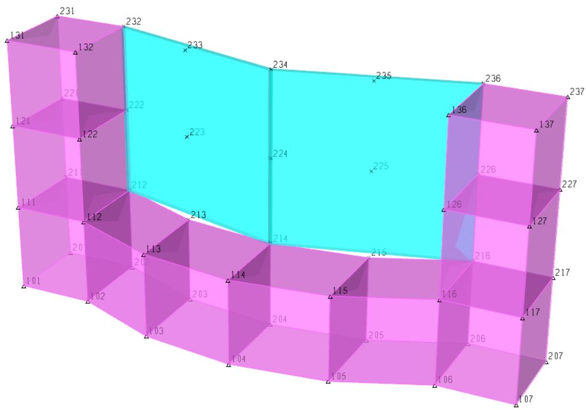

Following is the SACS model file for this sample problem and a description of selected portions.


|  | 1 | 1 | 2 | 2 | 3 | 3 | 4 | 4 | 5 | 5 | 6 | 6 | 7 | 7 | 8 |  |
| --- | --- | --- | --- | --- | --- | --- | --- | --- | --- | --- | --- | --- | --- | --- | --- | --- |
|  | 12345678901 | 12345678901 | 12345678901 | 12345678901 | 12345678901 | 12345678901 | 12345678901 | 12345678901 | 12345678901 | 12345678901 | 12345678901 | 12345678901 | 12345678901 | 12345678901 | 12345678901 | 12345678901 |
| 1 | SACS SHELL AND SOLID SAMPLE PROBLEM | SACS SHELL AND SOLID SAMPLE PROBLEM | SACS SHELL AND SOLID SAMPLE PROBLEM | SACS SHELL AND SOLID SAMPLE PROBLEM | SACS SHELL AND SOLID SAMPLE PROBLEM | SACS SHELL AND SOLID SAMPLE PROBLEM | SACS SHELL AND SOLID SAMPLE PROBLEM | SACS SHELL AND SOLID SAMPLE PROBLEM | SACS SHELL AND SOLID SAMPLE PROBLEM | SACS SHELL AND SOLID SAMPLE PROBLEM | SACS SHELL AND SOLID SAMPLE PROBLEM | SACS SHELL AND SOLID SAMPLE PROBLEM | SACS SHELL AND SOLID SAMPLE PROBLEM | SACS SHELL AND SOLID SAMPLE PROBLEM | SACS SHELL AND SOLID SAMPLE PROBLEM | SACS SHELL AND SOLID SAMPLE PROBLEM |
| 2 | OPTIONS EN | OPTIONS EN | OPTIONS EN | OPTIONS EN | UC | UC | 1 | 1 | DC | DC | C | C | C | C | C | C |
| 3 | LCSEL ST | LCSEL ST | 4 | 4 | 5 | 5 |  |  |  |  |  |  |  |  |  |  |
| 4 | SHELL | SHELL |  |  |  |  |  |  |  |  |  |  |  |  |  |  |
| 5 | SHELLOS212 | 212 | 213 | 214 | 224 | 234 | 233 | 232 | 222 | 223 | 2.5 | 29.0 | 0.25 | 36.490.0 | 6.5 |  |
| 6 | SHELLOS214 | 214 | 215 | 216 | 226 | 236 | 235 | 234 | 224 | 225 | 2.5 | 29.0 | 0.25 | 36.490.0 | 6.5 |  |
| 7 | SOLID | SOLID |  |  |  |  |  |  |  |  |  |  |  |  |  |  |
| 8 | SOLID D101 | 101 | 102 | 202 | 201 | 111 | 112 | 212 | 211 |  | 3.64 | 3.64 | 150.0 | 150.0 |  |  |
| 9 | SOLID D102 | 102 | 103 | 203 | 202 | 112 | 113 | 213 | 212 |  | 3.64 | 3.64 | 150.0 | 150.0 |  |  |
| 10 | SOLID D103 | 103 | 104 | 204 | 203 | 113 | 114 | 214 | 213 |  | 3.64 | 3.64 | 150.0 | 150.0 |  |  |
| 11 | SOLID D104 | 104 | 105 | 205 | 204 | 114 | 115 | 215 | 214 |  | 3.64 | 3.64 | 150.0 | 150.0 |  |  |
| 12 | SOLID D105 | 105 | 106 | 206 | 205 | 115 | 116 | 216 | 215 |  | 3.64 | 3.64 | 150.0 | 150.0 |  |  |
| 13 | SOLID D106 | 106 | 107 | 207 | 206 | 116 | 117 | 217 | 216 |  | 3.64 | 3.64 | 150.0 | 150.0 |  |  |
| 14 | SOLID D111 | 111 | 112 | 212 | 211 | 121 | 122 | 222 | 221 |  | 3.64 | 3.64 | 150.0 | 150.0 |  |  |
| 15 | SOLID D116 | 116 | 117 | 217 | 216 | 126 | 127 | 227 | 226 |  | 3.64 | 3.64 | 150.0 | 150.0 |  |  |
| 16 | SOLID D121 | 121 | 122 | 222 | 221 | 131 | 132 | 232 | 231 |  | 3.64 | 3.64 | 150.0 | 150.0 |  |  |
| 17 | SOLID D126 | 126 | 127 | 227 | 226 | 136 | 137 | 237 | 236 |  | 3.64 | 3.64 | 150.0 | 150.0 |  |  |
| 18 | JOINT | JOINT |  |  |  |  |  |  |  |  |  |  |  |  |  |  |
| 19 | JOINT 101 | -9. | -5. | -5. | 0. | 0. | -0.276 | -0.276 | -0.276 | -0.276 | 111111 | 111111 |  |  |  |  |
| 20 | JOINT 102 | -6. | -5. | -5. | 0. | 0. | -4.368 | -4.368 | -4.368 | -4.368 | 111111 | 111111 |  |  |  |  |
| 21 | JOINT 103 | -3. | -6. | -6. | 0. | 0. | -3.528 | -3.528 | -3.528 | -3.528 | 111111 | 111111 |  |  |  |  |
| 22 | JOINT 104 | 0. | -6. | -6. | 0. | 0. | -8.736 | -8.736 | -8.736 | -8.736 | 111111 | 111111 |  |  |  |  |


| 23 | JOINT 105 | 3. | -6. | 0. | 3.528 | -3.528 | 111111 |  |
| --- | --- | --- | --- | --- | --- | --- | --- | --- |
| 24 | JOINT 106 | 6. | -5. | 0. | 4.368 | -0.276 | 111111 |  |
| 25 | JOINT 107 | 9. | -5. | 0. |  | -0.276 | 111111 |  |
| 26 | JOINT 111 | -9. | -5. | 3. |  | -0.276 | 111111 |  |
| 27 | JOINT 112 | -6. | -5. | 3. | -4.368 | -0.276 | 000111 |  |
| 28 | JOINT 113 | -3. | -6. | 3. | -3.528 | -3.528 | 000111 |  |
| 29 | JOINT 114 | 0. | -6. | 3. |  | -8.736 | 000111 |  |
| 30 | JOINT 115 | 3. | -6. | 3. | 3.528 | -3.528 | 000111 |  |
| 31 | JOINT 116 | 6. | -5. | 3. | 4.368 | -0.276 | 000111 |  |
| 32 | JOINT 117 | 9. | -5. | 3. |  | -0.276 | 111111 |  |
| 33 | JOINT 121 | -9. | -5. | 6. |  | -0.276 | 111111 |  |
| 34 | JOINT 122 | -6. | -5. | 6. | -4.368 | -0.276 | 000111 |  |
| 35 | JOINT 126 | 6. | -5. | 6. | 4.368 | -0.276 | 000111 |  |
| 36 | JOINT 127 | 9. | -5. | 6. |  | -0.276 | 111111 |  |
| 37 | JOINT 131 | -9. | -5. | 9. |  | -0.276 | 111111 |  |
| 38 | JOINT 132 | -6. | -5. | 9. | -4.368 | -0.276 | 000111 |  |
| 39 | JOINT 136 | 6. | -5. | 9. | 4.368 | -0.276 | 000111 |  |
| 40 | JOINT 137 | 9. | -5. | 9. |  | -0.276 | 111111 |  |
| 41 | JOINT 201 | -9. | -2. | 0. |  | -0.276 | 111111 |  |
| 42 | JOINT 202 | -6. | -2. | 0. | -4.368 | -0.276 | 111111 |  |
| 43 | JOINT 203 | -3. | -3. | 0. | -3.528 | -3.528 | 111111 |  |
| 44 | JOINT 204 | 0. | -3. | 0. |  | -8.736 | 111111 |  |
| 45 | JOINT 205 | 3. | -3. | 0. | 3.528 | -3.528 | 111111 |  |
| 46 | JOINT 206 | 6. | -2. | 0. | 4.368 | -0.276 | 111111 |  |
| 47 | JOINT 207 | 9. | -2. | 0. |  | -0.276 | 111111 |  |
| 48 | JOINT 211 | -9. | -2. | 3. |  | -0.276 |  |  |
| 49 | JOINT 212 | -6. | -2. | 3. | -4.368 | -0.276 |  |  |
| 50 | JOINT 213 | -3. | -3. | 3. | -3.528 | -3.528 |  |  |
| 51 | JOINT 214 | 0. | -3. | 3. |  | -8.736 |  |  |
| 52 | JOINT 215 | 3. | -3. | 3. | 3.528 | -3.528 |  |  |
| 53 | JOINT 216 | 6. | -2. | 3. | 4.368 | -0.276 |  |  |
| 54 | JOINT 217 | 9. | -2. | 3. |  | -0.276 | 111111 |  |
| 55 | JOINT 221 | -9. | -2. | 6. |  | -0.276 | 111111 |  |
| 56 | JOINT 222 | -6. | -2. | 6. | -4.368 | -0.276 |  |  |
| 57 | JOINT 223 | -3. | -3. | 6. | -3.528 | -3.528 |  |  |
| 58 | JOINT 224 | 0. | -3. | 6. |  | -8.736 |  |  |
| 59 | JOINT 225 | 3. | -3. | 6. | 3.528 | -3.528 |  |  |
| 60 | JOINT 226 | 6. | -2. | 6. | 4.368 | -0.276 |  |  |
| 61 | JOINT 227 | 9. | -2. | 6. |  | -0.276 | 111111 |  |
| 62 | JOINT 231 | -9. | -2. | 9. |  | -0.276 | 111111 |  |
| 63 | JOINT 232 | -6. | -2. | 9. | -4.368 | -0.276 |  |  |
| 64 | JOINT 233 | -3. | -3. | 9. | -3.528 | -3.528 |  |  |
| 65 | JOINT 234 | 0. | -3. | 9. |  | -8.736 |  |  |
| 66 | JOINT 235 | 3. | -3. | 9. | 3.528 | -3.528 |  |  |
| 67 | JOINT 236 | 6. | -2. | 9. | 4.368 | -0.276 |  |  |
| 68 | JOINT 237 | 9. | -2. | 9. |  | -0.276 | 111111 |  |
| 69 | LOAD | LOAD | LOAD | LOAD | LOAD | LOAD | LOAD | LOAD |
| 70 | LOADCN 1 | LOADCN 1 | LOADCN 1 | LOADCN 1 | LOADCN 1 | LOADCN 1 | LOADCN 1 | LOADCN 1 |
| 71 | LOAD 212 | LOAD 212 | LOAD 212 | LOAD 212 | -0.735 | -0.735 | GLOB JOIN SHDEAD | GLOB JOIN SHDEAD |
| 72 | LOAD 213 | LOAD 213 | LOAD 213 | LOAD 213 | -1.470 | -1.470 | GLOB JOIN SHDEAD | GLOB JOIN SHDEAD |
| 73 | LOAD 214 | LOAD 214 | LOAD 214 | LOAD 214 | -1.470 | -1.470 | GLOB JOIN SHDEAD | GLOB JOIN SHDEAD |
| 74 | LOAD 215 | LOAD 215 | LOAD 215 | LOAD 215 | -1.470 | -1.470 | GLOB JOIN SHDEAD | GLOB JOIN SHDEAD |
| 75 | LOAD 216 | LOAD 216 | LOAD 216 | LOAD 216 | -0.735 | -0.735 | GLOB JOIN SHDEAD | GLOB JOIN SHDEAD |
| 76 | LOAD 222 | LOAD 222 | LOAD 222 | LOAD 222 | -1.470 | -1.470 | GLOB JOIN SHDEAD | GLOB JOIN SHDEAD |
| 77 | LOAD 223 | LOAD 223 | LOAD 223 | LOAD 223 | -2.940 | -2.940 | GLOB JOIN SHDEAD | GLOB JOIN SHDEAD |
| 78 | LOAD 224 | LOAD 224 | LOAD 224 | LOAD 224 | -2.940 | -2.940 | GLOB JOIN SHDEAD | GLOB JOIN SHDEAD |
| 79 | LOAD 225 | LOAD 225 | LOAD 225 | LOAD 225 | -2.940 | -2.940 | GLOB JOIN SHDEAD | GLOB JOIN SHDEAD |
| 80 | LOAD 226 | LOAD 226 | LOAD 226 | LOAD 226 | -1.470 | -1.470 | GLOB JOIN SHDEAD | GLOB JOIN SHDEAD |
| 81 | LOAD 232 | LOAD 232 | LOAD 232 | LOAD 232 | -1.470 | -1.470 | GLOB JOIN SHDEAD | GLOB JOIN SHDEAD |
| 82 | LOAD 233 | LOAD 233 | LOAD 233 | LOAD 233 | -2.940 | -2.940 | GLOB JOIN SHDEAD | GLOB JOIN SHDEAD |
| 83 | LOAD 234 | LOAD 234 | LOAD 234 | LOAD 234 | -2.940 | -2.940 | GLOB JOIN SHDEAD | GLOB JOIN SHDEAD |
| 84 | LOAD 235 | LOAD 235 | LOAD 235 | LOAD 235 | -2.940 | -2.940 | GLOB JOIN SHDEAD | GLOB JOIN SHDEAD |
| 85 | LOAD 236 | LOAD 236 | LOAD 236 | LOAD 236 | -1.470 | -1.470 | GLOB JOIN SHDEAD | GLOB JOIN SHDEAD |
| 86 | LOADCN 2 | LOADCN 2 | LOADCN 2 | LOADCN 2 | LOADCN 2 | LOADCN 2 | LOADCN 2 | LOADCN 2 |
| 87 | LOAD SPC S212S214 -10.4 -0.866 | LOAD SPC S212S214 -10.4 -0.866 | LOAD SPC S212S214 -10.4 -0.866 | LOAD SPC S212S214 -10.4 -0.866 | LOAD SPC S212S214 -10.4 -0.866 | LOAD SPC S212S214 -10.4 -0.866 | LOAD SPC S212S214 -10.4 -0.866 | LOAD SPC S212S214 -10.4 -0.866 |
| 88 | LOADCN 3 | LOADCN 3 | LOADCN 3 | LOADCN 3 | LOADCN 3 | LOADCN 3 | LOADCN 3 | LOADCN 3 |
| 89 | LOAD STT S212S214-40.0 -40.0 -40.0 -35.0 -30.0 -30.0 -35.0 -35.0 | LOAD STT S212S214-40.0 -40.0 -40.0 -35.0 -30.0 -30.0 -35.0 -35.0 | LOAD STT S212S214-40.0 -40.0 -40.0 -35.0 -30.0 -30.0 -35.0 -35.0 | LOAD STT S212S214-40.0 -40.0 -40.0 -35.0 -30.0 -30.0 -35.0 -35.0 | LOAD STT S212S214-40.0 -40.0 -40.0 -35.0 -30.0 -30.0 -35.0 -35.0 | LOAD STT S212S214-40.0 -40.0 -40.0 -35.0 -30.0 -30.0 -35.0 -35.0 | LOAD STT S212S214-40.0 -40.0 -40.0 -35.0 -30.0 -30.0 -35.0 -35.0 | LOAD STT S212S214-40.0 -40.0 -40.0 -35.0 -30.0 -30.0 -35.0 -35.0 |
| 90 | LOAD STB S212S2140.0 0.0 0.0 0.0 0.0 0.0 0.0 0.0 0.0 | LOAD STB S212S2140.0 0.0 0.0 0.0 0.0 0.0 0.0 0.0 0.0 | LOAD STB S212S2140.0 0.0 0.0 0.0 0.0 0.0 0.0 0.0 0.0 | LOAD STB S212S2140.0 0.0 0.0 0.0 0.0 0.0 0.0 0.0 0.0 | LOAD STB S212S2140.0 0.0 0.0 0.0 0.0 0.0 0.0 0.0 0.0 | LOAD STB S212S2140.0 0.0 0.0 0.0 0.0 0.0 0.0 0.0 0.0 | LOAD STB S212S2140.0 0.0 0.0 0.0 0.0 0.0 0.0 0.0 0.0 | LOAD STB S212S2140.0 0.0 0.0 0.0 0.0 0.0 0.0 0.0 0.0 |
| 91 | LCOMB | LCOMB | LCOMB | LCOMB | LCOMB | LCOMB | LCOMB | LCOMB |
| 92 | LCOMB 4 1 1.1 2 1.0 | LCOMB 4 1 1.1 2 1.0 | LCOMB 4 1 1.1 2 1.0 | LCOMB 4 1 1.1 2 1.0 | LCOMB 4 1 1.1 2 1.0 | LCOMB 4 1 1.1 2 1.0 | LCOMB 4 1 1.1 2 1.0 | LCOMB 4 1 1.1 2 1.0 |


The following is a description of selected input lines in the SACS model file for Sample Problem 2. The input lines are referenced by the letter in the left margin of the input listing.

Note: For asterisked items (*), see Post program manual for a detailed discussion on post-processing options.

Line 2. The OPTIONS line specifies the analysis options, namely:

a. English units are designated by ‘EN’ in columns 14-15.   
b. By default, a static analysis is desired (columns 19-20 are blank).   
c. * Element code check will be based on AISC/API code (‘UC’ in columns 25- 26).   
d. * An element detailed stress report is requested by ‘PT’ in columns 55-56.

Line 3. * Only results for load combinations 4 and 5 are to be reported as specified on the LCSEL line.

Line 4. A SHELL header line designates that shell element definitions follow. The first SHELL input line defines the properties of shell ‘S212’ as follows:

a. The shell name ‘S212’ is designated in columns 7-10.   
b. The connecting joints are specified in columns 12-47. Shell ‘S212’ is a nine node shell defined by joints 212, 213, 214, 224, 234, 233, 232, 222 and 223, where joint 223 is the center joint. The local X axis is defined by joints 212 and 214, the local Y is perpendicular to the local X and parallel to the line formed by joints 214 and 234.   
c. A constant thickness of 2.5" is assigned by ‘0’ in column 6 (constant) and ‘2.5’ in columns 53-55.   
d. The Modulus of elasticity, Poisson’s ratio, yield stress, material density and coefficient of thermal expansion are specified in columns 57-61, 62-65, 66-70, 71-75 and 76-80.

Line 7. Solid elements are defined on SOLID input lines following the SOLID header line. The geometry and properties for solid element ‘D101’ are defined on the first SOLID line as follows:

a. The solid name ‘D101’ is designated in columns 7-10.   
b. The connecting joints are specified in columns 12-43. Solid ‘D101’ is an eight node brick element defined by joints 101, 102, 202, 201, 111, 112, 212, and 211.   
c. A modulus of elasticity of 3,640 ksi is assigned by ‘3.64’ in columns 57-61. The default Poisson’s ratio and yield stress are used.   
d. The material density is specified as 150.0 #/ft3 in columns 71-75.

Line 18. The JOINT header line signals the beginning of joint definitions. The first JOINT line defines the coordinates** of joint 101 (‘101’ specified in columns 8-10).

**Note: Joint coordinates may be defined in decimals of feet(meters) or in feet(meters) plus inches(centimeters). For this sample, coordinates are expressed in feet plus inches.

a. The X coordinate of joint 101 is -9 ft as designated by ‘-9.’ in columns 12-18.   
b. The Y coordinate is -5'0.276" or -5.023' (-5.00276m if model units are metric) as designated by ‘-5.’ in columns 19-25 and ‘-0.276’ in columns 40-46.   
c. The Z coordinate is 0. (‘0’ in columns 26-32).   
d. Joint 101 is a support joint with all six degrees of freedom restrained (‘111111’ in columns 55-60).

Line 27. Joint 112 is defined by JOINT line with ‘112’ in columns 8-10.

a. The X, Y and Z coordinates are defined in columns 12-53.   
b. The X, Y and Z rotational degrees of freedom are restrained by ‘000111’ in columns 55- 60.

Note: Because solid elements do not have rotational stiffness, the rotational degrees of freedom for joints connected exclusively to solid elements must be fixed.

Line 69. The loading portion of the input begins with the LOAD header line. Load condition 1 is designated in column 10 of the LOADCN input line.

Line 70. Load case 1 consist of loads on joints 212, 213, 214, 215, 216, 222, 223, 224, 225, 226, 232, 233, 234, 235 and 236. Joint 212 is loaded as follows:

a. The ‘JOIN’ label in columns 66-69 designates the type of loading as a joint load.   
b. The joint to be loaded is designated in columns 9-11.   
c. A load of -0.735 is to be applied in the global Z direction as indicated in columns 31-37.

Line 86. Load case 2 contains a varying normal pressure load acting on shells S212 and S214. The LOAD input line specifies the following:

a. The type of load is designated as a normal pressure load by ‘SPC’ in columns 6-8.   
b. All shell names from S212 through S214 are to be loaded by this input line (‘S212’ and ‘S214’ in columns 10-13 and 14-17).   
c. The normal pressure at the origin joint (i.e. first joint specified on the SHELL line) is 10.4 psi in the local -Z direction as specified by ‘-10.4’ in columns 18- 24.   
d. The normal pressure decreases by 0.866 psi per foot in the local Y direction (- 0.866 in columns 32-38).

Line 88. Load case 3 contains shell temperature loads on the top and bottom surfaces of shells S212 and S214. The top surface of the shell is exposed to a temperature lower than the ambient temperature while the bottom surface is at the ambient temperature.

a. The type of load is designated as a shell temperature load at the top surface by ‘STT’ in columns 6-8.   
b. All shell names from S212 through S214 are to be loaded by this input line (‘S212’ and ‘S214’ in columns 10-13 and 14-17).   
c. The temperature at the top surface relative to the ambient temperature at each of the shell joints is specified in columns 18-80.   
d. The temperature at the bottom surface relative to ambient temperature is specified in columns 18-80 of the SHELL line with ‘STB’ designated in columns 6-8.

Line 91. Load combinations made up of one or more load cases and/or combinations are defined after the LCOMB header line. Load case 4 is a combination consisting of load case 1 multiplied by 1.1 and 100.0 percent of load case 2.

The output file for the analysis is listed on the following pages. The output for the post processor is included and is discussed in detail in the Post program module manual.

SACS CONNECT Edition V(14.3)-CL Company:Bentley Sytems SACS SHELL AND SOLID SAMPLE PROBLEM DATE 16-SEP-2020 TIME 16:27:41 PRE PAGE 1 PRE VERSION 14.3.0.27 **PROGRAM OPTIONS ** UNITS ..ENGLISH EXECUTION .UNITY CHECK WSD AISC 9TH EDITION WITH API-RP2A 21ST EDITION FOR TUBULARS .DKT PLATES SELECTED .NO SEGMENTS FOR PRISMATIC MEMBERS 1 .NO SEGMENTS/SECTION FOR NON-PRISMATIC MEMBERS 1 REPORTS SELECTED .ELEMENT DETAIL PRINT .SPECIAL ELEMENT PRINT LOAD .NO.BASIC LOAD COND. 3 .NO.COMB. LOAD COND. 2 SACS CONNECT Edition V(14.3)-CL Company:Bentley Sytems SACS SHELL AND SOLID SAMPLE PROBLEM DATE 16-SEP-2020 TIME 16:27:41 PRE PAGE 2 OPTIMIZATION DATA OPTIMIZED FINAL BANDWIDTH $=$ 8.260 FINAL MAXIMUM BANDWIDTH $=$ 18 SACS CONNECT Edition V(14.3)-CL Company:Bentley Sytems SACS SHELL AND SOLID SAMPLE PROBLEM DATE 16-SEP-2020 TIME 16:27:41 PRE PAGE 3 \*\*SHELL DATA LIST\*\* SHELL SHEL L CONNECTING JOINTS \*\*\*\*\*\*\*\*\*\*\*\*\*\*\*\*\*\*\*\*\*\*\*\*\*\*\*\*\*\*\*\*\*\*\*\*\*\*\*\*\*\*\*\*\*\*\*\*\*\*\*\*\*\*\*\*\*\*\*\*\*\*\*\*\*\*\*\*\*\*\*\*\*\*\*\*\*\*\*\*\*\*\*\*\*\*\*\*\*\*\*\*\*\*\*\*\*\*\*\*\*


| **** LOAD CASE STATUS REPORT **** | **** LOAD CASE STATUS REPORT **** | **** LOAD CASE STATUS REPORT **** | **** LOAD CASE STATUS REPORT **** | **** LOAD CASE STATUS REPORT **** | **** LOAD CASE STATUS REPORT **** | **** LOAD CASE STATUS REPORT **** | **** LOAD CASE STATUS REPORT **** | **** LOAD CASE STATUS REPORT **** | **** LOAD CASE STATUS REPORT **** |  |  |
| --- | --- | --- | --- | --- | --- | --- | --- | --- | --- | --- | --- |
| LOAD CASE | LOAD ID | PRINT OPTION | DEAD LOAD | P-DELTA LOAD | LOAD FACTOR | AMOD FACTOR |  |  |  |  |  |
| 1 | 1 | NO | NO | NO | 1.00 | 1.00 |  |  |  |  |  |
| 2 | 2 | NO | NO | NO | 1.00 | 1.00 |  |  |  |  |  |
| 3 | 3 | NO | NO | NO | 1.00 | 1.00 |  |  |  |  |  |
| 4 | 4 | YES | NO | NO | 1.00 | 1.00 |  |  |  |  |  |
| 5 | 5 | YES | NO | NO | 1.00 | 1.00 |  |  |  |  |  |
| SACS CONNECT Edition V(14.3) - CL | SACS CONNECT Edition V(14.3) - CL | SACS CONNECT Edition V(14.3) - CL | SACS CONNECT Edition V(14.3) - CL | SACS CONNECT Edition V(14.3) - CL | SACS CONNECT Edition V(14.3) - CL | SACS CONNECT Edition V(14.3) - CL | Company: Bentley Sytems | Company: Bentley Sytems | Company: Bentley Sytems |  |  |
| SACS SHELL AND SOLID SAMPLE PROBLEM | SACS SHELL AND SOLID SAMPLE PROBLEM | SACS SHELL AND SOLID SAMPLE PROBLEM | SACS SHELL AND SOLID SAMPLE PROBLEM | SACS SHELL AND SOLID SAMPLE PROBLEM | SACS SHELL AND SOLID SAMPLE PROBLEM | SACS SHELL AND SOLID SAMPLE PROBLEM | DATE 16-SEP-2020 | TIME 16:27:42 | SLV PAGE 1 |  |  |
|  |  |  |  |  |  |  |  | SLV VERSION 14.3.0.25 | SLV VERSION 14.3.0.25 |  |  |
| ** SACS PROBLEM DESCRIPTION ** | ** SACS PROBLEM DESCRIPTION ** | ** SACS PROBLEM DESCRIPTION ** | ** SACS PROBLEM DESCRIPTION ** | ** SACS PROBLEM DESCRIPTION ** | ** SACS PROBLEM DESCRIPTION ** | ** SACS PROBLEM DESCRIPTION ** |  |  |  |  |  |
|  |  | NUMBER OF JOINTS . . . . . . . . . . . . . . . . . . . . . . . . . . . . . . . . . . . . . . . . . . . . . . . . . . . . . . . . . . . . . . . . . . . . . . . . . . . . . . . . . . . . . . . . . . . . . . . . . . . . | 50 |  |  |  |  |  |  |  |  |
|  |  | NUMBER OF BEAMS . . . . . . . . . . . . . . . . . . . . . . . . . . . . . . . . . . . . . . . . . . . . . . . . . . . . . . . . . . . . . . . . . . . . . . . . . . . . . . . . . . . . . . . . . . . . . . . . . . . . . . . . . . . . . . . . . . . . . . . . . . . . . . . . . . . . . . . . . . . . . . . . . . . . . . . . . . . . . . . . . . . . . . . . . . . . . . . . . . . . . . . . . . . . . . . . . . . . . . . .. . . . . . . . . . . . . . . . . . . . . . . . . . . . . . . . . . . . . . . . . . . . . . . . . . . . . . . . . . . . . . . . . . . . . . . . . . . . . . . . . . . . . . . . . . . . . . . . . . . .. Number of PLATES . . . . . . . . . . . . . . . . . . . . . . . . . . . . . . . . . . . . . . . . . . . . . . . . . . . . . .. Number of SHELLS . . . . . . . . . . . . . . . . . . . . . . . . . . . . . . . . . . . . . . . . . . . . . . . . . . . . . .. Number of SOLIDS . . . . . . . . . . . . . . . . . . . . . . . . . . . . . . . . . . . . . . . . . . . . . . . . . . . .. Number of LOADS . . . . . . . . . . . . . . . . . . . . . . . . . . Number of RETAINED JOINTS ... 0 |  |  |  |  |  |  |  |  |  |
| SACS CONNECT Edition V(14.3) - CL | SACS CONNECT Edition V(14.3) - CL | SACS CONNECT Edition V(14.3) - CL | SACS CONNECT Edition V(14.3) - CL | SACS CONNECT Edition V(14.3) - CL | SACS CONNECT Edition V(14.3) - CL | SACS CONNECT Edition V(14.3) - CL | Company: Bentley Sytems | Company: Bentley Sytems | Company: Bentley Sytems |  |  |
| SACS SHELL AND SOLID SAMPLE PROBLEM | SACS SHELL AND SOLID SAMPLE PROBLEM | SACS SHELL AND SOLID SAMPLE PROBLEM | SACS SHELL AND SOLID SAMPLE PROBLEM | SACS SHELL AND SOLID SAMPLE PROBLEM | SACS SHELL AND SOLID SAMPLE PROBLEM | SACS SHELL AND SOLID SAMPLE PROBLEM | DATE 16-SEP-2020 | TIME 16:27:42 | SLV PAGE 2 |  |  |
| APPLIED LOAD SUMMARY | APPLIED LOAD SUMMARY | APPLIED LOAD SUMMARY | APPLIED LOAD SUMMARY | APPLIED LOAD SUMMARY | APPLIED LOAD SUMMARY | APPLIED LOAD SUMMARY |  |  |  |  |  |
| LOAD CASE NO. | ID | TOTAL FORCE (X) KIPS | TOTAL FORCE (Y) KIPS | TOTAL FORCE (Z) KIPS |  |  |  |  |  |  |  |
| 1 | 1 | 0.000000E+00 | 0.000000E+00 | -2.940000E+01 |  |  |  |  |  |  |  |
| 2 | 2 | -3.069545E-15 | 8.315263E+01 | 0.000000E+00 |  |  |  |  |  |  |  |
| 3 | 3 | 3.637979E-13 | -1.055014E-13 | -1.455192E-14 |  |  |  |  |  |  |  |
| SACS CONNECT Edition V(14.3) - CL | SACS CONNECT Edition V(14.3) - CL | SACS CONNECT Edition V(14.3) - CL | SACS CONNECT Edition V(14.3) - CL | SACS CONNECT Edition V(14.3) - CL | SACS CONNECT Edition V(14.3) - CL | SACS CONNECT Edition V(14.3) - CL | Company: Bentley Sytems | Company: Bentley Sytems | Company: Bentley Sytems |  |  |
| SACS SHELL AND SOLID SAMPLE PROBLEM | SACS SHELL AND SOLID SAMPLE PROBLEM | SACS SHELL AND SOLID SAMPLE PROBLEM | SACS SHELL AND SOLID SAMPLE PROBLEM | SACS SHELL AND SOLID SAMPLE PROBLEM | SACS SHELL AND SOLID SAMPLE PROBLEM | SACS SHELL AND SOLID SAMPLE PROBLEM | DATE 16-SEP-2020 | TIME 16:27:42 | SLV PAGE 3 |  |  |


MATRIX TRIANGULARIZATION COMPLETE

MAX. SIGNIFICANT DIGITS LOST = 1 SOLUTION ACCURATE TO 14 DIGITS OUT OF POSSIBLE 15

FORWARD SUBSTITUTION COMPLETE

BACK SUBSTITUTION COMPLETE

SACS CONNECT Edition V(14.3) - CL SACS SHELL AND SOLID SAMPLE PROBLEM

Company: Bentley Sytems

DATE 16-SEP-2020 TIME 16:27:42 SLV PAGE 4

FIXED DEGREE OF FREEDOM REACTION SUMMARY   


| LOAD | CASE | TOTAL | FORCE(X) | KIPS | TATAL | FORCE(Y) | KIPS |
| --- | --- | --- | --- | --- | --- | --- | --- |
| NO. | ID | TOTAL | FORCE(X) | KIPS | TATAL | FORCE(Y) | KIPS |
| 1 | 1 | 3.524292E-15 |  | 6.252776E-16 |  | 2.940000E+01 |  |
| 2 | 2 | -2.946763E-13 |  | -8.315263E+01 |  | 2.978595E-14 |  |
| 3 | 3 | -1.331500E-12 |  | -5.202310E-13 |  | 5.620678E-13 |  |


SACS CONNECT Edition V(14.3) - CL SACS SHELL AND SOLID SAMPLE PROBLEM

Company: Bentley Sytems

DATE 16-SEP-2020 TIME 16:27:43 PST PAGE 1

PST VERSION 14.3.0.42

***** SACS MODEL PARAMETERS ******

NUMBER OF JOINTS 50

NUMBER OF MEMBERS 0

NUMBER OF PLATES 0

NUMBER OF SHELL ELEMENTS .... 2

NUMBER OF SOLID ELEMENTS ..... 10

NUMBER OF BASIC LOADS .. 3

NUMBER OF COMBINED LOADS ..... 2

UNITY CHECK .... API RP2A 21ST/AISC 9TH

JOINT DEFLECTION REPORT .NO

GROUP SUMMARY REPORT .NO

ELEMENT STRESS AT MAXIMUM UC REPORT .......NO

MEMBER INTERNAL LOADS SUMMARY REPORT ......NO

ELEMENT UNITY CHECK REPORT .NO

ELEMENT DETAIL REPORT .YES

MEMBER END FORCES AND MOMENTS REPORT ......NO

JOINT REACTIONS REPORT .NO


| SACS CONNECT Edition V(14.3) - CLCompany: Bentley SytemsSACS SHELL AND SOLID SAMPLE PROBLEMDATE 16-SEP-2020 TIME 16:27:43 PST PAGE4 | SACS CONNECT Edition V(14.3) - CLCompany: Bentley SytemsSACS SHELL AND SOLID SAMPLE PROBLEMDATE 16-SEP-2020 TIME 16:27:43 PST PAGE4 | SACS CONNECT Edition V(14.3) - CLCompany: Bentley SytemsSACS SHELL AND SOLID SAMPLE PROBLEMDATE 16-SEP-2020 TIME 16:27:43 PST PAGE4 | SACS CONNECT Edition V(14.3) - CLCompany: Bentley SytemsSACS SHELL AND SOLID SAMPLE PROBLEMDATE 16-SEP-2020 TIME 16:27:43 PST PAGE4 | SACS CONNECT Edition V(14.3) - CLCompany: Bentley SytemsSACS SHELL AND SOLID SAMPLE PROBLEMDATE 16-SEP-2020 TIME 16:27:43 PST PAGE4 | SACS CONNECT Edition V(14.3) - CLCompany: Bentley SytemsSACS SHELL AND SOLID SAMPLE PROBLEMDATE 16-SEP-2020 TIME 16:27:43 PST PAGE4 | SACS CONNECT Edition V(14.3) - CLCompany: Bentley SytemsSACS SHELL AND SOLID SAMPLE PROBLEMDATE 16-SEP-2020 TIME 16:27:43 PST PAGE4 | SACS CONNECT Edition V(14.3) - CLCompany: Bentley SytemsSACS SHELL AND SOLID SAMPLE PROBLEMDATE 16-SEP-2020 TIME 16:27:43 PST PAGE4 | SACS CONNECT Edition V(14.3) - CLCompany: Bentley SytemsSACS SHELL AND SOLID SAMPLE PROBLEMDATE 16-SEP-2020 TIME 16:27:43 PST PAGE4 | SACS CONNECT Edition V(14.3) - CLCompany: Bentley SytemsSACS SHELL AND SOLID SAMPLE PROBLEMDATE 16-SEP-2020 TIME 16:27:43 PST PAGE4 | SACS CONNECT Edition V(14.3) - CLCompany: Bentley SytemsSACS SHELL AND SOLID SAMPLE PROBLEMDATE 16-SEP-2020 TIME 16:27:43 PST PAGE4 | SACS CONNECT Edition V(14.3) - CLCompany: Bentley SytemsSACS SHELL AND SOLID SAMPLE PROBLEMDATE 16-SEP-2020 TIME 16:27:43 PST PAGE4 | SACS CONNECT Edition V(14.3) - CLCompany: Bentley SytemsSACS SHELL AND SOLID SAMPLE PROBLEMDATE 16-SEP-2020 TIME 16:27:43 PST PAGE4 | SACS CONNECT Edition V(14.3) - CLCompany: Bentley SytemsSACS SHELL AND SOLID SAMPLE PROBLEMDATE 16-SEP-2020 TIME 16:27:43 PST PAGE4 | SACS CONNECT Edition V(14.3) - CLCompany: Bentley SytemsSACS SHELL AND SOLID SAMPLE PROBLEMDATE 16-SEP-2020 TIME 16:27:43 PST PAGE4 | SACS CONNECT Edition V(14.3) - CLCompany: Bentley SytemsSACS SHELL AND SOLID SAMPLE PROBLEMDATE 16-SEP-2020 TIME 16:27:43 PST PAGE4 | SACS CONNECT Edition V(14.3) - CLCompany: Bentley SytemsSACS SHELL AND SOLID SAMPLE PROBLEMDATE 16-SEP-2020 TIME 16:27:43 PST PAGE4 | SACS CONNECT Edition V(14.3) - CLCompany: Bentley SytemsSACS SHELL AND SOLID SAMPLE PROBLEMDATE 16-SEP-2020 TIME 16:27:43 PST PAGE4 | SACS CONNECT Edition V(14.3) - CLCompany: Bentley SytemsSACS SHELL AND SOLID SAMPLE PROBLEMDATE 16-SEP-2020 TIME 16:27:43 PST PAGE4 |
| --- | --- | --- | --- | --- | --- | --- | --- | --- | --- | --- | --- | --- | --- | --- | --- | --- | --- | --- |
| SHELL GRUPXIN | STRESSYZIN | LOCATION | THICKCASE | ********** SXXKSI | ********** SYKIS | TOPSXYKIS | ********** SPKSI | ********** TMAXKSI | ********** SXXKSI | SYKIS | TMAXSPKSI | TMAXKSI | SYZKSI | SZKSI | UNITYCHECK |  |  |  |
| S212 | 39.5 | 36.0 | 5.2 | 2.50 | 4 | -0.36 | -0.14 | -0.04 | -0.36 | 0.12 | -0.23 | 0.06 | -0.08 | -0.25 | 0.17 | -0.00 | 0.01 | 0.015 |
| S212 | 39.5 | 36.0 | 5.2 | 2.50 | 5 | 4.02 | 3.26 | -0.38 | 4.17 | 0.54 | -3.38 | -2.96 | -0.41 | -3.63 | 0.46 | -0.04 | 0.03 | 0.174 |
| S214 | 39.5 | 36.0 | 5.2 | 2.50 | 4 | -0.36 | -0.13 | 0.04 | -0.36 | 0.12 | -0.23 | 0.07 | 0.08 | -0.25 | 0.17 | -0.00 | -0.01 | 0.015 |
| S214 | 39.5 | 36.0 | 5.2 | 2.50 | 5 | 4.00 | 3.22 | 0.38 | 4.15 | 0.55 | -3.37 | -2.93 | 0.41 | -3.62 | 0.46 | -0.03 | -0.03 | 0.173 |
| SACS CONNECT Edition V(14.3) - CLCompany: Bentley SytemsSACS SHELL AND SOLID SAMPLE PROBLEMDATE 16-SEP-2020 TIME 16:27:43 PST PAGE5 | SACS CONNECT Edition V(14.3) - CLCompany: Bentley SytemsSACS SHELL AND SOLID SAMPLE PROBLEMDATE 16-SEP-2020 TIME 16:27:43 PST PAGE5 | SACS CONNECT Edition V(14.3) - CLCompany: Bentley SytemsSACS SHELL AND SOLID SAMPLE PROBLEMDATE 16-SEP-2020 TIME 16:27:43 PST PAGE5 | SACS CONNECT Edition V(14.3) - CLCompany: Bentley SytemsSACS SHELL AND SOLID SAMPLE PROBLEMDATE 16-SEP-2020 TIME 16:27:43 PST PAGE5 | SACS CONNECT Edition V(14.3) - CLCompany: Bentley SytemsSACS SHELL AND SOLID SAMPLE PROBLEMDATE 16-SEP-2020 TIME 16:27:43 PST PAGE5 | SACS CONNECT Edition V(14.3) - CLCompany: Bentley SytemsSACS SHELL AND SOLID SAMPLE PROBLEMDATE 16-SEP-2020 TIME 16:27:43 PST PAGE5 | SACS CONNECT Edition V(14.3) - CLCompany: Bentley SytemsSACS SHELL AND SOLID SAMPLE PROBLEMDATE 16-SEP-2020 TIME 16:27:43 PST PAGE5 | SACS CONNECT Edition V(14.3) - CLCompany: Bentley SytemsSACS SHELL AND SOLID SAMPLE PROBLEMDATE 16-SEP-2020 TIME 16:27:43 PST PAGE5 | SACS CONNECT Edition V(14.3) - CLCompany: Bentley SytemsSACS SHELL AND SOLID SAMPLE PROBLEMDATE 16-SEP-2020 TIME 16:27:43 PST PAGE5 | SACS CONNECT Edition V(14.3) - CLCompany: Bentley SytemsSACS SHELL AND SOLID SAMPLE PROBLEMDATE 16-SEP-2020 TIME 16:27:43 PST PAGE5 | SACS CONNECT Edition V(14.3) - CLCompany: Bentley SytemsSACS SHELL AND SOLID SAMPLE PROBLEMDATE 16-SEP-2020 TIME 16:27:43 PST PAGE5 | SACS CONNECT Edition V(14.3) - CLCompany: Bentley SytemsSACS SHELL AND SOLID SAMPLE PROBLEMDATE 16-SEP-2020 TIME 16:27:43 PST PAGE5 | SACS CONNECT Edition V(14.3) - CLCompany: Bentley SytemsSACS SHELL AND SOLID SAMPLE PROBLEMDATE 16-SEP-2020 TIME 16:27:43 PST PAGE5 | SACS CONNECT Edition V(14.3) - CLCompany: Bentley SytemsSACS SHELL AND SOLID SAMPLE PROBLEMDATE 16-SEP-2020 TIME 16:27:43 PST PAGE5 | SACS CONNECT Edition V(14.3) - CLCompany: Bentley SytemsSACS SHELL AND SOLID SAMPLE PROBLEMDATE 16-SEP-2020 TIME 16:27:43 PST PAGE5 | SACS CONNECT Edition V(14.3) - CLCompany: Bentley SytemsSACS SHELL AND SOLID SAMPLE PROBLEMDATE 16-SEP-2020 TIME 16:27:43 PST PAGE5 | SACS CONNECT Edition V(14.3) - CLCompany: Bentley SytemsSACS SHELL AND SOLID SAMPLE PROBLEMDATE 16-SEP-2020 TIME 16:27:43 PST PAGE5 | SACS CONNECT Edition V(14.3) - CLCompany: Bentley SytemsSACS SHELL AND SOLID SAMPLE PROBLEMDATE 16-SEP-2020 TIME 16:27:43 PST PAGE5 |  |
| SOLIDGRUPSTRESSJOINTLOAD** DIRECT STRESSES**SAXSYYSSZZTXYTXZTYZS1S2S3MAXIMUMVONMISESUNITIYNAMEIDCOORD. | SOLIDGRUPSTRESSJOINTLOAD** DIRECT STRESSES**SAXSYYSSZZTXYTXZTYZS1S2S3MAXIMUMVONMISESUNITIYNAMEIDCOORD. | SOLIDGRUPSTRESSJOINTLOAD** DIRECT STRESSES**SAXSYYSSZZTXYTXZTYZS1S2S3MAXIMUMVONMISESUNITIYNAMEIDCOORD. | SOLIDGRUPSTRESSJOINTLOAD** DIRECT STRESSES**SAXSYYSSZZTXYTXZTYZS1S2S3MAXIMUMVONMISESUNITIYNAMEIDCOORD. | SOLIDGRUPSTRESSJOINTLOAD** DIRECT STRESSES**SAXSYYSSZZTXYTXZTYZS1S2S3MAXIMUMVONMISESUNITIYNAMEIDCOORD. | SOLIDGRUPSTRESSJOINTLOAD** DIRECT STRESSES**SAXSYYSSZZTXYTXZTYZS1S2S3MAXIMUMVONMISESUNITIYNAMEIDCOORD. | SOLIDGRUPSTRESSJOINTLOAD** DIRECT STRESSES**SAXSYYSSZZTXYTXZTYZS1S2S3MAXIMUMVONMISESUNITIYNAMEIDCOORD. | SOLIDGRUPSTRESSJOINTLOAD** DIRECT STRESSES**SAXSYYSSZZTXYTXZTYZS1S2S3MAXIMUMVONMISESUNITIYNAMEIDCOORD. | SOLIDGRUPSTRESSJOINTLOAD** DIRECT STRESSES**SAXSYYSSZZTXYTXZTYZS1S2S3MAXIMUMVONMISESUNITIYNAMEIDCOORD. | SOLIDGRUPSTRESSJOINTLOAD** DIRECT STRESSES**SAXSYYSSZZTXYTXZTYZS1S2S3MAXIMUMVONMISESUNITIYNAMEIDCOORD. | SOLIDGRUPSTRESSJOINTLOAD** DIRECT STRESSES**SAXSYYSSZZTXYTXZTYZS1S2S3MAXIMUMVONMISESUNITIYNAMEIDCOORD. | SOLIDGRUPSTRESSJOINTLOAD** DIRECT STRESSES**SAXSYYSSZZTXYTXZTYZS1S2S3MAXIMUMVONMISESUNITIYNAMEIDCOORD. | SOLIDGRUPSTRESSJOINTLOAD** DIRECT STRESSES**SAXSYYSSZZTXYTXZTYZS1S2S3MAXIMUMVONMISESUNITIYNAMEIDCOORD. | SOLIDGRUPSTRESSJOINTLOAD** DIRECT STRESSES**SAXSYYSSZZTXYTXZTYZS1S2S3MAXIMUMVONMISESUNITIYNAMEIDCOORD. | SOLIDGRUPSTRESSJOINTLOAD** DIRECT STRESSES**SAXSYYSSZZTXYTXZTYZS1S2S3MAXIMUMVONMISESUNITIYNAMEIDCOORD. | SOLIDGRUPSTRESSJOINTLOAD** DIRECT STRESSES**SAXSYYSSZZTXYTXZTYZS1S2S3MAXIMUMVONMISESUNITIYNAMEIDCOORD. | SOLIDGRUPSTRESSJOINTLOAD** DIRECT STRESSES**SAXSYYSSZZTXYTXZTYZS1S2S3MAXIMUMVONMISESUNITIYNAMEIDCOORD. | SOLIDGRUPSTRESSJOINTLOAD** DIRECT STRESSES**SAXSYYSSZZTXYTXZTYZS1S2S3MAXIMUMVONMISESUNITIYNAMEIDCOORD. |  |


|  |  |  | KSI | KSI | KSI | KSI | KSI | KSI | KSI | KSI | KSI | KSI | KSI | KSI |  |
| --- | --- | --- | --- | --- | --- | --- | --- | --- | --- | --- | --- | --- | --- | --- | --- |
| D101 | GLOBAL | CENT | 4 | -0.00 | -0.00 | -0.01 | 0.00 | -0.00 | 0.00 | 0.00 | -0.01 | -0.00 | 0.00 | 0.01 | 0.00 |
| D101 | GLOBAL | CENT | 5 | 0.01 | 0.00 | 0.00 | -0.00 | 0.00 | -0.00 | 0.01 | 0.00 | 0.00 | 0.00 | 0.01 | 0.00 |
| D102 | GLOBAL | CENT | 4 | -0.00 | 0.00 | -0.00 | -0.00 | -0.00 | 0.00 | 0.00 | -0.01 | -0.00 | 0.01 | 0.01 | 0.00 |
| D102 | GLOBAL | CENT | 5 | -0.01 | -0.00 | 0.01 | -0.00 | 0.01 | 0.00 | 0.02 | -0.01 | -0.00 | 0.02 | 0.03 | 0.00 |
| D103 | GLOBAL | CENT | 4 | 0.00 | 0.00 | 0.00 | 0.00 | -0.00 | 0.01 | 0.01 | -0.00 | 0.00 | 0.01 | 0.01 | 0.00 |
| D103 | GLOBAL | CENT | 5 | 0.03 | 0.03 | 0.04 | 0.02 | -0.01 | 0.03 | 0.07 | -0.01 | 0.04 | 0.04 | 0.07 | 0.00 |
| D104 | GLOBAL | CENT | 4 | 0.00 | 0.00 | 0.00 | -0.00 | 0.00 | 0.01 | 0.01 | -0.00 | 0.00 | 0.01 | 0.01 | 0.00 |
| D104 | GLOBAL | CENT | 5 | 0.03 | 0.03 | 0.04 | -0.02 | 0.01 | 0.03 | 0.07 | -0.01 | 0.04 | 0.04 | 0.07 | 0.00 |
| D105 | GLOBAL | CENT | 4 | -0.00 | 0.00 | -0.00 | 0.00 | 0.00 | 0.00 | 0.00 | -0.01 | -0.00 | 0.00 | 0.01 | 0.00 |
| D105 | GLOBAL | CENT | 5 | -0.01 | -0.00 | 0.01 | 0.00 | -0.01 | 0.00 | 0.02 | -0.01 | -0.00 | 0.02 | 0.03 | 0.00 |
| D106 | GLOBAL | CENT | 4 | -0.00 | -0.00 | -0.00 | -0.00 | 0.00 | 0.00 | 0.00 | -0.01 | -0.00 | 0.00 | 0.01 | 0.00 |
| D106 | GLOBAL | CENT | 5 | 0.00 | 0.00 | -0.00 | 0.00 | -0.00 | -0.00 | 0.01 | -0.00 | 0.00 | 0.00 | 0.01 | 0.00 |
| D111 | GLOBAL | CENT | 4 | -0.01 | 0.00 | -0.00 | 0.01 | -0.00 | 0.00 | 0.00 | -0.01 | -0.00 | 0.01 | 0.02 | 0.00 |
| D111 | GLOBAL | CENT | 5 | -0.01 | -0.01 | -0.06 | -0.00 | -0.02 | -0.00 | 0.00 | -0.07 | -0.01 | 0.03 | 0.06 | 0.00 |
| D116 | GLOBAL | CENT | 4 | -0.01 | -0.00 | -0.00 | -0.01 | 0.00 | 0.00 | 0.00 | -0.02 | -0.00 | 0.01 | 0.02 | 0.00 |
| D116 | GLOBAL | CENT | 5 | -0.01 | -0.01 | -0.06 | 0.00 | 0.02 | -0.00 | 0.00 | -0.07 | -0.01 | 0.03 | 0.06 | 0.00 |
| D121 | GLOBAL | CENT | 4 | -0.02 | 0.00 | -0.00 | 0.01 | -0.00 | -0.00 | 0.01 | -0.02 | -0.00 | 0.02 | 0.03 | 0.00 |
| D121 | GLOBAL | CENT | 5 | 0.05 | 0.01 | -0.01 | 0.00 | -0.05 | -0.02 | 0.08 | -0.05 | 0.01 | 0.06 | 0.11 | 0.00 |
| D126 | GLOBAL | CENT | 4 | -0.02 | 0.00 | -0.00 | -0.01 | 0.00 | -0.00 | 0.01 | -0.02 | -0.00 | 0.01 | 0.03 | 0.00 |
|  | 5 | 0.05 | 0.01 | -0.01 | -0.00 | 0.05 | -0.02 | 0.08 | -0.05 | 0.01 | 0.06 | 0.11 | 0.00 |  |  |


7 VERIFICATIONS

All verification tests enumerated in the following section are accessible via SACS sample 26.

## 7.1 Beams

7.1.1 Deflection and Reactions in a Beam

To find the deflection and support reactions due to a trapezoidally varying load applied on part of the span of a pinned-fixed beam.

7.1.1.1 Reference

Hand calculation using the following reference:

Roark's Formulas for Stress and Strain, Warren C. Young, 6th edition, McGraw-Hill, Table 3, Case (2c), p.103

7.1.1.2 Problem

The beam in the following geometric, load, and section properties: a = 3 m, b =4.5 m, $w a = 4 \ K N / m ,$ wl = 7 KN/m, IZ=5,000 cm4 , E = 200 KN/mm2 .

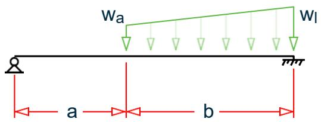  
Figure 1: Beam with partial, trapezoidal load

7.1.1.3 Theoretical Solution

$$R_{A} = \frac{W_{a}}{8 l^{3}} (l - a)^{3} \left(3 l + a\right) + \frac{W_{l} - W_{a}}{40 l^{3}} (l - a)^{3} \left(4 l + a\right)$$

$$O_{A} = \frac{- W_{a}}{48 E \Pi} (l - a)^{3} (l + 3 a) - \frac{W_{l} - W_{a}}{240 E \Pi} (l - a)^{3} (2 l + 3 a)$$

$$R_{B} = \frac{W_{a} - W_{l}}{2} (l - a) - R_{A}$$

$$M_{B} = R_{A} l - \frac{W_{a}}{2} (l - a)^{2} - \frac{W_{l} - W_{a}}{6} (l - a)^{2}$$

where

$$\mathbf{l} = \mathbf{a} + \mathbf{b}$$

7.1.1.4 Comparison

Table 1: Comparison of results   


| Result Type | Theory | SACS | Difference |
| --- | --- | --- | --- |
| Rotation at A, OA(radians) | 0.0020 | 0.0020 | none |
| Vertical reaction at A, RA(kN) | 3.2886 | 3.288 | none |
| Vertical reaction at B, RB(kN) | 21.461 | 21.462 | none |
| Moment at B, MB (kN·m) | 25.9605 | 25.962 | none |


7.1.2 Thermal Loading on a Beam

To find the support reactions due to a temperature loads applied on a fixed-fixed beam

7.1.2.1 Reference

Hand calculation using the following reference:

Matrix Analysis of Framed Structures, $3^{ \mathsf{ r d } }$ edition, W.Weaver Jr. & J.M.Gere, Van Nostrand Reinhold, Table B2,Appendix B, p.500

7.1.2.2 Problem

The beam in the following geometric, load, and section properties: $L = 7 . 5 m , T = 40^{ \circ } C ,$ $T_{ 2 } , T_{ 1 } = 5 O^{ \circ } C , \alpha = 21 . 7 ( 10 )^{ - 6 } /^{ \circ } C , d = 30 c m , I_{ z } = 5 . 000 c m^{ 4 } \ , E = 200 \ K N / m m^{ 2 }$ .

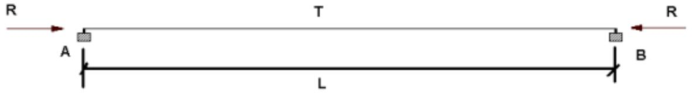

  
Figure 2: Fixed support beam with temper load

7.1.2.3 Theoretical Solution

Horizontal reactions due to case 1 loads:

$$R_{A} = - R_{B} = E A \alpha \Delta T = [ 200 (10)^{6} ] \cdot [ 50 (10)^{-4} ] \cdot [ 11. 7 (10)^{-6} ] \cdot (40) = 468 k N$$

Moment reactions due to case 2 loads:

$$M_{A} = - M_{B} = \frac{a E I \Delta T}{d} = \frac{\left[ 11 . 7 (10)^{-6} \right] \cdot \left[ 200 (10)^{-6} \right] \cdot \left[ 5 , 000 (10)^{-8} \right] (50)}{0 . 3} = 19. 5 k N \cdot m$$

7.1.2.4 Comparison

Table 2: Comparison of results   


| Result Type | Theory | SACS | Difference |
| --- | --- | --- | --- |
| Horizontal Reaction at Node A (kN) | 468 | 468 | none |
| Moment at Node A (kN·m) | 19.5 | 19.5 | none |


Note: In the SACS model, two load cases are used. In case 1, the uniform expansion is applied. In case 2, the temperature change between top and bottom flanges is applied.

7.1.3 Forces on a Propped Cantilever 1

To find the deflection and member forces due to an applied load on a propped cantilever beam with a compression only support.

7.1.3.1 Reference

Hand calculation using the following reference:

Manual of Steel Construction, Load and Resistance Factor Design, Second Edition, American Institute of Steel Construction, 1998, pp. 4-194, 4-197.

7.1.3.2 Problem

A cantilever beam with an end support capable of resisting only a compressive force is analyzed for two concentrated loads at 0.6xL:

+0.5 lbs (up), and   
-0.5 lbs (down)

$$E = 10 (10)^{6}$$

$$w i d t h = 0. 6 \text{i n}$$

$$\mathrm{d e p t h} = 0. 3 \mathrm{i n}$$

$$L = 4 f t$$

Note: A dummy member is used to represent a compression only support

  
Figure 3: Cantilevered member with a compression only support

7.1.3.3 Theoretical Solution

7.1.3.3.1 Load Case 1

General solution equations found on p.2-121 of the reference.

$$M (x <   b) = - P (b - x) = - 0. 5 l b (28. 8 - x)$$

At the rigid support, $M = 14 . 4 ~ i n { \cdot } l b$ .

By inspection, fixed end shear is equal to load value = 0.50 lb.

$$\begin{array}{l} \Delta (x <   b) = \frac{P x^{2}}{6 E I} (3 x - b) \\ = \frac{0 . 5 l b (28 . 8 i n .)^{2}}{6 (10 , 000 , 000 p s i) (0 . 00135 i n .^{4})} \left[ 3 (28. 8 i n.) - 28. 8 i n. \right] = 0. 295 i n. \\ \end{array}$$

7.1.3.3.2 Load Case 2

General solution equations found on p.2-118 of the reference

$$R_{1} = \frac{P b^{2 (a + 2 \ell)}}{2 \ell^{3}} = \frac{0 . 5 l b (48 i n .)^{2}}{2 (48 i n .)^{3}} \left[ 19. 2 i n + 2 (48 i n) \right] = 0. 216 l b.$$

$$R_{2} = P - R_{1} = 0. 50 l b - 0. 216 l b = 0. 284 l b.$$

Moment at rigid support:

$$\begin{array}{l} M (x <   b) = R_{1} (\ell - x) - P (\ell - x - a) \\ = 0. 216 l b (48 i n - 0) - 0. 5 l b (48 i n - 0 - 19. 2 i n) = - 4. 032 i n \cdot l b \\ \end{array}$$

Deflection at point of load:

$$\begin{array}{l} \Delta \left(x <   b\right) = \frac{- P a x^{2}}{12 E I \ell^{3}} \left(3 \ell^{3} - 3 \ell^{2} x - 3 a^{2} \ell + a^{2} x\right) \\ = \frac{- 0 . 5 l b (19 . 2 i n) (28 . 8 i n)^{3}}{12 (10 , 000 , 000 p s i) (0 . 00135 i n .^{4}) (48 i n .)^{3}} \left[ 3 (48 i n.)^{3} - 3 (48 i n.)^{2} (28. 8 i n) - 3 (19. 2 i n.)^{2} (48 i n) + (19. 2 i n.)^{2} (28. 8 i n) \right] \\ \end{array}$$

7.1.3.4 Comparison

Table 3: Comparison of results   


| Load Case | Result Type | Theory | SACS | Difference |
| --- | --- | --- | --- | --- |
| LC 1 | Moment at fixed end (in·lb) | -14.4 | -14.4 | None |
| LC 1 | Shear at fixed end (lb) | 0.50 | 0.50 | None |
| LC 1 | Deflection at load (.in) | 0.295 | 0.295 | None |
| LC 2 | Moment at fixed end(in·lb) | 4.032 | 4.032 | None |
| LC 2 | Shear at fixed end (lb) | 0.284 | 0.284 | None |
| LC 2 | Deflection at load (.in) | -0.040 | -.040 | None |


7.1.4 Torsion on a Stepped Cantilever

To find end rotation due to torques on a stepped cantilever shaft.

7.1.4.1 Reference

Hand calculation using the following reference:

Gere J. M., and Timoshenko, S. P., Mechanics of Materials, 2nd Edition, PWS Engineering, Page 171, Problem 3.3 -1.

7.1.4.2 Problem

A stepped shaft is subjected to torques, as shown in the figure. The material has a shear modulus of elasticity $\mathsf{ G } = 80 \mathsf{ G } \mathsf{ p } \mathsf{ a }$ . Determine the angle of twist θx in degrees at the free end.

  
Figure 4: Cantilevered member subject to torsional loads

7.1.4.3 Theoretical Solution

Moment of Inertia:

$$I_{p 1} = \frac{\pi (80 m m / 2)^{4}}{2} = 4. 021 (10)^{6} m m^{4}$$

$$I_{p 2} = \frac{\pi (60 m m / 2)^{4}}{2} = 1. 272 (10)^{6} m m^{4}$$

$$I_{p 2} = \frac{\pi (40 m m / 2)^{4}}{2} = 0. 251 (10)^{6} m m^{4}$$

Angle of twist is given by:

$$\begin{array}{l} \theta = \sum_{i} \frac{L_{i} T_{i}}{G I_{p}} \\ = \frac{5 , 800 N - m m (500 m m)}{4 . 021 (10)^{6} m m^{4} 80 G P a} + \frac{2 , 800 N - m m (500 m m)}{1 . 272 (10)^{6} m m^{4} 80 G P a} + \frac{, 800 N - m m (500 m m)}{0 . 251 (10)^{6} m m^{4} 80 G P a} \\ = 0. 0090 + 0. 0138 + 0. 0199 = 0. 0427 \\ \end{array}$$

which is equal to $2 . 446^{ \circ }$ .

7.1.4.4 Comparison

Table 4: Comparison of results   


| Result | Theory | SACS | Difference |
| --- | --- | --- | --- |
| Angle of twist (rad.) | 0.0427 | 0.0427 | none |


7.1.5 Forces on a Propped Cantilever 2

To find deflections, stress, and support reactions due to a uniform load on a beam with one end fixed and the other end supported by a roller.

7.1.5.1 Reference

Hand calculation using the following reference:

Roark, R.J., and Young, W.C., Formulas for Stress and Strain, 5th Edition, Page 109, Problem 23.

7.1.5.2 Problem

A horizontal beam of length = 100 in, $\mathsf{ a r e a } = 4 \mathsf{ i n }^{ 2 } ,$ , height = 2 in, and moment of inertia = $1 . 3333 \mathrm{ i n }^{ 4 }$ is simply supported at one end and fixed at the other end. The beam is subjected to a uniform loading. Determine the deflection δ at $\aleph = 42 . 15$ in., the slope θ at end A, the maximum bending stress $\sigma_{ \mathrm{ b e n d } }$ in the beam, and the support reactions.

$$E = 30 \times (10) 6 p s i$$

$$D e n s i t y = 0. 2821 \mathrm{l b s} / \mathrm{i n} 3$$


  
B)   
Figure 5: Beam A) problem sketch and B) mathematical model

7.1.5.3 Comparison

Table 5: Comparison of results   


| Result | Theory | SACS | Difference |
| --- | --- | --- | --- |
| Reaction at Node 1 (lb) | 42.31 | 42.19 | none |
| Reaction at Node 3 (lb) | 70.52 | 70.31 | none |
| Moment at Node 3 (in·lb) | 1,410.4 | 1406.3 | none |
| Bending Stress, σbend at Node 2 (psi) | 585.9 | 584.12 | none |
| Rotation at Node 1 (rad.) | -.000588 | -.00059 | none |
| Deflection at Node 2 (in.) | -0.01528 | -0.01523 | none |


7.1.6 Axially Loaded Column

To find support reactions due to an axial load applied at two locations on a column with both ends pinned.

7.1.6.1 Reference

Hand calculation using the following reference:

Timoshenko, S., Strength of Materials, Part I, D. Van Nostrand Co., Inc., 3rd Edition, 1956. Page 26, Problem 10.

7.1.6.2 Problem

Find the support reactions at the end joints 1 and 4.

$$\mathrm{E} = 30 \times (10)^{6} \mathrm{p s i}$$

Figure 6: Column A) problem sketch and B) mathematical model

  
(A)

  
(B)

7.1.6.3 Comparison

Table 6: Comparison of results   


| Result | Theory | SACS | Difference |
| --- | --- | --- | --- |
| Reaction at Node 1 (lb) | 600 | 600 | none |
| Reaction at Node 4 (lb) | 900 | 900 | none |


7.1.7 Tee Shaped Cantilever

To find the stress due to an applied moment at the free end of a cantilever beam with inverted tee section.

7.1.7.1 Reference

Hand calculation using the following reference:

Crandall, S.H., and Dahl, N.C., An Introduction to the Mechanics of Solids, McGraw-Hill, Inc., 1959, Page 294, Problem 7.2.

7.1.7.2 Problem

Find the maximum bending stress in the beam.

$$E = 30 \times (10)^{6} p s i$$

$$b = 1. 5 \text{i n .}, h = 8 \text{i n .}, L = 10 \text{i n .}$$

$$M = 1, 000, 000 \text{i n}. \cdot \mathrm{l b}.$$


  
  
Figure 7: Beam A) problem sketch and B) mathematical model

7.1.7.3 Comparison

Table 7: Comparison of results   


| Result | Theory | SACS | Difference |
| --- | --- | --- | --- |
| Bending stress, σ (psi) | 700 | 700 | none |


7.1.8 Beam on Elastic Foundation

To find deflection and stress at the center due to a uniform, static load on a simply supported beam on elastic foundation.

7.1.8.1 Reference

Peterson, F.E., Elastic Analysis for Structural Engineering (EASE2), Example Problem Manual, EngineeringAnalysis Corporation, Berkeley, CA, 1981.

7.1.8.2 Problem

Find the vertical deflection and bending stress at the center of the beam.Spacing between

$\mathsf{ E } = 30 \times ( 10 )^{ 6 } \mathsf{ p s i }$

$\flat = 1 . 0 \ \mathsf{ i n . , h } = 7 . 114 \ \mathsf{ i n . , L } = 240 \ \mathsf{ i n . }$

$\mathsf{ w }_{ \mathsf{ u } } = 43 . 3 \mathsf{ | b / i n . }$

  
Figure 8: One-half beam for mathematical model

7.1.8.3 Comparison

Table 8: Comparison of results   


| Result | Theory | SACS | Difference |
| --- | --- | --- | --- |
| Vertical deflection (in.) | 1.0453 | 1.0453 | none |


7.1.9 Stresses in a Circular Beam

Find deflections and stress at the center of a locomotive axle.

7.1.9.1 Reference

Timoshenko, S., Strength of Materials, Part- 1, D. Van Nostrand Co., $3^{ \mathsf{ r d } }$ edition, 1956.

## p. 94, problems 1, 2.

7.1.9.2 Problem

Determine the maximum stress in a locomotive axle (as shown in the figure) as well as the deflection at the middle of the axle.

Diameter = 10 in.

$\mathsf{ P } = 26 , 000 \mathsf{ \Pi } | \mathsf{ b } \mathsf{ f }$

$\mathsf{ E } = 30 \times ( 10 )^{ 6 } \mathsf{ p s i }$

$\mathsf{ L 1 } = 13 . 5 \mathsf{ i n . , L 2 } = 59 \mathsf{ i n . }$

  
Figure 9: Locomotive axle model

7.1.9.3 Comparison

Table 9: Comparison of results   


| Result Type | Theory | SACS | Difference |
| --- | --- | --- | --- |
| σ (psi), Joint 0001 | 3,575.* | 3,575.3 | negligible |
| δ (in.), Joint 0000 | 0.01040 | 0.01094 | negligible |


* The value is recalculated.

7.1.10 End Moments in a Non Uniform Beam

To find end moments due to a uniform load on a beam with nonuniform sections, fixed at both ends.

7.1.10.1 Reference

Hand calculation using the following reference:

McCormack, J.C., Structural Analysis, Intext Educational Publishers, 3rd Edition, 1975.

7.1.10.2 Problem

Find the moment at the supports. Assume for input a unit width for the beam. Depths are as shown.

$$\begin{array}{l} E = 30 \times (10)^{6} p s i \\ w = 4 k / f t \\ d 1 = 10 \text{i n .}, d 2 = 20 \text{i n .} \\ \mathrm{L} 1 = 12 \mathrm{f t}, \mathrm{L} 2 = 8 \mathrm{f t} \\ \end{array}$$


  
  
(B)   
Figure 10: Beam A) problem sketch and B) mathematical model

7.1.10.3 Comparison

Table 10: Comparison of results   


| Result | Theory | SACS | Difference |
| --- | --- | --- | --- |
| Moment at Node 1 (kip·ft) | -98.2 | -97.45 | none |
| Moment at Node 2 (kip·ft) | -217.2 | -219.258 | none |


7.1.11 Stresses in a Tapered Cantilever

To find the maximum deflection and principal stress due to a load on the free end of a cantilever beam with a tapered section.

7.1.11.1 Reference

Hand calculation using the following reference:

Harris, C.O., Introduction to Stress Analysis, The Macmillan Co., 1959. Page 114, Problem 61.

7.1.11.2 Problem

Find the maximum deflection, δ, and the principal normal stress, σ, in the beam.

$$\begin{array}{l} E = 30 \times (10)^{6} p s i \\ P = 10 \mathrm{l b} \\ d = 3 \text{i n .}, b = 0. 5 \text{i n .} \\ L = 20 \\ \end{array}$$


  
Figure 11: Beam with a tapering cross section

7.1.11.3 Comparison

Table 11: Comparison of results   


| Result | Theory | SACS | Difference |
| --- | --- | --- | --- |
| Maximum deflection at free end (in.) | -0.04267 | -0.0427 | none |
| Principle stress (psi) | 1,600 | 1,600 | none |


7.1.12 Stresses in a Cable due to Thermal Loading

A rigid bar is suspended by two copper wires and one steel wire. Find the stresses in the wires due to a rise in temperature.

7.1.12.1 Reference

Timoshenko, $\mathsf{ S }_{ \cdot } ,$ Strength of Materials, Part 1, D. Van Nostrand $\mathsf{ C o . } , 3^{ \mathsf{ r d } }$ edition, 1956, page 30, problem 9.

7.1.12.2 Problem

Assuming the horizontal member to be very rigid, determine the stresses in the copper and steel wires if the temperature rise is $10^{ \circ } \mathsf{ F }$ . Members 1 and 3 are copper, and member 2 is steel.

Esteel $= 30\times (10)^{6}$ psi, Ecopper $= 16\times (10)6$ psi   
αsteel $= 70\mathrm{E - 7}$ in/in/°F, αcopper $= 92\mathrm{E - 7}$ in/in/°F   
AX = 0.1 in2   
w = 400 lbf/in.   
L = 20 in.   
d= 5 in.

Tip: When modeling, assume a large moment of inertia for the horizontal rigid member and distribute of theconcentrated load as uniform.

  
Figure 12: Model of a rigid wire suspended by wires

7.1.12.3 Comparison

Table 12: Comparison of results   


| Result Type | Theory | SACS | Difference |
| --- | --- | --- | --- |
| oSteel (psi) | 19,695 | 19,698 | negligible |
| oCopper (psi) | 10,152 | 10,151 | negligible |


7.1.13 Curved Beam

To find the out-of-plane deflection and stress in a circular cantilever member with a concentrated load at the free end.

7.1.13.1 Reference

Hand calculation using the following reference:

Timoshenko, S., Strength of Materials, Part I, D. Van Nostrand, 3rd Edition., 1955.

7.1.13.2 Problem

Calculate the displacement at the free end and the bending stress at the fixed end due to a concentrated load producing out–of–plane bending.

$$\begin{array}{l} E = 30 \times (10)^{6} p s i \\ P = 50 \mathrm{l b} \\ r = 100 \text{i n}. \\ \end{array}$$

  
Figure 13: Curved beam

7.1.13.3 Comparison

Table 13: Comparison of results   


| Result | Theory | SACS | Difference | Comments |
| --- | --- | --- | --- | --- |
| Maximum deflection at free end (in.) | 2.648 | 2.6767 | negligible |  |
| Principle stress (psi) | 6,366.0 | 6,641.51 | 4.3% | The result from a classical theory of a beam curved in plane is compared with the result from a piecewise linear set of beams, which closely resembles the behavior of a curved beam, but not exactly. Hence the difference in results. The difference may be further reduced to a certain level by discretizing the curved beam in more smaller subdivisions. |


7.1.14 Hanging Bar Axial Stress

Two vertical bars are supported by a rigid bar, which is pinned-supported on one end. Find stresses in vertical bars due to a load at the free end of the rigid bar.

7.1.14.1 Reference

Higdon, Ohlsen, Stiles, Weese and Riley, Mechanics of Materials, 3rd Edition, John Wiley & Sons, Page 135,Problem 3-37.

7.1.14.2 Problem

Bars A and B are connected by rigid links to a fixed support at the top and to a rigid bar at the bottom. Determine the axial stresses in bars A and B when the load P is 177.92888 kN applied as shown.

$$P = 177. 93 k N$$

$$A A = 1, 290. 3 \mathrm{m m} 2$$

$$A B = 1, 612. 9 m m 2$$

$$E A = 68. 95 G P a$$

$$E B = 206. 84 G P a$$

Assume the moment of inertia of member CD to be very large.

  
Figure 14: Rigid bar hanging from a pair of rods

7.1.14.3 Comparison

Table 14: Comparison of results   


| Result Type | Theory | SACS | Difference |
| --- | --- | --- | --- |
| Stress in A (GPa) | 0.17237 | 0.17241 | negligible |
| Stress in B (GPa) | 0.20684 | 0.20677 | negligible |


7.1.15 Bent Cantilever Deflection

Find deflection due to load at the free end of a cantilever plane bent.

7.1.15.1 Reference

Kinney, J. S., Indeterminate Structural Analysis, Addison - Wesley Publishing Co., 1957, Page 13, Problem 4 - 38

7.1.15.2 Problem

$$\begin{array}{l} E = 30, 000 \mathrm{k s i} \\ 1 = 200 \mathrm{i n}^{4} \\ A = 10 \text{i n}^{2} \\ \end{array}$$

  
Figure 15: Bent plate frame

7.1.15.3 Comparison

Table 15: Comparison of results   


| Result Type | Theory | SACS | Difference |
| --- | --- | --- | --- |
| Deflection right, δx (in) | 0.53 | 0.53056 | none |
| Deflection down, δy (in) | 1.16 | -1.17109 | <1% |
| Rotation, θ (rad) | 0.0049 | 0.00488 | none |


7.1.16 Bent Beam Thermal Loading

To find member forces and moments due to a temperature load on a Zee shaped plane bent.

7.1.16.1 Reference

Seeley, F.B., and Smith, J.O., Advanced Mechanics of Materials, 2nd Edition, John Wiley and Sons, 1955, Pages494-497.

7.1.16.2 Problem

Calculate reactions and maximum moments in the structure due to a temperature increase of 430 ºF. Do not consider shear deformation.

E = 26,400 ksi $\alpha = 7.26744 \times 10^{-6}$ in/in/°F  
OD = 12 in  
ID = 10.255 in

  
Figure 16: Frame subject to temperature change

7.1.16.3 Comparison

Table 16: Comparison of results   


| Result Type | Theory | SACS | Difference | Comments |
| --- | --- | --- | --- | --- |
| Horizontal reaction (lbs) | 8,980 | 8,952.88 | negligible |  |
| Vertical reaction (lbs) | 7,756 | 7,732.40 | negligible |  |
| Moment at supports (in·lb) | 783,750 | 781,429 | negligible |  |
| Moment at node 2 (in·lb) | 1,077,656 | 1,074,346 | negligible |  |


## 7.2 Trusses

7.2.1 Axial Stress on a Truss Model

To find member stress due to a joint load in a space truss using static analysis.

7.2.1.1 Reference

Beer, F.P., and Johnston, Jr., E.R., Vector Mechanics for Engineers, Statics and Dynamics, McGraw - Hill, Inc., NewYork, 1962, p.47, Problem 2.70.

7.2.1.2 Problem

A 50 lb load is supported by three bars which are pinned to a ceiling as shown. Determine the stress, σ, in each bar.

Area of each bar = 1 in2, E = 30 (10)6 psi

  
Figure 17: Space truss

7.2.1.3 Comparison


| Result Type | Theory | SACS | Difference |
| --- | --- | --- | --- |
| σAD | 31.2 | 31.2 | none |
| σBD | 10.4 | 10.4 | none |
| σCD | 22.9 | 22.9 | none |


7.2.2 Axial Force on a Cable

To find member force due to a member load in a plane articulate structure.

7.2.2.1 Reference

Kinney, J. S.,Indeterminate Structural Analysis, Addison - Wesley Publishing Co., 1957, p.275, Problem 6 - 19.(Original data is in US Customary Units)

7.2.2.2 Problem

Find the tensile stress in the cable. The cross-sectional area of the cable is 967.74 mm2 with an E of 137.895 GPa. The timber beam 1-3 is 304.8 mm x 304.8 mm in section, with E = 11.03161 GPa. Each member of the steel cantilever truss has a cross - sectional area of 2,580.64 mm2, and E of 206.8427 GPa.

  
Figure 18: Plane articulate truss

7.2.2.3 Comparison

Table 18: Comparison of results   


| Result Type | Theory | SACS | Difference |
| --- | --- | --- | --- |
| Cable, 3-4 | 22.7 | 22.6 | negligible |


7.2.3 Axial Force in a 2D Plane Frame 1

To find member forces due to joint loads in a plane truss.

7.2.3.1 Reference

Norris C.H., Wilbur J. B., Elementary Structural Analysis, 2nd Edition, McGraw – Hill, Inc., Page 159, Problem 4.3.(Original data is in US Customary Units)

7.2.3.2 Problem

Compute the bar forces in the bars a, b, c, d, e of the truss due to the loads shown.

  
Figure 19: Plane truss

7.2.3.3 Comparison

Table 19: Comparison of results   


| Result Type | Theory | SACS | Difference |
| --- | --- | --- | --- |
| a | -202.13 | -202.1 | none |
| b | -185.76 | -190.3 | 2.4% (negligible) |
| c | -22.42 | -23.4 | 4.5% |
| d | 266.23 | 269.5 | 1.2% (negligible) |
| e | 119.61 | 117.1 | 2.1% (negligible) |


7.2.4 Axial Forces on a 3D Space Model

To find support reactions and member forces due to a joint load in a space truss.

7.2.4.1 Reference

Beer F. P., and Johnston, E. R., Vector Mechanics for Engineers - Statics, 4th Edition, McGraw – Hill, Inc., p.216,Problem 6.20.

7.2.4.2 Problem

The space truss is supported by the six reactions shown. If a horizontal 2,700 N load is applied at $\mathsf{ A } ,$ determine the reactions and the force in each member.

  
Figure 20: Space truss

7.2.4.3 Comparison

Table 20: Comparison of results   


| Result Type | Theory | SACS | Difference |
| --- | --- | --- | --- |
| Bv | 0 | 0 | none |
| Bz | 2,700 | 2,700 | none |
| Cx | 1,800 | 1,800 | none |
| Cv | 3,375 | 3,375 | none |
| Dx | 1,800 | 1,800 | none |
| Dv | 3,375 | 3,375 | none |


Table 21: Comparison of results   


| Result Type | Theory | SACS | Difference |
| --- | --- | --- | --- |
| AB | 0 | 0 | none |
| AC | 4,275 | 4,275 | none |
| AD | 4,275 | 4,275 | none |
| BC | 4,270 | 4,269 | negligible |
| CD | 0 | 0 | none |
| BD | 4,270 | 4,269 | negligible |


7.2.5 Reactions in a 2D Truss Model 1

To find support reactions due to joint loads in a plane truss.

7.2.5.1 Reference

McCormack, J.C. Structural Analysis, Intext Educational Publishers, 3rd Edition, 1975.

7.2.5.2 Problem

Find the vertical support reactions of the truss.

$$E = 30, 000. 0 \mathrm{k s i}$$

$$A = 100 \text{i n}^{2}$$

Loads as shown.

  
Figure 21: Plane truss

7.2.5.3 Comparison

Table 22: Comparison of results   


| Result Type | Theory | SACS | Difference |
| --- | --- | --- | --- |
| R1 (kips) | -76.7 | -76.7 | none |
| R4 (kips) | 346.7 | 346.7 | none |
| R9 (kips) | 30 | 30 | none |


7.2.6 Reactions in a 2D Truss Model 2

To find support reactions due to joint loads in a plane truss.

7.2.6.1 Reference

McCormack, $\mathsf{ J . C . } ,$ Structural Analysis, Intext Educational Publishers, $3^{ \mathsf{ r d } }$ Edition, 1975.

7.2.6.2 Problem

Find the vertical and horizontal reactions at the supports of the truss.

$$E = 30, 000. 0 \mathrm{k s i}$$

$$A = 100 \text{i n}^{2}$$

Loads as shown.


7.2.6.3 Comparison

Table 23: Comparison of results   


| Result Type | Theory | SACS | Difference |
| --- | --- | --- | --- |
| Horizontal, R1 (kips) | 11.5 | 11.49 | none |
| Vertical, R1 (kips) | 34.3 | 34.29 | none |
| Horizontal, R2 (kips) | -31.7 | -31.67 | none |
| Vertical, R2 (kips) | 36.0 | 36.0 | none |


7.2.7 Reactions in a 2D Truss Model 3

Find the support reactions due to a joint load in a plane truss.

7.2.7.1 Reference

Timoshenko, $\mathsf{ S }_{ \cdot } ,$ Strength of Materials, Part 1, D. Van Nostrand Co., Inc., $3^{ \mathsf{ r d } }$ edition, 1956, p.346, problem 3.

7.2.7.2 Problem

Determine the horizontal reaction at support 4 of the system.

$$\begin{array}{l} L = 50 \text{i n}. \\ P = 10 k i p s \\ \end{array}$$

  
Figure 23: Plane truss

7.2.7.3 Comparison

Table 24: Comparison of results   


| Result Type | Theory | SACS | Difference |
| --- | --- | --- | --- |
| R4 (kips) | 8.77 | 8.77 | none |


7.2.8 Deflections in a 2D Truss Model

Find the joint deflection due to joint loads in a plane truss.

7.2.8.1 Reference

McCormac, J. C., Structural Analysis, Intext Educational Publishers, $3^{ \mathrm{ { r d } } }$ edition, 1975, page 271, example 18 - 2.

7.2.8.2 Problem

Determine the vertical deflection at point 5 of plane truss structure shown in the figure.

  
Stress in a 2D Truss Model

$$P = 20 k i p$$

$$L = 15 f t$$

Truss width = 4 spaces at 15 ft = 60 ft

Truss height = 15 ft

$$A_{X 1 - 4} = 1 \text{i n}^{2}, A_{X 5 - 6} = 2 \text{i n}^{2}, A_{X 7 - 8} = 1. 5 \text{i n}^{2},$$

$$A_{X 9 - 11 B} = 3 \text{i n}^{2 P}, A_{X 12 - 13} = 4 \text{i n}^{2}$$

$$\mathrm{E} = 30 \mathrm{E} 3 \mathrm{k s i}$$

7.2.8.3 Comparison

Table 25: Comparison of results   


| Result Type | Theory | SACS | Difference |
| --- | --- | --- | --- |
| δ5 (in.) | 2.63 | 2.6305 | negligible |


7.2.9 Stress in a 2D Truss Model

Find the joint deflection and member stress due to a joint load in a plane truss.

7.2.9.1 Reference

Timoshenko, S., Strength of Materials, Part 1, D. Van Nostrand $\mathsf{ C o . , l n c . , 3^{ r d } }$ edition, 1956, page 10, problem 2.

7.2.9.2 Problem

Determine the vertical deflection at point A and the member stresses.

$$\begin{array}{l} A X = 0. 5 \text{i n}^{2} \\ E = 30 E 6 p s i \\ P = 5000 \text{l b f} \\ L = 180 \text{i n}. \\ \text{a n g l e} = 30^{\circ} \\ \end{array}$$

  
Figure 25: Model of two member truss

7.2.9.3 Comparison

Table 26: Comparison of results   


| Result Type | Theory | SACS | Difference |
| --- | --- | --- | --- |
| σA (psi) | 10,000. | 10,000. | none |
| δA (in) | 0.12 | 0.12 | none |


7.2.10 Axial Forces in a Plane Frame 2

To find member forces due to a thermal load in a plane truss.

7.2.10.1 Reference

Gere J. M., and Timoshenko, S. P., Mechanics of Materials, 2nd Edition, PWS Engineering, p.21, Problem 2.6 - 23.

7.2.10.2 Problem

A symmetric, three-bar truss ABCD undergoes a temperature increase of $20^{ \circ } \mathsf{ C }$ in the two outer bars and $70 \textdegree$ in the middle bar. Calculate the forces F1 and F2 in the bars.

$$\begin{array}{l} E = 200 \mathrm{G P a} \\ \alpha = 14 (10)^{-6} /^{\circ} \mathrm{C} \\ A = 900 m m^{2} \\ \end{array}$$

  
Figure 26: Plane truss subject to differential thermal loading

7.2.10.3 Comparison

Table 27: Comparison of results   


| Result Type | Theory | SACS | Difference |
| --- | --- | --- | --- |
| F1 | 22,100 | 22,143 | 0.2% (negligible) |
| F2 | -31,300 | -31,315 | 0.1% (negligible) |


## 7.3 Frames

7.3.1 2D Portal Reactions 1

To find section properties, member forces and support reactions for a 1x1 bay plane frame with members of rectangular section.

7.3.1.1 Reference

Timoshenko, S., Strength of Materials, Part I, Elementary Theory and Problems, 2nd Edition, Van NostrandCompany, 1940, Pages 188-191,

7.3.1.2 Problem

The frame supports a concentrated load at middle of the horizontal member. Verify the internally calculated section properties, support reactions and bending moments at the ends of the horizontal member. Columns are square $2 " \times 2 "$ ; beams are rectangular with ${ \mathsf{ b } } = 2^{ \mathbf{ n } }$ and $h = 4 "$ .

$$P = 1, 000 \mathrm{l b}$$

$$h = 100 \text{i n .} l = 120 \text{i n .}$$

$$E = 30 \times (10)^{6} p s i$$

  
Figure 27: Symmetric portal frame

7.3.1.3 Calculations

From the reference:

$$M = \frac{P l}{8} \frac{1}{1 + \frac{2}{3} \frac{h}{l} \frac{I_{b}}{I_{c}}} = \frac{1 , 000 (120)}{8} \frac{1}{1 + \frac{2}{3} \frac{100}{120} \frac{10 . 67}{1 . 333}} = 2, 754 \mathrm{i n - l b}$$

7.3.1.4 Comparison

Table 28: Comparison of results   


| Result Type |  | Theory | SACS | Difference |
| --- | --- | --- | --- | --- |
| Column Cross Section | Ax(in.2) | 4.0 | 4.0 | none |
|  | Ix(in.4) | 2.25 | 2.2533 | none |
|  | Iy(in.4) | 1.333 | 1.3333 | none |
|  | Iz(in.4) | 1.333 | 1.3333 | none |
| Beam Cross Section | Ax(in.2) | 8.0 | 8.0 | none |
|  | Ix(in.4) | 7.324 | 7.3242 | none |
|  | Iy(in.4) | 2.667 | 2.6667 | none |
|  | Iz(in.4) | 10.667 | 10.667 | none |
| Ry(lb) |  | 500 | 500 | none |
| Rx(lb) |  | 27.55 | 27.55 | none |
| M(in·lb) |  | 2,754.97 | 2,755.0 | none |


7.3.2 3x2 Plane Frame Moments

To find the bending moments due to lateral joint loads in a 3x2 bay plane frame.

7.3.2.1 Reference

Noris and Wilbur, Elementary Structural Analysis, 2nd Edition, McGraw – Hill, Inc., Page 304.

7.3.2.2 Problem

Determine the bending moments in the members of frame.

$$\mathbf{E} = 30, 000 \mathrm{k s i}$$

$$I_{A E} = I_{E I} = 240 i n^{4}$$

$$\mathrm{I}_{\mathrm{B F}} = \mathrm{I}_{\mathrm{F J}} = 480 \mathrm{i n}^{4}$$

$$\mathrm{I}_{\mathrm{C G}} = \mathrm{I}_{\mathrm{G K}} = 600 \mathrm{i n}^{4}$$

$$\mathrm{I}_{\mathrm{D H}} = \mathrm{I}_{\mathrm{H L}} = 360 \mathrm{i n}^{4}$$

$$\mathrm{I}_{\mathrm{E F}} = \mathrm{I}_{\mathrm{L J}} = 600 \mathrm{i n}^{4}$$

$$I_{F G} = I_{J K} = 1, 200 i n^{4}$$

$$\mathrm{I}_{\mathrm{G H}} = \mathrm{I}_{\mathrm{K L}} = 1, 800 \mathrm{i n}^{4}$$

  
Figure 28: 3x2 bay plane frame

7.3.2.3 Comparison

Table 29: Comparison of results   


| Result Type | Result Type | Theory | SACS | Difference |
| --- | --- | --- | --- | --- |
| Bending in member (ft·kips) | AE | 29.6 | 29.8 | negligible |
| Bending in member (ft·kips) | EA | 25.1 | 25.2 | negligible |
| Bending in member (ft·kips) | EI | 6.5 | 6.4 | negligible |
| Bending in member (ft·kips) | IE | 10.6 | 10.5 | negligible |
| Bending in member (ft·kips) | BF | 60.9 | 61.0 | negligible |
| Bending in member (ft·kips) | FB | 53.7 | 53.7 | none |
| Bending in member (ft·kips) | FJ | 18.3 | 18.5 | 1% |
| Bending in member (ft·kips) | JF | 24.8 | 24.8 | none |
| Bending in member (ft·kips) | CG | 76.8 | 76.7 | negligible |
| Bending in member (ft·kips) | GC | 68.3 | 68.2 | negligible |
| Bending in member (ft·kips) | GK | 25.2 | 25.2 | none |
| Bending in member (ft·kips) | KG | 32.4 | 32.5 | negligible |
| Bending in member (ft·kips) | DH | 45.6 | 45.5 | negligible |
| Bending in member (ft·kips) | HD | 40.1 | 39.9 | negligible |
| Bending in member (ft·kips) | HL | 13.5 | 13.6 | negligible |
| Bending in member (ft·kips) | LH | 18.5 | 18.4 | negligible |
| Bending in member (ft·kips) | EF | 31.6 | 31.7 | negligible |
| Bending in member (ft·kips) | FE | 29.5 | 29.3 | negligible |
| Bending in member (ft·kips) | IJ | 10.6 | 10.5 | negligible |
| Bending in member (ft·kips) | JI | 10.0 | 9.8 | 2% |
| Bending in member (ft·kips) | FG | 42.5 | 42.8 | negligible |
| Bending in member (ft·kips) | GF | 41.3 | 41.7 | negligible |
| Bending in member (ft·kips) | JK | 14.8 | 15.1 | 2% |
| Bending in member (ft·kips) | KJ | 14.4 | 14.7 | 2% |
|  | GH | 52.2 | 51.8 | negligible |
|  | HG | 53.6 | 53.5 | negligible |
|  | KL | 18.0 | 17.8 | 1% |
|  | LK | 18.5 | 18.4 | negligible |


7.3.3 Support Reactions for a Simple Frame

Find support reactions due to a load at the free end of a cantilever bent plate with an intermediate support.

7.3.3.1 Reference

Timoshenko, S., Strength of Materials, Part 1, D. Van Nostrand Co., Inc., $3^{ \mathsf{ r d } }$ edition, 1956, page 346, problem 2.

7.3.3.2 Problem

Determine the reaction of the system as shown in the figure.

$$\begin{array}{l} P = 1 \text{k i p} \\ L = 10 \text{i n} \\ \end{array}$$

  
Figure 29: Cantilever model

7.3.3.3 Comparison

Table 30: Comparison of results   


| Result Type | Theory | SACS | Difference |
| --- | --- | --- | --- |
| Rx (kips) | 1.5 | 1.5 | none |


7.3.4 2D Portal Reactions 2

Find the maximum moment due to a uniform load on the horizontal member in a 1x1 bay plane frame.

7.3.4.1 Reference

McCormac, J. C., Structural Analysis, Intext Educational Publishers, $3^{ \mathrm{ { r d } } }$ edition, 1975, page 383, example 22 - 5.

7.3.4.2 Problem

Determine the maximum moment in the frame. E and I same for all members.

$$L = 20 f t$$

$$w = 2 k i p s / f t$$

  
Figure 30: 1x1 bay plane frame

7.3.4.3 Comparison

Table 31: Comparison of results   


| Result Type | Theory | SACS | Difference |
| --- | --- | --- | --- |
| MMax (kip·ft) | 44.40 | 44.45 | negligible |


7.3.5 2D Portal Reactions Sidesway 2

Find the maximum moment due to a concentrated load on the horizontal member in a 1x1 bay plane frame.

7.3.5.1 Reference

McCormac, J. C., Structural Analysis, Intext Educational Publishers, 3rd edition, 1975, page 385, problem 22 - 6.

7.3.5.2 Problem

Determine the maximum moment in the structure.

P = 30 kip

$\lfloor 1 = 20 \mathrm{ f t } , \mathsf{ L } 2 = 30 \mathrm{ f t }$

E and I same for all members

  
Figure 31: Unequal leg bay model

7.3.5.3 Comparison

Table 32: Comparison of results   


| Result Type | Theory | SACS | Difference |
| --- | --- | --- | --- |
| MMax (ft·kip) | 69.40 | 69.56 | negligible |


7.3.6 1x2 Plane Frame Lateral Load

Find the maximum moment due to lateral joint loads in a 1x2 bay plane frame.

7.3.6.1 Reference

McCormac, J. C., Structural Analysis, Intext Educational Publishers, $3^{ \mathrm{ { r d } } }$ edition, 1975, page 388, example 22 - 7.

7.3.6.2 Problem

Determine the maximum moment in the frame.

L = 20 ft

H3 = 20 kip, H5 = 10 kip

E and I same for all members.

  
Figure 32: Two story frame model

7.3.6.3 Comparison

Table 33: Comparison of results   


| Result Type | Theory | SACS | Difference |
| --- | --- | --- | --- |
| MMax (ft·kip) | 176.40 | 178.01 | 0.9% |


7.3.7 2D Portal Reactions Sidesway 1

To find the displacements at the nodes of a frame due to movements of supports.

7.3.7.1 Reference

C.K. Wang, Intermediate Structural Analysis, International Student Edition, 1983, McGraw Hill, Section 2.11, p47.

7.3.7.2 Problem

Calculate the deflections at node B and support D.

  
Figure 33: Frame subject to imposed displacements

Load Cases:

1. Vertical displacement of 1 cm at Node A   
2. Vertical displacement of 1 cm at Node B

7.3.7.3 Comparison

Table 34: Comparison of results   


| Result Type | Result Type | Theory | SACS | Difference |
| --- | --- | --- | --- | --- |
| Load Case 1 | Horizontal displacement at node B (cm) | 1.25 | 1.25 | none |
| Load Case 1 | Rotation at node B | 0.001667 | 0.001667 | none |
| Load Case 1 | Horizontal displacement at node D (cm) | 0.4167 | 0.4167 | none |
| Load Case 2 | Horizontal displacement at node B (cm) | 1.25 | 1.25 | none |
| Load Case 2 | Rotation at node B | 0.001667 | 0.001667 | none |
| Load Case 2 | Horizontal displacement at node D (cm) | 0.4167 | 0.4167 | none |


7.3.8 2 Bay Frame Moments and Shear

To find the member forces in a 1x2 bay plane frame with members of rectangular section.

7.3.8.1 Reference

Manual of Steel Construction – Allowable Stress Design, AISC, 9th Edition, 1989.

7.3.8.2 Problem

The frame supports a uniformly distributed load and concentrated loads. Calculate the bending moment and shear force at the mid point of the beam of the first bay.

$$E = 30, 000 \mathrm{k s i}$$

Columns are $\ L { 12 " } \times \ L { 24 } "$ , beams are $12 " \times 30 "$

  
Figure 34: 2 bay frame

7.3.8.3 Comparison

Table 35: Comparison of results   


| Result Type | Result Type | Theory | SACS | Difference |
| --- | --- | --- | --- | --- |
| Load Case 1 | Moment, M (in·kips) | 3,375 | 3,375 | none |
| Load Case 1 | Shear, V (kips) | 68.75 | 68.75 | none |
| Load Case 2 | Moment, M (in·kips) | 2,430 | 2,429.7 | negligible |
| Load Case 2 | Shear, V (kips) | 22.50 | 22.50 | none |


7.3.9 3D Frame Max Forces

Find the maximum axial force and moment due to load and moment applied at a joint in a Space frame.

7.3.9.1 Reference

Weaver Jr., W., Computer Programs for Structural Analysis, page 146, problem 8.

7.3.9.2 Problem

Determine the maximum axial force and moment in the space structure.

F = 2 kip, P = 1 kip, M = 120 in·kip

$\mathsf{ L } = 120 \mathsf{ i n } .$

$\mathsf{ E } = 30 \mathsf{ E } 3 \mathsf{ k s i } ,$

$\mathsf{ A X } = 11 \mathsf{ i n }^{ 2 }$

$\vert \mathsf{ X } = 83 \mathrm{ i n }^{ 4 }$

$\mathsf{ I Y } = 56 ~ \mathsf{ i n }^{ 4 }$

$\lvert Z = 56 \mathrm{ i n }^{ 4 }$

  
Figure 35: Space frame model

7.3.9.3 Comparison

Table 36: Comparison of results   


| Result Type | Theory | SACS | Difference |
| --- | --- | --- | --- |
| FMax (kips) | 1.47 | 1.47 | none |
| MY, Max (in·kip) | 84.04 | 85.3 | 1.4% |
| MZ, Max (in·kip) | 95.319 | 97.04 | 1.7% |


## 7.4 Plate Elements

7.4.1 Cantilever Tube Stresses and Deflection

To find deflections and element stresses due to loads at the free end of a Cantilever beam of tubular section. The beam is modeled using plate/shell elements.

7.4.1.1 Reference

Timoshenko, S., Strength of Materials, Part I, Elementary Theory and Problems, 2nd Edition, Van NostrandCompany, 1940.

7.4.1.2 Problem

A cantilever beam is made of a tubular section. Using plate/shell elements calculate the deflection at the free end and axial stress at the center of the beam for the following free end loads:

$$\begin{array}{l} P = 1, 000 \mathrm{l b} \\ M x = 2, 000 \text{i n} \cdot \mathrm{l b} \\ M y = 2, 500 \text{i n} \cdot \mathrm{l b} \\ V = 1, 000 \mathrm{l b} \\ \end{array}$$

  
Figure 36: Cantilever beam modeled with elements

  
Figure 37: SACS Model showing Node numbers

Average deflection for nodes 104, 105, 106, 107, 108, 109, 110, 111, 112 and 113 due to load case 3 (My):

$$d = [ 4 (0. 073781) + 4 (0. 073663) + 2 (0. 073815) ] / 10 = 0. 073741$$

Average deflection for nodes 104, 105, 106, 107, 108, 109, 110, 111, 112 and 113 due to load case 4 (V):

$$d = [ 4 (- 0. 409578) + 4 (- 0. 409568) + 2 (- 0. 409601) ] / 10 = 0. 409579$$

Average bending stress for nodes 104, 107, 108, 109, 112, and 113 due to load case 3 (My):

$$\sigma = 4 (5800) + 2 (5200) / 6 = 5600 \mathrm{p s i}$$

Average bending stress for nodes 0, 6, 9, and 12 due to load case 4 (V):

$$\sigma = 4 (42950) / 4 = 42950 \mathrm{p s i}$$

7.4.1.3 Comparison

Table 37: Comparison of results   


| Result Type | Result Type | Theory | SACS | Difference |
| --- | --- | --- | --- | --- |
| Free end deflection due to axial load, P (in) | Nodes 104, 105, 106, 107, 108, 109, 110, 111, 112 and 113 | 0.004 | 0.004 | none |
| Axial stress at the middle of the beam due to axial load, P (psi) | Nodes 54, 55, 56, 57, 58, 59, 60, 61, 62 and 63 | 2,000 | 2,000 | none |
| In plane shear stress at the free end due to torque, Mx (psi) | Nodes 104, 107, 109, 112 | 3,333 | 3,280 | negligible |
| In plane shear stress at the free end due to torque, Mx (psi) | Nodes 105, 106, 110, 111 | 3,333 | 3,330 | negligible |
| In plane shear stress at the free end due to torque, Mx (psi) | Nodes 108, 113 | 3,333 | 3,340 | negligible |
| Result Type | Theory | SACS | Difference |  |
| Avg. free end deflection at the center due to moment, My (in) | 0.0741 | 0.0737 | negligible |  |
| Avg. free end bending stress at the center due to moment, My (psi) | 5,647 | 5,600 | negligible |  |
| Avg. free end deflection at the center due to shear, V (in) | 0.4152 | 0.4096 | 1.3% |  |
| Avg. free end bending stress at the center due to shear, V (psi) | 42,913 | 42,950 | negligible |  |


7.4.2 2D Cantilever Beam End Deflection 1

To find the free end deflection due to a joint load on a Cantilever beam modeled using Plate/shell elements.

7.4.2.1 Reference

Hand calculation.

7.4.2.2 Problem

Using the finite element method calculate the deflection of the free end of the cantilever beam.

  
Figure 38: Fixed support beam with point load

$$E = 4, 278 \mathrm{k s i}$$

$$h = 10 \text{i n}$$

$$b = 5 \mathrm{i n}$$

$$P = 2 k i p s$$

$$L = 60 \text{i n}$$

7.4.2.3 Theoretical Solution

Moment of Inertia:

$$I = (5 \text{i n}) (10 \text{i n})^{3} / 12 = 416. 7 \text{i n}^{4}$$

Deflection at free end:

$$\delta = \frac{P L^{3}}{3 E I} = \frac{2 k i p s (60 i n)^{3}}{3 (4 , 278 k s i) (416 . 7 i n^{4})} = 0. 0808 i n$$

7.4.2.4 Comparison

Table 38: Comparison of results   


| Result Type | Theory | SACS | Difference | Comments |
| --- | --- | --- | --- | --- |
| Deflection at node B (in) | 0.0808 | 0.0824 | 1.98% | The expression for deflection for beam is used to compare the results of a model with Plate Elements with FE formulation, hence the difference in results. |


7.4.3 Natural Frequency of Beam on Springs

Find the period of free vibration for a beam supported on two springs with a point mass.

7.4.3.1 Reference

Timoshenko, S., Young, D., and Weaver, W., Vibration Problems in Engineering, John Wiley & Sons, 4th edition,1974. page 11, problem 1.1-3.

7.4.3.2 Problem

A simple beam is supported by two spring as shown in the figure. Neglecting the distributed mass of the beam, calculate the period of free vibration of the beam subjected to a load of W.

$$E I = 30, 000. 0 \mathrm{k s i}$$

$$A = 7. 0 f t$$

$$B = 3. 0 \text{f t}.$$

$$W = 1, 000 \text{I b f K} = 300. 0 \text{I b / i n}.$$

  
Figure 39: Beam supported on springs

7.4.3.3 Comparison

Table 39: Comparison of results   


| Result Type | Theory | SACS | Difference |
| --- | --- | --- | --- |
| Period (sec) | 0.533 | 0.53295 | negligible |


7.4.4 2D Cantilever Beam End Deflection 2

Find the deflection and moments for plate-bending finite element due to a pressure load.

7.4.4.1 Reference

Results are calculated using simple hand calculation considering the entire structure as a cantilever beam.

7.4.4.2 Problem

A simple cantilever plate is divided into 12 4-noded finite elements. A uniform pressure load is applied, and the maximum deflection at the tip of the cantilever and the maximum bending at the support are calculated.

Plate thickness = 25 mm

Uniform pressure= 5 N/mm2

Plate length = 6 spaces at 50 mm = 300 mm

Plate width = 2 space at 50 mm = 100 mm

  
Figure 40: Finite element mesh of cantilevered plate

7.4.4.3 Theoretical Solution

Maximum deflection is equal to WL3/8EI, where:

$$\Delta_{\max } = \frac{5 (300) (100) (300)^{3}}{8 (210 \cdot 10^{3}) (\frac{100 \cdot 25^{3}}{12})} = \frac{4050 (10)^{9}}{218 . 75 (10)^{9}} = 18. 51 \mathrm{m m}$$

Maximum Moment:

$$M_{\max } = \frac{W L}{2} = \frac{5 (300) (100) (300)}{2} = 22. 5 (10)^{6} \mathrm{N} \cdot \mathrm{m m}$$

7.4.4.4 Comparison

Table 40: Comparison of results   


| Result Type | Hand Calculation | SACS | Difference |
| --- | --- | --- | --- |
| δmax(mm) | 18.51 | 17.792 | 4% |
| Mmax(kN·m) | 22.50 | 22.501 | none |


Note: The maximum moment is taken as the sum of the moments at nodes 1, 8, and 15 (i.e., 5.14 + 12.221 $+ 5 . 14 = 22 . 5 \ : k N { \cdot } m )$ .

7.4.5 2D Curved Beam Maximum Stress

Using plate/shell elements, find maximum bending stress due to a force couple on a curved cantilever beam.

7.4.5.1 Reference

Timoshenko, $\mathsf{ S }_{ \cdot } ,$ Strength of Materials, Part I, 3rd Edition, Van Nostrand $\mathsf{ C o . , }$ 1956.

7.4.5.2 Problem

Find the maximum bending stress.

$\mathsf{ E } = 3 , 000 . 0 \mathsf{ k s i } .$   
Poisson’s ratio = 0.3.   
t = 1.0 in.   
P = 100 lbs

  
Figure 41: Cantilevered, curved plate with coupling load a free end

7.4.5.3 Comparison

Table 41: Comparison of results   


| Result Type | Theory | SACS | Difference | Comments |
| --- | --- | --- | --- | --- |
| Inside stress (psi) | 655.0 | 640 | 2.3% | The result from the Beam theory is compared with the result from a Finite Element Model output, hence the difference in results. |
| Outside stress (psi) | 555.0 | 550 | negligible |  |


7.4.6 2D Circular Surface Displacements and Stresses

A circular plate is fixed along its perimeter. Using plate/shell elements, find the deflection at the center, maximum bending stress due to a uniformly distributed load, and a concentrated load at the center.

7.4.6.1 Reference

Timoshenko, S., Strength of Materials, Part II, 3rd Edition, Van Nostrand Co., 1956, pp.96-97, 103.

7.4.6.2 Problem

The circular plate shown below is subject to two load cases. Load 1 is a uniform pressure, w, and load 2 is a concentrated force, P, at the center. Determine:

deflection at the center for both load cases   
bending stress at the support for both load cases   
moment at the center for load case 1

E = 30,000.0 ksi

Poisson’s ratio = 0.3 r = 40 in.

$\mathsf{ t } = 1 \mathsf{ i } \mathsf{ n } . \mathsf{ w } = 6 \mathsf{ p s i } .$

$\mathsf{ P } = 7 , 539 . 82 \ : | \mathsf{ b } \mathsf{ s }$

  
Figure 42: Finite element model of a circular plate

7.4.6.3 Comparison

Table 42: Comparison of results   


| Result Type | Result Type | Theory | SACS | Difference | Comments |
| --- | --- | --- | --- | --- | --- |
| Load Case 1 | σbend (psi) | 7,200 | 7,600 | 5.3% | The theoretical results from classical Plate theory was compared with the results from Finite Element model - hence the difference in results. |
| Load Case 1 | δmax (in) (Y translation at Node 127) | -0.0874 | -0.0876 | negligible | The theoretical results from classical Plate theory was compared with the results from Finite Element model - hence the difference in results. |
| Load Case 1 | Moment at center (in·lb/in) | 780 | 780 | none | The theoretical results from classical Plate theory was compared with the results from Finite Element model - hence the difference in results. |
| Load Case 2 | σbend (psi) | 3,600 | 4,000 | 11.1% | The theoretical results from classical Plate theory was compared with the results from Finite Element model - hence the difference in results. |
| Load Case 2 | δmax (in) (Y translation at Node 127) | -0.0874 | -0.0869 | negligible | The theoretical results from classical Plate theory was compared with the results from Finite Element model - hence the difference in results. |


7.4.7 Twisted Beam Displacements

To find the displacements at the free end of a warped cantilever plate due to in-plane load and out of plane loads.

7.4.7.1 Reference

MacNeal, R.H. and Harder, R.C., A Proposed Standard Set of Problems to Test Finite Element Accuracy, Finite Element in Analysis and Design 1, 1985.

7.4.7.2 Problem

The finite element model is as shown below: Find the displacements at the tip in the direction of the loads. Loading is unit forces at the free end: in-plane and out-of-plane.

$\mathsf{ E } = 29 , 000 . 0 \mathsf{ k s i } .$

$\mathsf{ L } = 12 . 0 \mathsf{ i n } .$

B = 1.1 in.

t = 0.22 in.

Twist = 90º (root to tip)

Poisson’s ratio = 0.22

  
Figure 43: Finite element model of warped, contilever plate

7.4.7.3 Comparison

Table 43: Comparison of results   


| Result Type | Theory | SACS | Difference | Comments |
| --- | --- | --- | --- | --- |
| δ due to in-plane load (in) | 5.424(10)-3 | 5.321(10)-3 | 1.9% | Instead of using triangular elements, MITC curved shell elements can be used (see 7.5.5). Also, the mesh size could be reduced to get closer result in comparison the theoretical value. |
| δ due to out-of-plane load (in) | 1.754(10)-3 | 1.461(10)-3 | 20.1% | Instead of using triangular elements, MITC curved shell elements can be used (see 7.5.5). Also, the mesh size could be reduced to get closer result in comparison the theoretical value. |


7.4.8 Curved Roof Displacements and Stresses

A Cylindrical roof is supported along two circular edges. Using plate/shell elements, find the vertical deflection at the center of the free edge, principal stresses at the center of the support and center of the free edge (top and bottom of the roof plate) due to uniformly distributed gravity load.

7.4.8.1 Reference

Scordelis, A.C. and Lo, K.S., "Computer Analysis of Cylindrical Shells", Journal of the American Concrete Institute,Vol. 61, May 1964.

7.4.8.2 Problem

For the cylindrical roof shell calculate the following deflection and stresses due to the gravity load.

The vertical deflection, δy, at the center of the free edge.

Principal stresses, σmax and σmin, at the center line section at the vertical angle (top and bottom of the roof plate element). Principal stresses, σmax and σmin, at the center section of the free edge (top and bottom of the roof plate element).

$\mathsf{ E } = 4 . 32 \times ( 10 )^{ 8 } \mathsf{ p s i }$

t = 3.0 in.

Poisson’s ratio = 0.0 in theory (0.1*10-4 in )

w = 90 psi (uniform on surface).

2L = 50 in.

r = 25 in, 40º sector either side of vertical

Boundary conditions: simply supported on circular edges

  
Figure 44: Finite element model of cylindrical roof structure

7.4.8.3 Comparison

Table 44: Comparison of results   


| Result Type | Theory | SACS | Difference | Comments |
| --- | --- | --- | --- | --- |
| δz, at the center of the free edge (in) (y translation at node 431) | 0.3086 | 0.3044 | 1.4% | A finer mesh may reduce the difference between the theoretical and software output. |


7.4.9 Spherical Shell Displacements

To find the displacement in the direction of the load due to a unit load applied at the quadrants of a quarter of a spherical shell.

7.4.9.1 Reference

MacNeal, R.H. and Harder, R.C., A Proposed Standard Set of Problems to Test Finite Element Accuracy, Finite Element in Analysis and Design 1, 1985.

7.4.9.2 Problem

For the quarter of a spherical shell find the displacement in the direction of the load.

$$E = 6. 825 (10)^{7} p s i$$

$$\text{P o i s s o n ' s r a t i o} = 0. 3$$

$$t = 0. 04 \text{i n c h e s}$$

$$r = 10 \text{i n}.$$

Unit forces on quadrants

Boundary conditions:

Vertical restraint at center of free edge

Symmetry defines boundary conditions

  
Figure 45: Model

7.4.9.3 Comparison

Table 45: Comparison of results   


| Result Type | Theory | SACS | Difference |
| --- | --- | --- | --- |
| Deflection, δ (in) at joint 1 | 0.094 | 0.0924 | 1.7% |
| Deflection, δ (in) at joint D | 0.094 | 0.0926 | 1.5% |


7.4.10 2D Circular Plate In-Plane Stresses

A thick cylindrical plate supported along 2 radial edges. Find the radial displacement, radial stress, tangential stress and longitudinal stress at inner surface due to a unit pressure applied at the inner surface.

7.4.10.1 Reference

MacNeal, R.H. and Harder, R.C., A Proposed Standard Set of Problems to Test Finite Element Accuracy, Finite Element in Analysis and Design 1, 1985.

7.4.10.2 Problem

Loading is 1 ksi pressure at inner radius

E = 1000 ksi

Poisson’s ratio = 0.3

Inner radius = 3.0 in

Outer radius = 9.0 in

  
Figure 46: Semi-circular plate finite element model

7.4.10.3 Comparison

Table 46: Comparison of results   


| Result Type | Theory | SACS | Difference |
| --- | --- | --- | --- |
| Radial deflection (10-3in) | 4.582 | 4.657a | <1% |
| Radial stress (ksi) | -1.00 | -0.90b | 10.0% |
| Tangential stress (ksi) | 1.25 | 1.27b | 1.6% |


a. Radial displacements are measured along FY at node 102 and FX at node 101.   
b. At node 102, SX is tangential stress, SY is radial stress.

7.4.11 2D Rectangular Plate with fixed edges

To find the vertical deflection and bending moments at several points due to a unit pressure on a thin rectangular plate simply supported along 4 edges.

7.4.11.1 Reference

Timoshenko, S. and Woinowsky-Kreiger, S., Theory of Plates and Shells, McGraw-Hill, 2nd Edition, 1959, Pages 113-117.

7.4.11.2 Problem

Loading is unit pressure (1 psi) over entire surface.

$$\begin{array}{l} E = 1 \times (10)^{6} p s i \\ \text{P o i s s o n} = 0. 3 \\ \text{L e n g t h} = 16 \text{i n}. \\ \text{W i d t h} = 10 \text{i n}. \\ \text{T h i c k n e s s} = 0. 2 \text{i n} \\ \end{array}$$

  
Figure 47: Model

7.4.11.3 Comparison

Table 47: Comparison of results   


| Result Type | Result Type | Theory | SACS | Difference |
| --- | --- | --- | --- | --- |
| Vertical deflection, δ (in) at joint | 89 | 0.036 | 0.0360 | none |
| Vertical deflection, δ (in) at joint | 93 | 0.113 | 0.1138 | <1.0% |
| Vertical deflection, δ (in) at joint | 170 | 0.025 | 0.0252 | <1.0% |
| Bending moment, Mx (in·lb) in plate | A081 | 1.763 | 1.720 | 2.5% |
| Bending moment, Mx (in·lb) in plate | A085 | 8.513 | 8.468 | <1% |
| Bending moment, Mx (in·lb) in plate | A155 | 1.098 | 1.080 | 1.7% |
| Bending moment, My (in·lb) in plate | A081 | 0.897 | 0.879 | 2.0% |
| Bending moment, My (in·lb) in plate | A085 | 4.873 | 4.832 | <1% |
| Bending moment, My (in·lb) in plate | A155 | 1.108 | 1.066 | 3.9% |


7.4.12 2D Tapered Beam In-Plane Stress

To find element stress due to joint load at the fixed end of a tapered plate with one end fixed.

7.4.12.1 Reference

Crandall, S.H., & Dahl, N.C., An Introduction to the Mechanics of Solids, McGraw – Hill, Inc., 1959.

7.4.12.2 Problem

$$\begin{array}{l} E = 30, 000. 0 \mathrm{k s i} \\ \text{T h i c k n e s s} = 0. 2 \text{i n} \\ \text{P o i s s o n} = 0. 2 \\ P = 4 k i p s \\ \end{array}$$

  
Figure 48: Model

7.4.12.3 Comparison

The SACS result is taken as average of stress in elements 9 and 11 at node $16 = 0 . 5 ( 80 . 85 + 85 . 21 ) =$ 83.03.

Table 48: Comparison of results   


| Result Type | Theory | SACS | Difference |
| --- | --- | --- | --- |
| Maximum stress at the center (ksi) | 83.33 | 83.03 | <1% |


7.4.13 2D Surface with Hole Edge Stress

To find the normal stress on the edge of a circular hole in the center of a rectangular plate.

7.4.13.1 Reference

Young, W. C., Roark’s Formulas for Stress and Strain, McGraw-Hill Inc., 6th Edition, 1989 (Page 732, Type 7).

7.4.13.2 Problem

Find the normal stress on the edge of the circular hole for the plate shown, when an in-plane load causes tension. Use a one-quarter, doubly symmetric model.

  
Figure 49: One quarter of rectangular plate with hole

E = 30,000.0 ksi

Size = 12.10 in × 7.0 in

Thickness = 0.1 in

Fillet radius = 1 in

Poisson’s ratio = 0.3

P = 2,000 lbs

  
Figure 50: Model with nodes and elements labeled

7.4.13.3 Comparison

Table 49: Comparison of results   


| Result Type | Theory | SACS | Difference |
| --- | --- | --- | --- |
| Stress on fillet (node 1, plate 1) (psi) | 9.475 | 9.380 | 1% |


7.4.14 2D Circular Surface Edge Stress

The objective of this example is to find the displacement at center, and bending stress at the center and at the perimeter of a circular plate fixed at its periphery.

7.4.14.1 Reference

Young, W. C., Roark’s Formulas for Stress and Strain, McGraw-Hill Inc., 6th Edition, 1989, Page 429.

7.4.14.2 Problem

Find the normal stress on the edge of the circular hole for the plate shown, when an in-plane load causes tension. Use a one-quarter, doubly symmetric model.

E =10,000.0 ksi

Radius = 10 in

Thickness = 0.02 in

w = 0.1 psi

  
Figure 51: Model

7.4.14.3 Comparison

Table 50: Comparison of results   


| Result Type | Theory | SACS | Difference | Comments |
| --- | --- | --- | --- | --- |
| δ at node 1 (in) | 2.133 | 2.134 | <1% |  |


7.4.15 Thermal Load on a Plate

Find deflections and moments due to thermal loading and compare theoretical answers to the SACS solution.

7.4.15.1 Reference

Timoshenko, S., and Woinowsky-Krieger, S., Theory of Plates and Shells, Second Edition, McGraw-Hill, 1959, pages 162 - 165.

7.4.15.2 Problem

A rectangular plate is simply supported on all four sides. The transverse and longitudinal bending moments aswell as the deflections at several points on the plate are computed.

  
Figure 52: Rectangular plate model

The plate is modeled using 1 in. X 1 in. size elements. At the corner nodes, all the degrees of freedom areconsidered restrained. For the nodes along the four edges, rotation is permitted about that edge.

7.4.15.3 Theoretical Solution

From the Reference, equation (j), the expression for deflection normal to the plate surface is:

$$w = - \frac{a t (1 + v) 4 a^{2}}{\pi^{3} h} \sum_{m = 1, 3, 5 \dots}^{\infty} \frac{\sin \frac{m \pi x}{a}}{m^{3}} \left(1 - \frac{\cosh \frac{m \pi y}{a}}{\cosh a_{m}}\right)$$

Where

$$a_{m} \quad = \quad \frac{m \pi b}{2 a}$$

From the Reference, equation (k), the expressions for bending moment per unit width are

$$\begin{array}{l} M_{x} = \frac{4 D a t (1 - v^{2})}{\pi h} \sum_{m = 1, 3, 5 \dots}^{\infty} \frac{\sin \frac{m \pi x}{a} \cosh \frac{m \pi y}{a}}{m \cdot \cosh a_{m}} \\ M_{y} = \frac{a t (1 - v^{2}) D}{h} - \frac{4 D a t (1 - v^{2})}{\pi h} \sum_{m = 1, 3, 5 \dots}^{\infty} \frac{\sin \frac{m \pi x}{a} \cosh \frac{m \pi y}{a}}{m \cdot \cosh a_{m}} \\ \end{array}$$

Where

α Coefficient of Thermal Expansion

t 三 Difference between the temperatures of the upper and lower surfaces of the plate

二 Poisson's ratio

h Plate thickness

Dimension of the plate along the x1 axis

b Dimension of the plate along the x2 axis

E Elastic Modulus

D = $E h^{ 3 } / / 12 ( 1 - \nu^{ 2 } )$

The numerical values used for this example are:

$$a = 12. 0 E - 06 /^{\circ} F$$

$$t = 450^{\circ} F$$

$$v = 0. 3$$

$$h = 0. 3 \text{i n}.$$

$$a = 12 \text{i n}.$$

$$b = 16 \text{i n}.$$

$$E = 10. 0 E 6 p s i$$

7.4.15.4 Comparison

Table 51: Comparison of results   


| Node Number | X | Y | Theoretical Deflection | SACS Deflection |
| --- | --- | --- | --- | --- |
| 12 | 6 | -8 | 0.00 | 0.00 |
| 13 | 6 | -7 | 0.0897 | 0.0895 |
| 32 | 6 | -6 | 0.1597 | 0.1593 |
| 45 | 6 | -5 | 0.2132 | 0.2126 |
| 58 | 6 | -4 | 0.2531 | 0.2524 |
| 71 | 6 | -3 | 0.2818 | 0.2811 |
| 84 | 6 | -2 | 0.3011 | 0.3003 |
| 97 | 6 | -1 | 0.3122 | 0.3114 |
| 110 | 6 | 0 | 0.3158 | 0.3150 |
| 123 | 6 | 1 | 0.3122 | 0.3114 |


Table 52: Comparison of results   


| Node Number | X | Y | Theoretical Deflection | SACS Deflection |
| --- | --- | --- | --- | --- |
| 117 | 0 | 1 | 0 | 0 |
| 118 | 1 | 1 | 0.1004 | 0.1002 |
| 119 | 2 | 1 | 0.1794 | 0.1790 |
| 120 | 3 | 1 | 0.2387 | 0.2381 |
| 121 | 4 | 1 | 0.2799 | 0.2792 |
| 122 | 5 | 1 | 0.3042 | 0.3034 |
| 123 | 6 | 1 | 0.3122 | 0.3114 |
| 124 | 7 | 1 | 0.3042 | 0.3034 |
| 125 | 8 | 1 | 0.2799 | 0.2792 |
| 126 | 9 | 1 | 0.2387 | 0.2381 |
| 127 | 10 | 1 | 0.1794 | 0.1790 |
| 128 | 11 | 1 | 0.1004 | 0.1002 |
| 129 | 12 | 1 | 0 | 0 |


Table 53: Comparison of results   


| Element Number | X | Y | Theoretical Moment (Pound-in/in) | Theoretical Moment (Pound-in/in) | SACS Moment (Pound-in/in) | SACS Moment (Pound-in/in) |
| --- | --- | --- | --- | --- | --- | --- |
| Element Number | X | Y | Mx | My | Mx | My |
| 97 | 0.5 | 0.5 | 16.74 | 388.26 | 17.21 | 388.52 |
| 98 | 1.5 | 0.5 | 48.93 | 356.07 | 50.26 | 356.68 |
| 99 | 2.5 | 0.5 | 77.45 | 327.55 | 79.43 | 328.76 |
| 100 | 3.5 | 0.5 | 100.36 | 304.64 | 102.75 | 306.2 |
| 101 | 4.5 | 0.5 | 116.31 | 288.69 | 118.9 | 290.51 |
| 102 | 5.5 | 0.5 | 124.47 | 280.54 | 127.14 | 282.48 |
| 103 | 6.5 | 0.5 | 124.47 | 280.54 | 127.14 | 282.48 |
| 104 | 7.5 | 0.5 | 116.31 | 288.69 | 118.9 | 290.51 |
| 105 | 8.5 | 0.5 | 100.36 | 304.64 | 102.75 | 306.2 |
| 106 | 9.5 | 0.5 | 77.45 | 327.55 | 79.43 | 328.76 |
| 107 | 10.5 | 0.5 | 48.93 | 356.07 | 50.26 | 356.68 |
| 108 | 11.5 | 0.5 | 16.74 | 388.26 | 17.21 | 388.52 |


Table 54: Comparison of results   


| Element Number | X | Y | Theoretical Moment (Pound-in/in) | Theoretical Moment (Pound-in/in) | SACS Moment (Pound-in/in) | SACS Moment (Pound-in/in) |
| --- | --- | --- | --- | --- | --- | --- |
| Element Number | X | Y | Mx | My | Mx | My |
| 6 | 5.5 | -7.5 | 373.88 | 31.12 | 373.55 | 32.86 |
| 18 | 5.5 | -6.5 | 311.64 | 93.36 | 313.02 | 95.80 |
| 30 | 5.5 | -5.5 | 256.83 | 148.17 | 258.89 | 151.33 |
| 42 | 5.5 | -4.5 | 211.14 | 193.87 | 213.63 | 197.05 |
| 54 | 5.5 | -3.5 | 175.41 | 229.60 | 178.11 | 232.42 |
| 66 | 5.5 | -2.5 | 149.47 | 255.53 | 152.20 | 257.96 |
| 78 | 5.5 | -1.5 | 132.68 | 272.32 | 135.39 | 274.43 |
| 90 | 5.5 | -0.5 | 124.47 | 280.54 | 127.14 | 282.48 |
| 102 | 5.5 | 0.5 | 124.47 | 280.54 | 127.14 | 282.48 |
| 114 | 5.5 | 1.5 | 132.68 | 272.32 | 135.39 | 274.43 |
| 126 | 5.5 | 2.5 | 149.47 | 255.53 | 152.20 | 257.96 |
| 138 | 5.5 | 3.5 | 175.41 | 229.59 | 178.11 | 232.42 |
| 150 | 5.5 | 4.5 | 211.14 | 193.87 | 213.63 | 197.05 |
| 162 | 5.5 | 5.5 | 256.83 | 148.17 | 258.89 | 151.33 |


## 7.5 Curved MITC Shell Elements

We present all the following verification tests with non-dimensional parameters so that the results are independent of unit system choice.

7.5.1 Patch Test

7.5.1.1 Reference

Bucalem, M.L. and Bathe, K.J., 1993. Higher‐order MITC general shell elements. International Journal for Numerical Methods in Engineering, 36(21), pp.3729-3754.

Lee, P.S. and Bathe, K.J., 2004. Development of MITC isotropic triangular shell finite elements. Computers & Structures, 82(11-12), pp.945-962.

7.5.1.2 Problem

A square plate simply supported at one side is placed under constant tension. We verify the convergence of stresses to a constant stress state $\sigma_{ y } = p / t$ .

Table 55: Material properties and loading condition for patch tests   


| Elastic Modulus (E) | Poisson's Ratio (ν) | Shell Thicknesses (t) | Load Magnitude (P) |
| --- | --- | --- | --- |
| 1 | 0.3 | 1 | 1000 |


  
Figure 53: Quadrilateral mesh patch test (left) Triangular mesh patch test (right)

7.5.1.3 Comparison

The following tables compare the theoretical value of $\sigma_{ y } = 1000$ to obtained values at elements’ centers.

Table 56: Comparison of results for nine-node quadrilateral mesh patch test.   


| Position | Position | Stress Value σyy | % Error |
| --- | --- | --- | --- |
| x | y | Stress Value σyy | % Error |
| 10.0 | 6.25 | 1006.1 | 0.61 |
| 6.5 | 9.75 | 1000.9 | 0.09 |
| 10.5 | 9.75 | 998.5 | 0.15 |
| 14.0 | 10.0 | 997.2 | 0.28 |
| 10.5 | 13.5 | 1000.3 | 0.03 |


Table 57: Comparison of results for eight-node quadrilateral mesh patch test.   


| Position | Position | Stress Value σyy | % Error |
| --- | --- | --- | --- |
| x | y | Stress Value σyy | % Error |
| 10 | 6.25 | 1005.5 | 0.45 |
| 6.5 | 9.75 | 1000.1 | 0.01 |
| 10.5 | 9.75 | 998.5 | 0.15 |
| 14.0 | 10.0 | 996.8 | 0.32 |
| 10.5 | 13.5 | 999.2 | 0.08 |


Table 58: Comparison of results for the triangular mesh patch test   


| Position | Position | Stress Value σyy | % Error |
| --- | --- | --- | --- |
| x | y | Stress Value σyy | % Error |
| 9 | 5.667 | 1000.01 | 0.001 |
| 11.667 | 6.667 | 1000.01 | 0.001 |
| 5.666 | 9 | 1000.01 | 0.001 |
| 7 | 11.333 | 1000.01 | 0.001 |
| 9.667 | 9 | 1000.01 | 0.001 |
| 11.667 | 10.667 | 1000.01 | 0.001 |
| 14.333 | 9.333 | 1000.01 | 0.001 |
| 13.667 | 11.667 | 1000.01 | 0.001 |
| 12.333 | 13 | 1000.01 | 0.001 |
| 9.667 | 14 | 1000.01 | 0.001 |


7.5.2 Cook’s Membrane

7.5.2.1 Reference

Cook, Robert D. "Improved two-dimensional finite element." Journal of the Structural Division 100.9 (1974): 1851-1863.

7.5.2.2 Problem

A slanted plane-stress cantilever beam schematically shown in figure 54 is modeled. The problem is known to create shear locking and tests in-plane bending and shear convergence. The vertical displacement at the upper right corner of the beam is compared to the reference value of $u_{ y } =$ 23.9642.

Table 59: Material properties and loading condition for Cook’s membrane   


| Elastic Modulus (E) | Poisson's Ratio (ν) | Shell Thicknesses (t) | Load Magnitude (P) |
| --- | --- | --- | --- |
| 1 | 0.3 | 1 | 1 |


  
Figure 54: Geometry of the Cook’s membrane problem

7.5.2.3 Comparison

The beam is discretized with an equal number of elements along all edges. Figure 55, shows the results’ convergence for 6 node and 9 node MITC shell elements. As expected, Quad9 elements show better convergence compared to the Tri6 elements.

  
Figure 55: Convergence of the results for the Cook’s membrane problem

7.5.3 Hemispherical Shell

7.5.3.1 Reference

Ko, Yeongbin, et al. "Performance of the MITC3+ and MITC4+ shell elements in widely-used benchmark problems." Computers & Structures 193 (2017): 187-206.

7.5.3.2 Problem

A hemispherical shell of radius 10, with ${ \boldsymbol{ 10^{ \circ } } }$ opening, is simultaneously pushed, and pulled on 2 pairs of perpendicular points on its equator. As highlighted in figure 56, only one quadrant of the shell is modeled due to the problem’s symmetries. For verification, we compare the radial displacement at tensile load location to reference value $u_{ r } = 0 . 93$ .

Table 60: Material properties and loading condition for hemispherical shell problem   


| Elastic Modulus (E) | Poisson's Ratio (ν) | Shell Thicknesses (t) | Load Magnitude (P) |
| --- | --- | --- | --- |
| 6.825 × 107 | 0.3 | 0.04 | 2 |


  
Figure 56: Geometry of the hemispherical shell problem

7.5.3.3 Comparison

The spherical shell is discretized with an equal number of elements along the azimuthal and circumferential edges. Figure 57 shows the results’ convergence for 6 node and 9 node MITC shell elements. As expected, Quad9 elements show better convergence compared to the Tri6 elements.

  
Figure 57: Convergence of the results for the hemispherical shell problem

7.5.4 Pinched Cylinder

7.5.4.1 Reference

Ko, Yeongbin, et al. "Performance of the MITC3+ and MITC4+ shell elements in widely-used benchmark problems." Computers & Structures 193 (2017): 187-206.

7.5.4.2 Problem

The problem consists of a pair of loads that compress a cylindrical shell of radius 300 and length 600 on its midplane. Cylinder’s ends are fixed using a rigid diaphragm. Due to the symmetries of the problem, we only model one quadrant of the cylinder, as highlighted in figure 58. For verification, we compare the radial displacement at the load application point to the reference value of $u_{ r } = 0 . 018248$ .

Table 61: Material properties and loading condition for pinched cylinder problem   


| Elastic Modulus (E) | Poisson's Ratio (ν) | Shell Thicknesses (t) | Load Magnitude (P) |
| --- | --- | --- | --- |
| 3 × 103 | 0.3 | 3 | 1 |


  
Figure 58: Geometry of the pinched cylinder problem

7.5.4.3 Comparison

The cylindrical quadrant is mesh using an equal number of elements along the axial and circumferential edges. Figure 59 shows the results’ convergence for 6 node and 9 node MITC shell elements. Similar to previous verification problems, Quad9 elements show better convergence compared to the Tri6 elements. Both shell types show a small softening at finer meshes which are also observed in the reference simulations.

  
Figure 59: Convergence of the results for the pinched cylinder problem

7.5.5 Twisted Beam

7.5.5.1 Reference

Ko, Yeongbin, et al. "Performance of the MITC3+ and MITC4+ shell elements in widely-used benchmark problems." Computers & Structures 193 (2017): 187-206.

7.5.5.2 Problem

A thin twisted cantilever beam, shown in figure 60, is placed under lateral $p_{ l }$ and bending $p_{ b }$ loads. We compare the midpoint deflection of the free edge of the beam in the direction of each load to reference values: $u_{ l } = 5 . 424$ and $w_{ b } = 1 . 754$ for lateral and bending loading conditions, respectively.

Table 62: Material properties and loading condition for pinched cylinder problem   


| Elastic Modulus (E) | Poisson's Ratio (ν) | Shell Thicknesses (t) | Load Magnitude (pl, pb) |
| --- | --- | --- | --- |
| 29 × 106 | 0.22 | 0.32 | 1 |


  
Figure 60: Geometry of the twisted beam problem

7.5.5.3 Comparison

The beam is meshed with equidistant joints along the width and length of the beam. As shown in figure 61, both elements show fast convergence to the correct results. The triangular shells, however, show a softening under bending similar to the results of the Pinched Cylinder problem. This verification test also highlights the enhanced convergence of shell elements compared to the flat plate elements (see 7.4.7.3). Due to the beam’s curvature, the lateral stiffness of the beam is overestimated when using the flat plate elements.

  
Figure 59: Convergence of the results for the twisted beam problem

## 7.6 Solids

7.6.1 Cantilever Beam End Displacement 1

To find the displacement at the free end of a cantilever beam modeled with solid elements.

7.6.1.1 Reference

Hand calculation.

7.6.1.2 Problem

Calculate the maximum displacement of a cantilever beam due to a concentrated load at the free end


  
Figure 54: Free end section with node numbers

$$L = 10 \text{i n}$$

$$A = 2 \mathrm{i n}^{2}$$

$$P = 300 \mathrm{l b}$$

$$1 = 2 / 3 \text{i n}.^{4}$$

$$E = 29, 000 \mathrm{k s i}$$

$$v = 0. 3$$

7.6.1.3 Hand Calculation

$$\delta_{\text{b e n d}} = \mathrm{P L}^{3} / (3 \mathrm{E I}) = 300 (10)^{3} / \{3 [ 29 (10)^{6} ] (2 / 3) \} = 0. 00517 \text{i n}$$

$$\delta_{\text{s h e a r}} = 12 / 5^{*} (1 + v) P L / A E = 12 / 5^{*} (1 + 0. 3) (300) (10) / [ 29 (10)^{6} (2) ] = 0. 00016 \text{i n}$$

$$\delta = \delta_{\text{b e n d}} + \delta_{\text{s h e a r}} = 0. 00517 + 0. 00016 = 0. 00533 \text{i n}$$

7.6.1.4 Comparison

Table 55: Comparison of results   


| Result Type | Theory | SACS | Difference |
| --- | --- | --- | --- |
| Deflection, δ, (in) (3DOF) | 0.00533 | 0.0042 | 27% |
| Deflection, δ, (in) (6DOF) | 0.00533 | 0.00532 | negligible |


Note: There is a significant error in the 3DOF solution due to the large mesh size of the solid elements. The 6DOF solution accounts for the larger mesh size using rotational degrees of freedom which results in almost no error. A finer mesh would be required with the 3DOF solution to reduce the error.

7.6.2 Cantilever Beam End Displacement 2

To find the displacement at the free end and normal stresses at mid-span of a cantilever beam modeled with solid elements.

7.6.2.1 Hand Calculation

Displacement due to Load 1:

$$\delta_{L L} = \frac{P L}{A E} = \frac{1 , 200 (15)}{10 \times (10)^{6 (6)}} = 0. 0003 \mathrm{i n}$$

Rotate due to Load 2:

$$\varphi_{L 2} = \mathrm{T L} / (\mathrm{c}_{2} \mathrm{a b}^{3} \mathrm{G})$$

where

$$\begin{array}{r c l} a & = & \text{l o n g s i d e o f t h e c r o s s s e c t i o n = 3 i n} \\ b & = & \text{s h o r t s i d e o f t h e c r o s s s e c t i o n = 2 i n} \\ c 2 & = & 0. 1958 \text{f o r} a / b = 1. 5 \\ G & = & E / [ 2 (1 + v) ] = 10 (10)^{3} / (2 (1 + 0. 3) ] = 3, 846 k s i \\ \varphi_{\mathrm{L} 2} & = & 2000 (15) / [ 0. 1958 (3) (2)^{3} 3. 846 (10)^{6} ] = 0. 00166 \mathrm{r a d} \end{array}$$

Displacement due to Load 3:

$$\delta_{\mathrm{L} 3} = \mathrm{M L}^{2} / (2 \mathrm{E I}) = 2500 (15)^{2} / [ 2 (10) (10)^{7} (4. 5) ] = 0. 00625 \mathrm{i n}$$

Displacement due to Load 4:

$$\begin{array}{l} \delta_{\text{b e n d}} = \mathrm{P L}^{3} / (3 \mathrm{E I}) = 1000 (15)^{3} / \{3 [ 10 (10)^{6} ] (4. 5) \} = 0. 025 \text{i n} \\ \delta_{\text{s h e a r}} = 12 / 5^{*} (1 + v) \mathrm{P L} / \mathrm{A E} = 12 / 5^{*} (1 + 0. 3) (1000) (15) / [ (6) 10 (10)^{6} ] = 0. 00078 \text{i n} \\ \delta_{\mathrm{L} 4} = \delta_{\text{b e n d}} + \delta_{\text{s h e a r}} = 0. 025 + 0. 00078 = 0. 02578 \text{i n} \end{array}$$

Stress at midspan due to Load 1:

$$\sigma_{a} = P / A = 1200 / 6 = 200 \mathrm{p s i}$$

Stress at midspan due to Load 3:

$$\sigma_{b} = \mathrm{M y} / \mathrm{I} = 2500 (1. 5) / 4. 5 = 833. 33 \mathrm{p s i}$$

Stress at midspan due to Load 4:

$$\sigma_{b} = \text{M y} / \mathrm{I} = 7. 5 (1000) (1. 5) / 4. 5 = 2, 500 \text{p s i}$$

7.6.2.2 Comparison

Table 56: Comparison of results   


| Result Type | Result Type | Theory | SACS | Difference | Comments |
| --- | --- | --- | --- | --- | --- |
| Maximum Displacement, δ (in) | LC1 | 0.00030 | 0.000317 | 13.6% | The theoretical results from classical beam theory was compared with the results from the model with solid elements - hence the difference in results. |
| Maximum Displacement, δ (in) | LC3 | 0.00625 | 0.00632 | 1.1% | The theoretical results from classical beam theory was compared with the results from the model with solid elements - hence the difference in results. |
| Maximum Displacement, δ (in) | LC4 | 0.02578 | 0.02624 | 1.8% | The theoretical results from classical beam theory was compared with the results from the model with solid elements - hence the difference in results. |
| Maximum Rotation, φ (rad) | LC2 | 0.00166 | 0.000176 | 5.7% | The theoretical results from classical beam theory was compared with the results from the model with solid elements - hence the difference in results. |
| Normal Stress at Midspan* (psi) | LC1 | 200.0 | 200. | none | The theoretical results from classical beam theory was compared with the results from the model with solid elements - hence the difference in results. |
| Normal Stress at Midspan* (psi) | LC3 | 833.3 | 830. | none | The theoretical results from classical beam theory was compared with the results from the model with solid elements - hence the difference in results. |
| Normal Stress at Midspan* (psi) | LC4 | 2,500 | 2,630. | 4.9% | The theoretical results from classical beam theory was compared with the results from the model with solid elements - hence the difference in results. |


Note: (*) Stresses computed at Node no. 0259 of solid no. A145.

8 INPUT LINES

ALLOWABLE STRESS MODIFIER/MATERIAL FACTOR

COLUMNS

COMMENTARY

GENERAL FOR AISC/API WORKING STRESS CODE FORMULAS, THE 'AMOD' LINE ALLOW THE USER TO MODIFY, FOR ANY LOAD CONDITION OR LOAD COMBINATION, THE ALLOWABLE STRESSES FOR CODE CHECKING PURPOSES. THE ALLOWABLE STRESSES CALCULATED ARE FACTORED BY THE VALUE SPECIFIED.

FOR NPD CODE, THIS LINE IS USED TO SPECIFY THE MATERIAL FACTOR USED FOR ALL LOAD CASES. ONLY ONE MATERIAL FACTOR MAY BE SPECIFIED AND MUST BE DESIGNATED FOR LOAD CONDITION 1. THE SPECIFIED FACTOR WILL BE USED FOR ALL SUBSEQUENT LOAD CASES.

( 1- 4) ENTER 'AMOD' ON EACH LINE OF THIS SET. THE FIRST LINE IN THIS SET SHOULD CONTAIN THE WORD 'AMOD' AS A HEADER.

( 8-11) ENTER THE LOAD CONDITION OR LOAD COMBINATION NAME IN WHICH THE ALLOWABLE STRESSES WILL BE MODIFIED. MODIFICATION OF BASIC LOAD CONDITIONS DOES NOT AFFECT ANY LOAD COMBINATION USING THOSE BASIC LOAD CONDITIONS.

FOR NPD CODE, ENTER LOAD CONDITION 1.

(13-17) ENTER THE FACTOR THE ALLOWABLE STRESS CALCULATED BY THE PROGRAM IS TO BE MULTIPLIED BY. FOR EXAMPLE A ONE-THIRD INCREASE IN ALLOWABLE STRESS IS INPUT AS 1.333.

FOR NPD CODE, ENTER THE MATERIAL FACTOR TO BE USED FOR ALL LOAD CASES.

(18-77) FOR AISC/API WORKING STRESS DESIGN, ENTER THE LOAD CASE NAMES AND THE APPROPRIATE ALLOWABLE STRESS FACTOR FOR EACH LOAD CASE DESIRED. THE INPUT DATA IN THIS LINE TERMINATES WHEN A BLANK FIELD IS READ. THESE FIELDS SHOULD BE LEFT BLANK FOR NPD CODE.


| LINE LABEL | FIRST LOAD CASE | FIRST LOAD CASE | SECOND LOAD CASE | SECOND LOAD CASE | THIRD LOAD CASE | THIRD LOAD CASE | FOURTH LOAD CASE | FOURTH LOAD CASE | FIFTH LOAD CASE | FIFTH LOAD CASE | SIXTH LOAD CASE | SIXTH LOAD CASE | SEVENTH LOAD CASE | SEVENTH LOAD CASE |
| --- | --- | --- | --- | --- | --- | --- | --- | --- | --- | --- | --- | --- | --- | --- |
| LINE LABEL | LOAD CONDITION NAME | ALLOWABLE STRESS FACTOR | LOAD CONDITION NAME | ALLOWABLE STRESS FACTOR | LOAD CONDITION NAME | ALLOWABLE STRESS FACTOR | LOAD CONDITION NAME | ALLOWABLE STRESS FACTOR | LOAD CONDITION NAME | ALLOWABLE STRESS FACTOR | LOAD CONDITION NAME | ALLOWABLE STRESS FACTOR | LOAD CONDITION NAME | ALLOWABLE STRESS FACTOR |
| AMOD |  |  |  |  |  |  |  |  |  |  |  |  |  |  |
| 1--4 | 8-->11 | 13<--17 | 18--->21 | 23<-->27 | 28--->31 | 33<-->37 | 38--->41 | 43<-->47 | 48--->51 | 53<-->57 | 58--->61 | 63<-->67 | 68--->71 | 73<-->77 |


CONCRETE OPTIONS (OPTIONAL)

COLUMNS

COMMENTARY

LOCATION THIS RECORD FOLLOWS THE SACS IV 'OPTIONS' RECORD.

GENERAL THIS RECORD ALLOWS THE USER TO SELECT THE VARIOUS ANALYSIS AND OUTPUT REPORTING OPTIONS FOR THE CONCRETE PORTION OF THE ANALYSIS.

( 1- 6) ENTER 'CNCOPT'. THIS IS A ONE LINE SET WITHOUT A HEADER.   
(13-14) ENTER THE DESIRED ANALYSIS OPTION FROM THE FOLLOWING OVERALL ANALYSIS OPTION: 'BR' - 1ST ORDER ANALYSIS BRACED AGAINST SIDESWAY (DEFAULT) 'UN' - 1ST ORDER ANALYSIS UNBRACED AGAINST SIDESWAY 'NL' - NONLINEAR 2ND ORDER ANALYSIS OPTION 'NP' - NONLINEAR 2ND ORDER ANALYSIS OPTION INCLUDING PSI   
(33-52) SELECT THE DESIRED OUTPUT OPTIONS FROM THE FOLLOWING: 'CD' - COLUMN MEMBER DETAILED PRINT. 'SM' - CONCRETE MEMBER SUPER DETAILED PRINT. 'BD' - BEAM MEMBER DETAILED PRINT. 'EL' - ELEMENT UNITY CHECK REPORT. 'UR' - UNITY CHECK RANGE REPORT. 'CO' - CONCRETE PRINT ONLY. EXCLUDES NON-CONCRETE ELEMENTS FROM INTERNAL LOAD AND MEMBER END FORCE REPORTS DESIGNATED ON THE 'OPTIONS' LINE. 'SW' - SUPPRESS WARNING MESSAGES. 'SD' - SLAB DETAILED PRINT. 'SS' - SIDESWAY SUPER DETAILED PRINT.   
(71-75) ENTER THE SIDESWAY MOMENT MAGNIFICATION FACTOR. FOR UNBRACED 1ST ORDER ANALYSIS ('UN'), ALL MOMENTS DUE TO NON-DEAD LOADS ARE FACTORED BY THIS VALUE.


| LINE LABEL | ANALYSIS OPTION | REPORT SELECTIONS | REPORT SELECTIONS | REPORT SELECTIONS | REPORT SELECTIONS | REPORT SELECTIONS | REPORT SELECTIONS | REPORT SELECTIONS | SIDESWAY MOMENT MAGNIFIER | LEAVE BLANK |
| --- | --- | --- | --- | --- | --- | --- | --- | --- | --- | --- |
| LINE LABEL | ANALYSIS OPTION | 1ST | 2ND | 3RD | 4TH | 5TH | 6TH | 7TH | SIDESWAY MOMENT MAGNIFIER | LEAVE BLANK |
| CNCOPT |  |  |  |  |  |  |  |  |  |  |
| 1-- 6 | 13--14 | 33--34 | 36--37 | 39--40 | 42--43 | 45--46 | 48--49 | 51--52 | 71<--75 | 76--80 |
| DEFAULT | 'BR' |  |  |  |  |  |  |  | 1 |  |


AISC OPTION LINE

COLUMNS

COMMENTARY

GENERAL THIS LINE IS A USED TO INPUT AISC CODE OPTIONS. THIS LINE WILL BE IGNORED FOR ALL OTHER CODE CHECKS. THIS LINE SHOULD FOLLOW THE 'OPTION' LINE.

( 7- 8) ENTER THE CODE CHECK OPTION 'AA'.   
(21-26) TO INCLUDE P-DELTA (2ND ORDER) EFFECTS ACCORDING TO AISC 13TH EDITION C2.2.2a(2), ENTER A FACTOR THAT WILL MULTIPLY THE P-DELTA EFFECTS. THE RECOMMENDED FACTOR IS 1.6   
(27-32) TO INCLUDE P-DELTA (2ND ORDER) EFFECTS ACCORDING TO AISC 2010 COMM.C2.3, ENTER A REDUCTION FACTOR THAT WILL MULTIPLY THE ELASTIC MODULUS. THE RECOMMENDED FACTOR IS 0.8.


| LINE LABEL | CODE CHECK OPTION | P-DELTA EFFECTS FACTOR | P-DELTA ELASTIC MODULUS REDUCTION FACTOR | LEAVE BLANK |
| --- | --- | --- | --- | --- |
| CODE |  |  |  |  |
| 1--5 | 7--8 | 21--26 | 27--32 | 33--------80 |
| DEFAULT |  | 1 | 1 |  |


EUROCODE OPTION LINE

COLUMNS

COMMENTARY

GENERAL THIS LINE IS USED TO MODIFY THE DEFAULT EUROCODE 3 OPTIONS.

THIS LINE WILL BE IGNORED FOR ALL THE OTHER CODE CHECKS.

THIS LINE SHOULD FOLLOW THE 'OPTION' OR 'CODE IS' LINE.

NOTE:

'E3' STANDS FOR EN 1993-1-1:1992 E.

'E5' STANDS FOR EN 1993-1-1:2005:E (EN 1993-1-5:2006:E).

( 7- 8) ENTER THE CODE CHECK OPTION 'EC'.   
(10-11) ENTER THE SHEAR AREA CALCULATION OPTION FROM THE   
FOLLOWING:   
' - LEAVE BLANK FOR STANDARD STATIC   
'ST' - FOR STANDARD STATIC   
'E3' - TO USE SEC 5.5.6 OF EC3 EN 1993-1-1:1992 E   
'E5' - TO USE SEC 6.2.6 OF EC3 EN 1993-1-1:2005:E   
(21-26) ENTER GAMMA M0 VALUE USED FOR BOTH 'E3' AND 'E5' CHECK.   
(27-32) ENTER GAMMA M1 VALUE USED FOR BOTH 'E3' AND 'E5' CHECK.   
(33-33) FOR 'E5' ONLY: IF NATIONAL ANNEX IS NOT USED, ENTER '1' OR '2'

TO APPLY METHOD 1 OR METHOD 2 TO CALCULATE

INTERACTION FACTORS KIJ IN ANNEX A/B.

METHOD 2 IS APPLIED BY DEFAULT. IF UK national annex IS

SELECTED, ENTER '1' TO APPLY METHOD 1 ON DOUBLE SYMMETRIC

SECTIONS ONLY.

(34-35) ENTER NATIONAL ANNEX ID FOR 'E5' CODE CHECK ONLY. IF NONE,

LEAVE BLANK. 'GB'-UK, 'NO'-Norway, 'SG'-Singapore,

'MY'-Malaysia, 'DE'-Germany.

(36-41) ENTER SHEAR BUCKLING FACTOR ETA VALUE USED FOR 'E5' CHECK.


| LINE LABEL | CODE CHECK OPTION | SHEAR AREA OPTION | GAMMA M0 VALUE | GAMMA M1 VALUE | INTERACTION FACTOR OPTION | NATIONAL ANNEX OPTION | SHEAR BUCKLING ETA VALUE | LEAVE BLANK |
| --- | --- | --- | --- | --- | --- | --- | --- | --- |
| CODE |  |  |  |  |  |  |  |  |
| 1--5 | 7--8 | 10--11 | 21--26 | 27--32 | 33 | 34--35 | 36--41 | 42-----80 |
| DEFAULT | EC | ST | 1.1 | 1.1 | 2 | NONE | 1.2 |  |


ISO 19902/19901-3 CODE OPTION LINE

COLUMNS

COMMENTARY

GENERAL THIS LINE IS USED TO MODIFY THE DEFAULT ISO 19902:2007(E) AND ISO 19901-3:2010(E) OPTIONS. THIS LINE WILL BE IGNORED FOR ALL OTHER CODE CHECKS AND SHOULD FOLLOW THE 'OPTION' LINE. NOTE: TO SPECIFY THE RESISTANT FACTORS OF NON-TUBULAR MEMBERS, THE ASSOCIATED 'CODE' LINE (LIKE 'CODE EC' FOR EUROCODE 3) OR 'RFLRFD' LINE MUST BE USED.

( 7- 8) ENTER THE CODE CHECK OPTION 'IS'.   
( 9-10) LEAVE BLANK   
(11-12) ENTER THE BUILDING CODE (NON-TUBULAR) OPTION FROM THE FOLLOWING: 'E3' OR ' ' - FOR EUROCODE 3 (EN 1993-1-1:1992 E) 'E5' - FOR EUROCODE 3 (EN 1993-1-1:2005:E) 'AL' - FOR AISC 13th 2005 (AISC 360-05, LRFD METHOD) '4L' - FOR AISC 14th 2010 (AISC 360-10, LRFD METHOD) 'CA' - FOR CANADIAN CODE CSA/S16-09 'NS' - FOR NS 3472   
(13-14) LEAVE BLANK (FOR SPECIAL APPLICATIONS)   
(15-20) ENTER BUILDING CODE CORRESPONDENCE FACTOR, KC, AS SPECIFIED IN ANNEX B IN ISO 19901-3:2010(E).   
(21-50) ENTER RESISTANCE FACTORS OF TENSION, COMPRESSION, BENDING, SHEAR, AND HOOP BUCKLING FOR TUBULAR MEMBERS IN ISO 19902.


| LINE LABEL | CODE CHECK OPTION | BL AN K | NON-TUB CODE OPTION | BL AN K | NON-TUB CODE CORR FACTOR VALUE | TENSION RF VALUE | COMPRESSION RF VALUE | BENDING RF VALUE | SHEAR RF VALUE | HOOP RF VALUE | LEAVE BLANK |
| --- | --- | --- | --- | --- | --- | --- | --- | --- | --- | --- | --- |
| CODE |  |  |  |  |  |  |  |  |  |  |  |
| 1--5 | 7--8 | 9--10 | 11--12 | 13--14 | 15--20 | 21--26 | 27--32 | 33--38 | 39--44 | 45--50 | 51----80 |
| DEFAULT | IS |  | E3 |  | 1 | 1.05 | 1.18 | 1.05 | 1.05 | 1.25 |  |


END LINE

COLUMNS

COMMENTARY

LOCATION THIS LINE IS THE LAST LINE FOR ANY SACS IV DATA FILE.

GENERAL THE 'END' LINE TERMINATES THE DATA READ BY THE SACS IVPROGRAM. IF THIS LINE IS OMITTED THE PROGRAM WILL NOT EXECUTE.


| LINE LABEL | REMAINDER OF THIS LINE LEFT BLANK |
| --- | --- |
| END |  |
| 1-- 3 | 4-80 |


SET DEFINITION END LINE

COLUMNS

COMMENTARY

GENERAL THIS LINE ENABLES THE USER TO END A PREVIOSLY STARTED SET DEFENITION.

( 1- 6) ENTER 'ENDSET' ON LINE THAT ENDS THE SET DEFINITION.

( 8-79) ENTER SET ID OF THE SET BEING ENDED.


| LINE LABEL | SET ID | LEAVE BLANK |
| --- | --- | --- |
| ENDSET |  |  |
| 1-- 6 | 8-->79 | 80 |
| DEFAULT |  |  |


SET DEFINITION LINE

COLUMNS

COMMENTARY

LOCATION SET DEFINITION LINE FOLLOWS THE LOAD COMBINATIONS LINE.

GENERAL THIS LINE ENABLES THE USER TO ADD NEW SETS TO THE MODEL DEFINITION.

( 1-7) ENTER 'GEOMSET' ON A LINE THAT DEFINES THE BEGINING OF A SET.

( 9-80) ENTER SET ID OF THE SET BEING DEFINED.


| LINE LABEL | SET ID |
| --- | --- |
| GEOMETRY |  |
| 1--7 | 9-->80 |
| DEFAULT |  |


TUBULAR GROUP REDESIGN DATA LINE

COLUMNS

COMMENTARY

GENERAL THIS LINE IS USED TO PROVIDE SPECIFIC PARAMETERS FOR USE IN TUBULAR MEMBER REDESIGN PROCEDURE.

( 1- 6) ENTER 'GRPRED'.   
( 8-10) ENTER GRUP LABEL. REPEAT THIS LINE FOR EACH FOR EACH GRUP SEGMENT FOR MULTIPLE SEGMENTED MEMBERS.   
(11-13) SELECT THE REDESIGN PROCEDURE TO BE USED. 'API' - API RP 2A 'LOH' - BASED ON OTC PAPER 6310 BY MR. J.T. LOH   
(14-18) ENTER THE MAXIMUM ALLOWED DIAMETER TO THICKNESS RATIO.   
(19-23) ENTER THE MINIMUM ALLOWED DIAMETER TO THICKNESS RATIO.   
(24-41) IF RINGS ARE SPECIFIED, THEN ENTER THE ACTUAL RING SIZE IN THESE FIELDS. IF THE PROGRAM IS TO DESIGN THE RINGS, LEAVE THESE FIELDS BLANK EXCEPT FOR THE RING TYPE.   
(24-28) RING HEIGHT.   
(29-33) RING THICKNESS.   
(34-38) RING SPACING.   
(39-41) ENTER THE RING TYPE: 'INT' - INTERNAL RINGS 'EXT' - EXTERNAL RINGS 'NOR' - NO RINGS

LEAVE BLANK FOR THE PROGRAM TO AUTOMATICALLY SELECT THE RING LOCATION BASED ON THE RING CUTOFF DIAMETER. IF TUBULAR DIAMETER IS GREATER THAN THE CUTOFF DIAMETER, THEN THE RINGS ARE INTERNAL, OTHERWISE THE RINGS ARE EXTERNAL.

COLUMNS

COMMENTARY

(42-46) ENTER THE MAXIMUM SLENDERNESS RATIO ALLOWED FOR THIS GRUP.   
(53-59) ENTER THE COST OF THE TUBULAR MEMBERS WITHOUT RINGS.   
(60-66) ENTER THE COST OF INTERNAL RINGS.   
(67-73) ENTER THE COST OF EXTERNAL RINGS.


| LINE LABEL | GRUP LABEL | REDESIGN PROCEDURE | DIAMETER TO THICKNESS RATIO | DIAMETER TO THICKNESS RATIO | RING SPECIFICATIONS | RING SPECIFICATIONS | RING SPECIFICATIONS | RING SPECIFICATIONS | MAXIMUM SLENDERNESS RATIO (KL/R) | COST PARAMETERS | COST PARAMETERS | COST PARAMETERS | LEAVE BLANK |
| --- | --- | --- | --- | --- | --- | --- | --- | --- | --- | --- | --- | --- | --- |
| LINE LABEL | GRUP LABEL | REDESIGN PROCEDURE | MAXIMUM | MINIMUM | RING HEIGHT | RING THICK. | RING SPACING | RING TYPE | MAXIMUM SLENDERNESS RATIO (KL/R) | TUBULAR | INTERNAL RINGS | EXTERNAL RINGS | LEAVE BLANK |
| GRPRED |  |  |  |  |  |  |  |  |  |  |  |  |  |
| 1--6 | 8--10 | 11--13 | 14<--18 | 19<--23 | 24<--28 | 29<--33 | 34<--38 | 39--41 | 42<--46 | 53<--59 | 60<--66 | 67<--73 | 74--80 |
| DEFAULT |  | 'REDES4' | 100 | 20 |  |  |  | 'REDES4' | 'REDESIGN' |  |  |  |  |
| ENGLISH |  |  |  |  | IN | IN | IN |  |  | $/TON |$/TON | $/TON |  |
| METRIC |  |  |  |  | CM | CM | CM |  |  | $/TONNE |$/TONNE | $/TONNE |  |


MEMBER GROUP LINE PART 1

COLUMNS

COMMENTARY

GENERAL

THE GRUP LINES DESCRIBE GROUPS OF MEMBERS HAVING IDENTICAL STRUCTURAL, MATERIAL AND CODE CHECK PARAMETERS. MEMBERS WHOSE CROSS SECTIONS VARY BETWEEN THE END JOINTS (SEGMENTED) CAN BE DESCRIBED WITH UP TO TWENTY (20) DIFFERENT CROSS SECTION TYPES. FOR THIS INPUT, THE MEMBER GROUP LABEL IS REPEATED FOR EACH 'GRUP' ENTRY THAT DEFINES THE CROSS SECTION AND SEGMENT LENGTH FOR EACH SEGMENT. DATA IS ENTERED FROM JOINT A TO JOINT B.

( 1- 4) ENTER THE LABEL 'GRUP'. A BLANK 'GRUP' HEADER LINE IS REQUIRED.   
( 6- 8) ENTER A UNIQUE GROUP LABEL FOR THIS MEMBER GROUP. IF THIS LABEL IS REPEATED THE PROGRAM WILL ASSUME IT HAS MULTIPLE SEGMENTS.   
( 9 ) FOR A TAPERED SECTION THE 'B' OR BEGIN TAPER OPTION IS USEDTO DESIGNATE THAT THE SECTION SPECIFIED ON THE GROUP IS THEBEGINNING OF A TAPER AND THIS SECTION WILL BE TAPERED TO THENEXT SECTION DEFINED ON THE PROPERTY GROUP. THE 'E' OR ENDTAPER OPTION DESIGNATES THAT THE SECTION SPECIFIED IS THESECTION AT THE END OF THE MEMBER AND THE PREVIOUS SECTIONDEFINED ON THE PROPERTY GROUP WILL BE TAPERED TO THIS ENDSECTION.  
(10-16) ENTER A SECTION LABEL FROM A 'SECT' INPUT LINE OR FROM THE SECTION LIBRARY FILE. LEAVE BLANK IF TUBULAR DATA IS ENTERED.

COLUMNS

COMMENTARY

( 17 ) THE FOLLOWING DESIGNATIONS CAN BE APPLIED TO A GROUP FOR REDESIGN:

' - DEFAULT TO 'REDESIGN' LINE.   
'D' - DECREASE SIZE ONLY.   
'E' - CONSTANT DEPTH (O.D.),DECREASE SIZE ALLOWED.   
'F' - CONSTANT I.D., DECREASE SIZE ALLOWED.   
'G' - MINIMUM WEIGHT, DECREASE SIZE ALLOWED.   
'I' - INCREASE SIZE ONLY.   
'J' - CONSTANT DEPTH (O.D.),INCREASE SIZE ONLY.   
'K' - CONSTANT I.D., INCREASE SIZE ONLY.   
'L' - MINIMUM WEIGHT, INCREASE SIZE ONLY.   
'U' - USER-SPECIFIED DESIGN, DECREASE SIZE ALLOWED.   
'X' - SKIP THIS GROUP DURING REDESIGN.

(18-23) THE INPUT IN THIS FIELD DEPENDS ON THE SECTION TYPE AS FOLLOWS:

- (BLANK) ENTER TUBULAR OUTSIDE DIAMETER.   
'PLG' - ENTER PLATE GIRDER MAXIMUM DEPTH FOR REDESIGN.   
'DTB' - ENTER GROUT ELASTIC MODULUS (UNIT SAME AS COL 31-35).

OTHERWISE, LEAVE BLANK.

(24-29) THE INPUT IN THIS FIELD DEPENDS ON THE SECTION TYPE AS FOLLOWS:

' - (BLANK) ENTER TUBULAR WALL THICKNESS.   
'CON' - ENTER CONE TENSILE STRENGTH FOR API; ENTER THE SMALLER YIELD STRESS OF ADJACENT TUBULARS FOR ISO.   
'PLG' - ENTER PLATE GIRDER WEB YIELD STRESS.   
'DTB' - GROUT UNCONFINED CUBIC COMPRESSIVE STRENGTH.

OTHERWISE, LEAVE BLANK.

(30-59) SEE MEMBER GROUP LINE PART 2.   
(60-80) SEE MEMBER GROUP LINE PART 3.


| LINE LABEL | GROUP LABEL | TAPER OPTION | SECTION LABEL | REDESIGN CODE | TUBULAR OUTSIDE DIAMETER | TUBULAR WALL THICKNESS | SEE GRUP LINE PART 2 | SEE GRUP LINE PART 3 |
| --- | --- | --- | --- | --- | --- | --- | --- | --- |
| LINE LABEL | GROUP LABEL | TAPER OPTION | SECTION LABEL | REDESIGN CODE | SEE COMMENTARY | SEE COMMENTARY | SEE GRUP LINE PART 2 | SEE GRUP LINE PART 3 |
| GRUP |  |  |  |  |  |  |  |  |
| 1-- 4 | 6<-- 8 | 9 | 10<--16 | 17 | 18<--23 | 24<--29 | 30--59 | 60--80 |
| DEFAULT |  |  |  |  |  |  |  |  |
| ENGLISH |  |  |  |  | IN (KSI) | IN (KSI) |  |  |
| METRIC (KN) |  |  |  |  | CM (KN/SQ.CM) | CM (KN/SQ.CM) |  |  |
| METRIC (KG) |  |  |  |  | CM (KG/SQ.CM) | CM (KG/SQ.CM) |  |  |


MEMBER GROUP LINE PART 2

COLUMNS

COMMENTARY

GENERAL THE GRUP LINES DESCRIBE GROUPS OF MEMBERS HAVING IDENTICAL STRUCTURAL, MATERIAL AND CODE CHECK PARAMETERS. MEMBERS WHOSE CROSS SECTIONS VARY BETWEEN THE END JOINTS (SEGMENTED) CAN BE DESCRIBED WITH UP TO TWENTY (20) DIFFERENT CROSS SECTION TYPES. FOR THIS INPUT, THE MEMBER GROUP LABEL IS REPEATED FOR EACH 'GRUP' ENTRY THAT DEFINES THE CROSS SECTION AND SEGMENT LENGTH FOR EACH SEGMENT. DATA IS ENTERED FROM JOINT A TO JOINT B.

( 1- 4) ENTER THE LABEL 'GRUP'. A BLANK 'GRUP' HEADER LINE IS REQUIRED.

( 5-29) SEE MEMBER GROUP LINE PART 1.   
( 30 ) ENTER GAP ELEMENT TYPE USED IN GAP ANALYSES AS 'T', 'C', 'N' OR 'F' FOR TENSION ONLY, COMPRESSION ONLY, NO-LOAD OR FRICTION.   
(31-45) ENTER MATERIAL ELASTIC PROPERTIES AS NOTED. IF LEFT BLANK, DEFAULTS OR LAST VALUES ENTERED WILL BE USED.   
( 46 ) IF THE BOTTOM UNBRACED LENGTH FOR WIDE FLANGES OR PLATE GIRDERS IS INPUT IN THE AVERAGE JOINT THICKNESS FIELD, ENTER A 'B' HERE. THIS IS VALID FOR AISC AND EUROCODE ONLY.   
( 47 ) ENTER AISC/API/NORSOK/ISO/CSA / 1984 NPD '1' CM = 0.85 (PRIMARY) / EFF. MOMENT '2' CM = 0.85 (SECONDARY) / CM = 0.85 '3' CM = 0.6 - 0.4(M1/M2)(PRI) / CM = 1.0 '4' SAME AS '3' (SEC) '5' CM = 1.0 - 0.4(FA/FE)(PRI) '6' SAME AS '5' (SEC) '7' CM = 1.0 (PRI)

ENTER '8' TO INCLUDE THIS PREVIOUSLY SKIPPED GRUP IN POST. ENTER '9' TO SKIP STRESS OUTPUT FOR THIS GRUP. NOTE: MEMBERS OF CLASS 9 WILL NOT BE ANALYZED IN JOITN CAN AND FATIGUE ANALYSES. IN THESE CASES, USER MUST BE CAUTIOUS IF THE MEMBER CANNOT BE IGNORED IN JOINT TYPE CLASSIFICATION.

COLUMNS

COMMENTARY

DANISH CODE ENTER '1' THROUGH '8' AS SHOWN: SAFETY MATERIAL DS GAMMA GAMMA GAMMA T CLASS CLASS CODE M E PUNCHING SHEAR

'1' HIGH STRICT 449 1.21 1.48 1.34   
'2' NORMAL STRICT 449 1.09 1.34 1.21   
'3' HIGH NORMAL 412 1.41 1.72   
'4' HIGH STRICT 412 1.34 1.72   
'5' NORMAL NORMAL 412 1.28 1.56   
'6' NORMAL STRICT 412 1.21 1.56   
'7' LOW NORMAL 412 1.15 1.41   
'8' LOW STRICT 412 1.09 1.41

BRITISH CODE ENTER '1' OR '2' AS SHOWN:

'1' - MT BASED ON TABLE 13, SECTION 4, BS5950.   
'2' - MT = 1.0 FOR MEMBERS IN THIS GRUP.

EUROCODE 3 END ROTATION FACTORS (SECTION F.1.1)

'1' - NO FIXITY ( K = 1.0)   
'2' - ONE END FIXED AND OTHER END FREE ( K = 0.7)   
'3' - FULLY FIXED ( K = 0.5)

AISC 13th EDITION

'1' AND '2' CM = 1.00

CSA S16-09: CLASS '5','6' NOT APPLICABLE

(48-51) IF MEMBER OFFSETS ARE NOT USED, ENTER AVERAGE JOINT THICKNESS. ONE HALF OF THIS VALUE IS SUBTRACTED FROM BOTH ENDS OF THE MEMBER FOR EULER BUCKLING ALLOWABLES AND HYDRODYNAMIC LOAD CALCULATIONS IN THE SEASTATE PROGRAM.   
(52-59) ENTER K-FACTORS USED FOR SLENDERNESS IN THE LOCAL Y AND Z AXES.   
(60-80) SEE MEMBER GROUP LINE PART 3.


| LINE LABEL | SEE GRUP LINE PART 1 | GAP ELEMENT TYPE | ELASTIC PROPERTIES | ELASTIC PROPERTIES | ELASTIC PROPERTIES | WIDE FLANGE BOTTOM UNBRACED LENGTH OPTION | MEMBER CLASS SEE COMMENTARY | AVERAGE JOINT THICKNESS OR BOTTOM UNBRACED LENGTH | K-FACTORS | K-FACTORS | SEE GRUP LINE PART 3 |
| --- | --- | --- | --- | --- | --- | --- | --- | --- | --- | --- | --- |
| LINE LABEL | SEE GRUP LINE PART 1 | GAP ELEMENT TYPE | E ---- 1000 | G ---- 1000 | SY | WIDE FLANGE BOTTOM UNBRACED LENGTH OPTION | MEMBER CLASS SEE COMMENTARY | AVERAGE JOINT THICKNESS OR BOTTOM UNBRACED LENGTH | KY | KZ | SEE GRUP LINE PART 3 |
| GRUP |  |  |  |  |  |  |  |  |  |  |  |
| 1-- 4 | 5--29 | 30 | 31<--35 | 36<--40 | 41<--45 | 46 | 47 | 48<--51 | 52<--55 | 56<--59 | 60--80 |
| DEFAULT |  |  | 29.0 ENGL | 11.2 ENGL | 36.0 ENGL |  | '1' |  | 1 | 1 |  |
| ENGLISH |  |  | KSI | KSI | KSI |  |  | FT |  |  |  |
| METRIC (KN) |  |  | KN/SQ.CM | KN/SQ.CM | KN/SQ.CM |  |  | M |  |  |  |
| METRIC (KG) |  |  | KG/SQ.CM | KG/SQ.CM | KG/SQ.CM |  |  | M |  |  |  |


MEMBER GROUP LINE PART 3

COLUMNS

COMMENTARY

GENERAL THE GRUP LINES DESCRIBE GROUPS OF MEMBERS HAVING IDENTICAL STRUCTURAL, MATERIAL AND CODE CHECK PARAMETERS. MEMBERS WHOSE CROSS SECTIONS VARY BETWEEN THE END JOINTS (SEGMENTED) CAN BE DESCRIBED WITH UP TO TWENTY (20) DIFFERENT CROSS SECTION TYPES. FOR THIS INPUT, THE MEMBER GROUP LABEL IS REPEATED FOR EACH 'GRUP' ENTRY THAT DEFINES THE CROSS SECTION AND SEGMENT LENGTH FOR EACH SEGMENT. DATA IS ENTERED FROM JOINT A TO JOINT B.

( 1- 4) ENTER THE LABEL 'GRUP'. A BLANK 'GRUP' HEADER LINE IS REQUIRED.

( 5-29) SEE MEMBER GROUP LINE PART 1.   
(30-59) SEE MEMBER GROUP LINE PART 2.   
(60-64) THE INPUT IN THIS FIELD DEPENDS ON THE SECTION TYPE AS FOLLOWS:

(BLANK) - TUBULAR RING SPACING.

'WF ','WFC','PLG' - COMPRESSION FLANGE BRACE SPACING.

STIFFENED MEMBERS - UNBRACED LENGTH.

OTHERWISE, LEAVE BLANK.

COLUMNS

COMMENTARY

(65-69) THE INPUT IN THIS FIELD DEPENDS ON THE SECTION TYPE AS FOLLOWS:

- (BLANK) SHEAR AREA MODIFIER USED TO MODIFY TUBULAR CROSS SECTION AREA IN CALCULATION OF MEMBER SHEAR STRESS. USE 0.5 FOR PEAK STRESS (DEFAULT = 1.0).   
'PLG' - PLATE GIRDER STIFFENER SPACING (FEET OR METERS). 'DTB' - GROUT DENSITY (LB/FT**3 OR TONNE/M**3).   
'BOX' - (STIFFENED) LONGITUDINAL STIFFENER SPACING FOR THE VERTICAL SIDES (FEET OR METERS).

( 70 ) MEMBER FLOODING: ENTER 'N' FOR NON-FLOODED, 'F' FOR FLOODED.   
(71-76) MEMBER DENSITY. BOTH MEMBER FLOODING AND MEMBER DENSITY ARE ALSO USED BY 'SEASTATE' AND 'DYNPAC'.   
(77-80) ENTER THE SEGMENT LENGTH IF THE GROUP HAS MORE THAN ONE SEGMENT. TWO METHODS ARE AVAILABLE:

(A) LENGTH SPECIFICATION. EACH SEGMENT LENGTH FROM 1 TO N ARE ENTERED. ANY ONE SEGMENT LENGTH CAN BE LEFT BLANK ALLOWING THE PROGRAM TO CALCULATE ITS LENGTH.   
(B) FRACTIONAL SPECIFICATION. EACH SEGMENT LENGTH FROM 1 TO N

IS ENTERED AS A FRACTION OF THE TOTAL MEMBER LENGTH. ALL SEGMENT LENGTHS MUST BE ENTERED AND SUM TO EXACTLY 1.0.


| LINE LABEL | SEE GRUP LINE PART 1 | SEE GRUP LINE PART 2 | TUBULAR RING SPACING SEE COMMENTARY | TUBULAR SHEAR AREA MODIFIER SEE COMMENTARY | LOAD DATA | LOAD DATA | SEGMENT LENGTH |
| --- | --- | --- | --- | --- | --- | --- | --- |
| LINE LABEL | SEE GRUP LINE PART 1 | SEE GRUP LINE PART 2 | TUBULAR RING SPACING SEE COMMENTARY | TUBULAR SHEAR AREA MODIFIER SEE COMMENTARY | FLOODING N-BUOYANT F-FLOODED | WEIGHT DENSITY | SEGMENT LENGTH |
| GRUP |  |  |  |  |  |  |  |
| 1--4 | 5--29 | 30--59 | 60<--64 | 65<--69 | 70 | 71<--76 | 77<--80 |
| DEFAULT |  |  |  |  |  | 490.0 ENGL |  |
| ENGLISH |  |  | FT | ABOVE |  | LB/CU.FT | FT |
| METRIC(KN) |  |  | M | ABOVE |  | TONNE/CU.M | M |
| METRIC(KG) |  |  | M | ABOVE |  | TONNE/CU.M | M |


HYDROSTATIC COLLAPSE OPTIONS (OPTIONAL)

COLUMNS

COMMENTARY

LOCATION THIS LINE FOLLOWS THE 'OPTIONS' INPUT LINE.

GENERAL THIS LINE IS USED TO PERFORM A HYDROSTATIC COLLAPSE ANALYSIS.

( 1- 5) ENTER 'HYDRO' ON THIS LINE. NO HEADER IS REQUIRED.  
( 7- 8) STRUCTURAL VERTICAL COORDINATE (POSITIVE UP). OPTIONS ARE + OR - X, Y, OR Z. THE + SIGN NEED NOT BE ENTERED; +Z IS THE DEFAULT.   
( 9-10) ENTER THE CODE CHECK DESIRED. OPTIONS ARE: 'AP' - API-RP2A (WSD OR LRFD FROM 'OPTIONS' LINE)

'DN' - DNV RULES   
'DC' - DANISH CODE   
'NP' - NORWEGIAN PETROLEUM DIRECTORATE   
'NS' - NORSOK CODE   
'IS' - ISO 19902 CODE

(11-13) ENTER THE TYPE OF RINGS TO BE DESIGNED. OPTIONS ARE:

'EXT' - EXTERNAL FLATBAR RINGS.   
'INT' - INTERNAL FLATBAR RINGS.

(14-15) ENTER 'SM' FOR PRINT WITH ONLY UNITY CHECKS GREATER THAN 1.0.

'MN' FOR MINIMUM PRINT WITH ONLY THE MAXIMUM UNITY CHECK.   
'FL' FOR FULL PRINT.   
'NP' FOR SUPPRESSING PRINT.

(16-17) REDESIGN IS PERFORMED BY CHANGING THE TUBE THICKNESS, OR BY INCORPORATING FLATBAR RINGS (AISC) OR TEE RINGS (DNV). ENTER THE DESIRED DESIGN OPTION:

'NO' - NO REDESIGN.   
'TH' - TUBE THICKNESS CHANGE.   
'RG' - RING DESIGN.   
'RT' - RING DESIGN AND TUBE THICKNESS CHANGE.

COLUMNS

COMMENTARY

(18-19) IF THE 'LDOPT' LINE HAS 'HYD' ENTERED FOR A HYDROSTATIC COLLAPSE ANALYSIS IN SEASTATE, THEN THE MEMBER STRESSES DUE TO AXIAL FORCE AND BENDING ARE NOT AVAILABLE. ENTER 'PA' TO INCLUDE AN AXIAL STRESS EQUAL TO P*D/(4*T). IF LEFT BLANK THE 'SEASTATE' COLLAPSE ANALYSIS WILL BE BASED ON HOOP STRESS ALONE.   
( 20 ) ENTER 'I' OR 'R' IF HYDROSTATICS ARE TO BE INCLUDED IN MEMBER UNITY CHECKS. HYDROSTATIC AXIAL LOAD COMPONENT IS SUBTRACTED FROM TOTAL AXIAL LOAD FOR RATIONAL METHOD.

ENTER 'S' IF AXIAL HYDROSTATIC LOADS ARE TO BE DELETED FROM ONLY EULER BUCKLING AMPLIFICATION FOR THE RATIONAL METHOD.

(21-30) ENTER THE WATER DEPTH. DEFAULT IS 0.0 EXCEPT FOR 'SEASTATE' ANALYSIS WHERE THE DEFAULT VALUE IS ON THE 'LDOPT' LINE.   
(31-40) ENTER LOCATION OF MUDLINE WITH RESPECT TO THE VERTICALCOORDINATE ORIGIN. THE DEFAULT VALUE IS 0.0 EXCEPT FORSEASTATE ANALYSIS WHERE THE DEFAULT VALUE IS THE 'LDOPT' VALUE.  
(41-50) THIS INFORMATION IS USED IF 'AP' OR ' ' (BLANK) IS IN COLUMNS 9-10. THE USER MAY ENTER A SAFETY FACTOR FOR AXIAL COMPRESSION. API-RP2A REQUIRES A FACTOR BETWEEN 1.67 AND 2.0. IF LEFT BLANK A VALUE OF 2.0 IS USED.   
(51-60) ENTER THE WATER DENSITY.   
(61-80) ENTER THE DIMENSION INCREMENTS TO BE APPLIED AT EACH REDESIGN ITERATION.


| LINE LABEL | VERTICAL COORDINATE | CODE SELECTION | RING LOCATION 'EXT' OR 'INT' | PRINT OPTION | REDESIGN OPTION | SEASTATE AXIAL LOAD OPTION | INCLUDE IN SACS IV UC AND MARINE OPTION | WATER DEPTH | MUDLINE ELEVATION | AXIAL COMPRESSION SAFETY FACTOR | WATER DENSITY | REDESIGN INCREMENTS | REDESIGN INCREMENTS |
| --- | --- | --- | --- | --- | --- | --- | --- | --- | --- | --- | --- | --- | --- |
| LINE LABEL | VERTICAL COORDINATE | CODE SELECTION | RING LOCATION 'EXT' OR 'INT' | PRINT OPTION | REDESIGN OPTION | SEASTATE AXIAL LOAD OPTION | INCLUDE IN SACS IV UC AND MARINE OPTION | WATER DEPTH | MUDLINE ELEVATION | AXIAL COMPRESSION SAFETY FACTOR | WATER DENSITY | RING HEIGHT INIncrement | RING OR MEMBER THICKNESS INIncrement |
| HYDRO |  |  |  |  |  |  |  |  |  |  |  |  |  |
| 1-- 5 | 7--> 8 | 9-->10 | 11-->13 | 14-->15 | 16-->17 | 18-->19 | 20 | 21<-->30 | 31<-->40 | 41<-->50 | 51<-->60 | 61<-->70 | 71<-->80 |
| DEFAULT | '+Z' | 'AP' | 'EXT' | 'SM' |  |  |  |  |  | 2 | 64.2 ENGL | 0.5 ENGL | 0.125 ENGL |
| ENGLISH |  |  |  |  |  |  |  | FT | FT |  | LB/CU.FT | IN | IN |
| METRIC |  |  |  |  |  |  |  | M | M |  | TONNE/CU.M | CM | CM |


HYDROSTATIC COLLAPSE OPTIONS (CONTINUED)

COLUMNS

COMMENTARY

LOCATION THIS LINE FOLLOWS THE 'HYDRO' INPUT LINE.

GENERAL THIS LINE PROVIDES SACS IV ADDITIONAL INFORMATION TO CHECKHYDROSTATIC COLLAPSE OF TUBULAR MEMBERS.

( 1- 6) ENTER 'HYDRO2' ON THIS LINE. THIS IS A ONE LINE SET WITHOUT A HEADER.   
( 8-10) IF UNITY CHECKS ONLY ABOVE A SPECIFIC LEVEL ARE TO BE INCLUDED IN THE OUTPUT, ENTER 'UCL' HERE.   
(11-15) ENTER THE UNITY CHECK LEVEL CUTOFF VALUE.   
(16-17) ENTER 'ML' TO USE MEMBER LENGTH AS INITIAL RING SPACING. ENTER 'IN' TO USE INFINITE LENGTH AS THE INITIAL RING SPACING.   
(18-22) ENTER THE GEOMETRIC IMPERFECTION REDUCTION FACTOR USED TO DETERMINE BUCKLING STRESS.   
(23-27) ENTER THE HOOP COMPRESSION SAFETY FACTOR FOR API WSD ANALYSIS, (DEFAULT 2.0). ENTER THE LOAD FACTOR OF HYDROSTATIC PRESSURE FOR API LRFD, NORSOK, ISO 19902 CODES, (DEFAULT 1.30).


| LINE LABEL | UNITY CHECK LEVEL OPTION | UNITY CHECK LEVEL CUTOFF | RING SPACING OPTION | IMPERFECTION REDUCTION FACTOR | HOOP COMPRESSION SAFETY FACTOR | LEAVE BLANK |
| --- | --- | --- | --- | --- | --- | --- |
| HYDRO2 |  |  |  |  |  |  |
| 1--6 | 8-->10 | 11<--15 | 16--17 | 18<--22 | 23<--27 | 28--------80 |
| DEFAULT |  | 0.8 | 'IN' | 0.8 |  |  |


JOINT ELASTIC SPRING SUPPORT LINE

COLUMNS

COMMENTARY

LOCATION THIS LINE SET FOLLOWS IMMEDIATELY AFTER ITS RESPECTIVE 'JOINT' LINE AND ALL SPECIFIED DEFLECTION CASES IF PRESENT.

GENERAL THIS LINE SET ALLOWS THE USER TO SPECIFY A SET OF ELASTICSPRINGS (THAT IS, NON-RIGID SUPPORTS TO GROUND) AT THOSEJOINT DEGREES OF FREEDOM SPECIFIED AS ATTACHED TO GROUND ONTHE RESPECTIVE 'JOINT' LINE. ANY ONE OR ALL SIX JOINTDEGREES OF FREEDOM MAY HAVE ELASTIC SUPPORT TO GROUNDSPECIFIED, PROVIDED THE CORRESPONDING DEGREE OF FREEDOM ISMARKED AS FIXED ON THE 'JOINT' LINE.THE SUPPORT COORDINATE SYSTEM, FOR THE SPECIFIED SPRINGS TOGROUND, DEFAULTS TO THE GLOBAL XYZ COORDINATE SYSTEM.

IF DESIRED, A NEW SUPPORT COORDINATE SYSTEM FOR THE SPRINGSTO GROUND MAY BE DEFINED BY SPECIFICATION OF THE SUPPORTCOORDINATE SYSTEM ORIENTATION JOINTS. THIS OPTION REQUIRESTHAT ALL THREE TRANSLATIONAL AND/OR ALL THREE ROTATIONALDEGREES OF FREEDOM BE SPRUNG AS A SET. NO INDIVIDUAL DEGREEOF FREEDOM CAN BE SPRUNG BY ITSELF IN A NEW COORDINATE SYSTEM.SPECIFICATION OF JOINT 2 WILL DEFINE THE NEW LOCAL X AXIS ASTHE LINE PASSING THROUGH THE JOINT NAME IN COLUMN 7-10 ANDJOINT 2.SPECIFICATION OF JOINT 3 WILL DEFINE THE LOCAL X-Z PLANE ASTHE PLANE CONTAINING ALL THREE JOINTS. IF JOINT 3 IS OMITTEDTHE LOCAL Z AXIS IS DEFINED USING THE SAME CONVENTION USEDFOR THE MEMBER LOCAL COORDINATE SYSTEM.

( 1- 5) ENTER 'JOINT' ON ALL LINES OF THIS LINE SET.   
( 7-10) ENTER JOINT NAME WHICH IS TO HAVE ONE OR MORE OF ITS DEGREES OF FREEDOM ELASTICALLY SUPPORTED TO GROUND.

COLUMNS

COMMENTARY

(12-18) ENTER THE TRANSLATIONAL SPRING RATE FOR THE SUPPORT COORDINATE X DIRECTION.   
(19-25) ENTER THE TRANSLATIONAL SPRING RATE FOR THE SUPPORT COORDINATE Y DIRECTION.   
(26-32) ENTER THE TRANSLATIONAL SPRING RATE FOR THE SUPPORT COORDINATE Z DIRECTION.   
(33-39) ENTER THE ROTATIONAL SPRING RATE FOR THE SUPPORT COORDINATE X DIRECTION.   
(40-46) ENTER THE ROTATIONAL SPRING RATE FOR THE SUPPORT COORDINATE Y DIRECTION.   
(47-53) ENTER THE ROTATIONAL SPRING RATE FOR THE SUPPORT COORDINATE ZDIRECTION.  
(55-60) ENTER LABEL 'ELASTI' TO DEFINE SPECIFIED ELASTIC SUPPORT.   
(62-69) OPTIONAL DESCRIPTIVE INFORMATION.   
(73-76) ENTER THE SUPPORT COORDINATE SYSTEM ORIENTATION JOINT 2. THE LOCAL X-AXIS IS DEFINED AS THE LINE PASSING THROUGH THE JOINT NAME IN COLUMN 7-10 AND JOINT 2.   
(77-80) ENTER THE SUPPORT COORDINATE SYSTEM ORIENTATION JOINT 3. THE LOCAL X-Z PLANE IS DEFINED AS THE PLANE CONTAINING ALL THREE JOINTS.


| LINE LABEL | JOINT NAME | SPECIFIED SPRING RATES IN SUPPORT COORDINATE SYSTEM | SPECIFIED SPRING RATES IN SUPPORT COORDINATE SYSTEM | SPECIFIED SPRING RATES IN SUPPORT COORDINATE SYSTEM | SPECIFIED SPRING RATES IN SUPPORT COORDINATE SYSTEM | SPECIFIED SPRING RATES IN SUPPORT COORDINATE SYSTEM | SPECIFIED SPRING RATES IN SUPPORT COORDINATE SYSTEM | ENTER LABEL 'ELASTI' | COMMENTS | SUPPORT COORDINATE SYSTEM ORIENTATION JOINTS | SUPPORT COORDINATE SYSTEM ORIENTATION JOINTS |
| --- | --- | --- | --- | --- | --- | --- | --- | --- | --- | --- | --- |
| LINE LABEL | JOINT NAME | TRANSLATIONAL SPRING RATES | TRANSLATIONAL SPRING RATES | TRANSLATIONAL SPRING RATES | ROTATIONAL SPRING RATES | ROTATIONAL SPRING RATES | ROTATIONAL SPRING RATES | ENTER LABEL 'ELASTI' | COMMENTS | JOINT 2 | JOINT 3 |
| LINE LABEL | JOINT NAME | X | Y | Z | X | Y | Z | ENTER LABEL 'ELASTI' | COMMENTS | JOINT 2 | JOINT 3 |
| JOINT |  |  |  |  |  |  |  | ELASTI |  |  |  |
| 1--5 | 7-->10 | 12<--18 | 19<--25 | 26<--32 | 33<--39 | 40<--46 | 47<--53 | 55--60 | 62--69 | 73--->76 | 77--->80 |
| DEFAULT |  |  |  |  |  |  |  |  |  | GLOBAL | SYSTEM |
| ENGLISH |  | LB/IN | LB/IN | LB/IN | LB-IN/RAD | LB-IN/RAD | LB-IN/RAD |  |  |  |  |
| METRIC (KN) |  | KN/M | KN/M | KN/M | KN-M/RAD | KN-M/RAD | KN-M/RAD |  |  |  |  |
| METRIC (KG) |  | KG/CM | KG/CM | KG/CM | KG-CM/RAD | KG-CM/RAD | KG-CM/RAD |  |  |  |  |


JOINT SPECIFIED DISPLACEMENT

COLUMNS

COMMENTARY

LOCATION THIS LINE FOLLOWS IMMEDIATELY AFTER ITS RESPECTIVE 'JOINT' LINE.

GENERAL THIS LINE ALLOWS THE USER TO SPECIFY A SET OF ENFORCED DISPLACEMENTS AT THOSE JOINT DEGREES OF FREEDOM FIXED TO GROUND. ANY OR ALL JOINT DEGREES OF FREEDOM MAY HAVE FORCED DISPLACEMENTS PROVIDED THESE DEGREES OF FREEDOM ARE SPECIFIED AS RESTRAINED ON THE 'JOINT' LINE.

( 1- 5) ENTER 'JOINT' ON ALL LINES OF THIS LINE SET.   
( 7-10) ENTER THE JOINT NAME TO RECEIVE THE SPECIFIED DISPLACEMENTS.   
(12-18) ENTER THE FORCED JOINT TRANSLATION IN THE GLOBAL X DIRECTION.   
(19-25) ENTER THE FORCED JOINT TRANSLATION IN THE GLOBAL Y DIRECTION.   
(26-32) ENTER THE FORCED JOINT TRANSLATION IN THE GLOBAL Z DIRECTION.   
(33-39) ENTER THE FORCED JOINT ROTATION ABOUT THE GLOBAL X AXIS.   
(40-46) ENTER THE FORCED JOINT ROTATION ABOUT THE GLOBAL Y AXIS.   
(47-53) ENTER THE FORCED JOINT ROTATION ABOUT THE GLOBAL Z AXIS.   
(55-60) ENTER LABEL 'PERSET' TO INDICATE PERMANENT SET IMPOSED.   
(62-68) OPTIONAL DESCRIPTIVE INFORMATION.   
(69-72) ENTER THE BASIC LOAD CONDITION NAME WHICH IS TO INCLUDE THIS SET OF FORCED JOINT DISPLACEMENTS. A BASIC LOAD CONDITION MAY CONSIST ENTIRELY OF SPECIFIED DISPLACEMENTS.

NOTE: IF THE LOAD CONDITION NAME IS LEFT BLANK, THIS SET OF FORCED DISPLACEMENTS WILL BE INCLUDED IN ALL BASIC LOAD CONDITIONS.


| LINE LABEL | JOINT NAME | SPECIFIED JOINT DISPLACEMENTS | SPECIFIED JOINT DISPLACEMENTS | SPECIFIED JOINT DISPLACEMENTS | SPECIFIED JOINT ROTATIONS | SPECIFIED JOINT ROTATIONS | SPECIFIED JOINT ROTATIONS | ENTER LABEL 'PERSET' | COMMENTS | LOAD CONDITION NAME |
| --- | --- | --- | --- | --- | --- | --- | --- | --- | --- | --- |
| LINE LABEL | JOINT NAME | X | Y | Z | X | Y | Z | ENTER LABEL 'PERSET' | COMMENTS | LOAD CONDITION NAME |
| JOINT |  |  |  |  |  |  |  | PERSET |  |  |
| 1-- 5 | 7-->10 | 12<--18 | 19<--25 | 26<--32 | 33<--39 | 40<--46 | 47<--53 | 55--60 | 62--68 | 69-->72 |
| DEFAULT |  |  |  |  |  |  |  |  |  | 'ALL' |
| ENGLISH |  | IN | IN | IN | RAD | RAD | RAD |  |  |  |
| METRIC |  | CM | CM | CM | RAD | RAD | RAD |  |  |  |


JOINT GEOMETRY LINE

COLUMNS

COMMENTARY

GENERAL

COORDINATE VALUES INPUT ARE IN THE STRUCTURAL SYSTEM AND MAY BE INPUT IN FEET OR INCHES OR FEET PLUS INCHES OR, IF INPUT IS IN METRIC UNITS, THEY MAY BE INPUT IN METERS OR CENTIMETERS OR METERS PLUS CENTIMETERS.

( 1- 5)

ENTER 'JOINT' ON EACH LINE IN THIS SET. ALL 'JOINT' LINES MUST BE PRECEDED BY A HEADER LINE CONTAINING ONLY THIS ENTRY.

( 7-10)

ENTER ALPHANUMERIC JOINT NAME. JOINT NAMES NEED NOT BE IN ALPHANUMERIC SEQUENCE NOR MUST THEY BE CONTIGUOUS. THEY MUST HOWEVER BE UNIQUE.

(12-18)

X COORDINATE OF JOINT (FEET OR METERS) IN STRUCTURAL COORDINATES.

(19-25)

Y COORDINATE OF JOINT (FEET OR METERS) IN STRUCTURAL COORDINATES.

(26-32)

Z COORDINATE OF JOINT (FEET OR METERS) IN STRUCTURAL COORDINATES.

(33-53)

X, Y, AND Z COORDINATES OF JOINT (INCHES OR CENTIMETERS) IN STRUCTURAL COORDINATES. ANY INCHES OR CENTIMETERS ENTERED HERE WILL BE ADDED TO ANY FEET OR METERS, RESPECTIVELY, ENTERED IN COLUMNS 12-32.

COLUMNS

COMMENTARY

(55-60)

DATA IN THESE COLUMNS SPECIFIES THE FIXITY OF THE SIX DEGREES OF FREEDOM FOR THIS JOINT. THE DESIGNATION FOR VARIOUS TYPES OF ANALYSIS IS AS FOLLOWS:

FOR STATIC ANALYSIS,

FOR DYNAMIC ANALYSIS,

'0' OR '2' - FREE

'0' - FREE (REDUCED)

'1' - FIXED, SPRUNG OR DEFLECTED

'1' - FIXED

'F' - SPRUNG AND DEFLECTED

'2' - FREE (RETAINED)

'PILEHD' - '111111' FOR LINEAR

'PILEHD' - '222222' FOR PSI

'FIXED ' - '111111' FOR LINEAR

'PINNED' - '111000' FOR LINEAR

(62-69)

ENTER ANY REMARKS.


| LINE LABEL | JOINT NAME | COORDINATES IN FEET OR METERS | COORDINATES IN FEET OR METERS | COORDINATES IN FEET OR METERS | COORDINATES IN INCHES OR CENTIMETERS | COORDINATES IN INCHES OR CENTIMETERS | COORDINATES IN INCHES OR CENTIMETERS | JOINT FIXITY | JOINT FIXITY | JOINT FIXITY | JOINT FIXITY | JOINT FIXITY | JOINT FIXITY | REMARKS |
| --- | --- | --- | --- | --- | --- | --- | --- | --- | --- | --- | --- | --- | --- | --- |
| LINE LABEL | JOINT NAME | X | Y | Z | X | Y | Z | X | Y | Z | %X | %Y | %Z | REMARKS |
| JOINT |  |  |  |  |  |  |  |  |  |  |  |  |  |  |
| 1--5 | 7-->10 | 12<!--18 | 19<!--25 | 26<!--32 | 33<!--39 | 40<!--46 | 47<!--53 | 55 | 56 | 57 | 58 | 59 | 60 | 62--69 |
| DEFAULT |  |  |  |  |  |  |  |  |  |  |  |  |  |  |
| ENGLISH |  | FT | FT | FT | IN | IN | IN |  |  |  |  |  |  |  |
| METRIC |  | M | M | M | CM | CM | CM |  |  |  |  |  |  |  |


SET - JOINT LIST LINE

COLUMNS

COMMENTARY

GENERAL THIS LINE ENABLES THE USER TO INCLUDE OR EXCLUDE A LIST OF SELECTED JOINTS TO A SET.

( 1-6) ENTER 'JOISET' ON ALL LINES FOLLOWING SET DEFINITION LINE THAT HAS THE JOINT LIST TO BE INCLUDED OR EXCLUDED.   
( 8) ENTER INCLUDE(1) OR EXCLUDE(0) OPTION.   
(10-78) ENTER THE NAME OF JOINTS THAT NEED TO BE INCLUDED OR EXCLUDED.


| LINE LABEL | INCLUDE(1)/EXCLUDE(0) | JOINTS | JOINTS | JOINTS | JOINTS | JOINTS | JOINTS | JOINTS | JOINTS | JOINTS | JOINTS | JOINTS | JOINTS | JOINTS | JOINTS | JOINTS | LEAVE BLANK |
| --- | --- | --- | --- | --- | --- | --- | --- | --- | --- | --- | --- | --- | --- | --- | --- | --- | --- |
| LINE LABEL | INCLUDE(1)/EXCLUDE(0) | $1^{ST}$ | $2^{ND}$ | $3^{RD}$ | $4^{TH}$ | $5^{TH}$ | $6^{TH}$ | $7^{TH}$ | $8^{TH}$ | $9^{TH}$ | $10^{TH}$ | $11^{TH}$ | $12^{TH}$ | $13^{TH}$ | $14^{TH}$ |  |  |
| JOISET |  |  |  |  |  |  |  |  |  |  |  |  |  |  |  |  |  |
| 1-- 6 | 8 | 10-->13 | 15-->18 | 20-->23 | 25-->28 | 30-->33 | 35-->38 | 40-->43 | 45-->48 | 50-->53 | 55-->58 | 60-->63 | 65-->68 | 70-->73 | 75-->78 | 80 |  |
| DEFAULT | 1 |  |  |  |  |  |  |  |  |  |  |  |  |  |  |  |  |


LOAD CASE FACTOR

COLUMNS

COMMENTARY

GENERAL THIS LINE IS A USED TO FACTOR LOAD CASES BASED ON ANALYSISTYPE. THIS LINE CAN BE REPEATED AS OFTEN AS NECESSARY TOFACTOR ANY OR ALL OF THE LOAD CASES. THIS LINE SHOULD FOLLOWTHE 'LCSEL' LINE.

( 7- 8) ENTER THE FUNCTION FOR THE LOAD CASE FACTORS FROM THEFOLLOWING:' ' - LEAVE BLANK FOR STANDARD AND CONVERT TO MASS'ST' - USE FOR STANDARD STATIC AND/OR PSI ANALYSIS'DY' - CONVERT TO MASS FOR DYNAMIC CHARACTERISTICS'PD' - DESIGNATES GRAVITY LOAD CASES USED TO DETERMINEP-DELTA EFFECTS FOR SECOND ORDER ANALYSIS AND/ORMOMENT MAGNIFIERS FOR CONCRETE FIRST ORDER ANALYSISLEAVE FUNCTION BLANK IF THE LOAD CASES LISTED ARE TO BE USEDFOR BOTH STANDARD 'ST' AND DYNAMIC 'DY' FUNCTIONS.

(11-16) ENTER THE LOAD CASE FACTOR FOR THESE LOAD CASES. LEAVE BLANK FOR DEFAULT OF 1.0.   
(17-75) ENTER THE LOAD CASE IDENTIFIERS FOR ALL LOAD CASES TO BE SELECTED. THE LOAD CASES CAN BE IN ANY ORDER.


| LINE LABEL | FUNCTION | LOAD CASE FACTOR | LOAD CASE SELECTION | LOAD CASE SELECTION | LOAD CASE SELECTION | LOAD CASE SELECTION | LOAD CASE SELECTION | LOAD CASE SELECTION | LOAD CASE SELECTION | LOAD CASE SELECTION | LOAD CASE SELECTION | LOAD CASE SELECTION | LOAD CASE SELECTION | LOAD CASE SELECTION |
| --- | --- | --- | --- | --- | --- | --- | --- | --- | --- | --- | --- | --- | --- | --- |
| LINE LABEL | FUNCTION | LOAD CASE FACTOR | 1ST | 2ND | 3RD | 4TH | 5TH | 6TH | 7TH | 8TH | 9TH | 10TH | 11TH | 12TH |
| LCFAC |  |  |  |  |  |  |  |  |  |  |  |  |  |  |
| 1-- 5 | 7-- 8 | 11<-->20 | 22-->25 | 27-->30 | 32-->35 | 37-->40 | 42-->45 | 47-->50 | 52-->55 | 57-->60 | 62-->65 | 67-->70 | 72-->75 |  |
| DEFAULT |  | 1 |  |  |  |  |  |  |  |  |  |  |  |  |


LOAD COMBINATION INPUT

COLUMNS

COMMENTARY

LOCATION LOAD COMBINATIONS FOLLOW THE BASIC LOAD CONDITION DATA.

GENERAL THIS LINE ENABLES THE USER TO GENERATE NEW LOAD CONDITIONS, EACH DEFINED AS A LINEAR COMBINATION OF FROM ONE TO FORTY EIGHT BASIC AND/OR OTHER COMBINED LOAD CONDITIONS FOR THIS ANALYSIS.

( 1- 5) ENTER 'LCOMB' ON ALL LINES DEFINING COMBINATIONS. A HEADER WITH 'LCOMB' ONLY MUST PRECEDE ANY LOAD COMBINATION DATA.   
( 7-10) ENTER THE NAME FOR THE LOAD COMBINATION BEING DEFINED.   
(12-15) ENTER THE NAME OF THE LOAD CASE OR COMBINATION TO BE USED AS THE FIRST LOAD COMPONENT DEFINING THIS COMBINATION. THE LOAD CONDITIONS BEING COMBINED MAY BE ENTERED IN RANDOM ORDER.   
(16-21) ENTER THE FRACTION OF THE FIRST LOAD CASE TO BE INCLUDED IN THIS COMBINATION.   
(22-71) REPEAT AS NECESSARY FOR THE REMAINING COMPONENTS MAKING UP THIS COMBINATION.

THIS LINE MAY BE REPEATED TO ENTER A TOTAL OF FORTY EIGHT LOAD COMPONENTS FOR EACH COMBINATION. EACH ADDITIONAL 'LCOMB' LINE MUST HAVE THE LOAD COMBINATION NAME SPECIFIED IN COLUMNS 7-10.


| LINE LABEL | COMBI- NATION NAME | FIRST LOAD COMPONENT | FIRST LOAD COMPONENT | SECOND LOAD COMPONENT | SECOND LOAD COMPONENT | THIRD LOAD COMPONENT | THIRD LOAD COMPONENT | FOURTH LOAD COMPONENT | FOURTH LOAD COMPONENT | FIFTH LOAD COMPONENT | FIFTH LOAD COMPONENT | SIXTH LOAD COMPONENT | SIXTH LOAD COMPONENT | LEAVE BLANK |
| --- | --- | --- | --- | --- | --- | --- | --- | --- | --- | --- | --- | --- | --- | --- |
| LINE LABEL | COMBI- NATION NAME | LOAD CASE NAME | LOAD FACTOR | LOAD CASE NAME | LOAD FACTOR | LOAD CASE NAME | LOAD FACTOR | LOAD CASE NAME | LOAD FACTOR | LOAD CASE NAME | LOAD FACTOR | LOAD CASE NAME | LOAD FACTOR | LEAVE BLANK |
| LCOMB |  |  |  |  |  |  |  |  |  |  |  |  |  |  |
| 1--5 | 7-->10 | 12-->15 | 16<!--21 | 22-->25 | 26<!--31 | 32-->35 | 36<!--41 | 42-->45 | 46<!--51 | 52-->55 | 56<!--61 | 62-->65 | 66<!--71 | 72--80 |
| DEFAULT |  |  | 1 |  | 1 |  | 1 |  | 1 |  | 1 |  | 1 |  |


LOAD CASE SELECTION

COLUMNS

COMMENTARY

GENERAL THIS LINE IS A REPLACEMENT FOR THE 'LDCASE' LINE AND MAY BEUSED TO SPECIFY THE LOAD CASES IN THE SACS IV INPUT FILE THATARE TO BE USED FOR A PARTICULAR ANALYSIS. THIS LINE CAN BEREPEATED AS OFTEN AS NECESSARY TO SELECT ANY OR ALL OF THELOAD CASES AND SHOULD FOLLOW THE 'OPTIONS' LINE IN THE SACSIV MODEL FILE. NOTE: THIS LINE SHOULD NOT BE USED INCONJUNCTION WITH THE 'LDCASE' LINE.

( 7- 8) ENTER THE FUNCTION FOR THE LOAD CASE SELECTION.= ' - LEAVE BLANK FOR STANDARD AND CONVERT TO MASS'ST' - USE FOR STANDARD STATIC AND/OR PSI ANALYSIS'DY' - CONVERT TO MASS FOR DYNAMIC CHARACTERISTICS'PD' - DESIGNATES GRAVITY LOAD CASES USED TO DETERMINEP-DELTA EFFECTS FOR SECOND ORDER ANALYSIS AND/ORMOMENT MAGNIFIERS FOR CONCRETE FIRST ORDER ANALYSISLEAVE FUNCTION BLANK IF THE LOAD CASES LISTED ARE TO BE USEDFOR BOTH STANDARD 'ST' AND DYNAMIC 'DY' FUNCTIONS.

(17-75) ENTER THE LOAD CASE IDENTIFIERS FOR ALL LOAD CASES TO BE SELECTED. THE LOAD CASES CAN BE IN ANY ORDER.


| LINE LABEL | FUNCTION | LOAD CASE SELECTION | LOAD CASE SELECTION | LOAD CASE SELECTION | LOAD CASE SELECTION | LOAD CASE SELECTION | LOAD CASE SELECTION | LOAD CASE SELECTION | LOAD CASE SELECTION | LOAD CASE SELECTION | LOAD CASE SELECTION | LOAD CASE SELECTION | LOAD CASE SELECTION |
| --- | --- | --- | --- | --- | --- | --- | --- | --- | --- | --- | --- | --- | --- |
| LINE LABEL | FUNCTION | 1ST | 2ND | 3RD | 4TH | 5TH | 6TH | 7TH | 8TH | 9TH | 10TH | 11TH | 12TH |
| LCSEL |  |  |  |  |  |  |  |  |  |  |  |  |  |
| 1-- 5 | 7-- 8 | 17-->20 | 22-->25 | 27-->30 | 32-->35 | 37-->40 | 42-->45 | 47-->50 | 52-->55 | 57-->60 | 62-->65 | 67-->70 | 72-->75 |


SET - LOAD CONDITION LIST LINE

COLUMNS

COMMENTARY

GENERAL THIS LINE ENABLES THE USER TO INCLUDE OR EXCLUDE THE LISTED LOAD CONDITIONS TO A SET.

( 1- 6) ENTER 'LDCOND' ON ALL LINES FOLLOWING SET DEFINITION LINE THAT HAS THE LOAD CONDITIONS TO BE INCLUDED OR EXCLUDED.

( 8) ENTER INCLUDE(1) OR EXCLUDE(0) OPTION.

(10-78) ENTER THE NAME OF LOAD CONDITIONS THAT NEED TO BE INCLUDED OR EXCLUDED.


| LINE LABEL | INCLUDE(1)/EXCLUDE(0) | LOAD CONDITIONS | LOAD CONDITIONS | LOAD CONDITIONS | LOAD CONDITIONS | LOAD CONDITIONS | LOAD CONDITIONS | LOAD CONDITIONS | LOAD CONDITIONS | LOAD CONDITIONS | LOAD CONDITIONS | LOAD CONDITIONS | LOAD CONDITIONS | LOAD CONDITIONS | LOAD CONDITIONS | LOAD CONDITIONS | LEAVE BLANK |
| --- | --- | --- | --- | --- | --- | --- | --- | --- | --- | --- | --- | --- | --- | --- | --- | --- | --- |
| LINE LABEL | INCLUDE(1)/EXCLUDE(0) | $1^{ST}$ | $2^{ND}$ | $3^{RD}$ | $4^{TH}$ | $5^{TH}$ | $6^{TH}$ | $7^{TH}$ | $8^{TH}$ | $9^{TH}$ | $10^{TH}$ | $11^{TH}$ | $12^{TH}$ | $13^{TH}$ | $14^{TH}$ |  |  |
| LDCOND |  |  |  |  |  |  |  |  |  |  |  |  |  |  |  |  |  |
| 1-- 6 | 8 | 10--->13 | 15--->18 | 20--->23 | 25--->28 | 30--->33 | 35--->38 | 40--->43 | 45--->48 | 50--->53 | 55--->58 | 60--->63 | 65--->68 | 70--->73 | 75--->78 | 80 |  |
| DEFAULT | 1 |  |  |  |  |  |  |  |  |  |  |  |  |  |  |  |  |


MEMBER CONCENTRATED LOAD

COLUMNS

COMMENTARY

GENERAL ALL MEMBERS ARE LIMITED TO (100) DIFFERENT MEMBER CONCENTRATED AND/OR DISTRIBUTED LOAD LINES PER LOAD CONDITION.

( 1- 4) ENTER 'LOAD' ON ALL LINES OF THIS SET. THE HEADER LINE PRECEDES ALL LOAD CONDITIONS.   
( 6 ) ENTER LOAD DIRECTION. COORDINATE SYSTEM IS SPECIFIED IN COLUMNS 61-64.   
( 8-15) THE MEMBER END JOINTS CAN BE INPUT IN REVERSE ORDER ON THIS LINE ALLOWING THE CONCENTRATED LOAD TO BE LOCATED RELATIVE TO EITHER END OF THE MEMBER.   
(61-64) ENTER 'GLOB' IF THE CONCENTRATED LOAD IS ACTING IN OR ABOUT A GLOBAL (STRUCTURAL) COORDINATE. ENTER 'MEMB' IF THE LOAD IS ACTING IN OR ABOUT A MEMBER LOCAL COORDINATE. SEE MEMBER INPUT FOR LOCAL COORDINATE DESCRIPTION.   
(66-69) ENTER 'CONC' IF THIS MEMBER LOAD IS A CONCENTRATED FORCE. ENTER 'MOMT' IF THIS MEMBER LOAD IS A CONCENTRATED MOMENT.


| LINE LABEL | LOAD DIRECTION X, Y OR Z | MEMBER JOINT NAMES | MEMBER JOINT NAMES | CONCENTRATED FORCE DATA | CONCENTRATED FORCE DATA | CONCENTRATED MOMENT DATA | CONCENTRATED MOMENT DATA | COORDINATE SYSTEM FOR LOAD 'GLOB' OR 'MEMB' | TYPE OF LOAD 'CONC' OR 'MOMT' | COMMENTS |
| --- | --- | --- | --- | --- | --- | --- | --- | --- | --- | --- |
| LINE LABEL | LOAD DIRECTION X, Y OR Z | JOINT A | JOINT B | DISTANCE FROM JOINT A TO CONCENTRATED FORCE | CONCENTRATED FORCE VALUE | DISTANCE FROM JOINT A TO CONCENTRATED MOMENT | CONCENTRATED MOMENT VALUE | COORDINATE SYSTEM FOR LOAD 'GLOB' OR 'MEMB' | TYPE OF LOAD 'CONC' OR 'MOMT' | COMMENTS |
| LOAD |  |  |  |  |  |  |  |  |  |  |
| 1--4 | 6 | 8-->11 | 12-->15 | 17<--23 | 24<--30 | 46<--52 | 53<--59 | 61--64 | 66--69 | 73--80 |
| DEFAULT | 'Z' |  |  |  |  |  |  | 'GLOB' |  |  |
| ENGLISH |  |  |  | FT | KIP | FT | KIP-IN |  |  |  |
| METRIC (KN) |  |  |  | M | KN | M | KN-M |  |  |  |
| METRIC (KG) |  |  |  | M | KG | M | KG-CM |  |  |  |


MEMBER DISTRIBUTED MOMENT

COLUMNS

COMMENTARY

GENERAL ALL MEMBER LOADS ARE LIMITED TO (100) DIFFERENT MEMBER CONCENTRATED AND/OR DISTRIBUTED LOAD RECORDS PER LOAD CONDITION. MULTIPLE DISTRIBUTED LOADS ON A MEMBER CAN OVERLAP AND BE IN ANY COORDINATE.

( 1- 4) ENTER 'LOAD' ON ALL LINES OF THIS SET. THE HEADER LINE PRECEDES ALL LOAD CONDITIONS.   
( 6 ) ENTER LOAD DIRECTION. COORDINATE SYSTEM IS SPECIFIED IN COLUMNS 61-64.   
( 8-15) THE MEMBER END JOINTS CAN BE INPUT IN REVERSE ORDER ON THIS RECORD ALLOWING THE DISTRIBUTED MOMENT TO BE LOCATED RELATIVE TO EITHER END OF THE MEMBER.   
(17-44) IF THE BEGINNING AND FINAL VALUES FOR THE MOMENT ARE THE SAME, THE DISTRIBUTED MOMENT WILL BE A UNIFORM MOMENT. IF THE BEGINNING OR FINAL MOMENT VALUE FOR THE MOMENT IS ZERO OR LEFT BLANK, THE MOMENT WILL BE A TRIANGULAR (RAMP) MOMENT.   
(31-37) IF THE DISTANCE OVER WHICH THE MOMENT ACTS IS LEFT BLANK, THEDISTRIBUTED MOMENT WILL ACT FROM THE BEGINNING DISTANCE(COLUMNS 17-23) TO THE END OF THE MEMBER.NOTE: OFFSETS EFFECT THE LENGTH OF THE MEMBER.  
(61-64) ENTER 'GLOB' IF THE DISTRIBUTED MOMENT IS ACTING IN A GLOBAL (STRUCTURAL) COORDINATE. ENTER 'MEMB' IF THE MOMENT IS ACTING IN A MEMBER LOCAL COORDINATE. SEE MEMBER INPUT FOR LOCAL COORDINATE DESCRIPTION.   
(66-69) ENTER 'DMOM' FOR A DISTRIBUTED MOMENT.


| LINE LABEL | MOMENT DIRECTION X, Y OR Z | MEMBER JOINT NAMES | MEMBER JOINT NAMES | DISTRIBUTED MOMENT DATA | DISTRIBUTED MOMENT DATA | DISTRIBUTED MOMENT DATA | DISTRIBUTED MOMENT DATA | COORDINATE SYSTEM FOR MOMENT 'GLOB' OR 'MEMB' | TYPE OF MOMENT 'DMOM' | COMMENTS |
| --- | --- | --- | --- | --- | --- | --- | --- | --- | --- | --- |
| LINE LABEL | MOMENT DIRECTION X, Y OR Z | JOINT A | JOINT B | DISTANCE FROM END A TO BEGINNING OF DIST. MOMENT | BEGINNING DISTRIBUTED MOMENT VALUE | DISTANCE OVER WHICH MOMENT ACTS | FINAL DISTRIBUTED MOMENT VALUE | COORDINATE SYSTEM FOR MOMENT 'GLOB' OR 'MEMB' | TYPE OF MOMENT 'DMOM' | COMMENTS |
| LOAD |  |  |  |  |  |  |  |  | DMOM |  |
| 1-- 4 | 6 | 8-->11 | 12-->15 | 17<--23 | 24<--30 | 31<--37 | 38<--44 | 61--64 | 66--69 | 73--80 |
| DEFAULT | 'Z' |  |  |  |  | TO END OF MEMBER |  | 'GLOB' |  |  |
| ENGLISH |  |  |  | FT | KIP-IN/FT | FT | KIP-IN/FT |  |  |  |
| METRIC (KN) |  |  |  | M | KN-M/M | M | KN-M/M |  |  |  |
| METRIC (KG) |  |  |  | M | KG-CM/M | M | KG-CM/M |  |  |  |


JOINT LOAD

COLUMNS

COMMENTARY

GENERAL THIS LINE SET ENABLES THE APPLICATION OF FORCES AND MOMENTS DIRECTLY ON THE JOINTS THEMSELVES.

( 1- 4) ENTER 'LOAD' ON EACH LINE IN THIS SET. THE TOTAL SET OF ALL 'LOAD' LINES OF ALL TYPES SHOULD BE PRECEDED BY A HEADER LINE WITH ONLY THIS ENTRY. ALSO, EACH LOAD CONDITION SHOULD BE IMMEDIATELY PRECEDED BY A 'LOADCN' LINE.   
( 8-11) ENTER JOINT NAME TO WHICH LOADS ON THIS LINE ARE TO BE APPLIED.   
(17-23) FORCE IN GLOBAL X DIRECTION ON THIS JOINT. A POSITIVE FORCE IS IN THE POSITIVE X DIRECTION.   
(24-30) FORCE IN GLOBAL Y DIRECTION ON THIS JOINT. A POSITIVE FORCE IS IN THE POSITIVE Y DIRECTION.   
(31-37) FORCE IN GLOBAL Z DIRECTION ON THIS JOINT. A POSITIVE FORCE IS IN THE POSITIVE Z DIRECTION.   
(38-44) MOMENT ACTING IN GLOBAL X DIRECTION ON THIS JOINT. THE SIGN OF THE MOMENT IS DETERMINED USING THE RIGHT-HAND RULE.   
(46-52) MOMENT ACTING IN GLOBAL Y DIRECTION ON THIS JOINT. THE SIGN OF THE MOMENT IS DETERMINED USING THE RIGHT-HAND RULE.   
(53-59) MOMENT ACTING IN GLOBAL Z DIRECTION ON THIS JOINT. THE SIGN OF THE MOMENT IS DETERMINED USING THE RIGHT-HAND RULE.   
(61-64) ENTER 'GLOB'.   
(66-69) ENTER 'JOIN'.   
(73-80) ENTER ANY REMARKS.


| LINE LABEL | JOINT NAME | JOINT FORCE AND MOMENT DATA IN GLOBAL COORDINATES | JOINT FORCE AND MOMENT DATA IN GLOBAL COORDINATES | JOINT FORCE AND MOMENT DATA IN GLOBAL COORDINATES | JOINT FORCE AND MOMENT DATA IN GLOBAL COORDINATES | JOINT FORCE AND MOMENT DATA IN GLOBAL COORDINATES | JOINT FORCE AND MOMENT DATA IN GLOBAL COORDINATES | LINE LABEL | LINE LABEL | REMARKS |
| --- | --- | --- | --- | --- | --- | --- | --- | --- | --- | --- |
| LINE LABEL | JOINT NAME | FORCE | FORCE | FORCE | MOMENT | MOMENT | MOMENT | LINE LABEL | LINE LABEL | REMARKS |
| LINE LABEL | JOINT NAME | FX | FY | FZ | MX | MY | MZ | LINE LABEL | LINE LABEL | REMARKS |
| LOAD |  |  |  |  |  |  |  | GLOB | JOIN |  |
| 1-- 4 | 8-->11 | 17<!--23 | 24<!--30 | 31<!--37 | 38<!--44 | 46<!--52 | 53<!--59 | 61--64 | 66--69 | 73--80 |
| DEFAULT |  |  |  |  |  |  |  |  |  |  |
| ENGLISH |  | KIP | KIP | KIP | KIP-IN | KIP-IN | KIP-IN |  |  |  |
| METRIC (KN) |  | KN | KN | KN | KN-M | KN-M | KN-M |  |  |  |
| METRIC (KG) |  | KG | KG | KG | KG-CM | KG-CM | KG-CM |  |  |  |


SUBMERGED PLATE PRESSURE LOADING

COLUMNS

COMMENTARY

GENERAL THIS DATA RECORD ALLOWS THE USER TO INPUT PRESSURE LOADING ON INDIVIDUAL PLATES OR PLATE GROUPS SUBMERGED IN WATER.

( 1- 4) ENTER 'LOAD' ON ALL LINES OF THIS SET. THE HEADER LINE PRECEDES ALL LOAD CONDITIONS.   
( 6 ) SELECT LOAD DIRECTION. THE PRESSURE LOADING WILL BE ON EITHER THE POSITIVE OR NEGATIVE LOCAL Z SIDE OF THE PLATE.   
( 8-15) ENTER EITHER THE PLATE NAME OR PLATE GRUP NAME. IF A PLATE GRUP NAME IS USED, THEN THESE PRESSURE LOADS WILL BE APPLIED TO ALL PLATES IN THE GRUP.   
(17-23) ENTER THE SURFACE ELEVATION. NO PRESSURE LOADS WILL BE GENERATED FOR PLATE JOINTS ABOVE THIS LEVEL.   
(24-30) ENTER THE WATER DENSITY.   
(31-32) DESIGNATE THE VERTICAL COORDINATE USING + OR - X, Y, OR Z.   
(61-64) ENTER 'PRES' TO INDICATE THAT THIS IS PLATE PRESSURE LOADING.   
(66-69) ENTER 'SUBM' TO INDICATE THIS IS SUBMERGED PRESSURE LOADING.


| LINE LABEL | LOAD DIRECTION + OR - | PLATE NAME | PLATE GROUP NAME | SUBMERGED PLATE PRESSURE DATA | SUBMERGED PLATE PRESSURE DATA | VERTICAL COORDINATE | PLATE LOAD INDICATOR 'PRES' | TYPE OF LOAD 'SUBM' | COMMENTS |
| --- | --- | --- | --- | --- | --- | --- | --- | --- | --- |
| LINE LABEL | LOAD DIRECTION + OR - | PLATE NAME | PLATE GROUP NAME | SURFACE ELEVATION | WATER DENSITY | VERTICAL COORDINATE | PLATE LOAD INDICATOR 'PRES' | TYPE OF LOAD 'SUBM' | COMMENTS |
| LOAD |  |  |  |  |  |  | PRES | SUBM |  |
| 1--4 | 6 | 8-->11 | 13-->15 | 17<--23 | 24<--30 | 31--32 | 61--64 | 66--69 | 73--80 |
| DEFAULT | '+' |  |  |  | 64.2 ENGL | '+' |  |  |  |
| ENGLISH |  |  |  | FT | LB/CU.FT |  |  |  |  |
| METRIC |  |  |  | M | SPG |  |  |  |  |


PLATE PRESSURE LOADING

COLUMNS

COMMENTARY

GENERAL THIS DATA RECORD ALLOWS THE USER TO INPUT PRESSURE LOADING ON INDIVIDUAL PLATES OR PLATE GROUPS.

( 1- 4) ENTER 'LOAD' ON ALL LINES OF THIS SET. THE HEADER LINE PRECEDES ALL LOAD CONDITIONS.   
( 6 ) SELECT LOAD DIRECTION. THE PRESSURE LOADING WILL BE ON EITHER THE POSITIVE OR NEGATIVE LOCAL Z SIDE OF THE PLATE.   
( 8-15) ENTER EITHER THE PLATE NAME OR PLATE GRUP NAME. IF A PLATE GRUP NAME IS USED, THEN THESE PRESSURE LOADS WILL BE APPLIED TO ALL PLATES IN THE GRUP.   
(17-23) ENTER THE UNIFORM PRESSURE OR THE PRESSURE ON THE FIRST PLATE JOINT.   
(24-30) ENTER THE PRESSURE ON THE SECOND PLATE JOINT.   
(31-37) ENTER THE PRESSURE ON THE THIRD PLATE JOINT.   
(38-44) ENTER THE PRESSURE ON THE FOURTH PLATE JOINT IF APPLICABLE.   
(61-64) ENTER 'PRES' TO INDICATE THAT THIS IS PLATE PRESSURE LOADING.   
(66-69) ENTER 'UNIF' FOR UNIFORM PRESSURE OR 'JTJT' FOR LINEAR PRESSURE VARIATION BETWEEN JOINTS.


| LINE LABEL | LOAD DIRECTION + OR - | PLATE NAME | PLATE GROUP NAME | PLATE PRESSURE DATA | PLATE PRESSURE DATA | PLATE PRESSURE DATA | PLATE PRESSURE DATA | PLATE LOAD INDICATOR 'PRES' | TYPE OF LOAD 'UNIF' OR 'JTJT' | COMMENTS |
| --- | --- | --- | --- | --- | --- | --- | --- | --- | --- | --- |
| LINE LABEL | LOAD DIRECTION + OR - | PLATE NAME | PLATE GROUP NAME | UNIFORM PRESSURE OR JOINT A PRESSURE | JOINT B PRESSURE | JOINT C PRESSURE | JOINT D PRESSURE | PLATE LOAD INDICATOR 'PRES' | TYPE OF LOAD 'UNIF' OR 'JTJT' | COMMENTS |
| LOAD |  |  |  |  |  |  |  | PRES |  |  |
| 1--4 | 6 | 8-->11 | 13-->15 | 17<--23 | 24<--30 | 31<--37 | 38<--44 | 61--64 | 66--69 | 73--80 |
| DEFAULT | '+' |  |  |  |  |  |  |  | 'UNIF' |  |
| ENGLISH |  |  |  | PSI | PSI | PSI | PSI |  |  |  |
| METRIC (KN) |  |  |  | KN/SQ.M | KN/SQ.M | KN/SQ.M | KN/SQ.M |  |  |  |
| METRIC (KG) |  |  |  | KG/SQ.M | KG/SQ.M | KG/SQ.M | KG/SQ.M |  |  |  |


PLATE UPPER & LOWER SURFACE TEMPERATURE LOADING

COLUMNS

COMMENTARY

GENERAL THIS DATA RECORD ALLOWS THE USER TO SPECIFY SURFACETEMPERATURES ON INDIVIDUAL PLATES OR PLATE GROUPS.

( 1- 4) ENTER 'LOAD' ON ALL LINES OF THIS SET. THE HEADER LINE PRECEDES ALL LOAD CONDITIONS.   
( 8-15) ENTER EITHER THE PLATE NAME OR PLATE GRUP NAME. IF A PLATE GRUP NAME IS USED, THEN THESE TEMPERATURES WILL BE APPLIED TO ALL PLATES IN THE GRUP.   
(17-23) ENTER THE UPPER SURFACE TEMPERATURE.   
(24-30) ENTER THE LOWER SURFACE TEMPERATURE.   
(61-64) ENTER 'PTEM' TO INDICATE THAT THIS IS PLATE TEMPERATURE LOADING.   
(66-69) ENTER 'TPBM' TO INDICATE THAT THIS IS A TEMPERATURE VARIATION THROUGH THE PLATE THICKNESS.


| LINE LABEL | PLATE NAME | PLATE GROUP NAME | PLATE TEMPERATURE DATA | PLATE TEMPERATURE DATA | COEFFICIENT OF THERMAL EXPANSION | PLATE LOAD INDICATOR 'PTEM' | TYPE OF TEMP. DIST. 'TPBM' | COMMENTS |
| --- | --- | --- | --- | --- | --- | --- | --- | --- |
| LINE LABEL | PLATE NAME | PLATE GROUP NAME | UPPER SURFACE (+LOCAL Z) TEMP. | LOWER SURFACE (-LOCAL Z) TEMP. | COEFFICIENT OF THERMAL EXPANSION | PLATE LOAD INDICATOR 'PTEM' | TYPE OF TEMP. DIST. 'TPBM' | COMMENTS |
| LOAD |  |  |  |  |  | PTEM | TFBM |  |
| 1-- 4 | 8-->11 | 13-->15 | 17<--23 | 24<--30 | 46<--52 | 61--64 | 66--69 | 73--80 |
| DEFAULT |  |  |  |  |  |  |  |  |
| ENGLISH |  |  | F | F | IN/IN/ F |  |  |  |
| METRIC |  |  | C | C | CM/CM/ C |  |  |  |


PLATE TEMPERATURE LOADING

COLUMNS

COMMENTARY

GENERAL THIS DATA RECORD ALLOWS THE USER TO SPECIFY TEMPERATURES ONINDIVIDUAL PLATES OR PLATE GROUPS.

( 1- 4) ENTER 'LOAD' ON ALL LINES OF THIS SET. THE HEADER LINE PRECEDES ALL LOAD CONDITIONS.   
( 8-15) ENTER EITHER THE PLATE NAME OR PLATE GRUP NAME. IF A PLATE GRUP NAME IS USED, THEN THESE TEMPERATURES WILL BE APPLIED TO ALL PLATES IN THE GRUP.   
(17-23) ENTER THE UNIFORM TEMPERATURE OR THE TEMPERATURE ON THE FIRST PLATE JOINT.   
(24-30) ENTER THE TEMPERATURE ON THE SECOND PLATE JOINT.   
(31-37) ENTER THE TEMPERATURE ON THE THIRD PLATE JOINT.   
(38-44) ENTER THE TEMPERATURE ON THE FOURTH PLATE JOINT IF APPLICABLE.   
(61-64) ENTER 'PTEM' TO INDICATE THAT THIS IS PLATE TEMPERATURE LOADING.   
(66-69) ENTER 'UNIF' FOR A UNIFORM TEMPERATURE OR 'JTJT' FOR LINEAR TEMPERATURE VARIATION BETWEEN JOINTS.


| LINE LABEL | PLATE NAME | PLATE GROUP NAME | PLATE TEMPERATURE DATA | PLATE TEMPERATURE DATA | PLATE TEMPERATURE DATA | PLATE TEMPERATURE DATA | COEFFICIENT OF THERMAL EXPANSION | PLATE LOAD INDICATOR 'PTEM' | TYPE OF TEMP. DIST. 'UNIF' OR 'JTJT' | COMMENTS |
| --- | --- | --- | --- | --- | --- | --- | --- | --- | --- | --- |
| LINE LABEL | PLATE NAME | PLATE GROUP NAME | UNIFORM TEMP. OR JOINT A TEMP. | JOINT B TEMP. | JOINT C TEMP. | JOINT D TEMP. | COEFFICIENT OF THERMAL EXPANSION | PLATE LOAD INDICATOR 'PTEM' | TYPE OF TEMP. DIST. 'UNIF' OR 'JTJT' | COMMENTS |
| LOAD |  |  |  |  |  |  |  | PTEM |  |  |
| 1-- 4 | 8--->11 | 13--->15 | 17<-->23 | 24<-->30 | 31<-->37 | 38<-->44 | 46<-->52 | 61-->64 | 66-->69 | 73-->80 |
| DEFAULT |  |  |  |  |  |  |  |  | 'UNIF' |  |
| ENGLISH |  |  | F | F | F | F | IN/IN/ F |  |  |  |
| METRIC |  |  | C | C | C | C | CM/CM/ C |  |  |  |


SHELL CONSTANT OR LINEARLY VARIABLE PRESSURE LOAD

COLUMNS

COMMENTARY

GENERAL THIS LINE IS USED TO SPECIFY CONSTANT OR LINEARLY VARYINGPRESSURE LOADING ON SHELL ELEMENTS.

( 6- 8) ENTER THE PRESSURE LOAD TYPE AS 'SPC'.   
(10-13) ENTER THE FIRST SHELL ELEMENT NAME. IF LEFT BLANK, THIS PRESSURE DESCRIPTION WILL APPLY TO ALL SHELL ELEMENTS. IF ENTERED, THE PROGRAM WILL APPLY THE SPECIFIED PRESSURES ON ALL SHELL ELEMENTS BEGINNING WITH THIS NAME AND ENDING WITH THE SECOND NAME. IF ONLY THE FIRST NAME IS SPECIFIED, THEN THE PRESSURES WILL ONLY BE APPLIED TO THAT SHELL ELEMENT.   
(14-17) ENTER THE LAST SHELL ELEMENT NAME.   
(18-45) ENTER THE PRESSURE DESCRIPTION ACTING ON THE SHELL ELEMENT(S). THE PRESSURE IS ACTING IN THE POSITIVE LOCAL Z DIRECTION.   
(18-24) ENTER THE CONSTANT PORTION OF THE PRESSURE ACTING AT THE ORIGIN JOINT. FOR A CONSTANT PRESSURE ON THESE SHELL ELEMENTS, THE REMAINING PORTION OF THIS LINE SHOULD BE LEFT BLANK. IF A VARIABLE PRESSURE FIELD IS BEING DESCRIBED, THEN THIS VALUE WILL BE THE PRESSURE AT THE ORIGIN.   
(25-31) ENTER THE PRESSURE GRADIENT IN THE X DIRECTION. NOTE: PRESSURE GRADIENT WITH THE SAME SIGN AS THE INPUT PRESSURE DECREASES THE PRESSURE MAGNITUDE.   
(32-38) ENTER THE PRESSURE GRADIENT IN THE Y DIRECTION.   
(39-45) ENTER THE PRESSURE GRADIENT IN THE Z DIRECTION.


| LINE LABEL | LINE LABEL | FIRST SHELL NAME | LAST SHELL NAME | PRESSURE VARIATION DESCRIPTION | PRESSURE VARIATION DESCRIPTION | PRESSURE VARIATION DESCRIPTION | PRESSURE VARIATION DESCRIPTION |
| --- | --- | --- | --- | --- | --- | --- | --- |
| LINE LABEL | LINE LABEL | FIRST SHELL NAME | LAST SHELL NAME | CONSTANT OR ORIGIN PRESSURE | PRESSURE VARIATION X DIRECTION | PRESSURE VARIATION Y DIRECTION | PRESSURE VARIATION Z DIRECTION |
| LOAD | SPC |  |  |  |  |  |  |
| 1-- 4 | 6-- 8 | 10<--13 | 14<--17 | 18<--24 | 25<--31 | 32<--38 | 39<--45 |
| DEFAULT |  |  |  |  |  |  |  |
| ENGLISH |  |  |  | PSI | PSI/IN | PSI/IN | PSI/IN |
| METRIC (KN) |  |  |  | KN/SQ.CM | KN/SQ.CM/M | KN/SQ.CM/M | KN/SQ.CM/M |
| METRIC (KG) |  |  |  | KG/SQ.CM | KG/SQ.CM/M | KG/SQ.CM/M | KG/SQ.CM/M |


SHELL PRESSURE LOAD

COLUMNS

COMMENTARY

GENERAL THIS LINE IS USED TO SPECIFY THE GENERAL PRESSURE LOADING ONSHELL ELEMENTS.

( 6- 8) ENTER THE GENERAL PRESSURE LOAD LINE IDENTIFIER 'SPG'.   
(10-13) ENTER THE FIRST SHELL ELEMENT NAME. IF LEFT BLANK, THIS PRESSURE DESCRIPTION WILL APPLY TO ALL SHELL ELEMENTS. IF ENTERED, THE PROGRAM WILL APPLY THE SPECIFIED PRESSURES ON ALL SHELL ELEMENTS BEGINNING WITH THIS NAME AND ENDING WITH THE SECOND NAME. IF ONLY THE FIRST NAME IS SPECIFIED, THEN THE PRESSURES WILL ONLY BE APPLIED TO THAT SHELL ELEMENT.   
(14-17) ENTER THE LAST SHELL ELEMENT NAME.   
(18-80) FOR EACH JOINT OF THE SHELL ELEMENT(S), ENTER THE ACTING PRESSURE. POSITIVE PRESSURE ACTS IN THE POSITIVE LOCAL Z DIRECTION.


| LINE LABEL | LINE LABEL | FIRST SHELL NAME | LAST SHELL NAME | PRESSURE VALUES | PRESSURE VALUES | PRESSURE VALUES | PRESSURE VALUES | PRESSURE VALUES | PRESSURE VALUES | PRESSURE VALUES | PRESSURE VALUES | PRESSURE VALUES |
| --- | --- | --- | --- | --- | --- | --- | --- | --- | --- | --- | --- | --- |
| LINE LABEL | LINE LABEL | FIRST SHELL NAME | LAST SHELL NAME | 1ST JOINT | 2ND JOINT | 3RD JOINT | 4TH JOINT | 5TH JOINT | 6TH JOINT | 7TH JOINT | 8TH JOINT | 9TH JOINT |
| LOAD | SPG |  |  |  |  |  |  |  |  |  |  |  |
| 1-- 4 | 6-- 8 | 10<--13 | 14<--17 | 18<--24 | 25<--31 | 32<--38 | 39<--45 | 46<--52 | 53<--59 | 60<--66 | 67<--73 | 74<--80 |
| DEFAULT |  |  |  |  |  |  |  |  |  |  |  |  |
| ENGLISH |  |  |  | PSI | PSI | PSI | PSI | PSI | PSI | PSI | PSI | PSI |
| METRIC (KN) |  |  |  | KN/SQ.CM | KN/SQ.CM | KN/SQ.CM | KN/SQ.CM | KN/SQ.CM | KN/SQ.CM | KN/SQ.CM | KN/SQ.CM | KN/SQ.CM |
| METRIC (KG) |  |  |  | KG/SQ.CM | KG/SQ.CM | KG/SQ.CM | KG/SQ.CM | KG/SQ.CM | KG/SQ.CM | KG/SQ.CM | KG/SQ.CM | KG/SQ.CM |


SHELL TEMPERATURE LOAD

COLUMNS

COMMENTARY

GENERAL THIS LINE IS USED TO SPECIFY THE TEMPERATURE LOADING ON SHELLELEMENTS.

( 6- 8) ENTER THE TEMPERATURE LOAD TYPE AS FOLLOWS:

'STC' - CONSTANT TEMPERATURE

'STM' - GENERALLY VARYING TEMPERATURE AT MID-SURFACE

'STT' - GENERALLY VARYING TEMPERATURE AT TOP SURFACE

'STB' - GENERALLY VARYING TEMPERATURE AT BOTTOM SURFACE

(NOTE: 'STB' AND 'STT' ARE USED TOGETHER TO COMPLETELY

SPECIFY TEMPERATURES AT ALL JOINTS TOP AND BOTTOM)

(10-13) ENTER THE FIRST SHELL ELEMENT NAME. IF LEFT BLANK, THIS TEMPERATURE DESCRIPTION WILL APPLY TO ALL SHELL ELEMENTS. IF ENTERED, THE PROGRAM WILL APPLY THE SPECIFIED TEMPERATURES ON ALL SHELL ELEMENTS BEGINNING WITH THIS NAME AND ENDING WITH THE SECOND NAME. IF ONLY THE FIRST NAME IS SPECIFIED, THEN THE TEMPERATURES WILL ONLY BE APPLIED TO THAT SHELL ELEMENT.   
(14-17) ENTER THE LAST SHELL ELEMENT NAME.   
(18-80) ENTER THE TEMPERATURES TO ACT ON THE SHELL ELEMENT(S). IF'STC' HAS BEEN SPECIFIED, ENTER THE CONSTANT TEMPERATURE INCOLUMNS 18-24 AND LEAVE THE REMAINING FIELDS BLANK.


| LINE LABEL | SHELL LOAD OPTION | FIRST SHELL NAME | LAST SHELL NAME | TEMPERATURE VALUES | TEMPERATURE VALUES | TEMPERATURE VALUES | TEMPERATURE VALUES | TEMPERATURE VALUES | TEMPERATURE VALUES | TEMPERATURE VALUES | TEMPERATURE VALUES | TEMPERATURE VALUES |
| --- | --- | --- | --- | --- | --- | --- | --- | --- | --- | --- | --- | --- |
| LINE LABEL | SHELL LOAD OPTION | FIRST SHELL NAME | LAST SHELL NAME | 1ST JOINT | 2ND JOINT | 3RD JOINT | 4TH JOINT | 5TH JOINT | 6TH JOINT | 7TH JOINT | 8TH JOINT | 9TH JOINT |
| LOAD |  |  |  |  |  |  |  |  |  |  |  |  |
| 1-- 4 | 6<-- 8 | 10<--13 | 14<--17 | 18<--24 | 25<--31 | 32<--38 | 39<--45 | 46<--52 | 53<--59 | 60<--66 | 67<--73 | 74<--80 |
| DEFAULT |  |  |  |  |  |  |  |  |  |  |  |  |
| ENGLISH |  |  |  | F | F | F | F | F | F | F | F | F |
| METRIC |  |  |  | C | C | C | C | C | C | C | C | C |


MEMBER TEMPERATURE LOAD

COLUMNS

COMMENTARY

GENERAL

THIS LINE SET ENABLES THE USER TO INPUT MEMBER TEMPERATURELOADS. THE INPUT ALLOWS LINEAR GRADIENTS ACROSS THE AXIS INBOTH THE LOCAL 'Y' AND 'Z' DIRECTIONS AND ALSO ALONG THELENGTH OF THE MEMBER. A LINEAR GRADIENT IN ANY DIRECTION CANBE SIMULATED BY APPLYING THE PROPER TEMPERATURE GRADIENTS TOTHE MEMBER IN ALL THREE LOCAL COORDINATE DIRECTIONSSIMULTANEOUSLY BY INPUTTING MORE THAN ONE TEMPERATURE LINEFOR THAT MEMBER. TO ACHIEVE A LONGITUDINAL GRADIENT, THEUPPER AND LOWER SURFACE TEMPERATURE CHANGES SHOULD BE EQUAL.PURE BENDING RESULTS WHEN THE UPPER AND LOWER SURFACE CHANGESARE EQUAL IN MAGNITUDE AND OPPOSITE IN SIGNS.

( 1- 4)

ENTER 'LOAD'. LINES OF THIS TYPE SHOULD BE IN THE LOAD SECTION OF THE DATA DECK IN THE LOAD CONDITIONS TO WHICH THEY APPLY. A SEPARATE 'LOAD' HEADER LINE SHOULD NOT BE USED FOR THIS TYPE OF LOAD.

( 6 )

LEAVE BLANK TO SIMULATE A GRADIENT ALONG THE LENGTH OF THE MEMBER OR ENTER MEMBER LOCAL COORDINATE AXIS 'Y' OR 'Z'. THE GRADIENT SHOULD BE DEFINED IN THE POSITIVE DIRECTION. THE DEFAULT IS 'Y'.

NOTE:

ANY LINEAR GRADIENT CAN BE SIMULATED BY SEPARATION INTOCOMPONENTS ALONG THE MEMBER LOCAL COORDINATE AXES WHICH AREENTERED ON SEPARATE 'LOAD' LINES FOR THE MEMBER IN THE PROPERLOAD CONDITION SECTION OF THE DATA DECK.

COLUMNS

COMMENTARY

( 8-11)

ENTER JOINT NAME WHERE MEMBER STARTS.

(12-15)

ENTER JOINT NAME WHERE MEMBER ENDS.

(17-23)

ENTER COEFFICIENT OF THERMAL EXPANSION FOR THE MEMBER IN IN/IN/ F OR CM/CM/ C. A TYPICAL ENTRY FOR STEEL WOULD BE 0.65 E-5 IN/IN/ F. A VALUE MUST BE ENTERED.

(24-30)

ENTER TEMPERATURE CHANGE FROM AMBIENT ON THE POSITIVE LOCAL Y SURFACE OF THE MEMBER (IF 'Y' IS ENTERED IN COLUMN 6) OR THE POSITIVE LOCAL Z SURFACE OF THE MEMBER (IF 'Z' IS ENTERED IN COLUMN 6) OR THE BEGINNING END OF THE MEMBER (IF THIS IS A GRADIENT ALONG THE MEMBER AXIS) IN F OR C.

(31-37)

ENTER DISTANCE IN INCHES OR CENTIMETERS BETWEEN THE UPPER AND LOWER SURFACE OF THE MEMBER FOR A MEMBER TRANSVERSE GRADIENT OR 1.0 FOR A MEMBER AXIAL GRADIENT.

(38-44)

ENTER TEMPERATURE ON THE NEGATIVE LOCAL Y OR Z MEMBER SURFACE OR THE LAST END THE MEMBER IN THE MANNER DESCRIBED FOR COLUMNS 24-30.

(66-69)

ENTER THE WORD 'TEMP' ON ALL LINES OF THIS TYPE.

(73-80)

ENTER ANY DESCRIPTIVE REMARKS.


| LINE LABEL | GRADIENT DIRECTION | CONNECTING JOINT NAMES | CONNECTING JOINT NAMES | COEFFICIENT OF THERMAL EXPANSION | TEMPERATURE CHANGE DATA | TEMPERATURE CHANGE DATA | TEMPERATURE CHANGE DATA | LINE LABEL | REMARKS |
| --- | --- | --- | --- | --- | --- | --- | --- | --- | --- |
| LINE LABEL | GRADIENT DIRECTION | START JOINT NAME | END JOINT NAME | COEFFICIENT OF THERMAL EXPANSION | TEMP CHANGE UPPER SURFACE OR MEMB BEGIN | MEMBER DEPTH OR 1.0 | TEMP CHANGE LOWER SURFACE OR MEMB END | LINE LABEL | REMARKS |
| LOAD |  |  |  |  |  |  |  | TEMP |  |
| 1--4 | 6 | 8-->11 | 12-->15 | 17<--23 | 24<--30 | 31<--37 | 38<--44 | 66--69 | 73--80 |
| DEFAULT | 'Y' |  |  |  |  |  |  |  |  |
| ENGLISH |  |  |  | IN/IN/ F | F | IN | F |  |  |
| METRIC |  |  |  | CM/CM/ C | C | CM | C |  |  |


MEMBER DISTRIBUTED LOADS

COLUMNS

COMMENTARY

GENERAL ALL MEMBER LOADS ARE LIMITED TO (100) DIFFERENT MEMBER CONCENTRATED AND/OR DISTRIBUTED LOAD LINES PER LOAD CONDITION. MULTIPLE DISTRIBUTED LOADS ON A MEMBER CAN OVERLAP AND BE IN ANY COORDINATE.

( 1- 4) ENTER 'LOAD' ON ALL LINES OF THIS SET. THE HEADER LINE PRECEDES ALL LOAD CONDITIONS.   
( 6 ) ENTER LOAD DIRECTION. COORDINATE SYSTEM IS SPECIFIED IN COLUMNS 61-64.   
( 8-15) THE MEMBER END JOINTS CAN BE INPUT IN REVERSE ORDER ON THIS LINE ALLOWING THE DISTRIBUTED LOAD TO BE LOCATED RELATIVE TO EITHER END OF THE MEMBER.   
(17-44) IF THE BEGINNING AND FINAL LOAD VALUES FOR THE LOAD ARE THE SAME, THE DISTRIBUTED LOAD WILL BE A UNIFORM LOAD. IF THE BEGINNING OR FINAL LOAD VALUE FOR THE LOAD IS ZERO OR LEFT BLANK, THE LOAD WILL BE A TRIANGULAR (RAMP) LOAD.   
(31-37) IF THE DISTANCE OVER WHICH THE LOAD ACTS IS LEFT BLANK, THEDISTRIBUTED LOAD WILL ACT FROM THE BEGINNING DISTANCE(COLUMNS 17-23) TO THE END OF THE MEMBER.NOTE: OFFSETS EFFECT THE LENGTH OF THE MEMBER.  
(61-64) ENTER 'GLOB' IF THE DISTRIBUTED LOAD IS ACTING IN A GLOBAL (STRUCTURAL) COORDINATE. ENTER 'MEMB' IF THE LOAD IS ACTING IN A MEMBER LOCAL COORDINATE. SEE MEMBER INPUT FOR LOCAL COORDINATE DESCRIPTION.   
(66-69) ENTER 'UNIF' FOR A DISTRIBUTED LOAD.


| LINE LABEL | LOAD DIRECTION X, Y OR Z | MEMBER JOINT NAMES | MEMBER JOINT NAMES | DISTRIBUTED LOAD DATA | DISTRIBUTED LOAD DATA | DISTRIBUTED LOAD DATA | DISTRIBUTED LOAD DATA | COORDATE SYSTEM FOR LOAD 'GLOB' OR 'MEMB' | TYPE OF LOAD 'UNIF' | COMMENTS |
| --- | --- | --- | --- | --- | --- | --- | --- | --- | --- | --- |
| LINE LABEL | LOAD DIRECTION X, Y OR Z | JOINT A | JOINT B | DISTANCE FROM END A TO BEGINNING OF DISTRIBUTED LOAD | BEGINNING DISTRIBUTED LOAD VALUE | DISTANCE OVER WHICH LOAD ACTS | FINAL DISTRIBUTED LOAD VALUE | COORDATE SYSTEM FOR LOAD 'GLOB' OR 'MEMB' | TYPE OF LOAD 'UNIF' | COMMENTS |
| LOAD |  |  |  |  |  |  |  |  | UNIF |  |
| 1--4 | 6 | 8-->11 | 12-->15 | 17<--23 | 24<--30 | 31<--37 | 38<--44 | 61--64 | 66--69 | 73--80 |
| DEFAULT | 'Z' |  |  |  |  | TO END OF MEMBER |  | 'GLOB' |  |  |
| ENGLISH |  |  |  | FT | KIP/FT | FT | KIP/FT |  |  |  |
| METRIC (KN) |  |  |  | M | KN/M | M | KN/M |  |  |  |
| METRIC (KG) |  |  |  | M | KG/M | M | KG/M |  |  |  |


LOAD DATA HEADER

COLUMNS

COMMENTARY

LOCATION THIS HEADER LINE IS THE FIRST LINE OF THE 'LOAD' DATA.

GENERAL THIS 'LOAD' HEADER LINE INTRODUCES THE LOADS SECTION OF THE SACS IV MODEL FILE.


| LINE LABEL | REMAINDER OF THIS LINE LEFT BLANK |
| --- | --- |
| LOAD |  |
| 1-- 4 | 5-80 |


LOAD CONDITION HEADER LINE

COLUMNS

COMMENTARY

LOCATION

THIS HEADER LINE IS THE FIRST LINE OF EACH BASIC LOAD CONDITION IN THE LOAD PORTION OF THE MODEL.

GENERAL

BASIC LOAD CONDITIONS CAN BE NAMED USING 1 TO 4 ALPHANUMERIC CHARACTERS. LOAD CASE NAMES CAN BE IN ANY SEQUENCE.

( 1- 6) ENTER 'LOADCN'.

( 7-10) ENTER THE LOAD CONDITION NAME.


| LINE LABEL | LOAD CONDITION NAME | REMAINDER OF THIS LINE LEFT BLANK |
| --- | --- | --- |
| LOADCN |  |  |
| 1-- 6 | 7--10 | 11--------80 |


ADDITIONAL MEMBER DATA

COLUMNS

COMMENTARY

GENERAL THIS LINE IS USED TO SPECIFY ADDITIONAL MEMBER DATA IF THE 'MEMBER' LINE INDICATES (COLUMN 16) THAT ADDITIONAL MEMBER DATA IS TO BE INCLUDED.

( 1- 5) ENTER 'MEMB2'.   
( 8-14) ENTER THE INITIAL AXIAL TENSION FORCE IN A CABLE ELEMENT. ENTER THE INITIAL AXIAL COMPRESSION FOR SLENDER MEMBERS IF P-DELTA EFFECTS ARE TO BE CONSIDERED. ENTER TENSION AS A POSITIVE NUMBER AND COMPRESSION AS NEGATIVE.

NOTE: THIS FORCE IS USED TO CALCULATE THE STIFFNESS OF THE MEMBER ONLY AND WILL NOT BE INCLUDED IN ANY STRESS CALCULATIONS.

(15-38) IF BUCKLING ALLOWABLE OF A MEMBER DEPENDS ON THE TENSION LOADING IN OTHER MEMBERS, ENTER THE DETAILS OF THAT RELATION.   
( 15 ) SELECT 'K' FOR K-BRACE, 'X' FOR X-BRACE, OR ' ' (BLANK) FOR GAP ELEMENTS. SEE COMMENTARY FOR COLUMNS 51-55.   
( 16 ) ENTER THE LOCAL MEMBER AXIS THAT LIES IN THE PLANE OF THE BRACE.   
(17-24) ENTER THE 1ST MEMBER THAT WILL BE CHECKED FOR TENSION.   
(25-32) ENTER THE 2ND MEMBER THAT WILL BE CHECKED FOR TENSION. THIS SECOND MEMBER IS REQUIRED FOR K-BRACES AND IS OPTIONAL FOR X-BRACES.   
(33-38) ENTER THE K-FACTOR TO BE USED FOR BUCKLING ALLOWABLE WHEN THE ASSOCIATED MEMBER(S) ARE IN TENSION. DEFAULT IS 0.9 FOR X-BRACE AND 0.8 FOR K-BRACE.

COLUMNS

COMMENTARY

(39-45) ENTER THE EFFECTIVE LENGTH TO BE USE IN THE BUCKLING ALLOWABLE CALCULATION. THIS WILL BE USED TO MODIFY THE K-FACTOR. LEAVE BLANK TO USE THE ACTUAL LENGTH.   
(46-50) ENTER THE RING SPACING FOR TUBULAR MEMBERS.   
(51-55) ENTER THE INITIAL AXIAL GAP SPACING FOR THIS MEMBER. THIS MEMBER WILL NOT HAVE AXIAL LOAD UNTIL THIS AXIAL DISPLACEMENT IS EXCEEDED.


| LINE LABEL | MEMBER TENSION | BRACE CONNECTION DETAILS | BRACE CONNECTION DETAILS | BRACE CONNECTION DETAILS | BRACE CONNECTION DETAILS | BRACE CONNECTION DETAILS | BRACE CONNECTION DETAILS | BRACE CONNECTION DETAILS | BRACE CONNECTION DETAILS | RING SPACING | INITIAL GAP SPACING | LEAVE BLANK |
| --- | --- | --- | --- | --- | --- | --- | --- | --- | --- | --- | --- | --- |
| LINE LABEL | MEMBER TENSION | BRACE TYPE | BRACE PLANE | 1ST MEMBER | 1ST MEMBER | 2ND MEMBER | 2ND MEMBER | K FACTOR | EFFECTIVE LENGTH | RING SPACING | INITIAL GAP SPACING | LEAVE BLANK |
| LINE LABEL | MEMBER TENSION | BRACE TYPE | BRACE PLANE | 1ST JOINT | 2ND JOINT | 1ST JOINT | 2ND JOINT | K FACTOR | EFFECTIVE LENGTH | RING SPACING | INITIAL GAP SPACING | LEAVE BLANK |
| MEMB2 |  |  |  |  |  |  |  |  |  |  |  |  |
| 1--5 | 8<--14 | 15 | 16 | 17-->20 | 21-->24 | 25-->28 | 29-->32 | 33<--38 | 39<--45 | 46<--50 | 51<--55 | 56--80 |
| DEFAULT |  |  | 'Z' |  |  |  |  |  |  |  |  |  |
| ENGLISH | KIP |  |  |  |  |  |  |  | FT | FT | IN |  |
| METRIC (KN) | KN |  |  |  |  |  |  |  | M | M | CM |  |
| METRIC (KG) | KG |  |  |  |  |  |  |  | M | M | CM |  |


MEMBER OFFSETS LINE

COLUMNS

COMMENTARY

GENERAL MEMBER OFFSETS DESCRIBE THE LENGTH IN LOCAL OR GLOBALRECTANGULAR COORDINATES OF RIGID LINKS CONNECTED BETWEENEITHER OR BOTH ENDS OF THE NEUTRAL AXIS OF THE MEMBER AND THECONNECTING JOINTS. SPECIFIED MEMBER END FIXITIES APPLY TO THERIGID LINK CONNECTION TO THE MEMBER. THIS LINE SHOULD FOLLOWTHE 'MEMBER' LINE TO WHICH IT PERTAINS. THE PRECEDING MEMBERMUST HAVE THE OFFSETS OPTION SELECTED.

( 1-14) ENTER 'MEMBER OFFSETS' ON EACH LINE OF THIS TYPE.   
(15-35) ENTER ANY COMMENTS.   
(36-41) DISTANCE FROM JOINT A TO END OF NEUTRAL AXIS OF MEMBER IN LOCAL OR GLOBAL (AS SPECIFIED ON 'MEMBER' LINE) X DIRECTION.   
(42-47) DISTANCE FROM JOINT A TO END OF NEUTRAL AXIS OF MEMBER IN LOCAL OR GLOBAL (AS SPECIFIED ON 'MEMBER' LINE) Y DIRECTION.   
(48-53) DISTANCE FROM JOINT A TO END OF NEUTRAL AXIS OF MEMBER IN LOCAL OR GLOBAL (AS SPECIFIED ON 'MEMBER' LINE) Z DIRECTION.   
(54-71) LOCAL OR GLOBAL COORDINATE DISTANCE BETWEEN JOINT B AND NEUTRAL AXIS OF OTHER END OF MEMBER.


| LINE LABEL | LINE LABEL | COMMENTS | OFFSETS | OFFSETS | OFFSETS | OFFSETS | OFFSETS | OFFSETS |
| --- | --- | --- | --- | --- | --- | --- | --- | --- |
| LINE LABEL | LINE LABEL | COMMENTS | JOINT A | JOINT A | JOINT A | JOINT B | JOINT B | JOINT B |
| LINE LABEL | LINE LABEL | COMMENTS | X | Y | Z | X | Y | Z |
| MEMBER | OFFSETS |  |  |  |  |  |  |  |
| 1-- 6 | 8--14 | 15--35 | 36<--41 | 42<--47 | 48<--53 | 54<--59 | 60<--65 | 66<--71 |
| DEFAULT |  |  |  |  |  |  |  |  |
| ENGLISH |  |  | IN | IN | IN | IN | IN | IN |
| METRIC |  |  | CM | CM | CM | CM | CM | CM |


MEMBER DESCRIPTION LINE

COLUMNS

COMMENTARY

( 1- 6) ENTER 'MEMBER' ON EACH LINE OF THIS TYPE. THE FIRST LINE OF THIS TYPE SHOULD CONTAIN ONLY THIS WORD.   
( 7 ) THIS COLUMN IS USED TO INDICATE IF MEMBER NEUTRAL AXIS IS OFFSET FROM CONNECTING JOINTS. ENTER '1' FOR OFFSET IN GLOBAL COORDINATES AND '2' FOR LOCAL MEMBER COORDINATES. IF MEMBER IS OFFSET, 'MEMBER OFFSETS' LINE SHOULD FOLLOW THIS LINE.   
( 8-11) JOINT NAME WHERE MEMBER STARTS. CHOICE OF STARTING JOINT IS ARBITRARY.   
(12-15) JOINT NAME WHERE MEMBER ENDS. A MEMBER CAN CONNECT ONLY TWO JOINTS. NOTE THAT THE LOCAL X AXIS OF THE MEMBER IS POSITIVE FROM JOINT A TO JOINT B AND LIES ALONG THE MEMBER'S AXIS (INCLUDING ANY OFFSETS).   
( 16 ) ENTER 'A' IF ADDITIONAL MEMBER DATA FOLLOWS ON 'MEMB2' LINE.   
(17-19) GROUP LABEL OF THIS MEMBER. THIS MEMBER WILL HAVE THESTRUCTURAL, MATERIAL AND CODE CHECK PROPERTIES OF THIS GROUP.  
(20-21) ENTER 'SK' TO ELIMINATE DATA FOR THIS MEMBER FROM ALL OUTPUT REPORTS (EQUIVALENT TO CLASS 9 IN GRUP LINE). ENTER 'RP' IF 'SE' OPTION WAS SELECTED ON 'OPTIONS' LINE AND THIS MEMBER IS TO BE INCLUDED IN MEMBER DETAIL REPORT. IF 'SE' IS NOT ON 'OPTIONS' LINE 'RP' WILL BE IGNORED. ENTER 'UN' TO INCLUDE A MEMBER IN THE POST-PROCESSOR THAT HAD PREVIOUSLY BEEN SKIPPED IN THE SACS IV ANALYSIS. THIS IS A POST-PROCESSOR INPUT ONLY.   
( 22 ) ENTER GAP ELEMENT TYPE USED IN GAP ANALYSES AS 'T', 'C', 'N' OR 'F' FOR TENSION ONLY, COMPRESSION ONLY, NO-LOAD OR FRICTION.   
(23-28) THESE COLUMNS SPECIFY MEMBER END FIXITY AT JOINT A. THE SIX COLUMNS CORRESPOND TO THE SIX DEGREES OF FREEDOM IN THE MEMBER LOCAL COORDINATE SYSTEM. A ZERO OR BLANK IN ANY COLUMN INDICATES THE MEMBER IS FIXED TO THE JOINT IN THIS DEGREE OF FREEDOM. TO RELEASE A MEMBER IN ANY DEGREE OF FREEDOM ENTER A '1' IN THE CORRESPONDING COLUMN FOR THAT DEGREE OF FREEDOM.   
(29-34) SPECIFY MEMBER END FIXITY AT JOINT B IN MANNER SIMILAR TO THAT USED FOR JOINT A.

COLUMNS

COMMENTARY

(36-41) CHORD ANGLE FOR ROTATION OF MEMBER LOCAL COORDINATE SYSTEM ABOUT LOCAL X AXIS WITH RESPECT TO THE POSITION ASSUMED BY SACS. POSITIVE ROTATION FOLLOWS THE RIGHT-HAND RULE.   
(42-45) THE LOCAL Z AXIS REFERENCE JOINT IS USED WITH THE MEMBER X AXIS (SAME AS MEMBER AXIS) TO DEFINE THE LOCAL XZ PLANE. THE LOCAL Z AXIS IS PERPENDICULAR TO MEMBER AND POSITIVE TOWARD REFERENCE JOINT. RIGHT JUSTIFY INPUT. ANY CHORD ANGLE ENTERED WILL BE ADDED TO THIS PLANE. ANY JOINT MAY BE USED AS A REFERENCE JOINT OR A FIXED DUMMY JOINT MAY BE USED.   
( 46 ) DESIGNATE THE FLOOD CONDITION AS FLOODED 'F' OR NON-FLOODED 'N'. THIS VALUE CAN BE OVERRIDDEN IN SEASTATE AND DYNPAC.   
( 47 ) ENTER 'L' IF EFFECTIVE LENGTHS ARE TO BE INPUT IN COLUMNS 52-55 AND 56-59 INSTEAD OF K-FACTORS.   
(48-51) IF MEMBER OFFSETS ARE NOT USED, ENTER THE AVERAGE JOINT THICKNESS IF NOT ZERO. ONE HALF OF THIS VALUE IS SUBTRACTED FROM EACH END FOR CALCULATING THE EULER BUCKLING LOAD ONLY.   
(52-59) ENTER THE EFFECTIVE LENGTH FACTORS, K, (FOR USE IN KL/R), FOR THE LOCAL Y AND Z DIRECTIONS IF DIFFERENT FROM THOSE ON THE 'GRUP' LINE(S) FOR THIS MEMBER. IF 'L' IS ENTERED IN COLUMN 47 THEN THESE FACTORS ARE INPUT USING LENGTH - FT OR M.   
(60-64) FOR TUBES ENTER THE SHEAR AREA MODIFYING FACTOR FOR CALCULATING SHEAR STRESS (USE 0.5 FOR THE PEAK STRESS); FOR CONCRETE ENTER THE SHEAR REINFORCEMENT SPACING OVERRIDE; FOR OTHER MEMBERS ENTER THE UNBRACED LENGTH OF COMPRESSION FLANGE.   
(65-70) ENTER THE MATERIAL WEIGHT DENSITY FOR THIS MEMBER IF DIFFERENT FROM THAT SPECIFIED ON THE 'GRUP' LINE.   
(71-72) ENTER THE NUMBER OF SEGMENTS THE MEMBER IS TO BE DIVIDED INTO FOR STRESS AND CODE CHECK CALCULATION IF DIFFERENT FROM THAT SPECIFIED ON THE 'OPTIONS' LINE (MAXIMUM OF 20).   
(73-78) ENTER THE EFFECTIVE DIAMETER TO BE USED TO ACCOUNT FOR THE FLUID DYNAMIC "ADDED MASS". THIS IS NORMALLY AUTOMATICALLY GENERATED BY THE 'SEASTATE' PROGRAM. DEFAULT IS THE MEMBER O.D. (ONLY FOR TUBULAR AND CONICAL CROSS SECTIONS.)


| LINE LABEL | OFF-SET OP-TION | CONNECT-ING JOINTS | CONNECT-ING JOINTS | ADD DATA | GROUP LABEL | STRESS OUTPUT | GAP ELEM. TYPE | END FIXITY | END FIXITY | END FIXITY | END FIXITY | END FIXITY | END FIXITY | END FIXITY | END FIXITY | END FIXITY | END FIXITY | END FIXITY | END FIXITY | CHORD ANGLE | LOCAL Z AXIS REF-ERENCE JOINT | FLOOD CONDI-TION | K OR L OPT | AVG JOINT THICK-NESS | K-FACTOR OR EFF LENGTH | K-FACTOR OR EFF LENGTH | UNBRACED LENGTH OR SHEAR MOD | DENSITY | STRESS AND UC SEG-MENTS | EFFECTIVE DIAMETER FOR ADDED MASS |  |
| --- | --- | --- | --- | --- | --- | --- | --- | --- | --- | --- | --- | --- | --- | --- | --- | --- | --- | --- | --- | --- | --- | --- | --- | --- | --- | --- | --- | --- | --- | --- | --- |
| LINE LABEL | OFF-SET OP-TION | A | B | ADD DATA | GROUP LABEL | STRESS OUTPUT | GAP ELEM. TYPE | JOINT A | JOINT A | JOINT A | JOINT A | JOINT A | JOINT B | JOINT B | JOINT B | JOINT B | JOINT B | JOINT B | JOINT B | CHORD ANGLE | LOCAL Z AXIS REF-ERENCE JOINT | FLOOD CONDI-TION | K OR L OPT | AVG JOINT THICK-NESS | KY LY | KZ LZ | UNBRACED LENGTH OR SHEAR MOD | DENSITY | STRESS AND UC SEG-MENTS | EFFECTIVE DIAMETER FOR ADDED MASS |  |
| MEMBER |  |  |  |  |  |  |  |  |  |  |  |  |  |  |  |  |  |  |  |  |  |  |  |  |  |  |  |  |  |  |  |
| 1--6 | 7 | 8-->11 | 12-->15 | 16 | 17--19 | 20--21 | 22 | 23 | 24 | 25 | 26 | 27 | 28 | 29 | 30 | 31 | 32 | 33 | 34 | 36<!--41 | 42-->45 | 46 | 47 | 48<!--51 | 52<!--55 | 56<!--59 | 60<!--64 | 65<!--70 | 71-->72 | 73<!--78 |  |
| DEFAULT |  |  |  |  |  |  |  |  |  |  |  |  |  |  |  |  |  |  |  |  |  | 'N' |  |  |  |  |  |  |  |  | O.D. |
| ENGLISH |  |  |  |  |  |  |  |  |  |  |  |  |  |  |  |  |  |  |  | DEG |  |  |  | FT | NONE OR FT | NONE OR FT | FT OR NONE | LB/CU.FT |  | IN |  |
| METRIC |  |  |  |  |  |  |  |  |  |  |  |  |  |  |  |  |  |  |  | DEG |  |  |  | M | NONE OR M | NONE OR M | M OR NONE | TONNE/CU.M |  | CM |  |


SET - MEMBER GROUP LIST LINE

COLUMNS

COMMENTARY

GENERAL THIS LINE ENABLES THE USER TO INCLUDE OR EXCLUDE A LIST OF LISTED MEMBER GROUPS TO A SET.

( 1- 6) ENTER 'MEMGRP' ON ALL LINES FOLLOWING SET DEFINITION LINE THAT HAS MEMBER GROUPS TO BE INCLUDED OR EXCLUDED.

( 8) ENTER INCLUDE(1) OR EXCLUDE(0) SELECTION.

(10-80) ENTER THE NAME OF MEMBER GROUPS THAT NEED TO BE INCLUDED OR EXCLUDED.


| LINE LABEL | INCLUDE(1)/EXCLUDE(0) | MEMBER GROUPS | MEMBER GROUPS | MEMBER GROUPS | MEMBER GROUPS | MEMBER GROUPS | MEMBER GROUPS | MEMBER GROUPS | MEMBER GROUPS | MEMBER GROUPS | MEMBER GROUPS | MEMBER GROUPS | MEMBER GROUPS | MEMBER GROUPS | MEMBER GROUPS | MEMBER GROUPS | MEMBER GROUPS | MEMBER GROUPS | MEMBER GROUPS |
| --- | --- | --- | --- | --- | --- | --- | --- | --- | --- | --- | --- | --- | --- | --- | --- | --- | --- | --- | --- |
| LINE LABEL | INCLUDE(1)/EXCLUDE(0) | $1^{ST}$ | $2^{ND}$ | $3^{RD}$ | $4^{TH}$ | $5^{TH}$ | $6^{TH}$ | $7^{TH}$ | $8^{TH}$ | $9^{TH}$ | $10^{TH}$ | $11^{TH}$ | $12^{TH}$ | $13^{TH}$ | $14^{TH}$ | $15^{TH}$ | $16^{TH}$ | $17^{TH}$ | $18^{TH}$ |
| MEMGRP |  |  |  |  |  |  |  |  |  |  |  |  |  |  |  |  |  |  |  |
| 1-- 6 | 8 | 10--->12 | 14--->16 | 18--->20 | 22--->24 | 26--->28 | 30--->32 | 34--->36 | 38--->40 | 42--->44 | 46--->48 | 50--->52 | 54--->56 | 58--->60 | 62--->64 | 66--->68 | 70--->72 | 74--->76 | 78--->80 |
| DEFAULT | 1 |  |  |  |  |  |  |  |  |  |  |  |  |  |  |  |  |  |  |


SET - MEMBER LIST LINE

COLUMNS

COMMENTARY

GENERAL THIS LINE ENABLES THE USER TO INCLUDE OR EXCLUDE THE LISTED MEMBERS TO A SET.

( 1- 6) ENTER 'MEMSET' ON ALL LINES FOLLOWING SET DEFINITION LINE THAT HAS MEMBERS TO BE INCLUDED OR EXCLUDED.

( 8) ENTER INCLUDE(1) OR EXCLUDE(0) OPTION.

(10-78) ENTER THE NAME OF MEMBERS THAT NEED TO BE INCLUDED OR EXCLUDED.


| LINE LABEL | INCLUDE(1)/EXCLUDE(0) | MEMBERS | MEMBERS | MEMBERS | MEMBERS | MEMBERS | MEMBERS | MEMBERS | LEAVE BLANK |
| --- | --- | --- | --- | --- | --- | --- | --- | --- | --- |
| LINE LABEL | INCLUDE(1)/EXCLUDE(0) | 1ST | 2ND | 3RD | 4TH | 5TH | 6TH | 7TH | LEAVE BLANK |
| MEMSET |  |  |  |  |  |  |  |  |  |
| 1--6 | 8 | 10--->18 | 20--->28 | 30--->38 | 40--->48 | 50--->58 | 60--->68 | 70--->78 | 78--80 |
| DEFAULT | 1 |  |  |  |  |  |  |  |  |


COLUMNS

COMMENTARY

GENERAL THIS LINE CONTROLS THE INPUT, ANALYSIS AND OUTPUT OPTIONS.

( 1- 7) ENTER 'OPTIONS' ON THIS LINE. NO HEADER LINE IS REQUIRED.   
( 9 ) ENTER 'I' IF A SUPERELEMENT IS TO BE INPUT FROM A FILE.   
( 10 ) ENTER 'C' IF THIS RUN IS A SUPERELEMENT CREATION RUN. THE STRUCTURE WILL BE CONDENSED TO A SUPERELEMENT LIMITED TO 300 RETAINED JOINTS WITH '222222' IN COLUMNS 55-60 OF THE 'JOINT' LINE.   
(14-15) ENTER 'EN' FOR ENGLISH UNITS, 'MN' FOR METRIC (KILONEWTONS FORCE UNIT), OR 'ME' FOR METRIC (KILOGRAMS FORCE UNIT).   
(17-18) ENTER 'PD' TO INCLUDE SECOND ORDER P-DELTA EFFECTS, 'P2' TO USE THE STD GEOMETRIC STIFFNESS MATRIX FOR P-DELTA EFFECTS. OR 'PF' TO USE THE STD GEOMETRIC STIFFNESS MATRIX WITH FULL ITERATIVE SOLUTION.   
(21-22) ENTER 'FX' IF MEMBER RELEASES ON 'MEMBER' LINES ARE TO BE IGNORED.   
(23-24) ENTER 'SD' TO INCLUDE SHEAR DEFORMATION EFFECTS IN MEMBERS.   
(25-26) ENTER 'UC' FOR WSD AISC 9TH / API-RP2A 21ST EDITION CODES. ENTER 'AA' FOR WSD AISC 13TH / API-RP2A 21ST EDITION CODES. ENTER '19' FOR WSD AISC 9TH / API-RP2A 19TH EDITION CODES. ENTER '16' FOR WSD AISC 9TH / API-RP2A 16TH EDITION CODES. ENTER '10' FOR WSD AISC 9TH / API-RP2A 10TH EDITION CODES. ENTER 'AL' FOR LRFD AISC 13TH / API-RP2A 1ST EDITION CODES. ENTER 'LR' FOR LRFD AISC 1ST / API-RP2A 1ST EDITION CODES. ENTER 'L2' FOR LRFD AISC 2ND / API-RP2A 1ST EDITION CODES. ENTER 'L3' FOR LRFD AISC 3RD / API-RP2A 1ST EDITION CODES. ENTER 'LG' FOR LINEAR GLOBAL ANALYSIS - API 21ST EDITION CODES.

ENTER 'EC' FOR EUROCODE 3 (1992) WITH NORSOK 2004 N-004.ENTER 'E5' FOR EUROCODE 3 (2005) WITH NORSOK 2004 N-004.ENTER 'ET' FOR EUROCODE 3 (2005).ENTER 'IS' FOR ISO 19902:2007 ('CODE IS' LINE NEEDED).ENTER 'I2' FOR ISO 19902:2020 ('CODE IS' LINE NEEDED).ENTER 'NS' FOR NORSOK STANDARDS 2004 N-004 WITH NS3472.ENTER 'NC' FOR NORSOK STANDARDS 2013 N-004 WITH EUROCODE

ENTER 'DC' FOR 1994 DANISH CODE. ENTER 'D1' FOR 1984 DANISH CODE. ENTER 'BS' FOR 1990 BS5950 CODE. ENTER 'CA' FOR 1994/2001 CANADIAN CODE CHECK. ENTER 'MS' IF MAX. STRESSES ARE REPORTED WITHOUT CODE CHECKS. ENTER '4A' FOR WSD AISC 14TH / API-RP2A 21ST EDITION CODES. ENTER '4L' FOR LRFD AISC 14TH /API-RP2A 1ST EDITION CODES. ENTER 'UB' FOR WSD AISC 9TH / API-RP2A 22ND EDITION CODES. ENTER 'AB' FOR WSD AISC 13TH / API-RP2A 22ND EDITION CODES. ENTER '4B' FOR WSD AISC 14TH / API-RP2A 22ND EDITION CODES. ENTER '5A' FOR WSD AISC 15TH / API-RP2A 21ST EDITION CODES. ENTER '5B' FOR WSD AISC 15TH / API-RP2A 22ND EDITION CODES. ENTER '5L' FOR LRFD AISC 15TH /API-RP2A 1ST EDITION CODES. ENTER 'AM' FOR LRFD AISC 13TH / API-RP2A 2ND EDITION CODES. ENTER '4M' FOR LRFD AISC 14TH /API-RP2A 2ND EDITION CODES. ENTER '5M' FOR LRFD AISC 15TH /API-RP2A 2ND EDITION CODES.

COLUMNS

COMMENTARY

(27-28) ENTER 'JT' TO EVALUATE BRACE STRESS AND CODE CHECK AT THE FACE OF THE CHORD RATHER THAN AT THE JOINT NODE OR 'JO' FOR STRESSES AT THE JOINTS ONLY (USED FOR EARTHQUAKE ANALYSIS). ENTER 'CO' TO SEARCH AND REPORT THE MOST CRITICAL STRESS AND DO CODE CHECK, OR ENTER 'CT' TO CONSIDER JOINT THICKNESS WITH SAME FUNCTION AS 'CO'.   
(29-30) NUMBER OF POST PROCESSING PARTS FOR NON-SEGMENTED MEMBERS. STRESS AND CODE CHECK ARE PERFORMED AT END OF EACH PART (20 MAXIMUM).   
(31-32) NUMBER OF POST PROCESSING PARTS PER SEGMENT FOR SEGMENTED MEMBERS (2 MAXIMUM).   
( 33 ) ENTER 'B' FOR END MOMENT Cb CALCULATION. DEFAULT Cb = 1.0.   
( 34 ) ENTER 'M' TO EXCLUDE MOMENT MAGNIFICATION FROM THE API COMBINED STRESS UNITY CHECK CALCULATION. ENTER 'C' TO INCLUDE MOMENT MAGNIFICATION AND TO GLOBALLY SET Cm = 1.0.   
( 35 ) ENTER 'B' FOR ABS BUCKLING GUIDE PANEL CHECK; 'A' FOR API BULL 2V PANEL CHECK; ENTER 'D' FOR DNV-RP-C201 PANEL CHECK. LEAVE BLANK TO NOT USE PLATE PANEL CHECK.   
(36-37) ENTER 'DC' TO USE DKT THIN PLATE THEORY FOR PLATE ELEMENTS WITH REPORTING AT CENTER OF PLATES. ENTER 'DK' TO USE DKT THIN PLATE THEORY FOR PLATE ELEMENTS WITH REPORTING AT CENTER OF PLATES AND AT PLATE JOINTS. ENTER 'ND' TO USE TRADITIONAL SACS PLATE THEORY WITH REPORTING AT CENTER OF PLATES.   
(38-39) ENTER 'CP' TO HAVE PLATE ELEMENTS CHECKED FOR COINCIDENT NODES, ASPECT RATIO, COPLANARITY OF NODES, AND REENTRANT ANGLES.   
( 40 ) ENTER 'C' FOR AISC-LRFD PHI FACTORS FOR NON-TUBULARS. ENTER 'A' FOR API-LRFD OR 'S' FOR API-LRFD SEISMIC PHI FACTORS. ALTERNATIVELY, FOR API-AISC-WSD, ENTER 'M' TO REPLACE THE PLATE GIRDER WEB SLENDERNESS RATIO CHECK WITH 760/SQRT(Fb) RATHER THAN THE DEFAULT 253/SQRT(Fy).   
(41-80) SEE SACS IV OPTIONS LINE PART 2.


| LINE LABEL | SUPER ELEMENT | SUPER ELEMENT | UNITS | 2ND ORDER | STIFFNESS ANALYSIS | STIFFNESS ANALYSIS | STRESS ANALYSIS | STRESS ANALYSIS | MEMBER STRESS DIVISIONS | MEMBER STRESS DIVISIONS | Cb | EXCLUDE MOMENT MAG | PLATE PANEL CHECK | PLATE ELEMENT | PLATE ELEMENT | LRFD OR SLENDER | SEE OPTIONS LINE PART 2 |
| --- | --- | --- | --- | --- | --- | --- | --- | --- | --- | --- | --- | --- | --- | --- | --- | --- | --- |
| LINE LABEL | INP | OUT | 'EN' 'MN' 'ME' | 2ND ORDER | EXCLUDE MEMBER RELEASES | INCLUDE SHEAR DEFORM | CODE CHECK OPTIONS | STRESS OPTIONS | CONST | VARY | Cb | EXCLUDE MOMENT MAG | PLATE PANEL CHECK | THEORY OPT | PLATE CHECK | LRFD OR SLENDER | SEE OPTIONS LINE PART 2 |
| OPTIONS |  |  |  |  |  |  |  |  |  |  |  |  |  |  |  |  |  |
| 1--7 | 9 | 10 | 14--15 | 17--18 | 21--22 | 23--24 | 25--26 | 27--28 | 29-->30 | 31-->32 | 33 | 34 | 35 | 36--37 | 38--39 | 40 | 41--80 |
| DEFAULT |  |  | 'EN' |  |  |  |  |  | 1 | 1 |  |  |  | 'DC' |  | 'A' |  |


SACS IV OPTIONS LINE PART 2

COLUMNS

COMMENTARY

GENERAL THIS LINE CONTROLS THE INPUT, ANALYSIS AND OUTPUT OPTIONS.   
( 1- 7) ENTER 'OPTIONS' ON THIS LINE. NO HEADER LINE IS REQUIRED.   
( 8-40) SEE SACS IV OPTIONS LINE PART 1.   
(41-42) ENTER 'PT' FOR AN INTERPRETIVE REPORT OF JOINT, MEMBER, AND PLATE INPUT DATA.   
(43-44) ENTER 'PT' TO INCLUDE ALL INPUT DATA IN THE LISTING FILE OR 'NL' TO GENERATE THE ECHO WITHOUT LOADING DATA.   
(45-46) ENTER 'PT' TO GENERATE JOINT DISPLACEMENT REPORTS.   
(47-54) THESE REPORTS ARE CREATED ONLY IF A CODE IS INPUT IN COLUMNS 25-26.   
(47-48) GENERATES UP TO THREE REPORTS FOR ELEMENTS. IF A 'UCPART' LINE IS NOT SUPPLIED IN THE MODEL, THE DEFAULT UC RANGES OF GREATER THAN 1.33, 1.0 TO 1.33 AND 0.0 TO 0.5 ARE REPORTED.   
(49-50) ENTER 'PT' FOR A STRESS REPORT FOR THE CRITICAL LOAD CASE.   
(51-52) ENTER 'PT' TO CREATE INTERNAL LOAD REPORT FOR THE CRITICAL LOAD CASE.   
(53-54) ENTER 'PT' TO CREATE UC DETAIL REPORT FOR THE CRITICAL LOAD CASE.

COLUMNS

COMMENTARY

(55-56) ENTER EITHER 'PT' FOR ELEMENT DETAILS OF ALL ELEMENTS TO BE REPORTED OR 'SE' FOR ONLY MEMBERS AND PLATES WITH 'RP' SPECIFIED ON THE 'MEMBER' OR 'PLATE' LINES.   
(57-58) ENTER 'PT' TO CREATE A MEMBER FORCES AND MOMENTS REPORT.   
(59-60) ENTER 'PT' TO GENERATE JOINT REACTION REPORTS.   
(63-64) ENTER 'PT' TO CREATE A STANDARD SUPPLEMENTAL POST FILE, 'NM' FOR A MEDIUM SUPPLEMENTAL POST FILE, 'MX' FOR A FULL SUPPLEMENTAL POST FILE OR 'SU' FOR A SIMPLIFIED ULTIMATE STRENGTH FILE.   
(67-68) ENTER 'PT' TO PRINT SPECIAL ELEMENT REPORT (PLATE GIRDER,STIFFENED CYLINDER, STIFFENED BOX) OR 'SK' TO SKIP THISREPORT. DEFAULT IS ELEMENT DETAIL REPORT DESIGNATION.  
(69-70) OPTIONAL JOINT FLEXIBILITY IN LINEAR ANALYSIS:

'JF' - FESSLER JOINT FLEXIBILITY METHOD.   
'MF' - MSL JOINT FLEXIBILITY METHOD.   
'BF' - SINGLE BRACE METHOD FROM BUITRAGO, HEALY AND CHANG

( 71 ) ENTER '6' TO UTILIZE SIX DEGREE-OF-FREEDOM SOLID ELEMENTS. OTHERWISE, LEAVE BLANK.   
( 72 ) ENTER 'R' TO UTILIZE A MORE ROBUST SOLID JOINT ORDERING SCHEME. LEAVE BLANK TO USE THE STANDARD SOLID JOINT ORDERING.


| LINE LABEL | SEE OPTIONS LINE PART 1 | OUTPUT REPORTS | OUTPUT REPORTS | OUTPUT REPORTS | OUTPUT REPORTS | OUTPUT REPORTS | OUTPUT REPORTS | OUTPUT REPORTS | OUTPUT REPORTS | OUTPUT REPORTS | OUTPUT REPORTS | OUTPUT REPORTS | OUTPUT REPORTS | OUTPUT REPORTS | JOINT FLEX | SOLID TYPE | SOLID JOINT ORDER |
| --- | --- | --- | --- | --- | --- | --- | --- | --- | --- | --- | --- | --- | --- | --- | --- | --- | --- |
| LINE LABEL | SEE OPTIONS LINE PART 1 | INPUT DATA | INPUT DATA | JOINT DISP | UNITY CHECK SUMMARIES | UNITY CHECK SUMMARIES | UNITY CHECK SUMMARIES | UNITY CHECK SUMMARIES | ELEMENT DETAIL | FORCE AND MOMENT | JOINT REACTION | SUPP POST FILE | SPEC ELEM |  | JOINT FLEX | SOLID TYPE | SOLID JOINT ORDER |
| LINE LABEL | SEE OPTIONS LINE PART 1 | INTER-PRET | ECHO | JOINT DISP | UC RANGE | STRESS | INT. LOAD | UC DETAIL | ELEMENT DETAIL | FORCE AND MOMENT | JOINT REACTION | SUPP POST FILE | SPEC ELEM |  | JOINT FLEX | SOLID TYPE | SOLID JOINT ORDER |
| OPTIONS |  |  |  |  |  |  |  |  |  |  |  |  |  |  |  |  |  |
| 1--7 | 8--40 | 41--42 | 43--44 | 45--46 | 47--48 | 49--50 | 51--52 | 53--54 | 55--56 | 57--58 | 59--60 | 63--64 | 67--68 | 69--70 | 71 | 72 |  |
| DEFAULT |  |  |  |  |  |  |  |  |  |  |  |  |  |  |  |  |  |


PANEL CODE OPTION LINE

COLUMNS

COMMENTARY

GENERAL THIS LINE IS A USED TO MODIFY THE DEFAULT PANEL CODE CHECK OPTIONS. THIS LINE SHOULD FOLLOW THE 'OPTION' LINE.

( 7- 13) ENTER THE CODE CHECK OPTION FROM THE FOLLOWING: 'ABSBKUS' - ABS 'Guide for Buckling and Ultimate Strength Assessment for Offshore Structures' 'API-2V ' - API BULLETIN 2V 'Design of Flat Plate Structures' 'DNVC201' - DNV-RP-C201 'Buckling Strength of Plated Structures'   
(14-19) ENTER THE MATERIAL FACTOR 'Gamma M' VALUE.   
( 20 ) SELECT METH0D 1 OR METHOD 2 FOR EFFECTIVE WIDTH CALCULATION FOR GIRDERS ACCORDING TO SECTION 8.4 OF DNV-RP-C201.   
(21-25) ENTER THE ALLOWABLE USAGE FACTOR FOR WSD METHOD. LEAVE BLANK FOR LRFD METHOD.   
(26-31) ENTER THE NON-RECTANGULAR ALLOWABLE FOR PANELS. THIS IS THE ALLOWABLE DEVIATION FROM 90 DEGREES FOR EACH CORNER OF THE PANEL.   
(32-37) ENTER THE NON-COPLANER ALLOWABLE FOR PANELS. THIS VALUE IS USED TO CHECK IF THE PANEL OUT-OF-PLANE EXCEEDS (PANEL WIDTH OR LENGTH)/VALUE.


| LINE LABEL | CODE CHECK OPTION | GAMMA M VALUE | DNV-RP-C201 METHOD SELECTION | ALLOWABLE USAGE FACTOR FOR WSD | NON-RECT ALLOWABLE VALUE | COPLANER CHECK VALUE | LEAVE BLANK |
| --- | --- | --- | --- | --- | --- | --- | --- |
| PCODE |  |  |  |  |  |  |  |
| 1--5 | 7--13 | 14--19 | 20 | 21--25 | 26--31 | 32--37 | 38--------80 |
| DEFAULT | DNVC201 | 1.15 | 2 | 0.6 | 10 | 400 |  |
| UNITS |  |  |  |  | DEGREES |  |  |


PLATE GROUP DESCRIPTION LINE

COLUMNS

COMMENTARY

GENERAL THIS LINE IS USED TO DESCRIBE PLATE CROSS SECTION PROPERTIESWHETHER THE PLATE IS MEMBRANE, ISOTROPIC, OR STIFFENED. THISLINE FOLLOWS THE 'PSTIF' LINES IF ANY.

( 6 ) ENTER 'P' TO DESIGNATE THIS PLATE GRUP AS A PANEL.   
( 7- 9) ENTER PLATE GROUP LABEL. THIS LABEL IS USED FOR SUBSEQUENT REFERENCING ON 'PLATE' LINES.   
( 10 ) ENTER 'Z' FOR STIFFENED PLATE LOCAL Z OFFSETS GENERATION. THESE OFFSETS WILL LOCATE THE PLATE SUCH THAT THE CENTER PLANE OF THE PLATE LIES ON THE JOINT PLANE. THESE OFFSETS WILL ADD TO ANY OTHER OFFSET DATA INPUT.   
( 17 ) ENTER 'I' FOR ISOTROPIC PLATE.ENTER 'M' FOR MEMBRANE PLATE HAVING NO OUT-OF-PLANE STIFFNESS.ENTER 'S' FOR SHEAR STIFFNESS ONLY.ENTER 'X' FOR 'X' DIRECTION CORRUGATED PLATE.ENTER 'Y' FOR 'Y' DIRECTION CORRUGATED PLATE.NOTE: USE 'PSTIF' LINE FOR BENDING STIFFNESS OF CORRUGATEDPLATE.  
(18-36) ENTER MATERIAL PROPERTY DATA TO BE USED WITH ALL PLATES OF THIS GROUP.

COLUMNS

COMMENTARY

(36-41) ENTER THE LOCAL Z OFFSETS TO BE USED WITH ALL PLATES OF THIS GROUP. THESE OFFSETS WILL BE ADDED TO ANY CALCULATED BY THE PROGRAM.   
(42-48) FOR STIFFENED PLATE, ENTER SECTION LABEL CORRESPONDING TO A STIFFENER DESCRIBED ON A 'PSTIF' LINE OR FROM THE STANDARD LIBRARY FILES.   
(49-54) ENTER SPACING BETWEEN STIFFENER CENTERLINES.   
( 55 ) ENTER 'X' OR 'Y' FOR STIFFENERS IN LOCAL X OR Y DIRECTIONS.   
( 56 ) ENTER 'B' FOR BOTTOM STIFFENERS (ON NEGATIVE LOCAL Z DIRECTION)

'T' FOR TOP STIFFENERS   
'S' FOR SYMMETRIC STIFFENERS (BOTTOM AND TOP)

(58-72) ENTER DATA FOR SECOND SET OF STIFFENERS.

IF MORE THAN TWO SETS OF STIFFENERS ARE DESIRED, THEY CAN BEDESCRIBED ON ADDITIONAL 'PGRUP' LINES HAVING THE SAME GROUPLABEL.

(73-80) ENTER THE MATERIAL WEIGHT DENSITY.


| LINE LABEL | PANEL DESIG- NATION | PLATE GROUP LABEL | AUTO. NEUTRAL AXIS OFFSET 'Z' | PLATE THICKNESS | PLATE TYPE SEE ABOVE | MATERIAL PROPERTY DATA | MATERIAL PROPERTY DATA | MATERIAL PROPERTY DATA | PLATE LOCAL Z OFFSET | FIRST STIFFENER | FIRST STIFFENER | FIRST STIFFENER | FIRST STIFFENER | FIRST STIFFENER | SECOND STIFFENER | SECOND STIFFENER | SECOND STIFFENER | SECOND STIFFENER | WEIGHT DENSITY |
| --- | --- | --- | --- | --- | --- | --- | --- | --- | --- | --- | --- | --- | --- | --- | --- | --- | --- | --- | --- |
| LINE LABEL | PANEL DESIG- NATION | PLATE GROUP LABEL | AUTO. NEUTRAL AXIS OFFSET 'Z' | PLATE THICKNESS | PLATE TYPE SEE ABOVE | E ----1000 | POISSON'S RATIO U | YIELD STRESS SY | PLATE LOCAL Z OFFSET | SECTION LABEL | AVERAGE SPACING | 'X' OR 'Y' | 'B' 'T' OR 'S' | SECTION LABEL | AVERAGE SPACING | 'X' OR 'Y' | 'B' 'T' OR 'S' |  |  |
| PGRP |  |  |  |  |  |  |  |  |  |  |  |  |  |  |  |  |  |  |  |
| 1--5 | 6 | 7<--9 | 10 | 11<--16 | 17 | 18<--23 | 24<--29 | 30<--35 | 36<--41 | 42<--48 | 49<--54 | 55 | 56 | 58<--64 | 65<--70 | 71 | 72 | 73<--80 |  |
| DEFAULT |  |  |  |  | 'I' | 29.0 ENGL | 0.3 | 36.0 ENGL |  |  |  | 'X' | 'T' |  |  | 'X' | 'T' | 490.0 ENGL |  |
| ENGLISH |  |  |  | IN |  | KSI |  | KSI | IN |  | IN |  |  |  | IN |  |  | LB/CU.FT |  |
| METRIC(KN) |  |  |  | CM |  | KN/SQ.CM |  | KN/SQ.CM | CM |  | CM |  |  |  | CM |  |  | TONNE/CU.M |  |
| METRIC(KG) |  |  |  | CM |  | KG/SQ.CM |  | KG/SQ.CM | CM |  | CM |  |  |  | CM |  |  | TONNE/CU.M |  |


SET - PLATE GROUP LIST LINE

COLUMNS

COMMENTARY

GENERAL THIS LINE ENABLES THE USER TO INCLUDE OR EXCLUDE A LIST OF SELECTED PLATE GROUPS TO A SET.

( 1- 6) ENTER 'PLAGRP' ON ALL LINES FOLLOWING SET DEFINITION LINE THAT HAS PLATE GROUPS TO BE INCLUDED OR EXCLUDED.

( 8) ENTER INCLUDE(1) OR EXCLUDE(0) OPTION.

(10-80) ENTER THE NAME OF PLATE GROUPS THAT NEED TO BE INCLUDED OR EXCLUDED.


| LINE LABEL | INCLUDE(1)/EXCLUDE(0) | PLATE GROUPS | PLATE GROUPS | PLATE GROUPS | PLATE GROUPS | PLATE GROUPS | PLATE GROUPS | PLATE GROUPS | PLATE GROUPS | PLATE GROUPS | PLATE GROUPS | PLATE GROUPS | PLATE GROUPS | PLATE GROUPS | PLATE GROUPS | PLATE GROUPS | PLATE GROUPS | PLATE GROUPS | PLATE GROUPS |
| --- | --- | --- | --- | --- | --- | --- | --- | --- | --- | --- | --- | --- | --- | --- | --- | --- | --- | --- | --- |
| LINE LABEL | INCLUDE(1)/EXCLUDE(0) | $1^{ST}$ | $2^{ND}$ | $3^{RD}$ | $4^{TH}$ | $5^{TH}$ | $6^{TH}$ | $7^{TH}$ | $8^{TH}$ | $9^{TH}$ | $10^{TH}$ | $11^{TH}$ | $12^{TH}$ | $13^{TH}$ | $14^{TH}$ | $15^{TH}$ | $16^{TH}$ | $17^{TH}$ | $18^{TH}$ |
| PLAGRP |  |  |  |  |  |  |  |  |  |  |  |  |  |  |  |  |  |  |  |
| 1-- 6 | 8 | 10--->12 | 14--->16 | 18--->20 | 22--->24 | 26--->28 | 30--->32 | 34--->36 | 38--->40 | 42--->44 | 46--->48 | 50--->52 | 54--->56 | 58--->60 | 62--->64 | 66--->68 | 70--->72 | 74--->76 | 78--->80 |
| DEFAULT | 1 |  |  |  |  |  |  |  |  |  |  |  |  |  |  |  |  |  |  |


SET - PLATE LIST LINE

COLUMNS

COMMENTARY

GENERAL THIS LINE ENABLES THE USER TO INCLUDE OR EXCLUDE THE LISTED PLATES TO A SET.

( 1- 6) ENTER 'PLASET' ON ALL LINES FOLLOWING SET DEFINITION LINE THAT HAS THE PLATE LIST TO BE INCLUDED OR EXCLUDED.   
( 8) ENTER INCLUDE(1) OR EXCLUDE(0) OPTION.   
(10-78) ENTER THE NAME PLATES THAT NEED TO BE INCLUDED OR EXCLUDED.


| LINE LABEL | INCLUDE(1)/EXCLUDE(0) | PLATES | PLATES | PLATES | PLATES | PLATES | PLATES | PLATES | PLATES | PLATES | PLATES | PLATES | PLATES | PLATES | PLATES | PLATES | LEAVE BLANK |
| --- | --- | --- | --- | --- | --- | --- | --- | --- | --- | --- | --- | --- | --- | --- | --- | --- | --- |
| LINE LABEL | INCLUDE(1)/EXCLUDE(0) | $1^{ST}$ | $2^{ND}$ | $3^{RD}$ | $4^{TH}$ | $5^{TH}$ | $6^{TH}$ | $7^{TH}$ | $8^{TH}$ | $9^{TH}$ | $10^{TH}$ | $11^{TH}$ | $12^{TH}$ | $13^{TH}$ | $14^{TH}$ |  |  |
| PLASET |  |  |  |  |  |  |  |  |  |  |  |  |  |  |  |  |  |
| 1-- 6 | 8 | 10-->13 | 15-->18 | 20-->23 | 25-->28 | 20-->33 | 35-->38 | 40-->43 | 45-->48 | 50-->53 | 55-->58 | 60-->63 | 65-->68 | 70-->73 | 75-->78 | 80 |  |
| DEFAULT | 1 |  |  |  |  |  |  |  |  |  |  |  |  |  |  |  |  |


PLATE OFFSETS LINES ONE AND TWO

COLUMNS

COMMENTARY

COLUMNS

COMMENTARY

GENERAL

PLATE OFFSET DATA FOR ANY OFFSET PLATE ELEMENT NECESSARILYCONSISTS OF TWO 'PLATE OFFSETS' LINES. THE SECOND LINECONTAINS OFFSET DATA FOR THE THIRD AND FOURTH (OPTIONAL)PLATE ELEMENT CONNECTION JOINTS WHICH IS IDENTICAL IN FORM TOTHE DATA ON THE FIRST 'PLATE OFFSETS' LINE DESCRIBED BELOW.

THIS INPUT ENABLES THE USER TO ACCURATELY MODEL ACTUAL ECCENTRICITIES IN LOAD PATHS AND PLATE MASS PROPERTIES BY LOCATING THE NEUTRAL AXIS AND/OR EDGES OF PLATE ELEMENTS IN SPACE A SPECIFIED DISTANCE AWAY FROM THE JOINTS TO WHICH THEY ARE CONNECTED. THIS IS DONE WITH THE USE OF OFFSET DISTANCES IN LOCAL OR GLOBAL COORDINATES WHICH DESCRIBE THE LENGTHS OF RIGID LINKS WHICH CONNECT THE PLATE CORNERS TO THEIR RESPECTIVE JOINTS. EACH OFFSET PLATE REQUIRES TWO 'PLATE OFFSETS' LINES TO IMMEDIATELY FOLLOW THE PLATE DESCRIPTION LINE.

(54-71)

ENTER OFFSET DATA FOR X, Y, AND Z DIRECTIONS FROM THE SECOND JOINT TO THE NEUTRAL AXIS AT THE CORRESPONDING CORNER OF THE PLATE IN THE SAME MANNER AS THAT DESCRIBED ABOVE FOR THE FIRST JOINT.

CODE THE SECOND 'PLATE OFFSETS' LINE WHICH CONTAINS OFFSET DATA FOR THE THIRD AND FOURTH (OPTIONAL) JOINT CONNECTIONS IN THE SAME MANNER AS THE DATA IS CODED ON THE FIRST LINE DESCRIBED ABOVE. IF THE PERTINENT OFFSET PLATE ELEMENT IS TRIANGULAR, LEAVE THE FIELDS DESCRIBING THE FOURTH JOINT CONNECTION OFFSET BLANK.

( 1-14) ENTER 'PLATE OFFSETS' ON EACH LINE OF THIS TYPE. A HEADER LINE WITH JUST THIS INPUT SHOULD NOT BE USED.   
(36-53) ENTER X, Y, AND Z DIRECTION OFFSET DISTANCES IN GLOBAL COORDINATES IN INCHES OR CENTIMETERS (IF A '1' WAS INPUT IN COLUMN 43 OF THE CORRESPONDING 'PLATE' LINE). ENTER THIS DATA IN LOCAL COORDINATES IN INCHES OR CENTIMETERS IF A '2' WAS INPUT INSTEAD OF A '1'. THIS DISTANCE IS FROM THE FIRST JOINT TO THE NEUTRAL AXIS AT THE CORRESPONDING CORNER OF THE PLATE. NOTE THAT THE DISTANCE IS MEASURED FROM THE JOINT TO THE PLATE.


| LINE LABEL | LINE LABEL | DESCRIPTIVE REMARKS | OFFSET IN GLOBAL OR LOCAL COORDINATE DIRECTION | OFFSET IN GLOBAL OR LOCAL COORDINATE DIRECTION | OFFSET IN GLOBAL OR LOCAL COORDINATE DIRECTION | OFFSET IN GLOBAL OR LOCAL COORDINATE DIRECTION | OFFSET IN GLOBAL OR LOCAL COORDINATE DIRECTION | OFFSET IN GLOBAL OR LOCAL COORDINATE DIRECTION |
| --- | --- | --- | --- | --- | --- | --- | --- | --- |
| LINE LABEL | LINE LABEL | DESCRIPTIVE REMARKS | FIRST JOINT | FIRST JOINT | FIRST JOINT | SECOND JOINT | SECOND JOINT | SECOND JOINT |
| LINE LABEL | LINE LABEL | DESCRIPTIVE REMARKS | X DIRECTION OFFSET | Y DIRECTION OFFSET | Z DIRECTION OFFSET | X DIRECTION OFFSET | Y DIRECTION OFFSET | Z DIRECTION OFFSET |
| PLATE | OFFSET |  |  |  |  |  |  |  |
| 1--5 | 8--14 | 15--35 | 36<--41 | 42<--47 | 48<--53 | 54<--59 | 60<--65 | 66<--71 |
| DEFAULT |  |  |  |  |  |  |  |  |
| ENGLISH |  |  | IN | IN | IN | IN | IN | IN |
| METRIC |  |  | CM | CM | CM | CM | CM | CM |


PLATE DESCRIPTION LINE

COLUMNS

COMMENTARY

GENERAL THERE ARE THREE TYPES OF SACS IV FLAT PLATE ELEMENTS. THE ISOTROPIC THIN PLATE ELEMENT REQUIRES ONLY A THICKNESS TO BE INPUT. THE MEMBRANE PLATE (NO BENDING STIFFNESS) REQUIRES A THICKNESS AND THE PROPER DESIGNATION ON THE 'PGRUP' LINE. THE STIFFENED PLATE REQUIRES A THICKNESS AND THE STIFFENER INFORMATION ON THE 'PSTIF' AND 'PGRUP' LINES. THE PLATES CAN BE EITHER TRIANGULAR OR QUADRILATERAL AND THE ASPECT RATIOS OF SIX AND THREE RESPECTIVELY ASSURE PLATE ACCURACY. ALL PLATE ELEMENTS ARE COMPLETE SIX DEGREE-OF-FREEDOM REPRESENTATIONS.

( 1- 5) ENTER 'PLATE' ON EACH LINE OF THIS SET. FIRST LINE OF THIS SET SHOULD CONTAIN THE WORD 'PLATE' ONLY.   
( 7-10) ALPHANUMERIC PLATE IDENTIFIER.   
(12-27) ENTER CONNECTING JOINT NAMES. FOR TRIANGULAR PLATES, LEAVE JOINT D BLANK. FOR QUADRILATERAL PLATES, ALL JOINTS MUST BE COPLANAR AND ALL INTERIOR ANGLES MUST BE LESS THAN 180 DEGREES.

LOCAL PLATE COORDINATES ARE DEFINED AS FOLLOWS: LOCAL X FROM JOINT A TO JOINT B; LOCAL X-Y PLANE DEFINED BY JOINTS A, B, AND C WITH LOCAL Y TOWARD JOINT C; LOCAL Z DEFINED BY VECTOR AB CROSSED INTO VECTOR AC.

COLUMNS

COMMENTARY

(28-30) PLATE GROUP LABEL - USED TO REFERENCE PROPERTIES DEFINED ON'PGRUP' LINE.  
(31-32) ENTER 'SK' IF STRESS AND UNITY CHECK CALCULATIONS ARE NOT DESIRED FOR THIS ELEMENT. ENTER 'RP' IF STRESS AND UNITY CHECK CALCULATIONS ARE DESIRED FOR THIS ELEMENT AND THE SELECTED ELEMENT DETAIL REPORT ('SE' ON 'OPTIONS' LINE) WAS CHOSEN. OTHERWISE, LEAVE BLANK.   
(33-38) IF THE PLATE GROUP LABEL IS NOT USED, ENTER THE THICKNESS OF THE PLATE HERE.   
( 43 ) PLATE OFFSET OPTION - LEAVE BLANK FOR NO OFFSETS ENTER '1' FOR OFFSETS IN GLOBAL COORDINATES ENTER '2' FOR OFFSETS IN LOCAL COORDINATES THE 'PLATE OFFSETS' LINES IF REQUIRED MUST IMMEDIATELY FOLLOW THIS LINE.   
(70-74) PLATE MATERIAL DENSITY USED BY SEASTATE PROGRAM.   
NOTE: IF THE PLATE GROUP LABEL AND THE THICKNESS ARE OMITTED, THEPREVIOUS PLATE PROPERTIES WILL BE REPEATED.


| LINE LABEL | PLATE NAME | CONNECTING JOINT NAMES | CONNECTING JOINT NAMES | CONNECTING JOINT NAMES | CONNECTING JOINT NAMES | PLATE GROUP LABEL | 'RP' 'SK' | PLATE THICKNESS | OFFSET OPTION | MATERIAL PROPERTIES | MATERIAL PROPERTIES | MATERIAL PROPERTIES | SEASTATE WEIGHT DENSITY | REMARKS |
| --- | --- | --- | --- | --- | --- | --- | --- | --- | --- | --- | --- | --- | --- | --- |
| LINE LABEL | PLATE NAME | JOINT A | JOINT B | JOINT C | JOINT D (OPTIONAL) | PLATE GROUP LABEL | 'RP' 'SK' | PLATE THICKNESS | OFFSET OPTION | ELASTIC MODULUS E | POISSON'S RATIO U | YIELD STRESS SY | SEASTATE WEIGHT DENSITY | REMARKS |
| PLATE |  |  |  |  |  |  |  |  |  |  |  |  |  |  |
| 1--5 | 7--10 | 12--->15 | 16--->19 | 20--->23 | 24--->27 | 28<-->30 | 31--32 | 33<-->38 | 43 | 48<-->54 | 55<-->59 | 60<-->64 | 70<-->74 | 75--80 |
| DEFAULT |  |  |  |  |  |  |  |  |  | 29.0 ENGL | 0.3 | 36.0 ENGL | 490.0 ENGL |  |
| ENGLISH |  |  |  |  |  |  |  | IN |  | 1000 KSI |  | KSI | LB/CU.FT |  |
| METRIC (KN) |  |  |  |  |  |  |  | CM |  | 1000 KN/SQ.CM |  | KN/SQ.CM | TONNE/CU.M |  |
| METRIC (KG) |  |  |  |  |  |  |  | CM |  | 1000 KG/SQ.CM |  | KG/SQ.CM | TONNE/CU.M |  |


PLATE STIFFENER DESCRIPTION LINE

COLUMNS

COMMENTARY

GENERAL

THIS LINE TYPE IS USED TO DESCRIBE CORRUGATED PLATE PROPERTIES. THE 'PSTIF' LINES ARE GROUPED TOGETHER FOLLOWING A 'PSTIF' HEADER LINE AND THIS GROUP FOLLOWS THE MEMBER DATA, IF ANY.

( 7- 9)

ENTER 'CRG' FOR CORRUGATED PLATE DATA.

(11-17)

THE SECTION LABEL IDENTIFIES THIS STIFFENER FOR SUBSEQUENT REFERENCE ON A 'PGRUP' LINE. ANY ALPHANUMERIC NAME OF UP TO SEVEN CHARACTERS CAN BE USED. IT SHOULD BE RECOGNIZED THAT THIS LABEL MUST MATCH EXACTLY WITH THE CORRESPONDING ENTRY ON A 'PGRUP' LINE WITH REGARDS TO CONTENT AND LOCATION WITHIN THE SEVEN COLUMN FIELD. FOR EXAMPLE, FOUR BLANKS FOLLOWED BY 'ABC' WOULD NOT MATCH 'ABC' FOLLOWED BY FOUR BLANKS.

(21-48)

ENTER THE SECTION DIMENSIONS AS SHOWN.


| LINE LABEL | STIFFENER TYPE | SECTION LABEL | STIFFENER CROSS SECTION DETAILS | STIFFENER CROSS SECTION DETAILS | STIFFENER CROSS SECTION DETAILS | STIFFENER CROSS SECTION DETAILS | LEAVE BLANK |
| --- | --- | --- | --- | --- | --- | --- | --- |
| LINE LABEL | STIFFENER TYPE | SECTION LABEL | A | B | C | D | LEAVE BLANK |
| PSTIF |  |  |  |  |  |  |  |
| 1--5 | 7--9 | 11<--17 | 21<--27 | 28<--34 | 35<--41 | 42<--48 | 49--80 |
| DEFAULT |  |  |  |  |  |  |  |
| ENGLISH |  |  | IN | IN | IN | IN |  |
| METRIC |  |  | CM | CM | CM | CM |  |


PLATE STIFFENER DESCRIPTION LINE

COLUMNS

COMMENTARY

GENERAL THIS LINE TYPE IS USED TO DESCRIBE PLATE STIFFENERPROPERTIES. THE 'PSTIF' LINES ARE GROUPED TOGETHER FOLLOWINGA 'PSTIF' HEADER LINE AND THIS GROUP FOLLOWS THE MEMBER DATAIF ANY.  
( 7- 9) FOUR TYPES OF STIFFENERS CAN BE INPUT USING THIS LINE AS FOLLOWS 'IBM' - I BEAM OR TEE 'ANG' - ANGLE 'CHL' - CHANNEL 'BOX' - BOX OR HAT SECTION   
(11-17) THE SECTION LABEL IDENTIFIES THIS STIFFENER FOR SUBSEQUENT REFERENCE ON A 'PGRUP' LINE. ANY ALPHANUMERIC NAME OF UP TO SEVEN CHARACTERS CAN BE USED. IT SHOULD BE RECOGNIZED THAT THIS LABEL MUST MATCH EXACTLY WITH THE CORRESPONDING ENTRY ON A 'PGRUP' LINE WITH REGARDS TO CONTENT AND LOCATION WITHIN THE SEVEN COLUMN FIELD. FOR EXAMPLE, FOUR BLANKS FOLLOWED BY 'ABC' WOULD NOT MATCH 'ABC' FOLLOWED BY FOUR BLANKS.   
( 18 ) ENTER 'G' TO DESIGNATE PLATE GIRDER.   
(28-34) THE 'B' DIMENSION IS ALWAYS ADJACENT TO THE PLATE FOR BOTH TOP STIFFENERS, AS SHOWN, AND BOTTOM STIFFENERS.   
(63-68) ENTER TORSIONAL BUCKLING LENGTH.   
(69-74) ENTER COLUMN BUCKLING LENGTH.   
(75-80) ENTER YIELD STRESS.


| LINE LABEL | STIFFENER TYPE | SECTION LABEL | GIRDER DESIGNATION | STIFFENER CROSS SECTION DETAILS | STIFFENER CROSS SECTION DETAILS | STIFFENER CROSS SECTION DETAILS | STIFFENER CROSS SECTION DETAILS | STIFFENER CROSS SECTION DETAILS | STIFFENER CROSS SECTION DETAILS | TORSIONAL BUCKLING LENGTH | COLUMN BUCKLING LENGTH | YIELD STRESS |
| --- | --- | --- | --- | --- | --- | --- | --- | --- | --- | --- | --- | --- |
| LINE LABEL | STIFFENER TYPE | SECTION LABEL | GIRDER DESIGNATION | A | B | C | D | E | F | TORSIONAL BUCKLING LENGTH | COLUMN BUCKLING LENGTH | YIELD STRESS |
| PSTIF |  |  |  |  |  |  |  |  |  |  |  |  |
| 1--5 | 7--9 | 11<--17 | 18 | 21<--27 | 28<--34 | 35<--41 | 42<--48 | 49<--55 | 56<--62 | 63<--68 | 69<--74 | 75<--80 |
| DEFAULT |  |  |  |  |  |  |  |  |  |  |  |  |
| ENGLISH |  |  |  | IN | IN | IN | IN | IN | IN | IN | IN | KSI |
| METRIC (KN) |  |  |  | CM | CM | CM | CM | CM | CM | CM | CM | KN/CM**2 |
| METRIC (KG) |  |  |  | CM | CM | CM | CM | CM | CM | CM | CM | KG/CM**2 |


MINOR AXIS REDESIGN LIMIT LINE

COLUMNS

COMMENTARY

GENERAL THIS LINE IS USED TO IMPOSE AN UPPER LIMIT ON THE MINOR AXIS SLENDERNESS RATIO, KL/R, DURING THE REDESIGN PROCESS.

( 1- 8) ENTER 'REDES2'.   
(11-15) ENTER THE MAXIMUM MINOR AXIS SLENDERNESS RATIO PERMITTED DURING REDESIGN. DEFAULT VALUE IS TWICE THE MAJOR AXIS SLENDERNESS RATIO ON THE 'REDESIGN' LINE.   
(16-20) ENTER THE INCREMENT TO BE USED FOR THE HEIGHT AND FLANGE WIDTH DURING PLATE GIRDER REDESIGN.   
(21-25) ENTER THE INCREMENT TO BE USED FOR THE WEB AND FLANGE THICKNESS DURING PLATE GIRDER REDESIGN.


| LINE LABEL | MAXIMUM MINOR AXIS KL/R RATIO | PLATE GIRDER REDESIGN | PLATE GIRDER REDESIGN | LEAVE BLANK |
| --- | --- | --- | --- | --- |
| LINE LABEL | MAXIMUM MINOR AXIS KL/R RATIO | HEIGHT AND WIDTH INIncrement | WEB AND FLANGE THICKNESS INIncrement | LEAVE BLANK |
| REDES2 |  |  |  |  |
| 1--6 | 11<--15 | 16<--20 | 21<--25 | 26--------80 |
| DEFAULT |  | 1.0 ENGL | 0.125 ENGL |  |
| ENGLISH |  | IN | IN |  |
| METRIC |  | CM | CM |  |


D/T VERSUS DEPTH REDESIGN LINE

COLUMNS

COMMENTARY

GENERAL THIS LINE IS USED TO IMPOSE AN UPPER LIMIT ON THE DIAMETER TO THICKNESS RATIO AS A FUNCTION OF WATER DEPTH.

( 1- 6) ENTER 'REDES3'.   
( 7- 8) ENTER THE VERTICAL COORDINATE DIRECTION (POSITIVE UP). VALID ENTRIES ARE '+X', '-X', '+Y', '-Y', '+Z', '-Z' WITH THE DEFAULT BEING '+Z'.   
( 9-14) ENTER THE WATER DEPTH FOR THIS STRUCTURE.   
(15-20) ENTER THE MUDLINE ELEVATION OF THE STRUCTURE (VERTICAL COORDINATE OF THE MUDLINE).   
(21-80) ENTER THE DEPTH VERSUS MAXIMUM ALLOWABLE DIAMETER TO THICKNESS RATIOS IN ORDER OF INCREASING DEPTHS. IF THE FIRST DEPTH ENTRY IS GREATER THAN ZERO, THEN THE FIRST D/T ENTRY WILL BE USED DOWN TO THAT DEPTH. IF THE LAST DEPTH ENTRY IS LESS THAN THE MAXIMUM DEPTH OF A MEMBER, THEN THE LAST D/T VALUE WILL BE USED FOR ALL OCCURRENCES BELOW THAT DEPTH. A LINEAR INTERPOLATION VALUE FOR D/T WILL BE USED FOR MEMBERS LYING BETWEEN TWO DEPTH ENTRIES.


| LINE LABEL | VERT. COORD. | WATER DEPTH | MUDLINE ELEV. | FIRST ZONE | FIRST ZONE | SECOND ZONE | SECOND ZONE | THIRD ZONE | THIRD ZONE | FOURTH ZONE | FOURTH ZONE | FIFTH ZONE | FIFTH ZONE |
| --- | --- | --- | --- | --- | --- | --- | --- | --- | --- | --- | --- | --- | --- |
| LINE LABEL | VERT. COORD. | WATER DEPTH | MUDLINE ELEV. | DEPTH BELOW SURFACE | MAXIMUM D/T RATIO | DEPTH BELOW SURFACE | MAXIMUM D/T RATIO | DEPTH BELOW SURFACE | MAXIMUM D/T RATIO | DEPTH BELOW SURFACE | MAXIMUM D/T RATIO | DEPTH BELOW SURFACE | MAXIMUM D/T RATIO |
| REDES3 |  |  |  |  |  |  |  |  |  |  |  |  |  |
| 1--6 | 7--8 | 9<--14 | 15<--20 | 21<--26 | 27<--32 | 33<--38 | 39<--44 | 45<--50 | 51<--56 | 57<--62 | 63<--68 | 69<--74 | 75<--80 |
| DEFAULT | '+'z' |  |  |  |  |  |  |  |  |  |  |  |  |
| ENGLISH |  | FT | FT | FT |  | FT |  | FT |  | FT |  | FT |  |
| METRIC |  | M | M | M |  | M |  | M |  | M |  | M |  |


ADDITIONAL TUBULAR REDESIGN DATA LINE

COLUMNS

COMMENTARY

GENERAL THIS LINE IS USED TO PROVIDE OVERALL PARAMETERS FOR USE INTUBULAR MEMBER REDESIGN PROCEDURE.

( 1- 6) ENTER 'REDES4'.   
( 8-10) SELECT THE REDESIGN PROCEDURE TO BE USED: 'API' - API RP 2A 'LOH' - BASED ON OTC PAPER 6310 BY MR. J.T. LOH   
( 11 ) SELECT THE METHOD FOR HANDLING CAPPED END FORCES: 'I' - CAPPED END FORCES INCLUDED IN STRUCTURAL ANALYSIS. 'N' - CAPPED END FORCES NOT INCLUDED IN STRUCTURAL ANALYSIS.   
(12-16) ENTER THE HOOP COMPRESSION SAFETY FACTOR.   
(17-22) ENTER THE TUBULAR OUTSIDE DIAMETER TO AUTOMATICALLY DETERMINE THE RING TYPE. TUBULAR MEMBERS HAVING DIAMETERS GREATER THAN THIS VALUE WILL HAVE INTERNAL RINGS; OTHERWISE THE RINGS WILL BE EXTERNAL. THE RING LOCATION CAN BE OVERRIDDEN AT THE GRUP LEVEL.

COLUMNS

COMMENTARY

(23-28) ENTER THE MATERIAL DENSITY.   
(29-33) ENTER THE RING HEIGHT INCREMENT FOR THE DESIGN OF RINGS.   
(34-38) ENTER THE RING THICKNESS INCREMENT FOR THE DESIGN OF RINGS.   
(39-41) ENTER THE RING TYPE: 'INT' - INTERNAL RINGS 'EXT' - EXTERNAL RINGS 'NOR' - NO RINGS LEAVE BLANK FOR AUTOMATIC RING LOCATION DETERMINED BY OUTSIDE DIAMETER.   
(47-53) ENTER THE COST OF THE TUBULAR MEMBERS WITHOUT RINGS.   
(54-60) ENTER THE COST OF INTERNAL RINGS.   
(61-67) ENTER THE COST OF EXTERNAL RINGS.


| LINE LABEL | REDESIGN PROCEDURE | CAPPED END FORCES METHOD | HOOP COMPRESSION SAFETY FACTOR | RING DIAMETER CUTOFF | MATERIAL DENSITY | RING REDESIGN PARAMETERS | RING REDESIGN PARAMETERS | RING REDESIGN PARAMETERS | COST PARAMETERS | COST PARAMETERS | COST PARAMETERS | LEAVE BLANK |
| --- | --- | --- | --- | --- | --- | --- | --- | --- | --- | --- | --- | --- |
| LINE LABEL | REDESIGN PROCEDURE | CAPPED END FORCES METHOD | HOOP COMPRESSION SAFETY FACTOR | RING DIAMETER CUTOFF | MATERIAL DENSITY | HEIGHT INIncrement | THICKNESS INIncrement | RING TYPE | TUBULAR | INTERNAL RINGS | EXTERNAL RINGS | LEAVE BLANK |
| REDES4 |  |  |  |  |  |  |  |  |  |  |  |  |
| 1--6 | 8--10 | 11 | 12<--16 | 17<--22 | 23<--28 | 29<--33 | 34<--38 | 39--41 | 47<--53 | 54<--60 | 61<--67 | 68--80 |
| DEFAULT | 'API' | 'N' | 2 | 36.0 ENGL | 490.0 ENGL | 0.5 ENGL | 0.125 ENGL |  |  |  |  |  |
| ENGLISH |  |  |  | IN | LB/CU.FT | IN | IN |  | $/TON |$/TON | $/TON |  |
| METRIC |  |  |  | CM | TONNE/CU.M | CM | CM |  | $/TONNE |$/TONNE | $/TONNE |  |


REDESIGN OPTIONS (OPTIONAL)

COLUMNS

COMMENTARY

LOCATION THIS LINE FOLLOWS THE 'OPTIONS' LINE.

GENERAL THIS LINE DIRECTS POST TO RESIZE ALL MEMBER GROUPS THAT LIEOUTSIDE A SPECIFIED RANGE OF UNITY CHECKS.THIS LINE MAY BE FOLLOWED BY OTHER 'REDESIGN' LINES AND MAYBE SPECIFIED IN THE MODEL OR POST INPUT FILE.

( 1- 8) ENTER 'REDESIGN' ON THIS LINE. NO HEADER IS REQUIRED.   
(11-14) ENTER 'FILE' IF AN EXTERNAL SECTION FILE IS TO BE USED FOR MEMBER REDESIGN SELECTION (FOR EXAMPLE, A SACS IV SECTION LIBRARY FILE). ENTER 'NONE' TO SUPPRESS REDESIGN IF THE ORIGINAL MODEL HAD REDESIGN OPTIONS. NOTE: THE 'NONE' OPTION CAN ONLY BE USED IN A POST INPUT FILE.   
(16-19) ENTER 'INCR' IF MEMBER SIZES ARE ALLOWED TO INCREASE ONLY. IF MEMBERS ARE ALLOWED TO DECREASE AS WELL AS INCREASE, LEAVE BLANK.   
(21-24) ENTER 'CONS' IF MEMBERS ARE TO MAINTAIN CONSTANT DEPTH OR OUTSIDE DIAMETER. ENTER 'MINW' IF MEMBER REDESIGN SELECTION IS TO BE BASED ON MINIMUM WEIGHT DESIGN. ENTER 'MWFD' IF MEMBER REDESIGN SELECTION IS TO BE BASED ON MINIMUM WEIGHT WITH CONSTANT OUTSIDE DIAMETER. ENTER 'USER' IF MEMBER REDESIGN SELECTION IS TO BE SPECIFIED BY THE USER BY ORDERING THE 'SECT' LINES IN ASCENDING STRENGTH ORDER.

COLUMNS

COMMENTARY

(31-34) ENTER 'NEWF' IF THE INPUT DATA IS TO BE UPDATED WITH NEW 'GRUP' LINES TO CREATE A NEW SACS IV INPUT FILE.   
(36-37) ENTER 'PT' IF THE ORIGINAL GRUP SUMMARY REPORT IS DESIRED.   
(38-39) ENTER 'PT' IF THE CRITICAL MEMBER REDESIGN REPORT IS DESIRED. THIS REPORT TRACKS THE REDESIGN SEQUENCE FOR THE CRITICAL MEMBER OF EACH GRUP. ENTER 'DG' FOR DIAGNOSTIC PRINT.   
(46-50) IF THE MEMBER REDESIGN SELECTION ALLOWS FOR DECREASE IN MEMBER SIZES, THIS PARAMETER PROVIDES A LOWER BOUND FOR ALLOWABLE UNITY CHECKS.   
(51-70) FOR TUBULAR MEMBERS WHOSE PROPERTIES ARE NOT SPECIFIED ON A'SECT' LINE, THESE MEMBERS ARE REDESIGNED BY VARYING THEOUTSIDE DIAMETER AND WALL THICKNESS ON THE 'GRUP' LINE USINGTHE FOLLOWING PARAMETERS:  
(51-55) OUTSIDE DIAMETER INCREMENT.   
(56-60) WALL THICKNESS INCREMENT.  
(61-65) MAXIMUM ALLOWED DIAMETER TO THICKNESS RATIO.   
(66-70) MINIMUM ALLOWED DIAMETER TO THICKNESS RATIO.   
(71-75) MINIMUM TUBULAR WALL THICKNESS (DEFAULT = THICKNESS INCREMENT).   
(76-80) ENTER THE MAJOR AXIS MAXIMUM SLENDERNESS RATIO, KL/R. THIS VALUE WILL NOT BE EXCEEDED DURING REDESIGN.


| LINE LABEL | GENERAL PARAMETERS | GENERAL PARAMETERS | GENERAL PARAMETERS | GENERAL PARAMETERS | PRINT OPTION | PRINT OPTION | UNITY CHECK LOWER BOUND | TUBULAR REDESIGN PARAMETERS | TUBULAR REDESIGN PARAMETERS | TUBULAR REDESIGN PARAMETERS | TUBULAR REDESIGN PARAMETERS | TUBULAR REDESIGN PARAMETERS | TUBULAR REDESIGN PARAMETERS |
| --- | --- | --- | --- | --- | --- | --- | --- | --- | --- | --- | --- | --- | --- |
| LINE LABEL | REDES. OPTION | INCR. ONLY | REDES. PROCE- DURE | CREATE NEW FILE | ORIGINAL GRUP SUMMARY | CRITICAL MEMBER REPORT | UNITY CHECK LOWER BOUND | OUTSIDE DIAMETER INIncrement | 'DELTA T' THICKNESS INIncrement | D/T RATIO | D/T RATIO | MIN. WALL THICKNESS | MAX. MAJOR AXIS KL/R |
| LINE LABEL | REDES. OPTION | INCR. ONLY | REDES. PROCE- DURE | CREATE NEW FILE | ORIGINAL GRUP SUMMARY | CRITICAL MEMBER REPORT | UNITY CHECK LOWER BOUND | OUTSIDE DIAMETER INIncrement | 'DELTA T' THICKNESS INIncrement | MAXIMUM | MINIMUM | MIN. WALL THICKNESS | MAX. MAJOR AXIS KL/R |
| REDESIGN |  |  |  |  |  |  |  |  |  |  |  |  |  |
| 1--8 | 11--14 | 16--19 | 21--24 | 31--34 | 36--37 | 38--39 | 46<--50 | 51<--55 | 56<--60 | 61<--65 | 66<--70 | 71<--75 | 76<--80 |
| DEFAULT |  |  |  |  |  |  | 0.8 | 2.0 ENGL | 0.125 ENGL |  |  | 'DELTA T' | 120 |
| ENGLISH |  |  |  |  |  |  |  | IN | IN | 100 | 20 | IN |  |
| METRIC |  |  |  |  |  |  |  | CM | CM |  |  | CM |  |


RETAINED - CONSTRAINED JOINTS

COLUMNS

COMMENTARY

GENERAL THIS LINE IS USED TO SPECIFY COUPLED DEGREES OF FREEDOMBETWEEN JOINTS.NOTE(1) - A CONSTRAINED DOF CANNOT BE CONSTRAINED TO MULTIPLE RETAINED DOFS.NOTE(2) - A RETAINED DOF CANNOT BE CONSTRAINED TO ANOTHER RETAINED DOF.

( 8-11) ENTER THE RETAINED JOINT NAME.   
(13-23) SELECT THE COUPLED DEGREES OF FREEDOM. ENTER A '1' TO SELECT. OTHERWISE, LEAVE BLANK.   
(25-73) ENTER THE CONSTRAINED JOINTS.


| LINE LABEL | RETAINED JOINT | COUPLED DEGREES OF FREEDOM | COUPLED DEGREES OF FREEDOM | COUPLED DEGREES OF FREEDOM | COUPLED DEGREES OF FREEDOM | COUPLED DEGREES OF FREEDOM | COUPLED DEGREES OF FREEDOM | CONSTRAINED JOINTS | CONSTRAINED JOINTS | CONSTRAINED JOINTS | CONSTRAINED JOINTS | CONSTRAINED JOINTS | CONSTRAINED JOINTS | CONSTRAINED JOINTS | CONSTRAINED JOINTS | CONSTRAINED JOINTS | CONSTRAINED JOINTS |
| --- | --- | --- | --- | --- | --- | --- | --- | --- | --- | --- | --- | --- | --- | --- | --- | --- | --- |
| LINE LABEL | RETAINED JOINT | TRANSLATION | TRANSLATION | TRANSLATION | ROTATION | ROTATION | ROTATION | 1ST | 2ND | 3RD | 4TH | 5TH | 6TH | 7TH | 8TH | 9TH | 10TH |
| LINE LABEL | RETAINED JOINT | X | Y | Z | X | Y | Z | 1ST | 2ND | 3RD | 4TH | 5TH | 6TH | 7TH | 8TH | 9TH | 10TH |
| RETAIN |  |  |  |  |  |  |  |  |  |  |  |  |  |  |  |  |  |
| 1-- 6 | 8--11 | 13 | 15 | 17 | 19 | 21 | 23 | 25-->28 | 30-->33 | 35-->38 | 40-->43 | 45-->48 | 50-->53 | 55-->58 | 60-->63 | 65-->68 | 70-->73 |


USER-DEFINED LRFD RESISTANCE FACTORS

COLUMNS

COMMENTARY

LOCATION THIS LINE FOLLOWS THE 'OPTIONS' LINE OR 'CODE' LINE IF THERE IS.

GENERAL THIS LINE IS USED TO OVERRIDE THE RESISTANCE FACTORS FOR THE LRFD CODE CHECKS.

( 1- 6) ENTER 'RFLRFD' ON THIS LINE. NO HEADER IS REQUIRED.

( 8-12) ENTER THE RESISTANCE FACTOR TO BE USED ON THE YIELD STRESS.

(13-37) ENTER THE RESISTANCE FACTORS FOR THE TUBULAR AND CONICAL MEMBERS FOR THE API LRFD CODE CHECKS.

FOR ISO CODE CHECK, THESE ENTRIES WILL BE IGNORED AND 'CODE IS' LINE MUST BE USED TO OVERRIDE THE RESISTANCE FACTORS.

(43-62) ENTER THE RESISTANCE FACTORS FOR NON-TUBULAR MEMBERS FOR THE AISC LRFD CODE CHECKS.

FOR CANADIAN CODE CSA-S16.1 and S16:2009, ENTER THE RESISTANCE FACTOR AT COL 43-47 TO OVERRIDE DEFAULT 0.90.


| LINE LABEL | USER-DEFINED LRFD RESISTANCE FACTORS | USER-DEFINED LRFD RESISTANCE FACTORS | USER-DEFINED LRFD RESISTANCE FACTORS | USER-DEFINED LRFD RESISTANCE FACTORS | USER-DEFINED LRFD RESISTANCE FACTORS | USER-DEFINED LRFD RESISTANCE FACTORS | USER-DEFINED LRFD RESISTANCE FACTORS | USER-DEFINED LRFD RESISTANCE FACTORS | USER-DEFINED LRFD RESISTANCE FACTORS | USER-DEFINED LRFD RESISTANCE FACTORS | LEAVE BLANK |
| --- | --- | --- | --- | --- | --- | --- | --- | --- | --- | --- | --- |
| LINE LABEL | YIELD STRESS FACTOR | TUBULAR | TUBULAR | TUBULAR | TUBULAR | TUBULAR | NON-TUBULAR | NON-TUBULAR | NON-TUBULAR | NON-TUBULAR | LEAVE BLANK |
| LINE LABEL | YIELD STRESS FACTOR | AXIAL TENSION | AXIAL COMPRESS | BENDING | SHEAR | HOOP | AXIAL TENSION | AXIAL COMPRESS | BENDING | SHEAR | LEAVE BLANK |
| RFLRFD |  |  |  |  |  |  |  |  |  |  |  |
| 1--6 | 8<--12 | 13<--17 | 18<--22 | 23<--27 | 28<--32 | 33<--37 | 43<--47 | 48<--52 | 53<--57 | 58<--62 | 63--80 |
| DEFAULT | 1.0 | 0.95 | 0.85 | 0.95 | 0.95 | 0.8 | 0.9 | 0.85 | 0.9 | 0.9 |  |


STIFFENED BOX STIFFENER DATA

COLUMNS

COMMENTARY

GENERAL THIS DATA PROVIDES THE INFORMATION REGARDING THE STIFFENERS OF A STIFFENED BOX SECTION. THIS RECORD IMMEDIATELY FOLLOWS THE 'SECT' LINE DEFINING THE 'SBX' CROSS SECTION TO WHICH IT APPLIES. THE TOP, BOTTOM, AND SIDES OF THE BOX ARE ALLOWED DIFFERENT STIFFENER TYPES AND SPACINGS.

( 9-32) ENTER THE LONGITUDINAL AND TRANSVERSE STIFFENERS FOR THE TOP OF THE BOX SECTION.   
( 9-15) ENTER THE SECTION IDENTIFIER FOR THE STIFFENER IN THE LONGITUDINAL DIRECTION. THIS SECTION IDENTIFIER MUST BE INCLUDED IN THE 'SECT' LINES OR IN THE MEMBER LIBRARY FILE. THE ALLOWABLE CROSS SECTIONS ARE ANGLES, PRISMATICS, AND TEES.   
(16-20) ENTER THE SPACING BETWEEN THE LONGITUDINAL STIFFENERS.   
(21-32) ENTER THE SECTION IDENTIFIER AND SPACING FOR THE TRANSVERSE STIFFENERS. THE SECTION IDENTIFIER MUST BE INCLUDED IN THE 'SECT' LINES OR IN THE MEMBER LIBRARY FILE. THE ALLOWABLE CROSS SECTIONS ARE ANGLES, PRISMATICS, AND TEES.   
(33-56) ENTER THE LONGITUDINAL AND TRANSVERSE STIFFENERS FOR THE BOTTOM OF THE BOX SECTION.   
(57-80) ENTER THE LONGITUDINAL AND TRANSVERSE STIFFENERS FOR THE SIDES OF THE BOX SECTION.


| LINE LABEL | TOP | TOP | TOP | TOP | BOTTOM | BOTTOM | BOTTOM | BOTTOM | SIDES | SIDES | SIDES | SIDES |
| --- | --- | --- | --- | --- | --- | --- | --- | --- | --- | --- | --- | --- |
| LINE LABEL | LONGITUDINAL | LONGITUDINAL | TRANSVERSE | TRANSVERSE | LONGITUDINAL | LONGITUDINAL | TRANSVERSE | TRANSVERSE | LONGITUDINAL | LONGITUDINAL | TRANSVERSE | TRANSVERSE |
| LINE LABEL | SECTION ID | SPACING | SECTION ID | SPACING | SECTION ID | SPACING | SECTION ID | SPACING | SECTION ID | SPACING | SECTION ID | SPACING |
| SECSBX |  |  |  |  |  |  |  |  |  |  |  |  |
| 1--6 | 9--15 | 16<--20 | 21--27 | 28<--32 | 33--39 | 40<--44 | 45--51 | 52<--56 | 57--63 | 64<--68 | 69--75 | 76<--80 |
| DEFAULT |  |  |  |  |  |  |  |  |  |  |  |  |
| ENGLISH |  | IN |  | IN |  | IN |  | IN |  | IN |  | IN |
| METRIC |  | CM |  | CM |  | CM |  | CM |  | CM |  | CM |


STIFFENED CYLINDER STIFFENER DATA

COLUMNS

COMMENTARY

GENERAL

THIS DATA PROVIDES THE INFORMATION REGARDING THE STIFFENERS ON A STIFFENED CYLINDRICAL SECTION. THIS RECORD IMMEDIATELY FOLLOWS THE 'SECT' LINE DEFINING THE 'SCY' CROSS SECTION TO WHICH THIS STIFFENER PATTERN APPLIES.

( 9-32)

ENTER THE LONGITUDINAL AND RING STIFFENERS FOR THE CYLINDER.

( 9-15)

ENTER THE SECTION IDENTIFIER FOR THE STIFFENER IN THELONGITUDINAL DIRECTION. THIS SECTION IDENTIFIER MUST BEINCLUDED IN THE 'SECT' LINES OR IN THE MEMBER LIBRARY FILE.THE ALLOWABLE CROSS SECTIONS ARE ANGLES, PRISMATICS, ANDTEES. LEAVE BLANK FOR NO LONGITUDINAL STIFFENERS.

(16-20)

ENTER THE SPACING BETWEEN THE LONGITUDINAL STIFFENERS.

(21-27)

ENTER THE SECTION IDENTIFIER FOR THE RINGS. THIS SECTION IDENTIFIER MUST BE INCLUDED IN THE 'SECT' LINES OR IN THE MEMBER LIBRARY FILE. THE ALLOWABLE CROSS SECTIONS ARE ANGLES, PRISMATICS, AND TEES. LEAVE BLANK FOR NO RING STIFFENERS.

(28-32)

ENTER THE SPACING BETWEEN THE RING STIFFENERS.


| LINE LABEL | LONGITUDINAL | LONGITUDINAL | RINGS | RINGS | LEAVE BLANK |
| --- | --- | --- | --- | --- | --- |
| LINE LABEL | SECTION ID | SPACING | SECTION ID | SPACING | LEAVE BLANK |
| SECSCY |  |  |  |  |  |
| 1-- 6 | 9--15 | 16<--20 | 21--27 | 28<--32 | 33--------80 |
| DEFAULT |  |  |  |  |  |
| ENGLISH |  | DEG |  | IN |  |
| METRIC |  | DEG |  | CM |  |


SPECIAL LAUNCH RUNNER SECTION STRUCTURAL PROPERTY LINE (CONTINUED)

COLUMNS

COMMENTARY

GENERAL THIS IS ONE OF SEVERAL 'SECT' LINES; THIS LINE SPECIFIES THEPROPERTIES OF A SPECIFIC LAUNCH RUNNER TYPE.

THE 'SECT' LINES ARE USED TO INPUT FOR EACH TYPE OF MEMBER INA STRUCTURE THE CROSS SECTIONAL STIFFNESS PROPERTIES AND THEDIMENSIONS USED FOR STRESS CALCULATIONS. EACH CROSS SECTIONTYPE IS GIVEN A LABEL WHICH IS UNIQUE FOR THAT CROSS SECTION.NOTE THAT THE JOINT LOCATIONS FOR THE THIS LAUNCH RUNNER ISASSUMED AT THE TUBULAR CENTER AND THE PROGRAM WILLAUTOMATICALLY GENERATE THE OFFSET REQUIRED TO PUT THE NEUTRALAXIS IN THE PROPER LOCATION. THESE OFFSETS WILL BE ADDED TOANY OFFSET THE USER ENTERS. THIS LINE IS A CONTINUATION OFA PRECEDING SECT LINE.

ONLY AISC 9TH EDITION CODE CHECK AVAILABLE FOR THIS SECTION.

( 1- 4) ENTER 'SECT' ON EACH LINE OF THIS SET.   
( 6-12) ENTER THE UNIQUE CROSS SECTION LABEL FOR THIS CROSS SECTION TYPE. THIS LABEL SHOULD BE THE SAME AS ON THE PRECEDING SECT LINE.   
( 14 ) ENTER 'C' TO DESIGNATE THIS LINE AS A CONTINUATION.

COLUMNS

COMMENTARY

(16-18) ENTER THE CROSS SECTION TYPE 'LR1'.   
(50-60) ENTER CROSS SECTION DETAILS AS ILLUSTRATED IN THE ACCOMPANYING FIGURES.


| LINE LABEL | CROSS SECTION LABEL | CONTINUATION INDICATOR | CROSS SECTION TYPE | . | CROSS SECTION DETAILS | CROSS SECTION DETAILS | LEAVE BLANK |
| --- | --- | --- | --- | --- | --- | --- | --- |
| LINE LABEL | CROSS SECTION LABEL | CONTINUATION INDICATOR | CROSS SECTION TYPE | TYPE | G | H | LEAVE BLANK |
| LINE LABEL | CROSS SECTION LABEL | CONTINUATION INDICATOR | CROSS SECTION TYPE | LR1 | RUNNER TOP WIDTH | RUNNER BOTTOM WIDTH | LEAVE BLANK |
| SECT |  |  |  |  |  |  |  |
| 1-- 4 | 6<--12 | 14 | 16<--18 | 49 | 50<--55 | 56<--60 | 61--------80 |
| DEFAULT |  |  |  |  |  |  |  |
| ENGLISH |  |  |  |  | IN | IN |  |
| METRIC |  |  |  |  | CM | CM |  |


SPECIAL LAUNCH RUNNER SECTION STRUCTURAL PROPERTY LINE

COLUMNS

COMMENTARY

GENERAL

THIS IS ONE OF SEVERAL 'SECT' LINES; THIS LINE SPECIFIES THEPROPERTIES OF A SPECIFIC LAUNCH RUNNER TYPE.

THE 'SECT' LINES ARE USED TO INPUT FOR EACH TYPE OF MEMBER IN A STRUCTURE THE CROSS SECTIONAL STIFFNESS PROPERTIES AND THE DIMENSIONS USED FOR STRESS CALCULATIONS. EACH CROSS SECTION TYPE IS GIVEN A LABEL WHICH IS UNIQUE FOR THAT CROSS SECTION. NOTE THAT THE JOINT LOCATIONS FOR THE THIS LAUNCH RUNNER IS ASSUMED AT THE TUBULAR CENTER AND THE PROGRAM WILL AUTOMATICALLY GENERATE THE OFFSET REQUIRED TO PUT THE NEUTRAL AXIS IN THE PROPER LOCATION. THESE OFFSETS WILL BE ADDED TO ANY OFFSET THE USER ENTERS. ADDITIONAL CROSS SECTION DIMENSIONS ARE CONTAINED ON AN FOLLOWING SECT LINE.

ONLY AISC 9TH EDITION CODE CHECK AVAILABLE FOR THIS SECTION.

( 1- 4)

ENTER 'SECT' ON EACH LINE OF THIS SET. THE FIRST LINE IN THIS SET SHOULD CONTAIN ONLY THE WORD 'SECT' AS A HEADER.

( 6-12)

ENTER THE UNIQUE CROSS SECTION LABEL FOR THIS CROSS SECTION TYPE.

COLUMNS

COMMENTARY

(16-18)

ENTER THE CROSS SECTION TYPE 'LR1'.

(19-48)

ENTER STIFFNESS PROPERTY OVERRIDES FOR AXIAL AREA, POLARMOMENT OF INERTIA, AND/OR MOMENT OF INERTIA ABOUT LOCAL YAND Z AXES IF VALUES CALCULATED BY THE PROGRAMS ARE TO BEOVERRIDDEN. LEAVE ALL FIELDS BLANK FOR THE PROGRAM TOCALCULATE THE STIFFNESS PROPERTIES.

(50-80)

ENTER CROSS SECTION DETAILS AS ILLUSTRATED IN THE ACCOMPANYING FIGURES.


| LINE LABEL | CROSS SECTION LABEL | CROSS SECTION TYPE | STIFFNESS PROPERTIES | STIFFNESS PROPERTIES | STIFFNESS PROPERTIES | STIFFNESS PROPERTIES | . | CROSS SECTION DETAILS | CROSS SECTION DETAILS | CROSS SECTION DETAILS | CROSS SECTION DETAILS | CROSS SECTION DETAILS | CROSS SECTION DETAILS | CROSS SECTION DETAILS |
| --- | --- | --- | --- | --- | --- | --- | --- | --- | --- | --- | --- | --- | --- | --- |
| LINE LABEL | CROSS SECTION LABEL | CROSS SECTION TYPE | AX | J | IY | IZ | TYPE | A | B | C | D | E | F |  |
| LINE LABEL | CROSS SECTION LABEL | CROSS SECTION TYPE | AX | J | IY | IZ | LR1 | O.D. | TUBULAR THICK. | RUNNER DEPTH | SIDE WALL THICK. | RUNNER WIDTH | BOTTOM THICK. |  |
| SECT |  |  |  |  |  |  |  |  |  |  |  |  |  |  |
| 1-- 4 | 6<--12 | 16<--18 | 19<--24 | 25<--32 | 33<--40 | 41<--48 | 49 | 50<--55 | 56<--60 | 61<--66 | 67<--71 | 72<--76 | 77<--80 |  |
| DEFAULT |  |  |  |  |  |  |  |  |  |  |  |  |  |  |
| ENGLISH |  |  | SQ.IN | IN**4 | IN**4 | IN**4 |  | IN | IN | IN | IN | IN | IN |  |
| METRIC |  |  | SQ.CM | CM**4 | CM**4 | CM**4 |  | CM | CM | CM | CM | CM | CM |  |


MEMBER CROSS SECTION STRUCTURAL PROPERTY LINE

COLUMNS

COMMENTARY

GENERAL THIS IS ONE OF SEVERAL 'SECT' LINES; THIS LINE SPECIFIES THEPROPERTIES OF TUBULARS, WIDE FLANGES, BOX AND OTHER ARBITRARYSYMMETRIC CROSS SECTIONS. SEE OTHER 'SECT' LINES FOR OTHERCROSS SECTIONS (TEE, CHANNEL, ANGLE, ...).

THE 'SECT' LINES ARE USED TO INPUT FOR EACH TYPE OF MEMBER IN A STRUCTURE THE CROSS SECTIONAL STIFFNESS PROPERTIES AND THE DIMENSIONS USED FOR STRESS CALCULATIONS. EACH CROSS SECTION TYPE IS GIVEN A LABEL WHICH IS UNIQUE FOR THAT CROSS SECTION. FOR TUBULAR AND STANDARD LIBRARY CROSS SECTIONS THE 'SECT' LINE IS OPTIONAL. TUBULAR PROPERTIES CAN BE GENERATED BY THE PROGRAM IF THE OUTSIDE DIAMETER AND WALL THICKNESS ARE ENTERED ON THE CORRESPONDING 'GRUP' LINE. LIKEWISE FOR A STANDARD LIBRARY CROSS SECTION LOCATED IN THE PROGRAM LIBRARIES (SEE LISTING FOLLOWING 'SECT' LINE INPUT) THE APPROPRIATE CROSS SECTION LABEL IS INPUT ON THE 'GRUP' LINE.

( 1- 4) ENTER 'SECT' ON EACH LINE OF THIS SET. THE FIRST LINE IN THIS SET SHOULD CONTAIN ONLY THE WORD 'SECT' AS A HEADER.

( 6-12) ENTER THE UNIQUE CROSS SECTION LABEL FOR THIS CROSS SECTION TYPE.

NOTE: IF THE 'WFC' OPTION IS SELECTED ALL MEMBERS USING THIS CROSS SECTION WILL BE CONSIDERED COMPACT. IF THE 'WF ' OPTION IS SELECTED THE CROSS SECTION WILL BE CONSIDERED COMPACT IF AISC PARAGRAPH 1.5.1.4 IS MET EXCLUDING EQUATION 1.5-4A AND AXIAL LOAD DEPENDENCE.

COLUMNS

COMMENTARY

(16-18) ENTER THE CROSS SECTION TYPE FROM THE LIST BELOW. THE CROSS SECTION TYPE IS USED TO SPECIFY THE EQUATIONS FOR STRESS CALCULATIONS (SEE APPENDIX).

'TUB' - TUBULAR OR PIPE

'WF ' - WIDE FLANGE

'WFC' - WIDE FLANGE COMPACT

'BOX' - RECTANGULAR BOX

'PRI' - GENERAL PRISMATIC SHAPE

(19-48) ENTER STIFFNESS PROPERTY OVERRIDES FOR AXIAL AREA, POLAR MOMENT OF INERTIA, AND/OR MOMENT OF INERTIA ABOUT LOCAL Y AND Z AXES IF VALUES CALCULATED BY THE PROGRAMS ARE TO BE OVERRIDDEN.

NOTE: SHEAR AREAS FOR SHEAR STIFFNESS ARE AS FOLLOWS - WF AND WFC USE THE WEB AREA FOR LOCAL Z SHEAR AND 5/6 OF THE FLANGE AREA FOR LOCAL Y SHEAR - TUB USE HALF OF AXIAL AREA - BOX USE THE WALL AREA PARALLEL TO SHEAR DIRECTION - PRI USE SHEAR AREAS INPUT IN CROSS SECTION DETAILS, AREA FOR SHEAR STRESS IS 0.8 OF INPUT SHEAR AREA ASSUMING A RECTANGULAR SECTION WITH PARABOLIC SHEAR STRESS DISTRIBUTION. IF SHEAR AREAS ARE LEFT BLANK THEN THE SHEAR DEFORMATION FOR THESE MEMBERS IS IGNORED.

(50-76) ENTER CROSS SECTION DETAILS AS ILLUSTRATED IN THE ACCOMPANYING FIGURES.

NOTE: THE 'TUB' CROSS SECTION HAS THE ADDITIONAL CAPABILITYOF MODELING CONCENTRIC TUBULAR MEMBERS USING DETAIL C AND DFOR THE SMALLER TUBULAR SECTION. GROUTED ELEMENTS ARE DEFINEDUSING THIS SECTION. THE B PARAMETER FOR THE PRISMATIC SECTIONSHIFTS THE Y-Y NEUTRAL AXIS IN THE POSITIVE LOCAL Z DIRECTION.


| LINE LABEL | CROSS SECTION LABEL | CROSS SECTION TYPE | STIFFNESS PROPERTIES | STIFFNESS PROPERTIES | STIFFNESS PROPERTIES | STIFFNESS PROPERTIES | . | CROSS SECTION DETAILS | CROSS SECTION DETAILS | CROSS SECTION DETAILS | CROSS SECTION DETAILS | CROSS SECTION DETAILS |
| --- | --- | --- | --- | --- | --- | --- | --- | --- | --- | --- | --- | --- |
| LINE LABEL | CROSS SECTION LABEL | CROSS SECTION TYPE | STIFFNESS PROPERTIES | STIFFNESS PROPERTIES | STIFFNESS PROPERTIES | STIFFNESS PROPERTIES | TYPE | A | B | C | D | E |
| LINE LABEL | CROSS SECTION LABEL | CROSS SECTION TYPE | AX | J | IY | IZ | TUB | O.D. | WALL THICK. | O.D. | WALL THICK. | N.A. |
| LINE LABEL | CROSS SECTION LABEL | CROSS SECTION TYPE | AX | J | IY | IZ | WF | FLANGE WIDTH | FLANGE THICK. | DEPTH | WEB THICK. | FILLET RADIUS |
| LINE LABEL | CROSS SECTION LABEL | CROSS SECTION TYPE | AX | J | IY | IZ | WFC | FLANGE WIDTH | FLANGE THICK. | DEPTH | WEB THICK. | FILLET RADIUS |
| LINE LABEL | CROSS SECTION LABEL | CROSS SECTION TYPE | AX | J | IY | IZ | BOX | Z-DIMENSION | Z-WALL THICK. | Y-DIMENSION | Y-WALL THICK. | N.A. |
| LINE LABEL | CROSS SECTION LABEL | CROSS SECTION TYPE | AX | J | IY | IZ | PRI | Z-DIMENSION | Y-Y SHIFT | Y-DIMENSION | Y-SHEAR AREA | Z-SHEAR AREA |
| SECT |  |  |  |  |  |  |  |  |  |  |  |  |
| 1--4 | 6<--12 | 16<--18 | 19<--24 | 25<--32 | 33<--40 | 41<--48 | 49 | 50<--55 | 56<--60 | 61<--66 | 67<--71 | 72<--76 |
| DEFAULT |  |  |  |  |  |  |  |  |  |  |  |  |
| ENGLISH |  |  | SQ.IN | IN**4 | IN**4 | IN**4 |  | IN | IN | IN | IN OR SQ.IN | IN OR SQ.IN |
| METRIC |  |  | SQ.CM | CM**4 | CM**4 | CM**4 |  | CM | CM | CM | CM OR SQ.CM | CM OR SQ.CM |


MEMBER CROSS SECTION STRUCTURAL PROPERTY LINE

COLUMNS

COMMENTARY

GENERAL

THIS IS ONE OF SEVERAL 'SECT' LINES; THIS LINE SPECIFIES THEPROPERTIES OF TEE, CHANNEL, CONICAL, AND ANGLE CROSSSECTIONS. SEE OTHER 'SECT' LINES FOR OTHER CROSS SECTIONS(WIDE FLANGE, TUB, BOX, ...).

THE 'SECT' LINES ARE USED TO INPUT FOR EACH TYPE OF MEMBER IN A STRUCTURE THE CROSS SECTIONAL STIFFNESS PROPERTIES AND THE DIMENSIONS USED FOR STRESS CALCULATIONS. EACH CROSS SECTION TYPE IS GIVEN A LABEL WHICH IS UNIQUE FOR THAT CROSS SECTION. FOR TUBULAR AND STANDARD LIBRARY CROSS SECTIONS THE 'SECT' LINE IS OPTIONAL. TUBULAR PROPERTIES CAN BE GENERATED BY THE PROGRAM IF THE OUTSIDE DIAMETER AND WALL THICKNESS ARE ENTERED ON THE CORRESPONDING 'GRUP' LINE. LIKEWISE FOR A STANDARD LIBRARY CROSS SECTION LOCATED IN THE PROGRAM LIBRARIES (SEE LISTING FOLLOWING 'SECT' LINE INPUT) THE APPROPRIATE CROSS SECTION LABEL IS INPUT ON THE 'GRUP' LINE.

( 1- 4)

ENTER 'SECT' ON EACH LINE OF THIS SET. THE FIRST LINE IN THIS SET SHOULD CONTAIN ONLY THE WORD 'SECT' AS A HEADER.

( 6-12)

ENTER THE UNIQUE CROSS SECTION LABEL FOR THIS CROSS SECTION TYPE.

COLUMNS

COMMENTARY

(16-18)

ENTER THE CROSS SECTION TYPE FROM THE LIST BELOW. THE CROSS SECTION TYPE IS USED TO SPECIFY THE EQUATIONS FOR STRESS CALCULATIONS AND STIFFNESS PROPERTIES (SEE APPENDIX).

'PLG' - PLATE GIRDER SECTION

'TEE' - TEE SECTION

'CHL' - CHANNEL CROSS SECTION

'ANG' - ANGLE CROSS SECTION

'CON' - CONICAL TRANSITION SECTION

(19-48)

ENTER STIFFNESS PROPERTY OVERRIDES FOR AXIAL AREA, POLAR MOMENT OF INERTIA, AND/OR MOMENT OF INERTIA ABOUT LOCAL Y AND Z AXES IF VALUES CALCULATED BY THE PROGRAMS ARE TO BE OVERRIDDEN.

NOTE: DO NOT ENTER STIFFNESS PROPERTIES FOR THE 'ANG' CROSS SECTIONS. THESE PROPERTIES, WITH THE Y AND Z CENTROID DIMENSIONS, ARE CALCULATED FROM THE DETAIL DIMENSIONS BECAUSE OF THE SKEWED PRINCIPAL AXES.

(50-80)

ENTER CROSS SECTION DETAILS AS ILLUSTRATED IN THE ACCOMPANYING FIGURES. NOTE: CONICAL SECTIONS WILL BE CONNECTED TO TUBULAR SECTIONS BASED ON BEST DIAMETER MATCH INSIDE NON-PRISMATIC MEMBERS. CONICAL SECTIONS ARE NOT MATCHED TO TUBULARS BETWEEN MEMBERS. CONES ARE ASSUMED TO BE CONNECTED TO TUBULARS FOR CODE CHECKS. CYLINDER THICKNESS A AND C ARE OPTIONAL INPUTS FOR CONES AT ENDS OF MEMBERS.


| LINE LABEL | CROSS SECTION LABEL | CROSS SECTION TYPE | STIFFNESS PROPERTIES | STIFFNESS PROPERTIES | STIFFNESS PROPERTIES | STIFFNESS PROPERTIES | . | CROSS SECTION DETAILS | CROSS SECTION DETAILS | CROSS SECTION DETAILS | CROSS SECTION DETAILS | CROSS SECTION DETAILS | CROSS SECTION DETAILS |
| --- | --- | --- | --- | --- | --- | --- | --- | --- | --- | --- | --- | --- | --- |
| LINE LABEL | CROSS SECTION LABEL | CROSS SECTION TYPE | STIFFNESS PROPERTIES | STIFFNESS PROPERTIES | STIFFNESS PROPERTIES | STIFFNESS PROPERTIES | TYPE | A | B | C | D | E | F |
| LINE LABEL | CROSS SECTION LABEL | CROSS SECTION TYPE | AX | J | IY | IZ | PLG | FL WIDTH | FL WIDTH | TOTAL DEPTH | WEB THICK. | FILLET RAD. | N.A. |
| LINE LABEL | CROSS SECTION LABEL | CROSS SECTION TYPE | AX | J | IY | IZ | TEE | HEIGHT | WIDTH | WEB THICK. | FLANG THICK. | Z-DIMENSION | FILLET RADIUS |
| LINE LABEL | CROSS SECTION LABEL | CROSS SECTION TYPE | AX | J | IY | IZ | CHL | HEIGHT | WIDTH | WEB THICK. | FLANG THICK. | Y-DIMENSION | FILLET RADIUS |
| LINE LABEL | CROSS SECTION LABEL | CROSS SECTION TYPE | AX | J | IY | IZ | ANG | HEIGHT | WIDTH | THICKNESS | Y-DIMENSION | Z-DIMENSION | FILLET RADIUS |
| LINE LABEL | CROSS SECTION LABEL | CROSS SECTION TYPE | AX | J | IY | IZ | CON | O.D. | WALL THICK. | O.D. | CYL. A THICK. | CYL, C THICK | N.A. |
| SECT |  |  |  |  |  |  |  |  |  |  |  |  |  |
| 1--4 | 6<--12 | 16<--18 | 19<--24 | 25<--32 | 33<--40 | 41<--48 | 49 | 50<--55 | 56<--60 | 61<--66 | 67<--71 | 72<--76 | 77<--80 |
| DEFAULT |  |  |  |  |  |  |  |  |  |  |  |  |  |
| ENGLISH |  |  | SQ.IN | IN**4 | IN**4 | IN**4 |  | IN | IN | IN | IN | IN | IN |
| METRIC |  |  | SQ.CM | CM**4 | CM**4 | CM**4 |  | CM | CM | CM | CM | CM | CM |


MEMBER CROSS SECTION STRUCTURAL PROPERTY LINE

COLUMNS

COMMENTARY

GENERAL THIS IS ONE OF SEVERAL 'SECT' LINES. THIS LINE SPECIFIES THE PROPERTIES OF TEE, ANGLE AND BULB CROSS SECTIONS, WHICH CAN SERVE AS STRUCTURE STIFFENERS. SEE OTHER 'SECT' LINES FOR OTHER CROSS SECTIONS.

THE 'SECT' LINES ARE USED TO INPUT FOR EACH TYPE OF MEMBER IN A STRUCTURE THE CROSS SECTIONAL STIFFNESS PROPERTIES AND THE DIMENSIONS USED FOR STRESS CALCULATIONS. EACH CROSS SECTION TYPE IS GIVEN A LABEL WHICH IS UNIQUE FOR THAT CROSS SECTION.

( 1- 4) ENTER 'SECT' ON EACH LINE OF THIS SET. THE FIRST LINE IN THIS SET SHOULD CONTAIN ONLY THE WORD 'SECT' AS A HEADER.   
( 6-12) ENTER THE UNIQUE CROSS SECTION LABEL FOR THIS CROSS SECTION TYPE.   
( 15 ) IF THIS CROSS SECTION IS USED AS A STIFFENER WHERE THE STEM OF THE TEE OR VERTICAL LEG OF THE ANGLE OR BULB SECTION IS CONTINUOUSLY ATTACHED TO A PLATE OR OTHER STRUCTURE, ENTER AN 'S' IN THIS COLUMN.

COLUMNS

COMMENTARY

(16-18) ENTER THE CROSS SECTION TYPE FROM THE LIST BELOW. THE CROSS SECTION TYPE IS USED TO SPECIFY THE EQUATIONS FOR STRESS CALCULATIONS AND STIFFNESS PROPERTIES (SEE APPENDIX). 'TEE' - TEE SECTION 'ANG' - ANGLE CROSS SECTION 'BLB' - BULB PLATE CROSS SECTION

(19-48) ENTER STIFFNESS PROPERTY OVERRIDES FOR AXIAL AREA, POLAR MOMENT OF INERTIA, AND/OR MOMENT OF INERTIA ABOUT LOCAL Y AND Z AXES IF VALUES CALCULATED BY THE PROGRAMS ARE TO BE OVERRIDDEN.

NOTE: DO NOT ENTER STIFFNESS PROPERTIES OR Y AND Z CENTROID DIMENSIONS FOR THE 'ANG' OR 'BLB' CROSS SECTIONS. THESE PROPERTIES ARE CALCULATED FROM THE DETAIL DIMENSIONS BECAUSE OF THE SKEWED PRINCIPAL AXES.

(50-80) ENTER CROSS SECTION DETAILS AS ILLUSTRATED IN THE ACCOMPANYING FIGURES.


| LINE LABEL | CROSS SECTION LABEL | STIFFENER OPTION | CROSS SECTION TYPE | STIFFNESS PROPERTIES | STIFFNESS PROPERTIES | STIFFNESS PROPERTIES | STIFFNESS PROPERTIES | . | CROSS SECTION DETAILS | CROSS SECTION DETAILS | CROSS SECTION DETAILS | CROSS SECTION DETAILS | CROSS SECTION DETAILS | CROSS SECTION DETAILS |
| --- | --- | --- | --- | --- | --- | --- | --- | --- | --- | --- | --- | --- | --- | --- |
| LINE LABEL | CROSS SECTION LABEL | STIFFENER OPTION | CROSS SECTION TYPE | STIFFNESS PROPERTIES | STIFFNESS PROPERTIES | STIFFNESS PROPERTIES | STIFFNESS PROPERTIES | TYPE | A | B | C | D | E | F |
| LINE LABEL | CROSS SECTION LABEL | STIFFENER OPTION | CROSS SECTION TYPE | AX | J | IY | IZ | TEE | HEIGHT | WIDTH | WEB THICKNESS | FLANGE THICKNESS | Z-DIMENSION | FILLET RAD. |
| LINE LABEL | CROSS SECTION LABEL | STIFFENER OPTION | CROSS SECTION TYPE | AX | J | IY | IZ | ANG | HEIGHT | WIDTH | THICKNESS | Y-DIMENSION | Z-DIMENSION | FILLET RAD. |
| LINE LABEL | CROSS SECTION LABEL | STIFFENER OPTION | CROSS SECTION TYPE | AX | J | IY | IZ | BLB | WIDTH | THICKNESS | BULB HEIGHT | BULB RADIUS | Z-DIMENSION | Y-DIMENSION |
| SECT |  |  |  |  |  |  |  |  |  |  |  |  |  |  |
| 1--4 | 6<--12 | 15 | 16<--18 | 19<--24 | 25<--32 | 33<--40 | 41<--48 | 49 | 50<--55 | 56<--60 | 61<--76 | 67<--71 | 72<--76 | 77<--80 |
| DEFAULT |  |  |  |  |  |  |  |  |  |  |  |  |  |  |
| ENGLISH |  |  |  | SQ.IN | IN**4 | IN**4 | IN**4 |  | IN | IN | IN | IN | IN | IN |
| METRIC |  |  |  | SQ.CM | CM**4 | CM**4 | CM**4 |  | CM | CM | CM | CM | CM | CM |


STIFF. CYLINDER AND BOX CROSS SECTION DATA

COLUMNS

COMMENTARY

GENERAL

THIS LINE IS USED TO SPECIFY THE CROSS SECTION PROPERTIES OFSTIFFENED CYLINDRICAL OR BOX MEMBERS.

( 1- 4)

ENTER 'SECT' ON EACH LINE OF THIS SET. THE FIRST LINE IN THIS SET SHOULD CONTAIN ONLY THE WORD 'SECT' AS A HEADER.

( 6-12)

ENTER THE UNIQUE CROSS SECTION LABEL FOR THIS CROSS SECTION TYPE.

COLUMNS

COMMENTARY

(16-18)

ENTER THE CROSS SECTION TYPE FROM THE LIST BELOW. THE CROSS SECTION TYPE IS USED TO SPECIFY THE EQUATIONS FOR STRESS CALCULATIONS AND STIFFNESS PROPERTIES (SEE APPENDIX).

'SCY' - STIFFENED CYLINDRICAL SECTION

'SBX' - STIFFENED BOX SECTION

(19-48)

ENTER STIFFNESS PROPERTY OVERRIDES FOR AXIAL AREA, POLAR MOMENT OF INERTIA, AND/OR MOMENT OF INERTIA ABOUT LOCAL Y AND Z AXES IF VALUES CALCULATED BY THE PROGRAMS ARE TO BE OVERRIDDEN.

(50-80)

ENTER CROSS SECTION DETAILS AS ILLUSTRATED IN THE ACCOMPANYING FIGURES.


| LINE LABEL | CROSSSECTION LABEL | CROSSSECTION TYPE | STIFFNESS PROPERTIES | STIFFNESS PROPERTIES | STIFFNESS PROPERTIES | STIFFNESS PROPERTIES | . | CROSS SECTION DETAILSBCDEF | CROSS SECTION DETAILSBCDEF | CROSS SECTION DETAILSBCDEF | CROSS SECTION DETAILSBCDEF | CROSS SECTION DETAILSBCDEF | CROSS SECTION DETAILSBCDEF |
| --- | --- | --- | --- | --- | --- | --- | --- | --- | --- | --- | --- | --- | --- |
| LINE LABEL | CROSSSECTION LABEL | CROSSSECTION TYPE | STIFFNESS PROPERTIES | STIFFNESS PROPERTIES | STIFFNESS PROPERTIES | STIFFNESS PROPERTIES | TYPE | A | B | C | D | E | F |
| LINE LABEL | CROSSSECTION LABEL | CROSSSECTION TYPE | AX | J | IY | IZ | SCY | O.D. | WALL THICK | N.A. | N.A. | N.A. | N.A. |
| LINE LABEL | CROSSSECTION LABEL | CROSSSECTION TYPE | AX | J | IY | IZ | SBX | Z-DIMENSION | SIDE THICK | Y-DIMENSION | TOP THICK | BOTTOM THICK | N.A. |
| SECT |  |  |  |  |  |  |  |  |  |  |  |  |  |
| 1--4 | 6<--12 | 16<--18 | 19<--24 | 25<--32 | 33<--40 | 41<--48 | 49 | 50<--55 | 56<--60 | 61<--66 | 67<--71 | 72<--76 | 77<--80 |
| DEFAULT |  |  |  |  |  |  |  |  | IN | IN | IN | IN |  |
| ENGLISH |  |  | SQ.IN | IN**4 | IN**4 | IN**4 |  | IN | CM | CM | CM | CM |  |
| METRIC |  |  | SQ.CM | CM**4 | CM**4 | CM**4 |  | CM |  |  |  |  |  |


DENTED TUBULAR CROSS SECTION DATA

COLUMNS

COMMENTARY

GENERAL THIS DATA IS USED TO SPECIFY THE CROSS SECTION PROPERTIES OFDAMAGED CYLINDRICAL MEMBERS.

( 1- 4) ENTER 'SECT' ON EACH LINE OF THIS SET. THE FIRST LINE IN THIS SET SHOULD CONTAIN ONLY THE WORD 'SECT' AS A HEADER.   
( 6-12) ENTER THE UNIQUE CROSS SECTION LABEL FOR THIS CROSS SECTION TYPE.   
(16-18) ENTER 'DTB' FOR THE CROSS SECTION TYPE. THE CROSS SECTION TYPE IS USED TO SPECIFY THE EQUATIONS FOR STRESS CALCULATIONS AND STIFFNESS PROPERTIES (SEE APPENDIX).   
(19-48) ENTER THE STIFFNESS PROPERTIES - AXIAL AREA, POLAR MOMENT OF INERTIA, MOMENT OF INERTIA ABOUT LOCAL Y AND Z AXES.

NOTE: IF THE STIFFNESS PROPERTIES ARE LEFT BLANK THEN THEPROGRAM WILL CALCULATE THE PROPERTIES FROM THE CROSS SECTIONDETAIL DIMENSIONS.

(50-55) ENTER THE OUTSIDE DIAMETER OF UNDAMAGED TUBE.   
(56-60) ENTER THE WALL THICKNESS.   
(61-66) ENTER THE DEPTH OF DENT.   
(67-71) ENTER THE RATIO OF GROUT FILL. (1.0 = COMPLETELY GROUTED)   
(72-76) ENTER THE OUT OF STRAIGHTNESS FOR THE BENT TUBE. IF THE BENT GEOMETRY HAS BEEN MODELED USING OFFSETS OR ADDITIONAL JOINTS, LEAVE THIS FIELD BLANK.


| LINE LABEL | CROSS SECTION LABEL | CROSS SECTION TYPE | STIFFNESS PROPERTIES | STIFFNESS PROPERTIES | STIFFNESS PROPERTIES | STIFFNESS PROPERTIES | CROSS SECTION DETAILS | CROSS SECTION DETAILS | CROSS SECTION DETAILS | CROSS SECTION DETAILS | CROSS SECTION DETAILS | CROSS SECTION DETAILS |
| --- | --- | --- | --- | --- | --- | --- | --- | --- | --- | --- | --- | --- |
| LINE LABEL | CROSS SECTION LABEL | CROSS SECTION TYPE | AX | J | IY | IZ | O.D. | WALL THICK | DENT深度 | GROUT FILLED RATIO | OUT OF STRAIGHTNESS | LEAVE BLANK |
| SECT |  | DTB |  |  |  |  |  |  |  |  |  |  |
| 1--4 | 6<--12 | 16--18 | 19<--24 | 25<--32 | 33<--40 | 41<--48 | 50<--55 | 56<--60 | 61<--66 | 67<--71 | 72<--76 | 77<--80 |
| DEFAULT |  |  |  |  |  |  |  |  |  |  |  |  |
| ENGLISH |  |  | SQ.IN | IN**4 | IN**4 | IN**4 | IN | IN | IN |  | IN |  |
| METRIC |  |  | SQ.CM | CM**4 | CM**4 | CM**4 | CM | CM | CM |  | CM |  |


MEMBER CROSS SECTION STRUCTURAL PROPERTY LINE

COLUMNS

COMMENTARY

GENERAL

THIS IS ONE OF SEVERAL 'SECT' LINES; THIS LINE SPECIFIES THEPROPERTIES OF LAUNCH RUNNERS, JACK-UP LEGS, DOUBLE ANGLES,AND RECTANGULAR TUBES.

THE 'SECT' LINES ARE USED TO INPUT FOR EACH TYPE OF MEMBER INA STRUCTURE THE CROSS SECTIONAL STIFFNESS PROPERTIES AND THEDIMENSIONS USED FOR STRESS CALCULATIONS. EACH CROSS SECTIONTYPE IS GIVEN A LABEL WHICH IS UNIQUE FOR THAT CROSS SECTION.NOTE THAT THE JOINT LOCATIONS FOR THE LAUNCH RUNNER (LNR) ISASSUMED AT THE TUBULAR CENTER AND THE PROGRAM WILLAUTOMATICALLY GENERATE THE OFFSET REQUIRED TO PUT THE NEUTRALAXIS IN THE PROPER LOCATION. THESE OFFSETS WILL BE ADDED TOANY OFFSET THE USER ENTERS.

( 1- 4) ENTER 'SECT' ON EACH LINE OF THIS SET. THE FIRST LINE IN THIS SET SHOULD CONTAIN ONLY THE WORD 'SECT' AS A HEADER.

( 6-12) ENTER THE UNIQUE CROSS SECTION LABEL FOR THIS CROSS SECTION TYPE.

COLUMNS

COMMENTARY

(16-18) ENTER THE CROSS SECTION TYPE FROM THE LIST BELOW. THE CROSS SECTION TYPE IS USED TO SPECIFY THE EQUATIONS FOR STRESS CALCULATIONS (SEE APPENDIX).

'LNR' - LAUNCH RUNNER

'JUL' - JACK-UP LEG

'DAL' - DOUBLE ANGLE

'RTB' - RECTANGULAR TUBE

(19-48) ENTER STIFFNESS PROPERTY OVERRIDES FOR AXIAL AREA, POLARMOMENT OF INERTIA, AND/OR MOMENT OF INERTIA ABOUT LOCAL YAND Z AXES IF VALUES CALCULATED BY THE PROGRAMS ARE TO BEOVERRIDDEN. LEAVE ALL FIELDS BLANK FOR THE PROGRAM TOCALCULATE THE STIFFNESS PROPERTIES.

(50-80) ENTER CROSS SECTION DETAILS AS ILLUSTRATED IN THE ACCOMPANYING FIGURES.


| LINE LABEL | CROSS SECTION LABEL | CROSS SECTION TYPE | STIFFNESS PROPERTIES | STIFFNESS PROPERTIES | STIFFNESS PROPERTIES | STIFFNESS PROPERTIES | . | CROSS SECTION DETAILS | CROSS SECTION DETAILS | CROSS SECTION DETAILS | CROSS SECTION DETAILS | CROSS SECTION DETAILS | CROSS SECTION DETAILS |
| --- | --- | --- | --- | --- | --- | --- | --- | --- | --- | --- | --- | --- | --- |
| LINE LABEL | CROSS SECTION LABEL | CROSS SECTION TYPE | STIFFNESS PROPERTIES | STIFFNESS PROPERTIES | STIFFNESS PROPERTIES | STIFFNESS PROPERTIES | TYPE | A | B | C | D | E | F |
| LINE LABEL | CROSS SECTION LABEL | CROSS SECTION TYPE | AX | J | IY | IZ | LNR | O.D. | TUB THICK. | RUNNER DEPTH | SIDE WALL THICK. | RUNNER WIDTH | BOTTOM THICK. |
| LINE LABEL | CROSS SECTION LABEL | CROSS SECTION TYPE | AX | J | IY | IZ | JUL | O.D. | TUB THICK. | SOLID WIDTH | N.A. | N.A. | N.A. |
| LINE LABEL | CROSS SECTION LABEL | CROSS SECTION TYPE | AX | J | IY | IZ | DAL | HEIGHT | ANGLE WIDTH | ANGLE THICK. | SPACING | N.A. | N.A. |
| LINE LABEL | CROSS SECTION LABEL | CROSS SECTION TYPE | AX | J | IY | IZ | RTB | HEIGHT | THICKNESS | WIDTH | OUTSIDE RAD. | N.A. | N.A. |
| SECT |  |  |  |  |  |  |  |  |  |  |  |  |  |
| 1--4 | 6--12 | 16<--18 | 19<--24 | 25<--32 | 33<--40 | 41<--48 | 49 | 50<--55 | 56<--60 | 61<--66 | 67<--71 | 72<--76 | 77<--80 |
| DEFAULT |  |  |  |  |  |  |  |  |  |  |  |  |  |
| ENGLISH |  |  | SQ.IN | IN**4 | IN**4 | IN**4 |  | IN | IN | IN | IN | IN | IN |
| METRIC |  |  | SQ.CM | CM**4 | CM**4 | CM**4 |  | CM | CM | CM | CM | CM | CM |


MEMBER CROSS SECTION STRUCTURAL PROPERTY LINE

COLUMNS

COMMENTARY

GENERAL THIS IS ONE OF SEVERAL 'SECT' LINES; THIS LINE SPECIFIES THEPROPERTIES OF SPECIAL PLATE GIRDERS.

THE 'SECT' LINES ARE USED TO INPUT FOR EACH TYPE OF MEMBER IN A STRUCTURE THE CROSS SECTIONAL STIFFNESS PROPERTIES AND THE DIMENSIONS USED FOR STRESS CALCULATIONS. EACH CROSS SECTION TYPE IS GIVEN A LABEL WHICH IS UNIQUE FOR THAT CROSS SECTION. NOTE THAT THE JOINT LOCATIONS FOR THE UNSYMMETRICAL PLATE GIRDER (PGU) IS ASSUMED HALFWAY BETWEEN THE FLANGES.

( 1- 4) ENTER 'SECT' ON EACH LINE OF THIS SET. THE FIRST LINE IN THIS SET SHOULD CONTAIN ONLY THE WORD 'SECT' AS A HEADER.

( 6-12) ENTER THE UNIQUE CROSS SECTION LABEL FOR THIS CROSS SECTION TYPE.

COLUMNS

COMMENTARY

(16-18) ENTER THE CROSS SECTION TYPE FROM THE LIST BELOW. THE CROSS SECTION TYPE IS USED TO SPECIFY THE EQUATIONS FOR STRESS CALCULATIONS (SEE APPENDIX).

'PGD' - DOUBLE WEB PLATE GIRDER   
'PGB' - BOXED PLATE GIRDER   
'PGU' - UNSYMMETRICAL PLATE GIRDER

(19-48) ENTER STIFFNESS PROPERTY OVERRIDES FOR AXIAL AREA, POLAR MOMENT OF INERTIA, AND/OR MOMENT OF INERTIA ABOUT LOCAL Y AND Z AXES IF VALUES CALCULATED BY THE PROGRAMS ARE TO BE OVERRIDDEN. LEAVE ALL FIELDS BLANK FOR THE PROGRAM TO CALCULATE THE STIFFNESS PROPERTIES.

(50-80) ENTER CROSS SECTION DETAILS AS ILLUSTRATED IN THE ACCOMPANYING FIGURES.


| LINE LABEL | CROSS SECTION LABEL | CROSS SECTION TYPE | STIFFNESS PROPERTIES | STIFFNESS PROPERTIES | STIFFNESS PROPERTIES | STIFFNESS PROPERTIES | . | CROSS SECTION DETAILS | CROSS SECTION DETAILS | CROSS SECTION DETAILS | CROSS SECTION DETAILS | CROSS SECTION DETAILS | CROSS SECTION DETAILS |
| --- | --- | --- | --- | --- | --- | --- | --- | --- | --- | --- | --- | --- | --- |
| LINE LABEL | CROSS SECTION LABEL | CROSS SECTION TYPE | STIFFNESS PROPERTIES | STIFFNESS PROPERTIES | STIFFNESS PROPERTIES | STIFFNESS PROPERTIES | TYPE | A | B | C | D | E | F |
| LINE LABEL | CROSS SECTION LABEL | CROSS SECTION TYPE | AX | J | IY | IZ | PGD | FLANGE WIDTH | FLANGE THICK. | DEPTH | WEB THICK. | FILLET RADIUS | WEB SPACING |
| LINE LABEL | CROSS SECTION LABEL | CROSS SECTION TYPE | AX | J | IY | IZ | PGB | FLANGE WIDTH | FLANGE THICK. | DEPTH | WEB THICK. | FILLET RADIUS | SIDE THICK. |
| LINE LABEL | CROSS SECTION LABEL | CROSS SECTION TYPE | AX | J | IY | IZ | PGU | TOP FLG.WIDTH | TOP FLG. THICK | DEPTH | WEB THICK. | BOT. FLG. WIDTH | BOT. FLG. THICK |
| SECT |  |  |  |  |  |  |  |  |  |  |  |  |  |
| 1--4 | 6<--12 | 16<--18 | 19<--24 | 25<--32 | 33<--40 | 41<--48 | 49 | 50<--55 | 56<--60 | 61<--66 | 67<--71 | 72<--76 | 77<--80 |
| DEFAULT |  |  |  |  |  |  |  |  |  |  |  |  |  |
| ENGLISH |  |  | SQ.IN | IN**4 | IN**4 | IN**4 |  | IN | IN | IN | IN | IN | IN |
| METRIC |  |  | SQ.CM | CM**4 | CM**4 | CM**4 |  | CM | CM | CM | CM | CM | CM |


SHELL OFFSETS

COLUMNS

COMMENTARY

GENERAL THIS LINE IS USED TO SPECIFY THE LENGTHS OF RIGID LINKS CONNECTING THE STRUCTURAL JOINTS AND THE ELEMENT JOINTS. THIS DATA IS ONLY USED TO SIMULATE SHELL ELEMENTS THAT ARE AT A DISTANCE FROM THE ACTUAL STRUCTURAL JOINTS. IF USED, THERE MUST BE THREE OFFSET LINES FOR AN 8 OR 9 JOINT ELEMENT AND TWO OFFSET LINES FOR A 6 JOINT ELEMENT.

( 7-10) ENTER SHELL ELEMENT NAME (SHOULD BE THE SAME AS ON THE PRECEDING 'SHELL' LINE).   
(12-17) ENTER THE LABEL 'OFFSET' TO IDENTIFY THIS LINE TYPE.   
(18-80) ENTER THE OFFSETS WHICH ARE THE DISTANCES FROM THE STRUCTURAL JOINTS TO THE ELEMENT JOINTS IN GLOBAL COORDINATES.


| LINE LABEL | SHELL NAME | LINE LABEL | OFFSET COORDINATES | OFFSET COORDINATES | OFFSET COORDINATES | OFFSET COORDINATES | OFFSET COORDINATES | OFFSET COORDINATES | OFFSET COORDINATES | OFFSET COORDINATES | OFFSET COORDINATES |
| --- | --- | --- | --- | --- | --- | --- | --- | --- | --- | --- | --- |
| LINE LABEL | SHELL NAME | LINE LABEL | JOINT 1, 4, OR 7 | JOINT 1, 4, OR 7 | JOINT 1, 4, OR 7 | JOINT 2, 5, OR 8 | JOINT 2, 5, OR 8 | JOINT 2, 5, OR 8 | JOINT 3, 6, OR 9 | JOINT 3, 6, OR 9 | JOINT 3, 6, OR 9 |
| LINE LABEL | SHELL NAME | LINE LABEL | X | Y | Z | X | Y | Z | X | Y | Z |
| SHELL |  | OFFSET |  |  |  |  |  |  |  |  |  |
| 1-- 5 | 7--10 | 12--17 | 18<--24 | 25<--31 | 32<--38 | 39<--45 | 46<--52 | 53<--59 | 60<--66 | 67<--73 | 74<--80 |
| DEFAULT |  |  |  |  |  |  |  |  |  |  |  |
| ENGLISH |  |  | IN | IN | IN | IN | IN | IN | IN | IN | IN |
| METRIC |  |  | CM | CM | CM | CM | CM | CM | CM | CM | CM |


SHELL JOINT THICKNESSES

COLUMNS

COMMENTARY

GENERAL

THIS LINE IS USED TO SPECIFY THE THICKNESSES AT EACH OF THEJOINTS FOR A SPECIFIC SHELL ELEMENT. THIS DATA IS ONLY USEDTO SIMULATE SHELL ELEMENTS THAT HAVE A VARIABLE THICKNESSBETWEEN JOINTS. IF USED, THERE MUST BE VALUES ENTERED FOR ALLJOINTS FOR THE ELEMENT. FOR EXAMPLE, 9 VALUES MUST BEENTERED FOR A 9 JOINT ELEMENT. THIS LINE IMMEDIATELY FOLLOWSTHE 'SHELL' LINE. THE SHELL LINE MUST HAVE A VARIABLETHICKNESS INDICATOR IN COLUMN 6. IF THERE IS A VARIABLETHICKNESS INDICATOR IN COLUMN 6 AND NO 'SHELL THICK' LINEFOLLOWING, THEN THE PROGRAM WILL USE THE PREVIOUS VALUES FROMTHE PRECEDING SHELL ELEMENT IF ANY. IF THE PRECEDING SHELLELEMENT DID NOT HAVE VARIABLE THICKNESSES, THEN AN ERROR WILLRESULT.

( 7-10) ENTER SHELL ELEMENT NAME (SHOULD BE THE SAME AS ON THE PRECEDING 'SHELL' LINE).   
(12-16) ENTER THE LABEL 'THICK' TO IDENTIFY THIS LINE TYPE.   
(18-80) ENTER THE THICKNESSES FOR ALL JOINTS.


| LINE LABEL | SHELL NAME | LINE LABEL | JOINT THICKNESSES | JOINT THICKNESSES | JOINT THICKNESSES | JOINT THICKNESSES | JOINT THICKNESSES | JOINT THICKNESSES | JOINT THICKNESSES | JOINT THICKNESSES | JOINT THICKNESSES |
| --- | --- | --- | --- | --- | --- | --- | --- | --- | --- | --- | --- |
| LINE LABEL | SHELL NAME | LINE LABEL | T1 | T2 | T3 | T4 | T5 | T6 | T7 | T8 | T9 |
| SHELL |  | THICK |  |  |  |  |  |  |  |  |  |
| 1-- 5 | 7--10 | 12--16 | 18<--24 | 25<--31 | 32<--38 | 39<--45 | 46<--52 | 53<--59 | 60<--66 | 67<--73 | 74<--80 |
| DEFAULT |  |  |  |  |  |  |  |  |  |  |  |
| ENGLISH |  |  | IN | IN | IN | IN | IN | IN | IN | IN | IN |
| METRIC |  |  | CM | CM | CM | CM | CM | CM | CM | CM | CM |


SHELL ELEMENT LINE

COLUMNS

COMMENTARY

GENERAL THIS LINE IS USED TO DEFINE THE SHELL ELEMENT CONNECTIVITYAND MATERIAL PROPERTIES. THE FIRST 'SHELL' LINE MUST BEPRECEDED BY A 'SHELL' HEADER LINE.

( 6 ) ENTER THE SHELL OFFSET AND VARIABLE THICKNESS OPTION:

0 - CONSTANT THICKNESS AND NO OFFSETS   
1 - CONSTANT THICKNESS AND GLOBAL OFFSETS   
5 - VARIABLE THICKNESS AND NO OFFSETS   
6 - VARIABLE THICKNESS AND GLOBAL OFFSETS

IF VARIABLE THICKNESS IS BEING USED, THEN THE 'SHELL THICK' LINE WILL FOLLOW IMMEDIATELY BEHIND THE 'SHELL' LINE WHICH WILL BE FOLLOWED BY THE 'SHELL OFFSET' LINES IF ANY.

( 7-10) ENTER SHELL ELEMENT NAME (UP TO FOUR ALPHANUMERIC CHARACTERS). THIS NAME IS USED TO IDENTIFY THE ELEMENT FOR PLOTTING AND TO RELATE LOAD DATA TO THE CORRECT ELEMENT.

( 11 ) INTEGRATION CONTROL PARAMETER (GAUSSIAN POINTS):

C - COARSE (2X2 RECTANGLE - 3 PTS TRIANGLE)  
M - MEDIUM (3X3 RECTANGLE - 7 PTS TRIANGLE)  
F - FINE (4X4 RECTANGLE - 13 PTS TRIANGLE)

(12-47) ENTER THE JOINT NAMES CONNECTED TO THIS SHELL ELEMENT. THESE JOINT NAMERS MUST DESCRIBE A SIX, EIGHT OR NINE JOINT SHELL ELEMENT. THESE JOINT NAMES MUST BE ENTERED IN A COUNTERCLOCKWISE FASHION AND, FOR THE 9 JOINT SHELL ELEMENT, THE LAST JOINT IS THE CENTER JOINT. THE LOCAL X AXIS IS DEFINED FROM JOINT 1 TO JOINT 3, AND THE LOCAL Z AXIS IS DEFINED AS PERPENDICULAR TO A PLANE DEFINED BY JOINTS 1, 3, AND 5 WITH THE POSITIVE DIRECTION DEFINED BY THE LOCAL X AXIS CROSSED INTO A LINE FROM JOINT 1 TO JOINT 5.

COLUMNS

COMMENTARY

(48-50) ENTER THE SHELL GROUP NAME IF THE MATERIAL PROPERTIES ARESPECIFIED ON A 'SHLGRP' LINE. IF ENTERED, THEN THEPROPERTIES WILL BE BASED ON THE SHELL GROUP PROPERTIES.  
( 51 ) LEAVE BLANK FOR STRESS REPORT AT CENTER ONLY. ENTER 'C' FOR STRESS REPORT AT CORNER GAUSSIAN POINTS ONLY. ENTER 'A' FOR STRESS REPORT AT CENTER AND CORNER GAUSSIANS. ENTER 'S' FOR STRESS REPORT TO BE SKIPPED.   
(52-56) ENTER THE SHELL ELEMENT THICKNESS IF CONSTANT. IF LEFT BLANK, THE PREVIOUS ELEMENT THICKNESS WILL BE USED.   
(57-61) ENTER THE ELASTIC MODULUS. IF LEFT BLANK OR ZERO, THE PREVIOUSLY ENTERED ELASTIC MODULUS WILL BE USED. IF NONE HAVE BEEN ENTERED, THEN THE MODULUS OF STEEL WILL BE USED.   
(62-65) ENTER THE POISSON'S RATIO. IF LEFT BLANK OR ZERO, THE PREVIOUSLY ENTERED POISSON'S RATIO WILL BE USED. IF NONE HAVE BEEN ENTERED, THEN THE POISSON'S RATIO OF STEEL WILL BE USED.   
(66-70) ENTER THE YIELD STRESS. IF LEFT BLANK OR ZERO, THE PREVIOUSLY ENTERED YIELD STRESS WILL BE USED. IF NONE HAVE BEEN ENTERED, THEN THE YIELD STRESS OF 36 KSI OR THE METRIC EQUIVALENT WILL BE USED.   
(71-75) ENTER THE DENSITY. IF LEFT BLANK OR ZERO, THE DENSITY OF STEEL WILL BE USED.   
(76-80) ENTER THE THERMAL EXPANSION COEFFICIENT. IF LEFT BLANK OR ZERO, THE PREVIOUSLY ENTERED VALUE WILL BE USED. IF NONE HAVE BEEN ENTERED, THEN THE VALUE FOR STEEL WILL BE USED. VALUES ARE IN MICRO INCHES PER INCH PER DEGREE FAHRENHEIT OR MICRO CENTIMETERS PER CENTIMETER PER DEGREE CELSIUS.


| LINE LABEL | OFFSET AND VARIABLE THICKNESS OPTION | SHELL ELEM. NAME | INTEG. CONTL. | CONNECTING JOINTS | CONNECTING JOINTS | CONNECTING JOINTS | CONNECTING JOINTS | CONNECTING JOINTS | CONNECTING JOINTS | CONNECTING JOINTS | CONNECTING JOINTS | CONNECTING JOINTS | CONNECTING JOINTS | GROUP NAME | REPORT SKIP OPTION | THICKNESS | ELASTIC MODULUS (1000) | POISSON'S RATIO | YIELD STRESS | DENSITY | THERMAL EXPANSION COEFFICIENT (*10**6) |
| --- | --- | --- | --- | --- | --- | --- | --- | --- | --- | --- | --- | --- | --- | --- | --- | --- | --- | --- | --- | --- | --- |
| LINE LABEL | OFFSET AND VARIABLE THICKNESS OPTION | SHELL ELEM. NAME | INTEG. CONTL. | 1ST JOINT | 2ND JOINT | 3RD JOINT | 4TH JOINT | 5TH JOINT | 6TH JOINT | 7TH JOINT | 8TH JOINT | 9TH JOINT |  | GROUP NAME | REPORT SKIP OPTION | THICKNESS | ELASTIC MODULUS (1000) | POISSON'S RATIO | YIELD STRESS | DENSITY | THERMAL EXPANSION COEFFICIENT (*10**6) |
| SHELL |  |  |  |  |  |  |  |  |  |  |  |  |  |  |  |  |  |  |  |  |  |
| 1-- 5 | 6 | 7--10 | 11 | 12--->15 | 16--->19 | 20--->23 | 24--->27 | 28--->31 | 32--->35 | 36--->39 | 40--->43 | 44--->47 | 48--50 | 51 | 52<--56 | 57<--61 | 62<--65 | 66<--70 | 71<--75 | 76<--80 |  |
| DEFAULT |  |  | 'M' |  |  |  |  |  |  |  |  |  |  |  |  |  | 29.0 ENGL | 0.3 | 36.0 ENGL | 490.0 ENGL | 6.5 ENGL |
| ENGLISH |  |  |  |  |  |  |  |  |  |  |  |  |  |  |  | IN | KSI |  | KSI | LB/CU.F | IN/IN/F |
| METRIC (KN) |  |  |  |  |  |  |  |  |  |  |  |  |  |  |  | CM | KN/SQ.CM |  | KN/SQ.CM | TONNE/CU.M | CM/CM/C |
| METRIC (KG) |  |  |  |  |  |  |  |  |  |  |  |  |  |  |  | CM | KG/SQ.CM |  | KG/SQ.CM | TONNE/CU.M | CM/CM/C |


SET - SHELL LIST LINE

COLUMNS

COMMENTARY

GENERAL THIS LINE ENABLES THE USER TO INCLUDE OR EXCLUDE THE LISTED SHELLS TO A SET.

( 1- 6) ENTER 'SHESET' ON ALL LINES FOLLOWING SET DEFINITION LINE THAT HAS THE SHELL LIST TO BE INCLUDED OR EXCLUDED.   
( 8) ENTER INCLUDE(1) OR EXCLUDE(0) OPTION.   
(10-78) ENTER THE NAME OF SHELLS THAT NEED TO BE INCLUDED OR EXCLUDED.


| LINE LABEL | INCLUDE(1)/EXCLUDE(0) | JOINTS | JOINTS | JOINTS | JOINTS | JOINTS | JOINTS | JOINTS | JOINTS | JOINTS | JOINTS | JOINTS | JOINTS | JOINTS | JOINTS | JOINTS | LEAVE BLANK |
| --- | --- | --- | --- | --- | --- | --- | --- | --- | --- | --- | --- | --- | --- | --- | --- | --- | --- |
| LINE LABEL | INCLUDE(1)/EXCLUDE(0) | $1^{ST}$ | $2^{ND}$ | $3^{RD}$ | $4^{TH}$ | $5^{TH}$ | $6^{TH}$ | $7^{TH}$ | $8^{TH}$ | $9^{TH}$ | $10^{TH}$ | $11^{TH}$ | $12^{TH}$ | $13^{TH}$ | $14^{TH}$ |  |  |
| SHESET |  |  |  |  |  |  |  |  |  |  |  |  |  |  |  |  |  |
| 1-- 6 | 8 | 10--->13 | 15--->18 | 20--->23 | 25--->28 | 30--->33 | 35--->38 | 40--->43 | 45--->48 | 50--->53 | 55--->58 | 60--->63 | 65--->68 | 70--->73 | 75--->78 | 80 |  |
| DEFAULT | 1 |  |  |  |  |  |  |  |  |  |  |  |  |  |  |  |  |


SHELL GROUP LINE

COLUMNS

COMMENTARY

GENERAL THIS LINE IS USED TO DEFINE THE SHELL ELEMENT MATERIALPROPERTIES. THE FIRST 'SHLGRP' LINE MUST BE PRECEDED BY A'SHLGRP' HEADER LINE.

( 8-10) ENTER SHELL GROUP NAME.   
( 12 ) INTEGRATION CONTROL PARAMETER (GAUSSIAN POINTS):C - COARSE (2X2 RECTANGLE - 3 PTS TRIANGLE)M - MEDIUM (3X3 RECTANGLE - 7 PTS TRIANGLE)F - FINE (4X4 RECTANGLE - 13 PTS TRIANGLE)  
( 14 ) LEAVE BLANK FOR STRESS REPORT AT CENTER ONLY. ENTER 'C' FOR STRESS REPORT AT CORNER GAUSSIAN POINTS ONLY. ENTER 'A' FOR STRESS REPORT AT CENTER AND CORNER GAUSSIANS. ENTER 'S' FOR STRESS REPORT TO BE SKIPPED.   
(16-22) ENTER THE SHELL ELEMENT THICKNESS.   
(23-29) ENTER THE ELASTIC MODULUS.   
(30-35) ENTER THE POISSON'S RATIO.   
(36-42) ENTER THE YIELD STRESS.   
(43-49) ENTER THE DENSITY.   
(50-58) ENTER THE THERMAL EXPANSION COEFFICIENT.


| LINE LABEL | SHELL GROUP NAME | INTEG. CONTL. | REPORT SKIP OPTION | THICKNESS | ELASTIC MODULUS (1000) | POISSON'S RATIO | YIELD STRESS | DENSITY | THERMAL EXPANSION COEFFICIENT (*10**6) | LEAVE BLANK |
| --- | --- | --- | --- | --- | --- | --- | --- | --- | --- | --- |
| SHLGRP |  |  |  |  |  |  |  |  |  |  |
| 1-- 6 | 8--10 | 12 | 14 | 16<--22 | 23<--29 | 30<--35 | 36<--42 | 43<--49 | 50<--58 | 59--80 |
| DEFAULT |  | 'M' |  |  | 29.0 ENGL | 0.3 | 36.0 ENGL | 490.0 ENGL | 6.5 ENGL |  |
| ENGLISH |  |  |  | IN | KSI |  | KSI | LB/CU.FT | IN/IN/F |  |
| METRIC (KN) |  |  |  | CM | KN/SQ.CM |  | KN/SQ.CM | TONNE/CU.M | CM/CM/C |  |
| METRIC (KG) |  |  |  | CM | KG/SQ.CM |  | KG/SQ.CM | TONNE/CU.M | CM/CM/C |  |


SOLID GROUP LINE

COLUMNS

COMMENTARY

GENERAL THIS LINE IS USED TO DEFINE THE SOLID ELEMENT MATERIALPROPERTIES. THE FIRST 'SLDGRP' LINE MUST BE PRECEDED BY A'SLDGRP' HEADER LINE.

( 8-10) ENTER SOLID ELEMENT GROUP NAME.   
( 12 ) ENTER THE DESIRED REPORT OPTION: 'G' - STRESSES IN GLOBAL COORDINATES (DEFAULT) 'L' - STRESSES IN LOCAL COORDINATES 'S' - SKIP STRESS CALCULATIONS   
( 14 ) ENTER 'N' IF THE AUTOMATIC NODE RENUMBERING IS TO BE ELIMINATED FOR CUBES ONLY. IF 'R' IS SPECIFIED IN COLUMN 72 OF THE 'OPTIONS' LINE, AUTOMATIC NODE RENUMBERING WILL BE ELIMINATED FOR ALL SOLID ELEMENTS.

COLUMNS

COMMENTARY

(15-21) ENTER THE ELASTIC MODULUS.   
(22-26) ENTER THE POISSON'S RATIO.   
(27-33) ENTER THE YIELD STRESS.   
(34-40) ENTER THE DENSITY.   
(41-48) ENTER THE THERMAL EXPANSION COEFFICIENT.


| LINE LABEL | SOLID GROUP NAME | OUTPUT REPORT OPTION | CUBIC REORDER OPTION | ELASTIC MODULUS (1000) | POISSON'S RATIO | YIELD STRESS | DENSITY | THERMAL EXPANSION COEFFICIENT (*10**6) | LEAVE BLANK |
| --- | --- | --- | --- | --- | --- | --- | --- | --- | --- |
| SLDGRP |  |  |  |  |  |  |  |  |  |
| 1-- 6 | 8--10 | 12 | 14 | 15<--21 | 22<--26 | 27<--33 | 34<--40 | 41<--48 | 49--80 |
| DEFAULT |  | 'G' |  | 29.0 ENGL | 0.3 | 36.0 ENGL | 490.0 ENGL | 6.5 ENGL |  |
| ENGLISH |  |  |  | KSI |  | KSI | LB/CU.FT | IN/IN/F |  |
| METRIC(KN) |  |  |  | KN/SQ.CM |  | KN/SQ.CM | TONNE/CU.M | CM/CM/C |  |
| METRIC(KG) |  |  |  | KG/SQ.CM |  | KG/SQ.CM | TONNE/CU.M | CM/CM/C |  |


LINEAR SOLVER OPTIONS INPUT LINE

COLUMNS

COMMENTARY

GENERAL SETS THE LINEAR SOLVER TYPE AND TOLERNACES. THE LINE CAN ALSO ENABLE RIGID-BODY-MOTION DETECTION AND REMOVAL FOR STATICALLY UNDETERMIND STRUCTURES.

(8-11) ENTER THE SOLVER TYPE

'DRCT' - DIRECT SOLVER BASED ON MATRIX DECOMPOSITION

'ITER' - ITERATIVE KRYLOV SPACE SOLVER

(13-17) SELECT LINEAR SOLVERS NAME

'CHOLSK' - CHOLESKY FACTORIZATION (DIRECT)

'SVD' - SINGULAR VALUE DECOMPOSITION (DIRECT)

'MKLCH' - DENSE CHOLESKY FACTORIZATION (DIRECT)

'CG' - CONJUGATE GRADIENT METHOD (ITERATIVE)

'FGMRES' - FLEXIBLE GENERAL MINIMUM RESIDUAL METHOD (ITERATIVE)

(19-20) ENTER RM TO ENABLE RIGID BODY MOTION DETECTION AND REMOVAL   
(22-23) ENTER THE NEGATIVE EXPONENT TOLERANCE FOR ABSOLUTE TOLERANCE (ATOL) FOR ITERATIVE SOLVER CONVERGENCE. THE ITERATIVE SOLVER CONVERGES IF THE L2 NORM OF RESIDUAL IS LESS THAN 10^(-ATOL).   
(25-26) ENTER THE NEGATIVE EXPONENT TOLERANCE FOR RELATIVE TOLERANCE (RTOL) FOR ITERATIVE SOLVER CONVERGENCE. THE ITERATIVE SOLVER CONVERGES IF THE RATIO OF L2 NORM OF RESIDUAL TO L2 NORM OF INITIAL RESIDUAL IS LESS THAN 10^(-RTOL).   
(28-29) ENTER THE NEGATIVE EXPONENT TOLERANCE FOR DETECTION OF RIGID BODY MODES (RMTOL). AN EIGEN MODE IS SET AS A RIGID-BODY MODE IF ITS CORRESPONDING SINGULAR VALUE IS LESS THAN 10^(-RMTOL).


| LINE LABEL | SOLVER TYPE | SOLVER OPTIONS | SOLVER OPTIONS | NEGATIVE TOLERNACES EXPONENTS | NEGATIVE TOLERNACES EXPONENTS | NEGATIVE TOLERNACES EXPONENTS | NO. RIGID BODY MODES OVERRIDE | MAX NO. ITERATIONS EXPONENT | REMAINDER OF THIS LINE LEFT BLANK |
| --- | --- | --- | --- | --- | --- | --- | --- | --- | --- |
| LINE LABEL | SOLVER TYPE | SOLVER NAME | REMOVE RIGID-BODY- MOTION | ABSOLUTE CONVERGENCE | RELATIVE CONVERGENCE | RIGID-BODY MODE DETECTION | NO. RIGID BODY MODES OVERRIDE | MAX NO. ITERATIONS EXPONENT | REMAINDER OF THIS LINE LEFT BLANK |
| SLVOPT |  |  |  |  |  |  |  |  |  |
| 1--6 | 8--11 | 13<--17 | 19--20 | 22--23 | 25--26 | 28--29 | 31--32 | 34-35 | 36--80 |
| DEFAULT | DRCT | 'CHOLSK' |  | 9 | 4 | 3 |  | 4 |  |
|  |  |  |  |  |  |  |  |  |  |
|  |  |  |  |  |  |  |  |  |  |
|  |  |  |  |  |  |  |  |  |  |


SOLID OFFSETS

COLUMNS

COMMENTARY

GENERAL THIS LINE IS USED TO SPECIFY THE LENGTHS OF RIGID LINKS CONNECTING THE STRUCTURAL JOINTS AND THE ELEMENT JOINTS. THIS DATA IS ONLY USED TO SIMULATE SOLID ELEMENTS THAT ARE AT A DISTANCE FROM THE ACTUAL STRUCTURAL JOINTS. IF USED, THERE MUST BE THREE OFFSET LINES FOR AN 8 JOINT ELEMENT AND TWO OFFSET LINES FOR A 4, 5 OR 6 JOINT ELEMENT.

( 7-10) ENTER SOLID ELEMENT NAME (SHOULD BE THE SAME AS ON THE PRECEDING SOLID LINE).   
(12-17) ENTER THE LABEL 'OFFSET' TO IDENTIFY THIS LINE TYPE.   
(18-80) ENTER THE OFFSETS WHICH ARE THE DISTANCES FROM THE STRUCTURAL JOINTS TO THE ELEMENT JOINTS IN GLOBAL COORDINATES.


| LINE LABEL | SOLID NAME | LINE LABEL | OFFSET COORDINATES | OFFSET COORDINATES | OFFSET COORDINATES | OFFSET COORDINATES | OFFSET COORDINATES | OFFSET COORDINATES | OFFSET COORDINATES | OFFSET COORDINATES | OFFSET COORDINATES |
| --- | --- | --- | --- | --- | --- | --- | --- | --- | --- | --- | --- |
| LINE LABEL | SOLID NAME | LINE LABEL | JOINT 1, 4, OR 7 | JOINT 1, 4, OR 7 | JOINT 1, 4, OR 7 | JOINT 2, 5, OR 8 | JOINT 2, 5, OR 8 | JOINT 2, 5, OR 8 | JOINT 3 OR 6 | JOINT 3 OR 6 | JOINT 3 OR 6 |
| LINE LABEL | SOLID NAME | LINE LABEL | X | Y | Z | X | Y | Z | X | Y | Z |
| SOLID |  | OFFSET |  |  |  |  |  |  |  |  |  |
| 1-- 5 | 7--10 | 12--17 | 18<--24 | 25<--31 | 32<--38 | 39<--45 | 46<--52 | 53<--59 | 60<--66 | 67<--73 | 74<--80 |
| DEFAULT |  |  |  |  |  |  |  |  |  |  |  |
| ENGLISH |  |  | IN | IN | IN | IN | IN | IN | IN | IN | IN |
| METRIC |  |  | CM | CM | CM | CM | CM | CM | CM | CM | CM |


SOLID ELEMENT LINE

COLUMNS

COMMENTARY

GENERAL THIS LINE IS USED TO DEFINE THE SOLID ELEMENT CONNECTIVITYAND MATERIAL PROPERTIES. THE FIRST 'SOLID' LINE MUST BEPRECEDED BY A 'SOLID' HEADER LINE.

( 6 ) ENTER A '1' IF THE SOLID ELEMENT JOINTS ARE TO BE OFFSET. OTHERWISE LEAVE BLANK OR ENTER A '0'. THE 'SOLID OFFSET' LINES WILL FOLLOW DIRECTLY AFTER THE 'SOLID' LINE.   
( 7-10) ENTER SOLID ELEMENT NAME (UP TO FOUR ALPHANUMERIC CHARACTERS). THIS NAME IS USED TO IDENTIFY THE ELEMENT FOR PLOTTING AND TO RELATE LOAD DATA TO THE CORRECT ELEMENT.   
( 11 ) ENTER THE DESIRED REPORT OPTION: 'G' - STRESSES IN GLOBAL COORDINATES (DEFAULT) 'L' - STRESSES IN LOCAL COORDINATES 'S' - SKIP STRESS CALCULATIONS   
(12-43) ENTER THE JOINT NAMES CONNECTED TO THIS SOLID ELEMENT. THESE JOINT NAMES MUST DESCRIBE A FOUR, FIVE, SIX, OR EIGHT JOINT SOLID ELEMENT. THESE JOINT NAMES MAY BE ENTERED IN ANY ORDER. THE LOCAL X AXIS IS DEFINED FROM JOINT 1 TO JOINT 2, AND THE LOCAL Z AXIS IS DEFINED AS PERPENDICULAR TO A PLANE DEFINED BY JOINTS 1, 2, AND 3 WITH THE POSITIVE DIRECTION DEFINED BY THE LOCAL X AXIS CROSSED INTO A LINE FROM JOINT 1 TO JOINT 3.   
( 44 ) ENTER 'N' IF THE AUTOMATIC NODE RENUMBERING IS TO BE ELIMINATED FOR CUBES ONLY. IF 'R' IS SPECIFIED IN COLUMN 72 OF THE 'OPTIONS' LINE, AUTOMATIC NODE RENUMBERING WILL BE ELIMINATED FOR ALL SOLID ELEMENTS.   
(45-47) IF THE SOLID MATERIAL PROPERTIES ARE SPECIFIED ON A 'SLDGRP' DATA LINE, ENTER THE GROUP NAME HERE.

COLUMNS

COMMENTARY

(57-61) ENTER THE ELASTIC MODULUS. IF LEFT BLANK OR ZERO, THE PREVIOUSLY ENTERED ELASTIC MODULUS WILL BE USED. IF NONE HAVE BEEN ENTERED, THEN THE MODULUS OF STEEL WILL BE USED.   
(62-65) ENTER THE POISSON'S RATIO. IF LEFT BLANK OR ZERO, THE PREVIOUSLY ENTERED POISSON'S RATIO WILL BE USED. IF NONE HAVE BEEN ENTERED, THEN THE POISSON'S RATIO OF STEEL WILL BE USED.   
(66-70) ENTER THE YIELD STRESS. IF LEFT BLANK OR ZERO, THE PREVIOUSLY ENTERED YIELD STRESS WILL BE USED. IF NONE HAVE BEEN ENTERED, THEN THE YIELD STRESS OF 36 KSI OR THE METRIC EQUIVALENT WILL BE USED.   
(71-75) ENTER THE DENSITY. IF LEFT BLANK OR ZERO, THEN THE DENSITY OF STEEL WILL BE USED.   
(76-80) ENTER THE THERMAL EXPANSION COEFFICIENT. IF LEFT BLANK OR ZERO, THE PREVIOUSLY ENTERED VALUE WILL BE USED. IF NONE HAVE BEEN ENTERED, THEN THE VALUE FOR STEEL WILL BE USED. VALUES ARE IN MICRO INCHES PER INCH PER DEGREE FAHRENHEIT OR MICRO CENTIMETERS PER CENTIMETER PER DEGREE CELSIUS.


| LINE LABEL | OFFSET OPTION | SOLID ELEM. NAME | OUTPUT REPORT OPTION | CONNECTING JOINTS | CONNECTING JOINTS | CONNECTING JOINTS | CONNECTING JOINTS | CONNECTING JOINTS | CONNECTING JOINTS | CONNECTING JOINTS | CONNECTING JOINTS | CUBIC REORDER OPTION | GROUP NAME | ELASTIC MODULUS (1000) | POISSON'S RATIO | YIELD STRESS | DENSITY | THERMAL EXPANSION COEFFICIENT (*10**6) |
| --- | --- | --- | --- | --- | --- | --- | --- | --- | --- | --- | --- | --- | --- | --- | --- | --- | --- | --- |
| LINE LABEL | OFFSET OPTION | SOLID ELEM. NAME | OUTPUT REPORT OPTION | 1ST JOINT | 2ND JOINT | 3RD JOINT | 4TH JOINT | 5TH JOINT | 6TH JOINT | 7TH JOINT | 8TH JOINT | CUBIC REORDER OPTION | GROUP NAME | ELASTIC MODULUS (1000) | POISSON'S RATIO | YIELD STRESS | DENSITY | THERMAL EXPANSION COEFFICIENT (*10**6) |
| SOLID |  |  |  |  |  |  |  |  |  |  |  |  |  |  |  |  |  |  |
| 1-- 5 | 6 | 7--10 | 11 | 12--->15 | 16--->19 | 20--->23 | 24--->27 | 28--->31 | 32--->35 | 36--->39 | 40--->43 | 44 | 45--47 | 57<--61 | 62<--65 | 66<--70 | 71<--75 | 76<--80 |
| DEFAULT |  |  | 'G' |  |  |  |  |  |  |  |  |  |  | 29.0 ENGL | 0.3 | 36.0 ENGL | 490.0 ENGL | 6.5 ENGL |
| ENGLISH |  |  |  |  |  |  |  |  |  |  |  |  |  | KSI |  | KSI | LB/CU.FT | IN/IN/F |
| METRIC (KN) |  |  |  |  |  |  |  |  |  |  |  |  |  | KN/SQ.CM |  | KN/SQ.CM | TONNE/CU.M | CM/CM/C |
| METRIC (KG) |  |  |  |  |  |  |  |  |  |  |  |  |  | KG/SQ.CM |  | KG/SQ.CM | TONNE/CU.M | CM/CM/C |


SET -SOLID LIST LINE

COLUMNS

COMMENTARY

GENERAL THIS LINE ENABLES THE USER TO INCLUDE OR EXCLUDE THE LISTED SOLIDS TO A SET.

( 1- 6) ENTER 'SOLSET' ON ALL LINES FOLLOWING SET DEFINITION LINE THAT HAS THE SOLIDS TO BE INCLUDED OR EXCLUDED.

(8) INCLUDE(1) OR EXCLUDE(0) OPTION.

(10-78) ENTER THE NAME OF SOLIDS THAT NEED TO BE INCLUDED OR EXCLUDED.


| LINE LABEL | INCLUDE(1)/EXCLUDE(0) | JOINTS | JOINTS | JOINTS | JOINTS | JOINTS | JOINTS | JOINTS | JOINTS | JOINTS | JOINTS | JOINTS | JOINTS | JOINTS | JOINTS | JOINTS | LEAVE BLANK |
| --- | --- | --- | --- | --- | --- | --- | --- | --- | --- | --- | --- | --- | --- | --- | --- | --- | --- |
| LINE LABEL | INCLUDE(1)/EXCLUDE(0) | $1^{ST}$ | $2^{ND}$ | $3^{RD}$ | $4^{TH}$ | $5^{TH}$ | $6^{TH}$ | $7^{TH}$ | $8^{TH}$ | $9^{TH}$ | $10^{TH}$ | $11^{TH}$ | $12^{TH}$ | $13^{TH}$ | $14^{TH}$ |  |  |
| SOLSET |  |  |  |  |  |  |  |  |  |  |  |  |  |  |  |  |  |
| 1-- 6 | 8 | 10-->13 | 15-->18 | 20-->23 | 25-->28 | 30-->33 | 35-->38 | 40-->43 | 45-->48 | 50-->53 | 55-->58 | 60-->63 | 65-->68 | 70-->73 | 75-->78 | 80 |  |
| DEFAULT | 1 |  |  |  |  |  |  |  |  |  |  |  |  |  |  |  |  |


UNITY CHECK PARTITION LINE (OPTIONAL)

COLUMNS

COMMENTARY

LOCATION THIS LINE FOLLOWS THE 'OPTIONS' LINE.

GENERAL THE GROUP SUMMARY REPORT PRINTS ALL ELEMENTS HAVING UNITY CHECKS THAT FALL WITHIN DEFINED LIMITS. THESE LIMITS CAN BE CHANGED FROM THEIR DEFAULT VALUES BY USING THIS LINE. THE DEFAULT VALUES PRODUCE THE FOLLOWING REPORT PARTITIONS:

(1) ALL ELEMENTS HAVING UNITY CHECKS GREATER THAN 1.33.   
(2) ALL ELEMENTS HAVING UNITY CHECKS GREATER OR EQUAL TO 1.0 BUT LESS THAN 1.33.   
(2) ALL ELEMENTS WITH UNITY CHECKS LESS THAN 0.5.

( 1- 6) ENTER 'UCPART' ON THIS LINE. THIS IS A ONE LINE SET WITHOUT A HEADER LINE.   
(11-15) ALL ELEMENTS HAVING UNITY CHECKS GREATER THAN THIS VALUE WILL BE REPORTED.   
(16-20) ALL ELEMENTS HAVING UNITY CHECKS LESS THAN THIS VALUE WILL BE REPORTED. IF THIS VALUE IS LEFT BLANK, INFINITY WILL BE USED.   
NOTE IF BOTH THE LOWER AND UPPER LIMIT VALUES ARE OMITTED THEN THAT REPORT WILL BE SKIPPED.   
(21-30) SAME AS COLUMNS 11-20.   
(31-40) SAME AS COLUMNS 11-20.


| LINE LABEL | FIRST UNITY CHECK PARTITION | FIRST UNITY CHECK PARTITION | SECOND UNITY CHECK PARTITION | SECOND UNITY CHECK PARTITION | THIRD UNITY CHECK PARTITION | THIRD UNITY CHECK PARTITION | LEAVE BLANK |
| --- | --- | --- | --- | --- | --- | --- | --- |
| LINE LABEL | LOWER LIMIT | UPPER LIMIT | LOWER LIMIT | UPPER LIMIT | LOWER LIMIT | UPPER LIMIT | LEAVE BLANK |
| UCPART |  |  |  |  |  |  |  |
| 1--6 | 11<--15 | 16<--20 | 21<--25 | 26<--30 | 31<--35 | 36<--40 | 41--80 |


USER MODIFIED PLASTIC MODULUS

COLUMNS

COMMENTARY

GENERAL

THIS LINE SET IS USED TO INPUT USER DEFINED PLASTIC MODULUS OF CROSS SECTIONS IN THE GROUP. THIS LINE IS ONLY APPLICABLE IN POST INPUT FILE. SACS MODEL FILE DOES NOT RECOGNIZE IT. THE PLASTIC MODULI IN THIS LINE ARE APPLIED FOR CODE CHECK PURPOSE ONLY AND NOT FOR REDESIGN. NO HEADER LINE IS REQUIRED.

( 7-9)

ENTER GRUP ID. IF MULTIPLE LINES ARE NEEDED FOR THE GROUP, ENTER GRUP ID ON THE 1ST UMPM LINE AND LEAVE THIS LOCATION BLANK ON THE OTHERS. THE MULTIPLE UMPM LINES AND PLASTIC MODULI FOR ONE GRUP MUST BE CONSECUTIVE.

(10-11)

ENTER TOTAL NUMBER OF SEGMENTS IN THIS GRUP. IF MULTIPLE LINES ARE NEEDED FOR THE GROUP, ENTER SEGMENT NUMBER THE 1ST LINE AND LEAVE BLANK ON THE REST.

(12-75)

ENTER PLASTIC SECTION MODULUS IN MAJOR AXIS Y AND MINOR AXIS Z OF EACH SEGMENT.

(NOTE)

THIS LINE SUPPORTS UNIFORM CROSS SECTION MEMBER ONLY. NO INTERPOLATION ACTS ON SECTIONAL PROPERTIES OF TAPPERED MEMBER. THIS LINE IS EFFECTIVE FOR AISC 13TH 2005, AISC LRFD, EUROCODE 3: (1992, 2005), AND CANADIAN CSA/S16-09 CODE CHECK.


| LINE LABEL | MEMBER GROUP ID | NUMBER OF SEGMENTS | *2SEGMENT 1 | *2SEGMENT 1 | *2SEGMENT 2 | *2SEGMENT 2 | *2SEGMENT 3 | *2SEGMENT 3 | *2SEGMENT 4 | *2SEGMENT 4 | BLANK |
| --- | --- | --- | --- | --- | --- | --- | --- | --- | --- | --- | --- |
| LINE LABEL | MEMBER GROUP ID | NUMBER OF SEGMENTS | ZY | ZZ | ZY | ZZ | ZY | ZZ | ZY | ZZ | BLANK |
| UMPM |  |  |  |  |  |  |  |  |  |  |  |
| 1-- 4 | 7-- 9 | 10--11 | 12<--19 | 20<--27 | 28<--35 | 36<--43 | 44<--51 | 52<--59 | 60<--67 | 68<--75 | 76--80 |
| DEFAULT |  | 1 |  |  |  |  |  |  |  |  |  |
| ENGLISH |  |  | IN^3 | IN^3 | IN^3 | IN^3 | IN^3 | IN^3 | IN^3 | IN^3 |  |
| METRIC |  |  | CM^3 | CM^3 | CM^3 | CM^3 | CM^3 | CM^3 | CM^3 | CM^3 |  |


LOAD CASE WATER DEPTH OVERRIDE LINE

COLUMNS

COMMENTARY

GENERAL THE 'WDEPTH' LINES ALLOW THE USER TO OVERRIDE, FOR ANY LOADCONDITION OR LOAD COMBINATION, THE WATER DEPTH USED IN THEHYDROSTATIC COLLAPSE ANALYSIS AND CODE CHECKS WHEREAPPLICABLE. THE DEFAULT WATER DEPTH IS TAKEN FROM THE 'HYDRO'LINE FOR ALL LOAD CASES. IF NO 'HYDRO' LINE IS ENTERED, THENTHE DEFAULT WATER DEPTH FOR EACH LOAD CASE IS ZERO.

( 1- 6) ENTER 'WDEPTH' ON EACH LINE OF THIS SET. A HEADER LINE IS NOT REQUIRED.   
( 9-12) ENTER THE LOAD CONDITION OR LOAD COMBINATION NAME IN WHICH THE WATER DEPTH IS TO BE MODIFIED.   
(13-19) ENTER THE WATER DEPTH FOR THIS LOAD CASE.   
(20-74) ALL ADDITIONAL ENTRIES ARE SIMILAR. THE INPUT DATA IN THIS LINE SET TERMINATES WHEN A BLANK FIELD IS READ.


| LINE LABEL | FIRST LOAD CONDITION | FIRST LOAD CONDITION | SECOND LOAD CONDITION | SECOND LOAD CONDITION | THIRD LOAD CONDITION | THIRD LOAD CONDITION | FOURTH LOAD CONDITION | FOURTH LOAD CONDITION | FIFTH LOAD CONDITION | FIFTH LOAD CONDITION | SIXTH LOAD CONDITION | SIXTH LOAD CONDITION |
| --- | --- | --- | --- | --- | --- | --- | --- | --- | --- | --- | --- | --- |
| LINE LABEL | LOAD CONDITION NAME | WATER Depth | LOAD CONDITION NAME | WATER Depth | LOAD CONDITION NAME | WATER Depth | LOAD CONDITION NAME | WATER Depth | LOAD CONDITION NAME | WATER Depth | LOAD CONDITION NAME | WATER Depth |
| WDEPTH |  |  |  |  |  |  |  |  |  |  |  |  |
| 1--6 | 9-->12 | 13<--19 | 20-->23 | 24<--30 | 31-->34 | 35<--41 | 42-->45 | 46<--52 | 53-->56 | 57<--63 | 64-->67 | 68<--74 |
| DEFAULT |  |  |  |  |  |  |  |  |  |  |  |  |
| ENGLISH |  | FT |  | FT |  | FT |  | FT |  | FT |  | FT |
| METRIC |  | M |  | M |  | M |  | M |  | M |  | M |

