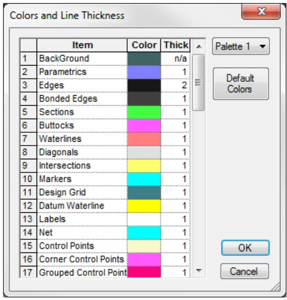
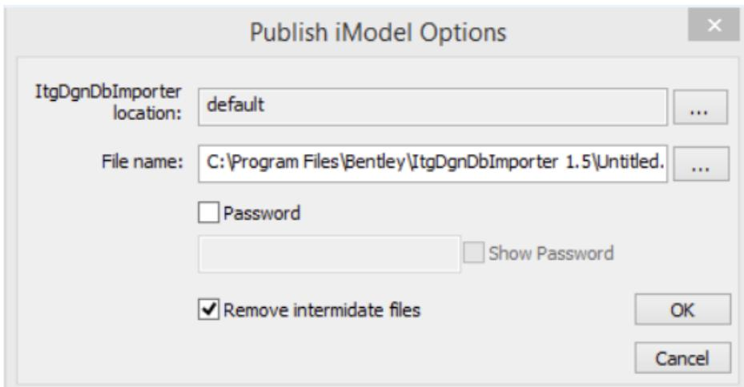
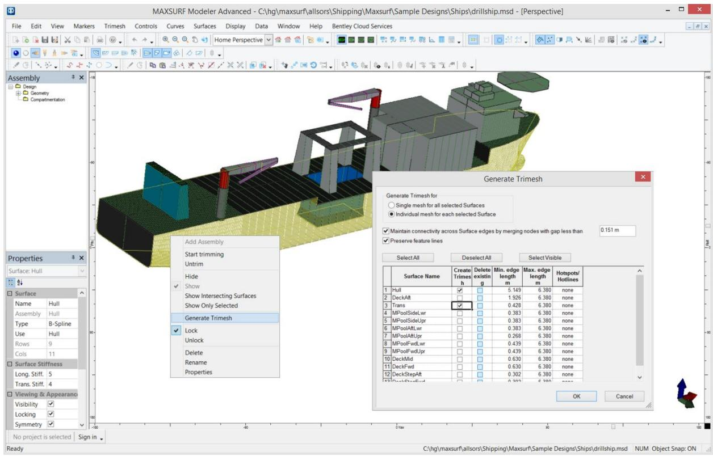
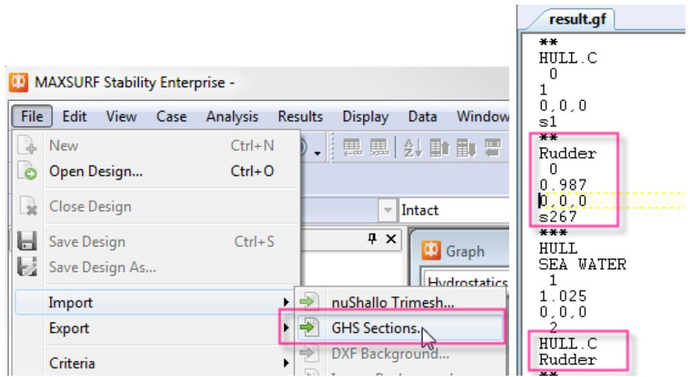
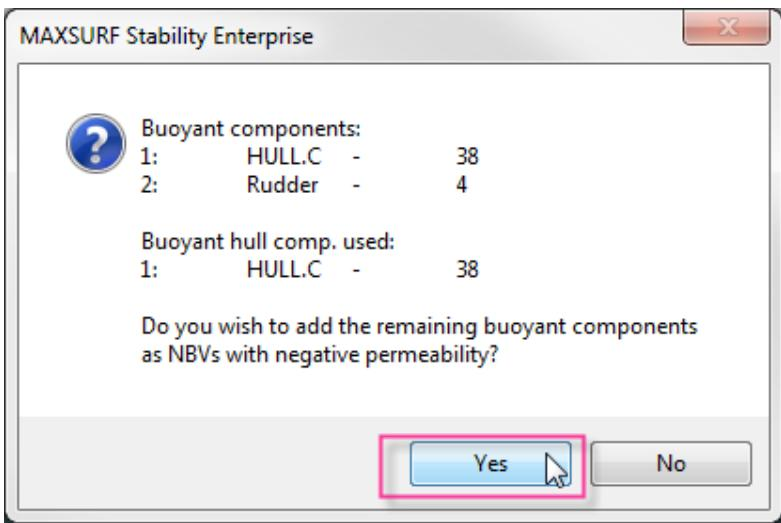
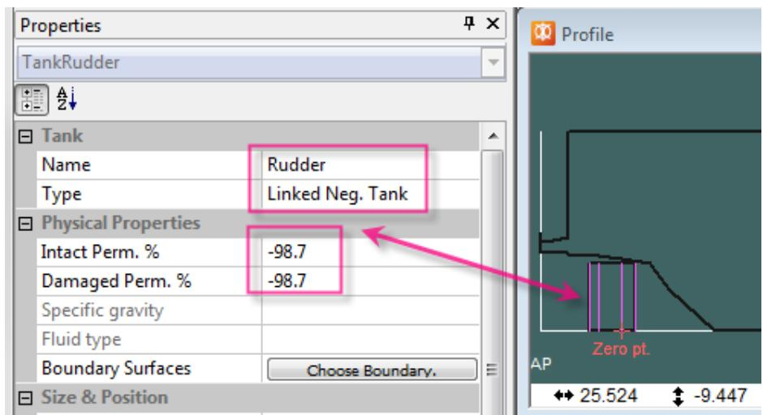
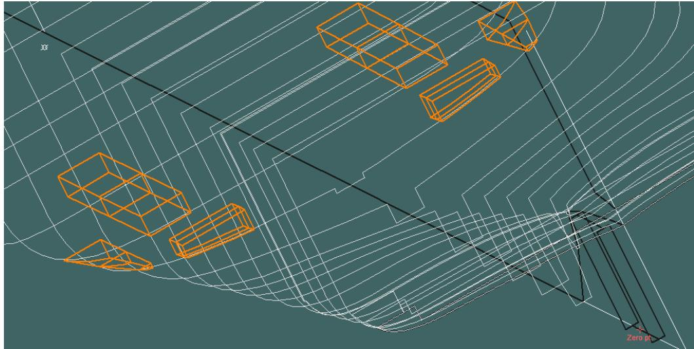
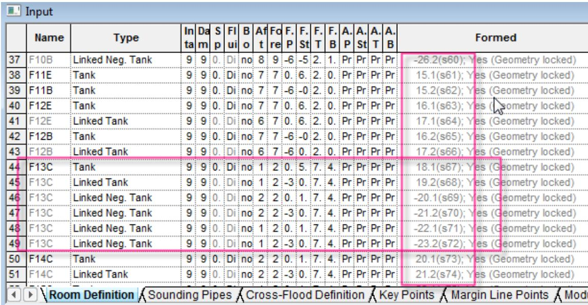
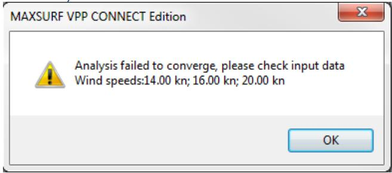

SACS MARINE CONNECT Edition V11.0.0.1 ReadMe 15 December 2016

Bentley'

This ReadMe file describes the changes to the Modules in SACS MARINE CONNECT Edition V11.0.0.1.

Bentley versions numbers are MM.mm.rr.bb where MM is the Major version number; mm the minor version number and rr the revision version number (and bb is the build number). Side-by-side installations of the same product with different major or minor version number are possible (i.e. previous version are not removed or overwritten). However, revision releases will overwrite the previous installation with the same major and minor version number; thus 7.10.02 will overwrite 7.10.00, for instance. A more detailed explanation is given below.

System Requirements:

32-bit versions will run on Windows 7, 8, 8.1 and 10, and   
64-bit versions will run on Windows 7, 8, 8.1 and 10 64-bit.

Note: It is anticipated that this will be the last 32-bit version of SACS MARINE. Future versions will be available in 64-bit versions only.

Contents

Differences between 10.0.0.1 and 11.0.0.1 2

All Modules...

Bug fixes and minor changes..

SACS MARINE Hull Modeler .

Bug fixes and minor changes.. 4

SACS MARINE Stability .

591024: Criteria – Roll-back to specified angle .

216570: Windage area calculation.

Bug fixes and minor changes.....

SACS MARINE Motions.. ..6

Bug fixes and minor changes..... ..6

Software updates .....

All Modules...

480966: Disable CONNECTION Client warning dialog . Error! Bookmark not defined.

389928: Color Picker changes .

Bug fixes and minor changes..

SACS MARINE Hull Modeler . .8

SACS MARINE Link and SACS MARINE Fitting functionality.. ..8

SACS MARINE DGN export/import enhancement . .8

422066: Publish i-model.. ..8

385794: Right click generate trimesh . C

Bug fixes and minor changes.. ..10

SACS MARINE Stability

527889: Various issue importing GHS files into Stability ..

Bug fixes and minor changes.. .14

SACS MARINE Motions.. .16

Bug fixes and minor changes.. .16

SACS MARINE Structure .. .16

Bug fixes and minor changes.. .16

SACS MARINE Resistance.. .16

Bug fixes and minor changes.. .16

SACS MARINE Link . .16

Link has been deprecated.. .16

SACS MARINE Fitting . 1

Fitting has been deprecated.. .17

SACS MARINE VPP.. .17

Bug fixes and minor changes.. .17

SACS MARINE Hull Mesher.. .18

531802: Reset toolbar positions... .18

Bug fixes and minor changes..... ..18

Known Issue .... ..18

SACS MARINE Shape Editor ..... ..19

Bug fixes and minor changes..... .19

Problem Reports ..... ..20

Differences between 10.0.0.1 and 11.0.0.1

All Modules

Bug fixes and minor changes

 590953: OS version and bitness and MS Office version data has been added to Sysinfo dialog.

SACS MARINE Hull Modeler

Bug fixes and minor changes

 625139: Material group & index selection crash was fixed.   
 615393: Rare crash on move surface in assembly view.   
 586540: Curve projection direction for cutting surfaces not working for longitudinal and vertical directions.   
 217047: Provide more feedback to user during a GA fitting procedure (progress/error dialogs etc).   
 5666787: Zero point shifting on export to dgn. If user alters zero point in design this is not reflected in export .dgn file.   
 571991: Edit|Preferences dialog resets units to m.

SACS MARINE Stability

591024: Criteria – Roll-back to specified angle

For certain criteria where there were a number of options for setting the roll-back angle, a new option has been added so that you can roll back to a specified angle (for example - 10deg).

Criterion Details: Ratio of areas type 2-general wind heling am {CTStdHeelRatioOfAreas2}   

|  |  | OrderStdC Ratio of areas type 2 - general wind heeling arm | Value | Units |
| --- | --- | --- | --- | --- |
| 1 | □ | Heeling arm = A cos^n(phi) |  |  |
| 2 | □ | A = | 1.200 | m |
| 3 | □ | n = | 2 |  |
| 4 | □ | gust ratio | 1.5 |  |
| 5 | □ | Area1 integrated from the greater of |  |  |
| 6 | □ | spec. heel angle | 0.0 | deg |
| 7 | √ | angle of equilibrium (with gust heel arm) |  | deg |
| 8 | □ | to the lesser of |  |  |
| 9 | √ | spec. heel angle | 70.0 | deg |
| 10 | □ | angle of first GZ peak |  | deg |
| 11 | □ | angle of max. GZ |  | deg |
| 12 | □ | angle of max. GZ above gust heel arm |  | deg |
| 13 | √ | first flooding angle of the | DownfloodingPoint | deg |
| 14 | √ | angle of vanishing stability (with gust heel arm) |  | deg |
| 15 | □ | Area2 integrated to the lesser of |  |  |
| 16 | √ | roll back angle from equilibrium (with steady heel arm) | 25.0 | deg |
| 17 | □ | Select calculation from list |  |  |
| 18 | □ | roll back to equilibrium (ignoring heel arm) |  | deg |
| 19 | √ | roll back to specified heel angle | -10.0 | deg |
| 20 | □ | Area1 / Area2 shall be greater than (*) | 140.00 | % |

New roll-back to specified angle option added to some criteria.

This has been added to the following criteria:

 CTStdHeelRatioOfAreas2   
 CTXRefHeelRatioOfAreas2   
 CTStdHeelWindHeeling   
 CTStdHeelGenericWindHeeling   
 CTXRefHeelGenericWindHeeling

216570: Windage area calculation

A number of performance enhancements have been made to the windage profile calculation. In version 21.01, the density of the surface mesh used to compute the projected windage profile was greatly increased, resulting in very slow performance for some models. This issue has been addressed in version 21.02 particularly in Stability Enterprise where advantage can be made of multi-core processors.

Bug fixes and minor changes

 627945: Auto-reload from DB not working for Specified Condition and Limit KG

SACS MARINE Motions

Bug fixes and minor changes

 590948: A problem which could sometimes cause Motions to crash when measuring sections for strip theory analysis has been fixed. This could occur for models where the fwd section had no data points on it.

Software updates

The following section describes the changes that have been made to the various programs.

All Modules

389928: Color Picker changes

The Color picker has been modified to use a grid. This means that you can now view the colors and line thicknesses for all items at a glance. Also copy, paste and fill down can be used in the grid. Furthermore you can now sort by double-clicking in any of the column headings to sort the items by that columns; each double click steps through the cycle of three sort options: ascending, descending, unsorted.

The color of an item is modified by double-clicking in the colored cell.

  
New Color picker dialog

 421638: Note that in the Stability Color Picker the items "Sheer Line" and "Downflooding Point" have been renamed "Deck Edge" and "Key Points" respectively.

Bug fixes and minor changes

 556716: The following file formats: SLT, PLY, NuShallo, GHS, WAMIT and MOSES; are now always saved using “.” as the decimal character (even on European systems where the decimal character has been set to “,”. Equally when importing these file formats SACS MARINE expects the decimal character to always be “.”.

SACS MARINE Hull Modeler

SACS MARINE Link and SACS MARINE Fitting functionality

SACS MARINE Link and SACS MARINE Fitting Modules have been deprecated. The functionality of both Link and Fitting Modules has been incorporated into SACS MARINE Hull Modeler.

SACS MARINE Fitting functionality

SACS MARINE Fitting functionality has been moved to the SACS MARINE Hull Modeler Markers menu.

Importing an old SACS MARINE Fitting file (*.pfd) can now be done in Hull Modeler by switching to the Markers window and choosing “File | Import Markers…”. In the open dialog choose “Fitting Offsets file (*.pdf)” from the file type drop down menu in the bottom right.

If the markers are imported from a *.pfd file they will be in the required format for the Generate Surface function, which encapsulates the “Surface | Generate Surface…” command from the old MAXURF Fitting application. If the markers are imported from another file format or added manually they will need to be organized into the required format.

Once a series of markers have been created that define the shape that is required the markers will need to be assigned station indexes. The fitting algorithm is similar to a skinning algorithm where by a curve will be fitted to each set of markers sharing the same station index as well as a ‘top’ (eg gunwale) and ‘bottom’ (eg keel) curve. The surface will then be fitted to this family of curves. The Generate Surface dialog is accessed from the “Markers | Generate Surface…” menu item. For more information please refer to the SACS MARINE Hull Modeler Manual.

SACS MARINE Link functionality

All SACS MARINE Link functionality has been moved to the SACS MARINE Hull Modeler Import and Export menus in the File menu.

SACS MARINE DGN export/import enhancement

SACS MARINE Hull Modeler is now able to import/export via DGN file format (Microstation native file format). Not only geometric data of surfaces & curves is transferred but also additional attributes such as labels, colors, types, transparencies and materials.

422066: Publish i-model

i-models can be used to exchange information for projects associated with the lifecycle of infrastructure assets. You can ensure that information flows easily, completely, and accurately between, and within design, construction, and operations environments. The .imodel is compact and optimized for mobile apps. You can review .imodel files with Navigator Mobile or Bentley Navigator Desktop on the Windows platform that contain business data and embedded documents.

To publish an i-model from SACS MARINE Hull Modeler:

 Choose Publish i-model from the File menu. The following dialog will appear, which allows you to set up i-model options:

Click OK button and an i-model with an .imodel extension is created in the specified location.

385794: Right click generate trimesh

A single or multiple trimeshes can now be selected in the graphical views or via the assembly tree, the right click menu then enables the user to go directly to the generate trimeshes dialog. The dialog will have the currently selected surfaces as default input:

Bug fixes and minor changes

 625139: Material group & index selection crash was fixed.   
 559911: A crash on switching to perspective view due to surface trimming on some specific designs has been fixed.   
 541779: With some of the mesh imports, the resulting markers did not always exactly match the mesh (because of some post-processing that was applied to the mesh to remove coincident nodes. This has now been fixed so that the Markers exactly match the Trimesh nodes resulting from the import.   
 537233: Incorrect calculation of waterline length, model specific   
 536742: The Generate Trimesh from Markers dialog has been modified so that the default option is to turn on the symmetry flag rather than mirror and duplicate the entire mesh.   
 535899: Add COM function for exporting of dxf from one of the orthogonal views (body plan, plan or profile).   
 522207: Automatically zoom model extents after importing.   
 474161: Skin Curves function not working, model specific.   
 467867: Hull Modeler now checks that a non-negative water density has been red from the preferences.   
 456074: Crash on open dgn file created in Microstation. Model specific.   
 423563: Incorrect export of trimmed iges surface, model specific.   
 409439: Trimming not working on round trip to .dgn file format.   
 388689: Improvements to mesh connectivity across multiple meshes during automated meshing.   
 380837: Export invisible surfaces to rhino. All surfaces will now be exported to a Rhino file regardless of visibility status. Both visibility and locking flags for each nurbs surface will now be translated to the .3dm file.   
 387608: Always have the option to go to the Untrim surfaces dialog from the Surfaces | Untrim menu.   
 387068: Remove "Move associated curves" from Move surfaces dialog.   
 377906: Moving trimesh node after zooming occasionally not working.   
 377902: Outside arrows sometimes incorrect on generated trimeshes.   
 217003: Trimeshes can now be selected in rendered mode in the perspective view.

SACS MARINE Stability

527889: Various issue importing GHS files into Stability

A crash which occurred when importing GHS files on systems with decimal character set other than “.” (EG European systems) has been fixed. It is now assumed that GHS files always have “.” as the decimal character (even on European systems).

Cubic splines are no longer fitted to the GHS sections.

If saving the resulting model as a .hmd file after importing from a GHS file, then store (and then retrieve) a flag to indicate that the original data came from GHS.

Blank lines in the GHS file are no longer causing the import to exit at that point in the file (previously a Blank line was being interpreted as the end of the file).

It is not possible to have the first component of a part with negative permeability/effectiveness. Previously Stability would sometimes incorrectly make the first component of a tank or compartment positive; this is now fixed by re-sorting the components to ensure that the first component has positive permeability/effectiveness. It is assumed that each part will have at least one positive component.

Stability only has one main buoyant component (the main hull), however it is possible to add other buoyant components as Non-Buoyant Volumes (NBVs) with negative permeability. The option to do this automatically is now provided when importing in Stability from the File | Import GHS sections option:

  
Importing a GHS file with multiple buoyant components defining the main hull

  
These can now be automatically added as NBVs with negative permeability

  
Secondary buoyant component (Rudder) successfully included in the Stability model as a NBV with negative permeability.

For compartmentation imported from GHS, the properties of NegLinkedTanks and NegLinkedComps are now fully editable

| B07C | Tank | 98 | 98 | 1 |
| --- | --- | --- | --- | --- |
| B07C | Linked Neg. Tank | 98 | 98 | 1 |
| B08C | Tank | 98 | 98 | 1 |
| B08C | Linked Neg. Tank | 98 | 98 | 1 |
| B41C | Tank | 98 | 98 | 1 |
| B41C | Linked Tank | 98 | 98 | 1 |
| F09E | Tank | 98.5 | 98.5 | 1 |

Previously components with symmetrical sections which did not join at the centerline were incorrectly mirrored across the centerline; this has been fixed so that the sections are recreated correctly.

  
Mirroring of symmetrical sections which do not connect at the centerline has been fixed

The GHS component and (shape) that generated the Room entry are listed in the Formed column of the Room definition table:

  
GHS Component and (Shape) names are listed in the Formed column

Because after a GHS import the negative-linked components and tanks and compartments are essentially edited and modified independently from the positive components, their damage status and permebility is also reported in the log files that are generated.

Bug fixes and minor changes

 632231: A crash which occurred when attempting to reopen a design file (or room definition file) which had tanks with sounding pipes defined by more than nine points (eg from import from GHS) has been fixed.   
 563779: A problem with GHS Import which cut off Key Point (Critical Point) names at the first white space and also failing to link the Key Point to the specified tank (if any) has been fixed.   
 562449: A problem reading in the Shear and Bending moment limits from the design file has been corrected. The problem was that the maximum values of the limits were always forced positive even if they had been set negative in the table.   
 559839: When reading criteria files there was a chance of xRef criteria linking to incorrect heeling arms; the first heeling arm with the same name would have been linked (rather than the one in the same folder). This has now been fixed but it is still best practice to keep names of all criteria and groups unique to avoid these sorts of problems.   
 558643: All lines in the probabilistic damage log file now end in “Carriage Return” + “Line Feed” characters.   
 556706: The delimiter used for defining “User defined heeling arms” has been changed from “,” to “;” for better compatibility with EU systems using a “,” as the decimal character.   
 555848: Criteria.hcr files are now tolerant of blank lines in header and Unicode.   
 537233: Incorrect calculation of waterline length, model specific has been fixed.   
 528352: A problem with the rendered view of the Probabilistic Damage zone extents has been fixed.   
 527889: A problem with the Room-type dropdown menu in the Properties sheet has been fixed.   
 527889: The room type has been appended to the name in Batch and Probabilistic damage analysis text output.   
 527889: An improvement has been made for the longitudinal integration of crosssection data to calculate the vertical and transverse centers of volume of the 3D shape defined by the sections. This may result in small changes in the VCB and TCB of the hull and tanks (hence possible small differences to Loadcases containing filled tanks). The differences are greatest for 3D shapes where the vertical and transverse centers of area of the cross-sections defining the shapes changes significantly.   
 527657: When opening .msd design files containing Trimeshes, the correct names are now shown in the Stability Assembly window.   
 506610, 216506: It is not possible to delete Rooms from the Assembly tree; only empty folders can be deleted. Please delete Rooms from the Room definition window.   
 486343: A problem which occurred under some circumstances with the display of any criteria analysis errors for the limiting KG analysis has been fixed. The problem manifested itself when multiple displacements were being evaluated; only any errors for the last displacement were displayed.   
 471610: A problem where the waveform was not reset to flat for MARPOL analysis has been fixed. If a waveform had been used for a different analysis then it would also be applied when calculating the hydrostatics for the MARPOL analysis.

 471212: When setting a Loadcase tank filling by Volume, the filling level is not saved in the file. This has now been fixed. (However when loading older files, the problem will still occur because it is caused by an error in the file saved by previous versions of Stability; once the Loadcase is corrected and re-saved, the file will be correct and the error will not occur.)   
 468952: Origin of Bonjean Curve graph incorrect for analysis done at anything other than DWL.   
 439113: When identifying the section with maximum cross-sectional area for prismatic shapes of vessels with parallel mid-body, Stability now looks for the biggest number of contiguous sections with the same area and picks the middle section of this group. Previously it was fairly arbitrary which section would get selected if there were more than one with the same cross-sectional area.   
 433331: If application launched with Assembly hidden, then assembly does not update when loading   
 432443: It is now possible to display the longitudinal centre of projected lateral underwater area and windage area along with the hydrostatics results. Note that: the effect of trim is only taken into account if you have specified windage and underwater surfaces (Data menu).   
 421638: The color picker item “Sheer Line” has been renamed “Deck Edge”; and the color picker item “Downflooding Point” has been renamed “Key Points”.   
 410124: The table data format display settings for the Criteria table are now also used in the Probabilistic Damage log file. This means that if you use the “Compact” mode for the Criteria results table, the size of the Probabilistic Damage log file will be reduced.   
 359431: An option of which allows only selected Loadcases to run when doing a Probabilistic Damage analysis has been added. Results will only be calculated for the selected Loadcases; and are not collated with any previously run results. If you wish to recomputed the Attained index for a change due to a single Loadcase you should copy the relevant results to a spreadsheet and recomputed the Attained index taking account the updated results for the recomputed Loadcase(s) manually. This option is found in the Global Probabilistic Damage input table:

|  | Item | Value | Units | Selected |
| --- | --- | --- | --- | --- |
| 6 | Deepest subdivision draft (summer loadline) Loadcase | Deep T0 | draft: 6.2 | √ |
| 7 | Partial subdivision draft Loadcase | Partial T0 | draft: 5.57 |  |
| 8 | Light service draft Loadcase | Light | draft: 4.63 |  |
| 9 |  |  |  |  |

 317435: A number of minor fixes were made to the Results Database including the adding of indexes to the database to greatly speed up the retrieval of results. These indexes are also backwards compatible with models created in previous versions. New tools were added to manage results to stop the database becoming too large. Fixes were also made to the storing an retrieval of Long Strength results.

SACS MARINE Motions

Bug fixes and minor changes

 541778: Motions not animating trimesh surfaces when running strip theory animation has been fixed.   
 488681: The pressure legend displayed during animation of the pressure distribution over the hull in waves has been improved to prevent flickering.   
 366564: Drift force calculations were being exported to Orcaflex in N but the conventions stated kN this has been fixed. This has been fixed.   
 378609: Error message displayed twice if no panels are created after generate panels command.   
 389889: Incorrect pressure legend. The negative values were set to an incorrect scale during animation.   
 366564: Exporting to Orcaflex RAO, conventions section changed from SwayPositive = port to SwayPositive = starboard.   
 448321: Slightly different results depending on whether a .skd file is opened and closed before opening a new design and running analysis.   
 408156 Expose characteristic length used in RADIF drift non-dimensionalisation calculations. Set in the “Generate analysis panels” dialog.   
 488681: Flickering of pressure legend during animation. Fixed.   
 381522: When pressure units changed in units dialog the legend was not being updated when displaying panel pressures during animation.

SACS MARINE Structure

Bug fixes and minor changes

 389889: The plate strain map legend scale was incorrect. This has been fixed.   
 471392: Wrong cutout getting assigned to frame. Model specific.   
 433331: If application launched with Assembly hidden, then assembly does not update when loading.   
 561338: Exporting mirrored across cl plates to stl file not working correctly.

SACS MARINE Resistance

Bug fixes and minor changes

 447970: The Kinematic Viscosity and Correlation Allowance in the “Resistance Sample_Workboat.hsd” have been corrected. Furthermore similar color coding for these parameters has been added if they vary significantly from the expected values; entering a blank value for these physical properties will restore them to their default value. Finally the text in the table has been change from "Correlation Allow." to "Correlation Allowance".

SACS MARINE Link

Link has been deprecated

SACS MARINE Link functionality has been moved to SACS MARINE Hull Modeler. See SACS MARINE Hull Modeler above for more information.

SACS MARINE Fitting

Fitting has been deprecated

SACS MARINE Fitting functionality has been moved to the SACS MARINE Hull Modeler Markers menu. See SACS MARINE Hull Modeler above for more information.

SACS MARINE VPP

Bug fixes and minor changes

 559992: Improved feedback is now provide should some of the analyses fail to converge. More details can be found by looking at the Force and Moment error columns in the results table (these values should be zero if convergence was achieved).

SACS MARINE Hull Mesher

531802: Reset toolbar positions

Toolbar layout of Hull Mesher seems to change according to Windows layout systems. Hull Mesher now allows users to reset toolbar to a default position.

To reset toolbars to the default positions,

 Choose File menu  Toolbars  Reset Toolbars.

Bug fixes and minor changes

 351125: Converting members to openings works only for the first loop, but not working for subsequent loops;   
 373533: Wrong default capacity factors being used for LRFD2010   
 374593: LRFD2010 Double angles not supported for major axis shear   
 322829: ISM export hanging issue when run 32 bit application on 64 bit machine;   
 323431: Rendering progress bar conflicts with animation progress bar;   
 343436: Causing slow rendering at the first time of displaying a model by cursor creation/position.   
 322311: Steel Designer: Improved error msg for Euler buckling check in LRFD2005/10 code check   
 474847: Crash on time-history analysis when loading a previous design model;   
 477441: Wrong section data in Thin L, Tapered tees and L beams group of Japanese section library   
 536744: Importing DWG/DXF causes Hull Mesher crashing due to missing RealDWG component   
 540384: Members or design members are not attached to patch properly if they are placed on the opening boundary   
 556255: Missing minor shear check in AS4600 and AISI if major shear check option is unselected   
 527422: Duplicated joints do not merge properly during Hull Mesher patch remeshing   
 620681: Sea Motions Loadcase - BASIC licence. Create a Sea Motions Load Case with non-zero entries in Save File,Close File,Open File.

Known Issue

The 32-bit version of Hull Mesher can work in any Windows 64-bit machines. However, some users have also reported issues in ISM export, which cause the program to hang or crash. This issue is under investigation and also there are some ways to get around of it:

o install and run 64 bit Hull Mesher/Hull Mesher Modules on a 64 bit machine, or   
o install an old version of Structural Synchronizer (ssync081109130en.exe), which can be downloaded from http://www.bentley.com/en-AU/Free+Software/structural+synchronizer.htm

SACS MARINE Shape Editor

Bug fixes and minor changes

 472116: Crash on Shape Editor with File new command while a shape is placed on the screen;

Problem Reports

We greatly appreciate any bug reports or suggestions you may have. Please report any bugs or anomalies you find through www.bentley.com/serviceticketmanager .