SACS

Seastate

Version 24.00

Trademark Notice

Bentley and the "B" Bentley logo are either registered or unregistered trademarks or service marks of Bentley Systems, Incorporated. All other marks are the property of their respective owners.

Copyright Notice

Copyright © 2024, Bentley Systems, Incorporated. All Rights Reserved.

TABLE OF CONTENTS

1 INTRODUCTION .

## 1.1 OVERVIEW..
## 1.2 PROGRAM FEATURES.
## 1.3 MEMBER LOADS CREATED BY SEASTATE. . 9

2 GENERAL SEASTATE DATA... 11

## 2.1 SEASTATE OPTIONS... 11

2.1.1 Physical Parameters .. 11   
2.1.2 Analysis Function . .11   
2.1.3 Output Reports . 11   
2.1.4 Hydrostatic Check .. 12   
2.1.5 Miscellaneous ..... 12

## 2.2 USING A SEPARATE SEASTATE INPUT FILE.. .. 12

2.2.1 Location of Loading. 12   
2.2.2 Selecting Load Cases .... 12   
2.2.3 Factoring Load Cases... 13   
2.2.4 Allowable Stress/Material Factor.... .. 13   
2.2.5 Load Combinations ... 14

## 2.3 PROPERTY OVERRIDES .. .. 14

2.3.1 Overriding Beam Element Properties . .14

2.3.1.1 Marine Growth and Reynold’s Number.... .. 15   
2.3.1.2 Flood Condition.... .. 15   
2.3.1.3 Weight and Buoyancy .. .. 15   
2.3.1.4 Dimensions for Force ..... .. 15   
2.3.1.5 Drag and Mass Coefficients... ... 16

2.3.2 Overriding Plate Element Properties . . 16

2.3.2.1 Weight ..... .. 16

## 2.4 WIND AREAS . .... 16
## 2.5 WIND SHIELD ZONES.. .. 18
## 2.6 SUBMERGED BODIES.. .. 18
## 2.7 NON-STRUCTURAL ELEMENTS .. . 19

2.7.1 Dummy Sub-Structures.. .20   
2.7.2 Appurtenance Structures.... . 20   
2.7.3 Alternate Method . .21

## 2.8 ELEMENT LOAD REPORTS . ... 21
## 2.9 STRUCTURAL LOADING . ... 21

2.9.1 Structural Masses.... . 22

2.9.1.1 Inertial Weight . .. 22   
2.9.1.2 Weight Vertical Location... . 22   
2.9.1.3 Surface Weight... .. 22   
2.9.1.4 Structural Weight Footprint. .. 23   
2.9.1.5 Joint Weight .. .. 24   
2.9.1.6 Member Weight... .. 25

2.9.1.7 Non-Structural Weight ... .. 25   
2.9.1.8 Weight Combinations ... .. 27   
2.9.1.9 Dynamic Mass Selection . .. 27

2.9.2 Direct Load Determination .... . 27

2.9.2.1 Weight Inclusion in Loading ... .. 27   
2.9.2.2 Inertia Load Center Location.. .. 28   
2.9.2.3 Applied Structure Acceleration... .. 28   
2.9.2.4 Response Amplitude Operators.. .. 28   
2.9.2.5 Space Forces and Moments ... .. 30   
2.9.2.6 Moving Load.. .. 30

## 2.10 FLOOR LOADS.... .. 31

2.10.1 Enclosed Zone Definition .... . 31

## 2.10.1.1 Boundary Joints... .. 31
## 2.10.1.2 Enclosed Zone Options... .. 32
## 2.10.1.3 Openings .... .. 32
## 2.10.1.4 Ignored Member Lines... .. 32

## 2.10.1.4.1 Ignored Members.... .. 33
## 2.10.1.4.2 Ignored Member Groups... .. 33

## 2.10.1.5 Virtual Member Lines... .. 33

## 2.10.1.5.1 Virtual Members.. .. 33
## 2.10.1.5.2 Virtual Member Groups . .. 33

## 2.10.1.6 Enclosed Zone Example.. .. 33

2.10.2 Zone Load.. . 34   
## 2.10.2.1 Zone Load Example ... .. 34

3 HYDRO STATIC/DYNAMIC DATA... .. 36

## 3.1 FLOOD CONDITION . .. 36

3.1.1 Default Flood Condition... .. 36   
3.1.2 Specifying Flood Condition in the Model... .. 36   
3.1.3 Overriding Flood Condition.. .. 36

## 3.2 MARINE GROWTH.... ... 36

3.2.1 Defining Marine Growth .. .. 36   
3.2.2 Applying Marine Growth to a Member... . 37

## 3.3 DRAG AND MASS COEFFICIENTS.. .. 37

3.3.1 Defining Default Coefficients ... .. 37   
3.3.2 Reynold’s Number Dependent Cd . .. 39   
3.3.3 Overriding Coefficients .... .. 39

## 3.4 HYDRODYNAMIC MODELING. .. 39
## 3.5 CORROSION.. .. 40
3.5.1 Defining Corrosion .. .. 40

4 CREATING ENVIRONMENTAL LOADS . .. 42

## 4.1 MEMBER LOAD AXIS . ... 42
## 4.2 ENVIRONMENTAL LOAD FACTORS.. ... 42
## 4.3 WAVE LOAD . .. 42
4.3.1 Wave Theory ... .. 42

4.3.1.1 User Defined Waves... .. 43

4.3.2 Wave Characteristics.. .44   
4.3.3 Critical Crest Position ..... .. 44   
4.3.4 Overriding Water Depth and Mudline Elevation .... .. 45   
4.3.5 Wave Kinematics or Spreading Factor .... .. 45   
4.3.6 Member Distributed Load Segments .... .. 46   
4.3.7 Wave Output Print Option ... .. 46

## 4.4 CURRENT LOAD. .... 46

4.4.1 Current Velocity Profile.. .. 47   
4.4.2 Current Profile Stretching/Compressing. .. 47   
4.4.3 Current Blockage Factor.... .. 48   
4.4.4 Apparent Wave Period.. .48   
4.4.5 Overriding Mudline Elevation ... .. 49   
4.4.6 Minimum In-line Current . .49

## 4.5 GRAVITY AND BUOYANCY LOAD.. ... 49

4.5.1 Overriding Buoyancy Parameters .. .. 50

## 4.6 WIND LOAD.. .51

4.6.1 Wind Characteristics ... . 51   
4.6.2 Wind Height Variation... .. 52   
4.6.3 Overriding Water Depth.. . 53   
4.6.4 Loading Wind Areas .... .. 53   
4.6.5 Loading Single – Three – Four Sided Wind Walls (API 4F Specification).. . 54

4.6.5.1 Single sided wall.. .54   
4.6.5.2 Three sided wall .. .. 55   
4.6.5.3 Four sided wall . .. 56

## 4.7 Submerged Body Drag Load... .. 58

## 4.8 MUD FLOW LOAD . .. 58
## 4.9 REPEATING A LOAD CASE.. .. 59
## 4.10 API RP2A-WSD 20TH EDITION CONSIDERATIONS. .. 59
## 4.11 API BULLETIN 2INT-MET EDITION SEASTATE PARAMETER GENERATION.. ... 60

4.11.1 API Bulletin 2INT-MET Options Line... .. 60   
4.11.2 API Bulletin 2INT-MET General Line.. ... 61   
4.11.3 API Bulletin 2INT-MET Wave Line .. .. 62   
4.11.4 API Bulletin 2INT-MET Wind Line... .. 62   
4.11.5 API Bulletin 2INT-MET Dead Line... .. 62

5 GENERATING TRANSFER FUNCTION LOADS.. .. 64

## 5.1 SPECIFYING TRANSFER FUNCTION WAVE DATA.... .... 64

5.1.1 Critical Wave Crest Positions ... .. 64

5.1.1.1 Dynamic Analysis... .. 65   
5.1.1.2 Static Analysis... .. 65

5.1.2 Creating Global Transfer Function Plots . .. 65

5.1.2.1 Dynamic Analysis... .. 65   
5.1.2.2 Static Analysis.... .. 66

6 COMMENTARY . .. 67

## 6.1 WAVE GENERATION.. ... 67
## 6.2 AIRY WAVE THEORY .. ... 68
## 6.3 STOKES’ WAVE THEORY .. .. 69
## 6.4 STREAM FUNCTION THEORY.. .. 69
## 6.5 CNOIDAL AND SOLITARY WAVE THEORIES . .... 70
## 6.6 MEMBER FORCES FROM WAVES AND CURRENT.. .... 71
## 6.7 BUOYANCY ... .... 73
## 6.8 FORCES DUE TO MUD FLOW.. .... 74
## 6.9 API RP2A-WSD 20TH EDITION WAVE DETERMINATION .. .... 75

6.9.1 Apparent Wave Period.. .. 75   
6.9.2 Current Blockage... .. 76   
6.9.3 Current Profile Stretching or Compressing .. .. 76   
6.9.4 Coefficient of Drag and Mass... .77

## 6.10 SEASTATE GENERATED LOADING DESCRIPTIONS . .... 77

6.10.1 Member Load Descriptions.. . 77   
6.10.2 Joint Load Descriptions ... .77

7 SAMPLE PROBLEMS.. .. 78

## 7.1 ENVIRONMENTAL LOADING . .... 79
## 7.2 NON-STRUCTURAL ELEMENTS . .. 89
## 7.3 TRANSFER FUNCTION GENERATION .. .. 99
## 7.4 USER-DEFINED WAVE.. . 101

8 INPUT LINES... ..106

1 INTRODUCTION

## 1.1 OVERVIEW

Seastate is an automatic environmental load generating program within the SACS suite of programs. With it the user can generate environmental loads on the structure resulting from wind, waves, current, mud flow, gravity, and buoyancy.

## 1.2 PROGRAM FEATURES

Seastate is designed to produce input data for SACS IV for static analysis, Dynpac for dynamic characteristic analysis or Dynamic Response and Wave Response for dynamic analysis.

Seastate input may be specified in a file containing only Seastate data or may be specified in the model file directly.

Some of the main features and capabilities of Seastate are:

1. Wave velocity and acceleration fields can be generated based on either Airy, Stokes’ Fifth Order, Stream Function, Cnoidal, or Solitary wave theories.   
2. The velocities and accelerations are generated at points of an automatically generated grid which is more closely spaced near the surface than near the mudline. Thus greater accuracy is assured where the water particle motions are greatest, while computer usage is minimized by avoiding undue refinement where the motion is not significant.   
3. The user may input velocities and accelerations at his own grid points. This may be useful for, among other reasons, determining structural loads from empirically determined wave data.   
4. The user may input "drag and inertia pressure" data on a grid in lieu of corresponding velocities and accelerations.   
5. Current may be included in a direction different from that of the wave.   
6. Current, by default is included in the Stream Function wave generation, and not simply superposed on a generated velocity field. The user may however remove current from the wave generation and superimpose it on the generated velocity field.   
7. Wind may be specified in a direction different from that of the wave or current and may be uniform or vary with height according to American Bureau of Shipping, API or Australian AS1170 recommendations.   
8. The effects of waves and current on submerged bodies other than structural elements can be included.   
9. The effects of marine growth fouling of structural members can be automatically included.   
10. GRUP and MEMBER override options are available which, among other things, offer the user great flexibility for modeling the behavior of conductors in the flow field, excluding piles from receiving wave and current loads, and excluding wishbones from all loads.

11. Drag and inertia coefficients may be specified as variable with diameter and with Reynold’s number.   
12. Structural loads due to gravity and buoyancy may be included.   
13. Gravity can act in an arbitrary direction.   
14. Buoyancy may be included based on the "marine" method where a submerged member weight is calculated or the "rational" method founded on first principles of mechanics.   
15. Structural loads due to mud flow may be included either in isolation or conjunction with the other environmental loads. The direction of the mud flow can be different from that of the wave.   
16. The mud flow can have a vertical component for modeling down-hill or up-hill flow.   
17. Loads are generated on the structure for incremental positions as the wave passes through the structure. The loads corresponding to one particular wave position for static analysis or various wave positions for steady state analysis are then passed to SACS IV. The user may specify the criteria for critical wave position as that which produces the maximum or minimum value of overturning moment, base shear, or vertical force.   
18. Nonlinearly varying distributed loads may be accurately modeled. The program automatically divides the member into the minimum number of segments required for a piecewise linear representation to fit the load curve within a small tolerance.   
19. For a given load case the loads produced by the effects of waves, wind, current, dead weight, buoyancy, and mud flow are combined, thus minimizing the size of the structural data file.   
20. Load cases can be combined and passed to SACS IV as a single basic load case.   
21. Allows specification of elevations to be wind loaded or elevations not to be wind loaded.   
22. Base shear and overturning moment transfer function plots can be generated automatically within Seastate.   
23. Non-structural elements, or elements that receive environmental loading but do not contribute to the stiffness of the structure (i.e. boat landings, risers etc.) can be modeled.   
24. Complete API RP2A-WSD 20th Edition design load generation capability, including the following features:

a. Wave Kinematics or directional spreading factor.   
b. Automatic apparent wave period determination or specified by user.   
c. Stream Function solutions for up to 21st order.   
d. Current blocking factor determined automatically or user specified.

e. Automatic current profile stretching feature including linear and nonlinear stretching and constant current in crest.   
f. Minimum incline current can be specified.   
g. Simplified constant $\mathsf{ C }_{ \mathsf{ d } }$ and $\mathsf{ C }_{ \mathsf{ m } }$ or values calculated by the program based on surface roughness and wake encounter effects.   
h. User specified shielding factor for conductor arrays.

25. When specifying Seastate data in a Seastate input file, program can use loading specified in the Seastate input file, the model file or in both files.   
26. Allows generation of wind loads based on member properties and/or wind areas. Also includes the ability to specify that wind load is to be generated for wind areas only.   
27. Complete API Bulletin 2INT-MET Edition seastate parameter generation capability, including wave, wind, current, surge, and deck height requirements based on API Bulletin 2INT-DG.

## 1.3 MEMBER LOADS CREATED BY SEASTATE

The Seastate program generates distributed loads on members from wave, current, wind, dead weight, buoyancy, and mudflow loading conditions. These loads are output from the program in the format used by the SACS IV program "Member Distributed Loads Input Line" and "Joint Loads Input Line".

Since the SACS IV program only accepts distributed member loads in the form of linear load variation along the member length, the Seastate Program has the task of representing environmental loads which have a curved or nonlinear distribution by a series of linear varying load segments. The curve fitting used by Seastate is accomplished as follows:

a. Velocity and acceleration values are calculated for each end of the member and a linear variation is assumed between the ends.   
b. The velocity and acceleration values at the member center are calculated and compared to the values predicted by the linear variation from step (a). If either is more than 5.0% different from the linear distribution then the member is segmented to include the center point of the member. The member would now have two linear load segments, one from the left end to the center of the member and one from the center to the right end of the member.   
c. The program will then check the center points of each new segment to determine if the linear variation represents the true condition within the tolerance of 5%. This procedure will continue to segment the member until the 5% criterion is met or until the maximum number of segments specified by the user is reached (maximum allowed is 10 which is also the default value).   
d. If the midpoint velocity or acceleration differs from the linear variation values by 0.3, feet per second or feet per sec2 respectively, the member will not be segmented even though the variation might be by more than 5%.   
e. All distributed load values less than .0001 kips per feet are discarded as insignificant.

The main advantage of this technique is the program will segment each member according to its load distribution. The load segments are not constrained to be equal in length and each member is segmented differently for each load condition.

For the special case of segmented members, members whose cross sectional properties change along the length of the member, the load segments are initially divided into lengths corresponding to each segment of the segmented member. Then the procedures described above are used for each segment.

After distributed loads are generated by Seastate for wind, wave, current, dead weight, buoyancy, and mudflow the program collects and combines the various loads components so that the number of load input lines produced by Seastate is reduced to a minimum. This reduces the size of the output file and saves processing time in subsequent analyses.

In addition to the above curve fitting techniques each member is categorized for each load case with respect to its location as follows:

1. Below the permanent mudline - only dead load is considered with no buoyancy.   
2. Above the permanent mudline and below the top of the mudflow, if any, dead load and mudflow forces are considered with no buoyancy.   
3. Above the mudline (permanent or mudflow) and below the mean water line but not in the wave trough - ALL loads are considered with the exception of wind.   
4. Above the mudline, below the mean water line, and in the wave trough - Wind loads and dead loads are considered including the weight of any entrapped fluid for flooded members. This assumes that any flooded member will not have time to drain while in the wave trough.   
5. Above the mean water line and in the wave crest - Wave, current, and dead loads are calculated where the current velocity is assumed to be equal to the mean water line value throughout the wave crest. Buoyancy is calculated using non-flooded conditions with the assumption that even if the member is designated as flooded, there is insufficient time during which the member is in the crest to actually flood the member.   
6. Above the mean water line and not in the wave crest - Wind and dead loads only are calculated.

If members lie within more than one of the above categories, the program will segment those members for load generation to correspond with the categories in which they lie. For instance, if members lie partially in the wave crest (Category 5) and partially above the water surface (Category 6), the members will be segmented initially before load generation so that the water surface relative to the members is represented accurately. Then the above procedure for curve fitting will be used for each category segment of those members.

Note: Average Joint Thickness is used to modify Seastate generated loads, but does not modify user input loads.

2 GENERAL SEASTATE DATA

## 2.1 SEASTATE OPTIONS

Seastate options are specified on the LDOPT line. The LDOPT line should be the first line of the Seastate input file or the first line of the model file if Seastate input is specified directly in the model.

2.1.1 Physical Parameters

The physical parameters such as the vertical coordinate, density of water, default material density, mudline elevation and water depth are entered in columns 15-16, 17-24, 25-32, 33-40 and 41-48, respectively.

Units are specified as ‘EN’ for English, ‘MN’ for metric kilonewton force or ‘ME’ for metric kilogram force in columns 53-54.

The following designates +Z vertical coordinate, English units, mudline elevation -100 and water depth of 100. Default values are used for all other parameters.


|  | 1 | 2 | 3 | 4 | 5 | 6 | 7 | 8 |
| --- | --- | --- | --- | --- | --- | --- | --- | --- |
| 1 | 1234567890123456789012345678901234567890123456789012345678901234567890123456789012345678901234567890123456789 | +Z |  | -100. | 100.GLOBEN |  |  |  |


2.1.2 Analysis Function

By default, the Seastate program generates loading for a static analysis with all loading summed. The program however, may be used for various functions. The analysis function is designated in columns 56- 58 as follows:

blank - Generate loading and hydrostatic properties for static analysis.

‘DYM’ - Generate hydrodynamic properties for Dynpac modal extraction.

‘DYN’ - Generate hydrodynamic properties and dynamic loading data used by Wave Response (excludes any static load data).

‘DYW’ - Generate hydrodynamic properties and dynamic loading data used by Wave Response in addition to generating any static loading.

‘WIN’ - Generate data for spectral wind analysis.

‘SUM’ - Sum user defined loading.

‘NSM’ - Sum only Seastate generated loading.

‘TRN’ - Generate static base shear and overturing moment transfer function plots.

‘TRL’ - Generate static base shear and overturing moment transfer function plots and loading.

2.1.3 Output Reports

By default, a copy of the model file is included in the listing file along with all Seastate operating data. Enter ‘NP’ in columns 71-72 and columns 73-74, respectively, to eliminate these reports.

Enter ‘IN’ in columns 9-10 to echo the input data. If the generated output structural data file is to be included in the output listing file, enter ‘OP’ in columns 11-12. A member data summary report may be requested by ‘MPT’ in columns 68-67.

Enter ‘K’ in column 79 to eliminate submerged area warning messages from the output reports.

The following designates that the model file and operating data are not to be included in the output listing.


|  | 1 | 2 | 3 | 4 | 5 | 6 | 7 | 8 |
| --- | --- | --- | --- | --- | --- | --- | --- | --- |
| 1 | 1234567890123456789012345678901234567890123456789012345678901234567890123456789012345678901234567890123456789 | +Z |  | -100. | 100.GLOBEN |  | NPNP |  |


2.1.4 Hydrostatic Check

Enter ‘HYD’ in columns 59-61 if a full hydrostatic check is to be performed by the Post program. The Post program will provide actual member stresses due to axial forces, bending and hoop loading.

2.1.5 Miscellaneous

When load combinations are specified, the program can convert combinations into basic load cases in the output structural data file. Enter ‘CMB’ in columns 65-67 to pass combinations as basic load cases.

Enter ‘SF’ in columns 7-8 if an output structural data file is to be generated even if errors occur.

## 2.2 USING A SEPARATE SEASTATE INPUT FILE

Seastate input may be specified within the SACS model file or in a separate input file. When specifying Seastate input information in a separate file, the FILE input line must be specified in the Seastate input file.

2.2.1 Location of Loading

Loading information may be used from the Seastate input file, the model file or from both files by specifying ‘S’, ‘J’ or ‘B’, respectively in column 6 on the FILE line. For example, the following specifies that only loading specified in the Seastate input file is to be considered.


|  | 1 | 2 | 3 | 4 | 5 | 6 | 7 | 8 |
| --- | --- | --- | --- | --- | --- | --- | --- | --- |
|  | 1234567890123456789012345678901234567890123456789012345678901234567890 | 1234567890123456789012345678901234567890123456789012345678901234567890 | 1234567890123456789012345678901234567890123456789012345678901234567890 | 1234567890123456789012345678901234567890123456789012345678901234567890 | 1234567890123456789012345678901234567890123456789012345678901234567890 | 1234567890123456789012345678901234567890123456789012345678901234567890 | 1234567890123456789012345678901234567890123456789012345678901234567890 | 1234567890123456789012345678901234567890123456789012345678901234567890 |
| 1 | LDOPT | +Z |  | -100. | 100.GLOBEN |  |  |  |
| 2 | FILE S |  |  |  |  |  |  |  |


2.2.2 Selecting Load Cases

When specifying Seastate data using a separate input file, load case selection data may be specified in the Seastate input file using the LCSEL line.

For a particular analysis type, results only for load cases specified for that type are reported.

Specify load cases in columns 17-75 and the analysis type to which the list of load cases pertain in columns 7-8 as follows:

ST - Standard static analysis and/or PSI analysis

DY- Convert to mass for Dynpac analysis

PD - Designates gravity load used to determine P-Delta effects for second order analysis and/or moment magnifiers for concrete elements in first order analysis.

Leave function blank if the load cases listed are to be used for standard ‘ST’ and dynamic ‘DY’ functions.

For example, the following lines designate that load cases ‘GRAV’, ‘ST01’ and ‘ST02’ are to be used for standard analyses, while load cases ‘BOAT’ and ‘MISC’ are to be converted to mass when running Dynpac.

```txt
1 2 3 4 5 6 7 8 1234567890123456789012345678901234567890123456789012345678901234567890 1 LCSEL ST GRAV ST01 ST02 2 LCSEL DY 0.5MISC BOAT 
```

Note: The LCSEL line must appear prior to the FILE line. Also, more than one LCSEL line may be used. If no LCSEL line is specified, all load cases are used for standard analysis.

2.2.3 Factoring Load Cases

Load cases may be factored for particular types of analyses using the LCFAC line. Specify load cases in columns 17-75, the factor to be applied in columns 11-16 and the analysis type to which the load factor pertains in columns 7-8 as follows:

ST - Standard static analysis and/or PSI analysis

DY- Convert to mass for Dynpac analysis

Leave function blank if the load cases listed are to be used for standard ‘ST’ and dynamic ‘DY’ functions.

For example, the following lines designate that load cases ‘BOAT’ and ‘MISC’ are to be factored by 0.5 when converted to mass for Dynpac.

```txt
1 2 3 4 5 6 7 8 1234567890123456789012345678901234567890123456789012345678901234567890123456789012345678901234567890123456789 
```

Note: The LCFAC line must appear prior to the FILE line. Also, more than one LCFAC line may be used. When load case factors are specified, the load case is factored before being applied to any load combinations.

2.2.4 Allowable Stress/Material Factor

For API/AISC working stress analysis, the calculated allowable stresses for a load case (or load combination) can be modified by specifying the load case name and the appropriate allowable stress factor on the AMOD line.

For NPD analysis, the material factor used for all load cases is specified using the AMOD line. Only one material factor may be specified and it must be designated for load case 1, although it will be used for all load cases.

Note: The AMOD line must appear prior to the FILE line.

2.2.5 Load Combinations

Load combinations may be defined in the Seastate input file using the LCOMB line. Load combinations must appear after all basic load cases are defined.

Enter the load combination name in columns 7-10. For each load case component of the combination, enter the load case name and the factor.

The following defines combination ‘S180’ consisting of 110% of load case ‘DEAD’ and 100% of load case ‘MISC’ and 100% of ‘W180’:

```txt
1 2 3 4 5 6 7 8 123456789012345678901234567890123456789012345678901234567890  
1 LCOMB
2 LCOMB S180 DEAD 1.1MISC 1.0W180 1.0 
```

Note: When using a separate input file for Seastate data, only load combinations defined in the Seastate input file are used. Any combinations specified in the model file are ignored.

## 2.3 PROPERTY OVERRIDES

A number of options are available for modifying the properties of a member, group of members or group of plates for the purpose of generating loads and hydrodynamic properties without changing its structural properties.

The override feature offers the user the ability to model the structure more accurately. For example, by default, environmental loads are generated on piles located inside of ungrouted jacket legs. However, by using hydrodynamic overrides, the user can change the hydrodynamic properties such that the loads created on the piles inside of the legs will be negligible.

2.3.1 Overriding Beam Element Properties

The MEMOV input line is used to override properties of an individual member while the GRPOV input line may be used to override all members assigned to the property group specified. When specifying group overrides for a segmented group, a group override input line for each segment must be specified while one member override input line overrides each segment of a segmented element. If member overrides are needed for more than one segment of a member, then multiple MEMOV input lines must be specified. In general the last MEMOV input line supplies the member overrides for all remaining segments of the member. For example, if a member has three segments and one MEMOV input line is given, this input line overrides the properties for all three segments. If the same member has two MEMOV input lines given, the second member override supplies the overrides for segments two and three.

Member and group overrides may be applied globally to all load cases by specifying override information prior to the LOAD header input line, or locally to a specific load case by specifying the input line within the load case data of the desired load condition.

The following is the hierarchy when multiple override features apply to a beam element:

1. Member override data specified for the current load case transcends:   
2. Group override data specified for the current load case, which transcends:

3. Member override data specified for all load cases, which transcends:   
4. Group override data specified for all load cases.

The following override capabilities may be applied to a particular member on the MEMOV input line, or to groups of members on the GRPOV input line.

Note: A blank in any override field is interpreted as no override. When a zero is entered for any hydrodynamic parameter, the program interprets it as a blank, which causes the parameter to default to the original value.

2.3.1.1 Marine Growth and Reynold’s Number

Marine growth and Reynold’s number dependency may be modified in column 19 as follows:

‘N’ No marine growth   
‘R’ No Reynold’s number dependence   
‘B’ No marine growth or Reynold’s number dependence   
‘G’ Apply marine growth and Reynold’s number dependence   
‘A’ Apply marine growth and use alternate Reynold’s table

2.3.1.2 Flood Condition

Flood condition may be overridden by specifying either ‘N’ or ‘F’ in column 20.

2.3.1.3 Weight and Buoyancy

The material weight density override is designated in columns 21-26.

The cross section area used to calculate weight and buoyancy of the material may be overridden in columns 27-33. Displaced area used to calculate buoyancy of non-flooded members may be overridden in columns 34-40.

The following designates that the cross section area of member 101-102 and group PL1 is 0.001.

```txt
1 2 3 4 5 6 7 8 1234567890123456789012345678901234567890123456789012345678901234567890  
1 GRPOV PL1 0.001  
2 MEMOV 101 102 0.001 
```

2.3.1.4 Dimensions for Force

By default the actual member dimension is used when generating force. The diameter or depth dimension used to calculate environmental forces in the member local Y and Z directions may be modified in columns 41-46 and 47-52, respectively.

The following override sets the dimension for force to 0.001 for member 101-102 and group PL1 so that they receive no environmental loading.

```txt
1 2 3 4 5 6 7 8 1234567890123456789012345678901234567890123456789012345678901234567890 1 GRPOV PL1 0.001 0.001 
```

Note: Because member dimension overrides are used only when generating loading and are not passed to SACS IV or other programs, the structural properties of the element(s) are unaffected.

2.3.1.5 Drag and Mass Coefficients

The normal and tangential coefficients of drag and/or mass used to calculate force in the member local Y and Z directions may be overridden in columns 53-76. The coefficient specified is applied to the member/group regardless of whether it is clean or fouled.

Note: When $C_{ d }$ and/or $C_{ m }$ overrides are specified on the MEMOV and/or GRPOV input line, the values of $C_{ d } a n d / o r C_{ m }$ are set to the specified values regardless of the values determined by the program. On the other hand, the values calculated by Seastate can be factored by the value specified by selecting the factored option in column 77 on the MEMOV and/or GRPOV input line.

2.3.2 Overriding Plate Element Properties

The PGROV input line is used to override properties of all plates assigned to the property group specified.

Plate group overrides may be applied globally to all load cases by specifying override information prior to the LOAD header input line, or locally to a specific load case by specifying the input line within the load case data of the desired load condition.

The following override capabilities may be applied to groups of plates on the PGROV input line.

Note: A blank in any override field is interpreted as no override. When a zero is entered for any hydrodynamic parameter, the program interprets it as a blank, which causes the parameter to default to the original value.

2.3.2.1 Weight

The material weight density override is designated in columns 20-27. The thickness used to calculate the weight of the plate may be overridden in columns 12-19.

Note: This thickness is also used as the effective or smeared thickness for stiffened plates.

The following designates that the effective thickness for plate group TTT is 0.75.


|  | 1 | 2 | 3 | 4 | 5 | 6 | 7 | 8 |
| --- | --- | --- | --- | --- | --- | --- | --- | --- |
|  | 123456789012345678901234567890123456789012345678901234567890 | 123456789012345678901234567890123456789012345678901234567890 | 123456789012345678901234567890123456789012345678901234567890 | 123456789012345678901234567890123456789012345678901234567890 | 123456789012345678901234567890123456789012345678901234567890 | 123456789012345678901234567890123456789012345678901234567890 | 123456789012345678901234567890123456789012345678901234567890 | 123456789012345678901234567890123456789012345678901234567890 |
| 1 | PGROV |  |  |  |  |  |  |  |
| 2 | PGROV | TTT | 0.75 |  |  |  |  |  |


## 2.4 WIND AREAS

Wind areas or wind blocks are defined to account for the wind loading on unmodeled items such as derricks, buildings, mechanical equipment, flare booms, etc. A wind area is designated by a two character name and consists of one or more surfaces defined using AREA input lines.

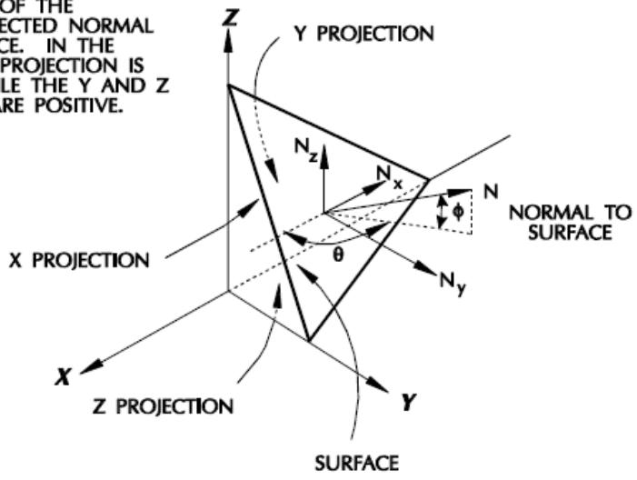  
THE_SIGN ASSOCIATED_WITH_THE AREAPROJECTIONSISTHATOF THECORRESPONDING COMPONENTSOF OUTWARDDIRE TOTHESURFAC FIGURETHEXF NEGATIVE,WHIL PROJECTIONSAI   
Figure 1. Area Local Coordinate System

A wind surface is defined using the AREA input line. The wind area name is specified in columns 5-6. The surface shape may be designated as flat or round by specifying ‘F’ or ‘R’ in column 79, respectively. The orientation of the surface is specified either by entering the projections of it on planes normal to the global axis or by specifying the area along with the azimuth and elevation angles in columns 7-24. When specifying azimuth and elevation angles for a flat surface, the area option in column 79 is ‘A’. It is recommended that if an object has projected areas in two or three planes that two separate wind areas be defined rather than specifying two projections. Two or three wind areas may be specified on the same AREA line by specifying ‘B’ in column 79.

The wind force components are calculated by multiplying the calculated wind pressure by the shape factor input in columns 46-50 and the projected areas. The wind force is assumed to act at the centroid of the surface designated in columns 25-45.

Note: Only wind surfaces whose centroid lies above the water surface elevation are loaded.

For example, the wind block for a building has a projection of 10.0 in X direction and 25.0 in the Y direction. The centroid of the building is at 34, 10, 25. Area ‘BX’ was used to define the X projection and area ‘BY’ used to define the Y projection.


|  | 1 | 2 | 3 | 4 | 5 | 6 | 7 | 8 |
| --- | --- | --- | --- | --- | --- | --- | --- | --- |
|  | 123456789012345678901234567890123456789012345678901234567890 | 123456789012345678901234567890123456789012345678901234567890 | 123456789012345678901234567890123456789012345678901234567890 | 123456789012345678901234567890123456789012345678901234567890 | 123456789012345678901234567890123456789012345678901234567890 | 123456789012345678901234567890123456789012345678901234567890 | 123456789012345678901234567890123456789012345678901234567890 | 123456789012345678901234567890123456789012345678901234567890 |
| 1 | AREA |  |  |  |  |  |  |  |
| 2 | AREABX 10.0 |  | 34.0 | 10.0 | 25.0 | 1.0 | 625 | 626 |
| 3 | AREABY | 25.0 | 34.0 | 10.0 | 25.0 | 1.0 | 625 | 626 |


Up to seven structure joints at which the force is to be reacted are specified in columns 51-78 on each “AREA” line. For example, in the above input, wind areas ‘BX’ and ‘BY’ transmit load into joints 625, 626, 635 and 676.

If only one joint is specified to react to the wind force, then the forces and moments on that joint are generated as those that are statically equivalent to the applied wind force. If more than one joint is

specified, the program assumes that these joints are connected to a rigid body to which the wind force is applied. The rigid body is supported at each joint by three translational and three rotational springs. The stiffness of the translational springs is unity while that of the rotational springs is 0.01 in the unit system the problem is defined. Since a rigid body has six degrees of freedom, all of the displacements and rotations at the joints are expressible in terms of rigid body displacements. The joint forces and moments are simply the displacements and rotations multiplied by the corresponding stiffness. The six equilibrium equations are then solved for the required joint loads. More joints (as much as needed) can be associated with a specific AREA, by adding lines with the same “AREA ID” while Area specification part is left blank. On each line, up to other seven joints can be added. It needs to be emphasized that program will automatically attach extra joints to the previous line joints, when Area specification is left blank, joints are entered in the right place (as in the case of AREA with just seven joints) and it will ignore other data that has been entered in the line for area or volume type and area definition. In the following example, Areas ‘BX’, ‘BY’ and ‘BZ’ are associated with 18, 7 and 10 joints respectively. As mentioned before, Area type in extra “AREA” lines will not be considered. Therefore, the type which has been assigned to the group in the first line defines the type of that group. In the following example, Area type of “BX”, “BY” and “BZ” IDs will be considered as “F”, “D” and “R” respectively.


|  | 1 | 2 | 3 | 4 | 5 | 6 | 7 | 8 |
| --- | --- | --- | --- | --- | --- | --- | --- | --- |
|  | 1234567890123456789012345678901234567890123456789012345678901234567890 | 1234567890123456789012345678901234567890123456789012345678901234567890 | 1234567890123456789012345678901234567890123456789012345678901234567890 | 1234567890123456789012345678901234567890123456789012345678901234567890 | 1234567890123456789012345678901234567890123456789012345678901234567890 | 1234567890123456789012345678901234567890123456789012345678901234567890 | 1234567890123456789012345678901234567890123456789012345678901234567890 | 1234567890123456789012345678901234567890123456789012345678901234567890 |
| 1 | AREA |  |  |  |  |  |  |  |
| 2 | AREABX | 10.0 |  | 34.0 | 10.0 | 25.0 | 1.0 | 625 626 635 676 640 642 643F |
| 3 | AREABX |  |  |  |  |  | 627 628 641 633 634 621 622D | 627 628 641 633 634 621 622D |
| 4 | AREABX |  |  |  |  |  | 623 631 632 650 | D |
| 5 | AREABY | 10.0 | 20.0 | 4.0 | 1.00 | 2.00 | 1.0 | 627 628 641 633 634 621 622D |
| 6 | AREABZ |  | 15.03.0 |  | 1.00 | 2.00 | 1.0 | 625 626 635 676 640 642 643R |
| 7 | AREABZ |  |  |  |  |  | 623 631 650 | D |


## 2.5 WIND SHIELD ZONES

By default, members located above the water surface receive wind loading. The program allows the specification of wind shield zones where members do not receive wind loading using the WINSHL line.

Wind shield zones are defined by specifying the bottom and top elevation of the zone. Elevations are defined using global z elevation. The zones themselves are defined in order of increasing elevation.

For example, members between the cellar deck, elevation +40, and the main deck, elevation +58.0 are not to receive any wind loading.


|  | 1 | 2 | 3 | 4 | 5 | 6 | 7 | 8 |
| --- | --- | --- | --- | --- | --- | --- | --- | --- |
|  | 12345678901 | 12345678901 | 12345678901 | 12345678901 | 12345678901 | 12345678901 | 12345678901 | 1234567890 |
| 1 | WINSHL | 40.0 | 58.0 |  |  |  |  |  |


## 2.6 SUBMERGED BODIES

The user may define unmodeled submerged bodies to be loaded by waves and/or current. Such bodies are designated by a two character identifier and may consist of drag areas and/or inertia volumes.

The drag areas and/or inertia volumes of a submerged body are defined using the AREA input line. The submerged body name is designated in columns 5-6. The type, either ‘D’ (drag area) or ‘I’ (inertia volume), is designated in column 80 along with either the drag or inertia coefficient in columns 46-50.

The projected areas/volumes are input in columns 7-24 and the coordinates of the centroid in columns 25-45. For drag areas, the area type may be designated by ‘F’, ‘R’ or ‘A’ corresponding to flat, round or flat defined in spherical coordinates, in column 79.

Note: Only areas/volumes whose centroid lies below the water surface are loaded.

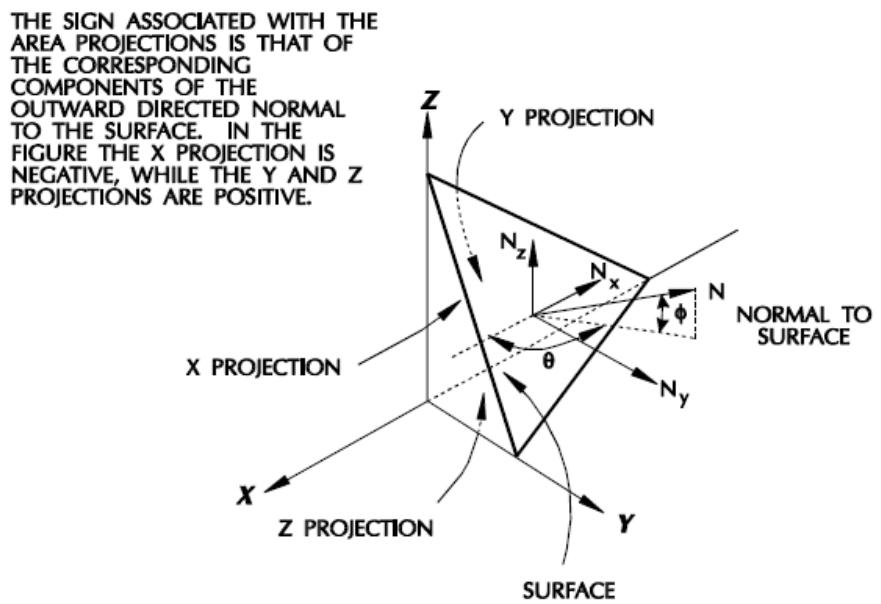  
Figure 2. Area Local Coordinate System

The forces on a submerged area/volume are calculated using Morison’s equation. These forces are then distributed to up to 7 joints specified in columns 51-78. The forces on these joints are calculated using the same procedure described previously for wind areas.

The following illustrates a submerged volume named ‘Q1’ represented by volume projections of 16.5, 28.3 and 28.4, respectively. The centroid is -8.1, 7.3 and -12.0 with all forces acting on the volume distributed to joints 213 and 230.


|  | 1 | 2 | 3 | 4 | 5 | 6 | 7 | 8 |
| --- | --- | --- | --- | --- | --- | --- | --- | --- |
| 1 | 1234567890123456789012345678901234567890123456789012345678901234567890123456789012345678901234567890123456789 | AREA |  |  |  |  |  |  |
| 2 | AREAQ1 16.5 28.3 28.4 -8.1 7.3 -12.0 213 220 | AREAQ1 16.5 28.3 28.4 -8.1 7.3 -12.0 213 220 | AREAQ1 16.5 28.3 28.4 -8.1 7.3 -12.0 213 220 | AREAQ1 16.5 28.3 28.4 -8.1 7.3 -12.0 213 220 | AREAQ1 16.5 28.3 28.4 -8.1 7.3 -12.0 213 220 | AREAQ1 16.5 28.3 28.4 -8.1 7.3 -12.0 213 220 | AREAQ1 16.5 28.3 28.4 -8.1 7.3 -12.0 213 220 | AREAQ1 16.5 28.3 28.4 -8.1 7.3 -12.0 213 220 |


## 2.7 NON-STRUCTURAL ELEMENTS

Seastate has the capability to use elements to generate environmental loading and then exclude these elements from the stiffness analysis. These elements, referred to as non-structural elements, can be especially useful when considering the effects of appurtenances, such as risers, access platforms and boat landings, that receive substantial environmental loading but whose stiffness contribution may be considered negligible.

In general, there are two methods of incorporating non-structural elements into the model, dummy structures that are connected to the primary structure at boundary joints, and appurtenance structures that are not connected to the primary structure model.

Note: Hydrostatic and hydrodynamic properties of dummy and appurtenance structures may be modified using member and/or group override features. This allows the user to simulate non-structural appurtenances with simplified models if desired.

2.7.1 Dummy Sub-Structures

A dummy sub-structure is a structure consisting entirely of non-structural elements that is connected to the main structure, such as a boat landing or an access deck in the wave zone.

The name of the dummy structure is specified on the DUMMY input line in columns 7-14. The joints of the primary structure to which the dummy structure connects are called boundary or keep joints and are designated on the KEEP input line. Joints that are unique to the dummy structure (i.e. not connected to the primary structure) are designated on the DELETE input lines.

Loading incurred by the dummy structure is distributed to the boundary joints assuming that the dummy structure is rigid body. All elements attached to a delete joint are removed from the model along with all joints designated as delete joints.

Up to 100 separate dummy structures may be designated.

The following defines a dummy structure named ‘BOATLAND’. The boundary joints or structural joints to which the dummy structure is attached are 803, 807, 903 and 907. The delete joints or the joint on the dummy structure are 1803, 1807, 1903 and 1907.

```txt
1 2 3 4 5 6 7 8 123456789012345678901234567890123456789012345678901234567890  
1 DUMMY BOATLANDDUMMY STRUCTURE DATA OPERATING  
2 KEEP 803 903 807 907  
3 DELETE 1803 1903 1807 1907
```

2.7.2 Appurtenance Structures

Appurtenance structures are structures consisting entirely of non-structural elements that are not connected to the primary structure model. Applications of appurtenance structures include risers, anodes or any item that induces a concentrated load on a member in the primary structure.

The members of the appurtenance structure are removed from the model by specifying the members or groups to which the members are assigned on the DELMEM or DELGRP input lines respectively. Loading on deleted members are transferred to the end joints of that member. The joints of the appurtenance structure are indicated on the DELJNT input line along with the member in the primary structure to which the joint load is to be transferred. The joint is removed from the model and the load on the appurtenance joints is transferred to the designated member in the form of a member concentrated load.

As an example, a riser is modeled next to a jacket leg but is not connected to the leg. Each joint of the riser element (1101, 1201, 1301 and 1401) corresponds to a point at which the riser will be clamped to the leg. The riser member loads are distributed to its end joints and the riser members are deleted by using the DELGRP input line and specifying group ‘RS1’. The riser joints are deleted and the riser joint loads are transferred to members of the primary structure as designated on the DELJNT input line.

```txt
1 2 3 4 5 6 7 8 123456789012345678901234567890123456789012345678901234567890 
```

```txt
1 DELGRP RS1 2 DELJNT 1101 101 201 1201 201 301 1301 301 401 1401 401 501
```

Note: Appurtenance structures may be used for static analysis only.

2.7.3 Alternate Method

Sub-structures or appurtenances such as boat landings and risers included in the model for loading purposes only may also be negated for stiffness purposes by assigning a small modulus of elasticity on the appropriate GRUP input line or small stiffness properties on the SECTION input line if applicable.

Joints attached to elements with reduced stiffness, must be also connected to members of sufficient stiffness such that the joint is supported for all six degrees of freedom. The user should also verify the analysis to ensure that the results are of sufficient accuracy by checking the number of significant digits lost.

When using this procedure for dynamic analysis, no DOF’s of joints connected to reduced stiffness elements should be retained.

## 2.8 ELEMENT LOAD REPORTS

Special environmental load reports for selected members or groups of members may be created. The report contains the environmental loading and summation for the elements specified on the REPMEM or groups specified on the REPGRP input lines. The REPORT header input line is required to invoke this feature.

Each report desired is labeled using the REPLBL input line by specifying a unique report name in columns 8-15 and an optional description in columns 16-80. The members to be included are indicated on the REPMEM input line. Members assigned to groups specified on the REPGRP input line are also included.

The following requests a loading report for members 101-102 and 102-103 along with members in group LG1. The report name is ‘LEG A1’.

```txt
1 2 3 4 5 6 7 8 1234567890123456789012345678901234567890123456789012345678901234567890123456789012345678901234567890123456789 
```

Note: A member or member property group may be included in a report and may not be including in other reports.

## 2.9 STRUCTURAL LOADING

Structural loading by external weights or masses due to structural acceleration may be created in the model file. This loading is used for modeling attached masses or structures whose stiffness does not contribute to the overall stiffness of the structure. For example, a generator on a movable skid will supply inertial loading to the structure, but would not contribute to the structural stiffness.

2.9.1 Structural Masses

Structural masses are defined in weight groups. A weight group may contain dead (inertial) weight "footprints", single joint or multi-joint distributed weight or member concentrated or distributed weight. Structural masses are defined prior to defining load conditions in the model.

2.9.1.1 Inertial Weight

The basic structural weight line supplies the user with the method for supplying inertial (dead) weight to the structure. Like the ‘DEAD’ line, the ‘WTSTR’ line specification calculates the dead weight (mass) for all structural elements. When the ‘WTSTR’ line is used within a weight group to calculate the weight (mass) of the structure, any marine growth dry weight will also be included. Unlike the ‘DEAD’ line, buoyancy effects, the mass of entrapped water and added mass of water are ignored. The ‘WTSTR’ line specifies the inertial weight group identifier in columns 7-10.

The structural weight specified on the ‘WTSTR’ line is most typically used to pass dynamic weight to the DYNPAC program via the ‘DYNMAS’ line. The ‘WTCMB’ line provides the method for supplying a contingency factor for the weight specified in the ‘WTSTR’ line.

In the following example, inertial weight is specified as weight group 1. A contingency factor of 1.10 is supplied to weight group 1 in the definition of weight group 2 via the ‘WTCMB’ line. Weight group 2 is to be included in subsequent dynamic analysis via the ‘DYNMAS’ line.

```txt
1 2 3 4 5 6 7 8 1 12345678901234567890123456789012345678901234567890123456789012345678901234567890123456789012345678901234567891 1 1.10 2 WTCMB 2 1 1.10 3 DYNMAS 2 
```

Note: For offshore structures the ‘WTSTR’ line is not recommended for use within weight group(s) and/or weight combination(s) to calculate dead loads. Instead, specifying the ‘DEAD’ load line within load conditions will cause buoyancy effects to be properly considered.

2.9.1.2 Weight Vertical Location

The vertical location of a weight within a structure may be specified with an ‘ELEV’ line. This line simplifies the placement of weight within a structure especially if weights are located similarly in horizontal position, but differ in vertical location. Multiple elevation identifiers and elevations may be specified on an ‘ELEV’ line; the first identifier is given in columns 7-10 with the vertical elevation specified in columns 11-20. The next identifier occupies the next fourteen columns, and so on.

The following example specifies two elevation identifiers, E1 and E2, with vertical coordinates of 55.0 and 105.0, respectively.

```txt
1 2 3 4 5 6 7 8 1 23456789012345678901234567890123456789012345678901234567890 1 ELEV E1 55.0 E2 105.0 
```

2.9.1.3 Surface Weight

The surface weight lines supply the user with a method for entering weight distributed over an irregular plane area. The surface weight lines are introduced with the ‘SURFID’ line. The surface identifier is supplied in columns 8-14 of this line, with the load distribution type specified in columns 16-17. The choices for columns 16-17 are: 1) ‘LX’, denoting loading in the surface local X direction, and 2) ‘LY’,

denoting loading in the surface local Y direction. The surface local coordinate system is defined via three joint names supplied in columns 19-22, 24-27, and 29-32. The first joint (columns 19-22) supplies the origin of the surface local coordinate system. The second joint (columns 24-27) supplies the direction of the positive X axis with respect to the origin. The third joint (columns 29-32) supplies the direction of the positive Y axis with respect to the origin, which is constructed perpendicular to the surface local X axis. The out-of-plane tolerance for choosing members within the surface is defined in columns 34-40. The surface weight is distributed to members whose endpoints lie within plus or minus this tolerance in the vertical direction.

Following the ‘SURFID’ line is the ‘SURFDR’ line which supplies boundary joint names for the surface. The boundary of the surface is specified by supplying up to fourteen joints. The edge of the surface is defined as running from joint 1 (columns 8-11) to joint 2 (columns 13-16) to joint 3 (columns 18-21) and so on. The final joint specified on the ‘SURFDR’ line is then connected to the first joint on the ‘SURFDR’ line to form the closed boundary.

The ‘SURFWT’ line which follows the surface definition(s) defines the loading on the surface(s). The weight group identifier is entered in columns 7-10 of the ‘SURFWT’ line. The load pressure is supplied in columns 11-17 and the weight ID is given in columns 18-25 for reporting purposes. If necessary, the density for buoyancy or added mass calculations is supplied in columns 26-32. Weight application factors in the three principal directions are specified in columns 33-44; if not specified, the default value for each factor is 1.0. One or more surface identifiers defined via ‘SURFID’ lines are specified in columns 45-79. Five separate surfaces may be referenced by a single ‘SURFWT’ line.

In the following example, surface ‘SCRANE2’ is defined with its X axis from joint 2 positive to joint 3, its Y axis positive from joint 2 toward joint 4, and the Z axis determined by the right-hand rule. All members within 0.5 feet (the default) distance from the surface XY plane within the surface boundary will have loads transmitted to them. The surface boundary goes from joint 2 to joint 3 to joint 5 to joint 4 back to joint 2. The weight group 2 has a pressure of 250 defined with the weight ID ‘LIFTWT1’. All weight application factors are 1.0, their default values, and the weight is applied only within surface ‘SCRANE2’.

```txt
1 2 3 4 5 6 7 8 1 23456789012345678901234567890123456789012345678901234567890 1 SURFID SCRANE2 LX 2 3 4 2 SURFDR 2 3 5 4 3 SURFWT2 250.00LIFTWT1 SCRANE2 
```

2.9.1.4 Structural Weight Footprint

The footprint of a structural weight is the area in which the weight is supported. For example, if a skid is to be supported by deck beams, the skid footprint is the length and width of the skid in contact with the deck. By modeling the skid as a footprint, the positioning of the skid on the deck and its effect on beam loading can be easily resolved.

The structural weight footprint lines are the ‘WGTFP’ and the ‘WGTFP2’ lines. In the ‘WGTFP’ line, the weight group identifier is given in columns 7-10 and the weight itself is given in columns 11-17. A weight ID is given in columns 18-25 for reporting purposes. In columns 26-29, an optional elevation ID from an ‘ELEV’ line is given. The use of an elevation ID facilitates moving weights to different vertical planes. The global (X,Y,Z) footprint center coordinates are given in columns 30-47. The (X,Y,Z) location of the center of gravity of the weight itself is input in columns 49-66. The CG of the weight may be located in global

coordinates by entering ‘G’ in column 48; it may be entered in coordinates relative to the footprint center location by entering ‘R’ in column 48. The length and width of the footprint are input in columns 67-76. The number of skid beams supporting the weight parallel to the footprint length is given in columns 77-78; the number of skid beams supporting the weight parallel to the footprint width is given in columns 79-80.

In the ‘WGTFP2’ line, additional data is given to describe the weight footprint. Weight application factors in the three principal directions may be specified in columns 11-22. If not specified, the default value for each factor is 1.0. The vertical tolerance for selecting applicable members to support the weight is given in columns 23-26. Specifying a value of 1.0 means that all members which cross the skid beams will have load applied provided the endpoints of the members lie within plus or minus 1.0 unit in the vertical direction. The ‘WGTFP2’ line provides for input of rotary inertia data for the weight in the form of radii of gyration around three axes. The axes are either the global axes (‘G’) or local axes (‘L’) input in column 27. Local coordinates are defined with X parallel to the length of the skid, Y parallel to the width of the skid, and Z vertical. The radii of gyration themselves are input in columns 28-42. For the purposes of buoyancy calculations, a weight density may be supplied. The final input is the angle the skid length direction makes with respect to the global X axis. This is supplied in columns 49-54.

In the following example, a skid of weight 120 with name SKID1 is added to weight group 2. The global coordinates of the skid are X=20, Y=10, and Z=0 with the elevation from elevation ID ‘E1’ added to the vertical coordinate. The skid mass is located at a position of Y=2 and Z=5 relative to the position of the skid. The skid length and width is 24. There are 3 skid beams along the length axis of the skid. Structural loading will be multiplied by 1 when computing skid loading (the default). The vertical tolerance for outof-plane members is 0.5. The radii of gyration in the global X, Y, and Z directions are 10, 3, and 11, respectively. No density is supplied for buoyancy calculations, and the orientation of the length axis is 90 degrees from the global X axis.

```txt
1 2 3 4 5 6 7 8 123456789012345678901234567890123456789012345678901234567890123456789012345678901234567890123456789012345678910 E1 20. 10. 0.0R 0.0 2. 5. 24. 24. 30 0.5G 10. 3. 11. 90. 
```

In specific design instances there may be smaller diagonal or cross-tie members which lie within a weight footprint. Without further entry, these members would have the footprint weight distributed to them in a design analysis. The ‘EXCGRP’ line is used to prevent this from occurring. For a particular footprint weight group identified in columns 7-10, the specified member groups are excluded from weight loading. Up to 17 member groups are specified in columns 12-78 of the ‘EXCGRP’ line.

In the following example, footprint weight group ‘FP1’ is specified to not include member groups ‘XBM’ and ‘DIA’ when the footprint loading is distributed.

```txt
1 2 3 4 5 6 7 8 1 234567890123456789012345678901234567890123456789012345678901234567890 
```

2.9.1.5 Joint Weight

Structural weight loading may be applied directly to individual joints by means of the ‘WGTJT’ line. The weight group identifier is specified in columns 7-10 and the weight itself in columns 11-17 of the line. A weight ID is given in columns 18-25 for reporting purposes. The joint name to which the weight loading is applied is supplied in columns 26-29. For the purposes of buoyancy or added mass calculations, a

weight density may be supplied in columns 30-36. The global axis radii of gyration of the weight are input in columns 37-54 and any weight application factors are input in columns 55-69. The default values of the weight application factors in X, Y or Z directions are 1.0.

In the following example, a weight of 160 with name OUTRIG which is applied to joint 1 is added to weight group 3. The weight has no density supplied and its radii of gyration are 10.2 about the X axis, 10.2 about the Y axis, and 3.1 about the Z axis. Load application factors in the X and Y directions are 1.0 (the default value), whereas the load application factor in the Z direction is 0.5.

```txt
1 2 3 4 5 6 7 8 1 23456789012345678901234567890123456789012345678901234567890 1 WGTJT 3 160.000OUTRIG 1 10.2 10.2 3.1 0.5 
```

2.9.1.6 Member Weight

Structural weight loading is applied to individual members by means of the ‘WGTMEM’ line. Structural weight loading may be applied to members in two ways, as concentrated weight loading or as distributed weight loading. For both concentrated or distributed weight loading, the weight group identifier is supplied in columns 7-10 with the member end joints supplied in columns 11-14 (joint A) and columns 15-18 (joint B). Load application factors in the X, Y or Z directions are supplied in columns 47-58. The coordinate system for the weight is supplied in columns 59-62 and is specified as ‘GLOB’ (global) or ‘MEMB’ (member local). The coordinate system expresses the directions for use of the load application factors. Enter the density for buoyancy calculations in columns 67-72 and the optional weight ID in columns 73-80.

For concentrated weight loading, the ‘WGTMEM’ line has the label ‘CONC’ supplied in columns 63-66. The concentrated weight is supplied in columns 26-32 and the distance from joint A toward joint B at which the weight lies is supplied in columns 19-25. For distributed weight loading, the ‘WGTMEM’ line has the label ‘UNIF’ supplied in columns 63-66. The distance from joint A toward joint B at which the distributed loading starts is specified in columns 19-25. The beginning value of distributed weight is supplied in columns 26-32. The units for the distributed weight are units of force divided by units of length. The distance over which the distributed weight acts is supplied in columns 33-39; if left blank, the load is applied from the starting point to the end of the member (joint B). The final value of distributed weight is supplied in columns 40-46.

In the following example, a concentrated weight named ‘BOAT’ of 90 is applied to member 2-3 and a distributed weight named ‘TIEDOWN’ of 10 is applied to member 4-5. In both cases there is no density supplied with the weight and the load application factors in the X, Y or Z directions are their default values of 1.0. The concentrated weight is applied 2.3 length units from joint 2. The distributed weight is a uniform load of 10 applied beginning 1.2 length units from joint 4 to the end joint 5. Both weights are part of weight group 3.


|  | 1 | 2 | 3 | 4 | 5 | 6 | 7 | 8 |
| --- | --- | --- | --- | --- | --- | --- | --- | --- |
|  | 1234567890123456789012345678901234567890123456789012345678901234567890123456789012345678901234567890123456789 | 2 | 3 | 2.3 | 90. |  | GLOBCONC | BOAT |
| 1 | WGTMEM3 | 4 | 5 | 1.2 | 10. |  | GLOBUNIF | TIEDOWN |
| 2 | WGTMEM3 |  |  |  |  |  |  |  |


2.9.1.7 Non-Structural Weight

The non-structural weight lines allow the distribution of non-structural weight to up to 120 joints. In this way non-supportive structure may have its weight distributed to multiple attachment points. The first

non-structural weight line is labeled ‘WGTNS’. The weight group identifier is input in columns 7-10 and the weight itself is input in columns 11-17. A weight ID is given in columns 18-25 for reporting purposes. The coordinates of the weight are supplied in two manners. The default method is to enter coordinates relative to the position of the first joint to which the loads are distributed (‘R’ in column 30).

Alternatively, one may enter the absolute global position of the weight (‘A’ in column 30). The coordinates themselves, either relative or absolute, are supplied in columns 31-48. As an added feature, the vertical coordinate of the non-structural weight may be adjusted by supplying an elevation ID in columns 26-29. The elevation supplied here adds to the vertical coordinate supplied in columns 31-48. The joints to which the weight is distributed are supplied in columns 49-80, four columns per joint resulting in the definition of eight joints. Additional joints can be added to the same group or weight ID, by adding up to other 14 lines with label ‘WGTNS’, leaving columns 6 – 48 blank and listing the joints in columns 49 – 80 on each line. The following example shows a weight group “COMP” with 27 associated joints defined in extra ‘WGTNS’ lines.


|  | 1 | 2 | 3 | 4 | 5 | 6 | 7 | 8 |
| --- | --- | --- | --- | --- | --- | --- | --- | --- |
|  | 12345678901 | 12345678901 | 12345678901 | 12345678901 | 12345678901 | 12345678901 | 12345678901 | 1234567890 |
| 1 | WGTNS | COMP | 100.100K | A | 5.0 | 30.0 | 16 | 14 |
| 2 | WGTNS |  |  | A |  | 9 | 4 | 7 |
| 3 | WGTNS |  |  | A |  | 1 | 18 | 19 |
| 4 | WGTNS |  |  | A |  | 25 | 26 | 27 |


It should be mentioned that this feature is unified across all SACS modules. Therefore, additional joints up to 120 joints can be defined in the same way in all other SACS modules including ‘Dynpac’, ‘Flotation’, ‘Launch’, ‘Material Takeoff’, ‘Motion’ and ‘Tow’ which use non-structural weights through ‘WGTNS’ lines.

The second non-structural weight line is labeled ‘WGTNS2’. This line supplies application factors for the weight, radii of gyration for the weight, and density for buoyancy calculations. The weight application factors in the X, Y or Z directions are supplied in columns 11-22. The radii of gyration of the weight are supplied in columns 31-45. The radii of gyration may be supplied in global (‘G’ in column 30) or local (‘L’ in column 30) coordinates. The local coordinate system is created from the first three joints supplied. The first joint is the origin of local coordinates, the second joint is the direction of the positive local X, the third joint is oriented toward positive Y, and the Z axis is determined via the right-hand rule. If applicable, the density for buoyancy calculations is supplied in columns 23-29. Additional joints associated to a group need to be entered after the first ‘WGTNS’ line and before ‘WGTNS2’ line as mentioned in previous paragraph.

In the following example, a non-structural weight 70 with name RISER1 is added to weight group 4. The riser mass is located at a position of X=2 and Z=3 relative to the position of joint 4, with the elevation from elevation ID ‘E2’ added to the vertical coordinate. Structural loading will be multiplied by 1 when computing joint loading (the default). The radii of gyration in the local X, Y, and Z directions are 8.2, 2.1, and 8.2, respectively. Positive local X is from joint 4 toward joint 5. Positive local Y is perpendicular to local X toward joint 6. Local Z is determined by the right-hand rule.


|  | 1 | 2 | 3 | 4 | 5 | 6 | 7 | 8 |
| --- | --- | --- | --- | --- | --- | --- | --- | --- |
|  | 12345678901 | 12345678901 | 12345678901 | 12345678901 | 12345678901 | 12345678901 | 12345678901 | 12345678901 |
| 1 | WGTNS 4 | 70.00RISER1 | E2R | 2.0 | 3.0 | 4 | 5 | 6 |
| 2 | WGTNS2 |  | L | 8.2 | 2.1 | 8.2 |  |  |


2.9.1.8 Weight Combinations

Weight groups may be combined via the ‘WTCMB’ line. The ‘WTCMB’ line allows the linear combination of up to forty eight weight groups or weight group combinations. The combination weight group identifier is specified in columns 7-10. Up to six weight groups may be combined on a single ‘WTCMB’ line. If more are needed, the ‘WTCMB’ line is repeated with the same combination weight group identifier specified. The first weight group to be combined is specified in columns 12-15; the combination factor for this group is supplied in columns 16-21. Subsequent weight groups are supplied in twelve column fields along the line.

In the following example, weight group 8 is defined as a combination of 1.05 of weight group 3, 1.10 of weight group 4, and 0.80 of weight group 5.

```txt
1 2 3 4 5 6 7 8 1 234567890123456789012345678901234567890123456789012345678901234567890 1 WTCMB 8 3 1.054 1.105 0.80 
```

2.9.1.9 Dynamic Mass Selection

Weight groups may be included in dynamic analysis in Dynpac via the ‘DYNMAS’ line. The first weight group for dynamic analysis is specified in columns 9-12. Other weight group identifiers are specified in adjacent columns. Up to 16 weight group identifiers may be supplied in columns 9-72. Columns 73-76 provide for the entry of an added mass coefficient for submerged weights; its default value is 1.0.

In the following example, weight groups 1, 3 and 4 will be used in dynamic analysis with unity added mass (the default).

```txt
1 2 3 4 5 6 7 8 123456789012345678901234567890123456789012345678901234567890 1 DYNMAS 1 3 4 
```

Note: All weight groups specified on the ‘DYNMAS’ line must be defined via ‘WTSTR’, ‘SURFWT’, ‘WGTFP’, ‘WGTJT’, ‘WGTMEM’, ‘WGTNS’ or ‘WTCMB’ lines.

2.9.2 Direct Load Determination

The structural loading defined to this point is general in that it may be applied to any load condition in the input file. Weight group identifiers are global identifiers for a model. Unless otherwise noted, the following lines describe local entries which are specific to individual load conditions.

2.9.2.1 Weight Inclusion in Loading

The inclusion of weight group identifiers in individual load cases is accomplished with the ‘INCWGT’ line. Up to 18 weight group identifiers are supplied in columns 9-80 of the ‘INCWGT’ line. In the following example, weight groups 9, 10 and 11 are applied to dead weight in load condition 2.

```txt
1 2 3 4 5 6 7 8  
1234567890123456789012345678901234567890123456789012345678901234567890  
1LOADCN 2
2INCWGT 9 10 11  
# 3DEAD
# 4DEAD -Z M
```

Note: The ‘INCWGT’ line will only produce loading if the load condition in which it lies also has ‘DEAD’ loading, has ‘ACCEL’ loading, has ‘MOTION’ loading, or has ‘INCRAO’ loading. If none of these loadings is

supplied, the weight groups specified will not have an acceleration component and hence will supply no loading.

2.9.2.2 Inertia Load Center Location

The center of inertia loading is specified with the ‘CENTER’ line. The ‘CENTER’ line appears before the loading in the model file. This line provides the center of rotational motion to Seastate. As such, subsequent ‘ACCEL’ or ‘MOTION’ lines will use the defined center in order to distribute the inertia loading to the structure. The identifier for the center is supplied in columns 9-12 of the ‘CENTER’ line; the (X,Y,Z) coordinates of the center are specified in columns 13-19, 20-26, and 27-33, respectively.

The following example specifies a center of inertia loading (roll center) located at X=10.5, Y=9.6 and Z=0.0. The roll center is named ‘C1 ’.

```txt
1 2 3 4 5 6 7 8 1 2345678901234567890123456789012345678901234567890123456789012345678901234567890123456789012345678901234567890 
```

Note: The center identifier in columns 9-12 is space sensitive; center ‘C1 ’ is not the same as center ‘ C1’.

2.9.2.3 Applied Structure Acceleration

Structural loading due to acceleration is provided via the ‘ACCEL’ or ‘MOTION’ lines. The ‘ACCEL’ line supplies translational and rotational components of acceleration; the ‘MOTION’ line supplies the same, except with data supplied as amplitude/period of motion. Both lines rely on the definition of a center ID, which is specified in columns 77-80. They both have the option to exclude structural weight, which is accomplished by inputting an ‘N’ in column 75.

The ‘ACCEL’ line specifies the translational accelerations in global coordinates in columns 10-30, the rotational accelerations in global coordinates in columns 31-51, and the rotational velocities in global coordinates in columns 52-72. The rotational velocities are necessary to compute centripetal acceleration terms. The ‘MOTION’ line specifies angle/period data for roll (columns 11-24), pitch (columns 25-38), and yaw (columns 39-52).

Translational acceleration (surge, sway, heave) is specified in columns 53-73. Enter ‘G’ in column 74 if gravity acceleration is to be added to the other accelerations when computing the total load; enter ‘L’ in column 74 if the effects of gravity are to be included in lateral forces only.

In the following example, load condition 1 has weight groups 1, 2 and 3 applied with structural motion of 2.5 degrees pitch with period 22 seconds. Gravity will be included when computing the loading due to the acceleration, but the structural weight will not be added to the weight supplied in the weight groups. The structural pitch motion will be centered about the center ‘CEN1’.

```txt
1 2 3 4 5 6 7 8 1 1 23456789012345678901234567890123456789012345678901234567890 1 LOADCN 1 2 3 2.5 22. GN CEN1 
```

2.9.2.4 Response Amplitude Operators

Specifying a response amplitude operator for wave loading is accomplished with three lines: 1) the RAO header line, 2) the RAO line, and 3) the include RAO line. The RAO header line and the RAO line are

specified globally; the include RAO line is specified per load case. The RAO header line (‘RAO HEAD’) has the following syntax: 1) the transfer function direction, which corresponds with the wave direction, is specified in columns 9-15; 2) the velocity is specified in columns 16-22 for velocity-dependent RAOs; 3) the plane of symmetry (‘XZ’, ‘YZ’, or none) is specified in columns 24-25; 4) the velocity unit (‘FPS’ for feet per second, none for knots or meters per second) is specified in columns 27-29; 5) the RAO origin in global coordinates is specified in columns 30-56; and 6) the RAO identifier is specified in columns 57-60.

The ‘RAO’ line specifies the specific response amplitude operator for a given frequency or period. The RAO type (displacement ‘D’, velocity ‘V’, or acceleration ‘A’) is specified in column 5. The default is ‘D’. The choice of frequency (blank) or period (‘P’) is given in column 6. The frequency or period is supplied in columns 7-12. To supply a full set of RAO characteristics for many frequency values, the RAO lines should be input with frequency values in increasing order. Likewise, to supply a full set of RAO characteristics for many period values, the RAO lines should be input with period values in decreasing order. Each RAO line contains amplitude/phase information for surge (columns 13-23), sway (columns 24-34), heave (columns 35-45), roll (columns 46-56), pitch (columns 57-67), and yaw (columns 68-78). Again, the ‘RAO HEAD’ and ‘RAO’ lines are specified before any loads are specified.

In the following example, an RAO is specified with the identifier ‘TIDE’. The ‘RAO’ lines following the header are oriented at 45 degrees and have a velocity of 4. The RAO is symmetric about the XZ plane and the origin for the RAO lines is X=10, Y=10 and Z=0. The ‘RAO’ lines specify the RAO amplitude is displacement and the units are frequency. All six accelerations are supplied, with amplitude/phase information supplied.


|  | 1 | 1 | 2 | 2 | 3 | 3 | 4 | 4 | 5 | 5 | 6 | 6 | 7 | 8 |
| --- | --- | --- | --- | --- | --- | --- | --- | --- | --- | --- | --- | --- | --- | --- |
|  | 1234567890123456789012345678901234567890123456789012345678901234567890 | 1234567890123456789012345678901234567890123456789012345678901234567890 | 1234567890123456789012345678901234567890123456789012345678901234567890 | 1234567890123456789012345678901234567890123456789012345678901234567890 | 1234567890123456789012345678901234567890123456789012345678901234567890 | 1234567890123456789012345678901234567890123456789012345678901234567890 | 1234567890123456789012345678901234567890123456789012345678901234567890 | 1234567890123456789012345678901234567890123456789012345678901234567890 | 1234567890123456789012345678901234567890123456789012345678901234567890 | 1234567890123456789012345678901234567890123456789012345678901234567890 | 1234567890123456789012345678901234567890123456789012345678901234567890 | 1234567890123456789012345678901234567890123456789012345678901234567890 | 1234567890123456789012345678901234567890123456789012345678901234567890 | 1234567890123456789012345678901234567890123456789012345678901234567890 |
| 1 | RAO | HEAD | 45. | 4. | XZ | 10. | 10. | 10. | 10. | 0.0TIDE | 0.0TIDE | 0.0TIDE | 0.0TIDE | 0.0TIDE |
| 2 | RAO | DF | 0.06 | 0.93 | 47.5 | 0.91 | 19.0 | 0.92 | 0.2 | 0.31 | 87.6 | 0.26267.9 | 0.46189.5 |  |
| 3 | RAO | DF | 0.07 | 0.81 | 47.1 | 0.80 | 18.9 | 0.89 | 0.3 | 0.40 | 87.8 | 0.29267.6 | 0.46185.2 |  |
| 4 | RAO | DF | 0.08 | 0.69 | 46.2 | 0.70 | 19.2 | 0.83 | 0.5 | 0.61 | 90.2 | 0.34266.9 | 0.48179.0 |  |
| 5 | RAO | DF | 0.09 | 0.62 | 45.5 | 0.66 | 20.8 | 0.79 | 0.5 | 0.86 | 96.0 | 0.37266.3 | 0.50173.7 |  |
| 6 | RAO | DF | 0.10 | 0.55 | 44.2 | 0.62 | 31.4 | 0.72 | 0.1 | 1.50102.1 | 0.40265.1 | 0.59167.2 |  |  |
| 7 | RAO | DF | 0.12 | 0.36 | 37.3 | 0.25 | 16.1 | 0.44354.6 | 0.33164.7 | 0.43258.5 | 0.51169.9 |  |  |  |
| 8 | RAO | DF | 0.16 | 0.09 | 6.6 | 0.05 | 52.6 | 0.17268.5 | 0.13 | 87.0 | 0.22225.8 | 0.33131.2 |  |  |
| 9 | RAO | DF | 0.20 | 0.00 | 8.7 | 0.01271.2 | 0.01 | 64.0 | 0.02152.8 | 0.03352.2 | 0.06231.8 |  |  |  |


The ‘INCRAO’ line includes RAO information in load conditions. The velocity is specified in columns 8-14. If the velocity is not the same as that provided on an ‘RAO’ line, interpolation or extrapolation will determine the RAO. Velocity units by default are in knots in the English system or meters per second in the metric system. If English units are specified and velocity is expressed in feet per second, enter ‘FPS’ in columns 15-17. Structural weight may be excluded from the force computation based on the included RAO if ‘N’ is specified in column 18.

In the following example, a previously defined RAO is included in load condition 4. The velocity for the RAO is 3.5 (knots if the units are English, meters per second if the units are metric). Structural weight is not to be included in the RAO loading, meaning that weight groups must be included to generate loads. The weight groups specified on the ‘INCWGT’ line are weight groups 1, 3 and 6. The ‘WAVE’ line specifies a Stokes’ fifth order wave of crest-to-trough height of 28. The wave period is 12.8 seconds and the wave angle is 67.5 degrees. If an RAO is not specified for this wave angle, existing RAOs will be interpolated or extrapolated to obtain the values.

```txt
1 2 3 4 5 6 7 8 123456789012345678901234567890123456789012345678901234567890 
```

```txt
# 1 LOADCN 4
# 2 INCRAO 3.5
3 INCWGT 1 3 6   
4 WAVE STOK 28.0 12.80 67.50 D 18MM 0 
```

2.9.2.5 Space Forces and Moments

The ‘SFRC’ and ‘SMOM’ lines allow forces or moments at a point in space to be distributed among joints of a structure. On both lines, up to eight distribution joints are specified in columns 45-76. The (X,Y,Z) point about which the force or moment acts is specified in columns 27-44. The coordinates are specified either as absolute ‘A’ or relative ‘R’ in column 26. Coordinates specified as relative are taken with respect to the first distribution joint specified. In the ‘SFRC’ line, the global force is input in columns 5- 25; in the ‘SMOM’ line, the global moment is input in columns 5-25. Both lines allow input of a load identifier in columns 77-80.

In the following example, a space moment of 8.2 about the X axis, 5.1 about the Y axis, and -6.3 about the Z axis is specified for load condition 6. The origin of this moment lies at X=5, Y=0, and Z=-2 with respect to joint 2. The moment will be distributed to joints 2, 3, 4, 11, 12 and 13. The load identifier is ‘CMOM’.

```javascript
1 2 3 4 5 6 7 8 1 23456789012345678901234567890123456789012345678901234567890 1 6 2 3 4 11 12 13 CMOM 2 SMOM 8.2 5.1 -6.3R 5.0 -2.0 2 3 4 11 12 13 
```

Note: Do not convert space moments to mass. This will yield unrealistic values or directions.

2.9.2.6 Moving Load

Moving loads may be applied as a particular load condition in Seastate. A moving load is specified with three lines. The ‘MOVLOD’ line specifies a moving load identifier and the load cases which will be "moved". The load cases to be moved must consist entirely of joint loads. The ‘MOVGRP’ line specifies the member groups to which the moving loads will be distributed. Any number of member groups may be specified by repeating the MOVGRP line within a load condition with the same moving load identifier. If the MOVGRP line is absent, all member groups will have the specified loads distributed to them. The ‘MOVSTP’ line specifies the number of steps to take in moving the load, the direction in which to step the load, and the length of a single step.

Initially the moving load will reproduce the joint loads specified in the load cases specified on the MOVLOD line. Each subsequent step will move the load a specified distance in a specified direction. This load gets distributed to member groups specified in the MOVGRP line. A single moving load within a load condition is separable into two parts, the load cases as part of the MOVLOD line and the load sequences comprised of MOVGRP/MOVSTP pairs. A MOVGRP/MOVSTP pair may contain several load steps as specified on the MOVSTP line.

In the following example load condition 5 consists of a moving load with the joint loading found in load cases 1 through 4. The moving load ‘TOPSIDE’ consists of four load sequences of 12 steps each.

Members in member groups BM1 and BT2 will have the moving loads applied to them. Initially the loading is situated at the joints specified in load cases 1 through 4. The load sequences consist of the following: 1) 13 load steps taken in the positive X direction (the original load case plus 12 load steps); 2) 12 load steps taken in the positive Y direction; 3) 12 load steps taken in the negative X direction; and 4)

12 load steps taken in the negative Y direction. Being as each load step in each sequence has length 6.25, the path taken by the moving loads in this example is a square.


|  | 1 | 2 | 3 | 4 | 5 | 6 | 7 | 8 |
| --- | --- | --- | --- | --- | --- | --- | --- | --- |
|  | 1234567890123456789012345678901234567890123456789012345678901234567890123456789012345678901234567890123456789 | 1234567890123456789012345678901234567890123456789012345678901234567890123456789012345678901234567890123456789 | 1234567890123456789012345678901234567890123456789012345678901234567890123456789012345678901234567890123456789 | 1234567890123456789012345678901234567890123456789012345678901234567890123456789012345678901234567890123456789 | 1234567890123456789012345678901234567890123456789012345678901234567890123456789012345678901234567890123456789 | 1234567890123456789012345678901234567890123456789012345678901234567890123456789012345678901234567890123456789 | 1234567890123456789012345678901234567890123456789012345678901234567890123456789012345678901234567890123456789 | 1234567890123456789012345678901234567890123456789012345678901234567890123456789012345678901234567890123456789 |
| 1 | LOADCN1 |  |  |  |  |  |  |  |
| 2 | LOAD Z 10 |  | -10.000 |  |  | GLOB JOIN MOVLD1 |  |  |
| 3 | LOADCN2 |  |  |  |  |  |  |  |
| 4 | LOAD Z 11 |  | -7.5000 |  |  | GLOB JOIN MOVLD2 |  |  |
| 5 | LOADCN3 |  |  |  |  |  |  |  |
| 6 | LOAD Z 12 |  | -30.000 |  |  | GLOB JOIN MOVLD3 |  |  |
| 7 | LOADCN4 |  |  |  |  |  |  |  |
| 8 | LOAD Z 13 |  | -60.000 |  |  | GLOB JOIN MOVLD4 |  |  |
| 9 | LOADCN5 |  |  |  |  |  |  |  |
| 10 | MOVLOTD TOPSIDE | 1 2 3 4 |  |  |  |  |  |  |
| 11 | MOVGRP TOPSIDE | BM1 BT2 |  |  |  |  |  |  |
| 12 | MOVSTP TOPSIDE | 12 6.25 |  | 1.0 0.0 0.0 |  |  |  |  |
| 13 | MOVGRP TOPSIDE | BM1 BT2 |  |  |  |  |  |  |
| 14 | MOVSTP TOPSIDE | 12 6.25 |  | 0.0 1.0 0.0 |  |  |  |  |
| 15 | MOVGRP TOPSIDE | BM1 BT2 |  |  |  |  |  |  |
| 16 | MOVSTP TOPSIDE | 12 6.25 |  | -1.0 0.0 0.0 |  |  |  |  |
| 17 | MOVGRP TOPSIDE | BM1 BT2 |  |  |  |  |  |  |
| 18 | MOVSTP TOPSIDE | 12 6.25 |  | 0.0 -1.0 0.0 |  |  |  |  |


## 2.10FLOOR LOADS

Floor loads enable automatic member load generation from defined enclosed zones and zone pressure loads. Seastate takes a set of boundary joints and a vertical tolerance, identifies members which fall within this volume, constructs a set of panels from these members, and then calculates tributary areas using yield-line theory. Zone load pressures are then applied to these zones and converted to member loads.

2.10.1 Enclosed Zone Definition

This feature requires zone definitions which must include a set of boundary joints (ZONBD). Options, openings, virtual members, and ignored members may be optionally included to control the behavior of panel generation, yield-line calculation, and load distribution. Models are limited to 500 enclosed zones.

## 2.10.1.1 Boundary Joints

An Enclosed Zone is defined by its boundary joints given on ZONBD lines. The Zone Label identifies the zone and associates the zone options and definitions with each other. Up to 12 joints may be defined on each enclosed zone boundary definition line. Multiple ZONBD lines with the same Zone Label may be defined to increase the number of boundary joints.

These boundary joints need not form a rectangle but must be coplanar and must be ordered in a clockwise or counterclockwise manner. An enclosed zone is limited to 500 boundary joints. The normal vector for the enclosed zone is determined by the right-hand rule.

All members enclosed within the volume defined by the boundary joints and vertical tolerance will be included for panel generation. If a boundary edge does not include a member, such a deck overhang, a virtual member will be used for panel generation, but not load distribution. Members connected to two boundary joints are automatically included for panel generation even if they are offset outside of the area defined by the boundary joints.

Note: Yield line calculations may fail for non-convex panels.

## 2.10.1.2 Enclosed Zone’s Local Coordinate System

The local x-axis of the zone is always defined as the unit vector from zone’s first boundary joint to the second boundary joint. The local z-axis of the zone is defined as the unit normal vector to the plane of the zone which its direction is determined by the right-hand rule. Finally, the y-axis of the zone is defined as the cross product of z-axis and x-axis therefore creating a right-hand coordinate system.

## 2.10.1.3 Enclosed Zone Options

Define the enclosed zone options on the ZONOP line. The Zone Label identifies the zone and associates the zone options and definitions with each other.

The Vertical Tolerance defines the distance normal to the plane defined by the boundary joints where beams will be included for panel generation. This is intended to capture beams with vertical offsets within the same deck or panel.

The Load Direction defines which members within the zone will be loaded. By default, all members within the zone (unless otherwise specified) participate in the creation of panels and carry loads. This option enables the user to choose members parallel to either the local x or y axes of the zone to exclusively carry loads. A member is parallel to a local axis if the angle it creates with that axis or its reverse, is less than the Angular Tolerance of the zone. The other members within the zone will automatically be added to the virtual members list.

If the Transfer Loads option is enabled with ‘T’, when calculated member loads need to be transferred to the physical location of the member due to offsets, an additional moment will be introduced to represent that transformation.

## 2.10.1.4 Openings

Openings are defined on ZONEH lines. The Zone Label identifies the zone and associates the zone options and definitions with each other. The Opening Label identifies the opening and associates the opening joints with each other. Up to 10 joints may be defined on each opening definition line. Multiple ZONEH lines with the same Zone Label and Opening Label may be defined to increase the number of opening joints.

These opening joints need not form a rectangle but must be coplanar with the enclosed zone plane, inside the enclosed zone, and must be ordered in a clockwise or counterclockwise manner. Openings cannot connect to each other and should be combined into one opening. An enclosed zone is limited to 400 openings.

All members within an opening are excluded from panel generation and tributary area calculations.

## 2.10.1.5 Ignored Member Lines

Members may be excluded from panel generation with the ZONIM and ZONIG lines. Any members that are excluded from panel generation are also excluded from tributary area calculation and load distribution. This option is intended for members which cross through the enclosed zone but do not contribute to panel formation. For instance, diagonal bracing in a deck which is not intended to take gravity loads.

Note: If multiple members form the edge of a panel, Seastate will use strictest constraint for that edge. Ignore is stricter than Virtual, which is in turn stricter than the default behavior.

## 2.10.1.5.1Ignored Members

Lists of ignored members are defined on ZONIM lines. The Zone Label identifies the zone and associates the zone options and definitions with each other. Up to 6 members may be defined on each ignored member line. Multiple ZONIM lines with the same Zone Label may be defined to increase the number of ignored members.

## 2.10.1.5.2Ignored Member Groups

Lists of ignored member groups are defined on ZONIG lines. The Zone Label identifies the zone and associates the zone options and definitions with each other. Up to 15 member groups may be defined on each ignored member group line. Multiple ZONIG lines with the same Zone Label may be defined to increase the number of ignored member groups.

## 2.10.1.6 Virtual Member Lines

Members may be excluded from tributary area calculation and load distribution with the ZONVM and ZONVG lines. This option is intended for members which form a panel, but the load is not distributed to these beams. For instance, one way load distribution is defined by making the beams in one direction virtual members.

## 2.10.1.6.1Virtual Members

Lists of virtual members are defined on ZONVM lines. The Zone Label identifies the zone and associates the zone options and definitions with each other. Up to 6 members may be defined on each virtual member line. Multiple ZONVM lines with the same Zone Label may be defined to increase the number of ignored members.

## 2.10.1.6.2Virtual Member Groups

Lists of virtual member groups are defined on ZONVG lines. The Zone Label identifies the zone and associates the zone options and definitions with each other. Up to 15 member groups may be defined on each virtual member group line. Multiple ZONVG lines with the same Zone Label may be defined to increase the number of virtual member groups.

## 2.10.1.7 Enclosed Zone Example

In this example an enclosed zone is defined for joints 829, 833, 844, and 840. This zone will include all members and joints depicted below. The normal for this zone will point out of the page because the joints are defined in a counterclockwise order. Panels will be generated for the deck overhang with virtual members introduced along lines 840-844 and 829-833.

An opening is defined for joints 801, 835, 838, and 805. The two panels within this opening will be excluded from the tributary are calculations.

The diagonal braces 838-803 and 803-839 will be excluded from the panel generation with the ZONIG line. Instead of four triangular panels Seastate will create two rectangular panels.

Members with group ‘W01’ are defined as virtual members. These members will be excluded from load distribution. All loads will be distributed to the vertical members creating a on way load definition.

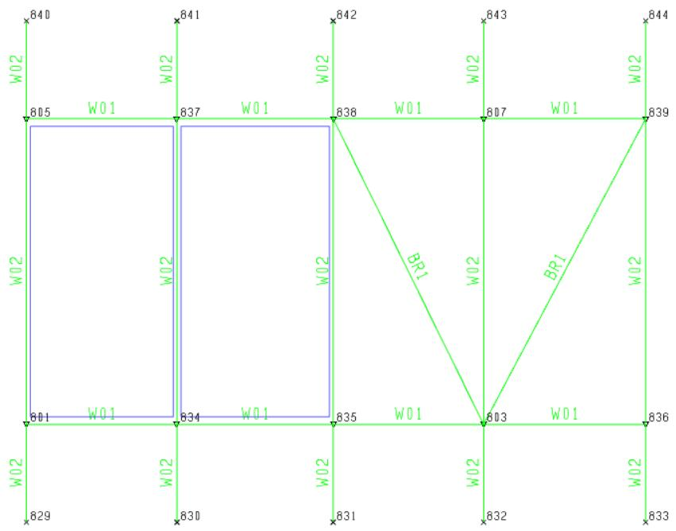

```c
1 2 3 4 5 6 7 8  
123456789012345678901234567890123456789012345678901234567890  
1 ZONOP MAINDECK 1.  
2 ZONBD MAINDECK 829 833 844 840  
3 ZONEH MAINDECK OPENING1 801 835 838 805  
4 ZONIG MAINDECK BR1  
5 ZONVG MAINDECK W01 
```

0

2.10.2 Zone Load

Zone loads define the pressure applied to a defined zone. Seastate calculates the distributed member loads from the pressure applied to the tributary areas in the zone and applies them as member loads in the generated output model file.

Zone loads are defined on LOAD ZONE lines. The Zone Label associates the pressure with the selected zone. The Normal Pressure defines the magnitude of the pressure applied in the normal direction of the enclosed zone. Use a negative value for pressure applied in the opposite direction. These lines must be a part of a load condition. Multiple Zone Loads may be applied to the same enclosed zone.

## 2.10.2.1 Zone Load Example

In this example, a load of -50 psf is applied to the zone MAINDECK depicted in the previous section. Because the normal for the zone is pointing out of the page, this pressure will be applied into the page.

```txt
1 2 3 4 5 6 7 8 1 2345678901234567890123456789012345678901234567890123456789012345678901234567890123456789012345678901234567890   
# 1 LOADCN 100
2LOAD MAINDECK -50. ZONE 
```

3 HYDRO STATIC/DYNAMIC DATA

Seastate may be used to generate environmental loading and/or hydrodynamic data for dynamic analysis. The following sections detail the specification of data required for generating environmental loading and/or generating hydrodynamic properties for dynamic analysis.

## 3.1 FLOOD CONDITION

3.1.1 Default Flood Condition

By default, tubular elements are considered non-flooded or buoyant for purposes of calculating buoyancy and entrapped water mass. For static analysis, the default flood condition for tubulars may be changed to flooded by specifying ‘FL’ or non-flooded by ‘NF’ in columns 13-14 on the LDOPT input line.

Note: The value specified on the LDOPT line is used only for members with no flood condition specified on the MEMBER, GRUP, MEMOV or GRPOV lines.

3.1.2 Specifying Flood Condition in the Model

The flood condition may be designated in the model by specifying an ‘F’ (flooded) or ‘N’ (non-flooded) in column 46 of the MEMBER input line or in column 70 on the GRUP input line of the property group to which it is assigned.

Note: If specified, the flood condition on the MEMBER input line presides over the flood condition specified on the GRUP input line.

3.1.3 Overriding Flood Condition

The flood condition specified on the LDOPT, MEMBER and/or GRUP input line may be overridden by designating the flood condition in column 20 on the MEMOV or GRPOV input line.

The following example shows the flood condition for member 101-102 and group PL1 set to flooded using the member and group override lines.

```txt
1 2 3 4 5 6 7 8 1234567890123456789012345678901234567890123456789012345678901234567890  
1 GRPOV PL1 F  
2 MEMOV 101 102 F 
```

Note: For a particular member, the flood condition input on the MEMOV input line overrides all other flood conditions specified. The flood condition specified on the GRPOV input line overrides all other flood conditions specified except for those specified on MEMOV input lines.

## 3.2 MARINE GROWTH

Marine growth is accounted for by increasing the member effective outside dimension by double the marine growth thickness specified on the MGROV input line for the appropriate member elevation.

3.2.1 Defining Marine Growth

Marine growth is specified in up to 15 zones defined with respect to the mudline. Each zone is defined on a separate MGROV input line with zones defined from the mudline up. The distance from the

mudline to the zone bottom and top are specified in columns 9-16 and 17-24 respectively. The marine growth thickness corresponding to that zone is indicated in columns 25-32.

Note: Marine growth thickness is assumed constant through the zone when both bottom and top elevations are designated. Thickness may be varied linearly between two elevations by specifying each elevation as the bottom elevation on separate MGROV input lines. For dynamic analysis, the added mass marine growth diameter is calculated only for the portion of the member which is under water.

By default, marine growth is assumed to be neutrally buoyant (marine growth density equals water weight density). Marine growth weight /buoyancy is calculated automatically. If the marine growth density (columns 49-56) is left blank, the marine growth weight will be equal to the marine growth buoyancy.

The surface roughness of the zone, used to calculate coefficients of drag and mass per API 20th Edition, is entered in columns 41-48.

The following specifies linearly varying marine growth from 0 to 2.0 on radius from the mudline to 100 above the mudline. From 100 to 150, the marine growth is constant at 2.0 on radius.


|  | 1 | 2 | 3 | 4 | 5 | 6 | 7 | 8 |
| --- | --- | --- | --- | --- | --- | --- | --- | --- |
|  | 12345678901 | 12345678901 | 12345678901 | 12345678901 | 12345678901 | 12345678901 | 12345678901 | 1234567890 |
| 1 | MGROV |  |  |  |  |  |  |  |
| 2 | MGROV | 0.0 |  | 0.0 |  |  |  |  |
| 3 | MGROV | 100.0 |  | 2.0 |  |  |  |  |
| 4 | MGROV | 100.0 | 150.0 | 2.0 |  |  |  |  |


3.2.2 Applying Marine Growth to a Member

By default, marine growth is applied to all parts of a beam element residing in an elevation for which marine growth is defined.

Marine growth may be eliminated for a member using the GRPOV or MEMOV lines. Specify either ‘N’, ‘B’ or ‘A’ in column 19 to eliminate marine growth from the member. Leave blank or enter ‘R’ or ‘G’ to have marine growth applied.

The following designates that marine growth is to be eliminated for member 101-102 and group PL1.


|  | 1 | 2 | 3 | 4 | 5 | 6 | 7 | 8 |
| --- | --- | --- | --- | --- | --- | --- | --- | --- |
| 1 | 123456789012345678901234567890123456789012345678901234567890 | 123456789012345678901234567890123456789012345678901234567890 | 123456789012345678901234567890123456789012345678901234567890 | 123456789012345678901234567890123456789012345678901234567890 | 123456789012345678901234567890123456789012345678901234567890 | 123456789012345678901234567890123456789012345678901234567890 | 123456789012345678901234567890123456789012345678901234567890 | 123456789012345678901234567890123456789012345678901234567890 |
| 2 | GRPOVPL1NF | GRPOVPL1NF | GRPOVPL1NF | GRPOVPL1NF | GRPOVPL1NF | GRPOVPL1NF | GRPOVPL1NF | GRPOVPL1NF |
| 2 | MEMOV101102NF | MEMOV101102NF | MEMOV101102NF | MEMOV101102NF | MEMOV101102NF | MEMOV101102NF | MEMOV101102NF | MEMOV101102NF |


Note: GRPOV and MEMOV line global overrides of the local Y and Z dimension (column 41-52) will override the dimensions used in calculating the marine growth area.

## 3.3 DRAG AND MASS COEFFICIENTS

3.3.1 Defining Default Coefficients

By default, the following diameter vs. drag and inertia coefficient table is used for clean members (members without marine growth) and fouled members (members with marine growth) for loads generated in both the local Y and Z directions.


|  | Coefficient of Drag | Coefficient of Drag | Coefficient of Inertia | Coefficient of Inertia |
| --- | --- | --- | --- | --- |
| Diam(inch) | Normal | Tangential | Normal | Tangential |
| 12.0 | 0.610 | 0.0 | 1.39 | 0.0 |
| 24.0 | 0.665 | 0.0 | 1.40 | 0.0 |
| 48.0 | 0.720 | 0.0 | 1.45 | 0.0 |
| 72.0 | 0.756 | 0.0 | 1.67 | 0.0 |
| 96.0 | 0.781 | 0.0 | 1.67 | 0.0 |
| 120.0 | 0.799 | 0.0 | 1.71 | 0.0 |


Values for other diameters are determined through linear interpolation.

Drag and inertia coefficient information may be input using CDM input lines. The user may set up a table of member diameters vs. coefficient values, select the API default table or select the wake encounter effects option.

Up to 20 CDM input lines may be used when specifying a table of $\mathsf{ C }_{ \mathsf{ d } }$ and $\mathsf{ C }_{ \mathsf{ m } }$ coefficients as a function of diameter. The default table field in columns 5-6 should be blank when specifying a table.

The following designates coefficient of drag of 0.8 and coefficient of mass of 1.2 for all members.


|  | 1 | 2 | 3 | 4 | 5 | 6 | 7 | 8 |
| --- | --- | --- | --- | --- | --- | --- | --- | --- |
|  | 123456789012345678901234567890123456789012345678901234567890 | 123456789012345678901234567890123456789012345678901234567890 | 123456789012345678901234567890123456789012345678901234567890 | 123456789012345678901234567890123456789012345678901234567890 | 123456789012345678901234567890123456789012345678901234567890 | 123456789012345678901234567890123456789012345678901234567890 | 123456789012345678901234567890123456789012345678901234567890 | 123456789012345678901234567890123456789012345678901234567890 |
| 1 | CDM |  |  |  |  |  |  |  |
| 2 | CDM | 1.0 | 0.8 | 1.2 | 0.8 | 1.2 |  |  |
| 3 | CDM | 999.0 | 0.8 | 1.2 | 0.8 | 1.2 |  |  |


Note: The tangential drag and inertia coefficients are zero in the above sample.

The API 20th Edition defaults may be used by specifying ‘AP’ in columns 5-6 of the first and only nonheader CDM input line as follows:


|  | 1 | 2 | 3 | 4 | 5 | 6 | 7 | 8 |
| --- | --- | --- | --- | --- | --- | --- | --- | --- |
|  | 12345678901 | 12345678901 | 12345678901 | 12345678901 | 12345678901 | 12345678901 | 12345678901 | 1234567890 |
| 1 | CDM |  |  |  |  |  |  |  |
| 2 | CDM AP |  |  |  |  |  |  |  |


Drag and inertia coefficients can also be determined automatically by the program based on the relative surface roughness, wake encounter effects and orientation of the member. Specifying ‘WE’ in columns 5-6 on the CDM input line immediately following the CDM header input line invokes this feature. The surface roughness should be specified on the MGROV input line.


| 1 | 2 | 3 | 4 | 5 | 6 | 7 | 8 |
| --- | --- | --- | --- | --- | --- | --- | --- |


```csv
1 1234567890123456789012345678901234567890123456789012345678901234567890 CDM   
2 CDM WE
```

3.3.2 Reynold’s Number Dependent Cd

The coefficient of drag used to calculate force normal to the member, may be factored based on the Reynold’s number. The default Reynold’s number/Cd factor table may be used by specifying a REYFAC HEAD input line with ‘STD’ specified in columns 15-17. No REYFAC input lines are required.

A user defined table may be specified using the REYFAC HEAD input line followed by up to 20 REYFAC input lines. The kinematic viscosity may be specified in columns 21-30 of the REYFAC HEAD input line. The drag coefficient factor and corresponding Reynold’s number pairs are input on the REYFAC input lines following. Data points should be entered in ascending order of Reynold’s number.

An alternate table, used only by members designated with ‘A’ in column 19 on its corresponding MEMOV or GRPOV input line, may also be defined by specifying ‘ALT’ in columns 15-17 on the REYFAC HEAD input line.

3.3.3 Overriding Coefficients

Coefficients of drag and mass for members or groups may be overridden in columns 53-77 on the MEMOV or GRPOV input line.

Separate values may be entered for use when generating loading in the local Y and Z directions.

The following example shows member 101-102 and group PL1 overridden such that the coefficient of mass for both directions of 1.4 while the normal drag coefficient is set to 0.8 for local Y and 1.1 for local Z.

```txt
1 2 3 4 5 6 7 8  
1234567890123456789012345678901234567890123456789012345678901234567890  
GRPOV PL1 F 0.8 1.1 1.4 1.4  
2 MEMOV 101 102 F 0.8 1.1 1.4  
## 1.4
```

## 3.4 HYDRODYNAMIC MODELING

Seastate amends the structural member input to account for hydrodynamic properties that affect a structure’s dynamic characteristics. Seastate creates an output structural data file with updated MEMBER input lines reflecting the hydrodynamic properties of the member.

The effective member diameter for added mass due to marine growth and/or local Y and Z force dimension overrides is determined and updated in columns 73-78 on the MEMBER input line.

The member density is also updated to reflect the effective density based on the presence of marine growth and/or any density and/or cross-section area overrides. The flood condition on the MEMBER input line is also updated based on any flood condition overrides specified.

To generate the hydrodynamic properties, select one of the dynamic functions in columns 56-58 on the LDOPT input line.

Note: Dynpac can read the hydrodynamic properties (i.e. effective diameter and density) directly from the MEMBER input line in order to calculate the mass and added mass of the member. This feature eliminates the need to define the hydrodynamic properties in the Dynpac input file.

## 3.5 CORROSION

Corrosion is accounted for by modifying the member sectional thickness by the corrosion thickness specified on the CORRZ input line for the appropriate member elevation. The Seastate generated environmental loading can be based on the member's corroded section dimensions or original section dimension. The member's stiffness properties will automatically be adjusted based on the modified section dimensions.

3.5.1 Defining Corrosion

Corrosion is specified in zones defined with respect to vertical coordinate elevation. Each zone is defined on a separate CORRZ input line with zones defined from the lowest vertical coordinate elevation up. The elevation of the bottom and top of the zone are specified in columns 7-13 and 15-21 respectively. The corrosion level based on either a percentage of the sectional thickness or a fixed amount at the bottom and top of the zone are specified in column 25-31 and 33-39 respectively.

Note: Corrosion thickness is assumed constant through the zone when the corrosion level at the top elevations are left blank.

The Corrosion Option, used to specify whether the corrosion levels specified is a fixed amount or a percentage of the sectional thickness, is specified in column 23. Enter a 'F' fixed amount, or a 'P' for a percentage of the sectional thickness.

The Optional Thickness Range can be used to specify multiple corrosion levels for a single zone. Members that are found to be within a zone with a sectional thickness within the specified Thickness Range will include corrosion levels corresponding to that Thickness Range. A separate CORRZ input line is required for each Thickness Range along with its corresponding corrosion levels. When multiple CORRZ line are used to define multiple corrosion levels for a single zone, the elevations of the corrosion zone need to only be specified on the first CORRZ line. Enter the minimum and maximum thickness for the range in column 41-47 and 49-55 respectively. If the minimum and/or maximum thickness is left blank, no maximum and/or will be used.

Enter the minimum corroded sectional thickness allowed for a member found within a corrosion zone in column 57-63.

The Member Load Option, used to specify which section dimensions of the member to use for Seastate generated environmental loading, is specified in column '65'. Enter 'C' if the member loads shall be based on the corroded section dimensions, or Enter 'O' if the member loads shall be based on the original (uncorroded) section dimensions.

Note: Section dimensions are used for the calculations of member weight, buoyancy, Y and Z force dimensions, along with drag and inertia coefficients. The member's stiffness properties will always be based on corroded section dimensions.

The Vertical Coordinate, used to specify which global coordinate the corrosion zone elevations are based on, is specified in the first CORRZ line in column 67. If left blank, the entry from column 16 of the LDOPT line will be used.

The output structural data (OCI) file can be updated to include the effects of corrosion on the members and plates by specifying ‘PT’ in column 69-70 of the CORRZ line. New member groups, sections, and plate groups will be created based on the corroded dimensions determined. The starting name of the corroded groups and sections is specified in column 71-73 and column 74-80 respectively. The new names will be incremented for each group/section needed.

4 CREATING ENVIRONMENTAL LOADS

The Seastate program can be used to generate environmental loading due to wave, current, wind, gravity, buoyancy and mud-flow and/or model hydrostatic and/or hydrodynamic properties. The program creates an output structural data (OCI) file containing the model, including updates to account for hydrostatic or hydrodynamic properties, user defined loading and loading generated by Seastate.

## 4.1 MEMBER LOAD AXIS

By default, the program generates all member loads with respect to the global coordinate system. Seastate can generate member loads in global coordinates or member local coordinates by specifying either ‘GLOB’ or ‘MEMB’ in columns 49-52 on the LDOPT line.

## 4.2 ENVIRONMENTAL LOAD FACTORS

Seastate data used to generate environmental loading is specified after the LOADCN line defining the load case. Components of the load condition generated by Seastate may be factored by ratios input on the LOADCN line.

An overall factor to which all loading contained is multiplied by may be specified in columns 12-18. A dead load factor applied to dead loads generated by the DEAD line may be designated in columns 19-25 while wave, wind and current loading may be factored by specifying a value in columns 26-32. Specify the user defined load factor in columns 33-39.

By default, buoyancy loading is factored by the dead load factor in columns 19-25. If a different factor is to be applied to buoyancy loads, specify the factor in columns 40-46.

For example, the following stipulates that dead loading in load case MISC is to be factored by 1.15 while all other loading is not factored.

```txt
1 2 3 4 5 6 7 8 123456789012345678901234567890123456789012345678901234567890  
1 LOAD
2LOADCNMISC 1.15 1.0 
```

Note: Since the buoyancy factor was not the same as the dead load factor, it was specified in columns 40-46.

## 4.3 WAVE LOAD

Seastate can be used to generate loading due to fluid velocities and acceleration resulting from surface gravity waves. To generate wave loading, a WAVE input line must be specified within the appropriate load case. The wave theory to be used, wave height, approach direction and period or length must be specified along with the wave position parameters.

4.3.1 Wave Theory

Seastate can develop wave loading automatically based on the wave theory specified in columns 9-12 on the WAVE input line. The five theories from which loading for a wave of given amplitude and period in a fluid of known depth may be derived are:

1. ‘AIRY’ Airy (or linear) wave theory   
2. ‘AIRC’ Classic Airy theory (no crest or trough)   
3. ‘STOK’ Stokes’ Fifth Order Theory   
4. ‘STRE’ Stream Function theory including current effects   
5. ‘STRN’ Stream Function Theory excluding current effects   
6. ‘CNOI’ Cnoidal Theory   
7. ‘SOLI’ Solitary Wave Theory

Note: For situations when the water depth is greater than 1.25gT2/P, deep water wave theory is automatically used by the program.

The figures below have been suggested by Dean (1970) and Le Méhauté (1979) for selecting limits of validity of various wave theories. In general the higher order theories are applicable in and beyond the range of validity for the lower order theories. Thus in Seastate, a high order stream function theory is applicable anywhere the Stokes’ or Airy theories are and in ranges where they are not, but the simpler theories generally run somewhat faster.

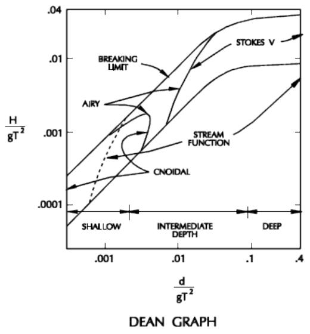

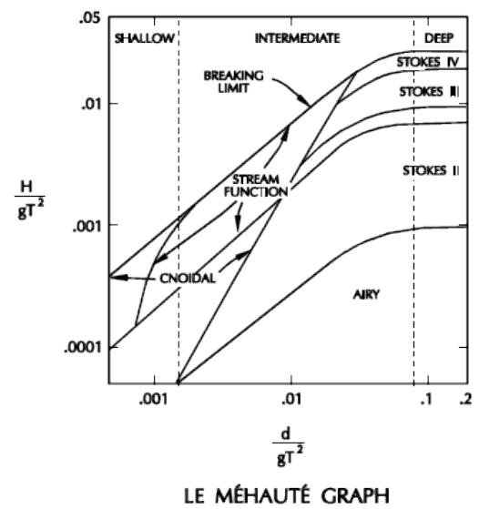  
Figure 3. Wave Theory Ranges

See the section ‘Commentary on Environmental Loads’ for a more detailed discussion on the wave theories used by Seastate.

4.3.1.1 User Defined Waves

Seastate will also accept a user defined wave and calculate the resulting member forces. The user must specify ‘LINE’ as the wave type in columns 9-12 on the WAVE input line and input velocity and acceleration data (or drag pressure and inertia pressure) at user specified grid points on a rectangular grid. The grid may be defined at up to 50 horizontal and 50 vertical locations. The spacing is arbitrary.

4.3.2 Wave Characteristics

The wave characteristics including wave height, either wave period or wave length, and approach direction are specified in columns 13-18, 25-30 or 31-38 and 39-44, respectively.

Note: Either wave period or wave length are designated on the WAVE input line. If both are specified, the wave period is ignored, the wave period is calculated from the wave height and length specified.

The wave approach direction is measured about the global Z axis using the right hand rule with the positive X axis corresponding to a 0 degree approach direction and the positive Y axis corresponding to a 90 degree approach direction.

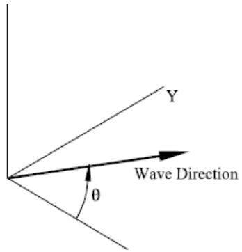  
Figure 4. Wave Direction

The following illustrates a Stream Function wave along the global X axis (0 degree) with a height of 10.0 and a period of 12.


|  | 1 | 2 | 3 | 4 | 5 | 6 | 7 | 8 |
| --- | --- | --- | --- | --- | --- | --- | --- | --- |
| 1 | 1234567890123456789012345678901234567890123456789012345678901234567890123456789012345678901234567890123456789 | WAVE | 12.0 | 0.0 |  |  |  |  |
| 2 | WAVE | STRE | 12.0 | 0.0 |  |  |  |  |


4.3.3 Critical Crest Position

Typically, a wave is stepped through the structure so that wave loading is calculated at various crest positions. The load case is created for a critical crest position based on the wave crest position parameters designated in columns 51-70.

Wave crest position information may be specified in terms of length ‘L’, time ‘T’ or angle of the wave cycle ‘D’, as designated in column 51. Wave crest position parameters required include, the initial crest position (columns 52-58), position step size (columns 59-64), number of steps for static analysis (columns 67-68), number of steps for dynamic analysis (columns 65-66) and criteria for determining the critical crest position (columns 69-70).

Note: For dynamic analysis, if a value is entered in columns 65-66, the wave is stepped through using degrees. The step size is automatically changed so that one wave cycle is used.

Wave loading is generated for the crest position that is critical based on one of the following criteria:

‘MM’ maximum overturning moment

‘MS’ maximum base shear   
‘MU’ maximum upward force   
‘MD’ maximum downward force   
‘NM’ minimum overturning moment   
‘NS’ minimum base shear

For example, the following WAVE input line creates an AIRY wave with an approach angle of 0 degrees, height of 25.0 and a period of 10.0 seconds. The wave is stepped through the structure using 12 crest positions defined using length units. The initial crest position is -50.0, the crest position step size is 5.0 and the critical position is that which creates maximum base shear.

```txt
1 2 3 4 5 6 7 8 123456789012345678901234567890123456789012345678901234567890 1 WAVE 2 WAVE AIRY 25.00 10.0 0.0 L -50.0 5.0 12MS10 1 1 7 
```

Wave load can be created for all crest positions by designating the critical position as ‘AL’ in columns 69- 70.

Note: When specifying ‘AL’, a separate load case for each wave crest position is created. This feature is only supported for static waves and should not be used when specifying waves to be created by the WAVE RESPONSE program.

4.3.4 Overriding Water Depth and Mudline Elevation

By default, the water depth and mudline elevation specified on the LDOPT input line are used when generating wave forces. However, the water depth or mudline elevation to be used for a particular wave may be specified directly on the WAVE input line in columns 19-24 and 45-50, respectively.

For example, if the still water depth is specified on the LDOPT input line, the water depth for a storm wave may be modified on the WAVE input line to include the storm tide. The following specifies a water depth override of 150.

```txt
1 2 3 4 5 6 7 8 123456789012345678901234567890123456789012345678901234567890 1 WAVE 2 WAVE AIRY 25.00 10.0 0.0 L -50.0 5.0 12MS10 1 1 
```

4.3.5 Wave Kinematics or Spreading Factor

The reduction in wave force due to directional spreading or irregularity in wave profile is accounted for by the program automatically by factoring the horizontal velocity and acceleration by the spreading factor specified in columns 5-8 on the WAVE input line.

The following designates a spreading factor of 0.85.

```txt
1 2 3 4 5 6 7 8 1 23456789012345678901234567890123456789012345678901234567890 1 WAVE 2 WAVE0.85AIRY 25.00 150.0 10.0 0.0 L -50.0 5.0 12MS10 1 1 
```

4.3.6 Member Distributed Load Segments

In general, loading on a member due to wave forces will be nonlinear distributed loads. The Seastate program generates a piecewise linear function defined over variable segment lengths to represent the wave loading. By default, a maximum of 10 distributed load segments are used to define the wave loading along a member. The minimum number of load segments is 1. The maximum and minimum number of distributed load segments allowed may be indicated in columns 71-72 and 73-74, respectively.

4.3.7 Wave Output Print Option

The output print level is specified in column 76 on the WAVE input line. The default, option ‘0’, is minimum print which includes crest location and magnitude for each of the crest position selection criteria and critical data for the selected crest position. Print option ‘1’ includes overturning moment and base shear for each wave crest step in addition to information included in the default option. The summation of forces about the mudline for each crest step may be included by specifying option ‘2’. Wave particle velocity and acceleration at output grid points may be printed by selecting option ‘3’.

Note: Seastate generates the fluid particle velocities and accelerations at 740 points (37 stations along the wave and 20 elevations from the surface to the mudline). The horizontal locations are equally spaced from the crest to the trough. The vertical grid points are closely spaced near the surface, the spacing increasing arithmetically with depth. At every horizontal location the vertical grid is defined by 20 points from the wave surface to the mudline - this defines a curvilinear grid as can be seen in Figure 5 for a simplified grid of five horizontal and four vertical grid stations. If the user requests grid velocity and acceleration data to be printed, it is not printed at these grid points, but on a straight line grid defined by 19 equally spaced horizontal locations and the 20 vertical locations defined above at the wave crest. Figure 5 shows the actual curvilinear grid and the output grid points for a simplified case.

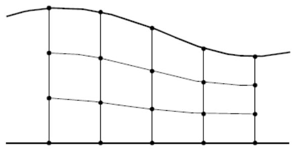  
AUTOMATED GRID GENERATIONN

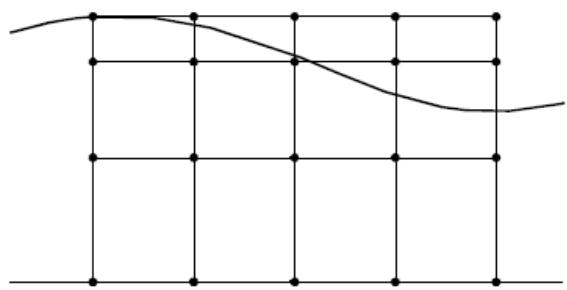  
OUTPUT GRID POINTS   
Figure 5. Wave Grid

## 4.4 CURRENT LOAD

Typically, current is defined in conjunction with wave forces. A set of CURR input lines are used to specify current from any direction to be included in the resultant particle velocity field generation. For an Airy or Stokes’ wave, the fluid velocity at any point is the vector sum of the velocity due to the wave and that due to the current. For the stream function theory however, the component of the current

velocity in the direction of the wave is by default incorporated as an integral part of the velocity field generation. After the velocity field in the plane of the wave is generated (including in-plane current effects) the out-of-plane current component is vectorially added to the generated velocities.

4.4.1 Current Velocity Profile

CURR input lines are used to include the effect of a steady horizontal current on the structure. For a particular load case, current velocities may be input at up to 20 elevations from the mudline to the mean water surface. A separate CURR input line is specified for each elevation at which current is defined.

Note: When multiple CURR input lines are used to define the current profile, only elevation, velocity and direction are read from the additional CURR input lines.

The current profile direction is specified in columns 25-32 CURR input line and may be different from the wave direction. Elevations are defined in terms of height above the mudline or percent of water depth in columns 9-16 and must be specified in order of increasing elevation. When specifying elevation as percent of water depth, ‘WDP’ is required in columns 67-69 of the first non-header CURR input line. The corresponding velocity at the designated elevation is defined in columns 17-24. The velocity units, when using English units, may be specified in columns 63-65 of the first non-header CURR input line.

The following defines a current along the global X axis (0 degree) that is constant from the mudline to 30 above the mudline. For elevations between 30 and 50 above the mudline, the current varies linearly from 0.25 to 0.75.


|  | 1 | 2 | 3 | 4 | 5 | 6 | 7 | 8 |  |
| --- | --- | --- | --- | --- | --- | --- | --- | --- | --- |
|  | 1234567890123456789012345678901234567890123456789012345678901234567890123456789012345678901234567890123456789 | 12345678901234567890123456789012345678901234567890123456789012345678901234567890123456789012345678 | 12345678901234567890123456789012345678901234567890123456789012345678901234567890123456789012345678 0.250 | 0.000 | 0.000 |  |  |  |  |
| 1 | CURR |  |  |  |  |  |  |  |  |
| 2 | CURR | 0.000 |  |  |  |  |  |  |  |
| 3 | CURR | 30.000 |  |  |  |  |  |  |  |
| 4 | CURR | 50.000 |  |  |  |  |  |  |  |


Note: The first input line of the CURR set must be a header input line containing only the input line name (CURR) in columns 1-4.

4.4.2 Current Profile Stretching/Compressing

Typically the current profile is specified with respect to the mean water level. By default, the current velocity from the wave crest to the mean water surface is assumed constant. The current profile in the trough (below the mean water surface) is truncated at the wave surface so that there are no current effects above the surface of the wave.

The current profile may also be stretched or compressed to the actual wave surface elevation by using linear or nonlinear stretching/compressing. The stretching technique, ‘LN’ for linear, ‘NL’ for nonlinear or ‘CN’ for constant, is designated on the first non-header CURR input line in columns 60-61.

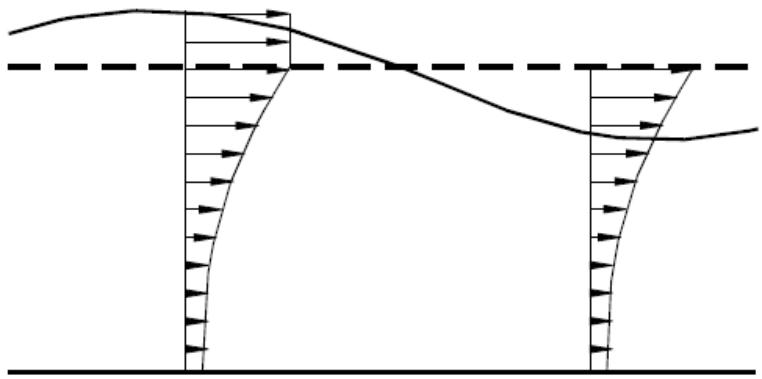  
Figure 6. Current Profiles

The lines below specify that nonlinear stretching is to be used to determine the current profile from the mean water surface to the crest elevation.


|  | 1 | 2 | 3 | 4 | 5 | 6 | 7 | 8 |
| --- | --- | --- | --- | --- | --- | --- | --- | --- |
| 1 | 12345678901 | 12345678901 | 12345678901 | 12345678901 | 12345678901 | 12345678901 | 12345678901 | 1234567890 |
| 2 | CURR | 0.000 | 0.250 | 0.000 |  | NL |  |  |


4.4.3 Current Blockage Factor

The current blockage factor reduces the specified free-stream velocity to account for the presence of the structure.

The blockage factor can be specified directly in columns 41-48, or can be calculated by the program based on the cross-section area of the structure at the elevation specified in columns 49-56 by specifying the ‘BC’ option in columns 57-58 on the first non-header CURR line.

The following designates that the blocking factor is to be calculated automatically based on the relative density of the structure at elevation -10.


|  | 1 | 2 | 3 | 4 | 5 | 6 | 7 | 8 |
| --- | --- | --- | --- | --- | --- | --- | --- | --- |
|  | 123456789012345678 | 89012345678 | 89012345678 | 89012345678 | 89012345678 | 89012345678 | 89012345678 | 8 |
| 1 | CURR |  |  |  |  |  |  |  |
| 2 | CURR | 0.000 | 0.250 | 0.000 |  | -10.0BC |  |  |
| 3 | CURR | 30.000 | 0.250 |  |  |  |  |  |
| 4 | CURR | 50.000 | 0.750 |  |  |  |  |  |


4.4.4 Apparent Wave Period

The component of the current velocity in the wave direction will stretch or shorten the wave length which in turn increases or decreases the actual wave period. The apparent wave period is the wave period observed when moving at the speed of the effective in-line current and should be used when generating design loads per API 20th Edition.

The apparent wave period may be specified on the WAVE input line or may be determined by the program based on the actual wave period and the current velocity automatically by specifying the actual wave period on the WAVE input line and the ‘AWP’ (Apparent Wave Period) option in columns 71-73 on the CURR input line. The actual wave period refers to the wave period seen by a stationary observer.

The input below specifies that the apparent wave period is to be determined automatically.


|  | 1 | 2 | 3 | 4 | 5 | 6 | 7 | 8 |
| --- | --- | --- | --- | --- | --- | --- | --- | --- |
|  | 123456789012345678 | 89012345678 | 89012345678 | 89012345678 | 89012345678 | 89012345678 | 89012345678 | 8 |
| 1 | CURR |  |  |  |  |  |  |  |
| 2 | CURR | 0.000 | 0.250 | 0.000 |  |  | AWP |  |
| 3 | CURR | 30.000 | 0.250 |  |  |  |  |  |
| 4 | CURR | 50.000 | 0.750 |  |  |  |  |  |


Note: The apparent wave period function should not be used when using Stream Function including the effects of current (‘STRE’ wave theory option) because this theory already includes the effects of current on the wave period. If the ‘STRE’ wave theory option is specified and the apparent wave period function is designated, the Stream Function wave theory excluding the effects of current (‘STRN’ wave theory option) is used to avoid accounting for the effects of current twice.

4.4.5 Overriding Mudline Elevation

By default the mudline elevation specified on the LDOPT input line is used when generating current forces. However, the mudline elevation to be used for any specific current may be redefined in columns 33-40 on the first non-header CURR input line of the set.

4.4.6 Minimum In-line Current

A minimum value the current component that acts in-line with the wave may be specified in columns 5- 8 on the CURR input line.

## 4.5 GRAVITY AND BUOYANCY LOAD

The dead weight and buoyancy of the structure can be included among the forces acting on the structure for specific load cases by using the DEAD input line.

The DEAD load input line set includes the option to specify the direction gravity acts in columns 11-12. This feature allows the structure weight to be generated in any direction.

Loads due to buoyancy may be accounted for by either the "marine" method or the "rational" method.

1. The marine method is a widely used but approximate method of accounting for buoyancy. It is the method used by most marine applications involving flotation and rigid body motion of submerged bodies. In this method structural loads are calculated on the basis of a "submerged weight" which is the member weight reduced by the weight of the displaced fluid. This then is applied to the member as a distributed load acting vertically.   
2. Seastate also includes an option for including buoyancy in a more rational way. It recognizes that the effect of the pressure distribution on the structure results in a system of structural loads consisting of distributed loads along the members and concentrated loads at the joints. The member loads are perpendicular to the member axis and in the vertical plane containing the member. The joint loads consist of forces acting in the directions of all of the members meeting at the joint. These joint forces act in a direction that would tend to compress the corresponding members if they acted directly on them.

Figure 7 below displays pictorially the differences between the marine and rational methods. For a more detailed discussion, see the section ‘Commentary on Environmental Loads’.

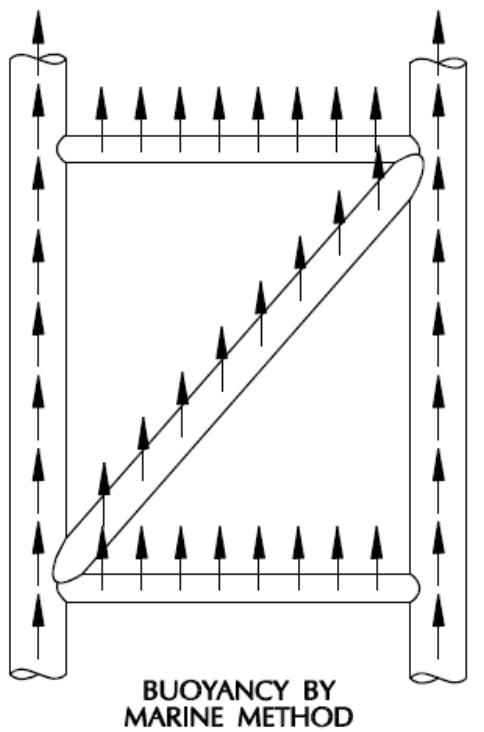

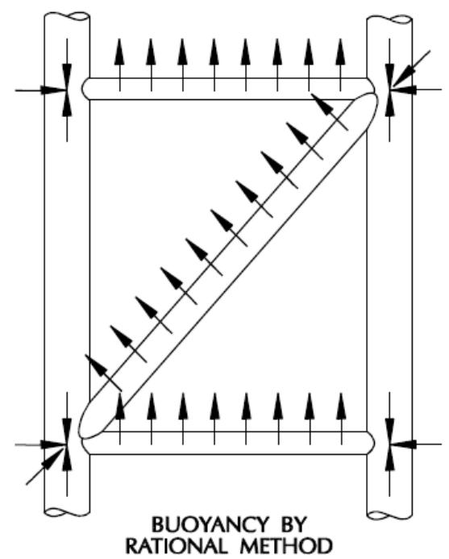  
Figure 7. Buoyancy Methods

By default the marine method is used. The buoyancy method to be used may be specified in column 45 by inputting ‘M’ for marine or ‘R’ for rational. Two other buoyancy method based on a variation of rational method can be used. Enter 'A' in column 45 to use the 'Rational' method with pressure due to wave height attenuated with depth according to Eq. 3.2.5-3 in API 20th Edition. Enter 'P' in column 45 to use the 'Rational' method with pressure due to wave height attenuated with depth above the mudline and pressure due to still water depth below the mudline. By default, the buoyancy for elements below the mudline is not included. Enter ‘BML’ in columns 47-49 to include buoyancy below the mudline.

The following specifies that gravity acts in the -Z direction and the marine method is to be used to calculate buoyancy. The buoyancy for elements below the mudline is included.

```txt
1 2 3 4 5 6 7 8  
1234567890123456789012345678901234567890123456789012345678901234567890  
1 DEAD
2 DEAD -Z M BML 
```

4.5.1 Overriding Buoyancy Parameters

Parameters such as water depth, mudline elevation and water density are obtained from the LDOPT line. These values may be overridden for the purposes of calculating buoyancy in columns 21-44.

By default, the flood condition specified for each element is used. Enter ‘FLD’ if all members are to be flooded or ‘NFL’ if all members are to be non-flooded for the purpose of calculating buoyancy.

## 4.6 WIND LOAD

Seastate can generate loads on the structure resulting from wind data specified on the WIND input line. Wind load is generated on all members above the water surface as well as any wind areas designated. Seastate calculates pressures on members and wind areas using the equation:

$$p = 0. 0038 V^{2} C_{h} C_{s}$$

Where: $\begin{array} { r l r } { \mathsf{ p } = } & { { } } & { \mathsf{ p r e s s u r e } \left( | | \mathsf{ b } \mathsf{ s } / \mathsf{ s q . f t . } \right) } \end{array}$ $\begin{array} { r l r } { \mathsf{ V } = } & { { } } & { \mathsf{ V e l o c i t y } \left( \mathsf{ k n o t s } \right) } \end{array}$

$$C_{h} = \quad \text{h e i g h t c o e f f i c i e n t} \quad C_{s} = \quad \text{s h a p e c o e f f i c i e n t}$$

Constant in previous relation depends on the unit used for velocity (It reads $p = 0 . 00256 V^{ 2 } C_{ h } C_{ s }$ when velocity is reported in mph). As recommended by API and ABS, ${ \sf C }_{ \sf s }$ is taken as 0.5 for tubular members and 1.5 for other members and flat surfaces. The wind force on members and surfaces is normal to the member or surface and is calculated as recommended by DNV and API by:

$$F = p A \sin \alpha$$

Where: A = projected area of the surface or member normal to the force.

$$\alpha = \begin{array}{l} \text{a n g l e b e t w e e n t h e d i r e c t i o n o f t h e w i n d a n d t h e a x i s o f t h e m e b e r (o r t h e p l a n e o f t h e s u r f a c e) .} \end{array}$$

Note: Surfaces can also be specified as round in which case Cs is taken as 0.5 and the force is in the direction of the wind.

4.6.1 Wind Characteristics

Either the wind velocity or pressure is specified in columns 9-16 or 17-24, respectively, on the WIND input line. When API 21st edition wind specifications are used, columns 17-24 specify the wind duration in hours.

Note: When using English units, the velocity may be specified in knots, miles/hour or feet/second by entering a blank, ‘M’ or ‘F’ in column 8.

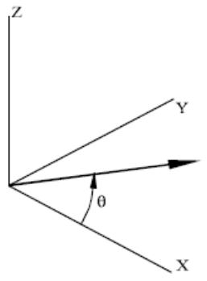  
Figure 8. Wind Direction

The wind approach direction is designated in columns 25-32 and measured counterclockwise from the global X axis as shown in Figure 8.

The following defines a wind along the global X axis (0 degree) with a velocity of 120 miles per hour.


|  | 1 | 2 | 3 | 4 | 5 | 6 | 7 | 8 |
| --- | --- | --- | --- | --- | --- | --- | --- | --- |
|  | 123456789012345678901234567890123456789012345678901234567890 | 123456789012345678901234567890123456789012345678901234567890 | 123456789012345678901234567890123456789012345678901234567890 | 123456789012345678901234567890123456789012345678901234567890 | 123456789012345678901234567890123456789012345678901234567890 | 123456789012345678901234567890123456789012345678901234567890 | 123456789012345678901234567890123456789012345678901234567890 | 123456789012345678901234567890123456789012345678901234567890 |
| 1 | WIND |  |  |  |  |  |  |  |
| 2 | WIND | M120.0 |  |  |  |  |  |  |


4.6.2 Wind Height Variation

The user also has the option of accounting for the variation of wind with height utilizing A.B.S., API or Australian AS1170 recommendations. The wind height variation option is specified in columns 41-44.

‘APxx’ should be specified for API formulas where xx is a value from $' 07^{ \prime }$ to $\mathbf{ \prime }_{ 13^{ \prime } }$ corresponding to the denominator of the exponent as follows:

$$V_{z} = V_{r} \left(\frac{z}{z_{r}}\right)^{\frac{1}{x x}}$$

If the recommendations of API 21st edition are to be used, ‘21AP’ should be specified in columns 41-44.

Enter ‘ASxx’ for Australian AS1170 variation where xx is a value from ‘01’ to $' 04^{ \prime }$ corresponding to the wind category.

‘RH01’ and ‘RH02’ corresponding to RH001 cyclonic and non-cyclonic wind formulas may be specified.

If ABS wind variation is to be used, either ‘ABS ’ or ‘ABS2’ is specified in columns 41-44. If $\prime_{ A B S } \prime$ is specified, the values of the height coefficient, $\complement_{ \mathbf{ h } } ,$ as recommended by A.B.S. are shown in the table below, where a number of zones are defined within each of which a value of $\mathsf{ C }_{ \mathsf{ h } }$ is given.


| Elev above mean water (feet) | Ch | Elev above mean water (feet) | Ch |
| --- | --- | --- | --- |
| 0-50 | 1.00 | 450-500 | 1.60 |
| 50-100 | 1.10 | 500-550 | 1.63 |
| 100-150 | 1.20 | 550-600 | 1.67 |
| 150-200 | 1.30 | 600-650 | 1.70 |
| 200-250 | 1.37 | 650-700 | 1.72 |
| 250-300 | 1.43 | 700-750 | 1.75 |
| 300-350 | 1.48 | 750-800 | 1.77 |
| 350-400 | 1.52 | 800-850 | 1.79 |
| 400-450 | 1.56 | 850+ | 1.80 |


If ‘ABS2’ is specified, the recommendations of A.B.S. "Guide for Building and Classing Floating Production Installations," June 2000 / July 2009 are followed. The height coefficient, Ch, is based on the following formula:

$$C_{h} = \left(\frac{z}{Z_{r e f}}\right)^{2 \beta}$$

Where: z = Calculated wind height

Zref = Reference elevation = 33.0 feet

?? = 0.09 - 0.16 for 1-minute average wind

?? = 0.125 for 1-hour average wind

4.6.3 Overriding Water Depth

By default, wind load is generated as distributed loads on members above the water surface elevation as designated on the LDOPT input line. The water surface elevation may be overridden for the purpose of generating wind load by specifying the water surface elevation override in columns 33-40 on the WIND input line.

The following overrides the default water depth for the purpose of wind load generation.


|  | 1 | 2 | 3 | 4 | 5 | 6 | 7 | 8 |
| --- | --- | --- | --- | --- | --- | --- | --- | --- |
|  | 12345678901 | 12345678901 | 12345678901 | 12345678901 | 12345678901 | 12345678901 | 12345678901 | 1234567890 |
| 1 | WIND |  |  |  |  |  |  |  |
| 2 | WIND DM | 120.0 |  |  | 150.0 |  |  |  |


4.6.4 Loading Wind Areas

Up to 18 wind areas or wind blocks that are to be considered when generating the wind loading may be specified in columns 45-80 on the WIND input line.

If only wind areas are to be loaded (no beam elements loaded), enter ‘I’ in column 7.

The following designates that wind load is to be generated for wind areas AA and AB. No wind loads are to be generated for elements.


|  | 1 | 2 | 3 | 4 | 5 | 6 | 7 | 8 |
| --- | --- | --- | --- | --- | --- | --- | --- | --- |
|  | 12345678901 | 12345678901 | 12345678901 | 12345678901 | 12345678901 | 12345678901 | 12345678901 | 1234567890 |
| 1 | WIND |  |  |  |  |  |  |  |
| 2 | WIND DIM | 120.0 |  | 150.0 | AAAB |  |  |  |


4.6.5 Loading Single – Three – Four Sided Wind Walls (API 4F Specification)

This feature enables the software to model three types of wind walls in order to apply for instance wind loading on equipment, cabins or other substructures on the deck. Single – Three – Four sided wind walls given in Table 8 API 4F specification $4^{ \mathrm{ t h } }$ edition Jan 2013 (equivalent to Table 8.6 in $3^{ \mathsf{ r d } }$ edition) can be defined and loaded using appropriate number of areas i.e. one, three and four areas for single, three and four sided walls respectively. This feature is available only if API4F is chosen in “WIND” line for wind variation definition, otherwise program will return an error. The whole structure cannot be considered for this type of wind loading regarding the limitation of geometry given in Table 8 (API 4F $4^{ \mathrm{ t h } }$ edition). The input data and the notation follows mostly the table 8 in API 4F specification. As it has been explained in detail in section B.8.3.3 in Annex B of API 4F （$4^{ \mathrm{ t h } }$ edition Jan 2013), there are generally three distinct approaches to calculate wind force components namely “projected area”, “projected pressure” and “velocity component”. To be in line with previous implementation of SACS for wind areas, “Projected Pressure” method has been used in all three types of wind walls. It is worth mentioning that the obtained results of this method can be easily transformed to other methods using the table given in Annex B.

4.6.5.1 Single sided wall

The type of area can be specified in column 80 on AREA line by entering $' 5^{ \prime }$ and the area definition should be specified in column 79 on AREA line by entering $' \mathsf{ W }^{ \prime }$ (Wall – Flat surface with orientation). Assuming the global Z axis along the height of the wind wall, width (shown by $\mathrm{^{ \prime } b }^{ \prime }$ in API 4F table 8), height (shown by $\mathrm{ \Delta \Omega^{ \prime } h \Omega }$ in API 4F table 8) and the angle between outward normal to the area and global X direction are entered in columns 7-24. The angle should be measured counterclockwise. For the single sided wall, the result for the opposite direction shown in the following figure is the same (in the following figure $\theta_{ 1 }$ and $\theta_{ 2 }$ will give the same result), but this convention will play an important role to model three sided and four sided walls. The program automatically checks the limitation of geometry specified in Table 8 API 4F $4^{ \mathrm{ t h } }$ edition and picks up appropriate shape coefficient based on the wind direction and the outward normal. The wind force is assumed to act at the centroid of the surface designated in columns 25-45.

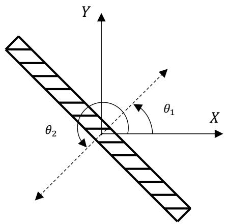  
Figure 9. API 4F Single-Sided Wall

As an example, following lines in Seastate input file, models a single sided wall (Area “A1”) with width and height of 10 and $\theta_{ 2 } = 200 ~ d e g$ . As can be seen AP4F has been chosen in “WIND” line.


|  | 1 | 2 | 3 | 4 | 5 | 6 | 7 | 8 |
| --- | --- | --- | --- | --- | --- | --- | --- | --- |
| 1 | 1234567890123456789012345678901234567890123456789012345678901234567890123456789012345678901234567890123456789 | 10. | 10. | 200. | 5. | A | WS |  |
| 2 | AREA1 | 10. | 10. | 200. |  |  |  |  |
| 3 | WIND |  |  |  |  |  |  |  |
| 4 | WIND1SI | 100.0 | 0.85 | AP4FA1 |  |  |  |  |


4.6.5.2 Three sided wall

Three sided wall can be modeled using the angle of the outward normal as depicted in the following figure and explained in previous section. It is worth to emphasize that the order of the areas defined for three sided wall follows the order number in API4F specification i.e. the first line is numbered I, the second line is the area # II on the right side of the first, and the third line is the area # III. As can be seen the current numbering is exactly the same as Table 8 API 4F specification 4th edition. Moreover, entered wind approach direction angle (??), will be considered as an applied load on the first wall which is measured counterclockwise from the global X axis as specified in the section 4.6.1 (see figure below). Shape coefficients will be calculated using the data given in Table 8 for all three areas automatically.

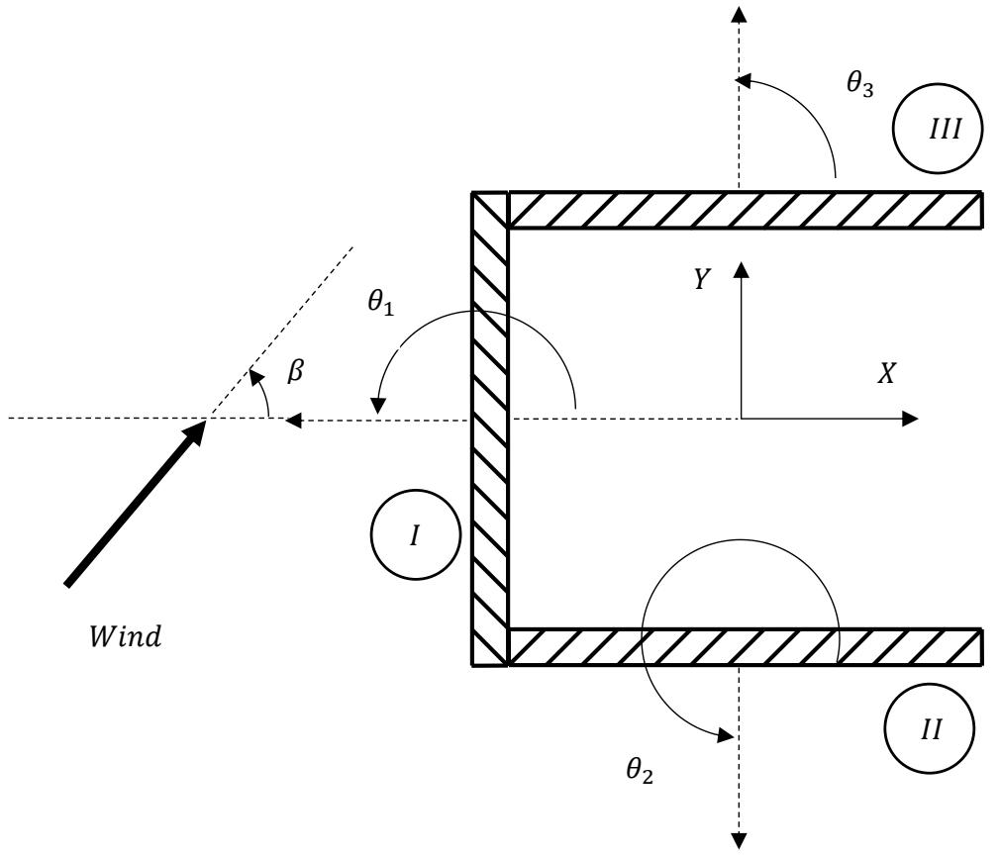  
Figure 10. API 4F 3-Sided Wall

The type of area can be specified in column 80 on AREA line by entering ‘T’ and the area definition should be specified in column 79 on AREA line by entering ‘W’ (Wall – Flat surface with orientation). Assuming the global Z axis along the height of the wind wall, width (shown by ‘b’ in API 4F table 8), height (shown by ‘h’ in API 4F table 8) and the angle between outward normal to the areas and global X

direction are entered in columns 7-24 separately for each area. The angle should be measured counterclockwise for each area. The program automatically checks the limitation of geometry specified in Table 8 API 4F 4th edition. As an example following lines in Seastate input file, models three sided wall (named “A1”) with width and height of 10 feet for each side, where one joint is specified on each area (the systems is illustrated in the previous figure). As can be seen AP4F has been chosen in “WIND” line and angles are given in the order of side number, i.e. 180, 270 and 90 respectively. The coordinates of the centroid for each side need to match up since the program checks the limitation of the geometry for each side and for example checks the distance between centroid of second and third areas with the width of the first area.


|  | 1 | 2 | 3 | 4 | 5 | 6 | 7 | 8 |
| --- | --- | --- | --- | --- | --- | --- | --- | --- |
|  | 123456789012345678901234567890123456789012345678901234567890 | 123456789012345678901234567890123456789012345678901234567890 | 123456789012345678901234567890123456789012345678901234567890 | 123456789012345678901234567890123456789012345678901234567890 | 123456789012345678901234567890123456789012345678901234567890 | 123456789012345678901234567890123456789012345678901234567890 | 123456789012345678901234567890123456789012345678901234567890 | 123456789012345678901234567890123456789012345678901234567890 |
| 1 | AREA |  |  |  |  |  |  |  |
| 2 | AREA1 | 10. | 10. | 180. | -5. | 5. | 1 | WT |
| 3 | AREA1 | 10. | 10. | 270. |  | -5. | 5. | 2 |
| 4 | AREA1 | 10. | 10. | 90. |  | 5. | 5. | 3 |
| 5 | WIND |  |  |  |  |  |  |  |
| 6 | WIND1SI | 100.0 | 0.85 |  | AP4FA1 |  |  |  |


4.6.5.3 Four sided wall

Four sided wall can be modeled using the angle of the outward normal as depicted in the following figure and explained in single sided wall section. It is worth to emphasize that the order of the areas defined for four sided wall follows the order number in API4F specification i.e. the first line is numbered I, the second line is the area # II on the right side of the first, the third line is the area # III and the fourth line is the area # IV. Therefore, areas numbered I and IV are parallel as well as areas numbered II and III. As can be seen the current numbering is exactly the same as Table 8 API 4F specification 4th edition. Moreover, entered wind approach direction angle (??), will be considered as an applied load on the first wall which is measured counterclockwise from the global X axis as specified in the section 4.6.1 (see figure below). Shape coefficients will be calculated using the data given in Table 8 for all four areas.

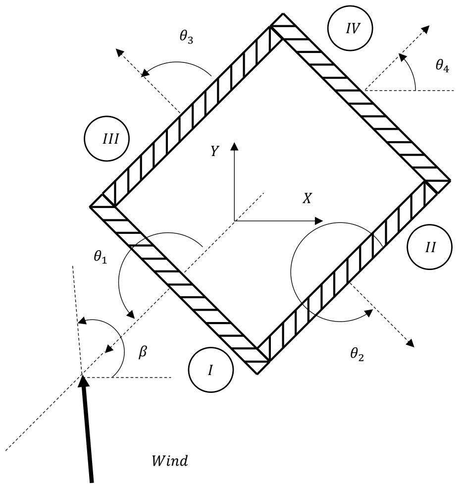  
Figure 11. API 4F 4-Sided Wall

The type of area can be specified in column 80 on AREA line by entering ‘F’ and the area definition should be specified in column 79 on AREA line by entering ‘W’ (Wall – Flat surface with orientation). Assuming the global Z axis along the height of the wind wall, width (shown by ‘b’ in API 4F table 8), height (shown by ‘h’ in API 4F table 8) and the angle between outward normal to the areas and global X direction are entered in columns 7-24 separately for each area. The angle should be measured counterclockwise for each area. The program automatically checks the limitation of geometry specified in Table 8 API 4F 4th edition. As an example following lines in Seastate input file, models four sided wall (named “A1”) with width and height of 10 for each side, where one joint is specified on each area (the systems is illustrated in the previous figure, with additional 45-degree rotation). As can be seen AP4F has been chosen in “WIND” line and angles are given in the order of side numbers, i.e. 180, 270, 90 and 0 respectively. The coordinates of the centroid for each side need to match up since the program checks the limitation of the geometry for each side and also checks the distance between centroid of second and third areas with the width of the first and fourth areas.


|  | 1 | 2 | 3 | 4 | 5 | 6 | 7 | 8 |
| --- | --- | --- | --- | --- | --- | --- | --- | --- |
| 1 | 1234567890123456789012345678901234567890123456789012345678901234567890123456789012345678901234567890123456789 | 12345678901234567890123456789012345678901234567890123456789012345678901234567890123456789012345678 | 12345678901234567890123456789012345678901234567890123456789012345678901234567890123456789012345678 |  |  |  |  |  |
| 2 | AREA1 | 10. | 10. | 180. | -5. | 5. | 1 | WF |
| 3 | AREA1 | 10. | 10. | 270. | -5. | 5. | 2 | WF |
| 4 | AREA1 | 10. | 10. | 90. | 5. | 5. | 3 | WF |
| 5 | AREA1 | 10. | 10. | 0. | 5. | 5. | 4 | WF |


6 WIND

7 WIND1SI

## 100.0

## 0.85

AP4FA1

Note: The wall order should be internally consistent when defining a 4-sided wall (i.e. Wall I is the front side, Wall II is the right side, Wall III is the left side, Wall IV is the back side). However, the windward side is automatically determined by the seastate for each wind load condition so only one wind area is required for all wind loading directions.

## 4.7 SUBMERGED BODY DRAG LOAD

Submerged bodies defined using the AREA input line can be loaded using the DRAG line within the load case.

Enter the two character identifier of submerged bodies to be loaded by wave and/or current forces in columns 45-80. Up to 18 submerged bodies may be specified.

The following designates that submerged bodies named s1, s2 and s3 are to be included when generating wave and current loading.

```txt
1 2 3 4 5 6 7 8 123456789012345678901234567890123456789012345678901234567890  
1 DRAG
2 DRAG S1S2S3 
```

A detailed report of loading generated on each submerged body may be generated by specifying ‘1’ in column 5.

## 4.8 MUD FLOW LOAD

Seastate offers the user the ability to model mudflow loads on the structure in a simple way based on the latest geotechnical methods. MFLO input lines are used to specify the parameters that characterize the overall properties of the mud flow and the variation of mud flow forces with depth.

The user may specify the relevant input at up to 12 levels through the mudflow. The flow is treated as a mass of soil above the mudline moving past the structure and causing the members to be loaded by pressures normal to the member axes and skin frictions acting axially. For convenience these components are referred to as "normal pressure" and "tangential pressure" respectively. The user enters the value of normal pressure that would act on a member oriented normal to the flow and the tangential pressure that would act on a member oriented with its axis along the flow. Factors are calculated by the program by which these pressures are multiplied for members oriented arbitrarily with respect to the flow.

The elevation of the mudflow is measured from the global origin and is entered in columns 9-16. The direction is specified with respect to the X axis and the vertical axis and is designated in columns 17-32. Critical incidence angles alpha and beta are input in columns 33-40 and 41-48, respectively, while the normal load plateau is designated in columns 49-56.

The following illustrates a mudflow with a top elevation of 13 from the origin. The flow is downhill and makes an angle of 27 degrees with the X axis and 7 degrees with the horizontal. The values of alpha and beta are 8 and 4 degrees, respectively and the normal load plateau is 0.85.

```txt
1 2 3 4 5 6 7 8 123456789012345678901234567890123456789012345678901234567890 
```

```txt
1 MFLO1 13.0 27.0 -7.0 8.0 4.0 0.85 
```

The load profile is defined on the subsequent MFLO2 lines with normal and tangential components of the load defined at various depths below the mud surface.

The following shows normal and tangential load intensities 0.0, 3.0 and 6.0 feet below the mudflow surface:

```txt
1 2 3 4 5 6 7 8 1 123456789012345678901234567890123456789012345678901234567890 MFLO1 2 MFLO1 13.0 27.0 -7.0 8.0 4.0 0.85 3 MFLO2 0.0 0.0 0.0 3.0 350. 35.0 6.0 750. 75.0 
```

## 4.9 REPEATING A LOAD CASE

Load cases consisting entirely of environmental loading with the same wind, current and/or wave approach directions may be repeated for another approach direction by specifying the LOADRP input line in the subsequent load case. The LOADRP input line with the new direction specified in columns 11- 16 eliminates the need to respecify the WAVE, WIND and/or CURR input lines. Enter the load case to be repeated or copied in columns 17-20 and the name of the new load case in columns 21-24.

This feature is only applicable if all environmental load characteristics are the exact same except for the approach direction. For example, load case S000 with loading in the 0 degree direction is repeated for load case S045. The load direction is changed to 45 degrees.

Note: No other load data can be specified in the load case to be created by the load repeat function.

```txt
1 2 3 4 5 6 7 8 123456789012345678901234567890123456789012345678901234567890123456789012345678901234567890123456789012345678910 WIND 1.000 1.100 1.350 1.000 0.0 AP13 4 CURR 0.000 0.250 0.000 -10.000BC NL AWP 6 CURR 30.000 0.250 0.250 7 CURR 50.000 0.250 7 Dead 8 WAVE 11 WAVE1.00AIRY 10.00 13.00 0.00 L -20.00 2.00 15MS10 1 12 LOADRP 45.0 S000S045 13 0 
```

## 4.10 API RP2A-WSD 20TH EDITION CONSIDERATIONS

The following outlines the requirements for generation of environmental design loads in accordance with API RP2A-WSD 20th Edition guidelines.

Apparent Wave Period - The apparent wave period may be entered as the wave period on the WAVE input line or may be determined by the program automatically by specifying ‘AWP’ in columns 71-73 of the CURR input line. See Section 4.4.4.

Wave Kinematics/Spreading factor - The wave spreading factor is entered directly on the WAVE input line in columns 5-8. See Section 4.3.5.

Current Blockage factor - The current blockage factor may be specified in columns 41-48 on the CURR input line or may be calculated by the program by specifying ‘BC’ in columns 57-58 and the reference elevation in columns 49-56. See Section 4.4.3.

Current Stretching/Compressing - Constant, linear or nonlinear current profile stretching may be specified by entering ‘CN’, ‘LN’ or ‘NL’ in columns 60-61 on the CURR input line. See Section 4.4.2.

Coefficients of Drag and Inertia - The API default simplified coefficients may be designated by selecting ‘AP’ in columns 5-6 of the CDM input line. Drag and Inertia coefficients can be calculated automatically including wake encounter effects by specifying ‘WE’ in columns 5-6. See Section 2.3.1.5.

Wave Shielding - Wave shielding due to closely spaced members can be accounted for by factoring the coefficients of drag and mass for a member or group of members on the MEMOV or GRPOV input lines, respectively. See Sections 2.3.1.4 and 2.3.1.5.

## 4.11 API BULLETIN 2INT-MET EDITION SEASTATE PARAMETER GENERATION

Seastate can generate loads on the structure resulting from wind, wave, current, and dead based on environmental parameters specified in API Bull 2INT-MET. API Bull 2INT-MET is only applicable to the Gulf of Mexico, north of 26°N in water depths greater than or equal to 33 ft (10 m). See API Bull 2INT-MET for areas where the environmental conditions must be obtained from site-specific studies.

4.11.1 API Bulletin 2INT-MET Options Line

API Bull 2INT-MET required options are specified on the 'LDAPI' input line. The 'LDAPI' line should come after the 'LDOPT' line in either the model file or the Seastate input file if separate. The user must enter the site longitude of the structure in column 10-15 between the range of 97.5 and 82.5 degrees.

In column 17-22, the user is to enter the site orientation angle of the structure. The site orientation angle is the angle between the SACS global X axis and True North. A positive angle is measured towards the SACS global Y axis.

The default API Bull 2INT-MET parameters including: return period, peak design case, directional factor option, current inline angle, and wind inline option are specified in columns 32-47. These parameters can be overridden in each load condition using the '2MET' line.

The default return period is entered in column 32.

Enter an

'A' for 10 year return period

'B' for 25 year return period

'C' for 50 year return period

'D' for 100 year return period

'E' for 200 year return period

'F' for 1,000 year return period

'G' for 2,000 year return period

'H' for 10,000 year return period

The peak case entry is used when combining different extreme load types (wave, wind, and current). The factors used for the different load types for each peak case are specified in API Bull 2INT-MET Table 5-1 and Table 5-2. Enter 'WA', 'WI', 'CU', or 'EX' in column 34-35 for peak wave, peak wind, peak current, or extreme case respectively. If 'EX' is entered as the peak case, no factors will be applied on each load type included in the load condition.

The user can specify the calculated omni-directional wave height is to be factor by the directional factors specified in API Bull 2INT-MET figure 4.2.2-1 by entering a 'DIR' in column 26-28. Enter 'OMN' if the calculated wave height is not to be factored.

The current inline angle is entered in column 41-45. The current inline angle is used to alter the calculated current direction to be inline with the wave angle. If the calculated current direction is within this specified tolerance from the wave angle, the calculated current direction will be altered.

Enter 'I' in column 47 if the calculated wind direction is to be altered to be inline with the wave angle; otherwise, leave blank for API Bull 2INT-MET defaults.

Enter the default wave parameters in column 53-74. These parameters including: wave type, input mode, crest position, step size, dyn. steps, and static steps can be overridden on the '2MET' line. The available wave types are based on API RP 2A Figure 2.3.1-3. In column 53-56, enter 'AIRY' for airy wave theory, 'STOK' for stokes fifth order theory, or 'STRN' for stream function theory excluding current effects. The rest of the default wave parameters are similar to those found on the 'WAVE' line.

To print the deck height requirement specified in API Bulletin 2INT-DG, enter 'PT' in column 34-35. The deck height requirement is based on the 100-year maximum crest elevation and a 5' air gap. The required deck height is shown with and without the 15% local maximum crest factor. The 100-year maximum crest elevation used is from the tables found in API Bull 2INT-MET.

For example, a platform is located in the Gulf of Mexico at a longitude of 90.25, the platform is orientated with true north towards the SACS 290 degree direction. A 50-year return period wave, using peak wave design case are entered as the default 2MET parameters.

```txt
1 2 3 4 5 6 7 8 1234567890123456789012345678901234567890123456789012345678901234567890 1 LDAPI 90.25 290.0 C WA OMN STRNL -100.0 5.0 40MMPT 
```

4.11.2 API Bulletin 2INT-MET General Line

In order to utilize the API Bull 2INT-MET capabilities in SACS, the user must enter the '2MET' line under each load condition. The '2MET' line is used to describe the wave angle (direction of the load) in column 6-11, to override properties specified on the 'LDAPI' and 'LDOPT' line, to specify the included load types, and to specify the current options if applicable.

The default 2MET parameters specified on the 'LDAPI' can be overridden by using the '2MET' columns 13-28. The override parameters include: return period (column 13), peak case (column 15-16), directional factor option (column 18-20), current inline angle (22-26), and wind inline option (column 28). The values specified on the 'LDAPI' will be used if left blank.

Enter the mean lower low water depth and mudline elevation in column 19-24 and 25-30 respectively; otherwise, the values on the 'LDOPT' line will be used. These values will be used in each API 2MET wave, wind, and current load type.

Note: The calculated surge and tide will be automatically added to the mean lower low water depth.

Wave, wind, current, and dead loads can be included in the load condition by specifying an 'I' in column 50, 51, 52, and 53 respectfully. Enter 'X' if the load type is to be excluded.

If current is included in the load condition ('I' in column 52), enter the current option in column 59- 72. The minimum inline current is entered in column 59-62. If left blank, 0.3 ft/s as specified in API Bull 2INT-MET will be used.

The current blocking can be either automatically calculated or can be user defined. For user defined current blocking, the blocking factor is entered in column 63-70, and column 71-72 is left blank. For automatic calculation of blocking factor, the elevation at which the factor is determined is entered in column 63-70, and 'BC' is entered in column 71-72.

Note: Nonlinear Current Stretching and Apparent Wave Period will be automatically included in the current force calculation.

For example a 10-year return period operational wave including wind, current, and dead loads in the 180 degree SACS direction would be specified by the following.

```txt
1 2 3 4 5 6 7 8 1 123456789012345678901234567890123456789012345678901234567890 1LOADCNO180 2MET 180.0 A III 0.85 
```

4.11.3 API Bulletin 2INT-MET Wave Line

The '2MWA' line, which is used to override the default wave parameters specified on the 'LDAPI' line, must come after the '2MET' line.

Enter the wave kinematics factor override used to account for spreading and wave profile irregularity. If left blank, the default factor of 1.0 will be used for return periods less than or equal to 25 years, a default factor of 0.88 will be used for return periods greater than 25 years. Descriptions of all other wave parameters on the '2MWA' line can be found on the 'WAVE' line.

4.11.4 API Bulletin 2INT-MET Wind Line

The '2MWI' line, which is used to override the default wind load parameters, must come after the '2MET' line. The '2MWI' line is used to specify the print option, the member loading option, wind duration, and to specify wind areas. Descriptions of the wind load parameters on the '2MWI' line can be found on the 'WIND' line.

4.11.5 API Bulletin 2INT-MET Dead Line

The '2MDL' line, which is used to override the default dead load parameters, must come after the '2MET' line. The '2MDL' line is used to specify the flood condition, the water weight density, the buoyancy calculation method, and the buoyancy below mudline option. Descriptions of the dead load parameters on the '2MDL' line can be found on the 'DEAD' line.

5 GENERATING TRANSFER FUNCTION LOADS

Seastate may be used to create wave loading used to develop wave transfer functions used in static or dynamic spectral fatigue analyses.

## 5.1 SPECIFYING TRANSFER FUNCTION WAVE DATA

Loads used to develop transfer functions are generated for a set of waves designated by the user. The user inputs sets of waves of equal period spacing and constant steepness using the GNTRF line.

The number of waves to be generated is entered in columns 11-13 while the wave steepness (height/length), direction, wave type and maximum allowable wave height are entered in columns 14- 20, 46-51, 55-58 and 64-69, respectively. The maximum allowable wave height used is the minimum of the value specified in columns 64-69 and the value computed by the program. Wave height computed by the program is proportional to the product of the period squared and the wave steepness. If the maximum allowable wave height field is left empty then the value computed by the program is used.

The period of the first wave to be generated and the period step size are input in columns 21-26 and 27- 32, respectively.

For each wave period, the wave is stepped through the structure changing the crest position. Enter the number of crest position steps in columns 52-54.

The water depth and mudline may be overridden in columns 33-39 and 40-45, respectively.

The self-weight and buoyancy can optionally be included in each of the load cases generated by entering ‘D’ in column 61. Enter ‘M’ or ‘R’ in column 62 to use the marine or rational buoyancy method, respectively. Enter 'A' in column 62 to use the 'Rational' method with pressure due to wave height attenuated with depth according to Eq. 3.2.5-3 in API 20th Edition. Enter 'P' in column 62 to use the 'Rational' method with pressure due to wave height attenuated with depth above the mudline and pressure due to still water depth below the mudline. Enter ‘B’ in column 63 to exclude buoyancy or elements below the mudline.

The following specifies a total of twenty Airy waves from the 45 degree direction using three sets of GNTRF lines. For each wave, 18 crest positions are to be used, the wave steepness is 1/20 and the maximum allowable wave height is computed by the program. The first GNTRF line defines 5 waves beginning with period 12 through 8 seconds using 1.0 second period increment. The second defines 6 waves beginning with period of 7.5 using 0.5 second increment. The last set of 9 waves begins at 4.5 seconds through 2.5 seconds using a 0.25 second period increment.


|  | 1 | 1 | 2 | 2 | 3 | 4 | 5 | 6 | 7 | 8 |
| --- | --- | --- | --- | --- | --- | --- | --- | --- | --- | --- |
|  | 12345678901 | 12345678901 | 12345678901 | 12345678901 | 12345678901 | 12345678901 | 12345678901 | 12345678901 | 12345678901 | 12 |
| 1 | LOADCN | LOADCN | LOADCN | LOADCN | LOADCN | LOADCN | LOADCN | LOADCN | LOADCN | LOADCN |
| 2 | GNTRF | AL | 5 | 0.05 | 12.0 | 1.0 | 45.0 | 18AIRY |  |  |
| 3 | GNTRF | AL | 6 | 0.05 | 7.5 | 0.5 | 45.0 | 18AIRY |  |  |
| 4 | GNTRF | AL | 9 | 0.05 | 4.5 | 0.25 | 45.0 | 18AIRY |  |  |


5.1.1 Critical Wave Crest Positions

Numerous techniques can be used to determine the stress range due to a particular wave. In general, however, a load case will be created for each crest position.

5.1.1.1 Dynamic Analysis

The number of load cases created and the critical position is controlled by the stress range option designated in the Wave Response input file.

For example, the following Wave Response input file, indicates that an equivalent static load case is to be created for each wave crest position (‘ALL’ in columns 15-18). Each load case corresponds to one of the eighteen crest position steps designated.

```txt
1 2 3 4 5 6 7 8 1 234567890123456789012345678901234567890123456789012345678901234567890 
```

The following Wave Response input file indicates that eight equivalent static load cases are to be created for each wave. Four load cases corresponding to the four crest positions resulting in the highest base shear and four load cases corresponding to the crest positions resulting in the four lowest base shears (‘MM4S’ in columns 15-18 and ‘ES’ in columns 19-20).

```txt
1 2 3 4 5 6 7 8 1 1234567890123456789012345678901234567890123456789012345678901234567890 
```

5.1.1.2 Static Analysis

The number of load cases created and the critical position is controlled by the static option designated in columns 9-10 on the GNTRF line.

By default, a load case will be created for each wave crest position (‘AL’ option). The position of maximum base shear or overturning moment can be saved by specifying ‘BS’ or ‘OM’.

For example, the following indicates that an equivalent static load case is to be created for each wave crest position (‘AL’ in columns 9-10). Each load case corresponds to one of the eighteen crest position steps designated.

```txt
1 2 3 4 5 6 7 8  
123456789012345678901234567890123456789012345678901234567890  
1 LOADCN
2 GNTRF AL 5 0.05 12.0 1.0 45.0 18AIRY  
3 GNTRF AL 6 0.05 7.5 0.5 45.0 18AIRY  
4 GNTRF AL 9 0.05 4.5 0.25 45.0 18AIRY
```

5.1.2 Creating Global Transfer Function Plots

Global base shear or overturning moment transfer function plots may be generated automatically by Seastate or Wave Response.

5.1.2.1 Dynamic Analysis

General transfer function plot parameters are specified in the Wave Response input file using the PLTTF and TFLCAS lines.

For example the following request overturning moment and base shear global transfer function plots. The plots are generated using wave number 1 through wave number 20.

```txt
1 2 3 4 5 6 7 8 1 23456789012345678901234567890123456789012345678901234567890 1 WROPT EN MM4SES 2 PLTTF OM BS FQ 
```

5.1.2.2 Static Analysis

For static analysis, all waves defined by the GNTRF lines are used to create the plots. Global base shear and overturning moment plots are generated by specifying ‘TRN’ for plots only or ‘TRL’ for plots and loading in columns 56-58 on the LDOPT line. Plot parameters determining whether plotted versus period ‘PR’, ‘FQ’ or both may be specified in columns 59-60 on the GNTRF line.

# 6 COMMENTARY

## 6.1 WAVE GENERATION

Seastate can be used to generate fluid velocities and accelerations resulting from surface gravity waves. The methods used to derive these motions for a wave of given amplitude and period in a fluid of known depth are based on any of five theories at the user’s options. These are the Airy (or linear) wave theory, Stokes’ Fifth Order Theory, the Stream Function Theory, Cnoidal Theory, and Solitary Wave Theory. Each of these theories gives an approximate solution to the equations governing the fluid motion, and each provides good results over a range of values of wave amplitude, period and water depth.

Figure 12 defines the parameters and coordinates used in the following brief discussion of the theoretical basis for Seastate’s wave generation routines.

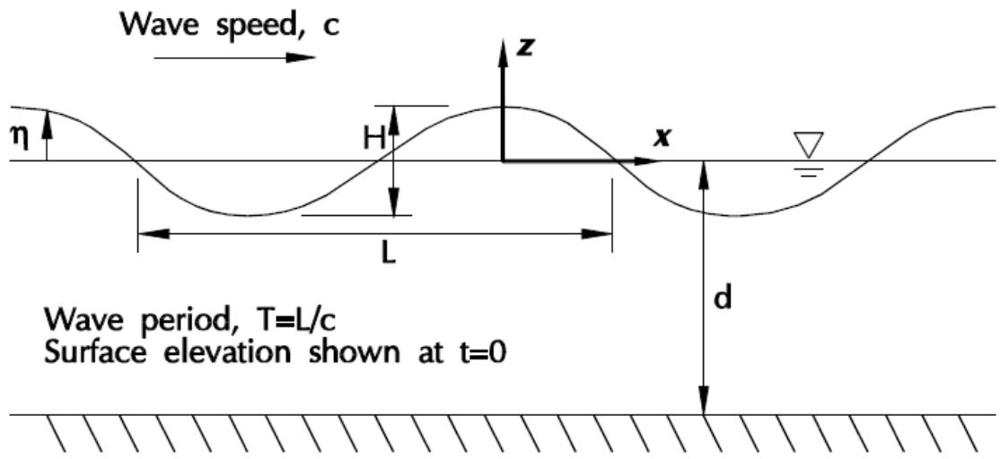  
Figure 12. Wave Parameters

It is shown in standard references on fluid mechanics that the velocity field, ??̅ (x,y,z,t), for an ideal fluid must satisfy a continuity equation:

$$\overline{{\boldsymbol{\nabla}}} \cdot \overline{{\boldsymbol{\mathrm{V}}}} = 0 \tag{1}$$

and an irrationality condition:

$$\bar{\nabla} \times \bar{\mathbf{V}} = 0 \tag{2}$$

It is easily seen that the second equation is satisfied if one can find a scalar function, , called a velocity potential, such that:

$$\bar{V} = \bar{\nabla} \phi \tag{3}$$

The continuity equation can then be written in terms of , resulting in:

$$\bar{\nabla}^{2} \phi = 0 \tag{4}$$

Thus it is seen that the potential function satisfies Laplace’s equation. Any problem concerning motion of an ideal fluid will therefore be solved if we can find a function, , that satisfies Laplace’s equation and whatever boundary and initial conditions pertain to that problem.

For a plane wave Laplace’s equation becomes:

$$\frac{\partial^{2} \phi}{\partial x^{2}} + \frac{\partial^{2} \phi}{\partial z^{2}} = 0 \tag{5}$$

with the boundary conditions:

$$\frac{\partial \phi}{\partial z} = 0 \text{a t} z = - d \tag{6}$$

$$\frac{\partial \eta}{\partial t} + \frac{\partial \phi}{\partial x} \frac{\partial \eta}{\partial x} - \frac{\partial \phi}{\partial z} = 0 \text{a t} z = \eta \tag{7}$$

$$\frac{\partial \eta}{\partial t} + \frac{1}{2} \left[ \left(\frac{\partial \phi}{\partial x}\right)^{2} + \left(\frac{\partial \phi}{\partial z}\right)^{2} \right] + g_{\eta} = 0 \text{a t} z = \eta \tag{8}$$

and a propagation condition

$$\phi (x, y, z) = \phi (x - c t, z) \tag{9}$$

which requires the wave to maintain its form as it propagates.

This condition serves instead of an initial condition.

Equation (6) demands that the vertical component of velocity be zero at the mudline. Equation (7) states that the vertical component of velocity at the free surface equals the vertical velocity of the free surface itself. Equation 8 requires the pressure at the free surface to be zero.

Two difficulties arise in attempting to solve the system of equations (5) through (9). First equations (7) and (8) are nonlinear and second, those equations are prescribed at the free surface, z=, which is unknown. Consequently various approximate solutions have been developed.

## 6.2 AIRY WAVE THEORY

This is the simplest of the theories, it is also called the linear wave theory because it linearizes the nonlinear boundary conditions, equations 7 and 8. The theory is based on the assumption that the wave height is much smaller than both the wave length and the still water depth. In this case it can be shown that the nonlinear terms in equations (7) and (8) are small and that only a small error is introduced if the conditions are applied at z = 0 instead of at z = .

The resulting solution for  is:

$$\phi = \frac{H L}{2 T} \frac{\cosh [ 2 \pi (\frac{z + d}{L}) ]}{\sinh (2 \pi \frac{d}{L})} \sin \left[ 2 \left(\frac{x}{L} - \frac{t}{T}\right) \right] \tag{10}$$

with the relation

$$T = \sqrt{\frac{2 \pi L}{g X \tanh  \left(2 \pi \frac{d}{L}\right)}} \tag{11}$$

The resulting velocities and accelerations, as well as other wave properties can be calculated.

## 6.3 STOKES’ WAVE THEORY

The linear wave theory provides a first order approximation to the wave motion. By a perturbation procedure higher order approximations can be obtained, which more nearly satisfy the nonlinear boundary conditions.

In the Stokes’ Fifth Order Theory the velocity potential,  , takes the form:

$$\phi = \frac{L^{2}}{2 \pi \mathrm{T}} \sum_{n = 1}^{5} \phi_{n}^{\prime} \cosh \left[ 2 \pi \ln \left(\frac{z + d}{L}\right) \right] \sin \left[ 2 \pi \ln \left(\frac{x}{L} + \frac{t}{T}\right) \right] \tag{12}$$

with the relation,

$$T = \sqrt{\frac{2 \pi L}{g X \tanh  \left(2 \pi \frac{d}{L}\right) \left[ 1 + \lambda^{2} C_{1} + \lambda^{4} C_{2} \right]}} \tag{13}$$

The constants, n, , C1 and C2 are known (but complicated) functions of H, L, and d.

## 6.4 STREAM FUNCTION THEORY

The stream function theory is so called because instead of solving for the velocity potential function the stream function is found. It is shown in standard references on fluid mechanics that for two dimensional motion of an ideal fluid a stream function, (x,z,t), exists such that:

$$u = \frac{\partial \Psi}{\partial z} w = - \frac{\partial \Psi}{\partial z}$$

where u and w are the velocity components in the x and z directions respectively.

By choosing a coordinate system that moves with the wave the stream function is independent of t, that is the problem is reduced to one of steady flow. The stream function, (x,z,t), is shown to satisfy Laplace’s equation:

$$\frac{\partial^{2} \Psi}{\partial x^{2}} + \frac{\partial^{2} \Psi}{\partial z^{2}} = 0 \tag{14}$$

with boundary conditions:

$$\frac{\partial \Psi}{\partial x} = 0 \text{a t} z = - d \tag{15}$$

$$w - u \frac{\partial \eta}{\partial x} = 0 \text{a t} z = \eta \tag{16}$$

$$\frac{1}{2 g} \left(u^{2} + w^{2}\right) + \eta = Q \text{a t} z = \eta \tag{17}$$

where Q is a constant.

A stream function is assumed in the form:

$$\Psi (x, z) = C z + \sum_{n = 1}^{N} x_{n} \sinh \left(n k (z + d)\right) \cos (n k x) \tag{18}$$

where N is the order of the stream function and k is the wave number.

An advantage of the stream function formulation is that on the free surface the stream function is a constant, say A. Thus evaluating equation (18) at z= gives an equation (within a constant) for (x):

$$C \eta + \sum_{n = 1}^{N} x_{n} \sinh (n k (\eta + d)) \cos (n k x) = A \tag{19}$$

Equations (14), (15) and (16) are satisfied identically. By a process of successive approximation the unknown parameters are chosen to approximately satisfy equation (17). The approach used is to minimize the mean square error in the fit with that boundary condition. This process is carried out numerically in Seastate and stream functions up to the 22nd order may be found.

The stream function approach can also accommodate current with the wave. Seastate includes the capability of generating a stream function wave in the presence of current. This approach gives more accurate results than the usual technique of simply adding current velocities to a wave generated without current.

## 6.5 CNOIDAL AND SOLITARY WAVE THEORIES

The Cnoidal theory is so called because of the appearance of the Jacobean elliptic function, cn (x,m), in the expression for the wave profile. It is found to provide good results for shallow water where the other theories are less reliable. As for Stokes’ and Stream Function waves, approximations of various orders may be derived. Seastate includes the Cnoidal theory to the fifth order. It has been demonstrated elsewhere that higher order approximations produce results no more reliable than the fifth order theory. The solitary wave theory is a limiting case of the Cnoidal theory.

Equations for calculating velocities, accelerations, and wave profile can be found in the reference below, these expressions are too lengthy to be included here. The various components of velocity, acceleration and wave profile involve series of Jacobean elliptic functions. These functions depend on a parameter, m, which can assume values:

$$0 \leq m \leq 1$$

When m=1 the wave is a solitary wave. This is a wave having infinite wave length. It can be thought of as a localized "mound" of water propagating over the undistributed water.

Reference:

Fenton, J. D. 1979 A High Order Cnoidal Wave Theory. Journal of Fluid Mechanics. Vol. 94 pp 129-161

## 6.6 MEMBER FORCES FROM WAVES AND CURRENT

The resultant force distribution on members due to fluid particle motion is calculated using Morison’s equation. This is in accordance with API, DNV, and NPD recommendations and produces reliable results for members whose cross sectional dimensions are small with respect to both the wave length and the characteristic distance between members. These are the conditions that usually prevail for typical offshore jacket structures.

The resultant force per unit length on a cylinder, ${ \bar{ F } } ,$ in general has a component normal to the cylinder, ${ \bar{ F } }_{ n } ,$ and a component along the axis of the cylinder (a tangential component), $\hat{ F }_{ t }$ .

$$\bar{\mathrm{F}} = \bar{\mathrm{F}}_{\mathrm{n}} + \bar{\mathrm{F}}_{\mathrm{t}}$$

Each of these components can be expressed as functions of the fluid particle motions by using Morison’s equation. In the normal direction this equation is:

$$\overline{{\mathrm{F_{n}}}} = \bar{\mathrm{F}}_{\mathrm{D n}} + \bar{\mathrm{F}}_{\mathrm{I n}}$$

where $\boldsymbol{ \bar{ F } }_{ D n }$ and $\boldsymbol{ \bar{ F } }_{ I n }$ are the drag and inertia forces respectively and are given by:

$$\bar{F}_{D n} = \frac{1}{2} C_{D n} D \rho \bar{V}_{n} | \bar{V}_{n} |$$

$$\bar{F}_{I n} = \frac{1}{4} \pi C_{M n} D^{2} \rho \bar{V}_{n}$$

Where: $C_{ D n }$ = Drag coefficient for flow normal to the member

$C_{ M \mathbf{ n } }$ = Inertia coefficient for flow normal to the member

D = Member diameter

p= Fluid mass density

$V_{ n }$ = Fluid particle relative velocity normal component

Only a skin friction drag term and no inertial component acts in the axial (tangential) direction unless an axial inertia coefficient is specified. If no axial inertia coefficient is specified, the equation in this direction is:

$$\bar{F}_{t} = \bar{F}_{D t}$$

$$\bar{F}_{t} = \frac{1}{2} C_{D t} D \rho | \bar{V}_{t} | \bar{V}_{t}$$

where the terms are defined as above with the stipulation that the subscript, t, refers to the member tangential (axial) direction.

These various forces are collected and expressed in the member local coordinates as

$$\overline{{F}}_{x} = \frac{1}{2} C_{D t} D \boldsymbol{\rho} | \overline{{V}}_{t} | \overline{{V}}_{t}$$

$$\overline{{{F}}}_{y} = \frac{1}{2} C_{D n} D \boldsymbol{\rho} | \overline{{{V}}}_{n} | \overline{{{V}}}_{y} + \frac{1}{4} \pi C_{M n} D^{2} \boldsymbol{\rho} \overline{{{\dot{V}}}}_{y}$$

$$\bar{F}_{z} = \frac{1}{2} C_{D n} D \rho | \bar{V}_{n} | \bar{V}_{z} + \frac{1}{4} \pi C_{M n} D^{2} \rho \bar{V}_{z}$$

where x, y, and z are the member local coordinates (x is always in the axial direction)

For non-cylindrical members these equations are modified to account for the fact that the member may have different hydrodynamic behavior in the local y and z directions. The equations for the components of force in the member local coordinates are:

$$\bar{F}_{x} = \frac{1}{4} C_{D t} \left(D_{y} + D_{z}\right) \rho | \bar{V}_{t} | \bar{V}_{t}$$

$$\bar{F}_{y} = \frac{1}{4} C_{D y} D_{y} \rho | \bar{V}_{n} | \bar{V}_{y} + \frac{1}{4} \pi C_{M y} D_{y}^{2} \rho \bar{V}_{y}$$

$$\bar{F}_{z} = \frac{1}{4} C_{D z} D_{z} \rho | \bar{V}_{n} | \bar{V}_{z} + \frac{1}{4} \pi C_{M z} D_{z}^{2} \rho \bar{V}_{z}$$

Where: CDy,CDz = Drag coefficients for flow in the local y and z directions.

Dy,Dz = Effective member depth for flow in the local y and z directions.

A great deal of experimental evidence indicates that the drag and inertia coefficients are not truly constant depending on the member diameter and on Reynold’s number. This behavior is incorporated into Seastate.

The user may specify a table of drag and inertia coefficients versus diameter, or if he prefers, the program defaults to the standard table indicated on the input line description for the CDM input line set. Also the user can include a table of drag coefficient versus Reynold’s number or use the built-in table indicated on the input line description for the REYFAC input line set.

The effect of marine growth on the hydrodynamic behavior of members is included in the program. Such growth increases the member diameter and also makes the member much rougher than a clean one. Both of these effects cause increases in the load that the member is subject to. The user may specify drag and inertia coefficients for fouled as well as clean members on the CDM input line set and he can specify the thickness of marine growth as a function of depth on the MEMOV input line set. Marine growth is approximately neutrally buoyant thus its dead weight and buoyancy nearly cancel and in combination contribute only negligibly to the forces on the structure, the program ignores this contribution.

Note: The inclusion of marine growth in the Seastate input file does not automatically account for increased diameter and mass in subsequent dynamic analyses using DYNPAC unless ‘DYN’ is specified on the LDOPT input line. The user can also override both the member diameter and material density in the DYNPAC input file.

## 6.7 BUOYANCY

Loads due to buoyancy may be accounted for by either the "marine" method or the "rational" method.

The "marine" method is an approximate method used by most marine applications involving flotation and rigid body motion of submerged bodies. Structural loads are calculated on the basis of a "submerged weight" which is the member weight reduced by the weight of the displaced fluid. This then is applied to the member as a distributed load acting vertically.

Unlike gravity which is a true body force acting on every particle of a body, buoyancy is the resultant of fluid pressure acting on the surface of the body. These pressures can only act normal to the surface, thus for a non-segmented member they cannot produce an axial distributed load.

The "rational" technique recognizes that the effect of the pressure distribution on the structure, results in a system of loads consisting of distributed loads along the members and concentrated loads at the joints. The loads on the members are perpendicular to the member axis and in the vertical plane containing the member. The magnitude of this

distributed load is:

$$w = \frac{1}{4} \pi D^{2} \gamma c o s \alpha$$

Where: D = member diameter

y= fluid weight density

α= angle between the member and its projection on a horizontal plane

The joint loads consist of forces acting in the directions of all of the members meeting at the joint. These joint forces act in a direction that would compress the corresponding members (See the figure shown in section 4.5, gravity and buoyancy loads) if they acted directly on them, and have magnitude of:

$$P = \gamma A d$$

Where:  = fluid weight density

A = "displaced area" i.e. the material area for flooded members, the enclosed area for non-flooded members.

d = water depth at the end of the member being considered.

If the rational method is used, it should be indicated by ‘R’ in column 20 of the HYDRO line so that the corresponding API code check can be made for axial force interaction with hydrostatic collapse. In the SACS IV program if the marine method is indicated the following formulas from API-RP2A are checked:

for tension-collapse interaction (Eq. 2.5.4-6)

$$A^{2} + B^{2} + 2 v | A | B \leq 1. 0$$

with

$$A = \frac{(f_{a} + f_{b} - 0 . 5 f_{h})}{F_{y}} \times S F_{x} \qquad B = \frac{f_{h}}{F_{h c}} \times S F_{x}$$

and for compression-collapse interaction (Eq. 2.5.4-7,8,9)

$$\frac{f_{x} - 0 . 5 F_{h a}}{F_{a a} - 0 . 5 F_{h a}} + \left[ \frac{f_{h}}{F_{h a}} \right]^{2} \leq 1. 0$$

and

$$\frac{f_{x}}{F_{x c}} \times S F_{x} \leq 1. 0 \quad \frac{f_{h}}{F_{h c}} \times S F_{x} \leq 1. 0$$

with

$$f_{x} = f_{a} + f_{b} + 0. 5 f_{h}$$

where the terms in these expressions are defined in RP2A.

When the rational method is used to produce the loads on the structure, API permits a modification of these expressions, such that the term 0.5 fh is eliminated from the equations for A and fx.

## 6.8 FORCES DUE TO MUD FLOW

Mud flow is treated as a mass of soil above the mudline moving past the structure and causing the members to be loaded by pressures normal to the member axes and skin frictions acting axially. For convenience these components are referred to as "normal pressure" and "tangential pressure" respectively. The user enters the value of normal pressure that would act on a member oriented normal to the flow and the tangential pressure that would act on a member oriented with its axis along the

flow. Factors are calculated by the program by which these pressures are multiplied for members oriented arbitrarily with respect to the flow. The form of the curve of these factors (normalized pressures) as a function of incidence angle of the flow over the member is shown in the figure below. It is seen from these curves that the tangential pressure remains constant until a critical angle  is reached, after which it drops off to zero when the flow is normal to the member. This is characteristic of a force that is essentially the result of friction.

The behavior of the normal pressure, however, is somewhat more complicated. Recent geotechnical work on the subject indicates that a normal pressure variation as shown in the figure gives a good approximation for forces generated for a variety of soil conditions. The user specifies the parameters, , βand plateau to define the curves. Member forces are calculated from these pressures as follows:

1. Normal forces per unit length are calculated by multiplying the normal pressure by the dimension of the member in the plane perpendicular to the flow.   
2. The axial force per unit length is calculated by multiplying the tangential pressure by the circumference for cylindrical members or the perimeter of the enclosing rectangle for noncylindrical members.

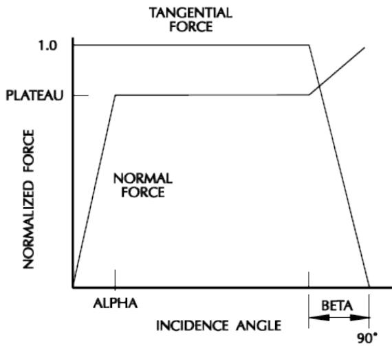

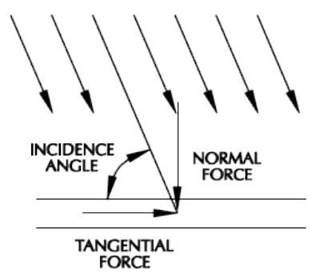  
Figure 13. Forces Due to Mud Flow

Both horizontal and vertical components of mud flow can be accounted for. When mudflow is specified, the program automatically adjusts the water depth and mudline elevation so that a wave generated in that load case will be for a water depth from the top of the mudflow to the still water surface. No current or buoyancy loads are generated below the top of the mudflow.

## 6.9 API RP2A-WSD 20TH EDITION WAVE DETERMINATION

6.9.1 Apparent Wave Period

The apparent wave period, $T_{ a p p } ,$ is the wave period relative to the effective in-line current. For a wave propagating on an arbitrary current profile, determination of the apparent wave period requires solving the following simultaneous equations:

$$\frac{\lambda}{T} = \frac{\lambda}{T_{a p p}} + V_{1} T_{a p p}^{2} = \frac{2 \pi \lambda}{g \tanh (2 \pi d / \lambda)}$$

$$V_{1} = \frac{4 \pi / \lambda}{\sinh (4 \pi d / \lambda)} \int_{- d}^{0} U_{c} (z) \cosh \left[ \frac{4 \pi (z + d)}{\lambda} \right] d z$$

where,  is the wave length, d is the storm water depth, $U_{ c } ( z )$ is the steady state current profile component in the wave direction at elevation z, g is the acceleration of gravity, VI is the effective in-line current velocity and T is the wave period relative to a stationary object.

6.9.2 Current Blockage

The current blockage factor calculated by Seastate is based on the "actuator disk" model and is taken as:

$$\left[ 1 + \sum \frac{(C_{d} D)_{i}}{4 W} \right]^{-1}$$

where $\Sigma ( C_{ d } D )_{ i }$ is the summation of the "drag diameters" of all members cut by the specified horizontal plane and W is the overall width of the platform normal to the current at that level.

6.9.3 Current Profile Stretching or Compressing

Because current profile is usually specified to the mean water level, the current profile must be stretched or compressed to the actual wave surface.

For current profiles where linear stretching is an acceptable approximation, the current $V_{ z }$ at a distance z above the mean water level, can be calculated from the current profile specified at elevation $z^{ \prime }$ using the following relationship:

$$V_{z} = V_{z}^{\prime} \frac{(z + d)}{(z^{\prime} + d)} \frac{d}{(d + \eta)}$$

where $V_{ z }^{ \prime }$ is the specified current at elevation $z^{ \prime } ,$ d is the storm water depth and  is the distance between the wave surface and the mean water level (where  and z are positive above the mean water level and negative below).

Studies have shown that a nonlinearly stretched current profile may be most appropriate when combined with Doppler-shifted wave kinematics. Nonlinear stretching computes the stretched current Vz for a particle instantaneously at elevation z, based on the speed $V_{ z }^{ \prime }$ specified in the current profile at elevation $z^{ \prime }$ as follows:

$$V_{z} = V_{z}^{\prime} \frac{z^{\prime} + \eta}{z} \left[ \frac{\sinh (2 \pi (z^{\prime} + d) / \lambda_{n})}{\sinh (2 \pi d / \lambda_{n})} \right]$$

where $\lambda_{ n }$ is the wave length determined for a height of H and period $T_{ \boldsymbol{ a p p } }$ .

6.9.4 Coefficient of Drag and Mass

For a complete discussion on the calculation of Cd and/or Cm based on surface roughness, wake encounter effects and member orientation, refer to the section, Commentary on Wave Forces, in the API RP2A-WSD 20th Edition.

## 6.10 SEASTATE GENERATED LOADING DESCRIPTIONS

Seastate automatically consolidates member and joint loads for Seastate generated loading; therefore, each LOAD line generated may contain multiple types of loading (i.e. wave, current, and dead loads). In order to describe which loading types are included in a particular LOAD line, Seastate will write out descriptions on the Load ID entry (Column 73-80) of each Seastate generated LOAD line.

6.10.1 Member Load Descriptions

The following are the descriptions that can be output on the Load ID entry (column 73-80) by Seastate for member loads:

Column 73 - 'W' - Wave Loading

Column 74 - 'C' - Current Loading

Column 75 - 'V' - Velocity Loading

Column 76 - 'D' - Dead Loading

Column 77 - 'I' - Inertia Loading

Column 78- 'W' - Wind Loading

Column 79-80 - ':S' - Seastate Generated Load ID

Note: If the LOAD line does not contain a load type, a '-' will be entered in the corresponding column.

6.10.2 Joint Load Descriptions

The following are the descriptions that can be output on the Load ID entry (column 73-80) by Seastate for joint loads:

Column 73 - 'U' - User Defined Joint Loads (multiple Load ID's used)

Column 74 - 'A' - Wind and Drag Area Joint Loads

Column 75 - 'E' - Environmental Wave, Wind, and Velocity Loading on Plate Joints

Column 76 - 'D' - Dead Loading (Rational Method)

Column 77 - 'I' - Inertia Loading

Column 78- 'D' - Dummy Loading

Column 79-80 - ':S' - Seastate Generated Load ID

Note: If the LOAD line does not contain a load type, a '-' will be entered in the corresponding column.

7 SAMPLE PROBLEMS

The structure shown in Figure 14 is used to illustrate the various capabilities of the Seastate program. Four separate runs are illustrated:

1. The first sample problem is a typical environmental load generation run where Seastate input lines are located in the SACS model file. This sample is fairly comprehensive and utilizes most Seastate input lines required for standard environmental load generation including waves, wind, current, gravity and buoyancy.   
2. Sample Problem 2 is the similar to Sample Problem 1 except that the Seastate input lines are located in a separate file from the SACS model. In addition, this sample illustrates the capabilities available to specify non-structural elements that are used to generate environmental loads but are not included in the stiffness of the structure (i.e. risers, caissons, boatlandings etc.).   
3. Sample Problem 3 illustrates the transfer function plot generation feature.   
4. Sample Problem 4 generates wave loading using empirical wave velocities and accelerations defined by the user.

## 7.1 ENVIRONMENTAL LOADING

The following is an example of a Seastate execution for environmental loading. This example illustrates most of the input lines associated with a standard Seastate execution. The structure shown in Figure 14 stands in 261.0 feet of water. The model contains load conditions MISC, EQPT, AREA, and LIVE which represent non-structural gravity loads on the structure. Load conditions P000, P045, and P090 are environmental load conditions for operating conditions with automatic dead load generation and load combinations OPR1, OPR2, and OPR3 combine the environmental load conditions with the nonstructural gravity loading. Similarly, load conditions S000, S045, and S090 are environmental load conditions for storm conditions with automatic dead load generation and load combinations STM1, STM2, and STM3 combine the environmental load conditions with the non-structural gravity loading. Load combinations OPR1, OPR2, OPR3, STM1, STM2, and STM3 are the only load case passed to SACS IV for analysis.

Marine growth, coefficient of drag and mass overrides, and member and group overrides, are specified.

The following is a portion of the Seastate input file. A detailed description of each input line ensues.

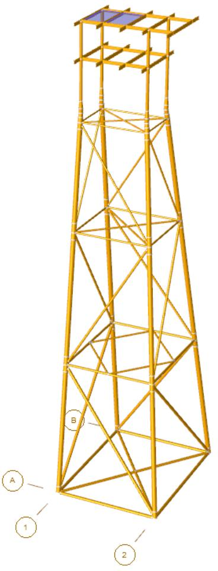  
Figure 14. Sample Jacket Model


|  | 1 | 2 | 3 | 4 | 5 | 6 | 7 | 8 |
| --- | --- | --- | --- | --- | --- | --- | --- | --- |
|  | 123456789012345678901234567890123456789012345678901234567890 | 123456789012345678901234567890123456789012345678901234567890 | 123456789012345678901234567890123456789012345678901234567890 | 123456789012345678901234567890123456789012345678901234567890 | 123456789012345678901234567890123456789012345678901234567890 | 123456789012345678901234567890123456789012345678901234567890 | 123456789012345678901234567890123456789012345678901234567890 | 123456789012345678901234567890123456789012345678901234567890 |
| 1 | LDOPT | NF+Z64.30001490.0500-261.000 | 261.000 | 261.000 | NPNP | K |  |  |
| 2 | * SELECTS STATIC ANALYSIS LOAD CASES | * SELECTS STATIC ANALYSIS LOAD CASES | * SELECTS STATIC ANALYSIS LOAD CASES | * SELECTS STATIC ANALYSIS LOAD CASES | * SELECTS STATIC ANALYSIS LOAD CASES | * SELECTS STATIC ANALYSIS LOAD CASES | * SELECTS STATIC ANALYSIS LOAD CASES | * SELECTS STATIC ANALYSIS LOAD CASES |
| 3 | LCSEL ST | OPR1 | OPR2 | OPR3 | STM1 | STM2 | STM3 |  |
| 4 | AMOD |  |  |  |  |  |  |  |
| 5 | AMOD | STM1 | 1.333STM2 | 1.333STM3 | 1.333 |  |  |  |
| 6 | * USE LOADING IN SEASTATE INPUT AND MODEL FILE | * USE LOADING IN SEASTATE INPUT AND MODEL FILE | * USE LOADING IN SEASTATE INPUT AND MODEL FILE | * USE LOADING IN SEASTATE INPUT AND MODEL FILE | * USE LOADING IN SEASTATE INPUT AND MODEL FILE | * USE LOADING IN SEASTATE INPUT AND MODEL FILE | * USE LOADING IN SEASTATE INPUT AND MODEL FILE | * USE LOADING IN SEASTATE INPUT AND MODEL FILE |
| 7 | FILE B |  |  |  |  |  |  |  |
| 8 | CDM |  |  |  |  |  |  |  |
| 9 | CDM | 1.00 | 0.600 | 1.200 | 0.600 | 1.200 |  |  |
| 10 | CDM | 100.00 | 0.600 | 1.200 | 0.600 | 1.200 |  |  |
| 11 | MGROV |  |  |  |  |  |  |  |
| 12 | MGROV | 0.000 | 200.000 | 1.000 |  |  |  |  |
| 13 | MGROV | 200.000 | 261.000 | 2.000 |  |  |  |  |
| 14 | GRPOV |  |  |  |  |  |  |  |
| 15 | GRPOVAL | LG1 F |  |  |  |  |  |  |
| 16 | GRPOVAL | LG2 F |  |  |  |  |  |  |
| 17 | GRPOVAL | LG3 F |  |  |  |  |  |  |
| 18 | GRPOV | LG4 F |  |  |  |  |  |  |
| 19 | GRPOV | PL1NF |  |  | 0.001 | 0.001 |  |  |
| 20 | GRPOV | PL2NF |  |  | 0.001 | 0.001 |  |  |
| 21 | GRPOV | PL3NF |  |  | 0.001 | 0.001 |  |  |
| 22 | GRPOV | PL4NF |  |  | 0.001 | 0.001 |  |  |
| 23 | GRPOV | W.BNF | 0.001 |  | 0.001 | 0.001 |  |  |
| 24 | LOAD |  |  |  |  |  |  |  |
| 25 | LOADCNP000 |  |  |  |  |  |  |  |
| 26 | WIND |  |  |  |  |  |  |  |
| 27 | WIND | 50.000 |  | 0.00 | AP13 |  |  |  |
| 28 | WAVE |  |  |  |  |  |  |  |
| 29 | WAVE | STRE | 20.00 | 13.00 | 0.00 | L-75.00 | 5.00 | 20MS10 1 7 |
| 30 | CURR |  |  |  |  |  |  |  |
| 31 | CURR | 0.000 | 1.000 | 0.000 |  | -15.000BC | NL FPS | AWP |
| 32 | CURR | 261.000 | 2.000 |  |  |  |  |  |
| 33 | DEAD |  |  |  |  |  |  |  |
| 34 | DEAD | -Z |  |  | M |  |  |  |
| 35 | LOADCNP045 |  |  |  |  |  |  |  |
| 36 | WIND |  |  |  |  |  |  |  |
| 37 | WIND | 50.000 |  | 45.00 | AP13 |  |  |  |
| 38 | WAVE |  |  |  |  |  |  |  |
| 39 | WAVE | STRE | 20.00 | 13.00 | 45.00 | L-75.00 | 5.00 | 20MS10 1 7 |
| 40 | CURR |  |  |  |  |  |  |  |
| 41 | CURR | 0.000 | 1.000 | 45.000 |  | -15.000BC | NL FPS | AWP |
| 42 | CURR | 261.000 | 2.000 | 45.000 |  |  |  |  |
| 43 | DEAD |  |  |  |  |  |  |  |
| 44 | DEAD | -Z |  |  | M |  |  |  |
| 45 | LOADCNP090 |  |  |  |  |  |  |  |
| 46 | WIND |  |  |  |  |  |  |  |
| 47 | WIND | 50.000 |  | 90.00 | AP13 |  |  |  |
| 48 | WAVE |  |  |  |  |  |  |  |
| 49 | WAVE | STRE | 20.00 | 13.00 | 90.00 | L-75.00 | 5.00 | 20MS10 1 7 |
| 50 | CURR |  |  |  |  |  |  |  |
| 51 | CURR | 0.000 | 1.000 | 90.000 |  | -15.000BC | NL FPS | AWP |
| 52 | CURR | 261.000 | 2.000 | 90.000 |  |  |  |  |
| 53 | DEAD |  |  |  |  |  |  |  |
| 54 | DEAD | -Z |  |  | M |  |  |  |
| 55 | LOADCNS000 |  |  |  |  |  |  |  |
| 56 | WIND |  |  |  |  |  |  |  |
| 57 | WIND | 150.000 |  | 0.00 | 266.00AP13 |  |  |  |
| 58 | WAVE |  |  |  |  |  |  |  |
| 59 | WAVE | STRE | 40.00266.00 | 13.00 |  | L-75.00 | 5.00 | 20MS10 1 7 |
| 60 | CURR |  |  |  |  |  |  |  |
| 61 | CURR | 0.000 | 1.000 | 0.000 |  | -15.000BC | NL FPS | AWP |
| 62 | CURR | 261.000 | 3.500 |  |  |  |  |  |
| 63 | DEAD |  |  |  |  |  |  |  |
| 64 | DEAD | -Z |  | 266.000 |  | M |  |  |
| 65 | LOADCNS045 |  |  |  |  |  |  |  |
| 66 | WIND |  |  |  |  |  |  |  |
| 67 | WIND | 150.000 |  | 45.00 | 266.00AP13 |  |  |  |
| 68 | WAVE |  |  |  |  |  |  |  |


```csv
69 WAVE STRE 40.00266.00 13.00 45.00 L-75.00 5.00 20MS10 1 7  
70 CURR
71 CURR 0.000 1.000 45.000 -15.000BC NL FPS AWP  
72 CURR 261.000 3.500 45.000  
73 DEAD
74 DEAD -Z 266.000 M  
75 LOADCNS090
76 WIND
77 WIND 150.000 90.00 266.00AP13  
78 WAVE
79 WAVE STRE 40.00266.00 13.00 90.00 L-75.00 5.00 20MS10 1 7  
80 CURR
81 CURR 0.000 1.000 90.000 -15.000BC NL FPS AWP  
82 CURR 261.000 3.500 90.000  
83 DEAD
84 DEAD -Z 266.000 M  
85 LCOMB
86 * OPERATIONAL COMBINATIONS  
87 LCOMB OPR1 MISC1.0000EQPT1.0000AREAO.5000LIVE1.000P0001.0000  
88 LCOMB OPR2 MISC1.0000EQPT1.0000AREAO.5000LIVE1.000P0451.0000  
89 LCOMB OPR3 MISC1.0000EQPT1.0000AREAO.5000LIVE1.000P0901.0000  
90 * STORM COMBINATIONS  
91 LCOMB STM1 MISC1.0000EQPTO.7500LIVEO.750S00O1.0Ooo  
92 LCOMB STM2 MISC1.0OoOOEQPTO.75OOLIVEO.75OSSO451.OoOo  
93 LCOMB STM3 MISC1.OOOOEQPTO.75OOLIVEO.75OSSO9O1.OoOo  
94 END
95 END
```

The following is a detailed description of the Seastate input for Sample Problem 1.

Line 1. The LDOPT input line specifies Seastate options, namely:

a. All members non-flooded unless overridden.   
b. Vertical coordinate designated as +Z.   
c. Water and structure weight density are 64.3 and 490.05 respectively.   
d. Mudline elevation is -261.0 feet.   
e. Water depth is 261.0 feet.   
g. Suppress SACS model data print.   
h. Suppress area warning messages print.

Line 3. The LCSEL input line specifies that only load cases OPR1, OPR2, OPR3, STM1, STM2, and STM3 are to be passed to SACS IV for analysis.

Lines 8-10. The coefficient of drag and inertia are specified on the CDM input lines. The input lines specify diameter, $C_{ \mathsf{ D } }$ and $\mathsf{ C }_{ \mathsf{ M } }$ for clean and fouled members. Linear interpolation is used to determine coefficients for diameters not specified.

Lines 11-13. The marine growth overrides are specified on the MGROV input lines. There is no marine growth above elevation 0.0. From elevation 0.0 to -200.0 there is 1 inch and below elevation -200.0 there is 2 inches of marine growth.

Lines 14-23. The GRPOV input lines specify group overrides. This set of input lines specify the following:

a. Jacket leg groups LG1, LG2, LG3, and LG4 are to be flooded.

b. Pile groups PL1, PL2, PL3, and PL4 are to be flooded, marine growth is eliminated, and dimensions of force for local Y and Z of 0.001 so that no environmental loading is applied to the pile.

c. Wishbone group W.B are to be flooded, marine growth is eliminated, a material weight density of 0.001 is applied so that the dummy elements do not contribute to the dead load generation and, dimensions of force for local Y and Z are 0.001 so that no environmental loading is applied to the pile.

Line 25. The LOADCN input line for load condition P000 specifies no load factors, so no loads will be factored.

Line 27. The WIND input lines specify a 50.0 knot wind approaching at 0.0 degrees acting on the structure. The API formula is applicable and the n exponent used for wind velocity variation is 13.

Line 29. The WAVE input line specifies the following wave:

## a. 20 foot Stream wave with 13 second period.
b. Wave approaching from 0 degree direction.   
c. Investigate 20 wave locations, with an initial crest position of -75 ft using a 5 ft increment.   
d. Save loading at position of maximum base shear.

Lines 30-32. A current approaching from the 20 degree direction having variable velocity is specified by the CURRENT input lines. The velocity profile is as follows:

a. The mudline velocity is 2.0 knots.   
b. The velocity at the waterline is 1.0 knot.   
c. The blocking factor is automatically calculated based on the relative density of the structure at elevation -15 ft.   
d. Non-linear stretching is applied to the current.

Line 34. The DEAD input line specifies that gravity loads are applied in the -Z direction and the marine method is be used to represent buoyancy.

Line 87. The LCOMB input line set generates load combination case OPR1 consisting of load case MISC factored by 1.0, load case EQPT factored by 1.0, load case AREA factored by 0.5, load case LIVE factored by 1.0, and load case P000 factored by 1.0.

The following pages contain a portion of the output file created from Sample Problem 1.

SACS CONNECT Edition V(14.3) - CL

Company: Bentley Sytems

********* SACS IV SEASTATE PROGRAM *********

DATE 09-SEP-2020 TIME 18:28:32 SEA PAGE 1

SAMPLE 02 ENGLISH UNITS MODEL

SEA VERSION 14.3.0.25

******* SEASTATE OPTIONS *******

ANALYSIS OPTIONS UNITS (ENGLISH OR METRIC) ENGLISH

VERTICAL COORDINATE +Z

ALL MEMBERS NON-FLOODED

DENSITY OF SEAWATER 64.30 LBS/CU.FT.

DENSITY OF CONSTRUCTION MATERIAL 490.05 LBS/CU.FT.

MUDLINE ELEVATION -261.00 FT

WATER DEPTH 261.00 FT

LOAD OPTIONS GENERATE LOADS IN STRUCTURAL COORD. .. YES

GENERATE LOADS IN MEMBER COORD. NO

GENERATE LOAD COMBINATIONS NO

OUTPUT SELECTED LOAD CASES ONLY YES

GENERATE TIME HISTORY LOADS NO

GENERATE BASE TRANSFER FUNCTION ... NO

GENERATE WIND GUST LOADS NO

HYDROSTATIC COLLAPSE PERFORM HYDROSTATIC COLLAPSE CHECK NO

OPTIONS HYDROSTATIC COLLAPSE FOR FLOODED GROUPS NO

PRINT OPTIONS INPUT ECHO NO PRINT

OUTPUT ECHO NO PRINT

SACS IV INPUT REPORTS NO PRINT

SEASTATE INPUT REPORTS NO PRINT

MEMBER SUMMARY FOR SEASTATE LOADS ... NO PRINT

```txt
SACS CONNECT Edition V(14.3)-CL Company: Bentley Sytems  
********** SACS IV SEASTATE PROGRAM **** DATE 09-SEP-2020 TIME 18:28:32 SEA PAGE 12  
SAMPLE 02 ENGLISH UNITS MODEL  
** DEAD LOAD DESCRIPTION FOR LOAD CASE P000 **
GRAVITY IN -Z DIRECTION  
WATER Depth **** 261.00 FT  
MUDLINE ELEVATION **** -261.00 FT  
WATER DENSITY **** 64.300 LB/CU FT  
BUOYANCY BY MARINE METHOD  
INCLUDE BUOYANCY BELOW MUDLINE..NO  
SACS CONNECT Edition V(14.3)-CL Company: Bentley Sytems  
********** SACS IV SEASTATE PROGRAM **** DATE 09-SEP-2020 TIME 18:28:32 SEA PAGE 13  
SAMPLE 02 ENGLISH UNITS MODEL  
** WAVE DESCRIPTION FOR LOAD CASE P000 **
WAVE THEORY **** STREAM FUNCTION  
WAVE HEIGHT **** 20.000 FT  
WATER Depth **** 261.000 FT  
WAVE PERIOD **** 13.346 SECS  
WAVE LENGTH **** 875.090 FT 
```


| ANGLE FROM X TOWARD Y ** 0.000 DEGREES | ANGLE FROM X TOWARD Y ** 0.000 DEGREES | ANGLE FROM X TOWARD Y ** 0.000 DEGREES | ANGLE FROM X TOWARD Y ** 0.000 DEGREES |  |
| --- | --- | --- | --- | --- |
| MUDLINE ELEVATION **** -261.000 FT | MUDLINE ELEVATION **** -261.000 FT | MUDLINE ELEVATION **** -261.000 FT | MUDLINE ELEVATION **** -261.000 FT |  |
| WAVE CELERITY **** 65.569 FT/SEC | WAVE CELERITY **** 65.569 FT/SEC | WAVE CELERITY **** 65.569 FT/SEC | WAVE CELERITY **** 65.569 FT/SEC |  |
| MAX. NO. SEG/MEMBER *** 10 | MAX. NO. SEG/MEMBER *** 10 | MAX. NO. SEG/MEMBER *** 10 | MAX. NO. SEG/MEMBER *** 10 |  |
| MIN. NO. SEG/MEMBER **** 1 | MIN. NO. SEG/MEMBER **** 1 | MIN. NO. SEG/MEMBER **** 1 | MIN. NO. SEG/MEMBER **** 1 |  |
| UNMODIFIED WAVE PERIOD 13.000 SECS | UNMODIFIED WAVE PERIOD 13.000 SECS | UNMODIFIED WAVE PERIOD 13.000 SECS | UNMODIFIED WAVE PERIOD 13.000 SECS |  |
| STREAM FUNCTION ORDER ** 7 | STREAM FUNCTION ORDER ** 7 | STREAM FUNCTION ORDER ** 7 | STREAM FUNCTION ORDER ** 7 |  |
| BREAKING WAVE HEIGHT 134.678 FT | BREAKING WAVE HEIGHT 134.678 FT | BREAKING WAVE HEIGHT 134.678 FT | BREAKING WAVE HEIGHT 134.678 FT |  |
| CREST POSITION DETERMINED BY MAXIMUM SHEAR | CREST POSITION DETERMINED BY MAXIMUM SHEAR | CREST POSITION DETERMINED BY MAXIMUM SHEAR | CREST POSITION DETERMINED BY MAXIMUM SHEAR |  |
| STARTING CREST POSITION -75.000 FT | STARTING CREST POSITION -75.000 FT | STARTING CREST POSITION -75.000 FT | STARTING CREST POSITION -75.000 FT |  |
| NO. STEPS **** **** 20 | NO. STEPS **** **** 20 | NO. STEPS **** **** 20 | NO. STEPS **** **** 20 |  |
| STEP SIZE **** **** 5.000 FT | STEP SIZE **** **** 5.000 FT | STEP SIZE **** **** 5.000 FT | STEP SIZE **** **** 5.000 FT |  |
| CREST WATER Depth **** 271.43 FT | CREST WATER Depth **** 271.43 FT | CREST WATER Depth **** 271.43 FT | CREST WATER Depth **** 271.43 FT |  |
| TROUGH WATER Depth **** 251.44 FT | TROUGH WATER Depth **** 251.44 FT | TROUGH WATER Depth **** 251.44 FT | TROUGH WATER Depth **** 251.44 FT |  |
| SACS CONNECT Edition V(14.3) - CL ********** SACS IV SEASTATE PROGRAM **** | SACS CONNECT Edition V(14.3) - CL ********** SACS IV SEASTATE PROGRAM **** | SACS CONNECT Edition V(14.3) - CL ********** SACS IV SEASTATE PROGRAM **** | Company: Bentley Sytems DATE 09-SEP-2020 TIME 18:28:32 SEA PAGE 14 |  |
| SAMPLE 02 ENGLISH UNITS MODEL | SAMPLE 02 ENGLISH UNITS MODEL | SAMPLE 02 ENGLISH UNITS MODEL | SAMPLE 02 ENGLISH UNITS MODEL |  |
| ********** SEASTATE LOADS FOR WAVE PASSING THROUGH STRUCTURE********** | ********** SEASTATE LOADS FOR WAVE PASSING THROUGH STRUCTURE********** | ********** SEASTATE LOADS FOR WAVE PASSING THROUGH STRUCTURE********** | ********** SEASTATE LOADS FOR WAVE PASSING THROUGH STRUCTURE********** |  |
| DEAD + 20.0 FT WAVE AT 0.0 DEG + CURRENT + WIND | DEAD + 20.0 FT WAVE AT 0.0 DEG + CURRENT + WIND | DEAD + 20.0 FT WAVE AT 0.0 DEG + CURRENT + WIND | DEAD + 20.0 FT WAVE AT 0.0 DEG + CURRENT + WIND |  |
| LOAD CONDITION | CREST POSITION FT | DEG | LOAD | MUDLINE ELEVATION |
| MAXIMUM MOMENT ABOUT MUDLINE | -65.00 | -26.74 | 13996.196 FT-KIP | -261.00 FT |
| MAXIMUM SHEAR AT MUDLINE | -70.00 | -28.80 | 83.770 KIPS | -261.00 FT |


| MINIMUM MOMENT ABOUT MUDLINE | 25.00 | 10.28 | 10777.126 | FT-KIP | -261.00 | FT |
| --- | --- | --- | --- | --- | --- | --- |
| MINIMUM SHEAR AT MUDLINE | 25.00 | 10.28 | 62.107 | KIPS | -261.00 | FT |
| MAXIMUM FORCE UPWARD | -75.00 | -30.85 | 4.063 | KIPS | -261.00 | FT |
| MAXIMUM FORCE DOWNWARD | 25.00 | 10.28 | -5.851 | KIPS | -261.00 | FT |


大* **** LOAD CASE GENERATED FOR WAVE CREST POSITION RESULTING IN THE MAXIMUM SHEAR AT MUDLINE


| SACS CONNECT Edition V(14.3) - CL ********** SACS IV SEASTATE PROGRAM ******DATE 09-SEP-2020 TIME 18:28:32 SEA PAGE 15 | SACS CONNECT Edition V(14.3) - CL ********** SACS IV SEASTATE PROGRAM ******DATE 09-SEP-2020 TIME 18:28:32 SEA PAGE 15 | SACS CONNECT Edition V(14.3) - CL ********** SACS IV SEASTATE PROGRAM ******DATE 09-SEP-2020 TIME 18:28:32 SEA PAGE 15 |
| --- | --- | --- |
| SAMPLE 02 ENGLISH UNITS MODEL | SAMPLE 02 ENGLISH UNITS MODEL | SAMPLE 02 ENGLISH UNITS MODEL |
| ********** RESULTS FOR LOAD CASE P000 ******DEAD + 20.0 FT WAVE AT 0.0 DEG + CURRENT + WIND********** SUMMARY OF SEASTATE GENERATED DEAD AND BUOYANCY LOADS ****** | ********** RESULTS FOR LOAD CASE P000 ******DEAD + 20.0 FT WAVE AT 0.0 DEG + CURRENT + WIND********** SUMMARY OF SEASTATE GENERATED DEAD AND BUOYANCY LOADS ****** | ********** RESULTS FOR LOAD CASE P000 ******DEAD + 20.0 FT WAVE AT 0.0 DEG + CURRENT + WIND********** SUMMARY OF SEASTATE GENERATED DEAD AND BUOYANCY LOADS ****** |
| WATER深度 = 261.000 FT. | WATER深度 = 261.000 FT. | WATER深度 = 261.000 FT. |
| ELEMENT WEIGHT = 1555.097 KIPS | ELEMENT WEIGHT = 1555.097 KIPS | ELEMENT WEIGHT = 1555.097 KIPS |
| MARINE GROWTH WEIGHT = 165.983 KIPS | MARINE GROWTH WEIGHT = 165.983 KIPS | MARINE GROWTH WEIGHT = 165.983 KIPS |
| TOTAL DEAD WEIGHT = 1721.081 KIPS | TOTAL DEAD WEIGHT = 1721.081 KIPS | TOTAL DEAD WEIGHT = 1721.081 KIPS |
| CENTER OF GRAVITY -X- = 7.213 FT. | CENTER OF GRAVITY -X- = 7.213 FT. | CENTER OF GRAVITY -X- = 7.213 FT. |
| -Y- = -0.032 FT. | -Y- = -0.032 FT. | -Y- = -0.032 FT. |
| -Z- = -121.946 FT. | -Z- = -121.946 FT. | -Z- = -121.946 FT. |
| ELEMENT BUOYANCY = 586.651 KIPS | ELEMENT BUOYANCY = 586.651 KIPS | ELEMENT BUOYANCY = 586.651 KIPS |


MARINE GROWTH BUOYANCY = 165.983 KIPS

TOTAL BUOYANCY LOAD (DISPLACEMENT) = 752.634 KIPS

CENTER OF BUOYANCY -X- = 8.130 FT.

-Y- -0.064 FT.

-Z- -151.580 FT.

*NOTE: BUOYANCE LOAD SHOWN BASED ON MARINE METHOD

**** SUMMATION OF FORCES AND MOMENTS FOR LOAD CASE P000 ****

(MOMENTS ABOUT MUDLINE AT ELEVATION -261.00 FT. )


|  | SUM FX KIPS | SUM FY KIPS | SUM FZ KIPS | SUM MX FT-K | SUM MY FT-K | SUM MZ FT-K |
| --- | --- | --- | --- | --- | --- | --- |
| MEMBER WIND | 16.150 | 0.000 | 0.012 | 0.000 | 5194.855 | 0.000 |
| PLATE WIND | 0.000 | 0.000 | 0.000 | 0.000 | 0.000 | 0.000 |
| PLATE HYDRODYNAMIC | 0.000 | 0.000 | 0.000 | 0.000 | 0.000 | 0.000 |
| SEASTATE GENERATED | 99.920 | 0.310 | -964.852 | -111.723 | 25481.326 | 4.378 |
| USER INPUT | 0.000 | 0.000 | 0.000 | 0.000 | 0.000 | 0.000 |


**** LOAD CASE FACTORS ****

OVERALL LOAD CASE FACTOR 1.000

DEAD LOAD FACTOR 1.000

WAVE, WIND, AND CURRENT FACTOR 1.000

USER SUPPLIED LOAD FACTOR 1.000

BUOYANCY LOAD FACTOR 1.000

SACS CONNECT Edition V(14.3) - CL

********* SACS IV SEASTATE PROGRAM *********

Company: Bentley Sytems

DATE 09-SEP-2020 TIME 18:28:32 SEA PAGE 48

SAMPLE 02 ENGLISH UNITS MODEL

*** SEASTATE COMBINED LOAD CASES ***

COMBINED BASIC

LOAD LABEL LABEL L

CASE

11 OPR1

PERCENT

## 1.0 * MISC + 1.0 *

MISC 100.00 USER GENERATED LOADS

EQPT 100.00 USER GENERATED LOADS

AREA 50.00 USER GENERATED LOADS

LIVE 100.00 USER GENERATED LOADS

P000 100.00 DEAD + 20.0 FT WAVE AT 0.0 DEG + CURRENT + WIND

FX

FY

FZ

MX

MY

MZ


|  | (KIPS) | (KIPS) | (KIPS) | (FT-KIPS) | (FT-KIPS) | (FT-KIPS) |
| --- | --- | --- | --- | --- | --- | --- |
| MISC | 0.000 | 0.000 | -49.948 | -520.004 | 1048.409 | 0.000 |
| EQPT | 0.000 | 0.000 | -535.000 | 63.304 | 1119.961 | 0.000 |
| AREA | 0.000 | 0.000 | -38.216 | 0.000 | 218.412 | 0.000 |
| LIVE | 0.000 | 0.000 | -473.496 | 0.000 | 2798.404 | 0.000 |
| P000 | 99.920 | 0.310 | -964.852 | -111.723 | 25481.326 | 4.378 |
| TOTAL | 99.920 | 0.310 | -2061.511 | -568.422 | 30666.512 | 4.378 |


## 7.2 NON-STRUCTURAL ELEMENTS

Sample Problem 2 is the same as the previous sample except that some non-structural elements were added to the model. Namely, a riser running up one leg from the mudline to the deck was modeled as a string of members not physically connected to the structure. A boat landing was also added to the model in the form of a dummy structure connected to the jacket structure at the top elevation. The members and joints of these non-structural elements will be used for environmental loading purposes and will have no effect on the overall stiffness of the structure.

Note: These dummy members and joints will be deleted from the model by Seastate and the loading associated with them transferred to members and joints of the permanent structure designated by the user.

The following figures show the non-structural elements used to represent the riser and the boat landing and the structure.

Note: The riser has no common joints with the structure. The boat landing is attached to the structure at joints 303 and 305.

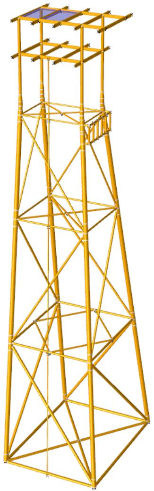  
Figure 15. Sample Jacket Model

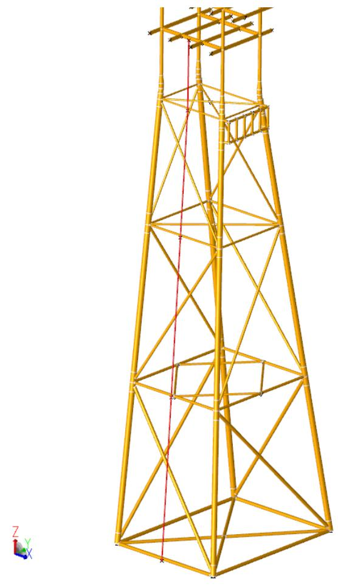

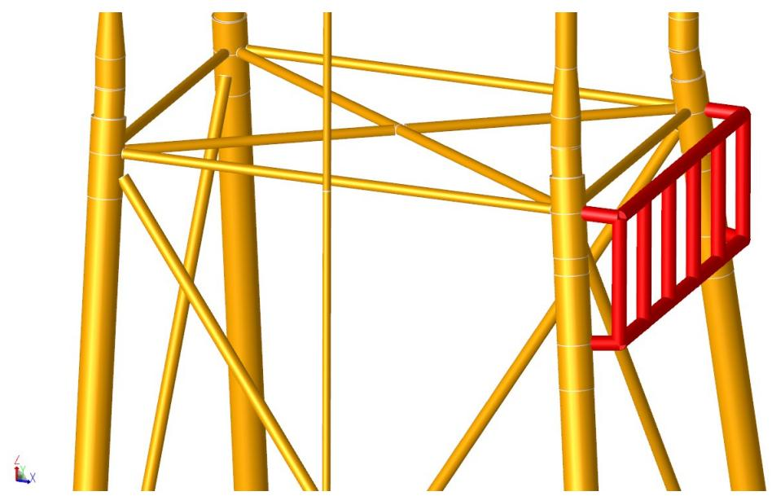  
Figure 16. Riser Model   
Figure 17. Boat Landing Model

The following are the input lines added to the SACS model to account for the riser and boat landing:


|  | 1 | 2 | 3 | 4 | 5 | 6 | 7 | 8 |
| --- | --- | --- | --- | --- | --- | --- | --- | --- |
|  | 1234567890123456789012345678901234567890123456789012345678901234567890123456789012345678901234567890123456789 | 1234567890123456789012345678901234567890123456789012345678901234567890123456789012345678901234567890123456789 | 1234567890123456789012345678901234567890123456789012345678901234567890123456789012345678901234567890123456789 | 1234567890123456789012345678901234567890123456789012345678901234567890123456789012345678901234567890123456789 | 1234567890123456789012345678901234567890123456789012345678901234567890123456789012345678901234567890123456789 | 1234567890123456789012345678901234567890123456789012345678901234567890123456789012345678901234567890123456789 | 1234567890123456789012345678901234567890123456789012345678901234567890123456789012345678901234567890123456789 | 1234567890123456789012345678901234567890123456789012345678901234567890123456789012345678901234567890123456789 |
| 1 | GRUP RS1 | 10.000 | 0.125 | 29.0011.2036.00 | 1 | 1.001.00 | 0.500 | 490.00 |
| 2 | GRUP BL1 | 18.000 | 0.250 | 29.0011.2036.00 | 1 | 1.001.00 | 0.500 | 490.00 |
| 3 |  |  |  |  |  |  |  |  |
| 4 | MEMBER 10011002 RS1 |  |  |  |  |  |  |  |
| 5 | MEMBER 10021003 RS1 |  |  |  |  |  |  |  |
| 6 | MEMBER 10031004 RS1 |  |  |  |  |  |  |  |
| 7 | MEMBER 10041007 RS1 |  |  |  |  |  |  |  |
| 8 | MEMBER 403 2000 BL1 |  |  |  |  |  |  |  |
| 9 | MEMBER 407 2005 BL1 |  |  |  |  |  |  |  |
| 10 | MEMBER 351 2011 BL1 |  |  |  |  |  |  |  |
| 11 | MEMBER 350 2006 BL1 |  |  |  |  |  |  |  |
| 12 | MEMBER 20062000 BL1 |  |  |  |  |  |  |  |
| 13 | MEMBER 20112005 BL1 |  |  |  |  |  |  |  |
| 14 | MEMBER 20002001 BL1 |  |  |  |  |  |  |  |
| 15 | MEMBER 20012002 BL1 |  |  |  |  |  |  |  |
| 16 | MEMBER 20022003 BL1 |  |  |  |  |  |  |  |
| 17 | MEMBER 20032004 BL1 |  |  |  |  |  |  |  |
| 18 | MEMBER 20042005 BL1 |  |  |  |  |  |  |  |
| 19 | MEMBER 20062007 BL1 |  |  |  |  |  |  |  |
| 20 | MEMBER 20072008 BL1 |  |  |  |  |  |  |  |
| 21 | MEMBER 20082009 BL1 |  |  |  |  |  |  |  |
| 22 | MEMBER 20092010 BL1 |  |  |  |  |  |  |  |
| 23 | MEMBER 20102011 BL1 |  |  |  |  |  |  |  |
| 24 | MEMBER 20072001 BL1 |  |  |  |  |  |  |  |
| 25 | MEMBER 20082002 BL1 |  |  |  |  |  |  |  |
| 26 | MEMBER 20092003 BL1 |  |  |  |  |  |  |  |
| 27 | MEMBER 20102004 BL1 |  |  |  |  |  |  |  |
| 28 |  |  |  |  |  |  |  |  |
| 29 | JOINT 1001 | 13. | -53. | -261. | 8.400 | -3.000 |  |  |
| 30 | JOINT 1002 | 8. | -41. | -164. | 10.296 | -1.500 |  |  |
| 31 | JOINT 1003 | 4. | -29. | -69. | 1.200 | -3.000 |  |  |
| 32 | JOINT 1004 | 0. | -19. | 6. | 3.900 | -9.756 | 6.000 |  |
| 33 | JOINT 1007 | 0. | -19. | 50. |  |  |  |  |
| 34 | JOINT 351 | 25. | 18. | -6. | 11.400 | 5.255 | -6.000 |  |
| 35 | JOINT 350 | 25. | -18. | -6. | 11.400 | -5.255 | -6.000 |  |
| 36 | JOINT 2000 | 30. | -16. | 6. |  | -9.756 | 6.000 |  |
| 37 | JOINT 2005 | 30. | 16. | 6. |  | 9.756 | 6.000 |  |
| 38 | JOINT 2011 | 30. | 16. | -6. |  | 9.756 | -6.000 |  |
| 39 | JOINT 2006 | 30. | -16. | -6. |  | -9.756 | -6.000 |  |
| 40 | JOINT 2001 | 30. | -10. | 6. |  | -1.054 | 6.000 |  |
| 41 | JOINT 2002 | 30. | -3. | 6. |  | -4.351 | 6.000 |  |
| 42 | JOINT 2003 | 30. | 3. | 6. |  | 4.351 | 6.000 |  |
| 43 | JOINT 2004 | 30. | 10. | 6. |  | 1.054 | 6.000 |  |
| 44 | JOINT 2007 | 30. | -10. | -6. |  | -1.054 | -6.000 |  |
| 45 | JOINT 2008 | 30. | -3. | -6. |  | -4.351 | -6.000 |  |
| 46 | JOINT 2009 | 30. | 3. | -6. |  | 4.351 | -6.000 |  |
| 47 | JOINT 2010 | 30. | 10. | -6. |  | 1.054 | -6.000 |  |


The following is the Seastate input file. The reader should refer to Sample Problem 1 for discussion of input lines not covered in this section.


|  | 1 | 2 | 3 | 4 | 5 | 6 | 7 | 8 |
| --- | --- | --- | --- | --- | --- | --- | --- | --- |
|  | 123456789012345678901234567890123456789012345678901234567890 | 123456789012345678901234567890123456789012345678901234567890 | 123456789012345678901234567890123456789012345678901234567890 | 123456789012345678901234567890123456789012345678901234567890 | 123456789012345678901234567890123456789012345678901234567890 | 123456789012345678901234567890123456789012345678901234567890 | 123456789012345678901234567890123456789012345678901234567890 | 123456789012345678901234567890123456789012345678901234567890 |
| 1 | LDOPT | NF+Z64.30001490.0500-261.000 | 261.000 | 261.000 | GLOBEN |  | NPNP | K |
| 2 | * SELECTS STATIC ANALYSIS LOAD CASES | * SELECTS STATIC ANALYSIS LOAD CASES | * SELECTS STATIC ANALYSIS LOAD CASES | * SELECTS STATIC ANALYSIS LOAD CASES | * SELECTS STATIC ANALYSIS LOAD CASES | * SELECTS STATIC ANALYSIS LOAD CASES | * SELECTS STATIC ANALYSIS LOAD CASES | * SELECTS STATIC ANALYSIS LOAD CASES |
| 3 | LCSEL ST | OPR1 | OPR2 | OPR3 | STM1 | STM2 | STM3 |  |
| 4 | AMOD | AMOD | AMOD | AMOD | AMOD | AMOD | AMOD | AMOD |
| 5 | AMOD STM1 1.333STM2 1.333STM3 1.333 | AMOD STM1 1.333STM2 1.333STM3 1.333 | AMOD STM1 1.333STM2 1.333STM3 1.333 | AMOD STM1 1.333STM2 1.333STM3 1.333 | AMOD STM1 1.333STM2 1.333STM3 1.333 | AMOD STM1 1.333STM2 1.333STM3 1.333 | AMOD STM1 1.333STM2 1.333STM3 1.333 | AMOD STM1 1.333STM2 1.333STM3 1.333 |
| 6 | * USE LOADING IN SEASTATE INPUT AND MODEL FILE | * USE LOADING IN SEASTATE INPUT AND MODEL FILE | * USE LOADING IN SEASTATE INPUT AND MODEL FILE | * USE LOADING IN SEASTATE INPUT AND MODEL FILE | * USE LOADING IN SEASTATE INPUT AND MODEL FILE | * USE LOADING IN SEASTATE INPUT AND MODEL FILE | * USE LOADING IN SEASTATE INPUT AND MODEL FILE | * USE LOADING IN SEASTATE INPUT AND MODEL FILE |
| 7 | FILE B | FILE B | FILE B | FILE B | FILE B | FILE B | FILE B | FILE B |
| 8 | CDM | CDM | CDM | CDM | CDM | CDM | CDM | CDM |
| 9 | CDM 1.00 | 0.600 | 1.200 | 0.600 | 1.200 | 1.200 | 1.200 | 1.200 |
| 10 | CDM 100.00 | 0.600 | 1.200 | 0.600 | 1.200 | 1.200 | 1.200 | 1.200 |
| 11 | MGROV | MGROV | MGROV | MGROV | MGROV | MGROV | MGROV | MGROV |
| 12 | MGROV 0.000 | 200.000 | 1.000 |  |  |  |  |  |


```txt
13 MGROV 200.000 261.000 2.000   
# 14 GRPOV
15 GRPOVAL LG1 F   
16 GRPOVAL LG2 F   
17 GRPOVAL LG3 F   
18 GRPOV LG4 F   
19 GRPOV PL1NF 0.001 0.001   
20 GRPOV PL2NF 0.001 0.001   
21 GRPOV PL3NF 0.001 0.001   
22 GRPOV PL4NF 0.001 0.001   
23 GRPOV W.BNF 0.001 0.001   
24 DUMMY BOAT BOAT LANDING MODEL   
25 KEEP 350 351 403 407   
26 DELETE 2000 2001 2002 2003 2004 2005 2006 2007 2008 2009 2010 2011   
# 27 DELGRP RS1
28 DELJNT 1001 101 103 1002 212 203 1003 301 303 1004 401 403   
29 DELJNT 1007 714 715   
# 30 REPORT
31 REPLBL RISER RISER LOADING REPORT   
# 32 REPGRP RS1
# 33 REPORT
34 REPLBL BOAT BOAT LANDING LOADING REPORT   
# 35 REPGRP BL1
# 36 LOAD
# 37 LOADCNP000
# 38 WIND
39 WIND 50.000 0.00 AP13   
# 40 WAVE
41 WAVE STRE 20.00 13.00 0.00 L-75.005.00 2OMS1O 1 7   
# 42 CURR
43 CURR 0.000 1.000 0.000 -15.00OBC NL FPS AWP   
44 CURR 261.ooo 2.ooo   
# 45 DEAD
# 46 DEAD -Z M
# 47 LOADCNPo45
# 48 WIND
49 WIND 5O.ooo 45.oo AP13   
# 5O WAVE
51 WAVE STRE 2O.oo 13.oo 45.oo L-75.oo5.oo 2OMS1O 1 7   
# 52 CURR
53 CURR 0.ooo 1.ooo 45.ooo -15.ooOBC NL FPS AWP   
54 CURR 261.ooo 2.ooo 45.ooo   
# 55 DEAD
# 56 DEAD -Z M
# 57 LOADCNPo9O
# 58 WIND
59 WIND 5O.ooo 9O.OO AP13   
# 6O WAVE
61 WAVE STRE 2O.oo 13.oo 9O.OO L-75.oo5.oo 2OMS1O 1 7   
# 62 CURR
63 CURR O.OOO 1.ooo 9O.OO -15.ooOBC NL FPS AWP   
64 CURR 261.ooo 2.ooo 9O.OO   
# 65 DEAD
# 66 DEAD -Z M
# 67 LOADCNSOOO
# 68 WIND
69 WIND 15O.OOO O.OO 266.ooAP13   
# 7O WAVE
71 WAVE STRE 4O.OO266.oo 13.oo L-75.oo5.oo 2OMS1O 1 7   
72 CURR
73 CURR O.OOO I.OOO -15.ooOBC NL FPS AWP   
74 CURR 261.ooo 3.5OO   
75 DEAD
76 DEAD -Z 266.ooo M   
77 LOADCNSO45
78 WIND
79 WIND I5O.OOO O.OO AP13   
8O WAVE
8I WAVE STRE O.OO266.oo I3.oo O.OO L-75.oo5.oo 2OMS1O 1 7
```

```txt
83 CURR 0.000 1.000 45.000 -15.000BC NL FPS AWP   
84 CURR 261.000 3.500 45.000   
85 DEAD
86 DEAD -Z 266.000 M   
87 LOADCNS090
88 WIND
89 WIND 150.000 90.00 266.00AP13   
90 WAVE
91 WAVE STRE 40.00266.00 13.00 90.00 L-75.00 5.00 20MS10 1 7   
92 CURR
93 CURR 0.000 1.000 90.000 -15.000BC NL FPS AWP   
94 CURR 261.000 3.500 90.000   
95 DEAD
96 DEAD -Z 266.000 M   
97 LCOMB
98 \* OPERATIONAL COMBINATIONS   
99 LCOMB OPR1 MISC1.0000EQPT1.0000AREAO.5000LIVE1.000P0001.0000   
100 LCOMB OPR2 MISC1.0000EQPT1.0000AREAO.500O Live1.00OoP451.ooOO   
101 LCOMB OPR3 MISC1.00OoEQT1.0OoOoAREAO.5OoOLive1.ooOoP O9O1.ooOO   
102 \* STORM COMBINATIONS   
103 LCOMB STM1 MISC1.0OooEQPTo.75OOLIVEo.75OoSooo1.ooOO   
104 LCOMB STM2 MISC1.ooooEQPTo.75OOLVEo.75OoS451.ooOO   
105 LCOMB STM3 MISC1.ooooEQPTo.75OOLVEo.75OoS9O1.ooOO   
106 END
107 END
```

The following is a detailed discussion of the input lines specific to this sample problem. For a detailed discussion on the other input lines used in this example, refer to Sample Problem 1. A partial listing of the output file is also included.

A. The FILE input line signals that the SACS IV model input lines are located in a separate file. The name of the file is specified in the run file.   
B. The DUMMY input line allows the specification of non-structural elements. In this sample the dummy structure is a boat landing. The description is placed in cols. 7 - 80.   
C. The KEEP input line is used to designate the boundary joints between the dummy structure (boat landing) and the jacket structure. Joints 303 and 305 are designated as boundary joints. All loads on dummy structure elements will be distributed to these joints for analysis purposes.   
D. All temporary joints of the dummy structure, i.e. joints that will not be passed to SACS IV for the stiffness analysis, are designated on the DELETE input line. Joints 2001, 2002, 2003 and 2004 are deleted from the model.   
E. The DELGRP input line is used delete group RS1 (the riser members) from the model. All loads generated on riser members, are distributed to the joints at the riser member ends.   
F. The DELJNT input line deletes riser joints 1101, 1201, 1301 and 1401 from the model. The loads at these joints are transferred to the nearest point of the jacket structure member designated on this input line. For example, all loads on joint 1101 are transferred to member 101-201.   
G. The REPORT input line designates that a special load report be generated for the specified members, groups or joints.   
H. The REPLBL input line is used to label the special report. The first special report is titled ‘RISER LOADING REPORT’.

I. The REPGRP input line designates that all members assigned group RS1 be included in loading report number 1.

SEASTATE SAMPLE PROBLEM 2

******* JOINTS DELETED FROM SACS DATA ********

JOINT MEMBER LOADED LOAD POINT DELETED J1 J2 FEET FROM JI

1101 101- 201 0.267 1201 201- 301 0.118 1301 301- 401 0.281 1401 301- 401 22.281

********** GROUPS DELETED FROM SACS DATA ********** RS1

********** MEMBERS DELETED FROM SACS DATA ********** 1101-1201 1201-1301 1301-1401

*** DUMMY STRUCTURE DESCRIPTIONS ***

DUMMY STRUCTURE1 BOAT LANDING MODEL

************** INTERFACE JOINTS **************

303305

* INTERNAL JOINTS **

2001 2002 2003 2004

START END START END START END START END START END 2001-2002 2002-2004 2004-2003 2003-2001 303-2001 305-2002 303-2003 305-2004

REPORT GROUP 1 RISER LOADING REPORT

*★* ****** MEMBERS INCLUDED ****** ★**★

START END START END START END START END START END 1101-1201 1201-1301 1301-1401

REPORT GROUP 2 BOAT LANDING LOADING REPORT

********* *********** MEMBERS INCLUDED *******************

START END START END START END START END START END 2001-2002 2002-2004 2004-2003 2003-2001 303-2001

**WAVE DESCRIPTION FOR LOAD CASE1 **

WAVE THEORY ************ AIRY

WAVE HEIGHT ************ 18.000 FT

WATER DEPTH ************ 82.020 FT

WAVE PERTOD ************ 8.000 SECS

WAVE LENGTH ************305.921 FT

ANGLE FROM X TOWARD Y ** 0.000 DEGREES

MUDLINE ELEVATION ******-82.020 FT

WAVE CELERITY ********** 38.240 FT/SEC

MAX．NO．SEG/MEMBER****

MIN．NO．SEG/MEMBER****

CREST POSITION DETERMINED BY MAXIMUM SHEAR

STARTING CREST POSITION 0.000 FT

NO.STEPS *********

STEP SIZE ************** 16.996 FT

CONVECTIVE ACCELERATION TERMS EXCLUDED

CREST WATER DEPTH ****** 91.02 FT

TROUGH WATER DEPTH ***** 73.02 FT

**** SEASTATE LOADS FOR WAVE PASSING THROUGH STRUCTURE ****

LOAD CREST MUDLINE ONDITION POSITION LOAD ELEVATION

MAXIMUM MOMENT

ABOUT MUDLINE

MAXIMUM SHEAR

AT MUDLINE

MINIMUM MOMENT

ABOUT MUDLINE

MINIMUM SHEAR

AT MUDLINE

MAXIMUM FORCE

UPWARD

MAXIMUM FORCE

DOWNWARD

## 305.92

## 305.92

## 152.96

## 152.96

## 237.94

## 67.98

## 43620.000 FT-KIPS

## 828.110 KIPS

## 7806.634 FT-KIPS

## 193.675 KIPS

## 48.122 KIPS

-53.875 KIPS

-82.020 FT.

-82.020 FT.

-82.020 FT.

-82.020 FT.

-82.020 FT.

-82.020 FT.

***** LOAD CASE GENERATED FOR WAVE CREST POSITION RESULTING IN THE MAXIMUM SHEAR AT MUDLINE ★***★*

```txt
SUMMATION OF LOADS ON REPORT GROUP 1  
RISER LOADING REPORT FORCE IN X DIRECTION 34.244 KIPS Y 11.163 KIPS Z -4.572 KIPS MOMENT ABOUT X AXIS -551.589 FT-K Y 1880.849 FT-K Z 315.267 FT-K DEAD LOAD 5.046 KIPS CENTER OF GRAVITY X -14.698 FT. Y -14.698 FT. Z -31.383 FT. BUOYANCY LOAD 5.207 KIPS CENTER OF BUOYANCY X -15.130 FT. Y -15.130 FT. Z -36.453 FT. SUMMATION OF LOADS ON REPORT GROUP 2  
BOAT LANDING LOADING REPORT FORCE IN X DIRECTION 28.166 KIPS Y 3.832 KIPS Z 2.229 KIPS MOMENT ABOUT X AXIS -300.508 FT-K Y 2164.452 FT-K Z 33.373 FT-K DEAD LOAD 3.682 KIPS CENTER OF GRAVITY X 12.393 FT. Y 0.000 FT. Z -4.165 FT. BUOYANCY LOAD 3.201 KIPS CENTER OF BUOYANCY X 12.393 FT. Y 0.000 FT. Z -4.165 FT. SUMMATION OF LOADS ON DUMMY STRUCTURE 1  
BOAT LANDING MODEL FORCE IN X DIRECTION 28.166 KIPS Y 3.832 KIPS Z 2.229 KIPS MOMENT ABOUT X AXIS -300.508 FT-K Y 2164.452 FT-K Z 33.373 FT-K DEAD LOAD 3.682 KIPS CENTER OF GRAVITY X 12.393 FT. Y 0.0o0 FT. Z -4.165 FT. BUOYANCY LOAD 3.201 KIPS CENTER OF BUOYANCY X 12.393 FT. 
```

**** RESULTS FOR LOAD CASE 1****

**** SUMMATION OF FORCES AND MOMENTS FOR LOAD CASE1 ****

(MOMENTS ABOUT MUDLINE AT ELEVATION-82.02 FT．)


|  | SUM FX KIPS | SUM FY KIPS | SUM FZ KIPS | SUM MX FT-K | SUM MY FT-K | SUM MZ FT-K |
| --- | --- | --- | --- | --- | --- | --- |
| MEMBER WIND | 0.800 | 0.141 | 0.000 | -13.595 | 77.100 | 0.566 |
| AREA WIND | 0.000 | 2.428 | 0.000 | -261.813 | 0.000 | -4.483 |
| UNDERWATER DRAG AREA | 7.566 | 15.105 | 0.000 | -1274.093 | 638.246 | 144.934 |
| SEASTATE GENERATED | 786.254 | 264.893 | -566.210 | -14012.930 | 41489.140 | 489.092 |
| USER INPUT | 0.000 | 0.000 | 0.000 | 0.000 | 0.000 | 0.000 |


+++ ********** REPORT GROUP LOAD SUMMATIONS *********

REPORT LOAD FX FY FZ MX MY MZ ********** DESCRIPTIONS ***★**★**★*★*** *******


| GROUP 1 | CASE 1 | (KIPS) 34.2 | (KIPS) 11.2 | (KIPS) -4.6 | (FT-KIPS) -551.6 | (FT-KIPS) 1880.8 | (FT-KIPS) 315.3 | RISER LOADING REPORT | RISER LOADING REPORT |
| --- | --- | --- | --- | --- | --- | --- | --- | --- | --- |
| GROUP 1 | CASE 1 | (KIPS) 34.2 | (KIPS) 11.2 | (KIPS) -4.6 | (FT-KIPS) -551.6 | (FT-KIPS) 1880.8 | (FT-KIPS) 315.3 | DEAD + 18.0 FT WAVE AT 0.0 DEG + CURRENT + WIND | DEAD + 18.0 FT WAVE AT 0.0 DEG + CURRENT + WIND |
| 2 |  |  |  |  |  |  |  | BOAT LANDING LOADING REPORT | BOAT LANDING LOADING REPORT |
|  | 1 | 28.2 | 3.8 | 2.2 | -300.5 | 2164.5 | 33.4 | DEAD + 18.0 FT WAVE AT 0.0 DEG + CURRENT + WIND | DEAD + 18.0 FT WAVE AT 0.0 DEG + CURRENT + WIND |


## 7.3 TRANSFER FUNCTION GENERATION

This sample problem generates a global base shear transfer function for the structure utilizing the GNTRF input line. The input file is the same used in Sample Problem 2 except that load case 1 contains only the GNTRF input line.

The following is the Seastate input file used to generate the base shear transfer function.


|  | 1 | 2 | 3 | 4 | 5 | 6 | 7 | 8 |
| --- | --- | --- | --- | --- | --- | --- | --- | --- |
| 1234567890123456789012345678901234567890123456789012345678901234567890 | 1234567890123456789012345678901234567890123456789012345678901234567890 | 1234567890123456789012345678901234567890123456789012345678901234567890 | 1234567890123456789012345678901234567890123456789012345678901234567890 | 1234567890123456789012345678901234567890123456789012345678901234567890 | 1234567890123456789012345678901234567890123456789012345678901234567890 | 1234567890123456789012345678901234567890123456789012345678901234567890 | 1234567890123456789012345678901234567890123456789012345678901234567890 | 1234567890123456789012345678901234567890123456789012345678901234567890 |
| LDOPT | NF+Z | 64.20 | 490.00 | -82.02 | 82.02 |  | NP | K |
| SEASTATE | SAMPLE | PROBLEM | 4 |  |  |  |  |  |
| FILE |  |  |  |  |  |  |  |  |
| AREA |  |  |  |  |  |  |  |  |
| AREAS | 516.7 |  | -9.84 | -29.53 | 26.25 | 1.50 | 461 | 463 |
| AREAS | 193.7 |  | 19.69 | -29.53 | 24.61 | 1.50 | 463 | 464 |
| AREAE | 290.6 |  | 29.53 | -14.76 | 24.61 | 1.50 | 464 | 465 |
| AREAE | 387.5 |  | 29.53 | 14.76 | 26.25 | 1.50 | 465 | 466 |
| AREAB | 43.1 | 86.1 |  | -16.40 | 1.64 | 0.70 | 301 | 303 |
| AREAB | 10.8 | 21.5 |  | 6.56 | -16.40 | 4.92 | 0.70 | 301 |
| AREAB | 141.3 | 282.5 |  | -16.40 | 1.64 | 2.00 | 301 | 303 |
| AREAB | 35.3 | 70.6 |  | 6.56 | -16.40 | 4.92 | 2.00 | 301 |
| CDM |  |  |  |  |  |  |  |  |
| CDM | 11.81 | 1.000 |  | 1.400 | 1.200 |  | 1.400 |  |
| CDM | 23.62 | 1.000 |  | 1.500 | 1.200 |  | 1.500 |  |
| CDM | 47.24 | 1.000 |  | 1.600 | 1.200 |  | 1.600 |  |
| CDM | 70.87 | 1.000 |  | 1.700 | 1.200 |  | 1.700 |  |
| MGROV |  |  |  |  |  |  |  |  |
| MGROV |  | 26.247 |  |  |  |  |  |  |
| MGROV | 26.247 | 52.493 | 0.984 |  |  |  |  |  |
| MGROV | 52.493 | 82.021 | 1.969 |  |  |  |  |  |
| GRPOV |  |  |  |  |  |  |  |  |
| GRPOV |  | LG1 F |  |  |  |  |  |  |
| GRPOV |  | LG1 F |  |  |  |  |  |  |
| GRPOV |  | LG2 F |  |  |  |  |  |  |
| GRPOV |  | PL1 F |  |  | 0.001 | 0.001 |  |  |
| GRPOV |  | PL2 F |  |  | 0.001 | 0.001 |  |  |
| GRPOV |  | PL3 F |  |  |  |  |  |  |
| GRPOV |  | DK1 |  |  | 0.001 | 0.001 |  |  |
| GRPOV |  | DK2 |  |  | 0.001 | 0.001 |  |  |
| GRPOV |  | WSB F | 0.001 | 0.001 | 0.001 | 0.001 |  |  |
| LOAD |  |  |  |  |  |  |  |  |
| LOADCN | 1 | 1.40 | 1.70 |  |  |  |  |  |
| A | GNTRF | 19 | 0.05 | 10.0 | 0.5 | 0.0 |  |  |
| END |  |  |  |  |  |  |  |  |


The area, member and group override, coefficient of drag and mass, wind, current and dead input lines are explained in Sample Problems 1 and 2. In this sample the WAVE input line has been replaced with the GNTRF input line.

The GNTRF input line specifies the following:

A. Cols 12-13 contain the number of points on the transfer function which is 19 in this sample.

B. Wave steepness of 1/20 is specified in cols 14-20.   
C. The beginning wave period is 10.0 seconds, cols 21-26.   
D. The period step size is 0.5 seconds, cols 27-32.   
E. The wave direction of 0 degrees is input in cols 46-51.

Below is the neutral picture plot of the base shear transfer function created by Seastate.

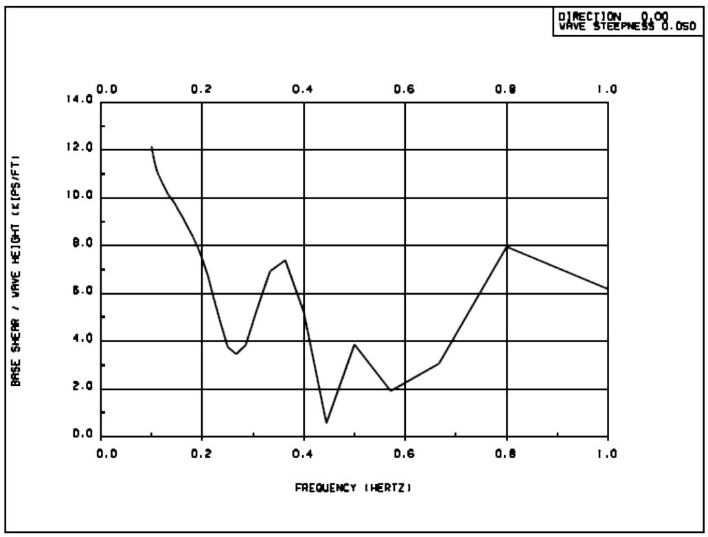

## 7.4 USER-DEFINED WAVE

This sample problem illustrates the use of Seastate’s user defined wave capabilities. Typically these input lines are used when the user desires to load the structure with forces resulting from empirically defined velocities and accelerations, or pressures.

This sample also utilizes separate files for the environmental input lines and the SACS IV model. The following is the Seastate input file used to generate the environmental loading. The model is the same model used in Sample Problems 1, 2 and 3.


|  | 1 | 2 | 3 | 4 | 5 | 6 | 7 | 8 |  |
| --- | --- | --- | --- | --- | --- | --- | --- | --- | --- |
| 12345678901234567890123456789012345678901234567890123456789012345678901234567890 | 12345678901234567890123456789012345678901234567890123456789012345678901234567890 | 12345678901234567890123456789012345678901234567890123456789012345678901234567890 | 12345678901234567890123456789012345678901234567890123456789012345678901234567890 | 12345678901234567890123456789012345678901234567890123456789012345678901234567890 | 12345678901234567890123456789012345678901234567890123456789012345678901234567890 | 12345678901234567890123456789012345678901234567890123456789012345678901234567890 | 12345678901234567890123456789012345678901234567890123456789012345678901234567890 | 12345678901234567890123456789012345678901234567890123456789012345678901234567890 |  |
| LDOPT | NF+Z | 64.20 | 490.00 | -82.02 | 82.02 |  | CMB | NP | K |
| SEASTATE | SAMPLE | PROBLEM | 3 |  |  |  |  |  |  |
| A | FILE |  |  |  |  |  |  |  |  |
| CDM |  |  |  |  |  |  |  |  |  |
| CDM | 12.00 | 1.000 | 1.400 |  | 1.200 | 1.400 |  |  |  |
| CDM | 70.00 | 1.000 | 1.400 |  | 1.200 | 1.400 |  |  |  |
| MGROV |  |  |  |  |  |  |  |  |  |
| MGROV |  | 82.02 | 2.0 |  |  |  |  |  |  |
| GRPOV |  |  |  |  |  |  |  |  |  |
| GRPOV |  | PL1 F |  |  | 0.001 | 0.001 |  |  |  |
| GRPOV |  | PL2 F |  |  | 0.001 | 0.001 |  |  |  |
| GRPOV |  | PL3 F |  |  |  |  |  |  |  |
| GRPOV |  | WSB F |  | 0.001 | 0.001 | 0.001 |  |  |  |
| LOAD |  |  |  |  |  |  |  |  |  |
| LOADCN | 1 | 1.40 | 1.70 |  |  |  |  |  |  |
| WAVE |  |  |  |  |  |  |  |  |  |
| B | WAVE | LINE |  | 0.0 |  | L-70.0 | 10.0 | 9MS10 | 1 1 7 |
| C | WAVE | V HEADHALF | 10 10 |  |  |  |  |  |  |
| D | WAVE | XLOC0.0 | 20.0 | 40.0 | 60.0 | 80.0 | 100. | 120. | 160. |
| E | WAVE | YLOC0.0 | 21.0 | 41.0 | 59.0 | 74.0 | 84.0 | 92.0 | 99.0 |
| F | WAVE | SURF100. | 99.3 | 97.3 | 94.0 | 87.0 | 77.0 | 70.0 | 66.7 |
| G | WAVE | DRAG8.0 | 10.0 | 12.0 | 15.0 | 18.0 | 20.5 | 21.8 | 24.0 |
|  | WAVE | DRAG7.0 | 9.0 | 11.0 | 14.0 | 17.0 | 19.5 | 20.8 | 21.0 |
|  | WAVE | DRAG2.0 | 3.0 | 6.0 | 9.0 | 11.0 | 14.5 | 15.8 | 17.0 |
|  | WAVE | DRAG1.0 | 2.0 | 4.0 | 6.0 | 8.0 | 9.5 | 10.8 |  |
|  | WAVE | DRAG-0.5 | -1.0 | -2.0 | -3.0 | -4.5 | -6.8 |  |  |
|  | WAVE | DRAG-1.5 | -2.0 | -3.0 | -5.4 | -7.2 |  |  |  |
|  | WAVE | DRAG-2.5 | -3.7 | -6.0 | -9.4 |  |  |  |  |
|  | WAVE | DRAG-3.0 | -4.9 | -7.5 | -10.8 |  |  |  |  |
|  | WAVE | DRAG-4.7 | -6.9 | -9.5 | -13.8 |  |  |  |  |
|  | WAVE | DRAG-6.7 | -8.9 | -14.5 | -17.8 |  |  |  |  |
| H | WAVE | INER0.0 | 0.0 | 0.0 | 0.0 | 0.0 | 0.0 | 0.0 | 0.0 |
|  | WAVE | INER1.5 | 3.0 | 5.0 | 7.0 | 8.0 | 8.6 | 9.1 | 9.4 |
|  | WAVE | INER3.0 | 5.0 | 8.0 | 10.5 | 12.5 | 14.0 | 15.0 | 15.5 |
|  | WAVE | INER4.0 | 5.5 | 9.0 | 11.5 | 13.3 | 15.1 | 17.0 |  |
|  | WAVE | INER5.0 | 7.0 | 10.5 | 12.5 | 15.3 | 18.1 |  |  |
|  | WAVE | INER4.0 | 5.5 | 9.0 | 11.5 | 14.3 |  |  |  |
|  | WAVE | INER3.0 | 5.5 | 8.0 | 10.0 |  |  |  |  |
|  | WAVE | INER1.0 | 3.0 | 5.0 | 7.0 |  |  |  |  |
|  | WAVE | INER0.5 | 2.0 | 3.5 | 4.5 |  |  |  |  |
|  | WAVE | INER0.0 | 0.0 | 0.0 | 0.0 |  |  |  |  |
| I | WAVE | DRAG0.0 | 0.0 | 0.0 | 0.0 | 0.0 | 0.0 | 0.0 | 0.0 |
|  | WAVE | DRAG0.0 | 1.5 | 2.5 | 3.5 | 4.0 | 4.3 | 4.5 | 4.8 |
|  | WAVE | DRAG0.0 | 2.0 | 4.0 | 5.2 | 6.2 | 7.0 | 7.5 | 6.8 |
|  | WAVE | DRAG0.0 | 2.7 | 4.5 | 5.8 | 6.7 | 7.6 | 8.5 |  |
|  | WAVE | DRAG0.0 | 3.4 | 5.7 | 6.3 | 7.7 | 9.1 |  |  |
|  | WAVE | DRAG0.0 | 2.8 | 4.5 | 6.8 | 7.2 |  |  |  |
|  | WAVE | DRAG0.0 | 2.7 | 4.0 | 5.0 |  |  |  |  |
|  | WAVE | DRAG0.0 | 1.5 | 2.5 | 3.5 |  |  |  |  |
|  | WAVE | DRAG0.0 | 1.0 | 1.8 | 2.2 |  |  |  |  |
|  | WAVE | DRAG0.0 | 0.0 | 0.0 | 0.0 |  |  |  |  |
| J | WAVE | INER 0.0 | -2.5 | -3.0 | -3.6 | -4.5 | -5.2 | -5.5 | -6.0 |
|  | WAVE | INER 0.0 | -2.3 | -2.7 | -3.5 | -4.2 | -4.9 | -5.2 | -5.5 |
|  | WAVE | INER 0.0 | -1.5 | -2.0 | -2.7 | -3.0 | -3.3 | -3.5 | -3.6 |
|  | WAVE | INER 0.0 | -0.5 | -1.0 | -1.3 | -1.8 | -2.0 | -2.1 |  |
|  | WAVE | INER 0.0 | -0.2 | -0.3 | -0.5 | -0.7 | -1.0 |  |  |
|  | WAVE | INER 0.0 | 0.8 | 1.0 | 1.3 | 1.8 |  |  |  |


|  | 1 | 2 | 3 | 4 | 5 | 6 | 7 | 8 |
| --- | --- | --- | --- | --- | --- | --- | --- | --- |
| 12345678901234567890123456789012345678901234567890123456789012345678901234567890 | 12345678901234567890123456789012345678901234567890123456789012345678901234567890 | 12345678901234567890123456789012345678901234567890123456789012345678901234567890 | 12345678901234567890123456789012345678901234567890123456789012345678901234567890 | 12345678901234567890123456789012345678901234567890123456789012345678901234567890 | 12345678901234567890123456789012345678901234567890123456789012345678901234567890 | 12345678901234567890123456789012345678901234567890123456789012345678901234567890 | 12345678901234567890123456789012345678901234567890123456789012345678901234567890 | 12345678901234567890123456789012345678901234567890123456789012345678901234567890 |
| WAVE | INER 0.0 | 1.1 | 1.7 | 2.4 |  |  |  |  |
| WAVE | INER 0.0 | 1.5 | 2.5 | 3.5 |  |  |  |  |
| WAVE | INER 0.0 | 2.1 | 2.9 | 4.4 |  |  |  |  |
| WAVE | INER 0.0 | 3.0 | 4.1 | 5.4 |  |  |  |  |
| CURR |  |  |  |  |  |  |  |  |
| CURR | 0.0 | 3.0 | 25.0 |  |  |  |  |  |
| CURR | 10.0 | 4.0 |  |  |  |  |  |  |
| CURR | 25.0 | 8.0 |  |  |  |  |  |  |
| DEAD |  |  |  |  |  |  |  |  |
| DEAD | -Z |  |  |  | R |  |  |  |
| END |  |  |  |  |  |  |  |  |


The following is a detailed discussion of the input lines specific to this sample problem. For a detailed discussion on the other input lines used in this example, refer to Sample Problem 1.

A. The FILE input line signals that the SACS IV model input lines are located in a separate file. The name of the file is specified in the run file.   
B. The first WAVE input line specifies the following:

a. User defined wave, LINE in cols. 9-12.   
b. Wave direction is 0 degrees cols 39-44.   
c. Initial crest position is -70.0 cols 52-58.   
d. Wave steps are by length and are 10 feet, col 51 and cols 59-64.   
e. Calculate for 9 steps, col 59.   
f. Save loading for position of maximum base shear.

C. The WAVE input line labeled HEAD specifies the following:

a. Vertical components of velocity and acceleration are included, V in col 9.   
b. Half of one wave period is to be input, HALF in cols 15-18.   
## c. 10 vertical levels and 10 horizontal grid stations will be specified, cols 19-22 & 23-26 respectively.

D. The WAVE input line labeled XLOC specifies the grid station locations. This example specifies grid locations at 0, 20, 40, 60, 80, 100, 120, 140, 160 and 180 feet.   
E. The WAVE input line labeled YLOC specifies the vertical levels of the grid points. This example specifies levels at 0, 21, 41, 59, 74, 84, 92, 97, 99, and 100 feet.   
F. The WAVE input line labeled SURF specifies the wave surface elevation at each grid station.   
G. The first set of WAVE DRAG input lines specify the fluid particle horizontal velocities at each grid point. Each input line represents one horizontal grid station. No data is entered for grid points above the wave surface elevation.

H. The first set of WAVE INER input lines specify the fluid particle horizontal accelerations at each grid point. Each input line represents one horizontal grid station. No data is entered for points above the surface elevation.

I. The second set of WAVE DRAG input lines specify the fluid particle vertical velocities at each grid point. Each input line represents one horizontal grid station. No data is entered for grid points above the wave surface elevation.   
J. The second set of WAVE INER input lines specify the fluid particle vertical acceleration at each grid point. Each input line represents one horizontal grid station. No data is entered for grid points above the wave surface elevation.

The following is selected output generated from this sample problem.

SEASTATE SAMPLE PROBLEM 3

```txt
WAVE DESCRIPTION FOR LOAD CASE 1****  
WAVE THEORY CARD INPUT  
WAVE HEIGHT 36.000 FT  
WATER DEPTH 82.020 FT  
WAVE PERIOD 0.000 SECS  
WAVE LENGTH 360.000 FT  
ANGLE FROM X TOWARD Y ** 0.000 DEGREE  
MUDLINE ELEVATION -82.020 FT  
WAVE CELERITY 0.000 FT/SE  
MAX.NO.SEG/MEMBER 10  
MIN.NO.SEG/MEMBER 1  
CREST POSITION DETERMINED BY MAXIMUM SH  
STARTING CREST POSITION -70.000 FT  
NO.STEPS 9  
STEP SIZE 10.000 FT  
CREST WATER DEPTH 100.00 FT  
TROUGH WATER DEPTH 64.00 FT
```

SEASTATE SAMPLE PROBLEM 3

**** SHEAR AND MOMENT AT MUDLINE VERSUS WAVE POSITION *****DEAD+ 36.0 FT WAVE AT 0.0 DEG + CURRENT


| STEP NO. | CREST POSITION | SHEAR KIPS | SHEAR DIRECTION | MOMENT FT-KIPS | MOMENT DIRECTION |
| --- | --- | --- | --- | --- | --- |
| 1 | -70.00 | 717.898 | 17.565 | 35371.820 | 106.980 |
| 2 | -60.00 | 912.101 | 16.040 | 47221.070 | 105.328 |
| 3 | -50.00 | 1167.769 | 14.355 | 62172.360 | 103.630 |
| 4 | -40.00 | 1404.216 | 13.172 | 74550.700 | 102.574 |
| 5 | -30.00 | 1630.914 | 12.389 | 87525.070 | 101.757 |
| 6 | -20.00 | 1813.717 | 11.888 | 97170.040 | 101.320 |
| 7 | -10.00 | 1962.478 | 11.573 | 105029.400 | 101.007 |
| 8 | 0.00 | 1987.502 | 11.576 | 105171.800 | 101.097 |
| 9 | 10.00 | 1896.969 | 11.979 | 101491.600 | 101.396 |
| 10 | 20.00 | 1691.905 | 12.757 | 90718.010 | 102.137 |


**** SEASTATE LOADS FOR WAVE PASSING THROUGH STRUCTURE ****

DEAD+36.0FT WAVEAT0.0DEG+CURRENT

LOAD

CONDITION

CREST

POSITION

LOAD

MAXIMUM MOMENT

ABOUT MUDLINE

## 105171.800 FT-KIPS

MUDLINE

ELEVATION

-82.020 FT.


| MAXIMUM SHEAR ABOUT MUDLINE | 0.00 | 1987.502 KIPS | -82.020 FT. |  |  |
| --- | --- | --- | --- | --- | --- |
| MINIMUM MOMENT ABOUT MUDLINE | -70.00 | 35371.820 FT-KIPS | -82.020 FT. |  |  |
| MINIMUM SHEAR AT MUDLINE | -70.00 | 717.898 KIPS | -82.020 FT. |  |  |
| MAXIMUM FORCE UPWARD | -50.00 | 81.824 KIPS | -82.020 FT. |  |  |
| MAXIMUM FORCE DOWNWARD | 20.00 | -52.819 KIPS | -82.020 FT. |  |  |
| ***** LOAD CASE GENERATED FOR WAVE CREST POSITION RESULTING IN THE MAXIMUM SHEAR AT MUDLINE***** | ***** LOAD CASE GENERATED FOR WAVE CREST POSITION RESULTING IN THE MAXIMUM SHEAR AT MUDLINE***** | ***** LOAD CASE GENERATED FOR WAVE CREST POSITION RESULTING IN THE MAXIMUM SHEAR AT MUDLINE***** | ***** LOAD CASE GENERATED FOR WAVE CREST POSITION RESULTING IN THE MAXIMUM SHEAR AT MUDLINE***** | ***** LOAD CASE GENERATED FOR WAVE CREST POSITION RESULTING IN THE MAXIMUM SHEAR AT MUDLINE***** | ***** LOAD CASE GENERATED FOR WAVE CREST POSITION RESULTING IN THE MAXIMUM SHEAR AT MUDLINE***** |
| ********** EDI/SACS IV SEASTATE PROGRAM*****DATE 14-APR-1992 TIME 14:13:32 SEA PAGE 13 | ********** EDI/SACS IV SEASTATE PROGRAM*****DATE 14-APR-1992 TIME 14:13:32 SEA PAGE 13 | ********** EDI/SACS IV SEASTATE PROGRAM*****DATE 14-APR-1992 TIME 14:13:32 SEA PAGE 13 | ********** EDI/SACS IV SEASTATE PROGRAM*****DATE 14-APR-1992 TIME 14:13:32 SEA PAGE 13 | ********** EDI/SACS IV SEASTATE PROGRAM*****DATE 14-APR-1992 TIME 14:13:32 SEA PAGE 13 | ********** EDI/SACS IV SEASTATE PROGRAM*****DATE 14-APR-1992 TIME 14:13:32 SEA PAGE 13 |
| SEASTATE SAMPLE PROBLEM 3 ***** RESULTS FOR LOAD CASE 1***** | SEASTATE SAMPLE PROBLEM 3 ***** RESULTS FOR LOAD CASE 1***** | SEASTATE SAMPLE PROBLEM 3 ***** RESULTS FOR LOAD CASE 1***** | SEASTATE SAMPLE PROBLEM 3 ***** RESULTS FOR LOAD CASE 1***** | SEASTATE SAMPLE PROBLEM 3 ***** RESULTS FOR LOAD CASE 1***** | SEASTATE SAMPLE PROBLEM 3 ***** RESULTS FOR LOAD CASE 1***** |
| DEAD + 36.0 FT WAVE AT 0.0 DEG + CURRENT | DEAD + 36.0 FT WAVE AT 0.0 DEG + CURRENT | DEAD + 36.0 FT WAVE AT 0.0 DEG + CURRENT | DEAD + 36.0 FT WAVE AT 0.0 DEG + CURRENT | DEAD + 36.0 FT WAVE AT 0.0 DEG + CURRENT | DEAD + 36.0 FT WAVE AT 0.0 DEG + CURRENT |
| ***** SUMMARY OF SEASTATE GENERATED DEAD AND BUOYANCY LOADS***** | ***** SUMMARY OF SEASTATE GENERATED DEAD AND BUOYANCY LOADS***** | ***** SUMMARY OF SEASTATE GENERATED DEAD AND BUOYANCY LOADS***** | ***** SUMMARY OF SEASTATE GENERATED DEAD AND BUOYANCY LOADS***** | ***** SUMMARY OF SEASTATE GENERATED DEAD AND BUOYANCY LOADS***** | ***** SUMMARY OF SEASTATE GENERATED DEAD AND BUOYANCY LOADS***** |
| WATER Depth = 82.020 FT. DEAD WEIGHT (WEIGHT IN AIR) = 719.588 KIPS BUOYANCY LOAD (DISPLACEMENT) = 265.134 KIPS | WATER Depth = 82.020 FT. DEAD WEIGHT (WEIGHT IN AIR) = 719.588 KIPS BUOYANCY LOAD (DISPLACEMENT) = 265.134 KIPS | WATER Depth = 82.020 FT. DEAD WEIGHT (WEIGHT IN AIR) = 719.588 KIPS BUOYANCY LOAD (DISPLACEMENT) = 265.134 KIPS | WATER Depth = 82.020 FT. DEAD WEIGHT (WEIGHT IN AIR) = 719.588 KIPS BUOYANCY LOAD (DISPLACEMENT) = 265.134 KIPS | WATER Depth = 82.020 FT. DEAD WEIGHT (WEIGHT IN AIR) = 719.588 KIPS BUOYANCY LOAD (DISPLACEMENT) = 265.134 KIPS | WATER Depth = 82.020 FT. DEAD WEIGHT (WEIGHT IN AIR) = 719.588 KIPS BUOYANCY LOAD (DISPLACEMENT) = 265.134 KIPS |
| ***** SUMMATION OF FORCES AND MOMENTS FOR LOAD CASE 1***** | ***** SUMMATION OF FORCES AND MOMENTS FOR LOAD CASE 1***** | ***** SUMMATION OF FORCES AND MOMENTS FOR LOAD CASE 1***** | ***** SUMMATION OF FORCES AND MOMENTS FOR LOAD CASE 1***** | ***** SUMMATION OF FORCES AND MOMENTS FOR LOAD CASE 1***** | ***** SUMMATION OF FORCES AND MOMENTS FOR LOAD CASE 1***** |
| (MOMENTS ABOUT MUDLINE AT ELEVATION -82.02 FT.) | (MOMENTS ABOUT MUDLINE AT ELEVATION -82.02 FT.) | (MOMENTS ABOUT MUDLINE AT ELEVATION -82.02 FT.) | (MOMENTS ABOUT MUDLINE AT ELEVATION -82.02 FT.) | (MOMENTS ABOUT MUDLINE AT ELEVATION -82.02 FT.) | (MOMENTS ABOUT MUDLINE AT ELEVATION -82.02 FT.) |
| SUM FX KIPS | SUM FY KIPS | SUM FZ KIPS | SUM MX FT-K | SUM MY FT-K | SUM MZ FT-K |
| SEASTATE GENERATED USER INPUT | 1936.820 0.000 | 397.108 0.000 | -474.893 0.000 | -20247.390 0.000 | 103226.500 0.000 |
| ***** SEASTATE BASIC LOAD CASE SUMMARY***** | ***** SEASTATE BASIC LOAD CASE SUMMARY***** | ***** SEASTATE BASIC LOAD CASE SUMMARY***** | ***** SEASTATE BASIC LOAD CASE SUMMARY***** | ***** SEASTATE BASIC LOAD CASE SUMMARY***** | ***** SEASTATE BASIC LOAD CASE SUMMARY***** |
| LOAD CASE | FX (KIPS) | FY (KIPS) | FZ (KIPS) | MX (FT-KIPS) | MY (FT-KIPS) |


8 INPUT LINES

API 2MET DEAD LOAD AND BUOYANCY OVERRIDE LINE

COLUMNS

COMMENTARY

GENERAL THIS LINE IS ENTERED AFTER THE '2MET' LINE TO OVERRIDETHE DEAD AND BUOYANCY PROPERTIES.

THESE LINES ARE USED TO INCLUDE DEAD LOAD AND BUOYANCY IN THE MEMBER DISTRIBUTED LOADS. THE USER HAS THE OPTION OF ACCOUNTING FOR BUOYANCY BY EITHER OF TWO METHODS, THE 'MARINE' METHOD OR THE 'RATIONAL' METHOD. IN THE MARINE METHOD THE 'SUBMERGED WEIGHT' OF THE MEMBER IS CALCULATED EQUAL TO THE MEMBER WEIGHT REDUCED BY THE WEIGHT OF THE DISPLACED WATER. THIS DISTRIBUTED LOAD IS APPLIED VERTICALLY. IN THE RATIONAL METHOD MEMBER BUOYANCY IS APPLIED AS A UNIFORM LOAD PERPENDICULAR TO THE MEMBER AND IN A VERTICAL PLANE. IN ADDITION CONCENTRATED LOADS ARE APPLIED TO THE SUBMERGED JOINTS IN THE DIRECTIONS OF THE AXES OF ALL MEMBERS MEETING AT THE RESPECTIVE JOINTS. SEE THE ACCOMPANYING FIGURES.

IF THERE IS MUD-FLOW INPUT FOR THIS LOAD CASE NO BUOYANCY LOADS WILL BE CALCULATED FOR MEMBERS BELOW THE TOP SURFACE OF THE MUD-FLOW.

( 1- 4) ENTER 'DEAD' ON ALL LINES IN THIS SET. THE FIRST LINE IS A HEADER LINE AND CONTAINS ONLY THIS ENTRY.

COLUMNS

COMMENTARY

(11-12) ENTER THE DIRECTION OF GRAVITY. OPTIONS ARE:

+ OR - X

+ OR - Y

+ OR - Z

(15-44) ENTER THE INDICATED VARIABLES IF DIFFERENT FROM THEIR PRIOR VALUES.   
(15-17) ENTER 'FLD' IF ALL MEMBERS ARE FLOODED. ENTER 'NFL' IF ALL MEMBERS ARE NON-FLOODED.   
( 45 ) ENTER 'M' IF BUOYANCY IS TO BE CALCULATED BY THE 'MARINE' METHOD. ENTER 'R' IF IT IS TO BE CALCULATED BY THE 'RATIONAL' METHOD. ENTER 'A' IF USING THE 'RATIONAL' METHOD WITH PRESSURE DUE TO WAVE HEIGHT ATTENUATED WITH DEPTH ACCORDING TO EQ. 3.2.5-3 IN API 20TH EDITION. ENTER 'P' IF USING THE 'RATIONAL' METHOD WITH PRESSURE DUE TO WAVE HEIGHT ATTENUATED WITH DEPTH ABOVE MUDLINE AND PRESSURE DUE TO STILL WATER DEPTH BELOW THE MUDLINE. IF LEFT BLANK THE 'MARINE' METHOD WILL BE USED.   
(47-49) ENTER 'BML' TO INCLUDE BUOYANCY OF ELEMENTS BELOW THE MUDLINE.


| LINE LABEL | GRAVITY DIRECTION= | PARAMETER OVERRIDEES | PARAMETER OVERRIDEES | BUOYANCY CALCULATION METHOD | BUOY. BELOW MUDLINE | LEAVE BLANK |
| --- | --- | --- | --- | --- | --- | --- |
| LINE LABEL | GRAVITY DIRECTION= | FLOOD CONDITION | WATER WEIGHT DENSITY | BUOYANCY CALCULATION METHOD | BUOY. BELOW MUDLINE | LEAVE BLANK |
| 2MDL |  |  |  |  |  |  |
| 1--4 | 11--12 | 15--17 | 37<--44 | 45 | 47--49 | 50--------80 |
| DEFAULT | '-Z' |  |  | 'M' |  |  |
| ENGLISH |  |  | LB/CU.FT |  |  |  |
| METRIC |  |  | TONNE/CU.M |  |  |  |


API 2MET GENERAL LINE

COLUMNS

COMMENTARY

GENERAL THIS LINE IS REQUIRED TO SPECIFY THE GENERAL PROPERTIES OF ANAPI 2MET LOAD. THE '2MET' LINE MUST FOLLOW THE 'LOADCN' LINE.  
( 6-11) ENTER THE DIRECTION OF THE WAVE TRAVEL MEASURED IN DEGREES FROM THE GLOBAL X AXIS TOWARD THE GLOBAL Y AXIS.   
NOTE: WIND AND CURRENT DIRECTION WILL BE CALCULATED RELATIVE TO THISANGLE.  
(13-42) ENTER THE LOAD CONDITION SPECIFIC OVERRIDES IF DIFFERENT FROM THE DEFAULT VALUES LISTED ON THE 'LDAPI' OR 'LDOPT' LINE.   
(13-13) ENTER THE STORM RETURN PERIOD (YEARS) AS EITHER: 'A'......10 YEAR 'B'......25 YEAR 'C'......50 YEAR 'D'.....100 YEAR 'E'.....200 YEAR 'F'...1,000 YEAR 'G'...2,000 YEAR 'H'..10,000 YEAR   
(15-16) ENTER THE PEAK CASE USED IN COMBINING EXTREME LOAD TYPES: 'WA'...PEAK WAVE 'WI'...PEAK WIND 'CU'...PEAK CURRENT 'EX'...EXTREME CASE (NO FACTORING DOWN LOAD TYPES)   
(18-20) ENTER 'DIR' IF THE CALCULATED OMNI-DIRECTIONAL WAVE HEIGHT IS TO BE FACTORED USING API 2MET, FIGURE 4.2.2-1.   
(22-26) ENTER THE CURRENT INLINE ANGLE TOLERANCE. IF THE CALCULATEDCURRENT DIRECTION IS WITHIN THIS TOLERANCE FROM THE WAVEANGLE, THE CURRENT WILL BE ASSUMED INLINE WITH THE WAVE.  
(28-28) ENTER 'I' IF THE WIND DIRECTION IS TO BE INLINE WITH THE WAVE ANGLE; OTHERWISE, ENTER 'X' TO USE API 2MET DEFAULTS.

COLUMNS

COMMENTARY

(30-35) ENTER THE MEAN LOWER LOW WATER DEPTH IF DIFFERENT THAN WATER DEPTH INPUT ON 'LDOPT' LINE.   
NOTE: CALCULATED SURGE AND TIDE WILL BE AUTOMATICALLY ADDED TO THIS VALUE.   
(37-42) ENTER THE MUDLINE ELEVATION IF DIFFERENT THAN DEPTH INPUT ON 'LDOPT' LINE.   
(50-53) ENTER 'X' IF THE LOAD TYPE IS TO BE EXCLUDED FROM THE LOAD CONDITION, OR ENTER 'I' IF LOAD TYPE IS TO BE INCLUDED USING THE DEFAULT VALUES.   
NOTE: TO OVERRIDE THE DEFAULT VALUES, THE '2MWA','2MWI', AND '2MDL' LINES ARE USED FOR WAVE, WIND, AND DEAD LOAD RESPECTIVELY.   
(59-62) ENTER THE MINIMUM INLINE CURRENT VALUE TO BE USED FOR FORCE CALCULATION PER API-RP2A 20TH ED.   
(63-72) THE BLOCKING FACTOR IS USED TO REPRESENT THE REDUCTION IN CURRENT VELOCITY DUE TO THE PRESENCE OF THE STRUCTURE. THIS IS ACCOMPLISHED IN ONE OF TWO WAYS: THE USER INPUTS THE BLOCKING FACTOR DIRECTLY, OR THE PROGRAM WILL CALCULATE THE BLOCKING FACTOR BASED ON THE CROSS SECTIONAL AREA OF THE STRUCTURE AT A SPECIFIED ELEVATION. THESE ENTRIES ARE ONLY USED IF 'I' IS IN COLUMN 52.   
(63-70) IF COLUMN 71-72 IS LEFT BLANK, ENTER THE USER SPECIFIED BLOCKING FACTOR. THIS VALUE SHOULD LESS OR EQUAL TO 1.0.

IF 'BC' IS ENTERED IN COLUMN 71-72, ENTER THE ELEVATION WHERE THE BLOCKING FACTOR IS TO BE AUTOMATICALLY CALCULATED.

(71-72) ENTER 'BC' IF THE PROGRAM IS TO CALCULATE THE BLOCKING FACTOR.


| LINE LABEL | WAVE ANGLE | LOAD CONDITION OVERRIDES | LOAD CONDITION OVERRIDES | LOAD CONDITION OVERRIDES | LOAD CONDITION OVERRIDES | LOAD CONDITION OVERRIDES | LOAD CONDITION OVERRIDES | LOAD CONDITION OVERRIDES | INCLUDE LOAD TYPES | INCLUDE LOAD TYPES | INCLUDE LOAD TYPES | INCLUDE LOAD TYPES | CURRENT OPTIONS | CURRENT OPTIONS | CURRENT OPTIONS | LEAVE BLANK |
| --- | --- | --- | --- | --- | --- | --- | --- | --- | --- | --- | --- | --- | --- | --- | --- | --- |
| LINE LABEL | WAVE ANGLE | RETURN PERIOD | PEAK CASE | DIRECTIONAL FACTOR OPTION | CURRENT ONLINE ANGLE | WIND ONLINE OPTION | MLLW | MUDLINE ELEVATION | WAVE | WIND | CURRENT | DEAD | MINIMUM ONLINE CURRENT VELOCITY | FACTOR OR ELEVATION | OPTION | LEAVE BLANK |
| 2MET |  |  |  |  |  |  |  |  |  |  |  |  |  |  |  |  |
| 1--4 | 6<--11 | 13 | 15--16 | 18--20 | 22<--26 | 28 | 30<--35 | 37<--42 | 50 | 51 | 52 | 53 | 59--62 | 63--70 | 71--72 | 73--80 |
| DEFAULT |  | 'LDAPI' | 'LDAPI' |  | 'LDAPI' |  | 'LDOPT' | 'LDOPT' | I' | I' | I' | I' | 0.3 FT/S |  |  |  |
| ENGLISH | DEG | YEARS |  |  | DEG |  | FT | FT |  |  |  |  | FT/S |  |  |  |
| METRIC | DEG | YEARS |  |  | DEG |  | M | M |  |  |  |  | M/S |  |  |  |
|  |  |  |  |  |  |  |  |  |  |  |  |  |  |  |  |  |


API 2MET WAVE OVERRIDE LINE

COLUMNS

COMMENTARY

GENERAL THIS LINE IS ENTERED AFTER THE '2MET' LINE TO OVERRIDEPROPERTIES OF AN API 2MET WAVE LOAD.

( 5- 8) ENTER THE WAVE KINEMATICS FACTOR OVERRIDE USED TO ACCOUNT FOR SPREADING AND WAVE PROFILE IRREGULARITY. IF LEFT BLANK, A FACTOR OF 1.0 WILL BE USED FOR RETURN PERIODS LESS THAN OR EQUAL TO 25 YEARS. FOR ALL OTHER RETURN PERIODS, A FACTOR OF 0.88 WILL BE USED.   
( 9-12) ENTER CODE FOR THE TYPE OF WAVE TO BE GENERATED. OPTIONS ARE: 'AIRY'...AIRY WAVE THEORY. 'STOK'...STOKES FIFTH ORDER THEORY. 'STRN'...STREAM FUNCTION THEORY EXCLUDING CURRENT EFFECTS.   
( 51 ) ENTER 'L', 'D', OR 'T' IF THE CREST POSITION AND STEPSIZE ARE ENTERED IN UNITS OF LENGTH, DEGREES, OR TIME (SECONDS) RESPECTIVELY. CANNOT BE 'T' FOR A SOLITARY WAVE.   
(52-58) ENTER THE INITIAL POSITION OF THE WAVE CREST WITH RESPECT TO THE ORIGIN OF THE GLOBAL COORDINATE SYSTEM.   
(59-64) ENTER THE CREST POSITION INCREMENT DEFINING THE SEQUENCE OF WAVE CREST POSITIONS AT WHICH LOADS WILL BE CALCULATED.   
(65-66) ENTER THE NUMBER OF WAVE STEPS OR CREST POSITIONS TO BE USED FOR DYNAMIC ANALYSES. THE DEFAULT IS THE NUMBER SPECIFIED FOR STATIC IN COLUMNS 33-34.   
(67-68) ENTER THE NUMBER OF WAVE STEPS OR CREST POSITIONS TO BE USED FOR STATIC ANALYSES.   
(69-70) ENTER ONE OF THE FOLLOWING TO SPECIFY WHICH WAVE POSITION DEFINES THIS LOAD CONDITION: 'MM'..MAXIMUM OVERTURNING MOMENT. 'MS'..MAXIMUM BASE SHEAR.

COLUMNS

COMMENTARY

'MU'..MAXIMUM UPWARD FORCE.   
'MD'..MAXIMUM DOWNWARD FORCE.   
'NM'..MINIMUM OVERTURNING MOMENT.   
'NS'..MINIMUM BASE SHEAR.   
'AL'..GENERATE LOAD CASE AT EACH CREST POSITION.

MAXIMUM MOMENT AND SHEAR ARE MAXIMUM ABSOLUTE VALUES. MINIMUMS ARE THE LARGEST VALUES OF OPPOSITE SIGN TO THE MAXIMUMS. FOR THE 'AL' OPTION, ALL LOADS (CURRENT, DEAD, ETC.) WILL BE REPEATED FOR EACH WAVE POSITION. THE USER MAY LEAVE THE LOAD CONDITION LABEL OFF ALL SUCCEEDING LOADCN DATA WHEN CHOOSING THE 'AL' OPTION.

(71-74) IN GENERAL THE DISTRIBUTED LOAD ON A MEMBER WILL BE NONLINEAR. THE PROGRAM AUTOMATICALLY DEVELOPS A PIECEWISE LINEAR FUNCTION DEFINED OVER VARIABLE SEGMENTS. THE USER CAN OVERRIDE THE MAXIMUM AND MINIMUM NUMBER OF SEGMENTS.   
( 75 ) ENTER 'L' IF ONLY LOCAL ACCELERATIONS ARE TO BE CONSIDERED, CONVECTIVE ACCELERATION TERM IS OMITTED. NOTE: THIS OPTION IS NOT APPLICABLE FOR STREAM FUNCTION WAVES.   
( 76 ) VARIOUS PRINT OPTIONS MAY BE SPECIFIED AS FOLLOWS: 0 OR BLANK..MINIMUM PRINT.

.AS PER 0 PLUS THE OVERTURNING MOMENT AND SHEAR ARE PRINTED FOR EACH LOAD STEP.   
.AS PER 1 PLUS A SUM OF FORCES AND MOMENTS ABOUT THE MUDLINE ARE PRINTED FOR EACH LOAD STEP.   
.AS PER 2 PLUS THE VELOCITIES AND ACCELERATIONS AT THE GRID POINTS ARE PRINTED.

(77-78) IF 'STRE' OR 'STRN' IS IN COLUMNS 11-14, ENTER THE DESIRED ORDER OF THE GENERATED STREAM FUNCTION WAVE. ODD VALUES SHOULD BE USED WITH A MAXIMUM OF 21. IF LEFT BLANK THE ORDER WILL BE SELECTED BASED ON ATKINS.


| LINE LABEL | WAVE CHARACTERISTIC | WAVE CHARACTERISTIC | WAVE POSITION PARAMETERS | WAVE POSITION PARAMETERS | WAVE POSITION PARAMETERS | WAVE POSITION PARAMETERS | WAVE POSITION PARAMETERS | WAVE POSITION PARAMETERS | MEMBER SEGMENTATION | MEMBER SEGMENTATION | LOCAL ACCEL ONLY | PRINT OPTION | ORDER OF STREAM FUNC. |
| --- | --- | --- | --- | --- | --- | --- | --- | --- | --- | --- | --- | --- | --- |
| LINE LABEL | KINEMAT FACTOR | WAVE TYPE | INPUT MODE | CREST POSITION | STEP SIZE | DYN. STEPS | STATIC STEPS | CRITICAL POSITION | MAX | MIN | LOCAL ACCEL ONLY | PRINT OPTION | ORDER OF STREAM FUNC. |
| 2MWA |  |  |  |  |  |  |  |  |  |  |  |  |  |
| 1--4 | 5<--8 | 9--12 | 51 | 52<--58 | 59<--64 | 65-->66 | 67-->68 | 69--70 | 71-->72 | 73-->74 | 75 | 76 | 77-->78 |
| DEFAULT | AUTO. | 'LDAPI' | 'LDAPI' | 'LDAPI' | 'LDAPI' | 'LDAPI' | 'LDAPI' | 'LDAPI' | 10 | 1 |  |  | AUTO. |
| ENGLISH |  |  |  | FT, DEG, SEC | FT, DEG, SEC |  |  |  |  |  |  |  |  |
| METRIC |  |  |  | M, DEG, SEC | M, DEG, SEC |  |  |  |  |  |  |  |  |


API 2MET WIND OVERRIDE LINE

COLUMNS

COMMENTARY

GENERAL THIS LINE IS ENTERED AFTER THE '2MET' LINE TO OVERRIDEPROPERTIES OF AN API 2MET WIND LOAD AND/OR TO DESIGNATEWIND AREAS TO BE USED.

( 5 ) ENTER '1' FOR A DETAILED REPORT ON LOADS FOR EACH WIND AREA.   
( 7 ) ENTER 'W' IF THE TUBULAR MEMBER DRAG COEFFICIENTS FOR WIND ARE TO BE THE SAME AS USED FOR THE STEADY STATE CURRENT. ENTER 'I' IF MEMBERS ARE TO BE IGNORED AND ONLY WIND AREAS ARE TO BE CONSIDERED WHEN GENERATING WIND LOADING. LEAVE BLANK IF TUBULAR MEMBERS HAVE A DRAG COEFFICIENT OF 0.5 AND NON-TUBULAR MEMBERS HAVE A DRAG COEFFICIENT OF 1.5.   
(17-24) ENTER THE DURATION OF WIND IN HOURS.   
(45-80) ENTER THE NAMES OF WIND AREAS TO BE USED FOR THIS WIND LOAD. UP TO 18 AREAS MAY BE ACTIVATED FOR ANY WIND CASE.


| LINE LABEL | PRINT OPTION | MEMBER LOADING OPTION | WIND DURATION | WIND AREA IDENTIFIERS ALL ENTRIES ARE LEFT JUSTIFIED | WIND AREA IDENTIFIERS ALL ENTRIES ARE LEFT JUSTIFIED | WIND AREA IDENTIFIERS ALL ENTRIES ARE LEFT JUSTIFIED | WIND AREA IDENTIFIERS ALL ENTRIES ARE LEFT JUSTIFIED | WIND AREA IDENTIFIERS ALL ENTRIES ARE LEFT JUSTIFIED | WIND AREA IDENTIFIERS ALL ENTRIES ARE LEFT JUSTIFIED | WIND AREA IDENTIFIERS ALL ENTRIES ARE LEFT JUSTIFIED | WIND AREA IDENTIFIERS ALL ENTRIES ARE LEFT JUSTIFIED | WIND AREA IDENTIFIERS ALL ENTRIES ARE LEFT JUSTIFIED | WIND AREA IDENTIFIERS ALL ENTRIES ARE LEFT JUSTIFIED | WIND AREA IDENTIFIERS ALL ENTRIES ARE LEFT JUSTIFIED | WIND AREA IDENTIFIERS ALL ENTRIES ARE LEFT JUSTIFIED | WIND AREA IDENTIFIERS ALL ENTRIES ARE LEFT JUSTIFIED | WIND AREA IDENTIFIERS ALL ENTRIES ARE LEFT JUSTIFIED | WIND AREA IDENTIFIERS ALL ENTRIES ARE LEFT JUSTIFIED | WIND AREA IDENTIFIERS ALL ENTRIES ARE LEFT JUSTIFIED | WIND AREA IDENTIFIERS ALL ENTRIES ARE LEFT JUSTIFIED |  |
| --- | --- | --- | --- | --- | --- | --- | --- | --- | --- | --- | --- | --- | --- | --- | --- | --- | --- | --- | --- | --- | --- |
| LINE LABEL | PRINT OPTION | MEMBER LOADING OPTION | WIND DURATION | 1 | 2 | 3 | 4 | 5 | 6 | 7 | 8 | 9 | 10 | 11 | 12 | 13 | 14 | 15 | 16 | 17 | 18 |
| 2MWI |  |  |  |  |  |  |  |  |  |  |  |  |  |  |  |  |  |  |  |  |  |
| 1-- 4 | 5 | 7 | 17<--24 | 45--46 | 47--48 | 49--50 | 51--52 | 53--54 | 55--56 | 57--58 | 59--60 | 61--62 | 63--64 | 65--66 | 67--68 | 69--70 | 71--72 | 73--74 | 75--76 | 77--78 | 79--80 |
| DEFAULT |  |  | 1 |  |  |  |  |  |  |  |  |  |  |  |  |  |  |  |  |  |  |
| ENGLISH |  |  | HR |  |  |  |  |  |  |  |  |  |  |  |  |  |  |  |  |  |  |
| METRIC |  |  | HR |  |  |  |  |  |  |  |  |  |  |  |  |  |  |  |  |  |  |


ACCELERATION INPUT LINE

COLUMNS

COMMENTARY

GENERAL THIS LINE IS USED TO SPECIFY THE ANGULAR AND TRANSLATIONAL COMPONENTS OF THE MODEL'S ACCELERATION ABOUT THE GLOBAL AXES. THE ANGULAR VELOCITIES ARE USED IN CALCULATING THE CENTRIPETAL ACCELERATIONS.

SEASTATE GENERATES STRUCTURAL LOADS FROM THESE ACCELERATION COMPONENTS IN THE OPPOSITE DIRECTION TO THE IMPOSED ACCELERATION (THE SO-CALLED REVERSE EFFECTIVE FORCES OR D'ALEMBERT FORCES). THE LOADS ARE CALCULATED BASED ON THE MOST RECENTLY ENCOUNTERED CENTER LOCATION.

( 1- 5) ENTER 'ACCEL'   
(10-30) ENTER THE TRANSLATION ACCELERATION COMPONENTS ABOUT THE GLOBAL X, Y AND Z AXES.   
(31-51) ENTER THE ROTATIONAL ACCELERATION COMPONENTS IN THE GLOBAL X, Y AND Z DIRECTIONS. POSITIVE COMPONENTS ABOUT AN AXIS ARE GIVEN BY THE RIGHT-HAND RULE.   
(52-72) ENTER THE ROTATIONAL VELOCITY COMPONENTS IN THE GLOBAL X, Y AND Z DIRECTIONS. POSITIVE COMPONENTS ABOUT AN AXIS ARE GIVEN BY THE RIGHT-HAND RULE.   
( 75 ) ENTER 'N' IF THE STRUCTURAL WEIGHT IS NOT TO BE INCLUDED FOR THIS ACCELERATION.   
( 76 ) ENTER 'A' IF THE FLUID ADDED MASS IS TO BE INCLUDED FOR THIS ACCELERATION FOR UNDERWATER WEIGHTS AND MEMBERS.   
(77-80) ENTER THE CENTER IDENTIFIER FOR THIS LOAD CASE.


| LINE LABEL | TRANSLATIONAL ACCELERATIONS GLOBAL COORDINATES | TRANSLATIONAL ACCELERATIONS GLOBAL COORDINATES | TRANSLATIONAL ACCELERATIONS GLOBAL COORDINATES | ROTATIONAL ACCELERATIONS GLOBAL COORDINATES | ROTATIONAL ACCELERATIONS GLOBAL COORDINATES | ROTATIONAL ACCELERATIONS GLOBAL COORDINATES | ROTATIONAL VELOCITIES GLOBAL COORDINATES | ROTATIONAL VELOCITIES GLOBAL COORDINATES | ROTATIONAL VELOCITIES GLOBAL COORDINATES | EXCLUDE STRUCTURAL WEIGHT OPTION | INCLUDE ADDED MASS OPTION | CENTER ID |
| --- | --- | --- | --- | --- | --- | --- | --- | --- | --- | --- | --- | --- |
| LINE LABEL | X | Y | Z | X | Y | Z | X | Y | Z | EXCLUDE STRUCTURAL WEIGHT OPTION | INCLUDE ADDED MASS OPTION | CENTER ID |
| ACCEL |  |  |  |  |  |  |  |  |  |  |  |  |
| 1--5 | 10<--16 | 17<--23 | 24<--30 | 31<--37 | 38<--44 | 45<--51 | 52<--58 | 59<--65 | 66<--72 | 75 | 76 | 77--80 |
| DEFAULT |  |  |  |  |  |  |  |  |  |  |  |  |
| ENGLISH | G'S | G'S | G'S | RAD/SEC**2 | RAD/SEC**2 | RAD/SEC**2 | RAD/SEC | RAD/SEC | RAD/SEC |  |  |  |
| METRIC | G'S | G'S | G'S | RAD/SEC**2 | RAD/SEC**2 | RAD/SEC**2 | RAD/SEC | RAD/SEC | RAD/SEC |  |  |  |


ALLOWABLE STRESS MODIFIER/MATERIAL FACTOR

COLUMNS

COMMENTARY

GENERAL FOR AISC/API WORKING STRESS CODE FORMULAS, THE 'AMOD' LINE ALLOW THE USER TO MODIFY, FOR ANY LOAD CONDITION OR LOAD COMBINATION, THE ALLOWABLE STRESSES FOR CODE CHECKING PURPOSES. THE ALLOWABLE STRESSES CALCULATED ARE FACTORED BY THE VALUE SPECIFIED.

FOR NPD CODE, THIS LINE IS USED TO SPECIFY THE MATERIAL FACTOR USED FOR ALL LOAD CASES. ONLY ONE MATERIAL FACTOR MAY BE SPECIFIED AND MUST BE DESIGNATED FOR LOAD CONDITION 1. THE SPECIFIED FACTOR WILL BE USED FOR ALL SUBSEQUENT LOAD CASES.

( 1- 4) ENTER 'AMOD' ON EACH LINE OF THIS SET. THE FIRST LINE IN THIS SET SHOULD CONTAIN THE WORD 'AMOD' AS A HEADER.

( 8-11) ENTER THE LOAD CONDITION OR LOAD COMBINATION NAME IN WHICH THE ALLOWABLE STRESSES WILL BE MODIFIED. MODIFICATION OF BASIC LOAD CONDITIONS DOES NOT AFFECT ANY LOAD COMBINATION USING THOSE BASIC LOAD CONDITIONS.

FOR NPD CODE, ENTER LOAD CONDITION 1.

(13-17) ENTER THE FACTOR THE ALLOWABLE STRESS CALCULATED BY THE PROGRAM IS TO BE MULTIPLIED BY. FOR EXAMPLE A ONE-THIRD INCREASE IN ALLOWABLE STRESS IS INPUT AS 1.333.

FOR NPD CODE, ENTER THE MATERIAL FACTOR TO BE USED FOR ALL LOAD CASES.

(18-77) FOR AISC/API WORKING STRESS DESIGN, ENTER THE LOAD CASE NAMES AND THE APPROPRIATE ALLOWABLE STRESS FACTOR FOR EACH LOAD CASE DESIRED. THE INPUT DATA IN THIS LINE TERMINATES WHEN A BLANK FIELD IS READ. THESE FIELDS SHOULD BE LEFT BLANK FOR NPD CODE.


| LINE LABEL | FIRST LOAD CASE | FIRST LOAD CASE | SECOND LOAD CASE | SECOND LOAD CASE | THIRD LOAD CASE | THIRD LOAD CASE | FOURTH LOAD CASE | FOURTH LOAD CASE | FIFTH LOAD CASE | FIFTH LOAD CASE | SIXTH LOAD CASE | SIXTH LOAD CASE | SEVENTH LOAD CASE | SEVENTH LOAD CASE |
| --- | --- | --- | --- | --- | --- | --- | --- | --- | --- | --- | --- | --- | --- | --- |
| LINE LABEL | LOAD CONDITION NAME | ALLOWABLE STRESS FACTOR | LOAD CONDITION NAME | ALLOWABLE STRESS FACTOR | LOAD CONDITION NAME | ALLOWABLE STRESS FACTOR | LOAD CONDITION NAME | ALLOWABLE STRESS FACTOR | LOAD CONDITION NAME | ALLOWABLE STRESS FACTOR | LOAD CONDITION NAME | ALLOWABLE STRESS FACTOR | LOAD CONDITION NAME | ALLOWABLE STRESS FACTOR |
| AMOD |  |  |  |  |  |  |  |  |  |  |  |  |  |  |
| 1--4 | 8-->11 | 13<--17 | 18--->21 | 23<-->27 | 28--->31 | 33<-->37 | 38--->41 | 43<-->47 | 48--->51 | 53<-->57 | 58--->61 | 63<-->67 | 68--->71 | 73<-->77 |


SUBMERGED AREA AND VOLUME LINE

COLUMNS

COMMENTARY

GENERAL THIS LINE SET IS USED TO DESCRIBE ANY NON-STRUCTURAL ELEMENTS EXPOSED TO WAVE OR CURRENT LOADS (BOAT LANDINGS, BUMPERS, SUMPS, PUMPS, ETC.). THESE LINES, IF USED, ARE INCLUDED AT THE END OF AREA INPUT. THESE ELEMENTS ARE LOADED ONLY WHEN THEIR CENTROIDS ARE BELOW THE WAVE/WATER SURFACE. ADDITIONAL 'AREA' LINES CAN BE USED AS REQUIRED TO INCREASE THE NUMBER OF DISTRIBUTION JOINTS, IF COLUMNS 7-50 ARE LEFT BLANK.

( 1- 4) ENTER 'AREA' ON ALL LINES IN THIS SET. IF WIND AREA PRECEDES, ITS HEADER LINE WILL SERVE FOR BOTH LINE SETS; IF NOT, THIS LINE SET MUST BE PRECEDED BY A HEADER LINE HAVING ONLY THIS ENTRY.   
( 5- 6) ENTER THE ALPHANUMERIC IDENTIFIER FOR THIS AREA OR VOLUME. ALL AREAS DEFINED WITH THE SAME IDENTIFIER WILL BE INCLUDED IN ANY LOAD CASE THAT SPECIFIES THAT IDENTIFIER ON THE SUBMERGED AREA LOAD LINES. IF LEFT BLANK THIS ELEMENT WILL BE INCLUDED IN ALL LOAD CASES WHERE A 'DRAG' LINE IS ENTERED.   
( 7-24) IF THE AREA OPTION IS 'F' OR 'B' IN COLUMN 79 ENTER THE AREA OR VOLUME PROJECTIONS. IF THE AREA OPTION IS 'R' ENTER THE TOTAL AREA OR VOLUME IN COLUMNS 7-12. COLUMNS 13-24 MUST BE LEFT BLANK. IF THE AREA OPTION IS 'A' ENTER THE TOTAL AREA OR VOLUME IN COLUMNS 7-12 AND THE HORIZONTAL AND VERTICAL ANGLES, % AND #, IN COLUMNS 13-24. IF THE AREA OPTION IS 'D' IN COLUMN 79 ENTER THE GLOBAL DIMENSION REQUIRED TO FORM A PROJECTED AREA OR VOLUME.   
(25-45) ENTER THE GLOBAL COORDINATES OF THE CENTROID OF THIS ELEMENT.

COLUMNS

COMMENTARY

(46-50) ENTER THE DRAG OR INERTIA COEFFICIENT FOR USE IN MORISON'S EQUATION.   
(51-78) ENTER THE LABELS OF THE JOINTS WHERE THE FORCES ON THIS ELEMENT ARE TO BE REACTED. THE JOINT FORCES ARE CALCULATED AS FOR WIND AREAS.   
( 79 ) ENTER 'F' FOR A FLAT SURFACE. THE FORCE IS PERPENDICULAR TO THE SURFACE. ENTER 'R' FOR A ROUND SURFACE. THE FORCE IS PARALLEL TO THE WAVE DIRECTION. ENTER 'A' IF THE SURFACE IS FLAT AND SPECIFIED IN SPHERICAL COORDINATES IN COLUMNS 7-24. ENTER 'B' IF THREE SEPARATE FLAT AREAS ARE DEFINED WITH THE SAME CENTROID. ENTER 'D' IF THE SURFACE IS FLAT AND SPECIFIED AS GLOBAL X, Y, AND Z DIMENSIONS IN COLUMNS 7-24. TWO DIMENSIONS ARE REQUIRED TO FORM A PROJECTED AREA. IF THREE DIMENSIONS ARE ENTERED, THREE SEPARATE PROJECTED AREAS WILL BE CREATED.   
( 80 ) ENTER 'D' IF THE ELEMENT IS A SUBMERGED AREA (DRAG FORCE ONLY).

ENTER 'I' IF THE ELEMENT IS A SUBMERGED VOLUME (INERTIA FORCE ONLY).

TO MODEL A BODY HAVING BOTH DRAG AND INERTIA FORCES ENTER TWO LINES FOR IT, ONE WITH AREA AND DRAG COEFFICIENT SPECIFIED, THE OTHER WITH VOLUME AND INERTIA COEFFICIENT SPECIFIED.


| LINE LABEL | AREA VOLUME ID | AREA, VOLUME SPECIFICATION | AREA, VOLUME SPECIFICATION | AREA, VOLUME SPECIFICATION | CENTROIDAL LOCATION | CENTROIDAL LOCATION | CENTROIDAL LOCATION | DRAG OR INERTIA COEFF. | DISTRIBUTION JOINTS | DISTRIBUTION JOINTS | DISTRIBUTION JOINTS | DISTRIBUTION JOINTS | DISTRIBUTION JOINTS | DISTRIBUTION JOINTS | DISTRIBUTION JOINTS | AREA OPTION | BODY TYPE |
| --- | --- | --- | --- | --- | --- | --- | --- | --- | --- | --- | --- | --- | --- | --- | --- | --- | --- |
| LINE LABEL | AREA VOLUME ID | X PROJ. AREA OR VOLUME | Y PROJ. HORIZONTAL ANGLE, % | Z PROJ. VERTICAL ANGLE, # | X COORD. | Y COORD. | Z COORD. | DRAG OR INERTIA COEFF. | JOINT NAME 1 | JOINT NAME 2 | JOINT NAME 3 | JOINT NAME 4 | JOINT NAME 5 | JOINT NAME 6 | JOINT NAME 7 | AREA OPTION | BODY TYPE |
| AREA |  |  |  |  |  |  |  |  |  |  |  |  |  |  |  |  |  |
| 1--4 | 5<--6 | 7<--12 | 13<--18 | 19<--24 | 25<--31 | 32<--38 | 39<--45 | 46<--50 | 51-->54 | 55-->58 | 59-->62 | 63-->66 | 67-->70 | 71-->74 | 75-->78 | 79 | 80 |
| DEFAULT |  |  |  |  |  |  |  | 1.0 |  |  |  |  |  |  |  | 'F' |  |
| ENGLISH |  | SQ.FT, CU.FT | SQ.FT, CU.FT, DEG | SQ.FT, CU.FT, DEG | FT | FT | FT |  |  |  |  |  |  |  |  |  |  |
| METRIC |  | SQ.M, CU.M | SQ.M, CU.M, DEG | SQ.M, CU.M, DEG | M | M | M |  |  |  |  |  |  |  |  |  |  |


WIND AREA LINES

COLUMNS

COMMENTARY

( 1- 4) ENTER 'AREA' ON ALL LINES IN THIS SET. THESE LINES AREPRECEDED BY A HEADER LINE HAVING ONLY THIS ENTRY.ADDITIONAL 'AREA' LINES CAN BE USED AS REQUIRED TO INCREASE THENUMBER OF DISTRIBUTION JOINTS, IF COLUMNS 7-50 ARE LEFT BLANK.  
( 5- 6) ENTER THE ALPHANUMERIC IDENTIFIER DESIGNATING THIS AREA. ALL DEFINED AREAS HAVING THE SAME IDENTIFIER WILL BE LOADED IN ANY LOAD CASE THAT SPECIFIES THAT IDENTIFIER ON THE WIND DEFINITION LINES. IF LEFT BLANK THIS AREA WILL BE LOADED IN ALL LOAD CASES HAVING WIND LOADS.   
( 7-24) IF THE AREA OPTION IS 'F' OR 'B' IN COLUMN 79 ENTER THE AREA PROJECTIONS. IF THE AREA OPTION IS 'R' ENTER THE TOTAL AREA IN COLUMNS 7-12. COLUMNS 13-24 MUST BE LEFT BLANK. IF THE AREA OPTION IS 'A' ENTER THE TOTAL AREA IN COLUMNS 7-12 AND THE HORIZONTAL AND VERTICAL ANGLES, % AND #, IN COLUMNS 13-24. IF THE AREA OPTION IS 'D' IN COLUMN 79 ENTER THE GLOBAL DIMENSION REQUIRED TO FORM A PROJECTED AREA. IF THE AREA OPTION IS 'W' IN COLUMN 79 ENTER THE WIDTH, HEIGH AND ANGLE BETWEEN OUTWARD NORMAL AND GLOBAL X AXIS MEASURED COUTER CLOCKWISE STARTING FROM GLOBAL X AXIS.   
(25-45) ENTER THE GLOBAL COORDINATES OF THE CENTROID OF THIS AREA.   
(46-50) ENTER THE SHAPE FACTOR FOR CALCULATING THE FORCE ON THIS AREA. SOME TYPICAL SHAPE FACTORS (SUGGESTED BY A.B.S.): CYLINDRICAL TUBES _0.5 FLAT SURFACES _1.0 ISOLATED STRUCTURAL SHAPES _1.5

COLUMNS

COMMENTARY

(51-78) ENTER THE NAMES OF THE JOINTS WHERE THE FORCES ON THIS AREA ARE TO BE REACTED. THE JOINT FORCES ARE STATICALLY EQUIVALENT TO THE WIND FORCES ON THIS AREA.   
( 79 ) ENTER 'F' FOR A FLAT SURFACE. THE FORCE IS PERPENDICULAR TO THE SURFACE. ENTER 'R' FOR A ROUND SURFACE. THE FORCE IS PARALLEL TO THE WIND. ENTER 'A' IF THE SURFACE IS FLAT AND SPECIFIED IN SPHERICAL COORDINATES IN COLUMNS 7-24. ENTER 'B' IF THREE SEPARATE FLAT AREAS ARE DEFINED WITH THE SAME CENTROID. ENTER 'D' IF THE SURFACE IS FLAT AND SPECIFIED AS GLOBAL X, Y, AND Z DIMENSIONS IN COLUMNS 7-24. TWO DIMENSIONS ARE REQUIRED TO FORM A PROJECTED AREA. IF THREE DIMENSIONS ARE ENTERED, THREE SEPARATE PROJECTED AREAS WILL BE CREATED. ENTER 'W' FOR A FLAT SURFACE WITH ORIENTATION TO DEFINE WIND WHICH IS APPLICABLE FOR API 4F ONLY.   
( 80 ) IF 'W' IS ENTERED IN COLUMN 79 FOR API 4F WIND WALLS : ENTER 'S' FOR SINGLE SIDED WALL ENTER 'T' FOR THREE SIDED WALLS ENTER 'F' FOR FOUR SIDED WALLS


| LINE LABEL | AREA ID | AREA SPECIFICATION | AREA SPECIFICATION | AREA SPECIFICATION | CENTROIDAL LOCATION | CENTROIDAL LOCATION | CENTROIDAL LOCATION | SHAPE FACTOR | DISTRIBUTION JOINTS | DISTRIBUTION JOINTS | DISTRIBUTION JOINTS | DISTRIBUTION JOINTS | DISTRIBUTION JOINTS | DISTRIBUTION JOINTS | DISTRIBUTION JOINTS | AREA OPTION |
| --- | --- | --- | --- | --- | --- | --- | --- | --- | --- | --- | --- | --- | --- | --- | --- | --- |
| LINE LABEL | AREA ID | X PROJ. TOTAL AREA | Y PROJ. HORIZONTAL ANGLE, % | Z PROJ. VERTICAL ANGLE, # | X COORD. | Y COORD. | Z COORD. | SHAPE FACTOR | JOINT NAME 1 | JOINT NAME 2 | JOINT NAME 3 | JOINT NAME 4 | JOINT NAME 5 | JOINT NAME 6 | JOINT NAME 7 | AREA OPTION |
| AREA |  |  |  |  |  |  |  |  |  |  |  |  |  |  |  |  |
| 1-- 4 | 5<-- 6 | 7<-- 12 | 13<-- 18 | 19<-- 24 | 25<-- 31 | 32<-- 38 | 39<-- 45 | 46<-- 50 | 51-->54 | 55-->58 | 59-->62 | 63-->66 | 67-->70 | 71-->74 | 75-->78 | 79 |
| DEFAULT |  |  |  |  |  |  |  | 1 |  |  |  |  |  |  |  | 'F' |
| ENGLISH |  | SQ.FT, FT | SQ.FT, DEG, FT | SQ.FT, DEG, FT | FT | FT | FT |  |  |  |  |  |  |  |  |  |
| METRIC |  | SQ.M, M | SQ.M, DEG, M | SQ.M, DEG, M | M | M | M |  |  |  |  |  |  |  |  |  |


DRAG AND INERTIA COEFFICIENT LINES

COLUMNS

COMMENTARY

GENERAL THIS LINE SET IS USED TO INPUT TABLES OF DRAG AND INERTIA COEFFICIENTS AS FUNCTIONS OF DIAMETER, REYNOLD'S NUMBER OR KUELEGAN-CARPENTER NUMBER. THE LINES SHOULD BE INPUT IN ASCENDING ORDER OF DIAMETER. A MAXIMUM OF 20 DATA LINES CAN BE ENTERED IN THIS DATA SET. IF THIS LINE SET IS OMITTED 'SEASTATE' DEFAULTS TO THE FOLLOWING TABLE FOR BOTH CLEAN AND FOULED MEMBERS.


|  | NORMAL DRAG COEFF. | TANGENTIAL DRAG COEFF. | NORMAL INERTIA COEFF. | TANGENTIAL INERTIA COEFF. |
| --- | --- | --- | --- | --- |
| DIAM. | NORMAL DRAG COEFF. | TANGENTIAL DRAG COEFF. | NORMAL INERTIA COEFF. | TANGENTIAL INERTIA COEFF. |
| 12.0 | 0.610 | 0.0 | 1.39 | 0.0 |
| 24.0 | 0.665 | 0.0 | 1.40 | 0.0 |
| 48.0 | 0.720 | 0.0 | 1.45 | 0.0 |
| 72.0 | 0.756 | 0.0 | 1.60 | 0.0 |
| 96.0 | 0.781 | 0.0 | 1.67 | 0.0 |
| 120.0 | 0.799 | 0.0 | 1.71 | 0.0 |


LINEAR INTERPOLATION IS DONE FOR OTHER DIAMETERS.

( 1- 3) ENTER 'CDM' ON EACH LINE OF THIS SET. THE FIRST LINE IS A HEADER LINE HAVING ONLY THIS ENTRY.   
( 5- 6) THE FOLLOWING ARE API 20TH EDITION OPTIONS ONLY. ENTER 'AP' IF THE API 20TH EDITION DEFAULT TABLE FOR DRAG AND INERTIA COEFFICIENTS IS TO BE USED. ENTER 'WE' IF WAKE ENCOUNTER EFFECTS ARE TO BE USED FOR ALL MEMBERS WITHIN 15 DEGREES OF VERTICAL. ENTER 'WD' IF WAKE ENCOUNTER EFFECTS BASED ON DNV-RP-C205 IS TO BE USED FOR ALL MEMBERS WITHIN 15 DEGREES OF VERTICAL. IF ONE OF THESE OPTIONS IS SELECTED, DO NOT ENTER ANY ADDITIONAL CDM LINES.   
( 7-12) ENTER THE MEMBER DIAMETER.   
(13-60) ENTER THE INDICATED DRAG AND INERTIA COEFFICIENTS FOR CLEAN AND OR FOULED MEMBERS.   
(62-62) ENTER 'D' IF MEMBERS WITHIN 15 DEGREES OF VERTICAL SHALL HAVE THE INERTIA COEFFICIENT MODIFIED BASED ON RATIO OF MEMBER DIAMETER TO WAVE LENGTH IN ORDER TO ACCOUNT FOR DIFFRACTION EFFECTS PER MACCAMY AND FUCHS.


| LINE LABEL | DEFAULT TABLE SELECTION | DIAMETER | COEFFICIENTS FOR CLEAN MEMBERS | COEFFICIENTS FOR CLEAN MEMBERS | COEFFICIENTS FOR CLEAN MEMBERS | COEFFICIENTS FOR CLEAN MEMBERS | COEFFICIENTS FOR FOLED MEMBERS | COEFFICIENTS FOR FOLED MEMBERS | COEFFICIENTS FOR FOLED MEMBERS | COEFFICIENTS FOR FOLED MEMBERS | DIFFRACTION OPTION | LEAVE BLANK |
| --- | --- | --- | --- | --- | --- | --- | --- | --- | --- | --- | --- | --- |
| LINE LABEL | DEFAULT TABLE SELECTION | DIAMETER | NORMAL DRAG COEFFICIENT | TANGENTIAL DRAG COEFFICIENT | NORMAL INERTIA COEFFICIENT | TANGENTIAL INERTIA COEFFICIENT | NORMAL DRAG COEFFICIENT | TANGENTIAL DRAG COEFFICIENT | NORMAL INERTIA COEFFICIENT | TANGENTIAL INERTIA COEFFICIENT | DIFFRACTION OPTION | LEAVE BLANK |
| CDM |  |  |  |  |  |  |  |  |  |  |  |  |
| 1--3 | 5--6 | 7<--12 | 13<--18 | 19<--24 | 25<--30 | 31<--36 | 37<--42 | 43<--48 | 49<--54 | 55<--60 | 62 | 63--80 |
| DEFAULT |  |  |  |  |  |  |  |  |  |  |  |  |
| ENGLISH |  | IN |  |  |  |  |  |  |  |  |  |  |
| METRIC |  | CM |  |  |  |  |  |  |  |  |  |  |


ROLL CENTER LOCATION

COLUMNS

COMMENTARY

GENERAL THIS LINE IS USED TO SPECIFY THE GLOBAL COORDINATES OF THE ROLL CENTER OF THE STRUCTURE. THE STRUCTURE'S ANGULAR VELOCITIES AND ACCELERATIONS ARE MEASURED ABOUT AXES THROUGH THIS POINT.

( 1- 6) ENTER 'CENTER'.   
( 9-12) ENTER A CENTER IDENTIFIER.   
(13-33) ENTER THE STRUCTURAL GLOBAL COORDINATES OF THE CENTER OF ROLL.


| LINE LABEL | CENTER ID | COORDINATES OF ROLL CENTER | COORDINATES OF ROLL CENTER | COORDINATES OF ROLL CENTER | LEAVE BLANK |
| --- | --- | --- | --- | --- | --- |
| LINE LABEL | CENTER ID | X | Y | Z | LEAVE BLANK |
| CENTER |  |  |  |  |  |
| 1-- 6 | 9--12 | 13<--19 | 20<--26 | 27<--33 | 34--------80 |
| DEFAULT |  |  |  |  |  |
| ENGLISH |  | FT | FT | FT |  |
| METRIC |  | M | M | M |  |


CORROSION ZONE OVERRIDE LINES

COLUMNS

COMMENTARY

GENERAL

THIS LINE SET ALLOWS THE USER TO SPECIFY THE DECREASE OFMEMBER DIMENSIONS DUE TO CORROSION. CORROSION ZONES ARESPECIFIED AS A FUNCTION OF ELEVATION. AS MANY CORROSION ZONESMAYBE INPUT AS REQUIRED. MEMBERS PIERCING AN INTERFACEBETWEEN TWO ZONES ARE SEGMENTED AT THAT POINT AND ARE GIVENTHE APPROPRIATE CORROSION OVER EACH SEGMENT. THE CORROSIONZONES MAY HAVE GAPS BUT SHOULD NOT OVERLAP.

MEMBERS THAT ARE SPECIFIED AS HAVING NO CORROSION ON THE GROUP OR MEMBER OVERRIDE LINES (LINE SETS 'GRPOV' AND 'MEMOV'), WILL NOT BE MODIFIED BY THIS LINE SET.

THE HIERARCHICAL STRUCTURE OF THE VARIOUS OVERRIDES IS AS FOLLOWS:

1. GLOBAL GROUP OVERRIDES ARE OVERRIDDEN BY;   
2. GLOBAL MEMBER OVERRIDES WHICH ARE OVERRIDDEN BY;   
3. CORROSION OVERRIDES WHICH ARE OVERRIDDEN BY;   
4. MARINE GROWTH OVERRIDES WHICH ARE OVERRIDDEN BY;   
5. LOCAL GROUP OVERRIDES WHICH ARE OVERRIDDEN BY;   
6. LOCAL MEMBER OVERRIDES.

(NOTE THAT A LOCAL GROUP OR MEMBER DIMENSION OVERRIDE CANCELS ANY GLOBAL CORROSION LOADING EFFECTS FOR THAT LOAD CASE).

CORROSION IS A GLOBAL OVERRIDE ONLY; IT MAY NOT BE SPECIFIED AS DIFFERENT FOR INDIVIDUAL LOAD CASES.

( 1- 5) ENTER 'CORRZ' ON EACH LINE OF THIS SET.   
( 7-13) ENTER THE ELEVATION OF THE BOTTOM OF THIS CORROSION ZONE. ZONES MUST BE ENTERED IN INCREASING ORDER.   
(15-21) ENTER THE ELEVATION OF THE TOP OF THIS ZONE.

NOTE: IF BOTH THE TOP AND BOTTOM ELEVATION ARE LEFT BLANK, THE ELEVATIONS FROM THE PREVIOUS LINE WILL BE USED.

(23-23) CORROSION ZONE OPTION.

ENTER 'F' IF THE CORROSION ENTERED IS A FIXED AMOUNT. ENTER 'P' IF THE CORROSION ENTERED IS A PERCENTAGE.

COLUMNS

COMMENTARY

(25-39) ENTER THE CORROSION LEVELS FOR THIS ZONE. FOR ALL MEMBERS IN THIS ZONE, THE ORIGINAL SECTIONAL DIMENSIONS ARE REDUCED BY CORROSION. IF THE CORROSION IS GREATER THAN A MEMBER CROSS SECTIONAL DIMENSION, THEN THE MINIMUM CORRODED THICKNESS WILL BE USED.

NOTE: A NEGATIVE CORROSION WILL INCREASE MEMBER CROSS SECTIONAL DIMENSIONS.

(25-31) ENTER THE CORROSION AT THE BOTTOM ELEVATION OF THIS ZONE.   
(33-39) ENTER THE CORROSION AT THE TOP ELEVATION OF THIS ZONE IF THE CORROSION IS TO HAVE A LINEAR VARIATION FOR THIS ZONE. IF LEFT BLANK, THE CORROSION WILL BE CONSTANT FOR THIS ZONE.   
(41-55) USE THE OPTIONAL THICKNESS RANGE TO SPECIFY DIFFERENT CORROSIONS FOR MEMBERS WITH DIFFERENT THICKNESS WITHIN A ZONE. IF AN ENTRY IS LEFT BLANK, NO MAXIMUM AND/OR MINIMUL WILL USED.   
(41-47) ENTER THE MINIMUM CROSS SECTIONAL THICKNESS OF THE MEMBERS TO BE INCLUDED FOR THIS ZONE.   
(49-55) ENTER THE MAXIMUM CROSS SECTIONAL THICKNESS OF THE MEMBERS TO BE INCLUDED FOR THIS ZONE.   
(57-63) ENTER THE MINIMUM CORRODED THICKNESS TO BE USED FOR THIS ZONE.

(65-65) MEMBER LOADING OPTION:

ENTER 'C' IF BASED ON THE CORRODED CROSS SECTION DIMENSIONS.

ENTER 'O' IF BASED ON THE ORIGINAL CROSS SECTION DIMENSIONS.

(67-67) ENTER THE VERTICAL COORDINATE SPECIFIATION WHICH THE CORROSION

ZONE ELEVATIONS ARE BASED ON.

ENTER 'X' FOR THE GLOBAL X DIRECTION

ENTER 'Y' FOR THE GLOBAL Y DIRECTION

ENTER 'Z' FOR THE GLOBAL Z DIRECTION

NOTE: IF LEFT BLANK, THE VALUE FROM THE LDOPT LINE WILL BE USED.

(69-70) ENTER 'PT' TO OUTPUT MODEL FILE WITH MEMBER AND PLATE

DIMENSION PROPERTIES MODIFIED BY EFFECTS OF CORROSION

(71-73) ENTER THE STARTING GRUP NAME OF THE NEW CORROSION GRUPS   
(74-80) ENTER THE STARTING SECT NAME OF THE NEW CORROSION SECTS


| LINE LABEL | ELEVATIONS OF CORROSION ZONE | ELEVATIONS OF CORROSION ZONE | CORROSION OPTION | CORROSION LEVEL | CORROSION LEVEL | OPTIONAL THICKNESS RANGE | OPTIONAL THICKNESS RANGE | MIN CORRODED THICKNESS | MEMBER LOAD OPTION | VERTICAL COORDINATE | OUTPUT CORROSION MODEL FILE | OUTPUT CORROSION MODEL FILE | OUTPUT CORROSION MODEL FILE |
| --- | --- | --- | --- | --- | --- | --- | --- | --- | --- | --- | --- | --- | --- |
| LINE LABEL | BOTTOM OF ZONE | TOP OF ZONE | CORROSION OPTION | BOTTOM OF ZONE | TOP OF ZONE | MIN THICKNESS | MAX THICKNESS | MIN CORRODED THICKNESS | MEMBER LOAD OPTION | VERTICAL COORDINATE | OUTPUT MODEL | GRUP NAME | SECT NAME |
| CORRZ |  |  |  |  |  |  |  |  |  |  |  |  |  |
| 1--5 | 7<--13 | 15<--21 | 23 | 25<--31 | 33<--39 | 41<--47 | 49<--55 | 57<--63 | 65 | 67 | 69-70 | 71-73 | 74-80 |
| DEFAULT |  |  | 'F' |  |  |  |  |  | 'C' | 'LOOPT' |  |  |  |
| ENGLISH | FT | FT |  | IN OR % | IN OR % | IN | IN | IN |  |  |  |  |  |
| METRIC | M | M |  | CM OR % | CM OR % | CM | CM | CM |  |  |  |  |  |


CURRENT LINES

COLUMNS

COMMENTARY

GENERAL THESE LINES ARE USED TO INCLUDE THE EFFECT OF A STEADYHORIZONTAL CURRENT ON THE STRUCTURAL LOADS. THE CURRENT MAYVARY WITH DEPTH AND ITS DIRECTION MAY BE DIFFERENT FROM THATOF THE WAVE.

( 1- 4) ENTER 'CURR' ON EACH LINE OF THIS SET. THE FIRST LINE IS A HEADER LINE HAVING ONLY THIS ENTRY.   
( 5- 8) ENTER THE MINIMUM INLINE CURRENT VALUE TO BE USED FOR FORCE CALCULATION PER API-RP2A 20TH ED. DEFAULT IS INPUT PROFILE. SEE COLUMNS 63-65.   
( 9-16) ENTER THE ELEVATION ABOVE THE MUDLINE TO WHICH THIS ENTRY APPLIES. A MAXIMUM OF TWENTY ELEVATIONS MAY BE INPUT. THE DATA MUST BE ENTERED IN ORDER OF INCREASING ELEVATION. SEE COLUMNS 67-69 FOR INPUT OPTIONS.   
(17-24) ENTER THE CURRENT VELOCITY AT THIS ELEVATION. SEE COLUMNS 63-65.   
(25-32) ENTER THE DIRECTION OF THE CURRENT. IF LEFT BLANK, THECURRENT DIRECTION WILL BE THE SAME AS ON THE PREVIOUSCURRENT DATA ENTRY. THE CURRENT DIRECTION IS MEASURED FROMTHE GLOBAL REFERENCE AXIS AS SHOWN ON THE ACCOMPANYINGFIGURES.  
(33-40) ENTER THE MUDLINE ELEVATION IF DIFFERENT FROM THE VALUE SPECIFIED ON PREVIOUS INPUT LINES.   
(41-58) THE BLOCKING FACTOR IS USED TO REPRESENT THE REDUCTION IN CURRENT VELOCITY DUE TO THE PRESENCE OF THE STRUCTURE. THIS IS ACCOMPLISHED IN ONE OF TWO WAYS: THE USER INPUTS THE BLOCKING FACTOR DIRECTLY, OR THE PROGRAM WILL CALCULATE THE BLOCKING FACTOR BASED ON THE CROSS SECTIONAL AREA OF THE STRUCTURE AT A SPECIFIED ELEVATION.

COLUMNS

COMMENTARY

(41-48) FOR THE USER SPECIFIED OPTION, ENTER THE BLOCKING FACTOR. THIS VALUE SHOULD BE LESS OR EQUAL TO 1.0.   
(49-56) FOR THE AUTOMATIC CALCULATION, ENTER THE ELEVATION WHERE THE BLOCKING FACTOR IS TO BE CALCULATED.   
(57-58) ENTER 'BC' IF THE PROGRAM IS TO CALCULATE THE BLOCKING FACTOR.   
(60-61) ENTER THE DESIRED CURRENT CREST/TROUGH OPTION: 'CN' - CURRENT CONSTANT IN CREST 'LN' - LINEAR STRETCHING FOR CURRENT 'NL' - NONLINEAR STRETCHING FOR CURRENT   
(63-65) IF THE CURRENT VELOCITY IS TO BE ENTERED IN FEET/SEC INSTEAD OF KNOTS, ENTER 'FPS' HERE. THIS OPTION IS ONLY APPLICABLE FOR ENGLISH UNITS.   
(67-69) IF THE ELEVATIONS ARE TO BE ENTERED IN PERCENT OF WATER DEPTH, ENTER 'WDP' HERE.   
(71-73) IF THE APPARENT WAVE PERIOD IS TO BE USED, ENTER 'AWP' HERE. THIS TAKES INTO ACCOUNT THE DOPPLER EFFECT ON THE WAVE PERIOD DUE TO THE CURRENT.   
NOTE: WHEN A STREAM FUNCTION WAVE WITH CURRENT INCLUDED ('STRE'WAVE) IS REPEATED, THE COMPONENT OF CURRENT IN THE PLANE OFTHE WAVE IS AUTOMATICALLY INCLUDED IN THE REPEAT LOAD CASE.HOWEVER, ANY TRANSVERSE CURRENT IS NOT INCLUDED IN THE REPEATLOAD CASE. FOR A STREAM FUNCTION WAVE WITH NO CURRENT('STRN' WAVE), THE REPEATED WAVE IS GENERATED WITHOUTCURRENT. THE ABOVE IS NOT TRUE WHEN REPEATING OTHER WAVE TYPES.


| LINE LABEL | MINIMUM INLINE CURRENT VELOCITY | ELEVATION ABOVE MUDLINE | CURRENT VELOCITY | DIRECTION | MUDLINE ELEVATION OVERRIDE | BLOCKING FACTOR CALCULATIONS | BLOCKING FACTOR CALCULATIONS | BLOCKING FACTOR CALCULATIONS | CREST STRETCHING OPTION | VELOCITY UNITS OPTION | ELEVATION PERCENT OPTION | APPARENT WAVE PERIOD OPTION | LEAVE BLANK |
| --- | --- | --- | --- | --- | --- | --- | --- | --- | --- | --- | --- | --- | --- |
| LINE LABEL | MINIMUM INLINE CURRENT VELOCITY | ELEVATION ABOVE MUDLINE | CURRENT VELOCITY | DIRECTION | MUDLINE ELEVATION OVERRIDE | FACTOR | ELEVATION | OPTION | CREST STRETCHING OPTION | VELOCITY UNITS OPTION | ELEVATION PERCENT OPTION | APPARENT WAVE PERIOD OPTION | LEAVE BLANK |
| CURR |  |  |  |  |  |  |  |  |  |  |  |  |  |
| 1-- 4 | 5<-- 8 | 9<-- 16 | 17<-- 24 | 25<-- 32 | 33<-- 40 | 41<-- 48 | 49<-- 56 | 57-- 58 | 60-- 61 | 63-- 65 | 67-- 69 | 71-- 73 | 74-- 80 |
| DEFAULT |  |  |  |  |  |  |  |  | 'CN' |  |  |  |  |
| ENGLISH | KNOT OR FT/SEC | FT | KNOT OR FT/SEC | DEG | FT |  | FT |  |  |  |  |  |  |
| METRIC | M/SEC | M | M/SEC | DEG | M |  | M |  |  |  |  |  |  |


DEAD LOAD AND BUOYANCY LINES

COLUMNS

COMMENTARY

GENERAL THESE LINES ARE USED TO INCLUDE DEAD LOAD AND BUOYANCY IN THE MEMBER DISTRIBUTED LOADS. THE USER HAS THE OPTION OF ACCOUNTING FOR BUOYANCY BY EITHER OF TWO METHODS, THE 'MARINE' METHOD OR THE 'RATIONAL' METHOD. IN THE MARINE METHOD THE 'SUBMERGED WEIGHT' OF THE MEMBER IS CALCULATED EQUAL TO THE MEMBER WEIGHT REDUCED BY THE WEIGHT OF THE DISPLACED WATER. THIS DISTRIBUTED LOAD IS APPLIED VERTICALLY. IN THE RATIONAL METHOD MEMBER BUOYANCY IS APPLIED AS A UNIFORM LOAD PERPENDICULAR TO THE MEMBER AND IN A VERTICAL PLANE. IN ADDITION CONCENTRATED LOADS ARE APPLIED TO THE SUBMERGED JOINTS IN THE DIRECTIONS OF THE AXES OF ALL MEMBERS MEETING AT THE RESPECTIVE JOINTS. SEE THE ACCOMPANYING FIGURES.

IF THERE IS MUD-FLOW INPUT FOR THIS LOAD CASE NO BUOYANCY LOADS WILL BE CALCULATED FOR MEMBERS BELOW THE TOP SURFACE OF THE MUD-FLOW.

( 1- 4) ENTER 'DEAD' ON ALL LINES IN THIS SET. THE FIRST LINE IS A HEADER LINE AND CONTAINS ONLY THIS ENTRY.

(11-12) ENTER THE DIRECTION OF GRAVITY. OPTIONS ARE:

+ OR - X   
+ OR - Y   
+ OR - Z

(15-44) ENTER THE INDICATED VARIABLES IF DIFFERENT FROM THEIR PRIOR VALUES.   
(15-17) ENTER 'FLD' IF ALL MEMBERS ARE FLOODED. ENTER 'NFL' IF ALL MEMBERS ARE NON-FLOODED.

COLUMNS

COMMENTARY

( 45 ) ENTER 'M' IF BUOYANCY IS TO BE CALCULATED BY THE 'MARINE' METHOD.

ENTER 'R' IF IT IS TO BE CALCULATED BY THE 'RATIONAL' METHOD.

ENTER 'A' IF USING THE 'RATIONAL' METHOD WITH HYDROSTATIC PRESSURE BASED ON API RP 2A EQ. 3.2.5-3.

ENTER 'P' IF USING THE 'RATIONAL' METHOD WITH HYDROSTATICPRESSURE BASED ON API RP 2A EQ. 3.2.5-3 FOR JOINTS ABOVEMUDLINE. FOR JOINTS AT OR BELOW MUDLINE, HYDROSTATIC PRESSUREBASED ON STILL WATER DEPTH.

NOTE: THE 'M' METHOD ASSUMES MEMBERS CAN FLOOD UP TO THE MLW.

THE 'R' METHOD IS BASED ON THE ASSUMPTION THAT FLOODED MEMBERS ARE OPEN ENDED AND MEMBERS CAN FLOOD TO THE WATER SURFACE.

THE 'A' AND 'P' METHOD ARE BASED ON THE ASSUMPTION THAT THEMEMBEREND IS CAPPED WHERE THE END FORCE IS BASED ON EXTERNALAND INTERNAL PRESSURE ASSUMING MEMBERS CAN ONLY FLOOD UP TO

(47-49) ENTER 'BML' TO INCLUDE BUOYANCY OF ELEMENTS BELOW THE MUDLINE.

(51-52) ENTER 'MG' TO EXCLUDE STRUCTURAL WEIGHT AND BUOYANCY AND INCLUDE ONLY MARINE GROWTH.

NOTE: OPTION IS IGNORED IF BUOYANCY IS CALCULATED USING 'RATIONAL' METHOD.


| LINE LABEL | GRAVITY DIRECTION | PARAMETER OVERRIDEES | PARAMETER OVERRIDEES | PARAMETER OVERRIDEES | PARAMETER OVERRIDEES | BUOYANCY CALCULATION METHOD | BUOY. BELOW MUDLINE | INCLUDE MARINE GROWTH ONLY | LEAVE THIS FIELD BLANK |
| --- | --- | --- | --- | --- | --- | --- | --- | --- | --- |
| LINE LABEL | GRAVITY DIRECTION | FLOOD CONDITION | WATER深度 | MUDLINE ELEVATION | WATER WEIGHT DENSITY | BUOYANCY CALCULATION METHOD | BUOY. BELOW MUDLINE | INCLUDE MARINE GROWTH ONLY | LEAVE THIS FIELD BLANK |
| DEAD |  |  |  |  |  |  |  |  |  |
| 1--4 | 11--12 | 15--17 | 21<--28 | 29<--36 | 37<--44 | 45 | 47--49 | 51--52 | 53----80 |
| DEFAULT |  |  |  |  |  | 'M' |  |  |  |
| ENGLISH |  |  | FT | FT | LB/CU.FT |  |  |  |  |
| METRIC |  |  | M | M | TONNE/CU.M |  |  |  |  |


DUMMY NON-STRUCTURAL DESCRIPTION JOINTS

COLUMNS

COMMENTARY

GENERAL THIS LINE SET SPECIFIES THE SET OF JOINTS FOR THENON-STRUCTURAL ELEMENT SET. THIS DATA CONTAINS ALL THE JOINTSWHICH DESCRIBE THE NON-STRUCTURAL ELEMENT SET EXCLUDING THEBOUNDARY JOINTS WHICH ARE DESCRIBED ON THE 'KEEP' LINE SET.SEASTATE DELETES ALL MEMBERS, PLATES, SHELLS, AREAS, ETC.,THAT ARE DEFINED BY THESE JOINTS PLUS THE BOUNDARY JOINTSDEFINED ON THE 'KEEP' LINE SET, FROM THE OUTPUT STRUCTURALFILE.

( 1- 6) ENTER 'DELETE' ON ALL LINES IN THIS SET.   
( 8-76) ENTER THE JOINT NAMES FOR THIS NON-STRUCTURAL MEMBER SET. REPEAT THIS LINE SET TO DESCRIBE ALL JOINTS.

NOTE: DUMMY NON-STRUCTURAL ELEMENTS JOINTS IN A 'DELETE' SET CANNOT APPEAR IN ANY OTHER DUMMY STRUCTURE.


| LINE LABEL | NON-STRUCTURAL ELEMENT SET DESCRIPTION JOINTS | NON-STRUCTURAL ELEMENT SET DESCRIPTION JOINTS | NON-STRUCTURAL ELEMENT SET DESCRIPTION JOINTS | NON-STRUCTURAL ELEMENT SET DESCRIPTION JOINTS | NON-STRUCTURAL ELEMENT SET DESCRIPTION JOINTS | NON-STRUCTURAL ELEMENT SET DESCRIPTION JOINTS | NON-STRUCTURAL ELEMENT SET DESCRIPTION JOINTS | NON-STRUCTURAL ELEMENT SET DESCRIPTION JOINTS | NON-STRUCTURAL ELEMENT SET DESCRIPTION JOINTS | NON-STRUCTURAL ELEMENT SET DESCRIPTION JOINTS | NON-STRUCTURAL ELEMENT SET DESCRIPTION JOINTS | NON-STRUCTURAL ELEMENT SET DESCRIPTION JOINTS | NON-STRUCTURAL ELEMENT SET DESCRIPTION JOINTS | NON-STRUCTURAL ELEMENT SET DESCRIPTION JOINTS | NON-STRUCTURAL ELEMENT SET DESCRIPTION JOINTS | LEAVE BLANK |
| --- | --- | --- | --- | --- | --- | --- | --- | --- | --- | --- | --- | --- | --- | --- | --- | --- |
| LINE LABEL | JOINT 1 | JOINT 2 | JOINT 3 | JOINT 4 | JOINT 5 | JOINT 6 | JOINT 7 | JOINT 8 | JOINT 9 | JOINT 10 | JOINT 11 | JOINT 12 | JOINT 13 | JOINT 14 |  |  |
| DELETE |  |  |  |  |  |  |  |  |  |  |  |  |  |  |  |  |
| 1-- 6 | 8-->11 | 13-->16 | 18-->21 | 23-->26 | 28-->31 | 33-->36 | 38-->41 | 43-->46 | 48-->51 | 53-->56 | 58-->61 | 63-->66 | 68-->71 | 73-->76 | 77--80 |  |


DELETE MEMBER GROUPS

COLUMNS

COMMENTARY

GENERAL

THIS IS NORMALLY USED TO ALLOW APPURTENANCE STRUCTURES TO BE MODELED AS UNCONNECTED STRUCTURES AND TO DESIGNATE THE SUPPORT LOCATIONS AS POINTS ALONG EXISTING MEMBERS.

THIS LINE SET SPECIFIES THE SET OF MEMBERS TO BE DELETED FROM THE STRUCTURE OUTPUT FILE. THE MEMBERS ARE SELECTED BY 'GRUP' LABEL. THE LOADS ON THE DELETED MEMBERS ARE TRANSFERRED INTO JOINT LOADS AT THE MEMBER CONNECTING JOINTS. EACH DELETED MEMBER IS TREATED INDEPENDENTLY. THIS LINE IS NORMALLY USED WITH THE 'DELJNT' LINE TO ALLOW UNCONNECTED STRUCTURE, SUCH AS RISERS, TO BE MODELED AND THE RESULTING UNCONNECTED STRUCTURE LOADS ARE TRANSFERRED TO SUPPORTING MEMBERS ALONG THEIR MID-SPAN.

( 1- 6) ENTER 'DELGRP' ON ALL LINES IN THIS SET.

( 9-71) ENTER THE GROUP LABELS FOR MEMBERS TO BE DELETED.

NOTE: ALL GROUP AND MEMBER DATA WILL BE ELIMINATED FROM THE SEASTATE OUTPUT DATA FILE.


| LINE LABEL | ENTER MEMBER GRUPS TO BE DELETED | ENTER MEMBER GRUPS TO BE DELETED | ENTER MEMBER GRUPS TO BE DELETED | ENTER MEMBER GRUPS TO BE DELETED | ENTER MEMBER GRUPS TO BE DELETED | ENTER MEMBER GRUPS TO BE DELETED | ENTER MEMBER GRUPS TO BE DELETED | ENTER MEMBER GRUPS TO BE DELETED | ENTER MEMBER GRUPS TO BE DELETED | ENTER MEMBER GRUPS TO BE DELETED | ENTER MEMBER GRUPS TO BE DELETED | ENTER MEMBER GRUPS TO BE DELETED | ENTER MEMBER GRUPS TO BE DELETED | ENTER MEMBER GRUPS TO BE DELETED | ENTER MEMBER GRUPS TO BE DELETED | ENTER MEMBER GRUPS TO BE DELETED | ENTER MEMBER GRUPS TO BE DELETED | LEAVE BLANK |
| --- | --- | --- | --- | --- | --- | --- | --- | --- | --- | --- | --- | --- | --- | --- | --- | --- | --- | --- |
| LINE LABEL | GRUP 1 | GRUP 2 | GRUP 3 | GRUP 4 | GRUP 5 | GRUP 6 | GRUP 7 | GRUP 8 | GRUP 9 | GRUP 10 | GRUP 11 | GRUP 12 | GRUP 13 | GRUP 14 | GRUP 15 | GRUP 16 |  |  |
| DELGRP |  |  |  |  |  |  |  |  |  |  |  |  |  |  |  |  |  |  |
| 1-- 6 | 9<--11 | 13<--15 | 17<--19 | 21<--23 | 25<--27 | 29<--31 | 33<--35 | 37<--39 | 41<--43 | 45<--47 | 49<--51 | 53<--55 | 57<--59 | 61<--63 | 65<--67 | 69<--71 | 72--80 |  |


DELETE JOINTS

COLUMNS

COMMENTARY

GENERAL

THIS IS NORMALLY USED TO ALLOW APPURTENANCE STRUCTURES TO BE MODELED AS UNCONNECTED STRUCTURES AND TO DESIGNATE THE SUPPORT LOCATIONS AS POINTS ALONG EXISTING MEMBERS.

THIS LINE SET SPECIFIES THE SET OF JOINTS TO BE DELETED FROM THE STRUCTURE OUTPUT FILE. EACH DELETED JOINT HAS A CORRESPONDING MEMBER THAT WILL RECEIVE THE DELETED JOINT LOADS. THE DELETED JOINT LOADS ARE APPLIED TO THE MEMBER AT THE POINT ON THE MEMBER CLOSEST TO THE DELETED JOINT. THE DELETED JOINT LOADS ARE NORMALLY A RESULT OF USING THE 'DELGRP' AND 'DELMEM' LINES TO DELETE UNCONNECTED STRUCTURAL MEMBERS SUCH AS RISERS.

( 1- 6) ENTER 'DELJNT' ON ALL LINES IN THIS SET.

( 9-12) ENTER JOINT TO BE DELETED.

(14-17) ENTER JOINT 1 FOR THE FIRST MEMBER.

(19-22) ENTER JOINT 2 FOR THE FIRST MEMBER.

(25-70) REPEAT FOR ADDITIONAL JOINTS. FOUR JOINTS CAN BE INPUT PER LINE. REPEAT AS REQUIRED FOR ADDITIONAL JOINTS.

NOTE: A JOINT THAT IS CONNECTED TO A DELETED MEMBER CAN BE DELETED. A JOINT THAT IS CONNECTED TO A RETAINED MEMBER CANNOT BE DELETED.


| LINE LABEL | 1ST DELETED JOINT | LOADED MEMBER | LOADED MEMBER | 2ND DELETED JOINT | LOADED MEMBER | LOADED MEMBER | 3RD DELETED JOINT | LOADED MEMBER | LOADED MEMBER | 4TH DELETED JOINT | LOADED MEMBER | LOADED MEMBER | LEAVE BLANK |
| --- | --- | --- | --- | --- | --- | --- | --- | --- | --- | --- | --- | --- | --- |
| LINE LABEL | 1ST DELETED JOINT | JOINT 1 | JOINT 2 | 2ND DELETED JOINT | JOINT 1 | JOINT 2 | 3RD DELETED JOINT | JOINT 1 | JOINT 2 | 4TH DELETED JOINT | JOINT 1 | JOINT 2 | LEAVE BLANK |
| DELJNT |  |  |  |  |  |  |  |  |  |  |  |  |  |
| 1--6 | 9-->12 | 14-->17 | 19-->22 | 25-->28 | 30-->33 | 35-->38 | 41-->44 | 46-->49 | 51-->54 | 57-->60 | 62-->65 | 67-->70 | 71--80 |


DELETE MEMBERS

COLUMNS

COMMENTARY

GENERAL

THIS IS NORMALLY USED TO ALLOW APPURTENANCE STRUCTURES TO BE MODELED AS UNCONNECTED STRUCTURES AND TO DESIGNATE THE SUPPORT LOCATIONS AS POINTS ALONG EXISTING MEMBERS.

THIS LINE SET SPECIFIES THE SET OF MEMBERS TO BE DELETED FROM THE STRUCTURE OUTPUT FILE. THE MEMBERS ARE SELECTED INDIVIDUALLY. THE LOADS ON THE DELETED MEMBERS ARE TRANSFERRED INTO JOINT LOADS AT THE MEMBER CONNECTING JOINTS. EACH DELETED MEMBER IS TREATED INDEPENDENTLY. THIS LINE IS NORMALLY USED WITH THE 'DELJNT' LINE TO ALLOW UNCONNECTED STRUCTURE, SUCH AS RISERS, TO BE MODELED AND THE RESULTING UNCONNECTED STRUCTURE LOADS ARE TRANSFERRED TO SUPPORTING MEMBERS ALONG THEIR MID-SPAN.

( 1- 6) ENTER 'DELMEM' ON ALL LINES IN THIS SET.   
( 9-12) ENTER JOINT 1 FOR THE FIRST MEMBER.   
(14-17) ENTER JOINT 2 FOR THE FIRST MEMBER.   
(20-72) REPEAT FOR ADDITIONAL MEMBERS. SIX MEMBERS CAN BE INPUT PER LINE. REPEAT AS REQUIRED FOR ADDITIONAL MEMBERS.

NOTE: ALL MEMBER AND GRUP DATA WILL BE ELIMINATED FROM THE SEASTATE OUTPUT DATA FILE.


| LINE LABEL | 1ST MEMBER | 1ST MEMBER | 2ND MEMBER | 2ND MEMBER | 3RD MEMBER | 3RD MEMBER | 4TH MEMBER | 4TH MEMBER | 5TH MEMBER | 5TH MEMBER | 6TH MEMBER | 6TH MEMBER | LEAVE BLANK |
| --- | --- | --- | --- | --- | --- | --- | --- | --- | --- | --- | --- | --- | --- |
| LINE LABEL | JOINT 1 | JOINT 2 | JOINT 1 | JOINT 2 | JOINT 1 | JOINT 2 | JOINT 1 | JOINT 2 | JOINT 1 | JOINT 2 | JOINT 1 | JOINT 2 | LEAVE BLANK |
| DELMEM |  |  |  |  |  |  |  |  |  |  |  |  |  |
| 1--6 | 9-->12 | 14-->17 | 20-->23 | 25-->28 | 31-->34 | 36-->39 | 42-->45 | 47-->50 | 53-->56 | 58-->61 | 64-->67 | 69-->72 | 73--80 |


SUBMERGED AREA (VOLUME) LOAD DEFINITION LINES

COLUMNS

COMMENTARY

GENERAL

THIS LINE SET SPECIFIES WHICH GROUPS OF SUBMERGED DRAG AREAS AND/OR INERTIA VOLUMES ARE TO BE INCLUDED IN EACH LOAD CASE.

( 1- 4)

ENTER 'DRAG' ON ALL LINES IN THIS SET. THE FIRST LINE IS A HEADER LINE CONTAINING ONLY THIS ENTRY.

( 5 )

ENTER '1' TO PRODUCE A DETAILED REPORT FOR LOADS ON EACH DRAG AREA OR INERTIA VOLUME.

(45-80)

ENTER THE GROUP IDENTIFIERS FOR THE DRAG AREAS AND/OR INERTIA VOLUMES TO BE INCLUDED IN THIS LOAD CASE. UP TO 18 GROUPS MAY BE ACTIVATED FOR EACH LOAD CASE.


| LINE LABEL | PRINT OPTION | DRAG AREA OR INERTIA VOLUME GROUP IDENTIFIERS | DRAG AREA OR INERTIA VOLUME GROUP IDENTIFIERS | DRAG AREA OR INERTIA VOLUME GROUP IDENTIFIERS | DRAG AREA OR INERTIA VOLUME GROUP IDENTIFIERS | DRAG AREA OR INERTIA VOLUME GROUP IDENTIFIERS | DRAG AREA OR INERTIA VOLUME GROUP IDENTIFIERS | DRAG AREA OR INERTIA VOLUME GROUP IDENTIFIERS | DRAG AREA OR INERTIA VOLUME GROUP IDENTIFIERS | DRAG AREA OR INERTIA VOLUME GROUP IDENTIFIERS | DRAG AREA OR INERTIA VOLUME GROUP IDENTIFIERS | DRAG AREA OR INERTIA VOLUME GROUP IDENTIFIERS | DRAG AREA OR INERTIA VOLUME GROUP IDENTIFIERS | DRAG AREA OR INERTIA VOLUME GROUP IDENTIFIERS | DRAG AREA OR INERTIA VOLUME GROUP IDENTIFIERS | DRAG AREA OR INERTIA VOLUME GROUP IDENTIFIERS | DRAG AREA OR INERTIA VOLUME GROUP IDENTIFIERS | DRAG AREA OR INERTIA VOLUME GROUP IDENTIFIERS | DRAG AREA OR INERTIA VOLUME GROUP IDENTIFIERS |
| --- | --- | --- | --- | --- | --- | --- | --- | --- | --- | --- | --- | --- | --- | --- | --- | --- | --- | --- | --- |
| LINE LABEL | PRINT OPTION | 1 | 2 | 3 | 4 | 5 | 6 | 7 | 8 | 9 | 10 | 11 | 12 | 13 | 14 | 15 | 16 | 17 | 18 |
| DRAG |  |  |  |  |  |  |  |  |  |  |  |  |  |  |  |  |  |  |  |
| 1-- 4 | 5 | 45<--46 | 47<--48 | 49<--50 | 51<--52 | 53<--54 | 55<--56 | 57<--58 | 59<--60 | 61<--62 | 63<--64 | 65<--66 | 67<--68 | 69<--70 | 71<--72 | 73<--74 | 75<--76 | 77<--78 | 79<--80 |


DUMMY NON-STRUCTURAL ELEMENTS

COLUMNS

COMMENTARY

GENERAL

SEASTATE ALLOWS THE USER TO SPECIFY NON-STRUCTURAL ELEMENTS. THESE SETS OF ELEMENTS ARE USED TO GENERATE ENVIRONMENTAL LOADS BUT ARE NOT INCLUDED IN THE STIFFNESS ANALYSIS. THE LOADS GENERATED FOR THE DUMMY STRUCTURE ARE APPLIED TO THE BOUNDARY JOINTS USING A RIGID BODY TRANSFORMATION. THIS INPUT LINE MUST BE FOLLOWED BY A 'KEEP' AND 'DELETE' LINE TO SPECIFY THE BOUNDARY JOINTS AND THE NON-STRUCTURAL JOINTS. ALL NON-STRUCTURAL JOINTS AND ELEMENTS ARE ELIMINATED FROM THE OUTPUT STRUCTURAL DATA FILE. NON-STRUCTURAL ELEMENTS CAN INCLUDE MEMBERS, PLATES, SHELLS, AND AREAS.

THE USER IS LIMITED TO 100 SETS OF NON-STRUCTURAL ELEMENTS.

( 1- 5) ENTER 'DUMMY'.   
( 7-14) ENTER THE UNIQUE NAME OF THE DUMMY STRUCTURE.   
(15-80) ENTER DESCRIPTIVE INFORMATION FOR THE DUMMY STRUCTURE.


| LINE LABEL | STRUCTURE NAME | ENTER DESCRIPTIVE INFORMATION |
| --- | --- | --- |
| Dummy |  |  |
| 1-- 5 | 7--14 | 15--------80 |


DYNAMIC MASS SELECTION DATA LINE

COLUMNS

COMMENTARY

GENERAL THE WEIGHT SELECTION RECORD ALLOWS THE SELECTION OF WEIGHT GROUPS TO BE INCLUDED AS MASSES IN THE DYNAMIC CHARACTERISTICS ANALYSIS.

( 1- 6) ENTER 'DYNMAS'.   
( 9-12) ENTER A FOUR CHARACTER WEIGHT GROUP. THIS GROUP MUST BE THE SAME AS ENTERED ON THE WGTNS, WGTMEM, OR WGTFP LINES.   
(13-72) ENTER ADDITIONAL WEIGHT GROUPS.   
(73-76) ENTER THE ADDED MASS COEFFICIENT FOR SUBMERGED WEIGHTS.


| LINE LABEL | WEIGHT GROUP SELECTIONS FOR DYNAMICS | WEIGHT GROUP SELECTIONS FOR DYNAMICS | WEIGHT GROUP SELECTIONS FOR DYNAMICS | WEIGHT GROUP SELECTIONS FOR DYNAMICS | WEIGHT GROUP SELECTIONS FOR DYNAMICS | WEIGHT GROUP SELECTIONS FOR DYNAMICS | WEIGHT GROUP SELECTIONS FOR DYNAMICS | WEIGHT GROUP SELECTIONS FOR DYNAMICS | WEIGHT GROUP SELECTIONS FOR DYNAMICS | WEIGHT GROUP SELECTIONS FOR DYNAMICS | WEIGHT GROUP SELECTIONS FOR DYNAMICS | WEIGHT GROUP SELECTIONS FOR DYNAMICS | WEIGHT GROUP SELECTIONS FOR DYNAMICS | WEIGHT GROUP SELECTIONS FOR DYNAMICS | WEIGHT GROUP SELECTIONS FOR DYNAMICS | WEIGHT GROUP SELECTIONS FOR DYNAMICS | WEIGHT GROUP SELECTIONS FOR DYNAMICS | CM VALUE | LEAVE BLANK |
| --- | --- | --- | --- | --- | --- | --- | --- | --- | --- | --- | --- | --- | --- | --- | --- | --- | --- | --- | --- |
| LINE LABEL | 1ST | 2ND | 3RD | 4TH | 5TH | 6TH | 7TH | 8TH | 9TH | 10TH | 11TH | 12TH | 13TH | 14TH | 15TH | 16TH |  | CM VALUE |  |
| DYNAMAS |  |  |  |  |  |  |  |  |  |  |  |  |  |  |  |  |  |  |  |
| 1--6 | 9<--12 | 13<--16 | 17<--20 | 21<--24 | 25<--28 | 29<--32 | 33<--36 | 37<--40 | 41<--44 | 45<--48 | 49<--52 | 53<--56 | 57<--60 | 61<--64 | 65<--68 | 69<--72 | 73<--76 | 77--80 |  |
| DEFAULT |  |  |  |  |  |  |  |  |  |  |  |  |  |  |  |  | 1 |  |  |


ELEVATION DATA LINE

COLUMNS

COMMENTARY

GENERAL THE ELEVATION RECORD ALLOWS THE EASY RELOCATION OF FOOTPRINTWEIGHTS BY REFERENCING AN ELEVATION IDENTIFIER.

( 1- 4) ENTER 'ELEV'.   
( 7-10) ENTER A FOUR CHARACTER ELEVATION IDENTIFIER. THIS IDENTIFIER IS USED ON 'WGTFP' OR 'WGTNS' LINES TO REFERENCE THIS ELEVATION. EACH ELEVATION IDENTIFIER MUST BE UNIQUE.   
(11-20) ENTER THE VERTICAL COORDINATE OF THIS ELEVATION.   
(21-76) ENTER ADDITIONAL ELEVATION IDENTIFIERS AND COORDINATES. ANY NUMBER OF ELEVATIONS CAN BE ENTERED USING ADDITIONAL 'ELEV' LINES.


| LINE LABEL | 1ST ELEVATION | 1ST ELEVATION | 2ND ELEVATION | 2ND ELEVATION | 3RD ELEVATION | 3RD ELEVATION | 4TH ELEVATION | 4TH ELEVATION | 5TH ELEVATION | 5TH ELEVATION |
| --- | --- | --- | --- | --- | --- | --- | --- | --- | --- | --- |
| LINE LABEL | ID | VERTICAL COORD. | ID | VERTICAL COORD. | ID | VERTICAL COORD. | ID | VERTICAL COORD. | ID | VERTICAL COORD. |
| ELEV |  |  |  |  |  |  |  |  |  |  |
| 1-- 4 | 7--->10 | 11<-->20 | 21--->24 | 25<-->34 | 35--->38 | 39<-->48 | 49--->52 | 53<-->62 | 63--->66 | 67<-->76 |
| DEFAULT |  |  |  |  |  |  |  |  |  |  |
| ENGLISH |  | FT |  | FT |  | FT |  | FT |  | FT |
| METRIC |  | M |  | M |  | M |  | M |  | M |


END LINE

COLUMNS

COMMENTARY

GENERAL THIS LINE IS THE LAST LINE OF THE 'SEASTATE' INPUT SET.

( 1- 3) ENTER 'END'.


| LINE LABEL | LEAVE THIS FIELD BLANK |
| --- | --- |
| END |  |
| 1--3 | 4-80 |


EXCLUDE GROUP DATA LINE

COLUMNS

COMMENTARY

GENERAL THE EXCLUDE GROUP RECORD SPECIFIES WHICH MEMBER GROUPS CANNOTBE USED IN SELECTING WHICH MEMBERS ARE ELIGIBLE FOR LOADINGFROM THE FOOTPRINT WEIGHT LINES.

( 1- 6) ENTER 'EXCGRP'.   
( 7-10) ENTER A FOUR CHARACTER WEIGHT GROUP IDENTIFIER. THIS IDENTIFIES THE WEIGHT GROUP TO WHICH THESE EXCLUSIONS APPLY. IF LEFT BLANK, THEN ALL THESE EXCLUSIONS APPLY TO ALL WEIGHT GROUPS WHICH HAVE FOOTPRINTS. A WEIGHT GROUP HAS A FOOTPRINT IF AND ONLY IF THE WEIGHT GROUP IDENTIFIER IS CALLED OUT IN AT LEAST ONE 'WGTFP' LINE.   
(12-78) ENTER THE MEMBER GROUP IDENTIFIERS THAT ARE TO BE EXCLUDED.


| LINE LABEL | WEIGHT GROUP ID | EXCUSED MEMBER GROUPS | EXCUSED MEMBER GROUPS | EXCUSED MEMBER GROUPS | EXCUSED MEMBER GROUPS | EXCUSED MEMBER GROUPS | EXCUSED MEMBER GROUPS | EXCUSED MEMBER GROUPS | EXCUSED MEMBER GROUPS | EXCUSED MEMBER GROUPS | EXCUSED MEMBER GROUPS | EXCUSED MEMBER GROUPS | EXCUSED MEMBER GROUPS | EXCUSED MEMBER GROUPS | EXCUSED MEMBER GROUPS | EXCUSED MEMBER GROUPS | EXCUSED MEMBER GROUPS | EXCUSED MEMBER GROUPS |
| --- | --- | --- | --- | --- | --- | --- | --- | --- | --- | --- | --- | --- | --- | --- | --- | --- | --- | --- |
| LINE LABEL | WEIGHT GROUP ID | 1ST GROUP | 2ND GROUP | 3RD GROUP | 4TH GROUP | 5TH GROUP | 6TH GROUP | 7TH GROUP | 8TH GROUP | 9TH GROUP | 10TH GROUP | 11TH GROUP | 12TH GROUP | 13TH GROUP | 14TH GROUP | 15TH GROUP | 16TH GROUP | 17TH GROUP |
| EXCGRP |  |  |  |  |  |  |  |  |  |  |  |  |  |  |  |  |  |  |
| 1-- 6 | 7<--10 | 12--14 | 16--18 | 20--22 | 24--26 | 28--30 | 32--34 | 36--38 | 40--42 | 44--46 | 48--50 | 52--54 | 56--58 | 60--62 | 64--66 | 68--70 | 72--74 | 76--78 |


FILE DIRECTIVE LINE

COLUMNS

COMMENTARY

GENERAL

THIS LINE SET IS USED IF THE STRUCTURAL MODEL DATA AND/OR LOADING DATA IS TO BE READ FROM A PREVIOUSLY PREPARED FILE INSTEAD OF FROM LINES IN THIS INPUT STREAM. THE FILE MAY CONTAIN THE MODEL DATA, SOME LOAD CONDITIONS, OR BOTH. THIS INPUT STREAM MUST CONTAIN THE INFORMATION NOT CONTAINED IN THE FILE. FOR EXAMPLE THE FILE MAY CONTAIN ONLY LOAD DATA. THIS INPUT STREAM THEN MUST HAVE ALL OF THE NECESSARY MEMBER LINES, JOINT LINES, ETC. THIS LINE CAUSES THESE INPUT LINES TO BE MERGED WITH THE LINES IN THE FILE AND SORTED SO THAT A COMPLETE 'SACS IV' INPUT DECK WILL BE PRODUCED. LOAD DATA MAY BE BOTH IN THIS INPUT STREAM AND IN THE FILE. HOWEVER MODEL DATA MUST ALL BE EITHER IN THIS INPUT OR IN THE FILE.

THIS LINE IS VERY USEFUL FOR UPDATING AN EXISTING 'SACS IV' DATA FILE BY ADDING ADDITIONAL LOAD CASES, THEREBY GENERATING ONLY THE NEW LOAD CASES AND NOT THOSE THAT ALREADY EXIST.

THIS LINE MAY BE PLACED ANYWHERE AFTER THE SACS IV 'OPTIONS'LINE. THE PROGRAM READS THE FILE AND MERGES IT WITH THELINES IN THE 'SEASTATE' INPUT FILE.

( 1- 4) ENTER 'FILE'.

( 6 ) ENTER 'S' IF ONLY LOADING SPECIFIED IN THE SEASTATE INPUT FILE IS TO BE CONSIDERED. ANY LOADING IN THE JACKET MODEL INPUT FILE IS IGNORED. ENTER 'J' IF ONLY LOADING SPECIFIED IN THE JACKET MODEL FILE IS TO BE CONSIDERED, OR 'B' IF LOADING SPECIFIED IN EITHER OF THE FILES IS TO BE INCLUDED.


| LINE LABEL | LOADING OPTION | LEAVE THIS FIELD BLANK |
| --- | --- | --- |
| FILE |  |  |
| 1--4 | 6 | 7--------80 |
| DEFAULT | 'S' |  |


GENERATE TRANSFER FUNCTION

COLUMNS

COMMENTARY

GENERAL THIS LINE IS USED TO GENERATE TRANSFER FUNCTIONS.

( 9-10) ENTER THE TRANSFER FUNCTION OPTION FOR STATIC ANALYSIS: 'AL' - LOADING CREATED AT EACH WAVE CREST POSITION NOTE: THE 'AL' OPTION GENERATES A LOAD CASE FOR EACH WAVE CREST POSITION FOR EACH WAVE PERIOD AND IS NORMALLY USED FOR FATIGUE ANALYSIS AND TRANSFER FUNCTION PLOTTING. 'BS' - SAVE POSITION OF MAXIMUM BASE SHEAR 'OM' - SAVE POSITION OF MAXIMUM OVERTURNING MOMENT NOTE: FOR 'BS' AND 'OM' OPTIONS ONE LOAD CASE IS CREATED FOR EACH WAVE PERIOD. THESE OPTIONS ARE NORMALLY USED FOR PRELIMINARY TRANSFER FUNCTION PLOTS TO SELECT WAVE PERIODS.   
(11-13) ENTER THE NUMBER OF WAVES TO BE GENERATED.   
(14-20) ENTER WAVE STEEPNESS.   
(21-26) ENTER BEGINNING PERIOD. THIS PERIOD WILL BE THE MAXIMUM. THE REMAINING PERIODS WILL BE CALCULATED BY SUBTRACTING THE PERIOD STEPSIZE.   
(27-32) ENTER THE PERIOD STEPSIZE.   
(33-39) ENTER WATER DEPTH IF DIFFERENT THAN ON 'LDOPT' LINE.   
(40-45) ENTER MUDLINE ELEVATION IF DIFFERENT THAN ON 'LDOPT' LINE.   
(46-51) ENTER WAVE DIRECTION FOR THIS TRANSFER FUNCTION.   
(52-54) ENTER THE NUMBER OF CREST POSITIONS FOR EACH WAVE. THIS IS THE NUMBER OF WAVE POSITIONS USED TO FIND THE MAXIMUM AND MINIMUM OVERTURNING MOMENT OR BASE SHEAR FOR EACH WAVE.

COLUMNS

COMMENTARY

(55-58) ENTER CODE FOR THE TYPE OF WAVE TO BE GENERATED. OPTIONS ARE: 'AIRY' - AIRY WAVE THEORY. 'AIRC' - CLASSICAL AIRY WAVE THEORY (NO CREST OR TROUGH). 'STOK' - STOKES' FIFTH ORDER THEORY. 'STRE' - STREAM FUNCTION THEORY INCLUDING CURRENT EFFECTS. 'STRN' - STREAM FUNCTION THEORY EXCLUDING CURRENT EFFECTS. 'CNOI' - CNOIDAL WAVE THEORY. 'SOLI' - SOLITARY WAVE THEORY. NOTE: THE WAVE PERIOD/WAVE LENGTH RELATION IS BASED ON AIRY WAVE THEORY.   
(59-60) ENTER 'PR' FOR TRANSFER FUNCTION PLOTS VERSUS PERIOD. ENTER 'PF' FOR BOTH PERIOD AND FREQUENCY PLOTS. ENTER 'FQ' OR LEAVE BLANK FOR FREQUENCY PLOTS ONLY.   
(61-62) ENTER 'DR' OR 'DM' TO GENERATE DEAD LOAD USING THE RATIONAL OR MARINE BUOYANCY METHODS, RESPECTIVELY. ENTER 'DA' TO GENERATE DEAD LOAD USING THE 'RATIONAL' METHOD WITH PRESSURE DUE TO WAVE HEIGHT ATTENUATED WITH DEPTH ACCORDING TO EQ. 3.2.5-3 IN API 20TH EDITION. ENTER 'DP' TO GENERATE DEAD LOAD USING THE 'RATIONAL' METHOD WITH PRESSURE DUE TO WAVE HEIGHT ATTENUATED WITH DEPTH ABOVE MUDLINE AND PRESSURE DUE TO STILL WATER DEPTH BELOW THE MUDLINE.   
( 63 ) ENTER 'B' TO INCLUDE BUOYANCY OF ELEMENTS BELOW THE MUDLINE. THIS ONLY APPLIES IF 'DR' OR 'DM' IS SPECIFIED IN COLUMNS 61-62.   
(64-69) MAXIMUM ALLOWABLE WAVE HEIGHT. IF LEFT BLANK, MAXIMUM ALLOWABLE WAVE HEIGHT IS COMPUTED BY THE PROGRAM.   
(70-73) ENTER THE WAVE KINEMATICS FACTOR USED TO ACCOUNT FOR SPREADING AND WAVE PROFILE IRREGULARITY.   
(75-80) MINIMUM ALLOWABLE WAVE HEIGHT. IF CALCULATED WAVE HEIGHT IS LESS THAN THE MINIMUM ALLOWABLE WAVE HEIGHT, THE MINIMUM ALLOWABLE WAVE WILL BE USED.


| LINE LABEL | STATIC OPTION | NUMBER OF WAVES | WAVE STEEPNESS | BEGINNING PERIOD | PERIOD STEPSIZE | WATER DEPTH | MUDLINE ELEVATION | WAVE DIRECTION | NUMBER OF POSITIONS | WAVE TYPE | PLOT OPTION | GEN. DEAD LOAD | BUOYANCY BELOW MUDLINE | MAXIMUM WAVE HEIGHT | KINEMAT FACTOR | MINIMUM WAVE HEIGHT |
| --- | --- | --- | --- | --- | --- | --- | --- | --- | --- | --- | --- | --- | --- | --- | --- | --- |
| GNTRF |  |  |  |  |  |  |  |  |  |  |  |  |  |  |  |  |
| 1--5 | 9--10 | 11--->13 | 14<-->20 | 21<-->26 | 27<-->32 | 33<-->38 | 40<-->45 | 46<-->51 | 52<-->54 | 55<-->58 | 59<-->60 | 61<-->62 | 63 | 64<-->69 | 70<-->73 | 75-->80 |
| DEFAULT |  |  |  |  |  | 'LOOPT' | 'LOOPT' |  | 18 | 'AIRY' |  |  |  |  | 1 |  |
| ENGLISH |  |  |  | SEC | SEC | FT | FT | DEG |  |  |  |  |  | FT |  | FT |
| METRIC |  |  |  | SEC | SEC | M | M | DEG |  |  |  |  |  | M |  | M |


HYDRODYNAMIC GROUP OVERRIDES

COLUMNS

COMMENTARY

GENERAL THIS LINE SET IS USED TO OVERRIDE PREVIOUSLY DEFINED HYDRODYNAMIC DATA FOR SPECIFIC GROUPS OF MEMBERS. THE CHANGED DIMENSIONS ARE USED ONLY FOR CALCULATION OF FORCES. THEY ARE NOT USED IN A LATER STIFFNESS ANALYSIS, STRESS CALCULATION, ETC. MEMBER GROUPS MAY HAVE DIFFERENT OVERRIDES FOR DIFFERENT LOAD CASES.

GLOBAL GROUP OVERRIDES ARE THOSE THAT APPLY TO ALL LOAD CASES AND MUST COME BEFORE THE LOAD LINES IN THE INPUT STREAM.

LOCAL OVERRIDES APPLY ONLY TO AN INDIVIDUAL LOAD CASE AND SHOULD BE PLACED AFTER THAT 'LOADCN' LINE.

THE HIERARCHICAL STRUCTURE OF THE VARIOUS OVERRIDES IS AS FOLLOWS:

1. GLOBAL GROUP OVERRIDES ARE OVERRIDDEN BY;   
2. GLOBAL MEMBER OVERRIDES WHICH ARE OVERRIDDEN BY;   
3. CORROSION OVERRIDES WHICH ARE OVERRIDDEN BY;   
4. MARINE GROWTH OVERRIDES WHICH ARE OVERRIDDEN BY;   
5. LOCAL GROUP OVERRIDES WHICH ARE OVERRIDDEN BY;   
6. LOCAL MEMBER OVERRIDES.

MARINE GROWTH OVERRIDES ARE GLOBAL ONLY.

(NOTE THAT A LOCAL GROUP OR MEMBER DIMENSION OVERRIDE

CANCELS ANY GLOBAL MARINE GROWTH FOR THAT LOAD CASE).

ANY FIELD LEFT BLANK LEAVES THE STATUS OF THAT PARAMETER UNCHANGED. NOTE THAT THE PROGRAM READS A BLANK AS A ZERO, SO IF IT IS DESIRED TO HAVE A ZERO VALUE FOR A DIMENSION OR PARAMETER THEN A VERY SMALL VALUE SHOULD BE ENTERED.

( 1- 5) ENTER 'GRPOV' ON ALL LINES IN THIS SET. THE FIRST LINE OF THIS SET IS A HEADER LINE HAVING ONLY THIS ENTRY.   
( 6 -7) ENTER 'AL' IF THESE OVERRIDES APPLY TO ALL SEGMENTS OF A SEGMENTED GROUP. OTHERWISE THERE MUST BE A GROUP OVERRIDE LINE FOR EACH SEGMENT.

COLUMNS

COMMENTARY

(16-18) ENTER THE ALPHANUMERIC IDENTIFIER FOR THE GROUP OF MEMBERS TO WHICH THESE OVERRIDES APPLY.

( 19 ) THE FOLLOWING OVERRIDES ARE GLOBAL ONLY.

'N' ELIMINATES MARINE GROWTH.   
'R' ELIMINATES DRAG COEFFICIENT DEPENDENCE ON REYNOLD'S NUMBER.

'B' BOTH OF THE ABOVE.   
'G' KEEP MARINE GROWTH AND REYNOLD'S NUMBER DEPENDENCE.   
'A' USE ALTERNATE COEFFICIENT OF DRAG VERSUS REYNOLD'S NUMBER TABLE. NO MARINE GROWTH IS APPLIED.

( 20 ) ENTER 'F' IF THIS GROUP OF MEMBERS IS TO BE FLOODED.   
ENTER 'N' IF THIS GROUP OF MEMBERS IS TO BE NON-FLOODED.   
(21-26) ENTER THE MATERIAL WEIGHT DENSITY FOR THIS GROUP.   
(27-33) ENTER THE CROSS-SECTIONAL AREA FOR THIS GROUP. THIS IS THE AREA USED FOR CALCULATING MATERIAL WEIGHT AND FLOODED BUOYANCY.   
(34-40) ENTER THE DISPLACEMENT AREA FOR THIS GROUP. THIS IS THE AREA USED FOR CALCULATING NON-FLOODED BUOYANCY.   
(41-52) ENTER THE DIMENSIONS OF THE MEMBER WHICH RESULT IN FORCES IN THE LOCAL Y AND Z DIRECTIONS RESPECTIVELY.   
(53-76) ENTER THE VARIOUS COEFFICIENTS FOR USE IN MORISON'S EQUATION. NOTE THAT THESE OVERRIDES WILL BE USED AS BOTH THE CLEAN AND FOULED DRAG AND INERTIA COEFFICIENTS.   
( 77 ) ENTER 'F' IF CD AND CM OVERRIDES ARE TO BE FACTORS. A BLANK IS CONSIDERED AS A ZERO FOR THE FACTOR OPTION ONLY.   
( 78 ) ENTER 'N' TO ELIMIATE CORROSION FROM THIS GROUP OF MEMBERS.THIS IS A GLOBAL ONLY OVERRIDE.


| LINE LABEL | APPLY TO ALL SEGMENTS OPTION | GROUP IDEN. | MARINE GROWTH REYNOLD'S OPTIONS | FLOOD COND. | MATERIAL WEIGHT DENSITY | DIMENSION OVERRIDEES | DIMENSION OVERRIDEES | DIMENSION OVERRIDEES | DIMENSION OVERRIDEES | HYDRODYNAMIC COEFFICIENT OVERRIDEES | HYDRODYNAMIC COEFFICIENT OVERRIDEES | HYDRODYNAMIC COEFFICIENT OVERRIDEES | HYDRODYNAMIC COEFFICIENT OVERRIDEES | HYDRODYNAMIC COEFFICIENT OVERRIDEES | HYDRODYNAMIC COEFFICIENT OVERRIDEES | FACT OPT | CORROSION OPTION |
| --- | --- | --- | --- | --- | --- | --- | --- | --- | --- | --- | --- | --- | --- | --- | --- | --- | --- |
| LINE LABEL | APPLY TO ALL SEGMENTS OPTION | GROUP IDEN. | MARINE GROWTH REYNOLD'S OPTIONS | FLOOD COND. | MATERIAL WEIGHT DENSITY | CROSS SECTION AREA | DISPL. AREA | DIMENSION FOR FORCES IN: | DIMENSION FOR FORCES IN: | NORMAL DRAG | NORMAL DRAG | NORMAL INERTIA | NORMAL INERTIA | TANGENTIAL | TANGENTIAL | FACT OPT | CORROSION OPTION |
| LINE LABEL | APPLY TO ALL SEGMENTS OPTION | GROUP IDEN. | MARINE GROWTH REYNOLD'S OPTIONS | FLOOD COND. | MATERIAL WEIGHT DENSITY | CROSS SECTION AREA | DISPL. AREA | LOCAL Y DIR. | LOCAL Z DIR. | Y DIR. | Z DIR. | Y DIR. | Z DIR. | DRAG | INERTIA | FACT OPT | CORROSION OPTION |
| GRPOV |  |  |  |  |  |  |  |  |  |  |  |  |  |  |  |  |  |
| 1--5 | 6--7 | 16<--18 | 19 | 20 | 21<--26 | 27<--33 | 34<--40 | 41<--46 | 47<--52 | 53<--56 | 57<--60 | 61<--64 | 65<--68 | 69<--72 | 73<--76 | 77 | 78 |
| DEFAULT |  |  |  |  |  |  |  |  |  |  |  |  |  |  |  |  |  |
| ENGLISH |  |  |  |  | LB/CU.FT | SQ.IN | SQ.IN | IN | IN |  |  |  |  |  |  |  |  |
| METRIC |  |  |  |  | TONNE/CU.M | SQ.CM | SQ.CM | CM | CM |  |  |  |  |  |  |  |  |


RAO INCLUDE DATA LINE

COLUMNS

COMMENTARY

GENERAL THE RAO INCLUDE RECORD ALLOWS THE INCLUSION OF INERTIA LOADING DUE TO WAVE RESPONSES IN SPECIFIC LOAD CASES.

( 1- 6) ENTER 'INCRAO'.   
( 8-14) IF THE RAO'S ARE VELOCITY DEPENDENT, ENTER THE SPECIFIC VELOCITY HERE. IF THIS VALUE DOES NOT CORRESPOND TO A GIVEN RAO VELOCITY, THEN INTERPOLATED OR EXTRAPOLATED VALUES WILL BE USED.   
(15-17) ENTER 'FPS' IF THE ENGLISH UNITS FOR VELOCITY ARE INPUT IN FEET PER SECOND.   
( 18 ) ENTER 'N' IF THE STRUCTURAL WEIGHT IS NOT TO BE INCLUDED FOR THIS ACCELERATION.


| LINE LABEL | VELOCITY | VELOCITY UNITS OPTION | EXCLUDE STRUCTURAL WEIGHT OPTION | LEAVE BLANK |
| --- | --- | --- | --- | --- |
| INCRAO |  |  |  |  |
| 1-- 6 | 8<--14 | 15--17 | 18 | 19--------80 |
| DEFAULT |  |  |  |  |
| ENGLISH | KNOT OR FT/SEC |  |  |  |
| METRIC | M/SEC |  |  |  |


WEIGHT SELECTION DATA LINE

COLUMNS

COMMENTARY

GENERAL THE WEIGHT SELECTION RECORD ALLOWS THE SELECTION OF WEIGHTGROUPS TO BE INCLUDED IN SPECIFIC LOAD CASES

( 1- 6) ENTER 'INCWGT'.   
( 9-12) ENTER A FOUR CHARACTER WEIGHT GROUP. THIS GROUP MUST BE THE SAME AS ENTERED ON THE WGTNS, WGTMEM, OR WGTFP LINES.   
(13-80) ENTER ADDITIONAL WEIGHT GROUPS.


| LINE LABEL | INCLUDED WEIGHT GROUP SELECTIONS | INCLUDED WEIGHT GROUP SELECTIONS | INCLUDED WEIGHT GROUP SELECTIONS | INCLUDED WEIGHT GROUP SELECTIONS | INCLUDED WEIGHT GROUP SELECTIONS | INCLUDED WEIGHT GROUP SELECTIONS | INCLUDED WEIGHT GROUP SELECTIONS | INCLUDED WEIGHT GROUP SELECTIONS | INCLUDED WEIGHT GROUP SELECTIONS | INCLUDED WEIGHT GROUP SELECTIONS | INCLUDED WEIGHT GROUP SELECTIONS | INCLUDED WEIGHT GROUP SELECTIONS | INCLUDED WEIGHT GROUP SELECTIONS | INCLUDED WEIGHT GROUP SELECTIONS | INCLUDED WEIGHT GROUP SELECTIONS | INCLUDED WEIGHT GROUP SELECTIONS | INCLUDED WEIGHT GROUP SELECTIONS | INCLUDED WEIGHT GROUP SELECTIONS |
| --- | --- | --- | --- | --- | --- | --- | --- | --- | --- | --- | --- | --- | --- | --- | --- | --- | --- | --- |
| LINE LABEL | 1ST | 2ND | 3RD | 4TH | 5TH | 6TH | 7TH | 8TH | 9TH | 10TH | 11TH | 12TH | 13TH | 14TH | 15TH | 16TH | 17TH | 18TH |
| INCWGT |  |  |  |  |  |  |  |  |  |  |  |  |  |  |  |  |  |  |
| 1-- 6 | 9<--12 | 13<--16 | 17<--20 | 21<--24 | 25<--28 | 29<--32 | 33<--36 | 37<--40 | 41<--44 | 45<--48 | 49<--52 | 53<--56 | 57<--60 | 61<--64 | 65<--68 | 69<--72 | 73<--76 | 77<--80 |


DUMMY NON-STRUCTURAL BOUNDARY JOINTS

COLUMNS

COMMENTARY

GENERAL THIS LINE SET SPECIFIES THE BOUNDARY JOINTS FOR THE NON-STRUCTURAL ELEMENT SET. THESE BOUNDARY JOINTS REPRESENT THE POINTS AT WHICH THE NON-STRUCTURAL ELEMENT SET IS CONNECTED TO THE ELASTIC STRUCTURE. ALL LOADS GENERATED FOR NON-STRUCTURAL ELEMENTS ARE TRANSFERRED TO THESE BOUNDARY JOINTS THROUGH A RIGID BODY TRANSFORMATION ON EQUAL SPRING SUPPORTS. THE BOUNDARY JOINTS ARE RETAINED FOR THE ELASTIC ANALYSIS.

( 1- 4) ENTER 'KEEP' ON ALL LINES IN THIS SET.   
( 8-76) ENTER THE BOUNDARY JOINT NAMES FOR THIS NON-STRUCTURAL ELEMENT SET. EACH SET IS LIMITED TO 20 BOUNDARY JOINTS.


| LINE LABEL | NON-STRUCTURAL ELEMENT SET BOUNDARY JOINTS | NON-STRUCTURAL ELEMENT SET BOUNDARY JOINTS | NON-STRUCTURAL ELEMENT SET BOUNDARY JOINTS | NON-STRUCTURAL ELEMENT SET BOUNDARY JOINTS | NON-STRUCTURAL ELEMENT SET BOUNDARY JOINTS | NON-STRUCTURAL ELEMENT SET BOUNDARY JOINTS | NON-STRUCTURAL ELEMENT SET BOUNDARY JOINTS | NON-STRUCTURAL ELEMENT SET BOUNDARY JOINTS | NON-STRUCTURAL ELEMENT SET BOUNDARY JOINTS | NON-STRUCTURAL ELEMENT SET BOUNDARY JOINTS | NON-STRUCTURAL ELEMENT SET BOUNDARY JOINTS | NON-STRUCTURAL ELEMENT SET BOUNDARY JOINTS | NON-STRUCTURAL ELEMENT SET BOUNDARY JOINTS | NON-STRUCTURAL ELEMENT SET BOUNDARY JOINTS | NON-STRUCTURAL ELEMENT SET BOUNDARY JOINTS | LEAVE BLANK |
| --- | --- | --- | --- | --- | --- | --- | --- | --- | --- | --- | --- | --- | --- | --- | --- | --- |
| LINE LABEL | JOINT 1 | JOINT 2 | JOINT 3 | JOINT 4 | JOINT 5 | JOINT 6 | JOINT 7 | JOINT 8 | JOINT 9 | JOINT 10 | JOINT 11 | JOINT 12 | JOINT 13 | JOINT 14 |  |  |
| KEEP |  |  |  |  |  |  |  |  |  |  |  |  |  |  |  |  |
| 1--4 | 8-->11 | 13-->16 | 18-->21 | 23-->26 | 28-->31 | 33-->36 | 38-->41 | 43-->46 | 48-->51 | 53-->56 | 58-->61 | 63-->66 | 68-->71 | 73-->76 | 77--80 |  |


LOAD CASE FACTOR

COLUMNS

COMMENTARY

GENERAL THIS LINE IS USED TO FACTOR LOAD CASES BASED ON ANALYSISTYPE. THIS LINE CAN BE REPEATED AS OFTEN AS NECESSARY TOFACTOR ANY OR ALL OF THE LOAD CASES. THIS LINE SHOULDFOLLOW THE LCSEL LINE.

( 7- 8) ENTER THE FUNCTION FOR THE LOAD CASE FACTORSFROM THE FOLLOWING:' ' - LEAVE BLANK FOR STANDARD AND CONVERT TO MASS'ST' - USE FOR STANDARD STATIC AND/OR PSI ANALYSIS'DY' - CONVERT TO MASS FOR DYNAMIC CHARACTERISTICS'PD' - DESIGNATES GRAVITY LOAD CASES USED TO DETERMINEP-DELTA EFFECTS FOR SECOND ORDER ANALYSIS AND/ORMOMENT MAGNIFIERS FOR CONCRETE FIRST ORDER ANALYSISLEAVE FUNCTION BLANK IF THE LOAD CASES LISTED ARE TO BE USEDFOR BOTH STANDARD 'ST' AND DYNAMIC 'DY' FUNCTIONS.

(11-16) ENTER THE LOAD CASE FACTOR FOR THESE LOAD CASES. LEAVE BLANK FOR DEFAULT OF 1.0.   
(17-75) ENTER THE LOAD CASE IDENTIFIERS FOR ALL LOAD CASES TO BE SELECTED. THE LOAD CASES CAN BE IN ANY ORDER.


| LINE LABEL | FUNCTION | LOAD CASE FACTOR | LOAD CASE SELECTIONS | LOAD CASE SELECTIONS | LOAD CASE SELECTIONS | LOAD CASE SELECTIONS | LOAD CASE SELECTIONS | LOAD CASE SELECTIONS | LOAD CASE SELECTIONS | LOAD CASE SELECTIONS | LOAD CASE SELECTIONS | LOAD CASE SELECTIONS | LOAD CASE SELECTIONS | LOAD CASE SELECTIONS |
| --- | --- | --- | --- | --- | --- | --- | --- | --- | --- | --- | --- | --- | --- | --- |
| LINE LABEL | FUNCTION | LOAD CASE FACTOR | 1ST | 2ND | 3RD | 4TH | 5TH | 6TH | 7TH | 8TH | 9TH | 10TH | 11TH | 12TH |
| LCFAC |  |  |  |  |  |  |  |  |  |  |  |  |  |  |
| 1-- 5 | 7-- 8 | 11<--16 | 17-->20 | 22-->25 | 27-->30 | 32-->35 | 37-->40 | 42-->45 | 47-->50 | 52-->55 | 57-->60 | 62-->65 | 67-->70 | 72-->75 |
| DEFAULT |  | 1 |  |  |  |  |  |  |  |  |  |  |  |  |


LOAD COMBINATION INPUT

COLUMNS

COMMENTARY

LOCATION LOAD COMBINATIONS FOLLOW THE BASIC LOAD CONDITION DATA.

GENERAL THIS LINE ENABLES THE USER TO GENERATE NEW LOAD CONDITIONS, EACH DEFINED AS A LINEAR COMBINATION OF FROM ONE TO FORTY EIGHT BASIC AND/OR OTHER COMBINED LOAD CONDITIONS FOR THIS ANALYSIS.

( 1- 5) ENTER 'LCOMB' ON ALL LINES DEFINING COMBINATIONS. A HEADER WITH 'LCOMB' ONLY MUST PRECEDE ANY LOAD COMBINATION DATA.   
( 7-10) ENTER THE NAME FOR THE LOAD COMBINATION BEING DEFINED.   
(12-15) ENTER THE NAME OF THE LOAD CASE OR COMBINATION TO BE USED AS THE FIRST LOAD COMPONENT DEFINING THIS COMBINATION. THE LOAD CONDITIONS BEING COMBINED MAY BE ENTERED IN ANY ORDER.   
(16-21) ENTER THE FRACTION OF THE FIRST LOAD CASE TO BE INCLUDED IN THIS COMBINATION.   
(22-71) REPEAT AS NECESSARY FOR THE REMAINING COMPONENTS MAKING UP THIS COMBINATION.

THIS LINE MAY BE REPEATED TO ENTER A TOTAL OF FORTY EIGHT LOAD COMPONENTS FOR EACH COMBINATION. EACH ADDITIONAL 'LCOMB' LINE MUST HAVE THE LOAD COMBINATION NAME SPECIFIED IN COLUMNS 7-10.


| LINE LABEL | COMBI- NATION NAME | FIRST LOAD COMPONENT | FIRST LOAD COMPONENT | SECOND LOAD COMPONENT | SECOND LOAD COMPONENT | THIRD LOAD COMPONENT | THIRD LOAD COMPONENT | FOURTH LOAD COMPONENT | FOURTH LOAD COMPONENT | FIFTH LOAD COMPONENT | FIFTH LOAD COMPONENT | SIXTH LOAD COMPONENT | SIXTH LOAD COMPONENT | LEAVE BLANK |
| --- | --- | --- | --- | --- | --- | --- | --- | --- | --- | --- | --- | --- | --- | --- |
| LINE LABEL | COMBI- NATION NAME | LOAD CASE NAME | LOAD FACTOR | LOAD CASE NAME | LOAD FACTOR | LOAD CASE NAME | LOAD FACTOR | LOAD CASE NAME | LOAD FACTOR | LOAD CASE NAME | LOAD FACTOR | LOAD CASE NAME | LOAD FACTOR | LEAVE BLANK |
| LCOMB |  |  |  |  |  |  |  |  |  |  |  |  |  |  |
| 1--5 | 7-->10 | 12-->15 | 16<-->21 | 22-->25 | 26<-->31 | 32-->35 | 36<-->41 | 42-->45 | 46<-->51 | 52-->55 | 56<-->61 | 62-->65 | 66<-->71 | 72-->80 |
| DEFAULT |  |  | 1.0 |  | 1.0 |  | 1.0 |  | 1.0 |  | 1.0 |  | 1.0 |  |


LOAD CASE SELECTION

COLUMNS

COMMENTARY

GENERAL THIS LINE IS A REPLACEMENT FOR THE LDCASE LINE AND MAY BEUSED TO SPECIFY THE LOAD CASES IN THE SACS IV INPUT FILE THATARE TO BE USED FOR A PARTICULAR ANALYSIS. THIS LINE CAN BEREPEATED AS OFTEN AS NECESSARY TO SELECT ANY OR ALL OF THELOAD CASES AND SHOULD FOLLOW THE 'OPTIONS' LINE IN THE SACSMODEL FILE. NOTE: THIS LINE SHOULD NOT BE USED INCONJUNCTION WITH THE LDCASE LINE.

( 7- 8) ENTER THE FUNCTION FOR THE LOAD CASE SELECTION.= ' - LEAVE BLANK FOR STANDARD AND CONVERT TO MASS'ST' - USE FOR STANDARD STATIC AND/OR PSI ANALYSIS'GP' - USE FOR GAP ELEMENT ANALYSIS'DY' - CONVERT TO MASS FOR DYNAMIC CHARACTERISTICS'PD' - DESIGNATES GRAVITY LOAD CASES USED TO DETERMINEP-DELTA EFFECTS FOR SECOND ORDER ANALYSIS AND/ORMOMENT MAGNIFIERS FOR CONCRETE FIRST ORDER ANALYSISLEAVE FUNCTION BLANK IF THE LOAD CASES LISTED ARE TO BE USEDFOR BOTH STANDARD 'ST' AND DYNAMIC 'DY' FUNCTIONS.

(17-75) ENTER THE LOAD CASE IDENTIFIERS FOR ALL LOAD CASES TO BE SELECTED. THE LOAD CASES CAN BE IN ANY ORDER.


| LINE LABEL | FUNCTION | LOAD CASE SELECTION | LOAD CASE SELECTION | LOAD CASE SELECTION | LOAD CASE SELECTION | LOAD CASE SELECTION | LOAD CASE SELECTION | LOAD CASE SELECTION | LOAD CASE SELECTION | LOAD CASE SELECTION | LOAD CASE SELECTION | LOAD CASE SELECTION | LOAD CASE SELECTION |
| --- | --- | --- | --- | --- | --- | --- | --- | --- | --- | --- | --- | --- | --- |
| LINE LABEL | FUNCTION | 1ST | 2ND | 3RD | 4TH | 5TH | 6TH | 7TH | 8TH | 9TH | 10TH | 11TH | 12TH |
| LCSEL |  |  |  |  |  |  |  |  |  |  |  |  |  |
| 1-- 5 | 7-- 8 | 17-->20 | 22-->25 | 27-->30 | 32-->35 | 37-->40 | 42-->45 | 47-->50 | 52-->55 | 57-->60 | 62-->65 | 67-->70 | 72-->75 |


API 2MET OPTION LINE

COLUMNS

COMMENTARY

( 1- 5) ENTER 'LDAPI'.   
(10-15) ENTER THE SITE LONGITUDE OF THE STRUCTURE.   
(17-22) ENTER THE SITE ORIENTATION. THIS IS THE ANGLE BETWEEN THE SACS GLOBAL X AXIS AND TRUE NORTH. A POSTIVE ANGLE IS MEASURED TOWARD SACS GLOBAL Y AXIS.   
( 32 ) ENTER THE STORM RETURN PERIOD (YEARS) AS EITHER: 'A'......10 YEAR 'B'.. ...25 YEAR 'C'......50 YEAR 'D'.....100 YEAR 'E'.....200 YEAR 'F'...1,000 YEAR 'G'...2,000 YEAR 'H'..10,000 YEAR   
NOTE: THE RETURN PERIOD AND PEAK CASE CAN BE OVERRIDDEN ON THE'2MET' LINE.  
(34-35) ENTER THE DEFALUT PEAK CASE USED IN COMBINING EXTREME LOAD TYPES. 'WA'...PEAK WAVE 'WI'...PEAK WIND 'CU'...PEAK CURRENT 'EX'...EXTREME CASE (NO FACTORING DOWN LOAD TYPES)   
(37-39) ENTER 'DIR' IF THE CALCULATED OMNI-DIRECTIONAL WAVE HEIGHT IS TO BE FACTORED USING API 2MET, FIGURE 4.2.2-1. ENTER 'OMN' IF THE CALCULTED WAVE HEIGHT IS NOT TO BE FACTORED.   
(41-45) ENTER THE CURRENT INLINE ANGLE TOLERANCE. IF THE CALCULATEDCURRENT DIRECTION IS WITHIN THIS TOLERANCE FROM THE WAVEHEADING, THE CURRENT WILL BE ASSUMED INLINE WITH THE WAVE.  
( 47 ) ENTER 'I' IF THE WIND DIRECTION IS INLINE WITH THE WAVE ANGLE.

COLUMNS

COMMENTARY

( 53-56) ENTER CODE FOR THE TYPE OF WAVE TO BE GENERATED. OPTIONS ARE: 'AIRY'...AIRY WAVE THEORY. 'STOK'...STOKES FIFTH ORDER THEORY. 'STRN'...STREAM FUNCTION THEORY EXCLUDING CURRENT EFFECTS.   
( 57 ) ENTER 'L', 'D', OR 'T' IF THE CREST POSITION AND STEPSIZE ARE ENTERED IN UNITS OF LENGTH, DEGREES, OR TIME (SECONDS) RESPECTIVELY. CANNOT BE 'T' FOR A SOLITARY WAVE.   
(58-64) ENTER THE INITIAL POSITION OF THE WAVE CREST WITH RESPECT TO THE ORIGIN OF THE GLOBAL COORDINATE SYSTEM.   
(65-70) ENTER THE CREST POSITION INCREMENT DEFINING THE SEQUENCE OF WAVE CREST POSITIONS AT WHICH LOADS WILL BE CALCULATED.   
(71-72) ENTER THE NUMBER OF WAVE STEPS OR CREST POSITIONS TO BE USED FOR DYNAMIC ANALYSES. THE DEFAULT IS THE NUMBER SPECIFIED FOR STATIC IN COLUMNS 73-74.   
(73-74) ENTER THE NUMBER OF WAVE STEPS OR CREST POSITIONS TO BE USED FOR STATIC ANALYSES.   
(75-76) ENTER ONE OF THE FOLLOWING TO SPECIFY WHICH WAVE POSITION DEFINES THIS LOAD CONDITION: 'MM'..MAXIMUM OVERTURNING MOMENT. 'MS'..MAXIMUM BASE SHEAR. 'MU'..MAXIMUM UPWARD FORCE. 'MD'..MAXIMUM DOWNWARD FORCE. 'NM'..MINIMUM OVERTURNING MOMENT. 'NS'..MINIMUM BASE SHEAR. 'AL'..ALL WAVE POSITIONS.   
(77-78) ENTER 'PT' TO PRINT DECK HEIGHT REQUIRMENTS BASED ON API 2DG.


| LINE LABEL | INPUT OPTIONS | INPUT OPTIONS | DEFAULT 2MET PARAMETERS | DEFAULT 2MET PARAMETERS | DEFAULT 2MET PARAMETERS | DEFAULT 2MET PARAMETERS | DEFAULT 2MET PARAMETERS | DEFAULT WAVE PARAMETERS | DEFAULT WAVE PARAMETERS | DEFAULT WAVE PARAMETERS | DEFAULT WAVE PARAMETERS | DEFAULT WAVE PARAMETERS | DEFAULT WAVE PARAMETERS | DEFAULT WAVE PARAMETERS | PRINT DECKEighthtREQS. |
| --- | --- | --- | --- | --- | --- | --- | --- | --- | --- | --- | --- | --- | --- | --- | --- |
| LINE LABEL | SITE LONGITUDE | SITE ORIENTATION | RETURN PERIOD | PEAK DESIGN CASE | DIRECT.FACTOR | CURRENTINLINE ANGLE | WINDINLINE OPTION | WAVE TYPE | INPUT MODE | CREST POSITION | WAVE STEP SIZE | DYNAMIC STEPS | STATIC STEPS | CRITICAL POSITION | PRINT DECKEighthtREQS. |
| LDAPI |  |  |  |  |  |  |  |  |  |  |  |  |  |  |  |
| 1--5 | 10<--15 | 17<--22 | 32 | 34--35 | 37--39 | 41<--45 | 47 | 53--56 | 57--57 | 58<--64 | 65<--70 | 71--->72 | 73--->74 | 75--76 | 77--78 |
| DEFAULT |  |  | A | WA | DIR |  |  | STRN | L |  |  |  |  | MM |  |
| ENGLISH | DEG | DEG | YEARS |  |  | DEG |  |  |  | FT, DEG, S | FT, DEG, S |  |  |  |  |
| METRIC | DEG | DEG | YEARS |  |  | DEG |  |  |  | M, DEG, S | M, DEG, S |  |  |  |  |


SEASTATE LOAD OPTIONS LINE

COLUMNS

COMMENTARY

( 1- 5) ENTER 'LDOPT'.

( 7- 8) ENTER 'SF' TO CREATE A SEASTATE OUTPUT FILE EVEN IF ERRORS ARE DETECTED. SACS IV WILL TRY TO EXECUTE WITH THIS FILE.

( 9-10) ENTER 'IN' TO ECHO THE INPUT.

(11-12) ENTER 'OP' TO PRINT THE GENERATED SACS IV INPUT FILE.

(13-14) GLOBAL FLOOD OPTION.

'FL' CAUSES ALL MEMBERS TO BE FLOODED UNLESS OVERRIDDENLATER BY A GROUP OR MEMBER OVERRIDE LINE SET.'NF' CAUSES ALL MEMBERS TO BE NON-FLOODED UNLESSOVERRIDDEN. THIS IS THE DEFAULT.

(15-16) VERTICAL COORDINATE SPECIFICATION.

+ OR - X   
+ OR - Y   
+ OR - Z (+Z IS THE DEFAULT).

(17-24) WATER WEIGHT DENSITY   
(25-32) STRUCTURE WEIGHT DENSITY   
(33-40) MUDLINE ELEVATION   
(41-48) WATER DEPTH RELATIVE TO MUDLINE ELEVATION   
(49-52) ENTER 'GLOB' FOR MEMBER LOADS TO BE OUTPUT IN GLOBAL COORDINATES (DEFAULT). ENTER 'MEMB' FOR OUTPUT IN MEMBER LOCAL COORDINATES.   
(53-54) ENTER 'MN' METRIC UNITS (NEWTONS AS FORCE UNITS). ENTER 'ME' METRIC UNITS (KILOGRAMS AS FORCE UNITS). ENTER 'EN' OR LEAVE BLANK FOR ENGLISH UNITS.   
(56-58) LEAVE BLANK FOR STATIC ANALYSIS WITH ALL LOADS GENERATED AND SUMMED. ENTER 'DYM' FOR DYNPAC MODAL EXTRACTION INCLUDING ALL HYDRODYNAMIC MODELING. ENTER 'DYN' FOR DYNAMIC WAVE RESPONSE ANALYSIS WITHOUT GRAVITY LOADS.

COLUMNS

COMMENTARY

ENTER 'DYW' FOR DYNAMIC WAVE RESPONSE WITH GRAVITY LOADS. ENTER 'WIN' FOR DYNAMIC SPECTRAL WIND ANALYSIS.   
ENTER 'SUM' TO SUM USER INPUT LOADS ONLY.   
ENTER 'NSM' TO SUM 'SEASTATE' GENERATED LOADS ONLY.   
ENTER 'TRN' FOR SEASTATE TO GENERATE STATIC BASE SHEAR AND OVERTURNING MOMENT TRANSFER FUNCTION PLOTS.   
ENTER 'TRL' FOR SEASTATE TO GENERATE STATIC BASE SHEAR AND OVERTURNING MOMENT TRANSFER FUNCTION PLOTS AND LOADING.

(59-61) LEAVE BLANK FOR HYDROSTATIC COLLAPSE ANALYSIS IN SACS IV ONLY. A 'HYDRO' LINE IS REQUIRED IN THE MODEL TO ACTIVATE THE HYDROSTATIC COLLAPSE ANALYSIS. ENTER 'HYD' FOR A HYDROSTATIC COLLAPSE ANALYSIS TO BE DONE IN THE SACS IV ANALYSIS AND SEASTATE ANALYSIS.   
(62-64) ENTER 'FLD' TO ELIMINATE FLOODED MEMBERS FROM HYDROSTATIC COLLAPSE ANALYSIS IN SEASTATE ONLY.   
(65-67) ENTER 'CMB' FOR COMBINED LOAD CASES TO BE PASSED TO SACS IV AS BASIC LOAD CASES.   
(68-70) ENTER 'MPT' TO PRINT A SUMMARY OF MEMBER DATA INCLUDING SEASTATE GLOBAL OVERRIDES ONLY. ENTER 'MPP' TO ADD A DETAILED MEMBER CDM, VELOCITY, AND ACCELERATION REPORT BY LOAD CASE.   
(71-72) ENTER 'NP' TO SUPPRESS PRINTING OF THE SACS IV MODEL DATA.   
(73-74) ENTER 'NP' TO SUPPRESS PRINTING OF SEASTATE OPERATING DATA.  
( 78 ) ENTER '2' TO USE VERSION 5.2 DEAD LOAD/BUOYANCY FACTORS FOR INCLUDED WEIGHTS.   
( 79 ) ENTER 'K' TO SUPPRESS PRINTING OF AREA WARNING MESSAGES (THIS CAN GREATLY REDUCE THE AMOUNT OF OUTPUT WHEN SUBMERGED AREAS ARE NEAR THE WATER SURFACE).


| LINE LABEL | INPUT AND OUTPUT OPTIONS | INPUT AND OUTPUT OPTIONS | INPUT AND OUTPUT OPTIONS | INPUT AND OUTPUT OPTIONS | INPUT AND OUTPUT OPTIONS | PHYSICAL PARAMETERS | PHYSICAL PARAMETERS | PHYSICAL PARAMETERS | PHYSICAL PARAMETERS | GLOBALCOORD.OUTPUT | UNITS | ANALYSIS OPTIONS | HYDROSTATICOPTIONS | HYDROSTATICOPTIONS | COMB.LOADS MADEBASIC | REPORT OPTIONS | REPORT OPTIONS | REPORT OPTIONS | VERS5.2OPTION | KILLAREAMES-SAGES |
| --- | --- | --- | --- | --- | --- | --- | --- | --- | --- | --- | --- | --- | --- | --- | --- | --- | --- | --- | --- | --- |
| LINE LABEL | CREATEFILE | INPUT ECHO | OUTPUTPRINT | MEMBERFLOOD | VERT.COORD. | WATERWEIGHTDENSITY | STRUCTUREWEIGHTDENSITY | MUDLINEELEV. | WATERDEPTH | GLOBALCOORD.OUTPUT | UNITS | ANALYSIS OPTIONS | SACSHYDRO | FLOODANAL. | COMB.LOADS MADEBASIC | MEMBERSUMMARY | MODELPRINT | SEASDATAPRINT | VERS5.2OPTION | KILLAREAMES-SAGES |
| LDOPT |  |  |  |  |  |  |  |  |  |  |  |  |  |  |  |  |  |  |  |  |
| 1-- 5 | 7-- 8 | 9--10 | 11--12 | 13--14 | 15--16 | 17<--24 | 25<--32 | 33<--40 | 41<--48 | 49--52 | 53--54 | 56--58 | 59--61 | 62--64 | 65--67 | 68--70 | 71--72 | 73--74 | 78 | 79 |
| DEFAULT |  |  |  | 'NF' | ' +2' | 64.2 ENGL. | 490. ENGL. |  |  | 'GLOB' |  |  |  |  |  |  |  |  |  |  |
| ENGLISH |  |  |  |  |  | LB/CU.FT | LB/CU.FT | FT | FT |  |  |  |  |  |  |  |  |  |  |  |
| METRIC |  |  |  |  |  | TONNE/CU.M | TONNE/CU.M | M | M |  |  |  |  |  |  |  |  |  |  |  |


FLOOR LOAD

COLUMNS

COMMENTARY

GENERAL APPLY A PRESSURE TO A ZONE TO BE DISTRIBUTED TO MEMBERS USING TRIBUTARY AREAS. A VALID ZONE MUST BE DEFINED.

( 1- 4) ENTER 'LOAD'.   
( 7-21) ENTER THE ZONE LABEL ASSOCIATED WITH THIS LOAD.   
(23-28) ENTER THE PRESSURE APPLIED TO THE SURFACE. THE PRESSURE DIRECTION IS THE ZONE'S NORMAL CALCULATED BY THE RIGHT-HAND RULE BASED ON THE ZONE'S BOUNDARY JOINTS.   
(66-69) ENTER 'ZONE' FOR A ZONE LOAD.


| LINE LABEL | ZONE LABEL | NORMAL PRESSURE | LEAVE BLANK | TYPE OF LOAD | LEAVE BLANK |
| --- | --- | --- | --- | --- | --- |
| LOAD |  |  |  | ZONE |  |
| 1-- 4 | 7<--21 | 23-->28 | 29--65 | 66--69 | 73--80 |
| DEFAULT |  |  |  |  |  |
| ENGLISH |  | LB/SQ. FT |  |  |  |
| METRIC (KN) |  | KN/SQ. M |  |  |  |
| METRIC (KG) |  | KG/SQ. M |  |  |  |


LOAD CONDITION HEADER LINE

COLUMNS

COMMENTARY

LOCATION THIS HEADER LINE IS THE FIRST LINE OF EACH BASIC LOADCONDITION IN THE DATA SET.

GENERAL BASIC LOAD CONDITIONS CAN BE NAMED USING 1 TO 4 ALPHANUMERIC CHARACTERS. LOAD CASE NAMES CAN BE IN ANY SEQUENCE.

( 1- 6) ENTER 'LOADCN'.   
( 7-10) ENTER THE LOAD CONDITION NAME. IF LEFT BLANK, THE PROGRAM WILL AUTOMATICALLY NAME THE LOAD CASE BY INCREMENTING THE PREVIOUS LOAD CASE NAME BY 1 NUMBER OR CHARACTER.   
NOTE: THIS IS ESPECIALLY USEFUL WHEN WAVE DATA IS ENTERED WITH THE 'AL' OPTION, WHICH GENERATES MULTIPLE LOAD CASES PER WAVE.   
(12-18) ENTER THE OVERALL LOAD CASE FACTOR FOR THIS LOAD CASE. THIS FACTOR WILL BE APPLIED TO ALL LOADS IN THIS LOAD CASE AFTER THE OTHER FACTORS HAVE BEEN APPLIED. FOR EXAMPLE, IF THE OVERALL FACTOR IS 2.0, AND THE DEAD LOAD FACTOR IS 2.0, THEN THE TOTAL FACTOR FOR GENERATED DEAD LOADS IS 4.0.   
(19-25) ENTER THE LOAD CASE FACTOR TO BE APPLIED TO THE DEAD LOADS AND BUOYANCY LOADS GENERATED BY THIS LOAD CASE.   
(26-32) ENTER THE LOAD CASE FACTOR TO BE APPLIED TO THE WIND, WAVE, AND CURRENT LOADS GENERATED BY THIS LOAD CASE.   
(33-39) ENTER THE LOAD CASE FACTOR TO BE APPLIED TO THE LOAD DATA SUPPLIED BY THE USER IN THE FORM OF 'LOAD' DATA RECORDS.   
(40-46) ENTER THE LOAD CASE FACTOR TO BE APPLIED TO THE BUOYANCY LOADS GENERATED BY THIS LOAD CASE. IF ZERO OR BLANK, THIS FACTOR DEFAULTS TO THE DEAD LOAD FACTOR.


| LINE LABEL | LOAD CONDITION NAME | OVERALL LOAD CASE FACTOR | DEAD LOAD FACTOR | WIND, WAVE AND CURRENT LOAD FACTOR | USER SUPPLIED LOAD FACTOR | BUOYANCY LOAD FACTOR | LEAVE THIS FIELD BLANK |
| --- | --- | --- | --- | --- | --- | --- | --- |
| LOADCN |  |  |  |  |  |  |  |
| 1-- 6 | 7-->10 | 12<--18 | 19<--25 | 26<--32 | 33<--39 | 40<--46 | 47--80 |
| DEFAULT |  | 1 | 1 | 1 | 1 | DEAD LOAD FACTOR |  |


LOAD CONDITION LABEL

COLUMNS

COMMENTARY

GENERAL THIS LINE ALLOWS THE USER TO INPUT A LOAD CONDITIONDESCRIPTION FOR EACH LOAD CASE. THIS IS USED AS TITLEINFORMATION IN THE SEASTATE PROGRAM AND IS CONVERTED INTO'COMMENT' IN THE OUTPUT SEASTATE FILE. THIS LINE CAN BEPLACED ANYWHERE IN THE DATA FILE (NORMALLY THEY ARE PLACEDIMMEDIATELY AFTER THE CORRESPONDING 'LOADCN' LINE). ONLYONE 'LOADLB' LINE IS ALLOWED PER LOAD CONDITION.

( 1- 6) ENTER 'LOADLB'.   
( 7-10) ENTER THE LOAD CONDITION NAME.   
(11-46) ENTER LOAD CASE DESCRIPTION INFORMATION.


| LINE LABEL | LOAD CONDITION NAME | ENTER LOAD CONDITION DESCRIPTION INFORMATION | LEAVE BLANK |
| --- | --- | --- | --- |
| LOADLB |  |  |  |
| 1-- 6 | 7-->10 | 11--------46 | 47--------80 |


ENVIRONMENTAL LOAD REPEAT

COLUMNS

COMMENTARY

GENERAL THIS DATA IS USED TO REPEAT A PREVIOUSLY DEFINED LOAD CASEEXCEPT THAT THE DIRECTION SPECIFIED FOR WAVE, WIND, ANDCURRENT IS CHANGED TO THE NEW DIRECTION SPECIFIED. THISIS THE ONLY LINE CONTAINED IN THE LOAD CASE THAT IS TO BECREATED. ONLY SEASTATE LOADS ARE REPEATED IN THE NEW LOADCASE.

( 1- 6) ENTER 'LOADRP'.   
(11-16) ENTER THE NEW DIRECTION.   
(17-20) ENTER THE NAME OF THE LOAD CASE THAT IS TO BE REPEATED.   
(21-24) ENTER THE NAME OF THE NEW LOAD CASE THAT IS TO BE CREATED.


| LINE LABEL | NEW LOAD DIRECTION | SOURCE LOAD CASE | NEW LOAD CASE | LEAVE THIS FIELD BLANK |
| --- | --- | --- | --- | --- |
| LOADRP |  |  |  |  |
| 1--6 | 11<--16 | 17--20 | 21--24 | 25--------80 |
| DEFAULT |  |  |  |  |
| ENGLISH | DEG |  |  |  |
| METRIC | DEG |  |  |  |


HYDRODYNAMIC MEMBER OVERRIDES

COLUMNS

COMMENTARY

GENERAL THIS LINE SET IS USED TO OVERRIDE PREVIOUSLY DEFINED HYDRODYNAMIC DATA FOR SPECIFIC MEMBERS. THE CHANGED DIMENSIONS ARE USED ONLY FOR CALCULATION OF FORCES; THEY ARE NOT USED IN A LATER STIFFNESS ANALYSIS, STRESS CALCULATION, OR OTHERS. MEMBERS MAY HAVE DIFFERENT OVERRIDES FOR DIFFERENT LOAD CASES.

GLOBAL MEMBER OVERRIDES ARE THOSE THAT APPLY TO ALL LOAD CASES AND MUST COME BEFORE THE LOAD LINES IN THE INPUT STREAM.

LOCAL OVERRIDES APPLY ONLY TO AN INDIVIDUAL LOAD CASE AND SHOULD BE PLACED AFTER THAT 'LOADCN' LINE.

THE HIERARCHICAL STRUCTURE OF THE VARIOUS OVERRIDES IS AS FOLLOWS:

1. GLOBAL GROUP OVERRIDES ARE OVERRIDDEN BY;   
2. GLOBAL MEMBER OVERRIDES WHICH ARE OVERRIDDEN BY;   
3. CORROSION OVERRIDES WHICH ARE OVERRIDDEN BY;   
4. MARINE GROWTH OVERRIDES WHICH ARE OVERRIDDEN BY;   
5. LOCAL GROUP OVERRIDES WHICH ARE OVERRIDDEN BY;   
6. LOCAL MEMBER OVERRIDES.

MARINE GROWTH OVERRIDES ARE GLOBAL ONLY.

(NOTE THAT A LOCAL GROUP OR MEMBER DIMENSION OVERRIDE

CANCELS ANY GLOBAL MARINE GROWTH FOR THAT LOAD CASE).

ANY FIELD LEFT BLANK LEAVES THE STATUS OF THAT PARAMETER UNCHANGED. NOTE THAT THE PROGRAM READS A BLANK AS A ZERO, SO IF IT IS DESIRED TO HAVE A ZERO VALUE FOR A DIMENSION OR PARAMETER THEN A VERY SMALL VALUE SHOULD BE ENTERED.

( 1- 5) ENTER 'MEMOV' ON ALL LINES IN THIS SET. THE FIRST LINE OF

THIS SET IS A HEADER LINE HAVING ONLY THIS ENTRY.

COLUMNS

COMMENTARY

(16-18) ENTER THE NAMES OF THE START AND END JOINTS OF THE MEMBER TO WHICH THESE OVERRIDES APPLY.

( 19 ) THE FOLLOWING OVERRIDES ARE GLOBAL ONLY:

'N' ELIMINATES MARINE GROWTH.   
'R' ELIMINATES DRAG COEFFICIENT DEPENDENCE ON REYNOLD'S NUMBER.

'B' BOTH OF THE ABOVE.   
'G' KEEP MARINE GROWTH AND REYNOLD'S NUMBER DEPENDENCE.   
'A' USE ALTERNATE COEFFICIENT OF DRAG VERSUS REYNOLD'S NUMBER TABLE. NO MARINE GROWTH IS APPLIED.

( 20 ) ENTER 'F' IF THIS MEMBER IS TO BE FLOODED.   
ENTER 'N' IF THIS MEMBER IS TO BE NON-FLOODED.   
(21-26) ENTER THE MATERIAL WEIGHT DENSITY FOR THIS MEMBER.  
(27-33) ENTER THE CROSS-SECTIONAL AREA FOR THIS MEMBER. THIS IS THE AREA USED FOR CALCULATING MATERIAL WEIGHT AND FLOODED BUOYANCY.   
(34-40) ENTER THE DISPLACEMENT AREA FOR THIS MEMBER. THIS IS THE AREA USED FOR CALCULATING NON-FLOODED BUOYANCY.   
(41-52) ENTER THE DIMENSIONS OF THE MEMBER WHICH RESULT IN FORCES IN THE LOCAL Y AND Z DIRECTIONS, RESPECTIVELY.   
(53-76) ENTER THE VARIOUS COEFFICIENTS FOR USE IN MORISON'S EQUATION. NOTE THAT THESE OVERRIDES WILL BE USED AS BOTH THE CLEAN AND FOULED DRAG AND INERTIA COEFFICIENTS.   
( 77 ) ENTER 'F' IF CD AND CM OVERRIDES ARE TO BE FACTORS. A BLANK IS CONSIDERED AS A ZERO FOR THE FACTOR OPTION ONLY.   
( 78 ) ENTER 'N' TO ELIMIATE CORROSION FROM THIS MEMBER. THIS IS A GLOBAL ONLY OVERRIDE.


| LINE LABEL | MEMBER ENDS | MEMBER ENDS | MARINE GROWTH REYNOLD'S OPTIONS | FLOOD COND. | MATERIAL WEIGHT DENSITY | DIMENSION OVERRIDEES | DIMENSION OVERRIDEES | DIMENSION OVERRIDEES | DIMENSION OVERRIDEES | HYDRODYNAMIC COEFFICIENT OVERRIDEES | HYDRODYNAMIC COEFFICIENT OVERRIDEES | HYDRODYNAMIC COEFFICIENT OVERRIDEES | HYDRODYNAMIC COEFFICIENT OVERRIDEES | HYDRODYNAMIC COEFFICIENT OVERRIDEES | HYDRODYNAMIC COEFFICIENT OVERRIDEES | FACT OPT | CORROSION OPTION |
| --- | --- | --- | --- | --- | --- | --- | --- | --- | --- | --- | --- | --- | --- | --- | --- | --- | --- |
| LINE LABEL | START JOINT | END JOINT | MARINE GROWTH REYNOLD'S OPTIONS | FLOOD COND. | MATERIAL WEIGHT DENSITY | CROSS SECTION AREA | DISPL. AREA | DIMENSION FOR FORCES IN: | DIMENSION FOR FORCES IN: | NORMAL DRAG | NORMAL DRAG | NORMAL INERTIA | NORMAL INERTIA | TANGENTIAL | TANGENTIAL | FACT OPT | CORROSION OPTION |
| LINE LABEL | START JOINT | END JOINT | MARINE GROWTH REYNOLD'S OPTIONS | FLOOD COND. | MATERIAL WEIGHT DENSITY | CROSS SECTION AREA | DISPL. AREA | LOCAL Y DIR. | LOCAL Z DIR. | Y DIR. | Z DIR. | Y DIR. | Z DIR. | DRAG | INERTIA | FACT OPT | CORROSION OPTION |
| MEMOV |  |  |  |  |  |  |  |  |  |  |  |  |  |  |  |  |  |
| 1--5 | 8-->11 | 12-->15 | 19 | 20 | 21<--26 | 27<--33 | 34<--40 | 41<--46 | 47<--52 | 53<--56 | 57<--60 | 61<--64 | 65<--68 | 69<--72 | 73<--76 | 77 | 78 |
| DEFAULT |  |  |  |  |  |  |  |  |  |  |  |  |  |  |  |  |  |
| ENGLISH |  |  |  |  | LB/CU.FT | SQ.IN | SQ.IN | IN | IN |  |  |  |  |  |  |  |  |
| METRIC |  |  |  |  | TONNE/CU.M | SQ.CM | SQ.CM | CM | CM |  |  |  |  |  |  |  |  |


MUD FLOW DEFINITION PARAMETERS

COLUMNS

COMMENTARY

GENERAL

THIS LINE SET IS USED TO SPECIFY THE PARAMETERS THATCHARACTERIZE THE OVERALL PROPERTIES OF THE MUD FLOW. IT ISFOLLOWED BY A 'MFLO2' LINE SET WHERE THE MUD FLOW PROFILEDEFINITION IS SPECIFIED. FOR ANY LOAD CASE HAVING MUD FLOW,THE MUDLINE ELEVATION AND WATER DEPTH ARE AUTOMATICALLYADJUSTED FOR WAVE GENERATION, AND FOR CALCULATING FORCES DUETO CURRENT AND BUOYANCY. THE NEW MUDLINE IS AT THE TOP OF THEMUD FLOW; THE WATER DEPTH IS SUCH THAT THE STILL WATERSURFACE IS UNCHANGED.

( 1- 4)

ENTER 'MFLO' ON EACH LINE OF THIS SET. THE FIRST LINE IS A HEADER LINE HAVING ONLY THIS ENTRY.

( 9-16)

ENTER THE ELEVATION, IN GLOBAL COORDINATES, OF THE UPPER SURFACE OF THE MUD FLOW.

(17-24)

ENTER THE DIRECTION, IN THE HORIZONTAL PLANE, OF THE MUD FLOW MEASURED FROM THE GLOBAL REFERENCE AXIS AS FOLLOWS. IF X IS VERTICAL, MEASURE FROM Y TOWARD Z. IF Y IS VERTICAL, MEASURE FROM Z TOWARD X. IF Z IS VERTICAL, MEASURE FROM X TOWARD Y.

(25-32)

ENTER THE ANGLE THAT THE MUD FLOW MAKES WITH THE HORIZONTAL. THE POSITIVE DIRECTION CORRESPONDS TO UPHILL FLOW.

(33-48)

ENTER THE CRITICAL INCIDENCE ANGLES OF THE FLOW PAST A MEMBERAS DEFINED ON THE ACCOMPANYING FIGURE, WHICH IS A NORMALIZEDPLOT SHOWING THE MUD LOAD AS A FUNCTION OF INCIDENCE ANGLE.

(49-56)

ENTER THE NORMAL LOAD PLATEAU AS DEFINED ON THE FIGURE.


| LINE LABEL | ELEVATION OF UPPER SURFACE OF MUD FLOW | MUD FLOW DIRECTIONS | MUD FLOW DIRECTIONS | CRITICAL INCIDENCE ANGLES | CRITICAL INCIDENCE ANGLES | NORMAL LOAD PLATEAU | LEAVE THIS FIELD BLANK |
| --- | --- | --- | --- | --- | --- | --- | --- |
| LINE LABEL | ELEVATION OF UPPER SURFACE OF MUD FLOW | HORIZONTAL ANGLE | VERTICAL ANGLE | ALPHA | BETA | NORMAL LOAD PLATEAU | LEAVE THIS FIELD BLANK |
| MFLO |  |  |  |  |  |  |  |
| 1--4 | 9<--16 | 17<--24 | 25<--32 | 33<--40 | 41<--48 | 49<--56 | 57-----80 |
| DEFAULT |  |  |  | 10 | 5 |  |  |
| ENGLISH | FT | DEG | DEG | DEG | DEG |  |  |
| METRIC | M | DEG | DEG | DEG | DEG |  |  |


MUD LOAD PROFILE DEFINITION

COLUMNS

COMMENTARY

GENERAL

THIS LINE SET IS USED TO SPECIFY THE VARIATION OF MUD FLOW FORCES WITH DEPTH. NORMAL AND TANGENTIAL (FRICTIONAL) FORCES MAY BE SPECIFIED AT THREE LEVELS PER LINE. UP TO FOUR LINES MAY BE ENTERED. DATA IS ENTERED AT THE HIGHEST ELEVATION FIRST. SUBSEQUENT POINTS ARE ENTERED IN ORDER OF INCREASING DEPTH BELOW THE SURFACE OF THE FLOWING MUD. IF THE LAST LEVEL ENTERED IS ABOVE THE ORIGINAL MUDLINE, THE MUD LOADS AT THAT LEVEL ARE ASSUMED CONSTANT TO THE ORIGINAL MUDLINE. THE MUD LOADS ENTERED ARE THE MAXIMUM VALUES WITH RESPECT TO INCIDENCE ANGLE, 90 DEGREE INCIDENCE FOR NORMAL LOADS, 0 DEGREE INCIDENCE FOR TANGENTIAL LOADS. SEE THE ACCOMPANYING FIGURE FOR DEFINITIONS. THESE LINES ARE PRECEDED BY A 'MFLO' LINE SET SPECIFYING MUD FLOW DEFINITION PARAMETERS.

( 1- 5) ENTER 'MFLO2' ON EACH LINE OF THIS SET. THESE LINES ARE PRECEDED BY A 'MFLO' LINE SET.   
( 9-16) ENTER THE DEPTH BELOW THE FLOWING MUD SURFACE FOR THIS LEVEL.   
(17-24) ENTER THE NORMAL MUD LOAD AT THIS LEVEL.   
(25-32) ENTER THE TANGENTIAL MUD LOAD AT THIS LEVEL.   
(33-80) SAME AS COLUMNS 9 THRU 32. THIS LINE MAY BE REPEATED THREE TIMES (A TOTAL OF FOUR SUCH LINES) TO DEFINE UP TO TWELVE MUD LOAD LEVELS IN A MUD LOAD PROFILE.


| LINE LABEL | MUD LOADS AT FIRST LEVEL | MUD LOADS AT FIRST LEVEL | MUD LOADS AT FIRST LEVEL | MUD LOADS AT SECOND LEVEL | MUD LOADS AT SECOND LEVEL | MUD LOADS AT SECOND LEVEL | MUD LOADS AT THIRD LEVEL | MUD LOADS AT THIRD LEVEL | MUD LOADS AT THIRD LEVEL |
| --- | --- | --- | --- | --- | --- | --- | --- | --- | --- |
| LINE LABEL | DISTANCE BELOW SURFACE | NORMAL COMPONENT | TANGENTIAL (FRICTIONAL) COMPONENT | DISTANCE BELOW SURFACE | NORMAL COMPONENT | TANGENTIAL (FRICTIONAL) COMPONENT | DISTANCE BELOW SURFACE | NORMAL COMPONENT | TANGENTIAL (FRICTIONAL) COMPONENT |
| MFLO2 |  |  |  |  |  |  |  |  |  |
| 1--5 | 9<--16 | 17<--24 | 25<--32 | 33<--40 | 41<--48 | 49<--56 | 57<--64 | 65<--72 | 73<--80 |
| DEFAULT |  |  |  |  |  |  |  |  |  |
| ENGLISH | FT | LB/SQ.FT | LB/SQ.FT | FT | LB/SQ.FT | LB/SQ.FT | FT | LB/SQ.FT | LB/SQ.FT |
| METRIC(KN) | M | KN/SQ.M | KN/SQ.M | M | KN/SQ.M | KN/SQ.M | M | KN/SQ.M | KN/SQ.M |
| METRIC(KG) | M | KG/SQ.M | KG/SQ.M | M | KG/SQ.M | KG/SQ.M | M | KG/SQ.M | KG/SQ.M |


MARINE GROWTH OVERRIDE LINES

COLUMNS

COMMENTARY

GENERAL

THIS LINE SET ALLOWS THE USER TO SPECIFY INCREASES OF MEMBER DIMENSIONS DUE TO MARINE GROWTH. THE GROWTH THICKNESS IS SPECIFIED AS A FUNCTION OF DEPTH. AS MANY AS 15 ZONES MAY BE INPUT, EACH HAVING DIFFERENT AMOUNTS OF MARINE GROWTH. MEMBERS PIERCING AN INTERFACE BETWEEN TWO GROWTH ZONES ARE SEGMENTED AT THAT POINT AND ARE GIVEN THE APPROPRIATE THICKNESSES OVER EACH SEGMENT. THE GROWTH ZONES MAY HAVE GAPS BUT SHOULD NOT OVERLAP. MEMBERS HAVING MARINE GROWTH ARE AUTOMATICALLY GIVEN THE DRAG AND INERTIA COEFFICIENTS FOR FOULED MEMBERS (LINE SET 'CDM'). IT IS NOT USUALLY DESIRABLE TO SPECIFY MORE THAN A FEW ZONES BECAUSE THE MEMBER SEGMENTATION PROCESS CAN CAUSE VERY LARGE NUMBERS OF LOAD LINES TO BE GENERATED.

MEMBERS THAT ARE SPECIFIED AS HAVING NO MARINE GROWTH ON THE GROUP OR MEMBER OVERRIDE LINES (LINE SETS 'GRPOV' AND 'MEMOV'), WILL NOT BE MODIFIED BY THIS LINE SET.

THE HIERARCHICAL STRUCTURE OF THE VARIOUS OVERRIDES IS AS FOLLOWS:

1. GLOBAL GROUP OVERRIDES ARE OVERRIDDEN BY;   
2. GLOBAL MEMBER OVERRIDES WHICH ARE OVERRIDDEN BY;   
3. MARINE GROWTH OVERRIDES WHICH ARE OVERRIDDEN BY;   
4. LOCAL GROUP OVERRIDES WHICH ARE OVERRIDDEN BY;   
5. LOCAL MEMBER OVERRIDES

(NOTE THAT A LOCAL GROUP OR MEMBER DIMENSION OVERRIDE

CANCELS ANY GLOBAL MARINE GROWTH FOR THAT LOAD CASE).

MARINE GROWTH IS A GLOBAL OVERRIDE ONLY; IT MAY NOT BE SPECIFIED AS DIFFERENT FOR INDIVIDUAL LOAD CASES.

( 1- 5) ENTER 'MGROV' ON EACH LINE OF THIS SET. THE FIRST LINE OF THIS SET IS A HEADER LINE HAVING ONLY THIS ENTRY.

COLUMNS

COMMENTARY

( 9-16) ENTER THE ELEVATION ABOVE THE MUDLINE OF THE BOTTOM OF THIS MARINE GROWTH ZONE. EACH LINE WILL SPECIFY A GROWTH ZONE, ZONES ARE INPUT IN ORDER OF INCREASING ELEVATION. UP TO 15 ZONES MAY BE INPUT.   
(17-24) ENTER THE ELEVATION OF THE TOP OF THIS ZONE IF THE MARINE GROWTH IS TO BE CONSTANT WITHIN THIS ZONE. LEAVE THIS FIELD BLANK IF THE MARINE GROWTH IS TO HAVE A LINEAR VARIATION FOR THIS ZONE.   
(25-32) ENTER THE THICKNESS OF MARINE GROWTH IN THIS ZONE. THIS THICKNESS IS DOUBLED AND ADDED TO THE OUTSIDE DIMENSIONS OF ALL MEMBERS IN THIS ZONE. IF A MEMBER HAS AN OUTSIDE DIMENSION OF LESS THAN 0.02 INCHES (0.05 CM) NO MARINE GROWTH IS ADDED TO THIS DIMENSION.   
(33-40) ENTER THE MUDLINE ELEVATION IF DIFFERENT FROM THAT ON THE 'LDOPT' LINE. THIS VALUE SHOULD ONLY BE ENTERED ON THE FIRST DATA LINE OF THIS SET (NOT THE HEADER LINE).   
(41-48) ENTER THE SURFACE ROUGHNESS FOR THIS MARINE GROWTH ZONE. THIS VALUE IS THE HEIGHT WITH UNITS OF THE SURFACE ROUGHNESS IN THE ZONE, WITH A DEFAULT VALUE OF 0.0001 INCHES.   
(49-56) ENTER THE DRY WEIGHT DENSITY OF THE MARINE GROWTH. IF LEFT BLANK, THE WATER WEIGHT DENSITY FROM THE 'LDOPT' LINE WILL BE USED. THIS WILL RESULT IN THE MARINE GROWTH WEIGHT EQUALING THE MARINE GROWTH BUOYANCY.   
(57-64) ENTER THE NORMAL DRAG COEFFICIENT ONLY IF A CONSTANT DRAG COEFFICIENT FOR ALL MEMBERS IN THE ZONE SPECIFIED IS DESIRED, OTHERWISE LEAVE BLANK.   
(65-72) ENTER THE NORMAL MASS COEFFICIENT ONLY IF A CONSTANT MASS COEFFICIENT FOR ALL MEMBERS IN THE ZONE SPECIFIED IS DESIRED, OTHERWISE LEAVE BLANK.


| LINE LABEL | ELEVATIONS ABOVE MUDLINE | ELEVATIONS ABOVE MUDLINE | MARINE GROWTH THICKNESS | MUDLINE ELEVATION | SURFACE ROUGHNESS | DRY DENSITY OF MARINE GROWTH | NORMAL DRAG COEFFICIENT | NORMAL MASS COEFFICIENT | LEAVE THIS FIELD BLANK |
| --- | --- | --- | --- | --- | --- | --- | --- | --- | --- |
| LINE LABEL | BOTTOM OF ZONE | TOP OF ZONE | MARINE GROWTH THICKNESS | MUDLINE ELEVATION | SURFACE ROUGHNESS | DRY DENSITY OF MARINE GROWTH | NORMAL DRAG COEFFICIENT | NORMAL MASS COEFFICIENT | LEAVE THIS FIELD BLANK |
| MGROV |  |  |  |  |  |  |  |  |  |
| 1--5 | 9<--16 | 17<--24 | 25<--32 | 33<--40 | 41<--48 | 49<--56 | 57<--64 | 65<--72 | 73--80 |
| DEFAULT |  |  |  | 'LOOPT' | 0.0001 ENGL |  |  |  |  |
| ENGLISH | FT | FT | IN | FT | IN | LB/CU.FT |  |  |  |
| METRIC | M | M | CM | M | CM | TONNE/CU.M |  |  |  |


MOTION DATA

COLUMNS

COMMENTARY

GENERAL THIS LINE IS USED TO SPECIFY ACCELERATIONS USED TO CALCULATE THE INERTIA LOADING.

( 1- 6) ENTER 'MOTION'.   
(11-52) ENTER THE ROLL, PITCH AND YAW ANGLES AND PERIODS.   
(53-73) ENTER THE TRANSLATIONAL ACCELERATIONS IF APPLICABLE.   
( 74 ) ENTER 'G' IF THE EFFECTS OF GRAVITY (SELF WEIGHT) ARE TO BE INCLUDED. ENTER 'L' IF THE EFFECTS OF GRAVITY ARE TO BE INCLUDED IN LATERAL FORCES ONLY.   
( 75 ) ENTER 'N' IF THE STRUCTURAL WEIGHT IS TO BE EXCLUDED FROM THESE MOTION EFFECTS.   
( 76 ) ENTER 'A' IF THE FLUID ADDED MASS IS TO BE INCLUDED FOR THIS ACCELERATION FOR UNDERWATER WEIGHTS AND MEMBERS.   
(77-80) ENTER THE CENTER IDENTIFIER TO SELECT THE CENTER LOCATION FOR ROTATIONAL ACCELERATIONS AND VELOCITIES.


| LINE LABEL | MOTION DATA | MOTION DATA | MOTION DATA | MOTION DATA | MOTION DATA | MOTION DATA | MOTION DATA | MOTION DATA | MOTION DATA | INCLUDE GRAVITY OPTION | EXCLUDE STRUCTURAL WEIGHT OPTION | INCLUDE ADDED MASS OPTION | CENTER ID |
| --- | --- | --- | --- | --- | --- | --- | --- | --- | --- | --- | --- | --- | --- |
| LINE LABEL | ROLL DATA | ROLL DATA | PITCH DATA | PITCH DATA | YAW DATA | YAW DATA | TRANSLATIONAL ACCELERATION | TRANSLATIONAL ACCELERATION | TRANSLATIONAL ACCELERATION | INCLUDE GRAVITY OPTION | EXCLUDE STRUCTURAL WEIGHT OPTION | INCLUDE ADDED MASS OPTION | CENTER ID |
| LINE LABEL | ANGLE | PERIOD | ANGLE | PERIOD | ANGLE | PERIOD | SURGE | SWAY | HEAVE | INCLUDE GRAVITY OPTION | EXCLUDE STRUCTURAL WEIGHT OPTION | INCLUDE ADDED MASS OPTION | CENTER ID |
| MOTION |  |  |  |  |  |  |  |  |  |  |  |  |  |
| 1--6 | 11<--17 | 18<--24 | 25<--31 | 32<--38 | 39<--45 | 46<--52 | 53<--59 | 60<--66 | 67<--73 | 74 | 75 | 76 | 77--80 |
| DEFAULT |  |  |  |  |  |  |  |  |  |  |  |  |  |
| ENGLISH | DEG | SEC | DEG | SEC | DEG | SEC | G'S | G'S | G'S |  |  |  |  |
| METRIC | DEG | SEC | DEG | SEC | DEG | SEC | G'S | G'S | G'S |  |  |  |  |


MOVING LOAD GROUP SELECTION DATA LINE

COLUMNS

COMMENTARY

GENERAL THE MOVING LOAD GROUP RECORD SPECIFIES WHICH MEMBER GROUPS CAN BE USED TO SELECT MEMBERS WHICH ARE ELIGIBLE FOR LOADING WITH THIS MOVING LOAD GROUP. THIS LINE CAN BE REPEATED AS REQUIRED TO DEFINE ALL GROUPS TO BE INCLUDED. IF THIS LINE IS OMITTED, THEN ALL MEMBER GROUPS ARE INCLUDED.

( 1- 6) ENTER 'MOVGRP'.   
( 8-14) ENTER A SEVEN CHARACTER MOVING LOAD IDENTIFIER. THIS IDENTIFIER MUST BE THE SAME AS ENTERED ON THE 'MOVLOD' AND 'MOVSTP' LINES.   
(18-80) ENTER THE MEMBER GROUP IDENTIFIERS THAT ARE TO BE INCLUDED.


| LINE LABEL | MOVING LOAD GROUP ID | INCLUDE MEMBER GROUPS | INCLUDE MEMBER GROUPS | INCLUDE MEMBER GROUPS | INCLUDE MEMBER GROUPS | INCLUDE MEMBER GROUPS | INCLUDE MEMBER GROUPS | INCLUDE MEMBER GROUPS | INCLUDE MEMBER GROUPS | INCLUDE MEMBER GROUPS | INCLUDE MEMBER GROUPS | INCLUDE MEMBER GROUPS | INCLUDE MEMBER GROUPS | INCLUDE MEMBER GROUPS | INCLUDE MEMBER GROUPS | INCLUDE MEMBER GROUPS | INCLUDE MEMBER GROUPS |
| --- | --- | --- | --- | --- | --- | --- | --- | --- | --- | --- | --- | --- | --- | --- | --- | --- | --- |
| LINE LABEL | MOVING LOAD GROUP ID | 1ST GROUP | 2ND GROUP | 3RD GROUP | 4TH GROUP | 5TH GROUP | 6TH GROUP | 7TH GROUP | 8TH GROUP | 9TH GROUP | 10TH GROUP | 11TH GROUP | 12TH GROUP | 13TH GROUP | 14TH GROUP | 15TH GROUP | 16TH GROUP |
| MOVGRP |  |  |  |  |  |  |  |  |  |  |  |  |  |  |  |  |  |
| 1-- 6 | 8-->14 | 18--20 | 22--24 | 26--28 | 30--32 | 34--36 | 38--40 | 42--44 | 46--48 | 50--52 | 54--56 | 58--60 | 62--64 | 66--68 | 70--72 | 74--76 | 78--80 |


MOVING LOAD CASE SELECTION DATA LINE

COLUMNS

COMMENTARY

GENERAL THE MOVING LOAD CASE SELECTION RECORD ALLOWS THE SELECTION OF LOAD CASES TO BE INCLUDED IN THIS MOVING LOAD GENERATION.

( 1- 6) ENTER 'MOVLOD'.   
( 8-14) ENTER A SEVEN CHARACTER MOVING LOAD IDENTIFIER. THIS IDENTIFIER MUST BE THE SAME AS ENTERED ON THE 'MOVGRP' AND 'MOVSTP' LINES.   
(17-80) ENTER THE LOAD CASE IDENTIFIERS. THESE IDENTIFIERS SPECIFY THE LOAD CASES WITH THE LOADS TO BE MOVED. THESE LOAD CASES MUST ONLY CONTAIN JOINT LOADS.


| LINE LABEL | MOVING LOAD GROUP ID | LOAD CASE SELECTIONS FOR MOVING LOAD | LOAD CASE SELECTIONS FOR MOVING LOAD | LOAD CASE SELECTIONS FOR MOVING LOAD | LOAD CASE SELECTIONS FOR MOVING LOAD | LOAD CASE SELECTIONS FOR MOVING LOAD | LOAD CASE SELECTIONS FOR MOVING LOAD | LOAD CASE SELECTIONS FOR MOVING LOAD | LOAD CASE SELECTIONS FOR MOVING LOAD | LOAD CASE SELECTIONS FOR MOVING LOAD | LOAD CASE SELECTIONS FOR MOVING LOAD | LOAD CASE SELECTIONS FOR MOVING LOAD | LOAD CASE SELECTIONS FOR MOVING LOAD | LOAD CASE SELECTIONS FOR MOVING LOAD | LOAD CASE SELECTIONS FOR MOVING LOAD | LOAD CASE SELECTIONS FOR MOVING LOAD | LOAD CASE SELECTIONS FOR MOVING LOAD |
| --- | --- | --- | --- | --- | --- | --- | --- | --- | --- | --- | --- | --- | --- | --- | --- | --- | --- |
| LINE LABEL | MOVING LOAD GROUP ID | 1ST | 2ND | 3RD | 4TH | 5TH | 6TH | 7TH | 8TH | 9TH | 10TH | 11TH | 12TH | 13TH | 14TH | 15TH | 16TH |
| MOVLOD |  |  |  |  |  |  |  |  |  |  |  |  |  |  |  |  |  |
| 1--6 | 8--14 | 17--20 | 21--24 | 25--28 | 29--32 | 33--36 | 37--40 | 41--44 | 45--48 | 49--52 | 53--56 | 57--60 | 61--64 | 65--68 | 69--72 | 73--76 | 77--80 |


MOVING LOAD STEP LINE

COLUMNS

COMMENTARY

GENERAL THE MOVING LOAD STEP RECORD ALLOWS THE SPECIFICATION OF THE MOVING LOAD GENERATION. REPEAT THIS LINE AS NEEDED TO SPECIFY THE ENTIRE MOVING LOAD PATH.

( 1- 6) ENTER 'MOVSTP'.   
( 8-14) ENTER A SEVEN CHARACTER MOVING LOAD IDENTIFIER. THIS IDENTIFIER MUST BE THE SAME AS ENTERED ON THE 'MOVLOD' AND 'MOVGRP' LINES.   
(16-19) ENTER THE NUMBER OF STEPS FOR THIS PORTION OF THE MOVING LOAD GENERATION. THE NUMBER OF LOAD CASES WILL BE EQUAL TO THE NUMBER OF STEPS. THE ORIGINAL LOAD POSITION WILL ALSO BE INCLUDED.   
(21-27) ENTER THE STEP SIZE FOR THIS PORTION OF THE MOVING LOADGENERATION. THE FIRST LOCATION OF THE MOVING LOAD WILL BE THELOCATION SPECIFIED BY JOINTS IN THE LOAD CASES ON THE'MOVLOD' LINE.  
(29-52) ENTER EITHER THE JOINT IDENTIFIERS TO DESIGNATE THE DIRECTION OR ENTER AN XYZ DIRECTION. THE VALUES FOR THE XYZ DIRECTION ARE ONLY RELATIVE VALUES USED TO SPECIFY DIRECTION. FOR EXAMPLE, X=1.0, Y=0.0 AND Z=0.0 WILL SPECIFY LOADS MOVING IN THE POSITIVE X DIRECTION. WHEN USING JOINT IDENTIFIERS, THE MOTION IS IN THE DIRECTION FROM THE FIRST JOINT TOWARD THE SECOND JOINT.


| LINE LABEL | MOVING LOAD GROUP ID | NUMBER OF LOAD STEPS | STEP SIZE | MOVING LOAD DIRECTION | MOVING LOAD DIRECTION | MOVING LOAD DIRECTION | MOVING LOAD DIRECTION | MOVING LOAD DIRECTION | LEAVE BLANK |
| --- | --- | --- | --- | --- | --- | --- | --- | --- | --- |
| LINE LABEL | MOVING LOAD GROUP ID | NUMBER OF LOAD STEPS | STEP SIZE | JOINT SELECTION | JOINT SELECTION | VECTOR SELECTION | VECTOR SELECTION | VECTOR SELECTION | LEAVE BLANK |
| LINE LABEL | MOVING LOAD GROUP ID | NUMBER OF LOAD STEPS | STEP SIZE | 1ST JOINT | 2ND JOINT | X | Y | Z | LEAVE BLANK |
| MOVSTP |  |  |  |  |  |  |  |  |  |
| 1--6 | 8--14 | 16-->19 | 21<-->27 | 29-->32 | 34-->37 | 38<-->42 | 43<-->47 | 48<-->52 | 53-----80 |
| DEFAULT |  |  |  |  |  |  |  |  |  |
| ENGLISH |  |  | FT |  |  |  |  |  |  |
| METRIC |  |  | M |  |  |  |  |  |  |


PLATE GROUP OVERRIDES

COLUMNS

COMMENTARY

GENERAL THIS LINE SET IS USED TO OVERRIDE THE EFFECTIVE THICKNESS AND DENSITY FOR SPECIFIC GROUPS OF PLATES. THE CHANGES ARE USED ONLY FOR CALCULATION OF FORCES AND WILL NOT AFFECT THE STIFFNESS ANALYSIS, STRESS CALCULATION, ETC. ANY FIELD LEFT BLANK LEAVES THE STATUS OF THAT PARAMETER UNCHANGED. NOTE THAT THE PROGRAM READS A BLANK AS A ZERO, SO IF IT IS DESIRED TO HAVE A ZERO VALUE FOR A DIMENSION OR PARAMETER THEN A VERY SMALL VALUE SHOULD BE ENTERED.

( 1- 5) ENTER 'PGROV' ON ALL LINES IN THIS SET. THE FIRST LINE OF THIS SET IS A HEADER LINE HAVING ONLY THIS ENTRY.   
( 9-11) ENTER THE ALPHANUMERIC IDENTIFIER FOR THE GROUP OF PLATES TO WHICH THESE OVERRIDES APPLY.   
(12-19) ENTER THE EFFECTIVE THICKNESS FOR THIS GROUP. THIS THICKNESS WILL OVERRIDE THE BASIC PLATE THICKNESS PLUS THE SMEARED THICKNESS FROM THE PLATE STIFFENERS, IF ANY.   
(20-27) ENTER THE MATERIAL WEIGHT DENSITY FOR THIS GROUP.   
(28-29) ENTER 'WN' IF THE PLATE GROUP CAN BE WIND LOADED.   
(30-34) ENTER THE WIND DRAG COEFFICIENT. IF THE PLATES REPRESENT A CYLINDER, A DRAG COEFFICIENT OF 0.25 IS RECOMMENDED.   
(35-36) ENTER 'HD' IF THE PLATE GROUP CAN BE WAVE OR CURRENT LOADED.   
(37-41) ENTER THE HYDRODYNAMIC DRAG COEFFICIENT.   
( 43 ) ENTER 'N' TO ELIMIATE CORROSION FROM THIS GROUP OF PLATES. THIS IS A GLOBAL ONLY OVERRIDE.


| LINE LABEL | PLATE GROUP IDEN. | THICKNESS OVERRIDE | MATERIAL WEIGHT DENSITY | WIND LOAD | WIND LOAD | HYDRODYNAMICS | HYDRODYNAMICS | CORROSION OPTION | LEAVE BLANK |
| --- | --- | --- | --- | --- | --- | --- | --- | --- | --- |
| LINE LABEL | PLATE GROUP IDEN. | THICKNESS OVERRIDE | MATERIAL WEIGHT DENSITY | OPTION | DRAG COEFFICIENT | OPTION | DRAG COEFFICIENT | CORROSION OPTION | LEAVE BLANK |
| PGROV |  |  |  |  |  |  |  |  |  |
| 1--5 | 9<--11 | 12<--19 | 20<--27 | 28--29 | 30<--34 | 35--36 | 37<--41 | 43 | 42----80 |
| DEFAULT |  |  |  |  | 1.0 |  | 1.0 |  |  |
| ENGLISH |  | IN | LB/CU.FT |  |  |  |  |  |  |
| METRIC |  | CM | TONNE/CU.M |  |  |  |  |  |  |


RAO HEADER LINE

COLUMNS

COMMENTARY

GENERAL THIS LINE IS USED TO SPECIFY THE DIRECTION AND VELOCITY INTHE FOLLOWING RAO LINES.

( 1- 8) ENTER 'RAO HEAD'.   
( 9-15) ENTER THE DIRECTION OF THIS TRANSFER FUNCTION. SEE THE WAVEANGLE ON THE 'WAVE' LINE FOR DIRECTION DEFINITIONS.  
(16-22) ENTER THE VELOCITY IF VELOCITY DEPENDENT RAO'S ARE BEING DEFINED. OTHERWISE, LEAVE BLANK.   
(24-25) IF THE RAO'S HAVE A PLANE OF SYMMETRY, ENTER 'XZ' OR 'YZ' TO DESIGNATE THIS PLANE. FOR THE 'XZ' PLANE OF SYMMETRY, ALL DIRECTIONS MUST BE IN THE 0 TO 180 DEGREE RANGE AND FOR THE 'YZ' PLANE, ALL DIRECTIONS MUST BE IN THE -90 TO +90 DEGREE RANGE.   
(27-29) ENTER 'FPS' IF THE ENGLISH UNITS FOR VELOCITY ARE INPUT IN FEET PER SECOND.   
(30-56) ENTER THE ORIGIN OF THE RAO'S IN GLOBAL COORDINATES.   
(57-60) ENTER THE IDENTIFIER TO BE USED TO REFERENCE THIS SET OF RAO'S.


| LINE LABEL | HEAD | DIRECTION | VELOCITY | SYMMETRY INDICATOR | VELOCITY UNITS OPTION | ORIGIN | ORIGIN | ORIGIN | RAO ID | LEAVE BLANK |
| --- | --- | --- | --- | --- | --- | --- | --- | --- | --- | --- |
| LINE LABEL | HEAD | DIRECTION | VELOCITY | SYMMETRY INDICATOR | VELOCITY UNITS OPTION | X LOCATION | Y LOCATION | Z LOCATION | RAO ID | LEAVE BLANK |
| RAO | HEAD |  |  |  |  |  |  |  |  |  |
| 1--3 | 5--8 | 9<--15 | 16<--22 | 24--25 | 27--29 | 30<--38 | 39<--47 | 48<--56 | 57--60 | 61--80 |
| DEFAULT |  |  |  |  |  |  |  |  |  |  |
| ENGLISH |  | DEG | KNOT OR FT/SEC |  |  | FT | FT | FT |  |  |
| METRIC |  | DEG | M/SEC |  |  | M | M | M |  |  |


RESPONSE AMPLITUDE OPERATOR DATA

COLUMNS

COMMENTARY

GENERAL THIS LINE IS USED TO DEFINE THE RESPONSE AMPLITUDE OPERATORFOR THE RIGID BODY MOTIONS DUE TO WAVE LOADINGS. EACH OF THEAMPLITUDE VALUES REPRESENTS THE SINGLE AMPLITUDE DUE TO AUNIT WAVE HEIGHT.

( 5 ) ENTER THE AMPLITUDE TYPE FROM THE FOLLOWING SELECTIONS:

'A' - ACCELERATION WITH THE FOLLOWING UNITS: TRANSLATION ENGLISH FT/SEC**2 METRIC M/SEC**2 ROTATION DEG/SEC**2   
'V' - VELOCITY WITH THE FOLLOWING UNITS: TRANSLATION ENGLISH FT/SEC METRIC M/SEC ROTATION DEG/SEC   
'D' - DISPLACEMENT WITH THE FOLLOWING UNITS: TRANSLATION ENGLISH FT METRIC M ROTATION DEG   
'G' - ACCELERATION WITH THE FOLLOWING UNITS: TRANSLATION G'S ROTATION DEG/SEC**2

( 6 ) SELECT EITHER 'F' FOR FREQUENCY OR 'P' FOR PERIOD FOR THE INDEPENDENT VARIABLE.   
( 7-12) ENTER THE FREQUENCY OR PERIOD FOR THESE RESPONSE AMPLITUDE OPERATORS. THE RAO'S SHOULD BE INPUT IN ORDER OF INCREASING FREQUENCIES OR DECREASING PERIODS.   
(13-78) ENTER THE AMPLITUDES AND PHASE ANGLES FOR THE 6 RIGID BODYDEGREES OF FREEDOM FOR A UNIT WAVE AMPLITUDE FOR THISFREQUENCY OR PERIOD.


| LINE LABEL | RAO TYPE | FREQ. OR PERIOD SELECTION | FREQ. OR PERIOD | SURGE (X) | SURGE (X) | SWAY (Y) | SWAY (Y) | HEAVE (Z) | HEAVE (Z) | ROLL (X) | ROLL (X) | PITCH (Y) | PITCH (Y) | YAW (Z) | YAW (Z) |
| --- | --- | --- | --- | --- | --- | --- | --- | --- | --- | --- | --- | --- | --- | --- | --- |
| LINE LABEL | RAO TYPE | FREQ. OR PERIOD SELECTION | FREQ. OR PERIOD | AMPL. | PHASE ANGLE | AMPL. | PHASE ANGLE | AMPL. | PHASE ANGLE | AMPL. | PHASE ANGLE | AMPL. | PHASE ANGLE | AMPL. | PHASE ANGLE |
| RAO |  |  |  |  |  |  |  |  |  |  |  |  |  |  |  |
| 1--3 | 5 | 6 | 7<--12 | 13<--18 | 19<--23 | 24<--29 | 30<--34 | 35<--40 | 41<--45 | 46<--51 | 52<--56 | 57<--62 | 63<--67 | 68<--73 | 74<--78 |
| DEFAULT | 'D' | 'P' |  |  |  |  |  |  |  |  |  |  |  |  |  |
| ENGLISH |  |  | HZ OR SEC | SEE NOTE | DEG | SEE NOTE | DEG | SEE NOTE | DEG | SEE NOTE | DEG | SEE NOTE | DEG | SEE NOTE | DEG |
| METRIC |  |  | HZ OR SEC | SEE NOTE | DEG | SEE NOTE | DEG | SEE NOTE | DEG | SEE NOTE | DEG | SEE NOTE | DEG | SEE NOTE | DEG |


REPORT MEMBER GRUPS

COLUMNS

COMMENTARY

GENERAL THIS LINE IS USED TO SELECT MEMBERS BY 'GRUP' LABEL TO BE INCLUDED IN THIS SPECIAL REPORT SET. THE SPECIAL REPORTS ARE GENERATED FOR EACH LOAD CONDITION AND THEY CONTAIN THE SUM OF THE FORCES AND MOMENTS FOR ALL MEMBERS IN THIS SET.

( 1- 6) ENTER 'REPGRP'.

( 9-71) ENTER THE GRUP LABELS FOR MEMBERS TO BE INCLUDED IN THIS SPECIAL REPORT.

NOTE: MEMBER GRUPS INCLUDED IN THIS SPECIAL REPORT CANNOT BE INCLUDED IN OTHER SPECIAL REPORT SETS.


| LINE LABEL | ENTER MEMBER GRUPS FOR THIS SPECIAL REPORT | ENTER MEMBER GRUPS FOR THIS SPECIAL REPORT | ENTER MEMBER GRUPS FOR THIS SPECIAL REPORT | ENTER MEMBER GRUPS FOR THIS SPECIAL REPORT | ENTER MEMBER GRUPS FOR THIS SPECIAL REPORT | ENTER MEMBER GRUPS FOR THIS SPECIAL REPORT | ENTER MEMBER GRUPS FOR THIS SPECIAL REPORT | ENTER MEMBER GRUPS FOR THIS SPECIAL REPORT | ENTER MEMBER GRUPS FOR THIS SPECIAL REPORT | ENTER MEMBER GRUPS FOR THIS SPECIAL REPORT | ENTER MEMBER GRUPS FOR THIS SPECIAL REPORT | ENTER MEMBER GRUPS FOR THIS SPECIAL REPORT | ENTER MEMBER GRUPS FOR THIS SPECIAL REPORT | ENTER MEMBER GRUPS FOR THIS SPECIAL REPORT | ENTER MEMBER GRUPS FOR THIS SPECIAL REPORT | ENTER MEMBER GRUPS FOR THIS SPECIAL REPORT | ENTER MEMBER GRUPS FOR THIS SPECIAL REPORT | LEAVE BLANK |
| --- | --- | --- | --- | --- | --- | --- | --- | --- | --- | --- | --- | --- | --- | --- | --- | --- | --- | --- |
| LINE LABEL | GRUP 1 | GRUP 2 | GRUP 3 | GRUP 4 | GRUP 5 | GRUP 6 | GRUP 7 | GRUP 8 | GRUP 9 | GRUP 10 | GRUP 11 | GRUP 12 | GRUP 13 | GRUP 14 | GRUP 15 | GRUP 16 |  |  |
| REPRGP |  |  |  |  |  |  |  |  |  |  |  |  |  |  |  |  |  |  |
| 1-- 6 | 9<--11 | 13<--15 | 17<--19 | 21<--23 | 25<--27 | 29<--31 | 33<--35 | 37<--39 | 41<--43 | 45<--47 | 49<--51 | 53<--55 | 57<--59 | 61<--63 | 65<--67 | 69<--71 | 72--80 |  |


REPORT LABEL LINE

COLUMNS

COMMENTARY

GENERAL THIS LINE IS USED TO SPECIFY THE TITLE TO BE USED FOR THISSPECIAL REPORT. THE SPECIAL REPORTS FOR THE MEMBERS SELECTEDUSING THE 'REPGRP' AND 'REPMEM' LINES ARE GENERATED FOR EACHLOAD CONDITION. ONLY ONE 'REPLBL' LINE CAN BE USED WITH EACHSPECIAL REPORT MEMBER SET.

( 1- 6) ENTER 'REPLBL'.   
( 8-15) ENTER THE REPORT NAME.   
(16-80) ENTER SPECIAL REPORT DESCRIPTIVE INFORMATION.


| LINE LABEL | REPORT NAME | ENTER SPECIAL REPORT DESCRIPTION INFORMATION |
| --- | --- | --- |
| REPLBL |  |  |
| 1-- 6 | 8--15 | 16---------80 |


REPORT MEMBERS

COLUMNS

COMMENTARY

GENERAL THIS LINE IS USED TO SELECT INDIVIDUAL MEMBERS TO BE INCLUDED IN THIS SPECIAL REPORT SET. THE SPECIAL REPORTS ARE GENERATED FOR EACH LOAD CONDITION. THEY CONTAIN THE SUM OF THE FORCES AND MOMENTS FOR ALL MEMBERS IN THIS SET.

( 1- 6) ENTER 'REPMEM'.   
( 9-12) ENTER JOINT 1 FOR THE FIRST MEMBER.   
(14-17) ENTER JOINT 2 FOR THE FIRST MEMBER.   
(20-72) REPEAT FOR ADDITIONAL MEMBERS. SIX MEMBERS CAN BE INPUT PER LINE. REPEAT AS REQUIRED FOR ADDITIONAL MEMBERS.   
NOTE: MEMBERS INCLUDED IN THIS SPECIAL REPORT CANNOT BE INCLUDED IN OTHER SPECIAL REPORT SETS.


| LINE LABEL | 1ST MEMBER | 1ST MEMBER | 2ND MEMBER | 2ND MEMBER | 3RD MEMBER | 3RD MEMBER | 4TH MEMBER | 4TH MEMBER | 5TH MEMBER | 5TH MEMBER | 6TH MEMBER | 6TH MEMBER | LEAVE BLANK |
| --- | --- | --- | --- | --- | --- | --- | --- | --- | --- | --- | --- | --- | --- |
| LINE LABEL | JOINT 1 | JOINT 2 | JOINT 1 | JOINT 2 | JOINT 1 | JOINT 2 | JOINT 1 | JOINT 2 | JOINT 1 | JOINT 2 | JOINT 1 | JOINT 2 | LEAVE BLANK |
| REPMEM |  |  |  |  |  |  |  |  |  |  |  |  |  |
| 1--6 | 9-->12 | 14-->17 | 20-->23 | 25-->28 | 31-->34 | 36-->39 | 42-->45 | 47-->50 | 53-->56 | 58-->61 | 64-->67 | 69-->72 | 73--80 |


REPORT HEADER LINE

COLUMNS

COMMENTARY

GENERAL

SEASTATE ALLOWS THE USER TO SPECIFY SPECIAL LOAD REPORTS FOR SELECTED MEMBERS AND MEMBER 'GRUPS'. THE SPECIAL REPORTING IS CONTROLLED BY THE 'REPLBL', 'REPGRP', AND 'REPMEM' LINES. USERS CAN CREATE AS MANY SPECIAL REPORT MEMBER SETS AS REQUIRED FOR THE STRUCTURE. THE 'REPLBL' LINE SPECIFIES THE TITLE OF THE SPECIAL REPORT SET. THE 'REPGRP' LINE SPECIFIES THE MEMBER 'GRUPS' THAT ARE INCLUDED IN THE SPECIAL REPORT SET. THE 'REPMEM' LINE SPECIFIES THE INDIVIDUAL MEMBERS THAT ARE INCLUDED IN THE SPECIAL REPORT SET. INDIVIDUAL MEMBERS OR MEMBER 'GRUPS' CAN ONLY BE INCLUDED IN ONE SPECIAL REPORT.

A REPORT HEADER LINE IS REQUIRED WITH EACH SPECIAL REPORTMEMBER SET.

( 1- 6) ENTER 'REPORT'.   
( 7-80) LEAVE BLANK.


| LINE LABEL | LEAVE BLANK |
| --- | --- |
| REPORT |  |
| 1--6 | 7- - - - - - - - - - - - - - - - - - - - - - - - - - - - - - - - - - - - - - - - - - - - - - - - - - - - - - - - - - - - - - - - - - - - - - - - - - - - - - - - - - - - - - - - - - - - - - - - - - - - - |


REYNOLD'S NUMBER DEPENDENT DRAG COEFFICIENT FACTORS

COLUMNS

COMMENTARY

GENERAL

THIS LINE SET IS USED IF THE USER WISHES TO HAVE DRAGCOEFFICIENTS THAT DEPEND ON REYNOLD'S NUMBER. THE PROGRAM HASA BUILT IN TABLE WHICH THE USER MAY USE, OR HE MAY SPECIFYHIS OWN.

THIS LINE SET, IF USED, MUST BE INPUT IMMEDIATELY AFTER THE 'CDM' LINES, WHERE DRAG COEFFICIENTS ARE INPUT. THE PROCEDURE USED IS TO INPUT FACTORS BY WHICH TO MULTIPLY THESE COEFFICIENTS. IF THE DRAG COEFFICIENTS ARE INPUT ON THE 'CDM' LINES WITH A VALUE OF 1.0, THEN THE FACTORS INPUT HERE WILL BE THE ACTUAL DRAG COEFFICIENTS.

( 1- 6)

ENTER 'REYFAC' ON THIS LINE. THIS LINE IS PRECEDED BY AHEADER LINE HAVING ONLY THIS ENTRY. IF THE USER WISHES TOSPECIFY HIS OWN TABLE, THIS LINE WILL BE FOLLOWED BY A'REYFAC' LINE SET WITH REYNOLD'S NUMBER DEPENDENT DRAGCOEFFICIENT DATA LINES.

( 9-12)

ENTER 'HEAD'

(15-17)

ENTER 'STD' TO USE THE PROGRAM SUPPLIED STANDARD TABLE OFDRAG COEFFICIENT FACTOR VERSUS REYNOLD'S NUMBER. IF THISOPTION IS SELECTED, THE 'REYFAC' LINE SET WITH REYNOLD'SNUMBER DEPENDENT DRAG COEFFICIENT DATA LINES IS NOT INPUT.THE STANDARD TABLE USED IS LISTED BELOW.


| REYNOLD'S NUMBER | DRAG COEFFICIENT FACTOR |
| --- | --- |
| 100,000 | 1.20 |
| 200,000 | 1.20 |
| 500,000 | 0.70 |
| 1,000,000 | 0.70 |


ENTER 'ALT' TO SPECIFY AN ALTERNATE TABLE OF DRAG COEFFICIENT FACTOR VERSUS REYNOLD'S NUMBER, TO BE USED ONLY BY MEMBERS DESIGNATED WITH 'A' IN COLUMN 19 ON THE MEMOV OR GRPOV LINE.

(21-30)

ENTER THE VISCOSITY OF SEAWATER. IF LEFT BLANK THE PROGRAM DEFAULTS TO A VALUE OF 0.000013 FEET SQUARED PER SECOND.


| LINE LABEL | LINE LABEL | STANDARD TABLE | KINEMATIC VISCOSITY | LEAVE THIS FIELD BLANK |
| --- | --- | --- | --- | --- |
| REYFAC | HEAD |  |  |  |
| 1--6 | 9--12 | 15--17 | 21<--30 | 31--------80 |
| DEFAULT |  |  | .000013 ENGL |  |
| ENGLISH |  |  | FT**2/SEC |  |
| METRIC |  |  | M**2/SEC |  |


REYNOLD'S NUMBER DEPENDENT DRAG COEFFICIENT DATA LINES

COLUMNS

COMMENTARY

GENERAL

THESE LINES ARE USED TO INPUT UP TO 20 DATA POINTS TO DEFINETHE CURVE OF DRAG DEPENDENCE ON REYNOLD'S NUMBER. THESELINES, IF USED, FOLLOW IMMEDIATELY AFTER THE 'REYFAC' LINESPECIFYING REYNOLD'S NUMBER DEPENDENT DRAG COEFFICIENTFACTORS. THE ENTRIES ON THIS LINE ARE FACTORS BY WHICH THENORMAL DRAG COEFFICIENTS ON THE 'CDM' LINES ARE MULTIPLIED TOGIVE THE MODIFIED DRAG COEFFICIENTS. IF THE DRAGCOEFFICIENTS ON THE 'CDM' LINE SET ARE 1.0 THEN THE ENTRIESHERE ARE THE ACTUAL DRAG COEFFICIENTS. NO MODIFICATION OFTANGENTIAL DRAG COEFFICIENTS IS DONE.

( 1- 6)

ENTER 'REYFAC' ON EACH LINE OF THIS SET.

(11-20)

ENTER THE DRAG COEFFICIENT FACTOR FOR THE FIRST POINT ON THE CURVE (CORRESPONDING TO THE LOWEST REYNOLD'S NUMBER).

(21-30)

ENTER THE REYNOLD'S NUMBER FOR THE FIRST POINT. THIS IS A FACTORED VALUE, SO THAT A REYNOLD'S NUMBER OF 1,200,000 IS ENTERED AS 1.2.

(31-70)

VALUES AT THE SECOND AND THIRD DATA POINTS (IN ASCENDING ORDER OF REYNOLD'S NUMBER) ARE ENTERED SIMILARLY.

SUBSEQUENT LINES ARE INPUT FOR UP TO A TOTAL OF 20 DATA POINTS.


| LINE LABEL | FIRST DATA POINT | FIRST DATA POINT | SECOND DATA POINT | SECOND DATA POINT | THIRD DATA POINT | THIRD DATA POINT | BLANK FIELD |
| --- | --- | --- | --- | --- | --- | --- | --- |
| LINE LABEL | DRAG COEFFICIENT FACTOR | REYNOLD'S NUMBER X 1,000,000 | DRAG COEFFICIENT FACTOR | REYNOLD'S NUMBER X 1,000,000 | DRAG COEFFICIENT FACTOR | REYNOLD'S NUMBER X 1,000,000 | BLANK FIELD |
| REYFAC |  |  |  |  |  |  |  |
| 1--6 | 11<--20 | 21<--30 | 31<--40 | 41<--50 | 51<--60 | 61<--70 | 71--80 |


SPACE FORCE DATA LINE

COLUMNS

COMMENTARY

GENERAL THE SPACE FORCE RECORD ALLOWS THE APPLICATION OF FORCES AT A POINT IN SPACE TO BE DISTRIBUTED TO A SET OF JOINTS.

( 1- 4) ENTER 'SFRC'.   
( 5-25) ENTER THE APPLIED GLOBAL FORCES.   
( 26 ) ENTER THE TYPE OF COORDINATES: 'A' - ABSOLUTE. 'R' - RELATIVE TO 1ST JOINT.   
(27-44) ENTER THE GLOBAL COORDINATES OF THE FORCE APPLICATION.   
(45-76) ENTER THE JOINTS TO WHICH THE LOADS ARE TO BE DISTRIBUTED.   
(77-80) ENTER THE LOAD IDENTIFIER.


| LINE LABEL | GLOBAL FORCES | GLOBAL FORCES | GLOBAL FORCES | LOAD COORDINATES | LOAD COORDINATES | LOAD COORDINATES | LOAD COORDINATES | DISTRIBUTION JOINTS | DISTRIBUTION JOINTS | DISTRIBUTION JOINTS | DISTRIBUTION JOINTS | DISTRIBUTION JOINTS | DISTRIBUTION JOINTS | DISTRIBUTION JOINTS | DISTRIBUTION JOINTS | LOAD ID |
| --- | --- | --- | --- | --- | --- | --- | --- | --- | --- | --- | --- | --- | --- | --- | --- | --- |
| LINE LABEL | X | Y | Z | REL OR ABS | X | Y | Z | 1ST | 2ND | 3RD | 4TH | 5TH | 6TH | 7TH | 8TH | LOAD ID |
| SFRC |  |  |  |  |  |  |  |  |  |  |  |  |  |  |  |  |
| 1-- 4 | 5<--11 | 12<--18 | 19<--25 | 26 | 27<--32 | 33<--38 | 39<--44 | 45-->48 | 49-->52 | 53-->56 | 57-->60 | 61-->64 | 65-->68 | 69-->72 | 73-->76 | 77--80 |
| DEFAULT |  |  |  | 'R' |  |  |  |  |  |  |  |  |  |  |  |  |
| ENGLISH | KIP | KIP | KIP |  | FT | FT | FT |  |  |  |  |  |  |  |  |  |
| METRIC (KN) | KN | KN | KN |  | M | M | M |  |  |  |  |  |  |  |  |  |
| METRIC (KG) | KG | KG | KG |  | M | M | M |  |  |  |  |  |  |  |  |  |


SPACE MOMENT DATA LINE

COLUMNS

COMMENTARY

GENERAL THE SPACE MOMENT RECORD ALLOWS THE APPLICATION OF MOMENTS AT A POINT IN SPACE TO BE DISTRIBUTED TO A SET OF JOINTS.

( 1- 4) ENTER 'SMOM'.   
( 5-25) ENTER THE APPLIED GLOBAL MOMENTS.   
( 26 ) ENTER THE TYPE OF COORDINATES: 'A' - ABSOLUTE. 'R' - RELATIVE TO 1ST JOINT.   
(27-44) ENTER THE GLOBAL COORDINATES OF THE MOMENT APPLICATION.   
(45-76) ENTER THE JOINTS TO WHICH THE LOADS ARE TO BE DISTRIBUTED.   
(77-80) ENTER THE LOAD IDENTIFIER.


| LINE LABEL | GLOBAL MOMENTS | GLOBAL MOMENTS | GLOBAL MOMENTS | MOMENT COORDINATES | MOMENT COORDINATES | MOMENT COORDINATES | MOMENT COORDINATES | DISTRIBUTION JOINTS | DISTRIBUTION JOINTS | DISTRIBUTION JOINTS | DISTRIBUTION JOINTS | DISTRIBUTION JOINTS | DISTRIBUTION JOINTS | DISTRIBUTION JOINTS | DISTRIBUTION JOINTS | LOAD ID |
| --- | --- | --- | --- | --- | --- | --- | --- | --- | --- | --- | --- | --- | --- | --- | --- | --- |
| LINE LABEL | X | Y | Z | REL OR ABS | X | Y | Z | 1ST | 2ND | 3RD | 4TH | 5TH | 6TH | 7TH | 8TH | LOAD ID |
| SMOM |  |  |  |  |  |  |  |  |  |  |  |  |  |  |  |  |
| 1-- 4 | 5<--11 | 12<--18 | 19<--25 | 26 | 27<--32 | 33<--38 | 39<--44 | 45-->48 | 49-->52 | 53-->56 | 57-->60 | 61-->64 | 65-->68 | 69-->72 | 73-->76 | 77--80 |
| DEFAULT |  |  |  | 'R' |  |  |  |  |  |  |  |  |  |  |  |  |
| ENGLISH | KIP-IN | KIP-IN | KIP-IN |  | FT | FT | FT |  |  |  |  |  |  |  |  |  |
| METRIC (KN) | KN-M | KN-M | KN-M |  | M | M | M |  |  |  |  |  |  |  |  |  |
| METRIC (KG) | KG-CM | KG-CM | KG-CM |  | M | M | M |  |  |  |  |  |  |  |  |  |


SURFACE DEFINITION DATA LINE

COLUMNS

COMMENTARY

GENERAL THE SURFACE DEFINITION RECORD ALLOWS THE DEFINITION OF THE BOUNDARY OF THE SURFACE AREA.

( 1- 6) ENTER 'SURFDR'.

( 8-76) ENTER THE JOINT NAMES THAT DEFINE THE BOUNDARY OF THIS SURFACE. THE LAST JOINT WILL CONNECT TO THE FIRST JOINT TO COMPLETE THE BOUNDARY.


| LINE LABEL | BOUNDARY JOINT NAMES | BOUNDARY JOINT NAMES | BOUNDARY JOINT NAMES | BOUNDARY JOINT NAMES | BOUNDARY JOINT NAMES | BOUNDARY JOINT NAMES | BOUNDARY JOINT NAMES | BOUNDARY JOINT NAMES | BOUNDARY JOINT NAMES | BOUNDARY JOINT NAMES | BOUNDARY JOINT NAMES | BOUNDARY JOINT NAMES | BOUNDARY JOINT NAMES | BOUNDARY JOINT NAMES |
| --- | --- | --- | --- | --- | --- | --- | --- | --- | --- | --- | --- | --- | --- | --- |
| LINE LABEL | 1ST | 2ND | 3RD | 4TH | 5TH | 6TH | 7TH | 8TH | 9TH | 10TH | 11TH | 12TH | 13TH | 14TH |
| SURFDR |  |  |  |  |  |  |  |  |  |  |  |  |  |  |
| 1-- 6 | 8-->11 | 13-->16 | 18-->21 | 23-->26 | 28-->31 | 33-->36 | 38-->41 | 43-->46 | 48-->51 | 53-->56 | 58-->61 | 63-->66 | 68-->71 | 73-->76 |


SURFACE IDENTIFIER LINE

COLUMNS

COMMENTARY

GENERAL

THE SURFACE IDENTIFIER LINE ALLOWS THE DESCRIPTION OF ABOUNDED DEFINED AREA WHERE LOAD AND MASS IS DISTRIBUTED TOMEMBERS WITHIN THIS AREA.

( 1- 6) ENTER 'SURFID'.   
( 8-14) ENTER A SEVEN CHARACTER SURFACE IDENTIFIER. THIS IDENTIFIER IS USED SELECT WHICH AREAS ARE TO BE USED FOR DIFFERENT LOAD AND MASS DISTRIBUTIONS.   
(16-17) ENTER THE LOAD DISTRIBUTION TYPE AS FOLLOWS: 'LX' - MEMBERS ORIENTED IN SURFACE LOCAL X DIRECTION. 'LY' - MEMBERS ORIENTED IN SURFACE LOCAL Y DIRECTION.   
(19-22) ENTER THE JOINT NAME FOR THE ORIGIN OF THE SURFACE LOCAL COORDINATE SYSTEM.   
(24-27) ENTER THE JOINT NAME DEFINING THE SURFACE LOCAL X DIRECTION.   
(29-32) ENTER THE JOINT NAME DEFINING THE SURFACE LOCAL Y DIRECTION.   
(34-40) ENTER THE OUT-OF-PLANE TOLERANCE. MEMBERS HAVING EITHER END OUT OF THIS TOLERANCE WILL NOT BE INCLUDED.   
(41-80) LEAVE BLANK.


| LINE LABEL | SURFACE ID | LOAD DISTRIBUTION TYPE | LOCAL COORDINATES DEFINITION | LOCAL COORDINATES DEFINITION | LOCAL COORDINATES DEFINITION | OUT-OF-PLANE TOLERANCE | LEAVE BLANK |
| --- | --- | --- | --- | --- | --- | --- | --- |
| LINE LABEL | SURFACE ID | LOAD DISTRIBUTION TYPE | ORIGIN JOINT NAME | LOCAL X JOINT NAME | LOCAL Y JOINT NAME | OUT-OF-PLANE TOLERANCE | LEAVE BLANK |
| SURFID |  |  |  |  |  |  |  |
| 1-- 6 | 8<--14 | 16--17 | 19-->22 | 24-->27 | 29-->32 | 34<--40 | 41----80 |
| DEFAULT |  |  |  |  |  | 0.5 ENGL |  |
| ENGLISH |  |  |  |  |  | FT |  |
| METRIC |  |  |  |  |  | M |  |


SURFACE WEIGHT DATA LINE

COLUMNS

COMMENTARY

GENERAL THE SURFACE WEIGHT RECORD ALLOWS THE DESCRIPTION OFNON-STRUCTURAL WEIGHTS DEFINED BY PRESSURE LOADING ON DEFINEDSURFACE AREAS.

( 1- 6) ENTER 'SURFWT'.   
( 7-10) ENTER A FOUR CHARACTER WEIGHT GROUP IDENTIFIER. THIS IDENTIFIER IS USED TO SELECT WHICH WEIGHTS ARE TO BE USED FOR DIFFERENT LOAD CASES. ANY NUMBER OF WEIGHTS CAN HAVE THE SAME IDENTIFIER.   
(11-17) ENTER THE PRESSURE.   
(18-25) ENTER THE WEIGHT IDENTIFIER.   
(26-32) OPTIONALLY ENTER THE WEIGHT DENSITY. THIS VALUE IS USED TO DETERMINE BUOYANCY AND/OR ADDED MASS WHEN APPLICABLE.   
(33-44) ENTER THE WEIGHT FACTORS IN THE 3 DIRECTIONS. LEAVE BLANK FOR DEFAULTS.   
(45-79) ENTER THE INCLUDED SURFACE AREA IDENTIFIERS CORRESPONDING TO THE SURFACE IDENTIFIER LINES.


| LINE LABEL | WEIGHT GROUP ID | PRESSURE | WEIGHT ID | DENSITY | GLOBAL WEIGHT FACTORS | GLOBAL WEIGHT FACTORS | GLOBAL WEIGHT FACTORS | INCLUDED SURFACE AREAS | INCLUDED SURFACE AREAS | INCLUDED SURFACE AREAS | INCLUDED SURFACE AREAS | INCLUDED SURFACE AREAS |
| --- | --- | --- | --- | --- | --- | --- | --- | --- | --- | --- | --- | --- |
| LINE LABEL | WEIGHT GROUP ID | PRESSURE | WEIGHT ID | DENSITY | X FACTOR | Y FACTOR | Z FACTOR | 1ST SURFACE ID | 2ND SURFACE ID | 3RD SURFACE ID | 4TH SURFACE ID | 5TH SURFACE ID |
| SURFWT |  |  |  |  |  |  |  |  |  |  |  |  |
| 1--6 | 7--10 | 11<--17 | 18--25 | 26<--32 | 33<--36 | 37<--40 | 41<--44 | 45<--51 | 52<--58 | 59<--65 | 66<--72 | 73<--79 |
| DEFAULT |  |  |  |  | 1 | 1 | 1 |  |  |  |  |  |
| ENGLISH |  | LB/SQ.FT |  | LB/CU.FT |  |  |  |  |  |  |  |  |
| METRIC (KN) |  | KN/SQ.M |  | TONNE/M^3 |  |  |  |  |  |  |  |  |
| METRIC (KG) |  | KG/SQ.M |  | TONNE/M^3 |  |  |  |  |  |  |  |  |


VELOCITY INPUT LINE (NEW SEASTATE ONLY)

COLUMNS

COMMENTARY

GENERAL

THIS LINE IS USED TO SPECIFY THE ANGULAR AND TRANSLATIONALCOMPONENTS OF THE MODEL'S VELOCITIES ABOUT THE GLOBAL AXES.THESE VELOCITIES ARE USED TO CALCULATE DRAG LOADS ON THEVARIOUS COMPONENTS OF THE SACS MODEL. THESE VELOCITIES CANBE USED WITH IN THE SAME LOAD CASE WITH WAVE, CURRENTS, ETC.

SEASTATE GENERATES STRUCTURAL LOADS FROM THESE VELOCITYCOMPONENTS IN THE OPPOSITE DIRECTION TO THE IMPOSEDVELOCITY.

( 1- 5) ENTER 'VELOC'   
(10-30) ENTER THE TRANSLATION VELOCITY COMPONENTS ABOUT THE GLOBAL X, Y AND Z AXES.   
(31-51) ENTER THE ROTATIONAL VELOCITY COMPONENTS IN THE GLOBAL X, Y AND Z DIRECTIONS. POSITIVE COMPONENTS ABOUT AN AXIS ARE GIVEN BY THE RIGHT-HAND RULE.   
(77-80) ENTER THE CENTER IDENTIFIER FOR THIS LOAD CASE.


| LINE LABEL | TRANSLATIONAL VELOCITIES GLOBAL COORDINATES | TRANSLATIONAL VELOCITIES GLOBAL COORDINATES | TRANSLATIONAL VELOCITIES GLOBAL COORDINATES | ROTATIONAL VELOCITIES GLOBAL COORDINATES | ROTATIONAL VELOCITIES GLOBAL COORDINATES | ROTATIONAL VELOCITIES GLOBAL COORDINATES | CENTER ID |
| --- | --- | --- | --- | --- | --- | --- | --- |
| LINE LABEL | X | Y | Z | X | Y | Z | CENTER ID |
| VELOC |  |  |  |  |  |  |  |
| 1--5 | 10<--16 | 17<--23 | 24<--30 | 31<--37 | 38<--44 | 45<--51 | 77--80 |
| DEFAULT |  |  |  |  |  |  |  |
| ENGLISH | FT/SEC | FT/SEC | FT/SEC | RAD/SEC | RAD/SEC | RAD/SEC |  |
| METRIC | M/SEC | M/SEC | M/SEC | RAD/SEC | RAD/SEC | RAD/SEC |  |


WAVE LOAD GENERATIONS

COLUMNS

COMMENTARY

GENERAL THIS LINE IS USED TO GENERATE FORCES DUE TO WAVES.

( 1- 4) ENTER 'WAVE'. THE FIRST LINE IS A HEADER WITH ONLY THIS ENTRY.

( 5- 8) ENTER THE WAVE KINEMATICS FACTOR USED TO ACCOUNT FOR SPREADING AND WAVE PROFILE IRREGULARITY.   
( 9-12) ENTER CODE FOR THE TYPE OF WAVE TO BE GENERATED. OPTIONS ARE: 'AIRY'...AIRY WAVE THEORY. 'AIRC'...CLASSICAL AIRY WAVE THEORY (NO CREST OR TROUGH). 'STOK'...STOKES FIFTH ORDER THEORY. 'STRE'...STREAM FUNCTION THEORY INCLUDING CURRENT EFFECTS. 'STRN'...STREAM FUNCTION THEORY EXCLUDING CURRENT EFFECTS. 'CNOI'...CNOIDAL WAVE THEORY 'SOLI'...SOLITARY WAVE THEORY 'LINE'...THE WAVE DESCRIPTION WILL BE INPUT ON LINES BY TH USER. ADDITIONAL 'WAVE' LINES MUST FOLLOW. 'REPT'...REPEAT WAVE ONLY FROM PREVIOUS LOAD CONDITION. THE USER MAY ENTER NEW VALUES FOR ALL INPUT PARAMETERS FROM COLUMN 39. REPEAT OF 'STRE' INCLUDES REPEAT OF CURRENT PROFILE.   
(13-18) ENTER THE VERTICAL DISTANCE FROM THE CREST TO THE TROUGH.   
(25-38) ENTER EITHER THE PERIOD OR THE WAVE LENGTH, BUT NOT BOTH. FOR A SOLITARY WAVE ENTER THE LENGTH OF THE REGION OF INTEREST OF THE WAVE IN COLUMNS 31-38 (MINIMUM OF TWICE THE LARGEST WIDTH OF THE STRUCTURE). FOR A STREAM FUNCTION WAVE THE PERIOD MUST BE ENTERED.   
(39-44) ENTER THE DIRECTION OF WAVE TRAVEL MEASURED IN DEGREES FROM THE GLOBAL AXIS. SEE THE FIGURES ON THE FACING PAGE.   
( 51 ) ENTER 'L', 'D', OR 'T' IF THE CREST POSITION AND STEPSIZE ARE ENTERED IN UNITS OF LENGTH, DEGREES, OR TIME (SECONDS) RESPECTIVELY. CANNOT BE 'T' FOR A SOLITARY WAVE.   
(52-58) ENTER THE INITIAL POSITION OF THE WAVE CREST WITH RESPECT TO THE ORIGIN OF THE GLOBAL COORDINATE SYSTEM.   
(59-64) ENTER THE CREST POSITION INCREMENT DEFINING THE SEQUENCE OF WAVE CREST POSITIONS AT WHICH LOADS WILL BE CALCULATED.   
(65-66) ENTER THE NUMBER OF WAVE STEPS OR CREST POSITIONS TO BE USED FOR DYNAMIC ANALYSES. THE DEFAULT IS THE NUMBER SPECIFIED FOR STATIC IN COLUMNS 67-68.

COLUMNS

COMMENTARY

(67-68) ENTER THE NUMBER OF WAVE STEPS OR CREST POSITIONS TO BE USED FOR STATIC ANALYSES.   
(69-70) ENTER ONE OF THE FOLLOWING TO SPECIFY WHICH WAVE POSITION DEFINES THIS LOAD CONDITION: 'MM'..MAXIMUM OVERTURNING MOMENT. 'MS'..MAXIMUM BASE SHEAR. 'MU'..MAXIMUM UPWARD FORCE. 'MD'..MAXIMUM DOWNWARD FORCE. 'NM'..MINIMUM OVERTURNING MOMENT. 'NS'..MINIMUM BASE SHEAR. 'AL'..GENERATE LOAD CASE AT EACH CREST POSITION.

MAXIMUM MOMENT AND SHEAR ARE MAXIMUM ABSOLUTE VALUES. MINIMUMS ARE THE LARGEST VALUES OF OPPOSITE SIGN TO THE MAXIMUMS. FOR THE 'AL' OPTION, ALL LOADS (CURRENT, DEAD, ETC.) WILL BE REPEATED FOR EACH WAVE POSITION. THE USER MAY LEAVE THE LOAD CONDITION LABEL OFF ALL SUCCEEDING LOADCN DATA WHEN CHOOSING THE 'AL' OPTION.

(71-74) IN GENERAL THE DISTRIBUTED LOAD ON A MEMBER WILL BE NONLINEAR. THE PROGRAM AUTOMATICALLY DEVELOPS A PIECEWISE LINEAR FUNCTION DEFINED OVER VARIABLE SEGMENTS. THE USER CAN OVERRIDE THE MAXIMUM AND MINIMUM NUMBER OF SEGMENTS.   
( 75 ) ENTER 'L' IF ONLY LOCAL ACCELERATIONS ARE TO BE CONSIDERED, CONVECTIVE ACCELERATION TERM IS OMITTED. NOTE: THIS OPTION IS NOT APPLICABLE FOR STREAM FUNCTION WAVES.   
( 76 ) VARIOUS PRINT OPTIONS MAY BE SPECIFIED AS FOLLOWS: 0 OR BLANK..MINIMUM PRINT.

.AS PER 0 PLUS THE OVERTURNING MOMENT AND SHEAR ARE PRINTED FOR EACH LOAD STEP.   
.AS PER 1 PLUS A SUM OF FORCES AND MOMENTS ABOUT THE MUDLINE ARE PRINTED FOR EACH LOAD STEP.   
3. .AS PER 2 PLUS THE VELOCITIES AND ACCELERATIONS AT THE GRID POINTS ARE PRINTED.

(77-78) IF 'STRE' OR 'STRN' IS IN COLUMNS 9-12 ENTER THE DESIRED ORDER OF THE GENERATED STREAM FUNCTION WAVE. ODD VALUES SHOULD BE USED WITH A MAXIMUM OF 21. IF LEFT BLANK THE ORDER WILL BE SELECTED BASED ON ATKINS.


| LINE LABEL | WAVE DEFINITION PARAMETERS | WAVE DEFINITION PARAMETERS | WAVE DEFINITION PARAMETERS | WAVE DEFINITION PARAMETERS | WAVE DEFINITION PARAMETERS | WAVE DEFINITION PARAMETERS | WAVE DEFINITION PARAMETERS | MUDLINE ELEVATION | WAVE POSITION PARAMETERS | WAVE POSITION PARAMETERS | WAVE POSITION PARAMETERS | WAVE POSITION PARAMETERS | WAVE POSITION PARAMETERS | WAVE POSITION PARAMETERS | WAVE POSITION PARAMETERS | MEMBER SEGMENTATION | MEMBER SEGMENTATION | LOCAL ACCEL ONLY | PRINT OPTION | ORDER OF STREAM FUNC. |
| --- | --- | --- | --- | --- | --- | --- | --- | --- | --- | --- | --- | --- | --- | --- | --- | --- | --- | --- | --- | --- |
| LINE LABEL | WAVE CHARACTERISTIC | WAVE CHARACTERISTIC | WAVE CHARACTERISTIC | STILL WATER深度 | WAVE CHARACTERISTIC | WAVE CHARACTERISTIC | WAVE CHARACTERISTIC | MUDLINE ELEVATION | INPUT MODE | CREST POSITION | STEP SIZE | DYN. STEPS | STATIC STEPS | CRITICAL POSITION | MAX | MIN |  | LOCAL ACCEL ONLY | PRINT OPTION |  |
| LINE LABEL | KINEMAT FACTOR | WAVE TYPE | WAVE HEIGHT | STILL WATER深度 | WAVE PERIOD | WAVE LENGTH | WAVE ANGLE | MUDLINE ELEVATION | INPUT MODE | CREST POSITION | STEP SIZE | DYN. STEPS | STATIC STEPS | CRITICAL POSITION | MAX | MIN |  | LOCAL ACCEL ONLY | PRINT OPTION |  |
| WAVE |  |  |  |  |  |  |  |  |  |  |  |  |  |  |  |  |  |  |  |  |
| 1--4 | 5<--8 | 9--12 | 13<--18 | 19<--24 | 25<--30 | 31<--38 | 39<--44 | 45<--50 | 51 | 52<--58 | 59<--64 | 65<-->66 | 67<-->68 | 69<-->70 | 71<-->72 | 73<-->74 | 75 | 76 | 77<-->78 |  |
| DEFAULT | 1 |  |  | 'LOOPT' |  |  |  | 'LOOPT' |  |  |  |  |  |  | 10 | 1 |  |  | AUTO. |  |
| ENGLISH |  |  | FT | FT | SEC | FT | DEG | FT |  | FT, DEG, SEC | FT, DEG, SEC |  |  |  |  |  |  |  |  |  |
| METRIC |  |  | M | M | SEC | M | DEG | M |  | M, DEG, SEC | M, DEG, SEC |  |  |  |  |  |  |  |  |  |


FOOTPRINT WEIGHT DATA LINE

COLUMNS

COMMENTARY

GENERAL THE FOOTPRINT WEIGHT RECORD ALLOWS THE DESCRIPTION OF NON-STRUCTURAL WEIGHTS WHERE THE LOAD AND MASS IS DISTRIBUTED TO MEMBERS COINCIDING WITH THE FOOTPRINT LOCATION.

( 1- 5) ENTER 'WGTFP'.   
( 7-10) ENTER A FOUR CHARACTER WEIGHT GROUP IDENTIFIER. THIS IDENTIFIER IS USED TO SELECT WHICH WEIGHTS ARE USED FOR DIFFERENT LOAD CASES. ANY NUMBER OF WEIGHTS CAN HAVE THE SAME IDENTIFIER.   
(11-17) ENTER THE WEIGHT.   
(18-25) ENTER THE WEIGHT IDENTIFIER. THIS IS USED FOR REPORTING PURPOSES.   
(26-29) ENTER THE ELEVATION IDENTIFIER FROM AN 'ELEV' LINE. THIS ELEVATION WILL BE ADDED TO THE Z COORDINATE OF THE FOOTPRINT CENTER COORDINATE. LEAVE BLANK FOR NO ADDITION. THIS FEATURE ENABLES THE USER TO EASILY MOVE THE WEIGHTS WITH ONLY A CHANGE IN ELEVATION.   
(30-47) ENTER THE COORDINATES OF THE FOOTPRINT CENTER IN GLOBAL COORDINATES.   
( 48 ) ENTER THE TYPE OF COORDINATES FOR THE WEIGHT POSITION: 'A' - ABSOLUTE. 'R' - RELATIVE TO FOOTPRINT CENTER.   
(49-66) ENTER THE COORDINATES OF THE WEIGHT.   
(67-76) ENTER THE LENGTH AND WIDTH OF FOOTPRINT.   
(77-78) ENTER THE NUMBER OF SKID BEAMS IN THE LONGITUDINAL DIRECTION (PARALLEL TO LENGTH).   
(79-80) ENTER THE NUMBER OF SKID BEAMS IN THE TRANSVERSE DIRECTION (PARALLEL TO WIDTH).


| LINE LABEL | WEIGHT GROUP ID | WEIGHT | WEIGHT ID | FOOTPRINT CENTER | FOOTPRINT CENTER | FOOTPRINT CENTER | FOOTPRINT CENTER | WEIGHT COORDINATES | WEIGHT COORDINATES | WEIGHT COORDINATES | WEIGHT COORDINATES | FOOTPRINT SIZE | FOOTPRINT SIZE | LONG. SKID BEAMS | TRANS. SKID BEAMS |
| --- | --- | --- | --- | --- | --- | --- | --- | --- | --- | --- | --- | --- | --- | --- | --- |
| LINE LABEL | WEIGHT GROUP ID | WEIGHT | WEIGHT ID | ELEV. ID | X | Y | Z | REL OR ABS | X | Y | Z | LENGTH | WIDTH | LONG. SKID BEAMS | TRANS. SKID BEAMS |
| WGTFP |  |  |  |  |  |  |  |  |  |  |  |  |  |  |  |
| 1--5 | 7--10 | 11<--17 | 18--25 | 26--29 | 30<--35 | 36<--41 | 42<--47 | 48 | 49<--54 | 55<--60 | 61<--66 | 67<--71 | 72<--76 | 77--->78 | 79--->80 |
| DEFAULT |  |  |  |  |  |  |  | 'R' |  |  |  |  |  |  |  |
| ENGLISH |  | KIP |  |  | FT | FT | FT |  | FT | FT | FT | FT | FT |  |  |
| METRIC (KN) |  | KN |  |  | M | M | M |  | M | M | M | M | M |  |  |
| METRIC (KG) |  | TONNE |  |  | M | M | M |  | M | M | M | M | M |  |  |


ADDITIONAL FOOTPRINT WEIGHT DATA LINE

COLUMNS

COMMENTARY

GENERAL THE ADDITIONAL FOOTPRINT WEIGHT RECORD ALLOWS THE DESCRIPTIONOF WEIGHT FACTORS, RADII OF GYRATION, DENSITY, ANDORIENTATION OF THE PRECEDING FOOTPRINT WEIGHT LINE.

( 1- 6) ENTER 'WGTFP2'.   
(11-22) ENTER THE WEIGHT FACTORS IN THE 3 DIRECTIONS. LEAVE BLANK FOR DEFAULTS.   
(23-26) ENTER THE VERTICAL TOLERANCE USED TO SELECT MEMBERS FOR THIS FOOTPRINT.   
( 27 ) ENTER THE COORDINATE SYSTEM FOR THE RADII OF GYRATION: 'G' - GLOBAL. 'L' - LOCAL, DEFINED AS X IN THE FOOTPRINT LENGTH DIRECTION, Y IN THE FOOTPRINT WIDTH DIRECTION AND Z VERTICAL.   
(28-42) ENTER THE RADII OF GYRATION.   
(43-48) OPTIONALLY ENTER THE WEIGHT DENSITY. THIS VALUE IS USED TO DETERMINE THE BUOYANCY AND/OR ADDED MASS WHEN APPLICABLE.   
(49-54) ENTER THE ANGLE BETWEEN THE GLOBAL X-AXIS AND THE FOOTPRINT LENGTH DIRECTION.


| LINE LABEL | WEIGHT FACTORS | WEIGHT FACTORS | WEIGHT FACTORS | Z TOLERANCE | RADI OF GYRATION | RADI OF GYRATION | RADI OF GYRATION | RADI OF GYRATION | DENSITY | ORIENTATION ANGLE | LEAVE BLANK |
| --- | --- | --- | --- | --- | --- | --- | --- | --- | --- | --- | --- |
| LINE LABEL | X FACTOR | Y FACTOR | Z FACTOR | Z TOLERANCE | GLOBAL OR LOCAL | X AXIS | Y AXIS | Z AXIS | DENSITY | ORIENTATION ANGLE | LEAVE BLANK |
| WGTFP2 |  |  |  |  |  |  |  |  |  |  |  |
| 1--6 | 11<--14 | 15<--18 | 19<--22 | 23<--26 | 27 | 28<--32 | 33<--37 | 38<--42 | 43<--48 | 49<--54 | 55--80 |
| DEFAULT | 1 | 1 | 1 | 0.5 ENGL | 'L' |  |  |  |  |  |  |
| ENGLISH |  |  |  | FT |  | FT | FT | FT | LB/CU.FT | DEG |  |
| METRIC |  |  |  | M |  | M | M | M | TONNE/M^3 | DEG |  |


NON-STRUCTURAL JOINT WEIGHT DATA LINE

COLUMNS

COMMENTARY

GENERAL THE ADDED JOINT WEIGHT RECORD ALLOWS THE DESCRIPTION OFNON-STRUCTURAL WEIGHTS ATTACHED TO A SINGLE JOINT.

( 1- 5) ENTER 'WGTJT'.   
( 7-10) ENTER A FOUR CHARACTER WEIGHT GROUP IDENTIFIER. THIS IDENTIFIER IS USED SELECT WHICH WEIGHTS ARE TO BE USED FOR DIFFERENT LOAD CASES. ANY NUMBER OF WEIGHTS CAN HAVE THE SAME IDENTIFIER.   
(11-17) ENTER THE WEIGHT.   
(18-25) ENTER THE WEIGHT IDENTIFIER.   
(26-29) ENTER THE JOINT NAME.   
(30-36) OPTIONALLY ENTER THE WEIGHT DENSITY. THIS VALUE IS USED TO DETERMINE BUOYANCY AND/OR ADDED MASS WHEN APPLICABLE.   
(37-54) ENTER THE RADII OF GYRATION.   
(55-69) ENTER THE WEIGHT FACTORS IN THE THREE DIRECTIONS. LEAVE BLANK FOR DEFAULTS.   
(70-80) ENTER ANY IDENTIFYING COMMENTS.


| LINE LABEL | WEIGHT GROUP ID | WEIGHT | WEIGHT ID | JOINT NAME | DENSITY | RADI OF GYRATION | RADI OF GYRATION | RADI OF GYRATION | WEIGHT FACTORS | WEIGHT FACTORS | WEIGHT FACTORS | COMMENTS |
| --- | --- | --- | --- | --- | --- | --- | --- | --- | --- | --- | --- | --- |
| LINE LABEL | WEIGHT GROUP ID | WEIGHT | WEIGHT ID | JOINT NAME | DENSITY | X AXIS | Y AXIS | Z AXIS | X FACTOR | Y FACTOR | Z FACTOR | COMMENTS |
| WGTJT |  |  |  |  |  |  |  |  |  |  |  |  |
| 1--5 | 7<--10 | 11<--17 | 18--25 | 26-->29 | 30<--36 | 37<--42 | 43<--48 | 49<--54 | 55<--59 | 60<--64 | 65<--69 | 70--80 |
| DEFAULT |  |  |  |  |  |  |  |  | 1 | 1 | 1 |  |
| ENGLISH |  | KIP |  |  | LB/CU.FT | FT | FT | FT |  |  |  |  |
| METRIC (KN) |  | KN |  |  | TONNE/M^3 | M | M | M |  |  |  |  |
| METRIC (KG) |  | TONNE |  |  | TONNE/M^3 | M | M | M |  |  |  |  |


CONCENTRATED MEMBER WEIGHT DATA LINE

COLUMNS

COMMENTARY

GENERAL THE CONCENTRATED MEMBER WEIGHT RECORD ALLOWS THE DESCRIPTIONOF MEMBER CONCENTRATED WEIGHTS.

( 1- 6) ENTER 'WGTMEM'.   
( 7-10) ENTER A FOUR CHARACTER WEIGHT GROUP IDENTIFIER. THIS IDENTIFIER IS USED SELECT WHICH WEIGHTS ARE TO BE USED FOR DIFFERENT LOAD CASES. ANY NUMBER OF WEIGHTS CAN HAVE THE SAME IDENTIFIER.   
(11-18) ENTER THE MEMBER JOINT NAMES. THESE CAN BE REVERSED TO LOCATETHE WEIGHT FROM THE OPPOSITE END OF THE MEMBER.  
(19-25) ENTER THE DISTANCE FROM JOINT A TO THE CONCENTRATED WEIGHT.   
(26-32) ENTER THE CONCENTRATED WEIGHT VALUE.   
(47-58) ENTER THE WEIGHT FACTORS IN THE THREE DIRECTIONS. LEAVE BLANK FOR DEFAULTS.   
(59-62) ENTER 'GLOB' FOR WEIGHT IN THE GLOBAL COORDINATES SYSTEM OR 'MEMB' FOR THE MEMBER LOCAL COORDINATE SYSTEM.   
(63-66) ENTER 'CONC' FOR THE CONCENTRATED WEIGHT DESIGNATION.   
(67-72) OPTIONALLY ENTER THE DENSITY. THIS VALUE IS USED FOR BUOYANCY AND/OR ADDED MASS CALCULATIONS WHERE APPLICABLE.   
(73-80) ENTER THE WEIGHT IDENTIFIER.


| LINE LABEL | WEIGHT GROUP ID | MEMBER JOINT NAMES | MEMBER JOINT NAMES | CONCENTRATED WEIGHT DATA | CONCENTRATED WEIGHT DATA | LOAD DIRECTION FACTORS | LOAD DIRECTION FACTORS | LOAD DIRECTION FACTORS | COORDATE SYSTEM FOR WEIGHT GLOBAL OR MEMBER | WEIGHT TYPE | DENSITY | WEIGHT ID |
| --- | --- | --- | --- | --- | --- | --- | --- | --- | --- | --- | --- | --- |
| LINE LABEL | WEIGHT GROUP ID | JOINT A | JOINT B | DISTANCE FROM END A TO CONCENTRATED WEIGHT | CONCENTRATED WEIGHT VALUE | X FACTOR | Y FACTOR | Z FACTOR | COORDATE SYSTEM FOR WEIGHT GLOBAL OR MEMBER | WEIGHT TYPE | DENSITY | WEIGHT ID |
| WGTMEM |  |  |  |  |  |  |  |  |  | CONC |  |  |
| 1--6 | 7<--10 | 11-->14 | 15-->18 | 19<--25 | 26<--32 | 47<--50 | 51<--54 | 55<--58 | 59--62 | 63--66 | 67<--72 | 73--80 |
| DEFAULT |  |  |  |  |  | 1 | 1 | 1 | 'GLOB' |  |  |  |
| ENGLISH |  |  |  | FT | KIP |  |  |  |  |  | LB/CU.FT |  |
| METRIC (KN) |  |  |  | M | KN |  |  |  |  |  | TONNE/M^3 |  |
| METRIC (KG) |  |  |  | M | KG |  |  |  |  |  | TONNE/M^3 |  |


DISTRIBUTED MEMBER WEIGHT DATA LINE

COLUMNS

COMMENTARY

GENERAL THE DISTRIBUTED MEMBER WEIGHT RECORD ALLOWS THE DESCRIPTION OF MEMBER DISTRIBUTED WEIGHTS.

( 1- 5) ENTER 'WGTMEM'.   
( 7-10) ENTER A FOUR CHARACTER WEIGHT GROUP IDENTIFIER. THIS IDENTIFIER IS USED SELECT WHICH WEIGHTS ARE TO BE USED FOR DIFFERENT LOAD CASES. ANY NUMBER OF WEIGHTS CAN HAVE THE SAME IDENTIFIER.   
(11-18) ENTER THE MEMBER JOINT NAMES. THESE CAN BE REVERSED TO LOCATETHE WEIGHT FROM THE OPPOSITE END OF THE MEMBER.  
(19-25) ENTER THE DISTANCE FROM JOINT A TO BEGINNING OF THE DISTRIBUTED WEIGHT.   
(26-32) ENTER THE BEGINNING DISTRIBUTED WEIGHT VALUE.   
(33-39) ENTER THE DISTANCE OVER WHICH THE DISTRIBUTED WEIGHT ACTS. IF LEFT BLANK, THE DISTANCE WILL BE TO THE END OF MEMBER.   
(40-46) ENTER THE FINAL VALUE FOR THE DISTRIBUTED WEIGHT.   
(47-58) ENTER THE WEIGHT FACTORS IN THE THREE DIRECTIONS. LEAVE BLANK FOR DEFAULTS.   
(59-62) ENTER 'GLOB' FOR WEIGHT IN THE GLOBAL COORDINATES SYSTEM OR 'MEMB' FOR THE MEMBER LOCAL COORDINATE SYSTEM.   
(63-66) ENTER 'UNIF' FOR THE DISTRIBUTED WEIGHT DESIGNATION.   
(67-72) OPTIONALLY ENTER THE WEIGHT DENSITY. THIS VALUE IS USED FOR BUOYANCY AND/OR ADDED MASS CALCULATIONS WHERE APPLICABLE.   
(73-80) ENTER THE WEIGHT IDENTIFIER.


| LINE LABEL | WEIGHT GROUP ID | MEMBER JOINT NAMES | MEMBER JOINT NAMES | DISTRIBUTED WEIGHT DATA | DISTRIBUTED WEIGHT DATA | DISTRIBUTED WEIGHT DATA | DISTRIBUTED WEIGHT DATA | LOAD DIRECTION FACTORS | LOAD DIRECTION FACTORS | LOAD DIRECTION FACTORS | COORDINATE SYSTEM FOR WEIGHT GLOBAL OR MEMBER | WEIGHT TYPE | DENSITY | WEIGHT ID |
| --- | --- | --- | --- | --- | --- | --- | --- | --- | --- | --- | --- | --- | --- | --- |
| LINE LABEL | WEIGHT GROUP ID | JOINT A | JOINT B | DISTANCE FROM END A TO BEGINNING OF DIST. WEIGHT | BEGINNING DISTRIBUTED WEIGHT VALUE | DISTANCE OVER WHICH WEIGHT ACTS | FINAL DIST. WEIGHT VALUE | X FACTOR | Y FACTOR | Z FACTOR | COORDINATE SYSTEM FOR WEIGHT GLOBAL OR MEMBER | WEIGHT TYPE | DENSITY | WEIGHT ID |
| WGTMEM |  |  |  |  |  |  |  |  |  |  |  | UNIF |  |  |
| 1--6 | 7<--10 | 11-->14 | 15-->18 | 19<--25 | 26<--32 | 33<--39 | 40<--46 | 47<--50 | 51<--54 | 55<--58 | 59--62 | 63--66 | 67<--72 | 73--80 |
| DEFAULT |  |  |  |  |  |  |  | 1 | 1 | 1 | 'GLOB' |  |  |  |
| ENGLISH |  |  |  | FT | KIP/FT | FT | KIP/FT |  |  |  |  |  | LB/CU.FT |  |
| METRIC (KN) |  |  |  | M | KN/M | M | KN/M |  |  |  |  |  | TONNE/M^3 |  |
| METRIC (KG) |  |  |  | M | KG/M | M | KG/M |  |  |  |  |  | TONNE/M^3 |  |


NON-STRUCTURAL WEIGHT DATA LINE

COLUMNS

COMMENTARY

GENERAL THE ADDED WEIGHT RECORD ALLOWS THE DESCRIPTION OF NON-STRUCTURAL WEIGHTS.

( 1- 5) ENTER 'WGTNS'.   
( 7-10) ENTER A FOUR CHARACTER WEIGHT GROUP IDENTIFIER. THIS IDENTIFIER IS USED TO SELECT WHICH WEIGHTS ARE USED FOR DIFFERENT LOAD CASES. ANY NUMBER OF WEIGHTS CAN HAVE THE SAME IDENTIFIER.   
(11-17) ENTER THE WEIGHT.   
(18-25) ENTER THE WEIGHT IDENTIFIER. THIS WILL BE USED FOR REPORTING PURPOSES.   
(26-29) ENTER THE ELEVATION IDENTIFIER FROM AN 'ELEV' LINE. THISELEVATION WILL BE ADDED TO THE Z COORDINATE OF THE WEIGHTCOORDINATE. LEAVE BLANK FOR NO ADDITION. THIS FEATURE ENABLESTHE USER TO EASILY MOVE THE WEIGHTS WITH ONLY A CHANGE INELEVATION.  
( 30 ) ENTER THE TYPE OF COORDINATES: 'A' - ABSOLUTE. 'R' - RELATIVE TO 1ST JOINT.   
(31-48) ENTER THE COORDINATES.   
(49-80) ENTER THE JOINTS TO WHICH THE LOADS ARE TO BE DISTRIBUTED.


| LINE LABEL | WEIGHT GROUP ID | WEIGHT | WEIGHT ID | WEIGHT COORDINATES | WEIGHT COORDINATES | WEIGHT COORDINATES | WEIGHT COORDINATES | WEIGHT COORDINATES | DISTRIBUTION JOINTS | DISTRIBUTION JOINTS | DISTRIBUTION JOINTS | DISTRIBUTION JOINTS | DISTRIBUTION JOINTS | DISTRIBUTION JOINTS | DISTRIBUTION JOINTS | DISTRIBUTION JOINTS |
| --- | --- | --- | --- | --- | --- | --- | --- | --- | --- | --- | --- | --- | --- | --- | --- | --- |
| LINE LABEL | WEIGHT GROUP ID | WEIGHT | WEIGHT ID | ELEV. ID | REL OR ABS | X | Y | Z | 1ST | 2ND | 3RD | 4TH | 5TH | 6TH | 7TH | 8TH |
| WGTNS |  |  |  |  |  |  |  |  |  |  |  |  |  |  |  |  |
| 1-- 5 | 7<--10 | 11<--17 | 18--25 | 26-->29 | 30 | 31<--36 | 37<--42 | 43<--48 | 49-->52 | 53-->56 | 57-->60 | 61-->64 | 65-->68 | 69-->72 | 73-->76 | 77-->80 |
| DEFAULT |  |  |  |  | 'R' |  |  |  |  |  |  |  |  |  |  |  |
| ENGLISH |  | KIP |  |  |  | FT | FT | FT |  |  |  |  |  |  |  |  |
| METRIC (KN) |  | KN |  |  |  | M | M | M |  |  |  |  |  |  |  |  |
| METRIC (KG) |  | TONNE |  |  |  | M | M | M |  |  |  |  |  |  |  |  |


ADDITIONAL NON-STRUCTURAL WEIGHT DATA LINE

COLUMNS

COMMENTARY

GENERAL THE ADDITIONAL WEIGHT RECORD ALLOWS THE DESCRIPTION OF WEIGHTFACTORS AND RADII OF GYRATION. THIS LINE FOLLOWS IMMEDIATELYAFTER THE WGTNS LINE.

( 1- 6) ENTER 'WGTNS2'.   
(11-22) ENTER THE WEIGHT FACTORS IN THE 3 DIRECTIONS. LEAVE BLANK FOR DEFAULTS.   
(23-29) OPTIONALLY ENTER THE WEIGHT DENSITY. THIS VALUE IS USED TO DETERMINE BUOYANCY AND/OR ADDED MASS WHEN APPLICABLE.   
( 30 ) ENTER THE COORDINATE SYSTEM FOR THE RADII OF GYRATION: 'G' - GLOBAL. 'L' - LOCAL DEFINED BY THE 1ST THREE JOINTS WHERE LOCAL X IS FROM JOINT 1 TO JOINT 2 AND LOCAL Y IS TOWARD JOINT 3.   
(31-45) ENTER THE RADII OF GYRATION.


| LINE LABEL | WEIGHT FACTORS | WEIGHT FACTORS | WEIGHT FACTORS | DENSITY | RADI OF GYRATION | RADI OF GYRATION | RADI OF GYRATION | RADI OF GYRATION | LEAVE BLANK |
| --- | --- | --- | --- | --- | --- | --- | --- | --- | --- |
| LINE LABEL | X FACTOR | Y FACTOR | Z FACTOR | DENSITY | GLOBAL OR LOCAL | X AXIS | Y AXIS | Z AXIS | LEAVE BLANK |
| WGTNS2 |  |  |  |  |  |  |  |  |  |
| 1--6 | 11<--14 | 15<--18 | 19<--22 | 23<--29 | 30 | 31<--35 | 36<--40 | 41<--45 | 46--80 |
| DEFAULT | 1 | 1 | 1 |  | 'G' |  |  |  |  |
| ENGLISH |  |  |  | LB/CU.FT |  | FT | FT | FT |  |
| METRIC |  |  |  | TONNE/M^3 |  | M | M | M |  |


WIND DEFINITION LINES

COLUMNS

COMMENTARY

GENERAL THIS LINE IS USED TO INPUT WIND LOAD PARAMETERS FOR A LOAD CASE.

( 1- 4) ENTER 'WIND' ON ALL LINES OF THIS SET. THE FIRST LINE IS A HEADER LINE HAVING ONLY THIS ENTRY.   
( 5 ) ENTER '1' FOR A DETAILED REPORT ON LOADS FOR EACH WIND AREA.   
( 6 ) ENTER A 'S' IF THE ORIGIN ELEVATION IS TO BE ENTERED IN COLUMNS 33-40. OTHERWISE LEAVE BLANK OR ENTER 'D'.   
( 7 ) ENTER 'W' IF THE TUBULAR MEMBER DRAG COEFFICIENTS FOR WIND ARE TO BE THE SAME AS USED FOR THE STEADY STATE CURRENT. ENTER 'I' IF MEMBERS ARE TO BE IGNORED AND ONLY WIND AREAS ARE TO BE CONSIDERED WHEN GENERATING WIND LOADING. LEAVE BLANK IF TUBULAR MEMBERS HAVE A DRAG COEFFICIENT OF 0.5 AND NON-TUBULAR MEMBERS HAVE A DRAG COEFFICIENT OF 1.5, OR DRAG COEFFICIENTS ARE TO BE DETERMINED BASED ON TABLE 8.6/8 OF API SPECIFICATION 4F 3RD/4TH EDITION, IF 'AP4F' IN COL 41-44.   
( 8 ) SELECT THE WIND VELOCITY UNITS FOR THE ENGLISH SYSTEM. ENTER 'M' FOR MILES PER HOUR, 'F' FOR FEET PER SECOND, OR LEAVE BLANK FOR KNOTS.   
( 9-16) ENTER THE WIND VELOCITY. NOTE: 1 MILE PER HOUR = 0.8690 KNOTS.   
(17-24) FOR API 21ST ED., ENTER THE DURATION OF WIND IN HOURS (1.0 DEFAULT). FOR OTHER API EDITIONS, ENTER THE REFERENCE HEIGHT ABOVE THE WATERLINE (33.0 FT OR 10.0 M DEFAULT). FOR 'ABS2' ENTER THE EXPONENT 'BETA' OF THE ELEVATION/ REFERENCE ELEVATION RATIO USED TO CALCULATE WIND VELOCITY. FOR 'AP4F' ENTER THE WIND LOAD FACTOR USED TO ACCOUNT FOR THE GUST EFFECT AND GLOBAL SHIELDING (GF*KSH)(1.0 DEFAULT). ENTER THE WIND PRESSURE ONLY IF THE VELOCITY FIELD IS BLANK. THE UNITS ARE LB/SQ.FT, KN/SQ.M, OR KG/SQ.M.

COLUMNS

COMMENTARY

(25-32) ENTER THE DIRECTION IN WHICH THE WIND IS BLOWING MEASURED COUNTERCLOCKWISE FROM THE GLOBAL X AXIS. 0 DEGREE IS ALONG THE +X GLOBAL AXIS AND 90 DEGREE IS ALONG THE +Y GLOBAL AXIS.   
(33-40) ENTER THE WATER DEPTH OR ORIGIN ELEVATION TO BE USED AS THE ZERO REFERENCE FOR THE WIND VARIATION IF DIFFERENT THAN DEPTH INPUT ON 'LDOPT' LINE.   
(41-44) ENTER THE HEIGHT VARIATION OPTION: ENTER '21AP' FOR API-21ST EDITION. ENTER 'ABS ' FOR ABS OR 'ABS2' FOR ABS 2000/2009 WIND ENTER 'AP07' TO 'AP13', WHERE 'AP' DESIGNATES THE API WIND FORMULA AND '07' THROUGH '13' ARE THE DENOMINATORS OF THE EXPONENT. ENTER 'AS01' TO 'AS04' FOR THE AUSTRALIAN AS1170 CATEGORIES ONE THROUGH FOUR. ENTER 'RHO1' FOR CYCLONIC RHOO1 WIND FORMULA OR 'RHO2' FOR NON-CYCLONIC WIND. ENTER 'AP4F' FOR API 4F 3th/4th Edition. LEAVE BLANK FOR NO HEIGHT VARIATION.   
(45-80) ENTER THE NAMES OF WIND AREAS TO BE USED FOR THIS WIND LOAD. UP TO 18 AREAS MAY BE ACTIVATED FOR ANY WIND CASE.


| LINE LABEL | PRINT OPTION | WATER DEPTHOR ORIGIN ELEV. OPTION | MEMBER LOADING OPTION | WIND LOAD DATA | WIND LOAD DATA | WIND LOAD DATA | WIND LOAD DATA | WATER DEPTHOR ORIGIN ELEV. | HEIGHT VARIATION | WIND AREA IDENTIFIERSALL ENTRIES ARE LEFT JUSTIFIED | WIND AREA IDENTIFIERSALL ENTRIES ARE LEFT JUSTIFIED | WIND AREA IDENTIFIERSALL ENTRIES ARE LEFT JUSTIFIED | WIND AREA IDENTIFIERSALL ENTRIES ARE LEFT JUSTIFIED | WIND AREA IDENTIFIERSALL ENTRIES ARE LEFT JUSTIFIED | WIND AREA IDENTIFIERSALL ENTRIES ARE LEFT JUSTIFIED | WIND AREA IDENTIFIERSALL ENTRIES ARE LEFT JUSTIFIED | WIND AREA IDENTIFIERSALL ENTRIES ARE LEFT JUSTIFIED | WIND AREA IDENTIFIERSALL ENTRIES ARE LEFT JUSTIFIED | WIND AREA IDENTIFIERSALL ENTRIES ARE LEFT JUSTIFIED | WIND AREA IDENTIFIERSALL ENTRIES ARE LEFT JUSTIFIED | WIND AREA IDENTIFIERSALL ENTRIES ARE LEFT JUSTIFIED | WIND AREA IDENTIFIERSALL ENTRIES ARE LEFT JUSTIFIED | WIND AREA IDENTIFIERSALL ENTRIES ARE LEFT JUSTIFIED | WIND AREA IDENTIFIERSALL ENTRIES ARE LEFT JUSTIFIED | WIND AREA IDENTIFIERSALL ENTRIES ARE LEFT JUSTIFIED | WIND AREA IDENTIFIERSALL ENTRIES ARE LEFT JUSTIFIED |  |
| --- | --- | --- | --- | --- | --- | --- | --- | --- | --- | --- | --- | --- | --- | --- | --- | --- | --- | --- | --- | --- | --- | --- | --- | --- | --- | --- | --- |
| LINE LABEL | PRINT OPTION | WATER DEPTHOR ORIGIN ELEV. OPTION | MEMBER LOADING OPTION | VELOCITY UNITS | VELOCITY | REF.HEIGHT TIME OR PRESSURE | DIRECTION | WATER DEPTHOR ORIGIN ELEV. | HEIGHT VARIATION | 1 | 2 | 3 | 4 | 5 | 6 | 7 | 8 | 9 | 10 | 11 | 12 | 13 | 14 | 15 | 16 | 17 | 18 |
| WIND |  |  |  |  |  |  |  |  |  |  |  |  |  |  |  |  |  |  |  |  |  |  |  |  |  |  |  |
| 1-- 4 | 5 | 6 | 7 | 8 | 9<-16 | 17<-24 | 25<-32 | 33<-40 | 41<-44 | 45<-46 | 47<-48 | 49<-50 | 51<-52 | 53<-54 | 55<-56 | 57<-58 | 59<-60 | 61<-62 | 63<-64 | 65<-66 | 67<-68 | 69<-70 | 71<-72 | 73<-74 | 75<-76 | 77<-78 | 79----80 |
| DEFAULT |  | 'D' |  |  |  | SEE NOTE |  | 'LOOPT' |  |  |  |  |  |  |  |  |  |  |  |  |  |  |  |  |  |  |  |
| ENGLISH |  |  |  |  | SEE COLUMN 8 | SEE NOTE | DEG | FT |  |  |  |  |  |  |  |  |  |  |  |  |  |  |  |  |  |  |  |
| METRIC |  |  |  |  | M/SEC | SEE NOTE | DEG | M |  |  |  |  |  |  |  |  |  |  |  |  |  |  |  |  |  |  |  |


WIND SHIELD ZONES

COLUMNS

COMMENTARY

GENERAL

THIS DATA RECORD SET ALLOWS THE USER TO SPECIFY ELEVATIONZONES WHERE THE MEMBERS HAVE NO WIND LOADS.

(11-18)

ENTER THE GLOBAL Z COORDINATE OF THE BOTTOM OF THIS WIND SHIELD ZONE. ZONES ARE INPUT IN ORDER OF INCREASING GLOBAL Z ELEVATION.

(19-26)

ENTER THE ELEVATION OF THE TOP OF THIS ZONE.

(27-42)

ENTER THE ELEVATIONS FOR THE SECOND ZONE.

(43-58)

ENTER THE ELEVATIONS FOR THE THIRD ZONE.

(59-74)

ENTER THE ELEVATIONS FOR THE FOURTH ZONE.


| LINE LABEL | 1ST WIND SHIELD ZONE | 1ST WIND SHIELD ZONE | 2ND WIND SHIELD ZONE | 2ND WIND SHIELD ZONE | 3RD WIND SHIELD ZONE | 3RD WIND SHIELD ZONE | 4TH WIND SHIELD ZONE | 4TH WIND SHIELD ZONE | LEAVE THIS FIELD BLANK |
| --- | --- | --- | --- | --- | --- | --- | --- | --- | --- |
| LINE LABEL | BOTTOM OF ZONE | TOP OF ZONE | BOTTOM OF ZONE | TOP OF ZONE | BOTTOM OF ZONE | TOP OF ZONE | BOTTOM OF ZONE | TOP OF ZONE | LEAVE THIS FIELD BLANK |
| WINSHL |  |  |  |  |  |  |  |  |  |
| 1--6 | 11<--18 | 19<--26 | 27<--34 | 35<--42 | 43<--50 | 51<--58 | 59<--66 | 67<--74 | 75--80 |
| DEFAULT |  |  |  |  |  |  |  |  |  |
| ENGLISH | FT | FT | FT | FT | FT | FT | FT | FT |  |
| METRIC | M | M | M | M | M | M | M | M |  |


WEIGHT COMBINATION INPUT

COLUMNS

COMMENTARY

LOCATION WEIGHT COMBINATIONS FOLLOW THE BASIC WEIGHT GROUP DATA.

GENERAL THIS LINE ENABLES THE USER TO GENERATE NEW WEIGHT GROUPS, EACH DEFINED AS A LINEAR COMBINATION OF FROM ONE TO FORTY EIGHT BASIC AND/OR OTHER COMBINED WEIGHT GROUPS FOR THIS ANALYSIS.

( 1- 5) ENTER 'WTCMB' ON ALL LINES DEFINING COMBINATIONS.   
( 7-10) ENTER THE NAME FOR THE WEIGHT GROUP BEING DEFINED.   
(12-15) ENTER THE NAME OF THE WEIGHT GROUP OR COMBINATION TO BE USED AS THE FIRST WEIGHT COMPONENT DEFINING THIS COMBINATION. THE WEIGHT GROUPS BEING COMBINED MAY BE ENTERED IN ANY ORDER.   
(16-21) ENTER THE FRACTION OF THE FIRST WEIGHT GROUP TO BE INCLUDED IN THIS COMBINED GROUP.   
(22-71) REPEAT AS NECESSARY FOR THE REMAINING COMPONENTS MAKING UP THIS COMBINATION.

THIS LINE MAY BE REPEATED TO ENTER A TOTAL OF FORTY EIGHTWEIGHT GROUPS FOR EACH COMBINATION. EACH ADDITIONAL WTCMBLINE MUST HAVE THE COMBINED WEIGHT GROUP SPECIFIED IN COLUMNS7-10.


| LINE LABEL | COMBI- NATION WEIGHT GROUP | FIRST WEIGHT GROUP COMPONENT | FIRST WEIGHT GROUP COMPONENT | SECOND WEIGHT GROUP COMPONENT | SECOND WEIGHT GROUP COMPONENT | THIRD WEIGHT GROUP COMPONENT | THIRD WEIGHT GROUP COMPONENT | FOURTH WEIGHT GROUP COMPONENT | FOURTH WEIGHT GROUP COMPONENT | FIFTH WEIGHT GROUP COMPONENT | FIFTH WEIGHT GROUP COMPONENT | SIXTH WEIGHT GROUP COMPONENT | SIXTH WEIGHT GROUP COMPONENT | LEAVE BLANK |
| --- | --- | --- | --- | --- | --- | --- | --- | --- | --- | --- | --- | --- | --- | --- |
| LINE LABEL | COMBI- NATION WEIGHT GROUP | WEIGHT GROUP ID | WEIGHT FACTOR | WEIGHT GROUP ID | WEIGHT FACTOR | WEIGHT GROUP ID | WEIGHT FACTOR | WEIGHT GROUP ID | WEIGHT FACTOR | WEIGHT GROUP ID | WEIGHT FACTOR | WEIGHT GROUP ID | WEIGHT FACTOR | LEAVE BLANK |
| WTCMB |  |  |  |  |  |  |  |  |  |  |  |  |  |  |
| 1--5 | 7<--10 | 12<--15 | 16<--21 | 22<--25 | 26<--31 | 32<--35 | 36<--41 | 42<--45 | 46<--51 | 52<--55 | 56<--61 | 62<--65 | 66<--71 | 72--80 |
| DEFAULT |  |  | 1 |  | 1 |  | 1 |  | 1 |  | 1 |  | 1 |  |


SEASTATE DEAD WEIGHT (MASS) SPECIFICATION

COLUMNS

COMMENTARY

GENERAL

THE 'WTSTR' LINE CALCULATES THE DEAD WEIGHT (MASS) FOR ALL STRUCTURAL ELEMENTS. WHEN THE 'WTSTR' LINE IS USED WITHIN A WEIGHT GROUP TO CALCULATE THE WEIGHT (MASS) OF THE STRUCTURE, ALL MARINE GROWTH DRY WEIGHT WILL BE INCLUDED. BUOYANCY EFFECTS, THE MASS OF ENTRAPPED WATER AND THE ADDED MASS OF WATER ARE IGNORED.

THE 'WTSTR' LINE IS BEST USED FOR INERTIA LOAD GENERATINGPURPOSES. FOR OFFSHORE STRUCTURES, IT IS NOT RECOMMENDED TOUSE THE 'WTSTR' LINE WITHIN WEIGHT GROUP(S) AND/OR WEIGHTCOMBINATION(S) TO CALCULATE THE DEAD LOADS. INSTEAD, INCLUDETHE 'DEAD' LINE WITHIN LOAD CONDITIONS TO HAVE THE BUOYANCYEFFECTS PROPERLY CONSIDERED.

( 1- 5) ENTER 'WTSTR'.   
( 7-10) ENTER A FOUR CHARACTER WEIGHT GROUP IDENTIFIER. THIS IDENTIFIER IS USED TO SELECT WHICH WEIGHTS ARE USED FOR DIFFERENT LOAD CASES. ANY NUMBER OF WEIGHTS CAN HAVE THE SAME IDENTIFIER.


| LINE LABEL | WEIGHT GROUP ID | LEAVE BLANK |
| --- | --- | --- |
| WTSTR |  |  |
| 1-- 5 | 7<--10 | 11--------80 |


ENCLOSED ZONE

COLUMNS

COMMENTARY

GENERAL THIS LINE SET IS USED TO DEFINE THE ZONE BOUNDARY FOR FLOOR LOADS.ADDITIONAL LINES MAY BE USED TO WITH THE SAME ZONE LABEL.

(1-5) ENTER 'ZONBD'   
(7-21) ENTER THE ZONE LABEL.   
(23-81) ENTER THE JOINT NAMES FOR THE BOUNDARY DEFINITION.


| LINE LABEL | ZONE LABEL | BOUNDARY JOINTS | BOUNDARY JOINTS | BOUNDARY JOINTS | BOUNDARY JOINTS | BOUNDARY JOINTS | BOUNDARY JOINTS | BOUNDARY JOINTS | BOUNDARY JOINTS | BOUNDARY JOINTS | BOUNDARY JOINTS | BOUNDARY JOINTS | BOUNDARY JOINTS |
| --- | --- | --- | --- | --- | --- | --- | --- | --- | --- | --- | --- | --- | --- |
| LINE LABEL | ZONE LABEL | JOINT 1 | JOINT 2 | JOINT 3 | JOINT 4 | JOINT 5 | JOINT 6 | JOINT 7 | JOINT 8 | JOINT 9 | JOINT 10 | JOINT 11 | JOINT 12 |
| ZONBD |  |  |  |  |  |  |  |  |  |  |  |  |  |
| 1-- 5 | 7<--21 | 23<--26 | 28<--31 | 33<--36 | 38<--41 | 43<--46 | 48<--51 | 53<--56 | 58<--61 | 63<--66 | 68<--71 | 73<--76 | 78<--81 |
| DEFAULT |  |  |  |  |  |  |  |  |  |  |  |  |  |


ENCLOSED ZONE OPENING DEFINITION

COLUMNS

COMMENTARY

GENERAL THIS LINE SET IS USED TO DEFINE AN OPENING BOUNDARY FOR FLOOR LOADS.ADDITIONAL LINES MAY BE USED TO WITH THE SAME ZONE LABEL AND OPENING LABEL.

(1-5) ENTER 'ZONEH'   
(7-21) ENTER THE ZONE LABEL.   
(23-31) ENTER THE OPENING LABEL.   
(33-81) ENTER THE JOINT NAMES FOR THE BOUNDARY DEFINITION.


| LINE LABEL | ZONE LABEL | OPENING LABEL | BOUNDARY JOINTS | BOUNDARY JOINTS | BOUNDARY JOINTS | BOUNDARY JOINTS | BOUNDARY JOINTS | BOUNDARY JOINTS | BOUNDARY JOINTS | BOUNDARY JOINTS | BOUNDARY JOINTS | BOUNDARY JOINTS |
| --- | --- | --- | --- | --- | --- | --- | --- | --- | --- | --- | --- | --- |
| LINE LABEL | ZONE LABEL | OPENING LABEL | JOINT 1 | JOINT 2 | JOINT 3 | JOINT 4 | JOINT 5 | JOINT 6 | JOINT 7 | JOINT 8 | JOINT 9 | JOINT 10 |
| ZONEH |  |  |  |  |  |  |  |  |  |  |  |  |
| 1-- 5 | 7<--21 | 23<--31 | 33<--36 | 38<--41 | 43<--46 | 48<--51 | 53<--56 | 58<--61 | 63<--66 | 68<--71 | 73<--76 | 78<--81 |
| DEFAULT |  |  |  |  |  |  |  |  |  |  |  |  |


ENCLOSED ZONE IGNORE MEMBER GROUPS FOR PANEL FORMATION

COLUMNS

COMMENTARY

GENERAL THIS LINE SET IS USED TO DEFINE THE MEMBER GROUPS THAT ARE IGNORED FOR FLOOR LOADPANEL FORMATION. ADDITIONAL LINES MAY BE USED TO WITH THE SAME ZONE LABEL.

(1-5)

ENTER 'ZONIG'

(7-21)

ENTER THE ZONE LABEL.

(23-81)

ENTER THE MEMBER GROUPS TO BE IGNORED.


| LINE LABEL | ZONE LABEL | MEMBER GROUPS | MEMBER GROUPS | MEMBER GROUPS | MEMBER GROUPS | MEMBER GROUPS | MEMBER GROUPS | MEMBER GROUPS | MEMBER GROUPS | MEMBER GROUPS | MEMBER GROUPS | MEMBER GROUPS | MEMBER GROUPS | MEMBER GROUPS | MEMBER GROUPS | MEMBER GROUPS | MEMBER GROUPS |
| --- | --- | --- | --- | --- | --- | --- | --- | --- | --- | --- | --- | --- | --- | --- | --- | --- | --- |
| LINE LABEL | ZONE LABEL | GROUP 1 | GROUP 2 | GROUP 3 | GROUP 4 | GROUP 5 | GROUP 6 | GROUP 7 | GROUP 8 | GROUP 9 | GROUP 10 | GROUP 11 | GROUP 12 | GROUP 13 | GROUP 14 | GROUP 15 |  |
| ZONIG |  |  |  |  |  |  |  |  |  |  |  |  |  |  |  |  |  |
| 1-- 5 | 7<--21 | 23<--25 | 27<--29 | 31<--33 | 35<--37 | 39<--41 | 43<--45 | 47<--49 | 51<--53 | 55<--57 | 59<--61 | 63<--65 | 67<--69 | 71<--73 | 75<--77 | 79<--81 |  |
| DEFAULT |  |  |  |  |  |  |  |  |  |  |  |  |  |  |  |  |  |


ENCLOSED ZONE IGNORE MEMBERS FOR PANEL FORMATION

COLUMNS

COMMENTARY

GENERAL THIS LINE SET IS USED TO DEFINE THE MEMBERS THAT ARE IGNORED FOR FLOOR LOADPANEL FORMATION. ADDITIONAL LINES MAY BE USED TO WITH THE SAME ZONE LABEL.

(1-5) ENTER 'ZONIM'   
(7-21) ENTER THE ZONE LABEL.   
(23-75) ENTER THE MEMBER NAMES TO BE IGNORED.


| LINE LABEL | ZONE LABEL | IGNORED MEMBERS | IGNORED MEMBERS | IGNORED MEMBERS | IGNORED MEMBERS | IGNORED MEMBERS | IGNORED MEMBERS | IGNORED MEMBERS | IGNORED MEMBERS | IGNORED MEMBERS | IGNORED MEMBERS | IGNORED MEMBERS | IGNORED MEMBERS |
| --- | --- | --- | --- | --- | --- | --- | --- | --- | --- | --- | --- | --- | --- |
| LINE LABEL | ZONE LABEL | MEMBER 1 | MEMBER 1 | MEMBER 2 | MEMBER 2 | MEMBER 3 | MEMBER 3 | MEMBER 4 | MEMBER 4 | MEMBER 5 | MEMBER 5 | MEMBER 6 | MEMBER 6 |
| ZONIM |  | Joint A | Joint B | Joint A | Joint B | Joint A | Joint B | Joint A | Joint B | Joint A | Joint B | Joint A | Joint B |
| ZONIM |  |  |  |  |  |  |  |  |  |  |  |  |  |
| 1-- 5 | 7<--21 | 23<--26 | 27<--30 | 32<--35 | 36<--39 | 41<--44 | 45<--48 | 50<--53 | 54<--57 | 59<--62 | 63<--66 | 68<--71 | 62<--75 |
| DEFAULT |  |  |  |  |  |  |  |  |  |  |  |  |  |


ENCLOSED ZONE OPTIONS

COLUMNS

COMMENTARY

GENERAL THIS LINE IS USED TO DEFINE THE ZONE OPTIONS FOR FLOOR LOADS.

(1-5) ENTER 'ZONOP'   
(7-21) ENTER THE ZONE LABEL ASSOCIATED WITH THESE OPTIONS.   
(23-29) ENTER THE VERTICAL TOLERANCE FOR MEMBERS INCLUDED IN THE ZONE.   
(31-37) ENTER THE ANGULAR TOLERANCE FOR MEMBERS INCLUDED IN THE ZONE.   
( 77 ) ENTER THE ZONE MEMBER DIRECTION: 'N' - ALL MEMBERS WITHIN THE ZONE ARE SELECTED 'X' - ONLY MEMBERS WITHIN THE ANGULAR TOLERANCE OF ZONE'S X-AXIS ARE LOADED 'Y' - ONLY MEMBERS WITHIN THE ANGULAR TOLERANCE OF ZONE'S X-AXIS ARE LOADED   
( 78 ) ENTER 'T' IF THE LOADS CREATED ON THE MEMBERS WILL BE TRANSFERED VIA A RIGID LINK.


| LINE LABEL | ZONE LABEL | VERTICAL TOLERANCE | ANGULAR TOLERANCE | ZONE MEMBER DIRECTION | LOAD TRANSFER OPTION |
| --- | --- | --- | --- | --- | --- |
| ZONOP |  |  |  |  |  |
| 1-- 5 | 7<--21 | 23-->29 | 31-->37 | 77 | 78 |
| DEFAULT |  | 1.0 | 1.0 | 'N' |  |
| ENGLISH |  | FT | DEGREES |  |  |
| METRIC |  | M | DEGREES |  |  |


ENCLOSED ZONE IGNORE MEMBER GROUPS FOR LOAD TRANSFER

COLUMNS

COMMENTARY

GENERAL THIS LINE SET IS USED TO DEFINE THE MEMBER GROUPS THAT ARE IGNORED FOR FLOOR LOADLOAD TRANSFER. ADDITIONAL LINES MAY BE USED TO WITH THE SAME ZONE LABEL.

(1-5)

ENTER 'ZONVG'

(7-21)

ENTER THE ZONE LABEL.

(23-81)

ENTER THE MEMBER GROUPS TO BE IGNORED.


| LINE LABEL | ZONE LABEL | MEMBER GROUPS | MEMBER GROUPS | MEMBER GROUPS | MEMBER GROUPS | MEMBER GROUPS | MEMBER GROUPS | MEMBER GROUPS | MEMBER GROUPS | MEMBER GROUPS | MEMBER GROUPS | MEMBER GROUPS | MEMBER GROUPS | MEMBER GROUPS | MEMBER GROUPS | MEMBER GROUPS | MEMBER GROUPS |
| --- | --- | --- | --- | --- | --- | --- | --- | --- | --- | --- | --- | --- | --- | --- | --- | --- | --- |
| LINE LABEL | ZONE LABEL | GROUP 1 | GROUP 2 | GROUP 3 | GROUP 4 | GROUP 5 | GROUP 6 | GROUP 7 | GROUP 8 | GROUP 9 | GROUP 10 | GROUP 11 | GROUP 12 | GROUP 13 | GROUP 14 | GROUP 15 |  |
| ZONVG |  |  |  |  |  |  |  |  |  |  |  |  |  |  |  |  |  |
| 1-- 5 | 7<--21 | 23<--25 | 27<--29 | 31<--33 | 35<--37 | 39<--41 | 43<--45 | 47<--49 | 51<--53 | 55<--57 | 59<--61 | 63<--65 | 67<--69 | 71<--73 | 75<--77 | 79<--81 |  |
| DEFAULT |  |  |  |  |  |  |  |  |  |  |  |  |  |  |  |  |  |


ENCLOSED ZONE IGNORE MEMBERS FOR LOAD TRANSFER

COLUMNS

COMMENTARY

GENERAL THIS LINE SET IS USED TO DEFINE THE MEMBERS THAT ARE IGNORED FOR FLOOR LOADLOAD TRANSFER. ADDITIONAL LINES MAY BE USED TO WITH THE SAME ZONE LABEL.

(1-5) ENTER 'ZONVM'   
(7-21) ENTER THE ZONE LABEL.   
(23-75) ENTER THE MEMBER NAMES TO BE IGNORED.


| LINE LABEL | ZONE LABEL | IGNORED MEMBERS | IGNORED MEMBERS | IGNORED MEMBERS | IGNORED MEMBERS | IGNORED MEMBERS | IGNORED MEMBERS | IGNORED MEMBERS | IGNORED MEMBERS | IGNORED MEMBERS | IGNORED MEMBERS | IGNORED MEMBERS | IGNORED MEMBERS |
| --- | --- | --- | --- | --- | --- | --- | --- | --- | --- | --- | --- | --- | --- |
| LINE LABEL | ZONE LABEL | MEMBER 1 | MEMBER 1 | MEMBER 2 | MEMBER 2 | MEMBER 3 | MEMBER 3 | MEMBER 4 | MEMBER 4 | MEMBER 5 | MEMBER 5 | MEMBER 6 | MEMBER 6 |
| ZONVM |  | Joint A | Joint B | Joint A | Joint B | Joint A | Joint B | Joint A | Joint B | Joint A | Joint B | Joint A | Joint B |
| ZONVM |  |  |  |  |  |  |  |  |  |  |  |  |  |
| 1-- 5 | 7<--21 | 23<--26 | 27<--30 | 32<--35 | 36<--39 | 41<--44 | 45<--48 | 50<--53 | 54<--57 | 59<--62 | 63<--66 | 68<--71 | 62<--75 |
| DEFAULT |  |  |  |  |  |  |  |  |  |  |  |  |  |


USER DEFINED WAVE - HORIZONTAL DRAG PRESSURE LINES - USER 14

COLUMNS

COMMENTARY

GENERAL

THIS LINE SET SPECIFIES THE HORIZONTAL FLUID DRAG PRESSURESAT THE GRID POINTS. IT IS USED IF LINE SET USER 1 HAS 'PRES'ENTERED IN COLUMNS 27-30.

PRESSURES ARE ENTERED FOR THE FIRST STATION STARTING AT THE MUDLINE. THE LINE IS REPEATED AS NECESSARY UNTIL 'NVG' PRESSURES (LINE SET USER 1) HAVE BEEN ENTERED. THEN ANOTHER SET OF LINES IS CREATED FOR THE SECOND STATION IN A SIMILAR WAY, BUT NO PRESSURE IS ENTERED FOR GRID POINTS LYING ABOVE THE SURFACE. THIS PROCESS IS CONTINUED UNTIL 'NHG' (LINE SET USER 1) SETS OF LINES HAVE BEEN ENTERED.

( 1- 4) ENTER 'WAVE' ON EACH LINE OF THIS SET.   
( 6- 8) ENTER THE LOAD CONDITION NAME. THIS ENTRY MAY BE OMITTED IF THESE LINES ARE PLACED WITHIN THE APPROPRIATE 'LOAD' SECTION OF THE 'SACS IV' INPUT DATA.   
(11-14) ENTER 'DRAG' ON EACH LINE OF THIS SET.   
(15-74) ENTER THE HORIZONTAL COMPONENTS OF DRAG PRESSURES AT THE GRID POINTS IN THE ORDER DESCRIBED ABOVE.


| LINE LABEL | LOAD CONDITION | LINE LABEL | HORIZONTAL DRAG PRESSURES AT GRID POINTS | HORIZONTAL DRAG PRESSURES AT GRID POINTS | HORIZONTAL DRAG PRESSURES AT GRID POINTS | HORIZONTAL DRAG PRESSURES AT GRID POINTS | HORIZONTAL DRAG PRESSURES AT GRID POINTS | HORIZONTAL DRAG PRESSURES AT GRID POINTS | HORIZONTAL DRAG PRESSURES AT GRID POINTS | HORIZONTAL DRAG PRESSURES AT GRID POINTS | HORIZONTAL DRAG PRESSURES AT GRID POINTS | HORIZONTAL DRAG PRESSURES AT GRID POINTS | HORIZONTAL DRAG PRESSURES AT GRID POINTS | LEAVE BLANK |
| --- | --- | --- | --- | --- | --- | --- | --- | --- | --- | --- | --- | --- | --- | --- |
| LINE LABEL | LOAD CONDITION | LINE LABEL | FIRST STATION | SECOND STATION | THIRD STATION | FOURTH STATION | FIFTH STATION | SIXTH STATION | SEVENTH STATION | EIGHTH STATION | NINTH STATION | TENTH STATION |  |  |
| WAVE |  | DRAG |  |  |  |  |  |  |  |  |  |  |  |  |
| 1-- 4 | 6--> 8 | 11--14 | 15<--20 | 21<--26 | 27<--32 | 33<--38 | 39<--44 | 45<--50 | 51<--56 | 57<--62 | 63<--68 | 69<--74 | 75--80 |  |
| DEFAULT |  |  |  |  |  |  |  |  |  |  |  |  |  |  |
| ENGLISH |  |  | LB/SQ.FT | LB/SQ.FT | LB/SQ.FT | LB/SQ.FT | LB/SQ.FT | LB/SQ.FT | LB/SQ.FT | LB/SQ.FT | LB/SQ.FT | LB/SQ.FT |  |  |
| METRIC(KN) |  |  | KN/SQ.M | KN/SQ.M | KN/SQ.M | KN/SQ.M | KN/SQ.M | KN/SQ.M | KN/SQ.M | KN/SQ.M | KN/SQ.M | KN/SQ.M |  |  |
| METRIC(KG) |  |  | KG/SQ.M | KG/SQ.M | KG/SQ.M | KG/SQ.M | KG/SQ.M | KG/SQ.M | KG/SQ.M | KG/SQ.M | KG/SQ.M | KG/SQ.M |  |  |


USER DEFINED WAVE - HORIZONTAL VELOCITY LINES - USER 13

COLUMNS

COMMENTARY

GENERAL

THIS LINE SET SPECIFIES THE HORIZONTAL FLUID PARTICLEVELOCITIES AT THE GRID POINTS. IT IS NOT USED IF LINE SETUSER 1 HAS 'PRES' ENTERED IN COLUMNS 27-30. IN THAT CASE LINESET USER 14 IS USED TO SPECIFY DRAG PRESSURES.

VELOCITIES ARE ENTERED FOR THE FIRST STATION STARTING AT THE MUDLINE. THE LINE IS REPEATED AS NECESSARY UNTIL 'NVG' VELOCITIES (LINE SET USER 1) HAVE BEEN ENTERED. THEN ANOTHER SET OF LINES IS CREATED FOR THE SECOND STATION IN A SIMILAR WAY, BUT NO VELOCITY IS ENTERED FOR GRID POINTS LYING ABOVE THE SURFACE. THIS PROCESS IS CONTINUED UNTIL 'NHG' (LINE SET USER 1) SETS OF LINES HAVE BEEN ENTERED.

( 1- 4) ENTER 'WAVE' ON EACH LINE OF THIS SET.   
( 6- 8) ENTER THE LOAD CONDITION NAME. THIS ENTRY MAY BE OMITTED IF THESE LINES ARE PLACED WITHIN THE APPROPRIATE 'LOAD' SECTION OF THE 'SACS IV' INPUT DATA.   
(11-14) ENTER 'DRAG' ON EACH LINE OF THIS SET.   
(15-74) ENTER THE HORIZONTAL COMPONENTS OF VELOCITIES AT THE GRID POINTS IN THE ORDER DESCRIBED ABOVE.


| LINE LABEL | LOAD CONDITION | LINE LABEL | HORIZONTAL VELOCITIES AT GRID POINTS | HORIZONTAL VELOCITIES AT GRID POINTS | HORIZONTAL VELOCITIES AT GRID POINTS | HORIZONTAL VELOCITIES AT GRID POINTS | HORIZONTAL VELOCITIES AT GRID POINTS | HORIZONTAL VELOCITIES AT GRID POINTS | HORIZONTAL VELOCITIES AT GRID POINTS | HORIZONTAL VELOCITIES AT GRID POINTS | HORIZONTAL VELOCITIES AT GRID POINTS | HORIZONTAL VELOCITIES AT GRID POINTS | HORIZONTAL VELOCITIES AT GRID POINTS | LEAVE BLANK |
| --- | --- | --- | --- | --- | --- | --- | --- | --- | --- | --- | --- | --- | --- | --- |
| LINE LABEL | LOAD CONDITION | LINE LABEL | FIRST STATION | SECOND STATION | THIRD STATION | FOURTH STATION | FIFTH STATION | SIXTH STATION | SEVENTH STATION | EIGHTH STATION | NINTH STATION | TENTH STATION |  |  |
| WAVE |  | DRAG |  |  |  |  |  |  |  |  |  |  |  |  |
| 1--4 | 6--->8 | 11--14 | 15<--20 | 21<--26 | 27<--32 | 33<--38 | 39<--44 | 45<--50 | 51<--56 | 57<--62 | 63<--68 | 69<--74 | 75--80 |  |
| DEFAULT |  |  |  |  |  |  |  |  |  |  |  |  |  |  |
| ENGLISH |  |  | FT/SEC | FT/SEC | FT/SEC | FT/SEC | FT/SEC | FT/SEC | FT/SEC | FT/SEC | FT/SEC | FT/SEC |  |  |
| METRIC |  |  | M/SEC | M/SEC | M/SEC | M/SEC | M/SEC | M/SEC | M/SEC | M/SEC | M/SEC | M/SEC |  |  |


USER DEFINED WAVE - VERTICAL DRAG PRESSURE LINES - USER 18

COLUMNS

COMMENTARY

GENERAL

THIS LINE SET SPECIFIES THE VERTICAL FLUID DRAG PRESSURES ATTHE GRID POINTS. IT IS USED IF LINE SET USER 1 HAS 'PRES'ENTERED IN COLUMNS 27-30. THIS SET CAN ONLY BE USED IF LINESET USER 1 HAS 'V' ENTERED IN COLUMN 9.

PRESSURES ARE ENTERED FOR THE FIRST STATION STARTING AT THE MUDLINE. THE LINE IS REPEATED AS NECESSARY UNTIL 'NVG' PRESSURES (LINE SET USER 1) HAVE BEEN ENTERED. THEN ANOTHER SET OF LINES IS CREATED FOR THE SECOND STATION IN A SIMILAR WAY, BUT NO PRESSURE IS ENTERED FOR GRID POINTS LYING ABOVE THE SURFACE. THIS PROCESS IS CONTINUED UNTIL 'NHG' (LINE SET USER 1) SETS OF LINES HAVE BEEN ENTERED.

( 1- 4) ENTER 'WAVE' ON EACH LINE OF THIS SET.   
( 6- 8) ENTER THE LOAD CONDITION NAME. THIS ENTRY MAY BE OMITTED IF THESE LINES ARE PLACED WITHIN THE APPROPRIATE 'LOAD' SECTION OF THE 'SACS IV' INPUT DATA.   
(11-14) ENTER 'DRAG' ON EACH LINE OF THIS SET.   
(15-74) ENTER THE VERTICAL COMPONENTS OF DRAG PRESSURES AT THE GRID POINTS IN THE ORDER DESCRIBED ABOVE.


| LINE LABEL | LOAD CONDITION | LINE LABEL | VERTICAL DRAG PRESSURES AT GRID POINTS | VERTICAL DRAG PRESSURES AT GRID POINTS | VERTICAL DRAG PRESSURES AT GRID POINTS | VERTICAL DRAG PRESSURES AT GRID POINTS | VERTICAL DRAG PRESSURES AT GRID POINTS | VERTICAL DRAG PRESSURES AT GRID POINTS | VERTICAL DRAG PRESSURES AT GRID POINTS | VERTICAL DRAG PRESSURES AT GRID POINTS | VERTICAL DRAG PRESSURES AT GRID POINTS | VERTICAL DRAG PRESSURES AT GRID POINTS | VERTICAL DRAG PRESSURES AT GRID POINTS | LEAVE BLANK |
| --- | --- | --- | --- | --- | --- | --- | --- | --- | --- | --- | --- | --- | --- | --- |
| LINE LABEL | LOAD CONDITION | LINE LABEL | FIRST STATION | SECOND STATION | THIRD STATION | FOURTH STATION | FIFTH STATION | SIXTH STATION | SEVENTH STATION | EIGHTH STATION | NINTH STATION | TENTH STATION |  |  |
| WAVE |  | DRAG |  |  |  |  |  |  |  |  |  |  |  |  |
| 1-- 4 | 6--> 8 | 11--14 | 15<--20 | 21<--26 | 27<--32 | 33<--38 | 39<--44 | 45<--50 | 51<--56 | 57<--62 | 63<--68 | 69<--74 | 75--80 |  |
| DEFAULT |  |  |  |  |  |  |  |  |  |  |  |  |  |  |
| ENGLISH |  |  | LB/SQ.FT | LB/SQ.FT | LB/SQ.FT | LB/SQ.FT | LB/SQ.FT | LB/SQ.FT | LB/SQ.FT | LB/SQ.FT | LB/SQ.FT | LB/SQ.FT |  |  |
| METRIC(KN) |  |  | KN/SQ.M | KN/SQ.M | KN/SQ.M | KN/SQ.M | KN/SQ.M | KN/SQ.M | KN/SQ.M | KN/SQ.M | KN/SQ.M | KN/SQ.M |  |  |
| METRIC(KG) |  |  | KG/SQ.M | KG/SQ.M | KG/SQ.M | KG/SQ.M | KG/SQ.M | KG/SQ.M | KG/SQ.M | KG/SQ.M | KG/SQ.M | KG/SQ.M |  |  |


USER DEFINED WAVE - VERTICAL VELOCITY LINES - USER 17

COLUMNS

COMMENTARY

GENERAL

THIS LINE SET SPECIFIES THE VERTICAL FLUID PARTICLEVELOCITIES AT THE GRID POINTS. IT IS NOT USED IF LINE SETUSER 1 HAS 'PRES' ENTERED IN COLUMNS 27-30. IN THAT CASE LINESET USER 18 IS USED TO SPECIFY DRAG PRESSURES. THIS SET CANONLY BE USED IF LINE SET USER 1 HAS 'V' ENTERED IN COLUMN 9.

VELOCITIES ARE ENTERED FOR THE FIRST STATION STARTING AT THE MUDLINE. THE LINE IS REPEATED AS NECESSARY UNTIL 'NVG' VELOCITIES (LINE SET USER 1) HAVE BEEN ENTERED. THEN ANOTHER SET OF LINES IS CREATED FOR THE SECOND STATION IN A SIMILAR WAY, BUT NO VELOCITY IS ENTERED FOR GRID POINTS LYING ABOVE THE SURFACE. THIS PROCESS IS CONTINUED UNTIL 'NHG' (LINE SET USER 1) SETS OF LINES HAVE BEEN ENTERED.

( 1- 4) ENTER 'WAVE' ON EACH LINE OF THIS SET.   
( 6- 8) ENTER THE LOAD CONDITION NAME. THIS ENTRY MAY BE OMITTED IF THESE LINES ARE PLACED WITHIN THE APPROPRIATE 'LOAD' SECTION OF THE 'SACS IV' INPUT DATA.   
(11-14) ENTER 'DRAG' ON EACH LINE OF THIS SET.   
(15-74) ENTER THE VERTICAL COMPONENTS OF VELOCITIES AT THE GRID POINTS IN THE ORDER DESCRIBED ABOVE.


| LINE LABEL | LOAD CONDITION | LINE LABEL | VERTICAL VELOCITIES AT GRID POINTS | VERTICAL VELOCITIES AT GRID POINTS | VERTICAL VELOCITIES AT GRID POINTS | VERTICAL VELOCITIES AT GRID POINTS | VERTICAL VELOCITIES AT GRID POINTS | VERTICAL VELOCITIES AT GRID POINTS | VERTICAL VELOCITIES AT GRID POINTS | VERTICAL VELOCITIES AT GRID POINTS | VERTICAL VELOCITIES AT GRID POINTS | VERTICAL VELOCITIES AT GRID POINTS | VERTICAL VELOCITIES AT GRID POINTS | LEAVE BLANK |
| --- | --- | --- | --- | --- | --- | --- | --- | --- | --- | --- | --- | --- | --- | --- |
| LINE LABEL | LOAD CONDITION | LINE LABEL | FIRST STATION | SECOND STATION | THIRD STATION | FOURTH STATION | FIFTH STATION | SIXTH STATION | SEVENTH STATION | EIGHTH STATION | NINTH STATION | TENTH STATION |  |  |
| WAVE |  | DRAG |  |  |  |  |  |  |  |  |  |  |  |  |
| 1--4 | 6--->8 | 11--14 | 15<--20 | 21<--26 | 27<--32 | 33<--38 | 39<--44 | 45<--50 | 51<--56 | 57<--62 | 63<--68 | 69<--74 | 75--80 |  |
| DEFAULT |  |  |  |  |  |  |  |  |  |  |  |  |  |  |
| ENGLISH |  |  | FT/SEC | FT/SEC | FT/SEC | FT/SEC | FT/SEC | FT/SEC | FT/SEC | FT/SEC | FT/SEC | FT/SEC |  |  |
| METRIC |  |  | M/SEC | M/SEC | M/SEC | M/SEC | M/SEC | M/SEC | M/SEC | M/SEC | M/SEC | M/SEC |  |  |


COLUMNS

COMMENTARY

GENERAL THIS LINE IS PRECEDED BY THE 'WAVE' LOAD GENERATION LINE ANDIS USED IF THAT SET HAS 'LINE' AS THE ENTRY UNDER 'WAVETYPE', COLUMNS 9-12.

( 1- 4) ENTER 'WAVE'.   
( 6- 8) ENTER THE LOAD CONDITION NAME. THIS ENTRY IS NOT REQUIRED IF THIS LINE SET IS INCLUDED WITHIN THE APPROPRIATE 'LOAD' SECTION OF THE 'SACS IV' INPUT DATA.   
( 9 ) ENTER 'V' IF THE INPUT DATA INCLUDES VERTICAL COMPONENTS OF VELOCITY AND ACCELERATION, OR OF DRAG AND INERTIA PRESSURES.   
(11-14) ENTER 'HEAD'.   
(15-18) ENTER 'FULL' IF A FULL PERIOD OF THE WAVE IS TO BE INPUT. ENTER 'HALF' IF A HALF PERIOD IS TO BE INPUT.   
(19-22) ENTER THE NUMBER OF VERTICAL GRID LEVELS IN THE WAVE DESCRIPTION. THE MAXIMUM NUMBER IS 50.   
(23-26) ENTER THE NUMBER OF HORIZONTAL GRID STATIONS IN THE WAVE DESCRIPTION. THE MAXIMUM NUMBER IS 50.   
(27-30) ENTER 'PRES' IF THE INPUT IS TO BE IN TERMS OF PRESSURE. IF LEFT BLANK VELOCITIES AND ACCELERATIONS MUST BE INPUT.   
(31-34) ENTER 'SURF' IF VELOCITIES AND ACCELERATIONS (OR DRAG AND INERTIA PRESSURES) AT THE SURFACE ARE TO BE INPUT. OTHERWISE INPUT MUST BE ONLY AT THE GRID POINTS. IF THIS OPTION IS USED THEN 'SURD' AND 'SURI' LINES (LINE SETS USER 5 THRU USER 8) MUST FOLLOW THE 'SURF' LINES (LINE SET USER 4).   
(35-58) THESE PARAMETERS ARE ONLY REQUIRED IF THE INPUT DATA IS IN TERMS OF DRAG AND INERTIA PRESSURE. THEY ARE USED TO CONVERT THIS DATA TO VELOCITIES AND ACCELERATIONS AT THE GRID POINTS. THE CALCULATION IS BASED ON A UNIT DIAMETER MEMBER. THESE PARAMETERS ARE NOT USED LATER FOR CALCULATING MEMBER FORCES. THEY ARE DETERMINED ON THE BASIS OF PARAMETERS SPECIFIED PREVIOUSLY.


| LINE LABEL | LOAD CONDITION | VERTICAL VELOCITY AND ACCELERATION | LINE LABEL | FULL OR HALF WAVE | NUMBER OF LEVELS AND STATIONS | NUMBER OF LEVELS AND STATIONS | PRESSURE FIELD | SURFACE INPUT | CONVERSION PARAMETERS | CONVERSION PARAMETERS | CONVERSION PARAMETERS | LEAVE BLANK |
| --- | --- | --- | --- | --- | --- | --- | --- | --- | --- | --- | --- | --- |
| LINE LABEL | LOAD CONDITION | VERTICAL VELOCITY AND ACCELERATION | LINE LABEL | FULL OR HALF WAVE | VERTICAL LEVELS 'NVG' | HORIZONTAL STATIONS 'NHG' | PRESSURE FIELD | SURFACE INPUT | DRAG COEFFICIENT | INERTIA COEFFICIENT | WATER WEIGHT DENSITY | LEAVE BLANK |
| WAVE |  |  | HEAD |  |  |  |  |  |  |  |  |  |
| 1--4 | 6--->8 | 9 | 11--14 | 15--18 | 19--->22 | 23--->26 | 27--30 | 31--34 | 35<--42 | 43<--50 | 51<--58 | 59--80 |
| DEFAULT |  |  |  |  |  |  |  |  | 0.61 | 1.39 | LDOPT' |  |
| ENGLISH |  |  |  |  |  |  |  |  |  |  | LB/CU.FT |  |
| METRIC |  |  |  |  |  |  |  |  |  |  | TONNE/CU.M |  |


USER DEFINED WAVE - HORIZONTAL ACCELERATION LINES - USER 15

COLUMNS

COMMENTARY

GENERAL

THIS LINE SET SPECIFIES THE HORIZONTAL FLUID PARTICLE ACCELERATIONS AT THE GRID POINTS. IT IS NOT USED IF LINE SET USER 1 HAS 'PRES' ENTERED IN COLUMNS 27-30. IN THAT CASE LINE SET USER 16 IS USED TO SPECIFY INERTIA PRESSURES.

ACCELERATIONS ARE ENTERED FOR THE FIRST STATION STARTING AT THE MUDLINE. THE LINE IS REPEATED AS NECESSARY UNTIL 'NVG' ACCELERATIONS (LINE SET USER 1) HAVE BEEN ENTERED. THEN ANOTHER SET OF LINES IS CREATED FOR THE SECOND STATION IN A SIMILAR WAY, BUT NO ACCELERATION IS ENTERED FOR GRID POINTS LYING ABOVE THE SURFACE. THIS PROCESS IS CONTINUED UNTIL 'NHG' (LINE SET USER 1) SETS OF LINES HAVE BEEN ENTERED.

( 1- 4) ENTER 'WAVE' ON EACH LINE OF THIS SET.   
( 6- 8) ENTER THE LOAD CONDITION NAME. THIS ENTRY MAY BE OMITTED IF THESE LINES ARE PLACED WITHIN THE APPROPRIATE 'LOAD' SECTION OF THE 'SACS IV' INPUT DATA.   
(11-14) ENTER 'INER' ON EACH LINE OF THIS SET.   
(15-74) ENTER THE HORIZONTAL COMPONENTS OF ACCELERATIONS AT THE GRID POINTS IN THE ORDER DESCRIBED ABOVE.


| LINE LABEL | LOAD CONDITION | LINE LABEL | HORIZONTAL ACCELERATIONS AT GRID POINTS | HORIZONTAL ACCELERATIONS AT GRID POINTS | HORIZONTAL ACCELERATIONS AT GRID POINTS | HORIZONTAL ACCELERATIONS AT GRID POINTS | HORIZONTAL ACCELERATIONS AT GRID POINTS | HORIZONTAL ACCELERATIONS AT GRID POINTS | HORIZONTAL ACCELERATIONS AT GRID POINTS | HORIZONTAL ACCELERATIONS AT GRID POINTS | HORIZONTAL ACCELERATIONS AT GRID POINTS | HORIZONTAL ACCELERATIONS AT GRID POINTS | HORIZONTAL ACCELERATIONS AT GRID POINTS | LEAVE BLANK |
| --- | --- | --- | --- | --- | --- | --- | --- | --- | --- | --- | --- | --- | --- | --- |
| LINE LABEL | LOAD CONDITION | LINE LABEL | FIRST STATION | SECOND STATION | THIRD STATION | FOURTH STATION | FIFTH STATION | SIXTH STATION | SEVENTH STATION | EIGHTH STATION | NINTH STATION | TENTH STATION |  |  |
| WAVE |  | INER |  |  |  |  |  |  |  |  |  |  |  |  |
| 1--4 | 6--->8 | 11--14 | 15<--20 | 21<--26 | 27<--32 | 33<--38 | 39<--44 | 45<--50 | 51<--56 | 57<--62 | 63<--68 | 69<--74 | 75--80 |  |
| DEFAULT |  |  |  |  |  |  |  |  |  |  |  |  |  |  |
| ENGLISH |  |  | FT/SEC**2 | FT/SEC**2 | FT/SEC**2 | FT/SEC**2 | FT/SEC**2 | FT/SEC**2 | FT/SEC**2 | FT/SEC**2 | FT/SEC**2 | FT/SEC**2 |  |  |
| METRIC |  |  | M/SEC**2 | M/SEC**2 | M/SEC**2 | M/SEC**2 | M/SEC**2 | M/SEC**2 | M/SEC**2 | M/SEC**2 | M/SEC**2 | M/SEC**2 |  |  |


USER DEFINED WAVE - HORIZONTAL INERTIA PRESSURE LINES - USER 16

COLUMNS

COMMENTARY

GENERAL

THIS LINE SET SPECIFIES THE HORIZONTAL FLUID INERTIA

PRESSURES AT THE GRID POINTS. IT IS USED IF LINE SET USER 1 HAS 'PRES' ENTERED IN COLUMNS 27-30.

PRESSURES ARE ENTERED FOR THE FIRST STATION STARTING AT THE MUDLINE. THE LINE IS REPEATED AS NECESSARY UNTIL 'NVG' PRESSURES (LINE SET USER 1) HAVE BEEN ENTERED. THEN ANOTHER SET OF LINES IS CREATED FOR THE SECOND STATION IN A SIMILAR WAY, BUT NO PRESSURE IS ENTERED FOR GRID POINTS LYING ABOVE THE SURFACE. THIS PROCESS IS CONTINUED UNTIL 'NHG' (LINE SET USER 1) SETS OF LINES HAVE BEEN ENTERED.

( 1- 4) ENTER 'WAVE' ON EACH LINE OF THIS SET.   
( 6- 8) ENTER THE LOAD CONDITION NAME. THIS ENTRY MAY BE OMITTED IF THESE LINES ARE PLACED WITHIN THE APPROPRIATE 'LOAD' SECTION OF THE 'SACS IV' INPUT DATA.   
(11-14) ENTER 'INER' ON EACH LINE OF THIS SET.   
(15-74) ENTER THE HORIZONTAL COMPONENTS OF INERTIA PRESSURES AT THE GRID POINTS IN THE ORDER DESCRIBED ABOVE.


| LINE LABEL | LOAD CONDITION | LINE LABEL | HORIZONTAL INERTIA PRESSURES AT GRID POINTS | HORIZONTAL INERTIA PRESSURES AT GRID POINTS | HORIZONTAL INERTIA PRESSURES AT GRID POINTS | HORIZONTAL INERTIA PRESSURES AT GRID POINTS | HORIZONTAL INERTIA PRESSURES AT GRID POINTS | HORIZONTAL INERTIA PRESSURES AT GRID POINTS | HORIZONTAL INERTIA PRESSURES AT GRID POINTS | HORIZONTAL INERTIA PRESSURES AT GRID POINTS | HORIZONTAL INERTIA PRESSURES AT GRID POINTS | HORIZONTAL INERTIA PRESSURES AT GRID POINTS | HORIZONTAL INERTIA PRESSURES AT GRID POINTS | LEAVE BLANK |
| --- | --- | --- | --- | --- | --- | --- | --- | --- | --- | --- | --- | --- | --- | --- |
| LINE LABEL | LOAD CONDITION | LINE LABEL | FIRST STATION | SECOND STATION | THIRD STATION | FOURTH STATION | FIFTH STATION | SIXTH STATION | SEVENTH STATION | EIGHTH STATION | NINTH STATION | TENTH STATION |  |  |
| WAVE |  | INER |  |  |  |  |  |  |  |  |  |  |  |  |
| 1-- 4 | 6--> 8 | 11--14 | 15<--20 | 21<--26 | 27<--32 | 33<--38 | 39<--44 | 45<--50 | 51<--56 | 57<--62 | 63<--68 | 69<--74 | 75--80 |  |
| DEFAULT |  |  |  |  |  |  |  |  |  |  |  |  |  |  |
| ENGLISH |  |  | LB/SQ.FT | LB/SQ.FT | LB/SQ.FT | LB/SQ.FT | LB/SQ.FT | LB/SQ.FT | LB/SQ.FT | LB/SQ.FT | LB/SQ.FT | LB/SQ.FT |  |  |
| METRIC (KN) |  |  | KN/SQ.M | KN/SQ.M | KN/SQ.M | KN/SQ.M | KN/SQ.M | KN/SQ.M | KN/SQ.M | KN/SQ.M | KN/SQ.M | KN/SQ.M |  |  |
| METRIC (KG) |  |  | KG/SQ.M | KG/SQ.M | KG/SQ.M | KG/SQ.M | KG/SQ.M | KG/SQ.M | KG/SQ.M | KG/SQ.M | KG/SQ.M | KG/SQ.M |  |  |


USER DEFINED WAVE - VERTICAL ACCELERATION LINES - USER 19

COLUMNS

COMMENTARY

GENERAL

THIS LINE SET SPECIFIES THE VERTICAL FLUID PARTICLE ACCELERATIONS AT THE GRID POINTS. IT IS USED IF LINE SET USER 1 HAS 'PRES' ENTERED IN COLUMNS 27-30. IN THAT CASE LINE SET USER 20 IS USED TO SPECIFY INERTIA PRESSURES. THIS SET CAN ONLY BE USED IF LINE SET USER 1 HAS 'V' ENTERED IN COLUMN9.

ACCELERATIONS ARE ENTERED FOR THE FIRST STATION STARTING AT THE MUDLINE. THE LINE IS REPEATED AS NECESSARY UNTIL 'NVG' ACCELERATIONS (LINE SET USER 1) HAVE BEEN ENTERED. THEN ANOTHER SET OF LINES IS CREATED FOR THE SECOND STATION IN A SIMILAR WAY, BUT NO ACCELERATION IS ENTERED FOR GRID POINTS LYING ABOVE THE SURFACE. THIS PROCESS IS CONTINUED UNTIL 'NHG' (LINE SET USER 1) SETS OF LINES HAVE BEEN ENTERED.

( 1- 4) ENTER 'WAVE' ON EACH LINE OF THIS SET.   
( 6- 8) ENTER THE LOAD CONDITION NAME. THIS ENTRY MAY BE OMITTED IF THESE LINES ARE PLACED WITHIN THE APPROPRIATE 'LOAD' SECTION OF THE 'SACS IV' INPUT DATA.   
(11-14) ENTER 'INER' ON EACH LINE OF THIS SET.   
(15-74) ENTER THE VERTICAL COMPONENTS OF ACCELERATIONS AT THE GRID POINTS IN THE ORDER DESCRIBED ABOVE.


| LINE LABEL | LOAD CONDITION | LINE LABEL | VERTICAL ACCELERATIONS AT GRID POINTS | VERTICAL ACCELERATIONS AT GRID POINTS | VERTICAL ACCELERATIONS AT GRID POINTS | VERTICAL ACCELERATIONS AT GRID POINTS | VERTICAL ACCELERATIONS AT GRID POINTS | VERTICAL ACCELERATIONS AT GRID POINTS | VERTICAL ACCELERATIONS AT GRID POINTS | VERTICAL ACCELERATIONS AT GRID POINTS | VERTICAL ACCELERATIONS AT GRID POINTS | VERTICAL ACCELERATIONS AT GRID POINTS | VERTICAL ACCELERATIONS AT GRID POINTS | LEAVE BLANK |
| --- | --- | --- | --- | --- | --- | --- | --- | --- | --- | --- | --- | --- | --- | --- |
| LINE LABEL | LOAD CONDITION | LINE LABEL | FIRST STATION | SECOND STATION | THIRD STATION | FOURTH STATION | FIFTH STATION | SIXTH STATION | SEVENTH STATION | EIGHTH STATION | NINTH STATION | TENTH STATION |  |  |
| WAVE |  | INER |  |  |  |  |  |  |  |  |  |  |  |  |
| 1--4 | 6--->8 | 11--14 | 15<--20 | 21<--26 | 27<--32 | 33<--38 | 39<--44 | 45<--50 | 51<--56 | 57<--62 | 63<--68 | 69<--74 | 75--80 |  |
| DEFAULT |  |  |  |  |  |  |  |  |  |  |  |  |  |  |
| ENGLISH |  |  | FT/SEC**2 | FT/SEC**2 | FT/SEC**2 | FT/SEC**2 | FT/SEC**2 | FT/SEC**2 | FT/SEC**2 | FT/SEC**2 | FT/SEC**2 | FT/SEC**2 |  |  |
| METRIC |  |  | M/SEC**2 | M/SEC**2 | M/SEC**2 | M/SEC**2 | M/SEC**2 | M/SEC**2 | M/SEC**2 | M/SEC**2 | M/SEC**2 | M/SEC**2 |  |  |


USER DEFINED WAVE - VERTICAL INERTIA PRESSURE LINES - USER 20

COLUMNS

COMMENTARY

GENERAL

THIS LINE SET SPECIFIES THE VERTICAL FLUID INERTIA PRESSURESAT THE GRID POINTS. IT IS USED IF LINE SET USER 1 HAS 'PRES'ENTERED IN COLUMNS 27-30. THIS SET CAN ONLY BE USED IF LINESET USER 1 HAS 'V' ENTERED IN COLUMN 9.

PRESSURES ARE ENTERED FOR THE FIRST STATION STARTING AT THE MUDLINE. THE LINE IS REPEATED AS NECESSARY UNTIL 'NVG' PRESSURES (LINE SET USER 1) HAVE BEEN ENTERED. THEN ANOTHER SET OF LINES IS CREATED FOR THE SECOND STATION IN A SIMILAR WAY, BUT NO PRESSURE IS ENTERED FOR GRID POINTS LYING ABOVE THE SURFACE. THIS PROCESS IS CONTINUED UNTIL 'NHG' (LINE SET USER 1) SETS OF LINES HAVE BEEN ENTERED.

( 1- 4) ENTER 'WAVE' ON EACH LINE OF THIS SET.   
( 6- 8) ENTER THE LOAD CONDITION NAME. THIS ENTRY MAY BE OMITTED IF THESE LINES ARE PLACED WITHIN THE APPROPRIATE 'LOAD' SECTION OF THE 'SACS IV' INPUT DATA.   
(11-14) ENTER 'INER' ON EACH LINE OF THIS SET.   
(15-74) ENTER THE VERTICAL COMPONENTS OF INERTIA PRESSURES AT THE GRID POINTS IN THE ORDER DESCRIBED ABOVE.


| LINE LABEL | LOAD CONDITION | LINE LABEL | VERTICAL INERTIA PRESSURES AT GRID POINTS | VERTICAL INERTIA PRESSURES AT GRID POINTS | VERTICAL INERTIA PRESSURES AT GRID POINTS | VERTICAL INERTIA PRESSURES AT GRID POINTS | VERTICAL INERTIA PRESSURES AT GRID POINTS | VERTICAL INERTIA PRESSURES AT GRID POINTS | VERTICAL INERTIA PRESSURES AT GRID POINTS | VERTICAL INERTIA PRESSURES AT GRID POINTS | VERTICAL INERTIA PRESSURES AT GRID POINTS | VERTICAL INERTIA PRESSURES AT GRID POINTS | VERTICAL INERTIA PRESSURES AT GRID POINTS | LEAVE BLANK |
| --- | --- | --- | --- | --- | --- | --- | --- | --- | --- | --- | --- | --- | --- | --- |
| LINE LABEL | LOAD CONDITION | LINE LABEL | FIRST STATION | SECOND STATION | THIRD STATION | FOURTH STATION | FIFTH STATION | SIXTH STATION | SEVENTH STATION | EIGHTH STATION | NINTH STATION | TENTH STATION |  |  |
| WAVE |  | INER |  |  |  |  |  |  |  |  |  |  |  |  |
| 1-- 4 | 6--> 8 | 11--14 | 15<--20 | 21<--26 | 27<--32 | 33<--38 | 39<--44 | 45<--50 | 51<--56 | 57<--62 | 63<--68 | 69<--74 | 75--80 |  |
| DEFAULT |  |  |  |  |  |  |  |  |  |  |  |  |  |  |
| ENGLISH |  |  | LB/SQ.FT | LB/SQ.FT | LB/SQ.FT | LB/SQ.FT | LB/SQ.FT | LB/SQ.FT | LB/SQ.FT | LB/SQ.FT | LB/SQ.FT | LB/SQ.FT |  |  |
| METRIC (KN) |  |  | KN/SQ.M | KN/SQ.M | KN/SQ.M | KN/SQ.M | KN/SQ.M | KN/SQ.M | KN/SQ.M | KN/SQ.M | KN/SQ.M | KN/SQ.M |  |  |
| METRIC (KG) |  |  | KG/SQ.M | KG/SQ.M | KG/SQ.M | KG/SQ.M | KG/SQ.M | KG/SQ.M | KG/SQ.M | KG/SQ.M | KG/SQ.M | KG/SQ.M |  |  |


USER DEFINED WAVE - SURFACE HORIZONTAL DRAG PRESSURE LINES - USER 6

COLUMNS

COMMENTARY

GENERAL THIS LINE SET SPECIFIES THE HORIZONTAL DRAG PRESSURES AT THE SURFACE STATION POINTS. IT IS USED IF LINE SET USER 1 HAS 'PRES' ENTERED IN COLUMNS 27-30 AND 'SURF' IN COLUMNS 31-34.

( 1- 4) ENTER 'WAVE' ON EACH LINE OF THIS SET.   
( 6- 8) ENTER THE LOAD CONDITION NAME. THIS ENTRY MAY BE OMITTED IF THESE LINES ARE PLACED WITHIN THE APPROPRIATE 'LOAD' SECTION OF THE 'SACS IV' INPUT DATA.   
(11-14) ENTER 'SURD' ON EACH LINE OF THIS SET.   
(15-74) ENTER THE HORIZONTAL COMPONENTS OF DRAG PRESSURE AT THE POINTS WHERE THE STATIONS INTERSECT THE SURFACE. THIS LINE IS REPEATED AS NECESSARY UNTIL 'NHG' (LINE SET USER 1) PRESSURES HAVE BEEN ENTERED.


| LINE LABEL | LOAD CONDITION | LINE LABEL | HORIZONTAL DRAG PRESSURES AT SURFACE STATION POINTS | HORIZONTAL DRAG PRESSURES AT SURFACE STATION POINTS | HORIZONTAL DRAG PRESSURES AT SURFACE STATION POINTS | HORIZONTAL DRAG PRESSURES AT SURFACE STATION POINTS | HORIZONTAL DRAG PRESSURES AT SURFACE STATION POINTS | HORIZONTAL DRAG PRESSURES AT SURFACE STATION POINTS | HORIZONTAL DRAG PRESSURES AT SURFACE STATION POINTS | HORIZONTAL DRAG PRESSURES AT SURFACE STATION POINTS | HORIZONTAL DRAG PRESSURES AT SURFACE STATION POINTS | HORIZONTAL DRAG PRESSURES AT SURFACE STATION POINTS | LEAVE BLANK |
| --- | --- | --- | --- | --- | --- | --- | --- | --- | --- | --- | --- | --- | --- |
| LINE LABEL | LOAD CONDITION | LINE LABEL | FIRST STATION | SECOND STATION | THIRD STATION | FOURTH STATION | FIFTH STATION | SIXTH STATION | SEVENTH STATION | EIGHTH STATION | NINTH STATION | TENTH STATION | LEAVE BLANK |
| WAVE |  | SURD |  |  |  |  |  |  |  |  |  |  |  |
| 1-- 4 | 6--> 8 | 11--14 | 15<--20 | 21<--26 | 27<--32 | 33<--38 | 39<--44 | 45<--50 | 51<--56 | 57<--62 | 63<--68 | 69<--74 | 75--80 |
| DEFAULT |  |  |  |  |  |  |  |  |  |  |  |  |  |
| ENGLISH |  |  | LB/SQ.FT | LB/SQ.FT | LB/SQ.FT | LB/SQ.FT | LB/SQ.FT | LB/SQ.FT | LB/SQ.FT | LB/SQ.FT | LB/SQ.FT | LB/SQ.FT |  |
| METRIC(KN) |  |  | KN/SQ.M | KN/SQ.M | KN/SQ.M | KN/SQ.M | KN/SQ.M | KN/SQ.M | KN/SQ.M | KN/SQ.M | KN/SQ.M | KN/SQ.M |  |
| METRIC(KG) |  |  | KG/SQ.M | KG/SQ.M | KG/SQ.M | KG/SQ.M | KG/SQ.M | KG/SQ.M | KG/SQ.M | KG/SQ.M | KG/SQ.M | KG/SQ.M |  |


USER DEFINED WAVE - SURFACE HORIZONTAL VELOCITY LINES - USER 5

COLUMNS

COMMENTARY

GENERAL THIS LINE SET SPECIFIES THE HORIZONTAL PARTICLE VELOCITIES AT THE SURFACE STATION POINTS. IT IS USED IF LINE SET USER 1 HAS 'SURF' ENTERED IN COLUMNS 31-34, AND COLUMNS 27-30 ARE BLANK.

( 1- 4) ENTER 'WAVE' ON EACH LINE OF THIS SET.   
( 6- 8) ENTER THE LOAD CONDITION NAME. THIS ENTRY MAY BE OMITTED IF THESE LINES ARE PLACED WITHIN THE APPROPRIATE 'LOAD' SECTION OF THE 'SACS IV' INPUT DATA.   
(11-14) ENTER 'SURD' ON EACH LINE OF THIS SET.   
(15-74) ENTER THE HORIZONTAL COMPONENTS OF VELOCITIES AT THE POINTS WHERE THE STATIONS INTERSECT THE SURFACE. THIS LINE IS REPEATED AS NECESSARY UNTIL 'NHG' (LINE SET USER 1) VELOCITIES HAVE BEEN ENTERED.


| LINE LABEL | LOAD CONDITION | LINE LABEL | HORIZONTAL VELOCITIES AT SURFACE STATION POINTS | HORIZONTAL VELOCITIES AT SURFACE STATION POINTS | HORIZONTAL VELOCITIES AT SURFACE STATION POINTS | HORIZONTAL VELOCITIES AT SURFACE STATION POINTS | HORIZONTAL VELOCITIES AT SURFACE STATION POINTS | HORIZONTAL VELOCITIES AT SURFACE STATION POINTS | HORIZONTAL VELOCITIES AT SURFACE STATION POINTS | HORIZONTAL VELOCITIES AT SURFACE STATION POINTS | HORIZONTAL VELOCITIES AT SURFACE STATION POINTS | HORIZONTAL VELOCITIES AT SURFACE STATION POINTS | HORIZONTAL VELOCITIES AT SURFACE STATION POINTS | LEAVE BLANK |
| --- | --- | --- | --- | --- | --- | --- | --- | --- | --- | --- | --- | --- | --- | --- |
| LINE LABEL | LOAD CONDITION | LINE LABEL | FIRST STATION | SECOND STATION | THIRD STATION | FOURTH STATION | FIFTH STATION | SIXTH STATION | SEVENTH STATION | EIGHTH STATION | NINTH STATION | TENTH STATION |  |  |
| WAVE |  | SURD |  |  |  |  |  |  |  |  |  |  |  |  |
| 1--4 | 6--->8 | 11--14 | 15<--20 | 21<--26 | 27<--32 | 33<--38 | 39<--44 | 45<--50 | 51<--56 | 57<--62 | 63<--68 | 69<--74 | 75--80 |  |
| DEFAULT |  |  |  |  |  |  |  |  |  |  |  |  |  |  |
| ENGLISH |  |  | FT/SEC | FT/SEC | FT/SEC | FT/SEC | FT/SEC | FT/SEC | FT/SEC | FT/SEC | FT/SEC | FT/SEC |  |  |
| METRIC |  |  | M/SEC | M/SEC | M/SEC | M/SEC | M/SEC | M/SEC | M/SEC | M/SEC | M/SEC | M/SEC |  |  |


USER DEFINED WAVE - SURFACE VERTICAL DRAG PRESSURE LINES - USER 10

COLUMNS

COMMENTARY

GENERAL THIS LINE SET SPECIFIES THE VERTICAL DRAG PRESSURES AT THE SURFACE STATION POINTS. IT IS USED IF LINE SET USER 1 HAS 'V' ENTERED IN COLUMN 9, 'PRES' ENTERED IN COLUMNS 27-30 AND 'SURF' IN COLUMNS 31-34.

( 1- 4) ENTER 'WAVE' ON EACH LINE OF THIS SET.   
( 6- 8) ENTER THE LOAD CONDITION NAME. THIS ENTRY MAY BE OMITTED IF THESE LINES ARE PLACED WITHIN THE APPROPRIATE 'LOAD' SECTION OF THE 'SACS IV' INPUT DATA.   
(11-14) ENTER 'SURD' ON EACH LINE OF THIS SET.   
(15-74) ENTER THE VERTICAL COMPONENTS OF DRAG PRESSURE AT THE POINTS WHERE THE STATIONS INTERSECT THE SURFACE. THIS LINE IS REPEATED AS NECESSARY UNTIL 'NHG' (LINE SET USER 1) PRESSURES HAVE BEEN ENTERED.


| LINE LABEL | LOAD CONDITION | LINE LABEL | VERTICAL DRAG PRESSURES AT SURFACE STATION POINTS | VERTICAL DRAG PRESSURES AT SURFACE STATION POINTS | VERTICAL DRAG PRESSURES AT SURFACE STATION POINTS | VERTICAL DRAG PRESSURES AT SURFACE STATION POINTS | VERTICAL DRAG PRESSURES AT SURFACE STATION POINTS | VERTICAL DRAG PRESSURES AT SURFACE STATION POINTS | VERTICAL DRAG PRESSURES AT SURFACE STATION POINTS | VERTICAL DRAG PRESSURES AT SURFACE STATION POINTS | VERTICAL DRAG PRESSURES AT SURFACE STATION POINTS | VERTICAL DRAG PRESSURES AT SURFACE STATION POINTS | VERTICAL DRAG PRESSURES AT SURFACE STATION POINTS | LEAVE BLANK |
| --- | --- | --- | --- | --- | --- | --- | --- | --- | --- | --- | --- | --- | --- | --- |
| LINE LABEL | LOAD CONDITION | LINE LABEL | FIRST STATION | SECOND STATION | THIRD STATION | FOURTH STATION | FIFTH STATION | SIXTH STATION | SEVENTH STATION | EIGHTH STATION | NINTH STATION | TENTH STATION |  |  |
| WAVE |  | SURD |  |  |  |  |  |  |  |  |  |  |  |  |
| 1-- 4 | 6--> 8 | 11--14 | 15<--20 | 21<--26 | 27<--32 | 33<--38 | 39<--44 | 45<--50 | 51<--56 | 57<--62 | 63<--68 | 69<--74 | 75--80 |  |
| DEFAULT |  |  |  |  |  |  |  |  |  |  |  |  |  |  |
| ENGLISH |  |  | LB/SQ.FT | LB/SQ.FT | LB/SQ.FT | LB/SQ.FT | LB/SQ.FT | LB/SQ.FT | LB/SQ.FT | LB/SQ.FT | LB/SQ.FT | LB/SQ.FT |  |  |
| METRIC(KN) |  |  | KN/SQ.M | KN/SQ.M | KN/SQ.M | KN/SQ.M | KN/SQ.M | KN/SQ.M | KN/SQ.M | KN/SQ.M | KN/SQ.M | KN/SQ.M |  |  |
| METRIC(KG) |  |  | KG/SQ.M | KG/SQ.M | KG/SQ.M | KG/SQ.M | KG/SQ.M | KG/SQ.M | KG/SQ.M | KG/SQ.M | KG/SQ.M | KG/SQ.M |  |  |


USER DEFINED WAVE - SURFACE VERTICAL VELOCITY LINES - USER 9

COLUMNS

COMMENTARY

GENERAL THIS LINE SET SPECIFIES THE VERTICAL PARTICLE VELOCITIES AT THE SURFACE STATION POINTS. IT IS USED IF LINE SET USER 1 HAS 'V' ENTERED IN COLUMN 9, 'SURF' ENTERED IN COLUMNS 31-34, AND COLUMNS 27-30 ARE BLANK.

( 1- 4) ENTER 'WAVE' ON EACH LINE OF THIS SET.   
( 6- 8) ENTER THE LOAD CONDITION NAME. THIS ENTRY MAY BE OMITTED IF THESE LINES ARE PLACED WITHIN THE APPROPRIATE 'LOAD' SECTION OF THE 'SACS IV' INPUT DATA.   
(11-14) ENTER 'SURD' ON EACH LINE OF THIS SET.   
(15-74) ENTER THE VERTICAL COMPONENTS OF VELOCITIES AT THE POINTS WHERE THE STATIONS INTERSECT THE SURFACE. THIS LINE IS REPEATED AS NECESSARY UNTIL 'NHG' (LINE SET USER 1) VELOCITIES HAVE BEEN ENTERED.


| LINE LABEL | LOAD CONDITION | LINE LABEL | VERTICAL VELOCITIES AT SURFACE STATION POINTS | VERTICAL VELOCITIES AT SURFACE STATION POINTS | VERTICAL VELOCITIES AT SURFACE STATION POINTS | VERTICAL VELOCITIES AT SURFACE STATION POINTS | VERTICAL VELOCITIES AT SURFACE STATION POINTS | VERTICAL VELOCITIES AT SURFACE STATION POINTS | VERTICAL VELOCITIES AT SURFACE STATION POINTS | VERTICAL VELOCITIES AT SURFACE STATION POINTS | VERTICAL VELOCITIES AT SURFACE STATION POINTS | VERTICAL VELOCITIES AT SURFACE STATION POINTS | VERTICAL VELOCITIES AT SURFACE STATION POINTS | LEAVE BLANK |
| --- | --- | --- | --- | --- | --- | --- | --- | --- | --- | --- | --- | --- | --- | --- |
| LINE LABEL | LOAD CONDITION | LINE LABEL | FIRST STATION | SECOND STATION | THIRD STATION | FOURTH STATION | FIFTH STATION | SIXTH STATION | SEVENTH STATION | EIGHTH STATION | NINTH STATION | TENTH STATION |  |  |
| WAVE |  | SURD |  |  |  |  |  |  |  |  |  |  |  |  |
| 1--4 | 6--->8 | 11--14 | 15<--20 | 21<--26 | 27<--32 | 33<--38 | 39<--44 | 45<--50 | 51<--56 | 57<--62 | 63<--68 | 69<--74 | 75--80 |  |
| DEFAULT |  |  |  |  |  |  |  |  |  |  |  |  |  |  |
| ENGLISH |  |  | FT/SEC | FT/SEC | FT/SEC | FT/SEC | FT/SEC | FT/SEC | FT/SEC | FT/SEC | FT/SEC | FT/SEC |  |  |
| METRIC |  |  | M/SEC | M/SEC | M/SEC | M/SEC | M/SEC | M/SEC | M/SEC | M/SEC | M/SEC | M/SEC |  |  |


USER DEFINED WAVE - WAVE SURFACE LINES - USER 4

COLUMNS

COMMENTARY

GENERAL THIS LINE SET SPECIFIES THE WAVE SURFACE ELEVATION AT THE GRID STATIONS.

( 1- 4) ENTER 'WAVE' ON EACH LINE OF THIS SET.   
( 6- 8) ENTER THE LOAD CONDITION NAME. THIS ENTRY MAY BE OMITTED IF THESE LINES ARE PLACED WITHIN THE APPROPRIATE 'LOAD' SECTION OF THE 'SACS IV' INPUT DATA.   
(11-14) ENTER 'SURF' ON EACH LINE OF THIS SET.   
(15-74) ENTER THE VERTICAL COORDINATES, S, OF THE WAVE SURFACE AT THE GRID STATIONS MEASURED FROM THE MUDLINE. THIS LINE IS REPEATED AS NECESSARY UNTIL 'NHG' STATIONS (LINE SET USER 1) HAVE BEEN ENTERED. SEE THE ACCOMPANYING FIGURE.


| LINE LABEL | LOAD CONDITION | LINE LABEL | ELEVATIONS OF WAVE SURFACE AT GRID STATIONS | ELEVATIONS OF WAVE SURFACE AT GRID STATIONS | ELEVATIONS OF WAVE SURFACE AT GRID STATIONS | ELEVATIONS OF WAVE SURFACE AT GRID STATIONS | ELEVATIONS OF WAVE SURFACE AT GRID STATIONS | ELEVATIONS OF WAVE SURFACE AT GRID STATIONS | ELEVATIONS OF WAVE SURFACE AT GRID STATIONS | ELEVATIONS OF WAVE SURFACE AT GRID STATIONS | ELEVATIONS OF WAVE SURFACE AT GRID STATIONS | ELEVATIONS OF WAVE SURFACE AT GRID STATIONS | ELEVATIONS OF WAVE SURFACE AT GRID STATIONS | LEAVE BLANK |
| --- | --- | --- | --- | --- | --- | --- | --- | --- | --- | --- | --- | --- | --- | --- |
| LINE LABEL | LOAD CONDITION | LINE LABEL | FIRST STATION | SECOND STATION | THIRD STATION | FOURTH STATION | FIFTH STATION | SIXTH STATION | SEVENTH STATION | EIGHTH STATION | NINTH STATION | TENTH STATION |  |  |
| WAVE |  | SURF |  |  |  |  |  |  |  |  |  |  |  |  |
| 1--4 | 6--->8 | 11--14 | 15<--20 | 21<--26 | 27<--32 | 33<--38 | 39<--44 | 45<--50 | 51<--56 | 57<--62 | 63<--68 | 69<--74 | 75--80 |  |
| DEFAULT |  |  |  |  |  |  |  |  |  |  |  |  |  |  |
| ENGLISH |  |  | FT | FT | FT | FT | FT | FT | FT | FT | FT | FT |  |  |
| METRIC |  |  | M | M | M | M | M | M | M | M | M | M |  |  |


USER DEFINED WAVE - SURFACE HORIZONTAL ACCELERATION LINES - USER 7

COLUMNS

COMMENTARY

GENERAL THIS LINE SET SPECIFIES THE HORIZONTAL PARTICLE ACCELERATIONS AT THE SURFACE STATION POINTS. IT IS USED IF LINE SET USER 1 HAS 'SURF' ENTERED IN COLUMNS 31-34, AND COLUMNS 27-30 ARE BLANK.

( 1- 4) ENTER 'WAVE' ON EACH LINE OF THIS SET.   
( 6- 8) ENTER THE LOAD CONDITION NAME. THIS ENTRY MAY BE OMITTED IF THESE LINES ARE PLACED WITHIN THE APPROPRIATE 'LOAD' SECTION OF THE 'SACS IV' INPUT DATA.   
(11-14) ENTER 'SURI' ON EACH LINE OF THIS SET.   
(15-74) ENTER THE HORIZONTAL COMPONENTS OF ACCELERATIONS AT THE POINTS WHERE THE STATIONS INTERSECT THE SURFACE. THIS LINE IS REPEATED AS NECESSARY UNTIL 'NHG' (LINE SET USER 1) ACCELERATIONS HAVE BEEN ENTERED.


| LINE LABEL | LOAD CONDITION | LINE LABEL | HORIZONTAL ACCELERATIONS AT SURFACE STATION POINTS | HORIZONTAL ACCELERATIONS AT SURFACE STATION POINTS | HORIZONTAL ACCELERATIONS AT SURFACE STATION POINTS | HORIZONTAL ACCELERATIONS AT SURFACE STATION POINTS | HORIZONTAL ACCELERATIONS AT SURFACE STATION POINTS | HORIZONTAL ACCELERATIONS AT SURFACE STATION POINTS | HORIZONTAL ACCELERATIONS AT SURFACE STATION POINTS | HORIZONTAL ACCELERATIONS AT SURFACE STATION POINTS | HORIZONTAL ACCELERATIONS AT SURFACE STATION POINTS | HORIZONTAL ACCELERATIONS AT SURFACE STATION POINTS | HORIZONTAL ACCELERATIONS AT SURFACE STATION POINTS | LEAVE BLANK |
| --- | --- | --- | --- | --- | --- | --- | --- | --- | --- | --- | --- | --- | --- | --- |
| LINE LABEL | LOAD CONDITION | LINE LABEL | FIRST STATION | SECOND STATION | THIRD STATION | FOURTH STATION | FIFTH STATION | SIXTH STATION | SEVENTH STATION | EIGHTH STATION | NINTH STATION | TENTH STATION |  |  |
| WAVE |  | SURI |  |  |  |  |  |  |  |  |  |  |  |  |
| 1--4 | 6--->8 | 11--14 | 15<--20 | 21<--26 | 27<--32 | 33<--38 | 39<--44 | 45<--50 | 51<--56 | 57<--62 | 63<--68 | 69<--74 | 75--80 |  |
| DEFAULT |  |  |  |  |  |  |  |  |  |  |  |  |  |  |
| ENGLISH |  |  | FT/SEC**2 | FT/SEC**2 | FT/SEC**2 | FT/SEC**2 | FT/SEC**2 | FT/SEC**2 | FT/SEC**2 | FT/SEC**2 | FT/SEC**2 | FT/SEC**2 |  |  |
| METRIC |  |  | M/SEC**2 | M/SEC**2 | M/SEC**2 | M/SEC**2 | M/SEC**2 | M/SEC**2 | M/SEC**2 | M/SEC**2 | M/SEC**2 | M/SEC**2 |  |  |


USER DEFINED WAVE - SURFACE HORIZONTAL INERTIA PRESSURE LINES - USER 8

COLUMNS

COMMENTARY

GENERAL THIS LINE SET SPECIFIES THE HORIZONTAL INERTIA PRESSURES AT THE SURFACE STATION POINTS. IT IS USED IF LINE SET USER 1 HAS 'PRES' ENTERED IN COLUMNS 27-30 AND 'SURF' IN COLUMNS 31-34.

( 1- 4) ENTER 'WAVE' ON EACH LINE OF THIS SET.   
( 6- 8) ENTER THE LOAD CONDITION NAME. THIS ENTRY MAY BE OMITTED IF THESE LINES ARE PLACED WITHIN THE APPROPRIATE 'LOAD' SECTION OF THE 'SACS IV' INPUT DATA.   
(11-14) ENTER 'SURI' ON EACH LINE OF THIS SET.   
(15-74) ENTER THE HORIZONTAL COMPONENTS OF INERTIA PRESSURE AT THE POINTS WHERE THE STATIONS INTERSECT THE SURFACE. THIS LINE IS REPEATED AS NECESSARY UNTIL 'NHG' (LINE SET USER 1) PRESSURES HAVE BEEN ENTERED.


| LINE LABEL | LOAD CONDITION | LINE LABEL | HORIZONTAL INERTIA PRESSURES AT SURFACE STATION POINTS | HORIZONTAL INERTIA PRESSURES AT SURFACE STATION POINTS | HORIZONTAL INERTIA PRESSURES AT SURFACE STATION POINTS | HORIZONTAL INERTIA PRESSURES AT SURFACE STATION POINTS | HORIZONTAL INERTIA PRESSURES AT SURFACE STATION POINTS | HORIZONTAL INERTIA PRESSURES AT SURFACE STATION POINTS | HORIZONTAL INERTIA PRESSURES AT SURFACE STATION POINTS | HORIZONTAL INERTIA PRESSURES AT SURFACE STATION POINTS | HORIZONTAL INERTIA PRESSURES AT SURFACE STATION POINTS | HORIZONTAL INERTIA PRESSURES AT SURFACE STATION POINTS | LEAVE BLANK |
| --- | --- | --- | --- | --- | --- | --- | --- | --- | --- | --- | --- | --- | --- |
| LINE LABEL | LOAD CONDITION | LINE LABEL | FIRST STATION | SECOND STATION | THIRD STATION | FOURTH STATION | FIFTH STATION | SIXTH STATION | SEVENTH STATION | EIGHTH STATION | NINTH STATION | TENTH STATION | LEAVE BLANK |
| WAVE |  | SURI |  |  |  |  |  |  |  |  |  |  |  |
| 1-- 4 | 6--> 8 | 11--14 | 15<--20 | 21<--26 | 27<--32 | 33<--38 | 39<--44 | 45<--50 | 51<--56 | 57<--62 | 63<--68 | 69<--74 | 75--80 |
| DEFAULT |  |  |  |  |  |  |  |  |  |  |  |  |  |
| ENGLISH |  |  | LB/SQ.FT | LB/SQ.FT | LB/SQ.FT | LB/SQ.FT | LB/SQ.FT | LB/SQ.FT | LB/SQ.FT | LB/SQ.FT | LB/SQ.FT | LB/SQ.FT |  |
| METRIC (KN) |  |  | KN/SQ.M | KN/SQ.M | KN/SQ.M | KN/SQ.M | KN/SQ.M | KN/SQ.M | KN/SQ.M | KN/SQ.M | KN/SQ.M | KN/SQ.M |  |
| METRIC (KG) |  |  | KG/SQ.M | KG/SQ.M | KG/SQ.M | KG/SQ.M | KG/SQ.M | KG/SQ.M | KG/SQ.M | KG/SQ.M | KG/SQ.M | KG/SQ.M |  |


USER DEFINED WAVE - SURFACE VERTICAL ACCELERATION LINES - USER 11

COLUMNS

COMMENTARY

GENERAL THIS LINE SET SPECIFIES THE VERTICAL PARTICLE ACCELERATIONS AT THE SURFACE STATION POINTS. IT IS USED IF LINE SET USER 1 HAS 'V' ENTERED IN COLUMN 9, 'SURF' ENTERED IN COLUMNS 31-34, AND COLUMNS 27-30 ARE BLANK.

( 1- 4) ENTER 'WAVE' ON EACH LINE OF THIS SET.   
( 6- 8) ENTER THE LOAD CONDITION NAME. THIS ENTRY MAY BE OMITTED IF THESE LINES ARE PLACED WITHIN THE APPROPRIATE 'LOAD' SECTION OF THE 'SACS IV' INPUT DATA.   
(11-14) ENTER 'SURI' ON EACH LINE OF THIS SET.   
(15-74) ENTER THE VERTICAL COMPONENTS OF ACCELERATIONS AT THE POINTS WHERE THE STATIONS INTERSECT THE SURFACE. THIS LINE IS REPEATED AS NECESSARY UNTIL 'NHG' (LINE SET USER 1) ACCELERATIONS HAVE BEEN ENTERED.


| LINE LABEL | LOAD CONDITION | LINE LABEL | VERTICAL ACCELERATIONS AT SURFACE STATION POINTS | VERTICAL ACCELERATIONS AT SURFACE STATION POINTS | VERTICAL ACCELERATIONS AT SURFACE STATION POINTS | VERTICAL ACCELERATIONS AT SURFACE STATION POINTS | VERTICAL ACCELERATIONS AT SURFACE STATION POINTS | VERTICAL ACCELERATIONS AT SURFACE STATION POINTS | VERTICAL ACCELERATIONS AT SURFACE STATION POINTS | VERTICAL ACCELERATIONS AT SURFACE STATION POINTS | VERTICAL ACCELERATIONS AT SURFACE STATION POINTS | VERTICAL ACCELERATIONS AT SURFACE STATION POINTS | VERTICAL ACCELERATIONS AT SURFACE STATION POINTS | LEAVE BLANK |
| --- | --- | --- | --- | --- | --- | --- | --- | --- | --- | --- | --- | --- | --- | --- |
| LINE LABEL | LOAD CONDITION | LINE LABEL | FIRST STATION | SECOND STATION | THIRD STATION | FOURTH STATION | FIFTH STATION | SIXTH STATION | SEVENTH STATION | EIGHTH STATION | NINTH STATION | TENTH STATION |  |  |
| WAVE |  | SURI |  |  |  |  |  |  |  |  |  |  |  |  |
| 1--4 | 6--->8 | 11--14 | 15<--20 | 21<--26 | 27<--32 | 33<--38 | 39<--44 | 45<--50 | 51<--56 | 57<--62 | 63<--68 | 69<--74 | 75--80 |  |
| DEFAULT |  |  |  |  |  |  |  |  |  |  |  |  |  |  |
| ENGLISH |  |  | FT/SEC**2 | FT/SEC**2 | FT/SEC**2 | FT/SEC**2 | FT/SEC**2 | FT/SEC**2 | FT/SEC**2 | FT/SEC**2 | FT/SEC**2 | FT/SEC**2 |  |  |
| METRIC |  |  | M/SEC**2 | M/SEC**2 | M/SEC**2 | M/SEC**2 | M/SEC**2 | M/SEC**2 | M/SEC**2 | M/SEC**2 | M/SEC**2 | M/SEC**2 |  |  |


USER DEFINED WAVE - SURFACE VERTICAL INERTIA PRESSURE LINES - USER 12

COLUMNS

COMMENTARY

GENERAL THIS LINE SET SPECIFIES THE VERTICAL INERTIA PRESSURES AT THE SURFACE STATION POINTS. IT IS USED IF LINE SET USER 1 HAS 'V' ENTERED IN COLUMN 9, 'PRES' ENTERED IN COLUMNS 27-30 AND 'SURF' IN COLUMNS 31-34.

( 1- 4) ENTER 'WAVE' ON EACH LINE OF THIS SET.   
( 6- 8) ENTER THE LOAD CONDITION NAME. THIS ENTRY MAY BE OMITTED IF THESE LINES ARE PLACED WITHIN THE APPROPRIATE 'LOAD' SECTION OF THE 'SACS IV' INPUT DATA.   
(11-14) ENTER 'SURI' ON EACH LINE OF THIS SET.   
(15-74) ENTER THE VERTICAL COMPONENTS OF INERTIA PRESSURE AT THE POINTS WHERE THE STATIONS INTERSECT THE SURFACE. THIS LINE IS REPEATED AS NECESSARY UNTIL 'NHG' (LINE SET USER 1) PRESSURES HAVE BEEN ENTERED.


| LINE LABEL | LOAD CONDITION | LINE LABEL | VERTICAL INERTIA PRESSURES AT SURFACE STATION POINTS | VERTICAL INERTIA PRESSURES AT SURFACE STATION POINTS | VERTICAL INERTIA PRESSURES AT SURFACE STATION POINTS | VERTICAL INERTIA PRESSURES AT SURFACE STATION POINTS | VERTICAL INERTIA PRESSURES AT SURFACE STATION POINTS | VERTICAL INERTIA PRESSURES AT SURFACE STATION POINTS | VERTICAL INERTIA PRESSURES AT SURFACE STATION POINTS | VERTICAL INERTIA PRESSURES AT SURFACE STATION POINTS | VERTICAL INERTIA PRESSURES AT SURFACE STATION POINTS | VERTICAL INERTIA PRESSURES AT SURFACE STATION POINTS | LEAVE BLANK |
| --- | --- | --- | --- | --- | --- | --- | --- | --- | --- | --- | --- | --- | --- |
| LINE LABEL | LOAD CONDITION | LINE LABEL | FIRST STATION | SECOND STATION | THIRD STATION | FOURTH STATION | FIFTH STATION | SIXTH STATION | SEVENTH STATION | EIGHTH STATION | NINTH STATION | TENTH STATION | LEAVE BLANK |
| WAVE |  | SURI |  |  |  |  |  |  |  |  |  |  |  |
| 1-- 4 | 6--> 8 | 11--14 | 15<--20 | 21<--26 | 27<--32 | 33<--38 | 39<--44 | 45<--50 | 51<--56 | 57<--62 | 63<--68 | 69<--74 | 75--80 |
| DEFAULT |  |  |  |  |  |  |  |  |  |  |  |  |  |
| ENGLISH |  |  | LB/SQ.FT | LB/SQ.FT | LB/SQ.FT | LB/SQ.FT | LB/SQ.FT | LB/SQ.FT | LB/SQ.FT | LB/SQ.FT | LB/SQ.FT | LB/SQ.FT |  |
| METRIC (KN) |  |  | KN/SQ.M | KN/SQ.M | KN/SQ.M | KN/SQ.M | KN/SQ.M | KN/SQ.M | KN/SQ.M | KN/SQ.M | KN/SQ.M | KN/SQ.M |  |
| METRIC (KG) |  |  | KG/SQ.M | KG/SQ.M | KG/SQ.M | KG/SQ.M | KG/SQ.M | KG/SQ.M | KG/SQ.M | KG/SQ.M | KG/SQ.M | KG/SQ.M |  |


USER DEFINED WAVE - GRID STATION LINES - USER 2

COLUMNS

COMMENTARY

GENERAL THIS LINE SET SPECIFIES THE STATIONS ALONG THE WAVE WHEREGRID POINTS ARE DEFINED.

( 1- 4) ENTER 'WAVE' ON EACH LINE OF THIS SET.   
( 6- 8) ENTER THE LOAD CONDITION NAME. THIS ENTRY MAY BE OMITTED IF THESE LINES ARE PLACED WITHIN THE APPROPRIATE 'LOAD' SECTION OF THE 'SACS IV' INPUT DATA.   
(11-14) ENTER 'XLOC' ON EACH LINE OF THIS SET.   
(15-74) ENTER THE HORIZONTAL COORDINATES, X, OF THE STATIONS ALONG THE WAVE MEASURED FROM THE WAVE CREST (THE FIRST STATION WILL HAVE 0.0 AS ITS ENTRY). THIS LINE IS REPEATED AS NECESSARY UNTIL 'NHG' STATIONS (LINE SET USER 1) HAVE BEEN ENTERED (A MAXIMUM OF 50 STATIONS, 5 LINES, MAY BE ENTERED). SEE THE ACCOMPANYING FIGURE.


| LINE LABEL | LOAD CONDITION | LINE LABEL | LOCATIONS OF GRID STATIONS | LOCATIONS OF GRID STATIONS | LOCATIONS OF GRID STATIONS | LOCATIONS OF GRID STATIONS | LOCATIONS OF GRID STATIONS | LOCATIONS OF GRID STATIONS | LOCATIONS OF GRID STATIONS | LOCATIONS OF GRID STATIONS | LOCATIONS OF GRID STATIONS | LOCATIONS OF GRID STATIONS | LOCATIONS OF GRID STATIONS | LEAVE BLANK |
| --- | --- | --- | --- | --- | --- | --- | --- | --- | --- | --- | --- | --- | --- | --- |
| LINE LABEL | LOAD CONDITION | LINE LABEL | FIRST STATION | SECOND STATION | THIRD STATION | FOURTH STATION | FIFTH STATION | SIXTH STATION | SEVENTH STATION | EIGHTH STATION | NINTH STATION | TENTH STATION |  |  |
| WAVE |  | XLOC |  |  |  |  |  |  |  |  |  |  |  |  |
| 1-- 4 | 6---> 8 | 11--14 | 15<--20 | 21<--26 | 27<--32 | 33<--38 | 39<--44 | 45<--50 | 51<--56 | 57<--62 | 63<--68 | 69<--74 | 75--80 |  |
| DEFAULT |  |  |  |  |  |  |  |  |  |  |  |  |  |  |
| ENGLISH |  |  | FT | FT | FT | FT | FT | FT | FT | FT | FT | FT |  |  |
| METRIC |  |  | M | M | M | M | M | M | M | M | M | M |  |  |


USER DEFINED WAVE - GRID LEVEL LINES - USER 3

COLUMNS

COMMENTARY

GENERAL THIS LINE SET SPECIFIES THE LEVELS WHERE GRID POINTS AREDEFINED.

( 1- 4) ENTER 'WAVE' ON EACH LINE OF THIS SET.   
( 6- 8) ENTER THE LOAD CONDITION NAME. THIS ENTRY MAY BE OMITTED IF THESE LINES ARE PLACED WITHIN THE APPROPRIATE 'LOAD' SECTION OF THE 'SACS IV' INPUT DATA.   
(11-14) ENTER 'YLOC' ON EACH LINE OF THIS SET.   
(15-74) ENTER THE VERTICAL COORDINATES, Y, OF THE GRID LEVELS MEASURED FROM THE MUDLINE (THE FIRST LEVEL WILL HAVE 0.0 AS ITS ENTRY). THIS LINE IS REPEATED AS NECESSARY UNTIL 'NVG' STATIONS (LINE SET USER 1) HAVE BEEN ENTERED (A MAXIMUM OF 50 STATIONS, 5 LINES, MAY BE ENTERED). SEE THE ACCOMPANYING FIGURE.


| LINE LABEL | LOAD CONDITION | LINE LABEL | LOCATIONS OF GRID LEVELS | LOCATIONS OF GRID LEVELS | LOCATIONS OF GRID LEVELS | LOCATIONS OF GRID LEVELS | LOCATIONS OF GRID LEVELS | LOCATIONS OF GRID LEVELS | LOCATIONS OF GRID LEVELS | LOCATIONS OF GRID LEVELS | LOCATIONS OF GRID LEVELS | LOCATIONS OF GRID LEVELS | LEAVE BLANK |
| --- | --- | --- | --- | --- | --- | --- | --- | --- | --- | --- | --- | --- | --- |
| LINE LABEL | LOAD CONDITION | LINE LABEL | FIRST LEVEL | SECOND LEVEL | THIRD LEVEL | FOURTH LEVEL | FIFTH LEVEL | SIXTH LEVEL | SEVENTH LEVEL | EIGHTH LEVEL | NINTH LEVEL | TENTH LEVEL | LEAVE BLANK |
| WAVE |  | YLOC |  |  |  |  |  |  |  |  |  |  |  |
| 1-- 4 | 6---> 8 | 11--14 | 15<--20 | 21<--26 | 27<--32 | 33<--38 | 39<--44 | 45<--50 | 51<--56 | 57<--62 | 63<--68 | 69<--74 | 75--80 |
| DEFAULT |  |  |  |  |  |  |  |  |  |  |  |  |  |
| ENGLISH |  |  | FT | FT | FT | FT | FT | FT | FT | FT | FT | FT |  |
| METRIC |  |  | M | M | M | M | M | M | M | M | M | M |  |

