SACS

Suction Bucket

Version 24.00

Trademark Notice

Bentley and the "B" Bentley logo are either registered or unregistered trademarks or service marks of Bentley Systems, Incorporated. All other marks are the property of their respective owners.

Copyright Notice

Copyright © 2024, Bentley Systems, Incorporated. All Rights Reserved.

TABLE OF CONTENTS

1 Introduction ..... 4   
## 1.1 SACS-PLAXIS Suction Bucket Analysis Workflow .. 5
2 Suction Bucket Input and Modelling..   
## 2.1 Suction Bucket Options (BKTOPT)..

2.1.1 Suction Bucket Program Mode ...   
2.1.2 General Options ....   
2.1.3 Meshing Options... . 8   
2.1.4 Output Options . .10   
2.1.5 Soil Spring Fitting Options... .. 10   
2.1.6 BKTOPT Sample. 11

## 2.2 PLAXIS Options (PLAXIS)... .. 12
## 2.3 Suction Bucket Specifications .... . 13

2.3.1 Bucket Wall . 13   
2.3.2 Bucket Stiffeners .... 14

## 2.4 Suction Bucket Definition...... .17

2.4.1 Pile Group.... . 17   
2.4.2 Pile... 18

3 Output Files ... .. 19

## 3.1 Suction Bucket Database Folder ... . 19

4 Troubleshooting .. .. 21

## 4.1 Fitting Nonlinear Springs... .. 21
## 4.2 Gap Analysis ... ... 22
## 4.3 Dynamic Analysis .. 23

5 Commentary.... .. 24

## 5.1 Soil Springs Fitting Summary...... .. 24
## 5.2 Multilinear Curve Fitting Process.... .. 25

5.2.1 Smoothing through Regularization ..... .. 26

## 5.3 Special Exponential Function Fitting.. ... 26
## 5.4 Non-matching Meshes.. .. 27

6 Sample Problem .... .. 28

## 6.1 SeaState .... .... 29
## 6.2 Superelement.... .. 30
## 6.3 Generate PLAXIS Database .... ... 30
## 6.4 PLAXIS 3D . ... 33
## 6.5 Generate Nonlinear Springs.. .. 34
## 6.6 Run Analysis ... ... 36

6.6.1 Gap Analysis and Post Processing.. .. 36   
6.6.2 Collapse Analysis .. . 37   
6.6.3 Mode Shapes Extraction (Dynpac).. .. 39

7 INPUT LINES... .. 41

1 Introduction

SACS Suction Bucket utility module generates a SACS model for the analysis and design of offshore structures with a suction bucket foundation. The bucket model is automatically generated using plate elements and merged with the structural model as shown in Figure 1. The program enables modeling of nonlinear interaction between the suction bucket walls and surrounding soil through a series of nonlinear springs. The nonlinear springs are automatically generated through the SACS-PLAXIS Suction Bucket Analysis interoperability functionality. The program currently supports the following features:

1. A simple input to define and mesh the buckets geometry   
2. Supports multi-segmented walls with varying thickness along the bucket length   
3. Explicitly modeling of ring and longitude stiffeners   
4. Automatic meshing of suction buckets using plate elements   
5. Automatic generation of PLAXIS data files to import bucket geometry into a PLAXIS 3D.   
6. Import PLAXIS 3D results, normal and shear stresses at the interior and exterior surfaces of the suction bucket for spring generation   
7. Automatically generate nonlinear springs through an advanced curve fitting process   
8. Generate SACS models for different analysis types e.g., Gap, Collapse, Dynamic, or linear static analysis.   
9. An interpolation framework for non-matching meshes between PLAXIS and SACS

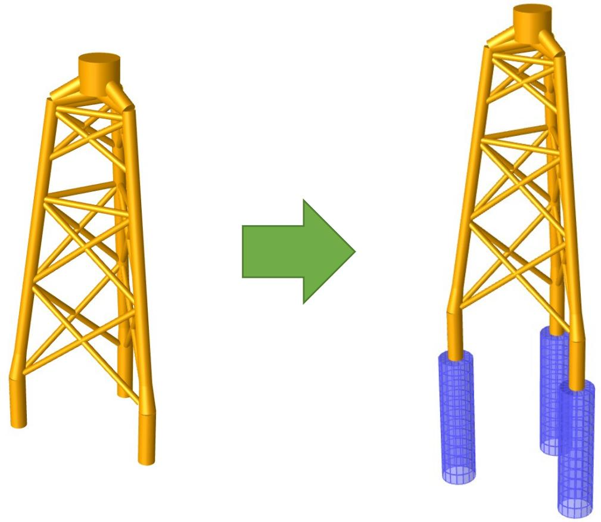  
Figure 1: SACS Suction Bucket Model

## 1.1 SACS-PLAXIS Suction Bucket Analysis Workflow

Figure 2 illustrates the SACS-PLAXIS interoperability workflow to generate suction bucket models and generate nonlinear soil springs using SACS and PLAXIS. The analysis is performed in the following steps:

1. [SACS] Start with a SACS model file for the superstructure with a series of representative loads to generate nonlinear springs.   
2. [SACS] Using the SACS Superelement module, generate a SACS superelement   
3. [SACS] Provide a Suction Bucket input file to define the geometry of the suction buckets   
4. [SACS] Run Suction Bucket utility to generate the suction bucket model (meshed with plate elements), and PLAXIS database folder containing the bucket geometry, PLAXIS superelement files, and analysis options (Create Suction Bucket Database Mode)   
5. [PLAXIS 3D] Import the Suction Bucket Database folder into PLAXIS 3D. The SACS-PLAXIS interoperability tool automatically generates the suction bucket model, assigns the superelement stiffness and load cases to various computations phases.   
6. [PLAXIS 3D] Perform the nonlinear static analysis for all load cases   
7. [PLAXIS 3D] Using the SACS-PLAXIS interoperability tool, generate the data files containing the bucket elements, the displacements, the soil pressure, and skin frictions (normal and shear stresses).   
8. [SACS] Import the PLAXIS data file into the new SACS Suction Bucket module, to generate, 1) the full model – i.e., the suction buckets merged with the structural model, and 2) the nonlinear springs associated with the bucket-soil interaction through a fitting process. (For more information read Suction Bucket Database Mode)   
9. [SACS] Run SACS Static or Dynamic (e.g., Wave Response) to generate internal forces and stresses for the suction bucket plate elements.   
10. [SACS] Run SACS Post-Processor to perform the desired code checks.

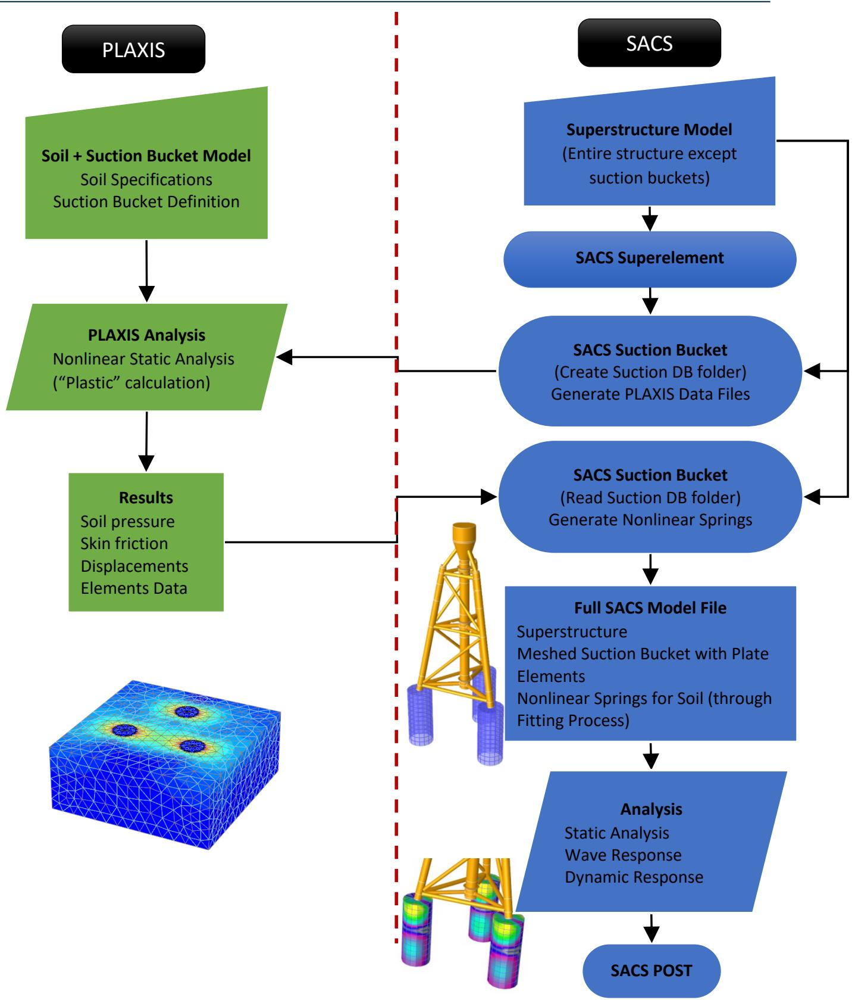  
Figure 2: The user workflow to generate a SACS model with suction buckets and soil nonlinear springs using SACS and PLAXIS

2 Suction Bucket Input and Modelling

The Suction Bucket input and modeling consists of four main sections:

1. Suction Bucket Program Options: BKTOPT (Suction Bucket option line)   
Note: Depending on the program functionality, the Suction Bucket options require different entries as discussed in the following section.   
2. PLAXIS Options: PLAXIS (PLAXIS data file option line)   
3. Suction Bucket Specifications: PGRUP (Plate groups for the bucket wall), SECT (Stiffeners cross-sections), RNGSTF (ring stiffeners group), and LNGSTF (Longitude stiffeners groups)   
4. Suction Bucket Definition: PLGRUP (bucket segments), and PILE (bucket definition)

## 2.1 Suction Bucket Options (BKTOPT)

Suction Bucket Program Mode

SACS Suction Bucket program has two main functions:

1. Create Suction Bucket Database Mode: The program generates a suction bucket model and a folder containing PLAXIS data files and superelements:

The Create Suction Bucket Database function can be selected by entering ‘CDB’ on columns 21- 23 of the BKTOPT line and selecting the correct analysis type under SACS Executive > Analysis Generator > Utilities > Create Suction Bucket Database.

2. Read Suction Bucket Database Mode: The program imports PLAXIS result files (suction bucket deformation and stresses) from the database folder and generates the nonlinear springs through a curve fitting process:

The Read Suction Bucket Database function can be selected by entering ‘RDB’ on columns 21-23 of the BKTOPT line, and selecting the correct analysis type under SACS Executive > Analysis Generator > Utilities > Read Suction Bucket Database.

Note: The SACS analysis type and the BKTOPT function must be matched otherwise, the Suction Bucket program may not perform correctly.

General Options

The following options are available for both program functions.

Units (Columns 8-9): Select the unit of the outputs including the Suction Bucket model files. Choose ‘MN’ for the Metric unit with Newton Forces, ‘ME’ for the Metric unit with kilogram forces, and ‘EN’ for the English unit system with the default value of ‘MN’.

Note: Currently, the input SACS model of the superstructure (jacket) must have the same unit as the Suction Bucket input file. If the unit is different, re-save the jacket model in the correct unit using Precede.

Use the following table to set the units in SACS and PLAXIS to ensure correct data transfer of the superelement and model properties:


| SACS | PLAXIS 3D | PLAXIS 3D |
| --- | --- | --- |
| SACS | Length | Force |
| English | ft | kip |
| Metric-kg | m | kN |
| Metric-kN | m | kN |


Structure Vertical Axis: (Columns 11-12): choose the structure vertical axis from $^{ \prime } + \mathrm{ Z^{ \prime } ,^{ \prime } - \mathrm{ Z^{ \prime } ,^{ \prime } + \mathrm{ X^{ \prime } ,^{ \prime } - \mathrm{ X^{ \prime } ,^{ \prime } + \mathrm{ Y^{ \prime } , } } } } }$ , and ‘-Y’ with the default value of ‘+Z’

Note: The Suction Bucket program currently only supports ‘+Z’ as the structure vertical axis.

Soil-Bucket Interaction Input Type (Columns 14-19): The program currently only supports the soil data from PLAXIS 3D so enter ‘PLAXIS’.

Meshing Options

The following meshing options are available for both program modes.

Meshing Pattern Options (Columns 37-38): Enter ‘P1’ to select the Node Conforming pattern in which the SACS-PLAXIS interoperability tool tries to match all SACS Bucket nodes to PLAXIS Bucket nodes by matching four SACS plate element with 2 PLAXIS 6-node elements (See Figure 3-a). Enter ‘P2’ to select the Face Conforming pattern in which the SACS-PLAXIS interoperability tool matches the corner nodes (See Figure 3-b).

Plate Offset at Segment Interface (Columns 40-41): Enter ‘PO’ to ensure the Suction Bucket Mesher offset the plate elements at the interface of two segments with different diameter or thickness. This option is helpful when the two segments have the same outer diameter but different thicknesses (hence different centerline radius). With this option, the program automatically offsets the first row of the plate element to ensure the same outer diameter for the mesh. Figure 4 shows the effect of this option for a typical suction bucket.

Stiffener Offset (Columns 42-43): Enter ‘SO’ to ensure the Suction Bucket Mesher automatically offset the stiffeners inside the bucket (interior surface).

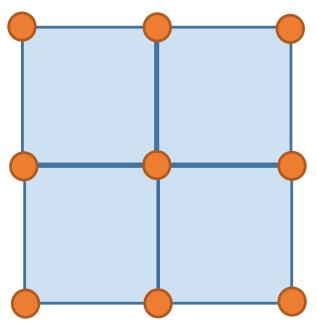  
SACS Mesh

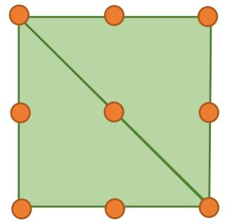  
PLAXIS Mesh

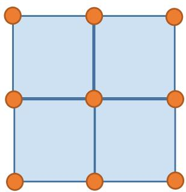  
a) Node Conforming: All nodes matched between SACS and PLAXIS Mesh   
SACS Mesh

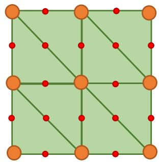  
PLAXIS Mesh   
b) Face Conforming: All corner nodes matched between SACS and PLAXIS Mesh   
Figure 3: Meshing Pattern

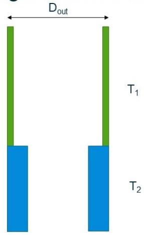  
Segmented Buckets   
Model

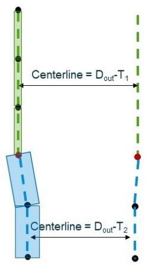  
No Offset

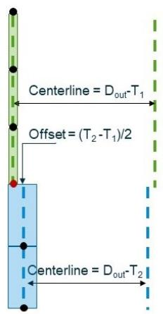  
Offset   
Figure 4: Plate Offset Option

Output Options

The output options are available in the Read Suction Bucket Database mode.

Output Type (Columns 25-27): The Suction Bucket program can automatically generate SACS models for Gap analysis with nonlinear springs (Enter ‘GAP’), Collapse Analysis (Enter ‘CLP’), or linear analysis with linear springs (enter ‘SPG’). In the case of Gap Analysis or Collapse Analysis, the Suction Bucket program also generates the Gap input file or the Collapse input files containing nonlinear springs forcedisplacement deflection.

Dynpac Model (Columns 29-31): Enter ‘DYN’ to generate a SACS model for Dynpac analysis. This model has linear springs (i.e., linearized soil) and proper fixities to perform mode shapes extraction.

Charts and Precede (Columns 33-35): The Suction Bucket program can generate various plots for nonlinear springs. It can also generate a data file to be imported into the Precede to visualize the nonlinear soil springs inside Precede. The following options are available:

‘BSP’: Generate charts of soil springs   
‘BSD’: Generate charts of soil springs with PLAXIS stress data points   
‘BPP’: Generate Precede data file containing soil springs   
• ‘BPD’: Generate Precede data file containing soil springs and PLAXIS stress data points   
‘BBP’: Generate both charts and Precede data file containing soil springs   
‘BBD’: Generate both charts and Precede data file containing soil springs and PLAXIS stress data points

By default, the Suction Bucket program does not generate any plots.

Note: Including PLAXIS data points may significantly increase the size of the output files.

Soil Spring Fitting Options

The fitting options are available in the Read Suction Bucket Database mode.

Fitting Function (Columns 50-51): The Suction Bucket program currently supports two types of curves for the fitting process: Multilinear (enter ‘ML’ – default), and the Special Exponential Function (enter ‘SE’).

The multilinear function (also known as a piecewise linear function) is suitable for a wide range of soil stress data, and usually, it leads to a better representation of the soil stresses at the surface of the bucket wall. The special exponential function provides much smoother nonlinear springs which may lead to a better convergence rate in the Gap or Collapse analysis. For additional details, see section 5.

Number of Fitting Data Points (Columns 45-46): Enter an integer number to set the number of data points at each size of displacement values (positive and negative). This option is used for the multilinear fitting process and the output nonlinear springs. The default value is 3.

Extrapolation (Columns 48-48): Enter ‘L’ for linear extrapolation and ‘F’ or constant (flat) extrapolation. The program adds an extra data point to ensure the correct extrapolation at each side of the positive

and negative deflections. The extrapolation helps when the analysis leads to displacement outside the PLAXIS data range.

Example: For the number of data points 4, the final nonlinear springs will have 11 points: 4 with the positive deflection, 4 with the negative deflection, 1 with zero deflection, 1 for extrapolation on the positive deflection extrapolation, and 1 for negative deflection extrapolation

Regularization (Smoothing) Type (Columns 53-54): The multilinear curve fitting sometimes leads to extremely non-smooth curves due to the varying soil stresses from highly nonlinear PLAXIS analysis. The non-smooth soil springs may lead to non-convergence for Gap/Collapse analysis or a Gap/Collapse analysis with too many iterations. To prevent non-smooth spring curves, a smoothing (regularization) is provided in the Suction Bucket program with two different methods:

1. The First Order (Slope) Regularization: Enter ‘R1’ to enforce smoothing based on the slope of the multilinear curves.   
2. The Second Order (Curvature) Regularization: Enter ‘R2’ to enforce based on the curvature of the multilinear curves.

Regularization Weight (Columns 56-60): Enter regularization weight to enforce the smoothing on the multilinear curve fitting process. Larger weight leads to higher smoothness of the curve, but it may lead to less accurate curves. Leave blank for the default value of 0.1.

Regularization Partial Weight for N Springs (Columns 61-65): Partial regularization weight for soil springs in local N-axis (normal stress). The regularization weight is multiplied by this factor to determine the smoothing weight for N soil springs. Leave blank for the default value of 1.0.

Regularization Partial Weight for S Springs (Columns 66-70): Partial regularization weight for soil springs in local S-axis (shear stress). The regularization weight is multiplied by this factor to determine the smoothing weight for S soil springs. Leave blank for the default value of 1.0.

Regularization Partial Weight for T Springs (Columns 71-75): Partial regularization weight for soil springs in local T-axis (shear stress). The regularization weight is multiplied by this factor to determine the smoothing weight for T soil springs. Leave blank for the default value of 1.0.

Regularization Upper Limit (Columns 76-80): By default, if a regularization method is selected on columns 53-54, the program enforces smoothing for all soil springs. Enter an upper limit for the soil stresses, so the smoothing process is only applied to springs with a peak value of less than the upper limit. The value of the regularization upper limit should be entered in lb/in2 for the English unit, kN/m2 for the Metric-kN unit, and kg/m2 for the Metric-kg unit.

BKTOPT Sample

A typical BKTOPT line for the Create Suction Bucket Database mode is shown below.


|  | 1 | 2 | 3 | 4 | 5 | 6 | 7 | 8 |
| --- | --- | --- | --- | --- | --- | --- | --- | --- |
| 1 | 1234567890123456789012345678901234567890123456789012345678901234567890 | 1234567890123456789012345678901234567890123456789012345678901234567890 | 1234567890123456789012345678901234567890123456789012345678901234567890 | 1234567890123456789012345678901234567890123456789012345678901234567890 | 1234567890123456789012345678901234567890123456789012345678901234567890 | 1234567890123456789012345678901234567890123456789012345678901234567890 | 1234567890123456789012345678901234567890123456789012345678901234567890 | 1234567890123456789012345678901234567890123456789012345678901234567890 |


This option line sets the following:

The unit is Metric with Newton forces (‘ME’).   
The structure vertical axis is ‘+Z’.   
The soil interaction type is ‘PLAXIS’   
• The Suction Bucket program is running in Create Database Mode (‘CDB’)   
The mesh is based on Node Conforming (‘P1’)   
• The plate offset will be enforced at the interface of the two segments with different dimensions (‘PO’).

A typical BKTOPT line for the Read Suction Bucket Database mode is shown below: This option line sets the following:

The unit is Metric with Newton forces (‘ME’).   
The structure vertical axis is ‘+Z’.   
The soil interaction type is ‘PLAXIS’   
• The Suction Bucket program is running in the Read Database Mode (‘CDB’)   
• The output type is Gap Analysis (‘GAP’).   
The mesh is based on Node Conforming (‘P1’)   
• The plate offset will be enforced at the interface of the two segments with different dimensions (‘PO’).   
The program uses 5 data points for positive displacement and 5 data points for negative displacement.   
• The springs will provide linear extrapolation for out-of-range displacement (‘L’).   
• The fitting is based on the multilinear curves (‘ML’)   
• The fitting process is using the first derivative regularization to smooth the nonlinear springs (‘R1’)   
• The program uses a regularization weight of 1.0 to perform the curve fitting process.

```csv
1 2 3 4 5 6 7 8  
123456789012345678901234567890123456789012345678901234567890  
1 Suction Bucket Option Line in Read DB Mode  
2 BKTOPT ME +Z PLAXIS RDB GAP P1 PO 5 L ML R1  
## 1.0
```

## 2.2 PLAXIS Options (PLAXIS)

PLAXIS input line provides options for generating PLAXIS files and importing the PLAXIS result files and it is required for both program functions. The following inputs are required:

PLAXIS Vertical Axis: (Columns 9-9): choose the PLAXIS vertical axis from $^{ \prime } + \mathrm{ Z^{ \prime } ,^{ \prime } - \mathrm{ Z^{ \prime } ,^{ \prime } + \mathrm{ X^{ \prime } ,^{ \prime } - \mathrm{ X^{ \prime } ,^{ \prime } + \mathrm{ Y^{ \prime } , } } } } }$ , and ‘- Y’ with the default value of ‘+Z’

Note: The Suction Bucket program currently only supports ‘+Z’ as the PLAXIS vertical axis.

Number of Buckets: (Columns 11-13): number of buckets in the PLAXIS model. The number of buckets must be equal to the number of buckets defined using PILE input lines.

Number of Load Cases: (Columns 15-17): Enter the number of load cases for nonlinear soil spring generation.

Create Database Mode: In this mode, the number of load cases is usually the same as the number of load cases available in the SACS Superelement. If the Superelement has more load cases, the Suction Bucket program ignores the extra load cases. If the Superelement has less load cases, the program returns an error message.   
Read Database Mode: In this mode, the number of load cases is usually the same as the number of analysis phases in the PLAXIS 3D model. If the PLAXIS model has more analysis phases, the Suction Bucket ignores the extra phases. If less phases are available, the program stops with an error message.

First PLAIXS Phase Number: (Columns 19-21): Enter the number of the first analysis phase in the PLAXIS model file. This number is usually 2 since the first phase is often reserved for installation/placement of the bucket into the soil model. The Suction Bucket program uses this number to generate PLAXIS files (in Create Database mode) and read PLAXIS results files (in the Read Database mode). For additional details see section 3.1.

## 2.3 Suction Bucket Specifications

This section explains the input lines needed to define the bucket wall thickness and stiffeners.

Bucket Wall

The suction bucket wall is modeled by the quadrilateral plate elements in the SACS model and its thickness and material properties can be defined by the plate group (PGRUP) input line. For additional information on the PGRUP line, refer to the SACS IV user manual.

The following shows a typical PGRUP line in the suction bucket input file:

Plate Group Label: ‘PLT’   
thickness: ‘5.0’ cm   
Isotropic Plate Element (‘I’)   
Elastic Modulus: ‘20.0’ 1000 kN/cm2   
• Poisson's ratio: ‘0.25’   
Yield Stress: ‘24.8’ kN/cm2   
Density: ‘7.85’ tonne/m3

```txt
1 2 3 4 5 6 7 8  
123456789012345678901234567890123456789012345678901234567890  
PGRUP  
2 PGRUP PLT 5.0I 20. 0.25 24.8 
```

Bucket Stiffeners

The buckets optionally have ring stiffeners and/or longitude stiffeners. The stiffeners are modeled using SACS member elements by defining their cross-sections using the SECT input line and their group label, spacing, and the material is defined through RNGSTF (ring stiffener group) input line or LNGSTF (longitude stiffener group). The Suction Bucket program uses these input lines to automatically add the member elements associated with stiffeners to the SACS model and sets their properties and local coordinate systems. Figure 5 illustrates the configuration of the ring and longitude stiffeners relative to the bucket.

Stiffener Cross-section (SECT): This line is used to define the cross-section of a given stiffener. The section label can be entered on columns 6-12 and the section type may be selected on columns 16-18. The rest of the input line is used to define the dimension of the cross-section. For additional information about the cross-section, refer to the SACS IV user manual.

Note: The Suction Bucket program currently supports the following cross-section types: rectangular (prismatic), tee, angle, channel, box, and wide flange.

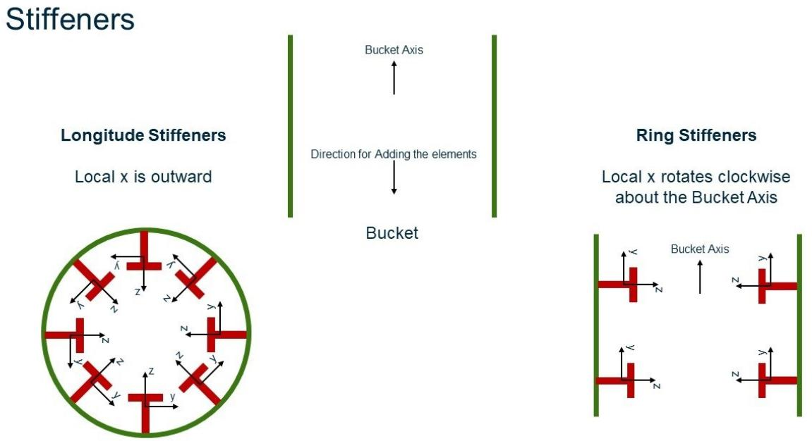  
Figure 5: Suction Bucket Stiffeners and their Local Coordinate Systems

Ring Stiffener Group (RNGSTF): This line is used to enter the ring stiffener group inputs. The following entries are required:

• Group Label (Columns 8-10): Enter a three-character label for the ring stiffener group. The Suction Bucket program assigns this label to the Member Group Label when it generates the Suction Bucket model file. If the superstructure model has a Member Group with the same label, the program returns an error indicating the entered group label is not available.

Cross-section Label (Columns 14-20): Enter cross-section label (up to 7 characters here). The section label must be previously defined using the SECT input line.   
Ring Stiffener Start Location (Columns 22-29): Enter the start location of the stiffener group. The start location is always measured from the beginning of the bucket segment to which the ring stiffener is assigned – see input line PLGRUP for additional details.   
• Ring Stiffener Spacing (Columns 31-38): Enter spacing (centerline to centerline) between ring stiffeners.   
Number of Stiffeners (Columns 40-42): Enter the number of stiffeners within the bucket segment. If one or more of the ring stiffeners are positioned outside the assigned segment, the program returns an error message.   
Material Properties for Stiffener Member Group: Elastic Modulus (Columns 44-48), Shear Modulus (Columns 50-54), Yield Stress (Columns 56-60), Density (Columns 62-67)

The following sample illustrates a typical ring stiffener definition in the Suction Bucket program:

• Label: ‘GR1’ with cross-section label ‘STFSECT’ with a total of ‘5’ stiffeners with the start location of ‘1.0’ m with spacing ‘2.0’ m   
• Elastic Modulus: ‘20.0’ 1000 kN/cm2 , Shear Module: ‘8.00’ 1000 kN/cm2, Yield Stress: ‘24.8’ kN/cm2, Density: ‘7.85’ tonne/m3


|  | 1 | 2 | 3 | 4 | 5 | 6 | 7 | 8 |
| --- | --- | --- | --- | --- | --- | --- | --- | --- |
| 1 | 1234567890123456789012345678901234567890123456789012345678901234567890123456789012345678901234567890123456789 | RNGSTF |  |  |  |  |  |  |
| 2 | RNGSTF GR1 STFSECT 1.0 2.0 5 20.00 8.00 24.8 7.85 |  |  |  |  |  |  |  |


Longitude Stiffener Group (LNGSTF):

This line is used to enter the longitude stiffener group inputs. The following entries are required:

Group Label (Columns 8-10): Enter a three-character label for the longitude stiffener group. The Suction Bucket program assigns this label for Member Group Label when it generates the Suction Bucket model file. If the superstructure model has a Member Group with the same label, the program returns an error indicating the entered group label is not available.   
Cross-section Label (Columns 14-20): Enter cross-section label (up to 7 characters). The section label must be previously defined using the SECT input line.   
Longitude Stiffener Start Angle (Columns 22-29): Enter the start angle of the stiffener group. The start angle is always measured counterclockwise from the global +X (global positive X) when the vertical axis is +Z.   
Longitude Stiffener Spacing (Columns 31-38): Enter angle (centerline to centerline) between longitude stiffeners.   
Number of Stiffeners (Columns 40-42): Enter the number of stiffeners within the bucket segment. If one or more of the longitude stiffeners have an angle greater than 360, the program returns an error message.

Note: For a multi-segmented bucket, the Suction Bucket program currently assumes all segments have the same number of longitude stiffeners or have no longitude stiffeners. For example, for the two-

segmented bucket, both segments must have 8 stiffeners, or one can have 8 stiffeners, and the other one has none. However, it is not possible that one segment has 8 stiffeners, but the other one has just 4.

Material Properties for Stiffener Member Group: Elastic Modulus (Columns 44-48), Shear Modulus (Columns 50-54), Yield Stress (Columns 56-60), Density (Columns 62-67)

The following sample illustrates a typical longitude stiffener definition in the Suction Bucket program:

Label: ‘GR2’ with cross-section label ‘STFSECT’, a total of ‘8’ stiffeners with the start angle of ‘0.0’ degree with spacing ‘45.0’ degree.   
• Elastic Modulus: ‘20.0’ 1000 kN/cm2 , Shear Module: ‘8.00’ 1000 kN/cm2, Yield Stress: ‘24.8’ kN/cm2, Density: ‘7.85’ tonne/m3


|  | 1 | 2 | 3 | 4 | 5 | 6 | 7 | 8 |
| --- | --- | --- | --- | --- | --- | --- | --- | --- |
| 1 | 12345678901 | 12345678901 | 12345678901 | 12345678901 | 12345678901 | 12345678901 | 12345678901 | 1234567890 |
| 2 | LNGSTF | LNGSTF | LNGSTF | LNGSTF | LNGSTF | LNGSTF | LNGSTF | LNGSTF |
| 2 | LNGSTF GR2 | STFSECT | 0.0 | 45.0 | 8 | 20.00 | 8.00 | 24.8 |
| 2 | 7.85 |  |  |  |  |  |  |  |


## 2.4 Suction Bucket Definition

Pile Group

The bucket specifications (e.g., diameter, length, and stiffeners) are entered using the Pile Group input line, PLGRUP. A pile group is subsequently assigned to a bucket using the PILE input line. The following entries are available for the pile group:

Pile Group Label (Columns 8-10): A three-character label for the pile group label. This label is subsequently used to assign a pile group to a bucket on the PILE input line.   
Plate Group Label (Columns 12-14): A plate group label to define the plate elements (thickness and material) of the bucket wall for the current segment. This label must be already defined using the Plate Group input line (PGRUP)   
• Segment Length (Columns 16-23): enter the segment length   
• Outer Diameter (Columns 25-32): enter the outer diameter of the segment   
Optional Ring Stiffener Label (Columns 34-36): Enter the Ring Stiffener label if the segment has any. The label must be already defined on the RNGSTF input line.   
Optional Longitude Stiffener Label (Columns 38-40): Enter the longitude Stiffener label if the segment has any. The label must already be defined on the LNGSTF input line.

Number of Elements (Columns 42-44): Enter the number of plate elements within the segment. The Suction Bucket uses this entry as a reference value to mesh the bucket by plate elements.

Note: The Suction Bucket program may automatically adjust the number of elements to accommodate meshing requirements if the bucket has ring stiffeners.

The following sample illustrates a typical Pile Group input line for a bucket with a single segment:

Pile Group Label: ‘BK1’   
Plate Group Label: ‘BPW’   
Segment Length: ‘10’ m   
Outer Diameter: ‘7’ m   
• No stiffeners   
• Number of Elements: ‘10’

```txt
1 2 3 4 5 6 7 8  
123456789012345678901234567890123456789012345678901234567890  
PLGRP  
2 PLGRP BK1 BPW 10. 7. 10 
```

Segmented Bucket

A series of PLGRUP input lines with the same group labels can be used for a bucket with multiple segments. Each input line corresponds to one of the bucket segments which can have different specifications (i.e., different values for length, diameter, wall thickness, stiffeners, and the number of elements).

In the following example, the pile group has two segments in which the top segment has a length of 5 m with no stiffener, while the bottom segment has a length of 10 m with both ring and longitude stiffeners.

```txt
1 2 3 4 5 6 7 8  
1234567890123456789012345678901234567890123456789012345678901234567890  
PLGRUP  
2 PLGRUP BK2 BPW 5. 7. 10  
3 PLGRUP BK2 BPW 10. 7. GR1 GR2 20 
```

Pile

The PILE input line is used to define a bucket by assigning the bucket center joint label (the bucket head), and the Pile Group label. The bucket head joint must be already defined in the SACS model file with the fixity of ‘PILEHD’. The following inputs are available on The PILE input line:

• Pilehead Joint Name (Columns: 7-10): Enter the joint label with ‘PILEHD’ fixity   
• Pile Group Label (Columns: 16-18): Enter the pile group label previously defined on the ‘PLGRUP’ input line   
Number of Element along the Bucket Circumference (Columns: 20-22): Enter the number of elements around the bucket circumference. The Suction Bucket program uses this number as a reference value to generate bucket plate mesh.

Note: The Suction Bucket program may automatically adjust the number of elements to accommodate meshing requirements if the bucket has longitude stiffeners.

Plate Group of the Bucket Cap (Columns 25-26): Enter the plate group label for the bucket cap, The plate group must be previously defined using the ‘PGRUP’ line. The Suction Bucket program automatically adds triangular plates connecting the bucket head to the joints located at the bucket wall.   
Embedded Length (Columns 28-35): Leave this input BLANK, if the entire bucket is embedded into the soil. By default, the Suction Bucket program assumes the entire bucket is embedded inside the soil. If a portion of the bucket is above the soil, enter the embedded length in this field.

Note: If the embedded length is located within a bucket segment, the program automatically splits the segment into two segments to ensure there are two separate segments above and below the soil.

Note: The program will not attach any nonlinear soil springs for the nodes above the soil.

The following sample shows a bucket connected to joint ‘PL01’ with the pile group ‘BK1’, the plate group ‘CPG’ is entered for the bucket cap. The number of plate elements is ‘16’ around the bucket circumference and the embedded length ‘9’ m.

```txt
1 2 3 4 5 6 7 8  
1234567890123456789012345678901234567890123456789012345678901234567890  
PILE  
PILE PL01 BK1 16 CPG 9. 
```

3 Output Files

The Suction Bucket program generates various outputs depending on the options selected:

Suction Bucket Listing file (bktlst.*): this contains a summary of the options, input data, and general information about the suction bucket model, and PLAXIS imported data.   
Suction Bucket Database Folder (bktdb.*): this is the main database folder for the SACS-PLAXIS interoperability tool for transferring files between SACS and PLAXIS. Additional details are provided in the next section.   
SACS Model Files (sacinp.*): this is the automatically generated SACS model with suction buckets meshed using plate elements. Depending on the options on the BKTOPT line, the model is generated for Gap, Collapse, or Linear analysis.   
SACS Model Files for Dynpac (sacinp2.*): this SACS model file is generated for mode shapes extraction (Dynpac) analysis and the soil is modeled by linear springs   
Nonlinear Springs (gapinp.* or clpinp.*): Depending on the model file type, the program creates nonlinear springs in the format for Gap analysis or Collapse analysis.   
Soil Springs Charts (bktncf.*): Optional charts to visualize the nonlinear springs and PLAXIS soil data. The user may use the charts to evaluate the quality of the fitting process.   
Precede Visualization Data File (bkt.*): Optional output to visualize the nonlinear springs in SACS Precede. This data file can be imported into Precede for better modeling. Once the file is imported into Precede, the user can visualize the nonlinear springs and local axis system of the springs by selecting bucket joints.

## 3.1 Suction Bucket Database Folder

Figure 6 shows the data files flow between the SACS and PLAXIS. The file transfer is carried out through the Suction Bucket Database folder (bktdb.*). If the Create Database mode is selected, the Suction Bucket program creates the folder and adds the following files:

PLAXIS Superelement Files (data.ude.rs#): this contains a superelement stiffness matrix and a load vector. PLAXIS requires a separate superelement file per analysis phase   
• PLAXIS Option Files (data.opt.rs#): this contains options for the PLAXIS project.   
PLAXIS Suction Buckets Specification File (data.sbinfo)

PLAXIS 3D imports the above files to automatically generate the bucket models, apply the support element loads and stiffness, and set up the analysis phases. Once the PLAXIS nonlinear analysis is completed, PLAXIS 3D exports back the soil stresses (normal and shear stresses) at the Suction Bucket faces to the Suction Bucket Database Folder in the following files:

• PLAXIS Stress Results Files (data.ifs.rr#): These files contain PLAXIS Suction Bucket finite element nodes, shell elements, local coordinate system, and displacement and stresses at each node. There is a separate file for each load case (analysis phase), and the Suction Bucket program imports these files to generate nonlinear soil springs.

Note: In the above file names, # denotes the Phase Number in the PLAXIS 3D project.

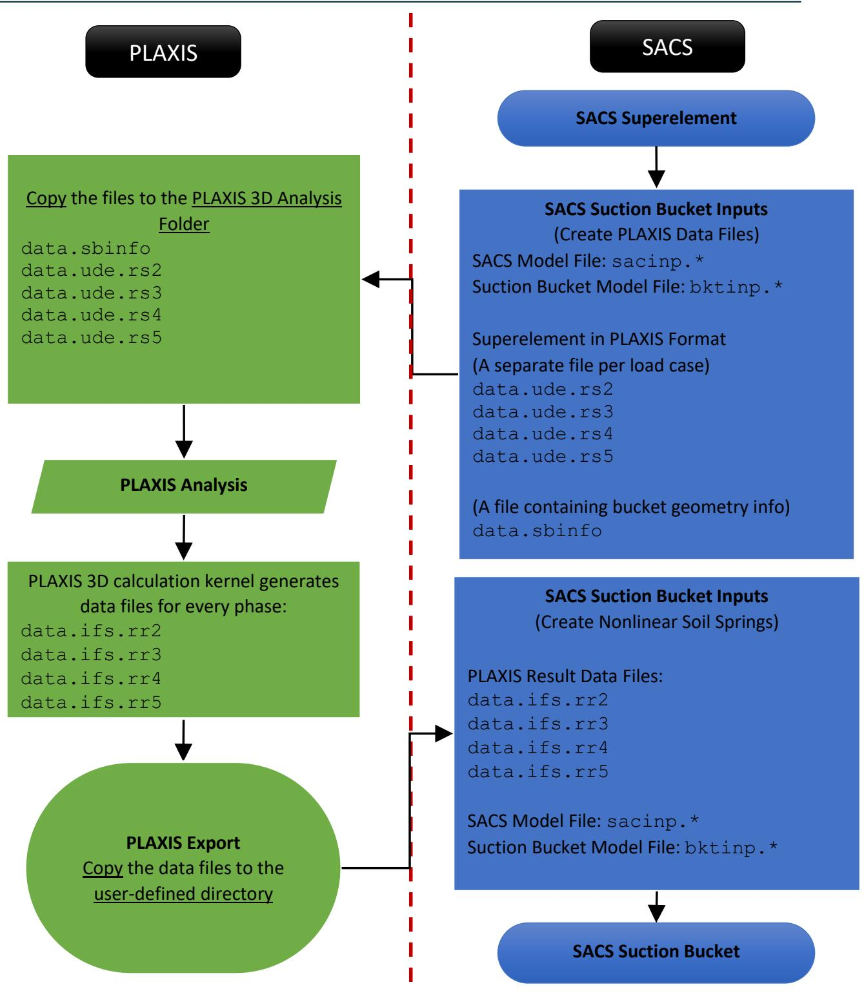  
Figure 6: Data files flow diagram between SACS and PLAXIS

4 Troubleshooting

## 4.1 Fitting Nonlinear Springs

If the Suction Bucket program returns an error message when fitting nonlinear springs, check the following items to ensure consistency between the PLAXIS and SACS models.

The PLAXIS interop utility can automatically create a fictitious soil, positioning the mudline elevation (top of the soil) 10 cm below the location of the pile head. Preferably, first generate the soil profile model manually. Afterward, the SACS model and loads can be imported into PLAXIS to ensure consistency.   
Ensure the same suction bucket dimensions are imported into PLAXIS - specifically bucket length and diameter. If the bucket is segmented, ensure the length of all segments is the same in both SACS and PLAXIS.   
If the suction buckets are partially embedded into the soil, use the embedded length option described in section 2.4.2. Also, ensure the soil elevation and layers are defined correctly in PLAXIS.   
The suction bucket program has built-in features to automatically handle multi-layer soil profiles and mismatched finite element meshes between SACS and PLAXIS. If the Suction Bucket program returns an error message while creating nonlinear soil springs from a multi-layer soil profile, split the suction bucket into multiple segments at the interfaces of soil layers, even if the bucket has uniform properties throughout its length. This segmentation helps maximize compatibility between the SACS and PLAXIS finite element models. See section 2.4.1 on how to define pile segments.

The following summarizes an overall strategy for an accurate fitting process to generate soil springs:

Multiple load cases in different directions are usually needed to generate nonlinear springs. The user can use the SACS SeaState program to generate wave loads in different directions. As a rule of thumb at least four load cases are needed (e.g., wave load at 0, 90, 180, 270).   
To review the quality of the springs and fitting process, it is recommended to review the nonlinear springs charts in Chart View or Precede. These charts can be generated by selecting various options on the BKTOPT line.   
To evaluate the accuracy of the nonlinear springs, the user may run Gap or Collapse analysis (with linear elastic material) and compare deformation of the bucket centers with the PLAXIS results.

Note: If the soil surrounding the buckets reaches its capacity in the PLAXIS analysis (for example large plastic deformation), the SACS Gap or Collapse analysis may not reach the same load factor as the PLAXIS analysis due to the approximation in the fitting process.

For the multilinear fitting, it is recommended to start with a few points (3 to 5 data points at each side of the force-deflection curves). Using a large number of fitting data points often leads to a highly oscillating (noisy) nonlinear spring – causing non-convergence in Gap or Collapse Analysis.

The soil springs based on multilinear fitting often produce more accurate results than the special exponential function. However, the multilinear function can become extremely non-smooth for other soil types.   
For highly varying soil stress data, regularization can help to obtain much smoother soil spring curves – especially if the Gap or Collapse analysis does not converge with standard multilinear fitting.   
• Using a large regularization may lead to extremely smooth but inaccurate springs. If the multilinear curve fitting requires regularization (e.g., due to non-convergence in Gap or Collapse), the user can start with a larger regularization weight and gradually reduce it to determine the best value for both accuracy and smoothness. See the second comment above for how to evaluate the accuracy of the springs.   
Some analyses may need to have different regularization weights for different stress components. The user can utilize partial weights available on the BKTOPT line to apply different weights to different components. See section 5.2.1 for additional details on regularization weights.   
For some analyses, the spring with larger stress values may not need regularization (smoothing those springs may reduce the accuracy). In such scenarios, the user may employ the “regularization upper limit” available on the BKTOPT line to apply the smoothing process only on the springs with small stress amplitudes.

## 4.2 Gap Analysis

The standard Gap solver is designed for a relatively small number of nonlinear springs. However, a SACS model with suction buckets may have thousands of nonlinear springs, leading to long analysis times. To speed up the Gap analysis, two new efficient solvers have been implemented and the user can select these solvers on the GAPOPT input line. Figure 7 compares the efficiency of Gap advanced solvers with the standard solver for a tripod with suction buckets. For additional details refer to the SACS Gap Analysis user manuals.

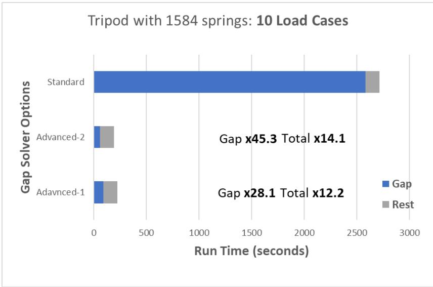  
Figure 7: Gap analysis speed-up using the advanced solver options.

In the gap analysis of suction bucket models, it is possible the Gap analysis residual becomes relatively small but is not smaller than the specified tolerance. This happens when the nonlinear springs are not smooth, or the applied load is close to the soil capacity. By default, the Gap program terminates the analysis with an error message. To remedy this issue, a new “continue” option (available on the GAPOPT line) is introduced. Using this option, the Gap program continues the analysis in the case of nonconvergence and returns a warning message. In the case of the non-convergence, the user may check the suction bucket model response to ensure the non-convergence does not lead to significant errors in the analysis results. For additional details refer to the SACS Gap Analysis user manuals.

## 4.3 Dynamic Analysis

The SACS dynamic analysis requires a linearized model to determine the model's natural frequencies and mode shapes. Additionally, the SACS Dynpac module has a limitation on the combined number of fixed and retained degrees of freedom. By selecting the 'DYN' option on the BKTOPT line, the SACS Suction Bucket program creates a special SACS model file (sacinp2.*) containing the linearized soil springs and proper fixities. This special SACS model replaces the fixed joints with linear ground springs with very large stiffness to reduce the retained degrees of freedom and avoid the SACS Dynpac limitation.

This model can be used in Mode Shape Extraction analysis to generate the mass and mode shape files required for conducting dynamic analysis (such as wave response) on the main model (sacinp.*). Users only need to add the retained degrees of freedom (with 222000 fixities) to the desired joints (located at various points in the jacket and pile heads, and if necessary, at multiple locations within the suction bucket) and then perform the Mode Shape Extraction analysis. For more detailed information, please refer to the analysis sample and section 6.6.3.

# 5 Commentary

## 5.1 Soil Springs Fitting Summary

PLAXIS 3D program provides displacement vector and the normal and shear stresses at the interior and the exterior surface of a given bucket. PLAXIS provides 3 sets of data for each finite element node corresponding to three stresses at the local coordinate system: Pressure in the N-axis, Shear in the Saxis, and shear in the T-axis. If the global Z-axis is vertical, the nodal local coordinate system is:

1. N is normal to the bucket surface and outward   
2. S is along the bucket length and downward   
3. T is tangent of the bucket surface and along the bucket circumference

Note: the spring local coordinate system can be visualized in Precede by importing a data file generated by the Suction Bucket program.

The SACS Suction Bucket program imports the PLAXIS data and performs the following steps to generate nonlinear springs:

1. Cleanup the stress data: SACS assumes the soil springs are nonlinear elastic. This means the displacement and stresses must have the same sign. The first step is to clean up the PLAXIS data and remove the data points for which the signs of displacement and stress are not the same.   
2. Combine the interior and the exterior stress: SACS Suction Bucket program combines the stresses at the interior and the exterior of the bucket wall to generate one spring per stress component. The program generates three springs for N, S, and T stresses per bucket joint. No spring will be attached to joints above the soil.   
3. Fitting a curve to the data: the program uses a curve fitting process to fit a multilinear function or a special exponential function on the combined soil data. The multilinear function fitting is based on the regularized linear least-squares method while the fitting process for the special exponential function is based on the nonlinear least-squares minimization. See additional details in the next sections.   
4. Linear Springs: Some analysis types (like mode shapes extraction) require linear soil springs. To get a linearized soil spring stiffness, the Suction Bucket program first determines the slopes of the nonlinear curve for a small positive displacement and a small negative displacement. The linearized stiffness is then computed by averaging these two slopes around the zero deflection.   
5. Compute the effective area: The effective area is automatically calculated based on the plate elements connected to a given joint. Any plate element above the soil will be excluded in the effective area calculation. Next, the fitted curve is scaled by the effective area to get forcedeflection curves needed for Gap or Collapse analysis.

## 5.2 Multilinear Curve Fitting Process

Figure 8 illustrates a multilinear function (also known as a piecewise linear function). The multilinear function can be defined by the coordinates of its breakpoints (blue and red points in Figure 8). The user sets the number of main breakpoints (blue points in Figure 8) at each side of the force-deflection curve on the BKTOPT line, while the program automatically adds three additional points at zero deflection and two extrapolation points at each size (red points in Figure 8).

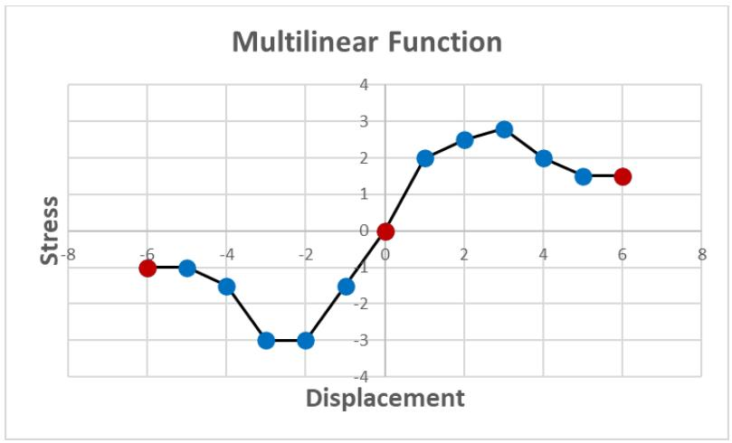  
Figure 8: Multilinear Function

The program determines the coordinates of the breakpoints in two steps. The first step involves determining the horizontal coordinates (displacement) of the main breakpoints (denoted by $x_{ k } )$ . For a given soil stress data, The Suction Bucket program first computes the minimum and the maximum values of the deflection, and then it distributes the main breakpoints uniformly between those two values.

Next, the vertical coordinates (stress) of the breakpoints (denoted by $y_{ k } )$ are determined through a regularized linear least-squares method by:

$$\min_{y_{k}} \left\{\frac{1}{2} \| \mathbf{A} y_{k} - y_{\text{d a t a}} \|_{L 2}^{2} + \frac{1}{2} w \| \mathbf{L} y_{k} \|_{L 2}^{2} \right\} \tag{1}$$

, where

‖ $\Vert_{ L 2 }$ denotes L2-norm (square root sum of squares)

?? is the multilinear function operator (matrix) and it is determined using breakpoint horizontal coordinate $x_{ k }$ and, the displacement from PLAXIS soil data, $x_{ d a t a }$

$y_{ d a t a }$ is a vector of soil stress data imported from PLAXIS results

?? is the regularization weight (see below for additional details)

?? is the regularization operator (see below for additional details)

Smoothing through Regularization

Regularization helps to produce smoother force-deflection curves by enforcing additional conditions to the least-squares process. The Suction Bucket program supports two types of regularization:

1) First Derivative Regularization or Slope-Smoothing with the operator

$$\mathbf{L_{1}} = \frac{1}{2} \left[ \begin{array}{c c c c c c} - 1 & 1 & & & & \\ & - 1 & 1 & & & \\ & & \ddots & & & \\ & & & - 1 & 1 & \\ & & & & - 1 & 1 \end{array} \right] \tag{2}$$

2) Second Derivative Regularization or Curvature-Smoothing with the operator

$$\mathbf{L}_{2} = \frac{1}{4} \left[ \begin{array}{c c c c c c c c} 1 & - 2 & 1 & & & & & \\ & 1 & & - 2 & 1 & & & \\ & & & \ddots & & & & \\ & & & & 1 & - 2 & 1 & \\ & & & & & 1 & - 2 & 1 \end{array} \right] \tag{3}$$

The regularization weight is determined by

$$w = w_{\text{u s e r}} \times w_{\text{p a r t i a l}} \times w_{0} \tag{4}$$

, where

$w_{ u s e r }$ is the user-defined weight entered on the BKTOPT line.

$w_{ p a r t i a l }$ is the user-defined partial weight entered on the BKTOPT line for each spring component.

$w_{ 0 }$ is automatically calculated by the Suction Bucket program based as $\| \mathbf{ A } y_{ 0 } - y_{ d a t a } \|_{ L 2 }^{ 2 } / \| \mathbf{ L } y_{ 0 } \|_{ L 2 }^{ 2 }$ in which $y_{ 0 }$ is fitted data points based on the unregularized least-squares method.

## 5.3 Special Exponential Function Fitting

The following expression defines the special exponential function:

$$f_{S E} (x) = P \left[ 1 - d \left[ 1 - \left(1 + \frac{1}{\sqrt{d}}\right) e^{- R \frac{x}{x_{m a x}}} \right]^{2} \right] \tag{5}$$

, where

?? is the peak of the curve

?? is the drop ratio after the peak （$0 < d < 1 )$

?? is the rate of the function change （$0 < R )$

Figure 9 illustrates the behavior of the special exponential function for various parameters.

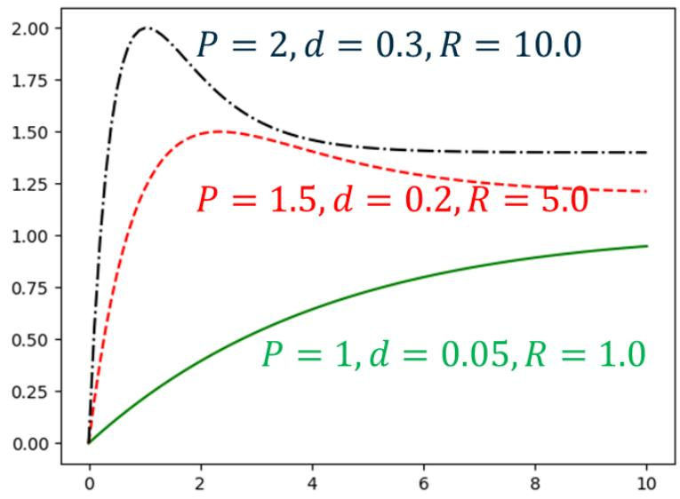  
Figure 9: Special Exponential Function

The Suction Bucket program determines the above parameters through a nonlinear least-squares fitting process defined by

$$\left. \min_{P, d, R} \left\{\frac{1}{2} \| f_{S E} \left(x_{d a t a}, P, d, R\right) - y_{d a t a} \|_{L 2}^{2} \right\} \right. \tag{6}$$

Once the parameters are determined, the program carefully converts the special exponential function to a multilinear function.

## 5.4 Non-matching Meshes

The Suction Bucket program performs best when the SACS bucket mesh completely matches PLAXIS bucket mesh. However, due to the complexity of the soil model calculation, there is a need for a different mesh (usually finer) in the PLAXIS model. In these scenarios, the Suction Bucket program uses an interpolation scheme to determine the soil stresses. The interpolation process is carried out as follows:

1) For a given joint in the SACS Bucket model, the program finds the closest node on the PLAXIS mesh   
2) The program determines the SACS joint belongs to which PLAXIS 6-node element connected to the closest node   
3) The program computes the relative displacement between the SACS joint and the PALXIS 6-node element corners.   
4) Finally, the stresses are interpolated based on their nodal values using finite element shape functions

6 Sample Problem

The nonlinear springs to model interaction between the soil and the suction buckets can be generated in the following steps:

1. Analysis Loads (SeaState): This step involves determining a set of the loads for which the nonlinear bucket-soil interaction is modeled. SACS SeaState program can be used in this step to compute environmental loads like ocean waves and structural weight.   
2. Superelement: The superelement is an effective method to transfer the loads and stiffness from SACS to PLAXIS 3D. The SACS Superelement program is utilized to determine the jacket forces and stiffness at the bucket centers.   
3. Generate PLAXIS Database: This step involves 1) create the suction bucket model and corresponding PLAXIS input files, and 2) converting the SACS superelement to the PLAIXS 3D superelement.   
4. PLAXIS 3D: This step is to model soil and bucket using PLAXIS 3D and export the stresses at the interface between the buckets and soil. For additional information, refer to the PLAXIS 3D program user manual.   
5. Generating Nonlinear Springs: This step contains two main parts. First, using a series of options, the nonlinear springs are generated by fitting multilinear curves (or special exponential functions) to the stress data computed by PLAXIS 3D. Second, the suction buckets models are recreated, and the nonlinear springs are attached to the bucket joints.   
6. Run SACS Analysis: Once the suction bucket model with nonlinear springs is created, different analysis types (e.g., Gap, Collapse, or Mode Shapes Extraction) can be conducted.

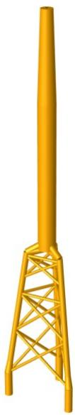  
Figure 10 shows the superstructure model in the sample and the following sections discuss the above steps in more detail. The input files associated with this sample problem can be found under Sample 25 in the SACS installation directory.   
Figure 10: Jacket Sample Model

## 6.1 SeaState

The first step is to determine a set of loads to generate the nonlinear soil springs. To ensure the accuracy of the springs, these loads must be large enough to lead to a significant nonlinear response in the soil – hence they are probably higher than the structure capacity of the design load. For this sample, the following loads are considered:

Wind Turbine weight of 8100 kN at the top of the tower   
A 4000 kN horizontal wind turbine load in multiple directions: 0, 45, 90, 135, 180, 225, 270, and 315 degrees angle with respect to the global X-axis   
Structural Weight   
Wave load (wave height of 8 m, kinematic factor of 1.0, the period of 11 seconds with 7 stream functions) in multiple directions: 0, 45, 90, 135, 180, 225, 270, and 315 degrees angle with respect to the global X-axis   
Wind load with a wind velocity of 10 m/sec in multiple directions : 0, 45, 90, 135, 180, 225, 270, and 315 degrees angle with respect to the global X-axis   
Current load with velocity 0.116 m/sec in multiple directions : 0, 45, 90, 135, 180, 225, 270, and 315 degrees angle with respect to the global X-axis

The following input lines show directional wind turbine loads in the SACS input file:


|  | 1 | 2 | 3 | 4 | 5 | 6 | 7 | 8 |
| --- | --- | --- | --- | --- | --- | --- | --- | --- |
| 297 | 1234567890123456789012345678901234567890123456789012345678901234567890 | 1234567890123456789012345678901234567890123456789012345678901234567890 | 1234567890123456789012345678901234567890123456789012345678901234567890 | 1234567890123456789012345678901234567890123456789012345678901234567890 | 1234567890123456789012345678901234567890123456789012345678901234567890 | 1234567890123456789012345678901234567890123456789012345678901234567890 | 1234567890123456789012345678901234567890123456789012345678901234567890 | 1234567890123456789012345678901234567890123456789012345678901234567890 |
| 298 | LOAD 1 | 4000.00 |  |  |  | GLOB JOIN | NL000 |  |
| 299 | LOADCNJ045 |  |  |  |  |  |  |  |
| 300 | LOAD 1 | 2828.002828.00 |  |  |  | GLOB JOIN | NL045 |  |
| 301 | LOADCNJ090 |  |  |  |  |  |  |  |
| 302 | LOAD 1 | 4000.00 |  |  |  | GLOB JOIN | NL090 |  |
| 303 | LOADCNJ135 |  |  |  |  |  |  |  |
| 304 | LOAD 1 | -2828.02828.00 |  |  |  | GLOB JOIN | NL135 |  |
| 305 | LOADCNJ180 |  |  |  |  |  |  |  |
| 306 | LOAD 1 | -4000.0 |  |  |  | GLOB JOIN | NL180 |  |
| 307 | LOADCNJ225 |  |  |  |  |  |  |  |
| 308 | LOAD 1 | -2828.0-2828.0 |  |  |  | GLOB JOIN | NL225 |  |
| 309 | LOADCNJ270 |  |  |  |  |  |  |  |
| 310 | LOAD 1 | -4000.0 |  |  |  | GLOB JOIN | NL270 |  |
| 311 | LOADCNJ315 |  |  |  |  |  |  |  |
| 312 | LOAD 1 | 2828.00-2828.0 |  |  |  | GLOB JOIN | NL315 |  |
| 313 | LOADCNNACL |  |  |  |  |  |  |  |
| 314 | LOAD 1 | -8100.0 |  |  |  | GLOB JOIN | NACILLE |  |


The following input lines show the weight, 0-degree wave, 0-degree wind, and 0-degree current loads (load case W000) in the SACS input file:


|  | 1 | 2 | 3 | 4 | 5 | 6 | 7 | 8 |
| --- | --- | --- | --- | --- | --- | --- | --- | --- |
|  | 1234567890123456789012345678901234567890123456789012345678901234567890123456789012345678901234567890123456789 | 12345678901234567890123456789012345678901234567890123456789012345678901234567890123456789012345678 | 11.00 |  | D | 5.00 | 72MM10 1 0 7 |  |
| 318 | WAVE1.00STRE | 8.00 |  |  |  |  |  |  |
| 319 | WIND |  |  |  |  |  |  |  |
| 320 | WIND D | 10.000 |  |  |  |  |  |  |
| 321 | CURR |  |  |  |  |  |  |  |
| 322 | CURR |  | 0.116 |  |  |  |  |  |
| 323 | CURR | 42.500 | 0.116 |  |  |  |  |  |
| 324 | DEAD |  |  |  |  |  |  |  |
| 325 | DEAD | -Z |  |  | M BML |  |  |  |


The above load cases are combined into 8 load cases as shown below:


|  | 1 | 2 | 3 | 4 | 5 | 6 | 7 | 8 |
| --- | --- | --- | --- | --- | --- | --- | --- | --- |
|  | 12345678901 | 12345678901 | 12345678901 | 12345678901 | 12345678901 | 12345678901 | 12345678901 | 12345678901 |
| 403 | LCOMB |  |  |  |  |  |  |  |
| 404 | LCOMB | C000 | NACL1.0000J0001.0000W0001.0000 |  |  |  |  |  |
| 405 | LCOMB | C045 | NACL1.0000J0451.0000W0451.0000 |  |  |  |  |  |
| 406 | LCOMB | C090 | NACL1.0000J0901.0000W0901.0000 |  |  |  |  |  |
| 407 | LCOMB | C135 | NACL1.0000J1351.0000W1351.0000 |  |  |  |  |  |
| 408 | LCOMB | C180 | NACL1.0000J1801.0000W1801.0000 |  |  |  |  |  |
| 409 | LCOMB | C225 | NACL1.0000J2251.0000W2251.0000 |  |  |  |  |  |
| 410 | LCOMB | C270 | NACL1.0000J2701.0000W2701.0000 |  |  |  |  |  |
| 411 | LCOMB | C315 | NACL1.0000J3151.0000W3151.0000 |  |  |  |  |  |


The above input is analyzed using the SACS SeaState program to generate joint and member loads and saved into the SeaState Output Structural (OCI) file.

## 6.2 Superelement

The next step is to generate the superelement for the above loads using the SACS Superelement program. Since the load combination is only needed for PLAXIS and nonlinear springs generation, the Load Case Selection line is added to the model file to only keep the above load combinations:


|  | 1 | 2 | 3 | 4 | 5 | 6 | 7 | 8 |
| --- | --- | --- | --- | --- | --- | --- | --- | --- |
|  | 1234567890123456789012345678901234567890123456789012345678901234567890123456789012345678901234567890123456789 | C000 | C045 | C090 | C135 | C180 | C225 | C270 |


## 6.3 Generate PLAXIS Database

The next step is to generate PLAXIS Database and the suction bucket model file using the Suction Bucket program with the following input file (bktinp.*). The program options are entered on the BKTOPT line. In this input line, the following parameters are entered:

• The units are set to Metric with kN forces (‘MN’)   
The structure vertical axis is set to ‘+Z’   
The soil interaction option is set to ‘PLAXIS’   
The program function is set Create Database (‘CDB’)   
• The mesh pattern is set to Node Conformity (‘P1’)


|  | 1 | 2 | 3 | 4 | 5 | 6 | 7 | 8 |
| --- | --- | --- | --- | --- | --- | --- | --- | --- |
|  | 12345678901 | 12345678901 | 12345678901 | 12345678901 | 12345678901 | 12345678901 | 12345678901 | 1234567890 |
| 3 | BKTOPT MN +Z | PLAXIS CDB |  | P1 |  |  |  |  |


The next input line is PLAXIS options with the following entries:

• The PLAXIS vertical axis is set to ‘+Z’   
The number of piles is ‘3’   
There are 8 load cases to run PLAXIS 3D as defined in the previous section   
• The PLAXIS analysis phases start at ‘2’


|  | 1 | 2 | 3 | 4 | 5 | 6 | 7 | 8 |
| --- | --- | --- | --- | --- | --- | --- | --- | --- |
| 5 | 12345678901 | 2345678901 | 2345678901 | 2345678901 | 2345678901 | 2345678901 | 2345678901 | 234567890 |
| 5 | PLAXIS +Z | 3 | 8 | 2 |  |  |  |  |


The next inputs are the Plate Groups to define the bucket wall thickness and material (Plate Group ‘BPL’), and the plate group associated with the bucket caps (Plate Group ‘CAP’), as shown below:


|  | 1 | 2 | 3 | 4 | 5 | 6 | 7 | 8 |
| --- | --- | --- | --- | --- | --- | --- | --- | --- |
| 7 | PGRUP | 1234567890123456789012345678901234567890123456789012345678901234567890 | 1234567890123456789012345678901234567890123456789012345678901234567890 | 1234567890123456789012345678901234567890123456789012345678901234567890 | 1234567890123456789012345678901234567890123456789012345678901234567890 | 1234567890123456789012345678901234567890123456789012345678901234567890 | 1234567890123456789012345678901234567890123456789012345678901234567890 | 1234567890123456789012345678901234567890123456789012345678901234567890 |
| 8 | PGRUP CAP 100.00I20.000 | 0.30024.800 | 0.30024.800 | 0.30024.800 | 0.30024.800 | 0.30024.800 | 0.30024.800 | 7.8490 |
| 9 | PGRUP BPL 3.0000I20.000 | 0.30024.800 | 0.30024.800 | 0.30024.800 | 0.30024.800 | 0.30024.800 | 0.30024.800 | 7.8490 |


The next input is to define bucket geometry (or bucket segments in the case of segmented buckets) using the Pile Group input line. The current model has a single-segment bucket with the following specifications:

Group label ‘PLA’   
Wall plate group is set to ‘BPL’ already defined on the Plate Group lines   
The segment length is ‘24’ m   
The outer diameter is ‘6’ m   
The number of plate elements along the segment is set to ‘12’


|  | 1 | 2 | 3 | 4 | 5 | 6 | 7 | 8 |
| --- | --- | --- | --- | --- | --- | --- | --- | --- |
| 12 | 123456789012345678901234567890123456789012345678901234567890 | 123456789012345678901234567890123456789012345678901234567890 | 123456789012345678901234567890123456789012345678901234567890 | 123456789012345678901234567890123456789012345678901234567890 | 123456789012345678901234567890123456789012345678901234567890 | 123456789012345678901234567890123456789012345678901234567890 | 123456789012345678901234567890123456789012345678901234567890 | 123456789012345678901234567890123456789012345678901234567890 |
| 13 | PLGRUPPLA BPL 24.0000 6.000000 | PLGRUPPLA BPL 24.0000 6.000000 | PLGRUPPLA BPL 24.0000 6.000000 | PLGRUPPLA BPL 24.0000 6.000000 | PLGRUPPLA BPL 24.0000 6.000000 | PLGRUPPLA BPL 24.0000 6.000000 | PLGRUPPLA BPL 24.0000 6.000000 | PLGRUPPLA BPL 24.0000 6.000000 |
|  | 12 | 12 | 12 | 12 | 12 | 12 | 12 | 12 |


The final step is to assign the pile group to each bucket using the Pile input line. The model has three buckets connected at joints ‘001P’, ‘002P’, and ‘003P’.

Bucket center joints 001P’, ‘002P’, and ‘003P’   
• The pile group ‘PLA’ is already defined above using the Pile Group input line   
• The number of elements around the bucket circumference is set to ‘16’.   
• The plate group ‘CAP’ is entered to model the bucket caps.


|  | 1 | 2 | 3 | 4 | 5 | 6 | 7 | 8 |
| --- | --- | --- | --- | --- | --- | --- | --- | --- |
|  | 123456789012345678901234567890123456789012345678901234567890 | 123456789012345678901234567890123456789012345678901234567890 | 123456789012345678901234567890123456789012345678901234567890 | 123456789012345678901234567890123456789012345678901234567890 | 123456789012345678901234567890123456789012345678901234567890 | 123456789012345678901234567890123456789012345678901234567890 | 123456789012345678901234567890123456789012345678901234567890 | 123456789012345678901234567890123456789012345678901234567890 |
| 15 | PILE |  |  |  |  |  |  |  |
| 16 | PILE 001P | PLA 16 CAP | PLA 16 CAP | PLA 16 CAP | PLA 16 CAP | PLA 16 CAP | PLA 16 CAP | PLA 16 CAP |
| 17 | PILE 002P | PLA 16 CAP | PLA 16 CAP | PLA 16 CAP | PLA 16 CAP | PLA 16 CAP | PLA 16 CAP | PLA 16 CAP |
| 18 | PILE 003P | PLA 16 CAP | PLA 16 CAP | PLA 16 CAP | PLA 16 CAP | PLA 16 CAP | PLA 16 CAP | PLA 16 CAP |


Note: The joint associated with the bucket centers must have ‘PILEHD’ fixity in the SACS model input file.

The PLAXIS Database can be created by selecting the analysis type “Create Suction Bucket Database” from “SACS Executive > Analysis Generator > Utilities > SACS-PLAXIS Suction Bucket Analysis > Create Suction Bucket Database”, and set the following files in the run file:

• The suction bucket input file (as explained in this step)   
• The SeaState Output Structural (OCI) file (seaoci.* created in Step 1)   
• The SACS superelement file (subsef.* created in Step 2)

The output of this step will be:

• The Suction Bucket Database folder (bktdb.*) which can be imported into PLAXIS in the next step   
• The SACS model with the suction bucket models (without nonlinear soil springs) is shown in Figure 11.

Note: This SACS model file may be used to verify the suction bucket is correctly generated before running PLAXIS analysis

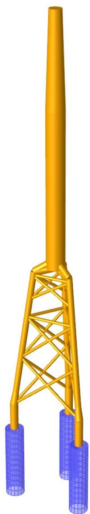  
Figure 11: Jacket model with suction buckets

## 6.4 PLAXIS 3D

This step involves importing the Suction Bucket Database into the PLAXIS 3D program. The Database directory can be imported using the SACS-PLAXIS Suction Bucket Analysis tool in PLAXIS 3D (under Expert menu) as shown in Figure 12.

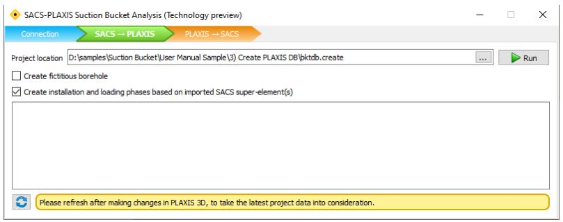  
Figure 12: Importing suction buckets using SACS-PLAXIS Suction Bucket Analysis Interoperability

This tool automatically first imports suction bucket geometry and material properties and creates suction bucket models in PLAXIS 3D. It also imports the superstructure stiffness and loads through the superelement and assigns each load case to a separate analysis phase. The PLAXIS model with three buckets has been shown in Figure 13.

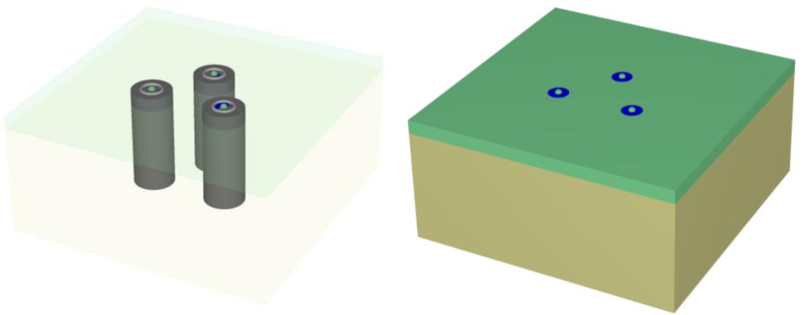  
Figure 13: Left) automatically generated suction buckets, Right) the full PLAXIS model with soil layers.

Once the nonlinear PLAXIS analysis is completed, the user can export the suction bucket response (stresses and deformation) back to the Suction Bucket Database as shown in Figure 14.

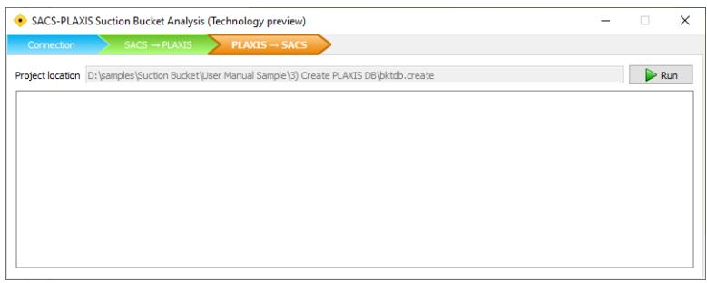

Figure 14: Exporting suction buckets results using SACS-PLAXIS Suction Bucket Analysis Interoperability

## 6.5 Generate Nonlinear Springs

To generate nonlinear springs associated with the soil, a suction bucket input file (bktinp.*) is needed. This input file is identical to the suction bucket input file used in Step 3, except additional options are entered for the fitting process, as shown below:

• The program function is set Read Database (‘RDB’)   
• Choose output model for the Gap Analysis (‘GAP’), or the Collapse Analysis (‘CLP’) – see below   
• Enter ‘DYN’ to create a SACS model with linearized springs for Mode Shapes Extraction (Dynpac)   
• Enter ‘BBP’ to create soil springs charts and Precede Foundation Data file for visualization of the springs in Precede.   
• Multilinear function ‘ML’ is entered for the fitting process   
• The nonlinear curves are being smoothed using the first derivative regularization option (‘R1’)   
The regularization (smoothing) weights are set by the main weight of ‘20’ with the partial weights of 1.0 for N springs and 0.001 for S and T springs

Note: the regularization weights are determined by reviewing the stress data. In this particular model, the normal deformation (N Springs) is relatively smaller than vertical displacement with a large variation in the stresses data – hence it requires a larger smoothing factor. On the other hand, the S and T stress-displacement curves are relatively smooth, and they just need a small smoothing factor

To generate a model with nonlinear springs for GAP Analysis (‘GAP’).   
```txt
1 2 3 4 5 6 7 8 12345678901234567890123456789012345678901234567890 3 BKTOPT MN +Z PLAXIS RDB CLP DYN BBP P1 POSO 5 L ML R1 20.1.0000.0010.001 
```

To generate a model with nonlinear springs for Collapse Analysis (‘CLP’).   
```txt
1 2 3 4 5 6 7 8 12345678901234567890123456789012345678901234567890 4BKTOPT MN +Z PLAXIS RDB CLP DYN BBP P1 POSO 5 L ML R1 20.1.0000.0010.001 
```

The nonlinear springs can be generated by selecting the analysis type “Read Suction Bucket Database” from “SACS Executive > Analysis Generator > Utilities > SACS-PLAXIS Suction Bucket Analysis > Read Suction Bucket Database”, and set the following files in the run file:

• The suction bucket input file (as explained in this step)   
• The SeaState Output Structural (OCI) file (seaoci.* created in Step 1)   
• The Suction Bucket Database (bktdb.*) created in Step 3 and modified by PLAXIS in Step 4 (the PLAXIS added the stresses results to the database)

The outputs of this step are as follows depending on the selected options:

• SACS model file with suction bucket model and additional joints and members for nonlinear springs

Note: Depending on the analysis type (Gap, Collapse, or Linear Spring), the output model is slightly different.

Depending on the analysis type, Gap input file or Collapse input file containing the nonlinear springs force-displacement curves.   
• A SACS model file with linear springs (sacinp2.*) for Mode Extraction (Dynpac Analysis)   
Charts for nonlinear springs and possible PLAXIS data points – see Figure 15.   
• Precede Foundation Data file to import and visualize the nonlinear spring in the Precede

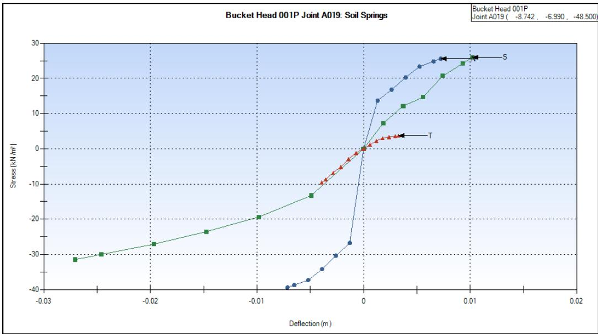  
Figure 15: Nonlinear Soil Spring Chart

## 6.6 Run Analysis

Gap Analysis and Post Processing

The Suction Bucket program automatically generates Gap input files containing the nonlinear springs, and this input file must be used to perform nonlinear analysis with Gap elements. The Suction Bucket program also adds additional options to the GAPOPT line as discussed below:

Advanced Linear Solver option (‘A2’) to speed up the Gap iterative algorithm. See section 4.2 or the Gap Analysis User manual for additional information.   
• Continue option (‘NE’) to continue analysis even if the convergence does not achieve. In the cases of suction buckets, because of the sheer number of springs, the residual may become small but not less than the tolerance. For example, the nonlinear analysis cannot continue due to a local minimum. This option allows the users to review the results of the non-convergence analysis.


|  | 1 | 1 | 2 | 2 | 3 | 3 | 4 | 4 | 5 | 5 | 6 | 6 | 7 | 7 | 8 | 8 |
| --- | --- | --- | --- | --- | --- | --- | --- | --- | --- | --- | --- | --- | --- | --- | --- | --- |
|  | 12345678901 | 12345678901 | 12345678901 | 12345678901 | 12345678901 | 12345678901 | 12345678901 | 12345678901 | 12345678901 | 12345678901 | 12345678901 | 12345678901 | 12345678901 | 12345678901 | 1234567890 | 1234567890 |
| 1 | GAOPT | GAOPT | MN | MN | 100 | 100 | 0.01 | 0.01 |  |  |  |  |  |  | A2NE | A2NE |
| 2 | GAPELM | A000 | A05S | G000 | FD | FD |  |  |  |  |  |  |  |  |  |  |
| 3 | F-DEL | F-DEL | -3.57 | -1.1653 | -1.1653 | -3.60 | -1.0594 | -1.0594 | -3.67 | -0.8475 | -0.8475 | -3.87 | -0.6356 | -0.6356 |  |  |
| 4 | F-DEL | F-DEL | -4.20 | -0.4238 | -0.4238 | -4.36 | -0.2119 | -0.2119 | 0.00 | 0.0000 | 0.0000 | 0.07 | 0.2115 | 0.2115 |  |  |
| 5 | F-DEL | F-DEL | 0.06 | 0.4230 | 0.4230 | 0.06 | 0.6344 | 0.6344 | 0.05 | 0.8459 | 0.8459 | 0.05 | 1.0574 | 1.0574 |  |  |
| 6 | F-DEL | F-DEL | 0.05 | 1.1631 | 1.1631 |  |  |  |  |  |  |  |  |  |  |  |
| 7 | * | * |  |  |  |  |  |  |  |  |  |  |  |  |  |  |
| 8 | * | * |  |  |  |  |  |  |  |  |  |  |  |  |  |  |
| 9 | * | * |  |  |  |  |  |  |  |  |  |  |  |  |  |  |
| 10 | END | END |  |  |  |  |  |  |  |  |  |  |  |  |  |  |


Similar to standard Gap Analysis, the SACS Post Processing program can be utilized to calculate stresses, perform various code checks, and design elements. For example, Figure 16 shows the maximum principal stresses in the plate elements associated with the suction buckets.

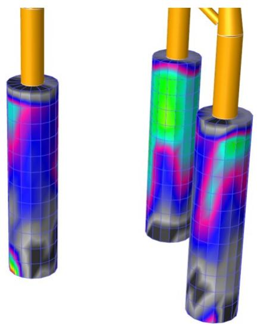  
Figure 16: Maximum Principal Stresses in Suction Bucket Plates

Collapse Analysis

One approach to check the accuracy of the nonlinear springs is to run Collapse Advanced and compare the bucket center deformation with PLAXIS results. As mentioned above, the Suction Bucket program automatically generates a Collapse input file containing the nonlinear springs. The following options are added to the input file to perform the nonlinear analysis with linear elastic structure with nonlinear springs:

• Enter a special option $" \mathrm{ L } \mathrm{ L }^{ \prime }$ on the CLPOPT line to set all members and plates to linear elastic elements.

Note: The PLAXIS model uses linear elements, so this special option is added to ensure an accurate comparison.

Enter $\mathop{ }^{ \prime } { \mathsf{ S } } { \mathsf{ I } }^{ \prime }$ to implement sub-incrementation   
• Select the relative coverage method (‘CRX’ on CLPOP2 line) with 0.1 % tolerance （$^{ \prime } { - } 3^{ \prime }$ on CLPOP2 line)   
Define the separate load sequences with each load combination generated in Step 1: SeaState as shown below


|  | 1 | 1 | 2 | 2 | 3 | 4 | 5 | 6 | 7 | 8 |
| --- | --- | --- | --- | --- | --- | --- | --- | --- | --- | --- |
|  | 12345678901 | 12345678901 | 12345678901 | 12345678901 | 12345678901 | 12345678901 | 12345678901 | 12345678901 | 12345678901 | 12 |
| 11 | CLPOPT | 20 | 1 | 20 |  | LL | SI | 0.010.001 | 0.011000. |  |
| 12 | CLPOP2 |  |  |  |  |  |  | -3 | CRX |  |
| 13 | FRCTOL | 1.0 | 1.0 |  |  |  |  |  |  |  |
| 14 | LDSEQ | L000 |  | C000 | 20 | 1.0 |  |  |  |  |
| 15 | LDSEQ | L045 |  | C045 | 20 | 1.0 |  |  |  |  |
| 16 | LDSEQ | L090 |  | C090 | 20 | 1.0 |  |  |  |  |
| 17 | LDSEQ | L135 |  | C135 | 20 | 1.0 |  |  |  |  |
| 18 | LDSEQ | L180 |  | C180 | 20 | 1.0 |  |  |  |  |
| 19 | LDSEQ | L225 |  | C225 | 20 | 1.0 |  |  |  |  |
| 20 | LDSEQ | L270 |  | C270 | 20 | 1.0 |  |  |  |  |
| 21 | LDSEQ | L315 |  | C315 | 20 | 1.0 |  |  |  |  |


Figure 17 compares the total horizontal displacement （$\sqrt{ u_{ x }^{ 2 } + u_{ y }^{ 2 } } )$ at the bucket center $\bf{ \Lambda }^{ \prime } 001 P^{ \prime }$ for all 8 load cases. These results show a good agreement between full analysis of the soil and buckets in PLAXIS 3D and the SACS using nonlinear springs.

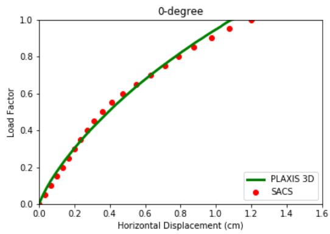

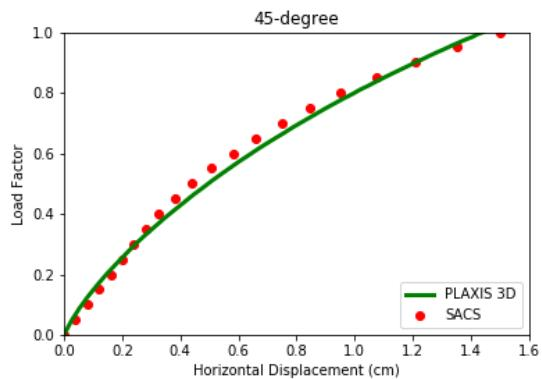

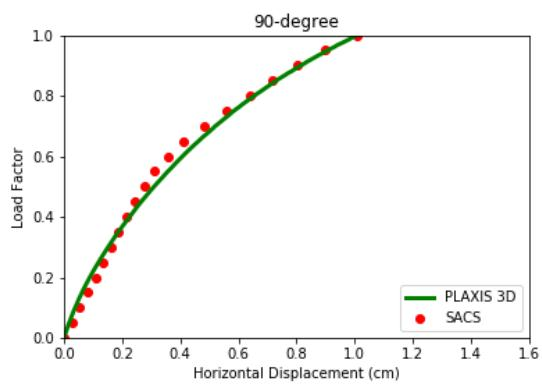

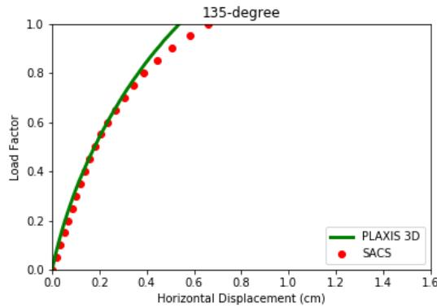

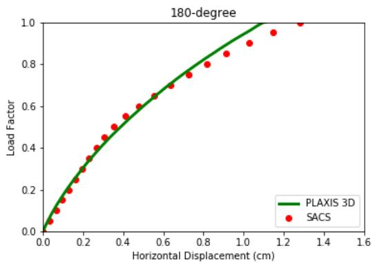

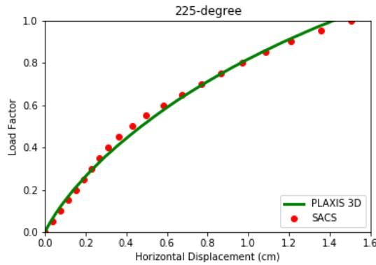

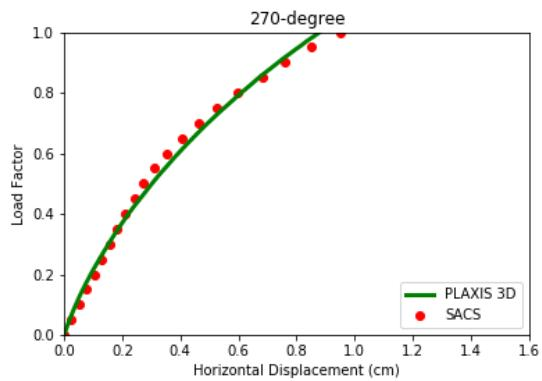

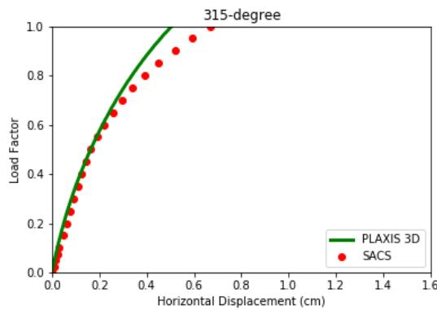  
Figure 17: Comparison of horizontal displacement for bucket head 001P, PLAXIS 3D (full nonlinear soil interaction), and SACS Collapse Advanced (using nonlinear springs)

Mode Shapes Extraction (Dynpac)

The Suction Bucket program can generate a SACS model file with linearized springs to be used in Mode Shapes Extraction Analysis (Dynpac). To use this file (sacinp2.*) for Dynpac Analysis, the user must add the retained degrees of freedoms (denoted by ‘2’) to the desired joints in the model. For the current sample problem, the retained degrees of freedom (the fixity of ‘222000’) are added to multiple joints in various elevations including the tower, the jacket, and bucket centers. The Mode Shape Extraction is carried out for the first 20 modes, with consistent mass formulation calculated by the Dynpac program.

Figure 18 illustrates the Dynpac outputs for the frequencies, generalized mass, and period,

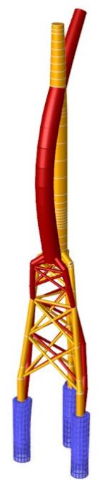  
Mode 6

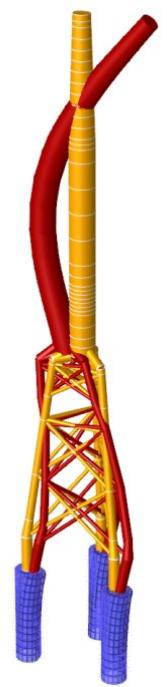  
Mode 7

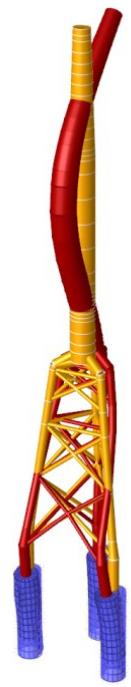  
Mode 8

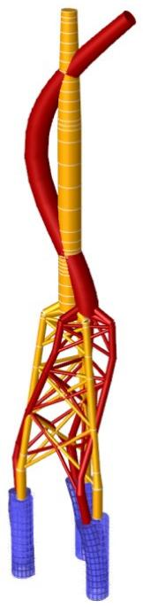  
Mode 9

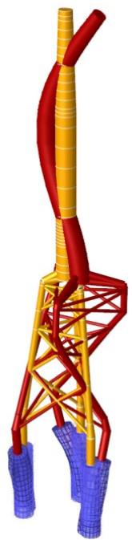  
Mode 10   
Figure 19 shows the modes shapes for various modes.

Note: In the case of mode shapes extraction associated with Gap Analysis, the density of the gap elements must be set to small values to ensure no extra mass is added to the model. To include the mass associated with the surrounding soil for the mode extraction, the gap element density can be adjusted accordingly.

SACS IU-FREQUENCIES AND GENERALIZED MASS   
Figure 18: Dynpac Output Listing for Frequencies, Generalized Mass, and Period   


| MODE | FREQ.(CPS) | GEN. MASS | EIGENVALUE | PERIOD(SECS) |
| --- | --- | --- | --- | --- |
| 1 | 0.852258 | 6.6978201E+01 | 3.4874323E-02 | 1.1733640 |
| 2 | 0.918923 | 6.2310924E+01 | 2.9997312E-02 | 1.0882309 |
| 3 | 1.946586 | 2.2647645E+02 | 6.6848722E-03 | 0.5137200 |
| 4 | 2.097263 | 2.6667170E+02 | 5.7588302E-03 | 0.4768118 |
| 5 | 2.942026 | 9.4086281E+02 | 2.9264919E-03 | 0.3399019 |
| 6 | 4.074813 | 1.1835596E+02 | 1.5255446E-03 | 0.2454100 |
| 7 | 4.355903 | 1.0780216E+02 | 1.3350078E-03 | 0.2295735 |
| 8 | 6.328553 | 1.0790936E+02 | 6.3245762E-04 | 0.1580140 |
| 9 | 6.568206 | 1.3386606E+02 | 5.8714676E-04 | 0.1522486 |
| 10 | 7.006641 | 3.7596572E+02 | 5.1596533E-04 | 0.1427217 |
| 11 | 7.204747 | 6.6141311E+02 | 4.8798086E-04 | 0.1387974 |
| 12 | 7.391651 | 8.1606974E+02 | 4.6361483E-04 | 0.1352878 |
| 13 | 7.484228 | 4.8039599E+02 | 4.5221627E-04 | 0.1336143 |
| 14 | 8.645254 | 6.7918880E+02 | 3.3891025E-04 | 0.1156704 |
| 15 | 9.186201 | 5.7132592E+02 | 3.0017071E-04 | 0.1088589 |
| 16 | 9.610673 | 6.3690885E+02 | 2.7424118E-04 | 0.1040510 |
| 17 | 10.272357 | 3.4166310E+02 | 2.4004906E-04 | 0.0973486 |
| 18 | 11.881363 | 2.0131501E+02 | 1.7943523E-04 | 0.0841654 |
| 19 | 12.636614 | 7.6413473E+02 | 1.5862761E-04 | 0.0791351 |
| 20 | 12.669856 | 2.3828328E+02 | 1.5779633E-04 | 0.0789275 |


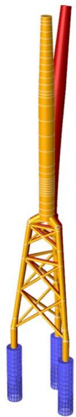  
Mode 1

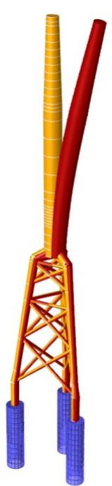  
Mode 2

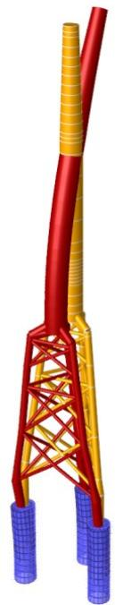  
Mode 3

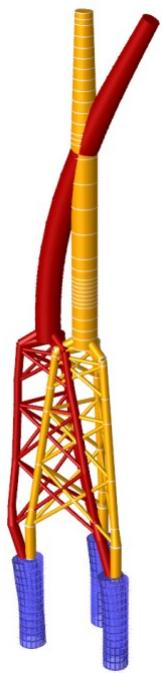  
Mode 4

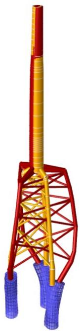  
Mode 5

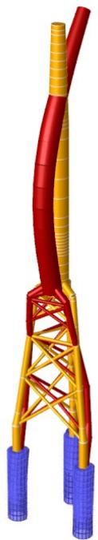  
Mode 6

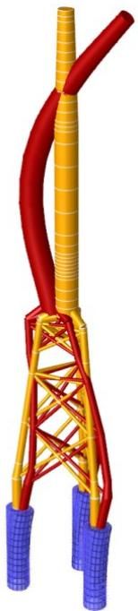  
Mode 7

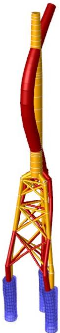  
Mode 8

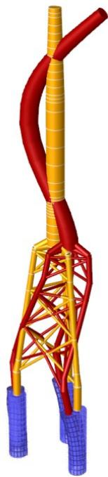  
Mode 9

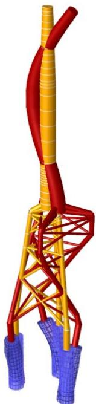  
Mode 10   
Figure 19: Mode Shapes for the First 10 Modes

7 INPUT LINES

SUCTION BUCKET OPTION LINE

COLUMNS

COMMENTARY

GENERAL THIS LINE IS USED TO ENTER THE GENERAL OPTIONS FOR THE SUCTION BUCKET PROGRAM. THESE OPTION INCLUDES THE UNITS, VERTICAL AXIS, OUTPUTS , MESHING AND FITTING PROCESS OPTIONSS.   
( 8- 9) ENTER 'EN' FOR ENGLISH UNIT, 'ME' FOR METRIC WIHT KG FORCE, 'MN' FOR METRIC UNIT WITH KN FORCE.   
(11-12) ENTER STRUCTURAL VERTICAL AXIS. '+Z','-Z','+X','-X','+Y','-Y'.   
(14-19) ENTER SOIL INTERACTION TYPE. CURRENTLY, THE ONLY POSSIBLE VALUE IS 'PLAXIS'.   
(21-23) ENTER 'CDB' FOR CREATE DATABASE MODE ENTER 'RDB' FOR READ DATABASE MODE   
(25-27) OUTPUT OPTION IS ONLY AVAILABLE IN 'READ DATABASE MODE' ENTER 'GAP' FOR GAP ANALISYS OUTPUTS ENTER 'CLP' FOR COLLAPSE ANALYSIS OUTPUTS ENTER 'SPG' FOR LINEAR ANALYSIS OUTPUTS   
(29-31) OUTPUT OPTION IS ONLY AVAILABLE IN 'READ DATABASE MODE' ENTER 'DYN' TO GENERATE DYNPAC MODEL FILE   
(33-35) OUTPUT OPTION IS ONLY AVAILABLE IN 'READ DATABASE MODE' ENTER 'BSP' FOR SOIL SPRINGS CHARTS ENTER 'BSD' FOR SOIL SPRINGS CHARTS WITH PLAXIS STRESS DATA POINTS ENTER 'BPP' FOR PRECEDE DATA FILE WITH SOIL SPRINGS ENTER 'BPD' FOR PRECEDE DATA FILE WITH SOIL SPRINGS WITH PLAXIS DATA ENTER 'BBP' FOR BOTH CHARTS AND PRECEDE DATA FILE ENTER 'BBD' FOR BOTH CHARTS AND PRECEDE DATA FILE WITH PLAXIS DATA

COLUMNS

COMMENTARY

(37-38) ENTER 'P1' FOR NODE CONFORMITY MESHING PATTERN ENTER 'P2' FOR FACE CONFORMITY MESHING PATTERN   
(40-41) ENTER 'PO' TO OFFSET THE PLATE AT TWO SEGMENTS INTERFACE WITH DIFFERENT DIMENSIONS. LEAVE 'BLANK' FOR NO OFFSET (DEFAULT)   
(42-43) ENTER 'SO' TO OFFSET THE SITFFENERS TO THE ENTERIOR SURFACE OF THE BUCKET. LEAVE 'BLANK' FOR NO OFFSET (DEFAULT)   
(45-46) ENTER AN INTEGER NUMBER FOR NUMBER DATA POINTS FOR EACH SIDE OF NONLINEAR SPRINGS.   
( 48 ) ENTER 'L' FOR LINEAR EXTRAPOLATION ENTER 'F' FOR CONSTANT (FLAT) EXTRAPOLATION   
(50-51) ENTER 'ML' FOR MULTILINEAR FUNCTION FITTING ENTER 'SE' FOR SPECIAL EXPONENTIAL FUNCTION FITTING   
(53-54) LEAVE BLANK FOR NO REGULARIZATION (SMOOTHING) ENTER 'R1' FOR FIRST DERIVATIVE (SLOPE) SMOOTHING ENTER 'R2; FOR SECOND DERIVATIVE (CURVETURE) SMOOTHING   
(56-60) ENTER REGULARIZATION WEIGHT. LEAVE BLANK FOR DEFAULT VALUE OF 0.1   
(61-65) ENTER PARTIAL REGULARIZATION WEIGHT FOR N SPTINGS LEAVE BLANK FOR DEFAULT VALUE OF 1.0   
(66-70) ENTER PARTIAL REGULARIZATION WEIGHT FOR S SPTINGS LEAVE BLANK FOR DEFAULT VALUE OF 1.0   
(71-75) ENTER PARTIAL REGULARIZATION WEIGHT FOR T SPTINGS LEAVE BLANK FOR DEFAULT VALUE OF 1.0   
(76-80) ENTER UPPER LIMIT FOR REGUALARIZATION. LEAVE BLANK TO APPLY SMOOTHING TO ALL SPRINGS


| LINE LABEL | UNIT | VERTICAL AXIS | SOIL INTERACTION TYPE | PROGRAM FUNCTION | OUTPUT OPTIONS | OUTPUT OPTIONS | OUTPUT OPTIONS | MESHING OPTIONS | MESHING OPTIONS | MESHING OPTIONS | FITTING OPTIONS | FITTING OPTIONS | FITTING OPTIONS | FITTING OPTIONS | FITTING OPTIONS |
| --- | --- | --- | --- | --- | --- | --- | --- | --- | --- | --- | --- | --- | --- | --- | --- |
| LINE LABEL | UNIT | VERTICAL AXIS | SOIL INTERACTION TYPE | PROGRAM FUNCTION | MODEL TYPE | DYNPAC MODEL | CHARTS PRECEDE | MESH PATTERN | PLATE OFFSET | STIFFENERS OFFSET | NUMBER OF POINTS | EXTRAPOLATION | FITTING FUNCTION | REGULARIZATION (SMOOTHING) | REGULARIZATION (SMOOTHING) |
| LINE LABEL | UNIT | VERTICAL AXIS | SOIL INTERACTION TYPE | PROGRAM FUNCTION | MODEL TYPE | DYNPAC MODEL | CHARTS PRECEDE | MESH PATTERN | PLATE OFFSET | STIFFENERS OFFSET | NUMBER OF POINTS | EXTRAPOLATION | FITTING FUNCTION | WEIGHTS | UPPER LIMIT |
| BKTOPT |  |  |  |  |  |  |  |  |  |  |  |  |  |  |  |
| 1--6 | 8--9 | 11--12 | 14--19 | 21-23 | 25-27 | 29--31 | 33--35 | 37--38 | 40-41 | 42--43 | 45<--46 | 48--48 | 50--51 | 56<--75 | 76<--80 |
| DEFAULT | MN | +Z | PLAXIS |  | GAP |  |  | P1 |  |  | 3 | L | ML |  |  |
| ENGLISH | EN |  |  |  |  |  |  |  |  |  |  |  |  |  |  |
| METRIC (KN) | MN |  |  |  |  |  |  |  |  |  |  |  |  |  |  |
| METRIC (KG) | ME |  |  |  |  |  |  |  |  |  |  |  |  |  |  |


END LINE

COLUMNS

COMMENTARY

LOCATION THIS LINE IS THE LAST LINE FOR ANY SUCTION BUCKET DATA FILE.

GENERAL THE 'END' LINE TERMINATES THE DATA READ BY THE SUCTION BUCKETPROGRAM. IF THIS LINE IS OMITTED THE PROGRAM WILL NOT EXECUTE.


| LINE LABEL | REMAINDER OF THIS LINE LEFT BLANK |
| --- | --- |
| END |  |
| 1-- 3 | 4-80 |


LONGITUDE STIFFENER GROUP INPUT LINE

COLUMNS

COMMENTARY

GENERAL THE 'LNGSTF' CAN BE USED TO DEFINE THE LONGITUDE SITFFENERS SPECIFICATIONS.THE STIFFENERS SECTION, SPACING, AND MATERIAL PROPERTIES ARE DEFINED ON THISINPUT LINE.

( 8- 9) ENTER SITFFENER GROUP LABEL   
(14-20) ENTER MEMBER CROSS SECTION LABEL PREVIOUSLY DEFINED ON SECT INTPUT LINE   
(22-29) ENTER START ANGLE OF STIFFENERS FROM +X GLOABL AXIS   
(31-38) ENTER CENTERLINE TO CENTERLINE SPACING BETWEEN STIFFENERS   
(40-42) ENTER NUMBER OF STIFFINERS IN THE STIFFENER GROUP   
(44-48) ENTER ELASTIC MODULE OF THE STIFFENERS   
(50-54) ENTER SHEAR MODULE OF THE STIFFENERS   
(56-60) ENTER YEILD STRESS OF THE STIFFENERS   
(62-67) ENTER WEIGHT DENSITY OF THE STIFFENERS


| LINE LABEL | STIFFENER LABEL | STIFFENERS SPECIFICATION | STIFFENERS SPECIFICATION | STIFFENERS SPECIFICATION | STIFFENERS SPECIFICATION | MATERIAL PERPERTIES | MATERIAL PERPERTIES | MATERIAL PERPERTIES | MATERIAL PERPERTIES | MATERIAL PERPERTIES |
| --- | --- | --- | --- | --- | --- | --- | --- | --- | --- | --- |
| LINE LABEL | STIFFENER LABEL | CROSS- SECTION LABEL | START LOCATION | SPACING | NUMBER OF STIFFENERS | E ----1000 | G ----1000 | YIELD STRESS SY | WEIGHT DENSITY | REMAINDER OF THIS LINE LEFT BLANK |
| LNGSTF |  |  |  |  |  |  |  |  |  |  |
| 1--6 | 8--9 | 14--20 | 22<--29 | 31<--38 | 40<--42 | 44<--48 | 50<--54 | 56<--60 | 62<--67 | 68- - - - - - - - - - - - - - - - - - - - - - - - - - - - - - - - - - - - - - - - - - - - - - - - - - - - - - - - - - - - - - - - - - - - - - - - - - - - - - - - - - - - - - - - - - - - - - - - - - - - - 80 |
| DEFAULT |  |  |  |  |  | 29.0 ENGL | 11.6 ENGL | 36.0 ENGL | 490.0 ENGL |  |
| ENGLISH |  |  | DEG | DEG |  | KSI | KSI | KSI | LB/CU.FT |  |
| METRIC (KN) |  |  | DEG | DEG |  | KN/SQ.CM | KN/SQ.CM | KN/SQ.CM | TONNE/CU.M |  |
| METRIC (KG) |  |  | DEG | DEG |  | KG/SQ.CM | KG/SQ.CM | KG/SQ.CM | TONNE/CU.M |  |


PLATE GROUP DESCRIPTION LINE

COLUMNS

COMMENTARY

GENERAL THIS LINE IS USED TO DESCRIBE PLATE CROSS SECTION PROPERTIESWHETHER THE PLATE IS MEMBRANE, ISOTROPIC, OR STIFFENED. THISLINE FOLLOWS THE 'PSTIF' LINES IF ANY.

( 6 ) ENTER 'P' TO DESIGNATE THIS PLATE GRUP AS A PANEL.   
( 7- 9) ENTER PLATE GROUP LABEL. THIS LABEL IS USED FOR SUBSEQUENT REFERENCING ON 'PLATE' LINES.   
( 10 ) ENTER 'Z' FOR STIFFENED PLATE LOCAL Z OFFSETS GENERATION. THESE OFFSETS WILL LOCATE THE PLATE SUCH THAT THE CENTER PLANE OF THE PLATE LIES ON THE JOINT PLANE. THESE OFFSETS WILL ADD TO ANY OTHER OFFSET DATA INPUT.   
( 17 ) ENTER 'I' FOR ISOTROPIC PLATE.ENTER 'M' FOR MEMBRANE PLATE HAVING NO OUT-OF-PLANE STIFFNESS.ENTER 'S' FOR SHEAR STIFFNESS ONLY.ENTER 'X' FOR 'X' DIRECTION CORRUGATED PLATE.ENTER 'Y' FOR 'Y' DIRECTION CORRUGATED PLATE.NOTE: USE 'PSTIF' LINE FOR BENDING STIFFNESS OF CORRUGATEDPLATE.  
(18-36) ENTER MATERIAL PROPERTY DATA TO BE USED WITH ALL PLATES OF THIS GROUP.

COLUMNS

COMMENTARY

(36-41) ENTER THE LOCAL Z OFFSETS TO BE USED WITH ALL PLATES OF THIS GROUP. THESE OFFSETS WILL BE ADDED TO ANY CALCULATED BY THE PROGRAM.   
(42-48) FOR STIFFENED PLATE, ENTER SECTION LABEL CORRESPONDING TO A STIFFENER DESCRIBED ON A 'PSTIF' LINE OR FROM THE STANDARD LIBRARY FILES.   
(49-54) ENTER SPACING BETWEEN STIFFENER CENTERLINES.   
( 55 ) ENTER 'X' OR 'Y' FOR STIFFENERS IN LOCAL X OR Y DIRECTIONS.   
( 56 ) ENTER 'B' FOR BOTTOM STIFFENERS (ON NEGATIVE LOCAL Z DIRECTION)

'T' FOR TOP STIFFENERS   
'S' FOR SYMMETRIC STIFFENERS (BOTTOM AND TOP)

(58-72) ENTER DATA FOR SECOND SET OF STIFFENERS.

IF MORE THAN TWO SETS OF STIFFENERS ARE DESIRED, THEY CAN BEDESCRIBED ON ADDITIONAL 'PGRUP' LINES HAVING THE SAME GROUPLABEL.

(73-80) ENTER THE MATERIAL WEIGHT DENSITY.


| LINE LABEL | PANEL DESIG- NATION | PLATE GROUP LABEL | AUTO. NEUTRAL AXIS OFFSET 'Z' | PLATE THICKNESS | PLATE TYPE SEE ABOVE | MATERIAL PROPERTY DATA | MATERIAL PROPERTY DATA | MATERIAL PROPERTY DATA | PLATE LOCAL Z OFFSET | FIRST STIFFENER | FIRST STIFFENER | FIRST STIFFENER | FIRST STIFFENER | SECOND STIFFENER | SECOND STIFFENER | SECOND STIFFENER | SECOND STIFFENER | WEIGHT DENSITY |
| --- | --- | --- | --- | --- | --- | --- | --- | --- | --- | --- | --- | --- | --- | --- | --- | --- | --- | --- |
| LINE LABEL | PANEL DESIG- NATION | PLATE GROUP LABEL | AUTO. NEUTRAL AXIS OFFSET 'Z' | PLATE THICKNESS | PLATE TYPE SEE ABOVE | E ----1000 | POISSON'S RATIO U | YIELD STRESS SY | PLATE LOCAL Z OFFSET | SECTION LABEL | AVERAGE SPACING | 'X' OR 'Y' | 'B' 'T' OR 'S' | SECTION LABEL | AVERAGE SPACING | 'X' OR 'Y' | 'B' 'T' OR 'S' | WEIGHT DENSITY |
| PGRP |  |  |  |  |  |  |  |  |  |  |  |  |  |  |  |  |  |  |
| 1--5 | 6 | 7<--9 | 10 | 11<--16 | 17 | 18<--23 | 24<--29 | 30<--35 | 36<--41 | 42<--48 | 49<--54 | 55 | 56 | 58<--64 | 65<--70 | 71 | 72 | 73<--80 |
| DEFAULT |  |  |  |  | 'I' | 29.0 ENGL | 0.3 | 36.0 ENGL |  |  |  | 'X' | 'T' |  |  | 'X' | 'T' | 490.0 ENGL |
| ENGLISH |  |  |  | IN |  | KSI |  | KSI | IN |  | IN |  |  |  | IN |  |  | LB/CU.FT |
| METRIC(KN) |  |  |  | CM |  | KN/SQ.CM |  | KN/SQ.CM | CM |  | CM |  |  |  | CM |  |  | TONNE/CU.M |
| METRIC(KG) |  |  |  | CM |  | KG/SQ.CM |  | KG/SQ.CM | CM |  | CM |  |  |  | CM |  |  | TONNE/CU.M |


SUCTION BUCKET DESCRIPTION LINE

COLUMNS

COMMENTARY

GENERAL THE 'PILE' CAN BE USED TO DEFINE THE SUCTION BUCKET ELEMENT. THE LINE REQUIRS THE THE PILE CENTER JOINT NAME TO CONNECT TO THE STRUCUTRE, THE PILE GROUP LABELS, AND NUMBER OF ELEMENTS FOR MESHING.

( 7-10) ENTER SUCTION BUCKET CENTER JOINT LABEL. THE JOINT MUST BE ALREADY DEFINED IN THE SACS MODEL FILE WITH 'PILEHD' FIXITY   
(16-18) ENTER PILE GROUP LABEL. THE LABEL MUST BE ALREADY DEFINED ON PILE GROUP LINE 'PLGRUP'   
(20-22) ENTER NUMNER OF THE ELEMENT AROUND BUCKET CIRCUMFERENCE   
(24-26) ENTER THE PLATE GROUP THE BUCKET CAP. THE LABEL MUST BE ALREADY DEFINED ON PLATE GROUP LINE 'PGRUP'   
(28-35) ENTER THE EMBEDDED LENGTH OF THE BUCKET LEAVE BLANK IF THE ENTIRE BUCKET IS EMBEDDED IN THE SOIL


| LINE LABEL | PILEHEAD JOINT LABEL | PILE GROUP LABEL | NUMBER OF ELEMENTS | CAP PLATE GROUP | EMBEDDED LENGTH | REMAINDER OF THIS LINE LEFT BLANK |
| --- | --- | --- | --- | --- | --- | --- |
| PILE |  |  |  |  |  |  |
| 1--4 | 7--10 | 16--18 | 20<--22 | 24--26 | 28<--35 | 36--------80 |
| DEFAULT |  |  |  |  |  |  |
| ENGLISH |  |  |  |  | FT |  |
| METRIC (KN) |  |  |  |  | M |  |
| METRIC (KG) |  |  |  |  | M |  |


PLAXIS OPTION LINE

COLUMNS

COMMENTARY

GENERAL THE 'PLAXIS' OPTION LINE IS REQUIRED TO ENTER PLAXIS OPTIONS TO GENERATE SUCTION BUCKET MODEL FILES AND IMPORT PLAXIS RESULTS FOR SPRING GENERATION

( 8- 9) PLAXIS MODEL VERTICAL AXIS '+Z','-Z','+X','-X','+Y','-Y'.   
(11-13) ENTER NUMBER BUCKETS IN THE PLAXIS MODEL   
(15-17) ENTER NUMBER OF LOAD CASES EXPORTED TO PALXIS OR IMPORTED FROM PLAXIS   
(19-21) ENTER THE FIRST ANALYSIS PHASE NUMBER IN PLAXIS MODEL. THE PROGRAM USES THIS INPUT TO IMPORT/EXPORT LOAD CASES. NOTE: THE FIRST ANALYSIS PHASE IS USUALLY 2 SINCE THE FIRST PHASE IS USED TO MODEL BUCKETS INSTALLATION.


| LINE LABEL | VERTICAL AXIS | NUMBER OF BUCKETS | NUMBER OF LOAD CASES | FIRST PHASE NO. | REMAINDER OF THIS LINE LEFT BLANK |
| --- | --- | --- | --- | --- | --- |
| PLAXIS |  |  |  |  |  |
| 1--6 | 8--9 | 11<--13 | 15<--17 | 19<--21 | 22--------80 |
| DEFAULT | +Z |  |  |  |  |


SUCTION BUCKET GROUP INPUT LINE

COLUMNS

COMMENTARY

GENERAL THE 'PLGRUP' CAN BE USED TO DEFINE THE SUCTION BUCKET GROUPS. REPEAT THIS LINE WITH THE SAME GROUP LABEL TO ENTER A SEGMENTED BUCKET.

( 8- 9) ENTER SUCTION BUCKET GROUP LABEL LABEL   
(12-14) ENTER PLATE GROUP LABEL FOR CURRENT SEGMENT. THE LABEL MUST BE ALREADY DEFINED ON PLATE GROUP LINE 'PGRUP'   
(16-23) ENTER LENGTH OF THE CURRENT SEGMENT   
(25-32) ENTER OUTER DIAMETER OF THE CURRENT SEGMENT   
(34-36) ENTER RING STIFFENER LABEL FOR THE CURRENT SEGMENT. THE LABEL MUST BE ALREADY DEFINED ON RING STIFFENER GROUP LINE 'RNGSTF'   
(38-40) ENTER LONGITUDE STIFFENER LABEL FOR THE CURRENT SEGMENT. THE LABEL MUST BE ALREADYDEFINED ON LONGITUDE STIFFENER GROUP LINE 'LNGSTF'  
(42-44) ENTER NUMBER OF ELEMENTS FOR THE CURRENT SEGMENT


| LINE LABEL | BUCKET GROUP LABEL | PLATE GROUP | SEGMENT LENGTH | SEGMENT OUTTER DIAMETER | RING STIFFENER | LONGITUDE STIFFENER | NUMBER OF ELEMENTS | REMAINDER OF THIS LINE LEFT BLANK |
| --- | --- | --- | --- | --- | --- | --- | --- | --- |
| PLGRP |  |  |  |  |  |  |  |  |
| 1--6 | 8--9 | 12--14 | 16<--23 | 25<--32 | 34--36 | 38--40 | 42--44 | 45---------80 |
| DEFAULT |  |  |  |  |  |  |  |  |
| ENGLISH |  |  | FT | FT |  |  |  |  |
| METRIC (KN) |  |  | M | M |  |  |  |  |
| METRIC (KG) |  |  | M | M |  |  |  |  |


RING STIFFENER GROUP INPUT LINE

COLUMNS

COMMENTARY

GENERAL THE 'RNGSTF' CAN BE USED TO DEFINE THE RING SITFFENERS SPECIFICATIONS. THE STIFFENERS SECTION, SPACING, AND MATERIAL PROPERTIES ARE DEFINED ON THIS INPUT LINE.

( 8- 9) ENTER SITFFENER GROUP LABEL   
(14-20) ENTER MEMBER CROSS SECTION LABEL PREVIOUSLY DEFINED ON SECT INTPUT LINE   
(22-29) ENTER START LOCATION OF STIFFENERS FROM BEGINING OF THE BUCKET SEGEMENT   
(31-38) ENTER CENTERLINE TO CENTERLINE SPACING BETWEEN STIFFENERS   
(40-42) ENTER NUMBER OF STIFFINERS IN THE STIFFENER GROUP   
(44-48) ENTER ELASTIC MODULE OF THE STIFFENERS   
(50-54) ENTER SHEAR MODULE OF THE STIFFENERS   
(56-60) ENTER YEILD STRESS OF THE STIFFENERS   
(62-67) ENTER WEIGHT DENSITY OF THE STIFFENERS


| LINE LABEL | STIFFENER LABEL | STIFFENERS SPECIFICATION | STIFFENERS SPECIFICATION | STIFFENERS SPECIFICATION | STIFFENERS SPECIFICATION | MATERIAL PERPERTIES | MATERIAL PERPERTIES | MATERIAL PERPERTIES | MATERIAL PERPERTIES | MATERIAL PERPERTIES |
| --- | --- | --- | --- | --- | --- | --- | --- | --- | --- | --- |
| LINE LABEL | STIFFENER LABEL | CROSS- SECTION LABEL | START LOCATION | SPACING | NUMBER OF STIFFENERS | E ----1000 | G ----1000 | YIELD STRESS SY | WEIGHT DENSITY | REMAINDER OF THIS LINE LEFT BLANK |
| RNGSTF |  |  |  |  |  |  |  |  |  |  |
| 1--6 | 8--9 | 14--20 | 22<--29 | 31<--38 | 40<--42 | 44<--48 | 50<--54 | 56<--60 | 62<--67 | 68- - - - - - - - - - - - - - - - - - - - - - - - - - - - - - - - - - - - - - - - - - - - - - - - - - - - - - - - - - - - - - - - - - - - - - - - - - - - - - - - - - - - - - - - - - - - - - - - - - - - - 80 |
| DEFAULT |  |  |  |  |  | 29.0 ENGL | 11.6 ENGL | 36.0 ENGL | 490.0 ENGL |  |
| ENGLISH |  |  | FT | FT |  | KSI | KSI | KSI | LB/CU.FT |  |
| METRIC (KN) |  |  | M | M |  | KN/SQ.CM | KN/SQ.CM | KN/SQ.CM | TONNE/CU.M |  |
| METRIC (KG) |  |  | M | M |  | KG/SQ.CM | KG/SQ.CM | KG/SQ.CM | TONNE/CU.M |  |


MEMBER CROSS SECTION STRUCTURAL PROPERTY LINE

COLUMNS

COMMENTARY

GENERAL THIS IS ONE OF SEVERAL 'SECT' LINES; THIS LINE SPECIFIES THEPROPERTIES OF WIDE FLANGES, BOX AND OTHER ARBITRARYSYMMETRIC CROSS SECTIONS. SEE OTHER 'SECT' LINES FOR OTHERCROSS SECTIONS (TEE, CHANNEL, ANGLE, ...).

THE 'SECT' LINES ARE USED TO INPUT FOR EACH TYPE OF MEMBER IN A STRUCTURE THE CROSS SECTIONAL STIFFNESS PROPERTIES AND THE DIMENSIONS USED FOR STRESS CALCULATIONS. EACH CROSS SECTION TYPE IS GIVEN A LABEL WHICH IS UNIQUE FOR THAT CROSS SECTION. FOR TUBULAR AND STANDARD LIBRARY CROSS SECTIONS THE 'SECT' LINE IS OPTIONAL. TUBULAR PROPERTIES CAN BE GENERATED BY THE PROGRAM IF THE OUTSIDE DIAMETER AND WALL THICKNESS ARE ENTERED ON THE CORRESPONDING 'GRUP' LINE. LIKEWISE FOR A STANDARD LIBRARY CROSS SECTION LOCATED IN THE PROGRAM LIBRARIES (SEE LISTING FOLLOWING 'SECT' LINE INPUT) THE APPROPRIATE CROSS SECTION LABEL IS INPUT ON THE 'GRUP' LINE.

( 1- 4) ENTER 'SECT' ON EACH LINE OF THIS SET. THE FIRST LINE IN THIS SET SHOULD CONTAIN ONLY THE WORD 'SECT' AS A HEADER.

( 6-12) ENTER THE UNIQUE CROSS SECTION LABEL FOR THIS CROSS SECTION TYPE.

NOTE: IF THE 'WFC' OPTION IS SELECTED ALL MEMBERS USING THIS CROSS SECTION WILL BE CONSIDERED COMPACT. IF THE 'WF ' OPTION IS SELECTED THE CROSS SECTION WILL BE CONSIDERED COMPACT IF AISC PARAGRAPH 1.5.1.4 IS MET EXCLUDING EQUATION 1.5-4A AND AXIAL LOAD DEPENDENCE.

COLUMNS

COMMENTARY

(16-18) ENTER THE CROSS SECTION TYPE FROM THE LIST BELOW. THE CROSS SECTION TYPE IS USED TO SPECIFY THE EQUATIONS FOR STRESS CALCULATIONS (SEE APPENDIX).

'WF ' - WIDE FLANGE

'WFC' - WIDE FLANGE COMPACT

'BOX' - RECTANGULAR BOX

'PRI' - GENERAL PRISMATIC SHAPE

(19-48) ENTER STIFFNESS PROPERTY OVERRIDES FOR AXIAL AREA, POLAR MOMENT OF INERTIA, AND/OR MOMENT OF INERTIA ABOUT LOCAL Y AND Z AXES IF VALUES CALCULATED BY THE PROGRAMS ARE TO BE OVERRIDDEN.

NOTE: SHEAR AREAS FOR SHEAR STIFFNESS ARE AS FOLLOWS - WF AND WFC USE THE WEB AREA FOR LOCAL Z SHEAR AND 5/6 OF THE FLANGE AREA FOR LOCAL Y SHEAR - TUB USE HALF OF AXIAL AREA - BOX USE THE WALL AREA PARALLEL TO SHEAR DIRECTION - PRI USE SHEAR AREAS INPUT IN CROSS SECTION DETAILS, AREA FOR SHEAR STRESS IS 0.8 OF INPUT SHEAR AREA ASSUMING A RECTANGULAR SECTION WITH PARABOLIC SHEAR STRESS DISTRIBUTION. IF SHEAR AREAS ARE LEFT BLANK THEN THE SHEAR DEFORMATION FOR THESE MEMBERS IS IGNORED.

(50-76) ENTER CROSS SECTION DETAILS AS ILLUSTRATED IN THE ACCOMPANYING FIGURES.


| LINE LABEL | CROSS SECTION LABEL | CROSS SECTION TYPE | STIFFNESS PROPERTIES | STIFFNESS PROPERTIES | STIFFNESS PROPERTIES | STIFFNESS PROPERTIES | . | CROSS SECTION DETAILS | CROSS SECTION DETAILS | CROSS SECTION DETAILS | CROSS SECTION DETAILS | CROSS SECTION DETAILS |
| --- | --- | --- | --- | --- | --- | --- | --- | --- | --- | --- | --- | --- |
| LINE LABEL | CROSS SECTION LABEL | CROSS SECTION TYPE | STIFFNESS PROPERTIES | STIFFNESS PROPERTIES | STIFFNESS PROPERTIES | STIFFNESS PROPERTIES | TYPE | A | B | C | D | E |
| LINE LABEL | CROSS SECTION LABEL | CROSS SECTION TYPE | AX | J | IY | IZ | WF | FLANGE WIDTH | FLANGE THICK. | DEPTH | WEB THICK. | FILLET RADIUS |
| LINE LABEL | CROSS SECTION LABEL | CROSS SECTION TYPE | AX | J | IY | IZ | WFC | FLANGE WIDTH | FLANGE THICK. | DEPTH | WEB THICK. | FILLET RADIUS |
| LINE LABEL | CROSS SECTION LABEL | CROSS SECTION TYPE | AX | J | IY | IZ | BOX | Z-DIMENSION | Z-WALL THICK. | Y-DIMENSION | Y-WALL THICK. | N.A. |
| LINE LABEL | CROSS SECTION LABEL | CROSS SECTION TYPE | AX | J | IY | IZ | PRI | Z-DIMENSION | Y-Y SHIFT | Y-DIMENSION | Y-SHEAR AREA | Z-SHEAR AREA |
| SECT |  |  |  |  |  |  |  |  |  |  |  |  |
| 1--4 | 6<--12 | 16<--18 | 19<--24 | 25<--32 | 33<--40 | 41<--48 | 49 | 50<--55 | 56<--60 | 61<--66 | 67<--71 | 72<--76 |
| DEFAULT |  |  |  |  |  |  |  |  |  |  |  |  |
| ENGLISH |  |  | SQ.IN | IN**4 | IN**4 | IN**4 |  | IN | IN | IN | IN OR SQ.IN | IN OR SQ.IN |
| METRIC |  |  | SQ.CM | CM**4 | CM**4 | CM**4 |  | CM | CM | CM | CM OR SQ.CM | CM OR SQ.CM |


MEMBER CROSS SECTION STRUCTURAL PROPERTY LINE

COLUMNS

COMMENTARY

GENERAL

THIS IS ONE OF SEVERAL 'SECT' LINES; THIS LINE SPECIFIES THEPROPERTIES OF TEE, CHANNEL, AND ANGLE CROSSSECTIONS. SEE OTHER 'SECT' LINES FOR OTHER CROSS SECTIONS(WIDE FLANGE, BOX, ...).

THE 'SECT' LINES ARE USED TO INPUT FOR EACH TYPE OF MEMBER IN A STRUCTURE THE CROSS SECTIONAL STIFFNESS PROPERTIES AND THE DIMENSIONS USED FOR STRESS CALCULATIONS. EACH CROSS SECTION TYPE IS GIVEN A LABEL WHICH IS UNIQUE FOR THAT CROSS SECTION. FOR TUBULAR AND STANDARD LIBRARY CROSS SECTIONS THE 'SECT' LINE IS OPTIONAL. TUBULAR PROPERTIES CAN BE GENERATED BY THE PROGRAM IF THE OUTSIDE DIAMETER AND WALL THICKNESS ARE ENTERED ON THE CORRESPONDING 'GRUP' LINE. LIKEWISE FOR A STANDARD LIBRARY CROSS SECTION LOCATED IN THE PROGRAM LIBRARIES (SEE LISTING FOLLOWING 'SECT' LINE INPUT) THE APPROPRIATE CROSS SECTION LABEL IS INPUT ON THE 'GRUP' LINE.

( 1- 4)

ENTER 'SECT' ON EACH LINE OF THIS SET. THE FIRST LINE IN THIS SET SHOULD CONTAIN ONLY THE WORD 'SECT' AS A HEADER.

( 6-12)

ENTER THE UNIQUE CROSS SECTION LABEL FOR THIS CROSS SECTION TYPE.

COLUMNS

COMMENTARY

(16-18)

ENTER THE CROSS SECTION TYPE FROM THE LIST BELOW. THE CROSS SECTION TYPE IS USED TO SPECIFY THE EQUATIONS FOR STRESS CALCULATIONS AND STIFFNESS PROPERTIES (SEE APPENDIX).

'PLG' - PLATE GIRDER SECTION   
'TEE' - TEE SECTION   
'CHL' - CHANNEL CROSS SECTION   
'ANG' - ANGLE CROSS SECTION

(19-48)

ENTER STIFFNESS PROPERTY OVERRIDES FOR AXIAL AREA, POLAR MOMENT OF INERTIA, AND/OR MOMENT OF INERTIA ABOUT LOCAL Y AND Z AXES IF VALUES CALCULATED BY THE PROGRAMS ARE TO BE OVERRIDDEN.

NOTE: DO NOT ENTER STIFFNESS PROPERTIES FOR THE 'ANG' CROSS SECTIONS. THESE PROPERTIES, WITH THE Y AND Z CENTROID DIMENSIONS, ARE CALCULATED FROM THE DETAIL DIMENSIONS BECAUSE OF THE SKEWED PRINCIPAL AXES.

(50-80)

ENTER CROSS SECTION DETAILS AS ILLUSTRATED IN THE ACCOMPANYING FIGURES.


| LINE LABEL | CROSS SECTION LABEL | CROSS SECTION TYPE | STIFFNESS PROPERTIES | STIFFNESS PROPERTIES | STIFFNESS PROPERTIES | STIFFNESS PROPERTIES | . | CROSS SECTION DETAILS | CROSS SECTION DETAILS | CROSS SECTION DETAILS | CROSS SECTION DETAILS | CROSS SECTION DETAILS | CROSS SECTION DETAILS |
| --- | --- | --- | --- | --- | --- | --- | --- | --- | --- | --- | --- | --- | --- |
| LINE LABEL | CROSS SECTION LABEL | CROSS SECTION TYPE | STIFFNESS PROPERTIES | STIFFNESS PROPERTIES | STIFFNESS PROPERTIES | STIFFNESS PROPERTIES | TYPE | A | B | C | D | E | F |
| LINE LABEL | CROSS SECTION LABEL | CROSS SECTION TYPE | AX | J | IY | IZ | PLG | FL WIDTH | FL WIDTH | TOTAL DEPTH | WEB THICK. | FILLET RAD. | N.A. |
| LINE LABEL | CROSS SECTION LABEL | CROSS SECTION TYPE | AX | J | IY | IZ | TEE | HEIGHT | WIDTH | WEB THICK. | FLANG THICK. | Z-DIMENSION | FILLET RADIUS |
| LINE LABEL | CROSS SECTION LABEL | CROSS SECTION TYPE | AX | J | IY | IZ | CHL | HEIGHT | WIDTH | WEB THICK. | FLANG THICK. | Y-DIMENSION | FILLET RADIUS |
| LINE LABEL | CROSS SECTION LABEL | CROSS SECTION TYPE | AX | J | IY | IZ | ANG | HEIGHT | WIDTH | THICKNESS | Y-DIMENSION | Z-DIMENSION | FILLET RADIUS |
| SECT |  |  |  |  |  |  |  |  |  |  |  |  |  |
| 1--4 | 6<--12 | 16<--18 | 19<--24 | 25<--32 | 33<--40 | 41<--48 | 49 | 50<--55 | 56<--60 | 61<--66 | 67<--71 | 72<--76 | 77<--80 |
| DEFAULT |  |  |  |  |  |  |  |  |  |  |  |  |  |
| ENGLISH |  |  | SQ.IN | IN**4 | IN**4 | IN**4 |  | IN | IN | IN | IN | IN | IN |
| METRIC |  |  | SQ.CM | CM**4 | CM**4 | CM**4 |  | CM | CM | CM | CM | CM | CM |

