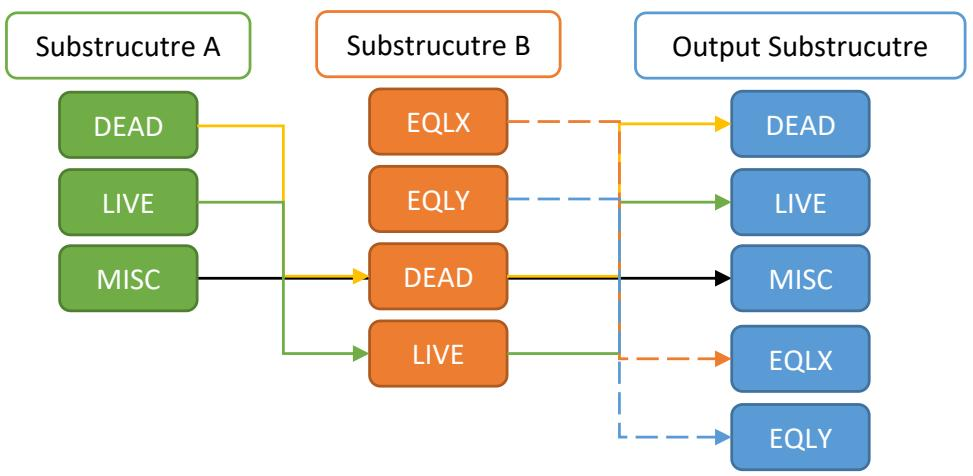
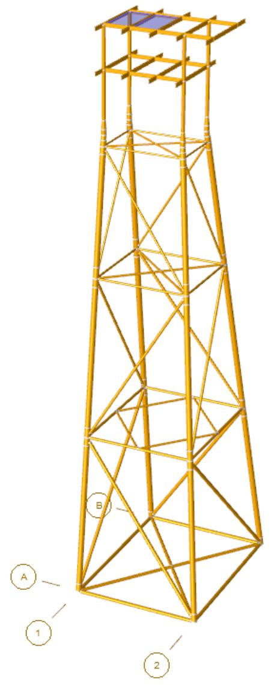
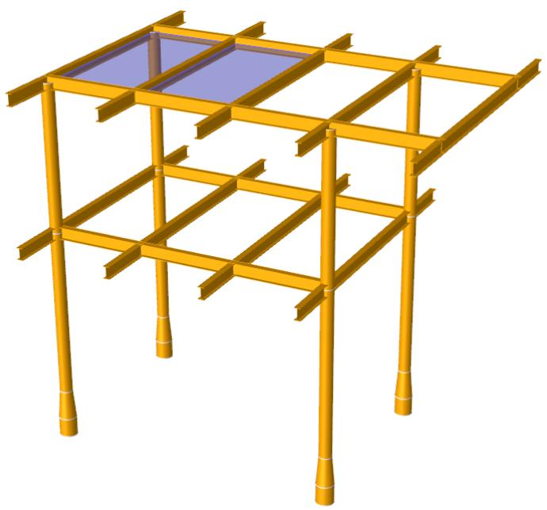
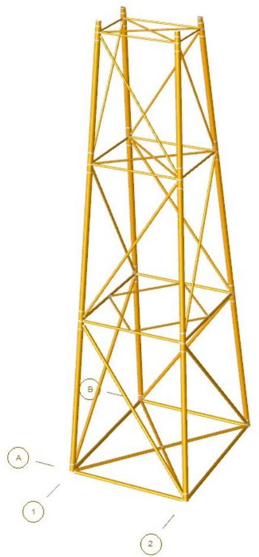

SACS

Superelement

Version 24.00

Trademark Notice

Bentley and the "B" Bentley logo are either registered or unregistered trademarks or service marks of Bentley Systems, Incorporated. All other marks are the property of their respective owners.

Copyright Notice

Copyright © 2024, Bentley Systems, Incorporated. All Rights Reserved.

TABLE OF CONTENTS

1 INTRODUCTION .. 4   
2 ANALYSIS PROCEDURE .

## 2.1 CREATING A SUPERELEMENT.. . 5
## 2.2 MERGING SUPERELEMENTS.. . 6

2.2.1 Merging Loading . .. 6

## 2.3 INPUTTING STIFFNESS DIRECTLY... . 8
## 2.4 Formatting Superelement.. . 8
## 2.5 Unformatting Superelement.. ... 10

3 COMMENTARY . 12

## 3.1 SUBSTRUCTURE CREATION. . 12
## 3.2 SUBSTRUCTURE EXPANSION.. .. 13

4 SAMPLE PROBLEMS.. .. 14

## 4.1 SUPERELEMENT CREATION... . 15
## 4.2 SUPERELEMENT EXPANSION.. .19
## 4.3 DIRECT STIFFNESS INPUT . .. 24

5 INPUT LINES... .. 26

1 INTRODUCTION

The Superelement module is designed to be a multi-purpose module that will perform a variety of functions in regard to substructures or superelements. A substructure is defined to be a portion of structure which has been modeled and reduced down to a set of boundary joints. The total effect of a substructure on the rest of the structure can be represented in terms of the substructure reduced stiffness matrix and the reduced forces. Substructuring can used may be useful where the structure is too large for a single analysis, where a portion of the structure will not be changing for various configurations or where portions of the structure are repeated.

The substructure program module can be used for the following functions:

1. Creation of substructure   
2. Expansion of retained model results   
3. Changing load case naming   
4. Adding in zero load cases   
5. Changing boundary joint naming   
6. Merging two substructures into one   
7. Inputting stiffness directly into an analysis   
8. Formatting the superelement: This function converts SACS superelement binary file into a formatted (ASCII) text file. This option may be used to export SACS superelement to other programs.   
9. Unformatting the superelement: This function converts a formatted ASCII file into SACS binary superelement file. This function provides a convenient method to import superelement data into SACS.

2 ANALYSIS PROCEDURE

The analysis procedure depends on the function that the substructure is performing.

## 2.1 CREATING A SUPERELEMENT

The first function is in the creation of a substructure or superelement. In the SACS system, the substructure information is contained in a substructure file. This file basically contains 6X6 stiffness partitions and the 6Xn reduced load vectors where n is the number of load cases.

In order to create a superelement, the boundary joints degrees of freedom must be designated as retained degrees of freedom by using ‘222222’ as the fixity. The Create Superelement option must be designated by either specifying ‘C’ in column 10 on the OPTIONS line in the substructure model or by selecting the appropriate option in the Executive.

Note: No superelement input file is required to create a superelement.

The substructure down is reduced down to these boundary joints. This procedure mathematically is as follows. The Reduced Stiffness Matrix ${ \bf K }_{ r r }$ is computed as

$$\mathbf{K}_{r r} = \mathbf{K}_{R R} - \mathbf{K}_{R F} \mathbf{K}_{F F}^{-1} \mathbf{K}_{F R}, \tag{1}$$

and Reduced Forces ???? are

$$\mathbf{f}_{r} = \mathbf{f}_{R} - \mathbf{K}_{R F} \mathbf{K}_{F F}^{-1} \mathbf{f}_{F}, \tag{2}$$

where ?? and ?? denote retained and free degrees of freedom, respectively.

The superelement file contains the reduced stiffness matrix, reduced force vectors and other information required for the subsequent expansion.

After condensing or reducing the substructure, the retained model should be solved using the substructure file as input along with the retained model file. The model file must contain the boundary joints that were designated in the substructure file. However it should not contain the constrained (reduced) joints of the substructure.

Note: The boundary joints in the retained model do not need any special boundary condition specifications.

The load conditions for the retained model must be the same as for the substructure. The solution file will contain the deflections of all the joints in the retained model including the boundary joints of the substructure.

After solving, the results may be expanded where the deflections of the boundary joints are extracted from the retained model results. These deflections can then be used to obtain all the deflections of the substructure.

## 2.2 MERGING SUPERELEMENTS

In addition to creating and expanding substructures, the Superelement module can be used as a substructure utility program to merge substructures. The merging of two substructures results in a substructure containing the stiffness and forces from both substructures. The process of merging can be continued indefinitely so that any number of substructures can be merged. It should also be noted that substructures can be used to create other substructures so that a substructure can be a part of another substructure. This procedure can be repeated to accomplish any level of substructuring.

The superelement program merges the load cases based on their names by default. If the load case name is the same in both substructures, the Superelement program combines two loads into a single load case in the output substructure. If a given load case name is not present in the other substructure, the program simply transfers the load case to the output superelement. The following chart illustrates the automatic process of merging load cases.



Note: No superelement input file is required when automatically merging substructures.

2.2.1 Manually Merging Loading

The MRGLOAD input line can be used to manually merge load cases from two substructures by specifying their labels on this input line. This line can be repeated as many times as necessary to merge all required load cases. The MRGLOAD input line merges load cases as follows:

Merge two load cases with different names: Enter the load case name pair on the MRGLOAD line and the program combines two load cases. The output load case name will be the same as the load case name in the first superelement file.   
Transfer load cases without merging: Enter the name of the load case being transferred from the first superelement file on the MRGLOAD line, while leaving the name for the second superlement blank, and vice versa.

Note: The load cases in the output substructure will be the same as the load name in the first substructure if it is not blank. otherwise, the output load case name is the same as the second substructure.

The following sample MRGLOAD line performs the following load merge:

1. Merge load case ‘FX’ from the first substructure with the ‘LX’ load case from the second substructure and transfer it as ‘FX’ to the output substructure.   
2. Transfer load case ‘FY’ with the same name to the output substructure.   
3. Transfer load case ‘LY’ with the same name to the output substructure.

```txt
1 2 3 4 5 6 7 8 1 1234567890123456789012345678901234567890123456789012345678901234567890123456789012345678901234567890123456789 
```

Note: A superelement input file is required when merging load cases using the MRGLOAD input line.

Note: The program only includes the load cases entered in the line. Other load cases are not transferred to the new substructure. therefore, all load cases that are to be included in the new substructure must be specified.

## 2.3 Modifying Superelement

The Superelement program can modify a superelement file by renaming the joints and the load cases using CHGJ and CHGL input lines, respectively. The modifying superelement function is implemented by entering MOD on columns 8-10 of the SUBOPT input line.

2.3.1 Modifying Joint Labels

Joint labels can be renamed by entering the original name and new name of the joint on the CHGJ input line. A total of 9 joints can be entered on a single CHGJ line and it can be repeated as many times as necessary to modify the required joint labels. For the joints that are not listed on this line, the Superelement program uses their original names in the input superelement.

Note: If the program does not find a joint in the original superelement, it silently ignores the input.

The following example illustrates how the CHGJ line is used to rename joints 0001, 0002, 0003, to P001m P002, and P003, respectively.

```txt
1 2 3 4 5 6 7 8 1 23456789012345678901234567890123456789012345678901234567890 1 CHGJ 0001P0010002P0020003P003 
```

2.3.2 Modify Load Cases

The Superelement Program can modify a superelement by renaming, removing, or adding empty (zero) load cases, using the CHGL input line.

Renaming a load case: Enter the original name of the load case in the input superelement and its new name on the CHGL input line, and the program renames the load case.   
Removing a load case: Do not list the load case name on the CHGL input line. The program only transfers the load cases listed on the CHGL line to the modified superelement and ignores the rest.

Note: All load cases that are to be included in the new substructure must be specified even though its load case name is the same.

Adding an empty (zero) load case: Leave the original name of the load case blank while entering a new name for the load case on the CHGL line. The program automatically adds a zero (empty) load case to the output substructure.

A total of 9 load cases can be entered on a single CHGL line and it can be repeated as many times as necessary to modify the required load cases.

The following example shows how to rename load cases 0001, and 0002 to DEAD and LIVE respectively, and add an empty load case EQLX.

```txt
1 2 3 4 5 6 7 8 123456789012345678901234567890123456789012345678901234567890 2 CHGL 0001DEAD0002LIVE EQLX 
```

## 2.4 Inputting Stiffness Directly

The Superelement program may also be used to input stiffness matrices directly into the SACS solution. The Superelement input file must contain the stiffness terms to be included.

Note: When inputting stiffness directly, the header must be the INPUT line.

## 2.5 Formatting Superelement

The Superelement program is able to convert superelement data (stiffness matrix and load vectors) from a SACS binary file to a formatted (ASCII) text file – which can be used to export SACS superelement to other analysis programs. This option is available by selecting ‘FRM’ in columns #8-10 of SUBOPT input line.

This functionality of the Superelement program provides two new options to format the output text file: 1) rotating the coordinate system and 2) re-ordering degrees of freedom (DOF) in output stiffness matrix and load vectors.

The coordinate system can be rotated by setting the vertical axis direction on SUBOPT input line. The user may input the vertical coordinate direction in column # 17-18 of SUBOPT line. The user may input following values: (+X, -X, +Y, -Y, +Z, -Z) or leave it blank for the default value (i.e. +Z). The unit of output data can be also set on SUBOPT line in columns # 12-13.

The order of DOF in output superelement can be modified using DOFORD input line. The user may input new DOF order in column # 8-13 of DOFORD input line. The default order of DOF in SACS is ‘RX RY RZ DX DY DZ’ – where R denotes rotation about an axis and D is displacement along an axis. The user may enter a six-digit number to change the order of DOF. For example, the input line “DOFORD 456123” reorders the output degrees of freedom as ‘DX DY DZ RX RY RZ’.

Note: DOFORD input line is optional and if it is not present in the input file, the Superelement program returns superelement matrix and load vectors with default SACS order – i.e. ‘RX RY RZ DX DY DZ’

The output ASCII superelement file (with default name subsef.*) has two main partitions: 1) the Stiffness Matrix and 2) the Load Vectors. The stiffness section stars with comment lines (starting with *) to provide information regarding the size of the stiffness matrix. Next, the size of the stiffness matrix is printed and the full stiffness matrix is immediately written.

Similar to the stiffness section, the Load Vector section starts with additional information about the load vectors, and then the number of load conditions are printed followed by the load vectors. Each row of load vector data is corresponding to a given load condition at all degrees of freedom.

Note: The load section is only printed, if at least one load condition is defined in superelement.

Following figure illustrated a sample of formatted (ASCII) SACS superelement.


| * SACS Formatted Superelement * Note: For the Order of Degrees of Freedom check the Listing File. * Note: For output units check the Listing File. * Size of Superelement Full Stiffness Matrix - 6 x Number of Joints: | * SACS Formatted Superelement * Note: For the Order of Degrees of Freedom check the Listing File. * Note: For output units check the Listing File. * Size of Superelement Full Stiffness Matrix - 6 x Number of Joints: | * SACS Formatted Superelement * Note: For the Order of Degrees of Freedom check the Listing File. * Note: For output units check the Listing File. * Size of Superelement Full Stiffness Matrix - 6 x Number of Joints: | * SACS Formatted Superelement * Note: For the Order of Degrees of Freedom check the Listing File. * Note: For output units check the Listing File. * Size of Superelement Full Stiffness Matrix - 6 x Number of Joints: | * SACS Formatted Superelement * Note: For the Order of Degrees of Freedom check the Listing File. * Note: For output units check the Listing File. * Size of Superelement Full Stiffness Matrix - 6 x Number of Joints: | * SACS Formatted Superelement * Note: For the Order of Degrees of Freedom check the Listing File. * Note: For output units check the Listing File. * Size of Superelement Full Stiffness Matrix - 6 x Number of Joints: | * SACS Formatted Superelement * Note: For the Order of Degrees of Freedom check the Listing File. * Note: For output units check the Listing File. * Size of Superelement Full Stiffness Matrix - 6 x Number of Joints: | * SACS Formatted Superelement * Note: For the Order of Degrees of Freedom check the Listing File. * Note: For output units check the Listing File. * Size of Superelement Full Stiffness Matrix - 6 x Number of Joints: | * SACS Formatted Superelement * Note: For the Order of Degrees of Freedom check the Listing File. * Note: For output units check the Listing File. * Size of Superelement Full Stiffness Matrix - 6 x Number of Joints: | * SACS Formatted Superelement * Note: For the Order of Degrees of Freedom check the Listing File. * Note: For output units check the Listing File. * Size of Superelement Full Stiffness Matrix - 6 x Number of Joints: | * SACS Formatted Superelement * Note: For the Order of Degrees of Freedom check the Listing File. * Note: For output units check the Listing File. * Size of Superelement Full Stiffness Matrix - 6 x Number of Joints: | * SACS Formatted Superelement * Note: For the Order of Degrees of Freedom check the Listing File. * Note: For output units check the Listing File. * Size of Superelement Full Stiffness Matrix - 6 x Number of Joints: | * SACS Formatted Superelement * Note: For the Order of Degrees of Freedom check the Listing File. * Note: For output units check the Listing File. * Size of Superelement Full Stiffness Matrix - 6 x Number of Joints: |
| --- | --- | --- | --- | --- | --- | --- | --- | --- | --- | --- | --- | --- |
| 12 | 0.79259135E+07 | 0.00000000E+00 | -0.33780434E+07 | 0.00000000E+00 | -0.22165655E+05 | 0.00000000E+00 | -0.79259151E+07 | 0.00000000E+00 | -0.33780434E+07 | 0.00000000E+00 | 0.22165651E+05 | 0.00000000E+00 |
|  | 0.00000000E+00 | 0.22181759E+08 | 0.00000000E+00 | 0.69443859E+05 | 0.00000000E+00 | -0.29750832E+05 | 0.00000000E+00 | -0.13113711E+08 | 0.00000000E+00 | -0.69443857E+05 | 0.00000000E+00 | 0.29750832E+05 |
|  | -0.33780434E+07 | 0.53811840E+07 | 0.00000000E+00 | 0.15912695E+05 | 0.00000000E+00 | 0.33780434E+07 | 0.00000000E+00 | -0.53099701E+06 | 0.00000000E+00 | -0.15912695E+05 | 0.00000000E+00 | -0.34058088E-11 |
|  | 0.00000000E+00 | 0.69443859E+05 | 0.00000000E+00 | 0.34171543E+03 | 0.00000000E+00 | 0.33925862E-11 | 0.00000000E+00 | -0.69443857E+05 | 0.00000000E+00 | -0.34175144E+03 | 0.00000000E+00 | -0.34508088E-11 |
|  | -0.22165655E+05 | 0.15912695E+05 | 0.00000000E+00 | 0.1044141E+03 | 0.00000000E+00 | 0.22165651E+05 | 0.00000000E+00 | 0.15912695E+05 | 0.00000000E+00 | -0.1044146E+03 | 0.00000000E+00 | -0.34508088E-11 |
|  | 0.00000000E+00 | -0.29750832E+05 | 0.00000000E+00 | 0.33925862E-11 | 0.00000000E+00 | 0.19521025E+03 | 0.00000000E+00 | -0.29750832E+05 | 0.00000000E+00 | 0.36543949E-11 | 0.00000000E+00 | -0.19521553E+03 |
|  | -0.79259151E+07 | 0.00000000E+00 | 0.33925862E+03 | 0.22165651E+05 | 0.00000000E+00 | 0.79259151E+07 | 0.00000000E+00 | 0.33780434E+07 | 0.00000000E+00 | -0.22165655E+05 | 0.00000000E+00 | -0.34175144E+03 |
|  | -0.33780434E+07 | -0.13113711E+08 | 0.00000000E+00 | -0.69443857E+05 | 0.00000000E+00 | -0.29750832E+05 | 0.00000000E+00 | -0.22165795E+08 | 0.00000000E+00 | -0.69443859E+05 | 0.00000000E+00 | -0.29750832E+05 |
|  | -0.33780434E+07 | -0.69443857E+05 | -0.53099701E+06 | -0.15912695E+05 | -0.15912695E+05 | -0.33780434E+07 | -0.33780434E+07 | -0.53811842E+07 | -0.33780434E+07 | -0.15912695E+05 | -0.33780434E+07 | -0.15912695E+05 |
|  | -0.33780434E+07 | -0.69443857E+05 | -0.69443857E+05 | -0.34171544E+03 | -0.36543949E+11 | -0.33780434E+05 | -0.33780434E+05 | -0.69443857E+05 | -0.33780434E+05 | -3.41751543E+03 | -0.33780434E+05 | -0.35679893E-11 |
|  | -0.33780434E+07 | -0.15912695E+05 | -0.15912695E+05 | -0.1044146E+03 | -0.22165651E+05 | -0.22165651E+05 | -0.22165651E+05 | -0.15912695E+05 | -0.22165651E+05 | -1.15912695E+03 | -0.15912695E+03 | -0.34175144E+03 |
|  | -0.33780434E+07 | -0.29750832E+05 | -0.34058088E-11 | -0.15921553E+03 | -0.19521553E+03 | -0.29750832E+05 | -0.29750832E+05 | -0.15921553E+05 | -0.29750832E+05 | -1.15921553E+03 | -0.15921553E+03 | -0.19521553E+03 |
| * Load Conditions * Note: For Load Condition Names check the Listing File. * Note: For output units check the Listing File. * Number of Load Conditions: * Load Vectors - Row: a load condition, Column: Degrees of Freedom * Size: Rows - Number of Load Conditions, Columns: 6 x Number of Joints: | * Load Conditions * Note: For Load Condition Names check the Listing File. * Note: For output units check the Listing File. * Number of Load Conditions: * Load Vectors - Row: a load condition, Column: Degrees of Freedom * Size: Rows - Number of Load Conditions, Columns: 6 x Number of Joints: | * Load Conditions * Note: For Load Condition Names check the Listing File. * Note: For output units check the Listing File. * Number of Load Conditions: * Load Vectors - Row: a load condition, Column: Degrees of Freedom * Size: Rows - Number of Load Conditions, Columns: 6 x Number of Joints: | * Load Conditions * Note: For Load Condition Names check the Listing File. * Note: For output units check the Listing File. * Number of Load Conditions: * Load Vectors - Row: a load condition, Column: Degrees of Freedom * Size: Rows - Number of Load Conditions, Columns: 6 x Number of Joints: | * Load Conditions * Note: For Load Condition Names check the Listing File. * Note: For output units check the Listing File. * Number of Load Conditions: * Load Vectors - Row: a load condition, Column: Degrees of Freedom * Size: Rows - Number of Load Conditions, Columns: 6 x Number of Joints: | * Load Conditions * Note: For Load Condition Names check the Listing File. * Note: For output units check the Listing File. * Number of Load Conditions: * Load Vectors - Row: a load condition, Column: Degrees of Freedom * Size: Rows - Number of Load Conditions, Columns: 6 x Number of Joints: | * Load Conditions * Note: For Load Condition Names check the Listing File. * Note: For output units check the Listing File. * Number of Load Conditions: * Load Vectors - Row: a load condition, Column: Degrees of Freedom * Size: Rows - Number of Load Conditions, Columns: 6 x Number of Joints: | * Load Conditions * Note: For Load Condition Names check the Listing File. * Note: For output units check the Listing File. * Number of Load Conditions: * Load Vectors - Row: a load condition, Column: Degrees of Freedom * Size: Rows - Number of Load Conditions, Columns: 6 x Number of Joints: | * Load Conditions * Note: For Load Condition Names check the Listing File. * Note: For output units check the Listing File. * Number of Load Conditions: * Load Vectors - Row: a load condition, Column: Degrees of Freedom * Size: Rows - Number of Load Conditions, Columns: 6 x Number of Joints: | * Load Conditions * Note: For Load Condition Names check the Listing File. * Note: For output units check the Listing File. * Number of Load Conditions: * Load Vectors - Row: a load condition, Column: Degrees of Freedom * Size: Rows - Number of Load Conditions, Columns: 6 x Number of Joints: | * Load Conditions * Note: For Load Condition Names check the Listing File. * Note: For output units check the Listing File. * Number of Load Conditions: * Load Vectors - Row: a load condition, Column: Degrees of Freedom * Size: Rows - Number of Load Conditions, Columns: 6 x Number of Joints: | * Load Conditions * Note: For Load Condition Names check the Listing File. * Note: For output units check the Listing File. * Number of Load Conditions: * Load Vectors - Row: a load condition, Column: Degrees of Freedom * Size: Rows - Number of Load Conditions, Columns: 6 x Number of Joints: | * Load Conditions * Note: For Load Condition Names check the Listing File. * Note: For output units check the Listing File. * Number of Load Conditions: * Load Vectors - Row: a load condition, Column: Degrees of Freedom * Size: Rows - Number of Load Conditions, Columns: 6 x Number of Joints: |
|  | 0.00000000E+00 | -0.39704957E+06 | 0.00000000E+00 | -0.22737391E+04 | 0.00000000E+00 | -0.19383151E+04 | 0.00000000E+00 | -0.39470283E+06 | 0.00000000E+00 | -0.2262192E+04 | 0.00000000E+00 | -1.9383151E+04 |
|  | -0.3696293E+06 | 0.00000000E+00 | -0.11475251E+06 | -0.00000000E+00 | -0.75269695E+03 | -0.00000000E+00 | -0.10128767E+07 | -0.00000000E+00 | -0.11475251E+06 | -0.00000000E+00 | -0.37829597E+04 | -0.00000000E+00 |


In addition to formatted superelement file, the Superelement program provides additional information about joint IDs, order of DOFs, output units, and name of load conditions in the analysis Listing File. A sample of report in the Listing File is shown below.


| DOF # | Joint Name | DOF ID |
| --- | --- | --- |
| 1 | 0000 | RX |
| 2 | 0000 | RY |
| 3 | 0000 | RZ |
| 4 | 0000 | DX |
| 5 | 0000 | DY |
| 6 | 0000 | DZ |
| 7 | 0003 | RX |
| 8 | 0003 | RY |
| 9 | 0003 | RZ |
| 10 | 0003 | DX |
| 11 | 0003 | DY |
| 12 | 0003 | DZ |


## 2.6 Unformatting Superelement

The Superelement program Unformmating is a functionality to convert and import formatted superelement file into the SACS. This function becomes available by selecting ‘UNF’ in column #8-10 of SUBOPT input line. The data corresponding unformatting functionality is entered into two steps: 1) Superelement program input file (with default name of subinp.*), and 2) Formatted ASCII Superelement Data file (with default name of subsef.*).

Step 1: The Superelement program input file contains following inputs: Superelement joint IDs (mandatory) and Superelement load conditions (optional). The joint IDs are entered using following two input lines:

INTJNT (interface joint(s) header line): This line is used to input number of interface joints in the superelement. This line should be followed by JOINT input line.

✓ Column # 8-10: number of interface joints which the program computes the stiffness matrix.

JOINT: This line is used to input joint names of the interface joints. The user must input one JOINT line for each interface joint.

The load conditions may be similarly entered using below input lines:

LOAD (load condition(s) header line): This line is used to input number of load conditions in the superelement. This line should be followed by LOADCN input line.

✓ Column # 8-10: number of load conditions which the program computes the load vectors.

LOADCN: This line is used to input load condition names. The user must input one LOADCN line for each load condition.

Similar to Formatting function discussed in previous section, DOFORD input can be used to re-order digress of freedom of imported superelement – if the order is different from SACS default DOF order – i.e. ‘RX RY RZ DX DY DZ’. For example, if the imported superelement stiffness has ‘DX DY DZ RX RY RZ’ as DOF order in a given joint, input line “DOFORD 456123” convert order of DOF to “RX RY RZ DX DY DZ’.

Also, if the coordinate system of imported superelement is different with the default SACS coordinate system (i.e. +Z is vertical axis in SACS program), the vertical direction can be given in column #17-18 of SUBOPT input line. Additionally, the unit of imported superelement can be set on SUBOPT line in columns # 12-13.

A sample Superelement program input file with Unformatting function is presented below.

```txt
1 2 3 4 5 6 7 8 123456789012345678901234567890123456789012345678901234567890  
3 SUBOPT UNF ME +Z  
4 DOFORD 456123  
5 INTJNT 2
6 JOINT 0001
7 JOINT 0003
8 LOAD 2
9 LOADCN DEAD 
```

```txt
10 LOADCN LIVE   
11 END
```

Step 2: The second step involves entering the stiffness matrix and load vectors corresponding to the imported superelement. The input ASCII file should have a similar format discussed in previous section for Formatting function. The file has two sections: the first section is full stiffness matrix and the second section is load vectors (if any). Each section may has own comments lines.

The stiffness section may start with optional comment lines (these lines starts with *) followed by size of the full stiffness matrix. Then, the entire superelement stiffness matrix is entered. Similarly, the load condition may start with comment lines followed by number of load conditions. The load vector associated with each load condition is then entered immediately after number of load conditions. A sample of formatted ASCII input for importing superelement is given below.

```txt
\*A sample for formatted superelement file   
\* Size of Superelement Full Stiffness Matrix - 6 x Number of Joints:   
6   
## 0.79259135E+07 0.00000000E+00 -0.33780434E+07 0.00000000E+00 -0.22165655E+05 0.00000000E+00
## 0.00000000E+00 0.22181759E+08 0.00000000E+00 0.69443859E+05 0.00000000E+00 -0.29750832E+05
-0.33780434E+07 0.00000000E+00 0.53811840E+07 0.00000000E+00 0.15912695E+05 0.00000000E+Oo   
## O. 69443859E+O5 0. 0 34175143E+O3 0. 0 0 0 0 1
- 22165655E+O5 0. 0 15912695E+O5 0. 0 1 1 1 1 1 1 1 1   
## O. 2975 O832 E +O5 1 33925862E-11 1 1 1
\*Number of Load Conditions:   
2   
## O. 36966293E+O6 -11475251E+O6 -1.75296959E+O3 O. 19383151E+O4
## O. 36966293E+O6 O. 11475251E+O6
```

Note: There is no comment line allowed between input line of the stiffness matrix size and matrix elements. There is no comments allowed between number of load conditions and load vectors either.

Note: Similar to Formatting, the listing file will provide additional information regarding order of degrees of freedom, units and load condition names of imported superelement data.

# 3 COMMENTARY

## 3.1 SUBSTRUCTURE CREATION

The creation of a substructure is basically the process of reducing the internal degrees of freedom so that the independent degrees of freedom correspond to the boundary joints. If the subscripts i and b represent the internal and boundary degrees of freedom respectively, then

$$\mathbf{f}_{i} = \mathbf{K}_{i i} \mathbf{d}_{i} + \mathbf{K}_{i b} \mathbf{d}_{b}, \tag{3}$$

and

$$\mathbf{f}_{b} = \mathbf{K}_{b i} \mathbf{d}_{i} + \mathbf{K}_{b b} \mathbf{d}_{b}. \tag{4}$$

Solving for interior degrees of freedom, we get:

$$\mathbf{C}_{i i} = \mathbf{K}_{i i}^{-1}, \tag{5}$$

$$\mathbf{d}_{i} = \mathbf{C}_{i i} (\mathbf{f}_{i} - \mathbf{K}_{i b} \mathbf{d}_{b}), \tag{6}$$

and

$$\mathbf{f}_{b} - \mathbf{K}_{b i} \mathbf{C}_{i i} \mathbf{f}_{i} = \left(\mathbf{K}_{b b} - \mathbf{K}_{b i} \mathbf{C}_{i i} \mathbf{K}_{i b}\right) \mathbf{d}_{b}. \tag{7}$$

Therefore, the reduced force is:

$$\bar{\mathbf{f}} = \mathbf{f}_{b} - \mathbf{K}_{b i} \mathbf{C}_{i i} \mathbf{f}_{i}, \tag{8}$$

and the reduced stiffness is:

$$\overline{{\mathbf{K}}} = \mathbf{K}_{b b} - \mathbf{K}_{b i} \mathbf{C}_{i i} \mathbf{K}_{i b}. \tag{9}$$

Above ?? are force vectors, ?? are stiffness matrices, and ?? are deflection vectors.

The resulting reduced stiffness and force matrices may be used to represent the entire substructure even though only a subset of the total number of degrees of freedom are present. It may be considered as elemental matrix with many degrees of freedom hence the term ‘superelement’.

## 3.2 SUBSTRUCTURE EXPANSION

The expansion of a substructure uses the relations as did the reduction phase. Mainly

$$\mathbf{d}_{i} = \mathbf{C}_{i i} \left(\mathbf{f}_{i} - \mathbf{K}_{i b} \mathbf{d}_{b}\right), \tag{10}$$

Since the boundary deflections （${ \bf d }_{ b } )$ can be obtained from the retained model results, the above equation allows the calculation of the internal degrees of freedom deflections which can then be used to calculate reactions, internal loads, etc.

4 SAMPLE PROBLEMS

Three sample problems are illustrated for the Superelement program. Each of the problems use the structure shown below.

In Sample Problem 1, the structure is separated into two parts, the deck structure and the jacket structure.

Sample Problem 2 is an analysis of the jacket structure and expansion of the deck superelement for post-processing.

Sample Problem 3 illustrates direct stiffness input. In this example, the 6X6 stiffness partitions for joints 1, 2, 3, 4, 101, 102, 103, and 104 including the off-diagonal partitions are specified.



## 4.1 SUPERELEMENT CREATION

For this sample problem, the structure is to be separated into two parts, the deck structure and the jacket structure as shown below. The deck is the substructure and the boundary joints are 601, 603, 605, and 607. This in indicated in the deck model data by the boundary conditions of ‘222222’ for these joints.

Note: These joints are also in the jacket model with no special boundary conditions.

The retained model (i.e. jacket model) is then solved using the deck superelement.



A portion of the deck model is shown below followed by an explanation of the input.

```txt
1 2 3 4 5 6 7 8  
1234567890123456789012345678901234567890123456789012345678901234567890  
1 SAMPLE 13 ENGLISH UNITS MODEL SUPER ELEMENT (DECK)  
*USE SEPERATE SEASTATE INPUT FILE  
*CMB IS INPUTTED IN SEASTATE OPTION LINE  
*"C" IN INPUTTED IN COLUMN 10 TO CREATE SUPER ELEMENT  
OPTIONS C EN SDUC 2 1 PTPT PT  
SECT  
SECT CONE CON 36.0000.75026.000  
GRUP  
GRUP LG6 36.000 0.750 29.0011.0036.00 1 1.001.00 0.500N490.003.25  
GRUP LG6 CONE 29.0011.6036.00 1 1.001.00 0.500N490.004.95  
GRUP LG6 26.000 0.750 29.0011.6036.00 1 1.001.00 0.500N490.00  
GRUP LG7 26.000 0.750 29.0011.6036.00 1 1.001.00 0.500N490.00  
GRUP W01 W24X162 29.0111.2035.97 1 1.001.00 0.500 489.99  
GRUP W02 W24X131 29.0111.2035.97 1 1.001.00 0.500 489.99  
MEMBER  
MEMBER 601 701 LG6  
******** Additional Member Data **
PGRUP  
PGRUP P01 0.3750I29.000 0.25036.00 490.000  
PLATE  
PLATE AAAC 801 834 805 837 P01 0  
PLATE AAAD 834 835 837 838 P01 0 
```


| 23 | JOINT |  |  |  |  |  |
| --- | --- | --- | --- | --- | --- | --- |
| 24 | JOINT 601 | -24. | -16. | 13. |  | 222222 |
| 25 | JOINT 603 | 24. | -16. | 13. |  | 222222 |
| 26 | JOINT 605 | -24. | 16. | 13. |  | 222222 |
| 27 | JOINT 607 | 24. | 16. | 13. |  | 222222 |
| 28 | JOINT 701 | -24. | -16. | 50. |  |  |
| 29 | JOINT 703 | 24. | -16. | 50. |  |  |
| 30 | JOINT 705 | -24. | 16. | 50. |  |  |
| 31 | JOINT 707 | 24. | 16. | 50. |  |  |
| 32 | JOINT 709 | -24. | -26. | 50. | -2.964 |  |
| 33 | JOINT 710 | -8. | -26. | 50. | -2.424 | -2.964 |
| 34 | JOINT 711 | 8. | -26. | 50. | 2.424 | -2.964 |
| 35 | JOINT 712 | 24. | -26. | 50. | -2.964 |  |
| 36 | JOINT 714 | -8. | -16. | 50. | -2.424 |  |
| 37 | JOINT 715 | 8. | -16. | 50. | 2.424 |  |
| 38 | JOINT 717 | -8. | 16. | 50. | -2.424 |  |
| 39 | JOINT 718 | 8. | 16. | 50. | 2.424 |  |
| 40 | JOINT 720 | -24. | 26. | 50. | 2.964 |  |
| 41 | JOINT 721 | -8. | 26. | 50. | -2.424 | 2.964 |
| 42 | JOINT 722 | 8. | 26. | 50. | 2.424 | 2.964 |
| 43 | JOINT 723 | 24. | 26. | 50. | 2.964 |  |
| 44 | JOINT 801 | -24. | -16. | 75. |  |  |
| 45 | JOINT 803 | 24. | -16. | 75. |  |  |
| 46 | JOINT 805 | -24. | 16. | 75. |  |  |
| 47 | JOINT 807 | 24. | 16. | 75. |  |  |
| 48 | JOINT 829 | -24. | -26. | 75. | -2.964 |  |
| 49 | JOINT 830 | -8. | -26. | 75. | -2.424 | -2.964 |
| 50 | JOINT 831 | 8. | -26. | 75. | 2.424 | -2.964 |
| 51 | JOINT 832 | 24. | -26. | 75. | -2.964 |  |
| 52 | JOINT 833 | 41. | -26. | 75. | 0.132 | -2.964 |
| 53 | JOINT 834 | -8. | -16. | 75. | -2.424 |  |
| 54 | JOINT 835 | 8. | -16. | 75. | 2.424 |  |
| 55 | JOINT 836 | 41. | -16. | 75. | 0.132 |  |
| 56 | JOINT 837 | -8. | 16. | 75. | -2.424 |  |
| 57 | JOINT 838 | 8. | 16. | 75. | 2.424 |  |
| 58 | JOINT 839 | 41. | 16. | 75. | 0.132 |  |
| 59 | JOINT 840 | -24. | 26. | 75. | 2.964 |  |
| 60 | JOINT 841 | -8. | 26. | 75. | -2.424 | 2.964 |
| 61 | JOINT 842 | 8. | 26. | 75. | 2.424 | 2.964 |
| 62 | JOINT 843 | 24. | 26. | 75. | 2.964 |  |
| 63 | JOINT 844 | 41. | 26. | 75. | 0.132 | 2.964 |
| 64 | ********** | ********** | Additional Load Data | Additional Load Data | Additional Load Data | Additional Load Data |
| 65 | END | END | END | END | END | END |


Line 5. On the OPTIONS input line, ‘C’ in column 10 indicates that a substructure is to be created.   
Lines 24-27. The boundary joints are 601, 603, 605, and 607 are indicated by the boundary conditions of ‘222222’.

After the superelement is created, the retained model or jacket model is solved. The retained model is shown in the figure below followed by a portion of the retained model input and an explanation of important data.




|  | 1 | 2 | 3 | 4 | 5 | 6 | 7 | 8 |
| --- | --- | --- | --- | --- | --- | --- | --- | --- |
|  | 12345678901 | 12345678901 | 12345678901 | 12345678901 | 12345678901 | 12345678901 | 12345678901 | 1234567890 |
| 1 | SAMPLE 13 ENGLISH UNITS MODELSUPER ELEMENT (JACKET) | SAMPLE 13 ENGLISH UNITS MODELSUPER ELEMENT (JACKET) | SAMPLE 13 ENGLISH UNITS MODELSUPER ELEMENT (JACKET) | SAMPLE 13 ENGLISH UNITS MODELSUPER ELEMENT (JACKET) | SAMPLE 13 ENGLISH UNITS MODELSUPER ELEMENT (JACKET) | SAMPLE 13 ENGLISH UNITS MODELSUPER ELEMENT (JACKET) | SAMPLE 13 ENGLISH UNITS MODELSUPER ELEMENT (JACKET) | SAMPLE 13 ENGLISH UNITS MODELSUPER ELEMENT (JACKET) |
| 2 | * USE SEPERATE SEASTATE INPUT FILE | * USE SEPERATE SEASTATE INPUT FILE | * USE SEPERATE SEASTATE INPUT FILE | * USE SEPERATE SEASTATE INPUT FILE | * USE SEPERATE SEASTATE INPUT FILE | * USE SEPERATE SEASTATE INPUT FILE | * USE SEPERATE SEASTATE INPUT FILE | * USE SEPERATE SEASTATE INPUT FILE |
| 3 | * CMB IS INPUTTED IN SEASTATE OPTION LINE | * CMB IS INPUTTED IN SEASTATE OPTION LINE | * CMB IS INPUTTED IN SEASTATE OPTION LINE | * CMB IS INPUTTED IN SEASTATE OPTION LINE | * CMB IS INPUTTED IN SEASTATE OPTION LINE | * CMB IS INPUTTED IN SEASTATE OPTION LINE | * CMB IS INPUTTED IN SEASTATE OPTION LINE | * CMB IS INPUTTED IN SEASTATE OPTION LINE |
| 4 | * "I" IS INPUTTED IN COLUMN 9 TO INDICATE NEED INPUT SUPER ELEMENT | * "I" IS INPUTTED IN COLUMN 9 TO INDICATE NEED INPUT SUPER ELEMENT | * "I" IS INPUTTED IN COLUMN 9 TO INDICATE NEED INPUT SUPER ELEMENT | * "I" IS INPUTTED IN COLUMN 9 TO INDICATE NEED INPUT SUPER ELEMENT | * "I" IS INPUTTED IN COLUMN 9 TO INDICATE NEED INPUT SUPER ELEMENT | * "I" IS INPUTTED IN COLUMN 9 TO INDICATE NEED INPUT SUPER ELEMENT | * "I" IS INPUTTED IN COLUMN 9 TO INDICATE NEED INPUT SUPER ELEMENT | * "I" IS INPUTTED IN COLUMN 9 TO INDICATE NEED INPUT SUPER ELEMENT |
| 5 | OPTIONS I EN SDUC 2 1 PTPT PT | OPTIONS I EN SDUC 2 1 PTPT PT | OPTIONS I EN SDUC 2 1 PTPT PT | OPTIONS I EN SDUC 2 1 PTPT PT | OPTIONS I EN SDUC 2 1 PTPT PT | OPTIONS I EN SDUC 2 1 PTPT PT | OPTIONS I EN SDUC 2 1 PTPT PT | OPTIONS I EN SDUC 2 1 PTPT PT |
| 6 | GRUP |  |  |  |  |  |  |  |
| 7 | GRUP LG1 | 42.000 | 1.375 | 29.0011.6050.00 | 1 | 1.001.00 | 0.500N490.005.00 |  |
| 8 | GRUP LG1 | 41.250 | 1.000 | 29.0011.6036.00 | 1 | 1.001.00 | 0.500N490.00 |  |
| 9 | GRUP LG1 | 42.000 | 1.375 | 29.0011.6050.00 | 1 | 1.001.00 | 0.500N490.005.00 |  |
| 10 | GRUP LG2 | 42.000 | 1.375 | 29.0011.6050.00 | 1 | 1.001.00 | 0.500N490.006.15 |  |
| 11 | GRUP LG2 | 41.250 | 1.000 | 29.0011.6036.00 | 1 | 1.001.00 | 0.500N490.00 |  |
| 12 | GRUP LG2 | 42.000 | 1.375 | 29.0011.6050.00 | 1 | 1.001.00 | 0.500N490.004.90 |  |
| 13 | GRUP LG3 | 42.000 | 1.375 | 29.0011.6050.00 | 1 | 1.001.00 | 0.500N490.006.75 |  |
| 14 | GRUP LG3 | 41.250 | 1.000 | 29.0011.6036.00 | 1 | 1.001.00 | 0.500N490.00 |  |
| 15 | GRUP LG3 | 42.000 | 1.375 | 29.0011.6050.00 | 1 | 1.001.00 | 0.500N490.004.35 |  |
| 16 | GRUP LG4 | 42.000 | 1.375 | 29.0011.6050.00 | 1 | 1.001.00 | 0.500N490.00 |  |
| 17 | GRUP LG5 | 36.000 | 1.000 | 29.0011.6050.00 | 1 | 1.001.00 | 0.500N490.00 |  |
| 18 | GRUP PL1 | 36.000 | 1.000 | 29.0011.6036.00 | 1 | 1.001.00 | 0.500N490.00 |  |
| 19 | GRUP PL2 | 36.000 | 1.000 | 29.0011.6036.00 | 1 | 1.001.00 | 0.500N490.00 |  |
| 20 | GRUP PL3 | 36.000 | 1.000 | 29.0011.6036.00 | 1 | 1.001.00 | 0.500N490.00 |  |
| 21 | GRUP PL4 | 36.000 | 1.000 | 29.0011.6036.00 | 1 | 1.001.00 | 0.500N490.00 |  |
| 22 | GRUP T01 | 16.000 | 0.625 | 29.0111.6035.00 | 1 | 1.001.00 | 0.500N490.00 |  |
| 23 | GRUP T02 | 20.000 | 0.750 | 29.0011.6035.00 | 1 | 1.001.00 | 0.500N490.00 |  |
| 24 | GRUP T03 | 12.750 | 0.500 | 29.0111.6035.00 | 1 | 1.001.00 | 0.500N490.00 |  |
| 25 | GRUP T04 | 24.000 | 0.750 | 29.0011.6036.00 | 1 | 1.001.00 | 0.500N490.00 |  |
| 26 | GRUP T05 | 26.000 | 1.000 | 29.0011.6036.00 | 1 | 1.001.00 | 0.500N490.00 |  |
| 27 | GRUP W.B | 36.433 | 1.000 | 29.0111.2035.97 | 1 | 1.001.00 | 0.500 490.00 |  |
| 28 | MEMBER |  |  |  |  |  |  |  |


Line 5. An ‘I’ is specified in column 9 on the OPTIONS line indicating a substructure is to be imported.   


| 29 | MEMBER 101 201 LG1 | MEMBER 101 201 LG1 | MEMBER 101 201 LG1 | MEMBER 101 201 LG1 | MEMBER 101 201 LG1 | MEMBER 101 201 LG1 |
| --- | --- | --- | --- | --- | --- | --- |
| 30 | ********** Additional Member Data********** | ********** Additional Member Data********** | ********** Additional Member Data********** | ********** Additional Member Data********** | ********** Additional Member Data********** | ********** Additional Member Data********** |
| 31 | JOINT | JOINT | JOINT | JOINT | JOINT | JOINT |
| 32 | JOINT 101 | -24. | -50. | -261. | -3.000 |  |
| 33 | JOINT 102 | -24. | -50. | -261. | -3.000 | PILEHD |
| 34 | JOINT 103 | 51. | -50. | -261. | 4.800 | PILEHD |
| 35 | JOINT 104 | 51. | -50. | -261. | 4.800 | PILEHD |
| 36 | JOINT 105 | -24. | 50. | -261. | 3.000 |  |
| 37 | JOINT 106 | -24. | 50. | -261. | 3.000 | PILEHD |
| 38 | JOINT 107 | 51. | 50. | -261. | 4.800 | PILEHD |
| 39 | JOINT 108 | 51. | 50. | -261. | 4.800 | PILEHD |
| 40 | JOINT 109 | 13. | 0. | -261. | 8.400 |  |
| 41 | JOINT 201 | -24. | -38. | -164. | -1.500 |  |
| 42 | JOINT 202 | -24. | -38. | -164. | -1.500 |  |
| 43 | JOINT 203 | 41. | -38. | -164. | 8.400 | -1.500 |
| 44 | JOINT 204 | 41. | -38. | -164. | 8.400 | -1.500 |
| 45 | JOINT 205 | -24. | 38. | -164. | 1.500 |  |
| 46 | JOINT 206 | -24. | 38. | -164. | 1.500 |  |
| 47 | JOINT 207 | 41. | 38. | -164. | 8.400 | 1.500 |
| 48 | JOINT 208 | 41. | 38. | -164. | 8.400 | 1.500 |
| 49 | JOINT 209 | -24. | 0. | -164. |  |  |
| 50 | JOINT 210 | 8. | 38. | -164. | 10.296 | 1.500 |
| 51 | JOINT 211 | 41. | 0. | -164. | 8.400 |  |
| 52 | JOINT 212 | 8. | -38. | -164. | 10.296 | -1.500 |
| 53 | JOINT 301 | -24. | -26. | -69. | -3.000 |  |
| 54 | JOINT 302 | -24. | -26. | -69. | -3.000 |  |
| 55 | JOINT 303 | 32. | -26. | -69. | 2.400 | -3.000 |
| 56 | JOINT 304 | 32. | -26. | -69. | 2.400 | -3.000 |
| 57 | JOINT 305 | -24. | 26. | -69. | 3.000 |  |
| 58 | JOINT 306 | -24. | 26. | -69. | 3.000 |  |
| 59 | JOINT 307 | 32. | 26. | -69. | 2.400 | 3.000 |
| 60 | JOINT 308 | 32. | 26. | -69. | 2.400 | 3.000 |
| 61 | JOINT 309 | 4. | 0. | -69. | 1.200 |  |
| 62 | JOINT 401 | -24. | -16. | 6. | -9.756 | 6.000 |
| 63 | JOINT 402 | -24. | -16. | 6. | -9.756 | 6.000 |
| 64 | JOINT 403 | 24. | -16. | 6. | 7.800 | -9.756 |
| 65 | JOINT 404 | 24. | -16. | 6. | 7.800 | -9.756 |
| 66 | JOINT 405 | -24. | 16. | 6. | 9.756 | 6.000 |
| 67 | JOINT 406 | -24. | 16. | 6. | 9.756 | 6.000 |
| 68 | JOINT 407 | 24. | 16. | 6. | 7.800 | 9.756 |
| 69 | JOINT 408 | 24. | 16. | 6. | 7.800 | 9.756 |
| 70 | JOINT 409 | 0. | 0. | 6. | 3.900 | 6.000 |
| 71 | JOINT 501 | -24. | -16. | 10. | -4.500 |  |
| 72 | JOINT 503 | 24. | -16. | 10. | 3.600 | -4.500 |
| 73 | JOINT 505 | -24. | 16. | 10. | 4.500 |  |
| 74 | JOINT 507 | 24. | 16. | 10. | 3.600 | 4.500 |
| 75 | JOINT 601 | -24. | -16. | 13. |  |  |
| 76 | JOINT 603 | 24. | -16. | 13. |  |  |
| 77 | JOINT 605 | -24. | 16. | 13. |  |  |
| 78 | JOINT 607 | 24. | 16. | 13. |  |  |
| 79 | ********** Additional Load Data********** | ********** Additional Load Data********** | ********** Additional Load Data********** | ********** Additional Load Data********** | ********** Additional Load Data********** | ********** Additional Load Data********** |
| 80 | END | END | END | END | END | END |


Lines 75-78.The boundary joints appear in the master model without any boundary conditions

## 4.2 SUPERELEMENT EXPANSION

A static analysis of the jacket is performed with the deck included as a superelement. An additional seastate input file is used to define the wave loading on the structure and load combinations. The MISC, EQPT, AREA and LIVE load combinations were defined in the deck input file and with placeholder load conditions defined in the jacket input file. The following is a copy of the seastate input file:

```txt
1 2 3 4 5 6 7 8   
123456789012345678901234567890123456789012345678901234567890   
1 LDOPT NF+Z 64.30 490.00 -261.0 261.00GLOBEN CMB NPNP K   
2 \* SELECTS STATIC ANALYSIS LOAD CASES   
3 LCSEL ST OPR1 OPR2 OPR3 STM1 STM2 STM3   
# 4 AMOD
5 AMOD STM1 1.333STM2 1.333STM3 1.333   
6 \* USE LOADING IN SEASTATE INPUT AND MODEL FILE   
# 7 FILE B
# 8 CDM
9 CDM 1.0 0.600 1.200 0.600 1.200   
10 CDM 100.0 0.600 1.200 0.600 1.200   
# 11 MGROV
12 MGROV 0.00 200.000 1.000   
13 MGROV 200.0 261.000 2.000   
# 14 GRPOV
15 GRPOVAL LG1 F   
16 GRPOVAL LG2 F   
17 GRPOVAL LG3 F   
18 GRPOV LG4 F   
19 GRPOV PL1NF 0.001 0.001   
20 GRPOV PL2NF 0.001 0.001   
21 GRPOV PL3NF 0.001 0.001   
22 GRPOV PL4NF 0.001 0.001   
23 GRPOV W.BNF 0.001 0.001   
# 24 LOAD
# 25 LOADCNP000
# 26WIND
27 WIND 50.00 0.0 AP13   
# 28 WAVE
29 WAVE STRE2O.O 13.00 0.0 L -75.5.0 2OMS 7   
# 30 CURR
31 CURR 0.0 1.0 0.0 -15.0 BC NL FPS AWP   
32 CURR 261.0 2.0 0.0 -15.0 BC NL FPS AWP   
# 33 DEAD
# 34 DEAD -Z M
# 35 LOADCNP045
# 36 WIND
37 WIND 5O.O 45.0 AP13   
# 38 WAVE
39 WAVE STRE2O.O 13.0O 45.0 L -75.5.0 2OMS 7   
# 40 CURR
41 CURR 0.0 1.0 45.0 -15.0 BC NL FPS AWP   
42 CURR 261.0 2.0 45.0 -15.0 BC NL FPS AWP   
# 43 DEAD
# 44 DEAD -Z M
# 45 LOADCNPo9O
# 46 WIND
47 WIND 5O.O 9O.O AP13   
48 WAVE
49 WAVE STRE2O.O 13.oo 9O.O L -75.5.0 2OMS 7   
5O CURR
51 CURR 0.0 1.0 9O.O -15.0 BC NL FPS AWP   
52 CURR 261.0 2.0 9O.O -15.0 BC NL FPS AWP   
53 DEAD
54 DEAD -Z M
55 LOADCNSOOO
56 WIND
57 WIND 15O.O 0. O 266. O AP13 
```

```txt
59 WAVE STRE40.0 266.0 13.00 L-75. 5.0 20MS 7  
60 CURR
61 CURR 0.0 1.0 0.0 -15.0 BC NL FPS AWP  
62 CURR 261.0 3.5 0.0 -15.0 BC NL FPS AWP  
63 DEAD
64 DEAD -Z 266.0 M  
65 LOADCNS045
66 WIND
67 WIND 150.00 45.0 266.0 AP13  
68 WAVE
69 WAVE STRE40.0 266.0 13.00 45.0 L -75.0 5.0 20MS 7  
70 CURR
71 CURR 0.0 1.0 45.0 -15.0 BC NL FPS AWP  
72 CURR 261.0 3.5 45.0 -15.0 BC NL FPS AWP  
73 DEAD
74 DEAD -Z 266.0 M  
75 LOADCNS090
76 WIND
77 WIND 150.00 90.0 266.0 AP13  
78 WAVE
79 WAVE STRE40.0 266.0 13.00 90.0 L -75.0 5.0 20MS 7  
80 CURR
81 CURR 0.0 1.0 90.0 -15.0 BC NL FPS AWP  
82 CURR 261.0 3.5 90.0 -15.0 BC NL FPS AWP  
83 DEAD
84 DEAD -Z 266.0 M  
85 LCOMB
* OPERATIONAL COMBINATIONS  
87 LCOMB OPR1 MISC 1.0 EQPT 1.0 AREA 0.5 LIVE 1.0 P000 1.0  
88 LCOMB OPR2 MISC 1.0 EQPT 1.0 AREA 0.5 LIVE 1.0 P045 1.0  
89 LCOMB OPR3 MISC 1.0 EQPT 1.0 AREA 0.5 LIVE 1.0 P090 1.0  
90 * STORM COMBINATIONS  
91 LCOMB STM1 MISC 1.0 EQPT 0.75 LIVE 0.75 S000 1.0  
92 LCOMB STM2 MISC 1.0 EQPT 0.75 LIVE 0.75 S045 1.0  
93 LCOMB STM3 MISC 1.0 EQPT 0.75 LIVE 0.75 S090 1.0  
94 END
```

The results of the static analysis include a common solution file (saccsf.*) which contains the solution of the jacket stiffness matrix, however, the results for the deck elements are not included as the solution only contains the reduced stiffness matrix of the deck. The solution of the deck elements can be expanded since the original geometry of the deck is known. Performing a superelement expansion using the jacket common solution file and the two superelement expansion files generated by the deck superelement creation (sacpcs.* and psirst.*) will result in a new common solution file containing the solution of the deck elements.

The following are excerpts of the output listing file:

SACS-IV SYSTEM ELEMENT STRESS REPORT AT MAXIMUM UNITY CHECK   


| MEMBER | GRP | MAXIMUM CRITICAL COND. | LOAD CASE NO. | DIST FROM END FT | AXIAL KSI | APPLIED STRESSES Y-BENDING Y Z-Z KSI | SHEAR Y Z KSI | * CM VALUES Y Z | * NEXT TWO HIGHEST CASES UNITY LOAD CHECK COND | UNITY LOAD CHECK COND |
| --- | --- | --- | --- | --- | --- | --- | --- | --- | --- | --- |
| 601- 701 | LG6 | 0.456 | C<.15 | STM1 | 0.00 | -2.30 | 12.62 | 0.88 | 0.85 | 0.37 STM2 |
| 601- 701 | LG6 | 0.539 | C<.15 | STM1 | 8.20 | -3.23 | 15.32 | 1.15 | 0.85 | 0.44 STM2 |
| 601- 701 | LG6 | 0.556 | C<.15 | STM1 | 8.20 | -3.22 | 15.26 | 1.15 | 0.85 | 0.46 STM2 |
| 603- 703 | LG6 | 0.520 | C<.15 | STM1 | 0.00 | -3.27 | 13.41 | 0.96 | 0.85 | 0.44 STM2 |
| 603- 703 | LG6 | 0.607 | C>.15B | STM1 | 8.20 | -4.60 | 16.03 | 1.25 | 0.85 | 0.51 STM2 |
| 603- 703 | LG6 | 0.635 | C>.15B | STM1 | 37.00 | -4.51 | -17.23 | 1.14 | 0.85 | 0.54 STM2 |
| 605- 705 | LG6 | 0.401 | C<.15 | STM1 | 0.00 | -1.42 | 12.01 | 0.82 | 0.85 | 0.35 STM2 |
| 605- 705 | LG6 | 0.483 | C<.15 | STM1 | 8.20 | -2.00 | 14.86 | 1.06 | 0.85 | 0.41 STM2 |
| 605- 705 | LG6 | 0.493 | C<.15 | STM1 | 8.20 | -2.00 | 14.81 | 1.06 | 0.85 | 0.45 STM3 |
| 607- 707 | LG6 | 0.564 | C>.15A | STM1 | 0.00 | -4.52 | 14.25 | 1.03 | 0.85 | 0.51 STM2 |
| 607- 707 | LG6 | 0.692 | C>.15B | STM1 | 8.20 | -6.34 | 16.91 | 1.35 | 0.85 | 0.62 STM2 |
| 607- 707 | LG6 | 0.748 | C>.15B | STM1 | 37.00 | -6.24 | -19.10 | 1.23 | 0.85 | 0.65 STM2 |
| 701- 801 | LG7 | 1.126 | C>.15B | OPR3 | 25.00 | -3.55 | 25.96 | 1.50 | 0.85 | 1.10 OPR2 |
| 703- 803 | LG7 | 1.102 | C>.15B | OPR1 | 25.00 | -3.94 | 8.77 | 1.63 | 0.85 | 1.09 OPR2 |
| 705- 805 | LG7 | 0.779 | C<.15 | OPR3 | 25.00 | -1.71 | -1.82 | 1.18 | 0.85 | 0.75 OPR2 |
| 707- 807 | LG7 | 0.978 | C>.15B | OPR1 | 25.00 | -6.08 | -9.40 | 1.30 | 0.85 | 0.97 OPR2 |
| 701- 714 | W01 | 0.606 | TN+BN | OPR3 | 0.00 | 0.87 | -11.56 | 0.41 | 0.85 | 0.54 OPR2 |
| 705- 717 | W01 | 0.662 | TN+BN | OPR3 | 0.00 | 0.63 | -12.92 | 0.57 | 0.85 | 0.59 STM3 |
| 714- 715 | W01 | 0.506 | TN+BN | OPR1 | 0.00 | 0.88 | 9.70 | -0.06 | 0.85 | 0.51 STM1 |
| 715- 703 | W01 | 1.042 | TN+BN | STM1 | 15.80 | 0.53 | -28.98 | -0.48 | -3.26 | 1.00 STM2 |
| 717- 718 | W01 | 0.565 | TN+BN | OPR1 | 0.00 | 0.62 | 11.16 | -0.14 | 0.85 | 0.56 OPR2 |
| 718- 707 | W01 | 1.054 | TN+BN | STM1 | 15.80 | 0.31 | -29.52 | 0.57 | 0.85 | 0.97 STM2 |


SACS-IV SYSTEM ELEMENT STRESS REPORT AT MAXIMUM UNITY CHECK   


| MAXIMUM CRITICAL LOAD DIST********APPLIED STRESSES*********CM VALUES*NEXT TWO HIGHEST CASES**MEMBER GRP UNITY COND. CASE FROM AXIAL ** BENDING ** *** SHEAR ***UNITY LOADUNITY LOADCHECK NO.END Y-Y Z-Z Y Z CHECK COND CHECK COND | MAXIMUM CRITICAL LOAD DIST********APPLIED STRESSES*********CM VALUES*NEXT TWO HIGHEST CASES**MEMBER GRP UNITY COND. CASE FROM AXIAL ** BENDING ** *** SHEAR ***UNITY LOADUNITY LOADCHECK NO.END Y-Y Z-Z Y Z CHECK COND CHECK COND | MAXIMUM CRITICAL LOAD DIST********APPLIED STRESSES*********CM VALUES*NEXT TWO HIGHEST CASES**MEMBER GRP UNITY COND. CASE FROM AXIAL ** BENDING ** *** SHEAR ***UNITY LOADUNITY LOADCHECK NO.END Y-Y Z-Z Y Z CHECK COND CHECK COND | MAXIMUM CRITICAL LOAD DIST********APPLIED STRESSES*********CM VALUES*NEXT TWO HIGHEST CASES**MEMBER GRP UNITY COND. CASE FROM AXIAL ** BENDING ** *** SHEAR ***UNITY LOADUNITY LOADCHECK NO.END Y-Y Z-Z Y Z CHECK COND CHECK COND | MAXIMUM CRITICAL LOAD DIST********APPLIED STRESSES*********CM VALUES*NEXT TWO HIGHEST CASES**MEMBER GRP UNITY COND. CASE FROM AXIAL ** BENDING ** *** SHEAR ***UNITY LOADUNITY LOADCHECK NO.END Y-Y Z-Z Y Z CHECK COND CHECK COND | MAXIMUM CRITICAL LOAD DIST********APPLIED STRESSES*********CM VALUES*NEXT TWO HIGHEST CASES**MEMBER GRP UNITY COND. CASE FROM AXIAL ** BENDING ** *** SHEAR ***UNITY LOADUNITY LOADCHECK NO.END Y-Y Z-Z Y Z CHECK COND CHECK COND | MAXIMUM CRITICAL LOAD DIST********APPLIED STRESSES*********CM VALUES*NEXT TWO HIGHEST CASES**MEMBER GRP UNITY COND. CASE FROM AXIAL ** BENDING ** *** SHEAR ***UNITY LOADUNITY LOADCHECK NO.END Y-Y Z-Z Y Z CHECK COND CHECK COND | MAXIMUM CRITICAL LOAD DIST********APPLIED STRESSES*********CM VALUES*NEXT TWO HIGHEST CASES**MEMBER GRP UNITY COND. CASE FROM AXIAL ** BENDING ** *** SHEAR ***UNITY LOADUNITY LOADCHECK NO.END Y-Y Z-Z Y Z CHECK COND CHECK COND | MAXIMUM CRITICAL LOAD DIST********APPLIED STRESSES*********CM VALUES*NEXT TWO HIGHEST CASES**MEMBER GRP UNITY COND. CASE FROM AXIAL ** BENDING ** *** SHEAR ***UNITY LOADUNITY LOADCHECK NO.END Y-Y Z-Z Y Z CHECK COND CHECK COND | MAXIMUM CRITICAL LOAD DIST********APPLIED STRESSES*********CM VALUES*NEXT TWO HIGHEST CASES**MEMBER GRP UNITY COND. CASE FROM AXIAL ** BENDING ** *** SHEAR ***UNITY LOADUNITY LOADCHECK NO.END Y-Y Z-Z Y Z CHECK COND CHECK COND | MAXIMUM CRITICAL LOAD DIST********APPLIED STRESSES*********CM VALUES*NEXT TWO HIGHEST CASES**MEMBER GRP UNITY COND. CASE FROM AXIAL ** BENDING ** *** SHEAR ***UNITY LOADUNITY LOADCHECK NO.END Y-Y Z-Z Y Z CHECK COND CHECK COND |
| --- | --- | --- | --- | --- | --- | --- | --- | --- | --- | --- |


|  |  |  |  | FT | KSI | KSI | KSI | KSI | KSI |  |  |  |  |  |  |
| --- | --- | --- | --- | --- | --- | --- | --- | --- | --- | --- | --- | --- | --- | --- | --- |
| 801- 834 W01 | 1.363 | C<.15 | OPR1 | 15.80 | -0.38 | 28.85 | -0.10 | -0.00 | 6.22 | 0.85 | 0.85 | 1.36 | OPR2 | 1.35 | OPR3 |
| 803- 836 W01 | 0.745 | TN+BN | OPR3 | 0.00 | 0.00 | -15.54 | 0.64 | -0.02 | 1.86 | 0.85 | 0.85 | 0.74 | OPR2 | 0.73 | OPR1 |
| 805- 837 W01 | 0.785 | C<.15 | OPR3 | 0.00 | -0.25 | -16.42 | -0.02 | -0.01 | 4.06 | 0.85 | 0.85 | 0.78 | OPR1 | 0.78 | OPR2 |
| 807- 839 W01 | 1.210 | C<.15 | OPR3 | 0.00 | -0.00 | -25.17 | 0.79 | -0.03 | 2.97 | 0.85 | 0.85 | 1.20 | OPR2 | 1.18 | OPR1 |
| 834- 835 W01 | 1.392 | C<.15 | OPR2 | 0.00 | -0.40 | 28.77 | 0.21 | -0.01 | -1.24 | 0.85 | 0.85 | 1.39 | OPR1 | 1.38 | OPR3 |
| 835- 803 W01 | 1.754 | C<.15 | OPR1 | 15.80 | -0.94 | -36.05 | -0.22 | -0.01 | -6.72 | 0.85 | 0.85 | 1.74 | OPR2 | 1.72 | OPR3 |
| 837- 838 W01 | 1.081 | C<.15 | OPR3 | 16.40 | -0.25 | 22.30 | -0.21 | 0.00 | 0.70 | 0.85 | 0.85 | 1.07 | OPR2 | 1.06 | OPR1 |
| 838- 807 W01 | 1.906 | C<.15 | OPR1 | 15.80 | -0.73 | -39.55 | 0.09 | 0.00 | -7.68 | 0.85 | 0.85 | 1.90 | OPR2 | 1.87 | OPR3 |
| 701- 705 W02 | 0.904 | BEND | STM3 | 32.00 | 0.00 | -17.36 | 2.75 | 0.05 | -3.07 | 0.85 | 0.85 | 0.71 | STM2 | 0.57 | OPR3 |
| 703- 707 W02 | 0.935 | BEND | STM3 | 32.00 | 0.24 | -16.99 | -4.50 | -0.07 | -2.32 | 0.85 | 0.85 | 0.79 | STM2 | 0.32 | OPR3 |
| 705- 720 W02 | 0.123 | TN+BN | STM1 | 0.00 | 0.00 | -1.33 | -2.92 | 0.15 | 0.53 | 0.85 | 0.85 | 0.10 | STM2 | 0.08 | OPR1 |
| 707- 723 W02 | 0.119 | TN+BN | STM1 | 0.00 | 0.00 | -1.21 | -2.92 | 0.15 | 0.43 | 0.85 | 0.85 | 0.10 | STM2 | 0.07 | OPR1 |
| 709- 701 W02 | 0.108 | TN+BN | STM1 | 10.25 | 0.00 | -0.84 | -2.92 | -0.15 | -0.30 | 0.85 | 0.85 | 0.08 | STM2 | 0.06 | OPR1 |
| 710- 714 W02 | 0.126 | TN+BN | STM1 | 10.25 | 0.00 | -1.43 | -2.92 | -0.15 | -0.52 | 0.85 | 0.85 | 0.10 | STM2 | 0.10 | OPR1 |
| 711- 715 W02 | 0.126 | TN+BN | STM1 | 10.25 | 0.00 | -1.43 | -2.92 | -0.15 | -0.52 | 0.85 | 0.85 | 0.10 | STM2 | 0.10 | OPR1 |
| 712- 703 W02 | 0.119 | TN+BN | STM1 | 10.25 | 0.00 | -1.21 | -2.92 | -0.15 | -0.43 | 0.85 | 0.85 | 0.10 | STM2 | 0.07 | OPR1 |
| 714- 717 W02 | 0.919 | BEND | OPR1 | 16.00 | 0.00 | 14.32 | 0.27 | -0.00 | -0.07 | 0.85 | 0.85 | 0.92 | OPR2 | 0.91 | OPR3 |
| 715- 718 W02 | 0.280 | BEND | STM2 | 32.00 | 0.00 | -1.92 | -6.78 | -0.23 | -0.83 | 0.85 | 0.85 | 0.23 | STM3 | 0.22 | STM1 |
| 717- 721 W02 | 0.142 | TN+BN | STM1 | 0.00 | 0.00 | -1.92 | -2.92 | 0.15 | 0.74 | 0.85 | 0.85 | 0.12 | STM2 | 0.12 | OPR1 |
| 718- 722 W02 | 0.142 | TN+BN | STM1 | 0.00 | 0.00 | -1.92 | -2.92 | 0.15 | 0.74 | 0.85 | 0.85 | 0.12 | STM2 | 0.12 | OPR1 |
| 801- 805 W02 | 0.522 | C<.15 | OPR1 | 0.00 | -0.04 | -7.79 | -0.52 | 0.03 | 3.44 | 0.85 | 0.85 | 0.49 | OPR2 | 0.47 | OPR3 |
| 803- 807 W02 | 1.143 | C<.15 | OPR3 | 32.00 | -0.35 | -17.00 | -0.59 | -0.01 | -8.33 | 0.85 | 0.85 | 1.14 | OPR2 | 1.09 | OPR1 |


SACS CONNECT Edition V(14.3) - CL

SAMPLE 13 ENGLISH UNITS MODEL SUPER ELEMENT (DECK)

Company: Bentley

DATE 23-OCT-2020 TIME 14:44:00 PST PAGE

SACS-IV SYSTEM ELEMENT STRESS REPORT AT MAXIMUM UNITY CHECK   


| MEMBER | GRP | MAXIMUM CRITICAL COND. | LOAD CASE NO. | DIST FROM END FT | AXIAL KSI | APPLIED STRESSES Y-Y KSI | BENDING Y Z-Z KSI | SHEAR Y KSI | *** Y Z KSI | * CM VALUES Y | * NEXT TWO HIGHEST CASES UNI TY LOAD CHECK COND | UNI TY LOAD CHECK COND |  |  |  |  |
| --- | --- | --- | --- | --- | --- | --- | --- | --- | --- | --- | --- | --- | --- | --- | --- | --- |
| 805-840 | W02 | 0.132 | TN+BN | STM1 | 0.00 | 0.00 | -1.43 | -3.12 | 0.16 | 0.52 | 0.85 | 0.85 | 0.11 STM2 | 0.09 | OPR1 |  |
| 807-843 | W02 | 0.256 | TN+BN | OPR1 | 0.00 | 0.00 | -5.78 | -0.35 | 0.02 | 2.14 | 0.85 | 0.85 | 0.25 | OPR2 | 0.24 | OPR3 |
| 829-801 | W02 | 0.300 | TN+BN | OPR1 | 10.25 | 0.00 | -6.82 | -0.35 | -0.02 | -3.11 | 0.85 | 0.85 | 0.30 | OPR2 | 0.29 | OPR3 |
| 830-834 | W02 | 0.393 | TN+BN | OPR1 | 10.25 | 0.00 | -9.02 | -0.35 | -0.02 | -3.97 | 0.85 | 0.85 | 0.39 | OPR2 | 0.38 | OPR3 |
| 831-835 | W02 | 0.169 | TN+BN | STM1 | 10.25 | 0.00 | -2.61 | -3.12 | -0.16 | -0.94 | 0.85 | 0.85 | 0.17 | OPR1 | 0.16 | OPR2 |
| 832-803 | W02 | 0.169 | TN+BN | STM1 | 10.25 | 0.00 | -2.61 | -3.12 | -0.16 | -0.94 | 0.85 | 0.85 | 0.17 | OPR1 | 0.16 | OPR2 |
| 833-836 | W02 | 0.144 | TN+BN | STM1 | 10.25 | 0.00 | -1.80 | -3.12 | -0.16 | -0.65 | 0.85 | 0.85 | 0.12 | STM2 | 0.11 | OPR1 |
| 834-837 | W02 | 0.593 | BEND | OPR1 | 0.00 | 0.07 | -9.00 | -0.56 | 0.03 | 4.67 | 0.85 | 0.85 | 0.59 | OPR2 | 0.57 | OPR3 |
| 835-838 | W02 | 1.798 | BEND | OPR1 | 16.00 | 0.03 | 28.16 | 0.29 | 0.00 | 2.66 | 0.85 | 0.85 | 1.80 | OPR2 | 1.79 | OPR3 |
| 836-839 | W02 | 0.294 | BEND | OPR1 | 32.00 | 0.00 | -4.20 | -0.54 | -0.03 | -1.78 | 0.85 | 0.85 | 0.29 | STM1 | 0.29 | OPR2 |
| 837-841 | W02 | 0.169 | TN+BN | STM1 | 0.00 | 0.00 | -2.61 | -3.12 | 0.16 | 0.94 | 0.85 | 0.85 | 0.17 | OPR1 | 0.16 | OPR2 |
| 838-842 | W02 | 0.169 | TN+BN | STM1 | 0.00 | 0.00 | -2.61 | -3.12 | 0.16 | 0.94 | 0.85 | 0.85 | 0.17 | OPR1 | 0.16 | OPR2 |
| 839-844 | W02 | 0.191 | TN+BN | OPR1 | 0.00 | 0.00 | -4.22 | -0.35 | 0.02 | 1.57 | 0.85 | 0.85 | 0.19 | STM1 | 0.19 | OPR2 |


## 4.3 DIRECT STIFFNESS INPUT

This example shows direct stiffness input. In this example, the 6X6 stiffness partitions for joints 1, 2, 3, 4, 101, 102, 103, and 104 including the off-diagonal partitions connecting joints 1 to 101, 2 to 102, 3 to 103, and 4 to 104 are input.

It should be noted that only one side of the stiffness matrix is input in that the partition 1 to 101 is input but not 101 to 1. The program requires that only one of the off-diagonal partitions is input and that partition is from the lowest joint name to the highest, i.e. joint 1 to 101.

The following is the Superelement input file followed by a brief description of input.


|  | 1 | 2 | 3 | 4 | 5 | 6 | 7 | 8 |
| --- | --- | --- | --- | --- | --- | --- | --- | --- |
|  | 12345678901234567890123456789012345678901234567890123456789012345678901234567890 | 12345678901234567890123456789012345678901234567890123456789012345678901234567890 | 12345678901234567890123456789012345678901234567890123456789012345678901234567890 | 12345678901234567890123456789012345678901234567890123456789012345678901234567890 | 12345678901234567890123456789012345678901234567890123456789012345678901234567890 | 12345678901234567890123456789012345678901234567890123456789012345678901234567890 | 12345678901234567890123456789012345678901234567890123456789012345678901234567890 | 12345678901234567890123456789012345678901234567890123456789012345678901234567890 |
| 1 | SUBOPT INP MN | SUBOPT INP MN | SUBOPT INP MN | SUBOPT INP MN | SUBOPT INP MN | SUBOPT INP MN | SUBOPT INP MN | SUBOPT INP MN |
| 2 | STFHEAD | 1 1 | +1.0 |  |  |  |  |  |
| 3 | STFR FX | .1342E6 | 0. | 0. | 0. | -9.4773E5 | 0. |  |
| 4 | STFR FY | 0. | .13420E6 | 0. | 9.4773E5 | 0. | 0. |  |
| 5 | STFR FZ | 0. | 0. | 1.045E6 | 0. | 0. | 0. |  |
| 6 | STFR MX | 0. | 9.4773E5 | 0. | 0.9E7 | 0. | 0. |  |
| 7 | STFR MY | -9.4773E5 | 0. | 0. | 0. | 0.9E7 | 0. |  |
| 8 | STFR MZ | 0. | 0. | 0. | 0. | 0. | 5.656E3 |  |
| 9 | STFHEAD | 2 2 | +1.0 |  |  |  |  |  |
| 10 | STFR FX | .1342E6 | 0. | 0. | 0. | -9.4773E5 | 0. |  |
| 11 | STFR FY | 0. | .13420E6 | 0. | 9.4773E5 | 0. | 0. |  |
| 12 | STFR FZ | 0. | 0. | 1.045E6 | 0. | 0. | 0. |  |
| 13 | STFR MX | 0. | 9.4773E5 | 0. | 0.9E7 | 0. | 0. |  |
| 14 | STFR MY | -9.4773E5 | 0. | 0. | 0. | 0.9E7 | 0. |  |
| 15 | STFR MZ | 0. | 0. | 0. | 0. | 0. | 5.656E3 |  |
| 16 | STFHEAD | 3 3 | +1.0 |  |  |  |  |  |
| 17 | STFR FX | .1342E6 | 0. | 0. | 0. | -9.4773E5 | 0. |  |
| 18 | STFR FY | 0. | .13420E6 | 0. | 9.4773E5 | 0. | 0. |  |
| 19 | STFR FZ | 0. | 0. | 1.045E6 | 0. | 0. | 0. |  |
| 20 | STFR MX | 0. | 9.4773E5 | 0. | 0.9E7 | 0. | 0. |  |
| 21 | STFR MY | -9.4773E5 | 0. | 0. | 0. | 0.9E7 | 0. |  |
| 22 | STFR MZ | 0. | 0. | 0. | 0. | 0. | 5.656E3 |  |
| 23 | STFHEAD | 4 4 | +1.0 |  |  |  |  |  |
| 24 | STFR FX | .1342E6 | 0. | 0. | 0. | -9.4773E5 | 0. |  |
| 25 | STFR FY | 0. | .13420E6 | 0. | 9.4773E5 | 0. | 0. |  |
| 26 | STFR FZ | 0. | 0. | 1.045E6 | 0. | 0. | 0. |  |
| 27 | STFR MX | 0. | 9.4773E5 | 0. | 0.9E7 | 0. | 0. |  |
| 28 | STFR MY | -9.4773E5 | 0. | 0. | 0. | 0.9E7 | 0. |  |
| 29 | STFR MZ | 0. | 0. | 0. | 0. | 0. | 5.656E3 |  |
| 30 | STFHEAD | 101 101 | +1.0 |  |  |  |  |  |
| 31 | STFR FX | .1342E6 | 0. | 0. | 0. | -9.4773E5 | 0. |  |
| 32 | STFR FY | 0. | .13420E6 | 0. | 9.4773E5 | 0. | 0. |  |
| 33 | STFR FZ | 0. | 0. | 1.045E6 | 0. | 0. | 0. |  |
| 34 | STFR MX | 0. | 9.4773E5 | 0. | 0.9E7 | 0. | 0. |  |
| 35 | STFR MY | -9.4773E5 | 0. | 0. | 0. | 0.9E7 | 0. |  |
| 36 | STFR MZ | 0. | 0. | 0. | 0. | 0. | 5.656E3 |  |
| 37 | STFHEAD | 102 102 | +1.0 |  |  |  |  |  |
| 38 | STFR FX | .1342E6 | 0. | 0. | 0. | -9.4773E5 | 0. |  |
| 39 | STFR FY | 0. | .13420E6 | 0. | 9.4773E5 | 0. | 0. |  |
| 40 | STFR FZ | 0. | 0. | 1.045E6 | 0. | 0. | 0. |  |
| 41 | STFR MX | 0. | 9.4773E5 | 0. | 0.9E7 | 0. | 0. |  |
| 42 | STFR MY | -9.4773E5 | 0. | 0. | 0. | 0.9E7 | 0. |  |
| 43 | STFR MZ | 0. | 0. | 0. | 0. | 0. | 5.656E3 |  |
| 44 | STFHEAD | 103 103 | +1.0 |  |  |  |  |  |
| 45 | STFR FX | .1342E6 | 0. | 0. | 0. | -9.4773E5 | 0. |  |
| 46 | STFR FY | 0. | .13420E6 | 0. | 9.4773E5 | 0. | 0. |  |
| 47 | STFR FZ | 0. | 0. | 1.045E6 | 0. | 0. | 0. |  |
| 48 | STFR MX | 0. | 9.4773E5 | 0. | 0.9E7 | 0. | 0. |  |
| 49 | STFR MY | -9.4773E5 | 0. | 0. | 0. | 0.9E7 | 0. |  |
| 50 | STFR MZ | 0. | 0. | 0. | 0. | 0. | 5.656E3 |  |
| 51 | STFHEAD | 104 104 | +1.0 |  |  |  |  |  |


| 52 | STFR FX | .1342E6 | 0. | 0. | 0. | -9.4773E5 | 0. |
| --- | --- | --- | --- | --- | --- | --- | --- |
| 53 | STFR FY | 0. | .13420E6 | 0. | 9.4773E5 | 0. | 0. |
| 54 | STFR FZ | 0. | 0. | 1.045E6 | 0. | 0. | 0. |
| 55 | STFR MX | 0. | 9.4773E5 | 0. | 0.9E7 | 0. | 0. |
| 56 | STFR MY | -9.4773E5 | 0. | 0. | 0. | 0.9E7 | 0. |
| 57 | STFR MZ | 0. | 0. | 0. | 0. | 0. | 5.656E3 |
| 58 | STFHEAD | 101 1 | +1.0 |  |  |  |  |
| 59 | STFR FX | .1342E6 | 0. | 0. | 0. | -9.4773E5 | 0. |
| 60 | STFR FY | 0. | .13420E6 | 0. | 9.4773E5 | 0. | 0. |
| 61 | STFR FZ | 0. | 0. | 1.045E6 | 0. | 0. | 0. |
| 62 | STFR MX | 0. | 9.4773E5 | 0. | 0.9E7 | 0. | 0. |
| 63 | STFR MY | -9.4773E5 | 0. | 0. | 0. | 0.9E7 | 0. |
| 64 | STFR MZ | 0. | 0. | 0. | 0. | 0. | 5.656E3 |
| 65 | STFHEAD | 102 2 | +1.0 |  |  |  |  |
| 66 | STFR FX | .1342E6 | 0. | 0. | 0. | -9.4773E5 | 0. |
| 67 | STFR FY | 0. | .13420E6 | 0. | 9.4773E5 | 0. | 0. |
| 68 | STFR FZ | 0. | 0. | 1.045E6 | 0. | 0. | 0. |
| 69 | STFR MX | 0. | 9.4773E5 | 0. | 0.9E7 | 0. | 0. |
| 70 | STFR MY | -9.4773E5 | 0. | 0. | 0. | 0.9E7 | 0. |
| 71 | STFR MZ | 0. | 0. | 0. | 0. | 0. | 5.656E3 |
| 72 | STFHEAD | 103 3 | +1.0 |  |  |  |  |
| 73 | STFR FX | .1342E6 | 0. | 0. | 0. | -9.4773E5 | 0. |
| 74 | STFR FY | 0. | .13420E6 | 0. | 9.4773E5 | 0. | 0. |
| 75 | STFR FZ | 0. | 0. | 1.045E6 | 0. | 0. | 0. |
| 76 | STFR MX | 0. | 9.4773E5 | 0. | 0.9E7 | 0. | 0. |
| 77 | STFR MY | -9.4773E5 | 0. | 0. | 0. | 0.9E7 | 0. |
| 78 | STFR MZ | 0. | 0. | 0. | 0. | 0. | 5.656E3 |
| 79 | STFHEAD | 104 4 | +1.0 |  |  |  |  |
| 80 | STFR FX | .1342E6 | 0. | 0. | 0. | -9.4773E5 | 0. |
| 81 | STFR FY | 0. | .13420E6 | 0. | 9.4773E5 | 0. | 0. |
| 82 | STFR FZ | 0. | 0. | 1.045E6 | 0. | 0. | 0. |
| 83 | STFR MX | 0. | 9.4773E5 | 0. | 0.9E7 | 0. | 0. |
| 84 | STFR MY | -9.4773E5 | 0. | 0. | 0. | 0.9E7 | 0. |
| 85 | STFR MZ | 0. | 0. | 0. | 0. | 0. | 5.656E3 |
| 86 | END |  |  |  |  |  |  |


Line 1. The SUBOPT line indicates that a direct stiffness is input (ie. INP in columns 8-10).   
Line 3. The STFHEAD lines identifies the partition using joint 1 as the first and second joint.   
Line 3. The STFR line identifies the row as force in the X direction by FX in columns 6-7.

5 INPUT LINES

END LINE

COLUMNS

COMMENTARY

GENERAL

THIS LINE IS REQUIRED AND SIGNALS THE END OF THE STIFFNESSMATRIX INPUT.


| LINE LABEL | LEAVE BLANK |
| --- | --- |
| END |  |
| 1-- 3 | 4-80 |


STIFFNESS MATRIX PARTITION INPUT HEADER

COLUMNS

COMMENTARY

GENERAL

THIS LINE IS USED TO INPUT STIFFNESS MATRICES DIRECTLY INTO SACS. IT SPECIFIES THE CONNECTION JOINTS FOR THE 6X6 STIFFNESS PARTITION WHICH WILL FOLLOW USING THE 'STFR**' LINES. FOR EXAMPLE, A DIAGONAL PARTITION WILL CONNECT A JOINT WITH ITSELF SO THE FIRST AND SECOND CONNECTING JOINTS WILL BE IDENTICAL. FOR OFF-DIAGONAL PARTITIONS, ONLY THE UPPER DIAGONAL PARTITIONS SHOULD BE ENTERED.

(10-13)

ENTER THE FIRST JOINT NAME TO IDENTIFY THIS PARTITION.

(14-17)

ENTER THE SECOND JOINT NAME TO IDENTIFY THIS PARTITION.

(18-27)

ENTER THE FACTOR TO BE APPLIED TO EACH TERM IN THE FOLLOWING STIFFNESS MATRIX. IF LEFT BLANK OR ZERO, A VALUE OF 1.0 WILL BE USED.


| LINE LABEL | FIRST CONNECTING JOINT NAME | SECOND CONNECTING JOINT NAME | STIFFNESS FACTOR | LEAVE BLANK |
| --- | --- | --- | --- | --- |
| STFHEAD |  |  |  |  |
| 1--7 | 10--->13 | 14--->17 | 18<--27 | 28---------80 |
| DEFAULT |  |  | 1 |  |


STIFFNESS MATRIX PARTITION INPUT (EN UNITS)

COLUMNS

COMMENTARY

GENERAL THIS LINE IS USED TO INPUT STIFFNESS MATRICES DIRECTLY INTO SACS. EACH ROW OF THE 6X6 PARTITION REQUIRES A SEPARATE LINE AND ALL 6 ROWS MUST BE INPUT. THE ORDER OF THE INPUT OF THE ROWS IS IMMATERIAL.

( 6- 7) ENTER THE ROW IDENTIFICATION. USE 'F' FOR FORCE AND 'M' FOR MOMENT FOLLOWED BY THE DIRECTION. FOR EXAMPLE 'FX' IS THE ROW IDENTIFIER FOR THE FORCE IN THE X-DIRECTION.   
(11-20) ENTER THE FORCE OR MOMENT IN THE APPROPRIATE DIRECTION CAUSED BY A UNIT DISPLACEMENT (ONE INCH) IN THE X-DIRECTION.   
(21-30) ENTER THE FORCE OR MOMENT IN THE APPROPRIATE DIRECTION CAUSED BY A UNIT DISPLACEMENT (ONE INCH) IN THE Y-DIRECTION.   
(31-40) ENTER THE FORCE OR MOMENT IN THE APPROPRIATE DIRECTION CAUSED BY A UNIT DISPLACEMENT (ONE INCH) IN THE Z-DIRECTION.   
(41-50) ENTER THE FORCE OR MOMENT IN THE APPROPRIATE DIRECTION CAUSED BY A UNIT ROTATION (ONE RADIAN) IN THE X-DIRECTION.   
(51-60) ENTER THE FORCE OR MOMENT IN THE APPROPRIATE DIRECTION CAUSED BY A UNIT ROTATION (ONE RADIAN) IN THE Y-DIRECTION.   
(61-70) ENTER THE FORCE OR MOMENT IN THE APPROPRIATE DIRECTION CAUSED BY A UNIT ROTATION (ONE RADIAN) IN THE Z-DIRECTION.


| LINE LABEL | ROW ID | STIFFNESS MATRIX TERMS | STIFFNESS MATRIX TERMS | STIFFNESS MATRIX TERMS | STIFFNESS MATRIX TERMS | STIFFNESS MATRIX TERMS | STIFFNESS MATRIX TERMS |
| --- | --- | --- | --- | --- | --- | --- | --- |
| LINE LABEL | ROW ID | DEFLECTIONS | DEFLECTIONS | DEFLECTIONS | ROTATIONS | ROTATIONS | ROTATIONS |
| LINE LABEL | ROW ID | X-DIRECTION | Y-DIRECTION | Z-DIRECTION | X-DIRECTION | Y-DIRECTION | Z-DIRECTION |
| STFR |  |  |  |  |  |  |  |
| 1-- 4 | 6-- 7 | 11<--20 | 21<--30 | 31<--40 | 41<--50 | 51<--60 | 61<--70 |
| DEFAULT |  |  |  |  |  |  |  |
| FORCE |  | LB | LB | LB | LB | LB | LB |
| MOMENT |  | LB-IN | LB-IN | LB-IN | LB-IN | LB-IN | LB-IN |


STIFFNESS MATRIX PARTITION INPUT (ME UNITS)

COLUMNS

COMMENTARY

GENERAL THIS LINE IS USED TO INPUT STIFFNESS MATRICES DIRECTLY INTO SACS. EACH ROW OF THE 6X6 PARTITION REQUIRES A SEPARATE LINE AND ALL 6 ROWS MUST BE INPUT. THE ORDER OF THE INPUT OF THE ROWS IS IMMATERIAL.

( 6- 7) ENTER THE ROW IDENTIFICATION. USE 'F' FOR FORCE AND 'M' FOR MOMENT FOLLOWED BY THE DIRECTION. FOR EXAMPLE 'FX' IS THE ROW IDENTIFIER FOR THE FORCE IN THE X-DIRECTION.   
(11-20) ENTER THE FORCE OR MOMENT IN THE APPROPRIATE DIRECTION CAUSED BY A UNIT DISPLACEMENT (ONE CM) IN THE X-DIRECTION.   
(21-30) ENTER THE FORCE OR MOMENT IN THE APPROPRIATE DIRECTION CAUSED BY A UNIT DISPLACEMENT (ONE CM) IN THE Y-DIRECTION.   
(31-40) ENTER THE FORCE OR MOMENT IN THE APPROPRIATE DIRECTION CAUSED BY A UNIT DISPLACEMENT (ONE CM) IN THE Z-DIRECTION.   
(41-50) ENTER THE FORCE OR MOMENT IN THE APPROPRIATE DIRECTION CAUSED BY A UNIT ROTATION (ONE RADIAN) IN THE X-DIRECTION.   
(51-60) ENTER THE FORCE OR MOMENT IN THE APPROPRIATE DIRECTION CAUSED BY A UNIT ROTATION (ONE RADIAN) IN THE Y-DIRECTION.   
(61-70) ENTER THE FORCE OR MOMENT IN THE APPROPRIATE DIRECTION CAUSED BY A UNIT ROTATION (ONE RADIAN) IN THE Z-DIRECTION.


| LINE LABEL | ROW ID | STIFFNESS MATRIX TERMS | STIFFNESS MATRIX TERMS | STIFFNESS MATRIX TERMS | STIFFNESS MATRIX TERMS | STIFFNESS MATRIX TERMS | STIFFNESS MATRIX TERMS |
| --- | --- | --- | --- | --- | --- | --- | --- |
| LINE LABEL | ROW ID | DEFLECTIONS | DEFLECTIONS | DEFLECTIONS | ROTATIONS | ROTATIONS | ROTATIONS |
| LINE LABEL | ROW ID | X-DIRECTION | Y-DIRECTION | Z-DIRECTION | X-DIRECTION | Y-DIRECTION | Z-DIRECTION |
| STFR |  |  |  |  |  |  |  |
| 1-- 4 | 6-- 7 | 11<--20 | 21<--30 | 31<--40 | 41<--50 | 51<--60 | 61<--70 |
| DEFAULT |  |  |  |  |  |  |  |
| FORCE |  | KG | KG | KG | KG | KG | KG |
| MOMENT |  | KG-CM | KG-CM | KG-CM | KG-CM | KG-CM | KG-CM |


STIFFNESS MATRIX PARTITION INPUT (MN UNITS)

COLUMNS

COMMENTARY

GENERAL THIS LINE IS USED TO INPUT STIFFNESS MATRICES DIRECTLY INTO SACS. EACH ROW OF THE 6X6 PARTITION REQUIRES A SEPARATE LINE AND ALL 6 ROWS MUST BE INPUT. THE ORDER OF THE INPUT OF THE ROWS IS IMMATERIAL.

( 6- 7) ENTER THE ROW IDENTIFICATION. USE 'F' FOR FORCE AND 'M' FOR MOMENT FOLLOWED BY THE DIRECTION. FOR EXAMPLE 'FX' IS THE ROW IDENTIFIER FOR THE FORCE IN THE X-DIRECTION.   
(11-20) ENTER THE FORCE OR MOMENT IN THE APPROPRIATE DIRECTION CAUSED BY A UNIT DISPLACEMENT (ONE M) IN THE X-DIRECTION.   
(21-30) ENTER THE FORCE OR MOMENT IN THE APPROPRIATE DIRECTION CAUSED BY A UNIT DISPLACEMENT (ONE M) IN THE Y-DIRECTION.   
(31-40) ENTER THE FORCE OR MOMENT IN THE APPROPRIATE DIRECTION CAUSED BY A UNIT DISPLACEMENT (ONE M) IN THE Z-DIRECTION.   
(41-50) ENTER THE FORCE OR MOMENT IN THE APPROPRIATE DIRECTION CAUSED BY A UNIT ROTATION (ONE RADIAN) IN THE X-DIRECTION.   
(51-60) ENTER THE FORCE OR MOMENT IN THE APPROPRIATE DIRECTION CAUSED BY A UNIT ROTATION (ONE RADIAN) IN THE Y-DIRECTION.   
(61-70) ENTER THE FORCE OR MOMENT IN THE APPROPRIATE DIRECTION CAUSED BY A UNIT ROTATION (ONE RADIAN) IN THE Z-DIRECTION.


| LINE LABEL | ROW ID | STIFFNESS MATRIX TERMS | STIFFNESS MATRIX TERMS | STIFFNESS MATRIX TERMS | STIFFNESS MATRIX TERMS | STIFFNESS MATRIX TERMS | STIFFNESS MATRIX TERMS |
| --- | --- | --- | --- | --- | --- | --- | --- |
| LINE LABEL | ROW ID | DEFLECTIONS | DEFLECTIONS | DEFLECTIONS | ROTATIONS | ROTATIONS | ROTATIONS |
| LINE LABEL | ROW ID | X-DIRECTION | Y-DIRECTION | Z-DIRECTION | X-DIRECTION | Y-DIRECTION | Z-DIRECTION |
| STFR |  |  |  |  |  |  |  |
| 1-- 4 | 6-- 7 | 11<--20 | 21<--30 | 31<--40 | 41<--50 | 51<--60 | 61<--70 |
| DEFAULT |  |  |  |  |  |  |  |
| FORCE |  | KN | KN | KN | KN | KN | KN |
| MOMENT |  | KN-M | KN-M | KN-M | KN-M | KN-M | KN-M |


SUBSTRUCTURE OPTIONS LINE

COLUMNS

COMMENTARY

GENERAL THIS LINE IS USED TO DIRECT THE PROGRAM AS TO WHICH FUNCTIONTO PERFORM. THIS LINE MUST BE THE FIRST LINE IN THE DATA FILE.

```javascript
(8-10) SELECT THE DESIRED PRIMARY FUNCTION TO BE EXECUTED: 'RET' - RETRIEVE SUBSTRUCTURE FROM PSI FILE. 'XPN' - EXPAND SUBSTRUCTURE. 'MER' - MERGE TWO SUBSTRUCTURES. 'MOD' - MODIFY SUBSTRUCTURE. 'INP' - DIRECT STIFFNESS INPUT. 
```

```txt
(12-13) SELECT THE UNITS FROM THE FOLLOWING: 'EN' - ENGLISH UNITS (KIPS, INCHES, ETC.). 'MN' - METRIC UNITS WITH KILONEWTONS AS FORCE. 'ME' - METRIC UNITS WITH KILOGRAMS AS FORCE. 
```


| LINE LABEL | FUNCTION | UNITS | LEAVE BLANK |
| --- | --- | --- | --- |
| SUBOPT |  |  |  |
| 1--6 | 8--10 | 12--13 | 14--------80 |
| DEFAULT |  | 'EN' |  |


STIFFNESS MATRIX TRANSFORMATION DIRECT INPUT

COLUMNS

COMMENTARY

GENERAL THIS LINE IS USED TO INPUT STIFFNESS MATRIX TRANSFORMATIONS DIRECTLY TO BE USED WITH THE DIRECT INPUT OF THE STIFFNESS MATRIX PARTITIONS. THIS MATRIX WILL BE USED FOR ALL SUBSEQUENT STIFFNESS PARTITIONS UNTIL ANOTHER TRANSFORMATION MATRIX IS ENTERED. IF NO TRANSFORMATION MATRIX IS ENTERED, THEN NO TRANSFORMATION WILL BE PERFORMED. THE MATRIX OPERATION IS K=TT*K*T WHERE TT IS THE TRANSPOSED TRANSFORMATION MATRIX, KO IS THE ORIGINAL STIFFNESS MATRIX, AND T IS THE TRANSFORMATION MATRIX.

( 7 ) ENTER 'D' TO SPECIFY THAT THIS IS A DIRECT INPUT OF THE TRANSFORMATION MATRIX.   
( 8-14) ENTER THE TERM FOR THE FIRST ROW AND FIRST COLUMN IN THE TRANSFORMATION MATRIX.   
(15-21) TERM FOR FIRST ROW AND SECOND COLUMN.   
(22-70) ENTER REMAINING TERMS.


| LINE LABEL | DIRECT INDICATOR | STIFFNESS MATRIX TRANSFORMATION TERMS | STIFFNESS MATRIX TRANSFORMATION TERMS | STIFFNESS MATRIX TRANSFORMATION TERMS | STIFFNESS MATRIX TRANSFORMATION TERMS | STIFFNESS MATRIX TRANSFORMATION TERMS | STIFFNESS MATRIX TRANSFORMATION TERMS | STIFFNESS MATRIX TRANSFORMATION TERMS | STIFFNESS MATRIX TRANSFORMATION TERMS | STIFFNESS MATRIX TRANSFORMATION TERMS |
| --- | --- | --- | --- | --- | --- | --- | --- | --- | --- | --- |
| LINE LABEL | DIRECT INDICATOR | FIRST ROW | FIRST ROW | FIRST ROW | SECOND ROW | SECOND ROW | SECOND ROW | THIRD ROW | THIRD ROW | THIRD ROW |
| LINE LABEL | DIRECT INDICATOR | T11 | T12 | T13 | T21 | T22 | T23 | T31 | T32 | T33 |
| TRAN |  |  |  |  |  |  |  |  |  |  |
| 1--4 | 7 | 8<--14 | 15<--21 | 22<--28 | 29<--35 | 36<--42 | 43<--49 | 50<--56 | 57<--63 | 64<--70 |


STIFFNESS MATRIX TRANSFORMATION VECTOR INPUT

COLUMNS

COMMENTARY

GENERAL

THIS LINE IS USED TO INPUT STIFFNESS MATRIX TRANSFORMATIONS TO BE USED WITH THE DIRECT INPUT OF THE STIFFNESS MATRIX PARTITIONS. THIS MATRIX WILL BE USED FOR ALL SUBSEQUENT STIFFNESS PARTITIONS UNTIL ANOTHER TRANSFORMATION MATRIX IS ENTERED. IF NO TRANSFORMATION MATRIX IS ENTERED, THEN NO TRANSFORMATION WILL BE PERFORMED. THE MATRIX OPERATION IS K=TT*K*T WHERE TT IS THE TRANSPOSED TRANSFORMATION MATRIX, KO IS THE ORIGINAL STIFFNESS MATRIX, AND T IS THE TRANSFORMATION MATRIX. THE MATRIX IS DEFINED BY THE INPUT POINTS SUCH THAT THE X-DIRECTION IS DEFINED AS THE VECTOR FROM POINT 1 TO POINT 2. THE Y-DIRECTION IS DETERMINED BY A VECTOR CREATED BY TAKING THE CROSS PRODUCT OF THE VECTOR FROM POINT 1 TO POINT 3 INTO THE VECTOR FROM POINT 1 TO POINT 2. THE Z-DIRECTION IS THEN FORMED BY THE RIGHT-HAND RULE.

( 7 ) ENTER 'I' TO SPECIFY THAT THE TRANSFORMATION MATRIX IS TO BE INVERTED (TRANSPOSED) BEFORE USING. OTHERWISE, LEAVE BLANK.   
( 8-70) ENTER THE COORDINATES OF THE POINTS. THE UNITS ARE IMMATERIAL SINCE DIRECTIONS ARE ALL THAT IS BEING DEFINED.


| LINE LABEL | INVERSE INDICATOR | TRANSFORMATION VECTOR COORDINATES | TRANSFORMATION VECTOR COORDINATES | TRANSFORMATION VECTOR COORDINATES | TRANSFORMATION VECTOR COORDINATES | TRANSFORMATION VECTOR COORDINATES | TRANSFORMATION VECTOR COORDINATES | TRANSFORMATION VECTOR COORDINATES | TRANSFORMATION VECTOR COORDINATES | TRANSFORMATION VECTOR COORDINATES |
| --- | --- | --- | --- | --- | --- | --- | --- | --- | --- | --- |
| LINE LABEL | INVERSE INDICATOR | FIRST POINT | FIRST POINT | FIRST POINT | SECOND POINT | SECOND POINT | SECOND POINT | THIRD POINT | THIRD POINT | THIRD POINT |
| LINE LABEL | INVERSE INDICATOR | X1 | Y1 | Z1 | X2 | Y2 | Z2 | X3 | Y3 | Z3 |
| TRAN |  |  |  |  |  |  |  |  |  |  |
| 1--4 | 7 | 8<--14 | 15<--21 | 22<--28 | 29<--35 | 36<--42 | 43<--49 | 50<--56 | 57<--63 | 64<--70 |


DEGREES OF FREEDOM ORDER

COLUMNS

COMMENTARY

GENERAL THIS LINE IS OPTIONAL TO CHANGE ORDER OF DEGREES OF FREEDOMSIN STIFFNESS MATRIX AND FORCE VECTOR.

( 8-13) ENTER A SIX-DIGIT NUMBER TO CHANGE THE ORDER OF OUTPUT DEGREES OF FREEDOM.


| LINE LABEL | OUTPUT DOF ORDER | LEAVE BLANK |
| --- | --- | --- |
| DOFORD |  |  |
| 1--6 | 8--13 | 14--------80 |
| DEFAULT |  |  |


END LINE

COLUMNS

COMMENTARY

GENERAL

THIS LINE IS REQUIRED AND SIGNALS THE END OF THE STIFFNESSMATRIX INPUT.


| LINE LABEL | LEAVE BLANK |
| --- | --- |
| END |  |
| 1-- 3 | 4-80 |


SUBSTRUCTURE OPTIONS LINE

COLUMNS

COMMENTARY

GENERAL THIS LINE IS USED TO DIRECT THE PROGRAM AS TO WHICH FUNCTIONTO PERFORM. THIS LINE MUST BE THE FIRST LINE IN THE DATA FILE.

```txt
(8-10) SELECT THE DESIRED PRIMARY FUNCTION TO BE EXECUTED: 'RET' - RETRIEVE SUBSTRUCTURE FROM PSI FILE. 'XPN' - EXPAND SUBSTRUCTURE. 'MER' - MERGE TWO SUBSTRUCTURES. 'MOD' - MODIFY SUBSTRUCTURE. 'INF' - DIRECT STIFFNESS INPUT. 'FRM' - CONVERT SACS SUPERELEMENT INTO A FORMATTED TEXT FILE. 'UNF' - CONVERT A FORMATTED TEXT FILE INTO SACS SUPERELEMENT. 
```

```txt
(12-13) SELECT THE UNITS FROM THE FOLLOWING: 'EN' - ENGLISH UNITS (KIPS, INCHES, ETC.). 'MN' - METRIC UNITS WITH KILONEWTONS AS FORCE. 'ME' - METRIC UNITS WITH KILOGRAMS AS FORCE. 
```

(17-18) ENTER THE DIRECTION OF VERTICAL COORDINATES （$+X, - X, + Y, - Y, + Z, - Z)$ FOR SUPERELEMENT.


| LINE LABEL | FUNCTION | UNITS | VERTICAL COORDATES DIRECTION | LEAVE BLANK |
| --- | --- | --- | --- | --- |
| SUBOPT |  |  |  |  |
| 1--6 | 8--10 | 12--13 | 17--18 | 19--------80 |
| DEFAULT |  | 'EN' | '+' |  |


END LINE

COLUMNS

COMMENTARY

GENERAL

THIS LINE IS REQUIRED AND SIGNALS THE END OF THE STIFFNESSMATRIX INPUT.


| LINE LABEL | LEAVE BLANK |
| --- | --- |
| END |  |
| 1-- 3 | 4-80 |


MERGE LOADS

COLUMNS

COMMENTARY

GENERAL

THIS LINE IS USED TO MERGE THE LOAD CASES FROM TWO SUPERELEMENTFILES. THIS LINE CAN BE REPEATED AS MANY TIMES AS NECESSARY TOMERGE ALL REQUIRED LOAD CASES.

( 9-12)

ENTER THE LOAD CASE NAME FROM THE FIRST SUBSTRUCTURE TO MERGE WITH THE LOAD CASE FROM THE SECOND SUBSTRUCTURE. LEAVE BLANK IF THE LOAD FROM THE SECOND SUBSTRUCTURE WILL BE ONLY MERGED TO THE OUTPUT SUBSTRUCTURE.

(13-16)

ENTER THE LOAD CASE NAME FROM THE SECOND SUBSTRUCTURE TO MERGE WITH THE LOAD CASE FROM THE FDIRST SUBSTRUCTURE. LEAVE BLANK IF THE LOAD FROM THE FIRST SUBSTRUCTURE WILL BE ONLY MERGED TO THE OUTPUT SUBSTRUCTURE.

(17-80)

ENTER THE REMAINING PAIRS OF LOAD CASES FROM FIRST ABD SECOND SUBSTRUCTURE FILES.

NOTE: THE LOAD CASES IN THE OUTPUT SUBSTRUCTURE WILL BE THE SAME AS THE LOAD NAME IN THE FIRST SUBSTRUCTURE, IF IT IS NOT BLANK. OTHERWISE, THE OUTPUT LOAD CASE NAME IS THE SAME AS THE SECOND SUBSTRUCTURE.

NOTE: THE PROGRAM WILL IGNORE ANY DATA BEYOND THE FIRST PAIR OF BLANK LOAD CASE NAMES ENCOUNTERED ON THIS LINE.

NOTE: THE PROGRAM ONLY INCLUDES THE LOAD CASES ENTERED IN THE LINE. OTHER LOAD CASES ARE NOT TRANSFERRED TO THE NEW SUBSTRUCTURE. THEREFORE, ALL LOAD CASES THAT ARE TO BE INCLUDED IN THE NEW SUBSTRUCTURE MUST BE SPECIFIED.


| LINE LABEL | 1ST LOAD CASE PAIR | 1ST LOAD CASE PAIR | 2ND LOAD CASE PAIR | 2ND LOAD CASE PAIR | 3RD LOAD CASE PAIR | 3RD LOAD CASE PAIR | 4TH LOAD CASE PAIR | 4TH LOAD CASE PAIR | 5TH LOAD CASE PAIR | 5TH LOAD CASE PAIR | 6TH LOAD CASE PAIR | 6TH LOAD CASE PAIR | 7TH LOAD CASE PAIR | 7TH LOAD CASE PAIR | 8TH LOAD CASE PAIR | 8TH LOAD CASE PAIR | 9TH LOAD CASE PAIR | 9TH LOAD CASE PAIR |
| --- | --- | --- | --- | --- | --- | --- | --- | --- | --- | --- | --- | --- | --- | --- | --- | --- | --- | --- |
| LINE LABEL | 1ST FILE | 2ND FILE | 1ST FILE | 2ND FILE | 1ST FILE | 2ND FILE | 1ST FILE | 2ND FILE | 1ST FILE | 2ND FILE | 1ST FILE | 2ND FILE | 1ST FILE | 2ND FILE | 1ST FILE | 2ND FILE | 1ST FILE | 2ND FILE |
| MRGLOAD |  |  |  |  |  |  |  |  |  |  |  |  |  |  |  |  |  |  |
| 1-- 7 | 9--12 | 13--16 | 17--20 | 21--24 | 25--28 | 29--32 | 33--36 | 37--40 | 41--44 | 45--48 | 49--52 | 53--56 | 57--60 | 61--64 | 65--68 | 69--72 | 73--76 | 77--80 |


SUBSTRUCTURE OPTIONS LINE

COLUMNS

COMMENTARY

GENERAL THIS LINE IS USED TO DIRECT THE PROGRAM AS TO WHICH FUNCTIONTO PERFORM. THIS LINE MUST BE THE FIRST LINE IN THE DATA FILE.

```javascript
(8-10) SELECT THE DESIRED PRIMARY FUNCTION TO BE EXECUTED: 'RET' - RETRIEVE SUBSTRUCTURE FROM PSI FILE. 'XPN' - EXPAND SUBSTRUCTURE. 'MER' - MERGE TWO SUBSTRUCTURES. 'MOD' - MODIFY SUBSTRUCTURE. 'INP' - DIRECT STIFFNESS INPUT. 
```

```txt
(12-13) SELECT THE UNITS FROM THE FOLLOWING: 'EN' - ENGLISH UNITS (KIPS, INCHES, ETC.). 'MN' - METRIC UNITS WITH KILONEWTONS AS FORCE. 'ME' - METRIC UNITS WITH KILOGRAMS AS FORCE. 
```


| LINE LABEL | FUNCTION | UNITS | LEAVE BLANK |
| --- | --- | --- | --- |
| SUBOPT |  |  |  |
| 1--6 | 8--10 | 12--13 | 14--------80 |
| DEFAULT |  | 'EN' |  |


CHANGE JOINT NAMES

COLUMNS

COMMENTARY

GENERAL

THIS LINE IS USED TO CHANGE THE JOINT NUMBERING FROM THE OLD SUBSTRUCTURE TO THE NEW. IT CAN BE USED IN CONJUNCTION WITH THE 'CHGL' LINES TO MODIFY LOAD CASES AND RENAME JOINTS TO CREATE A NEW SUBSTRUCTURE FROM AN EXISTING ONE. THIS LINE CAN BE REPEATED AS MANY TIMES AS NECESSARY TO MODIFY THE REQUIRED JOINTS.

( 9-12)

ENTER THE JOINT NAME FROM THE ORIGINAL SUBSTRUCTURE.

(13-16)

ENTER THE JOINT NAME FOR THE NEW SUBSTRUCTURE.

(17-80)

ENTER THE REMAINING PAIRS OF ORIGINAL AND NEW JOINT NAMES.

NOTE: THE PROGRAM WILL IGNORE ANY DATA BEYOND THE FIRST PAIR OF BLANK JOINT NAMES ENCOUNTERED ON THIS LINE.

NOTE: FOR THE JOINTS ARE NOT LISTED ON THIS LINE, THE PROGRAM USES THEIR NAMES IN THE ORIGINAL SUBSTRUCUTRE.


| LINE LABEL | 1ST JOINT | 1ST JOINT | 2ND JOINT | 2ND JOINT | 3RD JOINT | 3RD JOINT | 4TH JOINT | 4TH JOINT | 5TH JOINT | 5TH JOINT | 6TH JOINT | 6TH JOINT | 7TH JOINT | 7TH JOINT | 8TH JOINT | 8TH JOINT | 9TH JOINT | 9TH JOINT |
| --- | --- | --- | --- | --- | --- | --- | --- | --- | --- | --- | --- | --- | --- | --- | --- | --- | --- | --- |
| LINE LABEL | ORIGINAL NAME | NEW NAME | ORIGINAL NAME | NEW NAME | ORIGINAL NAME | NEW NAME | ORIGINAL NAME | NEW NAME | ORIGINAL NAME | NEW NAME | ORIGINAL NAME | NEW NAME | ORIGINAL NAME | NEW NAME | ORIGINAL NAME | NEW NAME | ORIGINAL NAME | NEW NAME |
| CHGJ |  |  |  |  |  |  |  |  |  |  |  |  |  |  |  |  |  |  |
| 1-- 4 | 9--12 | 13--16 | 17--20 | 21--24 | 25--28 | 29--32 | 33--36 | 37--40 | 41--44 | 45--48 | 49--52 | 53--56 | 57--60 | 61--64 | 65--68 | 69--72 | 73--76 | 77--80 |


CHANGE LOAD CASE NAMES

COLUMNS

COMMENTARY

GENERAL

THIS LINE IS USED TO CHANGE THE LOAD CASE NAMING FROM THE OLD SUBSTRUCTURE TO THE NEW. IT CAN BE USED IN CONJUNCTION WITH THE 'CHGJ' LINES TO MODIFY LOAD CASES AND RENAME JOINTS TO CREATE A NEW SUBSTRUCTURE FROM AN EXISTING ONE. THIS LINE CAN BE REPEATED AS MANY TIMES AS NECESSARY TO MODIFY THE REQUIRED LOAD CASES.

( 9-12)

ENTER THE LOAD CASE NAME FROM THE ORIGINAL SUBSTRUCTURE OR LEAVE BLANK TO ADD A ZERO (EMPTY)LOAD CASE TO THE NEW SUBSTRUCTURE.

(13-16)

ENTER THE LOAD CASE NAME FOR THE NEW SUBSTRUCTURE.

(17-80)

ENTER THE REMAINING PAIRS OF ORIGINAL AND NEW LOAD CASE NAMES.

NOTE: THE PROGRAM WILL IGNORE ANY DATA BEYOND THE FIRST PAIR OF BLANK LOAD CASE NAMES ENCOUNTERED ON THIS LINE.

NOTE: THE PROGRAM ONLY INCLUDES THE LOAD CASES ENTERED IN THE LINE. OTHER LOAD CASES ARE NOT TRANSFERED TO THE NEW SUBSTRUCTURE. THEREFORE, ALL LOAD CASES THAT ARE TO BE INCLUDED IN THE NEW SUBSTRUCTURE MUST BE SPECIFIED EVEN THOUGH ITS LOAD CASE NAME IS THE SAME.


| LINE LABEL | 1ST LOAD CASE | 1ST LOAD CASE | 2ND LOAD CASE | 2ND LOAD CASE | 3RD LOAD CASE | 3RD LOAD CASE | 4TH LOAD CASE | 4TH LOAD CASE | 5TH LOAD CASE | 5TH LOAD CASE | 6TH LOAD CASE | 6TH LOAD CASE | 7TH LOAD CASE | 7TH LOAD CASE | 8TH LOAD CASE | 8TH LOAD CASE | 9TH LOAD CASE | 9TH LOAD CASE |
| --- | --- | --- | --- | --- | --- | --- | --- | --- | --- | --- | --- | --- | --- | --- | --- | --- | --- | --- |
| LINE LABEL | ORIGINAL NAME | NEW NAME | ORIGINAL NAME | NEW NAME | ORIGINAL NAME | NEW NAME | ORIGINAL NAME | NEW NAME | ORIGINAL NAME | NEW NAME | ORIGINAL NAME | NEW NAME | ORIGINAL NAME | NEW NAME | ORIGINAL NAME | NEW NAME | ORIGINAL NAME | NEW NAME |
| CHGL |  |  |  |  |  |  |  |  |  |  |  |  |  |  |  |  |  |  |
| 1--4 | 9--12 | 13--16 | 17--20 | 21--24 | 25--28 | 29--32 | 33--36 | 37--40 | 41--44 | 45--48 | 49--52 | 53--56 | 57--60 | 61--64 | 65--68 | 69--72 | 73--76 | 77--80 |


END LINE

COLUMNS

COMMENTARY

GENERAL

THIS LINE IS REQUIRED AND SIGNALS THE END OF THE STIFFNESSMATRIX INPUT.


| LINE LABEL | LEAVE BLANK |
| --- | --- |
| END |  |
| 1-- 3 | 4-80 |


SUBSTRUCTURE OPTIONS LINE

COLUMNS

COMMENTARY

GENERAL THIS LINE IS USED TO DIRECT THE PROGRAM AS TO WHICH FUNCTIONTO PERFORM. THIS LINE MUST BE THE FIRST LINE IN THE DATA FILE.

```javascript
(8-10) SELECT THE DESIRED PRIMARY FUNCTION TO BE EXECUTED: 'RET' - RETRIEVE SUBSTRUCTURE FROM PSI FILE. 'XPN' - EXPAND SUBSTRUCTURE. 'MER' - MERGE TWO SUBSTRUCTURES. 'MOD' - MODIFY SUBSTRUCTURE. 'INP' - DIRECT STIFFNESS INPUT. 
```

```txt
(12-13) SELECT THE UNITS FROM THE FOLLOWING: 'EN' - ENGLISH UNITS (KIPS, INCHES, ETC.). 'MN' - METRIC UNITS WITH KILONEWTONS AS FORCE. 'ME' - METRIC UNITS WITH KILOGRAMS AS FORCE. 
```


| LINE LABEL | FUNCTION | UNITS | LEAVE BLANK |
| --- | --- | --- | --- |
| SUBOPT |  |  |  |
| 1--6 | 8--10 | 12--13 | 14--------80 |
| DEFAULT |  | 'EN' |  |


DEGREES OF FREEDOM ORDER

COLUMNS

COMMENTARY

GENERAL THIS LINE IS OPTIONAL TO CHANGE ORDER OF DEGREES OF FREEDOMSIN STIFFNESS MATRIX AND FORCE VECTOR.

( 8-13) ENTER A SIX-DIGIT NUMBER TO CHANGE THE ORDER OF OUTPUT DEGREES OF FREEDOM.


| LINE LABEL | OUTPUT DOF ORDER | LEAVE BLANK |
| --- | --- | --- |
| DOFORD |  |  |
| 1--6 | 8--13 | 14--------80 |
| DEFAULT |  |  |


END LINE

COLUMNS

COMMENTARY

GENERAL

THIS LINE IS REQUIRED AND SIGNALS THE END OF THE STIFFNESSMATRIX INPUT.


| LINE LABEL | LEAVE BLANK |
| --- | --- |
| END |  |
| 1-- 3 | 4-80 |


INTERFACE JOINTS HEADER

COLUMNS

COMMENTARY

GENERAL

THIS LINE IS REQUIRED TO ENTER JOINT IDS OF SUPERELEMENT.

( 8-10)

ENTER NUMBER OF INTERFACE JOINTS IN SUPERELEMENT.


| LINE LABEL | NUMBER OF INTERFACE JOINTS | LEAVE BLANK |
| --- | --- | --- |
| INTJNT |  |  |
| 1--6 | 8--10 | 11--------80 |
| DEFAULT |  |  |


INTERFACE JOINT ID

COLUMNS

COMMENTARY

GENERAL

THIS LINE IS REQUIRED TO ENTER INTERFACE JOINTS ID.

THIS INPUT LINE NEEDS INTJNT HEADER LINE.

( 8-11)

ENTER THE INTERFACE JOINT ID IN SUPERELEMENT.


| LINE LABEL | INPUT INTERFACE JOINT ID | LEAVE BLANK |
| --- | --- | --- |
| JOINT |  |  |
| 1--6 | 8--11 | 12--------80 |
| DEFAULT |  |  |


LOAD CONDITIONS HEADER

COLUMNS COMMENTARY

GENERAL THIS LINE IS REQUIRED TO ENTER LOAD CONDITIONS OF SUPERELEMENT.

( 8-10) ENTER NUMBER OF LOAD CONDITIONS IN SUPERELEMENT.


| LINE LABEL | NUMBER OF LOAD CONDITIONS | LEAVE BLANK |
| --- | --- | --- |
| LOAD |  |  |
| 1--6 | 8--10 | 11--------80 |
| DEFAULT |  |  |


LOAD CONDITION NAME

COLUMNS

COMMENTARY

GENERAL THIS LINE IS REQUIRED TO ENTER LOAD CONDITION NAME. THIS INPUT LINE NEEDS LOAD HEADER LINE.

( 8-11) ENTER THE LOAD CONDITION NAME IN SUPERELEMENT.


| LINE LABEL | INPUT LOAD CONDITION NAME | LEAVE BLANK |
| --- | --- | --- |
| LOADCN |  |  |
| 1-- 6 | 8--11 | 12--------80 |
| DEFAULT |  |  |


SUBSTRUCTURE OPTIONS LINE

COLUMNS

COMMENTARY

GENERAL THIS LINE IS USED TO DIRECT THE PROGRAM AS TO WHICH FUNCTIONTO PERFORM. THIS LINE MUST BE THE FIRST LINE IN THE DATA FILE.

```txt
(8-10) SELECT THE DESIRED PRIMARY FUNCTION TO BE EXECUTED: 'RET' - RETRIEVE SUBSTRUCTURE FROM PSI FILE. 'XPN' - EXPAND SUBSTRUCTURE. 'MER' - MERGE TWO SUBSTRUCTURES. 'MOD' - MODIFY SUBSTRUCTURE. 'INF' - DIRECT STIFFNESS INPUT. 'FRM' - CONVERT SACS SUPERELEMENT INTO A FORMATTED TEXT FILE. 'UNF' - CONVERT A FORMATTED TEXT FILE INTO SACS SUPERELEMENT. 
```

```txt
(12-13) SELECT THE UNITS FROM THE FOLLOWING: 'EN' - ENGLISH UNITS (KIPS, INCHES, ETC.). 'MN' - METRIC UNITS WITH KILONEWTONS AS FORCE. 'ME' - METRIC UNITS WITH KILOGRAMS AS FORCE. 
```

(17-18) ENTER THE DIRECTION OF VERTICAL COORDINATES （$+X, - X, + Y, - Y, + Z, - Z)$ FOR SUPERELEMENT.


| LINE LABEL | FUNCTION | UNITS | VERTICAL COORDATES DIRECTION | LEAVE BLANK |
| --- | --- | --- | --- | --- |
| SUBOPT |  |  |  |  |
| 1--6 | 8--10 | 12--13 | 17--18 | 19--------80 |
| DEFAULT |  | 'EN' | '+' |  |

