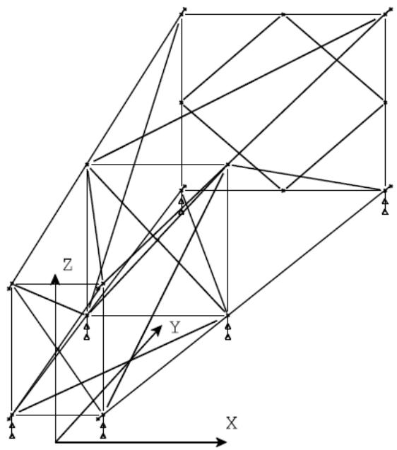
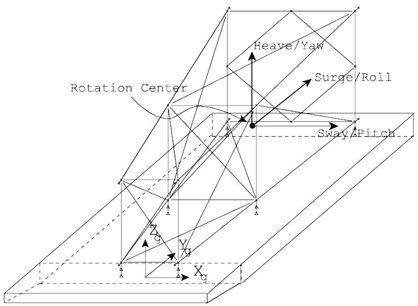
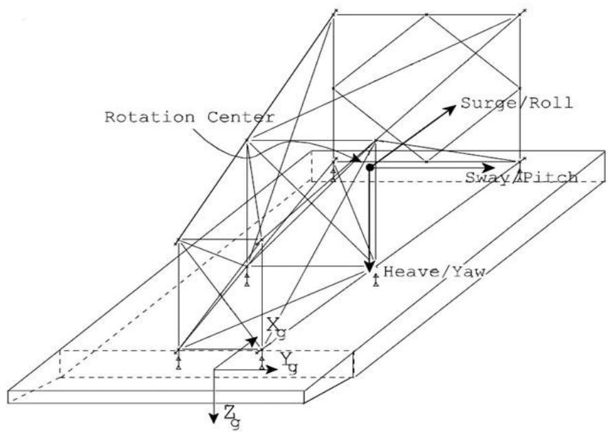
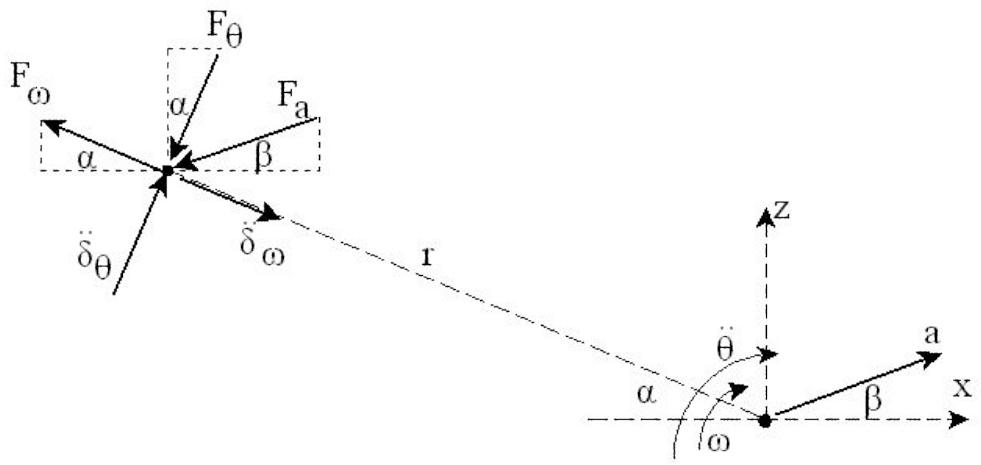
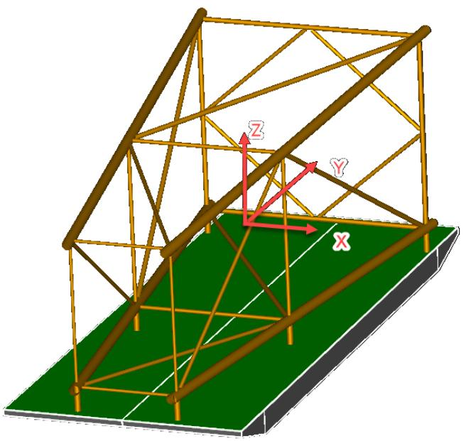
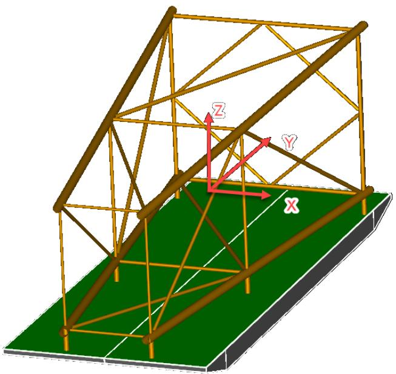
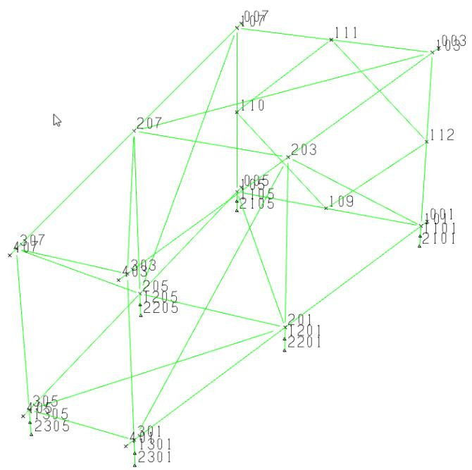
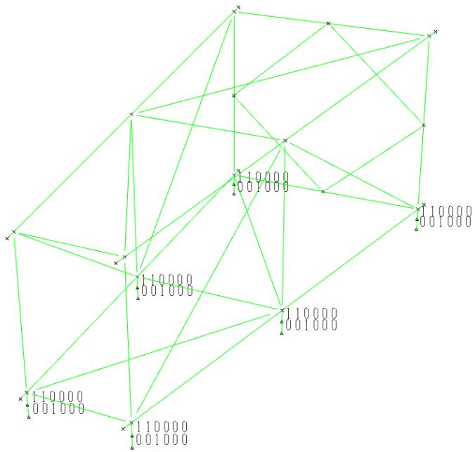
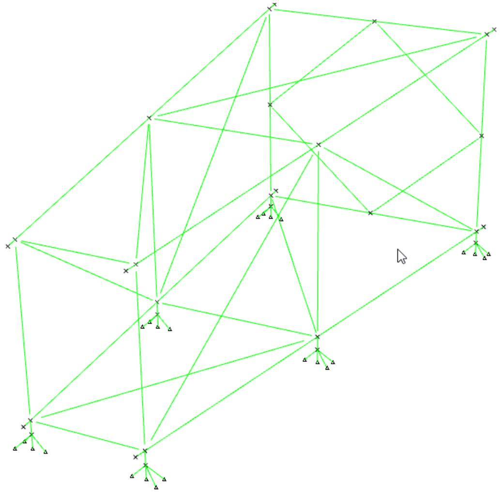

SACS

Tow

Version 24.00

Trademark Notice

Bentley and the "B" Bentley logo are either registered or unregistered trademarks or service marks of Bentley Systems, Incorporated. All other marks are the property of their respective owners.

Copyright Notice

Copyright © 2024, Bentley Systems, Incorporated. All Rights Reserved.

TABLE OF CONTENTS

1 INTRODUCTION .. 4

## 1.1 OVERVIEW.. . 4
## 1.2 PROGRAM FEATURES.. 4

2 TOW INPUT DATA....

## 2.1 GENERAL OPTIONS.. . 5
2.1.1 Excluding the Weight of the Model . □

## 2.2 STRUCTURE ORIENTATION... 5

2.2.1 Repositioning the Structure ... . 6   
2.2.2 Center of Motion... . 6   
2.2.3 Tow Local Coordinate System.... . 6

## 2.3 CONVERTING MODEL LOADING TO WEIGHT.. . 8

2.3.1 Designating Load Cases to be Converted... . 8   
2.3.2 Converting the First Load Case . . 8

## 2.4 SPECIFYING USER DEFINED WEIGHTS.. 9

2.4.1 User Defined Weights and Seastate Data.. 9

## 2.5 GENERATING INERTIA LOAD CASES .. . 9

2.5.1 Specifying Motion Data... .. 10   
2.5.2 Specifying Acceleration Data . .. 10   
2.5.3 Specifying Allowable Stress Modifier Inertia Load Cases ... . 11   
2.5.4 Alternative Motion Data .... 11   
2.5.5 Alternative Acceleration Data.... 12

## 2.6 REPORTS... .. 12

2.6.1 Joint Special Reports .. 12

## 2.7 GENERATING RIGID BODY MASS MATRIX... .. 12

## 2.8 CALCULATING MOTION RESPONSE DUE TO RAO INPUT .. ... 12

2.8.1 RAO Input Data . . 13   
2.8.2 Wave Definition Data..... . 13   
2.8.3 Automatic Load Case Generation from RAO Input Data .... .. 14   
2.8.4 Alternative RAO Input ... . 14

3 COMMENTARY . .. 16

## 3.1 DETERMINING INERTIA FORCES.. ... 16

## 3.2 CREATING INERTIA LOAD . .17

3.2.1 Modeled Elements ... 17   
3.2.2 User Defined Weights and Loads... 17

4 SAMPLE PROBLEMS.. .. 18

## 4.1 SAMPLE PROBLEM 1 .. ... 20
## 4.2 SAMPLE PROBLEM 2 .. .. 29
## 4.3 SAMPLE PROBLEM 3 .. .. 36

5 INPUT LINES... .42

1 INTRODUCTION

## 1.1 OVERVIEW

The Tow program module is used to generate forces typically encountered during barge transportation of structures. The program generates inertia forces due to acceleration of the structure, in the form of joint concentrated and member distributed loads.

## 1.2 PROGRAM FEATURES

Tow requires a SACS input model file and a Tow input file for execution. The program creates an output structural data file containing the model and load cases consisting of inertia loads generated by the program.

Some of the main features and capabilities of Tow program module are:

1. Creates load case for X, Y and/or Z translational and/or angular accelerations.   
2. Calculates the mass of modeled beam and plate elements for inertia load generation automatically.   
3. Generates member distributed loads and joint concentrated loads.   
4. Supports joint concentrated, member concentrated and member distributed user defined weights to account for non-modeled items.   
5. Allows user defined loads to be specified on LOAD input lines in the Tow input file.   
6. Option to consider loading specified in the model file when creating inertia load.   
7. Ability to orient or reorient the structure within the Tow input file for any particular inertia load case to be created.   
8. Ability to convert any load case in the SACS input file to weights.   
9. Allows factoring or any SACS load case when converting to weights.   
10. Optionally considers the weight of grout.   
11. Ability to calculate acceleration data based on user defined pitch, roll and/or yaw angle and period.   
12. Generates rigid body mass matrix including the mass of members, plates and any added weights.   
13. Ability to determine barge responses based on wave characteristics and RAOs.   
14. Allows specification of allowable stress modifiers in the Tow input file.

Note: The sum of the moments in the listing file is about the C.G. of the structure.

2 TOW INPUT DATA

The Tow program requires a SACS model file and a Tow input file. The model file requires no special modeling consideration for the purpose of inertia load case generation.

## 2.1 GENERAL OPTIONS

Tow analysis options are specified on the TOWOPT line. Enter the input units in columns 9-10. Enter ‘EC’ in columns 11-12 for the input data to be echoed. If concentric tubular sections are to be considered grouted, enter ‘GR’ in columns 25-26 to include the weight of grout.

2.1.1 Excluding the Weight of the Model

By default, the weight of the modeled elements is included in the inertia loading generated. The weight of the model can be ignored, however, by inputting ‘LO’ in columns 27-28 on the TOWOPT line. Load cases generated would only contain inertia loading due to any load cases or user defined weights converted to inertia load.

## 2.2 STRUCTURE ORIENTATION

Normally the structure would be rotated to the proper orientation and position on the barge in the model file such that the global structural axes are aligned with the barge axes.

This allows the user to generate inertia loads due to surge, sway and heave linear accelerations and roll, pitch and yaw angular acceleration along and/or about the structural global axes. See the figure shown below.



Note: Inertia loads may be generated in any direction and are not required to be generated along the structural global axes. However, orienting the structure in the model so the global axes are aligned with the barge axes allows the user to verify and visualize transportation results quite easily.

2.2.1 Repositioning the Structure

By default, the position of the structure as modeled is used for the Tow analysis. The structure may be repositioned for any inertia load case created using the POSITION line. When orientation angles are specified, the structure is rotated about the global X axis first, then the global Y axis, followed by rotation about the global Z axis.

Note: When the structure is repositioned using the POSITION line, the new position is retained for all subsequent inertia load cases created until a new position is defined.

2.2.2 Center of Motion

The center of motion is the point about which the barge/structure system rotates when subject to transportation forces that induce pitch, roll and/or yaw. The X, Y and Z coordinates of this point are specified in the Tow input file on the TOWOPT input line and are defined with respect to the model global coordinate system. Enter the global X, Y and Z coordinates of the center of motion in columns 31- 37, 38-44 and 45-51, respectively. The following designates that the center of motion is defined by the global X, Y and Z coordinates 8.0, 23.5, 13.67.

```txt
1 2 3 4 5 6 7 8  
123456789012345678901234567890123456789012345678901234567890  
1 TOW SAMPLE PROBLEM  
2 TOWOPT EN 8.0 23.5 13.67 
```

2.2.3 Tow Local Coordinate System

The origin of the tow or transportation local coordinate system coincides with the center of motion specified on the TOWOPT input line. The orientation of the Tow coordinate system is defined by the user by specifying the model global axes that correspond to the surge/roll, sway/pitch and heave/yaw axes. Enter the structural global axis corresponding to the surge axis in column 52, the axis corresponding to the sway axis in column 53 and the axis corresponding to the heave axis in column 54.

In the following figure, the global Y axis is the surge axis, the global X axis is the sway axis and the global Z is the heave axis as designated in columns 52-54.

```txt
1 2 3 4 5 6 7 8 1 12345678901234567890123456789012345678901234567890  
1 TOW SAMPLE PROBLEM  
2 TOWOPT EN OR 8.0 23.5 13.67YXZ 
```

  
This figure is valid for YXZ (default), XZY, and ZYX tow coordinate systems.   
For XYZ, YZX, and ZXY coordinate systems, the orientation of the coordinate system is switched to maintain a right-handed coordinate system. The following figure depicts the orientation of the XYZ tow coordinate system.

  
Note: Modification of the tow coordinate system is intended to accommodate motion data from external sources and is not recommended for reorienting the structure with respect to the tow coordinate system. Refer to the POSITION input line for repositioning of the structure.

## 2.3 CONVERTING MODEL LOADING TO WEIGHT

Inertia loads for non-modeled items defined by member concentrated, member distributed and joint concentrated loads specified in the model file can be converted to weights automatically by the program.

By default, when member distributed loads are converted to weight, they are treated as member distributed weights. Member distributed loads may be converted to joint weights by specifying ‘ND’ in columns 15-16 on the TOWOPT input line.

2.3.1 Designating Load Cases to be Converted

Load cases in the model file that are to be converted to weight are designated using the LCFAC line.

The load cases may be factored when converting to weight by specifying the appropriate factor on the LCFAC line. Enter the load case factor in columns 11-16 and any load cases to which this factor is to be applied in columns 17-75.

Note: The LCFAC line should precede any ACCL/ACCEL or MOTION/MOTN lines defining inertia load cases that are to include these weights.

In the following example, 100% of loads cases ‘EQP1’ and ‘EQP2’ are to be converted to weight when generating the inertia load cases ‘R+H1’ and ‘R-H1’ defined by the first two MOTION lines, while 50% of load cases ‘EQP3’ and ‘EQP4’ are to be used when generating load case ‘R+H2’ defined by the third MOTION line.

```txt
1 2 3 4 5 6 7 8  
123456789012345678901234567890123456789012345678901234567890  
1 LCFAC 1.0EQP1 EQP2  
2 MOTIONR+H1 12.0 10.0 0.20 G  
3 MOTIONR-H1 12.0 10.0 -0.20 G  
4 LCFAC 0.5EQP3 EQP4  
5 MOTIONR+H2 12.0 12.0 0.20 G 
```

Note: Load cases selected to convert to weight replace any previous load cases selected and are used for all subsequent inertia load cases created by either MOTION or ACCL lines until other load cases are selected. In the above sample, only load cases ‘EQP3’ and ‘EQP4’ where used for load case ‘R+H2’.

2.3.2 Converting the First Load Case

If the model file contains only one load case, it may be converted to weight by specifying ‘LD’ in columns 13-14 on the TOWOPT line.

Note: The ‘LD’ option is provided for backward compatibility purposes only and should not be used in conjunction with the LCFAC line.

## 2.4 SPECIFYING USER DEFINED WEIGHTS

Additional weights may also be specified in the Tow input file using Joint Weight and Member Weight input lines. In order to include user defined weight, the WEIGHT input line(s) should be specified prior to the MOTION or ACCL input line used to define the inertia load cases to be created. The specified weights will be included for all subsequent load cases created unless overridden by new WEIGHT input lines.

Note: When specifying weight data, all weight data defined for previous inertia load cases is replaced. Therefore, all weight data may be removed for an inertia load case by specifying a 0.0 weight.

For example, the following input file has user defined joint and member weights specified. A load of 20.0 at joint 599 defined by the WEIGHT input line will be included in the first inertia load case along with a concentrated weight of 20.0 on member 506-606. For the second and all subsequent load cases, all weight data is removed.


|  | 1 | 2 | 3 | 4 | 5 | 6 | 7 | 8 |
| --- | --- | --- | --- | --- | --- | --- | --- | --- |
| 1 | 12345678901 | 12345678901 | 12345678901 | 12345678901 | 12345678901 | 12345678901 | 12345678901 | 12345678901 |
| 2 | WEIGHT | 599 | 20.0 |  |  |  |  |  |
| 3 | WEIGHT | 506 | 606 | 20.0 |  |  | 5.0 |  |
| 4 | ACCL | 1.0 |  |  |  |  |  |  |
| 5 | WEIGHT | 599 | 0.0 |  |  |  |  |  |
| 6 | ACCL |  | 1.0 |  |  |  |  |  |


Note: Member concentrated, member distributed and joint concentrated LOAD input lines can be entered directly into the TOW input file after the POSITION input line (or TOWOPT line if no POSITION input line is specified). No modifications to the LOAD input lines are required. The program will automatically create the corresponding weights.

2.4.1 User Defined Weights and Seastate Data

The Tow program can use weight groups defined in a Seastate input file to specify inertia loading. These weight groups are specified on the INCWGT line. For example, the following line indicates that weight groups 2, 3 and 5 will be used to create inertia load cases. These weight groups must be defined in the Seastate input file.


|  | 1 | 2 | 3 | 4 | 5 | 6 | 7 | 8 |
| --- | --- | --- | --- | --- | --- | --- | --- | --- |
| 1 | 12345678901 | 2345678901 | 2345678901 | 2345678901 | 2345678901 | 2345678901 | 2345678901 | 234567890 |
| 1 | INCWGT | 2 | 3 | 5 |  |  |  |  |


## 2.5 GENERATING INERTIA LOAD CASES

Load cases containing inertia loads due to translational linear acceleration and/or rotational angular acceleration about the global axes are created based on either motions or accelerations defined using either the MOTION or the ACCL input lines, respectively.

Inertia loading is generated automatically for any beam or plate element in the model based on its modeled weight. In addition, inertia load is developed for any loading converted to weight and user defined weights.

Inertia load is created in the opposite direction of the imposed acceleration (D’Alembert forces) and are calculated based on the structures current position (ie. the latest POSITION line encountered), the current selected load cases and factors (ie. the latest LCFAC data specified) and any LOAD and/or WEIGHT input lines defined prior to the MOTION or ACCL line defining the accelerations.

2.5.1 Specifying Motion Data

The Tow program can create inertia load cases based on accelerations defined by motion data input by the user on the MOTION line.

A unique load case is created for each MOTION line. Specify the load case name in columns 7-10.

Roll angle and period are defined in columns 11-15 and 16-20, pitch angle and period in columns 21-25 and 26-30 and yaw angle and period in columns 31-35 and 36-40.

When the barge is rotated by a roll or pitch angle q, the weight of the structure applied vertically down contains a component normal to the barge calculated as cosq and a component parallel to the barge surface calculated as sinq. The Tow program can automatically include these effects of gravity on the translations inertial forces with the "Include Gravity Option" in column 77.

If heave is assumed normal to barge:

Enter ‘G’ in column 77 to include the gravity component for surge, sway, and heave.

Enter 'L' in column 77 to include gravity component for only surge and sway (lateral forces only).

If heave is assumed vertical:

Enter 'H' in column 77 to include the gravity component for surge, sway, and heave.

Enter 'V' in column 77 to include gravity component for only surge and sway (lateral forces only).

Note: Leave column 77 blank to exclude the effects of gravity or if the translational acceleration input already includes the appropriate gravity component.

The center of motion used for this inertia load case may be overridden in columns 56-76. The inertia due to structural weight may be ignored by specifying ‘N’ in column 78. This is especially useful if the MOTION load case will be combined with DEAD load cases. This way the structural weight will not be included twice (or more) in the load combination.

The following defines inertia load cases ‘R+H1’ and ‘R-H1’. The roll angle is 15.0 degrees with a period of 10.0 seconds. The first load case has a heave acceleration of +0.2 while the second has a heave acceleration of -0.20. Both have the program include the effects of gravity automatically.


|  | 1 | 2 | 3 | 4 | 5 | 6 | 7 | 8 |
| --- | --- | --- | --- | --- | --- | --- | --- | --- |
|  | 12345678901 | 12345678901 | 12345678901 | 12345678901 | 12345678901 | 12345678901 | 12345678901 | 1234567890 |
| 1 | MOTIONR+H1 | 15.0 | 10.0 |  |  | 0.20 |  | G |
| 2 | MOTIONR-H1 | 15.0 | 10.0 |  |  | -0.20 |  | G |


2.5.2 Specifying Acceleration Data

The ACCL line may be used to specify accelerations used to generate the inertia load case. A unique inertia load case is created for each ACCL line specified.

Enter the name of the load case in columns 7-10, unless the name of the load case is to be determined by the program based on the next available numeric load case name. The applicable X, Y and/or Z axis angular acceleration(s) are specified in deg/sec2 units in columns 11-20, 21-30 and 31-40, respectively. The translational or linear X, Y and Z axis accelerations are expressed in G’s in columns 41-50, 51-60 and 61-70, respectively. For example, the following creates a load case containing inertia loading due to a linear acceleration along the global X axis of 1G.

```txt
1 2 3 4 5 6 7 8 123456789012345678901234567890123456789012345678901234567890 1ACCL 1.0 
```

Note: The effect of gravity is not automatically included when generating inertia loads using the ACCL line. Gravity load may be created by specifying 1.0 G acceleration in the +Z direction.

2.5.3 Specifying Allowable Stress Modifier Inertia Load Cases

Allowable stress modifier may be specified for any inertia load case created using the AMOD line. Specify the load case name and the appropriate factor. For example, the following creates inertia load cases R+H1 and R-H1, and allowable stress factor of 1.33 is applied to both load cases.

```txt
1 2 3 4 5 6 7 8   
1234567890123456789012345678901234567890123456789012345678901234567890   
1 TOWOPT EN 8.0 23.5 13.67   
# 2 AMOD
3 AMOD R+H1 1.33R-H1 1.33   
4 MOTIONR+H1 15.0 10.0 0.20 G   
5 MOTIONR-H1 15.0 10.0 -0.20 G 
```

Note: The AMOD line must contain a header line and must follow directly after the TOWOPT line.

2.5.4 Alternative Motion Data

The MOTN line provides an alternative to the MOTION line in creating inertia load cases. The MOTN line is based on the inertia capabilities of the Seastate program. As such, a Seastate input file is needed to make use of its full capabilities. In the MOTN line, the load case name is specified in columns 7-10. The roll, pitch and yaw angles and periods are specified in columns 11-52. The translational acceleration components are specified in columns 53-73. The effects of gravity are included automatically with ‘G’ in column 74; structural weight is excluded from the load case with ‘N’ in column 75. All these options are similar to the MOTION line. The MOTN line has the added feature of specifying a center of motion for rotational accelerations and velocities. This center identifier is specified in columns 77-80. This center must be defined in the Seastate input file.

The following defines inertia load cases cases ‘R+H1’ and ‘R-H1’. The roll angle is 15.0 degrees with a period of 10.0 seconds. The first load case has a heave acceleration of +0.2 while the second has a heave acceleration of -0.20. Both have the program include the effects of gravity automatically and neither excludes structural weight. The center ID for these load cases, which is specified in the Seastate input file, is ‘CEN2’.

```txt
1 2 3 4 5 6 7 8 12345678901234567890123456789012345678901234567890123456789012345678901234567890 1 MOTN R+H1 15.0 10.0 0.2G CEN2 2 MOTN R-H1 15.0 10.0 -0.20G CEN2 
```

2.5.5 Alternative Acceleration Data

The ACCEL line provides an alternative to the ACCL line in specifying accelerations to create inertia load cases. The ACCEL line is based on the inertia capabilities of the Seastate program. As such, a Seastate input file is needed to make use of its full capabilities. In the ACCEL line, the load case name is specified in columns 6-9. The translational acceleration components are specified in columns 10-30. The rotational accelerations are specified in columns 31-51 with the rotational velocities specified in columns 52-72. The effects of gravity are included automatically with ‘G’ in column 75. The ACCEL line offers two added features when compared with the ACCL line: 1) the specification of angular velocities for the computation of centripetal accelerations, and 2) the specification of a center of motion for rotational accelerations and velocities. This center identifier is specified in columns 77-80. This center must be defined in the Seastate input file.

## 2.6 REPORTS

Output reports including member data, plate data, added weight and load summation are designated on the TOWOPT line.

Enter ‘MP’ in columns 17-18 to print a member data report and/or ‘PP’ in columns19-20 to print a plate data report containing the weight of each member or plate. Enter ‘WP’ in columns 21-22 for a detailed report of user defined added weights. Inertia load summation reports may be generated about the model origin, center of motion or center of gravity by specifying either ‘OR’, ‘RC’ or ‘GR’, in columns 23- 24.

2.6.1 Joint Special Reports

The location and acceleration for up to sixteen joints can be reported for each inertia load case created. The location and acceleration are reported in both the model global and Tow local coordinate systems. The joint names are specified in the Tow input file on the JTNUM input line.

## 2.7 GENERATING RIGID BODY MASS MATRIX

The program can generate a rigid body mass matrix including the mass of all members and plates included in the model. Any load cases converted to weights in addition to any weights or loads defined by the user in the input file are also included.

The following designates that the rigid body mass matrix be generated for the model including the mass due to load cases ‘EQP1’ and ‘EQP2’ specified on the LCFAC line.

```txt
1 2 3 4 5 6 7 8 12345678901234567890123456789012345678901234567890 1 TOWOPT EN 8.0 23.5 13.67 2 LCFAC EQP1 EQP2 3 RBMASS 
```

## 2.8 CALCULATING MOTION RESPONSE DUE TO RAO INPUT

The Tow program can calculate the inertia response loading for various points along a wave cycle based on Response Amplitude Operator data input by the user.

Typically, for a particular wave direction, acceleration, velocity or displacement response operators are designated for various wave periods using RAO lines. From this data, inertia loading can be generated for various phase angles of the desired waves designated on the WAVDEF lines.

Note: A set of RAO and WAVDEF lines is designated for each wave direction when considering multiple wave directions using different response operators.

The loading due to a designated wave is assumed to be from a single amplitude response, where the wave height is assumed to be double amplitude. For example, a unit displacement RAO would yield a displacement equal to one half of the wave height.

2.8.1 RAO Input Data

Response Amplitude Operator data is input using a series of RAO lines for the particular wave direction in question.

Each RAO line is used to define the response for a particular frequency or period. Enter the amplitude type in column 5 as ‘A’ for acceleration, ‘V’ for velocity, ‘D’ for displacement or ‘G’ for acceleration in G’s. Enter ‘P’ and the period or ‘F’ and the frequency in column 6 and columns 7-12, respectively. Designate the surge, sway, heave, roll, pitch and yaw amplitude and the phase angle corresponding to this frequency or period.

Note: One RAO line is required for each frequency or period used to define the response.

For example, the following input shows RAO data for wave periods of 25 and 20 seconds.


|  | 1 | 1 | 2 | 2 | 3 | 3 | 4 | 4 | 5 | 5 | 6 | 6 | 7 | 7 | 8 | 8 |
| --- | --- | --- | --- | --- | --- | --- | --- | --- | --- | --- | --- | --- | --- | --- | --- | --- |
|  | 12345678901234567890123456789012345678901234567890123456789012345678901234567890 | 12345678901234567890123456789012345678901234567890123456789012345678901234567890 | 12345678901234567890123456789012345678901234567890123456789012345678901234567890 | 12345678901234567890123456789012345678901234567890123456789012345678901234567890 | 12345678901234567890123456789012345678901234567890123456789012345678901234567890 | 12345678901234567890123456789012345678901234567890123456789012345678901234567890 | 12345678901234567890123456789012345678901234567890123456789012345678901234567890 | 12345678901234567890123456789012345678901234567890123456789012345678901234567890 | 12345678901234567890123456789012345678901234567890123456789012345678901234567890 | 12345678901234567890123456789012345678901234567890123456789012345678901234567890 | 12345678901234567890123456789012345678901234567890123456789012345678901234567890 | 12345678901234567890123456789012345678901234567890123456789012345678901234567890 | 12345678901234567890123456789012345678901234567890123456789012345678901234567890 | 12345678901234567890123456789012345678901234567890123456789012345678901234567890 | 12345678901234567890123456789012345678901234567890123456789012345678901234567890 | 12345678901234567890123456789012345678901234567890123456789012345678901234567890 |
| 1 | RAO GP | 25.0 | .938 | 137. | .001-43.0 | .001-43.0 | .980 | 62.0 | .004133.0 | .004133.0 | .430-47.0 | .430-47.0 | .001 | 133. | 133. |  |
| 2 | RAO GP | 20.0 | .680 | 156. | .002-29.0 | .002-29.0 | .954 | 87.0 | .010149.0 | .010149.0 | .574-30.0 | .574-30.0 | .001 | 150. | 150. |  |


2.8.2 Wave Definition Data

WAVDEF lines are used to designate the waves for which responses are to be determined.

For each wave, the wave height and period must be specified in columns 15-20 and 21-26, respectively. The number of points per wave cycle to create loading is specified in columns 12-14 while the load case name of the first load case to be created is input in columns 7-10. Enter the wave direction (used for labeling only) in columns 27-32. If structural weight is to be excluded from the load case generated, specify ‘N’ in column 75. This is useful if the load case generated is combined with DEAD load cases. This way the structural weight will not be included twice (or more) in the load case.

The RAO data is interpolated for periods not defined by an RAO line. However, RAO data should not be extrapolated for waves with periods higher than the highest RAO period or lower than the lowest RAO period.

Note: A RAO line must be added with a period higher than the wave period if the wave period is greater than the highest RAO period. Likewise, a RAO line must be added with a period lower than the wave period if the wave period is less than the lowest RAO period.

The following specifies that response load cases for 18 points of a wave with height of 30 and period of 22 are to be generated. The wave direction is 45 degrees and the first load case is to be named ‘A01’. A second 45 degree wave with a period of 20.0 is also specified. The first load is to be named ‘B01’.

Load cases due to response from a set of 90 degree waves are also indicated by the second set of RAO and WAVDEF lines. None of the load cases defined will exclude structural weight.


|  | 1 | 1 | 2 | 2 | 3 | 3 | 4 | 4 | 5 | 5 | 6 | 6 | 7 | 7 | 8 | 8 |
| --- | --- | --- | --- | --- | --- | --- | --- | --- | --- | --- | --- | --- | --- | --- | --- | --- |
|  | 12345678901234567890123456789012345678901234567890123456789012345678901234567890 | 12345678901234567890123456789012345678901234567890123456789012345678901234567890 | 12345678901234567890123456789012345678901234567890123456789012345678901234567890 | 12345678901234567890123456789012345678901234567890123456789012345678901234567890 | 12345678901234567890123456789012345678901234567890123456789012345678901234567890 | 12345678901234567890123456789012345678901234567890123456789012345678901234567890 | 12345678901234567890123456789012345678901234567890123456789012345678901234567890 | 12345678901234567890123456789012345678901234567890123456789012345678901234567890 | 12345678901234567890123456789012345678901234567890123456789012345678901234567890 | 12345678901234567890123456789012345678901234567890123456789012345678901234567890 | 12345678901234567890123456789012345678901234567890123456789012345678901234567890 | 12345678901234567890123456789012345678901234567890123456789012345678901234567890 | 12345678901234567890123456789012345678901234567890123456789012345678901234567890 | 12345678901234567890123456789012345678901234567890123456789012345678901234567890 | 12345678901234567890123456789012345678901234567890123456789012345678901234567890 | 12345678901234567890123456789012345678901234567890123456789012345678901234567890 |
| 1 | RAO GP | 25.0 | .938 | 137. | .001-43.0 | .001-43.0 | .980 | 62.0 | .004133.0 | .004133.0 | .430-47.0 | .430-47.0 | .001 | 133. | 133. |  |
| 2 | RAO GP | 20.0 | .680 | 156. | .002-29.0 | .002-29.0 | .954 | 87.0 | .010149.0 | .010149.0 | .574-30.0 | .574-30.0 | .001 | 150. | 150. |  |
| 3 | WAVDEF | A01 | 18 | 30.0 | 22.0 | 22.0 | 45. |  |  |  |  |  |  |  |  |  |
| 4 | WAVDEF | B01 | 18 | 30.0 | 20.0 | 20.0 | 45. |  |  |  |  |  |  |  |  |  |
| 5 | RAO GP | 25.0 | .950 | 180. | .005-83.0 | .005-83.0 | .879 | 12.0 | .006 | 33.0 | .220 | 34.0 | .002 | 112. | 112. |  |
| 6 | RAO GP | 20.0 | .690 | 46. | .004-99.0 | .004-99.0 | .956 | 67.0 | .111104.0 | .111104.0 | .174-13.0 | .174-13.0 | .001 | 60.0 | 60.0 |  |
| 7 | WAVDEF | C01 | 18 | 30.0 | 22.0 | 22.0 | 90. |  |  |  |  |  |  |  |  |  |
| 8 | WAVDEF | D01 | 18 | 30.0 | 20.0 | 20.0 | 90. |  |  |  |  |  |  |  |  |  |


Note: Interpolation will be used for the first wave in each direction since no RAO period corresponds to 22.0 seconds.

2.8.3 Automatic Load Case Generation from RAO Input Data

Load case data is automatically generated based on RAO input data by using the LCRAO line. The LCRAO line is used to define RAO characteristics to be used with the Response Amplitude Operators to calculate responses. It is normally used in tow fatigue analysis to generate the transfer function of "hot spot" stresses. For each period/frequency in all RAO lines, the LCRAO line will generate load cases starting with the load case specified in columns 7-10 of the line of the LCRAO line. If columns 7-10 are left blank, load cases are generated automatically and numbered consecutively in order of creation starting from 1. The wave direction in degrees is specified in columns 11-16 of the line.

The LCRAO line gives two options for load generation, ‘R+I’ and ‘NPT’, as specified in columns 17-19. The ‘R+I’ option will generate two load cases, real and imaginary, for each period/frequency in the RAO’s. The two load cases are to be used in fatigue analysis with the ‘R+I’ option specified in the FTLOAD data records. The ‘NPT’ option will generate the number of load cases specified in columns 20-22 to complete each cycle of each period/frequency in the RAO’s.

The following input shows RAO data for wave periods of 25 and 20 seconds. Two load cases, real and imaginary, will be generated per RAO with a wave direction of 45 degrees. These load cases are to be used in fatigue analysis with ‘R+I’ specified in the FTLOAD data records.


|  | 1 | 1 | 2 | 2 | 3 | 3 | 4 | 4 | 5 | 5 | 6 | 6 | 7 | 7 | 8 | 8 |  |
| --- | --- | --- | --- | --- | --- | --- | --- | --- | --- | --- | --- | --- | --- | --- | --- | --- | --- |
|  | 12345678 | 901234567 | 890123456 | 7890123456 | 7890123456 | 7890123456 | 7890123456 | 7890123456 | 7890123456 | 7890123456 | 7890123456 | 7890123456 | 790123456 | 790123456 | 790123456 | 790123456 | 790123456 |
| 1 | RAO GP | 25.0 | .938 | 137. | .001-43.0 | .980 | 62.0 | .004133.0 | .430-47.0 | .001 | 133. |  |  |  |  |  |  |
| 2 | RAO GP | 20.0 | .680 | 156. | .002-29.0 | .954 | 87.0 | .010149.0 | .574-30.0 | .001 | 150. |  |  |  |  |  |  |
| 3 | LCRAO | 45.0R+I | 45.0R+I | 45.0R+I | 45.0R+I | 45.0R+I | 45.0R+I | 45.0R+I | 45.0R+I | 45.0R+I | 45.0R+I | 45.0R+I | 45.0R+I | 45.0R+I | 45.0R+I | 45.0R+I |  |


2.8.4 Alternative RAO Input

Another method of entering RAO data is supplied with the INCRAO line. This line allows the user to input RAO data from the Seastate input file into the program. Unlike other input methods for RAO’s, the INCRAO offers the capability of specifying velocity-dependent RAO’s. The velocity for the RAO is specified in columns 8-14. If English units are used for input, velocities may be specified in knots or feet

per second. If specified as feet per second, enter ‘FPS’ in columns 15-17. The following example will generate inertia loading for a wave speed of 2.5 feet per second.


|  | 1 | 2 | 3 | 4 | 5 | 6 | 7 | 8 |
| --- | --- | --- | --- | --- | --- | --- | --- | --- |
| 1 | 12345678901 | 12345678901 | 12345678901 | 12345678901 | 12345678901 | 12345678901 | 12345678901 | 1234567890 |
| 1 | INCRAO | 2.5FPS |  |  |  |  |  |  |


Note: This line is only used for RAO’s defined in the Seastate input file. If velocity values specified in the INCRAO line do not correspond with velocity values in a Seastate RAO, interpolation or extrapolation will be used to obtain values.

# 3 COMMENTARY

## 3.1 DETERMINING INERTIA FORCES

The Tow program module generates reverse effect or D’Alembert inertia forces in the opposite direction of applied translational and rotational accelerations.

In the figure below, for any point on the structure with mass m, the inertia force, $\mathsf{ F }_{ \mathsf{ a } } ,$ due to a translational/linear acceleration vector a, is determined by:

$$F_{a} = - m a$$

The force component acting along an axis $\mathsf{  { x } } , \mathsf{ F a }_{ \mathsf{ x } } ,$ is

$$F_{a_{x}} = - m a_{x} \tag{1}$$

where $\mathtt{ a }_{ \mathtt{ X } }$ is the component of the acceleration vector a along the axis （$\mathsf{ a }_{ \mathsf{ x } } = \mathsf{ a } \cos \beta )$ .

  
Center ofRotation

The tangential acceleration  and the centrifugal acceleration  due to the rotation of the structure, may be taken as follows:

$$\ddot{\delta}_{\theta} = r \ddot{\theta} \quad \ddot{\delta}_{\omega} = r \omega^{2}$$

where  and are the angular velocity and angular acceleration about the center of motion (center of rotation). The tangential and centrifugal forces are:

$$F_{\theta} = - m (r \ddot{\theta}) \quad F_{\omega} = - m \left(\omega^{2} r\right)$$

The components along axis x of the rotational inertia forces F and $\mathsf{ F }_{ \odot }$ are:

$$F_{\theta_{x}} = - m \left(r \ddot{\theta} \sin \alpha\right) \tag{2}$$

$$F_{\omega_{x}} = - m \left(\omega^{2} r \cos \alpha\right) \tag{3}$$

Combining equations 1, 2 and 3 yields the total inertia force along axis $\mathsf{  { X } } , \mathsf{  { F } }_{ \mathsf{  { X } } } ,$ due to translational and rotational accelerations.

$$F_{x} = - m \left(a_{x} + r \ddot{\theta} \sin \alpha + \omega^{2} r \cos \alpha\right)$$

If the angular velocity is negligible, $\mathrm{ \odot } { = } 0 .$ , the total inertia force along axis x is as follows:

$$F_{x} = - m \left(a_{x} + r \ddot{\theta} \sin \alpha\right) \tag{4}$$

Note: The TOW program assumes that the mass, m, is positive mass and equal for all directions.

## 3.2 CREATING INERTIA LOAD

3.2.1 Modeled Elements

For a beam element, mass m in equation 4 is the mass per unit length. For each segment of the element, a member uniform inertia load is created along the length of the segment based on the mass per unit length and the average acceleration of that segment.

Plate inertia load is calculated based on the plate total mass and the acceleration at the plate centroid. The total inertia load is applied at the plate corner joints as joint loads.

3.2.2 User Defined Weights and Loads

A uniform inertia member load is created for a user defined member distributed load or weight. The specified load or weight is converted into a positive distributed mass regardless of the load direction or the sign specified.

A inertia concentrated load is created for a user defined member concentrated load or weight. The specified load or weight is converted into a positive mass regardless of the direction of the load or the sign of the weight.

For a user defined joint weight and for user specified loads on a joint, an inertia joint load is created. Specified weight is converted into positive mass regardless of sign. For joint specified loads, the mass is determined from the vector sum of the $\mathsf{ x } , \mathsf{ y }$ and z direction loads on the joint, $\mathsf{ P }_{ \mathsf{ x } } , \mathsf{ P }_{ \mathsf{ y } }$ and $\mathsf{ P }_{ z }$ respectively, such that:

$$m = \frac{\sqrt{P_{x}^{2} + P_{y}^{2} + P_{z}^{2}}}{g}$$

where g is the acceleration of gravity.

4 SAMPLE PROBLEMS

The structure shown in the following Figures was used in Sample Problems 1 and 2 to illustrate various capabilities of the TOW program. Sample Problem 3 is a detailed transportation analysis with all transportation bracing modeled.

1. In Sample Problem 1, six load cases were generated, each containing inertia load due to a single unit acceleration corresponding to either sway, surge, heave, pitch, roll or yaw motion. The transportation cases were accounted for by creating load combinations containing the appropriate unit load cases and load factors. Loading due to unmodeled steel is specified in load case ‘MOD1’ of the model file. Only tie down cans were modeled and the tie down braces were represented by a lateral support.   
2. Sample Problem 2 is the same as Sample Problem 1 except that an inertia load case was generated using motion data for each of the transportation cases instead of defining combinations of unit load cases.   
3. Sample Problem 3 is a detailed tow analysis with all transportation bracing modeled. In this problem, dead load or self weight is supported only by the tie down cans. The tie down diagonal bracing is effective only for inertia loading due to barge/structure motion.

The model in the examples was rotated so the global X, Y and Z axes corresponded to the barge pitch, roll and yaw axes, respectively, with the barge deck located in the global XY plane at Z elevation 0.0. See the following figure.



For each sample problem, the transportation environment requires that the structure be checked for motion forces due to a 12.5 degree pitch angle and a 20.0 degree roll angle, each occurring

simultaneously with 0.2G heave. Pitch and roll periods were assumed to be 10 seconds. The transportation cases that were considered are as follows:


| Transportation Motion | Linear (G's) | Linear (G's) | Linear (G's) | Rotation (d/s2) | Rotation (d/s2) | Rotation (d/s2) |
| --- | --- | --- | --- | --- | --- | --- |
| Transportation Motion | X | Y | Z | X | Y | Z |
| CW Pitch Up Hv |  | 0.216 | 1.176 | 4.93 |  |  |
| CW Pitch Dwn Hv |  | 0.216 | 0.776 | 4.93 |  |  |
| CCW Pitch Up Hv |  | -0.216 | 1.176 | -4.93 |  |  |
| CW Roll Up Hv | 0.34 |  | 1.14 |  | 7.89 |  |
| CW Roll Dwn Hv | 0.34 |  | 0.74 |  | 7.89 |  |
| CCW Roll Up Hv | -0.34 |  | 1.14 |  | -7.89 |  |
| CCW Roll Dwn Hv | -0.34 |  | 0.74 |  | -7.89 |  |


## 4.1 SAMPLE PROBLEM 1

In Sample Problem 1, the tie down were modeled as vertical members such that the bottom tie down joint is a vertical support (fixity=001) and the middle tie down joint is a lateral support (fixity=110) used to account for diagonal transportation bracing not included in the model.







Six unit inertia load cases were generated. Load cases 1,2 and 3 corresponded to the inertia load created by a 1G acceleration in the -X, -Y and +Z directions, respectively. Load cases 4, 5 and 6 were created for a 1 deg/sec2 angular acceleration, respectively.

The weight of unmodeled items such as walkways, lifting eyes and mudmats were accounted for in load case ‘MOD1’ of the SACS model file.

The following is the portion of the SACS model file containing the members and joints representing the tie down and the loading corresponding to unmodeled steel:

```txt
1 2 3 4 5 6 7 8  
1234567890123456789012345678901234567890123456789012345678901234567890123456789012345678901234567890123456789  
1 OPTIONS EN SDUC 2 1 PTPT PT  
2 GRUP
3 \*\*\*\*Other Groups are omitted\*\*\*\*\*\*\*  
4 GRUP TIE 24.000 1.000 29.0011.2036.00 1 1.001.00 0.500 490.00  
5 MEMBER
6 \*\*\*\*Other Members are omitted\*\*\*\*\*  
7 MEMBER 21011101 TIE  
8MEMBER 1101101 TIE  
9MEMBER 21051105 TIE  
10MEMBER 1105105 TIE  
11MEMBER 22011201 TIE  
12MEMBER 1201201 TIE  
13MEMBER 22051205 TIE  
14MEMBER 1205205 TIE  
15MEMBER 23011301 TIE  
16MEMBER 1301301 TIE  
17MEMBER 23051305 TIE  
18MEMBER 1305305 TIE  
19JOINT
20 \*\*\*\*Other Joints are omitted\*\*\*\*\*\*  
21JOINT 1101 38. 164. -4. 1.500 110000  
22JOINT 1105 -38. 164. -4. -1.500 110000  
23JOINT 1201 26. 69. -4. 3.000 110000  
24JOINT 1205 -26. 69. -4. -3.000 110000 
```


| 25 | JOINT 1301 | 16. | -6. | -4. | 9.756 | -6.000 | 110000 |  |
| --- | --- | --- | --- | --- | --- | --- | --- | --- |
| 26 | JOINT 1305 | -16. | -6. | -4. | -9.756 | -6.000 | 110000 |  |
| 27 | JOINT 2101 | 38. | 164. | -8. | 1.500 |  | 001000 |  |
| 28 | JOINT 2105 | -38. | 164. | -8. | -1.500 |  | 001000 |  |
| 29 | JOINT 2201 | 26. | 69. | -8. | 3.000 |  | 001000 |  |
| 30 | JOINT 2205 | -26. | 69. | -8. | -3.000 |  | 001000 |  |
| 31 | JOINT 2301 | 16. | -6. | -8. | 9.756 | -6.000 | 001000 |  |
| 32 | JOINT 2305 | -16. | -6. | -8. | -9.756 | -6.000 | 001000 |  |
| 33 | LOAD |  |  |  |  |  |  |  |
| 34 | LOADCNMOD1 |  |  |  |  |  |  |  |
| 35 | LOAD 109 |  |  | -4.0000 |  |  | GLOB JOIN | MUDMAT |
| 36 | LOAD 110 |  |  | -4.0000 |  |  | GLOB JOIN | MUDMAT |
| 37 | LOAD 111 |  |  | -4.0000 |  |  | GLOB JOIN | MUDMAT |
| 38 | LOAD 112 |  |  | -4.0000 |  |  | GLOB JOIN | MUDMAT |
| 39 | LOAD 301 |  |  | -2.0000 |  |  | GLOB JOIN | LIFTEYE |
| 40 | LOAD 305 |  |  | -2.0000 |  |  | GLOB JOIN | LIFTEYE |
| 41 | LOAD 303 |  |  | -2.0000 |  |  | GLOB JOIN | LIFTEYE |
| 42 | LOAD 307 |  |  | -2.0000 |  |  | GLOB JOIN | LIFTEYE |
| 43 | LOAD Z 305 307 |  | -0.1000 | -0.1000 |  |  | GLOB UNIF | WALKWAY |
| 44 | LOAD Z 301 303 |  | -0.1000 | -0.1000 |  |  | GLOB UNIF | WALKWAY |
| 45 | LOAD Z 301 305 |  | -0.1000 | -0.1000 |  |  | GLOB UNIF | WALKWAY |
| 46 | END |  |  |  |  |  |  |  |


Below is the Tow input file used to create the six transportation inertia unit load cases. A detailed description of each line of the input file follows:


|  | 1 | 2 | 3 | 4 | 5 | 6 | 7 | 8 |
| --- | --- | --- | --- | --- | --- | --- | --- | --- |
| 1 | 1234567890123456789012345678901234567890123456789012345678901234567890123456789012345678901234567890123456789 | MP WPOR |  | 88.67 | -8.0YXZ |  |  |  |
| 2 | TOWOPT EN |  |  |  |  |  |  |  |
| 3 | JTNUM | 403 407 |  |  |  |  |  |  |
| 4 | LCFAC | 1.0MOD1 |  |  |  |  |  |  |
| 5 | WEIGHT | 403 | 2.0 |  |  |  |  |  |
| 6 | WEIGHT | 407 | 2.0 |  |  |  |  |  |
| 7 | WEIGHT | 303 307 |  | 100.0 | 15.0 |  | 8.0 |  |
| 8 | ACCL |  |  |  | -1.0 |  |  |  |
| 9 | ACCL |  |  |  |  | -1.0 |  |  |
| 10 | ACCL | -1.0 |  |  |  |  |  |  |
| 11 | ACCL |  | -1.0 |  |  |  |  |  |
| 12 | ACCL |  |  | -1.0 |  |  |  |  |
| 13 | END |  |  |  |  |  |  |  |


Line 1. The global X, Y and Z coordinates of the center of motion of the barge structure system is designated on the TOWOPT input line in columns 31-51. The surge, sway and yaw axes are designated as Y, X and Z in columns 52-54..   
Line 2. Position and acceleration for joints 403 and 407 are to be output as specified on the JTNUM input line.   
Line 3. Load case ‘MOD1’ is to be converted to weight as designated on the LCFAC line.   
Line 4-5. Additional joint weight of 2.0 to be accounted for in inertia load cases is specified on joints 403 and 407 on the first two WEIGHT input lines.   
Line 6. Additional member weight is specified on member 303-307 on the third WEIGHT input line.   
Line 7. The first ACCL input line designates that inertia loading due to 1.0G acceleration in the -X direction is to be created as load case 1. The loading is created in the +X direction, opposite to the applied acceleration.

Line 8. Inertia loading due to 1.0G acceleration in the -Y direction is to be created as load case 2 as designated on the second ACCL input line. The loading is created in the +Y direction, opposite to the applied acceleration.

Line 9. Load case 3 will be consist of inertia loading in the -Z direction (the direction of gravity load) as specified by 1.0 in cols. 61-70 on the third ACCL input line.

Line 10. The next ACCL input line corresponds to load case 4 and will create inertia loading due to -1.0 deg/sec2 angular acceleration about the X axis. The resulting loading will produce positive rotation about the X axis.

Line 11-12. The final two ACCL input lines will create load cases 5 and 6 containing inertia loading due to -1.0 deg/sec2 angular acceleration about the Y and Z axes, respectively, resulting in positive rotation about the Y and Z axes, respectively.

The following is a portion of the output listing file created by the Tow program module:


| ********** | ********** | ********** | ********** | ********** | ********** | ********** | ********** | ********** | ********** |
| --- | --- | --- | --- | --- | --- | --- | --- | --- | --- |
| GROUP NO | LABEL | SEGM | SECTION ID | OUTSIDE DIAMETER IN | WALL THICK IN | WEIGHT/ LENGTH K/FT | TOTAL LENGTH FT | TOTAL WEIGHT KIPS | NUMBER MEMBERS |
| 1 | LG2 | 1 |  | 42.00 | 1.375 | 0.597 | 24.6 | 14.69 | 4 |
| 2 |  | 2 |  | 41.25 | 1.000 | 0.430 | 339.7 | 146.16 |  |
| 3 |  | 3 |  | 42.00 | 1.375 | 0.597 | 19.6 | 11.70 |  |
| 4 | LG3 | 1 |  | 42.00 | 1.375 | 0.597 | 27.0 | 16.12 | 4 |
| 5 |  | 2 |  | 41.25 | 1.000 | 0.430 | 260.7 | 112.17 |  |
| 6 |  | 3 |  | 42.00 | 1.375 | 0.597 | 17.4 | 10.39 |  |
| 7 | LG4 | 1 |  | 42.00 | 1.375 | 0.597 | 14.1 | 8.45 | 4 |
| 8 | T01 | 1 |  | 16.00 | 0.625 | 0.103 | 725.7 | 74.55 | 12 |
| 9 | T02 | 1 |  | 20.00 | 0.750 | 0.154 | 700.7 | 108.14 | 12 |
| 10 | T03 | 1 |  | 12.75 | 0.500 | 0.065 | 150.5 | 9.85 | 4 |
| 11 | LG1 | 1 |  | 42.00 | 1.375 | 0.597 | 20.0 | 11.94 | 4 |
| 12 | TIE | 1 |  | 24.00 | 1.000 | 0.246 | 48.0 | 11.80 | 12 |


ADDED WEIGHT DATA   


| WEIGHT NO. | WEIGHT TYPE | CONC. WEIGHT KIPS | START DISTANCE FT | ********** DISTRIBUTED LENGTH | ********** DISTRIBUTED LENGTH | ********** DISTRIBUTED LENGTH | APPLIED JOINTS | APPLIED JOINTS | APPLIED JOINTS | APPLIED JOINTS | APPLIED JOINTS |
| --- | --- | --- | --- | --- | --- | --- | --- | --- | --- | --- | --- |
| WEIGHT NO. | WEIGHT TYPE | CONC. WEIGHT KIPS | START DISTANCE FT | START WT K/FT | END WT K/FT | LENGTH FT | 1ST | 2ND | 3ND | 4TH | 5TH |
| 1 | JOINT | 4.000 | 0.00 | 0.000 | 0.000 | 0.00 | 109 |  |  |  |  |
| 2 | JOINT | 4.000 | 0.00 | 0.000 | 0.000 | 0.00 | 110 |  |  |  |  |
| 3 | JOINT | 4.000 | 0.00 | 0.000 | 0.000 | 0.00 | 111 |  |  |  |  |
| 4 | JOINT | 4.000 | 0.00 | 0.000 | 0.000 | 0.00 | 112 |  |  |  |  |
| 5 | JOINT | 2.000 | 0.00 | 0.000 | 0.000 | 0.00 | 301 |  |  |  |  |
| 6 | JOINT | 2.000 | 0.00 | 0.000 | 0.000 | 0.00 | 305 |  |  |  |  |
| 7 | JOINT | 2.000 | 0.00 | 0.000 | 0.000 | 0.00 | 303 |  |  |  |  |
| 8 | JOINT | 2.000 | 0.00 | 0.000 | 0.000 | 0.00 | 307 |  |  |  |  |
| 9 | MEMBER | 0.000 | 0.00 | 0.100 | 0.100 | 45.14 | 305 | 307 |  |  |  |
| 10 | MEMBER | 0.000 | 0.00 | 0.100 | 0.100 | 45.14 | 301 | 303 |  |  |  |
| 11 | MEMBER | 0.000 | 0.00 | 0.100 | 0.100 | 30.10 | 301 | 305 |  |  |  |
| 12 | JOINT | 2.000 | 0.00 | 0.000 | 0.000 | 0.00 | 403 |  |  |  |  |
| 13 | JOINT | 2.000 | 0.00 | 0.000 | 0.000 | 0.00 | 407 |  |  |  |  |
| 14 | MEMBER | 0.000 | 8.00 | 0.100 | 0.100 | 15.00 | 303 | 307 |  |  |  |
| SACS MODEL ADDED WEIGHT DATA | SACS MODEL ADDED WEIGHT DATA | SACS MODEL ADDED WEIGHT DATA | SACS MODEL ADDED WEIGHT DATA | SACS MODEL ADDED WEIGHT DATA | SACS MODEL ADDED WEIGHT DATA | SACS MODEL ADDED WEIGHT DATA | SACS MODEL ADDED WEIGHT DATA | SACS MODEL ADDED WEIGHT DATA | SACS MODEL ADDED WEIGHT DATA | SACS MODEL ADDED WEIGHT DATA | SACS MODEL ADDED WEIGHT DATA |
| TOTAL ADDED WEIGHT | TOTAL ADDED WEIGHT | TOTAL ADDED WEIGHT | TOTAL ADDED WEIGHT | 41.54 KIPS | 41.54 KIPS | 41.54 KIPS | 41.54 KIPS | 41.54 KIPS | 41.54 KIPS | 41.54 KIPS | 41.54 KIPS |
| ADDED WT CENTER OF GRAVITY | ADDED WT CENTER OF GRAVITY | ADDED WT CENTER OF GRAVITY | ADDED WT CENTER OF GRAVITY | -0.02 FT | -0.02 FT | -0.02 FT | -0.02 FT | -0.02 FT | -0.02 FT | -0.02 FT | -0.02 FT |
|  |  |  |  | 58.84 FT | 58.84 FT | 58.84 FT | 58.84 FT | 58.84 FT | 58.84 FT | 58.84 FT | 58.84 FT |
|  |  |  |  | 29.03 FT | 29.03 FT | 29.03 FT | 29.03 FT | 29.03 FT | 29.03 FT | 29.03 FT | 29.03 FT |
| TOTAL WEIGHT | TOTAL WEIGHT | TOTAL WEIGHT | TOTAL WEIGHT | 577.51 KIPS | 577.51 KIPS | 577.51 KIPS | 577.51 KIPS | 577.51 KIPS | 577.51 KIPS | 577.51 KIPS | 577.51 KIPS |
| TOTAL CENTER OF GRAVITY | TOTAL CENTER OF GRAVITY | TOTAL CENTER OF GRAVITY | TOTAL CENTER OF GRAVITY | -0.03 FT | -0.03 FT | -0.03 FT | -0.03 FT | -0.03 FT | -0.03 FT | -0.03 FT | -0.03 FT |
|  |  |  |  | 86.53 FT | 86.53 FT | 86.53 FT | 86.53 FT | 86.53 FT | 86.53 FT | 86.53 FT | 86.53 FT |
|  |  |  |  | 28.46 FT | 28.46 FT | 28.46 FT | 28.46 FT | 28.46 FT | 28.46 FT | 28.46 FT | 28.46 FT |


| *** SELECTED JOINT DATA FOR INERTIA LOAD CASE 1 *** | *** SELECTED JOINT DATA FOR INERTIA LOAD CASE 1 *** | *** SELECTED JOINT DATA FOR INERTIA LOAD CASE 1 *** | *** SELECTED JOINT DATA FOR INERTIA LOAD CASE 1 *** | *** SELECTED JOINT DATA FOR INERTIA LOAD CASE 1 *** | *** SELECTED JOINT DATA FOR INERTIA LOAD CASE 1 *** | *** SELECTED JOINT DATA FOR INERTIA LOAD CASE 1 *** | *** SELECTED JOINT DATA FOR INERTIA LOAD CASE 1 *** | *** SELECTED JOINT DATA FOR INERTIA LOAD CASE 1 *** | *** SELECTED JOINT DATA FOR INERTIA LOAD CASE 1 *** | *** SELECTED JOINT DATA FOR INERTIA LOAD CASE 1 *** | *** SELECTED JOINT DATA FOR INERTIA LOAD CASE 1 *** | *** SELECTED JOINT DATA FOR INERTIA LOAD CASE 1 *** |
| --- | --- | --- | --- | --- | --- | --- | --- | --- | --- | --- | --- | --- |
| JOINT | COORDINATES (FT) | COORDINATES (FT) | COORDINATES (FT) | COORDINATES (FT) | COORDINATES (FT) | COORDINATES (FT) | COORDINATES (FT) | ACCELERATIONS (G'S) | ACCELERATIONS (G'S) | ACCELERATIONS (G'S) | ACCELERATIONS (G'S) | ACCELERATIONS (G'S) |
| JOINT | X | STRUCTURAL Y | Z | X | GLOBAL Y | Z | STRUCTURAL X | Y | Z | X | GLOBAL Y | Z |
| 403 | 16.38 | -10.00 | 48.30 | 16.38 | -98.67 | 56.30 | -1.00 | 0.00 | 0.00 | -1.00 | 0.00 | 0.00 |
| 407 | -16.38 | -10.00 | 48.30 | -16.38 | -98.67 | 56.30 | -1.00 | 0.00 | 0.00 | -1.00 | 0.00 | 0.00 |
| *** SELECTED JOINT DATA FOR INERTIA LOAD CASE 2 *** | *** SELECTED JOINT DATA FOR INERTIA LOAD CASE 2 *** | *** SELECTED JOINT DATA FOR INERTIA LOAD CASE 2 *** | *** SELECTED JOINT DATA FOR INERTIA LOAD CASE 2 *** | *** SELECTED JOINT DATA FOR INERTIA LOAD CASE 2 *** | *** SELECTED JOINT DATA FOR INERTIA LOAD CASE 2 *** | *** SELECTED JOINT DATA FOR INERTIA LOAD CASE 2 *** | *** SELECTED JOINT DATA FOR INERTIA LOAD CASE 2 *** | *** SELECTED JOINT DATA FOR INERTIA LOAD CASE 2 *** | *** SELECTED JOINT DATA FOR INERTIA LOAD CASE 2 *** | *** SELECTED JOINT DATA FOR INERTIA LOAD CASE 2 *** | *** SELECTED JOINT DATA FOR INERTIA LOAD CASE 2 *** | *** SELECTED JOINT DATA FOR INERTIA LOAD CASE 2 *** |
| JOINT | COORDINATES (FT) | COORDINATES (FT) | COORDINATES (FT) | COORDINATES (FT) | COORDINATES (FT) | COORDINATES (FT) | COORDINATES (FT) | ACCELERATIONS (G'S) | ACCELERATIONS (G'S) | ACCELERATIONS (G'S) | ACCELERATIONS (G'S) | ACCELERATIONS (G'S) |
| JOINT | X | STRUCTURAL Y | Z | X | GLOBAL Y | Z | STRUCTURAL X | Y | Z | X | GLOBAL Y | Z |
| 403 | 16.38 | -10.00 | 48.50 | 16.38 | -98.67 | 56.30 | 0.00 | -1.00 | 0.00 | 0.00 | -1.00 | 0.00 |
| 407 | -16.38 | -10.00 | 48.30 | -16.38 | -98.67 | 56.30 | 0.00 | -1.00 | 0.00 | 0.00 | -1.00 | 0.00 |
| *** SELECTED JOINT DATA FOR INERTIA LOAD CASE 3 *** | *** SELECTED JOINT DATA FOR INERTIA LOAD CASE 3 *** | *** SELECTED JOINT DATA FOR INERTIA LOAD CASE 3 *** | *** SELECTED JOINT DATA FOR INERTIA LOAD CASE 3 *** | *** SELECTED JOINT DATA FOR INERTIA LOAD CASE 3 *** | *** SELECTED JOINT DATA FOR INERTIA LOAD CASE 3 *** | *** SELECTED JOINT DATA FOR INERTIA LOAD CASE 3 *** | *** SELECTED JOINT DATA FOR INERTIA LOAD CASE 3 *** | *** SELECTED JOINT DATA FOR INERTIA LOAD CASE 3 *** | *** SELECTED JOINT DATA FOR INERTIA LOAD CASE 3 *** | *** SELECTED JOINT DATA FOR INERTIA LOAD CASE 3 *** | *** SELECTED JOINT DATA FOR INERTIA LOAD CASE 3 *** | *** SELECTED JOINT DATA FOR INERTIA LOAD CASE 3 *** |
| JOINT | COORDINATES (FT) | COORDINATES (FT) | COORDINATES (FT) | COORDINATES (FT) | COORDINATES (FT) | COORDINATES (FT) | COORDINATES (FT) | ACCELERATIONS (G'S) | ACCELERATIONS (G'S) | ACCELERATIONS (G'S) | ACCELERATIONS (G'S) | ACCELERATIONS (G'S) |
| JOINT | X | STRUCTURAL Y | Z | X | GLOBAL Y | Z | STRUCTURAL X | Y | Z | X | GLOBAL Y | Z |
| 403 | 16.38 | -10.00 | 48.10 | 16.38 | -98.67 | 56.30 | 0.00 | 0.00 | 1.00 | 0.00 | 0.00 | 1.00 |
| 407 | -16.38 | -10.00 | 48.30 | -16.38 | -98.67 | 56.30 | 0.00 | 0.00 | 1.00 | 0.00 | 0.00 | 1.00 |
| *** SELECTED JOINT DATA FOR INERTIA LOAD CASE 4 *** | *** SELECTED JOINT DATA FOR INERTIA LOAD CASE 4 *** | *** SELECTED JOINT DATA FOR INERTIA LOAD CASE 4 *** | *** SELECTED JOINT DATA FOR INERTIA LOAD CASE 4 *** | *** SELECTED JOINT DATA FOR INERTIA LOAD CASE 4 *** | *** SELECTED JOINT DATA FOR INERTIA LOAD CASE 4 *** | *** SELECTED JOINT DATA FOR INERTIA LOAD CASE 4 *** | *** SELECTED JOINT DATA FOR INERTIA LOAD CASE 4 *** | *** SELECTED JOINT DATA FOR INERTIA LOAD CASE 4 *** | *** SELECTED JOINT DATA FOR INERTIA LOAD CASE 4 *** | *** SELECTED JOINT DATA FOR INERTIA LOAD CASE 4 *** | *** SELECTED JOINT DATA FOR INERTIA LOAD CASE 4 *** | *** SELECTED JOINT DATA FOR INERTIA LOAD CASE 4 *** |
| JOINT | COORDINATES (FT) | COORDINATES (FT) | COORDINATES (FT) | COORDINATES (FT) | COORDINATES (FT) | COORDINATES (FT) | COORDINATES (FT) | ACCELERATIONS (G'S) | ACCELERATIONS (G'S) | ACCELERATIONS (G'S) | ACCELERATIONS (G'S) | ACCELERATIONS (G'S) |
| JOINT | X | STRUCTURAL Y | Z | X | GLOBAL Y | Z | STRUCTURAL X | Y | Z | X | GLOBAL Y | Z |
| 403 | 16.38 | -10.00 | 48.20 | 16.38 | -98.67 | 56.30 | 0.00 | 0.03 | 0.05 | 0.00 | 0.03 | 0.05 |
| 407 | -16.38 | -10.00 | 48.30 | -16.38 | -98.67 | 56.30 | 0.00 | 0.03 | 0.05 | 0.00 | 0.03 | 0.05 |


| JOINT | *** SELECTED JOINT DATA FOR INERTIA LOAD CASE 5 *** | *** SELECTED JOINT DATA FOR INERTIA LOAD CASE 5 *** | *** SELECTED JOINT DATA FOR INERTIA LOAD CASE 5 *** | *** SELECTED JOINT DATA FOR INERTIA LOAD CASE 5 *** | *** SELECTED JOINT DATA FOR INERTIA LOAD CASE 5 *** | *** SELECTED JOINT DATA FOR INERTIA LOAD CASE 5 *** | *** SELECTED JOINT DATA FOR INERTIA LOAD CASE 5 *** | *** SELECTED JOINT DATA FOR INERTIA LOAD CASE 5 *** | *** SELECTED JOINT DATA FOR INERTIA LOAD CASE 5 *** | *** SELECTED JOINT DATA FOR INERTIA LOAD CASE 5 *** | *** SELECTED JOINT DATA FOR INERTIA LOAD CASE 5 *** | *** SELECTED JOINT DATA FOR INERTIA LOAD CASE 5 *** | *** SELECTED JOINT DATA FOR INERTIA LOAD CASE 5 *** | *** SELECTED JOINT DATA FOR INERTIA LOAD CASE 5 *** |
| --- | --- | --- | --- | --- | --- | --- | --- | --- | --- | --- | --- | --- | --- | --- |
| JOINT | COORDINATES (FT) | COORDINATES (FT) | COORDINATES (FT) | COORDINATES (FT) | COORDINATES (FT) | COORDINATES (FT) | COORDINATES (FT) | COORDINATES (FT) | ACCELERATIONS (G'S) | ACCELERATIONS (G'S) | ACCELERATIONS (G'S) | ACCELERATIONS (G'S) | ACCELERATIONS (G'S) | ACCELERATIONS (G'S) |
| JOINT | X | STRUCTURAL Y | Z | X | GLOBAL Y | Z | X | STRUCTURAL Z | X | Y | Z | X | Y | Z |
| 403 | 16.38 | -10.00 | 48.30 | 16.38 | -98.67 | 56.30 | -0.03 | 0.00 | 0.01 | -0.03 | 0.00 | 0.00 | 0.01 |  |
| 407 | -16.38 | -10.00 | 48.30 | -16.38 | -98.67 | 56.30 | -0.03 | 0.00 | -0.01 | -0.03 | 0.00 | -0.01 |  |  |
| JOINT | *** SELECTED JOINT DATA FOR INERTIA LOAD CASE 6 *** | *** SELECTED JOINT DATA FOR INERTIA LOAD CASE 6 *** | *** SELECTED JOINT DATA FOR INERTIA LOAD CASE 6 *** | *** SELECTED JOINT DATA FOR INERTIA LOAD CASE 6 *** | *** SELECTED JOINT DATA FOR INERTIA LOAD CASE 6 *** | *** SELECTED JOINT DATA FOR INERTIA LOAD CASE 6 *** | *** SELECTED JOINT DATA FOR INERTIA LOAD CASE 6 *** | *** SELECTED JOINT DATA FOR INERTIA LOAD CASE 6 *** | *** SELECTED JOINT DATA FOR INERTIA LOAD CASE 6 *** | *** SELECTED JOINT DATA FOR INERTIA LOAD CASE 6 *** | *** SELECTED JOINT DATA FOR INERTIA LOAD CASE 6 *** | *** SELECTED JOINT DATA FOR INERTIA LOAD CASE 6 *** | *** SELECTED JOINT DATA FOR INERTIA LOAD CASE 6 *** | *** SELECTED JOINT DATA FOR INERTIA LOAD CASE 6 *** |
| JOINT | COORDINATES (FT) | COORDINATES (FT) | COORDINATES (FT) | COORDINATES (FT) | COORDINATES (FT) | COORDINATES (FT) | COORDINATES (FT) | COORDINATES (FT) | ACCELERATIONS (G'S) | ACCELERATIONS (G'S) | ACCELERATIONS (G'S) | ACCELERATIONS (G'S) | ACCELERATIONS (G'S) | ACCELERATIONS (G'S) |
| JOINT | X | STRUCTURAL Y | Z | X | GLOBAL Y | Z | X | STRUCTURAL Z | X | Y | Z | X | Y | Z |
| 403 | 16.38 | -10.00 |  | 16.38 | -98.67 | 56.30 | -0.05 | -0.01 | 0.00 | -0.05 | -0.01 | 0.00 |  |  |
| 407 | -16.38 | -10.00 |  | -16.38 | -98.67 | 56.30 | -0.05 | 0.01 | 0.00 | -0.05 | 0.01 | 0.00 |  |  |
| * * * DYNAMIC LOADING SUMMATION * * *(MOMENTS ABOUT SACS ORIGIN)(NOTE: ASTERISK BY LOAD CASE ID INDICATES STRUCTURAL WEIGHT EXCLUDING) | * * * DYNAMIC LOADING SUMMATION * * *(MOMENTS ABOUT SACS ORIGIN)(NOTE: ASTERISK BY LOAD CASE ID INDICATES STRUCTURAL WEIGHT EXCLUDING) | * * * DYNAMIC LOADING SUMMATION * * *(MOMENTS ABOUT SACS ORIGIN)(NOTE: ASTERISK BY LOAD CASE ID INDICATES STRUCTURAL WEIGHT EXCLUDING) | * * * DYNAMIC LOADING SUMMATION * * *(MOMENTS ABOUT SACS ORIGIN)(NOTE: ASTERISK BY LOAD CASE ID INDICATES STRUCTURAL WEIGHT EXCLUDING) | * * * DYNAMIC LOADING SUMMATION * * *(MOMENTS ABOUT SACS ORIGIN)(NOTE: ASTERISK BY LOAD CASE ID INDICATES STRUCTURAL WEIGHT EXCLUDING) | * * * DYNAMIC LOADING SUMMATION * * *(MOMENTS ABOUT SACS ORIGIN)(NOTE: ASTERISK BY LOAD CASE ID INDICATES STRUCTURAL WEIGHT EXCLUDING) | * * * DYNAMIC LOADING SUMMATION * * *(MOMENTS ABOUT SACS ORIGIN)(NOTE: ASTERISK BY LOAD CASE ID INDICATES STRUCTURAL WEIGHT EXCLUDING) | * * * DYNAMIC LOADING SUMMATION * * *(MOMENTS ABOUT SACS ORIGIN)(NOTE: ASTERISK BY LOAD CASE ID INDICATES STRUCTURAL WEIGHT EXCLUDING) | * * * DYNAMIC LOADING SUMMATION * * *(MOMENTS ABOUT SACS ORIGIN)(NOTE: ASTERISK BY LOAD CASE ID INDICATES STRUCTURAL WEIGHT EXCLUDING) | * * * DYNAMIC LOADING SUMMATION * * *(MOMENTS ABOUT SACS ORIGIN)(NOTE: ASTERISK BY LOAD CASE ID INDICATES STRUCTURAL WEIGHT EXCLUDING) | * * * DYNAMIC LOADING SUMMATION * * *(MOMENTS ABOUT SACS ORIGIN)(NOTE: ASTERISK BY LOAD CASE ID INDICATES STRUCTURAL WEIGHT EXCLUDING) | * * * DYNAMIC LOADING SUMMATION * * *(MOMENTS ABOUT SACS ORIGIN)(NOTE: ASTERISK BY LOAD CASE ID INDICATES STRUCTURAL WEIGHT EXCLUDING) | * * * DYNAMIC LOADING SUMMATION * * *(MOMENTS ABOUT SACS ORIGIN)(NOTE: ASTERISK BY LOAD CASE ID INDICATES STRUCTURAL WEIGHT EXCLUDING) | * * * DYNAMIC LOADING SUMMATION * * *(MOMENTS ABOUT SACS ORIGIN)(NOTE: ASTERISK BY LOAD CASE ID INDICATES STRUCTURAL WEIGHT EXCLUDING) | * * * DYNAMIC LOADING SUMMATION * * *(MOMENTS ABOUT SACS ORIGIN)(NOTE: ASTERISK BY LOAD CASE ID INDICATES STRUCTURAL WEIGHT EXCLUDING) |
| LOAD CASE | * JACKET POSITION * PITCH X ROLL Y AW Z DEG | ** ANGULAR ACCEL ** PITCH ROLL YAW Z DEG/SEC**2 | *** TRANS ACCEL *** SWAY SURGE HEAVE X Y Z G) | **** FORCE SUMMATION **** SWAY SURGE HEAVE X Y Z G) | **** MOMENT SUMMATION **** SWAY SURGE HEAVE X Y Z G) | **** MOMENT SUMMATION **** SWAY SURGE HEAVE X Y Z G) | **** MOMENT SUMMATION **** SWAY SURGE HEAVE X Y Z G) | **** MOMENT SUMMATION **** SWAY SURGE HEAVE X Y Z G) | **** MOMENT SUMMATION **** SWAY SURGE HEAVE X Y Z G) | **** MOMENT SUMMATION **** SwRLL Y Z G) | **** MOMENT SUMMATION **** SWRLL Y Z G) | **** MOMENT SUMMATION **** SwRLL Y Z G) | **** MOMENT SUMMATION **** SwRLL Y Z G) |  |
| 1 | 0.0 | 0.0 | 0.0 | 0.0 | -1.000 | 0.000 | 0.000 | 577.5 | 0.0 | 0.0 | 0.0 | 16446.1 | -49971.7 |  |
| 2 | 0.0 | 0.0 | 0.0 | 0.0 | 0.000 | -1.000 | 0.000 | 0.0 | 577.5 | 0.0 | -16446.1 | 0.0 | -15.4 |  |
| 3 | 0.0 | 0.0 | 0.0 | 0.0 | 0.000 | 0.000 | 1.000 | 0.0 | 0.0 | -577.5 | -49971.7 | -15.4 | 0.0 |  |
| 4 | 0.0 | 0.0 | 0.0 | -1.0 | 0.00 | 0.000 | 0.000 | 0.0 | -11.4 | -0.7 | 1577.6 | 0.6 | -0.5 |  |
| 5 | 0.0 | 0.0 | 0.0 | 0.0 | -1.0 | 0.00 | 0.000 | 11.4 | 0.0 | 0.0 | 1.3 | 774.0 | -1040.3 |  |
| 6 | 0.0 | 0.0 | 0.0 | 0.0 | 0.000 | 0.000 | 0.000 | 0.7 | 0.0 | 0.0 | -0.6 | -32.8 | 1247.9 |  |


The Tow program module creates an output structural data file containing the model data and the transportation inertia loading. Six load cases pertaining to unit accelerations along the X, Y and Z axes and unit rotational accelerations about the X, Y and Z axes were created.

In this sample problem, the following transportation cases were considered:

a. Clockwise Pitch + Gravity + Upward Heave   
b. Clockwise Pitch + Gravity + Downward Heave   
c. Counterclockwise Pitch + Gravity + Upward Heave   
d. Clockwise Roll + Gravity + Upward Heave   
e. Clockwise Roll + Gravity + Downward Heave   
f. Counterclockwise Roll + Gravity + Upward Heave   
g. Counterclockwise Roll + Gravity + Downward Heave

A load combination containing the appropriate unit load cases and load factors is required for each of the transportation cases to be considered. The load combination data may be specified directly in the Tow output structural data file or in the Post and/or Joint Can input files.


| Transport Case | Load Comb | Unit Load Case Factor | Unit Load Case Factor | Unit Load Case Factor | Unit Load Case Factor | Unit Load Case Factor | Unit Load Case Factor |
| --- | --- | --- | --- | --- | --- | --- | --- |
| Transport Case | Load Comb | 1 | 2 | 3 | 4 | 5 | 6 |
| a. | P+H1 |  | 0.216 | 1.176 | 4.93 |  |  |
| b. | P-H1 |  | 0.216 | 0.776 | 4.93 |  |  |
| c. | P+H2 |  | -0.216 | 1.176 | -4.93 |  |  |
| d. | R+H1 | 0.34 |  | 1.14 |  | 7.89 |  |
| e. | R-H1 | 0.34 |  | 0.74 |  | 7.89 |  |
| f. | R+H2 | -0.34 |  | 1.14 |  | -7.89 |  |
| g. | R-H2 | -0.34 |  | 0.74 |  | -7.89 |  |


## 4.2 SAMPLE PROBLEM 2

The same transportation problem in Sample Problem 1 is addressed in the following example. However, instead of using unit inertia load cases to create the transportation cases, an individual inertia load case for each transportation case was be created by defining the motion.

Like sample problem 1, a 12.5 degree pitch angle and a 20.0 degree roll angle, each occurring simultaneously with 0.2G heave was used. Pitch and roll periods were assumed to be 10 seconds

The following transportation load cases were considered in Sample Problem 2:


| Load Case | Description |
| --- | --- |
| P+H1 | Clockwise Pitch + Gravity + Upward Heave |
| P-H1 | Clockwise Pitch + Gravity + Downward Heave |
| P+H2 | Pitch + Gravity + Upward Heave |
| R+H1 | Clockwise Roll + Gravity + Upward Heave |
| R-H1 | Clockwise Roll + Gravity + Downward Heave |
| R+H2 | Counterclockwise Roll + Gravity + Upward Heave |
| R-H2 | Counterclockwise Roll + Gravity + Downward Heave |


Below is the Tow input file used to create the seven transportation load cases. A detailed description of the input file follows:


|  | 1 | 2 | 3 | 4 | 5 | 6 | 7 | 8 |
| --- | --- | --- | --- | --- | --- | --- | --- | --- |
|  | 12345678901 | 12345678901 | 12345678901 | 12345678901 | 12345678901 | 12345678901 | 12345678901 | 1234567890 |
| 1 | TOWOPT EN | MP | WPOR |  | 88.67 | -8.0YXZ |  |  |
| 2 | JTNUM | 403 | 407 |  |  |  |  |  |
| 3 | LCFAC | 1.0MOD1 |  |  |  |  |  |  |
| 4 | WEIGHT | 403 |  | 2.0 |  |  |  |  |
| 5 | WEIGHT | 407 |  | 2.0 |  |  |  |  |
| 6 | WEIGHT | 303 | 307 |  | 100.0 | 15.0 | 8.0 |  |
| 7 | MOTIONP+H1 |  | 12.5 | 10.0 |  | 0.2 |  | G |
| 8 | MOTIONP-H1 |  | 12.5 | 10.0 |  | -0.2 |  | G |
| 9 | MOTIONP+H2 |  | -12.5 | 10.0 |  | 0.2 |  | G |
| 10 | MOTIONR+H1 | 20.0 | 10.0 |  |  | 0.2 |  | G |
| 11 | MOTIONR-H1 | 20.0 | 10.0 |  |  | -0.2 |  | G |
| 12 | MOTIONR+H2-20.0 | 20.0 | 10.0 |  |  | 0.2 |  | G |
| 13 | MOTIONR-H2-20.0 | 20.0 | 10.0 |  |  | -0.2 |  | G |
| 14 | END |  |  |  |  |  |  |  |


Line 1. The TOWOPT line designates that the center of motion is 0.0, 88.67 and -8.0. The surge, sway and heave axes correspond to the global Y, X and Z axes, respectively.

Line 2. Position and acceleration for joints 403 and 407 are to be output as specified on the JTNUM input line.

Line 3. Load case MOD1 is to be converted to weight as designated on the LCFAC line.

Line 4-5. Additional joint weight of 2.0 to be accounted for in inertia load cases is specified on joints 403 and 407 on the first two WEIGHT input lines.

Line 6. Additional member weight is specified on member 303-307 on the third WEIGHT input line.

Line 7. The first MOTION line defines the inertia load case $\mathsf{ \Pi }^{ \prime } \mathsf{ P } { + } \mathsf{ H } \mathsf{ 1 }^{ \prime }$ as follows:

1. The pitch angle is 12.5 degrees as designated in columns 21-25.   
2. The pitch period is 10.0 seconds as specified in columns 26-30.   
3. The heave acceleration is designated in columns 51-55 as 0.20G.   
4. The effects of the self weight of the structure are to be included in this load case as stipulated by $'_{ \mathsf{ G }^{ \prime } }$ in column 77.

Line 8. Inertia loading corresponding to transportation case B will be created as load case $\bf ( P \mathrm{ - } \mathsf{ H } \lambda^{ \prime }$ as designated on the second MOTION line.

The following is a portion of the output listing file created by the Tow program module:


| ********** | ********** | ********** | ********** | ********** | ********** | ********** | ********** | ********** | ********** |
| --- | --- | --- | --- | --- | --- | --- | --- | --- | --- |
| GROUP NO | LABEL | SEGM | SECTION ID | OUTSIDE DIAMETER IN | WALL THICK IN | WEIGHT/ LENGTH K/FT | TOTAL LENGTH FT | TOTAL WEIGHT KIPS | NUMBER MEMBERS |
| 1 | LG2 | 1 |  | 42.00 | 1.375 | 0.597 | 24.6 | 14.69 | 4 |
| 2 |  | 2 |  | 41.25 | 1.000 | 0.430 | 339.7 | 146.16 |  |
| 3 |  | 3 |  | 42.00 | 1.375 | 0.597 | 19.6 | 11.70 |  |
| 4 | LG3 | 1 |  | 42.00 | 1.375 | 0.597 | 27.0 | 16.12 | 4 |
| 5 |  | 2 |  | 41.25 | 1.000 | 0.430 | 260.7 | 112.17 |  |
| 6 |  | 3 |  | 42.00 | 1.375 | 0.597 | 17.4 | 10.39 |  |
| 7 | LG4 | 1 |  | 42.00 | 1.375 | 0.597 | 14.1 | 8.45 | 4 |
| 8 | T01 | 1 |  | 16.00 | 0.625 | 0.103 | 725.7 | 74.55 | 12 |
| 9 | T02 | 1 |  | 20.00 | 0.750 | 0.154 | 700.7 | 108.14 | 12 |
| 10 | T03 | 1 |  | 12.75 | 0.500 | 0.065 | 150.5 | 9.85 | 4 |
| 11 | LG1 | 1 |  | 42.00 | 1.375 | 0.597 | 20.0 | 11.94 | 4 |
| 12 | TIE | 1 |  | 24.00 | 1.000 | 0.246 | 48.0 | 11.80 | 12 |


ADDED WEIGHT DATA   


| WEIGHT NO. | WEIGHT TYPE | CONC. WEIGHT KIPS | START DISTANCE FT | ********** DISTRIBUTED LENGTH | ********** DISTRIBUTED LENGTH | ********** DISTRIBUTED LENGTH | APPLIED JOINTS | APPLIED JOINTS | APPLIED JOINTS | APPLIED JOINTS | APPLIED JOINTS |
| --- | --- | --- | --- | --- | --- | --- | --- | --- | --- | --- | --- |
| WEIGHT NO. | WEIGHT TYPE | CONC. WEIGHT KIPS | START DISTANCE FT | START WT K/FT | END WT K/FT | LENGTH FT | 1ST | 2ND | 3ND | 4TH | 5TH |
| 1 | JOINT | 4.000 | 0.00 | 0.000 | 0.000 | 0.00 | 109 |  |  |  |  |
| 2 | JOINT | 4.000 | 0.00 | 0.000 | 0.000 | 0.00 | 110 |  |  |  |  |
| 3 | JOINT | 4.000 | 0.00 | 0.000 | 0.000 | 0.00 | 111 |  |  |  |  |
| 4 | JOINT | 4.000 | 0.00 | 0.000 | 0.000 | 0.00 | 112 |  |  |  |  |
| 5 | JOINT | 2.000 | 0.00 | 0.000 | 0.000 | 0.00 | 301 |  |  |  |  |
| 6 | JOINT | 2.000 | 0.00 | 0.000 | 0.000 | 0.00 | 305 |  |  |  |  |
| 7 | JOINT | 2.000 | 0.00 | 0.000 | 0.000 | 0.00 | 303 |  |  |  |  |
| 8 | JOINT | 2.000 | 0.00 | 0.000 | 0.000 | 0.00 | 307 |  |  |  |  |
| 9 | MEMBER | 0.000 | 0.00 | 0.100 | 0.100 | 45.14 | 305 | 307 |  |  |  |
| 10 | MEMBER | 0.000 | 0.00 | 0.100 | 0.100 | 45.14 | 301 | 303 |  |  |  |
| 11 | MEMBER | 0.000 | 0.00 | 0.100 | 0.100 | 30.10 | 301 | 305 |  |  |  |
| 12 | JOINT | 2.000 | 0.00 | 0.000 | 0.000 | 0.00 | 403 |  |  |  |  |
| 13 | JOINT | 2.000 | 0.00 | 0.000 | 0.000 | 0.00 | 407 |  |  |  |  |
| 14 | MEMBER | 0.000 | 8.00 | 0.100 | 0.100 | 15.00 | 303 | 307 |  |  |  |
| SACS MODEL ADDED WEIGHT DATA | SACS MODEL ADDED WEIGHT DATA | SACS MODEL ADDED WEIGHT DATA | SACS MODEL ADDED WEIGHT DATA | SACS MODEL ADDED WEIGHT DATA | SACS MODEL ADDED WEIGHT DATA | SACS MODEL ADDED WEIGHT DATA | SACS MODEL ADDED WEIGHT DATA | SACS MODEL ADDED WEIGHT DATA | SACS MODEL ADDED WEIGHT DATA | SACS MODEL ADDED WEIGHT DATA | SACS MODEL ADDED WEIGHT DATA |
| TOTAL ADDED WEIGHT......... | TOTAL ADDED WEIGHT......... | TOTAL ADDED WEIGHT......... | 41.54 KIPS | 41.54 KIPS | 41.54 KIPS | 41.54 KIPS | 41.54 KIPS | 41.54 KIPS | 41.54 KIPS | 41.54 KIPS | 41.54 KIPS |
| ADDED WT CENTER OF GRAVITY X......... | ADDED WT CENTER OF GRAVITY X......... | ADDED WT CENTER OF GRAVITY X......... | -0.02 FT | -0.02 FT | -0.02 FT | -0.02 FT | -0.02 FT | -0.02 FT | -0.02 FT | -0.02 FT | -0.02 FT |
| Y......... | Y......... | Y......... | 58.84 FT | 58.84 FT | 58.84 FT | 58.84 FT | 58.84 FT | 58.84 FT | 58.84 FT | 58.84 FT | 58.84 FT |
| Z......... | Z......... | Z......... | 29.03 FT | 29.03 FT | 29.03 FT | 29.03 FT | 29.03 FT | 29.03 FT | 29.03 FT | 29.03 FT | 29.03 FT |
| TOTAL WEIGHT......... | TOTAL WEIGHT......... | TOTAL WEIGHT......... | 577.51 KIPS | 577.51 KIPS | 577.51 KIPS | 577.51 KIPS | 577.51 KIPS | 577.51 KIPS | 577.51 KIPS | 577.51 KIPS | 577.51 KIPS |
| TOTAL CENTER OF GRAVITY X......... | TOTAL CENTER OF GRAVITY X......... | TOTAL CENTER OF GRAVITY X......... | -0.03 FT | -0.03 FT | -0.03 FT | -0.03 FT | -0.03 FT | -0.03 FT | -0.03 FT | -0.03 FT | -0.03 FT |
| Y......... | Y......... | Y......... | 86.53 FT | 86.53 FT | 86.53 FT | 86.53 FT | 86.53 FT | 86.53 FT | 86.53 FT | 86.53 FT | 86.53 FT |
| Z......... | Z......... | Z......... | 28.46 FT | 28.46 FT | 28.46 FT | 28.46 FT | 28.46 FT | 28.46 FT | 28.46 FT | 28.46 FT | 28.46 FT |


| *** SELECTED JOINT DATA FOR INERTIA LOAD CASE P+H1 *** | *** SELECTED JOINT DATA FOR INERTIA LOAD CASE P+H1 *** | *** SELECTED JOINT DATA FOR INERTIA LOAD CASE P+H1 *** | *** SELECTED JOINT DATA FOR INERTIA LOAD CASE P+H1 *** | *** SELECTED JOINT DATA FOR INERTIA LOAD CASE P+H1 *** | *** SELECTED JOINT DATA FOR INERTIA LOAD CASE P+H1 *** | *** SELECTED JOINT DATA FOR INERTIA LOAD CASE P+H1 *** | *** SELECTED JOINT DATA FOR INERTIA LOAD CASE P+H1 *** | *** SELECTED JOINT DATA FOR INERTIA LOAD CASE P+H1 *** | *** SELECTED JOINT DATA FOR INERTIA LOAD CASE P+H1 *** | *** SELECTED JOINT DATA FOR INERTIA LOAD CASE P+H1 *** | *** SELECTED JOINT DATA FOR INERTIA LOAD CASE P+H1 *** |
| --- | --- | --- | --- | --- | --- | --- | --- | --- | --- | --- | --- |
| JOINT | COORDINATES (FT) | COORDINATES (FT) | COORDINATES (FT) | COORDINATES (FT) | COORDINATES (FT) | COORDINATES (FT) | COORDINATES (FT) | ACCELERATIONS (G'S) | ACCELERATIONS (G'S) | ACCELERATIONS (G'S) | ACCELERATIONS (G'S) |
| JOINT | X | STRUCTURAL Y | Z | X | GLOBAL Y | Z | X | Y | Z | X | GLOBAL Y |
| 403 | 16.38 | -10.00 | 48.30 | 16.38 | -98.67 | 56.30 | 0.00 | 0.37 | 1.44 | 0.00 | 0.37 |
| 407 | -16.38 | -10.00 | 48.30 | -16.38 | -98.67 | 56.30 | 0.00 | 0.37 | 1.44 | 0.00 | 0.37 |
| *** SELECTED JOINT DATA FOR INERTIA LOAD CASE P-H1 *** | *** SELECTED JOINT DATA FOR INERTIA LOAD CASE P-H1 *** | *** SELECTED JOINT DATA FOR INERTIA LOAD CASE P-H1 *** | *** SELECTED JOINT DATA FOR INERTIA LOAD CASE P-H1 *** | *** SELECTED JOINT DATA FOR INERTIA LOAD CASE P-H1 *** | *** SELECTED JOINT DATA FOR INERTIA LOAD CASE P-H1 *** | *** SELECTED JOINT DATA FOR INERTIA LOAD CASE P-H1 *** | *** SELECTED JOINT DATA FOR INERTIA LOAD CASE P-H1 *** | *** SELECTED JOINT DATA FOR INERTIA LOAD CASE P-H1 *** | *** SELECTED JOINT DATA FOR INERTIA LOAD CASE P-H1 *** | *** SELECTED JOINT DATA FOR INERTIA LOAD CASE P-H1 *** | *** SELECTED JOINT DATA FOR INERTIA LOAD CASE P-H1 *** |
| JOINT | COORDINATES (FT) | COORDINATES (FT) | COORDINATES (FT) | COORDINATES (FT) | COORDINATES (FT) | COORDINATES (FT) | COORDINATES (FT) | ACCELERATIONS (G'S) | ACCELERATIONS (G'S) | ACCELERATIONS (G'S) | ACCELERATIONS (G'S) |
| JOINT | X | STRUCTURAL Y | Z | X | GLOBAL Y | Z | X | Y | Z | X | GLOBAL Y |
| 403 | 16.38 | -10.00 | 48.30 | 16,38 | -98.67 | 56.30 | 0.00 | 0.37 | 1.04 | 0.00 | 0.37 |
| 407 | -16.38 | -10.00 | 48.30 | -16.38 | -98.67 | 56.30 | 0.00 | 0.37 | 1.04 | 0.00 | 0.37 |
| *** SELECTED JOINT DATA FOR INERTIA LOAD CASE P+H2 *** | *** SELECTED JOINT DATA FOR INERTIA LOAD CASE P+H2 *** | *** SELECTED JOINT DATA FOR INERTIA LOAD CASE P+H2 *** | *** SELECTED JOINT DATA FOR INERTIA LOAD CASE P+H2 *** | *** SELECTED JOINT DATA FOR INERTIA LOAD CASE P+H2 *** | *** SELECTED JOINT DATA FOR INERTIA LOAD CASE P+H2 *** | *** SELECTED JOINT DATA FOR INERTIA LOAD CASE P+H2 *** | *** SELECTED JOINT DATA FOR INERTIA LOAD CASE P+H2 *** | *** SELECTED JOINT DATA FOR INERTIA LOAD CASE P+H2 *** | *** SELECTED JOINT DATA FOR INERTIA LOAD CASE P+H2 *** | *** SELECTED JOINT DATA FOR INERTIA LOAD CASE P+H2 *** | *** SELECTED JOINT DATA FOR INERTIA LOAD CASE P+H2 *** |
| JOINT | COORDINATES (FT) | COORDINATES (FT) | COORDINATES (FT) | COORDINATES (FT) | COORDINATES (FT) | COORDINATES (FT) | COORDINATES (FT) | ACCELERATIONS (G'S) | ACCELERATIONS (G'S) | ACCELERATIONS (G'S) | ACCELERATIONS (G'S) |
| JOINT | X | STRUCTURAL Y | Z | X | GLOBAL Y | Z | X | Y | Z | X | GLOBAL Y |
| 403 | 16.38 | -10.00 | 48.30 | 16. 38 | -98.67 | 56.30 | 0.00 | -0.37 | 0.91 | 0.00 | -0.37 |
| 407 | -16.38 | -10.00 | 48.30 | -16.38 | -98.67 | 56.30 | 0.00 | -0.37 | 0.91 | 0.00 | -0.37 |
| *** SELECTED JOINT DATA FOR INERTIA LOAD CASE R+H1 *** | *** SELECTED JOINT DATA FOR INERTIA LOAD CASE R+H1 *** | *** SELECTED JOINT DATA FOR INERTIA LOAD CASE R+H1 *** | *** SELECTED JOINT DATA FOR INERTIA LOAD CASE R+H1 *** | *** SELECTED JOINT DATA FOR INERTIA LOAD CASE R+H1 *** | *** SELECTED JOINT DATA FOR INERTIA LOAD CASE R+H1 *** | *** SELECTED JOINT DATA FOR INERTIA LOAD CASE R+H1 *** | *** SELECTED JOINT DATA FOR INERTIA LOAD CASE R+H1 *** | *** SELECTED JOINT DATA FOR INERTIA LOAD CASE R+H1 *** | *** SELECTED JOINT DATA FOR INERTIA LOAD CASE R+H1 *** | *** SELECTED JOINT DATA FOR INERTIA LOAD CASE R+H1 *** | *** SELECTED JOINT DATA FOR INERTIA LOAD CASE R+H1 *** |
| JOINT | COORDINATES (FT) | COORDINATES (FT) | COORDINATES (FT) | COORDINATES (FT) | COORDINATES (FT) | COORDINATES (FT) | COORDINATES (FT) | ACCELERATIONS (G'S) | ACCELERATIONS (G'S) | ACCELERATIONS (G'S) | ACCELERATIONS (G'S) |
| JOINT | X | STRUCTURAL Y | Z | X | GLOBAL Y | Z | X | Y | Z | X | GLOBAL Y |
| 403 | 16.38 | -10.00 | 48.30 | -98.67 | 56.30 | -0.58 | 0.00 | 1.21 | -0.58 | 0.00 | 1.21 |
| 407 | -16.38 | -10.00 | 48.30 | -16.38 | -98.67 | 56.30 | -0.58 | 0.00 | 1.07 | -0.58 | 0.00 |


* SELECTED JOINT DATA FOR INERTIA LOAD CASE R-H1 *


| JOINT | COORDINATES (FT) | COORDINATES (FT) | COORDINATES (FT) | COORDINATES (FT) | COORDINATES (FT) | COORDINATES (FT) | ACCELERATIONS (G'S) | ACCELERATIONS (G'S) | ACCELERATIONS (G'S) | ACCELERATIONS (G'S) | ACCELERATIONS (G'S) | ACCELERATIONS (G'S) |
| --- | --- | --- | --- | --- | --- | --- | --- | --- | --- | --- | --- | --- |
| JOINT | X | STRUCTURAL Y | Z | X | GLOBAL Y | Z | X | STRUCTURAL Y | Z | X | GLOBAL Y | Z |
| 403 | 16.38 | -10.00 | 48.30 | 16.38 | -98.67 | 56.30 | -0.58 | 0.00 | 0.81 | -0.58 | 0.00 | 0.81 |
| 407 | -16.38 | -10.00 | 48.30 | -16.38 | -98.67 | 56.30 | -0.58 | 0.00 | 0.67 | -0.58 | 0.00 | 0.67 |


* SELECTED JOINT DATA FOR INERTIA LOAD CASE R+H2 *


| JOINT | COORDINATES (FT) | COORDINATES (FT) | COORDINATES (FT) | COORDINATES (FT) | COORDINATES (FT) | COORDINATES (FT) | ACCELERATIONS (G'S) | ACCELERATIONS (G'S) | ACCELERATIONS (G'S) | ACCELERATIONS (G'S) | ACCELERATIONS (G'S) | ACCELERATIONS (G'S) |
| --- | --- | --- | --- | --- | --- | --- | --- | --- | --- | --- | --- | --- |
| JOINT | X | STRUCTURAL Y | Z | X | GLOBAL Y | Z | X | Y | Z | X | GLOBAL Y | Z |
| 403 | 16.38 | -10.00 | 48.30 | 16.38 | -98.67 | 56.30 | 0.58 | 0.00 | 1.07 | 0.58 | 0.00 | 1.07 |
| 407 | -16.38 | -10.00 | 48.30 | -16.38 | -98.67 | 56.30 | 0.58 | 0.00 | 1.21 | 0.58 | 0.00 | 1.21 |


* SELECTED JOINT DATA FOR INERTIA LOAD CASE R-H2 *


| JOINT | COORDINATES (FT) | COORDINATES (FT) | COORDINATES (FT) | COORDINATES (FT) | COORDINATES (FT) | COORDINATES (FT) | ACCELERATIONS (G'S) | ACCELERATIONS (G'S) | ACCELERATIONS (G'S) | ACCELERATIONS (G'S) | ACCELERATIONS (G'S) | ACCELERATIONS (G'S) |
| --- | --- | --- | --- | --- | --- | --- | --- | --- | --- | --- | --- | --- |
| JOINT | X | STRUCTURAL Y | Z | X | GLOBAL Y | Z | X | STRUCTURAL Y | Z | X | GLOBAL Y | Z |
| 403 | 16.38 | -10.00 | 48.30 | 16.38 | -98.67 | 56.30 | 0.58 | 0.00 | 0.67 | 0.58 | 0.00 | 0.67 |
| 407 | -16.38 | -10.00 | 48.30 | -16.38 | -98.67 | 56.30 | 0.58 | 0.00 | 0.81 | 0.58 | 0.00 | 0.81 |


| * * * DYNAMIC LOADING SUMMATION * * *(MOMENTS ABOUT SACS ORIGIN)(NOTE: ASTERISK BY LOAD CASE ID INDICATES STRUCTURAL WEIGHT EXCUSED) | * * * DYNAMIC LOADING SUMMATION * * *(MOMENTS ABOUT SACS ORIGIN)(NOTE: ASTERISK BY LOAD CASE ID INDICATES STRUCTURAL WEIGHT EXCUSED) | * * * DYNAMIC LOADING SUMMATION * * *(MOMENTS ABOUT SACS ORIGIN)(NOTE: ASTERISK BY LOAD CASE ID INDICATES STRUCTURAL WEIGHT EXCUSED) | * * * DYNAMIC LOADING SUMMATION * * *(MOMENTS ABOUT SACS ORIGIN)(NOTE: ASTERISK BY LOAD CASE ID INDICATES STRUCTURAL WEIGHT EXCUSED) | * * * DYNAMIC LOADING SUMMATION * * *(MOMENTS ABOUT SACS ORIGIN)(NOTE: ASTERISK BY LOAD CASE ID INDICATES STRUCTURAL WEIGHT EXCUSED) | * * * DYNAMIC LOADING SUMMATION * * *(MOMENTS ABOUT SACS ORIGIN)(NOTE: ASTERISK BY LOAD CASE ID INDICATES STRUCTURAL WEIGHT EXCUSED) | * * * DYNAMIC LOADING SUMMATION * * *(MOMENTS ABOUT SACS ORIGIN)(NOTE: ASTERISK BY LOAD CASE ID INDICATES STRUCTURAL WEIGHT EXCUSED) | * * * DYNAMIC LOADING SUMMATION * * *(MOMENTS ABOUT SACS ORIGIN)(NOTE: ASTERISK BY LOAD CASE ID INDICATES STRUCTURAL WEIGHT EXCUSED) | * * * DYNAMIC LOADING SUMMATION * * *(MOMENTS ABOUT SACS ORIGIN)(NOTE: ASTERISK BY LOAD CASE ID INDICATES STRUCTURAL WEIGHT EXCUSED) | * * * DYNAMIC LOADING SUMMATION * * *(MOMENTS ABOUT SACS ORIGIN)(NOTE: ASTERISK BY LOAD CASE ID INDICATES STRUCTURAL WEIGHT EXCUSED) | * * * DYNAMIC LOADING SUMMATION * * *(MOMENTS ABOUT SACS ORIGIN)(NOTE: ASTERISK BY LOAD CASE ID INDICATES STRUCTURAL WEIGHT EXCUSED) | * * * DYNAMIC LOADING SUMMATION * * *(MOMENTS ABOUT SACS ORIGIN)(NOTE: ASTERISK BY LOAD CASE ID INDICATES STRUCTURAL WEIGHT EXCUSED) | * * * DYNAMIC LOADING SUMMATION * * *(MOMENTS ABOUT SACS ORIGIN)(NOTE: ASTERISK BY LOAD CASE ID INDICATES STRUCTURAL WEIGHT EXCUSED) | * * * DYNAMIC LOADING SUMMATION * * *(MOMENTS ABOUT SACS ORIGIN)(NOTE: ASTERISK BY LOAD CASE ID INDICATES STRUCTURAL WEIGHT EXCUSED) | * * * DYNAMIC LOADING SUMMATION * * *(MOMENTS ABOUT SACS ORIGIN)(NOTE: ASTERISK BY LOAD CASE ID INDICATES STRUCTURAL WEIGHT EXCUSED) | * * * DYNAMIC LOADING SUMMATION * * *(MOMENTS ABOUT SACS ORIGIN)(NOTE: ASTERISK BY LOAD CASE ID INDICATES STRUCTURAL WEIGHT EXCUSED) |
| --- | --- | --- | --- | --- | --- | --- | --- | --- | --- | --- | --- | --- | --- | --- | --- |
| LOAD CASE | * JACKET POSITION * | * JACKET POSITION * | * JACKET POSITION * | ** ANGULAR ACCEL ** | ** ANGULAR ACCEL ** | ** ANGULAR ACCEL ** | *** TRANS ACCEL *** | *** TRANS ACCEL *** | *** TRANS ACCEL *** | **** FORCE SUMMATION **** | **** FORCE SUMMATION **** | **** FORCE SUMMATION **** | **** MOMENT SUMMATION **** | **** MOMENT SUMMATION **** | **** MOMENT SUMMATION **** |
| LOAD CASE | PITCH X | ROLL Y | YAW Z | PITCH X | ROLL Y | YAW Z | SWAY X | SURGE Y | HEAVE Z | SWAY X | SURGE Y | HEAVE Z | PITCH X | ROLL Y | YAW Z |
| LOAD CASE | - - - - - - | (DEG) | - - - - - - | - - - - - - | - (DEG/SEC)**2) | - - - - - - | - - - - - - | (G) | - - - - - - | - - - - - - | (KIPS) | - - - - - - | - - - - - - | (FT-KIP) | - - - - - - |
| P+H1 | 0.0 | 0.0 | 0.0 | -4.9 | 0.0 | 0.0 | 0.000 | 0.216 | 1.176 | 0.0 | -181.4 | -682.6 | -47436.8 | -15.2 | 0.8 |
| P-H1 | 0.0 | 0.0 | 0.0 | -4.9 | 0.0 | 0.0 | 0.000 | 0.216 | 0.776 | 0.0 | -181.4 | -451.6 | -27448.0 | -9.0 | 0.8 |
| P+H2 | 0.0 | 0.0 | 0.0 | 4.9 | 0.0 | 0.0 | 0.000 | -0.216 | 1.176 | 0.0 | 181.4 | -676.0 | -70126.3 | -21.1 | -0.8 |
| R+H1 | 0.0 | 0.0 | 0.0 | 0.0 | -7.9 | 0.0 | -0.342 | 0.000 | 1.140 | 287.7 | 0.0 | -658.1 | -56941.8 | 11719.6 | -25305.4 |
| R-H1 | 0.0 | 0.0 | 0.0 | 0.0 | -7.9 | 0.0 | -0.342 | 0.000 | 0.740 | 287.7 | 0.0 | -427.1 | -36953.1 | 11725.8 | -25305.4 |
| R+H2 | 0.0 | 0.0 | 0.0 | 0.0 | 7.9 | 0.0 | 0.342 | 0.000 | 1.140 | -287.7 | 0.0 | -658.3 | -56963.0 | -11754.8 | 25305.4 |
| R-H2 | 0.0 | 0.0 | 0.0 | 0.0 | 7.9 | 0.0 | 0.342 | 0.000 | 0.740 | -287.7 | 0.0 | -427.2 | -36974.3 | -11748.7 | 25305.4 |


## 4.3 SAMPLE PROBLEM 3

Sample Problem 3 is a detailed tow analysis with all transportation bracing modeled as displayed below.



Dead load or self weight is supported only by the tie down cans. The tie down diagonal bracing is effective only for inertia loading due to surge, sway, heave, pitch, roll and yaw barge/structure motion.

The transportation analysis procedure requires two separate analyses, one corresponding to the structure with all transportation bracing effective to account for motion load conditions, and the second with the tie down diagonal bracing not effective to account for the dead load condition. The two solution files will be combined to create one solution file containing both conditions. The transportation cases will be created by forming load combinations.

As in Sample Problem 1, the transportation inertia forces were created for unit inertia loads. Load cases 1,2 and 3 corresponded to the inertia load created by a 1G acceleration in the -X, -Y and +Z directions, respectively. Load cases 4, 5 and 6 were created for a 1 deg/sec2 angular acceleration, respectively. The weight of unmodeled items such as walkways, lifting eyes and mudmats were accounted for in Load case 1 of the SACS model file. Below is the TOW input file, see Sample Problem 1 for a discussion of the input file and sample output listing.


|  | 1 | 1 | 2 | 2 | 3 | 4 | 5 | 6 | 7 | 8 |
| --- | --- | --- | --- | --- | --- | --- | --- | --- | --- | --- |
|  | 12345678901 | 12345678901 | 2345678901 | 2345678901 | 2345678901234567890123456789012345678901234567890123456789012345678901234567890123456789012345678901234567890 | 2345678901234567890123456789012345678901234567890123456789012345678901234567890123456789012345678901234567890 | 2345678901234567890123456789012345678901234567890123456789012345678901234567890123456789012345678901234567890 | 2345678901234567890123456789012345678901234567890123456789012345678901234567890123456789012345678901234567890 | 2345678901234567890123456789012345678901234567890123456789012345678901234567890123456789012345678901234567890 | 2345678901234567890123456789012345678901234567890123456789012345678901234567890123456789012345678901234567890 |
| 1 | TOWOPT | EN | LD | MP | WPOR | 88.67 | -8.0YXZ |  |  |  |
| 2 | JTNUM |  | 403 | 407 |  |  |  |  |  |  |
| 3 | WEIGHT |  | 403 |  | 2.0 |  |  |  |  |  |
| 4 | WEIGHT |  | 407 |  | 2.0 |  |  |  |  |  |
| 5 | WEIGHT |  | 303 | 307 |  | 100.0 | 15.0 |  | 8.0 |  |
| 6 | ACCL |  |  |  |  |  | -1.0 |  |  |  |
| 7 | ACCL |  |  |  |  |  |  | -1.0 |  |  |
| 8 | ACCL |  |  |  |  |  |  |  | 1.0 |  |
| 9 | ACCL |  |  | -1.0 |  |  |  |  |  |  |
| 10 | ACCL |  |  |  | -1.0 |  |  |  |  |  |
| 11 | ACCL |  |  |  |  | -1.0 |  |  |  |  |
| 12 | END |  |  |  |  |  |  |  |  |  |


Note: The same procedure as Sample Problem 1 was used. In Sample Problem 1, load case 3 corresponding to inertia load in the Z direction, was used to account for the heave and the gravity component in the Z direction. In this problem, however, load case 3 is applicable to heave only because tie down diagonal braces are effective.

The OCI file created by Tow was then solved to create a common solution file containing results for the six load cases corresponding to sway, surge, heave, pitch, roll and yaw respectively.

The model file was then modified to account for the dead load condition. Below is part of the modified model file. A discussion of changes made to the original model follows:


|  | 1 | 2 | 3 | 4 | 5 | 6 | 7 | 8 |  |
| --- | --- | --- | --- | --- | --- | --- | --- | --- | --- |
|  | 123456789012345678901234567890123456789012345678901234567890 | 123456789012345678901234567890123456789012345678901234567890 | 123456789012345678901234567890123456789012345678901234567890 | 123456789012345678901234567890123456789012345678901234567890 | 123456789012345678901234567890123456789012345678901234567890 | 123456789012345678901234567890123456789012345678901234567890 | 123456789012345678901234567890123456789012345678901234567890 | 123456789012345678901234567890123456789012345678901234567890 |  |
| 1 | OPTIONS | EN | SDUC | 2 1 | PTPT | PT |  |  |  |
| 2 | GRUP |  |  |  |  |  |  |  |  |
| 3 | **********other groups are omitted********** | **********other groups are omitted********** | **********other groups are omitted********** | **********other groups are omitted********** | **********other groups are omitted********** | **********other groups are omitted********** | **********other groups are omitted********** | **********other groups are omitted********** |  |
| 4 | GRUP TIE | 24.000 | 1.000 | 29.0011.2036.00 | 1 | 1.001.00 | 0.500 | 490.00 |  |
| 5 | GRUP TBR | 18.000 | 0.750 | 0.01 | 0.0136.00 | 1 | 1.001.00 | 0.500 | 1.00-2 |
| 6 | MEMBER |  |  |  |  |  |  |  |  |
| 7 | **********other members are omitted********** | **********other members are omitted********** | **********other members are omitted********** | **********other members are omitted********** | **********other members are omitted********** | **********other members are omitted********** | **********other members are omitted********** | **********other members are omitted********** |  |
| 8 | MEMBER | 21011101 | TIE |  |  |  |  |  |  |
| 9 | MEMBER | 1101101 | TIE |  |  |  |  |  |  |
| 10 | MEMBER | 21051105 | TIE |  |  |  |  |  |  |
| 11 | MEMBER | 1105105 | TIE |  |  |  |  |  |  |
| 12 | MEMBER | 22011201 | TIE |  |  |  |  |  |  |
| 13 | MEMBER | 1201201 | TIE |  |  |  |  |  |  |
| 14 | MEMBER | 22051205 | TIE |  |  |  |  |  |  |
| 15 | MEMBER | 1205205 | TIE |  |  |  |  |  |  |
| 16 | MEMBER | 23011301 | TIE |  |  |  |  |  |  |
| 17 | MEMBER | 1301301 | TIE |  |  |  |  |  |  |
| 18 | MEMBER | 23051305 | TIE |  |  |  |  |  |  |
| 19 | MEMBER | 1305305 | TIE |  |  |  |  |  |  |
| 20 | MEMBER | 23031301 | TBR |  |  |  |  |  |  |
| 21 | MEMBER | 23021301 | TBR |  |  |  |  |  |  |
| 22 | MEMBER | 23041301 | TBR |  |  |  |  |  |  |
| 23 | MEMBER | 22031201 | TBR |  |  |  |  |  |  |
| 24 | MEMBER | 22021201 | TBR |  |  |  |  |  |  |
| 25 | MEMBER | 22041201 | TBR |  |  |  |  |  |  |
| 26 | MEMBER | 21031101 | TBR |  |  |  |  |  |  |
| 27 | MEMBER | 21021101 | TBR |  |  |  |  |  |  |
| 28 | MEMBER | 21041101 | TBR |  |  |  |  |  |  |
| 29 | MEMBER | 23061305 | TBR |  |  |  |  |  |  |
| 30 | MEMBER | 23071305 | TBR |  |  |  |  |  |  |
| 31 | MEMBER | 23081305 | TBR |  |  |  |  |  |  |
| 32 | MEMBER | 22081205 | TBR |  |  |  |  |  |  |
| 33 | MEMBER | 22071205 | TBR |  |  |  |  |  |  |
| 34 | MEMBER | 22061205 | TBR |  |  |  |  |  |  |
| 35 | MEMBER | 21081105 | TBR |  |  |  |  |  |  |
| 36 | MEMBER | 21071105 | TBR |  |  |  |  |  |  |
| 37 | MEMBER | 21061105 | TBR |  |  |  |  |  |  |
| 38 | JOINT |  |  |  |  |  |  |  |  |


| 39 | ********** | ********** | ********** | other | joints | omitted | ********** |
| --- | --- | --- | --- | --- | --- | --- | --- |
| 40 | JOINT 2101 | 38. | 164. | -8. | 1.500 |  | 111000 |
| 41 | JOINT 2105 | -38. | 164. | -8. | -1.500 |  | 111000 |
| 42 | JOINT 2201 | 26. | 69. | -8. | 3.000 |  | 111000 |
| 43 | JOINT 2205 | -26. | 69. | -8. | -3.000 |  | 111000 |
| 44 | JOINT 2301 | 16. | -6. | -8. | 9.756 | -6.000 | 111000 |
| 45 | JOINT 2305 | -16. | -6. | -8. | -9.756 | -6.000 | 111000 |
| 46 | JOINT 2302 | 20. | -4. | -8. | 9.756 | -6.000 | 111000 |
| 47 | JOINT 2303 | 20. | -8. | -8. | 9.756 | -6.000 | 111000 |
| 48 | JOINT 2304 | 12. | -6. | -8. | 9.756 | -6.000 | 111000 |
| 49 | JOINT 2306 | -12. | -6. | -8. | -9.756 | -6.000 | 111000 |
| 50 | JOINT 2307 | -20. | -8. | -8. | -9.756 | -6.000 | 111000 |
| 51 | JOINT 2308 | -20. | -4. | -8. | -9.756 | -6.000 | 111000 |
| 52 | JOINT 2202 | 30. | 71. | -8. | 3.000 |  | 111000 |
| 53 | JOINT 2203 | 30. | 67. | -8. | 3.000 |  | 111000 |
| 54 | JOINT 2204 | 22. | 69. | -8. | 3.000 |  | 111000 |
| 55 | JOINT 2206 | -22. | 69. | -8. | -3.000 |  | 111000 |
| 56 | JOINT 2207 | -30. | 67. | -8. | -3.000 |  | 111000 |
| 57 | JOINT 2208 | -30. | 71. | -8. | -3.000 |  | 111000 |
| 58 | JOINT 2102 | 42. | 166. | -8. | 1.500 |  | 111000 |
| 59 | JOINT 2103 | 42. | 162. | -8. | 1.500 |  | 111000 |
| 60 | JOINT 2104 | 34. | 164. | -8. | 1.500 |  | 111000 |
| 61 | JOINT 2106 | -34. | 164. | -8. | -1.500 |  | 111000 |
| 62 | JOINT 2107 | -42. | 162. | -8. | -1.500 |  | 111000 |
| 63 | JOINT 2108 | -42. | 166. | -8. | -1.500 |  | 111000 |
| 64 | LOAD |  |  |  |  |  |  |
| 65 | LOADCN 1 |  |  |  |  |  |  |
| 66 | LOAD 109 |  |  | -4.0000 |  |  | GLOB JOIN MUDMAT |
| 67 | LOAD 110 |  |  | -4.0000 |  |  | GLOB JOIN MUDMAT |
| 68 | LOAD 111 |  |  | -4.0000 |  |  | GLOB JOIN MUDMAT |
| 69 | LOAD 112 |  |  | -4.0000 |  |  | GLOB JOIN MUDMAT |
| 70 | LOAD 301 |  |  | -2.0000 |  |  | GLOB JOIN LIFTEYE |
| 71 | LOAD 305 |  |  | -2.0000 |  |  | GLOB JOIN LIFTEYE |
| 72 | LOAD 303 |  |  | -2.0000 |  |  | GLOB JOIN LIFTEYE |
| 73 | LOAD 307 |  |  | -2.0000 |  |  | GLOB JOIN LIFTEYE |
| 74 | LOAD Z 305 307 |  | -0.1000 |  | -0.1000 |  | GLOB UNIF WALKWAY |
| 75 | LOAD Z 301 303 |  | -0.1000 |  | -0.1000 |  | GLOB UNIF WALKWAY |
| 76 | LOAD Z 301 305 |  | -0.1000 |  | -0.1000 |  | GLOB UNIF WALKWAY |
| 77 | LOAD Z 101 201 |  | -0.59716.15000-0.5971 |  |  |  | GLOB UNIF DEAD |
| 78 | LOAD Z 101 201 | 6.15000-0.430384.6893-0.4303 |  |  |  |  | GLOB UNIF DEAD |
| 79 | LOAD Z 101 201 | 90.8393-0.59714.90000-0.5971 |  |  |  |  | GLOB UNIF DEAD |
| 80 | LOAD Z 103 203 |  | -0.59716.15000-0.5971 |  |  |  | GLOB UNIF DEAD |
| 81 | LOAD Z 103 203 | 6.15000-0.430385.1595-0.4303 |  |  |  |  | GLOB UNIF DEAD |
| 82 | LOAD Z 103 203 | 91.3095-0.59714.90000-0.5971 |  |  |  |  | GLOB UNIF DEAD |
| 83 | LOAD Z 105 205 |  | -0.59716.15000-0.5971 |  |  |  | GLOB UNIF DEAD |
| 84 | LOAD Z 105 205 | 6.15000-0.430384.6893-0.4303 |  |  |  |  | GLOB UNIF DEAD |
| 85 | LOAD Z 105 205 | 90.8393-0.59714.90000-0.5971 |  |  |  |  | GLOB UNIF DEAD |
| 86 | LOAD Z 107 207 |  | -0.59716.15000-0.5971 |  |  |  | GLOB UNIF DEAD |
| 87 | LOAD Z 107 207 | 6.15000-0.430385.1595-0.4303 |  |  |  |  | GLOB UNIF DEAD |
| 88 | LOAD Z 107 207 | 91.3095-0.59714.90000-0.5971 |  |  |  |  | GLOB UNIF DEAD |
| 89 | LOAD Z 201 301 |  | -0.59716.75000-0.5971 |  |  |  | GLOB UNIF DEAD |
| 90 | LOAD Z 201 301 | 6.75000-0.430364.9875-0.4303 |  |  |  |  | GLOB UNIF DEAD |
| 91 | LOAD Z 201 301 | 71.7375-0.59714.35000-0.5971 |  |  |  |  | GLOB UNIF DEAD |
| 92 | LOAD Z 203 303 |  | -0.59716.75000-0.5971 |  |  |  | GLOB UNIF DEAD |
| 93 | LOAD Z 203 303 | 6.75000-0.430365.3612-0.4303 |  |  |  |  | GLOB UNIF DEAD |
| 94 | LOAD Z 203 303 | 72.1112-0.59714.35000-0.5971 |  |  |  |  | GLOB UNIF DEAD |
| 95 | LOAD Z 205 305 |  | -0.59716.75000-0.5971 |  |  |  | GLOB UNIF DEAD |
| 96 | LOAD Z 205 305 | 6.75000-0.430364.9875-0.4303 |  |  |  |  | GLOB UNIF DEAD |
| 97 | LOAD Z 205 305 | 71.7375-0.59714.35000-0.5971 |  |  |  |  | GLOB UNIF DEAD |
| 98 | LOAD Z 207 307 |  | -0.59716.75000-0.5971 |  |  |  | GLOB UNIF DEAD |
| 99 | LOAD Z 207 307 | 6.75000-0.430365.3612-0.4303 |  |  |  |  | GLOB UNIF DEAD |
| 100 | LOAD Z 207 307 | 72.1112-0.59714.35000-0.5971 |  |  |  |  | GLOB UNIF DEAD |
| 101 | LOAD Z 301 401 |  | -0.5971 |  | -0.5971 |  | GLOB UNIF DEAD |
| 102 | LOAD Z 303 403 |  | -0.5971 |  | -0.5971 |  | GLOB UNIF DEAD |
| 103 | LOAD Z 305 405 |  | -0.5971 |  | -0.5971 |  | GLOB UNIF DEAD |
| 104 | LOAD Z 307 407 |  | -0.5971 |  | -0.5971 |  | GLOB UNIF DEAD |
| 105 | LOAD Z 109 112 |  | -0.1027 |  | -0.1027 |  | GLOB UNIF DEAD |
| 106 | LOAD Z 110 109 |  | -0.1027 |  | -0.1027 |  | GLOB UNIF DEAD |
| 107 | LOAD Z 111 110 |  | -0.1027 |  | -0.1027 |  | GLOB UNIF DEAD |
| 108 | LOAD Z 112 111 |  | -0.1027 |  | -0.1027 |  | GLOB UNIF DEAD |


| 109 | LOAD | Z | 201 | 203 | -0.1027 | -0.1027 | GLOB | UNIF | DEAD |
| --- | --- | --- | --- | --- | --- | --- | --- | --- | --- |
| 110 | LOAD | Z | 201 | 205 | -0.1027 | -0.1027 | GLOB | UNIF | DEAD |
| 111 | LOAD | Z | 203 | 207 | -0.1027 | -0.1027 | GLOB | UNIF | DEAD |
| 112 | LOAD | Z | 203 | 301 | -0.1027 | -0.1027 | GLOB | UNIF | DEAD |
| 113 | LOAD | Z | 205 | 207 | -0.1027 | -0.1027 | GLOB | UNIF | DEAD |
| 114 | LOAD | Z | 207 | 303 | -0.1027 | -0.1027 | GLOB | UNIF | DEAD |
| 115 | LOAD | Z | 305 | 201 | -0.1027 | -0.1027 | GLOB | UNIF | DEAD |
| 116 | LOAD | Z | 307 | 205 | -0.1027 | -0.1027 | GLOB | UNIF | DEAD |
| 117 | LOAD | Z | 101 | 109 | -0.1543 | -0.1543 | GLOB | UNIF | DEAD |
| 118 | LOAD | Z | 101 | 112 | -0.1543 | -0.1543 | GLOB | UNIF | DEAD |
| 119 | LOAD | Z | 101 | 203 | -0.1543 | -0.1543 | GLOB | UNIF | DEAD |
| 120 | LOAD | Z | 103 | 111 | -0.1543 | -0.1543 | GLOB | UNIF | DEAD |
| 121 | LOAD | Z | 103 | 207 | -0.1543 | -0.1543 | GLOB | UNIF | DEAD |
| 122 | LOAD | Z | 105 | 110 | -0.1543 | -0.1543 | GLOB | UNIF | DEAD |
| 123 | LOAD | Z | 109 | 105 | -0.1543 | -0.1543 | GLOB | UNIF | DEAD |
| 124 | LOAD | Z | 110 | 107 | -0.1543 | -0.1543 | GLOB | UNIF | DEAD |
| 125 | LOAD | Z | 111 | 107 | -0.1543 | -0.1543 | GLOB | UNIF | DEAD |
| 126 | LOAD | Z | 112 | 103 | -0.1543 | -0.1543 | GLOB | UNIF | DEAD |
| 127 | LOAD | Z | 201 | 105 | -0.1543 | -0.1543 | GLOB | UNIF | DEAD |
| 128 | LOAD | Z | 205 | 107 | -0.1543 | -0.1543 | GLOB | UNIF | DEAD |
| 129 | LOAD | Z | 301 | 303 | -0.0655 | -0.0655 | GLOB | UNIF | DEAD |
| 130 | LOAD | Z | 301 | 305 | -0.0655 | -0.0655 | GLOB | UNIF | DEAD |
| 131 | LOAD | Z | 303 | 307 | -0.0655 | -0.0655 | GLOB | UNIF | DEAD |
| 132 | LOAD | Z | 305 | 307 | -0.0655 | -0.0655 | GLOB | UNIF | DEAD |
| 133 | LOAD | Z | 001 | 101 | -0.5971 | -0.5971 | GLOB | UNIF | DEAD |
| 134 | LOAD | Z | 005 | 105 | -0.5971 | -0.5971 | GLOB | UNIF | DEAD |
| 135 | LOAD | Z | 003 | 103 | -0.5971 | -0.5971 | GLOB | UNIF | DEAD |
| 136 | LOAD | Z | 007 | 107 | -0.5971 | -0.5971 | GLOB | UNIF | DEAD |
| 137 | END |  |  |  |  |  |  |  |  |


For the dead load or self weight condition, the following changes were made to the model used for the transportation inertia load conditions:

A. The effects of the tie down diagonal braces were negated by changing the modulus of elasticity and the weight density of member group TBR to 0.01 on the appropriate GRUP input line.   
B. The dead load of the modeled structure was added to load case 1 which already contained loading representing self weight of unmodeled items.

Load case 1 was then solved creating a common solution file containing results for the structures dead weight.

The Combine program module was used to consolidate the inertia load case results and the dead weight results into one solution file. The following is the Combine input file followed by a detailed description:


|  | 1 | 2 | 3 | 4 | 5 | 6 | 7 | 8 |
| --- | --- | --- | --- | --- | --- | --- | --- | --- |
| 1 | 1234567890123456789012345678901234567890123456789012345678901234567890123456789012345678901234567890123456789 | 1.0LOAD | CASE 1= LIN X INERTIA IN FILE 1 |  |  |  |  |  |
| 2 | LCOND | LIN | 1.0LOAD | CASE 2= LIN Y INERTIA IN FILE 1 |  |  |  |  |
| 3 | COMP P 1 |  | 1.0 |  |  |  |  |  |
| 4 | LCOND | LIN | 1.0LOAD | CASE 3= LIN Z INERTIA IN FILE 1 |  |  |  |  |
| 5 | COMP P 2 |  | 1.0 |  |  |  |  |  |
| 6 | LCOND | LIN | 1.0LOAD | CASE 4= ROT X INERTIA IN FILE 1 |  |  |  |  |
| 7 | COMP P 3 |  | 1.0 |  |  |  |  |  |
| 8 | LCOND | LIN | 1.0LOAD | CASE 5= ROT Y INERTIA IN FILE 1 |  |  |  |  |
| 9 | COMP P 4 |  | 1.0 |  |  |  |  |  |
| 10 | LCOND | LIN | 1.0LOAD | CASE 6= ROT Z INERTIA IN FILE 1 |  |  |  |  |
| 11 | COMP P 5 |  | 1.0 |  |  |  |  |  |
| 12 | LCOND | LIN | 1.0LOAD | CASE 7= DEAD W/O DIAG TIE IN 2 |  |  |  |  |
| 13 | COMP P 6 |  | 1.0 |  |  |  |  |  |
| 14 | LCOND | LIN | 1.0LOAD | CASE 7= DEAD W/O DIAG TIE IN 2 |  |  |  |  |
| 15 | COMP S 1 |  | 1.0 |  |  |  |  |  |


Line 1. The first input line is the Combine options input line.

Line 2. The first LCOND input line creates load case 1 in the new solution file. By default, the type of combination will be linear (columns 7-14 blank). A comment describing the load case is in columns 25- 60.

Line 3. COMP input lines define the components of the load case to be created. Load case 1 will consist of load case 1 of the primary solution file factored by 1.0 as specified by ‘P’ in column 6, 1 in column 10 and 1.0 in columns 11-22, respectively.

Line 4. The next set of LCOND and COMP input lines pertain to the second load case to be created. Load case 2 will consist of load case 2 from the primary solution file.

Line 14. The last load condition, load case 7, created will consist of load case 1 of the secondary solution file factored by 1.0 as specified on the COMP input line by ‘S’ in column 6, 1 in column 10 and 1.0 in columns 11-22, respectively.

Note: The solution file pertaining to the inertia cases should be designated as the primary solution file because it has the actual properties of the tie down diagonal braces.

The combined effects of motion forces and gravity were accounted for by creating load combinations for the following transportation cases:

a. Clockwise Pitch + Gravity + Upward Heave   
b. Clockwise Pitch + Gravity + Downward Heave   
c. Counterclockwise Pitch + Gravity + Upward Heave   
d. Clockwise Roll + Gravity + Upward Heave   
e. Clockwise Roll + Gravity + Downward Heave   
f. Counterclockwise Roll + Gravity + Upward Heave   
g. Counterclockwise Roll + Gravity + Downward Heave

The following load combinations were specified in the Post and Joint Can input files:


| Transport Case | Load Comb | Unit Load Case Factor | Unit Load Case Factor | Unit Load Case Factor | Unit Load Case Factor | Unit Load Case Factor | Unit Load Case Factor | Unit Load Case Factor |
| --- | --- | --- | --- | --- | --- | --- | --- | --- |
| Transport Case | Load Comb | 1 | 2 | 3 | 4 | 5 | 6 | 7 |
| a. | P+H1 |  | 0.216 | 0.176 | 4.93 |  |  | 1.0 |
| b. | P-H1 |  | 0.216 | -0.224 | 4.93 |  |  | 1.0 |
| c. | P+H2 |  | -0.216 | 0.176 | -4.93 |  |  | 1.0 |
| d. | R+H1 | 0.34 |  | 0.14 |  | 7.89 |  | 1.0 |
| e. | R-H1 | 0.34 |  | -0.26 |  | 7.89 |  | 1.0 |
| f. | R+H2 | -0.34 |  | 0.14 |  | -7.89 |  | 1.0 |
| g. | R-H2 | -0.34 |  | -0.26 |  | -7.89 |  | 1.0 |


5 INPUT LINES

ACCELERATION INPUT LINE

COLUMNS

COMMENTARY

GENERAL THIS LINE IS USED TO SPECIFY THE ANGULAR AND TRANSLATIONAL COMPONENTS OF THE MODEL'S ACCELERATION ABOUT THE GLOBAL AXES. THE ANGULAR VELOCITIES ARE USED IN CALCULATING THE CENTRIPETAL ACCELERATIONS.

SEASTATE GENERATES STRUCTURAL LOADS FROM THESE ACCELERATION COMPONENTS IN THE OPPOSITE DIRECTION TO THE IMPOSED ACCELERATION (THE SO-CALLED REVERSE EFFECTIVE FORCES OR D'ALEMBERT FORCES). THE LOADS ARE CALCULATED BASED ON THE MOST RECENTLY ENCOUNTERED CENTER LOCATION.

( 1- 5) ENTER 'ACCEL'.   
( 6- 9) ENTER THE LOAD CASE NAME FOR THIS LOAD CASE. IF LEFT BLANK, PROGRAM USES LOAD CASE NAMES IN SEQUENCE OF THE LOAD CASES AS GENERATED.   
(10-30) ENTER THE TRANSLATION ACCELERATION COMPONENTS ABOUT THE GLOBAL X, Y AND Z AXES.   
(31-51) ENTER THE ROTATIONAL ACCELERATION COMPONENTS IN THE GLOBAL X, Y AND Z DIRECTIONS. POSITIVE COMPONENTS ABOUT AN AXIS ARE GIVEN BY THE RIGHT-HAND RULE.   
(52-72) ENTER THE ROTATIONAL VELOCITY COMPONENTS IN THE GLOBAL X, Y AND Z DIRECTIONS. POSITIVE COMPONENTS ABOUT AN AXIS ARE GIVEN BY THE RIGHT-HAND RULE.   
( 75 ) ENTER 'N' IF THE STRUCTURAL WEIGHT IS NOT TO BE INCLUDED FOR THIS ACCELERATION.   
(77-80) ENTER THE SEASTATE 'CENTER' IDENTIFIER FOR THIS LOAD CASE.


| LINE LABEL | LOAD CASE NAME | TRANSLATIONAL ACCELERATIONS GLOBAL COORDINATES | TRANSLATIONAL ACCELERATIONS GLOBAL COORDINATES | TRANSLATIONAL ACCELERATIONS GLOBAL COORDINATES | ROTATIONAL ACCELERATIONS GLOBAL COORDINATES | ROTATIONAL ACCELERATIONS GLOBAL COORDINATES | ROTATIONAL ACCELERATIONS GLOBAL COORDINATES | ROTATIONAL VELOCITIES GLOBAL COORDINATES | ROTATIONAL VELOCITIES GLOBAL COORDINATES | ROTATIONAL VELOCITIES GLOBAL COORDINATES | EXCLUDE STRUCTURAL WEIGHT OPTION | CENTER ID |
| --- | --- | --- | --- | --- | --- | --- | --- | --- | --- | --- | --- | --- |
| LINE LABEL | LOAD CASE NAME | X | Y | Z | X | Y | Z | X | Y | Z | EXCLUDE STRUCTURAL WEIGHT OPTION | CENTER ID |
| ACCEL |  |  |  |  |  |  |  |  |  |  |  |  |
| 1-- 5 | 6--> 9 | 10<--16 | 17<--23 | 24<--30 | 31<--37 | 38<--44 | 45<--51 | 52<--58 | 59<--65 | 66<--72 | 75 | 77--80 |
| DEFAULT |  |  |  |  |  |  |  |  |  |  |  |  |
| ENGLISH |  | G'S | G'S | G'S | RAD/SEC**2 | RAD/SEC**2 | RAD/SEC**2 | RAD/SEC | RAD/SEC | RAD/SEC |  |  |
| METRIC |  | G'S | G'S | G'S | RAD/SEC**2 | RAD/SEC**2 | RAD/SEC**2 | RAD/SEC | RAD/SEC | RAD/SEC |  |  |


ACCELERATION INPUT LINE

COLUMNS

COMMENTARY

GENERAL THIS LINE IS USED TO SPECIFY THE ANGULAR AND TRANSLATIONAL COMPONENTS OF THE CARGO'S ACCELERATION ABOUT THE GLOBAL AXES.

THE PROGRAM GENERATES STRUCTURAL LOADS FROM THESE ACCELERATION COMPONENTS IN THE OPPOSITE DIRECTION TO THE IMPOSED ACCELERATION (THE SO-CALLED REVERSE EFFECTIVE FORCES OR D'ALEMBERT FORCES). THE LOADS ARE CALCULATED BASED ON THE MOST RECENTLY ENCOUNTERED CENTER, POSITION AND WEIGHT LINES IN THE INPUT DECK.

GRAVITY IS NOT AUTOMATICALLY INCLUDED. IF DEAD WEIGHTS AREDESIRED THE USER MAY SPECIFY A ONE G VERTICAL ACCELERATION(GLOBAL +Z DIRECTION) IN ADDITION TO ANY OTHER SPECIFIEDACCELERATIONS.

( 1- 4) ENTER 'ACCL'.   
( 7-10) ENTER THE LOAD CASE NAME FOR THIS LOAD CASE. IF LEFT BLANK, PROGRAM USES LOAD CASE NAMES IN SEQUENCE OF THE LOAD CASES AS GENERATED.   
(11-40) ENTER THE ANGULAR ACCELERATION COMPONENTS ABOUT THE GLOBAL X, Y AND Z AXES. POSITIVE COMPONENTS ABOUT AN AXIS ARE GIVEN BY THE RIGHT-HAND RULE.   
(41-70) ENTER THE TRANSLATIONAL ACCELERATION COMPONENTS IN THE GLOBAL X, Y AND Z DIRECTIONS.


| LINE LABEL | LOAD CASE NAME | ANGULAR ACCELERATIONS | ANGULAR ACCELERATIONS | ANGULAR ACCELERATIONS | TRANSLATIONAL ACCELERATIONS | TRANSLATIONAL ACCELERATIONS | TRANSLATIONAL ACCELERATIONS |
| --- | --- | --- | --- | --- | --- | --- | --- |
| LINE LABEL | LOAD CASE NAME | ABOUT GLOBAL X AXES | ABOUT GLOBAL Y AXES | ABOUT GLOBAL Z AXES | IN GLOBAL X DIRECT. | IN GLOBAL Y DIRECT. | IN GLOBAL Z DIRECT. |
| ACCL |  |  |  |  |  |  |  |
| 1-- 4 | 7-->10 | 11<--20 | 21<--30 | 31<--40 | 41<--50 | 51<--60 | 61<--70 |
| DEFAULT |  |  |  |  |  |  |  |
| ENGLISH |  | DEG/SEC**2 | DEG/SEC**2 | DEG/SEC**2 | G'S | G'S | G'S |
| METRIC |  | DEG/SEC**2 | DEG/SEC**2 | DEG/SEC**2 | G'S | G'S | G'S |


ALLOWABLE STRESS MODIFIER/MATERIAL FACTOR

COLUMNS

COMMENTARY

GENERAL FOR AISC/API WORKING STRESS CODE FORMULAS, THE 'AMOD' LINE ALLOW THE USER TO MODIFY, FOR ANY LOAD CONDITION OR LOAD COMBINATION, THE ALLOWABLE STRESSES FOR CODE CHECKING PURPOSES. THE ALLOWABLE STRESSES CALCULATED ARE FACTORED BY THE VALUE SPECIFIED.

FOR NPD CODE, THIS LINE IS USED TO SPECIFY THE MATERIAL FACTOR USED FOR ALL LOAD CASES. ONLY ONE MATERIAL FACTOR MAY BE SPECIFIED AND MUST BE DESIGNATED FOR LOAD CONDITION 1. THE SPECIFIED FACTOR WILL BE USED FOR ALL SUBSEQUENT LOAD CASES.

( 1- 4) ENTER 'AMOD' ON EACH LINE OF THIS SET. THE FIRST LINE IN THIS SET SHOULD CONTAIN THE WORD 'AMOD' AS A HEADER.

( 8-11) ENTER THE LOAD CONDITION OR LOAD COMBINATION NAME IN WHICH THE ALLOWABLE STRESSES WILL BE MODIFIED. MODIFICATION OF BASIC LOAD CONDITIONS DOES NOT AFFECT ANY LOAD COMBINATION USING THOSE BASIC LOAD CONDITIONS.

FOR NPD CODE, ENTER LOAD CONDITION 1.

(13-17) ENTER THE FACTOR THE ALLOWABLE STRESS CALCULATED BY THE PROGRAM IS TO BE MULTIPLIED BY. FOR EXAMPLE A ONE-THIRD INCREASE IN ALLOWABLE STRESS IS INPUT AS 1.333.

FOR NPD CODE, ENTER THE MATERIAL FACTOR TO BE USED FOR ALL LOAD CASES.

(18-77) FOR AISC/API WORKING STRESS DESIGN, ENTER THE LOAD CASE NAMES AND THE APPROPRIATE ALLOWABLE STRESS FACTOR FOR EACH LOAD CASE DESIRED. THE INPUT DATA IN THIS LINE TERMINATES WHEN A BLANK FIELD IS READ. THESE FIELDS SHOULD BE LEFT BLANK FOR NPD CODE.


| LINE LABEL | FIRST LOAD CASE | FIRST LOAD CASE | SECOND LOAD CASE | SECOND LOAD CASE | THIRD LOAD CASE | THIRD LOAD CASE | FOURTH LOAD CASE | FOURTH LOAD CASE | FIFTH LOAD CASE | FIFTH LOAD CASE | SIXTH LOAD CASE | SIXTH LOAD CASE | SEVENTH LOAD CASE | SEVENTH LOAD CASE |
| --- | --- | --- | --- | --- | --- | --- | --- | --- | --- | --- | --- | --- | --- | --- |
| LINE LABEL | LOAD CONDITION NAME | ALLOWABLE STRESS FACTOR | LOAD CONDITION NAME | ALLOWABLE STRESS FACTOR | LOAD CONDITION NAME | ALLOWABLE STRESS FACTOR | LOAD CONDITION NAME | ALLOWABLE STRESS FACTOR | LOAD CONDITION NAME | ALLOWABLE STRESS FACTOR | LOAD CONDITION NAME | ALLOWABLE STRESS FACTOR | LOAD CONDITION NAME | ALLOWABLE STRESS FACTOR |
| AMOD |  |  |  |  |  |  |  |  |  |  |  |  |  |  |
| 1--4 | 8-->11 | 13<--17 | 18--->21 | 23<-->27 | 28--->31 | 33<-->37 | 38--->41 | 43<-->47 | 48--->51 | 53<-->57 | 58--->61 | 63<-->67 | 68--->71 | 73<-->77 |


END LINE

COLUMNS

COMMENTARY

GENERAL

THIS LINE IS OPTIONAL AND SIGNALS THE END OF THE CALCULATIONS.


| LINE LABEL | LEAVE BLANK |
| --- | --- |
| END |  |
| 1-- 3 | 4-80 |


RAO INCLUDE DATA LINE

COLUMNS

COMMENTARY

GENERAL THE RAO INCLUDE RECORD ALLOWS THE INCLUSION OF INERTIA LOADING DUE TO WAVE RESPONSES IN SPECIFIC LOAD CASES.

( 1- 6) ENTER 'INCRAO'.   
( 8-14) IF THE RAO'S ARE VELOCITY DEPENDENT, ENTER THE SPECIFIC VELOCITY HERE. IF THIS VALUE DOES NOT CORRESPOND TO A GIVEN RAO VELOCITY, THEN INTERPOLATED OR EXTRAPOLATED VALUES WILL BE USED.   
(15-17) ENTER 'FPS' IF THE ENGLISH UNITS FOR VELOCITY ARE INPUT IN FEET PER SECOND. IF LEFT BLANK, THEN KNOTS WILL BE USED.   
( 18 ) ENTER 'N' IF THE STRUCTURAL WEIGHT IS NOT TO BE INCLUDED FOR THIS ACCELERATION. THIS OPTION IS NOT USED BY THE 'TOW' PROGRAM; FOR 'TOW', THIS OPTION IS SPECIFIED ON THE 'WAVDEF' LINE.


| LINE LABEL | VELOCITY | VELOCITY UNITS OPTION | EXCLUDE STRUCTURAL WEIGHT OPTION | LEAVE BLANK |
| --- | --- | --- | --- | --- |
| INCRAO |  |  |  |  |
| 1-- 6 | 8<-14 | 15--17 | 18 | 19--------80 |
| DEFAULT |  |  |  |  |
| ENGLISH | KNOT OR FT/SEC |  |  |  |
| METRIC | M/SEC |  |  |  |


WEIGHT SELECTION DATA LINE

COLUMNS

COMMENTARY

GENERAL THE WEIGHT SELECTION RECORD ALLOWS THE SELECTION OF WEIGHTGROUPS TO BE INCLUDED IN SPECIFIC LOAD CASES

( 1- 6) ENTER 'INCWGT'.   
( 9-12) ENTER A FOUR CHARACTER WEIGHT GROUP. THIS GROUP MUST BE THE SAME AS ENTERED ON THE WGTNS, WGTMEM, OR WGTFP LINES.   
(13-80) ENTER ADDITIONAL WEIGHT GROUPS.


| LINE LABEL | INCLUDED WEIGHT GROUP SELECTIONS | INCLUDED WEIGHT GROUP SELECTIONS | INCLUDED WEIGHT GROUP SELECTIONS | INCLUDED WEIGHT GROUP SELECTIONS | INCLUDED WEIGHT GROUP SELECTIONS | INCLUDED WEIGHT GROUP SELECTIONS | INCLUDED WEIGHT GROUP SELECTIONS | INCLUDED WEIGHT GROUP SELECTIONS | INCLUDED WEIGHT GROUP SELECTIONS | INCLUDED WEIGHT GROUP SELECTIONS | INCLUDED WEIGHT GROUP SELECTIONS | INCLUDED WEIGHT GROUP SELECTIONS | INCLUDED WEIGHT GROUP SELECTIONS | INCLUDED WEIGHT GROUP SELECTIONS | INCLUDED WEIGHT GROUP SELECTIONS | INCLUDED WEIGHT GROUP SELECTIONS | INCLUDED WEIGHT GROUP SELECTIONS | INCLUDED WEIGHT GROUP SELECTIONS |
| --- | --- | --- | --- | --- | --- | --- | --- | --- | --- | --- | --- | --- | --- | --- | --- | --- | --- | --- |
| LINE LABEL | 1ST | 2ND | 3RD | 4TH | 5TH | 6TH | 7TH | 8TH | 9TH | 10TH | 11TH | 12TH | 13TH | 14TH | 15TH | 16TH | 17TH | 18TH |
| INCWGT |  |  |  |  |  |  |  |  |  |  |  |  |  |  |  |  |  |  |
| 1-- 6 | 9<--12 | 13<--16 | 17<--20 | 21<--24 | 25<--28 | 29<--32 | 33<--36 | 37<--40 | 41<--44 | 45<--52 | 53<--56 | 57<--60 | 61<--64 | 65<--68 | 69<--72 | 73<--76 | 77<--80 |  |


JOINT REPORT SELECTION LINE

COLUMNS

COMMENTARY

GENERAL THIS LINE IS USED TO SELECT UP TO SIXTEEN JOINTS FOR WHICH OUTPUT REPORTS WILL BE ISSUED. THE OUTPUT CONSISTS OF THE JOINT LOCATIONS AND ACCELERATIONS IN BOTH STRUCTURAL AND GLOBAL COORDINATES.

( 1- 5) ENTER 'JTNUM'

(11-74) ENTER THE JOINTS FOR WHICH OUTPUT IS DESIRED.


| LINE LABEL | JOINTS SELECTED FOR OUTPUT | JOINTS SELECTED FOR OUTPUT | JOINTS SELECTED FOR OUTPUT | JOINTS SELECTED FOR OUTPUT | JOINTS SELECTED FOR OUTPUT | JOINTS SELECTED FOR OUTPUT | JOINTS SELECTED FOR OUTPUT | JOINTS SELECTED FOR OUTPUT | JOINTS SELECTED FOR OUTPUT | JOINTS SELECTED FOR OUTPUT | JOINTS SELECTED FOR OUTPUT | JOINTS SELECTED FOR OUTPUT | JOINTS SELECTED FOR OUTPUT | JOINTS SELECTED FOR OUTPUT | JOINTS SELECTED FOR OUTPUT | JOINTS SELECTED FOR OUTPUT | JOINTS SELECTED FOR OUTPUT |
| --- | --- | --- | --- | --- | --- | --- | --- | --- | --- | --- | --- | --- | --- | --- | --- | --- | --- |
| LINE LABEL | JOINT 1 | JOINT 2 | JOINT 3 | JOINT 4 | JOINT 5 | JOINT 6 | JOINT 7 | JOINT 8 | JOINT 9 | JOINT 10 | JOINT 11 | JOINT 12 | JOINT 13 | JOINT 14 | JOINT 15 | JOINT 16 |  |
| JTNUM |  |  |  |  |  |  |  |  |  |  |  |  |  |  |  |  |  |
| 1-- 5 | 11-->14 | 15-->18 | 19-->22 | 23-->26 | 27-->30 | 31-->34 | 35-->38 | 39-->42 | 43-->46 | 47-->50 | 51-->54 | 55-->58 | 59-->62 | 63-->66 | 67-->70 | 71-->74 |  |


TOW LOAD CASE FACTOR/SELECTION

COLUMNS

COMMENTARY

GENERAL

THIS LINE MAY BE USED TO SPECIFY THE LOAD CASES IN THE SACS IV INPUT FILE THAT ARE TO BE CONVERTED TO INERTIA LOADING. THIS LINE CAN BE REPEATED AS OFTEN AS NECESSARY TO SELECT ANY OR ALL OF THE LOAD CASES. THIS LINE SHOULD PRECEDE THE 'ACCL' OR 'MOTION' LINES THAT ARE TO INCLUDE THESE LOAD CASES. LOAD CASES SELECTED FOR PREVIOUS 'ACCL' OR 'MOTION' LINES WILL BE REPLACED BY THESE LOAD CASES.

(11-16) ENTER THE LOAD CASE FACTOR TO BE APPLIED WHEN CONVERTING TO INERTIA LOADING.   
(17-75) ENTER THE LOAD CASE IDENTIFIERS FOR ALL LOAD CASES TO BE SELECTED. THE LOAD CASES CAN BE IN ANY ORDER.


| LINE LABEL | LOAD CASE FACTOR | LOAD CASE SELECTION | LOAD CASE SELECTION | LOAD CASE SELECTION | LOAD CASE SELECTION | LOAD CASE SELECTION | LOAD CASE SELECTION | LOAD CASE SELECTION | LOAD CASE SELECTION | LOAD CASE SELECTION | LOAD CASE SELECTION | LOAD CASE SELECTION | LOAD CASE SELECTION |
| --- | --- | --- | --- | --- | --- | --- | --- | --- | --- | --- | --- | --- | --- |
| LINE LABEL | LOAD CASE FACTOR | 1ST | 2ND | 3RD | 4TH | 5TH | 6TH | 7TH | 8TH | 9TH | 10TH | 11TH | 12TH |
| LCFAC |  |  |  |  |  |  |  |  |  |  |  |  |  |
| 1-- 5 | 11<--16 | 17-->20 | 22-->25 | 27-->30 | 32-->35 | 37-->40 | 42-->45 | 47-->50 | 52-->55 | 57-->60 | 62-->65 | 67-->70 | 72-->75 |
| DEFAULT | 1 |  |  |  |  |  |  |  |  |  |  |  |  |


RAO IDENTIFICATION DATA

COLUMNS

COMMENTARY

GENERAL THIS LINE IS USED TO DEFINE RAO CHARACTERISTICS TO BE USEDWITH THE RESPONSE AMPLITUDE OPERATORS TO CALCULATE RESPONSES.

( 7-10) ENTER THE LOAD CASE IDENTIFIER FOR THE FIRST GENERATED LOAD CASE. THE REMAINING LOAD CASES WILL BE INCREMENTED FROM THIS CASE. IF LEFT BLANK, THE LOAD CASES WILL BE NAMED IN ORDER OF CREATION.   
(11-16) ENTER THE WAVE DIRECTION IN DEGREES. THIS QUANTITY IS USED ONLY FOR LABELING PURPOSES FOR RAOS CONTAINED IN THE TOW INPUT FILE. FOR RAOS CONTAINED IN THE MODEL FILE, THE WAVE DIRECTION ENTERED IS USED TO SELECT THE RAOS WITH THE WAVE DIRECTION NEAREST THE INPUT VALUE TO CALCULATE RESPONSES. IF THE WAVE DIRECTION IS LEFT BLANK, THEN ALL RAOS WILL BE USED.   
(17-19) ENTER THE LOAD GENERATION OPTION AS FOLLOWS: 'R+I' - GENERATES REAL AND IMAGINARY LOAD CASES 'NPT' - GENERATES A NUMBER OF LOAD CASES FOR A COMPLETE CYCLE. FOR THE 'R+I' OPTION, EACH PERIOD/FREQUENCY IN THE RAO'S WILL GENERATE TWO LOAD CASES, REAL AND IMAGINARY. THESE LOAD CASES ARE TO BE USED IN THE FATIGUE ANALYSIS WITH THE 'R+I' OPTION ON THE 'FTLOAD' DATA RECORDS. THE 'NPT' OPTION WILL GENERATE THE NUMBER OF LOAD CASES TO COMPLETE EACH CYCLE OF EACH PERIOD/FREQUENCY IN THE RAO'S.   
(20-22) ENTER THE NUMBER OF LOAD CASES FOR THE 'NPT' OPTION.


| LINE LABEL | FIRST LOAD CASE ID | WAVE DIRECTION | LOAD OPTION | NUMBER LOAD POINTS | LEAVE BLANK |
| --- | --- | --- | --- | --- | --- |
| LCRAO |  |  |  |  |  |
| 1-- 5 | 7--10 | 11<--16 | 17--19 | 20--22 | 23--------80 |
| DEFAULT |  |  | 'R+I' |  |  |
| ENGLISH |  | DEG |  |  |  |
| METRIC |  | DEG |  |  |  |


MOTION DATA

COLUMNS

COMMENTARY

GENERAL THIS LINE IS USED TO SPECIFY ACCELERATIONS USED TO CALCULATE THE INERTIA LOADING.

( 1- 6) ENTER 'MOTION'.   
( 7-10) ENTER THE LOAD CASE NAME FOR THIS LOAD CASE. IF LEFT BLANK, PROGRAM USES LOAD CASE NAMES IN SEQUENCE OF THE LOAD CASES AS GENERATED.   
(11-40) ENTER THE ROLL, PITCH AND YAW ANGLES AND PERIODS.   
(41-55) ENTER THE TRANSLATIONAL ACCELERATIONS IF APPLICABLE.   
(56-76) ENTER THE CENTER OF MOTION TO BE USED IN CALCULATING THE INERTIA FORCES FOR THIS LOAD CONDITION IF DIFFERENT FROM THE DEFAULT.   
( 77 ) TO HAVE THE PROGRAM INCLUDE THE EFFECTS OF GRAVITY IN THE TRANSLATIONAL INERTIA FORCES:

IF HEAVE IS ASSUMED NORMAL TO BARGE:

ENTER 'G' TO INCLUDE THE GRAVITY COMPONENT FOR SURGE, SWAY, AND HEAVE.

ENTER 'L' TO INCLUDE THE GRAVITY COMPONENT FOR ONLY SURGE AND SWAY.

IF HEAVE IS ASSUMED VERTICAL:

ENTER 'H' TO INCLUDE THE GRAVITY COMPONENT FOR SURGE, SWAY, AND HEAVE.

ENTER 'V' TO INCLUDE THE GRAVITY COMPONENT FOR ONLY SURGE AND SWAY.

NOTE: LEAVE BLANK TO EXCLUDE THE EFFECTS OF GRAVITY OR IF THE TRANSLATIONAL ACCELERATION INPUT ALREADY INCLUDE THE APPROPRIATE GRAVITY COMPONENT.

( 78 ) ENTER 'N' IF THE STRUCTURAL WEIGHT IS TO BE IGNORED.


| LINE LABEL | LOAD CASE NAME | MOTION DATA | MOTION DATA | MOTION DATA | MOTION DATA | MOTION DATA | MOTION DATA | MOTION DATA | MOTION DATA | MOTION DATA | CENTER OF MOTION | CENTER OF MOTION | CENTER OF MOTION | INCLUDE GRAVITY OPTION | EXCLUDE STRUCT WEIGHT OPTION |
| --- | --- | --- | --- | --- | --- | --- | --- | --- | --- | --- | --- | --- | --- | --- | --- |
| LINE LABEL | LOAD CASE NAME | ROLL DATA | ROLL DATA | PITCH DATA | PITCH DATA | YAW DATA | YAW DATA | TRANSLATIONAL ACCELERATION | TRANSLATIONAL ACCELERATION | TRANSLATIONAL ACCELERATION | X | Y | Z | INCLUDE GRAVITY OPTION | EXCLUDE STRUCT WEIGHT OPTION |
| LINE LABEL | LOAD CASE NAME | ANGLE | PERIOD | ANGLE | PERIOD | ANGLE | PERIOD | SURGE | SWAY | HEAVE | X | Y | Z | INCLUDE GRAVITY OPTION | EXCLUDE STRUCT WEIGHT OPTION |
| MOTION |  |  |  |  |  |  |  |  |  |  |  |  |  |  |  |
| 1--6 | 7-->10 | 11<--15 | 16<--20 | 21<--25 | 26<--30 | 31<--35 | 36<--40 | 41<--45 | 46<--50 | 51<--55 | 56<--62 | 63<--69 | 70<--76 | 77 | 78 |
| DEFAULT |  |  |  |  |  |  |  |  |  |  |  |  |  |  |  |
| ENGLISH |  | DEG | SEC | DEG | SEC | DEG | SEC | G'S | G'S | G'S | FT | FT | FT |  |  |
| METRIC |  | DEG | SEC | DEG | SEC | DEG | SEC | G'S | G'S | G'S | M | M | M |  |  |


MOTION DATA

COLUMNS

COMMENTARY

GENERAL THIS LINE IS USED TO SPECIFY ACCELERATIONS USED TO CALCULATE THE INERTIA LOADING.

( 1- 4) ENTER 'MOTN'.   
( 7-10) ENTER THE LOAD CASE NAME FOR THIS LOAD CASE. IF LEFT BLANK, PROGRAM USES LOAD CASE NAMES IN SEQUENCE OF THE LOAD CASES AS GENERATED.   
(11-52) ENTER THE ROLL, PITCH AND YAW ANGLES AND PERIODS.   
(53-73) ENTER THE TRANSLATIONAL ACCELERATIONS IF APPLICABLE.   
( 74 ) ENTER 'G' IF THE EFFECTS OF GRAVITY (SELF WEIGHT) ARE TO BE INCLUDED. ENTER 'L' IF THE EFFECTS OF GRAVITY ARE TO BE INCLUDED IN LATERAL FORCES ONLY.   
( 75 ) ENTER 'N' IF THE STRUCTURAL WEIGHT IS TO BE EXCLUDED FROM THESE MOTION EFFECTS.   
(77-80) ENTER THE CENTER IDENTIFIER TO SELECT THE CENTER LOCATION FOR ROTATIONAL ACCELERATIONS AND VELOCITIES. THIS IDENTIFIER IS SPECIFIED IN THE SEASTATE INPUT FILE.


| LINE LABEL | LOAD CASE NAME | MOTION DATA | MOTION DATA | MOTION DATA | MOTION DATA | MOTION DATA | MOTION DATA | MOTION DATA | MOTION DATA | MOTION DATA | INCLUDE GRAVITY OPTION | EXCLUDE STRUCTURAL WEIGHT OPTION | CENTER ID |
| --- | --- | --- | --- | --- | --- | --- | --- | --- | --- | --- | --- | --- | --- |
| LINE LABEL | LOAD CASE NAME | ROLL DATA | ROLL DATA | PITCH DATA | PITCH DATA | YAW DATA | YAW DATA | TRANSLATIONAL ACCELERATION | TRANSLATIONAL ACCELERATION | TRANSLATIONAL ACCELERATION | INCLUDE GRAVITY OPTION | EXCLUDE STRUCTURAL WEIGHT OPTION | CENTER ID |
| LINE LABEL | LOAD CASE NAME | ANGLE | PERIOD | ANGLE | PERIOD | ANGLE | PERIOD | SURGE | SWAY | HEAVE | INCLUDE GRAVITY OPTION | EXCLUDE STRUCTURAL WEIGHT OPTION | CENTER ID |
| MOTN |  |  |  |  |  |  |  |  |  |  |  |  |  |
| 1--4 | 7-->10 | 11<--17 | 18<--24 | 25<--31 | 32<--38 | 39<--45 | 46<--52 | 53<--59 | 60<--66 | 67<--73 | 74 | 75 | 77--80 |
| DEFAULT |  |  |  |  |  |  |  |  |  |  |  |  |  |
| ENGLISH |  | DEG | SEC | DEG | SEC | DEG | SEC | G'S | G'S | G'S |  |  |  |
| METRIC |  | DEG | SEC | DEG | SEC | DEG | SEC | G'S | G'S | G'S |  |  |  |


CARGO ORIENTATION LINE

COLUMNS

COMMENTARY

GENERAL

THIS LINE IS USED TO SPECIFY HOW THE CARGO MODEL IS ORIENTED IN SPACE. THE CARGO MODEL AXES MAY BE THOUGHT OF AS BEING INITIALLY COINCIDENT WITH THE GLOBAL AXES, THEN THE CARGO MODEL IS ROTATED ABOUT THE GLOBAL AXES BY SPECIFIED AMOUNTS TO BRING IT INTO THE ORIENTATION DESIRED. THE ORDER OF ROTATIONS REQUIRED MUST BE: FIRST ABOUT THE GLOBAL X AXIS, SECOND ABOUT THE GLOBAL Y AXIS, AND THIRD ABOUT THE GLOBAL Z AXIS THE ACCOMPANYING FIGURES ILLUSTRATE VARIOUS

( 1- 8) ENTER 'POSITION'.

(11-40) ENTER THE SPECIFIED ANGLES. POSITIVE ANGLES ARE GIVEN BY THERIGHT-HAND RULE.


| LINE LABEL | ORIENTATION ANGLES | ORIENTATION ANGLES | ORIENTATION ANGLES | LEAVE THIS FIELD BLANK |
| --- | --- | --- | --- | --- |
| LINE LABEL | ANGLE ABOUT GLOBAL X | ANGLE ABOUT GLOBAL Y | ANGLE ABOUT GLOBAL Z | LEAVE THIS FIELD BLANK |
| POSITION |  |  |  |  |
| 1-- 8 | 11<--20 | 21<--30 | 31<--40 | 41-----80 |
| DEFAULT |  |  |  |  |
| ENGLISH | DEG | DEG | DEG |  |
| METRIC | DEG | DEG | DEG |  |


RESPONSE AMPLITUDE OPERATOR DATA

COLUMNS

COMMENTARY

GENERAL THIS LINE IS USED TO DEFINE THE RESPONSE AMPLITUDE OPERATORFOR THE RIGID BODY MOTIONS DUE TO WAVE LOADINGS. EACH OF THEAMPLITUDE VALUES REPRESENTS THE SINGLE AMPLITUDE DUE TO AUNIT WAVE HEIGHT.

( 5 ) ENTER THE AMPLITUDE TYPE FROM THE FOLLOWING SELECTIONS:

'A' - ACCELERATION WITH THE FOLLOWING UNITS: TRANSLATION ENGLISH FT/SEC**2 METRIC M/SEC**2 ROTATION DEG/SEC**2   
'V' - VELOCITY WITH THE FOLLOWING UNITS: TRANSLATION ENGLISH FT/SEC METRIC M/SEC ROTATION DEG/SEC   
'D' - DISPLACEMENT WITH THE FOLLOWING UNITS: TRANSLATION ENGLISH FT METRIC M ROTATION DEG   
'G' - ACCELERATION WITH THE FOLLOWING UNITS: TRANSLATION G'S ROTATION DEG/SEC**2

( 6 ) SELECT EITHER 'F' FOR FREQUENCY OR 'P' FOR PERIOD FOR THE INDEPENDENT VARIABLE.   
( 7-12) ENTER THE FREQUENCY OR PERIOD FOR THESE RESPONSE AMPLITUDE OPERATORS. THE RAO'S SHOULD BE INPUT IN ORDER OF INCREASING FREQUENCIES OR DECREASING PERIODS.   
(13-78) ENTER THE AMPLITUDES AND PHASE ANGLES FOR THE 6 RIGID BODYDEGREES OF FREEDOM FOR A UNIT WAVE AMPLITUDE FOR THISFREQUENCY OR PERIOD.


| LINE LABEL | RAO TYPE | FREQ. OR PERIOD SELECTION | FREQ. OR PERIOD | SURGE | SURGE | SWAY | SWAY | HEAVE | HEAVE | ROLL | ROLL | PITCH | PITCH | YAW | YAW |
| --- | --- | --- | --- | --- | --- | --- | --- | --- | --- | --- | --- | --- | --- | --- | --- |
| LINE LABEL | RAO TYPE | FREQ. OR PERIOD SELECTION | FREQ. OR PERIOD | AMPL. | PHASE ANGLE | AMPL. | PHASE ANGLE | AMPL. | PHASE ANGLE | AMPL. | PHASE ANGLE | AMPL. | PHASE ANGLE | AMPL. | PHASE ANGLE |
| RAO |  |  |  |  |  |  |  |  |  |  |  |  |  |  |  |
| 1--3 | 5 | 6 | 7<--12 | 13<--18 | 19<--23 | 24<--29 | 30<--34 | 35<--40 | 41<--45 | 46<--51 | 52<--56 | 57<--62 | 63<--67 | 68<--73 | 74<--78 |
| DEFAULT | 'D' | 'P' |  |  |  |  |  |  |  |  |  |  |  |  |  |
| ENGLISH |  |  | HZ OR SEC | SEE NOTE | DEG | SEE NOTE | DEG | SEE NOTE | DEG | SEE NOTE | DEG | SEE NOTE | DEG | SEE NOTE | DEG |
| METRIC |  |  | HZ OR SEC | SEE NOTE | DEG | SEE NOTE | DEG | SEE NOTE | DEG | SEE NOTE | DEG | SEE NOTE | DEG | SEE NOTE | DEG |


RIGID BODY MASS MATRIX SELECTION LINE

COLUMNS

COMMENTARY

GENERAL THIS LINE MAY BE USED TO REQUEST THAT A RIGID BODY MASS MATRIX BE CREATED. THE MASS INCLUDES MEMBERS, PLATES, AND THE ADDED WEIGHTS.

( 1- 6) ENTER 'RBMASS'.


| LINE LABEL | LEAVE BLANK |
| --- | --- |
| RBMASS |  |
| 1-- 6 | 7-80 |


TITLE

COLUMNS

COMMENTARY

GENERAL THIS LINE MUST BE THE FIRST LINE OF THE 'TOW' INPUT DECK.

( 2-80) ENTER ANY TITLE OR OTHER DESCRIPTIVE INFORMATION.

TOW ANALYSIS OPTION DATA

COLUMNS

COMMENTARY

GENERAL THIS DATA IS USED TO SPECIFY THE OVERALL 'TOW' ANALYSIS OPTIONS AND THE GLOBAL COORDINATES OF THE CENTER OF MOTION OF THE CARGO.

( 1- 6) ENTER 'TOWOPT'.   
( 9-10) SELECT FROM THE FOLLOWING:'EN' - ENGLISH UNITS.'MN' - METRIC UNITS WITH FORCES IN KILONEWTONS.'ME' - METRIC UNITS WITH FORCES IN KILOGRAMS.  
(11-12) ENTER 'EC' IF AN INPUT ECHO IS DESIRED.   
(13-14) ENTER 'LD' IF ONLY THE FIRST LOAD CASE IN THE MODEL FILE IS TO BE CONVERTED TO WEIGHTS.   
(15-16) ENTER 'ND' IF THE USER INPUT MEMBER LOADS, WEIGHTS AND GENERATED INERTIA LOADS ARE TO BE OUTPUT AS JOINT LOADS.   
(17-18) ENTER 'MP' IF THE MEMBER DATA REPORT IS DESIRED.   
(19-20) ENTER 'PP' IF THE PLATE DATA REPORT IS DESIRED.   
(21-22) ENTER 'WP' IF THE WEIGHT DATA REPORT IS DESIRED.   
(23-24) ENTER 'OR' FOR SUMMATION OF LOADS ABOUT MODEL ORIGIN. 'RC' FOR SUMMATION OF LOADS ABOUT CENTER OF MOTION. 'CG' FOR SUMMATION OF LOADS ABOUT CENTER OF GRAVITY.

COLUMNS

COMMENTARY

(25-26) ENTER 'GR' TO INCLUDE GROUT WEIGHT FOR CONCENTRIC TUBULARS.   
(27-28) ENTER 'LO' TO CONSIDER ONLY LOADING (I.E., IGNORE THE SELF WEIGHT) WHEN GENERATING INERTIA LOADING.   
(29-30) BY DEFAULT LOADING DEFINED IN THE MODEL IS NOT INCLUDED IN THE STRUCTURAL DATA FILE CREATED. ENTER 'AL' IF LOADING DEFINED IN THE MODEL IS TO BE PASSED TO THE STRUCTURAL DATA FILE CREATED.   
(31-51) ENTER THE STRUCTURAL GLOBAL COORDINATES OF THE CENTER OF MOTION. THE CARGOS ANGULAR VELOCITIES AND ACCELERATIONS ARE MEASURED ABOUT AXES THROUGH THIS POINT.   
( 52 ) ENTER STRUCTURAL GLOBAL AXIS CORRESPONDING TO THE SURGE AXIS. THIS IS THE AXIS ABOUT WHICH ROLL OCCURS.   
( 53 ) ENTER STRUCTURAL GLOBAL AXIS CORRESPONDING TO THE SWAY AXIS. THIS IS THE AXIS ABOUT WHICH PITCH OCCURS.   
( 54 ) ENTER STRUCTURAL GLOBAL AXIS CORRESPONDING TO THE HEAVE AXIS. THIS IS THE AXIS ABOUT WHICH YAW OCCURS.   
(56-61) ENTER THE WEIGHT CONTINGENCY FACTOR TO BE APPLIED TO THE CALCULATED WEIGHT OF MODELED ELEMENTS.   
(63-64) ENTER 'DS' TO INCLUDE THE INERTIA LOADING FROM DUMMY


| LINE LABEL | UNITS | INPUT ECHO OPTION | LOAD OPTIONS | LOAD OPTIONS | REPORT OPTIONS | REPORT OPTIONS | REPORT OPTIONS | REPORT OPTIONS | PILE GROUT OPTION | CONSIDER LOADING ONLY | PASS LOADING | CENTER OF MOTION | CENTER OF MOTION | CENTER OF MOTION | ' TOW' COORDINATE SYSTEM | ' TOW' COORDINATE SYSTEM | ' TOW' COORDINATE SYSTEM | WEIGHT CONTINGENCY FACTOR | DUMMY STRUCTURE OPTION | LEAVE BLANK |
| --- | --- | --- | --- | --- | --- | --- | --- | --- | --- | --- | --- | --- | --- | --- | --- | --- | --- | --- | --- | --- |
| LINE LABEL | UNITS | INPUT ECHO OPTION | LOAD DATA OPTION | JOINT LOADS ONLY OPTION | MEMBER REPORT | PLATE REPORT | WEIGHT REPORT | LOAD SUM OPTION | PILE GROUT OPTION | CONSIDER LOADING ONLY | PASS LOADING | X | Y | Z | SURGE & ROLL AXIS | SWAY & PITCH AXIS | HEAVE & YAW AXIS | WEIGHT CONTINGENCY FACTOR | DUMMY STRUCTURE OPTION | LEAVE BLANK |
| TOWOPT |  |  |  |  |  |  |  |  |  |  |  |  |  |  |  |  |  |  |  |  |
| 1--6 | 9--10 | 11--12 | 13--14 | 15--16 | 17--18 | 19--20 | 21--22 | 23--24 | 25--26 | 27--28 | 29--30 | 31<--3 | 38<--4 | 45<--51 | 52 | 53 | 54 | 56--61 | 63--64 | 65--80 |
| DEFAULT | 'EN' |  |  |  |  |  |  | 'OR' |  |  |  |  |  |  |  |  |  | 1 |  |  |
| ENGLISH |  |  |  |  |  |  |  |  |  |  |  | FT | FT | FT |  |  |  |  |  |  |
| METRIC |  |  |  |  |  |  |  |  |  |  |  | M | M | M |  |  |  |  |  |  |


WAVE DEFINITION DATA

COLUMNS

COMMENTARY

GENERAL THIS LINE IS USED TO DEFINE WAVE CHARACTERISTICS TO BE USEDWITH THE RESPONSE AMPLITUDE OPERATORS (RAO'S) TO CALCULATESINGLE AMPLITUDE RESPONSES.

( 7-10) ENTER THE LOAD CASE IDENTIFIER FOR THE FIRST GENERATED LOAD CASE. THE REMAINING LOAD CASES WILL BE INCREMENTED FROM THIS CASE. IF LEFT BLANK, THE LOAD CASES WILL BE NAMED IN ORDER OF CREATION.   
(12-14) ENTER THE NUMBER OF POINTS DURING THE WAVE CYCLE THAT ARE TO BE USED TO CREATE LOADS.   
(15-20) ENTER THE WAVE HEIGHT.   
(21-26) ENTER THE WAVE PERIOD. IF THIS PERIOD DOES NOT CORRESPOND TO AN RAO TABLE ENTRY, INTERPOLATION OR EXTRAPOLATION WILL BE USED.   
(27-32) ENTER THE WAVE DIRECTION IN DEGREES. THIS QUANTITY IS USED ONLY FOR LABELING PURPOSES.   
( 75 ) ENTER 'N' IF THE STRUCTURAL WEIGHT IS NOT TO BE INCLUDED FOR THIS LOAD CASE.


| LINE LABEL | FIRST LOAD CASE ID | NUMBER OF POINTS | WAVE HEIGHT | WAVE PERIOD | WAVE DIRECTION | LEAVE BLANK | EXCLUDE STRUCTURAL WEIGHT OPTION |
| --- | --- | --- | --- | --- | --- | --- | --- |
| WAVDEF |  |  |  |  |  |  |  |
| 1--6 | 7--10 | 12-->14 | 15<!--20 | 21<!--26 | 27<!--32 | 33--------74 | 75 |
| DEFAULT |  | 20 |  |  |  |  |  |
| ENGLISH |  |  | FT | SEC | DEG |  |  |
| METRIC |  |  | M | SEC | DEG |  |  |


ADDITIONAL JOINT WEIGHT LINES

COLUMNS

COMMENTARY

GENERAL

THIS LINE SET IS USED TO ADD CONCENTRATED WEIGHTS AT THEJOINTS OF THE STRUCTURE IN ADDITION TO ANY THAT MIGHT APPEARIN THE SACS IV INPUT DECK. IT FOLLOWS THE POSITION LINE IFTHERE IS ONE. IF THIS LINE IS USED IN ONE LOAD CASE THEN THEWEIGHT ADDED WILL REMAIN IN EFFECT IN SUBSEQUENT LOAD CASESUNLESS IT IS OVERRIDDEN BY A NEW WEIGHT LINE FOR THE SAMEJOINT IN THE LATER LOAD CASE. TO REMOVE THE ADDED WEIGHT FORA LATER LOAD CASE THIS LINE WOULD BE REPEATED IN THE LATERLOAD CASE WITH A ZERO OR A BLANK IN COLUMNS 21-30; FORSUBSEQUENT LOAD CASES THE ADDED WEIGHT WILL NOT APPEAR UNLESSOVERRIDDEN AGAIN.

THIS LINE MAY BE REPEATED AS NECESSARY TO INCLUDE WEIGHTS ATAS MANY JOINTS AS DESIRED.

( 1- 6)

ENTER 'WEIGHT'. THE FIRST LINE OF THIS SET IS HEADER LINE HAVING ONLY THIS ENTRY. THE HEADER LINE IS REQUIRED FOR EACH LOAD CASE. ONE HEADER LINE PER LOAD CASE WILL SUFFICE FOR BOTH ADDED JOINT AND MEMBER WEIGHTS.

(12-15)

ENTER THE JOINT NAME WHERE THE ADDED WEIGHT IS APPLIED.

(21-30)

ENTER THE AMOUNT OF WEIGHT TO BE ADDED TO THIS JOINT.


| LINE LABEL | JOINT NAME | WEIGHT | LEAVE THIS FIELD BLANK |
| --- | --- | --- | --- |
| WEIGHT |  |  |  |
| 1-- 6 | 12-->15 | 21<--30 | 31---------80 |
| DEFAULT |  |  |  |
| ENGLISH |  | KIP |  |
| METRIC |  | TONNE |  |


ADDITIONAL JOINT WEIGHT LINES

COLUMNS

COMMENTARY

( 1- 6) ENTER 'WEIGHT'. THE FIRST LINE OF THIS SET IS HEADER LINE HAVING ONLY THIS ENTRY. THE HEADER LINE IS REQUIRED FOR EACH LOAD CASE. ONE HEADER LINE PER LOAD CASE WILL SUFFICE FOR BOTH ADDED JOINT AND MEMBER WEIGHTS.

(12-15) ENTER FIRST JOINT NAME FOR MEMBER   
(17-20) ENTER SECOND JOINT NAME FOR MEMBER   
(21-30) ENTER THE AMOUNT OF CONCENTERATED WEIGHT TO BE ADDED TO THIS MEMBER.  
(31-40) ENTER THE DISTRIBUTED WEIGHT FOR THIS MEMBER.   
(41-50) ENTER THE LENGTH OF DISTRIBUTED WEIGHT. THE DEFAULT IS THE MEMBER LENGTH.   
(61-70) ENTER THE DISTANCE FROM FIRST JOINT TO CONCENTRATED WEIGHT OR BEGINNING OF DISTRIBUTED WEIGHT.


| LINE LABEL | 1ST JOINT NAME | 2ND JOINT NAME | CON. WEIGHT | DIST. WEIGHT | LENGTH OF DIST. WEIGHT | DISTANCE FROM FIRST JOINT TO CON. WEIGHT | LEAVE THIS FIELD BLANK |
| --- | --- | --- | --- | --- | --- | --- | --- |
| WEIGHT |  |  |  |  |  |  |  |
| 1-- 6 | 12-->15 | 17-->20 | 21-->30 | 31-->40 | 41-->50 | 61-->70 | 71--------80 |
| DEFAULT |  |  |  |  | MEMBER LENGTH |  |  |
| ENGLISH |  |  | KIP | LB/FT | FT | FT |  |
| METRIC |  |  | TONNE | KG/M | M | M |  |

