SACS

Utilities

Version 24.00

Trademark Notice

Bentley and the “B” Bentley logo are either registered or unregistered trademarks or service marks of Bentley Systems, Incorporated. All other marks are the property of their respective owners.

Copyright Notice

Copyright © 2024, Bentley Systems, Incorporated. All Rights Reserved.

TABLE OF CONTENTS

1 FREEBODY INTRODUCTION .. . 6

## 1.1 INPUT FILE .. . 6
## 1.2 INPUT FILE SETUP.. . 6
## 1.3 SAMPLE PROBLEM . . 6

2 RIGID INTRODUCTION.. .. 10

## 2.1 ANALYSIS PROCEDURE.. ... 10
## 2.2 INPUT FILE .. ... 10

2.2.1 INPUT FILE SETUP.. .. 10

## 2.3 COMMENTARY.. .. 11

2.3.1 RIGID BODY MASS PROPERTIES . 11   
2.3.2 MODAL LOAD VECTOR CREATION . .11   
2.3.3 MODAL LOAD VECTOR COMBINATIONS. . 12

3 JOINT MESH INTRODUCTION . .. 13

## 3.1 OVEVIEW.. .. 13

3.1.1 DEFAULT MODE OF OPERATION.. .. 14  
3.1.2 ALTERNATIVE MODE OF OPERATION... .. 15  
3.1.3 MESH PROPERTIES . .16

## 3.2 CUSTOMIZATION OF THE MESH .. ... 16

3.2.1 OVERVIEW... .. 16   
3.2.2 DEFAULT TARGET ELEMENT LENGTH.. .. 16   
3.2.3 MESH INTENSITY . 17   
3.2.4 ADDITIONAL CUSTOMIZATION . 17

## 3.3 JOINT MESH INPUT FILE .. .. 18

3.3.1 OVERVIEW... . 18   
3.3.2 JOINT MESH OPTION DATA.. 19   
3.3.3 DEFAULT MESH LENGTHS . 19   
3.3.4 USER-SPECIFIED MESH LENGTHS .. .. 20   
3.3.5 USER-SPECIFIED TARGET ELEMENT LENGTH .. .. 20   
3.3.6 MEMBER MODIFICATION TOLERANCE .. .. 21   
3.3.7 USER SPECIFIED ELEMENT TYPE.. .21   
3.3.8 USER-DEFINED PLATE SURFACE .. .. 21

3.3.8.1 Plate Surface in Global 3-Dimensional Coordinate System .. 22

3.3.8.1.1 Plate Surface Boundary Definition ..... .. 22   
3.3.8.1.2 Plate Boundary Line.. .. 23   
3.3.8.1.3 Plate Boundary Arc... .. 23   
3.3.8.1.4 Plate Surface Orientation ..... .. 23

3.3.8.2 Plate Surface in Local Plane 2-Dimensional Coordinate System.. .. 23

3.3.8.2.1 Plate Surface Plane Definition ..... .. 24   
3.3.8.2.2 Plate Boundary Line.... .. 24   
3.3.8.2.3 Plate Boundary Arc... .. 24

3.3.9 MEMBER HARD LINES ... . 24   
3.3.10 MEMBER HARD POINTS . .25   
3.3.11 MEMBER BOUNDARY JOINTS... . 25   
3.3.12 MEMBER EXPLICIT STIFFENERS.. .. 26   
3.3.13 STRESS CONCENTRATION FACTOR EXTRACTION.. .. 26

3.3.13.1 Nominal Stress ... .. 26   
3.3.13.2 'Hot Spot Stress' .. .. 27

## 3.4 ADDITIONAL CONSIDERATIONS . .. 27

3.4.1 OVERVIEW.. .27   
3.4.2 CHORD IDENTIFICATION . .27  
3.4.3 CHORD/BRACE HIERARCHY.. .. 28   
3.4.4 LIMITATIONS . .28

## 3.5 COMMANDS FROM THE JOINT MESH INPUT FILE .. ... 29

4 SACS REPORT GENERATOR INTRODUCTION .. .. 31

## 4.1 INPUT FILE. .. 31
4.1.1 INPUT FILE SETUP. . 32

5 Precede FEMAP Model Import.. .34

## 5.1 LOADS... .. 34
## 5.2 MATERIALS and PROPERTIES . .. 34
## 5.3 SOLIDS .. .. 35
## 5.4 PLATES... .... 36
## 5.5 SPECIAL FEMAP ELEMENTS.. ... 36
## 5.6 IMPORT DIALOG.. .. 38

6 SACS ADINA Interop (Technology Preview).. . 40

## 6.1 Overview .. .. 40
## 6.2 Conversion Options and Inputs. .. 41

6.2.1 Units . . 41   
6.2.2 Member Cross Sections .... .41   
6.2.3 Member Sub-segmenting .. .42   
6.2.4 SACS ADINA Interop Input File. .42

6.2.4.1 ADINA: General Options... .. 42   
6.2.4.2 MEMOPT: Member Options.. .. 43   
6.2.4.3 Other Input Lines.... .. 43

## 6.3 Element Support .... .. 44

6.3.1 Member Cross Sections .... .. 46   
6.3.2 Element Group Material Properties.. ... 48

## 6.4 Loading Support... .. 49
## 6.5 SACS Collapse Support .... .. 50
## 6.6 Analysis Type Support.. .. 53
## 6.7 SACS ADINA Map..... .54
## 6.8 Examples .... .. 55
6.8.1 Linear Static Analysis.. .55

6.8.2 Nonlinear Static Analysis with PSI.. . 56   
6.8.3 Nonlinear Elastoplastic Static Analysis with Collapse .. .57

6.8.3.1 Consideration for Exporting the SACS Collapse file to ADINA .. .. 58

6.8.4 Base-Driven Earthquake Nonlinear Time-History Analysis. . 59   
6.8.5 Force Nonlinear Time-History Analysis... .. 64

7 INPUT LINES... .66

1 FREEBODY INTRODUCTION

This program is designed to calculate loads from members and applied loads, including reactions, at a single joint or set of joints (substructure) in order to:

1. Check equilibrium for the joint set, and   
2. Provide the user with detailed information concerning the loads applied at each joint in local member, global and user-selected coordinate systems.

All loads presented are applied at the joint rather than on the member ends.

## 1.1 INPUT FILE

## 1.2 INPUT FILE SETUP

There are five lines for input to the Freebody program. These lines are specified in the following table and on subsequent pages.


| INPUT LINE | DESCRIPTION |
| --- | --- |
| SUB | Substructure joint selection |
| JNTSL | Individual joint selection |
| LCSEL | Load case selection |
| CONN | Connecting member selection |
| END | End of input data |


Note: Model input for the program is supplied via a SACS model file and an analysis common solution file. The common solution file is created by running the SACS structural analysis.

## 1.3 SAMPLE PROBLEM

The following describes an example Freebody analysis. Freebody input consists of a SACS model file, the common solution file, and a Freebody input file.

The SACS input file follows:

The Freebody input is as follows:   


|  | 1 | 2 | 3 | 4 | 5 | 6 | 7 | 8 |
| --- | --- | --- | --- | --- | --- | --- | --- | --- |
|  | 1234567890123456789012345678901234567890123456789012345678901234567890 | 1234567890123456789012345678901234567890123456789012345678901234567890 | 1234567890123456789012345678901234567890123456789012345678901234567890 | 1234567890123456789012345678901234567890123456789012345678901234567890 | 1234567890123456789012345678901234567890123456789012345678901234567890 | 1234567890123456789012345678901234567890123456789012345678901234567890 | 1234567890123456789012345678901234567890123456789012345678901234567890 | 1234567890123456789012345678901234567890123456789012345678901234567890 |
| 1 | FREEBODY SAMPLE PROBLEM | FREEBODY SAMPLE PROBLEM | FREEBODY SAMPLE PROBLEM | FREEBODY SAMPLE PROBLEM | FREEBODY SAMPLE PROBLEM | FREEBODY SAMPLE PROBLEM | FREEBODY SAMPLE PROBLEM | FREEBODY SAMPLE PROBLEM |
| 2 | OPTIONS | EN | UC | 1 1 | DC | CPT | PTPTPTPTPTPT | PTPTPTPTPTPT |
| 3 | GRUP |  |  |  |  |  |  |  |
| 4 | GRUP IC1 | WT18X17X |  | 29.0011.6036.00 | 1 | 1.001.00 | N490.00 |  |
| 5 | MEMBER |  |  |  |  |  |  |  |
| 6 | MEMBER | 1 | 2 IC1 |  | -90. |  |  |  |
| 7 | MEMBER | 1 | 3 IC1 |  | -31.72 |  |  |  |
| 8 | MEMBER | 1 | 4 IC1 |  | 69.095 |  |  |  |
| 9 | MEMBER | 1 | 5 IC1 |  | 110.91 |  |  |  |
| 10 | MEMBER | 1 | 6 IC1 |  | -148.3 |  |  |  |
| 11 | MEMBER | 2 | 3 IC1 |  | 31.717 |  |  |  |
| 12 | MEMBER | 2 | 6 IC1 |  | 148.28 |  |  |  |
| 13 | MEMBER | 2 | 9 IC1 |  | -110.9 |  |  |  |
| 14 | MEMBER | 2 | 10 IC1 |  | -69.09 |  |  |  |
| 15 | MEMBER | 3 | 4 IC1 |  | 31.717 |  |  |  |
| 16 | MEMBER | 3 | 10 IC1 |  | -31.72 |  |  |  |
| 17 | MEMBER | 3 | 11 IC1 |  |  |  |  |  |
| 18 | MEMBER | 4 | 5 IC1 |  | -148.3 |  |  |  |
| 19 | MEMBER | 4 | 7 IC1 |  | 69.095 |  |  |  |
| 20 | MEMBER | 4 | 11 IC1 |  | 31.717 |  |  |  |
| 21 | MEMBER | 5 | 6 IC1 |  | -148.3 |  |  |  |
| 22 | MEMBER | 5 | 7 IC1 |  | 110.91 |  |  |  |
| 23 | MEMBER | 5 | 8 IC1 |  | 148.28 |  |  |  |
| 24 | MEMBER | 6 | 8 IC1 |  | 180. |  |  |  |
| 25 | MEMBER | 6 | 9 IC1 |  | -148.3 |  |  |  |
| 26 | MEMBER | 7 | 8 IC1 |  | 148.28 |  |  |  |
| 27 | MEMBER | 7 | 11 IC1 |  | 31.717 |  |  |  |
| 28 | MEMBER | 7 | 12 IC1 |  | 90. |  |  |  |
| 29 | MEMBER | 8 | 9 IC1 |  | 148.28 |  |  |  |
| 30 | MEMBER | 8 | 12 IC1 |  | 148.28 |  |  |  |
| 31 | MEMBER | 9 | 10 IC1 |  | -31.72 |  |  |  |
| 32 | MEMBER | 9 | 12 IC1 |  | -110.9 |  |  |  |
| 33 | MEMBER | 10 | 11 IC1 |  | -31.72 |  |  |  |
| 34 | MEMBER | 10 | 12 IC1 |  | -69.09 |  |  |  |
| 35 | MEMBER | 11 | 12 IC1 |  | 31.717 |  |  |  |
| 36 | JOINT |  |  |  |  |  |  |  |
| 37 | JOINT | 1 | -9. |  | -6.089 |  | PINNED |  |
| 38 | JOINT | 2 | -4. | 8. | -2.973 | 6.123 | PINNED |  |
| 39 | JOINT | 3 | -4. | 2. | 8. | -2.973 | 7.602 | 1.097 |
| 40 | JOINT | 4 | -4. | -6. | 5. | -2.973-10.575 | 7.602 |  |
| 41 | JOINT | 5 | -4. | -6. | -5. | -2.973-10.575 | 7.602 |  |
| 42 | JOINT | 6 | -4. | 2. | -8. | -2.973 | 7.602 | -0.997 |
| 43 | JOINT | 7 | 4. | -8. |  | 3.061 | -6.035 | PINNED |
| 44 | JOINT | 8 | 4. | -2. | -8. | 3.061 | -7.514 | -0.997 |
| 45 | JOINT | 9 | 4. | 6. | -5. | 3.061 | 10.663 | -0.997 |
| 46 | JOINT | 10 | 4. | 6. | 5. | 3.061 | 10.663 | -0.997 |
| 47 | JOINT | 11 | 4. | -2. | -8. | 3.061 | -7.514 | -1.063 |
| 48 | JOINT | 12 | 9. |  | 6.177 |  | PINNED |  |
| 49 | LOAD |  |  |  |  |  |  |  |
| 50 | LOADCN | 1 |  |  |  |  |  |  |
| 51 | LOAD | 6 | 600.0001050.00550.000 | 600.0001050.00550.000 | 600.0001050.00550.000 | 600.0001050.00550.000 | 600.0001050.00550.000 | GLOB JOIN |
| 52 | END |  |  |  |  |  |  |  |


|  | 1 | 2 | 3 | 4 | 5 | 6 | 7 | 8 |
| --- | --- | --- | --- | --- | --- | --- | --- | --- |
|  | 12345678901 | 12345678901 | 12345678901 | 12345678901 | 12345678901 | 12345678901 | 12345678901 | 1234567890 |
| 1 | JNTSL 2 | ALL LM | ALL LM | ALL LM | ALL LM | ALL LM | ALL LM | ALL LM |
| 2 | CONN 3 | 6 | 10 | 10 | 10 | 10 | 10 | 10 |
| 3 | JNTSL 9 | ALL MB | 10 | 10 | 10 | 10 | 10 | 10 |
| 4 | END |  |  |  |  |  |  |  |


The first line selects joint 2 for equilibrium checking. All results will be posted in local member coordinates. The local members to be used are 2-3, 2-6 and 2-10. Thus, the results will display the member forces/moments at joint 2 for each member selected. The third line selects joint 9 for

equilibrium checking. Results will be posted in the member coordinates for member 9-10. Being as joint 9 is part of 5 members, forces/moments for each of these members will be displayed. Output from the Freebody analysis is shown on the following page.

Note: In each JNTSL line the ‘ALL’ option was implicitly used. In general the ALL option should be used when there are few load cases.

With many load cases the ‘MAX’ option displays the maximum load case value for each force/moment.


| SACS CONNECT Edition (v11.0) | SACS CONNECT Edition (v11.0) | SACS CONNECT Edition (v11.0) | Bentley Systems | Bentley Systems | Bentley Systems | Bentley Systems | ID=Ym5ng2NpaIJxrIF8nIen | ID=Ym5ng2NpaIJxrIF8nIen | ID=Ym5ng2NpaIJxrIF8nIen | ID=Ym5ng2NpaIJxrIF8nIen |
| --- | --- | --- | --- | --- | --- | --- | --- | --- | --- | --- |
| FREEBODY SAMPLE PROBLEM | FREEBODY SAMPLE PROBLEM | FREEBODY SAMPLE PROBLEM | DATE 20-AUG-2018 | DATE 20-AUG-2018 | DATE 20-AUG-2018 | DATE 20-AUG-2018 | TIME 14:05:50 FBY PAGE 1 | TIME 14:05:50 FBY PAGE 1 | TIME 14:05:50 FBY PAGE 1 | TIME 14:05:50 FBY PAGE 1 |
|  |  |  |  |  |  |  | FBY VERSION 12.1.0.14 | FBY VERSION 12.1.0.14 | FBY VERSION 12.1.0.14 | FBY VERSION 12.1.0.14 |
|  |  |  | SELECTED JOINT 2 | SELECTED JOINT 2 | SELECTED JOINT 2 | SELECTED JOINT 2 |  |  |  |  |
|  |  |  | COORDINATE ........................... LOCAL MEMBER | COORDINATE ........................... LOCAL MEMBER | COORDINATE ........................... LOCAL MEMBER | COORDINATE ........................... LOCAL MEMBER |  |  |  |  |
|  |  |  | LOAD CASES ........................... ALL | LOAD CASES ........................... ALL | LOAD CASES ........................... ALL | LOAD CASES ........................... ALL |  |  |  |  |
| JOINT | MEMBER | LOAD CASE | ********** | FORCES ****** | FZ ****** | MOMENTS ****** | MIZ ****** | CRITERIA |  |  |
|  |  |  | FX KIPS | FY KIPS | KIPS | MX IN-KIP | MY IN-KIP | MZ IN-KIP |  |  |
| 2 | 2-3 | 1 | -92.27 | -2.87 | -4.49 | -3.1 | -31.4 | -147.1 |  |  |
| 2 | 2-6 | 1 | -430.64 | -4.39 | -10.09 | 0.0 | 739.7 | -217.8 |  |  |
| 2 | 2-10 | 1 | -178.33 | 1.69 | -9.02 | 1.4 | 704.9 | 128.9 |  |  |
| SACS CONNECT Edition (v11.0) | SACS CONNECT Edition (v11.0) | SACS CONNECT Edition (v11.0) | Bentley Systems | Bentley Systems | Bentley Systems | Bentley Systems | ID=Ym5ng2NpaIJxrIF8nIen | ID=Ym5ng2NpaIJxrIF8nIen | ID=Ym5ng2NpaIJxrIF8nIen | ID=Ym5ng2NpaIJxrIF8nIen |
| FREEBODY SAMPLE PROBLEM | FREEBODY SAMPLE PROBLEM | FREEBODY SAMPLE PROBLEM | DATE 20-AUG-2018 | DATE 20-AUG-2018 | DATE 20-AUG-2018 | DATE 20-AUG-2018 | TIME 14:05:50 FBY PAGE 2 | TIME 14:05:50 FBY PAGE 2 | TIME 14:05:50 FBY PAGE 2 | TIME 14:05:50 FBY PAGE 2 |
|  |  |  | SELECTED JOINT 9 | SELECTED JOINT 9 | SELECTED JOINT 9 | SELECTED JOINT 9 |  |  |  |  |
|  |  |  | COORDINATE ........................... MEMBER 9-10 | COORDINATE ........................... MEMBER 9-10 | COORDINATE ........................... MEMBER 9-10 | COORDINATE ........................... MEMBER 9-10 |  |  |  |  |
|  |  |  | LOAD CASES ........................... ALL | LOAD CASES ........................... ALL | LOAD CASES ........................... ALL | LOAD CASES ........................... ALL |  |  |  |  |
| JOINT | MEMBER | LOAD CASE | ********** | FORCES ****** | FZ ****** | MOMENTS ****** | MIZ ****** | CRITERIA |  |  |
|  |  |  | FX KIPS | FY KIPS | KIPS | MX IN-KIP | MY IN-KIP | MZ IN-KIP |  |  |
| 9 | 2-9 | 1 | 182.08 | -286.48 | -113.63 | 245.7 | 78.1 | 195.5 |  |  |
| 9 | 6-9 | 1 | 232.51 | 359.61 | 567.74 | 476.3 | -754.5 | 282.2 |  |  |
| 9 | 8-9 | 1 | -214.57 | 364.86 | -588.15 | -75.6 | -792.3 | -460.3 |  |  |
| 9 | 9-10 | 1 | 71.18 | -3.52 | -13.18 | -0.4 | 1016.6 | -172.3 |  |  |
| 9 | 9-12 | 1 | -271.21 | -434.47 | 147.22 | -646.0 | 452.1 | 155.0 |  |  |


2 RIGID INTRODUCTION

The Rigid Body program module was originally designed to compute the rigid body mass properties of structures. It has subsequently been expanded to also calculate modal load vectors. The program accessed the modal data and mass data created by the Dynpac program from the mode and mass files respectively.

The following is a list of the functions performed by the rigid program:

1. Calculates the 6X6 rigid body mass matrix about any specified center.   
2. Calculates nodal force vectors for rigid body translational and rotational accelerations.   
3. Calculates the gamma variables for the 3 directions for all modes. The gamma variable is the summation of the mass matrix times the mode shape for each of the three directions1.   
4. Calculates the modal force vector corresponding to the gamma variables.   
5. Calculates the modal force vector for modal accelerations.

(1) Kallaby, Joseph and Millman, David N.: “Inelastic Analysis of Fixed Offshore Platforms for Earthquake Loading”, paper OTC 2357 presented at the 7th Annual Offshore Technology Conference, Houston, Texas May 5-8, 1975.

## 2.1 ANALYSIS PROCEDURE

Before the Rigid Body program module can be used, the dynamic characteristics must have already been calculated and the file containing the modal characteristic and the mass data must be available. The following files must be available from Dynpac:

• MODEFIL contains the modal characteristic of the structure.   
• MASSFIL contains the mass data calculated by the Dynpac module.

Once these files are created using Dynpac, the Rigid Body module can be executed. The Rigid Body module requires an input file and produces an output print file and an output load file containing load vectors compatible with the SACS load data.

## 2.2 INPUT FILE

The Rigid program requires a Dynpac mass file and mode shape file along with input data specified in the Rigid input file. Before creating the Rigid input file, the user should be familiar with the basic guidelines for the use of input lines. These guidelines are located in the Introduction Manual.

2.2.1 INPUT FILE SETUP

The table below illustrates the input lines used, their function and the order in which they should appear in the Rigid input file.


| INPUT LINE | DESCRIPTION |
| --- | --- |
| CENTER | Defines the mass center of the structure |
| ACCL | Specifies structural acceleration components |
| MASS | Generates rigid body mass matrix |
| EQLOAD | Generates load vector according to mass distribution |
| COMB | Generates load vectors by combining modal vectors |
| SRSS | Generates load vectors based on combine directives |
| MORA | Convert data in a MORA SIFO file to SACS IV loads |
| END | End of input data |


## 2.3 COMMENTARY

2.3.1 RIGID BODY MASS PROPERTIES

The center of gravity and the rigid body 6X6 mass matrix is calculated based on the elemental mass matrices generated by Dynpac. Load vectors can also be calculated using any combination of angular and translational accelerations.

2.3.2 MODAL LOAD VECTOR CREATION

There are three modal load vector creation options as follows:

a. Load vector based on all degrees of freedom having mass properties and accelerations.   
b. Load vector based on masses and accelerations in a user selected global coordinate direction.   
c. Load vector based on an Earl & Wright OTC Paper No. 2357 (See Reference). This paper calculates the modalvector as follows:

$$q_{i k n} = \frac{Q_{k n} m_{i k} \Phi_{i n k}}{\Gamma_{k n}}$$

where

$$Q_{k n} = \frac{\Gamma_{k n}^{2} A_{k n}}{M_{n}}$$

and

$$\Gamma_{k n} = - \sum_{i = 1}^{N D O F} \Phi_{i n k} m_{i k}$$

where the terms are defined as follows:

$\mathsf{ M }_{ \mathsf{ n } }$ = Generalized mass

$\mathsf{ A }_{ \mathsf{ k } \mathsf{ n } }$ = Acceleration

$\Phi_{ \mathrm{ i n k } }$ = Modal displacement

$\mathsf{ m }_{ \mathsf{ i k } }$ mass at joint i for direction k

2.3.3 MODAL LOAD VECTOR COMBINATIONS

The Rigid Body program allows the use to combine the created load vectors linearly, square root of the sum of the squares, or complete quadratic combination (CQC).

3 JOINT MESH INTRODUCTION

## 3.1 OVEVIEW

The purpose of this document is to provide a guide to the SACS joint mesher. The joint mesher allows the user to create a high quality 3D mesh of a joint that consists of many connections. The program supports tubular, wide flange, box, channel, angle, tee, double angle sections, plate girder, double web plate girder, boxed plate girder, and unsymmetrical plate girders. The program also supports the addition of user defined plate surfaces to also be include in the mesh. User defined plate surface can be used to create ring plates, stiffener plates, gusset plates, etc.

The software automatically creates a 3D representation of the joint by performing a number of solid modeling operations that identify the intersection curves of the joint and subsequently meshes the resulting surfaces with triangular or quadrilateral plates. The chord members and brace members are automatically identified along with a brace hierarchy.

By default, only a minimal amount of interaction is required between the user and the software. Alternatively, advanced options may be specified in a joint mesh input file, which results in a customized mesh. The program can be accessed either through the Utilities in SACS Executive or through Precede.

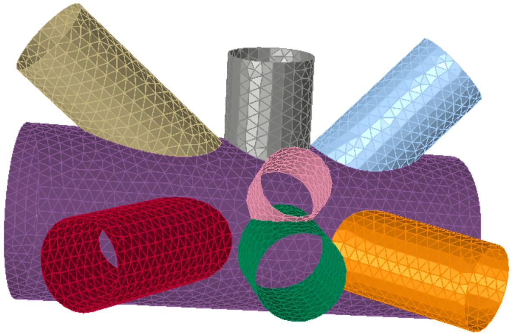

3.1.1 DEFAULT MODE OF OPERATION

The simplest way to access the joint meshing functionality is to use the joint meshing tools in SACS Precede. To mesh a joint in an existing model file, the following procedure may be employed:

1. Open the SACS model file in Precede.   
2. Select ‘Joint’ ->’ Connection’ ->’ Joint Mesher’ on the Precede ribbon bar to open the ‘Joint Mesher’ dialog.   
3. Select the joint you wish to mesh and select ‘OK’ to open a new Precede view.   
4. Enter the desired mesh properties and plate surfaces using the ‘Mesh Boundary Tools’.   
5. Select ‘Mesh Boundary Tools’ ->’ Mesh’ -> ‘Mesh Joint’ to generate a new SACS model file with the specified mesh properties.

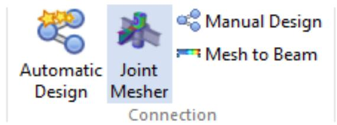

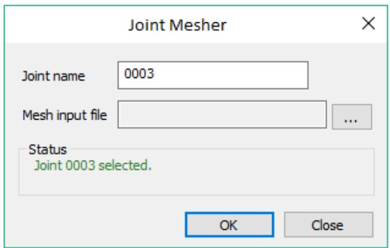

If the user input is correct and the joint geometry is suitable for automatic meshing, a SACS model file is produced. This output file contains the plate and/or curved shell elements that represent the meshed joint. Those sections of the beam model that previously represented the joint will have been removed and replaced with 3D triangular and/or quadrilateral plate and/or curved shell elements.

In addition, another file called the ‘Mesh Output’ file is produced. This file contains various data that can be viewed using a text editor. The data contains information on the number of joints and plates and/or curved shells that have been created as well as information about automatic chord and brace identification.

If a problem occurs during the meshing or solid modeling process, the nature of the problem as well as a geometric identifier is written to the ‘Mesh Output’ file.

3.1.2 ALTERNATIVE MODE OF OPERATION

An alternative way to access the joint meshing functionality is to use the default options presented by the SACS Executive. To mesh a joint in an existing SACS model file, the following procedure may be employed:

1. Click on the 'Utilities' tab of the Program Launcher.   
2. The joint mesher is invoked by dragging the icon of a SACS model file over the 'Mesh Joint' icon. A 'Mesh Joint' dialog box will appear.   
3. Ignoring all other options, type the name of the joint in the 'Joint Name' field.   
4. Adjust Section Library if applicable.   
5. Press the 'OK' button.

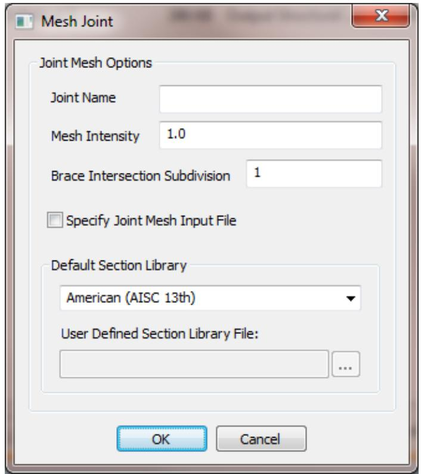

Note that with the default behavior of the joint mesher, the length of the portion of a member that can be meshed is calculated automatically and that also the target two-dimensional element size cannot be controlled by the user. The automatic calculation of the target element size is discussed further in Section 3.2.2.

3.1.3 MESH PROPERTIES

The resulting mesh demonstrates some interesting properties:

i. The unmeshed portions of the original members are redefined as truncated versions of the original members. The portions of those members that have been meshed are automatically removed.   
ii. The chord (or through member) has been automatically identified.   
iii. The meshed portion of a member has been attached to the unmeshed portion of brace using element offsets. The offsets occur in the two-dimensional elements at the end of the meshed section. These elements contain joints that have been offset from the start joint of the unmeshed portion of the member.   
iv. The two-dimensional elements that are produced by the joint mesher are placed in groups that correspond to the member groups of the original unmeshed members. More specifically, the original member wall thicknesses are inherited by the elements. The same is true for material properties.   
v. For the cases in which braces overlap, a brace hierarchy has been identified, in order to establish which members are 'through braces'.

## 3.2 CUSTOMIZATION OF THE MESH

3.2.1 OVERVIEW

The previous section introduced the simplest method that can be used to create a joint mesh. The meshed length of both the chord and brace were calculated automatically, as was the target element size.

The following section describes how it is possible to alter the target element size of a mesh by using the mesh intensity option. Additional options for customizing the mesh are introduced in the joint mesh input file.

3.2.2 DEFAULT TARGET ELEMENT LENGTH

The default target 2-D element length is calculated by considering the minimum brace outside radius, Rmin and the chord outside radius Rmax. For non-tubular sections, the outside radius considered is the maximum of half the height or half the width. The default 2-D element length, E is given by:

$$E = \frac{1}{3} \frac{\left(R_{\max } + 2 R_{\min }\right)}{4 . 5}$$

This formula is used in order to capture the fineness of element size required for the braces of smaller diameter, without generating too many elements on the chord or the braces of larger diameter. If necessary, the user may also set the target 2-D element size directly by using the 'ELMSIZ' line in the joint mesh input file. This is explained further in Section 3.4.

3.2.3 MESH INTENSITY

The 'Mesh Joint' dialog box, which was discussed in Section 1.2 can be used to set a quantity called the 'Mesh Intensity'. The mesh intensity provides a method of controlling the fineness of the mesh. A finer mesh has more elements and therefore allows the geometry of the joint to be better modeled.

The effect of the mesh intensity 'M', is to divide the default target element length by 'M'. The new target element length is E/M, which upon meshing results in roughly M2 times as many elements as the default case.

The default mesh intensity is 1.0. Whilst it is recommended that this value be maintained, an alternative value may be entered by the user. At present, the maximum value is 5.0 (extremely fine mesh) and the minimum value is 0.2 (extremely course mesh). If a value outside of this range is entered, then an error message is displayed in the mesh output file.

3.2.4 ADDITIONAL CUSTOMIZATION

Additional customization of the mesh may be achieved with the joint mesh input file. The joint mesh input file is a text file that contains instructions for further altering the mesh.

The user informs SACS that a joint mesh input file should be used by checking the 'Specify Joint Mesh Input File' checkbox in the 'Mesh Joint' dialog box. ON pressing the 'OK' button, the user is invited to browse for a joint mesh input file.


The content of the joint mesh input file is covered in the next chapter.

## 3.3 JOINT MESH INPUT FILE

3.3.1 OVERVIEW

The joint mesh input file allows the user to set;

i. Joint mesh options   
ii. default brace mesh length   
iii. default chord mesh length   
iv. member mesh length   
v. target element length   
vi. member modification tolerance   
vii. default brace element type   
viii. default chord element type   
ix. member element type   
x. user defined plate surface

xi. longitudinal member hard line   
xii. sectional member hard line   
xiii. member hard points

3.3.2 JOINT MESH OPTION DATA

The JTMOPT line can be used to set the joint mesh options. The mesh joint, mesh intensity, intersection subdivision, and unit system of the mesh input file can be set on the JTMOPT line.

These values are overridden by the entries on the 'Mesh Joint' dialog box.

3.3.3 DEFAULT MESH LENGTHS

The default meshed length of any member is calculated automatically. For any intersecting member, the limit of the mesh is one OD length past the extreme intersection point along the member axis. This is illustrated below:

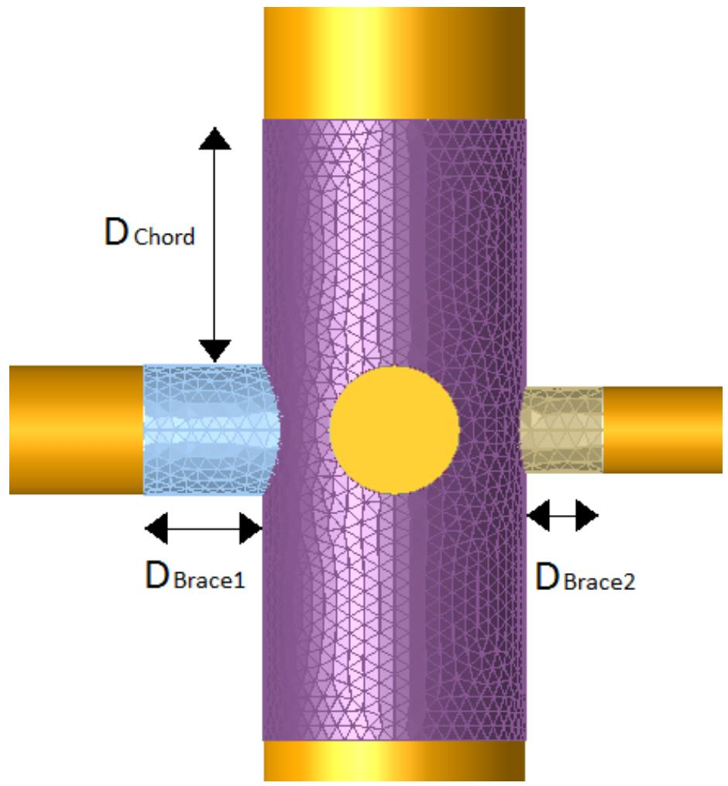

If a member is insufficiently long to encompass the meshable length, then an error is reported to the mesh output file.

3.3.4 USER-SPECIFIED MESH LENGTHS

Occasionally the default mesh length will be insufficient for the modeling requirement.

This problem may be rectified with the use of some commands to enable the user to specify the amount of the member to be meshed, namely CHMLEN, BRMLEN and MSHLEN.

Use MSHLEN followed by a length in m. or ft. in columns 8 through 15 in order to specify a meshable length for all members.

Use BRMLEN followed by a length in m. or ft. in columns 8 through 15 in order to specify a meshable length for all members considered to be braces.

Use CHMLEN followed by a length in m. or ft. in columns 8 through 15 in order to specify a meshable length for all members considered to be chords.

MSHLEN can also be used to override the meshable length for specific members. In this instance, the names of the affected members are added in columns 17:25, 27:35, etc, up to and including columns 67:75.

Note that the CHMLEN and BRMLEN lines both override the non-specific MSHLEN line. The specific version of MSHLEN overrides the CHMLEN and BRMLEN lines as well as the non-specific MSHLEN line.

In the following example, the meshable length for member A001-A002 is 0.9 (ft. or m.). The meshable length for the chord members is 0.5. All other members have a meshable length of 0.8. Note that the '-' in the member specification is not needed but is added for clarity.


|  | 1 | 2 | 3 | 4 | 5 | 6 | 7 | 8 |
| --- | --- | --- | --- | --- | --- | --- | --- | --- |
|  | 12345678901 | 12345678901 | 12345678901 | 12345678901 | 12345678901 | 12345678901 | 12345678901 | 1234567890 |
| 1 | MSHLEN | 0.8 |  |  |  |  |  |  |
| 2 | CHMLEN | 0.5 |  |  |  |  |  |  |
| 3 | MSHLEN | 0.9 | A001 | A002 |  |  |  |  |


3.3.5 USER-SPECIFIED TARGET ELEMENT LENGTH

The user may specify a target element length by using the ELMSIZ line. The length is specified in Columns 8 through 15 in either cm. or in., depending on the unit system of the SACS model file from which the joint is taken. The following example demonstrates the specification of a target element length of 3 cm.


|  | 1 | 2 | 3 | 4 | 5 | 6 | 7 | 8 |
| --- | --- | --- | --- | --- | --- | --- | --- | --- |
| 1 | 12345678901 | 12345678901 | 12345678901 | 12345678901 | 12345678901 | 12345678901 | 12345678901 | 1234567890 |
| ELMSIZ | 3.0 |  |  |  |  |  |  |  |


The user-specified target element length will override any mesh intensity specification, as well as the default target element length. However, the mesh intensity restrictions of Section 2.3 still apply, and a warning message is given in the mesh output file if the mesh intensity that would result from the specified target element length is too high or too low. In this case, the analysis proceeds with the default target element length being used in conjunction with the user-specified mesh intensity.

The user also may specify the target element length near the brace/chord intersection if a finer mesh is required in these areas. The length is specified in Columns 17 through 24. This option will override the Intersection Subdivision option specified on the JTMOPT line.

3.3.6 MEMBER MODIFICATION TOLERANCE

When a certain length of a member is meshed, the remainder of the member is redefined as a new member and the original member is deleted. Sometimes, the new unmeshed member could be considered to have a length that is too small. In this instance, the unmeshed portion of the member is also deleted. The threshold at which the deletion of the unmeshed portion occurs is called the member modification tolerance.

The default member modification tolerance is 0.1 m. or 0.1 ft., depending on the unit system of the SACS model file from which the joint is taken.

The user may specify a member modification tolerance by using the MEMTOL line. The tolerance is specified in Columns 8 through 15 in either m. or ft. Assuming that the host SACS model file has the English unit system, the following example demonstrates the specification of a member modification tolerance of 0.25 ft.

```txt
1 2 3 4 5 6 7 8 123456789012345678901234567890123456789012345678901234567890 1 MEMTOL 0.25 
```

3.3.7 USER SPECIFIED ELEMENT TYPE

The default element type used is triangular plates. The user can specify the chord, all braces, or individual members to triangular or quadrilateral plates (TRI3, QUAD4) or shells (TRI6, QUAD9) with CHMTYP, BRMTYP, and MSHTYP.

3.3.8 USER-DEFINED PLATE SURFACE

The user can specify a plate surface to be included when meshing a joint, and the program will automatically handle all intersections with members and other plate surfaces. This feature can be used to create ring plates, stiffener plates, gusset plates, etc. Each plate surface is defined using the PNAME line, which describes the plate thickness and material properties. The plate surfaces' boundary consists of a combination of lines and/or arcs. The line and/or arcs are entered in either the global 3-dimensional coordinate system or the local plane 2-dimensional coordinate system.

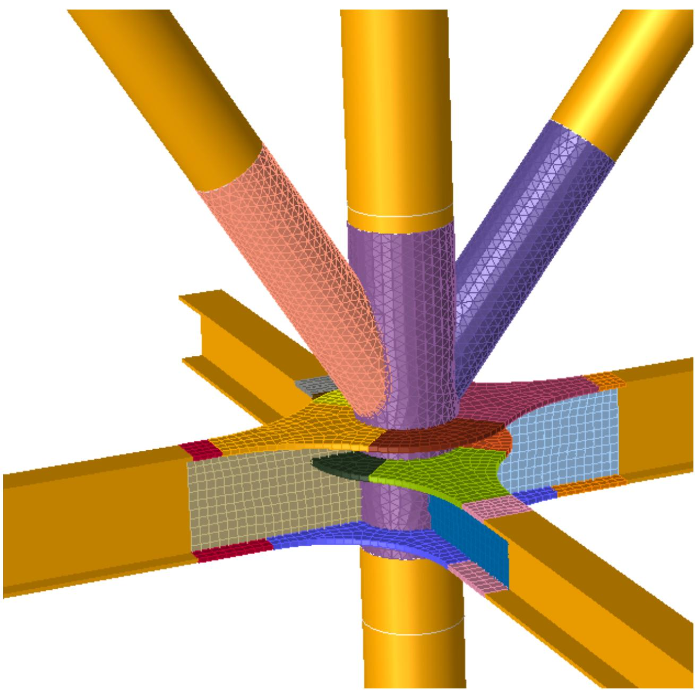

3.3.8.1 Plate Surface in Global 3-Dimensional Coordinate System

Plate surfaces can be entered into the Global 3-Dimensional Coordinate System by entering boundary lines and/or arcs with the PLINE and PARC lines. The plane which contains the plate surface is determined by the order of the lines and/ or arc entered on the PBOUND line.

3.3.8.1.1 Plate Surface Boundary Definition

The list of boundary lines and/or arcs used to describe a plate surface is entered on the PBOUND line(s). The order of the lines and/or arc entered on the PBOUND line will be used to determine the plate surface orientation and plane in which the plate surface will lie.

3.3.8.1.2 Plate Boundary Line

The plate boundary line described by the PLINE is used to create a straight boundary line by entering the start and end location of the line in Global 3-Dimensions.

3.3.8.1.3 Plate Boundary Arc

The plate boundary arc described by the PARC is used to create a boundary arc by entering the center and start location of the arc in Global 3-Dimensions, and the arc angle. If the arc angle is left blank, the program will calculate the arc angle to be used based on the intersection with the closest boundary line of the plate surface. The direction of the arc is determined using the right-hand rule about the plate surface normal vector.

3.3.8.1.4 Plate Surface Orientation

If plate boundary arc(s) are used to describe the boundary of the plate surface, the normal vector to the surface must be determined. The order of the boundary labels determines the plate surface normal vector entered on the PBOUND line.

If the first boundary label is an arc, the Local Plane X axis is from the arc’s center to the start location; otherwise, if the first boundary is a line, the Local Plane X axis is from the start location to the end location.

Similarly, the second boundary label determines the Local Plane Y axis, and the cross product of the Local Plane X and Y axis determines the plate surface normal vector. If the current Local Plane Y axis is parallel to the Local Plane X axis, the next boundary label is used to determine the Local Plane Y axis. The following example defines an insert plate, “TINSERT”, with lines L1 through L8 using the plate surface definition with the global coordinate system.


|  | 1 | 1 | 2 | 2 | 3 | 3 | 4 | 4 | 5 | 5 | 6 | 6 | 7 | 7 | 8 | 8 |
| --- | --- | --- | --- | --- | --- | --- | --- | --- | --- | --- | --- | --- | --- | --- | --- | --- |
|  | 123456789012345678901234567890123456789012345678901234567890 | 123456789012345678901234567890123456789012345678901234567890 | 123456789012345678901234567890123456789012345678901234567890 | 123456789012345678901234567890123456789012345678901234567890 | 123456789012345678901234567890123456789012345678901234567890 | 123456789012345678901234567890123456789012345678901234567890 | 123456789012345678901234567890123456789012345678901234567890 | 123456789012345678901234567890123456789012345678901234567890 | 123456789012345678901234567890123456789012345678901234567890 | 123456789012345678901234567890123456789012345678901234567890 | 123456789012345678901234567890123456789012345678901234567890 | 123456789012345678901234567890123456789012345678901234567890 | 123456789012345678901234567890123456789012345678901234567890 | 123456789012345678901234567890123456789012345678901234567890 | 123456789012345678901234567890123456789012345678901234567890 | 123456789012345678901234567890123456789012345678901234567890 |
| 1 | PNAME | TINSERT | 3 | 0.5 | 29.0 | 36.0 | 0.3 | 490.0 | J |  |  |  |  |  |  |  |
| 2 | PBOUND | TINSERT |  | L1 | L2 | L3 |  | L4 |  | L5 |  | L6 |  |  |  |  |
| 3 | PBOUND | TINSERT |  | L7 | L8 |  |  |  |  |  |  |  |  |  |  |  |
| 4 | PLINE |  | L1 |  | -2.5 | -.27042 | 0.48833 |  | -2.5 | 0.27042 | 0.48833 |  |  |  |  |  |
| 5 | PLINE |  | L2 |  | -2.5 | 0.27042 | 0.48833 | -.27042 |  | 2.5 | 0.48833 |  |  |  |  |  |
| 6 | PLINE |  | L3 |  | -.27042 |  | 2.5 | 0.48833 | 0.27042 |  | 2.5 | 0.48833 |  |  |  |  |
| 7 | PLINE |  | L4 |  | 0.27042 |  | 2.5 | 0.48833 |  | 2.5 | 0.27042 | 0.48833 |  |  |  |  |
| 8 | PLINE |  | L5 |  | 2.5 | 0.27042 | 0.48833 |  | 2.5 | -.27042 | 0.48833 |  |  |  |  |  |
| 9 | PLINE |  | L6 |  | 2.5 | -.27042 | 0.48833 | 0.27042 |  | -2.5 | 0.48833 |  |  |  |  |  |
| 10 | PLINE |  | L7 |  | 0.27042 |  | -2.5 | 0.48833 | -.27042 |  | -2.5 | 0.48833 |  |  |  |  |
| 11 | PLINE |  | L8 |  | -.27042 |  | -2.5 | 0.48833 |  | -2.5 | -.27042 | 0.48833 |  |  |  |  |


Note that all boundary lines and/or arcs of a user-specified plate surface must be on the same plane, and the boundary must be closed.

3.3.8.2 Plate Surface in Local Plane 2-Dimensional Coordinate System

Plate surfaces can be entered in the Local Plane 2-Dimensional Coordinate System by entering boundary lines and/or arcs with the PLINE2 and PARC2 lines. The active plane containing the plate surfaces is set with the PPLANE line before setting the plate properties on the PNAME line. Additional PPLANE lines are used to change the active plane for the next plate surfaces.

Note Precede can be used to enter the Plate Surface in the Local Plane 2-Dimensional Coordinate System.

3.3.8.2.1 Plate Surface Plane Definition

The plane which contains the plate surface is set with the PPLANE line. The plane can be defined based on the Global Coordinate System, the Local Member Coordinate System, or between two members.

3.3.8.2.2 Plate Boundary Line

The plate boundary line described by the PLINE2 line is used to create a straight boundary line by entering the start and end location of the line in the Local Plane 2-Dimensional Coordinate System.

3.3.8.2.3 Plate Boundary Arc

The plate boundary arc described by the PARC2 is used to create a boundary arc by entering the arc's center, start, and end location in the Local Plane 2-Dimensional Coordinate System. The following example defines an insert plate, “BOUND001”, using the plate surface definition with the local coordinate system.

```txt
1 2 3 4 5 6 7 8  
123456789012345678901234567890123456789012345678901234567890  
PPLANE 5 11.8900 XY 11.889999  
2 PNAME BOUND001 3 1.0000 29.000 36.000 0.3000 490.00  
3 PARC2 ARC00003 -1.31-7 3.00000 -1.31-7 3.00000  
4 PARC2 TRANS001 -2.5375 4.30825 -1.5225 2.58495 -0.5375 4.30825  
5 PARC2R TRANS002 2.53750 4.30826 1.52250 2.58496 0.53750 4.30826  
6 PARC2 TRANS003 4.30580 2.54167 2.58348 1.52500 4.30580 0.54167  
7 PARC2R TRANS004 4.30580 -2.5417 2.58348 -1.5250 4.30580 -0.5417  
8 PARC2R TRANS005 -2.5375 -4.3083 -1.5225 -2.5850 -0.5375 -4.3083  
9 PARC2 TRANS006 2.53750 -4.3083 1.52250 -2.5850 0.53750 -4.3083  
10 PLINE2 LINE0023 -0.5375 4.30825 0.53750 4.30826  
11 PLINE2 LINE0024 4.30580 0.54167 4.30580 -0.5417  
12 PLINE2 LINE0025 -0.5375 -4.3083 0.53750 -4.3083 
```

3.3.9 MEMBER HARD LINES

Member hard lines can be used to align element edges of a mesh. MLONG line will create a member longitudinal hard line based on reference coordinates. TUBANG will create a member longitudinal hard line along a tubular member based on an angle about the member’s local coordinate system. MPLANE will create a sectional hard line across the member’s section as it passes through a defined plane. The plane can be perpendicular to the member at a specified distance from Joint A, or perpendicular to member and containing a specified point, or the plane can be defined by three points.

The lines shown below in red are the additional hard lines to be created

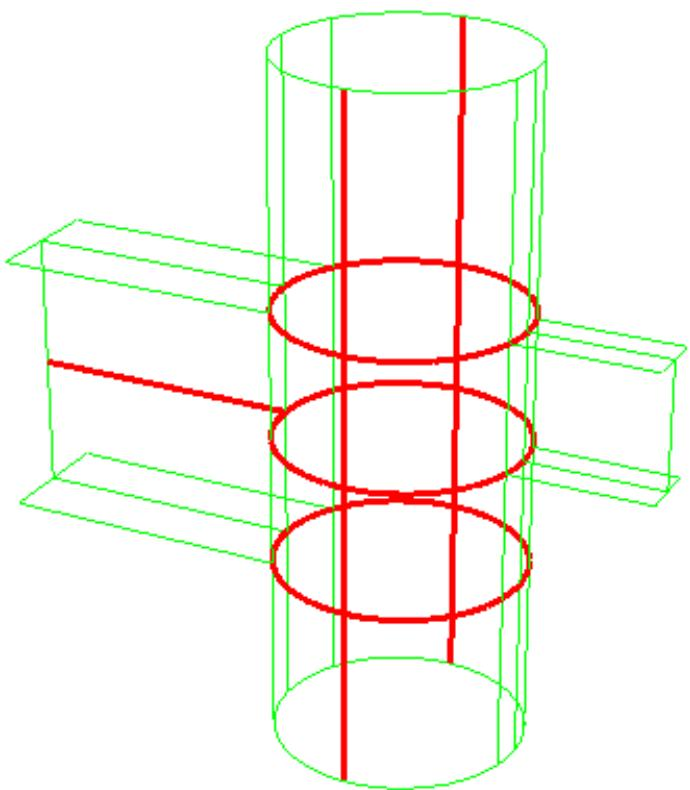

3.3.10 MEMBER HARD POINTS

Member hard points can be used to force plate vertices to connect to the specified hard point. HRDPNT lines are used to enter in the location in hard point in the global coordinate system.

Enter a '1' in column 7 of the HRDPNT line to create a hard edge between two hard points. The hard edges will align the plate edges between two hard points. A predefined joint name can also be provided for the hard points; in this case, the resulting joints from the hard points are named correspondingly. Otherwise, the default naming convention for joints is applied.

3.3.11 MEMBER BOUNDARY JOINTS

The user can define a set of boundary joints on a surface or on the boundary of a tubular for the final mesh to connect to those joints via BNDPNT line in the Joint Mesher's input file. Suppose the designated boundary joints are to connect to end of a tubular. In that case, the tubular will be connected to these joints instead of being rigidly connected to a single end joint. An option in JTMOPT card can also be set to detect the boundary joints automatically. If set, any joints in the SACS input model that are on the surface of the members being meshed will be connected to the final mesh. This is particularly useful for connecting the plates created by the Joint Mesh to other plates that are previously defined.

3.3.12 MEMBER EXPLICIT STIFFENERS

The JointMesh program supports the automatic creation of explicit stiffeners. Explicit stiffeners connect to Joints created for plates and are modeled as members (beam elements). Individual explicit stiffeners can be defined using the PLTSTF card by inputting the target member and stiffener's endpoints coordinates. The stiffeners' cross-section and material properties must be defined inside the SACS input file and designated using the member group name on the PLTSTF line. JointMesh currently supports Wide Flange (WF), Box (BOX), Tee (TEE), Prism (PRI), Channel (CHL), and Angle (ANG) cross-sections. The stiffeners can be rotated 180 degrees and can be offset so that their neutral axis aligns with:

1. the mid-surface of the created plates   
2. the outer surface of the created plates   
3. the inner surface of the created plates

In addition, Ring and Longitudinal stiffeners groups can be created for tubular members using RNGSTF and LNGSTF cards, respectively. Ring stiffeners are aligned such that their local x-axis is tangent to the tubular member's surface, and, by default, they span 360 degrees. Longitudinal stiffeners are created such that their local x-axis is parallel to the stiffened member's local x-axis. The stiffener groups created then can be added to one or several members using the MEMSTF card.

3.3.13 STRESS CONCENTRATION FACTOR EXTRACTION

The Joint Mesh Program can be used to automatically create a mesh and a POST input file that can be used for stress concentration factor (SCF) extraction. A set of 6 SCFs will be determined at each extraction location along the brace/chord intersection. These include +/- Axial, +/- in-plane bending, +/- out-of-plane bending. The brace and ring plates for which the SCF are to be determined as well as extraction locations are specified on the SCFBR and SCFPL lines correspondingly in the Joint mesh input file.

3.3.13.1 Nominal Stress

For every extraction location, the Joint Mesh program will determine the nominal stress using beam theory based on unit loads and its location from the neutral axis. These nominal stresses will be added to the POST input on the SCFNS line. The unit loads will be added as 6 separate load conditions to the meshed model file.

For tubular braces, the nominal stress and unit loads will be based on a coordinate system formed between the brace and chord member. This system will have a saddle locations correspond to out-ofplane bending and a crown location correspond to in-plane bending. For non-tubular braces, the coordinate system used for the nominal stress and unit loads will be based on the member local coordinate system. The ring stiffeners at each extraction hot spot for both tubular and non-tubular are based on the member local axes. Users can define additional loading cases in the model file and provide the corresponding SCFNS lines in the Post input file.

3.3.13.2 'Hot Spot Stress'

To determine the “Hot Spot Stress”, the Joint Mesh program will include two joints perpendicular to the extraction location, Joint A and Joint B, at each extraction location. The POST program will determine the average nodal element principle stress at Joint A and B locations, then linearly extrapolate them to determine hot spot stress at the brace/chord intersection. The extrapolation nodes for shell elements are placed on the element’s mid-side nodes whenever possible. In cases when this is not possible because of connections to other members, the extraction nodes are placed at the element’s vertices. The size of the elements is set according to either DNV RP-203 or using the user-provided values. The first extraction point (A) is either the mid-side or vertex node of the first element connecting to the hot spot, and the second extraction point (B) is the mid-side or vertex node of the adjacent element. When using plate elements, the mesh density is increased to create four plate elements for every shell element. Following DNV RP-203 we recommend the use of 9-node quadrilateral shell elements whenever possible. The resulting mesh is guaranteed to produce more accurate results with a lower number of elements. Since a pure quadrilateral tessellation of a surface does not always exist, the Joint Mesh program attempts to create a mesh with a minimal number of triangular elements when using quadrilateral elements. The Joint Mesh program outputs to the POST input file the joints used for extraction on the SCFEX line and the plates used to determine the average stress on the PLTAVG or SHLAVF line for plates and shells correspondingly. With the nominal stress and “Hot Spot Stress”, the POST program will calculate the SCFs.

The hot spot stresses can also be calculated for ring-stiffened members using option SCFPL in the Joint Mesh input file. For each external ring plate specified by the option, the program automatically creates SCF extraction hardedges along the plates' intersections with all members. These extrapolation points (similar to ones created for brace/chord intersections) are placed at a predefined distance from the hot spot. This distance is set either according to the DNV RP-203 standard or as specified by the user. The extrapolation joints are then outputted for each plate to the corresponding Post input file using SCFEX line. Hot spot stress is then calculated by linear extrapolation from these nodes to the Member / Ring Plate intersection.

## 3.4 ADDITIONAL CONSIDERATIONS

3.4.1 OVERVIEW

The following sections contain a few more technical details about the operation of the Joint Mesher.

3.4.2 CHORD IDENTIFICATION

The Joint Mesher attempts to identify a chord automatically. The calculation procedure is as follows:

Each member is compared to the others by projecting the corners of the section (for tubular sections, the radius is used) onto a perpendicular vector. The “primary member” of the chord will contain all corners of all the other members. If the projections are the two members are equal, then the plate thicknesses are checked, then the yield strength to determine the “primary member” of the chord.

From all the remaining members, the program requires a “secondary member” of the chord with the same properties as the “primary member” that is within 5 degrees of the “primary member”.

If the above procedure fails, then an error is displayed in the mesh output file to indicate that a chord cannot be automatically identified.

If a primary and secondary chord member are successfully identified, then the chord mesh is represented by elements that have hybrid properties of both chord members. The physical and material properties are averaged, and the chord direction will be taken from the unattached end of the primary chord member to the unattached end of the secondary chord member.

3.4.3 CHORD/BRACE HIERARCHY

The chord/brace hierarchy determines which member acts as a through member at the point of the intersection of the two members. The chord members are always at the top of the hierarchy. The remainder of the hierarchy is determined the same way as used to identify the chord, except braces do not require a “secondary member”.

3.4.4 LIMITATIONS

i. Currently, only members with tubular, tubular, wide flange, box, channel, angle, tee, double angle sections, plate girder, double web plate girder, boxed plate girder, and unsymmetrical plate girders cross-sections can be meshed.   
ii. Only the first segment of a member will be meshed. Specifications for member mesh lengths beyond the first member will be ignored and the resulting mesh will have a length that is limited by the first segment length.   
iii. For SCF extraction purposes, only ten combined Chord/Brace and Member/Ring Plate can be included per execution.

## 3.5 COMMANDS FROM THE JOINT MESH INPUT FILE

The following table summarizes the lines currently available in the joint mesh input file.


| Command | Description |
| --- | --- |
| JTMOPT | Set the overall joint mesh options |
| ELMSIZ | Set the target element length |
| CHMLEN | Set the meshable length for chord members |
| BRMLEN | Set the meshable length for brace members |
| MSHLEN | Set the meshable length for specific or all members |
| MEMTOL | Set the member modification tolerance |
| CHMTYP | Set the plate mesh type for chord members |
| BRMTYP | Set the plate mesh type for brace members |
| MSHTYP | Set the plate mesh type for specific or all members. |
| PPLANE | Set the plane for the subsequent plate surfaces entered in the Local Plate 2-Dimensional Coordinate System |
| PNAME | Set the user-specified plate surface descriptions. |
| PBOUND | Set the user-specified plate surface boundary definitions for plate surfaces in the Global 3-Dimensional Coordinate System |
| PLINE | Set a boundary line to be used in a specified plate surface boundary entered in the Global 3-Dimensional Coordinate System. |
| PARC | Set a boundary arc to be used in a specified plate surface boundary entered in the Global 3-Dimensional Coordinate System. |
| PLINE2 | Set a boundary line to be used in a specified plate surface boundary entered in the Local 2-Dimensional Coordinate System. |
| PARC2 | Set a boundary arc to be used in a specified plate surface boundary entered in the Local 2-Dimensional Coordinate System. |
| MLONG | Set a member longitudinal hard line based on reference coordinate |
| TUBANG | Set a tubular member longitudinal hard line based on angle. |
| MPLANE | Set the member hard line across section. |
| HRDPNT | Set the member hard points |
| BNDPNT | Set the member boundary points. |
| PLTSTF | General explicit stiffener definition |
| RNGSTF | Ring stiffener group definition for tubulars. |
| LNGSTF | Longitudinal stiffener group definition for tubulars. |
| MEMSTF | Assigning stiffener groups to tubulars. |


4 SACS REPORT GENERATOR INTRODUCTION

The SACS REPORT generator module allows user control of report content and allows the user to output reports in standard, html, comma delimited or space delimited formats. The module also allows the user to include user defined report titles, page control and page headers and footers, report units selection. Reports can be generated for selected elements, element groups, joints and load cases.

## 4.1 INPUT FILE

The example below shows a typical input for Report Generator utility. The report generator options line REPOPT designates a standard report format with 100 characters per output line and 1 line is to be skipped between report lines. The page set line PGSET defines manual pagination with the use of ML option in columns 11-12. The page header and footer lines PGHEAD and PGFOOT respectively, define headers and footers and the justification for the headers and footers. The page break line PGBRK designates a header without a page break using option 'H' in column 7. The report titles are defined on the TITLE lines with the title location (justification) and the number of lines to be skipped before and after the title in columns 6, 7 and 8 respectively. The TEXT line defines the text to be inserted into the report. The UNITS line designates the global output units to default to English units. The report name and report comments are defined on the RPNAM and RPCOM input lines respectively. Reports are to be generated for loads selected on the load case select LCSEL line and for selected member groups on the MGRPSL line. Member reports corresponding to the critical internal load and also member details are requested on the RPTMEM input line. Each report is followed by a page break using the PGBRK input line. The member reports are followed by a request for a joint deflection report corresponding to the maximum deflection using the RPTJNT input line. The units for the joint deflection are selected as millimeters using the UNITS input line.

```txt
1 2 3 4 5 6 7 8  
1234567890123456789012345678901234567890123456789012345678901234567890  
1 Report Options  
REPORT 100 1 STND  
* Page Settings - Use manual pagination  
PGSET ML  
* Page Header and Footer  
PGHEAD RREPORT HEADER RIGHT JUSTIFIED  
PGFOOT LREPORT FOOTER LEFT JUSTIFIED  
PGBRK H  
* First Report Settings  
TITLEC12 TEST REPORT TITLE  
TITLE C CONTINUED  
* Comment  
TEXT L01 DEFAULT ENGLISH UNITS ARE USED  
* Use English Units  
UNITS EN  
*  
* Report Member Details for Three members for All Load Cases  
*  
RPNAMC MEMBER DETAILS REPORT  
RPCOMC JACKET LEG MEMBER 101-201, 103-203, AND 105-205  
* Select Load Cases  
LCSEL IN ST?1 ST?2 ST?3 ST?4  
* Select Member Groups  
MGRPSL I LG*  
* Create critical member report 
```

```txt
26 RPTMEM MCIL   
27 PGBRK
28 \* Create member detail report   
29 RPTMEM DETL   
30 \* Add page break   
31 PGBRK
32 \* Second Report Settings   
33 TITLEC12 JOINT REPORTS   
34 \* Comment
35 TEXT L 1 DEFLECTION REPORTS USING METRIC UNITS   
36 \* Use metric unit set with deflection overrident to use mm   
37 UNITS MN MM   
38 \* Joint maximum deflections   
39 RPTJNT DEFL MAX   
40 PGBRK
41 END
42   
43 
```

4.1.1 INPUT FILE SETUP


| INPUT LINE | DESCRIPTION |
| --- | --- |
| REPOPT | Overall report specification Input |
| PGSET | Page set line |
| PGHEAD | Page heading line |
| PGFOOT | Page footer line |
| PGBRK | Page break line |
| TITLE | Report title input line |
| RPNAM | Report name input line |
| RPCOM | Report comment line |
| TEXT | Report text input line |
| UNITS | Units selection input line |
| LCSEL | Load case select line |
| UCPART | Unity check partition input line |
| JNTSEL | Joint selection input |
| MGRPSL | Member group selection input |
| MEMSEL | Member selection input |
| PGRPSL | Plate group selection input |
| PLTSEL | Plate selection input |
| SGRPSL | Shell group selection input |
| SHLSEL | Shell selection input |
| RPTJNT | Joint report selection |
| RPTMEM | Member report selection |
| RPTPLT | Plate report selection |
| RPTSHL | Shell report selection |
| END | End of input data |


5 Precede FEMAP Model Import

Precede can import FEMAP models through the FEMAP Neutral File Format (NEU). Several FEMAP geometric elements which correspond to existing Precede elements may be imported along with group material properties using the materials sections of the NEU file. Import of some load types from FEMAP are also supported.

The current list of supported import types are as follows:

• Loads   
o Joint Loads   
Material Properties   
Solid Elements

o Wedges   
o Tetrahedrons   
o Bricks

## 5.1 LOADS

The loads that Precede imports are joint (node) loads. Specifically, FEA Load Types 1 and 2 only. These are defined as nForce and nMoment in the Neutral File Format and are required in the loadtype field in record 22 of Data Block 507.

## 5.2 MATERIALS and PROPERTIES

Any materials that are output from FEMAP in the NEU will be imported into Precede and will be represented by Groups. These groups are them used to specify the types of materials used in the Precede elements (currently a subset of available solids).

Solids elements in SACS are assumed to be isotropic, whereas in FEMAP they may be anisotropic. When importing anisotropic elements, SACS will use the first property defined (typically the local X property) for the isotropic definition.

## 5.3 SOLIDS

NOTE: All of the FEMAP solids support midpoint nodes, however, Precede does not currently support this. Any imported solid with specified midpoints will have its midpoint joints removed upon import. A list of elements whose midpoints were removed is displayed to the user at the time of the import.

Solids are specified as Elements with Type 25 and 26. Type 26 is the parabolic type and will have the midpoints removed as stated above. SACS will import 6 of the available element shapes that are listed in the Elements section of the FEMAP documentation.

• 4 and 10 node tetrahedrons are imported and stored as 4 node tetras.

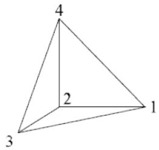

• 6 and 15 node wedges are imported and stored as 6 node wedges.

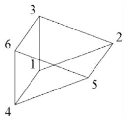

• 8 and 20 node bricks are imported and stored as 8 node bricks.

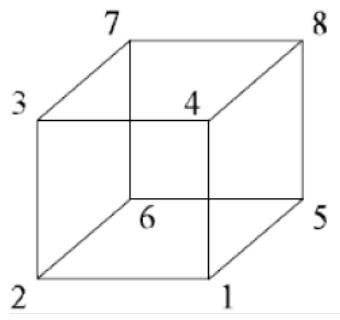

## 5.4 PLATES

Plates specified as Element Type 17 or 18 will be imported. Type 18 will have the midpoints ignored just as the midpoints are ignored in the import of SOLIDS.

If the Plate Material defines different values of thickness for the 4 corners of the plate, SACS will only import the first values and use it for the thickness of the plate. If only the first value is defined as an average, then SACS will use this value as expected.

## 5.5 SPECIAL FEMAP ELEMENTS

There are some elements which are necessary in FEMAP but not required for SACS analysis and hence not supported or whose properties are imported. These are:

i. Axisymmetric Shell is an element which is not exactly a shell. It is the line that represents a shell of revolution.   
ii. Plot only is an element used to plot results and does not require any properties in Femap   
iii. Laminate has different layers with different thicknesses and material. In SACS user needs to make some consideration in this case and calculate an equivalent thickness and material.

The table below provides information on all elements imported into SACS.


| Element Description | FEMAP Element Types | SACS Element |
| --- | --- | --- |
| 3 Nodes Triangle Element | Shear Panel | 3 Nodes Triangular Plate - Shear Stiffness Only |
| 3 Nodes Triangle Element | Membrane | 3 Nodes Triangular Plate - Membrane |
| 3 Nodes Triangle Element | Bending Only | 3 Nodes Triangular Plate |
| 3 Nodes Triangle Element | Plate | 3 Nodes Triangular Plate |
| 3 Nodes Triangle Element | laminate | 3 Nodes Triangular Plate* |
| 3 Nodes Triangle Element | Plane Strain | 3 Nodes Triangular Plate |
| 3 Nodes Triangle Element | Axisymmetric Shell | Not Supported |
| 3 Nodes Triangle Element | Plot Only | 3 Nodes Triangular Plate* |
| 6 Nodes Triangle with Midside Nodes | Shear Panel | 6 Nodes Shell |
| 6 Nodes Triangle with Midside Nodes | Membrane | 6 Nodes Shell |
|  | Bending Only | 6 Nodes Shell |
|  | Plate | 6 Nodes Shell |
|  | laminate | 6 Nodes Shell* |
|  | Plane Strain | 6 Nodes Shell |
|  | Axisymmetric Shell | Not Supported |
|  | Plot Only | 6 Nodes Shell* |
| 4 Nodes Quadrilateral | Shear Panel | 4 Nodes Quadrilateral Plate - Shear Stiffness Only |
| 4 Nodes Quadrilateral | Membrane | 4 Nodes Quadrilateral Plate - Membrane |
| 4 Nodes Quadrilateral | Bending Only | 4 Nodes Quadrilateral Plate |
| 4 Nodes Quadrilateral | Plate | 4 Nodes Quadrilateral Plate |
| 4 Nodes Quadrilateral | laminate | 4 Nodes Quadrilateral Plate* |
| 4 Nodes Quadrilateral | Plane Strain | 4 Nodes Quadrilateral Plate |
| 4 Nodes Quadrilateral | Axisymmetric Shell | Not Supported |
| 4 Nodes Quadrilateral | Plot Only | 4 Nodes Quadrilateral Plate* |
| 8 Nodes Quadrilateral with Midside Nodes | Shear Panel | 8 Nodes Shell |
| 8 Nodes Quadrilateral with Midside Nodes | Membrane | 8 Nodes Shell |
| 8 Nodes Quadrilateral with Midside Nodes | Bending Only | 8 Nodes Shell |
| 8 Nodes Quadrilateral with Midside Nodes | Plate | 8 Nodes Shell |
| 8 Nodes Quadrilateral with Midside Nodes | laminate | 8 Nodes Shell* |
| 8 Nodes Quadrilateral with Midside Nodes | Plane Strain | 8 Nodes Shell |
| 8 Nodes Quadrilateral with Midside Nodes | Axisymmetric Shell | Not Supported |
| 8 Nodes Quadrilateral with Midside Nodes | Plot Only | 8 Nodes Shell* |


* No properties are imported for these elements

## 5.6 IMPORT DIALOG

To import a FEMAP file, with Precede open and a new blank model created, select File > Import. Then select Import FEMAP File from the options available.

The user will be prompted to enter some additional information in the FEMAP Import dialog.

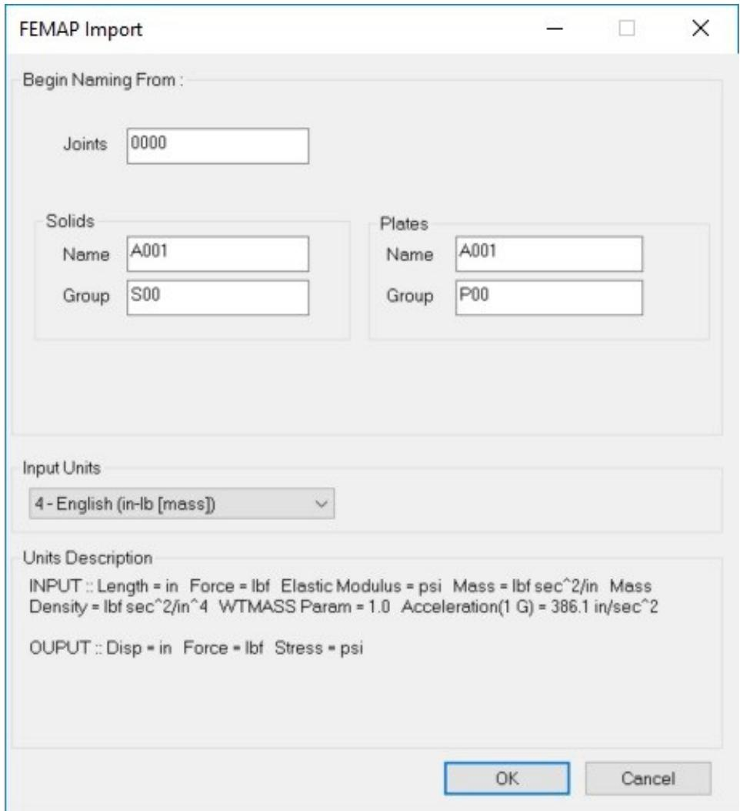

In the Begin Naming From section, the user can select the starting names for each of the types listed. The names will be incremented by 1 with each subsequent element imported.

The Input Units selection box allows the user to specify which group of units were used when modeling in FEMAP.

Note: Since FEMAP uses an implicit unit system and SACS uses an explicit unit system, the FEMAP values must be converted using the Input Units and the input units defined in the SACS model file.

After selecting OK, the user then browses to the NEU and the import into Precede begins.

6 SACS ADINA Interop (Technology Preview)

## 6.1 Overview

The SACS ADINA Interop is a utility program to export SACS model inputs to an ADINA input file. ADINA is a general-purpose finite element program to perform advanced analyses, such as large deformation elastoplastic nonlinear time history analysis or thermal degradation. This document summarizes various features currently supported by the SACS ADINA Interop utility.

The SACS ADINA Interop program currently creates the following outputs:

Listing file: this file reports general information about the SACS and ADINA models and possible error or warning messages during conversion.   
• ADINA batch input files: These files have the extension of *.in.   
SACS ADINA map in JSON format: This file contains a map between SACS alphanumeric labeling and ADINA numerical labeling for element groups, elements, loading, and other model information. See section 6.5 for additional details.

Note: While using the SACS ADINA Interop utility program, the ADINA files and SACS ADINA map are stored in the SACS ADINA Interop Database directory (named adndb.* by default).

There are two methods to export SACS inputs to ADINA:

Use the export utility available in SACS Precede to export a model file. This utility exports elements and loads in the SACS model file and setups an ADINA input file for a linear static analysis with linear elastic materials and load conditions.   
• Use the SACS ADINA Interop utility program (available in SACS Executive > Analysis Generator > SACS ADINA Interop Analysis) to export the model file, pile-soil interaction (PSI) input file, and Collapse input file for nonlinear static analysis with possible elastoplastic materials. SACS ADINA Interop Analysis also provides an option to run SACS SeaState for post-processing any environmental loads defined in the SACS model file or a SeaState input file or convert load combinations to basic load conditions. This method requires a new input file for SACS ADINA Interop program (adninp.*). See section 6.2.4 for details.

Note: Future SACS releases will support other SACS inputs, like Gap and Dynpac. See sections 6.3 to 6.5 for a complete list of supported features in the current release.

## 6.2 Conversion Options and Inputs

The following options are currently available to export a SACS model file to an ADINA input file.

6.2.1 Units

ADINA program uses a consistent unit system to perform analysis. The following options are available to perform unit conversion from the SACS unit system to the ADINA unit system:

Default: The utility performs the unit conversion based on the SACS Model file unit.   
• SI: The ADINA input file will be in the consistent SI unit system.   
• English: The ADINA input file will be in the consistent English unit system.

The following table shows the SACS Unit System and ADINA Consistent Unit System.


| SACS Unit System | ADINA Consistent Unit System |
| --- | --- |
| English | Length: ft, mass: slug, force: Ib, Temperature: F |
| Metric with kN forces | Length: m, mass: kg, force: N, Temperature: C |
| Metric with kg forces | Length: m, mass: kg, force: N, Temperature: C |


6.2.2 Member Cross Sections

ADINA currently supports a subset of the SACS member cross-sections. Therefore, the following options are currently available to export SACS member cross sections to the ADINA input file:

Default: The utility automatically sets the section type and analysis type. The default option is exporting sections by their stiffness properties for linear static analysis and nonlinear static with PSI (where the only nonlinear elements are nonlinear soil springs). In the case of elastoplastic material (i.e., SACS Collapse input file), the default option is exporting cross sections using Expanded Shapes + Properties option – see details below.   
Section Properties: the utility exports sections using their stiffness properties (area, moments). Select this option to perform linear analysis in ADINA.   
Shapes: The utility exports supported sections by their shape dimensions and returns error messages for unsupported sections. Select this option to perform nonlinear elastoplastic analysis for a model containing only ADINA-supported sections.   
Expanded Shapes: with this option, the utility simplifies a subset of unsupported sections and exports them by their section dimensions. For example, Launch Runner, Stiffened Tubular, and Dented Section are exported as tubular sections, and Tee sections are modeled as unsymmetrical I sections. The utility returns error messages for unsupported cross-sections. Select this option to perform nonlinear elastoplastic analysis for models containing ADINAsupported sections.

Shapes + Properties: The utility exports supported sections by their section dimensions, while exports unsupported sections by their section properties. Select this option to perform nonlinear elastoplastic analysis.   
Expanded Shapes + Properties: This option is like Shapes + Properties with an additional option to simplify and export some of the unsupported sections (See Expanded Shapes description). Select this option to perform nonlinear elastoplastic analysis.

See section 6.3.1 for additional information about exporting member cross-sections.

6.2.3 Member Sub-segmenting

ADINA program currently only supports beam elements with uniform cross-sections. As a result, SACS AIDNA Interop utility program provides the following options to subsegmenting the members:

Number of Subsegments: This option is reserved for future development. The number of subsegments is set to a default value of 1 for simple member groups. The utility automatically divides segmented groups into multiple ADINA beam elements based on the segment lengths entered in the SACS model file. For example, the program divides all members within a group with two segments as two ADINA beam elements.   
Number subsegments for Tapered and Conical sections: The SACS ADINA Interop program automatically subdivides a member element with a tapered or conical section into multiple ADINA beam elements. The default number of subsegments is 4, which can be adjusted using this option.   
Collapse Subsegmenting: SACS-ADINA interop utility program can use number of subsegments provided in a Collapse input file to create a finite element model with subsegmented member elements in ADINA.

6.2.4 SACS ADINA Interop Input File

6.2.4.1 ADINA: General Options

ADINA input line controls general options for exporting SACS input files to ADINA. The following example illustrates various options available on this line.


|  | 1 | 2 | 3 | 4 | 5 | 6 | 7 | 8 |
| --- | --- | --- | --- | --- | --- | --- | --- | --- |
|  | 123456789012345678901234567890123456789012345678901234567890 | 123456789012345678901234567890123456789012345678901234567890 | 123456789012345678901234567890123456789012345678901234567890 | 123456789012345678901234567890123456789012345678901234567890 | 123456789012345678901234567890123456789012345678901234567890 | 123456789012345678901234567890123456789012345678901234567890 | 123456789012345678901234567890123456789012345678901234567890 | 123456789012345678901234567890123456789012345678901234567890 |
| 1 | ADINA SI EXP | STATIC | PSI CLP |  |  |  |  |  |


Units (Columns 8-9): Select units for the ADINA input file. Leave BLANK for the default (automatically determined based on SACS model file units), enter ‘SI’ for the SI unit system, or ‘EN’ for English unit system. See section 6.2.1 for additional information.   
SACS-ADINA Interop Utility Function (Columns 11-13): Enter ‘EXP’ to export SACS inputs to ADINA. (Export is the only functionality supported in the current version.)   
Analysis Type (Columns 19-24): Select the analysis type for the exporting. Enter ‘STATIC’ to select static analysis (Static analysis is the only analysis type currently supported.)

Include PSI (Columns 31-33): Enter ‘PSI’ to export piles and soil springs provided in a PSI input file. Including the PSI input file automatically sets the analysis type to nonlinear.   
Include CLP (Columns 35-38): Enter ‘CLP’ to include elastoplastic materials (bilinear and multilinear), member subsegmenting, load sequences, and other SACS Collapse inputs in exporting the SACS inputs to ADINA. See section 6.5 for a list of Collapse input lines currently supported by SACS-ADINA interop.

6.2.4.2 MEMOPT: Member Options

MEMOPT input line in an optional line to provide various entries to override default options for exporting SACS members to ADINA. The following example illustrates various options on this line.


|  | 1 | 2 | 3 | 4 | 5 | 6 | 7 | 8 |
| --- | --- | --- | --- | --- | --- | --- | --- | --- |
|  | 123456789012345678901234567890123456789012345678901234567890 | 123456789012345678901234567890123456789012345678901234567890 | 123456789012345678901234567890123456789012345678901234567890 | 123456789012345678901234567890123456789012345678901234567890 | 123456789012345678901234567890123456789012345678901234567890 | 123456789012345678901234567890123456789012345678901234567890 | 123456789012345678901234567890123456789012345678901234567890 | 123456789012345678901234567890123456789012345678901234567890 |
| 2 | MEMOPT EXSP | 8 | 4 |  |  |  |  |  |


• Member Cross-section Option (Columns 8-11): The following options are available for this entry.

o Leave BLANK for the default option.   
o Enter ‘PROP’ to export cross-sections by their properties. This option is the default option for linear analysis and nonlinear analysis without collapse (i.e., elastic materials).   
o Enter ‘SHAP’ to export cross-sections by their dimensions. This option returns an error message for sections not supported by ADINA.   
o Enter ‘EXSH’ to export cross-sections by their dimensions. This option simplifies and exports a subset of the SACS sections by their dimensions. This option returns an error message for sections not supported by ADINA.   
o Enter ‘SHPR’ to combine ‘SHAP’ and ‘PROP’ options. Supported sections are exported by their shapes and unsupported sections are exported by their properties.   
o Enter ‘EXSP’ to combine ‘EXSH’ and ‘PROP’. Supported sections are exported by their shapes, and unsupported sections are exported by their properties. This option is the default option for exporting collapse input for elastoplastic materials in members.

Note: See section 6.2.2 for additional information about above options.

Number of subsegments for all Members (Columns 13-15): Leave BLANK for default or enter a value to override a number of subsegments for members when exporting to ADINA. If a Collapse input file is selected, the default value is determined by the Collapse input file. Otherwise, the default is 1. See section 6.2.3 for additional information.   
Number of subsegments for tapered Members (Columns 17-19): Enter a number of subsegments for tapered segment members. Leave BLANK for the default value of 4. See section 6.2.3 for additional information.

6.2.4.3 Other Input Lines

• END: This line must be the last entry in the input file.   
TITLE: An optional input line briefly describing the SACS ADINA interop analysis. The title will be included on the HEADING command in the ADINA batch input file.

## 6.3 Element Support

The SACS ADINA Interop utility currently only exports structural components and elements defined in a SACS model file. The following tables summarizes supported features for elements in the current version of SACS ADINA Interop utilities.


|  |  | SACS Elements | ADINA Elements |
| --- | --- | --- | --- |
| Constraints | Constraints | Constrained and Retained Joints | ADINA Constraints |
| Constraints | Constraints | Element Offsets | A new node will be added at the offset location and a rigid-link element connects the actual node and the offset node. |
| Elements | Springs | Ground Springs (with reference joints to define a local axis) | Ground Spring Elements (with compatible local axis) |
| Elements | Springs | Nonlinear Springs in Gap Input File | Currently not exported to ADINA |
| Elements | Springs | Nonlinear Springs in Collapse Input File | Currently not exported to ADINA |
| Elements | Members | Simple Members (single segment and no tapered or conical section) | beam elements |
| Elements | Members | Members with tapered or conical sections | Members are divided into multiple beam elements based on the number of sub-segments defined in the Options. An interpolated cross-section is assigned to each element. |
| Elements | Members | Segmented Members with no tapered or conical section | Members are divided based on the number Member Group segments. The material and cross-section are assigned directly to the elements. |
| Elements | Members | Segmented Members with tapered or conical sections | Members are divided based on the number Member Group segments and the number of sub-segments defined in the Options. The material and cross-section (interpolated if needed) are assigned directly to the ADINA beam elements. |
| Elements | Members | Member releases | ADINA beam elements releases |
| Elements | Members | Gap elements (tension-only, compression-only, no-load, and friction) | Currently not exported to ADINA |
| Elements | Solids | Tetrahedron (4-joint), Pyramid (5-joint), Wedge (6-joint), and Brick (8-joint) solids | Currently not exported to ADINA |
| Elements (continue) | Plates | Triangular or Quadrilateral Isotropic 6-DOF Plates | ADINA 3-node or 4-node shell elements |
| Elements (continue) | Plates | Membrane Plates | Exported as isotropic plates |
| Elements (continue) | Plates | Shear Plates | Exported as isotropic plates |
| Elements (continue) | Plates | Stiffened Plates | Currently not exported to ADINA |
| Elements (continue) | Plates | Corrugated Plates | Currently not exported to ADINA |
| Elements (continue) | Shells1 | 6-node, 8-node, and 9-node Shells with uniformed thickness | 6-node, 8-node, and 9-node shell elements |
| Elements (continue) | Shells1 | 6-node, 8-node, and 9-node Shells with varying thickness | Exported as shells with uniform thickness defined in the Shell group |
| Elements (continue) | Shells1 | Shells integration points (coarse, medium, fine) | ADINA uses identical integration points. |
| Elements (continue) | Piles (PSI input file) | Pile elements | Exported as beam elements with elastic or elastoplastic materials |
| Elements (continue) | Piles (PSI input file) | Soil axial Resistance, T-z (user-defined, API-RP2A, adhesion) | Exported as nonlinear axial springs distributed along the pile |
| Elements (continue) | Piles (PSI input file) | Soil End-bearing, Q-z (user-defined, API-RP2A, adhesion) | Exported as nonlinear axial springs attached to the pile tip |
| Elements (continue) | Piles (PSI input file) | Linear Torsional Pilehead spring | Exported as torsional spring attached to pile head |
| Elements (continue) | Piles (PSI input file) | Soil Torsion Adhesion | Exported as nonlinear torsional springs distributed along the pile |
| Elements (continue) | Piles (PSI input file) | User-defined Torsional M - θ Curves | Currently not exported to ADINA |
| Elements (continue) | Piles (PSI input file) | Soil Lateral Resistance, P-y (user-defined, API-RP2A) | Exported as nonlinear springs distributed along the pile. The springs are parallel to the pile local-y and local-z. |
| Elements (continue) | Piles (PSI input file) | Base Shear and Base Moment Effects | Currently not exported to ADINA |
| Elements (continue) | Piles (PSI input file) | Soil Bending Resistance (User Defined M - θ Curves) | Currently not exported to ADINA |
| Elements (continue) | Piles (PSI input file) | Soil Liquefaction Potential | Liquefaction factor is applied to nonlinear springs associated with axial, lateral, and end-bearing soil resistance |


Note 1: Shell elements must have shell groups. The SACS ADINA Interop does not export shell elements without a shell group.

6.3.1 Member Cross Sections

ADINA currently supports a subset of the SACS member cross-sections. The SACS ADINA utility exports supported sections by their shapes or section properties (depending on selected options), while it always exports unsupported cross-sections by their properties. The following table summarizes supported features for the member cross-sections in the current version of SACS ADINA Interop utilities.

Note: To consider the elastoplastic deformation of the beam elements in ADINA, the cross-section of the beam elements must be modeled by their shapes (i.e., section dimensions).


|  | SACS Cross-Sections | ADINA Cross-Sections |
| --- | --- | --- |
| All Sections | Section properties regardless of the section shape (A, J, lyy, Izz) | Cross-section defined by the section properties |
| All Sections | Shear area for shear deformation | Currently not exported to ADINA |
| Cross-Section Type | Tubular | Pipe cross-section |
| Cross-Section Type | Wide Flange | Genera I cross-section |
| Cross-Section Type | Compact Wide Flange | General I cross-section |
| Cross-Section Type | Box | Box cross-section |
| Cross-Section Type | Prismatic | Rectangular cross-section |
| Cross-Section Type | Cone | Multiple interpolated pipe cross-section. See members with tapered or conical sections for additional details. |
| Cross-Section Type | Channel | U cross-section1 |
| Cross-Section Type | Tee | Cross-section properties by default. Select Expanded Shapes option to export as a general I cross-section with adjusted bottom flange. |
| Cross-Section Type | Angle | L cross-section |
| Cross-Section Type | Concentric Tubular | Only cross-section properties2 |
| Cross-Section Type | Plate Girder | Genera I cross-section |
| Cross-Section Type | Stiffened Cylinder | Cross-section properties by default. Select Expanded Shapes option to export as a Pipe cross-section (i.e., stiffeners will be ignored). |
| Cross-Section Type | Stiffened Box | Cross-section properties by default. Select Expanded Shapes option to export as a Box cross-section (i.e., stiffeners will be ignored). |
| Cross-Section Type (continue) | Dented Tubular | Cross-section properties by default. Select Expanded Shapes option to export as a Pipe cross-section. |
| Cross-Section Type (continue) | Launch Runner | Cross-section properties by default. Select Expanded Shapes option to export as a Pipe cross-section (i.e., runners will be ignored). |
| Cross-Section Type (continue) | Jack-up Leg | Only cross-section properties |
| Cross-Section Type (continue) | Double Angle | Only cross-section properties2 |
| Cross-Section Type (continue) | Rectangular Tube | Cross-section properties by default. Select Expanded Shapes option to export as a Box cross-section. |
| Cross-Section Type (continue) | Double Web Plate Girder | Only cross-section properties |
| Cross-Section Type (continue) | Boxed Plate Girder | Only cross-section properties |
| Cross-Section Type (continue) | Unsymmetrical Plate Girder | General I cross-section |
| Cross-Section Type (continue) | Bulb | Only cross-section properties |
| Cross-Section Type (continue) | Special Launch Runner | Cross-section properties by default. Select Expanded Shapes option to export as a Pipe cross-section (i.e., runners will be ignored). |


Note 1: ADINA local axes definition for the U cross-section differs from SACS. Local axes of the members with channel section will automatically rotate 90 degrees to match ADINA local axes.   
Note 2: To approximately model a concentric tubular or double angle member in ADINA, first convert a concentric or double angle member to two members in opposite directions with tubular or angle sections, respectively. Then, export the revised SACS model to ADINA.

6.3.2 Element Group Material Properties

The SACS ADINA Interop utility currently exports the material properties entered in the SACS input files including SACS model and Collapse input files. The details are summarized below.


|  | SACS Materials | ADINA Material |
| --- | --- | --- |
| Material Properties | Linear elastic properties defined in SACs model file | Isotropic linear elastic material |
| Material Properties | Elastoplastic materials defined in Collapse input file | Bilinear and Multilinear elastoplastic material exported as bilinear and multilinear elastoplastic material with isotropic hardening. |
| Material Properties | Ductility limit defined in Collapse input file | Ductility limit exported as rupture in ADINA elastoplastic material. SACS-ADINA interop converts SACS ductility strain limit to maximum accumulative effective plastic strain. |
| Mass | Mass defined by element group density | Material density |
| Mass | Structural mass given by a load case or trapped water mass (Dynpac input file) | Currently not exported to ADINA |
| Mass | Added mass (Dynpac input file) | Currently not exported to ADINA |


## 6.4 Loading Support

The SACS ADINA Interop utility currently exports structural loads given in a SACS model file. The following table summarizes the structural loads currently supported.

Note: SACS Seastate program can be used first to process environmental loads (like wave, wind, current, gravity, or other load types) and create an output structural data (OCI) model file. Then, the SACS ADINA Interop utility exports the OCI model file to an ADINA input file. This method can also be used to output Load Combinations as a single basic Load Condition.


|  | SACS Load | ADINA Load |
| --- | --- | --- |
| General | Load Condition | Load Case |
| General | Load Combination | Currently not exported to ADINA automatically. Use SeaState to output Load Combinations as Load Conditions. |
| Joint Loads | force and moment | Nodal force and moment |
| Joint Loads | Prescribed displacement | Currently not exported to ADINA |
| Member $Loads^{-1}$ | Distributed force in local or global system | Beam element line force in local or global system |
| Member $Loads^{-1}$ | Distributed moment in local or global system | Beam element line moment in local or global system |
| Member $Loads^{-1}$ | Concentrated force or moment in local or global system | Beam element point force or moment in local or global system |
| Member $Loads^{-1}$ | Temperature load | Currently not exported to ADINA |
| Plate Loads | Pressure uniform or varying joint | Shell element pressure |
| Plate Loads | Submerged pressure | Shell element pressure |
| Plate Loads | Space load | Currently not exported to ADINA |
| Plate Loads | Temperature load | Currently not exported to ADINA |
| Shell Loads | Pressure uniform or varying joint | Currently not exported to ADINA |
| Shell Loads | Temperature load | Currently not exported to ADINA |


Note 1: Distances for member loads are exported as relative distance with respect to the member length.

## 6.5 SACS Collapse Support

The SACS ADINA Interop utility currently supports the following Collapse input lines.


|  | Collapse Input Line | ADINA |
| --- | --- | --- |
| Collapse General Options | CLPOPT | Number of Member Subsegments: SACs members are divided into multiple elements in ADINA. Include Sub-incrementation: Including this option sets Automatic Time Stepping in ADINA. Maximum Number Iterations per load increment: It sets maximum number of iterations in ADINA for each load step. Strain Hardening Ratio: This value is used to create bilinear elastoplastic materials in ADINA. All Members/Plates Elastic: All members or plates can be set to elastic in ADINA using this option. Include Pile Plasticity: Pile element plasticity will be included in ADINA model. Other entries on this line are not currently supported. |
| Collapse General Options | CLPOP2 | The Member Maximum Ductility is converted as maximum accumulative effective plastic strains in ADINA materials. Other entries on this line are not currently supported. |
| Collapse General Options | SUBINC | Maximum Sub-incrementation Level is converted maximum subdivision factor of 1/2max_sub for ADINA Automatic Time Stepping. Maximum Acceleration Level specifies the number of consecutive steps in which the subdivided step is used for ADINA Automatic Time Stepping. |
| Collapse General Options | ARCLEN | Currently not exported to ADINA |
| Collapse General Options | FRCTOL | Currently not exported to ADINA |
| Member Options | GRPSEG | SACS members in the group are divided into multiple elements in ADINA. |
| Member Options | GRPSKP | Currently not exported to ADINA |
| Member Options | MEMSEG | Currently not exported to ADINA |
| Member Options | MEMREM | Currently not exported to ADINA |
| Member Options | MEMSKP | Currently not exported to ADINA |
| Material | GRPDEL | Set material for ADINA beam element group to elastic |
| Material | GRPELA | Set material for ADINA beam element group to elastic |
| Material | GRMSEL | Currently not exported to ADINA |
| Material | GRP DUC | The Maximum Ductility is converted to maximum accumulative effective plastic strains in materials for beam element group. |
| Material | PGRELA | Set material for ADINA shell element group to elastic |
| Material | PGRDUC | The Maximum Ductility is converted to maximum accumulative effective plastic strains in materials for shell element group. |
| Material | PLGDUC | The Maximum Ductility is converted to maximum accumulative effective plastic strains in materials for beam element groups associated with piles. |
| Material | DUCLIM | The Maximum Ductility is converted to maximum accumulative effective plastic strains in materials for element groups. |
| Material | YSFACT | Yield stress factor is applied to all element groups in ADINA input |
| Material | YSUOVR | Yield stress for all element groups will be overridden in ADINA input |
| Material | YSUMOD | Yield stresses listed on this line will be overridden in ADINA input |
| Material | YSMGOV | Yield stress for beam groups will be overridden in ADINA input |
| Material | YSPGOV | Yield stress for listed shell groups will be overridden in ADINA input |
| Material | MEMDEL | Currently not exported to ADINA |
| Material | MEMELA | Currently not exported to ADINA |
| Material | MEMDUC | Currently not exported to ADINA |
| Material | PLTEL A | Currently not exported to ADINA |
| Material | PLTDUC | Currently not exported to ADINA |
| Material | PILDUC | Currently not exported to ADINA |
| Material | MATPRP | Exported as multilinear elastoplastic material in ADINA |
| Material | MATGRP | Multilinear elastoplastic material is set to beam element groups in ADINA |
| Material | MATPGR | Multilinear elastoplastic material is set to shell element groups in ADINA |
| Material | MATPLG | Multilinear elastoplastic material is set to beam element groups associated with piles in ADINA |
| Loading | LDSEQ | The load sequence and its load conditions are exported as time functions with different arrival times to create equivalent load sequence in ADINA. Each Collapse load sequence is exported |
| Loading | JTWGT | Currently not exported to ADINA |
| Loading | LDAPC | Currently not exported to ADINA |
| Loading | LDAPL | Currently not exported to ADINA |
| Loading | IMPACT | Currently not exported to ADINA |
| Loading | ENERGY | Currently not exported to ADINA |
| Loading | SHPIND | Currently not exported to ADINA |
| Nonlinear Springs | NLSPRG | Currently not exported to ADINA |
| Nonlinear Springs | NLSPJJ | Currently not exported to ADINA |
| Nonlinear Springs | NLSPST | Currently not exported to ADINA |
| Joint and Connection Options | MSLOPT | Currently not exported to ADINA |
| Joint and Connection Options | JSOPT | Currently not exported to ADINA |
| Joint and Connection Options | JSSEL | Currently not exported to ADINA |
| Joint and Connection Options | BSSEL | Currently not exported to ADINA |
| Joint and Connection Options | BFSEL | Currently not exported to ADINA |
| Joint and Connection Options | RSFAC | Currently not exported to ADINA |
| Joint and Connection Options | RSFACO | Currently not exported to ADINA |
| Reporting Options | CLPRPT | Currently not exported to ADINA |
| Reporting Options | PLTSEL | Currently not exported to ADINA |
| Reporting Options | MEMSEL | Currently not exported to ADINA |
| Reporting Options | JTSEL | Currently not exported to ADINA |


## 6.6 Analysis Type Support

SACS ADINA Interop program currently supports the following analysis types for exporting SACS input files to ADINA:

Linear Static Analysis: SACS ADINA Interop creates a single ADINA input file (named adina.in), which contains all load conditions. By default, member cross-sections will be exported using their properties.   
Nonlinear Static Analysis with Pile-Soil Interaction: SACS ADINA Interop creates an ADINA input file (named adina.in), which contains SACS model elements (jacket and top-side), pile elements and nonlinear springs for soils distributed along the piles. The material properties for element groups will be set to linear elastic materials, and the member cross-sections will be exported using their properties. A separate ADINA input file (adina_<load conditional name>.in) will be created for each load condition, including joint and elemental loads. An ADINA time function will be used to apply the total load in the load conditions to the structures within a fictitious time of 10. For example, for a SACS model with three load conditions, LC01, LC02, and LC03, the following four ADINA input files will be created:

o adina.in: containing the SACS model (joints, elements, piles, and nonlinear soil springs)   
o adina_LC01.in, adina_LC02.in, and adina_LC03.in: containing the loads in LC01, LC02, and LC03 conditions, respectively.

Note: To run each load condition in ADINA, open adina_<load conditional name>.in file to automatically import the model and loads.

Nonlinear Static Elastoplastic Large Deformation Analysis with Collapse: SACS ADINA Interop creates an ADINA input file (named adina.in), which contains SACS model elements (jacket and top-side), possible pile elements, and nonlinear springs for soils distributed along the piles. The material properties for element groups will be set to elastoplastic materials based on inputs in the SACS Collapse input file. The member cross-sections will be exported using their shapes and dimensions. A separate ADINA input file (adina_<load sequence name>.in) will be created for each load sequence defined in the SACS Collapse input file. A proper ADINA time function will be created for each load condition within the load sequence to apply the load following the load sequence definition. For example, for a SACS model with two load sequences, LSQ1 and LSQ2, the following four ADINA input files will be created:

o adina.in: containing the SACS model (joints, elements, piles, and nonlinear soil springs)   
o adina_LSQ1.in and adina_LSQ2.in: containing the loads in load sequences LSQ1 and LSQ2, with proper time functions to apply the loads to the structure.

Note: To run each load condition in ADINA, open adina_<load sequence name>.in file to automatically import the model and loads.

Note: For all the above analysis types, include SeaState to preprocess the environmental loads to structural loads or convert load combinations to basic load conditions.

## 6.7 SACS ADINA Map

SACS uses an alphanumeric labeling system to identify model components (e.g., joints, elements, element groups, load cases, and other components). On the other hand, ADINA uses a numerical labeling system to define model components. The SACS ADINA Interop utility generates a map between the SACS model components and the exported ADINA model components to store the link between the two-model information. The map is stored in JavaScript Object Notation (JSON) format, and it can be reviewed by a standard text editor.

The following figures show a sample for a SACS ADINA map.

3 "Joints": [   
"SACS-ADINA-Map": { 4 {   
"Joints": [ 5 "0000": 1   
], 7 {   
"Boundary Conditions": [ 8 "0001": 2   
], 9 }   
"Constraints": [ 10   
],   
"Element Groups": { 12 "Member Groups": [   
"Member Groups": [ 13 $\rightarrow$ {   
], 14 "GR4": {   
"Plate Groups": [ 15 "Element Groups": [5],   
], 16 "Material": [9],   
"Shell Groups": [ 18 }   
], 19 }   
"Solid Groups": [ 20 ]   
}   
}, 35 "Members": [   
"Elements": { 36 {   
"Members": [ 37 "0003-0004": {   
], 38 "Elements": [17],   
"Plates": [ 39 "End Nodes": [21, 22],   
], 40 "Rigid Link Groups": [4, 4],   
"Shells": [ 41 "Rigid Links": [2, 3]   
], 42 }   
"Solids": [ 43 }   
,Springs": [ 48 "Loads": [   
] 49 {   
}, 50 "LD01": {   
"Loads": [ 51 "Time Function": 1,   
] 52 "Arrival Time": 0   
} 53 }   
}

## 6.8 Examples

The following examples illustrate the step-by-step process of exporting a SACS model file to ADINA and running various analysis types in ADINA.

6.8.1 Linear Static Analysis

This sample involves exporting a top-side model (shown below) to ADINA and performing linear static analysis with various load conditions and two load combinations defined in the SACS model.

Converting Load Combinations to Basic Load Conditions: Before exporting SACS to ADINA, the first step is to convert SACS load combinations to basic load cases. As shown in the following SACS input file, the 'CMB' option is entered on the LDOPT line to convert load combinations to basic load conditions, and the LCSEL line is utilized to select only 'CMB1' and 'CMB2' combinations.


|  | 1 | 2 | 3 | 4 | 5 | 6 | 7 | 8 |
| --- | --- | --- | --- | --- | --- | --- | --- | --- |
|  | 12345678901 | 12345678901 | 12345678901 | 12345678901 | 12345678901 | 12345678901 | 12345678901 | 1234567890 |
| 1 | LDOPT | NF | 64.20000490.0000 |  | GLOBEN |  | CMB |  |
| 2 | OPTIONS | EN | UC | 2 1 | PTPT | PT |  |  |
| 3 | LCSSEL |  | CMB1 CMB2 |  |  |  |  |  |
| 4 | * Other input lines for SACS model | * Other input lines for SACS model | * Other input lines for SACS model | * Other input lines for SACS model | * Other input lines for SACS model | * Other input lines for SACS model | * Other input lines for SACS model | * Other input lines for SACS model |
| 5 | * ... | * ... | * ... | * ... | * ... | * ... | * ... | * ... |


Once the SeaState option lines are set up, there are two main ways to export SACS inputs to ADINA: the Precede ADINA Export tool and the SACS ADINA Interop utility program.

Method 1: Precede ADINA Export Tool

1. Add the required inputs for converting load combinations to basic load cases as explained above.   
2. Run SACS SeaState to convert the SACS model file to an OCI file.   
3. Open the OCI file in Precede and select File > Export > Export Model to ADINA.   
4. Select the desired options in the SACS ADINA Export dialog or leave them as default.   
5. Click on the Export button, and the SACS ADINA Interop utility exports the model to an ADINA batch file (i.e., *.in extension)   
6. Open the input file just created in ADINA to import the model. See the ADINA model below.

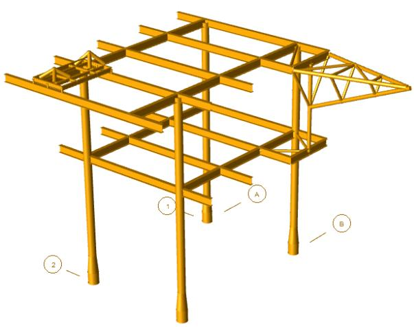

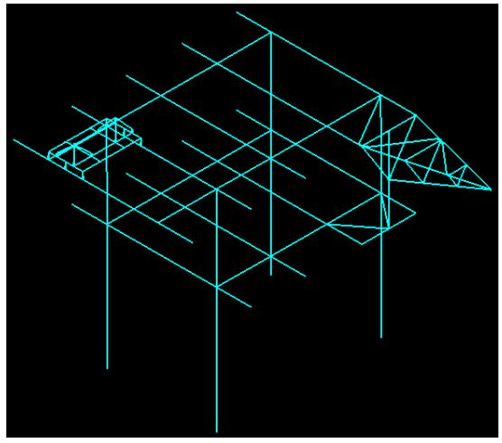

Method 2: SACS ADINA Interop Utility Program

1. Add the required input lines for converting load combinations to basic load cases as explained above.   
2. Create a SACS ADINA Interop input file as shown below in SACS Datagen.


|  | 1 | 2 | 3 | 4 | 5 | 6 | 7 | 8 |
| --- | --- | --- | --- | --- | --- | --- | --- | --- |
|  | 123456789012345678901234567890123456789012345678901234567890 | 123456789012345678901234567890123456789012345678901234567890 | 123456789012345678901234567890123456789012345678901234567890 | 123456789012345678901234567890123456789012345678901234567890 | 123456789012345678901234567890123456789012345678901234567890 | 123456789012345678901234567890123456789012345678901234567890 | 123456789012345678901234567890123456789012345678901234567890 | 123456789012345678901234567890123456789012345678901234567890 |
| 6 | ADINA | EXP | STATIC |  |  |  |  |  |
| 7 | END |  |  |  |  |  |  |  |


3. Select Analysis Generator > Utilities > SACS ADINA Interop and select the SACS model file, the SeaState input file (if needed), and SACS ADINA Interop input file.   
4. Ensure environmental loading is selected under Analysis Options so that SeaState can convert load combinations to base load cases and run the analysis.   
5. The utility program creates a SACS ADINA Database directory containing the ADINA batch input file and SACS-ADINA JSON map.   
6. Open the input file just created in ADINA to import the model. See the ADINA model above.

6.8.2 Nonlinear Static Analysis with PSI

This sample involves exporting a SACS model input file and Pile-Soil Interaction (PSI) input file to ADINA for nonlinear static analysis. SACS ADINA Interop Utility program can be used to export pile and nonlinear soil springs to ADINA in the following steps:

1. Add the required input lines for converting load combinations to basic load cases as explained in the previous example. Add these lines to the SACS model file or the SeaState input file.   
2. Create a SACS ADINA Interop input file as shown below in SACS Datagen to select include PSI on the ADINA input file:


|  | 1 | 2 | 3 | 4 | 5 | 6 | 7 | 8 |
| --- | --- | --- | --- | --- | --- | --- | --- | --- |
|  | 123456789012345678901234567890123456789012345678901234567890 | 123456789012345678901234567890123456789012345678901234567890 | 123456789012345678901234567890123456789012345678901234567890 | 123456789012345678901234567890123456789012345678901234567890 | 123456789012345678901234567890123456789012345678901234567890 | 123456789012345678901234567890123456789012345678901234567890 | 123456789012345678901234567890123456789012345678901234567890 | 123456789012345678901234567890123456789012345678901234567890 |
| 1 | ADINA | EXP | STATIC | PSI |  |  |  |  |
| 2 | END |  |  |  |  |  |  |  |


3. Select Analysis Generator > Utilities > SACS ADINA Interop and select the SACS model file, the SeaState input file (if needed), the SACS ADINA Interop input file, and the PSI input file.   
4. Ensure environmental loading is selected under Analysis Options so that SeaState can convert load combinations to base load cases and run the analysis.   
5. The utility program creates a SACS ADINA Database directory containing the following files:

a. adina.in containing the SACS model, pile elements, and nonlinear soil springs   
b. adina_<Load Condition Name>.in for each load condition containing the nodal and elemental load definition   
c. A PSI log file containing information input soil strata and piles.   
d. SACS-ADINA JSON map.

6. Open one of the adina_<Load Condition Name>.in files in ADINA to import the model and loads, as shown in the following figure.

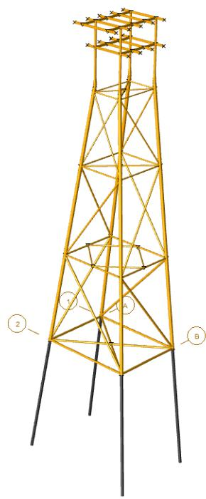

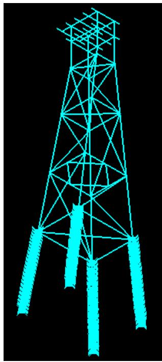

Note: The SACS Pile-Soil Interaction module automatically aligns local coordinates of piles based on pilehead forces to increase the accuracy of the nonlinear analysis. See details in section 4.3 of the PSI user. ADINA does not currently perform this automatic alignment, so there may be a difference between ADINA results and the SACS PSI module.

6.8.3 Nonlinear Elastoplastic Static Analysis with Collapse

This sample involves exporting a SACS model input file and a Collapse input file to ADINA for nonlinear elastoplastic static analysis with large deformation. SACS ADINA Interop Utility program can export various SACS Collapse features like, load sequences, elastoplastic materials, and member subsegmenting to ADINA. See section 6.5 for Collapse input lines supported by the current version SACS ADINA Interop utility.

The following steps illustrate how to create ADINA inputs for nonlinear elastoplastic static analysis using SACS ADINA Interop:

1. Add the required input lines for converting load combinations to basic load cases as explained in the previous example. Add these lines to the SACS model file or the SeaState input file.   
2. Create a SACS ADINA Interop input file as shown below in SACS Datagen to select include Collapse on the ADINA input file:


|  | 1 | 2 | 3 | 4 | 5 | 6 | 7 | 8 |
| --- | --- | --- | --- | --- | --- | --- | --- | --- |
|  | 123456789012345678901234567890123456789012345678901234567890 | 123456789012345678901234567890123456789012345678901234567890 | 123456789012345678901234567890123456789012345678901234567890 | 123456789012345678901234567890123456789012345678901234567890 | 123456789012345678901234567890123456789012345678901234567890 | 123456789012345678901234567890123456789012345678901234567890 | 123456789012345678901234567890123456789012345678901234567890 | 123456789012345678901234567890123456789012345678901234567890 |
| 3 | ADINA | EXP | STATIC | PSI | CLP |  |  |  |
| 4 | END |  |  |  |  |  |  |  |


3. Select Analysis Generator > Utilities > SACS ADINA Interop and select the SACS model file, SeaState input file (if needed), SACS ADINA Interop input file, the Collapse input file, and PSI input file.   
4. Ensure environmental loading is selected under Analysis Options so that SeaState can convert load combinations to base load cases and run the analysis.   
5. The utility program creates a SACS ADINA Database directory containing the following files:

a. adina.in containing the SACS model, elastoplastic material properties, pile elements, and nonlinear soil springs (if a PSI file is included)   
b. adina_<Load Sequence Name>.in for each load sequence defined in the Collapse input file, and load conditions included in the load sequences.   
c. A PSI log file containing information input soil strata and piles   
d. SACS-ADINA JSON map.

6. Open one of the adina_<Load Sequence Name>.in files in ADINA to import the model and loads.

6.8.3.1 Consideration for Exporting the SACS Collapse file to ADINA

Consider the following notes while exporting the SACS Collapse file to ADINA:

When exporting the SACS model to ADINA for nonlinear elastoplastic analysis with large deformation, set the SACS wishbone elements to elastic. One subsegment should also be considered to increase the convergence rate and significantly reduce run time.   
Unlike the SACS Collapse Advanced module, ADINA does not automatically switch from the Full-Newton solver to the Arc-length method for the post-buckling analysis. To perform postbuckling analysis in ADINA, first run analysis using the Full-Newton method and then use the ADINA Restart feature to switch the solver to the Automatic Load-Displacement (Arc-length) method. See the ADINA user guide for additional information about the Restart feature and Automatic Load-Displacement.   
The SACS ADINA Interop utility exports bilinear and multilinear elastoplastic materials for members, plates, and piles and currently supports bilinear elastoplastic materials for shell elements.

SACS ADINA Interop sets the strain hardening model for elastoplastic materials to isotropic hardening. ADINA supports other advanced strain hardening methods, which can be selected in ADINA.   
ADINA does not currently support SACS Collapse Advanced features like joint flexibility, strength, and local buckling for tubular elements.   
SACS Collapse Advanced and ADINA use different integration patterns for cross-section integration points. For additional information, see the SACS Collapse Advanced and ADINA user guides.

6.8.4 Base-Driven Earthquake Nonlinear Time-History Analysis

This sample involves exporting a jacket model (shown below), and elastoplastic material defined in SACS Collapse file to ADINA and performing a nonlinear elastoplastic time-history analysis for a base-driven earthquake load. The earthquake ground motion acceleration is defined and applied to the model in ADINA.

Follow these steps to export and revise the model and perform the analysis.

Step 1: Export SACS Model to ADINA:

1. Create a SACS ADINA Interop input file as shown below in SACS Datagen to select include Collapse on the ADINA input file:


|  | 1 | 2 | 3 | 4 | 5 | 6 | 7 | 8 |
| --- | --- | --- | --- | --- | --- | --- | --- | --- |
|  | 12345678901 | 12345678901 | 12345678901 | 12345678901 | 12345678901 | 12345678901 | 12345678901 | 1234567890 |
| 1 | ADINA | EXP | STATIC | CLP |  |  |  |  |
| 2 | END |  |  |  |  |  |  |  |


2. Create a SACS Collapse input file containing elastoplastic material properties and member subsegmenting.   
3. Select Analysis Generator > Utilities > SACS ADINA Interop and select the SACS model file, SeaState input file (if needed), SACS ADINA Interop input file, and the Collapse input file.   
4. Ensure environmental loading is selected under Analysis Options so that SeaState can convert load combinations to base load cases and run the analysis.   
5. The utility program creates a SACS ADINA Database directory including adina.in containing the SACS model and elastoplastic material properties.

If there is no error in the export process, the model can be used to perform a linear static analysis for load cases in the SACS model. See the next step for modifying the ADINA model for nonlinear time-history analysis.

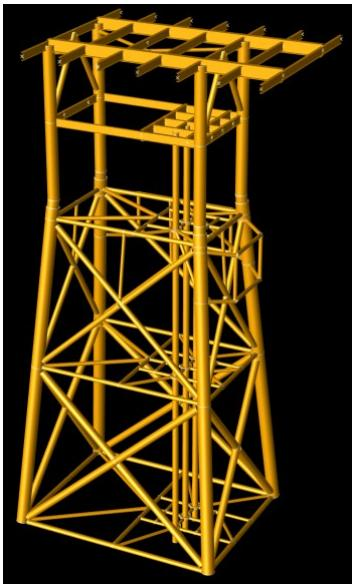

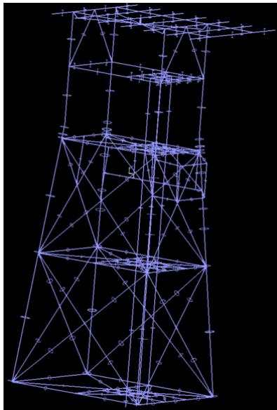

Step 2: Setup ADINA Model for Time-History Analysis

1. Open adina.in file (in SACS ADINA Database directory) which contains all elements and their elastoplastic materials.   
2. From Analysis Type select Dynamic Implicit


3. [Optional] Click on Analysis Options to update the time-stepping options. For this example, the Bathe method is used to perform time integration. Click OK to apply the options:

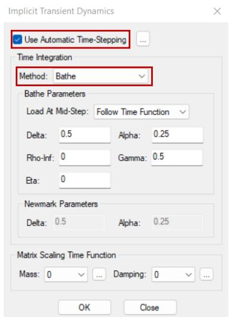

4. The next step is to define the Time Steps. From ADINA menu, select Control > Time Step. This analysis runs for 1000 steps with a uniform time increment of 0.05 seconds for a total time of 50 seconds:

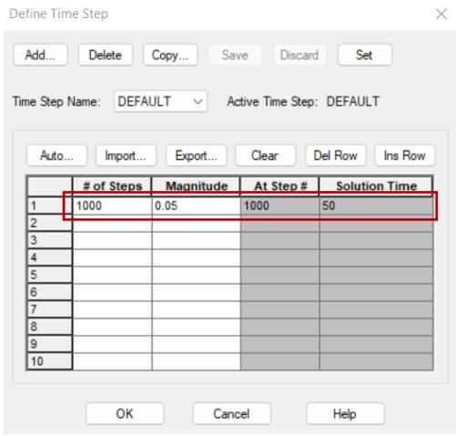

Step 3: Apply the Ground Motion Acceleration and Damping

1. The first step is to define a time function to apply the load. From the ADINA menu, select Control > Time Function. The ground motion acceleration is stored in a CSV file for this analysis. The time history is imported by clicking the import button and selecting the CSV file.

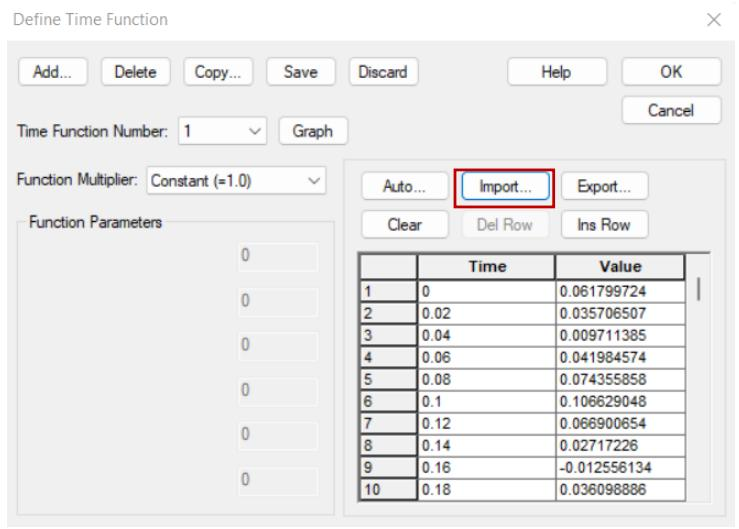

Note: The time function must be defined over the solution time defined in the previous step.

2. The next step is to create the ground motion to the mode. From the ADINA menu, select Model > Loading > Apply. For the Load Type, select Mass Proportional, then click Define. The earthquake is applied in the X direction to the entire model. For the Time Function, select the time function created in the previous step.

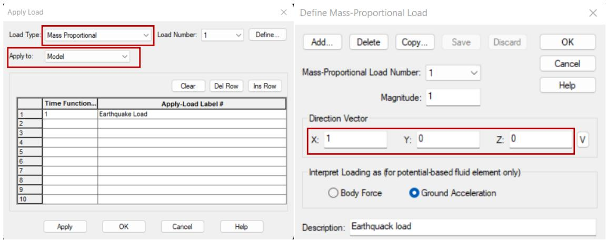

3. Enter Rayleigh damping coefficients by selecting Control > Analysis Assumptions > Rayleigh Damping from the ADINA menu:

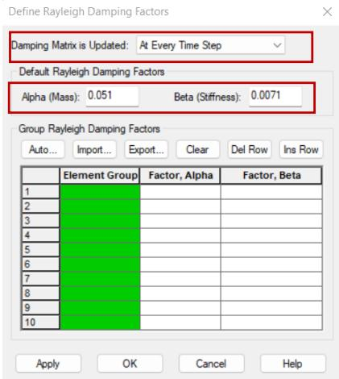

Step 4: Run the analysis and Review the Results

1. Save the model in ADINA-IN Data File (*.idb) format to retrieve it in the future.   
2. To run the analysis, select Solution > Data File/Run from the ADINA menu, save the ADINA Data file, and the analysis automatically starts.   
3. Once the analysis completes, select the Post-Processing option from the ADINA menu and open the ADINA results file for visualization:


See the following figure for the effective stress contour.

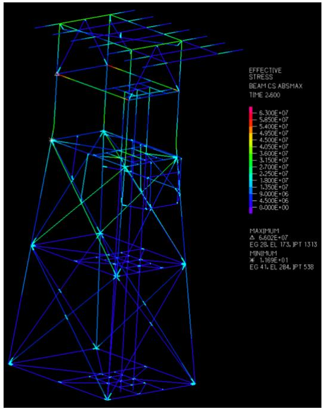

6.8.5 Force Nonlinear Time-History Analysis

This sample involves a nonlinear time-history analysis of the impact force on a jacket leg. As illustrated below, the leg is meshed using quadrilateral plate elements, and the unit forces are applied to model the impact. The goal is to export this model to ADINA, apply a time function to these unit forces, and perform a nonlinear elastoplastic large deformation time-history analysis.

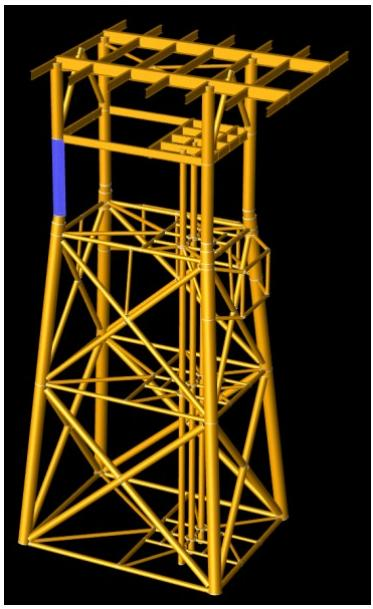

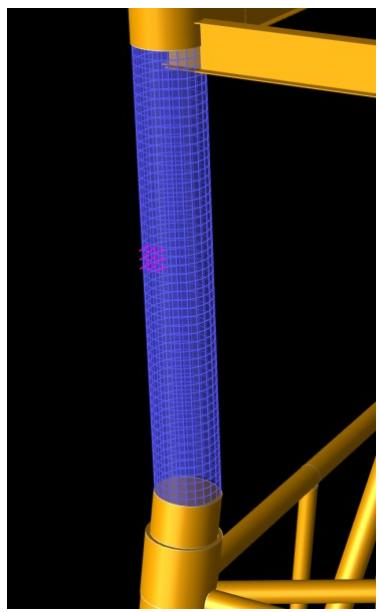

Follow these steps to export and revise the model and perform the analysis.

1. Export SACS Model to ADINA: Similar to the previous example, use SACS ADINA Interop utility to export SACS model file and elastoplastic material properties in SACS Collapse input file and create an ADINA model. The following figure shows the imported model in ADINA.

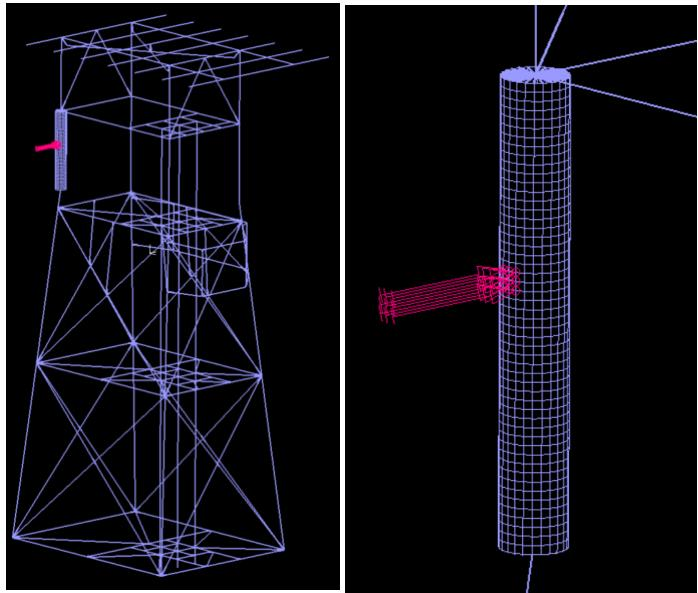

2. Setup ADINA Model for Time-History Analysis: Similar to the preview example, follow these steps

a. Select Dynamic Implicit for Analysis Type.   
b. Select Use Automatic Time-Stepping and Bathe time integration method in Analysis Options.   
c. Update time steps by selecting Control > Time Step. This analysis runs for 100 steps with a uniform time increment of 0.05 seconds for a total time of 5 seconds.

3. Apply Forces: Follow these steps to apply the time-history forces:

a. the previous example, the first step is creating a time function by selecting Control > Time Function and update the time function. For this example, we manually enter the time function as shown below:

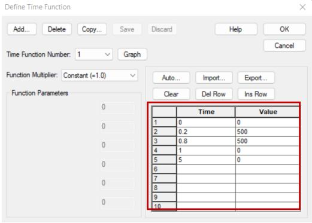

4. Damping: This step is similar to the previous example. Follow the previous section's instructions and enter the damping, large deformation settings, and elastoplastic materials.   
5. Run the analysis and Review the Results: Like the previous example, save the model in ADINA-IN Data File (*.idb) format and run the analysis by selecting Solutions > Data File/Run, and once the analysis is complete, switch to ADINA Post-Processor and review the results. The following figure shows the plastic strain and leg deformation due to the impact force.

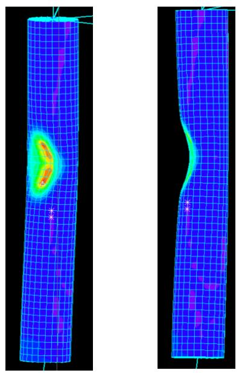

7 INPUT LINES

CONNECTING MEMBER SELECTION DATA

COLUMNS

COMMENTARY

GENERAL THIS DATA IS USED TO SPECIFY THE MEMBERS CONNECTING TO THE JOINT SELECTED FOR DESIGN.

( 1- 4) ENTER 'CONN'.   
( 6-79) ENTER THE JOINT NAMES THAT DEFINE THE MEMBERS CONNECTED TO THE JOINT SELECTED FOR DESIGN. REPEAT THIS DATA AS OFTEN AS NEEDED.


| LINE LABEL | JOINT NAMES DEFINING CONNECTING MEMBERS | JOINT NAMES DEFINING CONNECTING MEMBERS | JOINT NAMES DEFINING CONNECTING MEMBERS | JOINT NAMES DEFINING CONNECTING MEMBERS | JOINT NAMES DEFINING CONNECTING MEMBERS | JOINT NAMES DEFINING CONNECTING MEMBERS | JOINT NAMES DEFINING CONNECTING MEMBERS | JOINT NAMES DEFINING CONNECTING MEMBERS | JOINT NAMES DEFINING CONNECTING MEMBERS | JOINT NAMES DEFINING CONNECTING MEMBERS | JOINT NAMES DEFINING CONNECTING MEMBERS | JOINT NAMES DEFINING CONNECTING MEMBERS | JOINT NAMES DEFINING CONNECTING MEMBERS | JOINT NAMES DEFINING CONNECTING MEMBERS | JOINT NAMES DEFINING CONNECTING MEMBERS |
| --- | --- | --- | --- | --- | --- | --- | --- | --- | --- | --- | --- | --- | --- | --- | --- |
| LINE LABEL | 1ST | 2ND | 3RD | 4TH | 5TH | 6TH | 7TH | 8TH | 9TH | 10TH | 11TH | 12TH | 13TH | 14TH | 15TH |
| CONN |  |  |  |  |  |  |  |  |  |  |  |  |  |  |  |
| 1-- 4 | 6--> 9 | 11-->14 | 16-->19 | 21-->24 | 26-->29 | 31-->34 | 36-->39 | 41-->44 | 46-->49 | 51-->54 | 55-->59 | 61-->64 | 65-->69 | 71-->74 | 75-->79 |


END LINE

COLUMNS

COMMENTARY

LOCATION THIS DATA RECORD IS THE LAST RECORD FOR THE INPUT DATA.

GENERAL THE 'END' LINE TERMINATES THE DATA READ BY THE FREEBODYPROGRAM.


| LINE LABEL | LEAVE THIS FIELD BLANK |
| --- | --- |
| END |  |
| 1--3 | 4-80 |


JOINT SELECTION DATA

COLUMNS

COMMENTARY

GENERAL THIS DATA IS USED TO SPECIFY THE JOINT SELECTED FOR DESIGN.

( 1- 5) ENTER 'JNTSL'.   
( 7-10) ENTER THE JOINT NAME ABOUT WHICH THE LOADS ARE TO BE SUMMED.   
(12-14) SELECT FROM THE FOLLOWING ANALYSIS OPTIONS: 'ALL' - LOADS CALCULATED FOR ALL ACTIVE LOAD CASES. 'MAX' - LOADS CALCULATED FOR EACH OF THE MAXIMUM OF THE 6 LOADS.   
(16-17) SELECT THE COORDINATE SYSTEM FOR LOADS: 'GL' - GLOBAL AT JOINT. 'MB' - SELECTED MEMBER. 'LM' - LOCAL MEMBER (EACH MEMBER IN OWN COORDINATE SYSTEM). 'GM' - GLOBAL AT MEMBER ENDS.   
(19-22) IF THE SELECTED MEMBER COORDINATE SYSTEM WAS SELECTED, ENTER THE OTHER MEMBER END JOINT FOR THE MEMBER TO BE USED FOR THE COORDINATE SYSTEM.


| LINE LABEL | JOINT NAME | ANALYSIS TYPE | COORD. SYSTEM | MEMBER CONNECTING JOINT | LEAVE BLANK |
| --- | --- | --- | --- | --- | --- |
| JNTSL |  |  |  |  |  |
| 1--5 | 7-->10 | 12--14 | 16--17 | 19-->22 | 23--------80 |
| DEFAULT |  | 'ALL' | GLOBAL |  |  |


FREEBODY LOAD CASE SELECTION

COLUMNS

COMMENTARY

GENERAL THIS LINE IS A REPLACEMENT FOR THE LDCASE LINE AND MAY BEUSED TO SPECIFY THE LOAD CASES IN THE SACS IV INPUT FILE THATARE TO BE USED FOR FREEBODY PROCESSING. THIS LINE CAN BEREPEATED AS NECESSARY TO SELECT ANY OR ALL OF THE LOAD CASES.

( 7- 8) ENTER THE FUNCTION FOR THE LOAD CASE SELECTION: 'IN' - INCLUDE THESE LOAD CASES IN OUTPUT REPORTS (DEFAULT). 'EX' - EXCLUDE THESE LOAD CASES FROM OUTPUT REPORTS.   
(17-75) ENTER THE LOAD CASE IDENTIFIERS FOR ALL LOAD CASES TO BE SELECTED. THE LOAD CASES CAN BE IN ANY ORDER.


| LINE LABEL | FUNCTION | LOAD CASE SELECTION | LOAD CASE SELECTION | LOAD CASE SELECTION | LOAD CASE SELECTION | LOAD CASE SELECTION | LOAD CASE SELECTION | LOAD CASE SELECTION | LOAD CASE SELECTION | LOAD CASE SELECTION | LOAD CASE SELECTION | LOAD CASE SELECTION | LOAD CASE SELECTION |
| --- | --- | --- | --- | --- | --- | --- | --- | --- | --- | --- | --- | --- | --- |
| LINE LABEL | FUNCTION | 1ST | 2ND | 3RD | 4TH | 5TH | 6TH | 7TH | 8TH | 9TH | 10TH | 11TH | 12TH |
| LCSEL |  |  |  |  |  |  |  |  |  |  |  |  |  |
| 1-- 5 | 7-- 8 | 17-->20 | 22-->25 | 27-->30 | 32-->35 | 37-->40 | 42-->45 | 47-->50 | 52-->55 | 57-->60 | 62-->65 | 67-->70 | 72-->75 |
| DEFAULT | 'IN' |  |  |  |  |  |  |  |  |  |  |  |  |


SUBSTRUCTURE JOINT DEFINITION

COLUMNS

COMMENTARY

GENERAL THIS LINE IS USED TO INPUT JOINTS DEFINING A SUBSTRUCTURE. ALL JOINTS WITHIN A SUBSTRUCTURE WILL BE ANALYZED TO DETERMINE FREEBODY LOADS. IF DESIRED, MULTIPLE 'SUB' RECORDS MAY BE USED TO DEFINE THE SUBSTRUCTURE, WITH COLUMN 80 CONTAINING A CONTINUATION MARK.

( 1- 3) ENTER 'SUB' ON EACH DATA RECORD OF THIS SET.   
( 7-78) ENTER THE JOINT NAMES FORMING THE SUBSTRUCTURE.   
( 79 ) ENTER 'L' TO REPORT JOINT LOADS IN THE LOCAL FRAME. LOADS ARE REPORTED IN THE GLOBAL FRAME BY DEFAULT. THE LOCAL FRAME HAS ITS X AXIS IN THE DIRECTION FROM THE 1ST TO 2ND JOINT. THE Z AXIS IS PERPENDICULAR TO THE PLANE FORMED BY THE 1ST, 2ND AND 3RD JOINTS. POSITIVE Z IS IN THE DIRECTION OF THE CROSS PRODUCT OF 1-2 WITH 1-3. POSITIVE Y IS POSITIVE Z CROSSED WITH POSITIVE X.   
( 80 ) ENTER 'C' IF THE SUBSTRUCTURE CONTINUES ON A SUBSEQUENT 'SUB' LINE.


| LINE LABEL | SUBSTRUCTURE JOINTS | SUBSTRUCTURE JOINTS | SUBSTRUCTURE JOINTS | SUBSTRUCTURE JOINTS | SUBSTRUCTURE JOINTS | SUBSTRUCTURE JOINTS | SUBSTRUCTURE JOINTS | SUBSTRUCTURE JOINTS | SUBSTRUCTURE JOINTS | SUBSTRUCTURE JOINTS | SUBSTRUCTURE JOINTS | SUBSTRUCTURE JOINTS | SUBSTRUCTURE JOINTS | SUBSTRUCTURE JOINTS | SUBSTRUCTURE JOINTS | SUBSTRUCTURE JOINTS | SUBSTRUCTURE JOINTS | SUBSTRUCTURE JOINTS | LOCAL | CONTD |
| --- | --- | --- | --- | --- | --- | --- | --- | --- | --- | --- | --- | --- | --- | --- | --- | --- | --- | --- | --- | --- |
| LINE LABEL | 1ST | 2ND | 3RD | 4TH | 5TH | 6TH | 7TH | 8TH | 9TH | 10TH | 11TH | 12TH | 13TH | 14TH | 15TH | 16TH | 17TH | 18TH | LOCAL | CONTD |
| SUB |  |  |  |  |  |  |  |  |  |  |  |  |  |  |  |  |  |  |  |  |
| 1-- 3 | 7-->10 | 11-->14 | 15-->18 | 19-->22 | 23-->26 | 27-->30 | 31-->34 | 35-->38 | 39-->42 | 43-->46 | 47-->50 | 51-->54 | 55-->58 | 59-->62 | 63-->66 | 67-->70 | 71-->74 | 75-->78 | 79 | 80 |


MEMBER BOUNDARY JOINTS

COLUMNS

COMMENTARY

GENERAL FOR A GIVEN MEMBER THAT IS TO BE MESHED, THE FINAL MESH CREATED WILL ATTACH TO THE DEFINED BOUNDARY JOINTS . THE JOINT NAMES CAN BE GIVEN OVER SEVERAL LINES WITH TEN JOINTS DEFINED IN EACH LINE.

( 8-11) ENTER JOINT A OF MEMBER.   
(13-16) ENTER JOINT B OF MEMBER.   
(18-66) ENTER NAME FOR TEN JOINTS WITH 2 SPACES BETWEEN EACH


| LINE LABEL | MEMBER | MEMBER | JOINT NAMES | JOINT NAMES | JOINT NAMES | JOINT NAMES | JOINT NAMES | JOINT NAMES | JOINT NAMES | JOINT NAMES | JOINT NAMES | JOINT NAMES | LEAVE BLANK |
| --- | --- | --- | --- | --- | --- | --- | --- | --- | --- | --- | --- | --- | --- |
| LINE LABEL | JOINT A | JOINT B | 1 | 2 | 3 | 4 | 5 | 6 | 7 | 8 | 9 | 10 | LEAVE BLANK |
| BNDPNT |  |  |  |  |  |  |  |  |  |  |  |  |  |
| 1-- 6 | 8-->11 | 13-->16 | 18-->21 | 23-->26 | 28-->31 | 33-->36 | 38-->41 | 43-->46 | 48-->51 | 53-->56 | 58-->61 | 63-->66 | 77--80 |


BRACE MESHABLE LENGTH

COLUMNS

COMMENTARY

GENERAL FOR A GIVEN JOINT THAT IS TO BE MESHED, ALL ATTACHED MEMBERS THAT ARE ASSESSED BY THE JOINT MESHER TO BE BRACE MEMBERS WILL BE MESHED TO THE SPECIFIED LENGTH. THE SPECIFIED LENGTH IS ENTERED IN FT. OR M., IN ACCORDANCE WITH THE UNIT SYSTEM IN THE HOST MODEL FILE. THIS COMMAND CAN BE OVERRIDDEN BY INSTANCES OF THE MSHLEN LINE THAT APPLY SPECIFICALLY TO THE CHORD MEMBERS. THIS COMMAND OVERRIDES THE GENERIC FORM OF THE MSHLEN LINE.

( 1- 6) ENTER 'BRMLEN' ON ALL INPUT LINES IN THIS SET.   
( 8-15) MESHABLE LENGTH FOR ALL MEMBERS APPEARING ON THIS LINE. IF NO MEMBERS APPEAR ON THIS LINE, THEN THE MESHABLE LENGTH APPLIES TO ALL MEMBERS FOR WHICH NO OTHER COMMAND ALTERS THE MESHABLE LENGTH.   
(16-80) LEAVE BLANK


| LINE LABEL | MESHABLE LENGTH (FT) OR (M) | LEAVE BLANK |
| --- | --- | --- |
| BRMLEN |  |  |
| 1--6 | 8--15 | 16- - - - - - - - - - - - - - - - - - - - - - - - - - - - - - - - - - - - - - - - - - - - - - - - - - - - - - - - - - - - - - - - - - - - - - - - - - - - - - - - - - - - - - - - - - - - - - - - - - - - - |


BRACE MESH TYPE

COLUMNS

COMMENTARY

GENERAL FOR A GIVEN JOINT THAT IS TO BE MESHED, ALL ATTACHED MEMBERS THAT ARE ASSESSED BY THE JOINT MESHER TO BE BRACE MEMBERS WILL BE MESHED TO THE SPECIFIED MESH TYPE. THIS COMMAND CAN BE OVERRIDDEN BY INSTANCES OF THE MSHTYP LINE THAT APPLY SPECIFICALLY TO THE BRACE MEMBERS. THIS COMMAND OVERRIDES THE GENERIC FORM OF THE MSHTYP LINE.

( 1- 6) ENTER 'BRMTYP' ON ALL INPUT LINES IN THIS SET.   
( 8- 8) MESH TYPE FOR ALL BRACE MEMBERS.

ENTER '3' FOR TRIANGULAR PLATES ENTER '4' FOR QUADRILATERAL PLATES ENTER '6' FOR TRIANGULAR SHELLS ENTER '9' FOR QUADRILATERAL SHELLS

(9-80) LEAVE BLANK


| LINE LABEL | MESH TYPE | LEAVE BLANK |
| --- | --- | --- |
| BRMTYP |  |  |
| 1--6 | 8 | 9- - - - - - - - - - - - - - - - - - - - - - - - - - - - - - - - - - - - - - - - - - - - - - - - - - - - - - - - - - - - - - - - - - - - - - - - - - - - - - - - - - - - - - - - - - - - - - - - - - - - - |


CHORD MESHABLE LENGTH

COLUMNS

COMMENTARY

GENERAL FOR A GIVEN JOINT THAT IS TO BE MESHED, ALL ATTACHED MEMBERS THAT ARE ASSESSED BY THE JOINT MESHER TO BE CHORD MEMBERS WILL BE MESHED TO THE SPECIFIED LENGTH. THE SPECIFIED LENGTH IS ENTERED IN FT. OR M. IN ACCORDANCE WITH THE UNIT SYSTEM IN THE HOST MODEL FILE.

( 1- 6) ENTER 'CHMLEN' ON ALL INPUT LINES IN THIS SET.   
( 8-15) MESHABLE LENGTH FOR ALL MEMBERS APPEARING ON THIS LINE. IF NO MEMBERS APPEAR ON THIS LINE, THEN THE MESHABLE LENGTH APPLIES TO ALL MEMBERS FOR WHICH NO OTHER COMMAND ALTERS THE MESHABLE LENGTH.   
(16-80) LEAVE BLANK


| LINE LABEL | MESHABLE LENGTH (FT) OR (M) | LEAVE BLANK |
| --- | --- | --- |
| CHMLEN |  |  |
| 1--6 | 8--15 | 16--------80 |


CHORD MESH TYPE

COLUMNS

COMMENTARY

GENERAL FOR A GIVEN JOINT THAT IS TO BE MESHED, ALL ATTACHED MEMBERS THAT ARE ASSESSED BY THE JOINT MESHER TO BE CHORD MEMBERS WILL BE MESHED TO THE SPECIFIED MESH TYPE. THIS COMMAND CAN BE OVERRIDDEN BY INSTANCES OF THE MSHTYP LINE THAT APPLY SPECIFICALLY TO THE CHORD MEMBERS. THIS COMMAND OVERRIDES THE GENERIC FORM OF THE MSHTYP LINE.

( 1- 6) ENTER 'CHMTYP' ON ALL INPUT LINES IN THIS SET.   
( 8- 8) MESH TYPE FOR ALL CHORD MEMBERS.

ENTER '3' FOR TRIANGULAR PLATES ENTER '4' FOR QUADRILATERAL PLATES ENTER '6' FOR TRIANGULAR SHELLS ENTER '9' FOR QUADRILATERAL SHELLS

(9-80) LEAVE BLANK


| LINE LABEL | MESH TYPE | LEAVE BLANK |
| --- | --- | --- |
| CHMTYPE |  |  |
| 1--6 | 8 | 9- - - - - - - - - - - - - - - - - - - - - - - - - - - - - - - - - - - - - - - - - - - - - - - - - - - - - - - - - - - - - - - - - - - - - - - - - - - - - - - - - - - - - - - - - - - - - - - - - - - - - |


TARGET PLATE LENGTH

COLUMNS

COMMENTARY

GENERAL THE SPECIFIED PLATE LENGTH OVERRIDES THE DEFUALT TARGET PLATE LENGTH, WHICH IS CALCULATE BY THE PROGRAM. PROVIDED THAT THE SPECIFIED LENGTH IS SUITABLE, THE JOINT MESHER ATTEMPTS TO MESH THE JOINT WITH PLATES THAT HAVE APPROXIMATELY THE SAME DIMENSIONS AS THE TARGET PLATE LENGTH. THE SPECIFIED LENGTH IS ENTERED IN IN. OR CM., IN ACCORDANCE WITH THE UNIT SYSTEM IN THE HOST MODEL FILE.

( 1- 6) ENTER 'ELMSIZ' ON ALL INPUT LINES IN THIS SET.   
( 8-15) TARGET PLATE LENGTH.   
(17-24) TARGET PLATE LENGTH NEAR BRACE / CHORD INTERSECTION.   
(16-80) LEAVE BLANK


| LINE LABEL | TARGET PLATE LENGTH (IN) OR (CM) | TARGET PLATE LENGTH NEAR BRACE / CHORD INTERSECTION (IN) OR (CM) | LEAVE BLANK |
| --- | --- | --- | --- |
| ELMSIZ |  |  |  |
| 1--6 | 8--15 | 17--24 | 25- - - - - - - - - - - - - - - - - - - - - - - - - - - - - - - - - - - - - - - - - - - - - - - - - - - - - - - - - - - - - - - - - - - - - - - - - - - - - - - - - - - - - - - - - - - - - - - - - - - - - |


MEMBER HARD POINT

COLUMNS

COMMENTARY

GENERAL FOR A GIVEN MEMBER THAT IS TO BE MESHED, THE FINAL MESH CREATED WILL CONTAIN ALL ISOLATED HARD POINTS. MULTIPLE 'HRDPNTS' LINES CAN BE USED TO ADD ADDITIONAL HARD POINTS.

( 7-7) HARD EDGE OPTION. ENTER '1' TO ALIGN PLATE EDGES BETWEEN HARD POINT 1 AND HARD POINT 2   
( 8-11) ENTER JOINT A OF MEMBER.   
(13-16) ENTER JOINT B OF MEMBER.   
(18-40) ENTER THE X, Y, AND Z COORDINATE OF THE HARD POINT 1   
(42-64) ENTER THE X, Y, AND Z COORDINATE OF THE HARD POINT 2

(66-69) ENTER HARD POINT 1 JOINT NAME

(70-73) ENTER HARD POINT 2 JOINT NAME


| LINE LABEL | HARD EDGE OPTION | MEMBER | MEMBER | HARD POINT 1 | HARD POINT 1 | HARD POINT 1 | HARD POINT 2 | HARD POINT 2 | HARD POINT 2 | JOINT NAMES | JOINT NAMES | LEAVE BLANK |
| --- | --- | --- | --- | --- | --- | --- | --- | --- | --- | --- | --- | --- |
| LINE LABEL | HARD EDGE OPTION | JOINT A | JOINT B | X COORD | Y COORD | Z COORD | X COORD | Y COORD | Z COORD | 1 | 2 | LEAVE BLANK |
| HRDPNT |  |  |  |  |  |  |  |  |  |  |  |  |
| 1--6 | 7 | 8-->11 | 13-->16 | 18--24 | 26--32 | 34--40 | 42--48 | 50--56 | 58--64 | 66--69 | 70--73 | 74--80 |
| ENGLISH |  |  |  | FT | FT | FT | FT | FT | FT |  |  |  |
| METRIC |  |  |  | M | M | M | M | M | M |  |  |  |


JOINT MESH OPTION DATA

COLUMNS

COMMENTARY

GENERAL THIS DATA IS USED TO SPECIFY THE OVERALL 'JOINT MESH' OPTIONS.

( 8- 9) SELECT THE JOINT MESH INPUT FILE UNITS FROM THE FOLLOWING: 'EN' - ENGLISH UNITS. 'ME' - METRIC UNITS WITH KILOGRAM FORCE UNIT. 'MN' - METRIC UNITS WITH NEWTON FORCE UNIT.

THE MESHED JOINT FILE UNITS WILL BE THE SAME AS THE MODEL FILE.

(11-14) ENTER THE JOINT TO BE MESHED.   
(16-20) ENTER THE MESH INTENSITY TO DEFINE THE FINENESS OF THE PLATE MESH. THE MAXIUM VALUE IS 5.0 (EXTREMELY FINE MESH) AND THE MINIMUM VALUE IS 0.2 (EXTREMELY COURSE MESH).   
(22-22) ENTER THE INTERSECTION SUBDIVISION TO INCREASE THE FINENESS OF THE PLATE MESH NEAR ALL MEMBER INTERSECTIONS. THE MAXIMUM VALUE IS 5 (EXTREMELY FINE MESH NEAR INTESECTION) AND THE MINIMUM VALUE IS 1 (UNIFORM MESH).   
(24-24) ENTER AUTOMATIC BOUNDARY JOINT OPTION. IF 1 THOSE JOINTS ON THE SURFACE OF MEMBERS WILL AUTOMATICALLY BE ADDED TO THE CREATED MESH.


| LINE LABEL | UNITS | MESH JOINT | MESH INTENSITY | INTERSECTION SUBDIVISION | AUTOMATIC BOUNDARY JOINS | LEAVE BLANK |
| --- | --- | --- | --- | --- | --- | --- |
| JTMOPT |  |  |  |  |  |  |
| 1-- 6 | 8-- 9 | 11--14 | 16--20 | 22 | 24 | 23--------80 |
| DEFAULT | MODEL FILE |  | 1.0 | 1 | 0 |  |
| ENGLISH |  |  |  |  |  |  |
| METRIC |  |  |  |  |  |  |


LONGITUDINAL STIFFENER GROUP INPUT LINE

COLUMNS

COMMENTARY

GENERAL DEFINES A LONGITUDINAL STIFFENER GROUP TO BE ASSIGNED WITH MEMSTF TO A MEMBER.THE STIFFENERS SPACING, SPAN, AND GROUP ARE DEFINED ON THIS INPUT LINE.

(8-9) ENTER STIFFENER GROUP'S LABEL.

(22-29) ENTER THE START LOCATION OF STIFFENERS MEASURED COUNTERCLOCKWISE AROUND MEMBER'S LOCAL X-AXIS FROM ITS LOCAL Y-AXIS.

(31-38) ENTER THE CENTERLINE TO CENTERLINE SPACING BETWEEN STIFFENERS.

(40-42) ENTER THE NUMBER OF STIFFINERS IN THE STIFFENER GROUP.

(44-50) ENTER START OFFSET OF STIFFENERS MEASURED FROM THE START OF THE MEMBER'S MESHED PORTION MEASURED FROM JOINT A SIDE.

(52-58) ENTER END OFFSET OF STIFFENERS MEASURED FROM THE START OF THE MEMBER'S MESHED PORTION MEASURED FROM JOINT A SIDE.

(66-68) ENTER MEMBER CROSS SECTION LABEL FOR STIFFENERS. SHOULD BE PREVIOUSLY DEFINED IN SACS INPUT FILE.

(74) ENTER STIFFENERS' NEUTRAL AXIS OFFSET OPTION

(D) ON PLATES' MID-SURFACE

(I) ON PLATES' INNER SURFACE

(O) ON PLATES' OUTER SURFACE

(76) ENTER STIFFENERS' ORIENTATION

(D) DEAULT   
(F) FLIPPED 180 DEGREES


| LINE LABEL | STIFFENER LABEL | STIFFENERS SPECIFICATION | STIFFENERS SPECIFICATION | STIFFENERS SPECIFICATION | STIFFENERS SPECIFICATION | STIFFENERS SPECIFICATION | STIFFENER OPTIONS | STIFFENER OPTIONS | STIFFENER OPTIONS |  |
| --- | --- | --- | --- | --- | --- | --- | --- | --- | --- | --- |
| LINE LABEL | STIFFENER LABEL | OFFSET FROM LOCAL X-Axis | SPACING | NUMBER OF STIFFENERS | START OFFSET FROM JOINT A | END OFFSET FROM JOINT A | GROUP NAME | OFFSET OPTION | ORIENTATION | EMAINDER OF THIS LINE LEFT BLAN |
| LNGSTF |  |  |  |  |  | A |  |  |  | 77--80 |
| 1--6 | 8--9 | 22<--29 | 31<--38 | 40<--42 | 44<--50 | 52<--58 | 66--68 | 74 | 76 | 77--80 |
| DEFAULT |  | 0 |  |  |  |  |  | D | D | 77--80 |
| ENGLISH |  | DEG | DEG |  | FT | FT |  |  |  | 77--80 |
| METRIC (KN) |  | DEG | DEG |  | M | M |  |  |  | 77--80 |
| METRIC (KG) |  | DEG | DEG |  | M | M |  |  |  | 77--80 |


STIFFENED MEMBER

COLUMNS

COMMENTARY

GENERAL DESIGNATES STIFFENERS FROM A RING STIFFENER GROUP AND/OR A LONGITUDINAL STIFFENER GROUP DEFINED BY RNGSTF AND LNGSTF TO BE ADDED TO THE MEMBER

(8-11) ENTER JOINT A OF MEMBER.   
(13-16) ENTER JOINT B OF MEMBER.   
(34-36) ENTER THE RING STIFFENER GROUP'S LABEL DEFINED BY RNGSTF CARD.   
(38-40) ENTER THE LONGITUDINAL STIFFENER GROUP'S LABEL DEFINED BY LNGSTF CARD.


| LINE LABEL | MEMBER | MEMBER | STIFFENER GROUPS | STIFFENER GROUPS |  |
| --- | --- | --- | --- | --- | --- |
| LINE LABEL | JOINT A | JOINT B | RING STIFFENER LABEL | LONGITUDINAL STIFFENER LABEL | BLANK |
| MEMSTF |  |  |  |  |  |
| 1--6 | 8-->11 | 13-->16 | 34-->36 | 38-->40 | 41-->80 |


MEMBER MODIFICATION TOLERANCE

COLUMNS

COMMENTARY

GENERAL FOR A GIVEN JOINT THAT IS TO BE MESHED, ALL ATTACHED MEMBERS ARE SUBJECT TO THE SPECIFIED MEMBER MODIFICATION TOLERANCE. IN THE EVENT THAT THE UNMESHED PORTION OF A MEMBER WOULD HAVE A LENGTH SHORTER THAN THE MEMBER MODIFICATION TOLERANCE, IT WILL NOT APPEAR IN THE OUTPUT STRUCTURAL DATA FILE. THE MEMBER MODIFICATION TOLERANCE IS SPECIFIED IN FT. OR M., IN ACCORDANCE WITH THE UNIT SYSTEM IN THE HOST MODEL FILE.

( 1- 6) ENTER 'MEMTOL'.   
( 8-15) MEMBER MODIFICATION TOLERANCE.   
(16-80) LEAVE BLANK


| LINE LABEL | MEMBER MODIFICATION TOLERANCE (FT) OR (M) | LEAVE BLANK |
| --- | --- | --- |
| MEMTOL |  |  |
| 1-- 6 | 8--15 | 16--------80 |
| DEFAULT | 0.1 |  |


MEMBER LONGITUDINAL HARD LINE BASED ON REFERENCE COORDINATES

COLUMNS

COMMENTARY

GENERAL FOR A GIVEN MEMBER THAT IS TO BE MESHED,A HARD LINE WILL BE CREATED ALONG THE LENGTHOF THE MEMBER ON THE SURFACE CLOSEST TO THE REFERENCECOORDINATES.

( 8-11) ENTER JOINT A OF MEMBER.   
(13-16) ENTER JOINT B OF MEMBER.   
(18-24) ENTER THE X COORDINATE OF THE REFERENCE   
(26-32) ENTER THE Y COORDINATE OF THE REFERENCE   
(34-40) ENTER THE Z COORDINATE OF THE REFERENCE


| LINE LABEL | MEMBER | MEMBER | X COORDINATE | Y COORDINATE | Z COORDINATE | LEAVE BLANK |
| --- | --- | --- | --- | --- | --- | --- |
| LINE LABEL | JOINT A | JOINT B | X COORDINATE | Y COORDINATE | Z COORDINATE | LEAVE BLANK |
| MLONG |  |  |  |  |  |  |
| 1-- 5 | 8-->11 | 13-->16 | 18--24 | 26--32 | 34--40 | 41--------80 |
| ENGLISH |  |  | FT | FT | FT |  |
| METRIC |  |  | M | M | M |  |


MEMBER HARD LINE ACROSS SECTION

COLUMNS

COMMENTARY

GENERAL FOR A MEMBER THAT IS TO BE MESHED, A HARD LINEWILL BE CREATED ACROSS THE MEMBER SECTION AS IT PASSES THROUGHA DEFINED PLANE.

( 8-11) ENTER JOINT A OF MEMBER.   
(13-16) ENTER JOINT B OF MEMBER.   
(18-18) PLANE DEFINITION OPTION: ENTER 'D' IF PLANE IS PERPEDICULAR TO MEMBER AND IS A SPECIFIED DISTANCE FROM JOINT A. ENTER 'C' IF PLANE IS PERPENDICULAR TO MEMBER AND CONTAINS THE SPECIFIED POINT. ENTER 'P' IF PLANE IS DEFINED BY THREE POINTS.   
(20-90) PLANE DEFINITION DETAILS BASED ON OPTION:

'D' - ENTER THE DISTANCE FROM JOINT A.   
'C' - ENTER THE X, Y, AND Z COORDINATES OF POINT.   
'P' - ENTER THE X, Y, AND Z COORDINATES OF THE 3 POINTS DEFINING THE PLANE.


| LINE LABEL | MEMBER | MEMBER | OPTION | PLANE DEFINITION DETAILS | PLANE DEFINITION DETAILS | PLANE DEFINITION DETAILS | PLANE DEFINITION DETAILS | PLANE DEFINITION DETAILS | PLANE DEFINITION DETAILS | PLANE DEFINITION DETAILS | PLANE DEFINITION DETAILS | PLANE DEFINITION DETAILS | PLANE DEFINITION DETAILS |
| --- | --- | --- | --- | --- | --- | --- | --- | --- | --- | --- | --- | --- | --- |
| LINE LABEL | JOINT A | JOINT B | 'D' | DISTANCE | LEAVE BLANK | LEAVE BLANK | LEAVE BLANK | LEAVE BLANK | LEAVE BLANK | LEAVE BLANK | LEAVE BLANK | LEAVE BLANK | LEAVE BLANK |
| LINE LABEL | JOINT A | JOINT B | 'C' | X COORDINATE | Y COORDINATE | Z COORDINATE | LEAVE BLANK | LEAVE BLANK | LEAVE BLANK | LEAVE BLANK | LEAVE BLANK | LEAVE BLANK | LEAVE BLANK |
| LINE LABEL | JOINT A | JOINT B | 'P' | POINT 1 | POINT 1 | POINT 1 | POINT 2 | POINT 2 | POINT 2 | POINT 3 | POINT 3 | POINT 3 | POINT 3 |
| LINE LABEL | JOINT A | JOINT B | 'P' | X COORDINATE | Y COORDINATE | Z COORDINATE | X COORDINATE | Y COORDINATE | Z COORDINATE | X COORDINATE | Y COORDINATE | Z COORDINATE | Z COORDINATE |
| MPLANE |  |  |  |  |  |  |  |  |  |  |  |  |  |
| 1--6 | 8-->11 | 13-->16 | 18 | 20--26 | 28--34 | 36--42 | 44--50 | 52--58 | 60--66 | 68--74 | 76--82 | 84--90 | 84--90 |
| ENGLISH |  |  |  | FT | FT | FT | FT | FT | FT | FT | FT | FT | FT |
| METRIC |  |  |  | M | M | M | M | M | M | M | M | M | M |


MEMBER MESHABLE LENGTH

COLUMNS

COMMENTARY

GENERAL FOR A GIVEN JOINT THAT IS TO BE MESHED, THE FOLLOWING ATTACHED BRACE AND CHORD MEMBERS ARE TO BE MESHED TO THE SPECIFIED LENGTH. IF NO MEMBERS ARE LISTED, THEN THIS COMMAND SETS THE DEFAULT MEMSHABLE LENGTH FOR ALL MEMBERS CONNECTED TO THE JOINT. THE SPECIFIED LENGTH IS ENTERED IN FT. OR M. IN ACCORDANCE WITH THE UNIT SYSTEM IN THE HOST MODEL FILE.

( 1- 6) ENTER 'MSHLEN' ON ALL INPUT LINES IN THIS SET.   
( 8-15) MESHABLE LENGTH FOR ALL MEMBERS APPEARING ON THIS LINE. IF NO MEMBERS APPEAR ON THIS LINE, THEN THE MESHABLE LENGTH APPLIES TO ALL MEMBERS FOR WHICH NO OTHER COMMAND ALTERS THE MESHABLE LENGTH.   
(17-20) ENTER JOINT 1 FOR THE FIRST MEMBER.   
(22-25) ENTER JOINT 2 FOR THE FIRST MEMBER.   
(27-75) REPEAT FOR ADDITIONAL MEMBERS. SIX MEMBERS CAN BE INPUT PER LINE.


| LINE LABEL | MESHABLE LENGTH (FT) OR (M) | 1ST MEMBER | 1ST MEMBER | 2ND MEMBER | 2ND MEMBER | 3RD MEMBER | 3RD MEMBER | 4TH MEMBER | 4TH MEMBER | 5TH MEMBER | 5TH MEMBER | 6TH MEMBER | 6TH MEMBER |
| --- | --- | --- | --- | --- | --- | --- | --- | --- | --- | --- | --- | --- | --- |
| LINE LABEL | MESHABLE LENGTH (FT) OR (M) | JOINT 1 | JOINT 2 | JOINT 1 | JOINT 2 | JOINT 1 | JOINT 2 | JOINT 1 | JOINT 2 | JOINT 1 | JOINT 2 | JOINT 1 | JOINT 2 |
| MSHLEN |  |  |  |  |  |  |  |  |  |  |  |  |  |
| 1-- 6 | 8--15 | 17--->20 | 22--->25 | 27--->30 | 32--->35 | 37--->40 | 42--->45 | 47--->50 | 52--->55 | 57--->60 | 62--->65 | 67--->70 | 72--->75 |


MEMBER MESH TYPE

COLUMNS

COMMENTARY

GENERAL FOR A GIVEN JOINT THAT IS TO BE MESHED, THE FOLLOWING ATTACHED BRACE AND CHORD MEMBERS ARE TO BE MESHED USING THE FOLLOWING MESH TYPE. IF NO MEMBERS ARE LISTED, THE DEFAULT MESH TYPE FOR ALL MEMBERS CONNECTED WILL BE TRIANGULAR PLATES.

( 1- 6) ENTER 'MSHTYP' ON ALL INPUT LINES IN THIS SET.   
( 8- 8) MESH TYPE FOR ALL MEMBERS APPEARING ON THIS LINE. IF NO MEMBERS APPEAR ON THIS LINE, THEN THE MESH TYPE APPLIES TO ALL MEMBERS FOR WHICH NO OTHER COMMAND ALTERS THE MESH TYPE.

ENTER '3' FOR TRIANGULAR PLATES ENTER '4' FOR QUADRILATERAL PLATES ENTER '6' FOR TRIANGULAR SHELLS ENTER '9' FOR QUADRILATERAL SHELLS

(17-20) ENTER JOINT 1 FOR THE FIRST MEMBER.   
(22-25) ENTER JOINT 2 FOR THE FIRST MEMBER.   
(27-75) REPEAT FOR ADDITIONAL MEMBERS. SIX MEMBERS CAN BE INPUT PER LINE.


| LINE LABEL | MESH TYPE | 1ST MEMBER | 1ST MEMBER | 2ND MEMBER | 2ND MEMBER | 3RD MEMBER | 3RD MEMBER | 4TH MEMBER | 4TH MEMBER | 5TH MEMBER | 5TH MEMBER | 6TH MEMBER | 6TH MEMBER |
| --- | --- | --- | --- | --- | --- | --- | --- | --- | --- | --- | --- | --- | --- |
| LINE LABEL | MESH TYPE | JOINT 1 | JOINT 2 | JOINT 1 | JOINT 2 | JOINT 1 | JOINT 2 | JOINT 1 | JOINT 2 | JOINT 1 | JOINT 2 | JOINT 1 | JOINT 2 |
| MSHTYP |  |  |  |  |  |  |  |  |  |  |  |  |  |
| 1--6 | 8 | 17-->20 | 22-->25 | 27-->30 | 32-->35 | 37-->40 | 42-->45 | 47-->50 | 52-->55 | 57-->60 | 62-->65 | 67-->70 | 72-->75 |


PLATE BOUNDARY ARC

COLUMNS

COMMENTARY

GENERAL

FOR A PLATE SURFACE THAT IS TO BE MESHED, THE BOUNDARY ISDEFINED WITH A SET OF ARCS AND/OR LINES. A BOUNDARY ARC ISDEFINED WITH A CENTER AND START LOCATION, AND AN ANGLE.THE RADIUS OF THE ARC IS THE DISTANCE BETWEEN THE CENTER ANDSTART LOCATION. THE ANGLE IS ABOUT THE PLATE SURFACE NORMALVECTOR.

( 6- 6)

ENTER 'R' IS THE ARC ANGLE DIRECTION IS TO BE REVERSED

( 8-15)

ENTER PLATE BOUNDARY LABEL.

(20-42)

ENTER THE X, Y, AND Z COORDINATES OF CENTER LOCATION OF THE ARC.

(44-66)

ENTER THE X, Y, AND Z COORDINATES OF START LOCATION OF THE ARC.

(68-74)

ENTER THE ARC ANGLE ABOUT THE PLATE SURFACE NORMAL VECTOR. IFLEFT BLANK, THE PROGRAM WILL USE THE ANGLE TO THE FIRSTINTERSECTION POINT.


| LINE LABEL | REVERSE ANGLE OPTION | PLATE BOUNDARY LABEL | CENTER LOCATION COORDINATE | CENTER LOCATION COORDINATE | CENTER LOCATION COORDINATE | START LOCATION COORDINATES | START LOCATION COORDINATES | START LOCATION COORDINATES | ARC ANGLE | LEAVE BLANK |
| --- | --- | --- | --- | --- | --- | --- | --- | --- | --- | --- |
| LINE LABEL | REVERSE ANGLE OPTION | PLATE BOUNDARY LABEL | X | Y | Z | X | Y | Z | ARC ANGLE | LEAVE BLANK |
| PARC |  |  |  |  |  |  |  |  |  |  |
| 1-- 4 | 6 | 8<--15 | 20--26 | 28--34 | 36--42 | 44--50 | 52--58 | 60--66 | 68--74 | 75--80 |
| DEFAULT |  |  |  |  |  |  |  |  |  |  |
| ENGLISH |  |  | FT | FT | FT | FT | FT | FT | DEGREES |  |
| METRIC |  |  | M | M | M | M | M | M | DEGREES |  |


PLATE BOUNDARY ARC BASED ON PLANE COORDINATE SYSTEM

COLUMNS

COMMENTARY

GENERAL FOR A PLATE SURFACE THAT IS TO BE MESHED, THE BOUNDARY IS DEFINED WITH A SET OF ARCS AND/OR LINES. THE BOUNDARY ARC IS DEFINED WITH A CENTER, START LOCATION, AND END LOCATION. THE LOCATIONS ARE RELATIVE TO THE PLANE ORIGIN SET BY THE 'PPLANE' LINE AND ARE ALONG THE PLANE'S LOCAL COORDINATE SYSTEM. THE ARC IS ASSUMED TO TURN COUNTER-CLOCKWISE FOLLOWING THE RIGHT-HAND RULE; UNLESS, THE ARC ANGLE DIRECTION IS REVERSED.

( 6- 6) ENTER 'R' IS THE ARC ANGLE DIRECTION IS TO BE REVERSED.   
( 8-15) ENTER PLATE BOUNDARY LABEL.   
(17-31) ENTER THE X AND Y COORDINATES OF CENTER LOCATION OF THE ARC.   
(33-47) ENTER THE X AND Y COORDINATES OF START LOCATION OF THE ARC.   
(49-63) ENTER THE X AND Y COORDINATES OF END LOCATION OF THE ARC.


| LINE LABEL | REVERSE ANGLE OPTION | PLATE BOUNDARY LABEL | CENTER LOCATION COORDINATE | CENTER LOCATION COORDINATE | START LOCATION COORDINATE | START LOCATION COORDINATE | END LOCATION COORDINATE | END LOCATION COORDINATE | LEAVE BLANK |
| --- | --- | --- | --- | --- | --- | --- | --- | --- | --- |
| LINE LABEL | REVERSE ANGLE OPTION | PLATE BOUNDARY LABEL | X | Y | X | Y | X | Y | LEAVE BLANK |
| PARC2 |  |  |  |  |  |  |  |  |  |
| 1--5 | 6 | 8<--15 | 17--23 | 25--31 | 33--39 | 41--47 | 49--55 | 57--63 | 64--80 |
| DEFAULT |  |  |  |  |  |  |  |  |  |
| ENGLISH |  |  | FT | FT | FT | FT | FT | FT |  |
| METRIC |  |  | M | M | M | M | M | M |  |


PLATE SURFACE BOUNDARY DEFINITION

COLUMNS

COMMENTARY

GENERAL FOR A PLATE SURFACE THAT IS TO BE MESHED, THE BOUNDARYLABELS DESCRIBING THE EXTERIOR OF THE SURFACE ARE ENTERED HERE. MULTIPLE 'PBOUND' LINES CAN BE USED FOR EACH PLATE SURFACE. EACH PLATE SURFACE MUST BE COMPLETEY ENCLOSED WITH SET OF BOUNDARIES.

( 8-15) ENTER PLATE SURFACE LABEL. A SEPARTATE PLATE SURFACE LABEL IS REQUIRED FOR EACH PLATE SURFACE TO BE MESHED.   
(20-73) ENTER THE BOUNDARY LABELS FOR THE PLATE SURFACE


| LINE LABEL | PLATE SURFACE LABEL | BOUNDARY LABELS | BOUNDARY LABELS | BOUNDARY LABELS | BOUNDARY LABELS | BOUNDARY LABELS | BOUNDARY LABELS | LEAVE BLANK |
| --- | --- | --- | --- | --- | --- | --- | --- | --- |
| LINE LABEL | PLATE SURFACE LABEL | LABEL 1 | LABEL 2 | LABEL 3 | LABEL 4 | LABEL 5 | LABEL 6 | LEAVE BLANK |
| PBOUND |  |  |  |  |  |  |  |  |
| 1--6 | 8<--15 | 20--27 | 29--36 | 38--45 | 47--54 | 56--63 | 65--73 | 74--80 |


PLATE BOUNDARY LINE

COLUMNS

COMMENTARY

GENERAL

FOR A PLATE SURFACE THAT IS TO BE MESHED, THE BOUNDARY IS DEFINED WITH A SET OF ARCS AND/OR LINES. A BOUNDARY LINE IS DEFINED WITH A START AND END LOCATION.

( 8-15)

ENTER PLATE BOUNDARY LABEL.

(20-42)

ENTER THE X, Y, AND Z COORDINATES OF START LOCATION OF THE LINE.

(44-66)

ENTER THE X, Y, AND Z COORDINATES OF END LOCATION OF THE LINE.


| LINE LABEL | PLATE BOUNDARY LABEL | START LOCATION COORDINATE | START LOCATION COORDINATE | START LOCATION COORDINATE | END LOCATION COORDINATE | END LOCATION COORDINATE | END LOCATION COORDINATE | LEAVE BLANK |
| --- | --- | --- | --- | --- | --- | --- | --- | --- |
| LINE LABEL | PLATE BOUNDARY LABEL | X | Y | Z | X | Y | Z | LEAVE BLANK |
| PLINE |  |  |  |  |  |  |  |  |
| 1--5 | 8<--15 | 20--26 | 28--34 | 36--42 | 44--50 | 52--58 | 60--66 | 67--80 |
| DEFAULT |  |  |  |  |  |  |  |  |
| ENGLISH |  | FT | FT | FT | FT | FT | FT |  |
| METRIC |  | M | M | M | M | M | M |  |


PLATE BOUNDARY LINE BASED ON PLANE COORDINATE SYSTEM

COLUMNS

COMMENTARY

GENERAL FOR A PLATE SURFACE THAT IS TO BE MESHED, THE BOUNDARY IS DEFINED WITH A SET OF ARCS AND/OR LINES. THE BOUNDARY LINE IS DEFINED WITH A START LOCATION AND END LOCATION. THE LOCATIONS ARE RELATIVE TO THE PLANE ORIGIN SET BY THE 'PPLANE' LINE AND ARE ALONG THE PLANE'S COORDINATE SYSTEM.

( 8-15) ENTER PLATE BOUNDARY LABEL.   
(17-31) ENTER THE X AND Y COORDINATES OF START LOCATION OF THE LINE.   
(33-47) ENTER THE X AND Y COORDINATES OF END LOCATION OF THE LINE.


| LINE LABEL | PLATE BOUNDARY LABEL | START LOCATION COORDINATE | START LOCATION COORDINATE | END LOCATION COORDINATE | END LOCATION COORDINATE | LEAVE BLANK |
| --- | --- | --- | --- | --- | --- | --- |
| LINE LABEL | PLATE BOUNDARY LABEL | X | Y | X | Y | LEAVE BLANK |
| PLINE2 |  |  |  |  |  |  |
| 1--6 | 8<--15 | 17--23 | 25--31 | 33--39 | 41--47 | 67----80 |
| DEFAULT |  |  |  |  |  |  |
| ENGLISH |  | FT | FT | FT | FT |  |
| METRIC |  | M | M | M | M |  |


MEMBER EXPLICIT STIFFENER

COLUMNS

COMMENTARY

GENERAL DEFINES AN EXPLICIT STIFFENER TO BE ADDED TO THE MESH

(8-11) ENTER JOINT A OF MEMBER.

(13-16) ENTER JOINT B OF MEMBER.

(18-40) ENTER THE X, Y, AND Z COORDINATE OF THE HARD POINT 1

(42-64) ENTER THE X, Y, AND Z COORDINATE OF THE HARD POINT 2

(66-68) ENTER MEMBER CROSS SECTION LABEL PREVIOUSLY DEFINED IN SACS INPUT FILE

(74) ENTER STIFFENERS' NEUTRAL AXIS OFFSET OPTION (D) ON PLATES' MID-SURFACE (I) ON PLATES' INNER SURFACE (O) ON PLATES' OUTER SURFACE   
(76) ENTER STIFFENERS' ORIENTATION (D) DEAULT (F) FLIPPED 180 DEGREES


| LINE LABEL | MEMBER | MEMBER | HARD POINT 1 | HARD POINT 1 | HARD POINT 1 | HARD POINT 2 | HARD POINT 2 | HARD POINT 2 | STIFFENER OPTIONS | STIFFENER OPTIONS | STIFFENER OPTIONS |  |
| --- | --- | --- | --- | --- | --- | --- | --- | --- | --- | --- | --- | --- |
| LINE LABEL | JOINT A | JOINT B | X COORD | Y COORD | Z COORD | X COORD | Y COORD | Z COORD | GROUP NAME | OFFSET OPTION | ORIENTATION | BLANK |
| PLTSTF |  |  |  |  |  |  |  |  |  |  |  | 77--80 |
| 1--6 | 8-->11 | 13-->16 | 18--24 | 26--32 | 34--40 | 42--48 | 50--56 | 58--64 | 66--68 | 74 | 76 | 77--80 |
| ENGLISH |  |  | FT | FT | FT | FT | FT | FT |  |  |  | 77--80 |
| METRIC |  |  | M | M | M | M | M | M |  |  |  | 77--80 |


PLATE SURFACE DESCRIPTION LINE

COLUMNS

COMMENTARY

GENERAL THIS LINE IS USED TO DESCRIBE PLATE CROSS SECTION ANDMATERIAL PROPERTIES FOR EACH PLATE SURFACE TO BE MESHED. THEBOUNDARY OF EACH PLATE SURFACE IS DEFINED WITH THEFOLLOWING 'PBOUND' LINE.

( 8-15) ENTER PLATE SURFACE LABEL. A SEPARTATE PLATE SURFACE LABEL IS REQUIRED FOR EACH PLATE SURFACE TO BE MESHED.   
(17-17) ENTER THE MESH TYPE FOR THE PLATE SURFACE.

ENTER '3' FOR TRIANGULAR PLATES ENTER '4' FOR QUADRILATERAL PLATES

(20-25) ENTER THE PLATE THICKNESS FOR THE SURFACE.   
(27-32) ENTER THE MODULUS OF ELASTICITY FOR THE PLATE SURFACE.   
(34-39) ENTER THE YIELD STRESS FOR THE PLATE SURFACE.   
(41-46) ENTER THE POISSON'S RATIO FOR THE PLATE SURFACE.   
(48-53) ENTER THE MATERIAL WEIGHT DENSITY FOR THE PLATE SURFACE.   
(55-55) ENTER THE PLATE SURFACE LOCATION OPTION 'J' - LINE LOCATIONS ARE RELATIVE TO THE MESH JOINT 'R' - LINE LOCATIONS ARE RELATIVE TO SURFACE ORIGIN. 'B' - LINE LOCATIONS ARE RELATIVE TO THE MESH JOINT LOCATION, PLUS THE SURFACE ORIGIN 'L' - LINE LOCATIONS ARE RELATIVE TO THE ORIGIN SET BY THE 'PPLANE' LINE, PLUS THE SURFACE ORIGIN (IN LOCAL PLANE COORDINATE SYSTEM) (UNITS ARE IN/CM) 'A' - LINE LOCATIONS ENTERED ARE ABSOLUTE.

NOTE: 'L' IS ONLY USED WHEN BOUNDARY LINES/ARCS ARE DEFINED WITH'PARC2' AND 'PLINE2'.

(57-79) ENTER THE SURFACE ORIGIN, IF COL 55 IS SET TO 'R', 'B', OR 'L'.


| LINE LABEL | PLATE SURFACE LABEL | MESH TYPE | PLATE SURFACE THICKNESS | MATERIAL PROPERTY DATA | MATERIAL PROPERTY DATA | MATERIAL PROPERTY DATA | MATERIAL PROPERTY DATA | SURFACE LOCATION OPTION | SURFACE ORIGIN | X COORDINATE | Y COORDINATE | Z COORDINATE |
| --- | --- | --- | --- | --- | --- | --- | --- | --- | --- | --- | --- | --- |
| LINE LABEL | PLATE SURFACE LABEL | MESH TYPE | PLATE SURFACE THICKNESS | E ----1000 | YIELD STRESS FY | POISSON'S RATIO U | WEIGHT DENSITY | SURFACE LOCATION OPTION | SURFACE ORIGIN | X COORDINATE | Y COORDINATE | Z COORDINATE |
| PNAME |  |  |  |  |  |  |  |  |  |  |  |  |
| 1--5 | 8<--15 | 17 | 20<--25 | 27<--32 | 34<--39 | 41<--46 | 48<--53 | 55 | 58<--79 | 57<--63 | 65<--71 | 73<--79 |
| DEFAULT |  | 3 |  | 29.0 ENGL | 36.0 ENGL | 0.3 | 490.0 ENGL | 'J' |  |  |  |  |
| ENGLISH |  |  | IN | KSI | KSI |  | LB/CU.FT |  |  | FT OR IN | FT OR IN | FT OR IN |
| METRIC |  |  | CM | KN/SQ.CM | KN/SQ.CM |  | TONNE/CU.M |  |  | M OR CM | M OR CM | M OR CM |


PLATE SURFACE PLANE DEFINITION

COLUMNS

COMMENTARY

GENERAL

FOR A PLATE SURFACE THAT IS TO BE MESHED, THE PLANE CONTAINING THE PLATE SURFACE MUST BE DEFINED. THE PLANE WILL REMAIN ACTIVE AND WILL BE USED BY ALL FOLLOWING PLATE SURFACES. ADDITIONAL 'PPLANE' LINES CAN BE USED TO CHANGE THE ACTIVE PLANE.

( 8- 8) ENTER THE PLANE LOCATION TYPE BASED ON THE FOLLOWING PLANE DESCRIPTIONS.

'1' - LOCAL MEMBER XY '2' - LOCAL MEMBER XZ

'3' - LOCAL MEMBER YZ '4' - BETWEEN TWO MEMBERS

'5' - GLOBAL XY '6' - GLOBAL XZ

'7' - GLOBAL YZ

NOTE: THE ORIGIN FOR PLANE TYPE '1' THROUGH '4' WILL BEBASED ON MEMBER END AT JNT 1. FOR PLANE TYPE '5' THROUGH'7', THE ORIGIN WILL BE BASED ON THE MESH JOINT. SEE PLANEROTATION OPTION BELOW FOR DIRECTION OF THE LOCAL PLANE AXIS.

(10-18) ENTER THE MEMBER JOINTS USED TO DEFINE THE PLANE

'1', '2', AND '3' - PLANE BASED ON THIS MEMBER'S LOCAL AXIS

'4' - PLANE BASED MEMBER'S DIRECTION

'5', '6', AND '7' - LEAVE BLANK.

(20-28) ENTER THE SECOND MEMBER JOINTS USED TO DEFINE THE PLANE

'1', '2', AND '3' - LEAVE BLANK

'4' - PLANE BASED ON MEMBER'S DIRECTION

'5', '6', AND '7' - LEAVE BLANK.

COLUMNS

COMMENTARY

(30-36) ENTER THE PLANE OFFSET FROM THE ORIGIN ALONG THE PLANE'S NORMAL VECTOR. THE PLANE'S NORMAL VECTOR IS ALONG THE FOLLOWING DIRECTION FOR THE DIFFERENT PLANE TYPES.

'1' - LOCAL MEMBER Z '2' - LOCAL MEMBER Y   
'3' - LOCAL MEMBER X '4' - PERP. TO BOTH MEMBERS   
'5' - GLOBAL Z '6' - GLOBAL Y   
'7' - GLOBAL X

(38-44) ENTER THE PLANE ROTATION ABOUT LOCAL PLANE X. LOCAL PLANE X AXIS IS ALONG THE THE FOLLOWING DIRECTION FOR THE DIFFERENT LOCATION TYPES:

'1' - LOCAL MEMBER X '2' - LOCAL MEMBER X   
'3' - LOCAL MEMBER Y '4' - MEMBER 1 AXIS   
'5' - GLOBAL X '6' - GLOBAL X   
'7' - GLOBAL Y

(46-52) ENTER THE PLANE ROTATION ABOUT LOCAL PLANE Y. LOCAL PLANE Y AXIS IS ALONG THE THE FOLLOWING DIRECTION FOR THE DIFFERENT LOCATION TYPES:

'1' - LOCAL MEMBER Y '2' - LOCAL MEMBER Z   
'3' - LOCAL MEMBER Z '4' - PERP. TO MEMBER 1 AXIS   
'5' - GLOBAL Y '6' - GLOBAL Z   
'7' - GLOBAL Z


| LINE LABEL | PLANE LOCATION | PLANE DEFINITION DETAILS | PLANE DEFINITION DETAILS | PLANE DEFINITION DETAILS | PLANE DEFINITION DETAILS | PLANE DEFINITION DETAILS | PLANE DEFINITION DETAILS | PLANE DEFINITION DETAILS | PLANE DESCRIPTION |
| --- | --- | --- | --- | --- | --- | --- | --- | --- | --- |
| LINE LABEL | PLANE LOCATION | MEMBER | MEMBER | 2ND MEMBER | 2ND MEMBER | PLANE OFFSET | PLANE ROTATION | PLANE ROTATION | PLANE DESCRIPTION |
| LINE LABEL | PLANE LOCATION | JNT 1 | JNT 2 | JNT 1 | JNT 2 | PLANE OFFSET | PLANE LOCAL X | PLANE LOCAL Y | PLANE DESCRIPTION |
| PPLANE |  |  |  |  |  |  |  |  |  |
| 1--6 | 8 | 10--13 | 15--18 | 20--23 | 25--28 | 30--36 | 38--44 | 46--52 | 53--80 |
| ENGLISH |  |  |  |  |  | IN | DEG | DEG |  |
| METRIC |  |  |  |  |  | CM | DEG | DEG |  |


RING STIFFENER GROUP INPUT LINE

COLUMNS

COMMENTARY

GENERAL DEFINES A RING STIFFENER GROUP TO BE ASSIGNED WITH MEMSTF TO A MEMBER.THE STIFFENERS SPACING, SPAN, AND GROUP ARE DEFINED ON THIS INPUT LINE.

(8-9) ENTER STIFFENER GROUP'S LABEL.

(22-29) ENTER THE START LOCATION OF STIFFENERS FROM MEASURED FROM THE START OF MEMBER'S MESHED PORTION MEASURED FROM ITS JOINT A.

(31-38) ENTER THE CENTERLINE TO CENTERLINE SPACING BETWEEN STIFFENERS

(40-42) ENTER THE NUMBER OF STIFFINERS IN THE STIFFENER GROUP

(44-50) ENTER START ANGLE OF STIFFENERS MEASURED COUNTERCLOCKWISE AROUND MEMBER'S LOCAL X-AXIS FROM ITS LOCAL Y-AXIS.

(52-58) ENTER END ANGLE OF STIFFENERS MEASURED COUNTERCLOCKWISE AROUND MEMBER'S LOCAL X-AXIS FROM ITS LOCAL Y-AXIS.

(66-68) ENTER MEMBER CROSS SECTION LABEL PREVIOUSLY DEFINED IN SACS INPUT FILE.

(74) ENTER STIFFENERS' NEUTRAL AXIS OFFSET OPTION

(D) ON PLATES' MID-SURFACE

(I) ON PLATES' INNER SURFACE

(O) ON PLATES' OUTER SURFACE

(76) ENTER STIFFENERS' ORIENTATION

(D) DEAULT   
(F) FLIPPED 180 DEGREES


| LINE LABEL | STIFFENER LABEL | STIFFENERS SPECIFICATION | STIFFENERS SPECIFICATION | STIFFENERS SPECIFICATION | STIFFENERS SPECIFICATION | STIFFENERS SPECIFICATION | STIFFENER OPTIONS | STIFFENER OPTIONS | STIFFENER OPTIONS |  |
| --- | --- | --- | --- | --- | --- | --- | --- | --- | --- | --- |
| LINE LABEL | STIFFENER LABEL | OFFSET FROM JOINT A | SPACING | NUMBER OF STIFFENERS | START ANGLE | END ANGLE | GROUP NAME | OFFSET OPTION | ORIENTATION | REMAINDER OF THIS LINE LEFT BLANK |
| RNGSTF |  |  |  |  |  | A |  |  |  | 77--80 |
| 1--6 | 8--9 | 22<--29 | 31<--38 | 40<--42 | 44<--50 | 52<--58 | 66--68 | 74 | 76 | 77--80 |
| DEFAULT |  |  |  |  | 0 | 360 |  | D | D | 77--80 |
| ENGLISH |  | FT | FT |  | DEG | DEG |  |  |  | 77--80 |
| METRIC (KN) |  | M | M |  | DEG | DEG |  |  |  | 77--80 |
| METRIC (KG) |  | M | M |  | DEG | DEG |  |  |  | 77--80 |


SCF BRACE SPECIFICATION

COLUMNS

COMMENTARY

GENERAL THIS LINE IS USED TO SPECIFY THE JOINT LOCATIONNEAR THE BRACE / CHORD INTERSECTION TO BE USEDTO EXTRAPOLATE THE HOT SPOT STRESS ANDCALCULATE THE FATIGUE STRESS CONCENTRATIONFACTORS IN POST.  
( 8- 16) ENTER THE BRACE MEMBER JOINTS   
(18- 18) ENTER THE EXTRAPOLATION OPTION ENTER 'A' FOR EXTRAPOLATION JOINTS TO BE CREATED AT ALL BRACE / CHORD LOCATIONS. ENTER 'L' FOR EXTRAPOLATION JOINTS TO BE CREATED AT HARD LINE INTERSECTIONS AT BRACE / CHORD   
(20- 22) JOINT LOCATION OPTION ENTER 'USD' FOR USER DEFINED JOINT LOCATIONS ENTER 'DNV' FOR JOINT LOCATIONS TO BE BASED ON DNV RP-C203 (2014)   
(24- 38) FOR THE USER DEFINED JOINT LOCATIONS, ENTER THE DISTANCE FROM THE BRACE/CHORD INTERSECTION JOINT TO EXTRAPOLATION JOINT A, AND THE DISTANCE FROM THE BRACE/CHORD INTERSECTION JOINT TO EXTRAPOLATION JOINT B ALONG THE CHORD SURFACE.   
(40- 54) FOR THE USER DEFINED JOINT LOCATIONS, ENTER THE DISTANCE FROM THE BRACE/CHORD INTERSECTION JOINT TO EXTRAPOLATION JOINT A, AND THE DISTANCE FROM THE BRACE/CHORD INTERSECTION JOINT TO EXTRAPLOATION JOINT B ALONG THE BRACE SURFACE.


| LINE LABEL | BRACE MEMBER | BRACE MEMBER | EXTRAPOLATION OPTION | JOINT LOCATION OPTION | USER DEFINED CHORD SIDE DISTANCE | USER DEFINED CHORD SIDE DISTANCE | USER DEFINED BRACE SIDE DISTANCE | USER DEFINED BRACE SIDE DISTANCE | LEAVE BLANK |
| --- | --- | --- | --- | --- | --- | --- | --- | --- | --- |
| LINE LABEL | JOINT A | JOINT B | EXTRAPOLATION OPTION | JOINT LOCATION OPTION | DISTANCE TO JOINT A | DISTANCE TO JOINT B | DISTANCE TO JOINT A | DISTANCE TO JOINT B | LEAVE BLANK |
| SCFBR |  |  |  |  |  |  |  |  |  |
| 1--5 | 8--->11 | 13--->16 | 18 | 20--->22 | 24<--30 | 32<--38 | 40<--46 | 48<--54 | 55---------80 |
| DEFAULT |  |  | A | USD |  |  |  |  |  |
| ENGLISH |  |  |  |  | IN | IN | IN | IN |  |
| METRIC |  |  |  |  | CM | CM | CM | CM |  |


SCF RING PLATE SPECIFICATION

COLUMNS

COMMENTARY

GENERAL THIS LINE IS USED TO SPECIFY THE JOINT LOCATION AT THE MEMBER / RING PLATE INTERSECTION TO BE USED TO EXTRAPOLATE THE HOT SPOT STRESS AND CALCULATE THE FATIGUE STRESS CONCENTRATION FACTORS IN POST.   
( 8- 15) ENTER THE RING PLATE NAME   
(20- 22) JOINT LOCATION OPTION ENTER 'USD' FOR USER DEFINED JOINT LOCATIONS ENTER 'DNV' FOR JOINT LOCATIONS TO BE BASED ON DNV RP-C203 (2014)   
(24- 38) FOR THE USER DEFINED JOINT LOCATIONS, ENTER THE DISTANCE FROM THE MEMBER/RING PLATE INTERSECTION JOINT TO EXTRAPOLATION JOINT A, AND THE DISTANCE FROM THE MEMBER/RING PLATE INTERSECTION JOINT TO EXTRAPOLATION JOINT B ALONG THE RING PLATE SURFACE.   
(40- 54) FOR THE USER DEFINED JOINT LOCATIONS, ENTER THE DISTANCE FROM THE MEMBER/RING PLATE INTERSECTION JOINT TO EXTRAPOLATION JOINT A, AND THE DISTANCE FROM THE MEMBER/RING PLATE INTERSECTION JOINT TO EXTRAPLOATION JOINT B ALONG THE MEMBER SURFACE.


| LINE LABEL | RING PLATE NAME | JOINT LOCATION OPTION | USER DEFINED PLATE SIDE DISTANCE | USER DEFINED PLATE SIDE DISTANCE | USER DEFINED MEMBER SIDE DISTANCE | USER DEFINED MEMBER SIDE DISTANCE | LEAVE BLANK |
| --- | --- | --- | --- | --- | --- | --- | --- |
| LINE LABEL | RING PLATE NAME | JOINT LOCATION OPTION | DISTANCE TO JOINT A | DISTANCE TO JOINT B | DISTANCE TO JOINT A | DISTANCE TO JOINT B | LEAVE BLANK |
| SCFPL |  |  |  |  |  |  |  |
| 1-- 5 | 8-->15 | 20-->22 | 24<!--30 | 32<!--38 | 40<!--46 | 48<!--54 | 55---------80 |
| DEFAULT |  | USD |  |  |  |  |  |
| ENGLISH |  |  | IN | IN | IN | IN |  |
| METRIC |  |  | CM | CM | CM | CM |  |


TUBULAR MEMBER LONGITUDINAL HARD LINE BASED ON ANGLE

COLUMNS

COMMENTARY

GENERAL

FOR A GIVEN TUBULAR MEMBER THAT IS TO BE MESHED,A HARD LINE WILL BE CREATED ALONG THE LENGTHOF THE MEMBER FOR EACH ANGLE PROVIDED. THE ANGLE ENTEREDFOR EACH MEMBER IS DEFINED AS FROM THE MEMBER'S LOCAL Y AXISTOWARD THE MEMBER'S LOCAL Z AXIS. MULTIPLE 'TUBANG' LINESCAN BE USED TO ADD ADDITIONAL ANGLES. FOR A ZERO DEGREEANGLE, LEAVE THE FIRST ANGLE BLANK.

FOR A CHORD MEMBER: THE LOCAL COORDINATE SYSTEM IS THE SAME AS THE SACS MEMBER LOCAL COORDINATE SYSTEM.

FOR A BRACE MEMBER: THE LOCAL Y AXIS IS TOWARDS TO THE CHORD MEMBER AXIS. THE LOCAL Z AXIS IS PERPINDICUALR TO THE CHORD MEMBER AXIS AND BRACE MEMBER AXIS.

( 8-11) ENTER JOINT A OF TUBULAR MEMBER.   
(13-16) ENTER JOINT B OF TUBULAR MEMBER.   
(18-80) ENTER ANGLES (IN DEGREES) WHERE HARD LINES ARE TO BE CREATED.


| LINE LABEL | MEMBER | MEMBER | ANGLE 1 | ANGLE 2 | ANGLE 3 | ANGLE 4 | ANGLE 5 | ANGLE 6 | ANGLE 7 | ANGLE 8 |
| --- | --- | --- | --- | --- | --- | --- | --- | --- | --- | --- |
| LINE LABEL | JOINT A | JOINT B | ANGLE 1 | ANGLE 2 | ANGLE 3 | ANGLE 4 | ANGLE 5 | ANGLE 6 | ANGLE 7 | ANGLE 8 |
| TUBANG |  |  |  |  |  |  |  |  |  |  |
| 1-- 6 | 8--->11 | 13--->16 | 18--24 | 26--32 | 34--40 | 42--48 | 50--56 | 58--64 | 66--72 | 74--80 |
| ENGLISH |  |  | DEG | DEG | DEG | DEG | DEG | DEG | DEG | DEG |
| METRIC |  |  | DEG | DEG | DEG | DEG | DEG | DEG | DEG | DEG |


JOINT SELECTION DATA

COLUMNS

COMMENTARY

GENERAL THIS RECORD ALLOWS THE SELECTION OF JOINTS TO BE INCLUDED OR EXCLUDED IN THIS REPORT. ONLY THOSE ELEMENTS THAT ARE CONNECTED TO THE INCLUDED JOINTS WILL BE INCLUDED IN THE REPORT.

( 8 ) ENTER 'I' TO INCLUDE THESE JOINTS OR 'E' TO EXCLUDE. ALL JOINT SELECTIONS SHOULD BE INCLUDES OR EXCLUDES AND NOT MIXED.   
( 10 ) ENTER 'R' TO INDICATE RANGE SELECTION. THE RANGE IS BASED ON JOINT ALPHANUMERIC LABELING.   
(12-80) ENTER THE JOINTS TO BE SELECTED.


| LINE LABEL | SELECTION TYPE | RANGE OPTION | JOINT SELECTION | JOINT SELECTION | JOINT SELECTION | JOINT SELECTION | JOINT SELECTION | JOINT SELECTION | JOINT SELECTION | JOINT SELECTION | JOINT SELECTION | JOINT SELECTION | JOINT SELECTION | JOINT SELECTION | JOINT SELECTION | JOINT SELECTION |
| --- | --- | --- | --- | --- | --- | --- | --- | --- | --- | --- | --- | --- | --- | --- | --- | --- |
| LINE LABEL | SELECTION TYPE | RANGE OPTION | 1ST RANGE | 1ST RANGE | 2ND RANGE | 2ND RANGE | 3RDD RANGE | 3RDD RANGE | 4TH RANGE | 4TH RANGE | 5TH RANGE | 5TH RANGE | 6TH RANGE | 6TH RANGE | 7TH RANGE | 7TH RANGE |
| LINE LABEL | SELECTION TYPE | RANGE OPTION | 1ST | 2ND | 1ST | 2ND | 1ST | 2ND | 1ST | 2ND | 1ST | 2ND | 1ST | 2ND | 1ST | 2ND |
| JNTSEL |  |  |  |  |  |  |  |  |  |  |  |  |  |  |  |  |
| 1--6 | 8 | 10 | 12--15 | 17--20 | 22--25 | 27--30 | 32--35 | 37--40 | 42--45 | 47--50 | 52--55 | 57--60 | 62--65 | 67--70 | 72--75 | 77--80 |
| DEFAULT | 'I' |  |  |  |  |  |  |  |  |  |  |  |  |  |  |  |


JOINT SELECTION DATA

COLUMNS

COMMENTARY

GENERAL

THIS RECORD ALLOWS THE SELECTION OF JOINTS TO BE INCLUDED OR EXCLUDED IN THIS REPORT. ONLY THOSE ELEMENTS THAT ARE CONNECTED TO THE INCLUDED JOINTS WILL BE INCLUDED IN THE REPORT.

( 8 )

ENTER 'I' TO INCLUDE THESE JOINTS OR 'E' TO EXCLUDE. ALL JOINT SELECTIONS SHOULD BE INCLUDES OR EXCLUDES AND NOT MIXED.

(12-80)

ENTER THE JOINTS TO BE SELECTED. WILD CARDS ARE RECOGNIZED AS FOLLOWS:

* - ALL ID'S HAVING THE SAME BEGINNING BEFORE THE * ARE RECOGNIZED.   
? - ANY ID FITTING THE NON-? WILL BE RECOGNIZED.


| LINE LABEL | SELECTION TYPE | JOINT SELECTION | JOINT SELECTION | JOINT SELECTION | JOINT SELECTION | JOINT SELECTION | JOINT SELECTION | JOINT SELECTION | JOINT SELECTION | JOINT SELECTION | JOINT SELECTION | JOINT SELECTION | JOINT SELECTION | JOINT SELECTION | JOINT SELECTION |
| --- | --- | --- | --- | --- | --- | --- | --- | --- | --- | --- | --- | --- | --- | --- | --- |
| LINE LABEL | SELECTION TYPE | 1ST | 2ND | 3RD | 4TH | 5TH | 6TH | 7TH | 8TH | 9TH | 10TH | 11TH | 12TH | 13TH | 14TH |
| JNTSEL |  |  |  |  |  |  |  |  |  |  |  |  |  |  |  |
| 1--6 | 8 | 12--15 | 17--20 | 22--25 | 27--30 | 32--35 | 37--40 | 42--45 | 47--50 | 52--55 | 57--60 | 62--65 | 67--70 | 72--75 | 77--80 |
| DEFAULT | 'I' |  |  |  |  |  |  |  |  |  |  |  |  |  |  |


REPORT LOAD CASE SELECTION

COLUMNS

COMMENTARY

GENERAL THIS LINE IS USED TO SPECIFY THE LOAD CASES IN THE SAC RESULTSTO BE USED FOR REPORTING. THIS LINE CAN BE REPEATEDAS OFTEN AS NECESSARY TO SELECT ANY OR ALL OF THE LOAD CASES.

( 7- 8) ENTER THE FUNCTION FOR THE LOAD CASE SELECTION: 'IN' - INCLUDE THESE LOAD CASES IN REPORTS. 'EX' - EXCLUDE THESE LOAD CASES IN REPORTS.

(17-75) ENTER THE LOAD CASE IDENTIFIERS FOR ALL LOAD CASES TO BE SELECTED. THE LOAD CASES CAN BE IN ANY ORDER. WILD CARDS ARE RECOGNIZED AS FOLLOWS: * - ALL ID'S HAVING THE SAME BEGINNING BEFORE THE * ARE RECOGNIZED. ? - ANY ID MATCHING THE NON-? WILL BE RECOGNIZED.


| LINE LABEL | FUNCTION | LOAD CASE SELECTION | LOAD CASE SELECTION | LOAD CASE SELECTION | LOAD CASE SELECTION | LOAD CASE SELECTION | LOAD CASE SELECTION | LOAD CASE SELECTION | LOAD CASE SELECTION | LOAD CASE SELECTION | LOAD CASE SELECTION | LOAD CASE SELECTION | LOAD CASE SELECTION |
| --- | --- | --- | --- | --- | --- | --- | --- | --- | --- | --- | --- | --- | --- |
| LINE LABEL | FUNCTION | 1ST | 2ND | 3RD | 4TH | 5TH | 6TH | 7TH | 8TH | 9TH | 10TH | 11TH | 12TH |
| LCSEL |  |  |  |  |  |  |  |  |  |  |  |  |  |
| 1-- 5 | 7-- 8 | 17-->20 | 22-->25 | 27-->30 | 32-->35 | 37-->40 | 42-->45 | 47-->50 | 52-->55 | 57-->60 | 62-->65 | 67-->70 | 72-->75 |
| DEFAULT | 'IN' |  |  |  |  |  |  |  |  |  |  |  |  |


MEMBER SELECTION DATA

COLUMNS

COMMENTARY

GENERAL THIS RECORD ALLOWS THE SELECTION OF MEMBERS TO BE INCLUDED OR EXCLUDED IN THIS REPORT.

( 8 ) ENTER 'I' TO INCLUDE THESE MEMBERS OR 'E' TO EXCLUDE. ALL MEMBER SELECTIONS SHOULD BE INCLUDES OR EXCLUDES AND NOT MIXED.

(10-80) ENTER THE MEMBER END JOINTS.


| LINE LABEL | SELECTION TYPE | MEMBER SELECTION | MEMBER SELECTION | MEMBER SELECTION | MEMBER SELECTION | MEMBER SELECTION | MEMBER SELECTION | MEMBER SELECTION | MEMBER SELECTION | MEMBER SELECTION | MEMBER SELECTION | MEMBER SELECTION | MEMBER SELECTION | MEMBER SELECTION | MEMBER SELECTION | MEMBER SELECTION | MEMBER SELECTION |
| --- | --- | --- | --- | --- | --- | --- | --- | --- | --- | --- | --- | --- | --- | --- | --- | --- | --- |
| LINE LABEL | SELECTION TYPE | 1ST MEMBER | 1ST MEMBER | 2ND MEMBER | 2ND MEMBER | 3RD MEMBER | 3RD MEMBER | 4TH MEMBER | 4TH MEMBER | 5TH MEMBER | 5TH MEMBER | 6TH MEMBER | 6TH MEMBER | 7TH MEMBER | 7TH MEMBER | 8TH MEMBER | 8TH MEMBER |
| LINE LABEL | SELECTION TYPE | JOINT A | JOINT B | JOINT A | JOINT B | JOINT A | JOINT B | JOINT A | JOINT B | JOINT A | JOINT B | JOINT A | JOINT B | JOINT A | JOINT B | JOINT A | JOINT B |
| MEMSEL |  |  |  |  |  |  |  |  |  |  |  |  |  |  |  |  |  |
| 1--6 | 8 | 10--13 | 14--17 | 19--22 | 23--26 | 28--31 | 32--35 | 37--40 | 41--44 | 46--49 | 50--53 | 55--58 | 59--62 | 64--67 | 68--71 | 73--76 | 77--80 |
| DEFAULT | 'I' |  |  |  |  |  |  |  |  |  |  |  |  |  |  |  |  |


MEMBER GROUP IDENTIFIER SELECTION DATA

COLUMNS

COMMENTARY

GENERAL THIS RECORD ALLOWS THE SELECTION OF MEMBER GROUPS TO BE INCLUDED OR EXCLUDED IN THIS report.

( 8 ) ENTER 'I' TO INCLUDE THESE MEMBER GROUPS OR 'E' TO EXCLUDE. ALL MEMBER GROUP SELECTION SHOULD BE INCLUDES OR EXCLUDES AND NOT MIXED.

(10-68) ENTER THE MEMBER GROUP IDENTIFIERS.


| LINE LABEL | SELECTION TYPE | MEMBER GROUP IDENTIFIER SELECTION | MEMBER GROUP IDENTIFIER SELECTION | MEMBER GROUP IDENTIFIER SELECTION | MEMBER GROUP IDENTIFIER SELECTION | MEMBER GROUP IDENTIFIER SELECTION | MEMBER GROUP IDENTIFIER SELECTION | MEMBER GROUP IDENTIFIER SELECTION | MEMBER GROUP IDENTIFIER SELECTION | MEMBER GROUP IDENTIFIER SELECTION | MEMBER GROUP IDENTIFIER SELECTION | MEMBER GROUP IDENTIFIER SELECTION | MEMBER GROUP IDENTIFIER SELECTION | MEMBER GROUP IDENTIFIER SELECTION | MEMBER GROUP IDENTIFIER SELECTION | MEMBER GROUP IDENTIFIER SELECTION | MEMBER GROUP IDENTIFIER SELECTION | LEAVE BLANK |
| --- | --- | --- | --- | --- | --- | --- | --- | --- | --- | --- | --- | --- | --- | --- | --- | --- | --- | --- |
| LINE LABEL | SELECTION TYPE | 1ST | 2ND | 3RD | 4TH | 5TH | 6TH | 7TH | 8TH | 9TH | 10TH | 11TH | 12TH | 13TH | 14TH | 15TH |  |  |
| MGRPSL |  |  |  |  |  |  |  |  |  |  |  |  |  |  |  |  |  |  |
| 1-- 6 | 8 | 10--12 | 14--16 | 18--20 | 22--24 | 26--28 | 30--32 | 34--36 | 38--40 | 42--44 | 46--48 | 50--52 | 54--56 | 58--60 | 62--64 | 66--68 | 69--80 |  |
| DEFAULT | 'I' |  |  |  |  |  |  |  |  |  |  |  |  |  |  |  |  |  |


PAGE BREAK LINE

COLUMNS

COMMENTARY

GENERAL THIS LINE IS USED TO ISSUE A PAGE BREAK.

( 7 ) ENTER 'H' FOR A HEADER WITH NO PAGE BREAK. ENTER 'F' FOR A FOOTER WITH NO PAGE BREAK. OTHERWISE LEAVE BLANK.


| LINE LABEL | HEADER BOOTER ONLY OPTION | LEAVE BLANK |
| --- | --- | --- |
| PGBRK |  |  |
| 1--5 | 7 | 8-99 |
| DEFAULT |  |  |


PAGE FOOTER LINE

COLUMNS

COMMENTARY

GENERAL THIS LINE IS USED TO WRITE PAGE FOOTERS.

( 7 ) ENTER THE LINE NUMBER FOR THIS FOOTER. THERE CAN BE UP TO A TOTAL OF 9 FOOTER LINES EACH OF WHICH CAN CONTAIN LEFT, RIGHT AND CENTERED COMPONENTS. IF THE FOOTER LINE NUMBERS ARE SKIPPED, A BLANK LINE WILL BE USED FOR THE SKIPPED LOCATION.

( 8 ) SELECT LINE LOCATION 'L' - LEFT JUSTIFIED 'R' - RIGHT JUSTIFIED 'C' - CENTERED

( 9-99) ENTER THE PAGE FOOTER.


| LINE LABEL | FOOTER LINE NUMBER | LOCATION | PAGE FOOTER |
| --- | --- | --- | --- |
| PGFOOT |  |  |  |
| 1-- 6 | 7 | 8 | 9- - - - - - - - - - - - - - - - - - - - - - - - - - - - - - - - - - - - - - - - - - - - - - - - - - - - - - - - - - - - - - - - - - - - - - - - - - - - - - - - - - - - - - - - - - - - - - - - - - - - - |
| DEFAULT | 1 | L |  |


PAGE HEADING LINE

COLUMNS

COMMENTARY

GENERAL THIS LINE IS USED TO WRITE PAGE HEADINGS.

( 7 ) ENTER THE LINE NUMBER FOR THIS HEADER. THERE CAN BE UP TO A TOTAL OF 9 HEADER LINES EACH OF WHICH CAN CONTAIN LEFT, RIGHT AND CENTERED COMPONENTS. IF THE HEADER LINE NUMBERS ARE SKIPPED, A BLANK LINE WILL BE USED FOR THE SKIPPED LOCATION.

( 8 ) SELECT LINE LOCATION 'L' - LEFT JUSTIFIED 'R' - RIGHT JUSTIFIED 'C' - CENTERED

( 9-99) ENTER THE PAGE HEADING.


| LINE LABEL | HEADER LINE NUMBER | LOCATION | PAGE HEADING |
| --- | --- | --- | --- |
| PGHEAD |  |  |  |
| 1-- 6 | 7 | 8 | 9- - - - - - - - - - - - - - - - - - - - - - - - - - - - - - - - - - - - - - - - - - - - - - - - - - - - - - - - - - - - - - - - - - - - - - - - - - - - - - - - - - - - - - - - - - - - - - - - - - - - - |
| DEFAULT |  | L |  |


PLATE GROUP IDENTIFIER SELECTION DATA

COLUMNS

COMMENTARY

GENERAL THIS RECORD ALLOWS THE SELECTION OF PLATE GROUPS TO BE INCLUDED OR EXCLUDED IN THIS report.

( 8 ) ENTER 'I' TO INCLUDE THESE PLATE GROUPS OR 'E' TO EXCLUDE. ALL PLATE GROUP SELECTION SHOULD BE INCLUDES OR EXCLUDES AND NOT MIXED.

(10-68) ENTER THE PLATE GROUP IDENTIFIERS.


| LINE LABEL | SELECTION TYPE | PLATE GROUP IDENTIFIER SELECTION | PLATE GROUP IDENTIFIER SELECTION | PLATE GROUP IDENTIFIER SELECTION | PLATE GROUP IDENTIFIER SELECTION | PLATE GROUP IDENTIFIER SELECTION | PLATE GROUP IDENTIFIER SELECTION | PLATE GROUP IDENTIFIER SELECTION | PLATE GROUP IDENTIFIER SELECTION | PLATE GROUP IDENTIFIER SELECTION | PLATE GROUP IDENTIFIER SELECTION | PLATE GROUP IDENTIFIER SELECTION | PLATE GROUP IDENTIFIER SELECTION | PLATE GROUP IDENTIFIER SELECTION | PLATE GROUP IDENTIFIER SELECTION | PLATE GROUP IDENTIFIER SELECTION | PLATE GROUP IDENTIFIER SELECTION | LEAVE BLANK |
| --- | --- | --- | --- | --- | --- | --- | --- | --- | --- | --- | --- | --- | --- | --- | --- | --- | --- | --- |
| LINE LABEL | SELECTION TYPE | 1ST | 2ND | 3RD | 4TH | 5TH | 6TH | 7TH | 8TH | 9TH | 10TH | 11TH | 12TH | 13TH | 14TH | 15TH |  |  |
| PGRPSL |  |  |  |  |  |  |  |  |  |  |  |  |  |  |  |  |  |  |
| 1-- 6 | 8 | 10--12 | 14--16 | 18--20 | 22--24 | 26--28 | 30--32 | 34--36 | 38--40 | 42--44 | 46--48 | 50--52 | 54--56 | 58--60 | 62--64 | 66--68 | 69--80 |  |
| DEFAULT | 'I' |  |  |  |  |  |  |  |  |  |  |  |  |  |  |  |  |  |


PAGE SET LINE

COLUMNS

COMMENTARY

GENERAL THIS LINE IS USED TO SPECIFY PAGE SETTING. THISWILL REMAIN IN EFFECT UNTIL ANOTHER PGSET LINE ISENCOUNTERED.

( 8-10) ENTER NUMBER OF LINES ALLOWED PER PAGE.   
(11-12) SELECT PAGING OPTION 'AT' - BASE ON ALLOWED LINES PER PAGE 'ML' - MANUAL   
( 14 ) ENTER 'D' FOR THE DATE TO BE INCLUDED BEFORE THE   
( 16 ) ENTER 'T' FOR THE TIME TO BE INCLUDED BEFORE THE   
( 18 ) ENTER 'C' FOR THE TEXT TO BE INCLUDED BEFORE THE   
( 20 ) ENTER 'T' FOR PAGE NUMBERING AT TOP OF PAGE, OTHERWISE ENTER 'B'.


| LINE LABEL | NUMBER LINES PER PAGE | PAGING OPTION | INCLUDE DATE OPTION BEFORE PAGE NUMBER | INCLUDE TIME OPTION BEFORE PAGE NUMBER | INCLUDE TEXT BEFORE PAGE NUMBER | PAGE NUMBER LOCATION | LEAVE BLANK |
| --- | --- | --- | --- | --- | --- | --- | --- |
| PGSET |  |  |  |  |  |  |  |
| 1-- 5 | 8--10 | 11--12 | 14 | 16 | 18 | 20 | 21--------99 |
| DEFAULT | 40 | AT |  |  |  | B |  |


PLATE SELECTION DATA

COLUMNS

COMMENTARY

GENERAL THIS RECORD ALLOWS THE SELECTION OF PLATES TO BE INCLUDED OR EXCLUDED IN THIS REPORT.

( 8 ) ENTER 'I' TO INCLUDE THESE PLATES OR 'E' TO EXCLUDE. ALL PLATE SELECTIONS SHOULD BE INCLUDES OR EXCLUDES AND NOT MIXED.

(12-80) ENTER THE PLATE ID'S TO BE SELECTED. WILD CARDS ARE RECOGNIZED AS FOLLOWS: * - ALL ID'S HAVING THE SAME BEGINNING BEFORE THE * ARE RECOGNIZED. ? - ANY ID MATCHING THE NON-? WILL BE RECOGNIZED.


| LINE LABEL | SELECTION TYPE | PLATE SELECTION | PLATE SELECTION | PLATE SELECTION | PLATE SELECTION | PLATE SELECTION | PLATE SELECTION | PLATE SELECTION | PLATE SELECTION | PLATE SELECTION | PLATE SELECTION | PLATE SELECTION | PLATE SELECTION | PLATE SELECTION | PLATE SELECTION |
| --- | --- | --- | --- | --- | --- | --- | --- | --- | --- | --- | --- | --- | --- | --- | --- |
| LINE LABEL | SELECTION TYPE | 1ST | 2ND | 3RD | 4TH | 5TH | 6TH | 7TH | 8TH | 9TH | 10TH | 11TH | 12TH | 13TH | 14TH |
| PLTSEL |  |  |  |  |  |  |  |  |  |  |  |  |  |  |  |
| 1-- 6 | 8 | 12--15 | 17--20 | 22--25 | 27--30 | 32--35 | 37--40 | 42--45 | 47--50 | 52--55 | 57--60 | 62--65 | 67--70 | 72--75 | 77--80 |
| DEFAULT | 'I' |  |  |  |  |  |  |  |  |  |  |  |  |  |  |


OVERALL REPORT FORMAT SPECIFICATION LINE

COLUMNS

COMMENTARY

GENERAL THIS LINE IS USED TO SPECIFY OVERALL REPORT FORMATTING. THISWILL REMAIN IN EFFECT UNTIL ANOTHER REPOPT LINE ISENCOUNTERED.

( 8-10) ENTER NUMBER OF CHARACTERS ALLOWED PER LINE.   
(11-12) ENTER NUMBER OF LINES TO SKIP BETWEEN REPORT LINES.   
(14-17) SELECT REPORT FORMAT 'STND' - STANDARD 'HTML' - HTML (NOT PRESENTLY AVAILABLE) 'COMA' - COMMA DELIMITED (NOT PRESENTLY AVAILABLE) 'SPAC' - SPACE DELIMITED (NOT PRESENTLY AVAILABLE)   
(18-19) ENTER NUMBER OF SPACES FOR SPACE DELIMITED.   
(20-22) ENTER NUMBER OF CHARACTERS FOR LEFT MARGIN.


| LINE LABEL | NUMBER CHAR. PER LINE | NUMBER LINES TO SKIP BETWEEN REPORT LINES | REPORT FORMAT | NUMBER OF SPACES FOR SPACE DELIMITED | LEFT MARGIN SIZE | LEAVE BLANK |
| --- | --- | --- | --- | --- | --- | --- |
| REPOPT |  |  |  |  |  |  |
| 1-- 6 | 8--10 | 11--12 | 14--17 | 18--19 | 20--22 | 23--------99 |
| DEFAULT | 135 | 1 | STND |  |  |  |


REPORT COMMENT LINE

COLUMNS

COMMENTARY

GENERAL THIS LINE IS USED TO PROVIDE A REPORT COMMENT.

```txt
(6) SELECT LINE LOCATION
'L' - LEFT JUSTIFIED
'R' - RIGHT JUSTIFIED
'C' - CENTERED 
```

( 7 ) ENTER THE NUMBER OF LINES TO BE SKIPPED BEFORE THE TITLE.   
( 8 ) ENTER THE NUMBER OF LINES TO BE SKIPPED AFTER THE TITLE.   
( 9 ) ENTER 'C' IF THIS LINE IS A CONTINUATION OF THE PRECEDING LINE.

(12-99) REPORT COMMENT


| LINE LABEL | TITLE LOCATION | SKIP LINES | SKIP LINES | CONTINUE INDICATOR | REPORT COMMENT |
| --- | --- | --- | --- | --- | --- |
| RPCOM |  |  |  |  |  |
| 1-- 5 | 6 | 7 | 8 | 9 | 12- - - - - - - - - - - - - - - - - - - - - - - - - - - - - - - - - - - - - - - - - - - - - - - - - - - - - - - - - - - - - - - - - - - - - - - - - - - - - - - - - - - - - - - - - - - - - - - - - - - - - |
| DEFAULT | L | 0 | 0 |  |  |


REPORT NAME LINE

COLUMNS

COMMENTARY

GENERAL THIS LINE IS USED TO PROVIDE A REPORT NAME.

```txt
(6) SELECT LINE LOCATION
'L' - LEFT JUSTIFIED
'R' - RIGHT JUSTIFIED
'C' - CENTERED 
```

( 7 ) ENTER THE NUMBER OF LINES TO BE SKIPPED BEFORE THE TITLE.   
( 8 ) ENTER THE NUMBER OF LINES TO BE SKIPPED AFTER THE TITLE.   
( 9 ) ENTER 'C' IF THIS LINE IS A CONTINUATION OF THE PRECEDING LINE.   
(12-99) REPORT NAME


| LINE LABEL | TITLE LOCATION | SKIP LINES | SKIP LINES | CONTINUE INDICATOR | REPORT NAME |
| --- | --- | --- | --- | --- | --- |
| RPnam |  |  |  |  |  |
| 1--5 | 6 | 7 | 8 | 9 | 12- - - - - - - - - - - - - - - - - - - - - - - - - - - - - - - - - - - - - - - - - - - - - - - - - - - - - - - - - - - - - - - - - - - - - - - - - - - - - - - - - - - - - - - - - - - - - - - - - - - - - |
| DEFAULT | L | 0 | 0 |  |  |


JOINT REPORT SELECTION

COLUMNS

COMMENTARY

GENERAL THIS LINE ALLOWS THE SELECTION OF JOINT RELATED REPORTS.

(10-13) SELECT FROM THE FOLLOWING JOINT RELATED REPORTS.

'DEFL' - DEFLECTION REPORT   
'REAC' - REACTION REPORT

(16-18) SELECT TYPE OF REPORT

'STD' - ALL DEFLECTIONS OR REACTIONS   
'MAX' - MAXIMUM DEFLECTIONS OR REACTIONS

(20-22) SELECT REACTION TYPE

'FIX' - FIXED REACTIONS   
'SPG' - SPRING REACTIONS   
'F+S' - FIXED AND SPRING COMBINED


| LINE LABEL | JOINT REPORT SELECTION | REPORT TYPE | REACTION TYPE | LEAVE BLANK |
| --- | --- | --- | --- | --- |
| RPTJNT |  |  |  |  |
| 1--6 | 10--13 | 16--18 | 20--22 | 23--------80 |
| DEFAULT |  | 'STD' | 'F+S' |  |


MEMBER REPORT SELECTION

COLUMNS

COMMENTARY

GENERAL THIS LINE ALLOWS THE SELECTION OF MEMBER RELATED REPORTS.

(10-13) SELECT FROM THE FOLLOWING MEMBER RELATED REPORTS.

'DETL' - MAXIMUM DETAIL STRESS REPORT

'ELST' - ELEMENT STRESS AT MAX. UC REPORT

'CBSH' - COMBINED AND SHEAR UC REPORT

'ILUC' - INTERNAL LOADS SUMMARY UC REPORT

'ELUC' - ELEMENT UNITY CHECK REPORT

'UC-R' - UNITY CHECK RANGE REPORT

'GPSM' - MEMBER GROUP SUMMARY REPORT

'MGST' - MEMBER GROUP STATISTICS REPORT

'FRMT' - MEMBER END FORCES AND MOMENTS

'LCCM' - LOAD CASE CRITICAL MEMBER REPORT

'MCIL' - MEMBER CRITICAL INTERNAL LOAD REPORT


| LINE LABEL | MEMBER REPORT SELECTION | LEAVE BLANK |
| --- | --- | --- |
| RPTMEM |  |  |
| 1-- 6 | 10--13 | 14-80 |


PLATE REPORT SELECTION

COLUMNS

COMMENTARY

GENERAL THIS LINE ALLOWS THE SELECTION OF PLATE RELATED REPORTS.


| (10-13) | SELECT FROM THE FOLLOWING PLATE RELATED REPORTS. |
| --- | --- |
|  | 'STRS' - PLATE STRESS SUMMARY REPORT |
|  | 'UC-R' - PLATE STRESS SUMMARY BASED ON UC RANGES |
|  | 'GPSM' - PLATE GROUP SUMMARY REPORT |
|  | 'INLD' - PLATE INTERNAL LOADS REPORT |
|  | 'DETL' - PLATE DETAIL STRESS REPORT |
|  | 'LCCP' - LOAD CASE CRITICAL PLATE REPORT |
|  | 'GPST' - PLATE GROUP STATISTICS REPORT (NOTyet AVAILABLE) |


| LINE LABEL | PLATE REPORT SELECTION | LEAVE BLANK |
| --- | --- | --- |
| RPTPLT |  |  |
| 1-- 6 | 10--13 | 14-80 |


SHELL REPORT SELECTION

COLUMNS

COMMENTARY

GENERAL THIS LINE ALLOWS THE SELECTION OF SHELL RELATED REPORTS.

(10-68) SELECT FROM THE FOLLOWING SHELL RELATED REPORTS.

'DETL' - SHELL ELEMENT DETAIL STRESS REPORT   
'UC-R' - SHELL STRESS UNITY CHECK RANGE REPORT   
'GPSM' - SHELL STRESS GROUP SUMMARY REPORT   
'STRS' - SHELL ELEMENT SUMMARY STRESS REPORT  
'SGS ' - SHELL GROUP STATISTICS REPORT (NOT AVAILABLE)


| LINE LABEL | SHELL REPORT SELECTION | SHELL REPORT SELECTION | SHELL REPORT SELECTION | SHELL REPORT SELECTION | SHELL REPORT SELECTION | SHELL REPORT SELECTION | SHELL REPORT SELECTION | SHELL REPORT SELECTION | SHELL REPORT SELECTION | SHELL REPORT SELECTION | SHELL REPORT SELECTION | SHELL REPORT SELECTION | SHELL REPORT SELECTION | SHELL REPORT SELECTION | SHELL REPORT SELECTION | SHELL REPORT SELECTION | LEAVE BLANK |
| --- | --- | --- | --- | --- | --- | --- | --- | --- | --- | --- | --- | --- | --- | --- | --- | --- | --- |
| LINE LABEL | 1ST | 2ND | 3RD | 4TH | 5TH | 6TH | 7TH | 8TH | 9TH | 10TH | 11TH | 12TH | 13TH | 14TH | 15TH |  |  |
| RPTSHL |  |  |  |  |  |  |  |  |  |  |  |  |  |  |  |  |  |
| 1-- 6 | 10--12 | 14--16 | 18--20 | 22--24 | 26--28 | 30--32 | 34--36 | 38--40 | 42--44 | 46--48 | 50--52 | 54--56 | 58--60 | 62--64 | 66--68 | 69--80 |  |


SHELL GROUP IDENTIFIER SELECTION DATA

COLUMNS

COMMENTARY

GENERAL THIS RECORD ALLOWS THE SELECTION OF SHELL GROUPS TO BE INCLUDED OR EXCLUDED IN THIS report.

( 8 ) ENTER 'I' TO INCLUDE THESE SHELL GROUPS OR 'E' TO EXCLUDE. ALL SHELL GROUP SELECTION SHOULD BE INCLUDES OR EXCLUDES AND NOT MIXED.

(10-68) ENTER THE SHELL GROUP IDENTIFIERS.


| LINE LABEL | SELECTION TYPE | SHELL GROUP IDENTIFIER SELECTION | SHELL GROUP IDENTIFIER SELECTION | SHELL GROUP IDENTIFIER SELECTION | SHELL GROUP IDENTIFIER SELECTION | SHELL GROUP IDENTIFIER SELECTION | SHELL GROUP IDENTIFIER SELECTION | SHELL GROUP IDENTIFIER SELECTION | SHELL GROUP IDENTIFIER SELECTION | SHELL GROUP IDENTIFIER SELECTION | SHELL GROUP IDENTIFIER SELECTION | SHELL GROUP IDENTIFIER SELECTION | SHELL GROUP IDENTIFIER SELECTION | SHELL GROUP IDENTIFIER SELECTION | SHELL GROUP IDENTIFIER SELECTION | SHELL GROUP IDENTIFIER SELECTION | SHELL GROUP IDENTIFIER SELECTION | LEAVE BLANK |
| --- | --- | --- | --- | --- | --- | --- | --- | --- | --- | --- | --- | --- | --- | --- | --- | --- | --- | --- |
| LINE LABEL | SELECTION TYPE | 1ST | 2ND | 3RD | 4TH | 5TH | 6TH | 7TH | 8TH | 9TH | 10TH | 11TH | 12TH | 13TH | 14TH | 15TH |  |  |
| SGRPSL |  |  |  |  |  |  |  |  |  |  |  |  |  |  |  |  |  |  |
| 1-- 6 | 8 | 10--12 | 14--16 | 18--20 | 22--24 | 26--28 | 30--32 | 34--36 | 38--40 | 42--44 | 46--48 | 50--52 | 54--56 | 58--60 | 62--64 | 66--68 | 69--80 |  |
| DEFAULT | 'I' |  |  |  |  |  |  |  |  |  |  |  |  |  |  |  |  |  |


SHELL SELECTION DATA

COLUMNS

COMMENTARY

GENERAL THIS RECORD ALLOWS THE SELECTION OF SHELLS TO BE INCLUDED OR EXCLUDED IN THIS REPORT.

( 8 ) ENTER 'I' TO INCLUDE THESE SHELLS OR 'E' TO EXCLUDE. ALL SHELL SELECTIONS SHOULD BE INCLUDES OR EXCLUDES AND NOT MIXED.

(12-80) ENTER THE SHELL ID'S TO BE SELECTED. WILD CARDS ARE RECOGNIZED AS FOLLOWS: * - ALL ID'S HAVING THE SAME BEGINNING BEFORE THE * ARE RECOGNIZED. ? - ANY ID MATCHING THE NON-? WILL BE RECOGNIZED.


| LINE LABEL | SELECTION TYPE | SHELL SELECTION | SHELL SELECTION | SHELL SELECTION | SHELL SELECTION | SHELL SELECTION | SHELL SELECTION | SHELL SELECTION | SHELL SELECTION | SHELL SELECTION | SHELL SELECTION | SHELL SELECTION | SHELL SELECTION | SHELL SELECTION | SHELL SELECTION |
| --- | --- | --- | --- | --- | --- | --- | --- | --- | --- | --- | --- | --- | --- | --- | --- |
| LINE LABEL | SELECTION TYPE | 1ST | 2ND | 3RD | 4TH | 5TH | 6TH | 7TH | 8TH | 9TH | 10TH | 11TH | 12TH | 13TH | 14TH |
| SHLSEL |  |  |  |  |  |  |  |  |  |  |  |  |  |  |  |
| 1-- 6 | 8 | 12--15 | 17--20 | 22--25 | 27--30 | 32--35 | 37--40 | 42--45 | 47--50 | 52--55 | 57--60 | 62--65 | 67--70 | 72--75 | 77--80 |
| DEFAULT | 'I' |  |  |  |  |  |  |  |  |  |  |  |  |  |  |


REPORT TEXT LINE

COLUMNS

COMMENTARY

GENERAL THIS LINE IS USED TO CREATE REPORT TEXT. ANY NUMBER OFTEXT LINES ARE ALLOWED.

```txt
(6) SELECT LINE LOCATION
'L' - LEFT JUSTIFIED
'R' - RIGHT JUSTIFIED
'C' - CENTERED 
```

( 7 ) ENTER THE NUMBER OF LINES TO BE SKIPPED BEFORE THE TEXT.   
( 8 ) ENTER THE NUMBER OF LINES TO BE SKIPPED AFTER THE TEXT.   
( 9 ) ENTER 'C' IF THIS LINE IS A CONTINUATION OF THE PRECEDING LINE. IF THE LINE LOCATION ON THE CONTINUATION LINE IS DIFFERENT THAT ON THE ORIGINAL LINE, THEN THE CONTINUATION LINE CONTENTS WILL BE INSERTED AT THE CONTINUATION LINE LOCATION.   
(12-99) ENTER THE TEXT.


| LINE LABEL | TEXT LOCATION | SKIP LINES BEFORE | SKIP LINES AFTER | CONTINUE INDICATOR | TEXT |
| --- | --- | --- | --- | --- | --- |
| TEXT |  |  |  |  |  |
| 1-- 4 | 6 | 7 | 8 | 9 | 12- - - - - - - - - - - - - - - - - - - - - - - - - - - - - - - - - - - - - - - - - - - - - - - - - - - - - - - - - - - - - - - - - - - - - - - - - - - - - - - - - - - - - - - - - - - - - - - - - - - - - |
| DEFAULT | L | 0 | 0 |  |  |


REPORT TITLE LINE

COLUMNS

COMMENTARY

GENERAL

THIS LINE IS USED TO PROVIDE A REPORT TITLE.

( 6

SELECT LINE LOCATION

'L' - LEFT JUSTIFIED

'R' - RIGHT JUSTIFIED

'C' - CENTERED

( 7

ENTER THE NUMBER OF LINES TO BE SKIPPED BEFORE THE TITLE.

( 8

ENTER THE NUMBER OF LINES TO BE SKIPPED AFTER THE TITLE.

( 9

ENTER 'C' IF THIS LINE IS A CONTINUATION OF THE PRECEDING LINE.

(12-99)

TITLE INFORMATION


| LINE LABEL | TITLE LOCATION | SKIP LINES | SKIP LINES | CONTINUE INDICATOR | REPORT TITLE |
| --- | --- | --- | --- | --- | --- |
| TITLE |  |  |  |  |  |
| 1-- 5 | 6 | 7 | 8 | 9 | 12- - - - - - - - - - - - - - - - - - - - - - - - - - - - - - - - - - - - - - - - - - - - - - - - - - - - - - - - - - - - - - - - - - - - - - - - - - - - - - - - - - - - - - - - - - - - - - - - - - - - - |
| DEFAULT | L | 0 | 0 |  |  |


UNITY CHECK PARTITION LINE

COLUMNS

COMMENTARY

GENERAL THE UNITY CHECK REPORTS FOR MEMBERS, PLATES, SHELLS AND SOLIDS LIST ALL ELEMENTS HAVING UNITY CHECKS THAT FALL WITHIN DEFINED LIMITS. THESE LIMITS CAN BE CHANGED FROM THEIR DEFAULT VALUES BY USING THIS LINE. THE DEFAULT VALUES ARE THOSE CONTAINED IN THE COMMON SOLUTION FILE. NTER 'UCPART' ON THIS LINE.

(11-15) ALL ELEMENTS HAVING UNITY CHECKS GREATER THAN THIS VALUE WILL BE REPORTED.   
(16-20) ALL ELEMENTS HAVING UNITY CHECKS LESS THAN THIS VALUE WILL BE REPORTED. IF THIS VALUE IS LEFT BLANK, INFINITY WILL BE USED.   
NOTE IF BOTH THE LOWER AND UPPER LIMIT VALUES ARE OMITTED THEN THAT REPORT WILL BE SKIPPED.   
(21-30) SAME AS COLUMNS 11-20.   
(31-40) SAME AS COLUMNS 11-20.


| LINE LABEL | FIRST UNITY CHECK PARTITION | FIRST UNITY CHECK PARTITION | SECOND UNITY CHECK PARTITION | SECOND UNITY CHECK PARTITION | THIRD UNITY CHECK PARTITION | THIRD UNITY CHECK PARTITION | LEAVE BLANK |
| --- | --- | --- | --- | --- | --- | --- | --- |
| LINE LABEL | LOWER LIMIT | UPPER LIMIT | LOWER LIMIT | UPPER LIMIT | LOWER LIMIT | UPPER LIMIT | LEAVE BLANK |
| UCPART |  |  |  |  |  |  |  |
| 1--6 | 11<--15 | 16<--20 | 21<--25 | 26<--30 | 31<--35 | 36<--40 | 41--80 |


UNITS SELECTION LINE

COLUMNS

COMMENTARY

GENERAL THIS LINE IS USED TO SELECT OUTPUT REPORT UNITS. THISWILL REMAIN IN EFFECT UNTIL ANOTHER UNITS LINE ISENCOUNTERED.

( 7- 8) SELECT GLOBAL UNITS. DEFAULT IS TAKEN FROM COMMON SOLUTION FILE. 'EN' - ENGLISH 'ME' - METRIC WITH KILOGRAMS 'MN' - METRIC WITH KILONEWTONS   
(10-11) SELECT DEFLECTION UNITS 'FT' - FEET 'IN' - INCHES 'M ' - METERS 'CM' - CENTIMETERS 'MM' - MILLIMETERS   
( 13 ) ENTER NUMBER OF DECIMAL PLACES   
(15-17) SELECT ROTATION UNITS 'DEG' - DEGREES 'RAD' - RADIANS   
( 18 ) ENTER NUMBER OF DECIMAL PLACES   
(20-22) SELECT FORCE UNITS 'KIP' - KIPS 'LB ' - POUNDS 'KN ' - KILONEWTONS 'MT ' - METRIC TONNES 'N ' - NEWTONS 'KG ' - KILOGRAMS   
( 23 ) ENTER NUMBER OF DECIMAL PLACES

COLUMNS

COMMENTARY

(25-27) SELECT MOMENT UNITS 'FTK' - FOOT KIPS 'INK' - INCH KIPS 'KNM' - KILONEWTON METERS 'KGM' - KILOGRAM METERS 'KNC' - KILONEWTON CENTIMETERS   
( 28 ) ENTER NUMBER OF DECIMAL PLACES   
(30-32) SELECT STRESS UNITS 'KSI' - KIPS/INCH**2 'PSI' - POUNDS/INCH**2 'PSF' - POUNDS/FOOT**2 'KSF' - KIPS/FOOT**2 'KPA' - KILOPASCAL 'MPA' - MEGAPASCAL (N/MM**2) 'PAS' - PASCAL 'KC2' - KILOGRAMS/CENTIMETER**2 'KNM' - KILONEWTON/METER**2 'NCM' - NEWTON/CENTIMETER**2   
( 33 ) ENTER NUMBER OF DECIMAL PLACES   
(35-36) SELECT LENGTH UNITS 'FT' - FEET 'IN' - INCHES 'M ' - METERS 'CM' - CENTIMETERS 'MM' - MILLIMETERS   
( 38 ) ENTER NUMBER OF DECIMAL PLACES


| LINE LABEL | GLOBAL UNITS | DEFLECTION | DEFLECTION | ROTATIONS | ROTATIONS | FORCES | FORCES | MOMENTS | MOMENTS | STRESS | STRESS | LENGTH | LENGTH | LEAVE BLANK |
| --- | --- | --- | --- | --- | --- | --- | --- | --- | --- | --- | --- | --- | --- | --- |
| LINE LABEL | GLOBAL UNITS | UNITS | DECIMAL PLACES | UNITS | DECIMAL PLACES | UNITS | DECIMAL PLACES | UNITS | DECIMAL PLACES | UNITS | DECIMAL PLACES | UNITS | DECIMAL PLACES | LEAVE BLANK |
| UNITS |  |  |  |  |  |  |  |  |  |  |  |  |  |  |
| 1--5 | 7--8 | 10--11 | 13 | 15--17 | 18 | 20--22 | 23 | 25--27 | 28 | 30--32 | 33 | 35--36 | 38 | 39--99 |
| DEFAULT | EN | IN | 2 | RAD | 5 | KIP | 2 | FTK | 1 | KSI | 2 | FT | 2 |  |
| DEFAULT | ME | CM | 2 | RAD | 5 | KG | 2 | KGM | 1 | KC2 | 2 | M | 2 |  |
| DEFAULT | MN | CM | 2 | RAD | 5 | KN | 2 | KNM | 1 | MPA | 2 | M | 2 |  |


ACCELERATION INPUT LINE

COLUMNS

COMMENTARY

GENERAL THIS LINE IS USED TO SPECIFY THE ANGULAR AND TRANSLATIONALCOMPONENTS OF THE STRUCTURE'S ACCELERATION ABOUT THE GLOBALAXES. THE PROGRAM GENERATES STRUCTURAL LOADS FROM THESEACCELERATION COMPONENTS IN THE OPPOSITE DIRECTION TO THEIMPOSED ACCELERATION (THE SO-CALLED REVERSE EFFECTIVE FORCESOR D'ALEMBERT FORCES). THE LOADS ARE CALCULATED BASED ON THEMOST RECENTLY ENCOUNTERED CENTER LINES IN THE INPUT FILE.GRAVITY IS NOT AUTOMATICALLY INCLUDED. IF DEAD WEIGHTS AREDESIRED THE USER MAY SPECIFY A ONE G VERTICAL ACCELERATION(GLOBAL +Z DIRECTION) IN ADDITION TO ANY OTHER SPECIFIEDACCELERATIONS.

( 1- 4) ENTER 'ACCL'.   
(11-40) ENTER THE ANGULAR ACCELERATION COMPONENTS ABOUT THE GLOBAL X, Y AND Z AXES. POSITIVE COMPONENTS ABOUT AN AXIS ARE GIVEN BY THE RIGHT-HAND RULE.   
(41-70) ENTER THE TRANSLATIONAL ACCELERATION COMPONENTS IN THE GLOBAL X, Y AND Z DIRECTIONS.


| LINE LABEL | ANGULAR ACCELERATIONS | ANGULAR ACCELERATIONS | ANGULAR ACCELERATIONS | TRANSLATIONAL ACCELERATIONS | TRANSLATIONAL ACCELERATIONS | TRANSLATIONAL ACCELERATIONS |
| --- | --- | --- | --- | --- | --- | --- |
| LINE LABEL | ABOUT GLOBAL X AXES | ABOUT GLOBAL Y AXES | ABOUT GLOBAL Z AXES | IN GLOBAL X DIRECT. | IN GLOBAL Y DIRECT. | IN GLOBAL Z DIRECT. |
| ACCL |  |  |  |  |  |  |
| 1--4 | 11<--20 | 21<--30 | 31<--40 | 41<--50 | 51<--60 | 61<--70 |
| DEFAULT |  |  |  |  |  |  |
| ENGLISH | DEG/SEC**2 | DEG/SEC**2 | DEG/SEC**2 | G'S | G'S | G'S |
| METRIC | DEG/SEC**2 | DEG/SEC**2 | DEG/SEC**2 | G'S | G'S | G'S |


MASS CENTER LOCATION

COLUMNS

COMMENTARY

GENERAL THIS LINE IS USED TO SPECIFY THE GLOBAL COORDINATES OF THEMASS CENTER OF THE STRUCTURE.

( 1- 6) ENTER 'CENTER'.   
( 9-10) ENTER 'MN' FOR METRIC UNITS. LEAVE BLANK FOR ENGLISH UNITS.   
(11-40) ENTER THE STRUCTURAL GLOBAL COORDINATES OF THE CENTER OF ROLL.


| LINE LABEL | METRIC UNITS | COORDINATES OF MASS CENTER | COORDINATES OF MASS CENTER | COORDINATES OF MASS CENTER | LEAVE THIS FIELD BLANK |
| --- | --- | --- | --- | --- | --- |
| LINE LABEL | METRIC UNITS | X | Y | Z | LEAVE THIS FIELD BLANK |
| CENTER |  |  |  |  |  |
| 1-- 6 | 9--10 | 11<--20 | 21<--30 | 31<--40 | 41--------80 |
| DEFAULT |  |  |  |  |  |
| ENGLISH |  | FT | FT | FT |  |
| METRIC |  | M | M | M |  |


MODAL COMBINATION LINE

COLUMNS

COMMENTARY

GENERAL THIS LINE IS USED TO GENERATE A LOAD VECTOR BY COMBINING MODAL VECTORS CREATED BY THE 'EQLOAD' DIRECTIVES WITH THE 'S' OPTION.

( 1- 4) ENTER 'COMB'.

( 6- 9) ENTER ONE OF THE FOLLOWING OPTIONS:

- LINEAR COMBINATIONS.

'PEAK' - COMBINES ABSOLUTE VALUES.

'PRMS' - LARGEST MODAL VALUE PLUS THE SRSS OF THE REMAINING

MODES.

'SRSS' - SQUARE ROOT OF THE SUM OF THE SQUARES COMBINATION.

'CQC ' - COMPLETE QUADRATIC COMBINATION.


| LINE LABEL | MODE COMBINATION OPTION | LEAVE BLANK |
| --- | --- | --- |
| COMB |  |  |
| 1--4 | 6--9 | 10-80 |


END LINE

COLUMNS

COMMENTARY

LOCATION THIS LINE IS THE LAST LINE IN THE 'RIGID' INPUT FILE.

GENERAL THE 'END' LINE TERMINATES THE DATA READ BY THE PROGRAM.


| LINE LABEL | REMAINDER OF THIS LINE LEFT BLANK |
| --- | --- |
| END |  |
| 1-- 3 | 4-80 |


EARTHQUAKE LOAD LINE

COLUMNS

COMMENTARY

GENERAL THIS LINE IS USED TO GENERATE A LOAD VECTOR DISTRIBUTED ACCORDING TO THE MASS DISTRIBUTION AND MODE SHAPE.

( 1- 6) ENTER 'EQLOAD'.   
( 7 ) ENTER 'G' IF THE LOAD VECTOR IS TO BE FACTORED BY THE RATIO OF GAMMA/GENERALIZED MASS. IF THE LOAD VECTOR IS ONLY A MODAL LOAD VECTOR, ENTER 'M'.   
( 8 ) ENTER 'S' IF THIS LOAD VECTOR IS PART OF A SUMMATION OF MODES. SEE THE 'COMB' DIRECTIVE LINE.   
( 9 ) ENTER THE DIRECTION OF THE DESIRED LOAD 'X', 'Y', OR 'Z'. IF THIS ENTRY IS LEFT BLANK, THE MODAL ACCELERATION FROM ALL DIRECTIONS WILL BE INCLUDED.   
(10-13) ENTER THE MODE NUMBER. IF LEFT BLANK, ALL MODES WILL BE USED.   
(14-22) ENTER THE ACCELERATION IN G'S.   
(23-31) ENTER THE DAMPING RATIO (PERCENT) FOR THIS MODE. THIS IS USED ONLY FOR CQC LOAD COMBINATIONS. SEE THE 'COMB' DIRECTIVE LINE.


| LINE LABEL | LOAD CREATION OPTION | SUMMATION OPTION | DIRECTION X, Y, OR Z | MODE NUMBER | ACCELERATION G'S | DAMPING RATIO (PERCENT) | LEAVE BLANK |
| --- | --- | --- | --- | --- | --- | --- | --- |
| EQLOAD |  |  |  |  |  |  |  |
| 1-- 6 | 7 | 8 | 9 | 10-->13 | 14<--22 | 23<--31 | 32------80 |
| DEFAULT | 'G' |  |  | ALL MODES |  |  |  |


MASS DIRECTIVE LINE

COLUMNS

COMMENTARY

GENERAL THIS LINE IS USED TO GENERATE A RIGID BODY MASS MATRIX.

( 1- 4) ENTER 'MASS'.

( 7-12) IF THE OUTPUT COORDINATES ARE NOT THE SAME AS THE SACS IVCOORDINATES, THEN THESE FIELDS MAY BE USED TO SWAPCOORDINATES. FOR EXAMPLE, IF THE VERTICAL COORDINATE IN THESACS IV MODEL IS +Z AND THE DESIRED OUTPUT COORDINATE IS +Y,THEN A '+Y' SHOULD BE ENTERED IN COLUMNS 11-12. HOWEVER, YOUCANNOT CHANGE ONE COORDINATE WITHOUT CHANGING AT LEAST ONEOTHER SO THAT A CHANGE FROM +Z TO +Y COULD BE ACCOMPLISHED BYINSERTING '+X-Z+Y' IN COLUMNS 7-12. THIS WOULD KEEP THE XCOORDINATE THE SAME, CHANGE THE SACS IV Y COORDINATE TO -ZAND CHANGE THE SACS IV Z COORDINATE TO +Y. IF NO COORDINATESWAPPING IS DESIRED, LEAVE THESE COLUMNS BLANK.


| LINE LABEL | CG AND MASS MATRIX COORDINATE CHANGES | CG AND MASS MATRIX COORDINATE CHANGES | CG AND MASS MATRIX COORDINATE CHANGES | LEAVE BLANK |
| --- | --- | --- | --- | --- |
| LINE LABEL | X DIRECTION | Y DIRECTION | Z DIRECTION | LEAVE BLANK |
| MASS |  |  |  |  |
| 1-- 4 | 7-- 8 | 9--10 | 11--12 | 13--------80 |
| DEFAULT | '+' | '+' | '+' |  |


MORA DIRECTIVE LINE

COLUMNS

COMMENTARY

GENERAL THIS LINE IS USED TO CONVERT DATA IN A MORA SIFO FILE TO SACS IV LOADS.

( 1- 4) ENTER 'MORA'.   
( 7-12) IF THE MORA COORDINATES ARE NOT THE SAME AS THE SACS IVCOORDINATES, THEN THESE FIELDS MAY BE USED TO SWAPCOORDINATES. FOR EXAMPLE, IF THE VERTICAL COORDINATE IN THESACS IV MODEL IS +Z AND THE DESIRED MORA COORDINATE IS +Y,THEN A '+Y' SHOULD BE ENTERED IN COLUMNS 11-12. HOWEVER, YOUCANNOT CHANGE ONE COORDINATE WITHOUT CHANGING AT LEAST ONEOTHER SO THAT A CHANGE FROM +Z TO +Y COULD BE ACCOMPLISHED BYINSERTING '+X-Z+Y' IN COLUMNS 7-12. THIS WOULD KEEP THE XCOORDINATE THE SAME, CHANGE THE SACS IV Y COORDINATE TO -ZAND CHANGE THE SACS IV Z COORDINATE TO +Y. IF NO COORDINATESWAPPING IS DESIRED, LEAVE THESE COLUMNS BLANK.  
(13-33) IF THE MORA AND SACS IV COORDINATE ORIGINS ARE NOT AT THE SAME LOCATION, THESE FIELDS MAY BE USED TO RELOCATE THE ORIGIN. ENTER THE MORA ORIGIN LOCATION IN SACS IV COORDINATES.   
(34-35) ENTER THE MAXIMUM NUMBER OF MORA SIFO FILES TO BE PROCESSED. THE FIRST FILE MUST HAVE A '01' IN THE FILE NAME. THE REMAINING FILES ARE ASSUMED TO HAVE A '02', '03', AND SO ON IN THE SAME LOCATION IN THE FILE NAME. THE PROGRAM WILL AUTOMATICALLY CHECK FOR THE NEXT SEQUENTIAL FILE NAME AND PROCESS THAT FILE UNTIL THAT FILE DOES NOT EXIST OR THE MAXIMUM NUMBER OF FILES SPECIFIED HERE IS EXCEEDED.


| LINE LABEL | SACS IV TO MORA COORDINATE CHANGES | SACS IV TO MORA COORDINATE CHANGES | SACS IV TO MORA COORDINATE CHANGES | SACS IV TO MORA ORIGIN SHIFT | SACS IV TO MORA ORIGIN SHIFT | SACS IV TO MORA ORIGIN SHIFT | MAXIMUM NUMBER OF SIFO FILES | LEAVE BLANK |
| --- | --- | --- | --- | --- | --- | --- | --- | --- |
| LINE LABEL | X DIRECTION | Y DIRECTION | Z DIRECTION | X SHIFT | Y SHIFT | Z SHIFT | MAXIMUM NUMBER OF SIFO FILES | LEAVE BLANK |
| MORA |  |  |  |  |  |  |  |  |
| 1--4 | 7--8 | 9--10 | 11--12 | 13<--19 | 20<--26 | 27<--33 | 34-->35 | 36--80 |
| DEFAULT | '+'X' | '+'Y' | '+'Z' |  |  |  | UNLIMITED |  |
| ENGLISH |  |  |  | IN | IN | IN |  |  |
| METRIC |  |  |  | CM | CM | CM |  |  |


SRSS LINE

COLUMNS

COMMENTARY

GENERAL THIS LINE IS USED TO GENERATE A LOAD VECTOR BY COMBINING LOAD VECTORS CREATED BY THE 'COMB' DIRECTIVES.

( 1- 4) ENTER 'SRSS'.


| LINE LABEL | LEAVE BLANK |
| --- | --- |
| SRSS |  |
| 1--4 | 5-80 |


SACS ADINA INTEROP OPTIONS

COLUMNS

COMMENTARY

GENERAL THIS LINE IS USED TO SPECIFY GENERAL OPTIONS AND FUNCTIONALITY FOR SACS ADINA INTEROP PROGRAM.

( 1- 5) ENTER 'ADINA'.   
( 8- 9) LEAVE BLANK (DEFAULT) FOR THE PROGRAM TO AUTOMATICALLY DETERMINE UNITS BASED ON SASC MODEL UNITS. ENTER 'SI' FOR SI UNITS SYSTEM. ENTER 'EN' FOR ENGLISH UNITS SYSTEM.   
(11-13) ENTER 'EXP' TO EXPORT SACS INPUTS TO ADINA.   
(19-25) ENTER 'STATIC' TO EXPORT SACS INPUTS FOR STATIC ANALYSIS.   
(31-33) ENTER 'PSI' TO INCLUDE SACS PSI INPUT FILE.   
(35-37) ENTER 'CLP' TO INCLUDE SACS COLLAPSE INPUT FILE.


| LINE LABEL | SELECT UNITS | SELECT PROGRAM FUNCTION | SELECT ANALYSIS TYPE | INCLUDE PSI | INCLUDE COLLAPSE | LEAVE THIS FIELD BLANK |
| --- | --- | --- | --- | --- | --- | --- |
| ADINA |  |  |  |  |  |  |
| 1--5 | 8--9 | 11--13 | 19--25 | 31--33 | 35--37 | 38--------80 |
| DEFAULT | BLANK | EXP | STATIC |  |  |  |


END LINE

COLUMNS

COMMENTARY

LOCATION THIS LINE IS THE LAST LINE IN THE 'SACS ADINA INTEROP' INPUT FILE.

GENERAL THE 'END' LINE TERMINATES THE DATA READ BY THE PROGRAM.


| LINE LABEL | REMAINDER OF THIS LINE LEFT BLANK |
| --- | --- |
| END |  |
| 1-- 3 | 4-80 |


SACS ADINA INTEROP MEMBER OPTIONS

COLUMNS

COMMENTARY

GENERAL THIS OPTIONAL LINE IS USED TO SPECIFY GENERAL OPTIONS FOR MEMBERS IN SACS ADINA INTEROP PROGRAM.

( 1- 6) ENTER 'MEMOPT'.   
( 8-11) LEAVE BLANK (DEFAULT) FOR THE PROGRAM TO AUTOMATICALLY DETERMINE CROSS-SECTION MAPPING BASED ON THE ANALYSIS TYPES AND SECTION TYPES. ENTER 'PROP' TO EXPORT ALL SECTIONS BY THEIR PROPERTIES ENTER 'SHAP' TO EXPORT SUPPORTED SECTIONS BY THEIR DIMENSIONS. ENTER 'EXSH' TO EXPORT SUPPORTED SECTIONS AND A SUBSET OF UNSUPPORTED SECTIONS BY THEIR DIMENSIONS. ENTER 'SHPR' TO EXPORT SUPPORTED SECTIONS BY THEIR DIMENSIONS AND UNSUPORRTED SECTIONS BY THEIR PROPERTIES. ENTER 'EXSP' TO EXPORT SUPPORTED AND A SUBSET UNSUPPORTED SECTIONS BY THEIR DIMENSIONS AND UNSUPPORTED SECTIONS BY THEIR PROPERTIES.   
(13-15) ENTER THE NUMBER OF SUBSEGMENTS FOR MEMBERS. LEAVE BLANK FOR THE PROGRAM TO AUTOMATICALLY DETERMINE THE NUMBER OF SUBSEGMENTS.   
(17-19) ENTER THE NUMBER OF SUBSEGMENTS FOR TAPERED SECTIONS. LEAVE BLANK FOR DEFAULT VALUE OF 4.


| LINE LABEL | CROSS-SECTION OPTION | NUMBER OF SUBSEGMENTS | NUMBER OF SUBSEGMENTS FOR TAPERED SECTIONS | LEAVE THIS FIELD BLANK |
| --- | --- | --- | --- | --- |
| MEMOPT |  |  |  |  |
| 1-- 6 | 8--11 | 13--15 | 17--19 | 20--------80 |
| DEFAULT |  |  | 4 |  |


TITLE LINE

COLUMNS

COMMENTARY

GENERAL THIS OPTIONAL LINE IS USED TO ENTER A SHORT DESCRIPTION FOR THE ANALYSIS.

( 1- 5) ENTER 'TITLE'.

( 7-80) ENTER OPTIONAL DESCRIPTION FOR THE ANALYSIS


| LINE LABEL | ENTER OPTIONAL DESCRIPTION FOR THE ANALYSIS |
| --- | --- |
| TITLE |  |
| 1-- 5 | 7-80 |

