SACS

Wave Response

Version 24.00

Trademark Notice

Bentley and the "B" Bentley logo are either registered or unregistered trademarks or service marks of Bentley Systems, Incorporated. All other marks are the property of their respective owners.

Copyright Notice

Copyright © 2024, Bentley Systems, Incorporated. All Rights Reserved.

TABLE OF CONTENTS

1 INTRODUCTION . . 6

## 1.1 OVERVIEW.. . 6
## 1.2 PROGRAM FEATURES.. . 6
## 1.3 PROGRAM STRUCTURE .

1.3.1 Deterministic Wave Response ..   
1.3.2 Random Wave Analysis....   
1.3.3 Stress Recovery .....

1.3.3.1 Equivalent Static Load Method..   
1.3.3.2 Enhanced Modal Acceleration Method .. . 8   
1.3.3.3 Modal Acceleration Method . . 8

2 ANALYSIS PROCEDURE . . 9

## 2.1 BASIC ANALYSIS OPTIONS ... 9

2.1.1 Units .. 9   
2.1.2 Maximum Number of Iterations .. 9   
2.1.3 Damping ..... 9

2.1.3.1 Mode Selection ... .. 10

## 2.2 DYNAMIC FATIGUE ANALYSIS .. .. 10
2.2.1 Creating Global Transfer Function Plots ... .. 10

2.2.1.1 Hydrodynamic and Wave Data .... .. 10   
2.2.1.1.1 Generating Wave Data Automatically .. .. 10   
2.2.1.1.2 Specifying Wave Data Directly .. . 12

2.2.1.2 Wave Response Options . .. 13   
2.2.1.2.1 Plot Options . . 13

2.2.2 Generating Loading for Fatigue Analysis . . 13

2.2.2.1 Hydrodynamic and Wave Data .... .. 14   
2.2.2.1.1 Selecting Waves and Crest Positions . . 14   
2.2.2.1.2 Generating Wave Data Automatically .. . 14   
2.2.2.1.3 Specifying Wave Data Directly .. . 15

2.2.2.2 Wave Response Options . .. 16   
2.2.2.2.1 Load Options .... .. 16

## 2.3 DETERMINISTIC EXTREME WAVE ANALYSIS .. .. 18

2.3.1 Hydrodynamic, Wave and Current Data.. . 18   
2.3.2 Wave Response Options .... . 18

2.3.2.1 Load Options .... .. 19   
2.3.2.2 Plot Options... .. 22

## 2.4 DYNAMIC AMPLIFICATION FACTOR DETERMINATION .. ... 23

2.4.1 Hydrodynamic and Wave Data .... .. 23   
2.4.2 Wave Response Options ... .. 23   
2.4.3 Interpreting Results.... . 23

## 2.5 RANDOM WAVE ANALYSIS... .. 24

2.5.1 Hydrodynamic Properties ... .. 24   
2.5.1.1 Aerodynamic Properties . . 24

2.5.2 Wave Response Options .... . 25   
2.5.2.1 Analysis Options..... . 25   
2.5.2.1.1 Random Wave Technique. .. 25   
2.5.2.1.2 Cut-Off Elevation.. .. 26   
2.5.2.1.3 Floating Structure Options... .. 26   
2.5.2.2 Plot Options... .. 26   
2.5.3 Nonlinear Foundation for Time-history Analysis (Technology Preview) . .. 27   
2.5.4 Designating Random Wave Data . . 27   
2.5.4.1 Time and Position Parameters... . 27   
2.5.4.2 Wave Kinematics.... .. 29   
2.5.4.3 Wave Surface Profile. . 29   
2.5.4.3.1 Wave Spectrum.. .. 29   
2.5.4.3.2 User Defined Profile... .. 30   
2.5.4.4 Multiple Random Seeds . . 30   
2.5.4.4.1 Equally Spaced Seeds. .. 30   
2.5.4.4.2 User Defined Seeds. . 31   
2.5.5 Specifying Random Wind Data..... . 31   
2.5.6 Specifying Current Data ..... .. 32   
2.5.7 Time History Analysis of Combined Seismic, Wave, and Wind Turbine Loads . .. 32   
2.5.8 Creating the Response File.. . 33   
2.5.8.1 Response File for Global Loading Analysis .. .. 33   
2.5.9 Load Case Options... .. 33   
2.5.9.1 Generating Loading in the Random Wave Analysis .. .. 34   
2.5.9.1.1 Automatic Time Point Selection... . 34   
2.5.9.1.2 User Specified Time Points . .. 35   
2.5.9.1.3 User Specified Time Intervals... .. 36   
2.5.9.2 Retrieving Loading from a Response File ..... .. 36   
2.5.9.2.1 User Specified Time Points .. .. 36   
2.5.9.2.2 User Specified Time Intervals... .. 36   
.6 RESPONSE FUNCTION STATISTICS.. . 37   
2.6.1 Hydrodynamic and Wave Data ..... .. 37   
2.6.2 Wave Response Options . . 38   
2.6.2.1 Plot Options..... . 38   
2.6.2.2 Wave Spectra Data..... . 38   
COMMENTARY . .. 40   
1 FLUID FORCE ON A MEMBER .   
2 DETERMINISTIC THEORETICAL APPROACH.. .. 40  
3 RANDOM THEORETICAL APPROACH.. .. 41  
3.3.1 Surface Profile ... .. 41   
3.3.2 Wave Spectrum..... .. 41   
4 Constrained Stream Wave Insertion For Time History Analysis . .42   
5 SEASTATE DATA.... .44   
3.5.1 Deterministic Approach .. .. 44   
3.5.2 3.4.2 Random Wave Approach . .. 44

4 SAMPLE PROBLEMS.. ... 45

## 4.1 SAMPLE PROBLEM 1 – TRANSFER FUNCTION PLOTS.. ... 46
## 4.2 SAMPLE PROBLEM 2 – CREATING EQUIVALENTE STATIC LOADING . ... 50
## 4.3 SAMPLE PROBLEM 3 – RESPONSE FOR A DETERMINISTIC WAVE FOR THE STEADY STATE CONDITION 60
## 4.4 SAMPLE PROBLEM 4 – RANDON WAVE ANALYSIS.. ... 67
## 4.5 SAMPLE PROBLEM 5 – RANDOM WAVE ANALYSIS PLOT AND REPORT .. ... 74
## 4.6 SAMPLE PROBLEM 6 – TIME HISTORY REPONSE FILE. .... 80

5 INPUT LINES.. ... 86

1 INTRODUCTION

## 1.1 OVERVIEW

The Wave Response program module is designed to compute the dynamic responses of a structure subjected to wave action including forces due to water particle velocities and accelerations.

The program uses the dynamic characteristics calculated by Dynpac and hydrodynamic properties along with wave kinematics calculated by Seastate program module.

## 1.2 PROGRAM FEATURES

Wave Response requires a SACS model file, Seastate input, and dynamic mode shape and mass files in addition to the Wave Response input file. The program is designed to produce an equivalent static load file that may be solved directly or a modal response file used by the Combine program to calculate the internal loads for subsequent stress analysis.

Some of the main features and capabilities of the Wave Response program module are:

1. Ability to use a full structural model for use in Wave Response analysis.   
2. The final steady state analysis can be obtained without a time history integration.   
3. The effects of structural compliance can be included such that the damping effects of the fluid are automatically included.   
4. The effects of buoyancy can be considered for floating structures.   
5. The nonlinearities of the wave forces are represented directly.   
6. Ability to plot wave characteristics such as surface profile, hydrodynamic forces, base shear and over turning moment along with structural overall characteristics such as modal coordinates, velocities and accelerations.   
7. Plots joint and member results for user selected joints and/or members.   
8. Generates base shear and over turning moment transfer function and plots.   
9. Response due to Pierson-Moskowitz or Jonswap spectra may be determined in addition to user defined surface history.   
10. Ability to create equivalent static loads, including both inertia loads as well as hydrodynamic loads, to be used for static analysis.   
11. Obtains generalized modal forces from fully expanded six degree of freedom mode shapes.   
12. Various output load case selection criteria including time of maximum or maximum minus minimum base shear or overturning moment and modal dynamic minus the modal static results.   
13. Output of modal static and modal dynamic responses facilitates the calculation of Dynamic Amplification Factors.   
14. Supports Airy, Stokes, Stream Function, Cnoidal and Solitary wave theories.   
15. Supports multiple seeds when generating surface profiles or inputting user defined profiles.   
16. Time history integration or Fourier decomposition methods for random wave analysis   
17. Perform time-history analysis of combined seismic forces, wave loads, and wind turbine forces.   
18. Include nonlinear soil-pile interaction in the time history analysis.

## 1.3 PROGRAM STRUCTURE

The Wave Response program can be run in two basic modes, deterministic wave mode or the random wave mode. In either procedure, the structural compliance effects can be determined by an iterative procedure and all Seastate override capabilities are supported.

1.3.1 Deterministic Wave Response

In the deterministic procedure, the steady state response of the structure is calculated due to the passage of an infinite wave train composed of a single repeatable wave. An iterative process precludes the necessity of performing a time history integration procedure by calculating the steady state response directly and iterating to correct for any nonlinearities. Any type of wave theory available in the Seastate program, including Airy, Stokes, Stream Function, Cnoidal and Solitary may be used.

1.3.2 Random Wave Analysis

In the random wave procedure, either a time history of the wave surface profile or a wave spectrum is specified. The program reproduces the surface profile or the spectrum by linear addition of AIRY waves. The total wave kinematics are determined by adding the velocities and accelerations from the various components.

1.3.3 Stress Recovery

The Wave Response program allows for stress recovery using either the equivalent static load method, an enhanced modal acceleration method or a modal acceleration method.

Note: Although the program supports three methods, the equivalent static load method has been implemented as a complete replacement of the modal acceleration methods and is the recommended procedure for stress recovery.

1.3.3.1 Equivalent Static Load Method

One of the most useful features of the Wave Response program is the ability to generate equivalent static loads. This method develops equivalent static loading used to represent the forces on the structure due to fluid motion, including the relative motion between the structure and the fluid and inertia.

Equivalent static loads consist of both inertia and hydrodynamic loading. The inertia portion of the loading is determined from modal accelerations, while the hydrodynamic portion of the loading represents the actual fluid forces resulting from both fluid and structural motion.

Because high frequency modes react statically, the only significant dynamic amplification occurs in low frequency overall structural modes. Therefore, all significant structural inertia load may be obtained from the low frequency overall structural modes. Furthermore, because the significant portion of the hydrodynamic loading is also not affected by local structural motion, described in the high frequency modes, the total loading on the structure may be represented by equivalent static loading defined by the inertia loads, determined from the low frequency overall structural modes, and the applied hydrodynamic forces (including the effects of structural motion). These equivalent static loads may then be solved directly to obtain stresses.

Note: The equivalent static load technique eliminates the need to use a large number of modes by adding the inertia loading resulting from only those modes with significant dynamic response to the actual hydrodynamic loading. Hydrodynamic loading is not restricted to the modal DOFs.

1.3.3.2 Enhanced Modal Acceleration Method

Although the equivalent static load method is recommended for stress recovery, the Wave Response program supports an enhanced modal acceleration technique.

The enhanced modal acceleration method determines dynamic stress by subtracting the modal static stress, i.e. stress resulting from generalized forces only, from the total stress resulting from modal responses. The resulting dynamic stresses may then combined with static stresses determined from a separate static analysis.

1.3.3.3 Modal Acceleration Method

The Wave Response program allows for stress recovery using the modal acceleration technique. This technique requires that sufficient number of modes be used so that all dynamic and static response is included in the solution. In general, the equivalent static load method and the enhanced modal acceleration method are preferred techniques.

2 ANALYSIS PROCEDURE

The Wave Response program is generally used to generate loading for fatigue or extreme wave analyses or to determine dynamic amplification factors. It may be used for deterministic wave response analysis in addition to random wave analysis. Typically, wave response analyses may be classified as one of the following:

A. Dynamic Fatigue Analysis   
B. Deterministic Extreme Wave Analysis   
C. Random Wave Analysis   
D. Dynamic Amplification Factors

The Wave Response program requires a SACS model file, Seastate input (specified in either a separate file or in the model file) and a Wave Response input file.

## 2.1 BASIC ANALYSIS OPTIONS

Regardless of the analysis type, basic analysis options must be specified in the Wave Response input file.

2.1.1 Units

The units are entered in columns 8-9 on the WROPT line. Enter ‘EN’, ‘ME’ or ‘MN’ for English, Metric with kilogram force or Metric with kilonewton force, respectively.

2.1.2 Maximum Number of Iterations

The maximum number of iterations allowed is designated in columns 46-50 of the WROPT line. If no iterations are to be performed (single pass analysis), enter ‘-1’.

Note: For fatigue analysis, API RP-2A recommends that the relative velocity formulation of Morison's equation be omitted. If the relative velocity formulation is to be omitted, no iterations should be performed.

2.1.3 Damping

Damping factors can have a profound effect on analysis results. For single pass analyses, the damping value input by the user should include all sources of damping including fluid damping. For iterative analyses, because fluid damping is automatically accounted for, the damping value should not include any damping due to the fluid.

If all modes have the same damping, the overall damping as a percent of critical is input in columns 11-15 on the DAMP line and columns 16-80 should be left blank. The following shows total critical damping of 3.0% for all modes:

```txt
1 2 3 4 5 6 7 8   
123456789012345678901234567890123456789012345678901234567890   
1 WROPT MEPSL MAXSES 15 -1   
# 2 DAMP 3.0
3 END
```

If the damping value is different for various modes, the damping value for each mode must be specified in the appropriate columns. Damping values must be specified for each mode and must be expressed as a

nonzero positive number. The sample below shows various damping values for the 15 modes to be included in the analysis.


|  | 1 | 2 | 3 | 4 | 5 | 6 | 7 | 8 |
| --- | --- | --- | --- | --- | --- | --- | --- | --- |
|  | 12345678901 | 12345678901 | 12345678901 | 12345678901 | 12345678901 | 12345678901 | 12345678901 | 12345678901 |
| 1 | WROPT | MEPSL | MAXSES |  | 15 | -1 |  |  |
| 2 | DAMP |  |  |  |  |  |  |  |
| 3 | DAMP | 3.0 | 3.0 | 3.0 | 2.8 | 2.8 | 2.8 | 2.8 |
| 4 | DAMP | 2.5 | 2.5 | 2.5 | 2.5 |  |  |  |
| 5 | END |  |  |  |  |  |  |  |


Also, radiation damping can be accounted for in the analysis (time history only) by entering ‘R’ in column 5 of the above DAMP cards. The analysis uses formulation by Cook (1978) to calculate the damping which is added to structural damping entered in the DAMP card. Note: This is damping is only computed for the first mode since the formulation does not provide accurate results for higher modes.

2.1.3.1 Mode Selection

By default, the response of all modes is considered in the wave response analysis. If the response of some modes is to be ignored, the number of modes to consider should be stipulated in columns 41-45 on the WROPT line. When the number of modes ‘n’ is specified, the program assumes that the first ‘n’ modes are to be considered unless mode numbers are designated using the MODSEL input line. For example, the following designates that modes 1-10 and modes 16-20 are to be considered in the analysis.

Note: The number of modes specified on the MODSEL line must be equal to the number of modes designated on the WROPT line.


|  | 1 | 2 | 3 | 4 | 5 | 6 | 7 | 8 |  |
| --- | --- | --- | --- | --- | --- | --- | --- | --- | --- |
|  | 123456789012345678901234567890123456789012345678901234567890 | 123456789012345678901234567890123456789012345678901234567890 | 123456789012345678901234567890123456789012345678901234567890 | 123456789012345678901234567890123456789012345678901234567890 | 123456789012345678901234567890123456789012345678901234567890 | 123456789012345678901234567890123456789012345678901234567890 | 123456789012345678901234567890123456789012345678901234567890 | 123456789012345678901234567890123456789012345678901234567890 |  |
| 1 | WROPT | MEPSL | ALL | ES | 15 | -1 |  |  |  |
| 2 | DAMP | 3.0 |  |  |  |  |  |  |  |
| 3 | MODSEL | 1 | 2 | 3 | 4 | 5 | 6 | 7 |  |
|  |  |  |  |  |  |  |  |  |  |
|  |  |  |  |  |  |  |  |  |  |
|  |  |  |  |  |  |  |  |  |  |
|  |  |  |  |  |  |  |  |  |  |
|  |  |  |  |  |  |  |  |  |  |
|  |  |  |  |  |  |  |  |  |  |
|  |  |  |  |  |  |  |  |  |  |
|  |  |  |  |  |  |  |  |  |  |
|  |  |  |  |  |  |  |  |  |  |
|  |  |  |  |  |  |  |  |  | 123456789012345678901234567890 |


## 2.2 DYNAMIC FATIGUE ANALYSIS

The Wave Response program can be used to for dynamic fatigue analysis. The program has specialized capabilities that allow the user to readily generate global transfer function plots and to generate the required loading for the fatigue transfer functions.

2.2.1 Creating Global Transfer Function Plots

The Wave Response program can be used to create global base shear and/or overturning moment transfer function plots which may be employed to define frequencies to be used in a detailed analysis. Generating transfer function plots requires that hydrodynamic and wave information be specified in the Seastate input file (or the SACS model file) while analysis and plot options are designated in a Wave Response input file.

2.2.1.1 Hydrodynamic and Wave Data

Hydrodynamic data is specified in the Seastate input or SACS model file. The wave data required may be generated automatically from basic wave parameters or may be input directly by the user.

2.2.1.1.1 Generating Wave Data Automatically

The wave data required for the global transfer function plots may be generated automatically by the Seastate program using the GNTRF input line. This feature creates a series of constant steepness waves in descending period order based on parameters specified by the user.

Typically, 20 to 60 waves of constant steepness* should be used with more waves concentrated near the natural period of the structure. If period step size or steepness is not constant for all waves, multiple GNTRF lines may be utilized. One GNTRF line should be used for each desired series of waves.

Note: For some spectral analyses, it may be required to use one steepness for the larger waves and another steepness for the smaller waves.

The total number of waves to be created in the series is designated in columns 11-13. The beginning period corresponds to the period of the first wave in the series and is specified in columns 21-26. The height of each wave is determined from the steepness stipulated in columns 14-20, while the wave period step size in columns 27-32 is used to determine the period spacing between waves. The wave direction, the number of crest positions and the wave type are specified in columns 46-51, 52-54 and 55-58, respectively.

For example, the following Seastate input generates two series of 12 waves each. The first GNTRF line creates twelve waves beginning with a period of 10.5 seconds through 5.0 seconds spaced 0.5 seconds apart while the second creates waves from 4.75 seconds through 2.0 seconds spaced 0.25 seconds apart.

Note: The DYN option must be specified on the LDOPT line in order to use this feature. Also, the transfer function type input in columns 9-10 of the GNTRF line is ignored for dynamic analysis.

```txt
1 1 2 3 4 5 6 7 8  
1234567890123456789012345678901234567890123456789012345678901234567890  
1 \*000 Degree transfer function  
2 LDOPT +Z 1.03 7.85 -50.00 50.00 ME DYN NPNP  
# 3 FILE S
# 4 CDM
# 5 CDM AP
# 6 MGROV
7 MGROV 0.000 10.00 2.500  
8 MGROV 10.000 45.000 5.000  
# 9 GRPOV
10 GRPOVAL LG2 F  
11 GRPOV PL2NF 0.001 0.001 0.001  
12 GRPOV W.BNF 0.010 0.001 0.001 0.001  
# 13 LOAD
# 14 LOADCN 1
15 GNTRF 12 0.5 10.5 0.5 50. -50. 18  
# 16 LOADCN 2
17 GNTRF 12 0.5 4.75 .25 50. -50. 18  
# 18 END
```

Note: Each GNTRF line is preceded by a LOADCN line of which only the first one has a load case name specified.

2.2.1.1.2 Specifying Wave Data Directly

The user may specify the waves used to generate global transfer function plots directly in the Seastate input file or the SACS model file.

Waves used to generate the transfer function plots must be specified in descending period order for a particular direction. Generally, 20 to 60 waves of constant steepness* should be used with more waves concentrated near the natural period of the structure.

Note: Depending on the type of analysis, more than one wave steepness may be used.

The following sample input shows a set of eleven waves with a steepness of 1/15 used to generate a transfer function for the 0 degree wave direction. Metric units are used and the natural period of the structure is 2.0 seconds. The relationship between wave height and wave period was determined from the following:

$$5. 12 T^{2} = L e \quad 1. 56 T^{2} = L m \quad S = \frac{H}{L}$$

where Le and Lm are the length of an Airy wave in feet and meters, respectively, and S is the wave steepness

Note: The ‘AL’ wave position option should not be used on the WAVE line when specifying waves to be used by the Wave Response Program.

```txt
1 1 2 3 4 5 6 7 8   
1 123456789012345678901234567890123456789012345678901234567890   
1 \*000 Degree transfer function   
2 LDOPT +Z 1.03 7.85 -50.00 50.00 ME DYN NPNP   
# 3 FILE S
# 4 CDM
# 5 CDM AP
# 6 MGROV
7 MGROV 0.000 10.00 2.500   
8 MGROV 10.000 45.000 5.000   
# 9 GRPOV
10 GRPOVAL LG2 F   
11 GRPOV PL2NF 0.001 0.001 0.001   
12 GRPOV W.BNF 0.010 0.001 0.001   
# 13 LOAD
# 14 LOADCN 1
# 15 WAVE
16 WAVE1.00AIRY 10.3 10.0 D 20.00 18MS10 1 0   
17 LOADCN 2
18 WAVE
19 WAVE1.00AIRY 6.62 8.00 D 20.00 18MS10 1 0   
20 LOADCN 3
21 WAVE
22 WAVE1.00AIRY 3.72 6.00 D 20.00 18MS10 1 0   
23 LOADCN 4
24 WAVE
25 WAVE1.00AIRY 2.59 5.00 D 20.00 18MS10 1 0   
26 LOADCN 5
27 WAVE
28 WAVE1.00AIRY 1.65 4.00 D 20.00 18MS10 1 0   
29 LOADCN 6
30 WAVE
31 WAVE1.00AIRY 0.93 3.00 D 20.00 18MS10 1 0   
32 LOADCN 7
33 WAVE
34 WAVE1.00AIRY 0.65 2.50 D 20.00 18MS10 1 0   
35 LOADCN 8
36 WAVE
37 WAVE1.0OAIRY 0.52 2.25 D 20.00 18MS1O 1 O 
```


| 38 | LOADCN 9 |  |  |  |  |  |  |
| --- | --- | --- | --- | --- | --- | --- | --- |
| 39 | WAVE |  |  |  |  |  |  |
| 40 | WAVE1.00AIRY 0.41 | 2.00 | D | 20.00 | 18MS10 1 0 |  |  |
| 41 | LOADCN 10 |  |  |  |  |  |  |
| 42 | WAVE |  |  |  |  |  |  |
| 43 | WAVE1.00AIRY 0.32 | 1.75 | D | 20.00 | 18MS10 1 0 |  |  |
| 44 | LOADCN 11 |  |  |  |  |  |  |
| 45 | WAVE |  |  |  |  |  |  |
| 46 | WAVE1.00AIRY 0.23 | 1.50 | D | 20.00 | 18MS10 1 0 |  |  |
| 47 |  |  |  |  |  |  |  |


Note: For this sample, each wave direction is handled as a separate execution. Therefore, only waves of the same direction are input in the Seastate input file. Also, note that wave periods were spaced closer near the natural period of the structure.

2.2.1.2 Wave Response Options

Wave Response options including analysis and plot options are designated in the Wave Response input file.

2.2.1.2.1 Plot Options

Enter ‘PSL’ in columns 10-12 of the WROPT line to have plots generated. Plot options are designated using the PSEL, PLTTF and TFLCAS input lines.

The type of transfer function, either base shear or overturning moment, is designated using the PLTTF line. Enter ‘OM’ for a plot of the overturning moment transfer function and/or ‘BS’ for a plot of the base shear transfer function.

The TFLCAS line is used to specify which waves are to be included in the transfer function plots. The first and last wave of each plot are stipulated. The TFLCAS line may be omitted if all waves are to be plotted.

Enter ‘S’ in column 69 of the PSEL line to have a tick mark or ‘x’ placed at each point on the plot corresponding to a frequency of one of the waves used to generate the plot. Otherwise the PSEL line is not required.

The following is a sample Wave Response input file used to generate overturning moment and base shear transfer function plots. As designated on the TFLCAS line, waves 1-11 are to be used to generated the plots.


|  | 1 | 2 | 3 | 4 | 5 | 6 | 7 | 8 |
| --- | --- | --- | --- | --- | --- | --- | --- | --- |
|  | 1234567890123456789012345678901234567890123456789012345678901234567890123456789012345678901234567890123456789 | 12345678901234567890123456789012345678901234567890123456789012345678901234567890123456789012345678 | 15 | -1 |  |  |  |  |
| 1 | WROPT | MEPSL |  |  |  |  |  |  |
| 2 | PSEL |  |  |  |  |  |  |  |
| 3 | PLTTF |  |  | OM BS |  |  |  |  |
| 4 | TFLCAS | 1 | 11 |  |  |  |  |  |
| 5 | DAMP |  | 3.0 |  |  |  |  |  |
| 6 | END |  |  |  |  |  |  |  |


Note: The WSPEC input line may be used to plot response functions. Maximum base shear or Maximum overturning moment should be selected as the load case selection option on the WROPT line.

2.2.2 Generating Loading for Fatigue Analysis

The Wave Response program can be used to generate equivalent static loading utilized in the transfer functions. Generating the equivalent static loading for transfer functions requires that hydrodynamic and wave data be specified in the Seastate input or SACS model file while analysis and load options are designated in a Wave Response input file.

2.2.2.1 Hydrodynamic and Wave Data

Hydrodynamic data must be specified by the user in the Seastate input file. The wave data required to create transfer function loading may be generated automatically from basic wave parameters or may be input directly by the user.

2.2.2.1.1 Selecting Waves and Crest Positions

The user should select a sufficient number of waves to define all of the peaks and valleys in the transfer functions. The global base shear and/or overturning moment plots may be utilized to define the wave frequencies required to generate sufficiently accurate transfer functions. The set of waves chosen may be limited to a maximum height equal to the design wave and a minimum height of 1 foot.

For each wave selected, a sufficient number of wave crest positions should be used to ensure that an accurate representation of the true dynamic forces is obtained and that any fictitious transients are eliminated. Typically, a wave step size between 18-22.5 degrees is adequate.

Note: When using wave spreading, the same wave periods must be used for all of the transfer functions.

2.2.2.1.2 Generating Wave Data Automatically

For each wave direction, 12 to 30 waves of constant steepness* are typically required for an accurate transfer function. If the critical wave periods, i.e. periods corresponding to a peak or valley of the global transfer functions, can be defined as a series of waves with equal period spacing, the GNTRF feature may be used to generate the required wave data. If period step size or steepness is not constant for all waves chosen, multiple GNTRF lines may be utilized to define multiple wave series.

Note: For some spectral analyses, it may be required to use one steepness for the larger waves and another steepness for the smaller waves.

The total number of waves to be created in a series is designated in columns 11-13. The beginning period corresponds to the period of the first wave in the series and is specified in columns 21-26. The height of each wave is determined from the steepness stipulated in columns 14-20, while the wave period step size in columns 27-32 is used to determine the period spacing between waves. The wave direction, the number of crest positions and the wave type are specified in columns 46-51, 52-54 and 55-58, respectively.

The following Seastate input generates three wave series containing a total of 16 waves. The first GNTRF line creates four waves beginning with a period of 12.0 seconds through 6.0 seconds spaced 2.0 seconds apart while the second creates waves with 5.0 and 4.0 second periods, respectively. The final series of waves contains 10 waves beginning with a period of 3.8 seconds through 2.0 seconds spaced 0.20 seconds apart. All waves have a steepness of 1/20 and will be stepped through the structure using 18 positions.

Note: The DYN option must be specified on the LDOPT line in order to use this feature. Also, the transfer function type input in columns 9-10 of the GNTRF line is ignored for dynamic analysis.

```txt
1 2 3 4 5 6 7 8  
1234567890123456789012345678901234567890123456789012345678901234567890  
1 \*000 Degree transfer function  
2 LDOPT +Z 1.03 7.85 -50.00 50.00 ME DYN NPNP  
3 FILE S
4 CDM
5 CDM AP
```


| 6 | MGROV |  |  |  |  |  |  |  |
| --- | --- | --- | --- | --- | --- | --- | --- | --- |
| 7 | MGROV | 0.000 | 10.00 | 2.500 |  |  |  |  |
| 8 | MGROV | 10.000 | 45.000 | 5.000 |  |  |  |  |
| 9 | GRPOV |  |  |  |  |  |  |  |
| 10 | GRPOVAL | LG2 F | LG2 F | LG2 F |  |  |  |  |
| 11 | GRPOV | PL1NN | PL1NN | PL1NN | 0.001 | 0.001 | 0.001 |  |
| 12 | GRPOV | PL2NN | PL2NN | PL2NN | 0.001 | 0.001 | 0.001 |  |
| 13 | GRPOV | W.BN | 0.010 |  | 0.001 | 0.001 | 0.001 |  |
| 14 | LOAD |  |  |  |  |  |  |  |
| 15 | LOADCN |  |  |  |  |  |  |  |
| 16 | GNTRF | 4 | 0.5 | 12.0 | 2.0 | 50. | -50. | 18AIRY |
| 17 | GNTRF | 2 | 0.5 | 5.0 | 1.0 | 50. | -50. | 18AIRY |
| 18 | GNTRF | 10 | 0.5 | 3.8 | .20 | 50. | -50. | 18AIRY |
| 19 | END |  |  |  |  |  |  |  |


2.2.2.1.3 Specifying Wave Data Directly

The waves selected to generate the transfer function loading may be input by the user directly. The waves must be specified in descending period order in the Seastate input file with 12 to 20 waves of constant steepness* typically required for an accurate transfer function.

Note: Depending on the type of analysis, more than one wave steepness may be used.

In the following example, eight waves were deemed critical to form an accurate transfer function for the 0 degree wave direction. Each wave is stepped through the structure at 20 degree increments at a total of 18 positions for which a load case will be created.

Note: Although a load case is to be created for every wave position, the ‘AL’ wave position option should not be used on the WAVE line. The number of positions to be saved as load cases is input in the Wave Response input file. See the ensuing section ‘Load Options’ for details on selecting wave positions for loading.


|  | 1 | 2 | 3 | 4 | 5 | 6 | 7 | 8 |
| --- | --- | --- | --- | --- | --- | --- | --- | --- |
|  | 1234567890123456789012345678901234567890123456789012345678901234567890123456789012345678901234567890123456789 | 12345678901234567890123456789012345678901234567890123456789012345678901234567890123456789012345678 | 12345678901234567890123456789012345678901234567890123456789012345678901234567890123456789012345678 |  |  |  |  |  |
| 1 | LOAD |  |  |  |  |  |  |  |
| 2 | LOADCN 1 |  |  |  |  |  |  |  |
| 3 | WAVE |  |  |  |  |  |  |  |
| 4 | WAVE1.00AIRY 10.3 | 10.3 | 10.0 |  | D | 20.00 | 18MS10 1 0 |  |
| 5 | LOADCN 2 |  |  |  |  |  |  |  |
| 6 | WAVE |  |  |  |  |  |  |  |
| 7 | WAVE1.00AIRY 6.62 | 6.62 | 8.00 |  | D | 20.00 | 18MS10 1 0 |  |
| 8 | LOADCN 3 |  |  |  |  |  |  |  |
| 9 | WAVE |  |  |  |  |  |  |  |
| 10 | WAVE1.00AIRY 3.72 | 3.72 | 6.00 |  | D | 20.00 | 18MS10 1 0 |  |
| 11 | LOADCN 4 |  |  |  |  |  |  |  |
| 12 | WAVE |  |  |  |  |  |  |  |
| 13 | WAVE1.00AIRY 1.65 | 1.65 | 4.00 |  | D | 20.00 | 18MS10 1 0 |  |
| 14 | LOADCN 5 |  |  |  |  |  |  |  |
| 15 | WAVE |  |  |  |  |  |  |  |
| 16 | WAVE1.00AIRY 0.93 | 0.93 | 3.00 |  | D | 20.00 | 18MS10 1 0 |  |
| 17 | LOADCN 6 |  |  |  |  |  |  |  |
| 18 | WAVE |  |  |  |  |  |  |  |
| 19 | WAVE1.00AIRY 0.65 | 0.65 | 2.50 |  | D | 20.00 | 18MS10 1 0 |  |
| 20 | LOADCN 7 |  |  |  |  |  |  |  |
| 21 | WAVE |  |  |  |  |  |  |  |
| 22 | WAVE1.00AIRY 0.52 | 0.52 | 2.25 |  | D | 20.00 | 18MS10 1 0 |  |
| 23 | LOADCN 8 |  |  |  |  |  |  |  |
| 24 | WAVE |  |  |  |  |  |  |  |
| 25 | WAVE1.00AIRY 0.32 | 0.32 | 1.75 |  | D | 20.00 | 18MS10 1 0 |  |
| 26 | END |  |  |  |  |  |  |  |


Note: For this example, each wave direction is handled as a separate execution. Therefore, only waves of the same direction are input in the Seastate input file.

2.2.2.2 Wave Response Options

Wave Response options including analysis, load and plot options are designated in the Wave Response input file.

2.2.2.2.1 Load Options

Load options are designated on the WROPT line. Enter ‘ES’ or ‘US’ in columns 19-20 to generate equivalent static loads representing both inertia loading and hydrodynamic loading.

Note: The generated equivalent static loads may be saved to a load file or may be appended to the existing model file. Generating modal response factors is not applicable for fatigue analysis. For Fatigue analysis, the ‘US’ option generates unsorted equivalent static loads and can save execution time.

The output load case selection criteria is designated in columns 15-18. Enter ‘ALL’ to have a load case created for each wave position. The following table details the available load case selection options that apply to creating loading for transfer functions:


| Option | Description |
| --- | --- |
| ALL | Creates a load case for each wave position |
| MAXM | Creates one load case containing the loading for the wave position yielding the maximum overturning moment |
| MAXS | Creates one load case containing the loading for the wave position yielding the maximum base shear |
| M-NM | Creates one load case consisting of the difference between the loading from the position yielding maximum overturning moment and the loading from the position yielding the minimum overturning moment |
| M-NS | Creates one load case consisting of the difference between the loading from the position yielding maximum base shear and the loading from the position yielding the minimum base shear |
| MMnM | Creates n load cases corresponding to the wave positions yielding the n highest overturning moments (Note: n must be input as an integer) |
| MMnS | Creates n load cases corresponding to the wave positions yielding the n highest base shears (Note: n must be input as an integer) |
| MKnM | Creates various load cases starting with the position yielding the maximum overturning moment then skipping n wave positions |
| MKnS | Creates various load cases starting with the position yielding the maximum base shear then skipping n wave positions |
| WAVE | Use the wave crest position specified on the WAVE definition |


The following is a sample Wave Response input file used to generate equivalent static loading. A load case was created for each position of each wave. Note that global base shear and overturning moment plots are also desired.

```txt
1 2 3 4 5 6 7 8   
1234567890123456789012345678901234567890123456789012345678901234567890   
1 WROPT MEPSL ALL US 15 -1   
2 PLTTF OM BS   
3 TFLCAS 1 8
4 DAMP 3.0
5 END
```

Note: Global transfer function plots may be created in conjunction with the load generation procedure. See the previous section ‘Creating Global Transfer Function Plots’ for details.

## 2.3 DETERMINISTIC EXTREME WAVE ANALYSIS

The Wave Response program can be used to generate equivalent static loading or modal response factors for deterministic extreme wave analysis. Generating the equivalent static loading or modal response factors for extreme wave analysis requires that hydrodynamic and wave data be specified in the Seastate input file (or the SACS model file) while analysis and load options are designated in a Wave Response input file.

2.3.1 Hydrodynamic, Wave and Current Data

The hydrodynamic data along with wave and current data used to generate equivalent static loading or modal response factors for dynamic analysis must be input in the Seastate input file directly. Waves may be specified in any order and waves of various directions may be input in the same file.

The following sample shows the input for three extreme waves for which equivalent static loads are to be generated.

```txt
1 1 2 3 4 5 6 7 8   
123456789012345678901234567890123456789012345678901234567890   
1 \*000 Degree transfer function   
2 LDOPT +Z 1.03 7.85 -50.00 50.00 ME DYN NPNP   
3 FILE S
4 CDM
5 CDM AP
6 MGROV
7 MGROV 0.000 10.00 2.500   
8 MGROV 10.000 45.000 5.000   
9 GRPOV
10 GRPOVAL LG2 F   
11 GRPOV PL2NN 0.001 0.001 0.001   
12 GRPOV W.BN 0.010 0.001 0.001 0.001   
13 LOAD
14 LOADCN 1
15 WAVE
16 WAVE1.00AIRY 12.0 13.0 0.00 D 0.00 20.00 18MS10 1 0   
17 LOADCN 2
18 WAVE
19 WAVE1.00AIRY 12.0 13.0 45.0 D 0.00 20.00 18MS10 1 0   
20 LOADCN 3
21 WAVE
22 WAVE1.00AIRY 12.0 13.0 90.0 D 0.00 20.00 18MS10 1 0   
23 END
```

2.3.2 Wave Response Options

Wave Response options including analysis and plot options are designated in the Wave Response input file.

2.3.2.1 Load Options

Load options are designated on the WROPT line. The program can create equivalent static loads representing both inertia loading and hydrodynamic loading or modal response factors. Enter ‘ES’ in columns 19-20 to generate equivalent static loads or ‘MR’ for modal response factors.

Note: Equivalent static loads may be saved to an external load file or appended to the model file. Modal response factors are saved in a Combine input file.

The output load case selection criteria is designated in columns 15-18. The following table details the available load case selection options that apply to creating loading for dynamic wave analysis using the equivalent static load method or the modal acceleration method:


| Option | Description |
| --- | --- |
| ALL | Creates a load case for each wave position |
| MAXM | Creates one load case containing the loading for the wave position yielding the maximum overturning moment |
| MAXS | Creates one load case containing the loading for the wave position yielding the maximum base shear |
| M-NM | Creates one load case consisting of the difference between the loading from the position yielding maximum overturning moment and the loading from the position yielding the minimum overturning moment |
| M-NS | Creates one load case consisting of the difference between the loading from the position yielding maximum base shear and the loading from the position yielding the minimum base shear |
| MMnM | Creates n load cases corresponding to the wave positions yielding the n highest overturning moments (Note: n must be input as an integer) |
| MMnS | Creates n load cases corresponding to the wave positions yielding the n highest base shears (Note: n must be input as an integer) |
| MKnM | Creates various load cases starting with the position yielding the maximum overturning moment then skipping n wave positions |
| MKnS | Creates various load cases starting with the position yielding the maximum base shear then skipping n wave positions |


When using the enhanced modal acceleration stress recovery method, the static portion must be eliminated from the total response. The Wave Response program has the ability to subtract static loading from the total load thus creating a load case containing only the portion of the load due to dynamics. The following load case options create loading containing only dynamic loads and are applicable only when using the enhanced modal acceleration method:


| Option | Description |
| --- | --- |
| D-S | Creates a load case with only the dynamic portion of the loading, for each wave position |
| MDSM | Creates one load case containing only the dynamic portion of the loading for the wave position yielding the maximum overturning moment |
| MDSS | Creates one load case containing only the dynamic portion of the loading for the wave position yielding the maximum base shear |
| BDSM | Creates one load case consisting of the difference between dynamic loading from the position yielding maximum overturning moment and the dynamic loading from the position yielding the minimum overturning moment |
| BDSS | Creates one load case consisting of the difference between dynamic loading from the position yielding maximum base shear and the dynamic loading from the position yielding the minimum base shear |
| DSnM | Creates n load cases, consisting of dynamic loading only, corresponding to the wave positions yielding the n highest overturning moments (Note: n must be input as an integer) |
| DSnS | Creates n load cases, consisting of dynamic loading only, corresponding to the wave positions yielding the n highest base shears (Note: n must be input as an integer) |
| DKnM | Creates various load cases, containing only the dynamic portion of the load, starting with the position yielding the maximum overturning moment then skipping n wave positions |


DKnS

Creates various load cases, containing only the dynamic portion of the load, starting with the position yielding the maximum base shear then skipping n wave positions

The following is a sample Wave Response input file used to generate equivalent static loading for an extreme wave analysis. For each wave, one load case was created corresponding to the crest position yielding the maximum base shear.

```txt
1 2 3 4 5 6 7 8   
123456789012345678901234567890123456789012345678901234567890   
1 WROPT MEPSL MAXSES 15 -1   
2 PSEL JO OM BS   
3 PSJO 101DX 201DX   
4 DAMP 3.0
5 END
```

2.3.2.2 Plot Options

Various plots may be created in conjunction with the load generation procedure. The program has the ability to create plots containing generalized forces, modal displacements and modal velocities.

Plot features are invoked by specifying ‘PSL’ in columns 10-12 on the WROPT line while plot contents are designated in columns 7-51 on the PSEL line. The following plot options are applicable to dynamic load generation:

‘GF’ Generalized Forces ‘JO’ Joint Displacements (requires PSJO line)

‘MC’ Modal Coordinates ‘MF’ Member Forces (requires PSMF line)

‘MV’ Modal Velocities ‘OM’ Overturning Moment

‘MA’ Modal Accelerations ‘BS’ Base Shear

‘HF’ Hydrodynamic Forces

For joint displacement plots, the joints and the degrees of freedom desired are designated using the PSJO line. The member loads desired for the member forces plots are specified on the PSMF lines.

Note: If required, the PSJO line and/or the PSMF lines should follow immediately after the PSEL input line.

The following is a sample Wave Response input file used to generate dynamic wave loading for an extreme wave analysis. Base shear and overturning moment plots are requested on the PSEL line. Joint displacement plots showing the X displacement of joints 101 and 201 are also desired.

```txt
1 2 3 4 5 6 7 8   
123456789012345678901234567890123456789012345678901234567890   
1 WROPT MEPSL MAXSES 15 -1   
2 PSEL JO OM BS   
3 PSJO 101DX 201DX   
4 DAMP 3.0
5 END
```

## 2.4 DYNAMIC AMPLIFICATION FACTOR DETERMINATION

The Wave Response program can be used to calculate dynamic amplification factors for deterministic waves specified in the Seastate input file.

2.4.1 Hydrodynamic and Wave Data

The hydrodynamic and wave data for which to calculate dynamic amplification must be specified in the Seastate input file.

In the following example, the dynamic amplification for four waves are to be determined. Each wave is stepped through the structure at 20 degree increments at a total of 18 positions.

```txt
1 2 3 4 5 6 7 8 1 12345678901234567890123456789012345678901234567890123456789012345678901234567890123456789012345678901234567891 1 123456789012345678901234567890123456789012345678901234567890123456789012345678901234567890123456678901234567890123456789012345678901234567890123456789012345678901234567890123456789012345678901234 
```

2.4.2 Wave Response Options

Wave Response options including analysis are designated in the Wave Response input file. The following is a sample Wave Response input file used to determine dynamic amplification factors.

```txt
1 2 3 4 5 6 7 8 12345678901234567890123456789012345678901234567890123456789012345678901234567890123456789012345678901234567891 15 -1   
1 WROPT ME
# 2 DAMP 3.0
3 END
```

Note: Only basic analysis options are required. Load options are not required when calculating DAFs and should not be specified.

2.4.3 Interpreting Results

The Wave Response program prints the information required to calculate the dynamic amplification factors in the output listing file. For a particular wave, the DAF may be determined by dividing the maximum dynamic shear in the direction of the wave by the maximum static shear in the same direction. This factor can then be used to factor results or loading obtained from a purely static analysis.

Note: The maximum dynamic and maximum static values are not likely to occur at the same time point due to normal phase shifts that occur in dynamic responses. Also, it should be noted that this approach results in an approximate value since each quantity could have a different DAF.

## 2.5 RANDOM WAVE ANALYSIS

Random wave analysis may be required when the design wave contains significant energy at frequencies near the natural frequencies of the structure or for structures with low natural frequencies. The Wave Response program may be used for random wave analyses including extreme wave analysis, motion studies, predicting short term statistics, calculating dynamic amplification factors, etc. The program has the following capabilities with regard to random wave analysis:

A. Generating Loading for Extreme Wave Analysis   
B. Generating Responses   
C. Generating Surface profile plots

For random wave analysis, random linear waves with modified crest kinematics are generated based on wave spectra and parameters input in the Wave Response input file.

Hydrodynamic properties required for the analysis are generated automatically by the Seastate program based on a dummy reference wave specified in the Seastate input or SACS model file.

2.5.1 Hydrodynamic Properties

The hydrodynamic properties are generated as part of the Wave Response execution based on input data in the Seastate input file. In addition to basic input, the Seastate input should contain a dummy reference wave selected to wet the maximum height likely to occur during the random wave. This reference wave is used to generate the hydrodynamic properties of each structural element. It is also used to determine the number of load segments required on each member to accurately describe the loading.

Typically, the largest wave that would occur during the random seastate should be used. The wave direction should be the same as the random wave and the crest position located at the center of the structure. The following is an example of a Seastate input file:

```txt
1 2 3 4 5 6 7 8  
1234567890123456789012345678901234567890123456789012345678901234567890  
1 \*000 Degree transfer function  
2 LDOPT +Z 1.03 7.85 -50.00 50.00 ME DYN NPNP  
# 3 FILE S
# 4 CDM
# 5 CDM AP
# 6 MGROV
7 MGROV 0.000 10.00 2.500  
8 MGROV 10.000 45.000 5.000  
9 GRPOV
10 GRPOV LG2 F  
11 LOAD
12 LOADCN 1
13 WAVE
14 WAVE1.00AIRY 12.0 13.0 D 2.5 1MS10 1 0  
15 END
```

2.5.1.1 Aerodynamic Properties

If random wind is included in the random wave analysis, aerodynamic and a reference wind must be specified in the Seastate input or SACS model file.

Reference wind load data is specified in the same load case as the reference wave. The wind direction and mean wind velocity should be input in the reference wind.

The following sample input shows a reference wind with a mean velocity of 100 for the 0 degree direction included with the reference wave.

```txt
1 1 2 3 4 5 6 7 8  
1234567890123456789012345678901234567890123456789012345678901234567890  
1 \*000 Degree transfer function  
2 LDOPT +Z 1.03 7.85 -50.00 50.00 ME DYN NPNP  
3 FILE S
4 CDM
5 CDM AP
6 MGROV
7 MGROV 0.000 10.00 2.500  
8 MGROV 10.000 45.000 5.000  
9 GRPOV
10 GRPOV LG2 F  
11 LOAD
12 LOADCN 1
13 WAVE
14 WAVE1.00AIRY 12.0 13.0 D 2.5 1MS10 1 0  
15 WIND
16 WIND D 100. 0.00 AP08  
17 END
```

2.5.2 Wave Response Options

Random wave parameters and wave response options including analysis and plot options are designated in the Wave Response input file.

2.5.2.1 Analysis Options

Wave response options are specified on the WVROPT line. The following details the options.

2.5.2.1.1 Random Wave Technique

For random wave analysis, the random wave analysis technique is specified on the WROPT line in columns 68-69.

Enter ‘RW’ if the wave spectra are to decomposed into Fourier components. This technique is most suited for structures with a natural frequency that is higher than the wave frequencies.

For structures with a natural frequency lower than the wave frequencies, a time history integration may be required and is designated by ‘TH’ in columns 68-69.

Since the member distributed load is nonlinear, the time history technique by default calculates wave velocity for each member using a piecewise linear function used to represent the segmentation of the load. For larger structures, a wave velocity grid can be set up to expedite the wave velocity calculation. Enter ‘TG’ in columns 68-69 if a velocity grid is to be used. By default, velocities are calculated using 10 horizontal grid points and variably spaced vertical grid points determined by the program. The number of grid points to be used may be overridden in columns 7-14 on the THIST line.

The following designates time history integration option using 5 horizontal grid points. The program will determine the appropriate number of vertical grid points.


|  | 1 | 2 | 3 | 4 | 5 | 6 | 7 | 8 |
| --- | --- | --- | --- | --- | --- | --- | --- | --- |
| 1 | 1234567890123456789012345678901234567890123456789012345678901234567890123456789012345678901234567890123456789 | 15 | -1 |  |  |  | TG |  |
| 2 | DAMP | 3.0 |  |  |  |  |  |  |
| 3 | WAVTIM | 50. | -50. | 0.25 |  | 1 | 1 | 2 |
| 4 | WSPEC | PM | 15.0 | 12.0 |  |  |  |  |
| 5 | THIST | 5 |  |  |  | TR |  |  |


2.5.2.1.2 Cut-Off Elevation

By default, wave kinematics are calculated from the mudline to the water surface. To reduce execution time, the user may optionally input the elevation below which wave kinematics and fluid damping effects are not to be calculated in columns 70-75. This elevation can be determined based on a horizontal velocity ratio entered in columns 70-75 by specifying ‘A’ in column 65. The minimum velocity is determined by multiplying the horizontal velocity at the water surface by the ratio entered. The elevation below the surface at which the horizontal velocity is below the minimum velocity is set as the cutoff elevation.

The following sample designates that a random wave analysis is to be performed and that no wave kinematics are to be calculated below elevation 15.0.


|  | 1 | 2 | 3 | 4 | 5 | 6 | 7 | 8 |
| --- | --- | --- | --- | --- | --- | --- | --- | --- |
|  | 12345678901 | 12345678901 | 12345678901 | 12345678901 | 12345678901 | 12345678901 | 12345678901 | 1234567890 |
| 1 | WROPT | ME | ALL |  | 15 | -1 | RW | 15.0 |
| 2 | DAMP |  | 3.0 |  |  |  |  |  |
| 3 | WAVTIM |  | 50. | -50. | 0.25 | 1 | 1 | 2 |
| 4 | WSPEC |  | PM | 15.0 | 12.0 |  |  |  |
| 5 | THIST | 5 |  |  |  | TR |  |  |


Note: When using a cut-off elevation, although wave kinematics and fluid damping effects are not included below the cut-off elevation current effects are included below the cut-off elevation.

2.5.2.1.3 Floating Structure Options

For floating structures, the effects of buoyancy change may be considered and the constant term in the Fourier analysis may be omitted by specifying ‘BUOY’ and ‘AO’ in columns 61-64 and 66-67, respectively.

2.5.2.2 Plot Options

Various plots may be created in conjunction with the load generation procedure. The program has the ability to create plots containing generalized forces, modal displacements and modal velocities.

Plot features are invoked by specifying ‘PSL’ in columns 10-12 on the WROPT line while plot contents are designated in columns 7-51 on the PSEL line. The following plot options are applicable to dynamic load generation:

‘SP’ Surface Profile ‘MF’ Member Forces (requires PSMF line)

‘GF’ Generalized Forces ‘JO’ Joint Displacements (requires PSJO line)

‘MC’ Modal Coordinates ‘MA’ Modal Accelerations

‘MV’ Modal Velocities ‘OM’ Overturning Moment

‘BS’ Base Shear ‘HF’ Hydrodynamic Forces

‘FE’ Hydrodynamic Forces by Elevation (requires ELVSEL line)

For joint displacement plots, the joints and the degrees of freedom desired are designated using the PSJO line. The member loads desired for the member forces plots are specified on the PSMF lines. The ELVSEL line is required for the ‘FE’ option. The elevations for hydrodynamic force summation are entered from the mudline up toward the water surface.

A comparison of the modal static base shear and the total hydrodynamic forces may be printed by selecting the ‘CS’ option on the PSEL line. This information may be used to determine if a sufficient number of modes have been used.

Note: If required, the PSJO line and/or the PSMF lines should follow immediately after the PSEL input line. The ELVSEL line should follow the WAVTIM line and the WSPEC line if used.

2.5.3 Nonlinear Foundation for Time-history Analysis (Technology Preview)

The nonlinear foundation can be optionally included for the wave response time-history analysis ('TH' or 'TG' in columns 68-69 of the WROPT line) by including the NLFOPT line in the input file. Enter 'PSI' in columns 8- 11 to include the nonlinear interaction of soil and piles defined in a Pile-Structure Interaction (PSI) input file. If the NLFOPT line (with the PSI option) is entered, two additional input files are required to run the wave response analysis:

• Pile-Structure Interation (PSI) input file to provide piles and soil specifications.   
• Pilehead Superelement file which is used to extract mode shapes (Dynapc analysis).

These files can be selected in SACS Analysis Generator to create a run file for the wave response analysis.

The following example illustrates the wave response input file with the nonlinear foundation option:

```txt
1 2 3 4 5 6 7 8   
123456789012345678901234567890123456789012345678901234567890   
WROPT ENPSL ALL ES 10 -1 MR TH   
\* Nonlinear foundation defined by the PSI input file   
NLFOPT PSI   
DAMP 1.000   
WAVTIM +Z 6.404 100. 0.1 500 WH TR   
WSPEC1 JS 6.5617 5.8 1.0 5. 0.764 10.   
END 
```

2.5.4 Designating Random Wave Data

Unlike deterministic analysis, the wave data for a random wave analysis is designated in the Wave Response input file.

2.5.4.1 Time and Position Parameters

The time series wave parameters along with the overall random analysis parameters are input on the WAVTIM line.

General wave parameters such as water depth, mudline elevation, wave direction and initial crest position are designated in columns 11-34.

The analysis time increment and the maximum number of Airy wave components are stipulated in columns 42-48 and 49-52, respectively. The Airy wave option is specified in column 59 as follows:

‘ST’ Standard Airy wave using kinematics calculated at the crest and trough

‘VS’ Use the kinematics determined at the water line at the crest

‘WH’ Use kinematics determined at the water line at the surface, decaying these values using normal Airy exponential decay for values below the surface.

‘CA’ Use Classical Airy wave theory where there is no crest or trough and wave kinematics are calculated at the mean water line

‘LS’ Use linear stretching above water surface and normal Airy wave exponential decay for values below the surface

A wave kinematics factor can be inputted in columns 68-71 to account for wave spreading and wave profile irregularity. If current is included, enter ‘LN’ to linearly stretch the current profile to the wave crest position.

The following sample designates 50.0 water depth, mudline elevation -50.0, 0.0 degree wave direction and an analysis time increment of 0.25 seconds. Wave kinematics used in the crest are those calculated at the water surface.


|  | 1 | 2 | 3 | 4 | 5 | 6 | 7 | 8 |
| --- | --- | --- | --- | --- | --- | --- | --- | --- |
| 8 | 12345678901 | 12345678901 | 12345678901 | 12345678901 | 12345678901 | 12345678901 | 12345678901 | 1234567890 |
| 8 | WROPT | ME | MAXSES |  | 15 | -1 | RW | 15.0 |
| 9 | DAMP | 3.0 |  |  |  |  |  |  |
| 10 | WAVTIM | 50. | -50. |  | 0.25 | 1 | 1 | 2 |
| 11 | WSPEC | PM | 15.0 | 12.0 |  |  |  |  |
| 12 | THIST | 5 |  |  |  | TR |  |  |


2.5.4.2 Wave Kinematics

The Wave Response program has the ability to consider the change in position of the structure due to its own motion. This, however, requires the program to recalculate the wave kinematics for every iteration. Considerable computer time can be saved if the wave kinematics from the first iteration are used for all subsequent iterations. Typically, using kinematics from the first iteration should not cause any significant loss in accuracy since the displacements of the structure are usually very small as compared to the lengths of the significant wave components.

By default, the wave kinematics from the first iteration are used for all subsequent iterations. If wave kinematics are position dependant, i.e. wave kinematics are to be recalculated for each iteration, enter ‘PD’ in columns 7-8 of the WAVTIM line.

Note: The motion of the structure is always taken in to account in subsequent iterations with regards to the relative water particle velocities and accelerations regardless of the wave kinematics option chosen.

2.5.4.3 Wave Surface Profile

The wave surface profile may be determined from a wave height spectral density function (Wave Spectrum) or may be specified manually by the user.

2.5.4.3.1 Wave Spectrum

When using a wave spectrum, the wave spectral density data is input using the WSPEC line. For Pierson-Moskowitz, Jonswap or Ochi-Hubble, the spectrum type is designated by ‘PM’ , ‘JS’ or ‘OH’ in columns 11-12, respectively. The significant wave height and dominant period are input in columns 13-19 and 20-26, respectively. For Ochi-Hubble, the wind driven parameters are entered in columns 34-47. A user-defined spectrum is designated with ‘US’ in columns 11-12. In this case the significant wave height, dominant time period or wind driven parameters are not input. Instead, the program uses period or frequency values and their corresponding wave spectrum values which are input on immediately following SPEC lines.

By default the time duration is fifty times the dominant period. The time duration may be overridden in columns 48-54. If random amplitude is to be generated in addition to random phase angles, enter ‘RA’ in columns 55-56. For Jonswap spectra, Gamma and C are taken as 3.3 and 1.525, respectively. The default values for Gamma and C may be overridden in columns 34-40 and 41-47, respectively.

By default, the program assumes that the spectrum is divided such that at least one percent of the area under the spectrum is represented by each wave component. The minimum percent for each wave component may be overridden in columns 27-33. The spectrum may, however, be divided such that different percentages are used in different areas of the spectrum using the PERRNG line.

The surface profile only option may be used to terminate the analysis after generating the surface profile. This feature allows the user to check that the time duration is adequate to represent the spectrum within the desired degree of accuracy and is invoked by ‘SP’ in columns 57-58.

For a user-defined wave spectrum, the spectrum is defined with SPEC lines immediately following the WSPEC line. Up to 100 wave spectrum points may be input. The wave spectrum is defined by ‘P’ (period) or ‘F’ (frequency) in column 5 of the SPEC line. If frequency input is specified, frequencies must be input in ascending order, small to large. If period input is specified, periods must be input in descending order, large to small. A period of zero is never input. Each SPEC line may specify up to four points on the user-defined spectrum. The first point has its period or frequency in columns 9-16 and its wave spectrum value in columns 17-24. The second point has its period or frequency in columns 25-32 and its wave spectrum value in columns 33-40. The third point has its period or frequency in columns 41-48 and its wave spectrum value in columns 49-56. The fourth point has its period or frequency in columns 57-64 and its wave spectrum value in columns 65-72. If the second, third or fourth point period or frequency field is left blank, then that point is ignored.

The following example designates a Pierson-Moskowitz wave spectrum with significant wave height of 15.0 and dominant period of 12.0 seconds.


|  | 1 | 2 | 3 | 4 | 5 | 6 | 7 | 8 |
| --- | --- | --- | --- | --- | --- | --- | --- | --- |
|  | 12345678901 | 12345678901 | 12345678901 | 12345678901 | 12345678901 | 12345678901 | 12345678901 | 1234567890 |
| 1 | WROPT | ME | MAXSES |  | 15 | -1 | RW | 15.0 |
| 2 | DAMP |  | 3.0 |  |  |  |  |  |
| 3 | WAVTIM |  | 50. | -50. | 0.25 | 1 | 1 | 2 |
| 4 | WSPEC |  | PM | 15.0 | 12.0 |  |  |  |
| 5 | THIST | 5 |  |  |  | TR |  |  |


2.5.4.3.2 User Defined Profile

The wave surface profile may be defined by the user in an external data file. The number of time points, n, must be specified in columns 1-10 on the first line of the file. The surface profile points for the first time point to the nth time point are specified in groups of six points in columns 1-13, 14-26, 27-39, 40-52, 53-65 and 66-78. Surface profile points correspond to the time T determined from T = (n-1)DT where T is the time and DT is the analysis time interval specified in columns 35-41 on the WAVTIM line. The following sample shows 12 points on the wave surface profile.


|  | 1 | 2 | 3 | 4 | 5 | 6 | 7 | 8 |
| --- | --- | --- | --- | --- | --- | --- | --- | --- |
|  | 12345678901 | 12345678901 | 12345678901 | 12345678901 | 12345678901 | 12345678901 | 12345678901 | 1234567890 |
| 1 | 12 |  |  |  |  |  |  |  |
| 2 | 2.0 | 3.75 | 6.0 | 11.3 | 14.0 | 14.25 |  |  |
| 3 | 14.0 | 12.4 | 8.0 | 4.0 | 2.0 | 2.15 |  |  |


2.5.4.4 Multiple Random Seeds

By default, one seed is used when generating the random phase angles of the wave components. A set of sequential equally spaced seeds or a set of user input seeds can be used to generate numerous random surfaces of the random wave.

2.5.4.4.1 Equally Spaced Seeds

Numerous equally spaced sequential seeds can be used by specifying the number of seeds and the first seed value.

When using Pierson Moskowitz, Jonswap or Oci-Hubble spectra, the number of seeds is designated in columns 6-7 and the initial seed value in columns 8-10, respectively, on the WSPEC line defining the spectrum.

The following designates that 20 random surfaces beginning with an initial seed value of 10 are to be created.

```txt
1 2 3 4 5 6 7 8 1 2345678901234567890123456789012345678901234567890123456789012345678901234567890123456789012345678901234567890 1 WAVTIM 50. -50. 0.0 0.25 1 1 2 2 WSPEC20 10PM 15.0 12.0 
```

Note: One wave surface profile is generated for each wave seed.

When inputting user defined profiles, the number of random surfaces to be input is designated in columns 72-74 on the WAVTIM line.

The following designates that 20 user defined surface profiles are to be used.

```txt
1 2 3 4 5 6 7 8 1 23456789012345678901234567890123456789012345678901234567890 1 WAVTIM 50. -50. 0.25 ST 1 2 20 
```

2.5.4.4.2 User Defined Seeds

Up to 99 seeds used to generate surface profiles can be specified by the user on the RNSEED line.

When using Pierson Moskowitz, Jonswap or Oci-Hubble spectra, the number of seeds is designated in columns 6-7 on the WSPEC line. The seeds to be used to genrate the surface profiles are input on the RNSEED line.

The following designates that 15 user defined seeds are to be used to generate random wave surface profiles.

```txt
1 2 3 4 5 6 7 8   
123456789012345678901234567890123456789012345678901234567890   
1 WAVTIM 50. -50. 0.0 0.25 1 1 2   
2 WSPEC15 PM 15.0 12.0   
3 RNSEED 10. 11. 12. 13. 14. 20. 21. 22. 23. 24. 30. 31. 32. 33. 34. 
```

Note: One wave surface profile is generated for each wave seed.

2.5.5 Specifying Random Wind Data

A random wind may be optionally used in the random wave analysis. Aerodynamic and a reference wind must be specified in the Seastate input or SACS model file while the random wind data is entered on the WINDSP line in the Wave Response input file.

Note: Random wind data follows the random wave data and precedes the current data. The wind direction is assumed to coincide with the wave approach direction.

Enter the wind velocity at the reference height of 10 meters (33 feet) used to define the Harris spectrum in columns 11-17. The width of the structure used to calculate the wind coherence function is entered in columns 18-24. This dimension is the width of the structure above the water surface and can be taken as the width normal to the wind approach direction.

Optionally enter the lateral coherence parameter used in the wind coherence function along with the Harris spectrum length and roughness in columns 25-31, 32-39 and 39-45, respectively.

The following applies a random wind with velocity of 100 miles per hour at elevation 33 feet. The width of the structure is taken as the width of the main deck which 55.0 feet. Default values are used for all other input parameters.

```txt
1 2 3 4 5 6 7 8 1234567890123456789012345678901234567890123456789012345678901234567890 1 WAVTIM 50. -50. 0.0 0.25 1 1 2 15 2 RNSEED 10.11.12.13.14.20.21.22.23.24.30.31.32.33.34. 3 WIND M 100 55.0 
```

2.5.6 Specifying Current Data

The effects of a steady horizontal current may be included in the random wave analysis. The current at various elevations above the mudline may be specified using CURR input lines. The elevation above the mudline and the current velocity are designated in columns 9-11 and 17-24, respectively. The current direction is entered in columns 25-32 and the blocking factor in columns 41-48 on the first CURR line. The following defines a linearly varying current in the 90.0 degree direction:

```txt
1 2 3 4 5 6 7 8 1234567890123456789012345678901234567890123456789012345678901234567890123456789012345678901234567890123456789 
```

2.5.7 Time History Analysis of Combined Seismic, Wave, and Wind Turbine Loads

SACS Wave Response program can perform a combined analysis of wave loads, wind turbine forces, and seismic loads in the time-history simulation (i.e., 'TH' or 'TG' is selected in columns 68-69 on the WROPT line). THLOAD input line can be utilized to import up to two (2) time-history files containing wind turbine forces and seismic forces (or any other force time-history files). Once the THLOAD lines are entered in the Wave Response input file, the files can be selected in SACS Analysis Generator.

SACS Dynamic Response program can automatically generate the base-driven earthquake forces by selecting the 'WVR' option on THLOAD in the Dynamic Response Input file. The users are referred to the Dynamic Response user manual for additional information. Input files for other force time-history types can be manually created through SACS Datagen and by selecting the Force Time History Input File - Wave Response input type.

The following example illustrates the inputs for two force time-history files. The first input is the Wind Turbine forces given in Flex 5 format, while the second file contains base-driven earthquake load in SACS format.

```c
1 2 3 4 5 6 7 8  
123456789012345678901234567890123456789012345678901234567890  
1 \*First Time-History File  
2 THLOAD MN FNT05  
3 \*Second Time-History File  
4 THLOAD MN
```

Consider the following notes about importing the time-history files:

1. If the Wave Response Analysis Time Increment (entered on the WAVTIM line) does not match the time steps in the imported files, the imported forces will be linearly interpolated.   
2. If the time histories of the imported files are shorter than the Wave Response Analysis Time, the imported time history will be padded by the force values at the last time step.   
3. If the time histories of the imported files are longer than the Wave Response analysis time, the extra time steps will be ignored.   
4. If the imported history starts at the non-zero time, the imported time history will be padded by the force values at the first step between the time zero and the imported history starting time.5. The force time-history file types entered on THLOAD lines must conform to the file types selected in the SACS Analysis Generator. Otherwise, the Wave Response returns error messages.

2.5.8 Creating the Response File

In addition to plotting response data, response data may be saved to a data file for statistical analysis by the Probability or Global Loading program. The response file contains time histories of the selected parameters. Any plot/data option available on the PSEL line may be saved to the response data file.

To save the data, specify the appropriate selection for the desired data in one of the plot/data selection fields. Enter ‘D’ in the ensuing option field if the data selected is to be saved to the response file without plotting the data or ‘B’ if the data is to be saved and plotted. The sample below designates that modal coordinates (‘MCB’ cols. 13-15), velocities (‘MVB’ cols. 16-18) and accelerations (‘MAB’ cols. 19-21) are to be both plotted and saved to the response file, while overturning moment (‘OM’ cols. 10-11) and base shear (‘BS’ cols. 7-8) are to be plotted only.

```txt
1 2 3 4 5 6 7 8 123456789012345678901234567890123456789012345678901234567890 5 WROPT MEPSL MAXSES 15 -1 6 PSEL MC MV MA OM BS 
```

2.5.8.1 Response File for Global Loading Analysis

The Global Loading module can be used to evaluate loading and response data at various locations in the structure. The response file used by the Global Loading modules requires modal coordinates in order to determine critical load dat. Modal velocities and accelerations are required in the response file if load cases are to be created using the retrieve load method.

When using the ‘GLOB’ load case selection option however, modal coordinates, velocities and accelerations are automatically stored in the response file for the Global Loading module regardless of whether designated on the PSEL line.

2.5.9 Load Case Options

Load case generation options are designated on the WROPT line. The program can create equivalent static loads representing both inertia loading and hydrodynamic loading or modal response factors.

Note: Equivalent static loads provide and enhanced stress recovery as compared to modal response factors.

Enter ‘ES’ in columns 19-20 to generate equivalent static loads, ‘EI’ for equivalent static inertia loads or ‘MR’ for modal response factors.

Load cases can be optionally created using one of the load case creation procedures. The first procedure creates load cases as part of the random wave analysis while the other creates load cases by retrieving the loading data from a response file generated by a previous random wave analysis.

2.5.9.1 Generating Loading in the Random Wave Analysis

For random analysis, the output load cases may be created as part of the analysis at time points selected automatically by the program, user specified times, or user specified time increments.

Note: The load case creation procedures are mutually exclusive. Only one load case creation procedure may be used.

2.5.9.1.1 Automatic Time Point Selection

The program can create load cases based on output load case selection criteria designated in columns 15-18 on the WROPT line. The following table details the available load case selection options that apply to creating loading for random wave analysis using the equivalent static load method or the modal acceleration method:


| Option | Description |
| --- | --- |
| ALL | Export loads for all time steps |
| MAXM | Creates a load case containing the loading for the time point yielding the maximum overturning moment |
| MAXS | Creates a load case containing the loading for the time point yielding the maximum base shear |
| GLOB | Creates a load case at time points determined from global loading analysis |
| MST | Creates 6 load cases in order for Max and Min overturning moment, base shear, and torsion time steps. |
| WAVE | Creates one |
| M-NM | Creates 2 load cases for largest overturning moments shear with positive and negative sign. |
| M-NS | Creates 2 load cases for largest base shear with positive and negative sign. |
| MMxM | Creates 2x (replace x with a number between 1-9) load cases for largest overturning moments with positive sign and negative sign. |
| MMxS | Creates 2x (replace x with a number between 1-9) load cases for largest base shear with positive sign and negative sign. |
| MKxM | Outputs all the time steps starting from 1 and skipping x (replace x with a number between 1-9) time steps along with the time step containing the maximum overturning moment. |
| MKxS | Outputs all the time steps starting from 1 and skipping x (replace x with a number between 1-9) time steps along with the time step containing the maximum base shear. |


The following designates that a load case corresponding to the time point yielding the maximum base shear is to be created.

```txt
1 2 3 4 5 6 7 8 12345678901234567890123456789012345678901234567890123456789012345678901234567890123456789012345678901234567891 15 -1 2 PSEL MC MV MA OM BS 
```

The ‘GLOB’ option generates a response file then uses the global loading module to select time points based on the global loading input specified by the user. A Global Loading input file is required when using this option.

The following designates that load cases are to be generated based on the Global Loading options specified by the user in the Global Loading input file.

```txt
1 2 3 4 5 6 7 8 123456789012345678901234567890123456789012345678901234567890123456789012345678901234567890123456789012345678910 WROPT MEPSL GLOBES 15 -1 2 PSEL MC MV MA OM BS 
```

Note: The PSEL line is optional when using the ‘GLOB’ option since, a response file containing modal coordinates, velocities and accelerations is automatically created when using this option.

2.5.9.1.2 User Specified Time Points

Load cases can be created at specific time points by inputting the times on the TMSEL input line. Up to twelve time points may be specified and time must be specified in ascending order. Times entered may represent ranges if the range option is invoked by an ‘R’ in column 79. The following sample specifies that load cases are to be created at 0.0, 5.0, 10.0 and 15.0 seconds.

```txt
1 2 3 4 5 6 7 8 12345678901234567890123456789012345678901234567890123456789012345678901234567890123456789012345678901234567891 50. -50. 0.0 0.25 1 2 TMSEL 0.0 5.0 10.0 15.0 3 DAMP 3.0 
```

2.5.9.1.3 User Specified Time Intervals

Load cases may be created for specified time increments using the PTSEL line. The first time increment is input in columns 6-10. This value must be an integer corresponding to the analysis time interval number. For example, time 0.0 seconds would correspond to increment number 1. The remaining time points must be entered in ascending order up to a total of twelve time points. The time corresponding to the time increment is determined from T = (n-1) DT where; T is time, n is the increment number and DT is the analysis time increment. The following PTSEL line designates that load cases are to be created at analysis time increments 1, 21, 31 and 41 which correspond to times of 0.0, 5.0, 10.0 and 15.0 seconds.

```txt
1 2 3 4 5 6 7 8   
1234567890123456789012345678901234567890123456789012345678901234567890   
1 WAVTIM 50. -50. 0.0 0.25 1   
2 PTSEL 1 21 31 41   
3 DAMP 3.0
4 END
```

2.5.9.2 Retrieving Loading from a Response File

Loading can be generated from a response file created by a previous wave response analysis or global loading study. Enter ‘RL’ in columns 13-14 on the WROPT line to retrieve loading data from a response file.

When retrieving load case data from a response file, load cases are created at time increments specified in a time point selection file by default. Load cases can likewise be created based on user designated times or user specified time increments using the TMSEL, PTSEL and PTSEED lines.

Note: A time point selection file is required if no TMSEL, PTSEL or PTSEED lines are specified. Also, because automatic time point selection options are not applicable when retrieving load data, the ‘MAXS’, ‘MAXM’ and ‘GLOB’ options should not be used to select time points.

2.5.9.2.1 User Specified Time Points

Load cases can be retrieved at specific time points by inputting the times on the TMSEL input line. Up to twelve time points may be specified and time must be specified in ascending order. Times entered may represent ranges if the range option is invoked by an ‘R’ in column 79.

The following sample specifies that load cases are to be created at 0.0, 5.0, 10.0 and 15.0 seconds. The loading data however will be retrieved from a response file rather than generated by the Wave Response module.

```txt
1 2 3 4 5 6 7 8   
123456789012345678901234567890123456789012345678901234567890   
1 WROPT EN RL ES RW   
2 WAVTIM 50. -50. 0.0 0.25 1   
3 TMSEL 0.0 5.0 10.0 15.0   
4 DAMP 3.0
5 END
```

2.5.9.2.2 User Specified Time Intervals

Load cases may be retrieved for specified time increments when using a single surface profile using the PTSEL line or using the PTSEED line when multiple seeds are used.

The time increment value must be an integer corresponding to the analysis time interval number. For example, time 0.0 seconds would correspond to increment number 1. The remaining time points must be entered in ascending order up to a total of twelve time points. The time corresponding to the time increment is determined from T = (n-1) DT where; T is time, n is the increment number and DT is the analysis time increment.

The following PTSEL line designates that load cases are to be retrieved at analysis time increments 1, 21, 31 and 41 which correspond to times of 0.0, 5.0, 7.5 and 10.0 seconds.


|  | 1 | 1 | 2 | 2 | 3 | 4 | 5 | 6 | 7 | 8 |
| --- | --- | --- | --- | --- | --- | --- | --- | --- | --- | --- |
|  | 12345678901 | 12345678901 | 12345678901 | 12345678901 | 12345678901 | 12345678901 | 12345678901 | 12345678901 | 12345678901 | 12 |
| 1 | WROPT | EN | RL | ES |  |  |  |  | RW |  |
| 2 | WAVTIM |  | 50. | -50. | 0.0 |  | 0.25 | 1 |  |  |
| 3 | PTSEL | 1 | 21 | 31 | 41 |  |  |  |  |  |
| 4 | DAMP |  | 3.0 |  |  |  |  |  |  |  |
| 5 | END |  |  |  |  |  |  |  |  |  |


When using multiple seeds, the time increments at which to create load cases are designated using the PTSEED line by entering the time increment number along with the seed number.

The following stipulates that load cases are to be created at time increment 21 for seed 2 and increment 12 for seed 3.


|  | 1 | 1 | 2 | 2 | 3 | 4 | 5 | 6 | 7 | 8 |  |
| --- | --- | --- | --- | --- | --- | --- | --- | --- | --- | --- | --- |
|  | 12345678901 | 12345678901 | 12345678901 | 12345678901 | 1234567890123456789012345678901234567890123456789012345678901234567890123456789012345678901234567890123456789 | RL | ES |  |  |  |  |
| 1 | WROPT | EN | RL |  |  |  |  |  |  | RW |  |
| 2 | DAMP |  | 3.0 |  |  |  |  |  |  |  |  |
| 3 | WAVTIM |  | 50. | -50. | 0.0 |  | 0.25 | 1 |  |  |  |
| 4 | PTSEED |  | 21. | 2 | 12. | 3 |  |  |  |  |  |
| 5 | END |  |  |  |  |  |  |  |  |  |  |


## 2.6 RESPONSE FUNCTION STATISTICS

The Wave Response program can be used to calculate and plot statistical parameters of a response function such as RMS base shear and overturning moments. These wave response functions may be employed to determine appropriate transfer functions, wave steepness, etc.

Generating response function data requires that hydrodynamic and wave information be specified in the Seastate input file (or the SACS model file) while analysis and plot options are designated in a Wave Response input file.

2.6.1 Hydrodynamic and Wave Data

Hydrodynamic data is specified in the Seastate input or SACS model file. The wave data required may be generated automatically from basic wave parameters or may be input directly by the user in the same fashion used to generate transfer function plots and stresses used for a dynamic fatigue analysis.

Unlike transfer function generation for fatigue analysis, however, transfer functions for various wave steepness may be required.

For example, the following creates transfer functions for the zero degree direction for 1/20 and 1/25 wave steepness using 25 wave periods.

Note: The DYN option must be specified on the LDOPT line in order to use this feature. Also, the transfer function type input in columns 9-10 of the GNTRF line is ignored for dynamic analysis.


|  | 1 | 2 | 3 | 4 | 5 | 6 | 7 | 8 |
| --- | --- | --- | --- | --- | --- | --- | --- | --- |
| 1 | 12345678901234567890123456789012345678901234567890123456789012345678901234567890 | 12345678901234567890123456789012345678901234567890123456789012345678901234567890 | 12345678901234567890123456789012345678901234567890123456789012345678901234567890 | 12345678901234567890123456789012345678901234567890123456789012345678901234567890 | 12345678901234567890123456789012345678901234567890123456789012345678901234567890 | 12345678901234567890123456789012345678901234567890123456789012345678901234567890 | 12345678901234567890123456789012345678901234567890123456789012345678901234567890 | 12345678901234567890123456789012345678901234567890123456789012345678901234567890 |
| 2 | * 000 Degree transfer function | * 000 Degree transfer function | * 000 Degree transfer function | * 000 Degree transfer function | * 000 Degree transfer function | * 000 Degree transfer function | * 000 Degree transfer function | * 000 Degree transfer function |
| 3 | LDOPT | +Z | 1.03 | 7.85 | -50.00 | 50.00 | ME DYN | NPNP |
| 4 | FILE S |  |  |  |  |  |  |  |
| 5 | CDM |  |  |  |  |  |  |  |
| 6 | CDM AP |  |  |  |  |  |  |  |
| 7 | MGROV | 0.000 | 10.00 | 2.500 |  |  |  |  |
| 8 | MGROV | 10.000 | 45.000 | 5.000 |  |  |  |  |
| 9 | GRPOV |  |  |  |  |  |  |  |
| 10 | GRPOV | LG2 F | LG2 F | LG2 F |  |  |  |  |
| 11 | LOAD |  |  |  |  |  |  |  |
| 12 | LOADCN |  |  |  |  |  |  |  |
| 13 | * PERIODS FOR 000 DEGREE TRANSFER FUNCTION | * PERIODS FOR 000 DEGREE TRANSFER FUNCTION | * PERIODS FOR 000 DEGREE TRANSFER FUNCTION | * PERIODS FOR 000 DEGREE TRANSFER FUNCTION | * PERIODS FOR 000 DEGREE TRANSFER FUNCTION | * PERIODS FOR 000 DEGREE TRANSFER FUNCTION | * PERIODS FOR 000 DEGREE TRANSFER FUNCTION | * PERIODS FOR 000 DEGREE TRANSFER FUNCTION |
| 14 | * 1/20 STEEPNESS | * 1/20 STEEPNESS | * 1/20 STEEPNESS | * 1/20 STEEPNESS | * 1/20 STEEPNESS | * 1/20 STEEPNESS | * 1/20 STEEPNESS | * 1/20 STEEPNESS |
| 15 | GNTRF | AL 6 | .05 | 10.00 | 1.00 |  | 0.0 | 18AIRYPF |
| 16 | GNTRF | AL 6 | .05 | 4.75 | 1.00 |  | 0.0 | 18AIRYPF |
| 17 | GNTRF | AL 11 | .05 | 3.40 | 1.00 |  | 0.0 | 18AIRYPF |
| 18 | GNTRF | AL 2 | .05 | 2.25 | 1.00 |  | 0.0 | 18AIRYPF |
| 19 | * 1/25 STEEPNESS | * 1/25 STEEPNESS | * 1/25 STEEPNESS | * 1/25 STEEPNESS | * 1/25 STEEPNESS | * 1/25 STEEPNESS | * 1/25 STEEPNESS | * 1/25 STEEPNESS |
| 20 | GNTRF | AL 6 | .04 | 10.00 | 1.00 |  | 0.0 | 18AIRYPF |
| 21 | GNTRF | AL 6 | .04 | 4.75 | 1.00 |  | 0.0 | 18AIRYPF |
| 22 | GNTRF | AL 11 | .04 | 3.40 | 1.00 |  | 0.0 |  |
|  | 18AIRYPF | 18AIRYPF | 18AIRYPF | 18AIRYPF | 18AIRYPF | 18AIRYPF | 18AIRYPF | 18AIRYPF |
| 23 | GNTRF | AL 2 | .04 | 2.25 | 1.00 |  | 0.0 | 18AIRYPF |
| 24 | END | END | END | END | END | END | END | END |


2.6.2 Wave Response Options

Wave Response options including analysis and plot options are designated in the Wave Response input file.

2.6.2.1 Plot Options

Enter ‘PSL’ in columns 10-12 of the WROPT line to have response function plots generated. Plot options are designated using the PLTTF line.

The type of transfer function or response function, either base shear or overturning moment, is designated using the PLTTF line. Enter ‘OM’ for a plot of the overturning moment transfer function and/or ‘BS’ for a plot of the base shear transfer function. Enter ‘OMD’ or ‘BSD’ for overturning moment and base shear response functions, respectively.

The following is a sample Wave Response input file used to generate overturning moment and base shear response function plots.


|  | 1 | 2 | 3 | 4 | 5 | 6 | 7 | 8 |
| --- | --- | --- | --- | --- | --- | --- | --- | --- |
|  | 123456789012345678901234567890123456789012345678901234567890 | 123456789012345678901234567890123456789012345678901234567890 | 123456789012345678901234567890123456789012345678901234567890 | 123456789012345678901234567890123456789012345678901234567890 | 123456789012345678901234567890123456789012345678901234567890 | 123456789012345678901234567890123456789012345678901234567890 | 123456789012345678901234567890123456789012345678901234567890 | 123456789012345678901234567890123456789012345678901234567890 |
| 1 | WROPT | MEPSL |  |  | 15 | -1 |  |  |
| 2 | PLTTFF |  | OMDBSD |  |  |  |  |  |
| 3 | END |  |  |  |  |  |  |  |


2.6.2.2 Wave Spectra Data

In order to generate the response function, the wave spectra data must be input in the Wave Response input file using the WSPEC line. One wave spectrum per response function is required.

The following specifies that two response functions for a most probable maximum wave defined by a period of 8.0 and a height of 5.0 are to be generated. The first response function uses the transfer function defined by waves 1-25 and the second uses the transfer function defined by waves 26-50.


| 1 | 2 | 3 | 4 | 5 | 6 | 7 | 8 |
| --- | --- | --- | --- | --- | --- | --- | --- |


```txt
1 12345678901234567890123456789012345678901234567890123456789012345678901234567890  
2 WROPT ENPSL ALL 10  
3 PLTTFF OMDBSD PFS  
4 WSPEC PM 5.00 8.00 1.0 60. 1 25  
5 WSPEC PM 5.00 8.00 1.0 60. 26 50  
# 6 END
```

# 3 COMMENTARY

## 3.1 FLUID FORCE ON A MEMBER

The fluid force on a member is computed using Morison’s equation as follows:

$$F = F_{D} + F_{I}$$

where $F_{ \mathsf{ D } }$ is the drag force per unit length and FI is the inertia force vector per unit length. FD and FI are taken as:

$$F_{D} = C_{d} \frac{w}{2 g} D (U - \dot{z}) | U - \dot{z} |$$

$$F_{I} = C_{m} \frac{w}{g} V \frac{\partial U}{\partial t}$$

where $\mathsf{ C }_{ \mathsf{ d } }$ and $\mathsf{ C }_{ \mathsf{ m } }$ are the drag and inertia coefficients, respectively, w is the weight of water, g is acceleration of gravity, D is the effective diameter and V is displaced volume. U and ż are taken as the fluid and the structural velocity vector components normal to the member, respectively, while U/t is the local acceleration component of water normal to the member.

Note: For a single pass analysis, ż is taken as zero.

## 3.2 DETERMINISTIC THEORETICAL APPROACH

The deterministic approach assumes that an infinite train of a repeatable wave form has passed the structure and that a steady state response has been established. The program analyzes the hydrodynamic forces including the influence of the structure motion on the relative water particle velocities to obtain the applied hydrodynamic forces. Since the hydrodynamic forces are inherently nonlinear, an iterative approach has been adopted.

For the first iteration, the structure is assumed to be at rest (ż = 0). The wave is stepped through the structure such that one full cycle of the wave is completed.

For each wave crest position, the distributed member forces are computed using Morison’s equation. Using static equilibrium, the equivalent joint forces are determined. The equivalent joint forces are multiplied by the modal eigenvectors to obtain the modal generalized forces for each wave crest position.

Considering each mode individually and assuming that the generalized force is a repeatable function, the generalized force may be decomposed into various Fourier components, each of which is a sinusoidal function with an associated phase angle. The modal response may then be calculated for each Fourier component of the generalized force. The total response of the mode is then determined by linearly combining the responses due to each component.

The motion of any point on the structure may be determined by summing the responses from all modes. Knowing this motion, the relative fluid velocity, $\mathsf{ U } { \cdot } \dot{ \mathsf{ Z } } ,$ can be determined by subtracting the velocity of the structure from the water particle velocity. A new set of member forces are then calculated using Morison’s equation.

The process is continued until the difference between the generalized forces for the current iteration and the generalized forces of the previous iteration are within the specified tolerance or the maximum number of iterations has been reached.

During the first iteration, the modal responses of the structure are also calculated assuming no dynamic amplification. These "modal static" values can then be compared to the iterative solution ("modal dynamic") values to determine dynamic amplification factors.

## 3.3 RANDOM THEORETICAL APPROACH

The random wave iterative approach is the same as that used for the deterministic approach. In the random approach, however, the repeatable wave is a wave train in itself having the statistical properties of the input wave spectrum or the surface profile input by the user. Linear combinations of linear Airy waves are used to simulate the input wave spectrum or wave surface profile. Additionally, the wave kinematics are calculated by the Wave Response program rather than computed by the Seastate program.

3.3.1 Surface Profile

When using a user specified surface profile, a Fourier analysis of the surface profile is performed to determine the Airy wave components that comprise the arbitrary surface profile to be analyzed. After discarding any insignificant components, the arbitrary wave is passed through the structure.

Starting with the Airy wave component having the highest period, the wave kinematics are calculated for each member. The distributed member forces are computed using Morison’s equation for each crest position of the wave component. Using static equilibrium, the equivalent joint forces are determined. The equivalent joint forces are multiplied by the modal eigenvectors to obtain the modal generalized forces for each crest position of the component. The surface of the wave component is used as the mean water line of the next Airy wave component.

Considering each mode individually and assuming that the generalized force is a repeatable function, the generalized force may be decomposed into various Fourier components, each of which is a sinusoidal function with an associated phase angle. The modal response may then be calculated for each Fourier component of the generalized force. The total response of the mode is then determined by linearly combining the responses due to each component.

3.3.2 Wave Spectrum

When a wave spectrum is specified, the spectrum itself is analyzed and broken into Airy wave components. Only wave components with periods that are divisible into the analysis time duration are considered as possible components.

The period of a possible wave component $n ,$ is determined from the following equation:

$$T_{n} = \frac{T_{D}}{n} \quad n = 1, 2, 3 \dots n_{\max }$$

where ${ \sf T }_{ \sf n }$ is the period, ${ \sf T }_{ \sf D }$ is the analysis time duration and $\boldsymbol{ \mathsf{ n } }_{ \mathsf{ m a x } }$ is the last significant component. For example, for an analysis time duration of 1000 seconds, the period of the first possible component is 1000 seconds, the period of the second possible component is 500 seconds, the third is 333 seconds, etc. This

procedure ensures that the analysis will have a repeatable wave train thus eliminating any complications in the subsequent Fourier analyses.

The input spectrum is divided into strips with each strip having a center frequency corresponding to the frequency of one of the possible wave components. The strips are then lumped together so that each lumped strip contains at least the minimum portion of the spectrum allowed (see figure below).

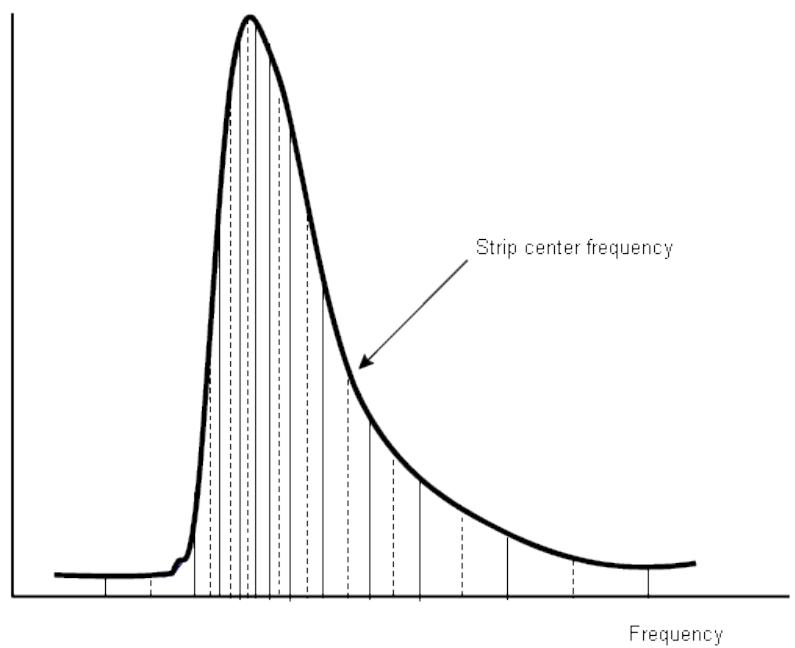

Once the spectrum is divided into components, the analysis procedure is the same as for the user input surface profile.

## 3.4 Constrained Stream Wave Insertion For Time History Analysis

Waveresponse program can insert a constrained stream wave using the ‘WVINS’ line at a given time $T_{ i n s }$ for time history analysis. The users need to provide the crest elevation and, optionally, the wave height for the constrained wave. To create a realistic sea profile, Waveresponse takes the following steps:

1. Create a random background wave from the wave spectrum provided in the ‘WSPEC’ line.   
2. Create a symmetric wave surface that attains the max crest elevation at the insertion time $T_{ i n s }$ and which follows the random wave spectrum statistics.   
3. Mix the symmetric sea profile with the background profile to create the modified profile.   
4. Create the stream wave profile for the given peak period ??. The wave height is either chosen as:

The distance between the depth of the closet trough in the modified profile to the provided stream wave crest elevation. If the option for breaking wave height reduction (‘A’ on column 71 on the WVINS line) is selected, the program ensures the wave height is at most the breaking wave height.   
Using the wave height provided by the user.

5. Replace the modified profile with the stream profile between （$T_{ i n s } - T_{ i - } , T_{ i n s } + T_{ i + } )$ and blends the stream wave with the modified profile between （$T_{ i n s } - T_{ i - } - T / 4 , T_{ i n s } - T_{ i - } )$ and （$T_{ i n s } +$

$T_{ i + } , T_{ i n s } + T_{ i + } + T / 4 )$ . By default $T_{ i + } = T_{ i - } = T / 4 ;$ however, to ensure a realistic sea surface profile, the insertion window can be adjusted automatically by entering $'_{ \mathsf{ E }^{ \prime } }$ on column 64 of the WVINS line. If this option is selected, the program tries to extend the blending window to create a single constrained wave crest with a well-defined crest.

All the above steps can be viewed in the neutral chart file by entering $\prime \mathsf{ S P^{ \prime } }$ on columns 7-8 of PSEL line.

The stream wave is inserted in the modified profile and blended with it using the following:

$$\eta = f (t) \eta_{s t r e a m} + \left(1 - f (t)\right) \eta_{m o d i f i e d}$$

Where the wave blending function is defined as:

$$f (t) = \left\{ \begin{array}{c c} 0 & t <   T_{i n s} - T_{i -} - T / 4 \\ \sin^{2} \left(\frac{2 \pi (t - T_{i n s} + T_{i -})}{T} + \frac{\pi}{2}\right) & T_{i n s} - T_{i -} - T / 4 \leq t \leq T_{i n s} - T_{i -} \\ 1 & T_{i n s} - T_{i -} \leq t \leq T_{i n s} + T_{i +} \\ \sin^{2} \left(\frac{2 \pi (T_{i n s} + T_{i +} - t)}{T} + \frac{\pi}{2}\right) & T_{i n s} + T_{i +} \leq t \leq T_{i n s} + T_{i +} + T / 4 \\ 0 & t > T_{i n s} + T_{i +} + T / 4 \end{array} \right.$$

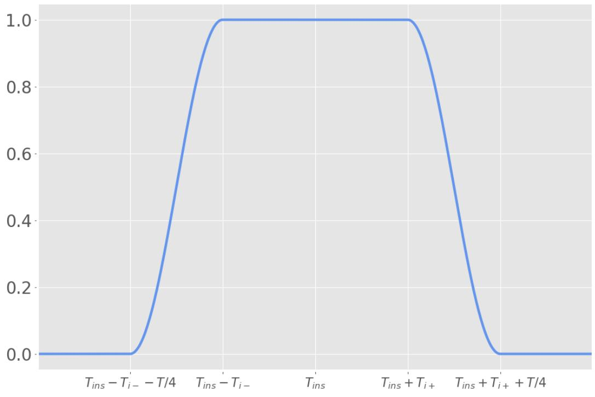  
Figure 1 depicts the blending function.   
Figure 1- Wave blending function

## 3.5 SEASTATE DATA

3.5.1 Deterministic Approach

The Wave Response program uses the hydrodynamic capabilities of the Seastate program to generate hydrodynamic properties.

The Seastate program is also used to step the wave through the structure to obtain the complete wave kinematics for an entire wave cycle.

When stepping the wave through the structure, an appropriate number of wave steps should be used to ensure that the higher harmonics contained in the wave forces generated are adequately represented. For example, when a wave is stepped through the structure one complete wave cycle using 18 steps (20 degrees), the fundamental period would be represented by 18 points, the first harmonic by 9 points, the second harmonic by 6, and the third by only 4-1/2 points.

The number of wave steps required is dependant on the primary modes of the structure being analyzed. When the primary modes of the structure are close to the wave period, 16-18 steps should adequately define the forcing function on those modes. However, if the primary modes of the structure have periods closer to the higher harmonics contained in the wave, more wave steps may be necessary.

Note: In general, 16-18 wave steps would be considered the minimum number of steps required in order to obtain reasonably accurate analysis results.

3.5.2 3.4.2 Random Wave Approach

For random wave analysis, the wave kinematics are generated by the Wave response program. Seastate is used to calculate the hydrodynamic properties of each member and to determine whether or not the member is loaded by the wave. For each member loaded by the wave, Seastate also determines the number of load segments required to accurately represent the wave force.

The reference wave to be used by Seastate should wet all members that will be wet at any time during the random wave analysis. In general, a large wave with the crest positioned at the structure center should be used.

Note: Although using a small wave and increasing the water depth may also be used to determine the wetted members, using a larger wave yields more accurate analysis results. When using a larger wave, members are divided into shorter load segments in areas where the highest velocity gradients occur which is typically in the splash zone. For a very small wave with an increased water depth, members in the splash zone will not be adequately subdivided.

Since wave kinematics are determined by the Wave Response program, fewer wave steps are required for random wave analysis than for deterministic analysis. However, because Seastate is used to determine member load segmentation, a sufficient number of steps must be used to ensure that adequate member load segmentation occurs. Typically, 10 crest positions (36 degrees) is appropriate.

Note: The program selects the wave step yielding the highest degree of member segmentation and the greatest submerged length for each member.

4 SAMPLE PROBLEMS

The structure used for the sample problems is a four pile jacket in 50 meters of water as shown below. A foundation super element generated by PSI is used to represent the nonlinear foundation and fifteen mode shapes were extracted to represent the major deflections of the structure. Four sample problems are used to illustrate the various capabilities of the Wave Response program:

1. The first sample problem generates global base shear and overturning moment transfer function plots typically used to determine critical waves for spectral fatigue analysis transfer functions.   
2. Sample Problem 2 illustrates the ability to generate equivalent static loading used to generate the transfer functions for a spectral fatigue analysis.   
3. Sample Problem 3 is a deterministic extreme wave analysis. Equivalent static loads are generated.   
4. Sample Problem 4 demonstrates the extreme random wave analysis capabilities using a wave spectrum to define the statistical properties of the environment. Equivalent static loads are generated along with a response file used by the Probability program.   
5. Sample Problem 5 generates surface profile plots and profile statistics of a random wave using numerous seeds. Time history integration option is used.   
6. Sample Problem 6 uses time history integration to generate a response file for the Global Loading program to select critical time points for numerous random wave seeds. It also demonstrates generating load cases at these time points by retrieving loads from the response file.   
7. Sample Problem 7 generates response function data for a wave spectrum representing the most probable maximum wave using transfer functions representing various wave steepness.

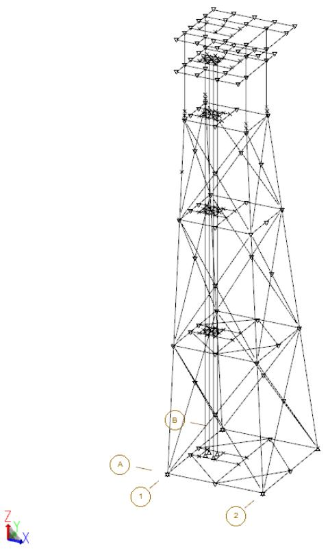

## 4.1 SAMPLE PROBLEM 1 – TRANSFER FUNCTION PLOTS

This sample illustrates the ability to plot global base shear and overturning moment transfer function plots. Typically, global transfer function plots are generated in order to check that the specified waves are sufficient to accurately define the transfer function used in a spectral fatigue analysis.

In this sample, the wave data is generated automatically using the GNTRF feature of the Seastate program. Also, Seastate data was specified in a separate input file from the model.

Prior to executing this sample problem, PSI was used to generate a foundation superelement file. Because this is a fatigue analysis, the superelement was created for low deflection levels using small waves similar to those used in the fatigue analysis. The Dynpac program was also executed in order to extract fifteen modes shapes and the generalized mass.

The following is the Seastate input file used in this sample. A detailed description of each of the applicable input lines ensues.

1 1 2 3 4 5 6 7 8   
123456789012345678901234567890123456789012345678901234567890   
1 \*000 Degree transfer function   
2 \* Kilogram Units Steel Test Model   
3 LDOPT +Z 1.03 7.85 -50.00 50.00 ME DYN NPNP   
# 4 FILE S
# 5 CDM
# 6 CDM AP
# 7 MGROV
8 MGROV 0.000 10.00 2.500   
9 MGROV 10.000 45.000 5.000   
# 10 GRPOV
11 GRPOV BL1 F 0.001 5.0 5.0 3.0 3.0 F   
12 GRPOV BL1 F 0.001 3.0 3.0 2.0 2.0 F   
13 GRPOV LG2 F   
14 $^{ \text{不} }$ ******\*\*More Group overrides   
15 GRPOV PL3NN 0.001 0.001 0.001   
16 GRPOV PL4NN 0.001 0.001 0.001   
17 GRPOV W.BN 0.010 0.001 0.001 0.001   
# 18 LOAD
# 19 LOADCN 1
20 GNTRF .05 10.50 0.50 0.0 18   
# 21 LOADCN
22 GNTRF .05 4.75 0.25 0.0 18   
# 23 END

The following describes the input lines in the Seastate input file used for Sample Problem 1:

3. The LDOPT line specifies the Seastate options. The ‘DYN’ option in columns 56-58 designates that Seastate is to be used for dynamic modeling and wave data generation only.   
4. The FILE line designates that the model data and Seastate data are specified in separate files. The ‘S’ option specifies that only loading data in the Seastate input file is to be considered.   
19. The first LOADCN line signals the beginning of load case 1.   
20. The GNTRF line is used to specify the data used to generate the first set of waves utilized in the transfer function plots as follows:

## a. 12 waves are to be generated as specified by ‘12’ in columns 12-13.

b. The wave steepness (height/length ratio) is to be 1/20 as designated by ‘0.05’ in columns 14- 20.   
c. The period of the first wave of the wave set has a period of 10.5 seconds with each subsequent wave of the set having a period 0.5 seconds lower than the previous wave (i.e. 10.5, 10.0, 9.5, 9.0, etc.).   
d. The wave approach direction is 0.0 degrees as stipulated in columns 46-51.   
e. Each wave is to be stepped through the structure using 18 wave crest positions (20 degree increments).

21. Each GNTRF line must be precede by a LOADCN line.

Note: No load case name is specified on subsequent LOADCN lines.

22. The second GNTRF line is used to specify the data used to generate the second set of waves utilized in the transfer function plots as follows:

## a. 12 waves are to be generated as specified by ‘12’ in columns 12-13.
b. The wave steepness (height/length ratio) is to be 1/20 as designated by ‘0.05’ in columns 14- 20.   
c. The period of the first wave of the wave set has a period of 4.75 seconds with each subsequent wave of the set having a period 0.25 seconds lower than the previous wave (i.e. 4.75, 4.5, 4.25, 4.0, 3.75, 3.5, etc.).   
d. The wave approach direction is 0.0 degrees as stipulated in columns 46-51.   
e. Each wave is to be stepped through the structure using 18 wave crest positions (20 degree increments).

The following is the Wave Response input file used to generate the transfer function plots. A detailed description of each of the applicable input lines ensues.

```txt
1 2 3 4 5 6 7 8   
1234567890123456789012345678901234567890123456789012345678901234567890   
1 WROPT MEPSL ALL 15 -1   
2 PLTTFF OM BS   
3 TFLCAS 1 14   
# 4 DAMP 3.0
5 END
```

The following describes the input lines in the Wave Response input file used for Sample Problem 1:

1. The WROPT line specifies the Wave Response options as follows:

a. Metric kilonewton force units are to be used.   
b. Plots are to be generated as stipulated by ‘PSL’ in columns 10-12.   
c. Fifteen modes are to be considered as designated by ‘15’ in columns 44-45.

d. A single pass analysis is to be performed (i.e. no iterations) as designated by ‘-1’ in columns 49-50.   
2. Overturning moment and base shear global transfer function plots are requested on the PLTTF line.   
3. Waves 1 through 24 are to be used to plot the transfer functions as designated by ‘1’ and ‘24’ in columns 10 and 13-14 of the TFLCAS line, respectively.   
4. Three percent overall critical damping is to be used.

The following are the global overturning moment and base shear transfer function plots created for this sample problem.

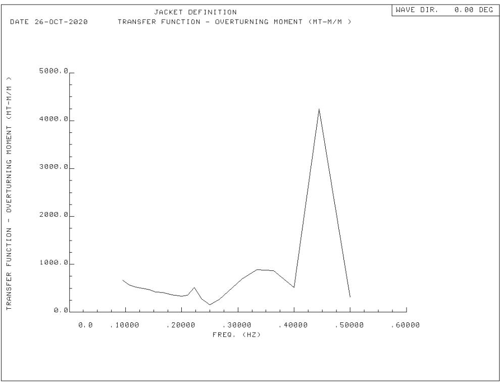

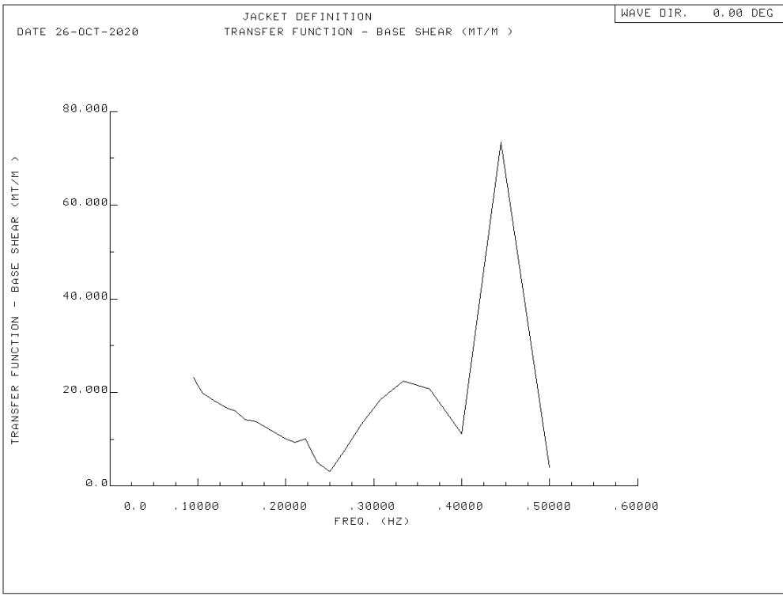

## 4.2 SAMPLE PROBLEM 2 – CREATING EQUIVALENTE STATIC LOADING

Sample Problem 2 illustrates the ability to create the equivalent static loading required in order to generate the transfer functions used in a spectral fatigue analysis. Typically, for each wave direction to be considered, equivalent static loading is generated then solved to create a common solution file. The solution file(s) containing nominal stresses are used by the Fatigue program to create the transfer functions required for spectral fatigue analysis.

This sample details the procedure required to generate the equivalent static loads for one approach direction. The wave data was specified manually by the user in a separate Seastate input file. The waves were selected based on the critical points (i.e. peaks and valleys) on the global transfer function plots generated in Sample Problem 1. The following fourteen waves were selected:


| Height(m) | Period | Height(m) | Period | Height(m) | Period |
| --- | --- | --- | --- | --- | --- |
| 8.55 | 10.50 | 1.57 | 4.50 | 0.59 | 2.75 |
| 7.76 | 10.00 | 1.24 | 4.00 | 0.49 | 2.50 |
| 4.36 | 7.50 | 0.95 | 3.50 | 0.39 | 2.25 |
| 2.79 | 6.00 | 0.82 | 3.25 | 0.31 | 2.00 |
| 1.75 | 4.75 | 0.70 | 3.00 |  |  |


Note: The GNTRF feature may be used to generate the wave data automatically if the waves to be used can be expressed as one or more sets of waves with uniform period spacing or if the total number of load conditions created is not a limiting factor. See Sample Problem 1 for sample input using the GNTRF feature.

Airy waves specified in descending period order are used to generate the transfer function loading. The following is the Seastate input file used. A detailed description of each of the applicable input lines ensues.

1 1 2 3 4 5 6 7 8   
123456789012345678901234567890123456789012345678901234567890   
1 \*000 Degree transfer function   
2 LDOPT +Z 1.03 7.85 -50.00 50.00 ME DYN NPNP   
3 FILE S
# 4 CDM
5 CDM AP
6 MGROV
7 MGROV 0.000 10.00 2.500   
8 MGROV 10.000 45.000 5.000   
9 GRPOV
10 GRPOV BL1 F 0.001 5.0 5.0 3.0 3.0 F   
11 GRPOV BL2 F 0.001 3.0 3.0 2.0 2.0 F   
12 $^{**} =$ $^{**} =$ $^{**} =$ More Group overrides   
13 GRPOV PL4NN 0.001 0.001 0.001   
14 GRPOV W.BN 0.010 0.001 0.001 0.001   
15 LOAD
16 LOADCN 1
17 WAVE
18 WAVE1.00AIRY 8.55 10.50 0.00 D 0.00 20.00 18MS1O 1 O   
19 LOADCN 2


| 20 | WAVE |  |  |  |  |  |  |  |  |
| --- | --- | --- | --- | --- | --- | --- | --- | --- | --- |
| 21 | WAVE1.00AIRY | 7.76 | 10.00 | 0.00 | D | 0.00 | 20.00 | 18MS10 | 1 0 |
| 22 | LOADCN 3 |  |  |  |  |  |  |  |  |
| 23 | WAVE |  |  |  |  |  |  |  |  |
| 24 | WAVE1.00AIRY | 4.36 | 7.50 | 0.00 | D | 0.00 | 20.00 | 18MS10 | 1 0 |
| 25 | LOADCN 4 |  |  |  |  |  |  |  |  |
| 26 | WAVE |  |  |  |  |  |  |  |  |
| 27 | WAVE1.00AIRY | 2.79 | 6.00 | 0.00 | D | 0.00 | 20.00 | 18MS10 | 1 0 |
| 28 | LOADCN 5 |  |  |  |  |  |  |  |  |
| 29 | WAVE |  |  |  |  |  |  |  |  |
| 30 | WAVE1.00AIRY | 1.75 | 4.75 | 0.00 | D | 0.00 | 20.00 | 18MS10 | 1 0 |
| 31 | LOADCN 6 |  |  |  |  |  |  |  |  |
| 32 | WAVE |  |  |  |  |  |  |  |  |
| 33 | WAVE1.00AIRY | 1.57 | 4.50 | 0.00 | D | 0.00 | 20.00 | 18MS10 | 1 0 |
| 34 | LOADCN 7 |  |  |  |  |  |  |  |  |
| 35 | WAVE |  |  |  |  |  |  |  |  |
| 36 | WAVE1.00AIRY | 1.24 | 4.00 | 0.00 | D | 0.00 | 20.00 | 18MS10 | 1 0 |
| 37 | LOADCN 8 |  |  |  |  |  |  |  |  |
| 38 | WAVE |  |  |  |  |  |  |  |  |
| 39 | WAVE1.00AIRY | 0.95 | 3.50 | 0.00 | D | 0.00 | 20.00 | 18MS10 | 1 0 |
| 40 | LOADCN 9 |  |  |  |  |  |  |  |  |
| 41 | WAVE |  |  |  |  |  |  |  |  |
| 42 | WAVE1.00AIRY | 0.82 | 3.25 | 0.00 | D | 0.00 | 20.00 | 18MS10 | 1 0 |
| 43 | LOADCN 10 |  |  |  |  |  |  |  |  |
| 44 | WAVE |  |  |  |  |  |  |  |  |
| 45 | WAVE1.00AIRY | 0.70 | 3.00 | 0.00 | D | 0.00 | 20.00 | 18MS10 | 1 0 |
| 46 | LOADCN 11 |  |  |  |  |  |  |  |  |
| 47 | WAVE |  |  |  |  |  |  |  |  |
| 48 | WAVE1.00AIRY | 0.59 | 2.75 | 0.00 | D | 0.00 | 20.00 | 18MS10 | 1 0 |
| 49 | LOADCN 12 |  |  |  |  |  |  |  |  |
| 50 | WAVE |  |  |  |  |  |  |  |  |
| 51 | WAVE1.00AIRY | 0.49 | 2.50 | 0.00 | D | 0.00 | 20.00 | 18MS10 | 1 0 |
| 52 | LOADCN 13 |  |  |  |  |  |  |  |  |
| 53 | WAVE |  |  |  |  |  |  |  |  |
| 54 | WAVE1.00AIRY | 0.39 | 2.25 | 0.00 | D | 0.00 | 20.00 | 18MS10 | 1 0 |
| 55 | LOADCN 14 |  |  |  |  |  |  |  |  |
| 56 | WAVE |  |  |  |  |  |  |  |  |
| 57 | WAVE1.00AIRY | 0.31 | 2.00 | 0.00 | D | 0.00 | 20.00 | 18MS10 | 1 0 |
| 58 | END |  |  |  |  |  |  |  |  |


The following describes the input lines in the Seastate input file used for Sample Problem 2:

2. The LDOPT line specifies the Seastate options. The ‘DYN’ option in columns 56-58 designates that Seastate is to be used for dynamic modeling and wave data generation only.   
3. The FILE line designates that the model data and Seastate data are specified in separate files. The ‘S’ option specifies that only loading data in the Seastate input file is to be considered.   
18. The first wave is specified on the WAVE line of load case 1 as follows:

a. The wave type, height and period are designated in columns 9-12, 14-18 and 25-30, respectively.   
b. The wave direction is 0.00 degrees as input in columns 39-44.   
c. The wave is to be stepped through the structure using a 20 degree increment for 18 crest positions for a total of 360 degrees (one full wave cycle).

Note: Although the critical wave position criteria is designated in the Wave Response input file, the ‘AL’ option should not be specified on the WAVE line.

21. The second wave is designated on the next WAVE input line.

The following is the Wave Response input file used to generate the equivalent static loads and global transfer function plots. A detailed description of each of the applicable input lines ensues.


|  | 1 | 2 | 3 | 4 | 5 | 6 | 7 | 8 |
| --- | --- | --- | --- | --- | --- | --- | --- | --- |
|  | 12345678901 | 12345678901 | 12345678901 | 12345678901 | 12345678901 | 12345678901 | 12345678901 | 1234567890 |
| 1 | WROPT | MEPSL | ALLES |  | 15 | -1 |  |  |
| 2 | PLTTFF |  |  | OM BS |  |  |  |  |
| 3 | TFLCAS | 1 | 14 |  |  |  |  |  |
| 4 | DAMP |  | 3.0 |  |  |  |  |  |
| 5 | END |  |  |  |  |  |  |  |


The following describes the input lines in the Wave Response input file used for Sample Problem 2:

1. The WROPT line specifies the Wave Response options as follows:

a. Metric kilonewton force units are to be used.   
b. Plots are to be generated as stipulated by ‘PSL’ in columns 10-12.   
c. Fifteen modes are to be considered as designated by ‘15’ in columns 44-45.   
d. A single pass analysis is to be performed (i.e. no iterations) as designated by ‘-1’ in columns 49-50.   
e. A load case is to be created for all wave positions as stipulated by ‘ALL’ in columns 15-18.   
f. ‘ES’ in columns 19-20 designates that equivalent static loads representing static and inertia loads are to be generated.

2. Overturning moment and base shear global transfer function plots are requested on the PLTTF line.   
3. Waves 1 through 14 are to be used to plot the transfer functions as designated by ‘1’ and ‘14’ in columns 10 and 13-14 of the TFLCAS line, respectively.   
4. Three percent overall critical damping is to be used.

An equivalent static load case was created for each of the 18 crest position of each wave, therefore yielding a total of 252 load cases for this wave direction. These 252 load cases were solved automatically by selecting the automatic feature in the SACS Executive. The analysis, therefore, resulted in a common solution file consisting of nominal stresses used by the Fatigue program to create the transfer function for this direction.

The following pages contain a portion of the Wave Response output listing file:

 WAVE RESPONSE PARAMETERS 

NO. JOINTS 204

NO. MEMBERS 401

NO. PLATES 0

NO. SHELLS 0

NO. SOLIDS 0

MAX. ITERATIONS -1

ITERATION CONVERGENCE ...... 1.00 PERCENT

FOURIER SERIES CONVERGENCE . 1.00 PERCENT

OUTPUT LOAD OPTION .........ALL TIME POINTS

EQUIVALENT STATIC LOADS TO BE GENERATED

* REACTION SUMMARY ABOUT ORIGIN *


| MODE | XMT | FORCES Y MT | Z MT | X MT-M | MOMENTS Y MT-M | Z MT-M |
| --- | --- | --- | --- | --- | --- | --- |
| 1 | -16.37 | -0.27 | -0.45 | 42.6 | -1959.4 | -12.6 |
| 2 | 0.30 | -15.23 | -0.05 | 2215.0 | 22.5 | -454.7 |
| 3 | 0.01 | 7.56 | 0.70 | 417.0 | -30.1 | -2588.5 |
| 4 | -63.34 | 1.36 | -6.15 | 597.7 | 30094.1 | 19.1 |
| 5 | -2.51 | -74.05 | 3.27 | -31134.7 | 1345.0 | -439.6 |
| 6 | -2.96 | 6.23 | 1.84 | 3896.2 | 1841.4 | 487.2 |
| 7 | -2.63 | 30.52 | 11.01 | 19925.8 | 2034.9 | 828.6 |
| 8 | 0.57 | 9.85 | -13.45 | 8281.0 | -545.3 | -843.2 |
| 9 | 6.33 | -2.21 | -35.38 | -859.2 | -3783.3 | -1222.9 |
| 10 | 5.31 | 0.86 | 26.79 | 1004.9 | -5955.7 | 2059.5 |
| 11 | -2.06 | -0.10 | 1.41 | -98.0 | 1240.5 | -374.8 |
| 12 | -21.07 | 4.29 | -110.12 | 1785.0 | 29466.8 | 2227.5 |
| 13 | -1.34 | -2.57 | -0.12 | -4315.8 | 1445.6 | -940.2 |
| 14 | 3.33 | 2.33 | -8.74 | 1608.6 | -3105.4 | 588.0 |
| 15 | 10.85 | 16.55 | 0.49 | 10162.3 | -11713.3 | 3747.1 |


| STEP | TIME (SECS) | PHASE (DEG) | MOMENT (X) MT-M | MOMENT (Y) MT-M | SHEAR (X) MT | SHEAR (Y) MT | MOMENT (X) MT-M | MOMENT (Y) MT-M | SHEAR (X) MT | SHEAR (Y) MT |
| --- | --- | --- | --- | --- | --- | --- | --- | --- | --- | --- |
| 1 | 0.00 | 0.00 | 4.6 | 3593.6 | 120.24 | 0.12 | 4.7 | 3250.7 | 113.55 | 0.12 |
| 2 | 0.58 | 20.00 | 3.0 | 2134.3 | 71.74 | 0.08 | 3.1 | 1966.0 | 68.68 | 0.09 |
| 3 | 1.17 | 40.00 | 0.6 | 285.4 | 10.96 | 0.02 | 0.6 | 348.3 | 11.96 | 0.03 |
| 4 | 1.75 | 60.00 | -1.9 | -1233.7 | -40.08 | -0.05 | -2.0 | -1061.6 | -37.68 | -0.05 |
| 5 | 2.33 | 80.00 | -4.0 | -2032.9 | -69.24 | -0.13 | -4.1 | -1849.6 | -65.76 | -0.13 |
| 6 | 2.92 | 100.00 | -5.6 | -2271.0 | -80.84 | -0.21 | -5.5 | -2228.5 | -79.70 | -0.20 |
| 7 | 3.50 | 120.00 | -7.3 | -2387.5 | -87.38 | -0.29 | -7.3 | -2452.2 | -88.54 | -0.29 |
| 8 | 4.08 | 140.00 | -9.0 | -2619.2 | -95.22 | -0.35 | -9.0 | -2633.6 | -95.70 | -0.36 |
| 9 | 4.67 | 160.00 | -9.8 | -2769.5 | -98.25 | -0.38 | -9.7 | -2601.8 | -94.87 | -0.38 |
| 10 | 5.25 | 180.00 | -8.7 | -2443.8 | -85.10 | -0.33 | -8.6 | -2191.2 | -79.96 | -0.33 |
| 11 | 5.83 | 200.00 | -5.7 | -1492.0 | -51.89 | -0.20 | -5.7 | -1352.9 | -49.33 | -0.20 |
| 12 | 6.42 | 220.00 | -1.7 | -194.3 | -7.51 | -0.05 | -1.7 | -219.9 | -8.10 | -0.05 |
| 13 | 7.00 | 240.00 | 1.9 | 988.4 | 33.68 | 0.07 | 2.1 | 927.1 | 33.30 | 0.08 |
| 14 | 7.58 | 260.00 | 4.2 | 1822.9 | 64.16 | 0.14 | 4.2 | 1786.3 | 63.76 | 0.14 |
| 15 | 8.17 | 280.00 | 5.1 | 2451.6 | 87.64 | 0.15 | 4.8 | 2456.6 | 87.02 | 0.15 |
| 16 | 8.75 | 300.00 | 5.2 | 3131.3 | 111.03 | 0.13 | 5.1 | 3203.6 | 112.70 | 0.13 |
| 17 | 9.33 | 320.00 | 5.4 | 3835.1 | 132.84 | 0.12 | 5.5 | 3749.4 | 131.37 | 0.13 |
| 18 | 9.92 | 340.00 | 5.4 | 4145.8 | 140.40 | 0.13 | 5.4 | 3847.7 | 134.49 | 0.12 |


|  | * WAVE CASE 1 * | * WAVE CASE 1 * | * WAVE CASE 1 * | * WAVE CASE 1 * | * WAVE CASE 1 * | * WAVE CASE 1 * | * WAVE CASE 1 * | * WAVE CASE 1 * |
| --- | --- | --- | --- | --- | --- | --- | --- | --- |
|  | WAVE HEIGHT = 8.55 M | WAVE HEIGHT = 8.55 M | WAVE PERIOD = 10.50 SECS | WAVE PERIOD = 10.50 SECS | WAVE DIRECTION = 0.00 DEGREES | WAVE DIRECTION = 0.00 DEGREES | WAVE DIRECTION = 0.00 DEGREES | WAVE DIRECTION = 0.00 DEGREES |
|  | *** MUDLINE MOMENTS AND SHEARS *** | *** MUDLINE MOMENTS AND SHEARS *** | *** MUDLINE MOMENTS AND SHEARS *** | *** MUDLINE MOMENTS AND SHEARS *** | *** MUDLINE MOMENTS AND SHEARS *** | *** MUDLINE MOMENTS AND SHEARS *** | *** MUDLINE MOMENTS AND SHEARS *** | *** MUDLINE MOMENTS AND SHEARS *** |
| STEP | TIME (SECS) | PHASE (DEG) | MOMENT(X) MT-M | MOMENT(Y) MT-M | BASE MOMENT MT-M | SHEAR(X) MT | SHEAR(Y) MT | BASE SHEAR MT |
| 1 | 0.00 | 0.00 | 4.6 | 3593.6 | 3593.6 | 120.24 | 0.12 | 120.24 |
| 2 | 0.58 | 20.00 | 3.0 | 2134.3 | 2134.3 | 71.74 | 0.08 | 71.74 |
| 3 | 1.17 | 40.00 | 0.6 | 285.4 | 285.4 | 10.96 | 0.02 | 10.96 |
| 4 | 1.75 | 60.00 | -1.9 | -1233.7 | 1233.7 | -40.08 | -0.05 | 40.08 |
| 5 | 2.33 | 80.00 | -4.0 | -2032.9 | 2032.9 | -69.24 | -0.13 | 69.24 |
| 6 | 2.92 | 100.00 | -5.6 | -2271.0 | 2271.0 | -80.84 | -0.21 | 80.84 |
| 7 | 3.50 | 120.00 | -7.3 | -2387.5 | 2387.5 | -87.38 | -0.29 | 87.38 |
| 8 | 4.08 | 140.00 | -9.0 | -2619.2 | 2619.2 | -95.22 | -0.35 | 95.22 |
| 9 | 4.67 | 160.00 | -9.8 | -2769.5 | 2769.5 | -98.25 | -0.38 | 98.25 |
| 10 | 5.25 | 180.00 | -8.7 | -2443.8 | 2443.8 | -85.10 | -0.33 | 85.10 |
| 11 | 5.83 | 200.00 | -5.7 | -1492.0 | 1492.1 | -51.89 | -0.20 | 51.89 |
| 12 | 6.42 | 220.00 | -1.7 | -194.3 | 194.3 | -7.51 | -0.05 | 7.51 |
| 13 | 7.00 | 240.00 | 1.9 | 988.4 | 988.4 | 33.68 | 0.07 | 33.68 |
| 14 | 7.58 | 260.00 | 4.2 | 1822.9 | 1822.9 | 64.16 | 0.14 | 64.16 |
| 15 | 8.17 | 280.00 | 5.1 | 2451.6 | 2451.6 | 87.64 | 0.15 | 87.64 |
| 16 | 8.75 | 300.00 | 5.2 | 3131.3 | 3131.3 | 111.03 | 0.13 | 111.03 |
| 17 | 9.33 | 320.00 | 5.4 | 3835.1 | 3835.1 | 132.84 | 0.12 | 132.84 |
| 18 | 9.92 | 340.00 | 5.4 | 4145.8 | 4145.8 | 140.40 | 0.13 | 140.40 |


|  | ********** | ********** | ********** | ********** | ******* EQUIVALENT STATIC LOAD SUMMATIONS******* | ******* EQUIVALENT STATIC LOAD SUMMATIONS******* | ******* EQUIVALENT STATIC LOAD SUMMATIONS******* | ******* EQUIVALENT STATIC LOAD SUMMATIONS******* | ******* EQUIVALENT STATIC LOAD SUMMATIONS******* | ******* EQUIVALENT STATIC LOAD SUMMATIONS******* | ******* EQUIVALENT STATIC LOAD SUMMATIONS******* | ******* EQUIVALENT STATIC LOAD SUMMATIONS******* |
| --- | --- | --- | --- | --- | --- | --- | --- | --- | --- | --- | --- | --- |
|  | ********** INERTIA********** | ********** INERTIA********** | ********** INERTIA********** | ********** HYDRODYNAMICS********** | ********** HYDRODYNAMICS********** | ********** HYDRODYNAMICS********** | ********** BUOYANCY********** | ********** BUOYANCY********** | ********** BUOYANCY********** | ********** WIND********** | ********** WIND********** | ********** WIND********** |
| LOAD | FX | FY | FZ | FX | FY | FZ | FX | FY | FZ | FX | FY | FZ |
| CASE | KG | KG | KG | KG | KG | KG | KG | KG | KG | KG | KG | KG |
| 1 | 56.9 | 0.0 | 2.1 | 1017.7 | -0.0 | -36.1 | 0.0 | 0.0 | 0.0 | 0.0 | 0.0 | 0.0 |
| 2 | 24.4 | 0.0 | 0.9 | 615.1 | 0.0 | -105.5 | 0.0 | 0.0 | 0.0 | 0.0 | 0.0 | 0.0 |
| 3 | -21.4 | -0.0 | -0.8 | 104.5 | 0.0 | -166.5 | 0.0 | 0.0 | 0.0 | 0.0 | 0.0 | 0.0 |
| 4 | -45.9 | -0.0 | -1.7 | -353.9 | 0.1 | -134.9 | 0.0 | 0.0 | 0.0 | 0.0 | 0.0 | 0.0 |
| 5 | -34.7 | -0.0 | -1.3 | -619.5 | 0.0 | -96.3 | 0.0 | 0.0 | 0.0 | 0.0 | 0.0 | 0.0 |
| 6 | -5.6 | 0.0 | -0.2 | -756.1 | -0.0 | -84.7 | 0.0 | 0.0 | 0.0 | 0.0 | 0.0 | 0.0 |
| 7 | 9.5 | 0.0 | 0.2 | -839.3 | -0.0 | -68.4 | 0.0 | 0.0 | 0.0 | 0.0 | 0.0 | 0.0 |
| 8 | -3.9 | 0.0 | -0.3 | -904.0 | 0.0 | -50.1 | 0.0 | 0.0 | 0.0 | 0.0 | 0.0 | 0.0 |
| 9 | -29.9 | 0.0 | -1.2 | -892.7 | 0.1 | -21.5 | 0.0 | 0.0 | 0.0 | 0.0 | 0.0 | 0.0 |
| 10 | -39.9 | -0.0 | -1.5 | -749.0 | 0.1 | 12.9 | 0.0 | 0.0 | 0.0 | 0.0 | 0.0 | 0.0 |
| 11 | -21.8 | 0.0 | -0.8 | -457.8 | 0.1 | 49.0 | 0.0 | 0.0 | 0.0 | 0.0 | 0.0 | 0.0 |
| 12 | 8.4 | 0.0 | 0.3 | -68.3 | 0.1 | 79.0 | 0.0 | 0.0 | 0.0 | 0.0 | 0.0 | 0.0 |
| 13 | 23.4 | 0.0 | 0.9 | 320.4 | 0.0 | 94.7 | 0.0 | 0.0 | 0.0 | 0.0 | 0.0 | 0.0 |
| 14 | 13.2 | -0.0 | 0.5 | 603.3 | -0.1 | 100.5 | 0.0 | 0.0 | 0.0 | 0.0 | 0.0 | 0.0 |
| 15 | -4.8 | -0.0 | -0.1 | 813.8 | -0.0 | 98.0 | 0.0 | 0.0 | 0.0 | 0.0 | 0.0 | 0.0 |
| 16 | -3.9 | -0.0 | -0.0 | 1026.2 | -0.1 | 137.5 | 0.0 | 0.0 | 0.0 | 0.0 | 0.0 | 0.0 |
| 17 | 22.8 | -0.0 | 1.0 | 1184.5 | -0.0 | 101.3 | 0.0 | 0.0 | 0.0 | 0.0 | 0.0 | 0.0 |
| 18 | 53.3 | 0.0 | 2.0 | 1207.3 | -0.0 | 32.8 | 0.0 | 0.0 | 0.0 | 0.0 | 0.0 | 0.0 |


| **** SUMMATION OF FLUID FORCES **** | **** SUMMATION OF FLUID FORCES **** | **** SUMMATION OF FLUID FORCES **** | **** SUMMATION OF FLUID FORCES **** | **** SUMMATION OF FLUID FORCES **** | **** SUMMATION OF FLUID FORCES **** |
| --- | --- | --- | --- | --- | --- |
| POINT | TIME | PHASE | ********** | FORCES | ********** |
|  | SECS | DEGS | X MT | Y MT | Z MT |
| 1 | 0.00 | 0.00 | 81.68 | -0.00 | -4.27 |
| 2 | 0.56 | 20.00 | 45.70 | 0.00 | -10.31 |
| 3 | 1.11 | 40.00 | 1.99 | 0.00 | -15.55 |
| 4 | 1.67 | 60.00 | -36.40 | 0.01 | -10.60 |
| 5 | 2.22 | 80.00 | -58.23 | 0.00 | -8.46 |
| 6 | 2.78 | 100.00 | -69.83 | 0.00 | -7.30 |
| 7 | 3.33 | 120.00 | -75.48 | -0.00 | -5.66 |
| 8 | 3.89 | 140.00 | -77.19 | 0.00 | -3.87 |
| 9 | 4.44 | 160.00 | -71.97 | 0.00 | -1.24 |
| 10 | 5.00 | 180.00 | -57.35 | -0.00 | 1.74 |
| 11 | 5.56 | 200.00 | -31.99 | 0.01 | 4.77 |
| 12 | 6.11 | 220.00 | 0.31 | 0.01 | 7.16 |
| 13 | 6.67 | 240.00 | 33.18 | 0.00 | 8.40 |
| 14 | 7.22 | 260.00 | 57.05 | -0.01 | 8.85 |
| 15 | 7.78 | 280.00 | 75.01 | -0.01 | 8.48 |
| 16 | 8.33 | 300.00 | 90.96 | -0.01 | 10.65 |
| 17 | 8.89 | 320.00 | 102.60 | -0.01 | 8.19 |
| 18 | 9.44 | 340.00 | 100.93 | -0.00 | 1.90 |


| MOMENT | X = | 19.69 MT-M | AT TIME = | 3.889 SECS AND PHASE ANGLE = 140.00 DEGS |
| --- | --- | --- | --- | --- |
| MOMENT | Y = | 2385.57 MT-M | AT TIME = | 8.889 SECS AND PHASE ANGLE = 320.00 DEGS |
| MOMENT | Z = | 9.25 MT-M | AT TIME = | 3.889 SECS AND PHASE ANGLE = 140.00 DEGS |
| SHEAR | X = | -116.45 MT | AT TIME = | 9.444 SECS AND PHASE ANGLE = 340.00 DEGS |
| SHEAR | Y = | 0.27 MT | AT TIME = | 4.444 SECS AND PHASE ANGLE = 160.00 DEGS |
| SHEAR | Z = | -9.83 MT | AT TIME = | 8.889 SECS AND PHASE ANGLE = 320.00 DEGS |


** MAXIMUM MODAL RESPONSES FOR ITERATION 0 **


| MODE | RESPONSE CM | TIME SECS |
| --- | --- | --- |
| 1 | 7.331 | 9.444 |
| 2 | -0.163 | 9.444 |
| 3 | -0.018 | 8.889 |
| 4 | 2.690 | 9.444 |
| 5 | 0.078 | 9.444 |
| 6 | 0.106 | 9.444 |
| 7 | 0.047 | 9.444 |
| 8 | 0.015 | 8.889 |
| 9 | -0.218 | 9.444 |
| 10 | -0.209 | 8.889 |
| 11 | 0.114 | 1.111 |
| 12 | 0.074 | 8.889 |
| 13 | -0.076 | 3.889 |
| 14 | 0.026 | 5.556 |
| 15 | 0.083 | 3.889 |


| APPLIED LOAD SUMMARY | APPLIED LOAD SUMMARY | APPLIED LOAD SUMMARY | APPLIED LOAD SUMMARY | APPLIED LOAD SUMMARY |
| --- | --- | --- | --- | --- |
| LOAD CASE NO. | ID | TOTAL FORCE (X) KN | TOTAL FORCE (Y) KN | TOTAL FORCE (Z) KN |
| 1 | 0001 | 3.746654E+03 | 9.109688E-01 | 5.321604E+01 |
| 2 | 0002 | 1.785415E+03 | 6.475003E-01 | -6.674426E+01 |
| 3 | 0003 | -9.462480E+02 | -7.201134E-01 | -2.017835E+02 |
| 4 | 0004 | -2.587200E+03 | -1.360171E+00 | -2.098967E+02 |
| 5 | 0005 | -2.276026E+03 | -4.455052E-01 | -1.501700E+02 |
| 6 | 0006 | -9.566540E+02 | 6.501651E-01 | -9.192344E+01 |
| 7 | 0007 | -2.748742E+02 | 1.186689E+00 | -5.654814E+01 |
| 8 | 0008 | -9.906664E+02 | 1.077944E+00 | -6.146021E+01 |
| 9 | 0009 | -2.276582E+03 | 7.593155E-01 | -7.133956E+01 |
| 10 | 000A | -2.654883E+03 | 1.521594E-01 | -5.164758E+01 |
| 11 | 000B | -1.495810E+03 | 2.059803E-02 | 1.274869E+01 |
| 12 | 000C | 3.620682E+02 | 6.911156E-01 | 9.331820E+01 |


| 13 | 0000 | 1.4711038E+3 | -4.884377E-01 | 1.221222E+3 | 0.5129567E+3 | -1.545473E+01 | -1.1770011 | 0.177772E+01 | -6.931148E-01 | 1.424015E+02 | -1.181048E+01 | -1.181048E+01 | -1.181048E+01 | -1.181048E+01 | -1.181048E+01 | -1.181048E+01 | -1.181048E+01 | -1.181048E+01 |  |  |  |  |  |  |  |  |  |  |  |  |  |  |  |  |  |  |  |  |  |  |  |  |  |  |  |  |  |  |  |  |  |  |  |  |  |  |  |  |  |  |  |  |  |  |  |  |  |  |  |  |  |  |  |  |  |  |  |  |  |  |  |  |  |  |  |  |  |  |  |  |  |  |  |  |  |  |  |  |  |  |  |  |  |  |  |  |  |  |  |  |  |  |  |  |  |  |
| --- | --- | --- | --- | --- | --- | --- | --- | --- | --- | --- | --- | --- | --- | --- | --- | --- | --- | --- | --- | --- | --- | --- | --- | --- | --- | --- | --- | --- | --- | --- | --- | --- | --- | --- | --- | --- | --- | --- | --- | --- | --- | --- | --- | --- | --- | --- | --- | --- | --- | --- | --- | --- | --- | --- | --- | --- | --- | --- | --- | --- | --- | --- | --- | --- | --- | --- | --- | --- | --- | --- | --- | --- | --- | --- | --- | --- | --- | --- | --- | --- | --- | --- | --- | --- | --- | --- | --- | --- | --- | --- | --- | --- | --- | --- | --- | --- | --- | --- | --- | --- | --- | --- | --- | --- | --- | --- | --- | --- | --- | --- | --- | --- | --- | --- | --- | --- |
| 14 | 0000 | 1.4711038E+3 | -4.884377E-01 | 1.221222E+3 | 0.5129567E+3 | -1.545473E+01 | -1.1770011 | 0.177772E+01 | -6.834704E+01 | -1.545473E+01 | -1.181048E+01 | -1.181048E+01 | -1.181048E+01 | -1.181048E+01 | -1.181048E+01 | -1.181048E+01 | -1.181048E + 01 | -1.181048E+01 |  |  |  |  |  |  |  |  |  |  |  |  |  |  |  |  |  |  |  |  |  |  |  |  |  |  |  |  |  |  |  |  |  |  |  |  |  |  |  |  |  |  |  |  |  |  |  |  |  |  |  |  |  |  |  |  |  |  |  |  |  |  |  |  |  |  |  |  |  |  |  |  |  |  |  |  |  |  |  |  |  |  |  |  |  |  |  |  |  |  |  |  |  |  |  |  |  |  |
| 15 | 0000 | 1.4711038E+3 | -4.884377E-01 | 1.221222E+3 | 0.5129567E+3 | -1.545473E+01 | -1.1770011 | 0.177772E+01 | -6.37742E+01 | -1.545473E+01 | -1.181048E+01 | -1.181048E+01 | -1.181048E+01 | -1.181048E+01 | -1.181048E+01 | -1.181048E + 01 | -1.181048 E+01 | -1.181048 E+01 |  |  |  |  |  |  |  |  |  |  |  |  |  |  |  |  |  |  |  |  |  |  |  |  |  |  |  |  |  |  |  |  |  |  |  |  |  |  |  |  |  |  |  |  |  |  |  |  |  |  |  |  |  |  |  |  |  |  |  |  |  |  |  |  |  |  |  |  |  |  |  |  |  |  |  |  |  |  |  |  |  |  |  |  |  |  |  |  |  |  |  |  |  |  |  |  |  |  |
| 16 | 0000 | 1.4711038E+3 | -4.884377E-01 | 1.221222E+3 | 0.5129567E+3 | -1.545473E+01 | -1.1770011 | 0.177772E+01 | -6.271434E+01 | -1.545473E+01 | -1.181048E+01 | -1.181048E+01 | -1.181048E+01 | -1.181048E+01 | -1.181048E+01 | -1.181048 E+01 | -1.181048 E+01 | -1.181048 E+01 |  |  |  |  |  |  |  |  |  |  |  |  |  |  |  |  |  |  |  |  |  |  |  |  |  |  |  |  |  |  |  |  |  |  |  |  |  |  |  |  |  |  |  |  |  |  |  |  |  |  |  |  |  |  |  |  |  |  |  |  |  |  |  |  |  |  |  |  |  |  |  |  |  |  |  |  |  |  |  |  |  |  |  |  |  |  |  |  |  |  |  |  |  |  |  |  |  |  |
| 17 | 0000 | 1.4711038E+3 | -4.884377E-01 | 1.221222E+3 | 0.5129567E+3 | -1.545473E+01 | -1.1770011 | 0.177772E+01 | -6.427143E+01 | -1.545473E+01 | -1.181048E+01 | -1.181048E+01 | -1.181048E+01 | -1.181048E+01 | -1.181048E+01 | -1.181048 E + 01 | -1.181048 E+01 | -1.181048 E+01 |  |  |  |  |  |  |  |  |  |  |  |  |  |  |  |  |  |  |  |  |  |  |  |  |  |  |  |  |  |  |  |  |  |  |  |  |  |  |  |  |  |  |  |  |  |  |  |  |  |  |  |  |  |  |  |  |  |  |  |  |  |  |  |  |  |  |  |  |  |  |  |  |  |  |  |  |  |  |  |  |  |  |  |  |  |  |  |  |  |  |  |  |  |  |  |  |  |  |
| 18 | 0000 | 1.4711038E+3 | -4.884377E-01 | 1.221222E+3 | 0.5129567E+3 | -1.545473E+01 | -1.1770011 | 0.177772E+01 | -6.577378E+01 | -1.545473E+01 | -1.181048E+01 | -1.181048E+01 | -1.181048E+01 | -1.181048 E+01 | -1.181048 E+01 | -1.181048 E+01 | -1.181048 E+01 | -1.181048 E+01 |  |  |  |  |  |  |  |  |  |  |  |  |  |  |  |  |  |  |  |  |  |  |  |  |  |  |  |  |  |  |  |  |  |  |  |  |  |  |  |  |  |  |  |  |  |  |  |  |  |  |  |  |  |  |  |  |  |  |  |  |  |  |  |  |  |  |  |  |  |  |  |  |  |  |  |  |  |  |  |  |  |  |  |  |  |  |  |  |  |  |  |  |  |  |  |  |  |  |
| 19 | 0000 | 1.4711038E+3 | -4.884377E-01 | 1.221222E+3 | 0.5129567E+3 | -1.545473E+01 | -1.1770011 | 0.177772E+01 | -6.79372E+01 | -1.545473E+01 | -1.181048E+01 | -1.181048E+01 | -1.181048 E+01 | -1.181048 E+01 | -1.181048 E+01 | -1.181048 E+01 | -1.181048 E + 01 | -1.181048 E+01 |  |  |  |  |  |  |  |  |  |  |  |  |  |  |  |  |  |  |  |  |  |  |  |  |  |  |  |  |  |  |  |  |  |  |  |  |  |  |  |  |  |  |  |  |  |  |  |  |  |  |  |  |  |  |  |  |  |  |  |  |  |  |  |  |  |  |  |  |  |  |  |  |  |  |  |  |  |  |  |  |  |  |  |  |  |  |  |  |  |  |  |  |  |  |  |  |  |  |
| 20 | 0000 | 1.4711038E+3 | -4.884377E-01 | 1.221222E+3 | 0.5129567E+3 | -1.545473E+01 | -1.1770011 | 0.177772E+01 | -6.69774E+01 | -1.545473E+01 | -1.181048E+01 | -1.181048E+01 | -1.181048 E+01 | -1.181048 E+01 | -1.181048 E+01 | -1.181048 E + 01 | -1.181048 E+01 | -1.181048 E+01 |  |  |  |  |  |  |  |  |  |  |  |  |  |  |  |  |  |  |  |  |  |  |  |  |  |  |  |  |  |  |  |  |  |  |  |  |  |  |  |  |  |  |  |  |  |  |  |  |  |  |  |  |  |  |  |  |  |  |  |  |  |  |  |  |  |  |  |  |  |  |  |  |  |  |  |  |  |  |  |  |  |  |  |  |  |  |  |  |  |  |  |  |  |  |  |  |  |  |
| 21 | 0000 | 1.4711038E+3 | -4.884377E-01 | 1.221222E+3 | 0.5129567E+3 | -1.545473E+01 | -1.1770011 | 0.177772E+01 | -6.07274E+01 | -1.545473E+01 | -1.181048E+01 | -1.181048E+01 | -1.181048 E+01 | -1.181048 E+01 | -1.181048 E+01 | -1.18104 8 E+01 | -1.181048 E+01 | -1.181048 E+01 |  |  |  |  |  |  |  |  |  |  |  |  |  |  |  |  |  |  |  |  |  |  |  |  |  |  |  |  |  |  |  |  |  |  |  |  |  |  |  |  |  |  |  |  |  |  |  |  |  |  |  |  |  |  |  |  |  |  |  |  |  |  |  |  |  |  |  |  |  |  |  |  |  |  |  |  |  |  |  |  |  |  |  |  |  |  |  |  |  |  |  |  |  |  |  |  |  |  |
| 22 | 0000 | 1.4711038E+3 | -4.884377E-01 | 1.221222E+3 | 0.5129567E+3 | -1.545473E+01 | -1.1770011 | 0.177772E+01 | -6.17273E+01 | -1.545473E+01 | -1.181048E+01 | -1.181048 E+01 | -1.181048 E+01 | -1.181048 E+01 | -1.181048 E+01 | -1.181048 E+01 | -1.181048 E+01 | -1.181048 E+01 |  |  |  |  |  |  |  |  |  |  |  |  |  |  |  |  |  |  |  |  |  |  |  |  |  |  |  |  |  |  |  |  |  |  |  |  |  |  |  |  |  |  |  |  |  |  |  |  |  |  |  |  |  |  |  |  |  |  |  |  |  |  |  |  |  |  |  |  |  |  |  |  |  |  |  |  |  |  |  |  |  |  |  |  |  |  |  |  |  |  |  |  |  |  |  |  |  |  |
| 23 | 0000 | 1.4711038E+3 | -4.884377E-01 | 1.221222E+3 | 0.5129567E+3 | -1.545473E+01 | -1.1770011 | 0.177772E+01 | -6 .677737E+01 | -1.545473E+01 | -1.181048E+01 | -1.181048 E+01 | -1.181048 E+01 | -1.181048 E+01 | -1.181048 E+01 | -1.181048 E + 01 | -1.181048E + 01 | -1.181048 E+01 |  |  |  |  |  |  |  |  |  |  |  |  |  |  |  |  |  |  |  |  |  |  |  |  |  |  |  |  |  |  |  |  |  |  |  |  |  |  |  |  |  |  |  |  |  |  |  |  |  |  |  |  |  |  |  |  |  |  |  |  |  |  |  |  |  |  |  |  |  |  |  |  |  |  |  |  |  |  |  |  |  |  |  |  |  |  |  |  |  |  |  |  |  |  |  |  |  |  |
| 24 | 0000 | 1.4711038E+3 | -4.884377E-01 | 1.221222E+3 | 0.5129567E+3 | -1.545473E+01 | -1.1770011 | 0.177772E+01 | -6 .463499E+01 | -1.545473E+01 | -1.181048E+01 | -1.181048 E+01 | -1.181048 E+01 | -1.181048 E+01 | -1.181048 E+01 | -1.181048 E-01 | -1.181048 E+01 | -1.181048 E+01 |  |  |  |  |  |  |  |  |  |  |  |  |  |  |  |  |  |  |  |  |  |  |  |  |  |  |  |  |  |  |  |  |  |  |  |  |  |  |  |  |  |  |  |  |  |  |  |  |  |  |  |  |  |  |  |  |  |  |  |  |  |  |  |  |  |  |  |  |  |  |  |  |  |  |  |  |  |  |  |  |  |  |  |  |  |  |  |  |  |  |  |  |  |  |  |  |  |  |
| 25 | 0000 | 1.4711038E+3 | -4.884377E-01 | 1.221222E+3 | 0.5129567E+3 | -1.545473E+01 | -1.1770011 | 0.177772E+01 | -6 .27743E+01 | -1.545473E+01 | -1.181048E+01 | -1.181048 E+01 | -1.181048 E+01 | -1.181048 E+01 | -1.181048 E+01 | -1.181048E + 01 | -1.181048 E+01 | -1.181048 E+01 |  |  |  |  |  |  |  |  |  |  |  |  |  |  |  |  |  |  |  |  |  |  |  |  |  |  |  |  |  |  |  |  |  |  |  |  |  |  |  |  |  |  |  |  |  |  |  |  |  |  |  |  |  |  |  |  |  |  |  |  |  |  |  |  |  |  |  |  |  |  |  |  |  |  |  |  |  |  |  |  |  |  |  |  |  |  |  |  |  |  |  |  |  |  |  |  |  |  |
| 26 | 0000 | 1.4711038E+3 | -4.884377E-01 | 1.221222E+3 | 0.5129567E+3 | -1.545473E+01 | -1.1770011 | 0.177772E+01 | -6 .96774E+01 | -1.545473E+01 | -1.181048E+01 | -1.181048 E+01 | -1.181048 E+01 | -1.181048 E+01 | -1.181048 E+01 | -1.181048 E - 01 | -1.181048 E+01 | -1.181048 E+01 |  |  |  |  |  |  |  |  |  |  |  |  |  |  |  |  |  |  |  |  |  |  |  |  |  |  |  |  |  |  |  |  |  |  |  |  |  |  |  |  |  |  |  |  |  |  |  |  |  |  |  |  |  |  |  |  |  |  |  |  |  |  |  |  |  |  |  |  |  |  |  |  |  |  |  |  |  |  |  |  |  |  |  |  |  |  |  |  |  |  |  |  |  |  |  |  |  |  |
| 27 | 0000 | 1.4711038E+3 | -4.884377E-01 | 1.221222E+3 | 0.5129567E+3 | -1.545473E+01 | -1.1770011 | 0.177772E+01 | -6 .59774E+01 | -1.545473E+01 | -1.181048E+01 | -1.181048 E+01 | -1.181048 E+01 | -1.181048 E+01 | -1.181048 E+01 | -1.1810 4 E + 01 | -1.181048 E+01 | -1.181048 E+01 |  |  |  |  |  |  |  |  |  |  |  |  |  |  |  |  |  |  |  |  |  |  |  |  |  |  |  |  |  |  |  |  |  |  |  |  |  |  |  |  |  |  |  |  |  |  |  |  |  |  |  |  |  |  |  |  |  |  |  |  |  |  |  |  |  |  |  |  |  |  |  |  |  |  |  |  |  |  |  |  |  |  |  |  |  |  |  |  |  |  |  |  |  |  |  |  |  |  |
| 28 | 0000 | 1.4711038E+3 | -4.884377E-01 | 1.221222E+3 | 0.5129567E+3 | -1.545473E+01 | -1.1770011 | 0.177772E+01 | -6 .377737E+01 | -1.545473E+01 | -1.181048E+01 | -1.181048 E+01 | -1.181048 E+01 | -1.181048 E+01 | -1.181048 E+01 | -1.18 13 7 7 7 7 7 7 7 7 7 7 7 7 7 7 7 7 7 7 7 7 7 7 7 7 7 7 7 7 7 7 7 7 7 7 7 7 7 7 7 7 7 7 7 7 7 7 7 7 7 7 8 7 7 7 7 7 7 7 7 7 7 7 7 7 7 7 7 7 7 7 7 7 7 7 7 7 7 7 7 7 7 7 7 7 7 7 7 7 7 7 7 7 7 7 7 7 7 7 7 7 6 7 7 7 7 7 7 7 7 7 7 7 7 7 7 7 7 7 7 7 7 7 7 7 7 7 7 7 7 7 7 7 7 7 7 7 7 7 7 7 7 7 7 7 7 7 7 7 7 7 9 7 7 7 7 7 7 7 7 7 7 7 7 7 7 7 7 7 7 7 7 7 7 7 7 7 7 7 7 7 7 7 7 7 7 7 7 7 7 7 7 7 7 7 7 7 7 7 7 7 3 7 7 7 7 7 7 7 7 7 7 7 7 7 7 7 7 7 7 7 7 7 7 7 7 7 7 7 7 7 7 7 7 7 7 7 7 7 7 7 7 7 7 7 7 7 7 7 7 7 |  |  |  |  |  |  |  |  |  |  |  |  |  |  |  |  |  |  |  |  |  |  |  |  |  |  |  |  |  |  |  |  |  |  |  |  |  |  |  |  |  |  |  |  |  |  |  |  |  |  |  |  |  |  |  |  |  |  |  |  |  |  |  |  |  |  |  |  |  |  |  |  |  |  |  |  |  |  |  |  |  |  |  |  |  |  |  |  |  |  |  |  |  |  |  |  |  |  |  |  |


| 107 | 001j | -3.531254E+02 | 1.893475E+01 | -5.402096E+00 |
| --- | --- | --- | --- | --- |
| 108 | 001k | -3.242267E+03 | -2.689085E+01 | -7.561417E+01 |
| 109 | 001l | -9.258337E+01 | 1.451191E+01 | -1.034648E+01 |
| 110 | 001m | -7.312316E+02 | 3.103918E+01 | -8.238454E+00 |
| 111 | 001n | -9.624627E+02 | 3.287502E+01 | -1.380337E+01 |
| 112 | 001o | -7.434167E+02 | 2.142136E+01 | -2.498857E+01 |
| 113 | 001p | -3.177282E+02 | -4.911711E-01 | -3.769645E+00 |
| 114 | 001q | 3.245611E+02 | -2.374424E+01 | 2.164261E+01 |
| 115 | 001r | 1.074211E+03 | -3.475218E+01 | 2.377508E+01 |
| 116 | 001s | 1.429038E+03 | -2.841993E+01 | 2.347095E+01 |
| 117 | 001t | 1.130687E+03 | -8.980129E+00 | 2.860029E+01 |
| 118 | 001u | 4.539436E+02 | 1.350717E+01 | 1.562213E+01 |
| 119 | 001v | -3.009599E+02 | 2.954792E+01 | -1.244564E+01 |
| 120 | 001w | -9.527586E+02 | 3.302298E+01 | -2.293595E+01 |
| 121 | 001x | -1.162005E+03 | 1.994207E+01 | -1.532462E+01 |
| 122 | 001y | -7.101866E+02 | -3.437306E+00 | -1.316751E+01 |
| 123 | 001z | 1.849374E+01 | -2.439270E+01 | -1.343395E+01 |
| 124 | 0020 | 4.932078E+02 | -3.474797E+01 | 7.574071E+00 |
| 125 | 0021 | 6.250822E+02 | -2.841064E+01 | 1.746299E+01 |
| 126 | 0022 | 4.501953E+02 | -8.779175E+00 | 2.222279E+00 |
| 127 | 0023 | -4.446091E+02 | -5.476600E-01 | -1.285613E+01 |
| 128 | 0024 | -1.361669E+01 | -3.197826E-01 | -3.783140E-01 |
| 129 | 0025 | 3.903610E+02 | -5.226808E-02 | 1.170213E+01 |
| 130 | 0026 | 7.151038E+02 | 5.552699E-01 | 2.163961E+01 |
| 131 | 0027 | 9.376034E+02 | 1.237465E+00 | 2.890849E+01 |
| 132 | 0028 | 1.049550E+03 | 1.980958E+00 | 3.271727E+01 |
| 133 | 0029 | 1.057120E+03 | 2.248891E+00 | 3.278298E+01 |
| 134 | 002A | 9.688612E+02 | 2.058961E+00 | 2.928382E+01 |
| 135 | 002B | 7.904901E+02 | 1.266291E+00 | 2.257783E+01 |
| 136 | 002C | 5.243702E+02 | 2.598829E-01 | 1.332587E+01 |
| 137 | 002D | 1.821028E+02 | -7.201557E-01 | 2.333168E+00 |
| 138 | 002E | -2.110545E+02 | -1.278787E+00 | -9.437058E+00 |
| 139 | 002F | -6.104007E+02 | -1.558227E+00 | -2.075583E+01 |
| 140 | 002G | -9.534845E+02 | -1.435374E+00 | -2.981479E+01 |
| 141 | 002H | -1.178861E+03 | -1.294296E+00 | -3.529963E+01 |
| 142 | 002I | -1.238579E+03 | -9.633807E-01 | -3.612260E+01 |
| 143 | 002J | -1.117845E+03 | -8.375594E-01 | -3.193422E+01 |
| 144 | 002K | -8.354391E+02 | -6.207148E-01 | -2.399066E+01 |
| 145 | 002L | -6.368659E+02 | -1.514578E+00 | -1.886136E+01 |
| 146 | 002M | 5.098837E+01 | -1.834469E+00 | 7.468907E-01 |
| 147 | 002N | 6.889588E+02 | -1.440875E+00 | 1.921825E+01 |
| 148 | 002O | 1.193159E+03 | -4.430837E-01 | 3.326500E+01 |
| 149 | 002P | 1.494634E+03 | 1.588089E+00 | 4.162570E+01 |
| 150 | 002Q | 1.562981E+03 | 3.199779E+00 | 4.445458E+01 |
| 151 | 002R | 1.428414E+03 | 4.728805E+00 | 4.353466E+01 |
| 152 | 002S | 1.172025E+03 | 4.711943E+00 | 3.890893E+01 |
| 153 | 002T | 8.840553E+02 | 3.656183E+00 | 3.069811E+01 |
| 154 | 002U | 5.976262E+02 | 1.336421E+00 | 1.839170E+01 |
| 155 | 002V | 2.746967E+02 | -1.022069E+00 | 3.153215E+00 |
| 156 | 002W | -1.508582E+02 | -2.696490E+00 | -1.306380E+01 |
| 157 | 002X | -6.932762E+02 | -3.288522E+00 | -2.812159E+01 |
| 158 | 002Y | -1.266601E+03 | -2.597345E+00 | -3.980486E+01 |
| 159 | 002Z | -1.713229E+03 | -1.710077E+00 | -4.750694E+01 |
| 160 | 002a | -1.885716E+03 | -9.280510E-01 | -4.990929E+01 |
| 161 | 002b | -1.723042E+03 | -7.411767E-01 | -4.622675E+01 |
| 162 | 002c | -1.269205E+03 | -1.014835E+00 | -3.548833E+01 |
| 163 | 002d | -8.469766E+02 | -3.215090E+00 | -2.451505E+01 |
| 164 | 002e | -7.355274E+01 | -2.537225E+00 | -1.608659E+00 |
| 165 | 002f | 6.900240E+02 | -1.172893E+00 | 1.959870E+01 |
| 166 | 002g | 1.347423E+03 | 1.107768E+00 | 3.710767E+01 |
| 167 | 002h | 1.799726E+03 | 2.996724E+00 | 4.772792E+01 |
| 168 | 002i | 1.978948E+03 | 5.393359E+00 | 5.300525E+01 |
| 169 | 002j | 1.882671E+03 | 5.875362E+00 | 5.331179E+01 |
| 170 | 002k | 1.586379E+03 | 6.332721E+00 | 4.993500E+01 |
| 171 | 002l | 1.189300E+03 | 4.582432E+00 | 4.024481E+01 |
| 172 | 002m | 7.519950E+02 | 2.739061E+00 | 2.393995E+01 |
| 173 | 002n | 2.699780E+02 | 2.672350E-01 | 3.512745E+00 |
| 174 | 002o | -2.941879E+02 | -1.446745E+00 | -1.694814E+01 |
| 175 | 002p | -9.365979E+02 | -2.494291E+00 | -3.408357E+01 |
| 176 | 002q | -1.566525E+03 | -3.656803E+00 | -4.727594E+01 |
| 177 | 002r | -2.030615E+03 | -3.325138E+00 | -5.449692E+01 |
| 178 | 002s | -2.196690E+03 | -4.182427E+00 | -5.740538E+01 |
| 179 | 002t | -2.013972E+03 | -3.423474E+00 | -5.355165E+01 |
| 180 | 002u | -1.530395E+03 | -3.869131E+00 | -4.281928E+01 |
| 181 | 002v | -9.727519E+02 | -4.393355E+00 | -2.428500E+01 |
| 182 | 002w | -3.642279E+02 | -3.835821E+00 | -4.007696E+00 |
| 183 | 002x | 3.025862E+02 | -1.559498E+00 | 5.290663E+00 |
| 184 | 002y | 8.933639E+02 | 2.917249E+00 | 1.601480E+01 |
| 185 | 002z | 1.356121E+03 | 5.150488E+00 | 4.138665E+01 |
| 186 | 0030 | 1.691823E+03 | 3.928178E+00 | 5.421918E+01 |
| 187 | 0031 | 1.886666E+03 | 5.824637E+00 | 5.449537E+01 |
| 188 | 0032 | 1.865869E+03 | 7.445386E+00 | 4.323113E+01 |
| 189 | 0033 | 1.542967E+03 | 5.807614E+00 | 3.091690E+01 |
| 190 | 0034 | 9.547032E+02 | 3.777031E+00 | 2.628547E+01 |
| 191 | 0035 | 2.348035E+02 | 2.669862E+00 | 1.025873E+01 |
| 192 | 0036 | -4.599765E+02 | 1.581011E+00 | -5.850683E+00 |
| 193 | 0037 | -1.021532E+03 | -1.019847E+00 | -2.313357E+01 |
| 194 | 0038 | -1.421459E+03 | -3.527547E+00 | -4.300090E+01 |
| 195 | 0039 | -1.660444E+03 | -4.302025E+00 | -4.808425E+01 |
| 196 | 003A | -1.742293E+03 | -7.152154E+00 | -5.099746E+01 |
| 197 | 003B | -1.667463E+03 | -7.766386E+00 | -4.807379E+01 |
| 198 | 003C | -1.414220E+03 | -5.624391E+00 | -3.715351E+01 |
| 199 | 003D | -2.114170E+02 | -3.438673E+00 | -2.185988E+01 |
| 200 | 003E | -5.293089E+02 | -4.298781E+00 | -1.614078E+01 |


| 201 003F | -7.720366E+02 | -3.792460E+00 | -6.668974E+00 |
| --- | --- | --- | --- |
| 202 003G | -8.303816E+02 | -4.850208E+00 | -1.293758E+01 |
| 203 003H | -6.651911E+02 | -3.462378E+00 | -9.244909E+00 |
| 204 003I | -3.834747E+02 | -2.725544E+00 | -1.086189E+01 |
| 205 003J | -1.104185E+02 | -3.315741E+00 | -2.088683E+01 |
| 206 003K | 7.395023E+01 | -1.603050E+00 | -5.695681E+00 |
| 207 003L | 1.722296E+02 | 3.773828E-01 | 1.275203E+01 |
| 208 003M | 2.643603E+02 | 1.757275E+00 | 1.182740E+01 |
| 209 003N | 3.774823E+02 | 3.281213E+00 | 1.419448E+01 |
| 210 003O | 4.802279E+02 | 5.629331E+00 | 1.540361E+01 |
| 211 003P | 5.364385E+02 | 5.069194E+00 | 6.529053E+00 |
| 212 003Q | 5.127890E+02 | 4.007586E+00 | 1.264260E+01 |
| 213 003R | 4.387194E+02 | 4.677392E+00 | 1.988987E+01 |
| 214 003S | 3.502091E+02 | 2.851148E+00 | 9.447692E+00 |
| 215 003T | 2.390826E+02 | 6.647012E-01 | 4.438438E+00 |
| 216 003U | 5.743999E+01 | -8.348638E-01 | -5.958372E+00 |
| 217 003V | 1.177985E+04 | 1.821660E+02 | 2.794601E+02 |
| 218 003W | 1.021797E+04 | 1.800667E+02 | 2.365318E+02 |
| 219 003X | 7.433040E+03 | 1.557983E+02 | 1.609646E+02 |
| 220 003Y | 3.713851E+03 | 1.147734E+02 | 7.063453E+01 |
| 221 003Z | -5.168637E+02 | 6.082908E+01 | -2.830781E+01 |
| 222 003a | -4.742931E+03 | -1.862503E+00 | -1.227261E+02 |
| 223 003b | -8.400199E+03 | -6.487661E+01 | -1.946944E+02 |
| 224 003c | -1.099859E+04 | -1.200323E+02 | -2.459898E+02 |
| 225 003d | -1.219943E+04 | -1.595485E+02 | -2.774291E+02 |
| 226 003e | -1.191603E+04 | -1.796525E+02 | -2.809095E+02 |
| 227 003f | -1.016003E+04 | -1.780871E+02 | -2.353117E+02 |
| 228 003g | -7.223578E+03 | -1.574748E+02 | -1.619684E+02 |
| 229 003h | -3.443554E+03 | -1.161766E+02 | -7.284375E+01 |
| 230 003i | 7.249671E+02 | -6.012915E+01 | 2.049221E+01 |
| 231 003j | 4.784749E+03 | 2.285226E+00 | 1.156769E+02 |
| 232 003k | 8.254892E+03 | 6.432948E+01 | 1.994968E+02 |
| 233 003l | 1.073931E+04 | 1.185203E+02 | 2.546541E+02 |
| 234 003m | 1.195653E+04 | 1.590131E+02 | 2.804836E+02 |
| 235 003n | -1.838614E+02 | -3.229894E+00 | -3.082726E+00 |
| 236 003o | -1.637122E+02 | -5.961048E+00 | -1.481903E-01 |
| 237 003p | -1.082429E+02 | -8.130809E+00 | 3.230385E+00 |
| 238 003q | -8.616501E+00 | -8.981302E+00 | 7.877095E+00 |
| 239 003r | 1.397167E+02 | -8.750078E+00 | 1.037791E+01 |
| 240 003s | 3.014338E+02 | -8.185281E+00 | 7.635586E+00 |
| 241 003t | 4.292025E+02 | -6.298926E+00 | 4.118167E+00 |
| 242 003u | 4.779418E+02 | -3.033863E+00 | 1.396527E+00 |
| 243 003v | 4.250245E+02 | 4.672829E-01 | -9.832705E-01 |
| 244 003w | 2.725480E+02 | 3.382313E+00 | -1.661404E+00 |
| 245 003x | 7.322662E+01 | 6.228314E+00 | 2.640011E+00 |
| 246 003y | -1.228757E+02 | 8.211988E+00 | 4.743197E+00 |
| 247 003z | -2.539857E+02 | 8.999955E+00 | 1.837105E+00 |
| 248 0040 | -3.094917E+02 | 8.993608E+00 | -2.658462E+00 |
| 249 0041 | -3.012618E+02 | 8.196964E+00 | -6.036465E+00 |
| 250 0042 | -2.566821E+02 | 6.153078E+00 | -9.838659E+00 |
| 251 0043 | -2.168774E+02 | 2.534208E+00 | -1.261172E+01 |
| 252 0044 | -1.931193E+02 | -6.112117E-01 | -8.656649E+00 |


## 4.3 SAMPLE PROBLEM 3 – RESPONSE FOR A DETERMINISTIC WAVE FOR THE STEADY STATE CONDITION

Sample Problem 3 is a deterministic extreme wave analysis. The purpose of this example is to obtain the response for a deterministic wave for the steady state condition.

For this sample, a 5.4 second 5 meter Stream Function wave, along with current, was considered for both the 0 degree and 90 degree directions. One equivalent static load case was produced for each wave direction based on the crest position yielding the maximum base shear.

Note: Prior to executing this sample, PSI was executed to obtain the linearized foundation super element.

Fifteen mode shapes were also extracted using the Dynpac program.

1 1 2 3 4 5 6 7 8   
1234567890123456789012345678901234567890123456789012345678901234567890   
1 \* Extreme Wave Deterministic Analysis   
2 LDOPT +Z 1.03 7.85 -50.00 50.00 ME DYN NPNP   
3 FILE S
# 4 CDM
5 CDM AP
6 MGROV
7 MGROV 0.000 10.00 2.500   
8 MGROV 10.000 45.000 5.000   
9 GRPOV
10 GRPOV BL1 F 0.001 5.0 5.0 3.0 3.0 F   
11 GRPOV BL2 F 0.001 3.0 3.0 2.0 2.0 F   
12 $^{**}$ Myore Group overrides   
13 GRPOV PL4NN 0.001 0.001 0.001   
14 GRPOV W.BN 0.010 0.001 0.001   
15 LOAD
16 LOADCN 1
17 WAVE
18 WAVE1.00STRE 5.00 5.40 0.0 D 0.00 20.00 18MS10 1 O   
19 CURR
20 CURR 0.0 0.0 0.00   
21 CURR 50.0 1.0   
22 LOADCN 2
23 WAVE
24 WAVE1.00STRE 5.00 5.40 90.0 D 20.00 18MS1O 1 O   
25 CURR
26 CURR 0.0 0.0 90.00   
27 CURR 50.0 1.0   
28 END

The wave, current and hydrodynamic data was specified by the user in a Seastate input file as shown below. A detailed description of each of the applicable input lines ensues.

The following describes the input lines in the Seastate input file used for Sample Problem 3:

2. The LDOPT line specifies the Seastate options. The ‘DYN’ option in columns 56-58 designates that Seastate is to be used for dynamic modeling and wave data generation only.   
3. The FILE line designates that the model data and Seastate data are specified in separate files. The ‘S’ option specifies that only loading data in the Seastate input file is to be considered.   
18. The first wave is specified on the WAVE line of load case 1 as follows:

a. The wave type, height and period are designated in columns 9-12, 14-18 and 25-30, respectively.

b. The wave direction is 0.00 degrees as input in columns 39-44.   
c. The wave is to be stepped through the structure using a 20 degree increment for 18 crest positions for a total of 360 degrees (one full wave cycle).

Note: Although the critical wave position criteria is designated in the Wave Response input file, the ‘AL’ option should not be specified on the WAVE line.

20-21. The current data for load case 1 is specified using the CURR input lines.   
24. The second wave is designated on the next WAVE input line.

The following is the Wave Response input file used to generate the equivalent static loading and the response plots. One load case corresponding to the wave crest position yielding the maximum base shear was created for each wave analyzed. A detailed description of each of the applicable input lines ensues.

```txt
1 2 3 4 5 6 7 8   
1234567890123456789012345678901234567890123456789012345678901234567890   
1 WROPT MEPSL MAXSES 15 10   
2 PSEL JO MF OM BS   
3 PSJO 601LDX601LDY601LVX601LVY602LDX602LDY602LVX602LVY   
4 PSMF 501L601LFXB502L602LFXB A A A A   
5 DAMP 3.0
6 END
```

The following describes the input lines in the Wave Response input file used for Sample Problem 3:

1. The WROPT line specifies the Wave Response options as follows:

a. Metric kilonewton force units are to be used.   
b. Plots are to be generated as stipulated by ‘PSL’ in columns 10-12.   
c. Fifteen modes are to be considered as designated by ‘15’ in columns 44-45.   
d. A maximum of 10 iterations is allowed as designated by ‘10’ in columns 49-50.   
e. A load case is to be created for the wave crest position yielding the maximum base shear as stipulated by ‘MAXS’ in columns 15-18.   
f. ‘ES’ in columns 19-20 designates that equivalent static loads representing static and inertia loads are to be generated.

2. Joint displacement, member forces, overturning moment and base shear plots are requested by ‘JO’, ‘MF’, ‘OM’ and ‘BS’ on the PSEL line.   
3. The joints and the degree of freedom to be plotted are specified on the PSJO line.   
4. Member axial force at the end of members 501-601 and 507-607 are to be plotted as stipulated on the PSMF input line.   
5. Three percent overall critical damping is to be used.

The following are some of the plots generated by the Wave Response program for the zero degree direction wave and current (load case 1):

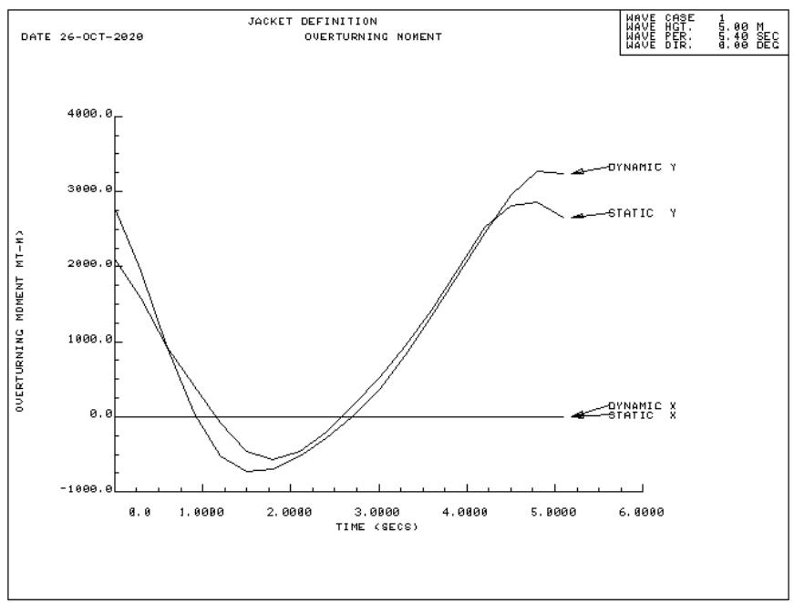

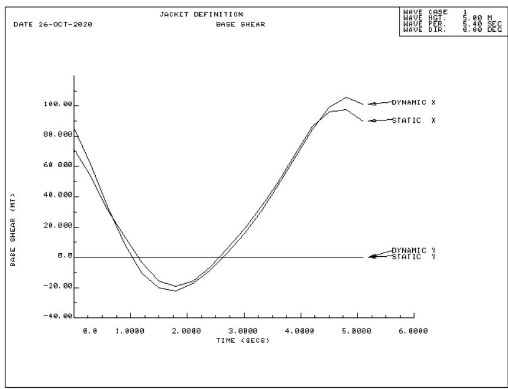

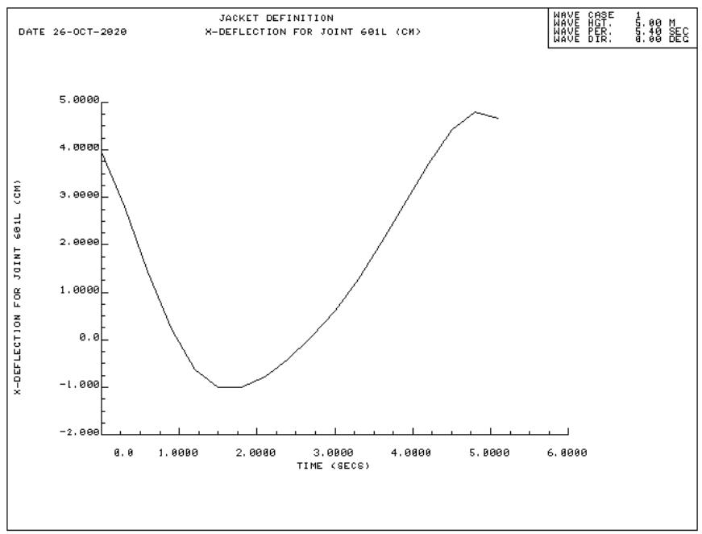

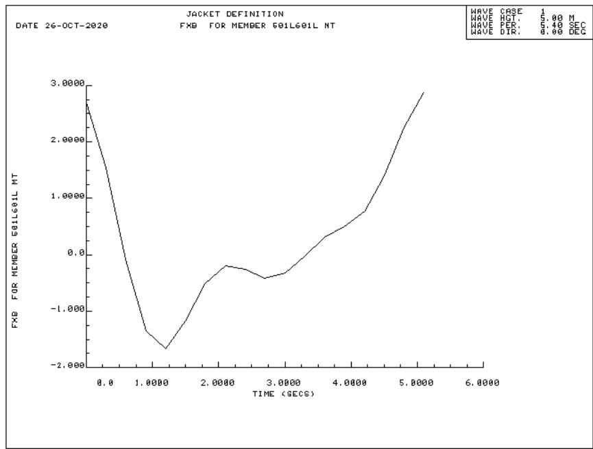

In addition to plots, the Wave Response program creates an output data file the equivalent static load cases. In this sample, the first load case contains equivalent static loads for the 0 degree wave and current, while load case 2 contains the equivalent static loads for the 90 degree wave and current. This data file can be solved automatically as part of the Wave Response analysis using the SACS Executive or may be solved as a separate analysis step.

A portion of the sample problem output is shown on the following pages. Note that during the iteration process, messages show how the iteration process is proceeding. For example, after a particular pass, the

comparison between generalized forces computed from the previous iteration are compared with those from the current pass. An error parameter is listed showing the results of the generalized force comparison for each mode along with an error level for the sum of all the modes. One or more of the modes will typically exhibit error levels higher than either the total iteration error or the allowed error. This is normally due to the fact that these modes have little or no response and a large error between iterations is not significant.

The output also shows the response of mode 1 for the entire wave cycle including the modal displacement, generalized force, and generalized velocity versus time. This type of report is generated for each mode for all the wave cases. The Wave Response program reports the dynamic and the static overturning moment and base shear versus time. This output may be used to determine the Dynamic Amplification Factor by dividing the maximum value of dynamic by the maximum static respective value.

Note: The maximum dynamic overturing moment, or base shear will more than likely not occur at the same time point as the maximum sta


| **** SUMMATION OF FLUID FORCES **** | **** SUMMATION OF FLUID FORCES **** | **** SUMMATION OF FLUID FORCES **** | **** SUMMATION OF FLUID FORCES **** | **** SUMMATION OF FLUID FORCES **** | **** SUMMATION OF FLUID FORCES **** |
| --- | --- | --- | --- | --- | --- |
| POINT | TIME | PHASE | XXXXXX | FORCES | XXXXXXXX |
|  | SECS | DEGS | X | Y | Z |
|  |  |  | MT | MT | MT |
| 1 | 0.00 | 0.00 | 61.48 | -0.00 | -4.60 |
| 2 | 0.30 | 20.00 | 46.17 | -0.00 | -3.71 |
| 3 | 0.60 | 40.00 | 27.18 | 0.00 | -2.26 |
| 4 | 0.90 | 60.00 | 11.60 | 0.00 | -3.16 |
| 5 | 1.20 | 80.00 | -2.55 | 0.00 | -3.51 |
| 6 | 1.50 | 100.00 | -13.20 | 0.00 | -1.89 |
| 7 | 1.80 | 120.00 | -16.36 | -0.00 | -0.97 |
| 8 | 2.10 | 140.00 | -13.45 | -0.00 | -0.01 |
| 9 | 2.40 | 160.00 | -5.87 | -0.01 | 0.91 |
| 10 | 2.70 | 180.00 | 4.64 | -0.00 | 1.64 |
| 11 | 3.00 | 200.00 | 16.26 | -0.00 | 2.28 |
| 12 | 3.30 | 220.00 | 28.82 | -0.00 | 2.90 |
| 13 | 3.60 | 240.00 | 43.25 | -0.00 | 3.59 |
| 14 | 3.90 | 260.00 | 58.58 | -0.01 | 4.24 |
| 15 | 4.20 | 280.00 | 74.25 | -0.01 | 4.77 |
| 16 | 4.50 | 300.00 | 82.18 | -0.00 | 3.71 |
| 17 | 4.80 | 320.00 | 83.32 | 0.00 | 1.26 |
| 18 | 5.10 | 340.00 | 77.30 | -0.00 | -2.39 |
| ********** REACTION SUMMARY FOR ITERATION 0 ***XXXXXXXXXXXXXXXX*** | ********** REACTION SUMMARY FOR ITERATION 0 ***XXXXXXXXXXXXXXXX*** | ********** REACTION SUMMARY FOR ITERATION 0 ***XXXXXXXXXXXXXXXX*** | ********** REACTION SUMMARY FOR ITERATION 0 ***XXXXXXXXXXXXXXXX*** | ********** REACTION SUMMARY FOR ITERATION 0 ***XXXXXXXXXXXXXXXX*** | ********** REACTION SUMMARY FOR ITERATION 0 ***XXXXXXXXXXXXXXXX*** |
| Moment X = 9.03 MT-M AT TIME = 5.100 SECS AND PHASE ANGLE = 340.00 DEGS | Moment X = 9.03 MT-M AT TIME = 5.100 SECS AND PHASE ANGLE = 340.00 DEGS | Moment X = 9.03 MT-M AT TIME = 5.100 SECS AND PHASE ANGLE = 340.00 DEGS | Moment X = 9.03 MT-M AT TIME = 5.100 SECS AND PHASE ANGLE = 340.00 DEGS | Moment X = 9.03 MT-M AT TIME = 5.100 SECS AND PHASE ANGLE = 340.00 DEGS | Moment X = 9.03 MT-M AT TIME = 5.100 SECS AND PHASE ANGLE = 340.00 DEGS |
| Y = 2065.55 MT-M AT TIME = 4.500 SECS AND PHASE ANGLE = 300.00 DEGS | Y = 2065.55 MT-M AT TIME = 4.500 SECS AND PHASE ANGLE = 300.00 DEGS | Y = 2065.55 MT-M AT TIME = 4.500 SECS AND PHASE ANGLE = 300.00 DEGS | Y = 2065.55 MT-M AT TIME = 4.500 SECS AND PHASE ANGLE = 300.00 DEGS | Y = 2065.55 MT-M AT TIME = 4.500 SECS AND PHASE ANGLE = 300.00 DEGS | Y = 2065.55 MT-M AT TIME = 4.500 SECS AND PHASE ANGLE = 300.00 DEGS |
| Z = -1.00 MT-M AT TIME = 3.300 SECS AND PHASE ANGLE = 220.00 DEGS | Z = -1.00 MT-M AT TIME = 3.300 SECS AND PHASE ANGLE = 220.00 DEGS | Z = -1.00 MT-M AT TIME = 3.300 SECS AND PHASE ANGLE = 220.00 DEGS | Z = -1.00 MT-M AT TIME = 3.300 SECS AND PHASE ANGLE = 220.00 DEGS | Z = -1.00 MT-M AT TIME = 3.300 SECS AND PHASE ANGLE = 220.00 DEGS | Z = -1.00 MT-M AT TIME = 3.300 SECS AND PHASE ANGLE = 220.00 DEGS |
| SHEAR X = -105.06 MT AT TIME = 4.800 SECS AND PHASE ANGLE = 320.00 DEGS | SHEAR X = -105.06 MT AT TIME = 4.800 SECS AND PHASE ANGLE = 320.00 DEGS | SHEAR X = -105.06 MT AT TIME = 4.800 SECS AND PHASE ANGLE = 320.00 DEGS | SHEAR X = -105.06 MT AT TIME = 4.800 SECS AND PHASE ANGLE = 320.00 DEGS | SHEAR X = -105.06 MT AT TIME = 4.800 SECS AND PHASE ANGLE = 320.00 DEGS | SHEAR X = -105.06 MT AT TIME = 4.800 SECS AND PHASE ANGLE = 320.00 DEGS |
| Y = 0.17 MT AT TIME = 5.100 SECS AND PHASE ANGLE = 340.00 DEGS | Y = 0.17 MT AT TIME = 5.100 SECS AND PHASE ANGLE = 340.00 DEGS | Y = 0.17 MT AT TIME = 5.100 SECS AND PHASE ANGLE = 340.00 DEGS | Y = 0.17 MT AT TIME = 5.100 SECS AND PHASE ANGLE = 340.00 DEGS | Y = 0.17 MT AT TIME = 5.100 SECS AND PHASE ANGLE = 340.00 DEGS | Y = 0.17 MT AT TIME = 5.100 SECS AND PHASE ANGLE = 340.00 DEGS |
| Z = -8.03 MT AT TIME = 4.500 SECS AND PHASE ANGLE = 300.00 DEGS | Z = -8.03 MT AT TIME = 4.500 SECS AND PHASE ANGLE = 300.00 DEGS | Z = -8.03 MT AT TIME = 4.500 SECS AND PHASE ANGLE = 300.00 DEGS | Z = -8.03 MT AT TIME = 4.500 SECS AND PHASE ANGLE = 300.00 DEGS | Z = -8.03 MT AT TIME = 4.500 SECS AND PHASE ANGLE = 300.00 DEGS | Z = -8.03 MT AT TIME = 4.500 SECS AND PHASE ANGLE = 300.00 DEGS |
| **** MAXIMUM Modal Responses FOR ITERATION 0 **** | **** MAXIMUM Modal Responses FOR ITERATION 0 **** | **** MAXIMUM Modal Responses FOR ITERATION 0 **** | **** MAXIMUM Modal Responses FOR ITERATION 0 **** | **** MAXIMUM Modal Responses FOR ITERATION 0 **** | **** MAXIMUM Modal Responses FOR ITERATION 0 **** |
| MODE | RESPONSECM | TIMESECS |  |  |  |
| 1 | 7.016 | 4.800 |  |  |  |
| 2 | -0.150 | 4.800 |  |  |  |
| 3 | -0.019 | 4.200 |  |  |  |
| 4 | 2.393 | 4.500 |  |  |  |
| 5 | 0.070 | 4.800 |  |  |  |
| 6 | 0.093 | 4.800 |  |  |  |
|  | 7 | 0.040 | 4.800 |  |  |
|  | 8 | 0.013 | 4.500 |  |  |
|  | 9 | -0.170 | 4.500 |  |  |
|  | 10 | -0.157 | 4.500 |  |  |
|  | 11 | 0.112 | 0.600 |  |  |
|  | 12 | 0.046 | 4.500 |  |  |
|  | 13 | 0.038 | 4.500 |  |  |
|  | 14 | 0.021 | 4.500 |  |  |
|  | 15 | -0.023 | 3.900 |  |  |
| ITERATION 1 *** TOTAL RMS DIFFERENCE = 2.818 PERCENT ALLOWABLE DIFFERENCE = 1.000 PERCENT | ITERATION 1 *** TOTAL RMS DIFFERENCE = 2.818 PERCENT ALLOWABLE DIFFERENCE = 1.000 PERCENT | ITERATION 1 *** TOTAL RMS DIFFERENCE = 2.818 PERCENT ALLOWABLE DIFFERENCE = 1.000 PERCENT | ITERATION 1 *** TOTAL RMS DIFFERENCE = 2.818 PERCENT ALLOWABLE DIFFERENCE = 1.000 PERCENT | ITERATION 1 *** TOTAL RMS DIFFERENCE = 2.818 PERCENT ALLOWABLE DIFFERENCE = 1.000 PERCENT | ITERATION 1 *** TOTAL RMS DIFFERENCE = 2.818 PERCENT ALLOWABLE DIFFERENCE = 1.000 PERCENT |


| STEP | TIME (SECS) | PHASE (DEG) | MOMENT (X) MT-M | MOMENT (Y) MT-M | SHEAR (X) MT | SHEAR (Y) MT | MOMENT (X) MT-M | MOMENT (Y) MT-M | SHEAR (X) MT | SHEAR (Y) MT |
| --- | --- | --- | --- | --- | --- | --- | --- | --- | --- | --- |
| 1 | 0.00 | 0.00 | 0.5 | 2781.1 | 85.41 | -0.12 | 0.0 | 2096.7 | 71.31 | -0.12 |
| 2 | 0.30 | 20.00 | 0.1 | 1936.8 | 61.06 | -0.10 | -0.3 | 1580.8 | 53.42 | -0.10 |
| 3 | 0.60 | 40.00 | -1.1 | 931.4 | 33.36 | -0.05 | -0.4 | 932.0 | 31.24 | -0.06 |
| 4 | 0.90 | 60.00 | -1.5 | 40.9 | 7.94 | -0.02 | -0.7 | 402.6 | 13.11 | -0.04 |
| 5 | 1.20 | 80.00 | -0.6 | -526.3 | -10.66 | -0.01 | -0.6 | -84.5 | -3.29 | -0.01 |
| 6 | 1.50 | 100.00 | 1.1 | -733.4 | -20.44 | 0.01 | -0.3 | -456.6 | -15.57 | 0.03 |
| 7 | 1.80 | 120.00 | 1.9 | -691.7 | -22.06 | 0.01 | 0.1 | -564.9 | -19.03 | 0.04 |
| 8 | 2.10 | 140.00 | 0.7 | -519.7 | -17.30 | 0.03 | 0.3 | -467.2 | -15.52 | 0.05 |
| 9 | 2.40 | 160.00 | -1.0 | -288.3 | -8.41 | 0.06 | 0.7 | -211.3 | -6.64 | 0.03 |
| 10 | 2.70 | 180.00 | -1.4 | -2.0 | 2.79 | 0.06 | 0.7 | 138.1 | 5.46 | 0.03 |
| 11 | 3.00 | 200.00 | 0.1 | 365.1 | 15.64 | 0.04 | 1.1 | 521.6 | 18.76 | 0.02 |
| 12 | 3.30 | 220.00 | 2.3 | 816.7 | 30.34 | -0.01 | 1.2 | 940.6 | 33.22 | 0.01 |
| 13 | 3.60 | 240.00 | 3.3 | 1338.3 | 47.39 | -0.06 | 1.4 | 1427.0 | 49.87 | -0.02 |
| 14 | 3.90 | 260.00 | 2.4 | 1891.5 | 66.14 | -0.08 | 1.3 | 1959.1 | 67.89 | -0.06 |
| 15 | 4.20 | 280.00 | 0.5 | 2450.2 | 84.57 | -0.11 | 0.8 | 2523.2 | 86.70 | -0.11 |
| 16 | 4.50 | 300.00 | -0.8 | 2958.5 | 99.25 | -0.14 | 0.3 | 2812.6 | 96.29 | -0.15 |
| 17 | 4.80 | 320.00 | -0.9 | 3272.8 | 105.71 | -0.16 | -0.3 | 2867.2 | 97.76 | -0.18 |
| 18 | 5.10 | 340.00 | -0.3 | 3243.7 | 101.15 | -0.18 | -0.4 | 2657.8 | 90.29 | -0.18 |
| * WAVE CASE 1* WAVE HEIGHT = 5.00 M WAVE PERIOD = 5.40 SECS WAVE DIRECTION = 0.00 DEGREES | * WAVE CASE 1* WAVE HEIGHT = 5.00 M WAVE PERIOD = 5.40 SECS WAVE DIRECTION = 0.00 DEGREES | * WAVE CASE 1* WAVE HEIGHT = 5.00 M WAVE PERIOD = 5.40 SECS WAVE DIRECTION = 0.00 DEGREES | * WAVE CASE 1* WAVE HEIGHT = 5.00 M WAVE PERIOD = 5.40 SECS WAVE DIRECTION = 0.00 DEGREES | * WAVE CASE 1* WAVE HEIGHT = 5.00 M WAVE PERIOD = 5.40 SECS WAVE DIRECTION = 0.00 DEGREES | * WAVE CASE 1* WAVE HEIGHT = 5.00 M WAVE PERIOD = 5.40 SECS WAVE DIRECTION = 0.00 DEGREES | * WAVE CASE 1* WAVE HEIGHT = 5.00 M WAVE PERIOD = 5.40 SECS WAVE DIRECTION = 0.00 DEGREES | * WAVE CASE 1* WAVE HEIGHT = 5.00 M WAVE PERIOD = 5.40 SECS WAVE DIRECTION = 0.00 DEGREES | * WAVE CASE 1* WAVE HEIGHT = 5.00 M WAVE PERIOD = 5.40 SECS WAVE DIRECTION = 0.00 DEGREES | * WAVE CASE 1* WAVE HEIGHT = 5.00 M WAVE PERIOD = 5.40 SECS WAVE DIRECTION = 0.00 DEGREES | * WAVE CASE 1* WAVE HEIGHT = 5.00 M WAVE PERIOD = 5.40 SECS WAVE DIRECTION = 0.00 DEGREES |
| *** MUDLINE MOMENTS AND SHEARS *** | *** MUDLINE MOMENTS AND SHEARS *** | *** MUDLINE MOMENTS AND SHEARS *** | *** MUDLINE MOMENTS AND SHEARS *** | *** MUDLINE MOMENTS AND SHEARS *** | *** MUDLINE MOMENTS AND SHEARS *** | *** MUDLINE MOMENTS AND SHEARS *** | *** MUDLINE MOMENTS AND SHEARS *** | *** MUDLINE MOMENTS AND SHEARS *** | *** MUDLINE MOMENTS AND SHEARS *** | *** MUDLINE MOMENTS AND SHEARS *** |
| STEP | TIME (SECS) | PHASE (DEG) | MOMENT (X) MT-M | MOMENT (Y) MT-M | BASE MOMENT MT-M | SHEAR (X) MT | SHEAR (Y) MT | BASE SHEAR MT |  |  |
| 1 | 0.00 | 0.00 | 0.5 | 2781.1 | 2781.1 | 85.41 | -0.12 | 85.41 |  |  |
| 2 | 0.30 | 20.00 | 0.1 | 1936.8 | 1936.8 | 61.06 | -0.10 | 61.06 |  |  |
| 3 | 0.60 | 40.00 | -1.1 | 931.4 | 931.4 | 33.36 | -0.05 | 33.36 |  |  |
| 4 | 0.90 | 60.00 | -1.5 | 40.9 | 41.0 | 7.94 | -0.02 | 7.94 |  |  |
| 5 | 1.20 | 80.00 | -0.6 | -526.3 | 526.3 | -10.66 | -0.01 | 10.66 |  |  |
| 6 | 1.50 | 100.00 | 1.1 | -733.4 | 733.4 | -20.44 | 0.01 | 20.44 |  |  |
| 7 | 1.80 | 120.00 | 1.9 | -691.7 | 691.7 | -22.06 | 0.01 | 22.06 |  |  |
| 8 | 2.10 | 140.00 | 0.7 | -519.7 | 519.7 | -17.30 | 0.03 | 17.30 |  |  |
| 9 | 2.40 | 160.00 | -1.0 | -288.3 | 288.3 | -8.41 | 0.06 | 8.41 |  |  |
| 10 | 2.70 | 180.00 | -1.4 | -2.0 | 2.4 | 2.79 | 0.06 | 2.79 |  |  |
| 11 | 3.00 | 200.00 | 0.1 | 365.1 | 365.1 | 15.64 | 0.04 | 15.64 |  |  |
| 12 | 3.30 | 220.00 | 2.3 | 816.7 | 816.7 | 30.34 | -0.01 | 30.34 |  |  |
| 13 | 3.60 | 240.00 | 3.3 | 1338.3 | 1338.3 | 47.39 | -0.06 | 47.39 |  |  |
| 14 | 3.90 | 260.00 | 2.4 | 1891.5 | 1891.5 | 66.14 | -0.08 | 66.14 |  |  |
| 15 | 4.20 | 280.00 | 0.5 | 2450.2 | 2450.2 | 84.57 | -0.11 | 84.57 |  |  |
| 16 | 4.50 | 300.00 | -0.8 | 2958.5 | 2958.5 | 99.25 | -0.14 | 99.25 |  |  |
| 17 | 4.80 | 320.00 | -0.9 | 3272.8 | 3272.8 | 105.71 | -0.16 | 105.71 |  |  |
| 18 | 5.10 | 340.00 | -0.3 | 3243.7 | 3243.7 | 101.15 | -0.18 | 101.15 |  |  |
| **** MAXIMUM MOMENT AND SHEAR REPORT **** | **** MAXIMUM MOMENT AND SHEAR REPORT **** | **** MAXIMUM MOMENT AND SHEAR REPORT **** | **** MAXIMUM MOMENT AND SHEAR REPORT **** | **** MAXIMUM MOMENT AND SHEAR REPORT **** | **** MAXIMUM MOMENT AND SHEAR REPORT **** | **** MAXIMUM MOMENT AND SHEAR REPORT **** | **** MAXIMUM MOMENT AND SHEAR REPORT **** | **** MAXIMUM MOMENT AND SHEAR REPORT **** | **** MAXIMUM MOMENT AND SHEAR REPORT **** | **** MAXIMUM MOMENT AND SHEAR REPORT **** |
| MAXIMUM MOMENT AT TIME PHASE MAXIMUM SHEAR AT TIME PHASE MINIMUM MOMENT AT TIME PHASE MINIMUM SHEAR AT TIME PHASE **** EQUIVALENT STATIC LOAD SUMMATIONS **** | MAXIMUM MOMENT AT TIME PHASE MAXIMUM SHEAR AT TIME PHASE MINIMUM MOMENT AT TIME PHASE MINIMUM SHEAR AT TIME PHASE **** EQUIVALENT STATIC LOAD SUMMATIONS **** | MAXIMUM MOMENT AT TIME PHASE MAXIMUM SHEAR AT TIME PHASE MINIMUM MOMENT AT TIME PHASE MINIMUM SHEAR AT TIME PHASE **** EQUIVALENT STATIC LOAD SUMMATIONS **** | MAXIMUM MOMENT AT TIME PHASE MAXIMUM SHEAR AT TIME PHASE MINIMUM MOMENT AT TIME PHASE MINIMUM SHEAR AT TIME PHASE **** EQUIVALENT STATIC LOAD SUMMATIONS **** | MAXIMUM MOMENT AT TIME PHASE MAXIMUM SHEAR AT TIME PHASE MINIMUM MOMENT AT TIME PHASE MINIMUM SHEAR AT TIME PHASE **** EQUIVALENT STATIC LOAD SUMMATIONS **** | MAXIMUM MOMENT AT TIME PHASE MAXIMUM SHEAR AT TIME PHASE MINIMUM MOMENT AT TIME PHASE MINIMUM SHEAR AT TIME PHASE **** EQUIVALENT STATIC LOAD SUMMATIONS **** | MAXIMUM MOMENT AT TIME PHASE MAXIMUM SHEAR AT TIME PHASE MINIMUM MOMENT AT TIME PHASE MINIMUM SHEAR AT TIME PHASE **** EQUIVALENT STATIC LOAD SUMMATIONS **** | MAXIMUM MOMENT AT TIME PHASE MAXIMUM SHEAR AT TIME PHASE MINIMUM MOMENT AT TIME PHASE MINIMUM SHEAR AT TIME PHASE **** EQUIVALENT STATIC LOAD SUMMATIONS **** | MAXIMUM MOMENT AT TIME PHASE MAXIMUM SHEAR AT TIME PHASE MINIMUM MOMENT AT TIME PHASE MINIMUM SHEAR AT TIME PHASE **** EQUIVALENT STATIC LOAD SUMMATIONS **** | MAXIMUM MOMENT AT TIME PHASE MAXIMUM SHEAR AT TIME PHASE MINIMUM MOMENT AT TIME PHASE MINIMUM SHEAR AT TIME PHASE **** EQUIVALENT STATIC LOAD SUMMATIONS **** | MAXIMUM MOMENT AT TIME PHASE MAXIMUM SHEAR AT TIME PHASE MINIMUM MOMENT AT TIME PHASE MINIMUM SHEAR AT TIME PHASE **** EQUIVALENT STATIC LOAD SUMMATIONS **** |
| ********** INERTIA********** | ********** INERTIA********** | ********** INERTIA********** | ********** INERTIA********** | ********** INERTIA********** | ********** INERTIA********** | ********** INERTIA********** | ********** INERTIA********** | ********** INERTIA********** | ********** INERTIA********** | ********** INERTIA********** |
| LOAD CASE 1 | FX KG 77.0 | FY KG 0.1 | FZ KG 3.0 | FX FG 814.8 | FY FG 0.0 | FZ KG 12.2 | FX FG 0.0 | FY FG 0.0 | FZ KG 0.0 | FZ KG 0.0 |


## 4.4 SAMPLE PROBLEM 4 – RANDON WAVE ANALYSIS

Sample Problem 4 illustrates the random wave analysis capabilities using a wave spectrum to define the wave properties. The statistical properties of the environment were defined using a Pierson-Moskowitz wave spectrum.

Note: When using an input spectrum instead of a random surface profile, the Wave Response program internally generates the time history of the surface profile that will have a spectrum corresponding to the parameters of the input spectrum. Since the Fourier series components are the desired Airy wave components and are taken directly from the input wave spectrum, it is unnecessary for the user to generate the surface profile manually.

The Seastate program is used to generate the hydrodynamic properties of each of the members in the model. Additionally, a dummy reference wave that will wet the parts of the structure that will be wetted during any time of the random wave analysis is used by the Seastate to create the member load segmentation.

Note: The Wave Response program calculates the water particle velocities from the Airy wave components. Therefore, the actual wave specified in the Seastate input file is of little importance as long as it provides an accurate representation of the wetted surface.

The dummy wave and hydrodynamic data was specified by the user in a Seastate input file as shown below. A detailed description of each of the applicable input lines ensues.

```txt
1 1 2 3 4 5 6 7 8   
1234567890123456789012345678901234567890123456789012345678901234567890   
1\* Extreme Wave Deterministic Analysis   
2 LDOPT +Z 1.03 7.85 -50.00 50.00 ME DYN NPNP   
3 FILE S
# 4 CDM
5 CDM AP
6 MGROV
7 MGROV 0.000 10.00 2.500   
8 MGROV 10.000 45.000 5.000   
9 GRPOV
10 GRPOV BL1 F 0.001 5.0 5.0 3.0 3.0 F   
11 GRPOV BL2 F 0.001 3.0 3.0 2.0 2.0 F   
12 \*\*\*\*\*\*\*\*\*\*\*\*\*\*\*\*\*\*\*\*\*\*\*\*\*\*\*\*\*\*\*\*\*\*\*\*\*\*\*\*\*\*\*\*\*\*\*\*\*\*\*\*\*\*\*\*\*\*\*\*\*\*\*\*\*\*\*\*\*\*\*\*\*\*\*\*\*\*\*\*\*\*\*\*\*\*\*\*\*\*\*\*\*\*\*\*\*\*\*\*\.
13 GRPOV PL4NN 0.001 0.001 0.001   
14 GRPOV W.BN 0.010 0.001 0.001 0.001   
15 LOAD
16 LOADCN 1
17 WAVE
18 WAVE1.00AIRY 6.00 8.0 D 20.00 18MS10 1   
19 CURR
20 END
```

The following describes the input lines in the Seastate input file used for Sample Problem 4

2. The LDOPT line specifies the Seastate options. The ‘DYN’ option in columns 56-58 designates that Seastate is to be used for dynamic modeling and wave data generation only.   
3. The FILE line designates that the model data and Seastate data are specified in separate files. The ‘S’ option specifies that only loading data in the Seastate input file is to be considered.   
18. The dummy wave is specified on the WAVE line of load case 1 as follows:

a. The wave type, height and period are designated in columns 9-12, 14-18 and 25-30, respectively.   
b. The wave direction is 0.00 degrees as input in columns 39-44.   
c. The wave is to be positioned so that the crest is at the center of the structure as designated by ‘1’ in column 68.

Note: The number of crest position steps is of little importance. Typically, positioning the crest at the center of the structure ensures both sufficient wetted surface and the maximum number of member load segments.

The following is the Wave Response input file used to generate the equivalent static loading, response plots and the response file used by the Probability program. One load case corresponding to the time point yielding the maximum base shear was created. A detailed description of each of the applicable input lines ensues.

```csv
1 2 3 4 5 6 7 8  
1234567890123456789012345678901234567890123456789012345678901234567890  
WROPT MEPSL MAXSES 15 -1 RW  
PSEL SPBGFB JO MF OM BS  
PSJO 601LDX601LDY601LVX601LVV602LDX602LDY602LVX602LVY  
PSMF 501L601LFXB502L602LFXB A A A A  
DAMP 3.0  
WAVTIM +Z 50. -50. 0.5 1.0 1 1 2  
WSPEC PM 4.0 8.0 64.0  
CURR  
CURR 50.0 1.0 0.0 
```

The following describes the input lines in the Wave Response input file used for Sample Problem 4:

1. The WROPT line specifies the Wave Response options as follows:

a. Metric kilonewton force units are to be used.   
b. Plots are to be generated as stipulated by ‘PSL’ in columns 10-12.   
c. Fifteen modes are to be considered as designated by ‘15’ in columns 44-45.   
d. A single pass analysis (no iterations) is to be performed as designated by ‘-1’ in columns 49-50.   
e. A load case is to be created for the time point yielding the maximum base shear as stipulated by ‘MAXS’ in columns 15-18.   
f. ‘ES’ in columns 19-20 designates that equivalent static loads representing static and inertia loads are to be generated.   
g. A random wave analysis is to be executed by ‘RW’ in columns 68-69.

2. Plots and response data are requested using the PSEL line as follows:

a. The wave surface profile and generalized forces are to be plotted and saved to a data file for use by the Probability program as designated by ‘SPB’ and ‘GFB’ in columns 7-9 and 10-12, respectively.

b. Joint displacement, member forces, overturning moment and base shear plots are requested by ‘JO’, ‘MF’, ‘OM’ and ‘BS’.

3. The joints and the degree of freedom to be plotted are specified on the PSJO line.   
4. Member axial force at the end of members 501-601 and 507-607 are to be plotted as stipulated on the PSMF input line.   
5. Three percent overall critical damping is to be used.   
6. Wave time and position parameters are entered on the WAVTIM line as follows:

a. The water depth and mudline elevation are specified in columns 11-16 and 17-22, respectively.   
b. The analysis time increment is input as 0.5 seconds.   
c. Standard Airy waves are used with wave kinematics calculated at the mean water line as designated by ‘1’ in column 59.   
d. Both Fast Fourier transformation options are selected by ‘1’ and ‘2’ in columns 61 and 67, respectively.

7. The wave height spectral density is defined using the WSPEC line as follows:

a. Pierson-Moskowitz spectrum is to be used as stipulated by ‘PM’.   
b. The significant wave height is 4.0 meters and the dominant period is 8.0 seconds.   
c. The time duration is to be 64.0 seconds as designated in columns 48-54.

8. The CURR lines are used to define the current with a linearly varying velocity of 0.0 at the mudline to 1.0 at the water surface (50.0 above the mudline).

Time history plots, equivalent static loading for the time point causing the maximum base shear and a response data file were generated as part of the analysis. The plot of the surface profile generated by the Wave Response program is shown below:

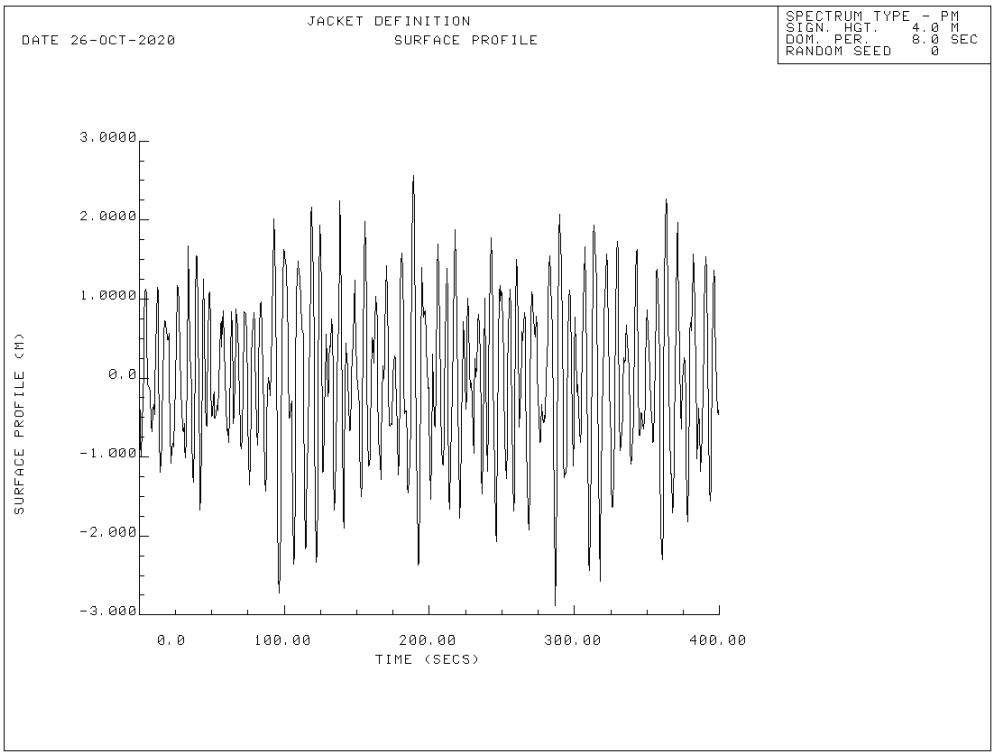

The comparison between the theoretical Pierson-Moskowitz spectrum and the spectrum of the surface profile generated by the Wave Response program follows:

Note: Notice the slight discrepancy between the theoretical and calculated wave spectra. This may occur when the time duration of the surface time history is not long enough to represent the statistical properties sufficiently.

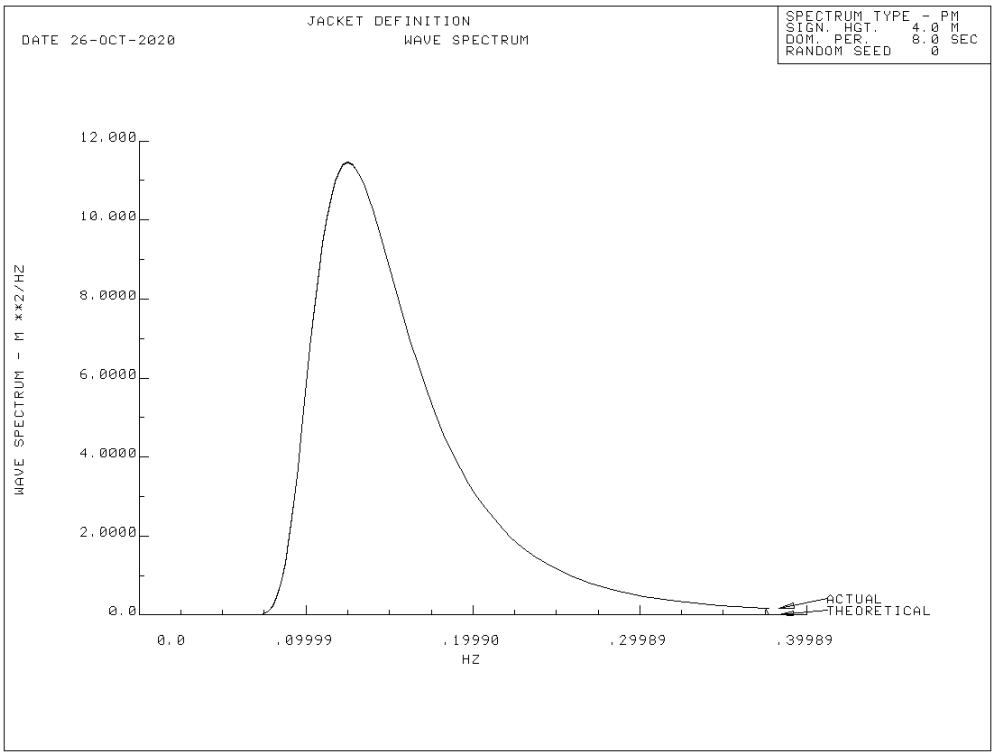

Additional time history plots including overturning moment, base shear, generalized forces and joint displacement were created and are shown below:

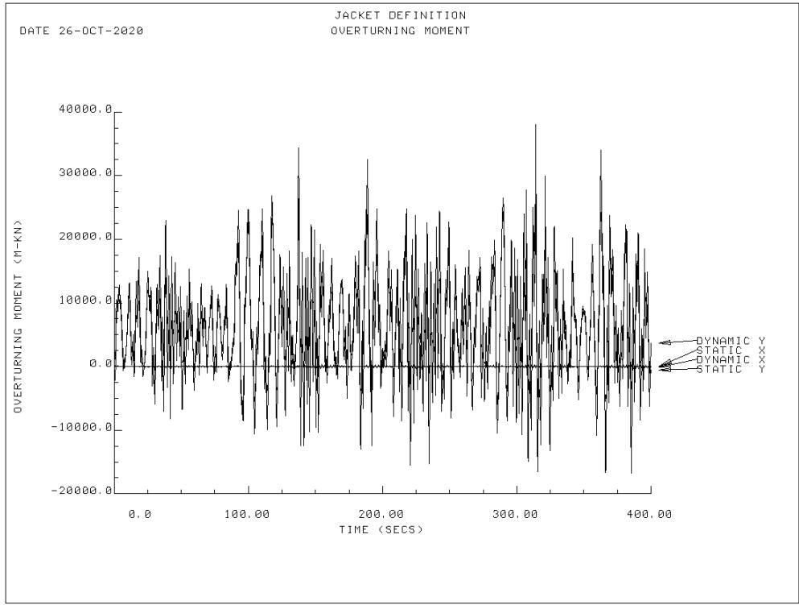

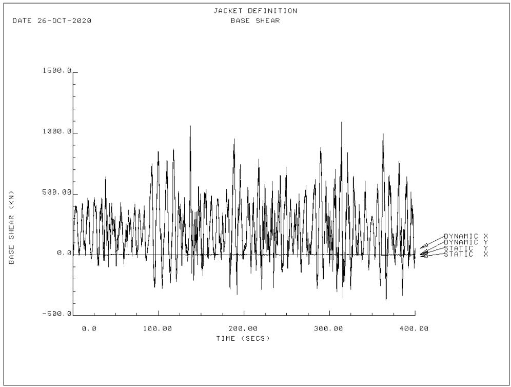

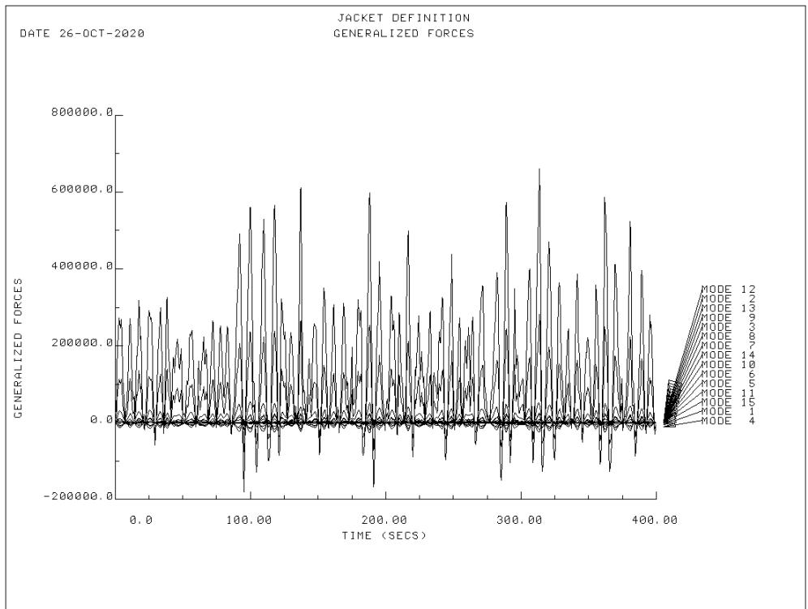

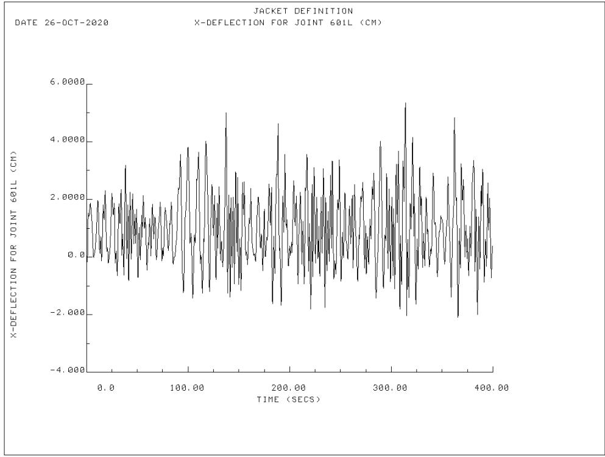

The equivalent static loading was saved to the output data file . The output data file contains the model and one load case containing the static and inertia loading corresponding to the time point causing the maximum base shear. The output data file may then be solved statically and combined with other static loading such as self weight, live load, etc. in order to perform code checks.

## 4.5 SAMPLE PROBLEM 5 – RANDOM WAVE ANALYSIS PLOT AND REPORT

Sample Problem 5 illustrates the random wave analysis surface profile plot and report capabilities. Surface profile plots are generated using a Ochi-Hubble wave spectrum to define the wave properties for 20 seeds using the time history integration approach.

The Seastate program is used to generate the hydrodynamic properties of each of the members in the model. Additionally, a dummy reference wave that will wet the parts of the structure that will be wetted during any time of the random wave analysis is used by the Seastate to create the member load segmentation.

Note: The Wave Response program calculates the water particle velocities from the Airy wave components. Therefore, the actual wave specified in the Seastate input file is of little importance as long as it provides an accurate representation of the wetted surface.

The dummy wave and hydrodynamic data was specified by the user in a Seastate input file as shown below. A detailed description of each of the applicable input lines ensues.

1 1 2 3 4 5 6 7 8   
123456789012345678901234567890123456789012345678901234567890   
1 \* Surface Profile Plots   
2 LDOPT +Z 1.03 7.85 -50.00 50.00 ME DYN NPNP   
3 FILE S
# 4 CDM
5 CDM AP
6 MGROV
7 MGROV 0.000 10.00 2.500   
8 MGROV 10.000 45.000 5.000   
9 GRPOV
10 GRPOV BL1 F 0.001 5.0 5.0 3.0 3.0 F   
11 GRPOV BL2 F 0.001 3.0 3.0 2.0 2.0 F   
12 $^{**} =$ More Group overrides   
13 GRPOV PL4NN 0.001 0.001 0.001   
14 GRPOV W.BN 0.010 0.001 0.001 0.001   
15 LOAD
16 LOADCN 1
17 WAVE
18 WAVE AIRY 22. 15. L 18 1MS 0   
19 CURR
20 END

The following describes the input lines in the Seastate input file used for Sample Problem 5:

2. The LDOPT line specifies the Seastate options. The ‘DYN’ option in columns 56-58 designates that Seastate is to be used for dynamic modeling and wave data generation only.   
3. The FILE line designates that the model data and Seastate data are specified in separate files. The ‘S’ option specifies that only loading data in the Seastate input file is to be considered.   
18. The dummy wave is specified on the WAVE line of load case 1 as follows:

a. The wave type, height and period are designated in columns 9-12, 14-18 and 25-30, respectively.   
b. The wave direction is 0.00 degrees as input in columns 39-44.

c. The wave is to be positioned so that the crest is at the center of the structure as designated by ‘1’ in column 68.

Note: The number of crest position steps is of little importance. Typically, positioning the crest at the center of the structure ensures both sufficient wetted surface and the maximum number of member load segments.

The following is the Wave Response input file used to generate the surface profile plots. A detailed description of each of the applicable input lines ensues.


|  | 1 | 2 | 3 | 4 | 5 | 6 | 7 | 8 |
| --- | --- | --- | --- | --- | --- | --- | --- | --- |
|  | 1234567890123456789012345678901234567890123456789012345678901234567890123456789012345678901234567890123456789 | JO MF OM BS |  |  |  |  |  |  |
| 1 | WROPT | PSL |  |  | 20 | -1 | TH |  |
| 2 | PSEL SP |  |  |  |  |  |  |  |
| 3 | DAMP | 2.0 |  |  |  |  |  |  |
| 4 | WAVTIM | +Z1402.0-1400.0.0 | 0.00 |  | 1.00 |  | VS 1 | 2 |
| 5 | WSPEC20 | 10OH 11.80 16.00 | 1.0 | 4.0 | 5.00 | 60. | SP 64.0 | 6.0 3.0 |
| 6 | CURR |  |  |  |  |  |  |  |
| 7 | CURR | 0.0 | 0.6 | 0.0 |  |  |  |  |
| 8 | CURR | 1150. | 0.6 |  |  |  |  |  |
| 9 | CURR | 1200. | 1.9 |  |  |  |  |  |
| 10 | CURR | 1390. | 1.9 |  |  |  |  |  |
| 11 | CURR | 1395. | 3.7 |  |  |  |  |  |
| 12 | CURR | 1400. | 3.7 |  |  |  |  |  |
| 13 | END |  |  |  |  |  |  |  |


The following describes the input lines in the Wave Response input file used for Sample Problem 5:

1. The WROPT line specifies the Wave Response options as follows:

a. Default units are to be used.   
b. Plots are to be generated as stipulated by ‘PSL’ in columns 10-12.   
c. Twenty modes are to be considered as designated by ‘20’ in columns 44-45.   
d. A single pass analysis (no iterations) is to be performed as designated by ‘-1’ in columns 49-50.   
e. Random wave analysis time history integration is be used by ‘TH’ in columns 68-69.

2. Surface profile plots requested by ‘SP’ in columns 7-9 on the PSEL line.   
3. Three percent overall critical damping is to be used.   
4. Wave time and position parameters are entered on the WAVTIM line as follows:

a. The water depth and mudline elevation are specified in columns 11-16 and 17-22, respectively.   
b. The analysis time increment is input as 1.0 seconds.   
c. Both Fast Fourier transformation options are selected by ‘1’ and ‘2’ in columns 61 and 67, respectively.

5. The wave height spectral density is defined using the WSPEC line as follows:

a. Ochi-Hubble spectrum is to be used as stipulated by ‘OH’.

b. Twenty sequential seeds starting with a value of 10 are to be used to generate wave surface profiles.   
c. Only surface profile plots are to be generated as designated by ‘SP’ in columns 57-58.   
d. The time duration is to be 60.0 seconds as designated in columns 48-54.   
F. The CURR lines are used to define the current.

Note: Current is ignored when generating surface profile plots.

The following are the surface profile plots for seeds 10 and 11.

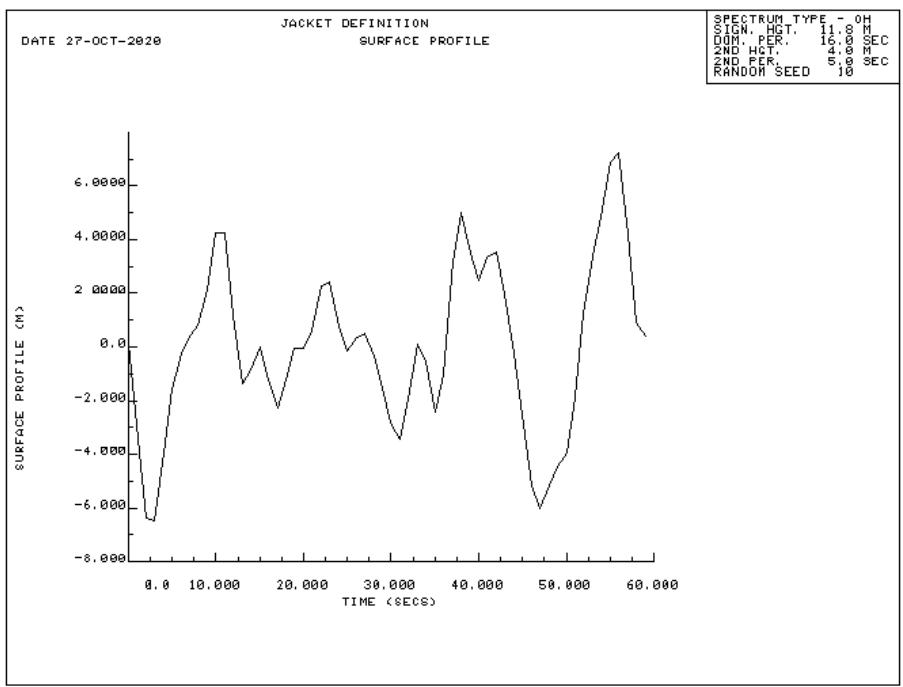

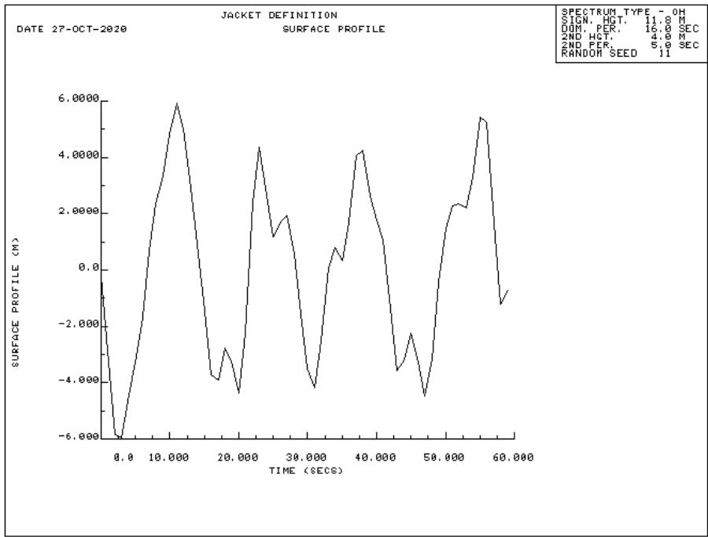

A portion of the output listing file including the surface profile statistics follows:

 WAVE RESPONSE PARAMETERS 

NO. JOINTS 204

NO. MEMBERS 401

NO. PLATES 0

NO. SHELLS 0

NO. SOLIDS 0

MAX. ITERATIONS -1

ITERATION CONVERGENCE ..... 1.00 PERCENT

FOURIER SERIES CONVERGENCE . 1.00 PERCENT

OUTPUT LOAD OPTION .........NO OUTPUT

WATER DEPTH 1402.0 M

MUDLINE ELEVATION .-1400.0 M

WAVE DIRECTION 0.00 DEGREES

WAVE INITIAL OFFSET 0.0 M

ANALYSIS TIME INCREMENT .... 1.000 SECONDS

WAVE KINEMATICS FACTOR ..... 1.000

FOURIER SERIES TOLERANCE ... 1.000 PERCENT

WAVE APPLICATION TYPE ......VERTICALLY STRETCHED

RANDOM WAVE ANALYSIS .......TIME HISTORY INTEGRATION

REL. VELOCITY EFFECTS ... INCLUDED

SPECTRAL WAVE SELECTION ....OCHI-HUBBLE

SIGNIFICANT WAVE HEIGHT .... 11.80 M

DOMINANT PERIOD 16.000 SECONDS

WIND SIGN. WAVE HEIGHT ... 4.00 M

WIND DOMINANT PERIOD 5.000 SECONDS

SWELL LAMDA 6.00000

WIND GENERATED LAMDA 3.00000

WAVE COMPONENT ENERGY BAND . 1.000 PERCENT

TIME HISTORY DURATION 60.00 SECONDS

NUMBER OF RANDOM SEEDS 20

SELECTED SEEDS 10 11 12 13 14

SELECTED SEEDS 15 16 17 18 19

SELECTED SEEDS 20 21 22 23 24

SELECTED SEEDS 25 26 27 28 29

CURRENT DIRECTION 0.00000 DEGREES

CURRENT STRETCHING .VERTICAL

CURRENT BLOCKING FACTOR ... 1.00000

CURRENT DESCRIPTION

ELEVATION VELOCITY(M ) (M /SECS)

## 0.000 0.000

## 0.010 0.600

## 1150.000 0.600

## 1200.000 1.900

## 1390.000 1.900

## 1395.000 3.700

## 1400.000 3.700

MAX. INTEGRATION TIME STEP.. 1.00000 SECS

MIN. INTEGRATION TIME STEP..0.00000092 SECS

INTEGRATION ERR. FACTOR .... 1.00000

TRANSIENT REDUCTION ON

*** WAVE PARAMETERS ***

NO. OF WAVE TIME POINTS ... 60

MAXIMUM CREST HEIGHT 6.48 M

AT TIME 58.00 SECS

MINIMUM TROUGH DEPTH -6.55 M

AT TIME 51.00 SECS

MAXIMUM WAVE HEIGHT 11.93 M

AT TIME 48.00 SECS

ZERO UPCROSSING PERIOD ..... 10.00 SECS

MEAN VALUE 0.00 M

STANDARD DEVIATION 3.11 M

SKEWNESS -0.0563

KURTOSIS 2.4398

RANDOM SEED 15

NO. PAIRS OF FOURIER SERIES. 6

NO. AIRY WAVES USED 6

******** AIRY WAVE PARAMETERS ********


| NO. | HEIGHT M | PERIOD SECS | LENGTH M | PHASE RAD. |
| --- | --- | --- | --- | --- |
| 1 | 3.44 | 20.00 | 624.80 | 1.715 |
| 2 | 7.20 | 15.00 | 351.45 | 1.755 |
| 3 | 2.40 | 12.00 | 224.92 | 2.656 |
| 4 | 2.00 | 5.45 | 46.47 | -1.743 |
| 5 | 1.61 | 4.62 | 33.27 | -2.382 |
| 6 | 1.26 | 3.75 | 21.97 | 1.767 |


| SEED NO. | SEED VALUE | * MAXIMUM WAVE * | * MAXIMUM WAVE * | ** MAX. CREST ** | ** MAX. CREST ** | ** MIN. TROUGH ** | ** MIN. TROUGH ** | ZERO UPCROSSING PERIOD | STANDARD |
| --- | --- | --- | --- | --- | --- | --- | --- | --- | --- |
| SEED NO. | SEED VALUE | HEIGHT | TIME | HEIGHT | TIME | HEIGHT | TIME | ZERO UPCROSSING PERIOD | STANDARD |
| DEVIATION |  | M | SECS | M | SECS | M | SECS | SECS |  |
| 1 | 10 | 11.02 | 42.50 | 7.26 | 56.00 | -6.50 | 3.00 | 8.57 | 3.11 |
| 2 | 11 | 10.28 | 15.50 | 5.90 | 11.00 | -5.97 | 3.00 | 15.00 | 3.11 |
| 3 | 12 | 12.56 | 17.00 | 6.58 | 14.00 | -5.98 | 20.00 | 12.00 | 3.11 |
| 4 | 13 | 10.75 | 12.50 | 5.74 | 0.00 | -5.61 | 53.00 | 15.00 | 3.11 |
| 5 | 14 | 12.36 | 48.00 | 6.58 | 59.00 | -6.28 | 52.00 | 12.00 | 3.11 |
| 6 | 15 | 11.93 | 48.00 | 6.48 | 58.00 | -6.55 | 51.00 | 10.00 | 3.11 |
| 7 | 16 | 14.64 | 45.00 | 7.24 | 41.00 | -7.40 | 49.00 | 10.00 | 3.11 |
| 8 | 17 | 12.84 | 50.50 | 7.38 | 54.00 | -5.46 | 47.00 | 12.00 | 3.11 |
| 9 | 18 | 13.79 | 14.50 | 7.02 | 11.00 | -6.78 | 18.00 | 12.00 | 3.11 |
| 10 | 19 | 11.60 | 35.00 | 6.12 | 31.00 | -6.27 | 6.00 | 12.00 | 3.11 |
| 11 | 20 | 13.39 | 46.00 | 7.51 | 42.00 | -5.88 | 50.00 | 12.00 | 3.11 |
| 12 | 21 | 11.27 | 34.00 | 5.32 | 38.00 | -5.95 | 30.00 | 15.00 | 3.11 |
| 13 | 22 | 12.84 | 24.50 | 6.73 | 29.00 | -6.11 | 20.00 | 12.00 | 3.11 |
| 14 | 23 | 11.96 | 13.50 | 7.17 | 2.00 | -6.32 | 10.00 | 12.00 | 3.11 |
| 15 | 24 | 14.03 | 7.00 | 6.85 | 3.00 | -7.18 | 11.00 | 12.00 | 3.11 |
| 16 | 25 | 12.37 | 9.00 | 6.47 | 6.00 | -6.11 | 0.00 | 12.00 | 3.11 |
| 17 | 26 | 13.86 | 11.00 | 7.31 | 7.00 | -8.26 | 0.00 | 12.00 | 3.11 |
| 18 | 27 | 10.98 | 49.00 | 6.47 | 53.00 | -7.80 | 0.00 | 12.00 | 3.11 |
| 19 | 28 | 10.78 | 31.00 | 6.00 | 52.00 | -7.66 | 0.00 | 12.00 | 3.11 |
| 20 | 29 | 12.20 | 11.50 | 7.46 | 7.00 | -6.97 | 0.00 | 12.00 | 3.11 |


## 4.6 SAMPLE PROBLEM 6 – TIME HISTORY REPONSE FILE

Sample Problem 6 uses time history integration to generate a response file used by the Global Loading program to select critical time points for numerous random wave seeds based on structural elevations designated by the user. It also demonstrates generating load cases at the critical time points by retrieving loads from the response file.

Modal coordinates, velocities and accelerations were generated for an Ochi-Hubble wave spectrum using seed values of 10, 20 and 21 and also including the effects of current. The time history integration approach was used with wave kinematics and fluid damping terms calculated at grid points in order to speed execution.

The Seastate program is used to generate the hydrodynamic properties of each of the members in the model. Additionally, a dummy reference wave that will wet the parts of the structure that will be wetted during any time of the random wave analysis is used by the Seastate to create the member load segmentation.

Note: The Wave Response program calculates the water particle velocities from the Airy wave components. Therefore, the actual wave specified in the Seastate input file is of little importance as long as it provides an accurate representation of the wetted surface.

The dummy wave and hydrodynamic data was specified by the user in a Seastate input file as shown below. A detailed description of each of the applicable input lines ensues.

1 1 2 3 4 5 6 7 8   
123456789012345678901234567890123456789012345678901234567890   
1 \* Surface Profile Plots   
2 LDOPT +Z 1.03 7.85 -50.00 50.00 ME DYN NPNP   
3 FILE S
# 4 CDM
# 5 CDM AP
# 6 MGROV
7 MGROV 0.000 10.00 2.500   
8 MGROV 10.000 45.000 5.000   
# 9 GRPOV
10 GRPOV BL1 F 0.001 5.0 5.0 3.0 3.0 F   
11 GRPOV BL2 F 0.001 3.0 3.0 2.0 2.0 F   
12 $^{ \text{不} }$ $^{ \text{不} }$ $^{ \text{不} }$ $^{ \text{不} }$ More Group overrides   
13 GRPOV PL4NN 0.001 0.001 0.001   
14 GRPOV W.BN 0.010 0.001 0.001 0.001   
15 DUMMY BOATLANDDUMMY STRUCTURE DATA   
16 KEEP 803 903 807 907   
17 DELETE 1803 1903 1807 1907   
# 18 LOAD
# 19 LOADCN 1
# 20 WAVE
21 WAVE AIRY 22. 15. L 18 1MS O   
# 22 CURR
# 23 END

The following describes the input lines in the Seastate input file used for Sample Problem 6:

2. The LDOPT line specifies the Seastate options. The ‘DYN’ option in columns 56-58 designates that Seastate is to be used for dynamic modeling and wave data generation only.   
3. The FILE line designates that the model data and Seastate data are specified in separate files. The ‘S’ option specifies that only loading data in the Seastate input file is to be considered.

18. The dummy wave is specified on the WAVE line of load case 1 as follows:

a. The wave type, height and period are designated in columns 9-12, 14-18 and 25-30, respectively.   
b. The wave direction is 0.00 degrees as input in columns 39-44.   
c. The wave is to be positioned so that the crest is at the center of the structure as designated by ‘1’ in column 68.

Note: The number of crest position steps is of little importance. Typically, positioning the crest at the center of the structure ensures both sufficient wetted surface and the maximum number of member load segments.

The analysis options, current data, and wave spectra are input in the Wave Response input file. The following is the Wave Response input file used to generate the response file to be used by the Global Loading module. A detailed description of each of the applicable input lines ensues.

```txt
1 1 2 3 4 5 6 7 8   
123456789012345678901234567890123456789012345678901234567890   
1 WROPT PSL 20 -1 TH   
2 PSEL SP MCBMVBMAB   
# 3 DAMP 2.0
4 WAVTIM +z1402.0-1400.0.0 0.00 1.00 VS 1 2   
5 WSPEC OH 11.80 16.00 1.0 4.0 5.00 60. 6.0 3.0   
6 THIST 5 10 1.0   
# 7 CURR
8 CURR 0.0 0.6 0.0   
9 CURR 1150. 0.6   
10 CURR 1200. 1.9   
11 CURR 1390. 1.9   
12 CURR 1395. 3.7   
13 CURR 1400. 3.7   
14 RNSEED 10.20.21.   
# 15 END
```

The following describes the input lines in the Wave Response input file used for Sample Problem 6:

1. The WROPT line specifies the Wave Response options as follows:

a. Default units are to be used.   
b. Plots are to be generated as stipulated by ‘PSL’ in columns 10-12.   
c. Twenty modes are to be considered as designated by ‘20’ in columns 44-45.   
d. A single pass analysis (no iterations) is to be performed as designated by ‘-1’ in columns 49-50.   
e. Random wave analysis time history integration using a grid is be used by ‘TG’ in columns 68- 69.

2. Plot and response file data is specified on the PSEL line.

a. Surface profile plots requested by ‘SP’ in columns 7-9.   
b. Modal coordinates, velocities and accelerations data is to be plotted and saved to the response file as designated by ‘MCB’, ‘MVB’ and ‘MAB’, respectively.

Note: Modal coordinates, velocities and accelerations must be saved to the response file in order to retrieve loads from the response file. This requires that the user specify these options unless the ‘GLOB’ load option is used This data is automatically saved to the response file when the ‘GLOB’ load option is used.

3. Two percent overall critical damping is to be used.   
4. Wave time and position parameters are entered on the WAVTIM line as follows:

a. The water depth and mudline elevation are specified in columns 11-16 and 17-22, respectively.   
b. The analysis time increment is input as 1.0 seconds.   
c. Both Fast Fourier transformation options are selected by ‘1’ and ‘2’ in columns 61 and 67, respectively.

5. The wave height spectral density is defined using the WSPEC line as follows:

a. Ochi-Hubble spectrum is to be used as stipulated by ‘OH’ in columns 11-12.   
b. The swell period and significant wave height are 16 and 11.8, respectively.   
c. The time duration is to be 60.0 seconds as designated in columns 48-54.

6. Wave kinematics are to be determined at 5 horizontal grid points and 10 vertical grid points rather than at each member segment end as input on the THIST line.   
7. The CURR lines are used to define the current.   
14. The seeds used to generate the surface profiles are 10, 20 and 21 as entered on the RNSEED line.

The response file generated is used by the Global Loading module to determine critical time points. Elevations 0.0, -50, -150, -250, -550, -800, -1050, -1200 and -1400 will be used to determine the critical positions based on maximum shear and moment. The Global loading input file along with a description follows:

```txt
1 2 3 4 5 6 7 8 1234567890123456789012345678901234567890123456789012345678901234567890123456789012345678901234567890123456789  
1 GLAOPT EC XY WAVRSP 1 1 0.0 YNYN 3 PLOT MY TIM 4 PLOT FX TIM 5 PLOT MY STA 6 PLOT FX STA 7 LOCATE 0.0 -50.0 -150.0 -250.0 -550.0 -800.0 -1050.0 -1200.0 -1399.9 END 
```

The following describes the input lines in the Global Loading input file:

1. The GLAOPT line specifies that the structure locations are in the XY plane by ‘XY’ in columns 13- 14.:   
2. The WAVRSP line is used to input response parameters and indicates the following:.

a. One response file is to be used as input as designated by ‘1’ in columns 7-9.

b. Only one wave approach direction, namely ‘0.0’ is to be considered.   
c. Critical time points will be determined by checking the elevations designated for maximum shear and maximum moment. Minimum moment and shear will not be considered.

3. Plots will be generated for moment about the Y axis and shear along the X axis versus time.   
5. Plots will be generated for moment about the Y axis and shear along the X axis versus station or elevation.   
7. The locations to be checked are input on the LOCATE line as 0, -50, -150, -250, -550, -800, -1050, - 1200 and -1399.9.

A portion of the output listing file including the time point selection data follows.

```txt
* GLOBAL LOADING ANALYSIS PARAMETERS *
LOAD SUMMATION TYPE INTERNAL  
NOMENCLATURE TYPE STANDARD  
PLANE SELECTED XY  
AXIS LOCATION - X 0.00 M  
AXIS LOCATION - Y 0.00 M  
NUMBER OF STATIONS 9  
NUMBER OF MEMBER GROUPS 38  
NUMBER OF PLATE GROUPS 0  
NUMBER OF JOINTS 204  
NUMBER OF MEMBERS 401  
NUMBER OF PLATES 0  
WAVE RESPONSE ANALYSIS ON  
NUMBER OF FILES 1  
TRANSIENT TIME 0.000 SECS
```


| ********** | ********** | ********** | ********** | ********** | ********** | ********** | ********** | ********** | ********** | ********** | ********** | ********** | ********** | ********** | ********** | ********** | ********** | ********** | ********** | ********** |  |
| --- | --- | --- | --- | --- | --- | --- | --- | --- | --- | --- | --- | --- | --- | --- | --- | --- | --- | --- | --- | --- | --- |
| STAT SEED | DIST M | MAXIMUM MOMENT MAXIMUM AND MINIMUM MOMENT AND SHEAR VALUES FOR ANGLE OF 0.00 DEGREES********** | MAXIMUM MOMENT MAXIMUM AND MINIMUM MOMENT AND SHEAR VALUES FOR ANGLE OF 0.00 DEGREES********** | MAXIMUM MOMENT MAXIMUM AND MINIMUM MOMENT AND SHEAR VALUES FOR ANGLE OF 0.00 DEGREES********** | MAXIMUM MOMENT MAXIMUM AND MINIMUM MOMENT AND SHEAR VALUES FOR ANGLE OF 0.00 DEGREES********** | MAXIMUM MOMENT MAXIMUM AND MINIMUM MOMENT AND SHEAR VALUES FOR ANGLE OF 0.00 DEGREES********** | MAXIMUM MOMENT MAXIMUM AND MINIMUM MOMENT AND SHEAR VALUES FOR ANGLE OF 0.00 DEGREES********** | MAXIMUM MOMENT MAXIMUM AND MINIMUM MOMENT AND SHEAR VALUES FOR ANGLE OF 0.00 DEGREES********** | MAXIMUM MOMENT MAXIMUM AND MINIMUM MOMENT AND SHEAR VALUES FOR ANGLE OF 0.00 DEGREES********** | MAXIMUM MOMENT MAXIMUM AND MINIMUM MOMENT AND SHEAR VALUES FOR ANGLE OF 0.00 DEGREES********** | MAXIMUM MOMENT MAXIMUM AND MINIMUM MOMENT AND SHEAR VALUES FOR ANGLE OF 0.00 DEGREES********** | MAXIMUM MOMENT MAXIMUM AND MINIMUM MOMENT AND SHEAR VALUES FOR ANGLE OF 0.00 DEGREES********** | MAXIMUM MOMENT MAXIMUM AND MINIMUM MOMENT AND SHEAR VALUES FOR ANGLE OF 0.00 DEGREES********** | MAXIMUM MOMENT MAXIMUM AND MINIMUM MOMENT AND SHEAR VALUES FOR ANGLE OF 0.00 DEGREES********** | MAXIMUM MOMENT MAXIMUM AND MINIMUM MOMENT AND SHEAR VALUES FOR ANGLE OF 0.00 DEGREES********** | MAXIMUM MOMENT MAXIMUM AND MINIMUM MOMENT AND SHEAR VALUES FOR ANGLE OF 0.00 DEGREES********** | MAXIMUM MOMENT MAXIMUM AND MINIMUM MOMENT AND SHEAR VALUES FOR ANGLE OF 0.00 DEGREES********** | MAXIMUM MOMENT MAXIMUM AND MINIMUM MOMENT AND SHEAR VALUES FOR ANGLE OF 0.00 DEGREES********** | MAXIMUM MOMENT MAXIMUM AND MINIMUM MOMENT AND SHEAR VALUES FOR ANGLE OF 0.00 DEGREES********** | MAXIMUM MOMENT MAXIMUM AND MINIMUM MOMENT AND SHEAR VALUES FOR ANGLE OF 0.00 DEGREES********** |  |
| STAT SEED | DIST M | MOMENT TIME | TIME RUN SEED SHERA TIME RUN SEED VALUES FOR ANGLE OF 0.00 DEGREES********** | TIME RUN SEED SHERA TIME RUN SEED VALUES FOR ANGLE OF 0.00 DEGREES********** | TIME RUN SEED SHERA TIME RUN SEED VALUES FOR ANGLE OF 0.00 DEGREES********** | TIME RUN SEED SHERA TIME RUN SEED VALUES FOR ANGLE OF 0.00 DEGREES********** | TIME RUN SEED SHERA TIME RUN SEED VALUES FOR ANGLE OF 0.00 DEGREES********** | TIME RUN SEED SHERA TIME RUN SEED VALUES FOR ANGLE OF 0.00 DEGREES********** | TIME RUN SEED SHERA TIME RUN SEED VALUES FOR ANGLE OF 0.00 DEGREES********** | TIME RUN SEED SHERA TIME RUN SEED VALUES FOR ANGLE OF 0.00 DEGREES********** | TIME RUN SEED SHERA TIME RUN SEED VALUES FOR ANGLE OF 0.00 DEGREES********** | TIME RUN SEED SHERA TIME RUN SEED VALUES FOR ANGLE OF 0.00 DEGREES********** | TIME RUN SEED SHERA TIME RUN SEED VALUES FOR ANGLE OF 0.00 DEGREES********** | TIME RUN SEED SHERA TIME RUN SEED VALUES FOR ANGLE OF 0.00 DEGREES********** | TIME RUN SEED SHERA TIME RUN SEED VALUES FOR ANGLE OF 0.00 DEGREES********** | TIME RUN SEED SHERA TIME RUN SEED VALUES FOR ANGLE OF 0.00 DEGREES********** | TIME RUN SEED SHERA TIME RUN SEED VALUES FOR ANGLE OF 0.00 DEGREES********** | TIME RUN SEED SHERA TIME RUN SEED VALUES FOR ANGLE OF 0.00 DEGREES********** | TIME RUN SEED SHERA TIME RUN SEED VALUES FOR ANGLE OF 0.00 DEGREES********** | TIME RUN SEED SHERA TIME RUN SEED VALUES FOR ANGLE OF 0.00 DEGREES********** |  |
| STAT SEED | DIST M | SECS PT NO. NO. KN | SECS PT NO. NO. KN | SECS PT NO. NO. KN | SECS PT NO. NO. KN | SECS PT NO. NO. KN | SECS PT NO. NO. KN | SECS PT NO. NO. KN | SECS PT NO. NO. KN | SECS PT NO. NO. KN | SECS PT NO. NO. KN | SECS PT NO. NO. KN | SECS PT NO. NO. KN |  |  |  |  |  |  |  |  |
| 1-1399.9 | 0. | 0.0 | 1 | 1 | 1 | 0.0 | 0.0 | 1 | 1 | 1 | 0. | 0.0 | 1 | 1 | 1 | 0.0 | 0.0 | 1 | 1 | 1 |  |
| 2-1200.0 | 0. | 0.0 | 1 | 1 | 1 | 0.0 | 0.0 | 1 | 1 | 1 | 0. | 0.0 | 1 | 1 | 1 | 0.0 | 0.0 | 1 | 1 | 1 |  |
| 3-1050.0 | 0. | 0.0 | 1 | 1 | 1 | 0.0 | 0.0 | 1 | 1 | 1 | 0. | 0.0 | 1 | 1 | 1 | 0.0 | 0.0 | 1 | 1 | 1 |  |
| 4-800.0 | 0. | 0.0 | 1 | 1 | 1 | 0.0 | 0.0 | 1 | 1 | 1 | 0. | 0.0 | 1 | 1 | 1 | 0.0 | 0.0 | 1 | 1 | 1 |  |
| 5-550.0 | 0. | 0.0 | 1 | 1 | 1 | 0.0 | 0.0 | 1 | 1 | 1 | 0. | 0.0 | 1 | 1 | 1 | 0.0 | 0.0 | 1 | 1 | 1 |  |
| 6-250.0 | 0. | 0.0 | 1 | 1 | 1 | 0.0 | 0.0 | 1 | 1 | 1 | 0. | 0.0 | 1 | 1 | 1 | 0.0 | 0.0 | 1 | 1 | 1 |  |
| 7-150.0 | 0. | 0.0 | 1 | 1 | 1 | 0.0 | 0.0 | 1 | 1 | 1 | 0. | 0.0 | 1 | 1 | 1 | 0.0 | 0.0 | 1 | 1 | 1 |  |
| 8-50.0 | 370864. | 17.0 | 18 | 1 | 1 | 0.0 | 0.0 | 1 | 1 | 1 | 0. | 0.0 | 1 | 1 | 1 | -3994.8 | 17.0 | 18 | 1 | 1 |  |
| 9 | 0.0 | 8439. | 17.0 | 18 | 1 | 1 | 2494.8 | 17.0 | 18 | 1 | 1 | -1472. | 1.0 | 2 | 1 | 1 | 0.0 | 0.0 | 1 | 1 | 1 |
| ********** | ********** | ********** | ********** | ********** | ********** | ********** | ********** | ********** | ********** | ********** | ********** | ********** | ********** | ********** | ********** | ********** | ********** | ********** | ********** | ********** |  |
| BASED ON : MAXIMUM MOMENT..YES MINIMUM MOMENT..NO MAXIMUM SHEAR...YES MINIMUM SHEAR...NO | BASED ON : MAXIMUM MOMENT..YES MINIMUM MOMENT..NO MAXIMUM SHEAR...YES MINIMUM SHEAR...NO | BASED ON : MAXIMUM MOMENT..YES MINIMUM MOMENT..NO MAXIMUM SHEAR...YES MINIMUM SHEAR...NO | BASED ON : MAXIMUM MOMENT..YES MINIMUM MOMENT..NO MAXIMUM SHEAR...YES MINIMUM SHEAR...NO | BASED ON : MAXIMUM MOMENT..YES MINIMUM MOMENT..NO MAXIMUM SHEAR...YES MINIMUM SHEAR...NO | BASED ON : MAXIMUM MOMENT..YES MINIMUM MOMENT..NO MAXIMUM SHEAR...YES MINIMUM SHEAR...NO | BASED ON : MAXIMUM MOMENT..YES MINIMUM MOMENT..NO MAXIMUM SHEAR...YES MINIMUM SHEAR...NO | BASED ON : MAXIMUM MOMENT..YES MINIMUM MOMENT..NO MAXIMUM SHEAR...YES MINIMUM SHEAR...NO | BASED ON : MAXIMUM MOMENT..YES MINIMUM MOMENT..NO MAXIMUM SHEAR...YES MINIMUM SHEAR...NO | BASED ON : MAXIMUM MOMENT..YES MINIMUM MOMENT..NO MAXIMUM SHEAR...YES MINIMUM SHEAR...NO | BASED ON : MAXIMUM MOMENT..YES MINIMUM MOMENT..NO MAXIMUM SHEAR...YES MINIMUM SHEAR...NO | BASED ON : MAXIMUM MOMENT..YES MINIMUM MOMENT..NO MAXIMUM SHEAR...YES MINIMUM SHEAR...NO | BASED ON : MAXIMUM MOMENT..YES MINIMUM MOMENT..NO MAXIMUM SHEAR...YES MINIMUM SHEAR...NO | BASED ON : MAXIMUM MOMENT..YES MINIMUM MOMENT..NO MAXIMUM SHEAR...YES MINIMUM SHEAR...NO | BASED ON : MAXIMUM MOMENT..YES MINIMUM MOMENT..NO MAXIMUM SHEAR...YES MINIMUM SHEAR...NO | BASED ON : MAXIMUM MOMENT..YES MINIMUM MOMENT..NO MAXIMUM SHEAR...YES MINIMUM SHEAR...NO | BASED ON : MAXIMUM MOMENT..YES MINIMUM MOMENT..NO MAXIMUM SHEAR...YES MINIMUM SHEAR...NO | BASED ON : MAXIMUM MOMENT..YES MINIMUM MOMENT..NO MAXIMUM SHEAR...YES MINIMUM SHEAR...NO | BASED ON : MAXIMUM MOMENT..YES MINIMUM MOMENT..NO MAXIMUM SHEAR...YES MINIMUM SHEAR...NO | BASED ON : MAXIMUM MOMENT..YES MINIMUM MOMENT..NO MAXIMUM SHEAR...YES MINIMUM SHEAR...NO | BASED ON : MAXIMUM MOMENT..YES MINIMUM MOMENT..NO MAXIMUM SHEAR...YES MINIMUM SHEAR...NO |  |
| RUN NO. | SEED NO. | TIME PT | TIME SECS | TIME SECS | TIME SECS | TIME SECS | TIME SECS | TIME SECS | TIME SECS | TIME SECS | TIME SECS | TIME SECS | TIME SECS | TIME SECS | TIME SECS | TIME SECS | TIME SECS | TIME SECS | TIME SECS | TIME SECS |  |
|  | 1 | 1 | 1 | 1 | 1 | 1 | 1 | 1 | 1 | 1 | 1 | 1 | 1 | 1 | 1 | 1 | 1 | 1 | 1 | 1 |  |
|  | 1 | 1 | 18 | 18 | 18 | 18 | 18 | 18 | 18 | 18 | 18 | 18 | 18 | 18 | 18 | 18 | 18 | 18 | 18 | 18 |  |
|  |  |  |  |  |  |  |  |  |  |  |  |  |  |  |  |  |  |  |  |  |  |
|  |  |  |  |  |  |  |  |  |  |  |  |  |  |  |  |  |  |  |  |  |  |
|  |  |  |  |  |  |  |  |  |  |  |  |  |  |  |  |  |  |  |  |  |  |
|  |  |  |  |  |  |  |  |  |  |  |  |  |  |  |  |  |  |  |  |  |  |
|  |  |  |  |  |  |  |  |  |  |  |  |  |  |  |  |  |  |  |  |  |  |
|  |  |  |  |  | *** MOMENT AND SHEAR REPORT *** | *** MOMENT AND SHEAR REPORT *** | *** MOMENT AND SHEAR REPORT *** | *** MOMENT AND SHEAR REPORT *** | *** MOMENT AND SHEAR REPORT *** | *** MOMENT AND SHEAR REPORT *** | *** MOMENT AND SHEAR REPORT *** | *** MOMENT AND SHEAR REPORT *** | *** MOMENT AND SHEAR REPORT *** | *** MOMENT AND SHEAR REPORT *** | *** MOMENT AND SHEAR REPORT *** | *** MOMENT AND SHEAR REPORT *** | *** MOMENT AND SHEAR REPORT *** | *** MOMENT AND SHEAR REPORT *** | *** MOMENT AND SHEAR REPORT *** | *** MOMENT AND SHEAR REPORT *** |  |
|  |  |  |  |  | FILE NO. 1 ANGLE = 0.0 DEGREES | FILE NO. 1 ANGLE = 0.0 DEGREES | FILE NO. 1 ANGLE = 0.0 DEGREES | FILE NO. 1 ANGLE = 0.0 DEGREES | FILE NO. 1 ANGLE = 0.0 DEGREES | FILE NO. 1 ANGLE = 0.0 DEGREES | FILE NO. 1 ANGLE = 0.0 DEGREES | FILE NO. 1 ANGLE = 0.0 DEGREES | FILE NO. 1 ANGLE = 0.0 DEGREES | FILE NO. 1 ANGLE = 0.0 DEGREES | FILE NO. 1 ANGLE = 0.0 DEGREES | FILE NO. 1 ANGLE = 0.0 DEGREES | FILE NO. 1 ANGLE = 0.0 DEGREES | FILE NO. 1 ANGLE = 0.0 DEGREES | FILE NO. 1 ANGLE = 0.0 DEGREES | FILE NO. 1 ANGLE = 0.0 DEGREES |  |
| STAT DIST SEED M NO. MAXIMUM MOMENT SEED MAXIMUM MOMENT SEED MAXIMUM MOMENT SEED MAXIMUM MOMENT SEED MAXIMUM MOMENT SEED MAXIMUM MOMENT SEED MAXIMUM MOMENT SEED MAXIMUM MOMENT SEED MAXIMUM MOMENT SEED MAXIMUM MOMENT SEED MAXIMUM MOMENT SEED MAXIMUM MOMENT SEED MAXIMUM MOMENT SEED MAXIMUM MOMENT SEED MAXIMUM MOMENT SEED MAXIMUM MOMENT SEED MAXIMUM MOMENT SEED MAXIMUM MOMMENT SEED MAXIMUM MOMMENT SEED MAXIMUM MOMMENT SEED MAXIMUM MOMMENT SEED MAXIMUM MOMMENT SEED MAXIMUM MOMMENT SEED MAXIMUM MOMMENT SEED MAXIMUM MOMMENT SEED MAXIMUM MOMMENT SEED MAXIMUM MOMMENT SEED MAXIMUM MOMMENT SEED MAXIMUM MOMMENT SEED MAXIMUM MOMMENT SEED MAXIMUM MOMMENT SEED MAXIMUM MOMMENT SEED MAXIMUM MOMMENT SEED MAXIMUM MOMMENT SEED MAXIMUM MAXIMUM MAXIMUM MAXIMUM MAXIMUM MAXIMUM MAXIMUM MAXIMUM MAXIMUM MAXIMUM MAXIMUM MAXIMUM MAXIMUM MAXIMUM MAXIMUM MAXIMUM MAXIMUM MAXIMUM MAXIMUM MAXIMUM MAXIMUM MAXIMUM MAXIMUM MAXIMUM MAXIMUM MAXIMUM MAXIMUM MAXIMUM MAXIMUM MAXIMUM MAXIMUM MAXIMUM MAXIMUM MAXIMUM MAXIMUM MAXIMUM MAXIMUM MAXIMUM MAXIMUM MAXIMUM MAXIMUM MAXIMUM MAXIMUM MAXIMUM MAXIMUM MAXIMUM MAXIMUM MAXIMUM MAXIMUM MAXIMUM MAXIMUM MAXIMUM MAXIMUM MAXIMUM MAXIMUM MAXIMUM MAXIMUM MAXIMUM MAXIMUM MAXIMUM MAXIMUM MAXIMUM MAXIMUM MAXIMUM MAXIMUM MAXIMUM MAXIMUM MAXIMUM MAXIMUM MAXIMUM MAXIMUM MAXIMUM MAXIMUM MAXIMUM MAXIMUM MAXIMUM MAXIMUM MAXIMUM MAXIMUM MAXIMUM MAXIMUM MAXIMUM MAXIMUM MAXIMUM MAXIMUM Max No. | STAT DIST SEED M NO. MAXIMUM MOMENT SEED MAXIMUM MOMENT SEED MAXIMUM MOMENT SEED MAXIMUM MOMENT SEED MAXIMUM MOMENT SEED MAXIMUM MOMENT SEED MAXIMUM MOMENT SEED MAXIMUM MOMENT SEED MAXIMUM MOMENT SEED MAXIMUM MOMENT SEED MAXIMUM MOMENT SEED MAXIMUM MOMENT SEED MAXIMUM MOMENT SEED MAXIMUM MOMENT SEED MAXIMUM MOMENT SEED MAXIMUM MOMENT SEED MAXIMUM MOMENT SEED MAXIMUM MOMMENT SEED MAXIMUM MOMMENT SEED MAXIMUM MOMMENT SEED MAXIMUM MOMMENT SEED MAXIMUM MOMMENT SEED MAXIMUM MOMMENT SEED MAXIMUM MOMMENT SEED MAXIMUM MOMMENT SEED MAXIMUM MOMMENT SEED MAXIMUM MOMMENT SEED MAXIMUM MOMMENT SEED MAXIMUM MOMMENT SEED MAXIMUM MOMMENT SEED MAXIMUM MOMMENT SEED MAXIMUM MOMMENT SEED MAXIMUM MOMMENT SEED MAXIMUM MOMMENT SEED MAXIMUM MAXIMUM MAXIMUM MAXIMUM MAXIMUM MAXIMUM MAXIMUM MAXIMUM MAXIMUM MAXIMUM MAXIMUM MAXIMUM MAXIMUM MAXIMUM MAXIMUM MAXIMUM MAXIMUM MAXIMUM MAXIMUM MAXIMUM MAXIMUM MAXIMUM MAXIMUM MAXIMUM MAXIMUM MAXIMUM MAXIMUM MAXIMUM MAXIMUM MAXIMUM MAXIMUM MAXIMUM MAXIMUM MAXIMUM MAXIMUM MAXIMUM MAXIMUM MAXIMUM MAXIMUM MAXIMUM MAXIMUM MAXIMUM MAXIMUM MAXIMUM MAXIMUM MAXIMUM MAXIMUM MAXIMUM MAXIMUM MAXIMUM MAXIMUM MAXIMUM MAXIMUM MAXIMUM MAXIMUM MAXIMUM MAXIMUM MAXIMUM MAXIMUM MAXIMUM MAXIMUM MAXIMUM MAXIMUM MAXIMUM MAXIMUM MAXIMUM MAXIMUM MAXIMUM MAXIMUM MAXIMUM MAXIMUM MAXIMUM MAXIMUM MAXIMUM MAXIMUM MAXIMUM MAXIMUM MAXIMUM MAXIMUM MAXIMUM MAXIMUM MAXIMUM MAXIMUM MAXIMUM MAXIMUM Max No. | STAT DIST SEED M NO. MAXIMUM MOMENT SEED MAXIMUM MOMENT SEED MAXIMUM MOMENT SEED MAXIMUM MOMENT SEED MAXIMUM MOMENT SEED MAXIMUM MOMENT SEED MAXIMUM MOMENT SEED MAXIMUM MOMENT SEED MAXIMUM MOMENT SEED MAXIMUM MOMENT SEED MAXIMUM MOMENT SEED MAXIMUM MOMENT SEED MAXIMUM MOMENT SEED MAXIMUM MOMENT SEED MAXIMUM MOMENT SEED MAXIMUM MOMENT SEED MAXIMUM MOMENT SEED MAXIMUM MOMMENT SEED MAXIMUM MOMMENT SEED MAXIMUM MOMMENT SEED MAXIMUM MOMMENT SEED MAXIMUM MOMMENT SEED MAXIMUM MOMMENT SEED MAXIMUM MOMMENT SEED MAXIMUM MOMMENT SEED MAXIMUM MOMMENT SEED MAXIMUM MOMMENT SEED MAXIMUM MOMMENT SEED MAXIMUM MOMMENT SEED MAXIMUM MOMMENT SEED MAXIMUM MOMMENT SEED MAXIMUM MOMMENT SEED MAXIMUM MOMMENT SEED MAXIMUM MOMMENT SEED MAXIMUM MAXIMUM MAXIMUM MAXIMUM MAXIMUM MAXIMUM MAXIMUM MAXIMUM MAXIMUM MAXIMUM MAXIMUM MAXIMUM MAXIMUM MAXIMUM MAXIMUM MAXIMUM MAXIMUM MAXIMUM MAXIMUM MAXIMUM MAXIMUM MAXIMUM MAXIMUM MAXIMUM MAXIMUM MAXIMUM MAXIMUM MAXIMUM MAXIMUM MAXIMUM MAXIMUM MAXIMUM MAXIMUM MAXIMUM MAXIMUM MAXIMUM MAXIMUM MAXIMUM MAXIMUM MAXIMUM MAXIMUM MAXIMUM MAXIMUM MAXIMUM MAXIMUM MAXIMUM MAXIMUM MAXIMUM MAXIMUM MAXIMUM MAXIMUM MAXIMUM MAXIMUM MAXIMUM MAXIMUM MAXIMUM MAXIMUM MAXIMUM MAXIMUM MAXIMUM MAXIMUM MAXIMUM MAXIMUM MAXIMUM MAXIMUM MAXIMUM MAXIMUM MAXIMUM MAXIMUM MAXIMUM MAXIMUM MAXIMUM MAXIMUM MAXIMUM MAXIMUM MAXIMUM MAXIMUM MAXIMUM MAXIMUM MAXIMUM MAXIMUM MAXIMUM MAXIMUM MAXIMUM MAXIMUM Max No. | STAT DIST SEED M NO. MAXIMUM MOMENT SEED MAXIMUM MOMENT SEED MAXIMUM MOMENT SEED MAXIMUM MOMENT SEED MAXIMUM MOMENT SEED MAXIMUM MOMENT SEED MAXIMUM MOMENT SEED MAXIMUM MOMENT SEED MAXIMUM MOMENT SEED MAXIMUM MOMENT SEED MAXIMUM MOMENT SEED MAXIMUM MOMENT SEED MAXIMUM MOMENT SEED MAXIMUM MOMENT SEED MAXIMUM MOMENT SEED MAXIMUM MOMENT SEED MAXIMUM MOMENT SEED MAXIMUM MOMMENT SEED MAXIMUM MOMMENT SEED MAXIMUM MOMMENT SEED MAXIMUM MOMMENT SEED MAXIMUM MOMMENT SEED MAXIMUM MOMMENT SEED MAXIMUM MOMMENT SEED MAXIMUM MOMMENT SEED MAXIMUM MOMMENT SEED MAXIMUM MOMMENT SEED MAXIMUM MOMMENT SEED MAXIMUM MOMMENT SEED MAXIMUM MOMMENT SEED MAXIMUM MOMMENT SEED MAXIMUM MOMMENT SEED MAXIMUM MOMMENT SEED MAXIMUM MOMMENT SEED MAXIMUM MAXIMUM MAXIMUM MAXIMUM MAXIMUM MAXIMUM MAXIMUM MAXIMUM MAXIMUM MAXIMUM MAXIMUM MAXIMUM MAXIMUM MAXIMUM MAXIMUM MAXIMUM MAXIMUM MAXIMUM MAXIMUM MAXIMUM MAXIMUM MAXIMUM MAXIMUM MAXIMUM MAXIMUM MAXIMUM MAXIMUM MAXIMUM MAXIMUM MAXIMUM MAXIMUM MAXIMUM MAXIMUM MAXIMUM MAXIMUM MAXIMUM MAXIMUM MAXIMUM MAXIMUM MAXIMUM MAXIMUM MAXIMUM MAXIMUM MAXIMUM MAXIMUM MAXIMUM MAXIMUM MAXIMUM MAXIMUM MAXIMUM MAXIMUM MAXIMUM MAXIMUM MAXIMUM MAXIMUM MAXIMUM MAXIMUM MAXIMUM MAXIMUM MAXIMUM MAXIMUM MAXIMUM MAXIMUM MAXIMUM MAXIMUM MAXIMUM MAXIMUM MAXIMUM MAXIMUM MAXIMUM MAXIMUM MAXIMUM MAXIMUM MAXIMUM MAXIMUM MAXIMUM MAXIMUM MAXIMUM MAXIMUM MAXIMUM MAXIMUM MAXIMUM MAXIMUM MAXIMUM MAXIMUM Max No. | STAT DIST SEED M NO. MAXIMUM MOMENT SEED MAXIMUM MOMENT SEED MAXIMUM MOMENT SEED MAXIMUM MOMENT SEED MAXIMUM MOMENT SEED MAXIMUM MOMENT SEED MAXIMUM MOMENT SEED MAXIMUM MOMENT SEED MAXIMUM MOMENT SEED MAXIMUM MOMENT SEED MAXIMUM MOMENT SEED MAXIMUM MOMENT SEED MAXIMUM MOMENT SEED MAXIMUM MOMENT SEED MAXIMUM MOMENT SEED MAXIMUM MOMENT SEED MAXIMUM MOMENT SEED MAXIMUM MOMMENT SEED MAXIMUM MOMMENT SEED MAXIMUM MOMMENT SEED MAXIMUM MOMMENT SEED MAXIMUM MOMMENT SEED MAXIMUM MOMMENT SEED MAXIMUM MOMMENT SEED MAXIMUM MOMMENT SEED MAXIMUM MOMMENT SEED MAXIMUM MOMMENT SEED MAXIMUM MOMMENT SEED MAXIMUM MOMMENT SEED MAXIMUM MOMMENT SEED MAXIMUM MOMMENT SEED MAXIMUM MOMMENT SEED MAXIMUM MOMMENT SEED MAXIMUM MOMMENT SEED MAXIMUM MAXIMUM MAXIMUM MAXIMUM MAXIMUM MAXIMUM MAXIMUM MAXIMUM MAXIMUM MAXIMUM MAXIMUM MAXIMUM MAXIMUM MAXIMUM MAXIMUM MAXIMUM MAXIMUM MAXIMUM MAXIMUM MAXIMUM MAXIMUM MAXIMUM MAXIMUM MAXIMUM MAXIMUM MAXIMUM MAXIMUM MAXIMUM MAXIMUM MAXIMUM MAXIMUM MAXIMUM MAXIMUM MAXIMUM MAXIMUM MAXIMUM MAXIMUM MAXIMUM MAXIMUM MAXIMUM MAXIMUM MAXIMUM MAXIMUM MAXIMUM MAXIMUM MAXIMUM MAXIMUM MAXIMUM MAXIMUM MAXIMUM MAXIMUM MAXIMUM MAXIMUM MAXIMUM MAXIMUM MAXIMUM MAXIMUM MAXIMUM MAXIMUM MAXIMUM MAXIMUM MAXIMUM MAXIMUM MAXIMUM MAXIMUM MAXIMUM MAXIMUM MAXIMUM MAXIMUM MAXIMUM MAXIMUM MAXIMUM MAXIMUM MAXIMUM MAXIMUM MAXIMUM MAXIMUM MAXIMUM MAXIMUM MAXIMUM MAXIMUM MAXIMUM MAXIMUM MAXIMUM MAXIMUM Max No. | STAT DIST SEED M NO. MAXIMUM MOMENT SEED MAXIMUM MOMENT SEED MAXIMUM MOMENT SEED MAXIMUM MOMENT SEED MAXIMUM MOMENT SEED MAXIMUM MOMENT SEED MAXIMUM MOMENT SEED MAXIMUM MOMENT SEED MAXIMUM MOMENT SEED MAXIMUM MOMENT SEED MAXIMUM MOMENT SEED MAXIMUM MOMENT SEED MAXIMUM MOMENT SEED MAXIMUM MOMENT SEED MAXIMUM MOMENT SEED MAXIMUM MOMENT SEED MAXIMUM MOMENT SEED MAXIMUM MOMMENT SEED MAXIMUM MOMMENT SEED MAXIMUM MOMMENT SEED MAXIMUM MOMMENT SEED MAXIMUM MOMMENT SEED MAXIMUM MOMMENT SEED MAXIMUM MOMMENT SEED MAXIMUM MOMMENT SEED MAXIMUM MOMMENT SEED MAXIMUM MOMMENT SEED MAXIMUM MOMMENT SEED MAXIMUM MOMMENT SEED MAXIMUM MOMMENT SEED MAXIMUM MOMMENT SEED MAXIMUM MOMMENT SEED MAXIMUM MOMMENT SEED MAXIMUM MOMMENT SEED MAXIMUM MAXIMUM MAXIMUM MAXIMUM MAXIMUM MAXIMUM MAXIMUM MAXIMUM MAXIMUM MAXIMUM MAXIMUM MAXIMUM MAXIMUM MAXIMUM MAXIMUM MAXIMUM MAXIMUM MAXIMUM MAXIMUM MAXIMUM MAXIMUM MAXIMUM MAXIMUM MAXIMUM MAXIMUM MAXIMUM MAXIMUM MAXIMUM MAXIMUM MAXIMUM MAXIMUM MAXIMUM MAXIMUM MAXIMUM MAXIMUM MAXIMUM MAXIMUM MAXIMUM MAXIMUM MAXIMUM MAXIMUM MAXIMUM MAXIMUM MAXIMUM MAXIMUM MAXIMUM MAXIMUM MAXIMUM MAXIMUM MAXIMUM MAXIMUM MAXIMUM MAXIMUM MAXIMUM MAXIMUM MAXIMUM MAXIMUM MAXIMUM MAXIMUM MAXIMUM MAXIMUM MAXIMUM MAXIMUM MAXIMUM MAXIMUM MAXIMUM MAXIMUM MAXIMUM MAXIMUM MAXIMUM MAXIMUM MAXIMUM MAXIMUM MAXIMUM MAXIMUM MAXIMUM MAXIMUM MAXIMUM MAXIMUM MAXIMUM MAXIMUM MAXIMUM MAXIMUM MAXIMUM MAXIMUM Max No. | STAT DIST SEED M NO. MAXIMUM MOMENT SEED MAXIMUM MOMENT SEED MAXIMUM MOMENT SEED MAXIMUM MOMENT SEED MAXIMUM MOMENT SEED MAXIMUM MOMENT SEED MAXIMUM MOMENT SEED MAXIMUM MOMENT SEED MAXIMUM MOMENT SEED MAXIMUM MOMENT SEED MAXIMUM MOMENT SEED MAXIMUM MOMENT SEED MAXIMUM MOMENT SEED MAXIMUM MOMENT SEED MAXIMUM MOMENT SEED MAXIMUM MOMENT SEED MAXIMUM MOMENT SEED MAXIMUM MOMMENT SEED MAXIMUM MOMMENT SEED MAXIMUM MOMMENT SEED MAXIMUM MOMMENT SEED MAXIMUM MOMMENT SEED MAXIMUM MOMMENT SEED MAXIMUM MOMMENT SEED MAXIMUM MOMMENT SEED MAXIMUM MOMMENT SEED MAXIMUM MOMMENT SEED MAXIMUM MOMMENT SEED MAXIMUM MOMMENT SEED MAXIMUM MOMMENT SEED MAXIMUM MOMMENT SEED MAXIMUM MOMMENT SEED MAXIMUM MOMMENT SEED MAXIMUM MOMMENT SEED MAXIMUM MAXIMUM MAXIMUM MAXIMUM MAXIMUM MAXIMUM MAXIMUM MAXIMUM MAXIMUM MAXIMUM MAXIMUM MAXIMUM MAXIMUM MAXIMUM MAXIMUM MAXIMUM MAXIMUM MAXIMUM MAXIMUM MAXIMUM MAXIMUM MAXIMUM MAXIMUM MAXIMUM MAXIMUM MAXIMUM MAXIMUM MAXIMUM MAXIMUM MAXIMUM MAXIMUM MAXIMUM MAXIMUM MAXIMUM MAXIMUM MAXIMUM MAXIMUM MAXIMUM MAXIMUM MAXIMUM MAXIMUM MAXIMUM MAXIMUM MAXIMUM MAXIMUM MAXIMUM MAXIMUM MAXIMUM MAXIMUM MAXIMUM MAXIMUM MAXIMUM MAXIMUM MAXIMUM MAXIMUM MAXIMUM MAXIMUM MAXIMUM MAXIMUM MAXIMUM MAXIMUM MAXIMUM MAXIMUM MAXIMUM MAXIMUM MAXIMUM MAXIMUM MAXIMUM MAXIMUM MAXIMUM MAXIMUM MAXIMUM MAXIMUM MAXIMUM MAXIMUM MAXIMUM MAXIMUM MAXIMUM MAXIMUM MAXIMUM MAXIMUM MAXIMUM MAXIMUM MAXIMUM MAXIMUM Max No. | STAT DIST SEED M NO. MAXIMUM MOMENT SEED MAXIMUM MOMENT SEED MAXIMUM MOMENT SEED MAXIMUM MOMENT SEED MAXIMUM MOMENT SEED MAXIMUM MOMENT SEED MAXIMUM MOMENT SEED MAXIMUM MOMENT SEED MAXIMUM MOMENT SEED MAXIMUM MOMENT SEED MAXIMUM MOMENT SEED MAXIMUM MOMENT SEED MAXIMUM MOMENT SEED MAXIMUM MOMENT SEED MAXIMUM MOMENT SEED MAXIMUM MOMENT SEED MAXIMUM MOMENT SEED MAXIMUM MOMMENT SEED MAXIMUM MOMMENT SEED MAXIMUM MOMMENT SEED MAXIMUM MOMMENT SEED MAXIMUM MOMMENT SEED MAXIMUM MOMMENT SEED MAXIMUM MOMMENT SEED MAXIMUM MOMMENT SEED MAXIMUM MOMMENT SEED MAXIMUM MOMMENT SEED MAXIMUM MOMMENT SEED MAXIMUM MOMMENT SEED MAXIMUM MOMMENT SEED MAXIMUM MOMMENT SEED MAXIMUM MOMMENT SEED MAXIMUM MOMMENT SEED MAXIMUM MOMMENT SEED MAXIMUM MAXIMUM MAXIMUM MAXIMUM MAXIMUM MAXIMUM MAXIMUM MAXIMUM MAXIMUM MAXIMUM MAXIMUM MAXIMUM MAXIMUM MAXIMUM MAXIMUM MAXIMUM MAXIMUM MAXIMUM MAXIMUM MAXIMUM MAXIMUM MAXIMUM MAXIMUM MAXIMUM MAXIMUM MAXIMUM MAXIMUM MAXIMUM MAXIMUM MAXIMUM MAXIMUM MAXIMUM MAXIMUM MAXIMUM MAXIMUM MAXIMUM MAXIMUM MAXIMUM MAXIMUM MAXIMUM MAXIMUM MAXIMUM MAXIMUM MAXIMUM MAXIMUM MAXIMUM MAXIMUM MAXIMUM MAXIMUM MAXIMUM MAXIMUM MAXIMUM MAXIMUM MAXIMUM MAXIMUM MAXIMUM MAXIMUM MAXIMUM MAXIMUM MAXIMUM MAXIMUM MAXIMUM MAXIMUM MAXIMUM MAXIMUM MAXIMUM MAXIMUM MAXIMUM MAXIMUM MAXIMUM MAXIMUM MAXIMUM MAXIMUM MAXIMUM MAXIMUM MAXIMUM MAXIMUM MAXIMUM MAXIMUM MAXIMUM MAXIMUM MAXIMUM MAXIMUM MAXIMUM MAXIMUM Max No. | STAT DIST SEED M NO. MAXIMUM MOMENT SEED MAXIMUM MOMENT SEED MAXIMUM MOMENT SEED MAXIMUM MOMENT SEED MAXIMUM MOMENT SEED MAXIMUM MOMENT SEED MAXIMUM MOMENT SEED MAXIMUM MOMENT SEED MAXIMUM MOMENT SEED MAXIMUM MOMENT SEED MAXIMUM MOMENT SEED MAXIMUM MOMENT SEED MAXIMUM MOMENT SEED MAXIMUM MOMENT SEED MAXIMUM MOMENT SEED MAXIMUM MOMENT SEED MAXIMUM MOMENT SEED MAXIMUM MOMMENT SEED MAXIMUM MOMMENT SEED MAXIMUM MOMMENT SEED MAXIMUM MOMMENT SEED MAXIMUM MOMMENT SEED MAXIMUM MOMMENT SEED MAXIMUM MOMMENT SEED MAXIMUM MOMMENT SEED MAXIMUM MOMMENT SEED MAXIMUM MOMMENT SEED MAXIMUM MOMMENT SEED MAXIMUM MOMMENT SEED MAXIMUM MOMMENT SEED MAXIMUM MOMMENT SEED MAXIMUM MOMMENT SEED MAXIMUM MOMMENT SEED MAXIMUM MOMMENT SEED MAXIMUM MAXIMUM MAXIMUM MAXIMUM MAXIMUM MAXIMUM MAXIMUM MAXIMUM MAXIMUM MAXIMUM MAXIMUM MAXIMUM MAXIMUM MAXIMUM MAXIMUM MAXIMUM MAXIMUM MAXIMUM MAXIMUM MAXIMUM MAXIMUM MAXIMUM MAXIMUM MAXIMUM MAXIMUM MAXIMUM MAXIMUM MAXIMUM MAXIMUM MAXIMUM MAXIMUM MAXIMUM MAXIMUM MAXIMUM MAXIMUM MAXIMUM MAXIMUM MAXIMUM MAXIMUM MAXIMUM MAXIMUM MAXIMUM MAXIMUM MAXIMUM MAXIMUM MAXIMUM MAXIMUM MAXIMUM MAXIMUM MAXIMUM MAXIMUM MAXIMUM MAXIMUM MAXIMUM MAXIMUM MAXIMUM MAXIMUM MAXIMUM MAXIMUM MAXIMUM MAXIMUM MAXIMUM MAXIMUM MAXIMUM MAXIMUM MAXIMUM MAXIMUM MAXIMUM MAXIMUM MAXIMUM MAXIMUM MAXIMUM MAXIMUM MAXIMUM MAXIMUM MAXIMUM MAXIMUM MAXIMUM MAXIMUM MAXIMUM MAXIMUM MAXIMUM MAXIMUM MAXIMUM MAXIMUM Max No. | STAT DIST SEED M NO. MAXIMUM MOMENT SEED MAXIMUM MOMENT SEED MAXIMUM MOMENT SEED MAXIMUM MOMENT SEED MAXIMUM MOMENT SEED MAXIMUM MOMENT SEED MAXIMUM MOMENT SEED MAXIMUM MOMENT SEED MAXIMUM MOMENT SEED MAXIMUM MOMENT SEED MAXIMUM MOMENT SEED MAXIMUM MOMENT SEED MAXIMUM MOMENT SEED MAXIMUM MOMENT SEED MAXIMUM MOMENT SEED MAXIMUM MOMENT SEED MAXIMUM MOMENT SEED MAXIMUM MOMMENT SEED MAXIMUM MOMMENT SEED MAXIMUM MOMMENT SEED MAXIMUM MOMMENT SEED MAXIMUM MOMMENT SEED MAXIMUM MOMMENT SEED MAXIMUM MOMMENT SEED MAXIMUM MOMMENT SEED MAXIMUM MOMMENT SEED MAXIMUM MOMMENT SEED MAXIMUM MOMMENT SEED MAXIMUM MOMMENT SEED MAXIMUM MOMMENT SEED MAXIMUM MOMMENT SEED MAXIMUM MOMMENT SEED MAXIMUM MOMMENT SEED MAXIMUM MOMMENT SEED MAXIMUM MAXIMUM MAXIMUM MAXIMUM MAXIMUM MAXIMUM MAXIMUM MAXIMUM MAXIMUM MAXIMUM MAXIMUM MAXIMUM MAXIMUM MAXIMUM MAXIMUM MAXIMUM MAXIMUM MAXIMUM MAXIMUM MAXIMUM MAXIMUM MAXIMUM MAXIMUM MAXIMUM MAXIMUM MAXIMUM MAXIMUM MAXIMUM MAXIMUM MAXIMUM MAXIMUM MAXIMUM MAXIMUM MAXIMUM MAXIMUM MAXIMUM MAXIMUM MAXIMUM MAXIMUM MAXIMUM MAXIMUM MAXIMUM MAXIMUM MAXIMUM MAXIMUM MAXIMUM MAXIMUM MAXIMUM MAXIMUM MAXIMUM MAXIMUM MAXIMUM MAXIMUM MAXIMUM MAXIMUM MAXIMUM MAXIMUM MAXIMUM MAXIMUM MAXIMUM MAXIMUM MAXIMUM MAXIMUM MAXIMUM MAXIMUM MAXIMUM MAXIMUM MAXIMUM MAXIMUM MAXIMUM MAXIMUM MAXIMUM MAXIMUM MAXIMUM MAXIMUM MAXIMUM MAXIMUM MAXIMUM MAXIMUM MAXIMUM MAXIMUM MAXIMUM MAXIMUM MAXIMUM MAXIMUM Max No. | STAT DIST SEED M NO. MAXIMUM MOMENT SEED MAXIMUM MOMENT SEED MAXIMUM MOMENT SEED MAXIMUM MOMENT SEED MAXIMUM MOMENT SEED MAXIMUM MOMENT SEED MAXIMUM MOMENT SEED MAXIMUM MOMENT SEED MAXIMUM MOMENT SEED MAXIMUM MOMENT SEED MAXIMUM MOMENT SEED MAXIMUM MOMENT SEED MAXIMUM MOMENT SEED MAXIMUM MOMENT SEED MAXIMUM MOMENT SEED MAXIMUM MOMENT SEED MAXIMUM MOMENT SEED MAXIMUM MOMMENT SEED MAXIMUM MOMMENT SEED MAXIMUM MOMMENT SEED MAXIMUM MOMMENT SEED MAXIMUM MOMMENT SEED MAXIMUM MOMMENT SEED MAXIMUM MOMMENT SEED MAXIMUM MOMMENT SEED MAXIMUM MOMMENT SEED MAXIMUM MOMMENT SEED MAXIMUM MOMMENT SEED MAXIMUM MOMMENT SEED MAXIMUM MOMMENT SEED MAXIMUM MOMMENT SEED MAXIMUM MOMMENT SEED MAXIMUM MOMMENT SEED MAXIMUM MOMMENT SEED MAXIMUM MAXIMUM MAXIMUM MAXIMUM MAXIMUM MAXIMUM MAXIMUM MAXIMUM MAXIMUM MAXIMUM MAXIMUM MAXIMUM MAXIMUM MAXIMUM MAXIMUM MAXIMUM MAXIMUM MAXIMUM MAXIMUM MAXIMUM MAXIMUM MAXIMUM MAXIMUM MAXIMUM MAXIMUM MAXIMUM MAXIMUM MAXIMUM MAXIMUM MAXIMUM MAXIMUM MAXIMUM MAXIMUM MAXIMUM MAXIMUM MAXIMUM MAXIMUM MAXIMUM MAXIMUM MAXIMUM MAXIMUM MAXIMUM MAXIMUM MAXIMUM MAXIMUM MAXIMUM MAXIMUM MAXIMUM MAXIMUM MAXIMUM MAXIMUM MAXIMUM MAXIMUM MAXIMUM MAXIMUM MAXIMUM MAXIMUM MAXIMUM MAXIMUM MAXIMUM MAXIMUM MAXIMUM MAXIMUM MAXIMUM MAXIMUM MAXIMUM MAXIMUM MAXIMUM MAXIMUM MAXIMUM MAXIMUM MAXIMUM MAXIMUM MAXIMUM MAXIMUM MAXIMUM MAXIMUM MAXIMUM MAXIMUM MAXIMUM MAXIMUM MAXIMUM MAXIMUM MAXIMUM MAXIMUM Max No. | STAT DIST SEED M NO. MAXIMUM MOMENT SEED MAXIMUM MOMENT SEED MAXIMUM MOMENT SEED MAXIMUM MOMENT SEED MAXIMUM MOMENT SEED MAXIMUM MOMENT SEED MAXIMUM MOMENT SEED MAXIMUM MOMENT SEED MAXIMUM MOMENT SEED MAXIMUM MOMENT SEED MAXIMUM MOMENT SEED MAXIMUM MOMENT SEED MAXIMUM MOMENT SEED MAXIMUM MOMENT SEED MAXIMUM MOMENT SEED MAXIMUM MOMENT SEED MAXIMUM MOMENT SEED MAXIMUM MOMMENT SEED MAXIMUM MOMMENT SEED MAXIMUM MOMMENT SEED MAXIMUM MOMMENT SEED MAXIMUM MOMMENT SEED MAXIMUM MOMMENT SEED MAXIMUM MOMMENT SEED MAXIMUM MOMMENT SEED MAXIMUM MOMMENT SEED MAXIMUM MOMMENT SEED MAXIMUM MOMMENT SEED MAXIMUM MOMMENT SEED MAXIMUM MOMMENT SEED MAXIMUM MOMMENT SEED MAXIMUM MOMMENT SEED MAXIMUM MOMMENT SEED MAXIMUM MOMMENT SEED MAXIMUM MAXIMUM MAXIMUM MAXIMUM MAXIMUM MAXIMUM MAXIMUM MAXIMUM MAXIMUM MAXIMUM MAXIMUM MAXIMUM MAXIMUM MAXIMUM MAXIMUM MAXIMUM MAXIMUM MAXIMUM MAXIMUM MAXIMUM MAXIMUM MAXIMUM MAXIMUM MAXIMUM MAXIMUM MAXIMUM MAXIMUM MAXIMUM MAXIMUM MAXIMUM MAXIMUM MAXIMUM MAXIMUM MAXIMUM MAXIMUM MAXIMUM MAXIMUM MAXIMUM MAXIMUM MAXIMUM MAXIMUM MAXIMUM MAXIMUM MAXIMUM MAXIMUM MAXIMUM MAXIMUM MAXIMUM MAXIMUM MAXIMUM MAXIMUM MAXIMUM MAXIMUM MAXIMUM MAXIMUM MAXIMUM MAXIMUM MAXIMUM MAXIMUM MAXIMUM MAXIMUM MAXIMUM MAXIMUM MAXIMUM MAXIMUM MAXIMUM MAXIMUM MAXIMUM MAXIMUM MAXIMUM MAXIMUM MAXIMUM MAXIMUM MAXIMUM MAXIMUM MAXIMUM MAXIMUM MAXIMUM MAXIMUM MAXIMUM MAXIMUM MAXIMUM MAXIMUM MAXIMUM MAXIMUM Max No. | STAT DIST SEED M NO. MAXIMUM MOMENT SEED MAXIMUM MOMENT SEED MAXIMUM MOMENT SEED MAXIMUM MOMENT SEED MAXIMUM MOMENT SEED MAXIMUM MOMENT SEED MAXIMUM MOMENT SEED MAXIMUM MOMENT SEED MAXIMUM MOMENT SEED MAXIMUM MOMENT SEED MAXIMUM MOMENT SEED MAXIMUM MOMENT SEED MAXIMUM MOMENT SEED MAXIMUM MOMENT SEED MAXIMUM MOMENT SEED MAXIMUM MOMENT SEED MAXIMUM MOMENT SEED MAXIMUM MOMMENT SEED MAXIMUM MOMMENT SEED MAXIMUM MOMMENT SEED MAXIMUM MOMMENT SEED MAXIMUM MOMMENT SEED MAXIMUM MOMMENT SEED MAXIMUM MOMMENT SEED MAXIMUM MOMMENT SEED MAXIMUM MOMMENT SEED MAXIMUM MOMMENT SEED MAXIMUM MOMMENT SEED MAXIMUM MOMMENT SEED MAXIMUM MOMMENT SEED MAXIMUM MOMMENT SEED MAXIMUM MOMMENT SEED MAXIMUM MOMMENT SEED MAXIMUM MOMMENT SEED MAXIMUM MAXIMUM MAXIMUM MAXIMUM MAXIMUM MAXIMUM MAXIMUM MAXIMUM MAXIMUM MAXIMUM MAXIMUM MAXIMUM MAXIMUM MAXIMUM MAXIMUM MAXIMUM MAXIMUM MAXIMUM MAXIMUM MAXIMUM MAXIMUM MAXIMUM MAXIMUM MAXIMUM MAXIMUM MAXIMUM MAXIMUM MAXIMUM MAXIMUM MAXIMUM MAXIMUM MAXIMUM MAXIMUM MAXIMUM MAXIMUM MAXIMUM MAXIMUM MAXIMUM MAXIMUM MAXIMUM MAXIMUM MAXIMUM MAXIMUM MAXIMUM MAXIMUM MAXIMUM MAXIMUM MAXIMUM MAXIMUM MAXIMUM MAXIMUM MAXIMUM MAXIMUM MAXIMUM MAXIMUM MAXIMUM MAXIMUM MAXIMUM MAXIMUM MAXIMUM MAXIMUM MAXIMUM MAXIMUM MAXIMUM MAXIMUM MAXIMUM MAXIMUM MAXIMUM MAXIMUM MAXIMUM MAXIMUM MAXIMUM MAXIMUM MAXIMUM MAXIMUM MAXIMUM MAXIMUM MAXIMUM MAXIMUM MAXIMUM MAXIMUM MAXIMUM MAXIMUM MAXIMUM MAXIMUM Max No. | STAT DIST SEED M NO. MAXIMUM MOMENT SEED MAXIMUM MOMENT SEED MAXIMUM MOMENT SEED MAXIMUM MOMENT SEED MAXIMUM MOMENT SEED MAXIMUM MOMENT SEED MAXIMUM MOMENT SEED MAXIMUM MOMENT SEED MAXIMUM MOMENT SEED MAXIMUM MOMENT SEED MAXIMUM MOMENT SEED MAXIMUM MOMENT SEED MAXIMUM MOMENT SEED MAXIMUM MOMENT SEED MAXIMUM MOMENT SEED MAXIMUM MOMENT SEED MAXIMUM MOMENT SEED MAXIMUM MOMMENT SEED MAXIMUM MOMMENT SEED MAXIMUM MOMMENT SEED MAXIMUM MOMMENT SEED MAXIMUM MOMMENT SEED MAXIMUM MOMMENT SEED MAXIMUM MOMMENT SEED MAXIMUM MOMMENT SEED MAXIMUM MOMMENT SEED MAXIMUM MOMMENT SEED MAXIMUM MOMMENT SEED MAXIMUM MOMMENT SEED MAXIMUM MOMMENT SEED MAXIMUM MOMMENT SEED MAXIMUM MOMMENT SEED MAXIMUM MOMMENT SEED MAXIMUM MOMMENT SEED MAXIMUM MAXIMUM MAXIMUM MAXIMUM MAXIMUM MAXIMUM MAXIMUM MAXIMUM MAXIMUM MAXIMUM MAXIMUM MAXIMUM MAXIMUM MAXIMUM MAXIMUM MAXIMUM MAXIMUM MAXIMUM MAXIMUM MAXIMUM MAXIMUM MAXIMUM MAXIMUM MAXIMUM MAXIMUM MAXIMUM MAXIMUM MAXIMUM MAXIMUM MAXIMUM MAXIMUM MAXIMUM MAXIMUM MAXIMUM MAXIMUM MAXIMUM MAXIMUM MAXIMUM MAXIMUM MAXIMUM MAXIMUM MAXIMUM MAXIMUM MAXIMUM MAXIMUM MAXIMUM MAXIMUM MAXIMUM MAXIMUM MAXIMUM MAXIMUM MAXIMUM MAXIMUM MAXIMUM MAXIMUM MAXIMUM MAXIMUM MAXIMUM MAXIMUM MAXIMUM MAXIMUM MAXIMUM MAXIMUM MAXIMUM MAXIMUM MAXIMUM MAXIMUM MAXIMUM MAXIMUM MAXIMUM MAXIMUM MAXIMUM MAXIMUM MAXIMUM MAXIMUM MAXIMUM MAXIMUM MAXIMUM MAXIMUM MAXIMUM MAXIMUM MAXIMUM MAXIMUM MAXIMUM MAXIMUM Max No. | STAT DIST SEED M NO. MAXIMUM MOMENT SEED MAXIMUM MOMENT SEED MAXIMUM MOMENT SEED MAXIMUM MOMENT SEED MAXIMUM MOMENT SEED MAXIMUM MOMENT SEED MAXIMUM MOMENT SEED MAXIMUM MOMENT SEED MAXIMUM MOMENT SEED MAXIMUM MOMENT SEED MAXIMUM MOMENT SEED MAXIMUM MOMENT SEED MAXIMUM MOMENT SEED MAXIMUM MOMENT SEED MAXIMUM MOMENT SEED MAXIMUM MOMENT SEED MAXIMUM MOMENT SEED MAXIMUM MOMMENT SEED MAXIMUM MOMMENT SEED MAXIMUM MOMMENT SEED MAXIMUM MOMMENT SEED MAXIMUM MOMMENT SEED MAXIMUM MOMMENT SEED MAXIMUM MOMMENT SEED MAXIMUM MOMMENT SEED MAXIMUM MOMMENT SEED MAXIMUM MOMMENT SEED MAXIMUM MOMMENT SEED MAXIMUM MOMMENT SEED MAXIMUM MOMMENT SEED MAXIMUM MOMMENT SEED MAXIMUM MOMMENT SEED MAXIMUM MOMMENT SEED MAXIMUM MOMMENT SEED MAXIMUM MAXIMUM MAXIMUM MAXIMUM MAXIMUM MAXIMUM MAXIMUM MAXIMUM MAXIMUM MAXIMUM MAXIMUM MAXIMUM MAXIMUM MAXIMUM MAXIMUM MAXIMUM MAXIMUM MAXIMUM MAXIMUM MAXIMUM MAXIMUM MAXIMUM MAXIMUM MAXIMUM MAXIMUM MAXIMUM MAXIMUM MAXIMUM MAXIMUM MAXIMUM MAXIMUM MAXIMUM MAXIMUM MAXIMUM MAXIMUM MAXIMUM MAXIMUM MAXIMUM MAXIMUM MAXIMUM MAXIMUM MAXIMUM MAXIMUM MAXIMUM MAXIMUM MAXIMUM MAXIMUM MAXIMUM MAXIMUM MAXIMUM MAXIMUM MAXIMUM MAXIMUM MAXIMUM MAXIMUM MAXIMUM MAXIMUM MAXIMUM MAXIMUM MAXIMUM MAXIMUM MAXIMUM MAXIMUM MAXIMUM MAXIMUM MAXIMUM MAXIMUM MAXIMUM MAXIMUM MAXIMUM MAXIMUM MAXIMUM MAXIMUM MAXIMUM MAXIMUM MAXIMUM MAXIMUM MAXIMUM MAXIMUM MAXIMUM MAXIMUM MAXIMUM MAXIMUM MAXIMUM MAXIMUM Max No. | STAT DIST SEED M NO. MAXIMUM MOMENT SEED MAXIMUM MOMENT SEED MAXIMUM MOMENT SEED MAXIMUM MOMENT SEED MAXIMUM MOMENT SEED MAXIMUM MOMENT SEED MAXIMUM MOMENT SEED MAXIMUM MOMENT SEED MAXIMUM MOMENT SEED MAXIMUM MOMENT SEED MAXIMUM MOMENT SEED MAXIMUM MOMENT SEED MAXIMUM MOMENT SEED MAXIMUM MOMENT SEED MAXIMUM MOMENT SEED MAXIMUM MOMENT SEED MAXIMUM MOMENT SEED MAXIMUM MOMMENT SEED MAXIMUM MOMMENT SEED MAXIMUM MOMMENT SEED MAXIMUM MOMMENT SEED MAXIMUM MOMMENT SEED MAXIMUM MOMMENT SEED MAXIMUM MOMMENT SEED MAXIMUM MOMMENT SEED MAXIMUM MOMMENT SEED MAXIMUM MOMMENT SEED MAXIMUM MOMMENT SEED MAXIMUM MOMMENT SEED MAXIMUM MOMMENT SEED MAXIMUM MOMMENT SEED MAXIMUM MOMMENT SEED MAXIMUM MOMMENT SEED MAXIMUM MOMMENT SEED MAXIMUM MAXIMUM MAXIMUM MAXIMUM MAXIMUM MAXIMUM MAXIMUM MAXIMUM MAXIMUM MAXIMUM MAXIMUM MAXIMUM MAXIMUM MAXIMUM MAXIMUM MAXIMUM MAXIMUM MAXIMUM MAXIMUM MAXIMUM MAXIMUM MAXIMUM MAXIMUM MAXIMUM MAXIMUM MAXIMUM MAXIMUM MAXIMUM MAXIMUM MAXIMUM MAXIMUM MAXIMUM MAXIMUM MAXIMUM MAXIMUM MAXIMUM MAXIMUM MAXIMUM MAXIMUM MAXIMUM MAXIMUM MAXIMUM MAXIMUM MAXIMUM MAXIMUM MAXIMUM MAXIMUM MAXIMUM MAXIMUM MAXIMUM MAXIMUM MAXIMUM MAXIMUM MAXIMUM MAXIMUM MAXIMUM MAXIMUM MAXIMUM MAXIMUM MAXIMUM MAXIMUM MAXIMUM MAXIMUM MAXIMUM MAXIMUM MAXIMUM MAXIMUM MAXIMUM MAXIMUM MAXIMUM MAXIMUM MAXIMUM MAXIMUM MAXIMUM MAXIMUM MAXIMUM MAXIMUM MAXIMUM MAXIMUM MAXIMUM MAXIMUM MAXIMUM MAXIMUM MAXIMUM MAXIMUM Max No. | STAT DIST SEED M NO. MAXIMUM MOMENT SEED MAXIMUM MOMENT SEED MAXIMUM MOMENT SEED MAXIMUM MOMENT SEED MAXIMUM MOMENT SEED MAXIMUM MOMENT SEED MAXIMUM MOMENT SEED MAXIMUM MOMENT SEED MAXIMUM MOMENT SEED MAXIMUM MOMENT SEED MAXIMUM MOMENT SEED MAXIMUM MOMENT SEED MAXIMUM MOMENT SEED MAXIMUM MOMENT SEED MAXIMUM MOMENT SEED MAXIMUM MOMENT SEED MAXIMUM MOMENT SEED MAXIMUM MOMMENT SEED MAXIMUM MOMMENT SEED MAXIMUM MOMMENT SEED MAXIMUM MOMMENT SEED MAXIMUM MOMMENT SEED MAXIMUM MOMMENT SEED MAXIMUM MOMMENT SEED MAXIMUM MOMMENT SEED MAXIMUM MOMMENT SEED MAXIMUM MOMMENT SEED MAXIMUM MOMMENT SEED MAXIMUM MOMMENT SEED MAXIMUM MOMMENT SEED MAXIMUM MOMMENT SEED MAXIMUM MOMMENT SEED MAXIMUM MOMMENT SEED MAXIMUM MOMMENT SEED MAXIMUM MAXIMUM MAXIMUM MAXIMUM MAXIMUM MAXIMUM MAXIMUM MAXIMUM MAXIMUM MAXIMUM MAXIMUM MAXIMUM MAXIMUM MAXIMUM MAXIMUM MAXIMUM MAXIMUM MAXIMUM MAXIMUM MAXIMUM MAXIMUM MAXIMUM MAXIMUM MAXIMUM MAXIMUM MAXIMUM MAXIMUM MAXIMUM MAXIMUM MAXIMUM MAXIMUM MAXIMUM MAXIMUM MAXIMUM MAXIMUM MAXIMUM MAXIMUM MAXIMUM MAXIMUM MAXIMUM MAXIMUM MAXIMUM MAXIMUM MAXIMUM MAXIMUM MAXIMUM MAXIMUM MAXIMUM MAXIMUM MAXIMUM MAXIMUM MAXIMUM MAXIMUM MAXIMUM MAXIMUM MAXIMUM MAXIMUM MAXIMUM MAXIMUM MAXIMUM MAXIMUM MAXIMUM MAXIMUM MAXIMUM MAXIMUM MAXIMUM MAXIMUM MAXIMUM MAXIMUM MAXIMUM MAXIMUM MAXIMUM MAXIMUM MAXIMUM MAXIMUM MAXIMUM MAXIMUM MAXIMUM MAXIMUM MAXIMUM MAXIMUM MAXIMUM MAXIMUM MAXIMUM MAXIMUM Max No. | STAT DIST SEED M NO. MAXIMUM MOMENT SEED MAXIMUM MOMENT SEED MAXIMUM MOMENT SEED MAXIMUM MOMENT SEED MAXIMUM MOMENT SEED MAXIMUM MOMENT SEED MAXIMUM MOMENT SEED MAXIMUM MOMENT SEED MAXIMUM MOMENT SEED MAXIMUM MOMENT SEED MAXIMUM MOMENT SEED MAXIMUM MOMENT SEED MAXIMUM MOMENT SEED MAXIMUM MOMENT SEED MAXIMUM MOMENT SEED MAXIMUM MOMENT SEED MAXIMUM MOMENT SEED MAXIMUM MOMMENT SEED MAXIMUM MOMMENT SEED MAXIMUM MOMMENT SEED MAXIMUM MOMMENT SEED MAXIMUM MOMMENT SEED MAXIMUM MOMMENT SEED MAXIMUM MOMMENT SEED MAXIMUM MOMMENT SEED MAXIMUM MOMMENT SEED MAXIMUM MOMMENT SEED MAXIMUM MOMMENT SEED MAXIMUM MOMMENT SEED MAXIMUM MOMMENT SEED MAXIMUM MOMMENT SEED MAXIMUM MOMMENT SEED MAXIMUM MOMMENT SEED MAXIMUM MOMMENT SEED MAXIMUM MAXIMUM MAXIMUM MAXIMUM MAXIMUM MAXIMUM MAXIMUM MAXIMUM MAXIMUM MAXIMUM MAXIMUM MAXIMUM MAXIMUM MAXIMUM MAXIMUM MAXIMUM MAXIMUM MAXIMUM MAXIMUM MAXIMUM MAXIMUM MAXIMUM MAXIMUM MAXIMUM MAXIMUM MAXIMUM MAXIMUM MAXIMUM MAXIMUM MAXIMUM MAXIMUM MAXIMUM MAXIMUM MAXIMUM MAXIMUM MAXIMUM MAXIMUM MAXIMUM MAXIMUM MAXIMUM MAXIMUM MAXIMUM MAXIMUM MAXIMUM MAXIMUM MAXIMUM MAXIMUM MAXIMUM MAXIMUM MAXIMUM MAXIMUM MAXIMUM MAXIMUM MAXIMUM MAXIMUM MAXIMUM MAXIMUM MAXIMUM MAXIMUM MAXIMUM MAXIMUM MAXIMUM MAXIMUM MAXIMUM MAXIMUM MAXIMUM MAXIMUM MAXIMUM MAXIMUM MAXIMUM MAXIMUM MAXIMUM MAXIMUM MAXIMUM MAXIMUM MAXIMUM MAXIMUM MAXIMUM MAXIMUM MAXIMUM MAXIMUM MAXIMUM MAXIMUM MAXIMUM MAXIMUM Max No. | STAT DIST SEED M NO. MAXIMUM MOMENT SEED MAXIMUM MOMENT SEED MAXIMUM MOMENT SEED MAXIMUM MOMENT SEED MAXIMUM MOMENT SEED MAXIMUM MOMENT SEED MAXIMUM MOMENT SEED MAXIMUM MOMENT SEED MAXIMUM MOMENT SEED MAXIMUM MOMENT SEED MAXIMUM MOMENT SEED MAXIMUM MOMENT SEED MAXIMUM MOMENT SEED MAXIMUM MOMENT SEED MAXIMUM MOMENT SEED MAXIMUM MOMENT SEED MAXIMUM MOMENT SEED MAXIMUM MOMMENT SEED MAXIMUM MOMMENT SEED MAXIMUM MOMMENT SEED MAXIMUM MOMMENT SEED MAXIMUM MOMMENT SEED MAXIMUM MOMMENT SEED MAXIMUM MOMMENT SEED MAXIMUM MOMMENT SEED MAXIMUM MOMMENT SEED MAXIMUM MOMMENT SEED MAXIMUM MOMMENT SEED MAXIMUM MOMMENT SEED MAXIMUM MOMMENT SEED MAXIMUM MOMMENT SEED MAXIMUM MOMMENT SEED MAXIMUM MOMMENT SEED MAXIMUM MOMMENT SEED MAXIMUM MAXIMUM MAXIMUM MAXIMUM MAXIMUM MAXIMUM MAXIMUM MAXIMUM MAXIMUM MAXIMUM MAXIMUM MAXIMUM MAXIMUM MAXIMUM MAXIMUM MAXIMUM MAXIMUM MAXIMUM MAXIMUM MAXIMUM MAXIMUM MAXIMUM MAXIMUM MAXIMUM MAXIMUM MAXIMUM MAXIMUM MAXIMUM MAXIMUM MAXIMUM MAXIMUM MAXIMUM MAXIMUM MAXIMUM MAXIMUM MAXIMUM MAXIMUM MAXIMUM MAXIMUM MAXIMUM MAXIMUM MAXIMUM MAXIMUM MAXIMUM MAXIMUM MAXIMUM MAXIMUM MAXIMUM MAXIMUM MAXIMUM MAXIMUM MAXIMUM MAXIMUM MAXIMUM MAXIMUM MAXIMUM MAXIMUM MAXIMUM MAXIMUM MAXIMUM MAXIMUM MAXIMUM MAXIMUM MAXIMUM MAXIMUM MAXIMUM MAXIMUM MAXIMUM MAXIMUM MAXIMUM MAXIMUM MAXIMUM MAXIMUM MAXIMUM MAXIMUM MAXIMUM MAXIMUM MAXIMUM MAXIMUM MAXIMUM MAXIMUM MAXIMUM MAXIMUM MAXIMUM MAXIMUM Max No. | STAT DIST SEED M NO. MAXIMUM MOMENT SEED MAXIMUM MOMENT SEED MAXIMUM MOMENT SEED MAXIMUM MOMENT SEED MAXIMUM MOMENT SEED MAXIMUM MOMENT SEED MAXIMUM MOMENT SEED MAXIMUM MOMENT SEED MAXIMUM MOMENT SEED MAXIMUM MOMENT SEED MAXIMUM MOMENT SEED MAXIMUM MOMENT SEED MAXIMUM MOMENT SEED MAXIMUM MOMENT SEED MAXIMUM MOMENT SEED MAXIMUM MOMENT SEED MAXIMUM MOMENT SEED MAXIMUM MOMMENT SEED MAXIMUM MOMMENT SEED MAXIMUM MOMMENT SEED MAXIMUM MOMMENT SEED MAXIMUM MOMMENT SEED MAXIMUM MOMMENT SEED MAXIMUM MOMMENT SEED MAXIMUM MOMMENT SEED MAXIMUM MOMMENT SEED MAXIMUM MOMMENT SEED MAXIMUM MOMMENT SEED MAXIMUM MOMMENT SEED MAXIMUM MOMMENT SEED MAXIMUM MOMMENT SEED MAXIMUM MOMMENT SEED MAXIMUM MOMMENT SEED MAXIMUM MOMMENT SEED MAXIMUM MAXIMUM MAXIMUM MAXIMUM MAXIMUM MAXIMUM MAXIMUM MAXIMUM MAXIMUM MAXIMUM MAXIMUM MAXIMUM MAXIMUM MAXIMUM MAXIMUM MAXIMUM MAXIMUM MAXIMUM MAXIMUM MAXIMUM MAXIMUM MAXIMUM MAXIMUM MAXIMUM MAXIMUM MAXIMUM MAXIMUM MAXIMUM MAXIMUM MAXIMUM MAXIMUM MAXIMUM MAXIMUM MAXIMUM MAXIMUM MAXIMUM MAXIMUM MAXIMUM MAXIMUM MAXIMUM MAXIMUM MAXIMUM MAXIMUM MAXIMUM MAXIMUM MAXIMUM MAXIMUM MAXIMUM MAXIMUM MAXIMUM MAXIMUM MAXIMUM MAXIMUM MAXIMUM MAXIMUM MAXIMUM MAXIMUM MAXIMUM MAXIMUM MAXIMUM MAXIMUM MAXIMUM MAXIMUM MAXIMUM MAXIMUM MAXIMUM MAXIMUM MAXIMUM MAXIMUM MAXIMUM MAXIMUM MAXIMUM MAXIMUM MAXIMUM MAXIMUM MAXIMUM MAXIMUM MAXIMUM MAXIMUM MAXIMUM MAXIMUM MAXIMUM MAXIMUM MAXIMUM MAXIMUM Max No. |  |  |
| 1-1399.9 | 1 | 0. | 1 | 1 | 1 | 0. | 1 | 0. | 0. | 0. | 0.0 | 1 | 0.0 | 1 | 0.0 | 0.0 | 0.0 | 0.0 | 0.0 | 0.0 |  |
| 2-1200.0 | 1 | 0. | 1 | 1 | 1 | 0. | 1 | 0. | 0. | 0.0 | 1 | 0.0 | 1 | 0.0 | 1 | 0.0 | 0.0 | 0.0 | 0.0 | 0.0 |  |
| 3-1050.0 | 1 | 0. | 1 | 1 | 1 | 0. | 1 | 0. | 0. | 0.0 | 1 | 0.0 | 1 | 0.0 | 1 | 0.0 | 0.0 | 0.0 | 0.0 | 0.0 |  |
| 4-800.0 | 1 | 0. | 1 | 1 | 1 | 0. | 1 | 0. | 0. | 0.0 | 1 | 0.0 | 1 | 0.0 | 1 | 0.0 | 0.0 | 0.0 | 0.0 | 0.0 |  |
| 5-550.0 | 1 | 0. | 1 | 1 | 1 | 0. | 1 | 0. | 0. | 0.0 | 1 | 0.0 | 1 | 0.0 | 1 | 0.0 | 0.0 | 0.0 | 0.0 | 0.0 |  |
| 6-250.0 | 1 | 0. | 1 | 1 | 1 | 0. | 1 | 0. | 0. | 0.0 | 1 | 0.0 | 1 | 0.0 | 1 | 0.0 | 0.0 | 0.0 | 0.0 | 0.0 |  |
| 7-150.0 | 1 | 0. | 1 | 1 | 1 | 0. | 1 | 0. | 0. | 0.0 | 1 | 0.0 | 1 | 0.0 | 1 | 0.0 | 0.0 | 0.0 | 0.0 | 0.0 |  |
| 8-50.0 | 1 | 370864. | 1 | 1 | 1 | 0. | 1 | 370864. | 0. | 0.0 | 1 | -3994.8 | 1 | 0.0 | -3994.8 | 0.0 | -3994.8 | 0.0 | 0.0 | 0.0 |  |
| 9 | 0.0 | 1 | 8439. | 1 | 1 | 1 | -1472. | 1 | 8439. | -1472. | 2494.8 | 1 | 0.0 | 1 | 2494.8 | 0.0 | 2494.8 | 0.0 | 0.0 | 0.0 |  |


From the Global Loading output, only three time points are required to define load cases representing the maximum shear and moment cases at the desired elevations, namely Seed 1 time point 60, seed 2 time point 58 and seed 2 time point 59. A load case consisting of equivalent static loads will be retrieved from the response file for each of the critical cases.

Note: The critical time point information is saved in the time selection file created by the Global Loading program. This file may be specified when creating the retrieve load run file or the time points may be specified by the user.

The Wave Response input file was modified in order to create the loading and is shown below along with a description of each line.


|  | 1 | 2 | 3 | 4 | 5 | 6 | 7 | 8 |
| --- | --- | --- | --- | --- | --- | --- | --- | --- |
| 1 | 1234567890123456789012345678901234567890123456789012345678901234567890123456789012345678901234567890123456789 | RLALL ES |  | 20 | -1 |  | TG |  |
| 2 | DAMP | 2.0 |  |  |  |  |  |  |
| 3 | WAVTIM | +Z1402.0-1400.0.0 | 0.00 |  | 1.00 |  | VS 1 | 2 |
| 4 | WSPEC | OH 11.80 16.00 | 1.0 | 4.0 | 5.00 | 60. |  | 6.0 3.0 |
| 5 | THIST | 5 |  |  |  | 1.0 |  |  |
| 6 | CURR |  |  |  |  |  |  |  |
| 7 | CURR | 0.0 | 0.6 | 0.0 |  |  |  |  |
| 8 | CURR | 1150. | 0.6 |  |  |  |  |  |
| 9 | CURR | 1200. | 1.9 |  |  |  |  |  |
| 10 | CURR | 1390. | 1.9 |  |  |  |  |  |
| 11 | CURR | 1395. | 3.7 |  |  |  |  |  |
| 12 | CURR | 1400. | 3.7 |  |  |  |  |  |
| 13 | PTSEED | 60. 1 | 58. 2 | 59. 2 |  |  |  |  |
| 14 | END |  |  |  |  |  |  |  |


1. The WROPT line specifies the Wave Response options as follows:

a. ‘RL’ in columns 13-14 designates that loading is to be retrieved from the response file.   
b. Equivalent static loads are to be created for all time points designated by ‘ES’ in columns 19- 20.

2. The PTSEED line designates the time points for each seed that correspond to critical points for load case creation. Time point 60 from seed 1 along with time points 58 and 59 from seed 2 are designated.

Note: The PTSEED line is optional. If no TIMSEL, PTSEL or PTSEED line is specified, a time selection file may be used when creating the runfile.

5 INPUT LINES

INDIVIDUAL MODAL DAMPING

COLUMNS

COMMENTARY

GENERAL

THIS LINE IS REQUIRED TO SPECIFY THE MODAL DAMPING VALUES. THESE VALUES SHOULD INCLUDE ALL SOURCES OF DAMPING OTHER THAN THE FLUIID DAMPING IF AN ITERATIVE SOLUTION IS BEING USED. IN THAT CASE THE FLUID DAMPING IS ACCOUNTED FOR BY CALCULATING THE ACTUAL FLUID FORCES DUE TO MOTION OF THE STRUCTURE. IF A SINGLE PASS ANALYSIS IS BEING USED, THEN THE USER SHOULD INCLUDE THE FLUID DAMPING VALUES IN THESE MODAL VALUES. THIS LINE IS REQUIRED ONLY IF DIFFERENT MODES HAVE DIFFERENT DAMPING VALUES. EACH MODE SHOULD HAVE A NON-ZERO POSITIVE VALUE FOR THE PERCENT CRITICAL DAMPING. IF MORE THAN 10 MODES ARE BEING USED IN THE ANALYSIS, USE ADDITIONAL LINES TO SPECIFY ALL THE MODAL DAMPING VALUES.

(11-15) ENTER THE MODAL DAMPING AS A PERCENT OF CRITICAL FOR THE FIRST MODE.   
(16-60) ENTER MODAL DAMPING VALUES FOR THE REMAINING MODES.


| LINE LABEL | MODAL DAMPING VALUES (PERCENT OF CRITICAL) | MODAL DAMPING VALUES (PERCENT OF CRITICAL) | MODAL DAMPING VALUES (PERCENT OF CRITICAL) | MODAL DAMPING VALUES (PERCENT OF CRITICAL) | MODAL DAMPING VALUES (PERCENT OF CRITICAL) | MODAL DAMPING VALUES (PERCENT OF CRITICAL) | MODAL DAMPING VALUES (PERCENT OF CRITICAL) | MODAL DAMPING VALUES (PERCENT OF CRITICAL) | MODAL DAMPING VALUES (PERCENT OF CRITICAL) | MODAL DAMPING VALUES (PERCENT OF CRITICAL) |
| --- | --- | --- | --- | --- | --- | --- | --- | --- | --- | --- |
| LINE LABEL | MODE 1 | MODE 2 | MODE 3 | MODE 4 | MODE 5 | MODE 6 | MODE 7 | MODE 8 | MODE 9 | MODE 10 |
| DAMP |  |  |  |  |  |  |  |  |  |  |
| 1-- 4 | 11<--15 | 16<--20 | 21<--25 | 26<--30 | 31<--35 | 36<--40 | 41<--45 | 46<--50 | 51<--55 | 56<--60 |
| DEFAULT |  |  |  |  |  |  |  |  |  |  |
| ENGLISH | PERCENT | PERCENT | PERCENT | PERCENT | PERCENT | PERCENT | PERCENT | PERCENT | PERCENT | PERCENT |
| METRIC | PERCENT | PERCENT | PERCENT | PERCENT | PERCENT | PERCENT | PERCENT | PERCENT | PERCENT | PERCENT |


OVERALL MODAL DAMPING CONTROL

COLUMNS

COMMENTARY

GENERAL

THIS LINE IS REQUIRED TO SPECIFY THE MODAL DAMPING VALUES. THESE VALUES SHOULD INCLUDE ALL SOURCES OF DAMPING OTHER THAN THE FLUID DAMPING IF AN ITERATIVE SOLUTION IS BEING USED. IN THAT CASE THE FLUID DAMPING IS AUTOMATICALLY ACCOUNTED FOR BY CALCULATING THE ACTUAL FLUID FORCES DUE TO MOTION OF THE STRUCTURE. IF A SINGLE PASS ANALYSIS IS BEING USED, THEN THE USER SHOULD INCLUDE THE FLUID DAMPING VALUES IN THESE MODAL VALUES. IF THE DAMPING VALUES ARE THE SAME FOR ALL MODES, THIS VALUE CAN BE INPUT USING THIS LINE AND SKIPPING THE INDIVIDUAL MODAL DAMPING LINE. OTHERWISE LEAVE THE DAMPING VALUE BLANK IN THIS LINE AND ENTER EACH MODAL DAMPING VALUE ON THE INDIVIDUAL MODAL DAMPING LINE.

(11-15)

ENTER THE OVERALL MODAL DAMPING AS A PERCENT OF CRITICAL IF ALL MODES HAVE THE SAME VALUE. OTHERWISE LEAVE THIS FIELD BLANK.


| LINE LABEL | OVERALL MODAL DAMPING VALUE | LEAVE BLANK |
| --- | --- | --- |
| DAMP |  |  |
| 1-- 4 | 11<-15 | 16- - - - - - - - - - - - - - - - - - - - - - - - - - - - - - - - - - - - - - - - - - - - - - - - - - - - - - - - - - - - - - - - - - - - - - - - - - - - - - - - - - - - - - - - - - - - - - - - - - - - - |
| DEFAULT |  |  |
| ENGLISH | PERCENT |  |
| METRIC | PERCENT |  |


END LINE

COLUMNS

COMMENTARY

GENERAL THIS LINE IS THE LAST LINE OF THE INPUT FILE.

( 1- 3) ENTER 'END'.


| LINE LABEL | LEAVE THIS FIELD BLANK |
| --- | --- |
| END |  |
| 1--3 | 4-80 |


MODE SELECTION DATA

COLUMNS

COMMENTARY

GENERAL THIS LINE IS USED TO SELECT MODES TO BE USED IN THE ANALYSIS.THE NUMBER OF MODES SELECTED MUST AGREE WITH THE NUMBERENTERED IN COLUMNS 41-45 OF THE 'WROPT' LINE.

( 7- 9) ENTER THE FIRST MODE SELECTION (THIS VALUE MUST BE GREATER THAN ZERO AND LESS THAN OR EQUAL TO THE HIGHEST MODE SELECTED IN THE DYNPAC ANALYSIS.   
(10-12) ENTER THE SECOND MODE.   
(13-78) ENTER THE REMAINING MODES DESIRED. IF THE NUMBER OF MODES DESIRED IS GREATER THAN 24, CONTINUE ON A SECOND 'MODSEL' LINE.


| LINE LABEL | MODE SELECTIONS | MODE SELECTIONS | MODE SELECTIONS | MODE SELECTIONS | MODE SELECTIONS | MODE SELECTIONS | MODE SELECTIONS | MODE SELECTIONS | MODE SELECTIONS | MODE SELECTIONS | MODE SELECTIONS | MODE SELECTIONS | MODE SELECTIONS | MODE SELECTIONS | MODE SELECTIONS | MODE SELECTIONS | MODE SELECTIONS | MODE SELECTIONS | MODE SELECTIONS | MODE SELECTIONS | MODE SELECTIONS | MODE SELECTIONS | MODE SELECTIONS | MODE SELECTIONS |
| --- | --- | --- | --- | --- | --- | --- | --- | --- | --- | --- | --- | --- | --- | --- | --- | --- | --- | --- | --- | --- | --- | --- | --- | --- |
| LINE LABEL | 1ST | 2ND | 3RD | 4TH | 5TH | 6TH | 7TH | 8TH | 9TH | 10TH | 11TH | 12TH | 13TH | 14TH | 15TH | 16TH | 17TH | 18TH | 19TH | 20TH | 21TH | 22TH | 23TH | 24TH |
| MODSEL |  |  |  |  |  |  |  |  |  |  |  |  |  |  |  |  |  |  |  |  |  |  |  |  |
| 1-- 6 | 7--> 9 | 10-->12 | 13-->15 | 16-->18 | 19-->21 | 22-->24 | 25-->27 | 28-->30 | 31-->33 | 34-->36 | 37-->39 | 40-->42 | 43-->45 | 46-->48 | 49-->51 | 52-->54 | 55-->57 | 58-->60 | 61-->63 | 64-->66 | 67-->69 | 70-->72 | 73-->75 | 76-->78 |


PLOT SELECTION DATA

COLUMNS

COMMENTARY

GENERAL THIS LINE IS REQUIRED IF THE 'PSL' OPTION WAS SELECTED ON THE 'WROPT' LINE. ENTRIES ON THIS LINE ALLOW THE USER TO SELECT VARIOUS VARIABLES TO BE PLOTTED AND/OR OUTPUT ON A FORMATTED DATA FILE. IN THE CASE OF THE PLOTTED OUTPUT, A NEUTRAL PICTURE FILE IS CREATED FOR SUBSEQUENT PROCESSING FOR PARTICULAR PLOTTERS.

( 7- 8) ENTER ANY ONE OF THE FOLLOWING PLOT/DATA SELECTION OPTIONS: 'SP' - RANDOM WAVE SURFACE PROFILE (AVAILABLE FOR RANDOM WAVE

OPTION ONLY)

'GF' - GENERALIZED FORCES

'MC' - MODAL COORDINATES

'MV' - MODAL VELOCITIES

'MA' - MODAL ACCELERATIONS

'JO' - JOINT DISPLACEMENTS (REQUIRES ADDITIONAL 'PSJO' LINE)

'MF' - MEMBER FORCES (REQUIRES ADDITIONAL 'PSMF' LINE)

'OM' - OVERTURNING MOMENT

'BS' - BASE SHEAR

'HF' - TOTAL HYDRODYNAMIC FORCES

'FE' - HYDRODYNAMIC FORCES AT SPECIFIED ELEVATIONS

(SEE 'ELVSEL' LINE)

'WS' - WIND SPECTRUM

'WV' - WIND VELOCITIES

'CS' - PRINT OPTION FOR COMPARISON OF MODAL STATIC BASE SHEAR

TO TOTAL HYDRODYNAMIC FORCES.

'IF' - INPUT FORCE SUMMATION (TIME HISTORY ONLY)

NOTE: THE 'CS' OPTION DOES NOT PRODUCE EITHER PLOTS OR A DATA FILE.

COLUMNS

COMMENTARY

( 9 ) ENTER THE DESIRED TYPE OF OUTPUT FOR THE SELECTED PARAMETER: LEAVE BLANK FOR PLOTS ONLY ENTER 'D' FOR OUTPUT ON FORMATTED DATA FILE ONLY ENTER 'B' FOR BOTH PLOTTER OUTPUT AND FORMATTED FILE OUTPUT   
(10-51) ENTER ANY OR ALL OF THE AVAILABLE PLOT/DATA SELECTIONS FROM THE ABOVE LIST.   
(52-56) ENTER THE PLOT SIZE FOR THE X-AXIS (ABSCISSA).   
(57-61) ENTER THE PLOT SIZE FOR THE Y-AXIS (ORDINATE).   
(62-66) ENTER THE CHARACTER SIZE TO BE USED IN THE PLOT LABELS.   
(67-68) ENTER THE NUMBER OF PENS AVAILABLE FOR THE PLOTTER.   
( 69 ) ENTER 'S' IF EACH DATA POINT ON A TRANSFER FUNCTION PLOT IS TO BE MARKED WITH A SYMBOL.


| LINE LABEL | PLOT SELECTIONS | PLOT SELECTIONS | PLOT SELECTIONS | PLOT SELECTIONS | PLOT SELECTIONS | PLOT SELECTIONS | PLOT SELECTIONS | PLOT SELECTIONS | PLOT SELECTIONS | PLOT SELECTIONS | PLOT SELECTIONS | PLOT SELECTIONS | PLOT SELECTIONS | PLOT SELECTIONS | PLOT SELECTIONS | PLOT SELECTIONS | PLOT SELECTIONS | PLOT SELECTIONS | PLOT SELECTIONS | PLOT SELECTIONS | PLOT SELECTIONS | PLOT SELECTIONS | PLOT SELECTIONS | PLOT SELECTIONS | PLOT SELECTIONS | PLOT SELECTIONS | PLOT SELECTIONS | PLOT SELECTIONS | PLOT SELECTIONS | PLOT SELECTIONS | PLOT SELECTIONS | PLOT SELECTIONS | PLOT SELECTIONS | PLOT SELECTIONS | PLOT SELECTIONS | PLOT SELECTIONS | PLOT SELECTIONS | PLOT SELECTIONS | PLOT SELECTIONS | PLOT SELECTIONS | PLOT SELECTIONS | PLOT SELECTIONS | PLOT SELECTIONS | PLOT SELECTIONS | PLOT SELECTIONS | PLOT SELECTIONS | PLOT SELECTIONS | PLOT SELECTIONS | PLOT SELECTIONS | PLOT SELECTIONS | PLOT SELECTIONS | PLOT SELECTIONS | PLOT SELECTIONS | PLOT SELECTIONS | PLOT SELECTIONS | PLOT SELECTIONS | PLOT SELECTIONS | PLOT SELECTIONS | PLOT SELECTIONS | PLOT SELECTIONS | PLOT SELECTIONS | PLOT SELECTIONS | PLOT SELECTIONS | PLOT SELECTIONS | PLOT SELECTIONS | PLOT SELECTIONS | PLOT SELECTIONS | PLOT SELECTIONS | PLOT SELECTIONS | PLOT SELECTIONS | PLOT SELECTIONS | PLOT SELECTIONS | PLOT SELECTIONS | PLOT SELECTIONS | PLOT SELECTIONS | PLOT SELECTIONS | PLOT SELECTIONS | PLOT SELECTIONS | PLOT SELECTIONS | PLOT SELECTIONS | PLOT SELECTIONS | PLOT SELECTIONS | PLOT SELECTIONS | PLOT SELECTIONS | PLOT SELECTIONS | PLOT SELECTIONS | PLOT SELECTIONS | PLOT SELECTIONS | PLOT SELECTIONS | PLOT SELECTIONS | PLOT SELECTIONS | PLOT SELECTIONS | PLOT SELECTIONS | PLOT SELECTIONS | PLOT SELECTIONS | PLOT SELECTIONS | PLOT SELECTIONS | PLOT SELECTIONS | PLOT SELECTIONS | PLOT SELECTIONS | PLOT SELECTIONS |  |  |  |  |  |  |  |  |  |  |  |  |  |  |  |  |  |  |  |  |  |  |  |  |  |  |  |  |  |  |  |  |  |  |  |  |  |  |  |  |  |  |  |  |  |  |  |  |  |  |  |  |  |  |  |  |  |  |  |  |  |  |  |  |  |  |  |  |  |  |  |  |  |  |  |  |  |  |  |  |  |  |  |  |  |  |  |  |  |  |  |  |  |  |  |  |  |  |  |  |  |  |  |  |  |  |  |  |  |  |  |  |  |  |  |  |  |  |  |  |  |  |  |  |  |  |  |  |  |  |  |  |  |  |  |  |  |  |  |  |  |  |  |  |  |  |  |  |  |  |  |  |  |  |  |  |  |  |  |  |  |  |  |  |  |  |  |  |  |  |  |  |  |  |  |  |  |  |  |  |  |  |  |  |  |  |  |  |  |  |  |  |  |  |  |  |  |  |  |  |  |  |  |  |  |  |  |  |  |  |  |  |  |  |  |  |  |  |  |  |  |  |  |  |  |  |  |  |  |  |  |  |  |  |  |  |  |  |  |  |  |
| --- | --- | --- | --- | --- | --- | --- | --- | --- | --- | --- | --- | --- | --- | --- | --- | --- | --- | --- | --- | --- | --- | --- | --- | --- | --- | --- | --- | --- | --- | --- | --- | --- | --- | --- | --- | --- | --- | --- | --- | --- | --- | --- | --- | --- | --- | --- | --- | --- | --- | --- | --- | --- | --- | --- | --- | --- | --- | --- | --- | --- | --- | --- | --- | --- | --- | --- | --- | --- | --- | --- | --- | --- | --- | --- | --- | --- | --- | --- | --- | --- | --- | --- | --- | --- | --- | --- | --- | --- | --- | --- | --- | --- | --- | --- | --- | --- | --- | --- | --- | --- | --- | --- | --- | --- | --- | --- | --- | --- | --- | --- | --- | --- | --- | --- | --- | --- | --- | --- | --- | --- | --- | --- | --- | --- | --- | --- | --- | --- | --- | --- | --- | --- | --- | --- | --- | --- | --- | --- | --- | --- | --- | --- | --- | --- | --- | --- | --- | --- | --- | --- | --- | --- | --- | --- | --- | --- | --- | --- | --- | --- | --- | --- | --- | --- | --- | --- | --- | --- | --- | --- | --- | --- | --- | --- | --- | --- | --- | --- | --- | --- | --- | --- | --- | --- | --- | --- | --- | --- | --- | --- | --- | --- | --- | --- | --- | --- | --- | --- | --- | --- | --- | --- | --- | --- | --- | --- | --- | --- | --- | --- | --- | --- | --- | --- | --- | --- | --- | --- | --- | --- | --- | --- | --- | --- | --- | --- | --- | --- | --- | --- | --- | --- | --- | --- | --- | --- | --- | --- | --- | --- | --- | --- | --- | --- | --- | --- | --- | --- | --- | --- | --- | --- | --- | --- | --- | --- | --- | --- | --- | --- | --- | --- | --- | --- | --- | --- | --- | --- | --- | --- | --- | --- | --- | --- | --- | --- | --- | --- | --- | --- | --- | --- | --- | --- | --- | --- | --- | --- | --- | --- | --- | --- | --- | --- | --- | --- | --- | --- | --- | --- | --- | --- | --- | --- | --- | --- | --- | --- | --- | --- | --- | --- | --- | --- | --- | --- | --- | --- | --- | --- | --- | --- | --- | --- | --- | --- | --- | --- | --- | --- | --- | --- | --- | --- | --- | --- | --- | --- | --- | --- | --- | --- |
| LINE LABEL | SEL 1 | SEL 1 | SEL 1 | SEL 2 | SEL 2 | SEL 2 | SEL 3 | SEL 3 | SEL 3 | SEL 4 | SEL 4 | SEL 4 | SEL 5 | SEL 5 | SEL 5 | SEL 6 | SEL 6 | SEL 6 | SEL 7 | SEL 7 | SEL 7 | SEL 8 | SEL 8 | SEL 8 | SEL 9 | SEL 9 | SEL 9 | SEL 10 | SEL 10 | SEL 10 | SEL 11 | SEL 11 | SEL 11 | SEL 12 | SEL 12 | SEL 12 | SEL 13 | SEL 13 | SEL 13 | SEL 14 | SEL 14 | SEL 14 | SEL 15 | SEL 15 | SEL 15 | SEL 15 | SEL 15 | SEL 15 | SEL 15 | SEL 15 | SEL 15 | SEL 15 | SEL 15 | SEL 15 | SEL 15 | SEL 15 | SEL 15 | SEL 15 | SEL 15 | SEL 15 | SEL 15 | SEL 15 | SEL 15 | SEL 15 | SEL 15 | SEL 15 | SEL 15 | SEL 15 | SEL 15 | SEL 15 | SEL 15 | SEL 15 | SEL 15 | SEL 15 | SEL 15 | SEL 15 | SEL 15 | SEL 15 | SEL 15 | SEL 15 | SEL 15 | SEL 15 | SEL 15 | SEL 15 | SEL 15 | SEL 15 | SEL 15 | SEL 15 | SEL 15 | SEL 15 | SEL 15 | SEL 15 | SEL 15 | SEL 15 | SEL 15 | SEL 15 | SEL 15 | SEL 15 | SEL 15 | SEL 15 | SEL 15 | SEL 15 | SEL 15 | SEL 15 | SEL 15 | SEL 15 | SEL 15 | SEL 15 | SEL 15 | SEL 15 | SEL 15 | SEL 15 | SEL 15 | SEL 15 | SEL 15 | SEL 15 | SEL 15 | SEL 15 | SEL 15 | SEL 15 | SEL 15 | SEL 15 | SEL 15 | SEL 15 | SEL 15 | SEL 15 | SEL 15 | SEL 15 | SEL 15 | SEL 15 | SEL 15 | SEL 15 | SEL 15 | SEL 15 | SEL 15 | SEL 15 | SEL 15 | SEL 15 | SEL 15 | SEL 15 | SEL 15 | SEL 15 | XSIZE | XSIZE | XSIZE | XSIZE | XSIZE | XSIZE | XSIZE | XSIZE | XSIZE | XSIZE | XSIZE | XSIZE | XSIZE | XSIZE | XSIZE | XSIZE | XSIZE | XSIZE | XSIZE | XSIZE | XSIZE | XSIZE | XSIZE | XSIZE | XSIZE | XSIZE | XSIZE | XSIZE | XSIZE | XSIZE | XSIZE | XSIZE | XSIZE | XSIZE | XSIZE | XSIZE | XSIZE | XSIZE | XSIZE | XSIZE | XSIZE | XSIZE | XSIZE | XSIZE | XSIZE | XSIZE | XSIZE | XSIZE | XSIZE | XSIZE | XSIZE | XSIZE | XSIZE | XSIZE | XSIZE | XSIZE | XSIZE | XSIZE | XSIZE | XSIZE | XSIZE | XSIZE | XSIZE | XSIZE | XSIZE | XSIZE | XSIZE | XSIZE | XSIZE | XSIZE | XSIZE | XSIZE | XSIZE | XSIZE | XSIZE | XSIZE | XSIZE | XSIZE | XSIZE | XSIZE | XSIZE | XSIZE | XSIZE | XSIZE | XSIZE | XSIZE | XSIZE | XSIZE | XSIZE | XSIZE | XSIZE | XSIZE | XSIZE | XSIZE | XSIZE | XSIZE | XSIZE | XSIZE | XSIZE | XSIZE |  |  |  |  |  |  |  |  |  |  |  |  |  |  |  |  |  |  |  |  |  |  |  |  |  |  |  |  |  |  |  |  |  |  |  |  |  |  |  |  |  |  |  |  |  |  |  |  |  |  |  |  |  |  |  |  |  |  |  |  |  |  |  |  |  |  |  |  |  |  |  |  |  |  |  |  |  |  |  |  |  |  |  |  |  |  |  |  |  |  |  |  |  |  |  |  |  |  |  |  |


JOINT DOF SELECTION

COLUMNS

COMMENTARY

GENERAL THIS LINE IS REQUIRED IF THE 'JO' OPTION WAS SELECTED ON THE 'PSEL' LINE. ENTRIES ON THIS LINE ALLOW THE USER TO SELECT VARIOUS DEGREES OF FREEDOM OF JOINTS TO BE PLOTTED AND/OR OUTPUT ON A FORMATTED DATA FILE. THE USER CAN SELECT SEVERAL DEGREES OF FREEDOM FROM THE SAME JOINT IF DESIRED. A MAXIMUM OF 10 SELECTIONS IS ALLOWED.

( 7-10) ENTER THE JOINT NAME FOR THIS SELECTION.   
(11-12) ENTER ANY ONE OF THE FOLLOWING DEGREE OF FREEDOM OPTIONS:'DX' - DISPLACEMENT IN THE GLOBAL X-DIRECTION'DY' - DISPLACEMENT IN THE GLOBAL Y-DIRECTION'DZ' - DISPLACEMENT IN THE GLOBAL Z-DIRECTION'RX' - ROTATION ABOUT THE GLOBAL X-AXIS'RY' - ROTATION ABOUT THE GLOBAL Y-AXIS'RZ' - ROTATION ABOUT THE GLOBAL Z-AXIS'AX' - ACCELERATION IN THE GLOBAL X-AXIS'AY' - ACCELERATION IN THE GLOBAL Y-AXIS'AZ' - ACCELERATION IN THE GLOBAL Z-AZIS'VX' - VELOCITY IN THE GLOBAL X-AXIS'VY' - VELOCITY IN THE GLOBAL Y-AYIS'VZ' - VELOCITY IN THE GLOBAL Z-AZIS  
(13-66) ENTER ANY REMAINING JOINT DEGREE OF FREEDOM SELECTIONS.


| LINE LABEL | JOINT DISPLACEMENT SELECTIONS | JOINT DISPLACEMENT SELECTIONS | JOINT DISPLACEMENT SELECTIONS | JOINT DISPLACEMENT SELECTIONS | JOINT DISPLACEMENT SELECTIONS | JOINT DISPLACEMENT SELECTIONS | JOINT DISPLACEMENT SELECTIONS | JOINT DISPLACEMENT SELECTIONS | JOINT DISPLACEMENT SELECTIONS | JOINT DISPLACEMENT SELECTIONS | JOINT DISPLACEMENT SELECTIONS | JOINT DISPLACEMENT SELECTIONS | JOINT DISPLACEMENT SELECTIONS | JOINT DISPLACEMENT SELECTIONS | JOINT DISPLACEMENT SELECTIONS | JOINT DISPLACEMENT SELECTIONS | JOINT DISPLACEMENT SELECTIONS | JOINT DISPLACEMENT SELECTIONS | JOINT DISPLACEMENT SELECTIONS | JOINT DISPLACEMENT SELECTIONS |
| --- | --- | --- | --- | --- | --- | --- | --- | --- | --- | --- | --- | --- | --- | --- | --- | --- | --- | --- | --- | --- |
| LINE LABEL | 1ST | 1ST | 2ND | 2ND | 3RD | 3RD | 4TH | 4TH | 5TH | 5TH | 6TH | 6TH | 7TH | 7TH | 8TH | 8TH | 9TH | 9TH | 10TH | 10TH |
| LINE LABEL | JOINT NAME | D O F | JOINT NAME | D O F | JOINT NAME | D O F | JOINT NAME | D O F | JOINT NAME | D O F | JOINT NAME | D O F | JOINT NAME | D O F | JOINT NAME | D O F | JOINT NAME | D O F | JOINT NAME | D O F |
| PSJO |  |  |  |  |  |  |  |  |  |  |  |  |  |  |  |  |  |  |  |  |
| 1-- 4 | 7-->10 | 11--12 | 13-->16 | 17--18 | 19-->22 | 23--24 | 25-->28 | 29-->30 | 31-->34 | 35-->36 | 37-->40 | 41--42 | 43-->46 | 47--48 | 49-->52 | 53-->54 | 55-->58 | 59-->60 | 61-->64 | 65-->66 |


MEMBER FORCE SELECTION

COLUMNS

COMMENTARY

GENERAL THIS LINE IS REQUIRED IF THE 'MF' OPTION WAS SELECTED ON THE 'PSEL' LINE. ENTRIES ON THIS LINE ALLOW THE USER TO SELECT VARIOUS INTERNAL LOADS OF MEMBERS TO BE PLOTTED AND/OR OUTPUT ON A FORMATTED DATA FILE. THE USER CAN SELECT SEVERAL INTERNAL LOADS FROM THE SAME MEMBER IF DESIRED. A MAXIMUM OF NINETY NINE SELECTIONS IS ALLOWED USING MULTIPLE LINES.

( 7-10) ENTER THE FIRST JOINT NAME FOR THIS MEMBER.   
(11-14) ENTER THE SECOND JOINT NAME FOR THIS MEMBER.   
(15-17) ENTER ANY ONE OF THE FOLLOWING INTERNAL LOAD OPTIONS: 'FXA' - AXIAL LOAD AT END A 'FYA' - SHEAR IN THE Y-DIRECTION AT END A 'FZA' - SHEAR IN THE Z-DIRECTION AT END A 'MXA' - TORSION AT END A 'MYA' - MOMENT ABOUT LOCAL Y-AXIS AT END A 'MZA' - MOMENT ABOUT LOCAL Z-AXIS AT END A 'FXB' - AXIAL LOAD AT END B 'FYB' - SHEAR IN THE Y-DIRECTION AT END B 'FZB' - SHEAR IN THE Z-DIRECTION AT END B 'MXB' - TORSION AT END B 'MYB' - MOMENT ABOUT LOCAL Y-AXIS AT END B 'MZB' - MOMENT ABOUT LOCAL Z-AXIS AT END B   
(18-72) ENTER ANY REMAINING MEMBER INTERNAL LOAD SELECTIONS. IF MORE THAN SIX INTERNAL LOADS ARE NEEDED, USE ADDITIONAL 'PSMF' LINES. UP TO NINETY NINE LOAD SELECTIONS MAY BE SPECIFIED.


| LINE LABEL | MEMBER FORCE SELECTIONS | MEMBER FORCE SELECTIONS | MEMBER FORCE SELECTIONS | MEMBER FORCE SELECTIONS | MEMBER FORCE SELECTIONS | MEMBER FORCE SELECTIONS | MEMBER FORCE SELECTIONS | MEMBER FORCE SELECTIONS | MEMBER FORCE SELECTIONS | MEMBER FORCE SELECTIONS | MEMBER FORCE SELECTIONS | MEMBER FORCE SELECTIONS | MEMBER FORCE SELECTIONS | MEMBER FORCE SELECTIONS | MEMBER FORCE SELECTIONS | MEMBER FORCE SELECTIONS | MEMBER FORCE SELECTIONS | MEMBER FORCE SELECTIONS |
| --- | --- | --- | --- | --- | --- | --- | --- | --- | --- | --- | --- | --- | --- | --- | --- | --- | --- | --- |
| LINE LABEL | 1ST | 1ST | 1ST | 2ND | 2ND | 2ND | 3RD | 3RD | 3RD | 4TH | 4TH | 4TH | 5TH | 5TH | 5TH | 6TH | 6TH | 6TH |
| LINE LABEL | JOINT A | JOINT B | INT. LOAD | JOINT A | JOINT B | INT. LOAD | JOINT A | JOINT B | INT. LOAD | JOINT A | JOINT B | INT. LOAD | JOINT A | JOINT B | INT. LOAD | JOINT A | JOINT B | INT. LOAD |
| PSMF |  |  |  |  |  |  |  |  |  |  |  |  |  |  |  |  |  |  |
| 1-- 4 | 7-->10 | 11-->14 | 15-->17 | 18-->>21 | 22-->>25 | 26-->28 | 29-->>32 | 33-->>36 | 37-->39 | 40-->>43 | 44-->>47 | 48-->50 | 51-->>54 | 55-->>58 | 59-->61 | 62-->65 | 66-->69 | 70-->72 |


WAVE RESPONSE OPTIONS


| COLUMN | COMMENTARY |
| --- | --- |
| GENERAL | THIS LINE WHICH SPECIFIES ANALYSIS PARAMETERS AND THE OUTPUT LOADS DESIRED, IS REQUIRED IN ANY WAVE RESPONSE RUN. |
| (7) | ENTER 'S' TO COMPUTE DYNAMIC SUPERELEMENT FORCES. |
| (8-9) | SELECT THE UNITS AS: 'EN' - ENGLISH UNITS'MN' - METRIC WITH KILONESTON FORCE'ME' - METRIC WITH KILOGRAM FORCE |
| (10-12) | ENTER 'PSL' TO CREATE PLOTS. IF THIS OPTION IS SELECTED, A 'PSEL' OR 'PLTTF' LINE WILL IMMEDIATELY FOLLOW. |
| (13-14) | ENTER 'RL' TO CREATE LOADING FROM TIME POINTS SPECIFIED ON 'PTSEL' LINES. THIS OPTION REQUIREES A RESPONSE FILE AS INPUT. |
| (15-18) | ENTER THE CRITERIA FOR OUTPUT LOAD CASE SELECTION:ALL' - ALL TIME POINTS.GLOB' - TIME POINTS DETERMINED AUTOMATICALLY BY GLOBALLOADING.MAXM' - MAXIMUM OVERTURNING MOMENT.MAXS' - MAXIMUM BASE SHEAR.M-NM' - MAX. - MIN. OVERTURNING MOMENT.M-NS' - MAX. - MIN. BASE SHEAR.MM*M' - * POINTS AT MAX. AND MIN. OVERTURNING MOMENT POSITIONSWHERE * IS AN INTEGER FROM 1 TO 9.MM*S' - * POINTS AT MAX. AND MIN. BASE SHEAR POSITIONS.MK*M' - SKIP EVERY * POINTS INCLUDING THE MAX. OTM.MK*S' - SKIP EVERY * POINTS INCLUDING THE MAX. BS.WAVE' - USE WAVE CREST POSITION OPTION SPECIFIED ON THE WAVEDEFINITION.MST' - MAX & MIN OTM, BS, & TORSION.NOTE: SELECTED FROM ESL GENERATED USING 'ALL' OPTION. |
| (19-20) | ENTER THE EQUIVALENT STATIC LOAD OPTION. THESE INCLUDEINERTIA LOADS AND HYDRODYNAMIC LOADS FOR THE TIME POINTSELECTED AND CAN BE SOLVED IN A STATIC ANALYSIS.ES' - EQUIVALENT STATIC LOADS ARE TO BE GENERATED (USEDWITH DYN OPTION IN SEASTATE).EX' - EXTREME WAVE EQUIVALENT STATIC LOADS (USED WITH DYWOPTION IN SEASTATE).EI' - EQUIVALENT STATIC INERTIA LOADS ONLY.US' - FATIGUE ANALYSIS EQUIVALENT STATIC LOADS.MR' - CREATE COMBINE INPUT WITH MODAL PARTICIPATION FACTORS. |
| NOTE: | THE 'US' OPTION ELIMINATES SORTING LOADS INTO LOAD CASESWHICH CAN SIGNIFICANTLY REDUCE ANALYSIS RUNTIME. |
| (21-30) | ENTER THE PERCENT RMS ERROR ALLOWED ON GENERALIZED FORCESBETWEEN ITERATIONS. |
| (31-40) | ENTER THE FOURIER SERIES CONVERGENCE TOLERANCE. THISTOLERANCE IS USED TO DETERMINE THE NUMBER OF TERMS IN THEFOURIER SERIES REPRESENTATION OF THE GENERALIZED FORCES. |
| (41-45) | ENTER THE NUMBER OF MODES TO BE USED IN THE ANALYSIS. DEFAULTIS THE NUMBER OF MODES IN THE MODAL SOLUTION FILE. |


| 46-50) | ENTER THE NUMBER OF ALLOWABLE ITERATIONS TO INCLUDE RELATIVE VELOCITY AND ACCELERATION BETWEEN FLUID AND STRUCTURE. ENTER '-1' IF NO RELATIVE VELOCITY OR ACCELERATION IS TO BE INCLUDED IN THIS ANALYSIS (FLUID VERSUS STRUCTURE). THIS OPTION IS NORMALLY SELECTED FOR FATIGUE ANALYSIS. |
| --- | --- |
| (52-55) | ENTER 'STAT' IF MODAL STATIC LOADS ARE TO BE PRODUCED. THIS OPTION IS GENEALLY NOT USED EXCEPT IN SPECIAL APPLICATIONS. |
| (56-57) | ENTER 'MR' IF MODAL RESPONSES ARE TO BE INCLUDED IN THE OUTPUT. |
| (58-59) | ENTER 'GP' IF GAP ELEMENTS ARE TO BE INCLUDED IN THIS ANALYSIS. |
| (60) | ENTER 'N' IF NO RELATIVE VELOCITY EFFECTS ARE TO BE INCLUDED. APPLICABLE FOR TIME HISTORY INTEGRATION ONLY. |
| (61-64) | ENTER 'BUOY' IF THE EFFECTS OF CHANGES IN BUOYANCY ARE TO BE INCLUDED IN THIS ANALYSIS. THESE EFFECTS ARE NOT NORMALLY IMPORTANT EXCEPT IN CASES OF FLOATING STRUCTURES. |
| (65) | ENTER 'A' IF THE CUTOFF ELEVATION FOR RANDOM WAVES IS TO BE DETERMINED AUTOMATICALLY USING THE RATIO ENTERED IN COLUMN 70-75. |
| (66-67) | ENTER 'AO' TO EXCLUDE THE CONSTANT TERM IN THE FOURIER ANALYSIS. THIS IS USUALLY ONLY REQUIRED FOR FLOATING STRUCTURES. |
| (68-69) | LEAVE BLANK FOR DETERMINISTIC WAVES OR ENTER 'RW' FOR RANDOM WAVE ANALYSIS, 'TH' FOR TIME HISTORY INTEGRATION OR 'TG' FOR TIME HISTORY INTEGRATION WITH WAVE KINEMATICS CALCULATED AT GRID POINTS INSTEAD OF AT EACH END OF EACH SEGMENT, 'WM' FOR WINDMILL OR 'WL' FOR WIND LOAD OPTION. |
| NOTE: | 'WAVTIM' LINE REQUIRED WHEN USING 'RW', 'TH', 'TG', 'WM' OR 'WL' OPTION. 'WM' OPTION SHOULD ONLY BE USED FOR GENERATING GENERALIZED FORCES FOR SACS-FAST ANALYSIS, WHILE 'WL' OPTION SHOULD ONLY USED FOR INCLUDING LOADS FROM SACS-FAST RUNS IN WAVE RESPONSE ANALYSIS. |
| (70-75) | ENTER THE ELEVATION CUTOFF BELOW WHICH NO WAVE KINEMATICS WILL BE CALCULATED. IF LEFT BLANK OR ZERO WAVE KINEMATICS WILL BE CALCULATED FROM THE MUDLINE TO THE SURFACE ELEVATION. IF THE AUTOMATIC CUTOFF LIMIT OPTION IS USED ('A' IN COLUMN 65), ENTER THE VELOCITY RATIO USED TO DETERMINE THE CUTOFF ELEVATION. THIS IS THE RATIO OF HORIZONTAL VELOCITY OVER THE HORIZONTAL VELOCITY AT THE WATER SURFACE. DEFAULT IS 0.05 WHICH YIELDS A DRAG RATIO OF 0.0025. |
| (76-80) | ENTER INERTIA LOAD FACTOR FOR EQUIVALENT STATIC LOADS. ONLY EFFECTS OUTPUT INERTIA LOADS AND NORMALLY APPLIES TO LRFD CODES. |
| (81) | ENTER 'C' TO USE CATEGORY SORT FOR LOAD LINES. |


| LINE LABEL | UNITS | PLOT SELECT OPTION | RETRIEVE LOADS | OUTPUT LOADS | OUTPUT LOADS | ANALYSIS OPTIONS | ANALYSIS OPTIONS | ANALYSIS OPTIONS | ANALYSIS OPTIONS | SPECIAL OPTIONS | SPECIAL OPTIONS | SPECIAL OPTIONS | SPECIAL OPTIONS | SPECIAL OPTIONS | SPECIAL OPTIONS | SPECIAL OPTIONS | RANDOM WAVE OPTION | ELEV. CUTOFF | INERTIA LOAD FACTOR |
| --- | --- | --- | --- | --- | --- | --- | --- | --- | --- | --- | --- | --- | --- | --- | --- | --- | --- | --- | --- |
| LINE LABEL | UNITS | PLOT SELECT OPTION | RETRIEVE LOADS | LOAD CASE SELECT | EQUIVALENT STATIC OPTIONS | ITERATION ERROR TOLERANCE | FOURIER ERROR TOLERANCE | NUMBER MODES | MAXIMUM ITERATION ALLOWED | STATIC OUTPUT OPTION | MODAL RESP. OUTPUT | INCLUDE GAP ELEMENTS | NO RELATIVE VELOCITY EFFECTS | BUOY OPTION | AUTO ELEV. CUTOFF | CONSTANT TERM OPTION | RANDOM WAVE OPTION | ELEV. CUTOFF | INERTIA LOAD FACTOR |
| WROPT |  |  |  |  |  |  |  |  |  |  |  |  |  |  |  |  |  |  |  |
| 1--5 | 8--9 | 10--12 | 13--14 | 15--18 | 19--20 | 21<--30 | 31<--40 | 41-->45 | 46-->50 | 52--55 | 56--57 | 58--59 | 60 | 61--64 | 65 | 66--67 | 68--69 | 70<--75 | 76<--80 |
| DEFAULT |  |  |  |  |  | 1 | 1 |  | 10 |  |  |  |  |  |  |  |  |  |  |
| ENGLISH |  |  |  |  |  | PERCENT | PERCENT |  |  |  |  |  |  |  |  |  |  | FT |  |
| METRIC |  |  |  |  |  | PERCENT | PERCENT |  |  |  |  |  |  |  |  |  |  | M |  |


INDIVIDUAL MODAL DAMPING

COLUMNS

COMMENTARY

GENERAL

THIS LINE IS REQUIRED TO SPECIFY THE MODAL DAMPING VALUES. THESE VALUES SHOULD INCLUDE ALL SOURCES OF DAMPING OTHER THAN THE FLUIID DAMPING IF AN ITERATIVE SOLUTION IS BEING USED. IN THAT CASE THE FLUID DAMPING IS ACCOUNTED FOR BY CALCULATING THE ACTUAL FLUID FORCES DUE TO MOTION OF THE STRUCTURE. IF A SINGLE PASS ANALYSIS IS BEING USED, THEN THE USER SHOULD INCLUDE THE FLUID DAMPING VALUES IN THESE MODAL VALUES. THIS LINE IS REQUIRED ONLY IF DIFFERENT MODES HAVE DIFFERENT DAMPING VALUES. EACH MODE SHOULD HAVE A NON-ZERO POSITIVE VALUE FOR THE PERCENT CRITICAL DAMPING. IF MORE THAN 10 MODES ARE BEING USED IN THE ANALYSIS, USE ADDITIONAL LINES TO SPECIFY ALL THE MODAL DAMPING VALUES.

(11-15) ENTER THE MODAL DAMPING AS A PERCENT OF CRITICAL FOR THE FIRST MODE.   
(16-60) ENTER MODAL DAMPING VALUES FOR THE REMAINING MODES.


| LINE LABEL | MODAL DAMPING VALUES (PERCENT OF CRITICAL) | MODAL DAMPING VALUES (PERCENT OF CRITICAL) | MODAL DAMPING VALUES (PERCENT OF CRITICAL) | MODAL DAMPING VALUES (PERCENT OF CRITICAL) | MODAL DAMPING VALUES (PERCENT OF CRITICAL) | MODAL DAMPING VALUES (PERCENT OF CRITICAL) | MODAL DAMPING VALUES (PERCENT OF CRITICAL) | MODAL DAMPING VALUES (PERCENT OF CRITICAL) | MODAL DAMPING VALUES (PERCENT OF CRITICAL) | MODAL DAMPING VALUES (PERCENT OF CRITICAL) |
| --- | --- | --- | --- | --- | --- | --- | --- | --- | --- | --- |
| LINE LABEL | MODE 1 | MODE 2 | MODE 3 | MODE 4 | MODE 5 | MODE 6 | MODE 7 | MODE 8 | MODE 9 | MODE 10 |
| DAMP |  |  |  |  |  |  |  |  |  |  |
| 1-- 4 | 11<--15 | 16<--20 | 21<--25 | 26<--30 | 31<--35 | 36<--40 | 41<--45 | 46<--50 | 51<--55 | 56<--60 |
| DEFAULT |  |  |  |  |  |  |  |  |  |  |
| ENGLISH | PERCENT | PERCENT | PERCENT | PERCENT | PERCENT | PERCENT | PERCENT | PERCENT | PERCENT | PERCENT |
| METRIC | PERCENT | PERCENT | PERCENT | PERCENT | PERCENT | PERCENT | PERCENT | PERCENT | PERCENT | PERCENT |


OVERALL MODAL DAMPING CONTROL

COLUMNS

COMMENTARY

GENERAL

THIS LINE IS REQUIRED TO SPECIFY THE MODAL DAMPING VALUES. THESE VALUES SHOULD INCLUDE ALL SOURCES OF DAMPING OTHER THAN THE FLUID DAMPING IF AN ITERATIVE SOLUTION IS BEING USED. IN THAT CASE THE FLUID DAMPING IS AUTOMATICALLY ACCOUNTED FOR BY CALCULATING THE ACTUAL FLUID FORCES DUE TO MOTION OF THE STRUCTURE. IF A SINGLE PASS ANALYSIS IS BEING USED, THEN THE USER SHOULD INCLUDE THE FLUID DAMPING VALUES IN THESE MODAL VALUES. IF THE DAMPING VALUES ARE THE SAME FOR ALL MODES, THIS VALUE CAN BE INPUT USING THIS LINE AND SKIPPING THE INDIVIDUAL MODAL DAMPING LINE. OTHERWISE LEAVE THE DAMPING VALUE BLANK IN THIS LINE AND ENTER EACH MODAL DAMPING VALUE ON THE INDIVIDUAL MODAL DAMPING LINE.

(11-15)

ENTER THE OVERALL MODAL DAMPING AS A PERCENT OF CRITICAL IF ALL MODES HAVE THE SAME VALUE. OTHERWISE LEAVE THIS FIELD BLANK.


| LINE LABEL | OVERALL MODAL DAMPING VALUE | LEAVE BLANK |
| --- | --- | --- |
| DAMP |  |  |
| 1-- 4 | 11<-15 | 16---------80 |
| DEFAULT |  |  |
| ENGLISH | PERCENT |  |
| METRIC | PERCENT |  |


END LINE

COLUMNS

COMMENTARY

GENERAL THIS LINE IS THE LAST LINE OF THE INPUT FILE.

( 1- 3) ENTER 'END'.


| LINE LABEL | LEAVE THIS FIELD BLANK |
| --- | --- |
| END |  |
| 1--3 | 4-80 |


MODE SELECTION DATA

COLUMNS

COMMENTARY

GENERAL THIS LINE IS USED TO SELECT MODES TO BE USED IN THE ANALYSIS.THE NUMBER OF MODES SELECTED MUST AGREE WITH THE NUMBERENTERED IN COLUMNS 41-45 OF THE 'WROPT' LINE.

( 7- 9) ENTER THE FIRST MODE SELECTION (THIS VALUE MUST BE GREATER THAN ZERO AND LESS THAN OR EQUAL TO THE HIGHEST MODE SELECTED IN THE DYNPAC ANALYSIS.   
(10-12) ENTER THE SECOND MODE.   
(13-78) ENTER THE REMAINING MODES DESIRED. IF THE NUMBER OF MODES DESIRED IS GREATER THAN 24, CONTINUE ON A SECOND 'MODSEL' LINE.


| LINE LABEL | MODE SELECTIONS | MODE SELECTIONS | MODE SELECTIONS | MODE SELECTIONS | MODE SELECTIONS | MODE SELECTIONS | MODE SELECTIONS | MODE SELECTIONS | MODE SELECTIONS | MODE SELECTIONS | MODE SELECTIONS | MODE SELECTIONS | MODE SELECTIONS | MODE SELECTIONS | MODE SELECTIONS | MODE SELECTIONS | MODE SELECTIONS | MODE SELECTIONS | MODE SELECTIONS | MODE SELECTIONS | MODE SELECTIONS | MODE SELECTIONS | MODE SELECTIONS | MODE SELECTIONS |
| --- | --- | --- | --- | --- | --- | --- | --- | --- | --- | --- | --- | --- | --- | --- | --- | --- | --- | --- | --- | --- | --- | --- | --- | --- |
| LINE LABEL | 1ST | 2ND | 3RD | 4TH | 5TH | 6TH | 7TH | 8TH | 9TH | 10TH | 11TH | 12TH | 13TH | 14TH | 15TH | 16TH | 17TH | 18TH | 19TH | 20TH | 21TH | 22TH | 23TH | 24TH |
| MODSEL |  |  |  |  |  |  |  |  |  |  |  |  |  |  |  |  |  |  |  |  |  |  |  |  |
| 1-- 6 | 7--> 9 | 10-->12 | 13-->15 | 16-->18 | 19-->21 | 22-->24 | 25-->27 | 28-->30 | 31-->33 | 34-->36 | 37-->39 | 40-->42 | 43-->45 | 46-->48 | 49-->51 | 52-->54 | 55-->57 | 58-->60 | 61-->63 | 64-->66 | 67-->69 | 70-->72 | 73-->75 | 76-->78 |


TRANSFER AND RESPONSE FUNCTION PLOT SELECTION

COLUMNS

COMMENTARY

GENERAL THIS LINE IS OPTIONAL AND IS USED ONLY FOR THE DETERMINISTIC OPTION TO CREATE PLOTS OF TRANSFER AND RESPONSE FUNCTIONS DEFINED BY A SERIES OF WAVES OF DECREASING PERIODS IN THE SEASTATE DATA. THIS LINE IS USED IN CONJUNCTION WITH THE 'TFLCAS' LINE(S) TO DEFINE WHICH SEASTATE LOAD CASES DEFINE THE TRANSFER FUNFTIONS AND 'WSPEC' LINE TO DESIGNATE WHICH WAVE SPECTRUM IS TO BE USED FOR THE RESPONSE FUNCTION.

( 6 ) ENTER 'F' IF THE TRANSFER AND/OR RESPONSE PLOTS DATA IS TO BE INCLUDED IN THE OUTPUT DATA FILE.   
( 7- 8) ENTER ANY ONE OF THE FOLLOWING PLOT/DATA SELECTION OPTIONS: 'GF' - GENERALIZED FORCES 'MC' - MODAL COORDINATES 'MV' - MODAL VELOCITIES 'MA' - MODAL ACCELERATIONS 'JO' - JOINT DISPLACEMENTS (REQUIRES ADDITIONAL 'PSJO' LINE) 'MF' - MEMBER FORCES (REQUIRES ADDITIONAL 'PSMF' LINE) 'OM' - OVERTURNING MOMENT 'BS' - BASE SHEAR   
( 9 ) ENTER THE DESIRED TYPE OF OUTPUT FOR THE SELECTED PARAMETER: LEAVE BLANK FOR TRANSFER FUNCTION ONLY ENTER 'D' FOR RESPONSE FUNCTION ONLY ENTER 'B' FOR BOTH   
(10-51) ENTER ANY OR ALL OF THE AVALIABLE PLOT/DATA SELECTIONS FROM THE ABOVE LIST.   
(52-53) ENTER THE INDEPENDENT VARIABLE FOR THE TRANSFER FUNCTION: 'FQ' - FREQUENCY 'PR' - PERIOD 'PF' - FREQUENCY AND PERIOD (2 PLOTS FOR EACH FUNCTION)   
( 54 ) ENTER 'S' IF SYMBOLS ARE TO BE PLOTTED AT EACH POINT ON THE TRANSFER FUNCTION CURVE.


| LINE LABEL | FILE OUTPUT OPTION | TRANSFER AND RESPONSE FUNCTION PLOT SELECTIONS | TRANSFER AND RESPONSE FUNCTION PLOT SELECTIONS | TRANSFER AND RESPONSE FUNCTION PLOT SELECTIONS | TRANSFER AND RESPONSE FUNCTION PLOT SELECTIONS | TRANSFER AND RESPONSE FUNCTION PLOT SELECTIONS | TRANSFER AND RESPONSE FUNCTION PLOT SELECTIONS | TRANSFER AND RESPONSE FUNCTION PLOT SELECTIONS | TRANSFER AND RESPONSE FUNCTION PLOT SELECTIONS | TRANSFER AND RESPONSE FUNCTION PLOT SELECTIONS | TRANSFER AND RESPONSE FUNCTION PLOT SELECTIONS | TRANSFER AND RESPONSE FUNCTION PLOT SELECTIONS | TRANSFER AND RESPONSE FUNCTION PLOT SELECTIONS | TRANSFER AND RESPONSE FUNCTION PLOT SELECTIONS | TRANSFER AND RESPONSE FUNCTION PLOT SELECTIONS | TRANSFER AND RESPONSE FUNCTION PLOT SELECTIONS | TRANSFER AND RESPONSE FUNCTION PLOT SELECTIONS | TRANSFER AND RESPONSE FUNCTION PLOT SELECTIONS | TRANSFER AND RESPONSE FUNCTION PLOT SELECTIONS | TRANSFER AND RESPONSE FUNCTION PLOT SELECTIONS | TRANSFER AND RESPONSE FUNCTION PLOT SELECTIONS | TRANSFER AND RESPONSE FUNCTION PLOT SELECTIONS | TRANSFER AND RESPONSE FUNCTION PLOT SELECTIONS | TRANSFER AND RESPONSE FUNCTION PLOT SELECTIONS | TRANSFER AND RESPONSE FUNCTION PLOT SELECTIONS | TRANSFER AND RESPONSE FUNCTION PLOT SELECTIONS | TRANSFER AND RESPONSE FUNCTION PLOT SELECTIONS | TRANSFER AND RESPONSE FUNCTION PLOT SELECTIONS | TRANSFER AND RESPONSE FUNCTION PLOT SELECTIONS | TRANSFER AND RESPONSE FUNCTION PLOT SELECTIONS | TRANSFER AND RESPONSE FUNCTION PLOT SELECTIONS | TRANSFER AND RESPONSE FUNCTION PLOT SELECTIONS | TRANSFER AND RESPONSE FUNCTION PLOT SELECTIONS | TRANSFER AND RESPONSE FUNCTION PLOT SELECTIONS | TRANSFER AND RESPONSE FUNCTION PLOT SELECTIONS | TRANSFER AND RESPONSE FUNCTION PLOT SELECTIONS | TRANSFER AND RESPONSE FUNCTION PLOT SELECTIONS | TRANSFER AND RESPONSE FUNCTION PLOT SELECTIONS | TRANSFER AND RESPONSE FUNCTION PLOT SELECTIONS | TRANSFER AND RESPONSE FUNCTION PLOT SELECTIONS | TRANSFER AND RESPONSE FUNCTION PLOT SELECTIONS | TRANSFER AND RESPONSE FUNCTION PLOT SELECTIONS | TRANSFER AND RESPONSE FUNCTION PLOT SELECTIONS | TRANSFER AND RESPONSE FUNCTION PLOT SELECTIONS | TRANSFER AND RESPONSE FUNCTION PLOT SELECTIONS | TRANSFER AND RESPONSE FUNCTION PLOT SELECTIONS | TRANSFER AND RESPONSE FUNCTION PLOT SELECTIONS | TRANSFER AND RESPONSE FUNCTION PLOT SELECTIONS | TRANSFER AND RESPONSE FUNCTION PLOT SELECTIONS | TRANSFER AND RESPONSE FUNCTION PLOT SELECTIONS | TRANSFER AND RESPONSE FUNCTION PLOT SELECTIONS | TRANSFER AND RESPONSE FUNCTION PLOT SELECTIONS | TRANSFER AND RESPONSE FUNCTION PLOT SELECTIONS | TRANSFER AND RESPONSE FUNCTION PLOT SELECTIONS | TRANSFER AND RESPONSE FUNCTION PLOT SELECTIONS | TRANSFER AND RESPONSE FUNCTION PLOT SELECTIONS | TRANSFER AND RESPONSE FUNCTION PLOT SELECTIONS | TRANSFER AND RESPONSE FUNCTION PLOT SELECTIONS | TRANSFER AND RESPONSE FUNCTION PLOT SELECTIONS | TRANSFER AND RESPONSE FUNCTION PLOT SELECTIONS | TRANSFER AND RESPONSE FUNCTION PLOT SELECTIONS | TRANSFER AND RESPONSE FUNCTION PLOT SELECTIONS | TRANSFER AND RESPONSE FUNCTION PLOT SELECTIONS | TRANSFER AND RESPONSE FUNCTION PLOT SELECTIONS | TRANSFER AND RESPONSE FUNCTION PLOT SELECTIONS | TRANSFER AND RESPONSE FUNCTION PLOT SELECTIONS | TRANSFER AND RESPONSE FUNCTION PLOT SELECTIONS | TRANSFER AND RESPONSE FUNCTION PLOT SELECTIONS | TRANSFER AND RESPONSE FUNCTION PLOT SELECTIONS | TRANSFER AND RESPONSE FUNCTION PLOT SELECTIONS | TRANSFER AND RESPONSE FUNCTION PLOT SELECTIONS | TRANSFER AND RESPONSE FUNCTION PLOT SELECTIONS | TRANSFER AND RESPONSE FUNCTION PLOT SELECTIONS | TRANSFER AND RESPONSE FUNCTION PLOT SELECTIONS | TRANSFER AND RESPONSE FUNCTION PLOT SELECTIONS | TRANSFER AND RESPONSE FUNCTION PLOT SELECTIONS | TRANSFER AND RESPONSE FUNCTION PLOT SELECTIONS | TRANSFER AND RESPONSE FUNCTION PLOT SELECTIONS | TRANSFER AND RESPONSE FUNCTION PLOT SELECTIONS | TRANSFER AND RESPONSE FUNCTION PLOT SELECTIONS | TRANSFER AND RESPONSE FUNCTION PLOT SELECTIONS | TRANSFER AND RESPONSE FUNCTION PLOT SELECTIONS | TRANSFER AND RESPONSE FUNCTION PLOT SELECTIONS | TRANSFER AND RESPONSE FUNCTION PLOT SELECTIONS | TRANSFER AND RESPONSE FUNCTION PLOT SELECTIONS | TRANSFER AND RESPONSE FUNCTION PLOT SELECTIONS | TRANSFER AND RESPONSE FUNCTION PLOT SELECTIONS | TRANSFER AND RESPONSE FUNCTION PLOT SELECTIONS | TRANSFER AND RESPONSE FUNCTION PLOT SELECTIONS | TRANSFER AND RESPONSE FUNCTION PLOT SELECTIONS | TRANSFER AND RESPONSE FUNCTION PLOT SELECTIONS | TRANSFER AND RESPONSE FUNCTION PLOT SELECTIONS | TRANSFER AND RESPONSE FUNCTION PLOT SELECTIONS | TRANSFER AND RESPONSE FUNCTION PLOT SELECTIONS | TRANSFER AND RESPONSE FUNCTION PLOT SELECTIONS | TRANSFER AND RESPONSE FUNCTION PLOT SELECTIONS | TRANSFER AND RESPONSE FUNCTION PLOT SELECTIONS | TRANSFER AND RESPONSE FUNCTION PLOT SELECTIONS | TRANSFER AND RESPONSE FUNCTION PLOT SELECTIONS | TRANSFER AND RESPONSE FUNCTION PLOT SELECTIONS | TRANSFER AND RESPONSE FUNCTION PLOT SELECTIONS | TRANSFER AND RESPONSE FUNCTION PLOT SELECTIONS |  |  |  |  |  |  |  |  |  |  |  |  |  |  |  |  |  |  |  |  |  |  |  |  |  |  |  |  |  |  |  |  |  |  |  |  |  |  |  |  |  |  |  |  |  |  |  |  |  |  |  |  |  |  |  |  |  |  |  |  |  |  |  |  |  |  |  |  |  |  |  |  |  |  |  |  |  |  |  |  |  |  |  |  |  |  |  |  |  |  |  |  |  |  |  |  |  |  |  |  |  |  |  |  |  |  |  |  |  |  |  |  |  |  |  |  |  |  |  |  |  |  |  |  |  |  |  |  |  |  |  |  |  |  |  |  |  |  |  |  |  |  |  |  |  |  |  |  |  |  |  |  |  |  |  |  |  |  |  |  |  |  |  |  |  |  |  |  |  |  |  |  |  |  |  |  |  |  |  |  |  |  |  |  |  |  |  |  |  |  |  |  |  |  |  |  |  |  |  |  |  |  |  |  |  |  |  |  |  |  |  |  |  |  |  |  |  |  |  |  |  |  |  |  |  |  |  |  |  |  |  |  |  |  |  |  |  |  |  |  |  |
| --- | --- | --- | --- | --- | --- | --- | --- | --- | --- | --- | --- | --- | --- | --- | --- | --- | --- | --- | --- | --- | --- | --- | --- | --- | --- | --- | --- | --- | --- | --- | --- | --- | --- | --- | --- | --- | --- | --- | --- | --- | --- | --- | --- | --- | --- | --- | --- | --- | --- | --- | --- | --- | --- | --- | --- | --- | --- | --- | --- | --- | --- | --- | --- | --- | --- | --- | --- | --- | --- | --- | --- | --- | --- | --- | --- | --- | --- | --- | --- | --- | --- | --- | --- | --- | --- | --- | --- | --- | --- | --- | --- | --- | --- | --- | --- | --- | --- | --- | --- | --- | --- | --- | --- | --- | --- | --- | --- | --- | --- | --- | --- | --- | --- | --- | --- | --- | --- | --- | --- | --- | --- | --- | --- | --- | --- | --- | --- | --- | --- | --- | --- | --- | --- | --- | --- | --- | --- | --- | --- | --- | --- | --- | --- | --- | --- | --- | --- | --- | --- | --- | --- | --- | --- | --- | --- | --- | --- | --- | --- | --- | --- | --- | --- | --- | --- | --- | --- | --- | --- | --- | --- | --- | --- | --- | --- | --- | --- | --- | --- | --- | --- | --- | --- | --- | --- | --- | --- | --- | --- | --- | --- | --- | --- | --- | --- | --- | --- | --- | --- | --- | --- | --- | --- | --- | --- | --- | --- | --- | --- | --- | --- | --- | --- | --- | --- | --- | --- | --- | --- | --- | --- | --- | --- | --- | --- | --- | --- | --- | --- | --- | --- | --- | --- | --- | --- | --- | --- | --- | --- | --- | --- | --- | --- | --- | --- | --- | --- | --- | --- | --- | --- | --- | --- | --- | --- | --- | --- | --- | --- | --- | --- | --- | --- | --- | --- | --- | --- | --- | --- | --- | --- | --- | --- | --- | --- | --- | --- | --- | --- | --- | --- | --- | --- | --- | --- | --- | --- | --- | --- | --- | --- | --- | --- | --- | --- | --- | --- | --- | --- | --- | --- | --- | --- | --- | --- | --- | --- | --- | --- | --- | --- | --- | --- | --- | --- | --- | --- | --- | --- | --- | --- | --- | --- | --- | --- | --- | --- | --- | --- | --- | --- | --- | --- | --- | --- | --- | --- | --- | --- | --- | --- | --- | --- |
| LINE LABEL | FILE OUTPUT OPTION | SEL 1 | SEL 1 | SEL 1 | SEL 2 | SEL 2 | SEL 2 | SEL 3 | SEL 3 | SEL 3 | SEL 4 | SEL 4 | SEL 4 | SEL 5 | SEL 5 | SEL 5 | SEL 6 | SEL 6 | SEL 6 | SEL 7 | SEL 7 | SEL 7 | SEL 8 | SEL 8 | SEL 8 | SEL 9 | SEL 9 | SEL 9 | SEL 10 | SEL 10 | SEL 10 | SEL 11 | SEL 11 | SEL 11 | SEL 12 | SEL 12 | SEL 12 | SEL 13 | SEL 13 | SEL 13 | SEL 14 | SEL 14 | SEL 14 | SEL 15 | SEL 15 | SEL 15 | SEL 15 | SEL 15 | SEL 15 | SEL 15 | SEL 15 | SEL 15 | SEL 15 | SEL 15 | SEL 15 | SEL 15 | SEL 15 | SEL 15 | SEL 15 | SEL 15 | SEL 15 | SEL 15 | SEL 15 | SEL 15 | SEL 15 | SEL 15 | SEL 15 | SEL 15 | SEL 15 | SEL 15 | SEL 15 | SEL 15 | SEL 15 | SEL 15 | SEL 15 | SEL 15 | SEL 15 | SEL 15 | SEL 15 | SEL 15 | SEL 15 | SEL 15 | SEL 15 | SEL 15 | SEL 15 | SEL 15 | SEL 15 | SEL 15 | SEL 15 | SEL 15 | SEL 15 | SEL 15 | SEL 15 | SEL 15 | SEL 15 | SEL 15 | SEL 15 | SEL 15 | SEL 15 | SEL 15 | SEL 15 | SEL 15 | SEL 15 | SEL 15 | SEL 15 | SEL 15 | SEL 15 | SEL 15 | SEL 15 | SEL 15 | SEL 15 | SEL 15 | SEL 15 | SEL 15 | SEL 15 | SEL 15 | SEL 15 | SEL 15 | SEL 15 | SEL 15 | SEL 15 | SEL 15 | SEL 15 | SEL 15 | SEL 15 | SEL 15 | SEL 15 | SEL 15 | SEL 15 | SEL 15 | SEL 15 | SEL 15 | SEL 15 | SEL 15 | SEL 15 | SEL 15 | SEL 15 | SEL 15 | SEL 15 | SEL 15 | SEL 15 | SEL 15 | SEL 15 | INDEP. VARIABLE | INDEP. VARIABLE | INDEP. VARIABLE | INDEP. VARIABLE | INDEP. VARIABLE | INDEP. VARIABLE | INDEP. VARIABLE | INDEP. VARIABLE | INDEP. VARIABLE | INDEP. VARIABLE | INDEP. VARIABLE | INDEP. VARIABLE | INDEP. VARIABLE | INDEP. VARIABLE | INDEP. VARIABLE | INDEP. VARIABLE | INDEP. VARIABLE | INDEP. VARIABLE | INDEP. VARIABLE | INDEP. VARIABLE | INDEP. VARIABLE | INDEP. VARIABLE | INDEP. VARIABLE | INDEP. VARIABLE | INDEP. VARIABLE | INDEP. VARIABLE | INDEP. VARIABLE | INDEP. VARIABLE | INDEP. VARIABLE | INDEP. VARIABLE | INDEP. VARIABLE | INDEP. VARIABLE | INDEP. VARIABLE | INDEP. VARIABLE | INDEP. VARIABLE | INDEP. VARIABLE | INDEP. VARIABLE | INDEP. VARIABLE | INDEP. VARIABLE | INDEP. VARIABLE | INDEP. VARIABLE | INDEP. VARIABLE | INDEP. VARIABLE | INDEP. VARIABLE | INDEP. VARIABLE | INDEP. VARIABLE | INDEP. VARIABLE | INDEP. VARIABLE | INDEP. VARIABLE | INDEP. VARIABLE | INDEP. VARIABLE | INDEP. VARIABLE | INDEP. VARIABLE | INDEP. VARIABLE | INDEP. VARIABLE | INDEP. VARIABLE | INDEP. VARIABLE | INDEP. VARIABLE | INDEP. VARIABLE | INDEP. VARIABLE | INDEP. VARIABLE | INDEP. VARIABLE | INDEP. VARIABLE | INDEP. VARIABLE | INDEP. VARIABLE | INDEP. VARIABLE | INDEP. VARIABLE | INDEP. VARIABLE | INDEP. VARIABLE | INDEP. VARIABLE | INDEP. VARIABLE | INDEP. VARIABLE | INDEP. VARIABLE | INDEP. VARIABLE | INDEP. VARIABLE | INDEP. VARIABLE | INDEP. VARIABLE | INDEP. VARIABLE | INDEP. VARIABLE | INDEP. VARIABLE | INDEP. VARIABLE | INDEP. VARIABLE | INDEP. VARIABLE | INDEP. VARIABLE | INDEP. VARIABLE | INDEP. VARIABLE | INDEP. VARIABLE | INDEP. VARIABLE | INDEP. VARIABLE | INDEP. VARIABLE | INDEP. VARIABLE | INDEP. VARIABLE | INDEP. VARIABLE | INDEP. VARIABLE | INDEP. VARIABLE | INDEP. VARIABLE | INDEP. VARIABLE | INDEP. VARIABLE | INDEP. VARIABLE | INDEP. VARIABLE |  |  |  |  |  |  |  |  |  |  |  |  |  |  |  |  |  |  |  |  |  |  |  |  |  |  |  |  |  |  |  |  |  |  |  |  |  |  |  |  |  |  |  |  |  |  |  |  |  |  |  |  |  |  |  |  |  |  |  |  |  |  |  |  |  |  |  |  |  |  |  |  |  |  |  |  |  |  |  |  |  |  |  |  |  |  |  |  |  |  |  |  |  |  |  |  |  |  |  |  |
| LINE LABEL | FILE OUTPUT OPTION | VAR | OPT | VAR | OPT | VAR | OPT | VAR | OPT | VAR | OPT | VAR | OPT | VAR | OPT | VAR | OPT | VAR | OPT | VAR | OPT | VAR | OPT | VAR | OPT | VAR | OPT | VAR | OPT | VAR | OPT | VAR | OPT | VAR | OPT | VAR | OPT | VAR | OPT | VAR | OPT | VAR | OPT | VAR | OPT | VAR | OPT | VAR | OPT | VAR | OPT | VAR | OPT | VAR | OPT | VAR | OPT | VAR | OPT | VAR | OPT | VAR | OPT | VAR | OPT | VAR | OPT | VAR | OPT | VAR | OPT | VAR | OPT | VAR | OPT | VAR | OPT | VAR | OPT | VAR | OPT | VAR | OPT | VAR | OPT | VAR | OPT | VAR | OPT | VAR | OPT | VAR | OPT | VAR | OPT | VAR | OPT | VAR | OPT | VAR | OPT | VAR |  |  |  |  |  |  |  |  |  |  |  |  |  |  |  |  |  |  |  |  |  |  |  |  |  |  |  |  |  |  |  |  |  |  |  |  |  |  |  |  |  |  |  |  |  |  |  |  |  |  |  |  |  |  |  |  |  |  |  |  |  |  |  |  |  |  |  |  |  |  |  |  |  |  |  |  |  |  |  |  |  |  |  |  |  |  |  |  |  |  |  |  |  |  |  |  |  |  |  |  |  |  |  |  |  |  |  |  |  |  |  |  |  |  |  |  |  |  |  |  |  |  |  |  |  |  |  |  |  |  |  |  |  |  |  |  |  |  |  |  |  |  |  |  |  |  |  |  |  |  |  |  |  |  |  |  |  |  |  |  |  |  |  |  |  |  |  |  |  |  |  |  |  |  |  |  |  |  |  |  |  |  |  |  |  |  |  |  |  |  |  |  |  |  |  |  |  |  |  |  |  |  |  |  |  |  |  |  |  |  |  |  |  |  |  |  |  |  |  |  |  |  |  |  |  |  |  |  |  |  |  |  |  |  |  |  |  |  |  |  |  |
| PLTTF |  |  |  |  |  |  |  |  |  |  |  |  |  |  |  |  |  |  |  |  |  |  |  |  |  |  |  |  |  |  |  |  |  |  |  |  |  |  |  |  |  |  |  |  |  |  |  |  |  |  |  |  |  |  |  |  |  |  |  |  |  |  |  |  |  |  |  |  |  |  |  |  |  |  |  |  |  |  |  |  |  |  |  |  |  |  |  |  |  |  |  |  |  |  |  |  |  |  |  |  |  |  |  |  |  |  |  |  |  |  |  |  |  |  |  |  |  |  |  |  |  |  |  |  |  |  |  |  |  |  |  |  |  |  |  |  |  |  |  |  |  |  |  |  |  |  |  |  |  |  |  |  |  |  |  |  |  |  |  |  |  |  |  |  |  |  |  |  |  |  |  |  |  |  |  |  |  |  |  |  |  |  |  |  |  |  |  |  |  |  |  |  |  |  |  |  |  |  |  |  |  |  |  |  |  |  |  |  |  |  |  |  |  |  |  |  |  |  |  |  |  |  |  |  |  |  |  |  |  |  |  |  |  |  |  |  |  |  |  |  |  |  |  |  |  |  |  |  |  |  |  |  |  |  |  |  |  |  |  |  |  |  |  |  |  |  |  |  |  |  |  |  |  |  |  |  |  |  |  |  |  |  |  |  |  |  |  |  |  |  |  |  |  |  |  |  |  |  |  |  |  |  |  |  |  |  |  |  |  |  |  |  |  |  |  |  |  |  |  |  |  |  |  |  |  |  |  |  |  |  |  |  |  |  |  |  |  |  |  |  |  |  |  |


PLOT SELECTION DATA

COLUMNS

COMMENTARY

GENERAL THIS LINE IS REQUIRED IF THE 'PSL' OPTION WAS SELECTED ON THE 'WROPT' LINE. ENTRIES ON THIS LINE ALLOW THE USER TO SELECT VARIOUS VARIABLES TO BE PLOTTED AND/OR OUTPUT ON A FORMATTED DATA FILE. IN THE CASE OF THE PLOTTED OUTPUT, A NEUTRAL PICTURE FILE IS CREATED FOR SUBSEQUENT PROCESSING FOR PARTICULAR PLOTTERS.

( 7- 8) ENTER ANY ONE OF THE FOLLOWING PLOT/DATA SELECTION OPTIONS: 'SP' - RANDOM WAVE SURFACE PROFILE (AVAILABLE FOR RANDOM WAVE

OPTION ONLY)

'GF' - GENERALIZED FORCES

'MC' - MODAL COORDINATES

'MV' - MODAL VELOCITIES

'MA' - MODAL ACCELERATIONS

'JO' - JOINT DISPLACEMENTS (REQUIRES ADDITIONAL 'PSJO' LINE)

'MF' - MEMBER FORCES (REQUIRES ADDITIONAL 'PSMF' LINE)

'OM' - OVERTURNING MOMENT

'BS' - BASE SHEAR

'HF' - TOTAL HYDRODYNAMIC FORCES

'FE' - HYDRODYNAMIC FORCES AT SPECIFIED ELEVATIONS

(SEE 'ELVSEL' LINE)

'WS' - WIND SPECTRUM

'WV' - WIND VELOCITIES

'CS' - PRINT OPTION FOR COMPARISON OF MODAL STATIC BASE SHEAR

TO TOTAL HYDRODYNAMIC FORCES.

'IF' - INPUT FORCE SUMMATION (TIME HISTORY ONLY)

NOTE: THE 'CS' OPTION DOES NOT PRODUCE EITHER PLOTS OR A DATA FILE.

COLUMNS

COMMENTARY

( 9 ) ENTER THE DESIRED TYPE OF OUTPUT FOR THE SELECTED PARAMETER: LEAVE BLANK FOR PLOTS ONLY ENTER 'D' FOR OUTPUT ON FORMATTED DATA FILE ONLY ENTER 'B' FOR BOTH PLOTTER OUTPUT AND FORMATTED FILE OUTPUT   
(10-51) ENTER ANY OR ALL OF THE AVAILABLE PLOT/DATA SELECTIONS FROM THE ABOVE LIST.   
(52-56) ENTER THE PLOT SIZE FOR THE X-AXIS (ABSCISSA).   
(57-61) ENTER THE PLOT SIZE FOR THE Y-AXIS (ORDINATE).   
(62-66) ENTER THE CHARACTER SIZE TO BE USED IN THE PLOT LABELS.   
(67-68) ENTER THE NUMBER OF PENS AVAILABLE FOR THE PLOTTER.   
( 69 ) ENTER 'S' IF EACH DATA POINT ON A TRANSFER FUNCTION PLOT IS TO BE MARKED WITH A SYMBOL.


| LINE LABEL | PLOT SELECTIONS | PLOT SELECTIONS | PLOT SELECTIONS | PLOT SELECTIONS | PLOT SELECTIONS | PLOT SELECTIONS | PLOT SELECTIONS | PLOT SELECTIONS | PLOT SELECTIONS | PLOT SELECTIONS | PLOT SELECTIONS | PLOT SELECTIONS | PLOT SELECTIONS | PLOT SELECTIONS | PLOT SELECTIONS | PLOT SELECTIONS | PLOT SELECTIONS | PLOT SELECTIONS | PLOT SELECTIONS | PLOT SELECTIONS | PLOT SELECTIONS | PLOT SELECTIONS | PLOT SELECTIONS | PLOT SELECTIONS | PLOT SELECTIONS | PLOT SELECTIONS | PLOT SELECTIONS | PLOT SELECTIONS | PLOT SELECTIONS | PLOT SELECTIONS | PLOT SELECTIONS | PLOT SELECTIONS | PLOT SELECTIONS | PLOT SELECTIONS | PLOT SELECTIONS | PLOT SELECTIONS | PLOT SELECTIONS | PLOT SELECTIONS | PLOT SELECTIONS | PLOT SELECTIONS | PLOT SELECTIONS | PLOT SELECTIONS | PLOT SELECTIONS | PLOT SELECTIONS | PLOT SELECTIONS | PLOT SELECTIONS | PLOT SELECTIONS | PLOT SELECTIONS | PLOT SELECTIONS | PLOT SELECTIONS | PLOT SELECTIONS | PLOT SELECTIONS | PLOT SELECTIONS | PLOT SELECTIONS | PLOT SELECTIONS | PLOT SELECTIONS | PLOT SELECTIONS | PLOT SELECTIONS | PLOT SELECTIONS | PLOT SELECTIONS | PLOT SELECTIONS | PLOT SELECTIONS | PLOT SELECTIONS | PLOT SELECTIONS | PLOT SELECTIONS | PLOT SELECTIONS | PLOT SELECTIONS | PLOT SELECTIONS | PLOT SELECTIONS | PLOT SELECTIONS | PLOT SELECTIONS | PLOT SELECTIONS | PLOT SELECTIONS | PLOT SELECTIONS | PLOT SELECTIONS | PLOT SELECTIONS | PLOT SELECTIONS | PLOT SELECTIONS | PLOT SELECTIONS | PLOT SELECTIONS | PLOT SELECTIONS | PLOT SELECTIONS | PLOT SELECTIONS | PLOT SELECTIONS | PLOT SELECTIONS | PLOT SELECTIONS | PLOT SELECTIONS | PLOT SELECTIONS | PLOT SELECTIONS | PLOT SELECTIONS | PLOT SELECTIONS | PLOT SELECTIONS | PLOT SELECTIONS | PLOT SELECTIONS | PLOT SELECTIONS | PLOT SELECTIONS | PLOT SELECTIONS | PLOT SELECTIONS | PLOT SELECTIONS | PLOT SELECTIONS | PLOT SELECTIONS |  |  |  |  |  |  |  |  |  |  |  |  |  |  |  |  |  |  |  |  |  |  |  |  |  |  |  |  |  |  |  |  |  |  |  |  |  |  |  |  |  |  |  |  |  |  |  |  |  |  |  |  |  |  |  |  |  |  |  |  |  |  |  |  |  |  |  |  |  |  |  |  |  |  |  |  |  |  |  |  |  |  |  |  |  |  |  |  |  |  |  |  |  |  |  |  |  |  |  |  |  |  |  |  |  |  |  |  |  |  |  |  |  |  |  |  |  |  |  |  |  |  |  |  |  |  |  |  |  |  |  |  |  |  |  |  |  |  |  |  |  |  |  |  |  |  |  |  |  |  |  |  |  |  |  |  |  |  |  |  |  |  |  |  |  |  |  |  |  |  |  |  |  |  |  |  |  |  |  |  |  |  |  |  |  |  |  |  |  |  |  |  |  |  |  |  |  |  |  |  |  |  |  |  |  |  |  |  |  |  |  |  |  |  |  |  |  |  |  |  |  |  |  |  |  |  |  |  |  |  |  |  |  |  |  |  |  |  |  |  |  |
| --- | --- | --- | --- | --- | --- | --- | --- | --- | --- | --- | --- | --- | --- | --- | --- | --- | --- | --- | --- | --- | --- | --- | --- | --- | --- | --- | --- | --- | --- | --- | --- | --- | --- | --- | --- | --- | --- | --- | --- | --- | --- | --- | --- | --- | --- | --- | --- | --- | --- | --- | --- | --- | --- | --- | --- | --- | --- | --- | --- | --- | --- | --- | --- | --- | --- | --- | --- | --- | --- | --- | --- | --- | --- | --- | --- | --- | --- | --- | --- | --- | --- | --- | --- | --- | --- | --- | --- | --- | --- | --- | --- | --- | --- | --- | --- | --- | --- | --- | --- | --- | --- | --- | --- | --- | --- | --- | --- | --- | --- | --- | --- | --- | --- | --- | --- | --- | --- | --- | --- | --- | --- | --- | --- | --- | --- | --- | --- | --- | --- | --- | --- | --- | --- | --- | --- | --- | --- | --- | --- | --- | --- | --- | --- | --- | --- | --- | --- | --- | --- | --- | --- | --- | --- | --- | --- | --- | --- | --- | --- | --- | --- | --- | --- | --- | --- | --- | --- | --- | --- | --- | --- | --- | --- | --- | --- | --- | --- | --- | --- | --- | --- | --- | --- | --- | --- | --- | --- | --- | --- | --- | --- | --- | --- | --- | --- | --- | --- | --- | --- | --- | --- | --- | --- | --- | --- | --- | --- | --- | --- | --- | --- | --- | --- | --- | --- | --- | --- | --- | --- | --- | --- | --- | --- | --- | --- | --- | --- | --- | --- | --- | --- | --- | --- | --- | --- | --- | --- | --- | --- | --- | --- | --- | --- | --- | --- | --- | --- | --- | --- | --- | --- | --- | --- | --- | --- | --- | --- | --- | --- | --- | --- | --- | --- | --- | --- | --- | --- | --- | --- | --- | --- | --- | --- | --- | --- | --- | --- | --- | --- | --- | --- | --- | --- | --- | --- | --- | --- | --- | --- | --- | --- | --- | --- | --- | --- | --- | --- | --- | --- | --- | --- | --- | --- | --- | --- | --- | --- | --- | --- | --- | --- | --- | --- | --- | --- | --- | --- | --- | --- | --- | --- | --- | --- | --- | --- | --- | --- | --- | --- | --- | --- | --- | --- | --- | --- | --- | --- | --- | --- | --- | --- | --- |
| LINE LABEL | SEL 1 | SEL 1 | SEL 1 | SEL 2 | SEL 2 | SEL 2 | SEL 3 | SEL 3 | SEL 3 | SEL 4 | SEL 4 | SEL 4 | SEL 5 | SEL 5 | SEL 5 | SEL 6 | SEL 6 | SEL 6 | SEL 7 | SEL 7 | SEL 7 | SEL 8 | SEL 8 | SEL 8 | SEL 9 | SEL 9 | SEL 9 | SEL 10 | SEL 10 | SEL 10 | SEL 11 | SEL 11 | SEL 11 | SEL 12 | SEL 12 | SEL 12 | SEL 13 | SEL 13 | SEL 13 | SEL 14 | SEL 14 | SEL 14 | SEL 15 | SEL 15 | SEL 15 | SEL 15 | SEL 15 | SEL 15 | SEL 15 | SEL 15 | SEL 15 | SEL 15 | SEL 15 | SEL 15 | SEL 15 | SEL 15 | SEL 15 | SEL 15 | SEL 15 | SEL 15 | SEL 15 | SEL 15 | SEL 15 | SEL 15 | SEL 15 | SEL 15 | SEL 15 | SEL 15 | SEL 15 | SEL 15 | SEL 15 | SEL 15 | SEL 15 | SEL 15 | SEL 15 | SEL 15 | SEL 15 | SEL 15 | SEL 15 | SEL 15 | SEL 15 | SEL 15 | SEL 15 | SEL 15 | SEL 15 | SEL 15 | SEL 15 | SEL 15 | SEL 15 | SEL 15 | SEL 15 | SEL 15 | SEL 15 | SEL 15 | SEL 15 | SEL 15 | SEL 15 | SEL 15 | SEL 15 | SEL 15 | SEL 15 | SEL 15 | SEL 15 | SEL 15 | SEL 15 | SEL 15 | SEL 15 | SEL 15 | SEL 15 | SEL 15 | SEL 15 | SEL 15 | SEL 15 | SEL 15 | SEL 15 | SEL 15 | SEL 15 | SEL 15 | SEL 15 | SEL 15 | SEL 15 | SEL 15 | SEL 15 | SEL 15 | SEL 15 | SEL 15 | SEL 15 | SEL 15 | SEL 15 | SEL 15 | SEL 15 | SEL 15 | SEL 15 | SEL 15 | SEL 15 | SEL 15 | SEL 15 | SEL 15 | SEL 15 | SEL 15 | SEL 15 | SEL 15 | XSIZE | XSIZE | XSIZE | XSIZE | XSIZE | XSIZE | XSIZE | XSIZE | XSIZE | XSIZE | XSIZE | XSIZE | XSIZE | XSIZE | XSIZE | XSIZE | XSIZE | XSIZE | XSIZE | XSIZE | XSIZE | XSIZE | XSIZE | XSIZE | XSIZE | XSIZE | XSIZE | XSIZE | XSIZE | XSIZE | XSIZE | XSIZE | XSIZE | XSIZE | XSIZE | XSIZE | XSIZE | XSIZE | XSIZE | XSIZE | XSIZE | XSIZE | XSIZE | XSIZE | XSIZE | XSIZE | XSIZE | XSIZE | XSIZE | XSIZE | XSIZE | XSIZE | XSIZE | XSIZE | XSIZE | XSIZE | XSIZE | XSIZE | XSIZE | XSIZE | XSIZE | XSIZE | XSIZE | XSIZE | XSIZE | XSIZE | XSIZE | XSIZE | XSIZE | XSIZE | XSIZE | XSIZE | XSIZE | XSIZE | XSIZE | XSIZE | XSIZE | XSIZE | XSIZE | XSIZE | XSIZE | XSIZE | XSIZE | XSIZE | XSIZE | XSIZE | XSIZE | XSIZE | XSIZE | XSIZE | XSIZE | XSIZE | XSIZE | XSIZE | XSIZE | XSIZE | XSIZE | XSIZE | XSIZE | XSIZE |  |  |  |  |  |  |  |  |  |  |  |  |  |  |  |  |  |  |  |  |  |  |  |  |  |  |  |  |  |  |  |  |  |  |  |  |  |  |  |  |  |  |  |  |  |  |  |  |  |  |  |  |  |  |  |  |  |  |  |  |  |  |  |  |  |  |  |  |  |  |  |  |  |  |  |  |  |  |  |  |  |  |  |  |  |  |  |  |  |  |  |  |  |  |  |  |  |  |  |  |


TRANSFER FUNCTION WAVE SELECTION

COLUMNS

COMMENTARY

GENERAL THIS LINE IS USED TO SELECT THE SEASTATE WAVES THAT ARE TO BE USED TO CREATE TRANSFER FUNCTIONS PLOTS. DO NOT USE THIS LINE IF RESPONSE FUNCTION PLOTS ARE GENERATED. NOTE: TRANSFER FUNCTIONS AND RESPONSE FUNCTIONS PLOTS ARE GENERATED USING THE 'WSPEC' LINE.

( 7-14) ENTER THE FIRST WAVE NUMBER AND THE LAST WAVE NUMBER TO BE USED TO CREATE THE 1ST TRANSFER FUNCTION. THESE SEASTATE WAVES MUST HAVE PERIODS IN DESCENDING ORDER AND MUST BE IN THE SAME DIRECTION.   
(17-64) ENTER THE FIRST WAVE NUMBER AND THE LAST WAVE NUMBER FOR ADDITIONAL TRANSFER FUNCTIONS.

REPEAT THIS RECORD FOR A MAXIMUM OF 20 TRANSFER FUNCTIONS.


| LINE LABEL | 1ST TRANSFER FUNCTION | 1ST TRANSFER FUNCTION | 2ND TRANSFER FUNCTION | 2ND TRANSFER FUNCTION | 3RD TRANSFER FUNCTION | 3RD TRANSFER FUNCTION | 4TH TRANSFER FUNCTION | 4TH TRANSFER FUNCTION | 5TH TRANSFER FUNCTION | 5TH TRANSFER FUNCTION | 6TH TRANSFER FUNCTION | 6TH TRANSFER FUNCTION | LEAVE BLANK |
| --- | --- | --- | --- | --- | --- | --- | --- | --- | --- | --- | --- | --- | --- |
| LINE LABEL | FIRST WAVE NUMBER | LAST WAVE NUMBER | FIRST WAVE NUMBER | LAST WAVE NUMBER | FIRST WAVE NUMBER | LAST WAVE NUMBER | FIRST WAVE NUMBER | LAST WAVE NUMBER | FIRST WAVE NUMBER | LAST WAVE NUMBER | FIRST WAVE NUMBER | LAST WAVE NUMBER | LEAVE BLANK |
| TFLCAS |  |  |  |  |  |  |  |  |  |  |  |  |  |
| 1-- 6 | 7-->10 | 11-->14 | 17-->20 | 21-->24 | 27-->30 | 31-->34 | 37-->40 | 41-->44 | 47-->50 | 51-->54 | 57-->60 | 61-->64 | 65-->80 |


WAVE RESPONSE OPTIONS

COLUMNS

COMMENTARY

GENERAL THIS LINE WHICH SPECIFIES ANALYSIS PARAMETERS AND THE OUTPUT LOADS DESIRED, IS REQUIRED IN ANY WAVE RESPONSE RUN.

(7) ENTER 'S' TO COMPUTE DYNAMIC SUPERELEMENT FORCES.

( 8- 9) SELECT THE UNITS AS: 'EN' - ENGLISH UNITS 'MN' - METRIC WITH KILONEWTON FORCE 'ME' - METRIC WITH KILOGRAM FORCE

(10-12) ENTER 'PSL' TO CREATE PLOTS. IF THIS OPTION IS SELECTED, A 'PSEL' OR 'PLTTF' LINE WILL IMMEDIATELY FOLLOW.

(13-14) ENTER 'RL' TO CREATE LOADING FROM TIME POINTS SPECIFIED ON 'PTSEL' LINES. THIS OPTION REQUIRES A RESPONSE FILE AS INPUT.

(15-18) ENTER THE CRITERIA FOR OUTPUT LOAD CASE SELECTION: 'ALL ' - ALL TIME POINTS. 'GLOB' - TIME POINTS DETERMINED AUTOMATICALLY BY GLOBAL LOADING. 'MAXM' - MAXIMUM OVERTURNING MOMENT. 'MAXS' - MAXIMUM BASE SHEAR. 'M-NM' - MAX. - MIN. OVERTURNING MOMENT. 'M-NS' - MAX. - MIN. BASE SHEAR. 'MM*M' - * POINTS AT MAX. AND MIN. OVERTURNING MOMENT POSITIONS WHERE * IS AN INTEGER FROM 1 TO 9. 'MM*S' - * POINTS AT MAX. AND MIN. BASE SHEAR POSITIONS. 'MK*M' - SKIP EVERY * POINTS INCLUDING THE MAX. OTM. 'MK*S' - SKIP EVERY * POINTS INCLUDING THE MAX. BS. 'WAVE' - USE WAVE CREST POSITION OPTION SPECIFIED ON THE WAVE DEFINITION.

'MST ' - MAX & MIN OTM, BS, & TORSION. NOTE: SELECTED FROM ESL GENERATED USING 'ALL' OPTION.

(19-20) ENTER THE EQUIVALENT STATIC LOAD OPTION. THESE INCLUDE INERTIA LOADS AND HYDRODYNAMIC LOADS FOR THE TIME POINTS SELECTED AND CAN BE SOLVED IN A STATIC ANALYSIS.

'ES' - EQUIVALENT STATIC LOADS ARE TO BE GENERATED (USED WITH DYN OPTION IN SEASTATE). 'EX' - EXTREME WAVE EQUIVALENT STATIC LOADS (USED WITH D OPTION IN SEASTATE).

'EI' - EQUIVALENT STATIC INERTIA LOADS ONLY.'US' - FATIGUE ANALYSIS EQUIVALENT STATIC LOADS.'MR' - CREATE COMBINE INPUT WITH MODAL PARTICIPATION FACTORS.

NOTE: THE 'US' OPTION ELIMINATES SORTING LOADS INTO LOAD CASES WHICH CAN SIGNIFICANTLY REDUCE ANALYSIS RUNTIME.   
(21-30) ENTER THE PERCENT RMS ERROR ALLOWED ON GENERALIZED FORCES BETWEEN ITERATIONS.   
(31-40) ENTER THE FOURIER SERIES CONVERGENCE TOLERANCE. THIS TOLERANCE IS USED TO DETERMINE THE NUMBER OF TERMS IN THE FOURIER SERIES REPRESENTATION OF THE GENERALIZED FORCES.   
(41-45) ENTER THE NUMBER OF MODES TO BE USED IN THE ANALYSIS. DEFAULT IS THE NUMBER OF MODES IN THE MODAL SOLUTION FILE.

COLUMNS

COMMENTARY

(46-50) ENTER THE NUMBER OF ALLOWABLE ITERATIONS TO INCLUDE RELATIVE VELOCITY AND ACCELERATION BETWEEN FLUID AND STRUCTURE. ENTER '-1' IF NO RELATIVE VELOCITY OR ACCELERATION IS TO BE INCLUDED IN THIS ANALYSIS (FLUID VERSUS STRUCTURE). THIS OPTION IS NORMALLY SELECTED FOR FATIGUE ANALYSIS.   
(52-55) ENTER 'STAT' IF MODAL STATIC LOADS ARE TO BE PRODUCED. THIS OPTION IS GENERALLY NOT USED EXCEPT IN SPECIAL APPLICATIONS.   
(56-57) ENTER 'MR' IF MODAL RESPONSES ARE TO BE INCLUDED IN THE OUTPUT.   
(58-59) ENTER 'GP' IF GAP ELEMENTS ARE TO BE INCLUDED IN THIS ANALYSIS.   
( 60 ) ENTER 'N' IF NO RELATIVE VELOCITY EFFECTS ARE TO BE INCLUDED. APPLICABLE FOR TIME HISTORY INTEGRATION ONLY.   
(61-64) ENTER 'BUOY' IF THE EFFECTS OF CHANGES IN BUOYANCY ARE TO BE INCLUDED IN THIS ANALYSIS. THESE EFFECTS ARE NOT NORMALLY IMPORTANT EXCEPT IN CASES OF FLOATING STRUCTURES.   
( 65 ) ENTER 'A' IF THE CUTOFF ELEVATION FOR RANDOM WAVES IS TO BE DETERMINED AUTOMATICALLY USING THE RATIO ENTERED IN COLUMNS 70-75.   
(66-67) ENTER 'AO' TO EXCLUDE THE CONSTANT TERM IN THE FOURIER ANALYSIS. THIS IS USUALLY ONLY REQUIRED FOR FLOATING STRUCTURES.   
(68-69) LEAVE BLANK FOR DETERMINISTIC WAVES OR ENTER 'RW' FOR RANDOM WAVE ANALYSIS, 'TH' FOR TIME HISTORY INTEGRATION OR 'TG' FOR TIME HISTORY INTEGRATION WITH WAVE KINEMATICS CALCULATED AT GRID POINTS INSTEAD OF AT EACH END OF EACH SEGMENT, 'WM' FOR WINDMILL OR 'WL' FOR WIND LOAD OPTION.   
NOTE: 'WAVTIM' LINE REQUIRED WHEN USING 'RW', 'TH', 'TG', 'WM' OR 'WL' OPTION. 'WM' OPTION SHOULD ONLY BE USED FOR GENERATING GENERALIZED FORCES FOR SACS-FAST ANALYSIS, WHILE 'WL' OPTION SHOULD ONLY USED FOR INCLUDING LOADS FROM SACS-FAST RUNS IN WAVE RESPONSE ANALYSIS.   
(70-75) ENTER THE ELEVATION CUTOFF BELOW WHICH NO WAVE KINEMATICS WILL BE CALCULATED. IF LEFT BLANK OR ZERO WAVE KINEMATICS WILL BE CALCULATED FROM THE MUDLINE TO THE SURFACE ELEVATION. IF THE AUTOMATIC CUTOFF LIMIT OPTION IS USED ('A' IN COLUMN 65), ENTER THE VELOCITY RATIO USED TO DETERMINE THE CUTOFF ELEVATION. THIS IS THE RATIO OF HORIZONTAL VELOCITY OVER THE HORIZONTAL VELOCITY AT THE WATER SURFACE. DEFAULT IS 0.05 WHICH YIELDS A DRAG RATIO OF 0.0025.   
(76-80) ENTER INERTIA LOAD FACTOR FOR EQUIVALENT STATIC LOADS. ONLY EFFECTS OUTPUT INERTIA LOADS AND NORMALLY APPLIES TO LRFD CODES.   
(81) ENTER 'C' TO USE CATEGORY SORT FOR LOAD LINES.


| LINE LABEL | UNITS | PLOT SELECT OPTION | RETRIEVE LOADS | OUTPUT LOADS | OUTPUT LOADS | ANALYSIS OPTIONS | ANALYSIS OPTIONS | ANALYSIS OPTIONS | ANALYSIS OPTIONS | SPECIAL OPTIONS | SPECIAL OPTIONS | SPECIAL OPTIONS | SPECIAL OPTIONS | SPECIAL OPTIONS | SPECIAL OPTIONS | SPECIAL OPTIONS | RANDOM WAVE OPTION | ELEV. CUTOFF | INERTIA LOAD FACTOR |
| --- | --- | --- | --- | --- | --- | --- | --- | --- | --- | --- | --- | --- | --- | --- | --- | --- | --- | --- | --- |
| LINE LABEL | UNITS | PLOT SELECT OPTION | RETRIEVE LOADS | LOAD CASE SELECT | EQUIVALENT STATIC OPTIONS | ITERATION ERROR TOLERANCE | FOURIER ERROR TOLERANCE | NUMBER MODES | MAXIMUM ITERATION ALLOWED | STATIC OUTPUT OPTION | MODAL RESP. OUTPUT | INCLUDE GAP ELEMENTS | NO RELATIVE VELOCITY EFFECTS | BUOY OPTION | AUTO ELEV. CUTOFF | CONSTANT TERM OPTION | RANDOM WAVE OPTION | ELEV. CUTOFF | INERTIA LOAD FACTOR |
| WROPT |  |  |  |  |  |  |  |  |  |  |  |  |  |  |  |  |  |  |  |
| 1--5 | 8--9 | 10--12 | 13--14 | 15--18 | 19--20 | 21<--30 | 31<--40 | 41-->45 | 46-->50 | 52--55 | 56--57 | 58--59 | 60 | 61--64 | 65 | 66--67 | 68--69 | 70<--75 | 76<--80 |
| DEFAULT |  |  |  |  |  | 1 | 1 |  | 10 |  |  |  |  |  |  |  |  |  |  |
| ENGLISH |  |  |  |  |  | PERCENT | PERCENT |  |  |  |  |  |  |  |  |  |  | FT |  |
| METRIC |  |  |  |  |  | PERCENT | PERCENT |  |  |  |  |  |  |  |  |  |  | M |  |


PIERSON-MOSKOWITZ/JONSWAP WAVE SPECTRAL DENSITY

COLUMNS

COMMENTARY

GENERAL THIS LINE IS USED IF AND ONLY IF A SPECTRAL WAVE RESPONSE ANALYSIS IS BEING DONE. IT IS USED TO DESIGNATE THE FORM OF THE WAVE HEIGHT SPECTRAL DENSITY FUNCTION. THIS LINE FOLLOWS IMMEDIATELY AFTER THE 'WAVTIM' LINE.

( 1- 5) ENTER 'WSPEC'.   
( 6- 7) IF NUMEROUS SURFACE PROFILES USING DIFFERENT SEEDS ARE TO BE GENERATED, ENTER THE TOTAL NUMBER OF SEEDS. THE SEEDS WILL BE CALCULATED BASED OF THE FIRST SEED ENTERED.   
( 8-10) THIS IS THE SEED FOR A BUILT-IN PSEUDO-RANDOM NUMBER GENERATOR WHICH IS USED TO CALCULATE THE PHASE ANGLES FOR THE VARIOUS AIRY WAVE COMPONENTS. IF THE SAME ANALYSIS IS RUN ON THE SAME COMPUTER THEN THE RESULTS WILL BE THE SAME IF THE SAME SEED IS USED. IF A DIFFERENT SEED IS USED, A DIFFERENT SET OF RANDOM PHASE ANGLES WILL BE COMPUTED. THE PRIMARY USE FOR THIS PARAMETER IS TO CHECK THAT THE DURATION OF THE SPECTRUM IS OF SUFFICIENT LENGTH TO GUARANTEE THAT THE RESULTS HAVE REPEATABLE STATISTICAL PROPERTIES. NORMALLY, THIS FIELD IS LEFT BLANK. IF A SEED IS DESIRED, ENTER AN INTEGER FROM 1 TO 999.   
(11-12) ENTER THE TYPE OF SPECTRUM TO BE USED FOR THE WAVE HEIGHT SPECTRAL DENSITY FUNCTION. CHOOSE FROM BETWEEN THE FOLLOWING: 'PM'...PIERSON-MOSKOWITZ SPECTRUM. THIS IS THE DEFAULT.

'JS'...JONSWAP SPECTRUM.

(13-19) ENTER THE "SIGNIFICANT WAVE HEIGHT" FOR THIS SPECTRUM.   
(20-26) ENTER THE "DOMINANT PERIOD" FOR THIS SPECTRUM.

COLUMNS

COMMENTARY

(27-33) THE SPECTRUM IS REPRESENTED BY A SET OF AIRY WAVE COMPONENTS WHICH ARE COMBINED USING RANDOM PHASE ANGLES. THE FINENESS OF THE DIVISION IS CONTROLLED BY THIS PARAMETER. EACH WAVE COMPONENT WILL REPRESENT AT LEAST THIS SPECIFIED PERCENTAGE OF THE AREA UNDER THE SPECTRUM.   
(34-47) ENTER THE VALUES OF THE PARAMETERS "GAMMA" AND "C" REQUIRED TO FULLY DEFINE THE JONSWAP SPECTRUM IF 'JS' IS IN COLUMNS 11-12.   
(48-54) ENTER THE TIME DURATION TO BE GENERATED BY THIS SPECTRUM. A TIME HISTORY WAVE WILL BE GENERATED HAVING THE STATISTICAL PROPERTIES AS SPECIFIED BY THE SPECTRUM. THE DEFAULT IS 50 TIMES THE DOMINANT PERIOD.   
(55-56) ENTER 'RA' IF RANDOM AMPLITUDE IS TO BE USED IN ADDITION TO RANDOM PHASE ANGLES IN THE AIRY WAVE COMPONENT GENERATION.   
(57-58) ENTER 'SP' IF ONLY THE SURFACE PROFILE IS TO BE GENERATED. IF THIS OPTION IS SELECTED, THE PROGRAM WILL STOP AFTER SURFACE PROFILE IS GENERATED. THIS OPTION IS USEFUL TO CHECK IF THE TIME DURATION IS SUFFICIENT TO CREATE A SURFACE PROFILE THAT REPRESENTS THE SPECTRUM TO THE DESIRED DEGREE OF ACCURACY.   
(59-62) ENTER THE 1ST SEASTATE THAT WILL BE USED TO DEFINE TRANSFER AND/OR RESPONSE FUNCTION.   
(63-66) ENTER THE LAST SEASTATE THAT WILL BE USED TO DEFINE THE TRANSFER AND/OF RESPONSE FUNCTION.


| LINE LABEL | NUMBER OF RANDOM NUMBER SEEDS | FIRST RANDOM NUMBER SEED | WAVE SPECTRUM TYPE | WAVE SPECTRUM PARAMETERS | WAVE SPECTRUM PARAMETERS | MINIMUM PERCENT FOR EACH WAVE COMPONENT | JONSWAP PARAMETERS | JONSWAP PARAMETERS | TIME DURATION | RANDOM AMOUNTITUDE OPTION | SURFACE PROFILE GENERATION ONLY OPTION | BEGIN LOAD CASE | END LOAD CASE | LEAVE THIS FIELD BLANK |
| --- | --- | --- | --- | --- | --- | --- | --- | --- | --- | --- | --- | --- | --- | --- |
| LINE LABEL | NUMBER OF RANDOM NUMBER SEEDS | FIRST RANDOM NUMBER SEED | WAVE SPECTRUM TYPE | SIGNIFICANT WAVE HEIGHT | DOMINANT PERIOD (DP) | MINIMUM PERCENT FOR EACH WAVE COMPONENT | "GAMMA" | "C" | TIME DURATION | RANDOM AMOUNTITUDE OPTION | SURFACE PROFILE GENERATION ONLY OPTION | BEGIN LOAD CASE | END LOAD CASE | LEAVE THIS FIELD BLANK |
| WSPEC |  |  |  |  |  |  |  |  |  |  |  |  |  |  |
| 1--5 | 6-->7 | 8-->10 | 11--12 | 13<--19 | 20<--26 | 27<--33 | 34<--40 | 41<--47 | 48<--54 | 55<--56 | 57<--58 | 59<-->62 | 63<-->66 | 67<-->80 |
| DEFAULT | 1 |  | 'PM' |  |  | 1 | 3.3 | 1.525 | 50*DP |  |  |  |  |  |
| ENGLISH |  |  |  | FT | SEC | PERCENT |  |  | SEC |  |  |  |  |  |
| METRIC |  |  |  | M | SEC | PERCENT |  |  | SEC |  |  |  |  |  |


CURRENT INPUT DATA

COLUMNS

COMMENTARY

GENERAL

THIS LINE IS USED TO INCLUDE THE EFFECT OF A STEADY HORIZONTAL CURRENT ON THE STRUCTURAL LOADING. THIS LINE IS OPTIONAL AND ONLY APPLICABLE FOR RANDOM WAVE ANALYSIS.

( 9-16)

ENTER THE ELEVATION ABOVE THE MUDLINE WHERE THIS CURRENT VALUE APPLIES. A MAXIMUM OF 10 ELEVATIONS MAY BE INPUT. THE LINES MUST BE INPUT IN ORDER OF INCREASING ELEVATION.

(17-24)

ENTER THE CURRENT VELOCITY FOR THIS ELEVATION. A LINEAR VARIATION IS ASSUMED BETWEEN ELEVATIONS. A CONSTANT CURRENT IS ASSUMED ABOVE THE HIGHEST ELEVATION.

(25-32)

ENTER THE DIRECTION OF THE CURRENT ONLY ON THE FIRST CURRENTDATA LINE. THE CURRENT DIRECTION IS THE SAME FOR ALLELEVATIONS. THE DIRECTION IS MEASURED FROM THE X-AXIS TOWARDTHE Y-AXIS FOR A VERTICAL POSITIVE Z-AXIS. FOR OTHERVERTICALS THE DIRECTION IS SIMILAR USING THE RIGHT-HAND RULE.

(41-48)

ENTER THE CURRENT BLOCKING FACTOR.


| LINE LABEL | ELEVATION ABOVE MUDLINE | CURRENT VELOCITY | DIRECTION | BLOCKING FACTOR | LEAVE BLANK |
| --- | --- | --- | --- | --- | --- |
| CURR |  |  |  |  |  |
| 1-- 4 | 9<-16 | 17<-24 | 25<-32 | 41<-48 | 49----80 |
| DEFAULT |  |  |  | 1 |  |
| ENGLISH | FT | KNOT | DEG |  |  |
| METRIC | M | M/SEC | DEG |  |  |


INDIVIDUAL MODAL DAMPING

COLUMNS

COMMENTARY

GENERAL THIS LINE IS REQUIRED TO SPECIFY THE MODAL DAMPING VALUES. THESE VALUES SHOULD INCLUDE ALL SOURCES OF DAMPING OTHER THAN THE FLUIID DAMPING IF AN ITERATIVE SOLUTION IS BEING USED. IN THAT CASE THE FLUID DAMPING IS ACCOUNTED FOR BY CALCULATING THE ACTUAL FLUID FORCES DUE TO MOTION OF THE STRUCTURE. IF A SINGLE PASS ANALYSIS IS BEING USED, THEN THE USER SHOULD INCLUDE THE FLUID DAMPING VALUES IN THESE MODAL VALUES. THIS LINE IS REQUIRED ONLY IF DIFFERENT MODES HAVE DIFFERENT DAMPING VALUES. EACH MODE SHOULD HAVE A NON-ZERO POSITIVE VALUE FOR THE PERCENT CRITICAL DAMPING. IF MORE THAN 10 MODES ARE BEING USED IN THE ANALYSIS, USE ADDITIONAL LINES TO SPECIFY ALL THE MODAL DAMPING VALUES.

(5-5) ENTER 'R' IF RADIATION DAMPING MEEDS TO BE ADDED TO MODAL DAMPING. NOTE: THIS WILL BE APPLIED ONLY TO THE FIRST MODE.   
(11-15) ENTER THE MODAL DAMPING AS A PERCENT OF CRITICAL FOR THE FIRST MODE.   
(16-60) ENTER MODAL DAMPING VALUES FOR THE REMAINING MODES.


| LINE LABEL | RADIATION DAMPING | MODAL DAMPING VALUES (PERCENT OF CRITICAL) | MODAL DAMPING VALUES (PERCENT OF CRITICAL) | MODAL DAMPING VALUES (PERCENT OF CRITICAL) | MODAL DAMPING VALUES (PERCENT OF CRITICAL) | MODAL DAMPING VALUES (PERCENT OF CRITICAL) | MODAL DAMPING VALUES (PERCENT OF CRITICAL) | MODAL DAMPING VALUES (PERCENT OF CRITICAL) | MODAL DAMPING VALUES (PERCENT OF CRITICAL) | MODAL DAMPING VALUES (PERCENT OF CRITICAL) | MODAL DAMPING VALUES (PERCENT OF CRITICAL) |
| --- | --- | --- | --- | --- | --- | --- | --- | --- | --- | --- | --- |
| LINE LABEL | RADIATION DAMPING | MODE 1 | MODE 2 | MODE 3 | MODE 4 | MODE 5 | MODE 6 | MODE 7 | MODE 8 | MODE 9 | MODE 10 |
| DAMP |  |  |  |  |  |  |  |  |  |  |  |
| 1-- 4 | 5 | 11<--15 | 16<--20 | 21<--25 | 26<--30 | 31<--35 | 36<--40 | 41<--45 | 46<--50 | 51<--55 | 56<--60 |
| DEFAULT |  |  |  |  |  |  |  |  |  |  |  |
| ENGLISH |  | PERCENT | PERCENT | PERCENT | PERCENT | PERCENT | PERCENT | PERCENT | PERCENT | PERCENT | PERCENT |
| METRIC |  | PERCENT | PERCENT | PERCENT | PERCENT | PERCENT | PERCENT | PERCENT | PERCENT | PERCENT | PERCENT |


OVERALL MODAL DAMPING CONTROL

COLUMNS

COMMENTARY

GENERAL

THIS LINE IS REQUIRED TO SPECIFY THE MODAL DAMPING VALUES. THESE VALUES SHOULD INCLUDE ALL SOURCES OF DAMPING OTHER THAN THE FLUID DAMPING IF AN ITERATIVE SOLUTION IS BEING USED. IN THAT CASE THE FLUID DAMPING IS AUTOMATICALLY ACCOUNTED FOR BY CALCULATING THE ACTUAL FLUID FORCES DUE TO MOTION OF THE STRUCTURE. IF A SINGLE PASS ANALYSIS IS BEING USED, THEN THE USER SHOULD INCLUDE THE FLUID DAMPING VALUES IN THESE MODAL VALUES. IF THE DAMPING VALUES ARE THE SAME FOR ALL MODES, THIS VALUE CAN BE INPUT USING THIS LINE AND SKIPPING THE INDIVIDUAL MODAL DAMPING LINE. OTHERWISE LEAVE THE DAMPING VALUE BLANK IN THIS LINE AND ENTER EACH MODAL DAMPING VALUE ON THE INDIVIDUAL MODAL DAMPING LINE.

(5-5)

ENTER 'R' IF RADIATION DAMPING MEEDS TO BE ADDED TO MODAL DAMPING. NOTE: THIS WILL BE APPLIED ONLY TO THE FIRST MODE.

(11-15)

ENTER THE OVERALL MODAL DAMPING AS A PERCENT OF CRITICAL IF ALL MODES HAVE THE SAME VALUE. OTHERWISE LEAVE THIS FIELD BLANK.


| LINE LABEL | RADIATION DAMPING | OVERALL MODAL DAMPING VALUE | LEAVE BLANK |
| --- | --- | --- | --- |
| DAMP |  |  |  |
| 1--4 | 5 | 11<--15 | 16--------80 |
| DEFAULT |  |  |  |
| ENGLISH |  | PERCENT |  |
| METRIC |  | PERCENT |  |


ELEVATION SELECTION

COLUMNS

COMMENTARY

GENERAL

THIS LINE IS USED TO SPECIFY ELEVATIONS FOR HYDRODYNAMIC FORCE SUMMATIONS. THE PROGRAM WILL COLLECT ALL APPLIED FORCES BETWEEN THESE VALUES AND PRINT OUT THE SUMMATIONS. THIS LINE IS OPTIONAL AND IS AVAILABLE ONLY FOR THE RANDO WAVE ANALYSIS. THIS DATA WILL BE INCLUDED IN THE PLOTTED OUTPUT AND, IF SELECTED ON THE 'PSEL' LINE, IT WILL BE INCLUDED ON THE FORMATTED DATA FILE.

( 7-12)

ENTER THE FIRST ELEVATION RELATIVE TO THE MUDLINE THAT THE FORCES ARE TO BE SUMMED. ALL APPLIED FORCES ABOVE THE MUDLINE AND HALFWAY TO THE NEXT ELEVATION WILL BE INCLUDED IN THE SUMMATION.

(13-18)

ENTER THE SECOND ELEVATION FOR FORCE SUMMATION. ALL FORCES HALFWAY FROM THE FIRST ELEVATION TO HALFWAY TO THE NEXT ELEVATION WILL BE INCLUDED IN THE SUMMATION.

(19-78)

ENTER THE REMAINING ELEVATIONS. THE LAST ELEVATION ENTERED WILL INCLUDE ALL APPLIED FORCES ABOVE THAT LEVEL.


| LINE LABEL | ELEVATION SELECTIONS FOR HYDRODYNAMIC FORCE SUMMATIONS | ELEVATION SELECTIONS FOR HYDRODYNAMIC FORCE SUMMATIONS | ELEVATION SELECTIONS FOR HYDRODYNAMIC FORCE SUMMATIONS | ELEVATION SELECTIONS FOR HYDRODYNAMIC FORCE SUMMATIONS | ELEVATION SELECTIONS FOR HYDRODYNAMIC FORCE SUMMATIONS | ELEVATION SELECTIONS FOR HYDRODYNAMIC FORCE SUMMATIONS | ELEVATION SELECTIONS FOR HYDRODYNAMIC FORCE SUMMATIONS | ELEVATION SELECTIONS FOR HYDRODYNAMIC FORCE SUMMATIONS | ELEVATION SELECTIONS FOR HYDRODYNAMIC FORCE SUMMATIONS | ELEVATION SELECTIONS FOR HYDRODYNAMIC FORCE SUMMATIONS | ELEVATION SELECTIONS FOR HYDRODYNAMIC FORCE SUMMATIONS | ELEVATION SELECTIONS FOR HYDRODYNAMIC FORCE SUMMATIONS |
| --- | --- | --- | --- | --- | --- | --- | --- | --- | --- | --- | --- | --- |
| LINE LABEL | 1ST | 2ND | 3RD | 4TH | 5TH | 6TH | 7TH | 8TH | 9TH | 10TH | 11TH | 12TH |
| ELVSEL |  |  |  |  |  |  |  |  |  |  |  |  |
| 1-- 6 | 7<--12 | 13<--18 | 19<--24 | 25<--30 | 31<--36 | 37<--42 | 43<--48 | 49<--54 | 55<--60 | 61<--66 | 67<--72 | 73<--78 |
| DEFAULT |  |  |  |  |  |  |  |  |  |  |  |  |
| ENGLISH | FT | FT | FT | FT | FT | FT | FT | FT | FT | FT | FT | FT |
| METRIC | M | M | M | M | M | M | M | M | M | M | M | M |


END LINE

COLUMNS

COMMENTARY

GENERAL THIS LINE IS THE LAST LINE OF THE INPUT FILE.

( 1- 3) ENTER 'END'.


| LINE LABEL | LEAVE THIS FIELD BLANK |
| --- | --- |
| END |  |
| 1--3 | 4-80 |


JOINT DISPLACEMENT PART 1

COLUMNS

COMMENTARY

GENERAL THIS LINE SET ENABLES THE TIME HISTORY APPLICATION OF TRANSLATIONS AND ROTATIONS ON THE JOINTS.

( 1- 4) ENTER 'JDIS' ON EACH LINE IN THIS SET.   
( 5- 8) ENTER THE JOINT NAME TO WHICH DISPLACEMENTS/VELOCITIES/ ACCELERATIONS ON THIS LINE ARE TO BE APPLIED.   
( 9-20) TRANSLATIONAL DISPLACEMENTS IN GLOBAL X DIRECTION ON THIS JOINT. A POSITIVE DISPLACEMENT IS IN THE POSITIVE X DIRECTION. UNITS ARE DETERMINED FROM PREVIOUS 'THDISP' LINE.   
(21-32) TRANSLATIONAL DISPLACEMENTS IN GLOBAL Y DIRECTION ON THIS JOINT. A POSITIVE DISPLACEMENT IS IN THE POSITIVE Y DIRECTION. UNITS ARE DETERMINED FROM PREVIOUS 'THDISP' LINE.   
(33-44) TRANSLATIONAL DISPLACEMENTS IN GLOBAL Z DIRECTION ON THIS JOINT. A POSITIVE DISPLACEMENT IS IN THE POSITIVE Z DIRECTION. UNITS ARE DETERMINED FROM PREVIOUS 'THDISP' LINE.   
(45-56) ROTATIONAL DISPLACEMENTS IN GLOBAL X DIRECTION ON THIS JOINT. THE SIGN OF THE ROTATION IS DETERMINED USING THE RIGHT-HAND RULE. UNITS ARE DETERMINED FROM PREVIOUS 'THDISP' LINE.   
(57-68) ROTATIONAL DISPLACEMENTS IN GLOBAL Y DIRECTION ON THIS JOINT. THE SIGN OF THE ROTATION IS DETERMINED USING THE RIGHT-HAND RULE. UNITS ARE DETERMINED FROM PREVIOUS 'THDISP' LINE.   
(69-80) ROTATIONAL DISPLACEMENTS IN GLOBAL Z DIRECTION ON THIS JOINT. THE SIGN OF THE ROTATION IS DETERMINED USING THE RIGHT-HAND RULE. UNITS ARE DETERMINED FROM PREVIOUS 'THDISP' LINE.

(81-224) SEE JLOD PART 2.


| LINE LABEL | JOINT NAME | JOINT TRANSLATION AND ROTATION DATA IN GLOBAL COORDINATES | JOINT TRANSLATION AND ROTATION DATA IN GLOBAL COORDINATES | JOINT TRANSLATION AND ROTATION DATA IN GLOBAL COORDINATES | JOINT TRANSLATION AND ROTATION DATA IN GLOBAL COORDINATES | JOINT TRANSLATION AND ROTATION DATA IN GLOBAL COORDINATES | JOINT TRANSLATION AND ROTATION DATA IN GLOBAL COORDINATES | SEE JLOD LINE PART 2 |
| --- | --- | --- | --- | --- | --- | --- | --- | --- |
| LINE LABEL | JOINT NAME | TRANSLATIONS | TRANSLATIONS | TRANSLATIONS | ROTATIONS | ROTATIONS | ROTATIONS | SEE JLOD LINE PART 2 |
| LINE LABEL | JOINT NAME | Dx | Dy | Dz | R Dx | R Dy | R Dz | SEE JLOD LINE PART 2 |
| JDIS |  |  |  |  |  |  |  |  |
| 1--4 | 5-->8 | 9<--20 | 21<--32 | 33<--44 | 45<--56 | 57<--68 | 69<--80 | 81<--224 |
| DEFAULT |  |  |  |  |  |  |  |  |
| ENGLISH |  | FT | FT | FT | RADIANS | RADIANS | RADIANS |  |
| METRIC (KN) |  | M | M | M | RADIANS | RADIANS | RADIANS |  |
| METRIC (KG) |  | M | M | M | RADIANS | RADIANS | RADIANS |  |


JOINT DISPLACEMENT PART 2

COLUMNS

COMMENTARY

GENERAL THIS LINE SET ENABLES THE TIME HISTORY APPLICATION OF TRANSLATIONS AND ROTATIONS ON THE JOINTS.

( 1- 80) SEE JLOD PART 1

(81-92) TRANSLATIONAL VELOCITIES IN GLOBAL X DIRECTION ON THIS JOINT. A POSITIVE DISPLACEMENT IS IN THE POSITIVE X DIRECTION. UNITS ARE DETERMINED FROM PREVIOUS 'THDISP' LINE.

(93-104) TRANSLATIONAL VELOCITIES IN GLOBAL Y DIRECTION ON THIS JOINT. A POSITIVE DISPLACEMENT IS IN THE POSITIVE Y DIRECTION. UNITS ARE DETERMINED FROM PREVIOUS 'THDISP' LINE.

(105-116) TRANSLATIONAL VELOCITIES IN GLOBAL Z DIRECTION ON THIS JOINT. A POSITIVE DISPLACEMENT IS IN THE POSITIVE Z DIRECTION. UNITS ARE DETERMINED FROM PREVIOUS 'THDISP' LINE.

(117-128) ROTATIONALVELOCITIES IN GLOBAL X DIRECTION ON THIS JOINT. THE SIGN OF THE ROTATION IS DETERMINED USING THE RIGHT-HAND RULE. UNITS ARE DETERMINED FROM PREVIOUS 'THDISP' LINE.

(129-140) ROTATIONAL VELOCITIES IN GLOBAL Y DIRECTION ON THIS JOINT. THE SIGN OF THE ROTATION IS DETERMINED USING THE RIGHT-HAND RULE. UNITS ARE DETERMINED FROM PREVIOUS 'THDISP' LINE.

(141-152) ROTATIONAL VELOCITIES IN GLOBAL Z DIRECTION ON THIS JOINT. THE SIGN OF THE ROTATION IS DETERMINED USING THE RIGHT-HAND RULE. UNITS ARE DETERMINED FROM PREVIOUS 'THDISP' LINE.

(153-224) SEE JLOD PART 3.


| LINE LABEL | SEE JLOD LINE PART 1 | JOINT TRANSLATION AND ROTATION DATA IN GLOBAL COORDINATES | JOINT TRANSLATION AND ROTATION DATA IN GLOBAL COORDINATES | JOINT TRANSLATION AND ROTATION DATA IN GLOBAL COORDINATES | JOINT TRANSLATION AND ROTATION DATA IN GLOBAL COORDINATES | JOINT TRANSLATION AND ROTATION DATA IN GLOBAL COORDINATES | JOINT TRANSLATION AND ROTATION DATA IN GLOBAL COORDINATES | SEE JLOD LINE PART 3 |
| --- | --- | --- | --- | --- | --- | --- | --- | --- |
| LINE LABEL | SEE JLOD LINE PART 1 | TRANSLATIONS | TRANSLATIONS | TRANSLATIONS | ROTATIONS | ROTATIONS | ROTATIONS | SEE JLOD LINE PART 3 |
| LINE LABEL | SEE JLOD LINE PART 1 | Vx | Vy | Vz | RVx | RVy | RVz | SEE JLOD LINE PART 3 |
| JDIS |  |  |  |  |  |  |  |  |
| 1--4 | 5--->80 | 81<--92 | 93<--104 | 105<--116 | 117<--128 | 129<--140 | 141<--152 | 153<--224 |
| DEFAULT |  |  |  |  |  |  |  |  |
| ENGLISH |  | FT | FT | FT | RADIANS | RADIANS | RADIANS |  |
| METRIC (KN) |  | M | M | M | RADIANS | RADIANS | RADIANS |  |
| METRIC (KG) |  | M | M | M | RADIANS | RADIANS | RADIANS |  |


JOINT DISPLACEMENT PART 3

COLUMNS

COMMENTARY

GENERAL THIS LINE SET ENABLES THE TIME HISTORY APPLICATION OF TRANSLATIONS AND ROTATIONS ON THE JOINTS.

( 1- 152) SEE JLOD PART 2.   
(153-164) TRANSLATIONAL DISP/VEL/ACC IN GLOBAL X DIRECTION ON THIS JOINT. A POSITIVE DISPLACEMENT IS IN THE POSITIVE X DIRECTION. UNITS ARE DETERMINED FROM PREVIOUS 'THDISP' LINE.   
(165-176) TRANSLATIONAL DISP/VEL/ACC IN GLOBAL Y DIRECTION ON THIS JOINT. A POSITIVE DISPLACEMENT IS IN THE POSITIVE Y DIRECTION. UNITS ARE DETERMINED FROM PREVIOUS 'THDISP' LINE.   
(177-188) TRANSLATIONAL DISP/VEL/ACC IN GLOBAL Z DIRECTION ON THIS JOINT. A POSITIVE DISPLACEMENT IS IN THE POSITIVE Z DIRECTION. UNITS ARE DETERMINED FROM PREVIOUS 'THDISP' LINE.   
(189-200) ROTATIONAL DISP/VEL/ACC IN GLOBAL X DIRECTION ON THIS JOINT. THE SIGN OF THE ROTATION IS DETERMINED USING THE RIGHT-HAND RULE. UNITS ARE DETERMINED FROM PREVIOUS 'THDISP' LINE.   
(201-212) ROTATIONAL DISP/VEL/ACC IN GLOBAL Y DIRECTION ON THIS JOINT. THE SIGN OF THE ROTATION IS DETERMINED USING THE RIGHT-HAND RULE. UNITS ARE DETERMINED FROM PREVIOUS 'THDISP' LINE.   
(213-224) ROTATIONAL DISP/VEL/ACC IN GLOBAL Z DIRECTION ON THIS JOINT. THE SIGN OF THE ROTATION IS DETERMINED USING THE RIGHT-HAND RULE. UNITS ARE DETERMINED FROM PREVIOUS 'THDISP' LINE.


| LINE LABEL | SEE JLOD LINE PART 2 | JOINT TRANSLATION AND ROTATION DATA IN GLOBAL COORDINATES | JOINT TRANSLATION AND ROTATION DATA IN GLOBAL COORDINATES | JOINT TRANSLATION AND ROTATION DATA IN GLOBAL COORDINATES | JOINT TRANSLATION AND ROTATION DATA IN GLOBAL COORDINATES | JOINT TRANSLATION AND ROTATION DATA IN GLOBAL COORDINATES | JOINT TRANSLATION AND ROTATION DATA IN GLOBAL COORDINATES |
| --- | --- | --- | --- | --- | --- | --- | --- |
| LINE LABEL | SEE JLOD LINE PART 2 | TRANSLATIONS | TRANSLATIONS | TRANSLATIONS | ROTATIONS | ROTATIONS | ROTATIONS |
| LINE LABEL | SEE JLOD LINE PART 2 | Ax | Ay | Az | RAx | RAy | RAz |
| JDIS |  |  |  |  |  |  |  |
| 1--4 | 5-->152 | 153<!--164 | 165<!--176 | 177<!--188 | 189<!--200 | 201<!--212 | 213<!--224 |
| DEFAULT |  |  |  |  |  |  |  |
| ENGLISH |  | FT | FT | FT | RADIANS | RADIANS | RADIANS |
| METRIC (KN) |  | M | M | M | RADIANS | RADIANS | RADIANS |
| METRIC (KG) |  | M | M | M | RADIANS | RADIANS | RADIANS |


JOINT LOAD

COLUMNS

COMMENTARY

GENERAL THIS LINE SET ENABLES THE TIME HISTORY APPLICATION OF FORCES AND MOMENTS ON THE JOINTS.

( 1- 4) ENTER 'JLOD' ON EACH LINE IN THIS SET.   
( 5- 8) ENTER THE JOINT NAME TO WHICH LOADS ON THIS LINE ARE TO BE APPLIED.   
( 9-20) FORCE IN GLOBAL X DIRECTION ON THIS JOINT. A POSITIVE FORCE IS IN THE POSITIVE X DIRECTION. UNITS ARE DETERMINED FROM PREVIOUS 'THLOAD' LINE.   
(21-32) FORCE IN GLOBAL Y DIRECTION ON THIS JOINT. A POSITIVE FORCE IS IN THE POSITIVE Y DIRECTION. UNITS ARE DETERMINED FROM PREVIOUS 'THLOAD' LINE.   
(33-44) FORCE IN GLOBAL Z DIRECTION ON THIS JOINT. A POSITIVE FORCE IS IN THE POSITIVE Z DIRECTION. UNITS ARE DETERMINED FROM PREVIOUS 'THLOAD' LINE.   
(45-56) MOMENT ACTING IN GLOBAL X DIRECTION ON THIS JOINT. THE SIGN OF THE MOMENT IS DETERMINED USING THE RIGHT-HAND RULE. UNITS ARE DETERMINED FROM PREVIOUS 'THLOAD' LINE.   
(57-68) MOMENT ACTING IN GLOBAL Y DIRECTION ON THIS JOINT. THE SIGN OF THE MOMENT IS DETERMINED USING THE RIGHT-HAND RULE. UNITS ARE DETERMINED FROM PREVIOUS 'THLOAD' LINE.   
(69-80) MOMENT ACTING IN GLOBAL Z DIRECTION ON THIS JOINT. THE SIGN OF THE MOMENT IS DETERMINED USING THE RIGHT-HAND RULE. UNITS ARE DETERMINED FROM PREVIOUS 'THLOAD' LINE.


| LINE LABEL | JOINT NAME | JOINT FORCE AND MOMENT DATA IN GLOBAL COORDINATES | JOINT FORCE AND MOMENT DATA IN GLOBAL COORDINATES | JOINT FORCE AND MOMENT DATA IN GLOBAL COORDINATES | JOINT FORCE AND MOMENT DATA IN GLOBAL COORDINATES | JOINT FORCE AND MOMENT DATA IN GLOBAL COORDINATES | JOINT FORCE AND MOMENT DATA IN GLOBAL COORDINATES |
| --- | --- | --- | --- | --- | --- | --- | --- |
| LINE LABEL | JOINT NAME | FORCES | FORCES | FORCES | MOMENTS | MOMENTS | MOMENTS |
| LINE LABEL | JOINT NAME | Fx | Fy | Fz | Mx | My | Mz |
| JLOD |  |  |  |  |  |  |  |
| 1--4 | 5--->8 | 9<--20 | 21<--32 | 33<--44 | 45<--56 | 57<--68 | 69<--80 |
| DEFAULT |  |  |  |  |  |  |  |
| ENGLISH |  | KIP | KIP | KIP | KIP-IN | KIP-IN | KIP-IN |
| METRIC (KN) |  | KN | KN | KN | KN-M | KN-M | KN-M |
| METRIC (KG) |  | KG | KG | KG | KG-CM | KG-CM | KG-CM |


MODE SELECTION DATA

COLUMNS

COMMENTARY

GENERAL THIS LINE IS USED TO SELECT MODES TO BE USED IN THE ANALYSIS.THE NUMBER OF MODES SELECTED MUST AGREE WITH THE NUMBERENTERED IN COLUMNS 41-45 OF THE 'WROPT' LINE.

( 7- 9) ENTER THE FIRST MODE SELECTION (THIS VALUE MUST BE GREATER THAN ZERO AND LESS THAN OR EQUAL TO THE HIGHEST MODE SELECTED IN THE DYNPAC ANALYSIS.   
(10-12) ENTER THE SECOND MODE.   
(13-78) ENTER THE REMAINING MODES DESIRED. IF THE NUMBER OF MODES DESIRED IS GREATER THAN 24, CONTINUE ON A SECOND 'MODSEL' LINE.


| LINE LABEL | MODE SELECTIONS | MODE SELECTIONS | MODE SELECTIONS | MODE SELECTIONS | MODE SELECTIONS | MODE SELECTIONS | MODE SELECTIONS | MODE SELECTIONS | MODE SELECTIONS | MODE SELECTIONS | MODE SELECTIONS | MODE SELECTIONS | MODE SELECTIONS | MODE SELECTIONS | MODE SELECTIONS | MODE SELECTIONS | MODE SELECTIONS | MODE SELECTIONS | MODE SELECTIONS | MODE SELECTIONS | MODE SELECTIONS | MODE SELECTIONS | MODE SELECTIONS | MODE SELECTIONS |
| --- | --- | --- | --- | --- | --- | --- | --- | --- | --- | --- | --- | --- | --- | --- | --- | --- | --- | --- | --- | --- | --- | --- | --- | --- |
| LINE LABEL | 1ST | 2ND | 3RD | 4TH | 5TH | 6TH | 7TH | 8TH | 9TH | 10TH | 11TH | 12TH | 13TH | 14TH | 15TH | 16TH | 17TH | 18TH | 19TH | 20TH | 21TH | 22TH | 23TH | 24TH |
| MODSEL |  |  |  |  |  |  |  |  |  |  |  |  |  |  |  |  |  |  |  |  |  |  |  |  |
| 1-- 6 | 7--> 9 | 10-->12 | 13-->15 | 16-->18 | 19-->21 | 22-->24 | 25-->27 | 28-->30 | 31-->33 | 34-->36 | 37-->39 | 40-->42 | 43-->45 | 46-->48 | 49-->51 | 52-->54 | 55-->57 | 58-->60 | 61-->63 | 64-->66 | 67-->69 | 70-->72 | 73-->75 | 76-->78 |


NONLINEAR FOUNDATION OPTIONS (TECHNOLOGY PREVIEW)

COLUMNS

COMMENTARY

GENERAL

THIS OPTIONAL LINE IS USED TO SET OPTIONS TO INCLUDE NONLINEAR FOUNDATIONS LIKE NONLINEAR PILE SOIL INTERACTION. NONLINEAR FOUNDATION IS ONLY AVAILABLE IN TIME-HISTORY WAVE RESPONSE ANALYSIS. IF THIS LINE IS ENTERED IN THE WAVE RESPONSE INPUT FILE, THE ANALYSIS REQUIRES TWO NEW INPUTS: PILE-SOIL-INTERACTION (PSI) INPUT FILE AND THE PILEHEAD SUPERELEMENT FILE.

( 8-10)

ENTER 'PSI' TO SELECT SACS PILE INTERACTION AS THE NONLINEAR FOUNDATION FOR WAVE RESPONSE ANALYSIS.


| LINE LABEL | FOUNDATION TYPE | LEAVE THIS FIELD BLANK |
| --- | --- | --- |
| NLFOPT |  |  |
| 1-- 6 | 8--10 | 11--------80 |


PERIOD RANGE SPECIFICATION

COLUMNS

COMMENTARY

GENERAL THIS LINE IS USED TO REFINE THE DIVISION OF THE SPECTRUM INTOAIRY WAVE COMPONENTS. THIS LINE IS USED ONLY FOR SPECTRALANALYSIS. THIS LINE ALLOWS THE USER TO DIVIDE THE SPECTRUMWITH DIFFERENT PERCENTAGES IN DIFFERENT AREAS OF THESPECTRUM. THIS IS USED INSTEAD OF THE CONSTANT VALUESPECIFIED IN COLUMNS 27-33 OF THE 'WSPEC' LINE. THE VALUE ONTHE 'SPEC' LINE WILL BE USED UP TO THE FIRST ENTERED PERIODON THIS PERIOD RANGE LINE. THIS LINE IS OPTIONAL.

( 7-11) ENTER THE PERIOD OF THE SPECTRUM. THE FOLLOWING PERCENTAGE WILL BE USED UP TO THE NEXT ENTERED PERIOD.   
(12-16) ENTER THE MINIMUM PERCENT OF THE SPECTRUM THAT EACH WAVE COMPONENT WILL CONTAIN.   
(17-76) ENTER THE REMAINING PERIOD RANGES TO COMPLETE THE SPECTRUM. THE PERIODS MUST BE ENTERED IN DECENDING ORDER.


| LINE LABEL | PERIOD RANGES FOR MINIMUM PERCENT SPECTRUM | PERIOD RANGES FOR MINIMUM PERCENT SPECTRUM | PERIOD RANGES FOR MINIMUM PERCENT SPECTRUM | PERIOD RANGES FOR MINIMUM PERCENT SPECTRUM | PERIOD RANGES FOR MINIMUM PERCENT SPECTRUM | PERIOD RANGES FOR MINIMUM PERCENT SPECTRUM | PERIOD RANGES FOR MINIMUM PERCENT SPECTRUM | PERIOD RANGES FOR MINIMUM PERCENT SPECTRUM | PERIOD RANGES FOR MINIMUM PERCENT SPECTRUM | PERIOD RANGES FOR MINIMUM PERCENT SPECTRUM | PERIOD RANGES FOR MINIMUM PERCENT SPECTRUM | PERIOD RANGES FOR MINIMUM PERCENT SPECTRUM | PERIOD RANGES FOR MINIMUM PERCENT SPECTRUM | PERIOD RANGES FOR MINIMUM PERCENT SPECTRUM |
| --- | --- | --- | --- | --- | --- | --- | --- | --- | --- | --- | --- | --- | --- | --- |
| LINE LABEL | 1ST RANGE | 1ST RANGE | 2ND RANGE | 2ND RANGE | 3RD RANGE | 3RD RANGE | 4TH RANGE | 4TH RANGE | 5TH RANGE | 5TH RANGE | 6TH RANGE | 6TH RANGE | 7TH RANGE | 7TH RANGE |
| LINE LABEL | PERIOD | MINIMUM PERCENT | PERIOD | MINIMUM PERCENT | PERIOD | MINIMUM PERCENT | PERIOD | MINIMUM PERCENT | PERIOD | MINIMUM PERCENT | PERIOD | MINIMUM PERCENT | PERIOD | MINIMUM PERCENT |
| PERRNG |  |  |  |  |  |  |  |  |  |  |  |  |  |  |
| 1-- 6 | 7<--11 | 12<--16 | 17<--21 | 22<--26 | 27<--31 | 32<--36 | 37<--41 | 42<--46 | 47<--51 | 52<--56 | 57<--61 | 62<--66 | 67<--71 | 72<--76 |
| DEFAULT |  |  |  |  |  |  |  |  |  |  |  |  |  |  |
| ENGLISH | SEC | PERCENT | SEC | PERCENT | SEC | PERCENT | SEC | PERCENT | SEC | PERCENT | SEC | PERCENT | SEC | PERCENT |
| METRIC | SEC | PERCENT | SEC | PERCENT | SEC | PERCENT | SEC | PERCENT | SEC | PERCENT | SEC | PERCENT | SEC | PERCENT |


WAVE VELOCITY VERSUS DEPTH PLOTS

COLUMNS

COMMENTARY

GENERAL THIS LINE IS USED TO CREATE WAVE VELOCITY VERSUS DEPTH PLOTS.

( 8 ) ENTER 'Q' IF PROGRAM IS TO BE TERMINATED AFTER PLOTS ARE CREATED.   
( 9-12) ENTER NUMBER OF EQUALLY SPACED DEPTH STEPS WHERE VELOCITIES ARE CALCULATED.   
(13-20) ENTER THE BEGINNING ELEVATION FROM MUDLINE. THE REMAINING ELEVATIONS ARE CALCULATED FROM THIS POINT TO THE WAVE SURFACE ELEVATION.


| LINE LABEL | EXECUTION TERMINATION OPTION | NUMBER OF DEPTH STEPS | BEGINNING ELEVATION ABOVE MUDLINE | LEAVE BLANK |
| --- | --- | --- | --- | --- |
| PLTWV |  |  |  |  |
| 1-- 5 | 8 | 9--12 | 13--20 | 21--------80 |
| DEFAULT |  | 100 |  |  |
| ENGLISH |  |  | FT |  |
| METRIC |  |  | M |  |


PLOT SELECTION DATA

COLUMNS

COMMENTARY

GENERAL

THIS LINE IS REQUIRED IF THE 'PSL' OPTION WAS SELECTED ON THE 'WROPT' LINE. ENTRIES ON THIS LINE ALLOW THE USER TO SELECT VARIOUS VARIABLES TO BE PLOTTED AND/OR OUTPUT ON A FORMATTED DATA FILE. IN THE CASE OF THE PLOTTED OUTPUT, A NEUTRAL PICTURE FILE IS CREATED FOR SUBSEQUENT PROCESSING FOR PARTICULAR PLOTTERS.

( 7- 8)

ENTER ANY ONE OF THE FOLLOWING PLOT/DATA SELECTION OPTIONS: 'SP' - RANDOM WAVE SURFACE PROFILE (AVAILABLE FOR RANDOM WAVE

OPTION ONLY)

'GF' - GENERALIZED FORCES   
'MC' - MODAL COORDINATES   
'MV' - MODAL VELOCITIES   
'MA' - MODAL ACCELERATIONS   
'JO' - JOINT DISPLACEMENTS (REQUIRES ADDITIONAL 'PSJO' LINE)   
'MF' - MEMBER FORCES (REQUIRES ADDITIONAL 'PSMF' LINE)   
'OM' - OVERTURNING MOMENT   
'BS' - BASE SHEAR   
'HF' - TOTAL HYDRODYNAMIC FORCES   
'FE' - HYDRODYNAMIC FORCES AT SPECIFIED ELEVATIONS(SEE 'ELVSEL' LINE)  
'WS' - WIND SPECTRUM   
'WV' - WIND VELOCITIES   
'CS' - PRINT OPTION FOR COMPARISON OF MODAL STATIC BASE SHEAR

TO TOTAL HYDRODYNAMIC FORCES.

'IF' - INPUT FORCE SUMMATION (TIME HISTORY ONLY)

NOTE: THE 'CS' OPTION DOES NOT PRODUCE EITHER PLOTS OR A DATA FILE.

COLUMNS

COMMENTARY

( 9 ) ENTER THE DESIRED TYPE OF OUTPUT FOR THE SELECTED PARAMETER: LEAVE BLANK FOR PLOTS ONLY ENTER 'D' FOR OUTPUT ON FORMATTED DATA FILE ONLY ENTER 'B' FOR BOTH PLOTTER OUTPUT AND FORMATTED FILE OUTPUT   
(10-51) ENTER ANY OR ALL OF THE AVAILABLE PLOT/DATA SELECTIONS FROM THE ABOVE LIST.   
(52-56) ENTER THE PLOT SIZE FOR THE X-AXIS (ABSCISSA).   
(57-61) ENTER THE PLOT SIZE FOR THE Y-AXIS (ORDINATE).   
(62-66) ENTER THE CHARACTER SIZE TO BE USED IN THE PLOT LABELS.   
(67-68) ENTER THE NUMBER OF PENS AVAILABLE FOR THE PLOTTER.   
( 69 ) ENTER 'S' IF EACH DATA POINT ON A TRANSFER FUNCTION PLOT IS TO BE MARKED WITH A SYMBOL.   
(70-71) ENTER 'SF' TO ADD CONSTRAINED WAVE'S FLOW FIELDS TO PLOTTER.


| LINE LABEL | PLOT SELECTIONS | PLOT SELECTIONS | PLOT SELECTIONS | PLOT SELECTIONS | PLOT SELECTIONS | PLOT SELECTIONS | PLOT SELECTIONS | PLOT SELECTIONS | PLOT SELECTIONS | PLOT SELECTIONS | PLOT SELECTIONS | PLOT SELECTIONS | PLOT SELECTIONS | PLOT SELECTIONS | PLOT SELECTIONS | PLOT SELECTIONS | PLOT SELECTIONS | PLOT SELECTIONS | PLOT SELECTIONS | PLOT SELECTIONS | PLOT SELECTIONS | PLOT SELECTIONS | PLOT SELECTIONS | PLOT SELECTIONS | PLOT SELECTIONS | PLOT SELECTIONS | PLOT SELECTIONS | PLOT SELECTIONS | PLOT SELECTIONS | PLOT SELECTIONS | PLOT SELECTIONS | PLOT SELECTIONS | PLOT SELECTIONS | PLOT SELECTIONS | PLOT SELECTIONS | PLOT SELECTIONS | PLOT SELECTIONS | PLOT SELECTIONS | PLOT SELECTIONS | PLOT SELECTIONS | PLOT SELECTIONS | PLOT SELECTIONS | PLOT SELECTIONS | PLOT SELECTIONS | PLOT SELECTIONS | PLOT SELECTIONS | PLOT SELECTIONS | PLOT SELECTIONS | PLOT SELECTIONS | PLOT SELECTIONS | PLOT SELECTIONS | PLOT SELECTIONS | PLOT SELECTIONS | PLOT SELECTIONS | PLOT SELECTIONS | PLOT SELECTIONS | PLOT SELECTIONS | PLOT SELECTIONS | PLOT SELECTIONS | PLOT SELECTIONS | PLOT SELECTIONS | PLOT SELECTIONS | PLOT SELECTIONS | PLOT SELECTIONS | PLOT SELECTIONS | PLOT SELECTIONS | PLOT SELECTIONS | PLOT SELECTIONS | PLOT SELECTIONS | PLOT SELECTIONS | PLOT SELECTIONS | PLOT SELECTIONS | PLOT SELECTIONS | PLOT SELECTIONS | PLOT SELECTIONS | PLOT SELECTIONS | PLOT SELECTIONS | PLOT SELECTIONS | PLOT SELECTIONS | PLOT SELECTIONS | PLOT SELECTIONS | PLOT SELECTIONS | PLOT SELECTIONS | PLOT SELECTIONS | PLOT SELECTIONS | PLOT SELECTIONS | PLOT SELECTIONS | PLOT SELECTIONS | PLOT SELECTIONS | PLOT SELECTIONS | PLOT SELECTIONS | PLOT SELECTIONS | PLOT SELECTIONS | PLOT SELECTIONS | PLOT SELECTIONS | PLOT SELECTIONS | PLOT SELECTIONS | PLOT SELECTIONS | PLOT SELECTIONS | PLOT SELECTIONS | PLOT SELECTIONS |  |  |  |  |  |  |  |  |  |  |  |  |  |  |  |  |  |  |  |  |  |  |  |  |  |  |  |  |  |  |  |  |  |  |  |  |  |  |  |  |  |  |  |  |  |  |  |  |  |  |  |  |  |  |  |  |  |  |  |  |  |  |  |  |  |  |  |  |  |  |  |  |  |  |  |  |  |  |  |  |  |  |  |  |  |  |  |  |  |  |  |  |  |  |  |  |  |  |  |  |  |  |  |  |  |  |  |  |  |  |  |  |  |  |  |  |  |  |  |  |  |  |  |  |  |  |  |  |  |  |  |  |  |  |  |  |  |  |  |  |  |  |  |  |  |  |  |  |  |  |  |  |  |  |  |  |  |  |  |  |  |  |  |  |  |  |  |  |  |  |  |  |  |  |  |  |  |  |  |  |  |  |  |  |  |  |  |  |  |  |  |  |  |  |  |  |  |  |  |  |  |  |  |  |  |  |  |  |  |  |  |  |  |  |  |  |  |  |  |  |  |  |  |  |  |  |  |  |  |  |  |  |  |  |  |  |  |  |  |  |  |  |  |  |
| --- | --- | --- | --- | --- | --- | --- | --- | --- | --- | --- | --- | --- | --- | --- | --- | --- | --- | --- | --- | --- | --- | --- | --- | --- | --- | --- | --- | --- | --- | --- | --- | --- | --- | --- | --- | --- | --- | --- | --- | --- | --- | --- | --- | --- | --- | --- | --- | --- | --- | --- | --- | --- | --- | --- | --- | --- | --- | --- | --- | --- | --- | --- | --- | --- | --- | --- | --- | --- | --- | --- | --- | --- | --- | --- | --- | --- | --- | --- | --- | --- | --- | --- | --- | --- | --- | --- | --- | --- | --- | --- | --- | --- | --- | --- | --- | --- | --- | --- | --- | --- | --- | --- | --- | --- | --- | --- | --- | --- | --- | --- | --- | --- | --- | --- | --- | --- | --- | --- | --- | --- | --- | --- | --- | --- | --- | --- | --- | --- | --- | --- | --- | --- | --- | --- | --- | --- | --- | --- | --- | --- | --- | --- | --- | --- | --- | --- | --- | --- | --- | --- | --- | --- | --- | --- | --- | --- | --- | --- | --- | --- | --- | --- | --- | --- | --- | --- | --- | --- | --- | --- | --- | --- | --- | --- | --- | --- | --- | --- | --- | --- | --- | --- | --- | --- | --- | --- | --- | --- | --- | --- | --- | --- | --- | --- | --- | --- | --- | --- | --- | --- | --- | --- | --- | --- | --- | --- | --- | --- | --- | --- | --- | --- | --- | --- | --- | --- | --- | --- | --- | --- | --- | --- | --- | --- | --- | --- | --- | --- | --- | --- | --- | --- | --- | --- | --- | --- | --- | --- | --- | --- | --- | --- | --- | --- | --- | --- | --- | --- | --- | --- | --- | --- | --- | --- | --- | --- | --- | --- | --- | --- | --- | --- | --- | --- | --- | --- | --- | --- | --- | --- | --- | --- | --- | --- | --- | --- | --- | --- | --- | --- | --- | --- | --- | --- | --- | --- | --- | --- | --- | --- | --- | --- | --- | --- | --- | --- | --- | --- | --- | --- | --- | --- | --- | --- | --- | --- | --- | --- | --- | --- | --- | --- | --- | --- | --- | --- | --- | --- | --- | --- | --- | --- | --- | --- | --- | --- | --- | --- | --- | --- | --- | --- | --- | --- | --- | --- | --- | --- | --- | --- | --- | --- | --- | --- | --- |
| LINE LABEL | SEL 1 | SEL 1 | SEL 1 | SEL 2 | SEL 2 | SEL 2 | SEL 3 | SEL 3 | SEL 3 | SEL 4 | SEL 4 | SEL 4 | SEL 5 | SEL 5 | SEL 5 | SEL 6 | SEL 6 | SEL 6 | SEL 7 | SEL 7 | SEL 7 | SEL 8 | SEL 8 | SEL 8 | SEL 9 | SEL 9 | SEL 9 | SEL 10 | SEL 10 | SEL 10 | SEL 11 | SEL 11 | SEL 11 | SEL 12 | SEL 12 | SEL 12 | SEL 13 | SEL 13 | SEL 13 | SEL 14 | SEL 14 | SEL 14 | SEL 15 | SEL 15 | SEL 15 | SEL 16 | SEL 16 | SEL 16 | SEL 16 | SEL 16 | SEL 16 | SEL 16 | SEL 16 | SEL 16 | SEL 16 | SEL 16 | SEL 16 | SEL 16 | SEL 16 | SEL 16 | SEL 16 | SEL 16 | SEL 16 | SEL 16 | SEL 16 | SEL 16 | SEL 16 | SEL 16 | SEL 16 | SEL 16 | SEL 16 | SEL 16 | SEL 16 | SEL 16 | SEL 16 | SEL 16 | SEL 16 | SEL 16 | SEL 16 | SEL 16 | SEL 16 | SEL 16 | SEL 16 | SEL 16 | SEL 16 | SEL 16 | SEL 16 | SEL 16 | SEL 16 | SEL 16 | SEL 16 | SEL 16 | SEL 16 | SEL 16 | SEL 16 | SEL 16 | SEL 16 | SEL 16 | SEL 16 | SEL 16 | SEL 16 | SEL 16 | SEL 16 | SEL 16 | SEL 16 | SEL 16 | SEL 16 | SEL 16 | SEL 16 | SEL 16 | SEL 16 | SEL 16 | SEL 16 | SEL 16 | SEL 16 | SEL 16 | SEL 16 | SEL 16 | SEL 16 | SEL 16 | SEL 16 | SEL 16 | SEL 16 | SEL 16 | SEL 16 | SEL 16 | SEL 16 | SEL 16 | SEL 16 | SEL 16 | SEL 16 | SEL 16 | SEL 16 | SEL 16 | SEL 16 | SEL 16 | SEL 16 | SEL 16 | SEL 16 | SEL 16 | SEL 16 | SEL 16 | SEL 16 | SEL 16 | SEL 16 | XSIZE | XSIZE | XSIZE | XSIZE | XSIZE | XSIZE | XSIZE | XSIZE | XSIZE | XSIZE | XSIZE | XSIZE | XSIZE | XSIZE | XSIZE | XSIZE | XSIZE | XSIZE | XSIZE | XSIZE | XSIZE | XSIZE | XSIZE | XSIZE | XSIZE | XSIZE | XSIZE | XSIZE | XSIZE | XSIZE | XSIZE | XSIZE | XSIZE | XSIZE | XSIZE | XSIZE | XSIZE | XSIZE | XSIZE | XSIZE | XSIZE | XSIZE | XSIZE | XSIZE | XSIZE | XSIZE | XSIZE | XSIZE | XSIZE | XSIZE | XSIZE | XSIZE | XSIZE | XSIZE | XSIZE | XSIZE | XSIZE | XSIZE | XSIZE | XSIZE | XSIZE | XSIZE | XSIZE | XSIZE | XSIZE | XSIZE | XSIZE | XSIZE | XSIZE | XSIZE | XSIZE | XSIZE | XSIZE | XSIZE | XSIZE | XSIZE | XSIZE | XSIZE | XSIZE | XSIZE | XSIZE | XSIZE | XSIZE | XSIZE | XSIZE | XSIZE | XSIZE | XSIZE | XSIZE | XSIZE | XSIZE | XSIZE | XSIZE | XSIZE | XSIZE | XSIZE | XSIZE | XSIZE | XSIZE | XSIZE |  |  |  |  |  |  |  |  |  |  |  |  |  |  |  |  |  |  |  |  |  |  |  |  |  |  |  |  |  |  |  |  |  |  |  |  |  |  |  |  |  |  |  |  |  |  |  |  |  |  |  |  |  |  |  |  |  |  |  |  |  |  |  |  |  |  |  |  |  |  |  |  |  |  |  |  |  |  |  |  |  |  |  |  |  |  |  |  |  |  |  |  |  |  |  |  |  |  |  |  |


JOINT DOF SELECTION

COLUMNS

COMMENTARY

GENERAL THIS LINE IS REQUIRED IF THE 'JO' OPTION WAS SELECTED ON THE 'PSEL' LINE. ENTRIES ON THIS LINE ALLOW THE USER TO SELECT VARIOUS DEGREES OF FREEDOM OF JOINTS TO BE PLOTTED AND/OR OUTPUT ON A FORMATTED DATA FILE. THE USER CAN SELECT SEVERAL DEGREES OF FREEDOM FROM THE SAME JOINT IF DESIRED. A MAXIMUM OF 10 SELECTIONS IS ALLOWED.

( 7-10) ENTER THE JOINT NAME FOR THIS SELECTION.   
(11-12) ENTER ANY ONE OF THE FOLLOWING DEGREE OF FREEDOM OPTIONS:'DX' - DISPLACEMENT IN THE GLOBAL X-DIRECTION'DY' - DISPLACEMENT IN THE GLOBAL Y-DIRECTION'DZ' - DISPLACEMENT IN THE GLOBAL Z-DIRECTION'RX' - ROTATION ABOUT THE GLOBAL X-AXIS'RY' - ROTATION ABOUT THE GLOBAL Y-AXIS'RZ' - ROTATION ABOUT THE GLOBAL Z-AXIS'AX' - ACCELERATION IN THE GLOBAL X-AXIS'AY' - ACCELERATION IN THE GLOBAL Y-AXIS'AZ' - ACCELERATION IN THE GLOBAL Z-AZIS'VX' - VELOCITY IN THE GLOBAL X-AXIS'VY' - VELOCITY IN THE GLOBAL Y-AYIS'VZ' - VELOCITY IN THE GLOBAL Z-AZIS  
(13-66) ENTER ANY REMAINING JOINT DEGREE OF FREEDOM SELECTIONS.


| LINE LABEL | JOINT DISPLACEMENT SELECTIONS | JOINT DISPLACEMENT SELECTIONS | JOINT DISPLACEMENT SELECTIONS | JOINT DISPLACEMENT SELECTIONS | JOINT DISPLACEMENT SELECTIONS | JOINT DISPLACEMENT SELECTIONS | JOINT DISPLACEMENT SELECTIONS | JOINT DISPLACEMENT SELECTIONS | JOINT DISPLACEMENT SELECTIONS | JOINT DISPLACEMENT SELECTIONS | JOINT DISPLACEMENT SELECTIONS | JOINT DISPLACEMENT SELECTIONS | JOINT DISPLACEMENT SELECTIONS | JOINT DISPLACEMENT SELECTIONS | JOINT DISPLACEMENT SELECTIONS | JOINT DISPLACEMENT SELECTIONS | JOINT DISPLACEMENT SELECTIONS | JOINT DISPLACEMENT SELECTIONS | JOINT DISPLACEMENT SELECTIONS | JOINT DISPLACEMENT SELECTIONS |
| --- | --- | --- | --- | --- | --- | --- | --- | --- | --- | --- | --- | --- | --- | --- | --- | --- | --- | --- | --- | --- |
| LINE LABEL | 1ST | 1ST | 2ND | 2ND | 3RD | 3RD | 4TH | 4TH | 5TH | 5TH | 6TH | 6TH | 7TH | 7TH | 8TH | 8TH | 9TH | 9TH | 10TH | 10TH |
| LINE LABEL | JOINT NAME | D O F | JOINT NAME | D O F | JOINT NAME | D O F | JOINT NAME | D O F | JOINT NAME | D O F | JOINT NAME | D O F | JOINT NAME | D O F | JOINT NAME | D O F | JOINT NAME | D O F | JOINT NAME | D O F |
| PSJO |  |  |  |  |  |  |  |  |  |  |  |  |  |  |  |  |  |  |  |  |
| 1-- 4 | 7-->10 | 11--12 | 13-->16 | 17--18 | 19-->22 | 23--24 | 25-->28 | 29-->30 | 31-->34 | 35-->36 | 37-->40 | 41--42 | 43-->46 | 47--48 | 49-->52 | 53-->54 | 55-->58 | 59-->60 | 61-->64 | 65-->66 |


MEMBER FORCE SELECTION

COLUMNS

COMMENTARY

GENERAL THIS LINE IS REQUIRED IF THE 'MF' OPTION WAS SELECTED ON THE 'PSEL' LINE. ENTRIES ON THIS LINE ALLOW THE USER TO SELECT VARIOUS INTERNAL LOADS OF MEMBERS TO BE PLOTTED AND/OR OUTPUT ON A FORMATTED DATA FILE. THE USER CAN SELECT SEVERAL INTERNAL LOADS FROM THE SAME MEMBER IF DESIRED. A MAXIMUM OF NINETY NINE SELECTIONS IS ALLOWED USING MULTIPLE LINES.

( 7-10) ENTER THE FIRST JOINT NAME FOR THIS MEMBER.   
(11-14) ENTER THE SECOND JOINT NAME FOR THIS MEMBER.   
(15-17) ENTER ANY ONE OF THE FOLLOWING INTERNAL LOAD OPTIONS: 'FXA' - AXIAL LOAD AT END A 'FYA' - SHEAR IN THE Y-DIRECTION AT END A 'FZA' - SHEAR IN THE Z-DIRECTION AT END A 'MXA' - TORSION AT END A 'MYA' - MOMENT ABOUT LOCAL Y-AXIS AT END A 'MZA' - MOMENT ABOUT LOCAL Z-AXIS AT END A 'FXB' - AXIAL LOAD AT END B 'FYB' - SHEAR IN THE Y-DIRECTION AT END B 'FZB' - SHEAR IN THE Z-DIRECTION AT END B 'MXB' - TORSION AT END B 'MYB' - MOMENT ABOUT LOCAL Y-AXIS AT END B 'MZB' - MOMENT ABOUT LOCAL Z-AXIS AT END B   
(18-72) ENTER ANY REMAINING MEMBER INTERNAL LOAD SELECTIONS. IF MORE THAN SIX INTERNAL LOADS ARE NEEDED, USE ADDITIONAL 'PSMF' LINES. UP TO NINETY NINE LOAD SELECTIONS MAY BE SPECIFIED.


| LINE LABEL | MEMBER FORCE SELECTIONS | MEMBER FORCE SELECTIONS | MEMBER FORCE SELECTIONS | MEMBER FORCE SELECTIONS | MEMBER FORCE SELECTIONS | MEMBER FORCE SELECTIONS | MEMBER FORCE SELECTIONS | MEMBER FORCE SELECTIONS | MEMBER FORCE SELECTIONS | MEMBER FORCE SELECTIONS | MEMBER FORCE SELECTIONS | MEMBER FORCE SELECTIONS | MEMBER FORCE SELECTIONS | MEMBER FORCE SELECTIONS | MEMBER FORCE SELECTIONS | MEMBER FORCE SELECTIONS | MEMBER FORCE SELECTIONS | MEMBER FORCE SELECTIONS |
| --- | --- | --- | --- | --- | --- | --- | --- | --- | --- | --- | --- | --- | --- | --- | --- | --- | --- | --- |
| LINE LABEL | 1ST | 1ST | 1ST | 2ND | 2ND | 2ND | 3RD | 3RD | 3RD | 4TH | 4TH | 4TH | 5TH | 5TH | 5TH | 6TH | 6TH | 6TH |
| LINE LABEL | JOINT A | JOINT B | INT. LOAD | JOINT A | JOINT B | INT. LOAD | JOINT A | JOINT B | INT. LOAD | JOINT A | JOINT B | INT. LOAD | JOINT A | JOINT B | INT. LOAD | JOINT A | JOINT B | INT. LOAD |
| PSMF |  |  |  |  |  |  |  |  |  |  |  |  |  |  |  |  |  |  |
| 1-- 4 | 7-->10 | 11-->14 | 15-->17 | 18-->>21 | 22-->>25 | 26-->28 | 29-->>32 | 33-->>36 | 37-->39 | 40-->>43 | 44-->>47 | 48-->50 | 51-->>54 | 55-->>58 | 59-->61 | 62-->65 | 66-->69 | 70-->72 |


TIME INCREMENT AND SEED SELECTION

COLUMNS

COMMENTARY

GENERAL THIS LINE IS USED TO SELECT TIME POINTS FOR OUTPUT LOADS WHEN MULTIPLE SEEDS ARE USED IN THE RANDOM WAVE ANALYSIS.

( 9-14) ENTER THE FIRST TIME INCREMENT TO PRODUCE LOADS. THE OUTPUT LOADS WILL BE MODAL RESPONSE FACTORS AND/OR THE EQUIVALENT STATIC LOADS AS SPECIFIED ON THE 'WROPT' LINE. THIS VALUE IS AN INTEGER VALUE CORRESPONDING TO THE ANALYSIS TIME INTERVAL. FOR EXAMPLE, TIME ZERO WOULD BE INCREMENT NUMBER 1 AND THE 20TH INCREMENT WOULD CORRESPOND TO TIME = 19*DT WHERE DT IS THE TIME INCREMENT BETWEEN ANALYSIS TIME POINTS.   
(15-17) ENTER THE RANDOM SEED NUMBER. THIS IS NOT THE ACTUAL SEED VALUE, BUT THE ORDER IN WHICH THE SEEDS ARE ANALYZED. THE FIRST SEED IS NUMBER 1, ETC.   
(18-80) ENTER THE REMAINING TIME POINTS. ALL TIME POINTS IN ASCENDING ORDER FOR THE FIRST SEED ARE FOLLOWED BY ALL TIME POINTS FOR THE SECOND SEED, ETC. A LIMIT OF 100 TIME POINTS IS ALLOWED FOR ALL SEEDS.


| LINE LABEL | SELECTED TIME INIncrement POINTS | SELECTED TIME INIncrement POINTS | SELECTED TIME INIncrement POINTS | SELECTED TIME INIncrement POINTS | SELECTED TIME INIncrement POINTS | SELECTED TIME INIncrement POINTS | SELECTED TIME INIncrement POINTS | SELECTED TIME INIncrement POINTS | SELECTED TIME INIncrement POINTS | SELECTED TIME INIncrement POINTS | SELECTED TIME INIncrement POINTS | SELECTED TIME INIncrement POINTS | SELECTED TIME INIncrement POINTS | SELECTED TIME INIncrement POINTS | SELECTED TIME INIncrement POINTS | SELECTED TIME INIncrement POINTS |
| --- | --- | --- | --- | --- | --- | --- | --- | --- | --- | --- | --- | --- | --- | --- | --- | --- |
| LINE LABEL | 1ST POINT | 1ST POINT | 2ND POINT | 2ND POINT | 3RD POINT | 3RD POINT | 4TH POINT | 4TH POINT | 5TH POINT | 5TH POINT | 6TH POINT | 6TH POINT | 7TH POINT | 7TH POINT | 8TH POINT | 8TH POINT |
| LINE LABEL | TIME INCR | SEED NUMBER | TIME INCR | SEED NUMBER | TIME INCR | SEED NUMBER | TIME INCR | SEED NUMBER | TIME INCR | SEED NUMBER | TIME INCR | SEED NUMBER | TIME INCR | SEED NUMBER | TIME INCR | SEED NUMBER |
| PTSEED |  |  |  |  |  |  |  |  |  |  |  |  |  |  |  |  |
| 1-- 6 | 9-->14 | 15-->17 | 18-->23 | 24-->26 | 27-->32 | 33-->35 | 36-->41 | 42-->44 | 45-->50 | 51-->53 | 54-->59 | 60-->62 | 63-->68 | 69-->71 | 72-->77 | 78-->80 |


TIME INCREMENT SELECTION

COLUMNS

COMMENTARY

GENERAL

THIS LINE IS USED TO SELECT TIME POINTS FOR OUTPUT LOADS.THIS LINE HAS BEEN REPLACED BY THE 'TMSEL' LINE AND IS ONLYMAINTAINED FOR BACKWARD COMPATIBILITY.

( 6-10)

ENTER THE FIRST TIME INCREMENT TO PRODUCE LOADS. THE OUTPUT LOADS WILL BE MODAL RESPONSE FACTORS AND/OR THE EQUIVALENT STATIC LOADS AS SPECIFIED ON THE 'WROPT' LINE. THIS VALUE IS AN INTEGER VALUE CORRESPONDING TO THE ANALYSIS TIME INTERVAL. FOR EXAMPLE, TIME ZERO WOULD BE INCREMENT NUMBER 1 AND THE 20TH INCREMENT WOULD CORRESPOND TO TIME = 19*DT WHERE DT IS THE TIME INCREMENT BETWEEN ANALYSIS TIME POINTS.

(11-80)

ENTER THE REMAINING TIME POINTS IN ASCENDING ORDER. A LIMIT OF 12 TIME POINTS IS ALLOWED. IF A NEGATIVE VALUE IS ENTERED IN COLUMNS 76-80, THE VALUES IN COLUMNS 6-75 WILL BE USED AS 7 PAIRS OF RANGES SUCH THAT ALL INCREMENTS FALLING WITHIN THE VALUES WILL BE INCLUDED AS OUTPUT LOAD CASES. IN THIS CASE THE RANGES MUST BE ENTERED IN ASCENDING ORDER.


| LINE LABEL | SELECTED TIME INIncrement POINTS OR RANGES (ASCENDING ORDER) | SELECTED TIME INIncrement POINTS OR RANGES (ASCENDING ORDER) | SELECTED TIME INIncrement POINTS OR RANGES (ASCENDING ORDER) | SELECTED TIME INIncrement POINTS OR RANGES (ASCENDING ORDER) | SELECTED TIME INIncrement POINTS OR RANGES (ASCENDING ORDER) | SELECTED TIME INIncrement POINTS OR RANGES (ASCENDING ORDER) | SELECTED TIME INIncrement POINTS OR RANGES (ASCENDING ORDER) | SELECTED TIME INIncrement POINTS OR RANGES (ASCENDING ORDER) | SELECTED TIME INIncrement POINTS OR RANGES (ASCENDING ORDER) | SELECTED TIME INIncrement POINTS OR RANGES (ASCENDING ORDER) | SELECTED TIME INIncrement POINTS OR RANGES (ASCENDING ORDER) | SELECTED TIME INIncrement POINTS OR RANGES (ASCENDING ORDER) | SELECTED TIME INIncrement POINTS OR RANGES (ASCENDING ORDER) | SELECTED TIME INIncrement POINTS OR RANGES (ASCENDING ORDER) | SELECTED TIME INIncrement POINTS OR RANGES (ASCENDING ORDER) |
| --- | --- | --- | --- | --- | --- | --- | --- | --- | --- | --- | --- | --- | --- | --- | --- |
| LINE LABEL | 1ST | 2ND | 3RD | 4TH | 5TH | 6TH | 7TH | 8TH | 9TH | 10TH | 11TH | 12TH | 13TH | 14TH | 15TH |
| PTSEL |  |  |  |  |  |  |  |  |  |  |  |  |  |  |  |
| 1-- 5 | 6-->10 | 11-->15 | 16-->20 | 21-->25 | 26-->30 | 31-->35 | 36-->40 | 41-->45 | 46-->50 | 51-->55 | 56-->60 | 61-->65 | 66-->70 | 71-->75 | 76-->80 |


RANDOM SEED SELECTION

COLUMNS

COMMENTARY

GENERAL THIS LINE IS USED TO SPECIFY SEEDS FOR RANDOM WAVE ANALYSIS.

(12-14) ENTER THE FIRST RANDOM SEED.   
(16-70) ENTER ADDITIONAL SEEDS. THIS LINE CAN BE REPEATED FOR UP TO 99 SEEDS.


| LINE LABEL | SELECTED 5 DIGIT SEEDS FOR RANDOM WAVE ANALYSIS | SELECTED 5 DIGIT SEEDS FOR RANDOM WAVE ANALYSIS | SELECTED 5 DIGIT SEEDS FOR RANDOM WAVE ANALYSIS | SELECTED 5 DIGIT SEEDS FOR RANDOM WAVE ANALYSIS | SELECTED 5 DIGIT SEEDS FOR RANDOM WAVE ANALYSIS | SELECTED 5 DIGIT SEEDS FOR RANDOM WAVE ANALYSIS | SELECTED 5 DIGIT SEEDS FOR RANDOM WAVE ANALYSIS | SELECTED 5 DIGIT SEEDS FOR RANDOM WAVE ANALYSIS | SELECTED 5 DIGIT SEEDS FOR RANDOM WAVE ANALYSIS | SELECTED 5 DIGIT SEEDS FOR RANDOM WAVE ANALYSIS |
| --- | --- | --- | --- | --- | --- | --- | --- | --- | --- | --- |
| LINE LABEL | 1ST | 2ND | 3RD | 4TH | 5TH | 6TH | 7TH | 8TH | 9TH | 10TH |
| RNSEE5 |  |  |  |  |  |  |  |  |  |  |
| 1-- 6 | 12-->16 | 18-->22 | 24-->28 | 30-->34 | 36-->40 | 42-->46 | 48-->52 | 54-->58 | 60-->64 | 66-->70 |


RANDOM SEED SELECTION

COLUMNS

COMMENTARY

GENERAL THIS LINE IS USED TO SPECIFY SEEDS FOR RANDOM WAVE ANALYSIS.

(12-14) ENTER THE FIRST RANDOM SEED.

(16-70) ENTER ADDITIONAL SEEDS. THIS LINE CAN BE REPEATED FOR UP TO 99 SEEDS.


| LINE LABEL | SELECTED SEEDS FOR RANDOM WAVE ANALYSIS | SELECTED SEEDS FOR RANDOM WAVE ANALYSIS | SELECTED SEEDS FOR RANDOM WAVE ANALYSIS | SELECTED SEEDS FOR RANDOM WAVE ANALYSIS | SELECTED SEEDS FOR RANDOM WAVE ANALYSIS | SELECTED SEEDS FOR RANDOM WAVE ANALYSIS | SELECTED SEEDS FOR RANDOM WAVE ANALYSIS | SELECTED SEEDS FOR RANDOM WAVE ANALYSIS | SELECTED SEEDS FOR RANDOM WAVE ANALYSIS | SELECTED SEEDS FOR RANDOM WAVE ANALYSIS | SELECTED SEEDS FOR RANDOM WAVE ANALYSIS | SELECTED SEEDS FOR RANDOM WAVE ANALYSIS | SELECTED SEEDS FOR RANDOM WAVE ANALYSIS | SELECTED SEEDS FOR RANDOM WAVE ANALYSIS | SELECTED SEEDS FOR RANDOM WAVE ANALYSIS |
| --- | --- | --- | --- | --- | --- | --- | --- | --- | --- | --- | --- | --- | --- | --- | --- |
| LINE LABEL | 1ST | 2ND | 3RD | 4TH | 5TH | 6TH | 7TH | 8TH | 9TH | 10TH | 11TH | 12TH | 13TH | 14TH | 15TH |
| RNSEED |  |  |  |  |  |  |  |  |  |  |  |  |  |  |  |
| 1-- 6 | 12-->14 | 16-->18 | 20-->22 | 24-->26 | 28-->30 | 32-->34 | 36-->38 | 40-->42 | 44-->46 | 48-->50 | 52-->54 | 56-->58 | 60-->62 | 64-->66 | 68-->70 |


USER-DEFINED SPECTRUM

COLUMNS

COMMENTARY

GENERAL

THIS LINE DEFINES THE USER SPECTRUM. FOR THOSE CASES WHERE APIERSON-MOSKOWITZ OR JONSWAP SPECTRUM DEFINITION IS NOTSATISFACTORY, THE USER CAN DEFINE A PARTICULAR SPECTRUM WITHUP TO 100 POINTS USING 4 VALUES PER LINE AND UP TO 25RECORDS. THESE LINES FOLLOW THE 'WSPEC' LINE WITH THE 'US'OPTION.

( 1- 4) ENTER 'SPEC'.   
( 5 ) SELECT EITHER PERIOD ('P') OR FREQUENCY ('F') IF THE SPECTRUM IS DEFINED BY PERIOD OR FREQUENCY.   
( 9-16) ENTER THE PERIOD OR FREQUENCY OF THE FIRST POINT OF THE WAVE SPECTRUM. FREQUENCIES ARE ENTERED IN ASCENDING ORDER. PERIODS MUST BE ENTERED IN DESCENDING ORDER. A PERIOD OF ZERO SHOULD NEVER BE ENTERED. IF THE PERIOD/FREQUENCY FIELD IS BLANK, THEN THIS POINT IS IGNORED.   
(17-24) ENTER THE WAVE SPECTRUM VALUE IN TERMS OF WAVE HEIGHT SQUARED OVER HERTZ.   
(25-40) ENTER THE SECOND POINT. IF THE PERIOD/FREQUENCY FIELD IS BLANK, THEN THIS POINT IS IGNORED.   
(41-56) ENTER THE THIRD POINT. IF THE PERIOD/FREQUENCY FIELD IS BLANK, THEN THIS POINT IS IGNORED.   
(57-72) ENTER THE FOURTH POINT. IF THE PERIOD/FREQUENCY FIELD IS BLANK, THEN THIS POINT IS IGNORED.


| LINE LABEL | FREQ OR PERIOD OPTION | USER DEFINED SPECTRAL DATA | USER DEFINED SPECTRAL DATA | USER DEFINED SPECTRAL DATA | USER DEFINED SPECTRAL DATA | USER DEFINED SPECTRAL DATA | USER DEFINED SPECTRAL DATA | USER DEFINED SPECTRAL DATA | USER DEFINED SPECTRAL DATA | LEAVE BLANK |
| --- | --- | --- | --- | --- | --- | --- | --- | --- | --- | --- |
| LINE LABEL | FREQ OR PERIOD OPTION | 1ST POINT | 1ST POINT | 2ND POINT | 2ND POINT | 3RD POINT | 3RD POINT | 4TH POINT | 4TH POINT | LEAVE BLANK |
| LINE LABEL | FREQ OR PERIOD OPTION | PERIOD OR FREQUENCY | SPECTRA VALUE | PERIOD OR FREQUENCY | SPECTRA VALUE | PERIOD OR FREQUENCY | SPECTRA VALUE | PERIOD OR FREQUENCY | SPECTRA VALUE | LEAVE BLANK |
| SPEC |  |  |  |  |  |  |  |  |  |  |
| 1-- 4 | 5 | 9<--16 | 17<--24 | 25<--32 | 33<--40 | 41<--48 | 49<--56 | 57<--64 | 65<--72 | 73--80 |
| DEFAULT | 'P' |  |  |  |  |  |  |  |  |  |
| ENGLISH |  | SEC | FT**2/Hz | SEC | FT**2/Hz | SEC | FT**2/Hz | SEC | FT**2/Hz |  |
| METRIC |  | SEC | M**2/Hz | SEC | M**2/Hz | SEC | M**2/Hz | SEC | M**2/Hz |  |


DISPLACEMENT TIME HISTORY DATA HEADER

COLUMNS

COMMENTARY

GENERAL THIS LINE IS REQUIRED IF THE DISPLACEMENT TIME HISTORY IS INCLUDED IN THE WAVE RESPONSE ANALYSIS. THE OVERALL PARAMETERS OF THE DISPLACEMENT TIME HISTORY INPUT ARE DESCRIBED HERE.

(12-13) SELECT INPUT DISPLACEMENT UNITS FROM THE FOLLOWING: 'EN' - ENGLISH 'MN' - METRIC (KILONEWTON FORCE) 'ME' - METRIC (KILOGRAM FORCE)

(14-20) ENTER TRANSLATION FACTOR. THIS FACTOR WILL APPLY TO ALL TRANSLATIONS.   
(21-27) ENTER ROTATION FACTOR. THIS FACTOR WILL APPLY TO ALL ROTATIONS.


| LINE LABEL | DISPLACEMENT INPUT UNITS | FORCE FACTOR | MOMENT FACTOR | LEAVE BLANK | LEAVE BLANK |
| --- | --- | --- | --- | --- | --- |
| THDISP |  |  |  |  |  |
| 1--6 | 12--13 | 14<--20 | 21<--27 | 28--------50 | 51--------80 |
| DEFAULT | 'EN' | 1 | 1 |  |  |


TIME HISTORY INTEGRATION

COLUMNS

COMMENTARY

GENERAL THIS LINE IS USED TO SPECIFY TIME HISTORY INTEGRATION PARAMETERS.

( 7-10) IF A GRID IS TO BE USED, ENTER THE NUMBER OF HORIZONTAL POINTS IN THE GRID. THE SPACING OF THESE GRID POINTS IS DETERMINED BY THE PROGRAM.   
(11-14) IF A GRID IS TO BE USED, ENTER THE NUMBER OF VERTICAL POINTS IN THE GRID. IF LEFT BLANK, THE PROGRAM WILL DETERMINE THE NUMBER OF VERTICAL GRID POINTS. THE SPACING OF THE GRID POINTS IS DETERMINED BY THE PROGRAM.   
(31-40) ENTER THE MAXIMUM INTEGRATION STEP SIZE. IF LEFT BLANK, THE ANALYSIS TIME INCREMENT WILL BE USED.   
(41-50) ENTER THE MINIMUM INTEGRATION STEP SIZE. IF LEFT BLANK, THE PROGRAM WILL DETERMINE THE MIMIMUM STEP SIZE.   
(51-60) ENTER THE INTEGRATION ERROR CONTROL FACTOR. FOR MORE ACCURATE INTEGRATION, ENTER A NUMBER LESS THAN 1.0.   
(61-62) ENTER 'TR' TO INCLUDE A REDUCTION IN THE INITIAL TRANSIENTS FOR TIME HISTORY (DEFAULT). ENTER 'NR' IF NO TRANSIENT REDUCTION IS DESIRED. ENTER 'OR' TO OMIT INITIAL TRANSIENTS. (ENTER VALUE IN COLUMNS 63-72).   
(63-72) ENTER THE INITIAL TRANIENT TIME TO OMIT.


| LINE LABEL | GRID POINTS | GRID POINTS | INTEGRATION STEP SIZES | INTEGRATION STEP SIZES | INTEGRATION ERROR CONTROL FACTOR | TRANSIENT REDUCTION OPTION | TRANSIENT TIME TO OMIT | LEAVE BLANK |
| --- | --- | --- | --- | --- | --- | --- | --- | --- |
| LINE LABEL | HORIZONTAL | VERTICAL | MAXIMUM | MINIMUM | INTEGRATION ERROR CONTROL FACTOR | TRANSIENT REDUCTION OPTION | TRANSIENT TIME TO OMIT | LEAVE BLANK |
| THIST |  |  |  |  |  |  |  |  |
| 1--5 | 7-->10 | 11-->14 | 31<!--40 | 41<!--50 | 51<!--60 | 61--62 | 63-72 | 73--80 |
| DEFAULT | 10 |  |  |  | 1 | TR |  |  |
| ENGLISH |  |  | SEC | SEC |  |  |  |  |
| METRIC |  |  | SEC | SEC |  |  | SEC |  |


LOAD TIME HISTORY DATA HEADER

COLUMNS

COMMENTARY

GENERAL THIS LINE IS REQUIRED IF THE LOAD TIME HISTORY IS INCLUDED IN THE WAVE RESPONSE ANALYSIS. THE OVERALL PARAMETERS OF THE LOAD TIME HISTORY INPUT ARE DESCRIBED HERE.

(12-13) SELECT INPUT LOAD UNITS FROM THE FOLLOWING: 'EN' - ENGLISH 'MN' - METRIC (KILONEWTON FORCE) 'ME' - METRIC (KILOGRAM FORCE)   
(14-20) ENTER FORCE FACTOR. THIS FACTOR WILL APPLY TO ALL FORCES.   
(21-27) ENTER MOMENT FACTOR. THIS FACTOR WILL APPLY TO ALL MOMENTS.   
( 28 ) SELECT LOAD INPUT FILE TYPE: ' ' - SACS 'F' - FLEX5 OUTPUT FILE ('N' & 'N.M' UNITS ONLY FOR FORCE AND MOMENT) 'B' - BHAWC PUTPUT FILE ('KN' & 'KN.M' UNITS ONLY FOR FORCE AND MOMENT)   
(29-32) ENTER THE JOINT NAME TO WHICH LOADS FROM FLEX5 / BHAWC ARE TO BE APPLIED.   
(33-35) ENTER COLUMN NUMBER FOR FX IN BHAWC FILE   
(36-38) ENTER COLUMN NUMBER FOR FY IN BHAWC FILE   
(39-41) ENTER COLUMN NUMBER FOR FZ IN BHAWC FILE   
(42-44) ENTER COLUMN NUMBER FOR MX IN BHAWC FILE   
(45-47) ENTER COLUMN NUMBER FOR MY IN BHAWC FILE   
(48-50) ENTER COLUMN NUMBER FOR MZ IN BHAWC FILE


| LINE LABEL | LOAD INPUT UNITS | FORCE FACTOR | MOMENT FACTOR | LOAD INPUT FILE TYPE | JOINT NAME | FX COLUMN | FY COLUMN | FZ COLUMN | MX COLUMN | MY COLUMN | MZ COLUMN | LEAVE BLANK |
| --- | --- | --- | --- | --- | --- | --- | --- | --- | --- | --- | --- | --- |
| THLOAD |  |  |  |  |  |  |  |  |  |  |  |  |
| 1-- 6 | 12--13 | 14<--20 | 21<--27 | 28 | 29-32 | 23-35 | 36-38 | 39-41 | 42-44 | 45-47 | 48-50 | 51--------80 |
| DEFAULT | 'EN' | 1 | 1 |  |  |  |  |  |  |  |  |  |


WAVE TIME HISTORY DATA HEADER

COLUMNS

COMMENTARY

GENERAL THIS LINE IS REQUIRED IF THE WAVE TIME HISTORY IS INCLUDED IN THE WAVE RESPONSE ANALYSIS. THE OVERALL PARAMETERS OF THE WAVE TIME HISTORY INPUT ARE DESCRIBED HERE.

( 8-10) ENTER THE INPUT FORMAT FOR THE SUBSEQUENT DATA INPUT. THERE ARE TWO OPTIONS, 'NON' FOR NONUNIFORM TIME INCREMENTS AND 'UNI' FOR UNIFORM TIME INCREMENTS.   
(12-12) SELECT INPUT WAVE HEIGHT UNITS FROM THE FOLLOWING: 'F' - FEET 'M' - METERS   
(15-22) ENTER THE TIME INTERVAL BETWEEN INPUT TIME POINTS FOR THE UNIFORM INPUT FORMAT. LEAVE BLANK FOR NONUNIFORM INPUT.   
(23-29) ENTER THE WAVE HEIGHT FACTOR. EACH SURFACE PROFILE ENTRY WILL BE MULTIPLIED BY THIS FACTOR.


| LINE LABEL | INPUT FORM | WAVE SURFACE UNITS | TIME INTERVAL 'UNI' ONLY | WAVE HEIGHT FACTOR | LEAVE BLANK |
| --- | --- | --- | --- | --- | --- |
| THAWAVE |  |  |  |  |  |
| 1--6 | 8--10 | 12 | 15<--22 | 23<--29 | 30--------80 |
| DEFAULT | 'NON' | 'F' |  | 1 |  |
| ENGLISH |  |  | SEC |  |  |
| METRIC |  |  | SEC |  |  |


WIND TIME HISTORY DATA HEADER

COLUMNS

COMMENTARY

GENERAL THIS LINE IS REQUIRED IF THE WIND TIME HISTORY IS SPECIFIEDON THE 'WINDSP' LINE. THE OVERALL PARAMETERS OF THE WIND TIMEHISTORY INPUT ARE DESCRIBED HERE.

( 8-10) ENTER THE INPUT FORMAT FOR THE SUBSEQUENT DATA INPUT. THERE ARE TWO OPTIONS, 'NON' FOR NONUNIFORM TIME INCREMENTS AND 'UNI' FOR UNIFORM TIME INCREMENTS.   
(12-14) SELECT INPUT WAVE VELOCITY UNITS FROM THE FOLLOWING: 'KTS' - KNOTS (DEFAULT). 'MPS' - METERS PER SECOND. 'MPH' - MILES PER HOUR. 'FPS' - FEET PER SECOND.   
(15-22) ENTER THE TIME INTERVAL BETWEEN INPUT TIME POINTS FOR THE UNIFORM INPUT FORMAT. LEAVE BLANK FOR NONUNIFORM INPUT.   
(23-29) ENTER THE WIND VELOCITY FACTOR. EACH WIND VELOCITY ENTRY WILL BE MULTIPLIED BY THIS VALUE.


| LINE LABEL | INPUT FORM | WIND VELOCITY UNITS | TIME INTERVAL 'UNI' ONLY | WIND VELOCITY FACTOR | LEAVE BLANK |
| --- | --- | --- | --- | --- | --- |
| THWIND |  |  |  |  |  |
| 1--6 | 8--10 | 12--14 | 15<--22 | 23<--29 | 30--------80 |
| DEFAULT | 'NON' | 'KTS' |  | 1 |  |
| ENGLISH |  |  | SEC |  |  |
| METRIC |  |  | SEC |  |  |


LOAD TIME DATA

COLUMNS

COMMENTARY

GENERAL THIS LINE IS REQUIRED IN THE LOAD TIME HISTORY TO DENOTETHAT THE FOLLOWING 'JLOD' RECORD OCCUR AT THIS SPECIFIED TIME.

( 6-17) ENTER THE TIME IN SECONDS.


| LINE LABEL | LOAD TIME | LEAVE BLANK |
| --- | --- | --- |
| TIME |  |  |
| 1-- 4 | 6<-17 | 18--------80 |
| DEFAULT |  |  |
| ENGLISH | SEC |  |
| METRIC | SEC |  |


TIME SELECTION

COLUMNS

COMMENTARY

GENERAL THIS LINE IS USED TO SELECT TIME FOR OUTPUT LOADS. THIS LINE IS OPTIONAL.

( 7-12) ENTER THE FIRST TIME POINT TO PRODUCE LOADS. THE OUTPUT LOADS WILL BE MODAL RESPONSE FACTORS AND/OR THE EQUIVALENT STATIC LOADS AS SPECIFIED ON THE 'WROPT' LINE.   
(13-78) ENTER THE REMAINING TIME POINTS IN ASCENDING ORDER. A LIMIT OF 12 TIME POINTS IS ALLOWED.   
( 79 ) ENTER 'R' IF THE INPUT VALUES ARE TO BE TAKEN IN PAIRS AND USED AS RANGES. EACH SUCCESSIVE RANGE MUST COVER A TIME PERIOD GREATER THAN THE PREVIOUS RANGE.


| LINE LABEL | SELECTED TIME POINTS OR RANGES (ASCENDING ORDER) | SELECTED TIME POINTS OR RANGES (ASCENDING ORDER) | SELECTED TIME POINTS OR RANGES (ASCENDING ORDER) | SELECTED TIME POINTS OR RANGES (ASCENDING ORDER) | SELECTED TIME POINTS OR RANGES (ASCENDING ORDER) | SELECTED TIME POINTS OR RANGES (ASCENDING ORDER) | SELECTED TIME POINTS OR RANGES (ASCENDING ORDER) | SELECTED TIME POINTS OR RANGES (ASCENDING ORDER) | SELECTED TIME POINTS OR RANGES (ASCENDING ORDER) | SELECTED TIME POINTS OR RANGES (ASCENDING ORDER) | SELECTED TIME POINTS OR RANGES (ASCENDING ORDER) | SELECTED TIME POINTS OR RANGES (ASCENDING ORDER) | SELECTED TIME POINTS OR RANGES (ASCENDING ORDER) | RANGE OPTION |
| --- | --- | --- | --- | --- | --- | --- | --- | --- | --- | --- | --- | --- | --- | --- |
| LINE LABEL | 1ST | 2ND | 3RD | 4TH | 5TH | 6TH | 7TH | 8TH | 9TH | 10TH | 11TH | 12TH |  |  |
| TMSEL |  |  |  |  |  |  |  |  |  |  |  |  |  |  |
| 1-- 5 | 7<--12 | 13<--18 | 19<--24 | 25<--30 | 31<--36 | 37<--42 | 43<--48 | 49<--54 | 55<--60 | 61<--66 | 67<--72 | 73<--78 | 79 |  |
| DEFAULT |  |  |  |  |  |  |  |  |  |  |  |  |  |  |
| ENGLISH | SEC | SEC | SEC | SEC | SEC | SEC | SEC | SEC | SEC | SEC | SEC | SEC |  |  |
| METRIC | SEC | SEC | SEC | SEC | SEC | SEC | SEC | SEC | SEC | SEC | SEC | SEC |  |  |


WAVE VELOCITY PLOT TIME SELECTION

COLUMNS

COMMENTARY

GENERAL THIS LINE IS USED TO SELECT TIME FOR OUTPUT WAVE VELOCITY VERSUS DEPTH PLOTS. THIS LINE IS OPTIONAL.

( 7-12) ENTER THE FIRST TIME POINT.   
(13-78) ENTER THE REMAINING TIME POINTS. A LIMIT OF 12 TIME POINTS IS ALLOWED.


| LINE LABEL | *2SELECTED TIME POINTS | *2SELECTED TIME POINTS | *2SELECTED TIME POINTS | *2SELECTED TIME POINTS | *2SELECTED TIME POINTS | *2SELECTED TIME POINTS | *2SELECTED TIME POINTS | *2SELECTED TIME POINTS | *2SELECTED TIME POINTS | *2SELECTED TIME POINTS | *2SELECTED TIME POINTS | *2SELECTED TIME POINTS |
| --- | --- | --- | --- | --- | --- | --- | --- | --- | --- | --- | --- | --- |
| LINE LABEL | 1ST | 2ND | 3RD | 4TH | 5TH | 6TH | 7TH | 8TH | 9TH | 10TH | 11TH | 12TH |
| VELTM |  |  |  |  |  |  |  |  |  |  |  |  |
| 1-- 5 | 7<--12 | 13<--18 | 19<--24 | 25<--30 | 31<--36 | 37<--42 | 43<--48 | 49<--54 | 55<--60 | 61<--66 | 67<--72 | 73<--78 |
| DEFAULT |  |  |  |  |  |  |  |  |  |  |  |  |
| ENGLISH | SEC | SEC | SEC | SEC | SEC | SEC | SEC | SEC | SEC | SEC | SEC | SEC |
| METRIC | SEC | SEC | SEC | SEC | SEC | SEC | SEC | SEC | SEC | SEC | SEC | SEC |


NONUNIFORM WAVE TIME HISTORY DATA

COLUMNS

COMMENTARY

GENERAL

THIS LINE IS USED WHEN THE NONUNIFORM OPTION IS SPECIFIED ONTHE 'THWAVE' LINE. THE WAVE HEIGHT VALUES ARE SPECIFIED HEREUSING THE UNITS AS SPECIFIED ON THE 'THWAVE' LINE. REPEATTHIS LINE FOR ALL TIME HISTORY VALUES.

( 9-80)

ENTER THE TIME AND WAVE HEIGHT VALUES. TIME VALUES MUST BE ENTERED IN ASCENDING ORDER.


| LINE LABEL | 1ST WAVE POINT | 1ST WAVE POINT | 2ND WAVE POINT | 2ND WAVE POINT | 3RD WAVE POINT | 3RD WAVE POINT |
| --- | --- | --- | --- | --- | --- | --- |
| LINE LABEL | TIME | HEIGHT | TIME | HEIGHT | TIME | HEIGHT |
| WAVENON |  |  |  |  |  |  |
| 1-- 7 | 9<--20 | 21<--32 | 33<--44 | 45<--56 | 57<--68 | 69<--80 |
| DEFAULT |  |  |  |  |  |  |
| ENGLISH | SEC | 'THWAVE' | SEC | 'THWAVE' | SEC | 'THWAVE' |
| METRIC | SEC | 'THWAVE' | SEC | 'THWAVE' | SEC | 'THWAVE' |


UNIFORM WAVE TIME HISTORY DATA

COLUMNS

COMMENTARY

GENERAL

THIS LINE IS USED WHEN THE UNIFORM OPTION IS SPECIFIED ON THE'THWAVE' LINE. THE WAVE HEIGHT VALUES ARE SPECIFIED HEREUSING THE UNITS AS SPECIFIED ON THE 'THWAVE' LINE. REPEATTHIS LINE FOR ALL TIME HISTORY VALUES.

( 9-80)

ENTER THE WAVE HEIGHT VALUES.


| LINE LABEL | 1ST WAVE HEIGHT | 2ND WAVE HEIGHT | 3RD WAVE HEIGHT | 4TH WAVE HEIGHT | 5TH WAVE HEIGHT | 6TH WAVE HEIGHT |
| --- | --- | --- | --- | --- | --- | --- |
| WAVEUNI |  |  |  |  |  |  |
| 1--7 | 9<--20 | 21<--32 | 33<--44 | 45<--56 | 57<--68 | 69<--80 |
| DEFAULT |  |  |  |  |  |  |
| ENGLISH | 'THAWAVE' | 'THAWAVE' | 'THAWAVE' | 'THAWAVE' | 'THAWAVE' | 'THAWAVE' |
| METRIC | 'THAWAVE' | 'THAWAVE' | 'THAWAVE' | 'THAWAVE' | 'THAWAVE' | 'THAWAVE' |


WAVE TIME AND POSITION PARAMETERS PART 1

COLUMNS

COMMENTARY

GENERAL THIS LINE IS NECESSARY ONLY FOR A RANDOM WAVE ANALYSIS. IT IS USED TO SPECIFY THE TIME SERIES WAVE PARAMETERS AND OVERALL RANDOM ANALYSIS PARAMETERS.

( 7- 8) THE WAVE KINEMATIC CALCULATIONS CAN EITHER BE BASED ON THE POSITION OF THE STRUCTURE IN THE ORIGINAL LOCATION OR IN THE DISPLACED POSITION FOR SUCCESSIVE ITERATIONS. IF THE MOTION OF THE STRUCTURE IS SMALL RELATIVE TO THE SIGNIFICANT WAVE LENGTHS OF THE VARIOUS AIRY WAVE COMPONENTS, THEN THE WAVE KINEMATICS CALCULATED IN THE FIRST PASS CAN BE USED IN SUBSEQUENT ITERATIONS WITH NO SIGNIFICANT LOSS IN ACCURACY. IN THIS CASE LEAVE THIS FIELD BLANK. IF THE WAVES ARE TO BE RECALCULATED FOR EACH ITERATION, ENTER 'PD' IN THIS FIELD.   
( 9-10) ENTER THE VERTICAL COORDINATE OF THE STRUCTURE (+ UP).   
(11-16) ENTER THE WATER DEPTH FOR THIS ANALYSIS.   
(17-22) ENTER THE VALUE FOR THE VERTICAL COORDINATE OF THE MUDLINE.   
(23-28) ENTER THE DIRECTION THAT THE WAVE IS TRAVELING, MEASURED IN DEGREES FROM THE GLOBAL REFERENCE AXIS. IF THE VERTICAL AXIS IS +Z THEN THIS VALUE IS MEASURED FROM X TOWARD Y.   
(29-34) ENTER THE STARTING POSITION OF THE WAVE RELATIVE TO THE GLOBAL VERTICAL COORDINATE. NORMALLY THIS FIELD IS LEFT BLANK SINCE THE STARTING POSITION IN A RANDOM ANALYSIS IS IMMATERIAL.   
(35-41) FOR A WAVE SPECTRUM OR WIND SPECTRUM INPUT, ENTER THE TIME DURATION OF THE SPECTRUM. IF A USER-SUPPLIED SURFACE PROFILE IS BEING USED, ENTER THE TIME INCREMENT FOR THAT PROFILE.   
(42-48) THIS VALUE IS THE TIME INCREMENT USED FOR THE ANALYSIS. THE WAVE AND/OR WIND KINEMATICS ARE EVALUATED AT EACH OF THESE TIME POINTS.   
(49-52) ENTER THE MAXIMUM NUMBER OF WAVE COMPONENTS USED TO REPRESENT THE RANDOM WAVE TIME HISTORY SAMPLE.   
(53-88) SEE WAVTIM LINE PART 2.


| LINE LABEL | POSITION DEPENDENT WAVE OPTION | VERTICAL COORD. | WAVE PARAMETERS | WAVE PARAMETERS | WAVE PARAMETERS | WAVE PARAMETERS | TIME DURATION OR INPUT WAVE TIME INCR. | ANALYSIS TIME INCR. | MAXIMUM WAVE COMPONENTS | SEE WAVTIM LINE PART 2 |
| --- | --- | --- | --- | --- | --- | --- | --- | --- | --- | --- |
| LINE LABEL | POSITION DEPENDENT WAVE OPTION | VERTICAL COORD. | WATER深度 | MUDLINE ELEV. | WAVE DIRECTION | INITIAL OFFSET | TIME DURATION OR INPUT WAVE TIME INCR. | ANALYSIS TIME INCR. | MAXIMUM WAVE COMPONENTS | SEE WAVTIM LINE PART 2 |
| WAVTIM |  |  |  |  |  |  |  |  |  |  |
| 1--6 | 7--8 | 9--10 | 11<--16 | 17<--22 | 23<--28 | 29<--34 | 35<--41 | 42<--48 | 49-->52 | 53--88 |
| DEFAULT |  | '+' |  |  |  |  |  |  | 30 |  |
| ENGLISH |  |  | FT | FT | DEG | FT | SEC | SEC |  |  |
| METRIC |  |  | M | M | DEG | M | SEC | SEC |  | SEC |


WAVE TIME AND POSITION PARAMETERS PART 2

COLUMNS

COMMENTARY

(49-52) ENTER THE MAXIMUM NUMBER OF WAVE COMPONENTS USED TO REPRESENT THE RANDOM WAVE TIME HISTORY SAMPLE.   
(53-57) ENTER THE FOURIER SERIES CONVERGENCE TOLERANCE. THIS VALUE IS USED TO DETERMINE THE NUMBER OF AIRY WAVE COMPONENTS USED TO REPRESENT A USER DEFINED SURFACE PROFILE.   
(58-59) SELECT THE AIRY WAVE CALCULATION FROM THE FOLLOWING OPTIONS: 'ST' - STANDARD AIRY WAVE USING THE WAVE KINEMATICS AS CALCULATED IN THE CREST AND TROUGH. 'VS' - USE THE WAVE KINEMATICS IN THE CREST AS CALCULATED AT THE MEAN WATER LINE 'WH' - USE THE KINEMATICS AS CALCULATED AT THE MEAN WATER LINE AT THE SURFACE AND THEN DECAY THESE VALUES USING NORMAL AIRY EXPONENTIAL DECAY FUNCTIONS TO VALUES BELOW THE SURFACE. 'CA' - USE "CLASSICAL" AIRY WAVE THEORY WHERE THERE IS NO CREST OR TROUGH AND THE WAVE KINEMATICS ARE CALCULATED FROM THE MEAN WATER LINE. 'LS' - USE LINEAR STRETCHING (SEE 'WH') ABOVE MEAN WATER LINE AND NORMAL AIRY WAVE BELOW.   
(62-63) ENTER 'LN' TO USE LINEAR CURRENT STRETCHING. THIS OPTION USES THE LAST CURRENT (I.E. HIGHEST ELEVATION) TO STRETCH THE CURRENT FIELD TO THE INSTANTANOUS WAVE SURFACE LOCATION.   
(68-71) ENTER WAVE KINEMATICS FACTOR USED TO ACCOUNT FOR SPREADING & WAVE PROFILE REGULARITY.   
(72-74) IF MULTI-SEED USER-SUPPLIED WAVE SURFACE PROFILE IS BEING USED, ENTER THE NUMBER OF SEEDS.   
(75) ENTER 'S' IF SECOND ORDER SURFACE WAVE THEORY IS TO BE USED. (ONLY TIME HISTORY ANALYSIS).   
(76) ENTER 'D' TO INCLUDE DIFFRACTION CALCULATIONS.   
(77-78) ENTER 'TR' TO INCLUDE A REDUCTION IN THE INITIAL TRANSIENTS FOR TIME HISTORY. ENTER 'NR' IF NO TRANSIENT REDUCTION IS DESIRED. ENTER 'OR' TO OMIT INITIAL TRANSIENTS. (ENTER VALUE IN COLUMNS 63-72).   
(79-88) ENTER THE INITIAL TRANIENT TIME TO OMIT.


| LINE LABEL | SEE WAVTIM LINE PART 1 | FOURIER COEFF CONVERGENCE | AIRY WAVE OPTION | CURRENT STRETCH OPTION | WAVE KINEMATICS FACTOR | NUMBER OF RANDOM SEEDS FOR USER DEFINED SURFACE | USE SECOND ORDER SURFACE WAVE THEORY | INCLUDE WAVE DIFFRACTION | TRANSIENT REDUCTION OPTION | TRANSIENT TIME TO OMIT |
| --- | --- | --- | --- | --- | --- | --- | --- | --- | --- | --- |
| WAVTIM |  |  |  |  |  |  |  |  |  |  |
| 1--6 | 7--52 | 53<--57 | 58--59 | 62--63 | 68<--71 | 72-->74 | 75 | 76 | 77--78 | 79--88 |
| DEFAULT |  | 1 |  |  | 1 |  |  |  | TR |  |
| ENGLISH |  | % |  |  |  |  |  |  |  |  |
| METRIC |  | % |  |  |  |  |  |  |  | SEC |


NONUNIFORM WIND TIME HISTORY DATA

COLUMNS

COMMENTARY

GENERAL THIS LINE IS USED WHEN THE NONUNIFORM OPTION IS SPECIFIED ON THE 'THWIND' LINE. THE WIND VELOCITY VALUES ARE SPECIFIED HERE USING THE UNITS AS SPECIFIED ON THE 'THWIND' LINE. REPEAT THIS LINE FOR ALL TIME HISTORY VALUES.

( 9-80) ENTER THE TIME AND WIND VELOCITY VALUES. TIME VALUES MUST BE ENTERED IN ASCENDING ORDER.


| LINE LABEL | 1ST WIND POINT | 1ST WIND POINT | 2ND WIND POINT | 2ND WIND POINT | 3RD WIND POINT | 3RD WIND POINT |
| --- | --- | --- | --- | --- | --- | --- |
| LINE LABEL | TIME | VELOCITY | TIME | VELOCITY | TIME | VELOCITY |
| WINDNON |  |  |  |  |  |  |
| 1--7 | 9<--20 | 21<--32 | 33<--44 | 45<--56 | 57<--68 | 69<--80 |
| DEFAULT |  |  |  |  |  |  |
| ENGLISH | SEC | 'THWIND' | SEC | 'THWIND' | SEC | 'THWIND' |
| METRIC | SEC | 'THWIND' | SEC | 'THWIND' | SEC | 'THWIND' |


WIND SPECTRUM PARAMETERS

COLUMNS

COMMENTARY

GENERAL THIS LINE IS NECESSARY ONLY FOR A RANDOM WIND ANALYSIS. IT IS USED TO SPECIFY THE FROYA/API/NORSOK/ISO19902 WIND SPECTRUM PARAMETERS.

( 7- 8) SELECT THE WIND SPECTRUM TYPE:   
'FR' - FROYA/API/NORSOK/ISO19902   
( 10 ) SELECT THE WIND VELOCITY UNITS FOR THE ENGLISH SYSTEM. ENTER 'M' FOR MILES PER HOUR, 'F' FOR FEET PER SECOND, OR LEAVE BLANK FOR KNOTS.   
(11-17) ENTER THE WIND VELOCITY. NOTE: 1 MILE PER HOUR = 0.8690 KNOTS. THIS IS THE WIND SPEED AT 10 METERS ABOVE THE WATER LINE. THIS WIND SPEED IS USED TO DEFINE THE HARRIS WIND SPECTRUM. THE WIND SPEED USED IN SEASTATE INPUT WILL HAVE NO EFFECT ON THE SPECTRUM.   
(67-71) THIS IS THE SEED FOR A BUILT-IN PSEUDO-RANDOM NUMBER GENERATOR WHICH IS USED TO CALCULATE THE PHASE ANGLES FOR THE VARIOUS WIND FOURIER COEFFICIENTS. IF THE SAME ANALYSIS IS RUN ON THE SAME COMPUTER THEN THE RESULTS WILL BE THE SAME IF THE SAME SEED IS USED. IF A DIFFERENT SEED IS USED, A DIFFERENT SET OF RANDOM PHASE ANGLES WILL BE COMPUTED. NORMALLY, THIS FIELD IS LEFT BLANK. IF A SEED IS DESIRED, ENTER AN INTEGER FROM 1 TO 99999.


| LINE LABEL | WIND SPECTRUM TYPE | WIND VELOCITY UNITS OPTION | WIND VELOCITY AT 10 METERS | LEAVE BLANK | WIND RANDOM SEED | LEAVE BLANK |
| --- | --- | --- | --- | --- | --- | --- |
| WINDSP |  |  |  |  |  |  |
| 1--6 | 7--8 | 10 | 11<--17 | 39--------66 | 67<--71 | 72--------80 |
| DEFAULT |  | KNOTS |  |  | 0 |  |
| ENGLISH |  |  | SEE COLUMN 10 |  |  |  |
| METRIC |  |  | M/SEC |  |  |  |


WIND SPECTRUM PARAMETERS

COLUMNS

COMMENTARY

GENERAL THIS LINE IS NECESSARY ONLY FOR A RANDOM WIND ANALYSIS. IT IS USED TO SPECIFY THE KAIMAL WIND SPECTRUM PARAMETERS.

( 7- 8) SELECT THE WIND SPECTRUM TYPE: 'KM' - KAIMAL.   
( 10 ) SELECT THE WIND VELOCITY UNITS FOR THE ENGLISH SYSTEM. ENTER 'M' FOR MILES PER HOUR, 'F' FOR FEET PER SECOND, OR LEAVE BLANK FOR KNOTS.   
(11-17) ENTER THE WIND VELOCITY. NOTE: 1 MILE PER HOUR = 0.8690 KNOTS. THIS IS THE WIND SPEED AT 10 METERS ABOVE THE WATER LINE. THIS WIND SPEED IS USED TO DEFINE THE HARRIS WIND SPECTRUM. THE WIND SPEED USED IN SEASTATE INPUT WILL HAVE NO EFFECT ON THE SPECTRUM.   
(39-45) ENTER THE TURBULENCE INTENSITY FACTOR.   
(67-71) THIS IS THE SEED FOR A BUILT-IN PSEUDO-RANDOM NUMBER GENERATOR WHICH IS USED TO CALCULATE THE PHASE ANGLES FOR THE VARIOUS WIND FOURIER COEFFICIENTS. IF THE SAME ANALYSIS IS RUN ON THE SAME COMPUTER THEN THE RESULTS WILL BE THE SAME IF THE SAME SEED IS USED. IF A DIFFERENT SEED IS USED, A DIFFERENT SET OF RANDOM PHASE ANGLES WILL BE COMPUTED. NORMALLY, THIS FIELD IS LEFT BLANK. IF A SEED IS DESIRED, ENTER AN INTEGER FROM 1 TO 99999.


| LINE LABEL | WIND SPECTRUM TYPE | WIND VELOCITY UNITS OPTION | WIND VELOCITY AT 10 METERS | TURBULENCE INTENSITY FACTOR | LEAVE BLANK | WIND RANDOM SEED | LEAVE BLANK |
| --- | --- | --- | --- | --- | --- | --- | --- |
| WINDSP |  |  |  |  |  |  |  |
| 1--6 | 7--8 | 10 | 11<--17 | 39<--45 | 46-----66 | 67<--71 | 72------80 |
| DEFAULT |  | KNOTS |  |  |  | 0 |  |
| ENGLISH |  |  | SEE COLUMN 10 |  |  |  |  |
| METRIC |  |  | M/SEC |  |  |  |  |


WIND SPECTRUM PARAMETERS

COLUMNS

COMMENTARY

COLUMNS

COMMENTARY

GENERAL THIS LINE IS NECESSARY ONLY FOR A RANDOM WIND ANALYSIS. IT IS USED TO SPECIFY THE HARRIS WIND SPECTRUM PARAMETERS AND LATERAL COHERENCE PARAMETERS.

( 7- 8) SELECT THE WIND SPECTRUM TYPE:

'HR' - HARRIS.

'VK' - VON KARMAN.

'TH' - TIME HISTORY INPUT BY USER.

( 10 ) SELECT THE WIND VELOCITY UNITS FOR THE ENGLISH SYSTEM. ENTER 'M' FOR MILES PER HOUR, 'F' FOR FEET PER SECOND, OR LEAVE BLANK FOR KNOTS.   
(11-17) ENTER THE WIND VELOCITY. NOTE: 1 MILE PER HOUR = 0.8690 KNOTS. THIS IS THE WIND SPEED AT 10 METERS ABOVE THE WATER LINE. THIS WIND SPEED IS USED TO DEFINE THE HARRIS WIND SPECTRUM. THE WIND SPEED USED IN SEASTATE INPUT WILL HAVE NO EFFECT ON THE SPECTRUM.   
(18-24) ENTER THE WIDTH OF THE MAIN DECK. THIS DIMENSION IS USED TO CALCULATE THE WIND COHERENCE FUNCTION.   
(25-31) ENTER THE LATERAL COHERENCE PARAMETER. THIS IS ALSO USED TO CALCULATE THE WIND COHERENCE FUNCTION.   
(32-38) ENTER THE HARRIS SPECTRUM LENGTH.   
(39-45) ENTER THE HARRIS SPECTURM ROUGHNESS.   
(46-52) 'A' PARAMETER IN THE VON KARMON TURBULENCE INTENSITY FACTOR   
(53-59) 'B' PARAMETER IN THE VON KARMON TURBULENCE INTENSITY FACTOR WHERE TIF = A + B * Vmean THE UNITS FOR THE 'B' PARAMETER ARE ONE OVER VELOCITY UNITS.

(67-71) THIS IS THE SEED FOR A BUILT-IN PSEUDO-RANDOM NUMBER GENERATOR WHICH IS USED TO CALCULATE THE PHASE ANGLES FOR THE VARIOUS WIND FOURIER COEFFICIENTS. IF THE SAME ANALYSIS IS RUN ON THE SAME COMPUTER THEN THE RESULTS WILL BE THE SAME IF THE SAME SEED IS USED. IF A DIFFERENT SEED IS USED, A DIFFERENT SET OF RANDOM PHASE ANGLES WILL BE COMPUTED. NORMALLY, THIS FIELD IS LEFT BLANK. IF A SEED IS DESIRED, ENTER AN INTEGER FROM 1 TO 99999.


| LINE LABEL | WIND SPECTRUM TYPE | WIND VELOCITY UNITS OPTION | WIND VELOCITY AT 10 METERS | WIDTH OF MAIN DECK | LATERAL COHERENCE PARAMETER | HARRIS SPECTRUM LENGTH | HARRIS SPECTRUM ROUGHNESS | VON KARMON ‘A’ PARAMETER | VON KARMON ‘B’ PARAMETER | WIND RANDOM SEED |
| --- | --- | --- | --- | --- | --- | --- | --- | --- | --- | --- |
| WINDSP |  |  |  |  |  |  |  |  |  |  |
| 1--6 | 7--8 | 10 | 11<--17 | 18<--24 | 25<--31 | 32<--38 | 39<--45 | 46<--52 | 53<--59 | 67<--71 |
| DEFAULT | 'HR' | KNOTS |  |  | 16 | 1800. METRIC | 0.0025 |  |  | 0 |
| ENGLISH |  |  | SEE COLUMN 10 | FT |  | FT |  |  | SEE COLUMN 10 |  |
| METRIC |  |  | M/SEC | M |  | M |  |  | SEC/M |  |


UNIFORM WIND TIME HISTORY DATA

COLUMNS

COMMENTARY

GENERAL

THIS LINE IS USED WHEN THE UNIFORM OPTION IS SPECIFIED ON THE 'THWIND' LINE. THE WIND VELOCITY VALUES ARE SPECIFIED HERE USING THE UNITS AS SPECIFIED ON THE 'THWIND' LINE. REPEAT THIS LINE FOR ALL TIME HISTORY VALUES.

( 9-80) ENTER THE WIND VELOCITY VALUES.


| LINE LABEL | 1ST WIND VELOCITY | 2ND WIND VELOCITY | 3RD WIND VELOCITY | 4TH WIND VELOCITY | 5TH WIND VELOCITY | 6TH WIND VELOCITY |
| --- | --- | --- | --- | --- | --- | --- |
| WINDUNI |  |  |  |  |  |  |
| 1--7 | 9<--20 | 21<--32 | 33<--44 | 45<--56 | 57<--68 | 69<--80 |
| DEFAULT |  |  |  |  |  |  |
| ENGLISH | 'THWIND' | 'THWIND' | 'THWIND' | 'THWIND' | 'THWIND' | 'THWIND' |
| METRIC | 'THWIND' | 'THWIND' | 'THWIND' | 'THWIND' | 'THWIND' | 'THWIND' |


WAVE RESPONSE OPTIONS


| COLUMN | COMMENTARY |
| --- | --- |
| GENERAL | THIS LINE WHICH SPECIFIES ANALYSIS PARAMETERS AND THE OUTPUT LOADS DESIRED, IS REQUIRED IN ANY WAVE RESPONSE RUN. |
| (7) | ENTER 'S' TO COMPUTE DYNAMIC SUPERELEMENT FORCES. |
| (8-9) | SELECT THE UNITS AS: 'EN' - ENGLISH UNITS'MN' - METRIC WITH KILONESTON FORCE'ME' - METRIC WITH KILOGRAM FORCE |
| (10-12) | ENTER 'PSL' TO CREATE PLOTS. IF THIS OPTION IS SELECTED, A 'PSEL' OR 'PLTTF' LINE WILL IMMEDIATELY FOLLOW. |
| (13-14) | ENTER 'RL' TO CREATE LOADING FROM TIME POINTS SPECIFIED ON 'PTSEL' LINES. THIS OPTION REQUIREES A RESPONSE FILE AS INPUT. |
| (15-18) | ENTER THE CRITERIA FOR OUTPUT LOAD CASE SELECTION:ALL' - ALL TIME POINTS.GLOB' - TIME POINTS DETERMINED AUTOMATICALLY BY GLOBALLOADING.MAXM' - MAXIMUM OVERTURNING MOMENT.MAXS' - MAXIMUM BASE SHEAR.M-NM' - MAX. - MIN. OVERTURNING MOMENT.M-NS' - MAX. - MIN. BASE SHEAR.MM*M' - * POINTS AT MAX. AND MIN. OVERTURNING MOMENT POSITIONSWHERE * IS AN INTEGER FROM 1 TO 9.MM*S' - * POINTS AT MAX. AND MIN. BASE SHEAR POSITIONS.MK*M' - SKIP EVERY * POINTS INCLUDING THE MAX. OTM.MK*S' - SKIP EVERY * POINTS INCLUDING THE MAX. BS.WAVE' - USE WAVE CREST POSITION OPTION SPECIFIED ON THE WAVEDEFINITION.MST' - MAX & MIN OTM, BS, & TORSION NOTE: SELECTED FROM ESL GENERATED USING 'ALL' OPTION. |
| (19-20) | ENTER THE EQUIVALENT STATIC LOAD OPTION. THESE INCLUDEINERTIA LOADS AND HYDRODYNAMIC LOADS FOR THE TIME POINTSELECTED AND CAN BE SOLVED IN A STATIC ANALYSIS.ES' - EQUIVALENT STATIC LOADS ARE TO BE GENERATED (USEDWITH DYN OPTION IN SEASTATE).EX' - EXTREME WAVE EQUIVALENT STATIC LOADS (USED WITH DYWOPTION IN SEASTATE).EI' - EQUIVALENT STATIC INERTIA LOADS ONLY.US' - FATIGUE ANALYSIS EQUIVALENT STATIC LOADS.MR' - CREATE COMBINE INPUT WITH MODAL PARTICIPATION FACTORS. |
| NOTE: | THE 'US' OPTION ELIMINATES SORTING LOADS INTO LOAD CASESWHICH CAN SIGNIFICANTLY REDUCE ANALYSIS RUNTIME. |
| (21-30) | ENTER THE PERCENT RMS ERROR ALLOWED ON GENERALIZED FORCESBETWEEN ITERATIONS. |
| (31-40) | ENTER THE FOURIER SERIES CONVERGENCE TOLERANCE. THISTOLERANCE IS USED TO DETERMINE THE NUMBER OF TERMS IN THEFOURIER SERIES REPRESENTATION OF THE GENERALIZED FORCES. |
| (41-45) | ENTER THE NUMBER OF MODES TO BE USED IN THE ANALYSIS. DEFAULTIS THE NUMBER OF MODES IN THE MODAL SOLUTION FILE. |


| 46-50) | ENTER THE NUMBER OF ALLOWABLE ITERATIONS TO INCLUDE RELATIVE VELOCITY AND ACCELERATION BETWEEN FLUID AND STRUCTURE. ENTER '-1' IF NO RELATIVE VELOCITY OR ACCELERATION IS TO BE INCLUDED IN THIS ANALYSIS (FLUID VERSUS STRUCTURE). THIS OPTION IS NORMALLY SELECTED FOR FATIGUE ANALYSIS. |
| --- | --- |
| (52-55) | ENTER 'STAT' IF MODAL STATIC LOADS ARE TO BE PRODUCED. THIS OPTION IS GENEALLY NOT USED EXCEPT IN SPECIAL APPLICATIONS. |
| (56-57) | ENTER 'MR' IF MODAL RESPONSES ARE TO BE INCLUDED IN THE OUTPUT. |
| (58-59) | ENTER 'GP' IF GAP ELEMENTS ARE TO BE INCLUDED IN THIS ANALYSIS. |
| (60) | ENTER 'N' IF NO RELATIVE VELOCITY EFFECTS ARE TO BE INCLUDED. APPLICABLE FOR TIME HISTORY INTEGRATION ONLY. |
| (61-64) | ENTER 'BUOY' IF THE EFFECTS OF CHANGES IN BUOYANCY ARE TO BE INCLUDED IN THIS ANALYSIS. THESE EFFECTS ARE NOT NORMALLY IMPORTANT EXCEPT IN CASES OF FLOATING STRUCTURES. |
| (65) | ENTER 'A' IF THE CUTOFF ELEVATION FOR RANDOM WAVES IS TO BE DETERMINED AUTOMATICALLY USING THE RATIO ENTERED IN COLUMN 70-75. |
| (66-67) | ENTER 'AO' TO EXCLUDE THE CONSTANT TERM IN THE FOURIER ANALYSIS. THIS IS USUALLY ONLY REQUIRED FOR FLOATING STRUCTURES. |
| (68-69) | LEAVE BLANK FOR DETERMINISTIC WAVES OR ENTER 'RW' FOR RANDOM WAVE ANALYSIS, 'TH' FOR TIME HISTORY INTEGRATION OR 'TG' FOR TIME HISTORY INTEGRATION WITH WAVE KINEMATICS CALCULATED AT GRID POINTS INSTEAD OF AT EACH END OF EACH SEGMENT, 'WM' FOR WINDMILL OR 'WL' FOR WIND LOAD OPTION. |
| NOTE: | 'WAVTIM' LINE REQUIRED WHEN USING 'RW', 'TH', 'TG', 'WM' OR 'WL' OPTION. 'WM' OPTION SHOULD ONLY BE USED FOR GENERATING GENERALIZED FORCES FOR SACS-FAST ANALYSIS, WHILE 'WL' OPTION SHOULD ONLY USED FOR INCLUDING LOADS FROM SACS-FAST RUNS IN WAVE RESPONSE ANALYSIS. |
| (70-75) | ENTER THE ELEVATION CUTOFF BELOW WHICH NO WAVE KINEMATICS WILL BE CALCULATED. IF LEFT BLANK OR ZERO WAVE KINEMATICS WILL BE CALCULATED FROM THE MUDLINE TO THE SURFACE ELEVATION. IF THE AUTOMATIC CUTOFF LIMIT OPTION IS USED ('A' IN COLUMN 65), ENTER THE VELOCITY RATIO USED TO DETERMINE THE CUTOFF ELEVATION. THIS IS THE RATIO OF HORIZONTAL VELOCITY OVER THE HORIZONTAL VELOCITY AT THE WATER SURFACE. DEFAULT IS 0.05 WHICH YIELDS A DRAG RATIO OF 0.0025. |
| (76-80) | ENTER INERTIA LOAD FACTOR FOR EQUIVALENT STATIC LOADS. ONLY EFFECTS OUTPUT INERTIA LOADS AND NORMALLY APPLIES TO LRFD CODES. |
| (81) | ENTER 'C' TO USE CATEGORY SORT FOR LOAD LINES. |


| LINE LABEL | UNITS | PLOT SELECT OPTION | RETRIEVE LOADS | OUTPUT LOADS | OUTPUT LOADS | ANALYSIS OPTIONS | ANALYSIS OPTIONS | ANALYSIS OPTIONS | ANALYSIS OPTIONS | SPECIAL OPTIONS | SPECIAL OPTIONS | SPECIAL OPTIONS | SPECIAL OPTIONS | SPECIAL OPTIONS | SPECIAL OPTIONS | SPECIAL OPTIONS | RANDOM WAVE OPTION | ELEV. CUTOFF | INERTIA LOAD FACTOR |
| --- | --- | --- | --- | --- | --- | --- | --- | --- | --- | --- | --- | --- | --- | --- | --- | --- | --- | --- | --- |
| LINE LABEL | UNITS | PLOT SELECT OPTION | RETRIEVE LOADS | LOAD CASE SELECT | EQUIVALENTSTATICOPTIONS | ITERATIONERROR TOLERANCE | FOURIERERROR TOLERANCE | NUMBER MODES | MAXIMUMITERATION ALLOWED | STATIC OUTPUTOPTION | MODAL RESP.OUTPUT | INCLUDEGAP ELEMENTS | NORELATIVEVELOCITYEFFECTS | BUOYOPTION | AUTO ELEV.CUTOFF | CONSTANTTERMOPTION | RANDOM WAVE OPTION | ELEV. CUTOFF | INERTIA LOAD FACTOR |
| WROPT |  |  |  |  |  |  |  |  |  |  |  |  |  |  |  |  |  |  |  |
| 1-- 5 | 8-- 9 | 10--12 | 13--14 | 15--18 | 19--20 | 21<--30 | 31<--40 | 41-->45 | 46-->50 | 52--55 | 56--57 | 58--59 | 60 | 61--64 | 65 | 66--67 | 68--69 | 70<--75 | 76<--80 |
| DEFAULT |  |  |  |  |  | 1 | 1 |  | 10 |  |  |  |  |  |  |  |  |  |  |
| ENGLISH |  |  |  |  |  | PERCENT | PERCENT |  |  |  |  |  |  |  |  |  |  | FT |  |
| METRIC |  |  |  |  |  | PERCENT | PERCENT |  |  |  |  |  |  |  |  |  |  | M |  |


OCHI-HUBBLE WAVE SPECTRAL DENSITY

COLUMNS

COMMENTARY

GENERAL THIS LINE IS USED IF AND ONLY IF A SPECTRAL WAVE RESPONSE ANALYSIS IS BEING DONE AND THE WAVE SPECTRUM IS OF THE OCHI-HUBBLE TYPE. THIS LINE FOLLOWS IMMEDIATELY AFTER THE 'WAVTIM' LINE.

( 1- 5) ENTER 'WSPEC'.   
( 6- 7) IF NUMEROUS SURFACE PROFILES USING DIFFERENT SEEDS IS TO BE GENERATED, ENTER THE TOTAL NUMBER OF SEEDS. THE SEEDS WILL BE CALCULATED BASED OF THE FIRST SEED ENTERED.   
( 8-10) THIS IS THE SEED FOR A BUILT-IN PSEUDO-RANDOM NUMBER GENERATOR WHICH IS USED TO CALCULATE THE PHASE ANGLES FOR THE VARIOUS AIRY WAVE COMPONENTS. IF THE SAME ANALYSIS IS RUN ON THE SAME COMPUTER THEN THE RESULTS WILL BE THE SAME IF THE SAME SEED IS USED. IF A DIFFERENT SEED IS USED, A DIFFERENT SET OF RANDOM PHASE ANGLES WILL BE COMPUTED. THE PRIMARY USE FOR THIS PARAMETER IS TO CHECK THAT THE DURATION OF THE SPECTRUM IS OF SUFFICIENT LENGTH TO GUARANTEE THAT THE RESULTS HAVE REPEATABLE STATISTICAL PROPERTIES. NORMALLY, THIS FIELD IS LEFT BLANK. IF A SEED IS DESIRED, ENTER AN INTEGER FROM 1 TO 999.   
(11-12) ENTER 'OH' TO DESIGNATE THAT THIS SPECTRUM IS AN OCHI-HUBBLE TYPE.   
(13-19) ENTER THE "SIGNIFICANT WAVE HEIGHT" FOR THE SWELL PORTION OF THE SPECTRUM. THIS NUMBER MUST BE GREATER THAN ZERO.   
(20-26) ENTER THE "DOMINANT PERIOD" FOR THE SWELL PORTION OF THE SPECTRUM. THIS NUMBER MUST BE GREATER THAN ZERO.

COLUMNS

COMMENTARY

(27-33) THE SPECTRUM IS REPRESENTED BY A SET OF AIRY WAVE COMPONENTS WHICH ARE COMBINED USING RANDOM PHASE ANGLES. THE FINENESS OF THE DIVISION IS CONTROLLED BY THIS PARAMETER. EACH WAVE COMPONENT WILL REPRESENT AT LEAST THIS SPECIFIED PERCENTAGE OF THE AREA UNDER THE SPECTRUM.   
(34-40) ENTER THE "SIGNIFICANT WAVE HEIGHT" FOR THE WIND PORTION OF THE SPECTRUM.   
(41-47) ENTER THE "DOMINANT PERIOD" FOR THE WIND PORTION OF THE SPECTRUM.   
(48-54) ENTER THE TIME DURATION TO BE GENERATED BY THIS SPECTRUM. A TIME HISTORY WAVE WILL BE GENERATED HAVING THE STATISTICAL PROPERTIES AS SPECIFIED BY THE SPECTRUM. THE DEFAULT IS 50 TIMES THE DOMINANT PERIOD.   
(55-56) ENTER 'RA' IF RANDOM AMPLITUDE IS TO BE USED IN ADDITION TO RANDOM PHASE ANGLES IN THE AIRY WAVE COMPONENT GENERATION.   
(57-58) ENTER 'SP' IF ONLY THE SURFACE PROFILE IS TO BE GENERATED. IF THIS OPTION IS SELECTED, THE PROGRAM WILL STOP AFTER SURFACE PROFILE IS GENERATED. THIS OPTION IS USEFUL TO CHECK IF THE TIME DURATION IS SUFFICIENT TO CREATE A SURFACE PROFILE THAT REPRESENTS THE SPECTRUM TO THE DESIRED DEGREE OF ACCURACY.   
(59-62) ENTER THE 1ST SEASTATE THAT WILL BE USED TO DEFINE TRANSFER AND/OR RESPONSE FUNCTION.   
(63-66) ENTER THE LAST SEASTATE THAT WILL BE USED TO DEFINE THE TRANSFER AND/OF RESPONSE FUNCTION.   
(67-73) ENTER THE SWELL LAMDA PARAMETER.   
(74-80) ENTER THE WIND LAMDA PARAMETER.


| LINE LABEL | NUMBER OF RANDOM NUMBER SEEDS | FIRST RANDOM NUMBER SEED | WAVE SPECTRUM TYPE | SWELL PARAMETERS | SWELL PARAMETERS | MINIMUM PERCENT FOR EACH WAVE COMPONENT | WIND PARAMETERS | WIND PARAMETERS | TIME DURATION | RANDOM AMPLITUDE OPTION | SURFACE PROFILE GENERATION ONLY OPTION | BEGIN LOAD CASE | END LOAD CASE | LAMDA PARAMETERS | LAMDA PARAMETERS |
| --- | --- | --- | --- | --- | --- | --- | --- | --- | --- | --- | --- | --- | --- | --- | --- |
| LINE LABEL | NUMBER OF RANDOM NUMBER SEEDS | FIRST RANDOM NUMBER SEED | WAVE SPECTRUM TYPE | SIGNIF-ICANT WAVE HEIGHT | DOMINANT PERIOD (DP) | MINIMUM PERCENT FOR EACH WAVE COMPONENT | SIGNIF-ICANT WAVE HEIGHT | DOMINANT PERIOD (DP) | TIME DURATION | RANDOM AMPLITUDE OPTION | SURFACE PROFILE GENERATION ONLY OPTION | BEGIN LOAD CASE | END LOAD CASE | SWELL GENERATED | WIND GENERATED |
| WSPEC |  |  |  |  |  |  |  |  |  |  |  |  |  |  |  |
| 1--5 | 6--->7 | 8--->10 | 11--12 | 13<--19 | 20<--26 | 27<--33 | 34<--40 | 41<--47 | 48<--54 | 55<--56 | 57<--58 | 59<-->62 | 63<-->66 | 67<--73 | 74<--80 |
| DEFAULT | 1 | 0 |  |  |  | 1 |  |  | 50*DP |  |  |  |  | 2.72 | CALCULATED |
| ENGLISH |  |  |  | FT | SEC | PERCENT | FT | SEC | SEC |  |  |  |  |  |  |
| METRIC |  |  |  | M | SEC | PERCENT | M | SEC | SEC |  |  |  |  |  |  |


PIERSON-MOSKOWITZ/JONSWAP WAVE SPECTRAL DENSITY

COLUMNS

COMMENTARY

GENERAL THIS LINE IS USED IF AND ONLY IF A SPECTRAL WAVE RESPONSE ANALYSIS IS BEING DONE. IT IS USED TO DESIGNATE THE FORM OF THE WAVE HEIGHT SPECTRAL DENSITY FUNCTION. THIS LINE FOLLOWS IMMEDIATELY AFTER THE 'WAVTIM' LINE.

( 1- 5) ENTER 'WSPEC'.   
( 6- 7) IF NUMEROUS SURFACE PROFILES USING DIFFERENT SEEDS ARE TO BE GENERATED, ENTER THE TOTAL NUMBER OF SEEDS. THE SEEDS WILL BE CALCULATED BASED OF THE FIRST SEED ENTERED.   
( 8-10) THIS IS THE SEED FOR A BUILT-IN PSEUDO-RANDOM NUMBER GENERATOR WHICH IS USED TO CALCULATE THE PHASE ANGLES FOR THE VARIOUS AIRY WAVE COMPONENTS. IF THE SAME ANALYSIS IS RUN ON THE SAME COMPUTER THEN THE RESULTS WILL BE THE SAME IF THE SAME SEED IS USED. IF A DIFFERENT SEED IS USED, A DIFFERENT SET OF RANDOM PHASE ANGLES WILL BE COMPUTED. THE PRIMARY USE FOR THIS PARAMETER IS TO CHECK THAT THE DURATION OF THE SPECTRUM IS OF SUFFICIENT LENGTH TO GUARANTEE THAT THE RESULTS HAVE REPEATABLE STATISTICAL PROPERTIES. NORMALLY, THIS FIELD IS LEFT BLANK. IF A SEED IS DESIRED, ENTER AN INTEGER FROM 1 TO 999.   
(11-12) ENTER THE TYPE OF SPECTRUM TO BE USED FOR THE WAVE HEIGHT SPECTRAL DENSITY FUNCTION. CHOOSE FROM BETWEEN THE FOLLOWING: 'PM'...PIERSON-MOSKOWITZ SPECTRUM. THIS IS THE DEFAULT.

'JS'...JONSWAP SPECTRUM.

(13-19) ENTER THE "SIGNIFICANT WAVE HEIGHT" FOR THIS SPECTRUM.   
(20-26) ENTER THE "DOMINANT PERIOD" FOR THIS SPECTRUM.

COLUMNS

COMMENTARY

(27-33) THE SPECTRUM IS REPRESENTED BY A SET OF AIRY WAVE COMPONENTS WHICH ARE COMBINED USING RANDOM PHASE ANGLES. THE FINENESS OF THE DIVISION IS CONTROLLED BY THIS PARAMETER. EACH WAVE COMPONENT WILL REPRESENT AT LEAST THIS SPECIFIED PERCENTAGE OF THE AREA UNDER THE SPECTRUM.   
(34-47) ENTER THE VALUES OF THE PARAMETERS "GAMMA" AND "C" REQUIRED TO FULLY DEFINE THE JONSWAP SPECTRUM IF 'JS' IS IN COLUMNS 11-12.   
(48-54) ENTER THE TIME DURATION TO BE GENERATED BY THIS SPECTRUM. A TIME HISTORY WAVE WILL BE GENERATED HAVING THE STATISTICAL PROPERTIES AS SPECIFIED BY THE SPECTRUM. THE DEFAULT IS 50 TIMES THE DOMINANT PERIOD.   
(55-56) ENTER 'RA' IF RANDOM AMPLITUDE IS TO BE USED IN ADDITION TO RANDOM PHASE ANGLES IN THE AIRY WAVE COMPONENT GENERATION.   
(57-58) ENTER 'SP' IF ONLY THE SURFACE PROFILE IS TO BE GENERATED. IF THIS OPTION IS SELECTED, THE PROGRAM WILL STOP AFTER SURFACE PROFILE IS GENERATED. THIS OPTION IS USEFUL TO CHECK IF THE TIME DURATION IS SUFFICIENT TO CREATE A SURFACE PROFILE THAT REPRESENTS THE SPECTRUM TO THE DESIRED DEGREE OF ACCURACY.   
(59-62) ENTER THE 1ST SEASTATE THAT WILL BE USED TO DEFINE TRANSFER AND/OR RESPONSE FUNCTION.   
(63-66) ENTER THE LAST SEASTATE THAT WILL BE USED TO DEFINE THE TRANSFER AND/OF RESPONSE FUNCTION.


| LINE LABEL | NUMBER OF RANDOM NUMBER SEEDS | FIRST RANDOM NUMBER SEED | WAVE SPECTRUM TYPE | WAVE SPECTRUM PARAMETERS | WAVE SPECTRUM PARAMETERS | MINIMUM PERCENT FOR EACH WAVE COMPONENT | JONSWAP PARAMETERS | JONSWAP PARAMETERS | TIME DURATION | RANDOM AMOUNTITUDE OPTION | SURFACE PROFILE GENERATION ONLY OPTION | BEGIN LOAD CASE | END LOAD CASE | LEAVE THIS FIELD BLANK |
| --- | --- | --- | --- | --- | --- | --- | --- | --- | --- | --- | --- | --- | --- | --- |
| LINE LABEL | NUMBER OF RANDOM NUMBER SEEDS | FIRST RANDOM NUMBER SEED | WAVE SPECTRUM TYPE | SIGNIFICANT WAVE HEIGHT | DOMINANT PERIOD (DP) | MINIMUM PERCENT FOR EACH WAVE COMPONENT | "GAMMA" | "C" | TIME DURATION | RANDOM AMOUNTITUDE OPTION | SURFACE PROFILE GENERATION ONLY OPTION | BEGIN LOAD CASE | END LOAD CASE | LEAVE THIS FIELD BLANK |
| WSPEC |  |  |  |  |  |  |  |  |  |  |  |  |  |  |
| 1--5 | 6-->7 | 8-->10 | 11--12 | 13<--19 | 20<--26 | 27<--33 | 34<--40 | 41<--47 | 48<--54 | 55<--56 | 57<--58 | 59<-->62 | 63<-->66 | 67<-->80 |
| DEFAULT | 1 | 0 | 'PM' |  |  | 1 | 3.3 | 1.525 | 50*DP |  |  |  |  |  |
| ENGLISH |  |  |  | FT | SEC | PERCENT |  |  | SEC |  |  |  |  |  |
| METRIC |  |  |  | M | SEC | PERCENT |  |  | SEC |  |  |  |  |  |


USER DEFINED WAVE SPECTRAL DENSITY

COLUMNS

COMMENTARY

GENERAL

THIS LINE IS USED IF AND ONLY IF A SPECTRAL WAVE RESPONSE ANALYSIS IS BEING DONE. IT IS USED TO DESIGNATE THE FORM OF THE WAVE HEIGHT SPECTRAL DENSITY FUNCTION. THIS LINE FOLLOWS IMMEDIATELY AFTER THE 'WAVTIM' LINE.

( 1- 5) ENTER 'WSPEC'.   
( 6- 7) IF NUMEROUS SURFACE PROFILES USING DIFFERENT SEEDS ARE TO BE GENERATED, ENTER THE TOTAL NUMBER OF SEEDS. THE SEEDS WILL BE CALCULATED BASED ON THE FIRST SEED ENTERED.   
( 8-10) THIS IS THE SEED FOR A BUILT-IN PSEUDO-RANDOM NUMBER GENERATOR WHICH IS USED TO CALCULATE THE PHASE ANGLES FOR THE VARIOUS AIRY WAVE COMPONENTS. IF THE SAME ANALYSIS IS RUN ON THE SAME COMPUTER THEN THE RESULTS WILL BE THE SAME IF THE SAME SEED IS USED. IF A DIFFERENT SEED IS USED, A DIFFERENT SET OF RANDOM PHASE ANGLES WILL BE COMPUTED. THE PRIMARY USE FOR THIS PARAMETER IS TO CHECK THAT THE DURATION OF THE SPECTRUM IS OF SUFFICIENT LENGTH TO GUARANTEE THAT THE RESULTS HAVE REPEATABLE STATISTICAL PROPERTIES. NORMALLY, THIS FIELD IS LEFT BLANK. IF A SEED IS DESIRED, ENTER AN INTEGER FROM 1 TO 999.   
(11-12) ENTER 'US' TO DESIGNATE THAT THIS SPECTRUM IS A USER-DEFINED WAVE SPECTRUM. THE 'SPEC' DATA LINES DEFINING THE SPECTRUM IMMEDIATELY FOLLOW THIS LINE.

COLUMNS

COMMENTARY

(27-33) THE SPECTRUM IS REPRESENTED BY A SET OF AIRY WAVE COMPONENTS WHICH ARE COMBINED USING RANDOM PHASE ANGLES. THE FINENESS OF THE DIVISION IS CONTROLLED BY THIS PARAMETER. EACH WAVE COMPONENT WILL REPRESENT AT LEAST THIS SPECIFIED PERCENTAGE OF THE AREA UNDER THE SPECTRUM.   
(48-54) ENTER THE TIME DURATION TO BE GENERATED BY THIS SPECTRUM. A TIME HISTORY WAVE WILL BE GENERATED HAVING THE STATISTICAL PROPERTIES AS SPECIFIED BY THE SPECTRUM. THE DEFAULT IS 50 TIMES THE DOMINANT PERIOD.   
(55-56) ENTER 'RA' IF RANDOM AMPLITUDE IS TO BE USED IN ADDITION TO RANDOM PHASE ANGLES IN THE AIRY WAVE COMPONENT GENERATION.   
(57-58) ENTER 'SP' IF ONLY THE SURFACE PROFILE IS TO BE GENERATED. IF THIS OPTION IS SELECTED, THE PROGRAM WILL STOP AFTER THE SURFACE PROFILE IS GENERATED. THIS OPTION IS USEFUL TO CHECK IF THE TIME DURATION IS SUFFICIENT TO CREATE A SURFACE PROFILE THAT REPRESENTS THE SPECTRUM TO THE DESIRED DEGREE OF ACCURACY.   
(59-62) ENTER THE FIRST SEASTATE THAT WILL BE USED TO DEFINE THE TRANSFER AND/OR RESPONSE FUNCTIONS.   
(63-66) ENTER THE LAST SEASTATE THAT WILL BE USED TO DEFINE THE TRANSFER AND/OR RESPONSE FUNCTION.


| LINE LABEL | NUMBER OF RANDOM NUMBER SEEDS | FIRST RANDOM NUMBER SEED | WAVE SPECTRUM TYPE | MINIMUM PERCENT FOR EACH WAVE COMPONENT | TIME DURATION | RANDOM AMPLITUDE OPTION | SURFACE PROFILE GENERATION ONLY OPTION | BEGIN LOAD CASE | END LOAD CASE | LEAVE THIS FIELD BLANK |
| --- | --- | --- | --- | --- | --- | --- | --- | --- | --- | --- |
| WSPEC |  |  |  |  |  |  |  |  |  |  |
| 1--5 | 6--->7 | 8--->10 | 11--12 | 27<--33 | 48<--54 | 55--56 | 57--58 | 59--->62 | 63--->66 | 67--80 |
| DEFAULT | 1 | 0 |  | 1 | 50 * DP |  |  |  |  |  |
| ENGLISH |  |  |  | PERCENT | SEC |  |  |  |  |  |
| METRIC |  |  |  | PERCENT | SEC |  |  |  |  |  |


WAVE INSERT DESCRIPTION

COLUMNS

COMMENTARY

GENERAL THIS LINE IS USED TO SPECIFY A EXTREME WAVE TO BE INSERTED INTO A RANDOM WAVE TIME HISTORY.

(12) ENTER 'P' IF THE MODIFIED SURFACE PROFILE IS TO BE PRINTED.   
(13-20) ENTER THE MAXIMUM CREST ELEVATION ABOVE MEAN WATER LINE.   
(24-31) ENTER THE PEAK PERIOD FOR THE WAVE INSERT.   
(32-39) ENTER THE TIME THAT THESE WAVE IS TO BE INSERTED INTO THE WAVE TIME HISTORY.   
(40) ENTER 'S' IF STREAM FUNCTION THEORY IS TO BE USED FOR THE CONSTRAINED WAVE.   
(41-42) IF 'S'' IS IN COLUMN 40, ENTER THE DESIRED ORDER OF THE GENERATED STREAM FUNCTION WAVE. ODD VALUES SHOULD BE USED WITH A MAXIMUM OF 21. IF LEFT BLANK THE ORDER WILL BE SELECTED BASED ON ATKINS.   
(43-44) IF 'S'' IS IN COLUMN 40, ENTER THE MAX. ITERATIONS OF THE GENERATED STREAM FUNCTION WAVE.   
(45-50) ENTER THE NORMAL DRAG COEFFICIENT OVERIDE FOR CONSTRAINED WAVE (OPTIONAL).   
(51-56) ENTER THE TANGENTIAL DRAG COEFFICIENT OVERIDE FOR CONSTRAINED WAVE (OPTIONAL).   
(64) IF 'S'' IS IN COLUMN 40, ENTER E IF THE INSERT WINDOW NEEDS TO BE EXTENDED   
(71) IF 'S'' IS IN COLUMN 40, ENTER 'A' TO REDUCE THE WAVEHEIGHT TO BELOW THE BREAKING LIMIT IF IT EXCEEDS IT.


| LINE LABEL | OUTPUT MODIFIED SURFACE PROFILE OPTION | MAX. CREST ELEV. | PEAK PERIOD | INSERT TIME | USE STREAM FUNCTION THEORY | STREAM FUNCTION WAVE ORDER | STREAM FUNCTION MAX. ITERATIONS | DRAG COEFFICIENT - NORMAL | DRAG COEFFICIENT - TANGENTIAL | EXTEND INSERTION WINDOW | REDUCE BREAKING WAVE'S HEIGHT | LEAVE BLANK |
| --- | --- | --- | --- | --- | --- | --- | --- | --- | --- | --- | --- | --- |
| WVINS |  |  |  |  |  |  |  |  |  |  |  |  |
| 1--5 | 12 | 13--20 | 24--31 | 32--39 | 40 | 41-42 | 43-44 | 45-50 | 50-56 | 64 | 71 | 57--------80 |
| DEFAULT |  |  |  |  |  |  | 24 |  |  |  |  |  |
| ENGLISH |  | FT | SECS | SECS |  |  |  |  |  |  |  |  |
| METRIC |  | M | SECS | SECS |  |  |  |  |  |  |  |  |

